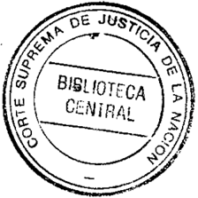
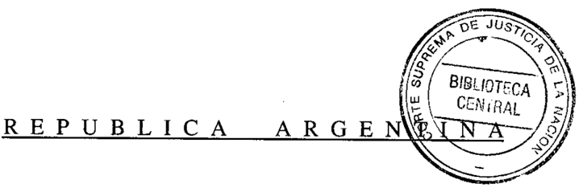
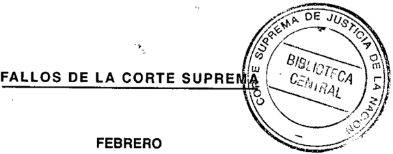
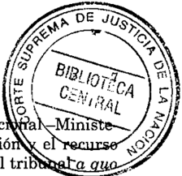
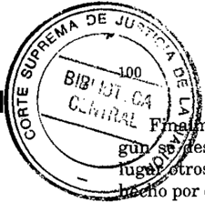
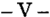
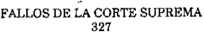
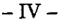

TOMO 327

Volumen 1

2004

## FALLOS DE LA CORTE SUPREMA " DE JUSTICIA DE LA NACION

## FALLOS

DE LA

## CORTE SUPREMA

DE

## JUSTICIA DE LA NACION

PUBLICACION A CARGO DE LA SECRETARIA DE JURISPRUDENCIA DEL TRIBUNAL

TOMO 327 VOLUMEN 1

FEBRER ~l'/:jj1¡\i:.cade la Corte Suprem.1

LA LEY I.f\.t; e L

I

N 9 de ardan

loC¡QII

Ubicación :J). Pq

.-PJfI2~

Tucumán 1471 (1050) Buenos Aires

2004

,;

Corte Suprema de Justicia. Secretaría de Jurisprudencia Fallos de la Corte Suprema de Justicia de la Nación: 327. \_ la ed. - Buenos Aires: Corte Suprema de Justicia de la Nación, 2005.

v. 1, 1616 p. ; 24x16 cm.

ISBN 950-9825-66-2

1. Corte Suprema de Justicia de la Nación-Fallos. 1.Título CDD 347.077

i

J;

",;'

o"

Copyright (e) 2004 by Corte Suprema de JUsticia de la Nación Queda ti"ecli"ü e"faepositó qüe ~previeñela ley 11.723. Impreso en la Argentina Prjnted in Argentina 1.s.B.N. 950-9825-66-2

## INSTITUTO DUPUYTREN DE TRAUMATOLOGIA y ORTOPEDIA S.A. v. NACION ARGENTINA

## RECURSO ORDINARIO DE APELACION' Tercera instancia. Juicios en que la Nación es parte.

Es formalmente admisible el recurso ordinario de apelación deducido contra el pronunciamiento que dispuso la subrogación por parte del Estado Nacional de la deuda que una obra sodal tiene respecto de un sanatorio -en los términos de la ley 24.070-, puesto que se trata de una sentencia definitiva, recaída en una causa en que la Nación es parte y la sustancia económica discutida supera el mínimo €!stablecido por el arto 24, ine. 6, ap. a, del decreto-ley 1285/58, con las modificaciones introducidas por la ley 21.708 y la resolución de la Corte Suprema 1360/91.

## ASOCIACIONES GREMIALES DE TRABAJADORES.

De acuerdo con el arto 8° del decreto 1723/92 -reglamentario de la ley 24.070aunque se hubiera efectuado todo el procedimiento administrativo y se hubieran satisfecho íntegramente los recaudos exigidos, el Estado podía decidir no hacerse cargo de todo o parte del pasivo en cuestión. La norma reglamentaria, que contiene elementos reglados, concibe el ejercicio de la facultad atribuida al mi. nisterio de origen con un claro componente discrecional, no exento en cuanto tal del control de razonabilidad.

## FACULTADES DISCRECIONALES.

Es precisamente la razonabilidad con que se ejercen las facultades discrecionales el principio que otorg~ validez a los ~ctos de los órganos del Estado.

## ASOCIACIONES GREMIALES DE TRABAJADORES.

Corresponde revocar el pronunciamiento que dispuso la subrogación pues, al tiempo en que el prestador presentó el pedido de pronto despacho, aún no se había producido el acto administrativo de aceptación del pasivo y de las intervenciones de'l Estado Nacional en la causa surge que la opinión desfavorable a la subroga. ci6n es definitiva.

6

## ASOCIACIONES GREMIALES DE TRABAJADORES.

- La subrogación sólo opera a partir de la resolución del ministerio de origen que la acepte y sólo a partir de esa aceptación la deuda queda comprendida en los térm~nos de la ley 24.070.

## ASOCIACIONES GREMIALES DE TRABAJADORES.

La negativa dada por el Poder Ejecutivo en ejercicio de sus facultades, no está viciada de arbitrariedad, pues la inclusión de un pasivo exclusivamente financiero dentro del objeto de una medida excepcional, como es la asunción por parte del Estado Nacional de las deudas de otro, no se desprende inequívocamente de la ley 24.070, y la interpretación restrictiva seguida por la administración en un cont.exto de emergencia pública, no resulta inocua o arbitraria.

## ASOCIACIONES GREMIALES DE TRABAJADORES.

La negativa que surge de las opiniones de los órganos administrativos inte'rvinientes, no está viciada de arbitrariedad, pues la inclusión de un pasivo exclusivamente financiero dentro del objeto de una medida excepcional, como es la asunción por parte del Estado Nacional de las deudas de otro, no se desprende inequívocamente de la ley 24,070, y la interpretación restrictiva seguida por la administración en un contexto de emergencia pública, no resulta inocua o arbitraria (Voto de los Dres. Augusto César Belluscio y Carlos S. Fayt).

## FALLO DE LA CORTE SUPREMA

Buenos Aires, 6 de febrero de 2004.

Vistos los autos: "Instituto Dupuytren de Traumatología y Ortopedia S.A. rJ Estado Nacional sI incumplimiento de prestación de obra social".

## Considerando:

. 1º) Que la Cámara Nacional de Apelaciones en lo Civil y Comercial Federal, por su Sala n, revocó lo decidido por el juez de primera instancia y di~puso la .subrogación por parte del Estado Nacional de la deuda que la Obra Social para Empleados de Comercio y Actividades Civiles tiene respecto del Instituto Dupuytren de Traumatología y OrtopediaS.A., con el alcance que precisó en el considerando VI de la

~Ministe rio de Salud\_ dedujo el recurso ordinario de apelación el recurso extraordinario federal. Mediante el auto de fs. 372, el tribuuata qua recurso federal. El Estado Nacional ha fundado su apelación a fs. 378/385 que ha sido contestado por la parte actora mediante el escrito de fs. 388/407 vta. vta.,

2º) Que el recurso ordinario de apelación es formalmente admisible puesto que se trata de una sentencia definitiva, recaída en una causa en que la Nación es parte y la sustancia económica discutida supera el mínimo establecido por el arto 24, inc. 6, ap. a, del decretoley 1285/58, con las modificaciones introducidas por la ley 21.708 y la resolución de esta Corte 1360/91.

3º) Que la actora dirigió su demanda directamente contra el Estado Nacional pues estimó que el silencio de la Administración ante su pedido de pronto despacho había configurado el rechazo tácito de su solicitud de subrogación y que, por tanto, debía disponerse judicialmente la subrogación por el demandado de las obligaciones que OSECAC le adeudaba a su parte, ordenando a la Secretaría de Hacienda proceder al pago de su crédito en la forma y modo prescriptos por la ley 24.070. Esta pretensión fue rechazada por el juez de la primera instancia, quien distribuyó las costas por su orden y las comunes por mitades (fs. 283/287 vta.).

4º) Que para resolver la procedencia de la subrogación en los términos de la ley 24.070, la cámara a quo: a) descartó el argumento basado en la interpretación del arto 1", inc. d, de la ley 23.982; afirmando que la deuda por intereses consolidada al30 dejunio de 1991y pendiente de pago por parte de OSECAC podía recibir tratamiento autónomo y ser considerada dentro de los pasivos incluidos en el régimen de la ley 24.070; b)juzgó que tal posibilidad estaba reconocida en el decreto 1723/92, que en su arto 3", inc. b, ap. IV, hacía mención al detalle de la deuda a valor histórico, considerando el cálculo de la actualización y de los intereses; c) estimó que el alcance del monto a ser subrogado por parte del Estado Nacional debía limitarse a los intereses por pago tardío de facturas que hubiesen vencido en el período de tiempo señalado en el primer párrafo del arto 1"de la ley 24.070, y no debía comprender aquellas facturas que carecían de respaldo documental. De conformidad con estas premisas, la cámara fijó en $ 1.055.406,24 el monto a ser subrogado por el Estado demandado, y

dispuso que el acreedor siguiese el procedimiento de la ley 23.982 para el cobro de deudas consolidadas. En cuanto a las costas, confirmó lo resuelto en la instancia anterior y distribuyó por su orden las de la alzada, en mérito a la naturaleza y a la complejidad de la cuestión litigiosa.

5º) Que en su apelación ordinaria, el Estado Nacional plantea, entre otros, los siguientes agravios: a) conforme a la ley 24.070, su parte no asume cualquier obligación que la obra social tenga con el prestador, sino solamente determinados pasivos, a saber, los "originados en prestaciones médico-asistenciales o destinadas a la subsistencia de los afiliados de aquellas entidades"; en tales rubros no queda comprendida la deuda reconocida por la obra social en un convenio de financiación que había celebrado con el Instituto Dupuytren de Traumatologia y Ortopedia S.A., generada por intereses por pagos atrasados de facturas: y b) la subrogación autorizada por la ley no opera automáticamente sino que es necesario que el Estado Nacional, a través del ministerio involucrado, acepte la solicitud de subrogación, que puede ser resuelta en sentido desfavorable (art. 8º del decreto 1723/92).

6º) Que la ley 24.070 obedeció a la explícita determinación política de sanear determinados pasivos de las obras sociales y de otros agentes del seguro nacional de salud, nacidos con posterioridad al 31 de julio de 1989 y hasta el1 º de abril de 1991, originados "en prestaciones médico-asistenciales o destinados a la subsistencia de los afiliados de aquellas entidades" (art. 1º, tercer párrafo, ley 24.070). En cuanto a los pasivos originados directamente en esos conceptos, pero generados en períodos anteriores y pendientes al31 de julio de 1989 y que no se encontraren prescriptos, el legislador dispuso que el Poder Ejecutivo Nacional "podrá otorgarles los financiamientos necesarios" (arts. 52 a 55 de la ley 23.697). Cabe señalar que el arto 20 de la ley 23.983, que fue observado en el arto 6º del decreto 1652/91, no arroja mayor precisión sobre el origen de la deuda, pues presenta un texto que en este punto fue reproducido en el arto 1º, párrafo tercero, de la ley 24.070, que se debe interpretar.

Por su parte, el decreto 1723/92, reglamentario de la ley 24.070, dice en el arto 3º, al enumerar los recaudos que los sujetos habilitados por el arto 12 de la ley deben presentar ante el ministerio correspondiente: "...b) La documentación que acredite los pasivos cuya subrogación se pretende por parte del Estado Nacional, consistente en: ...IV.

Importe de la deuda a valor histórico y cálculo de la actualización e intereses;.,.",

7') Que del debate parlamentario de la ley 24.070 surge que los legisladores fueron conscientes de que el pasivo involucrado era de monto no determinado y que contenía "el valor de la hiperinflación, de sobre facturaciones y de los plus" y otras deformaciones similares, y que significaba una autorización del Congreso al Poder Ejecutivo sobre montos indeterminados y conun amplio margen de discrecionalidad en manos de este último. En efecto, los señores diputados advirtieron que, conforme al proyecto en discusión, la validez de la subrogación se dejaba al arbitrio de la reglamentación, es decir, en manos del Poder Ejecutivo (conf. Cámara de Diputados de la Nación, sesiones deiS y 9 de octubre de 1991, especialmente intervenciones de los diputados Beltrán -pág. 3603-, Fontela -pág. 3608-, López de Zavalía -pág. 3610-, Durañona y Vedia -pág. 3624-). Ello fue sometido a votación y aprobado en oportunidad de la sanción de la ley 24.070.

Por ello era esencial, conforme al dictamen de las cuatro comisiones que intervinieron, que se garantizara la transparencia en la determinación de la deuda mediante la intervención del ex-Tribunal de Cuentas de la Nación.

Sº) Que del texto del decreto 1723/92 se colige que la pretensión del agente del seguro nacional de salud u obra social podía comprender los íntereses devengados por las deudas directamente originadas por las prestaciones médico-asistenciales y por las prestaciones de subsistencia (conr. arto 3º, b, IV, transcripto en el considerando 6º de esta sentencia), pero que la aceptación de la solicitud por parte del Estado comportaba la conformidad de la Secretaría de Hacienda del Ministerio de Economía y Obras y Servicios Públicos respecto de la cancelación con fondos del Tesoro de los pasivos involucrados, la previa intervención de la Contaduría General de la Nación y del Tribunal de Cuentas para la determinación del monto definitivo de la deuda legitima, y, finalmente, una resolución favorable del ministerio de origen, organismo al que se le reserva la última palabra sobre la solicitud de subrogación. Ello significa que, incluso cuando se hubiera efectuado todo el procedimiento administrativo y se hubieran satisfecho íntegramente los recaudos exigidos, el Estado podía decidir no hacerse cargo de todo o parte del pasivo en cuestión (art. Sº, decreto 1723/92). La norma reglamentaria, que contiene elementos reglados, concibe el

ejercicio de la facultad atribuida al ministerio de origen con un claro componente discrecional, no exento en cuanto tal del control de razonabilidad.

En efecto, es precisamente la razonabilidad con que se ejercen las facultades discrecionales el principio que otorga validez a los actos de los órganos del Estado (doctrina de Fallos: 298:223 considerando 10; 313:153, considerando 6", entre otros).

9") Que el expediente administrativo 19.205-93-4, suficientemente reseñado por el tribunal a qua, da cuenta de los dictámenes contradictorios que se produjeron con motivo de la composición del pasivo presentado por OSECAC, compuesto íntegramente por intereses, habida cuenta de que la deuda de capital, también reconocida en el convenía que corre a fs. 14 bisl16, ya había sido cancelada con fondos provistos por ANSSAL en base a un plan de saneamiento al que se acogió la obra social (conf. fs. 131/132). El hecho es que, al tiempo en que el Instituto Dupuytren de Traumatologia y Ortopedía S.A. presentó el pedido de pronto despacho, aún no se había producido el acto administrativo de aceptación del pasivo y que de las intervenciones del Estado Nacional en esta causa surge que la opinión desfavorable a la subrogación es definitiva.

10) Que esta Corte ha sostenido que la subrogación sólo opera a partir de la resolución del ministerio de origen que la acepte y que sólo a partir de esa aceptación la deuda queda comprendida en los términos de la ley (con£'causa S.643.XXIX."Sanatorio Morano S.A. d Obra Social para Empleados de Comercio y Actividades Civiles si íncidente de ejecución de sentencia y honorarios", fallada el 14 de mayo de 1996, Fallos: 319:786, considerando 4"). En el sub examine corresponde concluir que la negativa dada por el Poder Ejecutivo Nacional en ejercicio de sus facultades, no está viciada por arbitrariedad. Ello es así pues la inclusión de un pasivo exclusivamente financiero dentro del objeto de una medida excepcional, como es la asunción por parte del Estado Nacional de las deudas de otro, no se desprende inequívocamente del texto legal, y la interpretación restrictiva seguida por la administración en un contexto de emergencia pública no resulta inocua o arbitraria.

Por ello, se declara procedente el recurso ordinario de apelación deducido por el Estado Nacional-Ministerio de Salud, se revoca la sentencia de fs. 341/351 y se rechaza la demanda. Las costas del litigio se

distribuyen por su orden y las comunes por mitades, en atención a la dificultad jurídica de la materia (art. 68, segundo párrafo, CódigoProcesal Civil y Comercial de la Nación). Notifíquese y devuélvase.

ENRIQUE SANTIAGO PETRACCHI -AUGUSTO CÉSAR BELLUSCIO (según su voto) CARLOS S. FAYT (según su voto) ANTONIO BOGGIANO -JUAN CARLOS MAQUEDA.

VOTO DEL SEÑOR VICEPRESIDENTE DOCTOR DON AUGUSTO CÉSAR BELLUSCIO y DEL SEÑOR MINISTRO DOCTOR DON CARLOS S. FAYT

## Considerando:

1 º) Que la Cámara Nacional de Apelaciones en lo Civil y Comercial Federal, por su Sala n, revocó lo decidido por el juez de primera instancia y dispuso la subrogación por parte del Estado Nacional de la deuda que la Obra Social para Empleados de Comercio y Actividades Civiles tiene respecto del Instituto Dupuytren de Traumatología y Ortopedia S.A., con el alcance que precisó en el considerando VI de la sentencia. Contra ese pronunciamiento, el Estado Nacional-Ministerio de Saluddedujo el recurso ordinario de apelación y el recurso extraordinario federal. Mediante el auto de fs. 372, el tribunal a qua concedió la apelación ordinaria y tuvo presente la interposición del recurso federal. El Estado Nacional ha fundado su apelación a fs. 378/385 vta., que ha sido contestado por la parte actora mediante el escrito de fs. 388/407 vta .

. 2º) Que el recurso ordinario de apelación es formalmente admisible puesto que se trata de una sentencia definitiva, recaída en una causa en que la Nación es parte y la sustancia económica discutida supera el mínimo establecido por el arto 24, inc. 6, ap. a, del decretoley 1285/58, con las modificaciones introducidas por la ley 21.708 y la resolución de esta Corte 1360/91.

3º) Que la actora dirigió su demanda directamente contra el Estado Nacional pues estimó que el silencio de la Administración ante su pedido de pronto despacho había configurado el rechazo tácito de su solicitud de subrogación y que, por tanto, debía disponerse judicial-

mente la subrogación por el demandado de las obligaciones que OSECAC le adeudaba a su parte, ordenando a la Secretaría de Hacienda proceder al pago de su crédito en la forma y modo prescriptos por la ley 24.070. Esta pretensión fue rechazada por eljuez de la primera instancia, quien distribuyó las costas por su orden y las comunes por mitades (fs. 283/287 vta.).

4º) Que para resolver la procedencia de la subrogación en los términos de la ley 24.070, la cámara a quo: a) descartó el argumento basado en la interpretación del arto 1º, inc. d, de la ley 23.982; afirmando que la deuda por intereses consolidada al30 dejunio de 1991 y pendiente de pago por parte de OSECAC podía recibir tratamiento autónomo y ser considerada dentro de los pasivos incluidos en el régimen de la ley 24.070; b)juzgó que tal posibilidad estaba reconocida en el decreto 1723/92, que en su arto 3º, inc. b, ap. IV, hacía mención al detalle de la deuda a valor histórico, considerando el cálculo de la actualización y de los intereses; c) estimó que el alcance del monto a ser subrogado por parte del Estado Nacional debía limitarse a los intereses por pago tardío de fachiras que hubiesen vencido en el período de tiempo señalado en el primer párrafo del arto 1º de la ley 24.070, y no debía comprender aquellas facturas que carecían de respaldo documental. De conformidad con estas premisas, la cámara fijó en $ 1.055.406,24 el monto a ser subrogado por el Estado demandado, y dispuso que el acreedor siguiese el procedimiento de la ley 23.982 para el cobro de deudas consolidadas. En cuanto a las costas, confirmó lo resuelto en la instancia anterior y distribuyó por su orden las de la alzada, en mérito a la naturaleza y a la complejidad de la cuestión litigiosa.

5") Que en su apelación ordinaria, el Estado Nacional plantea, entre otros, los siguientes agravios: a) conforme a la ley 24.070, su parte no asume cualquier obligación que la obra social tenga con el prestador, sino solamente determinados pasivos, a saber i los "originados en prestaciones médico-asistenciales odestinadas a la subsistencia de los afiliados de aquellas entidades"; en tales rubros no queda comprendida la deuda reconocida por la obra social en un convenio de finanCiación que había celebrado con el Instituto Dupuytren de Traumatologia y Ortopedia S.A., generada por intereses por pagos atrasados de facturas: y b) la subrogación autorizada por la ley no opera automáticamente sino que es neces.ario que el Estado Nacional, a través del ministerio involucrado, acepte la solicitud de subrogación, que puede ser resuelta en sentido desfavorable (art. 8" del decreto 1723/92).

6º) Que la ley 24.070 obedeció a la explícita determinación política de sanear determinados pasivos de las obras sociales y de otros agentes del seguro nacional de salud, nacidos con posterioridad al 31 de julio de 1989 y hasta el1 º de abril de 1991, originados "en prestaciones médico-asistenciales o destinados a la subsistencia de los afiliados de aquellas entidades" (art. 1º, tercer párrafo, ley 24.070). En cuanto a los pasivos originados directamente en esos conceptos, pero generados en períodos anteriores y pendientes al31 de julio de 1989 y que no se encontraren prescriptos, el legislador dispuso que el Poder EjecutivoNacional "podrá otorgarles los financiamientos necesarios" (arts. 52 a 55 de la ley 23.697). Cabe señalar que el arto 20 de la ley 23.983, que fue observado en el arto 6º del decreto 1652/91, no arroja mayor precisión sobre el origen de la deuda, pues presenta un texto que en este punto fue reproducido en el arto 1º, párrafo tercero, de la ley 24.070, que se debe interpretar.

Por su parte, el decreto 1723/92, reglamentario de la ley 24.070, dice en el arto 3º, al enumerar los recaudos que los sujetos habilitados por el arto 1º de la ley deben presentar ante el ministerio correspondiente: "...b) La documentación que acredite los pasivos cuya subrogación se pretende por parte del Estado Nacional, consistente en: ...IV. Importe de la deuda a valor histórico y cálculo de la actualización e intereses; ...",

7°) Que del debate parlamentario de la ley 24.070 surge que los legisladores fueron conscientes de que el pasivo involucrado era de monto no determinado y que contenía "el valor de la hiperinflación, de sobre facturaciones y de los plus" y otras deformaciones similares, y que significaba una autorización del Congreso al Poder Ejecutivo sobre montos indeterminados y con un amplio margen de discrecionalidad en manos de este último. En efecto, los señores diputados advirtieron que, conforme al proyecto en discusión, la validez de la subrogación se dejaba al arbitrio de la reglamentación, es decir, en manos del Poder Ejecutivo (conf. Cámara de Diputados de la Nación, sesiones del 8 y 9 de octubre de 1991, especialmente intervenciones de los diputados Beltrán -pág. 3603-, Fontela -pág. 3608-, López de Zavalía -pág. 3610-, Durañona y Vedia -pág. 3624-). Ello fue sometido a votación y aprobado en oportunidad de la sanción de la ley 24.070.

Por ello era esencial, conforme al dictamen de las cuatro comisiones que intervinieron, que se garantizara la transparencia en la de-

terminación de la deuda mediante la intervención del ex-Tribunal de Cuentas de la Nación.

89) Que del texto del decreto 1723/92 se colige que la pretensión del agente del seguro nacional de salud u obra social podía comprender los intereses devengados por las deudas directamente originadas por las prestaciones médico-asistenciales y por las prestaciones de subsistencia (conf. arto 39 , b, IV, transcripto en el considerando 6 9 de esta sentencia), pero que la aceptación de la solicitud por parte del Estado comportaba la conformidad de la Secretaría de Hacienda del Ministerio de Economía y Obras y Servicios Públicos respecto de la cancelación con fondos del Tesoro de los pasivos involucrados, la previa intervención de la ex-Contaduría General de la Nación y del ex-Tribunal de Cuentas para la determinación del monto definitivo de la deuda legitima, y, finalmente, una resolución favorable del ministerio de origen, organismo al que se le reserva la última palabra sobre la solicitud de subrogación. Ello significa que, incluso cuando se hubiera efectuado todo el procedimiento administrativo y se hubieran satisfecho íntegramente los recaudos exigidos, el Estado podía decidir no hacerse cargo de todo o parte del pasivo en cuestión (art. 8 9 , decreto 1723/92). La norma reglamentaria, que contiene elementos reglados, concibe el ejercicio de la facultad atribuida al ministerio de origen con un claro componente discrecional, no exento en cuanto tal del control de razonabilidad.

En efecto, es precisamente la razonabilidad con que se ejercen las facultades discrecionales el principio que otorga validez a los actos de los órganos del Estado (doctrina de Fallos: 298:223 considerando 10; 313:153, considerando 69 , entre otros).

99 ) Que el expediente administrativo 19.205-93-4, suficientemente reseñado por el tribunal a qua, da cuenta de los dictámenes contradictorios que se produjeron con motivo de la composición del pasivo presentado por OSECAC, compuesto íntegramente por intereses, habida cuenta de que la deuda de capital, tambíén reconocida en el convenio que corre a fs. 14 bis/16, ya había sido cancelada con fondos provistos por ANSSAL en base a un plan de saneamiento al que se acogió la obra social (conf. fs. 131/132). El hecho es que, al tiempo en que el Instituto Dupuytren de Traumatologia y Ortopedia S.A. presentó el pedido de pronto despacho, aún no se había producido el acto administrativo de aceptación del pasivo y que de las intervenciones del Estado

Nacional en esta causa surge que la opinión desfavorable a la subrogación es definitiva.

10) Que esta Corte ha sostenido que la subrogación sólo opera a partir de la resolución del ministerio de origen que la acepte y que sólo a partir de esa aceptación la deuda queda comprendida en los términos de la ley (conf. causa S.643.XXIX."Sanatorio Morano S.A. el Obra Social para Empleados de Comercio y Actividades Civiles sI incidente de ejecución de sentencia y honorarios", fallada el 14 de mayo de 1996 (Fallos: 319:786), considerando 4º). En el sub examine corresponde concluir que la negativa que surge de las opiniones de los órganos administrativos intervinientes no está viciada por arbitrariedad. Ello es así pues la inclusión de un pasivo exclusivamente financiero dentro del objeto de una medida excepcional, como es la asunción por parte del Estado Nacional de las deudas de otro, no se desprende inequívocamente del texto legal, y la interpretación restrictiva seguida por la administración en un contexto de emergencia pública no resulta inocua o arbitraria.

Por ello, se declara procedente el recurso ordinario de apelación deducido por el Estado Nacional-Ministerio de Salud, se revoca la sentencia de fs. 341/351 y se rechaza la demanda. Las costas dellitigío se distribuyen por su orden y las comunes por mitades, en atención a la dificultad jurídica de la materia (art. 68, segundo párrafo, CódigoProcesal Civil y Comercial de la Nación). Notifíquese y devuélvase.

AUGUSTO CÉSAR BELLUSClO -CARLOS S. FAYT.

## RAUL OMAR AGUIRRE LlENDO y OTROS

RECURSO DE QUEJA: Depósito previo.

Al haber sido el beneficio de litigar sin gastos concedido por parte de un juzgado en lo civil y comercial de la Provincia de Córdoba solicitado y otorgado específicamente para la tramitación de la queja, resulta apto para eximir al recurrente del deber de integrar el depósito previsto por el arto 286 del Código Procesal Civil y Comercial de la Nación.

## FALLOS DE LA CORTE SUPREMA 327

## FALLO DE LA CORTE SUPREMA

Buenos Aires, 6 de febrero de 2004.

Autos y Vistos; Considerando:

Que el beneficio de litigar sin gastos concedido a favor de José Horacio Reyna por parte de un juzgado en lo civil y comercial de la Provincia de Córdoba, no contradice la doctrina de Fallos: 274:116 al haber sido solicitado y otorgado específicamente para la tramitación de la presente queja, de tal manera que resulta apto para eximir al recurrente del deber de integrar el depósito previsto por el arto 286 del Código Procesal Civil y Comercial de la Nación.

Por ello, se exime al recurrente del depósito por el que se lo intimara a fs. 38. Hágase saber y estése al archivo alli dispuesto ..

ENRIQUE SANTIAGO PETRACCHI -AUGUSTO CÉSAR BELLUSCIO -ANTONIO BOGGIANO -ADOLFO ROBERTO VAzQUEZ -JUAN CARLOS MAQUEDA.

NILDA BEATRIZ MICHELOUD DE lRACE y OrROS v. OBRA SOCLAL DEL PERSONAL DE LA INDUSTRIA DE LA ALIMENTACION y OTROS

RECURSO DE QUEJA: Trámite.

Corresponde revocar el auto que decretó la caducidad de la instancia de la queja si debido a un asiento erróneamente datado, todas la veces que la parte concurrió a la Mesa de Entradas de la Corte se le informó que el expediente se hallaba a estudio de la secretaría, sin que se le hiciera saber que se había dispuesto el pedido de copias cuyo incumplimiento dio lugar a dicha declaración.

## FALLO DE LA CORTE SUPREMA

Buenos Aires, 6 de febrero de 2004.

Autos y Vistos; Considerando:

- 12 ) Que contra el pronunciamiento de fs. 45, que declaró de oficio la caducidad de la instancia en esta queja, la apelante solicitó su revocación, que resulta formalmente procedente (art. 317 del Código Procesal Civil y Comercial de la Nación).

22 ) Que la parte fundamenta dicho planteo, obrante a fs. 47/47 vta., en la circunstancia de que todas las veces que concurrió a la Mesa de Entradas se le informó que el expediente se hallaba a estudio de la secretaría, sin que se le hiciera saber que se había dispuesto el pedido de copias cuyo incumplimiento dio lugar a la declaración de caducidad.

32 ) Que de los datos asentados en el sistema informático -reproducidos a fs. 50/53 y corroborados por los dichos del jefe de la Mesa de Entradas obrante a fs. 54/54 vta.-, surge que al momento de asignar la queja a la secretaría actuante la Oficina de Adjudicación y Circulación de Causas consignó involuntariamente la fecha 29/4/2203. Este asiento erróneamente datado y que la computadora ordena automáticamente en forma cronológica, hizo que en el detalle de los movimientos de la causa siempre figurase comoúltimo registro que ésta se encontraba en secretaría, defecto que motivó la infonnación equivocada dada a la recurrente cuando consultaba en la Mesa de Entradas sobre el estado de las actuaciones.

- 42 ) Que, por lo expresado, son atendibles las razones expuestas por el peticionario -máxime cuando acreditó haber dejado nota .en el libro de asistencia obrante en la Mesa Gen.eral de Éntradas-, por lo que corresponde la revocación del auto que decretó la caducidad.

Por ello, se resuelve: Hacer lugar a lo peticionado a fs. 47/47 vta., dejar sin efecto lo decidido a fs. 45 y mantener el requerimiento de fs. 44. Notifiquese.

ENRIQUE SANTIAGO PETRAccm -AUGUSTO CÉSAR BELLUSCIO -CARLOS S. FAYT -ANTONIO BOGGIANO -ADOLFO ROBERTO VÁZQUEZ.

## FALLOS DE LA CORTE SUPREMA 327

## FAUSTO SIERRA y OTROS v. ADMINISTRACION GENERAL DE PUERTOS SOCIEDAD DEL ESTADO

## RECURSO DE QUEJA: Trámite.

Si los argumentos aducidos en el recurso extraordinario y mante.nidos en la pre. sentación directa pueden, prima {acie, involucrar cuestiones de orden federal, debe declararse procegente la queja y decretarse la suspensión del curso del proceso, sin que esto implique pronunciamiento sobre el fondo del recurso,

## FALLO DE LACORTE SUPREMA

Buenos Aires, 6 de febrero de 2004.

Vistos los autos: "Recurso de hecho deducido por la demandada en la causa Sierra, Fausto y otros el Administración General de Puertos Sociedad del Estado", pata decidir sobre su procedencia.

- Considerando:

Que atento a que los argumentos aducidos en el recurso extraordinario y mantenidos en esta presentación directa pueden, prima facie, involucrar cuestiones de orden federal, debe declararse procedente la queja y decretarse la suspensión del curso del proceso, sin que este implique pronunciamiento sobre el fondo del recurso (Fallos: 295:658; 297:558; 308:249; 310:2241; 317:1447 y 323:3085, entre otros).

Por ello, con el alcance indicado, se declara procedente el recurso extraordinario y se dispone la suspensión de los efectos de la sentencia del juez de primera instancia de fecha 24 de octubre de 2002 y del pronunciamiento de la Sala II de la Cámara Nacional de Apelaciones del Trabajo del 21 de abril de 2003. Solicítense los autos principales. Oportunamente agréguese la queja al principal. Notifíquese.

ENRIQUE SANTIAGO PETRACCHI -AUGUSTO CÉSAR BELLUSCIO -ANTONlO BOGGIANO -ADOLFO ROBERTO VAzQUEZ -JUAN CARLOS MAQuEDA -E. RAÚL ZAFFARONl.

## DE JUSTICIA DE LA NACION 327

## TURBINE POWER CO. S.A

RECURSO EXTRAORDINARIO: Requisitos comunes. Subsistencia de los requisitos.

Deviene inoficioso que la Corte se expida en la queja que la recurrente dedujo con anterioridad a que el superior tribunal provincial se pronunciara sobre el recurso de apelación, y que se sustentó en la demora de los jueces de la causa en dictar sentencia.

## FALLO DE LA CORTE SUPREMA

Buenos Aires, 6 de febrero de 2004.

Autos y Vistos; Considerando:

Que a fs. 150 Turbine Power Co. S.A. manifiesta que el Superior Tribunal de Justicia de la Provincia de Río Negro se pronunció sobre el recurso de apelación que interpuso contra la sentencia de la Cámara de Apelaciones en lo Civil, Comercial y de Minería de la Segunda Circunscripción de dicha provincia, que había hecho lugar a la medida cautelar requerida por la parte actora.

Que en tales condiciones, deviene inoficioso que esta Corte se expida en la presente queja que la recurrente dedujo con anterioridad a la circunstancia referida en el considerando anterior y que sustentó en la demora de losjueces de la causa en dictar sentencia.

Por ello, se declara que no corresponde emitir pronunciamiento respecto del remedio deducido en autos. Hágase saber y, oportunamente, archívese.

ENRIQUE SANTIAGO PETRACCHI -AUGUSTO CÉSAR BELLUSCIO -CARLOS S. FAYT -ANTONIO BOGGIANO -ADOLFO ROBERTO V ÁZQUEZ JUAN CARLOS MAQUEDA.

## FALLOS DE LA CORTE SUPREMA 327

## FEDERICO LUIS RODRIGUEZ

## JURISDICCION y COMPETENCIA: Conflictos enlrejueces.

Como lo establece el arto 118 del Reglamento para la Justicia Nacional según acordada 5/95, ios magistrados nacionales en lo' correccional están bajo la superintendencia de la Cámara Nacional de Apelaciones en lo Criminal y Co. 'rreccional, más allá del estado en que el proceso se encuentre.

## DICTAMEN DEL PROCURADOR FISCAL

## Suprema Corte:

A mi modo de ver, en la presente incidencia suscitada entre la Cámara Nacional de Casación Penal y la Cámara Nacional de Apelaciones en lo Criminal y Correccional de esta ciudad, concurren circunstancias substancialmente análogas a las que infórmaron mi dictamen del21 de mayo de 2000 en la Competencia Nº 163, L.XXXVII in re ."Fernández, Sergio Omar sIlesiones culposas" (Fallos: 324:3548).

Por las razones allí expuestas, a las que me remito en beneficio de la brevedad;entiendo que esta cuestión remite exclusivamente al análisis de una materia de superintendencia como es precisar a qué tribunal corresponde ejercer esa facultad por delegación de V.E. lo que, considero, constituye una atribución exclusiva de la Corte sin que, de conformidad con su Acordada 69/90 del 29 de noviembre de 1990 (publicada en Fallos: 313:777) y lo dispuesto en el artículo 33, apartado a), de la ley orgánica del Ministerio Público -24.946-, pueda emitir opinión en tal sentido. Buenos Aires, 30 de abril de 2002. Eduardo Ezequiel Casal.

## FALLO DE LA CORTE SUPREMA

Buenos Aires, 6 de febrero de 2004.

Autos y Vistos; Considerando:

1 Q) Que la presente incidencia se suscitó entre la Sala III de la Cámara Nacional de Casación Penal y la Sala Especial de la Cámara

Nacional de Apelaciones en lo Criminal y Correccional, a raíz de la contienda originada entre los Juzgados Nacionales en lo Correccional Nº 10 Y14 por la compensación de esta causa.

2°) Que la Cámara Nacional de Casación Penal consideró que al tratarse de una materia reglamentaria cuya aplicación incumbía al tribunal que ejerce la superintendencia sobre los órganos en conflicto, correspondía la intervención de la Cámara Nacional de Apelaciones en lo Criminal y Correccional (fs. 208). Esta no aceptó tal atribución por considerar relevante el carácter de "tribunales orales" en el que intervenían los magistrados, por lo que a su juicio correspondía que dirimiera el conflicto la Cámara Nacional de Casación Penal (fs.211/212).

3º) Que como lo establece en el arto 118 del Reglamento para la Justicia Nacional según acordada 5/95, los magistrados nacionales en lo correccional están bajo la superintendencia del primero de los mencionados tribunales más allá del estado en que el proceso se encuentre.

Por ello, y oído el señor Procurador Fiscal, se declara que deberá remitirse la presente causa a la Sala Especial de la Cámara Nacional en lo Criminal y Correccional, a sus efectos. Hágase saber a la Sala III de la Cámara Nacional de Casación Penal.

ENRIQUE SANTIAGO PETRACCHI -AUGUSTO CÉSAR BELLUSCIO -CARLOS S. FAYT -ANTONIO BOGGIANO -ADOLFO ROBERTO VÁZQUEZ JUAN CARLOS MAQUEDA.

## JUAN ORLANDO PERAZZOLO v. 1RMA RAMONA ARGÜELLO

JURISDICCION y COMPETENCIA: Competencia ordinaria. Por la materia. Cuestiones civiles y comerciales. Honorarios.

Si el reclamo del letrado se dirige a obtener la retribución acordada mediante un pacto de cuota litis por la labor profesional que desarrolló en sede administrativa y judicial resulta aplicable el arto43, inc. c del decreto.ley 1285/58, norma según la cual la cuestión referente a la relación contractual entre un profesional y su

## FALLOS DE LA CORTE SUPREMA 327

cliente, en la que cabe incluir el cumplimiento de un convenio de honorarios, es materia propia de la justicia nacional en 10 civil.

JURISDICCION y COMPETENCIA: Competencia ordinaria. Por la materia. Cuestiones civiles y comerciales. Honorarios,

El supuesto en que se persigue el cobro de honorarios devengados con motivo de una actuación profesional en un reclamo de reajuste de haberes previs~onales no presenta las notas de conexidad y accesoriedad con la causa principal-aquella en la que el abogado desarrolló su tarea profesional-que podrían eventualmente justificar que el arto43, ine. e, del decreto-ley 1285/58 sea desplazado por la disposición del arto Gil, ine. 1!!del Código Procesal Civil y Comercial de la Nación.

DICTAMEN DEL PROCURADOR GENERAL

,Suprema Corte:

-1-

El Juzgado Nacional en lo Civil Nº 70 Yla Sala II de la Cámara Nacional Federal de la Seguridad Social, por las razones dadas en sus respectivas decisiones, obrantes a fs, 35 y 49, respectivamente, discrepan en torno a su competencia para entender en la presente causa,

El titular del Juzgado Civil entendió q)Ie el presente juicio tenía conexión en sentido procesal con lo substanciado, por apelación ante la Cámara Federal de la Seguridad Social, respecto del reajuste de haberesjubilatorios solicitado ante la Caja Nacional de Previsión para el Estado y Servicios Públicos. Recibidas las actuaciones los magistrados de la Cámara Federal de la Seguridad Social, resistieron la radicación del presente.

En tales condiciones, quedó trabado un conflicto negativo de competencia que corresponde dirimir a V.E. en los términos del arto 24, inciso 7º, del decreto-ley Nº 1285/58, texto según ley 21.708.

-II-

En este contexto, cabe precisar que la presente acción fue iniciada solicitando el cobro de honorarios devengados por trámites realizados

ante la que fuera la Caja Nacional de Previsión para el Estado y Servicios Públicos, donde el actor, en su carácter de apoderado del esposo de la demandada, intentó obtener el reajuste de haberes previsionales con resultado negativo. Apelada la decisión administrativa ante la Cámara Federal de la Seguridad Social, la Sala II dictó sentencia favorable, no habiendo fijado honorario alguno por dichas actuaciones (v. fs. 11).

El actor se presenta en autos invocando un convenio realizado con el Centro de Jubilados y Pensionados de Fabricaciones Militares, entidad de la que, según manifiesta, era socioel poderdante y en el cual se estipulaban los honorarios del letrado, para trámites comoel que éste llevó a cabo, fijándose en aquel convenio un porcentaje del 20% del monto a cobrar por el socio.

Abara bien, es criterio reiteradamente establecido por esta Corte que las demandas por cobro de honorarios judicialmente regulados deben considerarse un incidente del proceso donde se han causado, por lo que su conocimiento ha de promoverse ante el mismo juez que entendió en los autos principales, a quien compete, por consiguiente, todo cuando concierne a las retribuciones por trabajos profesionales. Razones de conveniencia práctica y economía procesal así lo aconsejan, dado su accesoriedad y conexión respecto de la cuestión central (Fallos: 127:394; 136:366 y precedentes allí citados; 302~ 1608; artículo 6º inciso 1º del Código Procesal Civil y Comercial de la Nación, aplicable al caso por no resultar incompatible con el procedimiento reglado en la ley 18.345 -art.155 de ellay más recientemente 311:863).

Estos precedentes resultan a mi modo de ver aplicables al sub lite en cuanto a los honorarios que se reclaman y que son producto de la actuación del actor ante la Cámara Federal de la Seguridad Social criterio que encuentra apoyo en lo dispuesto por el arto 14 de la ley 21.839. Empero, toda vez que en la actualidad se encuentra en funcionamiento la Justicia Federal de Primera Instancia de la Seguridad Social y que la competencia de la Cámara del fuero es de grado, atento la facultad de esta Corte de otorgar el conocimiento de las causas a los jueces realmente competentes para entender en ellas aunque no hubiesen sido parte en la contienda (Fallos: 301:728, entre otros), en cuanto a la tarea desarrollada por el letrado en el ámbito administrativo, en virtud de que la materia del reclamo se vincula expresamente con diligencias realizadas en el marco del derecho de la seguridad social y que a los magistrados de dicho fuero corresponde el conocimiento de

las causas que atañen a la llamada clase pasiva, soy de opinión que V.E. debe declarar competente para dicha regulación a la Justicia Federal de Primera Instancia de la Seguridad Social.

Asimismo, establecido el monto que servirá de base regulatoria, deberán elevarse las actuaciones a la Sala II de la Cámara Federal de la Seguridad Social para que la misma fije los honorarios por la actividad desarrollada ante ella oportunamente.

Solicito que con tal alcance se tenga por evacuada la presente vista. Buenos Aires, 7 de octubre de 2003. Nicolás Eduardo Becerra.

## FALLO DE LA CORTE SUPREMA

Buenos Aires, 6 de febrero de 2004.

Autos y Vistos; Considerando:

- 1 º) Que el doctor Juan Orlando Perazzolo promovió, ante el Juzgado Nacional de Primera Instancia en lo Civil Nº 70, una acción tendiente al cobro de los honorarios devengados con motivo de su actuación profesional en un reclamo de reajuste de haberes previsionales que obtuvo sentencia favorable. El actor fundó su derecho en un convenio celebrado con el Centro de Jubilados y Pensionados de Fabricaciones Militares de Villa María -Provincia de Córdobaen el que se habría pactado el 20% de las sumas que con retroactividad percibiera el jubilado.
- 22 ) Que el juzgado entendió que el presente juicio tenía conexión en sentido procesal con aquel en base al cual se reclamaban los honorarios y que, por lo tanto, debía entender el mismo juez que había intervenido en el principal. En ese orden de ideas, se declaró incompetente y remitió las actuaciones a la Cámara Nacional de Apelaciones de la Seguridad Social.
- 3º) Que, por su parte, la Cámara Nacional de Apelaciones de la Seguridad Social también se declaró incompetente, pues entendió que

la cuestión que se ventilaba en el juicio estaba regida por normas de derecho común y que resultaba competente la justicia nacional en lo civil cuando, como en el caso, la causa se refiere a las relaciones contractuales entre profesionales y sus clientes.

- 4º) Que, en tales condiciones, quedó trabado un conflicto negativo de competencia que corresponde dirimir a esta Corte, en los términos del arto 24, inc. 7ºdel decreto-ley 1285/58, texto según ley 21.708.
- 5º) Que del examen de los términos de la demanda, a cuya exposición de hechos cabe atender de modo principal para determinar la competencia (Fallos: 306:1056; 308:229, entre otros), el reclamo del letrado se dirige a obtener la retribución, acordada mediante un pacto de cuota litis, por la labor profesional que desarrolló en sede administrativa y judicial.
- 6º) Que en tales condiciones resulta aplicable el arto 43, inc. c del decreto-ley 1285/58, norma según la cual la cuestión referente a la relación contractual entre un profesional y su cliente, en la que cabe incluir el cumplimiento de un convenio de honorarios, es materia propia de ia justicia nacional en lo civil. .
- 7º) Que, por último, el supuesto de autos no presenta las notas de conexidad y accesoriedad con la causa principal (es decir, aquella en la que el abogado desarrolló su tarea profesional) que podrían eventualmente justificar que el arto 43, inc. c del decreto-ley 1285/58 sea desplazado por la disposición del arto 6º, inc. 1º del Código Procesal Civil y Comercial de la Nación.

Por ello, oído el señor Procurador General de la Nación, se declara que resulta competente para entender en las actuaciones el Juzgado Nacional de Primera Instancia en lo Civil Nº 70, al que se le remitirán. Hágase saber a la Sala II de la Cámara Nacional de Apelaciones de la Seguridad Social.

ENRIQUE SANTIAGO PETRACCHI -AUGUSTO CÉSAR BELLUSCIO -CARLOS S. FAYT -ANTONIO BOGGIANO -ADOLFO ROBERTO VÁZQUEZ JUAN CARLOS MAQUEDA.

## FALLOS DE LA CORTE SUPREMA 327

## ATlLANA RODRIGUEZ v. PODER EJECUTIVO'NACIONAL

JURISDICCION y COMPETENCIA: Competencia federal. Por la materia. Causas regidas por normas federales.

La emergencia, así como las normas dictadas en su consecuencia, deben ser exa. \_ minadas en cada caso mediante la aplicación de los preceptos y principios de la rama del derecho que rija la relación que vincula a las partes en conflicto y por los jueces que, por su especial idoneidad en la materia, se encuentran en mejores condiciones para resolver la cuestión de fOlido.

- -Del dictamen de la Procuración General, al que remitió la Corte Suprema-o

JURISDICCION y COMPETENCIA: Competencia federal. Por la materia. Causas regidas por normas federales.

Si la aetora no pretende recuperar los fondos depositados en la entidad bancaria -indisponibles por aplicación del decreto 1570/01 y sus normas concordantes-, porque ya pudo percibirlos, sino que reclama la diferencia entre las sumas resul. tantes de la "pesificacióJ;l" forzosa y las que surgen de los términos de los contratos que pactó con el banco, la adecuada solución del pleito requiere la interpretación y aplicación de normas del derecho privado, así como también la intervención de los tribunales especializados en temas contractuales y bancarios, por lo que corresponde que sea la justicia en lo civil y comercial federal la que continúe con el trámite de las actuaciones.

:-Del dictamen de la Procuración General, a.l que remitió la Corte Suprema-o

DICTAMEN DEL PROCURADOR GENERAL

## Suprema Corte:

-1-

La presente contienda negativa de competencia se origina en la demanda promovida por Atilana Rodríguez contra el Bank Boston NA, a fin.de obtener que cumpla íntegramente el contrato que celebró con esa entidad financiera y así poder cobrar, en dólares estadounidenses, el saldo de la suma devuelta en menos debido a la "pesificación" forzosa, Se funda en diversas normas de la Constitución Nacional, de los Códigos Civil y de Comercio y en la ley 25.587 y concordantes.

A fs. 19/20, el titular del Juzgado Nacional en lo Comercial N. 16 se declaró incompetente, en virtud de lo dispuesto por el arto 6. de la ley 25.587 y decidió remitir las actuaciones a lajusticia nacional en lo civil y comercial federal, que también se inhibió de entender en la causa, con fundamento en que la relación jurídica que vincula a las partes es de naturaleza comercial, a lo cual añadió que la competencia federal es restrictiva y de excepción.

A su turno, la Cámara Nacional de Apelaciones en lo Comercial (Sala C) resolvió que el fuero competente es el contencioso administra­ tivo federal, al considerar que por razones de distribución de tareas -acordada 1112002 de la Corte Suprema de Justicia y arto 32 del de­ creto-ley 1285/58- es razonable unificar la decisión de estas causas en el fuero mencionado (v. fs. 41142).

Por su parte, el titular del Juzgado Nacional en lo Contencioso Administrativo Federal N. 8, decidió elevar las actuáciones a la Corte Suprema, en la inteligencia de que este Tribunal eS el único que puede atribuir competencia a un tercer magistrado que no intervino en la contienda (v. fs. 46).

-III-

En tales condiciones, sin perjuicio de las limitaciones a las faculta­ des que otorga el arto 24, inc. 7", del decreto-Iey 1285/58 a la cámara del juez que previno, entiendo que se ha suscitado una contienda de competencia que corresponde dirimir a V.E., en virtud de las conside­ raciones efectuadas en la sentencia del 12 de diciembre de 2002, in re Competencia NO 523.XXXVllI. "Cabrera Castilla de Olazábal, Patricia el Poder Ejecutivo Nacional si amparo".

-IV-

Creo oportuno recordar que, si bien para determinar la competen­ cia corresponde atender de modo principal a la exposición de los he­ chos que el actor hace en la demanda, y después, sólo en la medida que se adecue a ello, al derecho que invoca como fundamento de la preten­ sión (Fallos: 323:470 y 2342; 325:483, entre otros).

A mi modo de ver, de dicha exposición se desprende que, en el sub lite, la aetora no pretende recuperar los fondos depositados en la enti­ dad bancaria -indisponibles por aplicación del decreto 1570/01 y sus normas concordantes-, porque ya pudo percibirlos, sino que reclama la diferencia entre las sumas resultantes de la 'pesificación" forzosa y las que surgen de los términos de los contratos que pactó con el banco. En tales condiciones, considero que la adecuada solución del pleito requiere la interpretación y aplicación de normas del derecho privado, así como también la intervención de los tribunales especializados en temas contractuales y bancarios, los que deberán evaluar de qué modo las normas impugnadas inciden en el contrato que los vincula.

Al respecto cabe señslar que, en el dictamen de este Ministerio Público del 4 de marzo de 2003, in re Competencia N° 748.xxxvIll. "Viejo Roble S.A. d Bank Boston NA si acción meramente declarativa" (Fallos: 326:4019) (que fue compartido por la Corte en su sentencia del 30 de septiembre de este afta), se sostuvo que la emergencia, así como las nonnas dictadas en su consecuencia, deben ser examinadas en cada caso mediante la aplicación de los preceptos y principios de la rama del derecho que rija la relación que vincula a las partes en con­ flicto y por los jueces que, por su especial idoneidad en la materia, se encuentran en mejores condiciones para resolver la cuestión de fondo.

En virtud de las consideraciones allí expuestas, opino que en el presente proceso se configura la segunda de las hipótesis reseñadas en el acápite VII del aludido dictamen y, por lo tanto, que corresponde devolver las actuaciones al Juzgado Nacional en lo Civil y Comercial Federal N° 2, a fin de que continúe con el trámite de las actuaciones. Buenos Aires, 9 de diciembre de 2003. Nicolás Eduardo Becerra.

## FALLO DE LA CORTE SUPREMA

Buenos Aires, 6 de febrero de 2004.

## Autos y Vistos:

De conformidad con lo dictaminado por el señor Procurador GLYPH(cmap:df00)ene­ ral, se declara que resulta competente para seguir conociendo en las

I

DEJUSTICIA DE LA NACION

29

actuaciones el Juzgado Nacional de Primera Instancia en lo Civil y Comercial Federal N° 2, al que se le remitirán.

ENRIQUE SANTIAGLYPH(cmap:df00)O PETRAccm - AUGLYPH(cmap:df00)USTO CIlSAR BELLUSCIO - ANTONIO BOOGLYPH(cmap:df00)IANO -ADOLFO RoBERTO VAzQUEZ - JUAN CARLOS MAQUEDA.

## MARIA CLARA BONGLYPH(cmap:df00)IANINO v. ANSES

RECURSO ORDINARIO DEAPELACION: Seguridad social.

Corresponde confirmar el pronunciamiento que rechazó la demanda dirigida a obtener el beneficio de pensión derivada del fallecimiento del hermano si el mis­ mo fue debidamente fundado en la legislación aplicable según 1&amp; cual correspon­ de dicho derecho siempre que no se gozara de beneficio previsional o graciable, salvo que se opte por la pensión que acuerda la ley (art. 26. me. 51, de la ley 18.038), norma cuya validez constitucional no ha sido cuestionada por la ape. tanteo

## FALLO DE LA CORTE SUPREMA

Buenos Aires, 6 de febrero de 2004.

Vistos los autos: "Bongianino, María Clara dANSeS si pensiones".

Considerando:

lO) Que contra el pronunciamiento de la Sala 1 de la Cámara Fede­ ral de la Seguridad Social que confirmó el fallo de la instancia anterior que habla rechazado la demanda dirigida a obtener el beneficio de pensión derivada del fallecimiento de su hermano, la actora dedujo recurso ordinario de apelación que fue concedido y resulta formalmen­ te admisible (art. 19 de la ley 24.463).

20) Que no obstante haber tenido por reconocida tanto la incapaci­ dad laboral de la recurrente como el haber estado a cargo de su her-

4

mano fallecido, la cámara consideró que no correspondía el otorga­ miento de la pensión sobre la base de que el art. 26, inc. 5., de la ley 18.038, requería para ello que se efectuase la opción entre la jubila­ ción por invalidez que se encontraba percibiendo y el beneficio solici­ tado. Frente a ello, ordenó al organismo previsional conceder a la peti­ cionaria la posibilidad de efectuar la mencionada opción en el plazo de 30 días.

3.) Que la interesada reitera argumentos planteados en instan­ cias anteriores relativos a la situación angustiante por la que atravie­ sa y al desequilibrio esencial que produce en su economía imponerle el ejercicio de la opción establecida en el citado arto 26, al tiempo que cita jurisprudencia que no guarda relación con la causa. Dichos planteos nojustifican la modificación del fallo, que ha sido debidamente fundado en la legislación aplicable según la cual corresponde el derecho a la pensión derivada del fallecimiento del hermano siempre que no se gozara de beneficio previsional o graciable, salvo que se opte por la pensión que acuerda la ley, norma cuya validez constitucional no ha sido cuestionada por la apelante.

Por ello, se confirma el fallo recurrido. Costas por su orden (art. 21 de la ley 24.463). Notifíquese y devuélvase.

ENRIQUE SANTIAGLYPH(cmap:df00)O I'ETRAccm - AUGLYPH(cmap:df00)USTO CÉSAR BELLUSCIO - ANTONIO BOGLYPH(cmap:df00)GLYPH(cmap:df00)IANO -ADoLFO RoBERTO VÁZQUEZ - JUAN CARLOS MAQUEDA.

## NAZARENO BRUZESI v. ANSES

RECURSO ORDINARIO DE APELACION: Seguridad social.

Corresponde revocar la sentencia que confirmó la reducción del haberjubilatorio si la ANSeS no podía invocar genéricamente la existencia de un "error de cómpu­ to de servicios en relación de dependencia", sino que debía indicar expresamente en qué consistía dicha equivocación, ya que dicha omisión resta fundamento vá­ lido a la resolución revocatoria y produce una violación al derecho de defensa del administrado.

,

## PROCEDIMIENTO ADMINISTRATIVO ..

El arto 15 de la ley 24.241 constituye una excepción a lo dispuesto por el arto 17 de la Ley de Procedimientos Administrativos, en tanto amplía las facultades de la administración en materia de revisión de sus propios actos e indica que sólo es procedente cuando exista una nulidad absoluta y manifiesta que resulte de he. chos probados, como únicos presupuestos que habilitan la vía para anular un acto.

## ACTOS ADMINISTRATIVOS.

Los actos administrativos firmes que provienen de autoridad competente y satisfacen todos los requisitos de forma, se han expedido sin grave error de derecho y en uso regular de facultades regladas, no pueden ser anulados por la autoridad de la cual emanan, salvo que hayan sido dictados sobre la base de presupuestos fácticos manifiestamente irregulares reconocidos o fehacientemente comprobados.

## FALLO DE LA CORTE SUPREMA

Buenos Aires, 6 de febrero de 2004.

Vistos los autos: "Bruzesi, Nazareno d ANSeS sI cargo contra beneficiario".

## Considerando:

1 Q) Que contra la sentencia de la Sala 1de la Cámara Federal de la Seguridad Social que, al revocar parcialmente la de primera instancia, confirmó la resolución administrativa que había dispuesto una reducción del haber jubilatorio del titular y la dejó sin efecto en cuanto había formulado cargos por sumas indebidamente percibidas, la representante de la ANSeS y el actor dedujeron sendos recursos ordinarios, que fueron concedidos y resultan formalmente admisibles (art. 19 de la ley 24.463).

2 Q ) Que para resolver de ese modo el a quo consideró que el organismo administrativo tenía la facultad de efectuar las correcciones necesarias en el monto del beneficio, ya que había constatado la existencia de un error en el cómputo del tiempo de servicios prestados en relación de dependencia. Señaló también que no había sido violado el

derecho de defensa del jubilado porque se le había dado la oportunidad para que formulara los descargos que estimara pertinentes.

- 3º) Que el actor sostiene que la cámara omitió tratar aspectos conducentes a la solución del caso, pues la demandada no había logrado probar fehacientemente la existencia de vicio alguno en el acto que concedió el beneficio, por lo que resulta improcedente la vía elegida por la administración para revocarlo.
- 4º) Que el agravio es fundado en ese aspecto. La ANSeS no podía invocar genéricamente la existencia de un "errorde cómputo de servicios en relación de dependencia", sino que debía indicar expresamente en qué consistía dicha equivocación, por lo que la referida omisión resta fundamento válido a la resolución revocatoria y produce una violación al derecho de defensa del administrado. '
- 5º) Que la declaración de voluntad que se expresa en un acto administrativo aparece comoun conjunto de formalidades que no han respetado en debida forma el derecho de defensa, pues lo manifestado por el beneficiario al momento de formular su descargo, en el sentido de que no se le permitió tomar vista de las actuaciones y de que el empleado que lo atendió se limitó a hacerle entrega de fotocopias del trámite, no ha merecido refutación por parte de la ANSeS y pone de manifiesto que existió la irregularidad de procedimiento invocada (fs. 84 y 85/109 del expediente administrativo 997-5069107-9-01).
- 6º) Que ello es así pues la demandada no ha posibilitado al apelante ejercer en plenitud su derecho a ser oído y producir prueba en su descargo, comotampoco ha podido hacer valer todos los medios conducentes a su defensa de conformidad con las leyes de procedimiento administrativo, por lo que resulta claro que se ha lesionado el debido proceso adjetivo.
- 7º) Que el arto 15 de la ley 24.241 constituye una excepción a lo dispuesto por el arto 17 de la Ley de Procedimientos Administrativos, en tanto amplía las facultades de la administración en materia de revisión de sus propios actos e indica que sólo es procedente cuando exista una nulidad absoluta y manifiesta que resulte de hechos probados, como únicos presupuestos que habilitan la vía para anular un acto.

8")Que, por lo demás, el Tribunal tiene decidido que los actos administrativos firmes que provienen de autoridad competente y satisfacen todos los requisitos de forma, se han expedido sin grave error de derecho y en uso regular de facultades regladas, no pueden ser anulados por la autoridad de la cual emanan, salvo que haya sido dictado sobre la base de presupuestos fácticos manifiestamente irregulares reconocidos ofehacientemente comprobados (Fallos: 265:349; 277:205; 303:1684, entre muchos otros), supuesto que no se presenta en autos.

9")Que en cuanto a los restantes planteos de la parte, corresponde desestimar los que hacen a la validez de los descuentos previstos por la ley 25.453, pues no han sido materia de debate y la cuestión resulta ajena a las resueltas en ambas instancias.

10) Que los agravios de la demandada no pueden prosperar en tanto se vinculan con una supuesta decisión de la alzada en materia de reajuste de haberes, cuestión que no ha sido materia del juicio y no guarda relación directa con lo resuelto, lo que justifica declarar la deserción del recurso intentado.

Por ello, se declara desierto el recurso de apelación de la ANSeS, procedente el del actor y se confirma la sentencia de primera instancia. Costas por su orden (art. 21, ley 24.463). Notifíquese y, oportunamente, remítase.

ENRIQUE SANTIAGO PETRACCHI -AUGUSTO CÉSAR BELLUSCIO -CARLOS S. FAYT -ANTONIO BOGGIANO -ADOLFO ROBERTO VÁZQUEZ JUAN CARLOS MAQUEDA.

## COMPAÑIA INTEGRAL DE MONTAJE S.A. v. NUCLEOELECTRICA ARGENTINA S.A.

RECURSO EXTRAORDINARIO: Requisitos propios. Sentencia definitiva. Resoluciones anteriores a la sentencia definitiva. Juicios de apremio y ejecutivo.

Es formalmente admisible el recurso extraordinario deducido contra el pronunciamiento que rechazó la ejecución promovida contra la sociedad Nucleoeléctríca Argentina S.A. (NASA), con el propósito de obtener el cobro de una suma de

- dinero que había reconocido el Tribunal Arbitral de Obras Públicas, si, al carecer la aetora de otro medio y oportunidad aptos para plantear la pretendida exclusión de la deuda reclamada del régimen de consolidación, la decisión re~urrida es equiparable a la sentencia definitiva de la causa y la interpretación de los preceptos federales en juego ~así como la de los hechos inescindiblemente unidos a aquéllaha sido adversa a las pretensiones que en ellos funda la apelante (art. 14, inciso 31&lt;, de la ley 48).

## CONSOLIDACION.

- La sociedad Nucleoeléctrica Argentina S.A. debe ser comprendida en las disposiciones del arto 22 de la ley 23.982, aseveración que se sustenta en el contenido del decreto 1540/94 que creó aquella sociedad y en el de sus estatutos de constitución.

## CONSOLlDACION.

En atención a las características de la sociedad -en especial, el grado de participación estatal en el capital y en la formación de las decisiones societarias-, el hecho de que NASA no encuadre en el concepto de "sociedad anónima con participación estatal mayoritaria" en los términos y con los alcances de los arts. 308 y siguientes de la ley 19.550, no conduce a excluirla del régimen de la ley 23.982, pues ello responde a un criterio de interpretación gramatical del texto legal que no condice con la adecuada interpretación de las disposiciones dictadas por el legislador en el marco de la consolidación.

## LEY: Interpretación y aplicación.

Es propio de la interpretación indagar lo que las leyes dicen jurídicamente, sin que esto signifique apartarse del texto legal, pero tampoco sujetarse rigurosamente a él cuando la interpretación razonable y sistemática así lo requiere, por lo que ella debe practicarse teniendo en cuenta el contexto general y los fines que informan a aquéllas.

## CONSOLIDACION.

La voluntad del legislador que sancionó la ley 23.982 fue la de abarcar un amplio universo de deudas.

## CONSOLIDACION.

Si se interpretara que los créditos correspondientes a la sociedad demandada -Nucleoeléctrica Argentina S.A.~ se hallan excluidos del régimen de la ley 23.982, se admitiría la sinrazón de que quedarían comprendidas en el arto 2 2 de esa nor. ma las deudas de una sociedad anónima con participación estatal de al menos el

51%del capital social, v.gr. el 70%o elBO%de aquél (art. 30B de la ley 19.550) y no las de una entidad como la demandada, en la que esa participación es del 100%.

## CONSOLlDACION.

Si el Ministerio de Economía, al aprobar el presupuesto de gastos para el año 2002 de las empresas y sociedades pertenecientes mayoritariamente al Estado Nacional incluyó en esta categoría, entre otras, a la sociedad Nucleoeléctrica Argentina S.A. (art. 1!l, resolución M.E. 61/02, B.O. del 22/4/02), no debe considerársela excluida del régimen de la ley 23.9B2.

## DICTAMEN DEL PROCURADOR GENERAL

## Suprema Corte:

-1-

Afs. 337/339, la Sala IV de la Cámara Nacional de Apelaciones en lo Contencioso Administrativo Federal confirmó la sentencia de la instancia anterior, que había rechazado el"proceso de ejecución promovido por la actora contra Nucleoeléctrica Argentina S.A. (NASA, en adelante), al considerar que esta entidad se encuentra incluida en el arto 2º de la ley 23.982 y que, al ser la deuda posterior al1 º de abril de 1991, queda comprendida en los términos del arto 22 de dicha ley. Agregó que la particular conformación de la demandada -el Estado Nacional es titular del 99% del paquete accionario y sus directores son designados a propuesta del Ministerio de Economía y Obras y Servicios Públicos de la Naciónimpide que sea asimilada a una sociedad del derecho común.

-II-

Disconforme con este pronunciamiento, la actora dedujo el recurso extraordinario de fs. 342/408, con fundamento en que no es ninguno de los entes que se encuentran comprendidos. en el arto 2º de la Ley de Consolidación de Deudas, sino que se trata de una simple sociedad anónima.

Al respecto, señala que las deudas de NASAno recaen en el Tesoro Nacional, empresa que no está incluida en el presupuesto anual que aprueba el Congreso Nacional, sino que sus ingresos proceden de la comercialización de energía en el mercado mayorista junto al resto de los generadores. Agrega que, tanto el decreto 1540/94, comoel Estatuto Social de NASA, establecieron su constitución de acuerdo al régímen del Capítulo n, Sección V, arts. 163 a 307 de la ley 19.550 y destaca las diferencias que existen entre la configuración y funcionamiento de NASA y los otros tipos de sociedades, en particular, la sociedad anónima con participación estatal mayoritaria.

-III-

Considero que el recurso interpuesto es formalmente admisible, toda vez que se halla en juego la aplicación e inteligencia de normas de naturaleza federal -leyes 23.982 y 25.344 y decreto 1540/94Yla decisión del superior tribunal de la causa -a la que cabe atribuir el carácter de definitiva, por cuanto los agravios constitucionales que se invocan no son susceptibles de reparación ulteriorfue contraria a las pretensiones de la apelante. Por otra parte, advierto que la Corte, al establecer la inteligencia de normas de tal naturaleza, en los términos del arto 14, inc. 3º, de la ley 48, no se encuentra limitada por las posiciones del tribunal inferior y del recurrente, sino que le incumbe realizar una declaratoria sobre el punto disputado, según la interpretación que rectamente le otorga (Fallos: 322:1616, entre otros).

Alos efectos de dilucidar si resulta procedente la ejecución promovida por la actora o si deben seguirse los trámites previstos por la ley 23.982 para la percepción del crédito que se pretende en autos, se requiere interpretar el arto 2º de dicha ley, el cual enumera los sujetos comprendidos en su régimen -entre los que no se encuentra mencionada en forma expresa la sociedad demandadae incluye las obligaciones de otros entes "en la medida en que recaigan sobre el Tesoro Nacional", Cabe recordar, en esta tarea, que V.E. tiene reiteradamente dicho que es propio de la interpretación indagar lo que las leyes dicen jurídicamente, sin que esto signifique apartarse del texto legal, pero tampoco sujetarse rigurosamente a él cuando la interpretación razonable y sistemática así lo requiere, por lo que ella debe practicarse

teniendo en cuenta el contexto general y los fines que informan a aquéllas. Esto es así, ya que, en definitiva, la primera regla en materia consiste en dar pleno efecto a la intención del legislador (Fallos: 312:2075). Asimismo, ha dicho que no debe prescindirse de las consecuencias que derivan de cada criterio, pues ellas constituyen uno de los índices más seguros para verificar su razonabilidad y su coherencia con el sistema en que está engarzada la norma (Fallos: 303:917; 307:2200, entre otros).

Sobre la base de tales pautas, corresponde señalar una serie de caracteres de suma particularidad que, a mi modo de ver, resultan conducentes para resolver la cuestión planteada, a saber: 1) NASA es una sociedad anónima constituida por el decreto 1540/94 con el objeto de transferir al sector privado la actividad de generación nucleoeléctrica vinculada a determinadas centrales nucleares, que se rige por los arts. 163 a 307 y concordantes de la ley 19.550. Sin embargo, el titular de la totalidad del paquete accionario, hasta tanto se privatice, es el Estado Nacional (v. modo de suscripción e integración de las acciones y la designación de sus directores y síndicos en el Estatuto, fotocopia obrante a fs. 69/84); 2) solventa sus gastos operativos y de mantenimiento con fondos propios, provenientes de su actividad comercial, esto es, la comercialización de energía en el mercado eléctrico mayorista, según afirmaciones de la actora que no fueron controvertidas por NASA, sin embargo, también recibe aportes a través de la Secretaría de Energía de la Nación; 3) sus erogaciones no se encuentran contempladas en el Presupuesto General de la Nación, pero el Ministerio de Economía aprueba anualmente su presupuesto, en virtud de lo dispuesto por el arto 49 de la ley 24.156 y su decreto reglamentario 1361/94 (v. resoluciones nros. 584/97 y 1028/98 del Ministerio de Economía, que corresponden a los ejercicios financieros 1997y 1998,respectivamente).

Habida cuenta de ello, resulta claro que la sola circunstancia de que NASA sea una sociedad anónima que, en la actualidad, al no haberse llevado a cabo aún su privatización, pertenece en su totalidad al Estado Nacional, no habilita a encuadrarla en el arto 2º de la Ley de Consolidación de Deudas, puesto que ésta exige, además, que la condena constituya una obligación "que recaiga en el Tesoro Nacianal". En este sentido, estimo que procede la ejecución del crédito que reclama la actora en el sub lite, siempre que pueda ser atendido con fondos provenientes de la actividad comercial de la organización empresarial demandada. Si ello no fuera posible y, eventualmente, para la cance-

lación total oparcial se requiriera acudir a los fondos del tesoro afectados a la ejecución del presupuesto general de la Nación, deberán seguirse los procedimientos establecidos por las normas de consolidación.

A mi modo de ver, esta solución es la que se ajusta al texto de la norma, sin perjuicio de que la disponibilidad de recursos suficientes constituya una cuestión de hecho y prueba que será dirimida por los jueces de la causa pues resulta ajena, en principio, a esta instancia extraordinaria. Asimismo, toda vez que las sentencias de la Corte deben atender a las circunstancias existentes al momento de la decisión, aunque ellas sean sobrevinientes E;lla, interposición del recurso extraordinario (Fallos: 307:2483; 312:891; 313:701, entre muchos otros), cabe señalar que, en caso de que la condena tuviera que, ser satisfecha con fondos del Tesoro Nacional, sería aplicable la ley 25.344, por ser de orden público y porque, en lo que aquí interesa, no modifica el criterio expuesto (v. obligaciones incluidas y excluidas expresamente por el arto 13).

-V-

Por todo lo expuesto, opino que corresponde hacer lugar al recurso extraordinario interpuesto y dejar sin efecto la sentencia apelada. Buenos Aires, 30 de abril de 2003. Nicolás Eduardo Becerra.

## FALLO DE LA CORTE SUPREMA

Buenos Aires, 10 de febrero de 2004.

Vistos los autos: "Compañía Integral de Montaje S.A.c1Nucleoeléctrica Argentina S.A. sI proceso de ejecución".

## Considerando:

1 º) Que la Sala II de la Cámara Nacional de Apelaciones en lo Contencioso Administrativo Federal confirmó la decisión de primera instancia que había rechazado el juicio ejecutivo promovido por la

empresa Compañía Integral de Montaje S.A. contra la sociedad Nucleoeléctrica Argentina Sociedad Anónima (NASA),con el propósito de obtener el cobro de una suma de dinero que el Tribunal Arbitral de Obras Públicas había reconocido en su favor, mediante el fallo contenido en el acta Nº 1596, de fecha 20 de octubre de 1999. El a qua llegó a aquella conclusión con sustento en que el cobro que se persigue en este pleito tiene su origen en una deuda que debe ser alcanzada por las disposiciones relativas a la consolidación de las deudas públicas (artículos 2' y 22 de la ley 23.982).

2') Que contra dicha sentencia la actora interpuso el recurso extraordinario de fs. 342/407, que fue contestado a fs. 413/424 y concedido a fs. 430/430 vta .. Obra a fs. 488/489 vta. el dictamen del señor Procurador General.

3') Que el recurso extraordinario es formalmente admisible pues, al carecer la actora de otro medio y oportunidad aptos para plantear la pretendida exclusión de la deuda reclamada del régimen de consolidación, la decisión recurrida es equiparable a la sentencia definitiva de la causa (cf. doctrina de Fallos: 322:82, considerando 3' y los allí citados, entre muchos otros) y la interpretación de los preceptos federales en juego -así como la de los hechos inescindiblemente unidos a aquéllaha sido adversa a las pretensiones que en ellos funda la apelante (art. 14, inciso 3', de la ley 48).

4º) Que los agravios expuestos en el recurso extraordinario pueden sintetizarse así: al la sociedad Nucleoeléctrica Argentina Sociedad Anónima (NASA),demandada en esta causa, es )lna "...sociedad comercial que ... se encuentra absolutamente escindida del Estado NacionaL.". Se trata de una "...sociedad anónima de derecho común... regida por el derecho comercial [que] tiene su propio presupuesto de recursos y gastos, siendo una sociedad con ganancias y sin aportes del Tesoro Nacional" (fs. 398), razón por la cual "...debe pagar la deuda comocualquier particular, sin que se aplique al mismo la Ley 23.982" (fs.403). En el criterio de la apelante, no corresponde incluir a la sociedad demandada en la categoría de sociedad anónima con participación estatal mayoritaria, por "...el simple hecho [de] que el Estado Nacional o alguna de sus reparticiones sea titular de la mayoría o totalidad del paquete accionario de una sociedad anónima ...", puesto que para que dicha inclusión resulte admisible la sociedad debió ser constituida expresamente bajo el régimen establecido en el capítulo n, Sección VI, artículos 308 a 314, de la ley 19.550 (fs. 364); b) la socie-

dad demandada "...gira, subsiste y existe por los ingresos que produce con motivo de la venta de energía", sin percibir fondo alguno del Tesoro Nacional (fs. 357); "...no depende del Presupuesto Nacional, y ...no hay previsiones presupuestarias para la misma, ya que los pagos los debe hacer con fondos propios" (fs. 358). Agrega que "Nucleoeléctrica Argentina Sociedad Anónima no está incluida en el Presupuesto Anual que aprueba el Congreso de la Nación, por lo que está taxativamente prohibido que fondos del Tesoro Nacional se destinen a sufragar gastos de la citada sociedad" (fs. 394). En particular dice que los sucesivos aportes de dinero adicionales que hizo la Secretaría de Energía en favor de la demandada, en modo alguno comprometen el Tesoro Nacional porque se trata de "...excedentes del propio giro comerciaL.", esto es, provienen del sistema ideado por la ley 24.065 para la comercialización de la energia (fs. 372/375).

5º) Que, en primer término, corresponde recordar que la deuda que se pretende ejecutar tiene su origen en los trabajos realizados por la actora en la Central Nuclear de Atucha n, en su calidad de contratista del contrato de obra pública celebrado con la Empresa Nuclear Argentina de Centrales Eléctricas S.A. -ENACE S.A.-, empresa que actuaba por cuenta y orden de la Comisión Nacional de Energía Atómica -CNEA(los derechos y acciones de dicha comisión han sido transferidos a Nucleoeléctrica Argentina S.A. -NASAal constituirse esta sociedad mediante el decreto 1540/94; ver relato de fs. 89/90). En el cumplimiento de dicho contrato surgió un diferendo entre las partes en relación a los nuevos precios que autoriza a fijar el decreto 1936/93, el cual fue resuelto por el Tribunal Arbitral de Obras Públicas mediante un pronunciamiento que condenó a Nucleoeléctrica Argentina S.A. y a la Empresa Nuclear de Centrales Eléctricas S.A. a pagar a la actora la suma de $ 5.564.757,66, cuya ejecución aquí se pretende obtener contra Nucleoeléctrica Argentina S.A.(ver fs. 25/29; 36/38 y 150, de las que resulta que, con posterioridad al início de la causa, la acción fue dirigida también contra la Empresa Nuclear de Centrales Eléctricas Sociedad Anónima, pero, finalmente, se desistió de esta ampliación de la demanda).

6º) Que -contrariamente a lo sostenido por la actora-, la sociedad Nucleoeléctrica Argentina S.A. debe ser comprendida en las disposiciones del artículo 2º de la ley 23.982, aseveración que se sustenta en el contenido del decreto 1540/94 que creó aquella sociedad y en el de sus estatutos de constitución. En efecto, de ellos, en cuanto aquí interesa surge que: a) si bien el decreto 1540/94 tiene el declarado pro-

pósito de que la actividad de generación nucleoeléctrica se transfiera en el futuro a la actividad privada ",..con el objeto de nivelar las reglas de juego respecto a la actividad de generación proveniente de otras fuentes", hasta tanto esto Ocurra lo cierto es que encomendó el desarrollo de aquella actividad (vinculada con la Central Nuclear Atucha l, la Central Nuclear Embalse de Río Tercero y la construcción, puesta en marcha y operación de la Central Nuclear Atucha Ir) a una "Sociedad Anónima de propiedad del Estado Nacional" cuya constitución dispuso, con el objeto de diferenciar tal función de las restantes actividades actualmente a cargo de la Comisión Nacional de Energía Atómica. El paquete accionario de dicha sociedad se integró asignando el 99% al Estado Nacional y ell %a Agua y Energía Eléctrica Sociedad del Estado. Asimismo, se estableció en aquella norma que el Ministerio de Economía y Obras y Servicios Públicos será el tenedor de las acciones del Estado Nacional, ejercerá los derechos societarios correspondientes y tendrá facultades para aprobar los estatutos societarios de Nucleoeléctrica Argentina S.A. (artículos 1', 4', 5' Y6'; considerandos 8 y 11 del decreto citado); b) se dispuso que los miembros del directorio serían designados a propuesta del Ministerio de Economía y Obras y Servicios Públicos, hallándose eximidos de prestar la garantía del arto 256 de la ley 19.550, y los de la Comisión de Fiscalización serían propuestos por la Sindicatura General de la Nación (artículo 9'); c) se transfirieron a Nucleoeléctrica Argentina Sociedad Anónima "...los activos y contratos de titularidad de la Comisión Nacional de Energía Atómica vinculados con el desarrollo de la actividad de generación nucleoeléctrica ...";"...los fondos no utilizados ..."provenientes de préstamos intemacionales, e incluso, los recursos presupuestarios que detalla que no fueron "...utilizados en el Presupuesto General de la Administración Nacional asignados en el Ejercicio 1994 a la Comisión Nacional de Energía Atómica... y los créditos pendientes de cobro ante la Compañía Administradora del Mercado Eléctrico Mayorista (CAMMESA)"(art, 10);d) se ordenó transferir a Nucleoeléctrica Argentina Sociedad Anónima "...el personal que en la actualidad revista en la Gerencia de Areas Centrales Nucleares de la Comisión Nacional de Energía Atómica..., [el que] se regírá por las mismas normas laborales que le son aplicables en la actualidad" (art. 11); e) se previó que el Ministerio de Economía y Obras y Servicios Públicos se encontraría facultado para modificar el capital societario mediante la incorporación de otros activos y pasivos de titularidad de la Comisión Nacional de Energía Atómica o de Agua y Energía Eléctrica Sociedad del Estado, debiendo contar con la conformidad de la Secretaría General de la Presidencia de la Nación (art. 12);Dpor

último, de los estatutos sociales resulta que se constituyó una sociedad "...encuadrada en el Decreto del Poder Ejecutivo Nacional número 1540/94; Resolución del Secretario de Energía SE: número 283/94 y Anexo 1de la misma ...·· y que toda reforma de dichos estatutos, según su artículo 14, debía contar con la aprobación previa de la Secretaría de Energía.

7º) Que en atencíón a las características aludidas, -en especial, el grado de participación estatal en el capital y en la formación de las decisiones societarias-, el hecho de que NASA no encuadre en el concepto de "sociedad anónima con participación estatal mayoritaria" en los términos y con los alcances de los arts. 308 y siguientes de la ley 19.550, no conduce a excluirla del régímen de la ley 23.982, pues ello responde a un criterio de interpretación gramatical del texto legal que no condice con la adecuada interpretación de las disposiciones dictadas por el legislador en el marco de la consolidación.

En esa tarea, este Tribunal ha sostenido que es propio de la interpretación indagar lo que las leyes dicen jurídicamente, sin que esto signifique apartarse del texto legal, pero tampoco sujetarse rigurosamente a él cuando la interpretación razonable y sistemática así lo requiere (Fallos: 283:239; 303:612, entre otros), por lo que ella debe practicarse teniendo en cuenta el contexto general y los fines que informan a aquéllas (Fallos: 265:256; 301:1149).

Cabe recordar a esos efectos que el Poder Ejecutivo Nacional en el mensaje de elevación de la ley 23.982 se refirió con carácter general a la necesidad de que el régimen comprendiera a créditos contra el Estado o cualquiera de sus organismos o empresas a fin de preservar la continuidad misma del Estado y el desenvolvimiento de la sociedad. Comoha señalado esta Corte, la voluntad dellegíslador que sancionó la ley 23.982 fue la de abarcar "...un amplio universo de deudas ...·. (Diario de Sesiones de la Cámara de Senadores de la Nación, reunión 21 del 20 y 21 de agosto de 1991, pág. 1995; Fallos: 319:2594).

Por otra parte, en caso de interpretarse que los créditos correspondientes a la sociedad demandada se hallasen excluidos del régímen de la ley 23.982, se admitiría la sinrazón de que quedaran comprendidas en el arto 2º de esa norma las deudas de una sociedad anónima con participación estatal de al menos el 51%del capital social, V.gr.el 70% o el 80% de aquél (art. 308 de la ley 19.550) y no las de una entidad como la demandada, en la que esa participación es del 100%.

En ese sentido, debe ponderarse no sólo que las personas jurídicas excluidas se encuentran expresamente determinadas por la ley sino, desde otro aspecto, que resulta perfectamente claro el sentido de no incluir a los créditos como el de autos entre las excepciones a la regla general.

Asimismo, si por hipótesis se aceptara que, como lo indica el apelante con cita de un autor nacional, cuando el capital es totalmente estatal la sociedad es asimilable a una "sociedad del Estado", ello no haría más que reforzar el hecho de que la entidad en cuestión se encuentra alcanzada por el primer párrafo del arto 2º de la ley 23.982, en la parte que reza: "La consolidación dispuesta comprende las obligaciones a cargo del Estado Nacional... sociedades del Estado ...", etc..

Finalmente, en otro orden de ideas, corresponde señalar que el Ministerio de Economía, al aprobar el presupuesto de gastos para el año 2002 de "...las empresas y sociedades pertenecientes mayoritariamente al Estado NacionaL." incluyó en esta última categoría, entre otras, a la sociedad Nucleoeléctrica Argentina S.A. (ver arto 1 º, resolución M.E. 61102, B.O. del 22/4/02).

8º) Que lo expuesto, además, concuerda con el criterio de interpretación de las normas de consolidación de las deudas públicas establecido por esta Corte al pronunciarse en el caso "Casier" (ver Fallos: 319:1765), con la voluntad del legislador que decidió abarcar en la ley "...un amplio universo de deudas ... (Diario de Sesiones de la Cámara de Senadores de la Nación, reunión 21 del 20 y 21 de agosto de 1991, página 1995)" -Fallos: 319:2594, considerando 8ºy con lo dispuesto por el arto 3º, del decreto 2140/91, pues en caso de que pudiera configurarse un supuesto de duda razonable, deberá resolverse en favor de la consolidación.

9º) Que, por último, en relación a los restantes agravios resumidos en el considerando 4º de la presente, corresponde señalar que han sido expuestos, en rigor de verdad, para el caso de que -contrariamente a lo que resulta de lo ya sostenidola sociedad demandada no fuera comprendida en la primera parte del párrafo inicial del arto 2º de la ley 23.982, sino en la segunda que se refiere a las obligaciones a cargo de "...todo otro ente en el que el Estado nacional o sus entes descentralizados tengan participación total o mayoritaria en el capital o en la formación de las decisiones societarias, en la medida en que recaigan sobre el Tesoro nacionaL." (fs. 391,392 y sgtes.). De todos modos, cabe

poner de manifiesto que lo expresado en el sentido de que la sociedad demandada genera ganancias y solventa sus gastos con los ingresos producidos por la venta de energía, no percibe fondo alguno del Tesoro Nacional o de la Secretaría de Energía, ni depende de previsiones contenidas en el presupuesto anual que aprueba el Congreso de la Nación, no puede predicarse con el grado de generalidad con que lo hace el apelante ni resulta apto, por sí solo, para fundar la exclusión de la deuda reclamada de la consolidación de deudas, sobre la base de que no recaería sobre fondos del tesoro nacional. En efecto: a) si bien es cierto que la demandada, por pertenecer al sector público nacional -pero no a la Administración Nacional-, confecciona su presupuesto de recursos y gastos en forma independiente del presupuesto nacional, el que es aprobado por el Ministerio de Economía y Obras y Servicios Públicos (cf. arto 8º y 49 de la ley 24.156 y decreto 1361/64), y sólo alguna de sus erogaciones debe ser aprobada por el presupuesto general de la Administración Nacional (ver resoluciones de la Autoridad Regulatoria Nuclear Nº 5/98; Nº 13/99; Nº 16/2000; Nº 12/2001 y Nº 34/2002, con relación a la tasa que fija la ley Nº 24.804), ello no permite desconocer que, de existir "transferencias de capital", como ha ocurrido en el ejercicio 1998, perciba recursos provenientes de la Administración Central (cf. resolución del Ministerio de Economía y Obras y Servicios Públicos Nº 1028/98,Anexo n, Cuadro A.2, B.O. del 26/8/98, que aprueba el presupuesto de la demandada correspondiente al ejercicio 1998); b) no parece sostenible que Nucleoeléctrica Argentina S.A. sea una sociedad "con ganancias" que "gira, subsiste y existe" de los ingresos que produce por la venta de energía, pues esto no se ve reflejado, al menos, en todos sus ejercicios comerciales, según resulta de la resolución de la Secretaría de Energía Nº 52 del 24/3/2000 que intimó a la demandada a presentar una propuesta de "...medidas correctivas ... para revertir su actual situación deficitaria" (fs. 126) y de los últimos presupuestos aprobados para los ejercicios 2002 y 2003, en los que el resultado deficitario comprende tanto a los ingresos corrientes en relación a los gastos corrientes, cuanto a los ingresos de capital en relación a los gastos de capital (ver planilla anexa al artículo 1º de la resolución M.E.: Nº 61/2002 -B.O. 22/4/02-y planilla anexa al artículo 1º de la resolución M.E. y P. Nº 54/2003 -B.O. 24/6/03-; c) por último, en tanto el apelante admite que los fondos adicionales que la demandada solicitó a la Secretaría de Energía y ésta autorizó a percibir en forma de sumas fijas durante los años 1997 a 2000, son "...fondos adicionales 'al precio spot ..."y constituyen "...excedentes del propio giro comercial por [la] venta de energía", ello implica reconocer una disposición de fondos por parte de la Secretaría de Energía que

-aun originados por la actividad comercialson utilizados para asistir a la demandada detrayéndolos, en consecuencia, de otros destinos (ver arto 37 de la ley 24.065).

En atención a lo resuelto, en su oportunidad los tribunales intervinientes deberán evaluar la aplicación al caso de la ley 25.344 y sus normas reglamentarias.

Por ello, oIdo el señor Procurador General, se declara formalmente admIsIble el recurso extraordInario interpuesto y se confirma la sentencia apelada. Con costas. Notifíquese y, oportunamente, devuélvase.

ENRIQUE SANTIAGO ETRACCHI AUGUSTOÉSAR BELLUSCIO CARLOS S. P -C -FAYT ANTONIO BOGGIANO AoOLFO ROBERTOAzQUEZ. -V

## RICARDO LONA

## RECURSO DE REPOSICION.

Las sentencias definitivas e inter1ocutorias de la Corte no son susceptibles de ser modificadas por el recurso de reposición (arts. 238 y 160 del Código Procesal Civil y Comercial de la Nación) ni por el de nulidad, salvo circunstancias excepcionales.

## FALLO DE LA CORTE SUPREMA

Buenos Aires, 10 de febrero de 2004.

Autos y Vistos; Considerando:

Que esta Corte tiene decidido que sus sentencias. definitivas e interiocutorias no son susceptibles de ser modificadas por el recurso de reposición (arts. 238 y 160 del Código Procesal Civil y Comercial de

la Nación) ni por el de nulidad (Fallos: 310:1001; 311:1788, entre otros), salvo circunstancias excepcionales que no concurren en el caso.

Por ello, se desestima lo solicitado a fs. 135/136. Notifiquese.

ANTONIO BOGGIANO -PABLO O. GALLEGOS FEDRIANI -EMILIO LISANDRO FERNÁNDEZ -JAIME WOLF BELFER -JULIO DEMETRIO PETRA -JAVIER MARtA LEAL DE IBARRA.

## RICARDO LONA

RECURSO EXTRAORDINARIO: Requisitos comunes. Cuestiánjusticiable.

El alcance de la irrecurribilidad prevista en el segundo párrafo del arto 115 de la Constitución Nacianal debe considerarse referido a la valoración de los aspectos sustanciales del enjuiciamiento, es decir, si la conducta del magistrado acusado encuadra en las causales del arto 53.

RECURSO EXTRAORDINARIO: Requisitos comunes. Cuestión justiciable,

Se reconoce la justiciabilidad de los enjuiciamientos políticos cuando se alega que en éstos se-ha producido una real violación del derecho de defensa.

RECURSO EXTRAORDINARIO: Requisitos propios. Cuestión federal. Cuestiones federales simples. Interpretación de las leyes federales. Leyes federales en general.

Es formalmente admisible el recurso extraordinario si se discute la interpretación de normas federales -arto 5"'del Reglamento procesal del Tribunal de Enjuiciamientoy la decisión defInitiva del superior tribunal de la causa es contraria a los derechos que el apelante funda en ellas (art. 14, inc. 3 2 , de la ley 48).

RECURSO EXTRAORDINARIO: Requisitos propios. Sentencia definitiva. Resoluciones anteriores a la sentencia definitiva. Varias.

Si el recurrente sostiene que el6rgano encargado de su enjuiciamiento -Tribunal de Enjuiciamientoha perdido competencia para investigarlo y, eventual. mente, disponer su remoción, porque la finalidad de obtener su separación del cargo se hallaría satisfecha con su renuncia, el agravio se vincula con la imposi-

bilidad de ser juzgado por un tribunal que no es el juez natural previsto en el arto 18 de la Constitución Nacional, situación que, de existir, debe ser reparada inmediatamente.

## LEY: Interpretaci6n y aplicación.

Si bien una interpretación meramente semántica del arto 52del Reglamento Procesal del Jurado de Enjuiciamiento llevaría a la conclusión de que el mero acto de renuncia, sin necesidad de su aceptación por el órgano competente, tendría como consecuencia la conclusión del procedimiento. integrada esa disposición conla del arto 9 bis del Reglamento para la Justicia Nacional, cabría concluir que para que el proceso de enjuiciamiento concluya resulta necesario que la renuncia del magistrado sea aceptada.

## ENJUICIAMIENTO DE MAGISTRADOS JUDICIALES.

Si se aceptara que el Poder Ejecutivo puede manejar los tiempos de renuncia de un juez de la Nación a su albedrío, se aceptaría convertir una facultad propia y no discrecional (como es la aceptación o no de la misma) en una herramienta política de ingerencia de un poder sobre el otro.

## DIVISlON DE LOS PODERES.

Dentro del sistema republicano de gobierno establecido por la Constitución Na. cional el accionar de los tres poderes del Estado es armónico y coordinado pues aunque cada rama tiene algunas atribuciones exclusivas, deben asistirse, com. plementarse y controlarse entre sí, de lo contrario se descompensaría el sistema constitucional que no e'stá fundado en la posibilidad de que cada uno de dichos poderes actúe obstruyendo la función de los otros, sino en que lo haga con el concierto que exige el cumplimiento de los fines del Estado, para lo cual se re. quiere el respeto de las normas constitucionales.

## RECURSO EXTRAORDINARIO: Gravedad institucional.

La invasión que un poder del Estado pudiera hacer respecto de la zona de reser. va de actuación de otro importa siempre, por sí misma, una cuestión institucional de suma gravedad.

## DIVISlON DE LOS PODERES.

La Constitución Nacional establece y delimita los poderes de las "autoridades de la Nación" que conforman el gobierno federal y fija una interrelación equilibrada de funciones, propio del sistema republicano que contiene en su mecánica inter-

na la imposición a cada uno de ellos no sólo a cumplir la Constitución en la órbita de su respectiva competencia, sino también a promover el cumplimiento de aquélla por los otros poderes.

## RENUNCIA.

Mediante el arto 9 bis del Reglamento para la Justicia Nacional-aprobado por acordada del 17/1211952-la Corte delimitó el alcance que se dará a la renuncia de los magistrados y a la aceptación, convirtiendo en bilateral aquel acto y en obligatoria la condición de la aceptación.

## RENUNCIA.

La renuncia de un magistrado debe ser aceptada por el Poder Ejecutivo para tener eficacia, pero dicha decisión no puede ser demorada injustificadamente.

## ENJUICIAMIENTO DE MAGISTRADOS JUDICIALES.

En el plexo normativo el Reglamento para la Justicia Naciona1.(art. 9 bis) se integra, no obstante su menor graduación normativa respecto de una ley, con el Reglamento Procesal del Jurado de Enjuiciamiento (art. 5), y de ello queda claro que la renuncia del magistrado sometido ajuicio político no produce por su sola manifestación el cese en el cargo, sino que habrá de complementarse con la aceptación de parte del Poder Ejecutivo.

## ENJUICIAMIENTO DE.MAGISTRADOS JUDICIALES.

Corresponde desestimar el argumento del magistrado sometido a juicio político en cuanto a que ni el Consejo de la Magistratura ~i el Jurado de Enjuiciamiento hicieron diligencia alguna dirigida a.establecer cuál era el estado del trámite de su renuncia ante el Poder Ejecutivo, ya que en todo caso a él le interesaba instar este aspecto, más allá de la posición interpretativa que adopte respecto del carácter unilateral o bilateral del instituto.

## ENJUICIAMIENTO DE MAGISTRADOS JUDICIALES.

De la adecuada exégesis de las normas en juego, integrándolas como un todo armónico y no como un conjunto de disposiciones aisladas entre sí, se desprende la necesaria adición entre el arto 5 del Reglamento Procesal del Jurado de Enjuiciamiento con la disposición contenida en el arto 9 bis del Reglamento para la Justicia Nacional, de tal modo que la primera de aquellas normas cobrará virtualidad a partir de la aceptación de la renuncia del magistrado por parte del Poder Ejecutivo Nacional (Voto de los Dres. Javier María Leal de Ibarra y Pablo Oscar Gallegos Fedriani).

## ENJUICIAMIENTO DE MAGISTRADOS JUDICIALES.

Nose pueden soslayar los graves perjuicios que origina la falta de aceptación por parte del Poder Ejecutivo Nacional de la renuncia de un magistrado judicial, pues la falta de definición de su situación institucional, su continuidad ovacancia entorpecen el adecuado funcionamiento del servicio de justicia, llegándose al ex~ tremo de que, si se aceptara que el Poder Ejecutivo pudiera disponer, a su libre albedrío, de los tiempos de renuncia de un juez de la Nación, se llegaría al extre~ roode convertir una facultad que naturalmente le es propia en una herramienta política de injerencia de un poder del Estado sobre otro (Voto de los Ores. Javier María Leal de Ibarra y Pablo Osear Gallegos Fedriani).

RECURSO EXTRAORDINARIO: Requisitos propios. Sentencia definitiva. Resoluciones anteriores a la sentencia definitiva. Varias.

La equiparación a definitivos de los autos interlocutorios del juicio político, en los alcances del arto 14 de la ley 48 exige, en todo trance, una apreciación severa y restrictiva, a fin de no contradecir los fines perseguidos por la Constitución Nacional mediante la determinación del órgano especialmente competente para el trámite del enjuiciamiento (Votodel Dr. Antonio Boggiano).

RECURSO EXTRAORDINARIO: Requisitos propios. Sentencia definitiva. Resoluciones anteriores a la sentencia definitiva. Varias.

El sometimiento a juicio del recurrente no constituye un perjuicio de imposible reparación ulterior que posibilite hacer excepción a la regla según la cual las resoluciones cuya consecuencia sea la obligación de seguir bajo tal sometimiento no revisten regularmente, la calidad de sentencias definitivas a los fines del re~ curso extraordinario y si en el futuro el agravio se mantuviera por dictar el Jura~ do de Enjuiciamiento un pronunciamiento destitutorio, tales cuestiones serían susceptibles de ser eficazmente reeditadas mediante el recurso que el interesado podrá deducir contra aquel pronunciamiento (Voto del Dr. Antonio Boggiano).

RECURSO EXTRAORDINARIO: Requisitos comunes. Cuestiónju~ticiable.

La doctrina de las cuestiones políticas limita el control judicial respecto de las decisiones de organismos -como el Jurado de Enjuiciamientoa los que la propia Constitución ha excluido de una revisión similar a la que se efectúa respecto de las decisiones adoptadas por tribunales ordinarios (Voto del Dr. Juan Carlos Maqueda).

RECURSO EXTRAORDINARIO: Requisitos comunes. Cuestión justiciable.

Por mandato constitucional, las decisiones del Jurado de Enjuiciamiento son irrecurribles, y solo excepcionalmente pueden ser objeto de revisión en la instan~ cia extraordinaria federal, siempre que el recurrente acredite en forma nítida,

inequívoca y concluyente un grave menoscabo a las reglas del debido proceso legal, que tal violación sea flagrante y de relevancia suficiente para variar la suerte de la causa (Voto del Dr. Juan Carlos Maqueda),

RECURSO EXTRAORDINARIO: Requisitos propios. Sentencia definitiva. Resoluciones anteriores a la sentencia definitiva. Varias.

Solamente el "fallo" de carácter definitivo, o una decisión que resultase equiparable a tal, emitida por el órgano al enaIla Constitución le atribuyó expresamente el enjuiciamiento de los magistrados de los tribunales inferiores, puede ser objeto de revisión por la VÍa del recurso previsto en el arto 14 de la ley 48, siempre dentro de los ajustados límites de excepción configurados por un menoscabo a las reglas del debido proceso legal (Voto del Dr, Juan Carlos Maqueda),

## RECURSO EXTRAORDINARIO: Requisitos comunes, .cuestión justiciable.

La facultad del Poder Ejecutivo de aceptar o rechazar la renuncia de un magistrado sometido al procedimiento del juicio político integra el ámbito de cuestiones políticas no justiciables y, en tal sentido, la no aceptación de aquélla importa un acto de apreciación institucional que tiene relación directa con los fines constitucionales que motivaron la inclusión del procedimiento de remoción (Voto del Dr. Juan Carlos Maqueda).

## RENUNCIA.

La renuncia de un magistrado, por su sola presentación, no puede, en forma automática, excluirlo del procedimiento político de remoción, sin que se afecten facultades constitucionalmente discernidas: como las del Poder Ejecutivo -de aceptar o no la renuncia-, o las del Jurado de Enjuiciamiento de concluir con el enjuiciamiento del desempeño de los magistrados judiciales para hacer efectiva su responsabilidad política como funcionarios públicos (Voto del Dr. Juan Carlos Maqueda).

## DIVISION DE LOS PODERES.

En el ámbito de las facultades exclusivas atribuidas constitucionalmente a los distintos poderes, la función jurisdiccional no alcanza al modo de ejercicio de las mismas, en cuanto de otra manera se haría manifiesta la invasión inadmisible de la "zona de reserva" de facultades propias de otro órgano del Estado (Voto del Dr. Juan Carlos Maquedal.

## RECURSO EXTRAORDINARIO: Requisitos comunes. Cuestión justiciable.

Si las funciones del Jurado de Enjuiciamiento son distintas a las que desarrollan los tribunales ordinarios y si el recurso extraordinario procede como una excep-

ci6n y acotado a la efectiva acreditaci6n de la grave afectaci6n del debido proceso legal, la ponderaci6n de la Corte Suprema deberá insertarse en el sistema constitucional de división de poderes, principio constitucional que obliga a tener pre. sente al Tribunal que el procedimiento de remoción de magistrados no debe ser asimilado al proceso jurisdiccional ordinario. La valoraci6n de las causales de remoción es ajena a la revisión judicial (\Toto del Dr. Juan Carlos Maqueda).

## RECURSO EXTRAORDINARIO: Requisitos comunes. Cuestión justiciable.

Corresponde esencialmente al Jurado de Enjuiciamiento el examen acerca de la oportunidad del inicio del proceso de enjuiciamiento, la ponderación acerca de la admisibilidad y procedencia de las pruebas ofrecidas y la valoración de las conductas examinadas en el curso del juicio de remoción; todos ellos son aspectos esencialmente excluidos del control judicial y como consecuencia necesaria, ajenos al recurso extraordinario (Voto del Dr. Juan Carlos Maqueda).

## RECURSO EXTRAORDINARIO: Requisitos comunes. Cuestión justiciable.

Corresponde mantener una extrema prudencia y un estricto criterio restrictivo al momento de resolver la revisi6n, en la instancia extraordinaria, de decisiones adoptadas por los 6rganos destinados por la Ley Fundamental para juzgar la conducta de funcionarios públicos, pues es imprescindible que en los juicios políticos nacionales o provinciales, el control judicial destinado a verificar el respeto al derecho de defensa no se convierta en una forma de penetrar en el ámbito de lo que debe seguir siendo no justiciable -o bien reservado a la exclusiva competencia provincialporque así lo requieren principios que son inseparables del sistema político de la Constitución y que tienen vigencia secular (Voto del Dr. Juan Carlos Maqueda).

## RECURSO DE QUEJA: Trámite.

Si los argumentos aducidos en el recurso extraordinario y mantenidos en la queja pueden, prima facie, involucrar cuestiones de orden federal susceptibles de examen en la instancia del arto 14 de la ley 48, corresponde declarar procedente la queja y suspender el curso del proceso seguido ante el Jurado de Enjuiciamiento de Magistrados de la Nación, sin que esto implique pronunciamiento so. bre el fondo del asunto (art. 285 del C6digo Procesal Civil y Comercial de la Nación) (Disidencia del Dr. Adolfo Roberto Vázquez).

## RECURSO EXTRAORDINARIO: Trámite.

Si la decisión del Jurado de Enjuiciamiento de Magistrados de denegar el recurso extraordinario fue adoptada sin haber dado cumplimiento, en forma previa, con el traslado que determina el arto 257, segundo párrafo, del Código Procesal Civil y Comercial de la Nación, dicha omisi6n obsta a un pronunciamiento de la Corte en la medida en que la adecuada notificación de las distintas etapas funda.

mentales del proceso tiene por objeto brindar a los litigantes la oportunidad de ejercer sus defensas con la amplitud que exige el debido proceso y plantear las cuestiones que crean conducentes para la correcta solución del litigio (Disidencia del Dr. Adolfo Roberto Vázquez),

## RECURSO EJITRAORDINARIO: Trámite.

Si la mayoría de la Corte decidió declarar inadmisible la queja, es innecesario pronunciarse acerca de si la substanciación del recurso extraordinario -ordenada ante la falta de trasladodebe llevarse a cabo con el Consejo de la Magistratura o si;con arreglo a que el Estado Nacional debe ser rigurosamente entendido como una unidad institucional, teleológica y ética también a los fines de discernir su representación legal (art. 99, inc. 12, de la Constitución Nacional), debe tomar intervenci6n la Procuraci6n del Tesoro de la Nación, por ser dicho 6rgano el cuerpo al que la legislación vigente le ha confiado de modo independiente la representaci6n del Estado -en tanto actúe como tal~ en juicio (leyes 17.516 Y 24.667) (Disidencia del Dr. Adolfo Roberto Vázquez).

## DICTAMEN DEL PROCURADOR GENERAL

Suprema Corte:

.

-1-

Afs. 70/81, el doctor Ricardo Lona, juez de la Cámara Federal de Apelaciones de Salta, se presenta en queja ante la Corte, por habérsele denegado el recurso extraordinario que dedujo contra la resolución del 29 de septiembre de 2003, del Tribunal de Enjuiciamiento de Magistrados de la Nación, que rechazó su planteo de nulidad contra la acusación que le formuló el Consejo de la Magistratura y dispuso correrle traslado para que efectúe su defensa y ofrezca la prueba que considere pertinente ..

Relata que el 11 de agosto de 2003, la Comisión de Acusación del Consejo de la Magistratura aconsejó al plenario del cuerpo que promoviera su enjuiciamiento, en los términos de la ley 24.937, decisión que aquél adoptó el 27 de agosto ppdo. y concretó al día siguiente.

Sin embargo, desde la primera de las fechas indicadas, es decir, antes que el Consejo de la Magistratura resolviera acusarlo, presentó

su renuncia al cargo y puso en conocimiento de esta circunstancia tan¥ to al cuerpo acusador como al Tribunal de Enjuiciamiento de Magistrados de la Nación, sin que ninguno de ellos intentara establecer el estado del trámite de su renuncia.

Cuando se le requirió que designara letrados defensores, planteó la nulidad de la acusación formulada por el Consejo de la Magistratura y solicitó que se suspenda el trámite del juicio, con sustento en lo dispuesto por el arto 22 del Reglamento Procesal. El Jurado de Enjuiciamiento ordenó dar traslado de la presentación al Consejo de la Magistratura y éste solicitó su rechazo, al sostener que la renuncia todavía no había sido aceptada y que, en tales condiciones, el proceso debía seguir a los fines que dispone el arto 29 de la ley 24.018. También sostuvo que, por pesar sobre losjueces los deberes ímpuestos por los arts. 1º Y2º de la ley 25.188, deben exponerse a la crítica públíca de su función y ser juzgados mediante los procedimientos constítucíonales en caso de ser acusados por mal desempeño de sus funcíones.

Comose indicó anteriormente, el29 de septiembre ppdo., el Tribunal de Enjuíciamiento de Magistrados de la Nación desestimó el planteo de nulidad. Para así decidir, efectuó una "interpretación auténtica" del arto 5º del Reglamento Procesal, en cuanto dispone: "en caso de producirse la renuncia ... durante la sustanciación del proceso, conclui. rá el procedimiento y se archivarán las actuaciones" y concluyó, sobre la base de sus propios precedentes que citó, que cuando el precepto se refiere a la renuncia debe entenderse como "renuncia aceptada".

Asimismo, desestimó la interpretación contraria del acusado -según la cual la presentación de la renuncia es suficiente para hacer concluir el procedimientoporque ello implicará invadir la facultad de otro poder del Estado y, consiguientemente, el principio de división de poderes. También sostuvo que no le correspondía efectuar ninguna consideración respecto del lapso transcurrido desde que el magistrado presentó su renuncia y la oportunidad del pronunciamiento por parte del Poder Ejecutivo Nacional, al tiempo que rechazó aplicar el criterio del arto 22 de la ley 25.164 -en cuanto otorga al silencio el carácter de una aceptación tácita-porque el arto 5º del texto legal excluye de su ámbito de aplicación al Poder Judicial. En sentido concordante -dijo-, el arto 9 bis del Reglamento para la Justicia Nacional (texto incorporado por acordada del 24 de diciembre de 1962) establece que los magistrados presentarán la renuncia a su cargo directamente ante el Poder

Ejecutivo Nacional y, hasta tanto no les sea formalmente aceptada, estarán sujetos a las disposiciones legales y reglamentarias concernientes a la función judicial.

Los agravios contra esta resolución que el apelante formula en su escrito de recurso extraordinario, pueden resumirse del siguiente modo: a) la presentación de la renuncia tiene por efecto excluir el ejercicio de las competencias propias del Tribunal de Enjuiciamiento y del Consejo de la Magistratura, porque el arto 115 de la Constitución Nacional establece que el pronunciamiento del primero de aquellos "... no tendrá más efecto que destituir al acusado ..." y dicho efecto ya se cumplió con la decisión de renunciar, b) los derechos de libertad y la igualdad y exclusión de privilegios que garantizan la Ley Fundamental (arts. 14 y 33, por un lado, 15 y 16, por el otro) hacen que no exista prestación de servicios personales que no pueda ser extinguida por la renuncia, de ahí que ésta nunca puede ser recepticia o bilateral; c) la interpretación de Tribunal de Enjuiciamiento y del Consejo de la Magistratura sobre el arto 29 de la ley 24.018 es inconstitucional, porque el efecto que le acuerdan a la remoción del magistrado sobrepasa los límites previstos en el arto 115 del texto constitucional; d) el arto 5º del Reglamento Procesal tiene por fin impedir que el Tribunal de Enjuiciamiento ejerza una competencia que va más allá de la remoción, por ello, la tesis que sostiene el Consejo de la Magistratura, en cuanto a que el Poder Ejecutivo Nacional, comoautoridad que recibe la renuncia, puede -a su voluntad-habilitar o impedir que el Tribunal de Enjuiciamiento se pronuncie, supone sujetar las consecuencias del mencionado arto 115 a una decisión del Presidente que aquél no contempla, e) aun desde el mero punto de vista lingüístico, la expresión "producirse la renuncia" no puede sino denotar el acto unilateral de su presentación, porque si así no fuera se pregunta de qué otro modo debería denominarse el acto, acaso de una oferta o tentativa de renuncia. En su concepto, teniendo en cuenta el propósito del arto 5º del Reglamento Procesal, mal puede equipararse su situación con la prevista en el arto 22 de la ley 25.164 -en cuanto extiende a 180 días el plazo para ejercer la facultad disciplinaria cuando media sumario y así lo dispone la autoridad COffipeten te-, porque el primero de aquellos preceptos, que constituye la norma específica para resolver la cuestión, supone obviamente la existencia de un sumario.

En tomo al auto que denegó el recurso extraordinario, señala que, contrariamente a lo afirmado por el a quo, la resolución impugnada es

definitiva, porque el derecho cuya violación se discute, en primer término, es el de no ser sometido a una jurisdicción no judicial y, por lo tanto, no tener que soportar los dictados de un órgano que tiene un grado de discrecionalidad mayor que el de un juez ordinario, debido a las altas funciones que desarrolla y el interés público que protege.

En tal sentido, sostiene que la renuncia puso fin al interés público de examinar las cuestiones que el Consejo de la Magistratura propuso al Tribunal de Enjuiciamiento, pues la necesidad de alejarlo de la función ya se cumplió, único efecto del pronunciamiento de aquel tribunal.

Sobre el carácter irrecurrible de las decisiones del Tribunal de Enjuiciamiento que prevé el arto 115 de la. Constitución Nacional -uno de los fundamentos utilizados para denegar la apelación extraordinaria-, señala que resulta aplicable la doctrina elaborada por V.E. para examinar en qué casos pueden ser revisadas judicialmente las resoluciones adoptadas en un proceso de juicio político y, sobre tales bases, concluye que las cuestiones que no guardan relación con la garantía de la defensa, sino con las atribuciones propias del órgano encargado del enjuiciamiento, en el marco de la competencia asignada constitucionalmente, son irrevisables, pero no sucede lo mismo con los agravios vinculados con la garantía de la defensa -en donde ubica a los temas debatidos en estos autos-, que sí están sujetos a revisión de la Corte.

-II-

Ante todo, en orden a verificar si se encuentran cumplidos los requisitos para habilitar la instancia de revisión excepcional, considero que debe examinarse el pretendido carácter irrecurrible de las decisiones del Tribunal de Enjuiciamiento, en que se fundó la denegación del recurso extraordinario, pues ello fue objeto de agravio por parte del apelante y la conclusión que se obtenga sobre el punto será fundamental para determinar su procedencia.

En tal sentido, debo recordar que no es la primera vez que esta Procuración General tuvo que analizar el tema bajo examen. En efecto, al emitir opinión en la causa B. 450; L. XXXVI. "Brusa, Víctor Hermes sI pedido de enjuiciamiento" (dictamen del 1Q de octubre de

2002), sostuve que el alcance de la irrecurribilidad prevista en el segundo párrafo del arto 115 de la Constitución Nacional debe considerarse referido a la valoración de los aspectos sustanciales del enjuiciamiento, es decir, si la conducta del magistrado acusado encuadra en las causales del arto 53.

Con dicha interpretación, que se compadece con la exigencia de ejercer con suma prudencia la excepcional y delicada atribución judicial de declarar la inconstitucionalidad de las normas (cfr. Fallos: 311:394; 312:72 y 122, entre muchos otros), resulta innecesario abordar el examen de la validez constitucional de aquel precepto (v. cap. V) y, por cierto, no impide que V.E. pueda conocer en conflictos suscitados en el proceso de enjuiciamiento de magistrados, por vía del recurso extraordinario, siempre que se verifiquen los requisitos exigidos por la doctrina del Tribunal sobre la materia.

Del mismo modo, entiendo que los principios elaborados acerca de la revisión judicial de las decisiones adoptadas por los órganos encargados de llevar adelante el proceso de remoción de magistrados, primero provinciales y luego nacionales, son enteramente aplicables a situaciones como la sub examine.

Tal como lo señalé recientemente, al emitir opinión en la causa M. 1915, L.xXXIX. "Moliné O'Connor, Eduardo sI su juicio político" (dictamen del 10 de noviembre ppdo.), la Corte ha reconocido la justiciabilidad de los enjuiciamientos políticos cuando se alega que en éstos se ha producido una real violación del derecho de defensa, extendiendo de este modo al ámbito nacional la doctrina que, desde el caso "Graffigna Latino" (Fallos: 308:961), había adoptado para el enjuiciamiento de magistrados provinciales, aunque también precisó que el recurso extraordinario que lleve el caso a conocimiento de V.E. debe reunir todos los demás requisitos que se exigen para su admisibilidad, que, por otra parte, requieren de un escrutinio muy riguroso, en virtud de la especial prudencia que debe regir toda la actuación judicial en asuntos relativos al juicio político, así como al limitado campo de justiciabilidad que éste contiene (v. capítulos IX y X).

Pues bien, sobre tales bases, considero que el recurso extraordinario interpuesto es formalmente admisible, toda vez que en autos se discute la interpretación de normas federales (art. 5º del Reglamento procesal del Tribunal de Enjuiciamiento) y la decisión definitiva del

superior tribunal de la causa es contraria a los derechos que el apelante funda en ellas (art. 14, inc. 3º, de la ley 48).

Especialmente, en cuanto al requisito de que aquél se interponga contra una sentencia definitiva, en los términos del precepto legal indicado, pienso que también se halla satisfecho en el sub lite, toda vez que, aun cuando la resolución cuestionada no ponga fin al proceso, de todas formas puede ser asimilada a dicha categoría, por las consecuencias que produce. En efecto, el apelante sostiene que el órgano encargado de su enjuiciamiento ha perdido competencia para investigarlo y, eventualmente, disponer su remoción, porque la finalidad de obtener su separación del cargo se hallaría satisfecha con su renuncia y, desde tal perspectiva, en rigor, el agravio se vincula con la imposibilidad de ser juzgado por un tribunal que no es el juez natural previsto en el arto 18 de la Constitución Nacional, situación que, de existir, debe ser reparada inmediatamente.

-III-

Sentado lo anterior, con el objeto de delimitar la controversia planteada en el sub discussio, conviene recordar tanto las disposiciones constitucionales, legales y reglamentarias que rigen la materias involucradas comola finalidad y alcances de la remoción de losjueces delineados por la jurisprudencia.

La Convención Nacional Constituyente de 1994 modificó el procedimiento de remoción de los magistrados judiciales prevista en el texto constitucional de 185311860,en cuanto, el nuevo arto 115, dispone que los jueces inferiores de la Nación serán removidos por las causales expresadas en el arto 53, por un jurado de enjuiciamiento integrado por legisladores, magistrados y abogados de la matrícula federal y expresamente aclara que "sufallo, que será irrecurrible, no tendrá más efectos que destituir al acusado. Pero la parte condenada quedará no obstante sujeta a acusación, juicio y castigo conforme a las leyes ante los tribunales ordinarios".

De tal modo, desde la última reforma constitucional existen dos procedimientos para remover a los jueces, según se trate de los miembros de la Corte Suprema de Justicia de la Nación o de los tribunales inferiores, con algunas características comunes y otras claramente diferentes. Entre las primeras, las causales de remoción -previstas en

el arto 53-, entre las segundas, pueden mencionarse el procedimiento, el órgano encargado de llevarlo adelante y los efectos de la decisión. Sobre este último aspecto, vale la pena destacar que, mientras el fallo del Senado tiene por efectos destituir al acusado y aún declararle incapaz de ocupar ningún empleo de honor, de confianza o a sueldo de la Nación (art. 60), la única consecuencia de lo decidido por el jurado de enjuiciamiento es separar al magistrado de su cargo, tal comoindica el arto 115 antes transcripto.

En tales condiciones, comolo señaló el propio Jurado de Enjuiciamiento de Magistrados de la Nación, en la causa "Victor Hermes Brusa sI pedido de enjuiciamiento", del 30 de marzo de 2000 (publicado en Fallos: 323:JE-30), con cita de González Calderón, el objeto principalisimo del juicio político, tanto en la Constitución norteamericana comoen la nuestra, es la separación del magistrado indigoo de su puesto (cfr. González Calderón, Juan A. "El Poder Legislativo", Valerio Abeledo editor, Buenos Aires, 1909, p. 289).

Y, en cuanto a la naturaleza del proceso de remoción, destacó que "se trata de un juicio de responsabilidad política con sujeción a las reglas del debido proceso legal, lo que equivale a decir que en lo sustancial el juicio es político, pero en lo formal se trata de un proceso orientado a administrar justicia, es decir, a dar a cada uno su derecho, sea a la acusación en cuanto le asista el de obtener la remoción del magistrado, sea a éste, en cuanto le asista el de permanecer en sus funciones (cfr. doctrina de la Corte Suprema de Justicia de la Nación en la causa 'Nicosia', Fallos: 316:2940)" (cons. 3º, p. 33) (énfasis agregado).

Asimismo, dicho Jurado de Enjuiciamiento precisó que, en el régimen constitucional argentino, el propósito del juicio político no es el castigo del funcionario, sino la mera separación del magistrado para la protección de los intereses públicos contra el riesgo u ofensa, derivados del abuso del poder oficial, descuido del deber o conducta incompatible con la dignidad del cargo. De tal manera que se lo denomina "juicio político" porque no es un juicio penal, sino de responsabilidad, dirigido a aquellos ciudadanos investidos con la alta misión del gobierno, en su más cabal expresión (cons. 5º, p. 34).

Atendiendo a esta finalidad, el Reglamento Procesal del Jurado de Enjuiciamiento de Magistrados de la Nación dispone: "en caso de

producirse la renuncia o fallecimiento del magistrado acusado durante la sustanciación del proceso, concluirá el procedimiento y se archivarán las actuaciones" (art. 5°) (el resaltado me pertenece).

No obstante, el arto 9 bis del Reglamento para la Justicia Nacional (texto agregado por acordada del 29/12/62) establece: "los magistrados presentarán la renuncia a su cargo directamente ante el Poder Ejecutivo, debiendo dar cuenta de dicha presentación -en su casoa la Corte Suprema, por intermedio de la cámara respectiva. Hasta tanto la renuncia no les sea formalmente aceptada, estarán sujetos a las disposiciones legales y reglamentarias concernientes a la función judicial y, en particular, a las que se refieran a la incompatibilidad con toda actividad política y al desempeño de cargos dependientes de uno de los poderes políticos, salvo los autorizados expresamente por el reglamento".

Sobre tales bases, entonces, corresponde examinar la situación planteada en el sub lite, esto es, qué efectos produce sobre el proceso de remoción, la renuncia del juez presentada antes de que el plenario del Consejo de la Magistratura formule la acusación ante el Jurado de Enjuiciamiento de Magistrados de la Nación.

Al respecto, estimo oportuno poner de manifiesto que el problema de autos se suscita por la falta de regulación expresa en cuanto a la necesidad o no de aceptar o rechazar la renuncia presentada por un magistrado, así como de las condiciones en que este acto debe realizarse y de los efectos que produce la inacción del órgano competente para adoptar tal medida, en particular con respecto a la posible frustración del procedimiento de remoción. Tampoco ninguna de las normas transcriptas prevén las consecuencias que genera la presentación de la renuncia al cargo por parte de un magistrado antes de ser acusado ni durante la tramitación del proceso.

En tales circunstancias, pienso que el señero precedente de V.E. de Fallos: 162:133 puede arrojar luz sobre estas delicadas cuestiones y servir de guía para encontrar su solución.

En esa oportunidad, el Tribunal sostuvo que ''para que el procedimiento del juicio político se ponga en movimiento es indispensable que

él se refiera y aplique a uno de los funcionarios enumerados por el arto 45 de la Constitución y que se encuentre actualmente en el desempeño y posesión de la función pública. y se comprende esta última exigencia, porque si el efecto de la sentencia del Senado es simplemente el de destituir al acusado, no se vé cómo ésta podría realizarse respecto de un funcionario que ha dejado de serlo por terminación de su mandato, por renuncia presentada antes de iniciado el procedimiento del juicio político o por derrocamiento generado en una revolución triunfante -Story (Traducción Calvo, T.I. IVedición, página 485)dice a este respecto lo siguiente: si la Constitución ordena la destitución, es porque supone al acusado todavía en ejercicio de sus funciones cuando se le hace la acusación. Siendo de otra manera, el delito debe serjuzgado y castigado por los tribunales ordinarios. Esto se justifica, dice, observando que seria ejercer una autoridad ilusoria la dejuz. gar a un culpable por un crimen susceptible dejuicio político, cuando el principal objeto de la ley no es ya necesario, ni tamo poco puede ser alcanzado\_ Hay todavía otra observación importante que hacer, y es que el procedimiento de estas actuaciones es de natu. raleza política; que no ha sido imaginado para castigar al culpable, sino para garantizar a la sociedad contra los graves delitos de los funcionarios; que no afecta ni las personas ni los bienes del culpable, sino solamente su capacidad política ... La opinión de Willoughby -T. Il, Ng 651-, contraria a la de 8tory, se funda en razones vincula. das a la hipótesis de que la renuncia del funcionario se produzca después de iniciado el procedimiento del juicio político, esto es, cuando ya medie acusación de la Cámara de Diputados, y en tal caso, claro es, que no puede estar en manos del funcionario evitar el castigo de inhabilitación mediante la re. nuncia" (párrafo quinto del considerando, pp. 152/153) (énfasis agregado).

Asimismo, también hay que señalar que la práctica parlamentaria en materia de enjuiciamiento de magistrados demuestra que ante la presentación de la renuncia por parte de un juez, la Comisión de Juicio Político de la Cámara de Diputados dio por concluidos los procesos.

También es cierto que en una oportunidad ello no sucedió así, pues en 1911 el presidente Roque Sáenz Peña rechazó la renuncia del juez Ponce y Gómez manifestando que el Poder Ejecutivo no podía inmiscuirse en un caso en el que ya había tomado jurisdicción otro órgano del Estado (v. Ventura, Adrián, Consejo de la Magistratura, Ed\_

Depalma, Buenos Aires, 1998, p. 253, cita al pie de página 10), pero, valga la aclaración que, a diferencia de lo que sucede en el sub lite, se trataba de un proceso en trámite, de un rechazo expreso y fundado de la autoridad competente para resolver sobre la dimisión y que tal actitud podría tener sentido a la luz del anterior régimen constitucional de remoción de magistrados, que, además de ser uniforme para todos los jueces, no se limitaba pura y exclusivamente a la destitución.

Es que, tal como lo señaló la Corte en el caso "Irigoyen", antes citado, " ... no existiría utilidad práctica ni razón doctrinaria que justifique el procedimiento respecto de quien no tiene el ejercicio de la función, ni puede por consiguiente ser destituido de ella" (p. 154), circunstancia que, por cierto, no impide que el magistrado quede sujeto a acusación, juicio y castigo conforme a las leyes ante los tribunales ordinarios, tal comoexpresamente dispone el tantas veces citado arto 115 de la Ley Fundamental.

Así, la renuncia presentada por el juez Lona produce que, en cierta medida, el proceso de remoción carezca de sentido, pues con la voluntad de aquél de alejarse de su cargo el propósito del instituto estaría cumplido y no existirían obstáculos para una investigación judicial para determinar la existencia de delitos.

Vale la pena recordar aquí que la renuncia es un derecho ínsito previsto en el nombramiento, como lógica consecuencia de la relación de empleo, pues si así no fuera, el magistrado aparecería compelido a continuar en la función pública contra su voluntad, lo que implicaría un agravio a su esfera de libertad, sin que -en el caso de autosel ordenamiento positivo condicione o limite de algún modo el ejercicio de tal derecho.

No se me escapa, por otra parte, que el arto 9 bis del Reglamento para la Justicia Nacional establece que mientras la renuncia no sea formalmente aceptada, eljuez estará sujeto a las disposiciones legales y reglamentarias a la función judicial, pero pienso que esa norma -y los efectos de la falta de aceptación de la renuncia presentadano se proyecta al proceso de enjuiciamiento de magistrados, porque, además de que este instituto se rige por normas propias, ya estaría cumplida su finalidad con la voluntad de dimitir expresada por aquél.

Una vez más, reitero, que a este resultado se llega tanto por la falta de regulación normativa comopor la inacción de los poderes polí-

- , ticos, así como que lo expuesto en modo alguno significa abrir juicio de valor sobre la situación provocada por tales causas,

Atento a lo expuesto, resulta innecesario el análisis de los demás agravios planteados en el remedio extraordinario.

-V-

Por ello, sin que lo dicho implique emitir una opinión sobre las razones por las que el apelante se encuentra sometido al proceso de enjuiciamiento, considero que corresponde admitir la queja y dejar sin efecto lo resuelto en cuanto fue materia de recurso extraordinario. Buenos Aires, 20 de noviembre de 2003. Nicolás Eduardo Becerra.

## FALLO DE LA CORTE SUPREMA

Buenos Aires, 10 de febrero de 2004.

Vistos los autos: "Recurso de hecho deducido por Ricardo Lona por sí y por su defensa en la causa Lona, Ricardo si pedido de enjuiciamiento -causa Nº 9-", para decidir sobre su procedencia.

## Considerando:

- 1 º) Que contra la decisión del Jurado de Enjuiciamiento de Magistrados de la Nación que rechazó el planteo de nulidad del dictamen de la Comisión de Acusación y de la acusación formulada por el Consejo de la Magistratura al Señor juez de la Cámara Federal de Apelaciones de Salta, doctor Ricardo Lona, este magistrado dedujo el recurso extraordinario cuya denegación dio origen a la presentación en examen.
- 2º) Que para decidir del modo indicado, el Jurado de Enjuiciamiento consideró -en esenciaque el alcance del término "renuncia" a la que se refiere el arto 5º del "Reglamento Procesal" de dicho Cuerpo debe ser interpretado como "renuncia aceptada por el órgano competente", pues dicha exigencia se compadece con sus propios precedentes, en los que se estableció que "...el fallo de este Jurado no tendrá más efecto

que destituir al acusado -extremo en el que agota su cometidopor lo que el cese de la magistrada en el 'ejercicio de sus funciones por la aceptación de la renuncia determina que este procedimiento carezca de objeto actuaL.".

3') Que eljuez recurrente centra sus agravios en la consideración de que, a sujuicio, la renuncia presentada implica la conclusión de la atribución constitucional y legal del Jurado de Enjuiciamiento, pues dicho acto pone fin al interés público de examinar las cuestiones que el Consejo de la Magistratura propuso al Jurado, en tanto la necesidad de alejarlo de la función jurisdiccional ya se cumplió, único efecto que produce una decisión condenatoria del Cuerpo cuya decisión aquí se recurre.

4') Que esta Corte comparte y hace suyos -dándolos por reproducidos por razones de brevedadlos argumentos y conclusiones a las que arriba el señor Procurador General en el dictamen de fs. 97/101, en lo que se refiere tanto a lojusticiable de las decisiones del Tribunal de Enjuiciamiento, comoa lo definitivo de la resolución impugnada a través de la vía del arto 14 de la ley 48.

5') Que esclarecido ello, corresponde señalar que el adecuado examen de la cuestión requiere efectuar la puntual exégesis de las dos normas que están en juego en el sub judice, esto es el arto 5' del Reglamento Procesal del Jurado de Enjuiciamiento, y el arto 9 bis del Reglamento para la Justicia Nacional -aprobado por acordada del 17/12/1952-.

6') Que la primera de las disposiciones mencionadas' prevé que "...en caso de producirse la renuncia del magistrado acusado durante la sustanciación del proceso, concluirá el procedimiento y se archivarán las actuaciones ...".

7') Que por su parte, el arto 9 bis del Reglamento para la Justicia Nacional, establece -en lo que a esta cuestión particularmente atañeque "...los magistrados presentarán la renuncia a su cargo directamente ante el Poder Ejecutivo, debiendo dar cuenta de dicha presentación -en su casoa la Corte Suprema, por intermedio de la cámara respectiva. Hasta tanto la renuncia no les sea formalménte aceptada, estarán sujetos a las disposiciones legales y reglamentarias concernientes a la función judiciaL.".

- 8º) Que una interpretación meramente semántica de la norma descripta en el considerando 6º, llevaría a la conclusión de que el mero acto de renuncia, sin necesidad de su aceptación por el órgano competente, tendría comoconsecuencia la conclusión del procedimiento.

Ahora bien, integrada esa disposición con la del arto 9 bis del Reglamento para la Justicia Nacional, cabría concluir que para que el proceso de enjuiciamiento concluya resulta necesario que la renuncia del magistrado sea aceptada.

- 9º) Que como se advierte, el meollo de la cuestión sub examine, radica en discernir, a la luz de la normativa en juego, si la renuncia presentada por el recurrente por sí sola produce el efecto conclusivo del procedimiento de remoción en los términos establecidos en el arto 5' del Reglamento Procesal del Jurado de Enjuiciamiento.
- 10) Que la sola cita del instituto de la renuncia en la norma bajo análisis, sin ser acompañada de una precisión mayor de su alcance, suscita un ámbito de ambigüedad que da pie, en la tarea de su concreción al caso a resolver J a una serie de reflexiones previas, para responder el interrogante que sigue: ¿cabe al juez acusado, mediante su voluntad unilateral, poner fin al juicio político en su contra?

La incógnita planteada obedece a que la renuncia ha sido prevista expresamente comouno de los supuestos que concluyen con el procedimiento. Mas, a poco que se advierta, la situación no es tan clara cuando no se especifica jurídicamente el alcance de este término.

La regulación presenta vacíos, con relación a aspectos que son sustanciales, a saber: a) el plazo en el que debe exteriorizarse la voluntad del Poder Ejecutivo; b) la forma que esa manifestación adopte, es decir, expresa otácita y c) si pendiente la decisión del Poder Ejecutivo, la renuncia puede ser retractada.

Por ello, ante el vacío o indefinición de algunas de las alternativas puestas de relieve anteriormente, la cuestión se endereza a determinar si el atributo que le ha sido asignado al órgano administrativo, para decidir sobre la suerte de la renuncia comprende, además, frente al derecho constitucional de peticionar (C.N. arto 14), dilatar su decisión sine die, generando un estado de incertidumbre impropio del valor seguridad jurídica.

La renuncia implica no sólo una manifestación del presentante, sino también la petición de una decisión dirigida a quien deba decidir sobre la suerte de la misma, mediante la forma expresa de su aceptación orechazo. Por ello, el silencio en la resolución de la solicitud, bien puede dar pábulo a una fundada crítica con base en que esa indiferencia al requirente afecta la garantía constitucional que emana del arto 14 de la Constitución Nacional de peticionar a las autoridades. El derecho de petición no se agota con el hecho de que el ciudadano pueda pedir, sino que exige una respuesta. Frente al derecho de petición se encuentra la obligación de responder.

11) Que por otra parte, la necesidad de una respuesta concreta y en tiempo prudente, respecto de la renuncia de un magistrado, encuentra su fundamento en un criterio de certeza jurídica, pues sem. brar la incertidumbre o alentar la indefinición no es atributo que competa el ejercicio racional de facultades o atribuciones de ninguno de los poderes del Estado. .

Más allá de la situación específica de autos, lo cierto es que la decisión del Poder Ejecutivo, se vislumbra comode absoluta e impostergable trascendencia. Así, se aportaría claridad a la situación de un magistrado sometido a juicio político, quien tiene derecho a saber su posición frente a un proceso de tal significación y, en caso de admitirse la renuncia, facilitaría ser sometido prontamente a los jueces naturales que correspondan, para lograr el total y acabado esclarecimiento de los cargos que se le imputan. Una dilación innecesaria, producto de la indefinición del Poder Ejecutivo, no hace sino provocar un evidente dispendio económico procesal, al propiciarse con el silencio la prosecución de un juicio (el que promueve el Jurado de Enjuiciamiento), para llegar, en definitiva, al mismo resultado, es decir, la separación en el cargo del juez de aceptarse la renuncia .

- . 12) Que a lo expuesto, ha de sumarse otra cuestión no menos importante que deriva de esa omisión. La inseguridad jurídica que suscita la indefinición respecto de la suerte de la cobertura del cargo afecta a la función jurisdiccional en la medida que de hecho supone un congelamiento en la planta orgánica con la alteración consiguiente.

En ese orden, no definir la situación institucional, su continuidad, vacancia, reemplazo, etc., no es inocuo, como fácilmente se comprende, en la marcha normal de la labor judicial.

Si se aceptara que el Poder Ejecutivo puede manejar los tiempos de renuncia de un juez de la Nación, a su albedrío, se aceptaría convertir una facultad propia y no discrecional (comoes la aceptación ono de la misma) en una herramienta política de ingerencia de un poder sobre el otro.

Es propio recordar un criterio hermenéutico medular de nuestro sistema de gobierno. El equilibrio institucional de los poderes del Estado reposa en una delicada, como tan precisa interpretación armónica que se realice de la normativa de la Constitución Nacional. Esta Corte Suprema ha señalado, en forma reiterada, que dentro del sistema republicano de gobierno establecido por la Constitución Nacional (y vale asimismo para el obrar interno de cada uno de ellos) el accionar de los tres poderes del Estado es armónico y coordinado pues aunque cada rama tiene algunas atribuciones exclusivas, deben asistirse, complementarse y controlarse entre si. De lo contrario se descompensaría el sistema constitucional que no está fundado en la posibilidad de que cada uno de dichos poderes actúe obstruyendo la función de los otros, sino en que lo haga con el concierto que exige el cumplimiento de los fines del Estado, para lo cual se requiere el respeto de las normas constitucionales (causa "Soria Carlos E." publicada en Fallos: 319:2641, considerando 1Q).

La invasión que un poder del Estado pudiera hacer respecto de la zona de reserva de actuación de otro importa siempre, por sí misma, una cuestión institucional de suma gravedad.

La Constitución Nacional establece y delimita los poderes de las "autoridades de la Nación" que conforman el gobierno federal. Más aún, fija una interrelación equilibrada de funciones, propio del sistema republicano que contiene en su mecánica interna la imposición a cada uno de ellos no sólo a cumplir la Constitución en la órbita de su respectiva competencia, sino también a promover el cumplimiento de aquélla por los otros poderes.

Por tanto, asiste derecho a una decisión concreta, razonablemente pronta y fundada, sobre la aceptación o no de la renuncia. Noes el Poder Ejecutivo quien debe 'Juzgar" la conducta del magistrado, a riesgo de que por vía indirecta violente la Constitución Nacional (C.N. arto 109 y cC.).

..

13) Que la renuncia, en opinión del Tribunal, aparece como un acto complejo con dos extremos convergentes. Uno es propio de la voluntad del sujeto renunciante y el otro, la necesaria manifestación del aceptante. En ese contexto, la aceptación para la perfección de la renuncia al cargo de magistrado, constituye un elemento determinante de esta última. La emisión en tiempo prudente del acto que resuelve la petición constituye la exteriorización y motivos que conforman la voluntad administrativa.

Esta Corte, mediante la acordada citada, ha delimitado ya el alcance que se dará a la renuncia y a la aceptación, convirtiendo en bilateral aquel acto y en obligatoria la condición de la aceptación. Esta norma es derecho positivo y por tal debe ser aplicada, hasta tanto no operen sobre ella las circunstancias extintivas que el ordenamiento contempla para privarla de sus consecuencias jurídicas.

En síntesis, considero que no cabe sino conceder al Poder Ejecutivo la facultad de pronunciarse sobre la renuncia y, en ese contexto cabría, también, la posibilidad de rechazarla, pues de otra forma, la aceptación se convertiría en un ritualismo inútil y dilatorio.

Por ello, entiendo que la renuncia para tener eficacia debe ser aceptada, pero también considero que una decisión al respecto no puede ser demorada injustificadamente.

- 14) Que en el caso que nos ocupa, el doctor Ricardo Lona presentó su renuncia, con fecha 11 de agosto de 2003, no obrando en autos constancia de su aceptación. Es decir, la renuncia era sólo una manifestación unilateral del mencionado, mas no había cumplido aún los recaudos que la perfeccione para producir los efectos que prevé el arto 5 del Reglamento Procesal del Tribunal de Enjuiciamiento. .

Por tanto, cobra plena operatividad lo dispuesto por el arto 9 bis del Reglamento para la Justicia Nacional. El juez continúa sujeto a las disposiciones legales y reglamentarias que hacen a su cargo y, entre ellas, al sometimiento del juicio político encarado en su contra.

En el plexo normativo el Reglamento para la Justicia Nacional (art. 9 bis), se integra, no obstante su menor graduación normativa respecto de una ley, con el Reglamento Procesal del Jurado de Enjuiciamiento (art. 5). De ello queda claro que la renuncia no produce por

., su sola manifestación, el cese en el cargo, antes bien habrá de complementarse con la aceptación de parte del Poder Ejecutivo. No pueden ser consideradas aisladas una de la otra; pues ambas hacen al ejercicio de la magistratura.

El Jurado de-Enjuiciamiento no ha hecho sino aplicar la normativa vigente. El objetivo primario de éste consiste en analizar la conducta del magistrado en su desempeño comotal, no le corresponde, entonces, realizar otras actividades que, en definitiva, hacen a la esfera de decisión del enjuiciado (renunciar a su cargo, emplazar la decisión del Poder Ejecutivo sobre la aceptación o rechazo de la misma).

El recurrente no ha desvirtuado la eficacia jurídica ni la razonabilidad de origen del recaudo de la aceptación que surge del plexo normativo que constituyen ambos reglamentos.

Respecto de este tópico nuclear, más allá de una breve referencia, no se han expuesto argumentos consistentes que avalen su descalificación.

15) Que en razón de lo señalado, se debe desestimar el argumento del doctor Lona en cuanto a que ni el Consejo de la Magistratura ni el Jurado de Enjuiciamiento hicieron diligencia alguna dirigida a establecer cuál era el estado del trámite de la renuncia ante el Poder Ejecutivo. En todo caso, a él interesaba instar este aspecto, más allá de la posición interpretativa que adopte respecto del carácter unilateral o bilateral de este instituto.

Las elucubraciones interpretativas que, en pos de defender una posición jurídica, puedan realizarse en el marco de una presentación judicial, no empece, en la práctica, a agotar todas las posibilidades que, de algún modo, tengan atinencia al derecho que se pretende, de allí que nada impedía al quejoso, dejando a salvo su criterio, impulsar con los medios legales a su alcance, la pronta decisión del Poder Ejecutivo respecto a la renuncia.

16) Que el Jurado de Enjuiciamiento, se reitera, no puede sustituirse en el interés del enjuiciado. Debe aplicar la norma y, en tanto la decisión que adopte no constituya una violación a su manda, no existe justificación jurídica que amerite revocar la resolución cuestionada.

Por ello y oído el señor Procurador General de la Nación, se desestima la queja. Notifiquese y archívese.

ANTONIO BOGGIANO (según su voto) -ADOLFO ROBERTO V ÁZQUEZ (en disidencia) -JUAN CARLOS MAQUEDA (según su voto) -PABLO O. GALLEGOS FEDRIANI (según su voto) EMIUO LISANDRO FERNÁNDEZ -JAlME WOLF BELFER -JULIO DEMETRIO PETRA -JAVIER MARíA LEAL DE IBARRA (según su voto).

VOTO DE LOS SEÑORES JUECES DOCTORES DON JAVIER MARIA LEAL DE IBARRA y DON PABLO OSCAR GALLEGOS FEDRIANI

## Considerando:

1 º) Que contra la decisión del Jurado de Enjuiciamiento de Magistrados de la Nación que rechazó el planteo de nulidad del dictamen de la Comisión de Acusación y de la acusación formulada por el Consejo de la Magistratura al señor juez de la &lt;::ámaraFederal de Apelaciones de Salta, doctor Ricardo Lona, este magistrado dedujo el recurso extraordinario cuya denegación dio origen al recurso de hecho en examen,

2º) Que para decidir del modo indicado, el Jurado de Enjuiciamiento consideró -en esenciaque el alcance del término "renuncia" a la que se refiere el arto 5º del "Reglamento Procesal" de dicho Cuerpo debe ser interpretado como ¡'renuncia aceptada por el órgano competente", pues dicha exigencia se compadece con sus propios precedentes, en los que se estableció que "...el fallo de este Jurado no tendrá más efecto que destituir al acusado --extremo en el que agota su cometido-, por lo que el cese de la magistrada en el ejercicio de sus funciones por la aceptación de su renuncia determina que este procedimiento carezca de objeto actuaL.".

3º) Que el juez recurrente, centra sus agravios en la consideración de que, a sujuicio, la renuncia presentada implica la conclusión de la atribución constitucional y legal del Jurado de Enjuiciamiento, pues dicho acto pone fin al interés público de examinar las cuestiones que el Consejo de la Magistratura propuso al Ju~ado, en tanto la necesidad

de alejarlo de la función jurisdiccional ya se cumplió, único efecto que produce una decisión condenatoria del Cuerpo cuya decisión aquí se recurre.

- 4º) Que esta Corte comparte y hace suyos -dándolos por reproducidos por razones de brevedadlos argumentos y conclusiones a las que arriba el señor Procurador General en el dictamen de fs. 97/101, en lo que se refiere tanto a lojusticiable de las decisiones del Tribunal de Enjuiciamiento, comoa lo definitivo de la resolución impugnada a través de la vía del arto 14 de la ley 48.
- 5º) Que esclarecido ello, corresponde señalar que el adecuado examen de la cuestión requiere efectuar la puntual exégesis de las dos normas que están en juego en el subjudice, esto es el arto 5º del Reglamento Procesal del Jurado de Enjuiciamiento, y el arto 9 bis del Reglamento para la Justicia Nacional -aprobado por acordada del 17/12/1952-.
- 6º) Que la primera de las disposiciones mencionadas en el considerando anterior, dispone que "...en caso de producirse la renuncia del magistrado acusado durante la sustanciación del proceso, concluirá el procedimiento y se archivarán las actuaciones ...".
- 7º) Que por su parte, el arto 9 bis del Reglamento para la Justicia Nacional, establece -en lo que a esta cuestión particularmente atañeque ",..los magistrados presentarán la renuncia a su cargo directamente ante el Poder Ejecutivo, debiendo dar cuenta de dicha presentación -en su casoa la Corte Suprema, por intermedio de la Cámara respectiva. Hasta tanto la renuncia no les sea formalmente aceptada, estarán sujetos a las disposiciones legales y reglamentarias concernientes a la funciónjudicial...".
- 8º) Que una interpretación meramente semántica de la norma descripta en el considerando 6º, llevaría a la conclusión de que el mero acto de renuncia, sin necesidad de su aceptación por el órgano competente, tiene como consecuencia la conclusión del procedimiento.
- Ahora bien, integrando esa disposición con la del arto 9 bis del Reglamento para la Justicia Nacional, cabría concluir que para que el proceso de enjuiciamiento concluya resulta necesario que la renuncia del magistrado fuera aceptada.

9º) Que como se advierte, el meollo de la cuestión sub examine, radica en discernir, a la luz de la normativa en juego, si la renuncia presentada por el recurrente -no aceptada por el Poder Ejecutivoproduce el efecto conclusivo del procedimiento de remoción en los términos establecidos en el arto 5º del Reglamento Procesal del Jurado de Enjuiciamiento.

10)Que en ese orden de pensamiento este Tribunal, considera que la institución de la renuncia, implica no solo una manifestación de voluntad del presentante -en el caso eljuez Lona-, sino que comprende la petición de una decisión dirigida a quien deberesolver sobre la suerte de la renuncia mediante la forma de la aceptación o del rechazo -en el caso el Poder Ejecutivo Nacional-.

En esencia, y con base en lo ya expuesto por este Tribunal en Fallos: 315:414, la renuncia apúece comoun acto complejo con dos extremos convergentes, una voluntad del sujeto renunciante y otra del aceptante y, en ese contexto, la aceptación para la perfección de la renuncia al cargo, constituye un elemento determinante de la misma.

11) Que esta Corte estima que otra interpretación de la cuestión, aparejaría la consecuencia de otorgarle al acto un carácter unilateral, meramente recepticio, convirtiendo a la aceptación en solo una formalidad sin mayor consecuencia jurídica, sustrayendo en el caso al Poder Ejecutivo Nacional la facultad de aceptarla o eventualmente rechazarla.

12) Que de lo expuesto, corresponde concluir que de la adecuada exégesis de las normas en juego, integrándolas como un todo armónico y no como un conjunto de disposiciones aisladas entre sí, se desprende la necesaria adición entre el arto 5 del Reglamento Procesal del Jurado de Enjuiciamiento con la disposición contenida en el arto 9 bis del Reglamento para la Justicia Nacional, de tal modo que la primera de aquellas normas cobrará virtualidad a partir de la aceptación de la renuncia del magistrado por parte del Poder Ejecutivo Nacional.

13) Que no obstante lo expuesto, este Tribunal no puede soslayar los graves perjuicios que origina la falta de aceptación por parte del Poder Ejecutivo Nacional de la renuncia de un magistrado judicial, pues la falta de definición de su situación institucional, su continuidad o vacancia entorpecen, sin lugar a dudas, el adecuado funciona-

miento del servicio dejusticia, llegándose al extremo de que, si se aceptara que el Poder Ejecutivo pudiera disponer, a su libre albedrío, de los tiempos de renuncia de un juez de la Nación, se llegaría al extremo de convertir una facultad que naturalmente le es propia en una herramienta política de injerencia de un poder del Estado sobre otro.

- 14) Que en las condiciones expuestas, y en mérito a que como fuera destacado, la decisión impugnada cuenta con fundamentos suficientes como acto jurisdiccional -a la sazón coincidentes con los de esta Corte-, corresponde desechar la tacha de arbitrariedad con la que se pretende descalificar el pronunciamiento impugnado.

Por ello, y oído el señor Procurador General, se desestima la queja. Notifíquese y archívese.

PABLO O. GALLEGOS FEDRIANI -JAVIER MARIA LEAL DE rBARRA.

VOTO DEL SElloR MINISTRO DOCTOR DON ANTONio BOGGIANO

## Considerando:

10) Que el Jurado de Enjuiciamiento de Magistrados de la Nación rechazó el planteo deducido por el doctor Ricardo Lona, juez de la Cámara Federal de Apelaciones de Salta, por el cual pretendía que se declare la nulidad' del dictamen de la Comisión de Acusación del Consejo de la Magistratura y de la acusación formulada en su contra por el plenario de dicho ,órgano.

Contra ese pronunciamiento, el magistrado interpuso el recurso extraordinario cuya denegación origina la presente queja.

20) Que esta Corte ha establecido, en reiterados y recientes pronunciamientos, la doctrina con arreglo a la cual el control judicial de las decisiones adoptadas eh los asuntos de enjuiciamientos públicos de magistrados federales está condicionado, entre otros recaudos que no viene al caso examinar, a que la resolución impugnada en la instancia del arto 14 de la ley 48 revista la condición de definitiva; esto es, que constituya el fallo final dictado por el órgano al que la Constitución Nacional ha atribuido la función de juzgar la responsabilidad po-

lítica de sus jueces (Fallos: 316:2940; 318:219; causa B.450.XXXVI. "Brusa, Víctor Hermes sI pedido de enjuiciamiento", sentencia del 11 de diciembre de 2003 -Fallos: 326:4816-).

3º) Que con tal comprensión, se ha enfatizado en el voto concurrente deljuez Boggiano de Fallos: 318:219, que no es dudoso que cualquier menoscabo al derecho de defensa que originara la acusación sería susceptible de ser reparada por el tribunal de la causa; o bien podría llegar a perder toda entidad jurídica en la hipótesis de un posterior pronunciamiento absolutorio. De ahí, se agregó, que las resoluciones dictadas durante la substanciación del juicio no habilitarían la instancia del arto 14 de la ley 48, a excepción de las que pudieran irrogar agravios de entidad proporcionada a las de un fallo de condena, o sea, de imposible reparación ulterior; empero, tal equiparación a definitivos de los autos interlocutorios del juicio político, en los alcances de la norma citada, exigirá, en todo trance, una apreciación severa y restrictiva, a fin de no contradecir los fines perseguidos por la Constitución Nacional mediante la determinación del órgano especialmente competente para el trámite del enjuiciamiento (considerando 8º).

4º) Que en las condiciones expresadas, el sometimiento ajuicio del recurrente no constituye un perjuicio de imposible reparación ulterior que posibilite hacer excepción a la regla según la cual las resoluciones cuya consecuencia sea la obligación de seguir bajo tal sometimiento no revisten, regularmente, la calidad de sentencias definitivas a los fines del recurso extraordinario (Fallos: 310:1486; 311:1781); máxime, cuando no se observa circunstancia alguna que justifique hacer excepción al principio enunciado, por lo que la invocación de estar en juego garantías constitucionales no permite superar el óbice que significa la ausencia de definitividad de la resolución impugnada (Fallos: 316:341 y sus citas).

En todo caso y de mantenerse en el futuro el agravio que se invoca por dictar el Jurado de Enjuiciamiento un pronunciamiento destitutorio del doctor Lona, tales cuestiones serán susceptibles de ser eficazmente reeditadas ante esta Corte mediante el recurso extraordinario que el interesado podrá deducir contra aquel pronunciamiento.

Por ello y oído el señor Procurador General de la Nación, se desestima la queja. Notifíquese y archívese.

ANTONIO BOGGIANO.

VOTO DEL SENOR MINISTRO DOCTOR DON JUAN CARLOS MAQUEDA

## Considerando:

- 10)Que el Jurado de Enjuiciamiento de Magistrados de la Nación denegó el recurso extraordinario que dedujo el doctor Ricardo Lona, juez de la Cámara Federal de Apelaciones de Salta, contra la resolución del mismo órgano que, con fecha 29 de septiembre de 2003, rechazó su planteo de nulidad de la acusación formulada a su respecto por el Consejo de la Magistratura de la Nación. La denegatoria mencionada dio origen a la presentación directa en análisis.
- 20)Que el11 de agosto de 2003, la Comisión de Acusación del Consejo de la Magistratura aprobó el dictamen respectivo aconsejando el enjuiciamiento del doctor Lona en los términos de la ley 24.937, decisión que fue aprobada por el plenario del órgano constitucional mencionado con fecha 27 de agosto de 2003.
- 30) Que la tacha de nulidad de la acusación que efectúa el recurrente se fundamenta, en lo sustancial, en que con fecha 11 de agosto, o sea con anterioridad a la fecha de la decisión impugnada, había presentado su renuncia al cargo, lo que implica, en los términos del arto 5° del Reglamento Procesal del Jurado de Enjuiciamiento, el archivo de las actuaciones.
- 40)Que corresponde recordar, en primer lugar, la reiterada doctrina del Tribunal en el sentido que el recurso extraordinario procede, en principio, sólo respecto de sentencias judiciales que tengan el carácter de definitivas, emanadas de órganos permanentes del Poder Judicial de la Nación o de las provincias, que ejerzan funciones jurisdiccionales (conforme arto 14, ley 48; Fallos: 248:516; 257:266; 312:1682, entre otros).

En el caso planteado, cualquier menoscabo que el derecho del recurrente podría sufrir por la acusación formulada por el Consejo de la Magistratura sería susceptible de ser reparado en la sentencia definitiva que examine la cuestión o bien podría llegar a perder toda entidad jurídica en la hipótesis de un posterior pronunciamiento absolutorio (conf. doctrina del considerando 8° del voto del juez Boggiano en Fallos: 318:219).

Por consiguiente, la situación invocada para abrir el recurso extraordinario no se configura en el sub examine porque el cuestionamiento del recurso extraordinario sólo se dirige al planteo de la nulidad de la acusación sin que exista pronunciamiento alguno por parte del Jurado de Enjuiciamiento respecto a la presencia en el caso de las causales previstas en el arto 53 de la Constitución Naciona!.

5º) Que la doctrina de las cuestiones políticas limita el control judicial respecto de las decisiones de organismos -como el Jurado de Enjuiciamientoa los que la propia Constitución ha excluido de una revisión similar a la que se efectúa respecto de las decisiones adoptadas por tribunales ordinarios. Consecuentemente, por mandato constitucional, las decisiones del Jurado de Enjuiciamiento son irrecurribles, y solo excepcionalmente pueden ser objeto de revisión en la instancia extraordinaria federal, siempre que el recurrente acredite en forma nítida, inequívoca y concluyente un grave menoscabo a las reglas del debido proceso legal, que tal violación sea flagrante y de relevancia suficiente para variar la suerte de la causa (Fallos: 316:2940); (conf. voto del juez Maqueda en causa B.450.XXXVI."Brusa, Víctor Hermes sI pedido de enjuiciamiento", de fecha 11 de diciembre de 2003, Fallos: 326:4816, considerandos 20 y 32). Los requisitos apuntados no se cumplen en el caso en estudio.

Asimismo, corresponde recordar que solamente el "fallo" de carácter definitivo, o una decisión que resultase equiparable a tal, emitida por el órgano al cual la Constitución le atribuyó expresamente el enjuiciamiento de los magistrados de los tribunales inferiores, puede ser objeto de revisión por la vía del recurso previsto en el arto 14 de la ley 48, siempre dentro de los ajustados límites de excepción expuestos en el párrafo anterior (Fallos: 318:219, considerando 4º).

Las decisiones como la impugnada por el recurrente, carecen del carácter de definitivas, pues el sometimiento ajuicio no constituye un perjuicio de imposible reparación ulterior que posibilite hacer excepción a la regla según la cual las resoluciones cuya consecuencia sea la obligación de seguir bajo tal sometimiento no revisten la calidad de definitivas a los fines del recurso extraordinario. en tanto no ponen término al pleito ni impiden su continuación (Fallos: 310:1486; 311:1781; 314:545, entre otros).

En el sentido indicado, el recurrente no logra conmover la afirmación del a quo en cuanto no se advierte que lo decidido irrogue un

perjuicio de imposible reparación ulterior, ni en qué medida se ven afectadas las garantías constitucionales de la defensa en juicio y del debido proceso.

6º) Que, sin perjuicio de ello, cabe señalar que la facultad del Poder Ejecutivo de aceptar o rechazar la renuncia de un magistrado sometido al procedimiento del juicio político integra el ámbito de cuestiones políticas no justiciables y, en tal sentido, la no aceptación de aquélla importa un acto de apreciación institucional que tiene relación directa con los fines constitucionales que mot.ivaron la inclusión del procedimiento de remoción.

Por tal razón, las disposiciones infraconstitucionales citadas por el recurrente (art. 5º del Reglamento Procesal del Jurado de Enjuiciamiento de Magistrados de la Nación) no pueden sino ser interpretadas en el sentido de referirse a situaciones en las cuales la renuncia ha sido aceptada.

No otra puede ser la interpretación, si concordantemente, el arto 9º bis del Reglamento para la Justicia Nacional establece que "los magistrados presentarán la renuncia a su cargo directamente ante el Poder Ejecutivo, debiendo dar cuenta de dicha presentación -en su caso- a la Corte Suprema, por intermedio de la Cámara respectiva. Hasta tanto la renuncia no les sea formalmente aceptada, estarán sujetos a las disposiciones legales y reglamentarias concernientes a la función judicial ... ".

En efecto, la rénuncia de un magistrado, por su sola presentación, no puede, en forma automática, excluirlo del procedimiento político de remoción, sin que se afecten facultades constitucionalmente discernidas: como las del Poder Ejecutivo -de aceptar o nó la renuncia-, o las del Jurado de Enjuiciamiento de concluir con el enjuiciamiento del desempeño de los magistrados judiciales para hacer efectiva su responsabilidad política como funcionarios públicos. Se encuentran en juego, en un procedimiento de ca~ácter complejo, distintas facultades de ejercicio discrecional, típico del "delicado equilibrio de la arquitectura republicana buscado por la Constitución, mediante el clásico principio de frenos y contrapesos, de controles recíprocos entre los diferentes órganos del gobierno, que pide por una prudente consideración a riesgo de mortificar un balance asentado tanto enuna racionalidad técnica, como en una axiológica por su relación definitiva con los

valores de libertad y seguridad jurídica" (Fallos: 316:2940, considerando 12). Las facultades constitucionales mencionadas, tienen en común su carácter político, de ejercicio ponderado sólo por el órgano que lo ejecuta y ajenas al control jurisdiccional.

7º) Que en el ámbito de las facultades exclusivas atribuidas constitucionalmente -como las mencionadas en el considerando anterior-, la función jurisdiccional no alcanza al modo de ejercicio de las mismas, en cuanto de otra manera se haría manifiesta la invasión inadmisible de la "zona de reserva" de facultades propias de otro órgano del Estado.

En este aspecto, la Corte Suprema de Justicia de los Estados Unidos de América ha sostenido -en oportunidad de delinear la doctrina de las cuestiones políticasque es evidente que algunas formulaciones que varían levemente según el entorno en que las mismas son planteadas pueden describir una cuestión política, aunque cada una tiene uno o dos elementos que la vinculan esencialmente al tema de la función de división de poderes. Vinculación que manifestó referida a una clara atribución constitucional del asunto a un departamento político de igual rango constitucional, o a la ausencia de pautas susceptibles de ser determinadas o interpretadas judicialmente para resolverlo, o la imposibilidad de que los jueces tomen una decisión independiente sin que ella signifique una falta al respeto debido a las demás ramas del gobierno de igual rango o la necesidad inusual de no cuestionar la adhesión a una decisión política que ya haya sido tomada. En síntesis, el tema es dirimir si la cuestión admite o no una resolución judicial en virtud de la división de poderes, centrando el análisis en aquello que la doctrina denomina el ámbito propio y exclusivo del órgano, que por su naturaleza está sustentado en la discrecionalídad política para ponderar los fines y alcances de la atribución conferida, cuyo modo de ejercicio ha puesto en práctica o ha reglamentado por aplicación de las disposiciones constitpcionales. Presupuesto este último ligado íntimamente en cada caso al alcance e interpretación que el órgano asigna al ejerciciode aquellas facultades (Baker v. Carr 369 U.S. 186,211,217; 1962).

8º) Que los arts. 114 y 115 de la Constitución Nacional se asientan en un previo diseño constitucional de división de poderes y en la práctica jurisprudencial del Tribunal que ha admitido que en el marco del juicio político correspondía al Senado una atribución exclusiva en la

ponderación de la conducta de los jueces y de las circunstancias que ameritan la apertura del procedimiento de remoción. Del mismo modo, la Reforma Constitucional de 1994 ha continuado esta práctica constitucional mediante la creación de un ámbito de restricción en la intervención del órgano jurisdiccional. La irrecurribilidad en las decisiones del Tribunal que establece dicha norma no es una exclusión caprichosa de un ámbito al control judicial; es, en realidad, la concreción institucional en el sentido de que el trámite del juicio político se basa, esencialmente, en la exclusividad del Jurado de Enjuiciamiento en la conducción del proceso mismo y en la apreciación discrecional de las circunstancias de la conducta de los magistrados.

9º) Que, asimismo, es necesario tener en cuenta que el Jurado de Enjuiciamiento examina la conducta de los jueces y la oportunidad del inicio del procedimiento de remoción a la luz de criterios que no se identifican en lo absoluto con las formas habituales de examen de la prueba y de ponderación de las conductas que corresponde a los tribunales judiciales. La alta función encomendada al Jurado de Enjuiciamiento no se asimila en este caso a la de un tribunal judicial ordinario y, naturalmente, no es posible extrapolar el sistema legal y jurisprudencial que ha elaborado esta Corte para el examen de aquellos casos en los que se plantea la existencia de cuestión federal o se invoca la existencia de arbitrariedad en las sentencias apeladas. Si las funciones del Jurado de Enjuiciamiento son distintas a las que desarrollan los tribunales ordinarios y si el recurso extraordinario procede aquí como una excepción y acotado a la efectiva acreditación de la grave afectación del debido proceso legal, se sigue de lo expresado que la ponderación de la Corte Suprema de Justicia de la Nación deberá insertarse en el sistema constitucional de división de poderes, principio constitucional que obliga al Tribunal a tener presente que el procedimiento de remoción de magistrados no debe ser asimilado al proceso jurisdiccional ordinario. La valoración de las causales de remoción es ajena a la revisiór¡judicial.

En efecto, corresponde esencialmente al Jurado de Enjuiciamiento el examen acerca de la oportunidad del inicio del proceso de enjuiciamiento, la ponderación acerca de la admisibilidad y procedencia de las pruebas ofrecidas, y la valoración de las conductas examinadas en el curso del juicio de remoción. Son todos ellos aspectos esencialmente excluidos del control judicial y como consecuencia necesaria, ajenos al recurso extraordinario (canf. voto del juez Maqueda en

causa "Brusa, Víctor Hermes si pedido de enjuiciamiento", ya citada, considerandos 21 y 22).

10) Que el enjuiciamiento de los magistrados ha sido encomendado, pues, por la Constitución Nacional a un órgano cuyas decisiones -que incluyen la elaboración de sus propias normas de procedimientoson adoptadas a través del ejercicio de la discreción política; aspecto este último esencial para encuadrar su labor dentro de las cuestiones políticas nojusticiables; sin perjuicio de la eventual consideración del tema en supuestos excepcionales en que se haya demostrado la flagrante violación del debido proceso.

11) Que la decisión del Jurado de Enjuiciamiento, cuestionada por el recurrente, ha sido dictada en el marco de las facultades atribuidas constitucionalmente a dicho órgano, con aplicación razonable de distintas normas en vigencia y sin que se pueda apreciar la más mínima violación de las garantías de defensa enjuicio y del debido proceso. La decisión del Poder Ejecutivo de no aceptar la renuncia del doctor Lona es una cuestión política ajena a la jurisdicción del Jurado de Enjuiciamiento y, que por otra parte, no ha sido cuestionada en forma directa por el recurrente.

El criterio expuesto no puede alterarse por la circunstancia de la falta de regulación expresa en cuanto a la necesidad o no de aceptar o rechazar la renuncia de un magistrado, pues como ha sido reiteradamente destacado, la facultad del Poder Ejecutivo en el sentido apuntado es de Ijercicio discrecional y ajena a la interferencia de los distintos órganos con competencia constitucional en el tema, sin perjuicio que pueda, en el futuro, elaborarse una regulación mediante los mecanismos constitucionales correspondientes.

12) Que, finalmente, corresponde reiterar la necesidad de mantener una extremada prudencia y un estricto criterio restrictivo al momento de resolver la revisión, en esta instancia extraordinaria, de decisiones adoptadas por los órganos destinados por la Ley Fundamental para juzgar la conducta de funcionarios públicos, pues es imprescindible "que en los juicios políticos nacionales o provinciales, el control judicial destinado a verificar el respeto al derecho de defensa no se convierta en una forma de penetrar en el ámbito de lo que debe seguir siendo nojusticiable (o bien reservado a la exclusiva competencia provincial) porque así lo requieren principios que son insepara-

bies del sistema político de la Constitución y que tienen vigencia secular (Oyhanarte, Julio, "La Corte Suprema y el juicio político a jueces provinciales", El Derecho, t. 128, pág. 463).

- Por ello, y habiendo dictaminado el señor Procurador General, se desestima la queja. Hágase saber y archívese.

JUAN CARLOS MAQUEDA.

DISIDENCIA DEL SEf¡OR MINISTRO DOCTOR DON ADOLFO ROBERTO VÁZQUEZ

Considerando:

- lº) Que el Jurado de Enjuiciamiento de Magistrados de la Nación rechazó el planteo deducido por el doctor Ricardo Lona, juez de la Cámara Federal .de Apelaciones de Salta, por el cual pretendía que se declare la nulidad del dictamen de la Comisión de Acusación del Consejo de la Magistratura y de la acusación formulada en su contra por el plenario de dicho órgano.

Contra ese pronunciamiento, el magistrado interpuso el recurso extraordinario cuya denegación origina la presente queja.

- 2º) Que ante la intervención dada por esta Corte con fundamento en el arto 33, inc. a, punto 5, de la ley 24.946, el Procurador General de la Nación ha dictaminado sobre la cuestión introducida en el recurso extraordinario, opinando que en el sub lite se ha planteado una caso sometido al control judicial por parte de esta Corte en la instancia del arto 14 de la ley 48, que se verifica la presencia de una cuestión federal y que la decisión impugnada es equiparable a sentencia definitiva por la índole del agravio constitucional causado al recurrente. En cuando al fondo del asunto, el Procurador General se pronuncia por declarar procedente la queja y revocar la resolución apelada.
- 32 ) Que, en efecto, los argumentos aducidos en el recurso extraordinario y mantenidos en la queja pueden, prima facie, involucrar cuestiones de orden federal susceptibles de examen en la instancia del arto 14 de la ley 48, por lo que corresponde declarar procedente la que-

ja y suspender el curso del proceso seguido ante el Jurado de Enjuiciamiento de Magistrados de la Nación, sin que esto implique pronunciamiento sobre el fondo del asunto (art. 285 del Código Procesal Civil y Comercial de la Nación; Fallos: 308:249 y sus citas).

4º) Que la decisión del Jurado de Enjuiciamiento de Magistrados de denegar el recurso extraordinario interpuesto por el doctor Ricardo Lona, fue adoptada sin haber dado cumplimiento, en forma previa, con el traslado que determina el arto 257, segundo párrafo, del Código Procesal Civil y Comercial de la Nación, omisión que obsta a un pronunciamiento del Tribunal en la medida en que la adecuada notificación de las distintas etapas fundamentales del proceso -máxime tratándose del recurso extraordinario federaltiene por objeto brindar a los litigantes la oportunidad de ejercer sus defensas con la amplitud que exige el debido proceso y plantear las cuestiones que crean conducentes para la correcta solución del litigio, lo que no ha ocurrido en el sub examine y justifica suspender la tramitación de la queja y devolver la causa al tribunal a qua a fin de que se sustancie el trámite omitido (Fallos: 313:848).

5º) Que en función de que la mayoría del Tribunal ha decidido declarar inadmisible la queja, es innecesario pronunciarse en este voto disidente acerca de si la substanciación ordenada debe llevarse a cabo con el Consejo de la Magistratura o si, con arreglo a que el Estado Nacional debe ser rigurosamente entendido comouna unidad institucional, teleológica y ética también a los fines de discemir su representación legal (art. 99, inc. 1 º, de la Constitución Nacional), debe tomar intervención la Procuración del Tesoro de la Nación, por ser dicho órgano el cuerpo al que la legislación vigente le ha confiado de.modo independiente la representación del Estado -en tanto actúe comotalenjuicio (leyes 17.516 y 24.667).

Por ello, se declara procedente la queja y se suspende el curso del proceso seguido ante el Jurado de Enjuiciamiento de Magistrados de la Nación. Suspéndase el trámite de la queja según lo establecido en el considerando 4º y devuélvanse las actuaciones al tribunal de origen a fin de dar cumplimiento con lo ordenado. Regístrese y notifíquese.

ADOLFO ROBERTO V AzQUEZ.

## FALLOS DE LA CORTE SUPREMA 327

## TERESA MAGALI BENEVOLE DE GAUNA y OTROS v. PROVINCIA DE SANTIAGO DEL ESTERO

JURISDICCION y COMPETENCIA: Competencia federal. Competencia originaria de la Corte Suprema. Causas en que es parte una provincia. Causas que versan sobre cuestiones federales.

Corresponde a la competencia originaria de la Corte entender en la demanda a una provincia por el presunto incumplimiento del "Contrato de Transferencia" celebrado con el Estado Nacional e114 de julio de 1994 al no oponerse a la sanción y aplicación por parte de la ANSeS de la ley nacional 25.453, que redujo los haberes, ya que deberá interpretarse dicha ley y el referido Convenio, lo que le asigna naturaleza federal a la materia.

-Del dictamen de la Procuración General al que remitió la Corte Suprema-o

DICTAMEN DEL PROCURADOR GENERAL

Suprema Corte:

-1-

María D. R. de Spaini y Mariela Nassif de Sayago promovieron demanda por cobro de pesos, en los términos del arto 48 del Código Procesal Civil y Comercial de la Nación, en nombre y representación de treinta y dosjubílados y pensionados de la Provincia de Santiago del Estero, ante el juzgado federal de esa jurisdicción, contra la Provincia de Santiago del Estero, en su calidad de garante del pago de las sumas reclamadas, por su inactividad frente a la sanción y aplicación por parte del Estado Nacional -ANSeSde la ley 25.453, que dispuso la reducción de sus haberes, lo cual vulnera su intangibilidad establecida expresamente en el ."Conveniode Transferencia" celebrado entre la provincia y la Nación, especialmente en los arts. 7, 14 y 17 (v. fs. 74/77), como así también sus derechos reconocidos por los arts. 17, 18 y 19.de la Constitución Nacional.

A fs. 142, la jueza federal ad hoc, de conformidad con el dictamen del fiscal (v. fs. SO),declaró que no procede su competencia sino la originaria de la Corte Suprema de Justicia de la Nación, al ser parte una provincia en una causa de carácter federal, dado que se encuentra

en tela de juicio la aplicación de la ley nacional 25.453, que redujo los haberes jubilatorios garantizados por dicho Estado local.

En ese contexto, V.E. corre vista a este Ministerio Público, por la competencia, a fs. 151 vta.

-II-

De los términos de la presente demanda se desprende que los actores demandan a una provincia por el presunto incumplimiento del "Contrato de Transferencia", celebrado con el Estado Nacional el 14 de julio de 1994, al no oponerse a la sanción y aplicación por parte de la ANSeS de la ley nacional 25.453, que redujo sus haberes, cuya intangibilidad ésta había garantizado expresamente.

En tales condiciones, entiendo que el Tribunal para resolver el pleito -yen su caso condenar o no a la Provincia de Santiago del Estero-deberá sustancialmente interpretar dicha ley y el referido convenio, que son federales, por lo que cabe asignar dicha naturaleza a la materia sobre la que éste versa (art. 2, inc. 1Q de la ley 48).

Por ello, opino que -cualquiera sea la vecindad de los actores (v. Fallos: 1:485; 97:177; 311:810; 318:30, entre muchos otros)-, este proceso corresponde a la competencia originaria de la Corte, según los arts. 116 y 117 de la Constitución Nacional, al ser parte una provincia en una causa de manifiesto contenido federal. Buenos Aires, 22 de diciembre de 2003. Nicolás Eduardo Becerra.

## FALLO DE LA CORTE SUPREMA

Buenos Aires, 10 de febrero de 2004.

## Autos y Vistos; Considerando:

Que el Tribunal comparte los argumentos y conclusiones del dictamen del señor Procurador General, a los que corresponde remitirse a fin de evitar repeticiones innecesarias.

Por ello, se resuelve: Declarar la competencia de esta Corte para entender en forma originaria en este juicio. Notifíquese y comuníquese al señor Procurador General.

ENRIQUE SANTIAGO PETRACCHI -AUGUSTO CESAR BELLUSCIO ~ CARLOS S. FAYT -AmONIO BOGGIANO -ADOLFO ROBERTO VAzQUEZ -JUAN CARLOS MAQUEDA -E. RAÚL ZAFFARONI.

## INDICOM S.A. v. PROVINCIA DE BUENOS AIRES

EXCEPCIONES: Clases. Falta de legitimación para obrar.

La falta de legitimación se configura cuando alguna de las partes no es la titular de la relación jurídica sustancial en que se sustenta la pretensi6n con prescindencia de que ésta tenga o no fundamento.

## CONTRATOS ADMINISTRATIVOS.

La validez y eficacia de los contratos administrativos se supeditan al cumplimiento de las formalidades exigidas por las disposiciones legales pertinentes en cuanto a la forma y procedimientos de contratación.

## CONTRATOS ADMINISTRATIVOS.

La existencia del contrato administrativo se halla íntimamente vinculada con la forma en que queda perfeccionado; cuando la legislación aplicable exige una forma específica para la conclusión de un determinado contrato, ella debe ser respetada porque se trata de un requisito esencial de su existencia.

EXCEPCIONES: Clases. Falta de legitimación para obrar.

Corresponde hacer lugar a la falta de legitimación pasiva opuesta por la Provin. cia de Buenos Aires si la pretensión se basa en obligaciones que deri'varían de un supuesto contrato que no fue celebrado de conformidad con las fonnas estableci. das por el derecho administrativo local.

## FALLO DE LA CORTE SUPREMA

Buenos Aires, 10 de febrero de 2004.

y Vistos: estos autos caratulados "Indicom S.A. d Buenos Aires, Provincia de sI cobro de pesos", de los que

Resulta:

I) A fs. 22/25 se presenta Indicom S.A., por medio de apoderado, e inicia demanda contra la Provincia de Buenos Aires -de la cual depende el Comando Radioeléctrico de Lanúspor el cobro de la suma de tres mil seiscientos cincuenta y siete pesos con sesenta centavos ($ 3.657,60) con más sus intereses y costas. Manifiesta que por medio de los contratos que acompaña se obligó a prestarle a la demandada un servicio de transmisión de datos alfanuméricos mediante aparatos denominados "beepers", por el cual se le abonaría una determinada suma mensual. Agrega que el Comando Radioeléctrico Lanús dejó de pagar el canon en forma intempestiva el 23 de noviembre de 1998. Practica liquidación de los rubros que considera le deben ser reintegrados, ofrece prueba y pide que se haga lugar a la demanda, con costas.

II) A fs. 95 contesta la Provincia de Buenos Aires, negando los hechos y el derecho invocados por la actora. Dice que nunca existió una relación contractual o comercial entre ella e Indicom S.A. por lo que, a su vez, opone la defensa de falta de legitimación pasiva. Expresa que para que una contratación como la de autos produzca efectos debe cumplir con los requisitos exigidos por la ley de contabilidad, circunstancia que en el presente caso no se verifica. Agrega que ni en la demanda ni en la supuesta solicitud del servicio se alude a la existencia de una licitación o autorización de contratación directa alguna. Ofrece prueba y pide que se rechace la demanda, con costas.

Considerando:

1 º) Que la presente demanda es de la competencia originaria de la Corte Suprema de Justicia de la Nación (arts. 116 y 117 de la Constitución Nacional).

- 2º) Que Indicom S.A. reclama el pago de una suma de dinero que dice adeudarle la Provincia de Buenos Aires, la que, a su vez, considera no estar obligada.
- 3º) Que en primer lugar corresponde resolver la defensa de falta de legitimación pasiva opuesta por la demandada. En ese sentido, cabe recordar que el Tribunal ha decidido en reiteradas oportunidades que la falta de legitimación se configura cuando alguna de las partes no es la titular de la relación jurídica sustancial en que se sustenta la pretensión con prescindencia de que ésta tenga o no fundamento (Fallos: 310:2944; C.261.XXIV. "Cebral, Alfonso Enrique el Entre Ríos, Provincia de y otro s/ ordinario" e I.116.XXXIII. "Investigaciones Médicas S.A. d San Juan, Provincia de sI cobro de pesos", pronunciamientos del 22 de diciembre de 1998 y 26 de febrero de 2002, respectivamente).
- 4º) Que esta situación se presenta en el caso de autos, toda vez que Indicom S.A. no ha logrado acreditar el haber cumplido con los presupuestos necesarios para la adjudicación de los contratos respectivos por parte de la demandada.
- 5º) Que, en efecto, del expediente administrativo 5100-4336-00 obrante a fs. 65/94, tramitado ante el ministerio de seguridad del Estado local, se desprende que no existen antecedentes ni trámite alguno relativo a la solicitud de autorización para contratar el servicio reclamado para uso de la institución que se encuentren registrados en el Comando de Patrullas ni en la Dirección General de Coordinación Operativa de Seguridad (ver fs. 91/92), como así tampoco ningún antecedente de pago en el Departamento Cuentas a Pagar (ver fs. 86).
- 6º) Que este Tribunal ha sostenido reiteradamente que la validez y eficacia de los contratos administrativos se supeditan al cumplimiento de las formalidades exigidas por las disposiciones legales pertinentes en cuanto a la forma y procedimientos de contratación (Fallos: 308:618; 316:382; 323:1515 y 1841).
- 7º) Que, en efecto, la existencia del contrato administrativo se halla íntimamente vinculado con la forma en que queda perfeccionado. Cuando la legislación aplicable exige una forma específica para la conclusión de un determinado contrato, ella debe ser respetada porque se trata de un requisito esencial de su existencia.

Esta condición que se impone ante las modalidades propias del derecho administrativo, concuerda con el principio general también

vigente en derecho privado en cuanto establece que los contratos que tengan una forma determinada por las leyes no se juzgarán probados si no estuvieren en la forma prescripta (arts. 975 y 1191 del Código Civil).

- 8') Que los arts. 25 y 26 de la ley de contabilidad 7764/71 (texto ordenado por decreto 9167/86) exigen que toda contratación del Estado provincial de la que se deriven gastos se haga por licitación pública y admiten, sólo en forma excepcional, la licitación privada y aun la contratación directa en determinados supuestos entre los cuales no se encuentra el que motiva este juicio.
- 9') Que con la documentación acompañada en el expediente queda demostrado que en la contratación que invoca la actora no se observaron los procedimientos sustanciales pertinentes que exige la nonnativá señalada.

De tal manera, cabe señalar que la pretensión de Indicom S.A. se basa en obligaciones que derivarían de un supuesto contrato que no fue celebrado de conformidad con las formas establecidas por el derecho administrativo local. Por lo que cabe concluir que la Provincia de Buenos Aires no se encuentra legitimada para ser demandada en autos.

Por ello, se resuelve: Hacer lugar a la.falta de legitimación pasiva opuesta por la Provincia de Buenos Aires y 1 en consecuencia, rechazar la demanda. Con costas (art. 68 del Código Procesal Civil y Comercial de la Nación). Notifíquese y. oportunamente, archívese.

ENRIQUE SANTIAGO PETRACCHI -AUGUSTO CÉSAR BELLUSCI¿ -ANTONIO BOGGIANO -AoOLFO ROBERTO VÁZQUEZ JUAN .CARLOS MAQUEDA.

## MARIA LUZ PORTO y OTRO

JURISDICCION y COMPETENCIA: Competencia ordinaria. Por la materia. Cuestiones penales. Pluralidad de delitos.

La independencia entre las posibles conductas ilícitas descarta la posibilidad de una tramitación conjunta y determina que respecto de la infracción al arto 72 del

Código Contravencional entienda la justicia contravencional de la Ciudad de Buenos Aires y respecto de la presunta infracción al arto 17 de la ley 12.3311a justicia correccional.

-Del dictamen de la Procuración General, al que remitió la Corte Suprema-o

## DICTAMEN DEL PROCURADOR FISCAL

## Suprema Corte:

Entre los titulares del Juzgado de Primera Instancia en lo Contravencional Nº 1 de la Ciudad Autónoma de Buenos Aires y del Juzgado Nacional en lo Correccional Nº 5, se suscitó la presente contienda negativa de competencia en el marco de la causa instruida por la posible infracción al arto 72 del Código Contravencional y al delito tipificado en el arto 17 de la ley 12.331.

El juez local, de conformidad con lo establecido por el arto 28 del Código Contravencional, respecto de la inexistencia de concurso ideal entre delito y contravención, estimó que el hecho debía ser juzgado por la justicia correccional. En consecuencia, declinó la competencia en favor de esta última (fs. 16).

Lajuez nacional, tras declarar la falta dejurisdicción, por considerar que es el Ministerio Público quien debe investigar en los sumarios instruidos por delitos de acción pública, criminales o correccionales, de competencia ordinaria, cuando no tienen autor individualizado -arto 196 bis-, delegó la investigación en la fiscalía (fs. 18), la que a su vez, le devolvió la causa, invocando que se hallarían individualizados los autores de los hechos denunciados.

En esta oportunidad, la magistrada adhirió a los fundamentos del fiscal (ver fs. 19), en cuanto a la falta de una mínima investigación para la objetiva valoración de los hechos y rechazó la competencia atribuida (fs. 20).

Devuelta la causa a la justicia contravencional, ésta insistió en su criterio y elevó el incidente a la Corte, con lo cual, quedó formalmente trabada la contienda (fs. 26).

Es doctrina del Tribunal, que la realización de medidas instructorias, con posterioridad al inicio de la contienda, implica asumir la competencia que fuera atribuida y que una declinatoria efectuada después, importa el inicio de un nuevo conflicto (Fallos: 323:1731).

En autos, la circunstancia de que la magistrada nacional delegara al Ministerio Público la investigación, importó a mi juicio, una tácita aceptación de la competencia; en consecuencia, el auto de fs. 18 significó la promoción de una nueva contienda, que sólo en caso de rechazo por parte del juez contravencional y posterior insistencia de quien la planteara, habría quedado correctamente trabada (Fallos: 300:640).

Sin embargo, y para el supuesto de que V.E. decidiera prescindir del rigor formal y dirimir la cuestión sin más trámite, para evitar dilaciones que puedan traducirse en una privación de justicia (Fallos: 307:1313, 1842; 321:602 y 323:2035, entre otros), me pronunciaré sobre el fondo de la cuestión.

La contravención que es objeto del presente sumario, consistiría en "perturbar el descanso, la convivencia o la tranquilidad pública, mediante ruidos que por su volumen, reiteración o persistencia, excedan la normal tolerancia" (art. 72 del Código Contravenciona\), y el delito en "sostener, administrar o regentear, ostensible o encubiertamente, casas de tolerancia" (art. 17 ley 13.221). Pues, tanto puede perturbar por ruidos molestos quien posee locales donde se ejerce la prostitución como quien no los posee, y por otro lado, el que incurre en este delito bien puede llevarlo a cabo observando la convivencia silente que protege la ley contravencional, lo que pone de manifiesto la distinta naturaleza y el carácter escindible de ambos hechos.

Ahora bien, esta independencia entre las posibles conductas ilícitas no nos remitiría a un supuesto de concurrencia delictiva en el sentido del arto 55 del Código Penal (con lo que queda descartada de plano la posibilidad de una tramitación conjunta), toda vez que esta hipótesis del llamado concurso real o material estaría reservada exclusivamente a los delitos entre sí, teniendo en cuenta que su objetivo es aplicar un método de composición de las penas previstas en el arto 5 de este cuerpo. Por otro lado, esta oposición -dentro de la estructura del derecho penalentre delitos y contravenciones, permite suponer que no resulta aplicable aquí el mandato del arto 4 del CódigoPenal (ver también arto 10 del Código Contravenciona\) (Fallos: 211:1657; 212:64;

Competencia Nº 65.XXXVII. in re "Paucar Márquez, Carlos D. si ay. de contrabando", resuelta el6 de noviembre de 2001, Fallos: 324:3792).

En 'consecuencia, y en atención a los fundamentos expuestos, opino que la justicia contravencional debe entender en los hechos de esa misma naturaleza, y la justicia correccional respecto del presunto delito denunciado. Buenos Aires, 29 de septiembre de 2003. Luis Santiago González Warcalde.

## FALLO DE LA CORTE SUPREMA

Buenos Aires, 10 de febrero de 2004.

Autos y Vistos:

Por los fundamentos y conclusiones del dictamen del señor Procurador Fiscal, a los que cabe remitirse en razón de brevedad, se declara que deberá entender respecto de la infracción al arto 72 del Código Contravencional el Juzgado de Primera Instancia en lo Contravencional Nº 1 de la Ciudad Autónoma de Buenos Aires, al que se le remitirá. Asimismo, el mencionado tribunal deberá enviar copia de las actuaciones pertinentes al Juzgado Nacional en lo Correccional Nº 5 con el fin de que entienda respecto de la presunta infracción al arto 17 de la ley 12.331. Hágase saber lo resuelto al último tribunal mencionado.

ENRIQUE SANTIAGO PETRACCHI -' AUGUSTO CÉSAR BELLUSCIO -ANTONIO BOGGIANO -ADOLFO ROBERTO VÁZQUEZ JUAN CARLOS MAQUEDA.

## JULIETA ANDREA AMARILLO

JURISDICCION y COMPETENCIA: Competeru:ia ordinaria. Por la materia. Cuestiones penales. Principios generales.

Los conflictos de competencia en materia penal deben decidirse de acuerdo con la real naturaleza del delito y las circunstanCias especiales en que se ha perpetra.

do, según pueda apreciarse prima facie y con prescindencia de la calificación que le atribuyan, en iguales condiciones, los jueces en conflicto.

~Del dictamen de la Procuración General, al que remitió la Corte Suprema-o

JURISDICCION y COMPETENCIA: Competencia federal. Causas penales. Delitos que obstruyen el normal funcionamiento de las instituciones nacionales.

Para que el delito presuntamente cometido sea de aquellos que corrompen el buen servicio de los empleados de la Nación, debe existir, al momento de los sucesos, una inequívoca relación entre el hecho investigado y el entorpecimiento del legítimo ejercicio de aquellas funciones de índole federal.

- -Del dictamen de la Procuración General, al que remitió la Corte Suprema-o

JURISDICCION y COMPETENCIA: Competencia federal. Causas penales. Delitos que obstruyen el normal funcionamiento de las instituciones nacionales.

Corresponde a la justicia local entender en la causa si la incumbencia funcional del tribunal del trabajo en el que fue recibida la amenaza se limita al ámbito provincial y de las constancias del incidente no se advierte que los hechos descriptos en la denuncia hayan producido un perjuicio directo al Estado Nacionalo corrompido el buen servicio de sus empleados, comopara provocar la intervención del fuero de excepción.

- -Del dictamen de la Procuración General, al que remitió la Corte Suprema-o

## DICTAMEN DEL PROCURADOR FISCAL

## Suprema Corte:

Entre el Juzgado de Garantías N° 3 Y el Juzgado Federal en lo Criminal y Correccional Nº 1, ambos del Departamento Judicial de San Isidro, provincia de Buenos Aires, se suscitó la presente contienda negativa de competencia en esta causa instruida con motivo,de la denuncia promovida por Julieta Andrea Amarillo.

En ella refiere que cumple funciones comoauxiliar del Tribunal de Trabajo Nº 3 del mencionado departamento judicial, y que en esa oficina atendió en horario laboral un llamado telefónico mediante el cual se anunciaba "hay una bomba, y se van a morir todos". Agrega, que ese día se encontraban designadas varias audiencias.

Más tarde se realizó una inspección ocular con la intervención del perito en explosivos de la Policía de la provincia de Buenos Aires, la que arrojó resultado negativo.

La magistrado de garantías declinó su competencia a favor de la justicia federal por entender que existe posibilidad de resultar afectado directa o indirectamente el Estado Nacional o alguna de sus instituciones (fs. 18).

Esta, por su parte, no aceptó tal atribución al considerarla prematura.

Finalmente, con la insistencia del tribunal de origen, quedó formalmente trabada la contienda (fs. 28).

Es doctrina de V.E. que los conflictos de competencia en materia penal deben decidirse de acuerdo con la real naturaleza del delito y las circunstancias especiales en que se ha perpetrado, según pueda apreciarse prima facie y con prescindencia de la calificación que le atribuyan, en iguales condiciones, losjueces en conflicto (Fallos: 310:2755).

A mí modo de ver, los hechos materia de investigación, se encuentran en principio comprendidos en las previsiones del artículo 149 bis del Código Penal, en cuanto se observa que la amenaza habría tenido por objeto alarmar o amedrentar a una o más personas. En tal sentido, y toda vez que la figura descripta no integra los delitos enunciados por el artículo 33, inciso 1", apartado "e" del Código Procesal Penal, considero que no resulta de aplicación al caso la doctrina de Fallos: 306:1391.

Por otra parte, tiene dicho V.E. que para que el delito presuntamente cometido sea de aquellos que corrompen el buen servicio de los empleados de la Nación, debe existir, al momento de los sucesos, una inequívoca relación entre el hecho investigado y el entorpecimiento del legitimo ejercicio de aquellas funciones de índole federal (Fallos: 319:1672 y sus citas).

En tal orden de ideas, toda vez que la incumbencia funcional del tribunal en el que fue recibida la amenaza se limita al ámbito provincial, y que de las constancias del incidente no se advierte que los hechos descriptos en la denuncia hayan producido un perjuicio directo al

Estado Nacional o corrompido el buen servicio de sus empleados, como para provocar la intervención del fuero de excepción (Fallos: 310:1495; 317:944 y 318:410), considero que corresponde declarar la competencia del Juzgado de Garantías N° 3 del Departamento Judicial de San Isidro, provincia de Buenos Aires, para continuar con la sustanciación de la causa. Buenos Aires, 24 de octubre de 2003. Eduardo Ezequiel Casal.

## FALLO DE LA CORTE SUPREMA

Buenos Aires, 10 de febrero de 2004.

## Autos y Vistos:

Por los fundamentos y conclusiones del dictamen del señor Procurador Fiscal, a los que corresponde remitirse en razón de brevedad, se declara que deberá entender en la causa en la que se originó el presente incidente el Juzgado de Garantías N° 3 del Departamento Judicial de San Isidro, Provincia de Buenos Aires, al que se le remitirá. Hágase saber al juzgado federal N° 1 con asiento en la mencionada ciudad.

ENRIQUE SANTIAGO PETRACCHI -AUGUSTO CÉSAR BELLUSCIO -CARLOS S. FAYT ANTONIO BOGGIANO -ADOLFO ROBERTO VAzQUEZ.

## DAVID ABRAHAM

JURISDICCION y COMPETENCIA: Competencia ordinaria. Por el territorio. Lugar del delito.

Si el hecho a investigar ha tenido desarrollo en distintas jurisdicciones la elección del juez competente debe hacerse de acuerdo a lo que resulte más conveniente desde el punto de vista de una eficaz investigación, mayor economía procesal y defensa de los procesados.

-Del dictamen de la Procuración General, al que remiti61a Corte Suprema-o

JURISDICCION y COMPETENCIA: Competencia ordinaria. Por la materia. Cuestiones penales. Prevención en la causa.

Si tanto los imputados como el denunciante se domicilian en la provincia de Buenos Aires, en donde además tramita el juicio ejecutivo promovido por este último, la justicia local, que previno, es la que se encuentra en mejores condiciones para llevar adelante la pesquisa relacionada con la supuesta donación de un inmueble embargado.

-Del dictamen de la Procuración General, al que remitió la Corte Suprema-o

## DICTAMEN DEL PROCURADOR FISCAL

## Suprema Corte:

La presente contienda negativa de competencia finalmente suscitada entre el Juzgado de Garantías en lo Penal NQ3 del Departamento Judicial de San Isidro, provincia de Buenos Aires,.y el Juzgado Nacional en lo Criminal de Instrucción NQ34, se refiere a la causa instruida por denuncia de Juan Pablo Bisso.

De las constancias del incidente surge que el imputado David Abraham,junto con sUcónyuge, habrían donado a favor de sus hijas un inmueble sito en la localidad bonaerense de Villa Adelina, que se encontraba embargado en el marco de un proceso ejecutivo seguido ante el Juzgado en lo Civil y Comercial NQ2 de San Isidro.

Relata el denunciante que, previo a ello, se habría frustrado un acuerdo conciliatorio y que, ante la inminencia de la subasta, el imputado junto con una de sus hijas y su esposo, se presentaron en el estudio de su letrado haciéndoles saber estos últimos que, a efectos de evitar el remate del inmueble, se comprometían a pagar lo adeudado para lo cual debían obtener un préstamo hipotecario.

Luego de varias reuniones, aquéllos informaron que habían iniciado los trámites correspondientes a ese fin ante la escribana María Teresa Rodríguez Guagliardi de esta Capital quien, ante los requerimientos del abogado del denunciante, le informó que se encontraban a la espera de los certificados de rigor.

Transcurrido un tiempo sin novedades y ante la imposibilidad de ubicar al demandado, decidió continuar con la subasta.

Finalmente, se presentó en el proceso ejecutivo la hija del imputado, manifestando que la propiedad que se encontraba a nombre de sus padres había sido donada a ella y a su hermana quien, a su vez, le vendió su parte. Agregó que, como garantía de un préstamo de dieciséis mil dólares, había hipotecado el inmueble.

Manifiesta el denunciante que ello fue posible debido a un error de las autoridades del Registro de la Propiedad Inmueble de la provincia de Buenos Aires, que omitieron tomar nota en la matrícula de un asiento que constaba en el folio.

La magistrado local declinó su competencia, al entender que los sucesos, habrían tenido lugar en esta ciudad, donde tiene su registro la escribana ante la cual se habrían realizado los distintos actos de disposición respecto del inmueble (fs. 153).

Eljuez nacional, a su turno, rechazó esa atribución al considerarla prematura (fs. 155).

Con la insistencia del juzgado de origen y la elevación del incidente a la Corte, quedó formalmente trabada esta contienda.

A mi modo de ver, no resulta posible considerar que los hechos materia de investigación tuvieron lugar en un único ámbito territorial como lo pretende la magistrado local, ya que más allá de que los actos de disposición ocurrieron en esta ciudad, no debe perderse de vista que, recién con las respectivas inscripciones ante el Registro de la Propiedad Inmueble de la provincia de Buenos Aires (vid. nota de fojas 233, punto 4), aquéllos se tornaron oponibles a terceros (doctrina de Fallos: 284:287).

En consecuencia, pienso que resulta aplicable al caso la doctrina de V.E. según la cual, si el hecho a investigar ha tenido desarrollo en distintas jurisdicciones, la elección del juez competente debe hacerse de acuerdo a lo que resulte más conveniente desde el punto de vista de una eficaz investigación, mayor economía procesal y defensa de los procesados (Fallos: 272:154; 316:820;321:1010y 323:2582, entre otros).

En tal sentido, la circunstancia que tanto los imputados como el denunciante se domicilien en la provincia de Buenos Aires, en donde además tramita el juicio ejecutivo promovido por Bisso, me conducen a concluir, a luz de los precedentes citados, que es la justicia local, que previno (Fallos: 291:272; 293:405; 306:1272; 311:528; 317:486 y 323:3867) ya la que acudió el denunciante a hacer valer sus derechos (Fallos: 311:487 y Competencia Nº 373, LXXXVIII in re "Gutiérrez, Francisco s1denuncia", resuelta el 16 de octubre de 2002), la que se encuentra en mejores condiciones para llevar adelante esta pesquisa (Competencia Nº 502, LXXXVIII in re "Dayán, Moisés Gabriel s/defraudación por administración fraudulenta", resuelta el 6 de febrero de 2003).

En definitiva, opino que corresponde a la titular del Juzgado de Garantías Nº 3 de San Isidro, continuar conociendo de los sucesos que motivaron este conflicto. Buenos Aires, 27 de octubre de 2003. Eduar. do Ezequiel Casal.

## FALLO DE LA CORTE SUPREMA

Buenos Aires, 10 de febrero de 2004.

Autos y Vistos:

Por los fundamentos y conclusiones del dictamen del señor Procurador Fiscal, a los que cabe remitirse en razón de brevedad, se declara que deberá entender en la causa en la que se originó el presente incidente el Juzgado de Garantías Nº 3 del Departamento Judicial de San Isidro, Provincia de Buenos Aires, al que se le remitirá. Hágase saber al Juzgado Nacional en lo Criminal de Instrucción N° 34.

ENRIQUE SANTIAGO PETRACCHI -AUGUSTO CÉSAR BELLUSCIO -ADOLFO ROBERTO VAzQUEZ -JUAN CARLOS MAQUEDA E. RAÚL ZAFFARONI.

## DE JUSTICIA DE LA NACION 327

## ALBERTO PEDRO FREIXAS y OTROS

JURISDICCION y COMPETENCIACompetencia ordinaria. Por el territorio. Lugar del delito.

La administración fraudulenta (art. 173, inc. 7''¡.el d Código Penal) debe estimarse cometida donde se ejecutó el acto perjudicial en violación al deber o, de no conocerse éste, en el domicilio de la administración.

-Del dictamen de la Procuración General, al que remitió la Corte Suprema-o

## DICTAMEN DEL PROCURADOR FISCAL

## Suprema Corte:

La presente contienda negativa de competencia finalmente suscitada entre la Sala V de la Cámara Nacional de Apelaciones en lo Criminal y Correccional de esta ciudad, y la Sala III de la Cámara de Apelación y Garantías en lo Penal del departamento judicial de San Isidro, provincia de Buenos Aires, se refiere a la causa instruida por denuncia de Fernán María Cigorraga.

En ella relata que el 2 de julio de 1997 adquirió por transferencia que le realizó Alberto Pedro Freixas, ciento veinte acciones nominativas emitidas por la firma "Pexco de Argentina S.A.", representativas del diez por ciento del capital social. Asimismo, agrega que en ese mismo acto le entregó al nombrado en su carácter de presidente y representante legal de esa empresa, la suma de treinta mil pesos en concepto de aporte irrevocable a cuenta de futuros aumentos de capital.

Manifiesta que dicha transferencia nunca fue registrada, ni se le entregaron los correspondientes títulos representativos de ella.

Expresa además, que el 7 de septiembre de 1998, mediante una decisión unánime tomada en la asamblea social por Freixas y James Thomas Guida, se le otorgó un destino distinto a la suma que anteriormente había aportado, al aumentarse el capital accionario en tres mil pesos con la incorporación de Frank Joseph Zambito, quien habría recibido de aquéllos este último importe en concepto de donación.

El titular del Juzgado Nacional en lo Criminal de Instrucción Nº 39 calificó el hecho comoconstitutivo del delito previsto y reprimido en el artículo 173, inciso 7º, del Código Penal, y se declaró incompetente para conocer en la causa. Fundó su decisión en que el domicilio de la administración de la sociedad se encontraba en territorio bonaerense donde, además, según la escritura pública agregada a fojas 28/32, habria tenido lugar el acto infiel por el que se aumentó el capital accionario prescindiendo del aporte realizado previamente a ese fin por el denunciante (fs. 226/228).

La cámara nacional, al intervenir con motivo del recurso de apelación interpuesto por el querellante, resolvió confirmar esa decisión con base en sus mismos argumentos (fs. 252).

Radicadas las actuaciones ante la justicia bonaerense, a su turno, el fiscal interpuso recurso de apelación contra la resolución del titular del Juzgado de Garantías en lo Penal Nº 4 del departamento judicial de San Isidro, que aceptó esa atribución (fs. 262/263 y 258, respectivamente).

La cámara local, revocó ese pronunciamiento y consideró que los sucesos habían tenido lugar en el ámbito de esta ciudad, donde se produjo la disposición patrimonial perjudicial -compra de acciones y aporte para futuros aumentos de capitalse celebró la asamblea por medio de la cual se habría dado un destino distinto al dinero que otorgó el denunciante, y se habría procedido a la incorporación de Zambito (fs. 268/270).

Con la insistencia de la justicia nacional quedó formalmente trabada la contienda (fs. 280/281).

Habida cuenta que los magistrados intervinientes coinciden en calificar a los hechos como constitutivos de la infracción prevista y reprimida en el artículo 173, inciso 7º, del Código Penal, considero que resulta de aplicación al caso la doctrina de V.E. según la cual la administración fraudulenta debe estimarse cometida donde se ejecutó el acto perjudicial en violación al deber o, de no conocerse éste, en el domicilio de la administración (Fallos: 306:369; 311:484; 320:2583; 323:2225 y 324:891),

En este sentido cabe poner de resalto que, según las constancias colectadas en el expediente, el acto infiel habría tenido lugar en esta

Capital, donde finalmente se habría dispuesto el aumento der capital social de "Pexco Argentina S.A." prescindiendo de la voluntad y del aporte que a ese fin habría realizado Cigorraga.

Dicho extremo surge con claridad de la escritura glosada a fojas 28/32, pues allí se afirma que la asamblea en la cual se decidió aquella cuestión tuvo lugar en la ciudad de Buenos Aires.

Por otra parte, a partir de los elementos obrantes en autos, no se advierten indicios que permitan, cuanto menos, suponer que dicho acto haya acontecido en otro ámbito territorial sino que, por el contrario, ello se adecua a los normado por el artículo 233 de la Ley de Sociedades Comerciales, en cuanto establece que las asambleas deben reunirse en la sede o el lugar que corresponda a la jurisdicción del domicilio social.

En tales condiciones, la ubicación de la administración, más allá del debate que en torno a este último aspecto se ha planteado entre los jueces intervinientes, carece de utilidad para discernir la competencia, de acuerdo a los precedentes del Tribunal ya citados, en tanto se encuentra establecido el sitio donde ocurrieron los actos presuntamente infieles objeto de la denuncia.

Sin peIjuicio de ello, debo destacar que tampoco existe elemento alguno que permita descartar que la sede social de la empresa se habría encontrado, en el momento de los hechos, en el domicilio de la avenida Santa Fe de esta ciudad, en tanto no sólo fue ése el lugar declarado ante las autoridades de la Inspección General de Justicia (fs. 85/93), sino que también era habitado por una persona de apellido Freixas (fs. 46) que si bien, como afirman los jueces nacionales a fojas 280 vta., no era el imputado, no parece ilógico inferir que se pudiera tratar de un familiar de este último.

Este aspecto, adquiere importancia ya que, reitero, no obstante que el domicilio de la administración se pudiese encontrar en otro territorio, no es posible por el momento abrigar dudas acerca del ámbito en que se habría realizado la asamblea social que luego fuera documentada ante un escribano de la provincia de Buenos Aires, y que es señalada por los magistrados nacionales como constitutiva del acto infiel violatorio del deber.

.

,r

'J

·..· 1 ·· 1 ')']¡ 9J \ '1 1 ."\(., F' ente, sólo resta agregar que también en esta Capital, S8gu '!J',:&gt;' esprende del acta notarial agregada a fojas 9/11, tuvieron u~ ros sucesos -adquisición de la acciones y el aporte de capital o por el querellanteque, en su caso, podrían revestir relevancia típica y que, de acuerdo a la doctrina de Fallos: 322:240, sus citas y Competencia Nº 494, L.xXXVIII in re "Siciliano, Silvia Patricia alestafa, resuelta el12 de septiembre de 2002) deben también ser consideradas a los efectos de determinar la competencia para juzgar en el delito de administración fraudulenta.

Conbase en esta consideraciones, opino que corresponde a lajusticia nacional que previno, tramitó el sumario durante más de dos años y a la que acudió el denunciante a hacer valer sus derechos (Fallos: 311:487 y Competencia Nº 373, L.XXXVIII in re "Gutiérrez, Francisco s/denuncia", resuelta el16 de octubre de 2002.), continuar con la presente investigación. Buenos Aires, 27 de octubre de 2003. Eduardo Ezequiel Casal.

## FALLO DE LA CORTE SUPREMA

Buenos Aires, 10 de febrero de 2004.

## Autos y Vistos:

Por los fundamentos y conclusiones del dictamen del señor Procurador Fiscal, a los que cabe remitirse en razón de brevedad, se declara que deberá entender en la causa el Juzgado Nacional en lo Criminal de Instrucción Nº 39. Remítase el presente incidente a la Sala V de la Cámara de Apelaciones en lo Criminal y Correccional, a sus efectos. Hágase saber a la Sala III de la Cámara de Apelaciones y Garantías del Departamento Judicial de San Isidro, Provincia de Buenos Aires y por su intermedio al juzgado de garantías N° 4 del mencionado departamento judicial.

ENRIQUE SANTIAGO PETRACCHI -AUGUSTO CÉSAR BELLUSCIO -CARLOS S. FAYT ADOLFO ROBERTO VAzQUEZ -JUAN CARLOS MAQUEDA.

## DE JUSTICIA DE LA NACION 327

## ALICIA ESTER FERNANDEZ

## JURISDICCION y COMPETENCIA: Cuestiones de competencia. Generalidades.

La realización de medidas instructorias, con posterioridad al inicio de la contienda, importa asumir la competencia que fuera atribuida y una declinatoria efectuada después importa el inicio de un nuevo conflicto.

-Del dictamen de la Procuración General, al que remitió la Corte Suprema-o

JURISDICCION y COMPETENCIA: Competencia ordinaria. Por el territorio. Lugar del delito.

Si el grupo familiar tenía su domicilio en la ciudad de Buenos Aires, corresponde asignar competencia a la justicia nacional en 10correccional para seguir con la tramitación de la causa ya que en esa jurisdicción el imputado habría impedido el contacto entre la madre adoptiva y sus hijos, privándola del ejercicio de sus derechos y obligaciones y es en la que, por otra parte, está radicado el juicio que otorgó la adopción simple de los menores.

- -Del dictamen de la Procuración General, al que remitió la Corte Suprema-o

## DICTAMEN DEL PROCURADOR FISCAL

## Suprema Corte:

Entre los titulares del Juzgado Nacional en lo Correccional Nº 7 Y del Juzgado de Instrucción en lo Criminal y Correccional Nº 6 de la Tercera Circunscripción Judicial de la Provincia de Río Negro, se suscitó la presente contienda negativa de competencia en la causa instruida por infracción a la ley 24.270.

Reconoce comoantecedente la denuncia formulada por Alicia Ester Fernández, madre adoptiva de los menores Noelia Alejandra y Ezequiel Martín Sulak, contra el progenitor de éstos, Rubén Fernando Sulak, quien le impediría el contacto con sus hijos a partir del mes de diciembre de 2002, oportunidad en que los trasladó a la ciudad de San Carlos de Bariloche, con el pretexto de pasar las vacaciones.

La justicia nacional, con base en la diligencia ordenada para determinar el paradero de los menores (ver fs. 15), declinó la competen-

cia en favor del tribunal conjurisdicción sobre la ciudad de San Carlos de Bariloche, en la que residen aquéllos (fs. 30).

Este último no aceptó la competencia atribuida por considerar que el impedimento de contacto se habría desarrollado en esta Capital, donde se domiciliaba el grupo familiar al momento de removerse a los menores del hogar.

Asimismo, sostuvo en apoyo de este criterio, que asignarle la calidad de domicilio de los niños al del impedidor, implicaría cambiar sucesivamente de tribunal, conforme a los distintos lugares de residencia que aquél disponga (fs. 36/39).

Devueltas las actuaciones al juzgado de origen, la titular, tras recibir declaración testimonial a la denunciante (ver fs. 42), mantuvo su postura anterior y tuvo por trabada la contienda (fs. 44/45).

Es doctrina del Tribunal, que la realización de medidas instructarias, con posterioridad al inicio de la contienda, importa asumir la competencia que fuera atribuida y que una declinatoria efectuada después, importa el inicio de un nuevo conflicto(Fallos: 323:1731; 324:1547, 2086 Y2357).

Por ello, estimo que el trámite dado al expediente es erróneo, pues la magistrada nacional debió haber puesto en conocimiento del juez provincial la nueva declaración testimonial y, sólo en caso de un nuevo rechazo por parte de éste, se habría suscitado un conflicto de competencia correctamente planteado.

Sin embargo, para el supuesto de que V.E. decidiera prescindir del rigor formal y dirimir la cuestión sin más trámite, para evitar dilaciones que puedan traducirse en una privación de justicia (Fallos: 318:1834; 319:322, 3202; 321:602; 322:328; 323:3637 y 325:2309, entre otros); me pronunciaré sobre el fondo de la misma.

Al resultar de los elementos de juicio incorporados al incidente que el grupo familiar tenía su domicilio en esta ciudad (ver fs. 617 y 22/27), opino que corresponde asignar competencia a la justicia nacional en lo correccional para seguir con la tramitación de la causa.

Estimo que ello es así, por cuanto en esta jurisdicción el imputado habría impedido el contacto entre la madre adoptiva y sus hijos,

privándola del ejercicio de sus derechos y obligaciones, y en la que, por otra parte, está radicado el juicio que otorgó a Fernández la adopción simple de los menores (ver fs. 17/28)(Competencia Nº 1127.XXXIX. in re "Cárdenas, Ariel Alejandro sI infr. ley 24.270''; resuelta el 23 de septiembre de 2003). Buenos Aires, 16 de octubre de 2003. Luis Santiago González Warcalde.

## FALLO DE LA CORTE SUPREMA

Buenos Aires, 10 de febrero de 2004.

Autos y Vistos:

Por los fundamentos y conclusiones del dictamen del señor Procurador Fiscal, a los que cabe remitirse en razón de brevedad, se declara que deberá entender en la causa en la que se originó el presente incidente el Juzgado Nacional en lo Correccional Nº 7, al que se le remitirá. Hágase saber al Juzgado de Instrucción en lo Criminal y Correccional Nº 6 de la Tercera Circunscripción Judicial, San Carlos de Bariloche, Provincia de Río Negro.

ENRIQUE SANTIAGO PETRAccm -AUGUSTO CÉSAR BELLUSCIO -CARLOS S. FAYT -ANTONIO BOGGIANO -ADOLFO ROBERTO VÁZQUEZ.

## MARIO IGUALT PEREZ

CONSTITUCION NACIONAL: Derechos y gdrantías. Defensa enjuicio. Procedimiento y sentencia.

- No basta para cumplir con las exigencias básicas del debido proceso que el acusado haya tenido patrocinio letrado de manera formal, sino que es menester además que aquél haya recibido una efectiva y sustancial asistencia de parte de su defensor.

-Del dictamen de la Procuración General, al que remiti6la Corte Suprema-o

CONSTITUCION NACIONAL: Derechos y garantías. Defensa enjuicio. Procedimiento y sentencia.

Corresponde hacer lugar al pedido de nulidad del escrito presentado por quien fuera el defensor del recurrente y falieciera en virtud de una enfermedad que -según el dictamen pericial-le habría afectado su intelecto, pues, no puede en. tenderse a partir de dicho escrito -que no se condice con anteriores presentaciones del letrado, ni con su larga y distinguida trayectoria profesionalque se hubiera garantizado una efectiva y sustancial asistencia técnica en la defensa. -Del dictamen de la Procuración General, al que remitió la Corte Suprema-o

## DICTAMEN DEL PROCURADOR FISCAL

## Suprema Corte:

V.E. me corre vista para dictaminar acerca de la nulidad planteada por Mario 19ualt Pérez, en relación al escrito que luce a fs. 323, presentado oportunamente por el doctor Pedro Eduardo Bianchi, quien se desempeñó como su defensor en estas actuaciones.

También, mediante la misma presentación noticia del fallecimiento del doctor Bianchi, ocurrido con fecha 18 de abril de 2003 y acompaña certificado de defunción (fs. 328).

La nulidad impetrada encontraria fundamento en el estado de indefensión en que se habría encontrado el presentante desde, al menos, la fecha de presentación del escrito aludido (4/3/03), cuyo objeto primigenio habría consistido en fundamentar ante la Corte Suprema de Justicia los agravios de una anterior apelación.

Para ello da cuenta que el deceso del doctor Bianchi se motivó en el padecimiento de una grave enfermedad (cáncer de próstata), que al tiempo de la confección del escrito en crisis, esto es, un poco más de un mes antes del fallecimiento se encontraba en un estado avanzado que habría afectado desde el intelecto un claro discurrir. De este modo, explica la insuficiencia de desarrollo en los fundamentos confusamente expresados, la desprolija confección y redacción del texto, los errores de sintaxis y ortográficos allí cometidos, etc.

Asimismo, ilustrativamente acompaña un dictamen pericial encargado por la parte al doctor Alberto V. Fernández Amallo (médico legista, psiquiatra y licenciado en criminología), cuyo objeto fue expedirse sobre la pieza de marras.

Al respecto, el Tribunal tiene resuelto que "no basta para cumplir con las exigencias básicas del debido proceso que el acusado haya tenido patrocinio letrado de manera formal, sino que es menester además que aquél haya recibido una efectiva y sustancial asistencia de parte de su defensor" (Fallos: 310:1934).

En correspondencia con este principio, entiendo que no puede predicarse del sub lite que se haya dado, a partir de la presentación del escrito cuestionado, una efectiva y sustancial asistencia técnica en la defensa.

Ello, en la medida que aprecio las mismas deficiencias enunciadas por el justiciable respecto del escrito firmado por el doctor Bianchi, y que en absoluto se eondice con sus anteriores presentaciones en, la causa, ni con su larga y distinguida trayectoria profesional.

Sobre el particular, sostuve un criterio similar cuando dictaminé a fs. 324/325 sobre aquella presentación, en el sentido de su rechazo in limine por cuanto, entendí, que la apelación carecía de la debida fundamentación.

No obsta a lo dicho, la intervención que le cupo a la doctora Elda Beatriz Berasain en estos actuados, ya que según surge del expediente y de sus propias manifestaciones a fs. 365, sólo habría asistido en la defensa hasta la audiencia de debate oral y público bajo la dirección del doctor Bianchi. A partir de allí todas las presentaciones realizadas, inclusive las relativas a la apelación, fueron interpuestas y seguidas sólo por este último. Así las cosas, a mi entender, el ejercicio del ministerio asumido aquí por la doctora Berasain, teniendo en cuenta su desempeño coadyuvante, no logra subsanar el estado de indefensión alegado.

Por lo expuesto, opino que V.E. puede hacer lugar a lo solicitado, concediendo a la defensa un nuevo término para presentar los fundamentos pertinentes según los agravios interpuestos por la defensa al hacer uso del derecho a apelar la resolución del a qua. Buenos Aires, 8 de octubre de 2003. Luis Santiago González Warcalde.

## FALLOS DE LA CORTE SUPREMA 327

## FALLO DE LA CORTE SUPREMA

Buenos Aires, 17 de febrero de 2004.

Vistos los autos: "Igualt Pérez, Mario si extradición".

Considerando:

Que en el sub lite confluyen circunstancias excepcionales, debidamente reseñadas por el señor Procurador Fiscal ante este Tribunal en el dictamen que antecede.

Que en virtud de ello, teniendo en cuenta el estado del trámite y en aras de soslayar la afectación al derecho a una efectiva y sustancial defensa, el Tribunal resuelve:

Conceder a la actual defensa de Mario 19ualt Pérez el término de diez días para que funde la apelación interpuesta contra la resolución de fs. 340/346. Notifiquese.

ENRIQUE SANTIAGO PETRAccm -AUGUSTO CÉSAR BELLUSCIO -ANTONIO BOGGIMW -ADOLFO ROBERTO VAzQUEZ -JUAN CARLOS MAQUEDA -E. RAÚL ZAFF ARON!.

## LA REPUBLICA COMPAÑIA DE SEGUROS GENERALES S.A. v. UNITED AIRLINES y OTRO

RECURSO EXTRAORDINARIO: Requisitos propios. Cuestiones no federales. Interpretaci6n de normas y actos comunes.

Es ajeno al recurso extraordinario el pronunciamiento que -al hacer lugar a la demanda promovida por la aseguradora para recuperar el pago efectuado a raíz del robo perpetrado en un aeropuertoatribuyó responsabilidad al Estado Na. cional, no sobre la base de disposiciones de la ley 21.521, sino sobre la idea objetiva de "falta de servicio", pues se trata de un tema de derecho común, que encuentra su fundamento en la aplicación por vía subsidiaria del arto 1112 del CÓ. digo Civil.

-Del dictamen de la Procuración General, al que remitió la Corte Suprema-o

RECURSO EXTRAORDINARIO: Requisitos propios. Cuestiones no federales. Exclusión de las cuestiones de hecho. Transporte.

Si -al condenar al pago de 10reclamado por la aseguradora~ el a qua juzgó que la aerolínea había incurrido en culpa por no haber obrado con la diligencia que exigía el caso, de modo que no podía cobijarse en la eximente prevista en el arto 20 de la Convención de Varsovia, y entendió que no se había configurado un supuesto de caso fortuito o fuerza mayor, los agravios s610traducen discrepancias con argumentos no federales del decisorio, vinculados a cuestiones de hecho y de prueba, materia exclusiva de los jueces de la causa, y ajena al recurso extraordinario.

-Del dictamen de la Procuración General, al que remitió .la Corte Suprema-o

RECURSO EXTRAORDINARIO: Requisitos formales. Introducción de la cuestión federal. Oportunidad. Planteamiento en el escrito de interposición del recurso extraordinario.

Corresponde rechazar el planteo referido a la omisión de considerar el dictado de la ley 25.561 y del decreto 214/2002 si no fue sometido a conocimiento del juzgadar, cuya competencia se halla limitada por los agravios de las partes.

-Del dictamen de la Procuración General, al que remitió ia Corte Suprema-o

## RECURSO EXTRAORDINARIO: Principios generales.

Es inadmisible (art. 280 del Código Procesal Civil y Comercial de la Nación) el recurso extraordinario deducido por la empresa aérea contra la sentencia que hizo lugar a la demanda promovida por la aseguradora para recuperar el pago efectuado a raíz del robo perpetrado en un aeropuerto (Disidencias parciales del Dr. Carlos S. Fayt y del Dr. Adolfo Rober.toVázquez).

RECURSO EXTRAORDINARIO: Requisitos propios. Cuestión federal. Cuestiones federales simples. Interpretación de las leyes federales. Leyes federales en general.

Es formalmente admisible el recurso extraordinario deducido por el Estado Nacional contra la sentencia que estableció su responsabilidad por el incumplimiento de sus deberes de control en un aeropuerto, toda vez que la cámara anudó el régimen de responsabilidad contenido en el Código Civil Cart. 1112) -de manera decisivaa la interpretación de normas federales como son las contenidas en la ley 21.521 y 10decidido ha sido adverso al criterio sostenido por el apelante (Disidencia parcial del Dr. Carlos S. Fayt).

DAÑOS Y PERJUICIOS: Responsabilidad del Estado. Policía de seguridad.

El ejercicio de poder de policía de seguridad que al Estado le compete, no resulta suficiente para atribuirle responsabilidad en un evento en el cual ninguno de sus órganos o dependencias tuvo participación, toda vez que no parece razonable pretender que su responsabilidad general en orden a la prevención de delitos pueda llegar a involucrarlo con motivo de hechos extraños a su intervención di-

recta (Disidencias parciales del Dr. Carlos S. Fayt y del Dr. Adolfo Roberto Vázquez).

DAÑOS Y PERJUICIOS: Responsabilidad del Estado. Policía de seguridad.

Corresponde hacer lugar al recurso extraordinario deducido por el Estado Nacional contra el pronunciamiento que estableció su responsabilidad por el incumplimiento de los deberes de control, mantenimiento y vigilancia en jurisdicción aeroportuaria, si no se observa el nexo causal efectivo y atendible entre los hechos que se imputan al recurrente y los daños ocurridos, toda vez que las "irregularidades" que ~eendilgan genéricamente a la Policía Aeronáutica Nacional-en los ténninos del arto 1112 del Código Civilno fueron tales, en virtud de las modalidades que la empresa aérea discrecionalmente adoptó en el transporte a su cargo (Disidencia parcial del Dr. Carlos S. Fayt).

RECURSO EXTRAORDINARIO: Requisitos propios. Cuestiones no federales. Sentencias arbitrarias. Procedencia del recurso. Excesos u omisiones en el pronunciamiento.

Es arbitraria la sentencia que estableció que la Policía Aeronáutica Nacional desatendió los deberes que le competían en orden al cumplimiento de sus funciones de contralor, vigilancia y mantenimiento de la seguridad en un aeropuerto, sin hacerse cargo de un modo concreto del agravio según el cual endilgarle responsabilidad por actos ilícitos en los términos planteados, equivaldría a aceptar que el Estado Nacional y sus organismos dependientes serían siempre patrimonialmente responsables por un ilícito cometido en el territorio nacional (Disidencia parcial del Dr. Adolfo Roberto Vázquez).

RECURSO EXTRAORDINARIO: Requisitos propios. Cuestiones no federales. Sentencias arbitrarias. Procedencia del recurso. Contradicción.

Es autocontradictoria la sentencia que -al atribuir a la transportista aérea responsabilidad por no haber requerido la custodia armada de la Policía Aeronáutica Nacional, imputó a esta última omisión en el cumplimiento de sus deberes-, pues o bien la custodia debía ser solicitada expresamente, o bien no existía el deber de prestarla conlos amplios y genéricos alcances pretendidos por la alzada conforme a la interpretación de la ley federal 21.521 (Disidencia parcial del Dr. Adolfo Roberto Vázquez).

DICTAMEN DEL PROCURADOR GENERAL

Suprema Corte:

-1-

La Sala 2, de la Cámara Nacional de Apelaciones en lo Civil y Comercial Federal, confirmó la sentencia del juez de grado que hizo

lugar a la demanda y condenó en forma concurrente a United Airlines Inc., y al Estado Nacional-Fuerza Aérea Argentina-, a abonarle a la actora la suma que allí determinó, fijando la medida de la obligación indemnizatoria de cada codemandado en el 50 % del total (v. fs. 1006/1015vta.).

Al relatar los hechos de la causa, expuso que United Airlines asumió el transporte desde Buenos Aires a Nueva York, de dos bultos conteniendo contactos de oro despachados por Ceramicol S.A.. Mientras la mercadería era trasladada desde el depósito hacia el avión en una camioneta de la empresa aérea, dentro del ámbito del Aeropuerto Internacional de Ezeiza, el vehículo fue abordado por dos sujetos armados que robaron la carga y se dieron a la fuga. La actora -aseguradora de la partidaabonó a Ceramicol S.A. la suma de u$s 119.013,40, e invocando haberse subrogado en los derechos de su asegurada, promovió este juicio contra United Airlines y contra el Estado Nacional (Fuerza Aérea Argentina).

-II-

Para confirmar la atribución de responsabilidad a la empresa aérea -en lo que interesa a los fines de este dictamen-, el a qua advirtió que, si bien ésta no se hallaba obligada a transportar la carga desde el depósito hasta el avión, lo cierto es que destacó a dos de sus empleados para que efectuaran el traslado en un vehículo propio, prescindiendo del servicio de "handling" que allí se presta y que se encontraba pago, resultando entonces indudable que asumió la custodia del cargamento y, por ende, la obligación de adoptar todas las medidas necesarias para su arribo a la bodega de la aeronave.

Dijo que debía saber que el traslado era riesgoso, porque el trayecto a cubrir -en horas nocturnas -estaba poco iluminado y carecía de puestos vigilancia o instalaciones de seguridad de la Policía Aeronáutica Nacional. Señaló que, aunque tenía contratado un senricio de se~ guridad privado, no le solicitó guardia adicional, así como tampoco le pidió a la Policía Aeronáutica un servicio de apoyo o de custodia armada por razones de seguridad.

Conforme a ello concluyó que la aerolínea no se comportó con la previsión exigible a un transportista diligente, incurriendo por ello en culpa (art. 512 del Código Civil), de modo que no podía cobijarse en la eximente prevista en el artículo 20, inciso 1º de la Convención de Var-

savia de 1929 ("el transportador no será responsable si prueba que él y sus representantes adoptaron todas las medidas necesarias para evitar el daño o que les fue imposible adoptarlas").

Añadió que tampoco podía entenderse configurado un supuesto de caso fortuito o fuerza mayor, remitiendo a los argumentos que realizó a continuación, al considerar la responsabilidad del Estado Nacional.

-III-

En cuanto a tal responsabilidad, el juzgador, tras examinar los argumentos del juez de grado y las disposiciones pertinentes de la ley 21.521-por la que se creó la Policía Aeronáutica Nacional-, consideró que la comisión del ilícito y las circunstancias que rodearon al caso, pusieron de manifiesto que la PAN desatendió los deberes que le competían en orden al cumplimiento de sus funciones de contralor, vigilancia y mantenímiento de la seguridad. Se trata -dijode la idea objetiva de "falta de servicio" que encuentra su fundamento en la aplicación, por vía subsidiaria, del artículo 1112 del Código Civil.

Añadió que esa Sala había admitido desde antiguo que el robo a mano armada puede configurar fuerza mayor, pero que también había advertido que la carga de la prueba del "casus" reposa en cabeza de quien lo alega, debiendo ser una prueba plena y concluyente y efectuarse la valoración de los hechos con criterio riguroso por tratarse de una hipótesis de excepción a los principios generales. Además -prosiguióel caso fortuito y la fuerza mayor requieren que el suceso sea imprevisible, o insuperable, o inevitable, es decir que la situación no sea, en definitiva, imputable a quien lo invoca a título de culpa, concluyendo que en la especie, conforme al examen de las circunstancias que realizó con anterioridad, el robo no configuró un supuesto de caso fortuito o fuerza mayor susceptible de liberar de responsabilidad.

Contra este pronunciamiento, el Estado Nacional interpuso el recurso extraordinario de fs. 1024/1035 vta., y United Air Lines Corp. hizo lo propio a fs. 1043/1055, siendo ambos recursos concedidos a fs. 1092, solamente en cuanto a la inteligencia y aplicación de las normas de carácter federal y convenciones internacionales invocadas por los recurrentes.

El Estado Nacional reprocha que se ha sentenciado sobre el objeto de autos de acuerdo a criterios de derecho privado que no le resultan aplicables, toda vez que su parte tiene a su cargo una obligación pública de policía, es decir esencialmente de prevención, sin tener que garantizar ningún resultado.

Manifiesta que en el caso es de aplicación específica la ley 21.521, y señala que no se le impone ni se le exige a la Policía Aeronáutica que sea infalible en la prevención del delito, siendo asimilables sus tareas -€xpresaa las realizadas por las Fuerzas de Seguridad de Policía, Gendarmería y Prefectura.

Alega que la obligación policial es siempre de medio y no de resultado, y que, no mediando delito de sus integrantes o negligencia grave, es contrario a derecho discernir responsabilidad a tal fuerza policial, máxime cuando no había sido advertida del transporte de grandes valores.

Por otra parte, aduce que le causa un especial agravio, la omisión de considerar el dictado de ley 25.561 y del Decreto N° 214/2002, a partir de cuya vigencia quedaron transformadas en pesos todas las obligaciones de dar sumas de dinero, de cualquier causa u origen, expresadas en dólares estadounidenses u otras monedas extranjeras, razón por la cual-prosigue-, en forma subsidiaria, el monto de la condena no debe expresarse en dólares, sino en pesos con igual valor nominal.

-V!-

De su lado, United Air Lines Corp., sostiene que la norma bajo la cual debe subsumirse el caso, es el artículo 20 del Convenio de Varsovia-La Haya, según el cual -como se ha vistoel transportador no será responsable si prueba que él y sus representantes adoptaron todas las medidas para evitar el daño o les fue imposible adoptarlas, norma que concuerda con el artículo 142 del Código Aeronáutico.

Señala que ambas normas son de naturaleza federal y que la solución adoptada por la Cámara desvirtúa su sentido, pues tanto una comola otra implican relevar al transportador del daño derivado del caso fortuito o del hecho de un tercero equivalente al "casus".

Sostiene que el robo de la mercadería, facilitado por la falta de servicio en que .incurrió el Estado Nacional, son la verdadera condición determinante del daño, y que en el caso, la acción desplegada por los delincuentes es equiparable al caso fortuito.

Manifiesta que ha quedado probado que la aerolínea adoptó todas la medidas necesarias para evitar el daño y no pudo adoptar ningUna otra adicional, dado que dicha función es resorte exclusivo de la Policía Aeronáutica Nacional, atento que el evento 'se produjo en la zona restringida del Aeropuerto.

- VII-

Contrariamente a lo expresado por el a qua en el auto de concesión los recursos extraordinarios, debo decir que en el sub lite no se encuentra en tela de juicio la inteligencia y aplicación de las normas de carácter federal que allí menciona.

En efecto, si bien el Estado Nacional pretende centrar la cuestión federal en el marco de la interpretación de la Ley 21.52i, no son sus disposiciones las que se discuten en autos, toda vez que tanto la sentencia como el recurrente, coinciden en que, .confonne a ellas, la Policía Aeronáutica Nacional tiene a su cargo las tareas de seguridad y vigilancia, las que ejerce dentro de su jurisdicción claramente delimitada (v. fs. 1012 vta. y 1030 vta.).

Lo que el juzgador señaló, y no fue rebatido por el apelante, es que dicho servicio de seguridad y vigilancia, no fue debidamente cumplido, y, en consecuencia, atribuyó responsabilidad al Estado Nacional, no sobre la'base de disposiciones de la ley 21.521, sino sobre la idea objetiva de "falta de servicio", que es un tema de derecho común, y que, conforme a precedentes del Tribunal que allí cita, encuentra su fundamento en la aplicación por vía subsidiaria del artículo 1112 del Código Civil (v. fs. 1013).

El recurrente -reitero-, no se hizo cargo de este argumento que, como allí se indicó, halla sustento en numerosos antecedentes de V.E. (ver, además de los citados en la sentencía, doétrina de Fallos: 315:2865; 316:2136; 320:266; 321:2310, entre otros).

Tampoco se encuentra en juego la interpretación del artículo 20 del Convenio de Varsovia -norma en base a la cual United Airlines intenta introducir la cuestión federal-, ni la sentencia es contraria a la validez de un título, derecho, privilegio o exención amparado por el mismo.

Sobre el particular, la Cámara juzgó que la aerolínea había incurrido en culpa por no haber obrado con la diligencia que exigia el caso, de modo que no podía cobijarse en la eximente prevista en la norma de marras, y agregó que tampoco se había configurado un supuesto de caso fortuito o fuerza mayor. Se observa, en consecuencia, que las críticas del quejoso al respecto, s610 traducen discrepancias con argumentos no federales del decisorio, vinculados a cuestiones de hecho y de prueba, materia que es exclusiva de los jueces de la causa, y ajena al recurso extraordinario (v. doctrina de Fallos: 313:473 y sus citas, 325:1099 entre otros).

En cuanto a la crítica relativa a la omisión de considerar el dictado de ley 25.561 y del Decreto Nº 214/2002, pierde su consistencia frente a lo expresado por la Cámara a fs. 1023, al resolver la aclaratoria planteada por UnitedAirlines. Efectivamente, esta cuestión no fue sometida a conocimiento del juzgador, cuya competencia se halla limitada por los agravios de las partes, y, asimismo, el pronunciamiento aludido dejó expresamente abierta la posibilidad de replantear el tema en la instancia respectiva, por lo que debe concluirse que la queja, en este punto, no se dirige contra una sentencia definitiva o equiparable a tal.

Por todo lo expuesto, opino que deben declarase mal concedidos los recursos extraordinarios. Buenos Aires, 30 de abril de 2003. Nicolás Eduardo Becerra.

## FALLO DE LA CORTE SUPREMA

Buenos Aires, 17 de febrero de 2004.

Vistos los autos: "La República Cía. de Seguros Generales S.A. d United Airlines y otro s/ incumplimiento de contrato".

Considerando:

Que esta Corte comparte los argumentos y conclusiones del dictamen del señor Procurador General de la Nación, a los cuales se remite por razones de brevedad.

Por ello, se declaran mal concedidos los recursos extraordinarios. Costas de esta instancia por su orden (art. 71 del Código Procesal Civil y Comercial de la Nación). Notifíquese y devuélvase.

ENRIQUE SANTIAGO PETRACCHI -AUGUSTO CÉSAR BELLUSCIO -CARLOS S. FAYT (en disidencia parcial) -ANTONIO BOGGIANO -ADOLFO ROBERTO VÁZQUEZ (en disidencia, parcial) -JUAN CARLOS MAQUEDA -E. RAÚL ZAFFARONI.

DISIDENCIA PARCIAL DEL SElloR MINISTRO DOCTOR DON CARLOS S. FAYT

## , Considerando:

1 º) Que la Sala Ir de la Cámara Nacional de Apelaciones en lo Civil y Comercial Federal confirmó la sentencia de primera instancia que había hecho lugar a la demanda -en la que la actora invocó haberse subrogado en los derechos y acciones de su asegurada, a la que indemnizó por un siniestroy así estableció la responsabilidad concurrente entre la empresa United Airlines con base en el arto 20, inc. 1º del Convenio de Varsovia de 1929 y del Estado Nacional -Fuerza Aérea Argentinapor el incumplimiento de sus deberes de control, mantenimiento y vigilancia en jurisdicción aeroportuaria de Ezeiza, condenándolas al pago de U$S 119.013,40, más intereses y costas.

Contra esa decisión, las condenadas dedujeron las apelaciones extraordinarias de fs. 1043/1055 y 1024/1035, que resultaron concedidas por encontrarse en tela de juicio la inteligencia y aplicación de normas de derecho federal "las leyes 21.521 y 25.561, el decreto 214/2002 y las Convenciones aplicables sobre derecho aeronáutico" (fs. 1092).

2º) Que el recurso extraordinario de fs. 1043/1045 es inadmisible (art. 280 del Código Procesal Civil y Comercial de la Nación).

3º) Que, en cambio, la apelación extraordinaria del Estado Nacional es formalmente admisible, toda vez que la cámara anudó el régimen de responsabilidad contenido en el Código Civil (art. 1112) -de manera decisivaa la interpretación de normas federales como son las contenidas en la ley 21.521 y lo decidido ha sido adverso al criterio sostenido por el apelante (arg. Fallos: 324:1701).

4º) Que esta Corte tiene dicho, como principio general, que quien contrae la obligación de prestar un servicio -en el caso, policía de seguridadlo debe hacer en condiciones adecuadas para llenar el fin para el que ha sido establecido y es responsable de los perjuicios que causare su incumplimiento o ejecución irregular (Fallos: 321:2310, entre muchos otros).

A la par, ha establecido de manera por demás precisa que la pretensión de ser indemnizado por la falta de servicio a los órganos estatales requiere dar cumplimiento a la carga procesal de individualizar del modo más claro y concreto cuál ha sido la actividad que específicamente se reputa comoirregular y que ello importa la carga de demostrar la existencia de un daño actual y cierto, la relación de causalidad directa e inmediata entre el accionar del Estado y el perjuicio y la posibilidad de imputar jurídicamente esos daños al órgano estatal (Fallos: 318:77; 319:2824; 321:1776; 323:3973; 324:1243 y 3699, entre otros).

5º) Que, como fue adelantado, tal indagación se efectuó en autos mediante la subsunción de la actividad considerada irregular en los términos de la ley 21.521 y del arto 1112 del Código Civil. Esa vinculación directa impone considerar que la norma de derecho común -del modo en que se relaciona directamente con una de naturaleza federaladquiere esta última calidad en lo vinculado al derecho federal que se invoca (doctrina de Fallos: 153:142; 154:31; 193:36, entre otros).

Al respecto, corresponde remarcar que en reiteradas oportunidades esta Corte ha establecido que el ejercicio de poder de policía de seguridad que al Estado le compete, no resulta suficiente para atribuirle responsabilidad en un evento en el cual ninguno de sus órganos o dependencias tuvo participación, toda vez que no parece razonable pretender que su responsabilidad general en orden a la prevención de delitos pueda llegar a involucrarlo con motivo de hechos extraños a su intervención directa (confr. doctrina de Fallos: 323:305, 318 y 2982, entre muchos otros).

Ello sentado, también se observa que en el caso no concurre uno de esos requisitos indispensables para que tenga lugar la responsabilidad del ente estatal demandado: la existencia de una relación de causalidad jurídícamente relevante entre el hecho generador -en el caso, la pretendida conducta omisiva de la apelantey el daño cuya reparación se persigue; aspectos cuya solución competía al órgano jurisdiccional establecer adecuadamente, por medio de los elementos allegados por las partes y a la luz de las reglas existentes en la materia (art. 901 del Código Civil).

6º) Que, en efecto, si bien -como afirma el a quoa la Policía Aeronáutica Nacional le corresponde, en el ámbito de los aeropuertos, el servicio de seguridad y vigilancia -tanto respecto de los lugares sobre los que ejerce su jurisdicción territorial comode las personas y vehículos que por ellos circulan (arg. arts. 2º, 4º Y12de la ley 21.521)-, resulta desacertado que frente a las cuestiones que en concreto se alegaron, probaron y fueron asumidas por el a qua, la recurrente resulte responsable por desatender los deberes que le eran exigibles "en orden al cumplimiento de sus funciones de contralor, vigilancia y mantenimiento de la seguridad (arts. 2 y 12, incs. 2º, 5º, 6º Y8º, ley 21.521)...".

En efecto, no se observa el nexo causal efectivo y atendible entre los hechos que se imputan a la recurrente y los daños ocurridos. La cámara atribuyó a la empresa codemandada su cuota de responsabilidad por no haber requerido la custodia armada de la Policía Aeronáutica Nacional: "...United Airlines tampoco solicitó a la PAN -pudiendo haberlo hechoservicio de apoyo a sus operaciones o servicio de custodia adicional armada por razones de seguridad ... con los cuales no sólo se hubiera desalentado a los delincuentes, sino que aun eventualmente se habría podido dominarlos y evítar el robo" (fs. 1009).

También cobra especial relevancia -en esta línea argumentalel fundamento de fs. 1008 vta.l1009, según el cual "United Airlines debía saber que el trayecto a recorrer hasta la aeronave por el vehículo cargado con el oro se hallaba deficientemente iluminado (conf. acta de reconocimiento de fs. 653/655) y carecía de puestos de vigilancia o de instalaciones de seguridad de la PAN y, obviamente, que ese recorrido habría de ser cubierto en horas nocturnas, de modo que el traslado revestía sus riesgos. Esta circunstancia debió llevarla a incrementar sus cuidados y no a recostarse en la confiada creencia de que la PAN cumpliría acabadamente sus obligaciones de vigilancia, control y se-

guridad cuando, por empezar, el camino que debía transitar su camioneta carecía de puestos de vigilancia o instalaciones de seguridad de esta institución".

7 2 ) Que tales razonamientos, vinculados con las circunstancias de la causa, no se avienen con el carácter estricto que la cámara asignó a las normas federales en cuestión. Tampoco, con la necesaria congruencia que deben presidir los razonamientos judiciales, toda vez que las "irregularidades" que se le endilgan genéricamente a la Policía Aeronáutica Nacional-el de los términos del arto 1112 del Código Civilno fueron tales, en virtud de las modalidades que la mencionada empresa discrecionalmente adoptó en el transporte a su cargo y que resultaron severamente reprobadas por el a qua. Estas prescindieron de la necesaria colaboración de los particulares -claramente exigible en casos comolos del sub exam;nepara la adecuada y eficaz prestación del servicio público en juego.

82 ) Que, de acuerdo al modo en que se resuelve, resulta inoficioso el tratamiento de los agravios relacionados con la aplicación de las leyes 25.561 y del decreto 214/02.

Por ello, habiendo dictaminado el señor Procurador General, se declara inadmisible el recurso de fs. 1043/1055, con costas y se hace lugar al deducido por el Estado Nacional, con costas a la actora y a la restante codemandada. Vuelvan los autos al tribunal de origen a fin de que se dicte un nuevo pronunciamiento conforme a lo decidido. Notifíquese y remítase.

CARLOS S. FAYT.

DISIDENCIA PARCIAL DEL SEÑOR MINISTRO DOCTOR DON ADOLFO ROBERTO VÁZQUEZ

Considerando:

12 ) Que la Sala Ir de la Cámara Nacional de Apelaciones en lo Civil y Comercial Federal, confirmó la sentencia de la instancia anterior en cuanto, haciendo lugar a la demanda promovida por la aseguradora

actora para recuperar el pago indemnizatorio hecho a la cargadora de una partida de contactos de oro que fue parcialmente robada en el aeropuerto de Ezeiza, admitió la responsabilidad concurrente de United Airlines -en los términos del arto 20, inc. 1, del Convenio de Varsovia de 1929- y del Estado Nacional (Fuerza Aérea Argentina) por incumplimiento de sus deberes de control, mantenimiento y vigilancia en dicha jurisdicción aeroportuaria, condenándolos al pago de U$S 119.013,40 más intereses y costas.

- 2º) Que contra esa decisión los demandados interpusieron sendos recursos extraordinarios. El de United Airlines corre agregado a fs. 1043/1055, y fue resistido por la actora a fs. 1071/1078. El del Estado Nacional luce a fs. 1024/1035, y fue contestado por la demandante a fs. 1064/1070 y por United Airlines a fs. 1079/1090.

Ambos recursos fueron concedidos a fs. 1092 en tanto referidos a la interpretación del derecho federal contenido en las leyes 21.521 y 25.561, el decreto 214/02 y las convenciones aplicables sobre derecho aeronáutico.

- 3º) Que el recurso extraordinario planteado por United Airlines es inadmisible (art. 280 del Código Procesal Civil y Comercial de la Nación).
- 4º) Que, en cambio, el recurso extraordinario del Estado Nacional resulta procedente con arreglo a la conocida doctrina de esta Corte sobre arbitrariedad de sentencias.

Ello es así, porque si bien el fallo apelado reseñó prolijamente, por una parte, las normas de la ley 21.521-de creación de la Policía Aeronáutica N acionalque asignan a tal repartición, entre otras, la función de vigilar y mantener la seguridad y el orden, prevenir, investigar y reprimir la comisión de delitos y faltas en el ámbito de las estaciones aéreas (art. 12, inc. 5) y, por otra parte, recordó la doctrina de esta Corte según la cual quien contrae la obligación de prestar un servicio lo debe realizar en condiciones adecuadas para llenar el fin para el que ha sido establecido, siendo responsable de los perjuicios que cause o su incumplimiento irregular (véase los fallos citados a fs. 1013), omitió sin embargo subsumir ese marco normativo y jurisprudencial a los hechos comprobados del caso, habiéndose limitado a señalar dogmáticamente que "...la comisión del ilícito y las circunstancias que rodearon su comisión -señaladas con detalle por el

juez y que esta codemandada no desconoce en absolutoponen de manifiesto que la Policía Aeronáutica Nacional desatendió los deberes que le competían en orden al cumplimiento de sus funciones de contralor, vigilancia y mantenimiento de la seguridad ...", sin hacerse cargo de un modo concreto, en particular, del agravio expuesto a fs. 980 según el cual endilgarle responsabilidad por actos ilícitos en los términos planteados en autos, equivaldría a aceptar que el Estado Nacional y sus organismos dependientes serían siempre patrimonialmente responsables por un ilícito cometido en el territorio nacional.

En ese orden de ideas, la sentencia apelada ha hecho una apreciación fragmentada y, por tanto, arbitraria, de los hechos conducentes de la causa y de la comprensión de los agravios del Estado Nacional, en términos tales que han tornado inaplicable la doctrina de esta Corte según la cual el ejercicio del poder de policía de seguridad que corresponde al Estado no resulta suficiente para atribuirle responsabilidad en un evento en el cual, comoen el sub lite ha ocurrido, ninguno de sus órganos o dependencias tuvo parte, toda vez que no parece razonable pretender que su responsabilidad general en orden a la prevención de los delitos pueda llegar a involucrarlo a tal extremo en las consecuencias dañosas que ellos produzcan con motivo de hechos extraños a su intervención directa (Fallos: 312:2138; 315:1480; 323:3599; 324:3974).

5º) Que, por otra parte, la sentencia apelada luce autocontradictoria, pues si se imputa a la transportista aérea responsabilidad por no haber requerido la custodia armada de la P.A.N., no parece lógico imputarle a esta última omisión en el cumplimiento de sus deberes, pues o bien la custodia debía ser solícitada expresamente, o bien no existía el deber de prestarla con los amplios y genéricos alcances pretendidos por la alzada conforme a la interpretación de la ley federal 21.521.

En las condiciones expuestas, cabe concluir que las garantías constitucionales que se dicen vulneradas guardan nexo directo e inmediato con lo resuelto, por lo que corresponde admitir el recurso del Estado Nacional e invalidar lo decidido en cuanto fue materia de agravios de tal parte. Atento ello, no corresponde el tratamiento del agravio planteado por dicha parte con referencia a la aplicación de la ley 25.561 y del decreto 214/02.

Por ello, habiendo dictaminado el señor Procurador General de la Nación, se declara inadmisible el recurso extraordinario interpuesto

por United Airlines, con costas a su cargo (art. 280 del Código Procesal Civil y Comercial de la Nación); y se hace lugar al recurso extraordinario articulado por el Estado Nacional, con costas a la aetora y a United Airlines (art. 68 del citado código). Vuelvan los autos a la instancia de origen para que por quien corresponda se dicte nuevo pronunciamiento con arreglo al presente. Notifiquese y remitase.

ADOLFO ROBERTO VÁZQUEZ.

## JULIO GABRIEL MOSTACClO

CONSTITUCION NACIONAL: Derechos y garantías. Defensa enjuicio. Procedimiento y sentern::ia.

En materia criminal la garantía del arto 18 de la Constitución Nacional exige la observancia de las formas sustanciales del juicio relativas a la acusación, defensa, prueba y sentencia dictada por los jueces naturales.

-Del precedente "Cáseres", al que remiti6la Corte Suprema-o

CONSTITUCION NACIONAL: Derechos y garantías. Defensa enjuicio. Procedimiento y sentencia.

El tribunal no puede condenar si el fiscal, durante el debate, solicitó la absolución del imputado.

-Del precedente "Cáseres", al que remitió la Corte Suprema-o

## CORTE SUPREMA.

Si bien las decisiones de la Corte se circunscriben a los procesos concretos que le son sometidos y sus fallos no resultan obligatorios para casos análogos, sin que ello produzca gravamen constitucional, los tribunales inferiores deben conformar sus decisiones a las del Tribunal, y el apartamiento no puede ser arbitrario e infundado (Disidencia de los Dres. Carlos S. Fayt y Adolfo Roberto Vázquez).

## CORTE SUPREMA.

Es misión de la Corte Suprema afianzar una pautajurisprudencial que contribuya a fortalecer la seguridad jurídica y de tal modo evite situaciones potencial-

mente frustratorias de derechos constitucionales, máxime si las formas a que deben ajustarse los procesos han de ser sopesadas en relación al fin último al que éstos se enderezan, o sea, contribuir a la más efectiva realización del derecho (Disidencia de los Dres. Carlos S. Fayt y Adolfo Roberto Vázquez).

## JUICIO CRIMINAL.

En nuestro país el sistema de enjuiciamiento penal y por consiguiente el ejercicio del poder punitivo del Estado, se caracteriza por el principio de oficialidad, en. tendiéndose como tal aquél según el cual la persecución penal -independiente. mente de cuál sea su inserción en el esquema de reparto de ministerioses promovida por órganos del Estado; la Constitución Nacional efectúa así un reparto de competencias atribuyendo a los distintos órganos diversas funciones a fin de posibilitar controles recíprocos y evitar la concentración de poder de uno de ellos, comogarantía para los ciudadanos y como forma de preservar la forma republicana de gobierno (Disidencia de los Dres. Carlos S. Fayt y AdolfoRoberto Vázquez).

## JUICIO CRIMINAL.

En el ámbito penal se produce un desdoblamiento formal del Estado, por un lado el Ministerio Público Fiscal --en ocasiones coadyuvado con la querellaes el encargado de excitar al órgano jurisdiccional ejerciendo la acción penal y por el otro, el juez, tercero imparcial y por ello no comprometido con las posiciones de los contendientes, que es quien ejerciendo el poder jurisdiccional resuelve el caso; esta división garantiza el principio de contradicción y la realización eficiente del derecho de defensa del imputado, constituyendo la característica fundamental del sistema acusatorio (Disidencia de los Dres. Carlos Fayt y Adolfo Roberto Vázquez).

## JUICIO CRIMINAL.

El modelo procesal delineado por la Constitución distingue claramente la fun. ción de perseguir y acusar de la función de juzgar y penar, las cuales son independientes y distintas, y cada una de éstas está a cargo de órganos diferenciados y autónomos y el principio acusatorio sintetizado en los aforismos latinos ne procedat iudex ex offieio y nema iudex sine actore --eljuez no actúa de oficio y no hay juicio sin actortiene por finalidad asegurar que el tribunal que juzga no se encuentra comprometido con la imputación que está llamado a resolver, asegurando la imparcialidad del tribunal (Disidencia de los Dres. Carlos S. Fayt y Adolfo Roberto Vázquez).

## JUICIO CRIMINAL.

Es la coexistencia del principio de oficialidad con el sistema acusatorio la que impide introducir una connotación dispositiva de la acción penal-principio acu. satorio material-, pues ello implicaría desconocer que el ius puniendi no perte-

nece al Ministerio Público Fiscal sino al propio Estado del que también son ex. presión los jueces (Disidencia de los Dres. Carlos S. Fayt y Adolfo Roberto Vázquez).

## ACUSACION.

La acusación como resguardo del debido proceso constituye el objeto del juicio alrededor de la cual se instala el debate oral y público, siendo misión del tribunal de juicio valorarla para absolver o condenar; consiste en la imputación formal a una persona determinada de un hecho delictivo y singular como presupuesto ineludible de la inviolabilidad de la defensa en juicio, en cuanto permitirá al individuo conocer la imputación que se le atribuye, sin la que no podría defenderse adecuadamente (Disidencia de los Dres. Carlos S. Fayt y Adolfo Roberto Vázquez).

## ACUSACION.

El requerimiento de elevación ajuicio constituye la acusación indispensable para garantizar el debido proceso legal y la defensa enjuicio, ya que constituye la base y límite del juicio penal, toda vez que el hecho contenido en la sentencia no admi. te distinción de aquél descrito en la requisitoria del acusador sobre el que hubo de estructurarse la intimación verificada al comienzo del debate (Disidencia de los Dres. Carlos S. Fayt y Adolfo Roberto Vázquez).

## ACUSACION.

Admitir que la mera abstención del fiscal, en el acto postrero del debate --existiendo ya una acusación válidaimporta un límite absoluto a la facultad jurisdiccional para dictar la condena, implica desconocer el alcance que el principio de la oficialidad posee en nuestro sistema de enjuiciamiento penal (Disidencia del Dr. Carlos S. Fayt y Adolfo Roberto Vázquez).

## ACUSAClON.

Si el pedido absolutorio fuera inexorable para el tribunal, ello implicaría la arrogación del ámbito de la decisión jurisdiccional que la Constitución asigna a un poder distinto e independiente: el fiscal se transformaría de hecho en el juez, con exclusión de órgano jurisdiccional, imparcial e independiente y ello ataría a la sociedad cercenando su derecho a conocer la verdad (Disidencia de los Dres. Carlos S. Fayt y Adolfo Roberto Vázquez).

## ACUSACION.

Resultaría ilógico sostener que una sentencia puede ser revisada en virtud de su contenido arbitrario mientras que, paradójicamente, en el hipotético caso que el

fiscal formulara un pedido de absolución infundado debería tener un efecto vinculante para el juzgador, quedando la suerte del proceso sujeta a la discreción del acusador, convirtiéndolo en árbitro de la causa (Disidencia de los Ores. Carlos S. Fayt y Adolfo Roberto Vázquez).

## ACUSACION.

Si bien el requerimiento de elevación ajuicio -que debe contener una descripción del hecho, calificación legal y atribución de su comisión al encausadonada dice de la pena, ello tampoco vulnera el derecho de defensa, pues al describir, calificar y atribuir, la acusación se está refiriendo a una figura legal que tiene una pena determinada por un mínimo y un máximo, márgenes a los que deberá ceñirse el juzgador conforme las normas legales del código de fondo (Disidencia de los Dres. Carlos S. Fayt y Adolfo Roberto Vázquez).

CONSTITUCION NACIONAL: Derechos y garantías. Defensa enjuicio. Procedimiento y sentencia.

No se advierte violación alguna a la garantía constitucional de la defensa en juicio y del debido proceso por el s610hecho de llegar a una sentencia condenatoria, cuando el fiscal de juicio haya requerido la absolución del imputado (Disidencia de los Ores. Carlos S. Fayt y Adolfo Roberto Vázquez).

CONSTITUCION NACIONAL: Derechos y garantías. Defensa enjuicio. Procedimiento y sentenda.

Noresulta razonable pensar que con su sola decisión el fiscal pueda, sin contralor alguno, decidir la suerte del proceso luego de haber formulado una verdadera acusación con el pedido de remisión a juicio y postulando un verdadero reproche penal, pues ello lo convertiría en juez y parte (Disidencia de los Ores. Carlos S. Fayt y Adolfo Roberto Vázquez).

DICTAMEN .DEL PROCURADOR GENERAL

## Suprema Corte:

Según mi parecer concurren en la presente causa circunstancias sustancialmente análogas a las del expediente "Marcilese, Pedro Julio y otros sI homicidio calificado" -M. 886 XXXVI-, en el que emito opinión en el día de la fecha.

Por las razones allí expresadas, a cuyos fundamentos reenvío en razón de brevedad, entiendo que V.E. debe revocar la sentencia apelada. Buenos Aires, 27 de abril de 2001. Nicolás Eduardo Becerra.

## FALLO DE LA CORTE SUPREMA

Buenos Aires, 17 de febrero de 2004.

Vistos los autos: "Mostaccio, Julio Gabriel sI homicidio culposo".

## Considerando:

Que los agravios traídos a conocimiento del Tribunal en la presente causa son sustancialmente análogos a los tratados y resueltos en Fallos: 320:1891, a cuyos fundamentos cabe remitirse por razones de brevedad.

Por ello, y lo concordemente dictaminado por el señor Procurador General, se declara procedente el recurso extraordinario y se deja sin efecto el pronunciamiento apelado. Hágase saber y devuélvase al tribunal de origen, a fin de que, por quien corresponda se dicte nuevo fallo conforme a lo resuelto en el presente.

ENRIQUE SANTIAGO PETRACCHI -AUGUSTO CÉSAR BELLUSCIO -CARLOS S. FAYT (en disidencia) -ANTONIO BOGGIANO -ADOLFO ROBERTO VÁZQUEZ (en disidencia) -JUAN CARLOS MAQUEDA -E. RAúL ZAFFARONI.

DISIDENCIA DE LOS SEÑORES MINISTROS DOCTORES DON CARLOS S. FAYT y DON ADOLFO ROBERTO VÁZQUEZ

## Considerando:

1 º) Que el Cuarto Juzgado Correccional de Mendoza condenó a Julio Gabriel Mostaccio Scafati a la pena de seis meses de prisión de efectivo cumplimiento y cinco años de inhabilitación especial para con-

ducir vehículos automotores, comoautor penalmente responsable del delito de homicidio culposo (art. 84 del CódigoPenal), no obstante que el fiscal-en oportunidad de alegarse abstuvo y estimó de aplicación el arto 4 del Código Procesal Penal local.

- 2') Que contra dicha sentencia la defensa de Mostaccio Scafati dedujo recursos de inconstitucionalidad y casación que fueron admitidos. A su turno la Suprema Corte de Justicia de Mendoza rechazó el recurso de casación en cuanto al fondo del asunto. Esta decisión motivó la articulación del remedio federal que fue concedido a fs. 149/149 vta.
- 3') Que la defensa dedujo recurso extraordinario con fundamento en la doctrina de esta Corte sobre arbitrariedad de sentencia por violación de las garantías de defensa enjuicio y debido proceso y desconocimiento del criterio del Tribunal en los casos "Tarifeño" (Fallos: 325:2019), "García" (Fallos: 317:2043), "Cattonar" (Fallos: 318:1234), "Montero" (Fallos: 318:1788) y "Cáseres" (Fallos: 320:1891), agravios que suscitan cuestión federal en los términos del arto 14 de la ley 48, en la medida en que conducen a determinar el alcance de la garantía del debido proceso con resultado adverso a las pretensiones del apelante.

Asimismo sostuvo que la sentencia recurrida configura una cuestión de evidente gravedad institucional en la medida que lo resuelto trasciende el interés individual de la parte agraviada y se proyecta sobre instituciones básicas del sistema republicano de gobierno.

- 4') Que este último agravio carece de apoyo en la causa, por lo que debe ser rechazado en virtud de su indudable insuficiencia.
- 5') Que, antes de entrar a analizar la cuestión de fondo, debe recordarse que esta Corte a partir de la causa "Tarifeño" resuelta 1 el 28 de diciembre de 1989 (Fallos: 325:2019), entre otros, declaró la nulidad de la sentencia condenatoria, puesto que el representante del Ministerio Público había solicitado la absolución del imputado.

Aquella jurisprudencia se mantuvo hasta la causa "Marcilese", oportunidad en que el Tribunal -modificando su criterioconfirmó la sentencia condenatoria no obstante el pedido de absolución del agente fiscal (Fallos: 325:2005).

6º) Que esta Corte ha establecido reiteradamente que no obstante que sus decisiones se circunscriben a los procesos concretos que le son sometidos y sus fallos no resultan obligatorios para casos análogos, sin que ello produzca gravamen constitucional (doctrina de Fallos: 280:430; 301:198; 302:748; 307:207; 308:1575 y 2561, entre muchos otros), cierto es que los tribunales inferiores deben conformar sus decisiones a las de este Tribunal, y que el apartamiento no puede ser arbitrario e infundado.

7º) Que por otra parte, es misión de este Tribunal afianzar una pautajurisprudencial que contribuya a fortalecer la seguridadjurídica y de tal modo evite situaciones potencialmente frustratorias de derechos constitucionales, máxime si las formas a que deben ajustarse los procesos han de ser sopesadas en relación al fin último al que éstos se enderezan, o sea, contribuir a la más efectiva realización del derecho (Fallos: 306:738).

En tal sentido, las consecuencias de un apartamiento por parte de los jueces de la causa de la doctrina esgrimida por el recurrente, podría comprometer -eventualmentea la Corte en su específica misión de velar por la vigencia real y efectiva de los principios constitucionales. Salvo, como se verifica en el sub lite y atendiendo a las circunstancias existentes al dictado el presente fallo, que el Tribunal haya realizado un nuevo examen de la cuestión donde determinó la necesidad de revisar la doctrina sentada en aquéllos, sobre la base de admitir que la autoridad del precedente debía ceder ante la comprobación de la inconveniencia de su mantenimiento (conforme doctrina mayoritaria en la causa "Marcilese", Fallos: 325:2005, citada supra).

8º) Que esta Corte tiene establecido que en materia criminal la garantía consagrada por el arto 18 de la Constitución Nacional exige la observancia de las formas sustanciales del juicio relativas a la acusación, defensa, prueba y sentencia dictadas por los jueces naturales (Fallos: 125:10:127:36; 189:34; 308:1557, entre muchos otros). Esta fórmula, sin embargo, resulta insuficiente para resolver la cuestión que se debate en el sub lite toda vez que pocoilustra sobre el contendido exigible a cada uno de esos actos para satisfacer aquella garantía fundamental. En virtud de ello, corresponde precisar los alcances y contenidos de la garantía constitucional del debido proceso a fin de determinar si el pedido de absolución formulado por el agente fiscal al momento de alegar en el debate oral, impide que el tribunal de juicio valore ese debate y en su caso, condene al acusado.

El análisis que nos convoca fue motivo de diversas disquisiciones jurisprudenciales y doctrinarias. No obstante merece ser reeditado a la luz de la evolución que ha sufrido el procedimiento penal, tanto en el ámbito nacional como provincial, así como también a la nueva composición de este máximo Tribunal.

9') Que en oportunidad de analizar un caso "Fiscal cJ Fernández" (Fallos: 324:425), también proveniente de la justicia de Mendoza, expresó el Tribunal que el ejercicio de la jurisdicción está precedido por una acusación previa formulada al requerir la elevación de la causa a juicio en la que se fijan los hechos en forma clara, precisa y circunstanciada, su calificación legal y los motivos en que se funda, presupuestos éstos que no deben ser violados a fin de asegurar el derecho de defensa enjuicio, de raigambre constitucional (Fallos: 312:2066 y 315:308, entre otros), sin que resulte necesario incluir el pedido de pena (considerando 8', voto del juez Vázquez).

Se agregó en ese sentido que el requerimiento de absolución por parte del fiscal no desapodera al tribunal del ejercicio de la jurisdicción, pues el pedido desincriminatorio por parte del acusador no se encuentra necesariamente previsto como causal que determine el cese de la acción penal. Asimismo, el requerimiento de absolución del representante del Ministerio Público no afecta el debido proceso legal en tanto la acusación, como tal, se ha llevado a cabo en una etapa anterior, de manera que la defensa haya podido tomar conocimiento de los cargos que permiten el pleno ejercicio de sus derechos (considerando 9').

10) Que superadas las épocas de los estados absolutistas, la aparición del estado de derecho receptando las ideas de la ilustración, marcó claramente una nueva concepción acerca del hombre y la sociedad. Se establecieron reglas de organización y distribución del poder del Estado y de los derechos fundamentales del individuo, se concibió la república con su consecuente división de los tres poderes clásicos y los controles recíprocos destinados a evitar el uso arbitrario del poder.

Es en dicha estructura organizada donde se enmarca la autoridad penal del Estado que legitima, claro está, en caso de ser necesario y cumplidas determinadas reglas y principios, la aplicación de una pena.

11) Que en nuestro país el sistema de enjuiciamiento penal y por consiguiente el ejercicio del poder punitivo del Estado, se caracteriza

por el principio de oficialidad, entendiéndose como tal -al decir de Baumann-, aquél según el cual la persecución penal -independientemente de cuál sea su inserción en el esquema de reparto de ministerioses promovida por órganos del Estado. La Constitución Nacional efectúa así un reparto de competencias atribuyendo a los distintos órganos diversas funciones a fin de posibilitar controles recíprocos y evitar la concentración de poder de uno de ellos, como garantía para los ciudadanos y como forma de preservar la forma republicana de gobierno.

Al Poder Judicial se le atribuye la jurisdicción o potestad de juzgar mediante eljuicio previo en el que eljuez natural resuelve un conflicto entre las partes -antagónicas y que actúan en plena igualdaden controversia, aplicando al caso concreto el derecho vigente. En el ámbito penal se produce un desdoblamiento formal del Estado; por un lado, el Ministerio Público Fiscal -en ocasiones coadyuvado con la querellaes el encargado de excitar al órgano jurisdiccional ejerciendo la acción penal y por el otro, el juez, tercero imparcial y por ello no comprometido con las posiciones de los contendientes, que es quien ejerciendo el poder jurisdiccional resuelve el caso.

12) Que esta división garantiza el principio de contradicción y la realización eficiente del derecho de defensa del imputado, constituyendo la característica fundamental del sistema acusatorio. En tal sentido se pronunció el señor Procurador General en Fallos: 299:249 cuando expresó que: "se pone en manos de un órgano especial distinto del que declara el derecho, el cometido de excitar la jurisdicción mediante el ejercicio de la acción".

13)Que en efecto, el modelo procesal delineado por la Constitución distingue claramente la función de perseguir y acusar de la función de juzgar y penar, las cuales son independientes y distintas, y cada una de éstas está a cargo de órganos diferenciados y autónomos. El principio acusatorio sintetizado en los aforismos latinos neprocedat iudex ex offieio y nema iudex sine actore, es decir, eljuez no actúa de oficio y no hay juicio sin actor, tiene por finalidad asegurar que el tribunal que juzga no se encuentra comprometido con la imputación que está llamado a resolver, asegurando la imparcialidad del tribunal. Imparcialidad que fue definida por el maestro Ferrajoli como "la ajenidad del juez respecto de los intereses de las partes en causa. El juez no debe tener ningún interés, ni general ni particular, en una u otra solución

de la controversia que está llamado a resolver, al ser su función la de decidir cuál de ellas es la verdadera y cuál es la falsa" (Ferrajoli, Luigi, Derecho y Razón, trad. De Perfecto Andrés Ibáñez y otros, Ed. Trotta, Madrid, 1995, págs. 580/581).

14) Que, precisamente, es la coexistencia del principio de oficialidad con el sistema acusatorio la que impide, a su vez, introducir una connotación dispositiva de la acción penal-principio acusatorio material-, pues ello implicaría desconocer que el ius puniendi no pertenece al Ministerio Público Fiscal sino al propio Estado del que también son expresión losjueces. En efecto, asignar ese significado al principio acusatorio no puede sino vulnerar, al mismo tiempo, las reglas básicas del principio de oficialidad.

No deben confundirse las reglas del debido proceso de carácter acusatorio con el principio dispositivo. El primero, comose dijo, impone simplemente disociar las funciones requirente y decisoria, mientras el segundo se relaciona con la titularidad del derecho material en crisis. Por ello, no siendo el acusador titular de derecho alguno, resulta impensable que pueda apartar al tribunal del ejercicio de su jurisdicción, ejerciendo un poder vinculante.

15) Que, de lo contrario, si se admitiera que el pedido de absolución del Ministerio Público es obligatorio para el tribunal, se violaría el principio de legalidad y consagrado precisamente la disponibilidad. Es que no debe olvidarse que el Ministerio Público constituye un sustituto procesal que actúa por un derecho ajeno; por lo tanto no puede abdicar un derecho del cual es titular.

16) Que la acusación como resguardo del debido proceso constituye el objeto del juicio alrededor de la cual se instala el debate oral y público, siendo misión del tribunal de juicio valorarla para absolver o condenar. Consiste en la imputación formal a una persona determinada de un hecho delictivo y singular comopresupuesto ineludible de la inviolabilidad de la defensa enjuicio, en cuanto permitirá al individuo conocer la imputación que se le atribuye, sin la que no podría defenderse adecuadamente.

La existencia de una acusación así definida se verificó en autos, materializada en el requerimiento fiscal de elevación a juicio; de lo contrario el juez hubiera carecido de jurisdicción.

17)Que, conforme lo expresado en el considerando precedente, ninguna duda cabe de que la acusación integra la garantía del debido proceso, por cuanto el juicio penal debe tener por base una acusación concreta y oportunamente intimada (Fallos: 125:10; 127:36; 189:34 y 308:1557). Pues, nadie puede defenderse de algo que ignora.

18) Que, aclarado ese concepto, corresponde avocarse a despejar el interrogante que seguidamente se plantea: ¿constituye el requerimiento de elevación ajuicio la acusación indispensable para garantizar el debido proceso legal y la defensa en juicio? La respuesta es afirmativa.

En efecto, el requerimiento constituye la base y límite del juicio penal, toda vez que el hecho contenido en la sentencia no admite distinción de aquél descrito en la requisitoria del acusador sobre el que hubo de estructurarse la intimación verificada al comienzo del debate. Es el puente que vincula el conocimiento del juicio; el punto axial está constituido por el requerimiento de elevación a juicio, y éste se abre con la acusación. La condición acusatoria de la requisitoria fiscal de elevación a plenario es indudable.

19) Que por el contrario, los alegatos no revisten ese carácter ya que éstos no modifican el objeto procesal. Allí las partes se limitan a exponer sus conclusiones sobre las pruebas incorporadas en el debate, antes de que se dicte sentencia, como facultad otorgada a aquéllas para influir sobre la voluntad del juez, quien conserva el poder de decisión sobre la procedencia o improcedencia de la acusación contenida en el requerimiento fiscal de elevación a juicio.

En lo que se refiere al alegato del fiscal, éste realiza una valoración sobre la prueba producida en el juicio oral y hasta que punto considera acreditado los hechos contenidos en el requerimiento de elevación a juicio. Esta evaluación es efectuada de acuerdo a un interés -defensa de la legalidad y de los intereses generales de la sociedad-, pero en modo alguno obliga al tribunal, el cual, con total imparcialidad y dentro del marco del proceso acusatorio -antes reseñadotiene por misión el descubrimiento de la verdad cumpliendo así con el ejercicio de la jurisdicción.

20) Que es por ello que admitir en el sub lite que la mera abstención del fiscal, en el acto postrero del debate -existiendo ya una acusa-

ción válidaimporta un límite absoluto a la facultad jurisdiccional para dictar la condena, implica -eomo ya se señaló-- desconocer el alcance que el principio de la oficialidad posee en nuestro sistema de enjuiciamiento penal. En efecto, si el pedido absolutorio fuera inexorable para el tribunal, ello implicaría la arrogación del ámbito de la decisión jurisdiccional que la Constitución asigna a un poder distinto e independiente. Dicho de otra manera: el fiscal se transformaría de hecho en el juez, con exclusión de órgano jurisdiccional, imparcial e independiente. Ello ataría a la sociedad cercenando su derecho a conocer la verdad.

21) Que, resultaría así ilógico sostener pues, que una sentencia puede ser revisada en virtud de su contenido arbitrario, mientras que, paradójicamente, en el hipotético caso que el fiscal formulara un pedido de absolución infundado debería tener un efecto vinculante para el juzgador. En efecto, si la propuesta del fiscal tuviera poder vinculante, su contenido arbitrario no podría ser corregido, quedando la suerte del proceso sujeta a la discreción del acusador, convirtiéndolo en árbitro de la causa. Al respecto son sumamente ilustrativas las palabras del profesor Francesco Carnelutti en su artículo "Poner en su puesto al Ministerio Público" (Rivista de Diritto Processuale, 1953, r, publ. en Cuestiones sobre el Proceso Penal, ed. Librería del Foro, Buenos Aires, 1994) cuando "remarca la ambigua naturaleza" (pág. 211) que caracteriza al Ministerio Público y en referencia al debate final considera que "elministerio público no motiva, pero nunca deja de concluir. Este es el residuo de la concepción del ministerio público como titular de la acción penal; pero ya no dispone de ella en modo alguno, y menos todavía en el debate. Tan es así, que eljuez puede condenar aunque el ministerio público le haya requerido la absolución". Ello es así, en tanto "el oficio de las partes en la fase del debate, o de la discusión es precisa y únicamente la de exponer las razones. Para sacar las conclu. siones es el juez quien debe pensar" (pág. 217).

Es que cumplida la acusación, decidir -a esta altura casi resulta obvio señalarlo--, es función de losjueces y no de los fiscales; acto jurisdiccional en que coexisten un juicio y un mandato. Ello, toda vez que el Ministerio Público ha provocado con la acusación la jurisdicción del juez, que ya queda fuera del ámbito de aquél.

22) Que por otra parte, la inviolabilidad de la defensa en juicio se complementa con el principio de contradicción, el cual debe ser respe-

tado. El juicio debe llevarse a cabo en contradicción, es decir que será contradictorio. Ello reside esencialmente en el deber que tiene el juez de otorgar a todas las partes la oportunidad de ser escuchadas, solicitar medidas de prueba, controlar al órgano jurisdiccional y a las otras partes, de refutar sus argumentos, etc. "Consiste en que cada uno de los sujetos ofrece su propio pensamiento a la meditación de otro" ... ('en que cada sujeto hace vivir en los demás su propio pensamiento, de manera que cada uno de los sujetos viven los pensamientos de todos, coexisten todas las supuestas verdades y, por consiguiente, desvaneci. do todo obstáculo relativo a la individualidad de los sujetos, puede verificarse aquella sintesis de las síntesis, aquel juicio colectivo de los juicios individuales, aquel in unum versus, aquella ascensión de los individuos hacia lo universal, que es el nacimiento de la verdad" ... "El contradictorio, pues, muy lejos de ser una lucha, en cuyo caso el proceso sería guerra y tendería, por tanto, al predominio y la destrucción, es intercambio recíproco, intercomunicación y fusión" O" "el contradictorio, por consiguiente, como juicio complejo, se revela constituido por una pluralidad dejuicios de opinión, que se resumen y compendian en un juicio decisorio. La opinión y la decisión son ambas juicios~ pero diversamente caracterizados y, por tanto, en la indagación, revelarán estructura análoga, pero no idéntica" (Foschini, Dibittimento, pág. 191, citado por Leone, Giovanni, Tratado de Derecho Procesal Penal, T. n, pág. 335).

Este principio como corolario de la garantía de defensa en juicio, fue respetado en el sub judice, pues la defensa tuvo oportunidad de escuchar y ser escuchada, ofrecer los medios de prueba que consideró pertinentes y rebatir la imputación que se erigía en su contra, sin que nada de lo ocurrido le fuera desconocido, limitándose la sentencia al mismo hecho contenido en su declaración indagatoria y en el requerimiento fiscal de elevación a juicio. Con la particularidad de que en el sub lite el representante del Ministerio Público fue quien tuvo a su cargo la citada declaración, acto de garantía reservado al juez de instrucción (dicho ello, sin perjuicio de no pronunciarse aquí sobre la constitucionalidad de tal facultad, atento la forma que aquí se resuelve).

23) Que, para finalizar, resta referirse a la pena aplicada en la sentencia, no contenida expresamente en la acusación. El Código Penal, en relación a la pena, señala márgenes limitados por mínimos y máximos y a menudo establece penas alternativas, por lo que el tribu-

nal es quien, dentro de ese marco genérico de determinación legal, elige la clase y el monto de la pena que va aplicar al caso concreto, de acuerdo a las particulares circunstancias del hecho y de su autor conforme indican las pautas contenidas en los arts. 26,40,41 Y41 bis del CódigoPenal.

Como se vio, el requerimiento de elevación a juicio, para cumplir con recaudos eJeformal acusación -en armonía con las garantías y principios del proceso penal ya repasados-, debe contener una descripción del hecho, calificación legal sr atribución de su comisión al encausado, pero nada dice de la pena. Ello tampoco vulnera el derecho de defensa, pues al describir, calificar y atribuir, la acusación se está refiriendo a una figura legal que tiene una pena determinada por un mínimo y un máximo; márgenes a los que deberá ceñirse el juzgador conforme las normas legales del código de fondo. En síntesis, la defensa no estará más garantizada en su derecho porque el agente fiscal pida la aplicación de una pena determinada, porque si omite hacerlo sólo se estará remitiendo a la contenida en el precepto penal que invoca en su requerimiento de elevación a juicio. Este aspecto se encuentra debidamente cumplido en esos actuados en la medida que el representante del Ministerio Público describió suficientemente el hecho imputado a Mostaccio Scafati y encuadró su conducta en el arto 84 del Código Penal.

24) Que, en definitiva, no se advierte violación alguna a la garantía constitucional de la defensa en juicio y del debido proceso por el sólo hecho de llegar a una sentencia condenatoria, cuando el fiscal de juicio haya requerido la absolución del imputado. Sin que resulte razonable pensar que con su sola decisión el fiscal pueda, sin contralor alguno, decidir la suerte del proceso luego de haber formulado una verdadera acusación con el pedido de remisión a juicio y postulando un verdadero reproche penal. Pues ello lo convertiría en juez y parte.

Por ello, oído el señor Procurador General, se declara procedente el recurso extraordinario y se confirma la sentencia apelada. Hágase saber y devuélvase.

CARLOS S. FAYT -ADOLFO ROBERTO VAzQUEZ.

## MIGUEL SAPONARA

RECURSO EXTRAORDINARIO: Requisitos propios. Cuestiones no federales.Interpretación de normas locales de procedimientos. Doble instancia y recursos.

Si bien las resoluciones por las que se declaró la improcedencia de los recursos interpuestos en las instancias ordinarias no autorizan, en principio, su revisión por la vía prevista en el arto 14 de la ley 48, ello admite excepción cuando el pronunciamiento impugnado no se compadece con los argumentos expuestos por el apelante apartándose de las constancias del proceso, o en él se realiza un examen de los requisitos que debe reunir la apelación ante el tribunal de la cau'sa con inusitado rigor formal que frustra una vía apta para el reconocimiento de los derechos y puede llegar a generar, de esa forma, una indebida restricción de la garantía constitucional de defensa enjuicio, capaz de frustrar el derecho federal que le asiste al interesado .

- . ' -Del dictamen de la Procuraci~n General, al que remitió la Corte Suprema-o

RECURSO EXTRAORDINARIO: Requisitos propios. Cuestiones no federales. Sentencias arbitrarias. Procedencia del recurso. Defectos en la fundamentación normativa.

La interpretación y alcance que el a qua otorgó al arto 457 del Código Procesal Penal soslayó toda consideración de los motivos -entre otros, la sustitución de oficio de un embargo preventivo sobre dinero efectivo del querellado por una medida cautelar de no innovar inocuaque razonablemente permitían sostener el perjuicio irreparable que podría acarrear la imposibilidad de examinar una cuestión cuya revisión está prevista legalmente, y sin la cual se tornaba ilusoria la pretensión de la querella de garantizar la medida cautelar oportunamente solicitada.

- -Del dictamen de la Procuración General, al que remitió la Corte Suprema-o

RECURSO EXTRAORDINARIO: Requisitos propios. Cuestiones no federales. Sentencias arbitrarias. Procedencia del recurso. Defectos en la fundamentación normativa.

- La sentencia que rechazó el recurso de casación interpuesto contra el auto que dispuso sustituir el embargo preventivo por una medida cautelar genérica de no innovar, al no abordar el tratamiento de aspectos esenciales oportunamente introducidos por el recurrente para demostrar la definitividad de su agravio, se apoyó exclusivamente en apreciaciones que revelan un rigor excesivo en el alcance que corresponde otorgar al arto 457 del Código Procesal Penal.
- -Del dictamen de la Procuración General, al que remitió la Corte Suprema-o

## DICTAMEN DEL PROCURADOR GENERAL

## Suprema Corte:

-1-

Rechazado el recurso de casación interpuesto por la querella contra el auto que dispuso sustituir el embargo preventivo sobre los fondos depositados en el expediente 59.788/98, en trámite por ante el Juzgado en lo Civil Nº 97, por una medida cautelar genérica de no innovar sobre el inmueble situado en la calle Mon Nº 2569, de esta ciudad (fs. 8/9 y la bis), se dedujo la pertinente queja (fs. 11/23), que la Sala IV de la Cámara Nacional de Casación Penal declaró inadmisible.

Para arribar a ese temperamento, consideró que lo decidido por la juez correccional carecía del carácter conclusivo que exige el artículo 457 del Código Procesal Penal, para permitir su revisión en esa instancia (fs. 41/42).

Contra dicha decisión se articuló, en lo"queaquí interesa, recurso extraordinario, que fue concedido a fojas 89/91.

-II-

En su presentación de fojas 63/82, el querellante atribuye arbitrariedad al fallo por obviar la consideración de aspectos oportunamente propuestos y conducentes para la solución del caso, todo ello, en detrimento de las garantías previstas en los artículos 17 y 18 de la Constitución Naciona!.

En este sentido, entiende el apelante que al privarlo del acceso a la instancia casatoria, el a quo no advirtió que ello importaba decidir contra legem la .recurribilidad de las resoluciones sobre medidas precautorias que contempla el artículo 198 del Código Procesal Civil y Comercial, al que expresamente se remite el articulo 520 del Código Procesal Pena!.

Sostiene también que los precedentes que se invocan en la resolución apelada contemplan situaciones diferentes, pues la intervención de la Cámara Nacional de Apelaciones en lo Criminal y Correccional

que emana de su lectura (fs. 60/62), resulta vedada en autos atento el estado del proceso.

Concluye que tampoco se tuvieron en cuenta los argumentos tendientes a demostrar el agravio irreparable que le provocaba la decisión de primera instancia y la imposibilidad de su revisión por un tribunal superior.

-III-

Si bien es cierto que las resoluciones por las que se declaró la improcedencia de los recursos interpuestos en las instancias ordinarias no autorizan, en principio y dada su naturaleza procesal, su revisión por la vía prevista en el artículo 14 de la ley 48 (Fallos: 300:436; 302:1430; 307:474; 312:294; 313:77, entre otros), tal doctrina admite excepción cuando el pronunciamiento impugnado no se compadece con los argumentos expuestos por el apelante apartándose de las constancias del proceso, o en él se realiza un examen de los requisitos que debe reunir la apelación ante el tribunal de la causa con inusitado rigor formal que frustra una via apta para el reconocimiento de los derechos y puede llegar a generar, de esa forma, una indebida restricción de la garantía constitucional de defensa en juicio, capaz de frustrar el derecho federal que le asiste al interesado (Fallos: 299:268; 310:572; 312:1042 y 1186; 324:2554).

Precisamente, a mi modo de ver, estas circunstancias excepcionales se encuentran configuradas en el sub judice, toda vez que la interpretación y alcance que el a quo otorgó a la norma ritual que juzgó aplicable (art. 457 C.P.P.), soslayó toda consideración de los motivosentre otros, la sustitución de oficio de un embargo preventivo sobre dinero efectivo del querellado por una medida cautelar de no innovar inocua, no sólo por su carácter subsidiario, sino también por recaer sobre un bien de propiedad de un tercero ajeno a la causa y afectado a una ejecución hipotecariaque razonablemente permitían sostener el perjuicio irreparable que podría acarrear la imposibilidad de examinar una cuestión cuya revisión está prevista legalmente, y sin la cual se tornaba ilusoria la pretensión de la querella de garantizar la medida cautelar oportunamente solicitada.

Si a lo expuesto se une que el propio querellado reconoció implícitamente (fs. 85) que resultaba imposible en autos toda intervención

de la Cámara del Crimen comotribunal de alzada una vez superada la etapa prevista en el artículo 428 del código ritual, mayor relevancia adquiere el agravio del recurrente también omitido en el fallo, en cuanto a que los precedentes citados por el a quo no se compadecen ni guardan correspondencia con el presente.

Por lo demás, no me parece desatinado sostener que el planteo tendiente a demostrar la efectiva privación de justicia que significaría para el querellante homologar el pronunciamiento de fojas 41/42, se ajusta a la doctrina sentada por V.E. en Fallos: 319:585.

Si bien en este último precedente se trataba acerca de la inteligencia de otras disposiciones constitucionales, se consideró restrictiva la interpretación del artículo 457 del código adjetivo para privar el acceso a la instancia casatoria, con base en el gravamen actual y de imposible reparación ulterior que acarreaba la decisión que impedía discutir si, a los fines de hacer valer las inmunidades que gozaban los diputados nacionales, implicaba o no sometimiento a proceso su llamado a la audiencia de conciliación en los delitos de acción privada (considerando 4').

Adviértase que la situación de hecho allí analizada se refiere al mismo tipo de proceso, pero a una etapa incluso anterior a la que se verifica en el sub lite. Si se tiene en cuenta también que en aquella oportunidad se hizo hincapié en el criterio sostenido por la Corte en Fallos: 318:514, en cuanto a que la Cámara Nacional de Casación Penal constituye un órgano judicial "intermedio" al cual no le está vedada por obstáculos formales la posibilidad de conocer por vía de los recursos de casación, inconstitucionalidad y revisión en materias como las allí planteadas (considerando 5'), carece de relevancia toda discusión acerca del tribunal que posee la facultad de revisar lo decidido por el juez correccional en única instancia, en la medida que se encuentre involucrada una cuestión constitucional o federal.

En consecuencia, y sin que implique emitir opinión sobre el fondo del asunto cuya revisión se pretende, al no abordarse el tratamiento de aquellos aspectos esenciales oportunamente introducidos por el recurrente para demostrar la definitividad de su agravio, la decisión del a qua se apoyó exclusivamente en apreciaciones que revelan un rigor excesivo en el alcance que corresponde otorgar al precepto ritual en cuestión, por lo que resulta viable su impugnación con base en la alegada doctrina de la arbitrariedad.

Por todo ello, entiendo que V.E. debe dejar sin efecto lo resuelto a fojas 41/42 en todo lo que pudo ser materia de apelación para que, por intermedio de quien corresponda, se dicte una nueva conforme a derecho. Buenos Aires, 15 de julio de 2003. Nicolás Eduardo Becerra.

## FALLO DE LA CORTE SUPREMA

Buenos Aires, 17 de febrero de 2004.

Vistos los autos: "Saponara, Miguel si recurso de queja".

Considerando:

Que esta Corte comparte los argumentos y conclusiones del dictamen del señor Procurador General de la Nación, a los que se remite por razones de brevedad.

Por ello, se declara admisible el recurso extraordinario y se deja sin efecto la resolución recurrida, con costas. Notifíquese y devuél. vase.

ENRIQUE SANTIAGO PETRACCHI -AUGUSTO CÉSAR BELLUSCIO -ANTONIO BOGGIANO -ADOLFO ROBERTO V AzQUEZ -JUAN CARLOS MAQUEDA -E. RAÚL ZAFF ARON!.

## RICARDO JUAN COSSIO v. HORACIO VlQUE1RA

RECURSO EXTRAORDINARIO: Requisitos propios. Cuestión federal. Cuestiones federales simples. Interpretación de la Constitución Nacional.

Existe cuestión federal si se puso en tela de juicio la interpretación que cabe atribuir a una cláusula de la Constitución Nacional-art. 68y la decisión adop-

tada fue contraria a la validez del derecho invocado por el recurrente con sustento en dicha cláusula (art. 14, ine. 3 2 , de la ley 48).

## DNISION DE LOS PODERES.

La separación institucional de los poderes del Estado en la Argentina, así como la realidad política que los circunda, demuestran que en nuestro país, a diferencia de otros regímenes donde el Parlamento es el órgano estatal preeminente,las previsiones del arto 68 de la Constitución Nacional, destinadas a garantizar la independencia funcional de las cámaras legislativas, tienen una elevada significación, al extremo de que resulta lícito afirmar que integran el sistema republicano.

## INMUNIDADES PARLAMENTARIAS.

El aseguramiento de la fiel observancia de las previsiones. del arto 68 de la Constitución Nacional es deber inexcusable de los jueces, que adquiere un matiz particular y un sentido más hondo cuando se trata de opiniones críticas vinculadas con el manejo de fondos públicos, emitidas por quienes forman parte de la minoría parlamentaria, cuya existencia y libre desenvolvimiento son presupuestos ineludibles del estado democrático.

## INMUNIDADES PARLAMENTARIAS.

La disposición contenida en el arto 68 de la Constitución Nacional supone la irresponsabilidad penal y civil de los legisladores nacionales con referencia a los actos que en ese precepto contempla, con excepción del supuesto previsto en el art, 29 de la Ley Fundamental (Voto de la mayoría, al que no adhirió el Dr. Augusto César Belluscio).

## INMUNIDADES PARLAMENTARIAS.

Si bien puede resultar dificil decidir judicialmente si un acto determinado se encuentra o no comprendido dentro de la esfera que la inmunidad parlamentaria abarca, toda duda que pudiera existir al respecto con motivo de la forma en que ha sido concebida la norma constitucional, desaparece si a ésta se la examina a la luz de sus antecedentes y del sistema institucional a que pertenece (Voto de la mayoría, al que no adhirió el Dr. Augusto César Belluscio).

## INMUNIDADES PARLAMENTARIAS.

Si los constituyentes de 1853 legislaron acerca de las inmunidades parlamentarias con el designio de garantizar el libre ejercicio de la función legislativa, así como la integridad de uno de los tres poderes del Estado y aun su existencia misma en cuanto órgano gubernamental creado por la Constitución y al definir

el ámbito de esas inmunidades se apartaron del modelo que principalmente habían tenido en vista y le reconocieron una dimensión mayor, una más acentuada eficacia protectora, tomando en cuenta razones peculiares a nuestra propia sociabilidad y motivos de alta política, resultaría contradictorio que, por vía interpretativa se asignara a la inmunidad del arto 68 una extensión menor que la reconocida a la norma equivalente de la Constitución de los Estados Unidos de América.

## INMUNIDADES PARLAMENTARIAS.

La atenuación del carácter absoluto de la inmunidad parlamentaria mediante el reconocimiento de excepciones a la prohibición del arto 68 que esta norma no contiene, significaría, presumiblemente, abrir un resquicio por el cual, mediante el argumento de que cabe distinguir entre las opiniones lícitas e ilícitas de un legislador, podría penetrar la acción sojuzgadora, intimidatoria o simplemente perturbadora de otros poderes del Estado o aun de particulares, con desmedro del fin constitucional perseguido.

## INMUNIDADES PARLAMENTARIAS.

La inmunidad del arto 68 de la Constitución Nacional debe interpretarse en el sentido más amplio y absoluto, porque si hubiera un medio de violarla impunemente, él se emplearía con frecuencia por los que intentasen coartar la libertad de los legisladores.

## INMUNIDADES PARLAMENTARIAS.

El pensamiento de quienes consagraron el régimen especialmente tuitivo de la función legislativa del arto 68 de la Constitución Nacional se apoyó en la presunción de que toda incriminación de un legislador basada en la emisión de opiniones es política e institucionalmente dañosa o riesgosa y debe ser excluida, ya que es preferible tolerar el posible y ocasional exceso de un diputado o de un senador a introducir el peligro de que sea presionada o entorpecida la actividad del Poder Legislativo. .

## INMUNIDADES PARLAMENTARIAS.

El constituyente atribuye específicamente una importancia superior en el supuesto del arto 68 de la Constitución Nacional, que establece la inmunidad de expresión para que los legisladores puedan -en cualquier ámbito y sin temor a ser molestadosemitir opiniones que se relacionen con el desempeño de su mandato a fin de evitar el freno inhibitorio que podría resultar de la posibilidad de que fueran sometidos a acusaciones penales o acciones civiles por proferir dichas opiniones.

## INMUNIDADES PARLAMENTARIAS.

Las opiniones calumniosas o injuriosas proferidas desde una banca parlamentaria no constituyen delito pero sí pueden comportar desorden de conducta en el ejercicio de la función y son susceptibles de originar sanciones deferidas a la decisión del cuerpo legislativo (art. 66 de la Constitución Naciona!), en las que debe verse el medio idóneo para contener posibles extralimitaciones en resguardo del decoro de ese cuerpo y para impedir que el honor de los particulares sea impunemente vulnerado.

## INMUNIDADES PARLAMENTARIAS.

Corresponde confirmar la sentencia que admitió la excepción de falta de acción por inmunidad de jurisdicción si las acusaciones de manejos irregulares de fondos públicos efectuada ante diversos medios periodísticos por el ex diputado en su carácter de legislador nacional y secretario de la Comisión Especial Investigadora de las Contrataciones entre el Estado Argentino y la empresa IBM, guardan una adecuada relación de conexidad con la función legislativa que desempeñaba en esa época.

## RECURSO EXTRAORDINARIO: Resolución. Límites del pronunciamiento.

Si los agravios fundados en la tacha de arbitrariedad están inescindiblemente unidos a las cuestiones federales deben ser tratados conjuntamente (Votodel Dr. Juan Carlos Maqueda).

## INMUNIDADES PARLAMENTARIAS.

La tradición constitucional nacional -desde sus primeros proyectos-o ha dado particular relevancia a la inmunidad de opinión de los legisladores con un alcance distinto a otros sistemas institucionales (Votodel Dr. Juan Carlos Maqueda).

## INMUNIDADES PARLAMENTARIAS.

En la Constitución de 1853 los constituyentes establecieron un privilegio que se ha desvinculado claramente de toda unión con su emisión en el recinto del Congreso para trasladarse a la protección del ejercicio mismo de la labor del mandatario; el privilegio se convirtió en funcional al sagrado ejercicio de la representación de la voluntad popular y se encuentra desvinculado del ámbito espacial en que las opiniones hayan sido vertidas por los legisladores (Voto del Dr, Juan Carlos Maqueda).

## INMUNIDADES PARLAMENTARIAS.

Las previsiones del arto 60 (actualmente arto 68) de la Constitución Nacional -que reconoce su fuente inmediata en el proyecto de Alberditienen una elevada

significación pues su finalidad no es la de proteger a un miembro del parlamento para su propio beneficio, sino que están destinadas a garantizar la independencia funcional de las cámaras legislativas, habilitando a los representantes del pueblo a cumplir sus funciones sin temor a acciones civiles o criminales.

## INMUNIDADES PARLAMENTARIAS.

No existe razón, a la luz de los textos constitucionales, pafa considerar que deba restringirse el discurso político de los legisladores al recinto de la legislatura y sí existen serios fundamentos para afirmar que la inmunidad absoluta de opinión también resulta aplicable si se trata de declaraciones a un medio de prensa vinculadas al ejercicio de la función (Voto del Dr. Juan Carlos Maqueda).

## INMUNIDADES PARLAMENTARIAS.

La inmunidad de los legisladores de manifestar las opiniones sin temores a eventuales demandas debe interpretarse en el sentido más amplio y absoluto, porque si hubiera un medio de violarla impunemente, él se emplearía con frecuencia por los que intentasen coartar su libertad, dejando burlado su privilegio y frustrada la Constitución en una de sus más substanciales disposiciones (Voto del Dr. Juan Carlos Maqueda).

## INMUNIDADES PARLAMENTARIAS.

La inmunidad de opinión fuera del recinto del Congreso también se integra esencialmente con el rol que le cabe al Poder Legislativo en el ordenamiento institucional previsto por la Constitución Nacional de 1853, que recoge la idea persistente en nuestra historia constitucional que confiere particular relevancia al mandato de los legisladores comomecanismo de protección del Poder Legislativo (Voto del Dr. Juan Carlos Maqueda).

## INMUNIDADES PARLAMENTARIAS.

La inmunidad de los legisladores no es un privilegio que contemple las personas sino las instituciones y el libre ejercicio de los poderes y que, por lo tanto, está dentro de la concepción argentina del sistema representativo republicano (Voto del Dr. Juan Carlos Maqueda).

## INMUNIDADES PARLAMENTARIAS.

El sistema republicano requiere que el debate sobre las cuestiones públicas no pueda ser cercenado mediante medidas de intimidación que supongan, de algún modo, una restricción al discurso público de los legisladores (Voto del Dr. Juan Carlos Maqueda).

## INMUNIDADES PARLAMENTARIAS.

El debate legislativo requiere de la protección absoluta que concede el arto 68 de la Constitución Nacional para que pueda ejercerse una seria y amplia deliberación sobre las razones y planteas referentes al ejercicio de este mandato que, naturalmente, no queda limitado al debate mismo sino que también alcanza a las manifestaciones de los legisladores ante la prensa (Voto del Dr. Juan Carlos Maqueda).

## INMUNIDADES PARLAMENTARIAS.

El discurso del legislador no está protegido por un privilegio exorbitaÍlte basado en motivos de mera oportunidad o conveniencia como extensión del ejercicio de la libertad de expresión individual, se encuentra, en cambio, estructurado e interrelacionado con la protección del discurso político de las asambleas representativas de la soberanía popular; el ejercicio de esta representación popular se convertiría en letra muerta en las sociedades modernas si pudiera admitirse que la expresión del legislador en el recinto o fuera de él se encontrara amenazada por la multiplicidad de hipotéticas demandas por personas afectadas en su honor o dignidad por los dichos de los parlamentarios (Voto del Dr. Juan Carlos Maqueda).

## INMUNIDADES PARLAMENTARIAS.

Postular que existen actos de discurso político de los legisladores que no se encuentran custodiados por haber sido efectuados fuera del Congreso supone pasar por alto tanto el preciso texto del arto 68 de la Constitución Nacional como desmembrar la relación que ineludiblemente debe existir entre los parlamentarios y la prensa para cumplir fielmente el deber de información y de control que corresponde a los legisladores en el mundo actual (Voto del Dr. Juan Carlos Maqueda).

## INMUNIDADES PARLAMENTARIAS.

La libre expresión del legislador busca tanto la protección del rol que se desempeña en el debate como la custodia de un bien más amplio cual es la posibilidad de que el resto de la ciudadanía acceda al conocimiento de cuestiones que podrían quedar limitadas a ese debate o al aun más restrictivo marco de las comisiones parlamentarias; los ciudadanos deben poder acceder -mediante los medios masivos de comunicaciónal ejercicio.irrestricto de esas funciones que corresponden al legislador (Voto del Dr. Juan Carlos Maqueda).

## INMUNIDADES PARLAMENTARIAS.

La protección que confiere el arto 68 de la Constitución Nacional procura crear un espacio de deliberación pública protegido de eventuales presiones del sistema burocrático o de grandes poderes económicos para que el legislador cumpla su

mandato de un modo independiente, no se trata de un derecho que vaya en contra del sistema democrático como privilegio personal sino de una forma de custodia de la democracia misma para asentar la voluntad popular con independencia de otros factores que puedan intervenir en la libre expresión del representante de la soberanía popular (Voto del Dr. Juan Carlos Maqueda).

## INMUNIDADES PARLAMENTARIAS.

La concepción amplia y liberal que dieron los constituyentes de 1853 al discurso parlamentario -entendido éste en su más amplia expresión y que alcanza también las afirmaciones formuladas por los legisladores a la prensa respecto a cometidos inherentes a su funciónse compadece con las más modernas estructuras de diseño institucional que han sido incorporadas -mediante diversos mecanismos institucionalesa la Constitución Nacional mediante la reforma de 1994 (Voto del Dr. Juan Carlos Maqueda).

CONSTITUCION NACIONAL: Derechos y garantías. Generalidades.

Nuestra Constitución es una estructura coherente, por lo que la interpretación del instrumento político que nos rige no debe efectuarse de modo tal que queden frente a frente los derechos y deberes por él enumerados, para que se destruyan recíprocamente (Disidencia parcial del Dr. Carlos S. Fayt).

## INMUNIDADES PARLAMENTARIAS.

Las previsiones del arto 68 de la Constitución Nacional tienen una elevada significación pues su finalidad no es la de proteger a un miembro del parlamento para su propio beneficio, sino que están destinadas a garantizar la independencia funcional de las cámaras legislativas, habilitando a los representantes del pueblo a cumplir sus funciones sin temor a acciones civiles y criminales (Disidencia parcial del Dr. Carlos S, Fayt),

## INMUNIDADES PARLAMENTARIAS.

La separación institucional de los poderes del Estado en la Argentina, así como la realidad política que los circunda, demuestran que en nuestro país -a diferencia de otros regímenes donde el Parlamento es el órgano estatal preeminentelas previsiones del art, 68 de la Constitución Nacional, destinadas a garantizar la independencia funcional de las cámaras legislativas, tienen una elevada significación, al extremo de que resulta lícito afirmar que integran el sistema repre. sentativo republicano (Disidencia parcial del Dr. Carlos S. Fayt).

## INMUNIDADES PARLAMENTARIAS.

El retraimiento del carácter absoluto, mediante el reconocimiento de excepciones a la prohibición del arto 68 de la Constitución Nacional, que esta norma no

contiene, haría peligrar el aseguramiento del más amplio debate respecto de las cuestiones que involucran personalidades públicas o materias de interés público, como garantía esencial del sistema republicano, ya que de no ser así, se atentaría contra la formación de una opinión pública vigorosa, en razón de la fuerza paralizadora y disuasiva de la obligación de resarcir (Disidencia parcial del Dr. Carlos S. Fayt).

## PRENSA.

La ética pública es cosa pública, de modo tal que en una sociedad en la que los individuos no pueden observar personalmente todos los actos de su gobierno, éstos -necesariamentedeben ser conocidos a través de la prensa, en ese cometido, esta última cumple un rol estratégico y esencial para la auténtica vida democrática y la posibilidad del debate público, su deber es el de informar al soberano, proporcionando el conocimiento de cómo actúan sus representantes, administradores, funcionarios o figuras públicas; si han cometido hechos que deben ser sometidos a investigación; si han incurrido en abusos, desviaciones, excesos o irregularidades (Disidencia parcial del Dr. Carlos S. Fayt).

## PRENSA.

La prensa se degrada cuando escarnece o agravia irresponsablemente, y de ma~ nera inexpugnable se enaltece cuando contribuye al debate abierto en asuntos de interés general, la comunidad tiene derecho a una información que le permita ajustar su conducta a las razones y sentimientos por esa información sugeridos y la prensa satisface esa necesidad colectiva (Disidencia parcial del Dr. Carlos S. Fayt).

## INMUNIDADES PARLAMENTARIAS.

La recta interpretación del arto 68 de la Constitución Nacional importa considerar que aquella norma de habilitaciqn es esencial para el debate público, el que cumple una altísima función en la sociedad democrática e impone un mayor sa. crificio a quienes tienen en sus manos el manejo de la cosa pública (Disidencia parcial del Dr. Carlos S. Fayt).

## INMUNIDADES PARLAMENTARIAS.

El efecto exonerador del arto 68 de la Constitución Nacional ha de entenderse dirigido a la independencia funcional de las cámaras legislativas, con el propósi. to de que los representantes del pueblo cumplan con sus actividades sin temor a perturbaCiones o intimidaciones mediante acciones civiles o criminales (Disidencia parcial del Dr. Carlos S. Fayt).

## FALLOS DE LA CORTE SUPREMA

## DICTAMEN DEL PROCURADOR GENERAL

Suprema Corte:

-1-

La Cámara Nacional de Apelaciones en loCivilresolvió, a fs.784/786 de los autos principales (folios a los que me referiré de ahora en más), revocar la decisión de primera instancia que había diferido el tratamiento de la excepción de falta de acción y legitimación para obrar opuesta por el demandado, con fundamento en lo dispuesto en el artículo 68 de la Constitución Nacional y rechazó la demanda in limine.

Para así decip.ir, el tribunal de alzada consideró, en consonancia con el dictamen del Fiscal General al que adhirió, que la inmunidad reconocida a los legisladores por el artículo 68 de la Constitución Nacional, necesariamente se extiende a publicaciones vinculadas con temas legislativos, lo que reafirma el carácter funcional y no personal del fuero a favor del miembro del Congreso, en virtud de ser representante del Pueblo o de las Provincias, siendo indistinto considerar el lugar en que la opinión, se hubiere emitido siempre que esté íntimamente ligada con la tarea legislativa.

Destacó, citando fallos de V. E., que las inmunidades legislativas creadas por el Constituyente de 1853, tienen como fin garantizar el libre ejercicio de la función legislativa y la integridad y existencia misma de uno de los Poderes del Estado.

Puso de relieve, asimismo, con cita de doctrina y antecedentes constitucionales argentinos y de los Estados Unidos de Norteamérica, que la libertad de opinión consagrada en el artículo 68 de la Constitución Nacional, ha sido interpretada en sentido amplio y absoluto, porque si hubiera un medio de violarla impunemente, se emplearía de modo frecuente por los que intentaren coartar la libertad de los legisladores, frustrando a la Constitución en una de sus esenciales disposiciones, y expresó que la protección debe extenderse fuera del ámbito legislativo, cuando las opiniones que se vierten tienen relación directa con la labor que se lleva a cabo en el Parlamento. Puso énfasis en que en la actual sociedad mediática ha cambiado el modo de hacer política que trasciende el ámbito del Congreso y llega a los individuos a través de los más diversos medios.

Por lo expuesto concluyó que resulta preferible tener un criterio extensivo de la inmunidad porque no sólose hallaban enjuego, la transparencia de los actos de gobierno sino además la libertad de expresión y las inmunidades parlamentarias. En el caso concreto resulta adecuado mantener el marco funcional del alegado privilegio como modo de resguardo de una actividad que no debe cercenarse. Concluyó, a partir de tales premisas, en la improcedencia de la acción interpuesta en orden al alcance que se otorga al articulo 68 de la Constitución Nacional y lo dispuesto en el 337 del Código Civil y Comercial de la Nación, lo que además, indicó, torna abstractas las demás cuestiones planteadas.

-II-

Contra dicha resolución la actora interpuso recurso extraordinario a fs. 793/843, el que desestimado a fs.862, dio lugar a esta presentación directa.

Señala el recurrente que la sentencia apelada tiene carácter de definitiva y violenta los derechos de igualdad ante la ley, defensa en juicio y debido proceso consagradas en la Constitución Nacional, además de los Tratados Internacionales incorporados a ella, que garantizan el honor y dignidad de las personas, lo cual se hace de manera arbitraria, incurriendo en auto-contradicción y con ausencia de senti~ do lógico.

Destaca que el demandado ha utilizado, en su carácter de diputado, de una manera plena los medios de difusión posibles para exteriorizar reiterada y públicamente calumnias e injurias hacia el actor, por lo que inicia la causa civil con el objeto de que se conozca la verdad, se proteja su honor y se condene al accionado como ciudadano común. La admisión de la defensa de inmunidad como de previo y especial pronunciamiento lo priva de demostrar que las afirmaciones del DiputadoViqueira estuvieron fuera del alcance del beneficio en que se escuda.

Agrega que ninguna de las normas constitucionales y de los tratados internacionales que invoca en defensa de sus derechos fueron objeto de ponderación por el tribunal a-quo, ni por el dictamen del Fiscal al que remite. Dentro de dicho marco se pregunta cuál es el alcance que cabe asignar al privilegio de opinión de un legislador nacional, en orden a investigar seriamente y a fondo todas las denuncias que lle-

guen a su conocimiento y si ello incluye o no la abstención de realizar conductas indebidas y legalmente reprochables al común de los ciudadanos, en relación al legítimo derecho de los demás habitantes de la Nación a la protección de su dignidad, honra y buen nombre.

Manifiesta que el demandado hizo públicas sus temerarias imputaciones, violando el secreto del sumario impuesto en la causa penal que investigaba la contratación que efectuara el actor en su calidad de Director General de la D. G. l., dando por probados hechos y circunstancias que jamás existieron.

Expresa que de las numerosas imputaciones efectuadas y por las que el diputado solicitó a la justicia investigara la comisión de delitos, no existe proceso alguno por cohecho, o denuncia penal del demandado en tal sentido, ni por incumplimiento de los deberes de funcionario público, ni por malversación de fondos y que la causa sólo se abrió en investigación del ilícito de administración fraudulenta, delito por el cual hasta el momento no ha sido procesado, habiéndose desestimado las otras denuncias.

Pone de relieve que el demandado planteó como de previo y especial pronunciamiento la excepción de falta de legítimación para obrar con fundamento en la inmunidad de jurisdicción, la que fue diferida por el juez de primera instancia para el momento de dictar la sentencia definitiva, por no encontrarse normado su tratamiento de modo previo, con lo cual el debate quedó reducido a la procedencia de la excepción, que debe ser de interpretación restrictiva a favor del principio de defensa en juicio. Agrega asimismo que esa discusión no es meramente procesal sino que hace al derecho de fondo, es decir que en el sub lite lo infra-constitucional y lo que no lo es, se unifican.

Enfatiza que por la forma en que ha sido contestada la demanda, no se han rebatido los hechos principales y por ello prima faeie se deben tener por comprobados. Sostiene que lo que debe debatirse y probarse es si las declaraciones fueron en el marco de las funciones como Diputado de la Nación y como miembro de la Comisión Especial Investigadora de las contrataciones del Estado con IBM o si excedieron en demasía de dichas funciones.

Manifiesta que la cuestión fue resuelta por el a qua del modo que da lugar a su agravio y al recurso extraordinario, sin análisis concreto

de la posible entidad de los derechos amparados en la Constitución Nacional y en los Tratados Internacionales a ella incorporados. Indica que contrariamente a lo expuesto por el Fiscal, su parte no ha cuestionado al parlamentario por el cumplimiento de sus obligaciones políticas y jurídicas, sino por el exceso total de competencias, facultades y habilitaciones constitucionales, afectando derechos de igual raigambre y consideración.

Señala que en la demanda se cuestiona a la persona que abusa del cargo, al desvío de poder y el criterio de proporción o desproporción está dado por el principio de razonabilidad que la Constitución consagra y eS'deber de los jueces resguardar, ya que el Diputado no ejerce a su libre arbitrio el cargo, porque ha jurado cumplir con la Constitución y las leyes, y porque no es lo mismo sostener una posición o disenso en el Parlamento que juzgar y condenar utilizando los medios de comunicación.

Destaca que el artículo 68 de la Constitución Nacional, consagra una protección funcional que no es blindada y admite y ha admitido excepciones, con limitaciones políticas como las contenidas en los artículos 29 y 66, por lo que no es un privilegio absoluto, sino que debe interpretarse atendiendo a las circunstancias particulares del caso.

Pone de resalto que no se trata de discutir la sentencia final del caso, sino el derecho a la jurisdicción para demostrar el exceso del legislador superando el marco funcional de su actividad, lo cual está exento del privilegio y sujeto comolos demás ciudadanos a los principios que consagran la libertad de expresión.

Sigue diciendo que le causa agravio que se pretenda quitar importancia a las previsiones del Pacto de San José de Costa Rica, otorgándole carácter general, sin entrar a considerar las particularidades de los preceptos constitucionales locales y la situación funcional de los parlamentarios, ignorando reiterada doctrina de V. E., acerca de que ninguna norma constitucional debe leerse de modo tal que destruya a otras, debiendo buscarse la interpretación armónica, en particular, porque los privilegios deben entenderse con criterio restrictivo.

Afirma, que la inmunidad del artículo 68 no es absoluta sino relativa, puesto que puede ser revisada por el juicio de los pares y mediar juzgamiento en caso de extralimitación y agrega que todo el tema de

la acción se vincula con la demostración de la excedencia innecesaria y maliciosa de dicha tarea legislativa.

Agrega que el tribunal a quo y el dictamen del fiscal general al que adhirió, no realizan una inteligencia razonable de los precedentes jurisprudenciales citados por el recurrente, para resolver sobre la improcedencia de la acción intentada. La declaración de abstracción de las demás cuestiones planteadas, afecta su derecho de defensa y viola principios fundamentales de la Constitución Nacional, ya que conforma una afirmación apodíctica y arbitraria, que no se funda en los hechos de la causa, en las normas aplicables, ni en la doctrina de V. E.

Pone de relieve que las garantías individuales existen y protegen a los individuos por el solohecho de estar consagradas en la Constitución Nacional y el rechazo in ¡imine de la acción se contrapone con doctrina de V. E. que en casos similares destacó, que si bien tal decisión pudiera aparecer prima facie ajustada a la literalidad del texto constitucional, cabe analizar su conexión con la materia debatida para que ello no se constituya en un exceso de rigor formal que deje sin protección al derecho invocado por el recurrente, lo cual es ajeno al propósito del constituyente.

Finalmente, destaca que si la inmunidad de expresión, no presentara límite alguno, como parece interpretar el fallo recurrido, se habría perdido definitivamente de vista el bien jurídico protegido, que es la tranquilidad de los legisladores en el ejercicio de la función y se daría patente de corso a un supuesto derecho a vulnerar sin límite o sanción alguna, el derecho a la intimidad, al honor o el derecho a la verdad de los simples ciudadanos.

Corresponde señalar de inicio que existe en el caso cuestión federal bastante para su examen por la vía del artículo 14 de la ley 48; pues el recurrente ha puesto en tela de juicio la inteligencia asignada por el a-quo al artículo 68 de la Constitución Nacional que consagra la inmunidad de expresión de los miembros del Congreso, y el amparo que otorga, frente a la acusación, interrogación judicial o molestia por las opiniones o discursos que emitan desempeñando sus mandatos legislativos. Ello sin perjuicio de la invocada arbitrariedad basada en

cuestiones de índole procesal o de hecho, que entiendo corresponde tratar conjuntamente con la cuestión federal, ya que ambos aspectos guardan entre sí estrecha conexidad.

En efecto, con fundamento en lo dispuesto en el artículo 68 de la Constitución Nacional, conforme a la solicitud efectuada por el demandado, el tribunal a-quo consideró que la interpretación amplia de la inmunidad de expresión consagrada en la Norma Suprema, autorizaba la admisión de la defensa de falta de legitimación para obrar, como excepción de previo y especial pronunciamiento y el rechazo in limine de la demanda instaurada, contrariamente a lo sostenido por eljuzgado de primera instancia y la argumentación de la actora, que postergaban su resolución para la oportunidad de dictar sentencia.

En atención a lo expuesto, cabe advertir que el a quo consideró en consonancia con el dictamen del Fiscal General, que las opiniones vertidas por el demandado lo fueron en su calidad de legislador y miembro de una comisión investigadora del Congreso, y más allá de la vehemencia propia de la política agonal, las declaraciones no escaparon a la materia motivo de tal actividad, ni se incurrió en valoraciones ajenas al diferendo. Tal conexión con la tarea legislativa, resulta decisiva para considerarla efectuada en el marco del ejercicio funcional.

Señaló también que el modo de hacer política impregnado de las características de la actual sociedad mediática, trasciende el ámbito parlamentario y llega por vía de la prensa oral y a través de imágenes, directamente a los ciudadanos en sus propios hogares, razón por la que entendió preferible adoptar un criterio extensivo en la interpretación de la inmunidad, ya que -dijose halla en juego no sólo la transparencia de los órganos de gobierno, sino la misma libertad de expresión y el resguardo de una actividad que no debe cercenarse.

Las razones expuestas por el recurrente, en mi parecer no logran conmover tales argumentos; pues, más allá de que no hizo un análisis puntual de cada una de las expresiones vertidas por el accionado, de sus propias manifestaciones, surge de manera nítida, que la pretensión sustancial de su reclamo es que se analice y determine si ha mediado excedencia en el actuar funcional del legislador, lo cual exige prolijamente demostrar la falsedad de aquellos dichos, y a partir de allí establecer si debe responder por las alegadas calumnias o injurias que invocó afectaban su honor.

Pero tal pretensión, va de suyo, supone dar curso al procedimiento para discutir y analizar los alcances de términos y opiniones utilizados por el legislador con referencia al demandante, las que está acreditado y reconocido se realizaron durante el cumplimiento de sus funciones, y con referencia a una materia que estaba en investigación por la comisión especialmente creada por el Congreso al efecto. Tal procedimiento no sólo estaría sujeto a la actividad procesal del actor -como éste afirmasino necesariamente a la del legislador , cuya actuación aparece cuestionada, para permitirle así sostener su defensa en torno al alcance, razón y sentido de sus pareceres y opiniones, y precisar si las mismas excedieron el marco constitucional admitido, lo cual importaría admitir la posibilidad de "la acusación" prohibida por el precepto constitucional, y conduciría inevitablemente a someter al demandado a interrogación judicial y análisis de su comportamiento comolegislador, lo que convertiría en letra muerta y sin sentido la clara y terminante expresión del Constituyente en el artículo 68 de la Norma Suprema, ya que, por el contrario, no cabría imaginar un trámite sin contradictorio, igualdad procesal y posibilidad de defensa y prueba del accionado frente a las que produce la contraparte.

Cabe poner de resalto que V. E. en Fallos: 315:1470 ha señalado que, las previsiones del artículo 60 (hoy 68) de la Constitución Nacional, tienen una elevada significación, pues su finalidad no es la de proteger a un miembro del parlamento para su propio beneficio, sino que están destinadas a garantizar la independencia funcional de las Cámaras Legislativas, habilitando a los representantes del pueblo a cumplir sus funciones sin temor a acciones civiles o criminales.

Asimismo destacó en una situación similar que resulta indiscutiblemente aplicable en el sub lite, que en las expresiones emitidas como opiniones o discursos en el desempeño de su función de legislador o con motivo de un informe, una resolución, un voto emitido en ejecución de los deberes y responsabilidades del empleo para el que ha recibido mandato popular -sean estos sus trabajos en el seno de la Comisión de Juicio Político u otras actividades intra-Iegislativas-, resulta de estricta observancia lo dispuesto por el artículo 60 (hoy 68) de la Constitución Nacional lo cual señala determina que esos concretos hechos no pueden ser enjuiciados ante los tribunales de justicia y sólo pueden ser pasibles de las sanciones por abuso o desorden de conducta previstas en el artículo 58 (hoy 66) de la Constitución Naciana!. En

atención a tales argumentos consideró que las manifestaciones vertidas en el desempeño de la función de legislador se encuentran comprendidas en la inmunidad amplia y absoluta, del artículo 60 (hoy 68) de la Constitución Nacional.

Por último cabe tomar en consideración que el Alto Tribunal, también ha destacado que las afirmaciones erróneas son inevitables en un debate libre y este debe ser protegido si la libertad de expresión ha de tener el espacio que ella necesita para sobrevivir, lo cual se sostiene en la necesidad de evitar la autocensura, así como que las inmunidades parlamentarias deben interpretarse de modo tal que respondan a los fines para los que fueron instituidas y que es posible tolerar el posible y ocasional exceso de un diputado o un senador a introducir el peligro de que sea presionada o entorpecida la actividad del Poder Legislativo (del voto del Ministro Carlos S. Fayt en fallos 321:2617).

Respecto de las objeciones de naturaleza procesal, cabe señalar que no resulta admisible el argumento de que la defensa en.cuestión no se trata de ninguna de las excepciones previstas en el Código de rito, ya que opuesta como de previo y especial pronunciamiento se la caracterizó como de falta de legitimación para obrar, o falta de acción y referida a una cuestión que guarda estrecha relación con la sustancial o de fondo a resolver en la sentencia, que en primer lugar es determinar si existe acción, o en el caso posibilidad de accionar y tuvo por objeto evitar la tramitación de un proceso inútil, cumpliendo con la condición legal de que aparezca manifiesta, aspectos ambos que se desprenden de la propia normativa constitucional.

Sin perjuicio de todo ello, cabe consignar que el a-quo rechazó la demanda con fundamento en la inmunidad constitucional y en el ejercicio de sus facultades ordenatorias conforme a lo dispuesto en el artículo 337 del Código Procesal, negándole al actor la capacidad para accionar en el caso, e impidiendo la prosecución de un juicio con defectos iniciales que surgen del orden jurídico vigente y que la secuela posterior del proceso no podía subsanar, por resultar harto evidente la inadmisibilidad de la demanda, cuestión ésta que no ha sido controvertida por el recurrente.

Por todo ello, opino que cabe hacer lugar a la queja interpuesta y confirmar la sentencia en recurso. Buenos Aires, 30 de abril de 2003. Nicolás Eduardo Becerra.

## FALLOS DE LA CORTE SUPREMA 327

## FALLO DE LA CORTE SUPREMA

Buenos Aires, 17 de febrero de 2004.

Vistos los autos: "Recurso de hecho deducido por Ricardo Juan Alfredo Cossio en la causa Cossio, Ricardo Juan el Viqueira, Horacio n , para decidir sobre su procedencia.

## Considerando:

- 1 º) Que contra el pronunciamiento de la Sala J de la Cámara Nacional de Apelaciones en lo Civil que admitió la excepción de falta de acción -por inmunidad dejurisdiccióndeducida en un juicio de daños y peIjuicios derivados de las acusaciones proferidas por un legislador en diversos medios periodísticos respecto de las irregularidades que se habrían cometido en la contratación de sistemas informáticos en la Dirección General Impositiva, el demandante -ex director de ese organismointerpuso el remedio federal cuya desestimación dio motivo a la presente queja.
- 2º) Que a tal efecto, después de hacer una reseña de las posturas adoptadas por cada una de las partes y del dictamen del fiscal de cámara, el tribunal sostuvo que las declaraciones de Horacio Gustavo Viqueira, efectuadas en su carácter de legislador y miembro de una comisión investigadora, no excedían el marco funcional ni incurrían en valoraciones ajenas al diferendo, y que la inmunidad reconocida a los legisladores por el arto 68 de la Constitución Nacional se extendía a las publicaciones hechas por la prensa, porque resultaba indistinto el medio por el cual se había emitido la opinión siempre que estuviera íntimamente relacionada con el desempeño del mandato legislativo.
- 3º) Que la alzada afirmó -con cita de doctrina y de un antiguo precedente del Tribunalque las inmunidades parlamentarias tienen por objeto garantizar el libre ejercicio de la función legislativa, motivo por el cual la libertad de opinión consagrada en el arto 68 de la Ley Fundamental, debía ser interpretada en sentido amplio y absoluto, porque si hubiera un medio de violarla impunemente se emplearía de modo frecuente por quienes intentaran coartar la libertad de los legisladores, dejando burlado su privilegio y frustrada la Constitución en una de sus más sustanciales disposiciones.

4º) Que expresó también que en la sociedad moderna había cambiado la forma de hacer política, porque por medio de la prensa escrita y la televisión se llegaba directamente al hogar de los ciudadanos, por lo cual resultaba preferible adoptar un criterio amplio cuando estaba en juego no sólo la transparencia de los actos de gobierno sino también la libertad de expresión y las inmunidades parlamentarias, pues de ese modono se afectaban las facultades de control del Poder Legislativo sobre el Ejecutivo.

5º) Que el apelante sostiene que en la causa se debaten temas de indudable carácter federal referentes al alcance que se debe asignar al arto 68 de la Ley Fundamental y que los tratados internacionales -incorporados en el año 1994 a la Constitución Nacionalhan ampliado la tutela del derecho al honor de los ciudadanos, de modo que la inmunidad de opinión reconocida a favor de los miembros del Poder Legislativo no es absoluta y deben evaluarse las circunstancias particulares de cada caso a fin de determinar si se han cometido excesos al difamar a otras personas.

6º) Que el recurrente afirma que el fallo es arbitrario porque al admitirse la defensa de inmunidad de jurisdicción como de previo y especial pronunciamiento, se le ha impedido demostrar la verdad de los hechos y la ausencia de conexidad entre las acusaciones calumniosas proferidas por el diputado en diversos medios periodísticos con el ejercicio de la función legislativa, circunstancia que importa vulnerar -sin sanción algunael derecho a la intimidad y al honor de las personas.

7º) Que las críticas del demandante suscitan cuestión federal para su examen por la vía intentada en tanto han puesto en tela de juicio la interpretación que cabe atribuir a una cláusula de la Constitución Nacional y la decisión adoptada ha sido contraria a la validez del derecho invocado por aquél con sustento en dicha cláusula (art. 14, inc. 3, de la ley 48). Los agravios fundados en la tacha de arbitrariedad, al estar inescindiblemente unidos a las cuestiones aludidas, serán tratados conjuntamente (doctrina de Fallos: 321:703).

8º) Que la Corte ha señalado que la separación institucional de los poderes del Estado en la Argentina, así comola realidad política que los circunda, demuestran que en nuestro país, a diferencia de otros regímenes donde el Parlamento es el órgano estatal preeminente, las

previsiones del arto 68 de la Constitución Nacional, destinadas a garantizar la independencia funcional de las cámaras legislativas, tienen una elevada significación, al extremo de que resulta lícito afirmar que integran el sistema republicano (doctrina de Fallos: 169:76, considerando 4'). Por tanto, el aseguramiento de la fiel observancia de tales previsiones es deber inexcusable de los jueces, que adquiere un matiz particular y un sentido más hondo cuando se trata de opiniones críticas vinculadas con el manejo de fondos públicos, emitidas por quienes forman parte de la minoría parlamentaria, cuya existencia y libre desenvolvimiento son presupuestos ineludibles del estado democrático (doctrina de Fallos: 248:462).

9') Que la disposición contenida en el citado arto 68 supone la irresponsabilidad penal y civil de los legisladores nacionales con referencia a los actos que ese precepto contempla, con excepción del supuesto previsto en el arto 29 de la Ley Fundamental (Fallos: 234:250). Es cierto que el Tribunal ha reconocido que "puede resultar difícil decidir judicialmente si un acto determinado se encuentra o no comprendido dentro de la esfera que la inmunidad abarca", pero también ha afirmado "que toda duda que pudiera existir al respecto con motivo de la forma en que ha sido concebida la norma constitucional, desaparece si a ésta se la examina a la luz de sus antecedentes y del sistema institucional a que pertenece" (Fallos: 248:462).

10) Que "los constituyentes de 1853 legislaron acerca de las inmunidades parlamentarias con el designio de garantizar el libre ejercicio de la función legislativa, así como la integridad de uno de los tres poderes del Estado y aun su existencia misma en cuanto órgano gubernamental creado por la Constitución" (Fallos: 54:432). Y al definir el ámbito de esas inmunidades se apartaron del modelo que principalmente habían tenido en vista y le reconocieron una dimensión mayor, una más acentuada eficacia protectora, tomando en cuenta "razones peculiares a nuestra propia sociabilidad y motivos de alta política" (Fallos: 54:432). Resultaría contradictorio con semejante propósito, pues, que por vía interpretativa se asignara a la inmunidad del arto 68 una extensión menor que la reconocida a la norma equivalente de la Constitución de los Estados Unidos de América.

11) Que aun al margen de la singularidad que en esta materia distingue al derecho argentino, no parece dudoso que -con la limitación antes indicadael carácter absoluto de la inmunidad en examen,

en atención a su propia naturaleza, es requisito inherente a su concreta eficacia. La atenuación de ese carácter mediante el reconocimiento de excepciones a la prohibición del arto 68, que esta norma no contiene, significaría, presumiblemente, abrir un resquicio por el cual, mediante el argumento de que cabe distinguir entre las opiniones lícitas e ilícitas de un legislador, podría penetrar la acción sojuzgadora, intimidatoria o simplemente perturbadora de otros poderes del Estado o aun de particulares, con desmedro del fin constitucional perseguido. Así lo entendió esta Corte al declarar, en uno de sus primeros pronunciamientos, dictado el 19 de septiembre de 1864, que la inmunidad del arto 68 "debe interpretarse en el sentido más amplio y absoluto; porque si hubiera un medio de violarla impunemente, él se emplearía con frecuencia por los que intentasen coartar la libertad de los legisladores" (Fallos: 1:297; 248:462, considerando 7°).

12) Que el pensamiento de quienes consagraron este régimen específicamente tuitivo de la función legislativa se apoyó en la presunción de que toda incriminación de un legislador basada en la emisión de opiniones como las que originan este juicio, es política e institucionalmente dañosa o riesgosa y debe ser excluida, ya que es preferible tolerar el posible y ocasional exceso de un diputado o de un senador a introducir el peligro de que sea presionada o entorpecida la actividad del Poder Legislativo.

13) Que las disposiciones citadas por el recurrente -&lt;:ontenidas en diversos tratados internacionales que gozan de jerarquía constitucional conforme con el arto 75, inc. 22, de la Constitución Nacionalque resguardan la tutela del honor de los ciudadanos deben ser interpretadas de manera coordinada con las otras cláusulas de la Ley Fundamental, de manera que todos los derechos subsistan en armónica coherencia (doctrina de Fallos: 272:231; 308:789, considerando 5°;entre muchos otros), pues la coordinación es el verdadero criterio hermenéutico que debe imperar en la materia; empero, ello es así en tanto no haya sido el constituyente quien atribuya específicamente a ciertos derechos una importancia superior. Tal es lo que sucede con el citado arto 68 de la Carta Magna, que establece la inmunidad de expresión para que los legisladores puedan -en cualquier ámbito y sin temor a ser molestadosemitir opiniones que se relacionen con el desempeño de su mandato a fin de evitar el freno inhibitorio que podría resultar de la posibilidad de que fueran sometidos a acusaciones penales o acciones civiles por proferir dichas opiniones.

14) Que, por otra parte, las demasías en que pudiera incurrirse al amparo de la disposición examinada no son irreprimibles porque el privilegio constitucional, fruto de tina larga lucha iniciada en Inglaterra, es el que asiste a los miembros del Parlamento para ser juzgados por sus pares. Los posibles abusos -que establece el privilegiodeben ser reprimidos por los mismos legisladores, sin afectar la esencia de aquél. En otras palabras: las opiniones calumniosas o injuriosas proferidas desde una banca parlamentaria no constituyen delito pero sí pueden comportar "'desorden de conducta en el ejercicio de la función' y son susceptibles de originar sanciones deferidas a la decisión del cuerpo legislativo [arto66 de la Constitución Naciana\], en las que debe verse el medio idóneo para contener posibles extralimitaciones en resguardo del decoro de ese cuerpo y para impedir que el honor de los particulares sea impunemente vulnerado" (Fallos: 248:462, considerando 10).

15) Que con particular referencia a los hechos de la causa, cabe señalar que las acusaciones de manejos irregulares de fondos públicos efectuadas ante diversos medios periodísticos por el ex diputado Horacio G. Viqueira en su carácter de legislador nacional y secretario de la Comisión Especial Investigadora de las Contrataciones entre el Estado Argentino y la empresa IBM, guardan una adecuada relación de conexidad con la función legislativa que desempeñaba en esa época, a pocoque se advierta que no sólo había presentado diversos pedidos de informes en el Congreso de la Nación vinculados con la contratación de sistemas informáticos para la Dirección General Impositiva por montos míllonarios, sino que había iniciado junto a otros integrantes de la minoría parlamentaria una causa penal en la que se imputaba a Ricardo Cossio la comisión del delito de administración fraudulenta en perjuicio de la Administración Pública.

Por ello, y lo concordemente dictaminado por el señor Procurador General, se declara formalmente admisible el recurso extraordinario deducido por el demandante y se confirma la sentencia apelada. Con costas (art. 68 del Código Procesal Civil y Comercial de la Nación). Reintégrese el depósito. Agréguese la queja al principal. Notifiquese y devuélvase.

ENRIQUE SANTIAGO PETRACCHI -AUGUSTO CÉSAR BELLUSCIO (según su voto) CARLOS S. FAYT (en disidencia parcial) -ANTONIO BOGGIANOADOLFO ROBERTO VAzQUEZ -JUAN CARLOS MAQUEDA (según su voto).

## VOTO DEL SEÑOR VICEPRESIDENTE DOCTOR DON AUGUSTO CÉSAR BELLUSCIO

Considerando:

Que el infrascripto coincide con el voto de la mayoría con exclusión del considerando 9º.

Por ello, y lo concordemente dictaminado por el señor Procurador General, se declara formalmente admisible el recurso extraordinario deducido por el demandante y se confirma la sentencia apelada. Con costas (art. 68 del Código Procesal Civil y Comercial de la Nación). Reintégrese el depósito. Agréguese la queja al principal. Notifiquese y devuélvase.

AUGUSTO CÉSAR BELLUSCIO.

VOTO DEL SEÑOR MINISTRO DOCTOR DON JUAN CARLOS MAQUEDA

Considerando:

1")Que contra el pronunciamiento de la Sala J de.la Cámara Nacional de Apelaciones en lo Civil que admitió la excepción de falta de acción -por inmunidad dejurisdiccióndeducida en un juicio de daños y perjuicios derivados de las acusaciones proferidas por un legislador en diversos medios periodísticos respecto de las irregularidades que se habrían cometido en la contratación de sistemas informáticos en la Dirección General Impositiva, el demandante -ex director de ese organismointerpuso el remedio federal.cuya desestimación dio motivo a la presente queja.

2") Que a tal efecto, después de hacer una reseña de las posturas adoptadas por cada una de las partes y del dictamen del fiscal de cámara, el tribunal sostuvo que las declaraciones de Horacio Gustavo Viqueira, efectuadas en su carácter de legislador y miembro de una comisión investigadora, no excedían el marco funcional ni incurrían en valoraciones ajenas al diferendo y que la inmunidad reconocida a

los legisladores por el arto 68 de la Constitución Nacional se extendía a las publicaciones hechas por la prensa, porque resultaba indistinto el medio por el cual se había emitido la opinión siempre que estuviera íntimamente relacionada con el desempeño del mandato legislativo.

- 3º) Que la alzada afirmó que la inmunidad reconocida a los legisladores por el art.68 de la Constitución Nacional necesariamente se extiende a publicaciones vinculadas con temas de debate legislativo y que resulta indistinto considerar el lugar de emisión de las opiniones, siempre que estén íntimamente relacionadas con la tarea legislativa.
- 4º) Que expresó también que en la sociedad moderna había cambiado la forma de hacer política, porque por medio de la prensa escrita y la televisión se llegaba directamente al hogar de los ciudadanos, por lo cual resultaría preferible adoptar un criterio amplio cuando estaba enjuego no sólola transparencia de los actos de gobierno sino también la libertad de expresión y las inmunidades parlamentarias, pues de ese modo no se afectaban las facultades de control del Poder Legislativo sobre el Ejecutivo.
- 5º) Que el apelante sostiene que en la causa se debaten temas de indudable carácter federal referentes al alcance que se debe asignar al arto 68 de la Ley Fundamental y que los tratados internacionales -incorporados en el año 1994 a la Constitución Nacionalhan ampliado la tutela del derecho al honor de los ciudadanos, de modo que la inmunidad de opinión reconocida a favor de los miembros del Poder Legislativo no es absoluta y deben evaluarse las circunstancias particulares de cada caso a fin de determinar si se han cometido excesos al difamar a otras personas.
- 6º) Que el recurrente afirmó que el fallo es arbitrario porque al admitirse la defensa de inmunidad de jurisdicción como de previo y especial pronunciamiento, se le ha impedido demostrar la verdad de los hechos y la ausencia de conexidad entre las acusaciones calumniosas proferidas por el diputado en diversos medios periodísticos con el ejercicio de la función legislativa, circunstancia que importa vulnerar -sin sanción algunael derecho a la intimidad y al honor de las personas.

7º) Que las críticas del demandante suscitan cuestión federal para su examen por la vía intentada en tanto han puesto en tela de juicio la

interpretación que cabe atribuir a una cláusula de la Constitución Nacional y la decisión adoptada ha sido contraria a la validez del derecho invocado con aquél con sustento en dicha cláusula (art. 14, inc. 3 de la ley 48). Los agravios fundados en la tacha de arbitrariedad, al estar inescindiblemente unidos a las cuestiones aludidas, serán tratados conjuntamente (Fallos: 321:703).

8°) Que, en primer lugar, corresponde delimitar con precisión el objeto de la litis a fin de verificar si la interpretación del arto 68 de la Constitución Nacional en lo que se refiere a las opiniones o los discursos que se efectúan en el desempeño del mandato del legislador, confería inmunidad de opinión a las manifestaciones supuestamente efectuadas a diversos medios de prensa por el diputado Viqueira.

9°) Que el actor puntualizó concretamente en su demanda (ver fs. 336) que el demandado había hecho públicas sus temerarias y erradas imputaciones, había violado el secreto del sumario impuesto por el juez federal a cargo de las inv~stigaciones del contrato celebrado por el demandante con la U.T.E. IBM-BANELCO en ocasión de desempeñar sus funciones como director general de la ex Dirección General Impositiva y había dado por probadas una serie de circunstancias y de hechos que no habrían existido.

10) Que el Anexo 1 acompañado en la demanda da cuenta de la orden del día N° 2230 en la que consta un proyecto de declaración de la comisión especial investigadora de las contrataciones entre el Estado Argentino e IBM relativo a "las contrataciones de servicios informáticos entre IBM, en el caso Banco de la Nación Argentina, a través de la licitación pública 60/93 y en el caso de la Dirección General Impositiva, a través del decreto 507/93 y sus prórrogas (decretos 2780/93; 1897/94 y 1001/95) investigadas por esta comisión, contienen serias irregularidades o ilícitos que originaron al patrimonio público graves peIjuicios". El arto 3 de dicho proyecto imputa diversas responsabilidades al Lic. Ricardo Cossio (sic) como ex director de la Dirección General Impositiva y consta también la participación en la realización de tal declaración y del informe final del diputado Viqueira.

11) Que resulta claro entonces que las declaraciones efectuadas por el diputado Viqueira a los medios de prensa -que originaron la demanda del actorse refieren a la investigación de ilícitos que se habrían consumado en la contratación de servicios informáticos por

funcionarios del Poder Ejecutivo Naciana!. El alcance del examen que se realizará en el presente pronunciamiento quedará, entonces, limitado a la determinación del alcance de la protección de las manifestaciones vertidas por los legisladores en el desempeño de sus cargos en cuestiones relativas a materias que se encontraban sujetas al debate, examen y control del Poder Legislativo.

12) Que la tradición constitucional nacional -desde sus primeros proyectosha dado particular relevancia a la inmunidad de opinión de los legisladores con un alcance distinto a otros sistemas institucionales. En tal sentido el proyecto de Constitución para las Provincias Unidas del Río de la Plata del 27 de enero de 1813 disponía en su arto 68 que "Ningún Senador o representante será molestado por opiniones, discursos o debates que haya sostenido en el ejercicio de su Comisión" y el proyecto de Constitución de la Sociedad Patriótica del mismo año señalaba en su arto 120 que "Ninguno del Cuerpo legislativo puede ser juzgado ni acusado por las opiniones particulares que sostuviese por escrito o de palabra durante el ejercicio de sus funciones" (María Laura San Martina de Dromi, Documentos Constitucionales Argentinos, Madrid, Ed. Ciudad Argentina, 1994, págs. 2067 y 2132 respectivamente).

Con una visión restrictiva el decreto de inviolabilidad de los diputados del 10 de marzo de 1813 prescribía que "los Diputados que componen la Asamblea General Constituyente de las provincias unidas del Río de la Plata; no pueden ser acusados perseguidos, ni juzgados en tiempo alguno por las opiniones que verbalmente, o por escrito hayan manifestado en las sesiones de la Asamblea". El arto 27 de la Constitución de 1819 disponía que "los Senadores y Representantes por sus opiniones, discursos o debates en una u otra sala no podrán ser molestados en ningún lugar" y el arto 35 de la Constitución de 1826 prescribía que "los senadores, y representantes, jamás serán responsables por sus opiniones, discursos, o debates".

Frente a estas dos posiciones, Juan B. Alberdi optó por la más liberal a favor de la inmunidad de expresión funcional de los integrantes del cuerpo legislativo. Efectivamente, el arto 41 de su proyecto disponía que "El orador es inviolable, la tribuna es libre; ninguno de los miembros del Congreso puede ser acusado, interrogado judicialmente, ni molestado por las opiniones o discursos que emita desempeñando su mandato de legislador" (Bases y Puntos de Partida para la Orga-

nización Política de la República Argentina en Obras Selectas, Buenos Aires, La Facultad, 1920, T. X, pág. 282).

13) Que esa práctica constitucional se sustentaba en el sistema establecido por los revolucionarios franceses para proteger a la representación de la soberanía nacional comofundamento de toda su organización institucional. La ley del 23 de junio de 1789 emanada de la Asamblea Nacional dispuso que "La Asamblea Nacional declara que la persona de cada diputado es inviolable; que todos los particulares, todas las corporaciones, tribunal, corte o comisión que osasen, durante o después de la presente sesión, perseguir, investigar, arrestar o hacer arrestar, detener o hacer detener, a un diputado, por razones de algunas propuestas, consejos, opiniones o discursos hechos por él a los Estados Generales ... son infames y traidores hacia la Nación, y culpables de crimen capital". La Constitución Francesa del 3 de septiembre de 1791 separó esa disposición de los discursos parlamentarios al disponer en el Tit. nI, Cap., l, SecoV, arto 7 que "los representantes de la Nación son inviolables: ellos no podrán ser investigados, acusados ni juzgados en tiempo alguno por aquello que hubieren dicho, escrito o hecho en ejercicio de sus funciones de representantes" y en el mismo sentido el Plan de Constitución presentado a la Convención Nacional el 15 y 16 de febrero de 1793 (Constitución girondina) en su sección l, arto 13 y la Constitución del 22 de agosto de 1795 en su arto 110 (León Duguit y Henry Monnier, Les Constitutions et les principales lois politiques de la France depuis 1789, 4"ed., París, Librarie genérale de droit et jurisprudence, 1925, págs. 12, 52 y 110 respectivamente).

14) Que, por consiguiente, el examen de los dichos del parlamentario debe ser efectuado teniendo en miras el desempeño de su mandato o el ejercicio de sus funciones y no el lugar en que sus opiniones hayan sido emitidas. Tal criterio de interpretación se evidencia desde los comienzos de la vida independiente de la República Argentina hasta el prólogo mismo de la elaboración de la Constitución Nacional en cuanto supone una protección más robusta que la que surge del sistema normativo anglosajón, que se limita a custodiar que la libertad de palabra y los debates o los procedimientos en el Parlamento no deban ser juzgados o cuestionados "en cualquier corte o lugar fuera del Parlamento" (conf. Declaración de Derechos inglesa de 1689) o que los senadores o representantes no puedan ser cuestionados en cualquier otro lugar "con motivo de cualquier discusión o debate en una de las Cámaras" (art. l, seco6 de la Constitución de los Estados Unidos de América).

Se presentaba en estos términos un sesgo cada vez más favorable en esa tradición a la protección de la inmunidad de opinión de los legisladores que concluye en la sanción de la Constitución de 1853, en la cual los constituyentes establecieron un privilegio que se ha desvinculado claramente de toda unión con su emisión en el recinto del Congreso para trasladarse a la protección del ejercicio mismo de la labor del mandatario. El privilegio se convirtió en funcional al sagrado ejercicio de la representación de la voluntad popular y se encuentra desvinculado del ámbito espacial en que las opiniones hayan sido vertidas por los legisladores.

15) Que, en efecto, las previsiones del arto 60 (actualmente arto 68) de la Constitución Nacional -que reconoce su fuente inmediata en el proyecto de Alberditienen una elevada significación pues su finalidad no es la de proteger a un miembro del parlamento para su propio beneficio, sino que están destinadas a garantizar la independencia funcional de las cámaras legislativas, habilitando a los representantes del pueblo a cumplir sus funciones sin temor a acciones civiles o criminales (conf.doctrina de Fallos: 315:1470, considerando 6º). Agüero destacaba en las sesiones del Congreso General Constituyente de 18241827 que "es sabido que los representantes en esta clase de cuerpos no son responsables ante nadie de sus opiniones, ya que ellos tienen una libertad completa, y no otra responsabilidad que la de la opinión respecto de sus conciudadanos si obran bien, y de la execración si obran mal" (Emilio Ravignani, Asambleas Constituyentes Argentinas, Instituto de Investigaciones Históricas de la Facultad de Filosofía y Letras. Universidad de Buenos Aires, 1937, T. I, pág. 1143).

16) Que en razón de dichas circunstancias esta Corte ha señalado en Fallos: 248:462 que toda duda que pudiera existir al respecto, con motivo de la forma en que ha sido concebida la norma constitucional, desaparece si a ésta se la examina a la luz de sus antecedentes y del sistema institucional a que pertenece. Cabe recordar, sobre el punto, que los constituyentes de 1853 legislaron acerca de las inmunidades parlamentarias con el designio de garantizar el libre ejercicio de la función legislativa, así como la integridad de uno de los tres poderes del Estado y aun su existencia misma en cuanto órgano gubernamental creado por la Constitución (Fallos: 54:432). Y, al definir el ámbito de esas inmunidades se apartaron del modelo que principalmente habían tenido en vista y les reconocieron una dimensión mayor, una más acentuada eficacia protectora, tomando en cuenta "razones pe-

culiares a nuestra propia sociabilidad y motivos de alta política" (Fallos: 54:432, 460).

17) Que los mismos principios que sostienen la impunidad absoluta de lo que se emite en el seno del Congreso (conf.jurisprudencia de esta Corte y lo decidido también por la Corte Suprema de los Estados Unidos de América en los casos Kilbourn v. Thompson, 103 U.8. 168 (1880); United States v. Johnson 383 U.S. 169 (1966); United States v. Brewster 408 U.S. 501 (1972); Gravel v. United States 408 U.S. 606 (1972);Doev. McMillan 412 U.S. 306 (1973)YHutchinson v. Proxmire, 443 U.S. 111 (1979); se aplican -en un ámbito más extensoa las opiniones emitidas por los legisladores a distintos medios de prensa referentes a su desempeño comomandatarios de sus electores. No existe razón, a la luz de los textos constitucionales, para considerar que deba restringirse el discurso político de los legisladores al recinto de la legislatura y sí existen serios fundamentos para afirmar que la inmunidad absoluta de opinión también resulta aplicable al sub examine por dichos vinculados al ejercicio de la función.

18) Que, por otro lado, corresponde destacar que la protección de las opiniones de los legisladores durante su mandato excede de la función expresiva de los individuos que conforman el Poder Legislativo. Desde luego que el debate en el marco de las actividades legislativas presupone la posibilidad de manifestar las opiniones sin temores a eventuales demandas. Esta inmunidad debe interpretarse en el sentido más amplio y absoluto, porque si hubiera un medio de violarla impunemente, él se emplearía confrecuencia porlos que intentasen coartar la libertad de los legisladores, dejando burlado su privilegio y frustrada la Constitución en una de sus más substanciales disposiciones (Fallos: 1:297). En efecto, estos privilegios no se derivan de la voluntad de cada legislatura sino de la voluntad del pueblo expresada en la Constitución y han sido asegurados, no con la intención a los miembros del Poder Legislativo contra persecuciones para su propio beneficio, sino también para respaldar los derechos del pueblo, permitiendo a los representantes ejecutar las funciones de su oficio sin temor a procesos civiles o criminales (conf. sentencia dictada por la Corte Suprema de Massachussets en la causa Coffin v. Coffin 4 Mass. 1, 27 (1803) al interpretar una norma estadual similar al texto constitucional y que también ha sido citada por la Corte Suprema de los Estados Unidos de América en Kilbourn v. Thompson, 103 U.S. 168 (1880); United States v. Helstoski, 442 U.S. 477 (1979) YSpallone v. United States 493 U.S. 265 (1990), entre otros).

19) Que restringir esa inmunidad de opinión al ejercicio de la libertad individual de los legisladores supone una indebida restricción de los alcances del texto constitucional. Los orígenes históricos del texto -fundado en la unión de las tradiciones anglosajona, francesa e hispanoamericana-, la interpretación literal de su texto, mucho más amplio que el de la Constitución de los Estados Unidos de América, y la aplicación por esta Corte con un espíritu liberal desde hace más de un siglo revelan que no es posible que se considere su aplicación a partir de una perspectiva exclusivamente basada en la protección del derecho individual de cada uno de los legisladores a expresar libremente sus ideas en el recinto del Congreso nacional.

20) Que la precedente consideración resulta de relevancia en el sub examine porque la contraposición entre dicha norma constitucional y los tratados indicados en el recurso extraordinario no basta para considerar que la actividad del diputado Viqueira deba ser limitada a la luz de la doctrina elaborada por esos cuerpos normativos (de aplicación obligatoria conf. arto 75, inc. 22 de la Constitución Nacional) ya que su expresión no queda enmarcada exclusivamente en el ejercicio individual de la libertad de expresión que afecte el derecho a la libertad de expresión y al honor y a la dignidad de las personas.

21) Que, asimismo, debe tenerse en cuenta que la inmunidad de opinión fuera del recinto del Congreso también se integra esencialmente con el rol que le cabe al Poder Legislativo en el ordenamiento institucional previsto por la Constitución Nacional de 1853, que recoge la idea persistente en nuestra historia constitucional que confiere particular relevancia al mandato de los legisladores comomecanismo de protección del Poder Legislativo.

22) Que la inmunidad de opinión se enhebra, en consecuencia, con el adecuado funcionamiento del sistema representativo y republicano en que se sostiene todo el andamiaje institucional y la protección del representante del pueblo en el desempeño de ese mandato también se origina en el principio de la soberanía popular que ha sido delegada para el ejercicio de sus funciones (conf. arto 33 de la Constitución Nacional). Por consiguiente, la inmunidad de los legisladores no es un privilegio que contemple las personas sino las instituciones y el libre ejercicio de los poderes y que, por lo tanto, está dentro de la concepción argentina del sistema representativo republicano (conf. doctrina de Fallos: 169:76, considerando 4'). En cambio, si se intenta responsabilizar al legislador por opiniones vertidas en el desempeño de su car-

go corresponde el rechazo in limine de la querella (conf. doctrina de Fallos: 135:250) o, en su caso, la admisión de la excepción de inmunidad de jurisdicción comodispuso la alzada.

23) Que, asimismo, el papel que desempeñan los legisladores va más allá de esa función expresiva porque alcanza un concepto fundamental del sistema legislativo cual es el deber y el derecho de informar a sus conciudadanos sobre el ejercicio de su mandato. El sistema republicano requiere que el debate sobre las cuestiones públicas no pueda ser cercenado mediante medidas de intimidación que supongan, de algún modo, una restricción al discurso público de los legisladores. Ello no obsta, desde luego, a que la protección de los legisladores respecto a su inmunidad de arresto sea examinada desde una posición que contemple que en estos supuestos no existe la inmunidad absoluta que se presenta en el supuesto del arto 68 de la Constitución Nacional.

24) Que el debate legislativo también requiere de la protección absoluta que concede el arto 68 de la Constitución Nacional para que pueda ejercerse una seria y amplia deliberación sobre las razones y planteos referentes al ejercicio de este mandato que, naturalmente, no queda limitado al debate mismo sino que también alcanza a las manifestaciones de los legisladores ante la prensa. Resulta evidente que la voluntad de los constituyentes ha sido la de ampliar la discusión fuera del marco del recinto del Congreso y, por consiguiente, lograr la inmunidad de los legisladores para estos aspectos relacionados con el ejercicio del mandato mismo.

25) Que el desempeño de los legisladores se vincula -conjuntamente con el ejercicio de su función legislativaal ejercicio del control de los actos de gobierno. Todo legislador es, en lo esencial, un control y un contrapeso a los proyectos y a las eventuales exorbitancias del poder administrador. El sistema de control también se realza por el arto 85 de la Constitución Nacional (según Reforma Constitucional de 1994), que ha establecido el control externo del sector público nacional en sus aspectos patrimoniales, financieros y operativos como una atribución propia del Poder Legislativo.

26) Que precisamente el alcance del arto 68 de la Constitución Nacional atañe también al poder de investigación del Congreso, aspecto que resulta esencial para comprender el modo en que las legislaturas modernas desempeñan sus funciones [ver voto concurrente de

los jueces Marshall, Brennan y Stewart en Eastland v. United States Servicemen's Fund 421 U.S. 491, 515 (1975)J. Lo que está en juego en este tipo de casos es el derecho de un representante electo de informar y del pueblo a ser informado sobre materias directamente relativas a las labores del gobierno. El objetivo originario de la representación en las Cortes británicas consistía en prevenir que la Corona y sus subordinados actuaran arbitrariamente, sin asegurarse del consentimiento de los representantes del pueblo (Jack Rakove, Original Meanings. Politics and Ideas in the Making ofthe Constitution, New York, Vintage Books, 1997, pág. 209), Yse consideraba que existían tres funciones básicas del Parlamento; comoPoder Legislativo en la creación de las leyes, como Poder Judicial al actuar comola más Alta Corte del reino, y de investigación, entre las cuales se estimaba que se incluía la inquisición acerca de materias de estado, mala administración y castigo de la conducta de los ministros reales [Robert J. Reinstein y Harvey A. Silverglate, Legislative privilege and the separation of powers, 86 Harvard Law Review 1113, 1132 (1973)J.

27) Que John Stuart Mili ya había señalado que la verdadera misión de una Asamblea Representativa es vigilar e intervenir en el gobierno; poner a luz todos sus actos; exigir su exposición, y justificación, cuando le parezca oportuno; condenarlos, si son censurables, arrojar de su puesto a los hombres que compongan el gobierno si abusan de su empleo o lo ven contrariamente a la voluntad manifiesta de la nación, y nombrar a sus sucesores. Además el Parlamento está investido de otra función que, por su importancia, no cede a la anterior, y es el de ser a la vez un Comité de agravios y un Congreso de las opiniones para la Nación. El Parlamento es la arena donde, no sólo la opinión general del país, sino la de los diversos partidos en que se divide, y, en lo posible, la de todos los individuos eminentes que encierra, pueda producirse y provocar la discusión. Cada ciudadano está seguro de encontrar allí alguno que exponga su opinión, tan bien o mejor que él pudiera hacerlo, y no simplemente a amigos y partidarios, sino también a adversarios políticos, con lo que sufrirá la prueba de la controversia. Allí todas las opiniones en minoría tienen la íntima satisfacción de haber sido oídas y rechazadas, no por un capricho arbitrario, sino por razones reputadas superiores, y como tales estimadas por los representantes de la mayoría del país (Del Gobierno representativo, Madrid, Ed. Tecnos, 2". ed., 1994, Cap. V, pág. 65).

28) Que Woodrow Wilson destacó este rol de los parlamentos al señalar que es el deber propio de un cuerpo representativo el conside-

rar diligentemente a todo asunto del gobierno y debatir sobre lo que advierte. Está destinado a ser los ojos y la voz, y a corporizar la sabiduría y voluntad de sus mandantes. Amenos que el Congreso tenga y utilice todos los instrumentos para tomar conocimiento de los actos y la disposición de los agentes administrativos del gobierno, el país deberá encontrarse impotente para aprender cómo es servido; y a menos que el Congreso examine estos temas y los tamice por toda forma de discusión, el país permanecerá en la ignorancia embarazosa y mutilada de los asuntos respecto de los cuales es más importante que él entienda y dirija. La función informativa del Congreso debería ser preferida incluso a su función legislativa [WoodrowWilson, Congressional Government, 1885, pág. 303; citada en nota 6 de Tenney v. Brandhove, 341 U.8. 367, (1951)].

29) Que la misma noción de la libertad de expresión de los ciudadanos se ha originado en una tradición más antigua, enraizada en la Declaración de Derechos inglesa, que establecía la inmunidad para la prosecución del discurso legislativo (Luther Stearns Cushing, Elementos de la ley y práctica de las asambleas legislativas en los Estados Unidos de América, Buenos Aires, Imprenta y Librería de Mayo, 1886, T. 1, pág. 269, Nº 60:}y Akhil Reed Amar, The Bill of Rights, New Haven, Yale University Press, 1998, pág. 24). Es el discurso legislativo mismo y su expresión derivada en el caso a través de su divulgación por los medios de prensa lo que se encuentra protegido por el sistema normativo previsto en la Constitución Nacional y es el poder expresar el resultado de tales investigaciones en el ámbito de la esfera pública lo que también se custodia mediante la inmunidad de opinión para que los actos investigados puedan ser sometidos al escrutinio popular.

30) Que, por consiguiente, el discurso del legislador no está protegido por un privilegio exorbitante basado en motivos de mera oportunidad o conveniencia como extensión del ejercicio de la libertad de expresión individual; se encuentra, en cambio, estructurado e interrelacionado con la protección del discurso político de las asambleas representativas de la soberanía popular. El ejercicio de esta representación popular se convertiría en letra muerta en las sociedades modernas si pudiera admitirse que la expresión del legislador en el recinto o fuera de él se encontrara amenazada por la multiplicidad de hipotéticas demandas por personas afectadas en su honor o dignidad por los dichos de los parlamentarios.

31) Que la protección de este discurso político ha sido contemplada en nuestro texto constitucional, que ha disociado la libertad de expresión con el discurso parlamentario y que lo ha relacionado con el ejercicio del mandato legislativo. Postular que existen actos de este tenor que no se encuentran custodiados por haber sido efectuados fuera del Congreso -como sostiene la Corte estadounidense en United States v. Brewster 408 U.S. 501 (1972)- supone pasar por alto tanto el preciso texto del arto 68 como desmembrar la relación que ineludiblemente debe existir entre los parlamentarios y la prensa para cumplir fielmente el deber de información y de control que corresponde a los legisladores en el mundo actual.

32) Que, en efecto, la actividad de los representantes de la soberanía popular también queda vinculada a un procedimiento de deliberación públíca que resulta esencial para el ejercicio de las funciones legislativas. La inmunidad de opinión sostiene ese sistema deliberativo que permite que los ciudadanos accedan al conocimiento de cuestiones -a través de los medios de prensaque afectan al sistema todo. El planteo del apelante representa una indebida restricción al ejercicio del privilegiado derecho a la libre expresión de los legisladores que podrían encontrarse sujetos a una especie de autocensura por temor a las eventuales responsabilidades en el fuero civil.

33) Que la libre expresión del legislador busca tanto la protección del rol que se desempeña en el debate comola custodia de un bien más amplio cual es la posibilidad de que el resto de la ciudadanía acceda al conocimiento de cuestiones que podrían quedar limitadas a ese debate o al aun más restrictivo marco de las comisiones parlamentarias. Los ciudadanos deben poder acceder -mediante los medios masivos de comunicaciónal ejercicio irrestricto de esas funciones que corresponden al legislador. La visión de los constituyentes de 1853 fue premonitoria en cuanto protegió al representante popular para el cumplimiento de esas funciones de información, control, debate y deliberación.

34) Que en tal sentido ha señalado la Corte Europea de Derechos Humanos (Castells v. Spain del 23 de abril de 1992) que si bien la libertad de expresión es importante para todos, lo es especialmente para un representante elegido por el pueblo. El representa al electorado, atrae la atención a sus preocupaciones y defiende sus intereses. De acuerdo con estas premisas las interferencias con la libertad de

expresión de un miembro de la oposición en el Parlamento, como se presentaba en aquel caso, requiere del máximo escrutinio por parte de la Corte para impedir la afectación de tal derecho (conf. considerando 42).

35) Que la protección que confiere el arto 68 de la Constitución Nacional procura, además, crear un espacio de deliberación pública protegido de eventuales presiones del sistema burocrático o de grandes poderes económicos para que el legislador cumpla su mandato de un modo independiente. No se trata entonces de un derecho que vaya en contra del sistema democrático como privilegio personal sino de una forma de custodia de la democracia misma para asentar la voluntad popular con independencia de otros factores que puedan intervenir en la libre expresión del representante de la soberanía popular. Se trata en términos de Julio Oyhanarte de dar valor a la "insólita amplitud literal de nuestra Constitución" (Las inmunidades parlamentarias, La Ley T. 51-1072).

36) Que esa inmunidad de opinión resulta esencial para el principio parlamentario conforme al que se establecen cuerpos representativos encargados de deliberar y tomar acuerdos con el principio de pluralismo político y la necesidad de complementar la formación de la opinión y la voluntad parlamentarias con la concurrencia de los partidos políticos mediante una formación informal de la opinión en el espacio de la opinión pública política que quede abierta a todos los ciudadanos. En consecuencia, sólo el principio de garantía de espacios públicos autónomos y el principio de la competencia entre partidos agotan, junto con el principio parlamentario, el contenido del principio de soberanía popular (Jürgen Habermas, Facticidad y validez, Madrid, Ed. Trotta, 1998, pág. 239).

37) Que las legislaturas modernas no solo responden mediante un proceso formal de votación a los desacuerdos existentes en la sociedad, también internalizan esos desacuerdos. Por consiguiente, es importante que la legislación surja también de un proceso deliberativo con el compromiso de que se consideren en el debate todas las perspectivas que puedan razonablemente considerarse como competitivas en cualquier propuesta a consideración. Estas legislaturas modernas están estructuradas para asegurar este propósito, con reglas acerca de la representación de las partes y de los intereses y localidades, con reglas acerca de audiencias públicas, reglas sobre enmiendas y reglas

sobre votación (Jeremy Waldron, Law and Disagreement, Oxford, Oxford University Press, 2001, pág. 40).

38) Que de lo dicho se advierte que la concepción amplia y liberal que dieron los constituyentes de 1853 al discurso parlamentario -entendido éste en su más amplia expresión y que alcanza también las afirmaciones formuladas por los legisladores a la prensa respecto a cometidos inherentes a su funciónse compadece con las más modernas estructuras de diseño institucional que han sido incorporadas -mediante diversos mecanismos institucionalesa la Constitución Nacional mediante la reforma de 1994.

39) Que, de acuerdo con lo expresado, el principio de inmunidad de opinión de los legisladores lleva incorporado un contenido que va mucho más allá que el mero privilegio personal de la libre expresión del representante popular enfrentado al honor del demandante. El sistema interamericano de protección de derechos humanos reseñado en el recurso extraordinario se vería desvirtuado en sus objetivos de fortalecimiento del sistema democrático de los diversos paises que lo componen si la cuestión del examen del caso se limitara a una dualidad simplificadora entre la expresión de la opinión personal del legislador y la custodia de la honra individual del demandante. La protección absoluta que confiere el arto 68 de la Constitución Nacional a la expresión del legislador sobre un aspecto de interés público en reportajes dados a la prensa se estructura en el sistema de democracia representativa sobre el que se asienta todo el andamiaje institucional de la República Argentina.

40) Que, por ende, la interpretación realizada por el a qua respecto de las expresiones formuladas a la prensa por el diputado Viqueira se ajusta estrictamente al marco de protección del mandato del legisladar, encontrándose protegidas por la inmunidad absoluta prevista por el arto 68 de la Constitución Nacional sin que resulte del análisis formulado en la presente sentencia que alteren el sistema de protección de derechos individuales previsto en los tratados internacionales incorporados por el arto 75, inc. 22 de la Carta Magna.

Por ello, y lo concordemente dictaminado por el señor Procurador General, se declara formalmente admisible el recurso extraordinario deducido por el demandante y se confirma la sentencia apelada. Con costas (art. 68 del Código Procesal Civil y Comercial de la Nación).

Reintégrese el depósito. Agréguese la queja al principal. Notifiquese y devuélvase.

JUAN CARLOS MAQUEDA.

DISIDENCIA PARCIAL DEL SEÑOR MINISTRO DOCTOR DON CARLOS S. FAYT

## Considerando:

1 º) Que los antecedentes de la causa, los fundamentos de la sentencia apelada y los planteas de las partes han sido objeto de adecuado tratamiento en el dictamen que antecede, cuyos términos -capítulos 1 y IIse dan por reproducidos en razón d~ brevedad.

2º) Que los agravios planteados configuran una cuestión federal típica quejustifica la apertura de la instancia, toda vez que se ha cuestionado la inteligencia de cláusulas de la Constitución Nacional y de tratados internacionales que gozan de su jerarquía y la decisión impugnada ha resultado contraria al derecho que la recurrente pretende fundar en aquéllas (art. 14, inc. 3°, de la ley 48). Cabe señalar que si las cuestiones referentes a la interpretación de disposiciones federales y la arbitrariedad atribuida a la sentencia se encuentran inescindiblemente unidas entre sí, corresponde que la Corte las examine en forma conjunta.

3º) Que tales planteas aparecen formulados en términos de tensión entre el alcance que cabe atribuir a la inmunidad de expresión consagrada en nuestra Ley Fundamental y los derechos invocados por el apelante, vinculados conla protección de su dignidad y su honor,los cuales habrían quedado cercenados con la admisión de la defensa de previo y especial pronunciamiento.

Sin embargo, los valores jurídicos que aparecen como contrapuestos han de armonizarse mediante la aplicación de la asentada doctrina que ha persistido comoguía confiable: nuestra Constitución es una estructura coherente, por lo que la interpretación del instrumento político que nos rige no debe efectuarse de modo tal que queden frente a frente los derechos y deberes por él enumerados, para que se destruyan recíprocamente. "Deahí que, si eS posible que el significado de un

texto constitucional sea en sí mismo de interpretación controvertida, la solución se aclare cuando se lo considere en relación con otras disposiciones constitucionales (Joaquín V. González, 'Obras Completas', V, Nº 31, sgtes.; Willoughby, The Constitutional Law of United States, 2a. Ed. 1. p. 40; Weaver, Constitutional Law and its Administration, párrafo 55)" (doctrina de Fallos: 312:496).

Por esa razón, y para resolver adecuadamente el caso, resulta ineludible considerar otra perspectiva constitucional, la cual -lejos de profundizar esa tensiónintegra la unidad sistemática de aquélla. Y ésta no es otra que la del derecho a la información del que es merecedora toda sociedad libre y democrática, toda vez que -como reiteradamente ha establecido esta Corteno basta que el gobierno dé cuenta al pueblo de sus actos. La emisión de las opiniones autorizadas por el arto 68 de nuestra Constitución Nacional en conjunción con la más amplia libertad de información posibilita conocer la verdad e importancia de aquéllos y determinarse el mérito o responsabilidad de los poderes públicos.

4º) Que, en primer lugar y como ya se ha señalado con base en cOilsolidada jurisprudencia del Tribunal, las previsiones de la norma citada "que reconoce su fuente inmediata en el arto 27 de la Constitución de 1819 y éste, a su vez, en la Sección VI, arto 1º in fine, de la Constitución de los Estados Unidos de Norteamérica tienen 'una elevada significación, pues su finalidad no es la de proteger a un miembro del parlamento para su propio beneficio, sino que están destinadas a garantizar la independencia funcional de las cámaras legislativas, habilitando a los representantes del pueblo a cumplir sus funciones sin temor a acciones civiles y criminales~ (Fallos: 315:1470).

Asimismo, como se ha tenido oportunidad de expresar en Fallos: 169:76, la separación institucional de los poderes del Estado en la Argentina, así como la realidad política que los circunda, demuestran que en nuestro país -a diferencia de otros regímenes donde el Parlamento es el órgano estatal preeminente-las previsiones de la mencionada cláusula constitucional, destinadas a garantizar la independencia funcional de las cámaras legislativas, tienen una elevada significación, al extremo de que resulta lícito afirmar que integran el sistema representativo republicano.

5º) Que, en efecto, los constituyentes de 1853 legislaron acerca de las inmunidades parlamentarias con el designio de garantizar el libre

ejercicio de la función legislativa, así comola integridad de uno de los tres poderes del Estado y aun su existencia misma, en cuanto órgano gubernamental creado por la Constitución (Fallos: 54:432). Y, al definir el ámbito de esas inmunidades, se apartaron del modelo que principalmente habían tenido en vista y les reconocieron una dimensi6n mayor, una más acentuada eficacia protectora, tomando en cuenta ura~ zones peculiares a nuestra propia sociabilidad y motivos de alta política" (Fallos: 54:432, la cita en página 460).

De tal manera, ese elevado propósito se malograría si, por vía interpretativa, se asignara a la inmunidad del arto 68 una extensión menor que la reconocida a la norma equivalente de la Constitución de los Estados Unidos de América, la cual en el arto 1, seco6 Q , cláusula 1 Q , establece que los legisladores, fuera de las cámaras, no podrán ser interrogados por sus discursos ni por sus debates.

Conocida como speech and debate clause, la Suprema Corte de ese país la interpretó inicialmente en un sentido amplio, que luego restringió en sucesivas aplicaciones, pudiéndose afirmar que hoy el privilegio legislativo se limita esencialmente a las tareas puramente legislativas, tales como la votación, la preparación de informes internos y el debate. No obstante la crítica de los comentaristas, ha rechazado extender la protección de la cláusula a las actividades políticas del Congreso, aunque las funciones informativas y educativas son aceptadas como legítimos roles de los legisladores. Sin embargo, tanto éstos como sus auxiliares se encuentran protegidos en cuanto sus acciones se hallen directa y esencialmente relacionadas con el proceso legislativo (Ronald D. Rotunda, John E. Nowak y J. Nelson Young, Treatise on Constitutional Law, StoPaul, Minnesota, West Publishing Ca., 1986, volumen 1, págs. 485 y 494; Fallos: 321:2617, disidencia de los jueces López y Fayt).

6Q ) Que, como se ha recordado (Fallos: 321:2617, disidencia del juez Fayt considerando 15), la jurisprudencia norteamericana ha establecido un criterio tuitivo de las conductas de los funcionarios. Uno de los fundamentos -además de los utilizados al acuñarse el standard consagrado en "New York Times V. Sullivan" [376 U.S. 255 (1964)]fue que el discurso de los funcionarios, pronunciado "dentro del perímetro exterior" de sus deberes, goza de ciertos privilegios cuando son demandados por los particulares. En el caso "Barr V. Matteo" [360 U.s. 564 (1959)], que aquél cita (pág. 282) el Director de la Offiee of

Rent Stabilization había publicado un artículo en el que exponía las razones por las cuales intentaba suspender a los demandados Matteo y Madigan, quienes también eran funcionarios de la mencionada repartición. Estos, sintiéndose agraviados por la publicación, lo demandaron por difamación. La mayoría de la Corte, por boca del justice Hadan, consideró importante que las autoridades gubernamentales fueran libres de ejercer sus deberes sin sentirse presionadas por el temor de un juicio por daños respecto de los actos realizados en el curso de esos deberes -juicios que consumirían tiempo y energías que, de otra forma, se destinarían al servicio gubernamental-, y cuya amenaza inhibiría en forma apreciable la administración efectiva, vigorosa y sin temor de las políticas del gobierno. En consecuencia, liberó de responsabilidad al demandado por las expresiones efectuadas en relación a asuntos vinculados a su función.

Posteriormente, la Corte -en el caso "Powell v. Mc Cormack" [395 U.S. 486 (1969)]reiteró el criterio que había sentado en el caso "Kilbourne v. Thompson" [103U.S. 168 (1880)), en el sentido de que la protección de la speech and debate e/a use incluye todo acto que sea realizado en el período de sesiones de la cámara por uno de sus miembros en relación a las cuestiones sometidas a su consideración.

Como se adelantó, precedentes posteriores establecieron criterios restrictivos. En este sentido, se dijo que si bien la inmunidad prevista en la speech and debate e/a use ampara no sólo a los legisladores, sino también a sus asesores -siempre que la conducta de estos últimos constituyese un acto legislativo protegido si fuese desempeñado por el propio legislador-, dicha inmunidad no se extiende al asesor del senador que prestó declaración testimonial ante el gran jurado acerca del supuesto acuerdo para la publicación privada de los Papeles del Pentágono, toda vez que dicha publicación no tenía conexión alguna con el proceso legislativo ["Gravel v. United States", 408 U.S. 606 (1972)]. Más tarde, se confirmó que los miembros de las comisiones parlamentarias, sus ayudantes, asesores e investigadores gozan de una amplia protección, en la medida en que su actuación responda a la realización de actividades legislativas consistentes en la compilación de informes, su remisión a la cámara, o la votación a favor de su publicación. Sin embargo, se señaló que la speech and debate clause no protege la publicación privada de documentos introducidos y dados a publicidad durante las sesiones de las comisiones, aun cuando dichas sesiones formasen parte del proceso legislativo ["Doev. McMillan", 412 U.s.

306 (1973)]. Finalmente, en el caso "Hutchinson v. Proxmire" [443U.S. 111 (1979)], la Corte norteamericana expresó que la speech and debate clause no protege la transmisión de información por parte de los miembros del Parlamento a través de comunicados de prensa y cartas. En efecto, nada hay en la historia o en el lenguaje de la cláusula que sugiera alguna intención de crear un privilegio absoluto que exima de responsabilidad ante una demanda por declaraciones difamatorias pronunciadas fuera del recinto de las cámaras; en dicho sentido, los precedentes apoyan la conclusión de que un miembro del Parlamento puede ser considerado responsable por publicar declaraciones difamatorias que originalmente fueron pronunciadas dentro del recinto de la cámara.

7º) Que al expresar nuestra Constitución que "[nJinguno de los miembros del Congreso puede ser acusado, interrogado judi. cialmente, ni molestado por las opiniones o discursos que emita desempeñando su mandato de legislador", no parece dudoso que -con la excepción del supuesto previsto en el arto 29el carácter absoluto de la inmunidad sub examine, en atención a su propia naturaleza, es requisito de su propia eficacia. Es que, desde sus primeros pronunciamientos, esta Corte declaró que la inmunidad "debe interpretarse en el sentido más amplio y absoluto; porque si hubiera un medio de violarla impunemente, él se emplearía con frecuencia por los que intentasen coartar la libertad de los legisladores, dejando burlado su privilegio, y frustrada la Constitución en una de sus más sustanciales disposiciones" (Fallos: 1:297, considerando 1º).

El retraimiento de ese carácter absoluto, mediante el reconocimiento de excepciones a la prohibición del arto 68, que esta norma no contiene, haría peligrar el aseguramiento del más amplio debate respecto de las cuestiones que involucran personalidades públicas o materias de interés público, como garantía esencial del sistema republicano. De no ser así, se atentaría contra la formación de una opinión pública vigorosa, en razón de la fuerza paralizadora y disuasiva de la obligación de resarcir.

En efecto, la mencionada disposición, también se ha dicho, supone la irresponsabilidad penal de los legisladores nacionales relativa a los actos que ese precepto contempla -con la limitación antes indicada-o Es cierto que el Tribunal ha reconocido que "puede resultar difícil decidir judicialmente si un acto determinado se',encuentra ono compren,,:

dido dentro de la esfera que la inmunidad abarca", pero también ha afirmado que "toda duda que pudiera existir al respecto, con motivo de la forma en que ha sido concebida la norma constitucional, desaparece si a ésta se la examina a la luz de sus antecedentes y del sistema institucional a que pertenece" (Fallos: 248:462).

8º) Que constituye un principio general incuestionable el interés que tiene la comunidad en que las gestiones de la administración pública se encuentren presididas por la estricta observancia a la ley.

La ética pública es cosa pública; de modo tal que en una sociedad en la que los individuos no pueden observar personalmente todos los actos de su gobierno, éstos -necesariamentedeben ser conocidos a través de la prensa. En ese cometido, esta última cumple un rol estratégico y esencial para la auténtica vida democrática y la posibilidad del debate público; su deber es el de informar al soberano, proporcionando el conocimiento de cómo actúan sus representantes, administradores, funcionarios o figuras públicas; si han cometido hechos que deben ser sometidos a investigación; si han incurrido en abusos, desviaciones, excesos o irregularidades.

ASÍ, la prensa se degrada cuando escarnece o agravia irresponsablemente, y de manera inexpugnable se enaltece cuando contribuye al debate abierto en asuntos de interés general. La comunidad -se reiteratiene derecho a una información que le permita ajustar su conducta a las razones y sentimientos por esa información sugeridos y la prensa satisface esa necesidad colectiva (doctrina de Fallos: 310:508).

Nuestra Constitución reconoce como una de sus bases necesarias y permanentes que el pueblo es el depositario único de la soberanía y fuente originaria de todos los poderes, de modo tal que si este último no delibera ni gobierna sino por medio de sus representantes, constituye un deber ineludible de éstos que den cuenta a aquél del fundamento de sus actos. Así, mediante la interactuación con la prensa, "un miembro del Congreso" en cumplimiento de sus {unciones -esto es, "desempeñando su mandato de legislador"no hace sino proteger la propia esencia democrática y republicana mediante el contralor de las instituciones y sus hombres.

Ya Carl Schmitt resaltaba en 1928 que "[l]a representación no puede tener lugar más que en la esfera de lo público. No hay represen-

tación ninguna que se desenvuelva en secreto y entre dos personas ... Un Parlamento tiene carácter representativo sólo en tanto que existe la creencia de que su actividad propia está en publicidad. Sesiones secretas, acuerdos y deliberaciones secretas de cualquier comité, podrán ser tan significativos e importantes comose quiera, pero no tendrán nunca un carácter representativo" (Carl Schmitt, Teoría de la Constitución, Madrid, Alianza Universidad Textos, 1992, pág. 208).

9º) Que, sentados los principios que anteceden, no era en esta causajudicial donde debían dilucidarse la verdad o falsedad de las imputaciones formuladas por un funcionario público a otro funcionario público. La recta interpretación de la cláusula constitucional en juego importa considerar que aquella norma de habilitación es esencial para el debate público, el que cumple una altísima función en la sociedad democrática e impone un mayor sacrificio a quienes tienen en sus manos el manejo de la cosa pública.

Asimismo, el Pacto de San José de Costa Rica -en consonancia con los derechos invocados por el apelanteestablece que "[nlinguna de sus disposiciones debe ser interpretada en el sentido de:...[e]xcluir otros derechos y garantías que son inherentes al ser humano o que se derivan de la forma democrática representativa de gobierno"(art. 29), entre los que cabe hacer valer los derechos políticos (art. 23), como los de "participar en la dirección de los asuntos públicos, directamente o por medio de representantes libremente elegidos".

Por otro lado, como se señaló en el precedente registrado en Fallos: 248:462, "las demasías en que pudiera incurrirse al amparo de la disposición examinada no son irreprimibles", toda vez que las opiniones calumniosas o injuriosas vertidas desde una banca parlamentaria no constituyen delito, pero sí pueden comportar desorden de conducta en el ejercicio de la función, susceptible de originar sanciones por el propio cuerpo legislativo (art. 66 de la Constitución Nacional).

En ellas es, por tanto, donde debe hallarse el modo idóneo para contener posibles extralimitaciones, en resguardo del decoro del cuerpo y para impedir que el honor de los particulares sea impunemente vulnerado. Este es, precisamente, el cauce adecuado para responder a los posibles excesos de los legisladores en la faz examinada.

Es que tal como se ha expresado en la causa registrada en Fallos: 316:2416, "debe resguardarse especialmente el más amplio debate

respecto de las cuestiones que involucran a este tipo de personas, [las personalidades públicas] como garantía esencial del sistema republicano democrático". Yen este sentido, se ha dicho que "es preferible tolerar el posible y ocasional exceso de un diputado o de un senador a introducir el peligro de que sea presionada o entorpecida la actividad del Poder Legislativo", toda vez que la idea que inspiró la institución se apoyó en la presunción de que toda incriminación de un legislador basada en la emisión de opiniones "es política e institucionalmente dañosa o riesgosa y debe ser excluida" (Fallos: 248:462).

10) Que la garantía establecida en el arto 68 de la Constitución Nacional, efectivamente, es "funcional" y "no es en sí blindada" (fs. 830 vta. de los autos principales); así fue establecido por constante jurisprudencia del Tribunal. En Fallos: 316:1050 -bien que en una cuestión de competenciaexpresó que en los casos que involucran a un legislador nacional sólo se justificaba la competencia federal cuando "los hechos aparecen vinculados al desempeño de sus funciones como tal", distinguiendo esa situación de la del entonces diputado Luque, cuyas declaraciones -relativas al enjuiciamiento de su hijono permitían relacionarlas con "el ejercicio de su mandato como legislador nacional" (Fallos: 316:1050).

y en la causa "Varela Cid" (Fallos: 315:1470) a la que apela el recurrente en favor de su postura -en la que de igual modo se resolvió un conflicto de competenciaesta Corte remarcó los principios básicos que construyen esta materia (ver considerando 4º del presente voto), señaló cuál era el juez competente "a los efectos legales y constitucionales pertinentes" y en cuanto a las "extralimitaciones ajenas [al] mandato" invocadas, se limitó a calificarlas como meras conjeturas inidóneas para modificar su decisión sobre competencia.

Tiene dicho el Tribunal que ningún poder puede arrogarse mayores facultades que las que le hayan sido conferidas expresamente. La regla según la cual es inválido privar a alguien de lo que la ley no prohíbe, ha sido consagrada en beneficio de los particulares (art. 19 de la Constitución Nacional); no de los poderes públicos (Fallos: 318:1967 y su cita). La centenaria interpretación constitucional del arto 68 de la Constitución Nacional elaborada por esta Corte, aventa toda hipótesis de discrecionalidad: el efecto exonerador ha de entenderse dirigido a la independencia funcional de las cámaras legislativas, con el propó-

sito de que los representantes del pueblo cumplan con sus actividades sin temor a perturbaciones o intimidaciones mediante acciones civiles o criminales.

11) Que en base a todo lo expuesto, corresponde concluir que la difusión de información efectuada por el ex diputado Horacio G. Viqueira relativa a manejos irregulares de fondos públicos ante diversos órganos de prensa se encuentra amparada'por la garantía exa~ minada, en la medida en que lo fue "desempeñando su mandato de legislador" y en el marco estricto de las investigaciones propias de las funciones del demandado comolegislador nacional y secretario de la Comisión Especial Investigadora de las contrataciones entre el Estado Argentino y la empresa IBM, en función de la fiscalización de la conducta de quienes tienen la responsabilidad del gobierno del Estado. Esa innegable conexidad con la función legislativa, se vigoriza si se considera que el demandado no sólo había presentado diversos pedidos de informes en el Congreso de la Nación vinculados con la contratación de sistemas informáticos, sino que también había iniciado -junto con otros integrantes de la minoría parlamentariauna causa penal en la que se imputaba al actor la comisión del delito de administración fraudulenta en perjuicio de la Administración PÚblica.

De tal manera, las normas procesales de las que hicieron mérito los jueces de la causa han conformado el quicio adecuado para la salvaguarda de la sustanciosa garantía legislativa cuya recta interpretación ha establecido el Tribunal.

Por ello, y lo concordemente dictaminado por el señor Procurador General, se declara formalmente admisible el recurso extraordinario y se confirma la sentencia apelada. Con costas en el orden causado, habida cuenta que en razón de las particularidades de la causa, el recurrente pudo creerse con derecho a sóstener su posición (art. 68, párrafo segundo, del Código Procesal Civil y Comercial de la Nación). Reintégrese el depósito. Agréguese la queja al principal, hágase saber y devuélvase. .

CARLOS S. FAYT.

## FALWS DE LA CORTE SUPREMA 327

## ERNESTlNA LAURA HERRERA DE NOBLE

RECURSO EXTRAORDINARIO: Requisitos propios. Sentencia definitiva. Concepto y generalidades.

Corresponde desestimar la queja si el recurso extraordinario cuya denegación lo origina no se dirige contra una sentencia definitiva o equiparable a tal (art. 14 de la ley 48).

RECURSO EXTRAORDINARIO: Requisitos propios. Tribunal superior.

Corresponde desestimar la queja si el recurso extraordinario cuya denegación la origina no se dirige contra la sentencia emanada del superior tribuna! de la cau. sa (Voto de los Dres., Enrique Santiago Petracchi y E. Raúl Zaffaroni).

## FALLO DE LA CORTE SUPREMA

Buenos Aires, 17 de febrero de 2004.

- Vistos los autos: "Recurso de hecho deducido por la querella en la causa Herrera de Noble, Ernestina Laura si incidente de recusación", para decidir sobre su procedencia.

## Considerando:

Que el recurso extraordinario, cuya denegación origina esta queja, no se dirige contra una sentencia definitiva oequiparable a tal (art. 14 de la ley 48).

Por ello, se desestima la queja. Declárase perdido el depósito de fs. 67. Hágase saber y archívese.

ENRIQUE SANTIAGO PETRACCHI (según su voto) -AUGUSTO CÉSAR BELLUSCIO -ANTONIO BOGGIANO -JUAN CARLOS MAQUEDA -E. RAÚL ZAFFARONI (según su voto).

VOTO DEL SEÑOR PRESIDENTE DOCTOR DON ENRIQUE SANTIAGO PETRACCHI y DEL SEÑOR MINISTRO DOCTOR DON E. RAÚL ZAFFARONI

## Considerando:

Que el recurso extraordinario, cuya denegación origina esta queja, no se dirige contra la sentencia emanada del superior tribunal de la causa.

Por ello, se desestima la queja. Declárase perdido el depósito de fs. 67. Hágase saber y archivese.

ENRIQUE SANTIAGO PETRACCHI -E. RAÚL ZAFF ARON!.

## ROBERTO JORGE LESCANO v. MARCOS ARMANDO HARDY

RECURSO EXTRAORDINARIO: Requisitos propios. Cuestiones no federales. Interpretación de normas y actos locales en general.

La circunstancia de referirse los agravios a cuestiones de hecho y de derecho común y procesal, ajenas -como regla y por su naturalezaa la instancia del arto 14 de la ley 48, no resulta óbice para la apertura del recurso extraordinario cuando, con menoscabo del derecho de defensa en juicio y el de propiedad, lo decidido no constituye derivación razonada del derecho vigente con aplicación a los hechos comprobados en la causa.

RECURSO EXTRAORDINARIO: Requisitos propios. Cuestiones no federales. Sentencias arbitrarias. Procedencia del recurso. Defectos en la consideración de extremos conducentes.

Corresponde dejar sin efecto la sentencia que rechazó la demanda de daños y perjuicios derivados de una acusación reputada culposa si omitió examinar los planteos referentes a la extraordinaria difusión que tuvo la querella por prevaricato y su incidencia en el plano personal, lo cual no aparece comointrascendente si se pondera que el demandado admitió haber enviado copia de esa presentación al presidente del ColegioPúblico de Abogados y una carta de lectores que fue publicada en la revista de esa entidád, aparte de que tampoco se evaluaron los indicios que podrían comprometer su responsabilidad al mandar en forma anónima fotocopias de la querella criminal a una magistrada de prime-

ra instancia, además de la publicación de notas periodísticas que daban cuenta del contenido de ese escrito en forma contemporánea a la presentaci6n del letra. do en sede judicial.

## CONSTITUCION NACIONAL: Derechos y garantías. Libertad de expresión.

Si bien las críticas al ejercicio de la función pública no pueden ser sancionadas aun cuando estén concebidas en términos cáusticos, vehementes, hirientes, excesivamente duros e irritantes, dicho criterio responde al prioritario valor consti~ tucional que busca resguardar el más amplio debate respecto de las cuestiones que involucran a personalidades públicas o materias de interés público, como garantía esencial del sistema republicano; empero, 10que no es admisible es la conducta de quien, por su profesión y experiencia, ha obrado excediendo el marco propio del ejercicio regular de los derechos de petición y critica.

## JUECES.

No puede exigirse a los magistrados que soporten estoicamente cualquier afrenta a su honor sin poder reclamar la reparación del daño injustamente sufrido, máxime cuando se le ha atribuido la comisión de un delito doloso que tuvo repercusión en el ámbito en el que aquél ejercía sus funciones, aparte de que la imputación tuvo amplia cobertura periodística y difusión en los círculos familiar, social y académico en que actuaba el demandante.

DAÑOS Y PERJUICIOS: Determinación de la indemnización. Daño moral.

El reclamo de indemnización del daño moral no necesita prueba directa en casos .de delitos contra el honor, ya que se infiere a partir de la calidad objetiva de la ofensa en correlación con las circunstancias particulares de la víctima.

RECURSO EXTRAORDINARIO: Requisitos propios. Cuestiones no federales. Sentencias arbitrarias. Procedencia del recurso. Defectos en la consideración de extremos conducentes.

Corresponde dejar sin efecto la sentencia que se sustentó en apreciaciones puramente dogmáticas para excluir la culpa del demandado, en tanto omitió considerar puntualmente si existían elementos mínimos que justificaran haberle imputado al actor la comisión del delito de prevaricato (art. 26,9, primera parte, del Código Procesal Civil y Comercial de la Nación) a raíz de una sentencia dictada en otra causa y no tuvo en cuenta el categórico pronunciamiento dictado por la Cámara Nacional de Casación Penal según el cual la conducta atribuida no cumplía con las exigencias típicas del delito en cuestión (Voto de los Dres. Augusto César Belluscio y Javier M. Leal de Ibarra).

## PREVARICATO.

La inviabilidad de la acusación en función de los recaudos de la .conducta típica que se imputó al magistrado demandante no podía ser desconocida por quien, en su condición de abogado, debió obrar con prudencia y pleno conocimiento de las cosas (art. 902 del Código Civil) (Voto de los Dres. Augusto César Belluscio y Javier M. Leal de Ibarra).

## FUNCIONARIOS PUBLICaS.

Si bien se ha tutelado toda forma de crítica al ejercicio de la función pública, resguardando el debate respecto de las cuestiones que involucran a personalidades públicas o materias de interés público -como garantía esencial del sistema republicano-, de ello no cabe derivar la impunidad de quienes, por su profesión y experiencia, han obrado excediendo el marco propio del ejercicio regular de los derechos de petición y crítica (Votode los Dres. Augusto César Belluscio y Javier M. Leal de Ibarra).

## JUECES.

No puede exigirse a los magistrados que soporten estoicamente cualquier afrenta a su honor sin poder reclamar la reparación del daño injustamente sufrido, pues el ejercicio de los derechos que confiere el ordenamiento jurídico no constituye una muestra de debilidad ni denuncia una falta de espíritu republicano; admitir lo contrario importaría tanto comoconsagrar la existencia de una categoría de ciudadanos -por su cargo o función públicahuérfanos de tutela consti. tucional y expuestos al agravio impune (Votode los Dres. Augusto César Belluscio y Javier M. Leal de !barra).

RECURSO EXTRAORDINARIO: Requisitos propios. Cuestiones no federales. Interpretación de normas y actos comunes.

Lo atinente a la admisibilidad de las indemnizaciones por daño moral, remite al examen de cuestiones de hecho, prueba y derecho común, propias de los jueces de la causa y ajenas en principio al recurso extraordinario federal (Disidencia del Dr. Enrique Santiago Petracchi).

-Del dictamen de la Procuración General, al que remitió la disidencia-o

RECURSO EXTRAORDINARIO: Requisitos propios. Cuestiones no federales. Interpretación de normas y actos comunes.

Las consideraciones respecto al diferente encuadre que cabe efectuar de la con. ducta de los requirentes en el marco de la responsabilidad extracontractual se. gún adopten la actitud de querellantes en contraposición con la figura del mero denunciante no excede del marco de una diferencia de criterios con el estudio realizado desde otra perspectiva por los jueces, en el marco de las condiciones

## FALLOS DE LA CORTE SUPREMA 327

personales y profesionales del demandante, en relación a los principios que emanan de la doctrina de la responsabilidad por el daño moral causado por actos lícitos o ilícitos comprensivos del accionar doloso o culposo de los imputados (Disidencia del Dr. Enrique Santiago Petracchi).

- -Del dictamen de la Procuración General, al que remitió la disidencia-o

## RECURSO EXTRAORDINARIO: Principios generales.

El recurso extraordinario contra la sentencia que rechazó la demanda de daños y perjuicios derivados de una acusación reputada culposa es inadmisible (art. 280 del Código Procesal Civil y Comercial de la Nación) (Disidencia del Dr. Juan Carlos Maqueda),

## DICTAMEN DEL PROCURADOR GENERAL

Suprema Corte:

-1-

Contra la decisión de la Sala B de la Cámara Nacional de Apelaciones en lo Civil que revocó la de la anterior instancia que había hecho lugar a la demanda por indemnización en concepto de daño moral promovida por don Roberto Lezcano, Juez integrante de la Sala Vde la Cámara Nacional de Apelaciones del Trabajocontra el abogado Marcos Armando Hardi, a raíz de una querella por prevaricato que éste dedujo en su contra -la que fue desestimada en sede penal-, el actor interpuso el recurso extraordinario de fojas 1559/1570, cuya denegatoria de fojas 1588, dio lugar a la presente queja.

Para así decidir el tribunal sostuvo en primero, que al referirse el daño moral a padecimientos anímicos oespirituales que pudieron afectar el desenvolvimiento normal de la vida de quien lo sufre, es claro que no mediando lesiones fisicas o síquicas de relevancia de quien lo reclama, resulta compleja la posibilidad de acreditarlo de modo fehaciente. Por ello admite la posibilidad de inferirlo de las propias circunstancias, reconociendo que la querella por prevaricato invocada por el actor puede constituir su causa probable en el caso. Sin embargo, luego, frente a la falta de daño objetivable (lesiones físicas o síquicas), afirma que cuando se reclama el daño moral como único petjuicio han de analizarse los antecedentes de forma más rigurosa.

Tampocodescarta que quepa atribuir objetivamente, el carácter de imputación calumniosa, al inicio de una querella por prevaricato. Pero para ello, sostiene de un lado, su interposición debe consistir en la atribución a una persona determinada a sabiendas de su falsedad. No descarta, de otro, que el denunciante haya incurrido en un error, pero argumenta que no hay recompensa mayor para el imputado que el esclarecimiento de los hechos cuestionados. Ya partir del estudio de elementos de prueba que reseña, concluye que la reputación del actor antes y después de la querella no ha sido lesionada, y que dicha afrenta no ha vulnerado su vida de relación ni el desarrollo de sus tareas habituales.

Desde la perspectiva de las causas tramitadas en sede laboral y penal, no estima mal intencionada o temeraria la acción entablada por el demandado, desde que colige que se trató de una cuestión por demás opinable. Sostiene que la responsabilidad civil de los querellantes no puede tener lugar por el único hecho de que la acción haya sido rechazada, pues la ley solo la admite cuando la acusación ha sido efectivamente calumniosa y obedeció a una conducta culpable: requiere un actuar temerario o ligereza culposa. Se remite a los supuestos de los artículos 1089, 1072 Y 1109 del Código Civil.

Finalmente, dado que no advierte gestión malévola, culpa o imprudencía en la gestión penal promovida por el querellante, y que el reclamo de autos pueda paliar un daño no acreditado en el juicio, resuelve rechazar la demanda.

En segundo lugar, a partír de la condición de magistrado del demandante destacó que es saludable preservar el derecho a que se lo ínvestigue. El juez no debería sentirse más que obligado a colaborar con ello. Puntualizó sobre el particular que acciones como la aquí intentada "deben sopesarse según quien sea el que se sienta lesionado ... la calificación de imputaciones calumniosas no resulta solamente de la declaración judicial que así lo decide, ni de la calidad o intención de quienes la emiten sino que erróneas o no"dependen "de la apreciación que formule según sus calidades y hombría de bien, aquel que resulte ser su destinatario, adecuando ello, al criterio de moral media aceptada en el ámbíto social". Agrega que el hecho que la querella haya sido rechazada no torna admisible de por sí la atribución de responsabilidad civil al demandado.

Por su parte, el actor atribuyó arbitrariedad al pronunciamiento atacado desde que según índica omite considerar una cuestión central

sometida a la apreciación de la alzada, que es la relativa a la diferente imputación que corresponde en materia de responsabilidad por daño moral, respecto de quien efectúa una denuncia penal y quien se constituye en querellante en el proceso, manteniendo dicha posición por varios años en las tres instancias posibles, con un evidente ejercicio abusivo de sus derechos. Destacó que en ese contexto la conducta del imputado ha de ser encuadrada comoculpa grave, y aun equiparable al dolo, aspectos también obviados por el a quo.

El quejoso, asimismo imputó a los sentenciantes la omisión en la consideración de pruebas conducentes demostrativas del daño provocado a sus cualidades éticas y morales. Se agravió en tanto sostuvo que configurar -comolo hizo el demandadoel eventual apartamiento de la doctrina sentada en un plenario de cámara como un apartamiento de la ley en el marco de la tipificación del delito de prevaricato, -aspecto en el que se insiste en las tres instancias penales -y fue que publicitado en medios de prensa y en los propios pasillos de tribunales, importa de por sí un daño evidente que no necesita más demostración que su propia manifestación.

Sostuvo haber sido objeto de un tratamiento desigualitario por su mera condición de juez. Atribuyó incongruencia al pronunciamiento circunstancia que según entendió importó una afectación del debido proceso legal.

-II-

Tiene reiteradamente dichoV.E que lo atinente a la admisibilidad de las indemnizaciones por daño moral, remite al examen de cuestiones de hecho, prueba y derecho común, propias de los jueces de la causa y ajenas en principio al recurso extraordinario federal (v. Fallos: 304:1894, 307:1199, 1204 entre otros), circunstancia óbice para que V.E. entienda en planteos de tal naturaleza, cuando la decisión, más allá de su acierto o error se encuentra fundada.

Ello acontece en el caso en que la alzada de un lado, condiciona la atribución objetiva de responsabilidad derivada de una querella al carácter calumnioso de la imputación. Las consideraciones del actor respecto al diferente encuadre que cabe efectuar de la conducta de los requirentes en el marco de la responsabilidad extracontractual según adopten la actitud de querellantes en contraposición con la figura del

mero denunciante no excede del marco de una diferencia de criterios con el estudio realizado desde otra perspectiva por los jueces, en el marco de las condiciones personales y profesionales del demandante, en relación a los principios que emanan de la doctrina de la responsabilidad por el daño moral causado por actos lícitos o ilícitos comprensivos del accionar doloso o culposo de los imputados.

Por ello, soy de opinión, que corresponde desestimar la queja. Buenos Aires, 31 de julio de 2002. Nicolás Eduardo Becerra.

## FALLO DE LA CORTE SUPREMA

Buenos Aires, 17 de febrero de 2004.

Vistos los autos: "Recurso de hecho deducido por la actora en la causa Lescano, Roberto Jorge d Hardy, Marcos Armando", para decidir sobre su procedencia.

## Considerando:

1") Que contra el pronunciamiento de la Sala B de la Cámara Nacional de Apelaciones en lo Civil que, al revocar el de primera instancia, rechazó la demanda de daños y perjuicios derivados de una acusación reputada culposa, el actor vencido dedujo el remedio federal cuya desestimación dio motivo a la presente queja.

2") Que a tal efecto, después de hacer una breve reseña de los agravios del demandado y formular algunas consideraciones referentes al daño moral, el a quo sostuvo que la responsabilidad civil de los querellantes no podía tener lugar por el hecho de que se hubiese dictado el sobreseimiento o la absolución del imputado, pues la ley sólo la admitía cuando la acusación hubiese sido efectivamente calumniosa u obedecido a una conducta culpable.

3") Que para excluir la culpa del demandado, que debía ser grave o grosera para dar sustento a la pretensión, la alzada estimó que bastaba con que existieran algunos antecedentes que justificaran moralmente la imputación formulada en contra del magistrado, sin que pudiera requerirse al denunciante una exhaustiva investigación o una

diligencia mayor que la que normalmente correspondía exigir en una situación semejante, porque era imprescindible preservar el interés social comprometido en la investigación y represión de los delitos.

- 4º) Que al referirse a los hechos de la causa, el tribunal sostuvo que después de un minucioso examen de losjuicios tramitados en sede laboral y penal, no consideraba temeraria o mal intencionada la acusación de prevaricato formulada por el demandado pues se trataba de una cuestión por demás opinable, y que no descartaba que el celo profesional y las convicciones reiteradamente puestas de manifiesto por el demandado en ésta y demás actuaciones conexas, lo hubieran determinado a obrar comolo hizo.
- 5º) Que el tribunal añadió también que por tratarse de un magistrado con relevantes características intelectuales, era razonable esperar de él una actitud que estuviera a la altura de sus "envidiables cualidades personales", lo cual se correspondía con la necesidad de que toda la actividad jurisdiccional se desenvolviera de manera clara y transparente, de modo que ante la posible comisión de un delito nada más saludable que preservar el derecho a que se lo investigara, tanto para aquel de quien se sospechaba como para quien denunciaba su perpetración.
- 6º) Que en tales condiciones, la alzada consideró que en el ejercicio de la función pública se generaban malos entendidos osuspicacias que convenía aclarar, y que no había mayor recompensa para el imputado que el esclarecimiento de los hechos que su conducta profesional pudiera haber generado, por lo que la desestimación de la querella constituía un blasón más a las "óptimas e indudables condiciones morales del actor".
- 7º) Que los agravios del apelante suscitan cuestión federal para su tratamiento en la vía intentada, habida cuenta de que no obstante referirse a cuestiones de hecho y de derecho común y procesal, ajenas -como regla y por su naturalezaa la instancia del arto 14 de la ley 48, ello no resulta óbice para la apertura del recurso cuando, con menoscabo del derecho de defensa en juicio y el de propiedad, lo decidido no constituye derivación razonada del derecho vigente con aplicación a los hechos comprobados en la causa.

8º) Que ello es así pues los argumentos desarrollados por el a qua para estimar que la conducta del demandado no puso de manifiesto

ligereza en el obrar, resultan objetables en razón de que la parte no se limitó a formular una mera denuncia, sino que se presentó comoquerellante y mantuvo vivo el proceso criminal a lo largo de tres instancias -siempre con resultados desfavorables-, sin tomar en consideración que los imputados en esa causa habían justificado de manera por demás razonable su apartamiento de la doctrina plenaria del fuero, al someterse a la interpretación constitucional sentada al respecto por esta Corte en la instancia extraordinaria.

9º) Que no deja de llamar la atención la obstinación del letrado en perseguir en sede penal la condena de los querellados sin haberse informado debidamente sobre el tema antes de deducir la querella, ya que en opinión de un prestigioso constitucionalista el sometimiento a la jurisprudencia de la Corte obligaba a que, en la primera oportunidad procesal posible, el tribunal que dictó un fallo plenario tuviera que dejarlo sin efecto o modificarlo adecuándolo a la interpretación constitucional opuesta o distinta (conf. Bidart Campos, Germán "Tratado Elemental de Derecho Constitucional Argentino" t. n, pág. 371, Ed. Ediar, Bs. As., 1988).

10) Que por lo demás, la posición del querellante se ve desmerecida por el hecho de que no interpuso el remedio federal contra los pronunciamientos que se habían apartado del fallo plenario, y los recursos de inaplicabilidad de ley deducidos respecto de la misma decisión que motivó la querella resultaron desestimados por otra sala de la Cámara Nacional del Trabajo con sustento en que los hechos particulares de las causas eran diferentes, circunstancias todas ellas que debieron ser examinadas por la alzada a fin de evaluar la conducta del demandado a la luz de lo dispuesto por los arts. 512, 902, 909, 1071 y 1109 del Código Civil.

11) Que el a quo omitió examinar también los planteos del apelante referentes a la extraordinaria difusión que tuvo la querella por prevaricato y su incidencia en el plano personal, lo cual no aparece como intrascendente si se pondera que el demandado admitió haber enviado copia de esa presentación al presidente del Colegio Público de Abogados y una carta de lectores que fue publicada en la revista de esa entidad, aparte de que tampoco se evaluaron los indicios que podrían comprometer su responsabilidad al mandar en forma anónima fotocopias de la querella criminal a una magistrada de primera instancia, además de la publicación de notas periodísticas que daban cuen-

ta del contenido de ese escrito en forma contemporánea a la presentación del letrado en sede judicial.

12) Que este Tribunal tiene resuelto con relación a la libertad de expresión que las críticas al ejercicio de la función pública no pueden ser sancionadas aun cuando estén concebidas en términos cáusticos, vehementes, hirientes, excesivamente duros e irritantes (Fallos: 308:789). Dicho criterio responde al prioritario valor constitucional que busca resguardar el más amplio debate respecto de las cuestiones que involucran a personalidades públicas o materias de interés público, como garantía esencial del sistema republicano; empero, lo que no es admisible es la conducta de quien, por su profesión y experiencia, ha obrado excediendo el marco propio del ejercicio regular de los derechos de petición y crítica.

13) Que desde esa perspectiva, no puede exigirse a los magistrados que soporten estoicamente cualquier afrenta a su honor sin poder reclamar la reparación del daño injustamente sufrido, máxime cuando se le ha atribuido la comisión de un delito doloso que tuvo repercusión en el ámbito en el que aquél ejercía sus funciones, aparte de que la imputación tuvo amplia cobertura periodística y difusión en los círculos familiar, social y académico en que actuaba el demandante.

14) Que igualmente objetables son los argumentos empleados por la alzada para desestimar la indemnización del daño moral, habida cuenta de que este reclamo no necesita prueba directa en casos de delitos contra el honor, ya que se infiere a partir de la calidad objetiva de la ofensa en correlación con las circunstancias particulares de la víctima. Ello debió haber llevado al a qua a realizar un examen crítico del peritaje psiquiátrico obrante a fs. 1257/1286, máxime cuando los diversos y calificados testigos dieron cuenta de la depresión en que cayó el demandante, la retracción sufrida en su vida de relación, las angustias y la tristeza generada por la injusta acusación, situación que se mantuvo hasta que se dictó el sobreseimiento definitivo en sede penal casi dos años más tarde, más allá de que también existían otros informes periciales que se oponían al indicado por la alzada (con£'declaraciones de fs. 501 vta., 541, 546, 557, 812 vta.; 815 vta. y peritaje médico de fs. 1114/1119y de la psicólogaErcole agregado a fs. 756/775).

15) Que en consecuencia y con el alcance indicado, existe relación directa e inmediata entre lo resuelto y las garantías constitucionales

que se dicen vulneradas, por lo que la sentencia debe ser descalificada como acto jurisdiccional.

Por lo expresado y oído el señor Procurador General, se declara procedente el recurso extraordinario y se deja sin efecto la decisión apelada. Con costas (art. 68 del Código Procesal Civil y Comercial de la Nación). Vuelvan los autos al tribunal de origen a fin de que, por medio de quien corresponda, proceda a dictar un nuevo fallo con arre. glo a lo expresado. Agréguese la queja al principal. Reintégrese el de. pósito. Notifíquese y devuélvase.

ENRIQUE SANTIAGO PETRAccm (en disidencia) -AUGUSTO CÉSAR BELLUSClO (según su voto) -ADOLFO ROBERTO VAzQUEZ -JUAN CARLOS MAQUE DA (en disidencia) -RAMÓN FRONDICI -JORGE FERRO -JAVIER MAmA LEAL DE rBARRA (según su voto). .

VOTO DEL SEÑOR MINlSTRO DOCTOR DON AUGUSTO CÉSAR BELLUSClO y DEL SEÑOR CONJUEZ DOCTOR DON JAVIER M. LEAL DE rBARRA

Considerando:

Que los infrascriptos coinciden con los considerandos 1" a 7" del voto de la mayoría.

8") Que en efecto, la alzada se sustentó en apreciaciones puramen. te dogmáticas para excluir la culpa del demandado, en tanto omitió considerar puntualmente si existían elementos mínimos que justificaran haberle imputado al actor la comisión .del delito de prevaricato (art. 269, primera parte, del Código Procesal Civil y Comercial de la Nación) a raíz de la sentencia dictada en la causa "Caamaño, Alberto Luis y otros el E.N.Tel. Empresa Nacional de Telecomunicaciones si diferencias de salarios".

9") Que en este orden de ideas, el a qua no tuvo en cuenta el cate. górico pronunciamiento dictado por la Cámara Nacional de Casación Penal (causa Nº 215, "Vaccari, Horacio y otro sI rec de casación", fs. 300/304), según el cual la conducta atribuida al doctor Lescano no cumplía con las exigencias típicas del delito en cuestión, lo que eximió

al tribunal de considerar las demás alegaciones desincriminatorias atinentes a la justificación y la inculpabilidad del magistrado, conclusión ésta que resultaba de la mera confrontación de la sentencia cuestionada con descripción de la norma penal, y con prescindencia de toda verificación fáctica o probatoria.

10) Que, en estas condiciones, la inviabilidad de la acusación en función de los recaudos de la conducta típica que se imputó al demandante no podía ser desconocida por el doctor Hardy quien, en su condición de abogado, debió obrar "con prudencia y pleno conocimiento de las cosas" (conf. arto 902 del Código Civil) y cuya responsabilidad correspondía examinar adecuadamente valorando el reproche de su conducta en orden a la previsibilidad de sus consecuencias (conf. Fallos: 311:1227; 319:2336; 320:536, entre otros).

11) Que, con relación a las demás expresiones genéricas vertidas en el pronunciamiento recurrido, cabe poner de relieve que si bien este Tribunal ha tutelado toda forma de crítica al ejercicio de la función pública (Fallos: 308:789), resguardando el debate respecto de las cuestiones que involucran a personalidades públicas o materias de interés público -como garantía esencial del sistema republicano-, de ello no cabe derivar la impunidad de quienes, por su profesión y experiencia, han obrado excediendo el marco propio del ejercicio regular de los derechos de petición y crítica.

12) Que desde esta perspectiva, no puede exigirse a los magistrados que soporten estoicamente cualquier afrenta a su honor sin poder reclamar la reparación del daño injustamente sufrido, ello pues el ejercicio de los derechos que confiere el ordenamiento jurídico no constituye una muestra de debilidad ni denuncia una falta de espíritu republicano. Admitir lo contrario, importaría tanto como consagrar la existencia de una categoría de ciudadanos -por su cargo o función públicahuérfanos de tutela constitucional y expuestos al agravio impune.

13) Que igualmente objetables son los argumentos empleados por la alzada para desestimar la indemnización del daño moral, habida cuenta de que este reclamo no necesita prueba directa en casos de delitos contra el honor, ya que se infiere a partir de la calidad objetiva de la ofensa en correlación con las circunstancias particulares de la víctima. Ello debió haber llevado al a quo a realizar un examen crítico del peritaje psiquiátrico obrante a fs. 1257/1286, máxime cuando los

diversos y calificados testigos dieron cuenta de la depresión en que cayó el demandante, la retracción sufrida en su vida de relación, las angustias y la tristeza generada por la injusta acusación, situación que se mantuvo hasta que se dictó el sobreseimiento definitivo en sede penal casi dos años más tarde, más allá de que también existían otros informes periciales que se oponían al indicado por la alzada (conf. declaraciones de fs. 501 vta., 541, 546, 557, 812 vta., 815 vta. y peritaje médicode fs. 1114/1119y de la psicóloga Ercole agregado a fs. 7561775).

14) Que en consecuencia y con el alcance indicado, existe relación directa e inmediata entre lo resuelto y las garantías constitucionales que se dicen vulneradas, por lo que la sentencia debe ser descalificada como acto jurisdiccional.

Por lo expresado y oído el señor Procurador General, se declara procedente el recurso extraordinario y se deja sin efecto la decisión apelada. Con costas (art. 68 del Código Procesal Civil y Comercial de la Nación). Vuelvan los autos al tribunal de origen a fin de que, por medio de quien corresponda, proceda a dictar un nuevo fallo con arreglo a lo expresado. Agréguese la queja al principal. Reintégrese el depósito. Notifiquese y devuélvase.

AUGUSTO CÉSAR BELLUSCIO -JAVIER MARfA LEAL DE IBARRA.

DISIDENCIA DEL SEÑOR MINISTRO DOCTOR DON ENRIQUE SANTIAGO PETRACCHI

## Considerando:

Que los agravios del apelante han sido objeto de adecuado tratamiento en el dictamen del señor Procurador General, cuyos fundamentos esta corte comparte y a los cuales se remite por razón de brevedad.

Por ello, se desestima esta presentación directa y se da por perdido el depósito. Notifiquese y, previa devolución de los autos principales, archívese.

ENRIQUE SANTIAGO PETRACCHI.

196

## FALLOS DE LA CORTE SUPREMA 327

DISIDENCIA DEL SEÑOR MINISTRO DOCTOR DON JUAN CARLOS MAQUEDA

## Considerando:

Que el recurso extraordinario, cuya d~negación originó esta queja, es inadmisible (art. 280 del Código Procesal Civil y Comercial de la Nación).

Por ello, y oído el señor Procurador General, se desestima la queja. Declárase perdido el depósito. Notifiquese y archívese, previa devolución de los autos principales.

JUAN CARLOS MAQUEDA.

## JORGE EDUARDO CHOVET v. PROVlNCIA DE BUENOS AIRES

## CADUCIDAD DE LA INSTANCIA

Corresponde declarar operada la caducidad de la instancia si se cumplió el plazo establecido en el arto 310, inc. 2, del Código Procesal Civil y Comercial de la Na. ci6n, no siendo óbice a ello las actuaciones realizadas con posterioridad si cuando fueron efectuadas ya se encontraba operada la caducidad.

## CADUCIDAD DE LA INSTANCIA

El criterio restrictivo que debe seguirse en la aplicación del instituto de la caducidad de instancia, es útil y necesario cuando existen dudas sobre la inactividad que se aduce, pero no cuando aquélla resulta en forma manifiesta.

## FALLO DE LA CORTE SUPREMA

Buenos Aires, 17 de febrero de 2004.

Autos y Vistos; Considerando:

lQ)Que a fs. l8la Provincia de Buenos Aires, solicita que se declare la caducidad de las actuaciones por haber transcurrido el plazo es-

tablecido en el arto 310, inc. 2 del Código Procesal Civil y Comercial de la Nación. Manifiesta que no consiente ninguna actuación posterior una vez transcurrido el plazo de perención. Corrido el traslado pertinente, la actora se opone por las razones que aduce a fs. 21/23.

- 2') Que el incidente debe prosperar. En efecto, entre el 23 de septiembre de 2002 y el22 de abril de 2003 se ha cumplido el plazo señalado, sin que haya existido actividad impulsiva del proceso.
- 3') Que no son óbice a lo expuesto las actuaciones realizadas con posterioridad, a las que hace referencia a fs. 22 la parte actora, pues cuando fueron efectuadas ya se encontraba operada la caducidad de la instancia.

Que asimismo, y en mérito a los argumentos esgrimidos, es preciso recordar que el criterio restrictivo que debe seguirse en la aplicación del instituto, es útil y necesario cuando existen dudas sobre la inactividad que se aduce, pero no cuando -como sucede en el sub liteaquélla resulta en forma manifiesta (Fallos: 317:369).

Por ello, se resuelve: Declarar operada la caducidad de la instancia en estas actuaciones. Con costas (art. 73, Código Procesal Civil y Comercial de la Nación). Notifiquese.

ENRIQUE SANTIAGO PETRACCHI -AUGUSTO CÉSAR BELLUSCIO -ANTONIO BOGGIANO -ADOLFO ROBERTO VÁZQUEZ -JUAN CARLOS MAQUEDA -E. RAÚL ZAFFARONI.

CONSTRUCCIONES DANILO DE PELLEGRIN S.A. V. PROVINCIA DE SAN LUIS

JURISDICCION y COMPETENCIA: Competencia federal. Competencia originaria de la Corte Suprema. Causas en que es parte una provincia. Generalidades.

No basta que una provincia sea parte en un pleito para que proceda la competencia originaria de la Corte establecida en .los arts. 116 y 117 de la Constitución Nacional y 24, inc. 1'1,del decreto-ley 1285/58, puesto que es necesario, además, examinar la materia sobre la que éste versa, o sea, que se trate de una causa de

manifiesto contenido federal o de una causa civil, en cuyo caso resulta esencial1a distinta vecindad o nacionalidad de la contraria.

-Del dictamen de la Procuración General, al que remitió la Corte Suprema-o

JURISDICCION y COMPETENCIA: Competencia federal. Competencia originaria de la Corte Suprema. Causas en que es parte una provincia. Causas ciuiles. Causas que versan sobre normas locales y actos de las autoridades provinciales regidas por aquellas.

Quedan excluidos de la instancia originaria de la Corte Suprema aquellos procesos que se rigen por el derecho público local, toda vez que el respeto del sistema federal y de las autonomías provinciales requiere que sean los jueces locales los que intervengan en las causas en que se ventilen cuestiones de esa naturaleza, sin perjuicio de que las cuestiones federales que también puedan comprender esos pleitos sean susceptibles de adecuada tutela por la vía del recurso extraordinario regulado en el arto 14 de la ley 48.

-Del dictamen de la Procuraci6n General, al que remitió la Corte Suprema-o

JURISDICCION y COMPETENCIA: Principios generales.

A fin de determinar el carácter de un proceso, no sólo se debe indagar sobre la naturaleza de la pretensi6n, sino que es imprescindible examinar su origen, así como también la relación "dederecho existente entre las partes.

-Del dictamen de la Procuración General, al que remiti6la Corte Suprema~.

JURISDICCION y COMPETENCIA: Competencia federal. Competencia originaria de la Corte Suprema. Causas en que es parte una provincia. Causas civiles. Causas que versan sobre normas locales y actos de las autoridades provinciales regidas por aquellas.

No es causa civil aquella que, a pesar de demandarse restituciones, compensaciones o indemnizaciones de esa naturaleza, tiende al examen y revisi6n de actos administrativos, legislativos ojudiciales de las provincias en las que éstas procedieron dentro de las facultades propias reconocidas por los arts. 121 y sgtes. de la Constitución Nacional.

-Del dictamen de la Procuraci6n General, al que remitió la Corte Suprema-o

JURlSDICCION y COMPETENCIA: Competencia federal. Competencia originaria de la Corte Suprema. Causas en que es parte una provincia. Causas civiles. Causas que versan sobre normas locales y actos de las autoridades provinciales regidas por aquellas.

La demanda tendiente a obtener una indemnización ante el incumplimiento de obligaciones contractuales derivadas, no s610de un contrato de donación con cargo, sino también de un contrato de concesión de obra pública, ambos celebrados con una provincia, no constituye una causa de naturaleza civil, toda vez que

remite al examen y revisión de actos administrativos, que son cuestiones regidas por normas de derecho público local que desplazan la aplicación del derecho privado, aun cuando se deba acudir supletoriamente a sus preceptos.

-Del dictamen de la Procuración General, al que rel'Il:itió la Corte Suprema-o

JURISDICCION y COMPETENCIA: Competencia federal. Competencia originaria de la Corte Suprema. Generalidades.

La competencia originaria y exclusiva de la Corte Suprema, establecida de modo taxativo por el arto 117 de la Constituci6n Nacional, es insusceptible de extenderse a otros casos no previstos.

-Del dictamen de la Procuración General, al que remiti61a Corte Suprema-o

DICTAMEN DEL PROCURADOR GENERAL

Suprema Corte:

-1-

Construcciones Danilo de Pelligrin S.A., quien denuncia tener su domicilio en la Provincia de Mendoza, deduce demanda contra la Provincia de San Luis, a fin de obtener una indemnización por los daños y peIjuicios sufridos a raíz del incumplimiento contractual en que incurrió dicho Estado local.

Señala que, con el objeto de expandir su empresa y extender su industria a la construcción de viviendas, financiadas por el Fondo Nacional de la Vivienda, y a los efectos de adecuarse al régimen establecido por la ley nacional 21.581 y su reglamentación (resolución 70/84--SVOA),adquirió dos inmuebles en la Provincia de San Luis, que luego donó al ex Instituto Provincial de Vivienda y Urbanismo (IPVU) -realizando la correspondiente inscripción dominial a nombre de dicho instituto--, para llevar a cabo la construcción de viviendas de tipo económico en las ciudades de Villa Mercedes y San Luis.

Manifiesta que la donación se hizo con el cargo de que el programa habitacional, aprobado por la Secretaría de Vivienda y Ordenamiento Ambiental (SVOA),debía ejecutarse con la concurrencia de la empresa constructora, la que tendría derecho a la recuperación del valor venal del terre;no donado.

En consecuencia, indica que celebró un contrato de locación de obra con el IPVU, por el que se le encomendó la ejecución de la obra denominada "601Viviendas, Infraestructura y Obras Complementarias en la Ciudad de San Luis", que era promovida por la Cooperativa de Vivienda "El Telepostal S.A: y financiada por el FONAVI, la cual debía construirse en los terrenos donados por ella.

Sostiene que, no obstante lo acordado, con posterioridad se comprobó que el terreno destinado a la segunda y tercera etapa de la obra, así comotambién un área no designada para la realización del programa habitacional, habían sido ocupados por otras tres empresas constructoras, adjudicatarias en licitaciones convocadas por la Dirección Provincial de Construcción de Viviendas -organismo que asumió las funciones del IPVU una vez disuelto éstecon el fin de concretar el "Plan Viva San Luis", prescindiendo de Construcciones Danilo de Pellegrin S.A.

Por tal razón, intimó a la provincia para que le devuelva el inmueble donado, ante su evidente voluntad de rescindir el contrato de obra pública celebrado e impedirle percibir el valor venal correspondiente a la tercera parte del terreno. Ante el fracaso de dicho emplazamiento, es que ha decidido promover este proceso.

En ese contexto, V.E. corre vista a este Ministerio Público, por la competencia, a fs. 27.

-II-

Ante todo, cabe recordar que no basta que una provincia sea parte en un pleito para que proceda la competencia originaria de la Corte establecida en los arts. 116 y 117 de la Constitución Nacional y 24, inc. l°, del decreto-ley 1285/58, puesto que es necesario, además, examinar la materia sobre la que éste versa, o sea, que se trate de una causa de manifiesto contenido federal o de una causa civil, en cuyo caso resulta esencial la distinta vecindad o nacionalidad de la contraria (Fallos: 322:1514 y 3572; 323:1854; 324:533 y sus citas).

En consecuencia, quedan excluidos de dicha instancia aquellos procesos que se rigen por el derecho público local, toda vez que el respeto del sistema federal y de las autonomías provinciales requiere que sean los jueces locales los que intervengan en las causas en que se

ventilen cuestiones de esa naturaleza, sin perjuicio de que las cuestiones federales que también puedan comprender esos pleitos sean susceptibles de adecuada tutela por la vía del recurso extraordinario regulado en el arto 14 de la ley 48 (Fallos: 311:1588 y 1597; 313:548; 323:3859 y sus citas).

Por otra parte, es dable señalar también que, a fin de determinar el carácter de un proceso, no sólo se debe indagar sobre la naturaleza de la pretensión, sino que es imprescindible examinar su origen, así comotambién la relación de derecho existente entre las partes (Fallos: 311:1791 y 2065; 322:617, entre otros).

En el sub lite, a mi modo de ver, se presenta esta última hipótesis. En efecto, comosurge de los términos de la demanda, la sociedad actora pretende obtener una indemnización ante el incumplimiento de obligaciones contractuales derivadas, no sólo de un contrato de donación con cargo -como indica en el acápite nI del escrito inicial-, sino también de un contrato de concesión de obra pública, ambos celebrados con la Provincia de San Luis, por intermedio de uno de sus organismos, el Instituto de Vivienda y Urbanismo (quien actualmente constituye un Programa en la órbita del Ministerio del Progreso, de conformidad con lo dispuesto por el arto 36, Cap. VI, de la Ley de Ministerios provincial 5424).

Al respecto, debe ponerse de resalto que, de acuerdo con una reiterada doctrina de V.E., no es causa civil aquella que, a pesar de demandarse restituciones, compensaciones o indemnizaciones de esa naturaleza, tiende al examen y revisión de actos administrativos, legislativos o judiciales de las provincias en las que éstas procedieron dentro de las facultades propias reconocidas por los arts. 121 y sgtes. de la Constitución Nacional (Fallos: 311:1588; 312:282; 313:548, entre otros).

Por todo ello, cabe concluir que el sub judice no constituye una causa de naturaleza civil, toda vez que remite al examen y revisión de actos administrativos, dado que la Corte para resolver el litigio debería interpretar necesariamente los términos del contrato de obra pública celebrado entre las partes, como sus demás disposiciones y resoluciones complementarias, lo cual resulta ajeno a su competencia, debido a que son cuestiones regidas por normas de derecho público local que desplazan la aplicación del derecho privado, aun cuando se deba acudir supletoriamente a sus preceptos (Fallos: 315:1355).

En virtud de lo expuesto, no concierne al Tribunal expedirse sobre la distinta vecindad invocada por la actora.

En tales condiciones y, dado que el arto 117 de la Constitución Nacional establece de modo taxativo los casos en que la Corte ejercerá su competencia originaria y exclusiva, la cual, por su raigambre, es insusceptible de extenderse a otros casos no previstos (Fallos: 312:1875; 313:936 y 1019; 317:1326; 323:2944 y 3273), opino que el proceso resulta ajeno a esta instancia. Buenos Aires, 9 de febrero de 2004. Nicolás Eduardo Becerra.

## FALLO DE LA CORTE SUPREMA

Buenos Aires, 17 de febrero de 2004.

Autos y Vistos; Considerando:

Que el Tribunal comparte los argumentos y conclusiones del dictamen del señor Procurador General, a los que corresponde remitirse a fin de evitar repeticiones innecesarias.

Por ello, se resuelve: Declarar la incompetencia de esta Corte para entender en forma originaria en este juicio. Notifíquese y comuníquese al señor Procurador General.

ENRIQUE SANTIAGO PETRACCHI -AUGUSTO CÉSAR BELLUSCIO -CARLOS S. FAYT ANTONIO BOGGIANO -ADOLFO ROBERTO VAZQUEZ JUAN CARLOS MAQUEDA -E. RAÚL ZAFFARONI.

CARLOS EDMUNDO LEIV A y OTRos v. PROVINCiA DE SANTIAGO DEL ESTERO

## MEDIDAS CAUTELARES.

Las "medidasprecautorias crean un estado jurídico provisional, susceptible de revisión y modificación en .cualquier etapa del juicio en tanto y en cuanto hayan

variado los presupuestos determinantes de su traba, o se hayan aportado nuevos elementos de juicio que señalen la improcedencia de su mantenimiento.

## MEDIDAS CAUTELARES.

El juicio de verdad eh la materia se encuentra en oposición con la finalidad del instituto cautelar, que no es otra que atender a aquello que no excede del marco de lo hipotético, dentro del cual asimismo agota su virtualidad.

## MEDIDAS CAUTELARES.

Si los concejales amparistas no desconocieron lo afirmado por las municipalidades en cuanto a su voluntario sometimiento al acto eleccionario que impugnaron, corresponde levantar la medida cautelar ordenada, pues se han aportado "elementos de juicio que, desconocidos en el momento del pronunciamiento, inciden en la apreciación de la verosimilitud considerada. .

## FALLO DE LA CORTE SUPREMA

Buenos Aires, 17 de febrero de 2004.

Autos y Vistos; Considerando:

1 Q) Que a fs. 136 se dictó la medida cautelar por medio de la cual se dispuso que las partes demandadas debían abstenerse de alterar la vigencia del mandato de los concejales municipales actores, ya electos y en ejercicio de sus cargos. Los beneficiarios de la decisión fueron, Carlos Edmundo Leiva y Myriam Salazar, de la ciudad de Loreto; Susana Julián, Julio César Bravo y Norma Beatriz Salto, de la ciudad de Suncho Corral; y Arsenio Juan Sequeiro y Jorge Chein, de la ciudad de Colonia Dora.

2 Q ) Que a fs. 257/260 y fs. 290/301 las municipalidades de Suncho Corral y de Loreto, respectivamente, plantearon la reconsideración de la decisión adoptada por este Tribunal, sobre la base de considerar, entre otras argumentaciones, que al haberse sometido voluntariamente los interesados al acto eleccionario que impugnan, no cabe reconocerles el derecho al posterior cuestionamiento de sus consecuencias, y de las normas que las justificaron, con base en una impugnación de inconstitucionalidad. Indicaron de manera específica la participación

que les cupo, ya fuera como candidatos en esas elecciones o como integrantes de las autoridades respectivas y los actos ejecutados en consecuencia (ver fs. 263 vta.l264 y 296).

3º) Que, previa sustanciación, el planteo fue contestado a fs. 305/308 y 309/312, por los concejales de las comunas referidas en el considerando precedente; quienes, si bien les asignan a sus actos una interpretación distinta que la atribuida por las municipalidades, no desconocen los hechos que se denuncian.

- 4º) Que las medidas precautorias crean un estado juridico provisional, susceptible de revisión y modificación en cualquier etapa del juicio. en tanto y en cuanto hayan variado los presupuestos determinantes de su traba, o se hayan aportado nuevos elementos de juicio que señalen la improcedencia de su mantenimiento (O.198.xXVI "Obra Social para la Actividad Docente -O.S.P.L.A.D.el Provincia de Buenos Aires si demanda sumaria", sentencia del 28 de julio de 1994) ('). Los hechos denunciados y no desconocidos, expuestos al interponer los

(*) Dicha sentencia dice así:

OBRA SOCIAL PARA LA ACTIVIDAD DOCENTE (O.S.P.L.A.D.) v. PROVINCIA DE BUENOS AIRES

## FALLO DE LA CORTE SUPREMA

Buenos Aires, 28 de julio de 1994.

Autos y Vistos; Considerando:

12) Que a fs. 47/511a Provincia de Buenos Aires solicita que se ordene el levantamiento de la medida cautelar decretada a fs. 17ti8, en virtud de la cual se le hizo saber a ese Estado provincial que debía abstenerse de efectuar retenciones en concepto de aportes al Instituto de Obra Médico Asistencial a los docentes transferidos por convenio suscripto el 30 de diciembre de 1993. Por su parte, la actora, se opone al planteo y solicita que se mantenga la prohibición de innovar en cuestión.

22) Que el incidente debe ser resuelto en el marco del artículo 202 del Código Procesal Civil y Comercial de la Nación, ya que cabe examinar si se han modificado las cir. cunstancias tenidas en cuenta para decretar la prohibición de innovar con relación a la cláusula séptima del "Convenio de Transferencia de Servicios Educativos nacionales ... ", en cuanto dispone que el personal transferido se incorpore en forma automática a partir del primero de enero del corriente año al Instituto de Obra Médico AsistencialLO.M.A..

- 32) Que las medidas precautorias crean un estado jurídico provisional, susceptible de revisión y modificación en cualquier etapa del juicio en tanto y en cuanto hayan

incidentes en examen, desvirtúan en esta instancia del proceso la verosimilitud del derecho de los actores, que esta Corte consideró confi. gurado al hacer lugar a la prohibición de innovar. En efecto, se han aportado elementos de juicio que, desconocidos en el momento del pronunciamiento, inciden en la apreciación de la verosimilitud considerada. Es preciso recordar que el juicio de verdad en esta materia se encuentra en oposición con la finalidad del instituto cautelar, que no es otra que atender a aquello que no excede del marco de lo hipotético, dentro del cual asimismo agota su virtualidad (arg. Fallos: 306:2060; E.181.XXIII "Empresa Nacional de Correos y Telégrafos -ENCoTelel Río Negro, Provincia de si acción declarativa", sentencia del 23 de diciembre de 1992), y en dicho marco este Tribunal estima apropiado levantar la medida ordenada, sin peIjuicio del examen que se haga en el momento de dictar sentencia de las distintas posturas propuestas.

Por ello se resuelve: Hacer lugar a los planteos de fs. 257/260 y 290/301, y, en consecuencia, dejar sin efecto la medida cautelar que beneficia a Carlos Edmundo Leiva, Myriam Salazar, Susana Julián, Julio César Bravo y Norma Beatriz Salto. Notifíquese por cédula que se confeccionará por secretaría.

ENRIQUE SANTIAGO PETRACCHI -AUGUSTO CÉSAR BELLUSCIO -CARLOS S. FAYT -ANTONIO BOGGIANO -JUAN CARLOS MAQUE DA E. RAÚL ZAFFARONI.

variado los presupuestos determinantes de su traba, o se hayan aportado nuevos elementos de juicio que señalen la improcedencia de su mantenimiento.

42) Que, en el presente caso, se presenta dicha situación, toda vez que el Estado provincial ha acreditado que su legislatura aprobó, en los términos en que fue suscripto, el convenio al que se ha hecho referencia en el primer considerando.

Se han modificado así las circunstancias que abonaron la verosimilitud en el derecho invocado por la actara en su escrito inicial, el que se sustentó, sustancialmente, en la ausencia de la aprobación legislativa prevista en el artículo 2 de la ley 24.049 (ver resolución de fs. 17/18, segundo párrafo del considerando segundo).

Por ello SE RESUELVE: Hacer lugar al pedido de levantamiento de la prohibición de innovar decretada a fs. 17/18 y, en consecuencia, hacer saber a la Provincia de Buenos Aires que podrá efectuar las retenciones en cuestión. Notifiquese.

RICARDO LEVENE (H.) -CARLOS S. FAYT AUGUSTO CÉSAR BELLUSCIO ENRIQUE SANTIAGO PETRACCHI EDUARDO MOLTNÉ O'CONNOR.

## OLGA ALICIA MAlDANA v. PROVINCIA DEL NEUQUEN

JURISDICCION y COMPETENCIA Competencia federal. Competencia originaria de la Corte Suprema. Causas en que es parte una provincia. Causas civiles. Distinta uecindad.

La competencia originaria de la Corte, conferida por el arto 117 de la Constitución Nacional y reglamentada por el arto 24, inc. 1", del decreto-ley 1285/58 procede, en los juicios en que una provincia es parte, si a la distinta vecindad de la contraria se une el carácter civil de la materia en debate.

-Del dictamen de la Procuración General, al que remitió la Corte Suprema-o

JURISDICCION y COMPETENCIA: Competencia federal. Competencia originaria de la Corte Suprema. Causas en q/1£ es parte una provincia. Causas civiles. Causas regidas por el derecho común.

Es de la competencia originaria de la Corte Suprema el reclamo de un resarcimiento por daños y perjuicios, atribuyendo responsabilidad a una provincia por

- la presunta falta de servicio en que habría incurrido el personal médico de un hospital dependiente de la administración central del Estado'local.
- -Del dictamen de la Procuración General, al que remitió la Corte Suprema-o

## DICTAMEN DEL PROCURADOR GENERAL

Suprema Corte:

-1-

Reinaldo Carlos Pascucci, en su condición de curador definitivo de OIga Alicia Maidana -declarada incapaz en los términos del arto 141 del Código Civil-, con domicilio en la Provincia de Buenos Aires, promueve demanda, con fundamento en los arts. 504 y 1198 del Código Civil, contra la Provincia del Neuquén, a fin de obtener una indemnización con motivo de los daños y perjuicios sufridos por la insana, a raíz de la mala praxis en que incurrieron los profesionales médicos del Hospital Zonal "AldoV. Maulú" de Cutralcó, en oportunidad de realizarle una intervenció'n quirúrgica, la que dio origen a la incapacidad que padece. .

En ese contexto, V.E. corre vista a este Ministerio Público, por la competencia, a fs. 106 y 131, vta.

## -II-

La competencia originaria de la Corte, conferida por el arto 117 de la Constitución Nacional y reglamentada por el arto 24, inc. 1º, del decreto-ley 1285/58 procede, en losjuicios en que una provincia es parte, si a la distinta vecindad de la contraria se une el carácter civil de la materia en debate (Fallos:' 310:1074; 313:548; 323:690, 843 y 1202; 324:732, entre muchos otros).

En el sub lite, de los términos de la demanda -a cuya exposición de los hechos se debe estar de modo principal p,!-radeterminar la competencia, según el arto 4 del Código Procesal Civil y Comercial de la Nación- se desprende que el actor reclama un resarcimiento por daños y perjuicios, atribuyendo responsabilidad a la Provincia de Neuquén, por la presunta falta de servicio en que habria incurrido el personal médico que se desempeña en el Hospital Zonal "Aldo V. Maulú", organismo que pertenece a la Administración Central de dicho Estado local.

Al respecto, es dable indicar que, si bien este Ministerio Público, en asuntos análogos al presente, sostuvo la naturaleza administrativa del pleito, regido por normas de derecho público local (confr. dictamen in re C. 319. XXXVI,Originario, "Cid, Patricia Graciela y otros d Buenos Aires, Provincia de y otros si daños y perjuicios", del 8 de agosto de 2000, Fallos: 323:2944, y su cita), la doctrina de V.E. le asigna carácter civil a la referida materia litigiosa (confr. sentencia in re D. 236, XXIII, Originario. "De Gandia, Beatriz Isabel d Buenos Aires, Provincia de si indemnización por daño moral", del 6 de octubre de 1992, publicada en Fallos: 315:2309).

En tales condiciones, de considerar el Tribunal probada la distinta vecindad del actor respecto de la Provincia demandada con las constancias agregadas al expediente a fs. 1/2, opino que el proceso debe tramitar ante la instancia originaria de la Corte. Buenos Aires, 29 de diciembre de 2003. Nicolás Eduardo Becerra.

## FALLO DE LA CORTE SUPREMA

Buenos Aires, 17 de febrero de 2004.

Autos y Vistos; Considerando:

Que el Tribunal comparte --&lt;ln lo pertinente-los argumentos y conclusiones del dictamen del señor Procurador General, a los que corresponde remitirse a fin de evitar repeticiones innecesarias.

Por 'ello, se resuelve: Declarar la competencia de esta Corte para entender en forma originaria en este juicio, Notifiquese y comuníquese al señor Procurador GeneraL

ENRIQUE SANTIAGO PETRACCHI -AUGUSTO CÉSAR BELLUSCIO -CARLOS S. FAYT -ANTONIO BOGGIANO -ADOLFO ROBERTO V ÁZQUEZ JUAN CARLOS MAQUEDA -E. RAÚL ZAFFARONI.

## ROMINA NATALIA SESTITO v. CONSULADO DE ITALIA

JURISDICCION y COMPETENCIA: Competencia federal. Competencia originaria de la Corte Suprema. Generalidades.

La Corte Suprema no puede asumir su competencia originaria sobre una causa, si el asunto no concierne a embajadores, ministros o cónsules extranjeros, no es parte una provincia, o no se dan las circunstancias que legalmente la habilitan, según el arto 117 de la Constitución Nacional y 24, ine. 1 2 , del decreto-ley 1285/58. -Del dictamen de la Procuración General, al que remitió la Corte Suprema-o

JURISDICCION y COMPETENCIA: Competencia federal. Competencia originaria de la Corte Suprema. Estados extranjeros.

Es ajena a la competencia originaria de la Corte Suprema la demanda deducida con fundamento en el arto 1071 del Código Civil, contra el Consulado de Italia, a fin de obtener un resarcimiento por su incumplimiento respecto de una beca, si la actora no dirige su pretensión contra un diplomático extranjero, sino contra un organismo que depende de la embajada de ese país, teniendo en cuenta que los Estados extranjeros y sus representaciones diplomáticas no revisten la calidad de aforados a dicha instancia.

-Del dictamen de la Procuración General, al que remitió la Corte Suprema-o

JURISDICCION y COMPETENCIA: Competencia federal. Competencia originaria de la Corte Suprema. Agentes diplomáticos y consulares.

La competencia originaria de la Corte, por ser de raigambre constitucional, se encuentra taxativamente limitada a los supuestos en los que sea parte, ya sea

como actor o demandado, un agente extranjero que goce de status diplomático, según la Convención de Viena sobre Agentes Diplomáticos y la Convención de Agentes Consulares de 1963, y no puede ampliarse, restringirse, ni modificarse, máxime cuando la embajada del estado extranjero solicit61a inmunidad dejurisdicci6n prevista en el arto 1 2 de la ley 24.488 y no se dan las excepciones previstas en el arto 2l! de dicha norma.

- -Del dictamen de la Procuración General, al que remiti6la Corte Suprema-o

## DICTAMEN DEL PROCURADOR GENERAL

Suprema Corte:

-1-

Romina Natalia Sestito, abogada, por derecho propio, inició proceso por daños y perjuicios, ante el Juzgado Nacional en lo Civil N° 34, de la Capital, con fundamento en el arto 10.71del Código Civil, contra el Consulado de Italia, a fin de obtener un resarcimiento por el incumplimiento del demandado respecto de la beca de perfeccionamiento profesional en "Derecho de Familia", que le fue otorgada por la Región de Calabria, para cursar en la Universidad de Catanzaro, consistente en un pasaje de ida y vuelta en avión, en la entrega de U$S 3.50.0. para gastos y en la matrícula del curso, a llevarse a cabo entre noviembre y diciembre de 1997.

Señaló que, mediante carta documento del 6 de diciembre de 1996, fue notificada de que había obtenido la referida beca, al haber sido elegida por la Comisión Examinadora Oficial del Consulado; a cargo de la profesora italiana en misión especial Carmelina D'Antuono.'

Afs. 63, la jueza interviniente declaró la rebeldía del demandado, con fundamento en el arto 59 del Código Procesal Civil y Comercial de la Nación, por no haber contestado la demanda. Asimismo, se advierte que tampoco compareció a las tres audiencias fijadas posteriormente para absolver posiciones, pese a estar notificado.

Afs. 128, el Ministerio de Relaciones Exteriores y Culto de la Nación puso en conocimiento de la jueza interviniente la respuesta de la Embajada de Italia al pedido de informes enviado por el juzgado (v. nota verbal N° 31 a fs. 125/126), por el cual solicitó la aplicación del

arto 43 de la "Convención de Viena sobre Relaciones Consulares" de 1963, aprobada por ley 17.081, que establece la inmunidad de jurisdicción, por tratarse de actos cumplidos en ejercicio de funciones consulares. Destacó, además, que la remisión de citaciones judiciales -como ocurrió en autosno se ajustó a las vías diplomáticas establecidas, ya que solamente puede ser demandada la representación diplomática respectiva, cuyas notificaciones deben ser canalizadas a través del Ministerio de Relaciones Exteriores y Culto, en tanto ésta no se presente en el juicio entablado en forma voluntaria.

Afs. 150, de conformidad con lo requerido por la fiscal (v. fs. 149) y, en virtud de lo dispuesto por el arto 7º de la ley 24.488 sobre "Inmunidad jurisdiccional de los estados extranjeros ante los tribunales argentinos", la titular del juzgado solicitó su opinión al Ministerio de Relaciones Exteriores y Culto quien, a fs. 151/155, insistió en la vigencia del principio de inmunidad dejurisdicción (art. 1O), mientras no se den las excepciones previstas en el arto 2º, prerrogativa que se funda en la necesidad de garantizar las buenas relaciones con los Estados extranjeros (art. 27 de la Constitución Naciona!). También afirmó, con relación a la profesora Carmelina D'Antuono, que tuvo a su cargo los exámenes de los futuros becarios, que ésta cesó en sus funciones e116 de julio de 1999, dejando el país.

En mérito a lo expuesto, a f~. 198/201, la jueza dictó sentencia e hizo lugar a la excepción de incompetencia opuesta por la Embajada de Italia (v. fs. 125/126), se inhibió de entender en la causa y elevó los actuados a la Corte a sus efectos. Fundó su decisión, conforme a la opinión de la fiscal (v. fs. 173), en los arts. 75, inc. 22, 116 y 117 de la Constitución Nacional, en el arto 2 de la ley 24.488 y en el arto 43 de la Convención de Viena sobre Relaciones Consulares de 1963.

En ese contexto, V.E. corre vista a este Ministerio Público, a fs. 214 vta.

Ante todo, cabe recordar que el Tribunal no puede asumir su competencia originaria sobre una causa, si el asunto no concierne a embajadores, ministros o cónsules extranjeros, no es parte una provincia, o no se dan las circunstancias que legalmente la habilitan, según el

arto 117de la Constitución Nacional y 24, inc. 1º,del decreto-ley 1285/58 (v. Fallos: 311:1762).

Ami modo de ver, tal situación es la que se presenta en el sub lite toda vez que, según se desprende de los términos de la demanda, 'a cuya exposición de los hechos se debe atender de modo principal para determinar la competencia, según el arto 4 del Código Procesal Civil y Comercial de la Nación, la actora no dirige su pretensión contra un diplomático extranjero, sino contra el Consulado de Italia, organismo que depende de la embajada de ese pais y, al respecto, tiene dicho reiteradamente el Tribunal que los estados extranjeros y sus representaciones diplomáticas no revisten la calidad de aforados a esta instancia (Fallos: 297:167; 305:1148 y 1872; 308:1673; 311:1187 y 2788; 312:2487; 313:213 y 397, entre otros).

Por ello, y dado que la competencia originaria de la Corte, por ser de raigambre constitucional, se encuentra taxativamente limitada a los supuestos en los que sea parte, ya sea como actor o demandado, un agente extranjero que goce de status diplomático, según la Convención de Viena sobre Agentes Diplomáticos y la Convención de Agentes Consulares de 1963, y no puede ampliarse, restringirse, ni modificarse (Fallos: 302:63 y sus citas; 311:2788; 313:397; 316:965; entre otros), opino que el presente proceso resulta ajeno al conocimiento del Tribunal, máxime cuando la Embajada de Italia solicita la inmunidad de jurisdicción prevista en el arto 1 º de la ley 24.488 y no se dan ninguna de las excepciones previstas en el arto 2º de dicha norma. Buenos Aires, 9 de febrero de 2004. Nicolás Eduardo Becerra.

## FALLO DE LA CORTE SUPREMA

Buenos Aires, 17 de febrero de 2004.

Autos y Vistos; Considerando:

Que el Tribunal comparte los argumentos y conclusiones del dictamen del señor Procurador General, a los que corresponde remitirse a fin de evitar repeticiones innecesarias.

Por ello, se resuelve: Declarar la incompetencia de esta Corte para entender en forma originaria en este juicio. Notifíquese y comuníquese al señor Procurador General.

ENRIQUE SANTIAGO PETRACCHI -AUGUSTO CÉSAR BELLUSCIO -CARLOS S. FAYT -ANTONIO BOGGIANO -ADOLFO ROBERTO VÁ2QUEZ JUAN CARLOS MAQUEDA -E. RAÚL ZAFFARONI.

## CESAR ALEJANDRO ALI

JURISDICCION y COMPETENCIA: Competencia federal. Causas penales. Generalidades.

En atención a la característica inteIjurisdiccional del suceso -derrame de "estireno monomero" de un camión despachado en la Provincia de Santa Fe, con destino a Chile-, debe declararse la competencia de la justicia federal para determinar si se configuró un hecho ilícito o si corresponde remitir los antecedentes a la Secretaría de Transporte de la Nación, autoridad administrativa de aplicación de la ley del transporte automotor de carga.

-Del dictamen de la Procuración General, al que remitió la Corte Suprema-o

## RESIDUOS PELIGROSOS.

El "estireno monomero" constituye una sustancia peligrosa, regulada por la ley 24.653 -ley nacional del transporte automotor de cargay su decreto reglamentario Ni! 1035/2002, que no puede calificarse de residuo peligroso en los términos de la ley 24.051 y su decreto reglamentario 831/93, en la medida en que no fue "objeto de desecho o abandono" como resultado de la descomposición, utilización o transformaci6n en un proceso industrial, energético o de servicios.

- -Del dictamen de la Procuración General, al que remiti6la Corte Suprema-o

## DICTAMEN DEL PROCURADOR FISCAL

## Suprema Corte:

Entre los titulares del Cuarto Juzgado de Instrucción y del Juzgado Federal NQ1,ambos de la ciudad de Mendoza, provincia homónima, se suscitó la presente contienda negativa de competencia con motivo

del sumario labrado por Gendarmería Nacional, a raíz de la comprobación, en jurisdicción de la aduana de Uspallata, del derrame de la sustancia "estireno monomero" por parte de un camión cisterna, perteneciente a una firma dedicada al transporte de cargas peligrosas, que transportaba el producto desde la provincia de Santa Fe hacia la República de Chile.

La justicia local, luego de la realización de algunas diligencias instruetorias, consideró que el hecho a investigar encuadraba en las previsiones de la ley 24.051. Por ello, y sin perjuicio de la sanción de la nueva ley de medio ambiente -ley 25.612-, declinó la competencia en favor del fuero federal, con base en que al vetarse el capítulo III de esa norma, las disposiciones de la nueva ley alcanzarían sólo a las acciones administrativas y civiles que susciten su aplicación, permaneciendo las penales bajo la órbita de la justicia federal (fs. 55/56).

Por su parte, el magistrado federal no aceptó la competencia atribuida. En apoyo de esta resolución, sostuvo que el artículo 60, de la ley 25.612, dispone expresamente la derogación de toda norma que se le oponga, así como el artículo 55 establece la competencia de la justicia ordinaria para conocer de las acciones que se deriven de su aplicación.

Por último, señaló que los hechos denunciados, a su modo de ver, no revisten entidad suficiente para ser investigados por la justicia de excepción, en tanto no estaría acreditado que el líquido derramado afectara a las personas o al ambiente más allá de los límites de la provincia de Mendoza (fs. 79).

Devueltas las actuaciones al juzgado de origen su titular dio por trabada la contienda y dispuso la elevación del incidente a la Corte (fs. 82).

Sin perjuicio de advertir que el "estireno monomero" constituye una sustancia peligrosa (ver fs. 12), regulada por la ley 24.653 -ley nacional del transporte automotor de cargay su decreto reglamentario Nº 1035/2002, considero que no puede calificarse de residuo peligrosoen los términos de la ley 24.051y su decreto reglamentario 831/93, en la medida en que el producto vertido' no fue "objeto de desecho o abandono" como resultado de la descomposición, utilización o transformación en un proceso industrial, energético o de servicios (Competencia Nº 641, XXXN in re "Contaminación Arroyo Sarandí si ley 24.051" resuelta el 2 de diciembre de 1999, Fallos: 322:2996).

No obstante, en atención a la característica interjurisdiccional del suceso -el camión fue despachado desde la aduana del Puerto San Martín, provincia de Santa Fe (ver fs. 67), con destino hacia Chile(Fallos: 324:4499), opino que cabe declarar la competencia del juzgado federal para que determine si se configuró un hecho ilícito o, en su defecto, si corresponde remitir los antecedentes a la Secretaría de Transporte de la Nación, autoridad administrativa de aplicación de la ley del transporte automotor de carga (art. 59). Buenos Aíres, 14 de octubre de 2003. Litis Santiago González Warcalde.

## FALLO DE LA CORTE SUPREMA

Buenos Aires, 17 de febrero de 2004.

Autos y Vistos:

Por los fundamentos y conclusiones del dictamen del señor Procurador Fiscal a los que corresponde remitirse en razón de brevedad, se declara que deberá entender en la causa en la que se originó el presente inCidente el Juzgado Federal N9 1 con asiento en la ciudad de Mendoza, al que se le remitirá. Hágase saber al Cuarto Juzgado de Instrucción de la mencionada ciudad.

ENRIQUE SANTIAGO PETRACCHI -AUGUSTO CÉSAR BELLUSCIO -CARLOS S. FAYT -ANTONIO BOGGIANO -ADOLFO ROBERTO VÁZQUEZ.

## BRUNO NAHUEL PEREZ

v. INSTITUTO DEOBRA MEDICO ASISTENCIAL

y OTRO

JURISDICCION y COMPETENCIA; Competencia feckral. Competencia originaria de la Corte Suprema. Generalidades.

- Cabe la posibilidad de que la acción de amparo, de manera general, tramite en la instancia originaria de la Corte Suprema, siempre que se verifiquen las hipótesis que surtan dicha competencia, toda vez que, de otro modo, en tales ocasiones

quedarían sin protección los derechos de las partes en los supuestos contemplados por el arto 43 de la Constitución Nacional.

-Del dictamen de la Procuración General, al que remitió la Corte Suprema-o

JURISDICCION y COMPETENCIA: Competencia federal. Competencia originaria de la Corte Suprema. Causas en que es parte una provincia. Generalidades.

Es ajeno a la competencia originaria de la Corte Suprema el amparo tendiente a obtener la provisión de un medicamento si ha sido nominal y sustancialmente demandado el Instituto de Obra Médico Asistencial de la Provincia de Buenos Aires -IOMAque, según la ley local 6982 (t.o. por decreto 179/87), es una entidad autárquica provincial que, como tal, no se identifica con dicho Estado provincial, quien así no es parte sustancial en la litis.

-Del dictamen de la Procuración General, al que remitió la Corte Suprema-o

JURISDICCION y COMPETENCIA: Competencia federal. Competencia originaria de la Corte Suprema. Generalidades.

La competencia originaria de la Corte, por su raigambre constitucional es de naturaleza restrictiva e insusceptible de ser ampliada ni restringida.

-Del dictamen de la Procuración General, al que remitió la Corte Suprema-o

DICTAMEN DEL PROCURADOR GENERAL

Suprema Corte:

-I-

Bruno Nahuel Pérez, menor de edad, con domicilio en Tres Arroyos, Provincia de Buenos Aires, quien padece de hemofilia tipo "A", interpuso acción de amparo, con fundamento en el arto 43 de la Constitución Nacional, ante el Juzgado Nacional en lo Civil y Comercial Federal NQ4, de la Capital, contra el Instituto de .Obra Médico Asistencial de la Provincia de Buenos Aires -IOMA-, del que es afiliado y contra el Estado Nacional.

Cuestionó la omisión en que incurren los demandados en el cumplimiento de sus deberes respectode su derecho a la salud y solicita que se arbitren los medios para que se le suministren las dosis del medicamento Factor VIII Antihemofílico de Alta Pureza que necesita

imprescindiblemente para vivir, pues, de no accederse a lo requerido se violarían, con arbitrariedad e ilegalidad manifiesta, sus derechos garantizados por la ley nacional 24.901 -que establece un sistema de prestaciones básicas de atención integral a favor de las personas con discapacidadpor el arto 75, inc. 23 de la Constitución Nacional y por el arto 25 de la Convención Americana Sobre Derechos Humanos.

En virtud de lo expuesto, solicitó la concesión de una medida cautelar, por la cual se ordene a las demandadas que le brinden, de manera inmediata, el producto referido.

Afs. 59 se presentó la defensora pública oficial y asumió la representación promiscua del menor.

Afs. 65, eljuez federal interviniente, en contra del dictamen de la fiscal de fs. 63, se declaró incompetente, por entender que el pleito' corresponde a la competencia originaria de la Corte, al ser parte una provincia y el Estado Nacional.

En ese contexto, V.E. corre vista a este Ministerio Público a fs. 69.

-II-

Ante todo, cabe señalar que el Tribunal ha reconocido la posibilidad de que la acción de amparo, de manera general, tramite en esta instancia, siempre que se verifiquen las hipótesis que surtan la competencia originaria, toda vez que, de otro modo, en tales ocasiones quedarían sin protección los derechos de las partes en los supuestos contemplados por el art.43 de la Constitución Nacional (v. Fallos: 307:1379; 311:489, 810 y 2154; 313:127; 320:1093; 322:190, 1387, 1514, 3122 y 3572; 323:2107 y 3326 entre otros).

En su merito, la cuestión radica en determinar si en autos se dan dichos requisitos, que la habilitan según los arts. 116 y 117 de la Ley Fundamental y 24, inc. 1, del decreto-ley 1285/58.

A mi modo de ver, uno de esos recaudos no se presenta"en el sub lite, toda vez que quien ha sido nominal y sustancialmente demandado es el Instituto de Obra Médico Asistencial de la Provincia de Buenos Aires -IOMAque, según la ley local 6982 (t.o. por decreto 179/87),

es una entidad autárquica provincial que, como tal, no se identifica con dicho Estado provincial, quien así no es parte sustancial en la litis.

En tales condiciones, es mi parecer que resulta aplicable 16resuelto por V.E. en Fallos: 324:3846 y en las sentencias dictadas in re P.952 XXXVIII"Paulini, Réctor Daniel y otros el Buenos Aires, Provincia de y otro sI amparo", del 12 de diciembre de 2002; 1.100XXXIX"Iarussi, Rugo Alberto y otros el Buenos Aires, Provincia de y otros sI amparo", del 12 de agosto de 2003 y M.2397 XXXIX"Mayereaux, Abel Agustín el Buenos Aires, Provincia de y otra (LO.M.A.) sI acción de amparo", del 18 de diciembre de 2003, precedentes en los que el Tribunal declaró su incompetencia.

Por todo lo expuesto, y toda vez que la competencia originaria de la Corte, por su raigambre constitucional es de naturaleza restrictiva e in susceptible de ser ampliada ni restringida (Fallos: 312:640; 318:1361; 322:813), opino que el proceso resulta ajeno a esta instancia. Buenos Aires, 7 de enero de 2004. Nicolás Eduardo Becerra.

## FALLO DE LA CORTE SUPREMA

Buenos Aires, 17 de febrero de 2004.

Autos y Vistos; Considerando:

Que la presente demanda no corresponde a la competencia originaria del Tribunal, tal como lo expresa el señor Procurador General en el dictamen que antecede, a cuyos fundamentos y conclusiones cabe remitirse a fin de evitar repeticiones innecesarias.

Por ello, se resuelve: Declarar que la presente causa es ajena a la competencia originaria de la Corte Suprema de Justicia de la Nación. Notifiquese.

ENRIQUE SANTIAGO PETRACCHI -AUGUSTO CÉSAR BELLUSCIO -ANTONIO BOGGIANO -ADOLFO ROBERTO VAzQUEZ -JUAN CARLOS MAQUEDA.

## JORGE A. URSO

## CONSEJO DE LA MAGISTRATURA DEL PODER JUDICIAL DE LA NACION.

- Corresponde dar intervención al Consejo de la Magistratura del Poder Judicial de la Nación respecto de las supuestas irregularidades advertidas por el Tribunal Oral en diversos expedientes tramitados por un juez federal.

## CONSEJO DE LA MAGISTRATURA DEL PODER JUDICIAL DE LA NACION.

Los términos de la acordada N2 52/981esiooao las facultades que la Constitución Nacional y la ley han atribuido al Consejo de la Magistratura de manera indisponible por éste (cauf. arts. 114, ine. 4 2 , de la Constitución Nacional y art, 7 2 , ine. 12, de la ley 24.937) (Voto del Dr. Enrique Santiago Petracchi).

- -Del precedente "Ursa" (resolución NQ26/99), al que remitió el voto-.

## SUPERINTENDENCIA.

El genérico poder de superintendencia que conserva la Corte Suprema, por imperio de la Constitución Nacional y de la ley reglamentaria, no incluye facultad alguna para sancionar a magistrados (Voto del Dr. Enrique Santiago Petracchi).

- -Del precedente "Urso" (resolución NQ 26/99), al que remitió el voto-.

## CONSEJO DE LA MAGISTRATURA DEL PODER JUDICIAL DE LA NACION.

Dado que la Corte Suprema retiene solamente la potestad disciplinaria sobre los funcionarios y empleados del Poder Judicial de la Nación (art. 7'1de la ley 24.937), corresponde dejar sin efecto la acordada NS! 52/98 y remitir al Consejo de la Magistratura los expedientes disciplinarios iniciados por hechos acaecidos con posterioridad al 17 de noviembre de 1998, como así también los relativos a hechos ocurridos con anterioridad a esa fecha, en virtud del principio de la inmediata aplicación a las causas pendientes de las nuevas normas sobre competencia (Voto del Dr. Enrique Santiago Petracchi),

- -Del precedente "Ursa" (resolución Nº 26/99), al que remitió el voto-.

## CONSEJO DE LA MAGISTRP,TURA DEL PODER JUDICIAL DE LA NACION.

Corresponde remitir las actuaciones al Consejo de la Magistratura si las irregu~ laridades atribuidas a un juez federal ameritan su intervención en virtud de la competencia establecida por el arto 114 de la Constitución Nacional y arts. 7º, 14'1,151! Y concorrlantes de la ley 24.937 (Voto del Dr. Juan Carlos Maqueda).

## CONSEJO DE LA MAGISTRATURA DEL PODER JUDICIAL DE LA NAClON.

No corresponde formular reproche a la conducta del juez al que se endilgan irregularidades durante la tramitación de diversas causas, pues ello requiere la revisión de cada uno de los procesos judiciales con una extensión incompatible con los fines que persigue la competencia disciplinaria que la Corte mantiene con relación al desempeño de los jueces, sin perjuicio de la competencia que pueda corresponderle al Consejo de la Magistratura según lo dispuesto por los arts. 114 y 115 de la Constitución Nacional (Voto del Dr. Carlos S. Fayt).

## RESOLUCION [lE LA CORTE SUPREMA

Buenos Aires, 17 de febrero de 2004.

Visto el expediente NQ 276/99, caratulado: "Urso, Jorge Alejandro sI presentación", y

Considerando:

Que atento los hechos que se investigan en el presente, corresponde dar intervención al Consejo de la Magistratura del Poder Judicial de la Nación.

Por ello,

Se Resuelve:

Remitir las presentes actuaciones a conocimiento del Consejo de la Magistratura del Poder Judicial de la Nación.

ENRIQUE S. PETRACCHI (según su voto) -AUGUSTO CÉSAR BELLUSCIO -CARLOS S. FAYT (según su voto) ANTONIO BOGGIANO -ADOLFO RoBERTO VAzQUEZ -JUAN CARLOS MAQUEDA (según su voto).

VOTO DEL SEÑOR PRESIDENTE DOCTOR DON ENRIQUE S. PETRACCHI

Visto:

El expediente NQ 276/99, caratulado: ''Urso, Jorge Alejandro sI presentación", y

Considerando:

Que por resultar la cuestión traída a conocimiento de esta Corte sustancialmente análog~ a loresuelto mediante resolución N° 26/99 (*) en el presente, corresponde remitir a los fundamentos expuesto en mi voto de fs. 26/27.

Por ello,

Se Resuelve:

Remitir las presentes actuaciones al Consejo de la Magistratura, a los efectos de que prosiga con su sustanciación .

- . Registrese, hágase saber a la Cámara Nacional de Casación Penal y cúmplase.

ENRIQUE S. PETRACCHI.

VOTO DEL MINISTRO DOCTOR DON JUAN CARLOS MAQUEDA

Visto el expediente N° 276/99, caratulado: "Ursa, Jorge Alejandro sI presentación"; y

Considerando:

- 1°)Que se iniciaron estas actuaciones con la presentación obrante a fs. 1/6efectuada por el titular del Juzgado Nacional en lo Criminal y Correccional Federal N° 8, doctor Jorge Alejandro Urso, en relación con el expediente administrativo N° 151/98, caratulado: "Tribunal Oral en lo Criminal Federal N° 3 si remite testimonios en causa N° 154/96 'Mercado, Luis y otro si inf. arts. 296, 292 Y174 inc. 5° del Código Penal' originario del Juzgado Fed. 8 Seco16", en trámite ante la Cámara del fuero.
- 2 Q ) Que las irregularidades atribuidas al magistrado federal ameritan la intervención del Consejo de la Magistratura en virtud de

(*) Publicada en Fallos: 325:3555.

la competencia establecida por el arto 114 de la Constitución Nacional y artíc~los 7º, 14, 15 Yconcordantes de la ley 24.937;

Por el1o,

Se Resuelve:

1º) Remitir las presentes actuaciones al Consejo de la Magistratura a los efectos previstos en los artículos 114, incisos 4º y 5º de la Constitución Nacional y 6º, incisos 7º y 12,14,15 Yconcordantes de la ley 24.937 (texto ordenado decreto 816/99).

- 2º) Registrese, hágase saber y oportunamente remítanse las actuaciones al Consejo de la Magistratura.

JUAN CARLOS MAQUEDA.

VOTO DEL SEÑOR MINISTRO DOCTOR DON CARLOS S. FAYT.

Visto el expediente Nº 276/99, caratulado: "Urso, Jorge Alejandro si presentación", y

## Considerando:

1 º) Que las presentes actuaciones se iniciaron a raíz de la presentación efectuada por el titular del Juzgado Nacional enlo Criminal y Correccional Federal Nº 8, doctor Jorge Alejandro Ursa (fs. 3/6), mediante la cual solicitó a este Tribunal su intervención para conocer en el expediente administrativo Nº 151/98 instruido. por la cámara de dicho fuero, caratulado: "Tribunal Oral en lo Criminal Federal Nº 3 sI remite testimonios en causa Nº 154/96 'Mercado, Luis y otro si infrac. arts. 296, 292, 174 inc. 5º del CP', originario del Juzgado Federal Nº 8, secretaría Nº 16", de conformidad con el arto 22 y concordantes del Reglamento para la Justicia Nacional y Acordada 52/98. Luego, mediante la resolución Nº 26/99 (fs. 25/28) se dispuso reasumir la superintendencia del sumario administrativo aludido, por encontrarse los hechos que lo motivaron, comprendidos en la citada acordada.

- 2º) Que las irregularidades endilgadas por el tribunal oral al juez federal, contrariando los fines que como obligación impone el arto 193 del Código Procesal Penal de la Nación, durante la tramitación de las causas número 154/96 caratulada: "Mercado, Luis Osvaldo y otro sI inf. Art. 296, 292 Y174 inc. 5 del C.P."; 51/94 "Colan Reyes, Anthuane y otra si inf. ley 23.737",39/94 "Maldonado, Raquel N. si inf. ley 23.737"; 103/95 "Martínez Macedo, Ernesto A. y otro sI ley 23.737.; 114/95 "Barrientos, Andrés Fiorentino sI inf. ley 23.737; 196/96 "Cardozo Benítez, Aníbal sI inf. ley 23.737"; 197/96 "Piris, Teodoro sI inf. ley 23.737" y 216/97 "Moyano, María Hortensia y otros sI inf. ley 23.737", fueron señaladas en el informe elaborado por el Cuerpo de Auditores Judiciales, al cual cabe remitir (fs. 72/76).
- 3º Que el comportamiento reprochado al magistrado requiere la revisión de cada uno de los procesos judiciales instruidos en la instancia correspondiente con una extensión que resulta incompatible con los fines que persigue la competencia disciplinaria que esta Corte mantiene con relación al desempeño de los jueces. En estas condiciones, no corresponde a este Tribunal enjuiciar la conducta en cuestión ello sin perjuicio, claro está, de la competencia que pueda corresponderle al Consejo de la Magistratura según lo dispuesto por los artículos 114 y 115 de la Constitución Nacional.

Por ello,

Se Resuelve:

- 1 º) Declarar que no corresponde formular reproche a la conducta del señor juez Jorge Alejandro Urso en los términos del artículo 16 del decreto ley 1285/58, texto según ley 24.289.
- 2º) Remitir las actuaciones a conocimiento del Consejo de la Magistratura, según el alcance señalado en el considerando 3º) del presente.

Notifíquese.

CARLOS S. FAYT.

## DE JUSTICIA DE LA NACION 327

## ROBERTO GABRIEL GlANNI

## FUNCIONARIOS JUDICIALES.

Si la conducta de un funcionario judicial es susceptible objetivamente de justificar la desconfianza de los superiores en lo atinente a su corrección en la prestación del servicio, la separación del cargo no es arbitraria.

## EMPLEADOS JUDICIALES.

La confianza es un requisito esenci!ll para el cumplimiento de la labor judicial en forma armónica.

## EMPLEADOS JUDICIALES.

La conducta irreprochable a que se refiere el arto 8 del Reglamento para la Justicia Nacional tiende a la preservación de la absoluta confianza que debe merecer el personal judicial.

## RESOLUCION DE LA CORTE SUPREMA.

Buenos Aires, 17 de febrero de 2004.

Visto el expediente "Cámara Nacional de Apelaciones en lo Civil -avocaciónGianni, Roberto Gabriel si irregularidades en guardias de los edificios Lavalle 1212 y 1220" y,

## Considerando:

Que Roberto Gabriel Gianni, ayudante de la intendencia de la Cámara Nacional de Apelaciones en lo Civil, solicitó la avocación de la Corte con el fin de que dejara sin efecto la sanción de cesantía impuesta por dicha cámara, mediante acordada Nº 1006 del 8/10/02.

Que el Tribunal ha sostenido que "si la conducta de un funcionario judicial es susceptible objetivamente de justificar la desconfianza de los superiores en lo atinente a su corrección en la prestación del servicio, la separación del cargo no es arbitraria (conf. Fallos: 281:169; 249:243; 262:105; 294:36; 297:233; 307:1282; 312:1973); que "la con-

fianza es un requisito esencial para el cumplimiento de la labor judicial en forma armónica ..." (Con£.Fallos: 312:1977); y que la conducta irreprochable a que se refiere el arto 8 del Reglamento para la Justicia Nacional tiende a la preservación de la absoluta confianza que debe merecer el personal judiciaL" (Conf. Fallos: 308:2668).

Que corresponden a las cámaras las facultades disciplinarias sobre sus funcionarios y empleados, y la avocación del Tribunal sólo procede en casos de manifiesta extralimitación o arbitrariedad, o cuando razones de superintendencia general lo hacen necesario (con£'Fallos: 290:168; 300:387; 303:413; 306:1620, entre otros), extremos que no se configuran en el presente caso. .

Por ello,

Se Resuelve:

No hacer lugar a la avocación solicitada.

Regístrese y hágase saber. Devuélvanse las presentes actuaciones a la Cámara Nacional de Apelaciones en lo Civil, previa extracción de fotocopias de los expedientes nros. 59102 "Secretaría General Nº 2 comunica irregularidad en guardias de los edificios Lavalle 1212 y 1220 s/ sumario administrativo" y 1546/00 "Defensoría de Menores Nº 6 informa sobre hecho ocurrido el 4/10/00 s/ sumario administrativo" y oportunamente archívense.

ENRIQUE S. PETRACCHI -AUGUSTO CÉSAR BELLUSCIO -CARLOS S. FAYT -ANTONIO BOGGIANO -JUAN CARLOS MAQUEDA.

PESQUERA ARNIPPO S.A.

RECURSO ORDINARIO DE APELACION: Tercera instancia. Juicios en que la Nación es parte.

Es formalmente admisible el recurso ordinario de apelación deducido contra la sentencia que deelar6la caducidad de la instancia del incidente de revisión pro~ movido por el Fisco Nacional, en los términos del arto 37 de la ley 24.522, toda

vez que se trata de una sentencia definitiva recaída en una causa en que la Nación es parte, y el valor disputado en último término supera el mínimo previsto por el arto 24, inc. 6 2 , ap. a, del decreto-ley 1285/58, con las modificaciones introducidas por la ley 21.708 y la resolución de la Corte Suprema 1360/91.

## RECURSO ORDINARIO DE APELACION: Tercero instancia. Generalidades.

Corresponde declarar la deserción del recurso (art. 280, ap. 2 2 , del Código Proce~ sal Civil y Comercial de la Nación) si las razones expuestas en el memorial respectivo no son suficientes para refutar los argumentos fácticos y jurídicos dados para llegar a la ~ecisión impugnada.

RECURSO ORDINARIO DE APELACION: Tercera instancia. Generalidades.

Corresponde declarar la deserción del recurso deducido contra la sentencia que aplicó la norma específica que regula el instituto de la caducidad de la instancia en el proceso concursal (art, 277 de la ley 24.522), si el apelante sustentó su razonamiento impugnativo en una base inadecuada, pues lo que debía determinarse era la norma que específicamente rige el caso y no la disquisición referente a la ley aplicable en el tiempo.

## CONCURSOS.

El trámite de los incidentes está expresamente previsto en los arts. 280 a 287 de la ley 24.522 y esta última norma -arto 287dispone que los honorarios en el incidente de revisión 'se regularán como un incidente de acuerdo a las normas arancelarias locales.

## FALLO DE LA CORTE SUPREMA

Buenos Aires, 24 de febrero de 2004.

Vistos los autos: "Pesquera Arnippo S.A. si concurso preventivo sI inc. de revisión por AFIP".

## Considerando:

1 º) Que la Sala D de la Cámara Nacional de Apelaciones en lo Comercial confIrmó el fallo de la instancia anterior que había declarado la caducidad de la instancia del incidente de revisión promovido por el Fisco Nacional, en los términos del arto 37 de la ley 24.522. Con-

tra ese pronunciamiento la incidentista interpuso recurso ordinario de apelación, que fue concedido a fs. 146. La recurrente presentó el memorial de agravios a fs. 153/155, el cual fue contestado a fs. 160 y 162/163 por el síndico y la concursada respectivamente.

- 2º) Que el recurso ordinario de apelación resulta formalmente admisible toda vez que se trata de una sentencia definitiva (ver doctrina de Fallos: 315:2364 y 320:1882) recaída en una causa en que la Nación es parte, y el valor disputado en último término supera el mínimo previsto por el arto 24, inc. 6º, ap. a, del decreto-ley 1285/58, con las modificaciones introducidas por la ley 21.708 y la resolución de esta Corte 1360/91.
- 3º) Que en su memorial de agravios el apelante no formula -como es imprescindibleuna crítica concreta y razonada de los fundamentos desarrollados por la cámara, desde que las razones expuestas en el memorial respectivo deben ser suficientes para refutar los argumentos fácticos y jurídicos dados para llegar a la decisión impugnada. Tal falencia conduce a declarar la deserción del recurso (art. 280, apartado 2º, del Código Procesal Civil y Comercial de la Nación y Fallos: 315:689 y 316:157).
- 4º) Que, en efecto, con fundamento en la aplicación de la ley procesal en el tiempo -arto 310 inc. 1, reformado por la ley 25.488la recurrente pretende que se aplique el plazo de seis meses, pues el incidente de revisión es un proceso de conocimiento al que se le aplicaba el trámite del juicio sumario. De ahí que insiste y reitera que en el caso -proceso en trámiteno se ha configurado la caducidad de la instancia, pues no venció el plazo de 6 meses.
- 5º) Que, en cambio, la cámara consideró que el proceso concursal conforme a la ley 24.522 tiene una norma específica que regula el instituto de la caducidad de la instancia en los supuestos previstos por el arto 277 de la ley citada y, por lo tanto, el plazo a computar es el de tres meses. Aclaró que el arto 278 de la Ley de Concursos remite a las leyes procesales locales en lo no previsto por la ley especial y en la medida en que las leyes locales sean compatibles con la rapidez y economía del trámite concursal.
- 6º) Que de lo expuesto se desprende que el apelante sustentó su razonamiento impugnativo en una base inadecuada, pues lo que debía

determinarse era la norma que específicamente rige el caso y no la disquisición referente a la ley aplicable en el tiempo, pues aun cuando el Código Procesal Civil y Comercial de la Nación no hubiese sido reformado, igualmente se aplicaría el arto 277 de la ley concursa!. Ello importó que el Fisco Nacional no impugnara el aspecto fundamental por el cual se había declarado la caducidad de la instancia, pues el arto 310, inc. 1Q del Código citado reformado no es la norma que específicamente rige el caso. La remisión que se hace a las normas procesales locales procede cuando la cuestión no está regulada en la ley especial y en la medida en que sean compatibles con la rapidez y economía del trámite concursa!.

7 Q ) Que, por otro lado, corresponde destacar que el trámite de los incidentes está expresamente previsto en los arts. 280 a 287 de la ley 24.522 y que esta última norma -arto 287- dispone que los honorarios en el incidente de revisión se regularán comoun incidente de acuerdo a las normas arancelarias locales.

Por ello, se declara desierto el recurso ordinario concedido (art. 280, apartado segundo, del Código Procesal Civily Comercial de la Nación). Costas a la recurrente. Notifíquese y devuélvase.

ENRIQuE SANTIAGO PETRACCHI -AUGUSTO CÉSAR BELLUSCIO -CARLOS S. FAYT -ANTONIO BOGGIANO -ADOLFO ROBERTO VAzQUEZ -JUAN CARLOS MAQUEDA.

GUILLERMO OCTA VIO BRITO y OTROS v. UNIVERSIDAD NACIONAL DE TUCUMAN

## UNIVERSIDAD.

Corresponde revocar la sentencia que hizo lugar al amparo promovido contra la resolución del Consejo Directivo de la Facultad de Medicina de la Universidad Nacional de Tucumán que exigía la aprobación del módulo introductorio para cursar el primer año de la carrera, pues dicha resolución no fue "'tácitamente derogada" a partir de la sanción de la Ley de Educación Superior y de la aprobación del nuevo Estatuto Universitario, sino que mantiene su vigencia hasta tan~

228

to el Consejo Superior dicte la reglamentación correspondiente o la derogue en forrnl!lexpresa.

-Del dictamen de la Procuración General, al que remiti6la Corte Suprema-o

## UNNERSlDAD.

En ejercicio de la competencia atribuida por el arto .75, me. 19, de la Constitución Nacional, el Congreso dictó la l~y 24.521, cuyo arto 29 define, en general, la autonomía académica e institucional de las universidades al expresar que comprende, entre otras atribuciones, la de establecer el régimen de admisión, permanencia y promoción de los estudiantes (ine. j) y el art, 50 in fine prescribe que dicho. régimen será definido por cada facultad cuando las universidades cuenten con más de cincuenta mil estudiantes.

-Del dictamen de la Procuración General, al que remitió la Corte Suprema-o

## UNNERSIDAD.

Si bien a partir de la sanción de la ley 24.521 y de la aprobación del Estatuto Universitario en 1995, es el Consejo Superior de la Universidad Nacional de Tucumán el órgano competente para dictar la reglamentación pertinente, ello no obsta a la vigencia de las normas dictadas por las autoridades universitarias al amparo de legislaciones actualmente derogadas, que mantienen su vigencia mientras el nuevo órgano competente no las derogue en forma expresa o dicte la reglamentación que lo sustituya.

-Del dictamen de la Procuración General, al que remitió la Corte Suprema-o

DICTAMEN DEL PROCURADOR GENERAL

Suprema Corte:

-1-

A fs. 778/779 (de los autos principales, a los que me referiré en adelante), la Cámara Federal de Apelaciones de Tucumán revocó el fallo de primera instancia y, en consecuencia, hizo lugar al amparo promovido contra la Universidad Nacional de Tucumán (UNT en ade. lante) a fin de que los hijos de los actores sean considerados alumnos regulares de la Facultad de Medicina.

'Para así decidir, sostuvo que la Resolución Nº 2388/88 del Consejo Superior de la UNT -que establecía que para cursar el primer año de la carrera había que tener rendido el Módulo 1ntroductoriofue modio

ficada por la Resolución Nº 926/89 de la Facultad de Medicina que, al exigir su aprobación, otorgó a dicho módulo carácter eliminatorio. Sin embargo, enten'dió que, a la fecha de ingreso de los amparistas (1998), esta cuestión carecía de interés, pues la resolución citada en último término había sido derogada tácitamente por la Ley de Educación Superior 24.521, que dispone la exclusividad del Consejo Superior para establecer los regímenes de admisión de alumnos y la obligación de adecuar los estatutos universitarios. En consecuencia, estimó que, aun cuando la Resolución Nº 926/89 "pudo ser perfectamente válida en su momento", es manifiestamente arbitrario e ilegal que en 1998 la Facultad de Medicina la hubiera aplicado a situaciones posteriores a la vigencia de la nueva ley y el nuevo Estatuto.

-II-

Disconforme, la demandada interpuso recurso extraordinario de fs. 782/787 que, denegado, dio origen a la presente queja.

Sostiene que la Resolución Nº 926/89 fue dictada por el Consejo Directivo de la Facultad de Medicina en virtud de lo dispuesto por los arts. 32, inc. 3º y 51 del Estatuto Universitario vigente al momento de su emisión, que asignaban competencia a las respectivas unidades académicas para regular lo concerniente al régimen de admisión de los aspirantes al ingreso. Agrega que, desde que se encuentran en vigencia la Ley de Educación Superior 24.521 y el nuevo Estatuto de la UNT -que establecen que la regulación de tales cuestiones constituye una facultad del Consejo Superior desde 1995- los Consejos Directivos tienen vedado dictar nuevas normas al respecto debido a la nueva asignación de competencias. Sin embargo, entiende que, al no haber legislado el órgano máximo universitario acerca de la admisión e ingreso de los alumnos a las facultades, por el principio de ultraactividad de la ley, los reglamentos oportunamente dictados mantienen su vigencia hasta ser sustituidos por un "nuevo bloque de legalidad" o hasta que el órgano competente decida derogar expresamente la anterior reglamentación. Señala que el Consejo Superior ha tenido por válida y vigente la Resolución Nº 926/89, que establece el Módulo Introductorio hasta el período correspondiente al ciclo lectivo 1999, puesto que, por Resolución Nº 1736/98, dispuso suspenderlo durante ese año,

Expresa que el pronunciamiento apelado contraría la doctrina de los actos propios, pues los actores se habían sometido libre y volunta-

riamente a las normas reglamentarias del ingreso a la Facultad de Medicina, en conocimiento de las consecuencias jurídicas que derivaban del sistema eliminatorio de admisión y, después de haber obtenido'un resultado adverso, interpusieron el reclamo que dio origen a las presentes actuaciones.

Finalmente, se agravia de que la Cámara invadió un ámbito reservado a la UNT, en virtud de la autonomía universitaria consagrada por el arto 75, inc. 19, de la Constitución Nacional y por la ley 24.521, ya que entiende que el Poder Judicial sólo tiene facultad para analizar la constitucionalidad de las normas dictadas por la Uníversidad, pero no tiene potestad para dictarlas ni para determinar su derogación por vía interpretativa, por lo que se encontraría configurado un caso de gravedad institucional relacionado con la organización, división y funcionamiento de los poderes.

-III-

Ami modo de ver, el recurso extraordinario es formalmente admisible, toda vez que se encuentra en juego la aplicación e interpretación de normas de naturaleza federal-ley 24.521, Estatuto Universitario y resoluciones de autoridades universitariasy la decisión del superior tribunal de la causa ha sido contraria a las pretensiones del apelante.

-IV-

En cuanto al fondo del asunto, estimo que asiste razón a la recurrente, en cuanto sostiene que la Resolución Nº 926/89, dictada por el Consejo Directivo de la Facultad de Medicina de la UNT, no fue "tácitamente derogada" a partir de la sanción de ¡" Ley de Educación Superior y de la aprobación del nuevo Estatuto Universitario, sino que mantiene su vigencia hasta tanto el Consejo Superior dicte la reglamentación correspondiente o la derogue en forma expresa.

Cabe recordar que, en ejercicio de la competencia atribuida por el arto 75, inc. 19, de la Constitución Nacional, el Congreso dictó la ley 24.521, según la cual la educación superior tiene por finalidad proporcionar formación científica, profesional, humanística y técnica en el más alto nível y debe garantizar crecientes niveles de calidad y exce-

lencia en todas las opciones institucionales del sistema (Fallos: 319:3148, considerando 11°).En lo que aquí interesa, el arto 29 define, en general, la autonomía académica e institucional de las universidades al expresar que comprende, entre otras atribuciones, la de establecer el régimen de admisión, permanencia y promoción de los estudiantes (inc. j) y el arto 50 in fine prescribe que dicho régimen será definido por cada facultad cuando las universidades cuenten con más de cincuenta mil estudiantes.

Si bíen resulta claro que, de acuerdo con tales disposiciones, a partir de la sanción de la ley citada y de la aprobación del Estatuto Universitario en 1995 (v. arto 22, inc. k) es el Consejo Superior de la UNT el órgano competente para dictar la reglamentación pertinente, dicha circunstancia -que no se encuentra en tela de juicio en el sub liteno debe ser confundida con lo referido a la vigencia de las normas dictadas por las autoridades universitarias al amparo de legislacíones actualmente derogadas. En efecto, el régimen que se aplicó durante el período. lectivo 1998, en el cual los hijos de los actores aspiraban a ingresar a la Facultad de Medicina, tuvo su origen en el ejercicio de la potestad reglamentaria atribuida al Consejo Directivo por el Estatuto que regía en aquel momento, se incorporó al ordenamiento jurídico específico de la Universidad y, por lo tanto, pienso que mantiene su vigencia mientras el nuevo órgano competente no lo derogue en forma expresa o, en su caso, dicte la reglamentación que lo sustituya.

En este sentido, no resulta ocioso señalar que una interpretación contraria a la propuesta conduciría a generar situaciones irrazonables de vacío legal al quedar sin vigencia determinadas normas del ordenamiento jurídico cada vez que las normas generales modifiquen o priven de competencia a los órganos específicos que las hubieran dictado, provocando así una suerte de derogación automática prematura, sin mediar ninguno de los mecanismos aptos para producir tal efecto.

-v-

Por todo lo expuesto, opino que corresponde hacer lugar a la presente queja y dejar sin efecto la sentencia apelada en cuanto fue materia de recurso extraordinario. Buenos Aires, 7 de octubre de 2003. Ni. colás Eduardo Becerra.

## FALLO DE LA CORTE SUPREMA

Buenos Aires, 24 de febrero de 2004.

Vistos los autos: "Recurso de hecho deducido por la demandada en la causa Brito, Guillermo Octavio y otros el Universidad Nacional de Tucumán", para decidir sobre su procedencia.

Considerando:

Que esta Corte comparte los fundamentos y conclusiones del dictamen del señor Procurador General de la Nación, al que se remite en razón de brevedad.

Por ello, se hace lugar a la queja, se declara procedente el recurso extraordinario y se revoca la sentencia apelada. Con costas. Vuelvan los autos al tribunal de origen a fin de que, por quien corresponda, se dicte un nuevo pronunciamiento con arreglo a lo que aquí Sé decide. Reintégrese el depósito de fs. 1. Agréguese la queja al principal, notifíquese y remítanse.

ENRIQUE SANTIAGO PETRACClIT -AUGUSTO CÉSAR BELLUSCIO -ANTONIO BOGGIANO -ADOLFO RÓBERTO VÁZQUEZ -JUAN CARLOS MAQUEDA -E. RAúL ZAFFARONl.

MIGUEL A. CARRERAS v.MUNICIPALIDAD OE VILLA CONSTITUCION

RECURSO DE QUEJA: Depósito previo.

La exigencia del depósito establecido en el arto 286 del C6digo Procesal Civil y Comercial de la Nación no contradice garantías constitucionales.

RECURSO DE QUEJA: Depósito previo.

Las actuaciones derivadas de las regulaciones de honorarios de los profesionales no se encuentran comprendidas en las exenciones previstas en el arto 13 de la ley 23.898.

RJECURSO DE QUEJA: Depósito previo.

La ley dispensa del depósito previo a los trabajadores en relación de dependencia y sus causahabientes, en los juicios originados en la relación laboral (art. 13, inc. e) de la ley 23.898) pero no a los profesionales cuando se trata de los honorarios que les pertenecen, a pesar de las connotaciones atribuibles a su trabajo.

CONSTITUCION NACIONAL ..Derechos y garantías. Derecho al acceso a Iajusticia.

Si el derecho al acceso a la justicia es uno de aquellos que resultan operativos con su sola invocación e irrestricto en su ejercicio, cualquier condicionamiento del trámite judicial de carácter previo -como el vinculado al pago de la tasa dejusti. ciao ulterior -como el derivado del abono de depósitos para acceder a instancias superiores de revisión jurisdiccionalno sólo resulta violatorio de lo establecido en el art: 31 de la Constitución Nacional, sino que tampoco se compadece con la naturaleza propia de ese derecho constitucional (Disidencia del Dr. Adolfo Roberto Vázquez).

## FALLO DE LA CORTE SUPREMA

Buenos Aires, 24 de febrero de 2004.

Autos y Vistos; Considerando:

1 º) Que el recurrente plantea reposición y nulidad contra la providencia de fs. 11, segundo párrafo, que lo intimó a integrar el depósito previsto en el arto 286 del Código Procesal Civil y Comercial de la Nación. Aduce, en respaldo de su pedido, que se encuentra exento de dicho pago, en razón de que la presente causa versa sobre una cuestión laboral donde se persigue el cobro de honorarios. Por otra parte, manifiesta que mediante la presente queja se cuestiona la exigencia de un pago previo que le habría obligado a integrar la Corte de la Provincia de Santa Fe.

2º) Que las consideraciones expuestas en el precedente de Fallos: 316:361 -a las que corresponde remitirse por motivos de brevedadconducen a rechazar el planteo formulado por el recurrente en primer término.

3°) Que, por otra parte, el restante argumento esgrimido por el recurrente es inadmisible, puesto que de las presentes actuaciones surge que la resolución contra la que se dirige el recurso extraordinario se limita a rechazar la recusación formulada contra el presidente

de la Corte Suprema de Justicia de la Provincia de Santa Fe (conf. fs. 112).

- 4º) Que el juez Vázquez se remite a sus votos en las causas ''Urdiales", Fallos: 319:1389 y "Marono", Fallos: 319:2805, entre otros.

Por ello, por mayoría, se rechaza la oposición planteada a fs. 13/13 vta. y se reitera la intimación dispuesta en la providencia de fs. 11, segundo párrafo, la que deberá cumplirse en el término de cinco días, bajo apercibimiento de tener por desistida la queja. Notifiquese.

ENRIQUE SANTIAGO ETRACCHI P -AUGUSTO CÉSAR BELLUSCIO -ANTONIO BOGGIANO ADOLFO ROBERTOAzQUEZ --V JUANCARLOS MAQUEDA -E. RAÚLZAFFARONI.

HEREDEROS DE LUIS FRANCISCO BUONO v. DlSTRINEA S.A.

## RECURSO DE NULIDAD.

Las decisiones de la Corte Suprema no son susceptibles de recurso alguno.

## SANCIONES DISCIPLINARIAS.

- La reiteración de planteas claramente improcedentes ocasiona un desgaste jurisdiccional injustificado para lograr la revisión de los fallos dictados por la Corte Suprema y la insistencia debe ser sancionada con arreglo a las facultades otorgadas por los arts. 35 del Código Procesal Civil y Comercial de la N ación y 18 del decreto-ley 1285/58, de conformidad con la advertencia ya formulada.

## FALLO DE LA CORTE SUPREMA

Buenos Aires, 24 de febrero de 2004.

Autos y Vistos; Considerando:

1º)Que contra la resolución del Tribunal de fs. 18, que rechazó el recurso de reposición y nulidad e intimó a efectuar el depósito previsto

por el arto 286 del Código Procesal Civil y Comercial de la Nación, bajo apercibimiento de desestimar el recurso sin más trámite, et recurrente planteó un nuevo pedido de nulidad a fs. 20/21, que fue desestimado a fs. 22/23.

- 2') Que a fs. 25 el apelante reitera su pedido de nulidad, sin que medien razones excepcionales que autoricen el apartamiento del principio según el cual las decisiones de esta Corte no son susceptibles de recurso alguno (conf. Fallos: 310:1387; 311:272, 458 y 2023; 312:2106; 313:428 y 519; 316:64; 318:2106 y 2308; 320:1343 y 2496, entre muchos otros).

3') Que la reiteración de planteos claramente improcedentes ocasiona un desgaste jurisdiccional injustificado para lograr la revisión de los fallos dictados por este Tribunal. La Insistencia debe ser sancionada con arreglo a las facultades otorgadas por los arts. 35 del Código Procesal Civil y Comercial de la Nación y 18 del decreto-ley 1285/58, de conformidad con la advertencia formulada en el considerando 3' de la resolución de fs. 22/23.

Por ello, se desestima el recurso de nulidad de fs. 25. Se impone al abogado Godofredo Neumann Astiz la sanción de multa equivalente a un diez por ciento (10%) de la remuneración que, por todo concepto, percibe un juez de primera instancia. Hágase saber, comuníquese a la Corte Suprema de Justicia y al Colegio de Abogados de la Provincia de Santa Fe y, oportunamente, archívese.

ENRIQUE SANTIAGO PETRAccm -AUGUSTO CÉSAR BELLUSCIO -ANTONIO BOGGIANO -JUAN CARLOS MAQUEDA -E. RAÚL ZAFFARONI.

MAGISTRADOS y FUNCIONARIOS DEL PODER JUDICIAL DE JUJUY V. ESTADO PROVINCIAL

RECURSO EXTRAORDINARIO: Requisitos propios. Cuestiones no federales. Sentencias arbitrarias. Procedencia del recurso. Defectos en la consideración de extremos conducentes.

Resultan descalificables 'las decisiones que no proveen un análisis razonado de cuestiones conducentes para la correcta dilucidación del pleito.

RECURSO EXTRAORDINARIO: Requisitos propios. Cuestiones lw federales. Sentencias arbitrarias. Procedencia del recurso. Defectos en la consideración de extremos con. ducentes.

No constituye un pronunciamiento válido aquél que trasunte una mecánica aplicación de normas generales y desatienda la específica relación debatida en la litis, 'careciendo de una adecuada ponderación de aspectos relevantes del caso.

RECURSO EXTRAORDINARIO: Requisitos propios. Cuestiones no federales. Sentencias arbitrarias. Procedencia del recurso. Falta de fundamentación suficiente.

Son arbitrari~s las decisiones viciadas de dogmatismo, que prescinden de dar un tratamiento adecuado a la controversia planteada, o de analizar elementos conducentes obran tes en las actuaciones, sin integrarlos ni armonizados debidamente en su conjunto, con grave menoscabo a la defensa en juicio del recurrente.

RECURSO EXTRAORDINARIO: Requisitos propios. Cuestiones no federales. Sentencias arbitrarias. Procedencia del recurso. Defectos en la consideración de extremos conducentes.

Es arbitraria la sentencia que declaró la inconstitucionalidad de la ley 4743 de la Provincia de Jujuy -excepto los arts. 6!i! y 9°\_ Ydel arto 3° de la ley local 4442, por entender que provocaban un menoscabo de la intangibilidad de las remuneracio~ nes judiciales, pues 10resuelto s6lo traduce una abstracta invocación de principios, que soslaya los agravios desarrollados en torno de la índole transitoria de la norma en que basaron su reclamo los actores -ley provincial 4707-, como asimismo los concernientes a las atribuciones de la comisión especial creada en virtud de tal ordenamiento. .

RECURSO EXTRAORDINARIO: Requisitos propios. Cuestiones no federales. Sentencias arbitrarias. Procedencia del recurso. Valoración de circunstancias de hecho y prueba.

Es descalificable la decisión que -al declarar la inconstitucionalidad de las normas impugnadas con fundamento en la intangibilidad de las remuneraciones de los magistradosprescindió por completo del examen de las pruebas allegadas a la causa, pues omitió una adecuada y concreta ponderación de las variaciones experimentadas por las remuneraci~nes de los actores y omitió analizar en qué medida diferían los valores salariales derivados de la aplicación de la ley 4743, con la modificación introducida por la ley 4794, respecto de los exis~ tentes durante la vigencia de las leyes 4283 y 4136 (todas de la Provincia de Jujuy).

## DE JUSTICIA DE LA NACION 327

## DICTAMEN DEL PROCURADOR GENERAL

Suprema Corte:

-1-

A fs. 446/453, el Superior Tribunal de Justicia de la Provincia de Jujuy -integrado por conjuecesdeclaró la inconstitucionalidad de la ley 4743 (con excepción de los arts. 6º y 9º) Ydel inc. b) del arto 3º de la ley 4442. En consecuencia, hizo lugar a la acción de amparo interpuesta por magistrados y funcionarios del Poder Judicial y condenó al Estado provincial al pago de diferencias en las remuneraciones de los actores.

Para así resolver, sostuvo que "laevidencia acreditante en la causa resulta objetivamente conducente al mérito del juzgador para afirmar, con certeza suficiente, que por conducto del plexo normativo que instituyera la ley Nº 4. 707/93 se abonaron las retribuciones a Funcionarios y Magistrados correspondientes al mes de Octubre de 1993 -que por otro lado ello también reconocido por la accionada en el respondey el Aguinaldo proporcional pertinente, situación que se altera súbita, mente, cuando en el curso de Diciembre de 1993 se puso en vigencia la ley NQ 4. 743, que no sólo se limitó a derogar el sistema remunerativo hasta entonces de aplicación, sino que además, soslayando aspectos liminares que hacen a la irreductibilidad de su (¡compensación" (en palabras del texto supremo nacional arto 110), o "retribución" (según lo expresa el texto supremo provincial arts. 170 inc. 5 ºJ la emprendió, decididamente, contra uno de los pilares que sustentan la independencia del Poder Judicial como médula de la República y del sistema de gobierno que ella encarna."(ver fs. 450, segundo apartado). Señaló también el a quo que el Congreso o las legislaturas provinciales pueden variar la compensación de los jueces, pero no disminuirla mientras estos duren en sus empleos.

Asimismo, el tribunal, al aludir a la afirmación de la demandada en torno a que la ley 4743 no violaba derechos adquiridos "en razón de tener ésta naturaleza de orden público ...",manifestó que ''por lo ocurrente de esa postura para el Derecho Público Provincial, en vinculación al principio de intangibilidad de remuneraciones de Magistrados y Funcionarios Judiciales, es de suma e imperiosa necesidad recordar, que la Carta Magna Provincial (art. 6 ap. 1), dispone "En ningún

caso las autoridades provinciales, so pretexto de conservar el orden invocando la salud pública o aduciendo cualquier otro motivo, podrán suspender la observancia de esta Constitución ni la de la Nación, ni vulnerar el respeto y efectiva vigencia de las garantías y derechos establecidos en ella", como sería en el caso, dejar sin efecto la normativa del arto 170 inc. 5" de la Constitución Provincial por mera ocurrencia Legislativa ordinaria" (confr. fs. 451 vta., segundo apartado); agregando que razonamiento como este no se puede admitir ni auspiciar.

Disconforme, la demandada interpuso el recurso extraordinario de fs. 486/493, cuya denegatoria por el a quo originó la presente queja.

-II-

Esta Procuración General, en oportunidad de dictaminar en el recurso de hecho deducido por el Fiscal de Estado y por el Poder Ejecutivo de la Provincia de Mendoza en los autos "Gigena, Julio César y otros el Provincia de Mendoza" -a cuyos fundamentos y conclusiones V.E. se remitió en razón de brevedadsostuvo que "elrecurso extraordinario deducido en estos autos es improcedente, al no darse uno de los requisitos propios indispensables para su aceptación, cual es el de la resolución contraria.

En efecto, desde antiguo ha sido un supuesto imprescindible para la viabilidad del recurso del arto 14 de la ley 48, que la cuestión federal haya sido resuelta en forma contraria al derecho federal invocado, conforme a la fuente que inspiró el contenido de este recurso de excepción (la ley norteamericana del 24 de septiembre de 1789, Judiciary Act, Sección 25, Cap. 60 Sección 709, Revised Statues), desde que, como siempre se dijo, la razón de ser de esta apelación excepcional radica en la necesidad de asegurar la supremacía de la Constitución, tratados y leyes nacionales que consagra el arto 31 de la Constitución Nacional (ver "El recurso extraordinario" de Imaz y Rey, p. 190).

Es cierto que V.E. con el tiempo consideró que tal requisito se cumple de hecho en todos los casos de los incisos 1)y 3) del citado arto 14 de la ley 48 (conforme doctrina en Fallos: 189:308), pero tratándose de cuestiones federales complejas, es decir de la incompatibilidad de normas o actos locales con la Constitución Nacional, dijo V.E. en el mentado caso de 189:308 que, en tal supuesto 'rige el inc. 2" del arto 14 de la ley 48, que limita la jurisdicción apelada de esta Corte a los casos en

que la decisión haya sido a favor de la validez de la ley o autoridad de Provincia' .

Este criterio ha sido sostenido sin variedad en Fallos: 271:140, 280:142; 287:124; 295:797 (en este caso valga reseñarlo, la Corte textualmente dijo que 'lo atinente a la declaración de inconstitucionalidad de leyes locales no constituye cuestión federal que sustente el recurso extraordinario, ya que no existe resolución favorable a la validez de la norma local cuestionada'); 300:474; 301:478; 302:1192, etc.

Por otra parte, el Tribunal también ha sostenido de manera reiterada que 'el cumplimiento de los requisitos legales condicionantes del ejercicio de la jurisdicción extraordinaria de la Corte Suprema, a los efectos de la apertura del recurso, debe ser observado cualquiera sea la importancia de la cuestión debatida' (Fallos: 286:148); en igual sentido había dicho antes, en Fallos: 281:267, que 'es preciso observar los requisitos que la ley ha instituido como inexcusables para admitir la competencia apelada de la Corte Suprema'." (Fallas: 311:955)

Así las cosas, no dándose en el sub examine el requisito de resolución contraria, toda vez que el Superior Tribunal de Justicia de la Provincia de Jujuy -integrado por conjuecesdeclaró la inconstitucionalidad de la ley 4743 (con excepción de los arts. 6ºy 9º) objeta de esta demanda, tengo para mí que el recurso deducido por el Procurador Fiscal de la Provincia no puede prosperar.

-III-

En tales condiciones, opino que V.E. debería desestimar la presente queja. Buenos Aires, 30 de Abril de 2003. Nicolás Eduardo Becerra.

## FALLO DE LA CORTE SUPREMA

Buenos Aires, 24 de febrera de 2004.

Vistos los autas: "Recurso. de hecha deducido par el Pracuradar General de la Pravincia de Jujuy en la causa Magistrados y Funcionarias del Pader Judicial de Jujuy el Estado Pravincial", para decidir sabre su procedencia.

## Considerando:

1") Que el Superior Tribunal de Justicia de la Provincia de Jujuy hizo lugar a la acción promovida por un grupo de magistrados y funcionarios integrantes del Poder Judicial local, declarando la inconstitucionalidad de la ley 4743 -excepto los arts. 6"y 9"- Ydel arto 3" de la ley 4442. Para así decidir, el tribunal a quo sostuvo que las disposiciones mencionadas provocaban un menoscabo de la intangibilidad de las remuneraciones judiciales, que encuentra sustento en sendas cláusulas de las constituciones nacional y provincial. Contra lo así resuelto, la provincia demandada dedujo el recurso extraordinario que, denegado, dio lugar a la queja en examen.

2") Que, en los fundamentos del pronunciamiento mencionado, se expresó que las remuneraciones de los actores correspondientes al mes de octubre de 1993 fueron liquidadas de conformidad con la metodologia prevista por la ley 4707, poniendo seguidamente de resalto que tal situación había sido súbitamente alterada con la entrada en vigencia de la ley 4743. Esta norma, a juicio del a quo, había constituido una reducción de las compensaciones judiciales, cuya intangibilidad concibió como "absoluta" (fs. 450 vta. de los autos principales). Asimismo, y después de efectuar consideraciones sobre el trámite impreso a la causa, el máximo tribunal provincial trató lo concerniente a las tachas atribuidas a la ley 4743. Por último, mediante la decisión recurrida se estableció que la liquidación de las remuneraciones de los magistrados y funcionarios en cuestión deberá ser practicada de conformidad con la ley 4707.

3") Que los agravios del apelante, basados en la doctrina de la arbitrariedad de sentencias, consisten -en síntesisen atribuir naturaleza meramente transitoria a la ley 4707, por la cual se estableció una metodologia para el cálculo de las remuneraciones de los actores que modificó la empleada con anterioridad. Tales alegaciones justifican su examen por la vía intentada pues, como ha sostenido esta Corte, resultan descalificables las decisiones que no proveen un análisis razonado de cuestiones conducentes para la correcta dilucidación del pleito (Fallos: 308:980, 1762,2077; 310:1707; 324:3674, entre otros). Con similar comprensión, el Tribunal ha reiterado que no constituye un pronunciamiento válido aquél que trasunte una mecánica aplicación de normas generales y desatienda la específica relación debatida en la litis, careciendo de una adecuada ponderación de aspectos relevantes del caso (Fallos: 310:302; 320:2446, entre otros). Asimismo, han sido

tachadas de arbitrarias aquellas decisiones viciadas de dogmatismo, que prescinden de dar un tratamiento adecuado a la controversia planteada, o de analizar elementos conducentes obrantes en las actuaciones, sin integrarlos ni armonizarlos debidamente en su conjunto, con grave menoscabo a la defensa enjuicio del recurrente (Fallos: 312:683; 317:640; 318:2299, entre otros).

4º) Que a lo largo de la causa la demandada había enfatizado que la ley 4707, por la cual se estableció una metodología para el cálculo de las remuneraciones de los actores que modificó la empleada con anterioridad, resultaba de índole transitoria. En tal sentido, se expresó que los nuevos parámetros no podían revestir vocación de continuidad, máxime teniéndose en cuenta que la ley mencionada dispuso -mediante el arto 7º-la creación de una comisión especial, encargada del establecimiento del régimen de remuneraciones que, en definitiva, debería aplicarse en el Poder Judicial local.

Tales objeciones constituían argumentos serios y conducentes que no podían ser soslayados a los efectos de adoptar un valor de referencia para evaluar la efectiva afectación de la garantía de intangibilidad, por lo que merecían un tratamiento adecuado a los fines de alcanzar una recta decisión de la controversia planteada.

5º) Que, en las circunstancias descriptas, cabe concluir que la sentencia en recurso contiene una fundamentación sólo aparente, lo cual ha llevado al tribunal a quo a adoptar como parámetro futuro y permanente la metodología de cálculo salarial correspondiente al mes de octubre de 1993, omitiendo todo examen sobre el agravio central de la demandada. En tal sentido, lo resuelto sólo traduce una abstracta invocación de principios, que soslaya los agravios desarrollados en torno de la índole transitoria de la norma en que basaron su reclamo los actores -ley 4707-, como asimismo los concernientes a las atribuciones de la comisión especial creada en virtud de tal ordenamiento.

6º) Que, por otra parte, la decisión en recurso ha prescindido por completo del examen de las pruebas allegadas a la causa. De tal manera, se ha omitido una adecuada y concreta ponderación de las variaciones experimentadas por las remuneraciones de los actores y, asimismo, se ha omitido analizar en qué medida diferían los valores salariales derivados de la aplicación de la ley 4743, con la modificación introducida por la ley 4794, respecto de los existentes durante la vigencia de las leyes 4283 y 4136. En tales circunstancias, lo resuelto se

muestra comofruto de un irremisible dogmatismo, que revela un pronunciamiento huérfano de fundamentación.

- 7º) Que, en las condiciones descriptas, la garantía constitucional que se invoca como vulnerada guarda relación directa e inmediata con lo resuelto (art. 15, ley 48), por lo que corresponde descalificar la decisión en recurso como acto jurisdiccional.

Por ello, y oido el Sr. Procurador General, se hace lugar a la queja, se declara procedente el recurso extraordinario y se deja sin efecto la sentencia apelada. Con costas. Vuelvan los autos al tribunal de origen a fin de que, por medio de quien corresponda, proceda a dictar un nuevo fallo con arreglo a lo expresado. Agréguese la queja al principal. Reintégrese el depósito de fs. 50. Notifiquese y remítase.

ENRIQUE SANTIAGO PETRACCHI -AUGUSTO CÉSAR BELLUSCIO -CARLOS S. FAYT -ANTONIO BOGGIANO -ADOLFO ROBERTO V ÁZQUEZ JUAN CARLOS MAQUEDA -:--E. RAÚL ZAFFARONI.

## DOMINGO DANIEL ROSSI

RECURSO DE QUEJA: Principios generales.

- La, queja contemplada en el arto 285 del Código Procesal Civil y Comercial de la Nación constituye un medio de impugnación sólo de decisiones que deniegan recursos deducidos ante la Corte pero no es idóneo, en cambio, para cuestionar otras decisiones aun cuando se relacionen con el trámite de la causa, asuntos que, de suscitar agravios de índole federal, deben ser articulados en la forma prevista por el arto 257 de dicho texto legal.

## FALLO DE LA CORTE SUPREMA

Buenos Aires, 24 de febrero de 2004.

Vistos los autos: "Recurso de hecho deducido por Domingo Daniel Rossi en la causa Rossi, Domingo Daniel si infracción arto 268", para decidir sobre su procedencia.

## Considerando:

- . Que con respecto a lo solicitado en el escrito de fs. 150/153, debe señalarse que la queja contemplada en el arto 285 del Código Procesal Civil y Comercial de la Nación constituye un medio de impugnación sólo de decisiones que deniegan recursos deducidos para ante esta Corte. No es idóneo, en cambio, para cuestionar otras decisiones aun cuando se relacionen con el trámite de la causa, asuntos que, de suscitar agravios de índole federal, deben ser articulados en la forma prevista por el art: 257 de dicho texto. No incumbe a la Corte Suprema decidir otras cuestiones que las sometidas a su conocimiento por esa vía (Fallos: 318:2440 y sus citas).

Que el recurso extraordinario, cuya denegación motiva esta queja, no se dirige contra una sentencia definitiva o equiparable a tal.

Por ello, se resuelve no hacer lugar a lo solicitado en la presentación de fs. 15/153 y desestimar la queja interpuesta. Declárase perdido el depósito de fs. 1. Hágase saber y archívese. .

ENRIQUE SANTIAGO PETRACCHI -AUGUSTO CÉSAR .BELLUSCIO -ANTONIO BOGGIANO -JUAN CARLOS MAQUEDA -E. RAÚL ZAFFARONI.

## MARIA CRISTINA VITA

RECURSO DE QUEJA: Plazo.

Corresponde dejar sin efecto la decisión que desestimó la queja por haber sido presentada fuera del término establecido por los arts. 158, 282 Y285 del Código Procesal Civil y Comercial de la Nación sobre la base de lo manifestado por el propio recurrente en cuanto a la fecha en que había sido notificado de la denegación del recurso extraordinario, si dicha notificación fue efectuada en una fecha posterior, que el apelante acredita acompañando copia de la respectiva cédula de notificación.

## FALLOS DE LA CORTE SUPREMA 327

## FALLO DE LA CORTE SUPREMA

Buenos Aires, 24 de febrero de 2004.

Autos y Vistos; Considerando:

- 1º) Que el Tribunal -sobre la base de lo manifestado por el propio recurrente en su presentación directa, en cuanto a que había sido notificado de la denegación del recurso extraordinario el18 de febrero de 2003 (fs. 18 vta.)resolvió desestimar la queja por haber sido presentada fuera del término establecido por los arts. 158, 282 Y285 del Código Procesal Civil y Comercial de la Nación (fs. 65).
- 2º) Que el apelante solicita que se deje sin efecto dicho pronunciamiento. Aduce en respaldo de su pedido que tal notificación le fue efectuada el20 de marzo de 2003, circunstancia que acredita acompañando copia de la respectiva cédula de notificación (confr. fs. 70). Cabe concluir entonces que la queja fue deducida en término.
- 3º) Que, en esas condiciones, el sub examine reitera un supuesto análogo al resuelto en Fallos: 295:753 y 312:2421, motivo por el cual corresponde hacer excepción al principio establecido por esta Corte referente a que sus sentencias son irrecurribles (Fallos: 262:34; 266:275; 277:276) y admitir el recurso de reposición deducido:

Por ello, se deja sin efecto la resolución de fs. 65. Notifiquese.

AUGUSTO CÉSAR BELLUSCIO -CARLOS S. FAYT -ANTONIO BOGGIANOADOLFO ROBERTO VAzQUEZ -JUAN CARLOS MAQUEDA -E. RAÚL ZAFFARONl.

## MICHAL YAHALOM

JURISDICCION y COMPETENCIA: Competencia federal. Competencia originaria de la Corte Suprema. Agentes diplomáticos y consulares.

- Si del informe del Ministerio de Relaciones Exteriores, Comercio Internacional y Culto de la Nación surge que quien conducía. el vehículo embistente es cónyuge del agregado de la Embajada de Israel en nuestro país corresponde que la Corte

Suprema continúe con la instrucción de la causa por presunta infracción al arto94 del Código Penal con arreglo a lo dispuesto en los am. 116 y 117 de la Consti~u~ ción Nacional.

## DICTAMEN DEL PROCURADOR FISCAL

## Suprema Corte:

El titular del Juzgado Nacional en lo Correccional N° 1 declinó la co",petencia en favor de la originaria de V. E. para conocer en el sumario instruido a raíz del accidente automovilístico ocurrido a las dieciséis y cuarenta y cinco horas, del día veintitrés dejunio del corriente año, en la intersección de las calles Beruti y Bulnes de esta ciudad (fs. 17).

En esa oportunidad, un automóvil conducido por Michal Yahalom, quien se identificó como esposa de Ehud Mosche Limor -agregado de la Embajada de Israelembistió a Luisa Matilde De Bianco, quien padeció politraumatismos.

Con el informe agregado a fs. 54 sin numerar, quedó acreditado el rango diplomático de Ehud Mosche Limor, como así también que la nombrada Michal Yahalom es su cónyuge, por lo que goza de inmuni. dad de jurisdicción conforme a lo normado por el artículo 37 de la Convención de Viena sobre Relaciones Diplomáticas, aprobada por decreto-ley 7672/63 (Fallos: 269:436; 284:28 y 310:749 y autos K. 28, L.xXXVI, "Keesling Newland, Katherine s/homicidio culposo" del 13 de noviembre de 2001 y S. 2915, L.XXXVlII, "Sadia, Mohamed Ornar s/atentado y resistencia a la autoridad" del 20 de mayo del corriente año).

Tal circunstancia habilitaría, en principio, la jurisdicción originaria de la Corte, con arreglo a lo dispuesto por los artículos 116 y 117 de la Constitución Nacional y sus leyes reglamentarias, por lo que correspondería requerir por intermedio del Ministerio de Relaciones Exteriores, Comercio Internacional y Culto de la Nación, la conformidad exigida por el artículo 32 de la citada convención y el artículo 24, inciso 1°, último párrafo, del decreto-ley 1285/58, para que la nombrada pueda ser sometida a juicio.

Sin embargo, previo a requerir esta diligencia -que importaría la tramitación de una solicitud ante un estado extranjero .que podría obviarse de no ser procesalmente viable el juzgamientoestimo que cabría recabar declaración testimonial a De Bianco, a los efectos de que manifieste expresamente si desea o no instar la acción penal, toda vez que el hecho ilícito materia de este proceso -artículo 94 del Código Penalrequeriría de instancia privada para el ejercicio de la acción, derecho que, hasta el momento, no habría ejercido la damnificada. Ello sin peIjuicio de certificar la entidad de las lesiones por parte de los médicos que atendieron a la víctima.

De tal forma, y de quedar esclarecidos los puntos indicados, se podría conocer con certeza si V. E. se encuentra impedido de proceder, de acuerdo al criterio seguido por el Tribunal en la causa R. 307, L.XXXIv, caratulada: "Raptakis, Joannis sIlesiones culposas -causa Nº 58.404", resuelta el31 de marzo de 1999. Buenos Aires, 1º de octubre de 2003. Luis Santiago González Warcalde.

## FALLODE LACORTE SUPREMA

Buenos Aires, 24 de febrero de 2004.

- Autos y Vistos; Considerando:
- 1º) Que el señor juez a cargo del Juzgado Nacional en lo Correccional Nº 1 se declaró incompetente para investigar el posible delito de lesiones del que podría resultar imputada Michal Yahalom.
- 2º) Que del informe del Ministerio de Relaciones Exteriores, Comercio Internacional y Culto de la Nación (fs. 54/55) surge que Michal Yahalom es cónyuge de Ehud Moshe Limor, agregado de la Embajada de Israel ante nuestro país.
- 3º) Que en tales condiciones corresponde que este Tribunal continúe con la instrucción de la causa con arreglo a lo dispuesto en los arts. 116 y 117 de la Constitución Nacional.
- Por ello, de conformidad con lo dictaminado por el señor Procurador Fiscal, se declara la competencia originaria de esta Corte para entender en la presunta infracción al arto 94 del Código Penal.

Prosígase la instrucción del sumario, delegándose en el señor secretario del Tribunal, doctor Esteban Canevari, las facultades de investigación, con alcance y los límites fijados en la acordada 28/93. Como secretario de actuación intervendrá el doctor Walter Venditti, secretario letrado de esta Corte Suprema.

Recíbase declaración testifical a Luisa Matilde De Bianco. Notifiquese.

ENRIQUE SANTIAGO PETRACCHI -AUGUSTO CÉSAR BELLUSCIO -CARLOS S. FAYT -ANTONIO BOGGIANO -ADOLFO ROBERTO V ÁZQUEZ JUAN CARLOS MAQUEDA -E. RAÚL ZAFFARONI.

## SERENAR S.A. v. PROVINCIA DE BUENOS AIRES

DAÑOS Y PERJUICIOS: Responsabilidad del Estado. Casos varios.

Corresponde hacer lugar a la demanda iniciada contra la Provincia de Buenos Aires si de las conclusiones del perito surge la gravitación de las obras antr6picas yen particular del canal de desagüe pluvial y cloacal en un proceso que fue con. siderado como inevitable porque no existen en las inmediaciones cuerpos receptores de uso público a los cuales conducir el afluente cloacal tratado,

## FALLO DE LA CORTE SUPREMA

Buenos Aires, 24 de febrero de'2004.

Vistos los autos: "Serenar S.A. el Buenos Aires, Provincia de si daños y perjuicios", de los que

Resulta:

DA fs. 59/63 se presenta Serenar S.A. e inicia demanda contra la Provincia de Buenos Aires o quienes en su caso resulten responsables de los daños ya ocasionados o que se ocasionen en el futuro y cuya

cuantificación surgirá de los antecedentes de esta causa en concepto de daño emergente, lucro cesante, accesorios y demás perjuicios.

Dice que el establecimiento "El Pequén" del que es propietaria, está situado en el cuartel IV del partido de Nueve de Julio, Provincia de Buenos Aires y comprende una fracción de cuatrocientas noventa y cinco hectáreas, veintiséis áreas y cuatro centiáreas de superficie, identificado como parcela 631 de la sección IV, matrícula 1066 de ese partido.

En el año 1996 -&lt;:ontinúala Provincia de Buenos Aires, por medio de la Dirección de Hidráulica, desvió artificialmente aguas a la laguna sita en el campo "La Dorita". Dicha laguna, al recibir más líquido del que podía contener, desbordó y hacia mediados del mes de diciembre el agua penetró en el establecimiento de su propiedad cubriéndolo en gran parte. Esa situación no ha cesado hasta el presente y dificulta además la explotación de los potreros no inundados o parcialmente inundados ya que el ingreso del agua divide en dos la propiedad. El peIjuicio se ve agravado -sostieneporque los desechos cloacales sin tratar de las localidades vecinas son arrojados al canal, lo que afecta su calidad sanitaria.

Expresa que las reclamaciones efectuadas ante las autoridades pertinentes han sido infructuosas, que la intensidad de la inundación se mantiene y que tal fenómeno se constató mediante un acta notarial que evidencia que el agua es bombeada artificialmente para ingresar en el canal incrementando el anegamiento.

En cuanto a los daños sufridos, menciona que del total de la superficie de 495 ha 209,5 ha están afectadas por inundación, salinización y alcalinización. Describe las praderas y sementeras perdidas y el daño a los alambrados, los que estima en $ 9.877 y $ 21.081,40, respectivamente. A ello debe agregarse el lucro cesante. Funda en derecho su petición.

U) A fs. 71/73 y 74 se amplía la demanda estimándose el lucro cesante operado entre diciembre de 1996 y diciembre de 1998 en la suma de $ 71.302,20 y limitando el alcance del reclamo a los dos años anteriores a la demanda.

UDAfs. 87/89 contesta la Provincia de Buenos Aires. Realiza una negativa de carácter general y plantea la falta de legitimación pasiva

por cuanto las bombas que descargan los líquidos son propiedad del municipio de Carlos Casares. Por otra parte dice que la Dirección de Hidráulica construyó -después de la fecha en que se denunció la irrupción de las aguas en el campo de la actorael canal Mercante, obra que "en principio solucionó los problemas que representaba la insuficiente capacidad de evapotranspiración-infiltración que ofrecía la laguna ante los crecientes ingresos de agua que se producían en la misma" (fs. 87 vta.).

Cita como antecedente el peritaje de la ingeniera hidráulica Márquez, llevado a cabo en la causa V.58.XXII. "Vaqueros S.A. el Buenos Aires, Provincia de si daños y perjuicios" (*) seguida por la antece-

(*) Dicha sentencia dice así:

## VAQUEROS S.A. v. PROVINCIA DE BUENOS AIRES

## FALLO DE LA CORTE SUPREMA

Buenos Aires, 9 de noviembre de 1993.

Vistos los autos: "Vaqueros S.A. rJBuenos Aires, Provincia de si daños y perjuicios" de los que

Resulta:

- 1) A fs. 53/62 se presenta la firma Vaqueros S.A. G.A.F.C.L e inicia demanda de daños y perjuicios contra la Provincia de Buenos Aires "y/o"la Dirección de Hidráulica provincial.

Dice que es propietaria del establecimiento "ElPequen", ubicado en el partido de 9 de Julio, con una superficie de 496 ha., que adquirió el 5 de junio de 1984 con el propósito de destinarlo a una explotación agrícola-ganadera y cuyo estado general de aprovechamiento a esa fecha se describe en un informe de la firma Lalor S.A. El campo dista 27 kms de la localidad de Carlos Casares, de la que derivan por medio de un canal hacia el bajo conocido como "Bajode la DOI1.ta", las aguas cloacales y pluviales provenientes de ese centro urbano, lo que ocasiona el aumento del volumen de la laguna allí existente .

- . Las fuertes precipitaciones caídas en el oeste de la provincia en los años 1986 y 1987 Ylas obras de desviación de las aguas del Río Quinto llevadas a cabo por la Dirección de Hidráulica provocaron un mayor nivel del canal, que transportó aguas que superaron la ruta N' 5 causando problemas en la explotación del campo y motivando el envio de telegramas en los que se denuncian los perjuicios ocasionados.

Hacia los meses de marzo y abril de 1987 se construyeron nuevos canales &lt;¡obrelos préstamos sur y norte de esa ruta y se los conectó con el ya existente con el propósito de derivar a la laguna masas de agua que superarían las que históricamente registró ese

sora en el dominio de la demandante, en el que -sostienese habría determinado que ante una crecida de la magnitud de la operada en esa oportunidad el agua habría llegado al campo de la actora aun de no existir las obras. Cuestiona los rubros reclamados en concepto de indemnización.

## Considerando:

- 1 º) Que este juicio es de la competencia originaria de la Corte Suprema (arts. 116 y 117 de la Constitución Nacional).
- 2º) Que en la causa seguida por lit firma Vaqueros S.A.G.A.F.C.I., anterior propietaria del establecimiento "El Pequén", resuelta el 9 de

reservaria. Nuevas obras realizadas entre los meses de mayo, junio y julio de 1987 contribuyeron a allegar nuevos aPortes al "Bajo de la Dorita'.

- Como consecuencia de ello, el bajo vio aumentado su caudal de forma extraordinaria, y a mediados de mayo de aquel año se inundó el campo de la aetora en un 63%, de su superficie. Esa situación fue denunciada a las autoridades sin lograr respuesta alguna, y a los fines de constatarla se requirieron comprobaciones notariales del estado del establecimiento, Finaliza reiterando la responsabilidad que atribuye a la provincia y discrimina el perjuicio económico sufrido tanto en concepto de lucro cesante como de daño emergente.
- ID A fs. 201/210 se presenta la Provincia de Buenos Aires. En primer término opone la defensa de prescripción por cuanto a la fecha de su adquisición -14 de abril de 1984el campo ya presentaba evidencias de inundaciones provocadas por excedentes hídricos.
- En cuanto al fondo del asunto, realiza una negativa general de los hechos invocados y pasa a exponer su postura. Sostiene que las inundaciones producidas en el noroeste de la provincia se deben a la excesiva pluviometría y realiza consideraciones sobre el comportamiento de las aguas del Río Quinto y su irrupción en el territorio provincial, lo que se origina -afirmaen el obrar negligente de la Provincia de Córdoba. En cuanto al caso específico de autos, sefiala que la propiedad de los actores está ubicada' en cercanías de la laguna La Dorita, a la que califica como "el sumidero más profundo de la región", donde se acumulan los excedentes de una cuenca regional endorreica, y califica de simplista el planteo que atribuye exclusivamente el desborde a las canalizaciones efectuadas prescindiendo de los elevados niveles pluviométricos que entre los días 2 y 4 de marzo de 1987 alcanzaron un registro de 400 mm, fenómeno cuya recurrencia es de 500 años. En apoyo de este concepto cita lo acontecido en la República de China. La ubicación ya recordada del campo hace que reciba naturalmente las aguas que derivan inexorablemente a la laguna al margen de cualquier acción antrópica. Finaliza su estudio de los hechos insistiendo en la importancia del ciclo hídrico producido y de los aportes de las aguas del Río Quinto provenientes de las Provincias de La Pampa y Córdoba que son la causa de las inundaciones que soporta Buenos Aires. Por último, destaca la

noviembre de 1993, el Tribunal hizo mérito de la gravitación de las obras de canalización efectuadas por la provincia demandada para concluir reconociendo su responsabilidad parcial en la inundación que afectaba a esa propiedad. En esa oportunidad se tuvo en consideración lo resuelto con fecha 9 de noviembre de 1993 en la causa S.143 XX. "S.A. Luis Magnasco y Cía. Ltda. Mantequería Modelo el Buenos Aires, Provincia de y otro sI daños y peIjuicios", en la cual, aunque con referencia a un campo lindero, se destacó el impacto provocado en la laguna La Dorita, ubicada en los terrenos de la empresa alli demandante, por los aportes de origen pluvial y cloacal provenientes de la localidad de Carlos Casares, que las autoridades provinciales decidieron orientar hacia dicha cuenca, considerada receptora inevitable de las aguas de la zona. Según afirma el perito hidráulico designado en el

irrelevancia de las canalizaciones a las que la aetora asigna una equivocada importancia pues carecen de vínculo causal con los daños que sufre "El Pequen".

## Considerando:

- 12 ) Que este juicio es de la competencia de la Corte Suprema (arts. 100 y 101 de la Constitución Nacional).
- 22 ) Que la parte demandada planteó la defensa de prescripción basándose en el conocimiento que atribuye a la parte aetora sobre el ingreso de aguas a su propiedad al tiempo de su adquisición. Tal postura debe ser rechazada, pues a la par que ningún elemento de juicio la avala, es claro que aquélla atribuye los peIjuicios sufridos a las obras llevadas a cabo por la provincia a mediados de 1986 y a consecuencias que provocaron la afectación del camino, a lo que obedecía su reclamo del 16 de octubre de ese año (ver constancias de [s. 2lf22). Toda vez que la demanda se inició el 11 de mayo de 1988, es evidente que a esa fecha no se había cumplido el plazo del arto 4037 del Código Civil.
- 32 ) Que a los fines de determinar el origen de los daños es necesario recurrir al poco expresivo peritaje de fs. 494/513, que permite, no obstante su parca información, reconocer el real grado de participación de las obras encaradas por la Dirección de Hidráulica.
- 42 ) Que según surge de la causa S.143.XX "S.A. Luis Magnasco y Cía. Ltda. Mantequería Modelo d Buenos Aires, Provincia de y otro si daños y perjuicios", citada por la demandada en su escrito de fs. 201J210, el paraje conocido como Bajo o Laguna La Dorita, ubicado en los terreros que integra la estancia del mismo nombre, sufrió un importante aporte de origen cloacal y pluvial proveniente de la ciudad de Carlos Casares, que las autoridades provinciales pertinentes decidieron orientar hacia esa cuenca, considerada receptora inevitable de las aguas de la zona, las que al decir de uno de los peritos allí designados encuentran allí "su mejor y más razonable destino" (ver considerando 13). En ese contexto fisico, en el que en algún momento el avance de las aguas llegó a cubrir 476 ha., de las cuales un promedio de 250 se vieron afectadas por aquella derivación (considerando 92 ) se llevaron a cabo las obras en los años 1986 y 1987.

.presente caso, ingeniero Daniel Barnonuevo, esa cuenca es una cuenca arreica "sin red de drenaje natural, conformando la citada laguna el punto más bajo hacia el cual se dirigen los excedentes naturales". Pero, aclara, no existen "conducciones" naturales sino antrópicas, entre las cuales cita el canal de desagües pluviales y cloacales y el canal del préstamo sur de la ruta Nº 5 km 318-306 (fs. 308, 317). El experto renueva su opinión acerca de la inexistencia de obras de canalización y mejoramiento de cauces naturales a fs. 320.

3º) Que a fs. 318/320 el ingeniero Barrionuevo describe las características de estas obras. Dice que el canal de desagüe que descarga las aguas provenientes de la localidad citada fue construido en los primeros años de la década de los años setenta sobre la base de un

La perito en hidráulica, rng. Elba Susana Márquez, tras explicar las características de las obras que llegan desde la localidad de Carlos Casares (ver punto 1, cuestionario de la aetora), destaca que en los meses de abril, mayo y junio de 1987 se construyeron canales sobre los préstamos norte y sur de la ruta 5, que fueron vinculados entre sí y conectados a aquellas obras de derivaci6n. Esas tareas fueron completadas por otras que enumera en los puntos 6, 7 Y 8 del mismo cuestionario, cuyo objetivo era, según 'expresa, conducir aguas a la "depresión conocida comola laguna La Dorita" (punto 4) y proteger Carlos Casares (punto 10 del cuestionario de la demandada). Ese aporte, al que defme como el principal recibido por la laguna (punto 12, cuestionario de la actora), aceleró su desborde y produjo un crecimiento que trajo comoconsecuencia la inundación de la propiedad hacia mayo de 1987 (punto 9). Empero -agrega la expertano cabe descartar la hipótesis de que ante una crecida de la importancia que atribuye a la producida, aun sin la existencia de las alcantarillas construidas, el agua pueda superar la ruta, "con lo cual no se hubiera evitado la inundación del campo en cuestión" (punto 12). Debe señalarse, asimismo, que, preguntada acerca del destino de las aguas de no existir las obras, manifestó que "una parte quedaría retenida al no poder superar algunos obstáculos naturales, agravando la inundación aguas arriba, parte hubiera tomado otros cursos a través de los puntos más bajos, poniendo en peligro la ciudad de Carlos Casares y finalmente otra parte llegaría a La Dorita" (punto 10).

51!) Que las conclusiones de la rng. Márquez revelan la gravitación de las obras llevadas a cabo por la provincia a partir del año 1986 que agravaron la colmatación de la laguna La Dorita, ocasionada en buena parte por obras preexistentes como se señaló en el caso de S.143.XX. "S.A. Luis Magnasco y Cía. Ltda. Mantequería Modelo d Buenos Aires, Provincia de y otro sI daños y perjuicios". Pero si aquéllas fueron, al decir de la experta, agente principal de la inundación del campo de la aetara, las reservas expuestas acerca de un desborde natural posible sin su existencia que se exponen al contestar las preguntas 10 de la demandada y 12 de la aetora, la aclaración de fs. 525 ("de no haberse construi4o los canales el agua se habría escurrido libremente y llegado finalmente a la lagUna La Dorita") y la falta de precisión acerca del origen foráneo de las aguas, hace que su participación se reconozca parcialmente y se estime en concurrencia con la de causas naturales en una proporción del 80%. Queda así demostrada la responsabilidad del Estado provincial, que debe juzgarse según el criterio reiteradamente expuesto por esta Corte a partir del caso de Fallos: 212:2266.

proyecto elaborado por la Dirección de Hidráulica provincial, sin que se cuente con antecedentes en esa dependencia (ver informe de fs. 228).

4°)Que, a su vez, la planta de tratamiento habilitada por la entonces Dirección de Obras Sanitarias de la Provincia vuelca sus aguas sobre un cuenco ubicado en la misma traza del canal a la altura del matadero existente a unos 1.500 m de su sección cabecera. Cabe señalar que en tanto los aportes pluviales son intermitentes, los cloacales son constantes (fs. 329).

En el citado cuenco se ubica "una estación de bombeo que permite sortear el desnivel entre el fondo de la pileta y el canal" (fs. 318). Esa estación de bombeo es, según la provincia, operada por la Municipali-

62 ) Que, habida cuenta de ello, corresponde establecer la indemnización correspondiente, lo que requiere, comoprimer paso, determinar el momento en que se produjo la inundación y la magnitud que alcanzó. La Ing. Márquez respondió afirmativamente cuando la parte aetora le requirió que informara si aquel fenómeno se había producido en mayo de 1987 y aunque en el momento de su reconocimiento llevado a cabo el 6 de octubre de 1989 "quedaban sólo pequeñas partes cubiertas de agua", las evidencias de la inundación permitían apreciar que había alcanzado alrededor de 80%del campo (preguntas 92 y 13 de la aetora).

El Ing. Pastor, que tuvo a su cargo el peritaje en agronomía, informa que el campo es utilizado para una explotación agrícola-ganadera y que está situado en un 90% en el partido de 9 de Julio y el 10%restante en Carlos Casares. Está dividido en diez potreros, cuyas superficies oscilan entre 27 y 62 ha. Explica que existe un sector bajo de aproximadamente 20 ha., que actúa comolaguna temporal entre los potreros 8 y 9, otro que ante un incremento de las llúvias puede inundarse y que se extiende a 50 ha., y define al resto comocampo medianamente alto y alto (pregunta 1de la actora). Las partes planas y bajas mantienen agua por períodos prolongados y constituyen lagunas temporales que se forman -a sujuicio-por aumento de volumen del sistema de lagunas permanen. tes que se encuentran al oeste de Carlos Casares y que derivan sus aguas hacia La Dorita y a la conexión de los bajos intermedanosos y al canal préstamo sur más que a las precipitaciones locales. La superficie afectada por las aguas que la Ing. Márquez hace ascender según sus cálculos al 80% del campo de 496 ha. es, a juicio del perito agrónomo, de 255 ha. (£s.344), estimación más o menos similar a la efectuada por la parte actora.

Los renglones reclamados involucran el daño emergente, originado por el deterioro de alambrados y la pérdida de pasturas, y el lucro cesante. El primero es estimado a fs. 343 vta. en la suma de A 107.950 para el mes de abril de 1989 y el segundo en A 185.910 expresados en valores de esa fecha, los que se discriminan a fs. 344 y que corresponden a 80 ha. y en valores all de abril de 1991 ascienden a $ 2.980 Y$ 5.130. En cuanto al lucro cesante proveniente de la imposibilidad de efectuar cultivos de maíz y girasol y de llevar a cabo la actividad de cría y recría, lo estima para abril de 1989 en A 761.790 ($ 76.17) para el período que abarca noviembre de 1986 al 28 de febrero de 1988. Para ello el experto se basa en las propias estimaciones de la aetora, con las que

dad de Carlos Casares, circunstancia en la cual funda la defensa de falta de legitimación opuesta. Sin embargo, si se tiene en cuenta la función que se describe, no se advierte que pueda atribuírsele gravitación propia en la inundación del campo ya que no altera, por sí misma, el caudal de líquidos transportado por el canal.

El perito se refiere, asimismo, al canal del préstamo sur de la ruta Nº 5 construido a raíz de las inundaciones ocurridas en marzo de 1987, que tiene por objetivo conducir los excedentes pluviales de manera más eficiente entre el km 318 y 306, y que vuelca su caudal también en el bajo (ver fs. 319/320) pero cuya contribución actual es inexistente (fs. 329).

Agrega que también con el propósito de controlar los excedentes conducidos a la laguna se ejecutó la obra "Canal Secundario de la laguna La Dorita", cuyas características describe a fs. 349. Pero advier- discrepa parcialmente al señalar que de la superficie considerada corresponde excluir 24 ha. que califica como laguna semipermanente. El perjuicio es objeto de una estima. ci6n más pormenorizada al responder al pedido de explicaciones formulado por la parte demandada, donde reitera sus estimaciones y discrimina los costos directos y los ingre. sos y márgenes para fijar los resultados netos de la producción de maíz, girasol, cría y recría por hectárea. que no fueron observados por la demandada.

Es importante señalar que en la fecha en que los peritos hicieron el reconocimiento de campo (junio y octubre de 1989) no subsistía la inundación, como lo manifiestan a fs. 3431346 y 509, Yque en su nueva visita hacia marzo de 1991, dispuesta como conse. cuencia de la medida para mejor proveer de fs. 655, el ingeniero Pastor indicó que el 80%de la superficie del campo era aprovechable como consecuencia del "retiro sistemático de las aguas desde fines de 1987 (piso máximo de afectación) hasta mediados de 1990". En esa oportunidad comprobó que se habían desarrollado prácticas agrícolas en todos los potreros afectados, algunas de las cuales databan de los años 1989 y 1990 (ver fS.667/669). Estos elementos de juicio que indican la recuperación, unidos al ámbito temporal que la propia actora adjudicó a su reclamo toda vez que en su alegato se limitó a tener por acreditada la veracidad del efectuado en la demanda que abarcaba el período noviembre 1986~febrero 1988, conducen a limitar el reconocimiento del lucro cesante hasta fines de ese año, fijándolo en la suma de veintiséis mil ochocientos pesos ($ 26.800) al 1 de abril de 1991, cantidad que contempla la reducción que corresponde aplicar en virtud del criterio invariablemente expuesto por el Tribunal como reconocimiento de las circunstancias que en atención al orden natural de este ámbito económico gravitan sobre las estimaciones puramente teóricas (Fallos: 310:1545, entre otros) y la que responde a la gravitación concurrente de causas naturales. En cambio, y como consecuencia de una jurisprudencia ya consolidada, no procede reconocer el reclamo por la pérdida del valor del campo.

70) Que, en consecuencia, el monto total de la indemnización asciende a la suma de treinta y cuatro mil novecientos diez pesos ($ 34.910) en valores actualizados al 1 de

te que su eficacia se encuentra condicionada por las características de la descarga al mencionado canal Mercante, por lo que su efectividad resulta incierta (fs. 356, 358). Por tal razón prescinde de su cómputo -"con el objeto de no introducir mayores incertidumbres" (fs. 332)-. Es que, como señala a fs. 321, las limitaciones que sufre el canal secundario están influidas por las variaciones de los aportes al canal Mercante que provienen de la amplia cuenca descripta a fs. 331.

5') Que a fs. 332/338 el perito explica la gravitación de las obras sobre el campo en las tablas de fs. 338 indicadas como D.5.CA.A y D.5.CA.E. Para ello destaca la evolución del espejo de la laguna en el período diciembre 1996-mayo 1998, que es el lapso más acorde a los períodos que integran el reclamo. Se aprecia así un crecimiento que va de 926,4 ha a 1178 ha. A su vez, la zona inundada de "El Pequén" pasó de 121,4 ha a 230. En ese proceso, si se compara un escenario sin obras con otro que traduce la acción antrópica, se advierte que este

abril 1991 (art. 8l!,ley 23.928) por el índice de precios mayoristas agropecuarios. Los intereses se liquidarán desde el1 de noviembre de 1986 hasta e131 de marzo de 1991 a la tasa del 6l!%anual. Desde entonces y hasta el efectivo pago, según la tasa que corresponda conforme la legislación que resulte aplicable (confr. C.58.XXIlI. "Consultora Oscar G. Grimauxy Asociados S.A.T. el Dirección Nacional de Vialidad" del 23 de febrero de 1993 -Fallos: 316:165-).

Por ello y lo dispuesto por los arts. 1067, 1112 y concordantes del Código Civil, se decide: Hacer lugar parcialmente a la demanda seguida por Vaqueros S.A. contra la Provincia de Buenos Aires y condenarla a pagar, dentro del plazo de treinta días, la suma de treinta y cuatro mil novecientos diez pesos ($ 34.910) con más los intereses de conformidad con 10 que surge del considerando precedente. Con costas en un 80% a la demandada y en el 20% restante a la actora.

Teniendo en cuenta la labor desarrollada en el principal y lo establecido por los arts. 6 2 , incs. a, b, c, y d; 7 Q , 9l!,22, 37 y 38 de la ley 21.839, se regulan los honorarios de los doctores Miguel Moreno Hueyo y Julio César Olivieri, en conjunto, por la dirección letrada y representación de la actora en la suma de siete mil quinientos pesos ($ 7.500) y los de los doctores Alejandro J. Fernández Llanos y Luisa Margarita Petcoff, en conjunto, por la dirección letrada y representación de la demandada en la de cuatro mil seiscientos cincuenta pesos ($ 4.650).

Asimismo, se regulan los honorarios de los peritos: ingeniera hidráulica Elba Susana Márquez en la suma de dos mil doscientos pesos ($ 2.200) e ingeniero agrónomo Carlos Alberto Pastor en la de mil ochocientos cincuenta pesos ($ 1.850). Notifíquese y, oportunamente, archívese.

ANTONIO BOGGIANO -RODOLFO C. BARRA (en disidencia) -CARLOS S. FAYT (en disidencia) -ENRIQUE S. PETRACCHI -AUGUSTO CÉSAR BELLUSCIO -MARIANO A. CAVAGNA MARTfNEZ -JULIO S. NAZARENO RICARDO LEVENE (H.)

asumió una gravitación de alrededor de un 50%por lo que parece apropiado estimar en 90 ha las afectadas por esa causa. En ese cálculo están excluidas alrededor de 18 ha ineptas para la producción agrícola ganadera.

Cabe señalar que tales conclusiones son indicativas, según expresa el ingeniero Barrionuevo, porque podrían modificarse si se consideraran los aportes provenientes del préstamo de la ruta N° 5 Yla eventual descarga al canal Mercante. Este conjunto de circunstancias permite esbozar, "bajo una serie de fuertes hipótesis simplificativas" que el campo puede permanecer en la situación descripta por un plazo de 3 años.

- 60) Que las conclusiones del ingeniero Barrionuevo justifican la opinión del Tribunal expresada en la causa S.143.XX. ya citada, en la

DISIDENCIA DEL SEÑOR VICEPRESIDENTE DOCTOR DON RODOLFO C. BARRA

## Considerando:

l!í1) Que este juicio es de la competencia de la Corte Suprema (arts. 100 y 101 de la Constitución Naciona1).

- 22) Que la parte demandada planteó la defensa de prescripción basándose en el conocimiento que atribuye a la parte aetora sobre el ingreso de aguas a su propiedad al tiempo de su adquisición. Tal postura debe ser rechazada, pues a la par que ningún elemento de juicio la avala, es claro que aquélla atribuye los perjuicios sufridos a las obras llevadas a cabo por la provincia a mediados de 1986 y a las consecuencias que provocaron la afectación del camino, a 10 que obedecía su reclamo del 16 de octubre de ese año (ver constancias de Cs.21122).Toda vez que la demanda se inició el 11 de mayo de 1988, es evidente que a esa fecha no se había cumplido el plazo del arto 4037 del Código Civil.
- 3Q) Que según surge de la causa S.143.XX. "S.A. Luis Magnasco y Cía Ltda. Mantequería Modelo el Buenos Aires, Provincia de y otro si daños y perjuicios", citada por la demandada en su escrito de fs. 201/210, el paraje conocido como Bajo o Laguna La Dorita, ubicado en los terrenos que integra la estancia del mismo nombre, sufrió un importante aporte de origen cloacal y pluvial proveniente de la ciudad de Carlos Casa~ res, que las autoridades provinciales pertinentes decidieron orientar hacia esa cuenca, considerada receptora inevitable de las aguas de la zona, las que al decir de uno de los peritos allí designados encuentran allí "su mejor y más razonable destino" (ver conside~ randa 13). En ese contexto físico, en el que en algún momento el avance de las aguas lleg6 a cubrir 476 ha., de las cuales un promedio de 250 se vieron afectadas por aquella derivación (considerando 9Q ) -existente ya muchos años antes de que adquiriera la propiedad la accionante (ver respuesta al punto 1 de la pericialse llevaron a cabo las obras en los años 1986 y 1987 cuya gravitaci6n en el evento dañoso resulta necesario determinar para decidir sobre la eventual responsabilidad de la provincia demandada.

cual quedó asentada la gravitación de las obras antrópicas y en particular del canal de desagüe pluvial y cloacal que proviene de la localidad de Carlos Casares -cuyo destino final, como se dijo entonces, era la laguna La Dorita (considerandos 3°y 4°)- en un proceso que el perito intervinente en esa causa, ingeniero Bornancini, consideró "inevitable porque no existen en las inmediaciones cuerpos receptores de uso público a los cuales conducir el afluente cloacal tratado" (considerando 6°).

7°) Que a fin de estimar el monto del perjuicio debe tenerse en cuenta el informe del perito agrónomo, ingeniero Alberto Achával Rodríguez, que corre a fs. 115/126. El estudio de suelos realizado evidencia la diversa categoría de las tierras que componen la propiedad de 496 ha. Así se advierte que alrededor de 208 ha son aptas para un cultivo intensivo, en tanto otras 174,3 ha permiten trabajos de intensi-

Que, como advertencia preliminar, es oportuno destacar que las conclusiones arribadas en aquel fallo no resultan aplicables al sub lite, pues la cuesti6n que allí se deba~ tía carece de similitud con la de autos, comofácilmente se podrá comprobar de cotejar los fundamentos fácticos de cada uno de estos litigios. En el aludido en el párrafo anteM rior, el evento dañoso no se atribuía al simple anegamiento de la propiedad por el aUM mento del volumen de la laguna que, según lo afirma aquí la aetora, se genera por las obras encaradas por la Dirección de Hidráulica de la provincia; al contrario en aquella causa se perseguía el resarcimiento de la merma de la productividad del campo, atribuiM ble a los efectos nocivos que los efluentes cloacales de la red urbana de Carlos Casares le ocasionaba, por la permanente utilización -que la demandada hacíadel canal de recolecci6n de aguas pluviales para volcarlos y cuyo destino final era, precisamente, el bajo La Dorita ubicado en su propiedad (ver considerando 42).

42 ) Que formulada dicha aclaraci6n para una correcta comprensi6n de las circunstancias de la causa cabe examinar las conclusiones a las que arriba la perito sobre el conjunto de las obras ejecutadas por la provincia, consideradas por la accionante como generadoras de la inundación de su campo.

La ingeniera Elba Susana Márquez, tras explicar las características de las obras que llegan desde la localidad de Carlos Casares (ver punto 1, cuestionario de la aetora), destaca que en los meses de abril, mayo y junio de 1987 se construyeron canales sobre los préstamos norte y sur de la ruta 5, que fueron vinculados entre sí y conectados a aquellas obras de derivación. Esas tareas fueron completadas por otras que enumera en los puntos 6, 7 y 8 del mismo cuestionario, cuyo objetivo era, según expresa, conducir aguas a la "depresión conocida como la laguna La Dorita" (punto 4) y proteger Carlos Casares (punto 10 del cuestionario de la demandada). Ese aporte, al que define como el principal recibido por la laguna (punto 12, cuestionario de la aetora), aceler6 su desborde y produjo un crecimiento que trajo como consecue;ncia la inundación de la propiedad hacia mayo de 1987 (punto 9). Empero -agrega la expertano cabe descartar la hipótesis de que ante una nueva crecida de la importancia que atribuye a la producida, aún sin la existencia de las alcantarillas construidas, el agua pueda superar la ruta, "con lo

dad moderada resultando más apropiadas para la explotación ganadera. La calidad de los restantes suelos es decreciente. Existe una pequeña superficie de 2,9 ha apropiada para cultivos en proporción moderada a limitada, 90,8 ha son ineptas para la agricultura y aptas para ganadería de bajos requerimientos y, finalmente, 17,9 ha. son susceptibles de anegamiento por su pobre drenaje e ineptas para su explotación. Según el ingeniero Achával Rodríguez, el 47% de la extensión total de la propiedad está sujeto a riesgo de inundaciones cuya intensidad, frecuencia y persistencia dependerá del comportamiento de las lagunas vecinas, en particular La Dorita. En suma, se trata de un campo con aptitud ganadera y utilizable en labores agrícolas en sus sectores más aptos pero que presenta restricciones casi absolutas en 17,9 ha.

Sobre la base de tales datos y la estimación efectuada precedentemente sobre la influencia de las obras corresponde reajustar los valores consignados en concepto de daño emergente y lucro cesante, que serán estimados en el ejercicio de la facultad prevista en el arto 165 del Código Procesal Civil y Comercial de la Nación. En efecto, el recla-

cual no se hubiera evitado la inundación del campo en cuestión" (punto 12). Debe señalarse, asimismo, que, preguntada acerca del destino de las aguas de no existir las obras, manifestó que una parte quedaría retenida al no poder superar algunos obstáculos naturales, agravando la inundación aguas arriba, parte hubiera tomado otros cursos a través de los puntos más bajos, poniendo en peligro la ciudad de Carlos Casares y final. mente otra parte llegaría a La Dorita" (punto 10).

5!1) Que, a los efectos de determinar la eventual responsabilidad que se le atribuye a la Provincia de Buenos Aires por las obras realizadas. cabe considerar si efectivamente las mismas alteraron el sentido del escurrimiento natural, corno 10 afirma la adora (ver fs. 56)

No se discuten -ello se encuentra reconocido por los organismos dependientes la Provincia de Buenos Aires y del Estado Nacional-las tareas emprendidas para morigerar las consecuencias de la inundación frente a la situación que se le planteaba por la magnitud de las lluvias que precipitaron la región, es así que las "ejecutadas en la zona de la ruta nacional N0 5 tuvieron como único objeto evitar la inundación de la planta urbana de la localidad de Carlos Casares (ver fs. 210). Dicho propósito anunciado ya al contes. tar la demanda es ratificado por la Dirección Provincial de Hidráulica (ver fs. 307). informe en el que más detalladamente señala que el conjunto de "las obras ejecutadas en esa área para atender situaciones puntuales en nada modificaron el estado de inundación generalizada" y se "llevaron a cabo con el objeto de salvaguardar centros pobla. dos",en términos coincidentes responde el Instituto Nacional de Tecnología Agropecuaria (INTA) a fs. 379/382.

Asimismo, cabe tener en cuenta que. esa actividad de la provincia se cumplió, con. forme lo corrobora el peritaje hídrico, ante una situación de inundación "generalizada"

mo de la actora se ve sensiblemente disminuido en su magnitud toda vez que la superficie que se denuncia afectada (ver fs. 60) no resulta compatible con la aquí reconocida. Por otro lado, la carencia de datos propios del establecimiento en materia de producción ganadera (ver fs. 123)díficulta la determinación precisa de la cuantía económica del perjuicio, a lo que se une la evidencia de que los datos manejados por el perito agrónomo dan cuenta de un rendimiento teórico basado en estimaciones generalizadas que no consideran las variadas contingencias de la explotación rural que el Tribunal ha privilegiado a los fines indemnízatorios (Fallos: 310:1545, entre muchos otros). Por todo ello, ha de fijarse en concepto de daño emergente por las pérdidas de las praderas y deterioro de alambrados y tranqueras la suma de $ 15.000. En cuanto al lucro cesante se establecerá en $ 12.000 para cada uno de los períodos anuales que van desde el 1º de diciembre de 1996 a igual mes de 1998.

8º) Que, en consecuencia, el monto total de la indemnización asciende a la suma de $ 39.000. Los intereses se deberán calcular con

(fs. 504, punto 7) y con la finalidad de "proteger la ciudad de Carlos Casares" (fs. 505, punto 10) que si bien aceleró el desborde de la laguna La Dorita, ésta "sin lugar a duda hubiera desbordado naturalmente como ocurrió en el resto de los bajos del NO bonaerense" concepto, este último que reitera la especialista al señalar luego que "De no existir las alcantarillas para el cruce de la ruta, el agua podría superarla pasando por encima, con lo cual no se hubiera evitado la inundación del campo en cuestión y se habría agravado el daño para los campos ubicados aguas arriba" (fs. 509, punto 12).

En consecuencia, cabe concluir que para la experta las "alcantarillas" realizadas por la Dirección Provincial de Hidráulica de la demandada para el cruce de la ruta, no habrían modificado los efectos naturales del escurrimiento, sino de otras obras anteriores que las alteraban y que aun en ausencia de dichas alcantarillas el agua podría pasar por encima de la ruta 5 e inundar el campo de la actora. Tampoco se proporciona elemento alguno que permita afirmar que el agua no hubiera llegado al campo del actor sin las obras que debió efectuar la demandada. Sobre este último aspecto la ingeniera Márquez, si bien respondió en la primera parte del punto 12 que el agua que inundó el campo de la actora llegó a partir de la laguna La Dorita y esta a su vez recibe el agua "principalmente" a través de las obras mencionadas luego afirma, en el mismo punto, que el campo se hubiera inundado igual para concluir que "De 10 que sí no cabe duda, es que para fenómenos de menor magnitud la existencia de estas obras perjudica a los campos cercanos a La Dorita, pues permiten que lleguen a la laguna aguas que de otra manera no lo harían".

6") Que, así los hechos, resulta de aplicación en la especie lo dicho por esta Corte en las.causas PA05JUX. y PA14.XX. "Prada, Iván Roberto e/Buenos Aires, Provincia de si daños y perjuicios", pronunciamiento del 16 de junio de 1993 (Fallos: 316:1465), voto en disidencia del juez Barra, por lo que corresponde remitir, a fin de evitar repeticiones

relación al "daño emergente" desde que el perjuicio se produjo. Dichos accesorios se deberán computar en lo que respecta al "lucro cesante" desde el final de cada período objeto de reparación.

Por ello, se decide: Hacer lugar a la demanda seguida por Serenar S.A. contra la Provincia de Buenos Aires condenándola a pagar, dentro del plazo de treinta días, la suma de 39.000 pesos con más los intereses. Con costas (art. 68 del Código Procesal Civil y Comercial de la Nación). Notifíquese y, oportunamente, archívese.

ENRIQuE SANTIAGO PETRACCHI -AUGUSTO CÉSAR BELLUSCIO -ANTONIO BOGGIANO -ADOLFO ROBERTO VAzQUEZ -JUAN CARLOS MAQUEDA -E. RAÚL ZAFF ARONI.

innecesarias, a los fundamentos y conclusiones expuestos en los considerandos 13, 14, 15 Y 16 del mismo en orden a la inexistencia de responsabilidad estatal.

Por ello, se decide: Rechazar la demanda seguida contra la Provincia de Buenos Aires. Costas por su orden, atento a tratarse de una cuestión novedosa, por lo que bien pudo la aetora creerse con derecho a promover 1a demanda. Notifíquese y, oportunamente, archívese.

RODOLFO C. BARRA

DISIDENCIA DEL SEÑOR MINISTRO DOCTOR DON CARLOS S. FAYT

Considerando:

Que esta causa es de la competencia originaria de la Corte Suprema (arts. 100 y 101 de la Constitución Nacional).

Que la parte actora funda su reclamo indemnizatorio en la responsabilidad del Estado por su obrar lícito. En esas condiciones, resultan de aplicación las consideracio. nes expuestas por el Tribunal en la causa C.894.XX. "Cachau, Osear José d Buenos Aires, Provincia de", voto en disidencia del juez Fayt, pronunciamiento del 16 de junio de 1993 (Fallos: 316:1335), a las que corresponde remitir en lo pertinente para evitar repeticiones innecesarias.

Por ello, se decide rechazar la demanda, con costas, en el orden causado toda vez que los precedentes de esta Corte pudieron hacer que la actora se creyera fundadamenw con derecho a demandar. NotifIquese y, oportunamente, archívese.

CARLOS S. FA YT

## DE JUSTICIA DE LA NACION 327

## MARIA CECILIA SARQUlS DE NAVARRO v. PROVINCIA DE SANTIAGO DEL ESTERO

## MEDIDAS CAUTELARES.

Las medidas precautorias crean un estado jurídico provisional, susceptible de revisi6n y modificación en cualquier etapa del juicio en tanto y en cuanto hayan variado los presupuestos determinantes de su traba, o se hayan aportado nuevos elementos de juicio que .señalen la improcedencia de su mantenimiento

## MEDIDAS CAUTELARES.

El juicio de verdad en la materia se encuentra en oposición con la finalidad del instituto cautelar, que no es otra que atender a aquello que no excede del marco de lo hipotético, dentro del cual asimismo agota su virtual~dad.

## MEDIDAS CAUTELARES.

Si la concejal amparista no desconoci610 afirmado por la municipalidad en cuanto a su voluntario sometimiento al acto eleccionario impugnado, corresponde levantar la medida cautelar ordenada, pues se han aportado elementos de juicio que, desconocidos en el momento del pronunciamiento, inciden en la apreciación de la verosimilitud considerada.

## FALLO DE LA CORTE SUPREMA

Buenos Aires, 24 de febrero de 2004.

Autos y:Vistos; Considerando:

1º) Que a fs. 43/44 se dictó la medida cautelar 'por medio de la cual se dispuso que las partes demandadas debían abstenerse de alterar la vigencia del mandato de la cóncejal municipal actora, ya electa y en ejercicio de su cargo. La beneficiaria de la decisión fue María Cecilia Sarquis de Navarro de la ciudad de Frías, Departamento Choya, de la Provincia de Santiago del Estero.

2º) Que a fs. 293/306 la Municipalidad referida, codemandada en estos autos, planteó la reconsideración de la decisión adoptada por este Tribunal, sobre la base de considerar, entre otros argumentos,

que al haber la interesada jurado la Constitución provincial reformada y al haber votado afirmativamente la ordenanza que "incorpora la Constitución reformada a la Municipalidad de Frias", no cabe reconocerle el derecho al posterior cuestionamiento de sus consecuencias, conbase en una impugnación de inconstitucionalidad (ver fs. 304 vta.).

3º) Que, previa sustanciación, el pedido de reconsideración y levantamiento de la medida fue contestado a fs. 347/358 por la concejal actora; quien, si bien argumenta en favor del mantenimiento de la prohibición de innovar, no desconoce los hechos que se denuncian. Sólo arguye que si bien la cláusula segunda de las disposiciones transitorias de la Constitución reformada determina que los mandatos de los concejales electos en el año 2001 se tendrán por cumplidos en el 2003, las disposiciones provinciales posteriores, que fueron las que justificaron la interposición de la acción declarativa de inconstitucionalidad, no determinaban el día y la hora en que cesaría el mandato de la actora (ver fs. 29 vta., 348 vta. y sgtes.).

4º) Que las medidas precautorias crean un estado jurídico provisional, susceptible de revisión y modificación en cualquier etapa del juicio en tanto y en cuanto hayan variado los presupuestos determinantes de su traba, o se hayan aportado nuevos elementos de juicio que señalen la improcedencia de su mantenimiento (0.198 XXVI"Obra Social para la Actividad Docente -O.s.P.L.A.D.el Provincia de Buenos Aires si demanda sumaria", sentencia del 28 dejulio de 1994). Los hechos denunciados y no desconocidos, expuestos al interponer el recurso en examen, desvirtúan en esta instancia del proceso la verosimilitud del derecho de la actora, que esta Corte consideró configurado al hacer lugar a la prohibición de innovar. En efecto, se han aportado elementos de juicio que, desconocidos en el momento del pronunciamiento, inciden en la apreciación de la verosimilitud considerada. Es preciso recordar que el juicio de verdad en esta materia se encuentra en oposición con la finalidad del instituto cautelar, que no es otra que atender a aquello que no excede del marco de lo hipotético, dentro del cual asimismo agota su virtualidad (arg. Fallos: 306:2060; 322:2272; 323:349), y en dicho marco este Tribunal estima apropiado levantar la medida ordenada, sin perjuicio del examen que se haga en el momento de dictar sentencia de las distintas posturas propuestas.

Por ello, se resuelve: Hacer lugar al planteo formulado a fs. 293/306 y, en consecuencia, ordenar el levantamiento de la medida cautelar

que beneficia a María Cecilia Sarquis de Navarro. Notifiquese por cédula que se confeccionará por secretaría.

ENRIQUE SANTIAGO PETRACCHI -AUGUSTO CÉSAR BELLUSCIO -CARLOS S. FAYT -ANTONIO BOGGIANO -JUAN CARLOS MAQUEDA -E. RAÚL ZAFFARONI.

## OMAR RAMIREZ v. PODER EJECUTIVO NACIONAL

JURISDICCION y COMPETENCIA: Compe~encia federal. Por las personas. Naci6n. --

Si la acción fue interpuesta contra el Poder Judicial de la Naci6n y su aseguradora de riesgos deltrabajo peticionando el pago de una indemnizaci6n por daños y perjuicios, lesiones incapacitantes, derivadas del accidente de.trabajo sufrido como consecuencia del riesgo o vicio de la cosa manipulada para dar cumplimiento a la tarea y fue fundada en los arts. 512,902,909,1074,1081,1113 Y1198del C6digo Civil, el vínc~lo resulta inequívocamente calificable como empleo público y al ser la Nación parte demandada,.corresponde sujuzgamiento !llajusticia en lo civil y comercial federal (art. 2 51 , inc. 6 51 , de la ley 48 y arto 11i. inc. 551 , de la ley 1893) al resultar prevalecientes los aspectos relativos al derecho privado. -Del dictamen de la Procuraci6n General, al que remiti61a Corte Suprema-o

DICTAMEN DEL PROCURADOR GENERAl,

Suprema Corte:

-1-

Surge de las actuaciones que el actor promovió demanda por ante el Juzgado Nacional del Trabajo Nº 7, contra el Estado Nacional -Poder Judicial de la Nación-; en su carácter de empleador, y contra su aseguradora Prevención A.R.T. S. A. peticionando el pago de una indemnización en concepto de daños y perjuicios, derivada del supuesto accidente de trabajo que invoca haber sufrido, que le -ocasionó según dice lesiones incapacitantes. Fundó el reclamo en lo normado por los artículos 512, 902, 909, 1074, 1081, 1109, 1113 Y 1198 del Código Civil; 62, 75 Y76 de la Ley de Contrato'de Trabajo y en el Decreto Ley

19.587 Ysus disposiciones reglamentarias. Además, peticionó la inconstitucionalidad de los articulos 4, inciso 1º; 6, apartado 1º y 2º, 20, apartado 2º, 39, 1º Y2º párrafo; 44; 46 Y49 de la Ley 24.557, como asi también, su decreto reglamentario Nº 717/96. Por otro lado, señaló que éstos últimos preceptos son contrarios a diversos Tratados Internacionales que citó (fs. 38/vta.).

En lo relativo a la Ley 24.557, sóló hizo referencia a la omisión por parte de Prevención A.R.T. de su deber in uigilando en materia de higiene y seguridad en el trabajo respecto a su asegurado, que por ley se exige (ver arto 4), circunstancia por la que solicitó se la considere solidariamente responsable del infortunio acaecido. (fs. 14, 15/vta y 17).

A fs. 204/5, la Sala II de la Cámara Nacional de Apelaciones del Trabajo confirmó el decisorio del juez de grado y -compartiendo el dictamen del Señor Representante del Ministerio Públicocon basamento en que la relación jurídica que vincula a las partes en la presente litis reviste el carácter de empleo público, se declaró incompetente para conocer en la causa, ordenando su remisión a la Justicia Nacional en lo Contencioso Administrativo Federal (fs. 204/5 y 184).

La titular del juzgado nacional, resistió a la radicación de la causa -haciendo suyos los fundamentos de la Señora Fiscal Federalen cuanto entendió que, más allá de no encontrarse los extremos requeridos que justifiquen la actuación de lajusticia de 'excepción ratione materiae, la pretensión se ha fundado centralmente en la ley 24.557, artículo 2º, inciso a, cuya inconstitucionalidad es invocada por el actor, dispositivo lega que se encuentra en el ámbito del derecho común (fs. 242).

En tales condiciones, se suscitó una contienda jurisdiccional de las que corresponde dirimir a V.E., en virtud de lo dispuesto por el artículo 24, inciso 7º del decreto-ley 1285/58, texto según ley 21.708.

~II-

Debo indicar que del examen de los términos de la demanda, a cuya exposición de los hechos cabe atender de modo principal para determinar la competencia (Fallos: 306:1056; 308:229, entre otros), surge que el actor interpuso acción contra su empleador -Poder Judicial de la Nación - y su aseguradora de riesgos del trabajo peticionando el pago de una indemnización por daños y perjuicios, lesiones incapacitantes, derivadas del accidente de trabajo sufrido comoconse-

cuencia del riesgo o vicio de la cosa por él manipulada para dar cumplimiento a su tarea, por lo que fundó su reclamo principalmente sobre la base de los'preceptos contenidos en los artículos -reitero512, 902,909, 1074, 1081, 1113 Y1198 del Código CiviL

Peticionó -vale aquí destacarla inconstitucionalidad de la ley 24,557, sin perjuicio de haber dado parcialmente cumplimiento con las actuaciones administrativas previstas requeridas por la citada norma, cuyo resultado fue la actuación de su aseguradora (fs, 5, 6 y 7, primer párrafo),

Por lo expuesto y toda vez que el vínculo entre la actora y el Estado Nacional resulta inequívocamente calificable como empleo público, no cabe considerar, en mi opinión, que la demanda está fundada en un contrato de trabajo o que la causa sea relativa a un vinculo de esa especie. En consecuencia, por ser la Nación parte demandada, corres~ ponde conocer en la causa por el cobro de las indemnizaciones derivadas del presente accidente de trabajo, a la Justicia Civil y Comercial Federal (artículo 2 2 , inciso 6º, de la ley 48 y artículo 111, inciso 5º, de la ley 1893)por resultar prima {acie, en el caso de acuerdo a lo expuesto en la demanda y dentro del limitado marco cognoscitivo en el que deben dirimirse las cuestiones de competencia, prevalecientes los aspectos relativos al derecho privado.

En virtud de lo expuesto, estimo que corresponde que V,E. dirima el presente conflicto, declarando competente para entender en la causa la Justicia Nacional en lo Civil y Comercial Federal, dada las facultades del Máximo Tribunal de declarar la competencia del magistrado que realmente la tenga aunque el conflicto se haya trabado sin su intervención (Ver Doctrina de Fallos: 256:18; 282:242). Buenos Aires, 30 de octubre de 2003. Nicolás Eduardo Becerra.

## FALLO DE LA CORTE SUPREMA

Buenos Aires, 24 de febrero de 2004.

Autos y Vistos:

De conformidad con lo dictaminado por el señor Procurador General de la Nación, se declara que resulta competente para conocer en

las actuaciones la justicia nacional en lo civil y comercial federal. Remítanse a la Cámara Nacional de Apelaciones de dicho fuero, a sus efectos, y hágase saber a la Sala II de la Cámara Nacional de Apelaciones del Trabajo y al Juzgado Nacional de Primera Instancia en lo Contencioso Administrativo Federal Nº 8.

ENRIQUE SANTIAGO PETRACCHI -AUGUSTO CÉSAR BELLUSCIO -CARLOS S. FAYT -ANTONIO BOGGIANO -ADOLFO ROBERTO VÁZQUEZ -JUAN CARLOS MAQUEDA.

## ALICIA HAYDEE FRUTOS v. FINEXCOR S.A.

JURISDICCION r COMPETENCIA: Competencia ordinaria. Por la materia. Cuestiones civiles y comerciales. Daños y perjuicios.

Debe enmarcarse en el ámbito del derecho civil la acción que reposa vertebral. mente en Ulla reparación integral por responsabilidad extracontractual deriva. da de actos ilícitos con fundamento en los arts. 1068, 1069, 1077, 1078, 1082, 1109 Y 1113 del Código Civil si el accionante pretende encuadrar su reclamo en el marco de las previsiones contenidas en el arto 39, ine. 4",disposición que admite la posibilidad del damnificado o sus derechohabientes de efectuar reclamos por-contingencias ocurridas al trabajador por daños causados por UD tercero ajenos a la relación de trabajo y en ningún momento lo encuadró en la ley de accidentes de trabajo, ni en eventuales diferencias que pudieran adeudársele con motivo de una indemnización abonada en el marco de una relación laboral.

-Del dictamen de la Procuración General, al que remitió la Corte Suprema-o

DICTAMEN DEL PROCURADOR GENERAL

Suprema Corte:

-1-

Surge de las actuaciones que el actor promovió demanda por ante el Juzgado Nacional de Primera Instancia en lo Civil Nº 78, contra Finexcor S.A. peticionando el pago de una indemnización en concepto de daños y perjuicios, derivada de la supuesta enfermedad profesional que invoca haber sufrido) que le oc'asionó según dice lesiones incapa-

citantes, en ocasión del cumplimiento de las tareas que le fueran asignadas como empleado de la Secretaría Nacional de Sanidad Animal en el establecimiento de la aquí demandada. Fundó el reclamo en lo normado por los artículos 1068, 1069, 1074, 1083, 1109, 1113 del Código Civil; en el Decreto Ley 19.587 y sus disposiciones reglamentarias. Además, peticionó la inconstitucionalidad de los artículos 1y 39, primero y segundo párrafo, de la Ley 24.557, como así también, el arto 12, primero, segundo y tercer párrafo, de su decreto reglamentario NQ491/97. Por otro lado, señaló que éstos últimos preceptos son contrarios a diversos Tratados Internacionales que citó (fs. 17/vta y 18, primer párrafo).

Afs. 129 y vta, la Sala A de la Cámara Nacional de Apelaciones en lo Civil confirmó el decisorio del juez de grado en cuanto hizo lugar a la excepción de incompetencia articulada por la accionada, y, -compartiendo el dictamen del Señor Representante del Ministerio Público (fs. 126/127 vta.)con basamento en que la relación jurídica que vincula a las partes en la presente litis cae bajo la órbita de los preceptos contenidos en el artículo 20 de la ley 18.345, se declaró incompetente para conocer en la causa, ordenando su remisión a la Justicia Nacional del Trabajo (fs. 52/3 y vta; 75/vta y 77).

El titular del juzgado nacional del trabajo, resistió a la radicación de la causa -haciendo suyos los fundamentos de la Señora Fiscal Federal (fs. 145)en cuanto entendió que, más allá de no encontrarse configurados los extremos requeridos que justifiquen la actuación de la justicia del trabajo ratione materiae, la pretensión se ha fundado centralmente en un reclamo indemnizatorio por daños y perjuicios reglado por el artículo 1113 del Código Civil, dispositivo legal que, según señaló, autoriza a enmarcar a la presente acción en el ámbito del derecho civil (fs. 146).

En tales condiciones, se suscitó una contienda jurisdiccional de las que corresponde dirimir a V.E., en virtud de lo dispuesto por el artículo 24, inciso 7 Q del decreto-ley 1285/58, texto según ley 21.708.

-II-

Debo indicar que del examen de los términos de la demanda, a cuya exposición de los hechos cabe atender de modo principal para determinar la competencia (Fallos: 306:1056; 308:229, entre otros), surge que el actor interpuso acción contra Finexcor S.A. peticionando

el pago de una indemnización por daños y perjuicios, lesiones incapacitantes, derivadas del accidente enfermedad sufrido comoconsecuencia del riesgo o vicio de la cosa por él manipulada para dar cumplimiento a la tarea asignada por su empleador -Secretaría Nacional de Sanidad Animal-, por lo que fundó su reclamo principalmente sobre la base de los preceptos contenidos en los artículos -reitero1068, 1069, 1074, 1083, 1109 Y1113 del Código Civil (Ver fojas 5/38).

Por lo expuesto, entiendo que la acción reposa vertebralmente en una reparación integral por responsabilidad extracontractual derivada de actos ilícitos con fundamento -reiteroen los artículo 1068, 1069, 1077,1078,1082,1109 Y1113 del CódigoCivil. Ello es así por cuanto el accionante pretende encuadrar su reclamo en el marco de las previsiones contenidas en el artículo 39, inciso 4º, disposición que admite la posibilidad del damnificado o sus derechohabientes de efectuar reclamos por contingencias ocurridas al trabajador por daños causados por un tercero ajeno a la relación de trabajo. La interpretación y aplicación de la mencionada normativa resúlta de influencia decisiva para la determinación de la contienda aquí planteada (v. fs. 106, primer párrafo).

En tal sentido y desde que en ningún momento el accionante encuadra su reclamo en la ley de accidentes de trabajo, ni en eventuales diferencias que pudieran adeudársele con motivo de una indemnización abonada en el marco de una relación laboral, dentro del limitado marco cognoscitivo en el que deben resolverse las cuestiones de competencia, estimo que, la presente demanda debe enmarcarse en el ámbito del derecho civil.

En virtud de lo expuesto, entiendo que corresponde que V.E. dirima el presente conflicto, declarando competente para entender en la:causa la Justicia Nacional en lo Civil Nº 78. Buenos Aíres, 30 de octubre de 2003. Nicolás Eduardo Becerra.

## FALLO DE LA CORTE SUPREMA

Buenos Aíres, 24 de febrero de 2004.

Autos y Vistos:

De conformidad con lo dictaminado por el señor Procurador General; se declara que resulta competente para seguir conociendo en las

actuaciones el Juzgado Nacional de Primera Instancia en lo Civil Nº 78, al que se le remitirán. Hágase saber a la Sala A de su tribunal de alzada y al Juzgado Nacional de Primera Instancia del Trabajo Nº 66.

ENRIQUE SANTIAGO PETRACCHI -AUGUSTO CÉSAR BELLUSCIO -CARLOS S. FAYT -ANTONIO BOGGlANO -ADOLFO ROBERTO V ÁZQUEZ JUAN CARLOS MAQUEDA.

## ALBERTO CARLOS GUTIERREZ

JURISDICCION y COMPETENCIA: Cuestiones de competencia. Generalidades.

Si la cámara de apelaciones intervino en la primera declaración de incompetencia, es este tribunal el que debió insistir y no el juez de primera instancia. -Del dictamen de la Procuración General, al que remitió la Corte Suprema-o

JURISDICCION y COMPETENCIA: Cuestiones de competencia. Generalidades.

La forma defectuosa en que se ha planteado la contienda no obsta a su pronunciamiento cuando razones de economía procesal autorizan a prescindir de ese reparo formal.

-Del dictamen de la Procuración General, al que remitió la Corte Suprema-o

JURISDICCION y COMPETENCIA: Competencia federal. Principios generales.

La intervención del fuero de excepción está condicionada a la existencia de he. chos que puedan perjudicar directa y efectivamente a la Nación.

- -Del dictamen de la Procuración General, al que remitió la Corte Suprema-o

JURlSDICCION y COMPETENCIA: Competencia federal. Causas penales. Delitos en perjuicio de los bienes y rentas de la Nación y de sus entidades autárquicas.

Resulta competente la justicia federal si la presunta conducta delictiva investigada afectaría intereses nacionales, ya que el crédito garantizado por el bien prendado que fue vendido, consta a favor de la AF.I.P. -D.G.1. -Del dictamen de la Procuración General, al que remitió la Corte Suprema-.

JURISDICCION y COMPETENCIA' Competencia ordinaria. Por la materia. Cuestiones penales. Plurp.lidad de delitos.

Cuando existe concurso ideal entre un delito común y otro de índole federal, es a este fuero al que corresponde continuar con la investigación.

- ~Del dictamen de la Procuración General, al que remitió la Corte Suprema-o

## DICTAMEN DEL PROCURADOR FISCAL

## Suprema Corte:

Entre la Cámara de Apelaciones y Garantías del Departamento Judicial de Necochea y el Juzgado Federal de Azul, ambos de la provincia de Buenos Aires, se suscitó la presente contienda negativa de competencia con motivo de la denuncia formulada por Alberto Carlos Gutiérrez, en la que relata que su hermano vendió una pala cargadora, propiedad de su padre y su tío, que se encontraba prendada.

El juez de Garantías del Departamento Judicial de Necochea, no hizo lugar al planteo de incompetencia efectuado por el agente fiscal (fs. 43).

Al intervenir la Cámara con motivo del recurso de apelación interpuesto por ese representante del Ministerio Público, resolvió declinar la competencia a favor de la justicia provincial del Departamento Judicial de Azul respecto del delito de estelionato, y de la justicia federal en relación al desbaratamiento de derechos acordados, por resultar la Administración General de Ingresos Públicos acreedora en el contrato de prenda con registro que gravaba al bien (fs. 53/55).

El magistrado federal, por su parte, rechazó tal atribución al considerarla prematura (fs.63).

Devueltas las actuaciones, el juzgado de Necochea insistió' en su criterio y elevó el incidente a la Corte (fs. 68).

Tiene establecido la Corte que, tal como ocurrió en el caso, si la cámara de apelaciones intervino en la primera declaración de incom-

petencia, es este tribunal el que debió insistir y no el juez de primera instancia (Fallos: 311:1388 y 312:1624).

Sin embargo, V.E. ha resuelto que la forma defectuosa en que se ha planteado la contienda no obsta su pronunciamiento cuando razones de economía procesal, que a mi juicio concurren en el presente, autorizan a prescindir de ese reparo formal (Fallos: 311:1965).

En este sentido, creo oportuno recordar que también es doctrina del Tribunal que la intervención del fuero de excepción está condicionada a la existencia de hechos que puedan perjudicar directa y efectivamente a la Nación (Fallos: 300:1252; 305:190, 320:2586; 321:2761; 322:203 y 323:1104),

Sobre la base de estas consideraciones y habida cuenta que, según surge de las escasas constancia del incidente, la presunta conducta delictiva investigada afectaría intereses nacionales, ya que el crédito garantizado por el bien prendado consta a favor de la A.F.I.P.D.G.I. (fsA), opino que corresponde a la justicia federal entender a su respecto.

Advierto, sin embargo, que la cámara local declinó también la competencia por razones territoriales a favor de otro tribunal provincial en relación con el delito de estelionato, que en el caso concurriría idealmente con la defraudación prendaria motivo de este incidente, atento que ambas infracciones reconocerían la misma base fáctica.

Al respecto, V.E. tiene resuelto que cuando existe concurso ideal entre un delito común y otro de índole federal, es a este fuero al que corresponde continuar conla investigación (Fallos: 308:564y 312:1942).

Esta circunstancia impone, a mi modo de ver, la necesidad de que el juez provincial de Azul que se encuentre conociendo sobre el mismo hecho, ceda su intervención a favor de la justicia de excepción (Competencias NQ791 L.xXXV, in re "Servicios Logísticos Multimodales S.A. s/contrabando" y NQ43 L.xXXVII, in re "Donadón, Miguel Juan s/denuncia", resueltas el 23 de mayo de 2000 y el 24 de abril pasado, respectivamente) que es el competente para conocer en estas actuaciones. Buenos Aires, 31 de octubre de 2003. Eduardo Ezequiel Casal.

## FALLOS DE LA CORTE SUPREMA 327

## FALLO DE LA CORTE SUPREMA

Buenos Aires, 24 de febrero de 2004.

Autos y Vistos:

Por los fundamentos y conclusiones del dictamen del señor Procurador Fiscal, a los que cabe remitirse en razón de brevedad, se declara que deberá entender en la causa en la que se originó el presente incidente el Juzgado Federal de Azul, al que se le remitirá. Hágase saber a la Cámara de Apelaciones y Garantías del Departamento Judicial de Necochea, Provincia de Buenos Aires, y por su intermedio al Juzgado de Garantías Nº 2 del mencionado departamento judicial.

ENRIQUESANTIAGO PETRACCHI AUGUSTOCÉSARBELLUSCIOANTONIO BOGGIANO ADOLFOROBERTO VAzQUEZE. RAÚLZAFFARONI.

FISCO DE LA PROVINCIA DE BUENOS AIRES v. INSTITUTO MUNICIPAL DE OBRA SOCIAL

JURISDICCION y COMPETENCIA; Competencia federal. Competencia originaria de la Corte Suprema. Causas en que es parte una provincia. Causas civiles. Distinta vecindad.

No basta que una provincia sea parte en un pleito para que proceda la competencia originaria de la Corte Suprema (arts. 116y 117 de la Constitución Nacional y 24, ine. 1Q, del decreto;ley 1285/58) puesto que es necesario, además, examinar la materia sobre la que éste versa, o sea, que se trate de una causa de manifiesto contenido federal o de una de naturaleza civil, en cuyo caso resulta esencial la distinta vecindad o nacionalidad de la contraria.

~Del dictamen de la Procuración General, al que remitió la Corte Suprema-o

JURISDICCION y COMPETENCIA: Competencia federal. Competencia originaria de la Corte Suprema. Causas en que es parte una provincia. Causas civiles. Causas que versan sobre normas Localesy actos de Las autoridades provinciales. regidas por aquellas.

Quedan excluidos de la competencia originaria de la Corte Suprema aquellos procesos en los cuales, a pesar de demandarse restituciones, compensaciones o

indemnizaciones de naturaleza civil, tienden al examen y revisión de actos administrativos, legislativos ojudiciales de carácter local, toda vez que el respeto del sistema federal y de las autonomías provinciales requiere que sean los jueces locales los que intervengan en las causas en que se ventilen cuestiones de esa naturaleza. ·

-Del dictamen de la Procuración General, al que remitió la Corte Suprema-o

JURISDICCION y COMPETENCIA: Competencia federal. Competencia originaria de la Corte Suprema. Cau'sas .en que es parte' una provincia. Causas civiles. Causas que versan sobre normas locales y actos de las autoridades provinciales regidas por aquellas. .

Si la pretensión de la Provincia de Buenos Aires consiste en obtener el pago de deudas en concepto de tasas instrumentadas en varios títulos ejecutivos, con fundamento en el decreto-ley provincial 9122178 (ley de apremio), se trata de la interpretación y aplicación de normas que integran el derecho público local. -Del dictamen de la Procuración General, al que remitió la Corte Suprema-~

JURISDICCION y COMPETENCIA: Competencia federal. Competencia originaria de la Corte Suprema. Causas en que es parte una provincia. Generalidades.

La prórroga de la competencia originaria de la Corte Suprema, efectuada poz:las provincias en favor de los tribunales inferiores de la Nación, es aplicable sólo en aquellos supuestos en los que procede dicha competencia originaria.

-Del dictamen de la Procuración General, al que remitió la Corte Suprema-o

JURISDICCION y COMPETENCIA: Competencia federal. Por las personas. Generalidades.

Si la Obra Social de Buenos Aires (OSBA) no se ha adherido al Sistema Nacional del Seguro de Salud, no es un agente de ese tipo (art. 211 de la ley 23.661) y no le es aplicable el arto 38 de dicha ley.

-Del dictamen de la Procuración General, al que remitió la Corte Suprema-o

## JURISDICCION y COMPETENCIA: Ciudad Autónoma de Buenos Aires.

Toda vez que las provincias sólo pueden litigar ante la Corte Suprema de Justicia de la Nación, de conformidad con el arto 117 de la Constitución Nacional o, en su defecto, ante sus propios jueces, según lo establecen los arts. 121, 122, 124 Y concordantes de la Ley Fundamental, resulta inoponible a la Provincia de Bue~ nos Aires el arto 28 de la ley 472 de la Ciudad de Buenos Aires, en cuanto establece que OSEA está sometida a la jurisdicción de los tribunales ordinarios de la Ciudad.

-Del dictamen de la Procuración General, al que remitió la Corte Suprema-o

## DICTAMEN DEL PROCURADOR GENERAL

Suprema Corte:

-I-

La Provincia de Buenos Aires promovió ejecución fiscal contra el Instituto Municipal de Obra Social (LM.O.S.), a fin de obtener el pago de sumas de dinero (v. fs. 4 y 18/23) en concepto de tasas retributivas del servicio público de salud prestado por el Hospital Interzonal de Agudos "Dr. Osear Alende" a sus afiliados.

Dedujo su pretensión ante el Juzgado Federal de La Plata Nº 4, con fundamento en el arto 38 de la ley 23.661, por entender que la jurisdicción provincial resulta desplazada en atención al carácter de agente de salud del demandado.

Indicó que los instrumentos en que se funda su pretensión son títulos hábiles para demandar por la vía de apremio, de conformidad con el arto 2º del decreto-ley local 9122/78.

Asimismo, solicitó,que se trabe embargo preventivo, según lo dispuesto en el arto 16 de esa norma provincial.

- , A fs. 51/55, el LM.O.S. opuso excepciones de incompetencia, 'inhabilidad de título y prescripción. En cuanto a la primera, adujo que está sometido a la jurisdicción de los Tribunales Ordinarios de la Ciudad de Buenos Aires y, por lo tanto, no le corresponde litigar en el fuero federal, de acuerdo con lo previsto en el arto 26 del decreto-ley del P.E.N. 20.382/73 y en elart. 28 de la ley local 472, que creó la Obra Social de la Ciudad de Buenos Aires (O.S.B.A.), su continuadora, resultando inaplicable el arto 38 de la ley 23.661.

A fs. 80, el Juez Federal declaró su incompetencia, al considerar, con fundamento en el arto 26 del decreto-ley del P.E.N. 20.382/73, por lo que ordenó la remisión de las actuaciones a la Justicia Nacional en lo Civil de la Capital.

Apelada la sentencia por la actora (fs. 81), la Cámara Federal de Apelaciones de La Plata -Sala U-, declaró la incompetencia del Juez

Federal por entender que la causa corresponde a la competencia originaria de la Corte Suprema de Justicia de la Nación (fs. 111/112).

En ese contexto, V.E. corre vista a este Ministerio Público, a fs. 119.

-II-

Ante todo, cabe recordar que no basta que una provincia sea parte en un pleito para que proceda la competencia originaria de la Corte establecida en los arts. 116 y 117 de la Constitución Nacional y 24, inc. 1 º, del decreto-ley 1285/58, puesto que es necesario, además, examinar la materia sobre la que éste versa, o sea, que se trate de una causa de manifiesto contenido federal o de una de naturaleza civil, en cuyo caso resulta esencial la distinta vecindad o nacionalidad de la contraria (Fallos: 322:1514 y 3572; 323:1854; 324:533 y sus citas).

En consecuencia, quedan excluidos de dicha instancia aquellos procesos en los cuales, a pesar de demandars.e restituciones, compensaciones o indemnizaciones de naturaleza civil, tienden al examen y revisión de actos administrativos, legislativos ojudiciales de carácter local (Fallos: 311:1588; 312:282; 313:548, entre otros), toda vez que el respeto del sistema federal y de las autonomías provinciales requiere que sean los jueces locales los que intervengan en las causas en que se ventilen cuestiones de esa naturaleza (Fallos: 310:295 y 2841; 311:1470; 314:94,620 y 810; 315:1892, entre muchos otros).

Ami modo de ver, tal es la situación que se presenta en elsub lite, dado que, según se desprende de los términos de la demanda, la pretensión de la Provincia actora consiste en obtener el pago de deudas en concepto de tasas instrumentadas en varios títulos ejecutivos, con fundamento en el decreto-ley provincial 9122/78 (Ley de Apremio) y, por lo tanto, eljuez que deba solucionar el pleito tendrá que examinar, interpretar y aplicar normas que integran el derecho público local (confr. dictamen de este Ministerio Público in re B.3532, XXXVIII, Originario "Buenos Aires, Provincia de rJ Y.P.F. S.A. sI cobro de pesos", del 14 de agosto de 2003).

En cuanto a la prórroga de competencia que efectuó la Provincia de Buenos Aires al deducir la demanda ante la Justicia Federal, consi-

dero que no corresponde su tratamiento, toda vez que, según se desprende del precedente "Flores" (Fallos: 315:2157), ésta es aplicable sólo en aquéllos supuestos en los que procede la competencia originaria de la Corte y en el sub judice se ha descartado dicha posibilidad.

No obstante, es dable advertir que el proceso no correspondería a la competencia del fuero federal, no sólo por la materia en debate -como se indicó en el acápite anterior-, sino también por las personas intervinientes, en cuantono resulta aplicable el arto 38 de la ley 23.661, dado que la Obra Social de Buenos Aires (OSBA), no se ha adherido al Sistema Nacional del Seguro de Salud y, por lo tanto, no es un agente de ese tipo (art. 2º de esa ley).

-IV-

Por otra parte, toda vez que las provincias sólo pueden litigar ante la Corte Suprema de Justicia de la Nación, de conformidad con el arto 117 de la Constitución Nacional (Fallos: 311:1812; 313:144) o, en su defecto -:.comosucede en autos-, ante sus propios jueces, según lo establecen los arts. 121, 122, 124y concordantes de la Ley Fundamental (Fallos: 314:94; 320:217, entre otros y dictamen de este Ministerio Público P.125.XXXVI. "Petrolera del Comhaue S.A. el Río Negro, Provincia de si medida de no innovar", con sentencia del 21 de noviembre de 2000), resulta inoponible a la Provincia el arto 28 de la ley 472 de la Ciudad de Buenos Aires, en cuanto establece que O.S.B.A. está sometida a la jurisdicción de los Tribunales Ordinarios de la Ciudad.

-V-

Por todo lo expuesto, opino que el proceso debe tramitar ante la Justicia de la Provincia de Buenos Aires. Buenos Aires, 7 de octubre de 2003. Nicolás Eduardo Becerra.

## FALLO DE LA CORTE SUPREMA

Buenos Aires, 24 de febrero de 2004.

Autos y Vistos:

De conformidad con lo dictaminado por el señor Procurador General, se declara que resulta competente para conocer en las actuaciones

la justicia de la Provincia de Buenos Aires. Remítanse, pues, a sus efectos, a la Suprema Corte de Justicia de dicha provincia.

ENRIQUE SANTIAGO PETRACCHI -AUGUSTO CÉSAR BELLUSCIO -CARLOS S. FAYT -ANTONIO BOGGIANO -ADOLFO ROBERTO VÁZQUEZ -JUAN CARLOS MAQUEDA.

## RESOLUCION N' 267/04

## LICITACION.

Uno de los principios rectores en materia licitatoria, consiste en considerar al pliego de condiciones como la ley de la licitación o ley del contrato, pues es en él donde se especifican el objeto de la contratación y los derechos y obligaciones del licitante, de los oferentes y del adjudicatario, con las notas de 'aclaración que correspondan.

## LICITACION.

De las exigencias específicas contenidas en el pliego se deriva el concepto de inadmisibilidad de las ofertas que no se ajusten a él, pues el solo hecho de presentar una oferta presupone la diligencia del postulante, que permite inferir la realización por su parte de un estudio previo de sus posibilidades y de las condi. ciones que son base de la licitación.

## LICITACION.

La postulación de una metodología alternativa para realizar la cotización del servicio a prestarse, en apartamiento de los parámetros que surg~n del pliego y su nota aclaratoria, transforman a la oferta en inadmisible, máxime si no se invoca ni demuestra la irrazonabilidad o arbitrariedad del método adoptado p'or el organismo requirente.

## RESOLUCION DE LA CORTE SUPREMA

Buenos Aires, 27 de febrero de 2004.

Vistas las presentes actuaciones; y

## Considerarido:

Que el presente llamado fue autorizado mediante Resolución N° 1466/03 (confr. fs. 23).

Que el pliego de bases y condiciones que habría de regir la convocatoria fue adquirido por tres empresas, una de las cuales requirió-el 10 de septiembre de 2003a la Obra Social para que se le informe acerca de la tasa de uso mensual por tipo de ambulancia; esa información fue dada también a las otras dos firmas que habían adquirido el pliego en cuestión (confr. fs. 54/61).

Que el acto de apertura de ofertas tuvo lugar el 22 de septiembre ppdo., al cual concurrieron -según el orden de precioslas empresas "Ambulancias Privadas Argentinas S.A.", "Interna tion al Health Services Argentina S.A." y "Socorro Médico Privado S.A.", según el acta de apertura de fojas 62 y el cuadro comparativo de ofertas que se agrega a fojas 1320.

Que a fojas 1342 tomó la intervención que le compete la Comisión de Preadjudicaciones, de cuyo dictamen surge que no es posible efectuar una comparación entre la propuesta de la tercer oferente y las efectuadas por las restantes empresas; sugiere, asimismo, realizar una nueva evaluación técnica de la oferta de menor precio, efectuada por "Ambulancias Privadas Argentinas".

Que uno de los principios rectores en materia licitatoria, consiste en considerar al pliego de condiciones como la ley de la licitación o ley del contrato, pues es en él donde se especifican el objeto de la contratación'y los derechos y obligaciones del licitante, de los oferentes y del adjudicatario, con las notas de aclaración que en el caso correspondan (Fallos: 308:618; 311:2831 y 316:382). Es precisamente de las exigencias específicas contenidas en el pliego que se deriva el concepto de inadmisibilidad, el cual puede predicarse respecto de una oferta presentada, en tanto no se ajuste a aquél. Por otra parte, el solo hecho de presentar una oferta presupone la diligencia del postulante, que permite inferir la realización por su parte de un estudio previo de sus posibilidades y de las condiciones que son base de la licitación.

Que la cláusula l.j.) del Pliego de Especificaciones Generales (obrante a fs. 15) establece con claridad que la cotización de los servi-

cios objeto del contrato a celebrarse, se efectuará bajo el sistema de capitación. Este método permite calcular la contraprestación debida a la co-contratante de la Obra Social, en función de la población de afiliados y sobre la base de la "tasa de uso" calculada al efecto, el cual se muestra como razonable y ajustado a la práctica mantenida hasta.el momento. Al respecto, cabe concluir que la postulación de una metodología alternativa para realizar la cotización del servicio a prestarse, en apartamiento de los parámetros que surgen del pliego y su nota aclaratoria, transforman a la oferta de "Socorro Médico Privado S.A." en inadmisible, máxime cuando esta competidora no invoca ni demuestra la irrazonabilidad o arbitrariedad del método adoptado por el organismo requirente.

Que en virtud de lo expresado, sólo cabe la consideración y evaluación de las ofertas que resultan admisibles por haber sido elaboradas sobre la base de los principios establecidos por el organismo convocante, es decir, las presentadas por "Ambulancias Privadas Argentinas S.A." e "International Health Services Argentina S.A.".

Que con tal comprensión, habiéndose ponderado, la importancia del servicio de que se trata y la imperiosa necesidad de contar con esta prestación en beneficio de los afiliados, y teniendo en cuenta, asimismo, que "Ambulancias Privadas Argentinas S.A." es la finna que cotiza el menor precio y que el mismo es equitativo, se considera procedente disponer la adjudicación de la presente a esta empresa.

Que a fojas 1352 tomó nuevamente intervención la Comisión de Preadjudicaciones, concluyendo que la oferta de menor precio es técnicamente admisible y su valor cotizado es equitativo de mercado.

Que a fojas 1353 opinó la Asesoría en Servicios de Salud de la Obra Social del Poder Judicial, manifestando que no encuentra objeción técnica respecto de la cotización de "Ambulancias Privadas Argentinas S.A.".

## Por ello, Se Resuelve:

1º) Aprobar la licitación privada Nº 2/03 convocada con el objeto de contratar el servicio de traslados programados para los afiliados a la Obra Social del Poder Judicial de la Nación y desestimar por inadmisible a la oferta presentada por "Socorro Médico Privado S.A.".

- 2º) Adjudicar la contratación, por menor precio equitativo, a la firma "Ambulancias Privadas Argentinas S.A." -por el término de doce (12) mesesde acuerdo con su oferta de fojas 63/357, por el total aproximado de pesos doscientos cincuenta y nueve mil doscientos ($ 259.200.-), a razón de cuarenta y ocho centavos ($0,48) por afiliado y por mes.

Regístrese y gírese a la Obra Social del Poder Judicial de la Nación, para la prosecución de su trámite.

ENRIQUE SANTIAGO PETRACCill.

## MARZO

GAS NATURAL BAN S.A. v. RESOLUCIÓN 506/97 -ENARGAS-

RECURSO EXTRAORDINARIO: Requisitos propios. Cuestión federal. Cuestiones federales simples. Interpretación de las leyes federales. Leyes federales en general.

Es formalmente admisible el recurso extraordinario si se discute la inteligencia de normas federales (ley 24.076) y los alcances de la revisión judicial sobre las decisiones de los entes reguladores, y la decisión definitiva del superior tribunal de la causa es contraria a los derechos que el apelante funda en ellas (art. 14, ine. 3 2 , de la ley 48).

~Del dictamen de la Procuración General, al que remitió la Corte Suprema-o

## TARIFAS.

Las atribuciones de la administración pública en materia de tarifas no se ejercen en forma discrecional, sino sujetas a la demostraci'ón objetiva del fundamento de las modificaciones que se efectúen.

## GAS NATURAL.

En tanto el ENARGAS se encontraba vinculado, para aprobar la modificación tarifaria, a las pautas normativas de la ley 24.076 y de su decreto reglamentario, no correspondía que admitiera los planteos de la empresa si se verificaba la concurrencia de alguna de las circunstancias o de los límites establecidos por aquéllas, en particular, los previstos en los arts. 38, inc. c, de la ley 24.076; 37 inc. 7, ii, y 38 del decreto 1738/92, y 9.4.2.4, tercer párrafo, inc. a, de las reglas básicas de la licencia de distribución.

## GAS NATURAL.

El decreto 1738/92, reglamentario de "la ley 24.076, en cuanto dispone que en ejercicio de las facultades conferidas por el arto 38, inc. e, de la ley el ente no utilizará un criterio automático de menor costo, no puede interpretarse sino como un elemento más a tener en cuenta por aquél al momento de evaluar los cuadros tarifarios presentados por las empresas, sino que el organismo administrativo deberá tomar en cuenta todas las circunstancias del caso, incluyendo los nive'les de precios vigentes en los mercados en condiciones y volúmenes similares.

## GAS NATURAL.

La pauta que el decreto 1738/92, reglamentario de la ley 24.076, establece en cuanto a que en ausencia de mala fe, los precios libremente negociados entre

partes independientes se presumirán justos y razonables configura -como su mismo texto lo indicasolamente una presunción que, como tal, puede ser desvirtuada si se demuestra el exceso injustificado.

## GAS NATURAL.

Corresponde confirmar la sentencia que confirmó la resolución de ENARGAS que -:-81aprobar los cuadros tarifanos para el servicio de distribución de gasdenegó el traslado a las tarifas del mayor costo producido por la aplicación de la fórmula de ajuste pactada entre la empresa recurrente e Y.P,F., pues de los informes técnicos y la comparación con los precios que resultaban de la aplicación de cláusulas de ajuste en contratos similares a los celebrados por la apelante, el ente pudo válidamente derivar que se había configurado el exceso injustificado en los términos de la ley del ente y su decreto reglamentario.

## GAS NATURAL.

El gas retenido, que es el que, en determinados porcentajes, el transportista debe retener de las cantidades de gas para transportar que le entrega el cargador, para usarlo como combustible de las plantas compresoras y para compensar las pérdidas en la línea de transporte, integra los costos del transporte y, en cuanto tal, se ajusta de acuerdo con el punto 9.4.1. de las Reglas Básicas de la Licencia de Distribución, aprobadas de modo genérico por el decreto 2255/92 (subanexo 1 del anexo B).

-Del dictamen de la Procuración General, al que remitió la Corte Suprema-o

DICTAMEN DEL PROCURADOR GENERAL

## Suprema Corte:

-1-

Afs. 662/676, la Cámara Nacional de Apelaciones en lo ContenciosoAdministrativo Feder(ll (Sala V), al desestimar el recurso interpuesto por Gas.Natural Ban S.A..en los términos del arto 70 de la ley 24.076, confirmó la resolución 506/97 del Ente Nacional Regulador del Gas (ENARGAS), mediante la cual se aprobaron los cuadros tarifarios para el servicio de distribución por redes, pero no se reconoció el costo real del gas para el período estacional comprendido entre el 1 Q de octubre de 1997 y el 30 de abril de 1998, al rechazar el cómputo de la fórmula de ajuste de precios pactada entre la distribuidora y el productor de

gas, ni el traslado a las tarifas del aumento en el costo del "gas retenido".

Disconforme, la citada empresa dedujo el recurso extraordinario de fs. 698/723, que fue concedido sólo en cuanto se cuestiona la interpretación de normas federales (v. fs. 773), sin que haya presentado queja al respecto.

## La apelante formula los siguientes agravios:

a) La sentencia es arbitraria, ya que omite considerar distintos antecedentes fácticos fundamentales para la resolución del caso y se aparta de las normas aplicables. Ello sucede porque (i) la autoridad administrativa no tuvo en cuenta la realidad del mercado de gas y las circunstancias históricas y fácticas que rodearon a la contratación del aprovisionamiento, toda vez que no advirtió que, al aceptar la propuesta final de su productor, evitaba la caída progresiva de los contratos -que aquél ya le había anticipadoy la necesidad de acudir a un mercado de corto plazo con probabilidad de obtener precios más desventajosos para sus clientes. Asimismo, señala que, aun cuando se hubiese configurado el supuesto del arto 38, inc. c, de la ley 24.076 -hecho que niega-, el ENARGAS no puede adoptar un criterio automático de menor costo ni, en ausencia de prueba de la existencia de ese menor costo, imponer un recorte en su traslado a la tarifa; (ii) en cuanto al gas retenido, tanto el acto cuestionado comola decisiónjudicial omitieron considerar que se trata de un costo que hace a la adquisición del fluido que debe ser ajustado, toda vez que no se trata de un componente del transporte y no es exacto el argumento del a qua cuando señala que, de sus propios actos se infiere que aquel gas no integra su venta por distribución, porque las transportistas le devolvieron un valor del excedente del gas retenido no utilizado, sin que aquélla haya trasladado ese beneficio a sus clientes con una baja en las tarifas, porque se trata de una devolución que impacta sobre la contabilidad de las cantidades de gas retenido, sin ninguna referencia a su precio, que no incide sobre sus clientes.

b) El a qua omitió examinar los temas debatidos por considerarlos aspectos fácticos o técnicos cuando, en rigor, tales cuestiones también pueden ser objetode revisión judicial, por medio de las normas atinentes al caso y los principios generales del derecho que integran el sistema jurídico.

## -II-

El remedio extraordinario es formalmente admisible, pues en autos se discute la inteligencia de normas federales (ley 24.076), así como los alcances de la revisión judicial sobre las decisiones de los entes reguladores y la decisión definitiva del superior tribunal de la causa es contraria a los derechos que el apelante funda en ellas (art. 14, inc. 3º, de la ley 48; Fallos: 321:776; 323:3139).

No obsta a lo expuesto, según entiendo, los términos en que aquél fue concedido por el a quo ni la falta de queja por parte del apelante, toda vez que sus agravios podrían subsumirse en la interpretación de las cuestiones federales involucradas.

## -III-

Sentado lo anterior, cabe recordar que en autos se discuten dos cuestiones vinculadas al régimen tarifario de las distribuidoras de gas: por un lado, la facultad del ENARGAS de limitar el traslado a las tarifas del costo del gas que aquéllas compran a los productores y, por el otro, si el incremento en el costo del gas retenido está comprendido en el sistema de ajuste general por variaciones en el precio del gas.

Atal fin, con relación al primero de aquellos temas, parece oportuno recordar que la tarifa de gas que deben abonar los consumidores es el resultado de (i) el precio del gas en el punto de ingreso al sistema de transporte, que comprende el costo que representa para los distribuidores adquirir el fluido a los productores; (ii) la tarifa de transporte, que los distribuidores abonan a las transportadoras por el servicio de trasladar por sus redes el gas comprado y (iii) la tarifa de distribución, que retribuye a los distribuidores el suministro de gas hasta el domicilio de los consumidores (art. 37 de la ley 24.076). A su vez, "elprecio de venta del gas por parte de los distribuidores a los consumidores inclui. rá los costos de su adquisición que resulten de contratos celebrados con posterioridad a la fecha de entrada en vigencia de esta ley, el Ente Nacional Regulador del Gas podrá limitar el traslado de dichos costos a los consumidores si determinase que los precios acordados exceden de los negociados por otros distribuidores en situaciones que el ente considere equivalentes" (art. 38, inc. c.).

Por su parte, la reglamentación de la ley 24.076, aprobada por el decreto 1738/92, en lo que aquí interesa, prevé que las variaciones del

precio de adquisición del gas serán trasladadas a la tarifa final al usuario, de tal manera que no produzcan beneficios ni pérdidas al distribuidor ni al transportista, bajo el mecanismo, en los plazos y con la periodicidad que se establezca en la correspondiente habilitación (art. 37, inc. 5º). De la misma manera, a fin de que el ENARGAS pueda ejercer la facultad de limitar el traslado de dicho costo, lo autoriza a requerir a los sujetos activos de la ley que informen sobre sus transacciones, incluso con la presentación de copias de los contratos de compraventa de gas y de transporte que celebren, al tiempo que fija criterios interpretativos sobre cómo ejercer esa atribución.

En concreto, dispone que ¡¡ ··· el ente no utilizará un criterio automá. tico de menor costo, sino que, con fines informativos, deberá tomar en cuenta todas las circunstancias del caso, incluyendo los niveles de precios vigentes en los mercados en condiciones y volúmenes similares. El ente podrá publicar, con fines informativos, los niveles de precios observados, en términos generales y sin vulnerar la confidencialidad ca. mercial", así como que, ('enausencia de mala fe, los precios libremente negociados entre partes independientes se presumirán justos y razona. bies. Frente a tal presunción el impugnante soportará la carga de la prueba del exceso injustificado ..." (art. 38, segundo y tercer párrafos).

Es decir, el principio es que las variaciones en los precios se trasladan a la tarifa que abona el consumidor, sin que ello genere beneficios ni produzca perjuicios en el distribuidor. Sin embargo, la autoridad de control puede limitar ese aumento siempre y cuando pruebe que aquél actuó de mala fe en la contratación, sin que sea suficiente para ello la mera existencia de un menor costo.

Por aplicación de tales parámetros, en mi opinión, la sentencia no se ajusta a derecho, pues se limita a controlar el procedimiento llevado a cabo por el ENARGAS para adoptar la resolución 506/97, sin verificar si aquél ejerció adecuadamente las atribuciones que le asigna el Marco Regulatorio, aspecto que, precisamente, fue puesto en tela de juicio por la actora.

Respecto del segundo de los temas en debate, coincido con el a quo en que la pretensión no puede prosperar, pues -contrariamente a lo que afirma la recurrenteel gas retenido integra los costos del trans-

porte y, en cuanto tal, se ajusta de acuerdo con el punto 9.4.1. de las Reglas Básicas de la Licencia de Distribución, aprobadas de modo genérico por el decreto 2255/92 (subanexo ¡del anexo B) y, para el caso, por el decreto 2460/92 (anexo 1).

En efecto, el "gas retenido" ~s aquel que, en determinados porcentajes, el transportista debe retener de las cantidades de gas para transportar que le entrega el cargador (en el caso, la actora), para usarlo como combustible de las plantas compresoras y para compensar las pérdidas en la línea de transporte (cfr. arto 5º del decreto 2255/92, Subanexo n, Reglamento del Servicio, Condiciones especiales para el servicio de transporte firme (TF) e interrumpible (TI), punto 7), En el supuesto de que aquél resulte insuficiente, el transportista debe asumir el mayor costo, al tiempo que también tiene la obligación de devolver el excedente al cargador, En tales condiciones, integra el precio del transporte y debe ser reajustado de conformidad con lo previsto en el punto 9.4.1 de las Reglas Básicas de la Licencia de Distribución.

-V-

.

Por las razones expuestas, considero que el recurso extraordinario interpuesto es formalmente admisible y que, con el alcance indicado, corresponde revocar la sentencia apelada. Buenos Aires, 18 de febrero de 2003. Nicolás Eduardo Becerra. .

## FALLO DE LA CORTE SUPREMA

Buenos Aires, 2 de marzo de 2004.

Vistos los autos: "Gas Natural Ban S.A. el resolución 506/97 -Enargas(expte. Nº 3221/97)".

## Considerando:

1º) Que la Cámara Nacional de Apelaciones en lo Contencioso Administrativo Federal, por su Sala V, confirmó la resolución 506/97 del Ente Nacional Regulador del Gas (ENARGAS) mediante la cual se aprobaron los cuadros tarifarías para el servicio de distribución de gas

por redes prestado por Gas Natural Ban S.A. (GNB), pero no se reconoció el costo real del gas para el período estacional comprendido entre el 1 2 de octubre de 1997 y el 30 de abril de 1998, al rechazar el cómputo de la suma resultante de la aplicación de la fórmula de ajuste de precios pactada entre la empresa citada e YFF S.A., ni el traslado a las tarifas a pagar por los usuarios del costo del "gas retenido".

Contra esa decisión, GNB interpuso recurso extraordinario (fs. 698/723) que fue concedido sólo en cuanto se cuestiona la interpretación de normas federales (v. fs. 773), sin que haya presentado queja debido a la desestimación del recurso fundado en razones de arbitrariedad.

2 2 ) Que los agravios de la apelante han sido adecuadamente reseñados en el dictamen del señor Procurador General de la Nación, a cuyos términos corresponde remitirse en razón de brevedad. Del mismo modo cabe proceder en lo atinente a la admisibilidad del recurso y al modo y alcances con que será tratado (punto II del dictamen referido).

3 2 ) Que GNB interpuso recurso directo, en los términos del arto 70 de la ley 24.076, a fin de cuestionar la resolución ENARGAS 506/97, con fundamento en que el organismo regulador habría efectuado una incorrecta interpretación y aplicación de la normativa pertinente (fs. 1115).

4º) Que esa normativa se compone de diversas disposiciones. Así, el arto 37 de la ley 24.076 estatuye que la tarifa del gas que deben abonar los consumidores se integra con el precio del gas en el punto de ingreso al sistema de transporte, la tarifa de transporte y la tarifa de distribución.

Por su parte, en el arto38, inc. c, de la misma norma se dispone que cuando los costos de adquisición del gas resulten de contratos celebrados con posterioridad a la fecha de entrada en vigencia de la ley, el ENARGAS podrá limitar el traslado de dichos costos a los consumidores si determinase que los precios acordados exceden de los negociados por otros distribuidores en situaciones que el ente considere equivalentes.

52)Que, por su parte, el decreto 1738/92, reglamentario de la ley, expresa en el arto37, inc. 5º, que "lasvariaciones del precio de adqui-

sición de gas serán trasladadas a la tarifa final al usuario de tal manera que no produzcan beneficios ni pérdidas al distribuidor ni al transportista bajo el mecanismo, en los plazos y con la periodicidad que se establezca en la correspondiente habilitación", y en el inc. 7º que "el ente establecerá los requerimientos 48 información necesarios para controlar la correcta aplicación del mecanismo previsto en la habilitación, no pudiendo suspender limitar o rechazar los ajustes en las tarifas excepto cuando y en la medida en que (Dse hayan detectado errores en los cálculos o su base y/o en los procedimientos aplicados, o (iD se haya configurado la circunstancia prevista en el arto 38 de esta reglamentación".

Esta última disposición determina que "en ejercicio de las facultades conferidas por el arto 38, inc. c, de la ley, el ente no utilizará un criterio automático de menor costo, sino que, con fines informativos, deberá tomar en cuenta todas las circunstancias del caso, incluyendo los niveles de precios vigentes en los mercados en condiciones y volúmenes similares" y que "en ausencia de mala fe, los precios libremente negociados entre partes independientes se presumirán justos y razonables. Frente a tal presunción el impugnante soportará la carga de la prueba del exceso injustificado".

6º) Que, a su vez, las reglas básicas de la licencia de distribución regulan el ajuste de tarifas por variación del precio del gas, que debe ser periódico y de tratamiento automático y preestablecido, estacional y abarcar los períodos del 1º de mayo al 30 de septiembre de cada año y dell º de octubre al 30 de abril del año siguiente (art. 9.4.2.3).

En el tercer párrafo del arto 9.4.2.4 se establece que las observaciones de la autoridad regulatoria a los cuadros tarifarios podrán versar solamente sobre los siguientes aspectos: a) los previstos en el arto 38, inc. c, de la ley y su decreto reglamentario; b) errores de cálculo detectados; c) errores de procedimiento detectados.

72) Que las atribuciones de la administración pública en materia de tarifas no se ejercen en forma discrecional, sino sujetas a la demostración objetiva del fundamento de las modificaciones que se efectúen (Fallos: 321:1784). En el caso en examen, el ENARGAS se encontraba vinculado, para aprobar la modificación tarifaría, a las pautas normativas reseñadas y, en consecuencia, no correspondía que admitiera los planteas de la recurrente si se verificaba la concurrencia de alguna de las circunstancias o de los límites establecidos por aquéllas, en parti-

cular, los previstos en los arts. 38, inc. c, de la ley 24.076; 37 inc. 7, ii, y 38 del decreto 1738/92, y 9.4.2.4, tercer párrafo, inc. a, de las reglas básicas de la licencia de distribución.

- 8') Que el decreto reglamentario en cuanto dispone que en ejercicio de las facultades conferidas por el arto 38, inc. c, de la ley el ente no utilizará un criterio automático de menor costo, no puede interpretarse sino comoun elemento más a tener en cuenta por aquél al momento de evaluar los cuadros tarifarios presentados por las empresas. Antes bien, como en la norma se establece, el organismo administrativo deberá tomar en cuenta todas las circunstancias del caso, incluyendo los niveles de precios vigentes en los mercados en condiciones y volúmenes similares.
- 9') Que, por su parte, la pauta que la misma norma establece en cuanto a que en ausencia de mala fe, los precios libremente negociados entre partes independientes se presumirán justos y razonables configura -como su mismo texto lo indicasolamente una presunción que, comotal, puede ser desvirtuada si se demuestra el exceso injustificado.
- 10) Que de lo expuesto en la motivación de la resolución 506/97, corroborado por los informes producidos en sede judicial como consecuencia de las medidas para mejor proveer dispuestas por la cámara, surge que el ENARGAS, al denegar el traslado a las tarifas del mayor costo producido por la aplicación de la fórmula de ajuste pactada entre GNB e YPF, ha procedido conforme a las normas aplicables, en atención a los hechos comprobados de la causa.
- 11) Que en tal sentido, en los fundamentos de la resolución, en lo que aquí interesa, se señaló que:
- a) El marco regulatqrio no reconoce carácter automático al ajuste tarifario por variaciones en el precio del gas comprado;
- b) El arto 2º de la ley establece entre sus objetivos "proteger adecuadamente los derechos de los consumidores", "promover la competitividad de los mercados de la oferta y demanda de gas natural" y "regular las actividades del transporte y distribución de gas natural, asegurando que las tarifas que se apliquen a los servicios sean justas y razonables" (incs. a, b y d), y el arto 52 consigna como función del ente "prevenir conductas anticompetitivas, monopólicas o

indebidamente discriminatorias entre los participantes de cada una de las etapas de la industria, incluyendo a productores y consumidores", "establecer las bases para el cálculo de las tarifas de las habilitaciones a transportistas y distribuidores" y "aprobar las tarifas que aplicarán los prestadores" (incs. d, e y O;

e) Si bien YFF en la audiencia pública 55/96 había manifestado que se trataba de la última etapa del ajuste paulatino de los precios del gas, lo cierto era que pretendía incluir una fórmula de ajuste a partir del período estacional discutido que implicaba inicialmente un aumento del precio del gas y que "si el fin de la negociación es la fijación de mecanismos de ajuste de precios a largo plazo con un resultado no predeterminado, no puede pretenderse su aplicación inmediata, ya que ello importaría conocer a priori el beneficio o pérdida a corto plazo de las partes". Por lo expuesto, el ente entendió que la aplicación de la fórmula de ajuste propuesta por YFF para ese período estacional importaba garantizar un resultado ya conocido,por lo cual dicha pretensión debía ser rechazada.

d) Se habían detectado cláusulas de ajuste en contratos celebrados entre otros productores y distribuidores y los nuevos precios derivados de la aplicación de aquéllas eran valores razonables comparados con los precios de cuenca resultantes.

12) Que sobre estas bases la cámara se adentró en el fondo de la cuestión y dispuso que se produjeran diversos informes técnicos de los que resultó que, al comparar para el período 1 Q de octubre de 1997 al 30 de abril de 1998 los precios de compra de GNB en relación a las demás distribuidoras y la diferencia existente en condiciones de mercado equivalente, los precios promedio ponderados, mínimos y máximos de compra en la cuenca correspondientes a la recurrente eran superiores a los de todas las distribuidoras detalladas (incluida GNB), con excepción de los precios máximos de compra en la cuenca noroeste, en la que aquéllos se igualaban (fs. 397/399).

Por otra parte, los expertos señalaron, al examinar las notas que intercambiaron GNBeYPF en relación a la fórmula de ajuste, que su aplicación importaba un resultado predeterminado, lo que guarda coherencia con lo expuesto en la motivación de la resolución 506/97.

13) Que de las circunstancias expuestas y la comparación con los precios que resultaban de la aplicación de cláusulas de ajuste en con-

tratos similares a los celebrados por.la apelante, el ente pudo válidamente derivar que se había configurado el exceso injustificado que, conforme a la normativa antes reseñada, impedía el traslado a tarifas del costo del gas adquirido a YPF por GNB.

14) Que en lo atinente a la improcedencia del traslado a la tarifa del costo del "gas retenido", corresponde remitirse a lo expuesto en el dictamen del señor Procurador General de la Nación (punto IV).

Por ello, oído el señor Procurador General, se declara admisible el recurso extraordinario y se confirma la sentencia apelada. Con costas. Notifiquese y devuélvanse.

AUGUSTO CÉSAR BELLUSCIO -CARLOS S. FAYT -ANTONIO BOGGIANOADOLFO ROBERTO VÁZQUEZ JUAN CARLOS MAQUEDA -E. RAÚL ZAFFARONI.

LUIS ALEJANDRO RIZZI v. AEROLINEAS ARGENTINAS S.A. y OTRO

JURISDICCION y COMPETENCIA: Competencia ordinaria. Por la materia. Cuestio11£S civiles y comerciales. Quiebra. Fuero de atracción,

Si la demanda sólo se dirige a obtener una sentencia declarativa de derecho para que se intime a la concursada -Aerolíneas Argentinasa adecuar su funcionamiento interno societario a lo establecido por el arto 99, inc. 4 del Código Aeronáutico, carece del contenido patrimonial que exige la ley, ya que no concierne, en lo inmediato, a un reclamo creditorio, por ]0 que no se justifica la radicación de las actuaciones ante el tribunal del concurso, de conformidad con 10dispuesto en el arto 21, inc. 1 2 , de la ley 24.522.

-Del dictamen de la Procuración General, al que remitió la Corte Suprema-o

DICTAMEN DEL PROCURADOR GENERAL.

Suprema Corte:

'-1-

El señor juez a cargo del Juzgado Nacional en lo Civil y Comercial Federal Nº 2 declaró su incompetencia para entender en la presente

causa, cuya demanda tiene por objeto intimar a la demandada -Aerolíneas Argentinasa los fines de que adecue su funcionamiento a lo dispuesto en el arto 99, inc. 4', del CódigoAeronáutico. Consideró, para así decidir que el objeto de la acción incoada implica una proyección sobre el patrimonio de la demandada teniendo en cuenta su situación concursal y los efectos del fuero de atracclón.

Apelada dicha resolución, los integrantes de la Cámara Nacional de Apelaciones en lo Civil y Comercial Federal confirmaron la decisión del Juzgado de Primera Instancia y remitieron las actuaciones al Juzgado Nacional de Primera Instancia en lo Comercial N' 15.

Afs. 85/86 el titular de éste último tribunal, se opuso a dicha remisión, alegando que la pretensión no está enderezada a obtener el reconocimiento de un crédito, sino más bien una sentencia declarativa de derecho; puso también de resalto que la demanda carece de contenido patrimonial y que la misma se refiere al funcionamiento interno de la persona colectiva concursada.

En tales condiciones, se suscita un conflicto negativo de competencia que corresponde dirimir a V.E., en los términos del artículo 24, inciso 7', del decreto-ley 1285/58, texto según ley 21.708.

-II-

Cabe poner de relieve que V.E. tiene reiteradamente dicho que para resolver una cuestión de competencia, hay que atender, en primer término, a los hechos que se relatan en la demanda, y después, y sólo en la medida en que se adecue a ellos, al derecho que se invoca comofundamento de su pretensión (v.Fallos: 303:1453,1465; 306:1056; 308:1029, 2230; 312:808, entre otros).

En orden a dicha doctrina de V.E., estimo que asiste razón al magístrado del proceso universal; en virtud de que, en el estado actual del proceso y sin perjuicio de la situación que sobrevenga cuando se integre definitivamente la litis se advierte que de la demanda surge que sólo se dirige a obtener una sentencia declarativa de derecho para que se intime a la concursada -Aerolíneas Argentinasa adecuar su funcionamiento interno societario a lo establecido por el artículo 99 inc. 4 del Código Aeronáutico.

Por otra parte, debo destacar que dicha demanda no contiene ninguna pretensión econó;;'ica y por lo tanto carece del contenido patrimonial que exige la ley, ya que no concierne, en 10inmediato, a un reclamo creditorio como los aludidos por V.E., entre otros, en autos S.C. D. 780, L. XXXVI,Dirección General Impositiva d Ingeniero César Tascheret S.R.L., sentencia del 12 de septiembre de 2001, por lo que no se justifica la radicación de estas actuaciones ante el tribunal del concurso, de conformidad con lo dispuesto en el artículo 21, inciso 1Q,de la ley 24.522.

Por lo expuesto, opino que corresponde mantener la competencia del Juzgado Nacional en lo Civil y Comercial Federal NQ2. Buenos Aires, 30 de octubre de 2003. Nicolás Eduardo Becerra.

## FALLO DE LA CORTE SUPREMA

Buenos Aires, 2 de marzo de 2004.

Autos y Vistos:

De conformidad con lo dictaminado por el señor Procurador General de la Nación, se declara que resulta competente para conocer en las actuaciones el Juzgado Nacional de Primera Instancia en lo Civil y Comercial Federal NQ2, al que se le remitirán. Hágase saber al Juzgado Nacional de Primera Instancia en lo Comercial NQ15.

AUGUSTO CÉSAR BELLUSCIO -CARLOS S. FAYT -ANTONIO BOGGIANOADOLFO.RoBERTO VAzQUEZ -JUAN CARLOS MAQUEDA.

ALICIA ESTHER IDAÑEZ DE SCARLINO y OTRA v. NACION ARGENTINA y OTROS

RECURSO EXTRAORDINARIO, Trámite.

Si el recurso extraord~nario fue denegado sin haberse dado cumplimiento previamente al trámite estab,lecido en el párrafo segundo del arto 257 del Código Proce-

sal Civil y Comercial de la Nación, y sin que los motivos expresados por la cámara constituyan una razón válida para prescindir de tal prescripción, corresponde dejar sin efecto el auto denegatorio y remitir las actuaciones al tribunal de ori~ gen para que se cumpla con la sustanciación establecida por esa norma.

## FALLO DE LA CORTE SUPREMA

Buenos Aires, 2 de marzo de 2004.

Autos y Vistos: "Idañez de Scarlino, Alicia Esther y otra d Estado Nacional y otros", todos del libro 39.

## Considerando:

Que, según surge de las actuaciones principales, los recursos extraordinarios fueron denegados por el a qua sin haberse dado cumplimiento previamente al trámite establecido en el párrafo segundo del arto 257 del Código Procesal Civil y Comercial de la Nación, y sin que los motivos expresados por la cámara para proceder de ese modo constituyan una razón válida para prescindir de la sustanciación prescripta por esa norma (confr. Fallos: 317:1364, entre otros).

Por ello, se dejan sin efecto, respecto de los recurrentes que interpusieron las quejas ante esta Corte mencionadas en 'la presente, los autos que denegaron los respectivos recursos extraordinarios, debiendo remitirse las actuaciones al tribunal de origen, para que se sustancien las apelaciones extraordinarias, de conformidad con lo dispuesto en el arto 257 del Código Procesal Civil y Comercial de la Nación y, oportunamente, por quien corresponda, se resuelva sobre su procedencia. Notifíquese, reintégrense los depósitos previstos por el arto 286 del citado código, agréguense las quejas a los expedientes principales y devuélvanse.

AUGUSTO CÉSAR BELLUSCIO -CARLOS S. FAYT -ANTONIO BOGGIANO -ADOLFO ROBERTO VAzQUEZ -JUAN CARLOS MAQUEDA E. RAÚL ZAFFARONI.

## DE JUSTICIA DE LA NAClON 327

## LUIS ALBERTO LEIVA

## EXCUSACION.

Con arreglo a lo dispuesto en el arto 30 del Código Procesal Civil y Comercial de la Nación, corresponde aceptar las excusaciones formuladas por los magistrados para integrar el Tribunal que tomará intervención en el asunto.

## EXCUSACION.

Frente a la renuncia de un miembro de la Corte Suprema y a lo decidido por el Senado de la Nación en el enjuiciamiento público de otro, constituye una cueSM tión abstracta que torna inoficiosa toda decisión lo concerniente a la actuación de los mismos en la causa.

## FALLO DE LA CORTE SUPREMA

Buenos Aires, 4 de marzo de 2004.

Autos y Vistos; Considerando:

Que con arreglo a lo expresado a fs. 10B, 107, 109, 110, 129, 132, 140,141 Y142por los señores jueces doctores Fayt, Petracchi, Maqueda, Irurzun, Cotter, Belluscio. Boggiano y Vázquez, y a lo dispuesto en el arto 30 del Código Procesal Civil y Comercial de la Nación, corresponde aceptar las excusaciones formuladas por los señores magistrados para integrar el Tribunal que tomará intervención en el asunto.

Que ningún pronunciamiento corresponde adoptar con respecto a las excusaciones de los doctores López y Moliné O'Connor ni a la recusación que la recurrente dedujo contra ellos, pues frente a la renuncia del doctor López, aceptada por decreto 1154/2003, y a lo decidido por el Senado de la Nación en el enjuiciamiento público del doctor Moliné O'Connor (resolución DR-111B/03 del tres de diciembre de 2003), lo concerniente a la actuación en el sub lite de los nombrados constituye una cuestión abstracta que torna inoficiosa toda decisión.

Por ello se resuelve: 1.Aceptar las excusaciones de los señoresjueces doctores Fayt, Petracchi, Maqueda, Irurzun, Cotter, Bell uscio,

Boggiano y Vázquez. 2. Declarar abstracta la cuestión concerniente a la intervención de los doctores López y Moliné O'Connor. 3. Establecer que el Tribunal que tomará intervención en el asunto estará integrado por los señores jueces desinsaculados como titulares a fs. 113/114, con los alcances que surgen del punto 1. 4. Disponer que por secretaria se solicite al Tribunal de Enjuiciamiento de Magistrados de la Nación la remisión de los autos principales, para dar ulterior intervención al señor Procurador General de la Nación a fin de que dictamine en los términos del arto 33, inc. a, punto 5, de la ley 24.946. Notifíquese.

ERNESTO CLEMENTE WAYAR -MIRTA DELIA TYDEN DE SKANATA -JAVIER MARIA LEAL DE IBARRA -WAGNER GUSTAVO MITCHELL -JORGE OSCAR MORALES.

## EDUARDO MOLINE O'CONNOR

## RECURSO EXTRAORDINARIO: Trámite.

El traslado del recurso extraordinario federal que dispone el arto 257, segundo párrafo, del Código Procesal Civil y Comercial de la Nación tiene por objeto proporcionar a los litigantes la oportunidad de ejercer sus defensas con la amplitud que exige el debido proceso y plantear las cuestiones que sean conducentes para la correcta solución de la causa -arto 18 de la Constitución Nacional-.

## RECURSO EXTRAORDINARIO: Trámite.

La substanciación del recurso extraordinario dispuesta en el arto 257 del Código Procesal Civil y Comercial de la Nación es condición de validez de todo pronunciamiento de la Corte sobre los planteas introducidos en el recurso extraordina~ no.

## RECURSO EXTRAORDINARIO: Trámite.

Si la Honorable Cámara de Senadores de la Nación denegó el recurso extraordinario sin haber dado cumplimiento en forma previa al traslado que determina el arto 257 del Código Procesal Civil y Comercial de la Nación, teniendo en cuenta la naturaleza de las cuestiones invocadas por el recurrente, corresponde que la Corte Suprema corra el traslado correspondiente a la Cámara de Diputados de la N ación. ' .

## RECURSO DE QUEJA: Trámite.

Si los argumentos aducidos en el recurso extraordinario y mantenidos en la queja pueden, prima fade, involucrar cuestiones de orden federal susceptibles de examen en la instancia del arto 14 de la ley 48, corresponde declarar procedente . la queja y suspender los efectos de la resolución dictada por el Senado de la Nación por la cual destituyó al magistrado de la Corte acusado y recurrente, sin que ello implique pronunciamiento sobre el fondo del recurso (art. 285 del Códi. go Procesal Civil y Comercial de la Nación) (Disidencia de los Dres. Román Julio Frondizi, Arturo Pérez Petit y Rugo Rodolfo Fossati).

## JUICIO POLITICO.

No por ser político el juicio deben dejarse a un lado las garantías propias de todo proceso en que haya acusación y fallo que pueda significar grave sanción (Disi. dencia de los Dres. Román Julio Frondizi, Arturo Pérez Petit y Hugo Rodolfo Fossati).

## JUICIO POLITICO.

La Corte Interamericana de Derechos Humanos sentó principios acerca de las garantías del debido proceso legal, según el arto 8 de la Convención Americana, que deben observarse en el j~icio político (Disidencia de los Dres. Román Julio Frondizi, Arturo Pérez Petit y Hugo Rodolfo Fossati).

## JUICIO POLITICO.

La procedencia del recurso extraordinario no importa privar de efectos al acto del Senado de la Nación que separó al magistrado recurrente de su cargo, pues es precisamente el título para ocuparlo el que depende de los resultados finales a los que se arribe por la VÍaintentada (Disidencia de los Dres. Román Julio Frondizi, Arturo Pérez Petit y Hugo Rodolfo Fossati).

## RECURSO EXTRAORDINARIO: Resolución. Límites del pronunciamiento.

Corresponde hacer saber, a título de medida de no innovar, y con sustento en las disposiciones combinadas de los arts. 198 y 230 del Código Procesal Civil y Comercial de la Naci6n, al Poder Ejecutivo de la Nación y a la Cámara de Senadores de la Nación, acerca de la abstención de actos que puedan impedir el efecto suspensivo de la resolución de Corte y privar de ejecución al fallo definitivo, en la hipótesis de que sea favorable a las pretensiones que han de ser dilucidadas ante el Tribunal (Disidencia de los Dres. Román Julio Frondizi, Arturo Pérez Petit y Hugo Rodalfo Fassati).

## RECURSO EXTRAORDINARIO: Trámite.

No obstan a la procedencia formal y sustancial de la medida cautelar ordenada las circunstancias de que los autos principales no hayan sido remitidos al Tribunal, de que no se hubiese substanciado el recurso extraordinario y de que no hubiese dictaminado el señor Procurador General de la Nación, pues tales recaudos no fueron considerados necesarios por la Corte, para una decisión como la que se adopta, en precedentes anteriores (Disidencia de los Dres. Román Julio Frondizi, Arturo Pérez Petit y Hugo Rodolfo Fossati).

## RECURSO EXTRAORDINARIO: Trámite.

Si se declarara la nulidad de la resolución por la cual el Senado dispuso denegar la concesión del remedio federal siD disponer el traslado a la Cámara de Diputados de la Nación, ello traería como consecuencia lógica el restablecimiento del carácter suspensivo de la interposición del recurso extraordinario, lo que tornaría abstracto pronunciarse sobre la declaración de admisibilidad de la queja y la medida cautelar solicitadas por el recurrente en su presentación directa, hasta tanto el Senado se pronunciara nuevamente después de substanciado el recurso (Disidencia del Dr. Ernesto Clemente Wayar).

## RECURSO EXTRAORDINARIO: Trámite.

El traslado configura el cumplimiento de un ciego ritualismo desprovisto de contenido real en lo que hace a la preservación de garantías constitucionales, si en oportunidad de correrse traslado a la Cámara de Diputados de la Nación en otra causa del mismo recurrente, los integrantes de la comisión acusadora de dicha cámara sostuvieron, con énfasis y reiteración, que no eran parte ni intentaban serlo en los recursos extraordinarios deducidos por el apelante contra decisiones del Senado de la Nación, pues dichas presentaciones no se enderezaban a cuestionar una potestad de la Cámara de Diputados ni un derecho subjetivo de ésta susceptible de tutela judicial (Disidencia del Dr. Ernesto Clemente Wayar).

## FALLO DE LA CORTE SUPREMA

Buenos Aires, 4 de marzo de 2004.

## Autos y Vistos; Considerando:

1 º) Que el traslado del recurso extraordinario federal que dispone el arto 257, segundo párrafo, del Código Procesal Civil y Comercial de la Nación, tiene por objeto proporcionar a los litigantes la oportunidad

de ejercer sus defensas con la amplitud que exige el debido proceso y plantear las cuestiones que sean conducentes para la correcta solución de la causa -arto 18de la Constitución Nacional(Fallos: 315:2648; 316:2491; 317:395; 318:991, entre muchos otros).

- 2º) Que esta substanciación es condición de validez de todo pronunciamiento del Tribunal sobre los planteas introducidos en el recurso extraordinario, como ha sido resuelto en el precedente de Fallos: 325:675.
- 3º) Que en el sub examine, según se desprende de las constancias agregadas al recurso de hecho, la Honorable Cámara de Senadores de la Nación denegó el recurso extraordinario interpuesto por el doctor Eduardo Moliné O'Connor, sin haber dado cumplimiento en forma previa, al traslado que determina la norma mencionada.
- 4º) Que el estricto cumplimiento de la norma mencionada obligaría a instar al Senado de la Nación para que cumpla con el recaudo legal ante sus estrados. No obstante, la naturaleza de las cuestiones invocadas por el recurrente justifica que, con arreglo al procedimiento utilizado por este Tribunal en el precedente de Fallos: 317:937 y reiterado en la causa M.1915.XXXIX"Moliné O'Connor, Eduardo si sujuicio político", resolución del 27 de noviembre de 2003, el traslado pendiente sea llevado a cabo por ante esta Corte.

Por ello se resuelve 1. Correr traslado a la Cámara de Diputados de la Nación del recurso extraordinario cuya denegación origina la presente queja, a cuyo fin se hace saber a la emplazada, en orden a lo dispuesto en el arto 121 del Código Procesal Civil y Comercial de la Nación, que se encuentra a su disposición en secretaría (local 4002) la documentación acompañada al recurso de hecho, a fin de que se expida acerca de su autenticidad y, en su caso, acompañe la que considere pertinente. Notifiquese en forma urgente acompañándose copia del escrito, que se obtendrá por secretaría, mediante cédulas a diligenciar de igual modo al que se procedió en la causa M.1915.XXXIX"Moliné O'Connor, Eduardo si su juicio político" (fs. 445 y 446). n. Disponer que contestado el traslado o vencido el plazo para hacerlo, se corran los autos en vista al señor Procurador General de la Nación en los términos del arto 33, inc. A, ap. 5º, de la ley 24.946. In. Instruir al presidente del Tribunal, doctor Wagner Gustavo Mitchell, para que con el alcance dispuesto en el arto 84 del Reglamento para la Justicia Nacional (texto según acordada 36/2003), fije la fecha del acuerdo en

que el asunto será considerado por el Tribunal e invite a participar en él al representante del Ministerio Público Fiscal.

WAGNER GUSTAVO ITCHELL M JORGEOSCAR MORALES JAVIER MARíA LEAL DEIBARRA MIRTA DELIA TYnEN DESKANATAROMAN ULIO FRONDIZI --J (en disidencia) -JosÉ ALEJANDROOSQUERA HUGORODOLFOOSSATI M -F (en disidencia) -ARTURO PÉREZPETIT (en disidencia) -ERNESTO CLEMENTEAYAR W (en disidencia).

DISIDENCIA DE LOS SEÑORES CONJUECES DOCTORES DON ROMAN JULIOFRONDIZI,ON ARTUROÉREZPETIT D P y DON HUGORODOLFOOSSATI F

## Considerando:

1 º) Que los argumentos aducidos en el recurso extraordinario y mantenidos en la queja pueden, prima {acie, involucrar cuestiones de orden federal susceptibles de examen en la instancia del arto 14 de la ley 48, por lo que corresponde-declarar procedente la queja y suspender los efectos de la resolución DR-I116/03 dictada el 3 de diciembre de 2003 por el Senado de la Nación en el "Juicio Político seguido contra el Ministro de la Corte Suprema de Justicia de la Nación Dr. Eduardo J.A. Moliné O'Connor", por la cual destituyÓ al magistrado acusado y recurrente por ante esta Corte, sin que ello implique pronunciamiento sobre el fondo del recurso (art. 285 del Código Procesal Civil y Comercial de la Nación; Fallos: 308:249 y sus citas). Que cabe subrayar que los fundamentos expuestos en el citado precedente en cuanto a que resulta revisable judicialmente el procedimiento llevado a cabo en los juicios políticos en aras de proteger el derecho de la defensa en juicio, fueron reiterados por el Alto Tribunal (conf. Fallos: 311:200; 313:584 -disidencia del juez Fayt-; 316:2940; 317:874 y 324:1932). A su vez, viene al caso recordar que no por ser político el juicio deben dejarse a un lado las garantías propias de todo proceso en que haya acusación y fallo que pueda significar grave sanción (Fallos: 310:2845 -votos en disidencia de los jueces Petracchi y Bacquéy causa B.450 XXXVI, "Brusa, Víctor Hermes si pedido de enjuiciamiento", del 11 de diciembre de 2003). Que, en fin, la Corte Interamericana de Derechos Humanos ha sentado principios acerca de las g!,rantías del debido proceso legal, según el arto 8 de la Convención Americana, que deben obser-

varse en eljuicio político (conf."Tribunal Constitucional-Aguirre Roca y otrosvs. Perú", del31 de enero de 2001, publicado en La Ley 2001C-879-).

2º) Que como lo aclaró esta Corte Suprema en un caso en que, recurso extraordinario mediante, también se apelaba la destitución de magistrados realizada por la sala juzgadora de una legislatura, invocando los recurrentes la violación de sus garantías constitucionales (sentencia del caso "Dr. Luis Magín Suárez", del 19 de diciembre de 1986, dictada por el voto de los ministros Augusto César Belluscio, Carlos S. Fayt, Enrique Santiago Petracchi y Jorge Antonio Bacqué, publicada en Fallos: 308:2609), la procedencia del remedio federal no importa, en los términos en que se la reconoce, privar de efectos al acto del Senado de la Nación que separó al apelante de su cargo, pues es precisamente el título para ocuparlo el que depende de los resultados finales a los que se arribe por la vía intentada.

La debida determinación de los alcances de este pronunciamiento lleva a señalar que en consideración al efecto suspensivo que produce la concesión del remedio federal (art. 258 del Código Procesal Civil y Comercial de la Nación), la suspensión decidida en el considerando anterior tiene que ver con la adopción de las medidas pertinentes para tutelar el adecuado ejercicio de la jurisdicción del Tribunal, como de igual manera lo hizo la Corte Suprema en la causa "LuisMagín Suárez" antes citada (sentencia del 24 de marzo de 1987, con la actuación de los ministros citados con anterioridad, publicada en Fallos: 310:678).

3º) Que con base en las consideraciones formuladas y en atención a lo solicitado en la presentación directa, corresponde hacer saber, a título de medida de no innovar, y con sustento en las disposiciones combinadas de los arts. 198 y 230 del Código Procesal Civil y Comercial de la Nación, al Poder Ejecutivo de la Nación y a la Cámara de Senadores de la Nación acerca de la abstención de actos que puedan impedir el efecto suspensivo de la presente y privar de ejecución al fallo definitivo, en la hipótesis de que sea favorable a las pretensiones que han de ser dilucidadas en esta instancia.

Cabe enfatizar~ acudiendo nuevamente a una tercera decisión tomada por la Corte Suprema en el precedente indicado, los efectos de la presente decisión de este Tribunal en orden a la eventual designación de un magistrado en el cargo correspondiente al recurrente y del que fue destituido en el pronunciamiento recurrido (acordada 2 del 1º de

abril de 1987, considerando 6 Q , con la actuación de los ministros antes indicados, registrada en Fallos: 310:6).

Por último, se debe subrayar que no obstan a la procedencia formal y sustancial de la medida cautelar ordenada las circunstancias de que los autos principales no hayan sido remitidos al Tribunal, de que no se hubiese substanciado el recurso extraordinario y de que no hubiese dictaminado el señor Procurador General de la Nación, pues tales recaudos no fueron considerados necesarios, para una decisión como la que se adopta, por la Corte Suprema en los tres precedentes citados con anterioridad.

Por ello: 1. Se declara procedente la queja y se concede con efecto suspensivo el recurso extraordinario interpuesto. Dispónese la prohibición de innovar, a cuyo fin se hace saber al Poder Ejecutivo de la Nación y a la Cámara de Senadores de la Nación acerca de la abstención de realizar actos que puedan impedir el efecto suspensivo de la presente y privar de ejecución al fallo definitivo en la hipótesis que sea favorable a las pretensiones que han de ser dilucidadas en esta instancia. Notifiquese, y líbrense por medio del señor presidente, los oficios correspondientes al presidente de la Nación, al ministro de Justicia, Seguridad y Derechos Humanos de la Nación, al presidente del Senado de la Nación y al presidente de la Comisión de Acuerdos del Senado de la Nación; n. Se dispone requerir los autos principales al Honorable Senado de la Nación, el que previamente otorgará a la Honorable Cámara de Diputados de la Nación el traslado del arto 257 del Código Procesal Civil y Comercial de la Nación. Cumplido tal trámite y recibida la causa, pase en vista al señor Procurador General de la Nación con arreglo a lo dispuesto en el arto 33, inc. A, ap. 5 Q , de la ley 24.946.

ROMAN JULIO FRONDIZIARTURO PÉREZ PETIT -HUGO RODOLFO FOSSATl.

DISIDENCIA DEL SEÑOR CONJUEZ DOCTOR DON ERNESTO CLEMENTE WAYAR

Considerando:

1 Q) Que el infrascripto disiente con lo resuelto por la mayoría del Tribunal, en cuanto dispone dar traslado del recurso extraordinario a

la Cámara de Diputados de la Nación, al considerar que el Honorable Senado de la Nación se habría apartado del arto 257, segundo párrafo, del CódigoProcesal Civil y Comercial de la Nación al omitir el referido traslado.

- 2º) Que, en el sub examine, ordenar que se corra el traslado en cuestión importa -de hecho y por sus efectosretrotraer el procedimiento y, por ende, privar de validez la resolución DR-1116 del 3 de diciembre de 2003, por la cual el Senado ya dispuso denegar la concesión del remedio federal.
- 3º) Que en las condiciones expresadas, el procedimiento que se debería seguir de compartirse el criterio de la mayoría es el que ha adoptado la Corte Suprema en recientes precedentes, en el sentido de que la necesidad de cumplir con el traslado del recurso extraordinario exige que previamente se declare la nulidad de la resolución que denegó la apertura de la instancia del arto 14 de la ley 48 (causas M.3812. XXXVIII "More, Silvestre si infr. ley 23.737", del 29 de abril de 2003 -Fallos: 326:1477-; G.3233.XXXVIIIy otro "Garibotti, Carlos d Estado Nacional y Banco de La Pampa", del 12 de agosto de 2003 -Fallos: 326:2696-; A.1117.XXXIX y otros "Aguirre, María Natalia y otro el Estado Nacional y Citibank N.A."del 4 de noviembre de 2003 -Fallos: 326:4529-).
- 4º) Que, sin embargo, cabe subrayar que si se declarara la nulidad de la resolución 1116/03 en los términos señalados, ello traería como consecuencia lógica el restablecimiento del carácter suspensivo de la interposición del recurso extraordinario, lo que tornaría abstracto pronunciarse sobre la declaración de admisibilidad de la queja y la medida cautelar solicitadas por el recurrente en su presentación directa, hasta tanto el Senado se pronunciara nuevamente después de substanciado el recurso.
- 5º) Que, por otra parte, el traslado al que se viene haciendo alusión configura, en las circunstancias del caso, el cumplimiento de un ciego ritualismo desprovisto de contenido real en lo que hace a la preservación de garantías constitucionales, pues en oportunidad de correrse traslado a la Cámara de Diputados de la Nación en la causa M.1915.XXXIX"MolinéO'Connor,Eduardo si sujuicio político"(fs. 441), los integrantes de la comisión acusadora de dicha cámara sostuvieron, con énfasis y reiteración, que no eran parte ni intentaban serlo en los recursos extraordinarios deducidos por el doctor Moliné O'Connor contra decisiones del Senado de la Nación, pues dichas presentaciones

no se enderezaban a cuestionar una potestad de la Cámara de Diputados ni un derecho subjetivo de ésta susceptible de tutela judicial (fs. 460/460 vta.). Concluye reiterando que la Cámara de Diputados no es la contraparte del recurrente.

Por ello se resuelve: Correr las actuaciones en.vista al señor Procurador General de la Nación en los términos del.art. 33, inc. A, ap. 5º, de la ley 24.946.

ERNESTO CLEMENTE.WAYAR.

## ADEMAR. BOLIVAR VAZQUEZ DROVANDI

EXTRADICION; Extradición con países extranjeros. Procedimiento.

El arto 30 de la ley 24.767 establece que, finalizado el trámite administrativo y recibido el pedido de extradición en sede judicial, el juez dispondrá la citación a juicio salvo que el requerido diera su consentimiento para ser extraditado (art. 28) o si se comprobara que la persona detenida no es la requerida (art. 29), por lo que sólo superada la etapa del juicio (art. SO,segundo y tercer párrafos) el ordenamiento legal habilita a la autoridad judicial a pronunciarse acerca de la procedencia o improcedencia del pedido de extradición (art. 32).

EXTRADICION: Extradición con países extrdnjeros: Procedimiento.

Corresponde revocar el pronunciamiento que rechazó el pedido de .extradic~ón si el a quo se apartó de la solución normativa aplicable al caso toda vez que, remitidos los ántecedentes en sede administrativa al juez intervíniente, debieron agotarse los estadios procesales contemplados por la ley 24.767 (art. 30) antes de dictarse dicha resolución.

## DICTAMEN DEL PROCURADOR FISCAL

Suprema Corte:

-1-

Llegan estas actuaciones a conocimiento de V.E. en virtud del recurso ordinario de apelación interpuesto a fs. 376, contra la sentencia

dictada por el magistrado a cargo del Juzgado Nacional en lo Criminal y Correccional Federal N° 1 (fs. 367/368), en la cual se rechazó la extradición de Ademar Bolívar Vázquez Drovandi, solicitada por la Fiscalía de la ciudad de Milán, República de Italia.

-II-

El nombrado fue detenido porque existía en su contra una solicitud de arresto preventivo en la que se le imputaba su participación en una organización dedicada a la inducción y dirección de prostitución en aquel país (confr. fs. 4).

El arresto fue notificado por vía diplomática al Estado requirente, quien presentó en término el pedido formal de extradición. Según consta en dicha documentación, Vázquez Drovandi habría sido condenado en rebeldía.

Fundándose en ese motivo, el juez interino dispuso, inmediatamente y sin más trámite, el rechazo de la extradición y la libertad del detenido. Se basó para arribar a esta conclusión en la nota del Ministerio de Relaciones Exteriores, Comercio Internacional y Culto de la Nación en la que se refiere que esta condena podría constituir un obstáculo a la extradición.

Contra dicha resolución esta parte interpuso el presente recurso ordinario de apelación. .

-III-

A mi modo de ver y como señalara el fiscal de la instancia en su recurso, la decisión del magistrado interviniente es, cuando menos, prematura.

Sobre la improcedencia de esta decisión de rechazo de la extradición en forma anticipada, el suscripto ha tenido oportunidad de expedirse en un caso análogo al presente, ocasión en que V.E. compartió e hizo propios los argumentos que expusiera (Fallos: 324:3713).

Las conclusiones allí referidas, relativas a la ímpertinencia de una desestimación de la extradición previa a la celebración del debate oral

resultan, estimo, aplicables mutatis mutandi al presente recurso, por lo que a ellas me remito.

Es que, cornoseñalara el fiscal de la instancia, se encuentran pendientes en este proceso medidas de especial relevancia para la dilucidación de las cuestiones suscitadas. Adviértase que el Estado requirente no ha especificado si, en caso de concederse el extrañamiento, se le permitirá al requerido una revisión del proceso sentenciado in abseritia. Cuestión de suma trascendencia por cuanto la legislación procesal italiana admite, en algunos supuestos, la reapertura de mi proceso en el que ya ha recaído condena.

Tampoco se ha determinado con exactitud si Vázquez Drovandi estuvo presente en alguna de las etapas del proceso, habida cuenta que, de haber tenido la oportunidad de ser escuchado en declaración, designar defensa y aportar elementos de prueba, el'extrañamiento podría ser viable, aun en el caso de que hubiera sido declarado rebelde antes de la imposición de la condena por la cual se lo reclama (doctrina de Fallos: 316:1812 y 321:2409).

-IV -

Por todo lo expuesto, solicito a V.E. que admita el presente recurso y revoque la sentencia apelada. Buenos Aires, 10 de marzo de 2003. Luis Santiago González Warcalde.

## FALLO DE LA CORTE SUPREMA

Buenos Aires, 9 de marzo de 2004.

Vistos los autos: "Vázquez Drovandi, Ademar Bolívar sI extradición".

Considerando:

1 º) Que el señor juez de primera instancia rechazó la extradición solicitada por la República de Italia respecto de Ademar Bolívar

Vázquez Drovandi para la ejecución de la condena a 7 años y 6 meses de prisión por los delitos de asociación de malhechores del tipo "mafia" e inducción a la explotación de la prostitución (fs. 367/368).

- 2º) Que el recurso de apelación ordinaria interpuesto por el Ministerio Público Fiscal contra esa resolución fue mantenido en esta instancia por el señor Procurador Fiscal en el dictamen de fs. 381/382.
- 3º) Que para resolver como lo hizo, el a quo tuvo en cuenta lo previsto en el arto 11 inc. d de la ley 24.767 en cuanto autoriza a que la extradición no sea concedida "cuando la condena se hubiese ~ictado en rebeldía y el Estado requirente no diese seguridades de que el caso se reabriria para oir al condenado, permitirle el ejercicio del derecho de defensa y dictar en consecuencia una nueva sentencia".
- 4º) Que el representante del Ministerio Público en esta instancia se agravió porque considera prematura la decisión adoptada por la juez a quo al no haber llevado a cabo el debate oral previsto por la ley interna de cooperación penal internacional y no haber tenido así posibilidades de que se conocieran las particularidades del caso con el fin de determinar si el requerido estuvo presente en el proceso y, a todo evento, si se le permitiría en el país requirente una revisión de la condena dictada en su ausencia (fs. cit.)
- 5º) Que las circunstancias del sub lite difieren sustancialmente con las de Fallos: 324:3713 ya que, teniendo en cuenta los términos de la resolución apelada, no está aquí en tela de juicio la omisión del país requirente de suplir requisitos de forma del pedido de extradición en el marco del arto 31 de la ley 24.767, ni determinar cuáles son las consecuencias jurídicas que cabe asignarle a tal omisión.
- 6º) Que en el caso se plantea si, a la luz de las reglas de procedimiento que rigen el trámite de extradición, la causal de improcedencia contemplada por el arto 11, inc. d de la ley 24.767 -invocada en autos para rechazar el pedido de extradiciónfue adoptada en la etapa procesal oportuna al resolver el a quo sobre el particular apenas finalizado el trámite administrativo contemplado por los arts. 19 a 25.

7º) Que el arto 30 de la ley 24.767 es suficientemente claro en cuanto consagra que finalizado el trámite administrativo y recibido el pedido de extradición en sede judicial, el juez dispondrá la citación a juicio

salvo que el requerido diera su consentimiento para ser extraditado (art. 28) o si se comprobara que la persona detenida no es la requerida (art. 29).

- 8º) Que a ello cabe agregar que sólo superada la etapa del juicio (art. 30, segundo y tercer párrafos) el ordenamiento legal habilita a la autoridad judicial a pronunciarse acerca de la procedencia o improcedencia del pedido de extradición (art. 32).
- 9º) Que, en tales condiciones, el a quo se apartó de la solución normativa aplicable al caso toda vez que, remitidos los antecedentes en sede administrativa al juez interviniente, debieron agotarse los estadios procesales contemplados por la ley 24.767 (art. 30) antes de dictarse una resolución que comola de fs. 367/368, declarara improcedente el pedido de extradición (art. 32).

Por ello, se hace lugar al recurso interpuesto por el Ministerio PÚblico Fiscal y se revoca la resolución apelada en cuanto rechazó el pedido de extradición que de Ademar Bolívar Vázquez Drovandi solicitó la república italiana para la ejecución de la condena a 7 años y 6 meses de prisión por los delitos de asociación de malhechores del tipo "mafia" e inducción a la explotación de la prostitución. Notifiquese, hágase saber y devuélvase al tribunal de origen.

ENRIQUE SANTIAGO PETRACCHI -AUGUSTO CÉSAR BELLUSCIO -ANTONIO BOGGIANO -ADOLFO ROBERTO VAzQUEZ -JUAN CARLOS MAQUEDA -E. RAÚL ZAFFARONI.

COLEGIO PUBLICO DE ABOGADOS DE CAPITAL FEDERAL v. MINISTERIO DE ECONOMIA y OBRAS y SERVICIOS PUBLICOS

## RECUSACION.

Las recusaciones o los pedidos de excusaciones manifiestamente improcedentes, como lo son las fundadas en la intervención de losjueces en decisiones anteriores propias de sus funciones legales, son inadmisibles y deben ser rechazadas de plano.

## RECURSO DE NULIDAD.

Las sentencias de la Corte Suprema no son susceptibles de recursos o incidentes de nulidad, a excepción de situaciones serias e inequívocas que demuestren con claridad manifiesta el error que se pretende subsanar.

## SENTENCIA DE LA CORTE SUPREMA.

El arto 23, del decreto-ley 1285/58 (texto según la ley 15.271) establece que las decisiones de la Corte Suprema se ··... adoptarán por el voto de la mayoría absolu. ta de los jueces que la integran, siempre que éstos concordaren en la solución del caso...", sin que se exija la acreditación de ninguna de las circunstancias a las que alude el arto 109 del Reglamento para la Justicia Nacional, él cual regula la actuación de las cámaras nacionales de apelaciones.

## ACLARATORIA.

Corresponde rechazar el pedido de aclaratoria referente a la imposición de las costas, si el fallo, al revocar la sentencia apelada y rechazar la acción de amparo, no ofrece dudas acerca de que dicha imposición de costas comprende a la totali. dad de las generadas en las diversas instancias del juicio y, por lo tanto, no se

- configura un supuesto de los previstos en el arto 166, inc. 2!!,del Código Procesal Civil y Comercial de la Nación.

## SENTENCIA DE LA CORTE SUPREMA.

Debe admitirse la necesidad de reformular el arto 23, segunda parte, del decretoley 1285/58, texto según ley 15.271, a fin de que las disposiciones de la Corte Suprema deban ser tomadas en términos idénticos a los exigidos para las cámaras de apelaciones por el arto 109 del Reglamento para la Justicia Nacional; esto es, por la totalidad de los jueces que la integran o por mayoría absoluta en caso de vacancia, ausencia u otro impedimento, dejándose formal constancia en el último caso de la circunstancia que impide la actuación del Tribunal" del otro modo (Voto de los Dres. Carlos S. Fayt y Adolfo Roberto Vázquez).

## FALLO DE LA CORTE SUPREMA

Buenos Aires, 9 de marzo de 2004.

Autos y Vistos; Considerando:

1 º) Que de acuerdo con constante jurisprudencia de esta Corte, las recusaciones -o, como en el caso, pedidos de excusacionesmanifies-

tamente improcedentes, como lo son las fundadas en la intervención de los jueces en decisiones anteriores propias de sus funciones legales, son inadmi'sibles y deben ser rechazadas de plano (Fallos: 240:123; 280:347; 303:1943; 310:338 y 2011; 316:2713; 318:2308, entre otros).

2º) Que, asimismo, según reiterada y conocida jurisprudencia del Tribunal sus sentencias no son susceptibles de recursos o incidentes de nulidad, a excepción de situaciones serias e inequívocas que demuestren con claridad manifiesta el error que se pretende subsanar (Fallos: 311:1455; 312:2106; 313:428 y 508; 315:1431; 316:64; 317:1688; 318:2106; 320:1343; 321:426; 322:1015; 323:2182; 325:675). Claramente no se configura en el caso esta última situación, pues el pedido de nulidad de la sentencia dictada a fs. 420/420 vta. se funda únicamente en que ésta ha sido suscripta "...por sólo cinco Ministros de la Corte, sin constar la firma del ministro doctor Fayt, faltando además la constancia formal de que no lo hacía por mediar vacancia, ausencia ti otro impedimento a su respecto, como lo exige el arto 109 del Reglamento de la Justicia NacionaL." y el Fallo: 312:139, que el impugnante considera de aplicación a esta Corte por "imperio del principio de ejemplaridad" (fs. 436).

Tal aseveración, desconoce que la norma antes citada regula la actuación de las cámaras nacionales de apelaciones, y lo hace, de un modo indiscutiblemente diverso al fijado en el procedimiento que esta Corte debe respetar al dictar sus decisiones, esto es, el del arto 23, del decreto-ley 1285/58 (texto según la ley 15.271), en virtud del cual solamente se prevé que las decisiones del Tribunal se "... adoptarán por el voto de la mayoría absoluta de los jueces que la integran, siempre que éstos concordaren en la solución del caso ..."(Fallos: 310:1485; 311:458 y sus citas, entre otros), sin que se exija la acreditación de ninguna de las circunstancias a las que alude el arto 109 del Reglamento para la Justicia Nacional. Por lo mismo, es impropio pretender la aplicación dejurisprudencia del Tribunal fijada respecto de normas y situaciones .diversas a la aquí examinada.

3 Q ) Que, por último, corresponde rechazar el pedido de aclaratoria referente a la imposición de las costas, puesto que el fallo de fs. 420/420 vta., al revocar la sentencia apelada y rechazar la acción de amparo, no ofrece dudas acerca de que dicha imposición de costas comprende a la totalidad de las generadas en las diversas instancias del juicio y, por lo tanto, no se configura un supuesto de los previstos en el arto 166, inc. 2º, del Código Procesal Civil y Comercial de la Nación.

Por ello, se desestima lo solicitado a fs. 436/437. Notifiquese y estése a lo oportunamente resuelto por el Tribunal.

ENRIQUE SANTIAGO PETRACCHI -AUGUSTO CÉSAR BELLUSCIO -CARLOS S. FAYT (según su voto) ANTONIO BOGGIANO -ADOLFO ROBERTO VÁZQUEZ (según su voto).

VOTO DE LOS SEÑORES MINISTROS DOCTORES DON CARLOS S. FAYT y DON ADOLFO RoBERTO V ÁZQUEZ

## Considerando:

1º) Que de acuerdo con constante jurisprudencia de esta Corte, las recusaciones -o, como en el caso, pedidos de excusacionesmanifiestamente improcedentes, como lo son las fundadas en la intervención de los jueces en decisiones anteriores propias de sus funciones legales, son inadmisibles y deben ser rechazadas de plano (Fallos: 240:123; 280:347; 303:1943; 310:338 y 2011; 316:2713; 318:2308, entre otros).

2º) Que la pretensión de que se declare la nulidad de la sentencia dictada a fs. 420/420 vta. resulta improcedente puesto que no se advierte ninguna circunstancia que justifique invalidar lo resuelto. En efecto, según también jurisprudencia constante de esta Corte, la actuación con la mayoría absoluta de los jueces que la integran es pertinente en los términos del arto 23, segunda parte, del decreto-ley 1285/58, texto según ley 15.271 (Fallos: 310:1485; 311:458 y sus citas, entre otros).

Que sin perjuicio de ello, debe admitirse obiter dictum la necesidad de reformular dicho precepto a fin de que las disposiciones de esta Corte deban ser tomadas en términos idénticos a los exigidos para las cámaras de apelaciones por el arto 109 del Reglamento para la Justicia Nacional; esto es, por la totalidad de los jueces que la integran o por mayoría absoluta en caso de vacancia, ausencia u otro impedimento, dejándose formal constancia en el último caso de la circunstancia que impide la actuación del tribunal del otro modo.

3º) Que, por último, en cuanto al pedido de aclaratoria corresponde su rechazo en razón de que no se configura ninguno de los supues-

tos previstos por el arto 166, inc. 2º, del Código Procesal Civil y Comercial de la Nación.

Por ello, se desestima lo solicitado a [s. 436/437. Notifiquese y estése a lo oportunamente resuelto por el.Tribunal.

CARLOS S. FAYT -ADOLFO ROBERTO VÁZQUE2.

## ATlLIO ANDRES COSTA y OTROV. CITIBANK N.A. y OTRO

RECURSO EXTRAORDINARIO: Requisitos propios. Sentencia definitiva. Resoluciones anteriores a la sentencia definitiva. Cuestiones de competencia.

Las decisiones recaídas en materia de competencia, cuando no media denegatoria del fuero federal, no son susceptibles de apelación extraordinaria, por no revestir carácter de sentencia definitiva en los términos del arto 14 de la ley 48, requisito que no puede suplirse aunque se invoque la existencia de arbitrariedad o el desconocimiento de garantías'constitucionales.

- '-Del dictamen de la Procuración General, al que remitió la Corte Suprema-o

RECURSO EXTRAORDINARIO: Requisitos propios. Resolución contraria.

Los pronunciamientos que deciden respecto de la distribución de la competencia entre los tribumiles con asiento en la Capital Federal, en razón del carácter nacional que todos ellos revisten, son insusceptibles de la apelación extraordinaria. -Del dictamen de la Procuración General, al que remitió la Corte Suprema-o

RECURSO EXTRAORDINARIO: Requisitos propios. Sentencia definitiva. Resoluciones an~eriorf!s a la sentencia d~fini.tiva. Cuestiones de competencia.

La determinaci6n de cuál de los tribunales de la capital resulta competente para entender en la causa, constituye una cuestión de derecho procesal que por no ocasionar agravio federal definitivo, no justifica el ejercicio de lajurisdicci6n acordada por el arto 14 de la ley 48, máxime cuando la índole del asunto no demues~ tra que se encuentren en juego las instituciones fundamentales que la instancia de excepci6n pretende salvaguardar, y cuando quien la invoca no demostr61os extremos necesarios para hacerla surgir.

-Del dictamen de la Procuráción General, al que remitió la Corte Suprema-o

t

## DICTAMEN DEL PROCURADOR GENERAL

## Suprema Corte:

-1-;-

Contra la resolución de la Sala E de la Cámara Nacional de Apelaciones en lo Comercial, que revocó la resolución del Inferior, que había declarado procedente la excepción de incompetencia interpuesta por el Banco Central de la República Argentina (citado comotercero en los términos del artículo 94.del Código Procesal Civil y Comercial de la Nación), y dispuso la competencia de ese Fuero Comercial para seguir entendiendo en la demanda promovida contra el Citibank N.A. y Organización Veraz S.A., el Banco Central dedujo recurso extraordinario federal, el que fue declarado procedente por fundarse la excepción de incompetencia en normativa de carácter federal -ley 24.144y resultar la decisión de la Sala desfavorable a su pretensión -v. fs. 321, punto III; 273; 341/346 y 364-.

-II-

Estimo que los agravios traídos por la recurrente resultan ineficaces para habilitar la vía intentada, toda vez que según lajurisprudencia de V.E., las decisiones recaídas en materia de competencia, cuando no media denegatoria del fuero federal, no son susceptibles de apelación extraordinaria, por no revestir carácter de sentencia definitiva en los términos del artículo 14de la ley 48 -v. Fallos: 302:417; 310:1425, 2214, 2049-, requisito que no puede suplirse aunque se invoque la existencia de arbitrariedad o el desconocimiento de garantías constitucionales -v. Fallos: 256:474; 298:47; 310:1486; 311:252, entre otros-

Ami modo de ver, el referido criterio es particularmente aplicable en autos, por cuanto al tratarse de un debate en el que se controvierte la competencia de la Justicia Nacional en lo Comercial, y la Civil y Comercial Federal, sobre la base, no de una eventual competencia específica basada en la materia, sino solo en la personalidad del tercero, no podría invocarse el supuesto de excepción mencionado precedentemente. En tal contexto, y según lo tiene resuelto V.E., los pronunciamientos que deciden respecto de la distribución de la competencia entre los tribunales con asiento en la Capital Federal, en razón del ca-

rácter nacional que todos ellos revisten, son insusceptibles de apelación extraordinaria (Fallos: 208:304; 265:349; 315:66).

También ha sostenido, que la determinación de cual de los tribunales de la capital resulta competente para entender en la causa, constituye una cuestión de derecho procesal que por no ocasionar agravio federal definitivo, tampoco justifica el ejercicio de la jurisdicción acordada por el artículo 14 de la ley 48, máxime cuando la índole del asunto no demuestra que en el caso se encuentren en juego las instituciones fundamentales que esta instancia de excepción pretende salvaguardar -v. Fallos: 305:202 y su cita; 321:2662-, más aún, cuando quien la invoca no demostró los extremos necesarios para hacerla surgir, deber ineludible a su cargo, que no surge acreditado en las actuaciones -v. Fallos: 311:1900-.

Por ello, opino que debe desestimarse el recurso extraordinario. Buenos Aires, 26 de noviembre de 2003. Nicolás Eduardo Becerra.

## FALLO DE LA CORTE SUPREMA

Buenos Aires, 9 de marzo de 2004.

Vistos los autos: "Costa, Atilio Andrés y otro d Citibank N.A. y otro sI ordinario".

## Considerando:

Que esta Corte comparte y hace suyos los fundamentos y conclusiones del dictamen deJ'señor Procurador General de la Nación, a los que cabe remitir en razón de brevedad.

Por ello, de conformidad con el referido dictamen, se desestima el recurso extraordinario, con costas (art. 68 del Código Procesal Civil y Comercial. de la Nación). Notifíquese y, oportunamente, remítase.

ENRIQUE SANTIAGO PETRACCHI -AUGUSTO CÉSAR BELLUSCIO -ANTONIO BOGGIANO -ADOLFO ROBERTO VAzQUEZ -JUAN CARLOS MAQUEDA.

## ELlO MAURICIO GOZZA v. KENIA S.A.

CONSTITUCION NACIONAL: Derechos y garantías. Defensa enjuicio. Procedimiento y sentencia.

La interpretación de dispositivos procesales no puede prevalecer sobre la necesi. dad de dar primacía a la verdad jurídica objetiva, de modo que su esclarecimiento se vea turbado por un excesivo rigor formal, incompatible con un adecuado servicio de justicia y las reglas del debido proceso, máxime cuando reconoce base constitucional la necesidad de acordar primacía a la primera, de modo de impedir su ocultamiento ritual, como exigencia del arto 18 de la Constitución Nacional. -Del dictamen de la Procuración General, al que remitió la Corte Suprema-o

RECURSO EXTRAORDINARIO: Requisitos propios. Cuestiones no federales. Sentencias arbitrarias. Improcedencia del recurso.

- El hecho de que el tribunal de la causa, a raíz de una aclaratoria deducida por otros motivos. haya corregido un error material que luce evidente, no puede dar lugar al recurso extraordinario, ya que sería inadmisible que, por un apego es. tricto a las formas, subsista en la sentencia un error de hecho por el que se genera o lesiona un derecho.
- -Del dictamen de la Procuración Genera~, al que remitió la Corte Suprema-o

## SENTENCIA: Principios generales.

Exigir que la Cámara, por rigurosa aplicación de términos procesales -que se encuentran dentro de un plexo normativo que confiere a los jueces amplias facultades para enmendar errores materialesse vea impedida de corregir un defecto consistente en una notoria contradicción en el voto de uno de sus jueces -ya que, si adhirió a los fundamentos del voto que confirma la sentencia de grado, resulta incongruente que vote por su revocación-, importaría tanto como desconocer la unidad de las sentencias judiciales, así como amparar el predominio de una solución formal, que resultaría sustancialmente opuesta al resultado al que el tribunal pretendió arribar en la sentencia.

- -;Del dictamen de la Procuración General, al q\ie remitió la Corte Suprema-o

DICTAMEN DEL PROCURADOR GENERAL

Suprema Corte:

-1-

Afs. 456/457 de autos, la Sala "B"de la Cámara Nacional de Apelaciones en lo Comercial, ante una aclaratoria solicitada por la parte

actora, corrigió la sentencia de fs. 403/418, expresando que a fs. 417 obra la disidencia de la Juez Dra. María L. Gómez Alonso de Días Cordero que en la parte dispositiva de su voto dijo que propiciaba la confirmación del decisorio en crisis. La Juez Dra. Ana 1.Piaggi -prosiguió- formó mayoría adhiriendo al voto precedentemente referido, pero en la transcripción se incurrió en un error material flagrante pues, si invocó formar mayoría con la Dra. Días Cordero, no pudo votar por la r'evocación de la sentencIa de primera instancia. El error material explicitado es la frase que dice "brindo mi voto por la revocación de la sentencia ...", cuando allí debe leerse "brindo mi voto por la confirmación de la sentencia en recurso".

Dijo que la. Cámara, de esa manera, reconocía su error material, por cuanto su falta de aclaración lejos de preserva~ conspira y destruye la institución de cosajuzgada, pues ésta busca amparar más que el texto del fallo, la solución real prevista en él.

En otros términos -añadió-, tratándose de errores materiales la aclaratoria opera en la etapa de elaboración y del acto sentencial. Citando doctrina dijo que debe mantenerse la sentencia como acto de voluntad, en los casos que los vicios que se configuren en la aclaración no puedan asimilarse a "errores in iudicando".

-II-

Contra este pronunciamiento, la actora interpuso el recuso extraordinario de fs.158/465, que fue concedido a fs. 485/486.

Manifiesta que la Cámara, al resolver la aclaratoria por él peticionada, generó una resolución que excedió el límite de facultades que insuperablemente le fijan los artículos 36, inciso 6º; 166, inciso 1º, Y 272 in fine del Código Procesal Civil y Comercial de la Nación, al volver sobre sus propios actos pretendiendo modificar totalmente su decisión y confirmar la sentencia de grado que había revocado anteriormente por medio del decisorio de fs. 403/418. A ello se suma -prosigueque esta sentencia ya estaba consentida en lo sustancial por el actor, quien únicamente requirió que se aclarase la fecha de entrada en mora de los vencidos, y había sido recurrida por la demandada, que fijó su disenso en el escrito mediante el cual dedujo su pedido extraordinario.

Alega que la capacidad decisoria del tribunal se había agotado con el dictado de la sentencia y con el posterior fenecimiento del plazo de subsanación espontánea que prevé el artículo 36, inciso 6º del Código Procesal, por lo que su jurisdicción residual se limitaba resolver única y exclusivamente sobre cualquier punto específicamente requerido por alguna de las partes, dentro del plazo y por la vía de aclaración prevista por el artículo 272 de la ley ritual. Añade que, dado que el apelante usó dicha facultad, solamente quedaba al tribunal conocer ese pedido, pero en el único y concreto ámbito de su petición.

Expresa que el Acuerdo, así comola sentencia propiamente dicha, dispusieron la revocación del decisorio de grado, y que ambos actos fueron refrendados por los señores Camaristas, lo que convence que, más allá de los yerros de transcripción, la decisión propiamente dicha coincide efectivamente con la voluntad de los jueces, pues deviene impensable que ninguno de ellos suscribiese aquello que fuese contrario a su verdadera convicción.

Aduce que en ningún modo se puede hablar de un mero error material, y que, en la especie, lo que hace la resolución no es un simple ajuste del criterio decisorio por aclaración, sino una verdadera modificación ex post {acto de tal criterio, variándolo esencialmente.

Reprocha que la decisión pasa por sobre la doctrina de la Corte, según la cual si el error versa sobre el núcleo decisorio, en modo alguno puede ser material, sino que afecta la estructura misma de la sentencia, pudiendo sólo variárselo por los medios recursivos pertinentes.

Se agravia, además, por la cita que el sentenciador formuló de la institución de la cosa juzgada, pues en el caso -afirmala resolución recurrida la violenta en forma evidente. Manifiesta que, pronunciada la sentencia y verificado su conocimiento por las partes y la extinción del plazo para que éstas pidieran la subsanación, concluyó irremediablemente la competencia del tribunal y su decisión se incorporó al patrimonio de los justiciables, quienes podrán actuar en consecuencia conforme a la suerte que les haya correspondido en el pleito.

Dice que el artículo 166 del Código procesal reitera cuatro veces el concepto, al hablar de "conclusión de la competencia" tras el dictado de la decisión, al decir que el tribunal "no podrá sustituirla o modificarla", al prever la única posibilidad de ejercer de oficio la facultad

que otorga el artículo 36, inciso 6º "antes de la notificación de la sentencia" t y al disponer que podrá corregir "a pedido de parte" cualquier solicitud de aclaración traido en forma temporánea, pero "sin alterar lo sustancial de la decisión".

Arguye que la sentencia era conocida por ambas partes al momento de la resolución de fs. 456, y que el planteo aclaratorio "desu parte no guarda ninguna relación con lo decidido, al extremo que aquél perseguia una precisión para la ejecución de la sentencia que el juzgador trató tardíamente de modificar, por lo que tampoco es el caso de la subsistencia de la competencia por pedido de ningún legitimado.

Critica que el a qua insista en pretender una mera subsanación menor, lo que agrede la mínima razonabilidad, pues -afirmala resolución de fs. 456 es la mayor alteración posible de una sentenciajudicial, ya que trueca la admisión de la demanda en su rechazo por medio de una decisión que se califica a sí misma de irrecurrible.

Destaca que para el recurrente la sentencia es manifiestamente arbitraria, constituyendo un acto irrazonable que lesiona su derecho de propiedad y el plexo de garantías que conforman el debido proceso, y violenta el orden normativo jerárquico.

## -III-

El Tribunal tiene establecido que la interpretación de dispositivos procesales no puede prevalecer sobre la necesidad de dar primacía a la verdad jurídica objetiva, de modo que su esclarecimiento se vea turbado por un excesivo rigor formal, incompatible con un adecuado servicio de justicia y las reglas del debido proceso, máxime cuando reconoce base constitucional la necesidad de acordar primacía a la primera, de modo de impedir su ocultamiento ritual, como exigencia del artículo 18 de la Constitución Nacional (v. doctrina de Fallos: 314:493; 317:1759; 320:428, 322:1526; 325:134, entre muchos otros).

Al tener presente esta doctrina, estimo que el hecho de que el tribunal de la causa, a raíz de una aclaratoria deducida por otros motivos, haya corregido un error material que luce evidente (al punto de haber sido reconocido por el propio recurrente; v. fs. 460, sexto párrafo), no puede dar lugar al recurso extraordinario, ya que sería inadmi-

sible que, por un apego estricto a las formas, subsista en la sentencia un error de hecho por el que se genera o lesiona un derecho.

Dicho de otro modo, exigir que la Cámara, por rigurosa aplicación de términos procesales -que, vale decirlo, se encuentran dentro de un plexo normativo que confiere a los jueces amplias facultades para enmendar errores materialesse vea impedida de corregir un defecto consistente en una notoria contradicción en el voto de uno de sus jueces (ya que, si adhirió a los fundamentós del voto que confirma la sentencia de grado, resulta incongruente que vote por su revocación), importarla tanto comodesconocer la unidad de las sentencias judiciales, así como amparar el predominio de una solución formal, que resultaría sustancialmente opuesta al resultado al que el tribunal pretendió arribar en la sentencia.

Por lo expuesto, opino que corresponde desestimar el recurso extraordinario interpuesto. Buenos Aires, 6 de noviembre de 2003. Nicolás Eduardo Becerra.

## FALLO DE LA CORTE SUPREMA

Buenos Aires, 9 de marzo de 2004.

Vistos los autos: "Gozza, Elio Mauricio el Kenia: S.A. sI daños y perjuicios".

## Considerando:

Que esta Corte comparte los argumentos y conclusiones del dictamen del señor Procurador General de la Nación.

Por ello, se declara inadmisible el recurso extraordinario, con costas (art. 68, párrafo 2º del Código Procesal Civil y Comercial de la Nación). Notifiquese y, oportunamente, remítase.

ENRIQUE SANTIAGO PETRACCHI -AUGUSTO CÉSAR BELLUSCIO -ANTONIO BOGGIANO -ADOLFO ROBERTO VÁZQUEZ JUAN CARLOS MAQUEDA.

## FALLOS DE LA CORTE SUPREMA 327

## PEDRO POU v. NACION ARGENTINA (PODER LEGISLATIVO)

RECURSO EXTRAORDINARIO: Requisitos propios. Sentencia definitiva. Resoluciones anteriores a la senteru:ia definitiva. Medidas precautorias.

Las decisiones que ordenan, modifican, deniegan o levantan medidas cautelares, .no revisten el carácter de sentencias definitivas, en los términos exigidos en el arto 14 de la ley 48 para la procedencia del remedio extraordinario, aunque dicho principio no es absoluto y permite excepciones.

-Del dictamen de la Procuración General, al que remitió la Corte Suprema-o

## MEDIDAS CAUTELARES.

Las medidas cautelares tienen naturaleza instrumental y accesoria, pues no constituyen un fin en sí mismas y tienden a posibilitar el cumplimiento de la sentencia definitiva a dictarse en eljuicio principal iniciado o a iniciarse, y su finalidad consiste en asegurar la eficacia de la sentencia, mas no convertirse en tal. -Del dictamen de la Procuración General, al que remitió la Corte Suprema-o

## MEDIDAS CAUTELARES.

Si el actor -como medida cautelarsolicitó su reposición en el cargo de presiden. te del Banco Central, la medida peticionada concuerda con el objeto de la causa y no es idónea para asegurar la conservación del derecho que se pretende tutelar a través de la eventual sentencia sobre la cuestión de fondo y la tornaría inviable. -Del dictamen de la Procuración General, al que remitió la Corte Suprema-o

## MEDIDAS CAUTELARES.

No corresponde dictar, a título preventivo, decisiones cuyo objeto coincida total o parcialmente con el de la demanda principal, pues el acogimiento de aquélla torna abstracta la cuestión sustancial a resolver al consumirse el interés jurídico del peticionario.

-Del dictamen de la Procuración General, al que remitió la Corte Suprema-o

## MEDIDAS CAUTELARES.

Si la realización de la cautelar compromete la materia propia debatida en la causa, se afecta el objeto mismo del pleito.

-Del dictamen de la Procuración General, al que remitió la Corte Suprema-o

## MEDIDAS CAUTELARES.

Los recaudos de viabilidad de las medidas precautorias deben ser ponderados con especial prudencia cuando la cautela altera el estado de hecho o de derecho

existente al momento de su dictado, habida cuenta de que configura un anticipo de jurisdicción favorable respecto del fallo final de la causa.

-Del dictamen de la Procuración General, a,lque remitió la Corte Suprema-o

RECURSO EXTRAORDINARIO; Requisitos propios. Sentencia definitiva. Resoluciones anteriores a la sentencia definitiva. Medidas precautorias.

El pronunciamiento que denegó una medida cautelar no constituye sentencia definitiva o equiparable a tal (art. 14 de la ley 48) (Voto del Dr. Carlos S. Fayt).

## DICTAMEN DEL PROCURADOR GENERAL

Suprema Corte:

-1-

Afs. 305/307, la Sala V de la Cámara Nacional en lo Contencioso Administrativo Federal rechazó la apelación deducida por el señor Pedro Pou contra la sentencia de primera instancia que denegó su pedido de medida cautelar (fs. 271/276), tendiente a que la Comisión Bicameral no emitiera consejo alguno hasta tanto ejerciese su derecho de defensa ante ella; a que el Poder Ejecutivo no lo removiera como presidente del Banco Central de la República Argentina hasta tanto ejerciera idéntico derecho ante aquél. Finalmente, a que se suspendan los efectos del decreto 460/00, que dispuso su remoción y, que se lo restituya en dicho cargo.

Para decidir de ese modo, recordaron los jueces que ya se habían expedido en este proceso cautelar autónomo (v. fs. 215/216) cuando expresaron que la medida solicitada había devenido abstracta y declararon inoficioso el tratamiento de las presentaciones ahora materia de recurso.

Asimismo, afirmaron que resolver el caso -al que consideraron de importancia institucional y jurídicasin un marco procesal adecuado implicaba un exceso en el ejercicio de la actividad jurisdiccional y una violación del derecho de defensa de los órganos ejecutivo y legislativo nacionales, en tanto el estrecho marco de la cautelar impide un control jurídico efectivo, en desmedro, incluso, del derecho de defensa que la actora articula en su favor.

Por otro lado, sostuvieron que la determinación de ausencia de causa o el devenir abstracto de un proceso, era una decisión propia del tribunal al momento de pronunciarse y que la insistencia de la actora para que se expidan sobre el fondo del asunto cuando -en rigoraquélla había reconocido la ineficacia de la cautelar por la derivación de los hechos, abonaba la postura de la inadmisibilidad de la medida intentada.

Sin peIjuicio de lo dicho, resaltaron que, prima facie, el reglamento de la Comisión Bicameral fue dictado como derivación de una facultad primaria del Congreso Nacional, que el Banco Central de la República Argentina no estaba sujeto a instrucciones del Poder Ejecutivo pero sí a las leyes, que el consejo emitido por la comisión legislativa constituyó el ejercicio de un control recíproco de los poderes del Estado, al igual que la interpelación a los ministros o el voto de censura al jefe de gabinete de ministros, y que dicho acto era considerado un acto preparatorio, consultivo e interno, insusceptible de recurso alguno, toda vez que no se permite el control judicial inmediato sobre actos intermedios. Aseveraron que el propio reglamento de la Comisión Bicámeral participaría de la misma naturaleza.

-II-

Disconforme, a fs. 324/348, Pedro Pou dedujo el recurso extraordinario que fue concedido a fs. 351.

Afirma que el objeto de su pretensión cautelar es la protección in natura de sus derechos, pues el daño que el decreto 460101 le produce va más allá de su posible reparación económica, en tanto afecta su honra, reputación y trayectoria nacional e internacional, a la par que peticiona la salvaguarda de la independencia del Banco Central de la República Argentina.

Hace específica reserva de accionar en los términos del arto 44 y concordantes de la Convención Americana sobre Derechos Humanos -de rango y jerarquía constitucional conforme el arto 75 inc. 22 de la Constitución Nacionalal entender vulnerados los derechos y garantías consagrados en ella y en la Ley Fundamental e insiste en la arbitrariedad del procedimiento por el cual fue removido y en la violación al derecho de defensa en su trámite, tanto en la órbita de la Comisión Bicameral como en sede administrativa.

Denuncia que la alzada confunde los hechos, por cuanto centra su decisión en el consejo emitido por la comisión legislativa, circunstancia que devino, a su criterio, secundaria en el tratamiento de la cautelar por haberse dictado el decreto de remoción, cuya validez y presunción de legalidad fueron controvertidas en las nuevas presentaciones, a la vez que solicitó la suspensión de sus efectos.

Considera que la violación del derecho a su defensa y al debido proceso en los ámbitos legislativo y ejecutivo no excede el control del judicial en una cautelar, ya que rechazar la pretensión so pretexto de extralimitar el marco de competencia del tribunal, cuando carece de otro medio legal para protegerlos, equivale a una indefensión absoluta y a una negación de derechos. A idéntica conclusión arriba cuando aduce que el a qua exige una acreditación de la verosimilitud del derecho que sólo se puede lograr con las posibilidades que otorga una acción de fondo.

Asegura que la sentenciá es ambigua y, comotal, arbitraria, toda vez que carece de fundamento alguno para sostener que la cuestión se había tornado abstracta y, al ser éste su único sustento, omitió pronunciarse sobre la protección judicial solicitada. Considera que el argumento para no tratar el tema en un procedimiento cautelar, basado en los riesgos que acarrearía una resolución en ese marco, es una mera afirmación dogmática.

Manifiesta que no queda claro ni demostrado que, de haberse resuelto favorablemente la petición, se habría vulnerado el derecho de defensa de los órganos legislativo y ejecutivo o el principio de división de poderes, toda vez que en el sub lite no se solicitó la nulidad del decreto 460/01, sino la suspensión de sus efectos y consiguiente reposición del actor en su cargo, hasta tanto se discuta la validez de aquel acto.

Sostiene que la declaración en torno a que la alzada no puede verificar si la violación del derecho de defensa es manifiesta, implica la inexistencia de medio alguno, para garantizar su protección y convalidar la legalidad del acto;

Finalmente, dice que la sentencia se aparta de las normas vigentes cuando se expresa que no existe controversia por tratarse de una cautelar autónóma y, sobre ese fundamento, se sostiene que los tribu-

nales no están habilitados para suspender los efectos de un acto administrativo, pues si pueden suspender los efectos de una ley de la Nación, bien pueden hacer lo propio con los efectos de un acto emanado de la Administración Pública.

## -IlI-

Ante todo, es dable recordar que las decisiones que ordenan, modifican, deniegan o levantan medidas cautelares, no revisten el carácter de sentencias definitivas, en los términos exigidos en el arto 14 de la ley 48 para la procedencia del remedio extraordinario (Fallos: 310:681; 313:116, entre muchos otros), aunque dicho principio no es absoluto y permite excepciones (Fallos: 323:337).

Estimo que no concurren en el sub lite los presupuestos que permiten apartarse del principio general, a cuyo efecto basta aclarar que el actor denuncia haber iniciado la acción de nulidad contra los decretos 460101,461/01 y 739/01 -por ante el Juzgado Nacional en lo Contencioso Administrativo Federal Nº 7- mediante la cual, además, solicita su reposición en el cargo de presidente del Banco Central (fs. 342, tercer párrafo).

No asiste razón a POli, desde mi punto de vista, en cuanto sostiene que el hecho de haberse declarado abstracta la medida cautelar le impide toda protección judicial así comola posibilidad de intentar una nueva pretensión. En efecto, debe recordarse que las medidas cautelares tienen naturaleza instrumental y accesoria, pues no constituyen un fin en sí mismas y tienden a posibilitar el cumplimiento de la sentencia definitiva a dictarse en el juicio principal iniciado o a iniciarse -como en autosconsistiendo su finalidad en la de asegurar la eficacia de la sentencia, mas no convertirse en tal.

Por otro lado, noto que, en las actuales circunstancias, la medida peticionada concuerda con el objeto de la causa y no es idónea para asegurar la conservación del derecho que se pretende tutelar a través de la eventual sentencia sobre la cuestión de fondo. Ello, además, la tornaría inviable, pues sabido es que no corresponde dictar, a título preventivo, decisiones cuyo objeto coincida total o parcialmente con el de la demanda principal, pues el acogimiento de aquélla torna abstracta la cuestión sustancial a resolver al consumirse el interésjurídi-

co del peticionario. Sobre el particular, tiene dicho la Corte que si la realización de la cautelar compromete la materia propia debatida en la causa, seafecta el objeto mismo del pleito (Fallos: 323:337 ~ntre otros).

Ami modo de ver, resulta indudable que la cautelar solicitada acarrearía idénticos efectos que la admisión de la demanda y la ejecución de la sentencia, de modo tal que constituiría un exceso jurisdiccional en menoscabo del derecho de defensa enjuicio del Estado Nacional. La Corte ha señalado que los recaudos de viabilidad de las medidas precautorias deben ser ponderados con especial prudencia cuando la cautela altera el estado de hecho ode derecho existente al momento de su dictado, habida cuenta de que configura un anticipo de jurisdicción favorable respecto del falto final de la causa (Fallos: 316:1833;.320:1633; 323:3075, entre otros).

Por otra parte, es menester recordar que el Tribunal ha sostenido reiteradamente que la falta de sentencia definitiva no puede ser suplida por la invocación de garantías constitucionales supuestamente vulneradas, ni por la pretendida arbitrariedad del pronunciamiento o la alegada interpretación errónea del derecho que rige el caso (Fallos: 311:1232; 314:657; 322:2920, entre otros), extremo que torna innecesario pronunciarse en esta oportunidad sobre las preten.siones del recurrente.

Cabe resaltar que, si bien en su momento habría tenido verosimilitud el derecho reclamado toda vez que resulta llamativa, en principio, la rapidez con que fue resuelto el tema en sede administrativa, así comola denegación implícita de los órganos legislativo y ejecutivo ante la alegada falta de defensa en todas las instancias donde el ejercicio de ese derecho fue requerido, lo cierto es que, a esta altura de los acontecimientos, la medida devino abstracta, sin que ello signifique sostener que la cuestión de fondo también resulte abstracta.

Así opino. No obstante,. si V.E. considera que en el sub lite se ha configurado un agravio que por su magnitud y circunstancias de hecho, pueda ser de tardía, insuficiente o imposible reparación ulterior, lo que acordaría al fallo el carácter de definitivo a los efectos del arto 14 de la ley 48 (Fallos: 308:90, entre otros), correspondería abrir el recurso y resolver en consecuencia.

Por lo expu~sto, considero que el recurso extraordinario es formalmente inadmisible. Buenos Aires, 17 de septiembre de 2002. Nicolás Eduardo Becerra.

## FALLO DE LA CORTE SUPREMA

Buenos Aires, 9 de marzo de 2004.

Vistos los autos: "Pou, Pedro el Estado Nacional (Poder Legislativo) sI medida cautelar (autónoma)".

## Considerando:

Que esta Corte comparte la opinión vertida por el Procurador General de la Nación en su dictamen, a la cual se remite a fin de evitar repeticiones innecesarias.

Por ello, se declara mal concedido el recurso extraordinario. Notifiquese y devuélvase.

AUGUSTO CÉSAR BELLUSCIO -CARLOS S. FAYT (según su voto) ANTONIO BOGGIANO -JUAN CARLOS MAQUEDA -E. RAÚL ZAFFARONI.

VOTO DEL SEÑOR MINISTRO DOCTOR DON CARLOS S. FAYT

## Considerando:

Que el recurso extraordinario no se dirige contra una sentencia definitiva o equiparable a tal (art. 14 de la ley 48)

Por ello, y de conformidad con lo concordemente dictaminado por el señor Procurador General de la Nación, se declara mal concedido el recurso extraordinario. Notifiquese y devuélvase.

CARLOS S. FAYT.

## DE JUSTICIA DE LA NACION 327

## ROBERTO EUGENIO TOMAS BARRA

RECURSO EXTRAORDINARIO: Requisitos propios. Cuestión federal. Cuestiones federales simples. Interpretación de la Constitución.Nacional.

El recurso extraordinario es formalmente procedente, si se halla en juego el alcance que cabe asignar a la garantía a obtener un pronunciamiento judicial sin dilaciones indebidas derivada del arto 18 de la Constitución Nacional y de tratados internacionales suscriptos por la República Argentina, y la sentencia ha sido contraria a la pretensión que el apelante ha apoyado en tal derecho.

-De la disidencia del precedente "Kipperband", a la que !emitió.la Corte Suprem.a-,

CONSTITUCION NACIONAL: Derechos y garantías. Defensa enjuicio. Procedimiento y sentencia.

La garantía constitucional de la defensa en juicio incluye el derecho de todo imputado a obtener un pronunciamiento que, definiendo su posición frente a la ley ya la sociedad, ponga término del modo más breve, a la situación de incertidumbre y de restricción de la libertad que comporta el enjuiciamiento penal. -De la disidencia del precedente "Kipperband", a la que remitió la Corte Suprema-,

CONSTITUCION NACIONAL: Derechos y garantías. Defensa enjuicio. Procedimiento y sentencia.

Los principios de progresividad y preclusión obedecen al imperativo de satisfacer una exigencia consustancial con el respeto debido,a la dignidad del hombre, cual es el reconocimiento del derecho que tiene toda persona a liberarse del estado de sospecha que importa la acusación de haber cometido un delito. -De la disidencia del precedente "Kipperband", a la que remitió la Corte Su- prema-.

RECURSO EXTRAORDINARIO.' Requisitos propios. Sentencia definitiva. Resoluciones anteriores a la sentencia definitiva. Varias.

Es sentencia definitiva la que rechaza la prescripción de la acción penal si, dadas las circunstancias del juicio, cabe presumir que hasta la sentencia final puede transcurrir un lapso tan prolongado que, por sí solo, irrogue al procesado un perjuicio que no podrá ser ulteriármente reparado.

-De la disidencia del precedente "Kipperband", a la que remitió la Corte Suprema-.

RECURSO EXTRAORDINARIO: Requisitos propios. Cuestiones no federales. Interpretación de normas y actos comunes.

Aun cuando se trate de la interpretación de las reglas que rigen la prescripción y, en particular, de la del concepto de "secuela de juicio" como causal interruptíva, .procede el recurso extraordinario cuando la sentencia contiene afirmaciones dog w máticas o carece de fundamentos mínimos.

-De la disidencia del precedente "Kipperband", a la que remitió la Corte Suprema-.

RECURSO EXTRAORDINARIO: Requisitos propios. Cuestión federal. Cuestiones federales simples. Interpretación de la Constitución Nacional.

Corresponde revisar en la instancia extraordinaria la decisión que rechaza la prescripción de la acción penal, si la duración indefinida del procedimiento provoca una lesión a un derecho de rango constitucional.

-De la disidencia del precedente "Kipperband", a la que remitió la Corte Suprema-,

## JUECES.

Afirmar que losjueces no pueden fijar con precisión matemática cuál es el plazo razonable de duración de un proceso, no equivale a eximirlos de profundizar y extender los argumentos de su decisión, a fin de que la valoración pueda ser examinada críticamente y de evitar que se convierta en la expresión de una pura subjetividad.

-De la disidencia del precedente "Kipperband", a la que remitió la Corte Su. prema-.

## PRESCRIPCION: Principios generales.

El legislador puede establecer plazos de duración perentorios para los procesos, superados los cuales no sea posible relativizar ojustificar ninguna dilación ulterior.

- -De. la disidencia del precedente "Kipperband", a la que remitió la Corte Su. prema-.

CONSTITUCION NACIONAL: Derechos y garantías. Defensa enjuicio. Procedimiento y sentencia.

Si la duración del proceso, por la magnitud del tiempo transcurrido resulta, en sí, violatoria de la defensa en juicio y el debido proceso, corresponde declarar prescripta la acción penal, pues esta medida constituye la vía jurídica idónea para determinar la cesación de la potestad punitiva estatal por el transcurso del tiempo y salvaguardar de este modoel derecho constitucional a obtener un pro. nundamiento judicial sin dilaciones indebidas.

-De la disidencia del precedente "Kipperband", a la que remitió la Corte Suprema-.

CONSTITUCION NACIONAL: Derechos y garantías. Defensa enjuicio. Procedimiento y sentencia.

El derecho a ser juzgado sin dilaciones indebidas, no puede traducirse en un número de días, meses o años (Votos del Dr. Carlos S. Fayt y del Dr. Adolfo Roberto Vázquez).

-De la disidencia del precedente "Kipperband", a la que remitió el voto-.

CONSTITUCION NACIONAL: Derechos y garantías. Defensa enjuicio. Procedimiento y sentencia.

La duración del retraso, las razones de la demora, y el perjuicio concreto que al imputado le ha irrogado la prolongación del juicio, son factores insoslayables para saber si se ha conculcado la garantía de obtener un juicio sin dilaciones indebidas (Voto del Dr. Carlos S. FayO.

-De la disidencia del precedente "Kipperband", a la que remitió el voto-.

CONSTITUCION NACIONAL: Derechos y garantías. Defensa enjuicio. Procedimiento ysentenda.

La garantía a obtener un pronunciamiento judicial que defina de una vez y para siempre la situación del imputado ante la ley y la sociedad, se basa en que el Estado, con todos sus recursos y poder, no tiene derecho a llevar a cabo esfuerzos repetidos para condenar a un individuo por un supuesto delito, obligándolo a vivir en un continuo estado de ansiedad e inseguridad (Voto del Dr. Carlos S. Fayt).

-De la disidencia del precedente "Kipperband", a la que remitió el voto-.

CONSTITUCION NACIONAL: Derechos y garantías. Defensa enjuicio. Procedimiento y sentencia.

Un proceso de duraci6n irrazonable, no sólo perjudica al imputado, sino también al Estado por el dispendio jurisdiccional que ello significa y porque se distorsionan todos los fines de la pena, que para su eficacia requiere la menor distancia tem. poral entre el hecho y la condena (Voto del Dr. Carlos S. Fayt).

-De la disidencia del precedente "Kipperband", a la que remitió el voto-.

CONSTITUCION NACIONAL: Derechos y garantías. Defensa enjuicio. Procedimiento y sentencia.

Si, conforme a las constancias de la causa, el tiempo empleado por el Estado para dilucidar los hechos investigados, resulta incompatible con el derecho a un juicio sin demoras indebidas, amparado por el arto 18 de la Constituci6n Nacional y por tratados internacionales, corresponde declarar, comoúnico remedio posible, la prescripci6n de la acción penal (Votodel Dr. Carlos S. Fayt).

-De la disidencia del precedente "Kipperband", a la que remitió el voto-.

RECURSO EXTRAORDINARIO: Requisitos propios. Sentencia definitiva. Resoluciones anteriores a la sentencia definitiva. Varias.

Las decisiones cuya consecuencia sea la obligación de continuar sometido a proceso criminal no reúnen, por regla, la calidad de sentencia definitiva a los efectos del arto 14 de la ley 48. Tal es 10que ocurre con las resoluciones que rechazan la prescripción de la acción penal (Voto del Dr. Adolfo Roberto Vázquez).

CONSTITUCION NACIONAL: Derechos y garantías. Defensa enjuicio. Procedimiento y sentencia.

- Si bien es imperativo satisfacer el derecho que tiene toda persona' a liberarse del estado de sospecha que importa la acusación de haber 'cometido un delito, mediante una sentencia que establezca, de una vez para siempre, su situación frente a la ley penal, también 10es el de los integrantes de la sociedad a ver protegidos sus derechos individuales consagrados de igual manera en la Constitución NacionaL Consecuentemente, de la tensión entre tales principios igualmente válidos, corresponde hacer prevalecer aquel que merezca mayor protección, ponderando en cada caso en particular los valores en juego con base a la equidad (Voto del Dr. Adolfo Roberto Vázquez).

RECURSO EXTRAORDINARIO: Requisitos propios. Sentencia definitiva. Resoluciones anteriores a la sentencia definitiva. Varias.

Los pronunciamientos que resuelven sobre la extinción de la acción penal pueden equipararse, en cuanto a sus efectos, a las sentencias defmitivas -arto 14 de la ley 48-, en la medida en que cabe presumir que hasta la sentencia final puede transcurrir un lapso tan prolongado que, por si solo, irrogue al procesado un petjuicio que no podrá ser ulteriormente reparado (Voto del Dr. Adolfo Roberto Vázquez).

RECURSO EXTRAORDINARIO: Requisitos propios. Cuestión federal. Cuestiones federales simples. Interpretación de la Constitución Nacional.

Existe cuestión federal si está en juego el alcance de las garantías a obtener un juicio dentro de un plazo razonable y sin dilaciones indebidas, que surgen no sólo implícitamente de la Constitución sino expresamente de tratados internacionales suscriptos por la República Argentina (Voto del Dr. Adolfo Roberto Vázquez).

CONSTITUCION NACIONAL: Derechos y garantías. Defensa enjuicio. Procedimiento y sentencia.

La Corte Interamericana de Derechos Humanos, cuya jurisprudencia puede servir de guía para la interpretación de los preceptos convencionales, considera que el concepto de plazo razonable al que se hace referencia en el art: 8 2 , inc. 1 2 de la Convención Americana sobre Derechos Humanos, "debe medirse en relación a

una serie de factores tales como la complejidad del caso, la conducta del inculpado y la diligencia de las autoridades competente en la conducción del proceso" (Voto del Dr. Adolfo Roberto Vázquez).

CONSTITUCION NACIONAL: Derechos y garantías. Defensa enjuicio. ProcediTniento y sentencia.

Si el imputado lleva quince años en condición de imputado, el tiempo empleado por el Estado para dilucidar los hechos investigados resulta incompatible con el derecho a un juicio sin demoras indebidas, amparado por el arto 18 de la Constitución Nacional y los tratados internacionales que la integran; y el único remedio posible a dicha trasgresión constitucional es la declaración de la extinción de la acción penal por prescripción, en la medida que ella constituye la vía jurídica idónea para determinar la cesación de la potestad punitiva estatal por el transcurso del tiempo y salvaguardar de este modo el derecho fundamental vulnerado (Voto del Dr. Adolfo Roberto Vázquez).

RECURSO EXTRAORDINARIO: Requisitos propios. Sentencia definitiva. Resoluciones anteriores a la sentencia definitiva. Varias.

El pronunciamiento que rechazó la prescripción de la acción penal no constituye sentencia definitiva o equiparable a tal (Disidencia de los Dres. Augusto César Belluscio y Juan Carlos Maqueda).

DICTAMEN DEL PROCURADOR GENERAL

## Suprema Corte:

. Contra la sentencia de la Cámara Nacional de Apelaciones en lo Criminal y Correccional de la Capital Federal (fs. 13), por la cual se confirmó el rechazo en primera instancia (fs. 5/7) de la prescripción de la acción incoada por la defensa de Roberto Eugenio Tomás Barra, se interpuso recurso extraordinario (fs. 14/20)que, denegado (fs. 21), dio origen a la presente queja.

-1-

El recurrente introdujo la excepción de prescripción de la acción alegando que habia transcurrido el tiempo correspondiente al máximode la pena previsto para el delito de defraudación por administración fraudulenta, por el que la fiscalía acusara a su defendido.

En primera' instancia, la juez rechazó el planteo por considerar que, entre la declaración indagatoria y la acusación fiscal -actos que la parte invocara como los únicos válidos para interrumpir el curso de la prescripciónse sucedieron varias ampliaciones de la indagatoria primigenia que, a su criterio, constituyen secuela de juicio.

- Esta decisión fue recurrida ante la cámara de apelaciones del fuero, que confirmó el rechazo pero argumentando, por su parte, que si bien ¡,is ampliaciones de la indagatoria no interrumpen el curso de la prescripción, sí tendrían este efecto el dictado de la prisión preventiva y la clausura del sumario.

Contra dicha resplución se interpuso recurso extraordinario que la alzada rechazó, fundándose en que la sentencia en cuestión no resulta susceptible de ser considerada "definitiva" a los efectos del remedio federal.

-Il-

En su queja, el recurrente se agravia del rechazo del recurso extraordinario con base en la doctrina de la arbitrariedad.

Destaca, a este respecto, que la cámara no expuso las razones por las que no consideró la resolución impugnada comouno de los casos de "sentencias equiparables a definitiva", conforme la doctrina de la Corte.

Refiere también, que en virtud del tiempo transcurrido desde la iniciación del proceso -14 años-, se impondría declarar la prescripción de la acción penal siguiendo el precedente "Mattei" (Fallos: 272:188).

Considera que las sucesivas ampliaciones de la indagatoria que prestara Barra, al centrarse sobre hechos ya conocidos desde tiempo atrás por la magistrada actuante, constituyen una manipulación de las causas para evitar el sobreseimiento del imputado por prescripción de la acción penal.

-III-

Es doctrina de V.E. que las decisiones cuya consecuencia sea la obligación de continuar sometido a proceso criminal no reúnen la cali-

dad de sentencia definitiva a los efectos del arto 14 de la ley 48 (Fallos: 249:530;274:440; 288:159; 298:408; 307:1030; 312:552 y 573; 315:2049, entre muchos otros).

Esto es lo que ocurre con las resoluciones que rechazan la prescripción de la acción penal (Fallos: 295:704; 303:740; 304:152; 314:545, entre otros), en cuanto no dan fin a la cuestión, que puede ser invocada nuevamente en otros estadios procesales.

Además, en el presente no existe, a mi juicio, cuestión federal suficiente para acceder a esta instancia.

El recurrente impugna la decisión del a qua en cuanto éste ordenó que el auto de prisión preventiva y el proveído de clausura del sumaría son actos susceptibles de interrumpir la prescripción. Ahora bien, la cámara, en este sentido, adecua su postura a la del Tribunal en cuanto considera que la vía del arto 14 de la ley 48 no resulta apta para revisar qué actos procesales constítuyen secuela de juicio y, por ende, interrumpen el transcurso de la prescripCión de la acción penal (Fallos: 311:1960).

En efecto, en principio, en tanto no se invoquen cuestiones constitucionales concretas, estos agravios constituyen únicamente materia de hecho y de derecho procesal común, extraña a la instancia extraordinaria (Fallos: 304:596; 307:2504), por lo que cabría desechar este recurso.

-IV-

Ahora bien, no obstante lo expuesto precedentemente, lo cierto es que V.E. ha hecho excepción en ciertos casos que podrían considerarse análogos al presente -según se veráomitiendo ciertos óbices procesales, en aquellas ocasiones en que verificó una prolongación injustificada del proceso (Fallos: 306:1688 y 1705).

Así, ha sentado el criterio de que dichas resoluciones pueden equipararse, en cuanto a sus efectos, a las definitivas, en la medida en que "cabe presumir que hasta la sentencia final puede transcurrir un lapso tan prolongado que, por sí solo, irrogue al procesado un perjuicio que no podrá ser ulteriormente reparado" (sentencia del 15 de marzo de 1979 in re "Baliarde, José y otros si ley 12.906"-sumario en Fallos:

301:197y dictamen del señor Procurador General, al que se remite en este fallo).

Desde este punto de vista, V.E. podría declarar la procedencia formal del recurso de hecho pues, en el sub lite, existiría cuestión federal bastante al debatirse el alcance que cabe asignar a la garantía a obtener un pronunciamiento judicial sin dilaciones indebidas derivada del arto 18 de la Constitución Nacional y de tratados internacionales referidos en ella (arts. 7', inc. 5', y 8', inc. 1', C.A.D.H.), y la sentencia ha sido contraria a la pretensión que el apelante ha fundado en tal derecho.

Con anterioridad a la expresa incorporación del derecho invocado a la Constitución Nacional, éste ya había sido reconocido por el Tribunal al interpretar los principios de progresividad y preclusión como instrumentos procesales aptos para evitar la duración indeterminada de los juicios.

Así, en "Mattei" (Fallos: 272:188), se dijo que ellos "obedecen al imperativo de satisfacer una exigencia consustancial con el respeto debido a la dignidad del hombre, cual es el reconocimiento del derecho que tiene toda persona a liberarse del estado de sospecha que importa la acusación de haber cometido un delito, mediante una sentencia que establezca, de una vez y para siempre, su situación frente a la ley penal" (considerando 10). "Debe reputarse incluido en la garantía de la defensa en juicio consagrada por el artículo 18 de la Constitución Nacional el derecho de todo imputado a obtener -luego de un juicio tramitado en legal formaun pronunciamiento que, definiendo su situación frente a la ley y a la sociedad, ponga término, del modo más rápido posible, a la situación de incertidumbre y de innegable restricción de la libertad que comporta el enjuiciamiento penal" (considerando 14).

Idéntico criterio se siguió en "Mozzatti" (Fallos: 300:1102), frente a un proceso que se había prolongado durante veinticinco años. Allí se reafirmó el principio conforme al cual la defensa en juicio y el debido proceso "se integran por una rápida y eficaz decisión judicial".

Dichos precedentes se originaron ante planteas dirigidos a evitar que declaraciones de nulidad provocaran, al retrotraer el juicio a etapas superadas, un agravamiento de la situación en causas que ya habían tenido una duración considerable.

y aunque estas situaciones difieren de la planteada en estos autos, V.E. las podría equiparar, teniendo en cuenta que aquí el recurrente reclama que se declare la extinción de la acción penal por prescripción, comoforma de consagrar efectivamente el derecho del imputado a obtener un pronunciamiento judicial en un plazo razonable. Pero analicemos el caso concreto:

Las presentes actuaciones se íniciaron el18 de septiembre de 1987, con el objeto de investigar presuntas maniobras fraudulentas cometidas en perjuicio de ahorristas, es decir, llevan más de catorce años de trámite y el imputado Barra trece en la condición de procesado.

y de una compulsa de las mismas, surge que han transcurrido 11 años y cinco meses desde el inicio hasta la acusación fiscal, y todavía restaría una parte sustancial para su culminación pues falta concluir los traslados a la defensa, la apertura y realización de medidas de pruebas que puedan requerir las partes, llevar a cabo los informes sobre el mérito de la prueba realizada, cumplir con las audiencias de conocimiento e informes de los arts. 40 y 41 del CódigoPenal, llamar a autos para sentencia, dictar sentencia, y, finalmente, cualquiera que sea el resultado de ésta, habría que fatigar la segunda instancia por las potenciales impugnaciones de las partes acusadoras y los defensores. Es decir, no puede predecirse que se obtendrá a corto plazo una resolución definitiva del pleito que ponga fin a las restricciones que implica el mero sometimiento del recurrente al juicio penal.

Durante la dilatada sustanciación de este proceso, las personas sometidas a él, han sufrido la amenaza a su libertad y la afectación de sus patrimonios, con motivo de las medidas cautelares que lo aseguraron, situación que no parece estar próxima a culminar.

y aun cuando la sentencia estuviere próxima, el tiempo ya transcurrido resultaría excesivo y perjudicial para los derechos de defensa en juicio y al debido proceso. Y tan es así, que aun desde el punto de vista normativo, el trámite se ha apartado en demasía de los plazos establecidos en los arts. 701 y 206 del Códígo de Procedimientos en Materia Penal, de dos años, y seis meses para la totalidad del procedimiento y para el sumario, respectivamente. Yel hecho de que éstos no sean interpretados en la jurisprudencia ordinaria como absolutos, no significa que puedan quedar tan fuera de consideración que se produzca, de facto, una verdadera derogación. "No hay duda de que dichos plazos deben constituir, por lo menos, un canon de razonabilidad

sobre la duración del trámite que no puede ser soslayado sin más por el juzgador" (del voto de los ministros doctores Enrique Santiago Petracchi y Antonio Boggiano en el precedente de Fallos: 322:360, considerando 16).

La garantía a obtener un pronunciamiento judicial que defina de una vez y para siempre la situación ante la ley y la sociedad, se basa en que el Estado con todos sus recursos y poder no tiene derecho a llevar a cabo esfuerzos repetidos para condenar a un individuo por un supuesto delito, sometiéndolo así a las molestias, gastos y sufrimientos, y obligándolo a vivir en un continuo estado de ansiedad e inseguridad, y a aumentar también la posibilidad de que, aun siendo inocente, sea hallado culpable (Fallos: 272:188).

"Amén de tales perjuicios que le ocasiona al imputado un proceso que dura años, el Estado también se ve perjudicado con dicha práctica, no sólo por el dispendio jurisdiccional que ella significa, sino porque se distorsionan todos los fines de la pena, que para su eficacia requieren la menor distancia temporal entre el hecho y la condena". Además, mientras más tiempo transcurre, las pruebas que apoyan a la prosecución también se debilitan, pues "en la investigación criminal el tiempo que pasa es la verdad que huye" (del voto de los ministros doctores Carlos S. Fayt y Gustavo A. Bossert en Fallos: 322:360, considerando 17).

El derecho al speedy trial, consagrado por la Sexta Enmienda de la Constitución norteamericana ("Entoda persecución penal, el acusado gozará del derecho a un juicio rápido y público ... "), es considerado "una importante salvaguarda para prevenir el encarcelamiento indebido y opresivo con anterioridad al juicio, para reducir al mínimo la ansiedad y preocupación que acompaña a una acusación pública y para limitar la posibilidad de que el retraso perjudique las posibilidades de defensa del acusado ("United States v. Ewell", 383 U.S. 116, 120 -1966-),

"Estrechamente relacionada con la extensión de la demora se encuentra la razón que el Estado asigna para justificarla" ..."Debe asignarse distinta gravitación a razones diferentes. Una tentativa deliberada de retrasar el juicio para obstaculizar la defensa debe ponderarse fuertemente en contra del Estado. Una razón más neutral, tal como negligencia o cortes sobrecargadas de tareas debe gravitar menos pesadamente, pero sin embargo debe ser tenida en cuenta, puesto que,

la responsabilidad última de tales circunstancias debe descansar en el Estado más que en el enjuiciado" (del punto IV del voto del justice Powell en el caso "Baker v. Wingo" 407 U.S. 514).

Este criterio también ha sido adoptado por los tribunales internacionales de derechos humanos.

Así, la Corte Interamericana de Derechos Humanos, considera que el "plazorazonable" al que se hace referencia en el arto 8º, inc. 1º de la Convención Americana de Derechos Humanos, "debe medirse en relación a una serie de factores tales como la complejidad del caso, la conducta del inculpado y la diligencia de las autoridades competentes en la conducción del proceso" (caso 11.245 resuelto el1 º de marzo de 1996, considerando 111); definición que también recepta la Corte Europea, en la exégesis del arto 6.1 de la Convención para la Protección de los Derechos Humanos y las Libertades Fundamentales (confr. "Terranova v. Italia" -4 de diciembre de 1995-; "Phocas v. Francia" -23 de abril de 1996y "Süssmann v. Alemania" -16 de septiembre de 1996-).

Desde otro plano, cabe poner de relieve que el Tribunal ha reconocido varias veces "la relación existente entre 'duración del proceso' y 'prescripción de la acción penal' (confr. causa 'Baliarde', Fallos: 306:1688 y 316:1328 -en los que se consideró que constituía un apego ritual injustificado la postergación del planteo de prescripción al momento de la sentencia-; 312:2075 -caso en el que se admitió por analogía la aptitud de la prescripción, a pesar de no encontrarse expresamente prevista en la norma entonces en discusión, para producir los efectos de otras formas de finalización del proceso favorables al imputado-"). De estos precedentes se desprende que el derecho del imputado a que se ponga fin a la situ"aciónde indefinición que supone el enjuiciamiento penal puede encontrar tutela en la prescripción de la acción".

Como se destacó en Fallos: 312:2075 el "pronunciamiento garantizador del arto 18 de la Constitución Nacional (...) puede consistir naturalmente en la declaración de prescripción de la acción penal".

"En consecuencia, aun cuando la inteligencia del concepto de 'secuela de juicio' sea un artículo que excede la jurisdicción extraordinaria, si la duración indefinida del procedimiento provoca una lesión a un derecho de rango constitucional, la decisión que rechaza la extinción de la acción penal por haber existido actos procesales interruptivos

de la prescripción puede y debe ser revisada en esta instancia, a fin de evitar que so color de que se trata de interpretaciones de derecho común se esquive la intervención de esta corte en asuntos que, como se ha dicho, afectan derechos federales" (del votocitado en Fallos: 322:360, considerando 9').

"El instituto de la prescripción cumple un relevante papel en la preservación de la defensa enjuicio, al impedir que los individuos tengan que defenderse respecto de acusaciones en las cuales los hechos básicos han quedado oscurecidos por el paso del tiempo y al minimizar el peligro del castigo estatal por hechos ocurridos en un pasado lejano". "Esta limitación temporal puede asimismo tener el saludable efecto de incitar a los funcionarios encargados de aplicar la ley para que investiguen prontamente las supuestas actividades delictivas (404 U.S. 307,323 'United States v. Marion')".

"Ycomodijera el TribunaL., con fundamento en la garantía de la defensa enjuicio, el imputado tiene derecho a obtener -después de un proceso tramitado en legal formaun pronunciamiento que ponga término, del modo más rápido posible a la situación de incertidumbre y restricción a la libertad que comporta el enjuiciamiento penal",

"Elloable objetivo de 'afianzar la justicia' (Preámbulo de la Constitución Nacional) no autoriza a avasallar las garantías que la misma Constitución asegura a los habitantes de la Nación (art. 18)" (Fallos: 316:365).

En tales condiciones, la duración del presente proceso resultaría violatoria del derecho del imputado a ser oído judícialmente en un plazo razonable (art. 8', inc. 1', C.A.D.R.). A ello se agrega que se vislumbra que tal situación habrá de prolongarse, con la consiguiente continuación de la restricción de la libertad que produce el sometimiento a juicio, lo cual lesionaría, asimismo, la garantía establecida por el arto 7', inc. 5', C.A.D.R.

Consecuentemente, no obstante los vicios de fundamentación señalados en la sentencia apelada, estimo que, dada la magnitud del tiempo transcurrido y la morosidad judicial señalada no imputable a la defensa, conforme con la doctrina que se deriva de los precedentes citados, V.E. podría hacer lugar al recurso interpuesto y examinar si concurre la excepción enunciada en este acápite.

Por lo expuesto, a mi juicio, en principio, correspondería rechazar el recurso interpuesto sin perjuicio de que, si en atención a las circunstancias apuntadas supra y V.E. lo considera pertinente, lo admita y revoque la sentencia apelada. Buenos Aires, 21 de junio de 2002. Nicolás Eduardo Becerra.

## FALLO DE LA CORTE SUPREMA

## Buenos Aires, 9 de marzo de 2004.

Vistos los autos: "Recurso de hecho deducido por la defensa de Roberto Eugenio Tomás Barra en la causa Barra, Roberto Eugenio Tomás si defraudación por administración fraudulenta --causa Nº 2053W-31-", para decidir sobre su procedencia.

Considerando:

Que la situación planteada en autos -tal comoha sido descripta en el parágrafo IV del dictamen de fs. 39/43es sustancialmente idéntica, mutatis mutandi, a la de Fallos: 322:360 (disidencia de los jueces Petracchi y Boggiano), a cuyas consideraciones corresponde remitir en razón de brevedad.

Por ello, oído el señor Procurador General de la Nación, se hace lugar a la queja, se declara procedente el recurso extraordinario y se revoca la sentencia apelada en cuanto ha sido materia de apelación. Vuelvan los autos al tribunal de origen, a fin de que por quien corresponda se dicte nuevo pronunciamiento conforme a derecho., Hágase saber, acumúlese la queja al principal y, oportunamente, remítase.

ENRIQUE SANTIAGO PETRACCHI ~ AUGUSTO CÉSAR BELLUSCIO (en disidencia) CARLOS S. FAYT (según su voto) ANTONIO BOGGIANO -ADOLFO ROBERTO VAzQUEZ (según su voto) -JUAN CARLOS MAQUEDA (en disidencia) -E. RAÚL ZAFFARONI.

VOTO DEL SEÑOR MINISTRO DOCTOR DON CARLOS S. FAYT

## Considerando:

Que la situación planteada en autos -tal comoha sido descripta en el parágrafo IV del dictamen de fs. 39/43es sustancialmente idéntica, mutatis mutandi, a la de Fallos: 322:360 (disidencia de los jueces Fayt y Bossert), a cuyas consideraciones corresponde remitir en razón de brevedad.

Por ello, oído el señor Procurador General de la Nación, se hace lugar a la queja, se declara procedente el recurso extraordinario y se revoca la sentencia apelada en cuanto ha sido materia de apelación. Vuelvan los autos al tribunal de origen, a fin de que por quien corresponda se dicte nuevo pronunciamiento conforme a derecho. Hágase saber, acumúlese la queja al principal y, oportunamente, remítase.

## CARLOS S. FAYT.

VOTO DEL SEÑOR MINISTRO DOCTOR DON ADOLFO ROBERTO VAZQUEZ

## Considerando:

lO) Que contra la resolución de"la Cámara Nacional de Apelaciones en lo Criminal y Correccional de la Capital Federal, por la cual se confirmó el rechazo en primera instancia de la prescripción de la acción incoada por la defensa de Roberto Eugenio Tomás Barra, se interpuso recurso extraordinario que, denegado, dio origen a la presente queja.

2º) Que para así decidir, el tribunal a quo sostuvo -no obstante el argumento esgrimido por el magistrado de primera instancia para rechazar el planteo-, que desde la ampliación de la declaración indagatoria del 27 de abril de 1992 por el delito de defraudación por administración fraudulenta (art. 173, inc. 7º del Código Penal), el curso de la prescripción fue interrumpido por el dictado del auto de prisión preventiva y por el decreto de clausura del sumario.

3º) Que esta Corte tiene reiteradamente resuelto que las decisiones cuya consecuencia sea la obligación de continuar sometido a proceso criminal no reúnen, por regla, la calidad de sentencia definitiva a los efectos del arto 14 de la ley 48 (Fallos: 249:530; 274:440; 288:159; 298:408; 307:1030; 312:552 y 573; 315:2049, entre muchos otros). Tal es lo que ocurre con las resoluciones que rechazan la prescripción de la acción penal (Fallos: 295:704; 303:740; 304:152; 314:545, entre otros).

4") Que, ha dicho la Corte que si bien es imperativo satisfacer el derecho que tiene toda persona a liberarse del estado de sospecha que importa la acusación de haber cometido un delito, mediante una sentencia que establezca, de una vez para siempre, su situación frente a la ley penal (doctrina de Fallos: 318:665), también lo es el de los integrantes de la sociedad a ver protegidos sus derechos individuales consagrados de igual manera en la Constitución Nacional (Fallos: 322:360, considerando 3º -voto del juez Vázquez-.

Consecuentemente, de la tensión entre tales principios igualmente válidos, corresponde hacer prevalecer aquel que merezca mayor protección, ponderando en cada caso en particular los valores en juego con base a la equidad. Así pues, debe hacerse una excepción a lo enunciado en el considerando anterior, cuando en el supuesto tratado se verifique una prolongación injustificada del proceso (Fallos: 306:1688 y 1705).

En tal sentido ha señalado el Tribunal que pronunciamientos que resuelven sobre la extinción de la acción penal pueden equipararse, en cuanto a sus efectos, a las sentencias definitivas -arto 14 de la ley 48-, en la medida en que cabe presumir que hasta la sentencia final puede transcurrir un lapso tan prolongado que, por si solo, irrogue al procesado un perjuicio que no podrá ser ulteriormente reparado (Fallos: 301:197).

5º) Que en el sub lite existe cuestión federal pues está en juego el alcance de las garantías a obtener un juicio dentro de un plazo razonable y sin dilaciones indebidas, que surgen no sólo implícitamente de la Constitución sino expresamente de tratados internacionales suscriptos por la República Argentina.

6") Que la Corte en el caso "Mattei" ha establecido que la garantía constitucional de la defensa enjuicio incluye el derecho de todo imputado a obtener un pronunciamiento que, definiendo su posición frente

a la ley ya la sociedad, ponga término del modo más breve, a la situación de incertidumbre y de restricción de la libertad que comporta el enjuiciamiento penal, y que esto obedece además al imperativo de satisfacer una exigencia consustancial que es respeto debido a la dignidad del hombre, el cual es el reconocimiento del derecho que tiene toda persona de liberarse del estado de sospecha que importa la acusación de haber cometido un delito (Fallos: 272:188).

7º) Que idéntico criterio mantuvo el Tribunal en "Mozzatti" (Fallos: 300:1102), frente a un proceso que reflejaba claramente un caso de morosidad judicial -se había prolongado 25 años-, donde resolvió declarar la insubsistencia de todo lo actuado y la prescripción de la acción penal, sin perjuicio de los derechos de las partes, de naturaleza patrimonial, sobre la base de sostener que habían sido agraviados hasta su práctica aniquilación el enfático propósito de afianzar la justicia, expuesto en el preámbulo y los mandatos explícitos e implícitos, que aseguran a todos los habitantes de la Nación la presunción de su inocencia y la de su defensa en juicio y debido proceso legal; garantías constitucionales que se integran por una rápida y eficaz decisión judicial.

- 8') Que no obstante la indiscutible inserción constitucional del derecho a obtener un juicio sin dilaciones indebidas (art. 14, inc. 3') del Pacto Internacional de Derechos Civiles y Políticos, la duración razonable de un proceso depende en gran medida de diversas circunstancias propias de cada caso, por lo que no puede traducirse en un número de días, meses o años.
- 9') Que la Corte Interamericana de Derechos Humanos, cuya jurisprudencia puede servir de guía para la interpretación de los preceptos convencionales (Fallos: 318:514; 319:1840; 323:4130), considera que el concepto de plazo razonable al que se hace referencia en el arto 8º, inc. 1º de la Convención Americana sobre Derechos Humanos, "debe medirse en relación a una serie de factores tales como la complejidad del caso, la conducta del inculpado y la diligencia de las autoridades competente en la conducción del proceso" (caso 11.245, resuelto el l' de marzo de 1996, considerando 111).

10) Que en igual sentido, el Tribunal Europeo de Derechos Humanos señaló en oportunidad de resolver el caso "Konig" -sentencia del 28 dejunio de 1978-, que la duración razonable de un proceso penal, a

la luz del arto 6.1 de la Convención para la Protección de los Derechos Humanos y las Libertades Fundamentales, habia que apreciarla según las circunstancias de cada caso en particular, y que para ello debia considerarse: la complejidad del caso, la conducta del imputado y la manera en que el asunto fue llevado por las autoridades administrativas yjudiciales. Definición mantenida por la Corte europea (confr. "Terranova v. Italia", res. 4 de diciembre de 1995; "Phoca v. Francia", res. 23 de abril de 1996 y "Süssmann v. Alemania", res. 16 de septiembre de 1996).

11) Que la mencionada doctrina ha sido receptada por el Tribunal Constitucional Español al definir el alcance del arto 24.2 de la Constitución que establece el derecho "...a un proceso público sin dilaciones indebidas" al señalar que dicha norma debe ser entendida "a la luz de los criterios generales enunciados por el Tribunal Europeo de Derechos Humanos al interpretar el concepto de plazo razonable contenido en el arto 6.1 del C.E.D.H." (auto Nº 219/1993 del 1º de julio de 1993 en "Jurisprudencia Constitucional" t. XXXVI,BOE, pág. 1446, Madrid, 1994), agregando que la violación al derecho a tener un proceso sin dilaciones indebidas "...no consiste en el mero incumplimiento de los plazos procesales, sino que se trata de un concepto indeterminado, que debe ser concretado en cada caso, atendiendo, en otros extremos, a las circunstancias del proceso, su complejidad objetiva, la duración normal de procesos similares, la actuación procesal del órgano judicial en el supuesto concreto y la conducta del recurrente, al que le es exigible una actitud diligente ..." (sentencia 313/1993 del 25 de octubre de 1993, en "Jurisprudencia Constitucional", t. XXXVII, BOE, págs. 471/478; ver también sentencia 24/1981, del 14dejulio de 1981, en ob. cit., t. II, págs. 113/121).

Estos aspectos también han sido ponderados por la Corte Suprema de Justicia de los Estados Unidos de Norteamérica al definir el alcance del derecho a obtener un juicio rápido previsto expresamente en la Sexta Enmienda ("Klopfer v. North Carolina" 386 U.S. 213 -1963-). Resultando clarificador lo expresado por el juez Powell en el caso "Barker V. Wingo" (407 U.S. 514), al indicar que los factores que determinan si un imputado se ha visto privado de su derecho a un juicio rápido son: la duración de la demora, sus razones, la invocación del derecho que hace el acusado y el perjuicio que le haya ocasionado.

12) Que, en función de lo expuesto, podemos concluir que para saber si en el presente caso se ha lesionado la garantía invocada, corres-

ponde efectuar un análisis de la actividad llevada a cabo por los magistrados y las partes en el transcurso del proceso, examen que el a qua soslayó injustificadamente al rechazar los agravios constitucionales esgrimidos.

13) Que las presentes actuaciones se iniciaron el18 de septiembre de 1987, con el objeto de investigar presuntas maniobras fraudulentas cometidas en perjuicio de ahorristas, y en las que el imputado Roberto Eugenio Tomás Barra lleva quince años en condición de procesado. En efecto, el4 de septiembre de 1987 el Banco Central de la República Argentina dispuso, ante una pronunciada caída de depósitos, la intervención cautelar de Fideicom Cía. Financiera S.A.; a raíz de lo cual numerosos depositantes de la entidad, interpusieron denuncias criminales por la no devolución de sus inversiones, ante diferentes juzgados de instrucción de la Capital Federal y del departamento Judicial de San Isidro, Provincia de Buenos Aires, acumulándose todas a la primigenia Nº 23.241 del Juzgado de Instrucción Nº 14.

EI6 de abril de 1988 se ordenó el procesamiento de Barra (fs. 194), recibiéndose le declaración indagatoria el 26 de abril de dicho año (fs. 218/221). Dicha declaración fue ampliada con fechas 28 de abril de 1988 (fs. 226/230); 7 de noviembre de 1990 (fs. 1086); 3 de mayo de 1991 (fs. 1114/1115); 17 de marzo de 1992 (fs. 1300/1304);y 27 de abril de 1992 (fs. 1367/1369). Dos años después de la última ampliación indagatoria, y sin motivos que justifiquen tal demora (se ordenó una pericia contable cuyas conclusiones se recibieron en eljuzgado el30 de julio de 1992, se libraron oficios al Juzgado en lo Comercial Nº 26 solicitando la remisión ad effeetum videndi de los autos sustanciados con motivo de la liquidación de la entidad y se recibieron declaraciones testimoniales a empleados de la misma -no fueron valoradas en el posterior dictado del auto asegurativo personal-), el 11 de abril de 1994 se dicta la prisión preventiva en orden al delito de administración fraudulenta de (fs. 1592/1606), confirmada por la Cámara del Crimen el 14 de diciembre de ese año (fs. 1715/1717). A partir de ahí, la actividad instructoria parece perder el rumbo, convirtiéndose la causa en una sucesión de actos formales: se ordena notificar a los procesados lo resuelto por la Cámara del Crimen seis meses después que el expediente fuera devuelto al juzgado de primera instancia; reiteración de oficios y de citaciones sin que conste el resultado de la diligencia anterior; se declara la incompetencia de la justicia criminal a favor del fuero federal el22 de septiembre de 1995 (fs. 1969), resolución que

es revocada por la alzada a instancias del agente fiscal el 22 de diciembre de ese año (fs. 2013); se ordena la ampliación de declaraciones testimoniales; cuatro años después de la última ampliación se amplía nuevamente la indagatoria a Barra (fs. 2379) el 13 de septiembre de 1996, acto procesal que se repite -por séptima vezel 27 de agosto de 1997 (fs. 2560).

Luego de la dilatada instrucción -ya llevaba nueve años-, el 28 de noviembre de 1996 se dio traslado de la causa al representante del Ministerio Público por el cierre del sumario; vista que fue contestada el 3 de febrero de 1997 con el pedido de nuevas medidas de prueba (fs. 2403/2416). Transcurrido aproximadamente un año, el4 de diciembre de 1997 (fs. 2598), se dio intervención al agente fiscal a idénticos fines, quien volvió a pedir la producción de prueba (fs. 2599/2600). Finalmente el 4 de septiembre de 1998 se decreta la clausura del sumario, cumpliéndose con la acusación fiscal el 24 de febrero de 1999, con un pedido de pena de prisión de tres años por el delito de defraudación por administración fraudulenta.

De la compulsa de las mismas surge que transcurrieron once años y cinco meses desde el inicio hasta la acusación fiscal y todavía restaría una parte sustancial para su culminación pues falta concluir los traslados a la defensa, la apertura y realización de medidas de prueba que puedan requerir las partes, llevar a cabo los informes sobre el mérito de la prueba realizada, cumplir con la audiencia de visu e informes de los arts. 40 y 41 del CódigoPenal, llamar a autos para sentencia, dictar sentencia y, finalmente, cualquiera que sea el resultado de ésta, resta tratar la segunda instancia por las posibles impugnaciones que harán las partes acusadoras y defensores.

14) Que resultan especialmente aplicables al sub lite, dado que guardan estrecha similitud con la situación planteada en estas actuaciones, las consideraciones efectuadas por el Tribunal Europeo de Derechos Humanos en oportunidad de resolver el caso "Eckle".En el mismo, se atribuían al imputado Eckle numerosos delitos cometidos en ejercicio de su actividad económica, y la quiebra a la que había llegado parecía ser fraudulenta. Ello dio origen a tres procesos diferentes en tres jurisdicciones distintas (sólo en 1965 fue necesario recibir trescientos sesenta y cinco testimonios, ciento seis de ellos fuera del país). Dosde ellos duraron algo más de diecisiete y diez años respectivamente (la totalidad del trámite, incluso recursos constitucionales). El Tri-

bunal consideró que habían sobrepasado el plazo disponible, y que el país demandado (República Federal de Alemania) había lesionado el arto 6º, inc. 1º, C.E.D.R. La decisión concluyó que "las dificultades de la instrucción y el comportamiento de los demandantes no explican por sí solos la duración del procedimiento, uno de cuyos principales motivos reside en la manera en que las autoridades condujeron el asunto" (conf. Fallos: 322:360, considerando 18, disidencia de los jueces Petracchi y Boggiano).

15) Que no son ajenas al conocimiento de esta Corte las ingentes dificultades que agobian a los jueces por el exceso de tareas y ciertas carencias estructurales, las cuales seguramente se agravaron, en el caso, con motivo de las vicisitudes ocasionadas por la modificación del sistema procesal y por los innumerables cambios producidos en las designaciones de los funcionarios intervinientes. Sin embargo tal situación, aun cuando permitiere explicar las demoras en que se ha incurrido y justificar a los jueces por esa misma demora, no autoriza a hacer caer sobre la cabeza del imputado los inexorables costos de lo sucedido (conf. Fallos: 322:360, disidencia de los jueces Petracchi y Boggiano).

16) Que sin perjuicio de ello, y en función de lo expuesto en los considerandos anteriores, surge que el tiempo empleado por el Estado para dilucidar los hechos investigados en el sub lite resulta incompatible con el derecho a un juicio sin demoras indebidas, amparado por el arto 18 de la Constitución Nacional y los tratados internacionales que la integran. Resultando el único remedio posible a dicha trasgresión constitucional la declaración de la extinción de la acción penal por prescripción, en la medida que ella constituye la vía jurídica idónea para determinar la cesación de la potestad punitiva estatal por el transcurso del tiempo y salvaguardar de este modo el derecho fundamental vulnerado (Fallos: 323:982).

Por ello, oído que fue el señor Procurador General de la Nación, se hace lugar a la queja, se declara procedente el recurso extraordinario, y se declara la extinción de la acción penal por prescripción, sin perjuicio de los derechos de las partes de naturaleza patrimonial (segunda parte del arto 16 de la ley 48). Notifíquese, agréguese a los principales, y devuélvase.

ADOLFO ROBERTO VÁZQUEZ.

DISIDENCIA DEL SEI'lOR VICEPRESIDENTE DOCTOR DON AUGUSTO CÉSAR BELLUSCro y DEL SENOR MINISTRO DOCTOR DON JUAN CARLOS MAQUEDA

## Considerando:

Que el recurso extraordinario, cuya denegación dio origen a la presente queja, no se dirige contra una sentencia definitiva o equiparable a tal (art. 14 de la ley 48).

Por ello, oído el señor Procurador GeneraI.de la Nación, se desestima la queja. Intímese a la parte recurrente a que, dentro del quinto día, efectúe el depósito que dispone el arto 286 del Código Procesal Civil y Comercial de la Nación, en el Banco de la Ciudad de Buenos Aires, a la orden de esta Corte y bajo apercibimiento de ejecución. Hágase saber y archívese, previa devolución de los autos principales.

AUGUSTO CÉSAR BELLUSCro -JUAN CARLOS MAQUEDA.

## ESTELA CIANCIO DE DELUCHI v. FRANCISCO GUESALAGA y OTROS

RECURSO EXTRAORDINARIO: Requisitos propios. Tribunal superior.

La exigencia de transitar exhaustivamente las instancias ordinarias y extraordinarias provinciales como recaudo de admisibilidad del remedio federal, tiene como presupuesto el reconocimiento ineludible de la aptitud jurisdiccional de los tribunales de todo el país -incluidos obviamente los superiores tribunales provincialespara considerar y aplicar en su integridad la totalidad del ordenjurídico del Estado, en cuya cúspide se encuentra la Constitución Nacional.

-Del dictamen de la Procuración General, al que remitió la Corte Suprema-o

RECURSO EXTRAORDINARIO: Requisitos propios. Tribunal superior.

La secular y vigente expresión de que la Corte es custodia e intérprete final de la Constitución y de los derechos en ella consagrados debe ser entendida no sólo en el sentido de que sus decisiones son irrevisables, sino también en el de que son últimas, esto es que proceden sólo luego de agotadas por las partes todas las instancias, lo cual supone su aptitud jurisdiccional para expedirse sobre tales aspectos de modo previo a su revisión por vía del remedio federal.

-Del dictamen de la Procuración General, al que remiti6la Corte Suprema-o

RECURSO EXTRAORD.INARIO: Requisitos propios. Tribunal superior.

Si bien es facultad no delegada por las provincias al Gobierno Nacional la de organizar su administración dejusticia y, por ello la tramitación de los juicios es de su incumbencia exclusiva, por lo que pueden establecer las instancias que estimen convenientes (arts. 104,105 Y108 de la Constitución Naciaoa!), tal ejercicio es desde todo punto de vista inconstitucional si impide a los magistrados locales considerar y aplicar en su integridad la totalidad del orden jurídico del Estado.

-Del dictamen de la Procuración General, al que remitió la Corte Suprema-o

RECURSO EXTRAORDINARIO: Requisitos propios. Cuestiones no federales. Sentencias arbitra'rias. Procedencia del recurso. Falta de fundamentación suficiente.

Si la recu~ent~ señaló la existencia de error material manifiesto y contradicción entre las consid'eraciones y la parte resolutiva de la sentencia y destacó la obligación de'los tribunales de corregir vicios de tal naturaleza' con el fin último de preservar los derechos constitucionales de propiedad y defensa enjuicio, así como el objetivo constitucional de realizar la justicia, resulta descalificable el pronunciamiento que no analizó dichos planteas sino que se limitó a desestimar el re~ curso con el sólo fundamento de que no se trataba de una sentencia definitiva. -Del dictamen de la Procuración General, al que remiti61a Corte Suprema-o

DICTAMEN DEL PROCURADOR GENERAL

Suprema Corte:

-1-

La Suprema Corte de la Provincia de Buenos Aires, resolvió a fS.54 del cuaderno de actuaciones ante el Superior Tribunal (fojas que citaré de ahora en más) rechazar la queja por denegación del extraordinario de nulidad local interpuesto contra la decisión de la Cámara de Apelación en lo Civil y Comercial del Departamento Judicial de Bahía Blanca (ver fs. 47).

Para así decidir señaló que los recursos extraordinarios sólo proceden contra la sentencia definitiva que pone fin al pleito, pero no contra las resoluciones que puedan plantearse durante su ejecución, las que en principio deben quedar concluidas en la instancia ordinaria. Puntualizó que en ,el caso, la resolución cuestionada se adoptó en la etapa de ejec~ción y confirma la aprobación de unaliqui"dación conforme a lo ya decidido y firme.

Contra dicho pronunciamiento se interpuso recurso extraordinario a fs.57/63, el que desestimado a fs.83, dio lugar a esta presentación directa.

Señala el recurrente que en la sentencia definitiva dictada en los autos principales se deslizaron evidentes errores numéricos o aritméticos que su parte no advirtió en su momento, pero que la citada sentencia admitió expresamente lo pedido por su parte, entre lo cual se incluía la solicitud de actualización de los arriendos impagos desde la mora.

Agrega que los índices de actualización aplicados por la propia sentencia aumentan a medida que los períodos son más recientes y disminuyen cuando es más antigua, lo que resulta ilógico. En ese contexto el resultado de la sentencia conduce a una ridícula suma de condena de 16,96 pesos, decisión contra la que se apela. El tribunal de alzada, indica, sin respetar la exigencia individual del voto que le impone la Constitución Provincial y sin fundar en derecho el fallo, confirma la resolución de primera instancia aduciendo la existencia de cosa juzgada y la imposibilidad de su modificación.

Sigue diciendo que tal decisión fue atacada por medio de un recurso extraordinario de nulidad local que fue desestimado y da lugar a la queja que se niega por el Superior 'I'ribunallocal que adujo que sólo proceden contra sentencia definitivas, desconociendo que se está produciendo una palmaria injusticia, pues a trav~s de una liquidación se despoja de sentido económico a la condena, lo cual traduce el carácter definitivo de la decisión.

Expresa que la lesión constitucional del derecho que se produce tiene como origen y causa el error, por lo cual la sentencia que se atiene al texto literal de la decisión, lejos de preservar la cosa juzgada la destruye, pues atiende más al aspecto formal del fallo que a la solución real prevista en él, con lo cual el tribunal al denegar el recurso extraordinario con fundamento en que no se trata de una sentencia definitiva, retace a indebidamente una vía útil para obtener la corrección del vicio a través de la nulidad del fallo de la alzada ordinaria.

## -III-

Cabe señalar de inicio que V. E. tiene dicho que la exigencia de transitar exhaustivamente las instancias ordinarias y extraordinarias provinciales como recaudo de admisibilidad del remedio federal, tiene como presupuesto el reconocimiento ineludible de la aptitud jurisdiccional de los tribunales de todo el país -incluidos obviamente los superiores tribunales provincialespara considerar y aplicar en su integridad la totalidad del orden juridico del Estado, en cuya cúspide se encuentra la Constitución Nacional (Fallos: 311:2478).

Asimismo en dicho fallo, ha destacado que la secular y vigente expresión de que la Corte es custodia e intérprete final de la Constitución y de los derechos en ella consagrados, debe ser entendida no sólo en el sentido de que sus decisiones son irrevisables, sino también "enel de que son últimas, esto es que procéden sólo luego de agotadas por las partes todas las instancias, lo cual supone su aptitud jurisdiccional para expedirse sobre tales aspectos de modo previo a su revisión por vía del remedio federal.

Se desprende de las constancias de autos que la actora invocando la violación a derechos constitucionales por la interpretación que hiciera el tribunal de alzada del alcance de la cosa juzgada en la sentencia recaída en proceso, interpuso el recurso extraordinario de nulidad el que fue desestimado por el Superior Tribunal local aduciendo que no se hallaba previsto en el procedimiento provincial que dicha apelación proceda para resoluciones que se dicten en la etapa de ejecución de sentencia, con lo cual sin expedirse sobre las cuestiones sustanciales y constitucionales planteadas vino a desechar por motivos formales y genéricos la vía recursiva que hubiera habilitado el acceso del Alto Tribunal al conocimiento de la decisión del máximo tribunal de la causa sobre las cuestiones federales planteadas y al control de constitucionalidad que le es propio como Tribunal Supremo del Estado.

Cabe recOrdar que la citada doctrina (Fallos: 311:2478) dejó sentado que si bien es facultad no delegada por las provincias al Gobierno Nacianal, la de organizar su administración de justicia y, por ello la tramitación de los juicios es de su incumbencia exclusiva, por lo que pueden establecer las instancias que estimen convenientes (arts.104, 105 y 108 de la Constitución Nacional), empero tal ejercicio es, desde

todo punto de vista inconstitucional si impide a los magistrados locales considerar y aplicar en su integridad la totalidad del orden jurídico del Estado.

Ala luz de tal doctrina, es del caso poner de relieve que la apelante señaló la existencia de error materia! manifiesto y contradicción entre las consideraciones y la parte resolutiva de la sentencia dictada en autos y destacó la obligación de los tribunales de corregir vicios de tal naturaleza con el fin último de preservar los derechos constitucionales de propiedad y defensa enjuicio, así comoel objetivo constitucional de realizar la justicia, planteos que no fueron analizados, ni resueltos por el a quo, que se limitó a desestimar el recurso con el sólo fundamento de que no se trataba de una sentencia definitiva, lo que torna descalificable a la sentencia en el marco de la doctrina de la arbitrariedad, en especial pues deja firmes pronunciamientos anteriores, susceptibles de provocar al recurrente agravios de imposible o insuficiente reparación ulterior.

Por lo expuesto opino que V. E. debe hacer lugar a la presente queja, conceder el recurso extraordinario planteado y ordenar que por quien corresponda se dicte uno nuevo expidiéndose sobre las cuestiones sustanciales y constitucionales planteadas. Bue'nos Aires, 7 de octubre de 2003. Nicolás Eduardo Becerra.

## FALLO DE LA CORTE SUPREMA

Buenos Aires, .9de marzo de 2004.

Vistos los autos: "Recurso de hecho deducido por la ilctora en la causa Ciancio de Deluchi, Estela el Guesalaga, Francisco y otros", para decidir sobre su procedencia.

## Considerando:

Que los agravios del apelante han sido objeto de examen adecuado en los fundamentos del dictamen del señor Procurador General, que el Tribunal comparte y hace suyos en razón de brevedad.

Por ello, se declara procedente el recurso extraordinario y se deja sin efecto la sentencia apelada. Con costas. Vuelvan los autos al tribunal de origen a fin de que, por medio de quien corresponda, proceda a dictar nuevo fallo con arreglo a lo expresado. Agréguese la queja al principal. Reintégrese el depósito. Notifíquese y remítase.

ENRIQUE SANTIAGO PETRACCHI -AUGUSTO CÉSAR BELLUSCIO -ANTONIO BOGGIANO -ADOLFO ROBERTO VAzQUEZ -E. RAÚL ZAFFARONI.

## DELIA CARRO EVANGELISTA y OTROS

RECURSO EXTRAORDINARIO: Requisitos formales. Interposición del recurso. Fundamento.

Corresponde desestimar la queja si el recurso extraordinario cuya denegación la origina no refuta todos y cada uno de los fundamentos de la sentencia apelada.

RECURSO EXTRAORDINARIO: Requisitos propios. Cuestiones no federales. Interpretación de normas y actos comunes.

Corresponde desestimar los agravios que remiten al examen de cuestiones de hecho, prueba y derecho común, propias del tribunal de la causa y ajenas -como regla y por su naturalezaal remedio del arto 14 de la ley 48 (art. 280 del Código Procesal Civil y Comercial de la Nación) (Disidencia del Dr. Adolfo Roberto Vázquez).

RECURSO EXTRAORDINARIO: Requisitos propios. Cuestión federal. Cuestiones federales complejas. Inconstitucionalidad de normas y actos nacionales.

Resulta admisible el recurso extraordinario si se puso en tela de juicio la validez de una ley nacional (arts. 458 y 460 del Código Procesal Penal de la Nación) por ser contraria a normas de la Constitución Nacional y de un tratado internacional al que ella hace referencia y la decisión fue adversa al derecho fundado en estas últimas (art. 14 de la ley 48) (Disidencia del Dr. Adolfo Roberto Vázquez).

CONSTITUCION NACIONAL: Control de constitucionalidad. Facultades del Poder Judicial.

El carácter de intérprete final de la Corte como supremo custodio de las garan. tías constitucionales, permite el control -aun de ofi"cio- de constitucionalidad;

esto es, la misión de velar por la observancia de los derechos constitucionales de los ciudadanos. toda vez que la eventual afectación de una garantía constitucional no podría ser confirmada (Disidencia del Dr. Adolfo Roberto Vázquez).

CONSTITUCION NACIONAL: Control de constitucionalidad. Facultades del Poder Judicial.

Si bien es exacto que los tribunales judiciales no pueden efectuar declaraciones de inconstitucionalidad de las leyes en abstracto, no lo es menos que, como el control de constitucionalidad versa sobre una cuestión de derecho y no de hecho, la potestad de los jueces de suplir el derecho que las partes no invocan o invocan erradamente -trasuntado en el antiguo adagio iura novit curiaincluye el deber de mantener la supremacía constitucional (art. 31 de la Con!,titución Nacional) (Disidencia del Dr. Adolfo Roberto Vázquez).

CONSTITUCION NACIONAL: Control de constitucionalidad. Facultades del Poder Judicial.

Del arto 31 de la Constitución Nacional se desprende la facultad de los jueces de examinar las leyes en los casos concretos que se presentan a su decisión, comparándolas con el texto y la significación de la Constitución para averiguar si guardan conformidad con ella; facultad que por estar involucrada en el deber de aplicar el derecho vigente, no puede estar supeditada al requerimiento de las partes (Disidencia del Dr. Adolfo Roberto Vázquez).

CONSTITUCION NACIONAL: Derechos y garantías. Defensa enjuicio. Principios generales.

La garantía constitucional de la defensa en juicio como posibilidad de acudir ante un órgano jurisdiccional en procura de justicia no resulta comprensiva del derecho a impugnar toda sentencia adversa (Disidencia del Dr. Adolfo Roberto Vázquez).

CONSTITUCION NACIONAL: Derechos y garantías. Doble instancia.

La multiplicidad de instancias judiciales no constituye requisito de naturaleza constitucional (Disidencia del Dr. Adolfo Roberto Vázq"uez).

LEY: Interpretación y aplicacü!n.

Cuando una leyes clara y no exige mayor esfuerzo interpretativo no cabe sino su directa aplicación (Disidencia del Dr. Adolfo Roberto Vázquez).

## CONSTITUCION NACIONAL: Derechos y garantías. Doble instancia.

La garantía de la doble instancia judicial reconocida en la Convención sobre los Derechos Humanos como un derecho fundamental de las personas, no se encuentra dirigida exclusivamente a quien resulta imputado del delito, sino también a otras partes legalmente constituidas en un proceso penal determinado, como.es el caso de la presunta víctima de un delito devenida en querellante (Disidencia del Dr. Adolfo Roberto Vázqueú

CONSTITUCION NACIONAL: Derechos y garantías. Defensa enjuicio. Principios generales.

Todo aquel a quien la ley reconoce personería para actuar en juicio en defensa de sus derechos está amparado por la garantía del debido proceso legal consagrada en el arto 18 de la Constitución Nacional, sea que actúe como acusador o acusado, como demandante o demandado; y en todo caso media interés institucional en reparar el agravio si éste existe y tiene fundamento en nuestra Ley Fundamental (Disidencia del Dr. Adolfo Roberto Vázquez).

## DOBLE INSTANCIA

La forma más adecuada para asegurar la garantía de la doble instancia en materia penal prevista en la Convención Americana sobre Derechos Humanos (art. 8, inc. 2Q, ap. h), es declarar la invalidez constitucional de la limitación establecida en los arts. 458, inc. 1° y 460 -por remisión de esta disposicióndel Código Procesal Penal de la Nación, en cuanto veda al querellante la admisibilidad del recurso de casación contra las sentencias absolutorias en razón del monto de la pena que se hubiera solicitado (Disidencia del Dr. Adolfo Roberto Vázquez).

## FALLO DE LA CORTE SUPREMA

Buenos Aires, 9 de marzo de 2004.

Vistos los autos: "Recurso de hecho deducido por la querella en la causa Carro Evangelista, Delia y otros si falso testimonio", para decidir sobre su procedencia.

## Considerando:

Que el recurso extraordinario, cuya denegación origina la presente queja, no refuta todos y cada uno de los fundamentos de la sentencia apelada.

Por ello, se desestima la queja. Intímese a la parte recurrente a que, dentro del quinto día, efectúe el depósito que dispone el arto 286 del Código Procesal Civil y Comercial de la Nación, en el Banco de la Ciudad de Buenos Aires, a la orden de esta Corte y bajo apercibimiento de ejecución. Hágase saber y archívese.

ENRIQUE SANTIAGO PETRACCHI -AUGUSTO CÉSAR BELLUSCIO -ANTONIO BOGGIANO -ADOLFO ROBERTO VÁZQUEZ (en disidencia) -JUAN CARLOS MAQUEDA -E. RAÚL ZAFFARONI.

DISIDENCIA DEL SEÑOR MINISTRO DOCTOR DON ADOLFO ROBERTO V ÁZQUEZ

## Considerando:

Iº) Que contra la sentencia de la Cámara Nacional de Casación Penal que resolvió rechazar la vía casatoria en orden a la absolución dictada a favor de Delia Carro Evangelista, María Gimeno y Ariel Ranzt y declararla inadmisible en cuanto ese recurso fue dirigido contra la absolución de Marisol Alvarez, en el juicio que tramitó por el delito de falso peritaje ante el Tribunal Oral Nº 3 de San Martín, Provincia de Buenos Aires, la querella dedujo recurso extraordinario, cuya denegación originó esta queja:

2º) Que para así resolver el a qua consideró que el hecho investigado resultaba atípico en razón de que los imputados no revestían la especial calidad de autor prevista en el arto 275 del Código Penal, por ende no produjeron un peritaje en sentido formal, sino un informe técnico; que el fallo recurrido había dado suficientes razones de sus conclusiones conforme las normas aplicables al caso; y que la pretensión de exigirle al tribunal de mérito una condena por falsedad instrumental atentaba contra la debida defensa enjuicio por cuanto los imputados no habían tenido oportunidad de defenderse por ese hecho. Asimismo, en relación a Marisol Alvarez,. expresó que la pretensión punitiva del querellante impedía el acceso a la casación conforme la limitación impuesta por el arto 458, Ira. parte del CódigoProcesal Penal de la Nación, por tanto la impugnación debió haberse canalizado directamente a través del recurso extraordinario.

Por último, en lo que respecta al remedio federal posteriormente articulado sostuvo -con remisión a lo dictaminado por el agente fiscal ante la casaciónque los argumentos expuestos por el recurrente no cumplían con el requisito de fundamentación autónoma exigido por el arto 15 de la ley 48.

- 3º) Que el recurrente sostiene que la sentencia impugnada debe ser descalificada conforme la doctrina sobre arbitrariedad de la sentencia. En efecto, argumenta el querellante que el fallo cuestionado adolece de errores de fundamentación que han provocado la desigualdad entre las partes y la violación del derecho de defensa en juicio, garantía ésta que asegura a todos los litigantes por igual, derecho a obtener una sentencia fundada, existiendo una absoluta falta de tratamiento de cuestiones oportunamente planteadas. En tales condiciones el fallo en crisis vulnera el debido proceso y la defensa en juicio.
- 4º) Que los agravios intentados por la recurrente vinculados con el fondo del asunto, remiten al examen de cuestiones de hecho, prueba y derecho común, propias del tribunal de la causa y ajenas -como regla y por su naturalezaal remedio del arto 14de la ley 48. En consecuencia corresponde la desestimación de los mismos por aplicación del arto 280 del Código Procesal Civil y Comercial de la Nación.
- 5º) Que, distinta es la cuestión referida a la inadmisibilidad del recurso de casación intentado por la querella contra la absolución de Marisol Alvarez. En efecto, el recurso extraordinario deducido resulta admisible en tanto ha sido puesta en tela de juicio la validez de una ley nacional (arts. 458 y 460 del Código Procesal Penal de la Nación) por ser contraria a normas de la Constitución Nacional y de un tratado internacional al que ella hace referencia, y la decisión ha sido adversa al derecho fundado en estas últimas (art. 14 de la ley 48 ).
- 6º) Que no empece lo anterior, la deficiente fundamentación del recurso articulado. Ello es así, pues en rigor, el carácter de interprete final de esta Corte como "supremo custodio de las garantías constitucionales" (Fallos: 279:40; 297:338; entre otros), permite el control -aun de oficio- de constitucionalidad, esto es, la misión de velar por la observancia de los derechos constitucionales de los ciudadanos, toda vez que la eventual afectación de una garantía constitucional no podría ser confirmada. Dicha facultad compete a losjueces de cualquier fuero, jurisdicción y jerarquía, nacionales o provinciales. En tal sentido, si bien es exacto que los tribunales judiciales no pueden efectuar

declaraciones de inconstitucionalidad de las leyes en abstracto, no lo es menos que, como el control de constitucionalidad versa sobre una cuestión de derecho y no de hecho, la potestad de losjueces de suplir el derecho que las partes no invocan o invocan erradamente -trasuntando en el antiguo adagio iura novit curiaincluye el deber de mantener la supremacía constitucional (art. 31 de la Constitución Nacional).

De dicha disposición constitucional se desprende la facultad de los jueces de examinar las leyes en los casos concretos que se presentan a su decisión, comparándolas con el texto y la significación de la Constitución para averiguar si guardan conformidad con ella; facultad que por estar involucrada en el deber de aplicar el derecho vigente, no puede estar supeditada al requerimiento de las partes (confr. doctrina de Fallos: 324:3219 -voto del juez Vázquezconsiderando s 9º a 21, a cuyas consideraciones y fundamentos cabe remitirse por razones de brevedad).

7º) Que por ello, y si bien el planteo de inconstitucionalidad no fue oportunamente introducido para su tratamiento por los jueces de la causa, resultaba indispensable el estudio sobre la validez constitucional de la norma procesal aplicable, lo que torna procedente el recurso en este aspecto.

8º) Que así las cosas, corresponde tratar la limitación cuantitativa impuesta al fiscal -arto 458 del Código Procesal Penal de la Naciónque impide también al querellante -por remisión del arto 460 del mismo cuerpo legal-, interponer el recurso de casación contra la sentencia absolutoria, en relación con el alcance de la denominada garantía a la doble instancia.

9º) Que es doctrina del Tribunal que la garantía constitucional de la defensa en juicio como posibilidad de acudir ante un órgano jurisdiccional en procura de justicia (Fallos: 281:235; 310:2184; 311:700; 314:697; 315:545; entre otros), no resulta comprensiva del derecho a impugnar toda sentencia adversa. Desde antiguo, esta Corte ha declarado que la multiplicidad de instancias judiciales no constituye requisito de naturaleza constitucional (confr. doctrina de Fallos: 244:516; 251:274; 284:100; 290:120; 311:274; entre otros).

10) Que sin perjuicio de ello, la Convención Americana sobre Derechos Humanos, incorporada en los términos del arto 75, inc. 22 de la Constitución Nacional, en su arto 8 se refiere a las garantías judicia-

les, señalando en el 1er. párrafo que "toda persona tiene derecho a ser oída, con las debidas garantías y dentro de un plazo razonable, por un juez o tribunal competente, independiente e imparcial, establecido con anterioridad por la ley, en la sustanciación de cualquier acusación penal formulada contra ella, o para la determinación de sus derechos y obligaciones de orden civil, laboral, fiscal o de cualquier otro carácter"; para luego enumerar en la primera parte del2do. párrafo los derechos de todo inculpado y en la segunda los de toda persona durante el proceso, destacándose en el inc. h el derecho de recurrir el fallo ante juez o tribunal superior.

11) Que las distinciones aludidas entre "persona" y "persona inculpada" no pueden ser obviadas al momento de aplicar el arto 8 de la Convención Americana sobre Derechos Humanos, por lo que en tales condiciones resulta de adaptación al caso la pauta de hermenéutica que establece que cuando una leyes clara y no exige mayor esfuerzo interpretativo no cabe sino su directa aplicación (Fallos: 218:56). De esta forma, cabe concluir que la garantía de la doble instancia judicial reconocida en la mencionada Convención como un derecho fundamental de las personas, no se encuentra dirigida exclusivamente a quien resulta imputado del delito, sino también a otras partes legalmente constituidas en un proceso penal determinado, como es el caso de la presunta víctima de un delito devenida en querellante.

Esta conclusión se deriva de la expresa disposición contenida en el arto 8, inc. 2, apartado h de la Convención, que al reconocer el derecho a recurrir del fallo ante juez o tribunal superior, no distingue entre inculpado y las otras partes comolohace al tratar otros derechos inherentes a determinada situación procesal.

12) Que ello resulta coherente con el contenido del arto 25 la Convención referido a la protección judicial, que establece en su ine. 1º que "toda persona tiene derecho a un recurso sencillo y rápido o a cualquier otro recurso efectivo ante los jueces o tribunales competen p tes, que la ampare contra actos que violen sus derechos fundamentales reconocidos por la Constitución, la ley o la presente Convención, aun cuando tal violación sea cometida por personas que actúen en ejercicio de sus funciones oficiales", reafirmado por el 2do. inciso en cuanto señala que "los Estados Partes se comprometen: a. a garantizar que la autoridad competente prevista por el sistema legal del Estado decidirá sobre los derechos de toda persona que interponga tal recurso; b. a desarrollar las posibilidades de recurso judiciaL.".

13) Que, la Comisión Interamericana de Derechos Humanos, cuya opinión resulta de importancia para la interpretación de los preceptos convencionales (Fallos: 319:1840), se ha pronunciado reconociendo que el acceso a la jurisdicción por parte de la víctima de un delito, en los sistemas que lo autorizan como el argentino, deviene un derecho fundamental del ciudadano y cobra particular importancia en tanto impulsor y dinamizador del proceso criminal (conf. CIDH, informe Nº 28/92, casos 10.147 y otros -Argentina-, 2 de octubre de 1992 e informe Nº 29/92 y otros -Uruguay-, de la misma fecha).

14) Que esta Corte señaló en Fallos: 318:514, pautas según las cuales constituye un principio liminar de la ciencia del derecho penal moderno la necesidad de una instancia de apelación de toda sentencia. Ello quedó incluido en la propia Constitución Nacional luego de la reforma de 1994 que confirió jerarquía constitucional a varios acuerdos internacionales (art. 75, inc. 22, segundo párrafo), entre ellos la Convención Americana sobre Derechos Humanos que, en su arto 89 , párrafo 2º, inc. h, dispone que toda persona inculpada de delito tiene derecho "de recurrir del fallo ante juez o tribunal superior" (considerando 5º).

Señaló el Tribunal que el recurso extraordinario no constituye un remedio eficaz para la salvaguarda de la garantía de la doble instancia que debe observarse dentro del marco del proceso penal, en virtud de su carácter discrecional -arto 280 del Código Procesal Civil y Comercial de la Nación, conforme ley 23.774- (considerando 8º), de modo tal que, como órgano supremo de uno de los poderes del Gobierno Federal, le correspondía -en la medida de su jurisdicciónaplicar los tratados internacionales que integran la Constitución Nacional.

Sobre lo expuesto se determinó que la forma más adecuada para asegurar la garantía constitucional del derecho de recurrir ante un tribunal superior era declarar la inconstitucionalidad del arto 459, inc. 2 del Código Procesal Penal de la Nación, en cuanto veda al imputado la admisibilidad del recurso de casación contra sentencias de los tribunales en lo criminal en razón del monto de la pena. Y estableció que la Cámara Nacional de Casación Penal es un órgano judicial "intermedio", al cual no le está vedada por obstáculos formales la posibilidad de conocer por vía de los recursos de casación e inconstitucionalidad de las sentencias que dicten, sobre los puntos que hacen a su competencia, tanto los tribunales orales en lo criminal comolosjuzgados en lo correccional (considerandos 9º y 10).

15) Que, posteriormente, en oportunidad de juzgar el caso "Arce" (Fallos: 320:2145), sobre la constitucionalidad dela limitación recursiva impuesta al fiscal por el arto 458 del Código Procesal Penal, si bien el Tribunal puntualizó que de las normas del Pacto Internacional de Derechos Civiles y Políticos y de la Convención Americana sobre Derechos Humanos surge que la garantía del derecho de recurrir ha sido consagrada principalmente en beneficio del inculpado, lo hizo en referencia a la contraparte de dicho proceso; esto es, el Estado que ora actúa por medio de un órgano independiente -el Poder Judicial-, ora como titular de la acción penal ejercida por Ministerio Público Fiscal encargado de instar al primero. En tal inteligencia las garantías emanadas de los tratados sobre derechos humanos deben entenderse en función de la protección de los derechos esenciales de las personas.

De todas formas, se hizo notar la necesidad de remediar situaciones comola allí planteada, donde los delicados intereses confiados a la custodia del Ministerio Público y que, en definitiva, no son otros que los de protección de los derechos de la sociedad, no es recomendable que queden librados a una instancia única, toda vez que el recurso extraordinario federal no constituye una auténtica instancia de revisión (considerando 12, voto del juez Vázquez).

16) Que por otra parte, el sub lite presenta sustanciales diferencias con el caso "Arce".siendo que la acción penal es ejercida -ademáspor una persona física -particularconstituida en parte querellante contrariamente a lo ocurrido en el precedente citado, donde el Estado, a través del Ministerio Público, era el titular de la acción penal y pretendía la concreción del derecho penal represivo respecto de un delito de acción pública. Circunstancia que da especial relevancia a la garantía contenida en el arto 8, párrafo 2º, inc. h de la Convención Americana sobre Derechos Humanos, en cuanto erige como beneficiara del derecho de recurrir del fallo ante juez o tribunal superior a "toda persona", sin distinción del rol procesal que desempeñe, -sea víctima o imputado-, o respecto del tipo de sentencia de que se trate -condena o absolución-.

En esa línea de pensamiento, cabe agregar que todo aquel a quien la ley reconoce personería para actuar en juicio en defensa de sus derechos, está amparado por la garantía del debido proceso legal consagrada en el arto 18 de .Ia Constitución Nacional, sea que actúe como acusador o acusado, como demandante o demandado; y en todo caso

media interés institucional en reparar el agravio si éste existe y tiene fundamento en nuestra Ley Fundamental.

- 17) Que lo expuesto determina -según las particularidades del presente caso- que la forma más adecuada para asegurar la garantía de la dobleinstancia en materia penal prevista en la Convención Americana sobre Derechos Humanos (art. 8, inc. 2º, ap. h), es declarar la invalidez constitucional de la limitación establecida en los arts. 458, inc. 1º Y460 -por remisión de esta disposicióndél Código Procesal Penal de la Nación, en cuanto veda al querellante la admisibilidad del recurso de casación contra las sentencias absolutorias en razón del monto de la pena que se hubiera solicitado.

Por ello, con el alcance indicado, se declara procedente la queja y el recurso extraordinario y se deja sin efecto el pronunciamiento. Hágase saber, acumúlese oportunamente al principal y remítase al tribunal de origen, a fin de que se dicte un nuevo fallo conforme a lo resuelto en el presente.

ADOLFO ROBERTO VÁZQUEZ.

SERGIO IGNACIO GALARRAGA y OrRos v. ARMINDA JACINTA SAN MARTIN

RECURSO EXTRAORDINARIO: Requisitos propios. Cuestiones no federales. Interpretación de normas y actos comunes.

Si bien las cuestiones atinentes a la apreciación que realizan los jueces de los hechos y pruebas incorporadas a la causa y la aplicación e interpretación de normas de derecho común, no son en principio susceptibles de ser revisadas por medio del recurso extraordinario, corresponde hacer excepción a ello cuando la sentencia apelada no reúne los requisitos mínimos que la sustenten como acto jurisdiccional.

-Del dictamen de la Procuración General, al que remitió la Corte Suprema-o

RECURSO EXTRAORDINARIO: Requisitos propios. Cuestiones no federales. Sentencias arbitrarias. Procedencia del recurso. Contradicción.

Incurre en contradicción la sentencia que por un lado sostiene que no se da el supuesto de cuestión prejudicial conforme a la disposición del arto 1103 del Códi-

## FALLOS DE LA CORTE SUPREMA 327

go Civil y por otro otorga a la decisión recaída en sede penal los alcances allí previstos.

- -Del dictamen de la Procuración General, al que remitió la Corte Suprema-o

RECURSO EXTRAORDINARIO: Requisitos propios. Cuestiones no federales. Sentencias arbitrarias. Procedencia del recurso. Apartamiento de "constancias de la causa.

Desconoce las constancias de la causa el pronunciamiento que no tomó en consideración que en la causa penal a la que hace mención y el peritaje allí producido el actor no fue parte, y se desestimó su intervención con expresa indicación en tal sentido al rechazar su intento de impugnar el informe allí producido, razón por la que no podían ser oponibles al accionante sus conclusiones, ni tener incidencia en la causa civil, ya que no tuvo oportunidad de ejercer debidamente su derecho de defensa en cuanto a que se le asigna como propia la escritura y firma del recibo de pago que supuestamente extendiera.

- -Del dictamen de la Procuración General, al que remitió la Corte Suprema-o

RECURSO EXTRAORDINARIO: Requisitos propios. Cuestiones no federales. Sentencias arbitrarias. Procedencia del recurso. Apartamiento de constancias de la causa.

No procede otorgar el alcance de cosa juzgada a la apreciación contingente del tribunal penal sobre el medio de prueba que lo llevó a la convicción de la inexistencia del hecho principal investigado, cual es la comisión del delito de estafa, si no se verifica entre ambos procesos la identidad de causa, de objeto, ni de partes, con el agravante de que lo contrario importa como consecuencia inmediata y directa imponer al actor una decisión judicial dada en un proceso donde no pudo ejercer su derecho de defensa.

-Del dictamen de la Procuración General, al que remitió la Corte Suprema-o

DICTAMEN DEL PROCURADOR GENERAL

Suprema Corte:

-1-

La Cámara Nacional de Apelaciones en lo Civil, resolvió a fs.490/493 de los autos principales (folios que citaré de ahora en más), revocar la sentencia de primera instancia que habia hecho lugar a la demanda convirtiendo en definitiva la entrega provisoria del inmueble reclamada en el proceso por desalojo, rechazando la reconvención e imponiendo las costas a la demandada.

Para así decidir el tribunal consideró que en principio no existía cuestión prejudicial en lo términos del artículo 1103 del Código Civil, al no haber mediado condena por no hallarse configurado el delito por el que se dedujo la acción, pero agregó que ello no era obstáculo para que se soslaye lo afirmado en el proceso penal respecto de que el pago fue hecho en legal forma y recibido por el acreedor a quien pertenece el texto y la firma del recibo que da cuenta de ello.

Señaló que debe tenerse por válido lo allí expresado, sin que pueda desvirtuárselo mediante otra peritación como la obrante en los autos con el argumento de que ella es más fundada que la producida en sede penal.

Destacó luego que, en rigor, el juez de la causa civil, sólo tenía por misión, una vez conocida la instancia penal, valorar lo allí actuado y sentenciar de conformidad con sus elementos y los demás reunidos y concordantes de este proceso, para evitar un escándalo jurídico que se configura con la contradicción entre lo resuelto en las distintas causas, ya que ante la correspondencia entre los procesos se imponía tener por resuelto el hecho de que aquí se pretendió discutir, cual es la falta de pago de los arriendos.

-II-

Contra dicha decisión la actora interpuso recurso extraordinario a fs. 498/503, el que desestimado a fs. 511, dio lugar a esta presentación directa.

Aduce el recurrente que la sentencia es arbitraria por apartarse de las constancias circunstanciadas de la causa y la prueba producida, ya que ignora la pericial producida en ella y se apoya en la realizada en sede penal.

Destaca que se ignora que en el proceso penal la actora no fue parte, y por tanto su sentencia no le es oponible. Expresa que en dicha causa la accionante no fue querellante, ni denunciante, ni imputada, ni procesada, habiendo declarado únicamente como testigo.

Manifiesta que cabe considerar que en dicho proceso penal no se le permitió ninguna intervención en defensa de sus derechos y se rechazó la impugnación que hizo del peritaje afirmándose que no era parte,

de lo que deviene que lo allí resuelto no se le pueda oponer en esta causa.

Cabe señalar de inicio que si bien las cuestiones atinentes a la apreciación que realizan los jueces de los hechos y pruebas incorporadas a la causa y la aplicación e interpretación de normas de derecho común, no son por principio susceptibles de ser revisarlas por medio del recurso extraordinario, no es menos cierto que ha hecho excepción al criterio, cuando la sentencia apelada no reúne los requisitos mínimos que la sustenten como acto jurisdiccional.

Creo que tal circunstancia se verifica en el sub lite, porque el fallo apelado incurre en contradicción con sus propios fundamentos, desconoce constancias ohrantes de la causa y se aparta sin motivo valedero de la prueba conducente a la solución ajustada del presente litigio.

Pienso que incurre en contradicción, por cuanto por un lado sostiene que no se da el supuesto de cuestión pre judicial conforme a la disposición del artículo 1103 del Código Civil y por otro otorga a la decisión recaída en sede penal los alcances allí previstos.

Desconoce las constancias de la causa, al no haber tomado en consideración que la causa penal a la que hace mención y el peritaje allí producido, (que a su criterio limitaba la capacidad jurisdiccional del juez civil, que debía sujetarse a el para resolver la causa) el actor no fue parte y se desestimó su intervención con expresa indicación en tal sentido al rechazar su intento de impugnar el informe allí producido (verfs.89/92 de la causa penal), razón por la que no podían ser oponibles al accionante sus conclusiones, ni tener incidencia en la causa civil, ya que no tuvo oportunidad de ejercer debidamente su derecho de defensa en cuanto a que se le asigna como propia la escritura y firma del recibo de pago que supuestamente extendiera.

Finalmente desconoce la validez de la prueba pericial producida en la causa civil que resultaba dirimente para la solución ajustada del litigio, (donde cabe consignar ambas partes tuvieron plena oportunidad de defensa) con el argumento de que el tribunal civil se encontraba constreñido a lo resuelto en sede penal, respecto a que el pago había sido efectuado al actor, causa que como dijo el propio tribunal no

tenia la incidencia prevista en la disposición del artículo 1103 del Código Civil.

Cabe advertir que en la mencionada causa penal, el demandado no fue condenado, ni absuelto, y no podía serlo porque era el denunciante de la posible comisión del delito de estafa, y el actor compareció en ella en calidad de testigo (ver fs. 34/36 de la causa penal) de lo que se desprende que no existía identidad alguna entre la situación procesal de las partes dada en dicho proceso criminal y la verificada en esta causa, a lo que cabe agregar que el propio juez en lo penal, al realizar la afirmación de que el pago había sido hecho y recibido por el actor, deja constancia que la denunciante "posee los medios para impugnar y ejercer sus derechos ante los reclamos injustos que puedan hacerle" (ver resolución de fs. 81/82 de la causa penal).

Por tanto corresponde poner de relieve qué no procede otorgar el alcance de cosa juzgada a la apreciación contingente del tribunal penal sobre el medio de prueba que lo llevó a la convicción de la inexistencia del hecho principal investigado cual es la comisión del delito de estafa, porque, como se dijo, no se verifica entre ambos procesos la identidad de causa, de objeto, ni de partes, con el agravante de que lo contrario importa como consecuencia inmediata y directa imponer al actor una decisión judicial dada en un proceso donde no pudo ejercer su derecho de defensa, esto es, no sólo a ser oído, sino a ofrecer y producir la prueba de sus afirmaciones (sin perjuicio del ofrecimiento que hiciera en la causa penal) ni a controlar la producida (facultad que resulta obvio no podía ejercer por que no era parte en el proceso).

Por todo ello opino que cabe hacer lugar a la presente queja, conceder el recurso extraordinario, dejar sin efecto el fallo apelado y mandar se dicte nueva sentencia ajustada a derecho. Buenos Aires, 7 de octubre de 2003. Nicolás Eduardo Becerra.

## FALLO DE LA CORTE SUPREMA

Buenos Aires, 9 de marzo de 2004.

Vistos los autos: "Recurso de hecho deducido por la actora en la causa Galarraga, Sergio Ignacio y otros el San Martín, Arminda Jacinta", para decidir sobre su procedencia.

Considerando:

Que los agravios de los apelantes han sido objeto de adecuado tratamiento en el dictamen del señor Procurador Fiscal, cuyos fundamentos esta Corte comparte y a los cuales se remite por razón de brevedad.

Por ello, con el alcance indicado, se declara formalmente admisible el recurso extraordinario y se deja sin efecto la resolución apelada. Con costas (art. 68 del Código Procesal Civil y Comercial de la Nación). Vuelvan los autos al tribunal de origen a fin de que, por medio de quien corresponda, proceda a dictar un nuevo fallo con arreglo a lo expresado. Reintégrese el depósito. Agréguese la queja al principal. Notifíquese y remítase.

ENRIQUE SANTIAGO ETRACCHI AUGUSTO CÉSAR BELLUSCIO P --ANTONIO BOGGIANO ADOLFO ROBERTOAzQUEZ --V JUANCARLOS MAQUEDA E. RAÚLZAFF ARON!.

## MARIA HAYDEE GARCIA

RECURSO DE QUEJA: Plazo.

Corresponde dejar sin efecto la resolución que desestimó la queja por haber sido presentada fuera del término establecido por los arts. 158, 282 Y285 del Código Procesal Civil y Comercial de la Nación si el recurrente aduce que incurrió en un error de tipeo al consignar la fecha en que fue notificada la denegación del recurso extraordinario, circunstancia que acredita acompañando copia de la respectiva cédula.

## FALLO DE LA CORTE SUPREMA

Buenos Aires, 9 de marzo de 2004.

Autos y Vistos; Considerando:

1 º) Que el Tribunal-sobre la base de lo manifestado por el propio recurrente en su presentación directa en cuanto a que había sido noti-

ficado de la denegación del recurso extraordinario el 18 de febrero de 2003 (fs. 2 vta.)resolvió desestimar la queja por haber sido presentada fuera del término establecido por los arts. 158, 282 Y285 del Código Procesal Civil y Comercial de la Nación (fs. 64)..

- 2') Que el apelante solicita que se deje sin efecto dicho pronunciamiento. Aduce en respaldo de su pedido que incurrió en un error de tipeo al consignar esa fecha en el escrito de interposición de la queja, ya que tal notificación le fue efectuada el 17 de marzo de 2003, circunstancia que acredita acompañando copia de la respectiva cédula (confr. fs. 68). Cabe concluir entonces que el recurso de hecho fue deducido en término.

3º) Que, en esas condiciones, el sub examine reitera un supuesto análogo al resuelto en Fallos: 295:753 y 312:2421, motivo por el cual corresponde hacer excepción ar principio establecido por esta Corte referente a que sus sentencias son irrecurribles (Fallos: 262:34; 266 y 275; 277:276) y admitir el recurso de reposición deducido.

Por ello, se deja sin efecto, respecto de la presente queja, la resolución de fs. 64. Notifíquese.

AUGUSTO CÉSAR BELLUSCIO -CARLOS S. FAYT -ADOLFO ROBERTO VAzQUEZ -JUAN CARLOS MAQUEDA -E. RAÚL ZAFFARONI.

## GADORS.A..

RECURSO EXTRAORDINARIO: Requisitos propios. Sentencia definitiva. Resoluciones anteriores a la sentencia definitiva. Varias,

Si bien las cuestiones federales resueltas durante la tramitación del litigio son susceptibles de conocimiento por la Corte Suprema en ocasión del recurso extraordinario que quepa deducir contra la sentencia final de la causa, debe considerarse sentencia definitiva del 'superior tribunal de la causa la que se pronunció sobre la inconstitucionalidad de una ley y habilitó la instancia judicial para el ejercicio de una pretensión ajena al plexo legal cuestionado, si tal habilitación fue expresamente vedada por el legislador.,

## JURISDICCION ADMINISTRATNA

Para que sea legítimo tener por verdaderamente suficiente el control judicial de las facultades de índole jurisdiccional de los organismos de la administración, su alcance no depende de reglas generales u omnicomprensivas, sino que ha de ser más o meDOS extenso y profundo según las modalidades de cada situación jurídica.

CONSTITUCION NACIONAL: Constitucionalidad e inconstitucionalidad. Leyes nacionales.

Es inconstitucional el arto 21 de la ley 16.463, en cuanto confiere autoridad de cosa juzgada a las decisiones administrativas que imponen apercibimientos, e impide de ese modo su control judicial posterior.

## FALLO DE LA CORTE SUPREMA

Buenos Aires, 9 de marzo de 2004.

Vistos los autos: "Recurso de hecho deducido por la Administración Nacional de Medicamentos, Alimentos y Tecnología Médica en la causa Gador S.A. sI infracción ley 16.463 -causa Nº 1626/01-", para decidir sobre su procedencia.

## Considerando:

1º) Que el Juzgado Nacional de Primera Instancia en lo Penal Económico Nº 1 hizo lugar al recurso de queja deducido por Gador S.A y su directora técnica y declaró la inconstitucionalidad del apartado final del arto 21 de la ley 16.463, en cuanto dispone que las resoluciones del Ministerio de Asistencia Social y Salud Pública por las que se imponen apercibimientos hacen cosa juzgada y no son susceptibles de revisión judicial. Contra esta sentencia, la Administración Nacional de Medicamentos, Alimentos y Tecnología Médica (A.N.M.A.T.) interpuso el recurso extraordinario federal, cuya denegación dio lugar a la presente queja.

2º) Que, para así decidir, el a quo sostuvo que la norma mencionada resultaba pasible de objeción constitucional pues impedía el control judicial del obrar de la administración pública -en el caso, el del AN.M.AT.-, lo que se oponía no sólo a lo previsto en el propio texto de

la Ley Fundamental (arts. 1º, 18, 29 Y 109), sino a antigua jurisprudencia de esta Corte sobre la materia (Fallos: 247:646). A mayor abundamiento añadió que el apercibimiento impuesto a la actora, cuya revisión judicial se había visto obstaculizada por la norma mencionada, le ocasíonaba un perjuicio serio en la medida en que podía limitar su participación en futuras licitaciones relacionadas con la adquisición de productos medicinales.

- 3º) Que, no obstante que las cuestiones federales resueltas durante la tramitación del litigio son susceptibles de conocimiento por esta Corte en ocasión del recurso extraordinario que quepa deducir contra la sentencia final de la causa, en el sub examine corresponde hacer excepción a tal principio y habilitar la vía del arto 14 de la ley 48. Ello es así, pues el a qua se ha pronunciado por la invalidez de una ley sancionada por el Congreso de la Nación y ha habilitado la instancia judicial para el ejercicio de una pretensión ajena al plexo legal cuestionado, habilitación que fue expresamente vedada por el legislador. En tales condiciones, el fallo apelado cierra el debate sobre el punto y resulta, por ende, la sentencia definitiva emanada del superior tribunal de la causa requerida por la ley 48 para la admisibilidad del recurso extraordinario federal.
- 4º) Que si bien esta Corte ha admitido que los organismos de la administración ejerzan facultades de índole jurisdiccional, ello ha sido así en tanto se garantice un control judicial suficiente a su respecto, a fin de impedir que aquéllos ejerzan un poder absolutamente discrecional, sustraído a toda especie de revisión ulterior.
- 5º) Que, como también ha señalado este Tribunal, el alcance que ese control judicial debe tener para que sea legítimo tenerlo por verdaderamente suficiente no depende de reglas generales u omnicomprensivas, sino que ha de ser más o menos extenso y profundo según las modalidades de cada situación jurídica. Noobstante, si las disposiciones que gobiernan el caso impiden a las partes tener acceso a una instancia judicial propiamente dicha, comolo hace el precepto cuestionado en autos, existe agravio constitucional originado en la privación de justicia (Fallos: 247:646; 305:129, entre muchos otros).
- 6º) Que, en la medida en que el arto 21 de la ley 16.463 confiere autoridad de cosa juzgada a las decisiones administrativas que imponen apercibimientos, e impide de ese modo su control judicial posterior, su inconstitucionalidad deviene evidente en los términos de la

doctrina señalada precedentemente. En consecuencia y atento a que lo resuelto se ajusta a dicho criterio, corresponde confirmar el pronunciamiento apelado.

Por ello, se hace lugar a la queja, se declara admisible el recurso extraordinario y se confirma la sentencia apelada. Con costas. Acumúlese la queja al principal. ExÍmese a la recurrente de satisfacer el depósito correspondiente al arto 286 del Código Procesal Civil y Comercial de la Nación, a cuyo pago se encontraba obligada de acuerdo con lo previsto en la acordada 47/91. Notifiquese y, oportunamente, devuélvanse.

AUGUSTO CÉSAR BELLUSCIO -CARLOS S. FAYT -ANTONIO BOGGIANOADOLFO ROBERTO V AzQUEZ E. RAÚL ZAFFARONI.

## ROMAN GARAYy OTRA

RECURSO EXTRAORDINARIO: Requisitos Propios. Resolución contraria.

Si no existe actuación alguna por la cual se haya puesto en tela de juicio la inteligencia del arto 832 del Código Civil, no hay resolución implícita contraria al derecho invocado por falta de tratamiento de esta cuestión, toda vez que no se ha controvertido el convenio transaccional en el que el apelante letrado que tramitó

- el juicio sucesorio y al cual se le adjudicó parte de un inmueble del acervo que no llegó a inscribirse porque se hallaba sujeto a expropiaci6npretende fundar su requerimiento.
- -Del dictamen de la Procuración General, al que remitió la Corte Suprema-o

RECURSO EXTRAORDINARIO: Requisitos propios. Cuestiones no federales. Interpretación de normas locales de procedimientos. Doble instancia y recursos.

Es' improcedente el recurso extraordinario deducido contra la sentencia que re. chazó el recurso local de casación interpuesto contra el pronunciamiento que deneg61a inscripción a nombre del recurrente del dominio de una fracción que le correspondía dentro de un inmueble sujeto a expropiaci6n, pues las críticas sólo traducen diferencias con el criterio de lo resuelto, lo que obsta a su admisibilidad, máxime teniendo en cuenta que la aplicación de la doctrina de la arbitrariedad es particularmente restringida cuando se trata de decisiones referentes al otorgamiento de los recursos locales por los superiores tribunales de provincia. -Del dictamen de la Procuración General, al que remitió la Corte Suprema-o

RECURSO EXTRAORDINARIO: Requisitos propios. Sentencia definitiva. Resoluciones anteriores a la sentencia definitiva. Varias.

No es sentencia definitiva la que rechazó el recurso local interpuesto contra el pronunciamiento que denegó la inscripción a nombre del recurrente del dominio de una fracción que le correspondía dentro de un inmueble sujeto a expropiación, pues en eljuicio expropiatorio se le reconoció legitimidad para ejercer el derecho a cobrar la indemnización, y se le dejó abierta la vía para controvertir sus derechos en los términos que establece la ley provincial de expropiación, sin que obste a tal reconocimiento, el hecho de que se lo haya privado de integrar el Tribunal Administrativo, toda vez que el apelante no invoca, ni acredita, que la tasación del inmueble haya arrojado un importe irrazonable, oque se haya cometido alguna otra irregularidad.

-Del dictamen de la Procuración General, al que remitió la Corte Suprema~.

RECURSO EXTRAORDINARIO: Requisitos propios. Sentencia definitiva. Concepto y generalidades.

Para que proceda el recurso extraordinario, se requiere que la resolución apelada revista el carácter de sentencia definitiva en los términos del arto 14 de la ley 48. Tal es el caso de las decisiones que ponen fin al pleito, impiden su continuación o causan un agravio de imposible oinsuficiente reparación ulterior. La invocación de cláusulas constitucionales no ex~usa la falta de aquel requisito cuando los agravios pueden encontrar remedio en las mismas instancias, o por vía de intervención de la Corte al dictarse la sentencia final de la causa,

-Del dictamen de la Procuración General, al que remitió la Corte Suprema-o

RECURSO EXTRAORDINARIO: Requisitos propios. Cuestiones no federales. Sentencias arbitrarias. Procedencia del recurso. Exceso ritual manifiesto.

Corresponde dejar sin efecto el pronunciamiento que estableció que la decisión denegatoria de la inscripción a nombre del recurrente del dominio de una fracción que le correspondía en virtúd de una transacción respecto de un inmueble sujeto a expropiación, no revestía el carácter definitivo requerido para la procedencia del remedio local, pues no basta con decir que los derechos del letrado se trasladarán a la indemnización que se acuerde, ni tampqco con presumir que en la tercería deducida para cubrirse de eventualidades aquél hallará la tutela que pretende, ya que ello no le garantiza que obtendrá eljusto precio de la expropiación.del inmueble y que quienes,figuran como copropietarios habrán de defenderlo en debida forma (Disidencia de los Dres. Augusto César Belluscio y Adolfo Roberto Vázquez).

RECURSO EXTRAORDINARIO: Requisitos propios. Cuestiones no federales. Sentencias arbitrarias. Procedencia del recurso. Valoración de circunstancias de.hecho y prueba.

Es violatoria de los arts. 17 y 18 de la Constitución Nacional, la sentencia que al denegar la inscripción a nombre del recurrente del dominio de una fracción que

le correspondía en virtud de una transacción respecto de un inmueble sujeto a expropiaci6nha colocado al profesional en una condición de manifiesta inferioridad en el ejercicio de sus derechos sin beneficio para nadie, pues se lo ha transformado en un mero espectador de un pleito en el que se debate una parte importante de su patrimonio y se ha expresado en forma conjetural que de ello no se deriva agravio a su respecto (Disidencia de los Dres. Augusto César Belluscio y Adolfo Roberto Vázquez).

## DICTAMEN DEL PROCURADOR GENERAL

Suprema Corte:

-1-

En autos, el Juez de Primera Instancia resolvió no inscribir a nombre del doctor Raúl Enrique de Paul, el dominio de una fracción que le correspondía dentro de un inmueble de mayor superficie que pertenecía a la sucesión, cuyo titular seguía siendo el causante. Fundó su negativa en la inexistencia de plano aprobado que permitiera practicar en forma definitiva la subdivisión y la asignación de dominios diversos a cada una de las parcelas en que se había fraccionado el predio originario (v. fs. 1364).

El doctor de Paul apeló esta decisión insistiendo en la legitimidad de la inscripción, bajo pretexto de que la falta de dominio le impedía ejercer adecuadamente sus derechos frente a la expropiación del inmueble iniciada por la Provincia de Córdoba.

La Cámara 3", Civil y Comercial de la ciudad de Córdoba rechazó la apelación, en lo fundamental, por las mismas razones expuestas por el juez de grado, añadiendo que, en ese estado de cosas, tal plano no podría ser aprobado porque la pendencia de la expropiación lo volvía inútil en cuanto la ley local sobre la materia excluía cualquier acto que pudiera alterar la situación física o jurídica del inmueble (v. fs. 1488/1489 vta.).

Finalmente, la Sala Civil y Comercial del Tribunal Superior de Justicia de la Provincia de Córdoba, declaró formalmente inadmisible el recurso local de casación interpuesto contra la sentencia de Cámara (v. fs. 1565/1569).

Para así decidir, el Máximo Organismo Judicial de la Provincia, juzgó que el pronunciamiento cuestionado no revestía la calidad de definitivo exigido por el rito local. Dijo que la cuestión referida a la inscripción de dominio estuvo siempre condicionada a la aprobación del plano por la Dirección General de Catastro, condición que en ese entonces no se sabía si se tornaría jurídicamente imposible. Añadió que no existía irreparabilidad del gravamen pues no se había demostrado el menoscabo o detrimento que la negativa traería aparejada, y porque el riesgo de que la Provincia solicitara anotación de la litis en dicha causa -impidiendo así el ingreso de otra medida en el Registro de Propiedad-, sólo significaba un motivo hipotético y eventual, que quedaba minimizado ante la promoción del juicio de expropiación en el que se dejaron a salvo los derechos del apelante. Sobre esto último señaló que en la resolución dictada en aquel juicio, no sólo se le reconoció al aquí recurrente la legitimidad para ejercer el derecho a cobrar el monto indemnizatorio correspondiente, sino que se dejó abierta la vía para controvertir sus derechos en los términos del artículo 26 de la ley de expropiación local, Nº 6394. Concluyó que el alegado gravamen irreparable resultaba ajeno a este juicio, debiendo dirimirse el asunto en el proceso expropiatorio.

Se ocupó, asimismo, el Superior Tribunal local, del agravio relativo a la unificación de jurisprudencia, planteado sobre la base de que en los autos de expropiación, la Cámara 1". Civil y Comercial declaró que el apelante carecía de derecho para intervenir directamente en el juicio como co-expropiado con plenas facultades, en tanto que, en la presente causa, la Cámara 3". Civil y Comercial, le había reconocido tal derecho en los considerandos del fallo apelado. Expresó que este gravamen resultaba improcedente porque el perjuicio alegado acerca de las facultades que ostenta un tercero en el juicio de expropiación, no derivaba de la resolución cuestionada en esta Sede, sino de la dictada en aquella causa, y porque la referencia a dichas facultades en la sentencia impugnada, sólo fue un argumento accesorio sin 'incidencia directa en la solución arribada.

Contra este pronunciamiento, el doctor Raúl Enrique de Paul interpuso el recurso extraordinario de fs. 1573/1590; cuya denegatoria de fs. 1654/1656 vta. motiva la presente queja.

Invoca el artículo 14, inciso 3º, de la Ley 48, y sostiene que se encuentra en juego la inteligencia del artículo 832 del Código Civil, en el que se sustenta el derecho reclamado a la inscripción registral, conforme a la transacción llevada a cabo con los herederos y homologada por el auto interlocutorio Nº 217 del 28 de mayo de 1984 (fs. 258/61). Alega que el Tribunal Superior no se pronunció al respecto en la sentencia cuestionada, importando resolución implícita contraria a ese derecho.

Impugna por arbitraria a la sentencia y, al desarrollar sus agravios al respecto, reprocha que el juzgador omitió considerar y resolver el recurso de casación en forma simultánea con los recursos directos presentados ante el mismo tribunal en el juicio de expropiación. Dice que al separar las causas conexas dejó librado al recurrente al resultado del juicio expropia torio so pretexto de que en el mismo se había dejado abierta la vía para controvertir sus derechos en los términos del artículo 26 de la ley provincial 6.394. Con invocación del artículo 8º del Pacto de San José de Costa Rica, afirma que dada su edad y la presumible quiebra de su salud le será imposible transitar este camino, y expresa que el Alto Tribunal local hizo esa afirmación sin advertir que se le denegó toda intervención en la constitución del Tribunal Administrativo que fija la indemnización con intervención de representantes de las partes.

Aduce que la sentencia afirmó dogmáticamente que el derecho a la inscripción registral siempre estuvo sujeto a una condición suspensiva, en tanto que en la cláusula quinta de la transacción homologada por el Auto Inter!ocutorio Nº 217/84, las partes solicitaron la inscripción de la misma en los asientos de dominio del sucesorio, y no contiene ninguna condición para esa inscripción. Critica también como dogmática la afirmación de que en el juicio de expropiación se le reconoció legitimidad para ejercer el derecho a cobrar el monto indemniza torio, pues, reitera, no existe un supuesto reconocimiento al cobro, dado que se le ha prohibido integrar el Tribunal Administrativo que determina el monto indemnizatorio.

Manifiesta que el recurrente quedó condenado a la pérdida de su prioridad registral al quedar decaída la anotación preventiva en el diario de dominio, anterior a la iniciación del juicio expropia torio.

Se queja también por la imposición de las costas en el trámite casa torio, alegando que la propia decisión de Cámara que dio origen a

este último, reconoció que la sucesión carecía de interés en la cuestión objeto del recurso.

Debo indicar en primer lugar que, contrariamente a lo sostenido por el recurrente, no se observa que exista en autos actuación alguna por la cual se haya puesto en tela de juicio la inteligencia del artículo 832 del Código Civil, no habiendo, en consecuencia, ninguna resolución implícita contraria al derecho invocado por falta de tratamiento de esta cuestión, toda vez que no se ha controvertido el mentado convenio transaccional homologado por el Auto Inter!ocutorio Nº 217/84, en el que el apelante pretende fundar su requerimiento.

Por otra parte, examinados los términos de la sentencia, y los agravios que se invocan en el escrito recursivo, se advierte que ninguna de las impugnaciones del quejoso resultan idóneas para rebatir los argumentos deljuzgador en orden a la falta de definitividad del pronunciamiento de Cámara. A lo sumo, las críticas sólo traducen diferencias con el criterio de aquél, lo que obsta a su admisibilidad, máxime si se tiene presente que la aplicación de la doctrina de la arbitrariedad es particularmente restringida cuando se trata de decisiones referentes al otorgmniento de los recursos locales por los superiores tribunales de provincia (v. doctrina de Fallos: 313:943).

Es más, los fundamentos desarrollados por el a qua para rechazar el recurso local, también resultan apropiados para la desestimación del remedio federal, desde que los reproches del quejoso reiteran asertos vertidos en instancias anteriores y no se dirigen contra una sentencia definitiva, pues, la impugnada en autos, no pone fin al pleito en el que el apelante pretende hacer valer sus derechos, ni impide su continuación, ni produce un gravamen de imposible o insuficiente reparación ulterior.

En efecto, como bien lo manifestó el a quo, en el juicio expropiatorio se le reconoció al recurrente la legitimidad para ejercer el derecho a cobrar el monto indemnizatorio correspondiente, y se le dejó abierta la vía para controvertir sus derechos en los términos que establece la ley provincial de expropiación. No obsta a tal reconocimiento, el hecho de que se lo haya privado de integrar el Tribunal Administrativo, toda vez que el apelante no invoca, ni acredita, que la tasación del inmue-

ble haya arrojado un importe irrazonable, o que se haya cometido alguna otra irregularidad al respecto.

Tampoco alega, ni demuestra, que se haya visto imposibilitado de percibir la indemnización correspondiente. Por el contrario, surge de las constancias de autos que ha entablado una tercería de mejor derecho en el juicio de expropiación (v. fs. 292, último párrafo, del cuaderno de queja), omitiendo el recurrente proporcionar noticia alguna sobre la suerte corrida por la misma.

Vale recordar finalmente que, en relación con lo expuesto, V.E. tiene reiteradamente dicho que para que proceda el recurso extraordinario, se requiere que la resolución apelada revista el carácter de sentencia definitiva en los términos del artículo 14 de la ley 48. Tal es el caso -reiterode las decisiones que ponen fin al pleito, impiden su continuación o causan un agravio de imposible o insuficiente reparación ulterior. Estableció, asimismo, el Tribunal, que la invocación de cláusulas constitucionales no excusa la falta de aquel requisito cuando -como en la especie-Ios agravios pueden encontrar remedio en las mismas instancias, o por vía de intervención de la Corte al dictarse la sentencia final de la causa. (v. doctrina de Fallos: 257:187 y sus citas; 307:2281, entre muchos otros).

Por todo ello, estimo que debe rechazarse la presente queja. Buenos Aires, 17 de septiembre de 2003. Nicolás Eduardo Becerra.

## FALLO DE LA CORTE SUPREMA

Buenos Aires, 9 de marzo de 2004.

Vistos los autos: "Recurso de hecho deducido por Raúl Enrique de Paul en la causa Garay, Román y otra sI (materia: civil) declaratoria de herederos", para decidir sobre su procedencia".

Considerando:

Que esta Corte comparte y hace suyas las razones expuestas por el señor Procurador General en su dictamen, al que cabe remitirse en razón de brevedad.

Por ello, de conformidad con lo dictaminado por aquél, se desestima la queja. Declárase perdido el depósito de fs. 1.Notifiquese y, oportunamente 7 archívese, previa devolución de los -autos principales.

ENRIQUE SANTIAGO PETRACCHI -AUGUSTO CÉSAR BELLUSCIO (en disidencia) -CARLOS S. FAYT-ANTONIO BOGGIANO-ADOLFORoBERTO VAzQUEZ (en disidencia) -JUAN CARLOS MAQUEDA -E. RAÚL ZAFFARONI.

DISIDENCIA DEL SEÑOR VICEPRESIDENTE DOCTOR DON AUGUSTO CÉSAR BELLUSCIO y DEL SEÑOR MINISTRO DOCTOR DON ADOLFO ROBERTO V AzQUEZ

## Considerando:

1 Q) Que el letrado apelante, que tramitó parte del juicio sucesorio y efectuó gestiones correspondientes a la administración de los bienes, puso fin a las diferencias patrimoniales que tenía con los herederos mediante una transacción que fue homologada, en virtud de la cual le adjudicaron parte de un inmueble del acervo que no llegó a inscribirse porque se hallaba sujeto a expropiación por causa de utilidad pública.

2') Que con el objeto de ejercitar su defensa en el proceso respectivo, el profesional intentó inscribir el convenio en el registro de la propiedad mediante los formularios y el oficio correspondiente; empero, sus peticiones fueron rechazadas por existir dicha restricción y hoy se encuentra con que tiene derechos sobre un inmueble y no los puede registrar, lo que incide negativamente en eljuicio de expropiación pues se le niega carácter de parte por no revestir la condición de copropietario.

3Q ) Que sobre la base de esos hechos, el abogado aduce que al impedirle realizar la inscripción referida y no reconocerle el derecho a defender el valor de la propiedad en el juicio aludido, más allá de dejarle abierta la vía del arto 26 de la ley local 6394, se le ha negado la posibilidad de intervenir en la constitución del tribunal administrativo y de participar en un procedimiento que resulta decisivo para fijar la indemnización, ya que de lo contrario se deja en manos de terceros la defensa de sus intereses, lo que pone de manifiesto una clara lesión a los derechos de defensa en juicio y propiedad.

4º) Que el a quo examinó los diversos aspectos que presentaba el caso, declaró formalmente admisible el recurso de casación pero negó que la decisión de la alzada revistiera el carácter definitivo requerido para la procedencia de ese remedio local, aparte de que restó trascendencia a las cuestiones procesales en juego y, al asignar mayor relevancia a la vía legal prevista por la ley de expropiación, negó la existencia de un gravamen irreparable derivado de lo resuelto, sin perjuicio de que explicó también la diversidad de soluciones derivadas de los precedentes invocados por el recurrente y su limitada incidencia en la solución.

5º) Que conposterioridad a la interposición de la presente queja, el apelante acompañó también copia de la resolución del tribunal superior dictada en el juicio de expropiación que confirmó la sentencia de cámara que le hahía denegado su intervención como parte, solución que fundó en las disposiciones de la ley local 6394, según la cual los derechos reales o personales de terceros con relación al inmueble, deberán ventilarse en juicio ordinario por separado y nunca podrán impedir la expropiación y sus efectos, debiendo considerárselos transferidos a la indemnización.

6º) Que dicho tribunal, a pesar de reconocer que el profesional podría tener interés en asegurar un resarcimiento justo sobre el cual poder hacer efectivo su derecho, estimó que lo dirimente era que la negación de esa posibilidad no comportaba un desconocimiento insuperable de su pretensión sustancial, ni un agravio irreparable sobre sus derechos, lo cual consideró determinante para denegar la apertura de la competencia extraordinaria, y señaló asimismo que el letrado ya estaba utilizando la vía procesal autónoma encaminada a obtener una amplia discusión sobre sus derechos.

7º) Que al margen de las vicisitudes de orden procesal que ponen de manifiesto estas actuaciones, lo decisivo en el caso es que el recurrente viene planteando con claridad el dilema en que se encuentra para ejercitar sus derechos de defensa enjuicio y propiedad, pues sostiene que resultan vulnerados porque se lo ha colocado en una suerte de callejón sin salida ya que, por una parte, no ha podido ni puede inscribir la transacción, y por otra, como no lo ha hecho no se le permite actuar como parte en el juicio de expropiación, lo que significa que no puede defenderse en legal forma, aparte de que se le han impuesto las costas de la incidencia.

Sº) Que el agravio traído por el apelante justífica su consideracíón por esta Corte, habida cuenta de que no basta con decir que los derechos del letrado se trasladarán a la indemnización que se acuerde en el juicio referido, ni tampoco con presumir que en la tercería deducida para cubrirse de eventualidades aquél hallará la tutela que pretende, ya que ninguna de esas vías le garantiza que obtendrá el justo precio de la expropiación del inmueble y que quienes figuran como copropietarios habrán de defenderlo en debida forma.

9º) Que las motivaciones que sustentan la decisión del recurso, además de dar primacía a razones de orden ritual por sobre las garantías constitucionales en juego, no tienen en cuenta que se ha colocado al profesional en una condición de manifiesta inferioridad en el ejercicio de sus derechos sin beneficio para nadie, pues se lo ha transformado en un mero espectador de un pleito en el que se debate una parte importante de su patrimonio y se ha expresado en forma conjetural que de ello no se deriva agravio a su respecto, solución que lesiona las garantías constitucionales a que se refieren los arts. 17 y 1Sde la Ley Fundamental.

10) Que el argumento del a qua atinente a la existencia de otras vías posibles que tendría el recurrente para defenderse, no pasa de ser una aseveración dogmática que desatiende la realidad y el objetivo que contemplan las normas que resguardan la propiedad en sentido amplio. La transacción sobre cuya base se pretende el registro del bien en favor del doctor De Paul, corresponde a un proceso sucesorio que ha insumido muchos años de tramitación, por lo que negar la inscripción del convenio y la posibilidad de poder actuar en eljuicio expropiatorio, so color de que las reglas aplicables se lo impedirían, importa desatender con argumentos retóricos la tutela que corresponde a los derechos de defensa y propiedad.

11) Que ello es así pues la oportunidad de hacer valer tales derechos no es otra que la que aquí se plantea. Bloquear la posibilidad de inscribir el bien y de participar del juicio contradictorio en que se debate la fijación de lajusta indemnización, es desconocer que en la entraña del procedimiento para llegar a ese resultado están implícitos los actos necesarios a fin de poder intervenir en el pleito, actos que deben tender a lograr el resarcimiento justo que la ley establece al reglar la norma constitucional aplicable.

12) Que, en tales condiciones, no cabe negar idoneidad a los argumentos del recurrente para abrir la instancia del arto 14 de la ley 4S,

pues la exigencia de actuar como parte en el juicio de expropiación y no esperar a la finalización del pleito para poder defender en plenitud los derechos que tienen protección constitucional, requiere la realización de las actuaciones que se le han denegado al peticionario y que son necesarias para ese efecto, afirmación que lleva a dejar sin efecto el fallo en-recurso.

Por ello, y oido al señor Procurador General, se declara procedente el recurso extraordinario y se deja sin efecto la sentencia deducida. Con costas. Vuelvan los autos al tribunal de origen a fin de que, por medio de quien corresponde, proceda a dictar nuevo fallo con arreglo de lo expresado. Agréguese la queja al principal. Reintégrese el depósito. Notifiquese y remítase.

AUGUSTO CÉSAR BELLUSClO -ADOLFO ROBERTO VAzQUEZ.

## ALAN MACDONALD

RECURSO EXTRAORDINARIO: Requisitos comunes. Gravamen.

- La circunstancia de que el recurrente se encuentre prófugo, obsta a la procedencia de la queja.

RECURSO EXTRAORDINARIO: Requisitos propios. Tribunal superior.

Corresponde desestimar la queja si el recurso extraordinario no se dirige contra la sentencia dictada por el superior tribunal de la causa (Voto del Dr. E. Raúl Zaffaroni).

## FALLO DE LACORTE SUPREMA

Buenos Aires, 9 de marzo de 2004.

Vistos los autos: "Recurso de hecho deducido por la defensa de Alan Macdonald en la causa Macdonald, Alan si causa Nº 35.625", para decidir sobre su procedencia.

## Considerando:

Que según resulta del informe de fs. 87/87 vta. Alan Macdonald se encuentra prófugo, circunstancia que, con arreglo a la jurisprudencia del Tribunal, obsta a la procedencia de la queja (Fallos: 310:2268 y 323:1094).

Por ello, se desestima la queja. Declái'ase perdido el depósito de fs. 81. Hágase saber y archívese.

ENRIQUE SANTIAGO PETRACCHI -AUGUSTO CÉSAR BELLUSCIO -ANTONIO BOGGIANO -ADOLFO ROBERTO VAzQUEZ -JUAN CARLOS MAQUEDA -E. RAÚL ZAFFARONI (según su voto).

VOTO DEL SEÑOR MINISTRO DOCTOR DON E. RAÚL ZAFFARONI

## Considerando:

Que el recurso extraordinario, cuyo rechazo motivó esta queja, no se dirige contra la sentencia dictada por el superior tribunal de la causa.

Por ello, se desestima la queja. Declárase perdido el depósito de fs. 81. Hágase saber y archívese.

## E. RAÚL ZAFFARONI.

ERNESTO PALKA v. RODOLFO OMAR PAREDES y OrRO

RECURSO EXTRAORDINARIO: Principios generales.

El recurso extraordinario contra el pronunciamiento que.rechazóla demanda de daños y peIjuicios derivados de la deficiente actuación profesional de un abogado es inadmisible (art. 280 del Código Procesal Civil y Comercial de la Nación).

RECURSO EXTRAORDINARIO: Requisitos propios. Cuestiones no federales. Interpretación de normas y actos comunes.

Los agravios suscitan cuestión federal para su consideración por la vía del recur~ so extraordinario si, aunque remiten al examen de cuestiones de derecho común, con menoscabo de garantías que cuentan con amparo constitucional, la alzada prescindió de dar un tratamiento adecuado a la controversia con arreglo a las constancias de la causa y a las normas legales aplicables (Disidencia de los Dres. Enrique Santiago Petracchi y Augusto César Belluscio).

## ABOGADO.

La circunstancia de que s610haya participado en la primera etapa del juicio no puede constituir sustento válido parajustificar la desvinculación del abogado del seguimiento del pleito y su accionar posterior, ya que si el interesado quería desentenderse de responsabilidad por la tarea que se le había encargado, debió haber renunciado al mandato o haber invocado alguna de las causales de cesación de la representación otorgada (art. 1904 del Código Civil), de modo que al no haberse configurado ninguna de esas hipótesis, frente a los términos del arto 1922 del código citado, no existe razón valedera que permita liberarlo de las consecuencias que su accionar causó a su cliente (Disidencia de los Dres. Enrique Santiago Petracchi y Augusto César Belluscio).

DICTAMEN DEL PROCURADOR GENERAL

Suprema Corte:

-1-

La Cámara nacional de Apelaciones en lo Civil, resolvió a fs. 98/102 (fojas de los autos principales que citaré de ahora en mas) revocar la sentencia de primera instancia mediante la cual se hizo lugar a la demanda por indemnización de daños y perjuicios derivados de mala praxis profesional al Dr. Fernando Carlos Rugo Prota.

Expresó el tribunal que, surgía de las actuaciones que el Dr. Prota como apoderado promovió la acción de daños y perjuicios patrocinado por el Dr. Paredes y que en tal condición participó en la causa hasta el momento de solicitarse la apertura a prueba. Fue éste último profesional quien -indicóinstó el trámite de la causa de allí en más y consideró a esas gestiones como demostrativas de la desvinculación del Dr. Protarespecto del proceso del que sólo participó en su primera etapa.

Señaló también el tribunal apelado que si bien la actora negó la desvinculación del proceso por parte del Dr. Prota, existían en eljuicio 53 elementos que desvirtúan esa negativa, entre las cuales cita, la intervención única del Dr. Paredes como letrado apoderado y que el actor concurrió a la audiencia de absolución de posiciones asistido por él, quién además invocó su calidad de letrado apoderado del actor al promover el incidente de beneficio de litigar sin gastos.

Agrega asimismo que el Dr. Prota no debe responder por el accionar de otro apoderado que fue el que dirigió el juicio desde su promoción, conclusión que aparece corroborada por declaración de testigo y la propia absolución de posiciones del actor que reconoció haber realizado gestiones destinadas a averiguar el domicilio de su letrado apoderado Dr. Paredes y una denuncia contra el mismo ante el Colegio de Abogados.

Puso de resalto por último que si bien el mandato fue ejercido inicialmente por el demandado Prota, lo fue de modo eficaz y que tal actuación fue luego desvirtuada por el Dr. Paredes, quien ejecutó el mandato de acuerdo con las pautas fijadas en el poder que establecia que los profesionales podían actuar en forma conjunta, separada o alternativamente para iniciar, intervenir o proseguir la acción. Es en razón de ello que -interpretócorrespondía deslindar la responsabilidad según lo actuado por cada uno de ellos, y en el caso la imputada al demandado, correspondía al ejercicio que realizó el Dr. Paredes. Se remite a lo dispuesto por el artículo 1920 del Código Civil que establece que cuando un mandato ha sido otorgado a varias personas, no hay solidaridad entre ellas, y, señaló que de conformidad con el artículo 1922 del mismo cuerpo legal, cada uno de los mandatarios debe responder sólo por las faltas o hechos personales.

-II-

Contra dicha resolución la actora interpuso recurso extraordinario a fs.103/108, el que desestimado a fs.116, dio lugar a esta presentación directa.

Señala el recurrente que el sentenciador ha incurrido en una inadecuada aplicación de las normas que reglan el mandato, apartándose injustificadamente de! texto de la ley, pues ha dividido el proceso en etapas diferenciadas, la primera que ejerció el Dr. Prota y la segunda

el Dr. Paredes, y como la caducidad se generó en esta última etapa, considera que la responsabilidad de ella se debe adjudicar sólo a este profesional.

Destaca además que el fallo se aparta de las constancias de la causa, cuando sostiene la tesis de que el Dr. Prota se desvinculó de la relación contractual del mandato y fue sustituido por el Dr. Paredes. Tal afirmación -diceademás de dogmática se aparta de lo dispuesto por los articulas 1904y 1905 del CódigoCivil, porque importa suponer que el Dr. Prota fue apoderado mientras intervino en el proceso y que cesó su mandato cuando intervino en la causa el Dr. Paredes, agregando de tal manera una nueva causal de cesación de mandato no prevista en el Código Civil, sin atender a que la situación generada en el modo de asumir la tramitación de la causa por los distintos apoderados no le es oponible.

Pone de relieve que lo cierto es que el demandado ejerció el mandato de modo activo hasta un determinado momento del proceso y luego lo abandonó incumpliendo sus obligaciones, sin que informara a su representado del estado del mismo y del riesgo procesal que corría de que caducara la instancia, las consecuencias previsibles de la prescripción de la acción y la obligación de abonar las costas, ya que hasta el beneficio de litigar sin gastos fue abandonado.

-III-

Cabe señalar de inicio que V. E. tiene dicho de modo reiterado que el recurso extraordinario, no tiene por objeto revisar en una tercera instancia el alcance que los jueces de la causa han otorgado a los hechos y pruebas aportadas en el proceso, ni a la inteligencia acordada a normas de derecho común aplicables al caso, y que su procedencia es excepcionalmente admisible sólo en aquellos supuestos en que medie un notorio apartamiento de las constancias de la causa o de las normas conducentes a la solución del litigio.

En atención a lo expuesto, adelanto desde ya mi opinión adversa a la procedencia del recurso, atento a que la sentencia apelada no carece de argumentos, ni se encuentra ausente de consideración de los hechos y pruebas invocados y producidas en la causa, ni de fundamentación normativa, cuyo alcance o inteligencia más allá de su acierto o error la ponen al abrigo de la tacha articulada.

Por otro lado es del caso tener en cuenta que los agravios del recurrente no se hacen debido cargo del aspecto sustancial en que se sustenta el fallo, cual es que, el Dr. Paredes (demandado desistido) fue quien tuvo siempre a su cargo la dirección del proceso y que en virtud de lo normado en los artículos 1920 y 1922 del Código Civil, al no haberse pactado la solidaridad en el mandato, cada mandatario debe hacerse cargo de las consecuencias perjudiciales generadas por su accionar en particular. También los jueces pusieron de relieve que el demandado cumplió sus funciones en el proceso de modo eficaz, circunstancia ésta, que además de no merecer crítica del recurrente, quien más bien, reconoció el carácter activo de la actuación .del demandado exclusivamente mientras intervino en la causa, y sólo dirigió su reclamo al imputado por el abandono posterior del proceso, más allá de que estuviera actuando otro apoderado.

Es decir que el sustento esencial del fallo con apoyo en normas de derecho común, es que los mandatarios en supuestos como el verificado en el sub lite (mandato a varias personas conjuntamente) deben responder en la medida de las consecuencias generadas por su acción personal, y que en el caso, el hecho dañoso es reprochable al apoderado que actuó en segundo término y no al primero, argumentos estos que no tuvieron una crítica puntual concreta y razonada por parte del apelante, lo que obsta a la procedencia del recurso.

Por todo ello, opino que V. E. debe desestimar la presente queja. Buenos Aires, 7 de octubre de 2003. Nicolás Eduardo Becerra.

## FALLO DE LA CORTE SUPREMA

Buenos Aires, 9 de marzo de 2004.

Vistos los autos: "Recurso de hecho deducido por Ernesto Bruno Palka en la causa Palka, Ernesto Bruno el Paredes, Rodolfo Omar y otro", para decidir sobre su'procedencia. .

## Considerando:

Que el recurso extraordinario, cuya denegación origina esta queja, es inadmisible (art. 280 del Código Procesal Civil y Comercial de la Nación).

Por ello y oído el señor Procurador General, se desestima esta presentación directa. Notifiquese y, previa devolución de los autos principales, archívese.

ENRIQUE SANTIAGO PETRACCIll (en disidencia) -AUGUSTO CÉSAR BELLUSCIO (en disidencia) -CARLOS S. FAYT -ANTONIO BOGGIANO -ADOLFO ROBERTO VAzQUEZ -JUAN CARLOS MAQUEDA -E. RAÚL ZAFFARONI.

DIstOENCIA DEL SEÑOR PRESIDENTE DOCTOR DON ENRIQUE SANTIAGO PETRACCHI y DEL SEI'10R VICEPRESIDENTE DOCTOR DON AUGUSTO CÉSAR BELLUSCIO

## Considerando:

1 º) Que contra el pronunciamiento de la Sala C de la Cámara Nacional de Apelaciones en lo Civil que rechazó la demanda de daños y perjuicios derivados de la deficiente actuación profesional del doctor Fernando Carlos Rugo Prota, a quien junto con el doctor Rodolfo Omar Paredes el actor les había otorgado un poder para que en forma conjunta, separada o indistinta lo representaran en un juicio que, finalmente, terminó por caducidad de instancia, el vencido dedujo recurso extraordinario que, denegado, dio origen a la presente queja.

2º) Que después de señalar que dicho profesional sólo había participado en el proceso hasta la reiteración del pedido de apertura a prueba y que con posterioridad tanto el trámite del pleito comola solicitud del beneficio de litigar sin gastos habían sido instados por el otro letrado, respecto de quien el demandante desistió de la acción, la alzada concluyó que si bien era cierto que el demandado había sido su apoderado, el mandato había sido ejercido sólo en la primera etapa del juicio, circunstancia que, sumada a la falta de solidaridad prevista para el supuesto de representación conjunta (art. 1920 del Código Civil), impedía atribuirle las consecuencias de la negligente actuación del restante letrado.

3º) Que los agravios del apelante suscitan cuestión federal para su consideración en la vía intentada, pues aunque remiten al examen de cuestiones de derecho común que, como regla y por su naturaleza, son extrañas a la instancia del arto 14 de la ley 48, ello no es óbice para

descalificar lo resuelto cuando, con menoscabo de garantías que cuentan con amparo constitucíonal, la alzada ha prescindido de dar un tratamiento adecuado a la controversia con arreglo a las constancias de la causa y a las normas legales aplicables (Fallos: 310:1882; 311:561, 935, 1171, 1229, 1515 Y2437; 312:177, 1058 y 1897; 317:1139).

4') Que al tiempo de evaluar la responsabilidad profesional índividual del abogado Prota, independientemente de la efectiva intervención de cada uno de los letrados en el juicio y del arreglo que respecto de la actuación en el proceso podrían haber realizado entre sí los profesionales que figuraban en el respectivo poder, a la luz de la normativa específica que regla este tipo de contratos, no pudo perderse de vista la vigencia e incumplimiento del mandato en cuestión por parte de quien quedó como único demandado en la causa.

5') Que ello es así pues al tratarse de un mandato otorgado a varios letrados para que conjunta, separada o indistintamente efectuaran una determinada tarea -comienzo y seguimiento de u¡;ljuicio hasta su finalización-, y no haberse pactado en el instrumento pertinente solidaridad entre los mandatarios, cada uno de ellos debe hacerse cargo de su propia negligencia en el cumplimiento de esa labor común, por lo que la condena requerida no importa obligar al letrado a responder sino por su falta de diligencia en la tarea encomendada.

6') Que la circunstancia de que sólo haya participado en la primera etapa del juicio no puede constituir sustento válido para justificar su desvinculación del seguimiento del pleito y su accionar posterior, ya que si el interesado quería desentenderse de responsabilidad por la tarea que se le había encargado, debió haber renunciado al mandato o haber invocado alguna de las causales de cesación de la representación otorgada (art. 1904 del Código Civil), de modo que al no haberse configurado ninguna de esas hipótesis, frente a los términos del arto 1922 del código citado, no existe razón valedera que permita liberarlo de las consecuencias que su accionar causó a su cliente.

7º) Que en tales condiciones, las garantías constitucionales que se invocan como vulneradas guardan relación directa e inmediata con lo resuelto (art. 15 de la ley 48), por lo que corresponde descalificar la resolución recurrida.

Por ello, oído el señor Procurador General, se declara procedente el recurso extraordinario y se deja sin efecto la sentencia apelada. Con

388

costas. Vuelvan los autos al tribunal de origen a fin de que, por medio de quien corresponda, se dicte un nuevo pronunciamiento con arreglo a lo expresado. Agréguese la queja al principal. Notifiquese.

ENRIQUE SANTIAGO PETRACCHI -AUGUSTO CÉSAR BELLUSCIO.

## RUGO ALBERTO ROMERO CACRARANE

RECURSO EXTRAORDINARIO: Requisitos propios. Cuestiones no federales.Interpretación de normas locales de procedimientos. Doble instancia y recursos.

Si bien los agravios se remiten a cuestiones de derecho procesal, como lo es el alcance de los requisitos de admisibilidad del recurso de casación, corresponde hacer lugar al recurso extraordinario cuando la solución adoptada no constituye una derivación razonada de las normas vigentes y ello afecta el derecho de defensa en juicio y debido proceso del recurrente.

## PENA

## PENA.

## PENA

La negativa de la Cámara Nacional de Casación Penal de habilitar la vía casatoria, con sustento en diferenciar cuestiones administrativas de cuestiones jurídicas responde a una concepción anacrónica de la ejecución de la pena en la que la relación de sujeción especial del condenado con el Estado se da dentro de un ámbito "'administrativo" donde no existe delimitación de derechos y obligaciones de modo que tl?do queda librado a la discre&lt;::ionalidad del Estado.

Uno de los principios que adquiere especial hálito dentro de las prisiones es el de legalidad, ello por cuanto la manera en que las autoridades penitenciarias le dan contenido concreto al cumplimiento de la pena dispuesta por la autoridad judicial y sus sucesivas alteraciones, pueden implicar una modificación sustancial de la condena y por lo tanto queda a resguardo de aquella garantía.

Toda nuestra organización política y civil reposa en la ley; los derechos yobligaciones de los habitantes así como las penas de cualquier clase que sean, sólo

existen en virtud de sanciones legislativas y el Poder Ejecutivo no puede crearlas ni el Poder Judicial aplicarlas si falta la ley que las establezca, y no existen razones aceptables para considerar que esta definición del principio de legalidad no abarca también la etapa de ejecución de la pena.

LEY: Interpretación y aplicación.

Es regla de interpretación de las leyes el dar pleno efecto a la intención dellegislador, computando la totalidad de sus preceptos de manera que se compad.ezcan con el ordenamiento jurídico restante y con los principios y garantías de la Constitución Nacional, y ese propósito no puede ser obviado por los jueces con motivo de las posibles imperfecciones técnicas de su instrumentación legal, toda vez que ellos, como se~lidores del derecho para la realización de la justicia, no deben prescindir de la ratio legis.

RECURSO EXTRAORDINARIO: Requisitos propios. Cuestiones no federales. Sentencias arbitrarias. Procedencia del recurso. Defectos en la fundamentación normativa.

El pronunciamiento que declaró mal concedido el recurso de casación contra la sentencia del juez de ejecución que confirmó la sanción impuesta por resolución penitenciaria transformó en letra muerta lo prescripto por el legislador en el arto 3º de la ley 24.660.

## PENA.

De un examen en conjunto de las normas relativas a los jueces surge que contra las resoluciones que adopte el juez de ejecución sólo procederá el recurso de casación según 10 dispuesto por el arto 491 del Código Procesal Penal de la Nación, y este principio sólo reconoce excepción en la disposición del arto 24 inc. 1 del código de rito que atribuye intervención a la cámara de apelaciones respectiva en los recursos interpuestos contra las resoluciones de los jueces de ejecución para los casos de suspensión del proceso a prueba (art. 515), situación aplicable a las resoluciones adoptadas por el juez de ejecución del tribunal oral federal en el interior del país (art. 75, segundo párrafo, de la ley 24.121).

RECURSO EXTRAORDINARIO: Requisitos propios. Cuestiones no federales. Senten. cias arbitrarias. Procedencia del recurso. Falta de fundamentación suficiente.

Corresponde dejar sin efecto el pronunciamiento que omitió pronunciarse sobre cuestiones fundamentales sin fundamentaci6n suficiente si todo lo referente a la proporcionalidad de la sanción disciplinaria penitenciaria así como al procedimiento llevado a cabo para su imposición, constituían cuestiones vinculadas di~ rectamente con puntos regidos por nuestra Constituci6n, a la ley 24.660 y a las normas de derecho internacional dentro de las cuales ésta se encuentra inserta por decisión del legislador al sancionarla.

390

## PENA

## PENA

## PENA.

## PENA

## PENA.

## PENA.

La distinción que se pretende establecer entre planteas que hacen al "título ejecutivo de la condena" y a la "forma de cumplimiento de la condena", y que deja a estos últimos fuera del recurso de casación, desnaturaliza la evidente intención de la ley 24.660 de "judicializar" la ejecución de las penas privativas de libertad, al someterla, en todas sus modalidades, al permanente control judicial (art. 3'1, ley citada) (Voto del Dr. Enrique Santiago Petracchi).

La ejecución de la condena penal es la aplicación efectiva del derecho penal, la forma concreta en que ella es llevada adelante es la "aplicación de la ley sustantiva" y, consecuentemente, materia propia de casación (art. 456, ine. 1'1,Código Procesal Penal de la Nación) (Voto del Dr. Enrique Santiago Petracchi).

La dogmática distinción entre las decisiones del juez de ejecución que hacen al "título ejecutivo de la pena" o aquellas que son meramente "reglamentarias", carece de sustento legal y sólo tiene por finalidad restringir indebidamente la vía recursiva de los condenados en contra del derecho específicamente acordado por la ley de rito (Voto del Dr. Enrique Santiago Petracchi).

El hecho de que muchas de las disposiciones de la ley 24.660 puedan ser calificadas de "administrativas" no constituye, sin más ni más. un argumento para excluirlas del ámbito de control del recurso casatorio, en la medida en que se encuentran afectados los derechos de los condenados amparados no sólo por la ley citada -que contempla las disposiciones del Código Penalsino también por la Con~titución Nacional (Voto del Dr Enrique Santiago Petracchi).

Resulta irrelevante a los fines del arto 3 2 de la ley 24.660 si la lesión de los derechos constitucionales del condenado se produce a través del "título ejecutivo de la condena" o de decisiones "meramente administrativas", ya que como sea que se produzca la violación de tales garantías, ella habilitará la competencia de la Corte y, previamente, la de la cámara de casación (Voto del Dr. Enrique Santiago Petracchi).

El principio de ''judicialización'~ significó, por un lado, que la ejecución de la pena privativa de la libertad, y consecuentemente, las decisiones que al respecto to-

## PENA

## PENA

## PENA

## PENA

mara la autoridad penitenciaria debían quedar sometidas al control judicial permanente, a la par que implicó que numerosas facultades que eran propias de la administración requieran hoy de la actuación originaria del juez de ejecución (Voto del Dr. Carlos S. Fayt). '

El control judicial permanente durante la etapa de ejecución tiene como forzoso consecuente que la vigencia de las garantías constitucionales del proceso penal se extienda hasta su agotamiento, ya que si la toma de decisión por parte de los jueces no se enmarca en un proceso respetuoso de las garantías constitucionales del derecho penal formal y material, la "judicialización" se transforma en un concepto vacío de contenido, pues el control judicial deja de ser tal (Voto del Dr. Carlos S. Fayt).

La distinción entre decisiones que hacen al "título ejecutivo de la condena" o cuestiones "netamente jurídicas" -como aquellas pasibles de ser casadaspor un lado y "reglamentarias" -no pasibles de ser recurridas en casaciónpor otro, es meramente dogmática y carente de sustento legal, si el a qua no determina sobre qué base elabora dicha clasificación. Tales asertos exigían del tribunal la obliga~ ción de asumir cuáles eran las características definitorias divergentes que ha~ rían subsumir la decisión en uno u otro grupo y, merced a su omisión, la distinción se redujo a un producto del mero voluntarismo judicial (Voto del Dr. Carlos S. Fayt).

Aquellos casos que impliquen una alteración fundamental en el contenido cualitativo o cuantitativo de la pena jamás podrían integrar categorías diferentes; estos casos exigirían siempre un proceso imbuido de todas las garantías, entre las que se incluyen el derecho a que el fallo judicial pueda ser recurrido ante un tribunal superior (Voto del Dr. Carlos S. Fayt).

La sanción de aislamiento configura el castigo de mayor gravedad del sistema sancionador penitenciario e implica -a diferencia de otrosno sólo un claro em~ peoramiento en las condiciones de ejecución de la condena, afectando todo el sistema de derechos del interno (alteración cualitativa de la pena), sino que re~ percute necesariamente en el régimen de progresividad penitenciario (altera~ ción cuantitativa de la pena), en tanto su aplicación incide en las calificaciones de conducta y de concepto del interno, lo que influye en la incorporación al régi~ men de semilibertad, la concesión de las salidas transitorias, el otorgamiento de la libertad condicional y el régimen de libertad asistida-(Voto del Dr. Carlos S. Fayt).

## PENA

## PENA.

La ley establece un continuo sistema de control judicial de la ejecución de la pena a fin de salvaguardar garantías de rango constitucional y, ~n consecuencia, le asiste al condenado el derecho de recurrir cualquier acto lesivo de tales garantías (art. 8.2.h del Pacto de San José de Costa Rica), pues ellas no se reducen al proceso previo a la imposición de la pena sino que se extienden al cumplimiento de ésta (Voto del Dr. Antonio Boggiano).

## CONVENCION AMERICANA SOBRE DERECHOS HUMANOS.

Al sancionar la ley 24.660 el Estado cumplió el deber que le impone la Convención Americana sobre Derechos Humanos (arts. 1.1 y 2) de adoptar las medidas necesarias para remover los obstáculos que puedan existir para que los individuos puedan disfrutar de los derechos que la Convención reconoce (Voto del Dr. Antonio Boggiano).

## TRATADOS INTERNACIONALES.

Cuando la Nación ratifica un tratado que firmó con otro Estarlo, se obliga internacionalmente a que sus órganos administrativos, jurisdiccionales y legislativos lo apliquen a los supuestos que ese tratado contemple, siempre que contenga descripciones lo suficientemente concretas de tales supuestos de hecho que hagan posible su aplicación inmediata (Voto del Dr. Antonio Boggiano).

## PENA.

La distinción que hizo la cámara entre las resoluciones que hacen al título ejecutivo de la pena y aquellas de Índole reglamentaria o administrativa no constituye un fundamento válido para desestimar el recurso de casación, pues esa línea argumental soslaya que se hallaba implicada la tutela de derechos humanos de rango superior (Voto del Dr. Antonio Boggiano).

## CORTE SUPREMA.

La Corte, como cabeza suprema del Poder Judicial de la Nación, no puede permanecer indiferente a situaciones que por su gravedad pueden llevar a que el

El carácter especial de la sanción de aislamiento como privación de la libertad dentro de una situación de privación de la libertad preexistente implica una modificación en las condiciones de detención de tal entidad que requiere sin lugar a dudas que su aplicación se enmarque en un proceso celosamente respetuoso de los principios del derecho penal con jerarquía constitucional (Voto del Dr. Carlos S. Fayt).

## PENA

## PENA.

modo en que se hacen efectivas las detenciones durante el proceso o la ejecución de las penas, revista el verdadero carácter de una condena accesoria que no corresponda a las aplicadas en las sentencias que emanan del Poder Judicial, ni a la pena establecida por ley para el delito de que se trata (Voto del Dr. Adolfo Roberto Vázquez).

El derecho a la revisión judicial, cuya jerarquía 'constitucional ya no presenta dudas, en modo alguno puede perder su vigencia durante la etapa de ejecución de la pena, pues sostener lo contrario implicaría afirmar que las garantías constitucionales del proceso penal no se extienden hasta su agotamiento, siendo que las mismas no se reducen al proceso previo a la imposición de la pena sino que se extienden al cumplimiento de ésta (Voto del Dr. Adolfo Roberto Vázquez).

El principio fundamental de la ley de ejecución penal, en cuanto establece su judicialidad, requiere una interpretación amplia a la hora de extender el principio de legalidad y la garantía de la jurisdicción a la etapa de ejecución (Voto del Dr. Adolfo Roberto Vázquez).

## DICTAMEN DEL PROCURADOR FISCAL

## Suprema Corte:

-1-

Por resolución del 14 de mayo de 1997, el doctor Roberto J. Naciff, integrante del Tribunal Oral Federal N° 2 de Mendoza, en su carácter de Juez de Ejecución, no hizo lugar a los recursos de apelación y nulidad articulados por la defensa oficial de Rugo Alberto Romero Cacharane y, en consecuencia, confirmó la sanción de quince días de encierro en celda de aislamiento del pabellón de máxima seguridad, impuesta al nombrado por las autoridades del Servicio Penitenciario Provincial donde se encuentra cumpliendo pena (fs. 66/67 y 99/102).

Ante ello, la asistencia técnica del condenado interpuso recurso de casación, con fundamento en la inobservancia y errónea aplicación de la ley sustantiva -ley 24.660y por violación a las garantías de la defensa en juicio y debido proceso legal -artículos 18 de la Constitu-

ción Nacional; 8, apartado segundo, de la Convención Americana sobre Derechos Humanos y 91 de la ley 24.660que importó homologar la sanción impuesta sin que el interno haya podido efectuar su descargo (fs. 104/108). .

Por su parte, la Sala Il de la Cámara Nacional de Casación Penal declaró mal concedido dicho recurso (fs. 1211122),motivo por el cual se articuló el remedio federal que luce a fojas 125/151, cuya denegatoria dio lugar a esta presentación directa.

-Il-

El recurrente tacha de arbitrario el pronunciamiento del a quo, pues considera que se hizo una interpretación distorsionada del artículo 491 del Código Procesal Penal-que autoriza exclusivamente por medio del recurso de casación a revisar lo decidido por eljuez de ejecucióna tal punto que conduce a su derogación. Agrega que lo resuelto en este sentido supone la denegación de justicia y, en consecuencia, la violación de la defensa enjuicio y debido proceso legal que ampara la doble instancia, pues "...importa la sustracción a toda especie de revisión posterior ..." y ".. .la supresión de la función jurisdiccional de los Magistrados en su más amplio alcance ...», al dar por satisfecha la revisión del acto administrativo con la actuación del juez de primera instancia, cuya decisión no es susceptible de ser apelada por otra víajudicial (fs. 125/151).

En este orden de ideas, refiere que resulta errónea la invocación en el fallo del artículo 18 de la ley 24.050, pues dicha norma regula el alcance jurisdiccional de la justicia ordinaria y no de la federal. Asimismo, destaca la omisión -en su opinión, no casual ni fortuitaque se advierte acerca del artículo 20 del mismo cuerpo legal, precisamente porque no prevé la intervención de la Cámara Federal para revisar en grado de apelación las decisiones de los jueces de ejecución penal, cuya competencia -de acuerdo con lo dispuesto en el artículo 29 del la ley 24.050es la establecida en los artículos 490 y 493 del Código Procesal Penal.

A partir de este razonamiento el recurrente sostiene que el pronunciamiento impugnado supone la inexistencia de una revisiónjudicíal adecuada contra un acto administrativo emanado del Servicio

Penitenciario y confirmado, a su vez, por lo que considera una decisión arbitraria del juez de ejecución. Esta circunstancia, concluye, configura una denegatoria del fuero federal al no asumir la Cámara de Casación Penal la intervención que, de acuerdo con lo expuesto, le asigna el ordenamiento procesal vigente.

Por último alega que, contrariamente a lo afirmado en la decisión apelada, las cuestiones articuladas contra el acto administrativo y la resolución deljuez de ejecución que lo confirma son netamentejurídicas, al vincularse directamente con las garantías constitucionales que entiende vulneradas y cuyo control judicial por parte del a qua encuentra amparo en lo dispuesto en el artículo 3 de la ley 24.660. Por lo tanto, considera que el criterio de la Cámara de Casación se apoya en una interpretación distorsionada de las normas -arts. 491 y 493 C.P.P.a tal punto que conduce a su derogación, en la medida que da por satisfecha la revisión del acto administrativo con la actuación del juez de primera instancia cuya resolución no podría ser susceptible de impugnación, no obstante hallarse esa vía legalmente prevista.

-III-

En primer término, atento las constancias de notificación de fojas 160vta. y 164, no puedo pasar por alto la manifiesta extemporaneidad con que aparece deducida esta presentación directa, circunstancia que autoriza a su desestimación por las razones que seguidamente expondré.

Ha señalado V.E. en más de una oportunidad que los reclamos de quienes se encuentran privados de su libertad, más allá de los reparos formales que pudieran merecer, deben ser considerados como una manifestación de voluntad de interponer los recursos de ley (Fallos: 308:1386; 310:592 y 1934; 311:2502; 314:1909). También admitió en tales supuestos presentaciones extemporáneas e informales al sostener que era de equidad y aún de justicia, apartarse del rigor del derecho para reparar los efectos de la ignorancia de las leyes por parte del acusado o del descuido de su defensor (Fallos: 5:549).

Sin embargo, entiendo que en el sub judice no se presenta ninguna de las situaciones de excepción sobre las que se sustentó esa doctrina. En efecto, tal como surge de las constancias del legajo indicadas, tanto la defensa oficial como Romero Cacharane fueron notificados de la

denegatoria del recurso extraordinario el 23 de junio y el15 de julio de 1998, respectivamente, articulando éste último la presente queja in forma pauperis recién el 7 de septiembre del mismo año, sin que pueda inferirse de autos o se haya alegado por el detenido o su defensa los impedimentos concretos para excederse por más de un mes y medio en el plazo establecido en el artículo 282 del Código Procesal Civil y Comercial (Fallos: 302:1333).

Por lo tanto, considero que admitir en el sub judice la tardía presentación de fojas 170, implicaría desconocer que los plazos procesales y el régimen de preclusión resultante de aquellos tienen por fin reglar la forma en que se llegará a una decisión definitiva y con carácter de certeza, lo que sería imposible alcanzar ante la incertidumbre provocada por la indefinida posibilidad del detenido -por el sólo hecho de encontrarse en esa situaciónde poder impugnar la decisión que había adquirido firmeza y por la que se rechazó el recurso extraordinario oportunamente deducido (conf. Fallos: 313:711 y 320:854).

Sin embargo, en el supuesto que V.E. no compartiera ese criterio y decidiera soslayar el óbice formal señalado que, insisto, resulta suficiente para desestimar sin otra consideración el presente recurso de hecho, opino que tampoco debe acogerse el planteo realizado contra el pronunciamiento que se ataca, con base en la doctrina de la arbitrariedad.

Pienso que ello es así pues, sin dejar de reparar que la cuestión que en este sentido el recurrente intenta someter a consideración de V.E. se vincula con la apreciación por parte del a quo acerca de los temas comprendidos en la apelación a los efectos de determinar su competencia, aspecto cuya revisión resulta por regla, atento su naturaleza procesal, ajena a esta instancia de excepción (Fallos: 306:94; 307:474, entre otros), tampoco advierto que el apelante haya realizado una crítica exhaustiva respecto de uno de los argumentos relevantes en los que se sustenta el auto denegatorio (fs. 156/160), relacionado con el recurso ante la Cámara Federal correspondiente con fundamento en lo dispuesto en el artículo 75, párrafo segundo, de la ley 24.121.

Por tal motivo, al carecer también la queja del debido fundamento tendiente a demostrar su procedencia, se impone su rechazo (Fallos:

302:517; 304:331; 311:134 y 2338). Buenos Aires, 15 de febrero de 2000. Eduardo Ezequiel Casal.

## FALLO DE LA CORTE SUPREMA

Buenos Aires, 9 de marzo de 2004.

Vistos los autos: "Recurso de hecho deducido por Rugo Alberto Romero Cacharane en la causa Romero Cacharane, Rugo Alberto sI ejecución penal", para decidir sobre su procedencia.

## Considerando:

1 º) Que el Servicio Penitenciario de Mendoza sancionó al interno Rugo Alberto Romero Cacharane a cumplir quince días ininterrumpidos en celda de aislamiento (fs. 66). La defensa de éste apeló la sanción ante el juez de ejecución penal con sustento en que Romero Cacharane fue sancionado sin haber sido oído ni habérsele dado oportunidad para producir -su descargo ni ofrecer pruebas, vulnerando así el ejercicio del derecho de defensa previsto en el arto 18 de la Constitución Naciana!. Agregó que dicha garantía constitucional no quedaba limitada al juicio penal sino que se extendía tanto al procedimiento administrativo como al derecho penal disciplinario. Agregó que del principio de legalidad derivaba el principio de debido proceso legal, como derecho-garantía que tiene toda persona frente al poder punitivo del Estado, cualquiera sea el órgano por el cual dicho poder se manifieste. Señaló que la decisión apelada contrarió diversas garantías previstas en el arto 8 de la Convención Americana como el derecho a ser oído, a ofrecer pruebas, a una acusación detallada, etc. Recordó que el art, 91 de la ley 24.660 prescribe que "el interno debe ser informado de la infracción que se le imputa, tener oportunidad de presentar sus descargos, ofrecer pruebas y ser recibido en audiencia por el director del establecimiento, antes de dictar resolución, la que en todos los casos deberá ser fundada" (fs, 62/79),

2º) Que el juez de ejecución, no hizo lugar a los recursos de apelación y nulidad interpuestos por la defensa de Rugo Alberto Romero Cacharane (fs. 66167 y 99/102), En cuanto a la imposibilidad de reali-

zar descargos y ofrecer prueba contra la sanción disciplinaria, señaló que la ley 24.660 -que prevé la posibilidad de realizar descargo y ofrecer pruebano era aplicable al sub lite, por cuanto la provincia -a cargo de la penitenciaría donde cumple la pena el apelantetodavía no había adecuado sus normas penitenciarias a dicha ley. Agregó que las autoridades del penal habían actuado conforme a la emergencia y se habían ajustado a la normativa provincial penitenciaria. En cuanto a los hechos, el magistrado consideró que "el interno fue identificado por personal penitenciario como uno de los partícipes de los hechos juzgados, y que este elemento hacía que la sanción impuesta administrativamente fuera legal y oportuna. Agregó que mal podría esperarse una resolución judicial para luego valorar si cabe o no la sanción administrativa. Consideró que debía separarse el proceso penal que se le sigue al interno con todas sus garantías constitucionales, del hecho reprimido en la penitenciaría provincial, por cuanto no correspondía dejar pendiente una sanción hasta tanto la justicia se expida". Señaló además que no cabía cuestionar que lo que dice la autoridad penitenciaria sea falso, pues no existen elementos que indiquen que a Romero Cacharane se lo quiere perjudicar por esa causa, no podemos quitarle credibilidad a la autoridad penitenciaria y que quede pendiente de resolución esa situación (fs. 99/102).

39 ) Que la asistencia técnica del condenado interpuso recurso de casación, con fundamento en la inobservancia y errónea aplicación de la ley sustantiva -ley 24.660y por violación a las garantías de la defensa en juicio y debido proceso legal -arts. 18 de la Constitución Nacional, 8º, apartado segundo, de la Convención Americana sobre Derechos Humanos y 91 de la ley 24.660al homologar la sanción disciplinaria sin que el interno haya podido efectuar su descargo (fs. 104/108).

49 ) Que la Sala II de la Cámara Nacional de Casación Penal declaró mal concedido el recurso de casación con sustento en que: a) las cuestiones "... relacionadas con la función de control penitenciario, de competencia originariamente administrativa excepcionalmente resultan recurribles ante el juez de ejecución"; b) cuando éstas sean apelables lo serán en el interior del país ante las cámaras federales y en la Capital Federal ante la cámara nacional (arts. 18 de la ley 24.050 y 75 de la ley 24.121); c)y que las acotadas cuestiones de naturaleza netamente jurídica que resuelve eljuez de ejecución no estaban sujetas a embate casatorio a no ser que se encontraran vinculadas con el título ejecutivo de la condena (art. 491 del Código Procesal Penal de la Nación).

5º) Que la defensa de Romero Cacharane interpuso recurso extraordinario, a lo expuesto en el recurso de casación sintetizado en el considerando 3º, agregó que el pronunciamiento del a quo es arbitrario, por cuanto realizó una interpretación distorsionada del arto 491 del Código Procesal Penal -que autoriza exclusivamente por medio del recurso de casación a revisar lo decidido por eljuez de ejecucióna tal punto que lo derogó. Agrega que lo resuelto supone denegación de justicia y, en consecuencia, la violación de la defensa enjuicio y debido proceso legal que ampara la doble instancia pues "...importa la sustracción de toda especie de revisión posterior ..."y "...la supresión de la función jurisdiccional de los magistrados en su más amplio alcance ...". También señala que al dar por satisfecha la revisión del acto administrativo con la actuación del juez de ejecución, pese a que éste contenía graves vicios invalidantes, viola la garantía prevista en el inc. h del arto 8 del Pacto de San José de Costa Rica (fs. 125/151),

6º) Que si bien los agravios del recurrente se remiten a cuestiones de derecho procesal, como lo es el alcance de los requisitos de admisibilidad del recurso de casación, corresponde hacer excepción a tal principio cuando, comoen el caso, la solución adoptada no constituye una derivación razonada de las normas vigentes y ello afecta el derecho de defensa en juicio y debido proceso del recurrente (doctrina de Fallos: 324:4123, considerando 5º).

7º) Que la negativa del a quo de habilitar la vía casatoria, con sustento en diferenciar cuestiones administrativas de cuestionesjurídicas responde a una concepción anacrónica de la ejecución de la pena en la que la relación de sujeción especial del condenado con el Estado se da dentro de un ámbito "administrativo" donde no existe delimitación de derechos y obligaciones de modo que todo queda librado a la discrecionalidad del Estado (Borja Mapelli Cafferana en "Las relaciones especiales de sujeción y el sistema penitenciario". Revista de estudios penales y criminológicos, t. XVI (1993), págs 282/325. Universidad Santiago de Compostella, España).

La concreción práctica de ese sistema se da con: a) restricciones a los derechos fundamentales de los reclusos; b) el ablandamiento del principio de legalidad en sede ejecutivo-penal-penitenciaria y cl el debilitamiento del control jurisdiccional de la actividad administrativa (Iñaqui Riveira Beiras: "La devaluación de los derechos fundamentales de los reclusos", capitulo V "El status jurídico de los reclusos", págs. 333/369. 1994. España).

Tanto la actuación de la autoridad penitenciaria, como la del juez de ejecución penal y la de la Cámara Nacional de Casación Penal responden a los lineamientos del sistema descripto.

- 8º) Que la mencionada doctrina fue perdiendo influencia en la medida en que surgieron encuentros internacionales de derecho como los congresos realizados por la Comisión Penitenciaria Internacional desde 1872 que fueron decisivos no sólo para el desarrollo de la ciencia penitenciaria sino, también para la nueva imagen del "preso" como un sujeto de derechos y deberes, principios que luego serían receptados por la Naciones Unidas en diferentes resoluciones.
- 9º) Que, en efecto, los Principios básicos para el tratamiento de reclusos expresa que "con excepción de las limitaciones que sean evidentemente necesarias por el hecho del encarcelamiento todos los reclusos seguirán gozando de los derechos humanos y libertades fundamentales consagrados en la Declaración Universal de Derechos Humanos ..." (aprobado por Asamblea General, resolución 45-111 del 14 de diciembre de 1990, ap. 5º).

Por su parte, los Principios básicos para el tratamiento de los reclusos señala también que "...todos los reclusos seguirán gozando de los derechos ... y libertades fundamentales", y en lo que al sub lite interesa, las Naciones Unidas también consideró que "la persona detenida o presa tendrá derecho a ser oida antes de que se tomen medidas disciplinarias. Tendrá derecho a someter tales medidas a autoridades superiores para su examen" (Principio 30.2, aprobado por la Asamblea General por resolución 43/173 del 9 de diciembre de 1988).

- 10) Que las Reglas Mínimas para el Tratamiento de Reclusos consagra el principio de legalidad en materia disciplinaria (art. 29). También señala que "ningún recluso será sancionado sin haber sido informado de la infracción que se le atribuye y sin que se le haya permitido previamente presentar su defensa. La autoridad competente procederá a un examen completo del caso" (art. 30.2) (Reglas Mínimas para el Tratamiento de Reclusos. Primer congreso de Naciones Unidas para la prevención del delito y tratamiento del delincuente -Ginebra 1955. Aprobadas por el Consejo Económico y Social en sus resols. 663 C 317-57 Y2076,13-5-77).
- 11) Que, por su parte, la Comisión Interamericana de Derechos Humanos -cuyas opiniones sirven de guía interpretativa a esta Cor-

teal observar la práctica de las autoridades penitenciarias argentinas para llevar a cabo revisaciones vaginales de las mujeres que ingresaban a los establecimientos carcelarios, sostuvo, parafraseando a la Corte Interamericana, que "...la protección de los derechos humanos requiere que los actos estatales que los afecten de manera fundamental no queden al arbitrio de los poderes públicos, sino que estén rodeados de un conjunto de garantías enderezadas a asegurar que no se vulneren los atributos inviolables de la persona ..." (Informe 38/96. Caso 10.506. Argentina, 15 de octubre de 1996, par. 61).

12) Que, por su parte, el Tribunal Europeo de Derechos Humanos al referirse a los derechos con que cuentan los presos frente a las autoridades penitenciarias señaló que si bien el convenio europeo "...no impide que los Estados creen omantengan la distinción entre Derecho penal y el Derecho disciplinario, y señalen la línea divisoria entre ellos...[no es admisible quel. ..los Estados contratantes pudieran, a su gusto, mediante la calificación de una infracción como disciplinaria y no como penal, evitar que se tuvieran en cuenta los preceptos fundamentales de los artículos 6 y 7" (referidos a garantías, las garantías en el proceso penal). Agregó que si bien no ignoraba "que en el ámbito penitenciario hay razones de hecho y políticas que justifican un régimen disciplinario especial; por ejemplo, consideraciones de seguridad y de orden, necesidad de reprimir la mala conducta de los presos con toda la rapidez posible ... no obstante ... la justicia no puede detenerse a las puertas de las cárceles" (Caso: TEDH "Campbell y Fallo", sentencia del 28 de junio de 1984. Derechos y garantías de quien está en prisión. Tribunal Europeo de Derechos Humanos, Jurisprudencia 19841987 Ed. Cortes Generales, España).

13) Que, el Superior Tribunal Constitucional Español, tiene dicho que "los principios inspiradores del orden penal son de aplicación, con ciertos matices, al derecho administrativo sancionador, dado que ambos son manifestaciones del ordenamiento punitivo del Estado ... y por ello... los principios esenciales reflejados ... en la Constitución comolos derechos de defensa, a la presunción de inocencia ya la actividad probatoria ... adquieren especial relevancia en las sanciones disciplinarias impuestas a internos penitenciarios, porque es claro que la sujeción especial de un interno en un establecimiento penitenciario no puede implicar la eliminación de sus derechos fundamentales" (STC: 127/1996; 120/1990 Y97/1995).

14) Que en el mismo sentido la Corte Suprema de Justicia de los Estados Unidos señaló que aunque determinados derechos de los con-

denados pueden ser disminuidos por las exigencias del encierro, al prisionero no se lo despoja de la protección constitucional por cuanto "no hay una cortina de hierro trazada entre la Constitución y las prisiones de este país". Por ello rechazó la aserción de la autoridad penitenciaria -representada por el Estadode que las sanciones disciplinarias impuestas dentro de la cárcel no contaban con la protección de la cláusula constitucional del debido proceso y de otros derechos del mísmo rango. Agregó que si bien la misma naturaleza del "debido proceso" niega cualquier concepto de procedimiento inflexible universalmente aplicable a cada situación imagínable, en el caso debía buscarse un adecuado equilibrio entre los derechos del prisionero y las necesidades y exigencias de seguridad. Consideró que el interno tenía derecho a que antes de que se le imponga una sanción disciplinaria fuera informado por escrito de los cargos que se le imputan, en qué pruebas se sustentaba y a realizar su descargo, y a que cualquier medida de prueba que éste propusiese y no fuera aceptada debía fundarse su impertinencia, falta de necesidad o los riesgos que presentaba en el caso concreto. Agregó que cualquier procedimiento más flexible era incompatible con la cláusula del debido proceso (Wolffv. McDonnell; 418 US 539,1974). También ha señalado que el confinamiento en una celda de aislamiento está sometido al escrutinio de la octava enmienda de la Constitución que prohíbe aplicar castigos crueles (Wilson v. Seuter, 501 US 294, 1991) Yespecialmente todo lo relacionado con el tiempo de confinamiento y en las condiciones en que se impone (Hutto v. Finney, 437 US 678, 1978).

15) Que, finalmente, en cuanto a nuestra Corte si bien se le han presentado planteas vinculados con el alcance de diversos derechos de los presos tales como:de la defensa enjuicio (Fallos: 242:112; 282:153), a aprender (Fallos: 316:1870), a recibir visitas (Fallos: 303:256; 308:2563), a un adecuado tratamiento médico cuando estaba enjuego la salud (Fallos: 305:1453; 317:282) y a que los jueces no aceptaran mecánicamente la calificación de la autoridad penitenciaria sobre la conducta del recluso y que tenía incidencia determinante sobre la concesión de la libertad (Fallos: 312:891). En la mayoría de esos casos se consideró que la vía procesal intentada no era la idónea o se limitó a convalidar la autoridad penitenciaria para resolverlas.

Pero aquel pensamiento que coloca al preso como sujeto de todos los derechos previstos en la Constitución también ha sido proclamado por este Tribunal. En efecto en el año 1995 en el caso "Dessy", referido al derecho a la inviolabilidad de la correspondencia dentro de las pri-

siones, el Tribunal expresó que "El ingreso a una prisión, en tal calidad, no despoja al hombre de la protección de las leyes y, en primer lugar de la Constitución Nacional". "Los prisioneros son, no obstante ello, 'personas' titulares de todos los derechos constitucionales, salvo las libertades que hayan sido constitucionalmente restringidas por procedimientos que satisfagan todos los requerimientos del debido proceso" (el énfasis es agregado) (voto de los jueces Fayt, Petracchi y Boggiano; en sentido coincidente se expidieron en su voto conjunto los jueces Moliné O'Connor, López y Bossert, Fallos: 318:1894)\_

16) Que uno de los principios que adquiere especial hálito dentro de las prisiones es el de legalidad, ello por cuanto la manera en que las autoridades penitenciarias le dan contenido concreto al cumplimiento de la pena dispuesta por la autoridad judicial y sus sucesivas alteraciones, pueden implicar una modificación sustancial de la condena, y por lo tanto queda a resguardo de aquella garantía.

Esta Corte al definir el principio de legalidad, ha señalado que "toda nuestra organización política y civil reposa en la ley. Los derechos y obligaciones de los habitantes así como las penas de cualquier clase que sean, sólo existen en virtud de sanciones legislativas y el Poder Ejecutivo no puede crearlas ni el Poder Judicial aplicarlas si falta la ley que las establezca" (Fallos: 191:245 y su cita). No existen razones aceptables para considerar que esta definición del principio de legalidad no abarca también la etapa de ejecución de la pena.

17) Que los principios de control judicial y de legalidad también han sido explícitamente receptados por la ley 24.660 de ejecución de pena.

El arto 3 expresa que "La ejecución de la pena privativa de libertad, en todas sus modalidades, estará sometida al permanente control judicial. El juez de ejecución ojuez competente garantizará el cumplimiento de las normas constitucionales, los tratados internacionales ratificados por la República Argentina y los derechos internacionales ratificados por la República Argentina y los derechos de los condenados no afectados por la condena o por la ley".

El Poder Ejecutivo al enviar al Congreso de la Nación el proyecto de la ley 24.660 expresó que "el texto propiciado recoge los preceptos constitucionales en la materia, los contenidos en los tratados y pactos

internacionales y las recomendaciones de congresos nacionales e internacionales, particularmente las emanadas de los realizados por las Naciones Unidas sobre Prevención del Delito y Tratamiento del Delincuente, la legislación comparada más avanzada y diversos anteproyectos nacionales"; y agregó que la finalidad de la leyera "revalidar los altos objetivos que deben guiar la ejecución de la pena privativa de libertad [y] la garantía de legalidad en su ejecución..." (Antecedentes Parlamentarios. Tomo 1997-A. Ed. La Ley, págs. 63/64 parágrafos 6º y 8º).

La exposición del miembro informante ante la Cámara de Senadores al presentar el proyecto reiteró que el mismo se inspiraba en los principios de tratados internacionales y especialmente en las recomendaciones de las Naciones Unidas, y agregó que la ley "consagra el pleno contralor jurisdiccional de la ejecución [de la pena]" (Antecedentes Parlamentarios, op. citopág. 127, par. 88).

18) Que inveterada jurisprudencia de esta Corte señala que "es regla de interpretación de las leyes el dar pleno efecto a la intención del legislador, computando la totalidad de sus preceptos de manera que se compadezcan con el ordenamiento jurídico restante y con los principios y garantías de la Constitución Nacional. Ese propósito no puede ser obviado por los jueces con motivo de las posibles imperfecciones técnicas de su instrumentación legal, toda vez que ellos, como servidores del derecho para la realización de la justicia, no deben prescindir de la ratio [egis" (Fallos: 310:149, 500, 572, entre otros). El pronunciamiento impugnado ha desconocido tal regla de interpretación de la ley transformando en letra muerta lo prescripto por el legislador.

19) Que igualmente inaceptable es la conclusión del a qua referente a que las limitadas cuestiones judiciales que le tocan resolver al juez de ejecución no serían apelables ante la cámara de casación sino ante otros tribunales. Cabe recordar que esta Corte tiene dicho que de "un examen en conjunto de las normas relativas a los jueces surge, en primer lugar, que contra las resoluciones que adopte el juez de ejecución sólo procederá el recurso de casación, según lo dispuesto por el arto 491 del Código Procesal Penal de la Nación. Este principio sólo reconoce excepción en la disposición del arto 24 inc. 1 del código de rito que atribuye intervención a la cámara de apelaciones respectiva en los recursos interpuestos contra las resoluciones de los jueces de ejecución para los casos de suspensión del proceso a prueba (art. 515), situación aplicable a las resoluciones adoptadas por el juez de ejecu-

ción del tribunal oral federal en el interior del país (art. 75, segundo párrafo, de la ley 24.121)" (Fallos: 317:1440).

Tal como se señaló en esa oportunidad, el "... cuadro normativo no deja dudas acerca de que la Cámara Nacional de Casación Penal constituye una jurisdicción de revisión de las decisiones de los jueces de ejecución de la capital y del interior del país ... con la úníca excepción mencionada" (consíderando 6', énfasis agregado).

20) Que, por otra parte, cabe tener presente que el recurso de casación es un instrumento operativo de la garantía prevista en el inc. h del punto 2 del arto 8 de la Convención Americana sobre Derechos Humanos. En efecto, la Comisión Interamericana ha señalado que un aspecto esencíal derivado del debido proceso es el derecho a que un tribunal superior examine o reexamine la legalidad de toda sentencia jurisdiccional que resulte en un gravamen irreparable a una persona, o cuando ese gravamen afecte los derechos y libertades fundamentales. También agregó que "el derecho previsto en el artículo 8.2.h requiere la disponibilidad de un recurso que al menos permita la revisión legal, por un tribunal superior, del falloy de todos los autos procesales importantes" (Caso 11.137,Informe 55/97,CIDH/OEAlserlINlII.97).

21) Que de todo lo expuesto surge que contrariamente a lo sostenido por el a qua las cuestiones planteadas en el sub lite, estaban sometidas a control judicial del juez de ejecución y al doble conforme a través del recurso previsto en el arto 491 del Código Procesal Penal. Por otra parte, todo lo referente a la proporcionalidad de la sanción disciplinaria así como al procedimiento llevado a cabo para su imposición, constituían cuestiones vinculadas directamente con puntos regidos por nuestra Constitución, a la ley 24.660 y a las normas de derecho internacional dentro de las cuales ésta se encuentra inserta por decisión del legislador al sancionarla.

En tales condiciones, el pronunciamiento impugnado al omitir pronunciarse sobre cuestiones fundamentales para la resolución del caso está desprovisto de fundamentación suficiente para tenerlo como un acto jurisdiccional válido y consecuentemente corresponde su descalificación.

Por ello, habiendo dictaminado el señor Procurador Fiscal, se hace lugar a la queja, se declara procedente el recurso extraordinario y se

deja sin efecto la sentencia apelada. Hágase saber, acumúlese al principal y devuélvase a la Cámara Nacional de Casación Penal para que, por quien corresponda, se dicte nuevo pronunciamiento de acuerdo con lo aquí decidido.

ENRIQUE SANTIAGO PETRACCHI (según su voto) CARLOS S. FAYT (según su voto) ANToNIO BOGGIANO (según su voto) ADOLFO ROBERTO VÁZQUEZ (según su voto) JUAN CARLOS MAQUEDA -E. RAÚL ZAFFARONl.

VOTO DEL SEÑOR PRESIDENTE DOCTOR DON ENRIQUE SANTIAGO PETRACCHI

## Considerando:

1º) Que la Sala II de la Cámara Nacional de Casación Penal declaró mal concedido el recurso de casación interpuesto por la defensa de Hugo Alberto Romero Cacharane contra la decisión del juez integrante del Tribunal Oral en lo Criminal Federal Nº 2 de Mendoza, en ejercicio de las funciones de juez de ejecución. Dicho magistrado no hizo lugar al recurso de apelación y nulidad interpuesto en esa instancia y confirmó la sancion impuesta por resolución penitenciaria Nº 406/97, por la cual se aplicaron a Romero Cacharane quince días ininterrumpidos en celda de aislamiento del pabellón de máxima seguridad de la penitenciaría provincial. El fallo de la casación fue impugnado mediante el recurso extraordinario de fs. 125/151, cuyo rechazo dio origen a esta queja.

2º) Que en el sub lite la recurrente habia invocado que la sanción impuesta a Romero Cacharane desconocía el derecho de defensa previsto por el arto 18 de la Constitución Nacional y por el arto 91 de la ley 24.660. En su momento, el juez de ejecución consideró que, dado que dicha ley autoriza un plazo de un año para que las provincias adecuen sus normas penitenciarias, "no es obligación de la autoridad penitenciaria seguir los procedimientos que el señor Defensor Oficial pretende, máxime cuando de la sustanciación de las actuaciones que aplicaron la sanción y del tipo de la misma, no surgen elementos que indiquen un castigo injusto o ilegal o que se [h]a torcido la realidad para afectar al interno Romero Cacharane".

3º) Que, frente a una decisión de tal tenor, la cámara declaró mal concedido el recurso de casación, por tratarse de una cuestión no susceptible de ser apelada por esa via. Sin embargo, al resolver acerca de la procedencia del recurso extraordinario interpuesto por la defensa -cuyo argumento central era la violación de la garantía de la doble instancia-, sostuvo que "de haber recurrido la defensa la resolución del juez de ejecución ante el natural tribunal de alzada legalmente establecido (art. 75 de la ley 24.121) se hubiera producido un control judicial suficiente".

4º) Que al denegar la casación el a qua sostuvo que "es criterio de esta Sala que las resoluciones que no se encuentran vinculadas con el título ejecutivo de la condena sino con la forma de cumplimiento de la pena impuesta, es decir, relacionadas con normas o reglamentos del derecho penitenciario, no son susceptibles del embate casatorio". Señaló, asimismo, que las cuestiones relacionadas con la función de control penitenciario, de competencia originariamente administrativa sólo resultan recurribles, "en algunos casos" ante eljuez de ejecución, cuyas decisiones, a su vez, sólo "en ciertos supuestos", pueden ser objeto del recurso de apelación del arto 18 de la ley 24.050.

5º) Que esta Corte tiene dicho que "de un examen en conjunto de las normas relativas a los jueces de ejecución surge, en primer lugar, que contra las resoluciones que adopte el juez de ejecución sólo procederá el recurso de casación, según lo dispuesto por el arto 491 del Código Procesal Penal de la Nación. Este principio sólo reconoce excepción en la disposición del arto 24 inc. 1 del código de rito que atribuye intervención a la cámara de apelaciones respectiya en los recursos interpuestos contra las resoluciones de los jueces de ejecución para los casos de suspensión del proceso a prueba (art. 515), situación aplicable a las resoluciones adoptadas por el juez de ejecución del tribunal oral federal en el interior del país (art. 75, segundo párrafo, de la ley 24.121)" (com. Fallos: 317:1440).

6º) Que tal como se señaló en esa oportunidad, el cuadro normativo no deja dudas acerca de que la cámara de casación constituye una jurisdicción de revisión de las decisiones de los jueces de ejecución de la capital y del interior del país, con la única excepción mencionada.

7º) Que ello no podría ser de otro modo, dada la significación que la ejecución de una pena tiene dentro de nuestro ordenamiento jurídico. Ella no es otra cosa que la "realización del derecho material" cuando

éste conduce a la aplicación de un castigo (conf. Schmidt, Eberhard, "Los fundamentos teóricos y constitucionales del derecho procesal penal", Ed. Bibliográfica Argentina, Buenos Aires, 1957, págs. 23 y sgtes.). La distinción que se pretende establecer entre planteos que hacen al "título ejecutivo de la condena" y a la "forma de cumplimiento de la condena", y que deja a estos últimos fuera del recurso de casación, desnaturaliza la evidente intención de la ley 24.660 de "judicializar" la ejecución de las penas privativas de libertad, al someterla, en todas sus modalidades, al permanente control judicial (art. 3º, ley cit.).

8º) Que en tanto la ejecución de la condena penal es la aplicación efectiva del derecho penal, la forma concreta en que ella es llevada adelante es la "aplicación de la ley sustantiva" y, consecuentemente, materia propia de casación (art. 456, ine. 1º, Código Procesal Penal de la Nación). En tales condiciones, la dogmática distinción entre las decisiones del juez de ejecución que hacen al "título ejecutivo de la pena" o aquellas que son meramente "reglamentarias", carece de sustento legal y sólo tiene por finalidad restringir indebidamente la vía recursiva de los condenados en contra del derecho específicamente acordado por la ley de rito.

9º) Que, como se ha señalado acertadamente, es posible sostener, incluso, que el objeto mismo de las decisiones de los jueces de ejecución hace que éstos tengan carácter administrativo (conf. Ferrajoli, Luigi,. "Derecho y razón. Teoría del garantismo penal", ed. Trotta, Madrid, 1995, pág. 408). Pero el carácter "administrativo" de sus deci. siones no significa -como parece entenderlo la cámara-, ni mucho menos, que se trate de una categoría "menor",que no merece ser casada. Pues el hecho de que muchas de las disposiciones de la ley 24.660 puedan ser calificadas de "administrativas" no constituye, sin más ni más, un argumento para excluirlas del ámbito de control del recurso casatorio, en la medida en que se encuentran afectados los derechos de los condenados amparados no sólo por la ley 24.660 -que complementa las disposiciones del Código Penalsino también por la Constitución Naciona!.

10) Que, por ello, el arto 3º de la ley 24.660 establece que el sentido de la institución del juez de ejecución es garantizar el cumplimiento de las normas constitucionales y los tratados internacionales ratificados por la República Argentina. En este sentido, es irrelevante si la lesión de los derechos constitucionales del condenado se produce a través del "título ejecutivo de la condena" o de decisiones "meramente

administrativas". Como sea que se produzca la violación de tales garantías, ella habilitará la competencia de esta Corte y, previamente, la de la cámara de casación conforme lo resuelto por este Tribunal in re "Giroldi" (Fallos: 318:514). En efecto, en dicho precedente el Tribunal, junto a la argumentación fundada en el arto 8, ap. 2º, inc. h, de la Convención Americana sobre Derechos Humanos, fundó su decisión en la salvaguarda de la inserción institucional de la cámara de casación en el ámbito de la justicia federal, respetando así "..:el sentido del establecimiento de órganos judiciales 'intermedios' en esa esfera, creados para cimentar las condiciones necesarias para que el Tribunal satisfaga el alto ministerio que le ha sido confiado sea porque ante ellos pueden encontrar las partes la reparación de los perjuicios irrogados en instancias anteriores, sin necesidad de recurrir ante la Corte Suprema, sea porque el objeto a revisar por ésta ya sería un producto seguramente más elaborado (Fallos: 308:490, considerando 5º, con cita del Diario de Sesiones de la Cámara de Senadores, período de 1901, Congreso Nacional, Buenos Aires, 1961)" (considerando 13).

11) Que, en tales condiciones, a través de la creación de categorías vacías, el a quo ha prescindido de las normas legales aplicables al caso y ha producido un cercenamiento indebido del derecho de la recurrente a producir la revisión de la decisión que la peIjudicaba, lo cual descalifica el fallo de la cámara como acto jurisdiccional válido conforme la doctrina sobre arbitrariedad de sentencias.

Por ello, habiendo dictaminado el señor Procurador Fiscal, se hace lugar a la queja, se declara procedente el recurso extraordinario y se deja sin efecto la sentencia apelada. Hágase saber, acumúlese al principal y devuélvase a la Sala II de la Cámara Nacional de Casación Penal para que, por quien corresponda, se dicte nuevo pronunciamiento de acuerdo con lo aquí decidido.

ENRIQUE SANTIAGO PETRACCHI.

VOTO DEL SEÑOR MINISTRO DOCTOR DON CARLOS S. FATI

## Considerando:

1 º) Que la Sala II de la Cámara Nacional de Casación Penal declaró mal concedido el recurso de casación interpuesto por la defensa de

Rugo Alberto Romero Cacharane contra la decisión del juez integrante del Tribunal Oral en lo Criminal Federal Nº 2 de Mendoza -en ejercicio de las funciones de juez de ejecución-, que no había hecho lugar al recurso de apelación y nulidad interpuesto en esa instancia -en el que se invocaba la violación al derecho de defensa previsto en el art. 18 de la Constitución Nacional-, por lo que confirmó la sanción de quince días ininterrumpidos en celda de aislamiento del pabellón de máxima seguridad de la penitenciaría provincial, impuesta por resolución penitenciaria. Contra la decisión, en la que el a qua sostuvo que la cuestión no era susceptible de ser apelada por esa vía, el señor defensor oficial dedujo recurso extraordinario, cuyo rechazo dio origen a la presente queja.

2º) Que en su presentación el recurrente calificó de arbitrario el pronunciamiento del a qua, pues consideró que se había realizado una interpretación distorsionada del art. 491 del CódigoProcesal Penal de la Nación que resultaba violatoria del derecho de defensa en juicio -especialmente de la garantía de la doble instanciaprevisto en el art. 18 de la Constitución Naciana!.

3º) Que al denegar la casación el a qua sostuvo que "las resoluciones que no se encuentran vinculadas con el título ejecutivo de la condena sino con la forma de cumplimiento de la pena impuesta, es decir, relacionadas con normas o reglamentos del derecho penitenciario, no son susceptibles del embate casatorlo" (fs. 121 vta.). Señaló también que "la materia propia de la función jurisdiccional del juez de ejecución penal susceptible de la vía impugnativa intentada (casación), es, por sí, acotada, y los límites están ceñidos (...) a las cuestiones netamente jurídicas". Asimismo indicó que las cuestiones relacionadas "con la función de control penitenciario, de competencia originariamente administrativa, quedan fuera de la vía recursiva extraordinaria" y sólo resultan recurribles en algunos casos ante el juez de ejecución, cuyas decisiones, a su vez, sólo en ciertos supuestos, pueden ser objeto del recurso de apelación del arto 18 de la ley 24.050 (fs. 121vta.). Por último indicó que según los preceptos de la ley citada quedaron bajo la exclusiva decisión del juez de ejecución sin posibilidad de ser modificadas en otra instancia las cuestiones relativas a las salidas transitorias, semi-libertad, prisión domiciliaria, prisión discontinua y semi-detención, trabajos para la comunidad y libertad asistida (fs. 122).

4º) Que los postulados de la ciencia del derecho penal actual tendientes a un control total de la ejecución penal por parte de los órga-

nos jurisdiccionales (conf. Roxin, Claus, Derecho Procesal Penal, ed. del Puerto, 2000, ~ 57, A YB, pág. 501 Ysgtes.) han sido plenamente recogidos por nuestro ordenamiento jurídico (en tal sentido ver exposición de los senadores Quinzio y Agúndez en el debate parlamentario con motivo de la sanción de la ley 24.660, Antecedentes Parlamentarios, 1997-A, La Ley, págs. 127 y 130). Este principio llamado de '~udicialización" significó, por un lado, que la ejecución de la pena privativa de la libertad, y consecuentemente, las decisiones que al respecto tomara la autoridad penitenciaria debían quedar sometidas al control judicial permanente, a la par que implicó que numerosas facultades que eran propias de la administración requieran hoy de la actuación originaria del juez de ejecución. Estas modificaciones respondieron fundamentalmente a la necesidad de garantizar el cumplimiento de las normas constitucionales y los tratados internacionales respecto de los condenados, criterio que no es más que un corolario de aquellos principios que procuran garantizar que "el ingreso a una prisión, en tal calidad [de condenado], no despoj[eJ al hombre de la protección de las leyes y, en primer lugar, de la Constitución Nacional" (voto de los jueces Fayt, Petracchi y Boggiano en Fallos: 318:1894).

5º) Que, a su vez, este control judicial permanente durante la etapa de ejecución tiene como forzoso consecuente que la vigencia de las garantías constitucionales del proceso penal se extienda hasta su agotamiento. En efecto, si la toma de decisión por parte de losjueces no se enmarca en un proceso respetuoso de las garantías constitucionales del derecho penal formal y material, la "judicialización" se transforma en un concepto vacío de contenido, pues el control judicial deja de ser tal.

6º) Que entre esas garantías constitucionales se encuentra, sin lugar a dudas, la del derecho a la revisión judicial. Sobre el particular esta Corte ha señalado en Fallos: 317:1440 in re "Quiles" que "de un examen conjunto de las normas relativas a los jueces de ejecución surge, en primer lugar, que contra las resoluciones que adopte el juez de ejecución sólo procederá el recurso de casación, según lo dispuesto por el arto 491 del Código Procesal Penal de la Nación. Este principio sólo reconoce excepción en la disposición del arto 24 inc. 1 del código de rito que atribuye intervención a la cámara de apelaciones respectiva en los recursos interpuestos contra las resoluciones de los jueces de'ejecución para los casos de suspensión del proceso a prueba (art. 515), situación aplicable a las resoluciones adoptadas por el juez de ejecución del tribunal oral federal en el interior del país (art. 75, segundo

párrafo, de la ley 24.121)". De lo expuesto sólo cabe colegir que el recurso de casación es el único previsto para impugnar decisiones como las del sub examine.

7º) Que, por el contrario, construir el sistema de recurso en la etapa de ejecución examinando una pretendida "naturaleza jurídica" de los distintos tipos de resoluciones carece de toda fundamentación. La distinción entre decisiones que hacen al "título ejecutivo de la condena" o cuestiones "netamente jurídicas" -como aquellas pasibles de ser casadaspor un lado y "reglamentarias" -no pasibles de ser recurridas en casaciónpor otro, es meramente dogmática y carente de sustento legal, toda vez que el a qua no determina sobre qué base elabora la clasificación adoptada. Tales asertos exigian del tribunal la obligación de asumir cuáles eran las características definitorias divergentes que harían subsumir la decisión en uno u otro grupo. Merced a su omisión, la distinción se redujo a un producto del mero voluntarismo judicial.

Por otra parte, aquellos casos que impliquen una alteración fundamental en el contenido cualitativo o cuantitativo de la pena jamás podrían íntegrar categorías diferentes. En efecto, estos casos exigirían siempre un proceso imbuido de todas las garantías, entre las que se incluyen el derecho a que el fallo judicial pueda ser recurrido ante un tribunal superior. Tampoco conmueve esta conclusión el hecho de que se trate de una "competencia originariamente B;dministrativa" tal como señala el a quo, pues si determina un cambio sustancial en el contenido de la pena constituye un rigorismo formal injustificado que a los fines del derecho al recurso deba considerarse que el legislador hubiera asignado la actuación originaria a la autoridad penitenciaria -como es el caso de las sanciones disciplinariasojudicial-como en el caso de las salidas transitorias-o

8') Que la sanción aplicada en el sub lite -aislamiento ininterrumpido durante 15 díasaltera, sin lugar a dudas, la pena determinada en la sentencia, pues "la circunstancia de que se someta a un aislamiento a una persona que se encuentra privada de libertad no puede ocultar su carácter de privación de libertad, debido a que el bien jurídico libertad es perfectamente mensurable" (conf. Borja Mapelli Caffarena, Principios Fundamentales del Sistema Penitenciario Español, ed. Bosch, 1983, pág. 304). En efecto, se trata del castigo de mayor gravedad del sistema sancionador penitenciario e implica -a

diferencia de otrosno sólo un claro empeoramiento en las condiciones de ejecución de la condena, afectando todo el sistema de derechos del interno (alteración cualitativa de la pena), sino que repercute necesariamente en el régimen de progresividad penitenciario (alteración cuantitativa de la pena). Ello es así, en tanto su aplicación incide en las calificaciones de conducta y de concepto del interno, lo que a su vez y según el caso, influye en la incorporación al régimen de semilibertad, la concesión de las salidas transitorias, en el otorgamiento de la libertad condicional y en el régimen de libertad asistida.

De lo expuesto cabe concluir que el carácter especial de la sanción de aislamiento como privación de la libertad dentro de una situación de privación de la libertad preexistente implica una modificación en las condiciones de detención de tal entidad que requiere sin lugar a dudas que su aplicación se enmarque en un proceso celosamente respetuoso de los principios del derecho penal conjerarquía constitucional. Asimismo, la aplicación de tan severa medida modifica sustancialmente el contenido de la pena -que en modo alguno culmina con el dictado de la sentencia condenatoriay por tal razón la imposibilidad de su revisión resulta irrazonable.

9') Que la posible violación de garantías constitucionales a las que se refiere el señor defensor oficial en el sub lite-que se centra fundamentalmente en el derecho de defensay que eljuez de ejecución está obligado a controlar, habilitaría la futura competencia de este Tribunal, toda vez que la "Corte, como cabeza suprema del Poder Judícial de la Nación, no puede permanecer indiferente a situaciones L.) que, por su gravedad, pueden llevar a que el modo en que se hacen efectivas las detenciones durante el proceso o la ejecución de las penas, revista el verdadero carácter de una condena accesoria que no corresponda a las aplicadas en las sentencias que emanan de este Poder Judicial, ni a la pena establecida por ley para el delito de que se trata" (Fallos: 310:2412). Sentado lo anterior y conforme lo resuelto por esta Corte in re "Giroldi" (Fallos: 318:614), el previo conocimiento por parte de la Cámara Nacional de Casación Penal resulta ineludible pues su intervención garantiza la existencia de un producto más elaborado, al tiempo que posibilita la reparación de los peIjuicios irrogados en instancias anteriores sin necesidad de recurrir ante este Tribunal. Por otra parte, la eventual intervención de la Corte como intérprete y salvaguarda final de la Constitución Nacional, no enerva en modo alguno el reconocimiento a los magistrados de todas las instancias de su carácter de irrenunciables custodios de los derechos y garantías.

10) Que en tales condiciones, la decisión del a quo ha producido un cercenamiento indebido al derecho del recurrente a obtener la revisiónjudicial de la decisión que considera adversa, lo cual descalifica el fallo de la Cámara Nacional de Casación Penal comoacto jurisdiccional válido, conforme la doctrina sobre arbitrariedad de sentencias.

Por ello, oído el señor Procurador Fiscal, se hace lugar a la queja, se declara procedente el recurso extraordinario y se deja sin efecto la sentencia apelada. Hágase saber, acumúlese al principal y devuélvase a la Sala II de la Cámara Nacional de Casación Penal para que, por quien corresponda, se dicte nuevo pronunciamiento de acuerdo con lo aquí decidido.

CARLOS S. FAYT.

v OTO DEL SEÑOR MINISTRO DOCTOR DON ANTONIO BOGG1ANO

## Considerando:

lO) Que la Sala II de la Cámara Nacional de Casación Penal declaró mal concedido el recurso de casación interpuesto por la defensa de Hugo Alberto Romero Cacharane contra la decisión del juez integrante del Tribunal Oral en lo Criminal Nº 2 de Mendoza que, en ejercicio de las funciones de juez de ejecución, había confirmado la sanción de quince días ininterrumpidos en celda de aislamiento del pabellón máxima seguridad de la penitenciaría provincial. Dicho pronunciamiento motivó el remedio federal cuya denegación dio origen a la presente queja.

2º) Que para así decidir el a quo afirmó que las resoluciones que no se vinculan con el título ejecutivo de la condena sino con la ejecución de la pena y se hallan ligadas por reglamentos penitenciarios, no son susceptibles de embate casatorio. Añadió que resultaban ajenas a la vía intentada las materias de control penitenciario, de competencia administrativa, que sólo son recurribles en determinados supuestos ante el juez de ejecución, cuyas decisiones son susceptibles de apelación en algunos casos en los términos del arto 18 de la ley 24.050.

3º) Que el arto 3 de la ley 24.660 establece: "La ejecución de la pena preventiva de libertad, en todas sus modalidades, estará sometida al

permanente control judicial. El juez de ejecución o jnez competen. te garantizará el cumplimiento de las normas constitucionales, los tratados internacionales ratificados por la República Argentina y los derechos de los condenados no afectados por la condena o por la ley".

4º) Que como recordó el Tribunal en Fallos: 318:1894 -voto de los jueces Fayt, Petracchi y Boggianoel ingreso a una prisión, en tal calidad, no despoja al hombre de la protección de las leyes y, en primer lugar de la Constitución Nacional. "Los prisioneros son, no obstante ello, 'personas' titulares de todos los derechos constitucionales, salvo las libertades que hayan sido constitucionalmente restringidas por procedimientos que satisfagan todos los requerimientos del debido proceso (Procunier u. Martínez, 416, U.S. 396, 428, voto del juez Douglas, WilIiam O.)".

5º) Que el arto 1 de la ley 24.660, en armonía conlos tratados internacionales (art. 9.3 del Pacto Internacional de Derechos Civiles y Políticos y arto 5.6 del Pacto de San José de Costa Rica) dispone que la finalidad de la pena privativa de la libertad es lograr que el condenado adquiera la capacidad de comprender y respetar la ley, procurando su adecuada reinserción social. El arto 2, por su parte, prescribe que el condenado podrá ejercer todos los derechos no afectados por la condena o por la ley y las reglamentaciones que en su consecuencia se dicte.

6º) Que es en función de aquellos principios que la ley establece un continuo sistema de control judicial de la ejecución de la pena a fin de salvaguardar garantías de rango constitucional. En consecuencia, le asiste al condenado el derecho de recurrir cualquier acto lesivo de tales garantías (arg. arto 8.2.h del Pacto de San José de Costa Rica), pues ellas no se reducen al proceso previo a la imposición de la pena sino que se extienden al cumplimiento de ésta.

7º) Que al sancionar la citada ley, el Estado cumplió el deber que le impone la Convención Americana sobre Derechos Humanos (arts. 1.1 y 2) de adoptar las medidas necesarias para remover los obstáculos que puedan existir para que los individuos puedan disfrutar de los derechos que la Convención reconoce. En este sentido, la Corte Interamericana de Derechos Humanos, consideró que es "deber de los Estados parte de organizar todo el aparato gubernamental y, en general, todas las estructuras a través de las cuales se manifiesta el ejercicio del poder público, de manera tal que sean capaces de asegurar

jurídicamente el libre y pleno ejercicio de los derechos humanos" (OC 11/90, parágrafo 23). Es que cuando la Nación ratifica un tratado que firmó con otro Estado, se obliga internacionalmente a que sus órganos administrativos, jurisdiccionales y legislativos lo apliquen a los supuestos que ese tratado contemple, siempre que contenga descripciones lo suficientemente concretas de tales supuestos de hecho que hagan posible su aplicación inmediata.

8º) Que este Tribunal señaló en Fallos: 317:1440 que de un examen conjunto de las normas relativas a los jueces de ejecución surge, en primer lugar, que contra las resoluciones que adopte el juez de ejecución sólo procederá el recurso de casación, según lo dispuesto por el arto 491 del Código Procesal Penal de la Nación. Dicho principio sólo reconoce excepción en la disposición del arto 24, inc. 1 del código de rito que atribuye intervención a la cámara de apelaciones respectiva en los recursos interpuestos contra las resoluciones de los jueces de ejecución para los casos de suspensión del proceso a prueba (art. 515), situación aplicable a las resoluciones adoptadas por el juez de ejecución del tribunal oral federal en el interior del país (art. 75, segundo párrafo, de la ley 24.121).

- 9º) Que, asimismo, se expresó en dicho precedente que el citado cuadro normativo no deja dudas acerca de que la Cámara Nacional de Casación Penal constituye una jurisdicción de revisión de las decisiones de los jueces de ejecución de la capital y del interior del país -el miembro del tribunal oral federal que las ejerzacon la única excepción mencionada.
- 10) Que de dicha doctrina se sigue que el recurso de casación es la única vía de impugnación idónea contra resoluciones como la que se cuestiona en el sub judice.

11) Que, en efecto, como se expresó en Fallos: 318:514, dicha solución permite "cumplir aeabadamente los compromisos asumidos en materia de derechos humanos por el Estado Nacional a la vez que salvaguarda la inserción institucional de la Cámara Nacional de Casación Penal en el ámbito de la justicia federal y respeta el sentido del establecimiento de órganos judiciales 'intermedios' en esa esfera, creados para cimentar las condiciones necesarias para que el Tribunal satisfaga el alto ministerio que le ha sido confiado sea porque ante ellos pueden encontrar las partes la reparación de los perjuicios irrogados

en instancias anteriores, sin necesidad de recurrir ante la Corte Suprema, sea porque el objeto a revisar por ésta ya sería un producto seguramente más elaborado (Fallos: 308:490; considerando 5º con cita del Diario de Sesiones de la Cámara de Senadores, período de 1901, Congreso Nacíonal, Buenos Aires, 1961)".

12) Que, en las condiciones señaladas, la distinción que hizo la cámara entre las resoluciones que hacen al título ejecutivo de la pena y aquellas de índole reglamentaria o administrativa no constituye un fundamento válido para desestimar el recurso, pues esa línea argumental soslaya que se hallaba implicada la tutela de derechos humanos de rango superior.

Por ello, oído el señor Procurador Fiscal, se declara procedente la queja y el recurso extraordinario interpuestos y se deja sin efecto la sentencia apelada. Vuelvan los autos al tribunal de origen a fin de que, por quien corresponda se dicte un nuevo fallo con arreglo al presente. Agréguese la queja al principal. Notifíquese y remítase.

ANTONlO BOCCIANO.

VOTO DEL SEÑOR MINISTRO DOCTOR DON ADOLFO ROBERTO V ÁZQUEZ

Considerando:

1º) Que la Sala II de la Cámara Nacional de Casación Penal declaró mal concedido el recurso de casación deducido por la asistencia técnica de Hugo Alberto Romero Cacharane contra la resolución del juez integrante del Tribunal Oral en lo Criminal Federal Nº 2 de Mendoza -en ejercicio de las funciones de juez de ejecuciónque confirmara la sanción de quínce días de encierro en celda de aislamiento en el pabellón de máxima seguridad que le impusieran las autoridades del Servicio Penitenciario Federal. Para así resolver, entendió que la decisión recurrida, al no estar relacionada con el título ejecutivo de la condena sino con la forma de cumplimiento de la pena impuesta, es decir relacionadas con normas o reglamentos del derecho penitenciario, no eran susceptibles de embate casatorio. Se dedujo recurso extraordinario cuyo rechazo dio origen a la presente queja.

2º) Que el recurrente tachó de arbitrario el pronunciamiento del a qua, pues consideró que se hizo una interpretación distorsionada del arto 491 del Código Procesal Penal como consecuencia de lo cual se violaban las garantías de la defensa enjuicio y el debido proceso penal que amparaba la doble instancia, toda vez que daba por satisfecha la revisión del acto administrativo con la actuación del juez de ejecución cuya decisión no era susceptible de ser apelada por otra via judicial. Agregó que la inobservancia y la errónea aplicación de la ley 24.660 vulneraba el arto 18 de la Constitución Nacional y el arto 8º, ap. segundo, inc. h, de la Convención Americana sobre Derechos Humanos y 91 de la ley 24.660, al homologar la sanción disciplinaria sin que el interno haya podido efectuar su descargo.

3º) Que si bien los agravios del recurrente se remiten a cuestiones de derecho procesal, como lo es el alcance de los requisitos de admisibilidad del recurso de casación, ajenas, por regla, a la vía del arto 14 de la ley 48, corresponde hacer excepción a tal principio cuando, como en el caso, la solución adoptada no constituye una derivación razonada de las normas vigentes y ello afecta el derecho de defensa en juicio y debído proceso del recurrente (doctrina de Fallos: 324:4123, considerando 5º).

A ello cabe agregar que esta Corte ha establecido que no corresponde restringir el acceso a instancias superiores de revisión so color de interpretaciones dogmáticas y de excesivos rigorismos formales respecto de la admisibilidad de los recursos en la medida que restringen o limitan el acceso a la jurisdicción, máxime cuando, como ocurre en autos se debaten cuestiones de evidente naturaleza federal (doctrina de Fallos: 319:1389, 2805; 320:1847 y 321:2301 -votos del juez Vázquez-).

4º) Que en efecto, de un examen en conjunto de las normas relativas a losjueces de ejecución surge el principio según el cual, contra las resoluciones que adopte el juez de ejecución, procederá el recurso de casación -arto 491 del Código Procesal Penal de la Nación-o "Este principio sólo reconoce excepción en la disposición del arto 24 inc. 1 del código de rito que atribuye intervención a la cámara de apelaciones respectiva en los recursos interpuestos contra las resoluciones de los jueces de ejecución para los casos de suspensión del proceso a prueba (art. 515), situación aplicable a las resoluciones adoptadas por el juez de ejecución del tribunal oral federal en el interior del país (art. 75, segundo párrafo, de la ley 24.121)" (Fallos: 317:1440).

El cuadro normativo no deja dudas acerca de que la cámara de casación constituye una jurisdicción de revisión de las decisiones de losjueces de ejecución de la capital y del interior del país independientemente de la excepción señalada.

5º) Que la posible violación de garantías constitucionales que surgen del sub judiee -se centra fundamentalmente en el derecho de defensa y que el juez de ejecución está obligado a controlar-, habilitaría la futura competencia de este Tribunal, toda vez que "la Corte, como cabeza suprema del Poder Judicial de la Nación, no puede permanecer indiferente a situaciones que por su gravedad, pueden llevar a que el modo en que se hacen efectivas las detenciones durante el proceso o la ejecución de las penas, revista el verdadero carácter de una condena accesoria que no corresponda a las aplicadas en las sentencias que emanan de este Poder Judicial, ni a la pena establecida por ley para el delito de que se trata" (Fallos: 310:2412):

6º) Que la reforma constitucional de 1994 ha conferido jerarquía constitucional a varios acuerdos internacionales (art. 75, inc. 22, segundo párrafo), entre ellos la Convención Americana sobre Derechos Humanos que en su arto 8º, párrafo 2º, inc. h, dispone que toda persona inculpada de delito tiene derecho de recurrir del fallo ante juez o tribunal superior.

7º) Que el derecho a la revisión judicial, cuya jerarquía constitucional ya no presenta dudas, en modo alguno puede perder su vigencia durante la etapa de ejecución de la pena, pues sostener lo contrario implicaría afirmar que las garantías constitucionales del proceso penal no se extienden hasta su agotamiento, siendo que las mismas no se reducen al proceso previo a la imposición de la pena sino que se extienden al cumplimiento de ésta. En esa línea de pensamiento expresó el Tribunal -si bien referido al derecho de inviolabilidad de la correspondenciaque el ingreso a una prisión no despoja al hombre de la protección de las leyes y, en primer lugar de la Constitución Nacional. Los prisioneros son, no obstante ello, "personas"titulares de todos los derechos constitucionales, salvo las libertades que hayan sido constitucionalmente restringidas por procedimientos que satisfagan todos los requerimiento del debido proceso (Fallos: 318:1894). En función de ello, cabe colegir que contra resoluciones como la que se cuestiona en el sub judice, el recurso de casación constituye la vía de impugnación idónea.

8º) Que el arto 3 de la ley 24.660 establece que: "La ejecución de la pena privativa de libertad, en todas sus modalidades, estará sometida al permanente control judicial. El juez de ejecución ojuez competente garantizará el cumplimiento de las normas constitucionales, los tratados internacionales ratificados por la República Argentina y los derechos internacionales ratificados por la República Argentina y los derechos de los condenados no afectados por la condena o por la ley".

El Poder Ejecutivo al enviar al.Congreso de la Nación el proyecto de la ley 24.660 expresó que "el texto propiciado recoge los preceptos constitucionales en la materia, los contenidos en los tratados y pactos internacionales y las recomendaciones de congresos nacionales e internacionales, particularmente las emanadas de los realizados por las Naciones Unidas sobre Prevención del Delito y Tratamiento del Delincuente, la legislación comparada más avanzada y diversos anteproyectos nacionales"; y agregó que la finalidad de la leyera "revalidar los actos objetivos que deben guiar la ejecución de la pena privativa de libertad [y]la garantía de legalidad en su ejecución..." (Antecedentes Parlamentarios, Tomo 1997-A,Ed. La Ley, págs. 63/64, parágrafos 6º y 8º).

9º) Que cabe recordar que la primera regla de interpretación de las leyes es dar pleno efecto a la intención del legislador (Fallos: 302:973), y la primera fuente para determinar esa voluntad es la letra de la ley (Fallos: 299:167), así como que losjueces no deben sustituir al legislador sino aplicar la norma tal como éste la concibió (Fallos: 300:700); las leyes deben interpretarse conforme el sentido propio de las palabras que emplean sin violentar su significado específico (Fallos: 295:376), para todo lo cual se deben computar la totalidad de sus preceptos de manera que armonicen con el ordenamiento jurídico restante y con los principios y garantías de la Constitución Nacional (Fallos: 312:111, considerando 8º).

10) Que el principio fundamental de la ley de ejecución penal, en cuanto establece su judicialidad, requiere una interpretación amplia a la hora de extender el principio de legalidad y la garantía de la jurisdicción a la etapa de ejecución. En consecuencia, efectuar una distinción entre decisiones que hacen al título ejecutivo de la condena de aquellas que se refieren a la forma de su cumplimiento, para negar a éstas la posible impugnación por vía del recurso de casación, desnaturaliza la evidente intención de la ley 24.660 -en particular de su arto 3º-.

11) Que en efecto, la diferencia con que pretende obtener sustento el fallo en crisis en base a la naturaleza juridica de los distintos tipos de resoluciones constituye una afirmación dogmática carente de toda fundamentación. Ello es asi, toda vez que, independientemente de que se trate de cuestiones netamente jurídicas (como aquellas pasibles de ser casadas) oreglamentarias (no pasibles de ser recurridas por vía de casación), lo cierto es que implican una alteración en el contenido cualitativo y/o cuantitativo de la pena, forman parte de la aplicación de la ley sustantiva y resultan materia propia de casación (art. 456, inc. 1 Q del Código Procesal Penal de la Nación). Consecuencia lógica de ello, es que su tratamiento debe estar imbuido de todas las garantias del proceso penal.

12)Que sentado lo anterior, unido a lo resuelto por esta Corte in re "Giroldi" (Fallos: 318:514), el previo conocimiento por parte de la Cámara Nacional de Casación Penal como órgano judicial intermedio, resulta ineludible pues su intervención posibilita la reparación de los perjuicios irrogados en instancias anteriores sin necesidad de recurrir ante la Corte Suprema, o porque el objeto a revisar por ésta ya seria un producto seguramente más elaborado (Fallos: 308:490, considerando 5Q ).

13) Que en tales condiciones, el pronunciamiento del a quo ha producido un cercenamiento indebido al derecho del recurrente a obtener la revisión judicial de la decisión que considera adversa, lo cual descalifica el fallo de la Cámara Nacional de Casación Penal como acto jurisdiccional válido, conforme la doctrina sobre arbitrariedad de sentencias.

Por ello, habiendo dictaminado el señor Procurador Fiscal, se hace lugar a la queja, se declara procedente el recurso extraordinario y se deja sin efecto la sentencia apelada. Hágase saber, acumúlese al principal y devuélvase a la Sala Ir de la Cámara Nacional de Casación Penal para que, por quien corresponda, se dicte un n~evo pronunciamiento de acuerdo con lo aqui decidido.

ADOLFO ROBERTO V AzQUEZ.

## FALLOS DE LA CORTE SUPREMA 327

## ALFREDO MANUEL SUED y OTROS

RECURSO DE QUEJA: Trámite.

Si la declaración de la rebeldía se produjo cuando el recurso de queja se hallaba ya en trámite, corresponde paralizar las actuaciones hasta tanto el procesado se presente o seahabido.

## FALLO DE LA CORTE SUPREMA

Buenos Aires, 9 de marzo de 2004.

Autos y Vistos; Considerando:

Que según resulta de la nota de [s. 94 se ha decretado la rebeldía de Alfredo Manuel Sued y Lucio Riciutti, en la causa, en la cual se interpuso la apelación extraordinaria, cuya denegación motivó la presente queja.

Que la circunstancia apuntada se produjo cuando la presentación directa se hallaba ya en trámite, razón por la cual corresponde paralizar las actuaciones hasta tanto el nombrado se presente o sea habido (Fallos: 317:443 y 323:1103).

Por ello, se resuelve: Reservar las actuaciones hasta que los procesados comparezcan a estar a derecho. Hágase saber a la Sala Ir de la Cámara Penal de Concepción de Tucumán -Centro Judicial de Concepciónpara que, en el caso de que Alfredo Manuel Sued' y Lucio Riciutti comparezcan o sean habidos, lo comunique al Tribunal. Notifíquese.

ENRIQUE SANTIAGO PETRACCHI -AUGUSTO CÉSAR BELLUSCIO -ANTONIO BOGGIANO -ADOLFO ROBERTO VÁZQUEZ JUAN CARLOS MAQUEDA -E. RAÚL ZAFFARONI.

## EDIZUNINO

RECURSO EXTRAORDINARIO: Requisitos propios. Tribunal superior.

Corresponde a la Cámara Nacional de Casación Penal tratar los agravios contra la confirmación del procesamiento y el embargo dictado por eljuez de instrucción si la vía recursiva intentada tiene como presupuesto un recurso de casación, de naturaleza más amplia que el extraordinario, y teniendo en cuenta la calidad de "órgano judicial intermedio" de dicho tribunal.

-Del dictamen de la Procuración General, al que remitió la Corte Suprema-o

## RECURSO DE CASACION.

La resolución que hace lugar a la suspensión del proceso a prueba (arts. 76 bis y ter del Código Penal) es susceptible de ser recurrida mediante el recurso de casación al tratarse de una resolución equiparable a definitiva, pu~sto que la tutela de los derechos que se invocan no podría hacerse efectiva en una oportunidad procesal posterior, dado que la decisión impide que el proceso continúe hasta el dictado de la sentencia definitiva, con la consecuencia de que se extinguirá la acción penal al cumplirse las condiciones establecidas en el cuarto párrafo del arto 76 ter.

-Del dictamen de la Procuración General, al que remitió la Corte Suprema-o

RECURSO EXTRAORDINARIO: Requisitos propios. Sentencia definitiva. Concepto y generalidades.

Corresponde desestimar la queja si el recurso extraordinario cuya denegación la origina no se dirige contra una sentencia definitiva o equiparable a tal (art. 14de la ley 48) (Disidencia del Dr. Augusto César Belluscio).

DICTAMEN DEL PROCURADOR GENERAL

Suprema Corte:

-1-

La Sala 1de la Cámara Nacional de Casación Penal resolvió desestimar el recurso de queja planteado por el defensor de Armando Oriente Cavalieri, en contra de la resolución dictada por la Sala Sexta de la Cámara Nacional de Apelaciones en lo Criminal y Correccional de la

Capital Federal, que no hizo lugar al recurso de casación articulado por esa parte en contra de la resolución de dicho tribunal que confirmó, con costas en ambas instancias, el rechazo al planteo de nulidad del auto de procesamiento dictado respecto del imputado (ver fs. 11/12).

Contra ese pronunciamiento, su defensor, doctor Bonino ~éndez, interpuso recurso extraordinario, cuya denegatoria a fs. 55/56 vta. del presente, dio lugar a la presente queja.

-II-

Precede a esta cuestión la tratada por el suscripto en autos 2.155 XXXVI,en la que emití opinión con fecha 9 de septiembre pasado, y en la cual, por la misma vía recursiva intentada, quienes aquí se presentan se agraviaron de la sentencia del a qua que confirmaba el procesamiento de Cavalieri, por considerarlo prima {acie autor penalmente responsable del delito de amenazas coactivas.

Ello así, y en tanto, en lo sustancial, aquel caso, como el que aquí se ventila, atañen a la validez del auto de mérito referido, ya sea por falta de fundamentación, errónea valoración de los elementos probatorios incorporados al expediente o nulidad procesal, y a la equiparación de los respectivos pronunciamientos a sentencia definitiva, opino que, por los mismos fundamentos y conclusiones en base a los que me pronunciara en ,aquella oportunidad, a los que me "remito en un todo en razón de la brevedad, corresponde hacer lugar a la queja y al recurso extraordinario interpuesto y reenviar las actuaciones a la Cámara Nacional de Casación Penal para que habilite la vía recursiva que permita tratar los agravios aquí propuestos. Buenos Aires, 10 de diciembre de 2002. Nicolás Eduardo Becerra.

## FALLO DE LA CORTE SUPREMA

Buenos Aires, 9 de marzo de 2004.

Vistos los autos: "Recurso de hecho deducido por la defensa de Armando Oriente Cavalieri en la causa Zunino, Edi si amenazas de muerte -causa Nº 15.838-", para decidir sobre su procedencia.

## Considerando:

Que esta Corte comparte y hace suyos los argumentos del dictamen del señor Pro"curadorGeneral a cuyos términos y conclusiones corresponde remitirse en razón de brevedad.

Por ello, se hace lugar a la queja, se declara procedente el recurso extraordinario y se revoca la sentencia apelada. Agréguese la queja al principal y vuelvan los autos al tribunal de origen para que por quien corresponda, se dicte un nuevo pronunciamiento con arreglo al presente. Hágase saber y remítase.

AUGUSTO CÉSAR BELLUSCIO (en disidencia) -CARLOS S. FA YT ANTONIO BOGGlANO -ADOLFO ROBERTO VAzQUEZ -JUAN CARLOS MAQUEDA -E. RAÚL ZAFF ARON!.

) DISIDENCIA DEL SEÑOR VICEPRESIDENTE DOCTOR DON AUGUSTO CÉSAR BELLUSCIO

.

## Considerando:

Que el recurso extraordinario, cuya denegación originó esta queja, no se dirige contr.a una sentencia definitiva oequiparable a tal (art. 14 de la ley 48).

Por ello, y habiendo dictaminado el señor Procurador General, se desestima la queja. Intímese a la parte recurrente a que dentro del quinto día, efectúe el depósito que dispone el arto 286 del Código Procesal Civil y Comercial de la Nación, en el Banco de la Ciudad de Buenos Aires a la orden de esta Corte y bajo apercibimiento de ejecución. Hágase saber y archívese, previa devolución de los autos principales.

AUGUSTO CÉSAR BELLUSCIO.

## FALLOS DE LA CORTE SUPREMA 327

## HECTOR OSCAR BRITEZ

JURISDICCION y COMPETENCIA: Competencia federal. Competencia originaria de la Corte Suprema. Generalidades.

Los recursos de hábeas corpus son extraños a la competencia originaria de la Corte Suprema, reglada por los arts. 116 y 117 de la Constitución Nacional.

## FALLO DE LA CORTE SUPREMA

Buenos Aires, 9 de marzo de 2004.

Autos y Vistos; Considerando:

Que los recursos de habeas corpus son extraños a la competencia originaria del Tribunal, reglada por los arts. 116 y 117 de la Constitución Nacional (Fallos: 305:1931 y 2281; 306:515 y 308:719 y 1931). Por tanto, no ha lugar a la petición formulada. Extráiganse fotocopias de la presentación de fs. 4/29 y remítase a la Cámara Nacional de Apelaciones en lo Criminal y Correccional para que dé intervención al juzgado criminal de instrucción de turno en habeas corpus. Hágase saber y archívese.

ENRIQUE SANTIAGO PETRACCHI -AUGUSTO CÉSAR BELLUSCIO -CARLOS S. FAYT -ANTONIO BOGGIANO -ADOLFO ROBERTO VAzQUEZ -JUAN CARLOS MAQUEDA.

## JAVIER MALDONADO AGUILA

JURISDICCION y COMPETENCIA: Competencia federal. Competencia originaria de la Corte Suprema. Agentes diplomáticos y consulares.

Toda vez que el imputado ha cesado en las funciones que desempeñó con rango de aforado, no hay fundamento legal alguno para que la causa prosiga su trámite ante la Corte Suprema.

JURISDICCION y COMPETENCIA: Competencia federal. Competencia originaria de la Corte Suprema. Agentes diplomáticos y consulares.

Quien ostenta el carácter de empleado administrativo del consulado no se encuentra comprendido en el privilegio establecido por los arts. 116 y 117 de la Constitución Nacional.

## DICTAMEN DEL PROCURADOR FISCAL

## Suprema Corte:

Vuelven las actuaciones en vista a esta Procuración General de la Nación, con el informe del Ministerio de Relaciones Exteriores, Comercio Internacional y Culto de la Nación, glosado a fs. 50, cuyo contenido da cuenta de que el señor Francisco Tellería Ramírez cesó en sus funciones como cónsul general de la República de Chile en Río Gallegos el 13 de febrero del corriente año.

Es jurisprudencia reiterada que la competencia originaria de la Corte Suprema, establecida en el arto 117 de la Constitución Nacional, encuentra su justificación, en lo que respecta a embajadores, ministros y cónsules extranjeros, en la necesidad de preservar el respeto y la mutua consideración entre los estados, dada la importancia y la delicadeza de las relaciones y el trato con las potencias extranjeras, lo cual aconseja asegurar a sus representantes diplomáticos las máximas garantías que, con arreglo a la práctica uniforme de las naciones, cabe reconocérseles en la medida en que ello contribuye para el más eficaz cumplimiento de sus funciones (Fallos: 310:567 y 322:1810, entre otros).

En tales condiciones, estimo, a la luz de los nuevos antecedentes incorporados, que no hay fundamento legal alguno para que prosiga su trámite ante el Tribunal la causa seguida contra Tellería Ramírez (Fallos: 305:577; 306:104 y 1688; 308:2130; 311:2347; 324:1778 y G.708 XXXVI in re "Giombini, Reynaldo Alberto sI estafa -causa Nº 471-" resuelta el 5 de mayo de 2002).

Sin embargo, toda vez que la causa también versa sobre otro hecho ilícito, que también es motivo de la competencia originaria de V.E.,

imputado a Javier Antonio Maldonado Aguila, empleado administrativo del consulado, respecto del que no se advierte la realización de diligencia alguna tendiente a su esclarecimiento, entiendo que corresponde al magistrado federal de Río Gallegos, que tiene delegada la instrucción, encarar la investigación y practicar las diligencias de prueba pertinentes, tales como:declaración testimonial de la empleada del consulado Patricia Carrasco, de los empleados del Banco de la Nación Argentina, sucursal Río Gallegos, que hubieran intervenido en la recepción de los formularios y pericia caligráfica sobre los textos manuscritos insertados en ellos.

Así opino. Buenos Aires, 17 de junio de 2003. Luis Santiago González Warcalde.

## FALLO DE LA CORTE SUPREMA

Buenos Aires, 9 de marzo de 2004.

Autos y Vistos; Considerando:

- 1º) Que estas actuaciones, en las que se,investigan las denuncias que de manera recíproca se efectuaron uno contra otro Francisco Javier Tellería Ramírez y Javier Antonio Maldonado Aguila, llegaron a conocimiento del Tribunal como consecuencia de la declinatoria de competencia dispuesta por el titular del Juzgado Federal de Primera Instancia con asiento en la ciudad de Río Gallegos, Provincia de Santa Cruz.
- 2') Que del informe del Ministerio de Relaciones Exteriores, Comercio Internacional y Culto de la Nación (fs. 38) surge que el nombrado Tellería Ramírez se encuentra acreditado como cónsul general de Chile en la mencionada ciudad.
- 3') Que este Tribunal declaró su competencia en esta causa de conformidad con lo dispuesto en los arts. 116 y 117 de la Constitución Nacional y dispuso, en atención al lugar donde habrían ocurrido los sucesos, delegar la instrucción del sumario en el señor juez federal de Río Gallegos.

- 4º) Que toda vez que el señor Tellería Ramírez ha cesado en las funcíones que desempeñó con rango de aforado (fs. 50/51) no hay fundamento legal alguno para que la causa prosiga su trámite ante el Tribunal (confr. Fallos: 308:2130; 311:2347 y 324:1778).
- 5º) Que la misma conclusíón se impone respecto del hecho en el que aparece comoimputado el señor Javier Antonio Maldonado Aguila en atención a .que en su carácter de empleado ad'Tlinistrativo del consulado no se encuentra comprendido en' el privilegio establecido por los arts. 116 y 117 de la Constitución Nacional (confr. Fallos: 293:225; 305:649).

Por ello y oído el señor Procurador Fiscal, corresponde remitir las actuaciones al Juzgado Federal de Primera Instancia de Río Gallegos, Provincia de Santa Cruz, donde tuvieron otigen, ló que así se resuelve. Hágase saber y cúmplase.

ENRIQUE SANTIAGO PETRACCH; ~.AUGUSTO CÉSAR BELLUSCIO -CARLOS S. FAYT ANTONIO BOGGIANO ADOLFO ROBERTO VAzQUEZ JUAN CARLOS MAQUEDA -E. RAÚL ZAFFARON!.

## ADMINISTRACION DE PARQUES NACIONALES v. PROVINCIA DEL NEUQUEN

JURISDICCION y COMPETENCIA: Competencia federal. Competencia originaria de la Corte Suprema. Causas en que es parte una provincia. Generalidades.

Es de la competencia originaria de la Corte Suprema (arts. 116 y 117 de la Cons~ titución Nacional) el amparo deducido por la Administración de Parques Nacio~ nales contra la Provincia de Neuquén a fin de que se le ordene cesar en cualquier acto que importe pretensiones jurisdiccionales sobre territorios que son del do~ minio exclusivo de la Nación ..

## PARQUES NACIONALES.

La delimitación establecida por la ley 24.302 -que modificó los límites del parque nacionalincluye al río Limay en territorio de la Reserva Nacional Nahuel Huapi, pues la ley menciona con toda claridad -contrariamente a la posición de

la Provincia del Neuquénque el límite corre por la costa este del curso de agua hasta s~ nacimiento en el lago Nahuel Huapi.

## PARQUES NACIONALES.

Tanto los terrenos comprendidos entr~ los límites establecidos por la ley 24.302 como el mismo río Limay, pertenecen al dominio público del Estado Nacional, y han sido asignados por la ley 22.351 a la Administración de Parques Nacionales, organismo que tiene facultades para "autorizar la realización de actividades de* portivas, comerciales e industriales, explotaciones agropecuarias y de canteras, quedando prohibida cualquier otra explotación minera Carts. 10, ine. b, y 14).

## PARQUES NACIONALES.

Las fllnciones del.tratado de creación de la autoridad interjurisdiccional de la cuenca de los ríos Limay. Neuquén y Negro. aprobado por la ley 23,896, son consultivas e informativas cuando el Estado Nacional ejerza las atribuciones conferidas por el arto 75 de la Constitución Nacional. máxime si la propia Provincia \_delNeuquén reconoció que el parque nacional es un establecimiento de utilidad nacional. aunque pretenda extraer diferentes conclusiones de esta particu. lar situación,

## PARQUES NACIONALES.

Si bien la ley 18,501 estableció que el límite entre las provincias de Río Negro y Neuquén seguirá por la línea media de los cursos actuales de los ríos Neuquén y Limay (art, 1Q. incs, a y bl. ello es así en todo aquello que no pertenezca a otro ente. tal como sucede en el caso con el último de los ríos mencionados, en el tramo que forma parte del parque y la reserva natural Nahuel Huapi.

## PARQUES NACIONALES.

Si el Parque Nacional Nahuel Huapi y la reserva son anteriores en el tiempo a la creación de los Estados provinciales. éstos poseen el dominio y ejercen jurisdicción "en la medida de lo permitido por la legislación sobre Parques Nacionales",

## FALLO DE LA CORTE SUPREMA

Buenos Aires, 9 de marzo de 2004.

Vistos los autos: "Administración de Parques Nacionales el Neuquén, Provincia del si sumario", de los que

## Resulta:

DA fs, 10/12 se presenta la Administración de Parques Nacionales e inicia acción de a.mparo contra la Provincia del Neuquén a fin de que se le ordene cesar en cualquier acto que importe pretensiones jurisdiccionales sobre territorios que son del dominio exclusivo de la Nación,

Dice que la provincia demandada autorizó a la empresa "Expediciones Náuticas S,RL," para hacer uso de las aguas del río Limay, en el sector comprendido entre los parajes Rincón Chico y Villa Llanquín, para el desarrollo de actividades navegatorias con fines turísticos, Tal situación -sostienere'conoceantecedentes que han generado conflictos entre las partes en litigio,

Expone que al proceder de esa manera, la demandada se atribuyó competencias de las que carece porque en el sector mencionado la margen Este de dicho curso hasta su nacimiento con el lago Nahuel Huapi marca uno de los límites del parque nacional de ese nombre sobre el cual ejerce jurisdicción exclusiva tal como lo disponen las leyes 24,302 y 22,351, respectivamente,

Agrega que el tratado suscripto entre el Estado Nacional y las províncias de Buenos Aires, del Neuquén y Río Negro, aprobado por la ley 23,896, sobre el cual funda su competencia la demanda, sólo reconoce a los estados locales ciertas facultades para disponer del uso de los ríos de la cuenca, pero dentro de su territorio) lo que no acontece con la margen Este del río Limay, la cual pertenece al parque nacional ya mencionado.

II) A fs, 15 se dispone la tramitación del caso por la vía del juicio sumario. '

III) A fs, 23/32 contesta la Provincia del Neuquén y pide el rechazo de la demanda,

Afirma que la actora no es titular dominial del río Limay porque éste, al igual que los demás recursos naturales existentes en su territorio, pertenece al dominio público provincial de acuerdo a lo que establecen los arts, 12, 26, 75 incs, 10 y 13, 124 Y 125 de la Constitución Nacional y tal como lo resolvió la Corte en los casos que cita,

Agrega que el tratado recordado en la demanda no sólo atribuye el dominio del río Limay a las provincias ribereñas sino que crea la autoridad interjurisdiccional de la cuenca de los ríos Limay, Neuquén y Negro, a la que se le acuerda el manejo económico, coordinado y racional del recurso para optimizar su uso y, con él, favorecer el desarrollo regional (art. 3', ley 23.896). El uso de las aguas de esos ríos excluye todas las atribuciones que pueda tener la actora.

Expresa que el Parque Nacional Nahuel Huapi limita con una línea que corre por la orilla (ribera externa) del río Limay, pero no lo incluye porque así lo establece el arto 6' de la ley 24.032. Especialmente, si se toma en cuenta que las tierras ribereñas en el sector en cuestión, forman parte de las secciones XXXVIIIy XXXIXcuya titularidad reclama ante este mismo Tribunal.

Finalmente, afirma que la ley 18.501 que fijó los límites entre las provincias del Neuquén y Río Negro elimina toda duda sobre la inclusión del río en su territorio (art. 1 º, iues. b y e).

Considerando:

- 1 º) Que este juicio es de la competencia originaria de la Corte Suprema (arts. 116 y 117 de la Constitución Nacional).
- 2') Que cabe consignar, en primer término, que el Tribunal ha resuelto el 19 de diciembre de 2000 la controversia suscitada sobre la titularidad de las secciones XXXVIIIy XXXIXal establecer que pertenecen a la aquí actora (Fallos: 323:4046).

Por lo tanto la cuestión a decidir consiste en determinar si el tramo en conflicto del río Limay pertenece al Parque Nacional Nahuel Huapi o a la Provincia del Neuquén. Ello impone examinar tanto la ley 24.302, que establece los límites de aquel parque, como el tratado interjurisdiccional aprobado por la ley 23.896 y su gravitación sobre la fijación de límites entre Neuquén y Río Negro que efectuó la ley 18.501.

- El Parque Nacional Nahuel Huapi se encuentra ubicado en el sudoeste de la Provincia del Neuquén y en el noroeste de la Provincia de Río Negro. Su extensión fue variando a lo largo del tiempo hasta su actual delimitación establecida por la ley 25.553.

En lo que aquí interesa, cabe señalar que la ley 24.302 modificó los límites de la reserva nacional del mismo nombre (zona Centro), que rodea al parque propiamente dicho y los fijó de la siguiente manera: "Partiendo del esquinero Narte del Lote Pastoril 4 de la Sección XXXVIII de la Provincia del Neuquén, se sigue una línea con rumbo Sureste hasta la intersección con la orilla Este del río Limay; seguirá por dicha orilla hasta su nacimiento en el lago Nahuel Huapi. .." (art. 69 ).

Esta delimitación incluye al río Limay en territorio de la Reserva Nacional Nahuel Huapi, pues la ley menciona con toda claridad que el límite corre por la costa este del curso de agua hasta su nacimiento en el lago Nahuel Huapi, contrariamente a la posición de la Provincia del Neuquén, que supone que dicha reserva sólo llega hasta la margen Oeste de aquel río o, a lo sumo, hasta su línea media.

En tales condiciones, tanto los terrenos comprendidos entre los límites legales como el río mismo, pertenecen al dominio público del Estado Nacional, asigoados a la Administración de Parques Nacionales, según lo dispone la ley 22.351, hasta tanto no se resuelva su desafectación (arts. 19 Y29 ). Dicho organismo tiene facultades para autorizar la realización de actividades deportivas, comerciales e industriales, explotaciones agropecuarias y de canteras, quedando prohibida cualquier otra explotación minera (arts. 10, inc. b, y 14).

Por otra parte, ni el tratado de creación de la autoridad interjurisdiccional de la cuenca de los ríos Limay, Neuquén y Negro, aprobado por la ley 23.896, ni la ley 18.501 de fijación de límites entre las provincias de Río Negro y Neuquén, autorizan a modificar las conclusiones expuestas.

En efecto, el primero nada dice sobre los bienes públicos nacionales incluidos en el parque y la reserva nacional Nahuel Huapi y, en cuanto a las competencias que le asigoa a la mencionada autoridad interjurisdiccional, cabe señalar que aquéllas se limitan a consignar que "...se expedirá sobre la conveniencia o no del otorgamiento de concesiones y permisos para navegación ..." y aclara que actuará "como organismo de información y representativo de la región ante el Estado Nacianal cuando éste actúe en uso de las atribuciones conferidas por el arto 67 (actual arto 75) de la Constitución Nacional" (art. quinto, inc. h, del estatuto). Es decir, que sus funciones son consultivas e informa-

tivas cuando el Estado Nacional ejerza las mencionadas atribuciones constitucionales, a lo que es dable agregar que el propio demandado reconoce que el parque nacional es un establecimiento de utilidad nacional, aunque pretenda extraer diferentes conclusiones de esta particular situación.

Debe destacarse, asimismo, que el procedimiento conciliatorio que prevé el estatuto para examinar y eventualmente resolver las controversias que se susciten entre las partes (art. 23), al que el demandado intenta someter el conflicto de autos, es facultativo para'cualquiera de las partes signatarias del tratado, las que podrán llevarlas ante la autoridad interjurisdiccional, "sin perjuicio del derecho de cada una de ellas a accionar legalmente si lo estiman pertinente" (confr. arto citado),

Por último en cuanto a la ley 18.501, si bien es cierto que estableció que el límite entre las provincias de Río Negro y Neuquén seguirá por la línea media de los cursos actuales de los ríos Neuquén y Limay (art. 1 º, incs. a y b), ello es así en todo aquello que no pertenezca a otro ente, tal como sucede en el caso con el último de los ríos mencionados, en el tramo que forma parte del parque y la reserva natural Nahuel Huapi. Máxime cuando todas estas tierras, lugares y ríos pertenecían al Estado Nacional ya que el parque y la reserva son anteriores en el tiempo a la creación de los estados provinciales. De ello se deduce que éstos poseen el dominio y ejercen jurisdicción "en la medida de lo permitido por la legislación sobre Parques Nacionales", tal comoseñala el dictamen de la Comisión Nacional de Límites Interprovinciales, que resolvió varios conflictos de ese tipo producto de la decisión de elevar a la categoría de provincias a los ex territorios nacionales del Neuquén y Río Negro, y que dio origen a la ley en cuestión (v. copia obrante a fs. 47/60, en especial manifestación de fs. 56, que, aunque se refiere al diferendo limítrofe en la zona que va desde la desembocadura del arroyo Blest hasta el límite con Chile, resulta apropiado para resolver el conflicto de autos).

Por ello, se decide: Hacer lugar a la demanda y, en consecuencia, ordenar a la Provincia del Neuquén que se abstenga de realizar actos que importen pretensiones jurisdiccionales sobre las aguas del río Limay en el sector comprendido entre los parajes Rincón Chico y Villa Lanquin. Con costas (art. 68 del Código Procesal Civil y Comercial de la Nación).

Teniendo en cuenta la labor desarrollada en el principal y de conformidad con lo dispuesto por los arts. 6º, incs. b, c y d; 9º, 37 Y38 de la ley 21.839, modificada por la ley 24.432, se regulan los honorarios de los doctores Jorge Reinaldo A. Vanossi y María Eugenia Urquijo, en conjunto, por la dirección letrada y representación de la actora en la suma de cincuenta mil pesos ($ 50.000). Notifiquese y, oportunamente, archívese.

ENRIQUE SANTIAGO PETRACCHI -AUGUSTO CÉSAR BELLUSCIO -CARLOS S. FAYT (en disidencia parcial) -ANTONIO BOGGIANO -JUAN CARLOS MAQUEDA -E. RAÚL ZAFFARONI.

DISIDENCIA PARCIAL DEL SERoR MINISTRO DOCTOR DON CARLOS S. FAYT

Considerando:

Que el infrascripto coincide con el voto de la mayoría.

Por ello, se decide: Hacer lugar a la demanda y, en consecuencia, ordenar a la Provincia del Neuquén que se abstenga de realizar actos que importen pretensiones jurisdiccionales sobre las aguas del río Limay en el sector comprendido entre los parajes Rincón Chico y Villa Lanquin. Con costas por su orden (confr. "Buenos Aires, Provincia de el Estado Nacional si cobro de australes", Fallos: 313:1052; 323:4046, disidencia parcial de los jueces Nazareno, Fayt y.López).

Teniendo en cuenta la labor desarrollada en el principal y de conformidad con lo dispuesto por los arts. 6º, incs. b, c y d; 9º, 37 y 38 de la ley 21.839, modificada por la ley 24.432, se regulan los honorarios de los doctores Jorge Reinaldo A. Vanossi y María Eugenia Urquijo, en conjunto, por la dirección letrada y representación de la actora en la suma de cincuenta mil pesos ($ 50.000). Notifiquese y, oportunamente, archívese.

CARLOS S. FAYT.

## BURCAIVA S.R.L. v. PROVINCIA DE BUENOS AIRES

JURISDICCION y COMPETENCIA: Competencia federal. Competencia originaria de la Corte Suprema. Causas en que es parte una provincia. Causas civiles. Causas que versan sobre normas locales y actos de las autoridades provinciales regidas por aquellas.

No procede la competencia originaria de la Corte Suprema para conocer de la demanda tendiente a obtener el pago de la "justa indemnización" en virtud de una expropiación inversa, pues no basta que una provincia sea parte en el pleito sino que resulta necesario, además, que la materia sea de exclusivo carácter federal, o se trate de una causa civil, en cuyo único caso es esencial la distinta vecindad de la contraria, quedando excluidas aquellas que se vinculan con el derecho público local.

-Del dictamen de la Procuración General, al que remitió la Corte Suprema-o

JURISDICCION y COMPETENCIA: Competencia federal. Competencia originaria de la Corte Suprema. Causas en que es parte una provincia. Causas civiles. Causas que versan sobre normas locales y actos de las autoridades provinciales regidas por aquellas.

No corresponden a la instancia originaria del Tribunal los juicios de expropiación seguidos por una provincia contra vecinos de otra, aun cuando se discuta solamente el quantum del resarcimiento.

-Del dictamen de la Procuración General, al que remitió la Corte Suprema-o

## EXPROPIACION: Principios generales.

El proceso expropia torio, que se inicia con la declaración legislativa de la utilidad pública y finaliza con el pago de la indemnizaciónjusta y con la consiguiente transferencia del dominio al sujeto expropiante es, en su integridad, un instituto de derecho público, regido por las leyes sobre la materia dictadas por cada provincia -en ejercicio de sus poderes no-delegados (art. 121 de la Constitución Nacional)en el ámbito de su respectiva competencia territorial.

-Del dictamen de la Procuración General, al que remitió la Corte Suprema~.

## PROVINCIAS,

La facultad expropiatoria es una de las reservadas por las provincias dentro de su territorio y la autonomía de éstas no admite interferencia federal, en virtud del reparto de los poderes nacionales y provinciales establecido en los arts. 75, inc. 12, 121, 122 Yconcordantes de la Ley Fundamental.

-Del dictamen de la Procuración General, al que remitió la Corte Suprema-o

JURISDICCION y COMPETENCIA: Competencia federal. Competencia originaria de la Corte' Suprema. Causas en que es parte una provincia. Causas civiles. Causas que versan sobre normas locales y actos de las autoridades provinciales regidas por aquellas.

El respeto del sistema federal y de las autonomías provinciales exige que se reserve, a los jueces locales, el conocimiento y decisión de las causas que versan sobre aspectos propios de su derecho público, sin perjuicio de que las cuestiones federales que también puedan comprender esos pleitos sean susceptibles de adecuada tutela por la vía del recurso previsto en el arto 14 de la ley 48.

-Del dictamen de la Procuración General, al que remitió la Corte Suprema-o

DICTAMEN DEL PROCURADOR FISCAL

Suprema Corte:

-1-

Burcaiva S.R.L., con domicilio en la Capital Federal, en su carácter de titular de dominio de una fracción de terreno ubicada en Pablo Podestá, Partido de Tres de Febrero, Provincia de Buenos Aires, promueve la presente demanda, con fundamento en el arto 2511 del Código Civil, contra dicho Estado local, a fin de obtener el pago de la "justa indemnización" que -según dicele corresponde, al habe'r sido desposeída materialmente de dicho predio por actos de autoridad pública (expropiación inversa).

Manifiesta que mediante la ley 12.171, la legislatura provincial declaró de "utilidad pública y sujeto a expropiación" el inmueble de su propiedad objeto de los autos "Godoy,Juan Carlos el usurpadores si interdicto de recobrar", que tramitaran ante el Juzgado en lo Civil y Comercial Nº 4 del Departamento Judicial de San Martín, Provincia de Buenos Aires, ocupado por intrusos que conformaron un asentamiento de los denominados "villas de emergencia" y, pese al tiempo transcurrido, no ha cobrado dicha indemnización.

A fs. 58, V.E. corre vista, por la competencia, a este Ministerio Público.

Cabe recordar que no basta que una provincia sea parte en un pleito para que proceda la competencia originaria de la Corte prevista en el arto 117 de la Constitución Nacional, puesto que resulta necesario, además, que la materia del pleito sea de exclusivo carácter federal (Fallos: 97:177; 115:167; 311:1588; 315:448), o se trate de una causa civil, en cuyo único caso es esencial la distinta vecindad de la contraria (Fallos: 1:485; 310:1074; 313:1217; 314:240), quedando excluidas aquellas que se vinculan con el derecho público local.

A mi modo de ver, esta circunstancia es la que se presenta en el sub lite, toda vez que la pretensión de la sociedad actora consiste en obtener el pago de la indemnización por un inmueble, que fue declarado de utilidad pública y sujeto a expropiación por la ley de la Provincia de Buenos Aires 12.171. Al respecto, la Corte ya ha tenido oportunidad de establecer en Fallos: 308:2564, sobre la base del precedente de Fallos: 291:232, que no corresponden a la instancia originaria del Tribunal los juicios de expropiación seguidos por una provincia contra vecinos de otra, aun cuando se discuta solamente el quantum del resarcimiento (doctrina que fue mantenida en Fallos: 315:1241 y 317:221 yen las sentencias dictadas in re R.119.XXIII. "Reinsfeld, Jacobo el Buenos Aires, Provincia de sI expropiación", del 23 de octubre de 1990; S.317.XXIV. "Staudt, Juan Pedro Guillermo el Buenos Aires, Provincia de si expropiación" del 23 de febrero de 1993 y P.718.XXXV. "Peña, Irma el Corrientes, Provincia de si acción declarativa", del 7 de marzo de 2000).

Ello es así, en virtud de que el proceso expropia torio, que se inicia con la declaración legislativa de la utilidad pública y finaliza con el pago de la indemnización justa y con la consiguiente transferencia del dominio al sujeto expropiante es, en su integridad, un instituto de derecho público, regido por las leyes sobre la materia dictadas por cada provincia -en ejercicio de sus poderes no delegados (art. 121 de la Constitución Nacional)en el ámbito de su respectiva competencia territorial (Fallos: 317:221).

Es decir, la facultad expropiatoria es una de las reservadas por las provincias dentro de su territorio y la autonomía de éstas no admite interferencia federal, en virtud del reparto de los poderes nacionales y

provinciales establecido en los arts. 75, inc. 12, 121, 122Yconcordantes de la Ley Fundamental.

En tales condiciones, el respeto del sistema federal y de las autonomías provinciales exige que se reserve, a los jueces locales, el conocimiento y decisión de las causas que versan sobre aspectos propios de su derecho público, sin perjuicio de que las cuestiones federales que también puedan comprender esos pleitos sean susceptibles de adecuada tutela por la vía del recurso previsto en el arto 14 de la ley 48 (Fallos: 308:2057,2467 y 2564; 310:295, 1074, 2308 y 2841; 311:1791; 312:282,943 y 1297; 314:94 y 810; 315:1892; 322:1514).

En consecuencia, opino que el presente proceso resulta ajeno a la competencia originaria de la Corte. Buenos Aires, 25 de febrero de 2004. Ricardo O. Bausset.

## FALLO DE LA CORTE SUPREMA

Buenos Aires, 9 de marzo de 2004.

Autos y Vistos; Considerando:

Que el Tribunal comparte los argumentos y conclusiones del dictamen del señor Procurador Fiscal subrogante, a los que corresponde remitirse a fin de evitar repeticion~s innecesarias.

Por ello, se resuelve: Declarar la incompetencia de esta Corte para entender en forma originaria en este juicio. Notifiquese y comuníquese al señor Procurador General.

ENRIQUE SANTIAGO PETRACCHI -AUGUSTO CÉSAR BELLUSCIO -CARLOS S. FAYT ANTONIO BOGGIANO ADOLFO ROBERTO VÁZQUEZ JUAN CARLOS MAQUEDA E. RAÚL ZAFFARON!.

440

•

## FALLOS DE LA CORTE SUPREMA 327

## BANK BOSTON N.A. v. PROVINCIA DE FORMOSA

## CADUCIDAD DE LA INSTANCIA.

- Si bien ha transcurrido el plazo previsto en el arto 310, ine. 1"',del Código Proce. sal Civil y Comercial de la Nación, no corresponde hacer lugar al pedido de caducidad de instancia pues, contestado el traslado conferido, la causa quedó en las condiciones enunciadas en el arto 359 del código citado, de modo que el Tribunal debió declarar la cuestión de puro derecho o abrir la causa a prueba, según correspondiese, ya que no puede sancionarse a quien pudo considerarse desligada de la carga de instar el procedimiento.

## CUESTION DE PURO DERECHO.

Tal como lo impone el arto 359 del Código Procesal civii y Comercial de la Nación, corresponde que se declare la cuestión de puro derecho si puede ser resuelta como tal, o bien, si se han alegado hechos conducentes acerca de los cuales existe discrepancia entre las partes, aunque éstas no lo pidan, se abra la causa a prueba inmediatamente después de contestado el traslado de los documentos o de vencido el plazo para hacerlo.

## CADUCIDAD DE LA INSTANCIA.

No cabe extender al justiciable actividades que no le son exigibles en tanto la ley adjetiva no se las atribuye, sin riesgo de incurrir en una delegación no prevista legalmente.

## FALLO DE LA CORTE SUPREMA

Buenos Aires, 9 de marzo de 2004.

## Autos y Vistos; Considerando:

- 1º) Que a fs. 139 la demandada -Provincia de Formosasolicita que se decrete la caducidad de la instancia por haber transcurrido el plazo previsto en el arto 310, inc. 1º, del Código Procesal Civil y Comercial de la Nación. Por su parte, la actora se opone al planteD pDr las diversas razones que invoca a fs. 141.

2º) Que en el caso, si bien ha transcurrido el plazo fijado por la norma legal citada, la acusación no puede prosperar. Contestado el traslado conferido a fs. 130vta.la causa quedó en las condiciones enunciadas en el arto 359 del código citado, de modo que el Tribunal debió declarar la cuestión de puro derecho o abrir la causa a prueba, según correspondiese.

3º) Que mal puede sancionarse con el instituto de la caducidad a quien pudo considerarse desligada de la carga de instar el procedimiento, en la medida en que no resultaba necesaria petición ni presentación alguna para la prosecución del trámite. En efecto, tal como lo impone el artículo citado del Código Procesal Civil y Comercial de la Nación, corresponde que se declare la cuestión de puro derecho si puede ser resuelta como tal, o bien, si se han alegado hechos conducentes acerca de los cuales existe discrepancia entre las partes, aunque éstas no lo pidan, se abra la causa a prueba inmediatamente después de contestado el traslado de los documentos o de vencido el plazo para hacerlo (art. 359, código citado; y argo C.59.XXVIII "COMFER cl Neuquén, Provincia del sI inconstitucionalidad", pronunciamiento del 3 de diciembre de 1996).

4º) Que no cabe extender al justiciable actividades que no le son exigibles en tanto la ley adjetiva no se las atribuye, sin riesgo de incurrir en una delegación no prevista legalmente.

Por ello, se resuelve: 1. No hacer lugar al pedido de caducidad de instancia. Con costas (arts. 68 y 69, CódigoProcesal Civil y Comercial de la Nación); II. En mérito a lo que aquí se decide, y al estado de las actuaciones, teniendo en cuenta la postura asumida por la actora en el punto 7 de fs. 129 -con relación a la prueba ofrecida por la demandada a fs. 127 punto VI a-, y dado asimismo que los extremos que esta última pretende probar, con la prueba instrumental indicada en el punto VI c) de esa presentación, no son hechos controvertidos en este proceso, declárase la cuestión de puro derecho. Notifíquese por cédula que se confeccionará por secretaría.

ENRIQUE SANTIAGO PETRACCHI -AUGUSTO CÉSAR BELLUSCIO -ANTONIO BOGGIANO -ADOLFO ROBERTO VÁZQUEZ JUAN CARLOS MAQUEDA -E. RAÚL ZAFFARONI.

## FRANCISCA NORBERTA MORENO v, PROVINCIA DE BUENOS AIRES

## DAÑOS Y PERJUICIOS: Culpa. Extracontractual.

La sola circunstancia de la existencia de un riesgo reCíproco no excluye la aplicación de lo dispuesto por el arto 1113, segundo párrafo, del Código Civil, que regula lo atinente a la responsabilidad civil por el hecho de las cosas y, de tal suerte, se crean presunciones de causalidad concurrentes como los que pesan sobre el dueño o guardián, quienes deben afrontar los daños causados a otros salvo que prueben la existencia de factores eximentes.

## DAÑOS Y PERJUICIOS: Culpa. Extracontractual.

Corresponde rechazar la demanda de daños y perjuicios deducida por quien fuera embestido por un móvil policial que se encontraba cumpliendo una función de servicio pues, más allá del alegado exceso de velocidad o la violación de la señal luminosa que autorizaba el avance del vehículo de los actores, éste debió ceder el paso como lo dispone el arto 57, inc. 2, b, de la Ley de Tránsito de la Provincia de Buenos Aires, y debió detener su marcha (art. 84 del citado reglamento), por cuanto el estar habilitado para avanzar no 10eximía de adoptar medidas razona. bIes de precaución.

## PRUEBA¡ Testigos.

Si los testigos presenciales del accidente están contestes en expresar que oyeron sirenas de un patrullero, estas declaraciones deben prevalecer por su mayor fuerza de convicción ~que deriva de su inmediatez con el hecho y presumible espanta. neidad-sobre lo expresado en las actuaciones por quien se encuentra involucrado en el accidente por ser el conductor del automóvil de la actora.

## FALLO DE LA CORTE SUPREMA

Buenos Aires, 9 de marzo de 2004,

Vistos los autos: "Moreno, Francisca Norberta d Buenos Aires, Provincia de si daños y perjuicios", d~ los que

## Resulta:

l) A fs, 66/71 se presenta Francisca Norberta Moreno, por medio de apoderado, e inicia demanda por indemnización de daños y perjuicios contra la Provincia de Buenos Aires por la suma de dieciséis mil

cuatrocientos ochenta pesos ($ 16.480)conmás lo que sUIja de la prueba a producirse y los intereses hasta el efectivo pago. Manifiesta que el 13 de junio de 1999, aproximadamente a las 6 de la mañana, el vehículo de su propiedad, marca Renault 19, dominio BZT 175, conducido por Ricardo Oscar Schmoller, circulaba por la calle Alberdi del partido de Vicente López, Provincia de Buenos Aires, cuando al llegar a la intersección con la Avenida Maipú -encontrándose su paso habilitado por la luz del semáforofue embestido por una camioneta marca Toyota, perteneciente a la Policia de la Provincia de Buenos Aires que circulaba a alta velocidad. Dice que tenía contratado un seguro con la compañia General Paz Cooperativa de Seguros Generales, que no cubre los daños sufridos, y que, como no se encontraba en condiciones económicas para repararlo debió malvenderlo. Agrega que como consecuencia del accidente tomó intervención la Comisaria la del Estado provincial y posteriormente la Unidad Funcional N° 7 de Instrucción del Departamento Judicial de San Isidro, donde tramitó la causa penal N° 30.620. Solicita la citación en garantia de la compañia Provincia Seguros S.A., efectúa una liquidación de los daños que considera que deben ser indemnizados, consistentes en el daño material, desvalorización del vehiculo, privación del uso, lucro cesante y pérdida de licencia, y ofrece prueba. Funda su derecho en los arts. 1109, 1113 Yconcs. del Código Civil y 118 de la ley 17.418, y pide que se haga lugar a la demanda, con costas.

lI) A fs. 99/104 contesta la citada en garantía Provincia Seguros S.A., por medio de apoderado, y manifiesta que a la época del accidente el automotor patente BRH 686 se encontraba asegurado por riesgo de responsabilidad civil mediante póliza N° 973.004. Niega los hechos y el derecho invocados por la actora y explica que el 13 de junio de 1999 el móvil policial circulaba en emergencia, con sus sirenas y balizas en funcionamiento, y que fue el conductor del otro automóvil quien no respetó la prioridad de paso. Considera, además, que las propias fotografias acompañadas demuestran que el vehículo de la actora fue el embestidor y que la velocidad a la que circulaba era elevada. Impugna la liquidación y, para el supuesto de que la actora no demuestre la titularidad del dominio del automotor, deja planteada la excepción de falta de legitimación activa. Asimismo, plantea la aplicación de las disposiciones de la ley 24.283, ofrece prueba y pide que se rechace la demanda, con costas.

lII) A fs. 115/117 la contesta la Provincia de Buenos Aires, por medio de apoderado. Niega, también, los hechos y el derecho invoca-

dos por la actora, y manifiesta que al momento del siniestro el móvil policial circulaba con balizas y sirenas encendidas por encontrarse afectado a una función oficial. Considera que el conductor del automóvil de la actora violó las disposiciones del Códigode Tránsito. Ofrece prueba, pide la citación en garantía de Provincia Seguros S.A.y pide que se rechace la demanda, con costas.

## Considerando:

1 º) Que de conformidad con lo dispuesto a fs. 83 esta causa es de la competencia originaria de la Corte Suprema de Justicia de la Nación (arts. 116 y 117 de la Constitución Nacional).

- 2º) Que la legitimación de la actora se comprueba con los informes de la Municipalidad de Vicente López y del Registro de la Propiedad Automotor obrantes a fs. 161/162 y 191/194, respectívamente.
- 3º) Que, como lo ha dicho esta Corte en Fallos: 310:2804 y lo ha reiterado en numerosos precedentes, la sola circunstancia de la existencia de un riesgo recíproco no excluye la aplicación de lo dispuesto por el arto 1113, segundo párrafo, del Código Civil, que regula lo atinente a la responsabilidad civil por el hecho de las cosas y, de tal suerte, en supuestos como el sometido a la consideración del Tribunal se crean presunciones de causalidad concurrentes como los que pesan sobre el dueño o guardián, quienes deben afrontar los daños causados a otros salvo que prueben la existencia de factores eximentes.

En consecuencia, corresponde determinar la responsabilidad de los participantes en la colisión a la luz de los principios reseñados, a los que deben sumarse las normas particulares de los reglamentos de tránsito, que consagran pautas específicas de circulación para los vehículos afectados a situaciones de emergencia (ambulancias, policías y bomberos), régimen que se justifica ante la necesidad de prestación de servicios urgentes que comprometen el interés de la comunidad.

- 4º) Que en este aspecto el arto 57, inc. 2º, b, de la Ley de Tránsito de la Provincia de Buenos Aires, establece que si bien la prioridad de paso es absoluta, ella se pierde cuando los vehículos públicos de urgencia en cumplimiento de sus funciones realicen las señales de advertencia correspondientes, norma que se relaciona con lo dispuesto por los arts. 83 y 84 del mismo ordenamiento, en cuanto exime del

límite de velocidad a quienes conduzcan vehículos de policía en desempeño de sus funciones, caso en el cual deben anunciarlo con bocinas o aparatos sonoros de advertencia. Frente a tales avisos, los conductores de otros vehículos, están obligados a desviar inmediatamente sus propios coches, liberando la circulación del de urgencia, y de ser necesario deben detener su marcha hasta que aquel haya pasado.

5º) Que de conformidad conlo que se desprende del expte. Nº 30.620 tramitado ante la Unidad Funcional Nº 7 de Instrucción del Departamento Judicial de San Isidro, remitido ad effectum videndi y que se encuentra reservado, la camioneta marca Toyota perteneciente a la Policía de la Provincia de Buenos Aires se encontraba cumpliendo una función de servicio como consecuencia de haberse recibido un alerta radial que daba cuenta de un delito cometido en una propiedad de la localidad a raíz del cual se había aprehendido a un delincuente, encontrándose otros prófugos en las inmediaciones (ver, fs. 1,2 vta. y 9). Es en el curso de esta emergencia cuando se produjo el impacto en la intersección de la Avenida Maipú con la calle Alberdi por la que circulaba el automotor de la demandante (conf. croquis fs. 4 y 180 de los autos principales).

6º) Que, asimismo', los testigos presenciales Mariano Parisi y Gastón Martín, que aproximadamente a las 6 del 13 dejunio de 1999 caminaban por la Avenida Maipú entre Alberdi y Roque Sáenz Peña, están contestes en expresar que oyeron sirenas de un patrullero que se dirigía por la avenida y que después de unos minutos sintieron un fuerte choque, comprobando al darse vuelta que se trataba del móvil policial y un Renault 19 de color azul (ver acta de fs. 2/3 y declaraciones de fs. 6 y 7, expte. 30.620). Las declaraciones en este sentido deben prevalecer por su mayor fuerza de convicción -que deriva de su inmediatez con el hecho y presumible espontaneidadsobre lo expresado en estas actuaciones por el testigo Ricardo Oscar Schmoller, quien se encuentra involucrado en el accidente por ser el conductor del automóvil de la actora (ver, fs. 143/144 y 220/221).

7º) Que acreditados estos extremos -prestación de servicios urgentes y aviso a los transeúntes por medios sonorospierde toda relevancia la condición de embestidor que pudiera revestir el rodado oficial ya que aquella resultaría de no haberse acatado su preferencia de paso. Idénticas consideraciones merecen su alegado exceso de velocidad o la violación de la señal luminosa que autorizaba el avance del conductor del Renault 19, ya que cualquiera que hubiera sido la indi-

cación de cruce, el vehículo de los actores debió ceder el paso como lo dispone el arto 57, inc. 2, b, del citado reglamento. Más aún, debió detener su marcha tal como lo dispone el arto 84 y no avanzar, por cuanto el estar habilitado para hacerlo no lo eximía en ese caso de adoptar medidas razonables de precaución (conf., Fallos: 311:150).

8º) Que, por otra parte, es obligación de todos los conductores guiar con el máximo de atención y prudencia, manteniendo el pleno dominio del rodado a linde poder afrontar las contingencias del tránsito. Conducta ésta no observada por el chofer del automóvil de la actora, quien, a pesar de no haberle podido pasar inadvertido el sonido de la sirena del patrullero, prosiguió su avance sin adoptar las precauciones que las circunstancias exigían. Su actuación, pues, evidencia la omisión de adoptar medidas que han sido expresamente impuestas por las normas de tránsito, .cuyo incumplimiento importa una contravención (art. 115).

Por todo lo expuesto, cabe concluir en que ha quedado comprobada la responsabilidad que cupo al conductor del rodado de la actora, lo que determina el rechazo de la demanda.

Por ello, se decide: Rechazar la demanda. Con costas (art. 68 del Código Procesal Civil y Comercial de la Nación). Notifiquese y, oportunamente, archívese.

ENRIQUE SANTIAGO PETRACCHI -AUGUSTO CÉSAR BELLUSCIO -ANTONIO BOGGIANO -ADOLFO ROBERTO VÁZQUEZ JUAN CARLOS MAQUEDA.

## MIGUEL M. PADILLA V. PROVINCIA DE BUENOS AIRES

JURISDICCION y COMPETENCIA: Competencia federal. Competencia originaria de la Corte Suprema. Generalidades.

La acción de amparo, de manera general, puede tramitar en la instancia originaria de la Corte Suprema, siempre que se verifiquen las hipótesis que surtan di. cha competencia porque, de otro modo, en tales controversias quedarían sin protección los derechos de las partes en los supuestos contemplados por el arto 43 de la Constitución Nacional y por la ley 16.986.

':"Del dictamen de la Procuración General, al que remitió la Corte Suprema-o

JURISDICCION y COMPETENCIA: Competencia federal. Competencia originaria de la Corte Suprema. Causas en que es parte una provincia. Causas civiles. Causas que versan sobre normas locales y actos de las autoridades provinciales regidas por aquellas.

Nobasta que una provincia sea parte en un pleito para que proceda la competencia originaria de la Corte; para ello resulta necesario, además, que lo sea en un proceso de manifiesto contenido federal, o en una causa civil, resultando esencial, en este último supuesto, la distinta vecindad de la contraria, y por otra parte, quedan excluidos de dicha instancia, aquellos juicios que se rigen por el derecho público local.

-Del dictamen de la Procuración General, al que remitió la Corte Suprema-o

JURISDICCION y COMPETENCIA: Competencia federal. Competencia originaria de la Corte Suprema. Causas en que es parte una provincia. Causas civiles. Causas que versan sobre normas locales y actos de las autoridades provinciales regidas por aquellas.

Lo atinente al amparo respecto de la omisión en que incurre la Provincia de Buenos Aires, por intermedio de la Dirección Provincial de Política de Financiamiento y Crédito Público, organismo que integra su Administración Central, en emitir un acto administrativo fuera de lo previsto en leyes y decretos provinciales y dictado dentro de las facultades otorgadas por los arts. 121y sgtes. de la Constitución Nacional, comporta el análisis de un tema propio de esa autoridad local y, por ende, regulado por normas de derecho público provincial.

-Del dictamen de la Procuración General, al que remitió la Corte Suprema-o

JURISDICCION y COMPETENCIA: Competencia federal. Competencia originaria de la Corte Suprema. Causas en que 'es parte una provincia. Causas civiles. Causas que versan sobre normas locales y actos de las autoridades provinciales regidas por aquellas.

Si para resolver el pleito se requi~re examinar normas y actos 'provinciales \_ entre ellos, las leyes de consolidación 11.192 y 12.836 de la Provincia de Buenos Aires-, interpretándolos en su espíritu y los efectos que la soberanía local ha querido darles, el pleito no es del resorte de la Corte Suprema.

-Del dictamen de la Procuración General, al que remitió la Corte Suprema-o

JURISDICCION y COMPETENCIA: Competencia federal. Principios generales.

La nuda violación de garantías constitucionales, proveniente de autoridades de provincia, no sujeta por sí sola las causas que de ena surjan al fuero federal, ya que éste sólo tendrá competencia cuando aquéllas sean lesionadas por O contra una autoridad nacional (v. arto 18, segunda parte de la ley 16.986), lo cual resulta aplicable también a la competencia originaria de la Corte.

-Del dictamen de la Procuración General, al que remitió la Corte Suprema-o

JURISDICCION y COMPETENCIA: Competencia federal. Competencia originaria de la Corte Suprema. Causas en que es parte una provincia. Causas civiles. Causas que versan sobre normas locales y actos de las autoridades provinciales regidas por aquellas.

No corresponde al conocimiento de la Corte Suprema lo atinente al cobro de honorarios devengados en un"proceso'que tramitó ante la justicia provincial, puesto que el respeto del sistema federal y de las autonomías locales requiere que se reserve a sus jueces el conocimiento y decisión de las causas que, en lo sustancial, versan sobre aspectos propios de su derecho público, sin perjuicio de que las cuestiones federales que también puedan comprender esos pleitos sean suscepti. bIes de adecuada tutela por la vía del recurso extraordinario.

- -Del dictamen de la Procuración General, al que remiti6la Corte Suprema-o

JURISDICCION y COMPETENCIA: Competencia federal. Competencia originaria de la Corte Suprema. Causas en que es parte una provincia. Causas'civiles. Disti.nta vecindad.

- . Si bien el "fuero federal en razón de la distinta vecindad tiene por objeto darle a los particulares garantías para sus reclamaciOI~es,proporcionándoles jueces que se encuentren al abrigo de toda influencia y parcialidad, ello'tiene su límite en el respeto al principio constitucional que consagra la autonomía de los Estados provinciales, de manera 4e no pe.rturbar su administración interna.
- -Del dictamen de la Procuración General, al que remitió la CO!'teSuprema-o

JURISDICCION y COMPETENCIA: Competencia federal. Competencia originaria de la Corte Suprema. Causas en que es parte una provincia. Causas civiles. Causas que versan sobre normas locales y actos de las autoridades provinciales regidas por aquellas.

Frente a cuestiones de naturaleza local, cede el derecho al fuero federal por distinta vecindad que se otorga a quienes residen en otra jurisdicción territorial, prerrogativa. que sólo resulta atendible cuando se trata de una causa civil, según lo dispuesto en los arts. 116 y 117 de la Constitución Nacional, reglamentados por el arto 24, inc. 1°,del decreto.ley 1285/58.

-Del dictamen' de la Procuración General, al que remitió la Corte Suprema-o

JURISDICCION y COMPETENCIA: Competencia federal. Competencia originaria de la Corte Suprema. Generalidades.

- La competencia originaria de la Corte, por ser de raigambre constitucional, es de naturaleza restrictiva y no es susceptible de ser ampliada ni restringida, y por su caráct~r de orden público puede ser declarada de oficioy en cualquier estado del proceso.
- -Del dictamen de la Procuración General, al que remitió la Corte Suprema-o

## DE JUSTICIA DE LA NAC10N 327

## DICTAMEN DEL PROCURADOR FISCAL

Suprema Corte:

-1-

El doctor Miguel Padilla, en su condición de abogado, por derecho propio, quien dice tener su domicilio en la Capital Federal, interpone acción de amparo, en los términos del arto 43 de la Constitución Nacional, contra la Provincia de Buenos Aires, a fin de que proceda a cancelar sin demora la deuda de $ 18.300 que, en concepto de honorarios, mantiene con él.

Manifiesta que por su actuación profesional en los autos "Gómez Alzaga, Martín Bosco el Buenos Aires, Provincia de si expropiación", que tramitaron ante el Juzgado en lo Civil y Comercial Nº 2 de La Plata, Provincia de Buenos Aires, entre 1986 y 2000 (Expte. 5.1008236/01) Yante la cámara del fuero, se regularon sus honorarios por los servicios prestados en ambas instancias, pronunciamientos que se encuentran firmes y consentidos.

Señala que la provincia le notificó, el 3 de febrero de 2003, que tales regulaciones fueron discriminadas según actuaciones cumplidas conanterioridad y posterioridad a la fecha de corte impuesta por la ley de consolidación provincial 11.192 y su decreto reglamentario 960/92. Asimismo, le expresó que, si bien los honorarios determinados por trabajos posteriores quedaban marginados de dicho ordenamiento, a la fecha están alcanzados por la nueva ley local 12.836 de emergencia económica y consolidación de obligaciones financieras y su decreto reglamentario 1578/02, en razón de su cuantía, así comotambién por la data de su causa o título (anterior a la fecha de Corte: 30 de noviembre de 2001). Por ello, el requerimiento de pago del actor debe limitarse a la suma de $ 28.500, que habrán de ser cancelados con intervención de la Dirección Provincial de Presupuesto que, en la especie, actúa como autoridad de aplicación de la ley 11.192. En lo que hace a la acreencia de $ 18.300, al estar comprendida en los términos de la ley 12.836, deberá dirigirse el pedido ante un órgano diferente, la Dirección Provincial de Política de Financiamiento y Crédito Público.

En virtud de lo expuesto, afirma que la autoridad financiera local, ante el inicio de su trámite de pago, depositó a su nombre, como tene-

dar originario, la cantidad de 19.262 bocones, títulos autorizados por la ley 12.836 (v. fs. 4), certificados que no puede cambiar por dinero efectivo.

En tales condiciones, cuestiona la omisión en que incurre la provincia, puesto que prolonga indebidamente, con arbitrariedad e ilegalidad manifiesta -a su entender-, el cobro en efectivo de lo que en justicia le corresponde, toda vez que tal proceder viola su derecho de trabajar y de propiedad, garantizados por la Constitución Nacional, en tanto los honorarios se deben al profesional en razón de sus servicios y constituyen su medio habitual de vida. En consecuencia, tienen indudable naturaleza alimentaria, pudiendo ser reclamados en forma inmediata, máxime en su caso, que cuenta con 77 años de edad y que, por deficiencias en su salud física, ha sido considerado -en otra oportunidadcomocomprendido en las excepciones que establece el arto 1 º, último párrafo, de la ley nacional 25.587.

Afs. 19vta., V.E. corre vista, por la competencia, a este Ministerio Público.

-II-

Cabe recordar, en principio, que el Tribunal ha reconocido la posibilidad de que la acción de amparo, de manera general, tramite en esta instancia, siempre que se verifiquen las hipótesis que surtan la competencia originaria porque, de otro modo, en tales controversias quedarían sin protección los derechos de las partes en los supuestos contemplados por el arto 43 de la Constitución Nacional y por la ley 16.986 (doctrina de Fallos: 307:1379; 311:489, 810 y 2154; 313:127 y 1062; 322:1514 y 323:2107).

En virtud de lo expuesto, la cuestión estriba en determinar si se dan los requisitos que habilitan la tramitación de esta acción de amparo en la instancia originaria del Tribunal, según los arts. 116 y 117 de la Constitución Nacional, reglamentados por el arto 24, inc. 1, del decreto-ley 1285/58.

A mi modo de ver, dichos recaudos no se cumplen en esta causa. En efecto, no basta que una provincia sea parte en un pleito para que proceda la competencia originaria de la Corte; para ello resulta necesario, además, que lo sea en un proceso de manifiesto contenido federal, o en una causa civil, resultando esencial, en este último supuesto,

la distinta vecindad de la contraria. Por otra parte, quedan excluidos de dicha instancia, aquellos juicios que se rigen por el derecho público local.

Esta última hipótesis es la que aquí se presenta, toda vez que, según se desprende de los términos de la demanda, el actor pretende obtener amparo respecto de la omisión en que incurre la Provincia de Buenos Aires, por intermedio de la Dirección Provincial de Política de Financiamiento y Crédito Público, organismo que integra su Administración Central, en emitir un acto administrativo fuera de lo previsto en leyes y decretos provinciales y dictado dentro de las facultades otorgadas por los arts. 121 y sgtes. de la Constitución Nacional, cuestión que comporta el análisis de un tema propio de esa autoridad local y, por ende, regulado por normas de derecho público provincial.

En consonancia con ello, se ha sostenido que, si para resolver el pleito se requiere examinar normas y actos provinciales -entre ellos, las leyes de consolidación locales 11.192 y 12.836-, interpretándolos en su espíritu y los efectos que la soberanía local ha querido darles, el pleito no es del resorte de la Corte Suprema (Fallos: 315:1892 y 1904 y sus citas, entre muchos otros).

No empece a lo expuesto el hecho de que la amparista invoque el respeto de cláusulas constitucionales, por cuanto la nuda violación de garantías de tal naturaleza, proveniente de autoridades de provincia, no sujeta por sí sola las causas que de ella su:rjan al fuero federal, ya que éste sólo tendrá competencia cuando aquéllas sean lesionadas por o contra una autoridad nacional (v. arto 18, segunda parte de la ley 16.986), lo cual resulta aplicable también a la competencía originaria de la Corte (Fallos: 307:2249, especialmente considerando 3" y sus citas; 322:1514, entre otros).

En tales condiciones, tengo para mí que la materia del pleito -cobro de honorarios devengados en un proceso que tramitó ante la justicia provincialno corresponde al conocimiento de la Corte, puesto que el respeto del sistema federal y de las autonomías locales requiere que se reserve a sus jueces el conocimiento y decisión de las causas que, en lo sustancial, versan sobre aspectos propios de su derecho público, sin perjuicio de que las cuestiones federales que tmnbién puedan comprender esos pleitos sean susceptibles de adecuada tutela por la vía del recurso extraordinario (Fallos: 310:295 y 2841; 314:94 y 810; 315:1892, entre muchos otros).

Por otra parte, también es dable poner de relieve que tampoco procede la competencia originaria de la Corte en razón de la distinta vecindad del amparista con la provincia demandada, puesto que tiene reiteradamente dicho el Tribunal que si bien el fuero federal en razón de la distinta vecindad tiene por objeto darle a los particulares garantías para sus reclamaciones, proporcionándoles jueces que se encuentren al abrigo de toda influencia y parcialidad, ello tiene su límite en el respeto al principio constitucional que consagra la autonomía de los estados provinciales, de manera de no perturbar su administración interna (v. doctrina de Fallos: 14:425; 322:2444, considerando 3º y dictamen de este Ministerio Público del 18 de junio de 2003 in re "Provincia del Chaco e/Parra de Bosco,Ana María si inhibitoria", criterio que fue compartido por V.E. en su sentencia del 16 de septiembre de 2003 -Fallos: 326:3481-).

En virtud de lo expuesto, corresponde afirmar que, frente a las cuestiones de naturaleza local-como la que se ventila en autos-, cede el derecho al fuero federal por distinta vecindad que se otorga a quienes residen en otra jurisdicción territorial, prerrogativa que sólo resulta atendible cuando se trata de una causa civil, según lo dispuesto en los arts. 116 y 117 de la Constitución Nacional, reglamentados por el arto 24, inc. 1º, del decreto-ley 1285/58 (v. Fallos: 311:2351; 316:1740; 322:2444, entre muchos otros).

Por todo lo expuesto, toda vez que la competencia originaria de la Corte, por ser de raigambre constitucional, es de naturaleza restrictiva y no es susceptible de ser ampliada ni restringida (Fallos: 314:92; 318:1837; 322:1514; 323:1854), y en tanto por su carácter de orden público puede ser declarada de oficioy en cualquier estado del proceso (Fallos: 318:183), opino que la presente acción de amparo resulta ajena a esta instancia. Buenos Aires, 3 de marzo de 2004. Ricardo O. Bausset.

## FALLO DE LA CORTE SUPREMA

Buenos Aires, 9 de marzo de 2004.

Autos y Vistos; Considerando:

Que el Tribunal comparte los argumentos y conclusiones del dictamen del señor Procurador Fiscal subrogante, a los que corresponde remitirse a fin de evitar repeticiones innecesarias.

Por ello, se resuelve: Declarar la incompetencia de esta Corte para entender en forma originaria en este juicio. Notifiquese y comuníquese al señor Procurador General.

ENRIQUE SANTIAGO PETRACCHI -AUGUSTO CÉSAR BELLUSCIO -CARLOS S. FA YT ANTONIO BOGGIANO -ADOLFO ROBERTO V ÁZQUEZ JUAN CARLOS MAQUEDA -E. RAÚL ZAFFARONI.

## EL FORTIN CONSTo SA

JURISDICCION y COMPETENCIA: Competencia ordinaria. Por el territorio. Lugar del delito.

Si el hecho con relevancia típica habría ocurrido en la Provincia de Buenos Aires, en cuyo territorio fue robado el cartular y se efectuó su entrega, y también allí tiene domicilio el banco girado, es de aplicación la doctrina que establece que la competencia en-materia penal por razón de territorio debe dirimirse atendiendo al lugar donde se ha consumado el delito.

DICTAMEN DEL PROCURADOR FISCAL

## Suprema Corte:

Entre los titulares del Juzgado Nacional en lo Penal Económico Nº 5 Y del Juzgado de Garantías Nº 1 del Departamento Judicial Zárate-Campana, provincia de Buenos Aires, se suscitó la presente contienda negativa de competencia en la causa iniciada con motivo de la extracción de testimonios dispuesta por el Juzgado Nacional en lo Penal Econólnico Nº 3 para que se investigue la presunta infracción al arto 302 del Código Penal, con relación al hecho relatado por un testigo, quien en el marco de un sumario instruido por ese mismo delito dijo haber recibido, además de aquél por el que fue interrogado, otros cheques de terceros por parte de la misma persona, los que también habrían sido rechazados por la causal "orden de no pagar/denuncia policial".

El juez en lo penal económico que resultó desinsaculado, declinó su competencia en favor de la justicia bonaerense, con fundamento en la doctrina de los plenarios "Ortega"y "Fiumana" y precedentes concordes de V.E., que asignan competencia al juez del domicilio del banco girado (fs.10/vta.).

El magistrado local, por su parte, rechazó tal atribución al considerar que los elementos aportados son insuficientes para determinar la calificación legal del hecho, y que resulta menester una minima investigación para establecer la forma en que se desarrolló. (fs. 15/16).

Devueltas las actuaciones al primero, se realizaron medidas de prueba, glosándose fotocopias de algunas constancias del expediente originario, tras lo cual el juez insistió en su incompetencia sobre la base del domicilio de pago del cheque, y elevó el legajo a la Corte, con lo que quedó formalmente trabada la contienda (fs. 26/27).

Como consideración previa creo oportuno señalar que la presente cuestión de competencia no se encontraría correctamente trabada toda vez que es doctrina de V.E. que la realización de medidas de instrucción con posterioridad al inicio de la contienda, importa asunlir la competencia que fue atribuida y que una declinatoria efectuada con posterioridad, da inicio a un nuevo conflicto (Fallos: 324:891, Competencia Nº 562, XXXVIII, resuelta el 6 de febrero del corriente año in re "Barrientos, Carlos Ariel si su denuncia").

Es por ello que al haber llevado a cabo diligencias procesales después de recibido el legajo, el magistrado nacional dio origen a una nueva contienda, que el juez de garantías debió rechazar y sólo en el caso de posterior insistencia del primero se habría cumplido con tales principios.

Sin embargo y para el supuesto de que V. E. decidiera prescindir del rigor formal y dirimir la cuestión sin más trámite, para evitar dilaciones que puedan traducirse en una privación de justicia (Fallos: 307:1313,1842; 321:602 Y323:2035, entre otros), me pronunciaré sobre el fondo de la cuestión.

En ese sentido, cabe puntualizar que tal como lo tiene resuelto la Corte los conflictos de competencia en materia penal deben decidirse de acuerdo con la real naturaleza del delito y las circunstancias especiales en que se ha perpetrado, según puede apreciarse "prima faeie" y con prescindencia de la calificación que le atribuyan en iguales condi-

ciones los jueces en conflicto (Fallos: 323:2616, 3004 y 3997; 324:2348, 2352, 2705 Y3463).

Asi, al surgir de los elementos incorporados al legajo que el cheque en cuestión figura entre las cosas que fueron objeto del robo ocurrido en la sede de la firma "El Fortín S.A." (fs. 18/vta.l, y no advirtiéndose otras circunstancias que sugieran la existencia de una conducta análoga a la denunciada en el expediente de origen (fs. 20/22), estimo que es la figura de la estafa la que mejor se adecua al hecho investigado.

Al respecto, tiene establecido el Tribunal que en el delito de estafa, o su tentativa, perpetrado mediante el uso de cheques extraviados o sustraídos, cabe atenerse, a fin de determinar la jurisdicción compe~ tente, al lugar donde los títulos fueron entregados (Fallos: 313:823), sin que pueda considerarse por tal el lugar donde fue presentado al cobro (Comp. Nº 775, XXXII, in re "Cánovas, Carlos Edgardo", resuelta ellO de diciembre de 1996).

En consecuencia, al resultar que los elementos de juicio incorporados al incidente no alcanzan para acreditar esa circunstancia, conforme la doctrina de V.E., corresponde al juzgado que previno profundizar la investigación en este sentido (Competencia Nº 96, XXXIII in re "Iglesias Gómez de Szewczuk, Mabel s/tentativa de estafa" resuelta el 13 de mayo de 1997), sin perjuicio de lo que resulte una vez determinada la causa y el lugar de la entrega originaria, anteriores a la presentación al cobro del valor y que aparecen comoposibles de acreditar sobre la base, precisamente, del endoso del depositante individualizado en el reverso del documento (Fallos: 322:1156; 323:59 y 2385; 324:1978).

Por aplicación de estos principios y habida cuenta que el magistrado que intervino originariamente respecto del título, resulta incompetente en razón de la materia, estimo que corresponde a la misma sede jurisdiccional, que conoce en ese tipo de infracciones, continuar con el trámite de las actuaciones, en el sentido expuesto.

En razón de todo cuanto antecede, opino que corresponde atribuir competencia a la justicia nacional en lo criminal de instrucción, respecto de la presentación al cobro del cheque, aunque no haya sido parte en la contienda (Fallos: 315:318; 317:929; 318:182; 323:2032, entre muchos otros), a fin de profundizar la investigación, sin perjuicio de un posterior pronunciamiento fundado en los resultados obtenidos. Buenos Aires, 5 de mayo de 2003. Luis Santiago González Warcalde.

## FALLO DE LA CORTE SUPREMA

Buenos Aires, 9 de marzo de 2004.

## Autos y Vistos; Considerando:

1º) Que la presente contienda negativa de competencia quedó trabada entre los titulares del Juzgado Nacional en lo Penal Económico Nº 5 Ydel Juzgado de Garantías Nº 1 del Departamento Judicial de Zárate-Campana, Provincia de Buenos Aires.

- 2º) Que eljuez en lopenal económicoencuadró la conducta a investigar en las previsiones del arto 302 del Código Penal y remitió las actuaciones a la justicia bonaerense por encontrarse allí el domicilio del banco girado (fs. 10110vta.). Por su parte, el magistrado local rechazó la competencia atribuida por loprematuro de la remisión (fs. 15 y 16). Con la insistencia del juez nacional quedó formalmente trabada la contienda (fs. 26/27).
- 3º) Que de las constancias agregadas al incidente se desprende que el hecho con relevancia típica habría ocurrido en la Provincia de Buenos Aires, en cuyo territorio fue robado el cartular (fs. 18) y se efectuó su entrega (fs. 6), y que también allí tiene domicilio el banco girado (fs. 9), por lo que es de aplicación al caso la doctrina del Tribunal que establece que la competencia en materia penal por razón de territorio debe dirimirse atendiendo al lugar donde se ha consumado el delito (Fallos: 229:853; 253:432 y 265:323).

Por ello, y habiendo dictaminado el señor Procurador Fiscal, se declara que deberá entender en la causa en la que se originó el presente incidente el Juzgado de Garantías Nº 1 del Departamento Judicial de Zárate-Campana, Provincia de Buenos Aires al que se le remitirá. Hágase saber al Juzgado Nacional en lo Penal Económico Nº 5.

ENRIQUE SANTIAGO PETRACCHI -AUGUSTO CÉSAR BELLUSCIO -ANTONIO BOCGIANO -ADOLFO ROBERTO VAzQUEZ -JUAN CARLOS MAQUEDA -E. RAÚL ZAFFARONl.

## DE JUSTICIA DE LA NACION 327

## GOBIERNO DE LA CIUDAD DE BUENOS AIRES v. ARPEC S.A.

JURISDICCION y COMPETENCIA: Competencia ordinaria. Por la materia. Cuestiones civiles y comerciales. Quiebra. Fuero de atracción.

Si la sentencia ejecutiva fue di~tada cuando se hallaba abierto y en trámite el concurso de la demandada, si bien lo fue pocos días después de la fecha de apertura del concurso preventivo y -a la fechase encuentra firme, resulta inoficiosa la remisión de la causa al juez del proceso universal sin perjuicio de que el actor solicite la verificación de su crédito en el trámite concursal.

-Del dictamen de la Procuración General, al que remitió la Corte Suprema-o

JURISDICCION y COMPETENCIA: Competencia. ordinaria. Por la materia. Cuestiones civiles y comerciales. Quiebra. Fuero de atracción.

De conformidad con 10dispuesto por el arto 21, inc. 1!l, de la ley 24.522, todos los juicios de contenido patrimonial deben quedar radicados ante el juez que entiende en el proceso universal, lo cual resulta procedente aún en el supuesto de que . en aquéllos hubiere recaído sentencia definitiva, pues el juicio atraído ha de ser la razón y fundamento de la pretensión de verificación que pueda llegar a ejercer el acreedor (Disidencia de los Dres. Enrique Santiago Petracchi y Antonio Boggiano).

DICTAMEN DEL PROCURADOR FISCAL

Suprema Corte:

-1-

El señor Juez a cargo del Juzgado de Primera Instancia en lo Contencioso Administrativo y Tributario N° 11 de la Ciudad Autónoma de Buenos Aires declaró su incompetencia para entender en la presente causa (en la que la actora -Gobierno de la Ciudad de Buenos Airesdedujo demanda de ejecución fiscal) en virtud del fuero de atracción que ejerce el concurso de la demandada -Arpec S.A.y remitió las actuaciones al Juzgado Nacional de Primera Instancia en lo Comercial N° 25 (v. fs. 18). Por su parte, el titular de este último tribunal puso de resalto que, en el caso, al haberse dictado sentencia (v. fs. 14), no existían motivos para la radicación de la causa, razón por la cual ordenó su devolución al Juzgado de origen (v. fs. 19).

En tales condiciones, se suscita una contienda jurisdiccional que corresponde resolver a V.E. de conformidad con lo dispuesto por el artículo 24, inciso 7º del decreto-ley 1285/58, texto según ley 21.708.

-II-

En primer lugar, corresponde hacer saber a los magistrados intervinientes que la sentencia ejecutiva fue dictada cuando se hallaba abierto y en trámite el concurso de la demandada. Si bien lo fue pocos días después de la fecha de apertura del concurso preventivo encontrándose -a la fechafirme, considero que resulta inoficiosa la remisión de la presente causa al juez del proceso universal sin perjuicio de que el actor solicite ia verificación de su crédito en el trámite concursal (v. sentencia del 12 de diciembre de 2002, en autos "Roja, Claudia Luján el Línea 213 S.A. de Transporte y otro si daños)".

Por lo expuesto, opino que la presente causa deberá quedar radicada en el Juzgado de Primera Instancia en lo Contencioso Administrativo Tributario NQ11 de la Ciudad Autónoma de Buenos Aires. Buenos Aires, 15 de septiembre de 2003. Felipe Daniel Obarrio.

## FALLODE LACORTE SUPREMA

Buenos Aires, 9 de marzo de 2004.

Autos y Vistos:

De conformidad con lo dictaminado por el señor Procurador Fiscal, se declara que resulta competente para seguir conociendo en las actuaciones el Juzgado de Primera Instancia en lo Contencioso Administrativo y Tributario Nº 11 de la ciudad Autónoma de Buenos Aires, al que se le remitirán. Hágase saber al Juzgado Nacional de Primera Instancia en lo Comercial Nº 25..

ENRIQUE SANTIAGO PETRACCHI (en disidencia) -AUGUSTO CÉSAR BELLUSCIO -CARLOS S. FAYT ~ ANTONIO BOGGIANO (en disidencia) -ADOLFo ROBERTO V AzQUEZ JUAN CARLOS MAQUEDA E. RAÚL ZAFFARONI.

## DE JUSTICIA DE LA NACION 327

## DISlDENCIA DEL SEÑOR PRESlDENTE DOCTOR DON ENRIQUE SANTIAGO PETRACCHl y DEL SEÑOR MINISTRO DOCTOR DON ANTONIO BOGGlANO

## Considerando:

Que, de conformidad con lo dispuesto por el arto 21, inc. 1 Q , de la ley .24.522, todos los juicios de contenido patrimonial deben quedar radicados ante el juez que entiende en el proceso universal, lo cual resulta procedente aún en el supuesto de que en aquéllos hubiere recaído sentencia definitiva, pues el juicio atraído ha de ser la razón y fundamento de la pretensión de verificación que pueda llegar a ejercer el acreedor.

Por ello, oído el señor Procurador Fiscal, se. declara que resulta competente para seguir conociendo en las actuaciones el Juzgado Nacional de Primera Instancia en lo Comercial NQ25, al que se le remiti. rán. Hágase saber al Juzgado de Primera Instancia en lo Contencioso Administrativo y Tributario NQ11 de la Ciudad Autónoma.de Buenos Aires.

ENRIQUE SANTIAGO PETRACCHl -ANTONIO BOGGlANO.

JAGÜEL DEL MEDIO S.A. v. CONTRERAS HNOS. S.A.

JURISDICCION y COMPETENCIA: Prórroga. Convenio de partes.

Teniendo en cuenta la distinta vecindad de la aetora respecto del Estado provincial que resulta parte del negocio principal, que por accesoriedad de existencia a la fianza reclamada -una servidumbre administrativa de carácter onerosoy que el propio organismo de provincia suscribió el contrato principal pactando la intervención del fuero federal con asiento en la ciudad de La Plata en casos de desacuerdos, cabe atenerse a lo estipulado en dicha cláusula.

-Del dictamen de la Procuración General, al que remiti6la Corte Suprema-o

## DICTAMEN DEL PROCURADOR FISCAL

## Suprema Corte:

-1-

La parte actora promovió demanda ante el Juzgado Nacional de Primera Instancia en lo Comercial Nº 26 de la Capital Federal, a fin de obtener el cobro de una suma de dinero con motivo del incumplimiento de un contrato de fianza suscripto por la accionada. Adujo el demandante que, a raíz de la construcción de una obra de gasoducto, se constituyó en forma compulsiva una servidumbre administrativa de carácter oneroso a favor del Ente Provincial Energético de la Provincia de Buenos Aires, cuya contraprestación en dinero se constituyó en cabeza del organismo, y se afianzó con el compromiso que es reclamado como incumplido.

El titular de dicho juzgado, tras considerar que la fiahza es un contrato accesorio del principal, y dejar expresa constancia de que en el sub lite se trata de una servidumbre administrativa y, en virtud de una prórroga acordada por la partes en el cuerpo contractual a favor de la Justicia Federal, dictó una resolución por la cual se declaró incompetente para entender en la causa (ver fs. 222 y ss.). Su Alzada, previa apelación de las partes, confirmó dicha sentencia y remitió, a fs 265, las presentes actuaciones a la Justicia Federal de la Capital Federal.

El magistrado a cargo del Juzgado Nacional Civil y Comercial Federal Nº 10, se declaró a su vez incompetente, al destacar que la prorroga de competencia aludida lo fue a favor de la Justicia Federal de la Ciudad de la Plata (ver. fs. 283), resolución que fue confirmada por la Sala II de su respectiva Cámara a fs. 303.

A su turno, el Juez Federal de Primera Instancia Nº 2 de la Ciudad de La Plata, a fs. 316, de conformidad con lo dictaminado por el representante del Ministerio Publico, declinó también su con1petencia por estimar inapropiada la prórroga jurisdiccional en favor del Fuero Federal, dado el carácter excepcional de éste, criterio que fue ratificado por su alzada, la que devolviólos autos al tribunal donde se originaron.

En tales condiciones, se suscitó una contienda jurisdiccional de la que corresponde dirimir a V.E., en virtud de lo dispuesto por el artículo 24, inciso 7º del decreto-ley 1285/58, texto según ley 21.708.

-II-

Entiendo que la distinta vecindad de la actora respecto del estado provincial que resulta parte del negocioprincipal, que por accesoriedad da existencia a la fianza aquí reclamada, esto es una servidumbre administrativa de carácter oneroso y, habida cuenta de que el propio organismo de provincia suscribió el contrato principal pactando la intervención de dicho fuero con"asiento en la ciudad de La Plata en casos de desacuerdos, cabe atenerse a lo estipulado en dicha cláusula.

Por tanto, opino que la presente causa debe continuar su trámite por ante el Juzgado Nacional Federal Nº 2 de la Ciudad de la Plata, al que se la deberá remitir, a sus efectos. Buenos Aires, 17 de noviembre de 2003. Felipe Daniel Obarrio.

## FALLO DE LA CORTE SUPREMA

Buenos Aires, 9 de marzo de 2004.

Autos y Vistos:

De conformidad con lo dictaminado por el señor Procurador Fiscal, se declara que resulta competente para conocer en las actuaciones el Juzgado Federal de Primera Instancia Nº 2 de la ciudad de La Plata, al que se le remitirán. Hágase saber a la Sala A de la cámara Nacional de Apelaciones en lo Comercial y a la Sala II de la Cámara Nacional de Apelaciones en lo Civil y Comercial Federal.

ENRIQUE SANTIAGO PETRACCHI -AUGUSTO CÉSAR BELLUSCIO -ANTONIO BOGGIANO -ADOLFO ROBERTO VÁZQUEZ JUAN CARLOS MAQUEDA.

## FALLOS DE LA CORTE SUPREMA 327

## ENTE NACIONAL DE ADMINISTRACION DE BIENES FERROVIARIOS v. INTRUSOS ESTACION RETIRO

JURISDICCION y COMPETENCIA: Competencia federal. Por la materia. Causas regidas por normas federales.

La justicia federal es la llamada por la ley para resolver la cuestión de fondo (art. 116 de la Constitución Nacional y 2 2 de la ley 48), tanto por las personas como por la materia, si la aetora es una entidad nacional, el inmueble que se pretende desalojar es un bien que integra el dominio público del Estado Nacional y está afectado, directa o indirectamente, a la prestación del servicio público de transport~ ferroviario de personas y cargas, circunstancia esta última que la hace improrrogable.

-Del dictamen de la Procuración General, al que remitió la Corte Suprema-o

## DICTAMEN DEL PROCURADOR GENERAL

Suprema Corte:

-1-

La presente contienda negativa de competencia se suscita entre la Cámara Nacional de Apelaciones en lo Contencioso Administrativo Federal-Sala 1- (v. fs. 187/189)y el titular del Juzgado Nacional en lo Civil Nº 100 (v. fs. 195).

En consecuencia, corresponde a V.E. dirimirla, en uso de las facultades que le acuerda el arto 24, inc. 7º, del decreto-ley 1285/58, al no tener alnbos tribunales un superior jerárquico común que pueda resolverla.

-II-

La causa tuvo su origen en la demanda por desalojo que entabló, ante la justicia nacional en lo civil de la capital, el ex Ente Nacional de Bienes Ferroviarios -ENAB1EF -, creado pDr decreto del P.E.N. 1383/96, actualmente Organismo Nacional de Administración de Bienes -ONAB-, según el decreto del P.E.N. 443/00, contra los intrusos y/o tenedores y/u ocupantes de los espacios ubicados en las inmedia-

ciones de la Estación Retiro, de la Capital Federal (zona vías del Ferrocarril General San Martín, Circunscripción 20, Sección III, Manzana 66 a, Parcela 2, Matrícula 20-2920), en donde se ha instalado la denominada "Villa 31".

Afirmó que dicho inmueble -no concesionadoes de dominio del Estado Nacional (v. fs. 48/51), quien le transfirió todos los derechos sobre él (decretos del P.E.N. 602/92, 1737/94 Y1383/96) Ypertenece a su dominio público, ya que está afectado directa o indirectamente a la prestación del servicio público de transporte ferroviario de personas y cargas.

Fundó su derecho en los arts. 10, 18,499 Ysgtes., 2339, 2340, 2342, 2506,2508,2511,2513,2514,2515,2516 y eones. del Código Civil.

Afs. 35 vta., el titular del Juzgado Nacional en lo Civil Nº 100, de conformidad con la opinión de la fiscal de fs. 35, asumió la competencia para entender en el proceso y solicitó, como medida previa ad effeetum videndi, la remisión de los expedientes penales, ofrecidos como prueba.

Asimismo, con fundamento en el arto 36 del Código Procesal, libró oficio al Registro de la Propiedad Inmueble a fin de conocer la titularidad de dominio (v. fs. 37 Y48/51) Yordenó la citación de la Comisión de la Vivienda de la Ciudad de Buenos Aires, en su carácter de autoridad de aplicación de las ordenanzas 47.665 y 48.165, que tienen por objeto dar solución habitacional a los ocupantes de dichos terrenos (v. fs. 51 vta.), quien tomó intervención, adjuntó un informe, la documentación sobre los censos efectuados en la Villa en 1993 y 1998 Ylas listas de los beneficiarios de créditos para que se muden del lugar (v. fs. 79 a 135).

A fs. 145, la actora solicitó que se reencauce la demanda y que se transforme el procedimiento por aplicación de la ley 17.091 sobre "Restitución de Inmuebles del Estado Cedidos en Concesión", toda vez que aquélla no había sido aún notificada a los demandados. Fundó tal decisión en el criterio sostenido por la Corte en una causa sustancialmente análoga en la que afirmó que dicha ley resulta también aplicable a los "intrusos" -como se da en autos-, lo que hace que la pretensión se encuentre regida de modo preponderante por el derecho administrativo (v. doctrina del Tribunal in re F. 1090.XXXII."Ferrocarriles Metropolitanos S.A. el intrusos y/u ocupantes", sentencia del 13 de agosto de

1998, en la que V.E. compartió los fundamentos del dictamen de este Ministerio Público del 28 de octubre de 1997 y revocó la sentencia, v. fs. 136/141, fallo que fue tenido en cuenta por la Cámara Nacional de Apelaciones en lo Contencioso Administrativo Federal-Sala 1- al dictar el nuevo pronunciamiento en dichos autos -v. fs. 142/143-).

A fs. 148, el juez interviniente, de conformidad con la opinión expuesta por la fiscal a fs. 147, declaró su incompetencia, al considerar admisible la transformación requerida.

A fs. 172, en contra del dictamen del fiscal (fs. 171), la titular del Juzgado Nacional en lo Contencioso Administrativo Federal Nº 11 también se declaró incompetente para entender en la causa. Fundó su decisión, en primer término, en razones procesales, toda vez que, a su entender, la declaración de incompetencia resultaba extemporánea, ya que fue dictada fuera de las oportunidades legales previstas por la ley procesal. Y, en segundo lugar, porque la ley 17.091 no es aplicable a este proceso, puesto que sólo regula los casos en que la ocupación de un inmueble de propiedad del Estado hubiese sido realizada en virtud de un título jurídico válido -como es el caso de una concesiónpero no ante meras conductas de hecho en que incurriesen los particulares.

La actora, disconforme con tal fallo, interpuso recurso de apelación, sobre la base de sostener, en síntesis, que en la causa no se encuentra aún trabada la litis, que conserva el derecho de solicitar la transformación del proceso para que se aplique un precepto de naturaleza administrativa comoes la ley 17.091, que resulta excluyente la intervención de la justicia federal ya que la O.N.A.B. es una entidad nacional, se trata de un bien del Estado Nacional y media un interés de esa naturaleza y, por último, en tanto así lo ha entendido la Corte en un asunto sustancialmente análogo.

Afs. 187/189, la Cámara Nacional de Apelaciones en lo Contencioso Administrativo Federal-Sala 1-, de acuerdo con la opinión del fiscal general (v. fs. 185), confirmó el fallo de primera instancia en cuanto a la incompetencia del fuero para entender en la causa con idénticos fundamentos, sin perjuicio de hacer hincapié en la oportunidad de su declaración.

A fs. 195, el juez nacional en lo civil insistió en su postura y elevó los autos a la Corte, a fin de que dirima la contienda.

Previo a todo, cabe advertir que, si bien la demanda fue deducida ante el fuero civil y el juez interviniente consintió, a fs. 35 vta., su competencia para entender en una demanda de desalojo fundada en normas de derecho civil, también lo es que, a posteriori, el actor reencauzó su pretensión (v. arto 331 del Código Procesal Civil y Comercial de la Nación) con apoyo en una norma de derecho administrativo -la ley 17.091-, con el propósito de imprimir al proceso el trámite específico previsto en ella, con ajuste a la doctrina sentada por la Corte en el precedente citado ut supra (F.1090.XXXII., del 13 de agosto de 1998, V. fs. 145).

En tales condiciones, es mi parecer que no puede considerarse extemporánea la declaración de incompetencia del magistrado interviniente, previa vista a la fiscal, quien sustentó igual criterio. Máxime, cuando los actos llevados a cabo por éste tuvieron por finalidad determinar en forma fehaciente quiénes son los demandados, los que aún no están notificados de la instauración del proceso (art. 331 del códigode rito citado) y, por consiguiente, tampoco se ha trabado la litis. Por lo demás, también cabe tener en cuenta que la actora es una entidad nacional que reclama las prerrogativas que tienen origen en la citada ley.

En cuanto a la determinación del juez que resulta competente para entender en el sub lite, cabe recordar que, en principio, se debe atender de modo principal a la exposición de los hechos que el actor hace en la demanda, como así también a la naturaleza de las pretensiones deducidas en ella (arts. 4', primer párrafo y 5', primer párrafo, del Código Procesal Civil y Comercial de la Nación).

En mérito a ello, cabe señalar que, a pesar de que el reclmno no tiene su fundamento en un contrato de concesión, la ley 17.091 resulta aplicable, toda vez que expresamente establece que "...se podrá requerir a la justicia el inmediato desalojo del concesionario o de cualquier otro ocupante ..." (v. causa citada ut supra F.1090.XXXII. Recurso de Hecho "Ferrocarriles Metropolitanos S.A. el intrusos ylu ocupantes", sentencia del 13 de agosto de 1998).

Por otra parte, no resulta ocioso destacar que, tanto por las personas como por la materia, la justicia federal es la llamada por la ley

para resolver la cuestión de fondo (arts. 116 de la Constitución Nacional y 2º de la ley 48), toda vez que la actora es una entidad nacional, el inmueble que se pretende desalojar es un bien que integra el dominio público del Estado Nacional y está afectado, directa o indirectamente, a la prestación del servicio público de transporte ferroviario de personas y cargas, circunstancia esta última que la hace improrrogable.

- Y, dentro de este fuero, el contencioso administrativo, ya que es el que está especialmente versado para conocer en las causas atinentes al uso de los bienes de dominio público, los que se hallan regulados prioritariamente por normas de derecho público, lo cual no se altera por la eventual o supletoria aplicación de normas de derecho común.

En virtud de lo expuesto, opino que la justicia nacional en lo contencioso administrativo federal es la competente para seguir entendiendo en este proceso, a través del Juzgado Nº 11 que intervino en la contienda. Buenos Aires, 18 de noviembre de 2003. Nicolás Eduardo Becerra.

## FALLO DE LA CORTE SUPREMA

Buenos Aires, 9 de marzo de 2004.

Autos y Vistos:

De conformidad con lo dictaminado por el señor Procurador General, se declara que resulta competente para seguir conociendo en las actuaciones el Juzgado Nacional en lo Contencioso Administrativo Federal Nº 11, al que se le remitirán. Hágase saber al Juzgado Nacional en lo Civil Nº 100.

ENRIQUE SANTIAGO PETRACCHI -AUGUSTO CÉSAR BELLUSCIO -ANTONIO BOGGIANO -ADOLFO ROBERTO VAzQUEZ -JUAN CARLOS MAQUEDA.

## DE JUSTICIA DE LA NACION 327

## MUTUALIDAD ARGENTINA DE HIPOACUSICOS v. PODER EJECUTIVO NACIONAL

JURISDICCION y COMPETENCIA: Cuestiones de competencia. Generalidades.

Esjuez competente en las medidas preliminares y precautorias el que deba cono. cer en el proceso principal (art. 62 , inc. 4, del Código Procesal Civil y Comercial de la Nación).

-Del dictamen de la Procuración General, al que remitió la Corte Suprema-o

JURISDICCION y COMPETENCIA: Competencia federal. Por la materia. Causas regidas por normas federales.

Si el pleito tendrá por objeto obtener el cumplimiento del contrato celebrado con el Estado Nacional en su carácter de emisor de títulos de deuda pública y con el Banco Central de la República Argentina en su condición de "agente de pago" en el marco de la ley 24.156 y de los decretos 1387/01 y 1646/01, a cuyo fin se solicita la declaración de inconstitucionalidad de las leyes y decretos sobre emergencia económica y pesificación que alteran e impiden tal cumplimiento, resulta competente la justicia nacional en lo contenciosoadministrativo federal, pues la materia atañe a cuestiones que se relacionan con facultades inherentes a la Administración, como es el arreglo del pago de la deuda pública, con lo que se desenvuelve en la esfera propia del Derecho Administrativo.

-Del dictamen de la Procuración General, al que remitió la Corte Suprema-o

JURISDICCION y COMPETENCIA: Prórroga. Convenio de partes.

La competencia de los tribunales en razón de la materia es improrrogable y no puede ser alterada por la voluntad de los litigantes (art. 1 del Código Procesal Civil y Comercial de la Nación).

-Del dictamen de la Procuración General, al que remitió la Corte Suprema-o

JURISDICCION y COMPETENCIA: Competencia federal. Por las personas. Entidades autárquicas nacionales.

El Banco Central de la República Argentina, entidad autárquica nacional, de acuerdo con el arto 55 de su Carta Orgánica (ley nacional 24.144) está sometido exclusivamente a la competencia federal, en las causas en que resulta demandado y, al encontrarse en tela de juicio su accionar como agente financiero y en ejercicio de funciones administrativas del Estado, el proceso queda comprendido dentro de las causas contencioso administrativas contempladas en el arto 45, inc. a) de la ley nacional 13.998.

-Del dictamen de la Procuración General, al que remitió la Corte Suprema-o

## DICTAMEN DEL PROCURADOR GENERAL

Suprema Corte:

-I.~

La presente contienda negativa de competencia se suscita entre la Cámara Nacional de Apelaciones en lo Civil y Comercial Federal -Sala 1- (v. fs. 79) y la titular del Juzgado Nacional en lo Contencioso Administrativo Federal Nº 11 (v. fs. 84).

En consecuencia, corresponde a V.E. dirimirla, en uso de las facultades que le acuerda el arto 24, inc. 7º, del decreto-ley 1285/58, al no tener ambos tribunales un superior jerárquico común que pueda resolverla.

-II-

A fs. 23/55, la Mutualidad Argentina de Hipoacúsicos, en su calidad de inversora de títulos de la deuda pública argentina contemplados en el "Contrato de Préstamo Garantizado", ratificado por el decreto del Poder Ejecutivo Nacional 1646/01 (v. fs. 14), solicitó la concesión de dos medidas cautelares, previo a la demanda .que entablará por incumplimiento contractual, inconstitucionalidad y daños y perjuicios, contra el Estado Nacional y contra el Banco Central de la República Argentina, a fin de que se ordene un embargo sobre los recursos que diariamente logra el Estado mediante el impuesto sobre créditos y débitos en cuenta bancaria y otros impuestos comprendidos en el Régimen de Coparticipación Federal (v. cláusula 5 del contrato), así como que se suspenda provisoriamente la aplicación, a su respecto, de las leyes 25.561 y 25.587 Yde los decretos 1570/01, 214102, 471/02 y 530/03, hasta que se resuelva la causa.

Promovió la demanda ante el Juzgado Nacional en lo Civil y Comercial Federal Nº 8, en virtud de que el referido contrato, en su cláusula 17, establece que cualquier controversia que pudiere surgir con motivo de la-celebración, interpretación y ejecución del convenio quedará sometida a la jurisdicción de los tribunales en lo Civil y Comercial Federal de la Capital.

A fs. 57, el titular del Juzgado Nacional en lo Civil y Comercial Federal Nº 8 declaró su incompetencia, de conformidad con la opinión

de la fiscal (v. fs. 56), fundado en que, si bien las partes acordaron la competencia de ese fuero, tal pacto no es admisible, toda vez que la materia del pleito -que es improrrogableversa sobre la interpretación y aplicación de normas y principios ius publicísticos, haciendo hincapié especialmente en que el decreto 1646/02 pone en evidencia que el "contrato en cuestión" está regulado primordialmente por normas de esa naturaleza (v. fs. 69). Por ello, decidió que la causa resulta propia del fuero en lo contencioso administrativo federal, según el arto 45, inc. a de la ley 13.998.

Dicho pronunciamiento fue apelado por la actora, pero la Cámara Nacional de Apelaciones en lo Civil y Comercial Federal -Sala 1-, de acuerdo con el dictamen del fiscal (v. fs 75), confirmó la decisión del a quo por idénticos fundamentos y envió los autos a la justicia nacional en lo contencioso administrativo federal.

A fs. 84, la titular del Juzgado Nacional en lo Contencioso Administrativo Federal N° 11 también se declaró incompetente. Para así decidir, sostuvo que el pleito deriva de una relación de préstamo garantizado, celebrado entre particulares y, habiéndose fijado expresamente en el convenio la competencia del fuero en lo civil y comercial federal, éste es el competente para conocer en la causa. En consecuencia, decidió elevar las actuaciones a la Corte Suprema de Justicia de la Nación para que dirima la contienda.

En ese contexto, V.E. corre vista a este Ministerio Público, a fs. 88.

-III-

Ante todo, cabe señalar que en el sub lite resulta aplicable el arto 6, inc. 4, del Código Procesal Civil y Comercial de la Nación, en cuanto determina -entre las reglas especiales de la competenciaque será juez competente en las medidas preliminares y precautorias, el que deba conocer en el proceso principal (Fallos: 324:2489; 325:618, entre muchos otros).

Según se desprende del pedido efectuado por la actora, el futuro pleito tendrá por objeto obtener el cumplimiento del contrato celebrado con el Estado Nacional en su carácter de emisor de títulos de deuda pública, y con el Banco Central de la República Argentina en su condición de "Agente de Pago" (v. cláusulas 1y 7 del referido contrato) en el marco de la ley 24.156 y de los decretos 1387/01 y 1646/01, a cuyo fin

solicita la declaración de inconstitucionalidad de las leyes y decretos sobre emergencia económica y pesificación que alteran e impiden tal cumplimiento.

En tales condiciones, pienso que la justicia nacional en lo contencioso administrativo federal resulta competente, pues la materia debatida atañe a cuestiones que se relacionan con facultades inherentes a la administración, como es el arreglo del pago de la deuda pública, por lo que la pretensión deducida se desenvuelve en la esfera propia del derecho administrativo.

No empece a lo expuesto el hecho de que las partes pactaran la intervención de la justicia nacional en lo civil y comercial federal, puesto que la competencia de los Tribunales en razón de la materia es improrrogable (Fallos: 311:2687; 313:971; 314:100; 315:1355 y 2300; 324:2489, entre muchos otros) y no puede ser alterada por la voluntad de los litigantes (art. 1 del Código Procesal Civil y Comercial de la Nación).

Por otra parte, cabe destacar que, el Banco Central de la República Argentina, entidad autárquica nacional, de acuerdo con el arto 55 de su Carta Orgánica (ley nacional 24.144), está sometido exclusivamente a la competencia federal, en las causas en que resulta demandado (Fallos: 313:970 y 974; 317:1623; 323:455; 324:2592 y 4345, entre otros) y, al encontrarse en tela de juicio su accionar como agente financiero y en ejercicio de funciones administrativas del Estado, el proceso quedaría comprendido dentro de las causas contencioso administrativas contempladas en el arto 45, inc. a de la ley nacional 13.998.

Por todo lo expuesto, opino que la causa corresponde a la competencia de la justicia nacional en lo contencioso administrativo federal, por intermedio del Juzgado Nº 11 que previno. Buenos Aires, 18 de noviembre de 2003. Nicolás Eduardo Becerra.

## FALLO DE LA CORTE SUPREMA

Buenos Aires, 9 de marzo de 2004.

## Autos y Vistos:

De conformidad con lo dictaminado por el señor Procurador General, se declara que resulta 'competente para seguir conociendo en las

actuaciones el Juzgado Nacional en lo Contencioso Administrativo Federal Nº 11, al que se le remitirán. Hágase saber al Juzgado Nacional en lo Civil y Comercial Federal Nº 8.

ENRIQUE SANTIAGO PETRACCHI -AUGUSTO CÉSAR BELLUSClO -ANTONlO BOGGIANO -ADOLFO ROBERTO VAzQUEZ -JUAN CARLOS MAQUEDA.

## FELIX MANSO v. AGUAS ARGENTINAS S.A.

JURISDICCION y COMPETENCIA: Competencia federal. Por la materia. Causas regidas por normas federales.

Si la pretensión consiste en obtener que se determine un precio justo a abonar en concepto de tasa retributiva de servicio de aguas y cloacas la cuestión no se encuentra ceñida a una relación contractual entre particulares sino que se halla en tela de juicio la aplicación del régimen de tarifas vigente como así también normas vinculadas al contrato de concesión celebrado entre el Estado Nacional y Aguas Argentinas y resulta clara la relevancia que los aspectos propios del dere. cho administrativo asumen para la solución del caso, por lo que corresponde que continúe su trámite ante la justicia nacional en lo contenciosoadministrativo federal.

-Del dictamen de la Procuración General, al que remitió la Corte Suprema-o

DICTAMEN DEL PROCURADOR GENERAL

Suprema Corte:

-1-

La presente contienda negativa de competencia se suscita,entre la Cámara Nacional de Apelaciones en lo Civil y Comercial Federal -Sala II(v. [s. 101/102) y el titular del Juzgado Nacional en lo Contencioso Administrativo Federal Nº 9 (v. [s. 132).

En consecuencia, corresponde a V.E. dirimirla, en uso de las facultades que le acuerda el arto 24, inc. 7º, del decreto-ley 1285/58, al no

tener ambos tribunales un superior jerárquico común que pueda resolverla.

-II-

A fs. 17/21, Félix Manzo promovió juicio ordinario, ante el Juzgado Nacional en lo Civil y Comercial Federal Nº 4, contra AGUAS ARGENTINAS S.A., a fin de que se determine la naturaleza y composición de la tarifa que debe abonar a la demandada en concepto de tasa retributiva, por la prestación del servicio de provisión de agua y cloacas en su domicilio, ubicado en el partido de Quilmes, Provincia de Buenos Aires.

Manifestó que el inmueble de su propiedad se encuentra construido por plano de obra ejecutada, motivo por el cual debe soportar un precio excesivo por tal servicio, en tanto se tiene en cuenta no sólo la información del consumo efectivo que surge del medidor sino también la superfiCie cubierta, lo cual es injusto y lesiona sus derechos garantizados por los arts. 1, 4, 14, 16, 17, 18, 28, 33 Y concordantes de la Constitución Naciona!.

Asimismo, solicitó la concesión de una medida cautelar, a fin de que se ordene la restauración del servicio de agua y cloacas que fue interrumpido a pedido de la demandada.

A fs. 66/83, la empresa Aguas Argentina S.A., solicitó que se integren a la litis al Estado Nacional y al E.T.O.S.S. y planteó excepción de incompetencia, en los términos del arto 89 del Código Procesal Civil y Comercial de la Nación, por considerar que la causa corresponde al fuero contencioso administrativo federal.

Sin embargo, el titular del Juzgado Nacional en lo Civil y Comercial Federal N' 4 (v. fs. 101/102 vta), de conformidad con el dictamen de la Fiscal (v. fs. 99), hizo lugar a la citación de tercero respecto del Estado Nacional y del E.T.O.S.S. pero rechazó la excepción de incompetencia.

Dicho pronuncimniento fue apelado Y.a su turno, la Cámara Nacional de Apelaciones en lo Civil y Comercial Federal-Sala IIresolvió declararse incompetente, con fundamento en que en el sub lite se

cuestiona la integración de los regímenes tarifarías que surgen de marco regulatorio de la concesión respectiva, por lo que la materia del pleito resulta propia de la Justicia Nacional en lo Contencioso Administrativo Federal (v. fs. 122/123).

Por su parte, la titular del Juzgado Nacional en lo Contencioso Administrativo Federal Nº 9, también declaró su incompetencia, de acuerdo con el criterio del Fiscal (v. fs. 131). Para así decidir, sostuvo que, si bien el arto 69 del decreto 999/92 establece que en todos los juicios en que sea parte el Ente Regulador (creado por la ley 23.696) serán competentes los tribunales federales en lo contencioso administrativo según la materia y el territorio (v. arto 68 del decreto en cuestión), en el sub examine no se otorga intervención alguna al Ente Regulador, de tal forma que tampoco aparecen cuestionados actos emanados de la Administración Nacional o de entes públicos estatales y, por lo tanto, la materia en debate resulta ajena a ese fuero.

En ese contexto, V.E. corre vista a este Ministerio Público, a fs. 138.

-III-

Creo oportuno recordar, ante todo que, para determinar la competencia corresponde atender de modo principal a la exposición de los hechos que el actor hace en la demanda, y después, sólo en la medida que se adecue a ello, al derecho que invoca como fundamento de la pretensión (doctrina de Fallos: 319:218; 322:1387 y 1865; 323:470, entre muchos otros), así como también a la naturaleza jurídica de la relación existente entre las partes.

Ami modo de ver, de tal exposición se desprende que la pretensión del actor consiste en obtener que se determine un precio justo a abonar en concepto de tasa retributiva de servicio de aguas y cloacas, por lo que la cuestión debatida en autos no se encuentra ceñida a una relación contractual entre particulares. Por el contrario, se encuentra en tela de juicio la aplicación del régimen de tarifas vigente como así también normas vinculadas al contrato de concesión celebrado entre el Estado Nacional y Aguas Argentinas S.A.

En su mérito, es mi parecer que resulta clara la prioritaria relevancia que los aspectos propios del derecho administrativo asumen para la solución del caso, sin perjuicio de que, además de la legislación

especial, puedan llegar a aplicarse normas del derecho común, que pasarían a formar parte, por vía de integración subsidiaria, del plexo de principios de derecho público (Fallos: 323:61).

Por todo lo expuesto, opino que la presente causa debe continuar su trámite ante la Justicia Nacional enJo Contencioso Administrativo Federal, por intermedio del Juzgado N' 9 que intervino en la contienda. Buenos Aires, 18de noviembre de 2003. Nicolás Eduardo Becerra.

## FALLO DE LA CORTE SUPREMA

Buenos Aires, 9 de marzo de 2004.

Autos y Vistos:

De conformidad con lo dictaminado por el señor Procurador General de la Nación, se declara que resulta competente para conocer en las actuaciones el Juzgado Federal de Primera Instancia en lo Contencioso Administrativo Federal N' 9, al que se le remitirán. Hágase saber al Juzgado Nacional de Primera Instancia en lo Civil y Comercial Federal N' 4 Ya la Sala II de la Cámara Nacional de Apelaciones en lo Civil y Comercial Federal.

ENRIQUE SANTIAGO PETRACCHI ~ AUGUSTO CÉSAR BELLUSCIO -ANTONIO BOGGIANO -ADOLFO ROBERTO VAzQUEZ -JUAN CARLOS MAQUEDA.

## RODOLFO RICARDO AVELLANEDA v. ANSES

## RETIRO POLICIAL.

El régimen policial de la Provincia de eatamarea tiene un mecanismo de determinación del haber que se fija según una escala proporcional al salario de la actividad y que no contempla -sino que prohíbe expresamente-la incorporación de otros servicios a fin de fijar su cómputo, pues la base de cálculo es una escala porcentual vinculada con la antib"Üedaden el servicio considerada al momento de hacerse efectivo el retiro hasta un máximo de 30 años, al cual corresponde el 100 % ~el haber de actividad (arts. 19,20 Y21 de la ley provincial 3137).

## RETIRO POLICIAL.

La pretensión de reformar la escala base de cálculo por vía de una interpretación extensiva que abarque supuestos excluidos por el legislador de la ley 3137 de la Provincia de Catamarca, sería contraria al sistema previsional vigente, quebraría la proporcionalidad .dispuesta por la ley y llevaría al extremo de incrementar el haber de pasividad por encima.del salario de actividad.

## JUBILACION y PENSION.

- Corresponde revocar la sentencia que hizo lugar al reajuste de quien había obtenido un retiro policial mediante la incorporación de los servicios prestados como docente si el titular no cumplió con la totalidad de los requisitos exigidos para la obtención de un beneficio civil, ya que no reúne los veinticinco años de servicios con aportes necesarios para la obtención de una jubilación ordinaria especial docente (art. 49 .de la ley 4094 de la Provincia de Catamarca),

## FALLO DE LA CORTE SUPREMA

Buepos Aires, 9 de marzo de 2004.

Vistos los autos: "Avellaneda, RodolfoRicardo el ANSeS sI reajustes varios".

## Considerando:

- 1º) Que el actor, que obtuvo un retiro policial obligatorio en el año 1986 según las disposiciones de la ley 3137 de la Provincia de Catamarca, pretende que se reajuste su haber mediante la incorporación de los servicios prestados comodocente durante 23 años, 6 meses y 26 días.
- 2º) Que tal petición, denegada en sede administrativa, fue considerada procedente por el juez de grado y confirmada por la Sala III de la Cámara Federal de la Seguridad Social, por lo cual motivó la interposición de un recurso ordinario de apelación por parte de la demandada, que fue concedido y resulta formalmente admisible (art. 19 de la ley 24.463).

3º) Que le asiste razón a la apelante en cuanto a que el a qua ha hecho una indebida aplicación al caso del precedente de esta Corte

publicado en Fallos: 319:2177 ("Chaca"), pues en el presente caso no se persigue el otorgamiento de una prestación jubilatoria civil, sino el reajuste de un retiro policial concedido conforme a otra normativa.

- 4º) Que el régimen policial local tiene un mecanismo de determinación del haber que se fija según una escala proporcional al salario de actividad y que no contempla -sino que prohíbe expresamentela incorporación de otros servicios a fin de fijar su cómputo, pues la base de cálculo es una escala porcentual vinculada con la antigüedad en el servicio considerada al momento de hacerse efectivo el retiro hasta un máximo de 30 años, al cual corresponde el 100% del haber de actividad (arts. 19,20 Y21 de la ley provincial 3137).
- 5º) Que la pretensión de reformar la escala base de cálculo por vía de una interpretación extensiva que abarque supuestos excluidos por el legislador, sería contraria al sistema previsional vigente, quebraría la proporcionalidad dispuesta por la ley y llevaría al extremo de incrementar el haber de pasividad por encima del salario de actividad.
- 6º) Que la ley especial que rige al caso no excluye la posibilidad de hacer valer los aportes realizados en la actividad docente para la obtención de una prestación de las previstas por el régimen general, tal como señaló el precedente invocado por la alzada, pero ese supuesto no ha sido adecuadamente examinado en autos.
- 7º) Que, el titular no ha cumplido, pues, con la totalidad de los requisitos exigidos para la obtención de un beneficio civil, ya que no reúne los veinticinco años de servicios con aportes necesarios para la obtención de una jubilación ordinaria especial docente (art. 49 de la ley provincial 4094), por lo que corresponde revocar lo decidido.

Por ello, el Tribunal resuelve: Admitir el recurso ordinario deducido por la demandada y revocar la sentencia apelada con los alcances que surgen del fallo. Costas por su orden (art. 21 de la ley 24.463). Notifíquese y devuélvase.

ENRIQUE SANTIAGO PETRACCHI -AUGUSTO CÉSAR BELLUSCIO -CARLOS S. FAYT -ANTONIO BOGGIANO -JUAN CARLOS MAQUE DA E. RAÚL ZAFFARONI.

## DE JUSTICIA DE LA NAClON

327

## ALClRA NOEMI PESSOLANO V. ANSES

## RECURSO ORDINARIO DE APELACION: Seguridad social.

Corresponde declarar desierto el recurso ordinario de apelación si los agravios se limitan a transcribir los fundamentos de la sentencia apelada y a señalar que la solicitante podría estar en condiciones de recibir una pensión graciable, pero no efectúan una crítica concreta y razonada de los argumentos dad.ospor la cámara para revocar el fallo del juez de grado.

## FALLO DE LA CORTE SUPREMA

Buenos Aires, 9 de marzo de 2004.

Vistos los autos: "Pessolano, Alcira Noemí elANSeS si pensiones".

## Considerando:

- 1 Q) Que contra la sentencia de la Sala II de la Cámara Federal de la Seguridad Social que revocó el fallo de la instancia anterior que había rechazado la demanda de laactora dirigida a obtener el beneficio de pensión derivado de la muerte de su hermana, la ANSeS dedujo recurso ordinario que fue concedido y resulta, en principio, admisible (art. 19 de la ley 24.463).
- 2Q ) Que a tal efecto, la alzada tuvo en cuenta la edad y el nivel educativo de la peticionaria, y consideró que a pesar de que las patologías detectadas en la titular podrían no haber representado el 66% de la minusvalía a la fecha del deceso, ello no debía ser un obstáculo para el otorgamiento de la pensión, en la medida en que la incapacidad de trabajo abarcaba no sólolos aspectos médicos sino también el elemento biológico inherente a la edad y la posibilidad de reinserción laboral de quienes se encontraban en inferioridad de condiciones por su escasa capacitación y su estado de salud, lnáxime cuando se había demostrado que la invalidez en la actualidad era total y permanente.

3Q ) Que los agravios de la demandada se limitan a transcribir los fundamentos de la sentencia apelada y a señalar que la solicitante podría estar en condiciones de recibir una pensión graciable, pero no

efectúan una crítica concreta y razonada de los argumenl;os dados por la cámara para revocar el fallo del juez de grado, circun stancias que llevan a declarar la deserción del recurso.

Por ello, se declara desierto el recurso ordinario interpuesto. Costas por su orden (art. 21 de la ley 24.463). Notifíquese y devuélvase.

AUGUSTO CÉSAR BELLUSCIO -CARLOS S. FAYT -ANTONIO BOGGIANOADOLFO ROBERTO VÁZQUEZ JUAN CARLOS MAQUEDA -E. RAÚL ZAFFARONl.

## JULIO ARGENTINO BRAVO v. INSTITUTO DE SEGURIDAD SOCIAL DEL NEUQUEN

RECURSO EXTRAORDINARIO: Requisitos propios. Resolución contraria.

La incompatibilidad de las normas locales con la respectiva co;)stitucián provincial no suscita cuestión que pueda dar lugar al recurso del arto 14 de la ley 48, en tanto falta el requisito de resolución contraria a la validez de una norma superior dejerarquía federal.

-Del dictamen de.~aProcur:aóón General, al que remitió la Corte Suprema-o

## JUBlLACION y PENSION.

No se muestra irrazonable el pronunciamiento que no niega que el haber jubilatorio pudiera verse afectado por razones de interés general, sino que sustenta su decisión en la ausencia de una norma dictada por la legislatura que hubiese dispuesto la declaración de emergencia económica, qu~ diera motivo a la merma del haber jubila torio y que se estableciese una disminución del plus por zona desfavorable, mediante una fuente legal del mismo rango que aquella que lo estableció y no un decreto dictado por el Poder Ejecutivo.

-Del dictamen de la Procuración General, al que remiti6la Corte Suprema-.

## JUBILACION y PENSION.

Corresponde rechazar los agravios referidos a la afectación patrimoni~l del Ins. tituto de Seguridad Social del Neuquén como consecuencia de la condena si en ellos no se menciona concretamente en qué magnitud este reclamo podría afee. tarlo, y tampoco se éuenta conelementos en la causa que muestren sustento a tal aserto que se encuentra controvertido por la contraria.

-Del dictamen de la Procuración General, al que remitió la Corte Suprema-.

## RECURSO EXTRAORDINARIO: Principios generales.

El recurso extraordinario contra la sentencia que dej6 sin efecto las resoluciones y decretos provinciales que disminuyeron el haber jubila torio y ordenaron que se incluya e120 % en concepto plus por "zona desfavorable" es inadmisible (art. 280 del Código Procesal Civil y Comercial de la Nación) (Voto de los Dres. Carlos S. Fayt, Antonio Boggiano y Adolfo Roberto Vázqueú

DICTAMEN DEL PROCURADOR GENERAL

Suprema Corte:

-1-

El Tribunal Superior de Justicia de la Provincia de Neuquén, concedió el recurso extraordinario de la demandada. En instancia originaria y en lo que interesa, el a quo declaró la nulidad de las resoluciones del I.S.S.N. y de los decretos 4256/98 (v. fs. 17/18) y 1186/99 (v. fs. 36) del P.E. provincial, que disminuyeron el haber jubilatorio; y ordenó que se incluya en éste, el 20%en concepto plus por "zona desfavorable", condenando a pagar las diferencias que surgiesen por la supresión de dicho concepto desde enero de 1996.

Para así decidir, el a qua sostuvo que las cuestiones planteadas en autos resultaban sustancialmente análogas a las examinadas por ese tribunal en la causa "Arbert" (v. fs. 166/177) y se remitió a sus consideraciones por razones de brevedad (v. fS.178).En dicho precedente, el a qua por mayoría y en síntesis, señaló que los beneficiosjubilatorios, una vez acordados legitimamente, tienen el carácter de derechos adquiridos, garantizados por la inviolabilidad de la propiedad privada, dejando a salvo la circunstancia excepcional de que estén en juego superiores intereses generales. Destacó que la imposibilidad de extender los efectos del decreto 214 -que redujo al 20% el suplemento mensual por Zona Desfavorableno residía en la declaración de inconstitucionalidad decidida en otro precedente por ese máximo tribunal, sino en que no se podía modificar en el caso la situación consolidada bajo la vigencia de otra ley, que resultó la que precisamente concedió el beneficio mediante un haber determinado. Agregó que si una ley posterior no podía modificar derechos adquiridos reconocidos por ley, menos aún podría hacerlo una resolución del I.S.S.N. Afirmó

que el haber inicial sólo podía ser rebajado por una ley del Poder Legislativo y siempre que se encuentre demostrada la emergencia económica. Enfatizó que en el caso no medió ley de la Legislatura, ni menos declaración de emergencia económica. Destacó que la rebaja de los haberesjubilatorios se resolvió por una simple resolución administrativa que desconoció expresas garantías constitucionales del orden provincial y Nacional.

Contra tal pronunciamiento la demandada deduce el recurso federal (fs. 188/219). Con apoyo en la doctrina de la arbitrariedad se agravia porque a su entender el a qua no tuvo en cuenta el precedente "Tajtelbaum", del propio tribunal local, mediante el cual se entendió legitimas las reducciones en los ingresos del personal activo de la adrninistracián pública provincial. En consecuencia, -explicadebió comprenderse que se producía una merma en la recaudación de los aportes y contribuciones, al mantenerse inalterable el porcentaje correspondiente al plus por zona desfavorable para los jubilados, provocándose un desequilibrio en el sistema financiero de la Caja Previsional y una lesión a los principios básicos del sistema que trasciende el reclamo individual y provoca gravedad institucional.

Afirma que las resoluciones dictadas por la demandada no habrían implicado una modificación de la ley a través de la cual se concedió el beneficio jubilatorio de los actores fijándose el haber inicial, ni una modificación de la situación consolidada bajo la vigencia de otra ley. Agrega que lejos de estar viciadas de inconstitucionalidad, se ajustaron a los términos de los artículos 56 y 60 de la ley 611, e indirectamente habrían 1110strado correspondencia con la carta magna provincial. Sostiene que se invocó jurisprudencia inaplicable al caso examinado, que motiva otra causal de arbitrariedad por resultar en definitiva un fundamento aparente. Razona que tal circunstancia se evidencia de las citas realizadas que habrían resuelto cuestiones vinculadas con otras normas distintas a las examinadas en el presente caso. Afirma que hubo omisión de tratamiento de cuestiones expresamente planteadas con fundamento en el arto 60 de la ley 611, lo cual también implica prescindir del texto legal aplicable. Además que pone en peligro la movilidad automática de los haberes previsionales prevista en la norma citada. Asevera que se estaría legislando en cuanto se consagra una suerte de derecho a la intangibilidad del haber jubila torio, que no tiene sustento legal y deroga los términos de aquella norma en cuanto, con su decisión, regula de manera distinta a la elegida por el

órgano de gobierno competente para hacerlo. Todo ello sometería al conjunto de los actores del sistema de seguridad social (aportantes, beneficiarios y organismos) a una inevitable inseguridad jurídica.

-II-

Corresponde señalar, en primer término, que V.E. ha sostenido reiteradamente que la incompatibilidad de las normas locales con las respectiva constitución provincial, no suscita cuestión que pueda dar lugar al recurso del arto 14 de la ley 48, en tanto falta el requisito de resolución contraria a la validez de una norma superior de jerarquía federal (Fallos: 295:69, 311:955, entre muchos otros).

Cabe recordar que es ajeno al ámbito cognoscitivo de V.E. todo lo relativo a la interpretación de los preceptos legales impugnados, debiéndose aceptar -en principio-la que han dado los tribunales locales en uso de facultades propias y exclusivas, por lo que corresponde únicamente decidir si tal hermenéutica se halla o no en conflicto con las disposiciones constitucionales que sirven de hase al recurso (Fallos: 102:379; 123:313; 186:356, entre otros).

El argumento principal de la recurrente se sustenta en el alcance del arto 60 de la ley 611 (texto modificado por la ley 1281/81), en cuanto establece la movilidad del haber en función de las variaciones del nivel general de las remuneraciones del personal de la Administración Pública Provincial. Al respecto, debo indicar que expresamente esa norma dispone que dentro de los treinta (30) días de producida una variación mínima del diez por ciento (10%)en dicho nivel general o de establecido un incremento general de las remuneraciones, cualquiera fuera su porcentaje, el Consejo de Administración del LS.S.N. dispondrá el reajuste de los haberes de las prestaciones en un porcentaje equivalente a esa variación (v. fs. 150). Observo que tal norma es entendida por la apelante comouna obligación de trasladar la variación negativa superior al 10%(ver fs. 200 vta. punto A). Es del caso poner de resalto que la protección de la constitución provincial, que asegura el mantenimiento de una determinada proporción entre lo que perciba el jubilado y el salario de la actividad (cfr. arto 54 inciso c de la Constitución Provincia!), no puede sustentar válidamente el argumento que intenta respaldar el cercenamiento de derechos patrimoniales adquiridos por quien goza de un beneficio jubilatorio. Sin perjuicio, de que del texto legal no surge ninguna imposición negativa

expresa, sino que en el remedio federal se intenta una interpretación posible de su letra, cabe señalar que al centrar la discusión en ese punto, la impugnante elude el tema principal en debate que resulta previo. Es decir, la falta de una norma legal que expresamente hubiese dispuesto una reducción en la asignación por zona desfavorable, que el a qua observó y la recurrente no refuta específicamente, sin que la remisión a la ley general sobre remuneraciones resulte suficiente para ello.

El tribunal no niega que el haber jubila torio pudiera verse afectado por razones de interés general, sino que sustenta su decisión en la ausencia de una norma dictada por la legislatura que hubiese dispuesto, en primer lugar, la declaración de emergencia económica, que diera motivo a la merma del haber jubilatorio. Y, en segundo lugar, que se estableciese una disminución del plus por zona desfavorable, mediante una fuente legal del mismo rango que aquella que lo estableció y no un decreto dictado por el Poder Ejecutivo. El art.33 de la ley provincial 1878, instituyó el suplemento por "Zona Desfavorable" que al ser modificado por la ley 1888, se lo estableció en un 40% calculado sobre el total de las remuneraciones sujetas a retención. El decreto 214/96, impugnado por el fallo, disminuyó al 20% dicho porcentaje. Desde esa perspectiva, además de mantenerse en pie algunos aspectos de la decisión que no han sido cuestionados concretamente y que bastan para sustentarla, el pronunciamiento no se muestra irrazonable. Efectivamente, el derecho adquirido por una norma de la legislatura requiere, para que se lo modifique o reduzca, al menos de otra norma de igual jerarquía y una motivación declarada por ella que lo justifique; exigencia que surge claramente del fallo y que en el recurso ni siquiera se intenta in1pugnar.

Por último, en lo que respecta a la trascendencia y significación como caso testigo de otros posibles reclamos corresponde señalar que la decisión que recayó sobre la invalidez del decreto que disminuyó el plus por "zona desfavorable" sólo tiene sus efectos en el presente trámite, sin que pudiese ser aplicado automáticamente a todos los pasivos. Tanto es ello así que, el instituto siguió aplicándola a pesar de que el superior tribunal provincial había decretado la invalidez de dicha norma en otros precedentes (v. fs.164). Respecto de la carencia de fondos, cabe recordar la opinión expresada al dictaminar en los autos S.C. A.383/26 "Alvarez Yofre Felipe Guillermo dI.S.S.N. si acción procesal administrativa", del 23 de noviembre de 2001, en el sentido de

que: "no ignoro que la situación económica de las Cajas respectivas sea un elemento a tener en cuenta para la decisión de caso como el que nos ocupa, empero creo que se sobrepone a ella la causa que le dio origen, no pasible de ser tolerada por ir en desmedro de normas estipuladas por la Carta Magna. Porque en rigor, lo que en el en el sub lite está en discusión es el reconocimiento de un derecho y no la forma o el tiempo en que éste deba rnaterializarse, lo que sí podría, eventualmente, justificar un acto de otro Poder del estado provincial que lo torne suspensivo, mas en nlodo alguno que pretende revocarlo o desconocerlo".

Por lo demás, respecto de los agravios referidos a la afectación patrimonial del instituto como consecuencia de la condena, cabe señalar que en ellos no se menciona concretamente en qué magnitud este reclamo podría afectarlo, a lo que cabe agregar que tampoco se cuenta con elementos en la causa que muestren sustento a tal aserto que se encuentra controvertido por la contraria (v. fs. 227). Queda, en fin, agregar que -sobre la situación económica denunciada (v. [s. 204 "in fine" 1204 vta.)si bien el estudio de los argumentos que integran la impugnación resultan ajenos al contenido de mi dictamen, dada la seriedad de dichas aseveraciones es que hago especial referencia a ella, pues creo, salvo su más elevados criterios, que V.E. podría -si lo estima pertinente para completar los elementos de juicio obran tes en la causaarbitrar los medios a fin de establecer fehacientemente si ellos revelan la verdadera situación financiera del organismo recurrente circunstancia que autorizaría a modificar temporalmente la solución propue~ta.

Por tanto, opino que corresponde rechazar el recurso extraordinario deducido, con el alcance indicado. Buenos Aires, 8 de mayo de 2003. Nicolás Eduardo Becerra.

## FALLO DE LA CORTE SUPREMA

Buenos Aires, 9 de marzo de 2004.

Vistos los autos: "Bravo, Julio Argentino el Instituto de Seguridad Social del Neuquén si acción procesal administrativa".

Considerando:

Que esta Corte comparte, en lo principal, los argumentos y conclusiones del dictamen del señor Procurador General de la Nación, al cual se remite por razones de brevedad.

Por ello, se desestima el recurso extraordinario interpuesto, con costas. Notifiquese y devuélvase.

ENRIQUE SANTIAGO PETRACCHI -AUGUSTO CÉSAR BELLUSCIO -CARLOS S. FAYT (según su voto) -ANTONIO BOGGIANO (según su voto) -ADOLFO ROBERTO VÁZQUEZ (según su voto) -E. RAÚL ZAFFARONl.

VOTO DE LOS SEÑORES MINISTROS DOCTORES-DON CARLOS S. FAYT, DON ANTONIO BOGGlANO y DON ADOLFO ROBERTO V ÁZQUEZ

Considerando:

Que el recurso extraordinario es inadmisible (art. 280 del Código Procesal Civil y Comercial de la Nación).

Por ello, y habiendo dictaminado el señor Procurador General, se desestima el recurso extraordinario. Con costas. Notifiquese y devuélvase.

CARLOS S. FAYT -ANTONIO BOGGIANO -ADOLFO ROBERTO V ÁZQUEZ.

## AXELLOPEZ

## SUMARIO ADMINISTRATIVO.

Si el propio titular del juzgado no cuestionó la recepción del hábeas corpus extraviado, debe rechazarse el argumento del actuario referido a que -en tanto la mesa de entradas es compartidacualquier persona ajena a ella hubiera podido acceder al sello del juzgado pues, en tales condicio~es, dicho funcionario debió haber extremado las medidas de,seguridad.

## SUMARIO ADMINISTRATIVO.

No corresponde extender al Secretario lo decidido por la Cámara de Casación en cuanto a que no es exigible a un juez que tenga en su memoria los miles de legajos que tramitan por ante su tribunal, pues al funcionario no se le reprochó responsabilidad por no recordar el trámite de un expediente, sino por su pérdida.

## RESOLUCION DE LA CORTE SUPREMA

Buenos Aires, 9 de marzo de 2004.

Visto el expediente Nº 4092/2003, caratulado: "Antecedentes remitidos por el C. de la Magistratura -Ex. 252/01 el J. Eje. P.2 Dr. Polti", y

## Considerando:

•

1º) Que a fs. 98 se dispuso, en lo que aquí interesa, instruir sumario administrativo al Dr. Axel G. López -actuario a cargo de la secretaría única del Juzgado de Ejecución Penal Nº 2-, por el extravío del habeas corpus presentado por el condenado Horacio Esteban Fretes en su favor (conf. arto 68 del Reglamento para la Justicia Nacional; 163, inc. 5º de la ley 1893 y 9º del Reglamento de Investigaciones de la Secretaría de Auditores Judiciales, acordada 8/96).

2º) Que además, por ese mismo hecho, el Consejo de la Magistratura impuso al Dr. Adalberto Polti -titular del juzgado nombrado precedenteIl1ente-la sanción de apercibimiento, pronunciamiento que se encuentra firme -ver resolución 41/03 del 2 de marzo de 2003, en la causa Nº 252/01, caratulada: "Fretes, Horacio Esteban s/ su presentación"- (ver fs. 77/80 y 92).

3º) Que a fs. 99 se le corrió vista de lo actuado al doctor López, en los términos de los arts. 16y 17 del reglamento antes citado en segundo lugar, para que produjera su descargo y presentase las pruebas que hicieran a su defensa, lo que así hizo (ver fs. 102/114 y 146/146 vta.). A fs. 155/155 vta. se le corrió una nueva vista con el fin que alegase sobre el mérito de la prueba incorporada a la causa, agregándose a fs. 156/162 el escrito presentado.

- 4') Que cabe consignar que en oportunidad de efectuar el informe final previsto en el arto 20 del reglamento aprobado por la acordada 8/96 (fs. 165/169) se valoraron las constancias de la causa, juntamente con las defensas y pruebas aportadas por el imputado, encontrándolo responsable administrativamente del hecho que se le imputó.
- 5') Que, en efecto, más allá del desconocimiento de la firma obrante en el recibo de fs. 39 -que da cuenta de la recepción del hábeas corpus, después extraviado-, lo cierto es que en ese documento obra un sello en donde con toda claridad se lee "Juzgado Nacional de Ejecución Penal Nº 2", el que resulta similar a los estampados en las constancias de fs. 34 y 35.
- 6') Que asimismo debe destacarse que el propio titular del juzgado, doctor Polti, en el expediente que sustanció el Consejo de la Magistratura, no cuestionó la recepción del hábeas corpus en su tribunal -como pretende hacerlo el doctor Lópezsino que dio explicaciones de lo sucedido.
- 7') Que, por otra parte, el argumento del actuario en cuanto a que la mesa de entradas de la secretaría a su cargo es compartida, lo que permitiría que cualquier persona ajena a ella pudiera acceder al sello, no debe ser usado en su favor pues, en esas condiciones, debió haber extremado las medidas de seguridad disponiendo que quedara a resguardo.
- 8') Que, finalmente, lo decidido por la Cámara Nacional de Casación Penal en el sentido que no es lógicamente exigible a un juez que tenga en su memoria los miles de legajos que tramitan por ante su tribunal (fs. 156/157), -circunstancia que el doctor López considera que debe hacerse extensiva a los secretariosno es de aplicación al caso, dado que a ese funcionario no se le reprocha responsabilidad por no recordar el tránlite de un expediente o de una incidencia en particular, sino por la pérdida del hábeas corpus antes referida (conf.arts. 68 del Reglamento para la Justicia Nacional y 163, inc. 5' de la ley 1893, ver fs. 98).
- 9') Que por lo expuesto y los demás argumentos que surgen del informe de fojas citadas, corresponde aplicar al doctor Axel G. López la sanción de apercibimiento (art. 16, primer párrafo del decreto-ley 1285/58 modificado por la ley 24.289, arto 1').

Por todo ello,

Se Resuelve:

Aplicar al titular de la secretaría única del Juzgado de Ejecución Penal Nº 2 doctor Axel G. López la sanción de apercibimiento (art. 16, primer párrafo del decreto-ley 1285/58, modificado por la ley 24.289, arto 1º). .

Regístrese, notifíquese al doctor Axel G. López por medio de la ujiería del Tribunal y archívese.

ENRIQUE SANTIAGO PETRACCHI -AUGUSTO CÉSAR BELLUSCIO -ANTONIO BOGGIANO -ADOLFO ROBERTO VAZQUEZ JUAN CARLOS MAQUEDA -E. RAÚL ZAFFARONI.

## MARIA ESTER ALONSO PARADA

## FUNCIONARIOS JUDICIALES.

Es norma en el ámbito judicial no admitir el reintegro a sus funciones del agente que se halla sometido a proceso penal.

## RESOLUCION DE LA CORTE SUPREMA

Buenos Aires, 9 de marzo de 2004.

VISTO el recurso de nulidad interpuesto por la sumariada María Ester Alonso Parada a fs. 60/63, ampliado a fs. 69/70, del Expediente 4128/2003 caratulado "AlonsoParada, María Ester s/ causa Nº 8196/01 Juzgado en lo Criminal de Instrucción Nº 18, éontra la resolución Nº 25/2003 de fs. 36, y

488

Considerando:

Que los argumentos vertidos por el presentante no alcanzan a desvirtuar los fundamentos de la resolución recurrida.

Que, en efecto, esta Corte tiene dicho que es norma en el ámbito judicial no admitir el reintegro a sus funciones del agente que se halla sometido a proceso penal (Fallos: 262:271; 290:382 y 311:307), sin que en el caso se verifiquen razones de excepción que justifiquen apartarse de dicho principio.

Por ello,

Se Resuelve:

Declarar improcedente la solicitud de fs. 60/63 ampliada a fs. 69/70.

Regístrese y notifíquese a la Sra. Alonso Parada, María Ester por medio de la ujiería del Tribunal.

ENRIQUE SANTIAGO PETRACCHI -AUGUSTO CÉSAR BELLUSCIO -ANTONIO BOGGIANO -ADOLFO ROBERTO VAzQUEZ -JUAN CARLOS MAQUEDA -E. RAÚL ZAFF ARON!.

DINA LUCILA DE CARLI y OTROS v. MINISTERIO DE ECONOMIA -INTA-

RECURSO EXTRAORDINARIO: Requisitos comunes. Subsistencia de los requisitos.

Las sentencias de la Corte deben atender a las circunstancias existentes al momento de la decisión, aunque sean sobrevinientes a la interposición del recurso extraordinario.

RECURSO EXTRAORDINARIO: Requisitos comunes. Subsistencia de los requisitos.

En atención a 10dispuesto en el decreto 1819/02 resulta inoficioso que la Corte se pronuncie sobre las cuestiones planteadas en el recurso extraordinario contra la sentencia que declaró la inconstitucionalidad del arto 14 de la ley 24.453 y dispuso que no se practicaran descuentos en las remuneraciones de los amparistas.

## D1CTAMEN DEL PROCURADOR GENERAL

Suprema Corte:

-1-

A fs. 96/101, la Cámara Federal de Apelaciones de Bahía Blanca (Sala II) confirmó la s.entencia de primera instancia en cuanto declaró la inconstitucionalidad del arto 14 de la ley 25.453 y dispuso, como medida cautelar, que no se practicaran descuentos en las remuneraciones de los amparistas.

Para a~í decidir, el magistrado que votó en primer término señaló que el Poder Judicial debe resolver los litigios aplicando el derecho vigente y respetando lajerarquía constitucional, atribución que es resguardada por el dictado de medidas cautelares que hagan efectiva la declaración del derecho una vez sustanciado el proceso.

Después de recordar precedentes de la Corte relativos a las medidas de no innovar y a las cautelares en general, sostuvo que limitar severamente la atribución judicial definida en el reparto constitucio~ nal, tal comolohace el cercenante arto 14 de la ley 25.453, es manifiestamente inconstitucional, porque prohíbe disponer este tipo de medidas en todos los casos, sin distinción alguna. Por su parte, el otro vocal que conformó el decisorio, además de compartir estos fundamentos, agregó que la disposición también atenta contra el principio de igualdad ante la ley y contra el derecho al debido proceso legal, ambos amparados por la Ley Suprema (arts. 16 y 18)

Asimismo, consideraroi1 satisfechos los requisitos exigidos para la procedencia de cautelares, tanto en lo que respecta a la verosimilitud del derecho invocado por los amparistas comoel peligro que ocasionaría la demora en resolver.

-II-

Contra dicho pronunciamiento, el Estado Nacional interpuso el recurso extraordinario de fs. 113/157, que fue concedido en hque respecta a la interpretación de normas federales y denegado en cuanto a las causales de arbitrariedad también invocadas (fs. 174/175), sin que,

sobre tal aspecto, aquél haya ocurrido en queja, circunstancia que limita la competencia del Tribunal en la medida que le otorgó la alzada (Fallos: 322:2559; 323:385; 324:1721).

Atento a lo expuesto, se resumirán sus planteas únicamente en aquello que concierna de modo directo a los temas discutidos en el sub lite. Por razones de método, aunque en orden inverso al utilizado por el recurrente, en primer lugar, se indicarán los relativos a la declaración de inconstitucionalidad efectuada y luego los relacionados con la medida cautelar ordenada.

Sostiene que losjueces olvidan que toda la actividad administrativa de la hacienda pública se manifiesta en el marco de un complejo armónico de operaciones económicas tendientes a satisfacer las necesidades públicas, en donde el presupuesto constituye únicamente un plan preventivo, enderezado al probable curso de los ingresos y egresos pecuniarios y que fue el propio legislador quien fijó el principio rector del sistema presupuestario: el equilibrio fiscal (conf. arto 34 de la ley 24.156, según el texto otorgado por el arto 10 de la ley 25.453), que se transforma en un criterio de política presupuestaria y plan de gobierno.

En cuanto al arto 14 de la ley 25.453, contrariamente a lo que sostiene el a qua, afirma que no vulnera los principios de legalidad y de división de poderes, ni el arto 116 de la Constitución Nacional, pues la limitación sólo se refiere a las medidas cautelares que se dicten contra el Estado Nacional, en los supuestos ahí especificados y porque la modificación legislativa se realizó en el marco de la jurisprudencia de la Corte (tal como intenta demostrarlo por medio de la cita y desarrollo de numerosos precedentes de V.E., así como de otros tribunales extranjeros). En síntesis, alega que no se compromete la supremacía de la Constitución, toda vez que no se priva a ningún particular de acceder a la jurisdicción y obtener un pronunciamiento judicial fundado y efectivo sobre la sustancia de la cuestión sometida a debate, sino que, atento a las particularidades propias de los procesos seguidos contra el Estado, se annoniza el interés público con el privado.

Respecto de la medida cautelar concedida en primera instancia y confirmada por el a qua, señala: a) que es definitiva, porque le causa perjuicios irreparables, incide directa y decisivamente sobre el interés de la comunidad y se pronuncia sobre el fondo de la cuestión, de modo anticipado; b) es de cumplimiento imposible, porque el Estado carece

de fondos suficientes para ello; e) le impide cumplir con sus funciones esenciales y desconoce el interés comprometido en autos; d) el fallo califica erróneamente a la medida de no innovar, cuando en realidad es un anticipo de jurisdicción favorable que no se rige por el arto 230 del Código ritual; e) no se cumplen los requisitos para la procedencia de la medida dispuesta, porque la ley 25.453 no tiene efectos confiscatorios sobre las remuneraciones de los amparistas, utiliza medios razonables para mantener el equilibrio entre gastos operativos y recursos presupuestarios, a fin de cumplir con otras disposiciones legales y, en definitiva, no hay ni verosimilitud de ilegalidad manifiesta ni aquéllos sufren un daño irreparable; e) la medida pone en peligro a toda la Nación, porque aquella ley se dictó -en el marco de una declaración de emergencia econólnico-financiera, por la ley 25.344para salvaguardar la existencia misma del Estado; Dexiste identidad entre el objeto de la medida cautelar y la cuestión de fondo; g) se concedió sin una contracautela suficiente.

-III-

Ante todo, corresponde examinar si se encuentra habilitada la vía extraordinaria del arto 14 de la ley 48 y, a tal fin, cabe recordar que la resolución apelada debe ser definitiva o equiparable a esa categoría.

En Fallos: 318:814, con remisión a un viejo precedente registrado en Fallos: 137:352, V.E. ha dicho que "según se ha establecido reiteradamente por esta Corte, tratándose de abrir una tercera instancia, el legislador sólo la autoriza respecto de las sentencias definitivas y por tales se entienden las que dirimen la controversia poniendo fin al pleito, o haciendo imposible su continuación, o sea, como se expresaba en la Ley de Partidas, aquélla 'que quiere tanto dezir comojuyzio acabado que da en la demanda principal fin, quitando o condenando al demandado' (Ley 2 in fine, Título 22, Partida 3ra.; Fallos: 126:297, entre otros)", y es sabido que no revisten aquel carácter las resoluciones referentes a medidas cautelares, inclusive las que disponen la prohibición de innovar (Fallos: 308:2006), sea que las decreten, levanten o modifiquen (conf. doctrina de Fallos: 313:116, con sus citas; 323:2205, entre muchos otros).

No obstante, dicho principio no es absoluto y cede cuando aquéllas causen un agravio que, por su magnitud y circunstancias de hecho, pueda ser de tardía, insuficiente o imposible reparación ulterior (conf.

doctrina de Fallos: 316:1833; 319:2325; 321:2278), o cuando se configura un supuesto de gravedad institucional (Fallos: 323:337).

Por otra parte, también es regla que surge de la doctrina de la Corte que las cuestiones de naturaleza procesal son ajenas a su jurisdicción extraordinaria, aun cuando el caso se funde en la interpretación de normas federales, desde que tal inteligencia comparte aquella condición procesal de la decisión (conf. doctrina de Fallos: 245:216; 310:2937; 312:1332; 319:1057; entre otros).

-IV-

Sobre la base de tales directrices, considero que el recurso extraordinario interpuesto por el Estado Nacional es formalmente inadmisible y que fue incorrectamente concedido.

Así lo estimo, toda vez que no se dirige contra una sentencia definitiva y tampoco concurren en el sub lite los supuestos excepcionales que permiten apartarse del principio que rige en esta materia, porque la medida dispuesta tiene efectos limitados, tanto en lo que respecta a los que se benefician con su adopción como en lo concerniente a su duración en el tiempo. Sobre esto último, no parece ocioso recordar que las medidas cautelares son eminentemente provisionales, destinadas a regir, como máxÍlno, hasta el dictado de la sentencia de fondo -tiempo relativamente breve en un proceso como el que nos ocupay pueden ser dejadas sin efecto en cualquier momento, o incluso sustituidas, a pedido del deudor, por otra que resulte menos perjudicial (conf. arts. 202 y 203 del Código Procesal Civil y Comercial de la Nación). Todo ello, sin considerar que la decisión que ponga fin al pleito puede resultar favorable al perjudicado por la medida cautelar, con los consiguientes efectos que ello produciría sobre la parte que la obtuvo y que el juez también puede condenar a resarcir los daños y perjuicios que ocasione el requirente que abuse o se exceda en el derecho que la ley le otorga para solicitarla (conf. arto 208 del cuerpo normativo antes citado).

En tales condiciones, a efectos de habilitar la vía extraordinaria, el apelante debe demostrar que, durante ese lapso, aquélla le causa un perjuicio irreparable, requisito que, en mi opinión, el recurrente no logra satisfacer, porque sus quejas traducen, a lo sumo, sus discrepan-

cias con lo resuelto por el a quo, pero no se hacen cargo de las circunstancias recién expuestas.

## -v-

Ahora bien, como aquél también aduce que, en el caso, existe gravedad institucional y que ello haría admisible el recurso intentado, corresponde abordar el examen de tal cuestión.

En este sentido, resulta preciso señalar que, de los diversos criterios y alcances con que la jurisprudencia de la Corte hizo uso de la pauta valorativa de la gravedad institucional como medio para admitir el recurso extraordinario, es posible reconocer, como principio, que el Tribunal ha entendido aludir a aquellas situaciones que "exceden el interés de las partes y atalien al de la comunidad" (Fallos: 286:257; 290:266; 306:480; '307:770, 919), o cuando están en juego "instituciones básicas de la Nación" (Fallos: 307:973), o la "buena marcha de las instituciones" (Fallos: 300:417; 303:1034), o cuando la cuestión incide "en la prestación de un servicio público" (Fallos: 308:1230), o cuando lo decidido tiene entidad suficiente para incidir en la percepción de la renta pública, circunstancia que revela prima {acie un factor de retardo y perturbación en el desarrollo de la política económica del Estado, con menoscabo de los intereses de la comunidad (Fallos: 313:1420; 314:258; 316:2922; 318:2432).

Es cierto que, expresiones COlnolas aludidas precedentemente, no se hallan exentas de una "zona de penumbra", que caracteriza tanto al lenguaje jurídico como a los naturales y que adolecen así -actual o potencialmentede vaguedad terminológica. Sin embargo, cabe aceptar -en términos ampliosque la expresión "gravedad institucional" alude a las organizaciones fundamentales del Estado, Nación o Sociedad, que constituyen su basmnento, y que se verían afectadas o perturbadas en los supuestos en que se invoca.

Igualmente, la Corte, para conservar nuestro sistema institucional y mantener la supremacía de la Constitución Nacional, se siente habilitada por el orden jurídico para seleccionar los problemas que por la trascendencia de los intereses que afectan no pueden escapar a su control constitucional mediante la alegación de obstáculos de índole formal o procesal. Al obrar de tal modo, la Corte actúa en cumplimiento de una alta tarea de "políticajudicial", impuesta por la firme defen-

sa del orden constitucional y afirmada de tal modo como su más delicada e ineludible función jurisdiccional (conf.BARRANCOSYVEDIA, FERNANDO N., Recurso Extraordinario y Gravedad Institucional, segunda edición actualizada, Editorial Abeledo Perrot, Buenos Aires, 1991, pp. 231/235).

Desde mi punto de vista, en el sub lite se plantea una situación atípica, toda vez que, por un lado, si se acepta la posición del recurrente en cuanto a que la resolución impugnada comporta un supuesto de gravedad institucional y, en consecuencia, se habilitara la instancia extraordinaria y se adlnitieran sus agravios, por el otro, se estaría incurriendo en la lnisma causal, al adoptar una decisión que sería lesiva del principio de separación de poderes y del ejercicio de funciones propias del Poder Judicial, además de impedir el derecho constitucional de defensa en juicio de los particulares.

En efecto, no puede pasarse por alto que prácticamente todos los supuestos antes indicados de gravedad institucional concurren en el caso de una ley que, como la aquí invalidada constitucionalInente, prohíbe a los jueces, de modo general y absoluto, dictar cualquier medida cautelar que directa o indirectamente obstaculice, cOluprometa, distraiga de su destino o de cualquier forma perturbe los recursos propios del Estado, así como imponer a los funcionarios cargas pecuniarias personales.

Máxime cuando, como acontece en el caso, se pretende conjurar dicho efecto -que se estima perjudicial para las finanzas estatalesnada menos que a costa de la intromisión de un Poder del Estado en la esfera constitucional de competencia de otro, a través de desvirtuar la independencia con que los magistrados deben ejercer su ministerio, si bien sujetos a las reglamentaciones razonables que dicte el Congreso, al mismo tiempo que se afectan -y esto es tan grave como aquéllo-los derechos de propiedad y de acceso a la jurisdicción que la Constitución Nacional garantiza a todos los habitantes del suelo patrio (arts. 17 y 18), al suprimir uno de los caracteres más significativos de la tutela judicial, cual es la efectividad de las sentencias.

Ello es así, siempre según mi modo de ver, a poco que se advierta que una cosa es que el legislador reglamente el proceso judicial de manera general y de modo especial establezca detenninados requisitos para el otorgamiento de medidas cautelares cuando en el juicio se

encuentren comprometidos intereses públicos, y otra muy distinta es que vede a losjueces de toda posibilidad de adoptar aquel tipo de decisiones. Lo primero, dentro de ciertos límites, es admisible, lo segundo es intolerable en un Estado de Derecho.

Por ello, estimo que deben desestimarse las causas que el Estado Nacional invoca como sustento de un estado de gravedad institucional.

-VI-

En virtud de lo expuesto, opino que el recurso extraordinario deducido es formalmente inadmisible y fue incorrectamente concedido. Buenos Aires, 20 de agosto de 2002. Nicolás Eduardo Becerra.

## FALLO DE LA CORTE SUPREMA

Buenos Aires, 16 de marzo de 2004.

Vistos los autos: '''De Carli, Dina Lucila y otros dEstado Nac. -Mº de Econ. -INTAsi acción de amparo medocautelar de no innovar'; B.4065.XXXVIII 'Balconi, Silvia Marcela d Estado Nacional Ministerio de Salud Hospital Nacional Prof. Dr. Alejandro Posadas si acción de amparo'; C.4211.XXXVIII 'Crespo, RodolfoR. y otros d Est. Nac.Ar.A. si acción de amparo, Med. Cautelar'; G.2117.XXXIX'Gonzalbez, Manuel H. y otros cl Estado Nacional -Dirección Nacional de Gendarmería Nación si amparo y medida cautelar'; R.1418.XXXVIII 'Rosell, Ramón A. y otros d Estado NacionalP.E.N. A.N.Se.S si acc. meram. declarat. de inconst. (art.322 CPCC) sumarísimo si íncidente de apelación'; y S.106.XXXIX'Scellato, Juan Carlos Inc.'Med. y otros d EN Mº Defensa -Dto. 896/01Ley 25.453 si medida cautelar (autónoma)'''

## Considerando:

Que las sentencias de la Corte deben atender a las circunstancias existentes al mOlnento de la decisión, aunque sean sobrevinientes a la interposición del recurso extraordinario (Fallos: 310:670; 311:1810, 2131; 318:625; 321:1393, cntre otros).

Que en atención a lo dispuesto. en el decreto 1819/02 resulta inoficioso que esta Corte se pronuncie sobre las cuestiones planteadas en los recursos extraordinarios.

Por ello, se declara inoficioso emitir pronunciamiento en las presentes causas. Notifiquense y, oportunamente, devuélvanse.

ENRIQUE SANTIAGO PETRACCHI -AUGUSTO CÉSAR BELLUSCIO -CARLOS S. FA YT ANTONIO BOGCIA."IO -ADOLFO ROBERTO V ÁZQUEZ JUAN CARLOS MAQUEDA -E. RAÚL ZAFFARON!.

## CRISTINO NICOLAIDES

RECURSO EXTRAORDINARIO: Requisitos propios. Tribunal superior.

El recurso extraordinario contra el pronunciamiento de la Cámara Nacional de Apelaciones en lo Criminal y Correccional que confirmó la resolución del juez de primera instancia que hizo lugar a la excarcelación no se dirige contra la senten. da del superior tribunal de la causa. .

RECURSO EXTRAORDINARIO: Requisitos formales. Interposición del recurso. Fundamento.

Corresponde declarar improcedente el recurso que no refuta todos y cada uno de los fundamentos del fallo apelado (Voto de los Dres. Augusto César Belluscio, Antonio Boggiano y Juan Carlos Maqueda),

DICTAMEN DEL PROCURADOR FISCAL

Suprema Corte:

La Sala 1 de la Cámara Nacional de Apelaciones en lo Criminal y Correccional Federal de esta ciudad, confirmó la resolución del juez de primera instancia en cuanto no hizo lugar a la excarcelación de Cristina Nicolaides bajo ninguna forma de caución (fojas 46 a 47).

Contra ese pronunciamiento el nombrado interpuso recurso extraordinario federal a fojas 52 a 66, el que fue concedido a fojas 90 y vuelta.

La Cámara recordó -en la resolución recurridaque al confirmar el dictado del procesamiento con prisión preventiva de Cristina Nicolaides había sostenido que "la mayor penalidad prevista para los delitos que se enrostran alcanzan el máximo legal de la especie de pena de que se trata (artículo 55 del Código Penal). Y en tal sentido debe valorarse, además, la particular gravedad de los hechos que se le imputan y la magnitud del daño causado, pues su relevancia en cuanto a la configuración del contenido de injusto y de culpabilidad, permiten avizorar una importante sanción a la luz de las pautas fijadas por los artículos 40 y 41 del Código de fondo. Ello así en atención a la naturaleza disvaliosa de la acción, de haberse valido para realizarla de su condición de nlilitar, entonces en actividad, violando consecuentemente su mayor deber de obrar conforme a la norma, la prolongación y permanencia de sus efectos en el tiempo y la imposibilidad de reparación del daño causado así como la calidad de las víctimas. Yes ese pronóstico de pena elevado que permite presumir fundadamente que, de resultar excarcelados, los imputados intentarán eludir la acción de la justicia". Luego, el a quo cita jurisprudencia del Tribunal, tras lo cual agrega que "si bien es cierto que la excarcelación procede como garantía constitucional y no como simple concesión de la ley procesal, no es menos que el derecho a permanecer en libertad hasta el momento en que se dicte sentencia de condena, no constituye una salvaguardia contra el arresto, detención o prisión preventiva, medidas cautelares estas que tmnbién tienen respaldo en la Carta Fundamental".

Agrega el tribunal que del precedente "Bramajo" (Fallos: 319:1840) de V. E. se desprende comorelevante el fundamento que sostiene que los plazos establecidos en la ley 24.390 no son de aplicación automática, debiéndose valorar, entre otras circunstancias, la gravedad de la infracción, pues "de lo contrario aplicar la ley se convertiría en una tarea mecánica incompatible con la naturaleza misma del derecho y con la función específica de los magistrados que les exige siempre conjugar los principios contenidos en la ley con los elementos fácticos del caso."

Por último, sostiene que la pena conminada en abstracto por las normas cuya violación se investiga en estas actuaciones -sustracción, retención y ocultamiento de menores, en concurso ideal con el de sustitución de identidad, en reiteradas oportunidadespermiten concluir que se encuentran configuradas las restricciones del artículo 319 del CódigoProcesal Penal, pues en caso de recuperar su libertad, intentará eludir el accionar de la justicia.

Por su parte, la defensa argumenta -haciendo hincapié en la duración, a su juicio excesiva, del procesoque la demora no le resulta imputable, que su parte no interpuso articulaciones dilatorias infundadas y que no se avizora unjuzgamiento en plazo razonable. En consecuencia, considera procedente la excarcelación a la luz del artículo 1º de la ley 24.390, con la aclaración que no proceden, en este caso, las restricciones del artículo 319 del Código de Procedimientos Penales, teniendo en cuenta los favorables antecedentes personales, procesales y judiciales del imputado, y su falta de peligrosidad para los fines causídicos.

Dice también que de acuerdo al tiempo cumplido por Nicolaides en prisión preventiva, computados según la pauta establecida en el artículo 7º de la ley 24.390 (por un día de prisión preventiva dos de prisión o uno de reclusión), el mismo ya habría cumplido en detención el lapso que, de haber existido condena, le habría permitido obtener la libertad condicional, por lo que surge la posibilidad de soltura anticipada prevista en el artículo 317 inciso 5º del código procesal citado, siempre teniendo en cuenta los hechos imputados, el grado de participación y la personalidad de su defendido.

## -III-

En prinler lugar, considero que estamos ante un remedio federal que resulta formalmente admisible consustento en la doctrina de V. E. que establece que la decisión que restringe la libertad del imputado con anterioridad al fallo final de la causa, puede equipararse a una sentencia definitiva en los términos del artículo 14 de la ley 48, ya que podría ocasionar un perjuicio de hnposible reparación ulterior, por afectar un derecho que exige tutela inmediata (Fallos: 280:297; 290:393; 307:359; 308:1631; 310:1835; 311:358; 314:791, entre otros).

y si bien ello no basta para habilitar la instancia extraordinaria en tanto no se involucre la inconstitucionalidad de las normas impeditivas de la excarcelación o concurran graves defectos en el pronunciamiento denegatorio (Fallos: 314:791 y la jurisprudencia allí citada), lo cierto es que aquí se ha configurado una cuestión federal simple, en la medida en que se objeta la interpretación hecha por el a qua de las disposiciones contenidas en la ley 24.390, reglamentaria de la garantía reconocida en el artículo 7, inciso 5º, de la Convención Americana sobre Derechos Humanos, que posee jerarquía constitucional (artículo 75, inciso 22º de la Constitución Naciana!), y la resolución ha sido adversa al derecho invocado.

Por otra parte, como surge de la doctrina sentada por V.E. en los casos 'Rizzo' (Fallos: 320:2118, considerando 5º) 'Bramajo' (Fallos: 319:1840), y más recientemente en "Panceira, Gonzalo y otros", expediente P.1042.XXXVII -Fallos: 324:1632-, y "Stancanelli, Néstor Edgardo y otro", expediente S.471.XXXVII-Fallos: 324:3952-, la vía recursiva elegida resultaría apta (en casos como éste, en que está en juego la libertad del imputado) por emanar la resolución atacada del superior tribunal de la causa.

-IV-

A Nicolaides se le dictó prisión preventiva por los delitos de sustracción, retención y ocultación de menores, en concurso ideal con sustitución de identidad, reiterados -22 hechosen grado de autoría mediata sucesiva, cometidos en el marco de las "operaciones emprendidas con el motivo alegado de reprimir el terrorismo", según la caracterización del artículo 10 de la ley 23.049. Corresponde decir entonces, antes de entrar en el análisis de los agravios concretos, que todos estos hechos entran en la categoría de crímenes contra la hUlnanidad en virtud de normas del derecho penal internacional de los derechos humanos, vinculantes para el Estado argentino, tema que fue desarrollado en el dictamen emitido en la causa "Videla, Jorge Rafael sI incidente de apelación y nulidad de prisión preventiva" (S. C. V. 2, L. XXXVlI)y que ahora me permito reproducir, dada la trascendencia de la cuestión y su importancia para resolver este caso.

"Pordesaparición forzada de personas -se dijo en aquella oportunidadse entiende en el derecho penal internacional la privación de la libertad de una o más personas, cualquiera que fuera su forma, cometida por agentes del Estado o por personas o grupos de personas que

actúen con la autorización, el apoyo o la aquiescencia del Estado, se. guida de la falta de información o de la negativa a reconocer dicha privación de libertad o de informar sobre el paradero de la persona. Tal es la formulación adoptada por el artículo 2 de la Convención Interamericana sobre Desaparición Forzada de Personas -incorporada a la Constitución por ley 24.556-, que no hizo más que receptar en esa medida la noción que era ya de comprensión general en el derecho internacional de los derechos humanos.

Una vez establecido así el alcance de la figura, se desprende, que al menos algunos casos de desaparición forzada de personas ya se en. cuentran tipificados en distintos artículos de nuestra legislación penal interna. Así, del universo abarcado por el delito de desaparición forzada de personas, un sector, el que se refiere a la desaparición forzada de menores de 10 años sustraídos a sus padres, se encuentra ya previsto comoun caso específico del delito -más genéricodel artículo 146 del Código Penal, que se le enrostra al imputado.

Debe quedar claro que no se trata entonces de combinar, en una suerte de delito mixto, un tipo penal internacional-que no prevé sanción algunacon la pena prevista para otro delito de la legislación interna. Antes bien, se trata de reconocer la relación de concurso aparente existente entre ambas formulaciones delictivas y el carácter de lesa humanidad que adquiere la sustracción, ocultación oretención de un lnenor de diez años cuando es realizada en condiciones tales que constituyen una desaparición forzada. Tan es así que una de las razones que motivaron al legislador a aumentar la escala penal de la figura prevista en el citado artículo 146 fue, precisamente, la conciencia asumida por la sociedad acerca de la extrema gravedad que podía adquirir este delito a la luz de los hechos acaecidos durante el último gobierno de facto (cf. dictámenes de comisión y debate parlamentario de la ley 24.410).

Por último, son estas mismas razones que se acaban de expresar, las que determinan que no sea correcto sostener que la Convención Interamericana sobre Desaparición Forzada de Personas sea programática en su aplicación al caso en examen.

En cuanto a la vigencia temporal de la figura de mención, es mi opinión que la evolución del derecho internacional a partir de la segunda guerra mundial permite afirmar que para la época de los he-

chos imputados el derecho intemacional de los derechos humanos condenaba ya la desaparición forzada de personas como crimen de lesa humanidad.

Es que la expresión desaparición forzada de personas no es más que el nomen iuris para la violación sistemática de una multiplicidad de derechos humanos, a cuya protección se había comprometido intemacionalmente el estado argentino desde el comienzo mismo del desarrollo de esos derechos en la comunidad intemacional una vez finalizada la guerra (Carta de Naciones Unidas del 26 dejunio de 1945, la Carta de Organización de los Estados Americanos del30 de abril de 1948, y la aprobación de la Declaración Universal de Derechos Humanos del 10 de diciembre de 1948, y la Declaración Americana de los Derechos y Deberes del Hombre del 2 de mayo de 1948).

En esa inteligencia, la Corte Interamericana de Derechos Humanos en sus primeras decisiones sobre denuncias de desaparición forzada de personas expresó que si bien no existía al tiempo de los hechos "ningún texto convencional en vigencia, aplicable a los Estados Partes en la Convención, que emplee esta calificación, la doctrina y la práctica intemacionales han calificado muchas veces las desapariciones como un delito contra la humanidad". También señaló que "la desaparición forzada de personas constituye una violación múltiple y continuada de numerosos derechos reconocidos en la Convención y que los Estados Partes están obligados a respetar y garantizar". (cf.caso Velásquez Rodríguez, sentencia de 29 de julio de 1988, Serie C Nº 4; luego reiterado en el caso Godínez Cruz, sentencia de 20 de enero de 1989, Serie CNº 5; y recientemente en el caso Blake, sentencia de 24 de enero de 1998, Serie C Nº 36, de la Corte Interamericana de Derechos Humanos. Asimismo, cf. Preámbulo de la Convención Interamericana sohre Desaparición Forzada de Personas).

Cabe poner de resalto que ya en la década de los años setenta y comienzos de los ochenta, la Asamblea General de la Organización de los Estados Americanos y su Comisión de Derechos Humanos se habían ocupado de la cuestión de las desapariciones y promovido su investigación (resolución 443 [IX-0179] del31 de octubre de 1979; resolución 510 [X-0/80] del 27 de noviembre de 1980; resolución. 618 [XII0/82] del20 de noviembre de 1982;resolución 666 [XIII-0/83] del 18 de noviembre de 1983 de la Asamblea General de la Organización de Estados Americanos. Asimismo, Informe Anual 1978, páginas 22/24 e Informe Anual 1980-1981, páginas 113/114 de la Comisión Intera-

mericana de Derechos Humanos. Cf. caso Velásquez Rodríguez, precedentemente citado, parro 152).

En igual sentido, también la Asamblea General de las Naciones Unidas ha dejado plasmado en el Preámbulo de la Declaración sobre la Protección de todas las Personas contra las Desapariciones Forzadas el recuerdo de que ya en "su resolución 33/173, de 20 de diciembre de 1978... se declaró profundamente preocupada por los informes procedentes de diversas partes del mundo en relación con la desaparición forzada o involuntaria de personas ... y pidió a los gobiernos que garantizaran que las autoridades u organizaciones encargadas de hacer cumplir la ley y encargadas de la seguridad tuvieran responsabilidad jurídica por los excesos que condujeran a desapariciones forzadas o involuntarias".

Asimismo, debe recordarse que fue precisamente en el marco de esas denuncias que la Comisión Interamericana elaboró aquél famoso "Informe sobre la situación de los derechos humanos en Argentina", aprobado el11 de abril de 1980,donde describió el contexto institucional durante el período del último gobierno militar, haciendo expresa mención al fenómeno de los desaparecidos y a la comprobación de graves y numerosas violaciones de derechos fundamentales reconocidos en la Declaración Americana de Derechos y Deberes del Hombre. Y fue a raíz de estos antecedentes que la comunidad internacional resolvió establecer una instancia internacional frente al problema de las desapariciones y creó en el año 1980, en el ámbito de Naciones Unidas, el Grupo de Trabajo sobre Desapariciones Forzadas o Involuntarias que aún hoy continúa en funciones.

Ciertamente, la enumeración podría continuarse; sin embargo sólo habré de destacar, una vez más, para finalizar, la Declaración sobre la Protección de todas las Personas contra la Desapariciones Forzadas, ya mencionada, que en su artículo 1.1 manifiesta que "todo acto de desaparición forzada constituye un ultraje a la dignidad humana y es condenada como una negación de los objetivos de la Carta de las Naciones Unidas, como una violación grave manifiesta de los derechos humanos y de las libertades fundamentales proclamados en la Declaración Universal de los Derechos Humanos" y constituye, asimismo, "una violación de las normas del derecho internacional que garantizan a todo ser humano el derecho al reconocimiento de su personalidad jurídica".

En este contexto, la ratificación en años recientes de la Convención Interamericana sobre Desaparición Forzada de Personas por parte de nuestro país sólo ha significado, como ya se adelantara, la reafirmación por vía convencional del carácter de lesa humanidad postulado desde antes para esa práctica estatal.

Comprendido entonces que ya para la época en que fueron ejecutados los hechos investigados eran considerados crímenes contra la humanidad por el derecho internacional de los derechos humanos, vinculante para el estado argentino, de ello se deriva comológica consecuencia la inexorabilidad de su juzgamiento y su consiguiente imprescriptibilidad, como fuera expresado ya por esta Procuración General y la mayoría de la Corte en el precedente publicado en Fallos: 318:2148.

Por lo demás, sin perjuicio de las normas de ius cogens que reputan una conducta comode lesa humanidad, al momento de los hechos, el Estado argentino había contribuido a la formación de una costumbre internacional en favor de la imprescriptibilidad de los crímenes contra la humanidad (cf. Fallos: 318:2148, voto del doctor Bossert, consid. 88 y siguientes).

Creo del caso destacar que también este principio ha sido objeto de recepción convencional en numerosos instrumentos entre los cuales cabe mencionar la Convención de Imprescriptibilidad de Crímenes de Guerra y Lesa Humanidad, aprobada por Resolución 2391 (XXIII) de la Asamblea General de la ONU, del 26 de noviembre de 1968 (ley 24.584); los Principios de Cooperación Internacional en la Identificación, Detención, Extradición y Castigo de los Culpables de Crímenes de Guerra o de Crímenes de Lesa Humanidad, aprobada por Resolución 3074 (XXVIII) de la Asamblea General de la ONU, del 3 de diciembre de 1973; la Convención Europea de Imprescriptibilidad de Crímenes contra la Humanidad y Crímenes de Guerra, firmada el 25 de enero de 1974 en el Consejo de Europa; el Proyecto de Código de Delitos contra la Paz y Seguridad de la Humanidad de 1996 y el Estatuto de Roma de la Corte Penal Internacional (ley 25.390).

En el marco de esta evolución, una vez más la incorporación a nuestro ordenamiento de la Convención de Imprescriptibilidad de Crimenes de Guerra y Lesa Humanidad y de la Convención Interamericana sobre Desaparición Forzada de Personas -que en su artículo séptimo declara imprescriptible ese crimen de lesa humanidad-, ha represen-

tado únicamente la cristalización de principios ya vigentes para nuestro Estado nacional".

En resumen, y en lo que hace a las caracteristicas del hecho, se ha de postular, una vez más, que la desaparición forzada de personas y, sin duda, hechos colaterales como el apoderamiento de los hijos y la supresión de su identidad y lazos familiares, eran considerados, ya para la época de su comisión, tanto por el derecho interno como por el internacional, delitos de lesa humanidad y, por lo tanto, imprescriptibles y compatibles con las exigencias de ¡ex certa y scripta, que derivan del principio de legalidad (artículo 18 de la Constitución Nacional). Cuestiones que se han desarrollado también in extenso en el dictamen producido en la causa "Simón, Julio Héctor y otros sI privación ilegítima de la libertad" -S. C. S. 1767, L. XXXVlII- a cuyos fundamentos me remito en razón de brevedad.

Luego, no resulta arbitraria la presunción de los tribunales inferiores, de que quien está imputado de estos delitos gravísimos previstos también por el derecho de gentes, en caso de ser puesto en libertad, atentará contra los fines del proceso. Conjetura que encuentra su debido fundamento, tal comolo exige la ley (artículo 319 del Código Procesal Penal) en el indicio de que si se buscó, al cometerse los hechos, una modalidad que asegurara la impunidad futura, este mismo afán de sustraerse al juzgamiento podría tener una postrer secuela al otorgarse la libertad al procesado.

Conviene también recordar, yendo ahora a las condiciones personales de Nicolaides, que éste fue indultado -Decreto del P. E. N. Nº 1002 del 7 de octubre de 1989- en las causas Nº 5164, que tramitaba ante la Cámara Federal de Apelaciones de Rosario, y Nº 4677, seguida en el Juzgado Nacional en lo Criminal y Correccional Federal Nº 4 de esta ciudad, referidas ambas a hechos que también encuadran en el artículo 10 de la ley 23049 ya citada y que consisten en otros delitos de lesa humanidad (supuestos enfrentamientos ocurridos en la localidad chaqueña de Margarita Belén y destrucción de documentos vinculados con la represión estatal).

Con respecto a la aplicación automática de la excarcelación prevista en la ley 24390, considero que esta postura es contraria a la doctri-

na de V.E. desarrollada ampliamente en Fallos: 310:1476 (caso "Firmenich"), en Fallos: 318:1877 ("Arana") y en Fallos: 319:1840 ("Bramajo"), que establece que "el plazo fijo"del que habla la ley 24390 debe interpretarse en conjunción con el "plazo razonable" del que habla la Convención Americana de Derechos Humanos y según lo interpretan los tribunales internacionales.

En el precedente citado en último término, para interpretar el concepto de plazo razonable, se tuvieron en cuenta -entre otras circunstancias, todas ellas compatibles con la jurisprudencia elaborada por la Corte lnteramericana de Derechos Humanos (por ejemplo, el caso 11.245, resuelto el 1/3/96, considerando 111O), y la doctrina del fallo "Firmenich"el examen de las condiciones personales del procesado, la gravedad de los hechos que se le imputan, la complejidad del caso. Caracterización del concepto de "plazo razonable" que también recepta la Corte Europea, en la exégesis del artículo 6.1 de la Convención para la Protección de los Derechos Humanos y las Libertades Fundamentales (cfr. "Terranova v Italia" -4 de diciembre de 1995-; "Phocas v Francia" -23 de abril de 1996- y "Süssmann v Alemania" -16 de septiembre de 1996-).

Comopuede apreciarse, se trata de condiciones objetivas y subjetivas similares a las valoradas en este caso por el a quo, sin que se advierta arbitrariedad al respecto.

-VI-

Por otro lado, cabe señalar que la parte no demuestra concretamente en su recurso que la duración del proceso esté originada en una morosidad injustificada de la actividad procesal del juzgado, más bien parece estar causada por la naturaleza y número de los hechos que se investigan, la índole de las personas involucradas, la destrucción u ocultación de pruebas, ciertas reticencias de los órganos obligados a brindar información, es decir por algunas de las razones por las cuales la misma ley admite una prórroga de la prisión preventiva (artículo 1 y sgtes. de la ley 24390). Lejos estamos, en consecuencia, de las circunstancias negativas que provocaron que el Tribunal impusiera determinadas pautas temporales, a partir del caso "Mattei" (Fallos: 272:188) para evitar la prolongación indefinida de losjuicios (también en el precedente "Mozzatti", Fallos: 300:1102).

Nicolaides fue detenido el 12 de enero de 1999, es decir lleva cumplidos, aproximadamente, tres años y ocho meses de 'encarcelamiento preventivo.

Apartir de los dos años, y de acuerdo al artículo 7 de la ley 24390, un día de prisión preventiva equivale a dos de prisión o uno de reclusión.

Teniendo en cuenta la calificación legal de los hechos que se le imputa: sustracción, ocultación y retención de menores en 'concurso ideal con sustitución de la identidad, reiterados -22 hechosen grado de autoría mediata sucesiva, le correspondería, en abstracto, el máximo legal de la especie de pena de que trata, como bien lo señala la cámara' (regla del artículo 55 del Código Penal).

En consecuencia, y aun suponiendo que se elija la especie más favorable que prevé la norma (prisión y no reclusión) de ninguna manera puede postularse, comolohace la defensa, que el procesado ha cumplido un tiempo de detención que le permite obtener (en caso de ser condenado) la libertad condicional, supuesto que abre la posibilidad de soltura anticipada prevista en el inciso 5° del artículo 317 del Código Procesal Penal.

y ello es así puesto que debe aceptarse la tesis de los tribunales de grado inferior, en el sentido de que los hechos investigados en autos -y me remito, una vez ,más, a las características de delitos de lesa humanidad y al contexto institucional en que ocurrieron (artículo 29 de la Constitución Nacional y artículo 10 de la ley 23049, según se expusiera en el citado dictamen del caso "Simón")permiten presumir fundadamente que la pena concreta se acercará al máximo legal permitido (artículos 40 y 41 del Código Penal).

## - VIII-

Por las consideraciones expuestas en el presente dictamen, soy de la opinión de que V. E. debería, admitiendo el recurso extraordinario, confirmar la resolución impugnada. Buenos Aires, 23 de septiembre de 2002. Luis Santiago González Warcalde.

## DE JUSTICIA DE LA NACION

## FALLO DE LA CORTE SUPREMA

Buenos Aires, 16 de marzo de 2004.

Vistos los autos: "Nicolaides, Cristina sI incidente de excarcelación".

## Considerando:

Que el recurso extraordinario concedido a fs. 90, no se dirige contra la sentencia del superior tribunal de la causa.

Por ello, oído el señor Procurador Fiscal, se lo declara mal concedido. Hágase saber y remítase.

ENRIQUE SANTIAGO PETRACCHI -AUGUSTO CÉSAR BELLUSCIO (según su voto) -CARLOS S. FAYT -ANTONIO BOGGIANO (según su voto) '--ADOLFO ROBERTO VAzQUEZ -JUAN CARLOS MAQUEDA (según su voto) E. RAÚL ZAFFARONI.

VOTO DEL SENOR VlCEPRESIDENTE DOCTOR DON AUGUSTO CÉSAR BELLUSCIO y DE LOS SEÑORES MINISTROS DOCTORES DON ANTONIO BOGGIANO y DON JUAN CARLOS MAQUEDA

Considerando:

Que el recurso extraordinario concedido a fs. 90, no refuta todos y cada uno de los fundamentos del fallo apelado.

Por ello, oído el señor Procurador Fiscal, se lo declara improcedente. Hágase saber y devuélvase.

AUGUSTO CÉSAR BELLUSCIO -ANTONIO BOGGIANO -JUAN CARLOS MAQUEDA.

## FALLOS DE LA CORTE SUPREMA 327

## BANCO POPULAR ARGENTINO S.A. v. ECUESTRE S.R.L.

RECURSO EXTRAORDINARIO: Requisitos propios. Cuestiones no federales. Interpretación de normas y actos comunes.

Si bien lo atinente a la existencia o inexistencia de la cosa juzgada es un problema de hecho y de derecho procesal, ajeno a la instancia extraordinaria, corresponde descalificar aquellas sentencias que conducen a soluciones desproporcionadas que prescinden de la realidad económica, ya sea porque- alteran la relación entre el monto originariamente reclamado y la cuantía de la condena, o porque se traducen en una fuente injustificada de enriquecimiento. o por otras circunstancias que quiebran toda norma de razonabilidad, violentan los principios establecidos en los arts. 953 y 1071 del C6digo Civil, y desnaturalizan la finalidad de la pretensión entablada.

-Del dictamen de la Procuraci6n General, al que remitió la Corte Suprema-o

RECURSO EXTRAORDINARIO: Requisitos propios. Cuestiones no' federales. Sentencias arbitrarias. Procedencia del recurso. Defectos en la consideración de extremos conducentes.

Corresponde dejar sin efecto la sentencia si la comparación entre el monto del reclamo y el importe de la liquidación aprobada en autos, pone de relieve una irrazonable desproporción, ya que fija una base regulatoria notoriamente apartada de los intereses en litigio y de la importancia de la labor cumplida, susceptible de inferir agravios a la garantía de la propiedad.

-Del dictamen de la Procuración General, al que remitió la Corte Suprema-o

DEPRECIACION MONETARIA: Principios generales.

Los mecanismos de actualización sólo constituyen arbitrios tendientes a obtener una ponderación objetiva de la realidad económica, mas cuando el resultado se vuelve injusto objetivamente, debe ser dejado de lado, en tanto la realidad debe prevalecer sobre las abstractas fórmulas matemáticas.

-Del dictamen de la Procuración General, al que remitió la Corte Suprema-o

RECURSO EXTRAORDINARIO: Requisitos propios. Cuestiones no federales. Sentencias arbitrarias. Procedencia del recurso. Defectos en la consideración de extremos conducentes.

Es arbitraria la sentencia que, sobre la base de los arts. 265 y 266 del Código Procesal Civil y Comercial de la Nación, declaró la deserción del recurso basado en la ausencia de crítica concreta y razonada del decisorio atacado y en el carácter firme de las sentencias que allí menciona pero se desentendió de las consecuencias patrimoniales de su fallo, al no advertir que con esa decisión quedó

confirmada la liquidación aprobada por eljuez de grado, que conduce a fijar una base regulatoria que se aparta manifiestamente de la realidad económica del caso.

-Del dictamen de la Procuración General, al que remitió la Corte Suprema-o

## DICTAMEN DEL PROCURADOR FISCAL

Suprema Corte:

-I-

La Sala "E", de la Cámara Nacional de Apelaciones en lo Comercial, declaró desierta la apelación interpuesta por la parte actora contra la resolución del juez de grado que rechazó su impugnación a la liquidación practicada por la perito calígrafo, prestándole su aprobación (v. fs. 513/514).

Para así decidir, sostuvo que el memorial de la apelación no satisfacía la carga de formular una crítica concreta y razonada del fallo, en los términos del artículo 265 del Código Procesal Civil y Comercial de la Nación, por cuanto no se hizo cargo de los extremos que lo fundaron.

Dijo que la recurrente omitió toda consideración al pronunciamiento dictado a fs. 467/8, en el que se desestimó el planteo impugnatorio anterior y se dispuso que se practicara una nueva liquidación sobre las pautas emergentes de la sentencia de autos.

Asimismo, señaló que perseguía soslayar el carácter firme de ambos decisorios y que los agravios constituían meras discrepancias con la solución adoptada.

-II-

Contra este pronunciamiento, la actora interpuso el recurso ex w traordinario de fs. 521/527, cuya denegatoria de fs. 562/563, motiva la presente queja.

Relata que en 1992 inició el reclamo de autos por la suma de u$s 1.937,76, importe que precisó en agosto de dicho año en un total

de u$s 3.953,07. El tribunal-prosiguehizo lugar a la demanda, pero, con sustento en el informe pericial contable practicado en autos, condenó a pagar la suma de $ 2,407433 actualizada desde el24 de febrero de 1983 hasta el 31 de marzo de 1991, importe que, desde el 24 de febrero de 1988, debía devengar el 6% anual por intereses compensatorios, y el 3,5% anual por punitorios. A partir de estas pautas, la perito calígrafo designada en el proceso, practicó la liquidación que finalmente fue aprobada, y que arrojó un importe de $ 23.583.733,98, sobre el cual pretende se regulen sus honorarios.

La apelante reprocha que la sentencia de autos no concedió lo pedido, pues su reclamo fue en dólares americanos y condenó a pagar en pesos. Dice que, al no haberse alterado la paridad entre pesos y dólares (al tiempo de la interposición del recurso), el importe reclamado en dólares, no equivale al importe en pesos que arroja la liquidación, originando una diferencia sustancia!.

Comoconsecuencia de lo expuesto -añade-, la sentencia concedió mucho más de lo pedido, pues su parte reclamó u$s 1.937,76, que, consolidados con intereses a agosto de 1992, importaban un total de u$s 3.953,07, pero ahora, el monto del proceso asciende a $ 23.583.733,98.

Ello demuestra -prosigueque el pronunciamiento, sustentado en un peritaje contable, no se compadece con las pretensiones deducidas, y no guarda relación lógica con los elementos de la causa, afectando los derechos de propiedad y debido proceso del apelante, que, ante el incumplimiento de las condenas impuestas a los deudores, debe afrontar el pago de los honorarios de los auxiliares de justicia.

Alega, además, que lo resuelto viola lo establecido por el artículo 10 de la ley 23.928.

Sostiene que eljuzgador dispuso, con sustento en el peritaje contable, actualizar un importe que ya estaba actualizado, pues, la suma de Australes 24.074,33 que el 29 de julio de 1988 había pasado a gestión y mora según el peritaje aludido, fue mandado actualizar desde el 24 de febrero de 1983 por la sentencia, lo cual significa no solamente actualizar un importe no reclamado, sino actualizarlo dos veces.

Manifiesta que, no obstante que tanto el peritaje contable, comola misma sentencia fueron consentidos por las partes, ello no los convier-

te de por sí en un título para amparar abusos. Afirma que ni eljuez ni las partes pudieron prever las consecuencias de la sentencia de autos, pues ni la apelante pretendió reclamar la suma de $ 23.583.733,98, ni los condenados entendieron adeudar semejante suma, ni la perito calígrafo pudo considerar que el error al que se arribó en el pronunciamiento definitivo dictado en la instancia de grado, pueda llevarla a enriquecerse sin causa. Cita jurisprudencia y doctrina acerca de que los errores de cálculo o aritméticos deben ser rectificados por los jueces, sea a pedido de parte ode oficio,sin que ello signifique vulnerar el principio de la cosa juzgada.

-III-

No obstante que reiterada jurisprudencia de V.E. ha establecido que lo atinente a la existencia o inexistencia de la cosa juzgada es un problema de hecho y de derecho procesal, ajeno a la instancia extraordinaria, el Tribunal también ha descalificado aquellas sentencias que, so color de un supuesto respeto al principio de cosajuzgada, conducen a soluciones desproporcionadas que prescinden de la realidad económica, ya sea porque alteran la relación entre el monto originariamente reclamado y la cuantía de la condena, o porque se traducen en una fuente injustificada de enriquecimiento, o por otras circunstancias que quiebran toda norma de razonabilidad, violentan los principios establecidos en los artículos 953 y 1071 del Código Civil, y desnaturalizan la finalidad de la pretensión entablada (v. doctrina de Fallos: 317:53; 318:912; 320:158, cons. 8º; 323:2562 y sus citas, entre otros).

Esta doctrina resulta aplicable al sub lite, pues, a pesar de que los agravios precedentemente reseñados aparecen como fruto de una reflexión tardía -ya que debieron ser expuestos en la apelación a la sentencia que estableció las pautas para determinar el monto de la condena, recurso que fue desistido por la ahora quejosa-, tal omisión no puede prevalecer sobre la necesidad de dar primacía a la verdad jurídica objetiva, pues ello no es compatible con un adecuado servicio de justicia (v. doctrina de Fallos: 317:757, 1845; 323:2562, entre otros).

En este marco, la simple comparación entre el monto del reclamo, consolidado en agosto de 1992 en la suma de u$s 3.953,07 (v. fs. 70), y

el importe de la liquidación aprobada en autos ($ 23.583.733,98), pone de relieve una irrazonable desproporción, ya que fija una base regulatoria notoriamente apartada de los intereses en litigio y de la importancia de la labor cumplida, susceptible de inferir agravios a la garantía de la propiedad. Recuérdese al respecto, que los mecanismos de actualización sólo constituyen arbitrios tendientes a obtener una ponderación objetiva de la realidad económica, mas cuando el resultado se vuelve injusto objetivamente, debe ser dejado de lado, en tanto la realidad debe prevalecer sobre las abstractas fórmulas matemáticas (v. doctrina de Fallos: 315:2558; 316:1972; 319:351, entre otros).

No resulta ocioso señalar, a todo evento, que, en el marco de otros presupuestos fácticos, V.E. estableció que el silencio guardado por el deudor ante la liquidación presentada por la parte contraria, no configura un impedimento con aptitud suficiente para frustrar el ejercicio de los derechos invocados por el impugnante, pues si bien debe ser reconocida la trascendencia de las técnicas y principios tendientes a la organización y desarrollo del proceso, no cabe legitimar que dichas formas procesales sean utilizadas mecánicamente con prescindencia de la finalidad que las ínspira y con el olvido de la verdad jurídica objetiva (v. doctrina de Fallos: 317:757 y sus citas; 317:1845, entre otros).

Atento a lo expuesto, se advierte que el a quo, sobre la base de los artículos 265 y 266 del Código Procesal Civil y Comercial de la Nación, declaró la deserción del recurso basado en la ausencia de crítica concreta y razonada del decisorio atacado y en el carácter firme de las sentencias que allí menciona, pero se desentendió de las consecuencias patrimoniales de su fallo, al no advertir que con esa decisión, quedó confirmada la liquidación aprobada por el juez de grado, que conduce a fijar una base regulatoria que se aparta manifiestamente de la realidad económicadel caso(v.doctrina de Fallos: 320:158, cons.3º).

Por todo ello, considero que corresponde hacer lugar a la queja, declarar procedente el recurso extraordinario, revocar la sentencia apelada y disponer que vuelvan los autos al tribunal de origen para que, por quien corresponda, se dicte una nueva sentencia con arreglo a lo expresado. Buenos Aires, 2 de octubre de 2002. Felipe Daniel Obarrio.

## FALLO DE LA CORTE SUPREMA

Buenos Aires, 16 de marzo de 2004.

Vistos los autos: "Recurso de hecho deducido por el HSBC Bank Argentina S.A. en la causa Banco Popular Argentino S.A. d Ecuestre S.R.L.", para decidir sobre su procedencia.

## Considerando:

Que contra la sentencia de la Sala E de la Cámara Nacional de Apelaciones en lo Comercial que, al declarar desierto el recurso de apelación, rechazó las impugnaciones a la liquidación practicada por la perito calígrafo, la parte actora interpuso el remedio federal cuya denegación motivó la queja en examen.

Que los agravios de la recurrente han sido objeto de adecuado tratamiento en el dictamen del señor Procurador Fiscal que antecede, cuyos términos se dan por reproducidos en razón de brevedad.

Por ello, se declara procedente la queja y el recurso extraordinario interpuestos y se deja sin efecto la sentencia apelada. Con costas. Vuelvan los autos al tribunal de origen a fin de que, por quien corresponda, se dicte un nuevo fallo con arreglo al presente. Agréguese la queja al principal. Reintégrese el depósito de fs. 1. Notifíquese y remítase.

AUGUSTO CÉSAR BELLUSCIO -ANTONIO BOGGlANO -ADOLFO ROBERTO VAZQUEZ JUAN CARLOS MAQUEDA E. RAÚL ZAFFARONI.

## MARIA JOSEFA COLOMBO

RECURSO DE QUEJA: Depósito previo.

El importe del depósito que prevé el arto 286 del Código Procesal Civil y Comercial de la Nación ha sido establecido por la acordada 28191 en una suma fija, modificándose el sistema anterior que lo relacionaba con el monto de los valores en juego.

RECURSO DE QUEJA: Depósito previo.

El medio más propicio para asegurar que el servicio de justicia sea irrestricto a cualquier persona sólo se logra mediante su gratuidad en el momento del acceso a él y hasta que el derecho sea decidido, es decir, hasta que los jueces se expidan definitivamente en la causa, dando a cada uno lo suyo (Disidencia parcial del Dr. Adolfo Roberto Vázquez).

## FALLO DE LA CORTE SUPREMA

Buenos Aires, 16 de marzo de 2004.

Autos y Vistos; Considerando:

1º) Que contra la providencia del secretario del Tribunal que intimó la acreditación'del depósito establecido en el arto 286 del Código Procesal Civil y Comercial de la Nación, la señora Marta Aida Paganini interpuso recurso de revocatoria -con sustento en que le fue concedido el beneficio de litigar sin gastosy el señor Eric Rodolfo Trinks acompañó una boleta de depósito por un importe menor al establecido en la acordada 28/91, aduciendo que dicho importe era proporcional al monto de su crédito reclamado en los autos principales.

2º) Que en atención a la constancia de fs. 42, a lo expresado a fs. 43, in fine, y a lo prescripto por el arto 13, inc. a, de la ley 23.898, debe considerarse que la señora Marta Aída Paganini se encuentra exenta del mencionado depósito.

3º) Que respecto del señor Eric Rodolfo Trinks debe señalarse que el importe del depósito que prevé el arto 286 del Código Procesal Civil y Comercial de la Nación ha sido establecido por la acordada 28/91 en una suma fija, modificándose el sistema anterior que lo relacionaba con el monto de los valores en juego. Por lo tanto, el importe abonado por aquél resulta insuficiente para cumplir con la mencionada carga.

Por ello, se tiene por exenta del depósito previsto en el arto 286 del Código Procesal Civil y Comercial de la Nación a la señora Marta Aída Paganini, y se intima al señor Eric Rodolfo Trinks a que dentro del plazo de cinco días integre el saldo faltante, de conformidad con lo

previsto en la acordada 28/91, bajo apercibimiento de tener por no presentada la queja a su respecto. Notifíquese.

ENRIQUE SANTIAGO PETRACCHI -AUGUSTO CÉSAR BELLUSCIO -CARLOS S. FAYT -ANTONIO BOGGIANO -ADOLFO ROBERTO VAzQUEZ (en disidencia parcial) -JUAN CARLOS MAQUEDA -E. RAÚL ZAFFARONI.

DISIDENCIA PARCIAL DEL SKÑOR MINISTRO DOCTOR DON ADOLFO ROBERTO V AzQUEZ

## Considerando:

- 1°)Que contra la providencia del secretario del Tribunal que intimó la acreditación del depósito establecido en el arto 286 del Código Procesal Civil y Comercial de la Nación, la señora Marta Aída Paganini interpuso recurso de revocatoria -con sustento en que le fue concedido el beneficio de litigar sin gastosy el señor Eric Rodolfo Trinks acompañó una boleta de depósito por un importe menor al establecido en la acordada 28/91, aduciendo que dicho importe era proporcional al monto de su crédito reclamado en los autos principales.
- 2°) Que el medio más propicio para asegurar que el servicio de justicia sea irrestricto a cualquier persona, sólo se logra mediante su gratuidad en el momento del acceso a él y hasta que el derecho sea decidido, es decir, hasta que los jueces se expidan definitivamente en la causa, dando a cada uno lo suyo (confr. votos del juez Vázquez en Fallos: 319:1389 y 2805; 320:1847 y 321:2301, entre muchos otros).
- 3º) Que respecto a la señora Marta Aída Paganini, cabe poner de resalto que se encuentra exenta del mencionado depósito (confr. fs. 42, 43 Ylo prescripto por el arto 13, inc. a, de la ley 23.898), de modo tal que no deberá integrarlo ni aún en el caso de que se le rechazase la queja.

Por ello, con los alcances indicados, se hace lugar a la revocatoria interpuesta. Notifíquese.

ADOLFO ROBERTO V AzQUEZ.

## EG 3 S.A. v. RUGO BONOMl

## RECURSO DE QUEJA: Trámite.

Corresponde declarar procedente el recurso de queja y decretar la suspensión del curso del proceso si los argumentos aducidos en el recurso extraordinario y mano tenidos en aquél, en cuanto se relacionan con la aplicación de las normas de emergencia respecto de obligaciones expresadas originariamente en moneda extranjera y, en particular, en cuanto cuestionan el cómpuÍ() en dólares del monto del proceso a los fines de la regulación dé honorarios, podrían, prima (acie, involucrar cuestiones de orden federal susceptibles de examen en la instancia del arto 14 de la ley 48.

## FALLO DE LACORTE SUPREMA

Buenos Aires, 16 de marzo de 2004.

Autos y Vistos; Considerando:

Que los argumentos aducidos en el recurso extraordinario y mantenidos en la queja, en cuanto se relacionan con la aplicación de las normas de emergencia respecto de obligaciones expresadas originariamente en moneda extranjera y, en particular, en cuanto cuestionan el cómputo en dólares del monto del proceso a los fines de la regulación de honorarios, podrían, prima facie, involucrar cuestiones de orden federal susceptibles de examen en la instancia del arto 14 de la ley 48, por lo que la queja es procedente, sin que esto implique pronunciamiento sobre el fondo del recurso (art. 285 del Código Procesal Civil y Comercial de la Nación y doctrina de Fallos: 308:249; 317:1447; 323:813, entre otros).

Por ello, se declara procedente el recurso de queja y se decreta la suspensión del curso del proceso. Agréguese el mencionado recurso a los autos principales. Notifiquese a las partes y hágase saber al señor juez de primera instancia lo resuelto en la presente. Cumplido, remítanse las presentes actuaciones -junto con el recurso de queja E.284.XXXIX. que corre agregado por cuerdaal señor Procurador General a los fines de la vista que se le ha conferido.

CARLOS S. FAYT -ANTONIO BOGGIANO -ADOLFO ROBERTO VAzQUEZ -JUAN CARLOS MAQUEDA -E. RAÚL ZAFFARONI.

## DE JUSTICIA DE LA NACION 327

## ROLANDO GONZALEZ v. DON ROLO S.A.

## RECURSO DE REVOCATORIA.

Las sentencias de la Corte no son susceptibles de ser revisadas por vía del recur~ so de reconsideración, revocatoria o nulidad.

RECURSO EXTRAORDINARIO: Requisitos formales. Interposición del recurso. For. ma.

- Si bien el fallo de la Corte fue dictado con posterioridad a la fecha en la que fue presentada ante el Tribunal la ratificación de todo lo actuado por el gestor de negocios, dicha presentación fue muy posterior al vencimiento del plazo fijado en el art.48 del Código Procesal Civil y Comercial de la Nación, que acarrea la nulidad de pleno derecho de todo lo actuado por el mero transcurso del término perentorio y fatal de 40 días hábiles contados desde la primera presentación del gestor.

## FALLO DE LA CORTE SUPREMA

Buenos Aires, 16 de marzo de 2004.

Autos y Vistos; Considerando:

- 1 º) Que a fs. 78 se presenta la actora solicitando que se revoque el pronunciamiento de esta Corte de fs. 70 en el cual se declaró nulo todo lo actuado por el letrado que interpuso la queja en virtud de no haberse acreditado la personería dentro del plazo fijado por el arto 48 del Código Procesal Civil y Comercial de la Nación.
- 2º) Que en su presentación, la peticionaria alega que el fallo debe ser revocado porque si bien la documentación de la cual surge la ratificación de todo lo actuado por el gestor de negocios fue agregada al expediente con posterioridad al fallo que declaró nulo todo lo actuado, tales instrumentos fueron presentados ante la Corte con anterioridad a su dictado.
- 3º) Que las sentencias de esta Corte no son susceptibles de ser revisadas por vía del recurso de reconsideración, revocatoria o nulidad (Fallos: 302:1319), sin que en el caso se configure un supuesto con

caracteres extraordinarios-como los que han autorizado a hacer excepción a tal principio.

- 4º) Que, en efecto; es cierto que el fallo cuestionado fue dictado el 14 de octubre de 2003, esto es, con posterioridad al6 de octubre, fecha en la que fue presentada ante este Tribunal la ratificación de todo lo actuado por el gestor de negocios. Sin embargo, no lo es menos que esta presentación fue muy posterior al vencimiento del plazo fijado en el arto 48 del Código Procesal Civil y Comercial de la Nación, que acarrea la nulidad de pleno derecho de todo lo actuado por el mero transcurso del término perentorio y fatal de 40 días \lábíles contados desde la primera presentacíón del gestor (en el caso, 2 de mayo de 2003).
- 5º) Que, en estas condiciones, el caso de autos no presenta caracteres extraordinarios que autoricen a revocar el fallo de fs. 70 que, con fundamentos fácticos y normativos suficientes, declaró la nulidad de todo lo actuado por el gestor de negocios.

Por ello, se desestima la presentación de fs. 78 y estése a lo resuelto a fs. 70. Notifiquese.

ENRIQUE SANTIAGO PETRACCHI -AUGUSTO CÉSAR BELLUSCIO =--ANTONIO BOGGIANO -ADOLFO ROBERTO VÁZQUEZ JUAN CARLOS MAQUEDA.

ARMANDO BELTRAN LOUGE y OTRO v. GOBIERNO DE SU MAJESTAD BRITANICA

RECURSO EXTRAORDINARIO: Requisitos comunes. Subsistencia de los requisitos.

Si la cámara desestimó el recurso extraordinario interpuesto contra el pronunciamiento mediante el cual había rechazado la recusación de los integrantes de una de las salas de ese tribunal, resulta inoficioso qúe la Corte se expida con relación a la queja deducida anteriormente por la aetora, que se sustentó en la demora de la cámara en resolver dicho planteo.

## SANCIONES DISCIPLINARIAS.

Corresponde desestimar la solicitud dé aplicación de sanciones si se estiman atendibles las explicaciones formuladas en el informe.

RECURSO EXTRAORDINARIO: Resolución. Límites del pronunciamiento.

Si la recurrente consintió la decisión que desestimó la vista de las actuaciones administrativas y la cámara no se ha pronunciado sobre la procedencia de los recursos interpuestos ante ella, la Corte no puede decidir nada sin jurisdicción apelada alguna (Voto del Dr. Antonio Boggiano).

## FALLO DE LA CORTE SUPREMA

Buenos Aires, 16 de marzo de 2004.

Vistos los autos: "Recurso de hecho deducido por la actora en la causa Louge, Armando Beltrán y otro d Gobierno de Su Majestad Británica", para decidir sobre su procedencia.

## Considerando:

- 1') Que la Sala II de la Cámara Nacional de Apelaciones en lo Civil y Comercial Federal -según surge del informe de fs. 204/205 vta.desestimó el recurso extraordinario interpuesto por la aetora contra el pronunciamiento mediante el cual había rechazado la recusación de los integrantes de la Sala I de ese tribúnal.
- 2') Que en tales condiciones, resulta inoficioso que esta Corte se expida con relación a la queja deducida anteriormente por la actora, que se sustentó en la demora de la cámara en resolver dicho planteo. Tampoco procede en esta instancia emitir pronunciamiento acerca del pedido de nulidad efectuado por la recurrente con invocación del arto 167 del Código Procesal Civil y Comercial de la Nación.
- 3') Que, sin peIjuicio de lo expresado, el Tribunal estima atendibles las explicaciones formuladas en el informe de fs. 204/205 vta., lo que conduce a desestimar la solicitud de aplicación de sanciones requerida por el presentante .
- .Por ello, se declara que no corresponde emitir pronunciamiento respecto del remedio deducido en autos y se desestiman los planteas realizados por la recurrente a fs. 213/216; Declárase perdido el depósi-

to de fs. 1. Hágase saber y, archívese, previa devolución de los autos principales.

ENRIQUE SANTIAGO PETRAccm -AUGUSTO CÉSAR BELLUSCIO -ANTONIO BOGGIANO (según su voto) ADOLFO ROBERTO V ÁZQUEZ JUAN CARLOS MAQUEDA -E. RAÚL ZAFFARONl.

VOTO DEL SEÑOR MINISTRO DOCTOR DON AmONIO BOGGIANO

## Considerando:

- 1 º) Que los actores promovieron demanda de daños y perjuicios contra distintas firmas exportadoras, contra una entidad gubernamental escocesa y contra el Gobierno del Reino Unido de Gran Bretaña e Irlanda del Norte, el 17 de septiembre de 1996. Afirmaron que un grupo de productores argentinos adquirió a las empresas demandadas algo más de 500 toneladas de papas. Señalaron que, no obstante que el gobierno británico había expedido un certificado indicando que el embarque se adecuaba a la reglamentación fitosanitaria de la República Argentina, al arribar al puerto de Mar del Plata, la autoridad sanitaria descubrió la presencia de enfermedades en la partida por lo que decidió su destrucción total.
- 2º) Que en atención a las vicisitudes de la causa es pertinente una descripción precisa del intrincado procedimiento que ha seguido en las instancias anteriores.
- 3º) Que el juez de primera instancia dispuso el traslado de la demanda, de conformidad con el arto 2 inc. c de la ley 24.488, por cédula dirigida al señor Embajador del Reino Unido. Esta fue devuelta por el oficial notificador, con invocación del arto 156, inc. d, del Reglamento para la Organización y Funcionamiento de la Justicia Nacional, aprobado por acordada 9/90, en atención a que esa representación diplomática se negó a recibirla por entender que no había sido notificada a través de la Cancillería argentina. Los actores solicitaron entonces que se ordenara el traslado por esa vía pero inmediatamente desistieron de esa pretensión y pidieron la declaración de rebeldía. El juez

resolvió la rebeldía y la notificó a la Embajada. La actora desistió de la acción respecto de las demás codemandadas por las razones que expresó a fs. 977.

4º) Que el 30 de septiembre de 1999 se hizo lugar parcialmente a la demanda y se condenó al Reino Unido a pagar la suma de $ 178.963,06 en concepto de daño emergente, más las sumas que oportunamente se liquidaran por lucro cesante. La cédula de notificación de la sentencia fue devuelta por haberse negado su recepción. Finalmente, por oficio diligenciado, esta vez, a través de la Cancillería argentina, le fue notificado al señor Embajador del Reino Unido el requerimiento judicial para que diera cumplimiento a la sentencia que se encontraba firme.

5º) Que, el2 de noviembre de 2000, la representación del Gobierno del Reino Unido de Gran Bretaña e Irlanda del Norte se presentó en estas actuaciones e inició incidente de nulidad de notificaciones y del proceso. Tales peticiones fueron rechazadas in limine por extemporáneas. Contra esta decisión apeló la demandada. Destacó que no se requirió su conformidad para ser sometida a juicio según lo prescripto por el arto 24, inc. c, decreto-ley 1285/58 y que se violó el principio de inmunidad de jurisdicción de los estados. Sostuvo que el planteo de nulidad fue presentado en término y que no rigen a su respecto las normas procesales argentinas.

6º) Que, el 23 de octubre de 2001, la Sala I de la Cámara Nacional de Apelaciones en lo Civil y Comercial Federal dispuso revocar la sentencia de primera instancia y declarar la nulidad de todo lo actuado a partir del pedido de la declaración en rebeldía. Para así decidir, juzgó que las notificaciones debían regirse por el arto 156, inc. d, del Reglamento para la Organización y Funcionamiento de la Justicia Nacional, aprobado por acordada 9/90, en cuanto prescribe que las cédulas dirigidas a una embajada que no sean aceptadas, serán devueltas sin notificar. Entendió que la diligencia realizada aunque válida en sí misma, no fue eficaz para trabar la litis. Señaló que ese traslado no se ajustó a las exigencias formales del arto 24 del decreto-ley 1285/58, ni a las del arto 38 del Reglamento para la Justicia Nacional. Agregó que ese régimen no se vio enervado por la ley 24.488 pues ésta no lo derogó expresamente. Por último estimó que la notificación de la rebeldía no subsanó el vicio descripto, y que la nulidad de ésta fue articulada en término en atención a lo dispuesto por el arto 4 de la ley 24.488.

7º) Que, contra esa resolución, los actores dedujeron, el 2 noviembre de 2001, recurso ordinario y extraordinario de apelación. Este último quedó reservado en el tribunal a petición de la parte. Asimismo, el 30 de octubre de 2001, solicitaron excusación y recusación en subsidio respecto de los tres integrantes del tribunal. En el caso de los jueces Farrell y De las Carreras por haber dado a conocer al Poder Ejecutivo N acianal, con antelación, sus votos. Y en lo que respecta a lajueza Mariani de Vidal, porque al haber adherido a un voto dictado en desconocimiento del régimen legal, emitió opinión en las actuaciones.

La cámara desestimó la excusación por improcedente y dispuso el sorteo de una nueva sala por la recusación. Como en ese momento, la Sala II se hallaba desintegrada, pasaron las actuaciones a la Cámara Nacional de Apelaciones en lo Contencioso Administrativo Federal a fin de sortear a dos de sus miembros, resultando desinsaculados los jueces Alejandro J. Uslenghi y Carlos Manuel Grecco. Los actores recusaron sin causa al primero de los magistrados.

8º) Que, una vez integrado el tribunal con los jueces Carlos Manuel Grecco y Eduardo Vocos Conesa, los actores solicitaron la remisión del incidente de tasa de justicia y del expediente administrativo, en trámite ante la Dirección de Sumarios de la Cancillería, denunciaron "gravísimas irregularidades" en esas actuaciones y la imposibilidad de consulta de las mismas por su calidad de secretas. La cámara libró tres oficios al Ministerio de Relaciones Exteriores, Comercio Internacional y Culto para que diera cumplimiento al envío. Finalmente, este organismo, remitió copias certificadas del sumario y solicitó que se respetara su carácter secreto.

9º) Que, el20 dejunio de 2002, la cámara hizo lugar a lo peticionado por el ministerio, según lo establecido en el decreto 467/99. Esta resolución fue impugnada por la actora mediante recurso de reposición que fue rechazado el 18 de julio de 2002. Contra este último pronunciamiento, la actora interpuso recurso extraordinario. Se agravia por entender que la decisión impugnada se funda en el pedido de quien no es parte en esta causa y en una legislación que, según interpreta, es ajena a la instancia judicial y le impide producir prueba. Al día siguiente, solicitó "pronto despacho".

10) Que, el 26 de agosto de 2002, la Sala II de la Cámara Nacional de Apelaciones en lo Civil y Comercial Federal rechazó el remedio federal por ausencia de sentencia definitiva y desestimó la recusación

con causa planteada, con sustento en que no se había demostrado que los vocales hubieran afectado la garantía de imparcialidad en el juzgamiento, en cuanto a la doctora Mariani de Vidal, manifestó que se había limitado a expedirse en la oportunidad procesal oportuna, por lo que no había incurrido en causal alguna que justificara su apartamiento de la causa.

- 11)Que contra esta decisión, la demandante no dedujo recurso de queja ante esta Corte por la denegación del remedio federal, sino que interpuso el 17 de septiembre de 2002 un nuevo recurso extraordinario por arbitrariedad de sentencia y gravedad institucional. Sostiene, en sustancial síntesis, que la decisión impugnada afecta la garantía a ser juzgado por un tribunal imparcial, implica un exceso en el ejerciciq del poder jurisdiccional, prescinde de prueba oportunamente ofrecida y no garantiza el principio de bilateralidad exigido por el arto 18 de la Constitución Nacional.

El l' de octubre de 2002 la actora presentó un escrito en el que solicita el apartamiento del prosecretario de la sala, la instrucción de un sumario al funcionario y la suspensión del proceso hasta tanto se resolviesen esas actuaciones. A pesar de este pedido, sin esperar su resolución, pidió pronto despacho y nuevas medidas para mejor proveer.

- 12) Que, sin esperar la resolución del recurso extraordinario, la actora dedujo el 17 de febrero de 2003, recurso de queja por retardo y denegación de justicia, en el que habría incurrido la Sala II de la Cámara Nacional de Apelaciones en lo Civil y Comercial Federal, en resolver el recurso deducido contra la decisión por la que se había rechazado la recusación con causa contra los integrantes de la Sala 1 del fuero.
- El 7 de mayo de 2003 la cámara deniega el recurso extraordinario interpuesto contra la resolución que rechaza la recusación y declara inadmisible los cuestionamientos respecto del prosecretario de la sala.
- El 22 de mayo de 2003 la actora solicita la nulidad del auto de concesión con fundamento en el arto 167 del Código Procesal Civil y Comercial de la Nación, que fue rechazado y contra el que no se interpuso recurso.
- 13) Que, el 30 de abril de 2003, esta Corte requirió de la Sala II copia de las actuaciones y que, de estimarlo conducente informe del trámite de la causa.

El 16 de mayo de 2003 el juez Eduardo Vacos Canesa dio cumplimiento al requerimiento oportunamente efectuado, expuso las razones de la demora e informó que el 7 de mayo se había rechazado el recurso extraordinario deducido por los actores.

- El 20 de mayo de 2003 se corrió traslado a los recurrentes del informe y de las constancias remitidas. Al contestar, solicitaron: que se requiriera al restante integrante de la Sala 1que efectuara el informe pertinente, que mediante el cuerpo de auditores se recabara información respecto a si el juez Vacos Conesa había solicitado licencias por razones de salud, que se aplicara a los integrantes de la sala el monto máximo de sanciones establecidas por el arto 167 del Código Procesal Civil y Comercial de la Nación y que este Tribunal se avocara a resolver directamente el expediente.
- 14) Que habiéndose desestimado el recurso extraordinario interpuesto contra la decisión que rechazó la recusación, resulta inoficioso que esta Corte se pronuncie respecto de la queja por retardo y denegación de justicia que se sustentó en la demora del tribunal en resolver dicho planteo. Tampoco procede en esta instancia emitir pronunciamiento acerca del pedido de nulidad efectuado por la recurrente con invocación del arto 167 del Código Procesal Civil y Comercial de la Nación.

15) Que el demandante consintió la decisión que desestimó la vista de las actuaciones administrativas. La cámara no se ha pronunciado sobre la procedencia de los recursos interpuestos ante ella y nada puede decidir esta Corte sin jurisdicción apelada alguna (doctrina de Fallos: 283:392; 314:1675; 317:997; 319:3363 entre otros).

16) Que, sin perjuicio de lo expresado, el Tribunal estima atendibles las explicaciones formuladas en el informe de fs. 204/205 vta., lo que conduce a desestimar la solicitud de aplicación de sanciones requerida por el presentan te.

Por ello, se desestiman los planteas realizados por la recurrente. Declárase perdido el depósito de fs. 1. Hágase saber y archívese, previa devolución de los autos principales.

ANTONIO BOGGIANO.

## DE JUSTICIA DE LA NACION 327

## TERESA MASTRONICOLA

## RECURSO EXTRAORDINARIO: Principios generales.

Es inadmisible (art. 280 del Código Procesal Civil y Comercial de la Nación) el recurso extraordinario deducido contra'la sentencia que confirmó la condena dictada respecto de la autora del delito de retención y ocultamiento de un menor de 10años (art. 146, Código PenaD, a la pena de tres años de ejecución en suspenso.

## RETENCION y OCULTAMIENTO DE MENORES.

No cabe sostener que a partir del momento en que el menor cumple 10 años, la figura de retención contemplada en el arto 146, Código Penal, ya no resulta aplicable, pues ello constituye sólo un tramo del razonamiento, en la medida en que el efecto pretendido depende de una premisa adicional: que se pueda sostener válidamente que la conducta de quien mantiene bajo su esfera de poder a un "mayor" de diez años no está alcanzada por ningún otro tipo.penal (Voto de los Dres. Enrique Santiago Petracchi y Juan Carlos Maqueda).

## RETENCION y OCULTAMIENTO DE MENORES.

La circunstancia de que la retención de menores afecte el derecho de familia no permite descartar, sin más ni.más, que el tipo penal no lesione, además, la libertad en el sentido estricto de libertad "ambulatoria" que es protegida por las figuras de privación ilegal de la libertad, en tanto una vez que la víctima fue colocada . fuera del área de guarda legítima, constituye una valla que le impide al menor retornar a dicha guarda legítima (Votode los Dres. Enrique Santiago Petracchi y Juan Carlos Maqueda).

## RETENCION y OCULTAMIENTO DE MENORES.

La circunstancia de que el menor, mayor de 10 años, pero sustraído de sus padres antes de cumplir esta edad, "consintiera" su nuevo emplazamiento (ilegítimo) de familia, es irrelevante para la existencia de un consentimiento excluyente del tipo, pues dicho menor, por sí solo, carece de la facultad de disponer del bien jurídico protegido con un alcance tal que lleve a excluir el ejercició de la patria potestad por parte de quienes tienen derecho a ella (Voto de los Dres. Enrique Santiago Petracchi y Juan Carlos Maqueda).

RECURSO EXTRAORDINARIO: Requisitos propios. Cuestiones no federales. Interpretación de normas y actos comunes.

Lo atinente al alcance de cualquier tipo penal configura una cuestión eminentemente de derecho común, ajena a la vía del arto 14 de la ley 48 (Voto de los Dres, Enrique Santiago Petracchi y Juan Carlos Maqueda).

## FALLOS DE LA CORTE SUPREMA 327

RECURSO EXTRAORDINARIO: Requisitos propios. Cuestiones no federales. Interpretación de JWrmas y actos comunes.

Es improcedente el recurso extraordinario deducido contra la' sentencia que COllfirm6la condena dictada a la autora del delito de retención y ocultamiento de un menor de 10 años (art. 146, Código PenaD, pues el hecho de que el sentenciante se haya limitado a considerar la posible mejora de la situación del menor en la determinación de la pena no causa .agravio federal alguno (Voto de los Dres. Enrique Santiago Petracchi y Juan Carlos Maqueda).

RECURSO EXTRAORDINARIO: Requisitos propios. Cuestiones no feckmles. Senten. cias arbitrarias. Improcedencia del recurso.

Es improcedente el recurso extraordinario fundado en la omisión de valorar pruebas de descargo que, de haberlo hecho, hubiesen obligado al tribunal a concluir en que no existió dolo respecto del delito de retención y ocultamiento de un menor de diez años de edad, pues los jueces no están obligados a considerar todos y cada uno de los argumentos propuestos por las partes, sino sólo aquellos que estiman conducentes para la correcta solución del caso y no se advierte que ningún argumento de esa índole haya sido dejado de lado (Votos de los Ores. Enrique Santiago Petracchi y Juan Carlos Maqueda y del Dr. Adolfo Roberto Vázquez). -Del dictamen de la Procuración General, al que remitieron los votos-o

RECURSO EXTRAORDINARIO: Requisitos propios. Cuestiones no federales. Sentencias arbitrarias. Principios generales.

Para la apelación extraordinaria no basta sostener un criterio interpretativo distinto del seguido en la sentencia, sino que es preciso contestar mediante una crítica concreta y razonada todos y cada uno de los argumentos expuestos en ella (Votos de los Ores. Enrique Santiago Petracchi y Juan Carlos Maqueda y del Dr. Adolfo Roberto Vázquez).

-Del dictamen de la Procuración General, al que remitieron los vot05-.

DICTAMEN DEL PROCURADOR GENERAL

Suprema Corte:

-1-

La Sala 1 de la Cámara Federal de Apelaciones de San Martín, Provincia de Buenos Aires, en su sentencia del 4 de diciembre de 2000, confirmó la condena dictada en primera instancia respecto de Teresa

Mastronicola, como autora del delito de retención y ocultamiento de un menor de diez años de edad (art. 146 del Código Penal), a la pena de tres años de prisión, de ejecución en suspenso, y costas (fs. 285/292).

Contra ese. pronunciamiento la procesada interpuso recurso extraordinario, cuya denegatoria (fs. 323) dio origen a esta presentación directa (fs. 325/360).

-Il-

El juez de primera instancia dio por acreditado en el caso que "desde el mes de julio de 1977 hasta el 23 de diciembre de 1993 -fecha de la disposición tutelar-... Teresa Mastronicola de Wojtowicz, retuvo y ocultó al menor J. S. A. tras recibirlo de un tercero cuando tenía la edad de dos años y ocho meses, con conocimiento de .que se trataba de un menor sustraído del poder de sus padres ..." (fs: 244),

El tribunal a qua confirmó la sentencia tanto en lo relativo a la materialidad del hecho como a la responsabilidad de la imputada.

-III-

La recurrente tacha de arbitrario el fallo pues sostiene que el a qua omitió considerar una circunstancia relevante a los efectos de computar el plazo de la prescripción solicitada, cual es que el delito cesó de cometerse al cumplir los diez años de edad la víctima. Sostiene, así, que tomando en cuenta que el niño cumplió esa edad el 27 de julio de 1984, el a quo debió concluir que al momento de prestar declaración indagatoria -el 28 de septiembre de 1994la acción penal ya había prescripto.

Aduce, además, que el seritenciante incurrió en arbitrariedad al no haber considerado en su resolución argumentos oportunamente propuestos -que señaló en su escritoy que reputó esenciales. para la adecuada solución del litigio.

Asimismo, se agravia porque considera que con la resolución recurrida se vio afectada la garantía constitucional del nemo tenetur (art. 18 de la Constitución Nacional), al haberse valorado comoprueba de car-

go el silencio de la imputada en relación con el origen del niño y a las circunstancias en las que le habria sido entregado.

Por último, señala que el tribunal, al igual que el magistrado de primera instancia, omitió valorar pruebas de descargo tales como el efecto causal que habría tenido la crianza que prodigó al niño para su hallazgo por su familia de sangre, la información que le brindó sobre su origen, su carencia de vínculos con las fuerzas de seguridad, su disposición benéfica y sus demás condiciones personales y antecedentes, que, de haberlo hecho, hubiesen obligado al tribunal a concluir en que no existió dolo respecto del tipo penal que se le imputa.

Con relación al último de los agravios esgrimidos por el recurrente es preciso señalar que es doctrina de la Corte que los jueces no están obligados a considerar todos y cada uno de los argumentos propuestos por las partes, sino sólo aquellos que estiman conducentes para la correcta solución del caso (Fallos: 306:395, 444, 451 Y 1724) y, en tal sentido, no advierto que algún argumento de esa indole haya sido dejado de lado en la sentencia de primera instancia (fs. 240/252), a cuya valoración probatoria se remitió el a qua (fs. 285/292).

Más aún, una lectura atenta de los considerandos de la sentencia pone de manifiesto que todas las circunstancias mencionadas por el apelante, si bien con un alcance distinto al que se pretende, fueron valoradas por el juez de grado -y por el tribunalcon argumentos suficientes que bastan para sustentar el fallo como acto jurisdiccional válido; y revela, asimismo, que ha sido el impugnante quien ha omitido hacerse cargo de esas razones en su presentación. De allí que también desde este punto de vista el agravio resulte improcedente pues, tal comolo tiene establecido V.E., para la apelación extraordinaria no basta sostener un criterio interpretativo distinto del seguido en la sentencia, sino que es preciso contestar mediante una crítica concreta y razonada todos y cada uno de los argumentos expuestos en ella (Fallos: 303:109, 2012; 304:635; 312:1716; 313:1077; 319:123, entre otros).

Tampoco pasa de ser una mera afirmación dogmática desprovista del más mínimo desarrollo argumental que la sustente el agravio por el cual se objeta que el a qua haya tomado como indicio del dolo con el

que habría actuado la imputada el hecho de que hubiera inscripto al niño como hijo propio. Máxime si se advierte que en la sentencia del juez de primera instancia se sostuvo que "...no genera violación alguna a normas supralegales, el hecho de valorar los efectos de aquellos sucesos sobre los cuales se resolviera la extinción por prescripción de la acción penal, ello en la medida que su efecto no es producir la abolición del delito, sino la facultad persecutoria respecto del mismo, con lo cual la acción prescripta no impide que el hecho se considere como elemento de juicio en la configuración de otro ilícito ...".

Igual suerte ha de correr la afirmación del recurrente en cuanto atribuye al a qua haber infringido la garantía de incoercibilídad del imputado (art. 18 de la Constitución Naciana!), tras haber tomado como elementos de cargo el silencio de la imputada sobre las circunstancias que rodearon la entrega del niño y la mendacidad en la que habría incurrido cuando afirmó ser la madre biológica en ocasión de su primera declaración informativa.

Ello es así pues, de la lectura de la sentencia de grado surge que la conclusión de que Mastronicola actuó con dolo descansa sobre otras consideraciones que nada tienen que ver con las circunstancias apun. tadas. Por el contrario, de sus considerandos se desprende que el tribunal hizo mención de esos aspectos para rebatir la alegada buena fe en la que la imputada pretendía ampararse para negar que hubiera actuado con dolo.

En cuanto a la tacha que se le dirige al fallo aduciendo una arbitraria conceptualización respecto del dolo eventual, fácil es advertir que aquello de lo que se agravia el apelante no es más que una imprecisión idiomática que en nada afecta el fundamento material de la sentencia. En efecto, en el recurso se sostiene que tanto el juez de grado como el tribunal habrían fundamentado la condena en que Mastronicola debió representarse que el niño que recibía podría haberle sido sustraído a sus padres, en tanto que el dolo eventual requiere que el autor se haya representado efectivamente la posible realización del tipo.

Sin embargo, una vez más la lectura atenta de los fundamentos de la sentencia revela que el juez, y luego en su confirmatoria también el a qua, tuvieron por probado que la imputada se representó las circunstancias del hecho, y que la mención a que "debió haber conocido" sólo constituye un uso impropio de esa expresión, con la que única-

mente se quiso hacer alusión a que el conocimiento de la autora se infería necesariamente de las circunstancias fácticas que rodearon la entrega del niño (conf. fs. 244 y 250; 289/289 vta.).

Con relación a la prescripción de la acción que el apelante pretende con fundamento en que el delito habria cesado de cometerse al cumplir el niño los diez años de edad, entiendo que se trata de la reiteración del mismo planteamiento que ya fue contestado con argumentos que la parte omitió refutar.

Basta para ello señalar que ya en ocasión de resolver el segundo incidente de prescripción, el magistrado de grado habia rechazado la tesis del letrado defensor, indicando que si bien el delito imputado "se encuentra legislado en el titulo de delitos que protegen la libertad individual, cierto es que con independencia de alguna lesión que la conducta descripta pueda producir a ese bien, el tipo delictivo protege primordialmente la integridad material del grupo familiar, esto es, la incolumnidad de la tenencia ejercida por los padres del menor opor su sustituto" (fs. 66 vta.).

Alo cual agregó que al ser "la sustracción el núcleo de la acción, y la retención u ocultación acciones típicas que están referidas a un menor sustraído en las condiciones requeridas por la figura, obvio resulta que el límite de la edad establecida por la ley obra como requisito de comisión para el que sustrae al menor y no para aquel sujeto que, volviendo permanente el delito prolonga el estado consumativo al retenerlo u ocultarlo con conocimiento y voluntad de que lo es respecto de un menor de diez años". "De adverso -adujo en apoyo de su interpretaciónel legislador hubiera redactado la norma aglutinando las acciones típicas (sustrajere, retuviere ti ocultare), dejando el requisito de la minoridad para el final (a un menor de diez años del poder de sus padres, tutor o persona encargada de él)" (fs. 67 vta.).

Para terminar concluyendo que "...obvio resulta que el cese [del delito] se produce cuando se logra o se hace factible restablecer el vinculo familiar. Y en el caso, ello se ha producido cuando el suscripto dispuso tutelarmente del menor, esto es, el 23 de diciembre de 1993, conforme las previsiones de la ley..." (fs. 67 vta.).

Conforme lo manifestara anteriormente, el recurrente se ha limitado a insistir en su criterio pese a que en los sucesivos rechazos por

parte de las distintas instancias se puso de manifiesto que esa cuestión ya había sido tratada y resuelta de conformidad con los fundamentos transcriptos anteriormente.

Por último, no puedo dejar de señalar que los argumentos esgrimidos por el recurrente se relacionan con la interpretación de normas de derecho común, ajenos por regla a la instancia extraordinaria (conf. Fallos: 300:712, entre otros), salvo arbitrariedad que no observo en el caso (conf. V.34 XXXVI''Videla, Jorge R. si falta de jurisdicción y cosa juzgada", del 14 de noviembre de 2000 -Fallos: 326:2805-).

Finalmente, tampoco advierto que sea viable el agravio que el apelante esgrime, también con sustento en la doctrina contra la arbitrariedad de sentencias, cuando sostiene que el a quo rechazó la nulidad interpuesta por su parte contra el fallo de primera instancia sin tomar en consideración los argumentos conducentes que oportunamente había propuesto.

Ello así pues, al igual que en los supuestos anteriores, no ha rebatido los hrgumentos sobre los cuales el a qua sustentó su rechazo a la nulidad articulada, sino que se ha limitado a reiterar dogmáticamente que no se han tomado en cuenta sus manifestaciones.

-V-

Por las consideraciones expuestas en el presente dictamen, estimo que corresponde desestimar la presente queja. Buenos Aires, 29 de octubre de 2002. Nicolás Eduardo Becerra.

## FALLO DE LA CORTE SUPREMA.

Buenos Aires, 16 de marzo de 2004.

Vistos los autos: "Recurso de hecho deducido por la defensa de Teresa Mastronicola de Wojtowicz en la causa Mastronicola, Teresa si retención y ocultamiento de un menor de diez años de edad sustraído del poder de sus padres -causa N° 284--",para decidir sobre su procedencia.

## Considerando:

Que el recurso extraordinario cuya denegación originó esta queja, es inadmisible (art. 280 del Código Procesal Civil y Comercial de la Nación).

Por ello y de conformidad con lo dictaminado por el señor Procurador General de la Nación, se desestima la queja. Intímese a la parte recurrente a que, dentro del quinto día, efectúe el depósito que dispone el arto 286 del Código Procesal Civil y .Comercial de la Nación, en el Banco de la Ciudad de Buenos Aires, a la orden de esta Corte y bajo apercibimiento de ejecución. Hágase saber y oportunamente archívese, previa devolución de los autos principales.

ENRIQUE SANTIAGO PETRACCHI (según su voto) -AUGUSTO CÉSAR BELLUSCIO -CARLOS S. FAYT -ANTONIO BOGGJANO -ADOLFO ROBERTO V ÁZQUEZ (según su voto) -JUAN CARLOS MAQUEDA (según su voto) -E. RAÚL ZAFFARONJ.

VOTO DEL SEÑOR PRESIDENTE DOCTOR DON EÚRIQUE SANTIAGO PETRACCHI y DEL SEÑOR MINISTRO DOCTOR DON JUAN CARLOS MAQUEDA

## Considerando:

- 1 Q) Que la Sala 1 de la Cámara Federal de Apelaciones de San Martín confirmó la condena dictada respecto de Teresa Mastronicola como autora del delito de retención y ocultamiento de un menor de 10 años (art. 146, Código Penal), a la pena de tres años de ejecución en suspenso. Contra tal resolución la imputada interpuso el recurso extraordinariodenegado a fs. 323, lo cual motivó la presente queja.
- 2Q ) Que el hecho que dio origen a estas actuaciones fue la sustracción de J. S. A., hijo de Susana Victoria Falabella y de José Abdala, en ocasión del operativo realizaflo el 16 de marzo de 1977 por fuerzas de seguridad en la localidad de La Plata, y que culminó con la detención y posterior desaparición de sus padres. La sentencia de primera instancia tuvo por acreditado que Teresa Mastronicola de Wojtowicz recibió al menor (que en ese momento tenía dos años y ocho meses) de

manos de un tercero no identificado en autos y lo retuvo y ocultó desde julio de 1977 hasta el23 de diciembre de 1993 -fecha de la disposición tutelar-, sabiendo, al menos, con dolo eventual, que se trataba de un menor sustraído del poder de sus padres. La conducta aludida fue concretada mediante la inscripción de J. S. A. como hijo propio de Wladimiro Wojtowicz y de la imputada, con el nombre de F. G. W., cuya fecha de nacimiento fue modificada por la de 3 de agosto de 1976.

3') Que la apelante sostiene que la sentencia de la cámara es arbitraria por cuanto omitió considerar diversos argumentos expresados por la defensa. En particular, sostiene que la interpretación del a qua con respecto al delito de retención y ocultamiento de menores comoun delito permanente, cuya comisión subsiste más allá de la fecha en la que el menor cumplió los 10 años, viola el principio de legalidad (art. 18, C.N.), lo cual genera, además, la consecuencia de que Mastronicola habría sido condenada por un delito respecto del cual la acción penal se encontraría prescripta.

4') Que, en su momento, la defensa había cuestionado la subsistencia de la acción penal con invocación de la sentencia publicada en Fallos: 318:2481, en la cual también se imputaba la conducta de retención y ocultamiento de un menor de 10 años, y en la que la mayoría del Tribunal consideró que había operado la prescripción de la acción penal, tomando como fecha a partir de la cual comenzaba a correr el plazo respectivo el 23 de marzo de 1977 (fecha de la sustracción del menor). En el aludido planteo se reclamaba la aplicación al caso del precedente citado y la consiguiente declaración de extinción de la acción penal por prescripción respecto de Mastronicola. La excepción fue rechazada, tanto en primera como en segunda instancia, y finalmente, también por esta Corte, por no tratarse de una sentencia definitiva (fs. 84 del incidente de prescripción). Al dictaminar en esa oportunidad, el señor Procurador General señaló que el agravio relativo a la relevancia de los 10 años no había sido introducido temporáneamente, con la consecuencia de que ni eljuez de primera instancia ni la cámara pudieron darle tratamiento (conf. fs. 83/83 vta.). La causa fue devuelta a la instancia anterior el17 de septiembre de 1997, y cinco días después la defensa introdujo un nuevo planteo de prescripción cuyo argumento central era, justamente, que el plazo de prescripción debía comenzar a correr a partir del momento en que el menor cumplió los 10 años, es decir, el 26 de julio de 1984. En consecuencia, -afirmó la defensala prescripción se habría operado el 26 de julio de 1994, por haber transcurrido el máximo de 10 años previsto en ese mo~ento

para el delito del arto 146, Código Penal, y al no haber existido acto procesal alguno que interrumpiera dicho plazo.

5º) Que tanto el juez de primera instancia comola cámara volvieron a rechazar el planteo de prescripción sobre la base, fundamentalmente, del carácter permanente del delito imputado a Mastronicola. Dicha permanencia -se dijono se veía interrumpida cuando el menor cumplía los 10 años, pues los bienes jurídicos tutelados, la libertad y la patria potestad, continuaban siendo afectados en idéntica medida. En esa ocasión, el a qua destacó la similitud de la figura del arto 146, C.P., con la de la forma básica del delito de plagio, que "...nos hace ver que el bien jurídico aquí tutelado es el de la libertad en aquel sentido genérico de plagio, no porque sea necesaria la reducción del menor a un estado de servidumbre, sino porque el menor de diez años, efectivamente se encuentra en una situación de dependencia casi total de otra voluntad, y la ley castiga al que usurpa esa otra voluntad ...". Agregó, además, que el consentimiento del menor resulta irrelevante para excluir la tipicidad de la conducta, en tanto el único consentimiento válido es el de los padres (o tutores), de tal modo que, una vez ejecutado el delito, la ofensa inferida al derecho de familia subsiste con independencia de que el menor cumpla la edad prevista en el tipo legal.

6º) Que en la sentencia de condena tanto el juez de primera instancia como la cámara mantuvieron la posición que habían sostenido al resolver la excepción de prescripción de la acción penal. Apesar de ello, la defensa omitió toda consideración acerca de las razones específicas por las cuales el fallo apelado estimó aplicables al caso las reglas de prescripción propias de los delitos de privación ilegal de libertad, respecto de los cuales la subsistencia de la afectación de la libertad impide que comience a correr la prescripción hasta tanto no cese la situación antijurídica (conf., esp. arts. 140, 141 Y142, Código Penal). Para apoyar su interpretación de las características del tipo penal, el a quo citó la posición de Sebastián Soler (Derecho Penal Argentino, t. IV, págs. 57 y sgtes., esp., pág. 60). Según este autor, la retención de menores está concebida en nuestro Código Penal como una figura calificada de la privación ilegal de la libertad, cuya gravedad es casi pareja a la del plagio, no porque el menor sea sometido a servidumbre, sino porque es colocado en una situación de dependencia casi total de otra voluntad (op. cit., pág. 64; acerca de la sustracción de menores como forma agravada de la detención ilegal en la doctrina española, conf. Díez Ripollés, José Luis/Gracia Martín, Luis, "Delitos contra bienes jurídicos fundamentales", Tirant LoBlanch, Valencia, 1993, pág. 372).

En este punto, la invocación por parte del sentenciante de la imposibilidad del menor de consentir su sometimiento a una patria potestad ficta, sea que hubiera cumplido los diez años o no, constituía un argumento decisivo, que no fue debidamente refutado por la parte.

7º) Que la tesis de la defensa según la cual a partir del momento en que el menor cumple los diez años cesa el delito previsto por el arto 146 supone, para que efectivamente pueda tener la consecuencia de que desde esa edad comience a correr la prescripción, que el autor no hubiera cometido, o bien, que no "estuviera cometiendo" otro delito que interrumpiera su curso. Por ello, a los fines de la fundamentación del recurso, era ineludible que el recurrente refutara no sólo los argumentos de la sentencia, sino, además, que descartara la posible aplicación de otros tipos penales respecto de la conducta de que se trata. Así, sostener que a partir del momento en que el menor cumple 10 años, la figura de retención contemplada en el arto 146, Código Penal, ya no resulta aplicable, constituye sólo un tramo del razonamiento, en la medida en que el efecto pretendido depende de una premisa adicional: que se pueda sostener válidamente que la conducta de quien mantiene bajo su esfera de poder a un "m$yor"de diez años no está alcanzada por ningún otro tipo penal. En otras palabras, que a partir de ese momento pierde toda relevancia para el derecho pehalla circunstancia de que, como consecuencia de la conducta anterior, el menor haya quedado colocado en una situación tal que, de hecho, no podía regresar al ámbito de la familia de la que había sido sustraído.

8º) Que comolo demuestra la interpretación que hace Soler de este tipo penal, la argumentación de la parte omite el examen de las reglas básicas del concurso de leyes, y se limita a presentar sólo un aspecto del punto en discusión, y cuya solución no puede ser considerada en modo alguno evidente. En efecto, para la admisibilidad de la interpretación postulada resultaba imprescindible que se explicitara la relación existente entre el tipo del arto 146 y las formas básicas de la privación ilegal de la libertad (arts. 141y 142, CódigoPenal), obien, como lo imponía el fundamento del fallo impugnado, el de plagio. Esta exigencia deriva no sólo de las relaciones de las normas penales entre sí sino, en particular, del hecho de que en la sentencia se haya interpretado que la edad de la años prevista por el tipo penal del arto 146 sólo cumple la función de descartar cualquier efecto que pudiera otorgársele al consentimiento del menor. Esta concepción, nuevamente, tiene apoyo en la idea de Soler (conf. lococit., págs. 54 y sgtes.) respecto de la función del consentimiento en esta figura y sus diferencias con lo que

sucede en la "inducción a la fuga" (art. 148, Código Penal) -respecto de la cual tiene efecto atenuante~, y en el tipo básico de privación ilegal de libertad, cuya tipicidad misma queda excluida en caso de consentimiento de la víctima (conf. Quintano Ripollés, Antonio, "Tratado de la Parte Especial del Derecho Penal", t. 12, Editorial Revista de Derecho Privado, Madrid, 1972, págs. 914 y sgtes.).

9º) Que la circunstancia de que la retención de menores afecte el derecho de familia no permite descartar, sin más ni más, que el tipo penal no lesione, además, la libertad en el sentido estricto de libertad "ambulatoria" que es protegida por las figuras de privación ilegal de la libertad, en tanto las varias veces aludida conducta, una vez que la víctima fue colocada fuera del área de guarda legítima, constituye una valla que le impide al menor retornar a dicha guarda legítima. En este sentido, el hecho de que el menor nunca hubiera manifestado su voluntad de regresar a su núcleo familiar de origen tampoco basta para justificar la omisión de considerar la cuestión. En efecto, tal circunstancia no puede ser tomada como una situación frente a la cual es evidente la no afectación de la libertad, pues uno de los requisitos para que el consentimiento excluya la tipicidad es que éste haya sido prestado libremente, sin engaño, o sin recurrir a cualquier otra maniobra que coloqüe a la persona en una situación tal en la que ya no le queda ninguna otra alternativa más que aceptar someterse a la restricción que se le impone. En este contexto, asimismo, la circunstancia de que el menor, mayor de 10 años, pero sustraído de sus padres antes de cumplir esta edad, "consintiera" su nuevo emplazamiento (ilegítimo) de familia, es irrelevante para la existencia de un consentimiento excluyente del tipo, pues dicho menor, por sí solo, carece de la facultad de dísponer del bien juridico protegido con un alcance tal que lleve a excluir el ejercicio de la patria potestad por parte de quienes tienen derecho a ella.

10)Quepor las consideraciones expuestas no puede afirmarse, como lo hace la apelante, que la interpretación del tipo penal de retención y ocultamiento de menores (art. 146, Código Penal), según la cual este es un delito cuyo carácter permanente subsiste aun después de que el menor cun1pla los 10 años funde un agravio de carácter federal articulado sobre la base de que ha sido vulnerado el principio de legalidad. La relación del planteo con el arto 18 de la Constitución es, desde cierta perspectiva, indudable, pero no es diferente de lo que sucede siempre que está en discusión el alcance de cualquier tipo penal (conf., por todos, el concepto de "tipo garantía" en Roxin, Claus, "Derecho Penal.

Parte General", Civitas, Madrid, 1997, t. I, ~ 10, n.m. 1y sgtes.), y ello configura una cuestión eminentemente de derecho común, ajena a la vía del arto 14 de la ley 48...

11) Que, desde otro punto de vista, la recurrente cuestiona que en la sentencia no se haya tomado en consideración que, de. no haber actuado la imputada del modo en que lo hizo, muy posiblemente, el destino del menor apropiado hubiera sido mucho peor, y que incluso, su vida podría haber corrido serio peligro. Sin embargo, tal defensa, que apunta a conceder relevancia a lo que se conoce como ¡'cursos causales hipotéticos" es introducida sin analizar, siquiera mínimamente, cuáles son las consecuencias específicas que ellos tienen respecto de la imputación de la conducta (con£.,acerca de este problema, Jakobs, Günther, "Derecho Penal. Parte General", Marcial Pons, Madrid, 1995, 7/90). En tales condiciones, que el sentenciante se haya limitado a considerar la posible mejora de la situación del menor en la determinación de la pena no causa agravio federal alguno.

12) Que en lo atinente a los restantes agravios planteados, ellos resultan ajenos a la competencia extraordinaria de esta Corte y han sido suficientemente respondidos en el dictamen del señor Procurador General obrante a fs. 368/370, a cuyas consideraciones corresponde remitir, en lo pertinente.

Por ello y de acuerdo con lo dictaminado por el señor Procurador General de la Nación, se desestima la queja. Intímese a la parte recurrente a que, dentro del quinto día, efectúe el depósito que dispone el arto 286 del Código Procesal Civil y Comercial de la Nación, en el Banco de la Ciudad de Buenos Aires, a la orden de esta Corte y bajo apercibimiento de ejecución. Hágase saber y oportunamente archívese, previa devolución de los autos principales.

ENRIQUE SANTIAGO PETRACCHI -JUAN CARLOS MAQUEDA.

VOTO DEL SEÑOR MINISTRO DOCTOR DON ADOLFO ROBERTO V ÁZQUEZ

## Considerando:

Que esta Corte comparte los argumentos y conclusiones del dictamen del señor Procurador General de la Nación, al cual se remite por razones de brevedad.

Por ello y de conformidad con lo dictaminado por el señor Procurador General de la Nación, se desestima la queja ..Intímese a la parte recurrente a que, dentro del quinto día, efectúe el depósito que dispone el arto 286 del Código Procesal Civil y Comercial de la Nación, en el Banco de la Ciudad de Buenos Aires, a la orden de esta Corte y bajo apercibimiento de ejecución. Notifiquese y, oportunamente; archívese, previa devolución de los autos principales.

ADOLFO ROBERTO VÁZQUEZ.

## MUNICIPALIDAD DE LA CIUDAD DE BUENOS AIRES v. EMPRESA NACIONAL DE CORREOS y TELEGRAFOS

RECURSO EXTRAORDINARIO: Requisitos propios. Sentencia definitiva. Resoluciones anteriores a la sentencia definitiva. Juicios de apremio y ejecutivo.

Si bien, en principio, las resoluciones dictadas en los juicios de apremio no constituyen sentencias definitivas que autoricen su examen por la..i:a del arto 14 de la ley 48, corresponde hacer excepci6n cuando las defensas de derecho federal y constitucional no pueden ser rechazadas con base en razones de mero orden formal ya que de otro modo los derechos o privilegios federales que pudieran asistir al recurrente se verían postergados en su reconocimiento sin base suficiente en las apreciaciones de su consistencia y alcances.

## EJECUCION FISCAL.

Se impone la consideración de los agravios si se encuentran directamente vinculados con la propia existencia de la deuda -al negarse que el gobierno local tenga potestad constitucional para aplicar el tributo sobre la actividad que la recurrente realizarequisito sin cuy'a concurrencia no existiría título hábil.

CONSTITUCION NACIONAL: Constitucionalidad e inconstitucionalidad. Impuestos y contribuciones provinciales.

La pretensión de gravar con el impuesto local a los ingresos brutos las actividades qu'e realiza ENCOTEL resulta inconstitucional, 'pues encuentra límite en lo establecido por los arts. 41! y 17 de la Constitución Nacional. .

## TESORO NACIONAL.

La renta de correos integra el grupo de los recursos con los cuales se forma el Tesoro Nacional, según el arto4 9 de la Constitución Nacional, y la naturaleza de esa renta es ajena a los resultados que pueda arrojar la actividad de la empresa nacional.

IMPUESTO: Facultades impositivas de la Nación, provincias y municipalidades.

Debe reputarse reñido con la intangibilidad inherente a la magnitud de los ingresos que constituyen la renta de correos admitir la detracción que, como costo adicional para el ejercicio de la actividad de ENCOTEL en la provincia, significa la tributación local sobre los ingresos brutos.

IMPUESTO: Facultades impositivas de la Nación, provincias y municipalidades.

La facultad de las provincias para gravar toda actividad comercial e industrial que se desarrolle dentro de su territorio tiene como límite, entre otros, aquellas que expresamente han sido reservadas a la Nación, tales como las de correo y aduana.

## DICTAMEN DEL PROCURADOR GENERAL

## Suprema Corte:

-1-

A fs. 140/142 de los autos principales Calos que se referirán las siguientes citas), la Sala "H"de la Cámara Nacional de Apelaciones en lo Civil confirmó parcialmente la sentencia recurrida, que había mandado llevar adelante la ejecución fiscal, y declaró que su cobro debía ajustarse al procedimiento contemplado por los arts. 1, 5 Y6 de la ley 23.928, por tratarse de una deuda consolidada.

Para resolver así, el a qua afirmó que si bien la Constitución Nacionalle otorga al Gobierno Federal el derecho de "arreglar y establecer los correos generales de la Nación", ello no implica que, al efectuar estas actividades dentro del territorio de la ciudad de Buenos Aires, las empresas prestatarias del servicio de correos queden exentas de las normas impositivas que allí rigen.

En conexión con lo anterior, afirmó que a la Empresa Nacional de Correos y Telégrafos (ENCOTeL, en adelante) le es aplicable el régimen de la ley 13.653 y modificatorias, lo que lleva a concluir que sus actividades representan un servicio público comercial, alcanzado por el impuesto sobre los ingresos brutos.

Añadió que, a partir de la sanción de la ley 22.016, se derogaron todas las disposiciones nacionales que eximían o permitían la capitalización del pago de tributos en beneficio de las empresas del estado.

Por ello, y en conjunción con lo dispuesto por el arto 24 de la Ordenanza Fiscal, que estableció la obligatoriedad para las empresas y organismos alcanzados por la ley 22.016 de abonar los tributos emergentes de la citada ordenanza, consideró que la actora se encontraba sujeta al pago del impuesto sobre los ingresos brutos en 1990.

-II-

Disconforme, la demandada presentó el recurso extraordinario que obra a fs. 1491155,que, denegado por el a qua a fs. 151, dio origen a la presente queja.

En primer término, afirmó que existe cuestión federal, pues se discuten las facultades tributarias de la Municipalidad de la Ciudad de Buenos Aires sobre la actividad de correos y la renta postal, que constituyen recursos del Tesoro Nacional, regidos por los arts. 4 y 75, inc. 14, de la Ley Fundamental.

Luego señaló que la resolución judicial atacada incurrió en un excesivo rigor formal, al aceptar que una constancia de deuda extrínsecamente correcta habilite a la actora a cobrar a ENCOTeL (hoy, Estado Nacional) un impuesto constitucionalmente improcedente. De esta forma, agregó, la posibilidad de un juicio ordinario posterior condena al Estado Nacional a satisfacer un reclamo que carece de fundamento legal.

Con sustento en lo dictaminado por este Ministerio, Público in re "Chaco, Provincia de c/Empresa Nacional de Correos y Telégrafos s/ejecución fiscal" (C.900, L.XXII, del 23 de diciembre de 1992) y "Tucumán, Provincia de c/Empresa Nacional de Correos y Telégrafos

s/ejecución fiscal" (T.208, L.XXXIV, del 29 de septiembre de 2000 -Fallos: 324:1127-) explicó que el poder fiscal de la actora para incluir a ENCOTeL como sujeto pasivo del impuesto se encuentra limitado por los arts. 4 y 17 de la Constitución Nacional, razón por la cual solicitó el rechazo de la ejecución promovida.

-III-

Tiene dicho el Tribunal que, si bien en principio los juicios ejecutivos no reúnen el requisito de la existencia de una sentencia definitiva a los fines del recurso previsto en el arto 14 de la ley 48, debido a la posibilidad que cabe a las partes de plantear nuevamente la cuestión, sea por parte del Fisco librando una nueva boleta de deuda, o por el lado del ejecutado, mediante la vía de la repetición (Fallos: 308:1230; 311:1274, entre otros), cabe hacer excepción a ello cuando el tema articulado fue decidido de manera tal que frustra todo replanteo ulterior a su respecto en un juicio ordinario (Fallos: 308:489; 310:1597; 312:2140; 313:899; 317:1400), o bien cuando la inexistencia de la deuda reclamada resulta manifiesta, pues lo contrario importaría privilegiar un excesivo rigorismo formal con grave menoscabo de garantías constitucionales (Fallos: 278:346; 298:626; 302:861; 318:1151, entre otros).

Considero que en el sub examine, por aplicación de dicha doctrina, se debe declarar mal denegado el remedio. extraordinario y revocar la sentencia recurrida, pues resulta manifiestamente improcedente el cobro de la deuda reclamada ..

Ello es así, toda vez que la autoridad local carece de potestad constitucional para aplicar el tributo en cuestión sobre la actividad que realiza la demandada, comoha sostenido este Ministerio Público in re T.208, L.XXXIV,"Tucumán, Provincia de clEmpresa Nacional de Correos y Telégrafos s/ejecución fiscal", dictamen del 29 de septiembre de 2000, a cuyos fundamentos me remito en cuanto fueren aplicables al subjudice, criterio compartido por V.E. en Fallos: 324:1127.

Al respecto, observo que ni el a quo ni la actora han alegado la existencia de diferencias de hecho o derecho que justifiquen, en este caso, apartarse de la solución arribada en el precedente citado en el párrafo anterior. .

En tales condiciones, pienso que la sentencia recurrida no satisface sino en forma aparente la necesidad de ser derivación del derecho vigente con adecuada referencia a los hechos de la causa, por lo que corresponde atender a los agravios del apelante en cuanto a la arbitrariedad que imputa a lo resuelto.

-IV-

Con estos antecedentes, estimo que se debe declarar mal denegado el recurso extraordinario, hacer lugar al mismo, revocar el pronunciamiento de fs. 140/142 en cuanto fue materia de agravio y devolver los autos al tribunal de origen, para que dicte un nuevo pronunciamiento acorde con lo aquí dictaminado. Buenos Aires, 4 de diciembre de 2003. Nicolás Eduardo Becerra.

## FALLO DE LA CORTE SUPREMA

Buenos Aires, 16 de marzo de 2004.

Vistos los autos: "Recurso de hecho deducido por el Estado NacionalMinisterio de Economía en la causa Municipalidad de la Ciudad de Buenos Aires el Empresa Nacional de Correos y Telégrafos", para decidir sobre su procedencia.

## Considerando:

1 º) Que la Sala H de la Cámara Nacional de Apelaciones en lo Civil, al confirmar parcialmente lo decidido en la anterior instancia, rechazó las defensas opuestas por la demandada y, en consecuencia, admitió la pretensión de la actora consistente en obtener el cobro de la suma de $ 15.161.583,84 en concepto del impuesto sobre los ingresos brutos correspondiente al año 1990, más sus intereses, aunque dispuso que la ejecución debía llevarse a cabo de acuerdo con el mecanismo previsto en los arts. 1º, 5º Y 6º de la ley 23.982 por tratarse de una deuda consolidada.

2º) Que contra tal sentencia el Estado Nacional-al que le fueron transferidos los activos y pasivos contingentes de la Empresa Nacional de Correos y Telégrafos al concluir el proceso de liquidación de éstainterpuso el recurso extraordinario cuya denegación dio origen a la queja en examen.

3º) Que el apelante aduce, en lo sustancial, que la "renta de correos" integra los recursos con los que se forma el Tesoro Nacional, según lo establece el arto 4º de la Constitución Nacional, y por lo tanto no puede ser menguada mediante la aplicación de tributos locales -como el que grava los ingresos brutosya que ello afectaría el principio de supremacía fijado en el arto 31 del texto constitucional.

4º) Que si bien, en principio, las resoluciones dictadas en los juicios de apremio no constituyen sentencias definitivas que autoricen su examen por la vía del arto 14 de la ley 48, en el caso se presenta un supuesto de excepción al que resulta aplicable el criterio de esta Corte según el cual las defensas de derecho federal y constitucional opuestas por la demandada no pueden ser rechazadas con base en razones de mero orden formal ya que de otro modo, los derechos oprivilegios federales que pudieran asistir al recurrente se verían postergados en su reconocimiento sin base suficiente en las apreciaciones de su consistencia y alcances (Fallos: 313:170). En consecuencia, se impone la consideración de los agravios expuestos por la apelante ya que se encuentran directamente vinculados con la propia existencia de la deuda -al negarse que el gobierno local tenga potestad constitucional para aplicar el tributo sobre la actividad que aquélla realizarequisito sin cuya concurrencia no existiria título hábil (confr. precedente citado y Fallos: 314:1796 -considerando 2º del voto de la mayoría y de la disidencia parcialy sus citas, entre otros).

5º) Que en cuanto al fondo, la cuestión debatida resulta sustancialmente análoga a la considerada en el caso "Provincia de Tucumán el Empresa Nacional de Correos y Telégrafos -Encotel.-" (Fallos: 324:1127), precedente al que corresponde remitirse por motivos de brevedad.

Por ello, de conformidad con lo dictaminado por el señor Procurador General, se hace lugar a la queja, se declara procedente el recurso extraordinario y se deja sin efecto la sentencia apelada. Con costas. Agréguese la presentación directa a los autos principales y devuélvanse las actuaciones a fin de que, por quien corresponda, se dicte un

nuevo pronunciamiento con arreglo a la presente. Notifíquese y remÍtanse.

ENRIQUE SANTIAGO PETRACCHI -AUGUSTO CÉSAR BELLUSCIO --.: ANTONIO BOGGIANO -ADOLFO ROBERTO VÁZQUEZ -JUAN CARLOS MAQUEDA -E. RAÚL ZAFF ARON!.

## SEBASTIAN MARONESE E HIJOS S.A.

RECURSO EXTRAORDINARIO: Requisitos propios. Cuestiones no federales. Sentencias arbitrarias. Principios generales.

Si bien el recurso extraordinario no tiene por fin revisar en una tercera instancia cuestiones que son propias de los jueces de la causa, relativas a la apreciación de hechos y pruebas, se admite su procedencia en aquellos supuestos donde la sentencia carece de los requisitos mínimos que la sustenten como acto jurisdiccional válido en los términos de la doctrina de la arbitrariedad.

-Del dictamen de la Procuración General, al que remiti6la Corte Suprema-o

RECURSO EXTRAORDINARIO: Requisitos propios. Cuestiones no federales. Sentencias arbitrarias. Procedencia del recurso. Excesos u omisiones en el pronunciamiento.

Corresponde dejar sin efecto la sentencia si, más allá de que se haga lugar o no a la pretensión del recurrente en el sentido de que se rechace la compensación admitida en la resolución de verificación de su crédito con los que a su vez invocó la fallida tenía respecto del organismo, lo cierto es que el tribunal omitió toda consideración acerca de los agravios traídos por el Fisco Nacional sobre el punto en cuestión en orden a la aplicación o no al caso de normas de procedimientos establecidos en la ley 11.683.

-Del dictamen de la Procuración General, al que remitió la Corte Suprema-o

## DICTAMEN DEL PROCURADOR FISCAL

Suprema Corte:

-1-

La Cámara Nacional de Apelaciones en lo Comercial resolvió, a f8.186/192, de los autos principales (folios a los que me referiré de aho-

ra en más) confirmar el fallo de primera instancia que desestimó el incidente de revisión promovido por el Fisco Nacional en el entonces Concurso Preventivo de "Sebastián Maronese S.A.".

Para así decidir el tribunal a quo consideró que la recurrente tiene la carga de adjuntar los títulos que justifiquen el crédito invocado y que ella, al igual que la sindicatura y la fallida aluden a declaraciones juradas primigenias y rectificativas que no se acompañaron en las actuaciones, circunstancia que -señalóimpedía analizar críticamente la existencia o no de duplicación, así como determinar el origen del crédito.

Agregó asimismo que los títulos justificativos de los créditos están constituidos por boletas de deudas de las que no resulta claramente la composición de la acreencia,.ni si se corresponden con deudas originales o derivadas de rectificaciones de declaraciones juradas anteriores y si las últimas reemplazan o complementan las originales, aspecto éste que torna opinable la pretensión fundada en esos elementos e insuficiente para sustentar la revisión de la declaración de inadmisible del crédit··oportunamente insinuado.

Finalmente destacó que si bien la ley faculta al organismo a determinar oficiosamente la deuda atribuida, ello no lo exime de dar una adecuada justificación y explicación racional de la determinación y sus fundamentos, lo que no se concilia con una presentación instrumental ininteligible, sin aclaraciones o precisiones de su contenido, lo que torna insuficientes a los elementos aportados para estimar procedente la revisión intentada.

-II-

Contra dicha decisión la incidentista interpuso recurso extraordinario a fs. 232/239, el que desestimado a fs. 259/261, dio lugar a esta presentación directa.

Señala el recurrente que la sentencia es arbitraria y afecta las garantías del debido proceso y el derecho de propiedad al despojar al Fisco Nacional del efectivo cobro de sus acreencias.

Pone de resalto que la decisión es arbitraria porque prescinde de los elementos decisivos para la correcta solución del caso, al no consi-

derar las constancias de autos y desatender normas vigentes, aunque omite expedirse sobre las cuestiones planteadas al consentir que el tribunal de grado inferior dispusiera una compensación judicial apartándose del procedimiento establecido en la norma que rige la materia.

Al respecto señala que la sentencia suplió la aceptación administrativa de una compensación, por un reconocimiento judicial de la misma que no está previsto en el procedimiento indicado en la ley 11.683 y normativa aplicable.

-III-

V. E. tiene reiteradamente dicho que el recurso extraordinario no tiene por fin revisar en una tercera instancia cuestiones que son propias de los jueces de la causa, relativas a la apreciación de hechos y pruebas pero ha admitido su procedencia en aquellos supuestos donde la sentencia carece de los requisitos mínimos que la sustenten como acto jurisdiccional válido en los términos de la doctrina de la arbitrariedad. ·

Estimo que tal circunstancia se verifica en el sub lite por cuanto el a qua confirmó la sentencia de primera instancia que, con apoyo en un supuesto reconocimiento judicial de la existencia de una deuda por el Fisco Nacional y considerando viable la compensación de créditos en la incidencia de verificación, no obstante haberse alegado la existencia de un procedimiento establecido en normativa que se hallaba vigente que de modo expreso lo impedía. Sin tratar los agravios del recurrente expresados en la apelación ante la alzada dirigidos fundamentalmente a destacar tales objeciones respecto de la validez de la aludida sentencia.

Pienso entonces que debe hacerse lugar a la queja interpuesta en virtud de que, más allá de que se haga lugar o no a la pretensión del recurrente, en el sentido de que se rechace la compensación admitida en la resolución de verificación de su crédito con los que a su vez invocóla fallida tenía respecto del organismo, lo cierto es que el tribunal a qua omitió toda consideración acerca de los agravios traídos por el Fisco Nacional sobre el punto en cuestión en orden a la aplicación o no al caso de normas de procedimientos establecidos en la ley 11.683, ya que en tales condiciones el fallo apelado incurre en evidente omisión de tratamiento y decisión respecto de cuestiones conducentes a la so-

lución ajustada del litigio y que fue motivo de concretos agravios por el recurrente, lo cual configura un supuesto que con arreglo a la doctrina de la arbitrariedad de sentencia acuñada por V. E. descalifica el decisorio.

Por ello opino que V. E. debe hacer lugar a la presente queja, conceder el recurso extraordinario, revocar la sentencia apelada con el alcance señalado, y mandar que se dicte una nueva. Buenos Aires, 14 de febrero de 2003. Felipe Daniel Obarrio.

## FALLO DE LA CORTE SUPREMA

Buenos Aires, 16 de marzo de 2004.

Vistos los autos: "Recurso de hecho deducido por el Fisco Nacional -Administración Federal de Ingresos Públicos -Dirección General Impositiva en la causa Sebastián Maronese e Hijos S.A. si concurso preventivo sI incidente de revisión por el Fisco NacionalAdministración Federal de Ingresos Públicos -Dirección General Impositiva", para decidir sobre su procedencia.

## Considerando:

Que las cuestiones planteadas han sido adecuadamente tratadas en el dictamen del señor Procurador Fiscal (fs. 84/85) que el Tribunal comparte, y a cuyos fundamentos cabe remitirse por razones de brevedad.

Por ello, de conformidad con lo dictaminado por el señor Procurador Fiscal, se hace lugar a la queja, se declara procedente el recurso extraordinario y se deja sin efecto la sentencia con el alcance que resulta del mencionado dictamen. Con costas. Agréguese la queja al principal, notifíquese y devuélvanse las actuaciones a fin de que, por quien corresponda se dicte un nuevo fallo con arreglo a la presente.

ENRIQUE SANTIAGO PETRACCHI -AUGUSTO CÉSAR BELLUSCIO -ANTONIO BOGGIANO -ADOLFO ROBERTO VAzQUEZ -JUAN CARLOS MAQUEDA.

## FALLOS DE LA CORTE SUPREMA 327

## DEGREMONT SOCIEDAD ANONIMA v. PROVINCIA DE TIERRA DEL FUEGO y OTRO

## ACTOS ADMINISTRATNOS.

La aprobación del ministro de Economía o del funcioJ?,ario con competencia delegada correspondiente, de los reconocimientos de deudas, constituye una de las manifestaciones típicas de la tutela que el órgano superior de un ente ejerce sobre los inferiores en virtud de las distintas competencias que la ley o el reglamento le han atribuido, control que no puede estimarse limitado al mero análisis de legalidad de un acto, sino que se extiende a su oportunidad, mérito o conve. niencia, toda vez que en definitiva es el órgano aprobante el único competente para otorgar eficacia a aquél.

## ACTOS ADMINISTRATNOS.

Corresponde desestimar el reclamo contra la Provincia de Tierra del Fuego si no se demostró con la necesaria convicciónprobatoria que los actos en revisión violenten el principio de razonabilidad que debe presidir las decisiones en materia de facultades discrecionales de la administración, ni que carezcan de fundamentos.

## ACTOS ADMINISTRATNOS.

El control jurisdiccional sobre los actos discrecionales se limita a corregir una actuación administrativa ilógica, abusiva o arbitraria pero no implica que eljuez sustituya a la administración en su facultad de decidir en aspectos fácticos que no presenten aquellos vicios, ya que dicha competencia jurisdiccional es revisora, no sustitutiva.

## ACTOS ADMINISTRATNOS.

Corresponde rechazar la pretensión contra la Provincia de Tierra del Fuego ya que, si bien los actos realizados por la autoridad 'nacional en tanto administradora de los territorios obligan a los nuevos estados que se constituyan, el traspaso no se había operado en tanto las obligaciones están comprendidas entre las que decidió asumir el Estado Nacional y la aetora reconoció tal circunstancia al someterse al régimen de los décretos 554 y 2409 del año 1994.

## FALLO DE LA CORTE SUPREMA.

Buenos Aires, 16 de marzo de 2004.

Vistos los autos: "Degremont Sociedad Anónima el Tierra del Fuego, Provincia de y otro (Estado Nacional -Ministerio de Economía y Obras y Servicios Públicos) si ordinario", de los que

## Resulta:

1)A fs. 203/234 se presenta Degremont S.A. e inicia demanda contra el Estado Nacional -Ministerio de Economía y Obras y Servicios Públicosy la Provincia de Tierra del Fuego, Antártida e Islas del Atlántico Sur, para que se los condene a pagar las sumas que se le adeudan por la ejecución de diversas obras llevadas a cabo en el ex Territorio Nacional de Tierra del Fuego. Destaca que para resolver las cuestiones que se suscitaron, el15 de julio de 1991 se firmaron varias actas-acuerdo que determinaron los créditos y fijaron los plazos para su efectivización y la forma de pago, pero que sólo fueron cumplidas parcialmente por el Estado Nacional y la provincia. Ante su reclamo intervino la administración del patrimonio desafectado del ex Territorio Nacional de Tierra del Fuego, Antártida e Islas del Atlántico Sur, organismo dependiente del Ministerio de Economía creado por el decreto 2409/94, el que, luego de los trámites pertinentes, rechazó su solicitud mediante la resolución 1/96 con fundamento en la imposibilidad de controlar la exactitud de las sumas reclamadas. Contra esa decisión, interpuso un recurso jerárquico que también fue rechazado por medio de la resolución 1230/97.

Sostiene que tales actos pretenden desconocer los acuerdos transaccionales celebrados en el marco de las leyes 23.696 y 23.697 -que se encontraban en avanzado estado de ejecución-, que tienen efectos vinculatorios, extintivos y la autoridad de la cosa juzgada.

Explica que dirige su demanda contra el Estado Nacional porque las autoridades que firmaron esos acuerdos fueron designadas por la Nación, la que asumió las deudas de la provincia en forma directa tal comosurge de los decretos 206/94, 554/94 Y2409/94 del Poder Ejecutivo Nacional, y porque los actos administrativos que impugna fueron emitidos por autoridades nacionales. En cuanto a la provincia, por su carácter de sucesora del anterior territorio nacional y porque contrajo frente al Estado una serie de obligaciones no cumplidas. Por otro lado, afirma que al ser ajena al acuerdo de asunción de deudas, no consiente en liberar a su deudor primitivo.

Sostiene que es inadmisible que la provincia pretenda excusar su responsabilidad invocando la segunda disposición transitoria de la Constitución y que no puede desconocer lo actuado por el ente que la precedió.

En cuanto a la resolución 1/96 del administrador del patrimonio desafectado, entiende que al requerir la aprobación de los reconocimientos de deuda por parte del Ministerio de Economía y Obras y Servicios Públicos de la Nación, parecería autorizar a revisar la pertinencia del reclamo, sin aclarar ni fijar sus límites. Esta facultad de revisión -diceno puede transformarse en el poder de obligar al acreedor a probar todos los antecedentes del crédito, sino que puede -como máximoextenderse a un estudio a la luz de la sana crítica de la documentación existente. En ese aspecto, destaca que las actas-acuerdo firmadas constituyen la "decisión firme de autoridad jurisdiccional competente" que exige el arto 1 Q del decreto 554/94, que ha sido ratificada por decretos de las autoridades del ex Territorio Nacional y que se encuentran en avanzado estado de ejecución. El rechazo del reclamo por no contar con los antecedentes necesarios para determinar la existencia de la deuda y la exactitud de las sumas reclamadas, no sólo vulnera el principio de presunción de legitimidad de los actos administrativos -que opera a favor de .la administración pero también de los particularessino que es un acto que carece de causa y de motivación, pues se dejaron a un lado las actas-acuerdo y los decretos ratificatorios.

Iguales observaciones merece a su entender la resolución 1230/97 del Ministerio de Economía y Obras y Servicios Públicos de la Nación en tanto presume que los actos administrativos en que la actora funda su pretensión son ilegítimos porque los reconocimientos por mora en el pago no pudieron ser verificados, ya que la única manera de dejar de cumplir un acto administrativo es con la acreditación de los vicios y la iniciación de la pertinente acción de lesividad.

ID A fs. 293/297 se presenta el fiscal de Estado de la Provincia de Tierra del Fuego, Antártida e Islas del Atlántico Sur y pone en conocimiento el convenio suscripto el 17 de diciembre de 1993 entre el Estado Nacional y la provincia -ratificado por decreto 206/94 del Poder Ejecutivo Nacional y, en el ámbito local, por el decreto provincial 3135/93 aprobado por ley 118- según cuyos términos el primero asume todas las deudas originadas en causa o título existentes al 10 de enero de 1992 y aquellas generadas por hechos ocurridos, o actos u operaciones celebrados antes de esa fecha, derivadas de la actuación de las autoridades delegadas del Poder Ejecutivo Nacional en el entonces Territorio Nacional, salvo cuando hubieran sido asumidas por la provincia, supuesto en el que no cabe incluir al caso de autos. Agrega que el crédito de la actora queda comprendido en la cláusula segunda del convenio institucional y en el arto 1 Q del decreto 554/94 del Po-

der Ejecutivo Nacional, por lo que, quien en definitiva deberia soportar una eventual condena sería el Estado Nacional. Asegura que la provincia cumplió con la disposición del arto 5º de dicho decreto y advierte que, en caso de que el Estado Nacional quedara desvinculado en estas actuaciones, se reserva el derecho de citarlo oportunamente como tercero.

lII) El Estado Nacional contesta la demanda a fs. 304/310. Dice que era Degremont S.A. quien tenía la obligación de suministrar los elementos necesarios para verificar la exactitud de las sumas reclamadas, pues el reconocimiento de los intereses por mora en los pagos de certificados de obra y de variaciones de costos requiere información acerca de las fechas de pago efectivo y de su vencimiento originario que, contrariamente a lo que se sostiene en la demanda, debe ser probada por la actora. Agrega que el Estado Nacional no fue el comitente de la obra, que no contaba con los expedientes del caso ni fue parte en la transacción que dio origen a la firma de las actas-acuerdo. Asimismo, no se cumplieron las disposiciones de la resolución -ME y OSP464/95, que determina el modo de efectuar los reclamos de la empresa, al no haberse adjuntado todos los elementos faltantes para que la autoridad administrativa pudiera expedirse.

Por otra parte, manifiesta que, aunque según los términos de los decretos 554/94 y 2409/94 el Estado Nacional asumió las deudas de su entonces territorio, ello no debe confundirse con la obligación que tienen la provincia y la actora de suministrarle todos los elementos que permitan verificar la existencia y exactitud de la deuda, pues el traspaso está condicionado al control de legitimidad de los reclamos.

IV) A fs. 344/375 la provincia contesta la demanda y solicita su rechazo con fundamento en que no tiene responsabilidad alguna por el incumplimiento de los acuerdos sus criptas el 15 de julio de 1991 y en que el único eventual deudor ante la actora es el Estado Nacional en virtud de que el reclamo se origina en supuestas deudas que son de causa o título anterior al 10 de enero de 1992 -momento en que nace a la vida institucional la Provincia de Tierra del Fuegopues derivan exclusivamente de la actuación de los funcionarios nacionales que en aquella época administraron el territorio.

Relata los hechos ocurridos desde el dictado de la ley 23.775 en relación con las finanzas públicas -y especialmente con los pasivos-

de la nueva provincia, que culminaron con la celebración del convenio institucional del 17 de diciembre de 1993, según cuyos términos el Estado Nacional se obligó a mantenerla indemne y a asumir todas las deudas correspondientes al ex territorio en los modos, plazos y procedimientos fijados por el decreto 554/94, lo que fue ratificado por la cláusula transitoria segunda de la Constitución local.

Asimismo, manifiesta que cumplió con las obligaciones que le impone el decreto citado, pues remitió al Estado Nacional todos los antecedentes del caso y que, además, le comunicó, dentro del plazo fijado, que se había entablado la presente demanda y lo invitó a asumir la defensa (nota F.E. 450/98) sin que el Ministerio de Economía y Obras y Servicios Públicos de la Nación se expidiera al respecto, por lo que asumió por sí su propia defensa y efectuó la presentación de fs. 293/297.

Hace hincapié en que no es la continuadora o sucesora jurídica del ex Territorio Nacional de Tierra del Fuego, ya que, si ello fuera así, no se habría firmado el convenio institucional del 17 de diciembre de 1993 ni dictado el decreto 554/94, pues tanto los créditos como las deudas se habrían traspasado en forma íntegra. La responsabilidad directa del Estado Nacional por los actos o hechos de las autoridades designadas en el territorio nacional no se modificó por la provincialización, pues aquél expresó su voluntad de continuar respondiendo por las consecuencias que se produjeran al haber asumido los créditos y deudas anteriores al 10 de enero de 1992.

Agrega que la actora observa una conducta contradictoria al dirigir simultáneamente su pretensión contra el Estado Nacional y contra la provincia, pues en el primer caso se funda en el convenio del 17 de diciembre de 1993 y en el segundo le niega validez al aducir que no le resulta aplicable por ser un tercero ajeno a su celebración.

En ese sentido -sostiene-, no habría reconocido como propia la deuda relativa a la obra "Planta Potabilizadora Arroyo Grande", pues ninguno de los dos convenios aprobados por los decretos provinciales 442/92 y 778/93 hace referencia alguna a que Degremont S.A. fuera un contratista asociado a Bronzovich Hnos. S.R.L., y, además, el citado en primer término corresponde a la reanudación de otra obra y el segundo ratifica un convenio suscripto el 22 de marzo de 1993, por lo cual únicamente podría haber un reconocimiento de deuda a partir de esa fecha.

Manifiesta también que cumplió en tiempo y forma con la obligación de remitir al Estado Nacional todos los expedientes administrativos vinculados con la deuda que reclama Degremont, circunstancia que surgiría de la documentación acompañada por la actora, de los términos de las resoluciones 1/96 del Administrador del Patrimonio Desafectado y 1230/97 -ME YOSP- y de la nota 620/96 -ME OSP (SOSP)- por la cual se remiten al Estado Nacional todos los expedientes requeridos. Si no se contó con los antecedentes necesarios para determinar la legitimidad de la forma de cálculo de la deuda, fue porque los funcionarios que designó el Estado Nacional fueron negligentes al no requerirlos, circunstancia respecto de la cual la provincia no puede tener responsabilidad alguna, pues sus funcionarios no intervinieron en los expedientes administrativos que dieron lugar a las actas-acuerdo ni a sus decretos ratificatorios.

Sostiene que el "deudor originario" al que hace referencia la aetora es el Estado Nacional quien contrató las obras, suscribió las actasacuerdo que tuvieron principio de ejecución antes de que asumieran las autoridades locales y ratificó en forma expresa su exclusiva responsabilidad.

Por último, en cuanto a la inconstitucionalidad de la cláusula segunda de la Constitución provincial, afirma que, antes de promover la demanda, la actora acató libre y voluntariamente ese régimen jurídico sometiéndose sin reservas o cuestionamientos, lo cual impide su impugnación.

## Considerando:

- 1 º) Que esta causa corresponde a la competencia originaria de la Corte Suprema de Justicia de la Nacíón (arts. 116 y 117 de la Constitución Nacional).

2º) Que a fin de resolver la cuestión debe tenerse en cuenta que el tema central del debate consiste en la impugnación en sede judicial de la resolución 1/96del administrador del patrimonio desafectado del ex territorio de Tierra del Fuego, Antártida e Islas del Atlántico Sur y de la resolución 1230/97 por la que se rechazó el recurso jerárquico interpuesto contra la primera. Ello es así en cuanto el alcance revisor de la intervencíón del órgano jurisdiccional se ve limitado por lo debatido y resuelto en sede administrativa (Fallos: 311:1181 y 1914; 312:103; 314:491).

3') Que no es objeto de controversia el hecho de que la parte actora y la gobernación del ex territorio nacional de Tierra del Fuego, representada en su caso por el presidente de la Dirección Territorial de Obras y Servicios Sanitarios, celebraron diversas actas-acuerdo, ratificadas por.el gobernador interino de ese territorio, mediante las cuales resolvieron diferencias provenientes de los contratos celebrados en relación a distintas obras públicas. Por consiguiente, cabe decidir si la intervención de los órganos del Ministerio de Economía, Obras y Servicios Públicos de la Nación es pasible de observaciones que aconsejen la revisión de lo actuado.

Es necesario tomar en cuenta el régimen legal particular establecido a los fines de resolver, una vez decidida la provincialización del territorio, la liquidación de los créditos y deudas originados por las autoridades dependientes del Gobierno Nacional.

4') Que en virtud de lo dispuesto por el decreto 554 del 18 de abril de 1994, el Estado Nacional asumió todos los créditos y deudas de la provincia recién constituida originados en causa o título existentes al 10 de enero de 1992, derivados de la actuación de las autoridades delegadas del Poder Ejecutivo Nacional que no hubieran sido asumidas por aquélla (art. 1', inc. a, decreto arriba citado).

Esa disposición se complementa con otras tendientes a fijar las normas y procedimientos a aplicar en la asunción de los pasivos que tomaba a su cargo el Estado Nacional. Se dictaron así el decreto 2409/94 y la resolución 464/95. Por el primero, se establecía que esas deudas y créditos integraban el patrimonio desafectado del ex territorio de Tierra del Fuego, Antártida e Islas del Atlántico Sur, cuya administración se desempeñaría en el ámbito del Ministerio de Economía. Entre las disposiciones del primero, cobra particular relevancia el arto 5' que establece que "los reconocimientos de deuda a cargo del Estado Nacional por aplicación de lo dispuesto por el decreto 554/94, deberán ser aprobados por el señor Ministro de Economia y Obras y Servicios Públicos, quien podrá delegar su competencia". A su vez, la resolución 464/95 estableció un reglamento al que debían ajustarse los reclamos administrativos pertinentes. Según sus términos, la administración del patrimonio desafectado, ante la recepción de la documentación, decidiría por sí o se daría intervención a otro organismo -ello según la cuantía del reclamosobre la base de la "metodologia de cálculo utilizada y la razonabilidad de los montos

reclamados". En el caso de dudas sobre la legitimidad del reclamo se daría intervención a la Dirección General de Asuntos Jurídicos (art. 4º del reglamento).

5º) Que en la especie el reclamo de la actora fue considerado en primer término por la resolución 1/96 emanada del administrador del patrimonio (ver fs. 131/134 del expediente 080-003306/95 agregado a estos autos). Allí se rechazó la pretensión de la actora y se hizo mérito de "la insuficiencia de los antecedentes obrantes en estos actuados, que no penniten efectuar las verificaciones pertinentes tendientes a establecer la legitimidad de la deuda reclamada". Tal circunstancia fue reconocida por el representante de la actora, que en el escrito agregado a fs. 141/142 admitió que el administrador había carecido de la información necesaria, razón por la cual solicitó el envío de diversos expedientes tramitados ante las autoridades del ex territorio. Ala vez interpuso recurso jerárquico fundado en que se había prescindido de los antecedentes de cálculo de los montos de las obligaciones de pago asumidas por el Estado sobre los cuales se justificaron las respectivas actas acuerdo. Asimismo, consideró lesionados el derecho de defensa y el de propiedad entendiendo que las actas-acuerdo se bastaban a sí mismas y habilitaban el reclamo.

A fs. 161 vta. de esas actuaciones se incorporaron una serie de expedientes remitidos por la Provincia de Tierra del Fuego y posteriormente se consideró el recurso jerárquico interpuesto.

6º) Que, como se ha señalado, los reconocimientos de deudas por créditos comprendidos en el marco de los decretos 554/94 y 2409/94 requerían la aprobación del ministro de Economía o del funcionario con competencia delegada correspondiente.

Dicha aprobación "constituye una de las manifestaciones típicas de la tutela que el órgano superior de un ente ejerce sobre los inferiores en virtud de las distintas competencias que la ley o el reglamento le han atribuido, control que no puede estimarse limitado al mero análisis de legalidad de un acto, sino que se extiende a su oportunidad, mérito o conveniencia, toda vez que en definitiva es el órgano aprobante el único competente para otorgar eficacia a aquél" (Fallos: 314:491; 320:2808). Es entonces evidente que las actas acuerdo y sus ulteriores ratificaciones, consideradas en el marco de las disposiciones aplicables, y a la luz de los alcances que cabe asignar a la aprobación en el

contexto conceptual del derecho administrativo, carecían de autosuficiencia y por ende de eficacia y fuerza ejecutoria. Es que con "la norma de aprobación se quiere que el acto que se aprueba no tenga vitalidad definitiva hasta que otro órgano o autoridad" (en el caso las previstas en los decretos 554/94 y 2409/94) "lo examine y exprese su conformidad" (Bielsa, Rafael, "Régimen Jurídico de las Autorizaciones y Aprobaciones Administrativas", en Anuario del Instituto de Derecho Público de la Universidad Nacional del Litoral, 1944).

7º) Que los alcances acordados al acto de aprobación en los considerandos precedentes impiden asignar -como lo pretende la actoraeficacia y carácter de irrevocabilidad e intangibilidad a las actas-acuerdo celebradas, a las que dicha parte pretende acordar la condición de "transacciones que han aniquilado las cuestiones pendientes" omitiendo de tal manera considerar los efectos legales de la mencionada aprobación. Por otro lado, el régimen específico mediante el cual el Estado Nacional asumió las deudas mencionadas en el decreto 554/94 no ha sido objetado por la demandante, la que se ha sometido a sus prescripciones.

Cabe agregar que no se ha demostrado con la necesaria convicción probatoria que los actos en revisión violenten el principio de razonabilidad que debe presidir las decisiones en materia de facultades discrecionales de la administración, ni que carezcan de fundamentos. En ese sentido, cabe recordar que el control jurisdiccional de esos actos se limita a corregir una actuación administrativa, ilógica, abusiva o arbitraria pero no implica que el juez sustituya a la administración en su facultad de decidir en aspectos fácticos que no presenten aquellos vicios.La competencia jurisdiccional, se ha dicho en Fallos: 304:721, es revisora, no sustitutiva. Asimismo, en cuanto a la legitimidad no se advierte vulneración a la competencia, forma, causa y finalidad de los actos dictados en el marco de las normas antes reseñadas.

8º) Que el reclamo contra la Provincia de Tierra del Fuego debe ser desestimado. En efecto, si bien los actos realizados por la autoridad nacional en tanto administradora de los territorios obligan a los nuevos estados que se constituyan, ello ocurre sólo en principio, tal como se ha dicho en Fallos: 310:2478 (considerando 39 y 51). En la especie, ese traspaso no se ha operado por cuanto las obligaciones pertinentes están comprendidas entre las que decidió asumir el Estado Nacional lo que basta para rechazar la pretensión de la actora, quien -cabe

recordarreconoció tal circunstancia al someterse al régimen de los decretos 554 y 2409 del año 1994.

Por ello, se decide: Rechazar la demanda. Con costas (art. 68 del Código Procesal Civil y Comercial de la Nación). Notifiquese y, oportunamente, archívese.

ENRIQUE SANTIAGO PETRACCH! -AUGUSTO CÉSAR BELLUSCIO ~ CARLOS S. FAYT -ANTONIO BOGGlANO -ADOLFO ROBERTO VAzQUEZ -JUAN CARLOS MAQUEDA E. RAÚL ZAFFARONI.

Buenos Aires, 16 de marzo de 2004.

## Autos y Vistos:

Teniendo en cuenta la labor desarrollada en el principal y de conformidad con lo dispuesto por los arts. 6º incs. a, b, e y d; 7º, 9º, 11, 37 y 38 de la ley 21.839, modificada por la ley 24.432, se regulan los honorarios del doctor Guillermo E. Seratti en la suma de treinta mil setecientos pesos ($ 30.700); los del doctor Jorge V. Gradin en la de cinco mil doscientos pesos ($ 5.200); los del doctor Nicolás Jorge Alitisz en la de dos mil seiscientos pesos ($ 2.600); los del doctor Guillermo Ignacio J. Hunter en la de cuarenta y dos mil doscientos pesos ($ 42.200); los de la doctora María Ida A. A. Ricardone en la de trescientos pesos ($ 300); los del doctor Ricardo Hugo Francavilla en la de mil pesos ($ 1.000); los del doctor Miguel Longhitano en la de veintinueve mil doscientos pesos ($ 29.200); los del doctor Virgilio J. Martínez de Sucre en la de doce mil cien pesos ($ 12.100) Ylos del doctor Christian R. Cincuneghi en la de doscientos pesos ($ 200).

Por el trabajo cumplido en el incidente resuelto a fs. 802 y de acuerdo con lo establecido por los arts. 33,39 y eones. de la ley citada, se fija la retribución del doctor Guillermo Ignacio J. Hunter en la suma de dos mil ochocientos pesos ($ 2.800).

Asimismo, se regulan los honorarios de los peritos designados únicos de oficio: contadora Mónica del Carmen de la Fuente en la suma de quince mil setecientos pesos ($ 15.700) e ingeniero Miguel Angel Duranti en la de quince mil setecientos pesos ($ 15.700); Ylos de los

consultores técnicos de la parte actora contador Lajbisz Barg e ingeniero José Luis Inglese en las sumas de siete mil ochocientos cincuenta pesos ($ 7.850) Ysiete mil ochocientos cincuenta pesos ($ 7.850), respectivamente. Notifíquese.

ENRIQUE SANTIAGO PETRACCHI -AUGUSTO CÉSAR BELLUSCIO -CARLOS S. FAYT-ANTONIO BOGGIANO (en disidencia) -ADOLFO ROBERTO VÁZQUEZJUAN CARLOS MAQUEDA -E. RAÚL ZAFFARONI.

DISIDENCIA DEL SEÑOR MINISTRO DOCTOR DON ANTONIO BOGGIANO

## Considerando:

Que el suscripto reitera el criterio expuesto en la disidencia parcial pertinente de Fallos: 322:2961, acerca de la inclusión de los intereses.en la base regulatoria, lo que así se resuelve.

ANTONIO BOGGIANO.

ESSO S.A.P.A. v. PROVINCIA DEL NEUQUEN

## MEDIDAS CAUTELARES.

El argumento referido a que en casos idénticos la Corte hizo lugar a la medida cautelar pedida no puede ser atendido si el monto del reclamo de la Dirección Provincial de Rentas de la Provincia del Neuquén no justifica la adopción del criterio particular utilizado en los casos invocados.

## MEDIDAS CAUTELARES.

La medida cautelar no puede obstaculizar los trámites administrativos que el Estado provincial se considerase con derecho a llevar a cabo para poner las actuaciones en condiciones de ejecutar el crédito si la pretensión esgrimida en el proceso es finalmente rechazada por la Corte Suprema.

## DE JUSTICIA DE LA NAClON 327

## FALLO DE LA CORTE SUPREMA

Buenos Aires, 16 de marzo de 2004.

Autos y Vistos; Considerando:

- 1') Que Esso S.A.P.A., solicita que se modifique el pronunciamiento de fs. 557 por las razones que indica a fs. 558/561.

2') Que el argumento desarrollado por la actora en el sentido de que en casos "idénticos y posteriores a 1999" el Tribunal hizo lugar a la medida cautelar pedida, no puede ser atendido. En efecto, en el sub lite no concurren', los extremos verificados en los' precedentes. de T.48.XXXVII. "Transportadora de Gas del Sur S.A. el Río Negro, Provincia de si acción declarativa -incidente sobre medida cautelar" (*) y

(*) Dicha sentencia dice así:

TRANSPORTADORA DE GAS DEL SUR S.A v, PROVINCIA DE RIO NEGRO

## FALLO DE LA CORTE SUPREMA

Buenos Aires, 10 de al;&gt;ril de 2001.

Autos y Vistos; Considerando:

12) Que Transportadora de Gas del Sur Sociedad Anónima (TGS) inicia la presente acción declarativa en los términos del arto 322 del Código Procesal Civil y Comercial de la Nación contra la Provincia de Río Negro, con el objeto de que el Tribunal declare ilegítima e inconstitucional la pretensión provincial consistente en gravar con el im~ puesto de sellos los contratos que se describen a fs. 11, por contrariar disposiciones de la Constitución Nacional, normas federales y locales.

Manifiesta que esos documentos se refieren a dos situaciones diversas: un primer grupo vinculado con la privatización de Gas del Estado que llevó adelante el Estado Nacional; y otro conjunto de contratos firmados por la aetora, con posterioridad a la privatización, "consistentes en propuestas epistolares escritas recibidas de los cargadores, sin ninguna aceptación escrita ... que hubiera sido remitida al proponente".

Dice que se encuentra no sólo en situación de incertidumbre sino incluso en estado de perplejidad ante dos mensajes estatales contrapuestos, como son el emanado del Estado provincial que le reclama el pago del impuesto, frente al del Estado Nacional que le indica fundadamente la ilegitimidad de aquella conducta, y le manda resistirla administrativa y judicialmente.

- E.492.XXXVIII. "Esso Petrolera Argentina S.R.L. (continuadora de Esso S.A.P.A.) el Entre Ríos, Provincia de y otro (Estado Nacional citado como tercero) si acción declarativa", pronunciamientos del 10 de abril de 2001 y 24 de octubre de 2002, respectivamente, en tanto el monto del reclamo de la Dirección Provincial de Rentas de la Provincia del Neuquén (fs. 555) no justifica la adopción del criterio particular utilizado en los casos citados y en los publicados en Fallos: 288:287; 314:1312; 324:2730.
- 3') Que de igual manera, corresponde rechazar el planteo de la interesada de que "los reclamos fiscales deberán tenerse integrados también por una multa de $ 9.202.430" (fs. 559/561 y 573 vta.). En efecto, de la documentación acampanada surge que la Dirección de Rentas provincial resolvió en las resoluciones 710102 y 711/02 -del 12 de diciembre de 2002"iniciar sumarios administrativos para establecer si corresponde aplicar a la contribuyente ESSO S.A.P.A.la multa establecida en el primer párrafo del arto 269 del Código Fiscal Provincial (t.o. 1997) por infracción al artículo 267, inciso a), en las condicio-

2°) Que por los diversos motivos que se esgrimen en el escrito inicial la aetara solicita que el Tribunal decrete una prohibición de innovar con el fin de que se ordene a la Subsecretaría de Recursos Tributarios de la Provincia de Río Negro "suspender pre. ventivamente toda acción tendiente al cobro de las sumas que surgen de las sesenta y dos disposiciones agregadas, como así también de cualquier medida asegurativa que ella intentara trabar contra la aetara olos integrantes de su Directorio, o cualquier otro acto vinculado con este reclamo que implique alguna restricción en el desarrollo de la actividad de TGS".

- 32 ) Que en el caso, la particular situación descripta por la actora a fs. 84 vta. y sgtes. referente al quantum de la deuda por la aplicación del impuesto en cuestión, y las graves consecuencias que podría traer aparejada su ejecución --circunstancias contempladas por el Tribunal en los casos de Fallos: 288:287 y 314:1312tornan aconsejable acceder a la medida pedida.
- 42 ) Que finalmente cabe recordar que una solicitud cautelar idéntica a la sub examine ha sido proveída favorablemente en la causa T.352.XXXV. "Transportadora de Gas del Sur Sociedad Anónima (TGS) d Santa Cruz, Provincia de si acción declarativa de certeza", pronunciamiento del 27 de marzo de 2001.

Por ello, se resuelve: Decretar la prohibición de innovar pedida, y ordenar a la Provincia de Río Negro que se abstenga de realizar actos tendientes al cobro del impuesto de sellos por los contratos enumerados en este incidente. Notifiquese la presente decisión al gobernador por oficio y a la actora.

- JULIO S. NAZARENO ~ EDUARDO MOLlNÉ O'CONNOR ~ CARLOS S. FATI -AUGUSTO CÉSAR BEU,uSCIO ~ ENRIQUE SANTIAGO PETRACCHl ~ ANToNIO BOOGIANO GUILLERMO A. F. LúPEZ -GUSTAVO A. BOSSERT -ADOLFO ROBERTO V ÁZQUEZ (en disidencia).

nes y plazos establecidos en los arts. 284 y 285 del Código Fiscal" (art. 2º) (fs. 565/568 y 570/572), por lo que no ha acreditado en el sub lite la pretensión fiscal del pago de la multa antes mencionada.

4º) Que no empece a lo expuesto la circunstancia de que la actora requirió que se dicte "una medida cautelar suspensiva de los tr~mites de determinación y cobro promovidos por la provincia demandada respecto del impuesto cuya inconstitucionalidad se persigue" (fs. 555). En efecto, tal comolo sostuvo el Tribunal en la causa T.71.XXXVII."Transportadora de Gas del Norte S.A. (T.G.N.l el Neuquén, Provincia del sI acción declarativa de certeza -incidente de medida cautelar-", (considerando s 4º y 5º), pronunciamiento del 12 de marzo de 2002, la medida cautelar no puede "obstaculizar los trámites administrativos que el Estado provincial se considerase con derecho a llevar a cabo para poner las actuaciones en condiciones de ejecutar el crédito si la pretensión esgrimida en este proceso es finalmente rechazada por esta Corte .... Una solución distinta a la antedicha sobre la base de la cual se le impidiese a la provincia llevar adelante dichos trámites, hubiese

DISIDENCIA DEL SEÑOR MINISTRO DOCTOR DON ADOLFO ROBERTO V AZQUEZ

## Considerando:

Que el infrascripto coincide con los considerandos 1 2 a .3 2 del voto de la mayoría.

42) Que este Tribunal ha establecido que si bien, por vía de principio, medidas como las requeridas no proceden respecto de actos administrativos o legislativos habida cuenta de la presunción de validez que ostentan, tal doctrina debe ceder cuando se los impugna sobre bases prima {acie verosímiles (Fallos: 314:695).

52)Que asimismo, ha dicho en Fallos: 306:2060 "que como resulta de la naturaleza de las medidas cautelares, ellas no exigen de los magistrados el examen de la certeza sobre la existencia del derecho pretendido, sino sólo de su verosimilitud. Es más, el juicio de verdad en esta materia se encuentra en oposición a la finalidad del instituto cautelar, que no es otra que atender a aquello que no excede del marco de lo hipotético, dentro del cual, asimismo, agota su virtualidad".

62) Que, teniendo en cuenta esos principios, corresponde examinar las dos situaciones a las que se refieren los contratos en cuestión.

En relación con los documentos que integraron el proceso de privatización de Gas del Estado, la verosimilitud del derecho se encuentra suficientemente acreditada con la documentación agregada al expediente como para conceder la medida solicitada. Ello aconseja -hasta tanto se dicte sentencia definitivamantener el estado anterior al dictado de las disposiciones de la Subsecretaría de Recursos Tributarios de Río Negro referentes a aquéllos.

importado de parte de este Tribunal una intromisión en cuestiones locales, extremo que le está vedado ya que los temas atinentes a ellas no corresponden a la competencia originaria prevista en el arto 117 de la Constitución Nacional".

Por ello, se resuelve: Rechazar el planteo de Esso S.A.P.A. de fs. 558/561. Notifiquese.

ENRIQUE SANTIAGO PETRACCHI -AUGUSTO CÉSAR BELLUSCIO -CARLOS S. FAYT -ANTONIO BOGGIANO -ADOLFO ROBERTO VAZQUEZ -E. RAÚL ZAFFARONI.

ESSO ARGENTINAPETROLERA S.R.L. v. PROVINCIA DE TUCUMAN

## MEDIDAS CAUTELARES.

El argumento referido a que en casos idénticos la Corte hizo lugar a la medida cautelar pedida no puede ser atendido si el monto del reclamo de la Dirección General de Rentas provincial no justifica la adopción del criterio particular utili. zada en los casos invocados.

7°) Que respecto de los contratos por correspondencia, de fecha posterior a la privatización, esta Corte ha tenido oportunidad de examinar situaciones semejantes a las aquí debatidas y no ha encontrado verosimilitud para acceder a la medida cautelar pedida (conf. Fallos: 322:2275 y causa G.515.XXXV. "Gas Natural Ban 8.A. y otro d Neuquén, Provincia del si acción declarativa", pronunciamiento del 2 de diciembre de 1999).

Por ello, se resuelve: Hacer lugar parcialmente a la medida cautelar y ordenar a la Provincia de Río Negro que se abstenga de realizar actos tendientes al cobro del impuesto de sellos por los contratos celebrados al 28 de diciembre de 1992 identificados con las siglas S-03, 8-02, 8-01 y 8-04, y TI realizados con Distribuidora de Gas Metropolitana S.A. e Y.P.F. S.A Notifíquese la presente decisión al señor gobernador por oficio y a la aetora por secretaría.

ADoLFO RoBERTO V ÁZQUEZ.

## FALLO DE LA CORTE SUPREMA

Buenos Aires, 16 de marzo de 2004.

Autos y Vistos; Considerando:

1 Q) Que la actora solicita que se modifique el pronunciamiento de fs. 153 (puntos I, II YIII de la parte dispositiva) por las razones que indica a fs. 156.

2 Q ) Que el argumento desarrollado por la actora en el sentido de que en casos "idénticos y posteriores a 1999" el Tribunal hizo lugar a la medida cautelar pedida, no puede ser atendido. En efecto, en el sub lite no concurren los extremos verificados en los precedentes T.48.XXXVII. "Transportadora de Gas del Sur S.A. d Río Negro, Provincia de si acción declarativa -incidente sobre medida cautelar" y en la causa E.492.XXXVIII. "Esso Petrolera Argentina S.R.L. (continuadora de Esso S.A.P.A.) d Entre Ríos, Provincia de y otro (Estado Nacional citado como tercero) si acción declarativa", pronunciamientos del 10 de abril de 2001 y 24 de octubre de 2002, respectivamente, en tanto el monto del reclamo de la Dirección General de Rentas provincial no justifica la adopción del criterio particular utilizado en los casos citados y en los publicados en Fallos: 288:287; 314:1312 y 324:2730.

3Q ) Que de igual manera, el fundamento de que los traslados ordenados en los puntos 1 y 2 fueron dispuestos en los autos principales, tampoco puede ser atendido. En efecto, en la resolución de fs. 162 se ordenó la medida, se libraron los oficios correspondientes a fs. 163/164 y se diligenció uno de ellos a fs. 165/166, lo que obsta a cualquier consideración de esta Corte en la medida que le está vedado expedirse sobre planteos que devienen abstractos (Fallos: 216:147; 231:288; 243:146; 244:298; 253:346; 259:76; 267:499; 307:2061; 308:1087; 310:670; 312:995; 313:701; argo313:1497; argo315:46, 1185, 2074, 2092; 316:664; 318:550; 320:2603; 322:1436; entre muchos otros).

Por ello, se resuelve: Rechazar el planteo de Esso Petrolera Argentina S.R.L. de fs. 156. Notifíquese.

ENRIQUE SANTIAGO PETRACCHI -AUGUSTO CÉSAR BELLUSCIO -CARLOS S. FAYT -ANTONIO BOGGIANO -ADOLFO ROBERTO VAZQUEZ -E. RAÚL ZAFFARONI.

## PETROQUlMICA COMODORO RIVADAVIA S.A. v. PROVINCIA DE MENDOZA

RECURSO EXTRAORDINARIO: Requisitos propios. Cuestión federal. Cuestiones fede. rales simples. Interpretación de las leyes federales. Leyes federales en general.

Corresponde a la competencia originaria de la Corte el proceso donde se demanda a una provincia y que tiene un manifiesto contenido federal, en tanto el impuesto de sellos sobre el que versa la pretensión se impugna por resultar contrario a la Ley de Coparticipación Federal de Impuestos 24.538 y a preceptos de la Ley Fundamental.

## MEDIDA DE NO INNOVAR.

No corresponde hacer lugar a la medida de no innovar tendiente a que la Provincia de Mendoza suspenda la aplicación de los decretos provinciales 2113/02 y 267/03 en cuanto pretenden gravar con el impuesto de sellos a "simples ofertas" de compra de productos que no configuran acuerdos instrumentados en razón de no haber sido aceptadas.

DICTAMEN DEL PROCURADOR GENERAL

## Suprema Corte:

-1-

Petroquímica Comodoro Rivadavia S.A., con domicilio en la Provincia del Chubut, en su condición de vendedora de petróleo crudo, promueve acción declarativa, en los términos del arto 322 del Código Procesal Civil y Comercial de la Nación, contra la Provincia de Mendoza, a fin de que se declare la inconstitucionalidad de los decretos del Poder Ejecutivo provincial 2113/02, que reglamenta el arto 19 del Código Fiscal y 267/03.

Cuestiona dichos decretos en cuanto de ellos se deriva la aplicación del impuesto de sellos, previsto en los arts. 201, 202, 204 Yeones. del Código Fiscal, a las simples ofertas de compra de productos que no configuran acuerdos instrumentados al no haber sido aceptadas, por lo que, en consecuencia, no se configura el hecho imponible y tal gravamen se identifica con un impuesto .análogo de carácter nacional, lo

cual vulnera -a su entenderel arto 9 de la Ley de Coparticipación Federal de Impuestos 23.548 y el derecho de propiedad y los principios de reserva legal y de supremacía, garantizados por los arts. 17, 19 y 31 de la Constitución Nacional.

Señala que tiene interés en el pleito, puesto que la Dirección General de Rentas de la provincia, mediante acta de notificación, puso en su conocimiento que, de las actuaciones administrativas incorporadas al expte. administrativo 12-D-2003-91278, surge la corresponsabilidad de la actora por el pago de dicho gravamen, con relación a las ofertas de compra de petróleo crudo emitidas por Y.P.F. S.A. y dirigidas a ella, respecto de las cuales la empresa no instrumentó aceptación alguna, y que ese acto tiene también carácter de intimación de pago, ya que se anuncia que vencido el plazo de 45 días corridos se iniciarán las acciones para perseguir el cobro.

En virtud de lo expuesto, solicita la concesión de una medida cautelar mediante la cual se ordene a la provincia que se abstenga de aplicar los referidos decretos hasta que se resuelva el fondo del asunto.

En ese contexto,V.E. corre vista a este Ministerio Público, por la competencia, a fs. 133.

-II-

A mi modo de ver, este proceso corresponde a la competencia originaria de la Corte, según los arts. 116 y 117 de la Constitución Nacional y 24, inc. 1, del decreto-ley 1285/58, toda vez que se demanda a una provincia y la causa tiene un manifiesto contenido federal, en tanto el impuesto de sellos sobre el que versa la pretensión de la actora se impugna por resultar contrario a la Ley de Coparticipación Federal de Impuestos 23.548 y a preceptos de la Ley Fundamental, tal comolo ha entendido V.E. a partir del precedente in re E.115.XXXIV."El Cóndor Empresa de Transportes S.A. d Buenos Aires, Provincia de sI acción declarativa", sentencia del 7 de diciembre de 2001, publicada en Fallos: 324:4226.

En tales condiciones, opino que la causa debe tramitar ante los estrados del Tribunal. Buenos Aires, 4 dejunio de 2003. Nicolás Eduardo Becerra.

## FALLO DE LA CORTE SUPREMA

Buenos Aires, 16 de marzo de 2004.

Autos y Vistos; Considerando:

- 1') Que Petroquímica Comodoro Rivadavia S.A. inicia la presente acción declarativa en los términos del arto 322 del CódigoProcesal Civil y Comercial de la Nación contra la Provincia de Mendoza, con el objeto de que el Tribunal declare la inconstitucionalidad de los decretos del Poder Ejecutivo provincial 2113/02, que reglamenta el arto 19 del Código Fiscal, y 267/03 (fs. 58/64) en cuanto pretenden gravar con el impuesto de sellos a "simples ofertas" de compra de productos que no configuran acuerdos instrumentados en razón de no haber sido aceptadas.
- 2') Que la presente demanda corresponde a la competencia originaria de esta Corte, por lo que en razón de brevedad cabe remitirse a los fundamentos expuestos por el señor Procurador General en el dictamen que antecede.
- 3') Que por los diversos motivos que esgrime en el escrito inicial, la actora solicita que el Tribunal decrete una prohibición de innovar en los términos de los arts. 230 y 232 del código adjetivo, tendiente a que la Provincia de Mendoza "suspenda la aplicación" de los referidos decretos y se "abstenga de exigir ... el pago de impuesto de sellos e intereses, tanto en sede administrativa como judicial, así como de aplicar cualquier tipo de sanción o penalidad, con base en el pretendido incumplimiento de pagar el tributo en los contratos que se vinculen con la oferta de servicios o productos sin instrumentar la aceptación, o bien cuando el instrumento de aceptación no reúna los caracteres de un título jurídico suficiente con el cual exigir el cumplimiento de las obligaciones allí constatadas, hasta tanto se dicte sentencia firme eh la presente acción" (fs. 125 vta.J.
- 4') Que esta Corte ha tenido oportunidad de examinar situaciones semejantes a las aquí debatidas y ha decidido rechazar medidas cautelares comola pedida (Fallos: 322:2275; G.515.XXXV."Gas Natural Ban S.A. y otro d Neuquén, Provincia del si acción declarativa",

sentencia del 2 de diciembre de 1999) (*). En efecto, el monto del reclamo fiscal que surge de la documentación acompañada por la adora de la Dirección General de Rentas provincial (fs. 49/52 y 57), no justifica la adopción del criterio de excepción seguido en otros casos (Fallos: 288:287; 314:1312 y 324:3045, entre otros).

(*) Dicha sentencia dice así:

## GAS NATURAL BAN S.A. y 01"R0 v PROVINCIA DEL NEUQUEN

## FALLO DE LA CORTE SUPREMA

Buenos Aires, 2 de diciembre de 1999.

Autos y Vistos; Considerando:

1 2 ) Que Gas Natural BAN S.A. inicia la presente acción declarativa en los términos del arto 322 del Código Procesal Civil y Comercial de la Nación contra la Provincia del Neuquén, a fin de que se despeje el estado de incertidumbre en que presuntamente se encuentra por el dictado de los decretos 786/98, 2823/98 Y3534/98 del Poder Ejecutivo provincial en cuanto gravan con el impuesto de sellos a actos que no estarían comprendidos en la definición de instrumento establecida en el arto 9, inc. b, punto 11,de la ley 23.548, ni en lo prescripto por los arts. 211, inc. a, y 216 del Código Fiscal provincial.

2 2 ) Que la presente demanda corresponde a la competencia originaria de esta Corte, por lo que en razón de brevedad cabe remitirse a los fundamentos expuestos por la señora Procuradora Fiscal en el dictamen que antecede.

3 2 ) Que por los diversos motivos que esgrime en su escrito inicial la aetora solicita que el Tribunal decrete una prohibición de innovar en los términos del arto 230 del código adjetivo, tendiente a que la Provincia del Neuquén se "abstenga de intimar, ejecutar, determinar, exigir, caucionar o de cualquier otro acto similar, sea en sede administrativa ojudicial, relativo al impuesto de sellos correspondientes a operaciones celebradas por mi mandante en el marco de su licencia a través de ofertas con aceptación tácita o pura y simple (que no reproduce los elementos esenciales de la oferta), hasta tanto recaiga sentencia firme en las presentes actuaciones" (ver fs. 125).

4 2 ) Que esta Corte ha establecido que medidas cautelares como las requeridas no proceden, en principio, respecto de actos administrativos o legislativos habida cuenta de la presunción de validez que ostentan. En ese sentido se ha adoptado un criterio de particular estrictez en el examen de medidas suspensivas en materia de reclamos y cobros fiscales (Fallos: 313:1420).

En efecto, y a mayor abundamiento, cabe recordar que, incluso en casos en los que procedió la acción declarativa solicitada, no se consideró que la sustanciaci6n del juicio debiera impedir la percepción del impuesto pretendida, toda vez que el procedimiento reglado por el arto 322 del código de rito no excluye necesariamente el cobro compulsivo que la demandada estaría habilitada a intentar por las vías procesales que considere pertinentes (Fallos: 310:606).

Por ello, y de conformidad con lo dictaminado por el señor Procurador General, se resuelve: 1.Declarar que la presente causa corresponde a la competencia originaria de la Corte. II.Correr traslado de la demanda por el término de sesenta días a la Provincia de Mendoza. Para su comunicación al señor gobernador y al señor fiscal de Estado líbrese oficio al juez federal de la ciudad de Mendoza. II1.No hacer lugar a la medida cautelar pedida. Notifiquese.

ENRIQUE SANTIAGO PETRACCHI -AUGUSTO CÉSAR BELLUSCIO -CARLOS S. FAYT -ANTONIO BOGGIANO -AoOLFO ROBERTO VAZQUEZ -E. RAÚL ZAFFARONI.

## CONSEJO PROFESIONAL CIENCIAS ECONOMICAS P.B.A. v. CONSEJO PROFESIONAL CIENCIAS ECONOMICAS C.A.B.A.

JURISDICCION y COMPETENCIA: Cuestiones de competencia. Generalidades.

El juez competente para entender en las diligencias preliminares es el que deba conocer en el proceso principal (art. 6'1,ine. 4 Q , del Código Procesal Civil y Comercial de la Nación).

-Del dictamen de la Procuración General, al que remitió la Corte Suprema-o

5\!)Que del relato de la demanda y de la naturaleza del tema en cuestión resulta procedente y suficiente admitir en el caso la participación como tercero del Estado Nacional-Secretaría de Energía(confr. Y.l6.XXXIV. Yacimientos Petrolíferos Fiscales S.A. d Tierra del Fuego, Provincia de si acción declarativa de inconstitucionalidad", pronunciamiento del 30 de septiembre de 1999" -Fallos: 322:2275-).

Por ello, se resuelve: 1. Correr traslado de la demanda interpuesta, que se sustanciará por la vía del proceso ordinario, por el plazo de sesenta días. Para su comunicación al señor gobernador y al serror fiscal de Estado líbrese oficio al señor juez federal en turno de la ciudad del Neuquén. 11. No hacer lugar a la medida cautelar pedida. III. Citar al Estado Nacional-Secretaría de Energíapara que dentro de sesenta días tome la intervención que le pudiere corresponder en defensa de sus derechos (art. 94, código adjetivo). Notifíquese.

EDUARDO MOLlNÉ O'CONNOR -AUGUSTO CÉSAR BELLUSCIO ENRIQUE SANTIAGO PETRACCHI -ANTONIO BOGGIANO -GUSTAVO A. BOSSERT -AoOLFO ROBERTO VAzQUEZ.

JURISDICCION y COMPETENCIA: Competencia red,eral. Por la materia. Causas regidas por normas federales.

Si la solución del litigio exigirá, esencial e ineludiblemente, examinar la ley 23.307 y los decretos nacionales 2284/91 y 2293/92, como así también si la alegada actividad de las autoridades nacionales invade o no un ámbito que es propio de las autoridades locales al permitir la realización de actos profesionales relativos a entes domiciliados en la Provincia de Buenos Aires, la causa se encuentra entre las especialmente regidas por la Ley Fundamental a las que alude el arto 2"', inc. 1"', de la ley 48 pues en ella se debate un tema vinculado-a la preservación del ordenamiento de las competencias entre las provincias argentinas y el gobierno federal, lo que determina que sea la justicia federal la única competente para entender en ellas.

-Del dictamen de la Procuración General, al que remitió la Corte Suprema-o

## DICTAMEN DEL PROCURADOR GENERAL

## Suprema Corte:

-1-

La presente contienda positiva de competencia tiene su origen en el pedido de diligencias preliminares y prueba anticipada que el Consejo Profesional de Ciencias Económicas de la Provincia de Buenos Aires interpuso ante el Juez Federal de La Plata, contra el Consejo Profesional de Ciencias Económicas de la Ciudad Autónoma de Buenos Aires, a fin de obtener información sobre los actos profesionales efectuados por sus matriculados, desde 1992 hasta la fecha, respecto de entes o personas domiciliados en la Provincia de "BuenosAires, como así también los nombres y direcciones de los profesio';ales intervinientes y los aranceles percibidos. Solicitó, además, la concesión de una medida cautelar de no innovar, para que el demandado se abstenga de realizar y/o convalidar, y/o autorizar y/o cobrar por tales actos.

-II-

A fs. 17, el Juez Federal, .de conformidad con el dictamen del Fiscal de fs. 16/16 vta., se declaró incompetente en razón de la materia,

por considerar que el futuro proceso versará sobre temas de indole local y el respeto de las autonomías provinciales requiere que se reserven dichos asuntos al conocimiento de sus propios jueces.

Afs. 18/22, el actor consintió la incompetencia declarada y afirmó que, en efecto, en el futuro juicio se ventilarán cuestiones concernientes a la aplicación de leyes de carácter local referidas a la colegiación profesional, las que servirán de fundamento a la pretensión (v. también fs. 306).

En consecuencia, a fs. 291/305, dedujo la demanda ante el Juzgado en lo Civil y Comercial Nº 6 del Departamento Judicial de La Plata, Provincia de Buenos Aires, cuyo titular, a fs. 308/309, dictó la medida cautelar solicitada. El Consejo Profesional de Ciencias Económicas de la Ciudad Autónoma de Buenos Aires apeló esta decisión y, asimismo, cuestionó la competencia de la justicia local, tanto por el territorio como por la materia, atento al carácter federal que, a su entender, tienen las normas en juego, recurso que fue concedido a fs. 329.

Por otra parte, el demandado planteó una cuestión de competencia por vía de inhibitoria ante el Juzgado Nacional en lo Contencioso Administrativo Federal Nº 4 de la Capital, cuyo titular aceptó su competencia en razón del monto y de la materia (v. testimonio de fs. 374/386) y solicitó al juez local que se inhiba y le remita los autos.

No obstante, a fs. 389, el Juez provincial insistió en su postura. Para así decidir, sostuvo que, prima faeie, la situación planteada trata sobre una relación de naturaleza civil, regida por los principios propios del derecho comÓn, y no de una causa contenciosa administrativa. En razón de lo expuesto, decidió elevar los autos a la Corte Suprema de Justicia de la Nación, para que resuelva el conflicto.

Afs. 393/395, el actor se opuso a la remisión de la causa, al sostener que existe cosa juzgada en materia de competencia, toda vez que la resolución de fs. 308/309 se encontraría firme, puesto que, el Juez provincial, de acuerdo con lo solicitado por el actor a fs. 372, declaró desierto el recurso con fundamento en el arto 250, inc. 3º, del Código Procesal, por no haberse acompañado dentro de los cinco días las copias de la demanda, según la resolución de fs. 329 que concedió la apelación.

Ante todo, cabe advertir que la demandada no ha consentido la competencia del tribunal local, en tanto ha hecho uso de la vía prevista por los arts. 7 y siguientes del Código Procesal Civil y Comercial de la Nación, preceptos referidos al planteo de la inhibitoria. En tales condiciones, entiendo que se hallan satisfechos los recaudos exigibles para tener por trabado un conflicto positivo de competencia que corresponde dirimir a V.E., en uso de las facultades que le acuerda el arto 24, inc. 7º, del decreto-ley 1285/58, al no tener ambos magistrados un superior jerárquico común que pueda resolverla.

-IV-

A fin de contestar la vista que se concede, procede señalar que, según se desprende de los términos del escrito dirigido a obtener las diligencias preliminares requeridas, la actora ha puesto en tela dejuicio la validez de la ley 23.307 y de los decretos nacionales 2284/91 y 2293/92, pues habrían dado sustento a ciertos actos de la demandada, que conculcan) a su modo de ver) el reparto federal de competencias en lo atinente al ejercicio del poder de policía sobre las profesiones liberales y desconocen la supremacía constitucional.

Habida cuenta de ello, toda vez que eljuez competente para entender en las diligencias preliminares es el que deba conocer en el proceso principal (art. 6, inc. 4 Q , del Código de rito), considero que la solución del litigio exigirá, esencial e ineludiblemente, examinar dichos preceptos de carácter federal (Fallos: 317:581; 318:2503), como así también si la alegada actividad de las autoridades nacionales invade o no un ámbito que es propio de las autoridades locales al permitir la realización de actos profesionales relativos a entes domiciliados en la Provincia de Buenos Aires. Por ende) considero que esta causa se encuentra entre las especialmente regidas por la Ley Fundamental a las que alude el arto 2 Q , inc. 1 Q, de la ley 48, pues en ella se debate un tema vinculado a la preservación del ordenamiento de las competencias entre las provincias argentinas y el gobierno federal, lo que determina que sea la justicia federal la única competente para entender en ellas (v. doctrina de Fallos: 315:1479; 323:1716, entre otros).

Sobre tales bases, considero que el juez federal debe continuar interviniendo en este proceso, pues el conflicto de competencia que se

suscita entre la jurisdicción federal y la local para resolver la materia de fondo -actividad profesional y facultades de los colegios profesionalesinvolucra además una contienda acerca de la validez y constitucionalidad de normas federales de las cuales depende el resultado del pleito, por lo que tal cuestión debe ser resuelta por dicho magistrado, en virtud del principio de supremacía consagrado por el arto 31 de la Constitución Naciona!.

Por lo expuesto, opino que corresponde devolver las actuaciones al Juzgado Nacional en lo Contencioso Administrativo Federal Nº 4 a los efectos de que continúe con su trámite. Buenos Aires, 29 de diciembre de 2003. Nicolás Eduardo Becerra.

## FALLO DE LA CORTE SUPREMA

Buenos Aires, 16 de marzo de 2004.

Autos y Vistos:

De conformidad con el dictamen del señor Procurador General, se declara que resulta competente para seguir conociendo en las actuaciones el Juzgado Nacional de Primera Instancia en lo Contencioso Administrativo Federal Nº 4, al que se le remitirán. Hágase saber al Juzgado de Primera Instancia en lo Civil y Comercial Nº 6 del Departamento Judicial de La Plata, Provincia de Buenos Aires.

ENRIQUE SANTIAGO PETRACCHI -AUGUSTO CÉSAR BELLUSCIO -ANTONIO BOGGIANO -ADOLFO ROBERTO VAzQUEZ -JUAN CARLOS MAQUEDA.

MARIA ROSARIO ROJAS CRESPO y OTRos v. RENE ALBERTO ENCINAS y OTROS

JURISDICCION y COMPETENCIA: Competencia ordinaria. Por la materia. Cuestiones laborales.

La ley 24.028 -hoy derogadainnovó al determinar la competencia del fuero civil respecto de los reclamos por infortunios laborales basados en el derecho

/

común, excepción que sólo ha sido preservada para el caso del arto 1072 del Códi~ go Civil (art. 46, ap. 2'1 de la ley 24.557), habiendo sido derogada en lo que atañe a las restantes hipótesis de responsabilidad civil, por lo que subsiste la regla general del arto 20 de la ley 18.345, que sienta como principio la competencia de la justicia laboral en todas las causas fundadas en normas de derecho del traba~ jo, a más de aquéllas entre trabajadores y empleadores relativas a un contrato de trabajo aun cuando basadas en previsiones de derecho común, lo que, obvia. mente, incluía reclamos por infortunios laborales fundados en los arts. 1072, 1109 Y 1113 del Código Civil.

-Del dictamen de la Pro~uración Genera~, al que remitió la Corte. Suprema-o

## JURISDICCION y COMPETENCIA: Competencia ordinaria. Por la materia. Cuestiones laborales.

Si la demanda tiene fundamento en cuestiones directamente vinculadas con aspectos individuales del derecho del trabajo -a los que les resultarían aplicables las disposiciones de la Ley de Contrato de Trabajo-Ia materia del pleito atañe al derecho laboral común, por lo cual no corresponde que sea resuelta por losjueces de la Ciudad de Buenos Aires sino que debe continuar su trámite ante lajusticia nacional del trabajo.

-Del dictamen de la Procuración General, al que remitió la Corte Suprema-o

DICTAMEN DEL PRoetJRADOR GENERAL

## Suprema Corte:

-1-

La presente contienda positiva de competencia se origina en'la demanda promovida por la actora -por derecho propio y en representación de sus hijos menores de edadcontra el empleador directo del causante, René Alberto Encinas, contra la empresa constructora Vivian Hnos. S.A.C.I.F.I. y contra el Gobierno de la Ciudad de Buenos Aires (Comisión Municipal de la Vivienda), a fin de obtener una indemnización por accidente de trabajo, puesto que su esposo falleció mientras realizaba trabajos de excavación contratado por René Alberto Encinas, en la obra que la empresa mencionada debía llevar a cabo en virtud de la adjudicación dispuesta por la Comisión Municipal de la Vivienda, propietaria de la fracción de terreno en el que debía edificarse. Se funda en los arts. 30 y 75 de la Ley de Contrato de Trabajo, en los arts. 1109 y. 1113 del Código Civil y, subsidiariamente, plantea la inconstitucionalidad de diversas disposiciones de la ley 24.557.

## -II-

A fs. 168, el titular del Juzgado de Primera Instancia en lo Contencioso Administrativo y Tributario de la Ciudad Autónoma de Buenos Aires Nº 3, solicitó al juez interviniente la remisión de las actuaciones. Para ello, consideró que resulta competente para entender en la causa en virtud de lo dispuesto por los arts. 1y 2 del Código Contencioso Administrativo y Tributario, ordenamiento que ha optado por un criterio subjetivo al definir la competencia del fuero, más allá de la materia sobre la que versa el litigio.

Afs. 206/207, el titular del Juzgado Nacional del Trabajo Nº 4 -de conformidad con el dictamen de la fiscalresolvió mantener su competencia, al entender que la naturaleza de la acción y la normativa en que se funda, impiden encuadrarla en las excepciones previstas por el arto 8º de la ley 24.588, por lo cual resulta aplicable el arto 20 de la ley 18.345, que dispone la competencia de los tribunales del trabajo independientemente del carácter de las partes. Añadió que el arto 2º del Código Contencioso Administrativo y Tributario de la ciudad -que asigna competencia a la justicia local en función del carácter de las partesno puede prevalecer sobre la ley nacional, que taxativamente prevé las causas en las que entenderán los tribunales de la Ciudad de Buenos Aires.

-III-

En tales condiciones, ha quedado trabado un conflicto positivo de competencia que corresponde dirimir a V.E., en virtud de lo establecido por el arto 24, inc. 7º, del decreto-ley 1285/58.

-IV-

Ante todo, cabe recordar que, a los efectos de dilucidar las cuestiones de competencia, es preciso atender, de modo principal, a la exposición de los hechos que el actor efectúa en la demanda -arto 4º del CódigoProcesal Civil y Comercial de la Nación-y después, sólo en la medida en que se adecue a ellos, el derecho que invoca comofundamento de su pretensión (Fallos: 308:2230; 320:46; 324:4495, entre otros).

En el sub examine, según se desprende de los términos del escrito de inicio, la actora, cónyuge supérstite de quien fuera contratado por

el señor René Alberto Encinas en calidad de "ayudante" en el rubro de la construcción, persigue el cobro de una indemnización por accidente de trabajo. Sin perjuicio de la supuesta responsabilidad solidaria invocada, surge de su relato que el causante no tuvo relación de dependencia con el Gobierno de la Ciudad de Buenos Aires, motivo por el cual considero que no resulta aplicable lo establecido por V.E. in re "Currao, Carmen Alcira el Gobierno de la Ciudad de Buenos Aires sI accidente -acción civil", Comp. Nº 300.XXXVIII.,sentencia del 26 de agosto de 2003 (Fallos: 326:3122), pues en dicho precedente se puso de resalto que la cuestión en examen estaba directa e inmediatamente relacionada con la aplicación e interpretación de normas de derecho público local, como son aquellas que reglamentan las relaciones jurídicas derivadas del empleo público.

En tales condiciones, al tener fundamento la demanda en cuestiones directamente vinculadas con aspectos individuales del derecho del trabajo -a los que les resultarían aplicables las disposiciones de la Ley de Contrato de Trabajoentiendo que la materia del pleito atañe al derecho laboral común, por lo cual no corresponde que sea resuelta por los jueces de la Ciudad de Buenos Aires. En este sentido, cabe recordar que la ley 24.028 -hoy derogadainnovó al determinar la competencia del fuero civil respecto de los reclamos por infortunios laborales basados en el derecho común, excepción que, a la fecha, sólo ha sido preservada para el caso del arto 1072 del CódigoCivil (v. arto 46, ap. 2º, de la ley 24.557), habiendo sido derogada en lo que atañe a las restantes hipótesis de responsabilidad civil, por lo cual estimo que subsiste la regla general del arto 20 de la ley 18.345, que sienta como principio la competencia de la justicia laboral todas las causas fundadas en normas de derecho del trabajo, a más de aquellas entre trabajadores y empleadores relativas a un contrato de trabajo, aun cuando basadas en previsiones de derecho común, lo que, obviamente, incluía reclamos por infortunios laborales fundados en los arts. 1072, 1109 y 1113 del Código Civil (Fallos: 321:2757).

Finalmente, procede advertir que la Corte sostuvo que la propia Constitución de la ciudad faculta al gobierno local a convenir con el federal la transferencia de los jueces nacionales de los fueros ordinarios al poder judicial local (confr. cláusula transitoria decimotercera), extremo que no ha acontecido hasta aquí, ni se ha creado la justicia del trabajo, según lo previsto por el arto 41 de la Ley Orgánica del Poder Judicial de la Ciudad de Buenos Aires (v. Fallos: 325:1520 y

sentencia del 2 de junio de 2003, in re "Currais, Patricia V. d Cía. Alimentaria Nacional S.A. d despido").

Por ello, entiendo que las presentes actuaciones deben continuar su trámite ante el Juzgado Nacional del Trabajo Nº 4. Buenos Aires, 18 de diciembre de 2003. Nicolás Eduardo Becerra.

## FALLO DE LA CORTE SUPREMA

Buenos Aires, 16 de marzo de 2004.

Autos y Vistos:

De conformidad con el dictamen del señor Procurador General, se declara que resulta competente para seguir conociendo en las actuaciones el Juzgado Nacional de Primera Instancia del Trabajo Nº 4, al que se le remitirán. Hágase saber al Juzgado de Primera Instancia en lo Contencioso Administrativo y Tributario de la Ciudad Autónoma de Buenos Aires Nº 3.

ENRIQUE SANTIAGO PETRACCHI -AUGUSTO CÉSAR BELLUSCIO -ANTONIO BOGGIANO -ADOLFO ROBERTO VAzQUEZ -JUAN CARLOS MAQUEDA.

SERVINTSA S.A. v. ADMINISTRACION FEDERAL DE INGRESOS PUBLICaS -D.G.!.

JURISDICCION y COMPETENCIACompetencia ordinaria. Por la materia. Cuestiones previsionales.

Más allá de las eventuales incongruencias que pudieran presentarse a causa del distinto tratamiento respecto de la deuda por el impuesto al valor agregado y de la deuda originada en el régimen de la seguridad social, el acto cuya revocación se intenta no queda comprendido en ninguno de los supuestos que prevé el arto 39

bis del decreto-ley 1285/58, modificado por el arto26 de la ley 24.463, ya que el inc. b) únicamente se refiere a las resoluciones que denieguen total o parcialmente impugnaciones de deudas determinadas por la Dirección General Impositiva en ejercicio de las funciones asignadas por el decreto 507/93, circunstancia que impide el conocimiento de un aspecto de la pretensión por parte de la Cámara Federal de la Seguridad Social.

- -Del dictamen de la Procuración General, al que re~tió la Corte Suprema-o

DICTAMEN DEL PROCURADOR GENERAL

Suprema Corte:

-1-

La presente contienda negativa de competencia se suscita entre el Tribunal Fiscal de la Nación -Sala C- (v. fs. 7/9) y la Cámara Federal de la Seguridad Social-Sala 1(v. fs. 20), ambos de esta Capital Feder~. .

En consecuencia, corresponde a V.E. dirimirla, en uso de las facultades que le acuerda el arto 24, inc. 7, del decreto-ley 1285/58, al no tener ambos tribunales un superior jerárquico común que pueda resolverla.

-II-

Afs. 3/6, SERV1NTSA S.A. interpuso recurso de apelación ante el Tribunal Fiscal de la Nación -Sala C-, con fundamento en los arts. 76, inc. by 159, inc. b, de la ley 11.683 de Procedimiento Fiscal, contra la A.F.LP. -D.G.L, a fin de obtener que se deje sin efecto la Resolución NQ184 dictada por dicho organismo, en virtud de la cual se dispuso la caducidad del plan de facilidades de pago que se le había otorgado y, por consiguiente, se la intimó a abonar los saldos que resultaren tanto del impuesto al valor agregado (LV.A.)comode los aportes al régimen de la seguridad social, más los intereses de ambos tributos.

Manifestó que dicho acto administrativo es nulo, por carecer de elementos esenciales, como la causa y la motivación (art. 7 de la ley 19.549).

## -III-

Afs. 7/9, el Tribunal Fiscal de la Nación -Sala C- se declaró competente para entender respecto de deudas concernientes al impuesto al valor agregado (LV.A.)y declaró su incompetencia en relación a la deuda vinculada a la seguridad social, con fundamento en lo establecido por el arto 8 de la ley 23.473, que fija la competencia de la Cámara Nacional de Apelaciones de la Seguridad Social, para conocer en los recursos de apelación contra las resoluciones o actos administrativos en materia previsional.

A su turno, la Cámara de Apelaciones de la Seguridad Social -Sala 1-, también declaró su incompetencia, en contra del dictamen del fiscal (v. fs. 18). Para así decidir, sostuvo que el Tribunal Fiscal, al aceptar su competencia respecto de una de las pretensiones y luego rechazar la otra, pierde de vista el objeto sustancial del litigio, que consiste en determinar la procedencia o no del aludido régimen benefician te. En consecuencia, entendió que, al remitir la causa a ese Tribunal, podría suscitarse un supuesto de strepitus fori, por cuanto ambos tribunales podrían adoptar soluciones contrarias.

En ese contexto, V.E. corre vista a este Ministerio Público, a fs. 33.

-IV-

Ante todo, cabe señalar que en el sub lite la pretensión del actor se dirige a cuestionar la resolución de una funcionaria de la Administración Federal de Ingresos Públicos, que dispuso la caducidad del plan de facilidades de pago otorgado en virtud de lo dispuesto por el decreto 938/97, a raíz de presuntos incumplimientos de su parte.

Estimo que, más allá de las eventuales incongruencias que pudieran presentarse a causa del distinto tratamiento respecto de la deuda por el impuesto al valor agregado y de la deuda originada en el régimen de la seguridad social, lo cierto es que el acto cuya revocación intenta el actor no queda comprendido en ninguno de los supuestos que prevé el arto 39 bis del decreto-ley 1285/58,modificado por el arto 26 de la ley 24.463, puesto que el inc. b) únicamente se refiere a las resoluciones que denieguen total o parcialmente impugnaciones de deu-

das determinadas por la Dirección General Impositiva en ejercicio de las funciones asignadas por el decreto 507/93, Circunstancia que impide el conocimiento de un aspecto de la pretensión por parte de la Cámara Federal de la Seguridad Social.

No parece ocioso advertir que esta solución sólo atiende al modo en que el Tribunal Fiscal resolvió la excepción de incompetencia planteada por el Fisco Nacional, pues aunque la decisión de afirmar su competencia para entender en el reclamo respecto, del impuesto al valor agregado ya no pueda ser revisada en cuanto a este aspecto, ello no implica soslayar lo dispuesto por el arto 74, 1º parte, del decreto 1397/79, reglamentario de la ley 11.683, en lo que se refiere al recurso de apelación que corresponde interponer ante el Director General contra actos administrativos de alcance individual.

Por ello, entiendo que corresponde devolver las presentes actuaciones al Tribunal Fiscal de la Nación, a los efectos de que continúe con su trámite. Buenos Aires, 18de noviembre de 2003. Nicolás Eduardo Becerra.

## FALLO DE LA CORTE SUPREMA

Buenos Aires, 16 de marzo de 2004.

## Autos y Vistos:

De conformidad con lo dictaminado por el señor Procurador General de la Nación, corresponde devolver las presentes actuaciones al Tribunal Fiscal de la Nación, a fin de que continúe con su trámite. Hágase saber a la Sala I Cámara Federal de Seguridad Social.

ENRIQUE SANTIAGO PETRACCHI -AUGUSTO CÉSAR BELLUSCIO -ANTONIO BOGGIANO -ADOLFO ROBERTO VÁZQUEZ JUAN CARLOS MAQUEDA.

## FALLOS DE LA CORTE SUPREMA 327

## GUSTAVO DANIEL GOMEZ v. MINISTERIO DE SALUD y ACCION SOCIAL y OTROS

JURISDICCION y COMPETENCIA: Cuestiones de competencia. Generalidades.

Cuando una causa se encuentra con apelación consentida ante un tribunal de alzada, es éste quien debe intervenir en los recursos pendientes, sin perjuicio de la ulterior remisión al juez que finalmente corresponde seguir entendiendo en el proceso.

-Del dictamen de la Procuración General, al que remitió la Corte Suprema-o

DICTAMEN DEL PROCURADOR GENERAL

Suprema Corte:

-1-

Tanto los integrantes de la Sala III de la Cámara Federal de Apelaciones de la Seguridad Social, comolos integrantes de la Sala 1de la Cámara Nacional de Apelaciones en lo Civil y Comercial Federal, discrepan en torno a la competencia para entender en esta causa.

En ella el actor, en lo que aquí interesa, interpuso demanda de amparo y peticionó medidas cautelares, por ante el Juzgado Federal de Primera Instancia de la Seguridad Social Nº 6, -&lt;le turno en feriacontra el Estado Nacional-Ministerio de Salud y Acción SocialAdministración Nacional del Seguro de Saludy contra el Gobierno de la provincia de Buenos Aires -Ministerio de Saluda fin de que se le faciliten, de modo gratuito, los medicamentos necesarios para combatir la esclerosis múltiple que padece.

Afojas 35, el magistrado a cargo de dicho tribunal, declaró su incompetencia pero, igualmente, en virtud de razones humanitarias dado la índole y la urgencia de la petición -dijohizo lugar a la medida precautoria solicitada y remitió los actuados al fuero en lo Civil y Comercial Federal.

Dicha decisión fue apelada por ambas demandadas (v. fojas 42/45 y 49/50) Ylos recursos admitidos conforme a las resoluciones que lucen a fojas 51 y 63. A su turno, la referida Sala de la Seguridad Social declaró mal concedido el remedio procesal interpuesto por la Fiscalía

de Estado de la provincia y, respecto al restante, expresó que, toda vez que trata sobre la procedencia de las medidas cautelares dispuestas, no le correspondía expedirse a ella, sino a la alzada del juez competente, por lo que remitió la causa a la Cámara en lo Civil y Comercial Federal a esos efectos (v. fojas 7.3).

Finalmente, los integrantes del Tribunal en lo Civil y Comercial Federal referido no aceptaron dicha adjudicación dado que -expresaronen virtud del principio de jerarquía, los tribunales de alzada sólo se pueden pronunciar en recursos concedidos contra decisiones de los jueces de primera instancia del mismo fuero, y no de otros respecto de los cuales no tienen jurisdicción para revisar su contenido (v. fs. 109/110).

En tales condiciones, se suscitó una contienda de competencia que corresponde dirimir a V.E., en los términos del artículo 24, inciso 72, del decreto-ley 1285/58, texto según ley 21.708.

-II-

Debo decir, entonces, que cuando una causa se encuentra con apelación consentida ante un tribunal de alzada, es éste quien debe intervenir en los recursos pendientes, sin perjuicio de la ulterior remisión al juez que finalmente corresponde seguir entendiendo en el proceso, así lo ha entendido V.E. en casos similares (v. Fallos 320:1348; 310:618 y más recientemente S.C. Comp. Nº 98; L. XXXIX"Supercanal S.A. s/ apelación IVA", sentencia del 2 de junio del corriente año -Fallos: 326:1774-).

Por tanto, opino que la presente causa deberá seguir con su trámite por ante la Sala III de la Cámara Federal de Apelaciones de la Seguridad Social, a la cual se la deberá remitir, a sus efectos. Buenos Aires, 6 de noviembre de 2003. Nicolás Eduardo Becerra.

## FALLO DE LA CORTE SUPREMA

Buenos Aires, 16 de marzo de 2004.

Autos y Vistos:

De conformidad con lo dictaminado por el señor Procurador General, remítanse las actuaciones a la Sala III de la Cámara Federal de

Apelaciones de la Seguridad Social. Hágase saber a la Sala 1 de la Cámara Nacional de Apelaciones en lo Civil y Comercial Federal.

ENRIQUE SANTIAGO PETRACCHI -AUGUSTO CÉSAR BELLUSCIO -ANTONIO BOGGIANO -ADOLFO ROBERTO VÁZQUEZ JUAN CARLOS MAQUEDA.

## ROBERTO EDUARDO BASES

JURISDICCION y COMPETENCIA: Competencia ordinaria. Por el territorio. Lugar del domicilio de las partes.

"Razones vinculadas a la posibilidad de una mayor inmediación, en orden a lo dispuesto por los arts. 227 y 264 del Código Civil (t.o.ley 23.264, arto 3 Q y 23.515, arto 2 Q ), tornaD aconsejable que sea el juez del domicilio en que el meDor reside con su madre el competente para conocer respecto del régimen de visitas más adecuado a los intereses del incapaz.

-Del dictamen de la Procuración General, al que remitió la Corte Suprema-o

DICTAMEN DEL PROCURADOR GENERAL

Suprema Corte:

-1-

Tanto el Tribunal de Familia Nº 1 del Departamento Judicial Mar del Plata de la Provincia de Buenos Aires, comoel Magistrado a cargo del Juzgado Nacional de Primera Instancia en lo Civil Nº 88 de Capital Federal, se declararon incompetentes para entender en estas actuaciones de implementación de un régimen de visitas conforme lo normado por el artículo 3º inciso 2º de la ley 24.270 (v. fs. 728/729 y 734 respectivamente).

En tales condiciones, quedó trabado un conflicto negativo de competencia, que corresponde dirimir a V.E. en los términos del artículo 24, inciso 7º, del decreto ley 1285/58, texto según ley 21.708, al no existir un tribunal superior común a ambos órganos en conflicto.

Debo indicar, en primer término, que, como lo ha sostenido reiteradamente V.E. en casos análogos, a los fines de dilucidar cuestiones de competencia, ha de estarse en primer término, a los hechos que se relatan en el escrito de demanda y después, y sólo en la medida en que se adecue a ellos, al derecho que se invoca como fundamento del pedido (Fallos: 306:368; 312:808, entre otros).

En ese contexto, estimo le asiste razón a los Magistrados del Tribunal de Familia de Mar del Plata, quienes se consideraron incompetentes para entender en las actuaciones, con fundamento en el domicilio del menor y su madre sito en la Capital Federal. Creo necesario poner de resalto que la prevención de ese Departamento Judicial, obedeció a que el padre del menor denunció penalmente a la madre biológica en los términos de la ley 24.270 -impedimento de contacto del menor con el padre no convivienteen esa jurisdicción, reclamo que tramitó ante el Juzgado de Transición N' 1 de la ciudad de Mar del Plata, cuyo Magistrado a cargo dispuso el envío de las constancias pertínentes a fin de que los jueces de familia, decidieran respecto del régimen de visitas adecuado a la problemática de autos.

Resulta de interés en ese punto resaltar que la madre del menor -v. fs. 651/654en la declaración indagatoria que se le tomó, refirió que el menor Facundo hijo extramatrimonial de su relación con el accionante, se encuentra bajo su guarda y convive con ella y su pareja en el barrio de Floresta, de la ciudad de Buenos Aires. Sostuvo que nunca le negó al padre ver al menor, sino que éste se había desinteresado de él, como así también que nunca le pasó alimentos. Solicitó para el supuesto de que el Magistrado fijara un régimen de visitas a favor del padre biológico que él se cumpla en Capital Federal, donde reside el niño, en razón de la personalidad del actor y de que el menor no quiere verlo, lo que se encuentra ratificado en el informe ambiental que se practicó -v. fs. 654 y 698 respectivamente-.

En este contexto, creo oportuno señalar, que V.E. en oportunidad de resolver actuaciones cuyo objeto atañe al interés de menores, ha otorgado primacía al lugar donde éstos viven efectivamente, ya que consideró que la eficiencia de la actividad tutelar, torna aconsejable una mayor inmediación del juez de la causa con la situación de los mismos (conf. Fallos: 314:1196; 315:431; 321:203, entre otros).

Asimismo habiendo cesado la intervención del Juzgado de Transición Nº 1 de Mar del Plata, ante la presentación de la madre del incapaz, corresponde conforme lo normado por el artículo 3º proveer un medio idóneo a fin que se restablezca el contacto del menor con su padre, resultando razonable -como se ordenó- dar intervención en todos los casos a la justicia civil -especializada en estos temas(v. arto 3º, inciso 2º de la ley 24.270 ya mencionada). Cabe recordar que V.E. ha entendido en forma reiterada que razones vinculadas a la posibilidad de una mayor inmediación, en orden a lo dispuesto por los artículos 227 y 264 del Código Civil (t.o. ley 23.264, arto 3º y 23.515, arto 2º), tornan aconsejable que sea eljuez del domicílio en que el menor reside con su madre el competente para conocer respecto del régimen de visitas mas adecuado a los intereses del incapaz -v. doctrina de Fallos: 315:16,320:2590, entre otros-o

En la especie, surge acreditado en autos, que la madre se domicilia con el menor en la Capital Federal, por lo que en mi opinión, resulta competente el Magistrado a cargo del Juzgado Nacional de Primera Instancia en lo Civil Nº 88, para intervenir en las actuaciones -v. fs. 650,651,671, 672, 675, 679, 682, 688, 691-, solución que no alcanza a modificar el inicio originario de las actuaciones ante los Tribunales del Departamento Judicial de Mar del Plata, Provincia de Buenos Aires, desde que en el sub lite, no se trata, comolo exige el artículo 1º del Código Procesal Civil y Comercial de la Nación de un asunto de naturaleza exclusivamente patrimonial, disposición esta de expresa aplicación conforme reiterados pronunciamientos de V.E. en tal sentido (conf. doctrina de Fallos: 308:2029; 310:1122, 2012; 312:477, 542, 1373; 313:157, entre otros).

Esta solución, considero contribuye a una mejor protección a los intereses del menor, ya que favorece un contacto directo y personal del órgano judicial con el niño y su madre quien se encuentra a cargo de su guarda, para poder establecer un régimen de visitas a favor de su padre biológico con quien no convive desde hace más de siete años, favoreciendo una mayor concentración y celeridad en las medidas que pudiere corresponder tomar en beneficio del incapaz.

Por ello, opino que corresponde dirimir la contienda planteada disponiendo que compete al señor Juez a cargo del Juzgado Nacional de Primera Instancia en lo Civil Nº 88, seguir entendiendo en el proceso. Buenos Aires, 4 de febrero de 2004. Nicolás Eduardo Becerra.

327

## FALLO DE LA CORTE SUPREMA

Buenos Aires, 16 de marzo de 2004.

Autos y Vistos:

De conformidad con lo dictaminado por el señor Procurador General, se declara que resulta competente para seguir conociendo en las actuaciones el Juzgado Nacional de Primera Instancia en lo Civil NQ88, al que se le remitirán. Hágase saber al Tribunal de Familia NQ1 del Departamento Judicial de Mar del Plata, Provincia de Buenos Aires.

ENRIQUE SANTIAGO PETRACCHI -AUGUSTO CÉSAR BELLUSCIO -ANTONIO BOGGIANO -ADOLFO ROBERTO VÁZQUEZ JUAN CARLOS MAQUEDA.

## MARTHA ANGELICA GODOY y OTRA

JURISDICCIONY COMPETENCIA: Competencia federal. Causas penales. Delitos que obstruyen el normal funcionamiento de las instituciones nacionales.

Resulta competente la justicia federal si las irregularidades atribuidas a una coordinadora de un comedor comunitario y relacionadas con el "Programa Jefes de Hogar", además de perjudicar efectivamente las rentas nacionales, habrían afectado el normal desenvolvimiento del organismo nacional encargado de su instrumentación, en tanto se obstaculizó la finalidad asistencial perseguida por el Estado Nacional en este emprendimiento.

- -Del dictamen de la Procuración General, al que remitió la Corte Suprema-o

DICTAMEN DEL PROCURADOR FISCAL

Suprema Corte:

Entre los titulares del Juzgado Federal en lo Criminal y Correccional NQ3, con asiento en La Plata, y del Juzgado de Garantías Nº 1 del

Departamento Judicial de Quilmes, ambos de la Provincia de Buenos Aires, se suscitó la presente contienda negativa de competencia en la causa donde se investiga la denuncia formulada por el fiscal a cargo de la Unidad Fiscal de Investigaciones de la Seguridad Social.

Refiere en ella que mediante el formulario creado por la Comisión de Denuncias del Ministerio de Trabajo, Empleo y Seguridad Social de la Nación (CODEM), dos favorecidas con el "Programa Jefes y Jefas de Hogar" denunciaron que Viviana Noemí Chávez, coordinadora de un comedor comunitario en el que ellas realizaban la contraprestación, solicitaba a los beneficiarios de diez a quince pesos mensuales para seguir percibiendo el subsidio, bajo la amenaza de que si no cumplían con ello les daría de baja en el programa.

La justicia federal se declaró incompetente por considerar que de las actuaciones remitidas no se advierte la existencia de delito alguno que justifique la intervención de ese fuero sino, por el contrario, que deberían ser instruidas por la justicia ordinaria en función a lo previsto en el arto 149 bis del Código Penal (fs. 54).

Por su parte, la magistrada local no aceptó el planteo. Sostuvo, en apoyo de esta resolución, que el hecho a investigar encuadraría en el delito contemplado en el arto 174, inc. 5º, del Código Penal y que resultarían damnificados por ese accionar tanto la Administración Nacional de la Seguridad Social comoel Ministerio de Trabajo de la Nación, circunstancia que habilitaría la intervención de la justicia de excepción (fs. 60).

Devueltas las actuaciones a esta última, el juez insistió en su postura argumentando, en esta oportunidad, que los hechos denunciados reconocerían una estricta motivación particular y, por ende, que carecen de entidad suficiente para afectar la seguridad del Estado Nacional o alguna de sus instituciones (fs. 65).

Así quedó trabada la contienda.

Habida cuenta que de las probanzas del expediente surge que la conducta reprochada a la coordinadora no se habría limitado a percibir una parte del subsidio cobrado por los beneficiarios sino que, en el caso particular de Godoy, habría logrado bloquearle el pago de la ayuda económica cuando ésta se negó a seguir cumpliendo con el aporte dinerario exigido (ver informe de fs. 11 y declaraciones testimoniales

de fs. 25 y 26), estimo que corresponde a la justicia federal investigar los hechos.

Ello es asi, por cuanto el "Programa Jefes de Hogar" -&lt;:reado por decreto 565/02para brindar una ayuda económica a los desocupados, se financia con créditos asignados en el presupuesto nacional y su aplicación y contralor se encuentra a cargo del Ministerio de Trabajo, Empleo y Seguridad Social.

En consecuencia, las irregularidades denunciadas, además de perjudicar efectivamente las rentas nacionales, habrían afectado el normal desenvolvimiento del organismo nacional encargado de su instrumentación (Competencia NQ1161.XXXIX. in re "Zamorano, Guillermo Daniel si denuncia por planes sociales", resuelta el 14 de octubre de 2003 -Fallos: 326:4213-), en tanto se obstaculizó la finalidad asistencial perseguida por el Estado Nacional en este emprendimiento.

Por todo lo expuesto, opino que corresponde asignar competencia al Juzgado Federal NQ3de La Plata, para seguir entendiendo en estas actuaciones. Buenos Aires, 3 de noviembre de 2003. Luis Santiago González Warcalde.

## FALLO DE LA CORTE SUPREMA

Buenos Aires, 16 de marzo de 2004.

Autos y Vistos:

Por los fundamentos y conclusiones del dictamen del señor Procurador Fiscal, a los que cabe remitirse en razón de brevedad, se declara que deberá entender en la causa en la que se originó el presente incidente el Juzgado Federal NQ3 de La Plata, al que se le remitirá. Hágase saber al Juzgado de Garantías N° 1 del Departamento Judicial de Quilmes, Provincia de Buenos Aires.

ENRIQUE SANTIAGO PETRACCHI -AUGUSTO CÉ8AR BELLUSCIO -CARLOS S. FAYT ADOLFO ROBERTO VAzQUEZ -JUAN CARLOS MAQUEDA -E. RAÚL ZAFFARONI.

## WALTERCANTADOREVANSTRAAT

## SUPERINTENDENCIA.

El arto 78 del Reglamento para la Justicia Nacional faculta a la Corte y a las cámaras, si lo estiman conveniente por razones de mejor servicio, a intimar a los agentes de las oficinas de sus respectivas dependencias que hayan cumplido los requisitos exigidos para obtener la jubilación ordinaria, para que inicien los trá. mites correspondientes dentro de los 60 días.

## SUPERINTENDENCIA.

No corresponde hacer lugar a la avocación solicitada por un oficial mayor a raíz de la intimación de la cámara del fuero a iniciar los trámites jubilatorios.

## RESOLUCION DE LA CORTE SUPREMA

Buenos Aires, 16 de marzo de 2004.

Visto el expediente caratulado "Avocación Cantadore Van Straat, Walter si intimación trámite jubila torio" , y

## Considerando:

I) Que el oficial mayor del Juzgado de Menores Nº 6, abogado Walter Cantadore Van Straat, solicita la avocación del Tribunal, a raíz de que la cámara del fuero lo intimó a iniciar los trámitesjubilatorios (fs. 1/3).

U) Que la avocación de la Corte Suprema sólo procede en casos excepcionales, cuando se evidencia arbitrariedad en el ejercicio de las facultades disciplinarias, o razones de superintendencia general lo tornan pertinente (Fallos: 290:168; 300:387 y 679; 303:413; 313:149; 315:2515, entre muchos otros).

UI) Que ninguna de estas circunstancias se presenta en este caso, ya que el arto 78 del Reglamento para la Justicia Nacional faculta a la Corte y a las cámaras, si lo estiman conveniente por razones de mejor servicio, a intimar a los agentes de las oficinas de sus respectivas dependencias que hayan cumplido los requisitos exigidos para obtener

## DE JUSTICIA DE LA NACION 327

la jubilación ordinaria, para que inicien los trámites correspondientes dentro de los 60 días (conf. res. 80/02).

Por ello,

Se Resuelve:

No hacer lugar a la avocación solicitada.

Regístrese, hágase saber y oportunamente archívese.

ENRIQUE SANTIAGO PETRACCHI -AUGUSTO CÉSAR BELLUSCIO -CARLOS S. FAYT -ANTONIO BOGGIANO -ADOLFO ROBERTO VAzQUEZ -JUAN CARLOS MAQUEDA.

## MONICA CECILIA RAPP y OrRO

## RECURSO DE REPOSICION.

Las decisiones de la Corte Suprema no son susceptibles del recurso de reposi* ci6n, salvo el supuesto de error de hecho evidente.

## RESOLUCION DE LA CORTE SUPREMA

Buenos Aires, 16 de marzo de 2004.

Visto el expediente caratulado "Rapp, Mónica Cecilia y Risso, Jorge Carlos -síndicos-", y

## Considerando:

- 1 º) Que el recurrente deduce recurso de reposición contra la resolución de este Tribunal que rechazó el pedido de avocación formulado por los síndicos clase A y B (fs. 44).
- 2º) Que esta Corte ha resuelto reiteradamente que sus decisiones no son susceptibles del recurso interpuesto, salvo el supuesto de error de hecho evidente (Fallos: 305:603 y 311:1788), sin que en el caso se

adviertan razones que justifiquen un apartamiento de tal regla general.

3º) Que no obstante lo expuesto, corresponde aclarar que en la resolución Nº 401/02 (Fallos: 325:1337) este Tribunal no resolvió lo que pretende el recurrente, sino que se destacó que las pautas utilizadas en el acuerdo del 17 de mayo del 2000 para la confección de las listas por antecedentes y posgrado y la lista de síndÍcos sorteados habían quedado firmes.

Por ello,

Se Resuelve:

Desestimar el recurso interpuesto. Notifíquese y archívese.

ENRIQUE SANTIAGO PETRACCHI -AUGUSTO CÉSAR BELLUSCIO -ANTONIO BOGGIANO -JUAN CARLOS MAQUEDA -E. RAúL ZAFFARONI.

## ALFREDO PEDRO BRAVO (DIPUTADO NACIONAL) v. INTEGRANTES DELACAMARA NACIONAL ELECTORAL

RECURSO EXTRAORDINARIO: Requisitos comunes. Tribunal de justicia.

El recurso extraordinario no procede, como principio, sino respecto de sentencias judiciales definitivas, dictadas por órganos permanentes del Poder Judicial de la Nación o de las provincias que tienen a su cargo el ejercicio de las funciones jurisdiccionales, carácter del que carecen las resoluciones adoptadas por el plenario del Consejo de la Magistratura en uso de la atribución que le confiere el ine.5 del arto 114 de la Constitución Nacional (Voto de la mayoría, al que no adhirieron los Dres. Julio D. Petra Fernández y José Alejandro Mosquera).

RECURSO EXTRAORDINARIO: Requisitos comunes. Cuesliónjusliciable.

La valoración que realiza el Consejo de la Magistratura con relación a las con. ductas descriptas por el denunciante, tienen carácter político y -en tanto órgano de dicha naturalezaposee discrecionalidad relativa, limitada por la prudencia y la responsabilidad en el análisis que debe dar lugar a un dict~men fundado, para definir -sin inmiscuirse en la función jurisdiccionalsi existe el estado de sospecha que permita poner en marcha el procedimiento del juicio político, concretando la acusación ante el Jurado de Enjuiciamiento (Voto de la mayoría, al que no adhirieron los Dres. Julio D. Petra Fernández y José Alejandro Mosquera).

RECURSO EXTRAORDINARIO; Requisitos comunes. Cuestión justiciable.

El Poder Judicial, por su naturaleza, no puede ser jamás el poder invasor, el poder peligroso, que comprometa la subsistencia de las leyes y la verdad de las garantías, que tiene por misión hacer efectivas y ampara:!.'(Voto de la mayoría, al que no adhirieron los Dres. Julio D. Petra Fernández y José Alejandro Mosquera).

RECURSO EXTRAORDINARIO; Requisitos comunes. Cuestión justiciable.

El control judicial debe ser ejercido con respeto a las particularidades del enjuiciamiento político y limitado a la materia que puede ser objeto de tal revisión, y en todos los casos en que se admitió el control judicial sobre los enjuiciamientos políticos de magistrados federales o provinciales, sólo se lo hizo a favor de los enjuiciados y cuando éstos invocaban la violación de los principios básicos del derecho de defensa.

RECURSO EXTRAORDINARIO: Requisitos comunes. Cuestión justiciable.

Dentro del marco de procesos de enjuiciamiento de magistrados en la instancia del arto 14 de la ley 48, el control sólo procede ante el recurso del juez afectado y contra la sentencia del Jurado de Enjuiciamiento que decidió la destitución o que, por causar un gravamen irreparable, sea equiparable a ella.

RECURSO EXTRAORDINARIO: Requisitos comunes. Cuestión justiciable.

El recurso extraordinario es inadmisible contra las decisiones del Consejo de la Magistratura que no hacen lugar a las denuncias efectuadas contra magistrados federales y nacionales, por no observarse un recaudo esencial para la intervención de un tribunal de justicia: la presencia de un caso o cuestión justiciable (art. 116 de la Constitución Nacional; arto 2 de la ley 27).

## FALLO DE LA CORTE SUPREMA

Buenos Aires, 17 de marzo de 2004.

Vistos los autos: "Recurso de hecho deducido por Alfredo Pedro Bravo en la causa Bravo, Alfredo Pedro (diputado nacional) d integrantes de la Cámara Nacional Electoral", .para decidir sobre su procedencia.

## Considerando:

1 º) Que el Consejo de la Magistratura de la Nación desestimó el pedido de apertura del procedimiento de remoción de los magistrados integrantes de la Cámara Nacional Electoral efectuado por el diputado nacional Alfredo Pedro Bravo. Contra esa decisión, el denunciante interpuso el recurso extraordinario cuya denegación origina la presente queja.

2º) Que el recurrente sostiene que lo agravia la decisión del plenario que desestimó la denuncia formulada y dispuso el archivo de las actuaciones, pues constituye un pronunciamiento liberatorio o absolutorio que inhibe arbitrariamente la intervención del Jurado de Enjuiciamiento, viola las garantías consagradas en el arto 18 de la Constitución Nacional, y configura, a su entender, un ejercicio irregular de la competencia que la Constitución Nacional atribuyó al Consejo de la Magistratura en este ámbito. En lo sustancial, aduce que admitir que este cuerpo pueda tomar decisiones definitivas, importaría aceptar la invasión o la sustracción de facultades privativas del Tribunal de Enjuiciamiento comoórgano llamado por la Constitución Nacional para resolver sobre la destitución de losjueces, y que la irrecurribilidad que establecen los arts. 115 de la Constitución Nacional y 7, inc. 7, de la ley 24.937, sólo alcanza, por un lado, a los fallos del Jurado de Enjuiciamiento., y por otro, a las resoluciones del Consejo de la Magistratura que dispongan la apertura del procedimiento de remoción de un magistrado, pero no a aquellas otras que, emanadas de este último órgano -como la adoptada en el caso sub examine-, desestimen el pedido de formación de un proceso de esta naturaleza.

3º) Que el recurso extraordinario no procede. como principio, sino respecto de sentencias judiciales definitivas, dictadas por órganos permanentes del Poder Judicial de la Nación o de las provincias que tienen a su cargo el ejercicio de las funciones jurisdiccionales, carácter del que carecen las resoluciones adoptadas por el plenario del Consejo de la Magistratura en uso de la atribución que le confiere el inc. 5 del arto 114 de la Constitución Nacional. Ello es así, pues la valoración que realiza ese cuerpo con relación a las conductas descriptas por el denunciante, tienen carácter político y -en tanto órgano de dicha naturalezaposee discrecionalidad relativa, limitada por la prudencia y la responsabilidad en el análisis que debe dar lugar a un dictamen fundado, para definir -sin inmiscuirse en la función jurisdiccionalsi existe el estado de sospecha que permita poner en marcha el procedi-

miento del juicio político, concretando la acusación ante el Jurado de Enjuiciamiento.

4º) Que se trata, pues, de una atribución que ha sido reconocida de modo inequívoco por la Constitución Nacional al Consejo de la Magistratura, con carácter privativo y exenta, por ende, de todo control por parte del Poder Judicial.

De aceptarse la postura del recurrente se verificaría una invasión del Poder Judicial en el ámbito de las potestades propias de otra autoridad de la Nación, con grave detrimento de la misión más delicada de aquél: la de saber mantenerse dentro de su órbita de modo de preservar el prestigio y la eficacia del control judicial, evitando así enfrentamientos estériles con los restantes poderes o, en el caso, con un órgano de este Poder Judicial que ha ejercido atribuciones propias (Fallos: 322:528 y sus citas).

Cabe recordar, por fin, el principio axiomático sentado por este Tribunal hace más de 130 años: "El Poder Judicial, por su naturaleza, no puede ser jamás el poder invasor, el poder peligroso, que comprometa la subsistencia de las leyes y la verdad de las garantías, que tiene por misión hacer efectivas y amparar" (Fallos: 12:135, del 8 de agosto de 1872).

5º) Que, sin perjuicio de que lo expresado bastaría para rechazar sin otra fundamentación los agravios del recurrente, cabe aún señalar que en el precedente registrado en Fallos: 318:219, la Corte Suprema ha expresado que el control judicial debe ser ejercido con respeto a las particularidades del enjuiciamiento político y limitado a la materia que puede ser objeto de tal revisión, y en todos los casos en que la Corte admitió el control judicial sobre los enjuiciamientos políticos de magistrados federales o provinciales, sólo lo hizo a favor de los enjuiciados y cuando éstos invocaban la violación de los principios básicos del derecho de defensa (Fallos: 308:961; 310:804,1623 y 2031; 311:200, 266,881 y 2320; 312:253; 313:114; 314:1723; 315:761 y 781; 316:2940; 317:874 y 1418; 318:908 y 2266; 319:705 y 321:3474).

6º) Que esta interpretación no vulnera la garantía de igualdad con arreglo al precedente "Arce" (Fallos: 320:2145) que, en el marco de una causa penal, no reconoció al Ministerio Público la garantía de la doble instancia, con fundamento en que el derecho de recurrir ha sido consagrado sólo en beneficio del inculpado y no alcanza, por ende, a

quien no se encuentra amparado por la norma con rango constitucional contenida en el art. 8º, párrafo 2º, ine. h, de la Convención Americana sobre Derechos Humanos.

7º) Que, por otra parte, la Corte Suprema se ha pronunciado de modo inequívoco en la causa BA50.XXXVI ("Brusa, Víctor Hermes si pedido de enjuiciamiento", fallada el11 de diciembre de 2003 -Fallos: 326:4816-), acerca de la existencia y alcances de la revisión motivada por los recursos interpuestos dentro del marco de procesos de enjuiciamiento de magistrados en la instancia del arto 14 de la ley 48, en el sentido de que este control sólo procede ante el recurso del juez afectado y contra la sentencia del Jurado de Enjuiciamiento que decidió la destitución o que, por causar un gravamen irreparable, sea equiparable a ella.

La doctrina constitucional sentada en dicho pronunciamiento excluye, pues, todo control judicial sobre las decisiones del Consejo de la Magistratura que no hacen lugar a las denuncias efectuadas contra magistrados federales y nacionales, de modo que el recurso extraordinario es inadmisible por no observarse un recaudo esencial para la intervención de un tribunal de justicia: la presencia de un caso o cuestión justiciable (art. 116 de la Constitución Nacional; arto 2 de la ley 27).

Por ello, se rechaza la queja. Notifíquese, intégrese el depósito que marca la ley y, oportunamente, archívese.

JUANCARLOSPOCLAVA LAFUENTE EDUARDO J. Vacos CONESACARLOS ANTONIOMULLERENRIQUEULISESGARCIA VITTOREDGARDO BELLORICARDO MARIOSANJUÁN ALEJANDRO MOSQUERA (según su voto) -JULIO D. PETRAFERNÁNDEZ (según su voto).

VOTODELOSSEfloRESCONJUECES DOCTORES DONJULIO D. PETRAFERNÁNDEZ VDONJ OS~ALEJANDRO MOSQUERA

Considerando:

1º) Que el Consejo de la Magistratura de la Nación desestimó el pedido de apertura del procedimiento de remoción de los magistrados

integrantes de la Cámara Nacional Electoral efectuado por el diputado nacional Alfredo Pedro Bravo. Contra esa decisión, el denunciante interpuso el recurso extraordinario cuya denegación origina la presente queja.

2º) Que el recurrente sostiene que lo agravia la decisión del plenario que desestimó la denuncia formulada y dispuso el archivo de las actuaciones, pues constituye un pronunciamiento liberatorio o absolutorio que inhibe arbitrariamente la intervención del Jurado de Enjuiciamiento, viola las garantías consagradas en el arto 18 de la Constitución NacionaI, y configura, a su entender 1 un ejercicio irregular de la competencia que la Constitución Nacional atribuyó al Consejo de la Magistratura en este ámbito. En lo sustancial, aduce que admitir que este cuerpo pueda tomar decisiones definitivas, importaría aceptar la invasión o la sustracción de facultades privativas del Tribunal de Enjuiciamiento como órgano llamado por la Constitución Nacional para resolver sobre la destitución de losjueces, y que la irrecurribilidad que establecen los arts. 115 de la Constitución Nacional y 7, inc. 7, de la ley 24.937, sólo alcanza, por un lado, a los fallos del Jurado de Enjuiciamiento, y por otro, a las resoluciones del Consejo de la Magistratura que dispongan la apertura del procedimiento de remoción de un magistrado, pero no a aquellas otras que, emanadas de este último órgano -como la adoptada en el caso sub examine-, desestimen el pedido de formación de un proceso de esta naturaleza.

3º) Que en el precedente registrado en Fallos: 318:219, la Corte Suprema ha expresado que el control judicial debe ser ejercido con respeto a las particularidades del enjuiciamiento político y limitado a la materia que puede ser objeto de tal revisión, y en todos los casos en que la Corte admitió el control judicial sobre los enjuiciamientos políticos de magistrados federales o provinciales, sólo lo hizo a favor de los enjuiciados y cuando éstos invocaban la violación de los principios básicos del derecho de defensa (Fallos: 308:961; 310:804, 1623 y 2031; 311:200,266,881 y 2320; 312:253; 313:114; 314:1723; 315:761 y 781; 316:2940; 317:874 y 1418; 318:908 y 2266; 319:705 y 321:3474).

4º) Que esta interpretación no vulnera la garantía de igualdad con arreglo al precedente "Arce" (Fallos: 320:2145) que, en el marco de una causa penal, no reconoció al Ministerio Público la garantía de la doble instancia, con fundamento en que el derecho de recurrir ha sido consagrado sólo en beneficio del inculpado y no alcanza, por ende, a

quien no se encuentra amparado por la norma con rango constitucional contenida en el arto 8º, párrafo 2º, inc. h, de la Convención Americana sobre Derechos Humanos.

5º) Que, por otra parte, la Corte Suprema se ha pronunciado de modo inequívoco en la causa BA50.XXXVI("Brusa, Víctor Hermes si pedido de enjuiciamiento", fallada el 11 de diciembre de 2003 -Fallos: 326:4816-), acerca de la existencia y alcances de la revisión motivada por los recursos interpuestos dentro del marco de procesos de enjuiciamiento de magistrados en la instancia del arto 14 de la ley 48, en el sentido de que este control sólo procede ante el recurso del juez afectado y contra la sentencia del Jurado de Enjuiciamiento que decidió la destitución o que, por causar un gravamen irreparable, sea equiparable a ella.

La doctrina constitucional sentada en dicho pronunciamiento excluye, pues, todo control judicial sobre las decisiones del Consejo de la Magistratura que no hacen lugar a las denuncias efectuadas contra magistrados federales y nacionales, de modo que el recurso extraordinario es inadmisible por no observarse un recaudo esencial para la intervención de un tribunal de justicia: la presencia de un caso o cuestión justiciable (art. 116 de la Constitución Nacional; arto 2 de la ley 27).

Por ello, se rechaza la queja. Notifiquese, intégrese el depósito que marca la ley y, oportunamente, archívese.

ALEJANDRO MOSQUERA -JULIO D. PETRA FERNÁNDEZ.

## PATAGONIK FILM GROUP

## SUPERINTENDENCIA.

Si bien la Corte ha adoptado como norma -en atención a las funciones judicialesno autorizar filmaciones en el Palacio de Justicia, corresponde hacer lugar al pedido si no causa menoscabo a la labor de los jueces, no perturba el adecuado funcionamiento de los tribunales ni es susceptible de afectar situaciones ampa~ radas por garantías constitucionales.

## RESOLUCION DE LACORTE SUPREMA

Buenos Aires, 17 de marzo de 2004.

Visto las actuaciones de la Administración General Nº 752/2004, caratuladas: "Patagonik Film Group s/ filmación en el Palacio de Justicia", y

Considerando:

Que el Tribunal ha adoptado comonorma -en atención a las funciones judicialesno autorizar filmaciones en el Palacio de Justicia (Fallos: 302:921; 303:1353).

Que en tanto la filmación pretendida no causa mimoscabo a la labor de losjueces, no perturba el adecuado funcionamiento de los tribunales ni es susceptible de afectar situaciones amparadas por garantías constitucionales, corresponde acceder a la petición con arreglo a lo decido por esta Corte -para casos análogosen las resoluciones 340/85, 800/86, 2466/96 Y2546/97.

Por ello y consultado el Tribunal en el acuerdo,

Se Resuelve:

Hacer lugar a la autorización que se solicita para filmar los lugares que se especifican en la presentación efectuada, la que se nevará a cabo durante días inhábiles y con respecto a la Biblioteca Central en día hábil pero después de las 19,00 hs.

Hágase saber a la peticionaria que deberá precisar los datos personales de todos quienes concurran a las filmaciones. Dése intervención al señor Subdirector General de Seguridad y al Subintendente del Palacio de Justicia. Hágase saber asimismo a la Oficina de Derecho Comparado. Regístrese y oportunamente archívese. Cristian S. Abritta (Secretario de la Corte Suprema de Justicia de la Nación).

## HOTEL PRESIDENTE (TF 7958.l) v. DIRECCION GENERAL IMPOSITIVA

RECURSO ORDINARIO DE APELACION: Tercera instancia. Juicios en que la Nación es parte.

Para la procedencia formal del recurso ordinario es necesario, entre otros requisitos, que el valor disputado .en último término, sin sus accesorios, sea superior a la suma de $ 726.523,32, según lo dispuesto por el arto 24, ine. 6Q , ap. a, del de. creta-ley 1285/58, modificado por la ley 21.708 y resolución 1360/91 de la Corte Suprema, ya tales efectos no corresponde computar el monto correspondiente a las multas impuestas en las resoluciones administrativas cuya impugnación originó el juicio.

RECURSO ORDINARIO DE¡APELACION: Tercera instancia. Juicios en que la Nación es parte.

El eventual y secundario interés fiscal que pueda tener la Nación en la percepción de ingresos provenientes de la aplicación de sanciones administrativas pecuniarias -disciplinarias o represivasno basta para autorizar el recurso ordinario de apelación, toda vez que no puede hablarse de valor disputado cuando está en juego la aplicación de tales sanciones, cuya finalidad es restaurar el orden jurídico infringido, y no reparar un perjuicio o constituir una fuente de recursos para el erario.

## RECURSO ORDINARIO DE APELACION: Tercera instancia. Generalidades.

Es formalmente improcedente el recurso ordinario de apelación si el monto actualizado del juicio, con la exclusión de las multas impuestas, es inferior al mínimo exigido para su procedencia, sin que obste a esta decisión el hecho de que la cámara lo haya concedido.

RECURSO ORDINARIO DE APELACION: Tercera instancia. Juicios en que la Nación es parte.

Para la procedencia del recurso ordinario de apelación, no corresponde excluir del cómputo respectivo el importe de las multas (Disidencia del Dr. Antonio Boggiano).

## FALLO DE LA CORTE SUPREMA

Buenos Aires, 23 de marzo de 2004.

Vistos los autos: "Hotel Presidente (TF 7958-I) el D.G.!.".

## Considerando:

1º) Que la Sala I de la Cámara Nacional de Apelaciones en lo Contencioso Administrativo Federal, al revocar lo decidido por el Tribunal Fiscal de la Nación, dejó sin efecto las resoluciones de la Dirección General Impositiva por las cuales se habían determinado de oficio las oblígaciones de la actora frente a los impuestos al valor agregado y a las ganancias correspondientes a los períodos 1979 a 1981, e impuesto multas en los términos de los arts. 45 y 46 de la ley 11.683 (t.o. en 1978 y sus modif.). Contra dicho pronunciamiento el organismo recaudador interpuso recurso ordinario de apelación (fs. 542/545 vta.), que fue concedido a fs. 548. El memorial de agravios obra a fs. 554/563 y su contestación a fs. 566/572 vta.

2º) Que para la procedencia formal del recurso deducido es necesario, entre otros requisitos, que el valor disputado en último término, sin sus accesorios, sea superior a la suma de $ 726.523,32, según lo dispuesto por el arto 24, inc. 6º, ap. a, del decreto-ley 1285/58, modificado por la ley 21.708 y resolución 1360/91 de esta Corte (Fallos: 314:989).

3º) Que a tales efectos no corresponde computar el monto correspondiente a las multas impuestas en las resoluciones administrativas cuya impugnación dio origen a este juicio, pues esta Corte ha establecido que el eventual y secundario interés fiscal que pueda tener la Nación en la percepción de ingresos provenientes de la aplicación de sanciones administrativas pecuniarias -disciplinarias o represivasno basta para autorizar el recurso or,dinariode apelación, toda vez que no puede hablarse de valor disputado cuando está en juego la aplicación de tales sanciones, cuya finalidad es restaurar el orden jurídico infringido, y no reparar un perjuicio o constituir una fuente de recursos para el erario (causa S.1477.XXXVII!. "San Martín Cía. Arg. de Seg. S.A. (TF 14.274-l) d D.G.!.", sentencia del 21 de agosto de 2003 -Fallos: 326:2770y Fallos: 324:3083). .

4º) Que de la liquidación presentada por el Fisco Nacional al interponer el recurso ordinario surge inequívocamente que el monto actualizado del juicio, con la exclusión de las multas por el motivo antes señalado, es inferior al importe mínimo exigido para su procedencia. En efecto, si se aplica el coeficiente de actualización indicado por el recurrente en la planilla de fs. 544 sobre los importes expresados a fs. 543 (sin incluir las multas) resulta un monto que -convertido de

australes a pesosasciende a $ 503.623,60. Ello sin perjuicio de que, en rigor, de dicho monto debería detraerse el importe del crédito verificado por el organismo recaudador en el concurso de la actora, con lo cual estaría aún más distante de satisfacerse el requisito legal.

- 5º) Que la circunstancia expresada determina la improcedencia formal de la apelación ordinaria deducida para ante esta Corte por ausencia de los presupuestos esenciales de admisibilidad del recurso, sin que obste a esta decisión el hecho de que la cámara la haya concedido (Fallos: 314:1455; 318:1052, entre muchos otros).

Por ello, se declara mal concedido el recurso ordinario de apelación, sin que corresponda imponer costas en esta instancia pues la actora no cuestionó la procedencia formal del mencionado recurso. Notifiquese y devuélvase.

ENRIQUE SANTIAGO PETRACCHI -AUGUSTO CÉSAR BELLUSCIO -CARLOS S. FAYT-ANTONIO BOGGIANO (en disidencia) -AoOLFO ROBERTO VÁZQUEZJUAN CARLOS MAQUEDA.

DISIDENCIA DEL SEÑüR MINISTRO DOCTOR DON ANTONIO BOGGIANO

Considerando:

Que el infrascripto coincide con los considerandos 1º Y2º, inclusive del voto de la mayoría.

- 3º) Que el recurso interpuesto resulta formalmente procedente ya que se dirige contra una sentencia definitiva, dictada en una causa en que la Nación es parte, y el monto disputado, actualizado al1 º de abril de 1991, es superior al importe mínimo requerido a tal efecto (confr. arto 24, inc. 6º, ap. a, del decreto-ley 1285/58, modificado por la ley 21.708, Ysegún resolución 1360/91 de esta Corte). A esta última conclusión se llega en virtud de que no corresponde excluir del cómputo respectivo al importe de las multas (confr. disidencia deljuez Boggiano en la causa S.1477. XXXVIII. "San Martín Cía. Arg. de Seg. S.A. (TF 14.274-I) clD.G.L", fallada el21 de agosto de 2003 -Fallos: 326:2770y su cita).
- 4º) Que toda vez que el voto de la mayoría considera que el mencionado recurso ha sido mal concedido por el a quo, se estima inoficioso un pronunciamiento sobre la cuestión de fondo.

Por ello, se declara formalmente procedente el recurso interpuesto. Notifiquese.

ANTONIO BOGGlANO.

## RICARDO MIGUEL CAVALLO

RECURSO EXTRAORDINARIO: Requisitos propios. Cuestiones no federales. Interpretación de normas locales de procedimientos. Doble instancia y recursos.

Si bien las decisiones que declaran la improcedencia de los recursos deducidos por ante los tribunales de la causa no justifican el otorgamiento de la apelación extraordinaria, cabe hacer excepción a ese principio cuando lo resuelto se sustenta en afirmaciones dogmáticas y estereotipadas que no dan respuesta jurídica a la controversia suscitada, lo cual conduce a una restricción sustancial de la vía utilizada por el apelante, con menoscabo de la garantía del debido proceso consagrada por el arto 18 de la Constitución Nacional.

RECURSO EXTRAORDINARIO ..Requisitos propios. Cuestiones no federales. Sentencias arbitrarias. Procedencia del recurso. Excesos u omisiones en el pronunciamiento.

Corresponde dejar sin efecto el pronunciamiento que rechazó el recurso de casación por estimar que los asuntos relativos a la ley 24.767 no están alcanzados por el arto 457 del Código Procesal Penal de la Nación y sólo serían apelables mediante el recurso ordinario ante la Corte Suprema, si se omitió considerar que la invocación de la ley de extradición sólo se hacía a los fines de suplir la falta de un instrumento jurídico que permitiera concretar la "inhibitoria internacional".

DICTAMEN DEL PROCURADOR GENERAL

Suprema Corte:

-1-

Eljuez a cargo del Juzgado Nacional en lo Criminal y Correccional Federal Nº 7 rechazó la solicitud de extradición activa presentada en favor del capitán de corbeta (R) Ricardo Miguel Cavallo, quien se encuentra detenido a disposición del Juzgado Sexto de Distrito de Proce-

sos Penales Federales de la ciudad de México,con motivo de un pedido similar efectuado por el Juzgado Central de Instrucción Nº 5 de la Audiencia Nacional de Madrid, Reino de España, en una causa donde se investigan los delitos de genocidio, tortura y terrorismo, cometidos en Argentina durante la dictadura militar, y para juzgarlo por los hechos que se perpetraron contra Thelma Jara de Cabezas (torturas), Mónica Jáuregui y Elbia Delia Anaya (ejecuciones) en ocasión en que el militar prestaba servicios en la Escuela de Mecánica de la Armada (fs.207/210).

El letrado del causante planteó recurso de apelación, y la Sala Primera de la Cámara Nacional de Apelaciones en lo Criminal y Correccional Federal de esta ciudad resolvió, luego de rechazar la nulidad articulada por esa parte, confirmar el auto que denegaba la solicitud de extradición de Ricardo Miguel Cavallo (fs. 376/381). Contra esta resolución, se interpuso recurso extraordinario federal y recurso de casación y el tribunal sólo concedió este último (fs. 568/569).

La Sala IV de la Cámara Nacional de Casación Penal declaró mal concedido el recurso de casación (fs. 577/579 vta.) y contra esa decisión se dedujo recurso extraordinario, el que fue admitido a fs. 676/677.

-II-

El pronunciamiento del cual deriva esta ingente actividad recursiva, consiste en el rechazo al pedido de que la justicia argentina requiera a las autoridades de México la extradición de Ricardo Miguel Cavallo, para ser juzgado en este país, evitando así que se lo envíe a España en el marco de un proceso que tramita en ese reino.

Como puede apreciarse, no es éste el caso típico de extradición activa directa en que eljuez de un proceso determinado, libra orden de detención contra el imputado que se encuentra en el extranjero, solicitando la cooperación foránea para efectivizar su captura y repatrío, sino que estamos ante un trámite sui generis en que se inicia una demanda atípica con la finalidad de lograr que el juez federal, sin tener causa previa al respecto, solicite la extradición de quien se encuentra detenido en México para ser conducido a España.

De acuerdo entonces a la naturaleza de esta acción, corresponde dilucidar si los recursos intentados resultan formalmente procedentes.

En primer lugar, parecería que la admisión del recurso extraordinario efectuada por la Cámara de Casación es correcta, puesto que está en juego, de manera inmediata, la dilucidación de las vías recursivas previstas por una ley federal, cual es la de Cooperación Internacional en Materia Penal, y de un modo indirecto, las alegaciones respecto a la jurisdicción territorial interna -en oposición a la internacionaly al derecho de ser juzgado en el país de origen (art. 118 de la Constitución Nacional).

En cambio, de adverso a lo postulado por la Cámara de Casación, opino que no resultan aplicables al caso las reglas previstas en los arts. 32y 33 de la ley 24.767, y, por consiguiente, no corresponde aquí el recurso de apelación ordinario ante V.E., allí previsto.

Estos dispositivos normativos, ubicados en el Título I de la Ley de Cooperación Internacional en Materia Penal, es decir en la parte dedicada exclusivamente a la extradición pasiva, tratan de la sentencia definitiva que debe dictar en estos casos el magistrado requerido, declarando si la extradición es procedente o, por el contrario, debe rechazarse. Dicha resolución -siempre según el texto normativo-- será susceptible del recurso de apelación ordinario ante la Corte Suprema previsto por el arto 24, inc. 6' b, del decreto-ley 1285/58, ratificado por ley 14.467.

De esta regulación extraemos -algunas consecuencias inmediatas: el recurso ordinario ante el Tribunal resulta consustancial al instituto de la extradición pasiva, y está en un todo de acuerdo con la naturaleza sumaria de este procedimiento mixto. Y tan es así que no se ha previsto nada semejante en el Título Ir que trata sobre la extradición activa, con lo que de un mero repaso de la estructura de esta ley, surge la evidencia, por demás significativa, de su ubicación sistemática.

Por el contrario, este recurso no tendría sentido en el caso de la extradición activa, pues la base legal que autoriza al magistrado a pedir la captura y remisión de un imputado es, justamente, el dictado de una medida cautelar, al menos una orden de detención, en una causa concreta, por lo que las partes pueden impugnarla según los procedimientos recursivos que admita la ley procesal que rija el caso. El requerimiento de entrega al país extranjero está ligado.de manera inseparable al mandamiento de prisión, por lo tanto no resulta razonable suponer una revisión separada de ambos aspectos de la misma medida de mérito y cautela.

La interpretación contraria, es decir que cualquier pedido de captura internacional de un juez local es susceptible de recurso directo ante el Tribunal, conculcaría el sistema constitucional federal, pues significaría sustraer un pleito en pleno trámite del conocimiento de los jueces locales, sin permitir su revisión por los máximos tribunales de la jurisdicción (arts. 1,5,75, inc. 12, 116, 117, 121 Ysgtes. de la Constitución Nacional) o, comoya se insinuó al final del párrafo anterior, la posibilidad irrazonable de admitir una doble vía recursiva: local, en lo que hace a la medida cautelar; y ante la Corte Suprema, en lo que hace al requerimiento de extradición.

El arto 33 de la ley 24.767, por otro lado, remite al arto 24, inc. 6º b del decreto-ley 1285/58, ratificado por ley 14.467, que prescribe que la Corte Suprema entenderá por apelación ordinaria de las sentencias definitivas en los casos, entre otros, de "extradición de criminales reclamados por países extranjeros". Fácilmente puede Dotarse que se trata de casos de extradición pasiva, únicos que prevé la ley en este aspecto.

-III-

En consecuencia, y puesto que en este caso no procede la aplicación de los arts. 32 y 33 de la ley 24.767 -interpretados en sentido restrictivo por V.E. (sentencias en S.C. 0.93 y S.C. C.623 -Fallos: 322:2852-, del libro XXXV,y de Fallos: 325:625)- considero que debe hacerse lugar al recurso extraordinario interpuesto por el presentante contra la resolución que declara mal concedido el de casación, con reenvío al tribunal a quo para que analice nuevamente la procedencia de este recurso a la luz de los arts. 456 y subsiguientes del Código Procesal Penal de la Nación. Buenos Aires, 19 de diciembre de 2002. Nicolás Eduardo Becerra.

## FALLO DE LA CORTE SUPREMA

Buenos Aires, 23 de marzo de 2004.

Vistos los autos: "Cavallo~Ricardo Miguel si recurso de casación".

Considerando:

1º) Que el recurso extraordinario concedido a fs. 676/677 se interpuso contra la decisión de la Sala IV de la Cámara Nacional de Casa-

ción Penal que desestimó el recurso de casación deducido contra lo resuelto por la Sala I de la Cámara Nacional de Apelaciones en lo Criminal y Correccional Federal. Este tribunal confirmó el rechazo del pedido de la defensa de Ricardo Miguel Cavallo para que el Estado Argentino solicitara su extradición a Méjicoe impidiera su traslado a España, en donde era requerido por la comisión de los delitos de genocidio, tortura y terrorismo, cometidos en Argentina durante la dictadura militar (hechos perpetrados contra Thelma Jara de Cabezas -torturas-, MónicaJáuregui yElbia Delia Anaya -ejecuciones-), cuando el nombrado prestaba servicios en la Escuela de Mecánica de la Armada (fs. 207/210).

2º) Que el expediente en examen se inició cuando el abogado de Cavallo se presentó ante la Policía Federal a fin de hacer entrega de una "denuncia de genocidio, tortura y terrorismo cometidas en Argentina durante la dictadura militar" juntamente con una copia -obtenida de Internetdel expediente formado en Méjicoa raíz de la solicitud de detención preventiva y auto interlocutorio dictado el 2 de noviembre de 1999 por el juez español Baltazar Garzón respecto del mencionado Cavallo.

En dicha presentación, el letrado señaló que su objeto era promover la jurisdicción argentina para que los hechos imputados a Cavallo, y por los que España solicitó su extradición a Méjico, fueran conocidos yjuzgados en nuestro país. Invocó en su favor los principios de territorialidad y del juez natural, así comoel derecho del nacional a ser juzgado por las leyes argentinas, conforme al arto 12 de la ley 24.767. Pidió, asimismo, que una vez declarada la competencia territorial argentina, se requiriese a su defendido a las autoridades mejicanas a fin de ser juzgado ante estos estrados, impidiendo así que sea ilegítimamente juzgado en España en violación de los principios aludidos.

3º) Que ante la atípica "inhibitoria internacional" planteada, el juez de primera instancia certificó las causas tramitadas en el fuero federal por los delitos cometidos en la Escuela de Mecánica de la Armada, y estableció que, a pesar de la petición de la fiscalía, Cavallo nunca había sido procesado por los hechos que interesan.

4º) Que a raíz de la apelación de un planteo de incompetencia presentado por el fiscal a fin de que la Cámara Federal interviniera directamente en la causa, el fiscal de cámara, al desistir del recurso inter-

puesto por su inferior. expresó que los hechos que se imputan a Ricardo Miguel Cavallo están comprendidos en la causa N' 761 de la Cámara Federal, y que es en dicha causa donde debería dilucidarse la aplicabilidad de las leyes 23.492 y 23.521 (de "punto final" y de "obediencia debida", respectivamente). Afin de que ello se hiciera efectivo indicó que correspondía imprimir a la presente el trámite de la ley 24.767 (de "Cooperación Internacional en Materia Penal"). pues "más allá del 'nomenjuris' utilizado por el letrado, su presentación reviste las características de una auténtica solicitud de extradición, tendiente a sustraer a Ricardo Miguel Cavallo de la jurisdicción del Reino de España que a la hora presente lo reclama" (fs. 176/177).

5') Que a partir de dicho desistimiento la causa comenzó a transitar por una vía plagada de malentendidos, y lo que se resolvía en definitiva estaba cada vez más lejos de lo planteado por el abogado defensor. Devuelta la causa a primera instancia, a requerimiento del fiscal, el juez reclamó a la cámara que informara si interesaba la captura de Cavallo en la causa N' 761 ("ESMA"),cuando, por el informe anterior, era evidente que no (cf. fs. 197, 198,201 y 204).

6') Que después de concretados los previsibles informes negativos, el fiscal dictaminó que, al no existir un pedido de captura, la extradición de Cavallo sería improcedente (fs. 206), y el juez resolvió, en consecuencia. "rechazar la solicitud de extradición del Capitán de Corbeta (R) Ricardo Miguel Cavallo planteada por el doctor José Licinio Scelzi" (fs. 207/210). Tal decisión fue confirmada por la Cámara Federal (fs. 376/381), con idénticos argumentos: al no haber orden de captura el pedido de extradición de Cavallo debía ser rechazado.

7') Que si bien por regla jurisprudenciallas decisiones que declaran la improcedencia de los recursos deducidos por ante los tribunales de la causa no justifican el otorgamiento de la apelación extraordinaria, cabe hacer excepción a ese principio cuando lo resuelto se sustenta en afirmaciones dogmáticas y estereotipadas que no dan respuesta jurídica a la controversia suscitada, lo cual conduce a una restricción sustancial de la vía utilizada por el apelante, con menoscabo de la garantía del debido proceso consagrada por el arto 18 de la Constitución Nacional (Fallos: 311:148; 312:426; 316:3191).

8') Que no obstante el extraordinario desbarajuste que ya dominaba el trámite del expediente, el a qua, sin hacer uso de sus facultades de ordenación del proceso, se limitó a ajustarse a la parte dispositiva de la decisión que se sometía a sujuzgamiento, a pesar de que, ya por

su formulación ("una extradición solicitada por un abogado") era evidente que la planteada debía ser, al menos en parte, una cuestión que excedía los puntos regulados por la ley 24.767. Sin embargo, sólo se atuvo a considerar que en los asuntos relativos a dicha ley el recurso de casación es improcedente, sobre la base de estimar que tales temas sólo serían apelables mediante el recurso ordinario ante la Corte Suprema (art. 24, inc. 6º b, decreto-ley 1285/58), pues no están alcanzados por el arto 457 del Código Procesal Penal de la Nación.

9 2 ) Que si bien es posible juzgar que la confusa articulación del asunto no haya colaborado a aclarar la situación, era claro que el hito de la impetración originaria no dependía de establecer si existía o no orden de captura respecto de Cavallo, antes bien, tendía a lograr que un juez argentino se declarara competente para intervenir en hechos cometidos en el territorio argentino. En este sentido, del recurso de casación presentado se desprendía que la invocación de la ley de extradición sólo se hacía a los fines de suplir la falta de un instrumento jurídico que permitiera concretar la "inhibitoria internacional". ASÍ, a fs. 548 vta./549, la defensa de Cavallo expresa: "En este escalón ha de advertirse que la inequívoca voluntad explicitada en las presentaciones que concretara, impelen a los jueces de nuestra Patria, en el supuesto de no compartir que el noble y bizarro efecto buscado se recoge al amparo de la ley 24.767, a arbitrar 'de oficio' los mecanismos jurídicos que propendan a ello, poniendo en acto el principio 'iuria novit curia'" (sic).

- 10) Que, de tal manera, e independientemente de la decisión que correspondiere adoptar con respecto al pedido del recurrente, en el rechazo de la vía casatoria con base en la improcedencia del recurso de casación, se omitió el tratamiento del varias veces aludido punto decisivo para la solución del pleito. Tal prescindencia es suficiente para privar de sustento válido al fallo judicial en examen.

Por ello, habiendo dictaminado el señor Procurador General de la Nación, se hace lugar al recurso extraordinario y se deja sin efecto el pronunciamiento apelado. Notifiquese y devuélvase, a fin de que, por quien corresponda, se dicte nuevo fallo con arreglo a lo aquí decidido.

ENRIQUE SANTIAGO PETRACCHI -AUGUSTO CÉSAR BELLUSCIO -CARLOS S. FAYT -ANTONIO BOGGlANO -ADOLFO ROBERTO V ÁZQUEZ JUAN CARLOS MAQUEDA.

## FALLOS DE LA CORTE SUPREMA 327

## OMAR OSVALDO GARIPE

RECURSO EXTRAORDINARIO: Requisitos propios. Cuestiones no federales. Interpretación de normas locales de procedimientos. Doble instancia y recursos.

Si bien la tacha de arbitrariedad es particularmente restringida respecto de pronunciamientos de superiores tribunales de provincia cuando deciden recursos extraordinarios de orden local, cabe hacer excepción a ese- principio cuando la sentencia impugnada conduce, sin fundamentos adecuados, a una restricción sustancial de la vía utilizada por el justiciable, y afecta irremediablemente, el derecho de defensa en juicio.

-Del dictamen de la Procuración General, al que remitió la Corte Suprema-o

RECURSO EXTRAORDINARIO: Requisitos propios. Cuestiones no federales. Sentencias arbitrarias. Procedencia del recurso. Defectos en la fundamentación normativa.

Si el derecho a recurrir el sobreseimiento del imputado reclamado por el querellante, se encuentra reconocido en los arts. 295 y 395 del Código Procesal Penal del Chubut (ley 3155 modificada por la ley 4143), es descalificable el pronunciamiento que -con fundamento en el arto 31 de la Constitución Nacionalconside~ ró que debía seguirse el régimen de la acción penal pública contemplado en el arto 71 del Código Penal y, en consecuencia, que los recursos del acusador particular carecen de autonomía y sólo proceden cuando la resolución también es apelada por el Ministerio Fiscal.

-Del dictamen de la Procuración General, al que remitió la Corte Suprema-o

## PROVINCIAS.

Las'provincias no han delegado en la Nación el dictado de los códigos de procedimiento con los que hacen aplicación de las leyes de fondo en sus respectivas jurisdicciones, y la regulación del instituto de la querella constituye una materia propia de su competencia.

-Del dictamen de la Procuración General, al que remitió la Corte Suprema-o

RECURSO EXTRAORDINARIO: Requisitos propios. Cuestiones no federales. Interpretación de normas locales de procedimientos. Casos varios.

La cuestión atinente al reconocimiento o a la denegación de la calidad de parte querellante, en los procesos instruidos por delitos de acción pública, al particular damnificado, no reviste carácter federal ni compromete, de por sí, a ninguna garantía constitucional. Se trata, por el contrario, de lo atinente a la más acertada organización del juicio criminal, materia que en el ámbito del derecho común y por virtud de las normas pertinentes de procedimiento, incumbe a la discreción del legislador -nacional y provincial-o

-Del dictamen de la Procuración General, al que remitió la Corte Suprema-o

CONSTITUCION NACIONAL: Derechos y garantías. Defensa e.njuicio. Principios generales.

Todoaquél a quien la ley reconoce p~rsonería para actuar en juicio en defensa de sus derechos, está amparado por la garantía del debido proceso legal consagrado en el arto 18 de la Constitución Nacional, sea que actúe como acusador o acusado, comodemandado o demandante; ya que en todo caso media interés institucional en reparar el agravio si éste existe y tiene fundamento en la Constitución, puesto que ella garantiza a todos los litigantes por igual elqerecho a obtener una sentencia fundada previo juicio llevado en legal forma, cualquiera sea la naturaleza del procedimiento --civil o criminalde que se trate.

-Del dictamen de la Procurac,ión General, al que remitió la Corte Suprema-o

## CONSTITUCION NACIONAL: Derechos y garantías. Defensa enjuicio. Procedimiento y sentencia.

Si bien el contenido de las normas rituales posee su reconocida e indiscutible importancia que exige su riguroso cumplimiento, su desnaturalización, su sobredimensionamiento por encima de su razón de ser, termina por convertir a esos imprescindibles preceptos en una suerte de trampas o valladares tendientes a frustrar el derecho constitucional del debido proceso, lesionando gravemente la garantía de la defensa.

-Del dictamen de la Procuració:q.General, al que remitió la Corte Suprema-o

CONSTITUCION NACIONAL: Derechos y garantías. Defensa enjuicio. Procedimiento y sentencia.

Si bien el derecho a la doble instancia no reviste jerarquía constitucional y el adecuado respeto a la garantía del debido proceso sólo exige que el litigante sea oído con las formalidades legales y no depende del número de instancias establecidas por las leyes procesales, cabe hacer excepción a esa regla cuando la ley procesal aplicable confiere ese derecho; supuesto en el cual le ha reconocido aquella jerarquía, pues en tales casos no puede suprimirse arbitrariamente.

-Del dictamen de la Procuración General, al que remitió la Corte Suprema-o

## SENTENCIA: Principios generales.

La contradicción de criterio entre pronunciamientos sucesivamente dictados en una misma causa no se compadece con la adecuada prestación del servicio de justicia, ya que la coherencia, que determina la validez lógica de cualquier expresión significativa, es particularmente exigible a los actos judiciales, entre otras razones, para evitar la perplejidad de los litigantes.

-Del dictamen de la Procuración General, al que remitió la Corte Suprema-o

## DICTAMEN DEL PROCURADOR GENERAL

## Suprema Corte:

El Superior Tribunal de Justicia de la provincia del Chubut, a fojas 814/36, declaró improcedente el recurso de casación interpuesto a fojas 743/58 por el querellante adhesivo contra la sentencia de la Cámara de Apelación Instructoria de Trelew que, a fojas 730/1 y sin examinar los agravios, había considerado inadmisible el recurso de apelación que esa parte había deducido contra el auto de fojas 629/31, por el cual el titular del Juzgado de Instrucción Nº 5 de Puerto Madryn había sobreseído a Omar Osvaldo Garipe en orden al delito de administración fraudulenta que se le había imputado.

-1-

Contra aquel pronunciamiento del máximo tribunal provincial, el ímpugnante articuló, a fojas 842/78, recurso extraordinario federal con sustento en la doctrina de la arbitrariedad y en la afectación de la garantía del debido proceso, que fue concedído a fojas 886.

El apelante cuestiona la inteligencia asignada a las cláusulas de la Constitución Nacional referidas al reparto de competencias entre el gobierno federal y las provincias, la autocontradíccíón del fallo pues al inicio del trámite se había declarado la admisibílídad de la impugnación, la restrictiva interpretación efectuada con respecto a las normas del Código Procesal Penal local que regulan la intervención y el derecho a recurrir de la parte querellante, que menoscaba las garantías que consagran los tratados de derechos humanos íncorporados a la Narma Fundamental, y el ínfundado apartamiento de la jurisprudencia de V.E. que ha reconocido los derechos que asisten al acusador particular en el proceso.

En la sentencia impugnada (fojas 814/36), el Superíor Tribunal sostuvo que el reconocimiento del querellante adhesívo en la ley procesal penal del Chubut es legítimo en tanto no supere los límites que

con respecto al ejercicio de la acción penal pública ha fijado para las provincias el ordenamiento nacional, y que admitir que se encuentra facultado para apelar autónomamente el sobreseimiento del imputado, importaría otorgarle una legitimación ajena a la prevista en el Código Penal y apta para obtener una condena "divorciada de la acción pública". Agregó que el planteo conduce a optar entre dos violaciones a la Constitución Nacional: restringir el derecho a peticionar ante las autoridades o desviar hacia las provincias una materia exclusiva del Congreso como es el régimen de la acción penal; y que ante el carácter no absoluto de las garantías consagradas en la Ley Suprema, es posible resguardar aquel derecho, sin mengua de la acción penal pública que ejerce principalmente el Ministerio Fiscal, mediante un actor penal cuya participación es eventual y accesoria a la del acusador público, pues lo contrario sería prescindir de la prudente distribución de acciones efectuada en el artículo 71 del Código Penal y aceptar que el interés privado sea capaz de expandir por fuera de toda legalidad y razón, la reacción a causa del delito. En tal sentido, concluyó que no se concibe que una acción pública, una vez satisfecho el interés fiscal, pueda ser perseguida por el particular damnificado en contra de la pretensión del acusador oficial.

En cuanto a las normas del CódigoProcesal Penal de la provincia, consideró que si bien no exigen la necesaria impugnación del Ministerio Fiscal para la admisión del recurso del querellante, se trata de una condición implícita, desde que la acción penal pública es un asunto exclusivo del Estado y no es posible preterir del consentimiento prestado por el fiscal a una resolución que favorece al imputado. Atal fin, hizo referencia a las normas que regulan los pedidos de desestimación y de sobreseimiento al concluir la instrucción, y la elevación en consulta al Fiscal de Cámara, cuyo dictamen es vinculante para el juez (artículos 161 y 306).

Por último, en alusión al criterio de V.E. según el cual "todo aquél a quien la ley le reconoce personería para actuar en juicio en defensa de sus derechos está amparado por la garantía del debido proceso", sostuvo el a qua que el reconocimiento que formula el artículo 12 del Código Procesal Penal del Chubut, para que el querellante coadyuve conel Ministerio Público Fiscal en la acreditación del hecho delictuoso y la responsabilidad del imputado, armoniza con los dictados dellegislador nacional, pues esa defensa de derechos no se relaciona con la persecución de acción pública sino con que el Estado la realice en for-

ma eficaz a través de los órganos oficiales, con intervención de la víctima. También concluyó que la garantía del debido proceso no puede reconocer al ofendido el derecho a perseguir el castigo si tal reconocimiento es extraño, según el plexo constitucional, al ámbito legislativo autónomo de los Estados provinciales; y que el interés del particular no puede contraponerse con el derecho sustancial a promover y ejercer la acción penal pública (artículo 71 del Código Penal).

Finalmente, invocó que el artículo 194 de la Constitución provincial prevé que compete al Ministerio Fiscal la promoción y el ejercicio de la acción penal pública, con arreglo a los principios de legalidad e imparcialidad, lo cual supone la exclusión de la persecución privada, ajena a esas limitaciones. De lo contrario, se quebraría el principio de igualdad entre los procesos públicos, que deben ajustarse a esas pautas, y los otros, cuyos acusadores hasta pueden renunciar a la verdad real.

-III-

Si bien es jurisprudencia de V.E. que la tacha de arbitrariedad es particularmente restringida respecto de pronunciamientos de superiores tribunales de provincia cuando deciden recursos extraordinarios de orden local (Fallos: 302:418; 305:515; 306:477; 307:1100 y 313:493, entre otros), también tiene establecido el Tribunal que cabe hacer excepción a ese principio cuando -como en el caso-la sentencia impugnada conduce, sin fundamentos adecuados, a una restricción sustancial de la vía utilizada por el justiciable, y afecta irremediablemente, el derecho de defensa enjuicio (Fallos: 323:1449 y sus citas).

En tales condiciones, desechada como ha sido la cuestión federal articulada (conf. Fallos: 312:483), el recurso extraordinario se encuentra bien concedido.

Al ingresar al fondo del asunto estimo necesario hacer mención, en primer lugar, a que el derecho a recurrir el sobreseimiento del imputado que viene reclamando la parte querellante, se encuentra reconocido en el artículo 295 del Código Procesal Penal del Chubut aplicable

al caso (ley 3155 modificada por la ley 4143), cuyo texto, en lo pertinente, prevé que "será apelable en el término de tres días por el Minísterio Público y la parte querellante, con efecto devolutívo".

Asimismo, el artículo 395 de ese cuerpo legal, incluido entre las disposiciones comunes de los recursos, determina, en lo que aquí interesa, que "la parte querellante podrá recurrir de las resoluciones judiciales sólo en los casos expresamente previstos en este Código".

No obstante la claridad de esos preceptos, el a qua consideró, como ya quedó expuesto, que por imperio del artículo 31 de la Constitución Nacional ellos deben subordinarse al régimen de la acción penal pública contemplado en el artículo 71 del Código Penal y, en consecuencia, que los recursos del acusador particular carecen de autonomía y sólo proceden cuando la resolución también es apelada por el Ministerio Fiscal.

En mi opinión, esa interpretación restrictiva de la ley procesal 10cal debe ser descalificada en tanto reconoce comofundamento una inteligencia errada de los artículos 75, inciso 12, y 126 de la Constitución Nacional. Contrariamente a la conclusión que de esas normas pretende extraerse, las provincias no han delegado en la Nación el dictado de los códigos de procedimiento con los que hacen aplicación de las leyes de fondo en sus respectivas jurisdicciones, y la regulación del instituto de la querella constituye una materia propia de su competencia.

Así también lo ha declarado V.E. al resolver que "...la cuestión atinente al reconocimiento o a la denegación de la calidad de parte querellante, en los procesos instruidos por delitos de acción pública, al particular damnificado, no reviste carácter federal ni compromete, de por sÍ, a ninguna garantía constitucional. Se trata, por el contrario, de lo atinente a la más acertada organización del juicio criminal, materia que en el ámbito del derecho común y por virtud de las normas pertinentes de procedimiento, incumbe a la discreción del legislador -nacional y provincial..." (Fallos: 253:31, considerando 1º, y sus citas; y más recientemente Fallos: 321:2021, considerando 11).

Resulta ilustrativo mencionar que análoga posición adoptó Sebastián Soler, a pesar de considerar que la institución del querellante particular era "anacrónica, profundamente arraigada en nues-

tras costumbres jurídicas, no obstante su evidente inconveniencia". En efecto, al definir que la acción pública es aquélla que debe ser ejercida de oficio por los órganos del Estado, con o sin la cooperación del particular damnificado, hizo referencia al debate doctrinario -a sujuicio erróneosobre si la sanción del CódigoPenal había suprimido al querellante (posición de Jofré) o si el derecho de promover querella emergia de las disposiciones de ese código(posición de Gómez y Moreno) y concluyó, con elocuencia, que "es obvio recordar que en este punto el Código Penal no quita ni pone, y que las leyes procesales son libres de admitir o no al querellante particular" ("Derecho Penal Argentino", Ed. Tea, Buenos Aires, 1988, tomo n, página 528/9, nota 4).

Por lo tanto, lo sostenido en el fallo apelado en cuanto a que esa limitación para el particular damnificado en el ejercicio de la acción penal pública, surge del régimen de la acción que el legislador nacional ha establecido en el artículo 71 del CódígoPenal, carece de fundamento constitucional federal, no constituye derivación razonada del derecho vigente y resulta arbitrario.

Esa exégesis se ve asimismo reflejada en la Constitución del Chubut, pues cuando en su artículo 195, inciso 3º, al regular las funciones del Ministerio Fiscal en lo referido a la promoción y ejercicio de la acción penal pública, deja a salvo los derechos y acciones que las leyes acuerdan a los particulares, está haciendo referencia, precisamente, a esos poderes que la provincia no delegó en la Nación y en cuyo ejercicio se ha dictado la ley 4143 que incorporó la figura del querellante al Código Procesal Penal.

Es oportuno mencionar aquí, que tanto la invocada limitación constitucional a las atribuciones del acusador particular, comola hipotética afectación de la igualdad ante la ley si se admitiera la potestad recursiva que reclama, tampoco se compadecen con los derechos, garantías y autonomía que, sin perjuicio del pedido fiscal de absolución, ha reconocido V.E. a ese sujeto procesal en el precedente "Santillán" recién citado (Fallos: 321:2021), a cuyos fundamentos me remito en razón de brevedad. Por lo demás, la posibilidad de cualquier abuso o falsedad en que la parte querellante pudiera incurrir, aspecto también considerado por el a qua, quedaría resguardada no sólo por las facultades del juez comodirector del proceso, sino también por la responsabilidad legal que asume esa parte al ingresar a él (artículos 12 y 378 del código aplicable).

Ahora bien, la Corte ha considerado que todo aquél a quien la ley reconoce personería para actuar en juicio en defensa de sus derechos, está amparado por la garantía del debido proceso legal consagrado en el artículo 18 de la Constitución Nacional, sea que actúe como acusador o acusado, como demandado o demandante; ya que en todo caso media interés institucional en reparar el agravio si éste existe y tiene fundamento en la Constitución, puesto que ella garantiza a todos los litigantes por igual el derecho a obtener una sentencia fundada previo juicio llevado en legal forma, cualquiera sea la naturaleza del procedimiento -civil o criminalde que se trate (Fallos: 268:266; 297:491; 321:3322; 324:4135, entre otros).

Con arreglo a esos principios, la limitación que se ha fijado en la sentencia apelada resulta irrazonable pues sin sustento normativo ha comprometido el derecho al debido proceso que, por imperio de la Constitución Nacional (art. 18) y de la provincial (art. 44), ampara al acusador particular. Así lo pienso desde que -de adverso a lo resuelto por el a quoel código en cuestión no prevé que los recursos de esa parte carezcan de autonomía ni que deban ser interpuestos conjuntamente con los del fiscal.

Esto se aprecia con mayor nitidez cuando el propio sentenciante admitió que si bien ello no surge de modo explícito de la norma, se trata de una "condición implícita" a partir del régimen nacional de la acción penal pública (ver considerando 12 del primer voto). Al margen de que ese argumento sustancial es descalificable por las razones antes apuntadas, esa inteligencia de la ley tampoco resulta admisible pues, al llevar a la pérdida de un derecho que su texto reconoce expresamente, desatiende los criterios de prudencia exigibles al intérprete a fin de evitar consecuencias de esa naturaleza (conf. Fallos: 303:578; 307:840 y 1018, entre otros).

Ese criterio hermenéutico se encuentra incluso consagrado por el mismo Código Procesal Penal de la provincia, cuyo artículo 3º prevé que toda disposición que limite el ejercicio de un derecho atribuido por esa ley, debe ser interpretada restrictivamente. En consecuencia, también desde ese punto de vista resulta descalificable aquélla que, como en el sub judice, restringe un derecho cuyo ejercicio no aparece limitado por el texto legal.

Cabe apuntar asimismo, que arribo a esta conclusión aún cuando el carácter adhesivo reconocido al querellante en la norma adjetiva local exhiba las limitaciones a su autonomía que han sido invocadas en la sentencia que se cuestiona, pero ellas no pueden servir de fundamento válido para cercenar el derecho a recurrir expresamente previsto a su respecto, no sólo en el artículo 295, del cual se ha prescindido sin debatir su validez constitucional (Fallos: 300:687; 301:958; 307:2153; 308:1873; 313:1007, entre otros), sino también en los artículos 12, 161,278,310,395 Y417 del mismo cuerpo legal.

Una interpretación contraria importaría atribuir al legislador un criterio inconsecuente, constantemente descartado por V.E. (Fallos: 310:1689; 313:132 y 1149, entre muchos otros), pues cuando su intención ha sido otorgar preeminencia al Ministerio Fiscal, lo ha regulado de manera explícita, que es como corresponde legislar las restricciones a los derechos, y no implícitamente (conf. arto 3º del código, recién citado). Así surge del artículo 161, que fija el procedimiento de consulta a seguir ante el pedido fiscal de desestimación de la denuncia; y también de los artículos 304 a 306, cuando en la etapa de clausura de la instrucción y elevación a juicio asignó carácter vinculante exclusivamente al dictamen del fiscal de cámara. Repárese en que estas son las únicas normas del códigoa las que el a quo acudió para sostener su tesis restrictiva (ver considerando 13 del primer voto).

Por otra parte, fundar esa restricción a partir de la conjunción copulativa "y"que, entre otros, trae el artículo 295 del Código Procesal Penal provincial (ver considerando 12ídem) importa crear una distinción que al no surgir de la ley se opone al principio que enseña ubi ¡ex non distinguit nec nos distinguere debemus. Y tanto es así, que el propio código desvirtúa ese fundamento pues, como aduce el recurrente, el título del artículo 417 dice, en plural y con esa misma conjunción, "recursos del Ministerio Fiscal y la parte querellante", y así desautoriza de plano la unidad considerada en la sentencia.

En este sentido, ha sostenido V.E. que si bien el contenido de las normas rituales posee su reconocida e indiscutible importancia que exige su riguroso cumplimiento, su desnaturalización, su sobre dimensionamiento por encima de su razón de ser, termina por convertir a esos imprescindibles preceptos en una suerte de trampas o valladares tendientes a frustrar el derecho constitucional del debido proceso, lesionando gravemente la garantía de la defensa (Fallos: 308:117).

Si bien es criterio de la Corte que el derecho a la doble instancia no reviste jerarquía constitucional y que el adecuado respeto a la garantía del debido proceso sólo exige que el litigante sea oído con las formalidades legales y no depende del número de instancias que las leyes procesales, reglamentando esta garantía, establezcan según la naturaleza de las causas &lt;Fallos: 320:2145, considerando 8', y sus citas), ha hecho excepción a esa regla cuando, como en el sub lite, la ley procesal aplicable confiere ese derecho, supuesto en el cual le ha reconocido aquella jerarquía (Fallos: 310:1424 y sus citas), pues en tales casos no puede suprimirse arbitrariamente (Fallos: 307:966 y 310:169, entre otros). Por lo tanto, al haberse prescindido de ella con base en los argumentos antes tratados, y así vedarse en la instancia local respectiva el análisis de los agravios expresados por el recurrente contra el auto de sobreseimiento, lo resuelto debe ser descalificado por defectuosa fundamentación normativa (Fallos: 318:1711).

Tal circunstancia adquiere mayor entidad en la especie, pues la interpretación que se cuestiona contradice de modo palmario el criterio aplicado con anterioridad en el mismo proceso, sin que se hayan expuesto razones que lo expliquen. En efecto, tal como surge de la resolución obrante a fojas 426/430 de los testimonios que corren por cuerda, al aquí recurrente se le reconoció el derecho a impugnar cuando apeló en forma autónoma el auto de falta de mérito que había dictado el juez de instrucción. En esa oportunidad, bajo la vigencia del mismo régimen legal, la Cámara de Apelaciones del Noreste de la provincia del Chubut no desestimó el recurso por razones formales sino que, por el contrario, analizó exclusivamente los agravios del querellante y confirmó lo resuelto, pues la adhesión que había manifestado el Fiscal de Cámara fue rechazada por infundada.

En el mismo sentido, cabe agregar los disímiles y opuestos temperamentos que la justicia local aplicó en cuanto a la procedencia de la impugoación intentada: el juez de instrucción la concedió (fs. 646), la cámara la declaró inadmisible por considerar que el querellante carecía de autonomía para ello (fs. 730/1), pero luego concedió el recurso de casación deducido exclusivamente por esa parte (fs. 762) el cual, a su vez, no sólo fue declarado bien concedido por el a qua (fs. 779), sino que en esa instancia también se rechazaron las reposiciones articuladas contra ese auto por la defensa y el Ministerio Público (fs. 797/8) y;

finalmente, se lo desestimó tras el trámite respectivo, con base en lo reseñado en el punto II de este dictamen.

Según lo aprecio, se ha acreditado de tal modo una nueva causal que descalifica la sentencia impugnada pues, como ha sostenido V.E., la contradicción de criterio entre pronunciamientos sucesivamente dictados en una misma causa no se compadece con la adecuada prestación del servicio de justicia, ya que la coherencia, que determina la validez lógica de cualquier expresión significativa, es particularmente exigible a los actos judiciales, entre otras razones, para evitar la perplejidad de los litigantes (Fallos: 307:146).

- VlI-

Resta apuntar, por último, que el presente caso difiere del resuelto por V.E. en Fallos: 312:483, pues la limitación recursiva motivo de agravio no surge aquí de la letra del CódigoProcesal Penal del Chubut, como ocurría en ese precedente, sino de la interpretación efectuada por el Superior Tribunal con fundamentos que, como ha quedado expuesto, no constituyen derivación razonada del derecho vigente y deben ser descalificados por arbitrarios.

Por ello, opino que V.E. debe dejar sin efecto la sentencia recurrida. Buenos Aires, 15 de julio de 2003. Nicolás Eduardo Becerra.

## FALLO DE LA CORTE SUPREMA

Buenos Aires, 23 de marzo de 2004.

Vistos los autos: "Garipe, Ornar Osvaldo si p.s.a. administración fraudulenta".

## Considerando:

Que esta Corte comparte y hace suyos los fundamentos y conclusiones del dictamen del señor Procurador General, a cuyos términos se remite en razón de brevedad.

Por ello, de conformidad con lo dictaminado por el señor Procurador General, se declara procedenle el recurso extraordinario y se deja sin efecto la sentencia apelada. Vuelvan los autos al tribunal de origen a fin de que, por quien corresponda, se dicte un nuevo pronunciamiento con arreglo al presente. Notifíquese y, oportunamente, remítase.

ENR1QUE SANTIAGO PETRACCHI -AUGUSTO CÉSAR BELLUSCIO -CARLOS S. FAYT -ANTONIO BOGGIANO -ADOLFO ROBERTO VÁZQUEZ JUAN CARLOS MAQUEDA -E. RAÚL ZAFFARONl.

## EDUARDO ALBANO HARGUINDEGUY y OTROS

RECURSO EXTRAORDINARIO: Requisitos propios, Tribunal superior.

El recurso extraordinario deducido contra el pronunciamiento que confirmó la denegatoria de la excarcelación, no se dirige contra la sentencia del superior tribunal de la causa,

## RECURSO EXTRAORDINARIO: Principios generales,

Es inadmisible (art, 280 del Código Procesal Civil y Comercial de la Nación) el recurso extraordinario deducido contra el pronunciamiento que confirmó la denegatoria de la excarcelación (Votodel Dr. Juan Carlos Maqueda),

RECURSO EXTRAORDINARIO: Requisitos propios, Sentencia definitiva, Resoluciones anteriores a la sentencia definitiva, Medidas precautorias.

El pronunciamiento que confirmó la denegatoria de la excarcelación, en tanto restringe la libertad del imputado con anterioridad al fallo final de la causa ocasionando un peIjuicio que podría resultar de imposible reparación ulterior, debe equiparase a una sentencia definitiva en los términos del arto 14 de la ley 48, por afectar un derecho que requiere tutela inmediata; pero ello no basta, sin embargo, para habilitar la instancia extraordinaria en la medida en que no se halle involucrada en el caso alguna cuestión federal (Disidencia de los Dres. Augusto César Belluscio y Antonio Boggiano).

620

RECURSO EXTRAORDINARIO: Requisitos propios. Cuestión federal. Cuestiones federales simples. Interpretación de las leyes federales. ,Leyes federales en general.

Existe cuestión federal suficiente si se ha cuestionado la aplicación de ,la ley 24.390, reglamentaria del arto 7.5 de la Convención Americana sobre Derechos Humanos, que posee jerarquía constitucional-arto 75, ine. 22 de la Ley Fundamentaly la resolución ha sido adversa al derecho invocado (Disidencia de los Dres. Augusto César Belluscio y Antonio Boggiano).

## EXCARCELACION.

A fin de determinar la armonía que debe existir entre la ley 24.390. el arto 7.5 de la Convención Americana sobre Derechos Humanos y las opiniones de la Comisión Interamericana, debe considerarse que los plazos previstos en la ley mencionada no resultan de aplicación,automática por el mero transcurso del tiempo, sino que han de ser valorados en relación con las pautas establecidas en los arts. 380 del Código de Procedimientos en Materia Penal y 319 del Código Procesal Penal de la Nación, según el caso, a efectos de establecer si el tiempo de detención ha dejado de ser razonable (Disidencia de los Dres. Augusto César Belluscio y Antonio Boggiano).

DICTAMEN DEL PROCURADOR GENERAL

Suprema Corte:

-1-

La Sala Primera de la Cámara Nacional de Apelaciones en lo Criminal y Correccional Federal de la Capital Federal resolvió confirmar la resolución de primera instancia que deniega la excarcelación de Emilio Eduardo Massera, bajo cualquier tipo de caución (fs. 41/42 del incidente).

Contra dicho pronunciamiento, la defensa del imputado interpuso recurso extraordinario federal (fs. 45/76), el que fue concedido a fojas 83.

El tribunal de álzada denegó la excarcelación con base en que la mayor penalidad prevista para los delitos que se le atribuyen -se con-

firmo el procesamiento de Massera en orden a la sustracción, retención y ocultamiento de menores, en concurso ideal con la sustitución de identidad, reiterado en diez oportunidadesalcanza el máximun legal de la especie de pena de que se trata, circunstancia que sumada a la particular gravedad de los hechos imputados y a la magnitud del daño causado, permiten avizorar una importante sanción a la luz de las pautas fijadas por los artículos 40 y 41 del Código Penal. Se consideró así la naturaleza disvaliosa de la acción, de haberse amparado en su condición de militar en actividad, la prolongación y permanencia de los efectos perjudiciales, la imposible reparación del daño causado y la calidad de las víctimas.

Estimó la cámara que tal pronóstico de pena, como aquél que pende en el proceso que se le sigue a Massera ante al Juzgado Federal NQ1, permiten presumir fundadamente que de resultar liberado intentará eludir el accionar de la justicia (Fallos: 311:652 y"Bramajo").

Por lo demás, sostuvo que se encuentran presentes en autos las pautas que justifican la prórroga de la prisión preventiva.

## -III-

Se agravia el recurrente por cuanto la denegatoria del beneficio solicitado no sólo habría implicado la inobservancia dé la ley nacional qpe expresamente regula la cuestión invocada (24.390), sino que, adem'ás, importó la directa afectación de diversas garantías constitucionales, como el principio de legalidad -en tanto incorporó a sus pos.tulados, las disposiciones contenidas en el artículo 319 del ordenamiento ritualla rápida conclusión del proceso penal, la duración razonable de la prisión provisional, y el principio de inocencia que conlleva el derecho de permanecer en libertad durante la substanciación del proceso.

En este contexto, refirió que cuando el límite de la prisión preventiva se ha fijado legalmente, no puede transgredirse y cualquier prolongación más allá del plazo establecido es ilegítima, ya que ninguno de los preceptos de la ley 24.390 refiere en forma expresa o tácita que deban ser integrados con las reglas que gobiernan el instituto de la excarcelación o la exención de prisión. Lo contrario implicaría prolongar la coerción penal obviando una disposición legal posterior y de mayor jerarquía, en cuanto reglamenta un tratado internacional.

De tal forma, en autos no sólo se ha forzado la letra de la ley, sino que, como correlato de ello, se violaron pactos suscriptos por nuestro país que hoy tienen jerarquía constitucional, conforme el artículo 75, inciso 22 de la Constitución Naciana!.

Por otra parte y en referencia a lo indicado por la Cámara respecto de la prórroga de la prisión preventiva, el letrado sostuvo que sólo el magistrado instructor puede conceder una ampliación en el plazo de aquélla, correspondiendo al tribunal de alzada sólo el contralor de los fundamentos de los que se hubiese valido para su dictado.

Asimismo alega que la resolución de la Cámara Nacional de Apelaciones que confirmó la denegatoria de la excarcelación es arbitraria, al realizar una interpretación aparente y dogmática del artículo 319 del Código Procesal Penal de la Nación.

Ello por cuanto no se fundamentó legítimamente la posibilidad de fuga del imputado o el ulterior entorpecimiento de la investigación, sino que se hizo referencia a circunstancias objetivas del proceso -la gravedad de los delitos imputados a su asistido y la severidad de la hipotética pena que deberá afrontarcuando, precisamente, en aquélla norma ritual se toman en consideración únicamente parámetros subjetivos para "presumir fundadamente, que el mismo intentará eludir el accionar de la justicia o entorpecer las investigaciones"

Alegó, en tal sentido, que no solamente su asistido ha demostrado la intención de estar a derecho, toda vez que habiendo contado con todas las facilidades para hacerlo, ya que carecía de custodia, no se dio a la fuga ni aprovecho esa libertad para concu1carla, sino que también se encontraría físicamente imposibilitado de hacerlo, por una afección cardíaca que requiere atención médica constante, circunstancias que no han sido consideradas por la Cámara, que mediante formulismos vacuos y aparentes, carentes de toda fundamentación, rechazó el planteo.

El señor defensor basó el planteo en la jurisprudencia sentada por V.E. en el precedente Estévez (Fallos: 320:2105) y por la cámara de apelaciones en la causa Nº 32.999, registro 490, en el que, y sin perjuicio de investigarse idéntico delito que el que se le reprocha a su asistido, no se prorrogó la prisión preventiva y se concedió la excarcelación a Policarpo Luis Velázquez, en atención a las demoras del expediente ajenas a la intervención del beneficiario, citando en apoyo de esa

decisión "Bramajo" (Fallos: 319:1840), al cual acude para negar el beneficio.

- 1. En primer lugar, considero que estamos ante un remedio federal que resulta formalmente procedente con sustento en la doctrina de V.E. que establece que la decisión que restringe la libertad del imputado con anterioridad al fallo final de la causa, puede equipararse a una sentencia definitiva en los términos del artículo 14de la ley 48, ya que podría ocasionar un perjuicio de imposible reparación ulterior, por afectar un derecho que exige tutela inmediata (Fallos: 280:297; 290:393; 307:359; 308:1631; 310:1835; 311:358; 314:791, entre otros).

y si bien ello no basta para habilitar la instancia extraordinaria en tanto no se involucre la inconstitucionalidad de las normas impeditivas de la excarcelación o concurran graves defectos en el pronunciamiento denegatorio (Fallos: 314:791 y la jurisprudencia allí citada), lo cierto es que en el sub lite se ha configurado una cuestión federal simple, en la medida en que se cuestiona la interpretación efectuada por el a qua del artículo 1 de la ley 24390, reglamentaria de la garantía reconocida en el artículo 7, inciso 5º, de la Convención Americana sobre Derechos Humanos, que posee jerarquía constitucional (artículo 75, inciso 22º de la Constitución Nacional), y la resolución es contraria al derecho invocado.

Por otra parte, como surge de la doctrina sentada por V.E. en los casos "Rizzo" (Fallos: 320:2118, considerando 52)y "Bramajo" (Fallos: 319:1840), y más recientemente en "Panceira, Gonzalo y otros", expediente P.1042.x.xxVn (Fallos: 324:1632), y "Stancanelli, Néstor Edgardo y otro", expediente S.471.XXXVn (Fallos: 324:3952), la vía federal elegida resulta admisíble por emanar la resolución atacada del superior tribunal de la causa.

- 2. De acuerdo a las normas que regulan la excarcelación en el Código Procesal Penal de la Nación -citadas tanto por la cámara como por el recurrentehe de decir que la situación del causante no encuadra en ninguno de los dos supuestos posibles para esta etapa del proceso: a) el máximo de la pena correspondiente a los delitos que se le imputan, a las que hay que aplicar las reglas del concurso, excede en mucho los ocho años admitidos comotope para la soltura anticipada; y b) no procederá condena de ejecución condicional, puesto que este be-

neficio sólo se otorga a los "primarios"y, como es público y notorio, el imputado registra un antecedente, sin que lo beneficie al respecto el indulto otorgado, ya que éste sólo extingue la pena y sus efectos y no la condena en sí (artículos 68 y 50, 3er. Párrafo, mutatis mutandi, del Código Penal. Ver también "Las Disposiciones Generales del Código Penal", Ricardo C. Núñez, pág. 89 y 307, Marcos Lerner Editora Córdoba, 1988).

- 3. La cuestión federal principal introducida por el apelante, esto es la interpretación contraria al tratado invocado y a su ley reglamentaria efectuada por el a quo, no puede prosperar, pues el sentido otorgado por la Cámara a las disposiciones citadas, coincide con la doctrina de V.E. desarrollada ampliamente en Fallos: 310:1476 (caso "Firmenich"), en Fallos: 318:1877 ("Arana") y en Fallos: 319:1840 ("Eramajo"), .que postula que "el plazo fijo" del que habla la ley 24390 debe interpretarse en conjunción con el "plazo razonable" del que habla la Convención Americana de Derechos Humanos y según lo interpretan los tribunales internacionales.

En el precedente citado en último término se tuvieron en cuenta, para interpretar el concepto de plazo razonable, las siguientes circunstancias :-compatibles con la jurisprudencia elaborada por la Comisión Interamericana de Derechos Humanos y la doctrina del fallo "Firmenich"- a saber: el examen de las condiciones personales del procesado, la gravedad de los hechos que se le imputan, la condena anterior que registra y una eventual unificación de penas, así como el monto de la solicitada por el fiscal. Y en el sub judice, el tribunal inferior ha valorado concretamente parecidas condiciones objetivas y subjetivas, sin que se advierta arbitrariedad al respecto.

Aesto se agrega que en el caso "Estévez" (Fallos: 320:2105), citado por la defensa en apoyo de su postura, V.E. no desconoció su doctrina respecto a la recta interpretación de la ley en estudio y del concepto de "plazo razonable", sino que, por el contrario, más bien la reafirmó al dejar sin efecto la resolución de la cámara por carecer de la debida fundamentación, esto es, por no estar basada en los hechos concretos de la causa y sin que ello implicara emitir un juicio sobre la procedencia o improcedencia del beneficio solicitado.

- 4. Por otro lado, cabe señalar que no se advierte, ni la parte lo alega, que exista morosidad en la tramitación de la causa, más bien la duración del proceso parece motivada por la naturaleza y número de

los hechos que s.einvestigan y la índole de las personas involucradas, es decir por las razones por las cuales la misma ley admite una prórroga de la prisión preventiva (artículo 1 y sgtes. de la ley 24.390).

-V-

Por todo lo expuesto, considero que V. E. debe, admitiendo el recurso extraordinario, confirmar la resolución impugnada. Buenos Aires, 6 de marzo de 2002. Nicolás Eduardo Becerra. .

## FALLO DE LA CORTE SUPREMA

Buenos Aires, 23 dem~rzo de 2004.

Vistos los autos: "Harguindeguy, Eduardo Albano y otros si sustracción de menores -incidente de excarcelación de Emilio Eduardo Massera".

## Considerando:

Que el recurso extraordinario concedido a fs. 83, no se dirige contra la sentencia del superior tribunal de la causa.

Por ello, oído el señor Procurador General, se lo declara mal concedido. Hágase saber y devuélvase.

ENRIQUE SANTIAGO PETRACCHI -AUGUSTO CÉSAR BELLUSCIO (en disidencia) CARLOS S. FAYT -AmONIO BOGGIANO (en disidencia) -ADOLFO ROBERTO VAzQUEZ -JUAN CARLOS MAQUEDA (Según su voto) -E. RAÚL ZAFFARONI.

VOTO DEL SEÑOR MINISTRO DOCTOR DON JUAN CARLOS MAQUEDA

## Considerando:

Que el recurso extraordinario concedido a fs. 83, es inadmisible (art. 280 del Código Procesal Civil y Comercial de la Nación).

Por ello, oído el señor Procurador General, se declara improcedente el recurso extraordinario. Hágase saber y devuélvase.

JUAN CARLOS MAQUEDA.

DISIDENCIA DEL SEÑOR VICEPRESIDENTE DOCTOR DON AUGUSTO CÉSAR BELLUSCIO y DEL SEÑOR MINISTRO DOCTOR DON ANTONIO BOGGIANO

## Considerando:

1 º) Que contra la resolución de la Sala I de la Cámara Nacional en lo Criminal y Correccional Federal de esta ciudad que confirmó lo resuelto por el juez de primera instancia en cuanto había denegado la excarcelación de Emilio Eduardo Massera, la defensa del nombrado interpuso recurso extraordinario que fue concedido a fs. 83.

2º) Que para llegar a esa conclusión, el tribunal a qua tuvo en cuenta la sanción prevista en los tipos penales atribuidos a Massera -arts. 139 y 146 del Código Penal-, la reiteración, la particular gravedad y magnitud del daño causado, la condición de militar en actividad del nombrado con relación a su mayor deber de obrar frente a la norma, la prolongación y permanencia de los injustos en el tiempo, la imposibilidad de reparación del daño causado y la calidad de las víctimas.

También invocóla disidencia deljuez Petracchi en Fallos: 311:652, el párrafo 28º del .informe 2/97 elaborado por la Comisión Interamericana de Derechos Humanos -donde se consideró la magnitud de la pena comopauta fundante del encierro preventivoy lo puesto de manifiesto por esta Corte en Fallos: 319:1840 en el sentido de que los pronunciamientos de la mencionada Comisión deben servir de guía para la correcta interpretación de los pactos internacionales y que los plazos de la ley 24.390 no son de aplicación automática.

En definitiva, consideró que las circunstancias expuestas hacían prever una importante sanción en caso de declararlo culpable y presumir, por otro lado, que de concederse la excarcelación intentaría eludir la acción de la justicia.

- 3º) Que en el recurso federal, la defensa se agravió por la directa afectación de diversas garantías constitucionales originada en la interpretación forzada de la ley, que acercaba la resolución a una mera declaración de voluntad de la autoridad jurisdiccional y la convertía entonces en arbitraria.

Cuestionó la interpretación que el tribunal a quo efectuó del arto 1º de la ley 24.390 -como reglamentaria del arto 7º, inc. 5º de la Convención Americana sobre Derechos Humanostoda vez que -según su parecerlos términos que prevé la norma citada son de aplicación automática y también el análisis conjunto de la mencionada ley con el arto 319 del CódigoProcesal Penal de la Nación, oportunidad en la que citó el voto del juez Bossert de Fallos: 320:2105.

- 4º) Que la decisión apelada, en tanto restringe la libertad del imputado con anterioridad al fallo final de la causa ocasionando un perjuicio que podría resultar de imposible reparación ulterior, debe equiparase a una sentencia definitiva en los términos del arto 14 de la ley 48, por afectar un derecho que requiere tutela inmediata (Fallos: 307:549; 308:1631; 311:358 entre varios). Ello no basta, sin embargo, para habilitar la instancia extraordinaria en la medida en que no se halle involucrada en el caso alguna cuestión federal (Fallos: 314:791).
- 5º) Que existe en el sub lite cuestión federal suficiente por cuanto se ha cuestionado la aplicación de la ley 24.390, reglamentaria del arto 7.5 de la Convención Americana sobre Derechos Humanos, que posee jerarquía constitucional -arto 75, inc. 22 de la Ley Fundamentaly la resolución ha sido adversa al derecho invocado.
- 6º) Que esta Corte ha afirmado, en oportunidad de determinar la armonía que debe existir entre la ley 24.390, el arto 7.5 de la Convención Americana sobre Derechos Humanos y las opiniones de la Comisión Interamericana, que los plazos previstos en la ley mencionada no resultan de aplicación automática por el mero transcurso del tiempo, sino que han de ser valorados en relación con las pautas establecidas en los arts. 380 del Código de Procedimientos en Materia Penal y 319 del Código Procesal Penal de la Nación, según el caso, a efectos de establecer si el tiempo de detención ha dejado de ser razonable (Fallos: 319:1840).

79 ) Que en estas condiciones, no se verifica en el fallo recurrido una incorrecta aplicación de las normas que se invocaron como vulne-

radas, en razón de que la fundamentación sobre la que se apoya la resolución del tribunal a qua se compadece con el criterio sostenido por esta Corte al respecto.

Por ello, y de conformidad con el dictamen del señor Procurador General, se declara procedente el recurso extraordinario y se confirma la sentencia apelada. Hágase saber y remítanse.

AUGUSTO CÉSAR BELLUSCIO ANTONIO BOGGlANO.

## TELECOM ARGENTINA STET FRANCE - TELECOM S.A. v. ERSEP

JURISDICCION y CO~PETENCIA: Competencia federal. Por la materia. Causas regidas por normas federales.

El amparo tendiente a que se deje sin efecto una resolución del Ente Regulador de Servicios Públicos de la Provincia de Córdoba y a que se declare la inconstitucionalidad de la ley provincial Nll 8986, conduce a la aplicación e ínter. pretaci6n de normas, reglamentos o.decisiones referidas a la prestación de un servicio público que, más allá del carácter del sujeto prestador, se plasman en relaciones regidas o alcanzadas por normas de derecho público federal, motivo por el cual las causas deben tramitar ante dicha jurisdicción ratione materiae. -Del dictamen de la Procuración General, al que remitió la Corte Suprema-o

RECURSO EXTRAORDINARIO: Requisitos propios. Sentencia definitiva. Resoluciones anteriores a la sentencia definitiva. Cuestiones de competencia.

Las decisiones en materia de competencia habilitan la intervención de la Corte cuando media denegación del fuero federal (Votos de los Dres. Carlos S. Fayt y Antonio Boggiano y del Dr. Adolfo Roberto Vázquez).

JURISDICCION y COMPETENCIA: Competencia federal. Por la materia. Causas regidas por normas federales.

Cabe asignar naturaleza federal a la materia del pleito si la pretensión de la actora -impugnatoria de las multas impuestas por incumplimiento de la ley 8986 de Mendoza que dispone la obligatoriedad de aceptar el pago de obligaciones en letras provincialesexige precisar el sentido y alcance de la facultad de emitir

moneda, que está expresamente atribuida en la Constitución al Congreso Nacional y de las normas federales dictadas por el Estado Nacional en ejercicio de dicha facultad (Votos de los Dres. Carlos S. Fayt y Antonio Boggiano y del Dr. Adolfo Roberto Vázquez).

JURISDICCION y COMPETENCIA: Competencia federal. Por la materia. Causas regidas por normas federales.

La competencia federal se encuentra determinada en razón de la materia, ante la necesidad de interpretar normas, reglamentos y disposiciones atinentes a la prestación de un servicio. público, cuya fiscalización corresponde al Estado Nacional de acuerdo a lo dispuesto por la ley nacional de telecomuniCaciones 19.798 (Voto del Dr. Adolfo Roberto Vázquez).

## DICTAMEN DEL PROCURADOR GENERAL

## Suprema Corte:

-1-

Surge de las actuaciones que la actora -Telefónica Argentina StetFnince Telecom S. A.- inició acción de amparo contra el Ente Regulador de Servicios Públicos de la Provincia de Córdoba a fin de que se deje sin efecto la resolución delprecitado organismo, que ordenó sobre la base de los preceptos contenidos en los artículos 1º, 2º Y4º de la ley de dicha provincia N° 8986 la aceptación a la aquí actora de .recibir, comoforma de pago parcial del servicio público de telefonía prestada a un particular, títulos públicos emitidos por el Estado Nacional, Provincia de Buenos Aires y de Córdoba, como así también una multa en su contra. Sostuvo, entre otros argumentos, que la autoridad de contralor en materia del servicio público de telecomunicaciones es atribución exclusiva de la Comisión Nacional de Telecomunicaciones en virtud del decreto Nº 1185/90, reglamentario de la ley nacional Nº 19.798.

Tachó, además, de inconstitucional la mentada ley provincial por ser contraria a disposiciones de los artículos 14, 17, 18,31,33,43,75, incisos, 6, 11 Y13; Y126 de la Carta Magna.

Fundó su pretensión -centralmenteen las previsiones de la ley 19.798 y sus decretos reglamentarios Nº 62/90, 1185, Y2332/90 (fs. 6/9 y 174/91).

A fojas 288/90, la Sala A de la Cámara Federal de Apelaciones de Córdoba, confirmó el decisorio de su inferior que se declaró incompetente para entender en la causa y sostuvo -en lo que aquí interesaque la demanda se centra en el análisis de constitucionalidad de una norma local, circunstancia ésta, que -adujo-no es privativa de lajusticia de excepción toda vez que el control del orden constitucional es difuso, máxime cuando no se desprende de autos que se vea afectado directamente el servicio telefónico para que habilite la intervención de la justicia federal.

Disconforme, Telecom Argentina Stet-France Telecom S. A., dedujo recurso extraordinario obrante a fojas 300/07 que, a mi modo de ver, es procedente, toda vez que el a quo denegó el fuero federal oportunamente reclamado por aquélla (ver Fallos: 298:441 y 581; 300:839, entre otros).

V.E. destacó, de manera reiterada, que cuestiones como las que se plantean en autos conducen, en último término, a la aplicación e interpretación de normas, reglamen"tosy decisiones referidas a la prestación de un servicio público que, más allá del carácter del sujeto prestador, se plasman en relaciones regidas o alcanzadas por normas de derecho público federal, motivo por el cual las causas deben tramitar ante dicha jurisdicción ratione materiae.

Ello es así, de conformidad con la doctrina expuesta en tal sentido por V. E. in re Comp. Nº 208, L.XXII1,"Chaar, David e/Compañía Argentina de Teléfonos S.A. s/ ordinaro", sentencia del 20 de agosto de 1991(Ver Fallos: 314:848).

Por ello, opino que procede hacer lugar al recurso extraordinario planteado por la pretensora, revocar el fallo apelado y declarar la competencia federal en el caso. Buenos Aires, 25 de septiembre de 2002. Nicolás Eduardo Becerra.

## DE JUSTICIA DE LA NACION

327

## FALLO DE LA CORTE SUPREMA

Buenos Aires, 23 de marzo de 2004.

Vistos los autos: "TelecomArgentina Stet France -Telecom S.A. d E.R.S.E.P: si amparo".

## Considerando:

Que esta Corte comparte el dictamen del señor Procurador General y se remite a sus fundamentos y conclusiones por razones de brevedad.

Por ello, de conformidad con lo dictaminado por el señor Procurador General, se declara admisible el recurso extraordinario interpuesto, se revoca la sentencia apelada y se declara la competencia federal en el caso. Vuelvan los autos a la Cámara Federal de Apelaciones de Córdoba a sus efectos. Notifiquese y devuélvanse.

ENRIQUE SANTIAGO PETRACCHI -AUGUSTO CÉSAR BELLUSCIO -CARLOS S. FATI (según su voto) ANTONIO BOOGIANO (según su voto) ADOLFO ROBERTO VAzQUEZ (según su voto) JUAN CARLOS MAQUEDA -E. RAÚL ZAFFARONI.

VOTO DE LOS SEÑORES MINISTROS DOCTORES DON CARLOS S. FATI y DON ANTONIO BOGGIANO

## Considerando:

- 1 Q) Que contra la sentencia de la Cámara Federal de Apelaciones de Córdoba que se declaró incompetente para conocer en la causa -confirmando la resolución del señor juez a cargo del juzgado federal de primera instancia de dicha ciudadla actora interpuso el recurso extraordinario de fs. 300/307 que le fue concedido a fs. 309.
- 2Q ) Que las decisiones en materia de competencia habilitan la intervención de esta Corte cuando media denegación del fuero federal, circunstancia que se da en las actuaciones, por lo que corresponde

declarar admisible el recurso extraordinario (Fallos: 298:441, 581; 302:258, entre otros).

- 3 Q ) Que en la determinación de la competencia corresponde atender de modo principal a la exposición de los hechos que el actor hace en su demanda y después, sólo en la medida en que se adecuen a ellos, al derecho que invoca comofundamento de su petición (Fallos: 306:1056; 308:229, 1239 y 2230 Y312:808). En su escrito inicial, la actora alega que la demandada le impuso multas por incumplir la ley provincial que dispone la obligatoriedad de aceptar el pago de obligaciones en letras provinciales, norma que violentaría las disposiciones de la Constitución Nacional relacionadas con la emisión de moneda (arts. 75, inc. 6, 11, 12 Y 13 Constitución Nacional) y la ley orgánica del Banco Central.
- 4Q ) Que en tal sentido, la pretensión de la actora exige precisar el sentido y alcance de la facultad de emitir moneda, que está expresamente atribuida en la Constitución al Congreso Nacional (Fallos: 149:187 y 225:135) y de las normas federales dictadas por el Estado Nacional en ejercicio de dicha facultad, por lo que cabe asignar naturaleza federal a la materia del pleito.
- Por ello, y oído el señor Procurador General, se hace lugar al recurso extraordinario, se deja sin efecto la sentencia apelada y se declara que la justicia federal es la competente para entender en la presente causa, por intermedio del Juzgado Federal de Primera Instancia de Córdoba. Notifíquese y remítase.

CARLOS S. FAYT - ANTONIO BOGGIANO.

VOTO DEL SEÑOR MINISTRO DOCTOR DON ADOLFO ROBERTO V ÁZQUEZ

Considerando:

- 1 Q) Que contra la sentencia de la Cámara Federal de Apelaciones de Córdoba que se declaró incompetente para conocer en la causa -confirmando la resolución del señor juez a cargo del juzgado federal de primera instancia de dicha ciudadla actora interpuso el recurso extraordinario de fs. 300/307 que le fue concedido a fs. 309.

2º) Que, la competencia federal se encuentra determinada en razón de la materia, ante la necesidad de interpretar normas, reglamentos y disposiciones atinentes a la prestación de un servicio público, cuya fiscalización corresponde al Estado Nacional de acuerdo a lo dispuesto por la ley nacional de telecomunicaciones 19.798 (Fallos: 314:848).

3º) Que además, las decisiones en materia de competencia habilitan la intervención de esta Corte cuando media denegación del fuero federal, circunstancia que se da en las actuaciones, por lo que corresponde declarar admisible el recurso extraordinario (Fallos: 298:441, 581; 302:258, entre otros).

- 4º) Que en la determinación de la competencia corresponde atender de modo principal a la exposición de los hechos que el actor hace en su demanda y después, sóloen la medida en que se adecuen a ellos, al derecho que invoca comofundamento de su petición (Fallos: 306:1056; 308:229, 1239 y 2230 y 312:808). En su escrito inicial, la actora alega que la demandada le impuso multas por incumplir la ley provincial que dispone la obligatoriedad de aceptar el pago de obligaciones en letras provinciales, norma que violentaría las disposiciones de la Constitución Nacional relacionadas con la emisión de moneda (arts. 75, inc. 6, 11, 12 Y 13 Constitución Naciona!) y la ley orgánica del Banco Central.
- 5º) Que en tal sentido, la pretensión de la actora exige precisar el sentido y alcance de la facultad de emitir moneda, que está expresamente atribuida en la Constitución al Congreso Nacional (Fallos: 149:187 y 225:135) y de las normas federales dictadas por el Estado Nacional en ejercicio de dicha facultad, por lo que cabe asignar naturaleza federal a la materia del pleito.

Por ello, y habiendo dictamin'ldo el señor Procurador General, se hace lugar al recurso extraordinario, se deja sin efecto la sent~ncia apelada y se declara que la justicia federal es la competente para entender en la presente causa, por intermedio del Juzgado Federal de Primera Instancia de Córdoba. Notifiquese y remítanse.

ADOLFO ROBERTO VÁZQUEZ.

## FALLOS DE LA CORTE SUPREMA 327

## ANDRES JULIO AYALA y OTRO v. LA MERIDIONAL COMPAÑIA DE SEGUROS S.A.

RECURSO EXTRAORDINARIO: Requisitos propios. Cuestiones no federales. Sentencias arbitrarias. Procedencia del recurso. Excesos u omisiones en el pronunciamiento.

Si bien el pronunciamiento que hizo lugar a la falta de legitimación para obrar remite al análisis de cuestiones de hecho y derecho común y procesal ajenas, en principio, a la vía extraordinaria, corresponde dejar sin efecto 10resuelto si -sin fundamento razonableel a qua consintió una tardía alteración de los términos de la relación litigiosa, pues el demandado planteó la excepción recién en oportunidad de exponer sus críticas a la sentencia de primera instancia.

-Del dictamen de la Procuración General, al que remitió la Corte Suprema-o

## RECURSO EXTRAORDINARIO: Principios generales.

Es inadmisible (art. 280 del Código Procesal Civil y Comercial de la Nación) el recurso extraordinario deducido contra la sentencia que hizo lugar a la excepción de falta de legitimación para obrar (Disidencia del Dr. Enrique Santiago Petracchi).

DICTAMEN DEL PROCURADOR GENERAL

Suprema Corte:

-1-

La Cámara Nacional de Apelaciones en loComercial, Sala A,denegó el recurso extraordinario de la pretensora con sustento esencial en que concierne a aspectos de derecho común y en que no se configura un supuesto de arbitrariedad (fs. 393).

Contra dicha decisión, viene en queja la actora, por razones que, en suma, reproducen las expuestas en el recurso principal (v. fs. 52/57 del cuaderno respectivo).

-II-

La Sala ad quem revocó la sentencia de la anterior instancia (fs. 291/303, 307 Y318) Yrechazó el reclamo por cumplimiento contractual deducido por los herederos del suscriptor de dos planes de ahorro para la compra de rodados. Apreció para así resolver que, tratándose la administradora y beneficiaria de los planes de ahorro de la única legitimada para exigir el cumplimiento de los contratos de seguro anexos a los mismos, el desistimiento de la demanda contra ella selló la suerte del litigio (cfse. fs. 368/369).

Contra dicha decisión,la actora dedujo apelación federal (fs. 374/378), que fue contestada (fs. 381/392) y denegada -lo reiteroa fs. 393, dando origen a esta queja.

-III-

En síntesis, la recurrente aduce que la sentencia incurre en arbitrariedad y que vulnera las garantías establecidas en los artículos 16, 17, 18 Y 19 de la Constitución Nacional. En concreto, arguye que: 1) media apartamiento de los términos de la litis, pues se acogió una defensa esgrimida tardíamente por la aseguradora~ relativa a la falta de legitimación de los actores; y, 2) resulta de la póliza contratada la títularidad de derechos del suscriptor --o sus sucesoresrespecto de un eventual resarcimiento, y no de la administradora de los planes de ahorro (fs. 374/378).

-IV-

Procede decir que los actores promovieron demanda contra "La Meridíonal Compañía Argentina de Seguros S.A." y,"solidariamente, contra "Autolatina Argentina S.A. de Ahorro para fines determinados", reclamando la entrega de los rodados correspondientes a dos pIanes de ahorro suscriptos por el progenitor de ,los accionan tes o, en su caso, el equivalente al valor de las unidades. Ello fue así, en atención al deceso de aquél y dada la existencia de dos contratos de seguro de vida anexos a los aludidos planes (fs. 5, 12, 14, 25 Y64/66).

La empresa aseguradora, congruente con la actitud asumida en la etapa prejudicial (fs. 99), declinó su responsabilidad basada, en lo que

nos interesa, en que la enfermedad que produjo la muerte del causante era anterior a su incorporación a la cobertura (fs. 101/104). Los actores, a su turno, desistieron de la acción contra la co-demandada Autolatina y el demandado genérico (fs. 114).

El juez de grado, como se reseñó con anterioridad, acogió el reclamo en mérito, sustancialmente, a que no se probó que el causante hubiera conocido de la existencia de la patologia al tiempo de adherir a los planes de ahorro contratados (v. fs. 291/303).

La Sala ad quem, finalmente, pese a admitir que la empresa de seguros cuestionó la legitimación para obrar de los pretensores recién en la apelación, asintió a la procedencia de la excepción con arreglo al criterio de que la palmaria falta de aquélla debe declararse aun de oficio, so consecuencia de incurrir en el dictado de una sentencia eventualmente inútil, en la medida que sería inejecutable contra quien, sin ser parte en el orden sustancial, así figurara en el pleito (fs. 368 vta.).

-v-

Si bien lo resuelto remite al análisis de cuestiones de hecho y derecho común y procesal ajenas, en principio, a la vía extraordinaria, en mi parecer, el fallo es descalificable pues, sin fundamento razonable, asiente, en definitiva, a una tardía alteración de los términos de la relación litigiosa (Fallos: 311:569; 312:2004, entre varios otros).

En efecto, como se anticipó en el acápite IV del dictamen, la Compañía de Seguros cifró, centralmente, su defensa en que la patología que condujo al deceso del causante, por preexistir a la cobertura, constituía un riesgo no cubierto. Alegó, también, la prescripción de la acción apoyada en el artículo 58 de la ley Nº 17.418, e hizo hincapié en los términos de la póliza, con énfasis en el anexo referido a las enfermedades preexistentes. Nada observó, en cambio, sobre la falta de legitimación de los accionan tes (fs. 101/104), sin perjuicio de controvertir, en oportunidad de alegar, el alcance del capital asegurado y precisar que procedería, en estricto, su integración al estipulante (v. fs. 279 1287).

A su turno, en ocasión de exponer sus críticas a la sentencia de primera instancia, descalificó las conclusiones del juez relativas a la

inoponibilidad del plazo de prescripción a los sucesores del causante (cfse. fs. 296), basada en que: a) las primas del seguro son abonadas por el adherente al plan, sin contribución de Autolatina, coincidiendo en aquéllas calidades de asegurado y portador del riesgo; b) la póliza es un negocio concertado por el estipulante (Autolatina), a favor de terceros (los suscriptores de los planes de ahorro); y, c) el causante, en su calidad de suscriptor, es parte del contrato de seguro de vida colectivo a favor de terceros pactado entre Autolatina y La Meridional. En subsidio, defendió la falta de legitimación de los peticionarios acogida más tarde por la Sala (fs. 339/349).

De lo puntualizado resulta que, desde un primer momento, la Compañía de Seguros esgrimió, frente a la pretensión actora, defensas vinculadas con el contrato de seguro, trayendo a colación tardíamente, recién a partir de una referencia del fallo de primera instancia (cfse. fs. 295), lo relativo a la falta de legitimación para obrar de los demandantes, como bien se enfatiza a fs. 357vta .. Repárese en que ya en ocasión de alegar éstos resaltaron la falta de todo cuestionamiento a su legitimidad para accionar (fs. 273 vta.).

Dicho extremo, a mi juicio, viene razonablemente a explicar el desistimiento de la acción contra Autolatina operado a fs. 114 -con posterioridad a la contestación de la demanda por La Meridionalsobre el cual hace especial hincapié la ad quem (fs. 368 vta.).

Lo anterior, autoriza a desestimar la razonabilidad del criterio puesto de manifiesto por la Sala A de la Cámara en lo Comercial, desde que, frente a lo expresado, el abordaje de lo referente a la legitimación compromete inequívocamente el empeño defensivo de la actora, orientado a rebatir las alegaciones cifradas en el contrato de seguro; máxime, cuando resultan -cuanto menoscontroversiales los asertos del fallo en torno a la índole palmaria de la falta de legitimación y a la eventual inejecutabilidad de lo decidido.

En efecto, repárese en ese sentido y a propósito de lo que constituye, en definitiva, un contrato de adhesión a cláusulas predispuestas, el alcance que atribuye a las mismas, respecto de la situación de los actores, su propia introductora, la Compañía de Seguros; extremo al que se añade que no alcanzan a advertirse aquí los impedimentos que -al decir de la Salaobstarían a la eventual ejecución de una sentencia favorable a los peticionarios.

Finalmente, en lo que atañe a la oportunidad del planteo (fs. 382/383), opino que corresponde estar al parecer expuesto en los precedentes de Fallos: 324:547, 1295, etc.

Lodicho no implica abrir juicio sobre la solución que, en definitiva, proceda adoptar sobre el fondo del asunto, extremo que, por otra parte, como se señaló al dictaminar, entre muchos, en el antecedente registrado en Fallos: 324:4178, es potestad exclusiva de las instancias competentes en tales materias, ajenas a la vía del artículo 14 de la ley Nº48.

La índole de la solución adoptada aprecio que me exime de tratar el restante agravio.

-VI-

Por lo dicho, juzgo que corresponde hacer lugar a la queja, declarar procedente el recurso, dejar sin efecto la resolución y disponer que vuelvan los autos al tribunal de origen para que, por quien corresponda, se dicte un nuevo fallo con arreglo a lo indicado. Buenos Aires, 17 de junio de 2003. Felipe Daniel Obarrio.

## FALLO DE LA CORTE SUPREMA

Buenos Aires, 23 de marzo de 2004.

Vistos los autos: "Recurso de hecho deducido por la actora en la causa Ayala, Andrés Julio y otro el La Meridional Compañía de Seguros S.A.", para decidir sobre su procedencia.

## Considerando:

Que los agravios de la apelante encuentran adecuada respuesta en los fundamentos del dictamen del señor Procurador Fiscal que esta Corte comparte y hace suyos brevitatis causa.

Por ello, se hace lugar a la queja, se declara procedente el recuso extraordinario y se deja sin efecto la sentencia apelada, con costas (art. 68 del Código Procesal Civil y Comercial de la Nación), Vuelvan los autos al tribunal de origen a fin de que, por medio de quien corresponda, proceda a dictar nuevo fallo con arreglo a lo expresado. Reintégrese el depósito. Notifíquese y remítase.

ENRIQUE . SANTIAGO PETRACCHI (en disidencia) -AUGUSTO CÉSAR BELLUSCIO -ANTONIO BOGGIANO -ADOLFO ROBERTO VÁZQUEZ -JUAN CARLOS MAQUEDA -E. RAÚL ZAFFARONI.

DISIDENCIA DEL SEÑOR PRESIDENTE DOCTOR DON ENRIQUE SANTIAGO PETRACCHI

Considerando:

Que el recurso extraordinario, cuya denegación origina esta queja, es inadmisible (art. 280 del Código Procesal Civil y Comercial de la Nación).

Por ello, y habiendo dictaminado el señor Procurador Fiscal, se desestima la queja. Declárase perdido el depósito de fs. 73. Notifíquese y archívese, previa devolución de los autos principales.

ENRIQUE SANTIAGO PETRACCHI.

MARIA ELISA AYALA v. PODER EJECUTIVO NACIONAL -BANCO CENTRAL DE LA REPUBLICA ARGENTINA

RECURSO DE QUEJA: Depósito previo.

El desistimiento de la queja determina la pérdida del depósito previo, máxime si las razones aducidas por el recurrente no cons.tituyen un motivo válido para apartarse de tal criterio.

## FALLOS DE LA CORTE SUPREMA

## FALLO DE LA CORTE SUPREMA

Buenos Aires, 23 de marzo de 2004.

## Autos y Vistos:

En atención a lo manifestado en los escritos de fs. 58/58 vta. y 61/63, corresponde tener por desistida la presente queja, lo cual determina la pérdida del depósito previo según el criterio establecido por el Tribunal en Fallos: 314:292, ya que las razones aducidas por el recurrente no constituyen un motivo válido para apartarse de él.

Por ello, se tiene por desistida la queja y se declara perdido el depósito previsto por el arto 286 del Código Procesal Civil y Comercial de la Nación. Notifíquese y, oportunamente, archívese.

AUGUSTO CÉSAR BELLUSCIO -CARLOS S. FAYT -ANTONIO BOGGIANOADOLFO ROBERTO V ÁZQUEZ JUAN CARLOS MAQUEDA -E. RAÚL ZAFFARONI.

LUIS BADIA V. DAMACU S.A.

RECURSO DE QUEJA: Trámite.

Corresponde rechazar el planteo deducido contra el pronunciamiento que declaró operada la caducidad de la instancia en la queja si, según surge del sistema de seguimiento de causas informatizado, el expediente se e:q.contr6 en letra a disposición del profesional y tampoco existe constancia -en el libro respectivode que el apelante hubiera concurrido a la Mesa de Entradas de la Corte Suprema, sin haber podido tomar vista de la causa (art. 133, segundo párrafo, del Código Procesal Civil y Comercial de la Nación).

## RECURSO DE QUEJA: Trámite.

Las providencias dictadas en los recursos de hecho por los cuales se requiere la presentación de recaudos quedan notificadas por ministerio de la ley, de conformidad con lo dispuesto por el arto 133 del Código Procesal Civil y Comercial de la Nación, en razón de que dichas providencias no se encuentran comprendidas entre los casos del arto 135 del mencionado código.

## FALLO DE LA CORTE SUPREMA

Buenos Aires, 23 de marzo de 2004.

Autos y Vistos; Considerando:

1º) Que contra el pronunciamiento del Tribunal que declaró operada la caducidad de la instancia en esta queja (fs. 14) se dedujo reposición: la que es formal~ente procedente (art. 317 del Código Procesal Civil y Comercial de la Nación). Aduce el apelante, en respaldo de su pedido, que 'jamás se ha recibido notificación alguna respecto del estado de las presentes actuaciones, habiendo concurrido en innumerables ocasiones ante la Mesa de Entradas de la Excma. Corte, sin poder tomar vista de la causa".

- 2º) Que a fs.20 se requirió por secretaría que la Mesa de Entradas del Tribunal informara acer~a de si el recurrente había dejado nota en el libro de asistencia. A fs. 21 el jefe de tal oficina informó que las actuaciones permanecieron en letra a disposición de la parte entre el 7 de mayo de 2003 y el 2 de septiembre de 2003 y que del libro de asistencia no surge que el expediente haya sido solicitado durante el período citado.
- 3º) Que, según surge del sistema de seguimiento de causas informatizado, la queja se encontró en letra a disposición del profesional, a fin de que fuera cumplido lo proveído por el señor secretario. Asimismo, no existe constancia en el libro respectivo, según el informe de fs. 21, de la asistencia invocada (art. 133, segundo párrafo, del Código Procesal Civil y Con'Iercial de la Nación).
- 4º) Que, por otra parte, según reiterados precedentes de esta Corte, las providencias dictadas en los recursos de hecho por los cuales se requiere 1~ pr~.sentación de recaudos quedan notificadas por ministerio de la ley, de conformidad con lo dispuesto por el arto 133 del Código Procesal Civil y Comercial de la Nación (Fallos: 303:374 y 1236; 311:1960 y 2021; y 314:569, entre muchos otros), en razón de que dichas providencias no se encuentran comprendidas entre los casos del arto 135 del mencionado código (Fallos: 319:156 y 323:44, entre muchos otros).

5º) Que, en consecuencia, toda vez que el plazo previsto por el arto 310, inc. 2º, del Código Procesal Civil y Comercial de la Nación se encontraba cumplido al declararse la caducidad de la instancia, corresponde rechazar el planteo formulado a fs. 19/19 vta.

Por ello, se desestima lo solicitado en el escrito de fs. 19/19 vta. Notifíquese y estése a lo resuelto a fs. 14.

AUGUSTO CÉSAR BELLUSCIO -CARLOS S. FAYT -ANrONIO'BOGGIANOADOLFO ROBERTO VÁZQUEZ JUAN CARLOS MAQUEDA -E. RAÚL ZAFFARONI.

CESAR AUGUSTO BUNGE v. CIUDAD AUTONOMA DE BUENOS AIRES

JURlSDICCION y COMPETENCIA: Ciudad Autónoma de Buenos Aires.

La demanda tendiente a que se deje sin efecto la determinación de oficio por la que el Gobierno de la Ciudad Autónoma de Buenos Aires gravó el ejercicio de una profesión liberal -la abogacíacon el impuesto a los ingresos brutos, debe tramitar ante el Fuero en lo Contencioso Administrativo y Tributario de la Ciudad Autónoma de Buenos Aires, toda vez que no se ha dictado aún sentencia que resuelva sobre el fondo del asunto y, por 10tanto, no existe un acto jurisdiccional que permita radicar la causa ante la Justicia Nacional en 10Civil que previno. -Del dictamen de la Procuración General, al que.remitió la Corte Suprema-.

DICTAMEN DEL PROCURADOR GENERAL

Suprema Corte:

La cuestión debatida en el sub judiee, donde el actor -César Augusto Bungepromovió demanda contra el Gobierno de la Ciudad Autónoma de Buenos Aires, a fin de que se deje sin efecto la determinación de oficio 2868-DGRYEI-96, por la que se gravó el ejercicio de una profesión liberal-la abogacíacon el impuesto a los ingresos bru-

tos, resulta sustancialmente análoga a la que fuera objeto de tratamiento por este Ministerio Público en oportunidad de expedirse, en la fecha, in re S.200, XXXVIII,"Sorridi S.A. el Hospital Argerich y otro" (Recurso de Hecho).

Por ello, en atención a lo expuesto en dicho dictamen y su cita (Comp. 399, XXXVII,G.C.B.A. el Parra, Gabriel sI ejecución fiscal, del 8 de mayo de 2001, cuyos fundamentos fueron compartidos por V.E. en su sentencia del 9 de agosto de 2001) que doy aquí por reproducido brevitatis causae, entiendo que este proceso debe tramitar ante el Fuero en lo Contencioso Administrativo y Tributario de la Ciudad Autónoma de Buenos Aires, toda vez que no se ha dictado aún sentencia que resuelva sobre el fondo del asunto y, por lo tanto, no existe un acto jurisdiccional, del tipo de los allí indicados, que permita radicar la causa ante la Justicia Nacional en lo Civil que previno. Además, el pleito versa sobre una materia de derecho público local-cobro de impuestos(Fallos: 318:1365 y 1837; 322:1470; 323:15).

En consecuencia, opino que corresponde declarar procedente la queja interpuesta, dejar sin efecto la sentencia cuya copia obra a fs. 101/102 en cuanto fue objeto de recurso extraordinario y remitir las presentes actuaciones a la Justicia en lo Contencioso Administrativo y Tributario de la Ciudad de Buenos Aires. Buenos Aires, 25 de septiembre de 2002. Nicolás Eduardo Becerra.

## FALLO DE LA CORTE SUPREMA

Buenos Aires, 23 de marzo de 2004.

Vistos los autos: "Recurso de hecho deducido por la actora en la causa Bunge, César Augusto el Ciudad Autónoma de Buenos Aires", para decidir sobre su procedencia.

## Considerando:

Que esta Corte comparte el dictamen del señor Procurador General y se remite a sus fundamentos y conclusiones por razones de brevedad.

Por ello, de conformidad con lo dictaminado por el señor Procurador General, se declara procedente el recurso extraordinario interpuesto y se confirma la sentencia apelada en cuanto declaró la competencia de los tribunales en lo contencioso administrativo y tributario de la ciudad de Buenos Aires. Con costas a la parte actora (art. 68 del Código Procesal Civil y Comercial de la Nación). Agréguese la queja al principal y reintégrese el depósito. Notifíquese y devuélvanse las actuaciones a dicho fuero local.

ENRIQUESANTIAGO PETRACCHIAUGUSTOCÉSARBELLUSCIO ANTONIO BOGGIANO ADOLFOROBERTOVAzQUEZJUAN CARLOSMAQUEDAE. RAÚLZAFFARONI.

## JOSE LUIS CABEZAS

RECURSO EXTRAORDINARIO: Requisitos formales. Interposición del recurso. Ante quién debe interponerse.

El recurso extraordinario debe ser interpuesto ante el tribunal que dictó el pronunciamiento impugnado.

## FALLO DE LA CORTE SUPREMA

Buenos Aires, 23 de marzo de 2004.

Vistos los autos: "Recurso de hecho deducido por la defensa de Gustavo Daniel Prellezo en la causa Cabezas, José Luis sI víctima de privación ilegal de la libertad y homicidio doblemente calificado en General Madariaga -causa Nº 11.085-", para decidir sobre su procedencia.

## Considerando:

Que el recurso extraordinario debe ser interpuesto ante el tribunal que dictó el pronunciamiento impugnado (Fallos: 301:459; 308:655).

Por ello, se desestima la presentación de fs. 1/38 vta. Hágase saber y archivese.

ENRIQUE SANTIAGO PETRACCHI -AUGUSTO CÉSAR BELLUSCIO -ANTONIO BOGGIANO -ADOLFO ROBERTO VAzQUEZ -JUAN CARLOS MAQUEDA -E. RAÚL ZAFFARONI.

EQUIPAMIENTOS MECANICOS DAMCAR LIMITADA v. EMPRESA DE TRANSPORTES NIHUIL S.A.

RECURSO EXTRAOflDINARIO: Requisitos propios .. Sentenc~a definitiva. Concepto y gene~alidades.

Corresponde desestimar la queja si el recurso extraordinario cuya denegación la origina no se dirige contra una sentencia definitiva o equiparable a tal (art. 14 de la ley 48).

RECURSO EXTRAORDINARIO: Requisitos formales. Interposición del recurso. Fundamento.

Corresponde desestimar la queja contra la sentencia que desestimó el pedido de citación de litisconsortes necesarios opuesto como excepción de previo y especial pronunciamiento con fundamento en que conforme el arto 3 de las Reglas y Usos Uniformes Relativos a Créditos Documentarías no existe dependencia entre el crédito documentaría y la compraventa internacional sí el recurrente no niega que hubiese aceptado la aplicación de dichas reglas (Voto del Dr. Antonio Boggiano).

DICTAMEN DEL PROCURADOR GENERAL

Suprema Corte:

-1-

La Cámara Federal de Apelaciones de Rosario, Provincia de Santa Fe resolvió a fs. 272/273 de los autos principales (folios que citaré de

ahora en más) confirmar la decisión del tribunal de primera instancia que desestimó el pedido de citación de litisconsortes necesarios en la presente causa.

Para así resolver el tribunal consideró que se debía desestimar la excepción articulada, en virtud de que la existencia de un litis-consorcio necesario activo o pasivo supone un vínculo o relación jurídica sustancial única e inescindible, lo que obliga a la integración de la litis con todos los que tienen vocación jurídica de parte, pero en el caso de la lectura de los hechos expuestos por las partes y de la documental acompañada, interpretó acreditado que medió una operación de compraventa donde el crédito documentario constituyó la forma de pago que las partes previeron para su cancelación.

Destacó luego el sentenciador que surge del artículo 3º de las Reglas y Usos Uniformes relativos a Créditos Documentarios, que; por su naturaleza los créditos son operaciones independientes de las ventas o cualquier otro contrato en los que se basen y que no afectan a los Bancos, ni están vinculados a ellos, aún cuando en el crédito se los mencione. Por ello el compromiso por parte de un Banco de aceptar y pagar instrumentos o cumplir cualquier otra obligación incluida en el crédito, no está sujeto a reclamaciones por parte del ordenante, vinculadas a sus relaciones con el Banco emisor o con el beneficiario, ya que el beneficiante no podrá en ningún caso, hacer uso de las relaciones contractuales existentes entre los Bancos o entre el ordenante o el Banco emisor.

-II-

Contra dicha decisión la demandada interpone recurso extraordinario a fs. 300/316, el que desestimado a fs. 339/340, da lugar a la presente queja.

Señala el recurrente que la sentencia debe descalificarse por incongruencia al no decidir una cuestión oportunamente planteada como es el planteo de auto-contradicción e incongruencia de la sentencia de primera instancia, cuestiones que no considera ni resuelve, lo que violenta el derecho de defensa de su parte y la torna arbitraria.

Agrega que la sentencia también es incongruente, por cuanto introduce en la causa hechos y argumentos traídos tardíamente al pro-

ceso y que no integran la litis, pero que resultan recepcionados por ambos pronunciamientos, cual es la declaración de independencia del crédito con la venta internacional, lo cual constituye el único fundamento de la decisión.

Pone de relieve que la actora reclama el pago del precio de una compraventa internacional porque la carta de crédito convenida no se emitió y por esa razón acciona contra la compradora, que la demandada contestó que la carta de crédito se emitió y por ello debe cumplirse con lo pactado, es decir reclamar el pago al banco confirmador de la carta de crédito, lo cual es imprescindible con motivo de los compromisos asumidos en virtud de su emisión, términos éstos en los que se trabo la litis, los cuales son abandonados por la actora alegando después de la excepción opuesta por la demandada la independencia entre el crédito y la venta, cuando esta última se condicionó a la emisión de la carta de crédito, y ello importa introducir hechos que no son objeto de la litis.

Manifiesta que la sentencia incurre en contradicción porque por un lado afirma que la carta de crédito constituyó la forma de pago de la operación, la que conforme la disposición NQ500 de las reglas relativas a créditos documentarios, constituye un compromiso en firme del banco Emisor, al que corresponde incorporar al juicio, en su carácter de obligado al pago e integrante de la mecánica del pago por efecto de la carta de crédito.

Expresa, por último, que la sentencia es arbitraria porque ignorando las constancias de la causa y la documental acompañada y reconocida considera a cada negocio jurídico de manera individual y como dos operaciones distintas, sin tener en cuenta que al haberse convenido el pago del precio con la emisión de la carta de crédito documentario dicha independencia cede por expreso acuerdo de las partes, y genera una interdependencia tal que la operación no se hubiera realizado sin la emisión de la carta de crédito y ésta última sin la existencia de la compraventa.

Finalmente, dice que la decisión le produce un agravio irreparable por que al resolver la independencia de los negocios jurídicos, su parte no puede oponer a la actora el pago que le efectuó el corresponsal de 140.000 dólares USA, con la consiguiente obligación de abonar dicho importe a la reclamante y a la vez al Banco, es decir dos veces el mismo importe.

## -III-

Cabe señalar de inicio que V. E. tiene dicho de modo reiterado que el recurso extraordinario no proceden, en aquellos supuestos en que no medie la existencia de sentencia definitiva, o un agravio de imposi. ble o tardía reparación ulterior.

Creo que en el caso dicho supuesto indefectible no se configura, en atención a que sólo encuentra sustento en circunstancias meramente conjeturales.

Así lo pienso porque el recurrente expresa, por un lado, que la resolución le impide oponer el pago efectuado por el Banco emisor de la carta de crédito (no obstante que ya invocó tal circunstancia como defensa en la contestación de demanda), y por otro alega una eventual condena al doble de lo pactado en una misma obligación (si se da el supuesto que el Banco que emitió la carta de crédito le reclama su importe fundado en que hizo efectivo el pago de la carta de crédito al actor).

Por otra parte, el recurrente alega la posibilidad de una eventual condena en este juicio al pago del precio convenido y el consecuente peligro de generar ello el doble pago de la obligación asumida; pero cabe advertir al respecto que tal situación se encuentra condicionada a una posible sentencia condenatoria en este proceso y a un eventual reclamo del Banco emisor de la carta de crédito, aspectos todos ellos que hasta el presente no se hallan configurados.

Sin perjuicio de lo expuesto, no es ociosoadvertir que la arbitrariedad imputada a la decisión que se impugna, no aparece demostrada, ya que la misma cuenta con argumentos que más allá de su acierto o error, alcanzan para sostenerla como acto jurisdiccional válido y las objeciones del recurrente sólo revelan su discrepancia con el alcance que eljuez de la causa otorgó a los hechos alegados y pruebas incorporadas por las partes y la interpretación dada a disposiciones legales de naturaleza común y procesal para resolver sobre la integración de la litis.

Así lo creo, en atención a que el apelante no discute finalmente en el recurso que sea aplicable la disposición legal que invocó el sentenciador para sostener la independencia del negocio jurídico sustancial (compraventa), de aquel generado por el comprador a los fines de la

cancelación de la obligación contractual (carta de crédito), sino que interpreta contrariamente a lo expuesto en el fallo en base a las pruebas aportadas, que tal independencia subsista, por acuerdo de las partes al establecer el modo de pago.

En tales condiciones opino que V. E. debe desestimar la presente queja. Buenos Aires, 7 de octubre de 2003. Nicolás Eduardo Becerra.

## FALLO DE LA CORTE SUPREMA

Buenos Aires, 23 de marzo de 2004.

Vistos los autos: "Recurso de hecho deducido por la demandada en la causa Equipamientos Mecánicos Damcar Limitada el Empresa de Transportes Nihuil S.A.", para decidir sobre su procedencia.

## Considerando:

Que el recurso extraordinario, cuya denegación origina esta queja, no se dirige contra una sentencia definitiva oequiparable a tal (art. 14 de la ley 48).

Por ello, oído el señor Procurador General, se desestima la queja. Declárase perdido el depósito de fs. 1. Notifiquese, y previa devolución de los autos principales, archívese.

ENRIQUE SANTIAGO PETRACCHI -AUGUSTO CÉSAR BELLUSCIO -CARLOS S. FAYT -ANTONIO BOGGIANO (según su voto) ADOLFO ROBERTO V ÁZQUEZ JUAN CARLOS MAQUEDA.

VOTO DEL SEÑOR MINISTRO DOCTOR DON ANTONIO BOGGIANO

## Considerando:

1 º) Que contra el pronunciamiento de la Sala B de la Cámara Federal de Apelaciones de Rosario que, al confirmar lo resuelto en la

instancia anterior, desestimó el pedido de citación de litisconsortes necesarios, opuesto como excepción de previo y especial pronunciamiento, la demandada interpuso el recuso extraordinario, cuyo rechazo origina la presente queja.

- 2º) Que la cámara juzgó que conforme el arto 3 de las Reglas y Usos Uniformes Relativos a Créditos Documentarios no existe dependencia entre el crédito documentaría y la compraventa internacional invocada por la demandada para fundar la existencia de litis consorcio necesario y, en consecuencia, no corresponde la citación de los bancos intervinientes en esa operación de crédito.'
- 3º) Que el recurrente no niega que hubiese aceptado la aplicación de las Reglas y Usos Uniformes Relativos a Créditos Documentarios y, en tales condiciones, la normativa aplicada por el tribunal de la causa tiene fuente tanto en la voluntad de las partes, en los contratos internacionales (Fallos: 317:182 "Tactician"; 321:2297 "La Buenos Aires Cía. Argentina de Seguros S.A."), cuanto en la costumbre y práctica sobre el crédito documentado (arts. 207 y 218 inc. 6 del Código de Comercio).
- 4º) Que el recurrente tampoco invoca prescindencia o violación alguna de aquellas normas aplicables al crédito documentado. .
- Por ello, se desestima la queja. Declárase perdido el depósito de fs. 1. Notifíquese y, oportunamente, archívese.

ANTONIO BOGGIANO.

## FINMARK S.A DEL MERCADO ABIERTO

RECURSO EXTRAORDINARIO: Requisitos propios. Cuestiones no federales. Interpretación de normas y actos comunes.

Son inadmisibles (arto 280 del Código Procesal Civil y Comercial de la Nación) los agravios deducidos contra el pronunciamiento que -por entender que la remi. sión del arto 287 de la ley 24.522 a las normas arancelarias locales relativas a los incidentes se refería al arto 33 de la ley 21.839redujo los honorarios de los letra-

dos de la fallida en un incidente de revisión que había sido declarado inadmisible, pues se refieren a cuestiones de derecho común, materia propia de los jueces de la causa y ajena a la instancia excepcional prevista por el arto 14 de la ley 48.

## DICTAMEN DEL PROCURADOR GENERAL

## Suprema Corte:

-1-

Los Jueces de la Sala A de la Cámara Nacional de Apelaciones en lo Comercial, resolvieron a fs. 423 de los autos principales (fojas a las que me referiré de ahora en más) en lo que aquí interesa, confirmar el criterio sustentado por el tribunal de primera instancia, que invocó a los fines de la regulación de honorarios en el presente incidente, la aplicación del articulo 33 de la ley 21.839, conforme a la remisión que efectúa -según interpretaronel artículo 287 de la ley 24.522.

Para así decidir el a qua destacó que la cuestión había sido reiteradamente resuelta en dicha alzada, en el sentido de que tanto el artículo 7º de la ley 24.432, como el artículo 287 de la ley 24.522 se refieren al artículo 33 de la ley 21.839.

-II-

Contra dicha resolución los profesionales que actuaron por la concursada en el incidente promovieron recurso extraordinario por arbitrariedad de sentencia a fs.432/435, el que desestimado a fs.465 da lugar a esta presentación directa.

Señalan los recurrentes que la sentencia impugnada incurre en arbitrariedad por cuanto se aparta de la inteligencia acordada a la norma aplicable en el caso y del precedente del Alto Tribunal que fue expresa y oportunamente invocado tanto al solicitar la regulación de honorarios como al fundamentar la apelación efectuada contra la decisión de primera instancia; además la resolución de la alzada omite toda referencia a dicho antecedente, limitándose a proponer una interpretación distinta.

Agregan que el fallo incurre también en arbitrariedad por omisión de tratamiento de una cuestión oportunamente propuesta, en virtud de que al fundamentar la apelación se expuso la línea argumental del precedente de V. E. que expresa el fundamento objetivo de la solución correcta y el a qua ignora la cuestión propuesta conducente a la solución del litigio, al igual que da a la resolución un fundamento aparente, porque se limita a citar sus precedentes sin brindar un fundamento objetivo, ni dar razones de por qué se aparta del fallo de V. E.

-III-

Cabe destacar de inicio que si bien V. E. tiene dicho que el recurso extraordinario no tiene por objeto revisar en una tercera instancia decisiones de los tribunales de la causa relativas al alcance e interpretación de normas de derecho común, no es menos cierto que ha hecho excepción a tal criterio cuando el decisorio impugnado carece de los requisitos mínimos que lo sustenten como acto jurisdiccional, al carecer de fundamentación válida suficiente o expresar un apartamiento inequívoco de la solución normativa prevista para el caso.

Considero que tales circunsta~cias se configuran en el fallo apelado, si se atiende a que el a qua al resolver la cuestión llevada a su conocimiento, se limita a citar su propio criterio expuesto en distintos precedentes, sin hacer mención alguna a los argumentos desarrollados por el apelante en su memorial, ni dar razón respecto de los motivos que lo llevan a apartarse de la doctrina establecida en la sentencia de V. E. citada expresamente y que se refiere a una cuestión análoga a la suscitada en el sub lite referida a si la norma aplicable es la genérica del articulo 33 o la especial del articulo 31 de la ley 21.839, (texto según ley 24.432) cuya inteligencia fue otorgada por el Alto Tribunal en el precedente de Fallos: 310:1833. Esta doctrina de V.E., interpreto, no se ve modificada por los ulteriores cambios legislativos que reseño desde que en dicho aspecto no se han configurado alteraciones sustanciales.

Pienso que por ello es plenamente aplicable en el caso, la dóctrina de V. E. que señala que si bien sólo decide en los procesos concretos que le son sometidos, y su fallo no resulta obligatorio para casos análogos, los jueces inferiores tienen el deber de conformar sus decisiones a aquélla, y que carecen de fundamento las sentencias de los tríbuna-

o

les inferiores que se apartan de los precedentes del Alto Tribunal, sin aportar nuevos argumentos que justifiquen modificar las posiciones sustentadas en ellos, ya que aquélla reviste el carácter de intérprete supremo de la Constitución Nacional y de las leyes dictadas en su consecuencia (conforme Fallos: 311:1644 y otros).

Cabe poner de relieve asimismo que el fallo cuestionado resulta también arbitrario por resultar incongruente y contradictorio y por tantd debe ser descalificado como acto jurisdiccional, ya que sin dar fundamentación objetiva alguna, más que la alusión genérica a los principios generales establecidos en el artículo 6º de la ley 21.839, reduce los honorarios regulados a límites muy inferiores inclusive a los mínimos previstos en el artículo 33 de la ley de arancel local que cita (contradiciendo la doctrina de V. E.) como aplicable al caso, con lo cual además de resultar incongruente con su afirmación de que la base para la regulación de honorarios es el monto reclamado en la pretensión de verificación oportunamente declarada admisible, vino a apartarse de las previsiones legales que darían sustento a su decisión (Corresponde destacar en orden a lo señalado que el monto admitido como base para la regulación es la suma de V$S 6.523.969,54 -según surge de fS.351- y que los honorarios que finalmente reguló a los apelantes fueron fijados en la suma de 56.000 pesos -ver fs.423 vta.).

Por lo expuesto, opino que corresponde que V. E. haga lugar a la presente queja, conceder el recurso extraordinario y dejar sin efecto el fallo apelado, ordenando se dicte uno nuevo ajustado a derecho. Buenos Aires, 6 de noviembre de 2003. Nicolás Eduardo Becerra.

## FALLO DE LACORTE SUPREMA

Buenos Aires, 23 de marzo de 2004.

Vistos los autos: "Recurso de hecho deducido por Eduardo Roca y Pedro Pablo Lanusse en la causa Finmark S.A.del Mercado Abierto si quiebra sI incidente de revisión por la concursadá contra el crédito del Citibank", para decidir sobre su procedencia.

## Considerando:

- 1 º) Que la Sala A de la Cámara Nacional de Apelaciones en lo Comercial redujo los honorarios de los letrados representantes de la fallida en un incidente de revisión que había sido declarado inadmisible. A tal fin, sostuvo que la remisión del arto 287 de la ley 24.522 a las normas arancelarias locales relativas a los incidentes se refería al arto 33 de la ley 21.839. Contra ese pronunciamiento los letrados interpusieron el recurso extraordinario de fs. 432/435, que al ser denegado motivó la presente queja.
- 2º) Que los agravios de los apelantes resultan inadmisibles (art. 280 del Código Procesal Civil y Comercial de la Nación) ya que se refieren a cuestiones de derecho común, materia propia de losjueces de la causa y ajena -como regla y por su naturalezaa la instancia excepcional prevista por el arto 14 de la ley 48.
- 3º) Que, por lo demás, la cámara ha expresado fundamentos suficientes para sustentar lo resuelto, sin que los recurrentes hayan demostrado graves defectos de fundamentación o apartamiento de la solución legal prevista para el caso. La pretensión de los letrados, consistente en afirmar una interpretación diferente del arto 287 de la ley 24.522, sólo traduce su divergencia con la exégesis que la cámara ha otorgado a la norma cuestionada, cuestión de derecho común exenta de la jurisdicción de esta Corte.
- 4º) Que, en tales condiciones, la revisión solicitada por los recurrentes llevaría a sustituir a los magistrados del proceso en la solución de cuestiones que les son privativas y abrir una tercera instancia ordinaria para debatir temas no federales, aspectos que son ajenos a la finalidad propia del recurso extraordinario federal.

Por ello, oído el señor Procurador General de la Nación, se desestima la queja. Declárase perdido el depósito de fs. 1. Notifiquese y, archívese, previa devolución de los autos principales.

ENRIQUE SANTIAGO PETRACCHl -AUGUSTO CÉSAR BELLUSGIO -ANTONIO BOGGIANO -ADOLFO ROBERTO VAzQUEZ -JUAN CARLOS MAQUEOA.

## DE JUSTICIA DE LA NACION 327

## DIRECCION GENERAL IMPOSITIVA v. CARLOS ALBERTO RULLI

RECURSO EXTRAORDINARIO: Requisitos propios. Sentencia definitiva. Resoluciones anteriores a la sentencia definitiva. Juicios de apremio y ejecutivo.

Si bien en principio las sentencias en los juicios ejecutivos no reúnen el carácter de definitivas a los fines del recurso previsto en el arto 14 de la ley 48, debido a la posibilidad que asiste a las partes de plante~r nuevamente el tema, ya sea por parte del Fisco librando una nueva boleta de deuda, o por el ejecutado, mediante la vía de repetición, corresponde hacer lugar al recurso si el a qua hizo lugar a la excepción de pago total documentado y ello no podrá plantearse posteriormente (art. 553, cuarto párrafo del Código Procesal Civil y Comercial de la Nación). -Del dictamen de la Procuración General, ~l que remitió la Corte Suprema-o

RECURSO EXTRAORDINARIO: Requisitos propios. Cuestiones no federales. S(mtencias arbitrarias. Procedencia del recurso. Apartamiento de constancias de la causa.

Corresponde dejar sin efecto el pronunciamiento que al admitir la excepción de pago total documentado rechazó la ejecución fiscal si resolvió que la caducidad del plan de facilidades de pago que prevé el arto 17 de la RG 4065 (DG1) no se había operado porque el contribuyente habría pagado fuera de término dos cuotas no consecutivas pero, como lo alegó la ejecutante y surge de las constancias de autos, en realidad, aquélla se produjo por. la falta de pago de dos cuotas consecutivas.

-Del dictamen de la Procuracit;inGeneral, al que remitió la Corte Suprema-o

DICTAMEN DEL PROCURADOR GENERAL

Suprema Corte:

-1-

Afs. 105/106 de los autos principales (a cuya foliatura me referiré de ahora en más), el juez federal de Lomas de Zamora, al admitir la excepción de pago total documentado, rechazó la ejecución fiscal que la Administración Federal de Ingresos Públicos (Dirección General Impositiva) inició contra Carlos Alberto Rulli para cobrar intereses resarcitorios correspondientes al impuesto a las ganancias, con motivo de la caducidad del plan de facilidades de pago al que aquél se había acogido.

Para así resolver, consideró que no se produjo tal caducidad, porque el arto 17 de la RG 4065 (DGD establece que sólo se operará de pleno derecho cuando se produzca la falta de pago, total o parcial, de dos cuotas consecutivas a la fecha de vencimiento de la segunda de ellas y el demandado ingresó fuera de término dos cuotas no conse. cutivas (nros. 5 y 9).

-II-

Disconforme, la actora interpuso .el recurso extraórdinario de fs. i21/124, cuya denegatoria a fs. 132, dio origen a la presente queja.

Aduce, en esencia, que el fallo es arbitrario, porque parte de un supuesto erróneo, cual es considerar que el contribuyente pagó fuera de término dos cuotas no consecutivas cuando en autos ello no se ha mencionado y, en realidad, tal comoloseñaló al momento de contestar las excepciones, la caducidad del plan se produjo porque la cuota 9 fue abonada cuando ya había vencido el plazo para pagar la cuota 10, que también estaba impaga. Por otra parte, la circunstancia de que el demandado haya abonado las treinta cuotas del plan -a la que el a quo le asignó una importancia decisiva para restar entidad al reclamonada modifica, porque la Administración la consideró y no la cuestiona, ya que el objeto del planteo son los intereses devengados por la liquidación de la caducidad y aquellos pagos serán tomados a cuenta.

-III-

En mi concepto, el remedio federal intentado por la actora fue mal denegado, ya que resultaba formalmente admisible. Como ha expresado la Corte, si bien en principio las sentencias en los juicios ejecutivos no reúnen el carácter de definitivas a los fines del recurso previsto en el arto 14 de la ley 48, debido a la posibilidad que asiste a las partes de plantear nuevamente el tema, ya sea por parte del Fisco librando una nueva boleta de deuda, o por el ejecutado, mediante la vía de repetición (Fallos: 308:1230; 311:1724, entre otros), en la presente causa el a quo hizo lugar a la excepción de pago total documentado y ello no podrá replantearse posteriormente (art. 553, cuarto párrafo del CódigoProcesal Civily Comercial de la Nación y argode Fallos: 294:363; 315:2954 y 324:1287).

Por otra parte, en el sub lite se trata de una sentencia que resulta inapelable en virtud de la reforma introducida por la ley 23.658 al arto 92 de la Ley de Procedimientos Tributarios y, por ende, emanada del superior tribunal de la causa.

-IV-

Sentado lo anterior, considero que asiste razón a la apelante cuando sostiene que el fallo es arbitrario porque se apartó de las constancias de la causa y de las posiciones asumidas por las partes, que resultaban conducentes para una adecuada solución del litigio.

Así lo pienso, pues, si bien es cierto que las cuestiones de hecho y prueba son ajenas, comoregla, a la vía del arto 14 de la ley 48, la Corte puede conocer en los casos cuyas particularidades hacen excepción al principio, con base en la doctrina de la arbitrariedad (cfr. Fallos: 316:1141). Máxime, cuando el a qua no ha dado a la cuestión un tratamiento adecuado al tenor de los temas cont~overtidos en la litis, toda vez que, tal como se indicó precedentemente, aquél resolvió que la caducidad del plan de facilidades de pago que prevé el arto 17 de la RG 4065 (DGI) no se había operado, porque el contribuyente habría pagado fuera de término dos cuotas no consecutivas, pero, como lo alegó la ejecutante y surge de las constancias de autos, en realidad, aquélla se produjo por la falta de pago de dos cuotas consecutivas.

En efecto, la cuota 9 venció el 22 de julio de 1996 y recién fue cancelada el 23 de agosto de ese año, después, incluso, de vencer el plazo para el pago de la siguiente cuota (v. copias de las boletas de pago obrantes a fs. 41).

En tales condiciones, el fallo se sustenta en un supuesto fáctico distinto al que surge de la causa y al que fue alegado oportunamente por la actora, de tal forma que no puede considerarse como derivación razonada del derecho vigente con arreglo a las circunstancias del caso, de acuerdo con la conocida doctrina del Tribunal relativa a la arbitrariedad que, cabe recordar, procura asegurar las garantías constitucionales de la defensa en juicio y el debido proceso.

-v~

En virtud de lo expuesto, opino que corresponde hacer lugar a la presente queja, revocar la sentencia de fs. 105/106 y ordenar que, por

quien corresponda, se dicte una nueva conforme a derecho. Buenos Aires, 3 de noviembre de 2003. Nicolás Eduardo Becerra.

## FALLO DE LA CORTE SUPREMA

Buenos Aires, 23 de marzo de 2004.

Vistos los autos: "Recurso de hecho deducido por la Administración Federal de Ingresos Públicos DÍrección General Impositiva en la causa Fisco NacionalDirección General Impositiva d Rulli, Carlos Alberto", para decidir sobre su procedencia.

Considerando:

Que los agravios planteados por el recurrente han sido adecuadamente tratados en el dictamen del señor Procurador General, cuyos términos son compartidos por el Tribunal, y al que corresponde remitirse' para evitar reiteraciones innecesarias.

Por ello, de conformidad con lo dictaminado por el señor Procurador General, se hace lugar a la queja, se declara procedente el recurso extraordinario y se deja sin efecto la senten'cia apelada. Con costas. Agréguese la presentación directa a los autos principales, notifiquese y remítanse las actuaciones al tribunal de origen a fin de que, por quien corresponda, dicte un nuevo pr~nunciamiento.

ENRIQUE SANTIAGO PETRACCHI -AUGUSTO CESAR BELLUSCIO -ANTONIO BOGGIANO -ADOLFO ROBERTO VÁZQUEZ JUAN CARLOS MAQUEDA.

ARISTIDES GOIj"ZALEZ v. RODOLFO CARLOS TELLO y OTRO

RECURSO EXTRAORDINARIO: Requisitos propios. Sentencia definitiva. Resoluciones anteriores a la sentencia definitiva. Juicios de apremio y ejecutivo.

Si bién las decision'es recaídas en los juicios ejecutivos no constituyen'--en principio---la sentencia definitiv'a a que alude el arto 14 de la ley 48, corresponde hacer

excepción a dicha regla si el agravio no podría ser revisado en un proceso de conocimiento ulterior.

-Del dictamen de la Procuración General, al que remitió la Corte Suprema-o

RECURSO EXTRAORDINARIO: Requisitos propios. Cuestiones no federales. Sentencias arbitrarias. Procedencia del recurso. Defectos en la consideración de extremos conducentes.

Corresponde dejar sin efecto la resolución que rechazó la excepción de falta de legitimación pasiva y omitió diferenciar que la obligación del fiador comprende solamente el pago de los alquileres, intereses y demás accesorios pactados en el contrato originario hasta la fecha de su vencimiento, en casos en que no hubo negativa del locatario a restituir el inmueble locado sino una prórroga tácita convenida entre aquel y el locador, de la cual no participó la fiadora y que se prolongó por más de dos años.

-Del dictamen de la Procuración General, al que remitió la Corte Suprema-o

RECURSO EXTRAORDINARIO: Principios generales.

El recurso extraordinario contra la sentencia que rechazó la excepción de falta de legitimación pasiva es inadmisible (art. 280 del Código Procesal Civil y Comercial de la Nación) (Disidencia de los Dres. Enrique Santiago Petracchi y Juan Carlos Maqueda).

DICTAMEN DEL PROCURADOR GENERAL

Suprema Corte:

-1-

Contra la sentencia de la Sala A, de la Cámara Nacional de Apelaciones en lo Civil, que revocó el decisorio del Magistrado de Primera Instancia y rechazó la excepción de falta de legitimación pasiva opuesta por la codemandada Fascetto, dedujo la citada recurso extraordinario federal, el que contestado por la accionante, fue rechazado, dando lugar a la interposición de la presente queja -v. 109,81/82, 112/122, 125/130,131, Y39/47 del cuaderno respectivo-.

En lo que aquí interesa corresponde señalar que el actor promovíó juicio ejecutívo por cobro de alquileres contra RodolfoCarlos Tello, en su carácter de locador y Virgina Paula Fascetto, como fiadora. Sostuvo que con fecha 12 dejulio de 1996 las partes suscribieron un contrato de locación por un inmueble de su propiedad sito en la calle Julián Alvarez 2092, piso 4º "A" de ésta Capital Federal, en el cual se pactó una vigencia de veinticuatro meses, venciendo en consecuencia el 21 de junio de 1998 (cláusula tercera). Asimismo la señorita Fascetto se constituyó en fiador solidario, liso y llano y principal pagador, con expresa renuncia a los beneficios de excusión y/o división de todos los alquileres, intereses, gastos judiciales, desperfectos y falta de objetos y de garantizar el fiel cumplimiento de todas las obligaciones del locatario, por todo el tiempo que dure la ocupación hasta el día en que la finca sea restituida al locador de plena conformidad de éste y se encuentre en condiciones de ser nuevamente habítada (cláusula decimotercera).

Sin perjuicio del plazo pactado, y vencido éste el locatario continuó con la locación, prorrogándose tácitamente el contrato oportunamente suscripto, dejando de abonar el monto del alquiler pactado en el mes de agosto de 2000, por lo se lo intimó en los términos del artículo quinto de la ley 23.091, mediante carta documento de fecha 12 de junio de 2001. En igual fecha efectuó el actor idéntico reclamo a la fiadora -v. fs. 17/21-.

Contestada la demanda por la fiadora, ésta opuso excepción de falta de legitimación pasiva e inhabilidad de título. En tal sentido sostuvo que el contrato de locación feneció el 21 de junio de 1998 y conjuntamente con él la fianza otorgada. A mayor abundamiento refiere que la prórroga se habría pactado entre el locador y el locatario, resultando ella ajena a dicha situación, respecto de la cual jamás se la puso en conocimiento, por lo que obviamente nunca prestó conformidad, ni consentimiento con dicha prórroga -v. fs. 65/68-.

El Magistrado de Primera Instancia dictó sentencia haciendo lugar a la excepción de falta de legitimación pasiva deducida por la ejecutada Fascetto -v. fs. 81/82. Apelado el pronunciamiento por la parte actora, la Alzada revocó el decisorio del Juez de Grado -v. fs. 109-. Contra dicho fallo interpuso la codemandada recurso extraordinario

federal, el que contestado por la accionante, fue desestimado, dando lugar a la interposición de la presente queja, conforme lo señaláramos ab initio -v. fs.112/122,125/130, 131,39/47 del respectivo cuaderno-.

-III-

Se agravia la quejosa de que el decisorio del a quo es arbitrario. En tal sentido sostiene que la sentencia recurrida es violatoria de las garantías constitucionales de la defensa en juicio, igualdad y concretamente del derecho de propiedad, al endilgarle una responsabilidad patrimonial que no le corresponde, derivada de la falta de pago de un alquiler que ella no garantizaba, es decir, concluye,pretende obligársela a abonar los alquileres que no debe, ni ha garantizado.

Asimismo sostuvo que la Alzada incurrió en un excesivo rigor formal, prescindió de elementos conducentes para la decisión de la cuestión, y fundó su decisorio en afirmaciones dogmáticas sin fundamento jurídico alguno, con lo cual estimó que el fallo recurrido era arbitrario por ser injusto e incurrir en inequidad manifiesta, en tanto imponía a su parte las consecuencias que se habían suscitado con posterioridad a un contrato ya vencido, derivadas de una situación admitida solo por el locador -continuación en el uso y goce de la cosa arrendada por el locatarioquien además continúo percibiendo los alquileres sin intentar por largo tiempo el desalojo de su inmueble, sin el debido conocimiento y consentimiento de su parte.

Por último manifiesta la quejosa que el fallo recurrido configuró un abuso del derecho y un enriquecimiento injusto por parte del accionante, lo que resulta contrario al principio de buena fe y justicia.

-IV-

Corresponde recordar, en primer lugar, que V.E. tiene dicho que si bien las decisiones recaídas en los juicios ejecutivos no constituyen -en principiola sentencia definitiva a que alude el artículo 14 de li' ley 48, cabe hacer excepción a dicha regla si el agravio resultante no podría ser revisado en un proceso de conocimiento ulterior (v. doctrina de Fallos: 319:79, 625,1097; 320:750; 321:706, entre otros), como ocurre en el caso, donde la alegada extinción de la fianza ya no sería admisible.

Analizadas las constancias de la causa se advierte que el contrato de locación feneció el 12 de junio de 1998, prorrogándose tácitamente conforme los propios dichos del locador hasta el mes de agosto de 2000, en que el locatario dejó de abonar el canon locativo, todo ello -obviamentesin el consentimiento del fiador, quien recién toma conocimiento de dicha circunstancia el 12 de junio de 2001 cuando se lo intima de pago.

En tales condiciones, resultan ajustados al sub lite los términos y consideraciones vertidos por V.E. en el precedente de Fallos: 320:750, en orden a que, aún cuando le sean aplicables al "principal pagador" las disposiciones sobre los cadeudores solidarios (conf. arto 2005 del Código Civil), el alcance temporal de dicha obligación no puede proyectarse fuera del ámbito que le es propio, esto es, del contrato por que entendió obligarse.

Se advierte en consecuencia, que la Cámara omitió diferenciar que la obligación del fiador comprende solamente el pago de los alquileres, intereses y demás accesorios pactados en el contrato originario hasta la fecha de su vencimiento, en casos como el aquí considerado, en que conforme surge de las constancia de autos, no hubo negativa dellocatario a restituir el inmueble locada -supuesto en el cual el fiador habría continuado obligadosino una prórroga tácita convenida entre aquel y el locador, de la cual no participó la fiadora y que se prolongó por más de dos años.

Aquí también, como en el antecedente citado, la circunstancia de tratarse de un deudor solidario o de haberse estipulado que respondería por el cumplimiento del contrato hasta tanto el locador devuelva el bien locada -cláusula decimotercera-, no puede derivar en la imposición de una nueva obligación, si no medió la intervención y el consentimiento del codeudor.

También dijo el Tribunal en el precedente aludido, que dentro del esquema de la aplicación de normas expresas de derecho sustancial que consagran el principio de relatividad en los efectos de los contratos, no le es dable, aún a los codeudores solidarios, agravar las condiciones de sus cointeresados (cour. argopara la transacción arto853 del Código Civil y su nota), siendo las estipulaciones en tal sentido "res inter alios acta" e inoponible para quienes no fueron parte en ellas.

No está demás señalar, a todo evento, que los conflictos que se suscitan en cuestiones comola de autos, han quedado definitivamente resueltas a partir de la incorporación al Código Civil, mediante la ley 25.628, del artículo 1582 bis, que dice textualmente: "La obligación del fiador cesa automáticamente por el vencimiento de la locación salvo la que derive de la no restitución a su debido tiempo del inmueble locada. Se exige el consentimiento expreso del fiador para obligarse en la renovación o prórroga expresa o tácita del contrato de locación, una vez concluido éste. Será nula toda disposición anticipada que extienda la fianza, sea simple, solidaria comocodeudor o principal pagador, del contrato de locación original".

En igual sentido tuvo ocasión de dictaminar recientemente esta Procuración General de la Nación, en los autos caratulados: "Donno, María Elena el Silva Pavez, Lilian del Carmen y otro" -S.C. D 1147, L. XXXVIII- en fecha 4 de noviembre de 2003.

Por lo expuesto, opino que debe hacerse lugar a la queja, dejar sin efecto la sentencia apelada, y disponer vuelvan los actuados al tribunal de origen para que, por quien ~orresponde, se dicte nuevo pronunciamiento con arreglo a lo expuesto. Buenos Aires, 20 de noviembre de 2003. Nicolás Eduardo Becerra.

## FALLO DE LA CORTE SUPREMA

Buenos Aires, 23 de marzo de 2004.

Vistos los autos: "Recurso de hecho deducido por Virginia Paula Fascetto en la causa González, Arístides Rubén el Tello, Rodolfo Carlos y otro", para decidir sobre su procedencia.

## Considerando:

Que los agravios de los apelantes han sido objeto de adecuado tratamiento en el dictamen del señor Procurador General, a cuyos fundamentos esta Corte se remite por razón de brevedad.

Por ello, con el alcance indicado, se declara formalmente admisible el recurso extraordinario y se deja sin efecto la resolución apelada.

Con costas (art. 68 del Código Procesal Civil y Comercial de la Nación). Vuelvan los autos al tribunal de origen a fin de que, por medio de quien corresponda, proceda a dictar un nuevo fallo con arreglo a lo expresado. Reintégrese el depósito. Agréguese la queja al principal. Notifíquese y remítase.

ENRIQUE 'SANTIAGO PETRACCHI (en disidencia) -AUGUSTO CÉSAR BELLUSCIO -CARLOS S. FAYT -ANTONIO BOGGIANO -ADOLFO ROBERTO V:ÁZQUEZ JUAN CARLOS MAQUEDA (en disidencia) -E. RAÚL ZAFFARONI.

DISIDENCIA DEL SEÑOR PRESIDENTE DOCTOR DON ENRIQUE SANTIAGO PETRACCHI y DEL SEÑOR MINISTRO DOCTOR DON JUAN CARLOS MAQUEDA

## Considerando:

Que el recurso extraordinario, cuya denegación origina la presente queja, es inadmisible (art. 280 del Código Procesal Civil y Comercial de la Nación).

Por ello, y habiendo dictaminado el señor Procurador General, se desestima esta presentación directa y se da por perdido el depósito. Notifíquese y archívese, previa devolución de los autos principales.

ENRIQUE SANTIAGO PETRACCHI -JUAN CARLOS MAQUEDA.

GOBIERNO DE LA CIUDAD DE BUENOS AIRES v,2080 CORDOBA

RECURSO EXTRAORDINARIO: Requisitos comunes. Subsistencia de los requisitos.

- Los fallos de la Corte deben atender a las circunstancias existentes en el momento en que se los dicta, aunque éstas sean sobrevinÍentes a la interposición del recurso extraordinario. Ello se vincula con la exigencia relativa al carácter actual del gravamen invocado en el recurso extraordinario y procura evitar que el Tribunal se pronuncie sobre cuestiones que se han tornado abstractas porque el apelante ha dejado de sufrir el perjuicio que le ocasionaba la decisión impugnada.

RECURSO EXTRAORDINARIO: Requisitos comunes. Subsistencia de los requisitos.

Si los tribunales del fuero Contencioso Administrativo y Tributario de la Ciudad de Buenos Aires se encuentran en .funcionamiento, es inoficioso pronunciarse sobre el planteo efectuado por el Gobierno de la Ciudad de Buenos Aires. vincu. lado con el gravamen irreparable que le causaba la remisión de las actuaciones a la justicia local de la ciudad toda vez que tales tribunales no se habían constituido y la cuestión podía derivar en denegación de justicia.

## DICTAMEN DEL PROCURADOR GENERAL

Suprema Corte:

.- 1-

El Gobierno de la Ciudad de Buenos Aires promovió ejecución fiscal ante la Justicia Nacional en lo Civil, contra la Provincia de Catamarca, en su carácter de titular de dominio de un inmueble ubicado en la Capital Federal, a fin de obtener el pago de una constancia de deuda, en concepto de contribución de alumbrado, barrido y limpieza, territorial, y de pavimentos y aceras y ley 23.514 (fs. 15).

Fundó su pretensión en el arto 97, inc. a, de la ley 19.987, en el arto 4 de la ley 12.704, modificada por el arto 1 de la ley 19.782 y en el arto 604 del Código Procesal Civil y Comercial de la Nación.

El Juez que intervino hizo lugar a la excepción opuesta por la demandada y declaró su incompetencia, considerando que el pleito corresponde a la competencia originaria de la Corte Suprema de Justicia de la Nación por ser parte una provincia (fs. 21).

Dicho fallo fue apelado por la actora y por el Fiscal y, a su turno, la Cámara Nacional de Apelaciones en lo Civil-Sala C-, revocó la resolución del a qua y declaró la incompetencia de la Justicia Nacional en lo Civil, en razón de la materia, pues se persigue el cobro de impuestos municipales, cuestión que está regida por el derecho público de la Ciudad, por lo que tampoco corresponde el caso a la competencia originaria de la Corte. En consecuencia, ordenó la remisión de las actuaciones al Superior Tribunal de Justicia de la Ciudad de Buenos Aires, a

fin de que éste decida cual será el juez competente dentro de sujurisdicción (v. fs. 1/3).

-II-

Disconforme, el Gobiemo de la Ciudad de Buenos Aires interpuso el recurso del arto 14 de la ley 48 (v. fs. 417) que, denegado por la alzada, dio origen a la presente queja (v. fs. 9/13).

Adujo que la sentencia le causa un gravamen irreparable en cuanto omite considerar el derecho vigente aplicable al caso, toda vez que no se habían constituido -a ese momentolos Tribunales en lo Contencioso Administrativo y Tributario locales.

En consecuencia, sostuvo que es necesario, a los efectos de que la cuestión no se transforme en una situación de denegación de justicia, que el Fuero Nacional en lo Civil se declare competente en este proceso.

Asimismo, planteó que, de no admitirse tal postura, se afectaría la recaudación fiscal de la Ciudad, configurándose un supuesto de gravedad institucional.

-III-

Afin de evacuar la vista que se concede a este Ministerio Público a fs. 31, ante todo y en cuanto al cumplimiento de los requisitos de admisibilidad del recurso, corresponde determinar si subsiste el gravamen invocado, es decir si se advierte un agravio actual que afecte al recurrente con referencia a la cuestión en examen, o si el transcurso del tiempo lo ha tornado inoperante (Fallos: 317:1469 y sus citas, entre otros).

A su vez, cabe recordar que las sentencias de la Corte deben ajustarse a las circunstancias existentes en el momento en que se dictan, aunque ~stas sean sobrevinientes a la interposición del recurso extraordinario (Fallos: 324:3948).

Al respecto, debe indicarse que, en virtud de lo establecido en el arto 129 de la Constitución Nacional, en el arto 8 de la ley 24.588 y en

las normas de la Ciudad de Buenos Aires dictadas en su consecuencia, el arto 7 del Estatuto Organizativo, los arts. 37 y 48 de la Ley Orgánica del Poder Judicial, el arto 2 del Código Contencioso Administrativo y Tributario y la resolución 337 del Consejo de la Magistratura, del 26 de septiembre de 2000, que fijó el 2 de octubre de ese año como fecha de iniciación del Fuero Contencioso Administrativo y Tributario local, se ha tornado abstracta la cuestión aquí debatida, ante la falta de subsistencia del gravamen invocado por la apelante (Fallos: 314:1530; 316:479, entre otros).

No obstante lo expuesto, toda vez que en el subjudice es demandada la Provincia de Catamarca, considero que el decisorio recurrido configura una situación de manifiesta gravedad institucional, pues viola el derecho federal de la provincia a ser demandada en instancia originaria, prerrogativa constitucional (art. 117 de la Ley Fundamental y Fallos: 315:2157; 324:833) y de orden público (Fallos: 315:1902; 316:1462 y 324:533), asignada exclusivamente a todos los Estados locales y sólo prorrogable por ellos a favor de los tribunales inferiores de la Nación en los casos previstos in re "Flores" 315:2157.

Por lo tanto, a mi entender, si bien resulta ser formalmente improcedente el recurso de queja interpuesto, dicha situación justifica la intervención del Tribunal, a fin de que se expida sobre la cuestión de competencia en examen, en su condición de intérprete y salvaguarda final de la Constitución Nacional y de los derechos y garantías en ella consagrados (Fallos: 311:2478; 316:2940; 320:2851, entre otros).

Sentado lo anterior, considero que el sub lite resulta sustancialmente análogo al que fuera objeto de tratamiento, por este Ministerio Público, el 27 de diciembre de 2002, in re G.857, XXXVI,"Gobierno de la Ciudad de Buenos Aires d Chubut, Casa de la Provincia del si ejecución fiscal" (Fallos: 326:2479) (Recurso Extraordinario).

Por ello, en atención a lo expuesto en dicho dictamen, que doy aquí por reproducido brevitatis causae, opino que este proceso debe tramitar ante los estrados del Tribunal en instancia originaria. Buenos Aires, 9 de mayo de 2003. Nicolás Eduardo Becerra.

## FALLOS DE LA CORTE SUPREMA

## FALLO DE LA CORTE SUPREMA

Buenos Aires, 23 de marzo de 2004.

Vistos los autos: "Recurso de hecho deducido por la actora en la causa Gobierno de la Ciudad de Buenos Aires e/2080 Córdoba", para decidir sobre su procedencia.

## Considerando:

1 º) Que el Gobierno de la Ciudad de Buenos Aires promovió ejecución fiscal ante la justicia nacional en lo civil contra la Provincia de Catamarca -propietaria de un inmueble ubicado en la Capital Federala fin de obtener el pago de una deuda en concepto de contribución de alumbrado, barrido y limpieza, territorial, yde pavimentos y aceras y ley 23.514.

- 2º) Que el juez hizo lugar a la excepción de incompetencia opuesta por la demandada, pues.consideró que -por ser parte una provinciala causa era de competencia originaria de la Corte Suprema de Justicia de la Nación. "
- 3º) Que este fallo fue apelado solamente por la actora y, a su turno, la Cámara Nacional de Apelaciones en lo Civil -Sala C- resolvió que la causa, por perseguir el cobro de impuestos municipales y por estar regida por el derecho público local de la ciudad de Buenos Aires, no era de competencia de la justicia nacional en lo civil ni tampoco de competencia originaria de la Corte. Por tal motivo, ordenó la remisión de las actuaciones al Superior Tribunal de Justicia de la Ciudad de Buenos Aires, a fin de que éste decidiera cuál seria eljuez competente dentro de su jurisdicción:
- 4º) Que"contra este pronunciamiento el Gobierno de la Ciudad de Buenos Aires interpuso el recurso extraordinario federal cuya denegación motiva la queja en'examen.
- 5º) Que los fallos de la Corte deben atender a las circunstancias existentes en el momento en que se los dicta, aunque éstas sean sobrevinientes a la interposición del recurso extraordinario (Fallos: 324:3948).

El criterio enunciado se vincula con la exigencia relativa al carácter actual del gravamen invocado en el recurso extraordinario y procura evitar que este Tribunal se pronuncie sobre cuestiones que se han tornado abstractas porque el apelante ha dejado de sufrir el perjuicio que le ocasionaba la decisión impugnada (Fallos: 321:1393).

6º) Que, con particular referencia al caso de autos, es preciso destacar que en el remedio federal, el Gobierno de la Ciudad de Buenos Aires adujo que la decisión de remitir las actuaciones a la justicia local de la ciudad le causaba un gravamen irreparable toda vez que a ese momento los tribunales en lo contencioso administrativo y tributario locales no se habían constituido y la cuestión podía transformarse en una situación de denegación de justicia.

7°) Que es un hecho público y notorio que, al día de la fecha, ya se encuentran en funcionamiento los tribunales pertenecientes al fuero Contencioso Administrativo y Tributario de la Ciudad de Buenos Aires, por lo que la cuestión debatida se ha tornado abstracta, ante la falta de subsistencia del gravamen invocado por el recurrente.

Por ello, oído el señor Procurador General de la Nación, se declara inoficioso el tratamiento del presente recurso de hecho. Notifíquese, remítanse los autos principales y, oportunamente, archívese la queja.

ENRIQUE SANTIAGO PETRACCHI -AUGUSTO CESAR BELLUSCIO -ANTONIO BOGGIANO -ADOLFO ROBERTO VAZQUEZ -JuAN CARLOS MAQUEDA -E. RAÚL ZAFFARONI.

## JORGE ALBERTO GEORGEVICH y OTRA

RECURSO EXTRAORDINARIO: Requisitos propios. Tribunal superior.

Corresponde dejar sin efecto el pronunciamiento de la Cámara de Casación que declaró inadmisible la queja por recurso de casación denegado, deducido contra la resolución que había rechazado el planteo de nulidad formulado respecto de la decisión del juez de instrucción de elevar la causa en consulta (art. 348 del Código Procesal Penal de la Nación), pues la Cámara de Casación debe examinar el planteo constitucional introducido.

RECURSO EXTRAORDINARIO: Requisitos propios. Tribunal superior .

. El pronunciamiento de la Cámara de Casación que declaró inadmisible la queja por recurso de casación denegarlo, deducido contra la resolución que había recha. zado el planteo de nulidad formulado respecto de la decisión del juez de instrucción de elevar la causa en consulta (art. 348 del Código Procesal Penal de la Nación), no proviene del superior tribunal de la causa (art. 14 de la ley 48), ca. rácter que reviste la Cámara N acion~l de Apelaciones en 10 Criminal y Correccional, ya que no se trata de ninguno de los casos de los arts. 457 y 474 del Código Procesal Penal de la Nación que habilitan los recursos de casación e inconstitucionalidad, respectivamente (Disidencia del Dr. Augusto César Belluscio). '

DICTAMEN DEL PROCURADOR GENERAL

Suprema Corte: .

-1-

En la oportunidad prevista por el arto 346 del Código Procesal Penal de la Nación, el representante del Ministerio Público Fiscal solicitó el sobreseimiento del imputado. El juez a cargo de la instrucción discrepó con tal criterio y, por aplicación del arto 348 del ordenamiento procesal citado, remitió los autos en consulta a la Cámara de Apelaciones, la cual resolvió remitir el sumario al fiscal general ante esa alzada para que apartara al agente fiscal y desinsaculara un nuevo representante del Ministerio Público.

El fiscal general requirió la declaración de nulidad del auto por el que el juez elevó la causa en consulta y de todos los actos posteriores practicados en su consecuencia, con fundamento en que la aplicación del mentado arto 348 resultaba inconstitucional en virtud de lo establecido por los arts. 18, 116 y 120 de la Constitución Nacional.

La Cámara de Apelaciones rechazó la nulidad impetrada y, contra esa decisión, el fiscal general interpuso recurso de casación, cuya denegación lo motivó a acudir a la Cámara Nacional de Casación Penal en queja.

La Sala III de la Cámara Nacional de Casación Penal declaró inadmisible el recurso de hecho sobre la hase de considerar que la

decisión impugnada no era una de aquellas que ocasionan un agravio de imposible o insuficiente reparación ulterior y, en consecuencia, no se encuentra entre los supuestos taxativamente previstos en el arto 457 del Código Procesal Penal.

Asimismo, invocando el precedente "Rizzo" de la Corte (Fallos: 320:2118), agregó que la resolución era insusceptible de ser revisada por otro órgano dentro del ordenamiento procesal vigente, desde que había sido dictada por la cámara de apelaciones en su carácter de tribunal de alzada de losjueces nacionales de primera instancia.

Contra esa resolución el fiscal general ante esa cámara interpuso el recurso extraordinario, cuya denegación dio lugar a la presente queja.

El caso traído a conocimiento de V.E. es sustancialmente análogo al debatido en el expediente B.320 XXXVII"Banco de la Nación Argentina sI defraudación", en el cual dictaminé con fecha 30 de abril de 2002, y a cuyos fundamentos y conclusiones remito con la salvedad que efectuaré en los párrafos siguientes.

En esa ocasión el fiscal ante la cámara de apelaciones interpuso recurso extraordinario directamente contra la decisión de esa alzada que rechazó la nulidad del auto por el que se había dispuesto la elevación de la causa en consulta. Así, en el dictamen que he mencionado fundamenté el carácter federal de los agravios traídos a examen, la equiparabilidad a sentencia definitiva de la resolución recurrida y, en cuanto al requisito de superior tribunal, sostuve que razones de gravedad institucional aconsejaban que V.E. hiciera caso omiso de ese óbice formal y resolviera directamente la disputa en torno a la constitucionalidad del procedimiento previsto en el arto 348 del Código Procesal Penal.

Ahora bien, a diferencia de lo ocurrido en aquella oportunidad, aquí el fiscal general ante la cámara de apelaciones recurrió primeramente ante la Cámara Nacional de Casación Penal y, sólo ante la negativa de este tribunal a conocer del recurso, el fiscal de casación interpuso el recurso extraordinario, cuyo rechazo dio lugar a la presentación directa ante la Corte.

Desqe esta perspectiva, entonces, no escapa al suseripto que en estos autos el recurso se dirige principalmente a cuestionar la negativa de la Cámara Nacional de Casación Penal a pronunciarse, en su carácter de tribunal intermedio, sobre la cuestión so pretexto de carecer de competencia para ello.

Sin embargo, más allá de esa discusión, pienso también en esta ocasión que la cuestión de fondo que verdaderamente se halla en debate, relativa a la vigencia del arto 348 del CódigoProcesal Penal, trasciende del marco de la causa para proyectarse sobre la buena marcha de la administración de justicia, pues descansa en el conflicto suscitado entre el Ministerio Fiscal y el Poder Judicial en torno al modo en que se ha de entender delimitadas sus funciones, luego de la reforma de la Constitución Nacional y la sanción de la ley 24.946, en un aspecto crucial para la válida tramitación del juicio previo que es, a su vez, condición constitucional para la aplicación de la ley penal.

Pienso, por tanto, que la gravedad institucional que reviste el caso amerita soslayar óbices formales, inclusive el requisito del tribunal superior, para la procedencia del recurso extraordinario en aras de la pronta obtención de una resolución de V.E. que ponga fin a la discusión (Fallos: 313:863; 317:1690 y sus citas).

Por lo tanto, en virtud de los fundamentos expuestos en el ya recordado caso B.320 XXXVII"Banco de la Nación Argentina si defraudación", solicito a V.E. que haga lugar a la presente queja, declare procedente el recurso extraordinario y revoque la resolución de la cámara de apelaciones que rechazó la nulidad del auto por el que se elevó la causa en consulta en los términos del arto 348 del Código Procesal Penal.

Supletoriamente, para el caso de que V.E. no comparta los fundamentos precedentemente expuestos con base en la doctrina de la gravedad institucional, pasaré a expedirme sobre la procedencia de esta queja.

En tal sentido, si bien es cierto que, por regla general, el recurso extraordinario no procede contra los autos que resuelven sobre la procedencia del recurso de casación, también lo es que V.E. ha hecho excepción a ese principio y loha admitido cuando el a qua ha denegado el

recurso ante ella interpuesto sobre la base de fórmulas dogmáticas y genéricas en violación a las reglas del debido proceso (Fallos: 321:1385, 3695 y 322:1526).

Tal es, a mi entender, la situación excepcional que se ha configurado en el caso traído a examen, pues la Cámara Nacional de Casación Penal declaró inadmisible el recurso de queja en virtud de que la resolución impugnada no revestía carácter de sentencia definitiva o equivalente en los términos del arto 457 del Código Procesal Penal, pero omitió examinar si, más allá de los supuestos contemplados expresamente en ese artículo. cabía equiparar el pronunciamiento a una sentencia definitiva conforme la doctrina que V.E. ha sentado en la materia (Fallos: 299:249; 311:593; 315:2255, entre otros) y había invocado este Ministerio Público.

Al resolver así, la Cámara de Casación omitió entonces considerar una cuestión esencial planteada por el fiscal general para fundar esa equiparabilidad, cual es que la resolución impugnada ocasionaba un peIjuicio de insusceptible reparación posterior, puesto que la autonomía del Ministerio Fiscal en el ejercicio de la función de acusar y, con ello, las reglas del debido proceso legal, sólo podían ser objeto de tutela útil en la etapa prevista para esa actividad procesal.

En tales condiciones, la falta de tratamiento y resolución de la cuestión planteada priva al pronunciamiento de fundamentos suficientes que lo sustenten, lo cual lo descalifica comoacto jurisdiccional válido (Fallos: 310:302; 313:1095; 321:2243, entre otros).

Por lo demás, en cuanto a los demás requisitos de impugnabilidad objetiva, en autos se cuestiona la constitucionalidad del arto 348 del Código Procesal Penal, por considerárselo contrario a los arts.18 y 120 de la Constitución Nacional y, consiguientemente, se postula la invalidez del auto de elevación en consulta dictado de conformidad con esa norma tachada de inconstitucional. En esta inteligencia los agravios que m'otivaron esta presentación directa debieron ser considerados por el tribunal a qua, tal comosurge de los arts. 167, inc. 2º, y 456, inc. 2º, de la citada ley procesal penal.

Sobre esa base adquiere plena vigencia la doctrina de V.E. por la cual se estableció que en el ordenamiento procesal actual la Cámara Nacional de Casación Penal constituye un órgano intermedio ante el cual las partes pueden encontrar la reparación de los perjuicios

irrogados en instancias anteriores, máxime si los agravios invocados involucran una cuestión federal, como en el presente caso (Fallos: 318:514 y 319:585).

En cumplimiento del arto 283 del Código Procesal Civil y Comercial de la Nación, acompaño fotocopias del recurso de queja por casación denegada oportunamente interpuesto por el fiscal general, doctor Norberto Quantín.

En consecuencia, por lo expuesto y los demás fundamentos vertidos por el señor fiscal general ante la Cámara Nacional de Casación Penal, mantengo la presente queja. Buenos Aires, 10 de marzo de 2003. Nicolás Eduardo Becerra.

## FALLO DE LA CORTE SUPREMA

Buenos Aires, 23 de marzo de 2004.

Vistos los autos: "Recurso de hecho deducido por la Fiscalía General Nº 3 ante la Cámara Nacional de Casación Penal en la causa Georgevich, Jorge Alberto y Georgevich, Nancy Beatriz si causa Nº 4f72", para decidir sobre su procedencia.

## Considerando:

Que el recurso extraordinario cuya denegación origina esta queja fue interpuesto contra la sentencia de la Sala III de la Cámara Nacional de Casación Penal que declaró inadmisible la queja por recurso de casación denegado, deducido contra la resolución de la Sala IV de la Cámara Nacional de Apelaciones en lo Criminal y Correccional, que había rechazado el planteo de nulidad formulado respecto de la decisión del juez de instrucción de elevar la causa en consulta conforme lo establecido por el arto 348, Código Procesal Penal de la Nación.

Que, en tales condiciones, resulta aplicable al caso el criterio establecido en la causa B.320.XXXVII "Banco Nación Argentina si sumario averiguación defraudación", del 10 de abril de 2003, de conformidad con el cual corresponde que la Cámara Nacional de Casación examine el planteo constitucional introducido.

Por ello, oído el señor Procurador General, se hace lugar a la queja, se declara procedente el recurso extraordinario y se deja sin efecto el pronunciamiento apelado. Notifíquese y devuélvanse los autos al tribunal de origen, a fin de que por quien corresponda se dicte nuevo pronunciamiento conforme a derecho.

ENRIQUE SANTIAGO PETRACCHI -AUGUSTO CÉSAR BELLUSCIO (en disidencia) -CARLOS S. FAYT -ANTONIO BOGGIANO -ADOLFO ROBERTO VÁZQUEZ JUAN CARLOS MAQUEDA -E. RAÚL ZAFFARONI.

DISIDENCIA DEL SEÑOR VICEPRESIDENTE DOCTOR DON AUGUSTO CÉSAR BELLUSCIO

## Considerando:

Que la sentencia recurrida no proviene del superior tribunal de la causa (art. 14 de la ley 48), carácter que, en él sub lite, reviste la Sala IV de la Cámara Nacional de ApelaCiones en lo Criminal y Correccional de la Capital Federal, ya que no se trata de ninguno de los casos de los arts. 457 y 474 del Código Procesal Penal de la Nación que habilitan los recursos de casación e inconstitucionalidad, respectivamente (Fallos: 320:2118).

Por ello, oído el señor Procurador General de la Nación, se desestima la queja. Hágase saber, devuélvanse los principales y archívese.

AUGUSTO CÉSAR BELLUSCIO.

## NILDA ARGENTINA QUARTUCCI v. MARIA EVA DUARTE

RECURSO EXTRAORDINARIO: Requisitos propios. Sentencia definitiva. Resoluciones anteriores a la sentencia definitiva. Varias.

El pronunciamiento que denegó un pedido de ADN no constituye sentencia defi. nitiva o equiparable a tal (art. 14 de la ley 48).

## FALLO DE LA CORTE SUPREMA

Buenos Aires, 23 de marzo de 2004.

Vistos los autos: "Recurso de hecho deducido por la actora y Osear Tolettini en la causa Quartucci, Nilda Argentina dDuarte, María Eva", para decidir sobre su procedencia.

Considerando:

Que el recurso extraordinario, cuya denegación origina la presente queja, no se dirige contra una sentencia definitiva o equiparable a tal (art. 14 de la ley 48).

Por ello, se desestima la queja. Notifíquese y archivese.

ENRIQUE SANTIAGO PETRACCHI -AUGUSTO CÉSAR BELLUSCIO -AmONIO BOGGIANO -ADOLFO ROBERTO VÁZQUEZ JUAN CARLOS MAQUEDA -E. RAÚL ZAFFARONI.

## RUBEN J. SANTOS v OTROS

RECURSO EXTRAORDINARIO: Requisitos propios. Tribunal superior.

Corresponde desestimar la queja si el recurso extraordinario no se dirige contra la sentencia emanada del superior tribunal de la causa.

RECURSO EXTRAORDINARIO: Requisitos propios. Sentencia definitiva. Resoluciones anteriores a la sentencia definitiva. Varias.

Corresponde desestimar la queja si el recurso extraordinario no se dirige contra una sentencia definitiva o equiparable a tal (art. 14 de la ley 48) (Voto de los Dres. Augusto César Belluscio y Antonio Boggiano),

## DE JUSTICIA DE LA NACION 327

## DICTAMEN DEL PROCURADOR FISCAL

Suprema Corte:

La Sala 1de la Cámara Nacional de Apelaciones en lo Criminal y Correccional Federal de la Capital Federal resolvió confirmar parcialmente el procesamiento de Enrique José Mathov, en orden al delito de incumplimiento de los deberes de funcionario público (art. 248 del CódigoPenal) y, revocando la falta de mérito dictada por la juez federal, disponer su procesamiento comoautor de los delitos de homicidio culposo (cinco hechos) en concurso ideal con el de lesiones culposas (227 hechos) (fs. 134/168 del incidente que corre por cuerda). Contra esa resolución, la defensa interpuso recurso extraordinario, el que fue rechazado por el a quo (fs. 1/3vta. del presente legajo) dando origen a la presente queja.

Ahora bien, en mi opinión, estamos ante una resolución que no restringe la libertad del imputado con anterioridad al fallo final de la causa, por lo que no ocasiona, más allá del que irroga un proceso penal, un peIjuicio de imposible reparación ulterior (la cámara federal, en un punto que se encuentra firme, revoc6 la prisión preventiva de Enrique José Mathov y dispuso su inmediata libertad) que la torne susceptible de ser equiparada a una sentencia definitiva (Fallos: 310:2246; 312:1351; 314:451; 316:365; 324:1632 y 3952, jurisprudencia a contrario sensu).

En consecuencia, considero que V.E. debe rechazar la queja por ausencia de este requisito. Buenos Aires, 1Q de octubre de 2003. Luis Santiago González Warcalde.

## FALLO DE LA CORTE SUPREMA

Buenos Aires, 23 de marzo de 2004.

Vistos los autos: "Recurso de hecho deducido por la defensa de Enrique Mathov en la causa Santos, Rubén J. y otros s/ procesamiento -causa NQ34.059-", -paradecidir sobre su procedencia.

Considerando:

Que el recurso extraordinario, cuya denegación originó esta queja, no se dirige contra la sentencia emanada del superior tribunal de la causa.

Por ello, se desestima la queja. Intímese a la parte recurrente y a su fiadora a que, dentro del quinto día, efectúen el depósito que dispone el arto 286 del Código Procesal Civil y Comercial de la Nación, en el Banco de la Ciudad de Buenos Aires, a la orden de esta Corte y bajo apercibimiento de ejecución. Hágase saber y archívese.

ENRIQUE SANTIAGO PETRACCHI -AUGUSTO CÉSAR BELLUSCIO (según su voto) -CARLOS S. FAYT -ANTONIO BOGGIANO (según su voto) -JUAN CARLOS MAQUEDA -E. RAÚL ZAFFARONI.

VOTO DEL SEÑOR VICEPRESIDENTE DOCTOR DON AUGUSTO CÉSAR BELLUSCIO y DEL SEÑOR MINISTRO DOCTOR DON ANTONIO BOGGIANO

## Considerando:

Que el recurso extraordinario cuya denegación motiva esta queja no se dirige contra una sentencia definitiva oequiparable a tal (art. 14 de la ley 48).

Por ello, se desestima la queja. Intímese a la parte recurrente y a su fiadora a que, dentro del quinto día, efectúen el depósito que dispone el arto 286 del Código Procesal Civil y Comercial de la Nación, en el Banco de la Ciudad de Buenos Aires, a la orden de esta Corte y bajo apercibimiento de ejecución. Hágase saber y archívese.

AUGUSTO CÉSAR BELLUSCIO -ANTONIO BOGGIANO.

## SOCIEDAD ARGENTINA DE AUTORES y COMPOSITORES v. ANDESMAR S.A.

RECURSO EXTRAORDINARIO: Requisitos propios. Cuestiones no federales. Sentencias arbitrarias. Improcedencia del recurso.

Es improcedente el recurso extraordinario deducido contra la sentencia que, con fundamento en la interpretación de las leyes 11.723, 17.648 Yel decreto 5246/69 y por entender que el reclamo no se halla previsto por la legislación nacional vigente, rechazó la acción interpuesta por SADAIC a fin de obtener el cobro de derechos emergentes de la utilización por la demandada, de obras musicales y literarias musicalizadas, mediante la emisión a los pasajeros de sus medios de transporte, de películas que contengan elementos de creación musical individualizada.

-Del dictamen de la Procuración General, al que remitió la Corte Suprema-o

## DERECHOS DEL AUTOR.

El arto 4 2 del decreto 5146/69, reglamentario de la ley 17.648, no autoriza a concluir que de allí se desprenda el derecho'a la percepción directa de un arancel independiente para el compositor de la música, de aquel que se pueda percibir por autorizar la inclusión en la obra cinematográfica destinada en sí misma a su exhibición pública, ya sea en sala o en versión de video-grama.

- -Del dictamen de la Procuración General, al que remitió la Corte Suprema-o

## DERECHOS DEL AUTOR.

Aún en el supuesto de que el reconocimiento al derecho igualitario con el productor o creador del argumento pueda extenderse al autor de la música incluida en la película, ello no autoriza a presumir que el arancelamiento deba aplicarse y percibirse de manera independiente al que se genera por la exhibición pública de la obra que lo contiene y por la cual otra sociedad de gestión ya recibe de los exhibidores los correspondientes aranceles.

-Del dictamen de la Procuración General, al que remitió la Corte Suprema-o

RECURSO EXTRAORDINARIO: Requisitos propios. Cuestiones no federales. Sentencias arbitrarias. Improcedencia del recurso.

Es improcedente el recurso extraordinario deducido contra la sentencia que rechazó la acción interpuesta por SADArC para obtener el cobro de derechos, si lo resuelto no se aparta de las disposiciones de la Convención de Berna, ratificada por ley 25.140, donde se establece (arts. 1 2 ,punto 2do, arto 52ap. 2do., arto 62ap. 3 2 y arto 14 ter, ap. 3 2 )que los países de la unión son quienes mediante la legislación que dicten al efecto, quedan facultados de manera exclusiva para establecer

la extensión de la protección de los derechos, los medios procesales para su de. fensa y las modalidades de la percepción y el monto a percibir en la materia que se trate.

-Del dictamen de la Procuración General, al que remitió la Corte Suprema-o

## DICTAMEN DEL PROCURADOR FISCAL

Suprema Corte:

-1-

El Superior Tribunal de Justicia de la Provincia de Mendoza, hizo lugar a fs. 471/493 de los autos principales (folios que citaré de ahora en más) al recurso de inconstitucionalidad y casación local, revocó la sentencia de segunda instancia y rechazó la acción interpuesta por SADAIC a fin de obtener el cobro de derechos económicos emergentes de la utilización por la demandada "Autotransportes Andesmar S.A.", de obras musicales y literarias musicalizadas, mediante la emisión a los pasajeros de sus medios de transporte, de películas nacionales y extranjeras que pertenecen al género largometraje comercial en filmes sonoros, que en todos los casos contengan elementos de creación musical individualizada.

Señaló el a quo que la cuestión sometida a su decisión presentaba complejas dificultades, ya que, por un lado, la pretensión de la actora encontraría apoyo en la solución del derecho europeo, mientras que por otro, la postura de la demandada la apoyaría el derecho norteamericano, así como autores clásicos argentinos y en la más reciente jurisprudencia nacional.

Destacó que en el derecho argentino no se encontraba ninguna disposición que claramente afirme que, no obstante que la obra musical se halla incorporada a una nueva .obra, la exhibición de ese "producto película", ulteriormente pasado a video, genere remuneraciones independientes a los compositores.

Agregó que el artículo 21 de la ley 11.723, si bien autoriza al productor de la película cinematográfica a proyectarla, aún sin el consentimiento del compositor, al margen de los derechos que surgen de su

colaboración, ello comprende lo que el compositor ha percibido del productor al ceder su composición para ser usada en una obra nueva e indivisible y, en todo caso, si así no fuese el derecho previsto, sólo sería a su criterio aplicable a la película musical, único género cinematográfico en el cual la ley argentina reconoce al compositor el carácter de colaborador.

Señaló que las normas en esta materia del derecho europeo tuvieron su origen en el cine mudo, cuando la composición musical era perfectamente escindible de la obra cinematográfica, no conformando con ella un todo indivisible y cuando el cine se hizo sonoro, esas normas encontraron justificación en los usos de la contratación europea, que aún perduran y por los cuales los compositores se reservan un pequeño derecho, hoy llamado remuneración ocompensación equitativa.

Consideró que en la Argentina no hay prueba alguna sobre cual es la costumbre contractual y por el contrario es público y notorio que en el transporte automotor de larga distancia generalmente se pasan videos norteamericanos regidos por el principio del copyright, donde todos los derechos se presumen cedidos al productor.

Hizo hincapié en que el legislador europeo distingue entre la exhibición en salas de cinematógrafo y reproducción por video, y advertido del impacto económico que la solución crea en el producto final, tomó la previsión de que esas nonnas entren en vigencia en un lapso prolongado, mediante la utilización de pautas objetivas y uniformes.

En el caso, -dijola ausencia de antecedentes es tan notoria que la propia actora, sin ninguna explicación, redujo su pretensión en un cincuenta por ciento y los jueces de grado sólo fijaron una suma que estimaron justa, por cada unidad utilizada por la empresa, y presumiendo un número determinado de viajes, otorgando la posibilidad de que el exhibidor deduzca esos derechos de quien a su vez se los ha transferido, con lo que en definitiva la remuneración prevista a favor de los compositores pesan sobre el productor.

Puso de relieve, además, que la pretensión de la actora, sin normas que permitan ese traslado económico, hace recaer retroactivamente esa carga sobre el exhibidor, creando una inseguridadjurídica difícilmente tolerable por las pequeñas y medianas empresas.

Afirmó, que sostener contra el principio de indivisibilidad de la obra cinematográfica, que quien la exhibe debe pagar, además de por la exhibición de la obra, a quienes aportaron elementos de esa obra, supone una carga económica que el exhibidor no ha podido valorar en sus cálculos empresarios, tanto por la ausencia de una norma expresa como por el desconocimiento de la existencia de una costumbre convencional que reserve los derechos de los compositores.

Manifestó que las mencionadas razones de naturaleza normativa y económica llevaban al tribunal al convencimiento de que son insuficientes, para acceder a la pretensión de la actora, las disposiciones del decreto 5146/69, que establecen que para la determinación de sus aranceles SADAIC podrá afectar el 10%de los ingresos, tarifas o montos globales o parciales que perciban las radiodifusoras oteledifusoras, en sus retrasmisiones y grabaciones de video-tapes, de los productos fonográficos de discos cintas y sus similares, de las publicaciones gráficas y de la exhibición de películas, y que la norma menciona los video-tapes, pero no a las empresas de transporte y similares.

Finalmente, estimó que la justa protección de los derechos de los compositores debe ser resuelta por los legisladores, luego de un acuerdo entre todas las asociaciones de gestión colectiva a la manera prevista en el decreto 1671/74, que es un sistema inexistente en este momento, de modo de permitir algún tipo de individualización de los compositores musicales que aportaron sus ideas a la obra cinematográfica que se exhibe.

-II-

Contra dicha decisión interpuso la actora recurso extraordinario a fs.506/534, el que desestimado a fs.550/551, da lugar a esta presentación directa.

Señala el recurrente que la sentencia impugnada resulta contraria al derecho federal, violando los principios de igualdad y razonabilidad, y se alza contra la actual doctrina de V. E. y tribunales de justicia en situaciones similares.

Destaca que el fallo del Superior Tribunal de Provincia modifica el criterio de los tribunales de primera instancia y de la alzada, afirmando que los derechos que por cualquier concepto. se generen como conse-

cuencia de una obra pertenecen al productor de la misma, mediante una interpretación errónea y arbitraria.

Agrega que la solución acordada en el fallo que se impugna proviene de una posición normativista, que se queda en la mera letra de la ley sin descender a la realidad humana que en uno de los aspectos de lojurídico autoral, cual es el de las facultades patrimoniales, confronta a los creadores con los que explotan comercialmente las obras que son fruto del arte al que convierten en mercadería.

Pone de relieve que el derecho de autor desde sus mismos fundamentos delimita bienes humanos de superior jerarquía y protege a los creadores, a sus obras de arte, el patrimonio cultural de los pueblos y de la humanidad, decidiendo a favor de una justicia distributiva, lo que implica que a todo autor le corresponde una retribución en cada medio o modo de explotación o uso de su obra, y la autorización para un uso, no habilita para otro.

Expresa que en el fallo se realizan disquisiciones en torno a la indivisibilidad de la obra cinematográfica, la diferencia entre permiso y autorización, productor y exhibidor pero se termina llamando a las obras de arte "productos", calificando a las obras artísticas como Inercadería.

Añade que el derecho de autor está protegido constitucionalmente en el artículo 17 y en la Declaración Universal de los Derechos Humanos en su artículo 27, norma incorporada con rango constitucional en el artículo 75 inciso 22.

Indica que SADAICes una sociedad de gestión de creadores musicales argentinos asociados o no asociados por virtud de la ley 17.468 y su decreto reglamentario 5146/69, comode extranjeros por los contratos de representación recíproca con todas las demás sociedades de gestión en todos los continentes.

Pone de manifiesto que la sentencia menciona como al pasar que los autores norteamericanos venden a los productores sus derechos musicales, aseveración que no ha sido probada por la demandada y evidencia que el fallo es inconstitucional porque impide el ejercicio de un derecho al autor, le cercena su prerrogativa para autorizar o desautorizar y fijar su retribución por el uso de obras musicales en lugar público, lo que en el caso se efectúa a través de las obras musicales

contenidas en los audio-videos, que solamente están autorizadas para su inclusión en ellos, pero no para la difusión en lugares públicos, norma que figura entre otras leyes como las de España y en la Argentina surge de la jerarquía constitucional del derecho de autor.

Reconoce que el video-casete o video-grama, que es algo más que la película cinematográfica aparecido con posterioridad a esta, no estuvo contemplado en el contenido normativo de la ley 11.723, que data de 1933 y es norma y principio incuestionable que cuando un autor otorga el aprovechamiento de una obra para su uso, no entraña ello la autorización para otro uso, es decir que el uso de la música para la película, no conlleva que lo sea para un video-grama.

Aduce que los derechos patrimoniales de los autores es un principio generalizado que se establece de conformidad con los distintos medios de explotación y ante el nuevo modo del audio-video-grama, SADAIC fija para los compositores un arancel para esos nuevos usos, y así como en todas las relaciones se estipula que la autorización queda condicionada a su uso privado, el uso público implica el uso de un tercero para lucrar, que en el caso del audio-video-grama no esta autorizado, para lo cual se requiere la autorización de la sociedad de gestión y ajustarse al arancel que esta determina.

Pone de resalto que el audio-video-grama porta una obra artística de la familia de la película cinematográfica, que se explota comercialmente de una manera distinta a ella, porque el video-casete es para uso personal o doméstico exclusivamente y está prohibida la exhibición pública y sancionada penalmente la divulgación total o parcial de la obra, su venta o alquiler sin expreso consentimiento de la distribuidora.

Advierte que la ley 11.723 padece de múltiples omisiones y no pocas imprecisiones y ello impone agudizar la interpretación del contenido de sus artículos 20, 21 y 23 destinados a la obra cinematográfica, dentro de los cuales aparecen conceptos jurídicos que avalan los rasgos característicos del audio-video-grama y su relación con los creadores de la obra artística y los derechos que no se les debe cuestionar.

Que el artículo 22 no diferencia la clase de película musical o no y exige mencionar el nombre del compositor, que el artículo 20 establece que cuando se trate de una obra musical, el compositor tiene iguales derechos que el autor del argumento y el productor, que el artículo 21

menciona al compositor como un componente de la película y le reconoce al compositor el derecho exclusivo de ejecutar y publicar separadamente su música.

Resalta que la ley 11.723, al datar de 1933, no expresa marco regulativo en cuanto a los audio-video-gramas, por lo que hay una laguna y ante la duda siempre la doctrina extranjera se ha inclinado por la protección del derecho de autor.

Califica luego al fallo de arbitrario porque la decisión es contraria a la posición de la adora, no obstante que expresó que la solución pretendida por la demandada encuentra apoyo en el derecho norteamericano, lo que implica el rechazo de su defensa, así como porque el derecho aplicable en la Argentina es el que surge de la ley 11.723, sus leyes complementarias, decretos, y jurisprudencia consolidada.

Enfatiza, además, que el fallo revela parcialidad al no considerar que desde hace tiempo las ramas jurídicas son interpretadas e integradas mediante la aplicación del derecho comparado sobre todo en el derecho de autor, derecho que fue invocado por la adora y del cual se aparta. f,o

Manifiesta que el fallo no profundiza en el tema y no alcanza a ver lo que está por debajo de la ley 17.648 y el decreto 5146/69, que es reglamentar la situación generada por la pertinacia de los usuarios de obras artísticas en sortear los derechos de sus creadores, es decir que por debajo esta la protección del derecho constitucional del autor

Por último, afirma que es totalmente propio el ejercicio del derecho patrirnonial a percibir un arancel por la inclusión musical en una obra y complementar ese arancel percibiendo otro de quienes la usan públicamente, y que no es exacto presumir que todos los derechos se cedieron al productor, cuando se ignora como son los vínculos intersocietarios de EE.UU. con SADAIC.

## -III-

V.E. tiene reiteradamente dicho que la sola invocación de normas constitucionales no sustenta la procedencia del recurso extraordinario si no se demuestra la directa relación con lo decidido en la causa, y la controversia que mantiene el recurrente con criterios de interpretación de los jueces, sobre cuestiones de hecho, prueba o normas de dere-

cho común no constituye materia propia del remedio excepcional, salvo en el caso excepcional que se demuestre la arbitrariedad del decisorio.

Pienso que en el sub lite no se configura este último supuesto en virtud de que el Superior Tribunal de la Provincia de Mendoza, sustentó la decisión en la interpretación de las normas de las leyes 11.723, 17.648 y decreto 5146/69, invocadas por la actora a los fines de dar base a su pretensión, concluyendo, tras un despliegue de fundamentación que la libra de aquella tacha, que el reclamo del apelante no se halla previsto por la legislación nacional vigente.

Es del caso poner de relieve, y en lo que aquí interesa, que el propio apelante manifiesta que la ley 11.723 padece de múltiples omisiones y no pocas imprecisiones. Afirma que hay una suerte de laguna y que ello impone agudizar en particular la interpretación de los artículos 20, 21 y 23 de los que entiende surgen derechos que no se le pueden cuestionar, que la ley 17.648 y su decreto reglamentario 5146/69, la han facultado para representar a todos los compositores del mundo en cuanto al uso de sus obras en la Argentina y el sentenciador no alcanza a ver que en dichas normas se encuentra la protección de los derechos de autor, y los atributos que se desprenden de ello, exigiendo su autorización, cuando se quiere usar la obra en cualquier medio o modo de explotación, por lo que la omisión de no haber indicado a empresas de transporte o similares, no puede interpretarse como un cercenamiento al derecho del autor de la obra musical.

Es decir que lo no puesto en duda es que el derecho, tal como ha sido reclamado, no se encuentra reconocido expresamente en la ley nacional vigente, como lo afirma el fallo y fue admitido por el apelante, y que, por ende, su posible reconocimiento solo podría surgir de la inteligencia que se efectúe de las normas invocadas.

A esos efectos, cabe poner de resalto que el tribunal, en rigor; no ha negado el derecho del autor a percibir un beneficio por su obra musical, pero ha entendido que su integridad está inserta en el beneficio que percibe cuando autoriza su uso para la obra cinematográfica, llevada en el caso luego a la video-grabación para su comercialización, y que ninguna disposición legal vigente en la Argentina reconoce el derecho a percibir otra remuneración más independiente de aquélla.

Solución esta que no trasluce la arbitrariedad alegada, más allá del acierto o error de la interpretación que le efectúa y a que en mi

parecer, comolo sostiene el fallo, dista de ser irrazonable afirmar que lo pretendido por el quejoso encuentra sustento en las disposiciones del decreto 5146/69 reglamentario de la ley 17.648.

Así lo pienso en atención a que, si bien en su artículo 4º, dicho texto legal establece que los aranceles que fije SADAICpodrán afectar la proporción del 10% de los ingresos por la exhibición de películas y grabaciones en video-tape, en su artículo 2º también estatuye que SADAIC queda facultada para coordinar procedimientos de recaudación y administración con otras sociedades de autores de distinto género y entidades de actividad conexa, a los fines de la protección de esos derechos.

Considero entonces que tal disposición no autoriza a concluir que de allí se desprenda el derecho a la percepción directa de un arancel índependiente para el compositor de la música, de aquel que se pueda percibir por autorizar la inclusión en la obra cinematográfica destinada en si misma a su exhibición pública, ya sea en sala o en versión de video-grama.

De igual manera, el fallo entendió de una manera a su vez posible que la legislación, en su artículo 20, cuando se refirió a los iguales derechos tanto del compositor como del autor del argumento y el productor por su colaboración en una obra cinematográfica, dicha categoría en todo caso estaba referida a la película musical, en la cual, como es obvio, el rol del compositor asume otra importancia.

Amayor abundamiento, cabe agregar que elleglslador, de manera textual al reconocer el derecho a los colaboradores de una película como principio general, (primer apartado del arto 20) indicó, además, a quienes considera colaboradores y sólo en el segundo apartado calificó también comotal al compositor, aclarando que es en el caso de que se trate de una película musical.

Creo, por otra parte, que aún en el supuesto de que el reconocimiento al derecho igualitario con el productor o creador del argumento pueda extenderse al autor de la música incluida en la película, ello no autoriza a presumir que el arancel amiento deba aplicarse y percibirse de manera independiente al que se genera por la exhibición pública de la obra que lo contiene y por la cual otra sociedad de gestión ya recibe de los exhibidores los correspondientes aranceles.

Por otro lado, el fallo no ha negado la existencia de la explotación de la obra musical contenida en la película cinematográfica, ni que ello suceda con motivo de la exhibición pública en un modo distinto al de proyección en sala, como es el caso del video-grama.

En realidad en el sub lite, lo que se ha puesto en cuestión, es que pueda escindirse de la película la música que contiene, a los fines de la percepción de un beneficio en forma diferenciada y autónoma y en todo caso estimó con acierto el juzgador que ello deberá ser motivo de decisión legislativa, donde se discuta si lo que aquí se reclama sería la protección justa del derecho de autor, ya que losjueces no tienen como potestad crear sistemas normativos si no interpretar y explicar lo que el congreso legisle.

Además, el sentenciador señaló que tal legislación deberá atender a un posible acuerdo entre las distintas sociedades de gestión colectiva, criterio razonable que aparece reflejado en el acuerdo entre SADAIC y ARGENTORES, para el arancelamiento de la obra musical utilizada en otro modo de exhibición pública de que da cuenta la instrumental acompañada en autos a fs. 57/67.

Por último, debo destacar que la solución a la que llega el fallo recurrido, no se aparta de las disposiciones de la Convención de Berna, ratificada por ley 25.140, donde se establece (artículos 1', punto 2do, arto 5' apartado 2do., arto 6' apartado 3' y arto 14 ter, apartado 3') que los países' de la unión son quienes, mediante la legislación que dicten al efecto, quedan facultados de manera exclusiva para establecer la extensión de la protección de los derechos, los medios procesales para su defensa y las modalidades de la percepción y el monto a percibir en la materia que se trata.

En tales condiciones,opino que debe desestimarse la presente queja. Buenos Aires, 2 de octubre de 2003. Felipe Daniel Obarrio.

## FALLO DE LA CORTE SUPREMA

Buenos Aires, 23 de marzo de 2004.

Vistos los autos: "Recurso de hecho deducido por la Sociedad Argentina de Autores y Compositores en la causa Sociedad Argentina

de Autores y Compositores el Andesmar", para decidir sobre su pro-cedencia\_

## Considerando:

Que los agravios de la apelante han sido objeto de adecuado tratamiento en el dictamen del señor Procurador Fiscal, cuyos fundamentos esta Corte comparte y a los cuales .se remite por razón de brevedad. .

Por ello, se desestima la presente queja y se da por perdido el depósito de fs. 143. Notifíquese y, previa devolución de los autos principales, archívese.

ENRIQUE SANTIAGO PETRACCHI -AUGUSTO CÉSAR BELLUSCIO -CARLOS S. FAYT -ANTONIO BOGGIANO -ADOLFO ROBERTO V ÁZQUEZ JUAN CARLOS MAQUEDA -E. RAÚL ZAFFARONI.

SA LUPPI HERMANOS y COMPAÑIA LIMITADA DE CURTIDURIA y ANEXOS v. MUNICIPALIDAD DE LA CIUDAD DE BUENOS AIRES

RECURSO EXTRAORDINARIO: Requisitos propios. Cuestiones no federales. Interpf~&gt; tación de normas locales de procedimientos. Costas y honorarios.

Si bien los problemas atinentes a los honorarios regulados en las instancias ordinarias constituyen materia ajena al recurso del arto 14 de la ley 48, se justifica hacer excepción a esta doctrina en caso de haberse omitido la indispensable fundamentación conforme a las circunstancias de la causa o cuando la soluci6n acordada no permite referir concretamente la regulación al respectivo arancel. -Del dictamen de la Procuración General, al que remitió la Corte Suprema-o

RECURSO EXTRAORDINARIO: Requisitos propios. Cuestiones no federales. Sentencias arbitrarias. Procedencia del recurso. Defectos en la fundamentación normativa ..

Corresponde dejar sin efecto el pronunciamiento si los honorarios regulados fueron significativamente inferiores a los que por ley corresponden y el auto regulatorio no contiene fundamentos suficientes que permitan determinar la manera en que fueron aplicadas las normas que dijo tener en cuenta para relacionarlas con el importe regulado.

-Del dictamen de la Procuración General, al que remitió la Corte Suprema-o

690

RECURSO EXTRAORDINARIO: Requisitos propios. Cuestiones no federales. Sentencias arbitrarias. Procedencia del recurso. Defectos en la fundamentación normativa.

Si la cámara entendió que la ley 24.432 autorizaba a apartarse de la normativa especial y de sus escalas arancelarias que pudieran resultar aplicables al regular los honorarios del perito, debió fundarlo explícita y circunstanciadamente . .-Del dictamen de la Procuración General, al que remitió la Corte Suprema-o

RECURSO EXTRAORDINARIO: Principios generales.

El recurso extraordinario contra el pronunciamiento que reguló honorarios del perito es inadmisible (art. 280 del Código Procesal ,Civil y Comercial de la Nación) (Disidencia de los Dres. Antonio Boggiano, Adolfo Roberto Vázquez y Juan Carlos Maqueda).

## DICTAMEN DEL PROCURADOR GENERAL

Suprema Corte:

-1-

Contra la sentencia de la Sala "J", de la Cámara Nacional de Apelaciones en lo Civil, obrante a fs. 797/799, que reguló los honorarios .del perito ingeniero José María Bacigalupo por las tareas realizadas en la Alzada (v. fs. 798 vta., in {ine), este profesional dedujo el recurso extraordinario de fs. 851/867 vta., cuya denegatoria de fs. 888, motiva la presente queja .

- .Al desarrollar los agravios que, a título de arbitrariedad, interpone el recurrente, manifiesta que el decisorio impugnado omitió toda referencia a la ley vigente sin dar fundamento válido, toda vez que, en el caso -afirma-, corresponde aplicar el decreto 7887/55, ratificado por la ley 14.467, que rige la actividad de ingenieros, arquitectos, y agrimensores, especifica los honorarios mínimos que deben percibir tales profesionales inscriptos en los Consejos respectivos. Además -indicaen los artículos 38 y 80 de ese decreto, fijan un adicional para el caso de que actuaren como peritos en juicio.

Critica que el sentenciador, en el escueto párrafo que dedica a la regulación de sus honorarios, no sólo prescinde de la normativa espe-

cífica, sino que invoca la ley 21.839 modificada por la ley 24.432, que fija aranceles para abogados y procuradores exclusivamente.

Alega, asimismo, falta de fundamentación, por contener la sentencia pautas de excesiva latitud en sustitución de normas positivas directamente aplicables, y por hacer afirmaciones dogmáticas que sólo constituyen un fundamento aparente. Expresa que, más allá de que la ley 24.432 es inaplicable al perito ingeniero, su invocación resulta también improcedente porque requiere determinadas condiciones para su admisión, y, más aún, necesita un fundamento explícito, que no fue proporcionado en absoluto.

Afirma que, en autos, existen una cantidad de valores establecidos y consentidos por las partes, que no se pueden soslayar porque constituyen el marco de lo actuado, y respecto de los cuales rige el principio de preclusión. Agrega que los importes determinados con motivo de su actuación como perito, en concordancia con los que habían quedado definidos antes de ella, con más las manifestaciones que al respecto efectuaron las partes, constituyen una base que no permite fallar como si nunca hubiera existido. Para poner de resalto la arbitrariedad que atribuye a la sentencia por abstraerse de la consideración de dichos valores, expone, a continuación, una revisión de los mismos, a la que me remito por razones de brevedad.

Al aludir también a la violación de su derecho de propiedad, detalla las labores que realizó en autos, y los artículos del arancel que considera aplicables a dichas tareas, realizando los cálculos respectivos para determinar el monto que, a su criterio, debió ser regulado.

En cuanto a las cuestiones en debate, no dejo de recordar que el Tribunal ha resuelto, en reiteradas oportunidades, que los problemas atinentes a los honorarios regulados en las instancias ordinarias constituyen materia ajena al recurso del arto 14 de la ley 48, toda vez que la determinación del monto del litigio, la apreciación de los trabajos cumplidos y la interpretación y aplicación de las normas arancelarias no son, como regla, en razón del carácter fáctico y procesal de tales cuestiones, susceptibles de tratamiento en la instancia extraordinaria (v. doctrina de Fallos: 300:295, 386, 439; 302:235, 325, 1135, entre otros). Sin embargo, V. E. tiene dicho, por otra parte, que se justifica

la excepción a esta doctrina, en caso de haberse omitido la indispensable fundamentación conforme a las circunstancias de la causa, o cuando la solución acordada no permite referir concretamente la regulación al respectivo arancel, pues de ese modo el pronunciamiento se torna descalificable comoacto judicial (v. doctrina de Fallos: 30B: 1079 y sus citas).

A mi manera de ver, ambos supuestos excepcionales concurren en el sub lite, tornando aplicable al caso la doctrina de la arbitrariedad, toda vez que se alega que los honorarios regulados fueron significativamente inferiores a los que por ley corresponden, y el auto regulatorio, no contiene fundamentos suficientes que permitan determinar la manera en que fueron aplicadas las normas que dijo tener en cuenta, para relacionarlas con el importe regulado al apelante.

En este orden, si el a qua entendió que la ley 24.432 autorizaba a apartarse de la normativa especial y de sus escalas arancelarias, que pudieran resultar aplicables en la especie según el apelante, debió fundarlo explícita y circunstanciadamente. En efecto, el artículo 13 Q de la ley citada, permite a losjueces prescindir de los montos o porcentuales mínimos establecidos en los regímenes arancelarios nacionales o locales que rijan la actividad de los peritos -entre otros auxiliares de la justicia-, "...cuando la naturaleza, alcance, tiempo, calidad o resultado de la tarea realizada o el valor de los bienes que se consideren, indicaren razonablemente que la aplicación estricta lisa y llana de esos aranceles ocasionaría una evidente e injustificada desproporción entre la importancia del trabajo efectivamente cumplido y la retribución que en virtud de aquellas normas arancelarias habría de corresponder. En tales casos la resolución que así lo determine deberá indicar, bajo sanción de nulidad. el fundamento explícito y circunstanciado, de las razones que justificaren la decisión", (el subrayado me pertenece) requisito que, como se ha visto, no fue cumplido en la sentencia impugnada.

Todo lo cual autoriza a descalificar el pronunciamiento recurrido en los términos de la doctrina de la arbitrariedad, sin que ello implique abrir juicio acerca de la base regulatoria que corresponda adoptar, ni respecto de la norma aplicable y razonabilidad de la regulación definitiva.

Por todo lo expresado, opino que debe hacerse lugar a la queja, declarar procedente el recurso extraordinario, dejar sin efecto la sen-

tencia apelada, y disponer vuelvan los actuados al tribunal de origen para que, por quien corresponda, se dicte nuevo pronunciamiento con arreglo a lo expuesto. Buenos Aires, 30 de agosto de 2001. Nicolás Eduardo Becerra.

## FALLO DE LA CORTE SUPREMA

Buenos Aires, 23 de marzo de 2004.

Vistos los autos: "Recurso de hecho deducido por José Máría Bacigalupo en la causa S.A. Luppi, Hermanos y Compañía Limitada Curtiduría y Anexos el Municipalidad de la Ciudad de Buenos Aires", para decidir sobre su procedencia.

## Considerando:

Que contra el pronunciamiento de la Sala J de la Cámara Nacional de Apelaciones en lo Civil que en un juicio por expropiación irregular que, tras la sentencia condenatoria de primera instancia, concluyó por desistimiento al haberse dejado sin efecto la declaración de utilidad pública del predio, reguló los honorarios de un perito ingeniero que había sido designado en la alzada como medida para mejor proveer, el profesional interpuso el recurso extraordinario cuyo rechazo origina la presenté queja.

Que esta Corte comparte los fundamentos expuestos por el señor Procurador General, a los que cabe remitir en razón de brevedad.

Por ello, se hace lugar a la queja, se declara admisible el recurso extraordinario y se deja sin efecto la sentencia con el alcance indicado. Con costas. Vuelvan los autos al tribunal de origen a fin dé que, por medio de quien corresponda, proceda a dictar un nuevo fallo con arreglo a lo expresado. Agréguese la queja al principal. Reintégrese el depósito. Notifíquesey remítase.

ENRIQUE SANTIAGO PETRACCHI -AUGUSTO CÉSAR BELLUSCIO -CARLOS S. FAYT ANTONIO BOGGIANO (en disidencia) -ADOLFO ROBERTO VÁZQUEZ (en disidencia) -JUAN CARLOS MAQuEDA (en disidencia) -E. RAÚL ZAFFARONI -JUAN CARLOS POCLAVA LAFUENTE.

DISIDENCIA DE LOS SEÑORES MINISTROS DOCTORES DON ANTONIO BOGGIANO, DON ADOLFO ROBERTO VAZQUEZ y DON JUAN CARLOS MAQUEDA

## Considerando:

Que el recurso extraordinario, cuya denegación originó esta queja, es inadmisible (art. 280 del Código Procesal Civil y Comercial de la Nación).

Por ello, y habiendo dictaminado el señor Procurador General, se desestima la queja. Declárase perdido el depósito. Notifíquese y archívese, previa devolución de los autos principales.

ANTONIO BOGGIANO -ADOLFO ROBERTO V ÁZQUEZ JUAN CARLOS MAQUEDA.

ALICIA AMATTI CHAPARRO v. PROVINCIA DE BUENOS AIRES v OTRO

JURISDICCION y COMPETENCIA: Competencia federal. CompetenCia originaria de la Corte Suprema. Causas en que es parte una provincia. Generalidades.

No puede prosperar la acumulación de acciones en la acción iniciada por quien se encuentra impedida de inscribirse como postulwte para ingresar a una residencia médica tanto en hospitales nacionales como del Estado provincial si las dis~ posiciones tachadás de inconstitucionales e ilegales corresponden a jurisdicciones diferentes y deben ser examinadas en procesos distintos, y no se advierte el peligro de caer en un escándalo jurídico a causa del pronunciamiento de sentencias contradictorias, en tanto en cada caso deberá considerarse particularmente la reglamentación atacada en su motivación y efecto, lo que a la vez podría conducir, eventualmente, a resultados diversos. . .

JURISDICCION y COMPETENCIA: Competencia federal. Competencia originaria de la Corte Suprema. Causas en que es parte una provimia. Gerwralidades.

La acción de amparo contra la Provincia de Buenos Aires cuestionando diversas normas que 'reglamentan fa ley 22.127 y que impedirían a la actora inscribirse como postulante para ingresar a una residencia médica, corres'ponde a la competencia originaria de la Corte Suprema prevista en el arto 117 de la Constitución Nacional.

## MEDIDAS CAUTELARES.

Corresponde hacer lugar a la medida cautelar y ordenar al Estado provincial que se abstenga de aplicar la resolución 977/04 del Ministerio de Salud en 10 que se refiere a la exigencia de ser argentina para poder inscribirse en el concurso para una residencia médica si es manifiesto que, de no accederse a la medida pedida, el acto del cual la interesada pretende ampararse ocurrirá en forma irremediable.

## DICTAMEN DEL PROCURADOR FISCAL

Suprema Corte:

-1-

Alicia Amatti Chaparro, de nacionalidad uruguaya, con domicilio en la Capital Federal, en su condición de médica recibida en la Universidad de Buenos Aires el 30 de mayo de 2002, matrícula nacional N° 108.904, promueve acción de amparo, en los términos del arto 43 de la Constitución Nacional y de la ley 16.986, contra el Estado Na. cional y contra la Provincia de Buenos Aires, a fin de obtener que se le permita concursar por las vacantes previstas en el "Sistema Nacional de Residencias de la Salud" previsto en la ley nacional 22.127.

Relata que vive en el país desde 1991, que consiguió la radicación ese año, que obtuvo aquí sus títulos de bachiller y de médica, y que está intentando que se le otorgue la ciudadanía argentina en un proceso que tramita ante el Juzgado en lo Civil y Comercial Federal N° 3 de la Capital (expte. 1327/99).

Manifiesta que, debido a diversas disposiciones de carácter nacional y provincial que reglamentan la ley 22.127, se encuentra impedida de inscribirse como postulante para ingresar a una Residencia Médica, tanto en hospitales nacionales -v. Hospital de Clínicas (fs. 35)-, comode la Provincia de Buenos Aires (v. Resolución 977/04 del Ministerio de Salud loca!), con fundamento en que es extranjera.

En consecuencia, sostiene que tales normas son discriminatorias y lesionan con arbitrariedad e ilegalidad manifiesta -a su entendersu derecho a continuar con su formación profesional, en violación de lo

dispuesto en el arto 1º de la ley federal 23.592 de Penalización de Actos Discriminatorios y de los arts. 14, 16,20, 31 y 43 de la Constitución Nacional.

Por ello, ante la posibilidad cierta de no poder completar su carrera con la especialidad médica que se obtiene en dichas residencias, y dado que el concurso para otorgarlas ya se encuentra en marcha, solicita a V.E. la concesión de una medida cautelar, por la cual se ordene a las demandadas que la autoricen a inscribirse hasta tanto se resuelva este proceso y, de serIe favorable, se le permita competir en igualdad de condiciones con los ciudadanos argentinos.

A fs. 47, V.E. corre vista, por la competencia, a este Ministerio Público.

-II-

Cabe recordar, en principio, que el Tribunal ha reconocido la posibilidad de que la acción de amparo, de manera general, tramite en esta instancia, siempre que se, verifiquen las hipótesis que surtan la competencia originaria porque, de otro modo, en tales controversias quedarían sin protección los derechos de las partes en los supuestos contemplados por el arto 43 de la Constitución Nacional y por la ley 16.986 (doctrina de Fallos: 307:1379; 311:489, 810 y 2154; 313:127 y 1062; 322:1514 y 323:2107). .

En 'virtud de lo expuesto, la cuestión estriba en determinar si se dan los requisitos que habilitan la tramitación de esta acción de amparo en la instancia originaria del Tribunal, según los arts. 116 y 117 de la Constitución Nacional, reglamentados por el arto 24, inc. 1, del decreto-ley 1285/58.

- , A mi modo de ver, dichos recaudos se cumplen en el sub lite.

En efecto, uno de los supuestos en que procede la competencia originaria de la Corte, es cuando resulta demandada una provincia y la materia del pleito tiene un manifiesto contenido federal, es decir, cuan. do la pretensión se funda directa y exclusivamente en prescripciones constitucionales, en tratados con las naciones extranjeras y en leyes nacionales, de tal suerte que la cuestión federal sea la predominante (Fallos: 115:167; 122:244; 292:625 y sus citas; 311:810, 1588, 1812, 2154 Y2725; 313:98, 127 y 548; 314:508, entre otros).

Según se desprende de los términos de la demanda, a cuya exposición de los hechos se debe atender de modo principal para determinar la competencia, según el arto 4 del Código Procesal Civil y Comercial de la Nación y doctrina de Fallos: 306:1056; 308:229, 1239 y 2230, la amparista demanda a una provincia y, si bien pone en tela de juicio actos emanados de las autoridades del Ministerio de Salud provincial, los cuestiona por interferir con la ley 23.592, de carácter federal (v. Fallos: 320:1842; 324:392), que penaliza toda discriminación -como sería, en este caso, por la nacionalidad-, con lo cual lesiona y restringe en forma directa derechos de raigambre constitucional, lo que asigna contenido federal a la materia del proceso (v. Fallos: 306:400; 311:2272; 321:194 y dictamen de este Ministerio Público del 23 de mayo de 2002 in re R.130 XXXVI"Ricciardo, Graciela N. el Dirección General de Escuelas de la Provincia de Buenos Aires si amparo", que fue compartido por V.E. en su sentencia del 5 de septiembre de ese año).

En tales condiciones, y toda vez que lo expresado ut supra respecto de la pretensión contra la provincia no varía en la hipótesis de no resultar procedente -a juicio de V.E.-Ia acumulación de acciones que intenta la amparista respecto del Estado Nacional, quien no resulta aforado a esta instancia, opino que el proceso corresponde a la competencia originaria de la Corte. Buenos Aires, 8 de marzo de 2004. Ricardo O. Bausset.

## FALLO DE LA CORTE SUPREMA

Buenos Aires, 23 de marzo de 2004.

Autos y Vistos; Considerando:

1 º) Que Alicia Amatti Chaparro promueve acción de amparo contra el Estado Nacional y la Provincia de Buenos Aires a fin de que se le permita concursar por las vacantes del "Sistema Nacional de Residencias de la Salud" previsto en la ley nacional 22.127.

Manifiesta que debido a diversas disposiciones de carácter nacional y provincial que reglamentan la ley 22.127 se encuentra impedida de inscribirse como postulante para ingresar a una residencia médica, tanto en hospitales nacionales comodel Estado provincial, con funda-

mento en que es extranjera. En consecuencia, sostiene que tales normas son discriminatorias y lesionan con arbitrariedad e ilegalidad manifiestas -a su entendersu derecho a continuar su formación profesional, en violación de lo dispuesto en el arto 1º de la ley 23.592 sobre penalización de actos discriminatorios, y de los arts. 14, 16, 20, 31 y 43 de la Constitución Nacional.

2º) Que en el caso, si bien es cierto que al haberse dirigido la acción contra el Estado Nacional y la Provincia de Buenos Aires, la única manera de conciliar las prerrogativas del primero al fuero federal y del Estado provincial a la competencia prevista en el arto 117 de la Constitución Nacional sería sustanciando la acción ante esta instancia (Fallos: 305:441; 312:389; 313:98; 315:1232, entre muchos otros); también lo es que ineludiblemente y en forma previa a llegar en su caso a esa conclusión se debe determinar si resulta procedente la acumulación subjetiva que intenta la actora, ya que sólosi la respuesta es afirmativa la causa corresponderá a la competencia originaria de esta Corte.

Soslayar ese paso, aceptando implícitamente, y sin razón suficiente como se expondrá, algún punto de conexión entre los reclamos po~ dría traer aparejado que se alterase el principio constitucional según el cual la jurisdicción originaria es insusceptible de ser ampliada o restringida (Fallos: 270:78; 271:145; 280:176 y 203; 302:63 y 316:772 considerando 5º y su cita).

- 3º) Que la acumulación de acciones no puede prosperar. En efecto, las disposiciones que son tachadas de inconstitucionales e ilegales en esta demanda corresponden a jurisdicciones diferentes, y deben ser examinadas en procesos distintos y ante los jueces correspondientes; por lo demás, no se advierte el peligro de caer en un escándalo jurídico a causa del pronunciamiento de sentencias contradictorias, en tanto en cada caso deberá considerarse particularmente la reglamentación atacada en su motivación y efecto, lo que a la vez podría conducir, eventualmente, a resultados diversos.
- 4º) Que la acción de amparo contra la Provincia de Buenos Aires corresponde a la competencia originaria prevista en el arto 117 de la Carta Magna, de acuerdo a los fundamentos y conclusiones del señor Procurador Fiscal subrogante expuestos en el dictamen que antecede, al que cabe remitirse brevitatis causa. En cambio, y por las razones ya dadas, la interesada deberá dirigir su reclamo a la Nación en lajusticia federal.

5º) Que la actora solicita una medida cautelar a fin de que se ordene a la demandada permitirle inscribirse en el concurso y así competir en igualdad de condiciones con'lbs ciudadanos argentinos.

6º) Que en el caso existe suficiente verosimilitud en el derecho como para acceder a la medida pedida. El peligro en la demora resulta, por otro lado, evidente si se considera la proximidad temporal en que tendrá lugar el concurso de que se trata, Por últimó es manifiesto que, de no accederse a la medida pedida, el acto del cual la interesada pretende ampararse por intermedio de esta jurisdicción ocurrirá en forma irremediable, circunstancia suficiente como para proveer favorablemente lo requerido.

Por ello, se resuelve: 1. Declarar la competencia de este Tribunal en la acción de amparo contra la Provincia de Buenos Aires y, en consecuencia, requerirle el informe que prevé el arto 8º de la ley 16.986, el que deberá ser presentado en el término de diez días. Notifiquese por oficio al señor fiscal y al gobernador por intermedio del juez federal en turno de la ciudad de La Plata. Il. Hacer lugar a la medida cautelar pedida y ordenar al Estado provincial que se abstenga de aplicar la resolución 977/04 del Ministerio de Salud respecto de la actora en lo que se refiere a la exigencia de ser argentina para poder inscribirse en el concurso de que se trata. Notifiquese al gobernador por oficio. IIl. Declarar la incompetencia de esta Corte en el reclamo contra el Estado Naciona!. Notifiquese.

ENRIQUE SANTIAGO PETRACCHI -AUGUSTO CÉSAR BELLUSCIO -CARLOS S. FAYT -ANTONIO BOGGIANO -ADOLFO ROBERTO VAzQUEZ -JUAN CARLOS MAQUEDA.

## ASOClACION MUTUAL POLICIA DE FORMOSA v. ADMINISTRACION FEDERAL DE INGRESOS PUBLICOS

JURISDICCION y COMPETENCIA: Competencia federal. Competencia originaria de la Corte Suprema. Causas en que es parte una provincia. Generalidades.

A efectos de que una provincia puéda ser tenida como parte y proceda, en consecuencia, la competencia prevista en el arto 117 de la Constitución Nacional, es

necesario que ella a más de ser traída nominalmente al pleito -ya sea c.omoaetora, demandada o tercerotenga en el litigio un interés directo de tal manera que la sentencia que s'e dicte resulte obligatoria. '

JURISDICCION y COMPETENCIA; Competencia federal. Competencia originaria de la Corte Suprema. Causas en que es parte una provincia. Generalidades.

La calidad de parte de una provincia a los fines de la competencia originaria de la Corte Suprema debe surgir, en forma 'manifiesta, de la realidad jurídica, más allá de la voluntad de los litigantes en sus expresiones formales.

JURISDICCION y COMPETENCIA: Competencia federal. Competencia originaria de la Corte Suprema. Causas en que es parte una provincia. Generalidades.

Si no resulta sustáncialmente demandada la Provincia de Formosa en la causa promovida por la Asociación Mutual Policía local a fin de que la Administración .Federal de Ingresos Públicos se abstenga de exigirle judicialmente el pago en efectivo de deudas e intereses, no aparece configurada la concurrencia necesaria del Estado Nacional y provincial para que la causa tramite en la jurisdicción originaria de la Corte Suprema.

JURISDICCION y COMPETENCIA' Competencia federal. Competencia originaria de la Corte Suprema. Generalidades.

La jurisdicción originaria de la Corte Suprema es insusceptible de ser ampliada o restringida.

DICTAMEN DEL PROCURADOR GENERAL

Suprema Corte:

-1-

Asociación Mutual Policía de Formosa (A.M.P.F.), entidad creada por ley e inscripta en el I.N.A.N. y E.S. de la A.F.I.P. y en la Dirección de Cooperativas y Mutuales de esa provincia, promovió acción de amparo y/o medida autosatisfactiva, ante el Juzgado Federal de Formosa, a fin de obtener que la Administración Federal de Ingresos Públicos (A.F.I.P.) se abstenga de exigirle judicialmente el pago en efectivo de deudas e intereses que tiene con dicha entidad, correspondientes al

Régimen Nacional de Seguridad Socialy al Régimen Nacional de Obras Sociales (v. fs. 1), por las cuotas devengadas, pero no percibidas ($ 2.219.908,88, v. fs. 5/6), a partir de junio de 2002.

Cuestionó tal requerimiento en tanto, a su entender, resulta arbitrario e ilegitimo que el Estado Nacional, por un lado, la intime a regularizar su situación fiscal y, por otro, no cumpla con su obligación de girar a la Provincia de Formosa los fondos correspondientes a la Coparticipación Federal de Impuestos para que ésta pueda, a su vez, remitir a la mutual los aportes que descuenta de los sueldos de sus afiliados, activos y pasivos, lo cual viola en forma palmaria sus derechos y los que tienen sus asociados, especialmente el derecho de propiedad, que son garantizados por la Constitución Naciana!.

Señaló que se encuentra imposibilitada de efectuar dicho pago, en tanto no recibe los aportes de la provincia, quien paga los sueldos y jubilaciones con atraso y no sólo aduce el incumplimiento por parte de la Nación, sino que, además, cuando lo hace entrega BOCANFOR, bonos que no son aceptados por la A.F.I.P., lo que es irrazonable.

Manifestó también que, si por emergencia económica se entiende suspensión temporal de las obligaciones del Estado, también se deben suspender las obligaciones de las instituciones que dependen de esa contribución para poder ellas también cumplir, ya que lo contrario importaría una discriminación, al primar lo fiscal sobre otros derechos.

En virtud de lo expuesto y a los fines que en derecho correspondan, afirmó que deberá tomar intervención en el pleito el Ministerio de Economía de la Provincia de Formosa, para que informe acerca de la autenticidad y exactitud de los montos de los aportes retenidos y remitidos del personal dependiente de la Jefatura de la Policía local y sus fechas, como así también de los montos retenidos desde octubre de 2001.

Por ello, solicitó que se decrete la necesidad urgente de una espera, a fin de que la A.F.I.P. sólo pueda cobrarle en tanto la provincia pague los salarios que adeuda al personal policial con los fondos de la coparticipación y le remita las retenciones.

Afs. 14, eljuez federal, en contra de la opinión del fiscal (v. fs. 13), se declaró incompetente para conocer en el amparó, pues de las actua-

ciones se desprende en forma ostensible que la administración provincial deberá necesariamente integrar la litis, resultando el pleito propio de la competencia originaria de la Corte.

En ese contexto, V.E. corre vista, por la competencia, a fs. 16 vta.

-II-

A mi modo de ver, la presente acción de amparo corresponde a la competencia originaria de la Corte.

En efecto, de los términos de la demanda, a cuya exposición de los hechos se debe estar a fin de determinar la competencia según el arto 4 del Código Procesal Civil y Comercial de la Nación y doctrina de Fallos: 306:1056; 308:2230, entre otros, se desprende prima {ocie que, si bien la actora dirige su pretensión de amparo contra un acto que emana de una entidad nacional-la A.F.I.P.que da derecho a litigar en el fuero federal, según el arto 116 de la Ley Fundamental, también es cierto que cita a intervenir en el juicio a la Provincia de Formasa mediante el Ministerio de Economía, que integra su administración central y deberá brindar el informe que se le requiere, a la que corresponde la competencia originaria del Tribunal, según el arto 117 de la Constitución Nacional, por lo que opino que la única forma de conciliar ambas prerrogativas jurisdiccionales es sustanciando la acción ante sus estrados (doctrina de Fallos: 308:2054; 311:489; 314:647; 324:2042, entre muchos otros). Buenos Aires, 28 de agosto de 2003. Nicolás Eduardo Becerra.

## FALLO DE LA CORTE SUPREMA

Buenos Aires, 23 de marzo de 2004.

Autos y Vistos; Considerando:

1Q ) Que a fs. 7/11 Asociación Mutual Policía de Formosa (A.M.P.F.) promueve acción de amparo, medida autosatisfactiva, o cautelar genérica, ante el Juzgado Federal de Formosa, a fin de que la Adminis-

tración Federal de Ingresos Públicos (A.F.I.P.) se abstenga de exigirle judicialmente el pago en efectivo de deudas e intereses que tiene con dicha entidad, correspondientes al Régimen Nacional de Seguridad Social y al Régimen Nacional de Obras Sociales (fs. 1) por las cuotas devengadas pero no percibidas ($ 2.219.908,88) a partir de junio de 2002 (fs. 5/6).

Cuestiona la conducta del Estado Nacional, a la que califica de arbitraria e ilegitima, en tanto por un lado la intima a regularizar su situación fiscal y, por otro, no cumple con la obligación de girar a la Provincia de Formosa los fondos correspondientes a la coparticipación federal de impuestos, para que ésta última pueda remitir a la mutual los aportes que descuenta de los sueldos de sus afiliados, activos y pasivos, lo cual viola sus derechos y los que tienen sus asociados, especialmente el derecho de propiedad, que son garantizados por la Constitución Nacional.

Aduce que se encuentra imposibilitada de efectuar dicho pago en tanto no recibe los aportes de la Provincia de Formosa, la cual paga los salarios y jubilaciones con atrasos (aún adeuda el sueldo anual complementario del 2001). Aclara, además, que cuando lo hace entrega BOCANFOR, bonos que no son aceptados por la A.F.I.P.

Afirma que si por emergencia económica se entiende suspensión temporal de las obligaciones del Estado, también se deben suspender las obligaciones de las instituciones que dependen de esa contribución para poder ellas también cumplir, ya que de lo contrario importaría una discriminación, al primar lo fiscal sobre otros derechos.

Concluye que la medida solicitada es a efectos de que se "decrete una espera", con el fin de que la A.F.I.P. sólo pueda cobrarle en tanto la provincia pague los salarios que adeuda al personal policial con los fondos de coparticipación y le remita las retenciones (fs. 9). A fs. 15 reitera el reclamo antes formulado.

2º) Que de las constancias de la causa surge que el juez federal de la Provincia de Formosa, en contra de la opinión del fiscal (fs. 13), se declaró incompetente para entender en las presentes actuaciones, con fundamento en que de las actuaciones se desprende en forma ostensible que la administración provincial deberá necesariamente integrar la litis en un futuro inmediato (fs. 14).

- 3º) Que de la lectura de los imprecisos términos de la demanda, a cuya exposición de hechos se debe estar a fin de determinar la competencia según el arto 4 del Código Procesal Civil y Comercial de la Nación y doctrina de Fallos: 306:1056; 308:2230, entre otros, se desprende que la actora dirige su acción contra un acto que emana de una entidad nacional -A.F.I.P.-, lo que da derecho a ésta de litigar en el fuero federal.
- 4º) Que, en este sentido, es preciso recordar que, a efectos de que una provincia pueda ser tenida comoparte y proceda, en consecuencia, la competencia prevista en el arto 117 de la Constitución Nacional, es necesario que ella a más de ser traída nominalmente al pleito -ya sea como actora, demandada o tercerotenga en el litigio un interés directo de tal manera que la sentencia que se dicte resulte obligatoria (Fallos: 311:879; 312:1227 y 1457; 323:11; 324:1398,1961; 325:246, 2236).

Asimismo, este Tribunal ha señalado que esa calidad de parte debe surgir, en forma manifiesta, de la realidad jurídica, más allá de la voluntad de loslitigantes en sus expresiones formales (Fallos: 307:2249; 314:405). Tal condición no se cumple en el caso. En efecto, la calidad de parte de la Provincia de Formosa no surge en forma manifiesta y, en consecuencia, ni la prueba informativa solicitada al Ministerio de Economía de la Provincia de Formosa (fs. 7 y punto 2º del petitorio de fs. 11) ni las imputaciones realizadas de modo indirecto a la provincia referida (fs. 8 y 9) son suficientes para comprometerla.

y es que si se aceptase sin razón suficiente la intervención de la Provincia de Formosa, ello podría traer aparejado que se alterase el principio constitucional según el cual la jurisdicción originaria es insusceptible de ser ampliada o restringida (Fallos: 270:78; 271:145; 280:176 y 203; 316:772).

- 59) Que al no resultar entonces sustancialmente demandada la Provincia de Formasa, no aparece configurada la concurrencia necesaria del Estado Nacional y provincial para que esta causa tramite en la jurisdicción originaria de este Tribunal.

Por ello, y oído el señor Procurador General, se resuelve: Declarar que la presente causa es ajena a la competencia originaria de la Corte

Suprema de Justicia de la Nación. Notifíquese y, remítase copía de esta decisión a la Procuración General de la Nación.

ENRIQUE SANTIAGO PETRACCHI -AUGUSTO CÉSAR BELLUSCIO -CARLOS S. FAYT -ANTONIO BOGGIANO -ADOLFO ROBERTO VÁZQUEZ JUAN CARLOS MAQUEDA -E. RAÚL ZAFFARONI.

ARBUMASA S.A. v. PROVINCIA DEL CHUBUT .

## MEDIDAS CAUTELARES.

Corresponde tener por ampliada la demanda y la medida cautelar ante el hecho sobreviniente denunciado que consiste en el dictado de la ley de Chubut 5040, por medio de la cual se modifica el arto 3 12 de la ley 4738 en el sentido de que la renovación de los permisos de pesca estará condicionada a la creación y mantenimiento de puestos de empleo en tierra afectados directamente a la producción, pues la nueva legislación afecta al interesado, y no se aparta de las objeciones que generaron la verosimilitud en el derecho del actor que el Tribunal atendió en su anterior pronunciamiento.

## FALLO DE LA CORTE SUPREMA

Buenos Aires, 23 de marzo de 2004.

Autos y Vistos; Considerando:

Que a fs. 191/194 la actora denuncia el hecho sobreviniente que consiste en el dictado de la ley provincial 5040, por medio de la cual se modifica el arto 3 Q de la ley 4738 en el sentido de que la renovación de los permisos de pesca estará condicionada a la creación y mantenimiento de puestos de empleo en tierra en relación de dependencia afectados directamente a la producción (el subrayado constituye la modificación introducida). Por lo demás, la nueva ley dispone que por el personal excedentario al cupo mínimo requerido las empresas propietarias y/o armadoras de buques serán solidariamente responsables por

las obligaciones laborales, previsionales e impositivas que surjan con motivo de su contratación. Pide en consecuencia que se integre al planteo de inconstitucionalidad la nueva ley, y que se amplíe la medida cautelar dictada el 11 de marzo de 2003 en ese sentido.

Que lo solicitado debe ser proveído favorablemente, en tanto la nueva legislación dictada afecta al interesado, y no se aparta de las objeciones que prima facie generaron la verosimilitud en el derecho del actor que el Tribunal atendió en su pronunciamiento de fs. 180.

Por ello, se resuelve: I. Tener por ampliada la demanda. Notifíquese en la forma correspondiente. n. Ampliar la medida cautelar y ordenar a la Provincia del Chubut que se abstenga de aplicar la ley 5040 en lo que modifica al arto 3° de la ley 4738. Notifíquese en la persona del señor Gobernador.

ENRIQUE SANTIAGO PETRACCHI -AUGUSTO CÉSAR BELLUSCIO -CARLOS S. FAYT ~ ANTONIO BOGGIANO -ADOLFO ROBERTO VAzQUEZ -E. RAÚL ZAFFARONI.

CAJA COMPLEMENTARLA DE PREVISION PARA LA ACTIVIDAD DOCENTE v. PROVINCLA DE LA RIOJA

EXCEPCIONES: 'Clases. Pago parcial.

Los depósitos posteriores a la interposición de la demanda, pero anteriores a la intimación judicial, tienen entidad suficiente para fundar la excepción de pago parcial prevista en el arto 544, ine. 6 2 , del Código Procesal Civil y Comercial de la Nación.

## CONSOLlDACION DE DEUDAS.

Tanto en el régimen nacional como en el provincial las disposiciones de las leyes de consolidación son de orden público (art. 13, párrafo tercero de la ley nacional 25.344 y arto 4 11 del decreto 357101 de la Provincia de La Rioja, reglamentario de la ley local 7112, de adhesión al régimen nacional, ratificado por ley 7238) y resultan aplicables a los pronunciamientos no cumplidos si se trata de deudas pasibles de ser consolidadas.

## DE JUSTICIA DE LA NACION 327

## FALLO DE LA CORTE SUPREMA

Buenos Aires, 23 de marzo de 2004.

Autos y Vistos; Considerando:

1º) Que a fs. 10/11 vta. la Caja Complementaria de Previsión para la Actividad Docente promueve ejecución contra la Provincia de La Rioja por cobro de la suma de 161.757,70 pesos en concepto de aportes adeudados con sus correspondientes intereses, cuyo detalle resulta de los certificados de deuda que acompaña bajo los números 2398 y 2078.

- 2º) Que a fs. 49/50 la ejecutada opone excepción de pago parcial, a cuyo efecto sostiene que, de acuerdo con la información suministrada por la Tesorería del Ministerio de Economía y Obras Públicas de la provincia, ha abonado los aportes correspondientes a los períodos diciembre/99, junio/OO, diciembre/OOy abriVOl. Acompaña documentación emanada de la dependencia mencionada y las boletas de depósito que sustentan su postura y solicita que, para el caso de que la parte actora la desconozca expresamente, se abra la causa a prueba y se produzca la que ofrece. Finalmente, opone la aplicación de la ley provincial 7112, decretos reglamentarios 357/01 y 565/01, ratificados por la ley 7238 y 887/01, de adhesión a la ley nacional 25.344 y pide que se declare consolidada la deuda que encuentra su causa en hechos anteriores al 1º de enero de 2000.

3º) Que a fs. 101/102 la ejecutante afirma que las boletas de depósitos acompañadas, con las que se pretende acreditar los pagos realizados, no se refieren en todos los casos a los períodos reclamados. No obstante ello, admite que la contraria ha efectuado pagos parciales con relación a los períodos junio/2000, diciembre/2000 y abril/200l por las sumas de $ 25.260,37,25.805,45 Y46.601,13, respectivamente, pero aduce que lo han sido en fechas distintas de las denunciadas, por montos sustancialmente inferiores y en forma extemporánea. Acompaña documentación que avala su postura y, sobre la base de las razones que expone a fs. 102, punto n, pide que se declare inaplicable el régimen de consolidación de deudas y que se lleve adelante sin más la ejecución promovida.

4º) Que corresponde admitir la excepción de pago parcial en lo que respecta al período abril/Ol en la medida en que el pago invocado es de

fecha anterior a las intimaciones efectuadas en el sub lite (ver constancias obrantes a fs. 74 y 76). En efecto, los depósitos posteriores a la interposición de la demanda, pero anteriores a la intimación judicial, tienen entidad suficiente para fundar la excepción de pago parcial prevista en el arto 544, inc. 6º, del Código Procesal Civil y Comercial de la Nación (conf. Fallos: 322:146 y su cita).

5º) Que la admisión de la excepción examinada en el considerando precedente no obsta a que se mande llevar adelante la ejecución, en lo que a dicho período se refiere, con relación a los intereses legalmente establecidos, ya que los depósitos en cuestión fueron realizados una vez vencido el plazo fijado para su cumplimiento, el que, de conformidad con lo dispuesto en el arto 14 de la ley 22.804, se opera transcurridos "los veinte días inmediatamente siguientes a cada mes vencido" (conf. Fallos: 322:146 ya citado).

6º) Que, en cambio, cabe rechazar la defensa opuesta con relación a los períodos diciembre/99,junio/00 y diciembre/OO.En efecto, tal como lo reconoce la ejecutada a fs. 111, la Caja Complementaria de Previsión para la Actividad Docente reclama los aportes correspondientes al sueldo anual complementario de esos meses y no las retenciones efectuadas en concepto de aportes al que se refieren los documentos de fs. 36/37, 29/30 y 26/27, con los cuales intentó acreditar los pagos. Sin peIjuicio de ello, en virtud de lo expresado por la ejecutante a fs. 101/102 se deberán considerar los depósitos efectuados por los meses de junio y diciembre de 2000 en la etapa procesal oportuna.

7º) Que, por último, el argumento de la actora relativo a que el carácter de agente de retención de la demandada obstaría a la consolidación de la deuda del período diciembre/99 no puede prosperar. Ello es así pues tanto en el régimen nacional como en el provincial las disposiciones de las leyes de consolidación son de orden público (art. 13, párrafo tercero de la ley nacional 25.344 y arto 4º del decreto provinciaI357/01, reglamentario de la ley local 7112, de adhesión al régimen nacional, ratificado por ley 7238), y resultan aplicables a los pronunciamientos no cumplidos si se trata de deudas pasibles de ser consolidadas comosucede en el sub lite (Fallos: 317:739). En efecto, el decreto 357/01, reglamentario de la ley de consolidación provincial, al establecer los medios de cancelación y el orden de prelación en que se imputarán los recursos destinados al pago de los créditos reconocidos, incluye expresamente a "los aportes y contribuciones previsionales ..." (conf. arto 10, inc. a ap. VIl).

Por ello, se resuelve: 1.- Declarar aplicable el régimen de la ley 7112 al período diciembre de 1999. II.Hacer lugar a la excepción de pago parcial hastala suma de $ 46.601,13 y mandar llevar adelante la ejecución por el saldo adeudado hasta hacerse al acreedor íntegro pago de lo reclamado en concepto de capital e intereses. Con costas a cargo de la ejecutada en un 75% y el restante 25% a cargo de la ejecutante (art. 558, segundo párrafo del Código Procesal Civil y Comercial de la Nación). Notifiquese.

ENRIQUE SANTIAGO PETRACCHI -AUGUSTO CÉSAR BELLUSCIO -CARLOS S. FAYT -ANTONIO BOGGIANO -ADOLFO ROBERTO VAzQUEZ -JUAN CARLOS MAQUEDA -E. RAÚL ZAFFARONI.

## LA CRARA S.A. v. PROVINCIA DE BUENOS AIRES

JURISDICCION y COMPETENCIA: Cuestiones de competencia. Generalidades.

La existencia de una diligencia pendiente a cargo, en principio, de un juez de extraña jurisdicción, impone a la parte la carga de activar la remisión del oficio, o bien solicitar uno nuevo con el propósito de acreditar su interés en la prosecución de la causa.

## FALLO DE LA CORTE SUPREMA

Buenos Aires, 23 de marzo de 2004.

Autos y Vistos; Considerando:

Que a fs. 187 la demandada Provincia de Buenos Aires acusa la caducidad de la instancia por haber transcurrido, entre los diversos períodos que señala, el plazo previsto en el arto 310, inc. 1 º, del Código Procesal Civil y Comercial de la Nación. Corrido el traslado pertinente, la actora se opone por las razones que aduce a fs. 234/239.

Que el incidente debe prosperar. En forma previa corresponde recordar que esta Corte ha considerado que la existencia de una diligencia pendiente a cargo, en principio, de un juez de extraña jurisdicción, impone a la parte la carga de activar la remisión del oficio, o bien solicitar .uno nuevo con el propósito de acreditar su interés en la prose w cución de la causa (arg. P.417 XXIII "Pérez, María Elisa y otra el San Luis, Provincia de y otro si daños y perjuicios", pronunciamiento del 10 de noviembre de 1992) (*); Yesta última actitud no ha sido asumi-

(*) Dicha sentencia dice así:

MARIA ELISA PEREZ y OTRA v. PROVINCIA DE SAN LUIS y OTRO

## FALLO DE LA CORTE SUPREMA

Buenos Aires, 10 de noviembre de 1992.

Autos y Vistos; Considerando:

- 12) Que a fs. 171/1741a Provincia de San Luis acusa caducidad de instancia porque sostiene que desdé e130 de octubre de 1991 hasta e15 de febrero de 19921a parte aetora no llevó a cabo acto alguno que impulsara el procedimiento. Asimismo manifiesta que no consiente las presentaciones de fs. 159 y de Cs. 160. Por su parte la actora solicita el rechazo del pedido (fs. 184/189).
- 22) Que contrariamente a 10sostenido por la provincia, no ha transcurrido el plazo previsto en el arto 310 inc. 2 2 del Código Procesal Civil y Comercial de la Nación.

En efecto, el 25 de noviembre de 1991 se presentó en autos el codemandado Leandro Amadeo Rivero y contestó la demanda. Dicho acto procesal-como así también la providencia de la Secretaría de la misma fecha~ ha tenido la virtualidad de impulsar el procedimiento beneficiando de tal manera a todas las partes en atención al principio de la indivisibilidad de la instancia (art. 312 del código citado).

- 32) Que las presentaciones de la aetora del 4 de febrero y el 31 de marzo de 1992 (ver fs. 159 y 160) son suficientemente demostrativas del propósito de impulsar el procedimiento y exteriorizan la intención de continüar con su trámite.
- 42) Que admitida su eficacia cabe recordar con relación a la de fs. 160 que esta Corte ha considerado que la existencia de una diligencia pendiente a cargo, en principio, de un juez de extraña jurisdicción, impone a la parte la carga de activar la remisión del oficio, o bien solicitar uno nuevo con el propósito de acreditar su interés en la prosecución de la causa (confr. Y.22.XXI. "Yacimientos Petrolíferos Fiscales el Buenos Aires, Provincia de si repetición" del 23 de agosto de 1988).

da por la actora comoresulta de las constancias agregadas en su contestación por la propia actora.

Es asi que desde el12 dejunio de 2002 hasta e16 dejunio de 2003, fecha en que se presentó el pedido de pronto despacho ante el juzgado interviniente en la diligencia de notificación de demanda, ha transcurrido el plazo citado sin que haya existido ninguna otra actuación durante ese período.

Por ello, se resuelve: Declarar operada la caducidad de instancia, con costas. Notifíquese y, oportunamente, archívese.

ENRIQUE SANTIAGO PETRACCHI -AUGUSTO CÉSAR BELLUSCIO -ANTONIO BOGGIANO -ADOLFO ROBERTO VAzQUEZ -JUAN CARLOS MAQUEDA.

Esta última actitud fue la asumida por la actora en la predicha presentación por lo que corresponde reconocerle efectos interruptivos.

- 5º) Que ello evidencia que no ha transcurrido el plazo establecido en el inc. 2º del arto 310 entre los actos procesales de fs. 153/158 y los de fs. 159 y fs. 160. Ante tal cir~ cunstancia en nada gravita la alegada falta de consentimiento de la demandada, pues la facultad concedida por el arto 315 del Código Procesal Civil y Comercial de la Naci6n sólo puede ser ejercida con relación a las actuaciones posteriores al vencimiento del plazo legal, condición que no se configura en la especie.

6'1) Que, por lo demás, resulta oportuno recordar la conocida doctrina de esta Corte en el sentido de que al constituir la caducidad de instancia un modo anormal de termi. nación del proceso debe juzgarse con carácter restrictivo si median dudas acerca de su procedencia (confr. P.343.XX. "Playas del Faro S.A el Buenos Aires, Provincia de si sumario" del 20 de noviembre de 1986 -Fallos: 308:2219-).

72 ) Que el resultado al que se arriba hace innecesario examinar el planteo de fs. 190/191, pues ha quedado satisfecho el interés del nulidicente.

Por ello se resuelve: Rechazar el pedido de declaración de la caducidad de instancia. Costas por su orden porque la provincia pudo considerarse con razón para efectuar el planteo (arts. 68 segundo párrafo y 69, Código Procesal Civil y Comercial de la Nación). Notifíquese.

MARIANO A. CAVAGNA MARTINEZ -ENRIQUE SANTIAGO PETRACCHI -EDUARDO MOLJNÉ O'CONNOR -JULIO S. NAZARENO AmONIO BOGGlANO.

## DAVID MENDOZA y OTROS V. FRIGORIFICO RIOPLATENSE S.A.

JURISDICCION y COMPETENC.IA: Competencia ordinaria. Por la materia. Cuestiones civiles y 'comerciales. Quiebra. Fuero de atracción.

La regla instituyente del fuero de atracción que ejerce el concurso (art. 21, ine. 1 2 y 132 de la ley 24.522) importa una excepción a las reglas de la competencia y, como tal, sólo puede hacerse efectiva sobre los juicios que se hallen en trámite y no sobre los que a la fecha de la apertura del concurso preventivo o declaración de quiebra ya hubieren concluido por sentencia firme.

-Del precedente "Rojas", referido por el dictamen de la Procuración General, al cual remitió la Corte Suprema-o

JURISDICCION y COMPETENCIA: Competencia ordinaria. Por la materia. Cuestiones civiles y comerciales. Quiebra. Fuero de atracción.

De acuerdo a lo establecido en el Código Civil (arts. 211 y 3\!) corresponde la aplicación de las disposiciones referidas al fuero de atracción de la nueva ley de concursos 24.522 si la situación jurídica era existente al tiempo del dictado de la misma, máxime tratándose de una norma de'procedimiento (Disidencia del Dr. Enrique Santiago Petracchi).

- -Del preced~nte "Miranda", al que remiti6la disidencia-o

JURISDICCION y COMPETENCIA: Competencia ordinaria. Por la materia. Cuestiones civiles y comerciales. Quiebra. Fuero de atracción.

No obsta a la radicaci6n de la causa en el juzgado que tramita el concurso de la demandada la circunstancia de haber recaído sentencia definitiva en autos, ya que conforme a lo dispuesto en el arto 21 de la ley 24.522 todos los juicios de contenido patrimonial deben quedar radicados ante el juez que entiende en el juicio universal, lo cual deviene procedente aún en el supuesto indicado, en orden a que el proceso atraído será la razón y fundamento de la pretensión de verificación que pueda llegar a ejercer el acreedor (Disidencia del Dr. Enrique Santiago Petracchi).

-Del precedente "Miranda", al que remiti6la disidencia-o

JURISDICCION y COMPETENCIA: Competencia ordinaria. Por la materia. Cuestiones civiles y comerciales. Quiebra. Fuero de atracción.

El instituto del fuero de atracción rige como un modo de concentrar las causas ante el juez del proceso universal, donde se convoca a todos los acreedores, ya sea para un concurso preventivo o liquidatorio (Disidencia del Dr. Antonio Boggiano).

JURISDICCION y COMPETENCIA: Competencia ordinaria. Por la materia. Cuestiones civiles y comerciales. Quiebra. Fuero de atracción.

La norma contenida en el arto 21, inc. 1 11 , de la ley .24.522 tiene como propósito salvaguardar los derechos de los distintos acreedores evitando que algunos se coloquen en situación más ventajosa o graven innecesariamente el pasivo, por ello se desplazan las acciones individuales y se encauzan las pretensiones contra el patrimonio en cesación de pagos (Disidencia del Dr. Antonio Boggiano).

JURISDICCION y COMPETENCIA: Competencia ordinaria. Por la materia. Cuestiones civiles y comerciales. Quiebra. Fuero de atracción.

La decisión del juez acerca de la admisibilidad o inadmisibilidad del crédito y su graduación luego del proceso de verificación, está precedida de una etapa de conocimiento que torna imprescindible la radicación de los procesos de contenido patrimonial concluidos, a fin de que el acreedor obtenga mediante un pronunciamiento fundado la ejecución de la sentencia que constituye el título constitutivo de su crédito, por 10 que no cabe una interpretación restrictiva de los arts. 21, inc. 111 y 132 de la ley 24.522 que ciña el fuero de atracción a los juicios en trámite (Disidencia del Dr. Antonio Boggiano).

DICTAMEN DEL PROCURADOR GENERAL

Suprema Corte:

-1-

Los integrantes del Tribunal de Trabajo Nº 1 del Departamento Judicial de San Isidro, provincia de Buenos Aires y el señor juez a cargo del Juzgado de Primera Instancia en lo Comercial Nº 10 discrepan en torno a la radicación del presente (v, fs. 171 y 174).

La causa iniciada ante el tribunal laboral fue remitida al Juzgado Comercial; en virtud del fuero de atracción que ejerce el concurso de la demandada. Por su parte, el titular de éste último tribunal puso de resalto que, en el caso, al haberse dictado sentencia (v, fs. 151), no existían motivos para la radicación de la causa.

En tales condiciones, se suscita una contienda jurisdiccional que corresponde resolver a V.E. de conformidad con lo dispuesto por el artículo 24, inciso 7º del decreto-ley 1285/58, texto según ley 21.708.

El conflicto suscitado en autos es sustancialmente análogo al debatido en la causa "Roja, Claudia Luján elLinea 213 S.A. de Transporte y otro si daños" fallada por V.E. el 12 de diciembre de 2002 (Fallos: 325:3402), por lo que a fin de ,evitar reiteraciones innecesarias, me remito a las consideraciones allí efectuadas.

Por lo expuesto, opino que la presente causa deberá quedar radicada en el Tribunal de Trabajo Nº 1del Departamento Judicial de San Isidro, Provincia de Buenos Aires. Buenos Aires, 7 de mayo de 2003. Nicolás Eduardo Becerra.

## FALLO DE LA CORTE SUPREMA

Buenos Aires, 23 de marzo de 2004.

## Autos y Vistos:

De conformidad con lo dictaminado por el señor Procurador General, se declara que resulta competente para conocer en las actuaciones el Tribunal del Trabajo Nº 1 del Departamento Judicial de San Isidro, Provincia de Buenos Aires, al que se le remitirán. Hágase saber al Juzgado Nacional de Primera Instancia en lo Comercial Nº 10.

ENRIQUE SANTIAGO PETRACCHI (en disidencia) -AUGUSTO CÉSAR BELLUSCIO -CARLOS S. FATI -ANTONIO BOGGIANO (en disidencia) -ADOLFO ROBERTO VAzQUEZ JUAN CARLOS MAQUEDA -.E. RAÚL ZAFFARONI.

DISIDENCIA DEL SEÑOR PRESIDENTE' DOCTOR DON ENRIQUE SANTIAGO PETRAccm

## Considerando:

Que la cuestión planteada es sustancialmente análoga a la debatida en Fallos: 325:154, disidencia de los jueces Petracchi, Boggiano, López y Bossert, a la que cabe remitirse en razón de brevedad.

Por ello y lo concordemente dictaminado por el señor Procurador General, se declara que resulta competente para conocer en las actuaciones el Juzgado Nacional de Primera Instancia en lo Comercial N° 10, al que se le remitirán. Hágase saber al Tribunal de Primera Instancia del Trabajo N° 1 de San Isidro, Provincia de Buenos Aires.

ENRIQUE SANTIAGO PETRACCHI.

DISIDENCIA DEL SEÑOR MINISTRO DOCTOR DON ANTONIO BOGGlANO

## Considerando:

- 1°)Que los titulares del Tribunal de Primera Instancia del Trabajo N° 1 de San Isidro, Provincia de Buenos Aires y del Juzgado Nacional de Primera Instancia en lo Comercial N° 10 discrepan en torno a la competencia para entender en la presente causa, en los términos que da cuenta el dictamen precedente, al que cabe remitir en razón de brevedad. .
- 2º) Que, en tales condiciones, se suscita una contienda negativa de competencia que corresponde dirimir a esta Corte en razón de lo dispuesto por el arto 24, inc. 7°, del decreto-ley 1285/58, texto según ley 21. 708, al no existir un tribunal superior común a ambos órganos jurisdiccionales en conflicto.
- 3°) Que las circunstancias del caso son sustancialmente análogas a las consideradas en Fallos: 325: 154 -disidencia de los jueces Petracchi, Boggiano, López y Bossert-, a cuyos fundamentos y conclusiones, en lo pertinente, corresponde remitir en razón de brevedad.
- 4°) Que a ello cabe añadir que el instituto del fuero de atracción rige como un modo de concentrar las causas ante el juez del proceso universal, donde se convoca a todos los acreedores, ya sea para un concurso preventivo o liquidatorio (doctrina de Fallos: 319:110 y su cita).
- 5°) Que el arto 21, inc. 1°, de la ley 24.522 dispone la radicación ante el juez del concurso de todos losjuicios de contenido patrimonial contra el concursado, con excepción de los supuestos que dicho precepto contempla expresamente.

- 6º) Que la norma tiene comopropósito salvaguardar los derechos de los distintos acreedores evitando que algunos se coloquen en situación más ventajosa o graven innecesariamente el pasivo. Por ello se desplazan las acciones individuales y se encauzan las pretensiones contra el patrimonio en cesación de pagos.
- 7º) Que por ello no obsta a la radicación de la causa la circunstancia de que haya recaído sentencia firme. En efecto, ésta no es susceptible de ser ejecutada porque el crédito debe verificarse con arreglo al contenido del pronunciamiento que declaró su existencia.
- Sº) Que la ley regla un proceso de verificación en el que tienen oportunidad de intervenir todos los interesados con posibilidad de efectuar observaciones, que concluye con la decisión del juez acerca de la admisibilidad oinadmisibilidad del crédito y su graduación (arts. 32 a 3S de la ,ley 24.522).
- 9º) Que, en consecuencia, tal decisión está precedida de una etapa de conocimiento que torna imprescindible la radicación de los procesos de contenido patrimonial concluidos, a fin de que el acreedor obtenga mediante un pronunciamiento fundado la ejecución de la sentencia que constituye el título constitutivo de su crédito. Por lo tanto, no cabe una interpretación restrictiva de los arts. 21, inc, 1º Y 132 de la ley 24.522 que ciña el fuero de atracción a los juicios en trámite.

Por ello, y oído el señor Procurador General, se declara que resulta competente para conocer en las actuaciones el Juzgado Nacional de Primera Instancia en lo Comercial Nº 10, al que se le remitirán. Hágase saber al Tribunal de Primera Instancia del Trabajo Nº 1 de San Isidro, Provincia de Buenos Aires.

ANTONIO BOGGIANO.

## JOHNBROYAD

JURISDICCION y COMPETENCIA: Cuestiones de competencia. Generalidades.

Es presupuesto necesario para una concreta contienda negativa de competencia que los jueces entre quienes se suscita se la atribuyan recíprocamente, lo que no

sucede si el magistrado bonaerense no consideró que debía intervenir la justicia de Mendoza, sino que se limitó a sostener que correspondía al fuero federal conocer de los hechos denunciados.

-Del dictamen de la Procuración General, al que remitió la Corte Suprema-o

JURISDICCION y COMPETENCIA: Competencia ordinaria. Por el territorio. Lugar del delito.

Si respecto del hecho calificado como constitutivo del delito previsto por los arts. 201 y 203 del Código Penal no'se advierte circunstancia alguna que surta la jurisdicción federal, y atento que el magistrado bonaerense no cuestionó la calificación realizada en la declinatoria y admitió la competencia territorial, corresponde que continúe con la sustanciación de la causa.

-Del dictamen de la Procuración General, al que.remitió la Corte Suprema-o

## DICTAMEN DEL PROCURADOR FISCAL

## Suprema Corte:

Entre el Décimo Juzgado de Instrucción de la Primera Circunscripción Judicial de la provincia de Mendoza y el Juzgado de Garantías Nº 3 del departamento Judicial de San Isidro, Provincia de Buenos Aires, se suscitó la presente contienda negativa-de competencia en la causa instruida por denuncia de Javier Orlando Altamira.

En ella refiere haber adquirido en el supermercado "Vea", ubicado en la localidad de Maipú, provincia de Mendoza, dos paquetes de fideos de la misma marca j uno de los cuales fu~ consumido, mientras que respecto del otro, días después, pudo observar tras el celofán del envase cerrado, la presencia de unas sustancias extrañas de color negro, presumiblemente excremento de ratas.

Más tarde, tras la realización de un análisis bromatológico, se constató que las sustancias encontradas correspondían a materia fecal de esos roedores (fs. 27/28).

El juez de Mendoza calificó el hecho como constitutivo del delito prevísto por los artículos 201 y 203 del Código Penal, y luego declinó su competencia al considerar que las sustancias extrañas debieron haber sido introducidas en la localidad de General Pacheco, provincia de Buenos Aires, donde el producto fue envasado (fs. 54).

El magistrado bonaerense, si bien admitió que el hecho objeto de la causa habría ocurrido en su ámbito territorial, rechazó la atribución al entender que debía ser investígado en la justícia federal. No obstante ello, devolvió las actuaciones al juzgado de origen (fs. 62/63 y 81).

Este, insistió en su criterio y elevó el incidente a la Corte (fs. 72).

- Advierto que la presente cuestión no ha sido correctamente trabada pues, tal como tiene resuelto V.E., es presupuesto necesario para una concreta contienda negativa de competencia que los jueces entre quienes se suscita se la atribuyan recíprocamente (F"lIos: 305:2204; 306:591; 311:1965; 314:239; 318:1834; 319:144 y 323:772), lo que no sucede en el sub lite, en tanto que el magistrado bonaerense no consideró que debía intervenir la justicia de Mendoza, sino que se limitó a sostener que correspondía al fuero federal conocer de los hechos denunciados.

Por lo tanto, teniendo además en cuenta que no se advierte en el caso circunstancia alguna que surta la jurisdicción federal (Fallos: 303:977), y atento que el magistrado bonaerense no cuestionó la calificación realizada en la declinatoria y admitió la competencia territorial, opino que corresponde al Juzgado de Garantías Nº 3 del departamento Judicial de San Isidro, provincia de Buenos Aires, continuar con la sustanciación de esta causa (Conf. Competencias: Nº 10, L. XXXVII"YusefNeme, Sergio s/ defraudación por administración fraudulenta; Nº 268, L. XXXVII in re "Senem, Antonio Andrés s/ dcia. homicidio culposo" y Nº 738, L. XXXVII"Santos, Marcelo y otros s/ extorsión, resueltas el 15 de mayo, 14 de junio y 4 de septiembre de 2001, respectivamente). Buenos Aires, 6 de octubre de 2003. Eduardo Ezequiel Casal.

## FALLO DE LA CORTE SUPREMA

Buenos Aires, 23 de marzo de 2004.

Autos y Vistos:

Por los fundamentos y conclusiones del dictamen del señor Procurador Fiscal, a los que cabe relnitirse en razón de brevedad, se declara

que deberá entender en la causa en la que se originó el presente incidente el Juzgado de Garantias Nº 3 del Departamento Judicial de San Isidro, Provincia de Buenos Aires, al que se le remitirá. Hágase saber al Décimo Juzgado de Instrucción de la Primera Circunscripción Judicial de la Provincia de Mendoza.

ENRIQUE SANTIAGO PETRACCHI -AUGUSTO CÉSAR BELLUSCIO -ANTONIO BOGGIANO -ADOLFO ROBERTO VÁZQUEZ -JUAN CARLOS MAQUEDA -E. RAÚL ZAFFARONI.

## CARLOS SOLAR! y OTRO

JURISDICCION y COMPETENCIA: Competencia ordinaria. Por la materia. Cuestiones penales. Principios generales.

Las cuestiones de competencia en materia penal deben decidirse de acuerdo con la real naturaleza del delito y las circunstancias especiales en que se ha perpetrado, según pueda apreciarse prima {acie y con prescindencia de la calificación que, en iguales condiciones, los magistrados intervinientes le atribuyen a los sucesos.

-Del dictamen de la Procuración General, al que remitió la Corte Suprema-o

## SALUD PUBLICA.

Del arto 22 de la ley 16.463y de sus posteriores reglamentaciones -decreto 9763/64, modificado a su vez por los 150/92 y 177/93- surge que su objeto es no sólo proteger la salud pública sino también la economía del consumidor y la mayor transparencia y competencia del mercado de medicamentos (arts. 2, 7 Y9 de la ley y consideraciones del decreto 150/92).

-Del dictamen de la Procuración General, al que remitió la Corte Suprema-o

## MEDICAMENTOS.

La ratio manifiesta de la ley 16.463 y el decreto .reglamentario 9763/64 es evitar el uso indebido de medicamentos, así como determinar la peligrosidad de éstos, su comprobada y comprobable acción y finalidades terapéuticas y sus ventajas científicas, técnicas o económicas, de acuerdo con los adelantos científicos. -Del dictamen de la Procuración General, al que remitió la Corte Suprema-o

## MEDICAMENTOS.

El peligro para la salud no aparece como requisito del tipo del arto 22 de la ley 16.463 por lo que su presencia por sí sola es incapaz de producir afectaciones. a los otros fines que resguarda esa norma.

-Del dictamen de la Procuración General, al que remitió la Corte Suprema-o

JURISDICCION y COMPETENCIA: Competencia federal. Por la materia. Causas regidas por normas federales.

Si de lo actuado surge no sólo que los medicamentos habrían sido adulterados de un modo peligroso para la salud sino también que la maniobra investigada resul. taría idónea para afectar la economía del consumidor, así como la transparencia y competitividad del mercado, su adecuación a las previsiones del arto 22 de la ley 16.463 hace surtir la competencia del fuero de excepción, teniendo en cuenta el carácter federal de las normas.

-Del dictamen de la Procuración General, al que remitió la Corte Suprema-o

JURISDICCION y COMPETENCIA: Competencia federal. Por la materia. Causas regidas por normas federales.

Si de la investigación practicada no resulta posible establecer si la adulteración de los medicamentos habría ocurrido durante su proceso de elaboración, o donde fueron entregados para su distribución, debe ser este último lugar el preferido para que entienda en la causa si además allí se encontrarían los productos secuestrados, se domiciliarían las enfermeras, médicos y pacientes que los habrían tenido en su poder o consumido, y se hallaría la sede del laboratorio.

-Del dictamen de la Procuración General, al que remitió la Corte Suprema-o

DICTAMEN DEL PROCURADOR FISCAL

## Suprema Corte:

Entre el Juzgado de Instrucción N° 1 de Paraná, provincia de Entre Ríos y el Juzgado de Garantías en lo Penal N° 1 del departamento judicial de San Martín, provincia de Buenos Aires, se suscitó la presente contienda negativa de competencia en la causa instruida por denuncia de Carlos Solari y de Verónica Femández, en su carácter de Dírector General de Salud Pública y de Directora de Salud Comunitaria, de la Municipalidad de Paraná, respectivamente.

En ella relatan que la firma Pharma del Plata S.R.L., adjudicataria de la licitación N° 47/99, habría suministrado medicamentos que no cumplían con las condiciones técnicas establecidas en la materia.

Eljuez entrerriano declinó su competencia en razón del territorio, al considerar que la adulteración de uno de los productos habría tenido lugar en la localidad de San Martín, donde se encuentra el Laboratorio Shabba y habría sido elaborado el medicamento (fs. 77).

El magistrado bonarense, a su turno, si bien aceptó esta última circunstancia, así como también que los hechos configurarían el delito previsto y reprimido en el artículo 200 del Código Penal, entendió que, de conformidad con el artículo 89 de la ley 24.481, correspondía a la justicia federal conocer en la investigación. No obstante ello, devolvió las actuaciones al juzgado de origen (fs. 83/84).

Este, luego de sostener que el suceso pesquisado consistía en la adulteración de medicamentos, y no de su marca o patente, insistió en su criterio y elevó este incidente a conocimiento del Tribunal (fs. 87).

En primer término, creo oportuno destacar que la Corte tiene resuelto que es presupuesto necesario para una concreta contienda negativa de competencia que los jueces entre quienes se suscita se la atribuyan recíprocamente (Fallos: 305:2204; 306:591; 311:1965; 314:239; 318:1834; 319:144 y 323:772), lo que no sucede en el sub lite, en tanto que el magistrado bonaerense, no consideró que debía ínter. venir la justicia de Entre Ríos, sino que se limitó a. sostener que correspondía al fuero federal conocer de los hechos que motivaron esta cuestión.

Sin embargo, opino que, salvo mejor criterio de V.E., razones de economía procesal y la necesidad de dar pronto fin a esta cuestión, aconsejan dejar de lado ese reparo formal, por lo que me pronunciaré sobre el fondo del asunto (Fallos: 307:2139; 316:1549 y 323:2032, entre muchos otros).

Al respecto, cabe recordar que V.E. tiene decidido que las cuestiones de competencia en materia penal deben decidirse de acuerdo con la real naturaleza del delito y las circunstancias especiales en que se ha perpetrado, según pueda apreciarse prima facie y con prescindencia de la calificación que, en iguales condiciones, los magistrados

intervinientes le atribuyen a los sucesos (Fallos: 316:2374, entre muchos otros).

Según mi parecer, y de acuerdo a las constancias reunidas en el incidente, el hecho investigado encuadraría en las previsiones del artículo 22 de la ley 16.463, de aplicación en la materia.

Entiendo que ello es así, en tanto de esa misma norma y de sus posteriores reglamentaciones -decreto Nº 9763/64, modificado a su vez por los nros. 150/92 y 177193~ surge que su objeto es no sólo proteger la salud pública sino también la economía del consumidor y la mayor transparencia y competencia del mercado de medicamentos (artículos 2,7 y 9 de esa ley, y consideraciones del decreto 150/92).

Asimismo, en Fallos: 310:112, considerando 6º, V.E., ha entendido que "la ratio manifiesta de ambas normas" -en referencia a la ley 16.463 y al decreto reglamentario Nº 9763/64 vigentes en aquel momentoes "evitar el uso indebido de medicamentos, así como determinar la peligrosidad de éstos, su comprobada y comprobable acción y finalidades terapéuticas y sus ventajas científicas, técnicas o económicas, de acuerdo con los adelantos científicos ...".

En este orden de ideas, cabe aclarar que el "peligro para la salud" no aparece como requisito del tipo del artículo 22, de la ley de medicamentos, por lo que su presencia por sí sola, es incapaz de producir afectaciones a los otros fines que resguarda esa norma. Por otro lado, sólo en el supuesto de no existir estas últimas, resultaría de aplicación el artículo 200 del Código Penal, que contempla la adulteración de un modo peligroso para la salud de sustancias medicinales de consumo público.

A partir de un razonamiento similar al aquí expuesto, la Corte resolvió en Fallos: 317:1022 un conflicto de competencia suscitado con motivo de un hecho relacionado con la industria vitivinícola, cuyos principios resultan aplicables en la especie (Fallos: 321:1705, considerando 3º).

En relación con esas consideraciones, cabe poner de resalto que de lo actuado surge no sólo que los medicamentos habrían sido adulterados de un modo peligroso para la salud (vid. informe médico forense agregado a fojas 45) sino también, que la maniobra investigada resul-

taría idónea para afectar la economía del consumidor, así comola transparencia y competitividad del mercado.

A tal punto es así que, si bien no se ha incorporado al incidente el pliego de licitación pública, uno de los factores que seguramente se tuvo en cuenta a los efectos de la adjudicación, fue el precio de los productos, a lo que debe sumarse que, según se advierte del informe elaborado por el Instituto Nacional de Medicamentos de fojas 41/43, en casi la totalidad de los medicamentos existía una dosis menor de droga de la que fue declarada, lo que autoriza a sostener en los términos de los precedentes citados, que se ha perjudicado la economía del consumidor que abonó una suma por un producto cuya calidad no se condice con lo considerado por aquél para el pago de ese importe.

Ese defecto, según mi parecer, ha afectado también la transparencia y competitividad del mercado y, más aún, cuando la intervención de los laboratorios investigados se otorgó en el marco de un llamado a licitación formulado por la municipalidad de Paraná.

Asimismo, cabe poner de resalto que, esos fines resultarían conmovidos también a la luz de la doctrina de Fallos: 317:1022, ya citada, en tanto se aprecia que los medicamentos adulterados serían producidos en territorio bonaerense, y fraccionados o, al menos distribuidos, en la provincia de Entre Ríos.

Vinculado a este último aspecto, adquieren relevancia los dichos de Verónica Guillermina Fernández, en cuanto sostiene que "Laboratorios Pharma S.R.L" actúa comodistribuidor de "Laboratorios Shabba" (fs. 47/48) y la documentación agregada a fojas 54/64, de la cual surge que la primer droguería mencionada posee autorización para funcio~ nar en el ámbito entrerriano, a lo que debe sumarse, el testimonio de Laura de Lourdes Agoglia (fs. 69/69) quien afirma que en algunas ocasiones los productos eran fraccionados en los centros de salud.

En consecuencia, la adecuación de los hechos a las previsiones del artículo 22 de la ley 16.463; hace surtir la competencia del fuero excepción, en tanto V.E. le ha reconocido carácter federal a las normas contenidas en ella (vid Fallos: 321:1434 y 324:3940, entre otros).

En relación con la competencia territorial advierto que, de la investigación practicada hasta el momento no resulta posible establecer

si la adulteración de los medicamentos habría ocurrido durante su proceso de elaboración, o donde fueron entregados para su distribución (confr. Fallos: 300:1070) por lo que, a mi modo de ver, debe ser este último lugar el preferido a esos fines (doctrina de Fallos: 314:1445).

Asimismo cabe señalar que, además, allí se encontrarían los productos secuestrados, se domiciliarían las enfermeras, médicos y pacientes que los habrian tenido en su poder o consumido, y se hallaría la sede del Laboratorio Pharma del Plata S.R.L. (fs. 47/48, 51, 53/64 Y 66172).

Con base en las consideraciones expuestas, opino que corresponde declarar la competencia de la justicia federal de la ciudad de Paraná, provincia de Entre Ríos, aunque no haya sido parte en la contienda (Fallos: 317:929; 318:182 y 323:2032, entre otros), para continuar con la presente investigación. Buenos Aires, 9 de septiembre de 2003. Eduardo Ezequiel Casal.

## FALLO DE LA CORTE SUPREMA

Buenos Aires, 23 de marzo de 2004.

Autos y Vistos:

Por los fundamentos y conclusiones del dictamen del señor Procurador Fisc"al,a los que cabe remitirse en razón de brevedad, se declara que deberá enviarse el presente incidente al Juzgado de Instrucción Nº 1 de Paraná, Provincia de Entre Ríos, con el fin de que remita las actuaciones al Juzgado Federal con asiento en esa ciudad para que entienda en la causa. Hágase saber al Juzgado de Garantías Nº 1 del Departamento Judicial de San Martín, Provincia de Buenos Aires.

ENRIQUE SANTIAGO PETRACCHI -AUGUSTO CÉSAR BELLUSCIO -CARLOS S. FAYT ANTONIO BOGGIANO -ADOLFO ROBERTO VAzQUEZ JUAN CARLOS MAQUEDA.

## . DE JUSTICIA DE LA NACION 327

## CECILIA RAQUEL PETRALLA

JURISDICCION y COMPETENCIA: Cuestiones de competencia. Generalidades.

La forma defectuosa en que se ha planteado la cuestión de competencia no obsta al pronunciamiento de la Corte Suprema cuando razones de economía procesal autorizan a prescindir de ese reparo formal

-Del dictamen de la Procuración General, al que remitió la Corte Suprema-.

JURISDICCION y COMPETENCIA: Competencia ordinaria. for la materia. Cuestiones penales. Pluralidad de delitos.

Cualquiera sea el vínculo de conexión final que pueda existir eJ;ltrehechos que se presentan prima {acie comoindependientes, ellos deben ser investigados por los jueces del lugar en que aparecen cometidos, en tanto la distribución de las competencias entre las provincias o entre éstas y la Nación, materia regida por la Constitución Nacional, escapa a las regulaciones locales y no puede ser alterada por las razones de mero orden y economía procesal que inspiran las reglas de acumulación por coriexidad, que sólo pueden invocarse en conflictos en los que participan únicamente los jueces nacionales.

-Del dictamen de la Procuración General, al que remitió la Corte Suprema-.

JURISDICCION y COMPETENCIA: Competencia ordinaria. Por el territorio. Lugar del delito.

Habida cuenta que los delitos de estafa y falsificación de instrumento público perpetrados en relación con la transferencia de dominio de la finca de la denunciante a favor de la imputada, junto con la hipoteca constituida por esta última, son hechos independientes de los restantes denunciados, corresponde ~l juez nacional conocer.a su respecto, ya que ambos actos se habrían realizado en la ciudad de Buenos Aires.

-Del dictamen de la Procuración General, al que remitió la Corte Suprema-.,

JURISDICCION y COMPETENCIA: Competencia ordinaria. Por el territorio. Lugar del delito.

Yasea que lovinculado al manejo del dinero proveniente de loshaberesjubilatorios y la locación de dependencias de la casa de la denunciante se subsuma en el inc: 2 2 o en el inc. 7 2 , ambos d~l art. 173 del Código Penal, para resolver l~ cuestión de competencia, hay que tener en cuenta dónde tuvieron lugar los actos con relevancia típica para la configuración de cualquiera de esos delitos.

-Del dictamen de la Procuración General, al que remitió la Corte Suprema-o .

## FALLOS DE LA CORTE SUPREMA 327

## DICTAMEN DEL PROCURADOR FISCAL

## Suprema Corte:

Entre el Juzgado de Garantías Nº 1 del departamento judicial de Mercedes, provincia de Buenos Aires, y el Juzgado Nacional en lo Criminal de Instrucción 'NQ 6, se suscitó la presente contienda negativa de competencia en la causa instruida contra Cecilia Raquel Petralla por denuncia de Ana Escarafia.

En ella refiere que la imputada había retenido sus haberes previsionales, abusando de una autorización que le había dado para cobrarlos. Además, le atribuye haber alquilado una de las habitaciones y la cochera de su domicilio particular, sin rendirle los importes de dichas locaciones. Asimismo refirió que no pagó los servicios de agua corriente y de su línea telefónica.

A ello agrega que Petralla habría transferido a su nombre la propiedad de la denunciante sita en la calle Colón Nº 625, del partido de Luján, provincia de Buenos Aires, mediante escritura instrumentada en una escribanía de esta Capital (fs. 417).

El magistrado local declinó su competencia a favor de la justicia nacional por entender que el delito de estafa se había perpetrado en esta ciudad (fs. 103/104).

El juez nacional, luego de ordenar el allanamiento de la escribanía, y secuestrar la escritura traslativa de dominio (vid fojas 139), rechazó tal atribución por considerar que los delitos denunciados por Escarafia tuvieron lugar en el partido de Luján, provincia de Buenos Aires (fs. 149/150).

El tribunal local insistió en su criterio y elevó el incidente a la Corte (fs. 171).

- Considero que el trámite dado al incidente es erróneo. Pienso que ello es así pues las medidas instructorias realizadas por el juez nacional con posterioridad al inicio de la contienda, importaron asumir la competencia que le fue atribuida y, por lo tanto, la declinatoria de fojas 149/150 constituye el inicio de una nueva contienda (Competen-

cia Nº 410, L. XXXV, in re "Quiñónez, Diego Andrés sI robo calificado", resuelta el 18 de noviembre de 1999) respecto de la cual aquélla debe ser considerada previniente.

En consecuencia era ese magistrado a quien, de no compartir el criterio del juez de Mercedes, correspondía elevar el incidente a conocimiento de la Corte.

Sin embargo, también ha resuelto V.E. que la forma defectuosa en que se ha planteado la cuestión no obsta a su pronunciamiento cuando razones de economía procesal, que a mi juicio concurren en el presente, autorizan a prescindir de ese reparo formal (Fallos: 311:1965).

Respecto del fondo del asunto, el Tribunal tiene establecido que cualquiera sea el vínculo de conexión final que pueda existir entre hechos que se presentan prima facie comoindependientes, ellos deben ser investigados por los jueces del lugar en que aparecen cometidos, en tanto la distribución de las competencias entre las provincias o entre éstas y la Nación, materia regida por la Constitución Nacional, escapa a las regulaciones locales y no puede ser alterada por las razones de mero orden y economía procesal que inspiran las reglas de acumulación por conexidad, que sólo pueden invocarse en conflictos en los que participan únicamente los jueces nacionales (Fallos: 312:2347; 314:374; 316:2378 y Competencia Nº 874 L.XXXV, in re "Bregna, Diego sI defraudación", resuelta el 7 de marzo de 200n

Por aplicación de este principio, y habida cuenta que los delitos de estafa y falsificación de instrumento público perpetrados en relación con la transferencia de dominio de la finca de la denunciante a favor de la imputada, junto con la hipoteca constituida por esta última, son hechos independientes de los restantes denunciados, opino que corresponde al juez nacional conocer a su respecto, ya que tal como surge de autos (fs. 12/22) ambos actos se habrían realizado en esta ciudad (Fallos: 229:853; 253:432 y 265:323).

Por otra parte, en lo vinculado al manejo por parte de Petralla del dinero proveniente de los haberes jubila torios y la locación de dependencias de la casa de la denunciante, creo oportuno recordar que, según doctrina de la Corte, ya sea que el hecho se subsuma en el inciso 2º o en el inciso 7º, ambos del artículo 173 del Código Penal, para resolver la cuestión planteada, hay que tener en cuenta dónde tuvie-

ron lugar los actos con relevancia típica para la configuración de cualquiera de esos delitos (Fallos: 322:240, sus citas y Competencia Nº 494 L.XXXVIII in re "Siciliano, Silvia Patricia si estafa", resuelta el12 de septiembre de 2002).

En tal sentido, estimo pertinente señalar que de las constancias del incidente surge que la denunciada cobraba los haberes jubila torios y los alquileres en el partido de Luján, provincia de Buenos Aires, donde residía junto conla denunciante (fs. 4/7). Frente a tales circunstancias también cabe presumir que allí debía cumplir con su obligación de rendir cuentas (conforme Fallos: 300:232; 302:820; 306:737; 313:163; 314:786 y 323:2612).

Por lo tanto, opino que corresponde declarar la competencia de la justicia local para seguir entendiendo en estos hechos. Buenos Aires, 10 de octubre de 2003. Eduardo Ezequiel Casal.

## FALLO DE LA CORTE SUPREMA

Buenos Aires, 23 de marzo de 2004.

## Autos y Vistos:

Por los fundamentos y conclusiones del dictamen del señor Procurador Fiscal, a los que cabe remitirse en razón de brevedad, se declara que deberá entender en la causa en la que se originó el presente incidente, respecto de las defraudaciones cometidas en el partido de Luján, el Juzgado de Garantías Nº 1 del Departamento Judicial de Mercedes, Provincia de Buenos Aires, al que se le remitirá. Asimismo, el mencionado tribunal deberá enviar copia de las actuaciones pertinentes al Juzgado Nacional en lo Criminal de Instrucción Nº 6 con el fin de que investigue los delitos de estafa y falsificación de instrumento público acaecidos en la ciudad de Buenos Aires. Hágase saber al último tribunal mencionado.

ENRIQUE SANTIAGO PETRACCHI -AUGUSTO CÉSAR BELLUSCIO -ADOLFO ROBERTO VAzQUEZ -JUAN CARLOS MAQUEDA E. RAÚL ZAFFARONI.

## DE JUSTICIA DE LA NACTON 327

## ROBERTO ARAUJO SCHILL y OTROS

JURISDICCION y COMPETENCIA: Cuestiones de competencia. Generalidades.

Resultan elementos indispensables para el correcto planteamiento de una cuestión de competencia, que las declaraciones de incompetencia contengan la individualización de los hechos sobre los cuales versa y las calificaciones que le pueden ser atribuidas, pues sólo con relación a un delito concreto es que cabe pronunciarse acerca del lugar de su comisión y respecto del juez a quien compete investigarlo y juzgarlo.

- -Del dictamen de la Procuración General, al que remitió la Corte Suprema-o

JURISDICCION y COMPETENCIA: Competencia ordinaria. Por la materia. Cuestiones penales. Prevención en la causa.

Debe continuar el trámite de las actuaciones el juez que previno si no resulta posible determinar fehacientemente la calificación legal del hecho, al no haberse determinado las circunstancias a las que alude la víctima en relación con la falsedad del documento supuestamente apócrifo, pues no se realizó medida alguna tendiente a establecer la autenticidad o falsedad del instrumento y, en este último caso, si se trata de una falsificación ideológica o material, lo que resulta de particular relevancia para discernir la competencia.

-Del dictamen de la Procuración General, al que remitió la Corte Suprema-o

DICTAMEN DEL PROCURADOR FISCAL

## Suprema Corte:

La presente contienda negativa- de competencia entre el Juzgado Nacional en lo Criminal de Instrucción Nº 28 Yel Juzgado de Garantías N° 7 del departamento judicial de Lomas de Zamora, provincia de Buenos Aires, se suscitó en la causa iniciada por denuncia de Pedro Pablo Ramírez.

En ella refiere que fue intimado por Hugo Arauja Schill, quien además promovió una ejecución en su contra por un supuesto mutuo hipotecario en el que, según alega, se habría falsificado su firma.

Aclara, que al averiguar sobre el estado de dominio de su propiedad advirtió que sin su intervención se había constituido un derecho

real de hipoteca a favor de Aruajo Schill, y que previamente se había dejado sin efecto la inscripción que poseia el inmueble como bien de familia.

Sostiene, también, que su esposa María Rosa Lencina obtuvo del querellado un préstamo hipotecario que, sin su consentimiento, garantizó con el inmueble en el que habitan.

Agrega finalmente, que la escribana Antonia Nilda Fringuelli de Buono insertó en el instrumento una manifestación falsa, cual es la de conocer a las partes (fs. 1/6y 20).

El juez nacional declinó su competencia al entender que -según aprecia en la fotocopia de la escritura aportada por el damnificadose trata de un instrumento público donde su falsificación fue perfeccionada en la provincia de Buenos Aires (fs. 23).

El magistrado local, por su parte, rechazó tal atribución por considerarla prematura (fs. 33).

Con la insistencia del tribunal de origen quedó formalmente trabada esta contienda (fs. 35).

A mi entender, el presente conflicto no se halla precedido de la investigación suficiente comopara que V.E. pueda ejercer las facultades que le confiere el artículo 24, inciso 7', del decreto ley 1285/58.

Al respecto, tiene dicho el Tribunal que resultan elementos indispensables para el correcto planteamiento de una cuestión de esta naturaleza, que las declaraciones de incompetencia contengan la individualización de los hechos sobre los cuales versa y las calificaciones que le pueden ser atribuidas, pues sólo con relación a un delito concreto es que cabe pronunciarse acerca del lugar de su comisión y respecto del juez a quien compete investigarlo y juzgarlo (Fallos: 308:275; 315:312; 323:171 y 3867, entre otros).

Advierto que en el caso no concurren los elementos señalados pues, de lo actuado, no resulta posible determinar fehacientemente la calificación legal del hecho.

En este sentido cabe poner de resalto que de las constancias del incidente, no surge que se hayan determinado las circunstancias a las

que alude la víctima en relación con la falsedad del documento supuestamente apócrifo.

Pienso que ello es así pues no se desprende del legajo que se haya realizado medida alguna tendiente a establecer la autenticidad o falsedad del instrumento y, en este último caso, si se trata de una falsificación ideológica o material, lo que resulta de particular relevancia para discernír la competencia, de acuerdo con el criterio establecido en la Competencia NQ415, L. XXXVIII in re "Nusbaun, Reinaldo Nevio y otros sI estafa", resuelta el 16 de octubre de 2002.

Ami modo de ver, dichos extremos podrían ser dilucidados a partir de la declaración de la escribana interviniente, y de un examen pericial sobre el documento presuntamente apócrifo.

Por todo lo expuesto, opino que corresponde a la justicia nacional, que previno, continuar con el trámite de las presentes actuaciones, sin perjuicio de lo que surja de la ulterior investigación (Conf. Fallos: 291:272; 293:405 y 306:1272). Buenos Aires, 15 de octubre de 2003. Eduardo Ezequiel Casal.

## FALLO DE LA CORTE SUPREMA

Buenos Aires, 23 de marzo de 2004.

Autos y Vistos:

Por los fundamentos y conclusiones del dictamen del señor Procurador Fiscal, a los que cabe remitirse en razón de brevedad, se declara que deberá entender en la causa en la que se originó el presente incidente el Juzgado Nacional en lo Criminal de Instrucción NQ28, al que se le remitirá. Hágase saber al Juzgado de Garantías NQ7 del Departamento Judicial de Lomas de Zamora, Provincia de Buenos Aires.

ENRIQUE SANTIAGO PETRACCHI -AUGUSTO CÉSAR BELLUSCIO -CARLOS S. FAYT -ANTONIO BOGGlANO -ADOLFO ROBERTO VÁZQUEZ JUAN CARLOS MAQUEDA -E. RAÚL ZAFFARONI.

## VICTORIA L. PEREZ ROVETTA v. PODER EJECUTIVO NACIONAL

JURISD¡CCION y COMPETENCIA: Competencia federal. Principios generales.

La materia y las personas constituyen dos categorías distintas de casos cuyo conocimiento atribuye la Constitución a Iajusticia federal. En el primer supuesto lleva el propósito de afirmar atribuciones del gobierno federal en las causas relacionadas con la Constitución, los tratados y las leyes nacionales, así como lo concerniente a almirantazgo y jurisdicción marítima y en el segundo, procura asegurar -entre otros aspectosla imparcialidad de la decisión y la armonía nacional, en las causas en que la Nación o una entidad nacional sea parte (art. 116 de la Constitución N~cional y arto 2 inc. 6 y 12 de la ley 48) y cuando se plantean pleitos entre vecinos de diferentes provincias.

- -Del precedente "Melli", al que remitió la Corte Suprema-o

JURISDICCION y COMPETENCIA: Competencia federal. Por la materia. Causas regidas por normas federales.

Corresponde entender a la Justicia Nacional en lo Contencioso Administrativo Federal en la demanda promovida contra el Estado Nacional (Poder Ejecutivo), a fin de obtener que se declare la inconstitucionalidad de los arts. 1Q del decreto 471/02 y F del 1873/02, que dispusieron la conversión de los bonos de consolida. ción en dólares estadounidenses en bonos en pesos -de los cuales resulta titular en virtud del beneficio previsto por la ley 24.411-, ya que dichos actos se cuestionan por fundarse en normas nacionales que, según el actor, colisionan con leyes nacionales y con preceptos de la Constitución Nacional por lo cual interfieren con un fin nacional.

- -Del precedente "Melli", al que' remitió la Corte Suprema-o

JURISDICCION y COMPETENCIA: Competencia federal. Por las personas. Nación.

- Si la pretensión se dirige, nominal y sustancialmente, contra el Estado Nacional, en su carácter de órgano emisor de la legislación cuya aplicación se impugna, la competencia federal también corresponde ratione personae.
- -Del precedente "Melli", al que remitió la Corte Suprema-o

JURISDICCION y COMPETENCIA: Competencia federal. Por el lugar.

Para la radicación del amparo debe estarse en primer término, al lugar efectivo de la exteriorización o efectos del acto impugnado, y sólo en segundo término a aquel en el que pudiera tener efectos (Voto del Dr. Antonio Boggiano).

-Del precedente "Melli", al que remitió el voto-,

## DICTAMEN DEL PROCURADOR FISCAL

## Suprema Corte:

-1-

La presente contienda negativa de competencia se origina en la demanda que promovió la actora contra el Estado Nacional (Poder Ejecutivo), a fin de obtener que se declare la inconstitucionalidad de los arts. 1°del decreto 471/02 y 1º del 1873102, que dispusieron la conversión de los bonos de consolidación en dólares estadounidenses en bonos en pesos, de los cuales resulta titular por habérsele otorgado el beneficio previsto por la ley 24.411.

-II-

A fs. 60, el titular del Juzgado Nacional en lo Contencioso Administrativo Federal N° 12, declaró su incompetencia, con fundamento en que los bonos de que se trata se encuentran depositados a la orden del Juzgado en lo Civil y Comercial N° 4 del Departamento Judicial de La Plata, Provincia de Buenos Aires, en los autos "Rodríguez Rossi, Ernesto Juan José y Rodríguez Rossi, Enrique Manuel si sucesión ah intestato" .

A su turno, la Jueza provincial también se declaró incompetente en razón de la persona, pues consideró que, al ser parte demandada el Estado Nacional, corresponde entender a la justicia federal (art. 116 de la Constitución Nacional y leyes reglamentarias). Asimismo, sostuvo que el fuero de atracción -según los términos del arto 3284, inc. 4°, del Código Civilsólo se ejerce cuando el sucesorio reviste carácter pasivo, pero no rige cuando el heredero ejerce los derechos inherentes a la desaparición del causante, aplicándose en tal caso las reglas comunes relativas a la competencia.

-III-

En tales condiciones, ha quedado trabado un conflicto negativo de competencia que corresponde dirimir a V.E., en virtud de lo establecido por el arto 24, inc. 7° del decreto-ley 1285/58.

Ante todo, es dable poner de resalto que, en el sub lite, no operaría el fuero de atracción de los juicios sucesorios, pues no se configura el supuesto contemplado en el arto 3284, inc. 4º, del Código Civil, desde que, según se desprende de los términos de la demanda, a cuya exposición de los hechos se debe atender de modo principal para determinar la competencia, en virtud de los arto 4 y 5 del Código Procesal Civil y Comercial de la Nación, ella no fue incoada por un acreedor contra el causante, sino que la actora reviste la calidad de heredera en el citado sucesorio, siendo el objeto principal del proceso obtener en efectivo o en bonos de consolidación la suma nominal equivalente al beneficio otorgado originariamente en dólares estadounidenses (v. dictamen de este Ministerio Público, in re Comp. 1023,XXXIX,"Vergara, Rita Roca el P.E.N. ley 25.561 Dtos. 1570/01,214/02 y otros s/ amparo", del 3 de septiembre de 2003).

Habida cuenta de ello, es mi parecer que la presente causa guarda sustancial analogía con la que fuera objeto de tratamiento por este Ministerio Público al expedirse, el 17 de abril de 2002, in re Comp. 131, XXXVIII, "Melli, Hugo Ariel clBanco Río de la Plata s/acción de amparo y medida cautelar" (Fallos: 325:1883), opinión que fue compartida por el Tribunal en su sentencia del 18 de julio de ese año.

En virtud de las consideraciones allí expuestas, a las cuales me remito en razón de brevedad, opino que el presente proceso corresponde a la competencia de la Justicia Nacional en lo Contencioso Administrativo Federal, por intermedio del Juzgado Nº 12 que previno. Buenos Aires, 4 de marzo de 2004. Ricardo O. Bausset.

## FALLO DE LA CORTE SUPREMA

Buenos Aires, 23 de marzo de 2004.

Autos y Vistos; Considerando:

Que resulta de aplicación al caso la doctrina de Fallos: 325:1883, a cuyos fundamentos y conclusiones cahe remitir por razones de brevedad.

El juez Boggiano se remite a su voto en la sentencia mencionada.

Por ello, y lo concordemente dictaminado por el señor Procurador Fiscal subrogan te, se declara que resulta competente para conocer en las actuaciones el Juzgado Nacional de Primera Instancia en lo Contencioso Administrativo Federal Nº 12.

ENRIQUE SANTIAGO PETRACCHI -AUGUSTO CÉSAR BELLUSCIO -CARLOS S. FAYT ANTONIO BOGGIANO (según su voto) ADOLFO ROBERTO VAzQUEZ JUAN CARLOS MAQUEDA -E. RAÚL ZAFFARONI.

JUAN MANUEL CORTES v. ASOCIACION DEL FUTBOL ARGENTINO (A.F.A.)

JURISDICCION y COMPETENCIA: Competencia ordinaria. Por la materia. Cuestiones civiles y comerciales. Quiebra. Fuero de atracción.

Conforme al art. 132 de la ley 24.522, que establece los efectos que se derivan de la declaración de quiebra, solo resultan atraídas todas las acciones iniciadas contra el fallido por las que se reclamen derechos patrimoniales. En consecuencia, no resulta aplicable el instituto del fuero de atracción al pedido de un futbolista profesional, tendiente a que se condene a la Asociación del Fútbol Argentino a declararlo en libertad de contratación, toda vez que el fallido -el club de fútbolno reviste en el presente proceso el carácter de parte demandada y la pretensión carece de contenido patrimonial inmediato.

-Del dictamen de la Procuración General, al que remitió la Corte Suprema-.

DICTAMEN DEL PROCURADOR GENERAL

Suprema Corte:

-1-

El actor, en su condición de futbolista profesional, interpuso acción de amparo ante el Juzgado Federal Nº 2 de la provincia de Córdoba contra la Asociación Argentina del Fútbol Argentino (A.F.A.) ten-

diente a que se condene a la accionada a declararlo en libertad de contratación.

Según surge de fs. 83 comparecieron los integrantes del Organo Fiduciario y Gerenciadores del Club Atlético Belgrano solicitando su intervención en los términos del artículo 90 del C.P.C.C.N. por considerar que, en la presente acción de amparo, se afectan intereses propios y directos de sus representados y plantearon la incompetencia del Juzgado Federal por entender que resulta aplicable el fuero de atracción en virtud del proceso falencial del referido Club.

El magistrado a cargo del Juzgado Federal hizo lugar a dicha solicitud y ordenó la remisión de la causa al Juzgado Comercial, al estimar que la intervención del órgano fiduciario y los gerenciadores del Club es necesaria y encuadra en las disposiciones del artículo 89 del C.P.C.C.N (v. fs. 148).

Por su parte, la titular del Juzgado de Concursos y Sociedades Nº 4 se resistió a la remisión alegando que no se a~vierte, de los términos del reclamo que el club fallido deba integrar un litisconsorcio pasivo necesario y que no le corresponde a dicho tribunal intervenir en el proceso en cuestión. Además, señaló que no es procedente el fuero de atracción, toda vez que el objeto de la acción carece de contenido patrimonial dado que está referido al ejercicio de derechos federativos del amparista (v. fs. 157/158).

En tales condiciones, se suscita una contienda jurisdiccional que corresponde resolver a V.E. de conformidad con lo dispuesto por el artículo 24, inciso 7º, del decreto-ley 1285/58, texto según ley 21.708.

-II-

A mi modo de ver asiste razón a la magistrada del Juzgado de Concursos y Sociedades Nº 4 ya que, como surge de las constancias de las actuaciones, el actor inició acción de amparo contra la institución deportiva A.F.A. solo con el objeto de que se la condene a declararlo en "libertad de contratación" pero no ejerce un reclamo de contenido patrimonial contra la concursada.

De su lado, cabe destacar a su vez que, según se desprende de las actuaciones (v. fs. 157/158) la titular del Juzgado donde tramita la quiebra del Club Atlético Belgrano se expidió en el sentido de que no le

compete pronunciarse sobre la autorización para resolver sobre la libertad de contratación del jugador Juan Manuel Cortés respecto de la fallida, dado que ello solo le corresponde en los casos previstos por el arto 20 de la ley 24.582.

En tal contexto, procede poner de relieve, por último, que, conforme a lo normado por el artículo 132 de la ley 24.522,que establece los efectos que se derivan de la declaración de quiebra, solo resultan atraídas todas las acciones iniciadas contra el fallido por las que se reclamen derechos patrimoniales.

En consecuencia, no resulta aplicable en el sub lite el instituto del fuero de atracción, toda vez que el fallido no reviste en el presente proceso el carácter de parte demanda y la pretensión carece de contenido patrimonial inmediato.

Por ello, opino que esta causa deberá continuar su trámite ante el Juzgado Federal Nº 2 de la provincia de Córdoba. Buenos Aires, 3 de febrero de 2004. Nicolás Eduardo Becerra.

## FALLO DE LA CORTE SUPREMA

Buenos Aires, 23 de marzo de 2004.

Autos y Vistos:

De conformidad con lo dictaminado por el señor Procurador General, se declara que resulta competente para seguir conociendo en las actuaciones el Juzgado Federal de Primera Instancia Nº 2 de Córdoba, al que se le remitirán. Hágase saber al Juzgado de Primera Instancia y 7a. Nomjnación Civil y Comercial Concursos y Sociedades Nº 4 de la ciudad de Córdoba, provincia del mismo nombre.

ENRIQUE SANTIAGO PETRACCHI -AUGUSTO CÉSAR BELLUSCIO':"" CARLOS S. FAYT ANTONIO BOGGIANO -ADOLFO ROBERTO VAzQUEZ -. JUAN CARLOS MAQUEDA.

## FALLOS DE LA CORTE SUPREMA 327

## NORMA ELIZABETH VARGAS

JURISDICCION y COMPETENCIA: Cuestiones de competencia. Generalidades.

Una concreta contienda negativa de competencia presupone que los tribunales intervinientes se atribuyan recíprocamente el conocimiento de la causa. -Del dictamen de la Procuración General, al que remitió la Corte Suprema-o

JURISDICCION y COMPETENCIA: Competencia ordinaria. Por el territorio. Lugar del delito.

En el conflicto de competencia entre un juzgado provincial y un juzgado federal, si el magistrado local no cuestionó la competencia ordinaria. corresponde decla. rar su competencia para conocer en las actuaciones.

-Del dictamen de la Procuración General, al que remitió la Corte Suprema-o

DICTAMEN DEL PROCURADOR FISCAL

## Suprema Corte:

Entre el Juzgado Federal en lo Criminal y Correccional Nº 2 Yel Juzgado de Garantías Nº 2, ambos del departamento judicial,de Lomas de Zamora, provincia de Buenos Aires, se suscitó la presente contienda negativa de competencia seguida con motivo de un allanamiento en el que se secuestró una revolver calibre treinta y dos.

El juez nacional declaró su incompetencia para conocer respecto de la tenencia ilegítima de arma de uso civil (fs. 46/48).

El magistrado provincial, por su parte, rechazó tal atribución al considerar que la infraCCIónal artículo 42 bis de la ley 20.429 constituye una contravención (fs. 53).

Devueltas las actuaciones el juzgado de origen insistió en su criterio y elevó el incidente a la Corte (fs. 55).

Considero que no existe en el caso una concreta contienda negativa de competencia -que presupone que los tribunales intervinientes se atribuyan recíprocamente el conocimiento de la causa (Fallos: 296:715; 298:639; 304:342 y 1572; 306:591 y 307:2139, entre otros)toda vez que el juez. provincial no cuestionó la competencia ordinaria.

Por lo tanto, entiendo que corresponde al juez provincial conocer en estas actuaciones (Conf, Competencia Nº 1452, L.xXXVI, in re "Gonzalez Fernández, Ramón si denuncia falsificación" resuelta el 3 de mayo de 2001-Fallos: 324:1474-), sin perjuicio, claro está, de que si este magistrado entiende que su investigación corresponde a otro juez de su misma provincia, se la remita de conformidad con las normas del derecho procesal local, cuya interpretación y aplicación es ajena a la jurisdicción nacional (Fallos: 300:884; 307:99 y 318:1070, entre otros). Buenos Aires, 7 de noviembre de 2003. Eduardo Ezequiel Casal.

## FALLO DE LA CORTE SUPREMA

,Buenos Aires, 23 de marzo de 2004.

Autos y Vistos:

Por los fundamentos y conclusiones del dictamen del señor Procurador Fiscal, a los que cabe remitirse en razón de brevedad, se declara que deberá entender en la causa en la que se originó el p,resente incidente el Juzgado de Garantías Nº '2del Departamento Judicial de Lomas de Zamora, Provincia de Buenos Aires, al que se le remitirá. Hágase saber al Juzgado Federal en lo Criminal y Correccional Nº 2 con asiento en la mencionada localidad.

ENRIQUE SANTIAGO PETRACCHI -AUGUSTO CÉSAR BELLUSCIO -ADOLFO ROBERTO VAzQUEZ -JUAN CARLOS MAQUEDA E. RAÚL ZAFFARONI.

## CLARA MARIA DEL CARMEN MONTEJANO y.OTROS v. PODER EJECUTIVO NACIONAL - LEY 25.561DTOs.1570/01 y 214/02

JURISDICCIONY COMPETENCIA: Cuestiones de competencia. Intervención de la Corte Suprema. '

No corresponde la intervención de la Corte Suprema si se encuentra pendiente un r~curso de apelación que debe ser resuelto por el tribunal de alzada del juzgado que intervino en primer término.

-Del dictamen de la Procuración General, al que remitió la Corte Suprema-o , .

DICTAMEN DEL PROCURADOR FISCAL

Suprema Corte:

-1-

La presente contienda negativa de competencia se origina en la medida cautelar promovida por los actores a fin de obtener la libre disponibilidad de los fondos depositados en plazos fijos y en cajas de ahorros en dólares estadounidenses en el Banco Francés, así comotambién poder cobrar, en dicha moneda, el saldo de las sumas devueltas en menos debido la "pesificación" forzosa dispuesta.

-II-

Afs. 97/98, la titular del Juzgado NacionaJ en lo Comercial Nº 23 rechazó la medida cautelar solicitada, por una parte, porque no se han acompañado constancias que permitan conocer acerca de los términos concretos de la demanda interpuesta por incumplimiento del contrato y restitución de los depósitos y, por otra, porque el objeto de la medida cautelar coincidiría con el de la demanda y, por lo tanto, aceptarla traería las mismas consecuencias que'si se hiciese lugar ésta.

Apelado dicho pronunciamiento, la Cámara Nacional de Apelaciones en ló Comercial -Sala C-, de oficio, se declaró incompetente, con fundamento en los arts. 1º Y6º de la ley 25,587 y, en consecuencia, resolvió enviar los autos a la Justicia Nacional en lo Contencioso Administrativo Federal.

Por su parte, el titular del Juzgado Nº 6 de dicho fuero, de conformidad con el dictamen de la Fiscal (v. fs. 114), también se declaró incompetente para conocer la causa.

## -UI-

En tales condiciones, se ha trabado un conflicto negativo de competencia que V.E. debe dirimir, en los términos del arto 24, inc. 7º, del decreto-ley 1285/58.

-lV-

Ante todo, cabe señalar que la Cámara Nacional de Apelaciones en lo Comercial no se encontraba habilitada para examinar la competencia del fuero por un doble orden de razones. En primer lugar, porque la oportunidad para plantear cuestiones de competencia reconoce la limitación establecida por expresas disposiciones procesales, pues, sin perjuicio del carácter de orden público de las normas que la reglan, la misma condición tienen los preceptos que tienden a lograr la pronta terminación de los procesos, en tanto no se opongan a ello principios fundamentales que pudieran impedirlo (v. Fallos: 307:569; 311:621, y sentencia del 30 de junio de 1999, in re Comp. 77, L,XXXV,"Rezk, SergioRubén c/M.E.O.S.P. s/procesode conocimiento"-Fallos: 324:2493).

En segundo término, procede recordar que el Alto Tribunal tiene dicho que, al no existir disposiciones expresas en contrario, ha de estarse a la radicación definitiva de los procesos en los casos en que la ley modifica las reglas de la competencia. Al respecto, sostuvo V.E. que rige el principio de la llamada perpetuatio iurisdictionis, según el cual la competencia se determina de acuerdo con las normas vigentes al momento de iniciarse el proceso, la cual queda fija e inmutable hasta el final del pleito, aunque sobrevengan circunstancias de hecho que, de haber estado presentes con anterioridad, hubieran podido modificar la situación. Asimismo, advirtió que cuando se sancionan normas que modifican la distribución de competencias entre los órganos judiciales, ellas se aplican de inmediato, incluso a las causas pendientes, siempre que no importe privar d~ validez a los actos procesales ya cumplidos conforme a las leyes anteriores. Sin embargo, la referida transferencia de expedientes encuentra su límite en el principio de radicación mencionado, el cual se configura con el dictado de lo que se ha denominado "actos típicamente jurisdiccionales", que son aquéllos que importan la decisión de un conflicto mediante la adecuación de las

normas aplicables, como resulta característico de la función jurisdiccional encomendada a los jueces (v. Fallos: 324:2334 y sus citas y sentencia del 10 de octubre de 2002, in re Comp. 1862, L.XXXVII, "Meissner, Ilda EIsa el GCBA s/cobro de pesos").

En mérito a lo expuesto, las causas en las que ha recaído un acto jurisdiccional de ese tipo -ya sea que se encuentre firme o no, o que dé por terminado el proceso por alguna de las formas de extinción previstas en la leydeben continuar su trámite hasta finiquitar el pleito ante el fuero que lo dictó, como ocurre en la especie, en que el acto procesal que dio origen a la intervención de la Cámara (v. sentencia de fs. 97/98) reúne los caracteres definitorios de la radicación definitiva del expediente.

Por lo tanto, opino que corresponde que el presente proceso continúe su trámite ante la Justicia Nacional en lo Comercial, a través del Juzgado Nº 23 que ya intervino. Buenos Aires, 1º de marzo de 2004. Ricardo O. Bausset.

## FALLO DE LA CORTE SUPREMA

Buenos Aires, 23 de marzo de 2004.

Autos y Vistos; Considerando:

Que no corresponde la intervención de esta Corte Suprema toda vez que se encuentra pendiente un recurso de apelación que debe ser resuelto por el tribunal de alzada del juzgado que inlervino en primer término.

Por ello y lo concordemente dictaminado por el señor Procurador Fiscal subrogante, se remiten las actuaciones a la Sala C de la Cámara Nacional de Apelaciones en lo Comercial.

ENRIQUE SANTIAGO PETRACCHI -AUGUSTO CÉSAR BELLUSCIO -ANTONIO BOGGIANO -ADOLFO ROBERTO VAzQUEZ -JUAN CARLOS MAQUEDA -E. RAÚL ZAFFARONI.

## HECTOR GRISELDO DAMASCO v. GRAFA S.A. vio RESPONSABLE.

## JURISDICCION y COMPETENCIA: Cuestiones de competencia. Generalidades.

Las cuestiones de competencia entre los tribunales de distintas jurisdicciones territoriales deben resolverse por aplicación de las leyes nacionales de procedimiento, como único medio razonable de mantener la coexistencia entre las diver~ sas jurisdicciones dentro de una organización federal.

-Del dictamen de la Procuración General, al que remitió la Corte Suprema-o

## JURISDICCION y COMPETENCIA: Cuestiones de competencia. Generalidades.

En el marco de una interpretación armónica de las pautas previstas en los arts. 4 g , 10 Y352 del Código Procesal Civil y Comercial de la Nación, corresponde desestimar la declaración oficiosa de incompetencia si las partes interesadas en el proceso no han planteado cuestión de competencia alguna, con lo cual ha conclui. do la posibilidad de hacerlo en lo sucesivo, y porque la oportunidad de"los magistrados de origen para desprenderse de las actuaciones también feneció, por cuanto ello sólo podía darse al inicio de la acción, o al tiempo de resolver una incidencia de tal naturaleza planteada por las partes, y no luego de resolver incidencias. -Del dictamen de la Procuración General, al que remitió la Corte Suprema-o

## DICTAMEN DEL PROCURADOR FISCAL

Suprema Corte:

-1-

La Cámara de Trabajo y Minas de la 3ra. Nominación, de la localidad de Santiago del Estero, y el Juzgado Federal con asiento en dicha ciudad, se declararon incompetentes para conocer en la presente causa.

El tribunal local, luego de rechazar las excepciones de caducidad de instancia y citación en garantía de la Aseguradora de Riesgos del Trabajo articulada por la demandada, resolvió declararse incompetente en el proceso con basamento en que la pretensión del actor cae bajo la órbita de los preceptos contenidos en los artículos 6, inciso 3º; 49, cláusula 5º y 46 de la Ley de Riesgos del Trabajo, normativa que, según señaló, prevé la actuación de la justicia de excepción (Ver foj as 6617).

Por su parte, el juez federal, resistió la radicación de la causa con fundamento en que, más allá de no encontrarse configurados los extremos requeridos por el artículo 46 de la L.R.T. que contempla la actuación de la justicia federal ratione materiae, la pretensión se ha fundado principalmente en un reclamo indemnizatorio derivado de una incapacidad por enfermedad profesional, circunstancia ésta que, sostuvo, autoriza a enmarcar la presente acción en el ámbito del derecho común (fs. 95 y vta.).

En tales condiciones, quedó trabado un conflicto de competencia que corresponde dirimir a V. E. en los términos del artículo 24, inciso 7º, del decreto-ley Nº 1285/58, texto según ley Nº 21.708.

-Il-

V. E. tiene reiteradamente dicho que las cuestiones de competencia entre los tribunales de distintas jurisdicciones territoriales, como ocurre en la especie, deben resolverse por aplicación de las leyes nacionales de procedimiento, como único medio razonable de mantener la coexistencia entre las diversas jurisdicciones dentro de una organización federal (Fallos: 298:447; 302:1380; 307:1057, 1722; 308:2029, 1937; 310:1122, 2010, 2944; 311:2186; 312:477, 542,1373 Y313:157, 717, entre muchos otros).

En tal contexto, y en el marco de una interpretación armónica de las pautas previstas en los artículos 4º, 10 Y352 del Código Procesal Civil y Comercial de la Nación, entiendo que cabe desestimar la declaración oficiosa de incompetencia efectuada por el tribunal laboral y de minas local, desde que ante todo se desprende de las constancias de autos (Ver fojas 52/6), que las partes interesadas en el proceso no han planteado cuestión de competencia alguna, con lo cual ha concluido la posibilidad de hacerlo en lo sucesivo, y porque, además, la oportunidad de los magistrados de origen para desprenderse de las actuaciones, también ha fenecido, por cuanto ello sólo podía darse al inicio de la acción, o al tiempo de resolver una incidencia de tal naturaleza planteada por las partes (Ver fojas 36), y no luego de resolver incidencias, tal comola caducidad de la instancia opuesta por la demandada, decisión que importó un reconocimiento implícito de su jurisdicción en el asunto. .

Por ello, opino que habrá de dirimirse el presente conflicto, declarando que corresponde continuar entendiendo en la causa la Cámara

de Trabajo y Minas de 3ra. Nominación, de la Provincia de Santiago del Estero, a la que se la deberá remitir, a sus efectos. Buenos Aires, 29 de diciembre de 2003. Felipe Daniel Obarrio.

## FALLO DE LA CORTE SUPREMA

Buenos Aires, 23 de marzo de 2004.

Autos y Vistos:

De conformidad con lo dictaminado por el señor Procurador Fiscal, se declara que resulta competente para seguir conociendo en las actuaciones la Cámara del Trabajo y Minas de la 3' Nominación, de la Provincia de Santiago del Estero, a la que se le remitirán. Hágase saber al juzgado federal de dicha provincia.

- ENRIQUE SANTIAGO PETRACCHI -AUGUSTO CÉSAR BELLUSCIO -CARLOS S. FA YT ANTONIO BOGGIANO -ADOLFO ROBERTO VÁZQUEZ JUAN CARLOS MAQUEDA.

JORGE RAUL TERENZI v. CARLOS E. CAPUTO

JURISDICCION y COMPETENCIA: Competencia federal. Principios generales.

La competencia de la justicia federal puede y debe set declarada, aún de oficio, en cualquier estado de la causa.

-Del dictamen de la Procuración General, al que remitió la Corte Suprema-o

JURISDICCION y COMPETENCIA: Competencia federal. Por la materia. Causas re. gidas por normas federales.

Por aplicación de los arts. 610 a 616 de la ley 20.094, corresponde al fuero de excepción entender en todas las acciones derivadas de un contrato de ajuste cumplido en un buque de bandera nacional. '

-Del dictamen de la Procuración General, .al que remitió la Corte Suprema-o

## DICTAMEN DEL PROCURADOR FISCAL

## Suprema Corte:

Surge de las actuaciones que el actor -Jorge Raul Terenzi-, en su calidad de Patrón o Capitán de buque pesquero, promovió demanda por ante el Juzgado Federal de Primera Instancia de Rawson, Provincia del Chubut, contra el Señor Carlos E. Caputto y/o quién resulte responsable opropietario del buque "San Jorge", peticionando el cobro de las sumas debidas derivadas de las tareas por él desarrolladas a bordo de dicha embarcación, durante los meses de octubre y noviembre del año 1991; así como el pago correspondiente a los rubros emergentes de antigüedad, vacaciones y aguinaldo. Fundó su reclamo en la Ley de Contrato de Trabajo, Convenio Colectivo Nº 348/75 Yen la Ley Nacional 20.094.

A fs. 76/7 y vta., el magistrado nacional se declaró incompetente sobre la base de que en la causa no se encuentra acreditada la inteIjurisdiccionalidad relativa a la navegación y comercio marítimo quejustifique la actuación de la justicia de excepción.

El Juzgado Civil, Laboral, Rural y Minería, de la citada localidad, resistió la remisión con fundamento, por un lado, en que debió haber primado el principio de radicación de la causa, resultando extemporánea tal declaración de incompetencia por parte del Juez Federal; y por el otro, en cuanto -sostuvoprocede enmarcar a las cuestiones traídas a conocimiento en la presente litis como aquellas de aspectos típicos de almirantazgo y jurisdicción marítima.

En tales condiciones se suscitó una contienda jurisdiccional de las que corresponde dirimir a V.E. en virtud de lo dispuesto por el artículo 24, inciso 7º, del decreto-ley 1285/58, texto según ley 21.708.

Cabe señalar, en primer término, que V.E. tiene reiteradamente dicho que la competencia de la justicia federal puede y debe ser declarada, aún de oficio, en cualquier estado de la causa (Ver Fallos: 324:1173, entre muchos otros).

A fin de determinar la competencia, conforme el arto 4 del Código Procesal Civil y Comercial de la Nación y antigua jurisprudencia de

V.E., corresponde atender de modo principal a la exposición de los hechos que se hace en la demanda (Fallos: 313:971,1467, entre otros).

En el caso, con arreglo a sus términos, el actor pretende el cobro de sumas de dinero debidas comoconsecuencia de las tareas por él desarrolladas a bordo de un buque pesquero, en su condición de capitán, ello en el marco de un contrato típico de ajuste -eelebrado oportunamente entre éste y el propietario de la mencionada embarcación-, convenio que expresamente invoca y cuya acreditación obra a fojas 3 de las presentes actuaciones.

En atención a ello, V.E. tiene reiteradamente dicho que por aplicación de los artículos 610 a 616 de la ley 20.094, corresponde al fuero de excepción entender en todas las acciones derivadas de un contrato de ajuste cumplido en un buque de bandera nacional (Ver Fallos: 295:235; 298:416; 299:105; 302:456; 306:298; 311:2736; 313:1467 y 320:2250).

Por lo expuesto, opino, que debe continuar entendiendo en estos obrados el señor Juez Federal de Primera Instancia de Rawson, Provincia del Chubut, al que deberán remitirse, a sus efectos. Buenos Aires, 29 de diciembre de 2003. Felipe Daniel Obarrio.

## FALLO DE LA CORTE SUPREMA

Buenos Aires, 23 de marzo de 2004.

Autos y Vistos:

De conformidad con lo dictaminado por el señor Procurador Fiscal, se declara que resulta competente para seguir conociendo en las actuaciones el Juzgado Federal de Primera Instancia de la ciudad de Rawson, al que se le remitirán. Hágase saber al Juzgado Letrado de Primera Instancia en lo Civil, Comercial, Laboral, Rural y de Minería de la Circunscripción Judicial del Noreste de la Provincia del Chubut.

ENRIQUE SANTIAGO PETRACCHI -AUGUSTO CÉSAR BELLUSCIO -ANTONIO BOGGIANO -ADOLFO ROBERTO VAzQUEZ -JUAN CARLOS MAQUEDA.

## FALLOS DE LA CORTE SUPREMA 327

## PEDRO COSENTINO

## v. ADMINISTRACION NACIONAL DE LA SEGURIDAD SOCIAL

## JUBlLACION y PENSION.

Frente a los términos del arto 2 del decreto 4257/68, modificado por el decreto 2338/69 y a los elementos de convicción que, examinados en conjunto, crean una razonable certeza acerca de los aspectos fácticos invocados por"eldemandante, los fundamentos de la sentencia que consideró que no.se encontraba probado el carácter insalubre de las tareas prestadas aparecen revestidos de un injustificado rigor que es contrario a las pautas de hermenéutica en materia previsional, en la que no debe llegarse al desconocimiento de derechos sino con suma cautela.

## FALLO DE LA CORTE SUPREMA

Buenos Aires, 23 de marzo de 2004.

Vistos los autos: "Cosentino, Pedro el Administráción Nacional de la Seguridad Social si prestaciones varias".

## Considerando:

- 10) Que contra la sentencia de la Sala II de la Cámara Federal de la Seguridad Social que revocó el fallo de la instancia anterior por considerar que no se encontraba probado el carácter insalubre de las tareas prestadas por el actor en la Dirección General de Fabricaciones Militares (Fábrica Militar de Vainas y Conductores Eléctricos), las partes dedujeron sendos recursos ordinarios de apelación que fueron concedidos (art. 19 de la ley 24.463).
- 2°) Que a tal efecto, la alzada señaló que no bastaba con el hecho de que las tareas desempeñadas por el interesado se encontraran incluidas en los decretos que declaraban la insalubridad de ciertos trabajos, ya que era menester que la autoridad administrativa -Superintendencia de Riesgos del Trabajo del Ministerio de Trabajo y Seguridad Socialdeterminara el carácter insalubre de las labores denunciadas, aspecto que no había sido demostrado en la causa y cuya inexistencia no podía ser suplida por la simple afirmación de quien certificó los servicios.

3º) Que el actor aduce que la alzada no pondéró las pruebas documentales y testificales producidas en la causa, ni advirtió que la omisión de la demandada de remitir las declaraciones juradas del empleador correspondientes al período de trabajos insalubres, constituía una presunción en su contra en los términos del arto 388 del Código Procesal Civil y Comercial de la Nación.

- 4º) Que en la causa han declarado testigos que fueron compañeros de trabajo del actor y han estado contestes en afirmar que éste se desempeñaba en el sector de fundición de la fábrica, y también lo han hecho otros que, sin compartir las tareas con el peticionario, coincidieron en cuanto a que los hornos ubicados en ese lugar llegaban a los 1500 grados de temperatura, que se llevaban a cabo aleaciones de diversos metales, que el calor era excesivo y que las labores realizadas en ese ámbito eran consideradas insalubres (fs. 64/73).
- 5º) Que dichas declaraciones se ven respaldadas por las certificaciones de servicios expedidas por eljefe del taller de fundición y por el jefe de división de la empresa estatal, que daban cuenta del carácter especial de las tareas prestadas en el período comprendido entre los años 1958 y 1989, a la par que aclaraban que los aportes diferenciales respectivos se habían abonado hasta el 30 de septiembre de 1980, fecha en la que se suprimió la exigencia de efectuar cotizaciones patronales diferenciales según lo dispuesto por la ley 22.293.
- 6º) Que la posterior comunicación de la Dirección General de Fabricaciones Militares haciendo saber que las labores certificadas eran "comunes"(fs. 16), se encuentra en contradicción con las restantes pruebas documentales, circunstancia que motivó el pedido del actor -formulado en la demandade que la ANSeS remitiera las declaraciones juradas anuales del empleador, ya que tales elementos de juicio resultaban aptos para dilucidar la verdad objetiva de los hechos controvertidos.
- 7º) Que tal esclarecimiento se vio frustrado por el incumplimiento del organismo previsional de acompañar dichas constancias, cuya agregación había sido requerida bajo apercibimiento de lo dispuesto por el arto 388 del Código Procesal Civil y Comercial de la Nación (fs. 47),10 cual llevó al juez de primera instancia a interpretar que ellnencionado informe se encontraba vinculado con los servicios comunes prestados por el actor para la misma firma desde el año 1989 hasta el cese en

la actividad, solución que no resulta objetable frente a la actitud de la demandada.

8º) Que los elementos de convicción enumerados, examinados en conjunto, crean una razonable certeza acerca de los aspectos fácticos invocados por el demandante, a lo que cabe añadir que el arto 2 del decreto 4257/68, modificado por el decreto 2338/69, establece que tendrán derecho a la jubilación ordinaria con 25 años de servicios y 50 de edad "...el personal habitual y directamente afectado a procesos de producción en tareas de laminación, acería y fundición ...",sin subordinar dicho derecho a declaración administrativa alguna, como es el caso de otras actividades contempladas por el mismo estatuto (art. 1 º, incisos byD.

9º) Que por lo tanto, frente a los términos del decreto aludido, los fundamentos de la sentencia apelada aparecen revestidos de un injustificado rigor que es contrario a las pautas de hermenéutica en la materia (Fallos: 272:219; 266:19; 302:342; 305:773 y 2126, Y 306:1801, entre otros), en la que no debe llegarse al desconocimiento de derechos sino con suma cautela (Fallos: 288:249 y 439; 289:148; 293:148, 304; 294:94 y 310:1465, entre otros).

1Oº)Que no obstante haberse notificado al organismo previsional de la providencia que ordenaba poner los autos en secretaría a los fines del artículo 280, segundo párrafo, del Código Procesal Civil y Comercial de la Nación, no presentó el memorial exigido por dicha norma.

Por ello, se declara procedente el recurso ordinario de apelación deducido por el actor, desierto el interpuesto por la ANSeS, se revoca la sentencia apelada y se hace lugar a la demanda en los términos del fallo de primera instancia. Costas en el orden causado (art. 21 de la ley 24.463). Notifiquese y devuélvase.

ENRIQUE SANTIAGO PETRACCHI -AUGUSTO CÉSAR BELLUSCIO -CARLOS S. FA YT ANTONIO BOGGIANO -ADOLFO ROBERTO VÁZQUEZ JUAN CARLOS MAQUEDA E. RAÚL ZAFFARON!.

## DE JUSTICIA DE LA NACION 327

## ANA GRACIELA JALIL v.. ANSES

## RECURSO ORDINARIO DE APELACION: Seguridad sociol.

Resultan dogmáticas y carentes de respaldo las decisiones de las instancias .anteriores que prescindieron de constancias del expediente ~certificado de cese, resolución por la que se otorgó la jubilación, etc.-, descalificaron una ley que no se aplicó en elcaso, y no ponderaron los argumentos desarrollados en la demanda, lo cual importa un apartamiento de los términos en que fue trabada la contienda ~on mengua del principio de congruencia.

## JUBlLACION y PENSION.

No corresponde examinar la procedencia sustancial del pedido de recomposición de la jubilación si la actora, que presentó el reclamo administrativo apenas unos meses después de haber percibido el primer pago, se consideró perjudicada básicamente por el modo de cálculo del nivel inicial de la prestación, aspecto que no ha sido adecuadamente fundado ni probado.

## FALLO DE LA CORTE SUPREMA

Buenos"Aires, 23 de marzo de 2004.

Vistos los autos: "Jalil, Ana Graciela el ANSeS sI reajustes por movilidad".

## Considerando:

- 1 º} Que la actora solicitó a la ANSeS la reVlSlOnde su haber jubilatorio sobre la base de que el monto que percibía no guardaba una adecuada relación con sus salarios de actividad, reclamo que fue rechazado y motivó la interposición de la presente demanda de conocimiento pleno (conr. fs. 3/8, 96 Y101).
- 2º} Que el juez de grado consideró que losarts. 49 y 53 de la ley 18.037 resultaban inconstitucionales ya que no permitían asegurar la proporción invocada, a cuyo efecto se basó en el peritaje contable producido a fs. 116/120, que había empleado el indice de salarios básicos de la industria y de la construcción para actualizar. las remuneraciones computables hasta el mes de cese de servicios. Por tanto, ordenó

que se determinara nuevamente la prestación teniendo en cuenta la metodología que la jurisprudencia había adoptado para sustituir a la prevista en las normas cuestionadas y declaró, además, la inconstitucionalidad del arto 7, ap. 1, inc. b, de la ley 24.463, del arto 9 de la ley 24.241 y de los aps. 1 y 2 del decreto 525/95 (fs. 129/133).

3º) Que la Sala II de la Cámara Federal de la Seguridad Social revoc6 esa decisi6n, por entender que la cuesti6n debatida se centraba en los indicadores utilizados por el juez de grado. Dispuso realizar nuevos cálculos según las variaciones regístradas en el índice del nivel general de las remuneraciones, que consider6 aplicable para la movilidad del haber hasta el14 de julio de 1994. A partir de esa fecha y hasta que se implementara el mandato contenido en el arto 7º, ap. 2º, de la ley 24.463, fij6la correcci6n según las modificaciones del AMPO y del MOPRE.

- 4º) Que contra dicho pronunciamiento la parte actora, la Administraci6n Nacional de la Seguridad Social y la representante del Ministerio Público dedujeron sendos recursos ordinarios de apelaci6n, que fueron concedidos y son formalmente admisibles (art. 19 de la ley 24.463).

5º) Que la actora ha demostrado la falta de correspondencia entre lo demandado y lo resuelto, afirmando que la cuesti6n que sometió a la decisión judicial no era el reajuste de una prestaci6n otorgada bajo el régimen de la ley 18.037. De las constancias de la causa surge, en efecto, que la ANSeS le otorgó jubilación ordinaria a partir del 31 de diciembre de 1995, según las disposiciones de la ley 24.241 (fs. 93), y que el haber inicial se fij6 comoresultado de la suma de las prestaciones básica universal (P.B.U.), compensatoria (P.C.) y adicional por permanencia (P.A.P.), método objetado por la beneficiaria en el escrito de demanda.

6') Que, por lo tanto, resultan dogmáticas y carentes de respaldo las decisiones de las instancias anteriores que prescindieron de constancias del expediente -certificado de cese, resolución por la que se otorgó la jubilación, etc.-, descalificaron una ley que no se aplicó en el caso, y no ponderaron los argumentos desarrollados en la demanda, lo cual importa un apartamiento de los términos en que fue trabada la contienda con mengua del principio de congruencia (Fallos: 310:234; 317:177 y 320:1074).

72 ) Que, por otra parte, la sentencia de cámara es de cumplimiento imposible, pues ha reconocido movilidades anteriores y posteriores al mes de julio del año 1994, época en que la titular no había accedido al beneficio, en tanto que el pronunciamiento de primera instancia, al disponer el pago de las diferencias que surgen del peritaje, no respetó la normativa vigente para el cálculo del haber (conf. arts. 20,24, Y30, inc. b, de la ley 24.241, resolución 63/94 de ANSeS, etc.), al margen de que ordenó la liquidación de intereses desde cuatro años antes del cese de servicios, todo lo cual pone de manifiesto que ambas decisiones son insostenibles.

82 ) Que respecto del fondo de la cuestión, se advierte que la actora, que presentó el reclamo administrativo apenas unos meses después de haber percibido el primer pago de su jubilación, se ha considerado perjudicada básicamente por el modo de cálculo del nivel inicial de la prestación, aspecto que no ha sido adecuadamente fundado ni probado, de modo que no corresponde examinar la procedencia sustancial de su pedido de recomposición.

92 ) Que, en efecto, la jubilada no ha indicado la existencia de errores en la liquidación del beneficio sino que objeta globalmente la ley 24.241 en función de la falta de relación entre el sueldo de actividad y el haber que percibe, pero sin especificar cuál de los ítems que componen este último le causa gravamen, cuestión que resulta relevante pues uno de esos renglones -la prestación básica, que representa el 38%del monto acordadono tiene comofinalidad adecuarse a la cuantía de los ingresos de los afiliados, mientras que las prestaciones compensatoria y adicional por permanencia pretenden reflejar el historial de aportes al sistema y no establecer una proporción con la última retribución.

10) Que, por otra parte, la interesada no se hace cargo de que las remuneraciones que acreditó para acceder a la jubilación muestran una gran disparidad en los últimos años previos al cese (ver fs. 23/24), de modo que no resulta válida la pretensión de que se examine la validez de la pauta legal cotejando el monto del beneficio con los ingresos de actividad, referencia que, además, está vedada por el arto 7 2 , in fine, de la ley 24.463.

11) Que, finalmente, la prueba de peritos ofrecida tampoco resulta apta para acreditar el daño que podría haber causado la ley 24.241, pues se practicó siguiendo en líneas generales el método del arto 49 de

la ley 18.037, pero sustituyendo los indicadores e indexando las remuneraciones computables hasta el año 1995, lo que no se adecua a las disposiciones vigentes al respecto.

12) Que, en tal situación, dado que ni de las constancias del expediente ni de los planteos efectuados, como tampoco de la prueba producida, surge el error que el organismo habría cometido al liquidar la prestación de la titular, ni la supuesta merma en el haber que, por su magnitud, resulte confiscatoria, corresponde rechazar la demanda interpuesta, ya que no bastan para sustentarla las citasjurisprudenciales que se refieren a casos que no guardan sustancial analogía con el pre~ sente~

- 13) Que la solución que surge de los considerandos que anteceden torna inoficioso expedirse respecto de las cuestiones planteadas por la demandada y el Ministerio Público referentes a las pautas de movilidad y de cumplimiento de la sentencia.

Por ello, se revoca la sentencia apelada y se rechaza la demanda. Costas por su orden (art. 21 de la ley 24.463). Notifiquese y devuélvase.

ENRIQUE SANTIAGO PETRACCHI -AUGUSTO CÉSAR BELLUSCIO -ANTONIO BOGGIANO -ADOLFO ROBERTO VAzQUEZ -JUAN CARLOS MAQUEDA -E. RAÚL ZAFFARONI.

## RECTOR ALEJO JORQUERA

## FUNCIONARIOS JUDICIALES.

Si la conducta de un funcionario judicial es susceptible objetivamente de justificar la desconfianza de los superiores en 10atinente a su corrección en la prestación del servicio, la separación del cargo no es arbitraria.

## FUNCIONARIOS JUDICIALES.

La confianza es un requisito esencial para el cumplimiento de la labor judicial en forma armónica.

## FUNCIONARIOS JUDICIALES.

La conducta irreprochable a que se refiere el arto 8 del Reglamento para laJusti. cia Nacional tiende a la preservación de la absoluta confianza que debe merecer el personal judicial.

## FACULTADES DISCIPLINARIAS.

Corresponden a las cámaras las facultades disciplinarias sobre sus funcionarios y empleados, y la avocación de la Corte Suprema sólo procede en casos de manifiesta extralimitación o arbitrariedad, o cuando razones de superintendencia general lo hacen necesario.

## RESOLUCION DE LA CORTE SUPREMA

Buenos Aires, 23 de marzo de 2004.

Visto el expediente "Trámite personal-avocaciónIribarne, Rodolfo Antonio s1expte. Nº 30/02 de la prosecretaría Nº 1 Cámara Civil" y,

## Considerando:

Que el abogado Rodolfo Antonio Iribarne, con mandato conferido por Héctor Alejo Jorquera, escribiente dél Juzgado Nacional de Primera Instancia en lo Civil Nº 14, para representarlo en las presentes actuaciones, solicitó la avocación de la Corte, con el fin de que dejara sin efecto el acuerdo Nº 1006 del 8/10/02, de la Cámara Nacional de Apelaciones en lo Civil, mediante la cual le impuso la sanción de cesantía -fs. 1/3 y 7/10-.

Que el Tribunal ha sostenido que "si la conducta de un funcionario judicial es susceptible objetivamente de justificar la desconfianza de los supriores en lo atinente a su corrección en la prestación del servicio, la separación del cargo no es arbitraria" (conf. Fallos: 281:169; 249:243; 262:105; 294:36; 297:233; 307:1282; 312:1973); que "la confianza es un requisito esencial para el cumplimiento de la labor judicial en forma armónica ..." (conf. Fallos: 312:1977) y que "la conducta irreprochable a que se refiere el arto 8º del Reglamento para la Justi-

cia Nacional tiende a la preservación de la absoluta, confianza que debe merecer el personal judicial..." (Con£.Fallos: 308:2668).

Que corresponden a las cámaras las facultades disciplinarias sobre sus funcionarios y empleados, y la avocación del Tribunal sólo procede en casos de manifiesta extralimitación 9 arbitrariedad, o cuando razones de superintendencia general lo hacen necesario (con£.Fallos: 290:168; 300:387; 303:413; 306:1620, entre otros) y tales extremos no se configuran en el presente caso.

Por ello,

Se Resuelve:

No hacer lugar a la avocación solicitada.

Regístrese, hágase saber y oportunamente, archivese.

ENRIQUE S. PETRACCH!AUGUSTO CÉSAR BELLUSCIO CARLOS S. FAYTADOLFO ROBERTO V AzQUEZ JUAN CARLOS MAQUEDA.

## EDUARDO BELFORTE

## FUNCIONARIOS JUDICIALES.

Si bien losjueces están facultados para designar a personas ajenas a la administración de justicia, éstas deberán competir con los funcionarios que prestan efectivamente servicios, los cuales serán preteridos sólo en casos excepcionales y deb~damente valorados. .

## FUNCIONARIOS JUDICIALES.

Corresponde hacer lugar a la avocación y revocar la designación -como secretario de un tribunal oralde un abogado ajeno a la justicia, si no se consignaron debidamente los motivos por los cuales fueron preteridos los secretarios de los juzgados -eandidatos de categoría inmediata inferior-o

## RESOLUCION DE LA CORTE SUPREMA

Buenos Aires, 23 de marzo de 2004.

Visto el expediente caratulado "Cámara Federal de Apelaciones de Comodoro Rivadavia -Avocación Belforte, Eduardo si aco. 44/02 si designación de Larrea, Mariano Federico", y

Considerando:

I) Que a fs. 2/6 y 37/40 obran las presentaciones efectuadas por los abogados Eduardo A. Belforte y Gisela G. Zenere, quienes se desempeñan como secretarios en el Juzgado Federal de Ushuaia, mediante las cuales solicitan del Tribunal que deje sin efecto la designación del señor Mariano F. Larrea comosecretario del Tribunal Oral en lo Criminal Federal de Tierra del Fuego, Antártida e Islas del Atlántico.sur.

II) Que los peticionarios se agravian de ese nombramiento -dispuesto por acordada Nº 44/02 de la Cámara Federal de Apelaciones de Comodoro Rivadavia (fs. 31/32)pues consideran que vulnera sus legítimas expectativas de ascenso y se encuentra en pugna con las observancias del Reglamento para la Justicia Nacional y con disposiciones emanadas de esta Corte.

Manifiestan que el arto 15 del referido reglamento establece que "para el ascenso de funcionarios ... serán preferidos los de categoría inmediata inferior ...". Agregan que el arto 2º inc. b de la acordada del 3 de marzo de 1958 (Fallos: 240:107) dispone que "...Ias promocíones o propuestas que importen postergación de personal con notable mayor antigüedad o superior jerarquía, deberán ser fundadas. Igualmente se procederá cuando se trate de cubrir vacantes con extraños al personal que corresponda considerar",

III) Que los solicitantes entienden que la cámara de la jurisdicción debió "descalificar la aptitud de todos los integrantes de la categoría inmediata inferior para desempeñar el cargo a proveer, tanto más como que en la circunstancia que motiva esta presentación se ha optado ... por una persona ahora extraña al escalafón judicial".

Concluyen diciendo que la designación en cuestión es arbitraria, lo cual se agrava si se tiene en cuenta que el abogado Mariano Larrea es

"ajeno a la administración de justicia" y "pariente directo del juez Pena" quien es uno de los integrantes del tribunal oral.

IV) Que a fs. 24 obra la remisión efectuada por el presidente de la cámara al tribunal oral proponente con el fin de que "en el marco de lo normado en la acordada N° 3/95 de la C.S.J.N ... y en el arto 13 [del Reglamento para la Justicia Nacional] -norma complementaria de la acordada del 3-IrI-1958, p. 1, 2do. párrafo, in fine, funde con mayor precisión la propuesta efectuada en la acordada N° 2/02, p. Ir" (el subrayado es agregado).

V) Que el tribunal proponente expresó que "la acordada N° 3/95 de la Corte Suprema de Justicia de la Nación prevé dos regímenes distintos para la designación en los cargos que requieran título habilitante sin establecer que uno tenga prevalencia sobre el otro. Por el contrario, indica ... que se trata de una opción que deberán ejercer los proponentes y que ello se funda en el respeto a la libertad de criterio de los magistrados" .

Manifiestan que "en ese contexto se tomó la decisión de efectuar una propuesta directa" y agregan que "las características propias del cargo de secretario imponen el respeto al margen de discrecionalidad de los proponentes, quienes, en el caso, sin desmerecer el derecho a cierta expectativa de ascenso de los funcionarios de la justicia, entendemos necesario conjugar ello con la elección de quien se entienda el más idóneo" (fs. 25).

VD Que, en definitiva, la cámara de la jurisdicción procedió a designar en el cargo aludido al señor Mariano Larrea, sobre la base de los fundamentos esgrimidos por los jueces proponentes, los antecedentes laborales del nombrado -carrera en el fuero penal-, los cuales lo "sitúan como el más idóneo para el desempeño del cargo", y la inexistencia de la incompatibilidad prevista en el arto 12 del Reglamento para la Justicia Nacional, toda vez que entre eljuez Pena y el designado existe un "parentesco por consanguinidad de séptimo grado, en línea colateral" (ver fs. 29 y 31/32)..

Asimismo, se rechazaron los recursos de reconsideración oportunamente interpuestos y, en atención a las avocaciones planteadas en subsidio, se elevaron las actuaciones a este Tribunal.

VII) Que, en efecto, al designar al señor Larrea y denegar los pedidos de reconsideración, la cámara hizo hincapié en que la propuesta "ha sido encuadrada en la acordada Nº 3/95 (CSJN) optando por el régimen previsto en el punto 1, acá pite 1 Q" Ysólo destacó los méritos del abogado propuesto, sin consignar los motivos por los cuales fueron preteridos los secretarios de los juzgados (candidatos de categoría inmediata inferior).

Amayor abundamiento, cabe señalar que el doctor Belforte cuenta con más de veintitrés años de antigüedad en la justicia, ha sido convocado durante varios años para desempeñarse como secretario del tribunal oral en cuestión cuando el titular se hallaba de licencia y cuenta con antecedentes laborales en otros tribunales orales y cuantiosos de índole académica (fs. 7/21).

VIII) Que la argumentación vertida en la acordada Nº 44/02 de la cámara de la jurisdicción no evidencia razones contundentes que tornen viables las postergaciones efectuadas.

IX) Que este Tribunal ha sostenido que el rechazo de propuestas es procedente "cuando resultan insuficientemente fundadas en cuanto a referencias, antecedentes o titulas que objetivamente destaquen al aspirante respecto de otros candidatos ..." (conf. Fallos: 301:768; 305:368).

X) Que el margen de discrecionalidad de losjueces proponentes se traduce en la posibilidad de proponer para la cobertura de un cargo para el cual se requiera título habilitante tanto a una persona que se encuentre dentro del escalafón judicial comoa una ajena al Poder Judicial; mas no puede soslayar normas reglamentarias vigentes (v. gr. arto 2º inc. b de la acordada del 3 de marzo de 1958 -Fallos: 240:107que determina que "Las promociones o propuestas que importen postergación de personal con notable mayor antigüedad o superior jerarquía deberán ser fundadas. Igualmente se procederá cuando se trate de cubrir vacantes con extraños al personal que corresponda consíderar" -el énfasis es agregado-l.

Ello no significa más que la facultad de poner en condiciones para acceder al cargo a una persona ajena a la administración de justicia, la cual deberá competir con los funcionarios que prestan efectivamente servicios, los cuales serán preteridos sólo en casos excepcionales y debidamente valorados.

Xl) Que en el entendimiento de que para que la preterición de estos candidatos no resulte arbitraria, deben existir motivos graves o excepcionales debidamente valorados (conf. res. 1011/90, 1119/94, 781/96, 1584/02, entre otras) -más aún cuando no puede soslayarse, el hecho de que el acceder al cargo de secretario de cámara es la única posibilidad de ascenso en la carrera judicial para quienes, como los peticionarios, se desempeñan como secretarios de primera instanciacircunstancias que no se dan en el presente caso, corresponde hacer lugar a las avocaciones solicitadas.

Por ello,

Se Resuelve:

- 1 Q ) Hacer lugar a las avocaciones planteadas y, en consecuencia, revocar la designación del abogado Mariano F. Larrea, efectuada por la Cámara Federal de Apelaciones de Comodoro Rivadavia, mediante el acuerdo N' 44/02.
- 2') Hacer saber a la citada cámara que deberá cubrir el cargo en cuestión con arreglo a lo dispuesto en la presente.

Regístrese, hágase saber y, oportunamente, archívese.

ENRIQUE S. PETRACCHI -CARLOS S. FAYT -ANTONIO BOGGIANO -JUAN CARLOS MAQUEDA -E. RAÚL ZAFFARONI.

SANEAMIENTO y URBANIZACION S.A. (TF 14.163-1) v. DlRECCION GENERAL IMPOSITIVA

RECURSO ORDINARIO DE APELACIQN: Tercera instancia. Juicios en que la Nación esparte.

Resultan admisibles los recursos ordinarios de apelación contra la sentencÍa que confirmó los honorarios regulados por el Tribunal Fiscal si la Nación es parte en el pleito y el cálculo estimativo oportunamente efectuado, en términos concretos y circunstanciados, permite determinar que el valor económico en discusión su-

pera el mínimo establecido por el arto 24, inc. 6 2 , ap. a del decreto~ley 1285/58 y la resolución 1360/91 de la Corte.

RECURSO ORDINARIO DE APELACION: Tercera instancia. Juicios en que la Nación es parte.

Corresponde declarar desierto el recurso ordinario de apelación si el memorial de agravios no constituye una crítica concreta y razonada de la resolución recu~ rrida en tanto constituye una reedición de la transcripción que ya ante la cámara había formulado el Fisco respecto del voto disidente de uno de los jueces del Tribunal Fiscal de la Nación.

RECURSO ORDINARIO DE APELACION; Tercera instancia. Juicios en que la Nación es parte.

Corresponde desestimar los agravios del beneficiario de la regulación de honora~ rios si las previsiones de la ley 24.432 son de aplicación inmediata a los asuntos en trámite y la originalidad de la tarea es un factor que incuestionablemente debe tenerse en cuenta a la hora de determinar la retribución pues se vincula con la complejidad del asunto o proceso, en los términos del inc. b, del arto 6 de la ley 21.839.

RECURSO ORDINARIO DE APELACION: Tercera instancia. Juicios en que la Nación es parte.

Corresponde desestimar los agravios del beneficiario de la regulación de honorarios si la posibilidad de regular honorarios por debajo de la escala mínima preexistía a la sanción del arto 13 de la ley 24.432, con lo cual no suscita una crítica procedente la alegación de que no se hubiera hecho distinción entre los trabajos anteriores y posteriores a la vigencia de esa ley (Voto de los Dres. Adolfo Roberto Vázquez y E. Raúl Zaffaroni).

## HONORARIOS: Regulación.

Si bien es cierto que el valor del juicio no constituye la única base computable para las regulaciones de honorarios, las que deben ajustarse asimismo al mérito, naturaleza e importancia de esa labor, y que los jueces disponen de un amplio margen de discrecionalidad para la ponderación de dichos factores, este examen no puede derivar en la aplicación de un porcentaje que se aparte de los extremos fijados por la ley (Disidencia parcial de los Dres. Enrique Santiago Petracchi y Augusto César Belluscio).

## HONORARIOS; Regulación.

Si los jueces pudieran omitir discrecionalmente la aplicación de 10 establecido por las disposiciones arancelarias, se permitirla que se arrogaran el papel de

legisladores; invadiendo la esfera de las atribuciones de los otros poderes del gobierno federal al modificar los límites de las retribuciones de los profesionales que dichos poderes han establecido en el legítimo ejercicio de las facultades que les asigna la Constitución (Disidencia parcial de los Ores. Enrique Santiago Petracchi y Augusto César Belluscio).

## HONORARIOS: Regulación.

Corresponde revocar el 'pronunciamiento que para decidir la procedencia de la aplicación de la ley 24.432 no explica en qué consistiría la supuesta desproporción entre la importancia del trabajo efectivamente cumplido y la retribución que, en virtud de las normas arancelarias, habría de corresponder, pues a tal fin no es suficiente con mencionar la existencia de otras causas iguales en las que intervinieron los profesionales y que éstos integran un ente colectivo (Disidencia parcial de los Dres. Enrique Santiago Petracchi y Augusto César Belluscío).

## FALLO DE LA CORTE SUPREMA

Buenos Aires, 30 de marzo de 2004.

Vistos los autos: "Saneamiento y Urbanización S.A. (TF 14.163-I) d Dirección General Impositiva".

Considerando:

- 1 º) Que contra la sentencia de la Sala III de la Cámara Nacional de Apelaciones en lo Contencioso Administrativo Federal que confirmó los honorarios regulados por el Tribunal Fiscal de la Nación en favor de los profesionales de la parte actora y de los peritos actuantes, el beneficiario doctor José Enrique Milone y la obligada al pago interpusieron recursos ordinarios de apelación que fueron concedidos a fS.477.
- 2º) Que estos últimos resultan admisibles, pues la Nación es parte en el pleito y el cálculo estimativo oportunamente efectuado a fs. 470 y 473/474, en términos concretos y circunstanciados, permite determinar que el valor económico en discusión supera el mínimo establecido

por el arto 24, inc.6º, ap. a del decreto-ley 1285/58 y la resolución 1360/91 de esta Corte.

- 3º) Que el memorial de agravios del Fisco Nacional no constituye una crítica concreta y razonada de la resolución recurrida por lo cual. y de conformidad con conocida doctrina de esa Corte de innecesaria cita, corresponde declararlo desierto.
- 4º) Que, en efecto, la pieza de fs. 492/495 constituye, en primer lugar, una reedición de la transcripción que ya ante la cámara (fs. 390) habia formulado el Fisco respecto del voto disidente de uno de losjueces del Tribunal Fiscal de la Nación. Después de reseñar circunstancias relativas a la forma en que fueron impuestas las costas -las que carecen de relevancia pues la cuestión se encuentra firme y no es por tanto, materia de este recursoel apelante argumenta en torno a la aplicación al caso del arto 13 de la ley 24.432, norma que el a quo ha aplicado en el caso, de modo que su sola mención no puede considerarse la formulación de un agravio. Finalmente, alega la existencia de un supuesto de gravedad institucional, extremo que no basta para constituir un agravio independiente que autorice sin más a modificar o dejar sin efecto decisión alguna.
- 5º) Que en cuanto al recurso del beneficiario, sus agravios deben desestimarse. En efecto, las previsiones de la ley 24.432 son de aplicación inmediata a los asuntos en trámite (Fallos: 319:2791, disidencia del juez FayO.

Por lo demás, la originalidad de la tarea -no a otra cosa se refiere el a quo cuando alude a que una cuestión semejante habia sido ventilada en otro pleito con intervención de uno de los letradoses un factor que incuestionablemente debe tenerse en cuenta a la hora de determinar la retribución pues se vincula con la complejidad del asunto o proceso, en los términos del inc. b, del arto 6 de la ley 21.839.

Por ello, se declaran formalmente procedentes los recursos ordinarios interpuestos y se confirma la decisión recurrida, con costas de esta instancia en el orden causado. Notifíquese y devuélvase.

ENRIQUE SANTIAGO PETRACCHI (en disidencia parcial) -AUGUSTO CÉSAR BELLUSCIO (en disidencia parcial) -CARLOS S. FAYT -ANTONIO BOGGIANO -ADOLFO ROBERTO V AzQUEZ (según su voto) JUAN CARLOS MAQUEDA -E. RAÚL ZAFFARONI (según su voto).

## FALLOS DE LA CORTE SUPREMA 327

## VOTO DE LOS SEÑORES MINISTROS DOCTORES DON ADOLFO ROBERTO VAzQUEZ y DON E. RAÚL ZAFFARONI

## Considerando:

1º) Que contra la sentencia de la Sala nI de la Cámara Nacional de Apelaciones en lo Contencioso Administrativo Federal que confirmó los honorarios regulados por el Tribunal Fiscal de la Nación en favor de los profesionales de la parte actora y de los peritos actuantes, el beneficiario doctor José Enrique Milone y la obligada al pago interpusieron recursos ordinarios de apelación que fueron concedidos a fS.477.

2º) Que estos últimos resultan admisibles, pues la Nación es parte en el pleito y el cálculo estimativo oportunamente efectuado a fs. 470 Y473/474, en términos concretos y circunstanciados, permite determinar que el valor económico en discusión supera el mínimo establecido por el arto 24, inc. 6, ap. a, del decreto-ley 1285/58, y la resolución 1360/91 de esta Corte.

3º) Que el memorial de agravios del Fisco Nacional no constituye una crítica concreta y razonada de la resolución recurrida por lo cual, y de conformidad con conocida doctrina de esta Corte de innecesaria cita, corresponde declararlo desierto.

En efecto, la pieza de fs. 492/495 constituye, en primer lugar, una reedición de la transcripción que ya ante la cámara (fs. 390) había formulado el Fisco respecto del voto disidente de uno de los jueces del Tribunal Fiscal de la Nación. Después de reseñar circunstancias relativas a la forma que en fueron impuestas las costas -las que carecen de relevancia pues la cuestión se encuentra firme y no es por tanto, materia de este recursoel apelante argumenta en torno a la aplicación al caso del arto 13 de la ley 24.432, norma que el a quo ha aplicado en el caso, de modo que su sola mención no puede considerarse la formulación de un agravio. Finalmente, alega la existencia de un supuesto de gravedad institucional, extremo que no basta para constituir un agravio independiente que autorice sin más a modificar o dejar sin efecto decisión alguna.

4º) Que en cuanto al recurso del beneficiario, sus agravios deben desestimarse. Ello es así, ante todo, porque la posibilidad de regular

honorarios por debajo de la escala mínima preexistía a la sanción del arto 13 de la ley 24.432 conforme'a las razones y principios desarrollados en Fallos: 322:1537 (voto del juez Vázque,z),de manera que -desde esa perspectivano suscita una crítica procedente la alegación de que no se hubiera hecho distinción entre los trabajos anteriores y posteriores a la vigencia de esa ley.

Por lo demás, la originalidad de la tarea -no a otra cosa se refiere el a quo cuando'alude a que una cuestión semejante había sido ventilada en otro pleito con intervención de uno de los letradoses un factor que incuestionablemente debe tenerse en cuenta a la hora de determinar la retribución, pues se vincula con la complejidad del asunto o proceso, en los términos del inc. b,.arto 6º, de la ley 21.839.

Por ello, se declaran formalmente procedentes los recursos ordinarios interpuestos, y se, confirma la decisión recurrida, con costas de esta instancia en el orden causado. Notifíquese y devuélvase.

ADOLFO ROBERTO VÁZQUEZ - E. RAÚL ZAFFARONI.

DISIDENCIA PARCIAL DEL SEÑOR PRESIDENTE DOCTOR DON ENRIQUE SANTIAGO PETRACCHI y DEL SEÑOR VICEPRESIDENTE DOCTOR DON AUGUSTO CÉSAR BELLUSCIO

## Considerando:

- 1º) Que el Tribunal Fiscal de la Nación, por resolución de fs. 386/387 y 425, reguló honorarios a los profesionales de la parte actora y a los peritos, con montos que fueron apelados por éstos y por la demandada.
- 2º) Que la Sala III de la Cámara Nacional de Apelaciones en lo Contencioso Administrativo Federal confirmó dichos honorarios a fs. 466. Contra esta decisión, la demandada y el letrado doctor José Enrique Milone dedujeron a fs. 470 y 473/474 los recursos ordinarios que fueron concedidos a fs. 477.

3º) Que estos últimos resultan admisibles, pues la Nación es parte en el pleito y el cálculo estimativo oportunamente efectuado a fs. 470

y 473/474, en ténninos concretos y circunstanciados, permite determinar que el valor económico en discusión supera el mínimo establecido por el arto 24, inc. 6º, ap. a del decreto-ley 1285/58 y la resolución 1360/91 de esta Corte.

4º) Que la demandada se agravió por la imposición de las costas y porque si bien considera que el Tribunal Fiscal y la cámara, al confirmar su fallo, aplicaron el arto 13 de la ley 24.432 y establecieron el honorario de los letrados doctores Casares y Milone en el 7% del monto apelado ($ 753.124 Y $ 1.882.810, respectivamente), las sumas a las que se llegó resultan exorbitantes.

En lo que se refiere a la imposición de las costas, estimó la recu~ rrente que en fallo anterior dictado por esta Corte en otra causa idéntica a ésta se las distribuyó por su orden, y que lo resuelto por la cámara, además de ser arbitrario, violó el principio constitucional de la igualdad.

Tales argumentaciones no pueden tomarse en cuenta en esta instancia, toda vez que la cuestión fue resuelta por la cámara a fs. 366/367 (resolución de fecha 16 de abril de 1998) que se notificó el 24 de abril de 1998 (según consta a fs. 380) y quedó consentida.

En cuanto a las sumas en que se regularon los respectivos honorarios de los profesionales intervinientes -considerados elevados por la apelantesostuvo la demandada que el trabajo de los letrados consistió solamente en deducir el recurso de apelación, el diligenciamiento de un oficio al CEAMSE y la presentación del alegato, lo que no justifica los aludidos montos.

Argumentó que lo mismo sucede con el dictamen pericial del contador Donaldo Santiago Kelly, ya que su infonne no fue otra cosa que la reproducción de los trabajos efectuados en otras dos causas, con los ajustes pertinentes.

Finalmente, en cuanto a los honorarios regulados al ingeniero civil Levy, sostuvo que el arto 88, inc. 2, del decreto-ley 7887/55, es sólo uno de los parámetros a tener en cuenta por el tribunal y que dicha norma señala también la extensión de los cuestionarios y su grado de responsabilidad, el valor del bien o de la cosa, el tiempo empleado en viajes, etc. además de aplicársele igualmente lo dispuesto por el arto 13 de la ley 24.432.

5º) Que el doctor José Enrique Milone fundamentó su recurso en la inaplicabilidad al caso de la ley 24.432 porque las tareas realizadas durante la primer etapa ante el Tribunal Fiscal-deducción del recurso y ofrecimiento de la pruebafueron anteriores a la vigencia de dicha ley, y cita el precedente de Fallos: 319:1915 ("Francisco Costa e Hijos Agropecuaria"). Añade que, de resultar pertinente la ley 24.432, solo seria aplicable respecto de las restantes etapas; señala, además, que no se cumplió con el requisito del arto 13 en cuanto exige el fundamento explícito y circunstanciado de las razones que justifiquen la decisión.

6º) Que a fs. 513/517 la demandada contestó el memorial del doctor Milone solicitando la aplicación del precedente de este Tribunal de Fallos: 320:495, y a fs. 518/523 el doctor Milone contestó el memorial de la demandada.

7º) Que esta Corte dictó el precedente de Fallos: 320:495 en un caso que exhibía "una significación patrimonial genuinamente de excepción"(considerando 5 Q de la mayoría), cuyo monto alcanzó a la suma de $ 608.694.233 (voto de los jueces Moliné O'Connor y López, considerando 4º), que dista mucho de la cantidad de $ 26.897.287,22 que resulta la suma discutida en estas actuaciones, según constancia de fs. 17/19, arts. 5º, 7º y 8º, y que se tomó en cuenta para la regulación de los honorarios, por lo que dicha doctrina resulta inaplicable.

Por otra parte, es importante precisar que a partir de lo resuelto en Fallos: 306:1265 se estableció que, si bien es cierto que el valor del juicio no constituye la única base computable para las regulaciones de honorarios, las que deben ajustarse asimismo al mérito, naturaleza e importancia de esa labor, y que losjueces disponen de un amplio margen de discrecionalidad para la ponderación de dichos factores, este examen no puede derivar en la aplicación de un porcentaje que se aparte de los extremos fijados por la ley. Si los jueces pudieran omitir discrecionalmente la aplicación de lo establecido por las disposiciones arancelarias, se permitiría que se arrogaran el papel de legisladores, invadiendo la esfera de las atribuciones de los otros poderes del gobierno federal al modificar los límites de las retribuciones de los profesionales que dichos poderes han establecido en el legitimo ejercicio de las facultades que les asigna la Constitución (en igual sentido, Fallos: 325:217, disidencia parcial de los jueces Belluscio y Petracchi, considerando 14).

Por otra parte, para decidir la procedencia de la aplicación de la ley 24.432 a esta causa la cámara no explica en qué consistiría la supuesta desproporción entre la importancia del trabajo efectivamente cumplido y la retribución que, en virtud de las normas arancelarias, habria de corresponder, pues a tal fin no es suficiente con mencionar la existencia de otras causas iguales en las que intervinieron los profesionales y que éstos integran un ente colectivo.

Ello basta para descartar la aplicación de la ley 24.432 a esta causa. Por ello, corresponde rechazar el recurso ordinario deducido por la demandada, con costas al recurrente.

- 8º) Que el doctor José Enrique Milone, en su memorial de fs. 496/503, se opuso a la aplicación de la ley 24.432 y solicitó la elevación de los honorarios que le fueron regulados, lo que resulta procedente en virtud de lo expuesto en el apartado anterior.

En consecuencia, corresponde hacer lugar al recurso ordinario deducido, revocar el fallo apelado en lo que hace a la regulación efectuada a favor de ese profesional y proceder a su estimación por esta Corte. '

De acuerdo al monto de la cuestión debatida aludida con anterioridad, a las etapas cumplidas en la causa en primera instancia, a la labor desarrollada por el doctor Milone como letrado patrocinante de la parte actora y a lo dispuesto por los arts. 6º, 7º, 22, 37 y 38 de la ley de arancel 21.839, se han de regular sus honorarios por los trabajos profesionales desarrollados ante el Tribunal Fiscal de la Nación en la suma de $ 2.958.702.

Por ello, se rechaza el recurso ordinario deducido por la parte demandada, se hace lugar al deducido por el doctor José Enrique Milone y se revoca el fallo recurrido en lo que se refiere'a la regulación de sus honorarios por la labor cumplida ante el Tribunal Fiscal de la Nación, los que se establecen en la suma de $ 2.958.702. Las costas de esta instancia se imponen a la parte demandada. Notifiquese y, oportunamente, devuélvase.

ENRlQUE SANTIAGO PETRACCHl -AUGUSTO CÉSAR BELLUSCIO.

## STELLA MARIS BRUTTI v. DIRECCION GENERAL IMPOSITIVA

## IMPUESTO AL VALOR AGREGADO.

No se advierte obstáculo legal alguno para que el Fisco comience el procedimiento de determinación de oficio con el objeto de verificar la eventual responsabilidad personal y solidaria aludida en el arto 18, inc. a), de la ley 11.683 (t.o. 1978), aún antes de intimar de pago al deudor principal, puesto que el establecimiento de la responsabilidad requiere de su instrumentación a través del correspondiente acto que culmina el proceso determinativo.

~Del dictamen de la Procuración General, al que remitió la Corte Suprema-o

## IMPUESTO AL VALOR AGREGADO.

Las resoluciones administrativas por medio de las cuales' se determinó de oficio la obligación de los recurrentes como responsables solidarios frente al impuesto al valor agregado han sido correctamente emitidas si la intimación de pago notificada al deudor no había sido cancelada.

-Del dictamen de la Procuración General, al que remitió la Corte Suprema-o

## IMPUESTO AL VALOR AGREGADO.

Corresponde declarar la nulidad del acto (art. 14, inc. b, ley 19.549) que carecía de causa válida al momento de su dictado (art. 7~,inc. b, ley 19.549, aplicable según lo dispuesto por el arto 112 de la ley 11.683, t.o. 1978), pues le imputó a la recurrente una responsabilidad solidaria cuando la intimación al principal aún no se encontraba incumplida.

-Del dictamen de la Procuración General, al que remitió la Corte Suprema-o

## LEY: Interpretación y aplicación.

La primera fuente de interpretación de la leyes su letra y las palabras deben entenderse empleadas en su verdadero sentido, en el que tienen en la vida dia. ria, y cuando la ley emplea varios términos sucesivos, es la regla más segura de interpretación la de que esos términos no son superfluos, sino que han sido empleados con algún propósito, sea de ampliar, de limitar o de corregir los conceptos.

-Del dictame.n de la Procuración General, al que remitió la Corte Suprema-o

## IMPUESTO AL VALOR AGREGADO.

Si la limitación "para exigir el pago" desaparece en la segunda parte del arto 68, inc. a), segundo párrafo, de la ley 11.683 (t.o. 1978), ello no puede ser entendido comouna redacción descuidada o desafortunada del legislador, sino que la suce-

sión entre ambos indica que la liinitaCión colocada a las acciones y poderes fisea. les rige sólo para el deudor principal, mientras que para el solidario impera el régimen general de la ley, sin restricciones en cuanto a las facultades determinativas.

~Del dictamen de la Procuración General, al que remitió la Corte Suprema-o

## LEY; Interpretación y aplicación.

La inconsistencia o falta de previsión del legislador no se suponen, por lo que la interpretación debe evitar asignar a la ley un sentido que ponga en pugna sus disposiciones, destruyendo las unas por las otras, correspondiendo adoptar como verdadero el criterio que las concilie y obtenga la integral armonización de sus preceptos.

-Del dictamen de la Procuración General, al que remitió la Corte Suprema-o

## IMPUESTO AL VALOR AGREGADO

De encontrarse el organismo.recaudador limitado a "exigir" el pago al responsable solidario, sin poder -eon anterioridad"determinar de oficio" en su carácter de responsable por deuda ajena, se encontraría imposibilitado de cumplir con la manda del arto 24 de la ley 11.683, que le impone llevar a cabo el procedimiento determinativo también respecto de aquellos en quienes se quiera efectivizar la responsabilidad solidaria.

-Del dictamen de la Procuración General, al que remitió la Corte Suprema-o

## LEY: Interpretación y aplicación.

Entre los criterios de interpretación posibles no debe prescindirse de las consecuencias que derivan de la adopción de cada uno, pues ellas constituyen uno de los índices más seguros para verificar su razonabilidad y su coherencia con el sistema en que está engarzada la norma.

-Del dictamen de la Procuración General, al que remitió la Corte Suprema-o

## PRESCRIPCION: Suspensión.

La suspensión de la prescripción establecida en el arto 68, inc. a), Seb'"lllldo párrafo, de la ley 11.683 (t.o. 1978). faculta al organismo recaudador tanto para "determinar" el impuesto como para "exigir" su pago respecto de los deudores solidarios.

-Del dictamen de la Procuración General, al que remitió la Corte Suprema-o

## LEY ACLARATORIA.

Resulta insuficiente -para que el órgano jurisdiccional lo reconOZC3- que ellegislador califique de aclaratoria a una ley, pues 'el debido resguardo de la indepen-

dencia del Poder Judicial y el ejercicio consecuente del control de razonabilidad de los actos públicos impiden acatar un mandato que no es más que una reforma legislativa destinada a invadir la esfera propia de los magistrados.

-Del dictamen de la Procuración General, al que remitió la Corte Suprema-o

## IMPUESTO AL VALOR AGREGADO.

El tenor que corresponde otorgar al punto 3) del arto 18 de la ley 25.239 evidencia que la suspensión de la prescripción establecida en el arto 68, inc. a), segundo párrafo, de la ley 11.683 (Lo. 1978) faculta al organismo recaudador tanto p'ara "determinar" el impuesto como para "exigir" su pago respecto d'e los deudores solidarios.

-Del dictamen de la Procuración General, al que remitió la Corte Suprema-o

## DICTAMEN DEL PROCURADOR GENERAL

## Suprema Corte:

-1-

A fs. 185/191, el Tribunal Fiscal de la Nación confirmó la resolución de la Dirección General Impositiva (DGI, en más) del 30 de noviembre de 1995, mediante la cual se determinó de oficiola obligación de Stella Maris Brutti comoresponsable solidaria de la empresa Audio Radio Tito S.R.L. frente al impuesto al valor agregado (en adelante, IVA)correspondiente a los períodos fiscales enero a diciembre de 1989, más su actualización, intereses y multas.

En el mismo acto, el organismo jurisdiccional confirmó sendas resoluciones de la DGI, del 30 de noviembre de 1995 y del 6 de diciembre de 1996, por las cuales se determinó de oficiola obligación de Victoria Pacchiele frente al IVA, también como responsable de la citada empresa, por ellnismo período fiscal y, además, por el correspondiente de enero a diciembre de 1990, más su actualización, intereses y multas.

Para así decidir, sostuvo que el arto 65, inc. a), de la ley 11.683 (t.o. en 1998, al que corresponden las siguientes citas, salvo indicación en contrario) dispone la suspensión, por un año, desde la intimación administrativa del impuesto determinado, con relación a las acciones y poderes fiscales para "exigir" el pago de los sujetos pasivos por deuda

propia. Mas, con relación a los deudores solidarios, conforme surge de la última parte del inciso, la suspensión no se encuentra limitada a la exigencia del pago, pues el legislador utilizó la forma "acciones y poderes del Fisco", la que de ninguna manera debe interpretarse -como pretende la actoralimitados a "exigir" la cancelación de una obligación determinada.

Añadió que la responsabilidad solidaria nace una vez que el deudor principal ha sido intimado previamente y que la deuda será requerida al solidario cuando aquél no pague. Sin embargo, tal circunstancia no impide -como sostienen los recurrentesque la DGI pueda iniciar y llevar adelante la determinación tributaria a dicho responsable antes de que tal supuesto ocurra, pues la condición legal se refiere a la exigencia posterior de pago y no a su presupuesto.

Concluyó que no sufrió mengua el derecho de defensa en juicio de los actores al desconocer si el deudor principal había satisfecho la obligación, puesto que el órgano recaudador cumplió el procedimiento previsto por la ley de rito tributaria, donde tuvieron la oportunidad de ejercer su derecho a ser oídos y a ofrecer y producir pruebas, sin especificar aquellas defensas que, en su caso, se vieron privados de oponer.

A su turno, la Sala 1 de la Cámara Nacional de Apelaciones en lo Contencioso Administrativo Federal confirmó lo decidido en la etapa anterior (fs. 243/249).

Entendió que no existe obstáculo legal para que la autoridad administrativa comience el procedimiento determinativo con el objeto de verificar la eventual responsabilidad personal y solidaria aludida en el arto 8, inc. a), de la ley 11.683, aún antes de intimar de pago al deudor principal; excepción hecha en la hipótesis en que se demuestre que dicha situación le ha impedido al solidario ejercer adecuadamente su derecho de defensa, producto de haber sido prematuramente iniciado aquel procedimiento, lo que no ha ocurrido en el caso.

En cambio, desde su punto de vista, lo relevante a los fines de la validez del régimen de responsabilidad solidaria en cuestión radica en que se haya intimado de pago al deudor principal con anterioridad al dictado del acto determinativo de oficioque afecta al responsable, cir-

cunstancia que se verifica respecto de todas y cada una de las resoluciones administrativas impugnadas en autos (cfr. fs. 247, tercer párrafo).

Por otra parte, y respecto del alcance de la suspensión dispuesta por el inc. a) del arto 65 de la ley, manifestó que la fórmula amplia utilizada por su texto ("acciones y poderes del Fisco respecto de los responsables solidarios") no admite la lectura restrictiva que pretende la apelante, limitada únicamente a la exigencia de "pago",

-III-

Disconforme con lo resuelto, la actora presentó el recurso extraordinario que obra a fs. 254/262, que fue concedido a fs. 272.

Afirma que resulta incorrecta la interpretación dada al segundo párrafo del citado inc. a) del arto 65, pues la responsabilidad'solidaria accede a la del deudor principal y, en tal sentido, si para éste lá suspensión se limita a la exigencia del "pago" del tribúto y no para su "determinación", el alcance de tal susp'ensión no puede ser mayor p'ara un responsable accesorio.

Resalta que la norma bajo análisis no suspende la prescripción de las "facultades" del Fisco, sino sólo el curso de la misma con relación a las "acciones y poderes", entendiendo por esto último aquellas actuaciones que tramitan ante organismos jurisdiccionales.

Ello no abarca el procedimiento determinativo de oficio, que es una facultad de la administración tributaria que se sustancia dentro de su propia órbita, sin que pueda ser considerada como una acción en términos procesales.

Considera ilógico sostener que, con una intimación de pago efectuada al deudor principal, se suspenda el plazo para determinar al deudor solidario, y se vuelva un paso atrás en el proceso determinativo para uno de los implicados pues, si a este último se le llegara a determinar un importe diferente que al principal, tal determinación habría tenido su causa en una intimación de pago inexistente,

Amayor abundamiento, agrega que, mediante el dictado de la ley 25.239, .ocurrido con posterioridad a la sentencia recurrida, se modifi-

có el inc. a) del arto 65 de la ley ritual y se estableció, de modo específico, que se suspende la prescripción respecto de las facultades del Fisco para "determinar" el tributo correspondiente al deudor solidario, cuando haya sido intimado de pago el deudor principal.

Por otro lado, se agravia de la interpretación dada al arto 8º de la ley 11.683, en cuanto al momento en que nace la responsabilidad solidaria. Asevera que es condición para que opere la solidaridad el previo incumplimiento del deudor principal a una intimación de pago cursada por el Fisco, que en la especie no se verifica, de tal modo que se ha cercenado su derecho de defensa.

Considero que el remedio interpuesto es formalmente admisible, toda vez que se halla en juego la interpretación que corresponde atribuir a normas de carácter federal-ley 11.683- y la sentencia definitiva del superior tribunal de la causa ha sido contraria al derecho que la recurrente fundó en ellas (inc. 3º, arto 14 de la ley 48).

-V-

El arto 18, inc. a, de la ley 11.683 (t.o 1978) establece: "Responden con sus bienes propios y solidariamente con los deudores del tributo y, si los hubiere, con otros responsables del mismo gravamen, sin perjuicio de las sanciones correspondientes a las infracciones cometidas: a) todos los responsables enumerados en los primeros 5 (cinco) incisos del artículo 16 cuando, por incumplimiento de cualesquiera de sus deberes tributarios, no abonaran oportunamente el debido tributo, si los deudores no cumplen la intimación administrativa de pago para regularizar su situación fiscal ...".

De la lectura del artículo transcripto se evidencia que la responsabilidad del solidario nace sólo frente al incumplimiento del deudor principal a la intimación de pago cursada por el organismo recaudador.

Contrariamente a lo sostenido por la actora) las intimaciones administrativas de pago han sido realizadas en cada una de las resoluciones determinativas de oficio,notificadas a Auto Radio Tito S.R.L. el

11 de noviembre de 1994 (periodo 1989) y el 6 de diciembre de 1996 (período 1990).

Estas intimaciones poseen el efecto de suspender la prescripción, como lo ha sostenido V.E. en Fallos: 315:1916, y a su inobservancia hace referencia el inc. a) del arto 18 de la ley de rito fiscal -supra transcriptocomo condición necesaria para la extensión de la responsabilidad al solidario.

La falta de cumplimiento de Audio Radio Tito S.R.L. a la intimación de pago cursada en ambas resoluciones determinativas es el hecho que habilita, según lo pienso, al organismo fiscal a extender la responsabilidad a los aquí actores.

Por imperio de lo establecido en el arto 24 de la ley 11.683 (otra vez, del t.o. en 1978), la determinación de oficio deberá ser cumplida también respecto de aquellos en quienes se quiera hacer efectiva la responsabilidad solidaria establecida en el arto 18 de la misma ley.

Dicho procedimiento se inicia con una vista al contribuyente oresponsable de las actuaciones administrativas y de las impugnaciones o cargos que se formulen para que realice por escrito su descargo (cfr. arto 24, ley 11.683, t.o. 1978) y, posteriormente, se habrá de dictar resolución fundada fijando el tributo y/o estableciendo la responsabilidad solidaria en el caso concreto.

Es mediante esta última resolución a través de la cual se efectiviza la responsabilidad solidaria y, en consecuencia, el organismo recaudador sólo puede dictarla una vez vencido el plazo de la intimación de pago cursada al deudor principal. Sólo a su expiración podrá tenerse por configurado el incumplimiento del deudor principal, que habilita -en forma subsidiariala extensión de la responsabilidad a los demás responsables por deuda ajena.

En esta línea de razonamiento, y como acertadamente sostiene la recurrida, no se advierte obstáculo legal alguno para que el Fisco comience el procedimiento de determinación de oficio con el objeto de verificar la eventual responsabilidad personal y solidaria aludida en el arto 18, inc. a), de la ley 11.683 (t.o. 1978), aún antes de intimar de pago al deudor principal, puesto que el establecimiento de la responsabilidad requiere de su instrumentación a través del correspondiente acto que culmina el proceso determinativo.

Por lo expuesto, entiendo que las dos resoluciones administrativas del 30 de noviembre de 1995, por medio de las cuales se determinó de oficio la obligación de los recurrentes comoresponsables solidarios de Audio Radio Tito S.R.L. frente al impuesto al valor agregado por el período 1989, con más su actualización, intereses y multas, han sido correctamente emitidas, ya que la ,ntimación de pago notificada al deudor principal el 11 de noviembre de 1994 (cfr. fs. 229 de los antecedentes administrativos agregados por cuerda) no había sido cancelada.

-VI-

Sobre la base de la tesitura recién expuesta, a diferente conclusión se arriba respecto de la extensión de la responsabilidad del período 1990. En efecto, la resolución determinativa de oficio de la deuda en cabeza de "Audio Radio Tito S.R.L." se encuentra fechada el 29 de noviembre de 1996 y se notificó el 6 de diciembre del mismo año (cfr. segundo párrafo, fs. 108).

Ese mismodía, y sin aguardar el lapso necesario para configurar el incumplimiento del deudor principal, la División Determinaciones de Oficio"E" dictó la resolución obrante a fs. 108/122, a través de la cual estableció la responsabilidad solidaria de Victorio Pacchiele, y la notificó el día 13 del mismo mes y año (cfr. fs. 107).

Ello evidencia que el acto administrativo carecía de causa válida al momento de su dictado (art. 7', inc. b., ley 19.549, aplicable según lo dispuesto por el arto 112 de la ley 11.683, t.O. 1978), pues le imputó una responsabilidad solidaria cuando la intimación al principal aún no se encontraba incumplida, motivo por el cual debe ser declarado nulo (art. 14, inc. b., ley 19.549).

-VII-

Con respecto al alcance de la suspensión establecida en el art. 68, inc. a), segundo párrafo, de la ley 11.683 (t.o. 1978), agravia a la recurrente que el decisorio reconozca al organismo recaudador facultades tanto para "determinar" el impuesto como para "exigir" respecto de los solidarios, cuando para el principal las atribuciones del mismo órgano se encuentran limitadas a la "exigencia" del pago.

Establece la citada norma: "Se suspenderá por un año el curso de la prescripción de las acciones y poderes fiscales: a) Desde la fecha de intimación administrativa de pago de tributos determinados, cierta o presuntivamente con relación a las acciones y poderes fiscales para exigir el pago intimado. Cuando mediare recurso de apelación ante el Tribunal Fiscal de la Nación, la suspensión, hasta el importe del tributo liquidado, se prolongará hasta 90 (noventa) dias después de notificada la sentencia del mismo que declare su incompetencia, o determine el tributo, o apruebe la liquidación practicada en su conse-. " cuenCla .

"La intimación de pago efectuada al deudor principal, suspende la prescripción de las acciones y poderes del Fisco respecto de los responsables solidarios".

En primer término, considero que no corresponde limitar la expresión "acciones y poderes del Fisco", utilizada en el segundo párrafo trascripto, únicamente a la facultad de "exigir el cobro" del tributo adeudado.

En este punto es prudente recordar que la primera fuente de interpretación de la leyes su letra y las palabras deben entenderse empleadas en su verdadero sentido, en el que tienen en la vida diaria, y cuando la ley emplea varios términos sucesivos, es la regla más segura de interpretación la de que esos términos no son superfluos, sino que han sido empleados con algún propósito, sea de ampliar, de limitar o de corregir los conceptos (Fallos: 200:176; 307:928, entre otros).

En el primer párrafo del inciso a) en análisis, el legislador suspende la prescripción respecto de "las acciones y poderes fiscales para exigir el pago" (el subrayado me pertenece), limitación esta última que desaparece en la segunda parte del artículo, donde igual medida adopta para "las acciones y poderes del Fisco respecto de los responsables solidarios".

Ello no puede ser entendido comouna redacción descuidada o desafortunada del legislador (Fallos: 120:399), sino que la sucesión entre ambos indica que la limitación colocada a las acciones y poderes fiscales rige sólo para el deudor principal, mientras que para el solidario impera el régimen general de la ley, sin restricciones en cuanto a las facultades determinativas.

En segundo término, las diferencias entre las facultades conferidas al Fisco en uno y otro caso responden a la mecánica establecida por la ley para hacer efectiva la solidaridad. El órgano recaudador debe determinar de oficiola deuda al responsable principal e intimar su pago y, a partir de allí, queda suspendido el plazo de prescripción durante un año para "exigir"el mismo por las vías administrativas o judiciales que correspondan.

Por otra parte, vencido el plazo de la intimación cursada al deudor principal sin haberse materializado el abono, puede atribuir responsabilidad solidaria a los codeudores, sujeto al previo procedimiento de determinación de oficiosobre ellos, conforme lo preceptúa el arto 24 la ley 11.683 (t.o 1978).

Siendo el incumplimiento de la intimación administrativa de pago cursada al deudor principal el hecho generador de la atribución -prima faciede responsabilidad solidaria, mal puede limitarse al Fisco su facultad determinativa respecto de estos últimos cuando la misma ley (art. 24) le impone realizar tal actividad comorequisito ineludible para hacerla efectiva.

Sabido es que la inconsistencia o falta de previsión del legislador no se suponen, por lo que la interpretación debe evitar asignar a la ley un sentido que ponga en pugna sus disposiciones, destruyendo las unas por las otras, correspondiendo adoptar comoverdadero -en cambioel criterio que las concilie y obtenga la integral armonización de sus preceptos (Fallos: 306:721; 307:518 y 993; 313:1293; 315:2668; 316:1927, entre muchos otros).

La posición de la actora confronta la suspensión dispuesta por el arto 68, inc. a), de la ley 11.683 (t.o. 1978) con su arto 24, cuando la primera nace a consecuencia del hecho legal (intimación de pago) cuyo incumplimiento permite la extensión de la responsabilidad, previa observancia del procedimiento determinativo regulado por la segunda de las normas mencionadas.

En efecto, de encontrarse el organismo recaudador limitado a "exigir"el pago al responsable solidario, sin poder -con anterioridad"determinar de oficio" en su carácter de responsable por deuda ajena, se encontraría imposibilitado de cumplir con la manda del arto 24 de la ley, que le impone llevar a cabo el procedimiento determinativo tam-

bién respecto de aquellos en quienes se quiera efectivizar la responsabilidad solidaria.

En estos casos jamás podría el Fisco hacer efectiva la responsabilidad por deuda ajena una vez transcurrido el plazo de prescripción que beneficia al solidario aún cuando, mediante notificación oportunamente. cursada al deudor principal, hubiere suspendido su curso para el responsable solidario. De esta forma, desaparecería el principal efecto de la suspensión en esta hipótesis, cual es la posibilidad de reclamar el pago al codeudor, frente al incumplimiento del principal.

Al respecto, cabe recordar que entre los criterios de interpretación posibles no debe prescindirse de las consecuencias que derivan de la adopción de cada uno, pues ellas constituyen uno de los índices más seguros para verificar su razonabilidad y su coherencia con el sistema en que está engarzada la norma (Fallos: 234:482; 302:1284; 311:1925; 319:2594, entre otros).

Por ello, entiendo que la postura de la actora debe ser rechazada en este aspecto, toda vez que la suspensión de la prescripción establecida en el arto 68, inc. a), segundo párrafo, de la ley 11.683 (t.o. 1978), faculta al organismo recaudador tanto para "determinar" el impuesto como para "exigir" su pago respecto de los deudores solidarios.

## -VIII-

Sentado, entonces, el recto sentido que cabe atribuir al régimen establecido por el arto 68, inc. a), segundo párrafo, de la ley 11.683 (t.o. 1978), resulta claro que la ley 25.239 sólo ha hecho explícito el sistema previsto por aquélla.

Ello queda corroborado por el expreso carácter aclaratorio otorgado por el legislador a la sustitución del segundo párrafo del inc. a) del arto 65 (ex arto 68, t.O. 1978) de la ley 11.683, dispuesta a través del punto 3) del arto 18 de la ley 25.239, con el agregado de la frase "para determinar el impuesto y exigir su pago".

Como ha sostenido V.E, resulta insuficiente -para que el órgano jurisdiccional lo reconozcaque el legislador califique de aclaratoria a una ley, pues el debido resguardo de la independencia del Poder Judi-

cial y el ejercicio consecuente del control de razonabilidad de los actos públicos impiden acatar un mandato que no es más que una reforma legislativa destinada a invadir la esfera propia de los magistrados (FaUos: 234:717; 307:305).

Pero el análisis de la naturaleza intrínseca de la disposición contenida en el punto 3) del arto 18 de la ley 25.239 no confronta con el carácterac1aratorio otorgado por el legislador, motivo por el cual tal calificación no se evidencia como. irrazonable.

Por eUo,el tenor otorgado al punto 3) del arto 18 de la ley 25.239 ratífica la postura adoptada en el acápite VII del presente y evidencia que la suspensión de la prescripción establecida en el arto 68, inc. al, segundo párrafo, de la ley 11.683 (t.o. 1978), faculta al organismo recaudador tanto para "determinar" el impuesto como para "exigir" su pago respecto de los deudores solidarios.

-IX-

Por lo expuesto, estimo que corresponde admitir formalmente el recurso extraordinario de fs 254/262, revocar la sentencia apelada según lo dicho en el acápite VI, y confirmarla en cuanto a los restantes aspectos que han sido motivo de apelación. Buenos Aires, 18 de septiembre de 2002. Nicolás Eduardo Becerra.

## FALLO DE LA CORTE SUPREMA

Buenos Aires, 30 de marzo de 2004.

Vistos los autos: "Brutti, Stella Maris (T.F. 14.814-1 ac. 14.815I115.157-I) el D.G.!.".

Considerando:

Que las cuestiones planteadas han sido adecuadamente tratadas en el dictamen del señ9r Procurador General, que el Tribunal compar-

te, y a cuyos términos corresponde remitir a fin de evitar reiteraciones innecesarias.

Por ello, de conformidad con lo dictaminado por el señor Procurador General se declara procedente el recurso extraordinario, se revoca la sentencia apelada en lo atinente al punto examinado en el capítulo VI del mencionado dictamen, y se la confirma en lo demás. Con costas según los respectivos vencimientos (arts. 71 y 279 del Código Procesal Civil y Comercial de la Nación). Notifíquese y devuélvase.

ENRIQUE SANTIAGO PETRACCHI -AUGUSTO CÉSAR BELLUSClO -CARLOS S. FAYT -ANTONIO BOGGIANO -ADOLFO ROBERTO V ÁZQUEZ JUAN CARLOS MAQUEDA -E. RAÚL ZAFFARON!.

## HECTOR GIAMPIERI y OTROS

RECURSO EXTRAORDINARIO: Requisitos propios. Cuestiones no federales. Interpretación de normas locales de procedimientos. Doble instancia y recursos.

- Lo atinente a la apreciación por parte de los integrantes de la Cámara Nacional de Casación Penal de los temas comprendidos en el recurso a efectos de determi. nar su competencia, constituyen aspectos cuya revisión, por regla y atento su naturaleza procesal, resulta ajena a la instancia extraordinaria.
- -Del dictamen de la Procuración General, al que remitió la Corte Suprema-o

RECURSO EXTRAORDINARIO: Requisitos formales. Interposición del recurso. Fun. damento.

- Carece de la debida fundamentación el recurso extraordinario deducido contra el pronunciamiento de la Cámara de Casación que anuló el que había revocado los procesamientos y sobreseído a los imputados en orden al delito de usurpación de funciones públicas, si los recurrentes no efectuaron una crítica concreta y exhaustiva de cada uno de los argumentos en los que se sustentó lo resuelto, y soslayaron la consideración los argumentos tendientes a demostrar el carácter prematuro del temperamento definitivo como consecuencia de una parcial descripción de los hechos, circunstancia que impidió su encuadre en los delitos re. prochados.
- -Del dictamen de la Procuración General, al que remitió la Corte Suprema-o

RECURSO EXTRAORDINARIO: Requisitos propios. Sentencia definitiva. Resoluciones anteriores a la sentencia definitiva. Varias.

Las resoluciones cuya consecuencia sea la obligación de seguir sometido a proceso criminal no reúnen, por regla, la calidad de sentencia definitiva aunque se invoquen garantías constitucionales o la tacha de arbitrariedad.

-Del dictamen de la Procuración General, al que remitió la Corte Suprema-o

RECURSO EXTRAORDINARIO: Requisitos propios. Sentencia definitiva. Resoluciones anteriores a la sentencia definitiva. Varias .

- . El recurso extraordinario deducido contra el pronunciamiento de la Cámara de Casación que anuló el que había revocado los procesamientos y sobreseído a los imputados en orden al delito de usurpación de funciones públicas, no se dirige contra una sentencia definitiva o equiparable a tal (Voto de los Dres. Augusto César Belluscio, Antonio Boggiano y Juan Carlos Maqueda).

D1CTAMEN DEL PROCURADOR GENERAL

## Suprema Corte:

-1-

El representante legal de la entidad mutual "PREFARM", querellante en autos, interpuso la pertinente queja (fs. 1518/1547) ante el rechazo del recurso de casación oportunamente deducido contra lo resuelto por la Sala II de la Cámara Nacional en lo Criminal y Correccional Federal que, en lo que aquí interesa, revocó los procesamientos de Héctor Luis Giampieri y Carlos Luis Ulrich por considerar atípicas las conductas descriptas por el juez de grado y, en consecuencia, los sobreseyó en orden al delito de usurpación de funciones públicas por el que habían sido imputados en calidad de autor y partícipe necesario, respectivamente (fs. 1334/1343).

Por su parte, la Sala III de la Cámara Nacional de Casación Penal, hizo lugar parcialmente a esa presentación directa sólo en lo que respecta a la presunta inobservancia o errónea aplicación de la ley de fondo, rechazándola en lo atinente a la alegada arbitrariedad por supuestos vicios de fundamentación y por no valorar prueba que la querella entendió esencial (fs. 1556/1557).

Posteriormente este último tribunal, por mayoría, hizo lugar al recurso de casación y anuló lo resuelto en segunda instancia respecto de Giampieri y Urlich. Sostuvo, en sustancia, que el temperamento adoptado por la Cámara Federal presentaba vicios insanables que acarreaban su nulidad absoluta (fs. 1613/1621).

Contra este pronunciamiento, las defensas de los nombrados interpusieron sendos recursos extraordinarios, que fueron concedidos a fojas 1852.

-II-

Según surge de los escritos de fojas 1809/1819 y 1822/1831, los apelantes sostienen que el a quo se excedió en su jurisdicción al resolver sobre cuestiones que habían quedado firmes, agravándose de manera ilegítima la situación obtenida por los encausados merced al sobreseimiento oportunamente dictado por la Cámara Federal y vulnerándose, de esa forma, la defensa en juicio, el debido proceso, la cosa juzgada y el derecho de propiedad (arts. 17 y 18 de la Constitución Naciona!).

En este sentido, consideran que al no oponerse la querella a .Ia desestimación de la arbitrariedad invocada consustento en lo dispuesto en el ínciso 2º, del artículo 456 del Código Procesal Penal, la plataforma fáctica establecida por la Cámara Federal permanecía inalterable y, por lo tanto, no era posible reexaminar esas cuestiones, tal como se hizo en el fallo, al introducir hechos nuevos -supuesto uso irregular de teléfonos de la repartición por parte de Giampieri; posesión de una tarjeta para entrar y salir de ella; eventual ofrecimiento a un correligíonario de un cargo en la jefatura de gabinetepor los que ni siquiera se los indagó a los encausados.

Lo expuesto, concluyen, afecta directamente el principio de congruencia, al apartarse el a quo de los límites que le acordaba el recurso parcialmente concedido, expidiéndose sin justificación alguna sobre temas que habían quedado definitivamente resueltos por el propio tribunal.

Considero que carece de asidero el exceso jurisdiccional tal como fue alegado por los recurrentes. Pienso que ello es así, pues sin dejar

de resaltar que la apreciación por parte de los integrantes de la Sala III de la Cámara Nacional de Casación Penal de los temas comprendidos en el recurso a efectos de determinar su competencia, constituyen aspectos cuya revisión, por regla y atento su naturaleza procesal, resulta ajena a esta instancia extraordinaria (Fallos: 306:94; 307:474; 313:77), entiendo que la apelación federal adolece de un defecto de fundamentación que impide evaluar, incluso, la posibilidad de aplicar la excepción a ese principio, al no haberse realizado una crítica concreta y exhaustiva de cada uno de los argumentos en los que se sustentó el auto de fojas 1613/1621 para revisar el sobreseimiento dictado en la causa.

En efecto, advierto que los recurrentes insisten en la contradicción que implicó pronunciarse sobre cuestiones cuyo análisis, en su opinión, había rechazado expresamente el a qua en la resolución de fojas 1556/1557. Sin embargo, soslayan considerar los argumentos tendientes a demostrar, precisamente, la errónea aplicación de las normas de derecho común en la que habría incurrido la Cámara Federal, sustentada en la falta de certeza y, por ende, en el carácter prematuro del temperamento definitivo como consecuencia de una parcial descripción de los hechos, circunstancia que impidió su encuadre en los delitos reprochados a pesar de existir, con el grado de certeza suficiente para la etapa en la que se encuentra el proceso, prueba suficiente para ello.

Esta carencia de fundamentación que se aprecia en los remedios federales de acuerdo con el requisito que exige el artículo 15 de la ley 48, al no contener una crítica concreta y razonada de todos y cada uno de los argumentos en que se apoya la decisión impugnada (Fallos: 303:620; 304:635; 305:171; 307:142; 311:1695; 312:389, entre muchos otros), tampoco permite advertir la existencia de fundadas razones para apartarse del criterio según el cual las resoluciones cuya consecuencia sea la obligación de seguir sometido a proceso criminal no reúnen, por regla, la calidad de sentencia definitiva aunque se invoquen garantías constitucionales o la tacha de arbitrariedad (Fallos: 295:405; 298:408; 311:1781; 312:552; 315:2049). Tal es la situación que, a mi modo de ver, aquí se presenta y que, incluso, surge implícitamente de uno de los votos de la mayoría, al sugerirse a fojas 1619 "...la continuidad de las medidas de prueba conducentes que permitan, llevar adelante el proceso con la correspondiente elevación a juicio o, por el contrario, determinar la orfandad probatoria que desautorice vincular a los imputados con el delito ...".

Por todo lo expuesto, soy de la opinión que V.E. debe declarar improcedentes los recursos extraordinarios interpuestos a fojas 1809/1819 y 1822/1831. Buenos Aires, 16 de septiembre de 2003. Nicolás Eduardo Becerra.

## FALLO DE LA CORTE SUPREMA

Buenos Aires, 30 de marzo de 2004.

Vistos los autos: "Giampieri, Héctor y otros sI recurso de casación".

Considerando:

Que esta Corte comparte y hace suyas las razones expuestas por el señor Procurador General en su dictamen, a las- que cabe remitirse por razones de brevedad.

Por ello, se declaran improcedentes los recursos extraordinarios concedidos a fs. 1852. Notifíquese y devuélvase.

ENRIQUE SANTIAGO PETRACCHI -AUGUSTO CÉSAR BELLUSCIO (según su voto) -CARLOS S. FAYT -ANTONIO BOGGIANO (según su voto) -ADOLFO ROBERTO VAzQUEZ -JUAN CARLOS MAQUEDA (según su voto) -E. RAÚL ZAFFARONI.

VOTO DEL SEÑOR VICEPRESIDENTE DOCTOR DON AUGUSTO CÉSAR BELLUSCIO y DE LOS SEÑORES MINISTROS DOCTORES DON ANTONIO BOGGIANO y DON JUAN CARLOS MAQUEDA

## Considerando:

Que los recursos extraordinarios concedidos a fs. 1852 no se dirigen contra una sentencia definitiva o equiparable a tal (art. 14 de la ley 48).

Por ello, se los declara mal concedidos. Notifíquese y devuélvase.

AUGUSTO CÉSAR BELLUSCIO -ANTONIO BOGGIANO -JUAN CARLOS MAQUEDA.

## FEDERACION DE CAMARAS y CENTROS COMERCIALES ZONALES DE LA REPUBLICA ARGENTINA

## CORTE SUPREMA

Corresponde desestimar la presentación que no constituye acción o recurso alguno de los que habilitan la competencia originaria o apelada de la Corte (arts. 116 y 117 de la Constitución Nacional).

## CORTE SUPREMA

Corresponde desestimar la presentación que no constituye acción o recurso alguno de los que habilitan la competencia originaria o apelada de la Corte Suprema (arts. 116 y 117 de la Constitución Nacional) sin que ello implique pronunciamiento alguno en orden a la legitimación procesal del peticionario y si, por otra parte, la pretensión de la peticionaria habría encontrado solución mediante la ley 25.798, la cual contempló la situación de los deudores hipotecarios de vivienda única (Voto de los Dres. Carlos S. Fayt y Antonio Boggiano).

## FALLO DE LA CORTE SUPREMA

Buenos Aires, 30 de marzo de 2004.

Autos y Vistos; considerandD:

Que la presentación de fs. 12/14 no constituye acción o recurso alguno de los que habilitan la competencia originaria o apelada de esta Corte (arts. 116 y 117 de la Constitución Nacional).

## Por ello, se desestima lo solicitado. Notifíquese y archívese.

ENRIQUE SANTIAGO PETRACCHI -AUGUSTO CÉSAR BELLUSCIO -CARLOS S. FAYT (según su voto) ANTONIO BOGGIANO (según su voto) ADOLFO ROBERTO VAzQUEZ -JUAN CARLOS MAQUEDA -E. RAÚL ZAFFARONI.

VOTO DE LOS SEÑORES MINISTROS DOCTORES DON CARLOS S. FAYT y DON ANTONIO BOGGIANO

## Considerando:

Que la presentación de fs. 12/14 de estas actuaciones no constituye acción orecurso alguno de los que habilitan la competencia originaria o apelada de esta Corte Suprema (arts. 116 y 117 de la Constitución Nacional), por lo cual -y sin que ello implique pronunciamiento alguno en orden a la legitimación procesal del peticionariocorresponde desestimarla.

Que, por otra parte, la pretensión de la peticionaria habría encontrado solución mediante la ley 25.798, dictada el 6 de noviembre de 2003, la cual contempló la situación de los deudores hipotecarios de vivienda única.

Por ello, se desestima esta presentación directa. Notifíquese y archívese.

CARLOS S. FAYT -ANTONIO BOGGIANO.

NIDERA S.A. (T.F. 7545.A) v. ADMINISTRACION NACIONAL DE ADUANAS

RECURSO EXTRAORDINARIO: Requisitos propios. Cuestiones rw federales. Exclusión de las cuestiones de hecho. Reglas generales.

Lo atinente a la consideración de las circunstancias fácticas del proceso -como lo es determinar la exactitud o inexactitud de la declaración comprometida por la

aetora ante la autoridad aduaneraes, en principio, insusceptible de ser revisado por la vía del arto 14 de la ley 48.

SENTENCIA: Principios generales.

Es fundamento bastante de las decisiones judiciales la remisión a lo resuelto en pronunciamientos anteriores, sin que ello importe de por sí la arbitrariedad de la sentencia, máxime cuando no se advierte que la remisión efectuada resulte roa. nifiestamente inadecuada.

RECURSO EXTRAORDINARIO: Requisitos propios. Relación directa. Normas extrañas al juicio. Varias.

Es improcedente el recurso extraordinario deducido contra el pronunciamiento que confirm61a sanción aplicada por la Aduana en los términos del arto 954, ap. 1, ine. e, del Código Aduanero. a raíz de la declaración inexacta constatada en los permisos de embarque, si los agravios expresados con fundamento en el arto 735 del Código Aduanero no guardan relación directa e inmediata con la materia en litigio.

## FALLO DE LA CORTE SUPREMA

Buenos Aires, 30 de marzo de 2004.

Vistos los autos: "Nidera S.A. (T.F. 7545-A) el A.N.A."

Considerando:

- 1º) Que la Sala 1de la Cámara Nacional de Apelaciones en lo Contencioso Administrativo Federal, por mayoria, confirmó la sanción aplicada a la actora por el administrador de la Aduana de Bahía Blanca en los términos del arto 954, ap. 1, inc. c, del Código Aduanero, a raíz de la declaración inexacta constatada en los permisos de embarque 1558-6/93, 1559-3/93, 1749-0/93, 1750-6/93, 1751-3/93 y 1752-0/93 del registro de dicha repartición.
- 2º) Que contra tal sentencia Nidera S.A. interpuso el recurso extraordinario que fue concedido mediante auto obrante a fs. 166.

3º) Que el examen de la presente causa remite a la consideración de las circunstancias fácticas del proceso -como lo es determinar la exactitud o inexactitud de la declaración comprometida por la actora ante la autoridad aduanerarespecto de las cuales la conclusión a la que llegan los jueces de las instancias anteriores no es, en principio, susceptible de ser revisada por la vía del arto 14 de la ley 48. En tal sentido, cabe recordar que, según lo ha establecido esta Corte, es fundamento bastante de las decisiones judiciales la remisión a lo resuelto en pronunciamientos anteriores, sin que ello importe de por sí la arbitrariedad de la sentencia (Fallos: 315:449, entre otros), máxime cuando, como en el caso, no se advierte que la remisión efectuada por el a qua resulte manifiestamente inadecuada.

- 4º) Que, por lo demás, la índole de los reproches formulados en la resolución aduanera condenatoria (confr. fs. 6/9) a las declaraciones efectuadas por la actora, lleva a concluir que los agravios expresados con fundamento en el arto 735 del Código Aduanero no guardan relación directa e inmediata con la materia en litigio.

Por ello, se declara improcedente el recurso extraordinario planteado. Sin costas en atención a que no ha sido contestado el traslado conferido a fs. 163. Notifíquese y devuélvase.

ENRIQUE SANTIAGO PETRACCHI -AUGUSTO CÉSAR BELLUSCIO -ANTONIO BOGGIANO -ADOLFO ROBERTO VAzQUEZ -JUAN CARLOS MAQUEDA.

HUBERTO ROVIRALTA V. EDITORIAL TRES PUNTOS S.A.

RECURSO EXTRAORDINARIO: Requisitos propios. Cuestión federal. Cuestiones federales simples. Interpretación de la Constitución Nacional.

Es admisible el recurso extraordinario deducido contra la sentencia que hizo lugar a la demanda de los daños y perjuicios ocasionados por una publicación, toda vez que se ha cuestionado la inteligencia de cláusulas de la Constitución Nacional, y la decisión impugnada es contraria al derecho que los recurrentes pretenden sustentar en aquéllas.

-Del dictamen de la Procuración General, al que remitió la Corte Suprema-o

RECURSO' EXTRAORDINARIO: Resolución. Límites del pronunciamiento.

Corresponde tratar en forma conjunta los agravios relativos a la supuesta arbitrariedad del pronunCiamiento en la consideración de argumentos planteados en

- la causa, así como en la violación de los derechos constitucionales invocados, pues ambos aspectos guardan estrecha conexidad entre sí.

-Del dictamen de la Procuración General, al que remitió la Corte Suprema-.,

RECUR$O EXTRAORDINARIO: Requisitos propios. Cuestiones no federales. Sentencias arbitrarias. Procedencia del recurso. Falta de fundamentación suficiente.

Corresponde descalificar la sentencia que no se pronuncia razonadamente sobre agravios expuestos por el recurrente y carece del examen crítico de problemas conducentes para la solución del litigio, con grave violación del principio de congruencia ínsito en la garantía del debido proceso justiciable.

-Del dictamen de la Procuración General, al que remitió la Co~e Suprema-o

RECURSO EXTRAORDINARIO: Requisitos propios. Cuestiones no federales. Sentencias arbitrarias. Procedencia del recurso. Defectos en la consideración de extremos conducentes.

Corresponde revocar la sentencia que hizo lugar a la demanda de daños y perjuicios ocasionados por una publicación si -más allá de si el actor es o no una figura pública o si, en definitiva, "resulta o no aplicable la doctrina de la "real malicia"el juzgador desechó el estudio del caso a la luz de dicha doctrina, soslayando el hecho de su admisión por la Corte Suprema y su reiterada invocación por el recurrente.

-Del dictamen de la Procuración General, al que remitió la Corte Suprema-o

RECURSO EXTRAORDINARIO: Requisitos propios. Cuestiones no federales. Sentencias arbitrarias. Procedencia del recurso. Defectos en la consideración de extremos conducentes.

Corresponde revocar el pronunciamiento que no efectuó el mínimo tratamiento de la doctrina del fallo "Campillay" -al cual la demandada dedicó extensos párrafos para fundar su postura-, pues si bi~mlos jueces no están obligados a seguir todas las argumentaciones vertidas por las partes, ni a ponderar exhaustivamente todas las pruebas agregadas, no pueden prescindir de examinar las cuestiones oportunamente propuestas y de apreciar los elementos probatorios, susceptibles de incidir en una diversa decisión final del pleito.

- -Del dictamen de la Procuración General, al que remitió la Corte Suprema-o

CONSTITUCION NACIONAL: Derechos y garantías. Libertad de prensa.

El ejercicio del derecho a la libertad de expresión e información no es absoluto puesto que no puede extenderse en detrimento de la necesaria armonía que debe

guardar con los restantes derechos constitucionales, entre los que se encuentran el de la integridad moral y el honor de las personas (Disidencia del Dr. Augusto César Belluscio).

## CONSTITUCION NACIONAL: Derechos y garantías. Libertad de prensa.

El especial reconocimiento constitucional de que goza la libertad de buscar, dar, recibir y difundir información e ideas de toda índole, no elimina la responsabili. dad ante lajusticia por los delitos y daños cometidos en su ejercicio habida cuenta de que no existe el propósito de asegurar la impunidad de la prensa (Disiden~ cia del Dr. Augusto César Belluscio).

## CONSTITUCION NACIONAL: Derechos y garantías. Libertad de prensa.

Así comono es dudoso que debe evitarse la obstrucción o el entorpecimiento de la prensa libre y de sus funciones esenciales, no puede considerarse talla exigencia de que su desenvolvimiento resulte veraz, prudente y compatible con el resguardo de la dignidad individual de los ciudadanos, impidiendo la propalación de imputaciones que puedan dañarla injustificadamente, pues este último proceder sólo traduce un distorsionado enfoque del ejercicio de la importante función que compete a los medios de comunicación social, tal cual deben desarrollarse en la sociedad contemporánea (Disidencia. del Dr. Augusto César Belluscio).

## DAÑOS Y PERJUICIOS: Culpa. Extracontractual.

Deben aplicarse las reglas comunes de la responsabilidad civil si, aun cuando se admitiere la condición de "figura pública" del actor y el examen del caso a la luz de la doctrina de la "real malicia", al no hallarse implicados asuntos institucionales O de interés público ni hacerse referencia a funcionarios públicos, no corresponde la aplicación de un factor subjetivo de atribución de responsabilidad agravado o un estándar estricto en la apreciación de los presupuestos legales, justificado en virtud del riesgo que se halla obligado a soportar el damnificado por su manejo de la cosa pública (Disidencia del Dr. Augusto César Belluscio).

## CONSTITUCION NACIONAL: Derechos y garantías. Libertad de prensa.

Corresponde confirmar el pronunciamiento que hizo lugar a la demanda de daños y perjuicios ocasionados por una publicación si el modo potencial no fue uti. lizado en el caso y, aun de haberlo sido, ello no eximiría de responsabilidad a la demandada pues el recaudo establecido por la doctrina "Campillay" no consiste solamente en el uso de un determinado modo verbal sino en el sentido completo del discurso, que debe ser conjetural y no asertivo. Si así no fuera, bastaría con el mecánico empleo del casi mágico "'sería" para poder atribuir a alguien cualquier cosa, aun la peor, sin tener que responder por ello (Disidencia del Dr. Augusto César Belluscio).

## CONSTITUCION NACIONAL: Derechos y garantías. Libertad de prensa.

Con relación a la indicación de la fuente, el informador, al precisar aquélla, deja en claro el origen de las noticias y permite a los lectores atribuirlas no al medio a través del cual las han recibido. sino a la específica causa que las ha generado. De igual modo, los propios aludidos por la información resultan beneficiados, en la medida en que sus eventuales reclamos -si a ellos se creyeran con derechopodrán ser dirigidos contra aquellos de quienes las noticias realmente emanaron y no contra los que sólo fueron sus canales de difusión (Disidencia del Dr. Augusto César Belluscio).

## CONSTITUCION NACIONAL: Derechos y garantías. Libertad de prensa.

Entre las libertades que la Ley Fundamental consagra, la de prensa es una de las que poseen mayor entidad, al extremo de que sin su debido resguardo existiría tan sólo una democracia desmedrada y puramente nominal, incluso no sería aventurado afirmar que, aun cuando el arto 14 enuncia derechos meramente individuales, está claro que la Constitución, al legislar sobre la libertad de prensa, protege fundamentalmente su propia esencia democrática contra toda posible desviación tiránica (Disidencia del Dr. Carlos S. Fayt).

## CONSTITUCION NACIONAL: Derechos y garantías. Liberlad de prensa.

La libertad de prensa tiene un sentido más amplio que la mera exclusión de la censura previa y, por lo tanto, la protección constitucional debe imponer un manejo especialmente cuidadoso de las normas y circunstancias relevantes para impedir la destrucción o entorpecimiento de la prensa libre y de sus funciones esenciales (Disidencia del Dr. Carlos S. FayO.

## CONSTITUCION NACIONAL: Derechos y garantías. Libertad de prensa.

El especial reconocimiento que la Constitución otorga a la prensa no elimina toda responsabilidad que ésta tiene por los delitos y daños cometidos, pues no existe el propósito de asegurar su impunidad (Disidencia del Dr. Carlos S. Fayt).

## CONSTITUCION NACIONAL: Derechos y garantías. Libertad de prensa.

Así como no es dudoso que debe evitarse la obstrucción o entorpecimiento de la prensa libre y de sus funciones esenciales, tal exigencia no resulta incompatible con el resguardo de la dignidad individual de los ciudadanos, que impide la propalación de imputaciones que puedan dañarla injustificadamente; este último proceder sólo traduce un distorsionado enfoque del ejercicio de la importante función que compete a los medios de comunicación social, tal cual deben desarrollarse en la sociedad contemporánea (Disidencia del Dr. Carlos S. Fayt).

## CONSTITUCION NACIONAL: Derechos y garantías. Libertad de prensa.

Resulta simplista pensar que toda vez que se busca tutelar los derechos al honor, identidad e intimidad de personas que fueron aludidas en algún medio de comunicación, queda automáticamente comprometida la libertad de prensa y de expresión: esa clase de postura importa un unilateralismo que desmerece la libertad que supuestamente busca amparar (Disidencia del Dr. Carlos S. Fayt).

## CONSTITUCION NACIONAL: Derechos J' garantías. Libertad de prensa.

Cuando el derecho de información se,quiere ejercer sobre ámbitos que pueden afectar a otros bienes constitucionales, comoson el honor y la intimidad, es preciso para que su proyección sea legítima, que lo informado resulte de interés público, pues sólo entonces puede exigirse a aquellos a quienes afecta o perturba el contenido de la información que, pese a ello, la soporten en aras, precisamente, del conocimiento general y difusión de hechos y situaciones que interesen a la comunidad (Disidencia del Dr. Carl.osS. Fayt).

## CONSTITUCION NACIONAL: Derechos y garantías. Derecho a la intimidad.

El derecho a la privacidad comprende no sólo a la esfera doméstica y al círculo familiar y de amistad, sino a otros aspectos de la personalidad espiritual o fisica de las personas tales comola integridad corporal o la imagen (Disidencia del Dr. Carlos S. Fayt).

## CONSTITUCION NACIONAL: Derechos y garantías. Derecho a la intimidad.

Nadie puede inmiscuirse en la vida privada de una persona, ni violar áreas de su actividad no destinadas a ser difundidas, sin desconocer ese fundamental dere. cho que asiste a toda persona y al que alude el arto 19 de la Constitución Nacional, prohibición que alcanza no sólo a los poderes públicos sino también a los particulares (Disidencia del Dr. Carlos S. Fayt).

## CONSTITUCION NACIONAL: Derechos y garantías. Derecho a la intimidad.

La protección material del ámbito de privacidad resulta uno de los mayores valores del respeto a la dignidad de la persona y un rasgo diferencial entre el estado de derecho democrático y las formas políticas autoritarias y totalitarias (Disidencia del Dr. Carlos S. Fayt).

CONSTITUCIQN NACIONAL: Derechos y garantías. Derecho a la. intimidad.

El derecho a la intimidad constituye un poder de control sobre la publicidad de la información relativa a la persona y su familia, un derecho a mantener ciertas circunstancias al abrigo del conocimiento público, a resguardar un espacio de la

curiosidad ajena. Se trata, en fin, de un poder jurídico sobre la propia información que autoriza a imponer a los terceros la propia voluntad de no dar a conocer esa información o prohibir su difusión (Disidencia del Dr. Carlos S. Fayt).

CONSTITUCION NACIONAL: Derechos y garantías. Libertad de prensa.

Aun cuando no pueda compartirse la tesis del a qua que importa apartarse de la doctrina de la Corte Suprema en cuanto ha receptado el standard de la real malicia, corresponde confirmar la sentencia que hizo lugar a la demanda de daños y perjuicios ocasionados por una publicación si no está en juego la exactitud de la crónica, su correspondencia con la realidad, o la eventual protección de una noticia falsa pero contrastada (Disidencia del Dr. Carlos S. Fayt).

CONSTITUCION NACIONAL: Derechos y garantías. Derecho a la intimidad.

Todo lo relativo a la concreta vida privada aun de personajes ampliamente conocidos por el público sólo es susceptible de ser divulgado mediando el consenti. miento del sujeto en cuestión (Disidencia del Dr. Carlos S. Fayt).

CONSTITUCION NACIONAL: Derechos y garantías. Derecho a la intimidad.

Sólo la reserva de identidad de los protagonistas de la crónica puede considerarse compatible con la más elemental interpretación del arto 19 de la Constitución Nacional (Disidencia del Dr. Carlos S. Fayt).

DICTAMEN DEL PROCURADOR FISCAL

Suprema Corte:

-1-

La Sala "D", de la Cámara Nacional de Apelaciones en lo Civil, confirmó la sentencia del juez de grado que admitió la demanda interpuesta por el actor contra Editorial Tres Puntos S.A., en la que perseguía el resarcimiento de los daños y perjuicios que le habría ocasionado la nota publicada en la revista "Tres Puntos" del 28 de enero de 1998, por inferirle injurias, e invadir el derecho a su intimidad (v. fs. 1095/1106).

Para así decidir, sostuvo que la cuestión de la responsabilidad civil de los medios de prensa, debe mantenerse dentro de los cánones comunes, con el matiz que supone el particular medio ofensivo, de modo que los factores de atribución de aquélla, son el dolo y la culpa, yeventualmente el ejercicio abusivo del derecho a informar. Conforme a lo expuesto -prosiguió-, y contrariamente a lo manifestado por la editorial apelante, si en la especie se partiera de la denominada "real malicia", ello significaría introducir un factor de atribución de responsabilidad subjetivo, de carácter especifico y cualificado, distinto del general contemplado en las normas vigentes, alterando, de ese modo, el sistema legal de nuestro derecho común, sin intervención del legisladar. Añadió, por otra parte, que tal supuesto resulta irrealizable porque no existen, ni se conocen históricamente, otros factores de imputabilidad distintos del dolo y la culpa; no hay un factor de carácter específico que lo haga apropiado para la defensa de la libertad de prensa.

Con cita de precedentes jurisprudenciales de la Corte Suprema de Justicia de la Nación, expresó que, en la especie, la notoriedad del demandante no lo privaba de su derecho a la intimidad, la que fue perturbada por el accionar ilegítimo y abusivo de la editorial demandada, la cual no podía ampararse en un interés colectivo superior, pues el interés del público se limitó a una mera curiosidad que involucraba a personajes de la farándula y el espectáculo.

Dijo que, en el mismo sentido que el juez inferior, consideraba injuriosos dos párrafos del artículo en cuestión, por su carácter agraviante. Luego de transcribir dichos párrafos, juzgó que importaban un claro abuso por parte de la accionada y un atropello a la dignidad del actor.

Expuso que nuestra Constitución protege la libertad de expresión en todas sus formas, pero que tal libertad no es absoluta. Señaló que la vida privada también se encuentra amparada en la Declaración Universal de Derechos Humanos, y en la Convención Americana sobre Derechos Humanos (Pacto de San José de Costa Rica), ratificada por ley 23.054. Agregó que la Constitución Nacional no garantiza la irresponsabilidad en el ejercicio del derecho a informar, ni otorga un bill de indemnidad al respecto, y que, ante publicaciones de carácter perjudicial, el Estado debe reprimir o castigar a sus autores a través de los órganos jurisdiccionales pertinentes, sin por ello afectar la libertad de expresión.

Contra este pronunciamiento, la Editorial demandada interpuso el recurso extraordinario de fs. 1113/1198, que fue concedido a fs. 1219.

Aduce que la materia planteada habilita esta instancia extraordinaria porque se ha solicitado la aplicación de los artículos 14,32,33, Y 75 inciso 22 Q de la Constitución Nacional, así comode diversos Tratados Internacionales, todos ellos en cuanto protegen la libertad de expresión, y porque la inteligencia de dichas normas fue cuestionada, habiendo realizado el juzgador una interpretación contraria al derecho invocado por la recurrente. Ello es así dice -, en tanto la Cámara, al afirmar que el régimen de responsabilidad civil por los daños cometidos por medio de la prensa es idéntico al régimen general de responsabilidad, se negó a aplicar la doctrina de la "real malicia", vigente en nuestro país de acuerdo con la interpretación realizada por la Corte Suprema de Justicia de la Nación, y ha rechazado, además, tácitamente, los criterios adoptados por el Tribunal en el fallo Campillay, toda vez que no otorgó ninguna relevancia al carácter no asertivo de la publicación cuestionada, o al hecho de que se estaba citando a una fuente de información.

Reprocha que la sentencia no analizó prácticamente ninguna de las cuestiones propuestas oportunamente, relevantes para la solución del caso, y reitera cada uno de dichos planteas ya vertidos en las instancias anteriores.

Así, insiste en tratar de demostrar que el actor es una figura pública, criticando a la sentencia por no haber respetado el criterio establecido por la Corte que, a los efectos de establecer la reglas aplicables a casos comoel presente, distingue entre funcionarios y figuras publicas por un lado, y personas que no lo son por el otro. Manifiesta que no es sencillo comprender el criterio del juzgador, pues no explicó si rechaza la distinción aludida, osi la acepta pero la considera irrelevante para el caso. Sin embargo -prosigue-, no consideró explícitamente al actor como una figura pública, y desechó la figura de la "real malicia".

Persevera en sostener que la Cámara prescindió de considerar el interés público que reunía la información, dada la avidez general por conocer la evolución de la promocionada pareja (el actor y la Sra. Susana Giménez) y los motivos que los unían o separaban, así como el indudable interés que poseía informar a los lectores, que periodistas

del multimedios para el que trabajaba la señora Susana Giménez, habían iniciado una búsqueda de noticias sobre las infidelidades del actor para posicionar mejor a aquélla en un eventual juicio de divorcio.

Se refiere luego a los dos pasajes de la nota por los cuales se hizo lugar a la demanda, y reitera los argumentos relativos a la aplicación al caso de la doctrina del fallo "Campillay". Sostiene en su extenso escrito, que los pasajes aludidos, si bien no utilizan tiempos de verbo potencial, no tienen, sin embargo, carácter asertivo, que es -según la apelante-, el verdadero contenido de la regla del precedente citado. Por otro lado, alega que se trata de la reproducción de dichos de terceros, y que la asignación de la información a "rumores", resulta suficiente para que se aplique la regla de atribución a la fuente, exigida por la doctrina "Campillay". Señala que la sentencia no dedicó ningún párrafo a contestar estas alegaciones, que ya habían sido introducidas en primera instancia, de modo que se agravia por falta de tratamiento de la cuestión, y porque -dice-, al no rechazarse la demanda sobre el punto, se ha violado el derecho a la libertad de expresión y la doctrina que surge de ese precedente y de los posteriores fallos del Tribunal que lo ampliaron y aclararon.

Aduce, asimismo, que en autos quedó acreditado que los rumores existían, que habían sido publicados por otros medios, que el público en general había tomado conocimiento de ellos, y que, con la prueba recolectada en el expediente, también se probó que los rumores eran ciertos. Al respecto, sostiene que, dado que la información brindada era de interés público, la veracidad de lo informado libera de toda responsabilidad, y que la publicación de información ya conocida por la comunidad, en ningún caso puede constituir una violación al derecho a la intimidad, dado que faltaría uno de los elementos esenciales para que se configure tal violación, cual es el carácter secreto o reservado de la información. Se queja de que estas defensas no fueron tratadas en la sentencia.

Finalmente, alega que se violó su derecho de defensa en juicio, al haberse rechazado la prueba de tres testigos en segunda instancia -cuya declaración resultaba esencial para la defensa de sus derechos-, conel argumento de que excedían de los cincopermitidos por el artículo 491 del Código Procesal Civil y Comercial de la Nación. En igual sentido, se queja de la decisión de permitir al actor abstenerse de contestar las preguntas formuladas en los términos del artículo 415 del

Código citado, por no contener las preguntas una afirmación concreta. Manifiesta que, dada la evidente pertinencia de las mismas, la denegatoria a interrogar importó una grave violación al derecho de defensa en juicio.

-III-

En primer lugar, estimo que existe cuestión federal que habilita la instancia extraordinaria en los términos del inciso 3' de la ley 48, toda vez que se ha cuestionado la inteligencia de cláusulas de la Constitución Nacional, y la decisión impugnada es contraria al derecho que los recurrentes pretenden sustentar en aquéllas. Corresponde, asimismo, tratar en forma conjunta los agravios relativos a la supuesta arbitrariedad del pronunciamiento en la consideración de argumentos planteados en la causa, así como en la interpretación de la doctrina de V.E., pues a ello se imputa la directa violación de los derechos éonstitucionales invocados, guardando, en consecuencia, ambos aspectos, estrecha conexidad entre sí (conf. Fallos: 321:3596, voto de los Dres. Carlos S. Fayt y Antonio Boggiano, considerando 3').

-IV-

El Tribunal tiene dicho que corresponde descalificar la sentencia que no se pronuncia razonadamente sobre agravios expuestos por el recurrente y carece del examen crítico de problemas conducentes para la solución del litigio, con grave violación del principio de congruencia ínsito en la garantía del debido proceso justiciable (v. doctrina de Fallos: 310:1764; 322:2914, 323:4018, entre otros).

Tal es lo que, a mi ver, ocurre en el sub lite, toda vez que, como lo expresó la recurrente, el a qua omitió el tratamiento de algunas cuestiones, y desconoció, en otras, la doctrina sustentada y consolidada por V.E. en numerosos fallos.

Así, se advierte que, para eljuzgador,la doctrina de la "real malí.:. cia", pareciera no tener cabida en nuestro derecho, desde que afirma que no hay un tercer factor de imputabilidad, distinto del dolo y la culpa, por cierto carácter específico que lo haga apropiado para la defensa de la libertad de prensa (v. fs. 1102 vta.). Sin embargo, sabemos que el "standard" jurisprudencial creado por la Corte Suprema de los

Estados Unidos en el caso "New York Times vs. Sullivan", ha sido adoptada por la Corte Suprema de Justicia de la Nación integrando su propia línea dejurisprudencia. Precisamente, uno de sus ministros, el doctor Carlos S. Fayt, en su publicación "La Corte Suprema y sus 198 sentencias sobre comunicación y periodismo" (Editorial "LaLey"),bajo el subtítulo: "Ramos (319:3428) y la consolidación de la doctrina de la real malicia", expone que, en el fallo aludido, el Tribunal adopta por unanimidad "los estándares jurisprudenciales de la Corte Suprema de los Estados Unidos, toda vez que alude a que tratándose de informaciones referidas a funcionarios públicos, figuras públicas o particulares involucrados en cuestiones de esa índole, aun si la noticia tuviere expresiones falsas e inexactas, los que se consideran afectados deberán demostrar que quién emitió la expresión o imputación conocía la falsedad y obró con real malicia, esto es, con el exclusivo propósito de injuriar o calumniar y no con el de informar, criticar, o incluso, de generar una conciencia política opuesta a aquél a quien afectan los dichos". Y prosigue manifestando que "En este entendimiento es que se pronunció la Corte Suprema pues, aun cuando hubiese revocado la sentencia condenatoria ímpugnada, en base a la violación de la garantía de igualdad (art. 16 de la Constitución Nacional), receptó en plenitud la doctrina de la real malicia a lo largo de sus consideraciones." (Carlos S. Fayt, obra citada, pág. 191).

Lo expuesto, no significa abrir juicio sobre si el actor es o no una figura pública, o sobre si, en definitiva, la doctrina de marras resulta o no aplicable en el sub lite. Simplemente pretendo señalar que eljuzgadar desechó el estudio del caso a la luz de la misma, soslayando el hecho de que ha sido acabadamente admitida por V.E., y reiteradamente invocada por la apelante desde la misma contestación de la demanda (v. fs. 66).

Otro tanto ocurre con la doctrina del fallo "Campillay", a cuyos postulados la demandada dedicó extensos párrafos para fundar su defensa, sin que mereciera el mínimo tratamiento por parte del juzgadar, ni siquiera para excluir su aptitud para la solución del caso. V.E. tiene dicho que, si bien losjueces no están obligados a seguir todas las argumentaciones vertidas por las partes, ni a ponderar exhaustivamente todas las pruebas agregadas, no pueden prescindir de examinar las cuestiones oportunamente propuestas y de apreciar los elementos probatorios, susceptibles de incidir en una diversa decisión final del pleito (v. doctrina de Fallos: 315:2822; 316:647; 323:3196, entre otros).

Con arreglo. a las razones expuestas, considero que ei fallo en recurso debe ser dejado sin efecto, a fin de que otros jueces se dediquen a analizar en plenitud las circunstancias de la causa y ofrezcan un basamento adecuado sobre lo que en definitiva estimen al respecto, sin que, obviamente, el señalamiento de los referidos defectos importe abrir juicio alguno sobre cómo deberá dirimirse el conflicto en su aspecto sustancial, desde que ello implicaría inmiscuirme en una potestad exclusiva de las instancias competentes en tales materias, ajenas a la jurisdicción federal del art. 14 de la ley 48.

Por todo ello, opino que corresponde hacer lugar a la queja, declarar procedente el recurso extraordinario, y disponer vuelvan los actuadosal tribunal de origen para que, por quien corresponda, se dicte un nuevo pronunciamiento con arreglo a lo expresado. Buenos Aires, 28 de junio de 2002. Felipe Daniel Obarrio.

## FALLO DE LA CORTE SUPREMA

Buenos Aires, 30 de marzo de 2004.

Vistos los autos: "Roviralta, Huberto el Editorial Tres Puntos S.A. sI daños y perjuicios".

## Considerando:

Que esta Corte comparte y hace suyas las razones expuestas por el señor Procurador Fiscil en su dictamen, a las que cabe remitirse en razón de brevedad.

Por ello, de conformidad con lo dictaminado por aquél, se declara procedeI1-teel recurso extraordinario y se revoca la sentencia apelada. Con costas. Vuelvan las actuaciones al tribunal de origen para que, por quien corresponda, se dicte un nuevo pronunciamiento con arreglo a este fallo. Notifiquese y, oportunamente, devuélvase.

ENRIQUE SANTIAGO PETRACCHI -AUGUSTO CÉSAR BELLUSCIO (en disidencia) -CARLOS S. FAYT (en disidencia) -ANTONIO BOGGIANO -ADOLFO ROBERTO VÁZQUEZ JUAN CARLOS MAQUEDA -E. RAÚL ZAFFARONI.

## DE JUSTICIA DE LA NACION 327

## DISIDENCIA DEL SEÑOR VICEPRESIDENTE DOCTOR DON AUGUSTO CÉSAR BELLUSCIO

## Considerando:

1 º) Que la Cámara Nacional de Apelaciones en lo Civil, por su Sala D, confirmó la sentencia de primera instancia por la que se había hecho lugar parcialmente a la demanda iniciada por el señor Huberto Roviralta contra la editorial Tres Puntos S.A. por los daños y pmjuicios derivados de una nota publicada el 28 de enero de 1998 en la revista "Tres puntos" relacionada con su relación conyugal con la señora Susana Giménez. Fundó su pretensión en la violación de su derecho a la intimidad.

22 ) Que para así resolver el a qua sostuvo que: a) en materia de responsabilidad civil de los medios de prensa debían aplicarse los mismos principios que en los supuestos corrientes de daños y perjuicios por lo que la carga de la prueba, de acuerdo a los principios generales, estaba a cargo de la víctima; b) la cuestión de la responsabilidad civil de los medios de prensa debía mantenerse dentro de los cánones comunes de dicha materia, por lo que los factores de atribución son el dolo y la culpa y eventualmente el ejercicio abusivo del derecho a informar. De acuerdo a ello y contrariamente a lo sostenido por la demandada,.no podía admitirse la aplicación de la "real malicia" como un factor de atribución subjetivo distinto del general contemplado en las normas vigentes de la legíslación de fondo; c) sólo puede justificarse la intromisión en la vida privada de las personas cuando media un interés superior, circunstancia que en el caso no se verificó pues la notoriedad del actor n.olo privaba de su derecho a la intimidad, que fue perturbada por la actuación ilegítima y abusiva de la editorial demandada; d) era correcta la calificación jurídica de los hechos realizada por el juez de la instancia anterior. Finalmente, la cámara evaluó algunas de las pruebas para confirmar la sentencia de primera instancia en cuanto al monto de la indemnización acordada al demandante.

3º) Que contra esa decisión Editorial Tres Puntos S.A. interpuso recurso extraordinario (fs. 1113/1198) que fue concedido (fs. 1219). Se agravió de que la cámara no hubiera aplicado la doctrina de la "real malicia" ni los criterios establecidos por esta Corte en el fallo "Campillay". Asimismo, sostuvo que en la sentencia apelada no se había con-

siderado una serie de planteos realizados por su parte, entre ellos, las argumentaciones relativas a la condición de figura pública del actor y al interés público de la información. En cuanto a los párrafos de la nota por los que se hizo lugar a la demanda, aseveró que si bien en ellos no se utilizaron tiempos de verbo potencial, tampoco se efectuaron aserciones; por otra parte, se hizo mención de que los datos surgían de rumores, con lo cual se indicó la fuente de la que provenían. Finalmente, se quejó de que la cámara no hubiera admitido la declaración de tres testigos en segunda instancia y de que se haya permitido al actor abstenerse de contestar ciertas preguntas formuladas en los términos del arto 415 del Código Procesal Civil y Comercial de la Nación.

4º) Que en autos existe cuestión federal en los términos del inc. 3º del arto 14 de la ley 48, pues el punto central del recurso es la interpretación y el alcance de la libertad de prensa, en la que el recurrente ha fundado su derecho, que habría sido desconocida por la cámara, y en cuanto esta última decidió en forma contraria a las pretensiones de aquél el planteo constitucional que ha sido materia dellitigío, a saber, el alcance inadecuado que le asignó a la doctrina sentada por este Tribunal en materia de responsabilidad de los medios de prensa.

5º) Que de modo preliminar corresponde recordar la doctrina de esta Corte en el sentido de que el ejercicio del derecho a la libertad de expresión e información no es absoluto puesto que no puede extenderse en detrimento de la necesaria armonía que debe guardar con los restantes derechos constitucionales, entre los que se encuentran el de la integridad moral y el honor de las personas (Fallos: 308:789). Es por ello que el especial reconocimiento constitucional de que goza esta libertad de buscar, dar, recibir y difundir información e ideas de toda índole, no elimina la responsabilidad ante la justicia por los delitos y daños cometidos en su ejercicio habida cuenta de que no existe el propósito de asegurar la impunidad de la prensa (Fallos: 308:789;310:508).

6º) Que en idéntico sentido ha señalado que así comono es dudoso que debe evitarse la obstrucción o el entorpecimiento de la prensa libre y de sus funciones esenciales, no puede considerarse talla exigencia de que su desenvolvimiento resulte veraz, prudente y compatible con el resguardo de la dignidad individual de los ciudadanos, impidiendo la propalación de imputaciones que puedan dañarla injustificadamente, pues este último proceder sólo traduce un distorsionado

enfoque del ejercicio de la importante función que compete a los medios de comunicación social, tal cual deben desarrollarse en la sociedad contemporánea (Fallos: 257:308; 310:508).

7º) Que los términos de la publicación que dio origen a la demanda de autos, en especial los párrafos a los que aludió la cámara (fs. 1100/1100 vta.), implican una intromisión indebida en la intimidad del actor y un agravio a su honor de modo que justifican el resarcimiento del daño moral, de acuerdo al encuadramiento legal utilizado por el a qua, con el fin de asegurar una adecuada medida de protección a los derechos en tensión con la libertad de prensa, a saber, el derecho al honor, a la dignidad y a la intimidad de las personas, al mantenimiento de la paz y de la seguridad general (v. arts. 11 y 13.2 de la Convención Americana sobre Derechos Humanos; Vde la Declaración Americana de los Derechos y Deberes del Hombre; 12 de la Declaración Universal de Derechos Humanos; 17y 19 del Pacto Internacional de Derechos Civiles y Políticos).

8º) Que aun cuando se admitiere la condición de "figura pública" d~l actor y el examen del caso a la luz de la doctrina de la "real malicia", al no hallarse implicados asuntos institucionales o de interés público ni hacerse referencia a funcionarios públicos, no corresponde la aplicación de un factor subjetivo de atribución de responsabilidad agravado o un estándar estricto en la apreciación de los presupuestos legales, justificado en virtud del riesgo que se halla obligado a soportar el damnificado por su manejo de la cosa pública (Fallos: 321:3170, voto de los jueces Belluscio y Bossert, considerando 7º). Por este motivo, se deben aplicar las reglas comunes de la responsabilidad civil, según las cuales basta la simple culpa del agente para comprometer la responsabilidad del órgano de prensa.

9º) Que ello es así porque, tal comoseñala la cámara, el interés del público respecto del artículo periodístico que agravió al demandante se limitó a una mera curiosidad sobre sucesos que involucraban a personajes de la farándula y el espectáculo (fs. 1102 vta.).

10) Que en el caso "Campillay" (Fallos: 308:789) esta Corte resolvió que cuando un órgano periodístico difunde una información que podría tener entidad difamatoria para un tercero, no responde civilmente por ella en los supuestos en que omita la identidad de los presuntamente implicados, o utilice un tiempo de verbo potencial, o por

fin, propale la información atribuyendo directamente su contenido a la fuente pertinente (Fallos: 319:2965).

- 11) Que el modo potencial, tal como lo reconoce el recurrente, no fue utilizado en el caso y, aun de haberlo sido, ello no eximiría de responsabilidad a la demandada pues el recaudo en cuestión no consiste solamente en el uso de un determinado modoverbal sino en el sentido completo del discurso, que debe ser conjetural y no asertivo. Si así no fuera, bastaría con el mecánico empleo del casi mágico ({sería" para poder atribuir a alguien cualquier cosa, aun la peor, sin tener que responder por ello (conf. causa B.961.XXXV. "Burlando, Fernando Andrés el Diario El Sol de Quilmes", sentencia del 18 de febrero de 2003 -Fallos: 326:145-). Por otra parte, ciertas expresiones utilizadas en la publicación que dio origen a este pleito, según las cuales el actor "ya debe haber averiguado que el contrato prematrimonial que firmó con Susana no tiene ningún valor" y que, en consecuencia, "puede al menos reclamar el cincuenta por ciento de las ganancias" han importado fonnular aserciones que, por lo antes expresado, no están incluidas en el marco tutelar de la doctrina "Campillay".
- 12) Que con relación a la indicación de la fuente, el informador, al precisar aquélla, deja en claro el origen de las noticias y permite a los lectores atribuirlas no al medio a través del cual las han recibido, sino a la específica causa que las ha generado. De igual modo, los propios aludidos por la información resultan beneficiados, en la medida en que sus eventuales reclamos -si a ellos se creyeran con derechopodrán ser dirigidos contra aquellos de quienes las noticias realmente emanaron y no contra los que sólo fueron sus canales de difusión (Fallos: 316:2394).
- 13) Que en este entendimiento y con el objeto de lograr las finalidades aludidas, no cabe atribuir el carácter de "fuente" a los "rumores" a qu~ hizo referencia el artículo periodístico y a los que alude el apelante. Por lo demás, esta Corte ha exigido, además de la indicación de la fuente, que se efectúe una transcripción sustancialmente idéntica a lo Il\anifestado por aquélla (Fallos: 317:1448 y sus citas), lo que no puede ser llevado a cabo cuando se hace referencia a "rumores" de incierta procedencia.
- 14) Que debe resaltarse el carácter fuertemente tutelar de esta doctrina según la cual se permite al que suministra una información desinteresarse de la verdad o falsedad de ella y eximirse de responsa-

bilidad civil con la sola cita de la fuente. Parece justo, entonces, a efectos de garantizar un razonable equilibrio entre la libertad de expresión y la protección del honor personal, exigir que el que propale la noticia acredite judicialmente que ha invocado la fuente y que sus dichos coinciden sustancialmente con aquélla (Fallos: 319:3428), lo que, de acuerdo a lo expuesto en los considerandos precedentes, no se ha verificado en el caso.

15) Que las consideraciones precedentes bastan para confirmar lo resuelto en la instancia anterior respecto del alcance de los principios constitucionales en juego y la admisión de la responsabilidad civil de la editorial demandada y tornan innecesario pronunciarse sobre el resto de los agravios de la apelante.

Por ello, oído el señor Procurador General, se declara formalmente admisible el recurso extraordinario y se confirma la sentencia apelada. Con costas (art. 68 del Código Procesal Civil y Comercial de la Nación). Notifiquese y, oportunamente, devuélvase.

AUGUSTO CÉSAR BELLUSCIO.

DISIDENCIA DEL SEÑOR MINISTRO DOCTOR DON CARLOS S. FAYT

## Considerando:

1º) Que contra el pronunciamiento de la Sala D de la Cámara Nacional de Apelaciones en lo Civil que, al confirmar la sentencia de primera instancia, hizo lugar a la demanda interpuesta por el actor contra Editorial Tres Puntos S.A., en la que se perseguía el resarcimiento de los daños y perjuicios que le habría ocasionado la nota publicada en la revista "Tres Puntos" del 28 de enero de 1998, por inferirle injurias e invadir su derecho a la intimidad, la editorial demandada interpuso recurso extraordinario a fs. 1113/1198, que fue concedido a fs. 1219.

2º) Que para así decidir, el tribunal a qua sostuvo que "la cuestión de la responsabilidad civil de los medios de prensa debe mantenerse dentro de los cánones comunes de dicha materia, con el matiz que supone el particular medio ofensivo. De tal forma y en lo que aquí interesa, los factores de atribución serán el dolo y la culpa, y eventual-

mente el ejercicio abusivo del derecho a informar" (fs. 1102). Agregó que "si en la especie se partiera de la denominada 'real malicia', ello significaría tanto comointroducir un factor de atribución subjetivo de responsabilidad de carácter específico distinto y cualificado del general contemplado en las normas vigentes de la legislación de fondo, alterando consecuentemente el sistema legal de nuestro derecho común sin intervención del legislador" (fs. 1102/1102 vta.).

Con cita de precedentes jurisprudenciales de esta Corte, manifestó que, en la especie, la notoriedad del demandante no lo privaba de su derecho a la intimidad, la que fue perturbada -según expresapor el accionar ilegitímo y abusivo de la editorial demandada, la cual no podía ampararse en un interés colectivo superior, pues el interés del público se limitó a una mera curiosidad que involucraba a personajes de la farándula y el espectáculo. Sobre la base de dichas argumentaciones, consideró "injuriosos dos párrafos del artículo en cuestión, por su neto carácter agraviante" (fs. 1102 vta.) y concluyó que tales pasajes importaban "un claro abuso por parte de la accionada" y un atropello a la dignidad del actor (fs. 1102 vta.).

- 3º) Que en autos existe cuestión federal toda vez que si bien en el caso la cuestión versa sobre la responsabilidad civil del recurrente, la alzada decidió en forma contraria a sus pretensiones el planteo constitucional materia del litigio, a saber, la restricción indebida de la libertad de expresión e información que los recurrentes fundaron en los arts. 14 y 32 de la Constitución Nacional y 14 del Pacto de San José de Costa Rica (Fallos: 306:1892; 310:508; 321:667, 2250, voto del juez Carlos S. Fayt causa B.961.XXXV."Burlando, Fernando Andrés el Diario El Sol de Quilmes", 18 de febrero de 2003).
- 4º) Que es doctrina del Tribunal que entre las libertades que la Ley Fundamental consagra, la de prensa es una de las que poseen mayor entidad, al extremo de que sin su debido resguardo existiría tan sólo una democracia desmedrada y puramente nominal, incluso no sería aventurado afirmar que, aun cuando el arto 14 enuncia derechos meramente individuales, está claro que la Constitución, allegislar sobre la libertad de prensa, protege fundamentalmente su propia esencia democrática contra toda posible desviación tiránica (Fallos: 248:291; 311:2553; 315:1943; 321:2250).

De igual modo, esta Corte ha expresado que la libertad de prensa tiene un sentido más amplio que la mera exclusión de la censura pre-

via y, por lotanto, la protección constitucional debe imponer un manejo especialmente cuidadoso de las normas y circunstancias relevantes para impedir la destrucción o entorpecimiento de la prensa libre y de sus funciones esenciales (Fallos: 257:308; 311:2553; 320:1191; 321:2250).

5º) Que ese especial reconocimiento que la Constitución otorga a la prensa no elimina sin embargo toda responsabilidad que ésta tiene por los delitos y daños cometidos, pues no existe el propósito de asegurar su impunidad (Fallos: 306:1892; 310:508, disidencia del juez Fayt; 315:1492; 321:2250 y sus citas).

En efecto, así como no es dudoso que debe evitarse la obstrucción o entorpecimiento de la prensa libre y de sus funciones esenciales, talla exigencia -en lo que al caso interesano resulta incompatible con el resguardo de la dignidad individual de los ciudadanos, que impide la propalación de imputaciones que puedan dañarla injustificadamente; este último proceder sólo traduce un distorsionado enfoque del ejercicio de la importante función que compete a los medios de comunicación social, tal cual deben desarrollarse en la sociedad contemporánea (Fallos: 321:2250).

Desde esta perspectiva, debe tenerse presente que resulta simplista pensar que toda vez que se busca tutelar los derechos al honor, identidad e intimidad de personas que fueron aludidas en algún medio de comunicación, queda automáticamente comprometida la libertad de prensa y de expresión: esa clase de postura importa un unilateralismo que desmerece la libertad que supuestamente busca amparar (Fallos: 321:885).

. 6º) Que cuando el derecho de información se quiere ejercer sobre ámbitos que pueden afectar a otros bienes constitucionales, comoson el honor y la intimidad, es preciso para que su proyección sea legítima, que lo informado resulte de interés público, pues sólo entonces puede exigirse a aquellos a quienes afecta operturba el contenido de la información que"pese a ello, la soporten en aras, precisamente, del conocimiento general y difusión de hechos y situaciones que interesen a la comunidad (voto del juez Carlos S. Fayt en Fallos: 321:3170).

7º) Que este Tribunal ha caracterizado el derecho a la privacidad señalando que comprende no sólo a la esfera doméstica y al círculo

familiar y de amistad, sino a otros aspectos de la personalidad espiritual o física de las personas tales comola integridad corporal o la imagen (Fallos: 316:703).

Por ello, nadie puede inmiscuirse en la vida privada de una persona, ni violar áreas de su actividad no destinadas a ser difundidas (Fallos: 308:1392, voto del juez Petracchi), sin desconocer ese fundamental derecho que -como se ha sostenidoasiste a toda persona y al que alude el arto 19 de la Constitución Nacional (Fallos: 278:85, voto del juez Cabra!). Esta prohibición alcanza no sólo a los poderes públicos sino también a los particulares (STCdel Reino de España, Nº 134/1999). Comolohan sostenido Warren y Brandeis al concluir su célebre monografía ("El Derecho a la Intimidad", Editorial Civitas, Madrid 1995, pág. 72 Ysgtes.) "la casa de cada cual es su castillo, inexpugnable a veces, incluso para los propios funcionarios encargados de ejecutar sus órdenes. Cabe, pues, preguntarse: ¿Cerrarán los tribunales la entrada principal a la autoridad legítimamente constituida, y abrirán de par en par la puerta trasera a la curiosidad ociosa y lasciva?".

La protección material de ese ámbito de privacidad resulta entonces uno de los mayores valores del respeto a la dignidad de la persona y un rasgo diferencial entre el estado de derecho democrático y las formas políticas autoritarias y totalitarias (Fallos: 306:1892, voto del juez Petracchi).

8º) Que en esas condiciones, el derecho a la intimidad constituye un poder de control sobre la publicidad de la información relativa a la persona y su familia, un derecho a mantener ciertas circunstancias al abrigo del conocimiento público, a resguardar un espacio de la curiosidad ajena. Se trata, en fin, de un poder jurídico sobre la propia información que autoriza a imponer a los terceros la propia voluntad de no dar a conocer esa información o prohibir su difusión (STC del Reino de España, Nº 134/1999).

y a este fin, el carácter de personaje con notoriedad pública resulta indiferente en la medida en que los datos revelados carecen de relevancia pública, la que como es obvio no se identifica con el difuso objeto de un inexistente derecho a satisfacer la curiosidad ajena; debe estarse frente a acontecimientos que afecten al conjunto de los ciudadanos (STC del Reino de España, Nº 134/1999 Ysus citas; íd., Nº 9912002 yjurisprudencia del Tribunal Europeo de Derechos Humanos allí citada -ver f.j.7-). Este extremo -con toda evidenciano concurre en la

narración de los detalles de la ruptura matrimonial de un personaje que aunque vinculado a la farándula, no puede considerarse público a los fines de la doctrina de Fallos: 319:3428. Por tanto, y como lo ha sostenido la Suprema Corte de los Estados Unidos, la disolución de un matrimonio a través de un proceso judicial no constituye la clase de controversia pública protegida por la extensión a particulares de la doctrina de la real malicia (424 U.S. 448, 1976).

9º) Que resulta fundamental tener en cuenta que en estos casos, la supuesta veracidad de lo revelado no exonera al medio de comunicación de la responsabilidad por la intromisión en la vida privada (STC del Reino de España, Nº 134/1999 Ysus citas). Lo que está vedado es difundir datos de la vida privada de una persona sin su consentimiento, con tal independencia de que sean o no ciertos o falsos.

En esas condiciones, y aun cuando no pueda compartirse la tesis del a qua que importa apartarse de la doctrina de esta Corte en cuanto ha receptado el estándar de la real malicia, lo cierto es que no puede pasarse por alto que en el caso no está en juego la exactitud de la crónica, su correspondencia con la realidad, o la eventual protección de una noticia falsa pero contrastada. De allí que ninguna conclusión pueda extraerse del citado estándar, en la medida en que sustancialmente busca proteger el debate publico a costa de proteger aún discursos inexactos. Ello porque todo lo relativo a la concreta vida privada aun de personajes ampliamente conocidos por el público sólo es susceptible de ser divulgado mediando el consentimiento del sujeto en cuestión.

Estas consideraciones descartan del mismo modo la aplicación de la llamada doctrina "Campillay" en la medida en que sólo la reserva de identidad de los protagonistas de la crónica cuestionada puede considerarse compatible con la más elemental interpretación del arto 19 de la Constitución Nacional.

Por ello, y oído el señor Procurador General, se declara formalmente admisible el recurso extraordinario y se confirma el pronunciamiento apelado. Con costas (art. 68 del Código Procesal Civil y Comercial de la Nación). Notifiquese y, oportunamente, devuélvase.

CARLOS S. FAYT.

## ALBERTO ASSEFF

RECURSO EXTRAORDINARIO: Requisitos formales. Interposición del recurso. Fundamento.

Corresponde desestimar la queja si la apelante se limitó a la mera interposición del recurso extraordinario y no cumplió con la carga simultánea de su fundamentación autónoma (art. 257 del Código Procesal Civil y Comercial de la Nación; arto 15 de la ley 48), sin que el escrito de fecha posterior tendiente a cumplir con el recaudo señalado pueda superar aque16bice formal, toda vez que importaría reeditar una facultad procesal cuyo ejercido quedó agotado con la primera presentación de la apelante.

## FALLO DE LA CORTE SUPREMA

Buenos Aires, 30 de marzo de 2004.

Vistos los autos: "Recurso de hecho deducido por el Partido Nacionalista ConstitucionalDistrito Provincia de Buenos Aires en la causa Asseff, Alberto si apela resolución obrante a fs. 3489 del expte. letra P Nº 3 año 1983 Buenos Aires", para decidir sobre su procedencia.

## Considerando:

Que la apelante se limitó a la mera interposición del recurso extraordinario y no cumplió con la carga simultánea de su fundamentación autónoma (fs. 19; arto 257 del Código Procesal Civil y Comercial de la Nación; arto 15 de la ley 48), sin que el escrito de fecha posterior (fs. 20/23) tendiente a cumplir con el recaudo señalado pueda superar aquel óbice formal, toda vez que importaría reeditar una facultad procesal cuyo ejercicio quedó agotado con la primera presentación de la apelante (Fallos: 308:1671).

Por ello, se desestima la queja. Notifíquese y archívese.

ENRIQUE SANTIAGO PETRACCHI -AUGUSTO CÉSAR BELLUSCIO -CARLOS S. FAYT -ANTONIO BOGGIANO -JUAN CARLOS MAQUE DA E. RAÚL ZAFFARONI.

## DE JUSTICIA DE LA NACION 327

## LUIS ARGENTINO DUSCHEK y. INSTITUTO DE SEGURIDAD SOCIAL DEL NEUQUEN

## RECURSO EXTRAORDINARIO: Principios generales.

Los recursos extraordinarios contra los pronunciamientos del superior tribunal provincial que admitieron las demandas y declararon la nulidad de decretos provinciales y de resoluciones que implementaron una reducción del adicional por zona desfavorable que percibe el personal en actividad de la administración pública provincial y que se trasladó a los haberes juhilatorios, son inadmisibles Cart.280 del Código Procesal Civil y Comercial de la Nación),

## FALLO DE LA CORTE SUPREMA

Buenos Aires, 30 de marzo de 2004.

Vistos los autos: '''Duschek, Luis Argentino el Instituto de Seguridad Social del Neuquén sI acción procesal. administrativa'; A.2037.XXXVIII 'Aravena, José Hipólito y otros el LS.8.N. sI acción procesal administrativa'; B.3292. XXXVIII'Barros, Clides Mercedes y otros el LS.S.N. sI acción procesal administrativa'; C.2869.XXXVIII 'Córdoba, Elida Enilde y otros el LS.S.N. sI acción procesal administrativa"'.

## Considerando:

Que contra los pronunciamientos del Tribunal Superior de Justicia de la Provincia del Neuquén que admitieron las demandas deducidas por los actores y declararon la nulidad de decretos provinciales y de resoluciones del Instituto de Seguridad Social del Neuquén que implementaron una reducción del adicional por zona desfavorable que percibe el personal en actividad de la administración pública provincial, disminución que se trasladó a los haberes jubilatorios de aquéllos, dicho organismo previsional interpuso sendos recursos extraordinarios, que fueron concedidos.

Que los recursos articulados son inadmisibles (art. 280 del Código Procesal Civil y Comercial de la Nación).

Por ello, y lo dictaminado por el señor Procurador General, se desestiman los recursos extraordinarios, con costas. Notifiques e y remÍtanse:

ENRIQUE SANTIAGO PETRAccm -AUGUSTO CÉ8AR BELLUSCIO -CARLOS S. FAYT -ANTONIO BOGGIANO -ADOLFO ROBERTO VAzQUEZ -JUAN CARLOS MAQUEDA.

## FUERZA AEREA ARGENTINA v. FARMED S.A.

JURISDICCION y COMPETENCIA: Competencia ordinaria. Por la materia. Cuestiones civiles y comerciales. Quiebra. Fuero de atracción.

- La demanda que persigUe la nulidad de las cláusulas de un contrato administrativo suscripto por la Obra Social de la Fuerza Aérea Argentina, con apoyo en la . 'normativa de las leyes 19.549, 20.124 Y23.354, Ylos decretos 265/73 y 5720/72 Y normas concordantes del Código Civil, sin involucrar el planteo de pretensiones resarcitorias, actuales y concretas, de niniuna índole. no justifica la radicación de las actuaciones ante el tribunal del concurso, tal como lo dispone el arto 21, inc. 11', de la ley N2 24.522 respecto de las causas de contenido patrimonial. -Del dictamen de la Procuración General, al que remitió la Corte Suprema-o

## DICTAMEN DEL PROCURADOR FISCAL

Suprema Corte:

-1-

La Sala V de la Cámara Nacional de Apelaciones en lo Contencioso Administrativo Federal, denegó el recurso extraordinario deducido por el Estado Nacional-Fuerza Aérea Argentinacon apoyo en: a) la índole no definitiva de la sentencia atacada y procesal del asunto; b) la inaptítud de la Sala para juzgar las causales de arbitrariedad y gravedad institucional; y, c) los fundamentos fáctico-jurídicos del fallo que lo validan como acto jurisdiccional (fs. 22).

Contra dicha decisión, la peticionante se alza en queja, por razones que, en suma, reproducen las expuestas en la presentación extraordinaria. Acusa la falta de sustento de la denegatoria (fs. 24/30).

-II-

En lo que interesa, la Sala desechó la queja deducida por la actora con fundamento en que la causa no tramita más ante el fuero y en que el correspondiente incidente -en el que la actora aduce quela pretensión no debe ser verificadafue iniciado y se halla tramitando ante un juzgado concursal de Mendoza, encontrándose en estado de resolver el pedido de caducidad de instancia planteado por la empresa demandada (v. fs. 16).

Contra dicha decisión, la actora interpuso recurso extraordinario (fs. 17/21), que fue denegado -reiterosegún constancia obrante a fs. 22, dando origen a esta queja.

-III-

En resumen, la quejosa asevera que el fallo incurre en arbitrariedad con base en que: a) soslaya que la oposición a que los principales se remitan al juzgado del concurso fue promovida ante el tribunal federal -no ante el de provinciay que, lejos de substanciarse, dicho incidente fue desglosado y restituido a la presentante sin más trámite; b) incurre en una hipótesis de privación de justicia y de gravedad institucional al desprenderse indebidamente de un asunto de su competencia exclusiva e improrrogable (art. 116, de la C.N.); c) prescinde de que la solución adoptada conduce a que se revisen eventuales vicios nulificantes de un acto administrativo del Estado Federal por unjuez de quiebras de provincia; y, d) violenta las garantías constitucionales dejuez natural, debido proceso y defensa enjuicio (arts. 18y 75, inc. 22, de la C.N.). Hace hincapié, finalmente, en que lo obrado por el inferior al desprenderse de las actuaciones lo fue sin traslado a su parte y que omitió, más tarde, tratar los extremos propuestos por la actora. Reitera que la demanda carece de contenido patrimonial, en tanto persigue la nulidad parcial de un acto administrativo (fs. 17/21).

El Estado Nacional-Fuerza Aérea Argentina-,-inició demanda ante el Juzgado Nacional en lo Contencioso Administrativo Federal Nº 9,

reclamando la nulidad de diversas cláusulas de un convenio ampliatorio y aclaratorio de otro originario suscripto con la firma Farmed SA, dirigido a la provisión de servicios farmacéuticos, farmacológicos y afines (fs. 1/20 del expediente agregado por cuerda, a cuya foliatura se aludirá de aquí en adelante).

Cuestionada la competencia del tribunal por la accionada (v. fs. 216/218), su titular fundó la decisión adversa al planteo de la quejosa en la naturaleza pública administrativa tanto de la actora como'de los convenios y del derecho invocado -leyes Nº 19.549, 20.124 y 23.354 Y decretos Nº 5720/72 Y265/73(v. fs. 328/328bis), suscribiendo un parecer ratificado luego por la alzada foral, quien hizo hincapié, inclusive, en la índole irrenunciable de la competencia federal en los supuestos en que actúa el Estado Nacional (fs. 360).

Abierto, más tarde, el concurso preventivo de la firma demandada y requeridas las actuaciones por el juez a cargo del 3er. Juzgado de Procesos Concursales y Registros de Mendoza (fs. 395/398), las mismas fueron remitidas sin más trámite por el tribunal nacional (fs. 399 y 400/401), quien, asimismo, restituyó a la pretensora el escrito de oposición a la medida, como se desprende de las constancias obrantes a fs. 2/9 de la queja y sus correlativas de la carpeta agregada conforme proveído de fs. 47/48 del citado cuaderno.

Vale señalar que la actora reiteró su cuestionamiento a la atracción concursal en sucesivos escritos y con suerte adversa ante lajusticia local -basada en que la causa carece de contenido patrimonial y atañe al fuero federal (fs. 523/524, 536, 564, 569, 576 Y578)y que el tribunal ordinario rechazó el planteo de caducidad de instancia formulado por la demandada (fs. 555/558), quien lo reedita a fs. 587/590, hallándose este último pendiente de tratamiento.

-V-

Juzgo necesario aclarar que, si bien no fueron remitidas por la Sala V las actuaciones correspondientes a la presentación directa tramitada ante su sede, las constancias agregadas en la queja y las restantes actuaciones -acompañadas conforme a lo dispuesto en su oportunidad por V.E. (fs. 48 y 52 del cuaderno respectivo}posibilitan, a mi criterio, decidir la cuestión planteada.

Previo a todo, corresponde señalar que, en mi parecer, la decisión de fs. 399 -cuya revisión, finalmente, fue denegada tanto por la juez de grado como por la alzada foralobsta, en principio, a que el caso continúe tramitando ante la justicia federal, lo que torna. admisible el remedio intentado, con arreglo a la doctrina -entre muchos otrosde Fallos: 323:2302 y 325:581. Recuérdese que adquirió firmeza lo resuelto en torno a la aptitud de la'justicia en lo contenciosoadministrativo federal para entender en la presente causa (fs. 328/328 bis y 360).

Aello se añade que el planteo de la actora dirigido a oponerse a la atracción concursal de las actuaciones -originariamente deducido, como se reseñó, ante la justicia nacional y reiterado en sede localfue desglosado por el tribunal de concursos (fs. 536), ámbito en el cual, por otra parte, de estar a lo expresado a fs. 557, en ocasión de desestimar el planteo de caducidad de instancia, recobró vigor la intimación de fs. 402 destinada a que la peticionaria ejerza la opción a que se refiere el artículo 21 de la Ley Nº 24.522.

En tales condiciones y abierta para la actora la alternativa de acudir a verificar su pretensión o consentir prosiga la causa, todo en sede local, entiendo que se ha suscitado para esa parte un agravio en los términos, entre otros, de Fallos: 306:1312, desde que.tal disyuntiva parece comprometer de manera irreparable no sólo lo atinente al fuero federal sino, también, la pretensión de la Fuerza Aérea de que se atienda a la falta de contenido patrimonial de los ítems debatidos (nulidad de las cláusulas de un contrato administrativo suscripto por un organismo perteneciente a la Administración Central: Obra Social de la Fuerza Aérea Argentina).

-VII-

Expuesto lo anterior, corresponde reiterar que, conforme emerge de fs. 1/20, la pretensión de la actora sólo se dirige a que se declare la nulidad de diversas cláusulas de un convenio ampliatorio y aclaratorio de otro suscripto con anterioridad entre las partes, destinado a la provisión de servicios farmacéuticos, farmacológicos y afines (v. fs. 444/452).

En concreto, persigue la nulidad de las modificaciones introducidas al acuerdo originario en orden a ítems tales como competencia, plazos de pago, intereses moratorios, cláusula penal, canon por el permiso de uso de un local, etc.; todo con apoyo en la normativa de las leyes Nº 19.549, 20.124 Y23.354; los decretos Nº 265/73 y 5720/72 y normas concordantes del Código Civil ([s. 19), sin involucrar el planteo de pretensiones resarcitorias, actuales y concretas, de ninguna índole, como con singular énfasis lo reitera l~ Fuerza Aérea en sucesivos escritos (v. [s. 523/524, 564, 569, 576 y 578 del principal y [s. 17/22 y 24/30 del cuaderno de queja).

Dicha demanda, en suma, si bien involucra negocios anteriores al mes de julio de 2000 (v. [s. 395), no concierne, empero, en lo inmediato, a un reclamo creditorio como los aludidos por V.E., entre otros, en S.C. D. Nº 780, L. XXXVI, Dirección General1mpositiva el Ingeniero César Tascheret S.R.L., sentencia del 12 de septiembre pasado, por lo que no se justifica la radica~ión de estas actuaciones ante el tribunal del concurso, tal como lo dispone el artículo 21, inciso 1º, de la ley Nº 24.522 respecto de las causas de contenido patrimonial.

## -VIII-

Por lo expresado, considero que corresponde declarar admisible el recurso extraordinario y revocar la sentencia. Buenos Aires, 15 de septiembre de 2003. Felipe Daniel Obarrio.

## FALLO DE LA CORTE SUPREMA

Buenos Aires, 30 de marzo de 2004.

Vistos los autos: "Recurso de hecho deducido por la actora en la causa Estado Nacional -Fuerza Aérea Argentina el Farmed S.A.", para decidir sobre su procedencia.

## Considerando:

Que esta Corte comparte el dictamen del señor Procurador Fiscal, y se remite a sus fundamentos y conclusiones por razones de brevedad.

Por ello, de conformidad con lo dictaminado por el señor Procurador Fiscal, se hace lugar a la queja, se declara procedenfe el recurso extraordinario y se deja sin efecto el pronunciamiento apelado. Con costas (art. 68 del Código Procesal Civil y ComerCial de la Nación). Vuelvan los autos al tribunal de origen a fin de que, por medio de quien corresponda, se dicte un nuevo fallo con arreglo a lo expresado. Agréguese la queja al principal, notifiquese y remítase.

ENRIQUE SANTIAGO PETRACCHI -AUGUSTO CÉSAR BELLUSCIÓ -CARLOS S. FAYT -ANTONIO BOGGIANO -ADOLFO ROBERTO VÁZQUEZ JUAN CARLOS MAQUEDA.

## SUSANA RAQUEL MORRIS DLOOGLATZ

RECURSO EXTRAORDINARIO: Principios generales.

El recurso extraordinario contra la sentencia que confirmó la decisión que declaró la extinción de la acción penal por prescripción es inadmisible (art. 280 del .Código Procesal Civil y Comercial de la Nación).

RECURSO EXTRAORDINARIO: Requisitos propios. Cuestiones no federales. Interpretación de normas locales de procedimientos. Doble instancia y recursos. . ,

Si bien las resoluciones por las que se declaró la improcedencia de los recursos interpuestos en las instancias ordinarias no autorizan, en principio su revisión por la vía prevista en el arto 14 de la ley 48, este principio admite excepción cuando media un apartamiento de las constancias del juicio o cuando el examen de aquellos requisitos se efectúa con injustificado rigor formal que afecta la garantía de la defensa enjuicio (Disidencia de los Dres. Augusto César Belluscio y Adolfo Roberto Vázquez).

- -Del dictamen de la Procuración General, al que remitió la disidencia-o

RECURSO EXTRAORDINARIO: Requisitos propios. Cuestiones no federales. Sentencias arbitrarias. Procedencia del recurso. Defectos en la consideración de extremos conducentes.

La sentencia que declaró mal concedido el recurso de casación prescindió del sentido común y jurídico de las expresiones empleadas en el mismo, las que le hubiesen permitido advertir con simpleza que la parte reclamaba para el caso una distinta aplicación del derecho común vigente, porque consideraba errónea la solución adoptada en la decisión impugnada, pretensión que constituye el su~

- , puesto de apertura de la vía casatoria. dispuesta en el arto 456, ine. 1", del código .de forma (Disiden~ia de los Dt.:es. Augusto César Bellusci,? y Adolfo Roberto Vázquez).
- -Del dictamen de la Procuración General, al que remitió la disidencia-o

RECURSO EXTRAORDINARIO: Requisitos propios. C.uestiones no federales. Sentencias arbitrarias. P,:ocedencia del recurso. Exceso ritual manifiesto.

La interpretación de dispositivos procesales no puede prevalecer sobre la necesidad de dar primacía a la verdad jurídica objetiva, de modo que su esclarecimiento se vea turbado por un excesivo rigor formal, incompatible con un adecuado servicio de justicia y las reglas del debido proceso, máxime cuando reconoce base constitucional la necesidad de acordar primacía a la primera, de modo de impedir su ocultamiento ritual, como exigencia del arto 18 de la Constituci6n Nacional (Disidencia de los Ores. Augusto César Belluscio y Adolfo Roberto Vázquez). -Del dictamen de la Procuraci6n General, al que remiti6 la disidencia-o

RECURSO EXTRAORDINARIO: Requisitos propios. Cuestiones no federales. Sentencias arbitrarias. Procedencia del recurso. Exceso ritual manifiesto.

Los jueces no pueden prescindir del uso de los m.edios a su alcance para determinar la verdad jurídica objetiva y evitar que el proceso se convIerta en una sucesi6n de ritos caprichosos, pues de ser ello así, la sentencia no constituiría la aplicación de la ley a los hechos de la causa sino la frustraci6n ritual de la aplicaci6n del derecho (Disidencia de los Ores. Augusto César Belluscio y Adolfo Roberto Vázquez).

- -Del dictamen de la Procuraci6n General, al que remitió la disidencia-o

CONSTITUCION NACIONAL: Control de constitucionalidad. Principios generales.

Todo proceso judicial cumple una función institucional y social que lejos de beneficiar exclusivamente a quienes son par.te en él, se proyecta hacia la comunidad toda; la virtualidad del acceso irrestricto y por ende gratuito a la jurisdicci6n trasciende del interés personal de los litigantes para convertirse más bien en un instrumento de paz, ámbito civilizado d~ resolución de conflictos que incide en las conductas del organismo social, porque con él se restablece el equilibrio jurídico perdido, se reparan las violaciones a la ley y se percibe nítidamente la autoridad del Estado, ante otros aspectos que hacen al primordial principio de afianzar la justicia y de paz interior (Disidencia de los Dres. Augusto César Belluscio y Adolfo Roberto Vázquez).

-Del dictamen de la Procuraci6n General, al que remitió la disidencia-o

RECURSO EXTRAORDINARIO: Requisitos propios. Cuestiones no federales. Sentencias arbitrarias. Procedencia del recurso. Exceso ritual manifiesto .

- . La resoluci6n que decide que no se había cumplido con los recaudos formales del recurso de casación incurre en un exceso ritual que constituye una renuncia cons.

ciente a la verdad jurídica objetiva, incompatible con el adecuado servicio de justicia (Disidencia de los Ores. Augusto César Belluscio.y Adolfo Roberto Vázquez).

-Del dictamen de la Procuración General, al que remitió la disidencia-o

## DICTAMEN DEL PROCURADOR FISCAL

Suprema Corte:

Contra la decisión de la Sala 1de la Cámara Federal de Apelaciones de San Martin, provincia de Buenos Aires, que resolvió confirmar la decisión del juez de grado en cuanto declaró la extinción de la acción penal por prescripción, en orden a los hechos constitutivos de los delitos de violación de secretos e incumplimiento de los deberes de funcionario público -previstos y reprimidos por los arts. 157 y 248 del Código Penal-, imputados a Raquel Susana Morris Dloogatz, sobreseyéndola parcialmente, el Fiscal General de esa jurisdicción interpuso recurso de casación (fojas ll), el que fue parcialmente concedido (fojas 33).

A su turno, la Sala II de la Cámara Nacional de Casación Penal declaró mal concedido el recurso casa torio (fojas 37), lo que dio origen a la interposición del recurso extraordinario federal, por parte del Fiscal General ante la Casación (fojas 43), cuyo rechazo (fojas 50), motivó esta presentación directa (fojas 51).

-1-

Mediante el recurso de casación, el Fiscal General de San Martín, se agravió de la resolución de la Cámara de Apelaciones en lo Criminal y Correccional Federal de ese circuito, que confirmó la extinción de las acciones penales por prescripción de los delitos de violación de secretos e incumplimiento de los deberes de funcionario público.

Para ello, en prieta síntesis, expuso que la resolución de la instancia y su homologación en la alzada, no han observado la correcta aplicación de las normas relativas a la prescripción, en especial, la del artículo 67, 4º párrafo, del Código Penal, ni de aquellas otras de derecho común vinculadas, como el concurso formal en los delitos imputados, haciendo imposible que continúen las actuaciones (artículo 456, inciso 1º, del Código Procesal Penal de la Nación).

Asimismo, se agravió que la Cámara Federal se haya negado a tratar si poseía entidad suficiente para ser considerada "secuela de juicio" una anterior apelación por parte del Ministerio Público Fiscal contra el archivo de las actuaciones, por entender que dicha circunstancia fue introducida recién en el memorial ante la alzada, sin que haya sido mencionada en la resolución del juez de grado, ni motivo de agravio del fiscal de primera instancia.

En segundo lugar, enmarcó la impugnación en el artículo 456, inciso 2º, del ordenamíento ritual citado, al considerar que la resolución atacada sólo presenta una fundamentación aparente, que la vicia de nulidad, conforme lo establecido por el artículo 123 del mismo cuerpo legaL

La Cámara Federal de Apelaciones había concedido parcialmente el recurso interpuesto, sólo en orden a lo dispuesto por el artículo 456, inciE:olO, del C.P.P.N., por entender que las objeciones planteadas por la parte impugnante pueden ser atendidas plenamente por 1::1 vía de la concesión del recurso que autoriza el supuesto de la errónea aplicación de la l~y sustantiva, a la vez que, consideró, no se da en el caso la falta de fundamentación suficiente alegada por la vía del arto 456, inc. 2º del C.P.P.N.

Por su parte, la casación declaró mal concedidoel remedio casa torio, al entender que "el a quo no puede conceder un recurso ante este Tribunal por el mismo agravio que se negó a atender, al advertir que no había sido oportunamente introducido" (fojas 41).

Asimismo, sostuvo que en el recurso sólo se desarrolló el agravio referente a la arbitrariedad de la decisión recurrida, en cuanto no consideró el argumento expuesto por el Fiscal General en su memorial de expresión de agravios. En 'esos términos, señaló que se concedió el recurso por un motivo que no fue desarrollado en él (inobservancia o errónea aplicación de la ley sustantiva) y se lo rechazó por el restante motivo (inobservancia de la norma procesal). De esta forma, resolvió no tener jurisdicción para atender al reclamo impetrado.

Mediante el recurso extraordinario federal el representante del Ministerio Público Fiscal se agravió de esa resolución que deniega el acceso a la instancia casatoria, arguyendo un excesivo rigor formal

por parte del a qua al momento de evaluar la procedibilidad del recurso de casación, habida cuenta que se encontraba en condiciones formales y materiales de ser admitido en la instancia.

Expresó que la aplicación desmedida de las normas procesales colisiona con la garantía del debido proceso (artículo 18 de la Constitución Nacional). En tal sentido, indicó que no se tuvo en cuenta que el recurso de casación constituye el principal instrumento para el cumplimiento de la garantía de la doble instancia judicial consagrada en los arts. 8, inciso 2 ap. h), del CADHy 144, inciso 5º, del PIDCyP, que requiere para su adecuado funcionamiento una técnica interpretativa de los recaudos formales que permita el fácil acceso a la alzada.

Agregó que la casación incurrió en arbitrariedad al declarar mal concedido el recurso, ya que el agravio fundado en el arto 456, inciso 1 º, fue plenamente satisfecho y desarrollado por el fiscal, confundiendo la cámara el término "motivos" con "fundamentos" agregados, distinción que en el supuesto bajo examen carece de relevancia, pues se trata de esclarecer una cuestión de orden público como es la prescripción de la acción penal, que, por sí sola, justifica y demanda un amplio estudio de todas las variables acaecidas en la causa -hubieran sido o no planteadas por las partesy que conducen a tener o no por acreditada la extinción de la acción penal.

A fojas 50 del incidente remitido, la Casación resolvió declarar inadmisible la apelación federal, tras señalar que en el caso no concurre ninguna cuestión federal y que el recurso sólo trasunta una discrepancia con la interpretación otorgada por la Sala a las normas procesales aplicables; materia que resulta ajena a la instancia de excepción.

Mediante el recurso de hecho el Fiscal General rebatió lo sostenido por la casación, al tiempo que afirmó que la cuestión federal viene dada por la arbitrariedad en que se incurrió cuando se denegó el acceso a la instancia casatoria, en la cual debió producirse el debate sobre las cuestiones de derecho que debieron tenerse en cuenta desde la resolución del juez de primera instancia.

V.E. tiene establecido mediante numerosos precedentes que las resoluciones por las que se declaró la improcedencia de los recursos

interpuestos en las instancias ordinarias no autorizan, en principio y dada su naturaleza procesal, su revisión por la vía prevista en el artículo 14 de la ley 48 (Fallos: 290:235; 300:436; 304:1723; 312:294, entrl~ otros).

Tampoco desconozco que lo vinculado con los requisitos que debe reunir la apelación ante los tribunales de la causa es una cuestión, por regla, ajena a esta instancia extraordinaria (Fallos: 276:130; 297:227; 302:1134; 311:926; 312:1186).

Sin embargo, encuentro aplicable al sub judice la excepción a tal prineipio, que determina que aquélla resulta procedente cuando media un apartamiento de las constancias del juicio o cuando el examen de aquellos requisitos se efectúa coninjustificado rigor formal que afecta la ga.rantía de la defensa enjuicio (Fallos: 300:148; 301:1149; 313:215; 317:1765; 320:1683; 321:1365 y 2243; 323:1449; 324:4465, entre muchos otros).

En efecto, considero que corresponde, en el caso, descalificar como acto judicial válido la decisión del a qua, que se limitó a declarar mal concedido el recurso de casación, pues de esa forma se vedó definitivamente el acceso a la instancia superior, sin atender a los argumentos expuestos por el recurrente tendientes a lograr la revisión en esa instancia de una cuestión de derecho y de orden público, como lo es la prescripción de la acción penal.

Es que de la lectura integral del remedio casatorio, al igual que de las apelaciones que preceden, surge de un modo evidente y suficiente que el recurrente había cumplido con la carga de demostrar de qué manera se verificaron sus agravios, y que ellos se tipifican en el supue8to del arto 456, inciso 1º, esto es, "la inobservancia o errónea apli~ cación de la ley sustantiva".

Ello así, a partir de que el apelante entendió que los sucesivos pronunciamientos jurisdiccionales que sostuvieron la procedencia de la prescripción, no habrían tenido en cuenta los supuestos legales que obstarían a la viabilidad de ese instituto, y que surgen expresamente de la normativa que lo regula en el código sustantivo.

Precisamente, desde la génesis de la vía recursiva se indicó la inobservancia o errónea aplicación de la ley sustantiva, en orden a los

siguientes aspectos: a) no se tuvo en cuenta la cuestión prejudicial señalada por el artículo 67 del CódigoPenal, relativa a los fueros de la imputada que suspenderían los plazos extintivos, b) el concurso formal de los delitos sindicados, que respecto la pena a aplicar, haría que las acciones penales aún no se encuentren prescriptas, pues en este caso no regiría la teoría del "paralelismo", y c) la omisión de considerar los actos impulsivos susceptibles de interrumpir los términos -"secuela de juicio"-, en punto al llamamiento de la imputada a indagatoria y a la interposición de la apelación del ministerio público contra el archivo de las actuaciones.

Las cuestiones referidas debieron ser objeto de tratamiento por los jueces de la Cámara Federal y la Casación, ya que la declaración de la prescripción de la acción demanda la verificación de aquellos aspectos que pueden interrumpirla o suspenderla, más allá de que se los invoque o individualice en forma particular, so pena de incurrir en arbitrariedad por falta de fundamentación adecuada.

Asi, en el supuesto de que aquéllas existan en el expediente de manera anterior, torna previsible y eventual el hecho de que sean incluidas en cualquier planteo, despejando la posibilidad de que se lesionen derechos y garantías de la defensa.

En mi opinión, el a qua debió haber hecho abstracción del nomen iuris o rótulo bajo el cual el interesado pudo haber encarrilado los argumentos en su presentación, pues, más allá de que, a mi criterio, aquéllos se encuentran formalmente acertados, debió atender a la sustancia real del planteo, a su trascendencia y procedibilidad, más aún si se atiende a la naturaleza de la cuestión que se pretende debatir.

En esas condiciones, entiendo que prescindió del sentido común y jurídico de las expresiones empleadas en el recurso, las que, a mi modo de ver, le hubiesen permitido advertir con simpleza que la parte reclamaba para el caso una distinta aplicación del derecho común vigente, porque consideraba errónea la solución adoptada en la decisión impugnada. Tal pretensión constituye, sin más, el supuesto de apertura de la vía casatoria dispuesta en el arto 456, inciso 1º, del código de forma. .

En esta inteligencia, "las reglas ... deben ser apreciadas en función de la índole y características del asunto sometido a la decisión .del órgano jurisdiccional (Fallos: 319:1577), pues la interpretación de dis-

positivos procesales no puede prevalecer sobre la necesidad de dar primacía a la verdad jurídica objetiva, de modo que su esclarecimiento se vea turbado por un excesivo rigor formal, incompatible con un adecuado servicio de justicia y las reglas del debido proceso (Fallos: 303:1646; 304:474, 1698, entre otros); máxime cuando reconoce base constitucional la necesidad de acordar primacía a la primera, de modo de impedir su ocultamiento ritual, como exigencia del arto 18 de la Constitución Nacional" (Fallos: 325:134 y sus citas).

"Losjueces no pueden prescindir del uso de los medios a su alcance para determinar la verdad jurídica objetiva y evitar que el proceso se convierta en una sucesión de ritos caprichosos (Fallos: 320:2343), pues de ser ello así, la sentencia no constituiría la aplicación de la ley a los hechos de la causa sino la frustración ritual de la aplicación del derecho" (Fallos: 324:4123).

Al respecto, considero oportuno traer a colación lo sostenido por el señor juez AdolfoVázquez, en su voto, en el caso de Fallos: 320:1847. Allí, se señaló que "todo proceso judicial cumple una función institucional y social que lejos de beneficiar exclusivamente a quienes son parte en él, se proyecta hacia la comunidad toda". "La virtualidad del acceso irrestricto y por ende gratuito a la jurisdicción trasciende del interés personal de los litigantes para convertirse más bien en un instrumento de paz, de ámbito civilizado de resolución de conflictos que incide en las conductas del organismo social; porque con él se restablece el equilibrio jurídico perdido; se reparan las violaciones a la ley y se percibe nítidamente la autoridad del Estado; ante otros aspectos que hacen al primordial principio de afianzar la justicia y de paz interior".

Ilustrando el punto en cuanto a esos principios, estimo de interés citar aquí el pensamiento del maestro Francesco Carrara, quien en sus notas de consulta se refirió a la cuestión de la "indivisibilidad de la jurisdic~ión de apelación en asuntos criminales", Entre muchos otros conceptos, resaltó que la corte de apelación posee, en general, "una jurisdicción indivisible, que incluye la potestad de conocer íntegramente acerca del hecho en sus relaciones con el orden público y con la justicia pública, como la tenían en principio las autoridades inferiores" (pág. 344). Y continuó párrafos más adelante: "El Prometeo de cuya mano parte la chispa que le da vida a la jurisdicción de la corte sobre el proceso correccional, es el ministerio público", "La vida de esajurisdicción tendrá que ser correlativa a la fuerza que la excita". "Pero el mi-

nisterio público representa a la sociedad, representa a todos los ciudadanos, y así, por contenido necesario, representa también al reo mismo, el cual, por haber incurrido en sospechas, no se ha puesto en verdad fuera de las leyes sociales. Todo lo que hace el ministerio público es en interés de la ley y de la justicia, que es como decir en interés indistinto de todos··..."El interés de la leyes un contenido inseparable de todos los actos sobre los cuales tiene potestad el ministerio público, si se encuentra único y solo, basta siempre para sus fines, y si se le añaden otros intereses, estos le son accesorios, como astros menores; pero el supremo regulador de esa potestad seguirá siendo siempre el interés de la ley, o sea, no ya el interés de que triunfe una u otra de las partes, sino de que la verdad y la justicia resulten vencedoras. Por lo tanto, toda jurisdicción que se excite por impulso de ese funcionario, debe ser ilimitada en todo aquello que se requiere para el fin supremo de que sean proclamadas la verdad y la justicia". "No repugna el concepto de que un particular, cuando excita alguna jurisdicción, sólo le confiere al magistrado la potestad de decir lo que lo favorezca personalmente, y nada más". "Pero resultaría monstruoso este concepto si se quisiera adaptarlo al ministerio público, quien como siempre obra en interés de la ley y (de modo abstracto) para los únicos y constantes fines de la verdad y la justicia, no puede decir: Me son útiles esa ahsolución o esa condena, ... ese llamamiento a juicio o esa declaración de que no hay lugar a juicio". "No, el objetivo de sus actos y la utilidad a que mira, son únicamente la verdad y la justicia" ... "Si la jurisdicción excitada por el ministerio público siempre ha de considerarse excitada en dirección a este últi~o objetivo, deberá ser siempre una jurisdicción ilimitada" ... "Pisa, 20 de octubre de 1873". (pág. 352 y ss.), (Opúsculos de Derecho Criminal, Vol. IV, reimpresión de la Editorial Temis S.A., Bogotá, Colombia, año 2000).

Y, precisamente, creo que en estos postulados ha de enrolarse la éonsideración del problema aquí discutido, pues no debe dejarse de lado que mediante el reclamo del titular de la vindicta pública al superior, se trata de esclarecer una cuestión que, por antonomasia, resulta ser de orden público (Fallos: 275:241; 300:716; 301:339).

-IV-

En suma, la resolución impugnada, al decidir que no se había cumplido con los recaudos formales del recurso de casación, incurre en un exceso ritual que constituye una renuncia consCiente a la verdadjurídica objetiva, incompatible con el adecuado servicio de justicia.

En función de lo expuesto, cabe concluir que lo resuelto guarda nexo directo e inmediato con las garantías constitucionales que se invocan comovulneradas (artículo 15de la ley 48), por lo que corresponde su descalificación comoacto jurisdiccional en los términos de conocida doctrina de la Corte sobre arbitrariedad.

-V-

Como complementación del incidente remitido, acompaño al presente dictamen, copias del memorial presentado por el Fiscal General ante la Cámara de Apelaciones en lo Criminal y Correccional Federal de San Martín, y de la resolución de este tribunal a su respecto, para que V.E., si lo estima pertinente, ordene la incorporación de esas piezas.

Por todo ello, y demás fundamentos expuestos por el señor Fiscal General, sostengo en todas sus partes el recurso interpuesto, y solicito que V.E. haga lugar a la queja y declare la procedencia del recurso extraordinario. Buenos Aires, 21 de marzo de 2003. Luis Santiago González Warcalde.

## FALLO DE LA CORTE SUPREMA

.Buenos Aires, 30 de marzo de 2004.

Vistos los autos: "Recurso de hecho deducido por la Fiscalía General NQ4 de la Cámara Nacional de Casación Penal en la causa Morris Dlooglatz, Susana Raquel si violación de secretos e incumplimiento de los deberes de funcionario público -causa NQ1919-", para decidir sobre su procedencia.

## Considerando:

Que el recurso extraordinario, cuya denegación dio origen a la presente queja, es inadmisible (art. 280 del Código Procesal Civil y Comercial de la Nación).

Por ello, y habiendo dictaminado el señor Procurador Fiscal se desestima la queja. Hágase saber, devuélvanse los autos principales y, oportunamente, archívese.

ENRIQUE SANTIAGO PETRACCHI -AUGUSTO CÉSAR BELLUSCIO (en disidencia) CARLOS S. FAYT -ANTONIO BOGGIANO -ADOLFO ROBERTO VAzQUEZ (en disidencia) -JUAN CARLOS MAQUEDA -E. RAÚL ZAFFARONI.

DISIDENCIA DEL SElloR VICEPRESIDENTE DOCTOR DON AUGUSTO CÉSAR BELLUSCIO y DEL SEIlOR MINISTRO DOCTOR DON ADOLFO ROBERTO V AzQUEZ

Considerando: .

Que esta Corte comparte y hace suyos los argumentos del dictamen del señor Procurador Fiscal a Cuyos términos y conclusiones corresponde remitirse en razón de brevedad.

Por ello, y lo dictaminado por el señor Procurador Fiscal, se hace lugar a la queja, se declara procedente el recurso extraordinario y se revoca la sentencia apelada. Agréguese la queja al principal y vuelvan los autos al tribunal de origen con el fin de que, por quien corresponda dicte un nuevo pronunciamiento con arreglo al presente. Hágase saber y remítase. .

AUGUSTO CÉSAR BELLUSCIO -ADOLFO ROBERTO VAzQUEZ.

## RAMON MANGUDO y OTROS v. EMPRESA HIPICA ARGENTINA

RECURSO EXTRAORDINARIO: Requisitos propios. Cuestiones no federales, Interpretación de normas locales de procedimientos. Doble instancia y recursos.

Sí bien las decisiones que declaran la improcedencia de los rec~rsos locales deducidos por ante los tribunales de la causa no justifican el otorgamiento de la apelación extraordinaria, cabe hacer excepción a ese principio cuando lo resuelto

conduce a una restricción sustancial de la vía utilizada por el apelante sin . ,fundamentación idónea o suficiente, lo que se traduce en una violación de la garantía del debido proceso consagrada en el arto 18 de la Constitución Nacional. -Del dictamen de la Procuración General, al que remitió la Corte Suprema-o

RECURSO EXTRAORDINARIO: Requisitos propios. Cuestiones no federales. Sentencias arbitrarias. Procedencia del recurso. Defectos en la consideración de extremos conducentes.

Corresponde dejar sin efecto la sentencia que desestimó los recursos extraordi. narios locales sobre la base de que lo decidido no constituía sentencia definitiva si no se hizo cargo del reparo acerca del agravio de imposible reparación ulterior que producía lo resuelto con respecto a las costas y tampoco valoró cuestiones conducentes tales como los efectos del principio de cosa juzgada, defectos en la emisión de la sentencia de grado y la condición o no de vencida en la cuestión de competencia.

- -Del dictamen de la Procuración General, al que remitió la Corte Suprema-o

RECURSO EXTRAORDINARIO: Principios generales.

El recurso extraordinario contra la sentencia que desestimó los recursos extraordinarios locales es inadmisible tart. 280 del Código Procesal Civil y Comercial de la Nación) (Disidencia de los Dres. Carlos S. Fayt y Antonio Boggiano).

DICTAMEN DEL PROCURADOR GENEML

## Suprema Corte:

-1-

El Superior Tribunal de Justicia de la Provincia de Buenos Aires, resolvió rechazar los recursos extraordinarios de nulidad y de inaplicabilidad de ley interpuestos por la Provincia de Buenos Aires -citada en autos como litisconsorte pasivo necesario-, contra la decisión del Tribunal de Trabajo N° 4 de La Plata que le impuso costas, al considerar que, como las resoluciones dictadas en materia de competencia no revisten el carácter de definitivas, tampoco reúne 9.icho ~equisito lo dispuesto en materia de costas en razón de su accesoriedad. (v.fs. 373).

Contra tal decisión, la codemandada interpuso recurso extraordinario, el que desestimado a fs. 387 dio lugar a esta presentación directa.

-II-

Se agravia el recurrente por entender que lo resuelto en la instancia local exhibe un fundamento aparente y viola el principio de cosa juzgada. Sostiene asimismo que la sentencia se apoya en un exceso ritual manifiesto que frustra garantías constitucionales. También reprocha de arbitraria la sentencia por no constituir una derivación razonada del derecho vigente, con arreglo a las circunstancias comprobadas en la causa.

-III-

En primer término, corresponde señalar que si bien V.E. tiene dicho que las decisiones que declaran la improcedencia de los recursos locales deducidos por ante los tribunales de la causa no justifican el otorgamiento de la apelación extraordinaria -en virtud del carácter fáctico y procesal de las cuestiones que suscitan-, cabe hacer excepción a ese principio cuándo lo resuelto, conduce a una restricción sustancial de la vía utilizada por el apelante sin fundamentación idónea o suficiente, lo que se traduce en una violación de la garantía del debido proceso consagrada en el arto 18 de la Constitución Nacional (Fallos: 312:426).

Tal situación se ha configurado en el sub lite, dado que al desestimar la Corte local los recursos extraordinarios locales sobre la base de que lo decidido no constituía sentencia definitiva, no se ha hecho cargo del reparo que formula el interesado acerca del agravio de imposible reparación ulterior que le produce lo resuelto en la anterior instancia con respecto a las costas. Yen ese contexto tampoco valoró cuestiones conducentes tales comolos efectos del principio de cosajuzgada, defectos en la emisión' de la sentencia de grado y'su condición o no de vencida en la cuestión de competencia, lo cual descalifica el fallo con sustento en la doctrina de arbitrariedad (v. doctrina de Fallos: 312:426).

Por lo expuesto, opino que corresponde hacer lugar a esta presentación directa, conceder el recurso extraordinario y mandar se dicte nueva sentencia con ajuste a derecho. Buenos Aires, 16 de septiembre de 2003. Nicolás Eduardo Becerra.

## FALLO DE LA CORTE SUPREMA

Buenos Aires, 30 de marzo de 2004.

Vistos los autos: "Recurso de hecho deducido por la Fiscalía de Estadode la Provincia de Buenos Aires en la causa Mangudo, Ramón y otros el Empresa Hípica Argentina", para decidir sobre su procedencia.

## Considerando:

Que contra el pronunciamiento de la Suprema Corte de Justicia de la Provincia de Buenos Aires que, al desestimar sendos recursos extraordinarios locales, dejó firme lo resuelto en la instancia anterior en cuanto se impusieron las costas a la Fiscalía de Estado tras una decisión sobre competencia en un proceso laboral, ésta interpuso el recurso federal cuyo rechazo origina la presente queja.

Que esta Corte comparte los fundamentos expuestos por el señor Procurador General en su dictamen a los que cabe remitir en razón de brevedad.

Por ello, se hace lugar a la queja, se declara admisible el recurso extraordinario y se deja sin efecto la sentencia con el alcance indicado. Con costas. Vuelvan los autos al tribunal de origen a fin de que, por medio de quien corresponda, proceda a dictar un nuevo fallo con arreglo a lo expresado. Agréguese la queja al principal. Reintégrese el depósito. Notifíquese y remítase.

ENRIQUE SANTIAGO PETRACCHI -AUGUSTO CÉSAR BELLUSCIO -CARLOS S. FAYT (en disidencia) -ANTONIO BOGGIANO (en disidencia) -ADOLFO ROBERTO VÁZQUEZ JUAN CARLOS MAQUEDA -E. RAÚL ZAFFARONI.

DISIDENCIA DE LOS SEÑORES MINISTROS DOCTORES DON CARLOS S. FAYT y DON ANTONIO BOGGIANO

## Considerando:

Que el recurso extraordinario, cuya denegación originó esta queja, es inadmisible (art. 280 del Código Procesal Civil y Comercial de la Nación). .

Por ello, se desestima la queja. Declárase perdido el depósito. Notifíquese y, oportunamente, archívese.

CARLOS S. FAYT ANTONIO BOGGIANO.

## MUTUAL DE RESIDENTES DEL BARRIO DE TAIS DE LA CIUDAD DE EL TREBOL v. SUPERINTENDENCIA DE SEGUROS DE LA NACION

RECURSO EXTRAORDINARIO: Requisitos propios. Cuestión federal. Cuestiones federales simples. Interpretación de las leyes federales. Leyeslederales en general.

Procede el recurso extraordinario si la decisión declara la inconstitucionalidad de una norma federal-arto 83 de la ley 20.091~ contra las pretensiones del recu. rrente con sustento en ellas.

-Del dictamen de la ProcuJ;"ación General, al que remitió la Corte Suprema-o

## DIVISION DE LOS PODERES.

- . cias

La creación de los tribunales inferiores y su competencia es facultad propia y exclusiva del Congreso de la Nación conforme a lo previsto en el arto 75 inc. 20 y 108 de la Constitución Nacional y la decisión sin fundamento concreto suficiente en la violación a principios o garantías constitucionales y por ende de los presu. puestos del arto 28 de la ley Suprema, constituye un avance sobre las competenexclusivas de los poderes políticos y la afectación'del principio superior de la división de poderes.

- ~Del dictamen de la Pr.ocuración General,' al que remitió la Corte Suprema-o

CONSTITUCION NACIONAL: Control de constitucionalidad. Principios generales.

- La declaración de inconstitucionalidad de una norma constituye la última ratio del orden jurídico y su determinación sólo procede en aquellos supuestos donde se advierta una c~ara, concreta y manifiesta afectación de las garantías consagradas en la Constitución Nacional.
- ~Del dictamen de la Procuración General, al que remitió la Corte Suprema~ ..

CONSTITUCION NACIONAL: Control de {éonstitucionalidad. Principios generales.

El invocado impedimento de acceder a la jurisdicción en defensa de los derechos comofundamento para declarar la inconstitucionalidad del arto 83 de la ley 20.091, constituye una motivación sólo aparente y de carácter abstracto, si se toma en

cuenta que los supuestos afectados, no sólo realizaron sus descargos en sede administrativa en esa jurisdicción, sino que pudieron interponer el recurso en tiempo y forma sin privación de derecho alguno, y la declaración de incompetencia se produce cuando s610 restaba la resolución del tribunal revisando la legitimidad del acto administrativo cuestionado.

-Del dictamen de la Procuración General, al que remiti6la Corte Suprema-o

JURISDICCION y COMPETENCIA: Competencia ordinaria. Por el territorio. Lugar de cumplimiento de la obligadón.

Ante la decisión administrativa del órgano nacional de control sobre la actividad aseguradora que tiene su sede en la Capital Federal. -Superintendencia de Seguros-, corresponde que sea un tribunal judicial de esta jurisdicción el que intervenga en el recurso, máxime cuando toda la actuación administrativa se sustanció en ella sin reserva alguna del administrado.

-Del dictamen de la Procuración General, al que remitió la Corte Suprema-o

DICTAMEN DEL PROCURADOR GENERAL

Suprema Corte:

-1-

La Cámara Nacional de Apelaciones en lo Contencioso Administrativo resolvió (ver fs. 37/38 de este cuaderno de queja) declarar la inconstitucionalidad del artículo 83 de la ley 20.091, revocar la sentencia de primera instancia y hacer lugar al planteo de incompetencia por razón del territorio efectuado por la "Mutual de residentes del Barrio de Tais de la Ciudad de El Trébol".

Para así decidir y en lo que aquí interesa, el tribunal señaló en relación a la competencia de la Cámara Nacional de Apelaciones en lo Contencioso Administrativo de la Capital Federal para entender en el recurso contra las decisiones de la Superintendencia de Seguros, que la norma cuestionada resultaba inconstitucional, porque generaba una clara afectación del derecho de defensa de la Mutual demandada que se encuentra en situación de desigualdad respecto de su contraria para lograr el resguardo judicial de sus derechos, al ver gravemente afectado el acceso a la posibilidad de un control judicial de las decisiones de la Superintendencia de Seguros.

Señaló también que sustentaba la pertinencia de la solución el hecho de que existan en la Provincia de Santa Fe, tribunales federales con competencia en lo contencioso administrativo, la que no difiere en absoluto de la otorgada al tribunal con sede en esta Capital Federal.

-Il-

Contra dicha resolución la Superintendencia de Seguros plantea recurso extraordinario el que desestimado dio lugar a esta presentación directa (ver fs. 9/20 y 24).

Señala el recurrente que de la resolución impugnada declarando la inconstitucionalidad del artículo 83 de la ley 20.091, no surge si la misma sólo se refirió a la regla especial que establece la competencia territorial del tribunal o del artículo en su integridad que prevé el régimen recursivo de las resoluciones definitivas de carácter particular que dicta el órgano de control, así comoque al tiempo de la interposición del recurso se planteó la aclaratoria, la que no fue resuelta, por lo cual cabía suponer que la inconstitucionalidad lesiona todo el régimen recursivo de la ley.

Agrega que en atención al interés público comprometido en la actividad aseguradora, la legislación confirió a la autoridad de control amplias facultades que se plasmaron en el artículo 83 y la Superintendencia de Seguros de la Nación es un órgano descentralizado con asiento en la Capital Federal, por lo que no es caprichoso que ellegislador haya previsto la competencia territorial del órgano de control.

Pone de resalto que el criterio de territorialidad como pauta para determinar la competencia encuentra su fundamento en que el seguro constituye una cuestión ecuménica, es decir que no está delimitada territorialmente, atendiendo ello al fundamento de facilitar la dispersión del riesgo, es decir que la competencia no se determina por el lugar en que se configura la violación de la norma federal o el domicilio de la infractora, sino según un criterio que atiende a la naturaleza de la actividad, resultando lógico que sea el tribunal donde se halla el órgano de control, que no tiene delegaciones en el interior y restricciones presupuestarias, el que intervenga, razón por la que no puede ser obligado a ocurrir a extrañas jurisdicciones para sostener la legalidad de sus actos administrativos.

Que respecto de la alegada violación del derecho de defensa que generaría la competencia territorial establecida, conforma sólo una declaración de principios del tribunal, por cuanto la actuación administrativa ante el organismo se ajusta a las normas de procedimientos establecidas en la ley 20.091 y 19.549, donde se respetan los plazos de ampliación de los traslados por razón de la distancia y la vía recursiva prevista no se trata de una etapa contenciosa, sino de una actividad que se limita a la interposición del recurso que es en relación sin ninguna otra actividad posterior, en donde el tribunal se limita a resolver.

-III-

Cabe señalar en primer lugar que el recurso es procedente, en virtud de que la decisión en recurso, declara la inconstitucionalidad de una norma federal contra las pretensiones del recurrente con sustento en ellas.

Es del caso recordar que la creación de los tribunales inferiores y su competencia, es facultad propia y exclusiva del Congreso de la Nación conforme a lo previsto en el artículo 75 inciso 20 y 108 de la Constitución Nacional y la decisión sin fundamento concreto suficiente en la violación a principios o garantías constitucionales y por ende de los presupuestos del artículo 28 de la Ley Suprema, constituye un avance sobre las competencias exclusivas de los poderes políticos y la afectación del principio superior de la división de poderes.

Cabe poner de relieve asimismo, que la declaración de inconstitucionalidad de una norma constituye la última ratio del ordenjurídico y su determinación sólo procede en aquellos supuestos donde se advierta una clara, concreta y manifiesta afectación de las garantías consagradas en la Constitución Nacional, aspecto este que no se advierte se dé en el caso, ya que el invocado impedimento de acceder a la jurisdicción en defensa de los derechos, constituye una motivación sólo aparente y de carácter abstracto, si se toma en cuenta que los supuestos afectados, no sólo realizaron sus descargos en sede administrativa en esta jurisdicción, sino que pudieron interponer el recurso en tiempo y forma sin privación de derecho alguno, y la declaración de incompetencia se produce cuando sólo restaba la resolución del tribunal revisando la legitimidad del acto administrativo cuestionado.

Corresponde destacar también que no se trata en el caso de discutir decisiones no definitivas sobre la competencia territorial para la radicación de una causa, sino de un pronunciamiento que al modificar el sistema recursivo previsto de manera expresa por la ley en razón no sólo de la materia y del grado que confiere jurisdicción a un tribunal judicial en particular respecto de las decisiones de un órgano administrativo que actúa en la órbita del Poder Ejecutivo Nacional con sede en la Capital Federal, adquiere rasgos de ocasionar al organismo recurrente agravios de insusceptible reparación ulterior.

En efecto lo que se observa judicialmente en el caso es la decisión administrativa del órgano nacional de control sobre la actividad aseguradora que tiene su sede en esta Capital Federal, por lo que corresponde que sea un tribunaljudicial de esta jurisdicción el que intervenga en el recurso, máxime cuando toda la actuación administrativa se sustanció en ella sin reserva alguna del administrado. Una solución distinta importaría otorgar competencia a distintos tribunales de alzada, con el consecuente perjuicio y peligro de alteración de la efectividad de las funciones que cumple el organismo de contralor, cuya sede se encuentra en esta Ciudad de Buenos Aires, en particular, si se atiende a que los involucrados en la actuación administrativa, tienen su domicilio en diversas jurisdicciones territoriales (Provincia de Santa Fe y Provincia de Córdoba).

En orden a lo expuesto, opino que V. E: debe hacer lugar a la presente queja, conceder el recurso extraordinario, dejar sin efecto la sentencia apelada y mandar que el recurso judicial interpuesto respecto de la decisión de la Superintendencia de Seguros tramite por ante la Cámara Nacional de Apelaciones en lo Contencioso Administrativo en orden a la opción ejercida oportunamente por el apelante con fundamento en el artículo 83 de la ley 20.091. Buenos Aires, 17 de septiembre de 2003. Nicolás Eduardo Becerra.

## FALLO DE LA CORTE SUPREMA

Buenos Aires, 30 de marzo de 2004.

Vistos los autos: "Recurso de hecho deducido por la demandada en la causa Mutual de Residentes del Barrio de Tais de la Ciudad de El

Trébol el Superintendencia de Seguros de la Nación", para decidir sobre su procedencia.

## Considerando:

Que esta Corte comparte el dictamen del señor Procurador General de la Nación, y se remite a sus fundamentos y conclusiones por razones de brevedad.

Por ello, de conformidad con lo dictaminado por el señor Procurador General, se hace lugar a la queja, se declara procedente el recurso extraordinario y se deja sin efecto el pronunciamiento apelado. Con costas (art. 68 del Código Procesal Civil y Comercial de la Nación). Vuelvan los autos al tribunal de origen a fin de que, por medio de quien corresporida, se dicte un nuevo fallo con arreglo a lo expresado. Agréguese la queja al principal, notifíquese y remítanse.

ENRIQUE SANTIAGO PETRACCHI -AUGUSTO CÉSAR BELLUSCIO -CARLOS S. FAYT -ANTONIO BOGGIANO -ADOLFO ROBERTO VÁZQUEZ -JUAN CARLOS MAQUEDA -E. RAÚL ZAFFARONI.

## DALMACIO DANIEL PASKVAN y OTRo v, POLICIA DE LA PROVINCIA DE BUENOS AIRES

RECURSO EXTRAORDINARIO: Requisitos propios. Sentencia definitiva. Resoluciones anteriores u.la sentencia definitiva. Varias.

Corresponde desestimar la queja si el recurso extraordinario deducido contra la decisión que rechazó la excepción de prescripción, cuya denegación la origina no se dirige contra una sentencia definitiva o equiparable a tal (art. 14 de la ley 48), conclusión que no impide el replanteo de lo resuelto en oportunidad del remedio federal que pudiera deducirse contra el fallo final de la causa.

RECURSO EXTRAORDINARIO: Requisitos propios. Sentencia definitiva. Resoluciones anteriores a la sentencia definitiva. Varias.

Si se dispuso la acumulación de los autos y el dictado de una sentencia única, corresponde diferir el tratamiento de los agravios referentes a la cuantía de los

daños hasta que quede el expediente en condiciones de resolver los temas planteados de un modo completo y concluyente.

## FALLO DE LA CORTE SUPREMA

Buenos Aires, 30 de marzo de 2004.

Vistos los autos: "Recurso de hecho deducido por la Fiscalía de Estado de la Provincia de Buenos Aires en la causa Paskvan, Dalmacio Daniel y otro el Policía de la Provincia de Buenos Aires", para decidir sobre su procedencia.

Considerando:

Que el recurso extraordinario deducido contra la decisión que rechazó la excepción de prescripción, cuya denegación origina la presente queja, no se dirige contra una sentencia definitiva o equiparable a tal (art. 14 de la ley 48), conclusión que no impide el replanteo de lo resuelto en oportunidad del remedio federal que pudiera deducirse contra el fallo final de la causa (Fallos: 259:65; 296:576 y causa D.448.xXXIX, "D'Andrea, María Luisa y otros el Antonelli, Carlos Alberto y otros", del 21 de agosto de 2003 -Fallos: 326:2986-).

Que con respecto a los agravios referentes a la cuantía de los daños corresponde -en razón de haberse dispuesto la acumulación de los autos y dictado una sentencia únicadiferir su tratamiento hasta tanto se decida la cuestión precedente y quede el expediente en condiciones de resolver los temas planteados de un modo completo y concluyente (Fallos: 244:414; 248:101; 303:740 y 315:859).

Por ello, se desestima esta presentación directa y se da por perdido el depósito. Difiérese el tratamiento de los agravios relacionados con el tema de los daños en la forma expresada. Notifíquese yarchívese.

ENRlQUE SANTIAGO PETRACCHI -AUGUSTO CÉSAR BELLUSCIO -CARLOS S. FAYT -ANTONIO BOGGIANO -JUAN CARLOS MAQUE DA ..:.. E. RAÚL ZAFFARONI.

## S.A. CANTERAS EL SAUCE

RECURSO EXTRAORDINARIO: Requisitos propios. Cuestiones no federales. Interpretación de normas y actos comunes.

Si bien el recurso extraordinario no tiene por objeto revisar las sentencias de los jueces de la causa en orden a la consideración que han efectuado de cuestiones de hecho o lá interpretación de normas de derecho común, corresponde hacer excepción a tal criterio cuando la decisión cuestionada carece de los requisitos mínimos que la sustenten como acto jurisdiccional

-Del dictamen de la Procuración General, al que r~mitió la Corte Suprema-o

RECURSO EXTRAORDINARIO: Requisitos propios. Cuestiones no federales. Sentencias arbitrarias. Procedencia del recurso. Defectos en la fundamentación normativa.

Corresponde dejar sin efecto la sentencia que no obstante reconocer de modo expreso la actividad realizada por el síndico con posterioridad a la regulación de honorarios efectuada, mas allá de que admita o no la procedencia del reclamo, incurre en una afirmación dogmática, al sostener que la pretensión invocada no encuentra sustento legal positivo, ignorando 10dispuesto en el arto 265, inc. 3 2 de la ley: 24.522, o en' su caso el arto 288, ine. 3 2 de la ley 19.551.

-Del dictamen de la Procuración General, al que remitió la Corte Suprema-o

RECURSO EXTRAORDINARIO: Requisitos propios. Cuestiones no federales. Sentencias arbitrarias. Procedencia del recurso. Falta de fundamentación suficiente.

Resulta dogmática por constituir una afirmación sin sustento fáctico alguno, y tan sólo una conjetura, sostener, que la primera regulación preveía la ulterior actividad de la sindicatura, ya que ella está sujeta a situaciones procesales de imposible determinación y aparece en contradicción con la disposición legal que prevé la existencia de más de una oportunidad para la regulación de honorarios y en particular' respecto a la actividad posterior a la presentación ~el informe final

-Del dictamen de la Procuración General, al que remitió la Corte Suprema-o

RECURSO EXTRAORDINARIO: Principios generales.

El recurso extraordinario contra la sentencia que denegó el pedido de regulación de honorarios complementarios efectuado por el síndico de la quiebra es inadmi. sible (art. 280 del Código Procesal Civil y Comercial de la Nación) (Disidencia del Dr. Juan Carlos Maqueda).

## DE JUSTICIA DE LA NACION 327

## DICTAMEN DEL PROCURADOR GENERAL

Suprema Corte:

-1-

La Cámara Nacional de Apelaciones en lo Comercial resolvió a fs. 9863/9865 de los autos principales (folios que citaré de ahora en más), confirmar la resolución del tribunal de primera instancia que denegó el pedido de regulación de honorarios complementarios efectuado por el síndico de la quiebra.

Para así resolver el a qua señaló que la regulación de honorarios practicada con base en el total del activo realizado remuneran en forma integra la labor desplegada por la sindicatura en el procedimiento concursa!.

Agregó luego que la pretensión del síndico orientada a lograr la fijación de honorarios complementarios por los trabajos posteriores a la regulación ya efectuada careció en el caso de base positiva y por ello era improcedente.

Puso de relieve que no ignoraba la labor desarrollada por el síndico, tales como intervención en diversos incidentes de verificación de créditos laborales, actuación en licitaciones convocadas a efectos de obtener tasas más elevadas para la imposición de los fondos depositados en las actuaciones y confección de proyectos de distribución de fondos, pero sostuvo que ello no configuran sino el trabajo usual y ordinario de la sindicatura posterior a la presentación del informe final, lo que debió ser previsible en su volumen y complejidad al tiempo de la regulación ya efectuada razón por la que consideró que su labor fue adecuadamente remunerada en la opqrtunidad legal pertinente.

-II-

Contra dicha resolución el síndico interpone recurso extraordinario a fs. 10101/10113, el que desestimado a fs. 10120/10122, da lugar a esta presentación directa.

Sostiene el recurrente en lo que aquí interesa, que la sentencia apelada es arbitraria y conculca su derecho de propiedad consagrado

en el artículo 17 de la Constitución Nacional, al contar con deficiente fundamentación y omisión de pronunciamiento.

Señala que el a qua al confirmar la decisión de primera instancia que sostiene que la regulación ya efectuada es comprensiva de la totalidad de la tarea desarrollada en el procedimiento de quiebra, hace caso omiso de extremos fácticos y normas legales, por lo que la decisión conforma una afirmación sólo apoyada en la voluntad del sentenciador, ya que no existe, ni cita norma alguna que sustente su decisión.

Sigue diciendo que contrariamente a 10sostenido en el fallo la pretensión de que se le regulen honorarios tiene sustento fáctico y legal positivo suficiente, si se atiende a que mediaron distribuciones complementarias realizadas en autos, lo que presupone la regulación de honorarios prevista expresamente tanto en el artículo 265 inc. 3 2 de la ley 24.522 como en su equivalente artículo 288 inc. 3" de la ley 19.551, razón por la que, la sentencia es sólo expresión de la voluntad del tribunal y contraviene la disposición legal vigente.

Agrega asimismo que el tribunal para denegar la pretensión de regulación de sus honorarios, recurre dogmáticamente a un criterio de supuesta previsión de la actividad del síndico a realizar con posterioridad a la primer regulación, y sostiene que dicho parámetro esta construido sobre la base de la subjetividad del juzgador y contraviene criterios de razonabilidad.

Afirma que ello es así, porque no podía preverse la importancia y magnitud de la tarea realizada con posterioridad al informe final y resulta difícil de imaginar que el tribunal haya estimado posible que el 82% del personal de la fallida iniciara acciones con fundamento en su incapacidad laboral, la sustanciación de 330 incidentes de verificación tardía, la intervención en más de veinte licitaciones para la-protección de los fondos o la presentación en autos de catorce proyectos de distribución.

Cabe señalar de inicio que V. E. tiene dicho que si bien el recurso extraordinario no tiene por objeto revisar las sentencias de los jueces de la causa en orden a la consideración que han efectuado de cuestio-

nes de hecho o la interpretación de normas de derecho común, como sucede en el caso en punto a la desestimación de regulación de honorarios profesionales, no es menos cierto que ha hecho excepción a tal criterio cuando la decisión cuestionada carece de los requisitos mínimos que la sustenten como acto jurisdiccional.

Creo que en el caso se configura el supuesto indicado, porque la sentencia impugnada, no obstante reconocer de modo expreso la actividad realizada por el síndico con posterioridad a la regulación de honorarios efectuada en autos, más allá de que admita o no la procedencia del reclamo, incurre en una afirmación dogmática, al sostener que la pretensión invocada no encuentra sustento legal positivo, ignorando lo dispuesto en el artículo 265 inc. 3" de la ley 24.522, o en su caso el artículo 288 inc. 3º de la ley 19.551.

De igual manera resulta dogmática por constituir una afirmación sin sustento fáctico alguno, y tan sólo una conjetura, sostener que la primera regulación preveía la ulterior actividad de la sindicatura, ya que ella está sujeta a situaciones procesales de imposible determinación y aparece en contradicción con la disposición legal que prevé la existencia de más de una oportunidad para la regulación de honorarios y en particular respecto a la actividad posterior a la presentación del informe final.

Por último debo poner de resalto que la arbitrariedad del fallo aparece manifiesta, en el propio reconocimiento que efectúa el tribunal al fundamentar el rechazo del recurso extraordinario, cuando afirma que "ciertamente el síndico tendría derecho a honorarios complementarios", en contradicción con los argumentos que sostienen la resolución apelada.

A todo evento cabe agregar que la afirmación que efectúa el tribunal en la desestimación del recurso extraordinario, de que las cuestiones motivo del recurso no fueron traídas a su conocimiento en los términos del artículo 277 del Código Procesal Civil y Comercial de la Nación, no guarda correspondencia con los términos y alcances del memorial de apelación que obra a fs. 9849/9854.

Por todo ello, opino que V. E. debe hacer lugar a la presente queja, conceder el recurso extraordinario, dejar sin efecto la decisión apelada y ordenar se dicte una nueva ajustada a derecho. Buenos Aires, 18 de noviembre de 2003. Nicolás Eduardo Becerra.

## FALLO DE LA CORTE SUPREMA

Buenos Aires, 30 de marzo de 2004.

Vistos los autos: "Recurso de hecho deducido por Roberto José Alvarez en la causa S.A. Canteras El Sauce si quiebra", para decidir sobre su procedencia.

## Considerando:

Que esta Corte comparte los fundamentos expuestos en el dictamen del señor Proe.urador General, al que .cabe remitir en razón de brevedad.

Por ello, se hace lugar a la queja, se declara admisible el recurso extraordinario y se deja sin efecto la sentencia conel alcance indicado. Con costas. Vuelvan los autos al tribunal de origen a fin de que, por medio de quien corresponda, proceda a dictar un nuevo fallo con arreglo a lo expresado. Agréguese la queja al principal. Reintégrese el depósito. Notifíquese y remítase.

ENRIQUE SANTIAGO PETRACCHI -AUGUSTO CÉSAR BELLUSCIO -ANTONIO BOGGIANO -ADOLFO ROBERTO VÁZQUEZ -JUAN CARLOS MAQUEDA (en disidencia) -E. RAÚL ZAFFARONI.

DISIDENCIA DEL SEÑOR MINlSTRO DOCTOR DON JUAN CARLOS MAQUEDA

## Considerando:

Que el recurso extraordinario, cuya denegación originó esta queja, es inadmisible (art. 280 del Código Procesal Civi'l y Comercial de la Nación).

Por ello, habiendo dictaminado el señor Procurador General, se desestima la queja. Declárase perdido el depósito. Notifíquese y archívese, previa devolución de los autos principales.

JUAN CARLOS MAQUEDA ..

## DE JUSTICIA DE LA NACION 327

## CONSUL HONORARIO DE FRANCIA

JURISDICCION y COMPETENCIA: Competencia federal. Competencia originaria de la Corte Suprema. Agentes diplomáticos y consulares.

Para promover la competencia originaria de la Corte en las causas concernientes a delitos perpetrados en perjuicio de los agentes diplomáticos, resulta indispensable que qu~enes resulten legitimados soliciten formalmente ser tenidos por parte en el proceso.

-Del dictamen de la Procuración General; al que remitió la Corte Suprema-,

JURISDICCION y COMPETENCIA: Competeru:ia federal. Competencia originaria de la Corte Suprema. Agentes diplomáticos y consulares.

No es de la competencia originaria de la Corte el sumario iniciado por quien revestiría la calidad de cónsul honorario de la República de Francia, que refiere haber recibido un mensaje conteniendo amenazas, si ningún funcionario de la representación diplomática solicitó formalmente ser tenido por parte en el proceso y no surge de las constancias del expediente que la conducta denunciada hubiera afectado las actividades propias de la legación o la de sus funcionarios. -Del dictamen de la Procuración General; al que remitió la Corte Suprema-o

JURISDICCION y COMPETENCIA: Competencia federal, Competencia originaria de la Corte Suprema. Estados extranjeros.

Resultan ajenas a la jurisdicción originaria de la Corte Suprema las causas deducidas contra Estados extranjeros y sus representaciones diplomáticas, desde que éstos no revisten la calidad de aforados (Voto del Dr. Augusto César Belluscio).

DICTAMEN DEL PROCURADOR FISCAL

## Suprema Corte:

El magistrado a cargo del Juzgado Federal con asiento en Bariloche, Provincia de Río Negro, declinó la competencia en favor de la originaria de V. E. para entender en la presente causa iniciada con la denuncia formulada por Philippe André Cheminade, quien revestiria la calidad de cónsul honorario de la República de Francia en esa ciudad (fs. 11).

En ella refiere haber recibido un mensaje, mediante el correo electrónico, conteniendo amenazas dirigidas hacia él y sus familiares, atribuidas a la organización Al Quaeda.

Asimismo, manifiesta que habrían recibido mensajes del mismo tenor otros cónsules de su país, que cumplen funciones en las ciudades de Córdoba, Rosario, La Plata, Mendoza y Mar del Plata (fs. 1).

Al respecto, la Corte tiene establecido que para promover su competencia originaria en las causas concernientes a delitos perpetrados en perjuicio de los agentes diplomáticos, resulta indispensable que quienes resulten legitimados soliciten formalmente ser tenidos por parte en el proceso, petición que no ha formulado ningún funcionario de la representación diplomática involucrada (Fallos: 298:786; 303:1765; 306:988; 311:1187; 312:2487 y G. 282, XXXV in re "Goutali, Alí s/denuncia de robo" resuelta el 31 de agosto de 1999).

Por otra parte, no surge de las constancias del expediente que la conducta denunciada hubiera afectado las actividades propias de la légación ola de sus funcionarios.

En tal inteligencia, opino que esta causa resulta ajena a la competencia del Tribunal (Fallos: 306:988; 311:916, 2125; 324:3696, 3853 y E.79, XXXVII in re "Embajada de España s/averiguación de intimidación pública" resuelta el 1 ¡ de junio del 2002). Buenos Aires, 25 de marzo de 2003. Luis Santiago González Warcalde.

## FALLO DE LA CORTE SUPREMA

Buenos Aires, 30 de marzo de 2004.

## Autos y Vistos:

Por las razones expuestas en el dictamen del señor Procurador Fiscal que antecede, se declara que este sumario no es de la competencia originaria de esta Corte, por lo que corresponde remitirlo en devolución al Juzgado Federal, con asiento en la ciudad de San Carlos de Bariloche, Provincia de Río Negro. Hágase saber y cúmplase.

ENRIQUE SANTIAGO PETRACCHI ~ AUGUSTO CÉSAR BELLUSCIO (según su voto) -ANTONIO BOGGIANO -ADOLFO ROBERTO VÁZQUEZ -JUAN CARLOS MAQUEDA -E. RAÚL ZAFFARONI.

## DE JUSTICIA DE LA NACION

## VOTO DEL SEÑOR VICEPRESIDENTE DOCTOR DON AUGUSTO CÉSAR BELLUSCIO

## Considerando:

Que resulta aplicable al caso, en lo pertinente, lo resuelto en la causa E.198.XXXV"Embajada de la Federación Rusa si intimidación pública -causa Nº 12.565/99" resuelta el 27 de junio de 2000, y Fallos: 324:3696 a cuyos fundamentos y conclusiones corresponde remitirse en razón de brevedad.

Por ello, de conformidad con lo dictaminado por el señor Procurador Fiscal se declara que este sumario no es de competencia originaria de esta Corte, por lo que corresponde remitirlo en devolución al Juzgado Federal con asiento en la ciudad de San Carlos de Bariloche, Provincia de Río Negro. Agréguese copia del precedente citado. Hágase saber y cúmplase.

## AUGUSTO CÉSAR BELLUSCIO ·

. CRISORIO HNOS.SOCIEDAD DE HECHO y OTRO Y. PROVINCIA DEL NEUQUEN

## MEDIDAS CAUTELARES.

Si bien las decisiones por las que se admiten o rechazan solicitudes de medidas precautorias, crean un estado jurídico provisional, susceptible de revisión y mo. dificación en cualquier etapa del juicio, para que se abra esa posibilidad es necesario que hayan variado los presupuestos que determinaron su admisión o re. chazo, o que se hayan aportado nuevos elementos de juicio que señalen la inconveniencia de mantener la sentencia dictada.

## MEDIDAS CAUTELARES.

No corresponde hacer lugar a la medida de no innovar tendiente a que se ordene a la Provincia del Neuquén a que suspenda el reclamo fiscal referido al impuesto de sellos sobre cartas oferta con aceptación no instrumentada, si la actora no ha

incorporado elementos de juicio conducentes que autoricen a modificar la anterior decisión denegatoria, no se advierte que se hayan modificado las circunstancias que justificaron la referida decisión y tampoco se configuran los presupuestos que justificaron el dictado de medidas cautelares en los precedentes invocados.

## FALLO DE LA CORTE SUPREMA

Buenos Aires, 30 de marzo de 2004.

Autos y Vistos; Considerando:

1º) Que a fs. 213/214 la actora solicita que el Tribunal decrete una prohibición de innovar con el fin de que ordene a la Dirección Provincial de Rentas que "suspenda el reclamo fiscal referido al impuesto de sellos sobre cartas oferta con aceptación no instrumentada".

Sostiene que el 22 de abril de.. 2003 se notificó de la "resolución definitiva" dictada por el Tribunal Fiscal de la Provincia del Neuquén, mediante la cual se rechazaron los recursos de apelación deducidos contra la determinación de oficio del mencionado gravamen por $ 2.915.258,4. Eri tales condiciones, dice, sólo puede ser impugnada mediante "demanda contencioso administrativa ante el Superior Tribunal de Justicia de la Provincia, previo pago de la obligación fiscal, sus accesorios y multas, y al sólo efecto de repetir los pagos indebidos" (art. 81 del Código Fiscal), lo que le resulta de imposible cumplimiento.

Aclara que a fs. 155/158 se rechazó' una medida cautelar, no obstante ello, advierte que la referida manifestación la realiza en virtud del "carácter provisorio de las resoluciones judiciales en materia cautelar".

Concluye que en "actuaciones administrativas menos avanzadas" el Tribunal ha accedido a tales medidas, y cita las causas E.492.XXXVIII. "Esso Petrolera Argentina S.R.L. (continuadora de Esso S.A.P.A.).c/ Entre Ríos, Provincia de si acción declarativa -inci-

dente de medida cautelar", pronunciamiento del 24 de octubre de 2002 y T.48.XXXVII. "Transportadora de Gas del Sur S.A. c/ Río Negro, Provincia de si acción declarativa -incidente de medida cautelar", pronunciamiento del 10 de abril de 2001.

- 3°) Que si bien las decisiones por las que se admiten o rechazan solicitudes de medidas precautorias, crean un estado jurídico provisional, susceptible de revisión y modificación en cualquier etapa del juicio, para que se abra esa posibilidad es necesario que hayan variado los presupuestos que determinaron su admisión o rechazo, o que se hayan aportado nuevos elementos de juicio que señalen la inconveniencia de mantener la sentencia dictada (arg. causa S.85.x:XIV."Santiago del Estero, Provincia de el Estado Nacional s/ inconstitucionalidad", pronunciamiento del 22 de diciembre de 1992).
- 4°)Que en el caso la actora no ha incorporado elementos de juicio conducentes que autoricen a modificar la decisión denegatoria recaída a fs. 155/158. En efecto, en las presentaciones de fs. 213/214 y 217/223, sólo reitera argumentos ya considerados por esta Corte en la resolución de fs. 155/158 (ver fs. 134 vta., 137 vta. y 138 vta.).

Cabe señalar que tampoco se advierte que se hayan modificado las circunstancias que justificaron la referida decisión del Tribunal (arg. Fallos: 321:3384). El cumplimiento de la medida para mejor proveer dictada a fs. 215, tampoco ha aportado elementos que permitan concluir que la Provincia del Neuquén ha dictado una resolución determinativa del impuesto que alcance a las cifras a las que se hace referencia en el instrumento agregado a fs. 212. De tal manera, no existe razón para acceder al pedido, ya que no se configuran los presupuestos que justificaron el dictado de medidas cautelares en los precedentes recordados en el considerando segundo de esta decisión.

Por ello, se resuelve: No hacer lugar a medida cautelar pedida. Notifiquese.

ENRIQUE SANTIAGO PETRACCHI -AUGUSTO CÉSAR BELLUSCIO -CARLOS S. FAYT -ANTONIO BOGGIANO -ADOLFO ROBERTO VAzQUEZ -E. RAÚL ZAFFARONI.

## FALWS DE LA CORTE SUPREMA 327

## CAJA COMPLEMENTARIA DE PREVISION PARA LA ACTIVIDAD DOCENTE Y. PROVINCIA DE TUCUMAN

EXCEPCIONES: Clases. Pago.

Corresponde rechazar la excepción de pago ya que para su progreso resulta indispensable que los documentos que acrediten el pago determinen en forma clara y concreta que la imputación que en ellos se asienta se relaciona con la deuda a la cual se los opone.

## FALLO DE LA CORTE SUPREMA

Buenos Aires, 30 de marzo de 2004.

Autos y Vistos; Considerando:

- 12 ) Que a fs. 9/11 la Caja Complementaria d" Previsión para la Actividad Docente promueve ejecución contra la Provincia de Tucumán por cobro de la suma de $ 835.615,34 en concepto de aportes adeudados con sus correspondientes intereses, cuyo detal1e resulta de los certificados de deuda que se acompañan bajo los números 2082 y 2392.
- 2 2 ) Que a fs. 41143la ejecutada opone la excepdón de pago parcial, pues considera que los períodos reclamados ya han sido cancelados antes de la determinación de la deuda. AcompaIía documentación y ofrece la prueba de que intenta valerse. Corrido el traslado pertinente, la actora se opone por las razones que aduce a fs. 73/75, y pide que se lleve adelante sin más la ejecución promovida.
- 32 ) Que la excepción de pago debe ser rechazada, pues para su progreso resulta indispensable que los documentos que acrediten el pago determinen en forma clara y concreta que la imputación que en ellos se asienta se relaciona con la deuda a la cual se los opone (F.203.XXIII "Fondo Nacional de las Artes d LT 17Radio Provincia de Misiones si ejecución fiscal", sentencia del 8 de septiembre de 1992), circunstancia que no ocurre en el caso (Fallos: 32.1:1965y confr. causa C.1008.XXXVII"Caja Complementaria de Previsión para la Actividad Docente rJCatamarca, Provincia de si ejecución fiscal", pronunciamiento del 19 de noviembre de 2002).

En efecto, la sola lectura del escrito de fs. 41/43 revela la insuficiencia que ostenta toda vez que no permite el desarrollo conceptual de los términos en que se pretende fundar la defensa.

Por ello, se resuelve: Rechazar la excepción opuesta y mandar llevar adelante la ejecución hasta hacerse al acreedor íntegro pago del capital reclamado e intereses que resulten 'de la liquidación que se practique. Con costas (art. 558, Código Procesal Civil y Comercial de la Nación). Notifiquese.

ENRIQUE SANTIAGO PETRACCHi -AUGUSTO CÉSAR BELLUSCIO -CARLOS S. FAYT -ANTONIO BOGGIANO -ADOLFO ROBERTO VÁZQUEZ JUAN CARLOS MAQUEDA -E. RAÚL ZAFFARONL

## EDUARDO ARTURO CLEMENTE y OTROS v. PROVINCIA DE SANTIAGO DEL ESTERO

## MEDIDAS CAUTELARES.

Las medidas precautorias crean un estado jurídico provisional, susceptible de revisi6n y modificaci6n en cualquier etapa del juicio en tanto y en cuanto hayan variado los presupuestos determinantes de su traba o se hayan aportado nuevos elementos de juicio que señalen la improcedenci~ de su man'tenimiento.

## MEDIDAS CAUTELARES.

El juicio de verdad en la materia se encuentra en oposici6n con la finalidad del instituto cautelar, que no es otra que atender a aquello que no excede del marco de lo hipotético, dentro del cual asimismo agota su virtualidad.

## MEDIDAS CAUTELARES.

Si los concejales amparistas no desconocieron lo afirmado por las municipalidades en cuanto a su voluntario sometimiento al acto eleccionario que impugnaron, corresponde levantar la medida cautelar ordenada, pues se han aportado elementos de juicio que, desconocidos en el momento del pronunciamiento, inciden en la apreciaci6n de la verosimilitud considerada.

## FALLO DE LA CORTE SUPREMA

Buenos Aires, 30 de marzo de 2004.

Autos y Vistos; Considerando:

1 Q) Que a fs. 94 se dictó la medida cautelar por medio de la cual se dispuso que las partes demandadas debían abstenerse de alterar la vigencia del mandato de los concejales municipale:; actores, ya electos yen ejercicio de sus cargos. Los beneficiarios de la decisión, en lo que interesa a los planteas que aquí se resolverán, fueron Luis Alberto Fernández, Rosa Santillán y Miguel Angel Santos de la Municipalidad de Fernández; y Norberto Fabián Funes, Juan Pablo Trullenque y Rosa Isabel Belizan, de la Municipalidad de Los Juríes. Nada corresponde resolver con relación a Eduardo Arturo Clemente y Ramón del Valle Terrera, que también fueron beneficiados en su oportunidad por la prohibición de innovar, pues, tal como surge dE,las presentaciones obrantes a fs. 462 y 465, desistieron de la acción y del derecho invocado en estas actuaciones.

2 Q ) Que a fs. 349/362 y 419/433 las Municipalidades de Los Juríes y de Fernández, respectivamente, plantearon la reconsideración y el levantamiento de la decisión adoptada por este Tribunal sobre la base de considerar, entre otros argumentos, que al haberse sometido voluntariamente los interesados al acto eleccionario que impugnan, no cabe reconocerles el derecho al posterior cuestionamiento de sus consecuencias ni de las normas que las justificaron eon base en una impugnación de inconstitucionalidad. Indicaron de manera específica la participación que les cupo, ya fuera como candidatos en esas elecciones, comointegrantes de las autoridades respectivas, o comointegrantes de los concejos deliberantes a los que pertene,cen, y las resoluciones dictadas en consecuencia (ver fs. 355 vta., 431/432).

3º) Que, previa sustanciación, los planteas fheron contestados a fs. 471/476 y 477/482 por los concejales de las comunas referidas, quienes asignan a sus actos una interpretación distinta de la atribuida por las municipalidades pero no desconocen los hechos que se denuncian.

Así, en lo que respecta a los concejales de Los Juríes, no desconocen la participación que como candidatos para ese mismo cargo les

cupo en el acto eleccionario que impugnan, ya que al respecto nada dicen.

En lo que interesa a la Municipalidad de Fernández, al contestarse el traslado no se logra desvirtuar la entidad que al efecto tendría, en el estrecho marco de conocimiento que ofrece en esta instancia procesal el tema en examen, la resolución del Concejo Deliberante 1/2003, por la que se adhirió a las elecciones convocadas por la gobernación.

Aello se agrega, en lo que concierne a Luis Alberto Fernández y a Rosa Santillán, que no se desconoce que el primero fue candidato a intendente en los procesos electorales que impugnan, y que la segunda fue candidata a concejal y resultó electa.

4º) Que las medidas precautorias crean un estado jurídico provisional, susceptible de revisión y modificación en cualquier etapa del juicio en tanto y en cuanto hayan variado los presupuestos determinantes de su traba o se hayan aportado nuevos elementos de juicio que señalen la improcedencia de su mantenimiento (O.19B.XXVI. "Obra Social para la Actividad Docente -O.S.P.L.A.D.el Provincia de Buenos Aires, sI demanda sumaria", sentencia del 2B de julio de 1994). Los hechos denunciados y no desconocidos, expuestos al interponer los incidentes en examen, desvirtúan en esta instancia del proceso la verosimilitud del derecho de los actores, que esta Corte consideró configurado al hacer lugar a la prohibición de innovar. En efecto, se han aportado elementos de juicio que, desconocidos en el momento del pronunciamiento, inciden en la apreciación de la verosimilitud considerada. Es preciso recordar que el juicio de verdad en esta materia se encuentra en oposición con la finalidad del instituto cautelar, que no es otra que atender a aquello que no excede del marco de lo hipotético, dentro del cual asimismo agota su virtualidad (arg. Fallos: 306:2060; 322:2272; 323:349), y en dicho marco este Tribunal estima apropiado levantar la medida ordenada, sin perjuicio del examen que se haga en el momento de dictar sentencia de las distintas posturas propuestas.

Por ello, se resuelve: Hacer lugar a los planteas de fs. 349/362, y 419/433, y, en consecuencia, dejar sin efecto la medida cautelar que beneficia a Norberto Fabián Funes, Juan Pablo Trullenque y Rosa Isabel Belizan de la Municipalidad de Los Juríes; y Miguel Angel Santos, Rubén Herrera, Luis Alberto Fernández y Rosa Santillán, de la

Municipalidad de Fernández. Notifiquese por cédula que se confeccionará por secretaría.

ENRIQUE SANTIAGO ETRACCHI AUGUSTOÉSAR BELLUSCIO CARLOS. P -C -FAYTANTONIOBOGGIANO JUAN CARLOSMAQUEDA E. RAÚL ZAFFARONJ.

## ESSO S.A. PETROLERA ARGENTINA v. COVISUR S. A. y OTROS (PROVINCIA OEBUENOS AIRES)

## MEDIDAS CAUTELARES.

La circunstancia de que el objeto de la reconvención coincida con el de la pretensión cautelar determina el rechazo del pedido, pues si se accediese a él se desprenderían los mismos efectos que los de una eventual resolución definitiva favorable a la peticionante. Tal anticipación resulta inaceptable al no advertirse que el mantenimiento o alteración de la situación de hecho pueda influir en el dictado de la sentencia o convierta su ejecución en ineficaz o imposible (art. 230, in~. 2", Código Procesal Ciyil y Comercial de la Nación).

## FALLO DE LA CORTE SUPREMA

Buenos Aires, 30 de marzo de 2004.

Autos y Vistos; Considerando:

Que la Operadora de Estaciones de Servicio S.A. (OPESSA), demandada y reconviniente en autos, pide una medida cautelar a fin de que el Tribunal ordene a ESSO S.A.P.A. y COVISUR S.A. suspender, hasta tanto se dicte sentencia definitiva, las obras actualmente en curso correspondientes al área de servicios cuya instalación se discute en el expediente principal.

Que la circunstancia de que el objeto de la reconvención coincida con el de la pretensión cautelar descripta determina el rechazo del

pedido en examen, pues si se accediese a él se desprenderían los mismos efectos que los de una eventual resolución definitiva favorable a la peticionante. Tal anticipación resulta inaceptable al no advertirse que el mantenimiento o alteración de la situación de hecho pueda influir en el dictado de la sentencia o convierta su ejecución en ineficaz o imposible (art. 230, inc. 2º, Código Procesal Civil y Comercial de la Nación).

Por ello, se resuelve: Rechazar la medida cautelar. Notifíquese.

ENRIQUE SANTIAGO PETRACCHI -AUGUSTO CÉSAR BELLUSCIO -CARLOS S. FAYT -ANTONlO BOGGIANO -ADOLFO ROBERTO VÁZQUEZ JUAN CARLOS MAQUEDA -E. RAÚL ZAFFARONI.

PLUSPETROL ENERGY S.A. v. PROVINCIA DE SALTA y OTRo (ESTADO NACIONAL)

## MEDIDAS CAUTELARES.

Corresponde decretar la prohibición de innov~r y ordenar a la Provincia de Salta que se abstenga de ejecutar el cobro del impuesto de sellos por los contratos sobre las ofertas de gas natural efectuadas sin mediar, a juicio de la actora, instrumentación alguna que justifique tal conducta, pues la particular situación descripta por la actora referente al quantum de la deuda por la aplicación del impuesto en cuestión, y las graves consecuencias que podría traer aparejada su ejecución hacen aconsejable acceder a la medida pedida.

## FALLO DE LA CORTE SUPREMA

Buenos Aires, 30 de marzo de 2004.

Autos y Vistos; Considerando:

1º) Que Pluspetrol Energy S.A., continuadorajuridica de Central Térmica San Miguel de Tucumán S.A. (CTMT), inicia la presenteac'

ción declarativa en los términos del arto 322 del Código Procesal Civil y Comercial de la Nación contra la Provincia de Salta, con el objeto de que se despeje el estado de incertidumbre que le ocasiona la pretensión de la demandada de exigirle el pago del impuesto de sellos sobre las ofertas de gas natural efectuadas por CTMT a Transportadora de Gas del Norte S.A. sin mediar, a su juicio, instrumentación alguna que justifique tal conducta.

Cuestiona la pretensión fiscal, exteriorizada a través de actos emanados de la Dirección de Rentas provincial, pues ella resultaría violatoria, según expone, de la ley de coparticipación federal de impuestos 23.548, y de los arts. 16, 17, 18, 19,28,31,33, y 75 incs. 12 y 13 de la Constitución Nacional.

- 2º) Que por los diversos motivos que aduce en el escrito inicial, la actora solicita que el Tribunal decrete una prohibición de innovar con el fin de que la demandada se abstenga, hasta tanto se dicte sentencia definitiva, de exigirle el pago del tributo en cuestión, así como de aplicarle cualquier tipo de sanción por incumplimiento a ese respecto.
- 3º) Que en el caso la particular situación deseripta por la actora a fs. 39/40 referente al quantum de la deuda por la aplicación del impuesto en cuestión, y las graves consecuencias que podría traer aparejada su ejecución -&lt;:Írcunstancias contempladas por esta Corte en los casos de Fallos: 288:287 y 314:1312hacen aconsejable acceder a la medida pedida.
- 4º) Que cabe recordar que una solicitud caut,,,lar idéntica a la sub examine ha sido proveída favorablemente en el precedente publicado en Fallos: 324:871.

Por ello, se resuelve: Decretar la prohibición de innovar y, en consecuencia, ordenar a la Provincia de Salta que se abstenga de ejecutar el cobro del impuesto de sellos por los contratos enumerados en este incidente. Notifíquese la presente al señor gobernador por oficio. Notifíquese.

ENRIQUE SANTIAGO PETRAccm -AUGUSTO CÉSAR BELLUSCIO -ANTONIO BOGGIANO -ADOLFO ROBERTO VAzQUEZ -E. RAÚL ZAFFARONI.

## MINISTERIO DE RELACIONES EXTERIORES, COMERCIO INTERNACIONAL y CULTO v. RICARDO ELIZONDO

JURISDICCION y COMPETENCIA: Principios generales.

Para la determinaci6n de la co'mpetencia corresponde atender de modo principal a la exposici6n de los hechos que el actor hace en la demanda y después, s610en la medida que se adecue a ellos, al derecho que invoca como fundamento de la pretensión.

-Del dictamen de la Procuración General, al que remitió la Corte Suprema-o

JURISDICCION y COMPETENCIA: Competencia federal. Por la materia. Causas regidas por normas federales.

- Si lo reclamado no es un beneficio previsional, sino que surge de una relación de empleo público entre las partes, corresponde entender al fuero en lo Contencioso Administrativo Federal, toda vez que el monto reclamado tuvo su origen en un beneficio otorgado por la ley 23.557 (Régimen Jurídico para el Servicio Exterior de la Nación), en virtud de que el demandado prestaba servicios para el Ministe. rio de Relaciones Exteriores, Comercio Internacional y Culto.
- -Del dictamen de la Procuración General, al que remitió la Corte Suprema-o

DICTAMEN DEL PROCURADOR GENERAL

Suprema Corte:

-1-

Tanto los integrantes de la Sala III de la Cámara Nacional en lo Contencioso Administrativo Federal, como el Juez a cargo del Juzgado Federal de Primera Instancia de la Seguridad Social Nº 3, discrepan, de acuerdo los fundamentos expuestos a fojas 37 y 42, respectivamente, en torno a la competencia para entender en la presente causa.

En ella el actor, Ministerio de Relaciones Exteriores, Comercio Internacional y Culto entabló, por medio de representante, acción contra el Sr. Ricardo Elizondo y/o su sucesión y/o sus herederos, por cobro de pesos. Expresó en el escrito correspondiente que su mandante pagó al accionado la suma reclamada en concepto de adelanto jubilatorio de conformidad con lo establecido en el artículo 79 de la ley 20.957, hoy derogado por el artículo 1I de la ley 23.966.

Dijo que, según las disposiciones de la norma referida, el Ministerio le adelantaba a los funcionarios de su cuerpo activo que se acogieran a los beneficios de la jubilación o fueran jubilados de oficio -desde el momento que dejaren de pertenecer al cuerpo permanente en acti. vidad y hasta que obtuvieran el beneficio de la caja respectivauna suma equivalente al setenta por ciento de lo que presumiblemente le correspondiere, calculado sobre importes que por todo concepto hubiera constituido su última remuneración. Explicó que dicha suma debía ser devuelta en oportunidad de comenzar a percibir la prestación jubilatoria, utilizando, con ese fin, las retroactividades que en esa oportunidad también se le liquidaban, lo que no fue efectivizado por el ahora demandado.

Expresó que, en sede administrativa, procuró el cobro con resultado negativo. Basó su pretensión en los artículos 616, 718, 720, 722, 3.284, 3.432, siguientes y concordantes del Código Civil y en los artículos 319, 330, 694 Ysiguientes del Código Procesal Civil y Comercial de la Nación.

-11-

V.E. tiene dicho, reiteradamente, que para la determinación de la competencia corresponde atender de modo principal a la exposición de los hechos que el actor hace en la demanda y después, sólo en la medida que se adecue a ellos, al derecho que invoca como fundamento de la pretensión (v. Fallos: 306:1056; 308:2230, 315:2754; entre muchos otros).

En ese orden, estimo que no es competencia del fuero de la Seguridad Social el tema que nos ocupa. Así lo pienso, toda vez que lo reclamado no es un beneficio previsional, sino que se trata de una suma de dinero que el organismo estatal adelantó a uno de sus agentes y que, de acuerdo a la normativa específica, ahora quiere recuperar.

En cambio, estimo que corresponde entender en autos al fuero en lo Contencioso Administrativo Federal, toda vez que el monto reclamado, como lo indica el accionan te, tuvo su origen en un beneficio otorgado por la ley 23.557 (Régimen Jurídico para el Servicio Exterior de la Nación), en virtud de que el demandado prestaba servicios para el citado Ministerio. Tal circunstancia permite, en definitiva, concluir que lo que se reclama surgió de una relación de empleo público entre

las partes, cumplida en el marco de esa normativa, materia propia de esta jurisdicción.

Por tanto, opino que deberá seguir entendiendo en la presente causa, el Juzgado Nacional de Primera Instancia en lo Contencioso Administrativo Federal Nº 10 al que se la deberá remitir, a sus efectos. Buenos Aires, 22 de diciembre de 2003. Nicolás Eduardo Becerra.

## FALLO DE LA CORTE SUPREMA

Buenos Aires, 30 de marzo de 2004.

## Autos y Vistos:

De conformidad con el dictamen del señor Procurador General, se declara que resulta competente para seguir conociendo en las actuaciones el Juzgado Nacional de Primera Instancia en lo Contencioso Administrativo Federal Nº 10, al que se le remitirán. Hágase saber al Juzgado Federal de Primera Instancia de la Seguridad Social Nº 3. ·

ENRIQUE SANTIAGO PETRACCHIAUGUSTO CÉSAR BELl.usclO -CARLOS S. FAYT -ANTONIO BOGGIANO -ADOLFO ROBERTO VAzQUEZ -JUAN CARLOS MAQUEDA.

## MARIANA MARCELA MaREA v. PODER EJECUTIVO -MINISTERIO DE JUSTICIA Y DERECHOS HUMANOS

DAÑOS Y PERJUICI~S: Responsabilidad del Estado. Casos varios.

Corresponde que la justicia nacional en lo contenciosoadministrativo federal siga entendiendo en la causa en la que se persigue el cobro de una indemnización por daños y perjuicios derivados de una muerte en el interior de la cárcel de Caseros imputándole responsabilidad al Estado -a través del Servicio Penitenciario Federalya que para su resolución se deberán aplicar, de manera sustancial, principios propios del derecho público.

-Del dictamen de la Procuración General, al que remitió la Corte Suprema-o

## DAÑOS Y PERJUICIOS: Principios generaLes,

El mandato del alterum non laedere, vinculado a la idea de reparación, tiene raíz constitucional y la reglamentación que hace a su respecto el Código Civil -en cuanto a las personas y las responsabilidades consecuentesno las arraiga con carácter exclusivo y excluyente en el derecho privado, sino que expresa un prin. cipio general que regula cualquier disciplina jurídica.

-Del dictamen de la Procuración General, al que remitió la Corte Suprema-o

## DICTAMEN DEL PROCURADOR GENERAL

Suprema Corte:

-1-

La presente contienda negativa de competencia se origina en la demanda promovida por la actora -por derecho propio y en representación de sus hijos menores de edadcontra el Estado Nacional (Ministerio de Justicia y Derechos Humanos. -Servicio Penitenciario Federal-), a fin de obtener una indemnización por los daños y perjuicios sufridos por la muerte de su concubina, Maximiliano Gastón Noguera, y padre de sus hijos, que se encontraba detenido en el interior de la entonces Cárcel de Caseros, unidad carcelaria del Estado Nacional. Se funda en los arts. 502, 504, 1109, 1112, 1113, 1078, 1079, 1084, 1085, 1178 subsiguientes y concordantes del Código Civil.

-II-

A fs. 89 vta., el titular del Juzgado Nacional en lo Civil y Comercial Federal Nº 2 se inhibió de oficio para entender en las presentes actuaciones -de acuerdo con lo dictaminado por la Sra. Procuradora Fiscal en su dictamen de fs. 89-. Para ello, consideró que resulta competente para entender en la causa, en virtud de lo dispuesto por el arto 45, inc. al de la ley 13.998, la Justicia en lo Contencioso Administrativo Federal, por cuanto la pretensión deducida contra el Estado Nacional se apoya en la responsabilidad que le cabe por el irregular cumplimiento de funciones que incumben específicamente a la Administración N acianal, la cual remite al examen de principios y normas de derecho público.

Dicho pronunciamiento fue apelado por la actora (fs. 91/93) y, a su turno, la Cámara Nacional en lo Civil y Comercial Federal-Sala U-, en contra de la opinión del Fiscal General (fs. 96), confirmó la decisión del a qua por similares fundamentos y envió los autos a la Justicia Nacional en lo Contencioso Administrativo Federal (fs. 98/99).

A su turno, el Juzgado en lo Contencioso Administrativo Federal Nº 12, también declaró su incompetencia, por idénticos fundamentos, de acuerdo con el criterio del Sr. Fiscal General (fs. 96), que consideró que de la demanda surge que el actor pone en primer plano hechos regidos principalmente por normas de derecho común, sin peIjuicio de que, ad abundantiam, aparezcan otras circunstancias que puedan remitir a otras ramas del derecho.

-III-

En tales condiciones, ha quedado trabado un conflicto negativo de competencia, que corresponde dirimir a V.E. en virtud de lo establecido por el arto 24, inc. 7º, del decreto-ley 1285/58.

-lV-

Ante todo, cabe recordar que, a los efectos de dilucidar las cuestiones de competencia, es preciso atender, de modo principal, a la exposición de los hechos que la actora efectúa en la demanda -arto 4° del Código Procesal Civil y Comercial de la Nacióny después, sólo en la medida en que se adecue a ellos, el derecho que invoca como fundamento de su pretensión (Fallos: 308:2230; 320:46; 324:4495, entre otros).

En el sub examine, según se desprende de los términos del escrito de inicio, la actora, concubina supérstite de quien fuera ultimado en el interior de la entonces Cárcel de Caseros, persigue el cobro de una indemnización por daños y peIjuicios derivados de la muerte de su concubina, imputándose responsabilidad al Estado -a través del Servicio Penitenciario Federalpor haber mediado negligencia en el ejercicio de sus funciones, toda vez que no cumplió con la obligación de seguridad y custodia de los internos que se encuentran alojados dentro de las unidades carcelarias.

En consecuencia, es mi parecer que, para la resolución del sub lite se deberán aplicar, de manera sustancial, principios propios del derecho público, atento a que debe examinarse la responsabilidad extracontractual del Estado en el marco de su actuación a través del Servicio Penitenciario Federal.

No empece a lo expuesto la circunstancia de que, ante la ausencia de normas propias del derecho público que regulen la materia, se apliquen subsidiariamente disposiciones de derecho común, toda vez que ellas pasan a integrarse en el plexo de principios de derecho administrativo en el que, prima racie, se encuadra el presente caso (Fallos: 312:1297; 314:620; 315:1231).

Al respecto, procede advertir que la Corte sostuvo que el mandato del alterum non laedere, vinculado a la idea de reparación, tiene raíz constitucional y la reglamentación que hace a su respecto el Código Civil-en cuanto a las personas y las responsabilidades consecuentesno las arraiga con carácter exclusivo y excluyente en el derecho privado, sino que expresa un principio general que regula cualquier disciplinajurídica (Fallos: 320:1999).

Por ello, entiendo que las presentes actuaciones deben continuar su trámite ante la Justicia Nacional en lo Contencioso Administrativo Federal, por intermedio del Juzgado Nº 12 que intervino en la contienda.'Buenos Aires, 29 de diciembre de 2003. Nicolás Eduardo Becerra.

## FALLO DE LA CORTE SUPREMA

Buenos Aires, 30 de marzo de 2004.

Autos y Vistos:

De conformidad con lo dictaminado por el señor Procurador General, se declara que resulta competente para seguir conociendo en las actuaciones el Juzgado Nacional de Primera Instancia en lo Contencioso Administrativo Federal Nº 12, al que se le remitirán. Hágase

saber al Juzgado Nacional de Primera Instancia en lo Civil y Comercial Federal NQ2.

ENRIQUE SANTIAGO PETRACCHI -AUGUSTO CÉSAR BELLUSCIO -CARLOS S. FAYT -ANTONIO BOGGIANO -ADOLFO ROBERTO VAzQUEZ -JUAN CARLOS MAQUEDA.

## FACULTAD DE DERECHO DE LA UNIVERSIDAD DE ROSARIO

## JURlSDICCION y COMPETENCIA: Competencia federal. Por el lugar.

La mera circunstancia de que un delito tenga lugar en el perímetro reservado exclusivamente al Estado Nacional no atribuye, por sí, su juzgamiento al fuero de excepci6n, si no se afectaron intereses federales o la prestaci6n del servicio del establecimiento nacional.

-Del dictamen de la Procuraci6n General, al que remiti6 la Corte Suprema-o

## JURISDICCION y COMPETENCIA: Competencia federal. Por el lugar.

Corresponde declarar la competencia de la justicia federal para entender en la causa instruida por el delito de incendio intencional agravado si resultaron daños materiales para bienes de un establecimiento federal donde funciona la Facultad de Derecho de la Universidad Nacional de Rosario y el Museo Provincial de Ciencias Naturales Dr. Angel Gallardo.

-Del dictamen de la Procuraci6n General, al que remitió la Corte Suprema-o

## DICTAMEN DEL PROCURADOR FISCAL

## Suprema Corte:

La presente contienda positiva de competencia suscitada entre los titulares del Juzgado Federal Nro. 4 y del Juzgado de Instrucción de la 9na. Nominación, ambos de la ciudad de Rosario, provincia de Santa Fe, se refiere a la causa instruida por el delito de incendio intencional agravado en el edificio donde funcionan la Facultad de Derecho de la Universidad Nacional de Rosario y el Museo Provincial de Ciencias Naturales "Dr. Angel Gallardo".

De acuerdo con los antecedentes del legajo, el 1º de julio del corriente año, durante el transcurso de una manifestación de distintas agrupaciones de trabajadores que se concentró en la plaza San Martín de esa ciudad, algunas personas detonaron material pirotécnico, en especial bombas de estruendo, algunas sobre el suelo y otras utilizando morteros, lo que habría provocado, conforme los dictámenes periciales (fs. 163/77, 192/218 Y227/69) el incendio objeto de autos.

El magistrado nacional solicitó a su par local que se inhibiera de seguir entendiendo en la investigación del hecho, por considerar que es competencia de la justicia federal todo delito acaecido en lugares donde el gobierno nacional tenga absoluta y exclusivajurisdicción, como es la Universidad Nacional de Rosario.

Sostuvo que, más allá de que el suceso hubiera afectado bienes de propiedad del Estado local, situados en las dependencias del Museo Provincial de Ciencias Naturales, el edificio en el que éstos se hallaban pertenece a la citada universidad nacional.

Por último, expresó que el incendio había ocasionado una obstrucción del normal funcionamiento de la Facultad de Derecho de esa casa de altos estudios, así comograves y numerosos daños al edificio y bienes muebles de esa institución nacional (fs. 5/6).

Por su parte, el juzgado local no aceptó la inhibitoria con fundamento en que, si bien los terrenos donde está ubicada la Universidad Nacional de Rosario fueron cedidos por la provincia a la Nación, el dominio, según la inscripción en el Registro General de Propiedad, sigue perteneciendo al Estado provincial. Aclaró también que el siniestro comenzó en las instalaciones del Museo Provincial de Ciencias Naturales, extendiéndose luego a las dependencias universitarias.

Asimismo, expresó que el sólo daño en el patrimonio de bienes nacionales no surtía la competencia federal si no se establecía que el incendio hubiera sido provocado con el fin de perjudicar y obstruir los fines específicos de la universidad.

'.

Devueltas las actuaciones al tribunal de origen, su titular insistió en su criterio y, con la elevación del incidente a la Corte, quedó trabada la contienda (fs. 13).

La Corte tiene establecido que la mera circunstancia de que un delito tenga lugar en el perímetro reservado exclusivamente al Estado Nacional no atribuye, por sí, su juzgamiento al fuero de excepción, si no se afectaron intereses federales o la prestación del servicio del establecimiento nacional (Fallos: 310:1438; 311:1389 y 312:1220, entre otros). Atento que de acuerdo conlas constancias del legajo (fs. 2, 13/14, 110, 159, 195, 221 y 267), este último extremo es el que se ha verificado en el caso de autos, en el que además resultaron daños materiales para bienes de un establecimiento federal (fs. 46/49, 105 y 215), opino que corresponde declarar la competencia del Juzgado Federal Nº 4 de Rosario para conocer en la causa motivo de este incidente (Fallos: 244:337 y 310:2275). Buenos Aires, 10 de diciembre de 2003. Eduardo Ezequiel Casal.

## FALLO DE LA CORTE SUPREMA

Buenos Aires, 30 de marzo de 2004.

Autos y Vistos:

Por los fundamentos y conclusiones del dictamen del señor Procurador Fiscal, a los que cabe remitirse en razón de brevedad, se declara que deberá entender en la causa en la que se originó el presente incidente el Juzgado Federal Nº 4 de Rosario, al que se le remitirá. Hágase saber al Juzgado de Instrucción de la Novena Nominación, de la mencionada ciudad de la Provincia de'Santa Fe.

ENRIQUE SANTIAGO PETRACCHI -AUGUSTO CÉSAR BELLUSCIO -CARLOS S. FATI -ADOLFO ROBERTO VÁZQUEZ E. RAÚL ZAFFARONI.

## MARIA FLORENCIA PEROTII y OTRO

JURISDICCIONY COMPETENCIA: Cuestiones de competencia. Intervención de la Corte Suprema.

No existe cuestión de competencia pendiente de solución si la planteada fue re~ suelta por el tribunal instituido para hacerlo y no se encuentra dentro de las

'864

facultades que el arto 24, ine. 7 2 , del decreto-ley 1285/58 acuerda a la Corte la de revisar las decisiones de las cámaras nacionales cuando ellas actúan como tribunales dirimentes en los conflictos de competencia. -l?el dictamen de la Procuración General, al que rernltió la Corte Suprema-o

## DICTAMEN DEL PROCURADOR FISCAL

## Suprema Corte:

Entre lbs titulares del Juzgado Nacional en lo Criminal y Correccional Federal Nº 6, Yel Juzgado de Instrucción en lo Penal Nº 1 del Departamento Judicial de Roque Sáenz Peña de la Provincia del ChaCO, se trabó finalmente la presente contienda negativa de competencia en la causa donde se investiga la posible comisión de los delitos de desobediencia, instigación y, usurpación de autoridad, títulos y honores.

La causa se inició con la denuncia efectuada por el magistrado chaqueño contra personal de la casa matriz del HSBC Bank Argentina con sede en esta ciudad, por haber desobedecido la orden de restituir el dinero depositado en tres plazos fijos en dólares en dicha "entidad bancaria, impartida en la causa "Curet, Carlos Augusto y Salvadores, María Inés si HSBC Bank Argentina casa central si medida cautelar innovativa".

Relató en su denuncia que la abogada del departamento de legales de la entidad bancaria, doctora María Perotti, no dio cumplimiento a la manda judicial ya que habría recibido instrucciones telefónicas por parte de uno de los miembros del Superior Tribunal de Justicia de la Provincia del Chaco, doctor Eduardo Malina, de suspender el cumplimiento d"elas medidas relacionadas con la ley 22.172.

Asimismo, denunció la posible comisión del delito reprimido en el artículo 246, inciso 3º, del Código Penal, por haberse atribuido el mencionado magistrado el cargo de Presidente del cuerpo que integra (fs. 1/5 del expediente agregado por cuerda).

La jueza que intervino en primer término, la titular del Juzgado Nacional en lo Correccional Nº 13, se declaró incompetente y remitió la causa a conocimiento de la justicia federal (fs. 50/51 del mismo legajo).

Basó su decisión en que la desobediencia se vincula con los decretos Nº 1570/01, 1606/01 Y214/02 Ysubsiguientes dictados por el Poder Ejecutivo Nacional, y por ello debería ser investigado por el fuero de excepción, dado el carácter de funcionarios federales que ostentan los eventuales responsables del ilícito, sumado al perjuicio económico que podría ocasionar el retiro de los fondos al Estado Nacional, en contraposición con lo dispuesto por el "corralito financiero".

El magistrado nacional, a su turno, rechazó la competencia por entender que no existe en los hechos denunciados elemento alguno que motive la intervención de la justicia de excepción. Sostuvo que no se perjudica al Estado Nacional ni al desempeño de sus funcionarios y empleados, ya que ni quien emitió la orden ni quien la desobedeció, son funcionarios federales.

Por ello, devolvió las actuaciones al declinante (fs. 54 del agregado), quien mantuvo su criterio y elevó las actuaciones al superior a fin de que dirima la contienda (fs. 56 ídem).

La Sala V de la Cámara Nacional de Apelaciones en lo Criminal entendió que correspondía que continúe la investigación la justicia federal, ya que el delito denunciado se vincula con las normas dictadas por el Poder 'Ejecutivo Nacional, leyes 25.466 y 25.561, y decretos Nº 1570/01 y 214/02. Se argumentó que de los elementos incorporados surge que la eventual responsabilidad recaería contra funcionarios federales y sus consecuencias afectarían las rentas nacionales (fs. 61 ídem).

El juez federal, en esta oportunidad, y luego de certificar la causa Nº 3168/02, en trámite ante al Juzgado de Instrucción en lo Penal Nº 1 del Departamento Judicial de la Provincia del Chaco, resolvió declarar nuevamente su incompetencia y remitió la causa a dicho tribunal (fs. 2/3).

Alegó conexidad entre ese proceso, en el que se investiga la actuación del juez Freytes en la tramitación de actuaciones relacionadas con depósitos bancarios de extraña jurisdicción alcanzadas por las restricciones presupuestarias impuestas por el PEN, y este sumario.

El magistrado provincial, rechazó la declaración de incompetencia por prematura, al advertir ausencia de diligencias probatorias tendientes a determinar el ilícito a investigar (Fallos: 303:1531),

Destacó que de haberse cometido el delito de desobediencia, éste se habría consumado en la ciudad de Buenos Aires, lugar donde se encuentra la sede bancaria. Con respecto al delito de usurpación de autoridad, títulos y honores, sería competente la justicia de excepción ya que el documento por el cual se originó la supuesta comisión del delito fue librado por un juez nacional, doctor Mariano Berges. Por último expresó que, si bien en un juzgado tramita la causa seguida contra el doctor Freytes por el delito de asociación ilícita, los hechos allí investigados no guardan conexidad objetiva ni subjetiva con la presente causa (fs. 5/7).

Con la insistencia del juez federal (fs. 9/11), y la elevación del incidente a la Corte, finalmente, quedó formalmente trabada la contienda.

Habida cuenta que la Sala V de la Cámara Nacional de Apelaciones en lo Criminal y Correccional, en oportunidad de dirimir la contienda planteada primigeniamente (fs. 81 del anexo), entendió -sin pmjuicio de su acierto o errorque en los hechos materia de investigación debía conocer la justicia federal, y el magistrado de ese fuero, con posterioridad, declinó nuevamente la jurisdicción en favor de lajusticia ordinaria, opino que resulta de aplicación al caso la doctrina del Tribunal que establece que no existe cuestión de competencia pendiente de solución si la planteada fue resuelta por el tribunal instituido para hacerlo, y que no se encuentra dentro de las facultades que el artículo 24, inciso 7º, del decreto-ley 1285/58 acuerda a la Corte, la de revisar las decisiones de las cámaras nacionales cuando ellas actúan como tribunales dirimentes en los conflictos de competencia (Fallos: 305:1109; 308:2037).

En razón de lo expuesto, entiendo que corresponde devolver el legajo al juez remitente, en tanto no existe en autos una controversia que corresponda a V.E. resolver. Buenos Aires, 23 de febrero de 2004. Luis Santiago González Warcalde.

## FALLO DE LA CORTE SUPREMA

Buenos Aires, 30 de marzo de 2004.

Autos y Vistos:

Por los fundamentos y conclusiones del dictamen del señor Procurador General sustituto, a los que cabe remitirse en razón de breve-

dad, se declara que deberá enviarse el presente incidente y las actuaciones principales al Juzgado Nacional en lo Criminal y Correccional Federal Nº 6, a sus efectos. Hágase saber al Juzgado de Instrucción en lo Penal Nº 1 del Departamento Judicial de Roque Sáenz Peña de la Provincia del Chaco.

ENRIQUESANTIAGO PETRACCHI AUGUSTOCÉSARBELLUSCIO CARLOSS. FAYTADOLFOROBERTO VAzQUEZE. RAÚLZAFFARONI.

## FELISA ARISMENDI V.ANSES

## JUBlLACION y PENSION.

- En el ámbito de la seguridad social es esencial cubrir riesgos de subsistencia y ancianidad, por lo que no debe llegarse al desconocimiento de derechos sino con suma cautela.

## JUBlLACION y PENSION.

La enumeración efectuada por el arto 1 11 del decreto 166/89 es una enunciaci6n ejemplificativa de los diferentes documentos que se pueden ofrecer, aspecto que justifica su consideración en concordancia con las demás pruebas, sin extremar el rigor de los razonamientos en atención a la avanzada edad de la pareja al iniciar la convivencia.

## JUBlLACION y PENSION.

Corresponde revocar la sentencia que rechaz6la demanda por considerar que la unión de hecho invocada no había sido debidamente demostrada si las constancias documentales, aunque escasas, acreditan de modo suficiente que la actora y el de cujus convivieron en aparente matrimonio hasta la muerte de este último durante un período mayor al exigido por el arto53 de la ley 24.241.

## FALLO DE LA CORTE SUPREMA

Buenos Aires, 30 de marzo de 2004.

Vistos los autos: "Arismendi, Felisa cl ANSeS si pensiones".

## Considerando:

- 1 º) Que contra la sentencia de la Sala 1de la Cámara Federal de la Seguridad Social que confirmó el fallo de la instancia anterior que había rechazado la demanda por considerar que la unión de hecho invocada no había sido debidamente demostrada, la aetora dedujo recurso ordinario que fue concedido y resulta formalmente admisible (art. 19 de la ley 24.463).

2º) Que a tal efecto, la alzada señaló que cabía distinguir el concubinato de la unión accidental de hombre y mujer, en tanto de ambas figuras se derivaban distintos efeetosjurídicos. Estimó que pese a que existían elementos de juicio que permitían inferir la existencia de una relación entre la aetora y el causante, no había quedado demostrado que ese trato revistiera los caracteres de un aparente matrimonio, en tanto la prueba documental ofrecida no lograba acreditar la totalidad del período de convivencia invocado ni se encontraba entre los documentos enumerados por el decreto 166/89, y las declaraciones testificales resultaban insuficientes para avalar los extremos pretendidos.

- 3º) Que la actora se agravia de que el a qua no haya efectuado un análisis armónico ~e las pruebas producidas en la causa; en particular, objeta que no se haya dado mayor relevancia a las declaraciones de los vecinos consultados en la verificación efectuada por la ANSeS, que daban cuenta de que la relación denunciada tenía "notoriedad" en el pueblo de Ayacucho, y que no se hayan tenido en cuenta las constancias documentales según las cuales existía identidad de domicilio.
- 4º) Que son procedentes los agravios de la aetora relacionados con la falta de valoración en conjunto de las pruebas incorporadas y conducentes para la resolución del caso, razón por ia cual la decisión aparece revestida de un injustificado rigor formal que es contrario a las pautas de hermenéutica en la materia (Fallos: 272:219;266:19;302:342; 305:773 y 2126, y 306:1801, entre otros). Es que, como ha dicho esta Corte, en el ámbito de la seguridad social es esencial cubrir riesgos de subsistencia y ancianidad, por lo que no debe llegarse al desconocimiento de derechos sino con suma cautela (Fallos: 288:249 y 439; 289:148; 293:148 y 304; 294:94 y 310:1465, entre otros).

5º) Que en el expediente administrativo todos los testigos consultados estuvieron contestes en afirmar que la titular y el de cujus ha-

bían convivido en aparente matrimonio durante casi diez años, y resulta de particular trascendencia la declaración de la hija del causante, que afirmó que la peticionaria se había mudado a la casa de su padre, sita en la calle 25 de mayo N° 968, dos años después de la muerte de su madre, acaecída en el año 1987 (fs. 32134).

- 6°) Que dichas declaraciones se ven respaldadas por la copia de la libreta CÍvicade la interesada, en la cual figura el mismo domicilio que el consignado en el acta de defunción respectiva; por los sobres de correspondencia enviada a la peticionaria a esa dirección en los años 1995, 1998, 1999, entre otros, y por la participación y la crónica necrológica en las que se la nombra como "compañera" del causante (fs. 3/5 y 9/15 del expediente administrativo).
- 7°) Que tales elementos de convicción, examinados en conjunto, crean una razonable certeza acerca de los extremos inyocados, a lo que cabe añadir que la enumeración efectuada por el artículo 1º del decreto 166/89, es una enunciación ejemplificativa de los diferentes documentos que se pueden ofrecer, aspecto que justifica su consideración en concordancia con las demás pruebas, sin extremar el rigor de los razonamientos en atención a la avanzada edad de la pareja al iniciar la convivencia.
- 8º) Que, en tales condiciones, corresponde admitir la demanda pues las constancias documentales, aunque escasas, acreditan de modo suficiente -lo cual aparece corroborado con las declaraciones testificalesque la actora y el de cujus convivieron en aparente matrimonio hasta la muerte de este último durante un período mayor al exigido por el arto 53 de la ley 24.241.

Por ello, el Tribunal resuelve: Declarar procedente el recurso ordinario y revocar la sentencia apelada con el alcance indicado. Costas por su orden (art. 21 de la ley 24.463). Notifíquese y devuélvase.

ENRlQUE SANTIAGO PETRACCHI -AUGUSTO CÉSAR BELLUSCIO -ANTONIO BOGGIANO -ADOLFO ROBERTO VÁZQUEZ JUAN CARLOS MAQUEDA -E. RAÚL ZAFF ARONI.

## FALLOS DE LA CORTE SUPREMA 327

## MARIO ALBERTO JARA V, INSTITUTO DE SEGURIDAD SOCIAL DEL NEUQUEN

RECURSO EXTRAORDINARIO: Requisitos propios. Resolución contraria.

La incompatibilidad de las normas locales con la respectiva constitución provincial, no suscita cuestión que pueda dar lugar al recurso del arto 14 de la ley 48, en tanto falta el requisito de resolución contraria a la validez de una norma superior de jerarquía federal.

-Del dictamen de la Proc~ración General, al que remitió la Corte Suprema-o

## LEY: Interpretación y aplicación.

En la inteligencia que cabe asignar a las normas de la seguridad social, el puro rigor de los razonamientos lógicos debe ceder ante la' necesidad de que no se desnaturaliceJ:.l jurídicamente los fines que las inspiran.

-Del dictamen de la Procuración General, al que remitió la Corte Suprema-o

## JUBILACION y PENSION.

- No se muestra irrazonable la interpretación que realizó el a quo respecto del decreto 3307/92 de la Provincia del Neuquén, en cuanto entendió que tenía carácter remuneratorio el adicional otorgado de manera general para todo el personal de actividad y por lo tanto debía considerárselo para el cálculo del haber de retiro.
- -Del dictamen de la Procuraci6n General, al que remitió la Corte Suprema-o

## RETIRO POLICIAL,

La protección de la Constitución de la Provincia del-Neuquén, que asegura el mantenimiento de una determinada proporción entre lo que perciba el jubilado y el salario, de la actividad (art. 54, inc. c), ha sido entendida por el a quo como extensible al personal retirado de la policía local, sin que en ello se advierta vulneraci6n de derecho alguno y se corresponde con la extrema cautela con la que los jueces deben actuar en los casos de beneficios de naturaleza alimentaria. -Del dictamen de la Procuración General, al que remitió la Corte Suprema-o

RECURSO EXTRAORDINARIO: Requisitos formales. Introducción de la cuestión federal. Oportunidad. Planteamiento en el escrito de interposición del recurso extraordinario.

El planteo fundado en que el decreto 3307/72 habría sido dictado sobre la base de las atribuciones conferidas por la ley 1878 -ambos de la Provincia del Neuquén-

es el fruto de una reflexi6n tardía, ya que no integr61as cuestiones que se debatieron al trabarse la litis, más allá de que de la transcripción que la propia demandada realiza del decreto no surge que hubiese sido dictado en uso de la atrio bución mencionada.

- -Del dictamen de la Procuración General, al que remitió la Corte Suprema-o

## RETIRO POLICIAL.

El decreto 3307/92 de la Provincia del Neuquén no pudo desconocer lo establecido en normas superiores que establecen claramente no s610el concepto por el cual deben acordarse los aumentos al personal en servicio activo, sino también el derecho de los retirados al incremento de sus haberes, máxime cuando de lo que se trata es de preservar la necesaria proporcionalidad que debe existir entre el haber de pasividad y el de actividad, en razón de la naturaleza sustitutiva que cabe reconocer al primero con respecto al segundo.

- -Del dictamen de la Procuración General, al que remitió la Corte Suprema-o

RECURSO EXTRAORDINARIO: Requisitos propios. Cuestiones no federales. Interpretación de normas y actos locales en general.

Si bien se encuentr~ en tela de juicio la interpretación de normas de derecho público local-ajenas, comoregla y por su naturaleza, a la instancia extraordinaria-, es arbitraria la sentencia que omitió considerar cuestiones oportunamente planteadas por las partes, conducentes para la solución del litigio (Disidencia del Dr. Carlos S. Fayt).

RECURSO EXTRAORDINARIO: Requisitos propios. Cuestiones no federales. Sentencias arbitrarias~ Procedencia c!el recurso. Excesos u omisiones en-el pronunciamiento.

Corresponde dejar sin efecto la sentencia que prescindió por completo del tratamiento del arto 22 de la ley 1131 de la Provincia del Neuquén, si la cuestión había sido planteada expresamente por el recurrente en el escrito de contestación de la demanda y revestía suficiente relevancia para la solución del pleito, dado el con. tundent~ texto legal que supedita l?-inclusión de.lconcepto reclamado a la efectiva realización de los correspondientes descuentos"jubilatorios (Disidencia del Dr. Carlos S. Fayt).

LEY: Interpretación y aplicación.

Losjueces tienen la obligación de abstenerse de toda inteligencia que equivalga a prescindir de la norma aplicable, especialmente cuando -en asunto de previsión o de asistencia socialsurge con certidumbre'la voluntad de excluir los beneficios qúe no están comprendidos en los términos de la ley (Disidencia del Dr. Carlos S. Fayt).

## JUBlLACION yPENSION.

Si bien debe privilegiarse el carácter sustitutivo del haber de pasividad respecto de las remuneraciones en actividad también es cierto que los jueces, al interpre­ tar las disposiciones legales con el objeto de decidir el cOncreto contenido de las prestaciones previsionales, deben ponderar las posibilidades financieras de los entes de previsión social (Disidencia del Dr. Carlos S. Fayt).

## DICTAMEN DEL PROCURADOR GLYPH(cmap:df00)ENERAL

Suprema Corte:

-1-

El Tribunal Superior de Justicia de la Provincia del Neuquén, con­ cedió el recurso extraordinario de la demandada. En instancia origi­ naria y en lo que aquí interesa, el a quo admitió la inclusión, en el cálculo del haber de retiro, del adicional establecido por el decreto N23307/92.

Para así decidir, por mayoría y en síntesis, el a qua sostuvo que el reajuste del haber de retiro solicitado con apoyo en el decreto 3307/92, que había establecido un incremento en los ingresos del personal de actividad mediante un adicional "no remunerativo", guardaba simili­ tud con las cuestiones resueltas por dicho tribunal en anteriores pro­ nunciamientos. Destacó la configuración de una ventaja patrimonial para el trabajador y la calidad de retribución de sus servicios. Con cita de abundante jurisprudencia y doctrina, señaló que a toda gratifica­ ción o pago en forma periódica y consecutiva otorgado al trabajador, correspondía atribuirle el carácter de remuneración. Explicitó que ta­ les conceptos resultan aplicables al caso, sin que hubiese distinción entre el régimen de retiro policial y los demás sistemas previsionales.

Añadió que la asignación otorgada guarda proporcionalidad con la situación escalafonaria de cada jerarquía y no se había advertido el criterio de exclusividad para el sector activo. Sostuvo que se había otorgado por el esfuerzo que se realizaba en el cumplimiento de las tareas y en el contexto de la situación económica de la Provincia. Ex­ plicó que por tales condiciones existían rubros específicos denomina

dos "riesgo profesional" y Hdedicación especial", con lo cual hubiese bastado conincrementar estos conceptos, si la razón del Estado era la de compensar aquél esfuerzo. Agregó que de admitirse el razonamiento de la demandada, de que el personal retirado no pierde su estado policial, inexorablemente se concluiría en que la exclusión del pago a los retirados no encuentra razón alguna. Rescató el carácter sustitutivo del haber de retiro en el sentido de que al momento de cesar la actividad, con el cargo de sargento, percibía la suma de $239,76 en concepto de adicional del decreto 3307/92, materia de reclamo. Reflexionó que al no haber sido considerado este concepto en el cálculo del haber de retiro se produjo una disminución sustancial en relación al sueldo que percibía en actividad. Aseveró que cuando el poder administrador ingresa en el ámbito propio de la competencia legislativa, como resulta la determinación del haber y el monto de los suplementos que lo complementan, sus atribuciones no alcanzan para transformar la remuneración principal en accesorias ni las accesorias en principal, mediante el simple arbitrio de designar una parte sustancial de la retribución como ajena al haber o sueldo. Afirmó que debía desestimarse el criterio de interpretación restrictivo que la demandada efectuó en relación a los arts. 22 y concordantes de la ley 1131, ya que es de entera aplicación la previsión constitucional contemplada en el arto 54 inc. c de la Carta Magna Provincial. Finalizó con que la suma percibida por los beneficiarios del decreto 3307/92 debía integrar la remuneración a los fines de los descuentos por aportes y calculada a los efectos del haber de retiro.

Contra tal pronunciamiento la demandada deduce agravio federal reiterando -en líneas generales-los fundamentos del voto en minoría del tribunal apelado (v. fs. 174/196). En efecto, entiende arbitraria la decisión del tribunal porque a su criterio la inclusión del adicional no remunerativo en el haber de retiro habría violado la ley 1131 y la constitución provincial y nacional, mediante una interpretación irrazonable. Sostiene que se utilizan premisas falsas en el razonamiento, contrariando la regla de la sana crítica, al afirmar que el decreto y la resolución del ISSN resultan actos dictados fuera de la competencia que corresponde. Señala que no se tuvo en cuenta las diferencias entre la regulación de la jubilación ordinaria y el régimen de retiro policial, ni tampoco la supremacía de la ley de presupuesto cuya ignorancia implicaría un apartamiento de la realidad económica. Afirma que el decreto cuestionado se dictó en el marco de la Ley de Remuneraciones 1778 que en su arto 44 establecía la autorización al poder ejecutivo para modificar el régimen de remuneraciones Insiste con que se oca-

sionaría una gravísima e irreparable consecuencia que lesiona el derecho de propiedad y el principio de solidaridad, al producirse el inexorable desequilibrio financiero del ISSN. Agrega que la jurisprudencia citada por el tribunal resulta inaplicable al caso pues trata sobre la ley 859, mientras que en el caso se trató sobre la ley 1131.

-II-

Corresponde señalar, en primer término, que V.E. ha sostenido reiteradamente que la incompatibilidad de las normas locales con las respectiva constitución provincial, no suscita cuestión que pueda dar lugar al recurso del arto 14 de la ley 48, en tanto falta el requisito de resolución contraria a la validez de una norma superior de jerarquía federal (Fallos: 295:69; 311:955, entre muchos otros).

En la inteligencia que cabe asignar a las normas de la seguridad social, el puro rigor de los razonamientos lógicos debe ceder ante la necesidad de que no se desnaturalicen jurídicamente los fines que las inspiran (v. Fallos: 323:2081; 322:2676; 320:2596; entre otros). Desde esa perspectiva no se muestra irrazonable la interpretación que ha realizado el a qua respecto del decreto en cuestión, en cuanto entendió que tenía carácter .remuneratorio el adicional otorgado de manera general para todo el personal de actividad y por lo tanto debía considerárselo para el cálculo del haber de retiro.

La protección de la constitución provincial, que asegura el mantenimiento de una determinada proporción entre lo que perciba el jubilado y el salario de la actividad (cfr. arto 54 inciso c), ha sido entendida por el a quo comoextensible al personal retirado de la policía local, sin que en ello se advierta vulneración de derecho alguno y se corresponde con la extrema cautela con la que los jueces deben actuar en los casos de beneficios de naturaleza alimentaria (v. Fallos: 321:3291; 323:3014).

Por otra parte, si bien es cierto que el precedente "Alvarez Yofre" (S.C. A. 383/26, dictamen del 23 de noviembre de 2001) citado por el tribunal provincial, entre otros, versó sobre un decreto aplicable al personal judicial, no lo es menos que se trató de una norma que fijaba conceptos "no remuneratorios", dictada por el Poder Ejecutivo Provincial y que, en definitiva, fue declarada inconstitucional. Respecto del argumento según el cual una virtual condena obligaría a pagar re-

troactivamente haberes por los cuales no se recibió oportunamente contribuciones y aportes, la recurrente no se hace cargo del alcance de la sentencia que cuestiona. En efecto, la resolutiva no se limita al pago del retroactivo, sino que contempla lo que hubiese correspondido al instituto recaudar. Es decir, ordena que en la etapa de ejecución, con las diferencias que resulten de computar el haber según las pautas antes señaladas y lo efectivamente abonado al actor a partir de la concesión del beneficio, se deberán respetar las normas previsionales vigentes a los efectos de establecer los aportes y contribuciones que deberá efectuar el actor y que se debitarán de las sumas que perciba (v. fs. 168, punto 6º).

En concreto, el tribunal reiteró como concepto general que toda ventaja patrimonial del personal en actividad, considerada como retribución por los servicios prestados, debía ser tenida en cuenta a los efectos jubilatorios, porque al mantenerse la proporcionalidad produce necesariamente un incremento del haber de retiro. Este criterio es el que básicamente invoca el fallo impugnado a la luz del arto 14 bis de la C.N. y arto 54 inciso c), de la Constitución Provincial; lo cual trasciende los aspectos fácticos que señala la impugnante comodiferentes y pone de manifiesto la mera discrepancia de la recurrente con las razones que tuvo el tribunal para decidir como lo hizo.

Respecto del planteo con fundamento en que el decreto 3307 habría sido dictado sobre la base de las atribuciones conferidas por la ley 1878 (v. fs. 190) -sin perjuicio del debate que opone la actora al expresar que esa delegación de facultades legislativas se encuentra expresamente vedada por la constitución provincial en su arto 7 (v. fs. 206)cabe señalar que resulta ser el fruto de una reflexión tardía, ya que el argumento de la demandada deducido en el remedio federal no integró las cuestiones que se debatieron al trabarse la litis (ver fs. 43/47), más allá de que la transcripción que la propia demandada realiza del decreto no surge que hubiese sido dictado en uso de la atribución mencionada (ver fs. 41 vta.).

En mi opini6n, la decisi6n recurrida no incurri6 en el apartamiento de las normas aplicables comoseñala la recurrente, sino que discurrió sobre la interpretación y alcance de una norma local que rige al personal policial retirado y en especial el concepto de haber de retiro. Esta norma dispone que el haber de retiro se'calculará sobre la última remuneración líquida que perciba el afiliado y sobre las que se le efec-

túen descuentos jubila torios y a que tiene derecho a la fecha de su pase a tal situación o de su cese en la prestación de los servicios y en los porcentajes que establece la ley. Asimismo, reconoce que dicho personal percibirá con igual porcentaje, cualquier otra asignación que corresponda a la generalidad del personal de igual grado en actividad. (art. 22 de la ley H3n En consecuencia, el decreto mencionado no pudo desconocer lo establecido en normas superiores que, en este punto, establecen claramente no sólo el concepto por el cual deben acordarse los aumentos al personal en servicio activo, sino también el derecho de los retirados al incremento de sus haberes (doctrina de Fallos: 262:41), máxime cuando de lo que se trata es de preservar la necesaria proporcionalidad que debe existir entre el haber de pasividad y el de actividad, en razón de la naturaleza sustitutiva que cabe reconocer al primero con respecto al segundo (Fallos: 321:619 y sus citas).

Por tanto, opino que corresponde desestimar el recurso extraordinario interpuesto. Buenos Aires, 8 de mayo de 2003. Nicolás Eduardo Becerra.

## FALLO DE LA CORTE SUPREMA

Buenos Aires, 30 de marzo de 2004.

Vistos los autos: "Jara, Mario Alberto el Instituto de Seguridad Social del Neuquén sI acción procesal administrativa".

Considerando:

Que esta Corte comparte los argumentos y conclusiones del dictamen del señor Procurador General de la Nación, al cual se remite por razones de brevedad.

Por .ello, se desestima el recurso extraordinario interpuesto, con costas. Notifiquese y devuélvase.

ENRIQUE SANTIAGO PETRACClll -AUGUSTO CÉSAR BELLUSCIO .:...-CARLOS S. FAYT (en disidencia) -ANTONIO BOGGIANO-AnOLFO RoBERTO VAzQUEZE. RAÚL ZAFF ARON!.

## DISIDENCIA DEL SEÑOR MINISTRO DOCTOR DON CARLOS S. FAYT

## Considerando:

12 ) Que contra la sentencia del Superior Tribunal de Justicia de la Provincia del Neuquén que declaró la nulidad de la resolución 142/97 del Consejo de Administración del Instituto de Seguridad Social de esa provincia, de modo tal que ordenó a la demandada que se incluyera en el haber de retiro del actor el adicional establecido por el decreto 3307/92, esta última dedujo recurso extraordinario, que fue concedido a fs. 213/216 vta.

2º) Que para así decidir, el a qua consideró que el sub examine guardaba similitud con las cuestiones resueltas en precedentes de ese tribunal, en los que se había señalado la correspondencia de la integración del haber previsional con los plus que -en carácter de asignaciones especiales "no remunerativas"perciben quienes prestan servicios en actividad en virtud de una relación de empleo público. "[L]a calidad de 'remunerativa' de toda asignacíón comprendida en el concepto de salario ... produce, entre otros efectos... ser considerada a los efectos jubilatorios ...". También invocó jurisprudencia relativa a la materia, en el.sentido de que el pago en forma periódica y consecutiva de gratificaciones sin ninguna aclaración ni reserva por parte del empleador, autoriza a considerarlas como un elemento integrante de la remuneración.

Con cita de la sentencia de esta Corte publicada en Fallos: 318:403, consideró que de la confrontación de los recibos incorporados a la causa, se desprendía que tanto en su condición de activo como de pasivo, el haber del actor se encontraba integrado con rubros específicos denominados "riesgo profesional" y "dedicación especial", con lo cual hubiese bastado con incrementar esos rubros, si la razón tenida en cuenta por la demandada al otorgar la asignación no remunerativa era, como lo expresa el decreto 3307/92, la de reconocer el esfuerzo que desarrolla el personal de las fuerzas de seguridad. Finalmente, y con invocación de lo resuelto en Fallos: 322:1868, consideró que por extensas que se juzguen las atribuciones conferidas al Poder Ejecutivo para determinar la composición del haber mensual y el monto de los suplementos que lo complementan, ellas no alcanzan para transformar la remuneración principal en accesoria ni viceversa, mediante el simple

arbitrio de designar una parte de la retribución regularmente percibida como ajena al haber o sueldo.

De esta manera, concluyó que resultaba de aplicación al caso el arto 54, inc. e de la Constitución provincial, por lo que debía dese.timarse el criterio de interpretación restrictiva que la demandada efectuaba en relación a las disposiciones de la ley 1131. De este modo, sostuvo que la suma percibida por los beneficiarios del decreto 3307/92 debía ser considerada a los efectos del cálculo del haber de retiro (fs. 146/168 vta.).

3') Que la demandada tacha a la sentencia de arbitraria, por considerar que prescinde injustificadamente del texto legal aplicable (art. 22 de la ley 1131) que había sido expresamente invocado, afectándose así las garantías del debido proceso, de la defensa en juicio y del derecho de propiedad. Señala que la norma citada determina que cualquiera sea la situación de revista y el cargo que tuviera el personal policial en el momento de su pase a retiro, ese haber deberá calcularse sobre la última remuneración líquida que perciba el afiliado y sobre la que se efectúen descuentos jubila torios, y que de tal manera se determinó el haber de retiro del actor, sin violar precepto constitucional alguno.

En segundo lugar, sostiene que ninguno de los precedentes citados por el a qua se encontraba regido por una norma como la ley 1131, única ley provincial de su especie que expresamente determina que el haber de retiro se calculará sobre la última remuneración líquida que perciba el afiliado "y sobre la que se efectúen descuentos jubila torios" (fs. 190). Señala que si bien los casos publicados en Fallos: 318:403 y 322:1868 resultaban similares a las cuestiones invocadas en el decisorio atacado, el sub examine presentaba características diferentes, por cuanto la ley local respectiva expresamente delegó en el Poder Ejecutivo la modificación del régimen de remuneraciones y lo facultó, asÍ, a crear tal adicional con carácter no remunerativo.

Por último, afirma que el sentenciante invadió las atribuciones del Poder Legislativo y ejerció funciones propias de este órgano de gobierno, pues la materia de fijación de remuneraciones de los agentes públicos es competencia exclusiva del órgano legislativo (fs. 174/196vta.).

4') Que si bien en autos se encuentra en tela de juicio la interpretación de normas de derecho público local-ajenas, comoregla y por su

naturaleza, a la instancia extraordinaria del arto 14 de la ley 48-, el a quo ha incurrido en la causal de arbitrariedad al haber omitido considerar cuestiones oportunamente planteadas por las partes, conducentes para la solución del litigio, lo que autoriza a descalificar su decisión como acto judicial válido, conforme conocida doctrina del Tribunal (Fallos: 321:1462 y 1744; 322:1025, entre muchos otros).

5º) Que, en este orden de ideas, asiste razón al apelante cuando afirma que el a quo "no pretende ajustarse a la ley vigente ni al objeto del juicio, supliendo el debido fundamento normativo con una remisión a principios constitucionales amplios, sin considerar las específicas particularidades del caso en examen" (fs. 189). En efecto, el a quo prescindió por completo del tratamiento del arto 22 de la ley local 1131, cuestión que había sido planteada expresamente por el recurrente en el escrito de contestación de la demanda (fs. 40/47 vta.) y que revestía suficiente relevancia para la solución del pleito, dado el contundente texto legal mencionado que supedita la inclusión del concepto reclama. do a la efectiva realización de los correspondientes descuentos jubilatorios. La sola aserción según la cual debía "desestimarse el criterio de interpretación restrictiva" que la demandada efectuaba en relación a la ley 1131 (fs. 155 vta.), no cubre la fundamentación mínima que esta Corte ha exigido desde antiguo comorecaudo de validez de la sentencia y que tiene base constitucional.

6º) Que, por lo demás, en un precedente que guarda cierta analogía con la presente causa (Fallos: 319:2476), esta Corte recordó que los jueces tienen la obligación de abstenerse de toda inteligencia que equivalga a prescindir de la norma aplicable, especialmente cuando -en asunto de previsión o de asistencia socialsurge con certidumbre la voluntad de excluir los beneficios que no están comprendidos en los términos de la ley. Por otra parte, si bien en numerosos pronunciamientos el Tribunal hizo hincapié en que debía privilegiarse el carácter sustitutivo del haber de pasividad respecto de las remuneraciones en actividad (Fallos: 292:447; 300:84; 305:868), no lo es menos que en otros tantos sostuvo que los jueces, al interpretar las disposiciones legales con el objeto de decidir el concreto contenido de las prestaciones previsionales, debían ponderar las posibilidades financieras de los entes de previsión social (Fallos: 312:1706 y sus citas). Estos razonamientos resultan de especial aplicación al sub examine, a poco que se advierta que en este caso la normativa invocada por la demandada, al ser descartada sin fundamento alguno, puede considerarse derecha-

mente omitida en su tratamiento. En consecuencia, y sin que ello implique abrir juicio acerca de la solución que en definitiva quepa arbitrar sobre el fondo del asunto, corresponde dejar sin efecto el pronunciamiento impugnado.

Por ello, y oído el señor Procurador General, se declara procedente el recurso extraordinario y se deja sin efecto la sentencia apelada. Vuelvan los autos al tribunal de origen para que, por quien corresponda, se dicte un nuevo pronunciamiento con arreglo a lo resuelto. Con costas. Notifíquese y, oportunamente, remítase.

CARLOS S. FAYT.

## JULIO GRISOLIA

## SUPERINTENDENCIA.

Corresponde autorizar a un juez a desempeñarse como director académico a título honorario de una revista jurídica (art. 8, ine. k, del Reglamento para la Justi. cia N aciana}).

## RESOLUCION DE LA CORTE SUPREMA

Buenos Aires, 30 de marzo de 2004.

Vistos el expediente caratulado "Autorización -Grisolía, Julio -arto 8º, inc. k del R.J.N.", y

## Considerando:

Que el doctor Julio Armando Grisolía, titular del Juzgado Nacional de Primera Instancia del Trabajo Nº 66, solicita del Tribunal autorización para desempeñar la Dirección Académica de la revista Lexis Nexis Laboral y Seguridad Social, cuya dirección editorial está a cargo

del doctor Alejandro Tuzio. Explica que desde el mes de abril es de publicación quincenal. Aclara que su desempeño comodirector académico de la revista es a título honorario y que de modo alguno interferirá en el cumplimiento de la función judicial. Asegura que su función consiste en "la selección y supervisión de la doctrina y jurisprudencia de derecho del trabajo que saldrá publicada" (fs. 8).

Que el.art. 8º inc. k del Reglamento para la Justicia Nacional prohíbe a los magistrados, funcionarios y empleados "desempeñar ningún empleo público o privado, aún con carácter interino, sin autorización de la respectiva autoridad de superintendencia".

Que tal autorización puede concederse en tanto lo permita la naturaleza de las tareas a desempeñar por el magistrado (conf.res. 985/79, 1587/80 Y1224/03).

Por ello,

Se Resuelve:

Autorizar al doctor Julio Armando Grisolía, titular del Juzgado Nacional de Primera Instancia. del Trabajo Nº 66, para desempeñar la Dirección Académica de la revista Lexis Nexis Laboral y Seguridad Social.

Regístrese, hágase saber y oportunamente archívese.

ENRIQUE S. PETRAccm -AUGUSTO CÉSAR BELLUSCIO -CARLOS S. FAYT .-ANTONIO BOGGIANO -AoOLFO ROBERTO VÁZQUEZ.

## LUCREClA ORLANDO

## SUPERINTENDENCIA

Por encontrarse cumplidos los requisitos establecidos por la acordada NI}39/85, corresponde hacer lugar a la solicitud de liquidación de la bonificación adicional en virtud del título de farmacéutica que posee la auxiliar que se desempeña en el Laboratorio de Toxicología y Química Legal de la Morgue Judicial.

## RESOLUCION DE LA CORTE SUPREMA

Buenos Aires, 30 de marzo de 2004.

Visto el expediente caratulado "Morgue Judicial Laboratorio Toxicología y Química Legal -haberesbonificación adicional por título Orlando Lucrecia si bonificación pi título farmacéutica", y

## Considerando:

Que la auxiliar Lucrecia Orlando, quien se desempeña en el Laboratorio de Toxicología y Química Legal de la Morgue Judicial, solicitó que se le liquidara la bonificación adicional en virtud del título de farmacéutica que posee -fs. 1/2-.

Que a fs. 2 los peritos químicos de la citada dependencia manifestaron que la peticionante "además de realizar tareas administrativas, se desempeña en funciones profesionales en distintos sectores de ese laboratorio"; y asimismo, a fs. 9 especificaron tales tareas, de las cuales surge que el título de la agente resulta de aplicación a sus funciones.

Que a fs. 3/4 el director de la Morgue Judicial y el decano del CuerpoMédicoForense prestaron su conformidad y expresaron que la agente Orlando "se desempeña en funciones profesionales en las cuales el título de farmacéutica encuadra dentro de lo previsto por la reglamentación vigente para que se le conceda el beneficio requerido".

Que, en consecuencia, por encontrarse cumplidos los requisitos establecidos en la acordada 39/85 corresponde hacer lugar a lo solicitado.

Por ello,

Se Resuelve:

Hacer saber a la Dirección de Gestión Interna y Habilitación que corresponde liquidar la bonificación adicional por título a favor de la auxiliar Lucrecia Orlando, sin perjuicio del cumplimiento de lo establecido en el inc. i del arto 8º del R.J.N.

Regístrese, hágase saber y oportunamente, archívese.

ENRIQUE S. PETRACCHI -AUGUSTO CÉSAR BELLUSCIO -CARLOS S. FAYTANTONIO BOGGIANO ADOLFO ROBERTO VAzQUEZ JUAN CARLOS MAQUEDA.

## CLAUDIO RODRIGUEZ

## SUPERINTENDENCIA.

No corresponde autorizar a un prosecretario administrativo del Centro de Informática Judicial de la Cámara Civil a ejercer la profesión de licenciado en análisis de sistemas en el ámbito privado, pues al interesado se le abona la compensación funcional establecida en la acordada 35/85, la cual debe interpretarse como un resarcimiento por la incompatibilidad para el ejercicio q.ela profesión, del mismo modo que ocurre con 10 dispuesto por la acordada 39/85, pues de otro modo se establecería un beneficio para algunos integrantes del Poder Judicial que no se acuerda al resto.

## RESOLUCION DE LA CORTE SUPREMA

Buenos Aires, 30 de marzo de 2004.

Visto el expediente caratulado "Autorización - Rodríguez, Claudio si ejercicio de la profesión de licenciado en análisis de sistemas", y

## Considerando:

- 1 º) Que el prosecretario administrativo del Centro de Informática Judicial de la Cámara Nacional de Apelaciones en lo Civil, Claudio Rodríguez, solicitó autorización para ejercer la profesión de licenciado en análisis de sistemas en el ámbito privado (fs. 4).
- 2º) Que mediante acordada 1017 del 8 de julio de 2003, la cámara concedió la autorización solicitada, "en horario distinto del que las necesidades del servicio de justicia le impongan" (fs. 3).

- 3º) Que es facultad de la .Corte Suprema, de conformidad con lo dispuesto en el inc. i, arts. 8º y 9º del Reglamento para la Justicia Nacional, la concesión de autorizaciones para el ejercicio de profesiones liberales.
- 4º) Que el inc. i del arto 8º del Reglamento para la Justicia Nacional prohíbe a los magistrados, funcionarios y empleados ejercer profesiones liberales aun con motivo de nombramiento de oficio o a propuesta de partes.
- 5°)Que de conformidad con las constancias obrantes a fs. 16y 22/24, el mencionado agente percibe la compensación funcional establecida en la acordada 38/85.
- 6º) Que esta compensación debe interpretarse como un resarcimiento por la incompatibilidad para el ejercicio de la profesión, del mismo modo que ocurre con lo dispuesto por la acordada 39/85, pues de otro modo se establecería un beneficio para algunos integrantes del Poder Judicial que no se acuerda al resto.
- 7º) Que, por lo expuesto, no procede conceder la autorización peticionada, en virtud de que al interesado se le bona la compensación funcional mencionada (confr. providencia del 15 de agosto de 2003, dictada en el expediente 1372/02, cuya copia se agrega a fs. 25).

Por ello,

Se Resuelve:

No hacer lugar a la autorización solicitada.

Regístrese, hágase saber y oportunamente archívese.

ENRIQUE S. PETRACCHI -AUGUSTO CÉSAR BELLUSCIO -.CARLOS S. FATIANTONIO BOGGIANO JUAN CARLOS MAQUEDA..

## DE JUSTICIA DE LA NACION

327

## MYRIAM CRISTIAN RUSTAN DE ESTRADA

JUECES.

No corresponde conceder licencia con goce de haberes para la realización de una tesis doctoral, toda vez que la ausencia del magistrado durante ese período afectará, sin dudas, la debida prestación del servicio -circunstancia que expresamente prevé el arto 31 del Régimen de-Licencias para la Justicia Nacional para justificar la denegaciónno sólo del juzgado ~ su cargo, sino también del tribunal del juez que resulte designado para la subrogación, a raíz de la duplicidad de funciones.

## RESOLUCION DE LA CORTE SUPREMA

Buenos Aires. 30 de marzo de 2004.

Visto el expediente caratulado "Juzgado Nacional de Primera Instancia en lo Civil Nº 106 -LicenciaRustán de Estrada. Myriam Cristian sI arto 31 R.L.J.N .··· Y

Considerando:

I) Que la titular del Juzgado Nacional de Primera Instancia en lo Civil Nº 106 solicitó licencia entre el 17 de junio y el 17 de julio de 2003 en los términos del artículo 31 del Reglamento de Licencias para la Justicia Nacional. para realizar la tesis final del Master en Derecho y Magistratura de la Universidad AustralEscuela Judicial (fs. 1).

ID Que su petición se funda en la imposibilidad de llevar a cabo esa actividad sin descuidar sus funciones en el juzgado, pues "el tiempo de atención del despacho es de tal magnitud que cuando [termina su] tarea, no [tiene] energías para continuar con otra que es la tesis".

Destaca asimismo que "al Poder Judicial le reditúa un beneficio el hecho que losjueces nos preocupemos para mejoramos no sólo intelectualmente sino en aprender métodos para modernizar nuestro sistema de trabajo. que redundará en un mejoramiento en el servicio de justicia" (fs. 1 vta.).

III) Que, sin perjuicio de que la solicitud ha devenido abstracta, este Tribunal no considera pertinente conceder licencia con goce de haberes para la realización de una tesis doctoral, toda vez que la ausencia del magistrado durante ese período afectará, sin dudas, la debida prestación del servicio -circunstancia que expresamente prevé el articulo 31 del Régimen de Licencias para la Justicia Nacional para justificar la denegaciónno sólo del juzgado a su cargo, sino también del tribunal del juez que resulte designado para la subrogación, a raíz de la duplicidad de funciones. Ello, sin dejar de ponderar, además, el detrimento en el desempeño de la labor cotidiana de los tribunales que ocasionaría, en el futuro, la concesión de beneficios como el que se pretende.

Por ello,

Se Resuelve:

Hacer saber a la titular del Juzgado Nacional de Primera Instancia en lo Civil Nº 106, por intermedio de la cámara del fuero, el contenido de la presente.

Registrese, hágase saber y oportunamente archívese.

AUGUSTO CESAR BELLUSCIO -CARLOS S. FAYT -ANTONIO BOGGIANOAoOLFO ROBERTO VÁZQUEZ JUAN CARLOS MAQUEDA.

## ABRIL

## F.N. (A.F.!.P. - D.G.!.) v. EMPRESA PROVINCIAL DE LA ENERGIA

RECURSO EXTRAORDINARIO: Requisitos propios. Resoluci6n contraria.

Es formalmente admisible el recurso extraordinario deducido contra el pronullM ciamiento que hizo lugar al levantamiento de embargo trabado por la AFIP cootra la Empresa Provincial de Energía de Santa Fe, por aplicación del arto 23 de la ley de emergencia provincial11.696, que establece la inembargabilidad de los bienes del Estado provincial, pues configura un supuesto de resolución contraria imp~ícita al derecho federal invocado, en tanto el tribunal superior de la causa omitió pronUnciarse sobre el planteo de naturaleza federal-principio de supremacía de las leyes nacionalesoportunamente propuesto.

-Del dictamen de la Procuraci6n General, al que remiti61a Corte Suprema-o

## PROVINCIAS.

Si bien las provincias conservan todo el poder no delegado por la Constituci6n al Gobierno Federal (arts. 121, 122 Y 123) Yposeen la plenitud normativa correspondiente a su calidad de estado autónomo, que incluye la atribución de darse sus propias instituciones y de regirse por ellas, cualesquiera que sean las disposiciones que contengan las leyes locales tendientes a sustraer de la acción de los acreedores los bienes, recursos y rentas del Estado contrariando los derechos y garantías que acuerda la ley civil, no pueden ser válidamente invocadas, pues las relaciones entre acreedor y deudor son de la exclusiva legislación del Congresó Nacional.

-Del dictamen de la Procuración General, al que remitió la Corte Suprema-o

## PROVINCIAS.

La ley de la Provincia de Santa Fe 11.696, que dispone la inembargabilidad de los bienes del Estado provincial, de sus entes y empresas, sin contar con la previa habilitaci6n del Congreso Nacional mediante el arto 19 de la ley 23.982 no fue dictada dentro del marco de atribuciones propias de la Legislatura local, sino que involucra cuestiones vinculadas al modo en que se cancelarán las acreencias, que son de la exclusiva legislación del Congreso Nacional.

-Del dictamen de la Procuración General, al que remiti61a Corte Suprema-o

## DICTAMEN DEL PROCURADOR GENERAL

## Suprema Corte:

-1-

A fs. 46, la Cámara Federal de Apelaciones de Rosario -Sala "B" Civilconfirmó el pronunciamiento de la instancia anterior (fs. 13), en cuanto había hecho lugar al levantamiento de embargo trabado por la AFIP contra la Empresa Provincial de Energía de Santa Fe, por aplicación del arto 23 de la ley de emergencia provincial 11.696, que establece la inembargabilidad de los bienes del Estado provincial, de sus entes y empresas.

Para así decidir, en lo sustancial, el tribunal a qua sostuvo que dicha ley -dictada en el marco de facultades de la Provinciaes de orden público y, en consecuencia, oponible a cualquier acreedor.

-II-

Disconforme, el Fisco Nacional interpuso el recurso extraordinario que luce a fs. 68/79 y que fue concedido por el a qua a fs. 100.

Aduce que el pronunciamiento apelado, si bien se dictó en un proceso de ejecución de sentencia, lo cual no autorizaría el otorgamiento del recurso extraordinario por carecer del requisito de definitivo, debe ser equiparado a tal, pues le ocasiona un gravamen irreparable, toda vez que, al hacer lugar al levantamiento del embargo y supeditarlo a los plazos que fija la ley de emergencia provincial retarda el ingreso del Impuesto al Valor Agregado, le impide la conformación a su debido tiempo de la renta pública.

Señala que existe cuestión federal, al afectar el principio de supremacía legíslativa consagrado en el arto 31 de la Constitución Nacional, ya que el a qua aplicó una norma local (ley 11.696) que es incompatible con el Régímen de Coparticipación Federal de Impuestos, con la Ley de Impuesto al Valor Agregado y con la ley 11.683. Destaca, por otro lado, con citas de jurisprudencia, que la empresa provincial no demostró, como debía, el perjuicio alegado ni su actualidad o inminencia.

## -III-

Ami modo de ver, cabe admitir formalmente el recurso extraordinario, toda vez que el fallo impugnado -al que cabe atribuir carácter de definitivo, por cuanto los agravios que se plantean no son susceptibles de reparación ulteriorconfigura un supuesto de resolución contraria implícita al derecho federal invocado, en tanto el tribunal superior de la causa .omitió pronunciarse sobre el planteo de naturaleza federal oportunamente propuesto por la AFIP (Fallos: 311:95; 313:1714 y su cita; 322:1341, entre otros). En efecto, la apelante, a fs. 24/30, manifestó que la ley de emergencia provincial que aplicó la Alzada para declarar la nulidad del embargo trabado afectaba el principio de supremacía de las normas nacionales sobre las locales, consagrado en el arto 31 de la Constitución Nacional, sin que el a quo se expidiera sobre el punto.

-IV-

En cuanto al fondo del asunto, el tribunal a quo sostuvo la aplicabilidad al sub lite de la ley de emergencia provincial 11.696, con fundamento en que fue dictada en uso de atribuciones propias de la Provincia. En este sentido, la Corte Suprema tiene dicho que las provincias conservan todo el poder no delegado por la Constitución al Gobierno Federal (arts. 121, 122 y 123) Yque poseen la plenitud normativa correspondiente a su calidad de estado autónomo, que incluye la atribución. de darse sus propias instituciones y de regirse por ellas (Fallos: 311:2004; 314:312; 317:1195 y 1671, entre muchos otros).

Sin embargo, en cuanto a la ejecución de las sentencias dictadas en contra de las provincias, V.E. sostuvo, en reiteradas oportunidades, que cualesquiera que sean las disposiciones que contengan las leyes locales tendientes a sustraer de la acción de los acreedores los bienes, recursos y rentas del Estado contrariando los derechos y garantías que acuerda la ley civil, no pueden ser válidamente invocadas, pues las relaciones entre acreedor y deudor son de la exclusiva legislación del Congreso Nacional (v. Fallos: 188:381; 311:1795; 321:3508; 322:447, consid. 11., y sus citas).

En instancia originaria, por su parte, la Corte se ha pronunciado a favor de la aplicación de normas locales de emergencia, en la medida

en que no se presentara un conflicto con el arto 31 de la Constitución Nacional, circunstancia que entendió configurada siempre que las provincias las hubieran dictado en virtud de la adhesión que posibilita el arto 19 de la ley 23.982 y sin incluir disposiciones más gravosas que la norma nacional (v. Fallos: 317:739,1422; 318:1755 y 319:860).

Habida cuenta de lo expuesto, considero que la ley de la Provincia de Santa Fe 11.696, que dispone la inembargabilidad de los bienes del Estado provincial, de sus entes y empresas, sin contar con la previa habilitación del Congreso Nacional mediante el arto 19 de la ley 23.982 --{Oontrariamentea lo sostenido por el a quono fue dictada dentro del marco de atribuciones propias de la Legislatura local, sino que involucra cuestiones vinculadas al modo en que se cancelarán las acreencias, extremo que torna aplicable la jurisprudencia señalada. Por otra parte, tampoco se ha demostrado que los fondos necesarios para atender la deuda pendiente resulten indispensables para la vida y normal desarrollo de la empresa provincial, pues la demandada se limitó a solicitar que se aplique la aludida norma, sin desarrollar argumento alguno al respecto.

No obsta a dicha solución lo expuesto en el precedente de Fallos: 322:2817, pues elAlto Tribunal, para admitir la validez de la ley 11.373, también de la Provincia de Santa Fe -que declaró la emergencia del sistemajubilatorio localtuvo especialmente en consideración que las provincias, en ejercicio del poder no delegado por la Constitución al Gobierno Federal, pueden crear y reglamentar regimenes de seguridad social dentro del ámbito de los agentes de la administración pública, de los magistrados y funcionarios de sus tribunales, de los integrantes de la legislaturas y también, en virtud del ejercicio del poder de policía retenido, sobre la práctica de las profesiones liberales (art. 125 de la Constitución Nacional). Tales circunstancias no concurren en la especie, pues la deuda que se declara inembargable encuentra su fuente en una actividad gravada que lleva a cabo una empresa de servicios públicos.

Por todo lo expuesto, opino que corresponde admitir el recurso extraordinario articulado y dejar sin efecto la sentencia de fs. 46. Buenos Aires, 4 de noviembre de 2003. Nicolás Eduardo Becerra.

## FALLO DE LA CORTE SUPREMA

Buenos Aires, 6 de abril de 2004.

Vistos los autos: "F.N. (A.F.LP. -D.G.L) el Empresa Provincial de la Energía si ejecución fiscalincidente de levantamiento de embargo".

Considerando:

Que la cuestión planteada ha sido adecuadamente considerada en el dictamen del señor Procurador General, a cuyos fundamentos corresponde remitirse a fin de evitar reiteraciones innecesarias.

Por ello, de conformidad con lo dictaminado por el señor Procurador General, se declara procedente el recurso extraordinario y se deja sin efecto la decisión apelada. Con costas. Notifiquese y devuélvase.

ENRIQUE SANTIAGO PETRACCHI -AUGUSTO CÉSAR BELLUSCIO -CARLOS S. FAYT -ANTONIO BOGGIANO -ADOLFO RoBERTO VAzQUEZ -JUAN CARLOS MAQUEDA.

Recurso extraordinario interpuesto por el Fisco Nacional (A.F.I.P. -D.G.I.), representado por los Dres. Stella Maris Cahen y Silvia H. de Ceccato, con el patrocinio del Dr. Cristian E. Baella.

Traslado contestado por la Empresa Provincial de la Energía de Santa Fe, representada por el Dr. Guillermo Andrés Zenklusen.

Tribunal de origen: Cámara Federal de Apelaciones de Rosario\_

Tribunales que intérvinieron con anterioridad: Juzgado Federal de Primera Instancia Ni 2 de Santa Fe.

## JOSE LUIS GIMENEZ v. IMPECOL S.R.L.

1

RECURSO EXTRAORDINARIO: Requisitos propios. Cuestiones no federales. Sentencias arbitrarias. Improcedencia del recurso.

Es improcedente el recurso extraordinario interpuesto contra la sentencia que hizo lugar al reclamo con fundamento en la existencia de relaci6n lahoral, pues es razonable"la invocaci6n de la doctrina de los propios actos efectuada ante quien afirmó -por un ladola existencia de una subcontrataci6n y por otro incluy6 al

presunto contratista como personal dependiente, conjuntamente con el actor en la documentación sobre seguridad laboral presentada por la misma accionada. -Del dictamen de la Procuración General, al que remíti6la Corte Suprema-o

RECURSO EXTRAORDINARIO: Principios generales.

Es inadmisible (art. 280 del Código Procesal Civil y Comercial de la Nación) el recurso extraordinario interpuesto contra la sentencia que hizo lugar al reclamo con fundamento en la existencia de relación laboral (Voto del Dr. Juan Carlos Maqueda).

DICTAMEN DEL PROCURADOR GENERAL

Suprema Corte:

-1--

Contra la decisión de la Cámara Nacional de Apelaciones del Trabajo, Sala X, que revocó la sentencia del estrado inferior e hizo lugar a la demanda (fs. 244/245 de autos), la accionada interpuso el recurso extraordinario de fs. 248/265, que fue concedido a fs. 272.

En el sub examine, el actor promovió demanda laboral solicitando el pago de remuneraciones, aguinaldo, vacaciones, fondo de desempleo y otros rubros contemplados en la ley 22.250, del Régimen del Personal de la Industria de la Construcción (fs. 617).

El Juez de primera instancia rechazó la pretensión, con el argumento de que la parte accionante no probó, conforme a las testimoniales rendidas y a la peritación contable, haber trabajado en relación de dependencia para la demandada (fs. 226/228).

La Cámara del Trabajo, como ya adelanté, dejó sin efecto lo resuelta por el inferior, e hizo lugar al reclamo, con fundamento en que existió relación laboral, y la accionada no acreditó haber abonado los rubros reclamados.

En su recurso extraordinario, la demandada invoca la doctrina de la arbitrariedad y sostiene que el decisorio en crisis contiene una valo-

ración absurda de la prueba, omitiendo considerar planteos debidamente articulados por su parte, en violación de sus derechos y garantías constitucionales de propiedad y debido proceso.

En resumen, la situación planteada en autos es la siguiente:

El actor demandó a Impercol S.R.L., afirmando que trabajó para esa empresa constructora en refacciones llevadas a cabo en la Compañía Bagley S.A., en Capital Federal, en el período octubre/diciembre de 1999. Impercol S.R.L., por su parte, reconoció que fue contratada por Bagley S.A. para ese cometido, pero que, a su vez, subcontrató con un tercero, Andrés Zárate Arce, la realización de la obra. Negó que existiera relación laboral con el demandante, y adujo que en realidad el mismo se desempeñó para el subcontratista, concluyendo que como la acción fuera dirigida directamente contra Impercol S.R.L. sin invocar lo dispuesto por el arto 30 de la Ley de Contrato de Trabajo, no existe de su parte legitimación sustancial pasiva.

Eljuez de grado dio razón a la recurrente. Para así decidir, tuvo en cuenta las testimoniales del subcontratista y de la encargada de seguridad e higiene de la obra (ver fs. 194/195 y 119/120), que afirmaron que el actor trabajaba para aquél, y la peritación contable (fs. 207/ 210), que constató que el pretensor no figuraba en los registros laborales de Impercol S.R.L. El magistrado entendió que -al no ser demandado el verdadero empleador, esto es el subcontratistala acción no puede prosperar porque del juego de los arts. 523, 524, 525, 689 y 717 del Código Civil se deduce que no se puede condenar al deudor accesorio obligado en virtud de la normativa laboral, si no se condena al deudor principal, porque se trata de una obligación mancomunada con solidaridad impropia. El juzgador omitió expresamente la valoración de la restante prueba producida por considerar que no resultaba esencial ni decisiva para la solución de la cuestión litigiosa (artículo 386 del Código Procesal Civil y Comercial de la Nación).

El Tribunal del Trabajo, al dejar sin efecto lo dispuesto por el inferior, razonó que al haberse acreditado que el actor trabajó en obras de la demandada, frente a la invocación de esta última relativa a la subcontratación de tales trabajos con Zárate Arce, resultaba insoslayable para la accionada su carga de acreditar la existencia y condición

de inscripciones fiscales, previsionales y como empleador en el Registro de la Construcción del alegado contratista. La Cámara consideró que Impercol S.R.L. no sólo no acreditó ninguno de los extremos referidos, sino que presentó a Zárate Arce frente a Bagley S.A. (empresa contratante de los servicios de Impercol S.R.L.) comodependiente suyo.

El recurso intentado no puede prosperar pues la resolución impugnada tiene los suficientes fundamentos en preceptos de naturaleza común y procesal, y en cuestiones de hecho y prueba que resultan suficientes para la solución del caso, y que más allá de la conformidad de los contendientes con su resultado, descartan la arbitrariedad conforme los términos que al respecto tiene elaborada V.E. (Fallos: 311:2753; 308:1478; 305:783; 300:711, entre otros).

Cabe destacar que la Cámara subraya en su decisión, circunstancias ignoradas por el Juez de Primera Instancia por no considerarla "esencial ni decisiva", y que sin embargo, a mi entender, resultaban determinantes para la resolución del pleito. Así ocurre con el oficio dirigido a Bagley S.A. (ver fs. 96), para que informare si con fechas 4 de octubre de 1999 y 10 de diciembre emitió las órdenes de compranota de pedido Nº 506066/0 y Nº 506486/0 a favor de Impercol S.R.L., con indicación de las obras a que se referían las mismas, remita sus copias, individualice a la empresa que efectivamente realizó las obras, y si ella presentó la documentación correspondiente, entre ellas el "Programa de Seguridad" previsto por la resolución Nº 51/97 de la Superintendencia de Riesgos del Trabajo y decreto Nº 911/96, denunciando los obreros que iba a utilizar, en cuyo caso debía remitir copia de la misma y detalle del nombre de esos obreros. La contestación por parte de Bagley S.A. al oficio (fs. 99/116), resultaba también conducente en la suerte final del pleito, desde que: 1)las órdenes de compranota de pedido se emitieron a nombre de Impercol S.R.L.; 2) Bagley S.A. entabla relación comercial directamente con las empresas a favor de las cuales libra la orden de pedido; 3) Impercol S.R.L. presentó los "Programa de Seguridad" para cubrir al personal de los riesgos del trabajo: en uno figura el presunto subcontratista comosu dependiente yen otro el propio actor (fs. 115/116); 4) la testigo María Pía Astesiano Agote es la responsable del programa de higiene y seguridad propuesta por Impercol S.R.L.

Desde esta perspectiva fáctica es razonable, la afirmación del tribunal apelado de que nadie puede válidamente ponerse en contradic-

ción con sus propios actos ejerciendo una conducta incompatible con otra anterior deliberada, jurídicamente relevante y plenamente eficaz, tal como ocurre con la recurrente que afirma -por un ladola existencia de una subcontratación y por otro incluye al presunto contratista comopersonal dependiente, conjuntamente con el actor en la documentación sobre seguridad laboral presentada por la misma accionada a Bagley S.A.

Destacar la importancia de esta prueba informativa por sobre las testimoniales del presunto subcontratista y la responsable de higiene y seguridad de la obra, ambos obviamente relacionados con la demandada laboral o profesionalmente, no constituye -desde mi punto de vistauna valoración absurda de la prueba por parte de la Cámara Laboral.

Es por loexpresado que, en opinión del suscripto, debe desestimarse el recurso extraordinario. Buenos Aires, 18 de septiembre de 2003. Nicolás Eduardo Becerra.

## FALLO DE LA CORTE SUPREMA

Buenos Aires, 6 de abril de 2004.

Vistos los autos: "Giménez, José Luis d Impecol S.R.L. si ley 22.250".

Considerando:

Que esta Corte comparte y hace suyas las razones expuestas por el señor Procurador General en su dictamen, a las que corresponde remitirse en razón de brevedad.

Por ello, de conformidad con lo dictaminado por aquél, se declara impr,ocedente el recurso extraordinario. Notifiquese y, oportunamente, devuélvase. ' .

ENRIQUE SANTIAGO PETRACCHI --'-AUGUSTO CÉSAR BELLUSCIO -CARLOS S. FAYT -ANTONIO BOGGIANO -ADOLFO ROBERTO VAzQUEZ -JUAN CARLOS MAQUEDA (según su voto) E. RAÚL ZAFFARONI.

## FALLOS DE LA CORTE SUPREMA 327

VOTO DEL SElloR MINISTRO DOCTOR DON JUAN CARLOS MAQUEDA

Considerando:

Que el recurso extraordinario es inadmisible (art. 280 del Código Procesal Civil y Comercial de la Nación).

Por ello, y oído el señor Procurador General de la Nación, se declara improcedente el recurso extraordinario. Notifíquese y devuélvase.

JUAN CARLOS MAQUEDA.

Recurso extraordinario interpuesto por la demandada, representado por el Dr. Diego Federico Castillo.

Tribunal de origen: Sala XCámara Nacional de Apelaciones del Trabajo.

Tribunales que intervinieron con anterioridad: Juzgado Nacional del Trabajo W 35.

TECNOLOGIA MEDICA S.A. v. OBRA SOCIAL PARA LA ACTIVIDAD DOCENTE

RECURSO EXTRAORDINARIO: Requisitos propios. Cuestión federal. Cuestiones federales simples. Interpretación de las leyes federales. Leyes federales en general.

Es formalmente admisible el recurso extraordinario deducido contra el pronunciamiento que consideró a la Obra Social para la Actividad Docente excluida de las prescripciones de la ley 25.344, pues se halla en juego la interpretación de normas federales -leyes 23.982 y 25.344Yla decisión impugnada ha sido con. traria al derecho que fundó en ellas.

-Del dictamen de la Procuración General, al que remitió la Corte Suprema-:.

## CONSOLIDACION.

La Obra Social para la Actividad Docente es una entidad de derecho público no estatal que, al entrar en vigencia la ley 25.344 ya se había transformado, asu. miendo íntegramente el pasivo, respondiendo con su propio patrimonio de entidad pública no estatal de la empresa trasformada, por lo que no le era aplicable el arto 13 de dicha ley, ya que no estaba comprendida entre los sujetos mencionados en el arto 2 0 de la ley 23.982.

-Del precedente "Instituto de Alta Complejidad Oftalmológica S.A.", al que re. mitió la Corte Suprema-o

## DICTAMEN DEL PROCURADOR GENERAL

## Suprema Corte:

-I-

Contra la resolución de la Sala I, de la Cámara Nacional de Apelaciones en lo Civil y Comercial Federal, que revocó el decisorio del Inferior y consideró a la demandada excluida de las prescripciones de la ley 25.344 -v. fs. 277/278 y 264-, dedujo la Obra Social para la Actividad Docente el recurso extraordinario federal de fojas 291/292, el que fue concedido a fojas 293.

En su recurso extraordinario la accionada invoca el artículo 14 de la ley 48, y sostiene que en el sub examine la cuestión federal está configurada por la interpretación que el Tribunal apelado hace de las leyes 23.982 y 25.344, ya que la decisión impugnada ha sido contraria al derecho que fundó en ellas.

-II-

En lo que aquí interesa, corresponde señalar que la demandada solicitó a fojas 253/254 que el crédito que fuera condenada a abonar a favor de la accionante -v. fs. 203/204 y 237/242-, se consolidara en los términos de las leyes 23.982 y 25.344, por haberse originado la deuda con anterioridad al 23 de diciembre de 1996, fecha de transformación de la Obra Social para la Actividad Docente, al régimen de la ley 23.660, artículo 1 º, inciso h). Cabe señalar, en tal sentido, que el vencimiento de las facturaciones objeto de la litis correspondieron al 7 de diciembre de 1993 y 26 de julio de 1994 (v. fs. 253/254).

La actora se opuso a la consolidación solicitada, con fundamento en que el crédito de autos no resultaba alcanzado por la ley 25.344.

El Magistrado de Primera Instancia hizo lugar al reclamo de la demandada, y consideró que la deuda se encontraba comprendida en las previsiones del artículo 13 de la citada normativa. Apelado el decisorio por la accionante, la Alzada revocó el decisorio del Inferior -v. fs. 264, 267/270 Y277/278 respectivamente-.

La quejosa se agravia de que la sentencia del a quo se apartó de la nonnativa vigente, al dejar de aplicar la ley 25.344, que si bien -reconoceno se encontraba sancionada a la fecha de transformación de la obra social de ente estatal en entidad de derecho público no estatal, de haberlo estado, estima, hubiere comprendido la deuda de autos, que sostiene fue contraída con anterioridad, cuando aún era un ente público, y por ende comprendido entre los sujetos previstos por el artículo 2" de la ley 23.982; consideró vulnerados derechos y garantías de raigambre constitucional-arts. 1, 16, 17, 18,28,31,42 y 75 inc. 12 de la Constitución Nacional-.

-III-

Ami modo de ver, el recurso extraordinario es formalmente procedente pues se halla en juego la interpretación de nonnas federales, y la decisión apelada es contraria al derecho que el recurrente sustenta en dicha normativa.

En tal sentido, soy de opinión que no le asiste razón al quejoso, ya que la deuda objeto de autos si bien ha sido contraída con anterioridad a la transformación de la obra social, es posterior al dictado de las leyes 23.982 y 24.070 que la comprendían, sólo respecto de aquellas deudas contraídas en el marco de la emergencia del Estado y hasta el 1" de abril de 1991, y no como ocurre en el caso con posterioridad a dicha fecha.

Es así, que cuando se dictó la resolución 6108-0148/96 del Instituto Nacional de Obras Sociales y la Administracíón Nacional del Seguro de Salud, que declaró operada la transformación de la Obra Social para la Actividad Docente, al 23 de diciembre de 1996, y la encuadró en el artículo 1", inciso h) de la ley 23.660, en su artículo sexto expresamente establece que la Obra Social emergente de la transformación se hace cargo de todos los activos y pasivos de su antecesora, con excepción, aclara, de los .consolidados con arreglo a las leyes 23.982 y 24.070 -v. fs. 257/259-.

De ello se desprende con claridad meridiana que todas las deudas posteriores al1º de abril de 1991-fecha de la consolidación de pasivos

conforme la citada normativahasta el 23 de diciembre de 1996, en que operó la aludida modificación, fueron asumidas por la continuadora del ente estatal, y por ende no comprendidas dentro de la citada consolidación.

La ley 25.344, cuya aplicación pretende la quejosa, fue dictada con posterioridad -21 de noviembre de 2000-, y prorroga la emergencia económica del Estado Nacional y entes comprendidos dentro de su órbita, ámbito en el cual ya no se encontraba incluida la demandada, conforme se desprende de la citada resolución, razón por la cual en modo alguno corresponde incluírsela dentro de las previsiones del artículo 132 y consolidar su deuda, cuando la misma había sido expresamente traspasada al nuevo ente, a quien se trasladó tanto el activo comoel pasivo, contraído conposterioridad al1 2 de abril de 1991-&lt;:onf. ley 23.982-.

Soyde opinión, entonces que los agravios vertidos por la recurrente en esta instancia, no logran conmover los fundamentos del fallo de la Alzada, más aún cuando pretende suponer qué habría ocurrido de haberse dictado la ley 25.344 antes de efectuarse la respectiva transferencia, cuestión meramente coyuntural.

Por ello, opino, que debe declararse formalmente procedente el recurso extraordinario interpuesto y confirmarse la sentencia en lo que fue objeto de agravios. Buenos Aires, 4 de noviembre de 2003. Nicolás Eduardo Becerra.

## FALLO DE LA CORTE SUPREMA

Buenos Aires, 6 de abril de 2004.

Vistos los autos: "Tecnología Médica S.A. d Obra' Social para la Actividad Docente si incumplimiento de prestación de Obra Social".

## Considerando:

Que los agravios del apelante han sido objeto de adecuado tratamiento en el dictamen del señor Procurador General de la Nación y, en lo pertinente, en lo establecido por esta Corte en Fallos: 326:1176

## FALLOS DE LA CORTE SUPREMA 327

"Instituto de Alta Complejidad Oftalmológica S.A. el Obra Social para la Actividad Docente", sentenciada ellO de abril de 2003.

Por ello, se declara admisible el recurso extraordinario y se confirma la sentencia. Con costas. Notifíquese y devuélvase.

ENRIQUE SANTIAGO PETRACCHI -AUGUSTO CÉSAR BELLUSCIO -CARLOS S. FAYT ~ ANTONIO BOGGIANO -ADOLFO ROBERTO VÁZQUEZ JUAN CARLOS MAQUEDA.

Recurso extraordinario interpuesto por el doctor Osear Adrián Bernardis, letrado apoderado de la parte demandada.

Traslado contestado por el doctor Elías Arturo Martín Hendí letrado apoderado de la parte aetora.

Tribunal de origen: Cámara Nacional de Apelaciones en lo Civil y Comercial Federal Sala l.

Tribunales que intervinieron con anterioridad: Juzgado Nacional de Primera Instancia en lo Civil y Comercial Federal Ni 5 Secretaría NI!9.

## BARONE S.A.C.I.F.1. v. DIRECCION GENERAL IMPOSITIVA

RECURSO EXTRAORDINARIO: Requisitos propios. Sentencia definitiva. Resoluciones anteriores a la sentencia definitiva. Cuestiones de competencia.

Si bien la decisión que dejó sin efecto su anterior pronunciamiento -que había declarado la incompetencia de la justicia federal para entender en la impugnación de la determinación de oficiorealizada por la DGI- no reviste, en principio, el carácter de sentencia definitiva, se configura un supuesto de excepción, habida cuenta de que el trámite que se le ha impreso a la causa presenta notorias irregularidades, que, de no ser corregidas en la instancia extraordinaria, llevarían a que continúe un proceso manifiestamente viciado que, en rigor, debió haber concluido mucho tiempo atrás.

RECURSO EXTRAORDINARIO: Requisitos propios. Cuestiones no federales. Sentencias arbitrarias. Procedencia del recurso. Defectos en la consideración de extremos conducentes .

- . Es descalificable la sentencia que -con fundamento en que, en virtud de lo resuelto por el Tribunal Fiscal, se había producido una variación de las circunstancias que habían motivado su anterior pronunciamientojustificó un nuevo exa-

men de una cuestión que ya había sido resuelta mediante un pronunciamiento que se encontraba firme, pues la sentencia del Tribunal Fiscal no hizo más que coincidir con lo ya señalado por el a quo en su anterior pronunciamiento, con respecto a que la vía del recurso de reconsideración ante el superior del organis. mo recaudador y la de la apelación ante dicho tribunal eran excluyentes.

DICTAMEN DEL PROCURADOR GENERAL

Suprema Corte:

Por compartir plenamente los fundamentos esgrimidos en el recurso de hecho deducido por el señor fiscal general sllbrogante a cargo de la Fiscalia General ante la Cámara Federal de Apelaciones de Tucumán, mantengo la presente queja. Buenos Aires, 26 de abril de 2002. Nicolás Eduardo Becerra.

## FALLO DE LA CORTE SUPREMA

Buenos Aires, 6 de abril de 2004.

Vistos los autos: "Recurso de hecho deducido por el Fiscal General subrogante en la causa Barone S.A.C.LF.L el Dirección General Impositiva", para decidir sobre su procedencia.

Considerando:

1 º) Que la Cámara Federal de Apelaciones de la ciudad de San Miguel de Tucumán, mediante el pronunciamiento dictado el 22 de agosto de 2001, dejó sin efecto la sentencia dictada por ese mismo tribunal ellO de diciembre de 1997 por la cual había declarado la incompetencia del Juzgado Federal Nº 2, con asiento en esa ciudad, para entender en la presente causa.

2º) Que este pleito se inició a raíz de la impugnación judicial promovida por la actora contra la determinación de oficiorealizada por la Dirección General Impositiva respecto de la obligaciónde aquélla frente al ahorro obligatorio por los períodos 1988 y 1989, con más actualización e intereses, que había sido objeto de un recurso de reconsideración en sede administrativa, rechazado por el organismo recaudador.

- 3º) Que para decidir en el sentido indicado, el a qua afirmó que se produjo una "variación sustancial de las circunstancias tanto fácticas comojurídicas" que habían motivado su anterior pronunciamiento del 10 de diciembre de. 1997, lo que justificaba reexaminar la cuestión propuesta por la actora. En su criterio, esa "variación"residía en que el Tribunal Fiscal de la Nación había declarado la improcedencia del recurso de apelación deducido por la actora contra el mismo acto administrativo impugnado en estos autos por considerar que aquélla, al haber deducido reconsideración ante el propio organismo recaudador, había ejercido la opción establecida por el arto 76 de la ley 11.683 y por ende había agotado la vía administrativa.
- 4º) Que contra lo así decidido, el Fiscal General (subrogante) de cámara dedujo el recurso extraordinario cuya denegación dio origen a la queja en examen, que fue mantenida por el señor Procurador General de la Nación a fs. 209.
- 5º) Que si bien la decisión recaída en autos no reviste, en principio, el carácter de sentencia definitiva que haga viable el remedio federal, en el sub lite se configura un supuesto de excepción, habida cuenta de que el trámite que se le ha impreso a la causa presenta notorias irregularidades, que, de no ser corregidas en esta oportunidad, llevarían a que continúe un proceso manifiestamente viciado que, en rigor, debió haber concluido mucho tiempo atrás, al haber quedado firme la sentencia dictada por el a qua ellO de diciembre de 1997.
- 6º) Que cabe poner de relieve que en esa sentencia -dictada mediante remisión a los fundamentos expuestos en el dictamen del Procurador Fiscal de cámarael a qua declaró la incompetencia del juzgado federal para intervenir en la presente causa por entender que resultaba improcedente la vía procesal elegida por el actor. En ese dictamen se consideró -en síntesisque aquél había promovido una acción meramente declarativa para impugnar la determinación del "ahorro obligatorio" realizada por la DGI, y que se .encontraban ausentes los requisitos exigidos para su viabilidad ya que no había un estado de incertidumbre y el actor disponía de otros medios legales para obtener la finalidad perseguida.
- 7º) Que asimismo, en el dictamen al que se remitió la cámara en ese pronunciamiento se señaló que el actor podría haber optado, "en lugar del recurso de reconsideración, por la apelación ante el Tribunal

Fiscal de la Nación y aunque ambas vías se excluyen, ambas tienen la característica de que su interposición es suspensiva" (fs. 202 de los autos principales, a los que corresponden las sucesivas citas; el subrayado no es del original).

- 8º) Que contra esa sentencia la actora interpuso un pedido de aclaratoria e incidente de nulidad (fs. 209/212 de los autos principales). Adujo que se había incurrido en un error evidente al considerar a su presentación como una acción meramente declarativa, ya que pese a que así se la había mencionado en el encabezamiento del escrito respectivo, ello obedeció a un error tipográfico -posteriormente aclarado por su partepuesto que surgia de las constancias de autos que se había demandado a la D.G.!. "POR ACCION CONTENCIOSO ADMINISTRATIVADE NULIDADY/OINCONSTITUCIONALIDAD DE LALEYNº 23.549y NO por ACCIONMERAMENTE DECLARATIVA" (fs. 211).

9º) Que la cámara rechazó el planteo efectuado por considerarlo manifiestamente improcedente. Puntualizó que, "sin analizar lajusticia, el acierto o desacierto del decisorio de fs. 202, pues al Tribunal le está vedado reexaminar sus propias decisiones", las sentencias de la alzada no son pasibles del remedio planteado cuando se trata de vicios de juzgamiento como los que se le imputaban (fs. 222). Contra lo así decidido la actora dedujo recurso extraordinario que fue rechazado por el a qua (fs. 242), sin que a su respecto se haya ocurrido en queja ante esta Corte (confr. fs. 248 vta., primer párrafo).

- 10) Que, de tal manera, quedó firme la sentencia que si bien, como se ha visto, declaró la incompetencia del juzgado de primera instancia, lo hizo por entender que la actora había deducido una acción meramente declarativa y que ésta era improcedente. También cabe detenerse en que al haber objetado la actora que se hubiese calificado a su pretensión como una acción de certeza, la cámara le respondió señalando que le estaba vedado reexaminar sus propias decisiones. Al ser ello así, y denegado el recurso extraordinario, no correspondía sino disponer el archivo de las actuaciones.
- 11) Que, sin embargo, una vez devueltos los autos al juzgado de primera instancia, el juez de grado los remitió al Tribunal Fiscal de la Nación (confr. fs. 254), el cual declaró la "improcedencia formal del recurso interpuesto a fs. 166/120" (confr. fs. 233 vta.), en referencia al

escrito de interposición de la demanda. Para fundar tal decisión señaló que el arto 76 de la ley 11.683 (t.o. en 1998) ofrece la opción de recurrir contra las resoluciones que impongan sanciones o determinen tributos y sus accesorios, ante el propio organismo que dictó la resolución -recurso de reconsideración ante el superioro ante el mencionado tribunal fiscal, "y dicha opción tiene carácter excluyente" (fs. 233, el subrayado no es del original). Por lo tanto, habida cuenta de que contra la resolución administrativa del 7 de junio de 1991-que determinó de oficio a Barone S.A.C.LF.L el ahorro obligatorioel contribuyente había interpuesto el recurso de reconsideración previsto por el inc. a del mencionado artículo, que fue resuelto por el organismo recaudador -rechazándose la pretensión recursiva-,juzgó que la apelación ante ese tribunal resultaba improcedente.

12) Que, como ya se señaló, en su posterior pronunciamiento -objeto del recurso extraordinario cuya denegación dio origen a la presente quejala Cámara Federal de Tucumán consideró que esa decisión del Tribunal Fiscal de la Nación produjo una variación sustancial de las circunstancias fácticas y jurídicas tenidas en cuenta en la sentencia que había dictado ellO de diciembre de 1997, y que ello justificaba reexaminar la cuestión propuesta por la actora.

13) Que el argumento expresado por el a quo para justificar ese nuevo examen de una cuestión que ya había sido resuelta varios años antes mediante un pronunciamiento que se encontraba firme es desconcertante. En efecto, la sentencia del Tribunal Fiscal de la Nación no hizo más que coincidir con lo que ya había señalado la misma cámara en su pronunciamiento del año 1997 pues, en el dictamen del procurador general al que aquélla se remitió, se había expresado que la vía del recurso de reconsideración ante el superior del organismo recaudador y la de la apelación ante el Tribunal Fiscal de la Nación eran excluyentes (fs. 202). Resultaba claro entonces que al haber optado el contribuyente por la primera no podía válidamente ocurrir a la segunda. En consecuencia, carece de todo fundamento sostener que esa decisión del Tribunal Fiscal haya importado una variación sustancial de las circunstancias que autorizara a la cámara a proceder del modo como lo hizo.

14) Que sólo a mayor abundamiento, a fin de dar respuesta a los argumentos de la actora, y sin perjuicio de lo afirmado en los anteriores considerandos en cuanto a que se trata de cuestiones definitiva-

mente juzgadas en sentido adverso al postulado por aquélla, cabe señalar que el pretendido encuadramiento de su demanda comouna acción contencioso administrativa, en los términos de la ley 19.549, resultaba manifiestamente improcedente porque ~on abstracción de que se trata de una materia regida específicamente por la ley 11.683no surge de las constancias de autos que haya sido observado el plazo establecido por el arto 25 de esa ley de procedimiento administrativo. En cuanto a la invocación por parte de aquélla del arto 81 de la ley 11.683 (t.o. en 1978), basta advertir que esa norma regula las acciones y demandas de repetición, mientras que Barone S.A.C.I.F.I. no sólo no acreditó en su demanda haber abonado la suma que le determinó el organismo recaudador, sino que pidió que se le concediese una medida cautelar a fin de que el organismo recaudador se abstuviese de ejecutarla (confr. fs. 120).

Por ello, se hace lugar a la queja, se declara procedente el recurso extraordinario y se deja sin efecto la sentencia apelada. Con costas. Agréguese la presentación directa a los autos principales, notifíquese y devuélvase.

ENRIQUE SANTIAGO PETRACCHI -AUGUSTO CÉSAR BELLUSCIO -ADOLFO ROBERTO VÁZQUEZ -JUAN CARLOS MAQUEDA -E. RAÚL ZAFFARONI.

Recurso de hecho interpuesto por el fiscal general subrogante ante la Cámara Federal de Apelaciones de la cuidad de San Miguel de Tucumán, representado por el Dr. Alfredo Francisco Miguel Terraf. Tribunal de origen: Cámara Federal de Apelaciones de ~aciudad de San Miguel de Tucumán. .

Tribunales que intervinieron con anterioridad: Juzgado Federal de Tucumán N22, Tribunal Fiscal de la Nación.

## CURI HNOS. S.A.

JURISDICCION y COMPETENCIA: Competencia ordinaria. Por la materia. Cuestiones civiles y comerciales. Quiebra. Fuero de atracción.

La competencia del juez que debe intervenir en un proceso universal de concurso, se halla expresamente dispuesta por la ley y constituye una previsión de orden público, porque atiende a los intereses generales en juego propios de un

proceso colectivo que afecta la totalidad del patrimonio del deudor, suspende el trámite de las acciones singulares. y genera la atracción al juzgado de radicación del proceso universal de los procesos iniciados contra el concursado alterando su competencia natural, a la vez que convoca obligatoriamente a todos los acreedores a concurrir p'or vía igualitaria de verificación, razón por la que la' competencia deviene improrrogable tácita o expresamente.

- -Del dictamen 'de la Procuración General, al que remitió la Corte Suprema-o

JURISDICCION y COMPETENCIA: Competencia ordinaria. Por la materia. Cuestiones civile~ y comerciales. Quiebra. Domicilio del deudor.

Sólo en supuestos excepcionales, cede el principio del domicilio legal actual como determinante de la competencia, y ello si se advierte que se puede configurar el supuesto de la creaci6n de un domicilio ficticio, que altere el acceso regular de los acreedores al procedimiento para la defensa de sus derechos.

- -Del dictamen de la Procuraci6n General, al que remiti61a Corte Suprema-o

JURISDICCION y COMPETENCIA: Competencia ordinaria. Por la materia. Cuestiones civiles y comerciales. Quiebra. Domicilio del deudor.

No corresponde tener por válido el cambio del domicilio social mediante una nueva inscripci6n en otrajurisdicci6n -efectuado inmediatamente antes de iniciar el concurso preventivo y sin cumplir con lo dispuesto por el arto 11, incs. 11! y 71!, de la ley 24.522cuando con ello se altera el sentido mismo de la legislaci6n, creando un domicilio legal que no se corresponde con la realidad de la actividad económico comercial de la sociedad en concurso.

-Del dictamen de la Procuración General, al que remitió la Corte Suprema-o

JURISDICCION y COMPETENCIA: Competencia ordinaria. Por la materia. Cuestiones civiles y come!,ciales. Quiebra. Domicilio del deudor.

El concurso preventivo es un proceso que tiene por objeto otorgar el beneficio de la continuidad de la actividad econ6mico empresarial de la deudora, para lo cual deberá obtener el aval de la mayoría sustancial de sus acreedores de causa y título anterior a la presentaci6n y, a fin de garantizar la igualdad de derechos de todos los acreedores, debe asegurarse no sólo la competencia regular y natural del juez, sino también la oportunidad real de participación de los acreedores. -Del dictamen de la Procuración General, al que remitió la Corte Suprema-o

JURISDICCION y COMPETENCIA: Competencia ordinaria. Por la materia. Cuestiones civiles y comerciales. Quiebra. Domicilio del deudor. '

Si bien el concurso se halla en un avanzado estado de trámite ~inclusive con acuerdo homologadono corresponde tenér por válido el cambio del domicilio social, si en la anterior jurisdicción la concursada realizaba más del noventa por ciento de su actividad, tramitaban numerosas causas de naturaleza laboral pro-

movidas contra la deudora, tenía su domicilio una muy importante cantidad de sus dependientes y se encuentra la mayoría de los bienes registrables.

-Del dictamen de la Procuración General, al que remitió la Corte Suprema-o

DICTAMEN DEL PROCURADOR GENERAL

Suprema Corte:

-1-

El Juzgado en lo Civil y Comercial de Tercera Nominación de Santiago del Estero, se declaró competente para entender en el Concurso Preventivo de Cun Hnos. S.A., en trámite ante el Juzgado Nacional en lo Comercial Nº 9 Ysolicitó su remisión (ver fs. 70/72 del cuerpo identificado comopedido de avocamiento).

El Juez local, sostuvo su competencia, alegando que subsistía el registro del domicilio social de la concursada en la Provincia de Santiago del Estero, al no haberse dado de baja tal inscripción. Agregó, además, que la sociedad deudora había iniciado un Concurso Preventivo ante dicho tribunal en octubre del año 2000, y que esa presenta' ción no se la habia tenido por desistida al tiempo de la iniciación de este concurso en la Ciudad de Buenos Aires.

Adujo que surgía de las actuaciones iniciadas en la Provincia, que la propia concursada había deÍmnciado tener su domicilio en la jurisdicción local en dicho concurso y en numerosos expedientes en trámite en dicha jurisdicción, donde además se encuentran la mayoría de sus activos y que es en dicha Provincia donde hasta la iniciación del concurso se mantuvo invariablemente la actividad económica de la empresa.

El Tribunal Nacional, admitió la inhibitoria (ver fs. 82/84 del cuerpo identificado como pedido de avocamiento), decisión ésta que fue apelada por la concursada, y la Cámara Nacional de Apelaciones en lo Comercial revocó el fallo, remitiéndose a los fundamentos del dictamen de la Fiscalía General (ver fs. 106 y 1021105respectivamente del cuerpo citado precedentemente).

Sostuvo la representante del Ministerio Público, que no resultaba dirimente que no se hubiera concluido el trámite de baja de la inscripción del domicilio social ante el Registro Público de Comercio de la jurisdicción provincial, que no se hallaba acreditado que el domicilio de la concursada haya sido mutado con la finalidad de perjudicar o defraudar a los acreedores creando un domicilio ficticio, ya que en estos autos se dispuso la habilitación de una oficina en la Ciudad de Santiago del Estero para recibir la insinuación de los acreedores de la concursada con asiento en dicha Provincia.

Manifestó, asimismo, que el avanzado estado del trámite del concurso preventivo radicado en esta Capital Federal, que contaba con un acuerdo homologado y por tal razón, se hallaba finalizado en los términos de lo dispuesto en el artículo 59 de la ley 24.522, hacían aconsejable mantener la actual radicación de la causa, máxime cuando los argumentos del tribunal local, en torno a que el primer concurso preventivo no se hallaba desistido, sólo tuvieron motivación en la falta de pago de la tasa de justicia y el mantenimiento de la instancia, siendo de dudosa viabilidad.

-Il-

En tales condiciones, se suscita un conflicto de competencia positiva que V. E. debe resolver conforme a lo dispuesto por el inciso 7º del artículo 24 del decreto-ley 1285/58, texto según ley 21.708, al no existir un tribunal superior a los órganos judiciales en conflicto.

Cabe señalar de inicio, que la competencia del juez que debe intervenir en un proceso universal de concurso, se halla expresamente dispuesta por la ley y constituye una previsión de orden público, porque atiende a los intereses generales en juego propios de un proceso colectivo que afecta la totalidad del patrimonio del deudor, suspende el trámite de las acciones singulares, y genera la atracción al juzgado de radicación del proceso universal de los procesos iniciados contra el concursado alterando su competencia natural, a la vez que convoca obligatoriamente a todos los acreedores a concurrir por vía igualitaria de verificación, razón por la que la competencia deviene improrrogable tácita o expresamente.

Es del caso consignar asimismo, que V. E. ha resuelto que sólo en supuestos excepcionales, cede el principio del domicilio legal actual comodeterminante de la competencia, y ello si se advierte que se pue-

de configurar el supuesto de la creación de un domicilio ficticio, que altere el acceso regular de los acreedores al procedimiento para la defensa de sus derechos.

En orden al alcance de tal doctrina, cabe considerar que no corresponde tener por válido el cambio del domicilio social mediante una nueva inscripción en otra jurisdicción, cuando con ello se altera el sentido mismo de la legislación, creando un domicilio legal que no se corresponde con la realidad de la actividad económico comercial de la sociedad en concurso.

y es de hacer notar que el Alto Tribunal, con el objeto de formar su convicción acerca de la existencia del mencionado domicilio ficticio, ha tenido en cuenta, no sólo la oportunidad de la modificación del domicilio, sino también otros elementos de juicio que permitan dilucidar si mediante tal comportamiento se ha intentado eludir la acción de los acreedores.

A esos fines ha tomado en consideración, dónde se realiza o realizaba de modo habitual la actividad de la concursada al tiempo de la promoción del juicio universal, dónde se encuentran sus activos principales, el domicilio de la mayoría de sus posibles acreedores, la radicación de las acciones promovidas contra la deudora y otras circunstancias relevantes que permitan determinar, si la presunción de la existencia de un domicilio ficticio tiene asidero suficiente.

Corresponde poner de relieve, a su vez, que tal doctrina atiende a la naturaleza particular del concurso preventivo, que es un proceso que tiene por objeto otorgar el beneficio de la continuidad de la actividad económico empresarial de la deudora, para lo cual deberá obtener el aval de la mayoría sustancial de sus acreedores de causa y título anterior a la presentación, y que tal procedimiento, a los fines de asegurar la igualdad de derechos de todos los acreedores, somete a una concurrencia en tiempo y forma igualitaria en los estrados judiciales, mediante un trámite común de verificación, para el cual se debe asegurar, no sólo la competencia regular y natural del juez que habrá de intervenir, sino también la oportunidad real de participación de los acreedores y de su decisión respecto del acuerdo propuesto, que validará el otorgamiento de tal beneficio.

En el marco de tales presupuestos, advierto, que los supuestos indicados y destacados en los fallos del Alto Tribunal sobre la existencia de un domicilio ficticio se verifican en el sub lite.

Así lo pienso, en virtud de los elementos dejuicio que obran en las constancias que tengo a la vista, de donde se desprende que la concursada cambió su domicilio social que se hallaba en la Provincia de Santiago del Estero a la jurisdicción de esta Capital Federal, inmediatamente antes de iniciar este Concurso Preventivo.

Cabe tomar en cuenta que el procedimiento se inició en esta jurisdicción, el 27 de marzo de 2001 Yel cambio de domicilio social se decide por las autoridades sociales el 4 de Diciembre del 2000, mientras aún tramitaba en la Provincia de Santiago del Estero una presentación de Concurso Preventivo, promovida ellO de octubre de ese mismo año, que tuvo trámite e impulso de la deudora hasta fines de noviembre, mediante la solicitud de un beneficio de litigar sin gastos para eximirse del pago de la tasa de justicia, a lo que cabe agregar, que el nuevo domicilio, se inscribe definitivamente el 23 de enero del 2000 (ver fs. 19/35 y del cuerpo identificado comopedido de avocamiento).

Por otra parte, el trámite de baja de la inscripción ante lajurisdicción de Santiago del Estero, se inicia el 22 de marzo del 2001 (ver copia del informe del Registro Público de Comercio Provincial obrante a fs. 84/87 margen inferior del cuerpo de copias identificado como Nº 43), sólo cinco días antes de la promoción de este concurso.

Se desprende también de las constancias que el desistimiento de la deudora de su concurso en la Provincia de Santiago del Estero, se formula el 22 de marzo de 2001 (ver fs. 24 inferior del cuerpo 43 de copias adjunto) también cinco días antes de realizar la presentación de este nuevo concurso.

Alo que es dable poner de resalto que las mencionadas circunstancias no fueron puestas en conocimiento de manera puntual y precisa al tribunal de esta Capital Federal, como era exigible al momento de presentar su concurso, según lo prevé la norma legal (art. 11 inciso 1º Y7º de la ley 24.522), ya que en su presentación la concursada sólo se limitó a manifestar de modo genérico que no estaba imposibilitada de presentarse a concurso en virtud de lo previsto en el artículo 59, ni por la disposición del artículo 31 de la ley 24.522 (ver copia de la presentación en Concurso Preventivo en esta jurisdicción capitulo XIV de fs. 31 vta. del cuerpo identificado comopedido de avocamiento).

La señalada manifestación genérica, sin hacer mención alguna a la existencia hasta cinco días antes de la presentación de este concurso, del presentado en la Provincia de Santiago del Estero y del más

que reciente cambio de domicilio, constituyen circunstancias que, en mi parecer, contribuyeron decididamente a que el Tribunal de esta Capital Federal diera curso al nuevo procedimiento, al carecer de la información que lo hubiera llevado a verificar si la inscripción estaba realizada en debida forma y tenía operatividad, si existía un concurso anterior desistido y en su caso, si había pedidos de quiebra pendientes, de manera de resolver lo que en derecho correspondía.

Surge asimismo de la documentación que obra en los autos, que más del 90 por ciento de la actividad denunciada por la concursada hasta pocotiempo antes de presentarse en concurso (construcción de obra pública) la realizaba en la jurisdicción de la Provincia de Santiago del Estero (ver copias de informe que obra a fs. 29/65 -margen superiordel cuerpo identificado comoNº 42).

Consta también que en la jurisdicción provincial tramitaban numerosas causas promovidas contra la deudora, iniciadas con anterioridad a la presentación en concurso, en particular de naturaleza laboral (ver copias de fs. 54/57 del cuerpo identificado como pedido de avocamiento), y que una muy importante cantidad de sus dependientes tenían su domicilio en dicha Provincia y allí prestaban sus servicios para la concursada (ver denuncia de fs. 36/41 del cuerpo citado precedentemente).

Emerge también de las constancias de la causa que es en la Provincia de Santiago del Estero, donde se encuentra la mayoría de los bienes registrables que componen el principal activo de la empresa, según lo reconoció la propia concursada (ver fojas identificada como 8621 del cuerpo 44).

Todolo expuesto conforma un cúmulo de presunciones graves, precisas y concordantes, que llevan a concluir que la deudora eligió el domicilio para iniciar el juicio universal, y violentó de tal manera el principio legal de orden público establecido en la ley de concursos, generando con su accionar la existencia de un domicilio ficticio (conforme a los términos de la doctrina del precedente de Fallos 307:1784 "Frigoríficos Mediterráneos SAICIFA s/quiebra" sentencia del 26 de septiembre de 1985), que alejó el trámite de la acción de una multiplicidad de acreedores.

Debo poner de relieve que, más allá de la alegada existencia de publicidad en la Provincia de Santiago del Estero como modo de asegurar el derecho de los acreedores allí radicados, hasta el momento de

la presentación en concurso en esta Capital Federal, la deudora no sólo tenia registrado en dicha jurisdicción su domicilio social sin cancelar y el asiento principal de sus negocios, sino también un trámite inconcluso de concurso preventivo de reciente promoción, que seguramente contribuyó a una situación de confusión de numerosos acreedores, en particular laborales que finalmente se iban a ver privados de concurrir a hacer valer sus derechos en plenitud conforme se alega en autos (ver denuncia de fs. 36/41 del cuerpo identificado como pedido de avocamiento).

y si bien es cierto que el presente concurso se halla en un avanzado estado de trámite, inclusive con acuerdo homologado, cabe tomar en consideración que tal avance y el cumplimiento de las etapas sustanciales del procedimiento se verificaron no obstante el planteo de incompetencia dispuesto el 5 de julio de 2001 por el juez provincial (ver fs. 70/71), quien resolvió inhibirse el 21 de noviembre del citado año (ver fs. 82/84 del cuerpo de pedido de avocamiento).

En orden a ello, cabe puntualizar que los mencionados actos principales del procedimiento (presentación de los informes individual y general, categorización de acreedores y su determinaciónjudicial definitiva, el período de exclusividad, dentro del cual se realiza la formulación de propuestas y sus modificaciones, la obtención y presentación de las conformidades y la homologación), todos ellos fueron efectuados con posterioridad al planteo de incompetencia (ver fechas dispuestas en el auto de apertura del concurso preventivo -fs. 19/20del cuerpo de pedido de avocamiento).

Si a lo expuesto se añade que en el trámite no tuvieron intervención numerosos reclamos laborales de título y causa anterior a la presentación, de tal manera que pudieran concurrir en igualdad de condiciones a la formación de la voluntad mayoritaria requerida por la ley para tener por aprobado validamente el acuerdo preventivo (ver constancias de fs. 8122/37 del cuerpo identificado comoNQ41) que acreditan la obtención de las conformidades, donde sólo se denuncia la existencia de veintiún (21) acreedores quirografarios laborales que pudieron participar del procedimiento, su regularidad resulta más que cuestionable y la existencia de perjuicio sujeta como mínimo a investigación y determinación.

Ello es así porque el acuerdo homologado es obligatorio para los acreedores no concurrentes en tiempo propio al trámite, y la inexis-

tencia de perjuicio no se comprueba por la sola posibilidad que se tiene al cobro de los créditos, sino por la circunstancia de que el acuerdo le es impuesto, en especial porque se alegó que no tuvieron derecho a participar del trámite y a expresar o no la conformidad a las propuestas que efectuara el concursado.

Se desprende también que tales acreencias y sus reclamos por jui' cios singulares radicados en la Provincia de Santiago del Estero, generaron numerosas incidencias en orden a la afectación de los bienes que integran el activo de la concursada, que en su casi totalidad se halla depositado en esa jurisdicción, trabándose medidas precautorias dictadas no sólo por acciones contenciosas individuales, sino a través de pedidos de quiebra promovidos en jurisdicción de Santiago del Estero, que llevarían a la declaración de quiebra.

En las mencionadas condiciones, y atendiendo a la doctrina reiterada de V. E. sobre la existencia del domicilio ficticio, los intereses generales que es necesario proteger, así como a los fines de'preservar principios sustanciales como el del juez natural, seguridad jurídica, igualdad e inmediación procesal, considero que corresponde resolver la presente contienda en favor del tribunal de Santiago del Estero, al verificarse las situaciones legales objetivas y de hecho que habilitan su competencia para entend.er en los procesos' q.ejuicio universal promovidos contra la deudora, sin perjuicio de señalarse que dicho tribunaldeberá atender al estado procesal del trámite del concurso preventivo y a la validez de sus actuaciones para el debido resguardo de los derechos nacidos a su amparo, cuando ello correspondiere, en el marco de lo dispuesto por la previsión del artículo 101 de la ley 24.522. Buenos Aires, 3 de febrero de 2004. Nicolás Eduardo Becerra.

## FALLO DE LA CORTE SUPREMA

Buenos Aires, 6 de abril de 2004.

## Autos y Vistos:

De conformidad con el dictamen del señor Procurador General, Se declara que resulta competente para seguir conociendo en las actu~-

ciones el Juzgado Civil y Comercial de 3' Nominación de la ciudad de Santiago del Estero, provincia del mismo nombre, al que se le remitirán. Hágase saber al Juzgado Nacional del Primera Instancia en lo Comercial Nº 9.

ENRIQUE SANTIAGO PETRACCHI -AUGUSTO CÉSAR BELLUSCIO -CARLOS S. FAYT -ANTONIO BOGGIANO -ADOLFO ROBERTO V ÁZQUEZ JUAN CARLOS MAQUEDA.

## RICARDO ALBERTO RODRIGUEZ y OTo V. EMPRESA BARTOLOME MITRE S.A.C.I.F. y OTRO

JURISDICCION y COMPE.TENCIA: Competencia ordinari~. Por la materia. Cuestio. nes civiles y comerciales. Quiebra. Fuero de atracción.

Si la concursada es demandada principal en el proceso y ha contestado demanda; al igual que la citada en garantía en los términos del arto 118 de la ley 17.418 -antecedente que la convierte en parte obligada e inescindible del proceso-, rige el arto 133, párrafo 2 2 , de la ley 24.522 que establece que existiendo litisconsorcio necesario respecto de los demandados, la acción debe proseguir ante el tribunal donde esté radicado el proceso universal con la intervenci6n del síndico, y es áplicable el fuero de atracci6n (art. 21 de dicha ley), en cuanto determina la radi~ caci6n ante el juez del concurso de todos los juicios de contenido patrimonial contra el concursado.

-Del dictamen de la Procuración General, al que remiti61a Corte Suprema-o

DICTAMEN DEL PROCURADOR GENERAL

Suprema Corte:

-1-

El señor juez a cargo del Juzgado en lo Civil y Comercial Nº 4, del Departamento Judicial de Morón, provincia de Buenos Aires y el titular del Juzgado de Primera Instancia en lo Comercial NQ16 discrepan

en tomo a la competencia para entender en el presente juicio (v.fs. 226, 228/232 Y244).

El magistrado provincial, ordenó la remisión de los autos, en virtud del fuero de atracción que ejerce el concurso preventivo, en trámite ante el juzgado nacional, de la Empresa Bartolomé Mitre SACIF codemandada en los presentes actuados. Por su lado, el titular del juzgado nacional, puso de resalto que se torna inoperante lá aplicación del fuero de atracción, en razón de que no se configuran los presupuestos fácticos de un litisconsorcio necesario de conformidad con el artículo 133, párrafo 2º de la ley 24.522.

En tales condiciones se suscita un conflicto negativo de competencia que corresponde dirimir a V.E., en los términos del artículo 24, inciso 7º, del decreto-ley 1285/58, texto según ley 21.708.

-II-

De las constancias de la causa se desprende, que la concursada es demandada principal en el proceso y que ha contestado demanda (v. fs. 55/56); al igual que la citada en garantía en los términos del arto 118 de la ley 17.418 (v. fs. 31/37), antecedente que la convierte en parte obligada e inescindible del proceso en su condición de dependiente del resultado de la sentencia que se dicte contra el obligado principal.

Por otra parte, corresponde señalar que en el caso es aplicable el artículo 133, párrafo 2º de la ley 24.522 que establece que existiendo litisconsorcio necesario respecto de los demandados, la acción debe proseguir ante el tribunal donde esté radicado el proceso universal con la intervención del síndico.

En consecuencia, considero que resulta aplicable en la especie la regla del fuero de atracción establecida en el artículo 21 de la ley 24.522, en cuanto determina la radicación ante el juez del concurso de todos los juicios de contenido patrimonial contrá el concursado (Fallos: 323:2019, 2302 entre muchos otros).

Opino, por ende, que el presente juicio deberá remitirse al Juzgado Nacional de Primera Instancia en lo Comercial Nº 16. Buenos Aires, 9 de febrero de 2004. Nicolás Eduardo Becerra.

## FALLO DE LA CORTE SUPREMA

Buenos Aires, 6 de abril de 2004.

## Autos y Vistos:

De conformidad con lo dictaminado por el señor Procurador General, se declara que resulta competente para seguir conociendo en las actuaciones el Juzgado Nacional de Primera Instancia en lo Comercial NQ16, al que se le remitirán. Hágase saber al Juzgado de Primera Instancia en lo Civil y Comercial NQ4 del Departamento Judicial de Morón, Provincia de Buenos Aires.

ENRIQUE SANTIAGO PETRACCHI -AUGUSTO CÉSAR BELLUSCIO -CARLOS S. FAYT -AmONIO BOGGIANO -ADOLFO ROBERTO V ÁZQUEZ JUAN CARios MAQUEDA.

GUILLERMO GUSTAVO ONITCANSCHI v. NACION ARGENTINA -CORTE SUPREMA DE JUSTICIA DE LA NACION CAMARA NACIONAL DE APELACIONES EN LO COMERCIAL

## CORTE SUPREMA.

El planteo de nulidad de la resolución de la Corte Suprema que había rechazado el recurso de avocaci6n interpuesto contra el acuerdo de la Cámara Comercial por el cual se aprobó la lista de síndicos Clase Ay B para el cuatrienio 200112004, no constituye ninguno de los supuestos que, de conformidad con el arto 24 del decreto.ley 1285/58, habilitan lajurisdicci6n dE!! Tribunal.

DICTAMEN DEL PROCURADOR GENERAL

Suprema Corte:

La Sra. Jueza a cargo del Juzgado Federal en lo Contencioso Administrativo se declaró incompetente para entender en la presente

causa con remisión a los fundamentos del dictamen del Sr. Fiscal y remitió las actuaciones a V. E.

En primer lugar, corresponde poner de relieve, que la acción ordinaria que se intenta, tiene por objeto, por un lado, que se declare la nulidad del Acuerdo General de la Cámara Nacional de Apelaciones en lo Comercial del día 5 de Junio de 2002, por la cual se aprueba la lista de síndicos Clase Ay B para el cuatrienio 2001/2004, en reemplazo de los que fueron aprobados por el acuerdo del 17 de mayo de 2000.

Por otra parte se pretende por esta vía la nulidad de las resoluciones de V. E. N° 370/01 del 3 de Abril de 2001 y la Nº 1149/03 del 24 de junio de 2003, que, respectivamente, dejan sin efecto las listas de Síndicos elaboradas por la Cámara Nacional de Apelaciones en lo Comercial del día 17 de Mayo de 2000 y desestiman el recurso de avocación interpuesto por el accionante contra el acuerdo de la Cámara Nacional de Apelaciones en lo Comercial del día 5 de junio del 2002.

Reitero en cuanto aquí interesa, que mediante esta acción ordinaria, se pretende introducir una improcedente revisión ulterior de la Resolución N° 1149/03 de V. E. que rechazó el recurso de avocación interpuesto por el accionante contra el acuerdo del 5 de junio de 2002, de la Cámara Nacional de Apelaciones en lo Comercial, resolución del Alto Tribunal que dejó firme tal acuerdo. Así lo pienso por cuanto los accionantes optaron por la vía prevista en el artículo 22 del Reglamento para la Justicia Nacional, admitiendo V. E. en lo formal dicho recurso contra lo actuado por el tribunal de segundo grado -si bien lo rechazó en lo substancialrazón procesal, por la que considero que el tribunal federal resulta incompetente para entender en tal medio de impugnación, ya que admitirlo importaría una superposición de vías de revisión.

Por otra parte, se pretende asimismo la nulidad de la Resolución N° 370/01 de V. E. que también revisó a pedido de otros interesados, mediante la misma vía de avocación, el acuerdo de la Cámara Nacional de Apelaciones en lo Comercial del día 17 de Mayo de 2000, siempre ello en aplicación de las facultades de Superintendencia que le son propias por mandato constitucional y legal.

Es del caso señalar, conforme a reiterada doctrina de V. E., que sus decisiones no pueden ser objeto de revisión por otros órganos judiciales, ya que ello importaría poner en crisis el acatamiento a sus pro-

nunciamientos que tienen carácter de definitivos, en orden a lajerarquía suprema del Alto Tribunal, y deben ser ineludiblemente cumplidos, no pudiendo por tanto ser afectados por los restantes tribunales de justicia de la Nación, aspecto éste que torna inadmisible la acción intentada, al carecer el juzgado de origen de capacidad jurisdiccional para ello (conf. Fallos: 307:1571, 1601, 1779 Y314:416).

Por tanto, opino que V. E. debe declarar que el tribunal, federal de primera instancia no resulta competente para entender en la presente acción y rechazar in limine la pretensión. Buenos Aires, 29 de diciembre de 2003. Nicolás Eduardo Becerra.

## FALLO DE LA CORTE SUPREMA

Buenos Aires, 6 de abril de 2004.

Autos y Vistos; Considerando:

Que no se presenta en el caso ninguno de los supuestos que, de conformidad con el arto 24 del decreto-ley 1285/58, habilitan la jurisdicción de esta Corte Suprema.

Por ello, habiendo dictaminado el señor Procurador General, se devuelven las actuaciones al juzgado de origen.

ENRIQUE SANTIAGO PETRACCHI -AUGUSTO CÉSAR BELLUSCIO -CARLOS S. FAYT ~ ANTONIO BOGGIANO -JUAN CARLOS MAQUEDA.

## SANDRA MABEL SOTO

JURISDICCION y COMPETENCIA: Competencia ordinaria. Por la materia. Cuestio. nes penales. Prevención en la causa.

Corresponde continuar con el trámite de las actuaciones al juez que previno, pues la ausencia de constancias relativas a la necesaria investigación que debe preceder a toda cuestión de competencia, obsta a la posibilidad de encuadrar los

hechos en alguna figura determinada y de llegar a un criterio cierto acerca del lugar donde fueron cometidos, para fi~almente discernir el tribunal al que ca. rresponde investigarlos. .

-Del dictamen de la Procuradón General, ai que remitió la Corte Suprema-o

JURISDICCION y COMPETENCIA: Competencia ordinaria. Por la materia. Cuestio. nes penales. Principios generales.

Si no se han fncorporado informes o certificaciones bancarias que ilustren acerca de las circunstancias en que se habría llevado a éabo la apertura de la cuenta atribuida a la denunciante, de las razones que hubieran dado lugar al rechazo de los cheques presuntamente presentados al cobro, y de la supuesta inhabilitación que pesara sobre la damnificada para operar en cuenta corriente, la calificación adoptada por el magistrado declinante -falsificación de instrumento privado en concurso ideal con estafacarece del sustento necesario en un hecho perfectamente individualizado.

-Del dictamen de la Procuración General, al que remitió la Corte Suprema-o

DICTAMEN DEL PROCURADOR FISCAL

Suprema Corte:

El presente incidente suscitado entre el Juzgado de Instrucción de la Primera Circunscripción Judicial de,la provincia de Mendoza, y el Juzgado de Garantías Nº 3 del departamento judicial de Lomas de Zamora, provincia de Buenos Aires, se refiere a la causa iniciada con motivo de la denuncia de Sandra Mariel Soto.

En ella refiere que al solicitar una tarjeta de compra en un local comercial de la ciudad de Mendoza, tomó conocimiento que en la base de datos de las organizaciones "VERAZ" y "C.O.D,E.M.E." constaba que se hallaba inhabilitada por el Banco Central de la República Argentina para operar en cuentas corrientes, como consecuencia del rechazo de cheques pertenecientes a la cuenta Nº 1997484 de la sucursal Nº 228 -Avellanedadel Banco de Galicia.

Agrega que jamás solicitó en esa entidad cuenta ni taIjeta de crédito alguna, y que tampoco tuvo residencia en la provincia de Buenos Aíres.

Sostiene también, que en enero de 1997 realizó una exposición policial por la pérdida de su documento nacional de identidad ante la Comisaría NQ1.0de la ciudad de.Mendoza (fs. 214).

El juez de esa provincia declinó su competencia en razón del territorio, al considerar que de existir delito constituiría falsificación de instrumento privado en concurso ideal con estafa, el que se habría consumado en la sucursal Avellaneda del Banco de Galicia, ubicada en la provincia de Buenos Aires (fs. 7/8). ,

El magistrado bonaerense, por su parte, rechazó tal atribución al considerarla prematura (fs. 15116). .

Según se desprende de la certificación obrante a fs. 17, el juzgado declinante elevó el incidente a la Corte. .

A mi modo de ver, la ausencia de constancias relativas a la necesaria investigación que debe preceder a toda cuestión de competencia, obsta la posibilidad de encuadrar los hechos en algUna figura determinada y de llegar a un criterio cierto acerca del lugar donde fueron cometidos, para finalmente discernir el tribunal al que corresponde investigarlos (Fallos: 303:634; 304:949 y 308:275).

En este sentido advierto que la denuncia de fs. 2/4, único elemento agregado al.incidente, resulta insuficiente para-calificar, con-razonable certidumbre, el.heeho que motiva la causa, sin que surja que'se haya adoptado medida alguna tendiente a constatar los sucesos denunciados .

- . Al respecto, cabe mencionar que no se han incorporado al legajo informes o certificaciones bancarias que ilustren acerca de las circunstancias en que se habría llevado a cabo la apertura de la cuenta atribuida a Soto, de las razones que hubieran dado lugar al rechazo de los cheques presuntamente presentados. al cobro, y de la supuesta inhabilitación que pesara sobre la damnificada para operar en cuenta corriente.

En tales condiciones, la calificación adoptada por el magistrado declinante carece del sustento necesario en un hecho perfectamente individualizado (Fallos: 293:485).

Por lo tanto, de acuerdo al criterio establecido en Fallos: 306:1272 y 1997; 311:528; 317:486; 318:1001 y 323:3867, opino que corresponde a la justicia de instrucción de la provincia de Mendoza, que previno, continuar con el trámite de las presentes actuaciones, sin perjuicio de lo que surja de la ulterior investigación. Buenos Aires, 21 de noviembre de 2003. Eduardo Ezequiel Casal.

## FALLO DE LA CORTE SUPREMA

Buenos Aires, 6 de abril de 2004.

Autos y Vistos:

Por los fundamentos y conclusiones del dictamen del señor Procurador Fiscal a los que cabe remitirse en razón de brevedad, se declara que deberá entender en la causa en la que se originó el presente incidente el Décimo Juzgado de Instrucción de la Primera Circunscripción Judicial de la Provincia de Mendoza, al que se le remitirá. Hágase saber al Juzgado de Garantías N° 3 del Departamento Judicial.de Lomas de Zamora, Provincia de Buenos Aires.

ENRIQUE SANTIAGO PETRACCHI -AUGUSTO CÉSAR BELLUSCIO -ANTONIO BOGGIANO -ADOLFO ROBERTO VÁZQUEZ JUAN CARLOS MAQUEDA.

## SUSANA ELENA IVANOFF

JURlSDICCION y COMPETENCIA: Competencia federal. Causas penales. Delitos que obstruyen el rwrmal funcionamiento de las instituciones nacionales.

Es competente lajusticia federal para conocer respecto de las actuaciones iniciadas por las presuntas irregularidades en la ejecución del "Programa Jefes de Hogar", pues el imputado sería uno de los coordinadores del plan asistencial y dichas irregularidades, además de perjudicar efectivamente las rentas de la Nación, afectan el normal desenvolvimiento de los organismos nacionales encar.

garlos de la instrumentación del programa -Ministerio de Trabajo, Empleo y Seguridad Social y Consejo Nacional de Administración, Ejecución y Control-o -Del dictamen de la Procuración General, al que remitió la Corte Suprema-o

DICTAMEN DEL PROCURADOR FISCAL

## Suprema Corte:

Entre los titulares del Juzgado Federal en lo Criminal y Correccional Nº 1Ydel Juzgado de Garantías Nº 2, ambos de Lomas de Zamora, provincia de Buenos Aires, se suscitó la presente contienda negativa de competencia en la causa donde se investiga la denuncia formulada por el fiscal a cargo de la Unidad Fiscal de Investigaciones de la Seguridad Social.

Reconoce como antecedente la denuncia. telefónica, y su ulterior ratificación, formulada por Susana Elena Ivanoff, ex beneficiaria del "Programa Jefes de Hogar", quien refiere que Gabriel Alejandro Rodríguez, coordinador del p],in, exigiría a los favorecidos con el subsidio la entrega de una suma de dinero para no darles de baja en el programa.

Asimismo, manifiesta que el imputado utilizaba las tareas de los beneficiarios en provecho personal, en lugar de las tareas comunitarias previstas comocontraprestación del subsidio.

La justicia federal se declaró incompetente por considerar que esa conducta reconocería una motivación estrictamente particular, por lo que no habría afectado las rentas ni la seguridad del Estado Nacional (fs. 24).

El magistrado local, por su parte, sin perjuicio de rechazar la declinatoria por considerarla prematura, destacó que los fondos que se destinan para la ejecución del programa provienen de la Nación.

En consecuencia, devolvió las actuaciones al juzgado de origen (fs. 27), que mantuvo su postura y dio por trabada la contienda (fs. 31).

Del análisis de las normas que rigen la materia surge que el "Programa Jefes de Hogar" fue creado por Decreto Nº 565/02 para brindar

una ayuda económica a los desocupados -que reúnan determinados requisitoscon la finalidad de garantizarles el Derecho Familiar de Inclusión Social, asegurando escolaridad y salud para sus hijos, capacitación personal y su incorporación en proyectos productivos o en servicios comunitarios que promuevan el desarrollo y bienestar de la comunidad (art. 3º y 7º).

El Ministerio de Trabajo, Empleo y Seguridad Social, que tiene a su cargo el diseño, aplicación y control del programa (art. 7 y 14), conjuntamente con el Ministerio de Desarrollo Social dictaron las Resoluciones 284/02 y 91/02, que reglamentaron su aplicación.

El proyecto se financia con los créditos asignados y que se asignen en el presupuesto nacional (art. 15) y la Secretaría de Hacienda del Ministerio de Economía es la encargada de transferir los fondos correspondientes para solventar las ayudas económicas (art. 9º de la Res. 312/02 del Ministerio de Trabajo, Empleo y Seguridad Socia\), que se pagan directamente al beneficiario (art. 20 de la misma resolución).

Asimismo, esta última norma establece que los organismos ejecutores, en ningún caso, podrári requerir de los beneficiarios aportes dinerarios ni contraprestaciones que no sean las originadas en el espíritu y texto del decreto 565/2002 (art. 16).

En el marco descripto, y en atención a que el imputado sería uno de los ejecutores del plan asistencial, parece razonable sostener que las irregularidades denunciadas, además de perjudicar efectivamente las rentas de la Nación (Fallos: 310:2235; 313:972; 321:2981; 324:2348 y 325:782 y Competencia Nº 1161,XXXIX in re "Zamorano, Guillermo Daniel s/denuncia por planes sociales", resuelta el 14 de octubre del corriente año), afectaron el normal desenvolvimiento de los organismos nacionales encargados de la instrumentación del programa -Ministerio de Trabajo, Empleo y Seguridad Social y Consejo Nacional de Administración, Ejecución y Control- por cuanto al sustituirse por otras las contraprestaciones a realizar en favor de la comunidad, se desnaturalizó la finalidad perseguida por el Estado Nacional en este emprendimiento.

Por todo lo expuesto, opino que corresponde declarar la competencia de la justicia federal para seguir conociendo en estas actuaciones. Buenos Aires, 22 de diciembre de 2003. Luis Santiago González Warcalde.

## FALLO DE LA CORTE SUPREMA

Buenos Aires, 6 de abril de 2004.

## Autos y Vistos:

Por los fundamentos y conclusiones del dictamen del señor Procurador Fiscal, a los que cabe remitirse en razón de brevedad, se declara que deberá entender en la causa en la que se originó el presente incidente el Juzgado Federal en lo Criminal y Correccional N° 1 de Lomas de Zamora al que se le remitirá. Hágase saber al Juzgado de Garantías N° 2 del departamento judicial de la mencionada localidad de la Provincia de Buenos Aires.

ENRIQUE SANTIAGO PETRACCHI -AUGUSTO CÉSAR BELLUSCIO -CARLOS S. FAYT ADOLFO ROBERTO VÁZQUEZ -JUAN CARLOS MAQUEDAE. RAÚL ZAFFARONI.

## MARIA LYDIA BREA v. ANSES

## JUBlLACION y PENSION.

A los fines de probar la convivencia en los términos del arto 38, inc. 1, ap. b, de la ley 18.037, las declaraciones testificales y el informe del Archivo de Autónomos -que corresponden a la época en que la causante y su hija convivieronresultan más idóneas para valorar el lugar de residencia que la copia del documento de identidad que tuvo en cuenta la alzada, pues dicho instrumento fue expedido casi cuatro años después del deceso y el domicilio allí consignado resulta idéntico al que la interesada dijo haberse mudado al morir su madre.

## JUBlLACION y PENSION.

- .

El hecho de que la aetora estuviera afiliada a un régimen previsional no es óbice para acceder a la pensión, máxime cuando se desprende de los dichos de los testigos que la titular no realizó durante su vida labor lucrativa alguna, ni cuenta con otro medio para su subsistencia.

## FALLO DE LA CORTE SUPREMA

Buenos Aires, 6 de abril de 2004.

Vistos los autos: "Brea, María Lydia el ANSeS si pensiones".

Considerando:

- 1 º) Que contra la sentencia de la Sala II de la Cámara Federal de la Seguridad Social que confirmó el fallo de la instancia anterior que había rechazado la demanda dirigida a obtener el reconocimiento del derecho a la pensión derivada del fallecimiento de su madre, la actora dedujo recurso ordinario de apelación que fue concedido y resulta formalmente admisible (art. 19 de la ley 24.463).
- 2º) Que a tal efecto, la alzada consideró que no se encontraba demostrada la convivencia con la causante exigida por el arto 38, inc. 1, ap. b, de la ley 18.037, en tanto surgía de las constancias de la causa que mientras la peticionaria vivía en la calle Juan María Gutiérrez 2658, su madre había residido en el inmueble sito en Larrea 1480. Además, ponderó que la afiliación de la actora a la ex Caja para Trabajadores Autónomos constituía un impedimento para la obtención del beneficio solicitado ya que evidenciaba que la interesada no había estado a cargo de su progenitora.
- 3 2 ) Que la actora aduce que jamás trabajó por haber dedicado su vida al cuidado de su madre, quien la había afiliado, a fin de proveerle un futuro, a la Caja para Trabajadores Autónomos y pagado algunos aportes hasta el momento del deceso. Se agravia de que la cámara se haya expedido sobre una cuestión que no integró la resolución administrativa ni fue alegada por la ANSeS en la contestación de la demanda, como también de que haya examinado la prueba en forma parcial y aislada, sin tener en cuenta los numerosos elementos de juicio que demostraban la identidad de domicilio.
- 4º) Que asiste razón a la apelante cuando aduce que la cámara excedió los límites de su jurisdicción al ponderar que la causante y su hija no habían convivido, ya que la resolución administrativa y el fallo de primera instancia no denegaron el beneficio por esa causal, por lo que tal solución colocó a la apelante en un estado de indefensión al tener que probar en tercera instancia un recaudo que no formó parte de la litis.

- 52) Que lo expresado basta para revocar la sentencia apelada en ese punto, aparte de que las declaraciones testificales fueron contestes en afirmar que la titular y la de cujus vivieron juntas hasta la fecha de la muerte de ésta en el departamento de la calle Larrea al 1480, aseveración que se ve corroborada por los informes del Archivo de Autónomos, de los cuales surge que para la fecha de la afiliación a dicho régimen -julio de 1987- la actora se domiciliaba en esa dirección (fs. 21 y 23 del expediente administrativo).
- 6") Que las referidas constancias documentales corresponden a la época en que la causante y su hija convivieron, por lo que resultaban más idóneas para valorar el lugar de residencia de la peticionaria que la copia del documento de identidad que tuvo en cuenta la alzada, pues dicho instrumento fue expedido casi cuatro años después del deceso y el domicilio allí c.onsignadoresulta idéntico al que la interesada dijo haberse mudado al morir su madre (fs. 4, 13 Y14).
- 7") Que tales elementos de juicio, examinados en conjunto, crean una razonable certeza acerca de los extremos invocados, a lo que cabe añadir que el hecho de que la actora estuviera afiliada a un régimen previsional no es óbice para acceder a la pensión, máxime cuando se desprende de los dichos de los testigos que la titular no realizó durante su vida labor lucrativa alguna, ni cuenta con otro medio para su subsistencia (conf. Fallos: 318:1051).

8")Que en tales condiciones, los fundamentos de la sentencia apelada aparecen revestidos de un injustificado rigor que es contrario a las pautas de hermenéutica en la materia (Fallos: 266:19; 272:219; 302:342; 305:773 y 2126, Y306:1801, entre otros), en la que no debe llegarse al desconocimiento de derechos sino con suma cautela (Fallos: 288:249 y 439; 289:148; 293:304; 294:94 y 310:1465, entre otros), circunstancias que llevan a revocar la sentencia y a reconocer el derecho de la actora al beneficio de pensión solicitado.

Por ello, el Tribunal resuelve: Declarar procedente el recurso ordinario, revocar las sentencias apeladas y admitir la demanda con el alcance que surge de los considerandos que anteceden.

ENRIQUE SANTIAGO PETRACCHI -AUGUSTO CÉSAR BELLUSCIO -ANTONIO BOGGIANO -ADOLFO RoBERTO VAzQUEZ -JUAN CARLOS MAQUEDA -E. RAÚL ZAFF ARON!.

Recurso ordinario interpuesto por la aetora María Lydia Brea, representada por la Dra. Silvia Viviana Lago, cuyo traslado no fue contestado. Tribunal de origen: Sala 11 de la Cámara Federal de la Seguridad Social. Tribunales que intervinieron con anterioridad: Juzgado Federal de Primera Ins. tancia de la Seguridad Social Nll 3.

## COSME OROZCO v. ANSES

## JUBlLACIONY PENSION.

Corresponde confirmar la sentencia que consideró que la ANSeS se había excedi. do al declarar extinguido un beneficio otorgado, limitándose a informar que el motivo de tal medida era que el titular "noreunía treinta años de servicios", pues la declaración de voluntad que se expresa en un acto administrativo aparece en el caso como un conjunto de formalidades que no han respetado en debida forma el derecho de defensa del titular, quien no pudo hacer valer todos los medios probatorios de conformidad con las leyes de procedimiento administrativo.

## FALLO DE LA CORTE SUPREMA

Buenos Aires, 6 de abril de 2004.

Vistos los autos: "Orozco, Cosme el ANSeS si dependientes: otras prestaciones" .

## Considerando:

1.) Que contra la sentencia de la Sala Ir de la Cámara Federal de la Seguridad Social que confirmó el fallo de la instancia anterior que había hecho lugar a la demanda incoada por el actor, la Administración Nacional de la Seguridad Social interpuso recurso ordinario, que fue concedido y resulta formalmente admisible (art. 19de la ley 24.463).

- 2º) Que el 23 de noviembre de 1995 el titular solicitó beneficio jubila torio que fue denegado por el organismo administrativo por no

reunir los años con aportes exigidos por la ley 24.241. Efectuada una nueva verificación y advirtiendo el error de encuadramiento legal, en uso de las facultades conferidas por el decreto 1325/94, la ANSeS revocó dicha decisión y otorgó el beneficio al interesado de conformidad a la ley 18.037, fijando como fecha de adquisición del derecho el 26 de enero de 1989 (acta Nº 2095 del 26 de agosto de 1996, bajo el Nº de registro 104.364, fs. 48 del expediente 024-20-06778779.0-001-1, que corre por cuerda).

- 3º) Que ante una nueva revisión de beneficios acordados, el ente previsional declaró extinguido el del actor sobre la base de que el titular "no reuniría treinta años de servicios exigidos por la ley 18.037" al momento de su otorgamiento, por lo que efectuó cargos por los haberes percibidos indebidamente. El actor apeló en sede administrativa dicha decisión y sostuvo que la falta del requisito de años de servicios la suplía por aplicación al caso del arto 28 de la ley citada.
- 4º) Que ante la negativa del organismo de considerar su planteo, el interesado inició demanda de conocimiento pleno, que fue admitida en primera instancia. Apelada por la demandada, la alzada consideró que el organismo administrativo se había excedido al declarar extinguido un beneficio otorgado, limitándose a informar que el motivo de tal medida era que el titular "no reunía treinta años de servicios". Señaló que ese proceder había sido violatorio del derecho de defensa porque no se le había dado al jubilado la oportunidad de formular los descargos que estimara pertinentes.

5º) Que los agravios de la apelante se refieren a que la cámara no ha tenido en cuenta que tanto el actor comoeljuez de grado reconocieron que el titular no reunía el requisito de treinta años de servicios exigido por la ley 18.037 para ser beneficiario de la prestación. Aparte de que aquél no objetó la facultad conferida al organismo para revisar sus propios actos -aunque se hallaren en curso de pagocuando se hallaran viciados (arts. 48 de la ley 18.037 y 15 de la ley 24.241).

- 6º) Que, al respecto, cabe señalar que la declaración de voluntad que se expresa en un acto administrativo aparece en el caso como un conjunto de formalidades que no han respetado en debida forma el derecho de defensa del titular, pues lo manifestado en su descargo -en el sentido de que no se le permitió acreditar los años de servicios faltantes por simple declaración juradano ha merecido respuesta

por parte de la ANSeS, lo que pone de manifiesto una irregularidad de procedimiento.

- 7°) Que ello es así pues de tal modo no ha posibilitado al actor ejercer con plenitud su derecho de defensa, como tampoco ha podido hacer valer todos los medios probatorios de conformidad con las leyes de procedimiento administrativo, por lo que se ha lesionado al debido proceso adjetivo, solución que torna innecesario el tratamie'nto de los restantes agravios.

Por ello, se confirma la sentencia apelada. Costas por su orden (art. 21, ley 24.463). Notifíquese y, oportunamente devuélvase.

ENRiQUE SANTIAGO PETRACCHI -AUGUSTO CÉSAR BELLUSCIO -ANTONIO BOGGIANO -ADOLFO ROBERTO VÁZQUE2 -JUAN CARLOS MAQUEDA -E. RAÚL ZAFFARONI.

Recurso ordinario interpuesto por la demandada, representado por el Dr. Ricardo Vivas Ojeda.

Tribunal de origen: Cámara Federal de la Seguridad Social' (Sala 11).

Tribunales que intervinieron con anterioridad: Juzgado Federal de San Luis: a cargo del Dr. Juan Esteban Maqueda.

## LUIS ORLANDO BUSTAMANTE v. ANSES

RECURSO ORDINARIO DE APELACION ..Seguridad social.

Corresponde declarar desierto el recurso ordinario deducido contra la sentencia que ordenó que la liquidación de las diferencias en los haberes jubilatorios del titular fuera confeccionada por un perito de oficio, pues no resultan fundados los agravios del organismo previsional ya que no efectúa una crítica precisa y razonada, sino que se limita a señalar que en su ámbito existe un área creada para la liquidación de las sentencias que tiene competencia específica. para llevar a cabo esa labor en las mejores condiciones para salvaguardar los intereses del conjunto de los afiliados, sin que alcance para sustentar el remedio intentado la invocación del arto 21 de la ley 24.463, habida cuenta de que las costas se han impuesto en el orden causado y la apelante nó ha especificado de qué modo afecta su cuan,tía la intervención de los peritos oficiales.

## FALLOS DE LA CORTE SUPREMA 327

## FALLO DE LA CORTE SUPREMA

Buenos Aires, 6 de abril de 2004.

Vistos los autos: "B.251.XXXIX. 'Bustamante Luis Orlando d ANSeS'; A.581.XXXVIII 'Arambarri Eguzki d ANSeS'; C.3171XXXVIII 'Coronel, Narciso Hector d ANSeS"'.

## Considerando:

Que los agravios de la ANSeS vinculados con la confección de la liquidaéión de las diferencias en los haberes jubilatorios de los actores por un perito de oficio, resultan sustancialmente análogos a los examinados y resueltos por este Tribunal en la causa G.55.XXXVIl. "Gallo, Armando Bernabé d A.N.Se.S. sI reajustes por movilidad" ('), fallada

(*) Dicha sentencia dice así:

## ARMANDO BERNABE GALLO V. ANSES

## FALLO DE LA CORTE SUPREMA

Buenos Aires, 24 de octubre de 2002,

Vistos los autos: "G.55.XXXVII. 'GALLO ARMANDO BERNABE el ANSeS'; y otros,

## Considerando:

- 1") Que contra la sentencia de la Sala Ir de la Cámara Federal de la Seguridad Social que ordenó que la liquidación de las diferencias en los haberes jubilatorios del titular fuera confeccionada por un perito de oficio, la demandada dedujo recurso ardina. rio de apelación que fue concedido y es, en principio, admisible (art. 19, ley 24.463).
- 2\1)Que para resolver de ese modo el a quo consideró que debía atenderse a las particularidades de la causa y a la especificidad de la materia, y ordenó también que los actos procesales respectivos debían realizarse por ante el juzgado de origen al cobijo de los principios de celeridad y bilateralidad y la garantía de la defensa enjuicio.
- 30) Que .no resultan fundados los agravios del organismo previsional ya que no critica de manera precisa y razonada los fundamentos de la decisión que ataca, sino que se limita a señalar que en su ámbito existe un área creada para la liquidación de las sentencias que, según entiende, tiene competencia específica para llevar a cabo esa la. baren las mejores condiciones para salvaguardar los intereses del conjunto de los afilia. dos, sin que alcance para sustentar el remedio intentado la invocación del arto 21 de la ley 24.463, habida cuenta de que las costas se han impuesto en el orden.causado y la

con fecha 24 de octubre de 2002, a cuyas consideraciones cabe remitirse por razón de brevedad.

Por ello el Tribunal resuelve: declarar desiertos los recursos ordinarios deducidos. Costas por su orden (art. 21, ley 24.463). Notifiquese y devuélvanse.

AUGUSTO CÉSAR BELLUSCIO -CARLOS S. FAYT -ANTONIO BOGGIANOADOLFO ROBERTO VAzQUEZ JUAN CARLOS MAQUEDA -E. RAÚL ZAFFARONl.

## YANG GUOQIANG CAl WENHUANG y Dma

RECURSO EXTRAORDINARIO: Requisitos propios. Cuestión federal. Cuestiones federales simples. Interpretación de las leyes federales. Leyes federales en general.

Es formalmente admisible el recurso extraordinario deducido contra la sentenw cia que hizo lugar al hábeas corpus y dispuso la inmediata libertad de los extranjeros cuya detención había dispuesto la Dirección de Migraciones en virtud de la ley 22.439, si se trata de la inteligencia y aplicación de normas federales (art. 14, inc. 3 11 , ley 48) y la decisión ha sido contraria a la pretensión que el recurrente fundó en esas disposiciones.

-Del dictamen de la P~ocuración General, al que remiti61a Corte Suprema-o

RECURS~ EXTRAORDINARIO: Resolución. Límites del pronunciamiento.

La causal de arbitrariedad debe asimilarse a la interpretación de la ley federal si los agravios se refieren al alcance que el fallo ha asignado a las facultades que la ley 22.439 reconoce a la Dirección Nacional de Migraciones.

-Del dictamen de la Procuración General, al que remitió la Corte Suprema-o apelante no ha especificado de qué modo afecta su cuantía la intervención de los peritos oficiales, circunstancias que conducen a declarar la deserción del recurso.

Por ello, el Tribunal resuelve:- declarar desiertos los recursos ordinarios deducidos. Notifíquese y devuélvanse.

JULIO S. NAZARENO CARLOS S. FAYT AUGUSTO CÉSAR BELLUSCIO -ENRIQUE SANTIAGO PETRACCHI -AmoNIO BOGGIANO ADOLFO ROBERTO V AZQUEZ.

## FALLOS DE lA CORTE SUPREMA 327

## RECURSO EXTRAORDINARIO: Requisitos comunes. Sub~istencia de los requisitos.

Si los recursos administrativos interpuestos contra las resoluciones que ordenaron la expulsión y restricción provisoria de la libertad de los inmigrantes fueron rechazados por el Ministro del Interior. lo resueltopor la Dirección Nacional de Migraciones adquirió firmeza (art. 80 de la ley 22.439), y resulta inoficioso pronunciarse en tanto lo demandado carece de objeto actual, ya que en materia de hábeas corpus, las resoluciones deben atenerse a las circunstancias existentes en el momento de ser dictadas.

-Del dictamen de la Procur-ación Gene'ral, al que remitió la Corte Suprema-o

## RECURSO EXTRAORDINARIO: Gravedad institucional.

No existe gravedad institucional si no se ha demostrado que la intervención de la Corte Suprema tenga otro alcance que el de remediar los intereses de la parte.

## LEY: Interpretación y aplicación.

Si la propia ley 22.439 ha fijado un trámite específico para las apelaciones de los casos que regula, cualquier juicio sobre si una detención fundada en su arto 40 excede lo prudencial, debe ineludiblemente consultar, .aún cuando sea para descalificarlos, los plazos que fija su propio articulado pues la inconsecuencia o la falta de previsión del legislador jamás se supone.

-Del dictamen de la Procuración General, al que remitió la Corte Suprema-o

## MIGRACIONES.

Lo atinente a las penas previstas para algunas figuras del Código Penal y el período de restricción de la libertad de los extranjeros establecido por la ley 22.439, constituyen institutos que responden a objetivos diversos, para cuyo tratamiento diferente se encuentra facultado el legislador.

- -Del dictamen de la Procuración General, al que remitió la Corte Suprema-o

RECURSO EXTRAORDINARIO: Requisitos propios. Cuestiones no federal~s. Sentencias arbitrarias. Procedencia del recurso. Defectos en la fundamentación normativa.

Corresponde dejar sin efecto la sentencia que hizo lugar al hábeas corpus y dispuso la libertad de los extranjeros cuya detención había dispuesto la Dirección de Migraciones en virtud de la ley 22.439, pues lo dispuesto pretende sustituir la amplia latitud de la potestad del Congreso para ordenar, distinguir y agrupar los objetos de la legislación.

- -Del dictamen de la Procuración General, al que remitió la Corte Su'prema-.

## LEY: Interpretación y aplicación.

Las leyes deben interpretarse evitando darles un sentido que ponga en pugna sus disposiciones, destruyendo las unas por las otras y adoptando como verdadero el que las concilie y deje a todas con valor y efecto.

-Del dictamen de la Procuración General, al que remitió la Corte Suprema-o

RECURSO EXTRAORDINARIO: Requisitos propios. Cuestiones no federales. Sentencias arbitrarias. Procedencia del recurso. Defectos en la fundamentación normativa.

Corresponde dejar sin efecto la sentencia que efectuó un análisis inadecuado de la ley 22.439 al omitir la consideración de la materia migratoria que ella regula y la finalidad específica que persiguen las medidas cautelares que autoriza, y no ponderó las circunstancias en que los extranjeros fueron sorprendidos, aspecto fáctico que había brindado, dentro del régimen autorizado por el mismo legislador, razonable sustento a las restricciones dispuestas.

-Del dictamen de la Procuración General, al que remitió la Corte Suprema-o

## EXTRANJEROS.

La Nación tiene derecho a regular y condicionar la admisión de extranjeros en la forma y medida en que, con arreglo a los preceptos constitucionales, lo requiera el bien común en cada circunstancia, y ello no es incompatible con las garantías de los derechos individuales consagrados por la Ley Suprema.

":'Deldictamen de la Procuración General, al que remitió la Corte Suprema-o

## MIGRACIONES.

Si la detención precautoria de los extranjeros se fundó en el ejercicio de las atribuciones previstas en la ley 22.439, sobre cuya inconstitucionalidad no hubo for. mal pronunciamiento, la decisión que ordenó su inmediata libertad importa una injerencia del Poder Judicial en ámbitos que corresponden al Poder Ejecutivo, que pone en riesgo la eficaz ejecución de las expulsiones ordenadas en el uso regular de aquellas facultades.

- -Del dictamen de la Procuración General, al que remitió la Corte Suprema-o

RECURSO EXTRAORDINARIO: Requisitos propios. Cuestiones no federales. Sentencias arbitrarias. Procedencia del recurso. Contradicción.

Corresponde dejar sin efecto la sentencia que -si bien consideró que el Poder Legislativo ha conferido funciones judiciales al Poder Ejecutivo a través de la ley 22.439al confirmar lo resuelto sumó a sus argumentos los del juez de primera instancia, quien había dejado a salvo la validez constitucional de la norma, pues la contradicción de criterio entre pronunciamientos sucesivamente dictados en

934

una misma causa, no se compadece con la adecuada prestación del servicio de justicia.

- -Del dictamen de la Procuración General, al que remitió la Corte Suprema-o

## SENTENCIA: Prindpios generales.

- La coherencia, que determina la validez lógica de cualquier expresión significati. va, es particularmente exigible a los actos judiciales, entre otras razones, para evitar la: perplejidad de los litigantes.
- -Del dictamen de la Procuración General, al que remitió la Corte Suprema-o

## HABEAS CORPUS.

En materia de hábeas corpus, por su estrecha vinculación con grave cuestión constitucional y esenciales derechos de las personas, aparece inexcusable la obli. gación que incumbe a los jueces de fundar sus decisiones para que los ciudadanos puedan sentirse mejor juzgados, para contribuir al mantenimiento del prestigio de la magistratura y, desde un punto de vista técnico, para que quede documentado que el fallo es derivación razonada del derecho vigente a la luz de las constancias de la causa y no producto de la individual voluntad del juez.

-Del dictamen de la Procuración General, al que remitió la Corte Suprema-o

## RECURSO EXTRAORDINARIO: Requisitos formales. Interposición del recurso. Fundamento.

El recurso extraordinario carece de fundamentación autónoma si, frente al argumento constitucional invocado por el a qua, relativo a la transformación de una medida cautelar de detención en una verdadera pena de prisión, aplicada, además, por el Poder Ejecutivo, el recurrente se ha limitado a invocar el texto de la ley cuya aplicación el fallo rechazaba en el caso, pues lo expuesto sólo trasunta la discrepancia del apelante con' el criterio de "tiempo de detención razonable" postulado por el fallo y omite toda consideración acerca de las bases fácticas concretas a partir de las cuales afirma la inexistencia de un medio menos lesivo que la detención a fin de asegurar, el objeto del procedimiento de expuls!~n (Disidencia de los Ores. Enrique Santiago Petracchi y E. Raúl Zaffaroni).

DICTAMEN DEL PROCURADOR GENERAL

## Suprema Corte:

La Sala V de la Cámara Nacional de Apelaciones en lo Criminal y Correccional de esta ciudad, confirmó la resolución dictada por eljuez

de primera instancia que hizo lugar a la acción de hábeas corpus y dispuso la inmediata libertad de los ciudadanos chinos Cai Wenhuang,\_ Liu Zhongcheng, Yang Guoqiang, Li Wenlong, Wang Yanzao, Zhang Jingyue, Wei Zengbin, Cai Yonglai y Yang Aiqiong. Contra esa sentencia, el apoderado de la Dirección Nacional de Migraciones dedujo recurso extraordinario, el cual fue concedido(ver fojas 55/57, 62/72 Y 96).

La impugnación se ha fundado en la arbitraria interpretación de la ley federal 22.439 y su decreto reglamentario, al haberse desconocido el poder de policía que atribuyen a esa repartición para el control de ingreso y egreso de extranjeros, en particular lo referido a la facultad de detención precautoria para efectivizar la expulsión de quienes, como los nombrados, se encuentran en el país en condiciones ilegales.

También se agravia el recurrente de la afectación que el fallo ha causado a la división de poderes establecida en la Constitución Nacional, ante la injerencia del Poder Judicial en ámbitos reservados al Poder Ejecutivo tanto al desconocer esa facultad legal, como al decidir respecto de la inmigrante Yang Aiqiong, cuya libertad bajo caución ya había sido ordenada por la autoridad administrativa. Adujo, asimismo, la omisión del a qua de tratar el planteo que se había introducido contra la sentencia del juez, referido a la improcedencia de la acci6n por tratarse de restricciones a la libertad dispuestas por autoridad competente; y sostuvo que el plazo de detención que registraban los ciudadanos extranjeros resultaba razonable, pues al momento de admitirse la acción de hábeas corpus aún corría el término para interponer los recursos previstos en los artículos 76 y 80 de aquella ley. Por último, alegó que tampoco se valoraron las condiciones en que los nombrados fueron aprehendidos, las cuales se habían tenido en cuenta al disponer su detención provisoria.

En primer lugar cabe señalar que el remedio federal resulta formalmente admisible según lo previsto en el inciso 3º del artículo 14 de la ley 48, por cuanto se trata acerca de la inteligencia y aplicación de normas federales (Fallos: 306:1882; 322:2346; 324:1714) y la decisión ha sido contraria a la pretensión que el recurrente fundó en esas disposiciones. A ese supuesto legal debe asimilarse la causal de arbitrariedad también invocada pues, en definitiva, los agravios se refieren

al alcance que el fallo ha asignado a las facultades que la ley 22.439 reconoce a la Dirección Nacional de Migraciones (conf.Fallos: 295:1005, considerando 2.).

No obstante, creo conveniente recordar que, según la doctrina de V.E., en materia de hábeas corpus, las resoluciones deben atenerse a las circunstancias existentes en el momento de ser dictadas; y que si lo demandado carece de objeto actual la decisión es inoficiosa, por lo que no corresponde pronunciamiento alguno cuando las circunstancias sobrevinientes, comprobables de oficio, han tomado inútil la resolución pertinente, lo que ocurre cuando el gravamen ha desaparecido de hecho (Fallos: 321:3646 y sus citas del considerando 5" del voto mayoritario).

Al respecto, es del caso mencionar que según surge de los expedientes de la Dirección Nacional de Migraciones que corren por cuerda, los recursos administrativos que respectivamente se interpusieron contra las resoluciones que ordenaron la expulsión y restricción provisoria de la libertad de los inmigrantes, han sido rechazados por el Ministro del Interior con posterioridad a la resolución aquí impugnada (en los casos de Cai Yonglai, Yang Guoqiang, WangYanzao, Cai Wenhuang, Li Wenlong, Wei Zengbin y Liu Zhongcheng) o por el Director Nacional de Migraciones (en los de Zhang Jingyue y Yang Aiqiong, aunque en cuanto a ésta última, si bien se ordenó su libertad bajo caución, no consta el resultado de la apelación intentada ante el citado ministerio). Como consecuencia de la obligada consideración de esas circunstancias sobrevinientes, podría sostenerse que el pronunciamiento de V.E. resulta inoficioso pues, al haber adquirido firmeza lo resuelto por la Dirección Nacional de Migraciones, procedería su ejecución (conf. artículo 80 de la ley 22.439) y lo aquí demandado por su representante carecería de objeto actual.

Sin embargo, estimo que no obstante haber finalizado ese trámite recursivo, el gravamen mantiene vigencia ante la necesaria restricción a la libertad que, en aplicación de la facultad legal que ha sido cuestionada por el a qua, deberá disponer aquélla dependencia para proceder a la inmediata expulsión de los nombrados.

Pero aún en caso de no compartirse este criterio, no es posible afirmar que el planteo carezca de objeto actual, pues al haberse limitado las facultades reconocidas por el Congreso a esa dependencia del Po-

der Ejecutivo, se ha suscitado un supuesto de gravedad institucional que trasciende este caso particular y es capaz de afectar la buena marcha de las instituciones y la división de poderes consagrada en la Constitución Nacional (conf. Fallos: 300:417; 302:742; 303:1041; 324:1225).

-11-

No paso por alto que el hábeas corpus es la vía procesal idónea para garantizar el control judicial de la expulsión (Fallos: 164:344; 204:571; 218:769, entre muchos otros), pero ello constituye materia ajena al sub lite pues la acción interpuesta a fojas 2/5 estuvo dirigida a cuestionar las detenciones ordenadas, mientras que, como quedó dicho, por la vía administrativa que prevé la ley 22.439 se impugnó lo referido a las expulsiones.

Sentado lo anterior, aprecio respecto del fondo del asunto, que la conclusión del sentenciante en cuanto a que la facultad de ordenar la detención de un extranjero para cumplir la orden de expulsión, importa el ejercicio de jurisdicción criminal y la aplicación de penas privativas de libertad sin el debido control, ha desvirtuado el régimen de las medidas cautelares previsto en aquella norma para el efectivo control de ingreso y permanencia de extranjeros en el país.

En efecto, esa aislada afirmación ha omitido toda consideración en cuanto a que la propia ley, en sus artículos 40 y 41, determina que se trata de una potestad que debe ejercerse de modo restrictivo y por resolución fundada, con la exclusiva finalidad de cumplir la expulsión dispuesta y que en caso de no poder ejecutarse esa medida en un plazo prudencial, o de mediar causas que lojustifiquen, podrá ordenarse la libertad provisional.

Cabe poner de resalto que esos recaudos habían sido fielmente observados en el sub lite pues, tal comosurge de los expedientes aludidos, las detenciones fueron ordenadas a esos fines e inclusive se dispusola libertad bajo caución real de Yang Aiqiong al proveerse el recurso que presentó contra la orden de expulsión. Estas pertinentes cuestiones, vinculadas con el razonable ejercicio de esas facultades legales, fueron planteadas por la parte al impugnar la decisión de primera instancia y no merecieron análisis por el a qua.

En similar omisión se ha incurrido con respecto a los plazos que el Título VIII de la ley 22.439 prevé para interponer y resolver los recursos administrativos contra las decisiones de la Dirección Nacional de Migraciones, los cuales aún no habían vencido al admitirse la acción de hábeas corpus. Esta circunstancia, que también fue planteada ante el a qua por el recurrente, indica que en ese momento las resoluciones de la autoridad migratoria no se encontraban firmes, pues los afectados, en cuyo favor se ha establecido ese régimen de impugnación, podían apelar -&lt;:onefecto suspensivo de la orden de expulsión (conf. artículo 82)ante el Ministerio del Interior, tal como luego sucedió en ocho de los nueve casos de autos.

Considero que lo anterior presenta singular relevancia para determinar si la restricción de la libertad de los extranjeros excedía el "plazo prudencial" que determina el artículo 41, o si podia prolongarse sine die, comosostuvo eljuez de instrucción y reprodujo el a qua. Pienso que ello es así, pues si se tiene en cuenta que el propio legislador ha previsto ese régimen recursivo, con plazos de 10 días hábiles para la interposición y de hasta 30 días hábiles para que la jurisdicción revisora se pronuncie sobre las respectivas impugnaciones (artículos 73, 75y 80 de la ley), y que el mismo artículo 82 establece que la apelación ante el Ministerio del Interior no suspende la detención precautoria, no es posible concluir, como se ha hecho en la sentencia apelada, que el tiempo que los ciudadanos chinos llevaban en esa condición hubiera superado aquel límite de razonabilidad.

Es que si la propia ley ha fijado un trámite específico para las apelaciones de los casos que regula, cualquier juicio sobre si una detención fundada en su artículo 40 excede lo prudencial, debe ineludiblemente consultar, aún cuando sea para descalificarlos, los plazos que fija su propio articulado pues, como ha sostenido V.E. en innumerables precedentes, la inconsecuencia o la falta de previsión dellegisladorjamás se supone (Fallos: 310:195; 312:1614, entre muchos otros). y esa omisión no se suple con el mero cotejo entre las penas previstas para algunas figuras del Código Penal y el período de restricción de la libertad que llevaban los extranjeros, pues al margen de tratarse de institutos que responden a objetivos diversos, para cuyo tratamiento diferente se encuentra facultado el legislador (conf. Fallos: 299:181; 304:390; 313:928, entre otros), pretende sustituir la amplia latitud de la potestad del Congreso para ordenar, distinguir y agrupar los objetos de la legislación (Fallos: 238:60; 251:53, entre otros).

En tales condiciones, estimo que el examen de esos extremos, ausente en el fallo, resultaba imperativo, pues los propios interesados habían acudido a esa vía de impugnación, los plazos se hallaban en plena vigencia e, inclusive, esta circunstancia había llevado aljuez de primera instancia al rechazo inicial de la acción tras comprobar los antecedentes de las detenciones (ver fojas 13). En consecuencia, la sentencia desatiende la regla según la cual las leyes deben interpretarse evitando darles un sentido que ponga en pugna sus disposiciones, destruyendo las unas por las otras y adoptando comoverdadero el que las concilie y deje a todas con valor y efecto (Fallos: 311:193; 312:1461, 1849 y 1913; 313:132 y 1149, entre muchos otros).

Por lo tanto, debo concluir se ha efectuado un análisis inadecuado de la ley 22.439 que omitió considerar la materia migratoria que ella regula y la finalidad específica que persiguen las medidas cautelares que autoriza (Fallos: 310:799; 312:1036, entre muchos otros). Del mismo modo, no se ponderaron los planteos supra aludidos ni las circunstancias en que los extranjeros fueron sorprendidos, aspecto fáctico que, como señala el recurrente, había brindado, dentro del régimen autorizado por el mismo legislador, razonable sustento a las restricciones dispuestas (Fallos: 305:2089 y 2261; 308:1075; 310:925; 311:561, entre otros).

-III-

Por otra parte, es doctrina de V.E. que la Nación tiene derecho a regular y condicionar la admisión de extranjeros en la forma y medida en que, con arreglo a los preceptos constitucionales, lo requiera el bien común en cada circunstancia, y que ello no es incompatible con las garantías de los derechos individuales consagrados por la ley suprema (Fallos: 200:99 y sus citas; y 313:101). Precisamente la ley 22.439, que ha reglamentado esa potestad, puso a cargo de la Dirección Nacional de Migraciones la ejecución de las políticas migratorias.

Así las cosas, al haberse fundado la detención precautoria de los ciudadanos chinos en el ejercicio de esas atribuciones legales, sobre cuya inconstitucionalidad no hubo formal pronunciamiento, lo resuelto por el a quo importa una injerencia del Poder Judicial en ámbitos que corresponden al Poder Ejecutivo, y así se ha puesto en riesgo la eficaz ejecución de las expulsiones ordenadas en el uso regular de aquellas facultades.

Vinculado con lo anterior, es pertinente puntualizar que no obstante los graves términos utilizados por el a quo para sustentar que el Poder Legislativo ha conferido funciones judiciales al Poder Ejecutivo a través de la ley 22.439, más la expresa invocación del artículo 6. de la ley 23.098 al resolver las costas por el orden causado, la Cámara, pese a la específica facultad que reconoce este último precepto, omitió declarar de oficio la inconstitucionalidad de la norma que, según su criterio, consagra un menoscabo de las garantías individuales y contradice la Ley Fundamental.

No dejo de advertir que una decisión de esa naturaleza constituye la ultima ratio del orden jurídico (Fallos: 301:904; 311:394; 312:72 y 122, entre muchos otros), pero la entidad de las objeciones volcadas en tal sentido en la sentencia y la directa autorización reconocida en el artículo 6.de la ley de hábeas corpus, hacían consecuente esa declaración para delimitar mejor las atribuciones de la Dirección Nacional de Migraciones y, en su caso, propiciar las reformas legales pertinentes. Su ausencia,.según mi opinión, concurre a enervar, una vez más, la debida fundamentación de fallo apelado, máxime cuando, por tratarse de facultades que la ley ha reconocido a ese organismo para su misión específica, es posible afirmar que en adelante habrán de reiterarse casos análogos (conf. Fallos: 310:819, considerandos 3" a 6.). Como se apreciará, esta circunstancia se vincula con las razones de gravedad institucional invocadas en el apartado I de este dictamen.

La conclusión precedente se hace más evidente si se considera que, no obstante que el a quo interpretó de esa manera ley 22.439, al confirmar lo resuelto sumó a sus argumentos los que había volcado el juez de primera instancia quien, por el contrario, había dejado expresamente a salvo la validez constitucional de esa norma (ver fojas 43). Este aspecto también concurre a descalificar la sentencia apelada, por cuanto la contradicción de criterio entre pronunciamientos sucesivamente dictados en una misma causa, no se compadece con la adecuada prestación del servicio de justicia, ya que la coherencia, que determina la validez lógica de cualquier expresión significativa, es particularmente exigible a los actos judiciales, entre otras razones, para evitar la perplejidad de los litigantes (Fallos: 307:146).

La cuestión, finalmente, adquiere mayor relevancia en el caso por tratarse de un juicio de hábeas corpus, pues, como ha sostenido V.E.,

por su estrecha vinculación con grave materia constitucional y esenciales derechos de las personas,.aparece inexcusable la obligación que incumbe a losjueces de fundar sus decisiones para que los ciudadanos puedan sentirse mejor juzgados, para contribuir al mantenimiento del prestigio de la magistratura y, desde un punto de vista técnico, para que quede documentado que el fallo es derivación razonada del derecho vigente a la luz de las constancias de la causa y no producto de la individual voluntad del juez (Fallos: 302:964 y 967).

- Por todo lo expuesto, opino que V.E. debe revocar la sentencia apelada. Buenos Aires, 26 de septiembre de 2002. Nicolás Eduardo Becerra.

## FALLO DE LA CORTE SUPREMA

Buenos Aires, 15 de abril de 2004.

Vistos los autos: ,iCai Wenhuang, Yang Guoqiang y Yang Aiqiong si habeas corpus".

Considerando:

Que, más allá de que no existe en autos la gravedad institucional invocada en el dictamen de fs. 104/107 vta., puesto que no se ha demostrado que la intervención de la Corte tuviera otro alcance que el de remediar los intereses de la. parte (Fallos: 302:221; 310:167 y 312:575), los agravios del recurrente han sido objeto de adecuada apreciación en el resto de los fundamentos y conclusiones del dictamen del señor Procurador General, a los que cabe remitirse en razón de brevedad.

Por ello, y lo concordemente dictaminado por el selior Procurador General, se declara procedente el recurso extraordinario y se deja sin efecto la sentencia apelada. Hágase saber y vuelvan los autos al tribunal de origen para que, por quien corresponda, se dicte un nuevo pronunciamiento con arreglo al presente.

ENRIQUE SANTIAGO PETRACCHI (en disidencia) -AUGUSTO CÉSAR BELLUSCIO CARLOS S. FAYT ANTONIO BOGGIANO ADOLFO ROBERTO V AzQUEZ -JUAN CARLOS MAQUEDAE. RAÚL ZAFFARONI &lt;endisidencia).

## FALLOS DE LA CORTE SUPREMA 327

## DISIDENCIA DEL SEJ'lOR PRESIDENTE DOCTOR DON ENRIQUE SANTIAGO PETRACCHI y DEL SEJ'lOR MINlSTRO DOCTOR DON E. RAÚL.ZAFFARONl

## Considerando:

1 º) Que la Sala V de la Cámara Nacional de Apelaciones en lo Criminal y Correccional de Capital Federal confirmó la resolución del juez de primera instancia que hizo lugar al habeas corpus y dispuso la inmediata libertad de los ciudadanos chinos Cai Wenhuang, Liu Zhongcheng, Yang Guoqiang, Li Wenlong, Wang Yanzao, Zhang Jing Yue, Wei Zengbin, Cai Yonglai y Yang Aiqiong. Contra dicha decisión, el apoderado de la Dirección Nacional de Migraciones interpuso recurso extraordinario, que fue concedido a fs. 96.

2º) Que el a quo consideró que la detención dispuesta por la Dirección Nacional de Migraciones a fin de concretar la expulsión de los extranjeros mencionados -cuyo ingreso al país había sido declarado ilegalse prolongó por un período de tiempo excesivo (veintidós días), de tal modo que la medida cautelar autorizada por el arto 40 de la ley 22.439 se convirtió en una verdadera sanción penal, más severa incluso que la prevista para numerosos delitos del Código Penal. Desde este punto de vista, expresó que ello supone la arrogación por parte de un organismo del Poder Ejecutivo de funciones exclusivamente judiciales: la imposición de penas. Asimismo, reiteró los argumentos del juez de la instancia anterior con relación a la falta de razonabilidad de la medida en cuestión, en tanto la tramitación de las vías recursivas administrativas podría demandar aún un lapso de tiempo incompatible con el derecho a la libertad.

3º) Que frente a tales argumentos el recurrente se ha limitado a afirmar que el tiempo de detención fue razonable, y que por otra parte, si la ley 22.439 prevé un procedimiento recursivo que, en su opinión, 'juega en favor de los extranjeros", el tiempo necesario para su tramitación no podría ser considerado "irrazonable". Indica, asimismo, que en modo alguno puede hablarse de una "pena",pues de lo que se trata es de una medida de detención precautoria, sin la cual la expulsión ordenada se tornaría ilusoria.

4º) Que, a partir de lo expuesto, se advierte que frente al argumento constitucional invocado por el a quo, relativo a la transformación de

una medida cautelar de detención en una verdadera pena de prisión, que es aplicada, además, por el Poder Ejecutivo, el recurrente se ha limitado a invocar el texto de la ley cuya aplicación el fallo rechazaba en el caso. En este sentido, sus expresiones sólo trasuntan su discrepancia con el criterio de "tiempo de detención razonable" postulado por el fallo y se omite toda consideración acerca de las bases fácticas concretas a partir de las cuales afirma la inexistencia de un 'medio menos lesivo que la detención a fin de asegurar el objeto del procedimiento de expulsión. '

- 5º) Que, en tales condiciones, el recurso interpuesto es improcedente, pues carece de fundamentación autónoma, en la medida en que no controvierte el argumento central de la decisión cuya revocación pretende y sólo configura el intento de rebatirla por medio de los mismos textos legales que en ella se objetan.

Por ello, habiendo dictaminado el señor Procurador General, se rechaza el recurso extraordinario y se confirma el pronunciamiento apelado. Hágase saber y, oportunamente, devuélvanse los autos.

ENRIQUE SANTIAGO PETRACCHI -E. RAúL ZAFFARONI.

Recurso extraordinario interpuesto por Dirección Nacional de Migraciones, representada por el Dr. Alejandro María Ruilópez, con el patrocinio del Dr. Juan Carlos Bellada.

Traslado contestado por Dr. Raúl J. Di Stéfano en representación de Caí Wenhuang, Liu Zhongcheng, Yáng Guoqiang, Li Wenlong, WangYanzaó, Zbang Jingyue, Wei Zengbin, Cai Yonglai y Yang Aiqiong.

Tribunal de origen: Sala V de la Cámara N~cional de Apelaciones en lo Criminal y Correccional.

Tribunales que intervinieron con anterioridad: Juzgado Nacional en lo Criminal de Instrucción Ni 28.

HORACIO LAURINDO GUERlNEAU v. LA GACETA S.A.

RECURSO EXTRAORDINARIO: Requisitos propios. Cuestión federal. Cuestiones fede. rales simples. Interpretación de la Constitución Nacional.

No obstante tratarse de una acción de responsabilidad civil, procede el recurso extraordinario si el a qua decidió en forma contraria a las pretensiones del ape-

## FALLOS DE LA CORTE SUPREMA

lante la cuestión constitucional invocada con fundamento en los arts. 1 2 , 14, 17, 18, 19, 32 Y33 de la Constitución Nacional.

-Del dictamen de la Procuración General, al que remiti6la Corte Suprema-o

RECURSO EXTRAORDINARIO: Resolución. Límites del pronunciamiento.

Corresponde tratar en forma conjunta el agravio relativo a la arbitrariedad del fallo en la consideración de los hechos y pruebas de la causa, y lo atinente a la interpretación normativa y de la doctrina de la Corte Suprema, si se invoca la directa violación de derechos constitucionales, y ambos aspectos guardan entre sí estrecha conexidad.

- -Del dictamen de la Procuración General, al que remitió la Corte Suprema-o

RECURSO EXTRAORDINARIO: Requisitos propios. Cuestiones no federales. Sentencias arbitrarias. Improcedencia del recurso.

Corresponde rechazar los agravios referentes a que la publicación no atribuyó doble percepción al actor, a que esta imputación no sería agraviante para el actor, porque está avalada legalmente en la provincia, así como la omisión de aplicar la doctrina "Campillay" al caso y a que la noticia no sería inexacta, pues las impugnaciones constituyen simples discrepancias con la interpretación efectuada por el tribunal.

-Del dictamen de la Procuración General, al que remitió la Corte Suprema-,

CONSTITUCION NACIONAL; Derechos y garantías. Libertad de prensa.

Tratándose de informaciones .referidas a funcionarios públicos, figuras públicas o particulares involucrados en cuestiones de esa índole, aun si la noticia tuviere expresiones falsas e inexactas, los que se consideran afectados deberán demostrar que quien emitió la expresión o imputación conocía la falsedad y obró con real malicia, esto es, con el exclusivo propósito de injuriar o calumniar y no con el de informar, criticar, o incluso, de generar una conciencia política opuesta a aquél a quien afectan los dichos (Voto de la mayoría, al que no adhirieron los Ores, Augusto César Belluscio y-E. Raúl Zaffaroni).

- -Del dictamen de la Procuración Generál, al que remitió la Corte Suprema-o

RECURSO EXTRAORDINARIO; Requisitos propios. Cuestiones no federales. Sentencias arbitrarias. Improcedencia del recurso.

Si la Cámara consideró razonablemente que al encontrarse comprobada la falsedad de la afirmación realizada sobre la doble percepción del actor, quedó demostrado el marcado desinterés de los demandados por verificar el grado de certeza de la información, no es verdad que la~sentencia no haya examinado la causa atendiendo a los postulados de la real malicia.

- -Del dictamen de la Procuración General, al que remitió la Corte Suprema-o

## DICTAMEN DEL PROCURADOR GENERAL

## Suprema Corte:

-1-

La Corte Suprema de Justicia de Tucumán, rechazó el recurso de casación interpuesto por la parte demandada contra la sentencia de la Cámara en lo Civil y Comercial (Sala lID, que modificó el decisoÍ'io de la Jueza de Primera Instancia en cuanto al monto indemnizatorio por el que progresó la demanda, y revocó la condena accesoria de publicar la sentencia (v. fs. 223/227; 178/181).

En autos, el actor demandó a La Gaceta S.A., por el daño moral que dijo.haberle causado un artículo periodístico aparecido en el diario del mismo nombre, en el cual, según el demandante, se le atribuyó falsamente que percibe una jubilación de privilegio y un sueldo como activo (v. fs. 41 vta.).

El Superior Tribunal Provincial, señaló que la Cámara consideró que se había comprobado el obrar antijurídico al brindar el medio de prensa una información falsa oinexacta referida a la doble percepción de remuneraciones que tuvo como consecuencia una necesaria descalificación ética.

Sostuvo que la sentencia no revelaba la aplicación del artículo 1113 del Código Civil, es decir, de la responsabilidad objetiva de los medios de información, sino que expuso la existencia de una información inexacta que causó perjuicio al demandante al poner en duda su catadura ética. Agregó que eljuzgador señaló que la noticia que provocó el daño no surge de la fuente citada (Internet), sino que es resultado de la negligencia o culpa del medio. Quedó evidenciado -prosiguióque el tribunal aplicó la normativa del Código Civil referida a las obligaciones que nacen de los actos ilícitos en la que se encuentran comprendidos los artículos 1067 y 1109.

Expresó que, en el cruce de derechos en pugna, el sentenciador sostuvo la protección del derecho al honor, en tanto que la evidente inexactitud de la información y su consecuente daño desnaturalizan

las razones para preservar el derecho constitucional de la libertad de prensa.

Al ocuparse de los planteos referidos a la necesaria aplicación de la doctrina de la real malicia, luego de realizar un examen de su tratamiento por la jurisprudencia y la doctrina nacional, concluyó que no existe criterio uniforme arraigado en los precedentes de la Corte Suprema de Justicia de la Nación y que, en consecuencia, no resulta procedente el pedido de su ineludible implementación por parte de la Cámara.

Sin embargo entendió que, aÚn aplicando esta doctrina, el medio de prensa resultaba responsable pues actuó con culpa grave al despreciar la falsedad o acierto de la noticia.

Añadió, citando al TribunarConstitucional de España, que el requisito constitucional de veracidad, supone que el informador tiene un especial deber de comprobar la veracidad de los hechos que expone, mediante oportunas averiguaciones, y empleando la diligencia exigible a un profesional, y que, en el caso, la información publicada era inexacta y objetivamente lesiva para el honor de la persona afectada, por lo que la misma no constituía una manifestación constitucionalmente protegida por el derecho a la libertad de información.

Indicó, por otra parte, que la interpretación del texto de la crónica que llevó adelante el recurrente, se presentaba comouna mera discrepancia con la realizada por el tribunal. En tal sentido, recordó que esa Corte tiene dicho que la valoración y selección de pruebas atendibles para resolver la cuestión planteada es privativa de losjueces de grado y que la mera discrepancia con la valoración de la prueba, no es revisable por esa vía, a menos que se acredite violación a las reglas de la sana crítica o manifiesta arbitrariedad.

-II-

Contra este pronunciamiento, la demandada interpuso el recurso extraordinario de fs. 230/253 vta., que fue concedido a fs. 264/266.

Sustenta la procedencia del recurso en que en autos existe cuestión federal suficiente en los términos del artículo 14, inciso 3º, de la

ley 48, porque la decisión es contraria a sus pretensiones sobre la cuestión constitucional resultante de los artículos 1., 14, 17, 18, 19,32 y 33 de la Ley Fundamental, normas que garantizan el ejercicio de la libertad de expresión y de la libertad de prensa.

Reprocha asimismo arbitrariedad de la sentencia dictada por la Corte local, y de las correspondientes a las instancias inferiores, yalega gravedad institucional.

Luego de reflexionar sobre los regímenes jubilatorios y lo que significa jubilación de "privilegio" para el ciudadano común, señala que existen cuestionamientos éticos que emanan del pueblo, no por razones de índole personal, sino de ética republicana, y manifiesta que así como no cabe tachar de ilícitos a tales cuestionamientos populares, tampoco cabe hacerlo con las opiniones que sobre el particular se exteriorizan en los medios de manera objetiva en ejercicio de la libertad de expresión.

Sostiene que la nota en cuestión jamás indicó que la conducta del actor fuera ilícita ni antiética, sino que se limitó a señalar las dudas que existen en determinados supuestos -que no alcanzan al demandante-, y que cada uno es libre de resolver. Afirma que no dijo que la jubilación del actor fuera de privilegio, y puntualiza que la "doble percepción" -que tampoco le atribuyó al actor-, es lícita en la provincia de Tucumán.

Asevera que el juzgador consideró implícitamente que son ilícitas las críticas y opiniones que se formulan sobre el régimen previsional legalmente vigente, a pesar de que no se incursionó en la vida privada del demandante ni se afectó su honor.

En cuanto a las reglas de la real malicia, manifiesta que el argumento de que no es receptada de manera uniforme por la Corte Suprema de Justicia de la Nación, al margen de no adecuarse a la realidad, resulta insuficiente para desechar la aplicabilidad requerida por la apelante.

Con sustento en doctrina y jurisprudencia, sostiene que la vigencia de las reglas de la real malicia se encuentra aceptada en nuestro derecho positivo, y reprocha que la cuestión fue decidida prescindiendo de sus principios.

Dice que si se aplica esta doctrina, se advierte que el accionante no acreditó la existencia de una manifestación difamatoria proveniente de "La Gaceta", pues -reiteraen momento alguno se expresó que el actor tuviera una jubilación de privilegio ni se le atribuyó "doble percepción", y que, aunque así fuera, la imputación no es disvaliosa por estar avalada legalmente en la provincia de Tucumán. Agrega que no se probó la inexactitud de la publicación y que, si realmente le hubiera atribuido jubilación de privilegio y doble percepción, la publicación no sería inexacta pues, conforme a los datos aportados por la Procuración del Tesoro, el actor, de 52 años de edad, percibe una jubilación a la que se accede normalmente a los 60 años, y también percibe los ingresos que genera el ejercicio de su profesión que requiere la posesión del título de abogado al igual que el desempeño de la magistratura judicial. Tampoco se acreditó -prosigue-un obrar doloso de su parte, ni siquiera la culpa grave comoeventual sinónimo de "reckless disregard".

Destaca, por otra parte, el interés público de la información, y que el mismo actor reconoció que se trata de una personalidad pública con motivo de diversos cargos que desempeñó en la provincia de Tucumán.

Después de citar abundante jurisprudencia del Tribunal, concluye que al haber desestimado el juzgador el debido análisis del caso a la luz de los principios de la "real malicia", se apartó de la doctrina sustentada por V.E., generando una solución lesiva a sus derechos constitucionales.

En relación con la doctrina "Campillay", afirma que la noticia fue publicada citando expresamente la fuente informativa, que fue la Procuración del Tesoro de la Nación mediante los datos que publica en Internet, cumpliendo así el primero de los requísitos previstos en "Campillay", que fue soslayado por el juzgador. Señala que éste citó los artículos 1067 y 1109 del Código Civil, convalidando el encuadre del caso en la hipótesis del artículo 1071 bis. Sin embargo -&lt;!ice- el actor se agravia por la lesión a su derecho al honor, y éste mal pudo ser lesionado dando a conocer datos provenientes de un organismo gubernamental que los ha puesto a disposición de todo el público en su página Internet.

Reitera la alusión a la arbitrariedad y gravedad institucional, y dice que el actor no acreditó ningún daño, ni siquiera daño moral. Expresa que éste no se presume sino que debe ser probado en cada

caso, y que en autos fue suficiente la afirmación del demandante para tenerlo por acreditado.

Dice que el caso reviste gravedad institucional pues se ha desconocido el carácter institucional y estratégico que tiene la prensa libre en una democracia constitucional, cuando brinda información o emite opiniones sobre temas de justificado interés público.

-I1I-

En mi opinión el recurso resulta procedente en los términos del artículo 14 de la ley 48, no obstante que se trate de una acción de responsabilidad civil, en atención a que el tribunal a quo decidió en forma contraria a las pretensiones del apelante la cuestión constitucional invocada con fundamento en los artículos 1., 14, 17, 18, 19,32 Y 33 de la Constitución Nacional (Fallos: 308:789; 311:1950; 314:1517; 315:1492, 1943; 316:2417; 317:1448; 319:3428 y 321:3170).

Por otro lado, estimo que corresponde tratar esta controversia en forma conjunta con el agravio relativo a la arbitrariedad del fallo en la consideración de los hechos y pruebas de la causa, así como en la interpretación normativa y de la doctrina de V. E., pues en autos se invoca la directa violación de derechos constitucionales, guardando en consecuencia, ambos aspectos entre sí estrecha conexidad (Fallos: 321:3596, del voto de los Dres. Fayt y Boggiano considerando 3.).

-1V-

Examinados los términos de la sentencia y los agravios que se invocan en el escrito de impugnación, se advierte, como primera cuestión, que mientras que el juzgador consideró comprobado el obrar antijurídico de la demandada en virtud de haber difundido una información falsa en cuanto atribuye al actor doble percepción de remuneraciones, la recurrente se empeña en aseverar que la publicación -además de no decir que la jubilación del actor fuera de privilegio-no le atribuyó la referida doble percepción.

Sobre este punto, debo decir que asiste razón al a quo cuando manifiesta que la interpretación del texto de la noticia por parte de la apelante, se presenta como una simple discrepancia con la llevada a cabo por el tribunal. Por lo tanto, el agravio en tal sentido no resulta

suficiente para rechazar, so color de arbitrariedad, las consideraciones en que se apoya el pronunciamiento recurrido, toda vez que, a mi ver, la lectura de la nota periodística cuestíonada (v. fs. 98) conduce a estimar razonable la conclusión a la que arribó el juzgador acerca de su contenido.

En cuanto a la doctrina de la real malicia y su aceptación en nuestro derecho positivo, esta Procuración ha sostenido en los autos S.C. R. 663, L. XXXVII, caratulados "Roviralta Huberto dEditorial Tres Puntos S.A." (dictamen de fecha 28 de junio de 2002), que el "standard" jurisprudencial creado por la Corte Suprema de los Estados Unidos en el caso "New York Times vs. Sullivan", ha sido adoptada por la Corte Suprema de Justicia de la Nación integrando su propia línea dejurisprudencia. Precisamente, uno de sus ministros, el doctor Carlos S. Fayt, en su publicación "La Corte Suprema y sus 198 sentencias sobre comunicación y periodismo" (Editorial "La Ley"), bajo el subtítulo: "Ramos (319:3428) y la consolidación de la doctrina de la real malicia", expone que, en el fallo aludido, el Tribunal adopta por unanimidad "los estándares jurisprudenciales de la Corte Suprema de los Estados Unidos, toda vez que alude a que tratándose de informaciones referidas a funcionarios públicos, figuras públicas o particulares involucrados en cuestiones de esa índole, aun si la noticia tuviere expresiones falsas e inexactas, los que se consideran afectados deberán demostrar que quien emitió la expresión o imputación conocía la falsedad y obró con real malicia, esto es, con el exclusivo propósito de injuriar o calumniar y no con el de informar, criticar, o incluso, de generar una conciencia política opuesta a aquél a quien afectan los dichos". Y prosigue manifestando que "En este entendimiento es que se pronunció la Corte Suprema pues, aun cuando hubiese revocado la sentencia condenatoria impugnada, en base a la violación de la garantía de igualdad (art. 16 de la Constitución Nacional), receptó en plenitud la doctrina de la real malicia a lo largo de sus consideraciones" (Carlos S. Fayt, obra citada, pág. 191).

Ahora bien, como se ha visto, la recurrente se agravió porque, a su ver, la sentencia desestimó el análisis del caso a la luz de esta doctrina y dijo que, al aplicarla, se advierte' que no se acreditó un obrar doloso de su parte, ni siquiera la culpa grave como sinónimo de "reckless disregard" .

Sin embargo, esta crítica omite hacerse cargo de que el juzgador, no obstante haber considerado que no existe respecto a la real malicia

criterio arraigado en los precedentes de la Corte, dijo que aún en el supuesto de que se aceptara su pertinencia, tampoco sería posible eximir de responsabilidad al medio de prensa demandado pues, si bien en el caso no se cuestiona el interés público que suscitaba la información publicada, la Cámara consideró razonablemente que al encontrarse comprobada la falsedad de la afirmación realizada sobre la doble percepción del actor, quedó demostrado el marcado desinterés de los demandados por verificar el grado de certeza de la información. Agregó la Corte Provincial, que la publicación en Internet de una lista en donde el actor aparecía como beneficiario de una jubilación especial, y la falsa e injustificada derivación a partir de esa información, de que el mismo ejercía un cargo público, demostró suficientemente para los sentenciadores, que en la ocasión se obró con absoluto desprecio de la falsedad o acierto de la noticia, situación que configura una culpa grave y conlleva la responsabilidad del medio de prensa (v. fs. 225 vta.l226, considerando 7).

De lo dicho se desprende, por un lado, que no es verdad que la sentencia no haya examinado la causa atendiendo a los postulados de la real malicia, y por otro que, en cuanto al obrar culposo o al dolo eventual del medio de prensa, las críticas del apelante sólo traducen una diferencia de criterio con el juzgador en la valoración de la prueba.

, Los argumentos de la sentencia precedentemente reseñados, también otorgan debida respuesta a los agravios basados en la doctrina "Campillay". En efecto, no es que en el sub lite el medio de prensa pueda eludir su responsabilidad por haber citado la fuente de la noticia, desde que la que se indica como tal en el escrito recursivo, esto es la publicación de la Procuración del Tesoro en Internet, menciona al actor comouno de los beneficiarios dejubilaciones especiales (v. fs. 15, 16 Y21), pero no lo incluye en la lista de beneficiarios con doble percepción (v. fs. 23/34). La noticia, en cambio, bajo el título de "Las jubilaciones de privilegio reavivan un debate pendiente" y el subtitulo de "Difusión por Internet", persuade de que el actor recibe otra remuneración como empleado activo (v. fs. 98).

Tampoco excusa la responsabilidad de la demandada, su afirmación de que la noticia no sería inexacta porque el actor, además de la jubilación, obtiene los ingresos generados por el ejercicio de su profesión, pues resulta claro que la falsedad que se atribuye a la información, se refiere a la percepción de un "sueldo como empleado activo", o

al ejercicio de la "actividad o función pública", o de un "cargo público" (las comillas me pertenecen y encierran los términos que empleó la publicación cuestionada, v. fs. 98). Se observa, por otra parte, que la actividad privada no se menciona en ningún lugar de la nota periodística.

Por último, el argumento de que la imputación de doble percepción no es disvaliosa por estar avalada legalmente en la provincia de Tucumán, además de constituir solamente otra discrepancia con el criterio del juzgador, de un lado, no resulta convincente en el contexto de una noticia que afirma que tal circunstancia plantea dudas desde el punto de vista ético, y de otro, no subsana la falsedad de la información por la cual se agravia el actor.

Por todo lo expuesto, opino que debe declararse admisible el recurso extraordinario, y confirmarse la sentencia apelada. Buenos Aires, 18 de septiembre de 2003. Nicolás Eduardo Becerra.

## FALLO DE LA CORTE SUPREMA

Buenos Aires, 15 de abril de 2004.

Vistos los autos: "Guerineau, Horacio Laurindo el La Gaceta S.A. sI dañós y perjuicios".

## Considerando:

Que esta Corte comparte y hace suyas las razones expuestas por el señor Procurador General en su dictamen, al que cabe remitirse en razón de brevedad.

Por ello, de conformidad con lo dictaminado por aquél, se confirma la sentencia apelada. Con costas (art. 68 del Código Procesal Civil y Comercial de la Nación). Notifiquese y, oportunamente, devuélvase.

ENRIQUE SANTIAGO PETRACCHI -AUGUSTO CÉSAR BELLUSCIO (según su voto) -CARLOS S. FAYT -ANTONIO BOGGIANO -ADOLFO ROBERTO VAzQUEZ -JUAN CARLOS MAQUEDA -E. RAÚL ZAFFARONI (según su voto).

VOTO DEL SElloR VICEPRESIDENTE DOCTOR DON AUGUSTO CÉSAR BELLUSCIO y DEL SElloR MINISTRO DOCTOR DON E. RAÚL ZAFFARONI

## Considerando:

1 º) Que los antecedentes de la causa están debidamente reseñados en el dictamen del señor Procurador General, así como también las razones por las cuales el recurso extraordinario es procedente y el modo en que corresponde que sea tratada la controversia (conf. capítulos I a III del mencionado dictamen, a los que cabe remitirse en razón de brevedad).

- 2') Que los agravios referentes a que la publicaciórt no atribuyó doble percepción al actor, a que esta imputación no sería agraviante para el actOr, porque está avalada legalmente en la provincia, así como a la omisión de aplicar la doctrina "Campillay" (Fallos: 308:789) al caso y a que la noticia no sería inexacta en cuanto al actor, además de la jubilación, obtiene los ingresos generados por el ejercicio de su profesión, deben ser rechazados de acuerdo a lo expuesto en el dictamen que antecede (capítulo IV, párrafos 1 º, 2', 7' a 9').

3') Que, finalmente, las quejas según las cuales la Cámara no habría aplicado la doctrina de la "real malicia" deben ser desechadas de acuerdo con lo expuesto en el mencionado dictamen (capítulo IV, párrafos 4' a 6').

Por ello, y en forma concordante con lo dictaminado por el señor Procurador General de la Nación, se declara procedente el recurso extraordinario y se confirma la sentencia apelada. Con costas (art. 68 del Código Procesal Civil y Comercial de la Nación). Notifíquese y, oportunamente, remítase.

AUGUSTO CÉSAR BELLUSCIO -E. RAÚL ZAFFARONl.

Recurso extraordinario interpuesto por La Gaceta S.A., representada por el Dr. José García Pinto, con el patrocinio del Dr. Gregorio Badeni.

Traslado contestado por el Dr. Horacio L. Guerineau.

Dictaminó el señor Procurador General de la Nación, Dr. Nicolás E. Becerra. Tribunal de origen: Corte Suprema de Justicia de Tucumán.

Tribunales que intervinieron con anterioridad: Sala lIla. de la Cámara en lo Civil y Comercial Común y Juzgado Civil y Comercial Común de la Vlla. Nominación, ambos de la ciudad de San Miguel de Tucumán, Provincia de Tucumán.

## FALLOS DE LA CORTE SUPREMA 327

## EMILIO EDUARDO MASSERA

RECURSO EXTRAORDINARIO: Requisitos propios. Sentencia definitiva. Resoluciones anteriores a la sentencia definitiva. Medidas precautorias.

La decisión que confirmó el pronunciamiento que no hizo lugar a la excarcelación restringe la libertad del imputado con anterioridad al fallo final de la causa y ocasiona un peJjuicio que podría resultar de imposible reparación posterior y, por lo tanto, es equiparable a sentencia definitiva en los términos del arto 14 de la ley 48.

## PRISION PREVENTIVA.

- Del arto ¡Q de la ley 24.390' se deriva sin mayor esfuerzo interpretativo que la prórroga del encarcelamiento preventivo es de interpretación restrictiva y tiene carácter excepcional.

RECURSO EXTRAORDINARIO: Requisitos propios. Cuestiones no federales. Sentencias arbitrarias. ProcedeneiO. del recurso. Falta d£ fundamentaci6n suficiente.

- Corresponde dejar sin efecto la sentencia que no hizo lugar a la excarcelación si no sólo omitió toda referencia a las circunstancias concretas de la causa para fundar que existían motivos que justificaran la prolongación de la detención por tres afias sino que además no tuvo en cuenta que dicha prórroga debe ser efectivamente decidida por "resolución fundada", o en palabras del arto 18 de la Constitución Nacional, por "orden escrita de autoridad competente".

RECUR$O EXTRAORDINAIUO: Requisitos propios. Cuestiones no federales. Sentencias arbitrarias. p'rocedeneia del recurso. Falta de fundamentación suficiente.

Aun cuando hubiera expresado qué elementos de prueba esenciales no habían podido ser obtenidos durante los dos años transcurridos desde la constatación de la existencia de semiplena prueba del delito y de indicios suficientes de culpabilidad del encarcelado (art. 336 del Código de Procedimientos en Materia PenaD, ello no era suficiente para no hacer lugar a la excarcelación si el texto legal exige una decisión explícita en este sentido que debe ser adoptada por el juez efectivamente a cargo de la instrucción y no por quien debe ejercer su control.

RECURSO EXTRAORDINARIO: Requisitos propios. Cuestiones no federales. Sentencias arbitrarias. ProcedenCia del recurso. Falta de fundamentación suficiente.

La circunstancia de que, en rigor, la cámara no haya "decidido" la prórroga, sino que sólo haya "sugerido" que ella era posible, y que por 10tanto el plazo de deten~

ción era razonable produce una desnaturalización del arto 1 2 de la ley 24.390, en tanto quien deberla controlar -y no decidir-la prórroga logra que se produzcan, de hecho, todos los efectos de la misma sin que ello haya sido resuelto judicialmente en la forma correspondiente.

## EXCARCELACION.

La extrema gravedad de los hechos que constituyen el objeto del proceso no puede constituir el fundamento para desvirtuar la naturaleza de las medidas cautelares ni para relajar las exigencias de la ley procesal en materia de motiva. ción de las decisiones judiciales, a riesgo de poner en tela de juicio la seriedad de la administración de justicia, justamente, frente a casos en los que se encuentra comprometida la responsabilidad del Estado argentino frente al orden jurídico internacional.

## SENTENCIA: Principios generales.

Todo pronunciamiento -como unidad lógico-jurldicadebe autosustentarse'y estar suficientemente fundamentado y esto tiene por objetivo esencial conjurar que la decisión importe el producto del arbitrio ilimitado de los jueces y configure una afirmación meramente dogmática como proposición que no está abierta a la corroboración intersubjetiva y que se funda exclusivamente en la convicción subjetiva, o fe, del que la sustenta, al margen de consideraciones racionales (Voto del Dr, Carlos S. Fayt).

## SENTENCIA: Principios generales.

No toda remisión constituye una fundamentación insuficiente que pueda calificarse de "dogma" (Voto del Dr. Carlos S. Fayt).

## SENTENCIA: Principios g~nerales.

La remisión n"oimplica "automatismo" por parte de los juzgadores, ya que evi. dentemente allí como en toda decisión se manifiesta una premisa axio16gica implícita que valora esa fundamentación por sobre otras y descarta que ésta sea insustancial, arbitraria o maliciosa (Voto del Dr. Carlos S. Fayt).

## SENTENCIA: Principios generales.

El motivo de la exigencia de la unidad lógico-jurídica de los pronunciamientos es que se comprenda cuál es la conclusión mayoritaria a la que se ha arribado, y este objetivo no necesariamente fracasa por el hecho de que se hagan remisiones a otras decisiones (Voto del Dr. Carlos S. Fayt).

## SENTENCIA: PrincipiOs generales.

En supuestos referidos'al arto lQde la ley 24.390 s610 causas prácticamente idénticas permitirían considerar a la remisión como fundamentación válida, en tanto la norma mencionada requiere, precisamente, que circunstancias propias de la causa -"complejidad de la investigación" y "número de delitos" imputadosjustifiquen la necesidad de la prórroga, ya que lo esencial es que esas circunstancias objetivas hayan impedido finalizar el proceso en el plazo razonable de dos años, razón por la cual las conclusiones que de es~ circunstancias se derivan no resul~ tan extrapolables de una causa a otra (Voto del Dr. Carlos S. Fayt).

RECURSO EXTRAORDINARIO: Requisitos propios. Cuestiones no federales. Sentencias arbitrarias. Procedencia del recurso. Falta de fundamentación suficiente.

La resolución que omitió toda referencia a las circunstancias concretas de la causa para fundar la existencia de motivos que justificaban la prolongación de la detención por tres años, en tanto el auto al que se remite alude específicamente a la complejidad propia de otro expediente, tiene una fundamentación sólo aparente que no guarda relacióJ) alguna con los hechos de la causa, lo que imposibilita ejercer debidamente el derecho de defensa (yoto del Dr. Carlos S. Fayt).

## EXCARCELACION.

Tratándose la prórroga prevista en la ley 24.390 de una restricción a la libertad del imputado, las circunstancias que imposibilitan el fm de la investigación en una causa determinada deben quedar debidamente fundadas, razón por la cual este tipo de decisión no puede ser pasible de remisión alguna, so riesgo de asignar a la prórroga en cuestión un fundamento reñido"con las garantías constitucionales del p~oc~so penal (Voto del Dr. Carlos S. Fayt).

## EXCARCELACION.

Si bien la ley 24.390 fija plazos para la procedencia de la libertad caucionada, de" ello no se deriva que vulnere lo establecido por el arto 7 fl , inc. '551 de la Convención Americana sobre Derechos Humanos, puesto que la comisión no prohíbe que cada "Estado Parte establezca plazos de duraci6n de la detención sin juzgamiento, lo que no admite es la aplicación de aquéllos en forma automática sin valorar otras circunstancias (Voto del Dr. Adolfo Roberto Vázquez).

## EXCARCELACION.

La ley 24.390 no ha derogado las normas que rigen el instituto de la excarcelaci6n, raz6n por la cual las disposiciones de aquélla deben ser interpretadas a la luz de las normas respectivas del Código de Procedimientos en Materia Penal y del Código Procesal Penal (Voto del Dr. Adolfo RobertO Vázquez).

## EXCARCELACION.

La validez del arto 1!!de la ley 24.390 se halla supeditada a la circunstancia de que los plazos fijados en aquella norma no resulten de aplicación automática por el mero transcurso de los plazos fijados, sino que han de ser va10rados en relación a las pautas establecidas en los arts. 380 y 319 del Código de Procedimientos en Materia Penal y Código Procesal Penal respectivamente, a los efectos de establecer si la detención ha dejado de ser razonable (Voto del Dr. Adolfo Roberto Vázquez). .

## RECURSO EXTRAORDINARIO: Principios generales.

El r~curso extraordinario contra la sentencia que no hizo luga~ a ia excarcelación es inadmisible (art. 280 del Código Procesal Civil y Comercial de la Nación) (Disidencia de los Dres. Juan Carlos Maqueda y E. Raúl Zaffaroni).

DICTAMEN DEL PROCURADOR FISCAL

Suprema Corte:

La Sala 1de la Cámara Nacional de Apelaciones en lo Criminal y Correccional Federal de esta ciudad, confirmó la resolución de la juez a cargo del Juzgado Nacional en lo Criminal y Correccional Federal Nº 1, en cuanto no hizo lugar a la excarcelación de Emilio Eduardo Massera, bajo ninguna forma de caución (fojas 50).

Contra ese pronunciamiento el defensor oficial del nombrado interpuso recurso extraordinario federal a fojas 54 a 86, el que fue concedido a fojas 97 y vuelta.

-1-

La Cámara, al rechazar el recurso, se remitió a los fundamentos dados ese mismo día en el incidente de excarcelación de Massera en otra causa similar que tramita ante el Juzgado Federal Nº 7 (N° 10.326) Yresuelta ese mismo día. En la resolución citada, el tribunal recordó que al confirmar la prisión preventiva impuesta al nombrado había sostenido que "la mayor penalidad prevista para los delitos que se enrostran alcanzan el máximo legal de la especie de pena de que se trata (artículo 55 del Código Penal). Y en tal sentido debe valorarse,

además, la particular gravedad de los hechos que se le imputan y la magnitud del daño causado, pues su relevancia en cuanto a la configuración del contenido de injusto y de culpabilidad, permiten avizorar una importante sanción a la luz de las pautas fijadas por los artículos 40 y 41 del Código de fondo. Ello así en atención a la naturaleza disvaliosa de la acción, de haberse valido para realizarla de su condición de militar, entonces en actividad, violando consecuentemente su mayor deber de obrar conforme a la norma, la prolongación y permanencia de sus efectos en el tiempo y la imposibilidad de reparación del daño causado así como la calidad de las víctimas. Y es ese pronóstico de pena elevado que permite presumir fundadamente que, de resultar excarcelados, los imputados intentarán eludir la acción de la justicia". Luego, el a qua cita jurisprudencia del Tribunal, tras lo cual agrega que "si bien es cierto que la excarcelación procede como garantía constitucional y no como simple concesión de la ley procesal, no es menos que el derecho a permanecer en libertad hasta el momento en que se dicte sentencia de condena, no constituye una salvaguardia contra el arresto, detención o prisión preventiva, medidas cautelares estas que también tienen respaldo en la Carta Fundamental... Cabe agregar, a mayor abundamiento, que la Comisión Interamericana de Derechos Humanos ha considerado la magnitud de la pena en expectativa como pauta fundante del encierro preventivo en su Informe N° 2/97 -párrafo 28pronunciamiento éste que debe ser evaluado como guía para la interpretación de los Pactos Internacionales, conforme lo resuelto por la Corte Suprema de Justicia de la Nación (ver causa B-851 'Bramajo' del 1219/96, considerando 8")."

Agrega la cámara que "esas mismas consideraciones mantienen a la fecha virtualidad, sin que tampoco se encuentren configurados los requisitos establecidos por los incisos segundo y quinto del artículo 317 del Código Procesal Penal".

Por último, sostiene que "se encuentran presentes las pautas que justifican la prórroga del dictado de la prisión preventiva. Se imputa a Massera los delitos de sustracción, retención y ocultamiento de menores, en concurso ideal con el de sustitución de identidad, reiterados en diez oportunidades; asimismo -prosigueen las actuaciones principa~ les que conforman cuarenta y nueve cuerpos se ha sostenido activa la instrucción, habiéndose ordenado numerosas diligencias a producir en ajena jurisdicción, incluso en el exterior, y se encuentran procesados otros nueve imputados por similares delitos".

Concluye el tribunal que por aplicación de lo dispuesto por la segunda parte del artículo 1 de la ley 24.390 -texto según la ley 25.430y las previsiones del artículo 319 del Código Procesal Penal, la decisión recurrida debe ser homologada.

-II-

La defensa, en su recurso federal, alega que Massera sufre, en este momento, un encarcelamiento arbitrario, pues se han agotado los plazos establecidos por la ley 24.390 sin que se lo haya puesto en libertad. En su opinión la cámara se equivoca -y con ello lesiona el principio de inocenciatanto cuando postula que este plazo es susceptible de extenderse, más allá de la prórroga legal, así como cuando aplica las restricciones a la excarcelación previstas por el artículo 319 del Código Procesal Penal (o380 del anterior Códigode Procedimiento en Materia Penal).

De todas maneras, y aún cuando se tuviere en cuenta este artículo 319, echar mano a la gravedad de los hechos, sin referirse a las condiciones personales del imputado, no constituye-a juicio del recurrentefundamento suficiente para suponer que burlará la acción de la justicia o entorpecerá la investigación.

También se alude a los conceptos de plazo razonable y sentencia rápida, receptados por V. E. a partir del caso "Mattei".

El recurrente también reprodujo, en su escrito recursivo, otros argumentos desarrollados cuando pidió el beneficio y cuando expresó agravios ante el a quo, a saber: que teniendo en cuenta los delitos imputados y de acuerdo a las 'reglas del concurso de delitos, a Massera se le aplicaría una condena de ejecución condicional, por lo que concurre también la posibilidad de soltura prevista en el artículo 379, inciso 1 º, del Código de Procedimientos en Materia Penal. Expresa, además, que en virtud de la ley penal más benigna, no corresponde aplicar las mayores penas que establece, para los delitos que se le imputa, la ley 24.410.

En primer lugar, estimo que estamos ante un remedio federal que resulta formalmente admisible con sustento en la doctrina de V.E.

que establece que la decisión que restringe la libertad del imputado con anterioridad al fallo final de la causa, puede equipararse a una sentencia definitiva en los términos del artículo 14 de la ley 48, ya que podria ocasionar un perjuicio de imposible reparación ulterior, por afectar un derecho que exige tutela inmediata (Fallos: 280:297; 290:393; 307:359; 308:1631; 310:1835; 311:358; 314:791, entre otros).

y si bien ello no basta para habilitar la instancia extraordinaria en tanto no se involucre la inconstitucionalidad de las normas impeditivas de la excarcelación o concurran graves defectos en el pronunciamiento denegatorio (Fallos: 314:791 y la jurisprudencia allí citada), lo cierto es que aquí se ha configurado una cuestión federal simple, en la medida en que se objeta la interpretación efectuada por el a qua del artículo 1 de la ley 24.390, reglamentaria de la garantía reconocida en el artículo 7 1 inciso 5º, de la Convención Americana sobre Derechos Humanos, que posee jerarquía constitucional (artículo 75, inciso 22º de la Constitución Nacional), y la resolución ha sido adversa al derecho invocado.

Por otra parte, como surge de la dOGtrinasentada por V.E. en los casos "Rizzo" (Fallos: 320:2118, considerando 5º) "Bramajo" (Fallos: 319:1840), y más recientemente en "Panceira, Gonzalo y otros", Fallos: 324:1632,y "Stancanelli, Néstor Edgardo y otro",Fallos: 324:3952, la vía recursiva elegida resulta admisible por emanar la resolución atacada del superior tribunal de la causa.

Por último, y antes de entrar en materia, he de sostener que, en mi opinión, no corresponde tratar en este recurso las cuestiones de derecho común, hecho y prueba, propuestas por la parte, puesto que no introdujo en su momento esta tacha, ni la fundó debidamente, ni demostró un tratamiento arbitrario de estos temas por parte de los tribunales inferiores.

1. Como ya dijera este Ministerio Público en el dictamen emitido en la causa S. C. V.2, L. XXXVI,''Videla, Jorge Rafael si incidente de apelación", la doctrina nacional, incluso la más tradicional, ha entendido que las figuras de retención y ocultamiento de un menor de diez años integran la categoría de los delitos permanentes, en los que la actividad consumativa no cesa al perfeccionarse el delito, sino que

perdura en el tiempo, de modo que "todos los momentos de su duración pueden imputarse como consumación" (Soler, Sebastián, "Derecho Penal Argentino", ed. TEA, tomo n, Buenos Aires, 1963, pág. 160). Como lo afirma en la doctrina un poco más moderna, el autor alemán H. H. Jescheck (Tratado de Derecho Penal. Parte General): "Los delitos permanentes y los delitos de estado son delitos de resultado cuya efectividad se prolonga un cierto tiempo. En los delitos permanentes el mantenimiento del estado antijurídico creado por la acción punible depende de la voluntad del autor, así que, en cierta manera, el hecho se renueva constantemente" -pág. 237-.

De tal forma, el delito permanente supone el mantenimiento voluntario de una situación típica de cierta duración, lapso durante el cual se sigue realizando el tipo, por lo que éste continúa consumándose hasta que cesa la situación antijurídica. Y cuando se dice que lo que perdura es la consumación misma, se hace referencia a que la permanencia mira a la acción y no a sus efectos. Por eso, en estas estructuras típicas "está en poder del agente el hacer continuar o cesar la situación antijurídica; pero mientras ésta perdure, el delito se reproduce a cada instante en su esquema constitutivo" (Maggiore, G., Derecho penal, traducido por Ortega Torres, T. 1, Bogotá, 1956, pág. 295).

"Privada de libertad la víctima del secuestro, el delito es perfecto; este carácter no se altera por la circunstancia de que dicha privación dure un día o un año. Desde la inicial verificación del resultado hasta la cesación de la permanencia, el delito continúa consumándose ... En tanto dure la permanencia, todos los que participen del delito serán considerados coautores o cómplices, en razón de que hasta que la misma cese, perdura la consumación" (De Benedetti, Wesley, Delito permanente. Concepto. Enciclopedia Jurídica Omeba, T. VI, Buenos Aires, 1979, pág. 319).

Por otra parte, Nuñez sostiene que: "la retención y ocultación que el artículo tiene en cuenta son las vinculadas a una sustracción o robo cometido por un tercero, cuya acción de despojo y ocultación continúa el que retiene y oculta al menor".

"La sustracción, cuya consumación principia con el desapoderamiento del tenedor del menor o con el impedimento de la reanudación de su tenencia, se prolonga volviendo permanente el delito, con la detención u ocultación del menor fuera del ámbito legitimo de su tenen"

cía" (Núñez, Ricardo, "Derecho Penal Argentino", T. V, Buenos Aires, 1967, págs. 60 y ss.).

Esta permanencia delictiva es la que se imputa a los ex jefes militares involucrados en apoderamientos de menores -tal como los que se investigan en la causa NQ10.326 del Juzgado Federal NQ7, Yel que corresponde a este procesoentre cuyos coautores principales se encuentra Emilio Eduardo Massera, integrante de la junta militar que condujo el primer tramo del llamado Proceso de Reorganización Nacional, quien habría puesto en marcha el plan sistemático pergeñado para cometer estos delitos en el marco de las actividades de contrainsurgencia realizadas por la Armada.

- 2. En cuanto al hecho que aquí se investiga, entiendo que la acción delictiva permanente sufrida por Javier Gonzalo Penido Viñas, sustraído durante el cautiverio de su madre Cecilia Marina Viñas, recién habría dejado de cometerse cuando se reveló la verdadera identidad del joven, en .octubre del año 1998.
- 3. Durante el lapso del ocultamiento, se dictó la ley 24.410 (diciembre de 1994) que, entre otras cosas, prevé un aumento de la escala penal de este delito, que queda fijada entre diez y quince años.

Ahora bien, y puesto que estos temas tienen relación con una de las posibilidades de excarcelación de Massera, corresponde dilucidar cuál es ley aplicable al caso, cuestión sobre la cual este ministerio ya emitíera opinión al dictaminar en la causa S. C. J. 46, L. XXXVII, "Jofré, Teodora si denuncia", en términos que me permito transcribir teniendo en cuenta la trascendencia de la cuestión.

"Dice el primer párrafo del artículo 2 del Código Penal: "Si la ley vigente al tiempo de cometerse el delito fuere distinta de la que exista al pronunciarse el fallo o en el tiempo intermedio, se aplicará siempre la más benigna". Como puede apreciarse, esta norma menciona tres momentos: a) el tiempo de cometerse el delito, b) el del fallo, y c) el lapso intermedio entre ambos. Y según el principío enunciado, se deberá aplicar la ley más benigna que haya estado vigente en cualquiera de esos momentos.

Ahora bien, ocurre que en este caso, el tiempo de comisión del delito -es decir, el momento a)- y teniendo en cuenta lo ya dicho respecto a la permanencia de la consumación en la retención u ocultación de un

menor de diez años, que es un lapso que corre -según criterios no discutibles en el sub judicedesde la posible fecha de nacimiento del menor, hasta que se descubre su identidad y cesa la situación de ocultamiento, se promulgó, el 28 de diciembre de 1994, la ley 24.410 que aumentaba la pena mínima y máxima de este delito.

No nos encontramos entonces en la hipótesis del artículo 2 del Código Penal, que plantea únicamente el supuesto de un cambio de leyes entre el tiempo de comisión del delito y el de la condena o, eventualmente, el intermedio. Ni tampoco en los del artículo 9 de la Convención Americana sobre Derechos Humanos, ni del artículo 15.1 del Pacto Internacional de Derechos Civiles y Políticos, pues en estos instrumentos se habla del "momento de la comisión del delito", pero nada dicen si este momento se prolonga y rigen dos leyes distintas.

Tenemos, pues, que esta situación no está expresamente contemplada en los dispositivos legales que establecen el principio de la ley penal más benigna, por lo que tal garantía no está en juego en el presente caso.

Estamos aquí ante un delito contínuo e indivisible jurídicamente, y que durante su lapso de consumación rigieron dos leyes, ambas plenamente vigentes -sin que sea éste un caso de ultra actividad o retroactividad de alguna de ellasen base al principio general del artículo 3 del Código Civil (tempus regit actum). Por lo tanto, no se trata de un caso de sucesión de leyes penales (hipótesis del artículo 2 del C. Penal, donde se debe aplicar la más benigna), sino de un supuesto de coexistencia teniendo en cuenta la naturaleza jurídica de los delitos permanentes.

Ahora bien, comouna sola de estas leyes es la que se debe aplicar -porque uno es el delito cometidoconsidero que estamos ante un concurso aparente de tipos penales, pues necesariamente uno debe desplazar al otro, y, en tal caso, debe privar, la ley 24.410, pues es la vigente en el último tramo de la conducta punible. Por otro lado, resulta claro que esta conducta delictiva continuó ejecutándose durante la vigencia de esta ley nueva, que se reputa conocida por el autor (artículo 20 del C. Civil) y que siendo posterior deroga a la anterior (lex posterior, derogat priori).

La doctrina, en esta materia, ha sostenido que "si el sujeto persiste en su conducta punible, si sigue adelante consu acción pese a lo que

manda la nueva disposición legal, estimamos que deberá aplicársele la ley nueva más severa, que voluntaria y deliberadamente insiste en seguir infringiendo, no pudiendo luego ampararse para mejorar su situación en la circunstancia de que un tramo de la acción delictiva desarrollada la ejecutó bajo una ley más benigna, ya que a pesar de la consecuencia más grave dispuesta por la última norma legal, siguió adelante con su conducta criminal... El autor está en condiciones de adecuar su conducta a las nuevas exigencias nonnativas ... persiste en su acción delictiva pese a conocer la mayor gravedad de ésta, pudiendo desistir de su empeño criminal" ("La Ley Penal y el Derecho Transitorio", Guillermo J. Fierro, página 222 y sgtes. Ediciones Depalma, 1978).

El tratadista francés Paul Roubier, dice que para algunos autores el momento relevante de la comisión del delito permanente, es cuando el estado de ilicitud termina, para lo cual tienen en cuenta el conjunto de argumentos esgrimidos en torno a la prescripción de estos delitos ("Les conflits des lois dans le temp", tomo n, pág.551, Librairie du Recueil Sirey, París,1933, citado por Guillermo J. Fierro).

En este sentido, puede apreciarse cómo el artículo 63 del Código Penal argentino, prevé que si el delito fuere continuo, la prescripción comenzará a contarse a partir del día en que cesó de cometerse, norma que está señalando la relevancia típica del momento en que se agota el hecho delictivo.

y conviene recordar que esta disposición se originó en el Proyecto de 1891, fundándose en el criterio de la buena conducta -pues sólo desde ese momento puede cumplirse tal condición-lo que nos permite argumentar, "contrario sensu", que mientras se mantenga la situación antijurídica permanente, y por lo tanto se renueve la voluntad delictiva, no corresponde aplicar la institución beneficiosa, sea la prescripción o la ley anterior más benigna, por la mera razón de que el delito no está terminado.

Se ha de efectuar, además, la siguiente disquisición: si el imputado hubiera consumado el delito con anterioridad, le hubiera correspondido la pena más benigna; como lo siguió cometiendo -siempre según la imputacióndespués de la vigencia de la ley 24.410, le corresponderá una pena mayor. Este agravamiento de su posición tiene como base, según ya lo hemos dicho, su voluntad de seguir delinquiendo, al

prolongar la consumación del hecho ilícito. Es decir, que la solución que propiciamos resulta acorde con el principio de culpabilidad y, desde otra óptica, no hiere el de igualdad (artículo 16 de la Constitución Naciana\) puesto que no puede equipararse la situación de quien cesó de cometer el delito, una vez que la conminación penal se tornó más severa, con la de quien lo continuó cometiendo a pesar de ello."

- 4. El inciso 1º, segundo supuesto, del artículo 379 del Código de Procedimientos en Materia Penal, prescribe que procederá la excarcelación si de las circunstancias del hecho y las características personales del procesado pudiere corresponder condena de ejecución condicional.

Ahora bien, no es éste el caso, pues, más allá de que considero que aquí no concurren las condiciones objetivas y subjetivas exigidas por esta institución, lo cierto es que el mínimo de la escala penal prevista por la ley 24.410 para el delito de sustracción, retención u ocultación de menores, no permite la suspensión del cumplimiento de la pena (artículo 26 del Código Pena\) por lo que, de adverso a lo postulado por la defensa, debe rechazarse de plano esta posibilidad de soltura.

-v-

Con respecto a la aplicación automática de la excarcelación prevista en la ley 24.390 (similar a la norma del artículo 379 inciso 6º del Códigode Procedimientos en Materia Penal) considero que esta postura es contraria a la doctrina de V.E. desarrollada ampliamente en Fallos: 310:1476 (caso "Firmenich"), en Fallos: 318:1877 ("Arana") y en Fallos: 319:1840 ("Bramajo"), que establece que "el plazo fijo" del que habla la ley 24.390 debe interpretarse en conjunción con el "plazo razonable" del que habla la Convención Americana de Derechos Humanos y según lo interpretan los tribunales internacionales.

En el precedente citado en último término, para interpretar el concepto de plazo razonable, se tuvieron en cuenta -entre otras circunstancias, todas ellas compatibles con la jurisprudencia elaborada por la Corte Interamericana de Derechos Humanos (por ejemplo, el caso 11.245, resuelto el 1/3/96, considerando l11 Q ), y la doctrina del fallo "Firmenich"el examen de las condiciones personales del procesado, la gravedad de los hechos que se le imputan, la complejidad del caso.

Esta caracterización del concepto de "plazo razonable", también es receptada por la Corte Europea, en la exégesis del artículo 6.1 de la Convención para la Protección de los Derechos Humanos y las Libertades Fundamentales (cfr. "Terranova v Italia" -4 de diciembre de 1995-; "Phocas v Francia" -23 de abril de 1996- y "Süssmann v Alemania" -16 de septiembre de 1996-).

Comopuede apreciarse, se trata de condiciones objetivas y subjetivas similares a las valoradas en este caso por el a quo -sin que se advierta arbitrariedad al respectoy que se compadecen con las restricciones legales a la excarcelación que se analizarán en el próximo capitulillo.

Por otro lado, cabe señalar que la parte no demuestra concretamente en su recurso que la duración del proceso esté originada en una morosidad injustificada de la actividad procesal del juzgado, más bien parece estar causada por la naturaleza y número de los hechos que se investigan, la índole de las personas involucradas, la destrucción u ocultación de pruebas, ciertas reticencias de los órganos obligados a brindar información, es decir por algunas de las razones por las cuales la misma ley admite una prórroga de la prisión preventiva (artículo 1 y sgtes. de la ley 24.390). Lejos estamos, en consecuencia, de las circunstancias negativas que provocaron que el Tribunal impusiera determinadas pautas temporales, a partir del caso "Mattei" (Fallos: 272:188) para evitar la prolongación indefinida de losjuicios (también en el precedente "Mozzatti", Fallos: 300:1102).

-VI-

A Massera se le dictó prisión preventiva, en esta causa, por los delitos de sustracción, retención y ocultación de un menor de diez años, en concurso real con falsificación ideológica de documento público destinado a acreditar la identidad de las personas, en concurso real con falsedad ideológica de documento público, concurriendo estos dos últimos en forma ideal con la supresión del estado civil de un menor de diez años, todos ellos a título de autor mediato (fojas 2905/2922 del principal) cometidos en el marco de las "operaciones emprendidas con el motivo alegado de reprimir el terrorismo", según la caracterización del artículo 10 de la ley 23.049. Corresponde decir ahora, pues esta caracterización resulta en mi opinión necesaria para resolver este incidente, que todos estos hechos entran en la categoría de crímenes

contra la humanidad en virtud de normas del derecho penal internacional de los derechos humanos, vinculantes para el Estado argentino, tema que fue desarrollado en el ya citado dictamen de la causa ''Videla, Jorge Rafael si incidente de apelación y nulidad de prisión preventiva" (S. C. V. 2, L. XXXVII)y que ahora me permito reproducir.

"Por desaparición forzada de personas -se dijo en aquella oportunidadse entiende en el derecho penal internacional la privación de la libertad de una o más personas, cualquiera que fuera su forma, cometida por agentes del Estado o por personas o grupos de personas que actúen con la autorización, el apoyo o la aquiescencia del Estado, seguida de la falta de información o de la negativa a reconocer dicha privación de libertad o de informar sobre el paradero de la persona". Tal es la formulación adoptada por el artículo 2 de la Convención Interamericana sobre Desaparición Forzada de Personas -incorporada a la Constitución por ley 24.556-, que no hizo más que receptar en esa medída la noción que era ya de comprensión general en el derecho internacional de los derechos humanos.

Una vez establecido así el alcance de la figura, se desprende, que al menos algunos casos de desaparición forzada de personas ya se encuentran tipificados en distintos artículos de nuestra legislación penal interna. Así, del universo abarcado por el delito de desaparición forzada de personas, un sector, el que se refiere a la desaparición forzada de menores de 10 años sustraídos a sus padres, se encuentra ya previsto comoun caso específico del delito -más genéricodel artículo 146 del Código Penal, que se le enrostra al imputado.

Debe quedar claro que no se trata entonces de combinar, en una suerte de delito mixto, un tipo penal internacional-que no prevé sanción algunacon la pena prevista para otro delito de la legislación interna. Antes bien, se trata de reconocer la relación de concurso aparente existente entre ambas formulaciones delictivas y el carácter de lesa humanidad que adquiere la sustracción, ocultación o retención de un menor de diez años cuando es realizada en condiciones tales que constituyen una desaparición forzada. Tan es así que una de las razones que motivaron al legislador a aumentar la escala penal de la figura prevísta en el citado artículo 146 fue, precisamente, la conciencia asumida por la sociedad acerca de la extrema gravedad que podía adquirir este delito a la luz de los hechos acaecidos durante el último gobierno de facto (cf. dictámenes de comisión y debate parlamentario de la ley 24.410).

Por último, son estas mismas razones que se acaban de expresar, las que determinan que no sea correcto sostener que la Convención Interamericana sobre Desaparición Forzada de Personas sea programática en su aplicación al caso en examen.

En cuanto a la vigencia temporal de la figura de mención, es mi opinión que la evolución del derecho internacional a partir de la segunda guerra mundial permite afirmar que para la época de los hechos imputados el derecho internacional de los derechos humanos condenaba ya la desaparición forzada de personas como crimen de lesa humanidad.

Es que la expresión desaparición forzada de personas no es más que el nomen iuris para la violación sistemática de una multiplicidad de derechos humanos, a cuya protección se había comprometido internacionalmente el estado argentino desde el comienzo mismo del desarrollo de esos derechos en la comunidad internacional una vez finalizada la guerra (Carta de Naciones Unidas del 26 de junio de 1945, la Carta de Organización de los Estados Americanos del 30 de abril de 1948, y la aprobación de la Declaración Universal de Derechos Humanos del 10 de diciembre de 1948, y la Declaración Americana de los Derechos y Deberes del Hombre del 2 de mayo de 1948).

En esa inteligencia, la Corte Interamericana de Derechos Humanos en sus primeras decisiones sobre denuncias de desaparición forzada de personas expresó que si bien no existía al tiempo de los hechos "ningún texto convencional en vigencia, aplicable a los Estados Partes en la Convención, que emplee esta calificación, la doctrina y la práctica internacionales han calificado muchas veces las desapariciones como un delito contra la humanidad". También señaló que "la desaparición forzada de personas constituye una violación múltiple y continuada de numerosos derechos reconocidos en la Convención y que los Estados Partes están obligados a respetar y garantizar". (cf. caso Velásquez Rodríguez, sentencia de 29 de julio de 1988, Serie CNº 4; luego reiterado en el caso Godínez Cruz, sentencia de 20 de enero de 1989, Serie C Nº 5; y recientemente en el caso Blake, sentencia de 24 de enero de 1998, Serie C Nº 36, de la Corte Interamericana de Derechos Humanos. Asímismo, cf. Preámbulo de la Convención Interamericana sobre Desaparición Forzada de Personas).

Cabe poner de resalto que ya en la década de los años setenta y comienzos de los ochenta, la Asamblea General de la Organización de

los Estados Americanos y su Comisión de Derechos Humanos se habían ocupado de la cuestión de las desapariciones y promovido su investigación (resolución 443 [IX-0179] del31 de octubre de 1979; resolución 510 [X-0/80]del 27 de noviembre de 1980; resolución. 618 [XII-O/ 82] del 20 de noviembre de 1982; resolución 666 [XIII-0/83] del 18 de noviembre de 1983 de la Asamblea General de la Organización de Estados Americanos. Asimismo, Informe Anual 1978, páginas 22/24 e Informe Anual 1980-1981, páginas 113/114 de la Comisión Interamericana de Derechos Humanos. Cf. caso Velásquez Rodríguez, precedentemente citado, parro 152).

En igual sentido, también la Asamblea General de las Naciones Unidas ha dejado plasmado en el Preámbulo de la Declaración sobre la Protección de todas las Personas contra las Desapariciones Forzadas el recuerdo de que ya en "su resolución 33/173, de 20 de diciembre de 1978... se declaró profundamente preocupada por los informes procedentes de diversas partes del mundo en relación con la desaparición forzada o involuntaria de personas ... y pidió a los gobiernos que garantizaran que las autoridades u organizaciones encargadas de hacer cumplir la ley y encargadas de la seguridad tuvieran responsabilidad jurídica por los excesos que condujeran a desapariciones forzadas o involuntarias" .

Asimismo, debe recordarse que fue precisamente en el marco de esas denuncias que la Comisión Interamericana elaboró aquél famoso "Informe sobre'la situación de los derechos humanos en Argentina", aprobado el11 de abril de 1980,donde describió el contexto institucional durante el período del último gobierno militar, haciendo expresa mención al fenómeno de los desaparecidos y a la comprobación de graves y numerosas violaciones de derechos fundamentales reconocidos en la Declaración Americana de Derechos y Deberes del Hombre. Y fue a raíz de estos antecedentes que la comunidad internacional resolvió establecer una instancia internacional frente al problema de las desapariciones y creó en el año 1980, en el ámbito de Naciones Unidas, el Grupo de Trabajo sobre Desapariciones Forzadas o Involuntarias que aún hoy continúa en funciones.

Ciertamente, la enumeración podría continuarse; sin embargo sólo habré de destacar, una vez más, para finalizar, la Declaración sobre la Protección de todas las Personas contra la Desapariciones Forzadas, ya mencionada, que en su artículo 1.1 manifiesta que "todo acto de

desaparición forzada constituye un ultraje a la dignidad humana y es condenada como una negación de los objetivos de la Carta de las Naciones Unidas, como una violación grave manifiesta de los derechos humanos y de las libertades fundamentales proclamados en la Declaración Universal de los Derechos Humanos" y constituye, asimismo, "una violación de las normas del derecho internacional que garantizan a todo ser humano el derecho al reconocimiento de su personalidad jurídica".

En este contexto, la ratificación en años recientes de la Convención Interamericana sobre Desaparición Forzada de Personas por parte de nuestro país sólo ha significado, como ya se adelantara, la reafirmación por vía convencional del carácter de lesa humanidad postulado desde antes para esa práctica estatal.

Comprendido entonces que ya para la época en que fueron ejecutados los hechos investigados eran considerados crímenes contra la humanidad por el derecho internacional de los derechos humanos, vinculante para el estado argentino, de ello se deriva comológica consecuencia la inexorabilidad de su juzgamiento y su consiguiente imprescriptibilidad, como fuera expresado ya por esta Procuración General y la mayoría de la Corte en el precedente publicado en Fallos: 318:2148.

Por lo demás, sin perjuicio de las normas de ius cogens que reputan una conducta comode lesa humanidad, al momento de los hechos, el Estado argentino había contribuido a la formación de una costumbre internacional en favor de la imprescriptibilidad de los crímenes contra la humanidad (cf. Fallos: 318:2148, voto del doctor Bossert, consid. 88 y siguientes).

Creo del caso destacar que también este principio ha sido objeto de recepción convencional en numerosos instrumentos entre los cuales cabe mencionar la Convención de Imprescriptibilidad de Crímenes de Guerra y Lesa Humanidad, aprobada por Resolución 2391 (XXIII) de la Asamblea General de la ONU, del 26 de noviembre de 1968 (ley 24.584); los Principios de Cooperación Internacional en la Identificación, Detención, Extradición y Castigo de los Culpables de Crímenes de Guerra o de Crímenes de Lesa Humanidad, aprobada por Resolución 3074 (XXVIII) de la Asamblea General de la ONU, del 3 de diciembre de 1973; la Convención Europea de Imprescriptibilidad de

Crímenes contra la Humanidad y Crímenes de Guerra, firmada el 25 de enero de 1974 en el Consejo de Europa; el Proyecto de Código de Delitos contra la Paz y Seguridad de la Humanidad de 1996 y el Estatuto de Roma de la Corte Penal Internacional (ley 25.390).

En el marco de esta evolución, una vez más la incorporación a nuestro ordenamiento de la Convención de Imprescriptibilidad de Crímenes de Guerra y Lesa Humanidad y de la Convención Interamericana sobre Desaparición Forzada de Personas -que en su artículo séptimo declara imprescriptible ese crimen de lesa humanidad-, ha representado únicamente la cristalización de principios ya vigentes para nuestro Estado nacional.

En resumen, y en lo que hace a las características del hecho, se ha de postular, una vez más, que la desaparición forzada de personas y, sin duda, hechos colaterales como el apoderamiento de los hijos y la supresión de su identidad y lazos familiares, eran considerados, ya para la época de su comisión, tanto por el derecho interno comopor el internacional, delitos de lesa humanidad y, por lo tanto, imprescriptibles y compatibles con las exigencias de ¡ex certa y scripta, que derivan del principio de legalidad (artículo 18 de la Constitución Nacional). Cuestiones que se han desarrollado también in extenso en el dictamen producido en la causa "Simón, Julio Héctor y otros si privación ilegítima de la libertad" -S. C. S. 1767, L. XXXVIII- a cuyos fundamentos me remito en razón de brevedad.

Luego, resulta razonable la presunción de los tribunales inferiores, de que quien está imputado de estos delitos gravísimos previstos también por el derecho de gentes, en caso de ser puesto en libertad, atentará contra los fines del proceso. Conjetura que encuentra su debido fundamento, tal comolo exige la ley (artículos 380 del Código de Procedimientos en Materia Penal y 319 del CódigoProcesal Penal) en el indicio de que si se buscó, al cometerse los hechos, una modalidad que asegurara la impunidad futura, este mismo afán de sustraerse al juzgamiento podría tener una postrer secuela al otorgarse la libertad al procesado.

Pronóstico que se robustece al recordar, yendo ahora a las condiciones personales de Massera, que éste ya fue condenado a prisión perpetua -en la tan mentada causa Nº 13/84, tramitada por ante la Cámara Nacional de Apelaciones en lo Criminal y Correccional Fede-

ral de esta ciudadpor los delitos de homicidio agravado por haber mediado alevosía (3 hechos) privación ilegal de la libertad calificada por haber sido cometida por violencia y amenazas (69 hechos) tormentos (12 hechos) y robo (7 hechos). Y si bien, con posterioridad fue indultado mediante el Decreto del P. E. Nº 2741 del 29 de diciembre de 1990, tal gracia no borra la infamia, pues, como dice Alberdi, "el verdadero castigo del criminal no consiste en sufrir la pena, sino en merecerla; no es la pena material la que constituye la sanción, sino la sentencia. Es la sentencia la que destruye al culpable, no la efusión de su sangre por un medio u otro" (Juan Bautista Alberdi, "El Crimen de la Guerra"). Principio que defendió este ministerio en oportunidad de dictaminar en el recurso extraordinario interpuesto por la defensa de Orlando R. Agosti, con motivo del rechazo de la excepción de indulto respecto de la pena accesoria de destitución, donde se dijo que "el indulto extingue o reduce la pena impuesta, pero no cancela el delito, y su autor sigue siendo un condenado" (Fallos: 316:832).

-VII-

Por las consideraciones expuestas en el presente dictamen, soy de la opinión de que V. E. debería, admitiendo el recurso extraordinario, confirmar la resolución impugnada. Buenos Aires, 3 de octubre de 2002. Luis Santiago González Warcalde.

## FALLO DE LA CORTE SUPREMA

Buenos Aires, 15 de abril de 2004.

Vistos los autos: "Massera, Emilio Eduardo si incidente de excarcelación".

## Considerando:

- 1º) Que la Sala 1de la Cámara Nacional de Apelaciones en lo Criminal y Correccional Federal de esta ciudad confirmó la decisión del juez de primera instancia que no.hizo lugar a la excarcelación de Emilio Eduardo Massera bajo ninguna forma de caución. Contra .dicho

pronunciamiento el defensor oficial del nombrado interpuso el recurso extraordinario de fs. 54/86, que fue concedido a fs. 97/97 vta.

2º) Que la cámara, al rechazar el recurso de apelación del defensor, se remitió a los fundamentos dados ese mismo día en el incidente de excarcelación correspondiente a otra causa tramitada en contra de Massera (Juzgado Federal Nº 7, expte. Nº 10.326). En la resolución aludida, se afirmó que la gravedad de los hechos atribuidos al nombrado permite pronosticar una pena elevada, lo cual autoriza a presumir que, en caso de ser excarcelado, intentará eludir la acción de la justicia. Asimismo, con relación al plazo razonable de duración de la prisión preventiva -que en ese momento ya había superado los dos años-, se señaló que la ley 24.390, si bien establece el lapso de dos años como límite temporal a la prisión preventiva, autoriza, en determinadas circunstancias, su prórroga por un año más. De acuerdo con ello, el a qua expresó que en la causa (la Nº 10.326) se encontraban presentes las pautas que justifican la prórroga del dictado de la prisión preventiva, por cuanto "se imputa a Massera los delitos de sustracción, retención y ocultamiento de menores, en concurso ideal con el de sustitución de identidad, reiterados en diez oportunidades; asimismo, en las actuaciones principales que conforman cuarenta y nueve cuerpos se ha sostenido activa la instrucción, habiéndose ordenado numerosas diligencias a producir en ajena jurisdicción, incluso en el exterior, y se encuentran procesados otros nueve imputados por similares delitos, algunos por distintas y en número mayor de víctimas".

3º) Que ante esta instancia la defensa se agravió, entre otros puntos, por la ausencia de motivación de la sentencia en cuanto a la existencia de las circunstancias que autorizan la prórroga de la prisión preventiva. En efecto -expresó-, el a quo hizo remisión a lo resuelto en otra causa, en la cual la imputación es por un número mayor de hechos, calificados en forma parcialmente diferente, mientras que en el sub lite se investiga un único hecho, cuya investigación no presenta ninguna "complejidad" particular, especialmente, dado que ya se encuentra determinada la verdadera filiación del menor sustraído. Por otro lado, puso en cuestión la competencia de la cámara para resolver comolo hizo, en tanto, de conformidad con lo establecido por el arto 1 º de la ley 24.390, es eljuez instructor quien puede ordenar la prórroga, y no la alzada, pues ésta tiene reservada la función de controlar los fundamentos de la extensión de dicha prórroga dispuesta en la anterior instancia.

- 4º) Que la decisión en recurso restringe la libertad del imputado con anterioridad al fallo final de la causa y ocasiona un peIjuicio que podría resultar de imposible reparación posterior, y por lo tanto, es equiparable a sentencia definitiva en los términos del arto 14 de la ley 48 (conf. Fallos: 311:358 y 320:2105, entre otros).
- 5º) Que si bien ello no basta para la procedencia del recurso extraordinario (Fallos: 314:791), en el caso existe cuestión federal bastante, en tanto el pronunciamiento apelado adolece de defectos que impiden convalidarlo comoactojurisdiccional válido.
- 6º) Que, en efecto, del arto 1º de la ley 24.390 se deriva sin mayor esfuerzo interpretativo que la prórroga del encarcelamiento preventivo es de interpretación restrictiva y tiene carácter excepcional. De ahí que ella quede sujeta a que la "cantidad de los delitos atribuidos al procesado o la evidente complejidad de la causa hayan impedido el dictado de la misma [la sentencia] en el plazo indicado [dos años]". Sólo en esos supuestos "podrá prorrogarse por un año más, por resolución fundada, que deberá comunicarse de inmediato al tribunal superior que correspondiere, para su debido contralor".
- 7º) Que, en el caso, el a qua no sólo omitió toda referencia a las circunstancias concretas de esta causa para fundar que existían motivos que justificaran la prolongación de la detención por tres años. Además, no tuvo en cuenta que dicha prórroga debe ser efectivamente decidida "por resolución fundada", oen palabras del arto 18 de la Constitución Nacional, por "orden escrita de autoridad competente". Por lo tanto, aun cuando hubiera expresado qué elementos de prueba esenciales no habían podido ser obtenidos durante los dos años transcurridos desde la constatación de la existencia de semiplena prueba del delito y de indicios suficientes de culpabilidad del encarcelado (art. 366, Código de Procedimientos en Materia Penal), ello no era suficiente. Pues el texto legal exige una decisión explícita en este sentido que debe ser adoptada por el juez efectivamente a cargo de la instrucción y no por quien debe ejercer su control.
- 8º) Que la circunstancia de que, en rigor, la cámara no haya "decidido" la prórroga, sino que sólo haya "sugerido" que ella era posible, y que por lo tanto el plazo de detención era razonable, sólo empeora la situación. Tal procedimiento produce una desnaturalización del arto 1º de la ley 24.390, en tanto quien debería controlar -y no decidirla

prórroga logra que se produzcan, de hecho, todos los efectos de la prórroga sin que ello haya sido resuelto judicialmente en la forma correspondiente.

9º) Que, por lo demás, la defensa habia planteado que en el caso no se justificaba la prórroga por la complejidad de la causa ya en el escrito en el que solicitó la excarcelación, sin que la jueza interviniente decidiera nada en ese sentido. Habia argumentado, asimismo, que dicha prórroga debía estar fundada antes de que se produjera el pedido de excarcelación, pues, de otro modo, la resolución aparecería como el mero intento de burlar las garantías del imputado. En tales condiciones, la ausencia de tratamiento del punto en la instancia anterior autorizaba a la defensa a contar con que la discusión había quedado circunscripta a la razonabilidad de superar los dos años de detención cuando no se dan las condiciones previstas por el arto 1º de la ley 24.390. En cambio, la cuestión de la procedencia de la prórroga fue introducida por la alzada, sin decidirla expresamente, pero produciendo idénticos efectos, lo cual lesiona el debido proceso y el derecho de defensa.

10)Que, por las razones expuestas, la decisión apelada se ha apartado de disposiciones legales expresas, por lo cual corresponde que sea dejada sin efecto de conformidad con la doctrina sobre arbitrariedad de sentencias (conf. la totalidad de los votos en Fallos: 320:2105).

11) Que resulta oportuno señalar que la extrema gravedad de los hechos que constituyen el objeto de este proceso, o de otros similares, no puede constituir el fundamento para desvirtuar la naturaleza de las medidas cautelares ni para relajar las exigencias de la ley procesal en materia de motivación de las decisiones judiciales, a riesgo de poner en tela de juicio la seriedad de la administración de justicia, justamente, frente a casos en los que se encuentra comprometida la responsabilidad del Estado argentino frente al orden jurídico internacional.

Por ello, habiendo dictaminado el señor Procurador Fiscal, se hace lugar al recurso extraordinario y se revoca el pronunciamiento apelado. Hágase saber y devuélvase, a fin de que por quien corresponda, se dicte nuevo pronunciamiento conforme a derecho.

ENRIQUE SANTIAGO PETBACCm -AUGUSTO CÉSAR BELLUSCIO -CARLOS S. FATI (según su voto) ANTONIO BOGGIANO -ADOLFO ROBERTO VAzQUEZ (según su voto) -JUAN CARLOS MAQUEDA (en disidencia) -E. RAÚL ZAFFARONI (en disidencia).

## VOTO DEL SEÑOR MINISTRO DOCTOR DON CARLOS S. FA YT

## Considerando:

1º) Que la Sala 1de la Cámara Nacional de Apelaciones en lo Criminal y Correccional Federal de esta ciudad confirmó la decisión del juez de primera instancia que no hizo lugar a la excarcelación de Emilio Eduardo Massera bajo forma alguna de caución. Contra dicho pronunciamiento el defensor oficial del imputado interpuso el recurso extraordinario de fs. 54/86, que fue concedido a fs. 97 vta.

2º) Que la cámara, al rechazar el recurso de apelación del defensor en la presente causa, remitió sin más a los fundamentos dados ese mismo día en el incidente de excarcelación correspondiente a otra causa tramitada en contra del mismo imputado (expte. Nº 10.326). Así afirmó que "atento lo resuelto en el día de la fecha en los autos (,...) cuyas consideraciones comprenden los agravios esgrimidos en esta incidencia" el tribunal resuelve no hacer lugar a la excarcelación (fs. 50).

En este anterior pronunciamiento había afirmado que la particular gravedad de los hechos y la magnitud del daño causado atribuidos al imputado permitía pronosticar una pena elevada, lo cual autorizaba a presumir que, en caso de que fuera excarcelado, aquél intentaría eludir la acción de la justicia. Con relación al plazo razonable de duración de la prisión preventiva -que en ese momento ya había superado los dos años-, se señaló que la ley 24.390, si bien establecía el lapso de dos años como límite temporal al encarcelamiento preventivo, autorizaba -en determinadas circunstanciasa prorrogarlo por un año más. En ese mismo expediente los jueces estimaron que por la cantidad de hechos y la evidente complejidad de la causa, se encontraban presentes las circunstancias que justificaban la prórroga de la prisión preventiva, por cuanto "se imputa a Massera los delitos de sustracción, retención y ocultamiento de menores, en concurso ideal con el de sustitución de identidad, reiterados en diez oportunidades; asimismo, en las actuaciones principales que conforman cuarenta y nueve cuerpos se ha sostenido activa la instrucción, habiéndose ordenado numerosas diligencias a producir en ajena jurisdicción, incluso en el exterior, y se encuentran procesados otros nueve imputados por similares delitos, algunos por distintas y en número mayor de víctimas" (fs. 49).

3") Que ante esta instancia la defensa se agravió, entre otros puntos, por la ausencia de motivación de la sentencia en cuanto a la existencia de las circunstancias que autorizan la prórroga de la prisión preventiva. Expresó que el a quo había hecho remisión a lo resuelto en otra causa, en la cual la imputación era por un número mayor de hechos, calificados en forma parcialmente diferente, mientras que en el sub lite se investiga un único hecho, cuya investigación no presenta ninguna "complejidad" particular, especialmente, dado que ya se había determinado la verdadera filiación del menor sustraído. Por otro lado, cuestionó la competencia de la cámara para resolver como lo hizo, en tanto de conformidad con lo establecido en el arto 1" de la ley 24.390, es el juez instructor quien puede ordenar la prórroga, y no la alzada, pues ésta tiene reservada la función de controlar los fundamentos de la extensión de dicha prórroga si se dispusiera en la anterior instancia.

4°) Que la decisión en recurso restringe la libertad del imputado con anterioridad al fallo final de la causa y ocasiona un pezjuicio que podría resultar de imposible reparación ulterior, y por lo tanto, es equiparable a sentencia definitiva en los términos del arto 14 de la ley 48 (conf. Fallos: 311:358 y 320:2105, entre otros). Asimismo, en el caso existe cuestión federal bastante, en tanto la decisión apelada adolece -eomo se detallará ut infrade defectos que impiden convalidarla como acto jurisdiccional válido.

5") Que todo pronunciamiento -como unidad lógico-jurídicadebe autosustentarse y estar suficientemente fundamentado. Esto, como es evidente, tiene por objetivo esencial conjurar que la decisión importe el producto del arbitrio ilimitado de los jueces y configure una afirmación meramente dogmática como "proposición que no está abierta a la corroboración intersubjetiva, [y que por el contrario,] se funda exclusivamente en la convicción subjetiva, o fe, del que la sustenta, al margen de consideraciones racionales" (Carlos S. Nino, Introducción al análisis del derecho, Buenos Aires, ed. Astrea, 1988, pág. 322).

6") Que no toda remisión constituye una fundamentación insuficiente que pueda calificarse de "dogma". Así ha sido entendido pacífica y reiteradamente por esta Corte, tanto en el caso de remisiones por parte de los tribunales de segunda instancia a los argumentos y razones expuestos en los fallos de primera instancia apelados ante ellos (Fallos: 247:202; 266:73; 308:2352, entre otros), como así también en

el caso de remisiones a los fundamentos desarrollados por el órgano acusador (Fallos: 266:73; 291:188; 294:361; 295:125; 304:781; 308:2352, entre muchos otros); agregándose en el pronunciamiento mencionado de Fallos: 291:188 que lo que "realmente interesa es la argumentación acogida por el Juzgador, en su objetividad".

- 72) Que asimismo esta Corte ha considerado que las remisiones hechas respecto de decisiones anteriores del mismo tribunal no constituyen vicio alguno que descalifique el pronunciamiento (Fallos: 292:87; 293:190; 311:600) y ha afirmado expresamente que esa remisión constituye fundamento bastante para la validez de la decisión (Fallos: 315:2822).
- 8º) Que, a su vez} la remisión no implica "automatismo" por parte de los juzgadores; evidentemente allí como en toda decisión se manifiesta una premisa axiológica implícita que valora esa fundamentación por sobre otras y descarta que ésta sea insustancial, arbitraria o maliciosa.
- 9º) Que en este examen no debe perderse de vista que el motivo de la exigencia de la unidad lógico-jurídica de los pronunciamientos es que se comprenda cuál es la conclusión mayoritaria a la que se ha arribado. Este objetivo no necesariamente fracasa -tal como se afirmó- por el hecho de que se hagan remisiones a otras decisiones. Así la remisión a los fundamentos de primera instancia otorgan al justiciable la posibilidad de rebatirlos (conf. Fallos: 311:930), asegurándose de esta manera, el pleno ejercicio de la garantía de defensa en juicio, lo que resulta imposible en el caso de afirmaciones netamente dogmáticas o excesivamente escuetas.
- 10) Que, sin embargo, la naturaleza de la remisión hecha en la presente causa no permite el ejercicio de la garantía mencionada. Esto es así, en tanto del arto 1 º de la ley 24.390 se deriva sin mayor esfuerzo interpretativo que la prórroga del encarcelamiento preventivo es de aplicación restrictiva y tiene carácter excepcional. Ella queda sujeta a que la "cantidad de los delitos atribuidos al procesado o la evidente complejidad de la causa hayan impedido el dictado de la misma [la sentencia] en el plazo indicado [dos años]". Sólo en esos supuestos "podrá prorrogarse por un año más, por resolución fundada, que deberá comunicarse de inmediato al tribunal superior que correspondiere, para su debido contralor".

11) Que en estos supuestos sólo causas prácticamente idénticas permitirían considerar a la remisión como fundamentación válida, en tanto la norma mencionada requiere, precisamente, que circunstancias propias de la causa -"complejidad de la investigación" y "número de delitos" imputadosjustifiquen la necesidad de la prórroga. En efecto, lo esencial es que esas circunstancias objetivas hayan impedido finalizar el proceso en el plazo razonable de dos años; por tal razón las conclusiones que de esas circunstancias se derivan no resultan extrapolables de una causa a otra.

En el caso, el a quo omitió toda referencia a las circunstancias concretas de la presente causa para fundar la existencia de motivos que justificaban la prolongación de la detención por tres años, en tanto el auto al que se remite alude específicamente a la complejidad propia de otro expediente (allí se imputaban diez hechos y se daba cuenta de diligencias en el exterior, entre otras consideraciones). Por tal motivo se trata de una fundamentación sólo aparente que no guarda relación alguna con los hechos de la presente causa, lo que imposibilita ejercer debidamente el derecho de defensa.

12) Que no empece lo dicho hasta aquí el hecho de que en las dos causas se hubiera imputado el mismo tipo penal, en tanto el único fundamento que permite establecer la prórroga en cuestión se reduce -tal como se afirmóa la configuración de una verdadera imposibilidad investigativa. Lo contrario implicaría asignar a esa prórroga un contenido de reproche, aplicándose así una inadmisible pena anticipada.

Por lo demás, una remisión con base en la gravedad de los hechos como rasgo común de ambas causas, sería totalmente contraria al espíritu que animó -y que sólo pudo animaral legislador al incorporar la posibilidad de prórroga una vez cumplido el plazo correspondiente al encarcelamiento preventivo razonable. En ese sentido, no hay más que ver el debate parlamentario que precedió la sanción de la ley 24.390. Allí, se estableció que no se trataba de una posibilidad más de excarcelación (sesión provisional del 1º de septiembre de 1994). Se precisó, asimismo, que las categorías no podían corresponderse con la gravedad del delito, lo que estaría vedado en virtud del principio de inocencia y que la prórroga sólo podía responder al propósito de fmiquitar una investigación que no ha podido concluir en el lapso establecido por la ley.

En efecto, tratándose la prórroga, de una restricción a la libertad del imputado, las circunstancias que imposibilitaban el fin de la investigación en una causa determinada deben quedar debidamente fundadas. Por tal razón, este tipo de decisión no puede ser pasible de remisión alguna, so riesgo de asignar a la prórroga en cuestión un fundamento reñido con las garantias constitucionales del proceso penal.

13) Que por último, no debe soslayarse que quien debe adoptar la decisión explícita en ese sentido es el juez a cargo de la instrucción y no quien debe ejercer su control. Resulta ilustrativo al respecto que en el debate parlamentario citado se rechazó expresamente la moción del diputado López, quien proponía que aquélla fuera "dictada por la Cámara de Apelación pertinente" (págs. 123/125).Así obtuvo mayoría el agregado solicitado originariamente por el diputado Gauna, quien había propuesto que luego de la frase "resolución fundada" se agregara que ésta debía "comunicarse de inmediato al tribunal de apelación que correspondiese para su debido contralor" (pág. 120, el resaltado no pertenece al original).

Por los motivos expuestos, la circunstancia de que la cámara se haya pronunciado del modo en que lo hizo con respecto a la razonabilidad del plazo de detención produce una desnaturalización del arto 1º de la ley 24.390, en tanto quien debería controlar -y no decidirla prórroga logra que se produzcan, de hecho, todos los efectos de la prórroga sin que ello haya sido resuelto judicialmente en la forma correspondiente.

14) Que, por lo demás, la defensa ya había planteado que en el caso no se justificaba la prórroga en el escrito en el que solicitó la excarcelación, sin que lajueza interviniente decidiera nada en ese sentido. Había argumentado, asimismo, que la decisión sobre dicha prórroga debía estar fundada antes de que se produjera el pedido de excarcelación, pues, de otro modo, la resolución aparecería como el mero intento de burlar las garantías del imputado. En tales condiciones, la ausencia de tratamiento del punto en la instancia anterior autorizaba a la defensa a suponer que la discusión había quedado circunscripta a la razonabilidad de superar los dos años de detención cuando no se dan las condiciones previstas en el arto 1º de la ley 24.390. En cambio, la cuestión de la procedencia de la prórroga fue introducida por la alzada, sin decidirla expresamente, pero produciendo idénticos efectos, lo cual lesiona el debido proceso y el derecho de defensa.

15) Que, por las razones expuestas, corresponde dejar sin efecto la decisión apelada de conformidad con la doctrina sobre arbitrariedad de sentencias. Por último, resulta oportuno reiterar que la extrema gravedad de los hechos que constituyen el objeto de este proceso, o de otros similares, no puede constituir el fundamento para desvirtuar la naturaleza de las medidas cautelares ni para atenuar las exigencias en materia de motivación de decisiones judiciales, a riesgo de poner en tela de juicio la seriedad de la administración de justicia.

Por ello, habiendo dictaminado el señor Procurador Fiscal, se hace lugar al recurso extraordinario y se revoca el pronunciamiento apelado. Hágáse saber y devuélvase, a fin de que por quien corresponda se dicte nuevo pronunciamiento conforme a derecho.

CARLOS S. FAYT.

VOTO DEL SEÑOR MINISTRO DOCTOR DON ADOLFO ROBERTO V ÁZQUEZ

## Considerando:

10) Que la Sala 1de la Cámara Nacional de Apelaciones en lo Criminal y Correccional Federal de esta ciudad confirmó la decisión del juez de primera instancia que no hizo lugar a la excarcelación de Emilio Eduardo Massera bajo ninguna forma de caución. Contra dicho pronunciamiento el defensor oficial del nombrado interpuso el recurso extraordinario de fs. 54/86, que fue concedido a fs. 97/97 vta.

20) Que la cámara, al rechazar el recurso de apelación del defensor, se remitió a los fundamentos dados ese mismo día en el incidente de excarcelación correspondiente a otra causa tramitada en contra de Massera (Juzgado Federal N° 7, expte. N° 10.326). En la resolución aludida, se afirmó que la gravedad de los hechos atribuidos al nombrado permite pronosticar una pena elevada, lo cual autoriza a presumir que, en caso de ser excarcelado, intentará eludir la acción de la justicia. Asimismo, con relación al plazo razonable de duración de la prisión preventiva --que en ese momento ya había superado los dos años-, se señaló que la ley 24.390, si bien establece el lapso de dos años como límite temporal a la prisión preventiva autoriza, en determinadas circunstancias, su prórroga por un año más. De acuerdo con

ello, el a quo expresó que en la causa referida Nº 10.326 se encontraban presentes las pautas que justifican la prórroga del dictado de la prisión preventiva, por cuanto "se imputa a Massera los delitos de sustracción, retención y ocultamiento de menores, en concurso ideal con el de sustitución de identidad, reiterados en diez oportunidades; asimismo, en las actuaciones principales que conforman cuarenta y nueve cuerpos se ha sostenido activa instrucción, habiéndose ordenado numerosas diligencias a producir en ajena jurisdicción, incluso en el exterior, y se encuentran procesados otros nueve imputados por similares delitos, algunos por distintas y número mayor de víctimas".

32 ) Que ante esta instancia la defensa se agravió, entre otros puntos, por la ausencia de motivación de la sentencia en cuanto a la existencia de las circunstancias que autorizan la prórroga de la prisión preventiva. Expresó que el a quo había hecho remisión a lo resuelto en otra causa, en la cual la imputación era por un número mayor de hechos, calificados en forma parcialmente diferente, mientras que en el sub lite se investiga un único hecho, cuya investigación no presenta ninguna "complejidad" particular, especialmente, dado que ya se había determinado la verdadera filiación del menor sustraído. Por otro lado, cuestionó la competencia de la cámara para resolver como lo hizo, en tanto de conformidad conlo establecido en el arto 1ºde la ley 24.390, es el juez instructor quien puede ordenar la prórroga, y no la alzada, pues ésta tiene reservada la función de controlar los fundamentos de la extensión de dicha prórroga si se dispusiera en la anterior instancia.

- 4º) Que la decisión en recurso restringe la libertad del imputado con anterioridad al fallo final de la causa y ocasiona un perjuicio que podría resultar de imposible reparación ulterior, y por lo tanto, es equiparable a sentencia definitiva en los términos del arto 14 de la ley 48 (conf. Fallos: 311:358 y 320:2105, entre otros). Asimismo, en el caso existe cuestión federal bastante, en tanto la decisión apelada adolece -&lt;:omose detallará ut infrade defectos que impiden convalidarla como acto jurisdiccional válido.

5º) Que esta Corte ha señalado que si bien la ley 24.390 fija plazos para la procedencia de la libertad caucionada, de ello no se deriva que vulnere lo establecido por el arto 7º, inc. 52 de la Convención Americana sobre Derechos Humanos, puesto que la comisión no prohíbe que cada Estado Parte establezca plazos de duración de la detención sin juzgamiento, lo que no admite es la aplicación de aquéllos en forma

automática sin valorar otras circunstancias. Así, en el informe del caso 10.037 de la República Argentina la comisión expresó que "...el Estado Parte no está obligado (por la convención) a fijar un plazo válido para todos los casos con independencia de sus circunstancias ... quedando el concepto de plazo razonable sujeto a la apreciación de la gravedad de la infracción, en cuanto a los efectos de establecer si la detención ha dejado de ser razonable".

A ello agregó que la ley 24.390 no ha derogado las normas que rigen el instituto de la excarcelación, razón por la cual las disposiciones de aquélla deben ser interpretadas a la luz de las normas respectivas del Código de Procedimientos en Materia Penal y del Código Procesal Penal (Fallos: 319:1840).

62) Que bajo los presupuestos enunciados, este Tribunal considera que la validez del arto 12 de la ley 24.390 se halla supeditada a la circunstancia de que los plazos fijados en aquella norma no resulten de aplicación automática por el mero transcurso de los plazos fijados, sino que han de ser valorados en relación a las pautas establecidas en los arts. 380 y 319 del Código de Procedimientos en Materia Penal y Código Procesal Penal respectivamente, a los efectos de establecer si la detención ha dejado de ser razonable.

72) Que sin perjuicio de lo anterior, no debe soslayarse que quien debe adoptar la decisión explícita de prorrogar el encarcelamiento preventivo conforme las pautas reseñadas, es el juez a cargo de la instrucción y no quien debe ejercer su control. Resulta ilustrativo al respecto que en el debate parlamentario que precedió la sanción de la ley 24.390 se rechazó expresamente la moción del diputado López, quien proponía que aquélla fuera "dictada por la Cámara de Apelación pertinente" (págs. 123/125). Así obtuvo mayoría el agregado solicitado originariamente por el diputado Gauna, quien había propuesto que luego de la frase "resolución fundada" se agregara que ésta debía "comunicarse de inmediato al tribunal de apelación que correspondiese para su debido contralor" (pág. 120).

82) Que, en función de ello, lo resuelto por el a qua produce una desnaturalización del arto 12 de la ley 24.390, en tanto quien debería controlar -y no decidir-la prórroga logra que se produzcan, de hecho, todos los efectos de la misma, sin que ello haya sido resuelto judicialmente en la forma correspondiente.

Noresulta óbice a la contundencia de dicha conclusión la circunstancia de que, en rigor, la cámara no haya "decidido" la prórroga, sino que sólo haya "sugerido" que ella era posible. Y ello es así, toda vez que al haber sido introducida por la alzada la cuestión de la procedencia de la prórroga, sin decidirla expresamente, produjo idénticos efectos lo cual lesiona el debido proceso y el derecho de defensa.

9º) Que las razones expuestas son suficientes para descalificar la decisión impugnada de conformidad con la doctrina sobre arbitrariedad de sentencias, lo que así se resuelve.

Por ello, habiendo dictaminado el señor Procurador Fiscal, se hace lugar al recurso extraordinario y se revoca el pronunciamiento apelado. Hágase saber y devuélvase, a fin de que por quien corresponda se dicte nuevo pronunciamiento conforme a derecho~

ADOLFO ROBERTO V AzQUEZ.

DISIDENCIA DE LOS SEÑORES MINISTROS DOCTORES DON JUAN CARLOS MAQUEDA y DON E. RAÚL ZAFFARONl

Considerando:

Que el recurso extraordinario concedido a fs. 97, es inadmisible (art. 280 del Código Procesal Civil y Comercial de la Nación).

Por ello, oído el señor Procurador Fiscal, se declara improcedente el recurso extraordinario. Hágase saber y devuélvase.

JUAN CARLOS MAQUEDA -E. RAÚL ZAFFARONI.

Recurso extraordinario interpuesto por Emilio Eduardo Massera, representado por el Dr. Horacio Ricardo Michero, defensor público oficial. Traslado contestado por la querella, representado por la Dra. Alcira E. Ríos'" Tribunalde origen: Cámara Nacional de Apelaciones en lo Criminal y Correccio. naI Federal, Sala I. Tribunales que intervinieron con anterioridad: Juzgado Nacional en lo Criminal y

Correccional Federal N"1.

## ATLANTIC SUN S.A.

RECURSO EXTRAORDINARIO: Principios generales.

Corresponde desestimar la queja si el recurso extraordinario cuya denegación la origina es inadmisible (art. 280 del Código Procesal Civil y Comercial de la Nación).

RECURSO EXTRAORDINARIO: Requisitos propios. Cuestiones no federalet;. Interpretación de normas y actos comunes.

Los agravios dirigidos a cuestionar la aplicación del Tratado de Derecho Comercial de Montevideo de 1940, no remiten en rigor a la interpretación de esa norma sino que evidencian meras discrepancias con la valoración de el~mentos fácticos y probatorios que realizaron los jueces de la causa y que son ajenos por su naturaleza a la instancia del arto 14 de la ley 48 (Voto del Dr. Antonio Boggiano).

## FALLO DE LA CORTE SUPREMA

Buenos Aires, 15 de abril de 2004.

Vistos los autos: "Recurso de hecho deducido por Carlos M. Pinto por sí y en representación de los incidentistas titulares de créditos laborales en la causa Atlantic Sun S.A. si quiebra si incidente de nulidad e incompetencia por Pinto, Carlos", para decidir sobre su procedencia.

## Considerando:

Que el recurso extraordinario, cuya denegación orig;.naesta queja, es inadmisible (art. 280 del Código Procesal Civil y Comercial de la Nación).

Por ello, se desestima la queja. Declárase perdido el depósito de fs. 46. Notifíquese y, previa devolución de los autos principales, archívese. .

ENRIQUE SANTIAGO PETRACCHI -AUGUSTO CÉSAR BELLUSCIO -CARLOS S. FAYT ANTONIO BOGGIANO (según su voto) ADOLFO ROBERTO VÁZQUEZ JUAN CARLOS MAQUEDA -E. RAÚL ZAFFARONI. .

986

## VOTO DEL SEÑOR MINISTRO DOCTOR DON ANTONIO BOGGIANO

## Considerando:

Que los agravios del recurrente dirigidos a cuestionar la aplicación del Tratado de Derecho Comercial de Montevideo de 1940, no remiten en rigor a la interpretación de esa norma sino que evidencian meras discrepancias conla valoración de elementos fácticos y probatorios que realizaron losjueces de la causa y que son ajenos por su naturaleza á la instancia del arto 14 de la ley 48 (conf. Fallos: 306:1095; 307:244).

- Por ello, se desestima la queja. Declárase perdido el depósito de fs. 46. Notifiquese y, previa devolución de los autos principales, archívese.

ANTONIO BOGGIANO.

Recurso de hecho interpuesto por Carlos M. Pinto.

Tribunal de origen: Cámara Nacional de Apelaciones en lo Comercial, Sala A; Juzgado Nacional de Primera Instancia en lo Comercial N° 9.

BANCO DE ITALIA y RIO DE LA PLATA B.A.

RECURSO EXTRAORDINARIO: Requisitos propios. Cuestiones no federales. Interpretación de normas y actos comunes.

- Si bien el recurso extraordinario no tiene por objeto revisar en una tercera instancia la interpretación dada por los jueces de la causa a normas de derecho común, corresponde hacer excepción a tal criterio cuando la decisión impugnada carece de los requisitos mínimos que la sustenten como acto jurisdiccional en el marco de la doctrina de la arbitrariedad de sentencia.

-Del dictamen de la Procuración General, al que remitió la Corte Suprema-o

RECURSO EXTRAORDINARIO: Requisitos propios. Cuestiones no federales. Sentencias arbitrarias. Procedencia del recurso. Defectos en la consideración de extremos con. ducentes.

Corresponde dejar sin efecto la sentencia que sin más argumento que el referido a que el crédito por honorarios reclamado no se trata de una pretensión laboral,

niega el derecho a su pronto pago, sin realizar análisis alguno de los argumentos del acreedor expresados en el conteste al memorial de apelación, ni dando razón alguna que lo lleve a apa~arse de la disposición legal (art. 183 de la ley 24.522) invocada por el juez de primera instancia en su sentencia y por el propio reclamante al solicitar el pronto pago.

-Del dictamen de la Procuración General, al que remitió la Corte Suprema-o

## CONCURSOS.

El arto 183 de la ley 24.522 se refiere de modo general a "deudas" que pueden ser satisfechas con los primeros fondos que ingresen al concurso, señalando las com. prendidas en los arts. 241, inc. 4 2 y 246 inc. P, es decir no sólo a créditos con privilegio especial, sino también a otros que tienen privilegio general, dentro de los cuales incluye a los laborales propiamente dichos y las costas judiciales generadas en los mismos.

-Del dictamen de la Procuración General, al que remitió la Corte Suprema-o

RECURSO EXTRAORDINARIO: Requisitos propios. Cuestiones no federales. Sentencias arbitrarias. Procedencia del recurso. Defectos en la fundamentación normativa.

- La jurisprudencia según la cual la Ley de Contrato de Trabajo 20.744, por ser posterior a la ley 19.551, habría limitado,el alcance del beneficio del pronto pago instituido en esta última norma a aquellos créditos que gozaran de privilegio especial, no otorga suficiente sustento a la sentencia impugnada ya que a partir de la ulterior sanción de la ley 24.522, tal interpretación ha perdido vigencia.

DICTAMEN DEL PROCURADOR GENERAL

## Suprema Corte:

-1-

La Cámara Nacional de Apelaciones en lo Comercial, resolvió a fs. 55/56 de los autos principales (fojas que citare de ahora en más), revocar la sentencia de primera instancia en cuanto hizo lugar al pedido de pronto pago de los honorarios del profesional interviniente en un proceso laboral, que fueran verificados con el privilegio general del artículo 246 inciso 1º de la ley 24.522 (ver fs. 32/33).

Para así decidir, el tribunal adhirió a la opinión del Fiscal General expresada a fs. 54, que destacó que el letrado del trabajador no goza

del derecho al pronto pago, puesto que el propósito del legislador es morigerar los efectos dañosos de la quiebra frente a quienes socialmente se ven más perjudicados comoson los empleados.

Dijo además que si bien la regla del artículo 246 inciso 1 º de la ley concursal otorga privilegio general a las costas del pleito laboral, la verificación de tal privilegio lo excluye del pronto pago que ha sido previsto para acreencias de grado especial.

-II-

Contra dicha resolución el incidentista interpuso recurso extraordinario a fs. 62/82, el que denegado a fs. 94195, dio lugar a esta presentación directa.

Señala el recurrente en lo que aquí interesa que tanto antecedentes jurisprudenciales del tribunal de alzada comode V. E. han reconocido el carácter accesorio de los honorarios respecto del crédito laboral que por elJo.participan de su suerte, aspécto éste que no ha sido atendido por el tribunal para resolver.

Destaca asimismo que el fallo omite tratar la aplicación al caso del artículo 183 de la ley 24.522, que asigoa el pronto pago a las deudas comprendidas en el artículo 246 inciso 1 º, entre las cuales se encuentra el crédito reclamado, arrogándose el papel de legislador al prescindir del texto legal sin dar razón válida alguna.

-III-

Cabe señalar en primer término que si bien V. E. tiene dicho que el recurso extraordinario no tiene por objeto revisar en una tercera ins~ tancia la interpretación dada por los jueces de la causa a normas de derecho común, ha hecho excepción a tal criterio cuando la decisión impugnada carece de los requisitos mínimos que la sustenten como acto jurisdiccional en el marco de la doctrina de la arbitrariedad de sentencia acuñada por el Alto Tribunal.

Creo qué en el caso se configura tal supuesto, por cuanto el tribunal sin más argumento que el crédito reclamado no se trata de una pretensión laboral, niega el derecho a su pronto pago, sin realizar análisis alguno de los argumentos del acreedor expresados en el conteste

al memorial de apelación, ni dando razón alguna que lo lleve a apartarse de la disposición legal (artículo 183 de la ley 24.522hnvocada por el juez de primera instancia en su sentencia y por el propio reclamante al solicitar el pronto pago.

Cabe advertir por otro lado que el citado artículo 183, se refiere de modo general a "deudas" que pueden ser satisfechas con los primeros fondos que ingresen al concurso, señalando las comprendidas en los artículos 241, inciso 4 Q y 246 inciso lQ,es decir no sólo a créditos con privilegio especial, sino también a otros que tienen privilegio general, dentro de los cuales incluye a los laborales propiamente dichos y las costas judiciales generadas en los mismos. En tal contexto la distinción que realiza el a qua no se condice con el texto literal de la norma aplicable en el caso, e importa un apartamiento arbitrario de la disposición legal conducente a la solución del litigio.

Cabe señalar finalmente que la posible afectación de créditos preferentes invocada por la concursada para objetar la aplicación del instituto del pronto pago al crédito reclamado y la necesidad de aventar toda duda sobre ello, no resulta fundamento válido para no aplicar la norma que reconoce el derecho, si se atiende a que el artículo 183, en su segundo apartado dispone que tales pagos se harán con reserva de las sumas para atender a créditos preferentes; y en su tercer apartado admite que eljuez puede autorizar a la sindicatura para que conserve en su poder los fondos que sean necesarios para atender gastos ordinarios o extraordinarios que pudiere habilitar.

En tales condiciones opino que V. E. debe hacer lugar a la presente queja, conceder el recurso extraordinario, dejar sin efecto el decisorio apelado y mandar se dicte una sentencia con ajuste a derecho. Buenos Aires, 7 de octubre de 2003. Nicolás Eduardo Becerra.

## FALLO DE LA CORTE SUPREMA

Buenos Aires, 15 de abril de 2004.

Vistos los autos: "Recurso de hecho deducido por José Carlos Grand en la causa Banco de Italia y Río de la Plata S.A. si quiebra si inciden-

te de verificación promovido por Grand, José Carlos", para decidir sobre su procedencia.

## Considerando:

Que esta Corte comparte el dictamen del señor Procurador General de la Nación, y se remite a sus fundamentos y conclusiones por razones de brevedad.

Que asimismo, corresponde agregar, que la jurisprudencia del fuero citada en el dictamen del señor fiscal de cámara, y según la cual la Ley de Contrato de Trabajo 20.744, por ser posterior a la ley 19.551, habría limitado el alcance del beneficio ,del pronto pago instituido en esta última norma a aquellos créditos qlle gozaran de privilegio especial, no otorga suficiente sustento a la sentencia impugnada en el remedio federal, ya que a partir de la ulterior sanción de la ley 24.522, tal interpretación ha perdido vigencia.

Por ello, de conformidad con lo dictaminado por el señor Procurador General, se hace lugar a la queja, se declara procedente el recurso extraordinario y se deja sin efecto la sentencia apelada. Con costas (art. 68 del Código Procesal Civil y Comercial de la Nación). Vuelvan los autos al tribunal de origen a fin de que, por medio de quien corresponda, se dicte un nuevo fallo con arreglo a lo expresado. Reintégrese el depósito de fs. 68. Agréguese la queja al principal, notifiquese y remítanse.

ENRIQUE SANTIAGO PETRACCHI -AUGUSTO CÉSAR BELLUSCIO -ANTONIO BOGGIANO -ADOLFO RoBERTO VAzQUEZ -JUAN CARLOS MAQUEDA -E. RAÚL ZAFFARONI.

Recurso extraordinario y de queja interpuestos por el Dr. José Carlos Grand, por su propio derecho, con el patrocinio letrado del Dr. Alfredo Héctor Montagna. Traslado contestado porel Banco Central de la República Argentina en ejercicio de la sindicatura legal, representado por el Dr. Miguel Angel Cámpora. Tribunal de origen: Cámara Nacional de Apelaciones en lo Comercial-Sala D-. Tribunales que intervinieron con anterioridad: Juzgado Nacional de Primera Ins~ tancia en lo Comercial N226.

## DE JUSTICIA DE LA NACION 327

## NICOLAS RICARDO BLUM y OTRo

## RECURSO EXTRAORDINARIO: Principios generales,

El recurso extraordinario contra la sentencia que declaró-inadmisible el recurso interpuesto contra la sentencia que absolvió al imputado del delito de guarda de semillas (art. 5, inc, a) de la ley 23.737) es inadmisible (art. 280 del Código Procesal Civil y Comercial de la Nación).

RECURSO EXTRAORDINARIO: Requisitos propios. Cuestión federal. Cuestiones federales simples. InterpretaCión de las leyes federales. Leyes federales en general.

Es formalmente procedente el recurso extraordinario si la cuestión gira en torno al alcance que cabe atribuirle al inc. a) del arto 5 de la ley 23.737 y el agravio está dirigido a cuestionar la inteligencia dada por los jueces a dicha norma de carácter federal, siendo la decisión definitiva del superior tribunal de la causa contraria a la pretensión del recurrente (Disidencia del Dr. Antonio Boggiano). -Del dictamen de la Procuración General, al que remitió la disidencia-o

## LEY: Interpretación y aplicación.

La primera regla de interpretación de las leyes es dar pleno e.re~toa la intención del legislador, y la primera fuente para determinar esa voluntad es la letra de la ley (Disidencia del Dr. Antonio Boggiano).

-Del dictamen de la Procuración General, al que remitió la disidencia-o

## LEY: Interpretación y aplicación.

Los jueces no deben sustituir al legislador sino aplicar la norma tal como éste la concibió (Disidencia del Dr. Antonio Boggiano).

-Del dictamen de la Procuración General, al que remitió la disidencia-o

## LEY' Interpretación y aplicación.

Las leyes deben interpretarse conforme el sentido propio de las palabras que emplean sin violentar su significado específico,"máxime cuando aquél concuerda con la aceptación corriente en el entendimiento común y la técnica legal empleada en el ordenamiento jurídico restante y con los principios y garantías de la Constitución Nacional, evitando darles un sentido que ponga en pugna sus disposiciones, destruyendo las unas por las otras y adoptando, como verdadero, el que las concilie y deje a todas con valor y efecto (Disidencia del Dr. Antonio Boggiano). .

-Del dictamen de la Procuración General, al que remitió la disidencia-o

LEY: Interpretaáón y aplicación.

La exégesis de la ley requiere la máxima prudencia, cuidando que la inteligencia que se le asigna no pueda llevar a la pérdida de un derecho, o el excesivo rigor de los razonamientos no desnaturalice el espíritu que ha inspirado su sanción (Disidencia del Dr. Antonio Boggiano).

-Del dictamen de la Procuración General, al que remitió la disidencia-o

## ESTUPEFACIENTES.

El contenido del dolo en la figura del ine. a) del arto 5 de la ley 23.737 está referi. do a la guarda de semillas cuando el autor sabe que carece de autorización ti obra con destino ilegítimo, y además, con el conocimiento de la calidad de las semillas, en punto a su aptitud para producir estupefacientes, sin que resulte de su letra ni de su espíritu la exigencia de otro elemento intencional (Disidencia del Dr. Antonio Boggiano).

-Del dictamen de la Procuración General, al que remitió la disidencia-o

## ESTUPEFACIENTES.

La punición de que trata el inc. a) del arto 5 de la ley 23.737 no está relacionada ni con la introducción en el circuito de la comercialización ni tampoco con la cantidad, sino que contempla sólo la calidad del producto, de modo tal que cualquier cantidad de semillas -al menos dos, por el sustantivo empleado en pluralcon posibilidades germinativas tiene encuadre en ella (Disidencia del Dr. Antonio Boggiano). '

-Del dictamen de la Procuración General, al que remitió la disidencia-o

## DICTAMEN DEL PROCURADOR FISCAL

## Suprema Corte:

La Sala lIla. de la Cámara Nacional de Casación Penal declaró inadmisible el recurso interpuesto en esa instancia por el representante del Ministerio Público Fiscal contra la sentencia del Tribunal Oral en lo Criminal Federal de Comodoro Rivadavia, en cuanto absolvió a Juan Manuel Cartagena del delito de guarda de semillas (artículo 5, inciso a), de la ley 23.737).

Contra dicho pronunciamiento el señor Fiscal General ante la Casación articuló recurso extraordinario federal a fojas 4. cuyo rechazo motivó esta presentación directa (fojas 12 y 14).

En el marco de una investigación por infracción a la ley 23.737 se efectuaron distintos procedimientos, a partir de los cuales se incautaron sustancias estupefacientes y semillas entre otros elementos. Así, con fecha 14 de julio del año 2001, en el allanamiento y registro del domicilio de Juan Manuel Cartagena, se secuestró un trozo de "nylon" con restos de sustancia vegetal, un paquete de cigarrillos con restos de sustancia, y del bolsillo de una bermuda colgada dentro del "placard", veintitrés (23) semillas de marihuana. De la requisa personal se le secuestró un envoltorio de "nylon"transparente con un cigarrillo armado de marihuana.

Del allanamiento efectuado en el domicilio del consorte de causa, Nicolás Blum, se incautaron dos envoltorios de "nylon" transparente con sustancia vegetal compacta de color verde oscuro, una máquina para armar cigarrillos y restos de la misma sustancia, un recipiente con restos de algodón y semillas incrustadas, trozos de "nylon" y ciento diez (110) semillas.

Los peritajes bioquímicos incorporados al debate, determinaron que de las semillas incautadas en uno (23) y en otro caso (110), el ochenta por ciento tienen capacidad para germinar.

-II-

En los presentes actuados la vía recursiva se inicia con la intervención del Fiscal General ante el Tribunal Oral en lo Criminal Federal de Comodoro Rivadavia, quien mediante el recurso de casación se agravió de la sentencia dictada por ese tribunal, al entender que adolece de arbitrariedad en cuanto contiene una errónea aplicación e interpretación de la ley aplicable al caso, lo que la desvirtúa como acto jurisdiccional válido.

Para ello, señaló que se absolvió al imputado Cartagena del delito previsto y reprimido por el artículo 5, inciso a) de la ley 23.737, mediante una errónea interpretación de esa norma sustantiva.

Por su parte,. el tribunal de Casación desechó el recurso bajo la consideración de que el objeto de la impugnación consiste en sostener una mera discrepancia con lo decidido por el a quo, que a su vez condu-

ce a una modificación del factum que se tuvo por probado y, en consecuencia, torna improcedente la apelación.

Asimismo, consideró que el supuesto error se relaciona con el elemento subjetivo requerido por la figura del artículo 5, inciso a), de la ley 23.737 y con el material probatorio, cuestiones que resultan ajenas al remedio intentado.

En esa línea de razonamiento, agregó que si se alega inobservancia o errónea aplicación de la ley sustantiva, ella debe demostrarse a partir de la plataforma fáctica establecida en la sentencia sin que pueda ser modificada.

-III-

En la apelación federal extraordinaria el Fiscal General ante la Cámara de Casación Penal, entendió que con la decisión de declarar mal concedida la vía casatoria, se violaron las garantías constitucionales del debido proceso y acceso a la jurisdicción, al no haberse dado la posibilidad a esa parte de expedirse y participar en la habilitación de la vía, ni tampoco producirse el debate en casación, colocando al interés público representado en estado de indefensión y privado del acceso a la jurisdicción.

Así, expuso que en el sub lite se refleja una errónea y arbitraria interpretación de una ley federal-ley 23.737-; lo que implica un agravio federal irreparable que habilita sin más la jurisdicción constitucional del Tribunal.

El agravio se encuentra dirigido a cuestionar la errónea interpretación y aplicación del artículo 5, inciso a), de la ley 23.737, en particular en lo que atañe a la guarda de semillas utilizables para producir estupefacientes.

Adujo que el a quo arbitrariamente interpretó la norma aludida, al crear un elemento subjetivo en el tipo penal de la figura que no está incluido en la descripción de la fórmula que delimita la conducta prohibida.

Desde este plano, explicó que la ley 23.737, en lo que atañe a la siembra o cultivo, ha incluido en el tipo penal del artículo 5, inciso a) desde la siembra hasta la guarda de elementos destinados a la pro-

ducción O fabricación de estupefacientes y que, por razones de política criminal, se prevé con la misma pena tanto la siembra o el cultivo de estupefacientes, cuanto su comercialización (inciso d), entendiendo que a los fines preventivos que ella tiene resulta de igual contenido disvalioso para la sociedad una conducta u otra.

Concluyó que la conexidad que en el fallo en crisis se pretende (como requisito del tipo) entre las actividades que describe el inciso a) y el tráfico de estupefacientes no viene exigida por la ley. Indicó que el primer párrafo del artículo hace la diferencia entre la mera falta de autorización y el destino ilegítimo, supuesto este último donde sí sería necesaria la prueba de la finalidad de la conducta, condición ausente para los casos del primer supuesto.

De este modo, consideró, la sola comprobación de haberse llevado a cabo alguna de tales actividades previstas sin hallarse autorizado el sujeto activo, basta para satisfacer el tipo penal, con independencia de una específica vinculación al tráfico.

Arguyó que, a consecuencia de una errónea interpretación y aplicación de la ley penal en el caso, el tribunal oral consideró atípica una conducta perfectamente encuadrable en el supuesto legal del artículo 5, inciso a), al incluir como requisito del tipo penal, un elemento subjetivo no incorporado por el legislador; correspondiendo, por ende, que la Casación corrija tal error en la oportunidad procesal del recurso de casación, declarando aplicable como doctrina que "noresulta necesario que el autor de la siembra, o el cultivo de plantas o la guarda de semillas utilizables para producir estupefacientes deba tener por fin la comercialización de estupefacientes para que su conducta pueda ser considerado tipica en los términos del articulo 5º inciso a de la ley 23.737".

A su turno, el tribunal de casación no concedió el recurso extraordinario del fiscal, por entender que el auto en crisis constituye una derívación razonada del derecho vigente de acuerdo a las circunstancias de la causa, con lo cual sostuvo, además, la ausencia de cuestión federal suficiente para la apertura de la apelación federal, considerando que el recurrente basa su impugnación en meros juicios discrepantes con el criterio adoptado por la Sala.

Con la interposición de la queja, el representante del Ministerio Público Fiscal rebatió los argumentos de la denegación de la instancia

extraordinaria y mantuvo el agravio anteriormente expuesto en los diversos libelos recursivos.

-IV-

Sentado, entonces, que la cuestión debatida gira en torno al alcance que cabe atribuirle al inciso a) del artículo 5 de la ley 23.737, y que el agravio del apelante está dirigido a cuestionar la inteligencia dada por los jueces a dicha norma de carácter federal, el remedio intentado resultaría, en mi opinión, formalmente procedente, de acuerdo a lo previsto en el artículo 14, inciso 3º, de la ley 48, pues también, la decisión definitiva del superior tribunal de la causa ha sido contraria a la pretensión de aquél.

-v-

El Tribunal Oral en lo Criminal Federal tuvo por probado que "el 13 de julio de 2001 Nicolás Ricardo Blum y Pablo Orieta en ocasión de ser interceptados -en la vía públicatenían lOgramos y 3,7 gramos de marihuana respectivamente, que allanado el domicilio del primero se encontró entre otros élementos 73 gramos de dicha sustancia y 110 semillas de marihuana; y que él 14 dejulio del 2001 allanado el domicilio de Juan Cartagena se encontraron 23 semillas de marihuana y requisado el mismo portaba 0,5 gramos de marihuana entre otros elementos".

En cuanto al delito de guarda de semillas, expresó: "Para que exista guarda de semillas deben existir al menos indicios suficientes que permitan inferir que se las conservaba con el inequívoco propósito de cultivarlas y producir estupefacientes o suministrarlas a terceros"...

"...advierto -a diferencia de su consorte de causa-la falta de pruebas suficientes para tener por acreditado el elemento subjetivo que se requiere por disposici9n legal". "Consta en el acta de secuestro que las 23 semillas fueron halladas en un bolsillo de una bermuda colgada dentro de un placard, que si bien estaban en una "bolsa de nylon de cigarrillos" 10que podría significar preservadas juntas con un destino posterior, la cantidad hallada -de las cuales el ochenta por ciento tenía aptitud germinativay la ausencia de otro elemento coadyuvante impiden arribar a una certeza que un pronunciamiento de condena

exige". "Por lo expuesto, no configurándose los presupuestos típicos del arto 52,inc. a), de la ley 23.737 corresponde absolver de este delito a este procesado".

En primer lugar, cabe recordar que la Corte Nacional ha sostenido, comoprincipio, que la primera regla de interpretación de las leyes es dar pleno efecto a la intención del legislador (Fallos: 302:973), y la primera fuente para determinar esa voluntad es la letra de la ley (Fallos: 299:167), así comoque losjueces no deben sustituir al legislador sino aplicar la norma tal como éste la concibió (Fallos: 300:700); las leyes deben interpretarse conforme el sentido propio de las palabras que emplean sin violentar su significado específico (Fallos: 295:376), máxime cuando aquél concuerda con la aceptación corriente en el entendimiento común y la técnica legal empleada en el ordenamiento jurídico restante y con los principios y garantías de la Constitución Nacional (Fallos: 312:111, considerando 8º), evitando darles un sentido que ponga en pugna sus disposiciones, destruyendo las unas por las otras y adoptando, comoverdadero, el que las concilie y deje a todas con valor y efecto (Fallos: 1:297, considerando 3º; 312:1614; 321:562; 324:3876, entre otros).

La exégesis de la ley requiere la máxima prudencia, cuidando que la inteligencia que se le asigna no pueda llevar a la pérdida de un derecho, o el excesivo rigor de los razonamientos no desnaturalice el espíritu que ha inspirado su sanción (Fallos: 303:578, disidencia de los doctores Caballero y Belluscio).

Examinando la cuestión bajo el prisma de tales vías metódicas, se advierte que en la posición adoptada por el a qua en la sentencia recurrida, subyace la exigencia de que el autor del delito previsto en el inciso a), del artículo 5, de la ley 23.737, esto es: la guarda de semillas sin autorización y utilizables para producir estupefacientes, sea hecha, además, para constituir delito, con alguna otra finalidad o en otra condición no exigida por la ley, como ser -al decir de la sentencia impugnadaque surja de modoinequívoco que la intención del agente es la de guardar con el destino posterior de cultivarlas o producir con ellas estupefacientes o suministrarlas a terceros.

He de adelantar que sostener tal conclusión, equivale a desnaturalizar la norma, pues columbra un razonamiento manifiestamente arbitrario en cuanto restringe en grado extremo la voluntad dellegis-

lador, y se aleja así del fin perseguido por la figura, al tiempo que ese razonar vuelve inoperante o deja sin efecto el inciso a).

Del análisis del artículo 5º se desprende que lo que se busca sancionar es tanto la guarda sin autorización comola que tenga un destino ilegítimo. No se busca punir únicamente al que tenga conocimiento del destino, sino que también se persigue al que "sin autorización" proceda: o a la guarda de semillas utilizables para producir estupefacientes (inciso al, o a la producción de estupefacientes (inciso b), o al comercio de estupefacientes (inciso e), o comercie con plantas o semillas (inciso d), o entregue a otro estupefacientes a título oneroso (inciso e), etc. Ello así, puesto que la conjunción disyuntiva "o",sirve para denotar diferencia, separación o alternativa entre dos o más cosas o ideas.

El contenido del dolo en la figura en examen esta referido a la guarda de semillas cuando el autor sabe que carece de autorización u obra con destino ilegítimo, y además con el conocimiento de la calidad de las semillas, en punto a su aptitud para producir estupefacientes, sin que resulte de su letra ni de su espíritu la exigencia de otro elemento intencional.

Nótese que el tribunal oral tuvo por debidamente probado que la guarda se presentaba en condiciones tales, a saber: preservadas todas juntas en el interior de un envoltorio de "nylon", y que el ochenta por ciento (80%) de ellas, según la prueba producida, poseía intacta su capacidad germinativa. Circunstancias éstas que denotan, a mi entender, una verdadera guarda por cuanto el lugar en que fueron halladas -en una prenda colgada en el "placard"y el modo de conservación, son pautas firmes de la inequívoca voluntad del autor de preservar incólumes las facultades naturales de las simientes.

Alos fines de la adecuación típica de la conducta en cuestión, debe tenerse en cuenta que la guarda de semillas utilizables para producir estupefacientes se relaciona con el hecho de que las mismas puedan ser eventualmente empleadas para obtener estupefacientes.

Sobre este punto, el Tribunal resolvió en oportunidad de fallar en la causa "Dianetti" (Fallos: 302:111), que "la figura prevista en el primer supuesto del arto 2º, inc. a), de la ley 20.771" -actual arto 5, inc. a), de la ley 23.737"constituye un delito de peligro abstracto opotencial, que se consuma con el hecho de sembrar o cultivar plantas o guardar

semillas utilizables para producir estupefacientes sin la pertinente autorización". "Ello así, pues el término "utilizables", que emplea la norma, revela que se ha querido desvincular la acción de un resultado concreto, de manera que, en ausencia de autorización, basta que las plantas o semillas puedan ser eventualmente empleadas para producir estupefacientes, sin que quepa separar el término "utilizables" de la locución "para producir", pues ésta concierne a la idoneidad de las plantas o semillas, y no a la finalidad de la siembra o cultivo".

Por otra parte, la punición de que se trata no está relacionada ni con la introducción en el circuito de la comercialización (modalidad que en todo caso se encuentra prevista en otra disposición, inciso "d") ni tampoco con la cantidad. La figura contempla sólo la calidad del producto y no su cantidad, de modo tal que cualquier cantidad de semillas -al menos dos, por el sustantivo empleado en pluralcon posibilidades germina tivas tiene encuadre en ella.

De ahí se deduce el peligro que para la salud pública representan, pues de cada una de las semillas germinadas se genera la posibilidad de una planta. Así, el legislador tuvo en mira que la guarda de semillas sin autorización o con destino ilegítimo constituye un delito de peligro para ese bien jurídico que quiso proteger, bastando para satisfacer el elemento subjetivo del tipo que el autor simplemente sepa que guarda, en infracción a la ley, semillas idóneas para la producción de estupefacientes.

También, desde otro plano, V.E. al sentenciar en la causa "Bosano" (Fallos: 323:3486) confirmó la plena legalidad del tipo previsto por el artículo 5, inciso c), de la ley 23.737, en cuanto incluye en la norma una ultraintención "fines de comercialización", distinta del dolo de la figura. Entre otros tópicos, se determinó que el delito de peligro abstracto que sanciona la tenencia de estupefacientes con fines de comercialización, es diferente del tipo básico que por el mismo ordenamiento federal se sanciona a la mera tenencia de aquéllos, sin otro requerimiento, en el ámbito subjetivo, que la sapiencia de que lo que se tiene está prohibido por la ley.

Con ello, se advierte sin dificultad que fueron incluidos en la ley de estupefacientes, tanto los tipos penales complejos que requieren que la acción además se encuentre vinculada con algún destino o finalidad posterior, comoaquellos de simple composición, entre los que cabe incluir el que nos ocupa.

Así las cosas, considero que la conducta que se tuvo por probada y que, en parte, constituyó el objeto del proceso encuadra en las previsiones del inciso a), correctamente reprochable conforme la prohibición contenida en esa norma y agotada con la verificación de los elementos fácticos producidos en el juicio, sin que sea menester la ocurrencia de ninguna otra condición objetiva o subjetiva no inferida por la ley, ni tampoco acaecida en los sucesos.

Resulta que, al resolver del modo antes expuesto, el a quo se apartó y,volvió inoperante la norma de que se trata, lo cual equivale a decidir en contra ocon prescindencia de sus términos (Fallos: 308:1796; 310:927; 311:2548, entre otros).

En s¡¡ma, entiendo que la construcción lógico-jurídica utilizada por el tribunal resulta inaceptable comofundamento de su decisión, pues constituye un apartamiento de la solución normativa prevista p"arael caso, extremo que, con arreglo a la pacífica jurisprudencia de V.E. en materia de arbitrariedad, descalifica el pronunciamiento como acto jurisdiccional válido.

-VI-

Asimismo, considero que.la decisión de la Sala IHa., que rechaza la vía casatoria, también adolece de arbitrariedad pues, con ella, no sólo convalidó una resolución anterior viciada, sino que frustró el acceso al debate en casación, acerca de una cuestión de derecho como la significada en el sub examine.

Es que no se trata, comolo sostiene la cámara de discutir sobre ~I hecho que se tuvo por probado ode modificar la base fáctica conclusiva de la absolución, sino de una cuestión de interpretación y alcance otorgado a una ley sustantiva, aplicable por su vigencia, precisamente, a esas circunstancias comprobadas de la causa.

-VII-

Como complementación del incidente remitido, acompaño al presente dictamen, copias de la sentencia del Tribunal Oral en lo Criminal Federal de Comodoro Rivadavia, así comolas copias del recurso de casación interpuesto por el Fiscal de la jurisdicción y la resolución que concede parcialmente dicha apelación, para que V.E., si lo estima pertinente, ordene la incorporación de esas piezas.

Por todo ello, y demás fundamentos expuestos por el señor Fiscal General, sostengo en todas sus partes el recurso interpuesto, y solicito que V.E. haga lugar a la queja y declare la procedencia del recurso extraordinario. Buenos Aires, 27 de febrero de 2003. Luis Santiago González Warcalde.

## FALLO DE LACORTE SUPREMA

## Buenos Aires, 15 de abril de 2004.

Vistos los autos: "Recurso de hecho deducido pór la Fiscalía General Nº 2 de la Cámara Nacional de Casación Penal en la causa Blum, Nicolás Ricardo y Cartagena, Juan Manuel stcausa N° 4052", para decidir sobre su procedencia.

## Considerando:

Que el recurso extraordinario, cuya denegación origina esta queja, es inadmisible (art. 280 del Código Procesal Civil y Comercial de la Nación).

Por ello, oído el señor Procurador Fiscal, se desestima la queja. Hágase saber, devuélvanse los autos principales y archívese.

ENRIQUE SANTIAGO PETRAccm -AUGUSTO CÉSAR BELLUSCIO -CARLOS S. FAYT ANTONIO BOGGIANO (en disidencia) -ADOLFO ROBERTO V AzQUEZ -JUAN CARLOS MAQUEDA -E. RAúL ZAFFARONI.

DISIDENCIA DEL SEÑOR MINISTRO DOCTOR DON ANTONIO BOGGIANO

## Considerando:

Que esta Corte comparte y hace suyos los argumentos del dictamen del señor Procurador Fiscal a los que cabe remitirse, en razón de brevedad.

1002

Por ello, se hace lugar a la queja y se declara procedente el recurso extraordinario. Vuelvan los autos al tribunal de origen para que por quien corresponda, se dicte un nuevo pronunciamiento con arreglo al presente. Hágase saber, y agréguese la queja al principal y remítase.

ANTONIO BOGGIANO.

Recurso de hecho interpuesto por el titular de la Fiscalía General de la Cámara Nacional de Casación Pena] -Dr. Raúl Ornar Plée-.

Tribunal de origen: Sala 111de la Cámara Nacional de Casación Penal. Tribunales que intervinieron con anterioridad: Tribunal Oral en lo Criminal Federal de Comodoro Rivadavia.

## FLORIO y COMPAÑIA l.C.SA

RECURSO EXTRAORDINARIO: Requisitos propios. Cuestiones no federales. Interpretación de normas y actos comunes.

- Si bien el recurso extraordinario no procede en aquellos supuestos donde se dis-
- cute la aplicación e interpretación dada a normas de derecho común, correspon~ de hacer excepci6n a tal criterio en aquellos supuestos en que la decisi6n jurisdiccional carece de los requisitos mínimos que la sustenten como tal. -Del dictamen de la Procuraci6n General, al que remiti61a Corte Suprema-o

RECURSO EXTRAORDINARIO: Requisitos propios. Cuestiones no federales. Sentencias arbitrarias. Procedencia del recurso. Falta de fundamentación suficiente.

La sentencia que se limita a referenciar un pronunciamiento anterior de la sala y no trata ninguno de los argumentos sostenidos en el memorial del recurso respecto del alcance dado a la norma que regula el caso expresa una decisiva carencia de fundamentaci6n que la descalifica como acto jurisdiccional válido.

-Del dictamen de la Procuraci6n General, al que remitió la Corte Suprema-o

RECURSO EXTRAORDINARIO: Requisitos propios. Cuestiones no federales. Sentencias arbitrarias. Procedencia del recurso. Defectos en la fundamentación normativa.

- El pronunciamiento que otorga a la norma aplicable en el caso -arto 47 de la ley 24.522-- el alcance previsto por el legislador en una disposición que se hallaba derogada, además de omitir el más elemental análisis de las cuestiones traídas

por el recurrente en relación a ello, traduce una afirmación dogmática basada en la sola voluntad de los jueces.

-Del dictamen de la Procuración General, al que remitió la Corte Suprema-o

## CONCURSOS.

El procedimiento concursal se asienta en principios de orden público que intentan proteger los derechos e intereses del conjunto de los afectados por la situación particular de cesación de pagos en que incurre el deudor, y a tal fin ordena el ejercicio de las pretensiones promovidas contra el mismo y su satisfacción, mediante"un procedimiento obligatorio para todos los acreedores, de carácter colectivo y universal, que atañe a la totalidad del patrimonio del deudor, prenda común de todos los acreedores y garantía de satisfacción de sus .créditos, los que deberán insinuarse en condiciones igualitarias de reconocimiento ante el juez de la causa, y su pago ha de concretarse respetando la situación especial o particular según las disposiciones legales preestablecidas, lo que encuentra sustento en la norma básica del ordenamiento jurídico que protege el derecho de propiedad y de igualdad del conjunto de los involucrados.

- -Del dictamen de la Procuración General, al que remitió la Corte Suprema-o

## CONCURSOS.

El procedimiento concursal tiende a resguardar el principio de conservación de la empresa, para lo cual prevé soluciones acordadas entre los acreedores y el .deudor que permitan salir de la crisis, estableciendo posibilidades de espera, quitas o diversos modos de satisfacción de los créditos y pretensiones, que exigen procedimientos y mayorías especiales o calificadas que p.ermiten luego imponer tal acuerdo incluso a quienes no han participado del mismo.

-Del dictamen de la Procuración General, al que remitió la Corte Suprema-o

RECURSO EXTRAORDINARIO: Requisitos propios. Cuestiones no federales. Sentencias arbitrarias. Procedencia del recurso. Defectos en la fundamentación normativa.

Resulta claro que la unanimidad exigida por el arto 47 de la ley 24.522 se refiere a los acreedores verificados y admisibles presentados tempestivamente, porque a su vez se establece un trámite complejo previo, que incluye la categorización de los distintos pretensores que hace el deudor e incide en el tipo de acuerdo que va a ofrecer en orden a la naturaleza de los créditos, la resolución judicial que fija definitivamente tales categorías y los acreedores comprendidos, así como la composición del comité controlador del acuerdo integrado con representantes de las distintas categorías Carts. 41 y 42), por todo 10 cual mal puede exigirse que la unanimidad se complemente ulteriormente con los acreedores de presentación tardía.

-Del dictamen de la Procuración General, al que remitió la Corte Suprema-o

1004

## FALLOS DE LA CORTE SUPREMA 327

RECURSO EXTRAORDINARIO: Requisitos propips. Cuestiones no federales. Sentencias arbitrarias. Procedencia del recurso. Defectos en la fundamentación norma. tiva.

La inteligencia del arto 47 de la ley 24.522 sosteniendo que resultaría concordante con lo dispuesto en el arto 45 de la ley 19.551, extendiendo el alcance de la unanimidad no s610 a los acreedores reconocidos al tiempo de la propuesta de acuerdo, sino a los que fueron admitidos con posterioridad, traduce un sentido incongruente en la interpretación, porque además de impedir toda posibilidad de ofrecer acuerdo alguno a privilegiados especiales en la oportunidad procesal prevista en la:ley, afectaría la sentencia judicial que tien~ por homologado tal aCuerdo, al quedar sujeta a una situaclón de inestabilidad permanente por la aparición de nuevos acreedores de tal categoría que podrían no aceptar la propuesta, generando ello una evidente alteración del principio de.seguridadjuríd~ca, pilar básico de la función jurisdiccional.

-Del dictamen de la Procuración General, al que remitió la Corte Suprema-o

RECURSO EXTRAORDINARIO: Requisitos propios. Cuestiones no federales. Sentencias arbitrarias. Procedencia del recurso. Defectos en la fundamentaci6n normativa.

Conforma una inteligencia impropia y aislada del arto 47 de la ley 24.522, que no se condice con el criterio de igualdad de trato, ni con la necesaria interpretación orgánica de la ley, entender que la expresión "a los que alcance la propuesta" se refiere sólo a los que prestaron el acuerdo, pues ello tornaría inconsecuente dicho texto legislativo con las previsiones de los arts. 44, 56 tercer apartado y 57, en particular si como lo sostiene la doctrina mayoritaria, tal previsión indica que la propuesta de acuerdo a acreedores privilegiados es optativa y puede alcanzar a algún tipo o categoría de ellos y a otros no.

- -Del dictamen de la Procuración General, al que remitió la Corte Suprema-o

RECURSO EXTRAORDINARIO: Requisitos propios. Cuestiones no federales. Interpretaci6n de normas y actos comunes.

La determinación del alcance de las normas contenidas en la ley de concursos es materia de derecho común y procesal, propia de los jueces de la causa y ajena a la jurisdicción extraordinaria del arto 14 de la ley 48 (Disidencia del Dr. Adolfo Roberto Vázquez).

RECURSO EXTRAORDINARIO: Requisitos propios. Cuestiones no federales. Sentencias arbitrarias. Improcedencia del recurso.

La. decisión que sostuvo que el acreedor laboral que promovió el incidente de verificación tardía no se encuentra alcanzado por los términos del acuerdo homologado alcanzado con los acreedores con privilegio especial no excede, más allá de su acierto o error, el límite de lo opinable (Disidencia del Dr. Adolfo Roberto Vázquez).

## CONCURSOS.

La argumentación según la cual el acuerdo alcanzado con los acreedores con privilegio especial debe imponerse a los verificantes tardíos con igual privilegio, ya que de lo contrario estos quedarían habilitados para ejecutar individualmen. te según lo previsto por el arto 57 de la ley 24.522, equivaliendo ello a una mejor condición que la adquirida por quienes se presentaron tempestivamente a verifi. car y votaron el acuerdo, resulta sustancialmente controvertible ni bien se pondera que el efecto expansivo previsto por el arto 56, primer párrafo, de la ley de concursos, sólo parece aplicable respecto de aquellos acuerdos homologados que, como el destinado a los quirografarios, se imponen por mayoría sin exigir unani. midad (Disidencia del Dr. Adolfo Roberto Vázquez).

## DICTAMEN DEL PROCURADOR GENERAL

Suprema Corte:

-1-

La Cámara Nacional de Apelaciones en lo Comercial, resolvió a fs. 130/131 de los autos principales (foliosque citaré de ahora en más), confirmar la decisión del juez de primera instancia, que rechazó la pretensión de la concursada de que el acreedor, incidentista tardío, quede sujeto al acuerdo homologado en autos.

Para así decidir, el a quo destacó que no se podían extender los efectos del acuerdo celebrado con los acreedores privilegiados de causa laboral a los que obtuvieron tal reconocimiento en forma tardía, porque el artículo 47 de la ley 24.522, en concordancia con el 45 de la ley 19.551, exige la aprobación unánime de la propuesta por los acreedores con privilegio especial a los que alcance.

-II-

Contra dicha decisión la concursada interpuso recurso extraordinario a fs. 132/141, el que desestimado a fs. 154/155, dio lugar a esta presentación directa.

Señala el recurrente que la sentencia resuelve la cuestión contrariando arbitrariamente la norma aplicable, porque establece una si-

militud inexistente entre lo que disponía el artículo 45 de la ley 19.551 y el 47 de la ley 24.522, para concluir que el acuerdo ofrecido a los acreedores privilegiados especiales de causa laboral que fue homologado en autos, no resultaba extensivo a los acreedores tardíos de igual rango y categoría.

Destaca que por ello resulta innegable que la solución produce una grave trasgresión a su defensa en juicio y derecho de propiedad, al otorgar a la norma un alcance que no tiene,"imponierido un tratamiento diferenciado de los acreedores que no fue considerado al momento de hacer las propuestas en base a las cuales se estructuró la salida concursal y a la que dieron conformidad la unanimidad de los pretensores verificados y admisibles, que fue evaluada por la sindicatura y dio lugar a la sentencia homologatoria del tribunal.

Agrega que la resolución violenta los principios esenciales del derecho concursal, comoes el de la igualdad de trato a los acreedores, la finalidad perseguida de que se supere la cesación de pagos para asegurar la continuidad empresaria y su actividad, apuntando a la protección de intereses generales, lo que constituye el espíritu esencial de todas las normas de la ley de concursos.

Pone de relieve asimismo que la sentencia no se hace cargo de los argumentos del memorial tendientes a demostrar la notoria diferencia entre la redacción del artículo 45 en la ley 19.551 y el texto modificado con la reforma introducida por la ley 22.917, que eliminó la previsión que disponía que los efectos del acuerdo no alcanzaba a los incorporados tardíamente.

-III-

Cabe señalar, en primer término que si bien V. E. tiene dicho que el recurso extraordinario no procede en aquellos supuestos donde se discute la aplicación e interpretación dada a normas de derecho común, por ser ello propio de los jueces de la causa y por principio ajeno al remedio excepcional, también ha hecho excepción a tal criterio en aquellos supuestos en que la decisión jurisdiccional ,carece de los requisitos mínimos que la sustenten como tal, en el marco de la doctrina de la arbitrariedad de sentencia.

Pienso que tal circunstancia se verifica en el sub lite si se atiende a que la sentencia, para resolver como lo hace, se limita a referenciar un

pronunciamiento anterior de la sala y no trata ninguno de los argumentos sostenidos en el memorial del recurso respecto del alcance dado a la norma que regula el caso, lo que expresa una decisiva carencia de fundamentación que la descalifica como acto jurisdiccional válido.

Sin peIjuicio de ello, cabe destacar que el a qua le otorga a la norma aplicable en el caso (articulo 47 de la ley 24.522), el alcance previsto por el legislador en una disposición que se hallaba derogada, y su pronunciamiento, por ende además de omitir el más elemental análisis de las cuestiones traídas por el recurrente en relación a ello, traduce una afirmación dogmática basada en la sola voluntad de los jueces.

De igual manera, cabe poner de relieve que la aludida interpretación no atiende a los principios liminares que sostienen el procedimiento concursal, que apuntan a la protección del interés general, y se fundan en razones de orden público que pretenden resguardar el derecho de propiedad y la igualdad de trato de los diversos intereses en juego.

Es del caso resaltar que el referido proceso, se asienta en principios de orden público que intentan proteger los derechos e intereses del conjunto de los afectados por la situación particular de cesación de pagos en que incurre el deudor, y a tal fin ordena el ejercicio de las pretensiones promovidas contra el mismo y su satisfacción, mediante un procedimiento obligatorio para todos los acreedores, de carácter colectivo y universal, que atañe a la totalidad del patrimonio del deudor, prenda común de todos los acreedores y garantía de satisfacción de sus créditos, los que deberán insinuarse en condiciones igualitarias de reconocimiento ante eljuez de la causa, y su pago ha de concretarse respetando la situación especial o particular según las disposiciones legales preestablecidas, lo que encuentra sustento en la norma básica del ordenamiento jurídico que protege el derecho de propiedad y de igualdad del conjunto de los involucrados.

Pero además de ello, no es ociosorecordar que también el procedimiento, tiende a resguardar el principio de conservación de la empresa, para lo cual prevé soluciones acordadas entre los acreedores y el deudor que permitan salir de la crisis, estableciendo posibilidades de espera, quitas o diversos modos de satisfacción de los créditos y pretensiones, que exigen procedimientos y mayorías especiales o calificadas que permiten luego imponer tal acuerdo incluso a quienes no han participado del mismo.

La situación dada en autos, está regulada expresamente en el artículo 47 de la ley 24.522, donde se ha previsto la posibilidad de acordar un modo de pago con acreedores de privilegio especial para los que se exige unanimidad. Tal acuerdo comoes evidente, sólo puede hacerse con los acreedores presentados y reconocidos comotales en el procedimiento que, como se dijo, es obligatorio, donde además se determina su número y entidad económica, ya que ello tendrá necesaria incidencia en la índole de la propuesta y factibilidad de cumplimiento que deberán justipreciar tanto el deudor comolos acreedores a los que esté dirigida.

Resulta claro que la mencionada unanimidad se refiere a los acreedores verificados y admisibles presentados tempestivamente, porque a su vez se establece un trámite complejo previo, que incluye la categorización de los distintos pretensores que hace el deudor e incide en el tipo de acuerdo que va a ofrecer en orden a la naturaleza de los créditos, la resolución judicial que fija definitivamente tales categorías y los acreedores comprendidos, así comola composición del comité controlador del acuerdo integrado con representantes de las distintas categorías (arts. 41 y 42 de la ley 24.522); por todo ello mal puede exigirse que la unanimidad se complemente ulteriormente con los acreedores de presentación tardía.

El Tribunal a quo, sostiene una inteligencia del artículo 47 que a su criterio resultaría concordante con lo dispuesto en el artículo 45 de la ley 19.551, extendiendo el alcance de la unanimidad no sólo a los reconocidos al tiempo de la propuesta de acuerdo, sino a los que fueren admitidos con posterioridad, lo cual traduce un sentido incongruente en la interpretación, porque además de impedir toda posibilidad de ofrecer acuerdo alguno a privilegiados especiales en la oportunidad procesal prevista en la ley, afectaría la sentencia judicial que tiene por homologado tal acuerdo, al quedar sujeta a una situación de inestabilidad permanente por la aparición de nuevos acreedores de tal categoría que podrían no aceptar la propuesta, generando ello una evidente alteración del principio de seguridad jurídica pilar básico de la función jurisdiccional.

De admitirse tal interpretación, que supone la existencia de un acuerdo en su momento considerado unánime y luego no, o la admisión de nuevos acreedores reconocidos pero no sujetos al acuerdo, se avalaría la existencia de distintas situaciones entre iguales, ya fueren

estas más beneficiosas o perjudiciales entre quienes conformaron el acuerdo y los que no se presentaron en tiempo oportuno.

Tal interpretación resulta inadmisible, pues podría generar inclusive la inutilidad del derecho preferente, si se atiende a que tales privilegios se asientan sobre bienes en particular que se podrían agotar con el pago a algunos de los acreedores, cuando en todo caso de tratarse de acreedores de un mismo rango y categoría en condiciones de igualdad, deberían concurrir a prorrata sobre lo obtenido de su realización para la satisfacción a la par de las pretensiones, de modo de no contradecir el espíritu esencial de la ley de concursos.

Conforma por último una inteligencia impropia y aislada del artículo 47, que no se condice con el mencionado criterio de igualdad de trato, ni con la necesaria interpretación orgánica de la ley, entender que la expresión "a los que alcance la propuesta" se refiere sólo a los que prestaron el acuerdo, pues ello tornaría inconsecuente dicho texto legislativo con las previsiones de los artículos 44, 56 tercer apartado y 57, en particular si como lo sostiene la doctrina mayoritaria, tal previsión indica que la propuesta de acuerdo a acreedores privilegiados es optativa y puede alcanzar a algún tipo o categoría de ellos y a otros no.

Pienso que con el mismo criterio debe interpretarse al artículo 57, cuando menciona a los acreedores privilegiados no comprendidos en el acuerdo, lo cual ha de entenderse como referido a aquellos para los que no medio propuesta que los abarcara. De lo contrario, no tendrían sentido, el título del artículo 56 (aplicación a todos los acreedores), la aclaración del párrafo octavo, ni la previsión del párrafo 5º de esta norma, que en mi opinión constituye un principio general para todos los que verifican tardíamente cuando existe acuerdo homologado (es decir incluye además de a los quirografarios a los privilegiados para los que hubo propuesta), en particular si se atiende a que en el primer apartado del artículo 56 se trata específicamente la situación de los quirografarios que no participaron del procedimiento (es decir los tardíos).

Por todo lo expuesto, opino que V. E. debe hacer lugar a la presente queja, conceder el recurso extraordinario, dejar sin efecto la sentencia apelada y mandar se dicte una nueva con ajuste a derecho. Buenos Aires, 29 de agosto de 2002. Nicolás Eduardo Becerra.

## FALLO DE LA CORTE SUPREMA

Buenos Aires, 15 de abril de 2004.

Vistos los autos: "Recurso de hecho deducido por Florio y Compañía LC.S.A. en la causa Florio y Compañía LC.S.A. si concurso preventivo si incidente de verificación de crédito por Niz, Adolfo Ramón", para decidir sobre su procedencia.

## Considerando:

Que los agravios de la apelante encuentran adecuada respuesta en los fundamentos del dictamen del señor Procurador General, que esta Corte comparte y hace suyos brevitatis causa.

Por ello, oído el señor Procurador General, se hace lugar a la queja, se declara procedente el recurso extraordinario y se deja sin efecto la sentencia apelada, con costas (art. 68 del Código Procesal Civil y Comercial de la Nación). Vuelvan los autos al tribunal de origen a fin de que, por medio de quien corresponda, proceda a dictar nuevo fallo con arreglo a lo expresado. Reintégrese el depósito. Notifíquese y remítase.

ENRIQUE SANTIAGO PETRACCHI -AUGUSTO CÉSAR BELLUSCIO -CARLOS S. FAYT -ANTONIO BOGGIANO -ADOLFO ROBERTO VAzQUEZ (en disidencia) JUAN CARLOS MAQUEDA.

DISIDENCIA DEL SEÑOR MINISTRO DOCTOR DON ADOLFO ROBERTO V AzQUEZ

## Considerando:

1 º) Que contra la sentencia de la Sala E de la Cámara Nacional de Apelaciones en lo Comercial que, al confirmar lo resuelto en la instancia anterior, desestimó el planteo de la concursada, ésta interpuso recurso extraordinario cuyo rechazo origina la presente queja.

2º) Que agravia a la concursada la decisión apelada en cuanto sostuvo, a partir de la interpretación que el a quo hizo del arto 47 de la ley

24.522, que el acreedor laboral que promovió el presente incidente de verificación tardía -y que fuera admitido al pasívo con privilegío general y especial; fs. 54/56no se encuentra alcanzado por los términos del acuerdo homologado alcanzado con los acreedores con privilegío especial, decisión que, en esos términos, tiene la consiguiente virtualidad de dejar firme la intimación de pago solicitada por el accipiens a fs. 60 y proveída por el juez de primera instancia a fs. 61.

- 30) Que, con arreglo a reiterada jurisprudencia de esta Corte la determinación del alcance de las normas contenidas en la ley de concursos, es materia de derecho común y procesal, propia de los jueces de la causa y ajena a la jurisdicción extraordinaria del arto 14 de la ley 48 (Fallos: 292:144; 304:1322; 305:240; 305:866, entre muchas otras).
- 49) Que en el sub lite no cabe hacer excepción a dicha regla, pues la decisión del superior tribunal de la causa no excede, más allá de su acierto o error, el límite de lo opinable, por lo que es insusceptible de la tacha de arbitrariedad formulada.

Sobre el particular, baste señalar que la solución seleccionada por la sentencia apelada cuenta con el apoyo de destacada doctrina especializada, que fue debidamente citada. A lo que cabe añadir, que la argumentación según la cual el acuerdo alcanzado con los acreedores con privilegío especial debe imponerse a los verifican tes tardíos con igual privilegío, ya que de lo contrario estos quedarían habilitados para ejecutar individualmente según lo previsto por el arto 57 de la ley 24.522, equivaliendo ello a una mejor condición que la adquirida por quienes se presentaron tempestivamente a verificar y votaron el acuerdo, resulta sustancialmente controvertible ni bien se pondera que el efecto expansivo previsto por el arto 56, primer párrafo, de la ley de concursos (es decir, para acreedores disidentes, conocidos o desconocidos), sólo parece aplicable respecto de aquellos acuerdos homologados que, como el destinado a los quirografarios, se imponen por mayoría sin exigir unanimidad.

5º) Que, en tales condiciones, las garantías constitucionales invocadas carecen de relación directa e inmediata con lo resuelto.

Por ello, y oído el señor Procurador General, se desestima la queja. Declárase perdido el depósito de fs. 1. Notifíquese y previa devolución de los autos principales, archívese.

ADOLFO ROBERTO VAzQUEZ.

Recurso de hecho interpuesto por la concursada Florío y Compañía I.C.S.A., repre. sentada por el Dr. Esteban C. Alessandri y patrocinada por el Dr. Roberto R. Evangelista.

Tribunal de origen: Cámara Nacional de Apelaciones en 10 Comercial: Sala E. Tribunales que intervinieron con anterioridad: Juzgado Nacional de Primera Instancia en lo Comercial NIl 11.

## EDUARDO M. JUAREZ y OTROV. U.N.CBA.

## RECURSO DE QUEJA: Plazo.

Los feriados locales no inciden en el cómputo del plazo para la interposición del recurso de hecho ante la Corte.

## RECURSO DE QUEJA: Plazo.

Por no ser necesario acompañar recaudo alguno con la presentación directa (art. 285 del Código Procesal Civil y Comercial de la Nación), la demora que pudiera ocasionar el requerimiento de copias ante el superior tribunal de la causa no excusa la deducción intempestiva de la queja.

## FALLO DE LA CORTE SUPREMA

Buenos Aires, 15 de abril de 2004.

Vistos los autos: "Recurso de hecho deducido por Universidad Nacional de Córdoba en la causa Juárez, Eduardo M. y otro c1U.N.Cba.", para decidir sobre su procedencia.

## Considerando:

Que en atención a lo manifestado por el recurrente a fs. 30, el recurso de queja fue interpuesto extemporáneamente (arts. 282 y 285 del Código Procesal Civil y Comercial de la Nación).

Que a ello corresponde agregar que los feriados locales no inciden en el cómputo del plazo para la interposición del recurso de hécho ante

esta Corte (Fallos: 312:778 y causa S.383.XXXI."Stecco, Gelindo Luis si interpone recurso de apelación el resolución de la Dirección General Impositiva", del 19 de octubre de 1995 (*), entre otros). Y por no ser necesario acompañar recaudo alguno conla presentación directa (conf. arto 285 citado), la demora que pudiera ocasionar el requerimiento de copias ante el superior tribunal de la causa no excusa la deducción intempestiva de la queja (Fallos: 234:145 y 235:411)..

Por ello, se desestima la queja. Devuélvase el depósito de fs. 1 por no corresponder. Notifíquese y oportunamente archívese.

ENRIQUE SANTIAGO PETRACCHI -AUGUSTO CÉSAR BELLUSCIO -ANTONIO BOGGIANO -ADOLFO ROBERTO VAzQUEZ -JUAN CARLOS MAQUEDA:E. RAÚL ZAFFARONI.

(*) Dicha sentencia dice así;

## GELINDO LUIS STECCO

## FALLO DE LA CORTE SUPREMA

Buenos Aires, 19 de octubre de 1995.

Vistos los autos: "Recurso de hecho deducido por el Fisco NacionalDirección General Impositiva en la causa Stecco, Gelindo Luis sI interpone recurso de apelación rJ resolución de la Dirección General Impositiva", para decidir sobre su proced~ncia.

## Considerando:

Que la queja ha sido interpuesta extemporáneamente (arts. 282 y 285 del Código Procesal Civil y Comercial de la Nación), No obsta a tal conclusión lo manifestado por el recurrente a 'fs. 33 vta., toda vez que, dado el carácter perentorio del plazo, éste no se suspende ni interrumpe por actuaciones realizadas -ante el juez de la causa (Fallos: 296:553). Por otra parte, los feriados locales no influyen en el cómputo de dicho término (Fallos: 307:2384).

Por ello, se desestima el recurso de hecho planteado, Tómese nota por Mesa de Entradas, del diferimiento del depósito del art, 286 del Código Procesal Civil 'yComercial de la Nación que, en virtud del resultado alcanzado, corresponderá hacerlo efectivo. Notifíquese y, oportunamente, archívese.

EDUARDO MOLlNt O'CONNOR -AUGUSTO CÉSAR BELLuscio -ENRIQUE SANTIAGO 'PETRACCHI -ANTONIO BOGGIANO --GUlLLERMO A. F. LÓPEz.

## FALLOS DE LA CORTE SUPREMA 327

## ALEJANDRA PATRICIA LIMA y OTROS

RECURSO EXTRAORDINARIO: Principios generales.

El recurso extraordinario contra la decisión que rechazó los recursos de casación e inconstitucionalidad interpuestos contra la resolución que rechazó las solicitudes de suspensión del juicio a prueba es inadmisible (art. 280 del Código Procesal Civil y Comercial de la Nación).

RECURSO EXTRAORDINARIO: Requisitos propios. Sentencia definitiva. Resoluciones anteriores a la sentencia definitiua. Varias.

El recurso extraordinario contra el pronunciamiento que rechazó los recursos de casación e inconstitucionalidad interpuestos contra la resolución que rechazó las solicitudes de suspensión del juicio a prueba, no se dirige contra una sentencia definitiva o equiparable a tal (art. 14 de la ley 48) (Voto de los Dres. Enrique Santiago Petracchi, Augusto César Belluscio y Adolfo Roberto Vázquez).

DICTAMEN DEL PROCURADOR GENERAL

Suprema Corte:

-1-

La defensa de Alejandra Patricia Lima, Luis Artidoro Queulo Hernández y Norberto Oscar Faccio requirió en favor de sus asistidos la suspensión del juicio a prueba. Atal fin, solicitó la celebración de la audiencia prevista por el artículo 293 del CódigoProcesal Penal y postuló la inconstitucionalidad del artículo 10 inc. "c" de la ley 24.050 en virtud del cual la Cámara Nacional de Casación Penal dictó el plenario "Kosuta". Supletoriamente, planteó la inconstitucionalidad de ese fallo por entender que su doctrina importaba derogar el artículo 76 bis del Código Penal y, también subsidiariamente, para el caso de que se admitiera la interpretación sentada en el plenario, tachó de inconstitucional a esa norma por considerarla violatoria del principio de igualdad ante la ley.

El Tribunal Oral en lo Penal Económico Nº 3 de esta ciudad, por resolución de fs. 73/76, rechazó las solicitudes de suspensión del juicio a prueba, el pedido de celebración de la audiencia y las inconstitucionalidades articuladas. Concedidos por el tribunal los recursos de casación e inconstitucionalidad interpuestos contra esa decisión, ambos fueron rechazados a su turno por la Sala IV de la Cámara Nacional de Casación Penal, que.se pronunció también en forma contraria a las pretensiones del letrado defensor.

Contra ese pronunciamiento la defensa interpuso entonces el recurso extraordinario cuya denegatoria dio lugar a esta presentación directa.

-II-

En mi opinión, el recurso extraordinario de fs. 155/229 no cumple con el requisito de adecuada fundamentación que exige el artículo 15 de la ley 48. Así lo considero, pues observo que en él el recurrente se limitó a reproducir literalmente los mismos argumentos que ya había desarrollado en los recursos de casación y de inconstitucionalidad, sin hacerse cargo de la respuesta que ellos recibieron en la resolución de fs. 146/151 por parte del a quo.

En efecto, se trata fundamentalmente de la transcripción íntegra de los recursos de casación y de inconstitucionalidad, como el propio recurrente lo indica a fs. 226vta., acompañada de una invocación genérica de arbitrariedad (fs. 156) que carece, sin embargo, de todo desarrollo ulterior, razón por la cual no suple el déficit mencionado en el párrafo anterior.

En este sentido, V.E. tiene reiteradamente dicho que para la apelación extraordinaria no basta sostener un criterio interpretativo distinto del seguido en la sentencia, sino que es preciso contestar mediante una crítica concreta y razonada todos y cada uno de los argumentos expuestos en ella (Fallos: 303:109; 304:635; 312:1716; 313:1077; 319:123, entre otros).

Amérito de lo expresado, opino que corresponde declarar improcedente la queja interpuesta. Buenos Aires, 26 de noviembre de 2003. Nicolás Eduardo Becerra.

## FALLOS DE LA CORTE SUPREMA 327

## FALLO DE LA CORTE SUPREMA

Buenos Aires, 15 de abril de 2004.

Vistos los autos: "Recurso de hecho deducido por la defensa de A. P. Lima, L. A. Queulo Hemández y N. O. Faccio en la causa Lima, Alejandra Patricia y otros si recurso de casación e inconstitucionalidad", para decidir sobre su procedencia.

## Considerando:

Que el recurso extraordinario, cuya denegación origina esta queja, es inadmisible (art. 280 del Código Procesal Civil y Comercial de la Nación).

Por ello, y oído al señor Procurador General se desestima la queja. Intímese a cada uno de los recurrentes a que, dentro del quinto día, efectúen el depósito que dispone el arto 286 del Código Procesal Civil y Comercial de la Nación, en el Banco de la Ciudad de Buenos Aires, a la orden de esta Corte y bajo apercibimiento de ejecución. Notifiquese y, archívese, previa devolución de los autos principales.

ENRIQUE SANTIAGO PETRACCHI (según SU voto)AUGUSTO CÉSAR BELLUSCIO (según su voto) -CARLOS S. FAYT -ANTONIO BOGGIANO -ADOLFO ROBERTO V ÁZQUEZ (según su voto) JUAN CARLOS MAQUEDA -E. RAÚL ZAFFARONI.

VOTO DEL SEliloR PRESIDENTE DOCTOR DON ENRIQUE SANTIAGO PETRAccm, DEL SEliloR VICEPRESIDENTE DOCTOR DON AUGUSTO CÉSAR BELLUSCIO y DEL SEliloR MINlSTRO DOCTOR DON ADOLFO ROBERTO V ÁZQUEZ

## Considerando:

- \_ Que el recurso extraordinario, cuya denegación origina esta queja, no se dirige contra una sentencia definitiva oequiparable a tal (art. 14 de la ley 48).

Por ello, y oído el señor Procurador General se desestima la queja. Intímese a cada uno de los recurrentes a que, dentro del quinto día, efectúen el depósito que dispone el arto 286 del Código Procesal Civil y Comercial de la Nación, en el Banco de la Ciudad de Buenos Aires, a la

orden de esta Corte y bajo apercibimiento de ejecución. Notifíquese y, archivese, previa devolución de los autos principales.

ENRIQUE SANTIAGO PETRACCHI -AUGUSTO CÉSAR BELLUSCIO -ADOLFO ROBERTO VAzQUEZ.

Recurso de hecho interpuesto por Alejandra P. Lima y Luis A Queulo Hernández, representado por Oscar Alberto Martín.

Tribunal de origen: Sala IV de la Cámara Nacional de Casación Penal Tribunales que intervinieron con anterioridad: TribW1al Ora] en 10 Penal Económico N!l 3.

## PUIGMARTl y COMPAÑIA S.A.C.1.F.

RECURSO EXTRAORDINARIO: Principios generales.

El recurso extraordinario contra la sentencia que revocó el pronunciamiento que reconocía la vigencia de ciertos créditos por tributos locales reclamados en el incidente de revisión que promovió la Fiscalía de Estado de la Provincia de Buenos Aires es inadmisible (art. 280 del Código Procesal Civil y Comercial de la Nación).

RECURSO EXTRAORDINARIO: Requisitos propios. Resolución contraria.

Si la resolución no desconoce validez a un acto de autoridad nacional, ni consagra la preeminencia de una ley local sobre otra de carácter nacional, sino precisamente 10 opuesto, no existe en la causa resolución contraria a un derecho o privilegio federal alguno que autorice la procedencia del recurso extraordinario, como 10exige el arto 14 de la ley 48 (Voto de los Dres. Augusto César Belluscio y Antonio Boggiano).

-Del dictamen de la Procuración General, al que remitió el voto-.

DICTAMEN DEL PROCURADOR GENERAL

Suprema Corte:

A fs. 153/155 de los autos principales (a los que se referirán las siguientes citas) la Sala "C"de la Cámara Nacional de Apelaciones en

lo Comercial hizo lugar al recurso del síndico de la quiebra de Puigmarti y Cía. SACIF Y,'por ende, revocó la sentencia del inferior en cuanto reconocía la vigencia de ciertos créditos por tributos locales reclamados en el incidente de revisión que había promovido la Fiscalía de Estado de la Provincia de Buenos Aires.

Para así decidir, consideró que el pla~o de prescripción aplicable a los gravámenes provinciales es el quinquenal establecido en el arto 4027, inc. 3° del Código Civil, el cual no puede ser modificado por las autoridades de provincia, dado que, como tiene dicho la Corte Suprema, la regulación de los aspectos sustanciales de las relaciones entre acreedores Ydeudores es competencia del Congreso Nacional, de acuerdo con lo dispuesto por los .arts. 75, inc. 12 Y 126 de la Constitución Nacional.

-II-

Disconforme, la Fiscalía de Estado de la Provincia de Buenos Aires interpuso el recurso extraordinario que obra a fs. 160/163, cuya denegatoria motiva esta presentación directa.

Sostuvo que yerra el a quo al aplicar una norma de derecho privado a una relación de derecho público, máxime, cuando el arto 2611 del Código Civil establece que las limitaciones al derecho de propiedad fundadas en el orden público están regidas por el derecho administrativo.

Expresó que la prescripción de los tributos en cuestión se encuentra regulada por el Código Fiscal de la Provincia ya que, al integrar el derecho público local, es materia no delegada a la Nación. Por ende, resulta aplicable el plazo decenal que establecía, para las gabelas involucradas, el arto 111 del CódigoFiscal. Añadió que, si bien tal norma fue reformada por la ley 11.808, ésta tiene vigencia para los tributos que se devenguen a partir del 1 Q de enero de 1996, supuesto ajeno al de autos.

-III-

Tal como quedó expuesto, los jueces de la Cámara a quo declararon aplicable a lostributos locales el plazo de prescripción quinquenal del arto 4027, inc. 3° del Código'Civil, con sustento en precedentes de

V.E. que citaron y, en estas condiciones, estimo que el remedio federal fue bien denegado por aquéllos.

Ello es así, desde mi punto de vista, toda vez que, como tiene reiteradamente establecido V.E., si la resolución apelada no desconoce validez a un acto de autoridad nacional, ni consagra la preeminencia de una ley local sobre otra de c.arácter nacional, sino precisamente lo opuesto, no existe en la causa resolución contraria a un derecho o privilegío federal alguno que autorice la procedencia del recurso extraordinario, como lo exige el arto 14 de .la ley 48 (Fallos: 285:322; 287:73; 300:474,866; 301:478; 302:998; 308:441; 311:96, 955; 312:2340, entre muchos otros).

-IV-

Por lo expuesto, opino que debe rechazarse esta presentación directa. Buenos Aires, 14 de julio de 2000. Nicolás Eduardo Be.cerra.

## FALLO DE LA CORTE SUPREMA

Buenos Aires, 15 de abril de 2004.

Vistos los autos: "Recurso de hecho deducido por la incidentista en la causa Puigmarti y Compañía S.A.C.I.F. sI quiebra si incidente de revisión por fiscalía de Estado 9.ela Provincia de Buenos Aires", para decidir sobre su procedencia.

## Considerando:

Que el recurso extraordinario, cuya" denegación origina la presente queja, es inadmisible (art. 280 del Código Procesal civil y Comercial de la Nación).

Por ello, oído el señor Procurador General, se lo desestima. Notifiquese, remítanse los autos principales y archívese.

ENRIQUE SANTIAGO PETRACCHI -AUGUSTO CÉSAR BELLUSCIO (según su voto) -CARLOS S. FAYT -ANTONIO BOGGIANO (según su voto) -ADOLFO ROBERTO VÁZQUEZ JUAN CARLOS MAQUEDA -E. RAÚL ZAFFARONI.

VOTO DEL SEÑOR VICEPRESIDENTE DOCTOR DON AUGUSTO CÉSAR BELLUSCIO y DEL SEÑOR MINISTRO DOCTOR DON ANTONIO BOGGIANO

Considerando:

Que esta Corte comparte los argumentos y conclusiones del dictamen del señor Procurador General de la Nación, a los cuales se remite a fin de evitar repeticiones innecesarias.

Por ello, se rechaza la queja. NotifÍlluese, devuélvanse los autos principales, yarchívese. .

AUGUSTO CÉSAR BELLUSCIO -ANTONIO BOGGIANO.

Recurso de hecho interpuesto por la Fiscalía de Estado de la Provincia de Buenos Aires, representado por el Dr. Cristián Diego Macchi Semeria. Tribunal de origen: Cámara Nacional de Apelaciones en lo Comercial (Sala e). Tribunales que intervinieron con anterioridad: Juzgado Nacional de Primera Instancia en lo Comercial NI!16 (Secretaría N231).

TE DEL VALLE S.A. v. BANCO DE LA PROVINCIA DE MISIONES

RECURSO EXTRAORDINARIO: Re~olución. Límite.s del pronunciamiento.

Si se encuentra en tela de juicio la aplicación e interpretación de normativa de indudable naturaleza federal, comoson las disposiciones reglamentarias del Banco Central de la República Argentina y se invocó también arbitrariedad en la deci. si6n, corresponde hacer lugar a tal argumentaci6n, por cuanto de admitirse la existencia ~e tal anomalía, no habría en rigor sentencia propiamente dicha.

-Del dictámen de la Procuraci6n General, al que remiti6la Corte Suprema-o

RECURSO EXTRAORDINARIO: Requisitos propios. Cuestiones no federales. Interpretación de normas y actos comunes .

.Si bien el recurso extraordinario no tiene por fin revisar cuestiones referidas a la interpretaci6n que cabe acordar a normas de derecho común y procesal aplicables para la solución de la cuesti6n litigiosa, corresponde hacer excepción cuando la sentencia carece de los requisitos mínimos que la sustenten como acto juris-

diccional válido y de ello se derive la violación a derechos 9 garantias de especial resguardo &lt;;onstituciona1.

-Del dictamen de la Procuración General, al que remitió la Corte Suprema-o

RECURSO EXTRAORDINARIO: Requisitos propios. Cuestiones no federales. Sentencias arbitrarias. Procedencia del recurso. Falta de fundamentación suficiente.

La sentencia que admitió el recurso de inaplicabilidad de ley con el único argumento de que la acción promovida no había sido integrada con las partes que era necesario estuvieran en la -litis a los fines de dictar una sentencia útil, decidi6 el rechazo de la demanda sin respetar el orden regular de un proceso ya concluido con sentencia definitiva de segunda instancia y con violencia a los principios de igualdad de las partes en el proceso y de defensa en juicio de los derechos.

-Del dictamen de la Procuraci6n General, al que remiti6la Corte Suprema-o

RECURSO EXTRAORDINARIO: Requisitos propios. Cuestiones no federales. Sentencias arbitrarias. Procedencia del recurso. Defectos en la fundamentación normativa.

- Incurre en arbitrariedad la sentencia que consideró que la intervención del tercero inversor en el proceso como litis consorte necesario se imponía en auxilio de su derecho de defensa y por la naturaleza del negocio jurídico del cual participaron sujetos múltiples, sin agregar a ello ningún argumento de orden normativo o fáctico.que sustentara tal postura.
- ~Del dictamen de la Procuración General, al que remitió la Corte Suprema-o

## TERCEROS.

La intervención de terceros en un proceso debe ser admitida con carácter restric. tivo ya que siempre importa una alteración de la normalidad del juicio y por ello, está sujeta a que se de una relación jurídica sustancial que vincule de manera actual o posible al citado, con alguna o ambas partes de la causa en relaci6n a las pretensiones invocadas, o cuando el convocado sea integrante subjetivo y legitimado activa o pasivamente de la relación jurídica que se debate en el pleito. -Del dictamen de la Procuraci6n General, al que remiti61a Corte Suprema-o

RECURSO EXTRAORDINARIO: Requisit~s propios. Cuestiones no federales. Sentencias arbitrarias. Procedencia del recurso. Defectos en la fundamentación normativa.

La decisión que no analiz6 de manera alguna la norm.ativa que se invoc6 como aplicable en el caso -comunicaciones A. 1194 y A. 1225 del Banco Central de la Repúblicaomitió toda consideración en torno a qué acciones o derechos del tercer inversor pudieran verse afectados por no habérsele dado intervención en el proceso, con lo cual el sustento de la decisión resulta aparente y s610traduce la expresi6n de un criterio, que descansa únicamente en la voluntad del juzgador. -Del dictamen de la Procuración General, al que remiti61a Corte Suprema-o

1022

RECURSO EXTRAORDINARIO: Requisitos propios. Cuestiones no federales. Sentencias arbitrarias. Procedencia del recurso. Falta de fundamentación suficiente.

El arto 89 del Código Procesal Civil y Comercial de la Nación, que permite la intervención oficiosa del tribunal para integrar la litis en debida forma, cuando la sentencia a dictarse pudiera carecer de utilidad si ello no se verifica, si bien es una facultad otorgada porja ley al órgano jurisdiccional con el objeto de no pro. vocar una actividad dispendiosa o la afectación de derechos que los jueces se encuentran obligados a resguardar, no puede importar una decisión discrecional exenta de toda fundamentación.

~Del dictamen de la Procuración General, al que remiti61a Corte Suprema-o

DICTAMEN DEL PROCURADOR GENERAL

Suprema Corte:

-1-

El Superior Tribunal de Justicia de la Provincia de Misiones, resolvió a fs. 603/608 de los autos principales (folios que citaré de ahora en más) hacer lugar al recurso deinaplicabilidad de ley planteado por la demandada al entender que no se integró debidamente la acción con todos los interesados, por lo que decidió rechazar la demanda.

Para así decidir, el tribunal apelado expresó en lo que aquí ínteresa, que en autos se debate el derecho al saldo que arroja una operatoria, realizada conforme a loprevisto en las comunicaciones A.1194 y A.1225 del Banco Central de la República Argentina, que constituyen un régimen especial de cancelación de préstamos y redescuentos con entrega de títulos de la deuda pública externa Argentina. Calificó la operación como compleja, con pluralidad de sujetos intervinientes, y cuyo fin es rescatar dichos títulos a la vez que cancelar las obligaciones de entidades financieras.

Agregó que mediante licitación, el Banco Central considera ofertas de cancelación parcial o total de líneas de préstamos y/o redescuentos otorgados a entidades financieras, que son quienes canalizan la operatoria de las ofertas efectuadas por cualquier deudor de la entidad, que hace las veces de receptor de una inversión obligada y destinada a incrementar el patrimonio de la empresa.

Siguió diciendo que el inversor es una persona física ojurídica que, mediando la conformidad del ente obligado a incrementar su patrimonio en los términos del régimen, procura participar, o aumentar su participación accionaria, en el ente receptor de la inversión, lo que se realiza conel producto de la conversión de títulos de la deuda externa que aporta para la operación.

Destacó que, en virtud de la aludida operatoria, se contempla un mecanismo de cancelación y débitos en cuentas corrientes por importes equivalentes, donde el Banco Central de la República Argentina rescata títulos, el Banco receptor cancela préstamos y redescuentos que tiene con éste y los deudores de la entidad financiera a su vez cancelan sus deudas con ésta última.

Puso de relieve que el inversor contrae un compromiso irrevocable de participar o aumentar el patrimonio de la sociedad por un importe mínimo equivalente a los redescuentos y/o préstamos que se cancelen, capitalizando a la sociedad por tales importes.

Añadió que el sistema prevé importes coincidentes de capitalización de deudas del ente receptor, con el valor efectivo de la conversión de las obligaciones externas y con el valor de las cuotas de redescuentos y/o préstamos que cancelen las entidades financieras.

Señaló, por otra parte, que el artículo 89 del Código Procesal Civil y Comercial de la Nación, condiciona la eficacia de la sentencia a la integración de la litis atendiendo a los intereses inescindibles de copartícipes, los que deben ser sujetos activos o pasivos del proceso y ello encuentra sustento en la finalidad de impedir la existencia de soluciones contradictorias, así comoresguardar el derecho de defensa de todos los interesados y, cuando se verifica esta situación, procede el rechazo de la demanda o la nulidad que debe ser decretada aún de oficio.

Expresó asimismo que la integración de la litis en tiempo propio constituye para el actor un imperativo de su propio interés y su incumplimiento trae aparejada la imposibilidad de dictar una sentencia útil, destacando, por otra parte, que las entidades financieras ostentan una importancia primordial por ser depositarias del crédito público que crea confianza en el inversor y en el ahorrista que intervienen en operaciones de descuento o préstamo de capital.

Por último destacó, que en el caso, la litis no se ha integrado con el inversor extranjero y si bien es cierto que la demandada no opuso excepción de falta de legitimación, expuso claramente, al contestar la demanda, que la actora y un tercero participaron en la operación de capitalización y en el proceso no se ordenó, a pedido de parte ni de oficio, tal integración, por lo que la solución de la alzada negando tal posibilidad importó un exceso ritual que produce la violación al derecho de defensa del inversor.

-II-

Contra dicha sentencia interpuso recurso extraordinario la actora a fs. 612/633, el que desestimado a fs. 657/662, dio lugar a esta presentación directa.

Señala el recurrente que el fallo mediante afirmaciones dogmáticas, de modo arbitrario y sorpresivo, concluye que era necesaria la integración de la litis con otra parte, cuando no media necesidad, ni conveniencia, porque todos los sujetos legitimados ya han compuesto el litigio regularmente y el interés para impugnar se circunscribe a las partes que venían actuando.

Agrega que el interés del inversor se halla reglado por la ley de sociedades, y la normativa del Banco Central bajo cuyo régimen, al aceptarse por la entidad rectora el redescuento, los intereses del inversor -ahora accionistase confundieron con los de la sociedad; ya que su aporte al permitir la capitalización hace desaparecer la figura de inversor, cobrando vida y autonomía la del accionista, por lo que parcelar los intereses y pretender la intervención del socio en la acción, importó una decisión que, además de disfuncional, es arbitraria, ya que no atiende a que fue al iniciarse el procedimiento financiero, que los partícipes tuvieron un interés propio para acceder a los beneficios de las comunicaciones del Banco Central.

Destaca que tal situación cambió cuando la entidad rectora rescata la deuda al aprobar el procedimiento y el Banco Provincial cancela su línea de redescuentos con fondos provistos por la actora, incorporados a ella por el inversor, quien se obligó a aportar bonos para capitalizar a la sociedad y por tanto es ésta y no el inversor quien está legitimada a reclamar el perjuicio sufrido; agrega que el inversor no sufrió perjuicio sino la sociedad con quien este se obligó, y su única participa-

ción quedó reducida a hacer el aporte irrevocable de sus títulos para la capitalización, dejando de ser inversor para transformarse en accionista.

Afirma, por otra parte, que el Banco demandado carece de interés en la cuestión referida a la integración del capital social y en las relaciones de la sociedad con los socios accionistas que la integran; que la sentencia impugnada ignora que la cuestión controvertida gira en torno del patrimonio social y los socios no son los legitimados para velar por su cuidado, sino únicamente el órgano social que administra la sociedad.

Sostiene que de mantenerse el criterio del tribunal apelado, en todo proceso en que sea partícipe una sociedad anónima, tendrían activa y necesaria participación los socios, lo cual es un contrasentido que afectaría la integridad del sistema jurídico que reconoce a la sociedad una voluntad propia distinta de las personas que la integran.

Aduce que la sociedad goza de personalidad jurídica, y la actuación de la misma frente a terceros, debe hacerse por medio de las personas físicas que han sido designadas por los socios para administrarla o representarla y el fallo atacado exige sin fundamento que se integre la voluntad social con la intervención del socio en el proceso.

-III-

Cabe señalar en primer lugar que al disponer el fallo apelado el rechazo de la demanda, tal decisión importó revocar la sentencia de segunda instancia que puso fin al proceso y con ello desestimar de modo definitivo las pretensiones y derechos reclamados en la acción por la actora, en tanto invocó la circunstancia de hallarse en curso el plazo de prescripción, aspecto que hace procedente el recurso extraordinario.

Estimo asimismo que, si bien en lo formal el recurso resulta admisible al haberse alegado por el recurrente que se encuentra en tela de juicio la aplicación e interpretación de normativa de indudable naturaleza federal, cuales son las disposiciones reglamentarias del Banco Central de la República Argentina, al haberse también invocado arbitrariedad en la decisión, estimo que corresponde tratar en primer lugar tal argumentación, por cuanto de admitir V. E. la existencia de tal

anomalía, no habría en rigor sentencia propiamente dicha (Fallos: 318:189,323:35 y otros).

Aeste respecto, debo destacar, que si bien el recurso extraordinario no tiene por fin revisar en una instancia excepcional, cuestiones referidas a la interpretación que cabe acordar a normas de derecho común y procesal aplicables para la solución de la cuestión litigiosa, porque ellas son por principio facultad propia de losjueces de la causa, no es menos cierto que V. E., ha hecho excepción a tal criterio, cuando la sentencia carece de los requisitos mínimos que la sustenten como acto jurisdiccional válido y de ello se derive la violación a derechos o garantías de especial resguardo constitucional.

Pienso que tales extremos se verifican en el sub lite en tanto la sentencia recurrida, al admitir el recurso de inaplicabilidad de ley interpuesto por la demandada, con el único argumento de que la acción promovida no había sido integrada con las partes que era necesario estuvieran en la litis a los fines de dictar una sentencia útil, decidió el rechazo de la demanda sin respetar el orden regular de un proceso ya concluido con sentencia definitiva de segunda instancia y con violencia a los principios de igualdad de las partes en el proceso y de defensa en juicio de los derechos.

Estimo que ello así sucede, por cuanto de modo manifiestamente arbitrario y dogmático, con el sólo sustento de su propio criterio, y sin mayores fundamentos, expresó que debió incorporarse al proceso al inversor que aportó los títulos de deuda externa (que cabe señalar, por tal circunstancia se constituyó en accionista de la actora por los valores aportados en un acto que era de carácter irrevocable, conforme a la normativa de aplicación en el caso, esto es las Comunicaciones, A. 1194 y A.1225 del Banco Central de la República Argentina).

Entiendo que el sentenciador incurrió en arbitrariedad, al considerar que la intervención del tercero inversor en el proceso como litis consorte necesario se imponía en auxilio de su derecho de defensa y por la naturaleza del negocio jurídico del cual participaron sujetos múltiples, sin agregar a ello ningún argumento de orden normativo o fáctico que sustentara tal postura.

Es del caso poner de relieve que conforme lo sostiene doctrina calificada, la intervención de terceros en un proceso debe ser admitida con

carácter restrictivo, ya que siempre importa una alteración de la normalidad del juicio y por ello, está sujeta a que se dé una relaciónjurídica sustancial que vincule de manera actual o posible al citado, con alguna o ambas partes de la causa en relación a las pretensiones invocadas, o cuando el convocado sea integrante subjetivo y legitimado activa o pasivamente de la relación jurídica que se debate en el pleito.

Atendiendo a ello, es del caso recordar que el objeto del litigio, es un reclamo de la sociedad actora de sumas, que entiende le correspondían y dejó de percibir del Banco Provincial de Misiones que intervino en el procedimiento.

Dichas sumas, sostuvo la actora, eran el saldo que surgia de la diferencia entre las deudas que la sociedad actora mantenía con la entidad financiera y que fueron canceladas con el producido de la conversión de los títulos entregados por el inversor (por las cuales éste se constituyó en accionista y capitalizó a la sociedad), y la mayor entidad de las obligaciones del Banco de Misiones por préstamos y redescuentos que le otorgó el Banco Central de la República Argentina cancelados con los mencionados importes producto de la conversión, las que dice, excedieron notoriamente el monto de las deudas canceladas de la sociedad hacia la citada institución financiera local.

Cabe poner de resalto que si bien la operatoria comolo destaca el propio tribunal (regulada por las comunicaciones del B.C.R.A., A.1194 y A.1225) vincula a sujetos múltiples: al Banco Central; a un inversor -que aporta los títulos-, a una entidad financiera que canaliza el trámite realizando la oferta y cancela sus obligaciones con el Banco Central, y a un receptor (persona deudora de la entidad financiera intermediaria, que también cancela sus obligaciones con ésta); tales disposiciones expresan y distinguen claramente cuáles son las diversas relaciones jurídicas que se establecen.

Cabe observar que se da una relación entre el Banco Central de la República Argentina y la Entidad Financiera -en el caso Banco de Misionesque canaliza la oferta de cancelación de préstamos y redescuentos otorgados por el órgano rector del sistema, por el valor obtenido de la conversión de los títulos (ver Comunicación. A 1194 puntos 1. y 2.1); una segunda, que vincula al citado Banco Provincial con la sociedad deudora -Té del Valle S.A.que es receptora de la inversión, por cuanto por el valor equivalente de cancelación de sus líneas de redescuentos ante el Banco Central el citado agente finan-

ciero debe cancelar las deudas que el receptor de los títulos -Té del Vallemantiene con ella (ver Comunicación. A 1194.puntos 2.2 primera parte, punto 3.155. y punto 4 cuarto párrafo); y una tercera relación entre la sociedad deudora -Té del Vallecon el inversor titular de bonos de deuda externa -Bernabé de los Santos Porcal-(cuya intervención en la causa es necesaria según sostiene el tribunal superior loca\), que ingresa a la sociedad como accionista o aumenta su participación capitalizándola por el valor de los bonos aportados de modo irrevocable.

Las mencionadas relaciones jurídicas, como se dijo, se hallan reguladas de modo preciso en las disposiciones del Banco Central que establece la operatoria, y de estas se desprende, no sólo el rol que cumplen los intervinientes en su tramitación, sino el nombre que recibe y las obligaciones que se asumen ante el Banco Central y entre sí (ver Comunicación A.1225 punto 1O).

En el caso de autos con motivo de la citada operatoria aceptada por el Banco Central, la entidad financiera -Banco de Misionescon deuda hacía éste que intenta amortizar en forma anticipada, puede ser acreedora de asistencia otorgada a un ente receptor de la inversión -en el caso, Té del Valle S.A.-, que está obligado por el monto en moneda de curso legal que resulte a incrementar su patrimonio neto, a través de la capitalización de las sumas obtenidas del producido de la conversión de los títulos de obligaciones de la deuda externa pública que aporte un inversor (ver Comunicación A.1125 puntos 1.1 a 1.5).

Es notorio que de allí surge una relación entre el Banco Central y la entidad financiera -Banco de Misionesa la que resulta en principio ajena la sociedad cliente de esta última, y otra, entre la entidad financiera y su deudora -Té del Valle S.A.- que es receptora del aporte por el valor de los títulos de Porcal, donde por los importes obtenidos el Banco de Misiones debe cancelar las obligaciones que ha asumido con éste Té del Valle S.A., y en dicha relación jurídica tampoco se dispone en la normativa ninguna participación del titular de los bonos.

En efecto con más detalle cabe observar que al regularse la relación que se establece entre la cancelación de obligaciones de la entidad financiera y su cliente deudor (ver Comunicación A. Punto 4º párrafos 4º. Y5º) no se menciona ninguna intervención del inversor, ya sea en cuanto a la concertación de la forma y condiciones de la percepción del

margen de intermediación devengado o a devengar a que tengan derecho, "así como a los saldos que pudieran corresponder una vez aplicada la operatoria" (que es la cuestión y materia sustancial discutida en el proceso). Tal normativa y circunstancias invocadas que resultaba necesario considerar a los fines de resolver sobre las supuestas pretensiones que el inversor pudiera ejercer con la demandada, o para la determinación de quiénes eran los legitimados para reclamar el saldo a la entidad financiera, no fueron motivo de tratamiento por el juzgador, no obstante constituir cuestión esencial y conducente a la solución del litigio, por lo que su omisión, torna a la decisión inválida en los términos de la doctrina de la arbitrariedad.

Sin perjuicio de ello, es del caso recordar que la sentencia, por un lado, reconoce que la demandada no había opuesto la excepción de falta de legitimación en la oportunidad procesal pertinente, más consideró que la mención que había efectuado la actora de la intervención del inversor en la operatoria, tornaba a la decisión, de no admitir tal defensa, en un acto de exceso ritual que debía ser reparado en dicha instancia excepcional, con lo cual vino a sostener en contrario a lo anteriormente expresado que la accionada había objetado la legitimación de la actora para estar en el proceso. Por otra parte el fallo expresó, que la citación del tercero constituía una carga de la actora, con lo cual además de exponer una clara contradicción en la argumentación, decidió de modo arbitrario acerca de quién debía impulsar la integración de la litis con el tercero.

Así lo entiendo porque según lo dispone el artículo 190 del Código Procesal Civil y Comercial de la Provincia de Misiones, son las partes admitidas en el proceso quienes pueden solicitarlo y en el caso al afirmar el sentenciador que la carga es de la actora estaría sosteniendo su calidad de parte para hacerlo, no obstante haber señalado que fue la demandada quien objeto tal legitimación; ese argumento vinculado a la carga de la prueba por la actora, sobre el particular se aparta de las constancias comprobadas de la causa, pues ignora que fue la demandada quien intentó de modo extemporáneo traer al inversor al proceso y alegó la posibílidad de que éste pueda hacer el mismo reclamo que le efectúa la demandante.

Sin perjuicio de ello, cabe poner de resalto ahora en este contexto, según ya indique, que eljuzgador al resolver comolo hizo, incorporó al proceso una cuestión y defensa no invocada oportunamente por las partes, alterando de tal manera el orden regular del procedimiento, la

igualdad procesal de la causa y consecuentemente los principios liminares del debido proceso y defensa en juicio.

Por otra parte debe destacarse que la decisión jurisdiccional que se impugna, además de no analizar 1 como se dijo, de manera alguna la normativa que se invocó como aplicable en el caso, cuales son las comunicaciones A.1194y A.1225 del Banco Central de la República, que habilitan y regulan la operatoria y establecen las características de la intervención de los distintos sujetos, y las obligaciones y derechos que surgen de ella, elementos que hubieran permitido resolver la cuestión incidental conforme a derecho, omitió toda consideración en torno a que acciones o derechos del tercero inversor pudieran verse afectados por no habérsele dado intervención en el proceso, con lo cual el sustento de la decisión resulta aparente y sólo traduce la expresión de un criterio, que descansa únicamente en la voluntad del juzgador.

A todo evento es de destacar que, si bien en oportunidad de la interposición del recurso extraordinario federal, el mencionado inversor -cuya participación necesaria y defensa de derechos se invocó para resolvermanifestó que había facultado a la actora a promover la acción y ratificó que el crédito que se reclama es de la exclusiva pertenencia y titularidad de la accionante (ver fs. 632).

Cabe señalar por último que el invocado artículo 89 del Código Procesal que permite la intervención oficiosa del tribunal para integrar la litis en debida forma, cuando la sentencia a dictarse pudiera carecer de utilidad si ello no se verifica, si bien es una facultad otorgada por la ley al órgano jurisdiccional con el objeto de no provocar una actividad dispendiosa o la afectación de derechos que losjueces se encuentran obligados a resguardar, no puede importar una decisión discrecional exenta de toda fundamentación.

Tal decisión por tanto, debe encontrar su razón de ser en previsiones legales o en la naturaleza de la obligación que habilite el ejercicio de la acción por varios legitimados, producto de lo cual, la sentencia a dictarse los alcanzaría a todos por igual y por ello, al no haber sido incorporados oportunamente se generara una actividad jurisdiccional inútil, ya que la introducción al proceso del tercero tendría sustancial relación con dicha decisión, o con derechos que este pudiera invocar ulteriormente frente a algunas de las partes del juicio, o de estas contra el tercero, aspectos no debidamente fundamentados por la resolu-

ción recurrida, que sólo predica de modo genérico la posible afectación de la defensa en juicio del tercero.

En tales condiciones, conforme a todo lo expuesto opino que V. E. debe hacer lugar a la presente queja, conceder el recurso extraordinario, dejar sin efecto el decisorio apelado y ordenar que, con ajuste a derecho se dicte por quien corresponda nueva sentencia. Buenos Aires, 26 de marzo de 2003. Nicolás Eduardo Becerra.

## FALLO DE LA CORTE SUPREMA

Buenos Aires, 15 de abril de 2004.

Vistos los autos: "Recurso de hecho deducido por la actora en la causa Té del Valle S.A. el Banco de la Provincia de Misiones", para decidir sobre su procedencia.

Considerando:

Que las cuestiones planteadas en el sub lite han sido adecuadamente examinadas en .el dictamen del señor Procurador General, cuyos fundamentos y conclusiones son compartidos por el Tribunal y se dan por reproducidos para evitar reiteraciones innecesarias.

Por ello, de conformidad con lo dictaminado por el señor Procurador General se hace lugar a la queja, se declara procedente el recurso extraordinario y se deja sin efecto la sentencia apelada. Con costas. Reintégrese el depósito de fs. 1. Agréguese la presentación direáa al principal. Notifíquese y devuélvanse los autos al tribunal de origen a fin de que, por quien corresponda, se dicte nuevo fallo.

ENRIQUE SANTIAGO PETRACCHI -AUGUSTO CÉSAR BELLUSCIO -ANTONIO BOGGIANO -ADOLFO ROBERTO VÁZQUEZ -E. RAÚL ZAFFARONI.

Recursode hecho interpuesto porTe del Valle SA, representado por los Dres. Carlos Alfredo Goncalvez y Roberto Nicolás Chemes, conel patrocinioletrado de los Dres. Augusto Mario Morello y Lisandro Antonio Moreno. Tribunal de origen: Superior Tribunal de Justicia de la Justicia de la Provincia de Misiones.

1032

Tribunales que intervinieron con anterioridad: Juzgado de Primera Instancia en lo Civil y Comercial Nll 3 -Seco Ni 1- de la Ciudad de Posadas, Primera Circunscripción Judicial; Cámara de Apelaciones en lo Civil y Comercial de la Ciudad de Posadas (Sala 11).

## GUIDO VICENTE GONZALEZ BELLINI v. PROVINCIA DE RIO NEGRO

## BENEFICIO DE LITIGAR SIN GASTOS.

La concesión del beneficio de litigar sin gastos queda librada a la prudente apreciaciónjudicial en tanto los medios probatorios incorporados al incidente reúnan los requisitos suficientes para llevar al ánimo del juzgador la verosimilitud de las condiciones de pobreza alegadas.

## BENEFICIO DE LITIGAR SIN GASTOS.

El beneficio de litigar sin gastos encuentra sustento en dos preceptos de raigambre constitucional: la garantía de la defensa en juicio y la de la igualdad ante la ley (arts. 18 y 16 de la Constitución Nacional), pues por su intermedio se asegura la prestación de los servicios dejusticia no ya en términos formales, sino con un criterio que se adecua a la situación económica de los contendientes.

## BENEFICIO DE LITIGAR SIN GASTOS.

Si las pruebas aportadas indican que el ingreso de la familia está compuesto por dos sueldos -uno de agente del Gobierno Nacional y otro de docentepara atender sus necesidades y las de sus cuatro hijos, poseen un inmueble y un automotor, corresponde admitir parcialmente la petición y conceder el beneficio de litigar sin gastos en un 50%.

## FALLO DE LA CORTE SUPREMA

Buenos Aires, 15 de abril de 2004.

Autos y Vistos: Para resolver sobre el pedido de beneficio de litigar sin gastos efectuado a fs. 6/14.

Considerando:

1°)Que a fs. 6/14 se presenta Guido Vicente González Bellini, solicitando el beneficio de litigar sin gastos en los términos del art. 78 del Código Procesal Civil y Comercial de la Nación en la causa que por daños y perjuicios inició contra la Provincia de Río Negro -Poder Judicial-. La indemnización reclamada por el actor asciende a la suma de $ 407.816,37.

2°) Que la concesión del beneficio de litigar sin gastos queda librada a la prudente apreciación judicial en tanto los medios probatorios incorporados al incidente reúnan los requisitos suficientes para llevar al ánimo del juzgador la verosimilitud de las condiciones de pobreza alegadas (Fallos: 311:1372, considerando 1°Ysus citas; 315:276 y 1025).

3°) Que tal beneficio encuentra sustento en dos preceptos de raigambre constitucional: la garantía de la defensa en juicio y la de la igualdad ante la ley (arts. 18y 16de la Constitución Nacional). Ello es así, habida cuenta de que por su intermedio se asegura la prestación de los servicios de justicia no ya en términos formales, sino con un criterio que se adecua a la situación económica de los contendientes (Fallos: 311:1372, considerando 2°).

- 4°) Que en la presente causa, la prueba aportada por el actor no resulta suficiente como para conceder el beneficio pedido en su totalidad.

Que, en efecto, según se desprende de las pruebas allegadas al expediente y de las declaraciones de los testigos obrantes a fs. 74/75, 76/77 Y78/79 el ingreso de la familia González Bellini está compuesto por el sueldo que percibe el actor por la función de agente del Gobierno Nacional CategoríaA-3 en la Secretaría General de Presidencia de la Nación, que asciende a $ 1.806,86, y el de su esposa por la tarea que desempeña como docente en el ámbito del Gobierno de la Ciudad de Buenos Aires que es de $ 1.218,77, con lo que atienden a sus necesidades y las de sus cuatro hijos. Acompaña fotocopia de los recibos de sueldo, y los títulos de propiedad de un inmueble y de un automotor.

Finalmente, manifiesta que no han celebrado pacto de cuota litis.

Por ello y dada la conformidad del representante del Fisco, se resuelve: Admitir parcialmente la petición y, en consecuencia, conceder el beneficio de litigar sin gastos solicitado en un 50%. Notifiquese.

ENRIQUE SANTIAGO PETRACCHI -AUGUSTO CÉSAR BELLUSCIO -CARLOS S. FAYT -ADOLFO ROBERTO VAzQUEZ -JUAN CARLOS MAQUEDAE. RAÚL ZAFFARONI.

Demanda interpuesta por Guido Vicente González Bellini, con el patrocinio de los Dres.Eduardo Mertehikian, Patricia S. Manes Marzano, Juan Manuel Hubeñak, Máximo Daniel Braga Rosado.

## SHELL COMPAÑIA ARGENTINA DE PETROLEO S.A. v. PROVINCIA DEL NEUQUEN

JURISDICCION y COMPETENCIA: Competencia federal. Competencia originaria de la Corte Suprema. Causas en que es parte una provincia. Causas que versan sobre cuestiones federa.zes.

El nuevo rango asignado a la coparticipación federal de impuestos por la Con. vención Constituyente de 1994 y el amplio tratamiento que la Ley Fundamental le dedica después de la reforma, conduce a la conclusión de que la afectación del sistema así establecido involucra, en principio, una cuestión constitucional.

JURISDICCION y COMPETENCIA: Competencia federal. Competencia originaria de la Corte Suprema. Causas en que es parte una provincia. Causas que versan sobre cuestiones federales.

Corresponde a la competencia originaria de la Corte Suprema el conflicto plantearlo entre normas locales -la que crea el tributo y la que adhirió al régimen de coparticipación federal-, pues la cuestión confronta con el complejo normativo constitucional, en tanto supone la violación del compromiso provincial de abstenerse de legislar en materia impositiva local que ha sido incluida en el convenio de coparticipación federal.

JURISDICCION y COMPETENCIA: Competencia federal. Competencia originaria de la Corte Suprema. Causas en que es parte una provincia. Causas que versan sobre cuestiones federales.

No existe afectación de las autonomías provinciales, toda vez que la Corte constituye el fuero natural de las provincias argentinas, a la vez que se mantiene el

## PAGO.

- La conformidad expresada por la provincia, al indicar que no existe deuda en concepto de impuestos de sellos por el contrato objeto del litigio, importa un reconocimiento de pago que tiene efectos liberatorios.

## ACCION DECLARATIVA.

No existe una controversia actual y concreta entre la actora y la demandada que configure un "caso" susceptible de ser sometido a la decisión de los jueces, pues la indubitable afirmación de la provincia acerca de la cancelación total de la deuda devengada por la oferta de compra, y el expreso reconocimiento de que nada puede exigirse a la actora por tal concepto, revelan la inexistencia de un "estado de incertidumbre sobre la existencia, alcance o modalidades de una relaciónjurídica" que "pudiera producir un perjuicio o lesión actual al actor".

## ACCION DECLARATIVA.

Al no existir una controversia actual y concreta que configure un "caso" susceptible de ser sometido a la decisión de los jueces, corresponde rechazar la acción declarativa pues, sin perjuicio de la improcedencia de la competencia originaria de la Corte Suprema respecto del agravio referente a la eventual acción de regreso que pudieran intentar las vendedoras por la parte del impuesto abonado correspondiente al actor, no se probó comportamiento alguno de las vendedoras que pueda válidamente originar un conflicto concreto en la materia.

DICTAMEN DE LA PROCURADORA FISCAL

## Suprema Corte:

Shell Compañía Argentina de Petróleo S.A. -invocando su condición de empresa compradora de petróleo crudodeduce la presente acción declarativa, en los términos del articulo 322 del Código Proce- organismo federalde fiscalización y control-ahora con rango constitucionalen la ejecución del régimen de coparticipación federal, cuando los reclamos no tienen sustento principal en la incompatibilidad de la pretensión impositiva provincial con los preceptos constitucionáles federales.

sal Civil y Comercial de la Nación, contra la Provincia del Neuquén, a fin de que V.E..declare que los documentos referidos a la relaciónjurídica de la actora con Total Austral S.A. y con Deminex Argentina S.A. y el contrato en sí mismo, no se encuentran gravados con el impuesto de sellos provincia!. Pretende, asimismo, la declaración de inconstitucionalidad del artículo 216, inciso a del CódigoFiscal de la Provincia y de los decretos locales 786/98, 2823/98 Y3083/98, en cuanto resultan presuntamente violatorios del artículo 9, inciso b primera parte y apartado II de la Ley de Coparticipación Federal de Impuestos Nº 23.548 Y de los artículos 9, 10, 11, 12,31,75 incisos 2 y 13 Y126 de la Constitución Naciona!.

Relata que contrató la compraventa de petróleo, tipo "cuenca neuquina", con las empresas vendedoras citadas, con punto de entrega en Puerto Rosales, Provincia de Buenos Aires; que la formalización de esta relación se verificó mediante: a) oferta de compra emitida por Shell por escrito, b) recepción de la oferta -sin conformidadpor las vendedoras y c) conducta de las vendedoras, interpretada como aceptación de hecho, mediante la entrega de los bienes.

Dicha operación intenta ser gravada por la Provincia del Neuquén (Poder Ejecutivo y Superior Tribunal) con el impuesto de sellos, con fundamento en que el Código Fiscal considera -sujetos a dicho tributoa los contratos realizados en forma epistolar, en tanto se acepte la propuesta, reproduciendo elementos esenciales que permitan deslindar el objeto del contrato, no limitando dicha aceptación a la forma instrumental de escritura, papel o documento, ni a la autosuficiencia de que pueda ser exigido el cumplimiento de las obligaciones sin necesidad de otro documento.

Afirma que, ya sea que se trate de un contrato por correspondencia no llegado a formalizar, de un contrato entre presentes o de un contrato entre ausentes no formalizado por correspondencia, de lo que no puede quedar duda es de que el contrato no está instrumentado comotal por faltar la declaración de voluntad de las vendedoras y, por ello, está excluído -según dice- del poder tributario de la Provincia del Neuquén.

Manifiesta que tal interpretación de la ley fiscal le plantea una situación de incerteza, respecto de la validez de la norma provincial, pues ella colisiona con la Ley de Coparticipación Federal de Impues-

tos, que exige respetar el principio instrumental para aplicar el impuesto de sellos, puesto que, en caso contrario, dicho gravamen se transformaria en un tributo a la mera venta de hidrocarburos que se superpondria con el Impuesto al Valor Agregado (IVA). Es decir, la intención del legislador federal, a su entender, fue circunscribir el ámbito de imposición local, de forma tal que no pudiera extenderse a circulaciones de riqueza alcanzadas por otros gravámenes nacionales y coparticipados.

Entales condiciones, sostiene que dicha superposición resulta ilegítima, no sólo en cuanto contradice la Ley 23.548, sino también en la medida en que viola la cláusula de libre comercio interprovincial (artículos 9,10,11,75, inciso 13 y 126 de la Constitución Nacional), porque tal imposición produce una extraterritorialidad del impuesto provincial. Ello es así, ya que falta el vínculo necesario entre dicho contrato y la jurisdicción provincial, pues el único hecho que podría conectarlo con el Estado local sería la probable producción, en dicha Provincia, del petróleo comprado tipo "cuenca neuquina" -que no es la única que lo genera-, mientras que el contrato fue concluído fuera de ella, las partes se domicilian en Buenos Aires y, tanto la entrega comolos pagos, se realizan también fuera de la Provincia demandada.

Manifiesta, además, que permitir dicha pretensión fiscal significaría un evidente incremento en el costo de todas las ventas y locaciones realizadas en las provincias, a través de un impuesto con efecto acumulativo y piramidal que alteraría el costo de la circulación interna y aún de la exportación de las riquezas producidas en el país.

Por otra parte, señala que dicho tributo le produce un daño o perjuicio actual-no conjetural ni hipotéticoya que, para la Provincia, el impuesto se encuentra devengado (aun cuando no haya sido pagado) y ello tiene una expresión concreta en sus balances, ya que resulta necesario efectuar una previsión contable para contelnplar esta contingencia, lo cual implica una reducción de utilidades de la empresa y una situación desventajosa en cuanto al acceso al crédito.

También sostiene que no existen otros medios aptos para despejar la incertidumbre -que dice tenersobre la gravabilidad de los contratos por correspondencia, frente a la vigencia del cuestionado decreto provincial pues: 1 Q) la denuncia ante la Comisión Federal de Impuestos no habilita, por la naturaleza del órgano que decide, la vía de la

revisión por recurso extraordinario (confr. sentencias del 17 de noviembre de 1994 en la causa "Transportes Automotores Chevallier" y del 23 de febrero de 1995 in re "Alba") y 2º) en la acción promovida ante la justicia provincial in re S.180. XXXIII"Solba U.T.E. cJNeuquén, Provincia del slacción procesal administrativa", V.E. declaró inadmisible el recurso extraordinario presentado contra la sentencia del Superior Tribunal provincial, que no hizo lugar a una demanda análoga a la presente, con lo cual quedó firme el pronunciamiento en el sentido que lo que se encuentra gravado con este impuesto es el contrato en sÍ, independientemente de su instrumentación.

-II-

Por último la actora, en la inteligencia de que la controversia que se plantea en estas actuaciones le es común al Estado Nacional, pide se lo cite como tercero, en los términos del artículo 94 y concordantes del Código Procesal Civil y Comercial de la Nación, por intermedio del Ministerio de Economía y Obras y Servicios Públicos, con fundamento en que la pretensión fiscal de la Provincia estaría invadiendo esferas propias de competencia de la Nación, encontrándose así comprometido el interés del Estado Nacional, quien pudo ser un litisconsorte activo en estos autos (v.fs. 84189).

-III-

Ami modo de ver, la presente acción declarativa corresponde a la competencia originaria de la Corte ratione personae.

En efecto, dado que la empresa actora dirige su pretensión contra una Provincia y, a la vez, solicita la citación, como tercero, en los términos del artículo 94 del Código Procesal Civil y Comercial de la Nación, del Estado Nacional, opino que, prima [acie y dentro dellimitado marco cognoscitivo propio de la cuestión de competencia a resolver, la única forma de conciliar lo preceptuado por el artículo 117 de la Constitución Nacional respecto de la Provincia demandada, con la prerrogativa jurisdiccional que le asiste al Estado Nacional al fuero federal, sobre la base de lo dispuesto por el artículo 116 de la Ley Fundamental, es sustanciando la acción en esta instancia (doctrina de Fallos: 305:441; 308:2054; 311:489 y 2725; 312:389 y

1875; 313:98 y 551 Ysentencia in re S. 294. XXXIII. Originario "Santa Cruz, Provincia de c!Estado Nacional s/inconstitucionalidad" del 25 de noviembre de 1997). Buenos Aires 18 de junio de 1999. María Graciela Reiriz.

D1CTAMEN DEL PROCURADOR GENERAL

Suprema Corte:

-1-

A fs. 44/79, Shell Compañía Argentina de Petróleo S.A. promovió demanda declarativa de certeza contra la Provincia del Neuquén, en los términos del arto 322 del Código Procesal Civil y Comercial de la Nación (CPCCN).

Explicó que ha contratado la compra de petróleo a Total Austral S.A. y Deminex Argentina S.A. (en adelante, las "vendedoras"), y formalizó la relación de la siguiente manera:

- 1. EI15 de abril de 1998 emitió una oferta de adquisición de petróleo por escrito;
- 2. Ese mismo día, Deminex Argentina S.A. recibió la oferta, sin manifestar conformidad;
- 3. Posteriormente, las vendedoras entregaron los bienes requeridos en la oferta de compra, lo cual se interpretó comouna aceptación de hecho.

Debido a la inexistencia -en su criterio-- de instrumento gravado, se abstuvo de tributar el impuesto de sellos provincial, posición compartida por las vendedoras en un primer momento.

Pero luego, aclaró, la Provincia del Neuquén adoptó oficialmente la tesitura que este tipo de operaciones se encuentra alcanzada por la

gabela, motivo por el cual las vendedoras se acogieron al régimen de presentación espontánea establecido por el decreto provincial Nº 786/98 (modificado por sus similares Nº 2823/98 Y3083/98), Y-con tal procederliberaron su parte de responsabilidad ante el fisco, denunciaron la existencia de la oferta de compra, y admitieron su gravabilidad.

De esta forma, consideró que se encuentra perjudicada por la obligación de incrementar sustancialmente sus previsiones contables ante la contingencia impositiva resultante y que se la coloca frente al peligro inminente de responder ante la demandada, en el marco de una acción ejecutiva de cobro.

Respecto del fondo de la cuestión, criticó la postura de la Provincia, por transgredir las condiciones mínimas de instrumentación y autosuficiencia fijadas en el arto 9º de la ley 23.548.

Entendió que, al prescindir del instrumento autosuficiente y gravar la operación de venta por la mera existencia de la relación contractual, se ha transformado el impuesto de sellos en un gravamen a la mera venta de hidrocarburos, que se superpone con el impuesto al valor agregado. Esto resultaría ilegítimo, en virtud de la restricción que establece la Ley de Coparticipación Federal de Impuestos.

Adicionalmente sostuvo que, en caso de gravarse con el impuesto de sellos el contrato en cuestión, se produciría una extraterritorialidad del tributo provincial, violatoria de los arts. 9; 10; 11; 75, inc. 13,y 126 de la Constitución Nacional, por falta de vínculo necesario entre dicho acto y la jurisdicción pretensora, ya que la única relación es la meramente posible y circunstancial producción en dicha Provincia del petróleo adquirido, pues el negocio se concluyó fuera de ella, las partes se domicilian en la ciudad de Buenos Aires, y tanto las entregas como los pagos se realizan fuera de la Provincia del Neuquén.

En esta situación, planteó la falta de certeza jurídica respecto de su obligación frente al impuesto de sellos por la oferta de compra de fs. 8/26 y la inconstitucionalidad del arto 216, inc. a), del Código Fiscal, por contradecir el arto 9º, inc. b), primera parte, y el apartado II, de la ley 23.548.

Afs. 84/89, amplió su demanda y solicitó la intervención del Estado Nacional como tercero, en los términos del arto 94 del CPCCN.

'

De conformidad con el dictamen de este Ministerio Público de fs. 91/93, V.E. ordenó el traslado de la demanda, y citó al Estac).oNacional (Ministerio de Economía, Obras y Servicios Públicos).

-III-

A fs. 162/189, el Estado Nacional respondió su citación corno tercero.

En primer término, explicó la mecánica del impuesto y las restricciones contenidas en la ley de coparticipación federal para, posteriormente, analizar el Código Fiscal de la demandada, y su interpretación -por parte del Superior Tribunal Provincialen la' causa "Solba UTE clProvincia del Neuquén slacción procesal administrativa" (expte. A 142702194).

Acontinuación, se explayó sobre la posición de la Dirección General de Rentas provincí"al,la sostenida por el Ente Nacional Regulador del Gas (ENARGAS), la situación en otras provincias, y las diferentes opiniones doctrinales sobre el terna.

Luego de esta introducción, afirmó que el Estado Nacional considera que la interpretación efectuada por la autoridad fiscal de la Provincia del Neuquén -al pretender gravar los contratos por correspondencia que no se ajustan a los recaudos formales establecidos en el arto 9°, inc. b), acápite 2), de la ley 23.548es arbitraria, colisiona con esta última norma y viola el principio de supremacía sentado por el arto 31 de la Constitución Nacional (cfr. pto. 9.1, fs. 187).

Por lo tanto, solicitó que se declaren err6neos los criterios interpretativos que sigue la demandada sobre el actual texto de los incs. a) y b) del arto 216 del Código Fiscal, declarando, asimismo, inexigible ab initio la obligación contenida en el primer párrafo del inc. c) del arto 4º del decreto provincial 789/98.

Agregó, por último, que la cuestión planteada no puede escindirse de las posturas asumidas por los fiscos de Tierra del Fuego, Chubut y Río Negro, que ost.ensiblemente traducen una expansión de las pretensiones tributarias locales más allá de los límites admitidos por la ley 23.548, susceptible de ser seguida por otras provincias.

.

Ello configura, en su criterio, una cuestión de gravedad institucional que puede afectar no sólo la economía del sector hidrocarburifero y eléctrico, interfiriendo en forma grave con la normal prestación de servicios públicos licenciados y concesionados por el Estado Nacional, sino también con la economía general de la Nación toda, a ser factible la extensión de estas interpretaciones a una amplia gama de vinculaciones contractuales de la más diversa índole.

-IV -

Afs. 220/237, la Provincia del Neuquén contestó la demanda y solicitó su rechazo.

En primer lugar, planteó la incompetencia de V.E. para entender en el asunto, pues consideró que la cuestión es propia del derecho público local, al cual pertenecen tanto las leyes-convenio y los pactos federales, comoel Código Fiscal cuyo alcance se debate en esta instancia.

A continuación, negó "laexistencia de "caso" o "causa judicial", pues el impuesto ha sido satisfecho en forma total por las vendedoras. Reconoce expresamente que no existe crédito fiscal adeudado y que la Provincia del Neuquén "... tampoco podría iniciar acciones de determinación en el futuro pues, con fecha 17 de septiembre de 1998, Deminex Argentina S.A. y Total Austral S.A. se acogieron a los beneficios del decreto 786/98 integrando el impuesto correspondiente a la parte vendedora y a la compradora" (cfr. pto. 7, fs. 223 vta., resaltado en el original).

Destacó que no existe probabilidad de perjuicio derivado del obrar de la Provincia, ni riesgo de daño futuro opotencial, pues el tributo ha sido cancelado en un cien por ciento, limitándose la posible controversia a una discrepancia entre la actora y las vendedoras, materia ajena a la competencia originaria de V.E.

También afirmó que la Comisión Federal de Impuestos constituye la vía apta para dilucidar la cuestión planteada y que se intenta someter al juicio de V.E.los criterios de política fiscal del Estado Nacional y las provincias.

Respecto del fondo del planteo, reseñó el régimen del impuesto de sellos provincial, y negó "que exista confrontación alguna con las dispo..siciones de la ley 23.548.

Explicó el sistema de exenciones parciales establecidas por el decreto provincial N° 786/98 (modificado y complementado por sus similares Nº 2823/98 Y 3083/98), para los instrumentos referidos a la compraventa de petróleo crudo y gas natural, cuyo impuesto no haya sido abonado y su valor económico supere los treinta millones de pesos ($ 30.000.000) o su duración original sea mayor a dos años y señaló las ventajas que genera su adopción por parte del contribuyente.

Por último, negó legitimación a la actora para agraviarse respecto de la extraterritorialidad de un tributo que no abonó y que fue cancelado voluntariamente por las vendedoras.

Igualmente, rechazó la existencia de afectación al libre comercio interprovincial, a raíz de la aplicación del gravamen discutido, alegando qu~ la accionante no resulta inmune al poder de imposición de la Provincia y no ha invocado tampoco que el tributo iInporte un trato discriminatorio respecto de otras empresas similares, ni que su exigencia encarezca la actividad al extremo de tornar imposible su desarrollo.

-v-

Ante todo, considero que corresponde examinar si se encuentran reunidos los presupuestos para la admisibilidad formal de la acción declarativa intentada.

Al respecto, no es ocioso recordar que "ladeclaración de certeza, en tanto no tenga carácter simplemente consultivo, no importe una indagación meramente especulativa y responda a un 'caso' que busque precaver los efectos de un acto en ciernes al que se atribuye ilegitimidad y lesión al régimen constitucional federal, constituye causa en los términos de la Ley Fundamental" (Fallos: 307:1379; 308:2569; 310:606, 977; 318:30; 320:1875; 322:678 y 1253, entre otros).

Precisamente, en el primero de los precedentes citados (in re, "Santiago del Estero, Provincia de clEstado Nacional ylo Yacimientos Petrolíferos Fiscales slacción de amparo"), la Corte, al igual que lo resuelto por la Corte Suprema de los Estados Unidos -en la causa "Aetna Life Insurance Ca. clHavorth", 300 US 227- definió los presupuestos formales de admisión de este tipo de acción: a) actividad administrativa que afecta un interés legítimo; b) que el grado de afectación sea

suficientemente directo y cl, que aquella actividad tenga concreción bastante.

Sobre la base de tales premisas, éonsidero que no se reúnen en el sub lite los requisitos que habilitan la admisión de la acción meramente declarativa intentada por la actora.

En efecto, por los términos utilizados en la contestación de la demanda y en la respuesta brindada por el Subdirector Provincial de Rentas a fs. 354, se evidencia que no existe -ni podrá existiractividad de la Provincia enderezada a perseguir a la actora por el cobro del impuesto de sellos, presuntamente devengado por la oferta de compra de fs. 8/26.

En su responde, la Provincia expresamente reconoce que la accionante no registra deuda impositiva por su oferta de fs. 8/26, pues dicho tributo ha sido íntegramente cancelado por las vendedoras, el 17 de agosto de 1998. A mayor abundamiento, destaca que nada podrá reclamar en el futuro. En sus propias palabras: "Cabe dejar aclarado que la Provincia del Neuquén tampoco podría iniciar acciones de de. terminación en el futuro pues, con fecha 17 de septiembre de 1998, Deminex Argentina S.A. y Total Austral S.A. se acogieron a los beneficios del decreto 786/98 integrando el impuesto correspondiente a la parte vendedora y a la compradora" (cfr. pto. 7, fs. 223 vta., subrayado agregado).

Por su parte, el Subdirector Provincial de Rentas de la demandada, en uso de las atribuciones que le confiere el arto 13 del Código Fiscal (ley 874, t.O. 1997), informa que no existe deuda en concepto de impuesto de sellos por la oferta de compra de fs. 8/26 (cfr. pto. 4º, fs.354).

En este caso concreto, ambas afirmaciones poseen -en mi entenderel valor de un "recibo de pago" por parte de la Provincia, que ampara a la actora frente a un eventual reclamo posterior que aquella pretendiera efectuarle, por quedar incorporado a su patrimonio como un derecho adquirido, y tutelado por el principio constitucional de inviolabilidad de la propiedad (Fallos: 180:16; 261:188).

A ello se debe agregar que, al encontrarse fechada la oferta de compra el 15 de abril de 1998, su regularización se produjo en el marco del régimen de exención dispuesto en el arto 2) del decreto 786/98, por ser esta posterior a su publicación (27 de marzo de 1998).

Este régimen establece, comorequisito para gozar de la exención, que todas las partes del contrato deben estar acogidas a sus disposiciones. Añade a continuación: "Si todas las partes no estuvieren acogidas al presente, aquellas que si lo están abonarán la totalidad del impuesto del contrato de que se trate, sin perjuicio de los derechos que le pudieren corresponder contra las demás empresas signatarias" (el subrayado no pertenece al original).

En consecuencia, para la regularización practicada por las vende. doras --€xtremono discutido por las partesha sido menester el pago de la totalidad del impuesto, conforme el claro requisito establecido por la norma transcripta supra.

Por último, estimo relevante la posición de la misma actora, al responder las notas cursadas por sus vendedoras, relativas al acogimiento al decreto provincial 786/98. Al sostener su postura, contraria a la inclusión de la deuda impositiva en el régimen, manifestó: ((Para el supuesto que Uds. decidieran lo contrario, les hacemos saber que cualquier acogimiento parcial que no se corresponda con el pago del 100% del sellado que surja de la aplicación del mencionado decreto, expondría innecesariamente a nuestra empresa a un eventual reclamo de parte de la provincia, y en tal caso, nos veríamos obligados a hacerlos responsables por todos los montos que se nos exijan como consecuencia de vuestro accionar" (cfr. 3' párrafo, fs. 42 y 43).

De lo expuesto se infiere que Shell Compañía Argentina de Petróleo S.A. consideraba que sólo el pago total del impuesto la liberaría de reclamos por parte de las autoridades fiscales provinciales, hipótesis que finalmente se concretó -con ese alcanceel17 de agosto de 1998.

En tales condiciones, es mi parecer que no se configura un "caso"o "causa", previsto en el arto 2º de la ley 27 -que, ciertamente, son los únicos en los que el Poder Judicial puede ejercer su jurisdicciónporque no se da una controversia actual y concreta entre la actora y la demandada que autorice a calificarlo comotal.

Por el contrario, la indubitable afirmación de la Provincia acerca de la cancelación total de la deuda por impuesto de sellos devengada por la oferta de compra de fs. 8/26, y el expreso reconocimiento que nada puede -ni podráexigir a la actora por tal concepto, conducen a la inevitable negación en autos de un "estado de incertidumbre sobre la existencia, alcance o modalidades de una relación jurídica", la cual, a su vez, "pudiera producir un perjuicio o lesión actual al actor",

Idéntica conclusión se impone, en mi parecer, respecto de la eventual acción de regreso que pudieran intentar las vendedoras, por la parte del impuesto abonado correspondiente al actor. Sin perjuicio de la procedencia de dicho agravio para sustentar la competencia originaria de V.E., su planteo resulta conjetural e hipotético (Fallos: 303:447; 311:2518, entre otros), ya que no se probó comportamiento alguno de las vendedoras, configurativo del requisito del "acto en ciernes", que pueda válidamente ori~nar un conflicto concreto, que inmediatice su gravamen.

-V1I-

En atención a lo expuesto, en mi opinión, corresponde declarar inadmisible la acción declarativa interpuesta. Buenos Aires, 8 de mayo de 2003. Nicolás Eduardo Becerra.

## FALLO DE LA CORTE SUPREMA

Buenos Aires, 15 de abril de 2004.

Autos y Vistos: "Shell Compañía Argentina de Petróleo S.A. el Neuquén, Provincia del si acción declarativa", de los que

Resulta:

1) A fs. 44/79 la empresa Shell Argentina de Petróleo inicia demanda declarativa de certeza contra la Provincia del Neuquén. Expone que contrató la compra de petróleo a Total Austral S.A. y Deminex Argentina S.A. y formalizó la relación por medio de una oferta de adquisición que efectuó por escrito y que fue recibida en el mismo día de su emisión por Deminex sin manifestar conformidad. Posteriormente,

las cocontratantes entregaron los bienes motivo de la oferta de compra, lo que se consideró como una aceptación de hecho. En lo que hace a la faz impositiva, al entender que no había instrumento gravado, se abstuvo de pagar el impuesto de sellos provincial, postura que por entonces compartieron las vendedoras.

Señala que al adoptar la Provincia del Neuquén el criterio de que este tipo de contratos está alcanzado por el gravamen aludido, las cocontratantes se acogieron al régimen de presentación espontánea establecido por el decreto provincial 786/98 (con las modificaciones de sus similares 2823/98 y 3083/98). Esa conducta importó admitir la procedencia del tributo al denunciar la existencia de la oferta de compra, con lo que liberaron su responsabilidad. Entiende que tal situación la obliga a incrementar sus previsiones contables ante cualquier reclamo fiscal que podría producirse en el marco de una acción ejecutiva.

Por otro lado, y en lo que hace al fondo de la cuestión, considera que la pretensión de la provincia importa transgredir las condiciones de instrumentación y autosuficiencia fijadas en el arto 9 de la ley 23.548 y transformar al impuesto de sellos en un gravamen a la mera venta de hidrocarburos que se superpone con el impuesto al valor agregado, lo que resulta ilegitimo. La decisión de gravar el contrato por parte de la provincia produciría, asimismo, la extraterritorialidad del tributo. Es por ello que inicia esta acción declarativa en la que pide la intervención como tercero del Estado Nacional.

II) A fs. 162/189 éste responde a su citación y cuestiona el criterio provincial, que no se ajusta a lo dispuesto en el arto9 inc. b, acá pite 2, de la ley 23.548, por lo que se produce una colisión de normas contraria a lo que establece el arto 31 de la Constitución Nacional.

lID A fs. 220/237 contesta la demanda la Provincia del Neuquén. Plantea en primer término la incompetencia del tribunal porque la cuestión traída a su conocimiento es propia del derecho público local y cuestiona luego la existencia de "caso"o "causa judicial" ya que el impuesto ha sido satisfecho en forma total por las vendedoras. De tal manera -afirmano existe crédito fiscal adeudado por lo que la provincia no podrá iniciar acciones de determinación en el futuro ya que las vendedoras se acogieron a los beneficios del decreto 786/98 integrando el impuesto total.

Desmiente que el régimen fiscal establecido contraríe lo dispuesto en la ley 23.548 y explica el sistema de exenciones parciales establecido. Niega que su actitud afecte el libre comercio interprovincial.

## Considerando:

1 º) Que en cuanto a la excepción de incompetencia son aplicables las conclusiones expuestas en la fecha en la causa S.1077JCXXVI"Shell Compañía Argentina de Petróleo S.A. cJNeuquén, Provincia del si acción de inconstitucionalidad".

2º) Que es importante recordar, a fin de resolver la cuestión, que el Tribunal ha señalado, en reiterados precedentes y a partir de Fallos: 307:1379, considerando 4º, que la declaración de certeza, en tanto no tenga carácter simplemente consultivo, no importe una indagación meramente especulativa y responda a un caso que busque precaver los efectos de un acto en ciernes al que se atribuye ilegitimidad y lesión al régimen federal, constituye causa en los términos de la Ley Fundamental.

3º) Que observado el litigio desde tales premisas, parece evidente que no se dan en él los requisitos antes señalados.

Es que la conducta de la demandada, expuesta tanto en su contestación comoen la respuesta dada a fs. 354 por la subdirectora provincial de Rentas indica -como señala el dictamen del señor Procurador General de fs. 606/609que no existe ni podrá existir actividad del Estado provincial encaminada a reclamar el impuesto de sellos que presuntamente afectaría a la operación denunciada.

En efecto, la manifestación explícita hecha al contestar demanda de que la demandante no registra deuda impositiva por la oferta de fs. 8/26, dado que el tributo ha sido íntegramente cancelado por las vendedoras el 17 de septiembre de 1998, importa un reconocimiento que se reitera al destacar que nada podrá reclamar en el futuro. Ello surge de sus dichos que expresan que "cabe dejar aclarado que la Provincia del Neuquén tampoco podrá iniciar acciones de determinación en el futuro, pues con fecha 17 de septiembre de 1998, Deminex Argentina S.A. y Total Austral S.A. se acogieron a los beneficios del decreto 786/98 integrando el impuesto correspondiente a la parte vendedora y a la compradora" (ver fs. 223 vta., punto 7). Por otra parte, la nota de fs. 354, emanada de la subdirectora de Rentas en uso de las

atribuciones conferidas por el arto 13 del Código Fiscal (ley 874, T.O. 1997), indica que no existe deuda en concepto de impuestos de sellos por el contrato objeto del litigio. Esa conformidad importa un reconocimiento de pago que tiene efectos liberatorios (Fallos: 258:208; 261:188).

4º) Que a ello se debe agregar, comoexpone el dictamen recordado, que al encontrarse fechada la oferta de compra el 15 de abril de 1998, su regularización se produjo en el marco del régimen de exenciones dispuesto en el arto 2 del decreto 786/98, por ser aquélla posterior a su publicación (27 de marzo de 1998).

Este régimen establece, como requisito para gozar de la exención, que todas las partes del contrato deben estar acogidas a sus disposiciones. Añade a continuación: "Si todas las partes no estuvieren acogidas al presente, aquellas que sí lo están abonarán la totalidad del impuesto del contrato de que se trate, sin perjuicio de los derechos que le pudieren corresponder contra las demás empresas signatarias".

En consecuencia, para la regularización practicada por las vendedoras -extremo no discutido por las partesha sido menester el pago de la totalidad del impuesto, conforme al claro requisito establecido por la norma transcripta supra.

Asimismo resulta relevante la posición de la misma actora, al responder las notas cursadas por las vendedoras, relativas al acogimiento al decreto provincial 786/98. Al sostener su postura, contraria a la inclusión de la deuda impositiva en el régimen, expresó: "Para el supuesto que Uds. decidieran lo contrario, les hacemos saber que cualquier acogimiento parcial que no se corresponda con el pago del 100% del sellado que surja de la aplicación del mencionado decreto, expondría innecesariamente a nuestra empresa a un eventual reclamo de parte de la provincia, y en tal caso, nos veríamos obligados a hacerlos responsables por todos los montos que se nos exijan como consecuencia de vuestro accionar" (confr. 3º párrafo, fs. 42 y 43).

De ello se infiere que Shell Compañía Argentina de Petróleo S.A. consideraba que sólo el pago total del impuesto la liberaría de reclamos por parte de las autoridades fiscales provinciales, hipótesis que finalmente se concretó con ese alcance -y por decisión de las contratantesel 17 de septiembre de 1998.

5º) Que en tales condiciones no .existe una controversia actual y concreta entre.la aetora y la demandada que configure "un caso" susceptible de ser sometido a la decisión de los jueces.

Por el contrario, la indubitable afirmación de la provincia acerca de la cancelación total de la deuda devengada por la oferta de compra de fs. 8/26, y el expreso reconocimiento de que nada puede exigirse a la actora por tal concepto, revelan la inexistencia de un "estado de incertidumbre sobre la existencia, alcance o modalidades de una relación jurídica" que "pudiera producir un perjuicio o lesión actual al actor".

A igual conclusión cabe llegar respecto de la eventual acción de regreso que pudieran intentar las vendedoras por la parte del impuesto abonado correspondiente al actor. Sin perjuicio de la improcedencia de dicho agravio para sustentar la competencia originaria de la Corte, su planteo resulta conjetural e hipotético (Fallos: 303:447; 311:2518, entre otros), ya que no se probó comportamiento alguno de las vendedoras que pueda válidamente originar un conflicto concreto en la materia.

Por ello, y de conformidad con lo dictaminado por el señor Procurador General, se decide: Rechazar la demanda seguida por Shell Compañía Argentina de Petróleo S.A. contra la Provincia del Neuquén. Con costas (art. 68 del Código Procesal Civil y Comercial de la Nación).

Teniendo en cuenta la labor desarrollada en el principal y de conformidad con lo dispuesto por los arts. 6º, incs. a, b, cy d; 7º, 9º, 37 y 38 de la ley 21.839, modificada por la ley 24.432, se regulan los honorarios de los doctores Alberto B. Bianchi, Ricardo Mihura Estrada y Clemente Héctor Morel, en conjunto, por la dirección letrada y representación de la actora en la suma de tres mil cuatrocientos pesos ($ 3.400); los de los doctores Raúl Miguel Gaitán y Edgardo O. Scotti, en conjunto, por la dirección letrada y representación de la demandada en la de cuatro mil setecientos pesos ($ 4.700) Ylos de la doctora María Cecilia Pintos Prat, por la dirección letrada y representación del tercero citado en la de tres mil setecientos pesos ($ 3.700). Notifíquese y, oportunamente, archívese.

ENRIQUE SANTIAGO PETRACCHI -AUGUSTO CÉSAR BELLUSCIO -CARLOS S. FA YT ANTONIO BOGGIANO -ADOLFO ROBERTO V AzQUEZ JUAN CARLOS MAQUEDA -E. RAÚL ZAFFARONI.

Nombre de los actores: SHELL, Compañía Argentina de Petróleo S.A., representada por el Dr. Clemente Angel Morel, con el patrocinio de los doctores Alberto B. Bianchi y Ricardo Mihura Estrada.

Nombre de los demandados: Provincia del Neuquén, representada por el fiscal de Estado Raúl Miguel Gaitán y el letrado Dr. Edgardo O. Scotti.

Terceros citados: Estado NacionalMinisterio de Economía, representado por la letrada apoderada María Cecilia Pintos Prat.

## SHELL COMPAÑIA ARGENTINA DE PETROLEO S.A. v. PROVINCIA DEL NEUQUEN

JURISDICCION y COMPETENCIA: Competencia federal. Competencia originaria de la Corte Suprema. Causas en que es parte una provincia. Causas que versan sobre cuestiones federales.

El nuevo rango asignado a la coparticipación federal de impuestos por la Convención Constituyente de 1994 y el amplio tratamiento que la Ley Fundamental le dedica después de la reforma, conduce a la conclusión de que la afectación del sistema así establecido involucra, en principio, una cuestión constitucionaL

JURISDICCION y COMPETENCIA: Competencia federal. Competencia originaria de la Corte Suprema. Causas en que es parte una provincia. Causas que "versan sobre cuestiones federales.

Corresponde a la competencia originaria de la Corte Suprema el conflicto planteado entre normas locales -la que crea el tributo y la que adhirió al régimen "de coparticipación federal-, pues la cuestión confronta con el complejo normativo constitucional, en tanto supone la violación del compromiso provincial de abstenerse de legislar en materia impositiva local que ha sido incluida en el convenio de coparticipación federal.

JURISDICCION y COMPETENCIA: Competencia federal. Competencia originaria de la Corte Suprema. Causas en que es parte una provincia. Causas que versan sobre cuestiones federales.

No existe afectación de las autonomías provinciales, toda vez que la Corte constituye el fuero natural de las provincias argentinas, a la vez que se mantiene el organismo federal de fiscalización y control-ahora con rango constitucionalen la ejecución del régimen de coparticipación federal, cuando los reclamos no tie-

nen sustento principal en la incompatibilidad de la pretensión impositiva provincial con los preceptos constitucionales federales.

## ACCION DECLARATIVA.

Procede la acción declarativa (art. 322 del Código Procesal Civil y Comercial de la Nación) cuando la situación planteada -intimación al pago del impuesto de sellos previsto en el arto 216 del Código Fiscal de la Provincia del Neuquénsupera la indagación especulativa o el carácter consultivo para configurar un "caso" que busque precaver los efectos de un acto en ciernes al que se atribuye ilegitimidad y lesión al régimen federal.

IMPUESTO: Facultades impositivas de la Naci6n, prollincias y municipalidades.

El reclamo fiscal fundado en el arto 216 del Código Fiscal de la Provincia del Neuquén debe ser examinado en el marco del sistema impositivo nacional, orientado a manifestarse en el llamado federalismo de concertación, inspirado en la búsqueda de un régimen concurrente en el cual las potestades provinciales y nacionales se unan en el objetivo superior de lograr una política uniforme en beneficio de los intereses del Estado Nacional y de las provincias.

## COPARTICIPACION DE IMPUESTOS ..

Si no existe controversia en el sentido de que se trata de un contrato entre pre~ sentes, ello excluye su sometimiento al supuesto del arto 216 del Código Fiscal (ley 874 de Neuquén), que se refiere a 'os contratos por correspondencia, y resulta aplicable el arto 2, inc b, de la ley de coparticipación,23.548.

## COPARTICIPACION DE IMPUESTos.

,Si el cumplimiento de la propuesta sólo podrá ser exigido por el oferente si pre~ viamente acredita que su cocontratante realizó el acto positivo de aceptación -la primera entrega de petróleo crudo en las condicio~es fijadas-,la pretensión fiscal es improcedente toda vez que se aplicaría sobre una oferta de compra que carece de la autosuficiencia requerida para el cumplimiento de las obligaciones que la integran, lo que entra en contradicción con el arto 9 11 , acápite II del inc. b de la ley 23.548 ..

## LEY; Interpretación y aplicación.

El criterio interpretativo que debe presidir.la consideración de las leyes que rigen un sistema politributario debe tender al equilibrio y perfección del mismo;

no puede interpretarse cada ley aisladamente, sino como parte de un conjunto armónico, y cada impuesto debe ser examinado o juzgado, no solamente por sí mismo, sino con relac~ón a los otros impuestos que forman parte del conjunto impositivo, y debe tender a que todos los impuestos se armonicen y llenen el fin para el que han sido creados.

IMPUESTO: Facultades impositivas de la Nación, provincias y municipalidades.

Si la Provincia del Neuquén adhirió sin limitaciones ni reservas al régimen de la ley 23.548, que quedó así incorporada al derecho público local, su pretensión fiscal contraviene sus propios actos de acatamiento en una conducta que se constituye en menoscabo de la seguridad jurídica y deja de lado la sana doctrina acerca de la necesidad de que el Estado prescriba claramente los gravámenes.y exenciones para que los contribuyentes puedan fácilmente ajustar sus conductas respectivas en materia tributaria.

## DICTAMEN DEL PIiOCURADOR GENERAL

Suprema Corte:

-1-

A fs. 52/91, Shell Compañía Argentina de Petróleo S.A. promovió demanda declarativa de certeza contra la provincia del Neuquén, en los términos del arto 322 del Código Procesal Civil y Comercial de la Nación (CPCCN).

Explicó qUeha contratado la compra de petróleo a Phispetrol Exploración y Producción S.A., y formalizó la relación de la siguiente manera:

- 1. El4 de marzo de 1997 emitió tina oferta de adquisición de petróleo por escrito;
- 2. Ese mismo día, personal de seguridad de Pluspetrol Exploración y Producción S.A. recibió la oferta, sin manifestar conformidad;

- 3. Posteriormente, la vendedora entregó los bienes requeridos en la oferta de compra, lo cual se interpretó como una aceptación de hecho.

Agregó, a continuación, que la provincia del Neuquén ha adoptado oficialmente la tesitura que este tipo de operaciones se encuentra alcanzada por el impuesto de sellos, lo cual transgrede las condiciones mínimas de instrumentación y autosuficiencia fijadas en el arto 9º de la ley 23.548.

Al prescindir del instrumento autosuficiente y gravar la operación de venta por .la mera existencia de la relación contractual, entendió que se ha transformado el impuesto de sellos en un gravamen a la mera transferencia onerosa de hidrocarburos, que se superpone con el impuesto al valor agregado. Esto resultaría ilegítimo, en virtud de la restricción que también establece la ley de coparticipación federal de impuestos.

Adicionalmente sostuvo que, en caso de gravarse con el impuesto de sellos el contrato en cuestión,-se produciría una extraterritorialidad del tributo provincial, violatoria de los arts. 9; 10; 11; 75, inc. 13,y 126 de la Constitución Nacional, por falta de vínculo necesario entre dicho acto y la jurisdicción pretensora, ya que la única relación es la meramente posible (no necesaria) y circunstancial producción en dicha Provincia del petróleo adquirido, pues el negocio se concluyó fuera de ella, las partes se domicilian en la ciudad de Buenos Aires, y tanto las entregas como los pagos se realizan fuera de la Provincia del Neuquén.

- A fs. 43/49, acompañó copia del acta de cierre de verificación impositiva, del 9 de mayo de 2000, en la cual se notificó a Shell Compañía Argentina de Petróleo S.A. las liquidaciones de diferencias en el impuesto de sellos a favor del fisco provincial, por omisión en el pago del tributo correspondiente a treinta y seis contratos de compraventa, cuyo detalle obra en planillas anexas. Entre ellas se encuentra la oferta de compra de petróleo a Pluspetrol Exploración y Producción S.A., del 4 de marzo de 1997 (cfr. décimo primer renglón, fs. 45).

En esta situación planteó la falta de certeza jurídica respecto de su obligación frente al impuesto de sellos por la oferta mencionada en

último término y la ilegitimidad de las normas locales que disponen, permiten o implican dicha imposición, razón por la cual deja también peticionada -a todo evento-la inconstitucionalidad del arto 216, inc. a), del Código Fiscal, y de los decretos 786/98, 2823/98 Y3083/98.

Solicitó la intervención del Estado Nacional como tercero, en los términos del arto 94 del CPCCN, y ofreció prueba.

-II-

Afs. 93, este Ministerio Público dictaminó que la causa corresponde a la competencia originaria de V.E. y, a fs. 93 vta., se ordenó el traslado de la demanda y la citación del tercero.

-III-

Afs. 104/125, el Estado Nacional respondió su citación como tercero.

En primer término, explicó la mecánica del impuesto y las restricciones contenidas en la ley de coparticipación federal para, posterior~ mente, analizar el Código Fiscal de la demandada y su interpretación -por parte del Superior Tribunal Provincialen la causa "Solba UTE c/Provincia del Neuquén s/acción procesal administrativa" (expte. A 142.702/94).

A continuación, se explayó sobre la posición de la Dirección General de Rentas provincial, la sostenida por el Ente Nacional Regulador del Gas (ENARGAS), la situación en otras provincias y las diferentes opiniones doctrinales sobre el tema.

Afirmó que el Estado Nacional considera que la interpretación efectuada por la autoridad fiscal de la provincia del Neuquén -al pretender gravar los contratos por correspondencia que no se ajustan a los recaudos formales establecidos en el arto 9º, inc. b), acápite 2), de la ley 23.548es arbitraria, colisiona con esta última y viola el principio de supremacía sentado por el arto 31 de la Constitución Nacional (cfr. pto. 9.1, fs. 123 vta).

Por lo tanto, solicitó que se declaren erróneos los criterios interpretativos que sigue la demandada sobre el actual texto de los incs. a) y b) del arto 216 del Código Fiscal e inexigible ah initio la obligación contenida en el primer párrafo del inc. c) del arto 4º del decreto provincial 789/98.

Agregó, por último, que la cuestión planteada no puede escindirse de las posturas asumidas por los fiscos de Tierra del Fuego, Chubut y Río Negro y que ostensiblemente traducen una expansión de las pretensiones tributarias locales más allá de los límites admitidos por la ley 23.548, susceptible de ser seguida por otras provincias ..

Ello configura, en su criterio, una cuestión de gravedad institucional que puede afectar no sólo la economía del sector hidrocarburífero y eléctrico, interfiriendo en forma grave con la normal prestadón de servicios públicos licenciados y concesionados por el Estado Nacional, sino también con la economía general de la Nación, al ser factible la extensión de estas interpretaciones a una amplia gama de vinculaciones contractuales de la más diversa índole.

-IV-

Afs. 136/153, la provincia del Neuquén contestó la demanda y solicitó su rechazo.

Con carácter preliminar, coincidió con la accionante en que la oferta motivo de autos es un acto entre presentes y, por lo tanto, no se trata de un contrato por correspondencia (cfr. 2º párrafo, fs. 136 vta). De ello derivó que la cuestión planteada es abstracta, pues la actora impugnó únicamente la constitucionalidad del inc. a) del arto 216 del Código Fiscal, que se refiere -en forma exclusivaa los contratos por correspondencia.

A renglón seguido, planteó la incompetencia de la Corte para entender en el asunto, pues consideró que es propio del derecho público local, al cual pertenecen tanto las leyes-convenio y los pactos federales, como el Código Fiscal cuyo alcance se debate en esta instancia.

Negó la existencia de un estado de incertidumbre que habilite la procedencia formal de la acción intentada, puesto que el fisco provin-

cial no determinó de oficio la deuda correspondiente a la oferta de compra agregada en autos. A mayor abundamiento, aclaró que la cocontratante en la especie (Pluspetrol Exploración y Producción S.A.) pagó la parte proporcional del tributo devengado por la oferta de compra mediante presentación espontánea.

También afirmó que la Comisión Federal de Impuestos constituye la vía apta para dilucidar la cuestión planteada y que la actora intenta someter al juicio de V.E. los criterios de política fiscal del Estado Nacional y las provincias .

- . Respecto del fondo del planteo, señaló que la caracterización de "instrumento" que efectúa la ley 23.548, consta de dos elementos: uno formal y otro sustancial.

El formal se refiere a la existencia de una escritura (todo escrito, papel o documento). El restante recaudo alude al contenido del instrumento, que debe revestir los caracteres exteriores de un título jurídico, de manera tal que permita exigir -por sí mismoel cumplimiento de las obligaciones.

Reconoció que esta caracterización proviene del propio régimen federal y, por lo tanto, toda discusión debe centrarse en estos conceptos, para verificar si la norma tributaria local se opone a ella, o su aplicación refiere a un "instrumento", donde no se configura la tipificación legal.

El régimen federal -añadióno exige la firma de todas las partes vinculadas al negocio, ni autenticación alguna, sino que basta sólo el carácter exterior de un título jurídico que permita exigir el cumplimiento de las obligaciones asumidas. Es por ello que, en su criterio, aún todo acto unilateral, entregado a la contraparte, reviste el carácter de título jurídico, cuyo cumplimiento puede ser exigido.

Por último, frente a una eventual sentencia desfavorable a sus intereses, hizo reserva de reclamar al Estado Nacional las pérdidas en la recaudación, con sustento en los compromisos que éste habría asumido en el Pacto Federal para la Producción, el Empleo y el Crecimiento, del 18 de agosto de 1993.

Corresponde señalar que la pretensión de la actora se encuentra dirigida a dilucidar el estado de falta de certeza en que se encuentra, frente al impuesto de sellos, por la emisión de la oferta de adquisición de petróleo de fs. 7/24 (cfr. punto 11.i.del escrito de inicio). La acción no sólo se funda en la inconstitucionalidad del inc. a) del arto 216 del Código Fiscal, como sostiene la demandada, sino también en la confrontación de la posición provincial (traducida en los decretos 786/98, 2823/98 Y3083/98, Yen las liquidaciones de fs. 44/49) con la ley de coparticipación federal, así como en la extraterritorialidad del gravamen, violatoria de los arts. 9; 10; 11; 75, inc. 13, y 126 de la Constitución Naciona!.

En este estado, pienso que existe una controversia definida, concreta, real y sustancial -tanto sobre el inc. a) del arto 216 del Código Fiscal comosobre los demás aspectos señaladosque admite remedio específico.a través de una decisión de carácter definitivo de V.E., en la cual se evaluará la incidencia o no, en el caso, de la norma atacada (Fallos: 316:1713; 320:1556 y 2851).

A su vez, estimo que las cuestiones en debate no tienen un mero carácter consultivo ni importan una indagación especulativa sino que, antes bien, responden a un caso que busca precaver los efectos de actos en ciernes, como resultan las liquidaciones por diferencias en el impuesto de sellos a favor del fisco provincial, notificadas a través del acta de cierre de verificación impositiva del 9 de mayo de 2000, requerimientos éstos a los que la actora atribuye ilegitimidad' y lesión al régimen federa!.

Frente a actos tan claros por parte del Fisco provincial, considero que la inexistencia de un posterior procedimiento determinativo de oficio, o el pago parcial del tributo por la cocontratante, no obstan a la procedencia de la vía intentada, conforme con el arto 322 del Código Procesal Civil y Comercial de la Nación y la reiterada doctrina de V.E. (Fallos: 307:1379; 310:606; 316:2855; 318:2374, entre otros).

En segundo término, sostengo que la excepción de incompetencia, tal como ha sido planteada, no puede ser admitida. Para ello me remi-

to a lo expuesto en el dictamen de la señora Procuradora Fiscal de fs. 93, en el cual se aclaró que la presente acción declarativa corresponde a la competencia originaria del Tribunal ratione personae, con independencia del carácter local o federal que adquiriera la materia en litigio (cfr. también Fallos: 323:524, cons. 2º).

Pero, aún analizando el fondo del planteo de la excepcionante, entiendo que también corresponde su rechazo, pues la reforma constitucional de 1994resultó determinante para el tratamiento de cuestiones como la introducida en el sub lite.

Ha sostenido V.E., en Fallos: 324:4226, que el nuevo rango asignado a la coparticipación federal de impuestos por la Convención Constituyente de 1994 y el amplio tratamiento que la Ley Fundamental le dedica después de la reforma, conduce a la conclusión de que la afectación del siistema así establecido involucra, en principio, una cuestión constitucional (cfr. cons. 8º).

En este orden de ideas, asume tal calidad la eventual violación, por parte de una provincia, de ejercer la función legislativa conforme al compromiso allí asumido, aunque esa transgresión pueda también exteriorizarse como un conflicto entre dos leyes locales. En efecto, la Constitución Nacional establece la imperativa vigencia del esquema de distribución de impuestos previsto en la ley-convenio, sancionada por el Estado Nacional y aprobada por las provincias, la que "no podrá ser modificada unilateralmente ni reglamentada", de modo que una hipotética transgresión a la ley local de adhesión -y, por ende, a dicha norma federal-, se proyecta como una afectación de las nuevas cláusulas constitucionales, sin que en ello incida el carácter local de la norma mediante la cual pudiera efectivizarse la alteración del sistema vigente en el orden nacional.

Desde esta óptica, V.E. manifestó que no existe obstáculo para que el Tribunal conozca en su instancia originaria, pues el conflicto -tal como ha sido planteado por la actora en su demandano involucra cuestiones cuyo tratamiento corresponda a los tribunales locales, más allá de la naturaleza de las leyes que confrontan con la norma federal y con las cláusulas constitucionales que rigen el tema (Fallos: 324:4226, cons. 13º).

Por último, y tal comosostuve al dictaminar in re "El Cóndor Empresa de Transportes S.A. c/Provincia de Buenos Aires" (Fallos:

324:4226), en criterio compartido por V.E., esta solución no debe interpretarse comolimitación de las autonomías provinciales, toda vez que la Corte constituye el fuero natural de las provincias argentinas (arts. 116 y 117 C.N.) y sus competencias -por provenir de la propia Constituciónno son susceptibles de ampliarse ni restringirse o modificarse, mediante normas legales (Fallos: 180:176;270:78; 280:176; 302:63; 308:2356; 310:1074; 314:94 y 240; 315:1892; 316:965, entre muchos otros).

Por ello, tampoco advierto que la competencia de la Comisión Federal de Impuestos desplace a la de V.E. en el caso concreto, toda vez que este organismo será el encargado del régimen de coparticipación federal cuando los reclamos no tienen sustento principal en las incompatibilidades de la pretensión impositiva provincial con los preceptos constitucionales federales (Fallos: 324:4226, cons. 14º), lo cual -se ha vistoocurre en el sub lite.

-VlI-

De la forma en que ha quedado planteada la litis, se desprende que el thema decidendum estriba en determinar si la pretensión de la Provincia del Neuquén, de gravar con el impuesto de sellos la oferta de adquisición de petróleo de fs. 7/24, se encuentra en pugna con las disposiciones de la ley 23.548 de coparticipación federal y si, en consecuencia, el inc. a) del arto 216 de su Código Fiscal resulta inconstitucional.

Cabe advertir que el abordaje de tales problemas, por este Ministerio Público, ha de ceñirse a la cuestión federal que entrañan, sin introducirse en la valoración de hecho y prueba que la rodean.

## - VlII-

V.E. hizo mérito, en diversas oportunidades, de los pactos que constituyen manifestaciones positivas del llamado federalismo de concertación, tendientes a establecer, mediante la participación concurrente del Estado Nacional y de las provincias, un programa destinado a adoptar una política uniforme en beneficio de los intereses nacionales y locales. Así, en Fallos: 322:1781 -con cita de Fallos: 178:9ponderó la vocación de la Constitución Nacional creadora de "una uni-

dad no por supresión de las provincias ... sino por conciliación de la extrema diversidad de situación, riqueza, población y destino de los catorce estados y la creación de un órgano para esa conciliación, para la protección y estímulo de los intereses locales, cuyo conjunto se confunde con la Nación misma", consagrando el principio "hacer un solo país para un solo pueblo".

Desde 1935 hasta 1973, esto es, a partir de la sanción de la ley 12.139, de unificación de impuestos internos, hasta la entrada en vigencia de su similar 20.221, de coparticipación tributaria unificada, la política uniforme evidenciada por las distintas leyes-convenio consistía -fundamentalmenteen coordinar la potestad tributaria nacional y provincial, para evitar los fenómenos de doble imposición vertical que V.E. advirtió en Fallos: 149:260.

Sostuvo allí: "Que no obstante el armónico equilibrio que doctrinariamente presupone el funcionamiento regular de dos soberanías, nacional y provincial, en sus actuaciones respectivas dentro del sistema rentístico de la Constitución, no puede desconocerse que su régimen efectivo determina una doble imposición de gravámenes con la que se afectan en determinadas circunstancias importantes intereses económicos y se originan conflictos de jurisdicciones fiscales que no siempre es dado dirimir con la eficacia debida. De ahí la constante requisición colectiva traducida en múltiples estudios y proyectos tendientes a la modificación o mejor aplicación del sistema rentístico, iniciativas que abarcan desde la reforma de la Constitución hasta la nacionalización de los impuestos en cuanto a su percepción, a base de coparticipaciones proporcionales y equitativas entre la Nación y los Estados Federales" (cons. 6º).

A partir de las reformas dispuestas por la ley 22.006 se intentó -ademásintroducir una política uniforme adicional: armonizar la configuración técnica de los recursos tributarios reservados a las provincias, en particular los impuestos sobre los ingresos brutos y de sellos, sometiéndolos a una serie de directrices en cuanto a sus características básicas, a los cuales debían ajustarse las respectivas leyes provinciales que regularan tales gravámenes.

Tales directrices se incluyeron en el capítulo de la entonces vigente ley 20.221, titulado "Obligaciones emergentes del régimen de esta ley", el cual pasó a integrar el capítulo II del actual "Régimen transito-

rio de distribución de recursos fiscales entre la Nación y las provincias", instituido por la ley 23.548 y actualmente en vigor.

Desde mi óptica, la nota de elevación al Poder Ejecutivo, que acompañó el proyecto de Ja.ley 22.006, resulta de fundamental importancia para comprender la nueva política uniforme. establecida desde allí y hasta nuestros días.

Reseñó el citado mensaje, que la ley 20.221 -en un exceso de virtuosismo técnicohabía reemplazado la denominación ((impuesto de sellos" por la de "impuestos sobre actos, contratos y operaciones", que fue una forma elíptica de designar al tributo que recaía sobre "actos, contratos y operaciones a título oneroso, instrumentadas" (cfr. 22º párrafo).

Agregó que esta designación fue tomada por algunas jurisdicciones no como tal, sino como definición de hecho o base imponible. En esta tesitura, y atento a lo genérico de la expresión, se había llegado a excesos de imposición, que desvirtuaban la -esencia del régimen.

La interpretación casuística de la comentada expresión, añadió, llevaría a la incongruencia de gravar el universo de las posibilidades de imposición, con lo que toda la estructura del régimen de coparticipación perdería su razón de ser (cfr. 23' párrafo).

Por tales motivos, estimó imprescindible modificar el régimen de coparticipación vigente, con carácter aclaratorio, recogiendo la interpretación que habia efectuado la Comisión Federal de Impuestos ante situaciones del tenor de las comentadas (cfr. 26' párrafo).

Las modificaciones introducidas -entoncesgiraron en torno de tres ejes:

- 1. el regreso a la denominación tradicional de "impuesto de sellos", para evitar malas interpretaciones (cfr. 45º párrafo);
- 2. limitar sus alcances al de un impuesto a la instrumentación (cfr. 46' párrafo);
- 3. definir el concepto de instrumentación ya que, en la materia, la jurisprudencia de las distintas provincias era disímil (cfr. 47' párrafo).

En consonancia con la nota precedente, el arto 2º de la ley 22.006 sustituyó el inc. b) del arto 9º de la ley 20.221 y, en lo que aquí interesa, dispuso: "JI. En lo que respecta a los impuestos de sellos recaerán sobre actos, contratos y operaciones de carácter oneroso instrumentados, sobre contratos a título oneroso formalizados por correspondencia, y sobre operaciones monetarias que representen entregas o recepciones de dinero que devenguen interés, efectuadas por entidades financieras regidas por la Ley 21.526.

Se entenderá por instrumento toda escritura, papel o documento del que surja el perfeccionamiento de los actos, contratos y operaciones mencionados en la primera parte del párrafo anterior, de manera que revista los caracteres exteriores de un título jurídico por el cual pueda ser exigido el cumplimiento de las obligaciones sin necesidad de otro documento y con prescindencia de los actos que efectivamente realicen los contribuyentes".

Esta redacción -tal como dijesubsiste inalterada a la fecha, al haber sido recogida, bajo idéntico número de artículo, inciso y acápite, por la ley 23.548.

## -IX-

Establecido lo anterior, corresponde analizar ahora si la pretensión de la demandada se ajusta a la política uniforme sentada a partir de 1979.

Através de la propuesta de fs. 7/24, del 4 de marzo de 1997, Shell Compañía Argentina de Petróleo S.A. ofreció a Pluspétrol Exploración y Producción S.A. comprar un volumen de 100 mts. cúbicos, más/menos cinco por ciento (5%) de tolerancia operativa, por día, de petróleo crudo tipo cuenca neuquina, en condición seco-seco a 15,56º C. Dicha oferta estipulaba -entre otras especificacionesla vigencia del período de compra (1º de enero a 31 de diciembre de 1997), el punto y las condiciones de entrega, el precio, la calidad, la facturación y las condiciones de pago, el riesgo y la propiedad, las sanciones por incumplimiento, los supuestos de rescisión, la ley aplicable y los domicilios de las partes.

Finalmente, disponía en su último párrafo: "Esta oferta se considerará aceptada en su totalidad por Uds. al momento en que se efectivice la primera entrega del petróleo crudo posterior a la recepción del presente". En esa misma foja, obra un sello del sector "Seguridad" de

Pluspetrol Exploración y Producción S.A., con la leyenda "Recibido" y la fecha 4 de marzo de 1997.

Están de acuerdo las partes en que esta oferta es un acto entre presentes y, por lo tanto, que no se trata de un contrato por correspondencia (cfr. 4" y 5" párrafo de fs. 81 por la actora; y 2" párrafo de fs. 136 vta, por la demandada). Coincido con tal calificación, en tanto la oferta no ha sido objeto de una respuesta formalizada de manera epistolar, que la acepte en las condiciones señaladas por el arto 216 del Código Fiscal.

Sobre la base de esta tesitura, resulta aplicable a la especie la limitación contenida en la primera parte del acápite II del inc. b) del arto 9" de la ley 23.548 para este tipo de actos, que establece: "2. En lo que respecta a los impuestos de sellos recaerán sobre actos, contratos y operaciones de carácter oneroso instrumentados .... " (el subrayado me pertenece).

y para evaluar el cumplimiento de dicha instrumentación resulta menester remitirse a la segunda parte del acápite citado, el cual requiere que el documento revista los caracteres exteriores de un título jurídico, por el cual pueda ser exigido el cumplimiento de las obligaciones, sin necesidad de otro documento y con prescindencia de los actos que efectivamente realicen los contribuyentes.

En tales condiciones, pienso que la propuesta de fs. 7/24 no reúne los mencionados caracteres, pues su cumplimiento sólo podrá ser exigido por la oferente si previamente acredita que su cocantratante realizó el acto positivo de aceptación señalado en la misma misiva (primera entrega de petróleo crudo en las condiciones allí fijadas).

Por ello, considero que V.E. debe hacer lugar a la demanda y declarar que la pretensión de la Provincia, de aplicar el impuesto de sellos sobre una oferta de compra que carece de la autosuficiencia requerida para exigir el cumplimiento de las obligaciones en ella plasmadas, se encuentra en pugna con la obligación asumida en el acápite II del inc. b) del arto 9. de la ley 23.548.

Es doctrina de V.E. que la obligación de no aplicar gravámenes análogos a los nacionales distribuidos de acuerdo a la ley de copartici-

pación, es independiente de la referida a las caracteristicas básicas a las que se deberán ajustar las leyes de impuestos de sellos que dicten las partes del convenio, analizadas en el punto anterior (Fallos: 321:358, con remisión al voto en disidencia emitido en el precedente A.571.XXIII "Alba Fábrica de Pinturas, Esmaltes y Barnices y otros s/pugna entre la ley 23.548 y la ley 23.658, arto 37, fallado el 23 de febrero de 1995).

De esta forma, a quien pretende que se declare en pugna una ley de impuesto de sellos con el acápite II del inc. b) del arto 9º de la ley 23.548, no es necesario exigirle la alegación o prueba de la superposición entre tal gravamen y los nacionales coparticipables.

Pero aún cuando ello no sea necesario, refuerza la inferencia a la que se accede, pues -ante la falta de "instrumento"la demandada toma, como hipótesis de incidencia, el contrato de venta del petróleo, esto es, una operación de transferencia onerosa del dominio de cosa mueble, situada o colocada en el país.

Con este razonamiento, el hecho imponible del gravamen local-en la forma que se pretende su cobroresulta sustancialmente coincidente, e incluso más amplio y abarcativo, que el correspondiente al impuesto al valor agregado, el cual sólo alcanza este tipo de transferencias cuando el vendedor reviste el carácter de habitualista en las mismas (cfr. arto lº, ine. a.; arto 2º, inc. a.; yart. 4º, inc. a., ley 23.349, t.O. 1997).

Ello encuadra al caso dentro de la previsión del inc. b) del arto 9º de la ley 23.548, por medio del cual la Provincia se obligó a no aplicar gravámenes análogos a los nacionales coparticipables, principio básicoque privilegió el legislador, consistente en "la imposibilidad de mantener o establecer impuestos locales sobre la materia imponible sujeta a imposición nacional coparticipable" (nota al Poder Ejecutivo acompañando el proyecto de ley 22.006).

También por lo expuesto, y de considerar V.E. demostrado que las compras de petróleo que realizó la actora a Pluspetrol Exploración y Producción S.A. se encontraban sujetas al impuesto al valor agregado -extremo en principio corroborado por la cláusula Nº 6 de la oferta de fs. 7/24--, entiendo que debería declarar configurada la hipótesis de doble imposición entre el tributo local y otro nacional coparticipable,

reñida con la regla señalada en el párrafo anterior, y hacer lugar a la demanda, conforme la doctrina sentada en Fallos: 308:2153 y 310:1602.

A mayor abundamiento, cabe recordar que el recaudo de la instrumentación, adoptado como política uniforme para la configuración de la hipótesis de incidencia del impuesto de sellos, reconoce amplio andamiaje doctrinario (cfr. Rapoport, Juan: "Manual práctico de la ley de sellos nacional", p. 19, Libro de Edición Argentina, Buenos Aires, 1952; Rabinovich, Manuel: "Impuesto de sellos en la Capital Federal y Territorios Nacionales. Exposición y comentario", p. 36, Ediciones de Contabilidad Moderna S.R.L., Buenos Aires, 1954; Giuliani Fonrouge, Carlos M. y Navarrine, Susana: "Impuestos a la Circulación Económica. Sellos", ps. 3, Ediciones Depalma, Buenos Aires, 1981, entre otros).

En palabras de Dino Jarach, el principio de instrumentación significa que ((noexiste impuesto sin que el acto no esté instrumentado", para agregar ((no se puede presumir la existencia del instrumento a los efectos de gravar determinado contrato, aún cuando se pruebe que aquel existe" (cfr. "Curso Superior de Derecho Tributario", lº Edición, Tomo n, p. 452, Liceo Profesional Cima, Buenos Aires, 1957).

Así también lo interpretó V.E. en Fallos: 302:1116 donde, al autorizar al organismo fiscal a practicar inspecciones para verificar el correcto cumplimiento de las obligaciones tributarias por parte de una entidad financiera responsable del pago del impuesto de sellos, manifestó que dicha verificación requiere el control de los instrumentos sujetos al gravamen, a lo cual no puede oponerse el secreto bancario establecido por el arto 39 de la ley 21.526 (cfr. cons. 5" y 8").

Tratándose de un sistema poli tributario, la inteligencia de las leyes que lo constituyen debe tender a su equilibrio y perfección; no puede interpretarse cada ley aisladamente, sino como parte de un conjunto armónico, y cada impuesto debe ser examinado o juzgado, no solamente en sí mismo, sino con relación a los otros impuestos que forman parte del conjunto impositivo (Fallos: 184:5).

Resalto lo anterior pues, al adherir a la ley 23.549 -lo cual hicieron sin limitaciones ni reservas (cfr. inc. a., arto 9º)-, las provincias

decidieron conservar la percepción del impuesto de sellos, a condición de aplicarlo únicamente sobre aquellos "instrumentos" definidos por el ya citado segundo párrafo del punto 2) del inc. b) del arto 9º.

En tales condiciones, el apartamiento del principio instrumental en que incurre la demandada -y la consecuente doble imposición que generaaltera el equilibrio del régimen de coparticipación, del cual es directa beneficiaria, al recibir los fondos provenientes de la recaudación de sus tributos.

Pienso que la ley 23.548, en cuanto manifestación positiva delllamado federalismo de concertación, une a los estados firmantes en una relación jurídica compuesta por dos partes inescindibles: el derecho a recibir una parte del producido de la masa formada por los tributos nacionales coparticipables, en forma diaria y automática (arts. 2º a 7º); y una serie de obligaciones que se aceptan sin limitaciones ni reservas (arts. 8º y 9º).

Si la Provincia del Neuquén, con facultades para adherir o rechazar el régimen, ha elegido la primera opción -circunstancia deliberada,jurídicamente relevante y plenamente eficaz-, no puede luego quebrar sus reglas sin incurrir en contradicción con sus propios actos. Precisamente, si mediante su ley 1753 (B.O. 01/07/98) adhirió a la ley 23.548 sin limitaciones ni reservas, y aceptó la definición de "instrumento" contenida en esta ultima, la pretensión fiscal exteriorizada en sus liquidaciones impositivas de fs. 43/49 constituye una conducta incompatible con la asumida anteriormente, que no puede ser aceptada en esta instancia (Fallos: 307:1602; 315:1738).

Una conclusión contraria supondría un serio menoscabo de la seguridad jurídica, valor al que el Tribunal le ha reconocido jerarquía constitucional (Fallos: 220:5; 243:465; 251:78; 253:47; 254:62; 316:3231; 317:218), e importaría prescindir de "la necesidad de que el Estado prescriba claramente los gravámenes y exenciones, para que los contribuyentes puedan fácilmente ajustar sus conductas respectivas en materia tributaria" (Fallos: 253:332; 315:820; 316:1115).

También sobre tales bases entiendo que V.E. deberá hacer lugar a la presente demanda, y declarar que la oferta de compra de fs. 7/24 no reúne los requisitos establecidos por el acápite II del inc. b) del arto 90

de la ley 23.548 para ser considerado como "instrumento" sujeto al pago del impuesto de sellos provincial.

-XII-

La actora solicita, asimismo, la declaración de inc0:J!.stitucionalidad del inc. a) del arto 216 del CódigoFiscal, y de los decretos 786/98, 2823/ 98 y 3083/98.

Establece el arto 216 del Código Fiscal (ley 874, t.O. 1997): "Será considerado acto sujeto al pago del impuesto aquel que se formalice en forma epistolar, por carta, cable o telegrama, siempre que se" verifique cualquiera de las siguientes situaciones:

- a) Se acepte la propuesta o el pedido formulado por carta, cable o telegrama, reproduciendo totalmente la propuesta o sus enunciaciones o elementos esenciales que permitan determinar el objeto del contrato ... ",

Estimo oportuno recordar que la declaración de inconstitucionalidad de un precepto de jerarquía legal constituye la más delicada de las funciones a encomendar a un tribunal de justicia, configurando un acto de suma gravedad que debe ser considerado la ultima ratio del orden jurídico (Fallos: 302:1149; 303:1708, entre muchos otros), por lo que no cabe formularla sino cuando un acabado examen del precepto conduce a la convicción cierta de que su aplicación conculca el derecho o la garantía constitucional invocados (conf. doctrina de Fallos: 315:923; 321:441)- y que la colisión con los preceptos y garantías de la Constitución Nacional debe surgir de la ley misma y no de la aplicación irrazonable que de ella se haga en el caso concreto (Fallos: 317:44).

A lo dicho, cabe agregar que, como también lo ha sostenido V.E. (Fallos: 311:1435, cons. 5º -a contrario sensu-; 324:333 -que remite al dictamen de este Ministerio Público Fiscal-), se configura una causa judicial atinente al control de constitucionalidad de preceptos legales infraconstitucionales cuya decisión es propia del Poder Judicial, siempre y cuando se produzca un perjuicio concreto al derecho que asiste a quien legítimamente lo invoca.

En este entendimiento, por la forma como han quedado planteadas las posiciones de las partes y la manera en que se propicia su

solución, nada exhibe la norma transcripta que ocasione un perjuicio concreto al derecho del actor, en forma tal de habilitar el control de constitucionalidad que pretende.

En efecto, como ya fue señalado, existe acuerdo entre las partes en cuanto a que la oferta de fs. 7/24 es un acto entre presentes y, por lo tanto, que no se trata de un contrato por correspondencia, calificación en la que coincido. Por tal motivo, resultan inaplicables al caso las previsiones del inc. a) del arto 216 del Código Fiscal, que regula los supuestos de ofertas aceptadas mediante una respuesta formalizada de manera epistolar, reproduciendo totalmente la propuesta, o sus enunciaciones, o elementos esenciales, que permitan determinar el objeto del contrato.

Idéntica conclusión se impone respecto de la tacha impetrada a los decretos provinciales 786/98, 2823/98 Y3083/98.

Mediante el primero de los citados, el Poder Ejecutivo Provincial estableció un régimen de exención parcial frente al impuesto de sellos para los contratos de compraventa de petróleo crudo y gas natural, celebrados o a celebrarse, y no abonado a la fecha de su publicación (cfr. arts. 1Q Y3Q ). Al mismo tiempo, dispuso un régimen opcional de ingreso del tributo, en forma mensual o de contado (art. 2Q ) y la eximicion de la solidaridad prevista en los arts. 18 y 225 del Código Fiscal, para las empresas que se acogieran a sus disposiciones, respecto de los contratos vigentes a la fecha de su publicación (27 de marzo de 1998).

El segundo de los nombrados modificóparcialmente las disposiciones del decreto 786/98 y, por ultimo, su similar NQ3083/98 sólo prorrogó -hasta el 8 de octubre de 1998el plazo para el acogimiento al régimen.

En estas condiciones, no advierto la manera en que los citados dispositivos perjudican -o beneficianal actor, quien no se ha acogido a sus estipulaciones y, en consecuencia, no le resultan aplicables.

El ejercicio de la función jurisdiccional requiere que los litigantes demuestren la existencia de un perjuicio -la afectación de un interés jurídicamente protegido-, de orden personal, particularizado, concreto y además susceptible de tratamiento judicial, recaudos que han de

ser examinados con particular rigor cuando se pretende debatir la constitucionalidad de un acto celebrado por alguno de los otros poderes del Estado (Fallos: 321:1252).

Ante la falta de demostración de tal perjuicio, con los requisitos señalados en el párrafo anterior, considero que se impone el rechazo dela solicitud de declaración de inconstitucionalidad, tanto del arto 216 del Código Fiscal, comode los decretos 786/98, 2823/98 Y 3083/98.

Por último, y en atención a la forma como se dictamina, los restantes agravios vinculados con la extraterritorialidad del tributo provincial devienen -en mi parecerabstractos.

## -XIII-

Por lo expuesto, pienso que corresponde hacer lugar par9ialmente a la demanda, con la salvedad expuesta en el acápite XII. Buenos Aires; 8 de mayo de 2003. Nicolás Eduardo Becerra.

## FALLO DE LA CORTE SUPREMA

Buenos Aires, 15 de abril de 2004.

Vistos los autos: "Shell Compañía Argentina de Petróleo S.A. d Neuquén, Provincia del si acción de inconstitucionalidad", de los que

Resulta:

- I) A [s. 52/91 Shell Compañía Argentina de Petróleo S.A. inicia demanda declarativa de certeza contra la Provincia del Neuquén en los términos del arto 322 del Código Procesal Civil y Comercial de la Nación.

Tras sostener que el caso corresponde a la competencia originaria del Tribunal y que la situación planteada justifica la procedencia de la vía intentada, se refiere a los hechos que dan origen al litigio. Expone que contrató la compra de petróleo con la empresa Pluspetrol Exploración y Producción S.A. y que el4 de marzo de 1997 emitió la respectiva

oferta por escrito, que ese mismo día personal de la citada empresa la recibió sin manifestar conformidad y que, posteriormente, la vendedora entregó los bienes requeridos, lo que se interpretó comouna aceptación de hecho. Cabe consignar -afirmaque la oferta había previsto que el acto de entrega del material tendría esos efectos al expresar: "Esta oferta se considerará aceptada en su totalidad por Uds. a partir del momento en que se efectivice la primera entrega de petróleo crudo posterior a la recepción de la presente" y agrega que nunca recibió respuesta ni documento alguno que instrumentase la aceptación, la que surge tácitamente de la conducta observada por la vendedora. Ante la inexistencia de un instrumento contractual, dice que se abstuvo de tributar el impuesto de sellos provincial por considerar no verificada la exigencia del arto 9, inc. b, ap. n, de la ley 23.548 de coparticipación federal de impuestos.

Expresa que la provincia demandada ha adoptado oficialmente la tesitura de que este tipo de operaciones sea gravado mediante el impuesto de sellos y así se desprende del arto 216 de su Código Fiscal.

Ello implica -dice la actorano respetar las condiciones mínimas de instrumentación y autosuficiencia que impone la ley de coparticipación, lo que convierte a ese tributo en un impuesto sobre la mera venta de hidrocarburos que se superpone con el que grava al valor agregado, por lo que deviene ilegítimo. Adicionalmente, sostiene, con esta actitud fiscal se produce la extraterritorialidad del impuesto, violatoria de los arts. 9, 10, 11, 75 incs. 13 y 126 de la Constitución Nacional, por la falta del vínculo necesario de dicho contrato con la jurisdicción provincial ya que se concluyó fuera de la provincia, las partes se domicilian en Buenos Aires, y tanto las entregas como los pagos se realizan fuera del ámbito de la Provincia del Neuquén. El único vínculo es la meramente posible (pero no necesaria) y circunstancial producción del petróleo adquirido en su territorio.

La contradicción que se plantea entre lo dispuesto en la ley de coparticipación y las normas de la Constitución Nacional y la pretensión fiscal local crea la falta de certeza respecto del alcance de la obligación impositiva que estaría a su cargo que, resultaría inconstitucional (art. 216, Código Fiscal, decretos 786/98, 2823/98 y 3083/98).

Agrega que la vendedora optó finalmente por acogerse al régimen de presentación espontánea establecido en los decretos citados, libe-

randa su responsabilidad frente a la provincia pero denunciando la existencia del contrato, admitiendo su gravabilidad y poniendo a la actora ante el perjuicio actual de incrementar sustancialmente sus propias previsiones contables por contingencias impositivas y la posibilidad de tener que responder ante la provincia en el marco de un juicio ejecutivo. Recuerda en ese sentido el trámite de verificación iniciado por las autoridades fiscales provinciales.

Califica luego al impuesto de sellos de anacrónico y señala como prueba de ello su derogación casi total en el orden nacional dispuesta por el decreto 114/93, la invitación del Gobierno de la Nación hecha a las provincias en tal sentido y el compromiso asumido por casi todas éstas en el llamado Pacto Federal para la Producción, el Empleo y el Crecimiento de fecha 12 de agosto de 1993.

Entiende que el caso corresponde a la competencia originaria del Tribunal, defiende la procedencia de la acción declarativa y se refiere a la condición esencial de la instrumentación para la aplicación del impuesto de sellos, principio que es recogido en el arto 9, inc. b, ap. II, de la ley 23.548. Ese requisito indispensable -afirmano está presente en el contrato que da origen al litigio y los únicos documentos existentes son la oferta de compra emitida unilateralmente por la actora y la copia simple de ésta recibida por la vendedora, que no importa voluntad declarada de su parte ya que sólo media la mera recepción con un sello de una mesa de entradas.

Critica la postura que extiende ilegítimamente los alcances del impuesto a situaciones no instrumentadas y se refiere a la teoría de la realidad económica y la elusión respecto de los tributos formales. Asimismo, señala la necesidad de interpretar rectamente la ley 23.548 y destaca que el contrato que celebró no es un contrato por correspondencia sino entre presentes que no está instrumentado por faltar la declaración de la voluntad de la vendedora. Pide la citación comotercero del Estado Naciana!.

II) En su presentación de fs. 104/125 el Estado Nacional se refiere a las características del impuesto cuestionado y a las restricciones que a su respecto contiene la ley 23.548. Analiza los alcances del Código Fiscal provincial y la interpretación que ha merecido por parte del Superior Tribunal de la provincia demandada en la causa "Solba UTE d Provincia del Neuquén si acción procesal administrativa".

También hace mérito de las opiniones de la doctrina y de la sostenida por el Ente Nacional Regulador del Gas (ENARGAS),y concluye en que la pretensión fiscal provincial es arbitraria toda vez que no se ajusta a los recaudos exigidos por la ley 23.548 (art. 9, inc. 6, acápite II). Por ello entiende que son equivocados los criterios interpretativos que sigue la demandada respecto de los incs. a y b del arto 216 Código Fiscal e inexigible la obligación contenida en el primer párrafo del inc. e del arto 4º del decreto 789/88. Por último, destaca que la actitud impositiva seguida, apartada de lo dispuesto por la ley 23.548, puede ser adoptada por otras provincias, lo que hace que el caso constituya una cuestión de gravedad institucional.

III) A fs. 136/153 contesta la Provincia del Neuquén. En primer término realiza una negativa de carácter general y, tras coincidir con la actora en que el contrato de que se trata es un contrato entre presentes, pasa a revisar las cuestiones propuestas en la demanda.

Dice que la actora solicita la declaración de inconstitucionalidad del arto 216, inc. a del CódigoFiscal y, de manera subsidiaria, la de los decretos 786/98, 2823/98 Y3083/98. De tal manera, plantea cuestiones propias del derecho público local al que pertenecen tanto el Código Fiscal, cuyas disposiciones se impugnan, como las leyes-convenio y los pactos federales, lo que excluye la competencia originaria del Tribunal.

Afirma que las autoridades provinciales no han determinado .de oficio la deuda correspondiente a la oferta de compra y que la cocontratante Pluspetrol Exploración y Producción S.A. pagó la parte proporcional del tributo mediante una presentación espontánea. Niega, por ello, la existencia de un estado de incertidumbre que habilite la procedencia de la vía declarativa. La cuestión suscitada -agregaes materia propia de la Comisión Federal de Impuestos.

En cuanto al fondo de la cuestión, afirma que la calificación de instrumento que se desprende de la ley 23.548 permite considerar que consta de dos elementos: uno de naturaleza sustancial y otro formal. El primero se refiere al contenido del instrumento, que debe revestir los caracteres exteriores de un título jurídico de manera tal que permita exigir-por sí mismoel cumplimiento de las obligaciones respectivas. El formal, en cambio, alude a la existencia de una escritura (todo escrito, papel o documento).

Esta comprensión -admiteproviene del régimen federal y, por ello, la discusión debe basarse en esos dos conceptos para comprobar si la norma local se opone a ellos, o su aplicación se refiere a un "instrumento" en donde no se da la tipificación legal. A su juicio, ese régimen federal no exige la firma de todas las partes vinculadas al negocio, ni autenticación alguna, sino que sólo basta el carácter exterior de un título jurídico que autorice a exigir el cumplimiento de las obligaciones asumidas. De tal manera, todo acto, aunque sea unilateral, entregado a la contraparte, asume aquel carácter.

Por último, deja a salvo su derecho a reclamar al Estado Nacional ante cualquier decisión desfavorable, para lo cual invoca las obligaciones que aquél habría asumido en el llamado Pacto Federal para la Producción, el Empleo y el Crecimiento.

## Considerando:

1 º) Que corresponde, en primer lugar, resolver las defensas planteadas por la Provincia del Neuquén acerca de la procedencia de la acción declarativa y la competencia del Tribunal.

2º) Que la demanda de la actora se funda en la inconstitucionalidad del inc. b del arto 216 del Código Fiscal, en la oposición existente entre esa norma y los decretos 786/98, 2823/98 Y3083/98 y la ley de coparticipación federal, así como en la extraterritorialidad del tributo que vulnera expresas disposiciones de la Constitución Nacional (arts. 9, 10, 11, 75 inc. 13 y 126). Cuestiona así la pretensión fiscal de la provincia evidenciada en las liquidaciones notificadas por medio del acta de cierre de verificación impositiva del 9 de mayo de 2000 (fs. 44/49). En tales condiciones, resulta claro que las cuestiones en debate responden a un caso que tiende a preservar a la parte del resultado de actos en ciernes, lo que elimina la posibilidad de atribuir al reclamo un mero carácter especulativo (Fallos: 310:606; 316:2855; 318:2374, entre otros).

3º) Que en oportunidad de dictaminar en la materia, el señor Procurador General sostuvo la competencia de esta Corte en razón de las personas en litigio habida cuenta de la citación como tercero del Estado Nacional (ver fs. 93) y para ello recordó precedentes que consagraron ese principio. Cabe señalar, asimismo, que la aetora ha invocado en apoyo de su tesitura lo dispuesto en el arto 9, inc. b, ap. n, de la ley

23.548, lo que acuerda nuevos fundamentos a aquel criterio. En efecto, este Tribunal ha resuelto en Fallos: 324:4226 que el nuevo rango asignado a la coparticipación federal en el texto reformado de 1994 lleva a concluir que está en debate una cuestión que involucra aspectos de la Constitución NacionaJ. Sobre la base de las consideraciones allí vertidas, a las que cabe remitir en razón de brevedad, corresponde desestimar la incompetencia alegada.

4º) Que la demanda fiscal de la provincia debe ser examinada en el marco del sistema impositivo nacional, orientado ya desde hace décadas a manifestarse en el llamado federalismo de concertación, inspirado en la búsqueda de un régimen concurrente en el cual las potestades provinciales y nacionales se unan en el objetivo superior de lograr una política uniforme en beneficio de los intereses del Estado Nacional y de las provincias. Esa fórmula -ha dicho el Tribunal en Fallos: 178:9recoge la vocación de la Constitución Nacional creadora de "una unidad no por supresión de las provincias ... sino por conciliación de la extrema diversidad de situación, riqueza, población y destino de los catorce estados y la creación de un órgano para esa conciliación, para la protección y estímulo de los intereses locales, cuyo conjunto se confunde con la Nación misma". Se trataba, recordaba el Tribunal en Fallos: 322:1781 y en esa visión integrativa, de consagrar el principio de "hacer un solo país para un solo pueblo".

Esa preocupación, que recuerda el dictamen del señor Procurador General, trasuntada en la ley 12.139 de unificación de impuestos internos y en sucesivas disposiciones hasta la entrada en vigencia de la ley 20.221, procuró coordinar las facultades tributarias locales con las nacionales para evitar la doble imposición, cuyas consecuencias negativas ya se habían reconocido en Fallos: 149:260 en términos elocuentes. Allí se dijo: "Que no obstante el armónico equilibrio que doctrinariamente presupone el funcionamiento regular de dos soberanías, nacional y provincial, en sus actuaciones respectivas dentro del sistema rentístico de la Constitución, no puede desconocerse que su régimen efectivo determina una doble imposición de gravámenes con la que se afectan en determinadas circunstancias importantes intereses económicos y se originan conflictos de jurisdicciones fiscales que no siempre es dado dirimir con la eficacia debida. De ahí la constante requisición colectiva traducida en múltiples estudios y proyectos tendientes a la modificación o mejor aplicación del sistema rentístico, iniciativas que abarcan desde la reforma de la Constitución hasta la na-

cionalización de los impuestos en cuanto a su percepción, a base de coparticipaciones proporcionales y equitativas entre la Nación y los Estados Federales" (considerando 6 Q ).

Por su parte, las reformas dispuestas por la ley 22.006 tendieron a ahondar en ese objetivo procurando extender la política uniforme a la armonización de la configuración técnica de los medios tributarios reservados a las provincias, en particular en materia de ingresos brutos y de sellos. Como lo destaca el dictamen ya citado, la nota de elevación al Poder Ejecutivo que acompañó al proyecto precisó los pasos necesarios para diseñar la nueva política uniforme establecida desde entonces.

En la específica materia que atañe al presente caso, el mensaje objetaba la denominación "impuestos sobre actos, contratos y operaciones" utilizada para designar al tributo que recaía sobre "actos, contratos y operaciones a título oneroso, instrumentadas" (conf. párrafo 22), con la cual se reemplazaba a la ortodoxa calificación de impuesto de sellos. Se señalaba, asimismo, que esa definición había provocado equívocos interpretativos que desvirtuaban los fines del sistema. Para prevenir esos efectos negativos, se introdujeron algunas reformas básicas, como el retorno a la denominación tradicional de impuesto de sellos (párrafo 45), la limitación de sus alcances a los casos de instrumentación (párrafo 46), y se definía este último concepto no siempre igualmente caracterizado (párrafo 47).

Estas anunciadas reformas se concretaron en la redacción del arto 2 Q de la ley -que sustituyó al inc. b del arto 9 de la ley 20.221que se expresa así: "II. En lo que respecta a los impuestos de sellos, recaerán sobre actos, contratos y operaciones de carácter oneroso instrumentados, sobre contratos a título oneroso formalizados por correspondencia, y sobre operaciones monetarias que representen entregas o recepciones de dinero que devenguen interés, efectuadas por entidades financieras regidas por la ley 21.526. Se entenderá por instrumento toda escritura papel o documento del que sUDa el perfeccionamiento de los actos, contratos y operaciones mencionados en la primera parte del párrafo anterior, de manera que revista los caracteres exteriores de un título jurídico por el cual pueda ser exigido el cumplimiento de las obligaciones sin necesidad de otro documento y con prescindencia de los actos que efectivamente realicen los contribuyentes". Esta redacción ha sido recogida, con idéntico número de artículo, inciso y

acá pite, por la ley 23.548 y por consiguiente incorporada al derecho local.

- 5Q ) Que corresponde ahora verificar si la conducta fiscal provincial resulta compatible con esa política de uniformidad, esto es, si se compadece con los objetivos del federalismo de concertación.

Para ello, es necesario estudiar las características del vínculo contractual que unió a la actora con su cocontratante Pluspetrol Exploración y Producción S.A. Como se advierte en la propuesta que corre en copia de fs. 7 a 24, Shell Compañía Argentina de Petróleo S.A. ofreció comprar un volumen de 100 mts. cúbicos, más/menos cinco por ciento (5%) de tolerancia operativa, por día, de petróleo crudo tipo cuenca neuquina, en condición seco-seco a 15,56 Q C. Dicha oferta estipulaba -entre otras especificaciones-la vigencia del período de compra (l Q de enero al31 de diciembre de 1997), el punto y las condiciones de entrega, el precio, la calidad, la facturación y las condiciones de pago, el riesgo y la propiedad, las sanciones por incumplimiento, los supuestos de rescisíón, la ley aplicable y los domicilios de las partes.

Finalmente -recuerda el dictamen del señor Procurador Generaldisponía en su último párrafo: "Esta oferta se considerará aceptada en su totalidad por Uds. a partir del momento en que se efectivice la primera entrega del petróleo crudo posterior a la recepción del presente". En esa misma foja obra un sello del sector "Seguridad" de Pluspetrol Exploración y Producción S.A., con leyenda "Recibido" y la fecha 4 de marzo de 1997.

Cabe consignar que no existe controversia entre las partes en el sentido de que se trata de un contrato entre presentes, lo que excluye su sometimiento al supuesto contemplado en el arto 216 del Código Fiscal (ley 874), que se refiere a los contratos por correspondencia. En tales términos resulta aplicable el ya citado arto 2, inc. b, de la ley de coparticipación 23.548, que recogía -como se vio- un precepto similar de su antecedente, la ley 22.006. A la luz de tales conceptos cabe concluír que la propuesta de fs. 7/24 no reúne los requisitos previstos por la ley toda vez que su cumplimiento sólo podrá ser exigído por el oferente si previamente acredita que su cocontratante realizó el acto positivo de aceptación señalado en aquella pieza, esto es, la primera entrega de petróleo crudo en las condiciones allí fijadas. Ello revela que la pretensión fiscal es improcedente toda vez que se aplicaría sobre

una oferta de compra que carece de la autosuficiencia requerida para el cumplimiento de las obligaciones que la integran, lo que entra en contradicción con el arto 9º, acápite Ir del inc. b de la ley 23.548.

6º) Que, habida cuenta de la finalidad unificadora que trasunta las normas nacionales citadas precedentes, es oportuno señalar que, desde antiguo, esta Corte ha definido el criterio interpretativo que debe presidir la consideración de las leyes que rigen un sistema politributario. Asi, en Fallos: 184:5 dijo que "debe tender al equilibrio y perfección del mismo; no puede interpretarse cada ley aisladamente, sino como parte de un conjunto armónico, y cada impuesto debe ser examinado o juzgado, no solamente por sí mismo, sino con relación a los otros impuestos que forman parte del conjunto impositivo". De tal manera -decía ese precedenteaquella interpretación "debe tender a que todos los impuestos se armonicen y llenen el fin para el que han sido creados". Se trata, en suma, de la cohesión racional del sistema.

En ese marco conceptual se inscriben los propósitos enunciados en la ley 23.548, que une a los estados que la suscribieron en un plexo jurídico de derechos y obligaciones, las cuales están enunciadas, en lo que respecta a las provincias, en el arto 9º. Tal situación se configura en el caso respecto de la demandada, que al adherirse por medio de la ley local 1753 sin limitaciones ni reservas (inc. a de dicho artículo) aceptó la definición de instrumento contenida en la ley 23.548, que quedo así incorporada al derecho público local (Fallos: 326:2164). Por lo tanto, su actual pretensión fiscal contraviene sus propios actos de acatamiento en una conducta que se constituye en menoscabo de la seguridad jurídica y deja de lado la sana doctrina acerca de la "necesidad de que el Estado prescriba claramente los gravámenes y exenciones para que los contribuyentes puedan fácilmente ajustar sus conductas respectivas en materia tributaria" (Fallos: 253:332; 315:820; 316:1115).

7º) Que, por último, y en lo que atañe a la inconstitucionalidad atribuida al inc. a del arto 216 del CódigoFiscal y a los decretos 786/98, 2823/98 y 3083/98, cabe concluir que tales disposiciones no resultan aplicables al caso. En cuanto a la primera norma por cuanto regula los contratos por correspondencia, que no es la situación de autos, y en cuanto a las restantes porque contemplan un sistema de exenciones a las que la actora no se ha acogido. Ello indica la falta de interés jurídico suficiente de su parte en lograr tal declaración.

Por ello, y de conformidad con lo dictaminado por el señor Procurador General, se decide: Hacer lugar parcialmente a la demanda seguida por Shell Compañía Argentina de Petróleo S.A. contra la Provincia del Neuquén; declarar la improcedencia de la pretensión fiscal de la demandada con relación al contrato objeto del litigio y rechazarla en lo que respecta a la inconstitucionalídad del inc. a del arto 216 del Código Fiscal y de los decretos locales 786/98, 2823/98 Y3083/98. Con costas a la demandada (art. 68 del Código Procesal Cívil y Comercial de la Nación).

Teniendo en cuenta la labor desarrollada en el principal y de conformidad con lo dispuesto por los arts. 6º, incs. a, b, c y d; 9º, 37 Y38 de la ley 21.839, modificada por la ley 24.432, se regulan los honorarios de los doctores Alberto B. Bianchi, Rícardo Mihura Estrada y Clemente Héctor Morel, en conjunto, por la dirección letrada y representación de la actora en la suma de siete mil quinientos pesos ($ 7.500). Notifíquese y, oportunamente, archívese.

ENRIQUE SANTIAGO PETRACCHI -AUGUSTO CÉSAR BELLUSCJO -CARLOS S. FAYT -ANTONIO BOGGIANO -ADOLFO ROBERTO V ÁZQUEZ JUAN CARLOS MAQUEDA -E. RAÚL ZAFFARONI.

Nombresde los actores: Shell Compañía Argentina de Petróleo S.A., representada por Clemente Héctor Morel, con el patrocinio de los Dres. Alberto B. Bianchi y Ricardo Mihura Estrada.

Nombre de los demandados: Provincia del Neuquén representada por Edgardo O. Scotti y Raúl Gaitán.

Terceros citados: Estado Nacional -Ministerio de Economíarepresentado por Guillermo Ignacio J. Hunter y patrocinadopor Osvaldo Francisco Biset.

PROVINCIA DE SANTA FE V. NACION ARGENTINA (SECRETARIA DE TRANSPORTE -MRIO. DE LA PRODUCCION)

JURISDICCION y COMPETENCIA: Competencia federal. Competencia originaria de la Corte Suprema. Causas en que es parte una provincia. Generalidades.

Si la Provincia de Santa Fe -a quien le conciernela competencia originaria de la Corte Suprema, de conformidadcon el arto117 de la Ley Fundamentaldeduce demanda -tendiente a que se declare la inconstitucionalidad de la resolución 116/03- contra el Estado Nacional (Ministerio de la ProducciónSecretaría de

1080

Transporte) -quien tiene derecho al fuero federal, según lo dispuesto en el arto 116 de la Constitución Nacional-. la única forma de conciliar ambas prerrogativas juri~diccionales es sustanciando la acción en la instancia originaria de la Corte Suprema.

## MEDIDAS CAUTELARES.

Corresponde rechazar el pedido si no se verifican los extremos exigidos por el arto 230 del Código Procesal Civil y Comercial de la Nación como para acceder a la medida en el limitado marco cognoscitivo en que se encuentra el reclamo tendiente a obtener la declaración de Ínconstitucionalidad de la resolución 11103, por entender que provoca una superposición de servicios con las empresas de transporte local.

## DICTAMEN DEL PRoCURADOR GENERAL

Suprema Corte:

-1-

La Provincia de Santa Fe, deduce demanda contra el Estado Nacional (Ministerio de Producción Secretaría de Transporte), a fin de que se declare la inconstitucionalidad de la resolución 116/03, que con. voca a licitación pública la concesión del servicio de transporte interjurisdiccional de pasajeros "sin restricciones" del tramo RosarioParaná, puesto que en el Anexo VII - Apéndice I prevé una modalidad de tráfico para las líneas de transporte nominadas x e y, lo que provoca una superposición de servicios con las empresas de transporte local o interjurisdiccional que ya operan con concesiones vigentes otorgadas por la provincia.

Cuestiona dicha disposición, en tanto invade competencias provinciales respecto del transporte interjurisdiccional, al regular y concesionar el recorrido indicado, sin consentimiento del Estado local, lo cual afecta la ley nacional 12.346 de transporte, el convenio firmado por el Estado Nacional y la Provincia de Santa Fe del 1º de octubre de 1990 (regula torio de la fiscalización de los servicios de transporte público de pasajeros y carga que se desarrollen en territorio provinciaD, los decretos del Poder Ejecutivo Nacional 2284/91, 958/92, 808/95 y 2407, las resoluciones 374/92 y 140/00 de la Secretaría de Transporte de la Nación y la ley provincial 2449 de transporte, conculcando, de este modo, los arts. 121,122 Y125 de la Constitución Nacional.

Afirma que, con anterioridad, la Secretaría de Transporte de la Nación otorgó a la empresa San José S.R.L. un permiso de explotación interjurisdiccional que comprende el corredorRosario-Paraná, mediante resolución 6/03, que prohíbe innovar en todo lo referente al tráfico interprovincial entre las ciudades de Rosario y Santa Fe.

En consecuencia, solicita una medida cautelar, por la cual se impida a la Secretaría de Transporte de la Nación ampliar el objeto de la adjudicación dispuesta por la resolución 116/03, más allá de lo establecido por la resolución 6/03.

A fs. 13, V.E. corre vista, por la competencia, a este Ministerio Público.

-II-

A mi modo de ver, en atención a la naturaleza de las partes que han de intervenir en el pleito, considero que el sub lite corresponde a la competencia originaria del Tribunal ratione personae.

En efecto, toda vez que la Provincia de Santa Fe -a quien le concierne la competencia originaria de la Corte, de conformidad con el arto 117 de la Ley Fundamentaldeduce su demanda contra el Estado Nacional (Ministerio de la Producción -Secretaría de Transporte) -quien tiene derecho al fuero federal, según lo dispuesto en el arto 116 de la Constitución Nacional-, entiendo que la única forma de conciliar ambas prerrogativas jurisdiccionales es sustanciando la acción en esta instancia originaria (Fallos: 305:441; 308:2054; 311:489 y 2725; 312:389 y 1875; 313:98 y 551; 317:746; 320:2567; 323:702 y 1110, entre otros).

En consecuencia, opino que el proceso debe tramitar ante los estrados del Tribunal. Buenos Aires, 9 de febrero de 2004. Nicolás Eduardo Becerra.

## FALLO DE LA CORTE SUPREMA

Buenos Aires, 15 de abril de 2004.

Autos y Vistos; Considerando:

1 º) Que la Provincia de Santa Fe inicia demanda contra el Estado Nacional (Ministerio de la Producción, Secretaría de Transporte) a fin

de que se declare la inconstitucionalidad de la resolución 116/03 que convoca a licitación pública la concesión del servicio de transporte intezjurisdiccional de pasajeros del tramo Rosario-Paraná con la modalidad "sin restricciones", pues ello provoca, a su juicio, una superposición de servicios con las empresas de transporte local que ya operan concesiones vigentes otorgadas por la actora.

Dice que dicha disposición invade competencias provinciales respecto del 'transporte intrajurisdiccional al regular y concesionar el recorrido indicado sin su consentimiento, lo cual violentaría la ley nacional 12.346, el convenio firmado por el Estado Nacional y Santa Fe el 1º de octubre de 1990, los decretos del Poder Ejecutivo Nacional 2284/91,958/92,808/95 y 2407/02, las resoluciones de la Secretaría de Transporte de la Nación que detalla, la ley provincial de transporte, y, de esa manera, los arts. 121, 122 y 125 de la Constitución Nacional.

- 2º) Que este juicio es de la competencia originaria de la Corte Suprema como lo afirma el señor Procurador General de la Nación en su dictamen de fs. 14, a cuyos fundamentos y conclusiones cabe remitirse brevitatis causa.
- 3º) Que la actora solicita una medida cautelar a fin de que se prohíba a la demandada ampliar el objeto de la adjudicación de líneas que abarquen el tráfico intraprovincial entre las ciudades de Santa Fe y Rosario.
- 4º) Que en el presente no se verifican los extremos exigidos por el ait. 230 del Código Procesal Civil y Comercial de la NaciÓncomo para acceder a la medida pedida en el limitado marco cognoscitivo en que se encuentra el reclamo.

Por ello, se resuelve: 1.Declarar la competencia originaria en esta causa. n. Rechazar la medida cautelar pedida. Notifiquese.

ENRIQUE SANTIAGO PETRACCHI -AUGUSTO CÉSAR BELLUSCIO -CARLOS S. FAYT -ANTONIO BOGGIANO -AoOLFO ROBERTO VAzQUEZ -JUAN CARLOS MAQUEDA -E. RAÚL ZAFFARONI.

Nombre de los actores: Santa Fe Provincia de, representada por el fiscal de Estado Juan Carlos Carbone. Demandadopor:no existe contraparte en el incidente.

## DE JUSTICIA DE LA NACION 327

## TRANSPORTADORA DE GAS DEL SUR SOCIEDAD ANONIMA v. PROVINCIA DE SANTA CRUZ

## ACCION DECLARATIVA.

La acción declarativa interpuesta contra la pretensión de la provincia de Santa Cruz de aplicar el impuesto de sellos sobre los supuestos contratos de transporte armados internamente por Gas del Estado para su privatización y,los contratos epistolares sin instrumentación celebrados después de su privatización, encuadra en las previsiones del ar.t, 322 del Código Procesal Civil y Comercial de la Nación toda vez que no tiene un carácter consultivo ni importa una indagación especulativa sino que responde a un caso que busca precaver los efectos de un acto en ciernes.

JURISDICCION y COMPETENCIA: Competencia federal. Competencia originaria de la Corte Suprema. Causas en que es parte una provincia. Causas que versan sobre cuestiones federales. .

El nuevo rango asignado a la coparticipación federal de impuestos por la Convención Constituyente de 1994 y el amplio tratamiento que la Ley Fundamental le dedica después de la reforma, conduce a la conclusión de que la afectación del sistema así establecido involucra, en principió, una cuestión constitucional.

JURISDICCION y COMPETENCIA: Competencia federal. Competencia originaria de la Corte Suprema. Causas en que es parte una provincia. Causas que versan sobre cuestiones federales.

Corresponde a la competencia originaria de la Corte Suprema el conflicto planteado entre normas locales -la que crea el tributo y la que adhirió al régimen de coparticipación federal-, pues la cuestión confronta con el complejo normativo constitucional, en tanto supone la violación del compromiso provincial de abstenerse de legislar en materia impositiva local que ha sido incluida en el convenio de coparticipación federal.

JURISDICCION y COMPETENCIA: Competencia federal. Competencia originaria de la Corte Suprema. Causas en que es parte una provincia. Causas que versan sobre cuestiones federales.

No existe afectación de las autonomías provinciales, toda vez que la Corte constituye el fuero natural de las provincias argentinas, a la vez que se mantiene el organismo federal de fiscalización y control-ahora con rango constitucionalen la ejecución del régimen de coparticipación federal, cuando los reclamos no tienen sustento principal en la incompatibilidad de la pretensión impositiva provincial con los preceptos constitucionales federales.

1084

## FALLOS DE LA CORTE SUPREMA 327

IMPUESTO: Facultades impositivas de la Nación, provincias y municipalidades.

Si las ofertas recibidas por la aetora no satisfacen los requisitos para ser someti~ das al pago del impuesto previsto en la propia ley local toda vez que no han sido aceptadas con su firma en prueba de conformidad ni tampoco se han reproducido "sus enunciaciones o elementos esenciales" en otra comunicación de respuesta, la pretensi6n fiscal de la provincia no encuentra justificación en su propio texto legal impositivo y contraviene, en el orden federal, lo dispuesto en el arto 9, acápite II del ine. b de la ley 23.548.

CONSTITUCION NACIONAL: Constitucionalidad e inconstitucionalidad. Impuestos y contribuciones provinciales.

Las leyes 23.696 y 24.076 y el de&lt;:reto 1189/92 revelan la voluntad de la autoridad nacional que, basada en el principio del arto 31 de la Constitución, considera que la aplicación de gravámenes como el impuesto reclamado en los términos de la ley 1410 de Santa Cruz, entorpecen, frustran o impiden determinada política del gobierno federal, expresada en normas sancionadas en virtud de los deberes y en uso de las atribuciones previstas en los arts. 25, 27 Y 75 incs. 12, 16 y 18, situación que se extiende a los instrumentos por medio de los cuales aquél persigue satisfacer los fines que le han sido encomendados.

IMPUESTO: Facultades impositivas de la Nación, provincias y municipalidades.

Si el contrato de concesión ha sido otorgado por el gobierno nacional, el instrumento respectivo queda al margen de las previsiones locales en la materia y comprendido en las exenciones genéricas del arto 3" del decreto 1105/89, que libera del pago del impuesto de sellos a todos los actos que sean consecuencia de 10 dispuesto en los capítulos 1, 11, 111,VI y VII de la ley 23.696 y de los artículos correspondientes a su reglamentación.

DICTAMEN DEL PROCURADOR GENERAL

Suprema Corte:

-1-

A fs. 11/82, Transportadora de Gas del Sur S.A. (TGS, de aquí en más) promovió demanda declarativa de certeza contra la Provincia de Santa Cruz, en los términos del arto 322 del Código Procesal Civil y Comerci~l de la Nación (CPCCN).

Afirmó que se encuentra no sólo en estado de incertidumbre, sino también de perplejidad, ante dos mensajes estatales contrapuestos,

como son el emanado del Estado Provincial, que le reclama el pago de diecisiete millones de pesos -más sus accesoriosen concepto de impuesto de sellos, a través de las veintiocho disposiciones que adjunta (identificadas comoanexos NQ1 a 28), y el del Estado Nacional, que le indica la ilegitimidad de aquella pretensión y, más aún, le manda resistirla administrativa y judicialmente.

Señaló que se trata de evaluar la procedencia -en el casodel impuesto de sellos pretendido respecto de dos tipos de situaciones: de una parte, los contratos de transporte que fueron armados internamente por Gas del Estado para su posterior privatización, que constituyeron el objeto mismo del negocio privatizado y, por otro lado, los contratos epistolares sin instrumentación, celebrados por TGS luego de su privatización, consistentes en propuestas escritas emanadas de los cargadores, sin ninguna aceptación documentada por su parte.

Por diversas razones, consideró que la pretensión del fisco local se enfrenta conel plexo del derecho federal en su integridad, en especial, aquellas normas que regularon la privatización de Gas del Estado, el marco general del transporte y distribución de gas, la ley de coparticipación federal NQ23.548 Yel pacto de hidrocarburos, del 14 de noviembre de 1994, entre otras.

También estimó afectadas las facultades del Congreso Nacional para regular el comercio (art. 75, inc. 13, Constitución Nacional), otorgar concesiones temporales de privilegios y recompensas de estímulo (art. 75, inc. 18, C.N.) y dictar la legislación necesaria para el cumplimiento de los fines específicos de los establecimientos de utilidad nacional (art. 75, inc. 30, C.N.).

Solicitó, en tanto, el dictado de una medida cautelar de no innovar, a fin de que la Provincia demandada suspenda el trámite de las actuaciones administrativas y -en particularse abstenga de promover ejecución fiscal y/o trabar medidas asegurativas en contra de TGS. Finalmente, requirió la intervención del Estado Nacional como tercero, en los términos del arto 94 del CPCCN.

A fs. 182/183, V.E., con remisión al dictamen de este Ministerio Público de fs. 83, declaró que la causa corresponde a su competencia

originaria, corrió traslado de la demanda y citó al Estado Nacional como tercero.

En el mismo acto, hizo lugar a la medida cautelar peticionada y ordenó a la Provincia de Santa Cruz que se abstenga de realizar actos tendientes al cobro del impuesto de sellos por los contratos enumerados en el escrito de inicio.

-III-

A fs. 261/274, el Estado Nacional respondió su citación&lt;.

En primer término, distinguió el alcance de su intervención. Así, en lo que respecta a los contratos celebrados con anterioridad a la privatización de Gas del Estado S.E., asumió su responsabilidad frente a las obligaciones tributarias exigibles por los actos previos a la toma de posesión del paquete accionario objeto de venta enel concurso público internacional Nº33-0150, con sustento en lo dispaesto por el numeral 11.1.1 del capítulo XI del contrato de transferencia de acciones.

Apartir de tal reconocimiento, rechazó la pretensión provincial de gravar los contratos de transporte celebrados por TGS antes de su transferencia, por entender que f~eron meros actos preparatorios del proceso privatizadof, en todos los cuales intervino exclusivamente el Estado Nacional, sin repercusión económica alguna y, por tanto) privados de onerosidad. Negó, asimismo, la existencia de instrumento gravado y esgrimió -en subsidioque tales contratos han sido celebrados por un mismo sujeto exento: el Estado Nacional (art. 106, inc. a., ley de sellos provincial).

Por el contrario, respecto de contratos celebrados por TGS luego de su transferencia, puntualizó que su participación se apoya en la necesidad de defender las atribuciones que le competen en la gestión del servicio público de transporte y distribución de gas natural en todo el territorio del país, las que resultan interferidas -en su criteriopor las pretensiones recaudatorias de la Provincia. Negó, en este punto, su responsabilidad patrimonial por el pago del impuesto de sellos sobre los contratos "epistolares" celebrados por TGS con posterioridad a su privatización.

-IV-

A fs. 278/294, la Provincia de Santa Cruz contestó la demanda y solicitó su rechazo.

En forma preliminar, planteó la incompetencia de la Corte para entender en el asunto, pues consideró que es propio del derecho público local y no puede ser sustraído del conocimiento de sus tribunales.

También negó la existencia de un estado de incertidumbre que habilite la procedencia formal de la acción intentada, puesto que el fisco provincial suspendió el procedimiento de determinación de oficio de la deuda, a raíz de las prórrogas solicitadas por la accionante y de las negociaciones que se estaban llevando a cabo, tanto en el ámbito provinCial como nacional.

Respecto del fondo del planteo, ratificó la onerosidad y bilateralidad de los contratos celebrados por TGS en fecha previa a su privatización, al igual que la existencia y plena capacidad de las sociedades que los suscribieron, constituidas conforme a la ley 19.550, e inscriptas ante la Inspección General de Justicia.

Por otra parte, y respecto de las ofertas recibidas por TGS luego de su privatización, manifestó que el impuesto resulta procedente, en tanto la "instrumentación" elegida contiene aquellos elementos esenciales que permiten caracterizar al acto gravable.

Ofreció prueba, consideró excesiva la aportada por la actora y solicitó la celebración de la audiencia prevista en el arto 360 del CPCCN.

-v-

Corresponde señalar que el 4 de marzo de 1999, la Subsecretaría de Recursos Tributarios de la Provincia de Santa Cruz dictó veintiocho resoluciones, a través de las cuales informó haber constatado la existencia de diversos contratos celebrados por TGS, presuntamente sujetos al pago del impuesto de sellos, y otorgó vista para que la actora formule su descargo y ofrezca prueba (cfr. anexos NQ30 a 64).

En respuesta a ellas, la actora presentó un único escrito (anexo NQ65), lo cual motivó que el 20 de octubre de 1999 la citada Subsecre-

taría dictara otras veintiocho resoluciones, en las que -sin expresar razonescorrió nueva vista de las actuaciones (anexos Nº 1 a 28). Tal vista no ha sido replicada, según informa la actora a fs. 18 y ratifica la demandada a fs. 292, pues el plazo para su contestación ha sido prorrogado en forma sucesiva.

En este estado, y sobré la base del reconocimiento de la Provincia a la documentación citada en los dos párrafos precedentes (cfr. punto 1º y 2º, acta de fs. 546), pienso que existe una controversia definida, concreta, real y sustancial, que admite remedio específico a través de una decisión de carácter definitivo de V.E. (Fallos: 316:1713; 320:1556 y 2851).

A su vez, estimo que las cuestiones en debate no tienen un mero carácter consultivo ni importan una indagación especulativa sino que, antes bien, responden a un caso que busca precaver los efectos de actos en ciernes, como lo ha reconocido implícitamente V.E. al hacer lugar a la medida cautelar de fs. 183/185.

Por último, considero que la suspensión del procedimiento determinativo de oficiodispuesto por el fisco provincial no obsta a la procedencia de la vía intentada, ya que la competencia originaria de la Corte -que proviene de la Constituciónno puede quedar subordinada al cumplimiento o vigencia de los procedimientos exigidos por las leyes locales (Fallos: 312:475 y sus citas).

-VI-

En segundo término, es mi parecer que la excepción de incompetencia, tal como ha sido planteada, no puede ser admitida. Para ello me remito a lo expuesto en el dictamen de la señora Procuradora Fiscal de fs. 83, compartido por V.E., en el cual se aclaró que la presente acción declarativa corresponde a la competencia originaria del Tribunal ratione personae, con independencia del carácter local o federal que adquiriera la materia en litigio (cfr. también Fallos: 323:524, cons.2º). .

Pero, aún analizando el fondo del planteo de la excepcionan te, entiendo que también corresponde su rechazo, pues la reforma constitu-

.

cional de 1994 resultó determinante para el tratamiento de cuestiones como la introducida en el sub lite.

Ha sostenido V.E., en Fallos: 324:4226, que el nuevo rango asignado a la coparticipación federal de impuestos por la Convención Constituyente de 1994 y el amplio tratamiento que la Ley Fundamental le dedica después de la reforma, conduce a la conclusión de que la afectación del sistema así establecido involucra, en principio, una cuestión constitucional (cfr. cons. 8º).

En este orden de ideas, asume tal calidad la eventual violación, por parte de una provincia, de ejercer la función legislativa conforme al compromiso allí asumido, aunque esa transgresión pueda también exteriorizarse como un conflicto entre dos leyes locales. En efecto, la Constitución Nacional establece la imperativa vigencia del esquema de distribución de impuestos previsto en la ley-convenio, sancionada por el Estado Nacional y aprobada por las provincias, la que "no podrá ser modificada unilateralmente ni reglamentada", de modo que una hipotética transgresión a la ley local de adhesión -y, por ende, a dicha norma federal-, se proyecta como una afectación de las nuevas cláusulas constitucionales, sin que en ello incida el carácter local de la norma mediante la cual pudiera efedivizarse la alteración del sistema vigente en el orden nacional.

Desde esta óptica, V.E. manifestó que no existe obstáculo para que el Tribunal conozca en su instancia originaria, pues el conflicto -tal como ha sido planteado por la adora en su demandano involucra cuestiones cuyo tratamiento corresponda a los tribunales locales, más allá de la naturaleza de las leyes que confrontan con la norma federal y con las cláusulas constitucionales que rigen el tema (Fallos: 324:4226, cons. 13º).

Por último, y tal comosostuve al dictaminar in re "El Cóndor Empresa de Transportes S.A. c/Provincia de Buenos Aires" (Fallos: 324:4226), en criterio compartido por V.E., esta solución no debe interpretarse como limitación de las autonomías provinciales, toda vez que la Corte constituye el fuero natural de las provincias argentinas (arts. 116 y 117 C.N.) y sus competencias -por provenir de la propia Constituciónno son susceptibles de ampliarse ni restringirse o modificarse, mediante normas legales (Fallos: 180:176;270:78;280:176; 302:63; 308:2356; 310:1074; 314:94 y 240; 315:1892; 316:965, entre muchos otros).

## -VII-

Respecto del fondo de la cuestión en debate, a fin de lograr mayor claridad expositiva, considero necesario distinguir el análisis de los contratos celebrados por TGS con anterioridad a su privatización, de aquellos que son posteriores a tal hecho.

## - VIII-

En cuanto a los contratos celebrados por TGS con posterioridad a su privatización, y enumerados en el punto 2.2. de fs. 539 vta., existe acuerdo entre las partes respecto a que:

- "a) sólo han existido propuestas escritas dirigidas por los oferentes a TGS,
- b) que TGS no ha suscripto esas propuestas en prueba de aceptación,
- c) que TGS no ha remitido a los proponentes aceptación escrita de tales ofertas,
- d) Y que en todos los casos la aceptación de las propuestas se operó en forma tácita" (cfr. acta de fs. 546).

Sobre la base de estos reconocimientos, un orden lógico impone analizar -en primer términosi las "propuestas" recibidas en estas condiciones, constituyen "instrumentos" gravados por el impuesto de sellos.. .

- Dispone el arto 71 de la ley provincial Nº 1410: "Será considerado acto sujeto al pago del impuesto que esta ley determina, de acuerdo con lo dispuesto en el arto 79, aquel que se formalice en forma epistolar, por carta, cable o telegrama, siempre que se verifique cualquiera de las siguientes condiciones:
- a) se acepte la propuesta o el pedido formulado por carta, cable o telegrama,' reproduciendo totalmente la propuesta o sus enunciaciones o elementos esenciales que permitan determinar el objeto del contrato;

b) las propuestas o pedidos, o los presupuestos aplicados, aceptados con su firma por sus destinatarios.

A los fines del párrafo anterior, será en todos los casos requisito para la gravabilidad del acto, que la aceptación respectiva haya sido recibida por el emisor de la propuesta, pedido o presupuesto".

Ala luz de la norma transcripta, y sobre base de los expresos reconocimientos de fs. 546, considero evidente que las ofertas recibidas por TGS no cumplen los requisitos mínimos para encontrarse sujetas al impuesto, pues no han sido aceptadas con su firma en prueba de conformidad ni, mucho menos, se han reproducido sus enunciaciones o elementos esenciales en otra misiva de respuesta. Al no existir aceptación escrita, tampoco se verifica el segundo requisito para la gravabilidad, esto es, la recepción -por el emisorde la oferta conformada.

Nopuede alegar la demandada, comosustento de su ajuste impositivo, la existencia de aceptación tácita respecto de estas epístolas, o el cumplimiento de las prestaciones en ellas contenidas pues, en mi parecer, tal aserto no solo desconoce su propia normativa, sino también la obligación asumida al adherir al régimen federal de coparticipación de impuestos establecido por la ley 23.548.

En efecto, como sostuvo V.E. en Fallos: 321:358, el apartado 2) del inc. b) del arto 9 de la ley 23.548 fija las características básicas a las que se deberán ajustar las leyes de impuestos de sellos que dicten las partes del convenio. Dicha norma, en lo que aquí interesa, dispone: "11.En lo que respecta a los impuestos de sellos recaerán sobre actos, contratos y operaciones de carácter oneroso instrumentados, sobre contratos a título oneroso formalizados por correspondencia. y sobre operaciones monetarias que representen entregas o recepciones de dinero que devenguen interés, efectuadas por entidades financieras regidas por la Ley 21.526" (subrayado, agregado).

y para comprender cuando existe "formalización por correspondencia", en mi opinión, es necesario remitirse al arto 6º del decreto 9432/44, el cual incorporó este hecho imponible autónomo al ordenamiento nacional, en la forma siguiente: "Será considerado contrato por correspondencia sujeto al pago del impuesto de sellos en el acto de su perfeccionamiento, la carta que por su solo texto. sin necesidad de otro

documento, revista los caracteres exteriores de un título jurídico con el cual pueda ser exigido el cumplimiento de las obligaciones en ella consignadas considerándose como tal aquella en la cual al aceptarse una propuesta se transcriba ésta o sus enunciaciones y elementos esenciales, así como las propuestas, duplicados de propuestas o presupuestos firmados por el aceptante" (el subrayado no se encuentra en el original).

Estimo adecuada tal remisión, pues creo que a tales orígenes se remontó la ley 22.006, al sustituir el texto del arto 9' de la entonces vigente ley de coparticipación federal (N' 20.221).

En efecto, reseñó el mensaje de elevación de la ley 22.006 que su similar 20.221 -en un exceso de virtuosismo técnicohabía reemplazado la denominación "impuesto de sellos" por la de ((impuestos sobre actos, contratos y operaciones", que fue una forma elíptica de designar al tributo que recaía sobre ((actos, contratos y operaciones a título oneroso, instrumentadas" (cfr. 22º párrafo),

Agregó que esta designación fue tomada por algunas jurisdicciones no como tal, sino como definición de hecho o base imponible. En esta tesitura, y atento a lo genérico de la expresión, se había llegado a excesos de imposición, que desvirtuaban la esencia del régímen.

La inteligencia casuística de la comentada expresión, añadió, llevaría a la incongruencia de,gravar el universo de las posibilidades de imposición, con lo que toda la estructura del régímen de coparticipación perdería su razón de ser (cfr. 23' párrafo).

Por tales motivos, estimó imprescindible modificar el régímen de coparticipación vigente, con carácter aclaratorio, r~cogiendo la interpretación que había efectuado la Comisión Federal de Impuestos ante situaciones del tenor de las comentadas (cfr. 26' párrafo).

Las modificaciones introducidas -entoncesgiraron en torno de tres ejes:

- 1. el regreso a la denominación tradicional de "impuesto de sellos", para evitar malas interpretaciones (cfr. 45' párrafo);
- 2. limitar sus alcances al de un impuesto a la instrumentación (cfr. 46' párrafo);

3. definir el concepto de instrumentación ya que, en la materia, la jurisprudencia de las distintas provincias era disímil (cfr. 479 párrafo).

En consonancia con la nota precedente, el arto 29 de la ley 22.006 sustituyó el inc. b) del arto 92 de la ley 20.221, cuya redacción subsiste inalterada a la fecha, al haber sido recogida, bajo idéntico número de artículo, inciso y acápite, por la ley 23.548.

Con lo expuesto puede apreciarse que la limitación del impuesto a la "instrumentación" rige -según la intención del legislador, a la cual debe darse pleno efecto (Fallos: 310:500 y 2674; 311:2223; 312:1484, entre muchos otros)para los tres supuestos de imposición previstos en el apartado 2) del inc. b) del arto 9 de la ley 23.548.

En el primer caso, ("actos, contratos y operaciones de carácter oneroso instrumentados ... "), con el alcance del segundo párrafo de la misma norma ("toda escritura, papel o documento ...". Dictamen de este Ministerio Público in re S.1077, L.xXXVI "Shell Compañía Argentina de Petróleo S.A. clProvincia del Neuquén", del día de la fecha).

En la segunda hipótesis, con la necesidad de "formalización por correspondencia", según la definición dada desde los orígenes de este hecho imponible por el Decreto 9432/44, esto es, "la carta" (en singular) que, por su solo texto, sin necesidad de otros documentos ni actos de las partes, revista los caracteres exteriores de un título jurídico, con el cual pueda ser exigido el cumplimiento de las obligaciones en ella consignadas (cfr. Rapoport, Juan: "Manual práctico de la ley de sellos nacional", Libro de Edición Argentina, Buenos Aires, 1952, p. 77). Según la misma norma, se considera comotal aquella en la cual, al aceptarse una propuesta, se transcriba ésta o sus enunciaciones y elementos esenciales, así comolas propuestas, duplicados de propuestas o presupuestos firmados por el aceptante.

Y, en la tercera, cuando autoriza a las provincias a gravar operaciones monetarias en las condiciones objetivas y subjetivas de la norma, que también presuponen la existencia del recaudo instrumental (cfr. dictamen de este Ministerio Público in re B.1087, L.XXXVI"Banco Río de la Plata S.A. clProvincia de La Pampa y/o quien resulte responsable", del 3 de julio de 2002).

De ello necesariamente concluyoque el impuesto sub examine comprende tres modalidades instrumentales distintas, bajo un mismo pre-

supuesto que le es común: que se trate de actos, contratos o negocios instrumentados.

En tales 'condiciones pienso que las ofertas enumeradas en el punto 2.2. de fs. 539 vta. tampoco reúnen .loscaracteres requeridos por la ley de coparticipación federal, pues su cumplimiento sólo podrá ser exigido por la oferente si previamente acredita que su cocontratante realizó el acto positivo de aceptación señalado en tales misivas (cfr. reconocimiento de la demandada, respecto de la aceptación tácita de las ofertas, pto. 3.d., fs. 546).

Por ello, considero que V.E. debe hacer lugar a la demanda en este aspecto, y declarar que la pretensión provincial, de aplicar el impuesto de sellos sobre las ofertas enumeradas en el punto 2.2. de fs. 539 vta., transgrede lo dispuesto por el arto 71 de la ley provincial Nº 1410 y, al mismo tiempo, se encuentra en pugna con la obligación asumida en el acápite II del inc. b) del arto 9º de la ley 23.548.

-IX-

- Por otra parte, respecto de los contratos celebrados por TGS con anterioridad a su privatización, cabe formular las siguientes aclaraciones.

La ley 23.696 declaró en estado de emergencia la prestación de los servicios públicos, la ejecución de los contratos a cargo del sector público y la situación económico financiera de la administración pública nacional (art. 1ºJ, al mismo tiempo que autorizó al Poder Ejecutivo Nacional a intervenir y modificar la tipicidadjurídica de todos los entes, empresas y sociedades estatales, dentro de las formas jurídicas previstas por la legislación vigente (art. 2º y 6º), y a disponer la creación de nuevas empresas sobre la base de escisión, fusión, extinción o transformación de las existentes, reorganizando, redistribuyendo o reestructurando cometidos, organización y funciones ti objetos sociales (art. 7º).

La declaración de "empresa sujeta a privatización" debería ser hecha por el Poder Ejecutivo Nacional y posteriormente aprobada por ley del Congreso (art. 9º). Sin perjuicio de ello, la misma ley declaró "sujetos a privatización" a los entes enumerados en sus anexos.

Dentro de estos anexos -precisamente-se contempló la situación de Gas del Estado Sociedad del Estado, sea para la transferencia de sus redes de distribución a los estados provinciales y municipales (anexo II), o para la concesión de los servicios de distribución y comercialización, con prioridad al sector cooperativo (anexo IV).

Por último, el arto 17 de la ley 23.696 también reguló las modalidades posibles para las privatizaciones, entre ellas, la venta de acciones o cuotas partes del capital social (ap. 2º).

Pero esta situación fue modificada por la ley 24.076, la cual declaró sujeta a privatización total a Gas del Estado Sociedad del Estado, "sustituyendo toda otra declaración anterior" (cfr. arto 74). Al mismo tiempo, se autorizó al Poder Ejecutivo Nacional a disponer su privatización por cualquiera de las modalidades previstas en la ley 23.696, su transformación o escisión, empleando la forma jurídica de las sociedades anónimas regidas por el derecho común (art. 75).

En uso de estas atribuciones, el Poder Ejecutivo dictó el decreto 1189/92,disponiendo la constitución de diez sociedades anónimas, ocho dedicadas a la distribución, y dos al transporte de gas (cfr. arto 4º).

En cumplimiento de lo ordenado por dicho decreto, el 24 de noviembre de 1992 se constituyó TGS, encuadrándola legalmente como una sociedad anónima, regulada por los arts. 163 a 307 de la ley 19.550 (cfr. escritura de constitución pasada ante la Escribanía General de Gobierno de la Nación, identificada como anexo Nº 29). El 1º de diciembre del mismo año se la inscribió en el Registro Público de Comercio, bajo el Nº 11.668, del libro 112, tomo A, de Sociedades Anónimas.

En tales condiciones, disiento con la demandada respecto del carácter "ficticio" de la sociedad así formada, pues -&lt;!esde mi ópticase respetaron los requisitos materiales y formales establecidos por la ley de sociedades para su existencia y validez, sin que el carácter de funcionarios públicos que investían los firmantes del acto de constitución altere tal conclusión.

Válidamente dichos funcionarios -en cumplimiento de lo ordenado por el decreto 1189/92constituyeron una sociedad anónima, íntegramente de propiedad estatal, cuyo objeto social era la prestación del servicio público de transporte de gas (cfr. arto 1º y 3º de la escritura de constitución).

Cabe recordar aquí que la finalidad de este tipo de sociedades es siempre comercial y su actividad se presume onerosa (art. 1º, ley 19.550).

Y, en el ejercicio de su actividad, el 21 de diciembre de 1992 celebró los cinco contratos analizados en autos, que fueron suscriptos por todas las partes intervinientes y revisten los caracteres exteriores de un título jurídico.

Tal como lo afirma la propia actora, estos acuerdos fueron hechos para vincular a transportistas y distribuidores y reemplazar -de esta manerael esquema unificado de la operatoria del Gas del Estado.

Sobre la base de estas afirmaciones surge evidente que los contratos sub examine crearon -para las partesderechos y obligaciones recíprocas de dar, transportar y entregar bienes, por un lapso que -según reconocimiento del accionantese extendía por muchos años (cfr. fs. 11, anexo N° 65).

La existencia de estas contraprestaciones recíprocas permite tener por acreditada la existencia de onerosidad en los instrumentos bilaterales del 21 de diciembre de 1992, sin que el efectivo cumplimiento de las prestaciones allí pactadas, o la inactividad de la actora hasta el momento de su transferencia a manos privadas, resulten relevantes para enervarla, pues es principio básico del impuesto -receptado en el arto 66 de la ley provincial 141O-la gravabilidad del instrumento por su sola creación o existencia material, con abstracción de su validez, eficacia jurídica o ejecución posterior (cfr. Giuliani Fonrouge, Carlos M. y Navarrine, Susana: "Impuestos a la circulación económica. Sellos", Editorial Depalma, Buenos Aires, 1981, p. 32).

Para finalizar, corresponde señalar que estos contratos poseen claros efectos en la provincia de Santa Cruz, en cuyo territorio TGS presta el servicio de transporte mediante la utilización del gasoducto allí instalado, supuesto que encuadra dentro del arto 62, inc. b), de la ley provincial 1410, cuya base de medición para el cálculo del impuesto tipifica su arto 100, inc. b). Esta circunstancia no puede desconocerse aún cuando la actora califique de mínimos e insignificantes a los totales de gas inyectados y entregados en esta jurisdicción (cfr. fs. 30, último párrafo), aspecto que deberá ser evaluado al momento de cuantificar la obligación tributaria, pero que ratifican -€n última instancia-

el cumplimiento de la prestación contractualmente comprometida dentro del territorio provincial.

En virtud de lo expuesto, debo necesariamente concluir que los cinco contratos celebrados el 21 de diciembre de 1992 representan actos bilaterales y onerosos, instrumentados en las condiciones requeridas por el arto 67 de la ley provincial 1410 y con efectos en la jurisdicción provincial, razón por la cual quedan sujetos al impuesto de sellos establecido por la ley citada.

-x-

Confirmado el perfeccionamiento de la hipótesis de incidencia sobre los instrumentos analizados en el párrafo anterior, corresponde analizar si la obligación tributaria que nace en su consecuencia, impide u obstaculiza la concreción de una política nacional.

Haciendo suya la tesis que la Suprema Corte de los Estados Unidos definió, hacia el año 1931, en el caso "Indian Motorcycle V. United States" (238 US 570), V.E. sostuvo que: "Los instrumentos, medios y operaciones a través de los cuales el gobierno nacional ejercita sus poderes, están exentos de impuestos por los estados, y los instrumentos, .medios y operaciones de que se valen las provincias para ejercitar los poderes que les pertenecen, están exentos de impuestos por el gobierno nacional, en virtud del principio implícito de la independencia del gobierno de la Nación y de los estados dentro de sus respectivas esferas" (Fallos: 186:170; 196:369).

Como expresa la jurisprudencia norteamericana, la Constitución de ese país -al igual que la nuestrano contiene ninguna limitación expresa al poder -ya sea de un estado o del gobierno federalpara gravarse recíprocamente, o gravar sus "instrumentos".

Esta limitación nace a partir del célebre caso "Mc Culloch v. Maryland" (300 US 352), donde el máximo tribunal de los Estados Unidos, para explicar su génesis, puntualizó: "La doctrina (de la no imposición) tiene su origen en la máxima de que el poder impositivo puede, en ciertos casos, ser ejercido de tal manera que destruya los linstrumentos mediante los cuales el gobiemo pone en ejecución sus leyes dentro de los estados'" (9, Wall, 353 "The First National Bank of Louisville V. Commonwealth ofKentucky").

Por ello, como sostuvo V.E. en Fallos: 247:325, la doctrina de la inmunidad de los instrumentos de gobierno se halla fundada en la que ha sido calificada como "la gran ley de la autopreservación". Va de suyo, entonces, que cuando esta "ley de autopreservación" no está en juego, esto es, cuando no resulta con clara evidencia que el uso de sus poderes impositivos por parte de la provincia obste a la actividad gubernamental del gobierno federal, o la entorpezca material y apreciablemente, aquella inmunidad no debe ser reconocida, por hallarse ausente la razón vital que determina su aplicabilidad (criterio que se desprende, asimismo, de Fallos: 95:9; 110:353; 182:95, y 115:136).

Es decir que, para que la potestad impositiva provincial soporte esta excepcional restricción, es indispensable la presencia de circunstancias también excepcionales, de las que nazca la certeza de que la atribución nacional resguardada ha sufrido o sufrirá una real perturbación. Debe mediar un efectivo "entorpecimiento a la marcha de la institución", comose señaló en Fallos: 192:53.

Desde mi punto de vista, en el caso concurren tales circunstancias excepcionales, pues la escisión de Gas del Estado Sociedad del Estado -en diez sociedades anónimas-, el otorgamiento de las licencias respectivas (en el caso de la actora, a través del decreto 2458/92) y la posterior celebración de los contratos entre ellas -para reemplazar el esquema unificado de la operatoria de la sociedad escindida-, fue la forma que el gobierno federal encontró apta para mantener la normal prestación del servicio público de provisión de gas, el cual había sido declarado en emergencia por el Congreso Nacional-en uso de facultades constitucionales no discutidas en autosa través de la ley 23.696.

Cabe recordar, a esta altura del relato, la conocida definición de V.E. sobre "emergencia", como aquella situación extraordinaria, que gravita sobre el orden económico-social, con su carga de perturbación acumulada, en variables de escasez, pobreza, penuria o indigencia, que origína un estado de necesidad al que hay que ponerle fin (Fallos: 313:1513, cons. 43).

Bajo el imperio de estas extraordinarias condiciones, considero que las diez entidades creadas por el decreto 1182/92 -entre ellas, TGSconstituyeron "instrumentos de gobierno" del Estado Nacional, destinados a posibilitar la transferencia al sector privado de la entonces Gas del Estado Sociedad del Estado, y mantener -de esta formala normal prestación de un servicio público.

Como lo reconoce el propio Estado Nacional: "En este caso, no se trató de crear sociedades anónimas con participación estatal mayoritaria, o de sociedades del estado, o de otras formas societarias para que desarrollen una actividad permanente en forma descentralizada. Se constituyeron las sociedades anónimas, se transfirieron los bienes, se otorgaron las licencias y se conformaron los primeros contratos entre ellas con la única finalidad de poner en funcionamiento la privatización y la concesión del servicio público de transporte y distribución de gas natural en todo el territorio del país" (3' párrafo, fs. 266).

Al efecto, cabe recordar con Webster que "las corporaciones y sociedades son solamente medios. No son fines ni objetos de gobierno. Ningún gobierno existe con el propósito de crear corporaciones como uno de los fines de su existencia: ellas son instituciones establecidas para efectuar ciertos propósitos benéficos y como medios toman su carácter general de sus fines y objetó" (alegato en "Mc Culloch v. Maryland", en US Supreme Court Reports, Ed. Lawyer's, 1901, vol. 14/17, p. 579).

Desde mi óptica, entonces, la pretensión impositiva provincial entorpece la normal marcha del instrumento federal, dentro de las circunstancias de emergencia en las que fue creado, al pretender el cobro del impuesto por la formalización de los contratos celebrados para dotar a las diez sociedades del soporte jurídico necesario para su privatización e inmediato funcionamiento posterior, en el marco del concurso público internacional N' 33-0150.

Estimo importante resaltar que la suscripción de estos contratos resultó parte esencial del proceso, dado que -mediante ellosse garantizó a los inversores interesados en.adquirir las sociedades, los derechos emergentes de tales convenciones de transporte y distribución.

De esta manera, los particulares pudieron cuantificar el valor de cada una de las diez sociedades que se privatizaban, puesto que su monto estaba determinado, entre otros activos, por los respectivos "contratos" ya suscriptos.

y también el Estado Nacional, a través de la formalización de estos acuerdos, no solamente tornó viable la privatización, sino que -al mismo tiempoaseguró que el abastecimiento de gas continuaría -cuando menosen los mismos niveles en que se encontraba a ese momento. Por ello, a través del decreto 2458/92, expresamente aprobó

los modelos de contratos de transporte firme e interrumpible de gas natural que debían obligatoriamente suscribirse para la efectiva prestación del servicio.

Surge evidente, entonces, que estos contratos resultaron ('opera: ciones de un instrumento de la Nación para llevar a ejecución sus po. deres" ("Osborn v. The Bank ofthe UU.SS" 9 Wh, 738; "Railroad Ca. v. Penistron", 18 Well. 34-36)

De forma que estas operaciones, destinadas a efectivizar una alta política nacional (privatizar una sociedad del estado y preservar la normal prestación del servicio público, en condiciones de emergencia), no pueden Ser incididas directamente (direct burden) por el impuesto provincial, sin representar ello -en estas particulares circunstanciasuna palmaria interferencia del poder local sobre el federal, junto a una inadmisible limitación de su independencia (Fallos: 18:162; 23:560; 173:128; 186:170;224:267; 226:408; 246:237; 247:325; 249:292; 250:666; 319:998; 320:1302).

Máxime, Cuando el Estado Nacional asumió los costos impositivos devengados por los contratos hasta la fecha de toma de posesión por parte de los adjudicatarios (cfr. "Contrato de transferencia de acciones" identificado como anexo Nº 72, apartados 11.1.1 y 11.2, del capítulo XI; y reconocimientos en tal sentido del Estado Nacional en fs. 262, pto. a), y fs. 267).

Ello torna aplicable el principio establecido por la jurisprudencia norteamericana, que establece que el impuesto aplicado sobre los particulares afecta al Estado solamente cuando la carga le es transferida por el contribuyente. De esta forma, se prohíbe el reconocimiento de la inmunidad cuando la gravitación de esa carga sobre el Estado Federal es tan remota e incierta que, si se la admitiera, se restringiría el poder impositivo provincial sin una protección proporcionalmente equivalente al gobierno central, aún cuando la función fuera considerada lo suficientemente importante como para pedir inmunidad a un impuesto sobre el Estado mismo, el que no resulta necesariamente preservado de un tributo que bien puede ser, en su mayor parte o en su totalidad, absorbido por los particulares ("Metcalfv.Mitchell", 269 US 514; "Willcuts v. Bunn", 282 US 126, entre otros).

Es este caso, el propio Estado Nacional ha reconocido que deberá soportar el pago del tributo reclamado, y es él quien -en mi criterio-

debe ser necesariamente preservado frente al pago un impuesto que se le reclama por el hecho de ejercer sus poderes constitucionales.

Considero, entonces, que se verifica aquí el criterio sentado por V.E. en Fallos: 247:325, pues resulta -con clara evidenciaque, a través del dictado de las disposiciones Nº 507; 508; 509; 511 Y527 agregadas en autos, la Provincia de Santa Cruz entorpece material y apreciablemente la actividad gubernamental desarrollada por el gobierno federal y encaminada -dentro de la emergencia declarada por el Congresoa obtener la privatización de una sociedad del estado y la preservación del servicio público de abastecimiento de gas, encontrándose presente, entonces, la razón vital que determina la consagración de la inmunidad fiscal sobre los instrumentos contractuales suscriptos por TGS el 21 de diciembre de 1992.

-XI-

Por último, yen atención a la forma como se dictamina, los restantes agravios devienen -en mi parecerabstractos.

-XII-

Por lo expuesto, pienso que corresponde hacer lugar a la demanda en todos sus términos. Buenos Aires, 20 de mayo de 2003. Nicolás Eduardo Becerra.

## FALLO DE LA CORTE SUPREMA

Buenos Aires, 15 de abril de 2004.

Vistos los autos: "Transportadora de Gas del Sur Sociedad Anónima (TGS) el Santa Cruz, Provincia de sI acción declarativa de certeza", de los que

## Resulta:

I) A fs. 11/82 se presenta Transportadora de Gas del Sur S.A. (en adelante TGS) e inicia una acción declarativa de certeza contra la Provincia de Santa Cruz.

Dice que, según surge de las veintiocho disposiciones que acompaña, la mencionada provincia pretende aplicar el impuesto de sellos sobre lo que denomina supuestos contratos de transporte armados internamente por Gas del Estado para su posterior privatización y, los contratos epistolares sin instrumentación celebrados después de la privatización. Sostiene que ello la coloca en situación de incertidumbre ante dos mensajes contrapuestos comoson el emanado del Estado provincial que le reclama el pago del tributo frente a la actitud del Estado Nacional que indica fundadamente la ilegitimidad de tal pretensión y le manda resistirla administrativa yjudicialmente.

La actitud del fisco local-explicase enfrenta al plexo del derecho federal en su integridad y también a las propias normas locales. Entre aquéllas se encuentran afectadas la ley de coparticipación federal 23.548, el pacto de hidrocarburos del 14 de noviembre de 1994 y las facultades del Congreso Nacional para regular el comercio (art. 75 inc. 13), para otorgar concesiones temporales de privilegios y recompensas de estímulo (art. 75 inc. 18) y dictar la legislación necesaria para el cumplimento de los fines específicos de los establecimientos de utilidad nacional (art. 75 inc. 30). Solicita la citación del Estado Nacional en la medida en que la actitud fiscal de la demandada compromete su propio interés, tal comosurge del ap. 11.1.1. y 11.1.2. del contrato de transferencia de acciones, y la política energética federal.

II)A fs. 261/274 se presenta el Estado Nacional. En líneas generales sostiene, en lo que hace a los contratos celebrados con anterioridad a la privatización de Gas del Estado, que asumió su responsabilidad frente a las obligaciones tributarias que fueran exigibles por los actos anteriores a la toma de posesión del paquete accionario objeto de venta en el concurso internacional. Ello es así si se consideran las previsiones contenidas en el numeral 11.1.1 del capítulo XI del contrato de transferencia de acciones.

En tales términos, niega el derecho de la provincia demandada para gravar los contratos de transporte celebrados antes de esa transferencia por considerar que se trata de meros actos preparatorios del proceso de privatización en los que intervino exclusivamente el Estado Nacianal sin que se manifieste repercusión económica y, por consiguiente, sin onerosidad.

Considera que no existe instrumento gravado y agrega que los contratos han sido celebrados por un mismo sujeto que se encuentra exento del tributo (art. 106 inc. a ley de sellos provincial).

En cuanto a los contratos celebrados por TGS después de la privatización, justifica su intervención en la necesidad de defender las facultades que le son propias en la gestión del servicio público de transporte y distribución de gas natural que resultan interferidas por la carga fiscal provincial. Pero rechaza toda responsabilidad patrimonial en este tipo de contratos.

lII) Afs. 278/294 contesta la Provincia de Santa Cruz. Realiza una negativa general de los hechos expuestos en la demanda y se refiere luego a la cuestión de fondo. Observa el comportamiento seguido por la actora en la instancia administrativa local y reivindica el derecho de la provincia a dictar el CódigoFiscal, toda vez que está comprendido dentro de las atribuciones que le son propias. En ese marco -sostienese dispuso la sanción de la ley de impuestos de sellos, que viene a integrar el plexo normativo tributario.

Asimismo, sostiene que las cuestiones sometidas al Tribunal, por estar regidas por normas de derecho público local, son ajenas a su competencia originaria. En otro orden de ideas expone que la actora invoca un presunto conflicto de leyes alegando que la ley local incurre en flagrante contradicción con los principios contenidos en el arto 9 de la ley 23.548. En lo atinente al impuesto de sellos y al régimen de adhesión correspondiente, sostiene que el arto 9º de la ley antes citada establece que esa adhesión deberá ser aceptada sin limitaciones ni reservas y admite la subsistencia del gravamen en el ámbito local. Ello surge del inc. b ap. 2, cuyo texto reproduce, y del que se desprende que la norma nacional que es derecho local a la vez --€nsu condición de derecho intrafederalreconoce la procedencia y vigencia del impuesto de sellos en el ámbito provincial. Así se advierte en la primera parte del inc. b mencionado que después de imponer a las provincias la obligación de "no aplicar gravámenes locales análogos a los nacionales distribuidos por esta ley", excluye expresamente el impuesto de sellos.

Expresa que según la actora no han existido contratos en términos tales que puedan resultar alcanzados por el impuesto de sellos según los recaudos de la ley 23.548; para refutar esa opinión, se refiere específicamente a los contratos anteriores a la privatización y pasa a definir lo que se entiende como contratos epistolares. En ese sentido, rechaza la argumentación de la actora acerca de que no se habría cumplido el requisito de instrumentación precisado en el arto 71 de la ley de sellos, cuyos alcances reproduce. Señala que en los contratos entre

ausentes el principio instrumental se atenúa notablemente y así es que basta con que la modalidad contractual contenga los "elementos esenciales" que permitan caracterizar al acto gravable.

Ese criterio se compadece -a su juiciocon el principio de prevalencia de la realidad económica, particularmente aplicable frente al impuesto de sellos. Cita jurisprudencia de esta Corte sobre el punto.

## Considerando:

- 1°)Que, tal como lo destaca el dictamen del señor Procurador General al hacer mérito de los antecedentes administrativos emanados de la Subsecretaría de Recursos Tributarios de la Provincia de Santa Cruz, la cuestión suscitada encuadra en las previsiones del arto 322 del Código Procesal Civil y Comercial de la Nación toda vez que no tiene un carácter consultivo ni importa una indagación especulativa sino que responde a un caso que busca precaverlos efectos de un acto en ciernes (Fallos: 316:1713; 320:1556 y 2851).
- 2 2 ) En cuanto a la competencia del Tribunal, son aplicables las conclusiones expuestas en la fecha en la causa S.1077.XXXVII."Shell Compañía Argentina de Petróleo S.A. d Neuquén, Provincia del si acción de inconstitucionalidad".
- 3°) Que a fin de resolver sobre el fondo de la cuestión debe estarse a los términos en los que ha quedado trabada la litis. Por ello corresponde distinguir las dos etapas temporales en que se celebraron los contratos que la demandada pretende gravar con el impuesto de sellos. Tal distinción ha sido puesta de relieve por la actora y admitida por la demandada.
- 4 2 ) Que, como surge de las circunstancias de la causa, no son objeto de controversia los siguientes puntos: 1) que sólo han existido propuestas escritas dirigidas por los oferentes a TGS; 2) que TGS no ha suscripto esas propuestas en prueba de aceptación; 3) que TGS no ha remitido a los proponentes aceptación escrita de tales ofertas; y 4) que en todos los casos la aceptación de las propuestas se operó en forma tácita (ver fs. 546).

En esos términos corresponde estudiar si las propuestas antedichas constituyen "instrumentos" que puedan ser gravados por el im-

puesto de sellos, tal como pretende la demandada. En ese sentido resulta importante reproducir el texto del arto 71 de la ley local 1410 que con relación a la aplicación del impuesto de sellos establece: "será considerado acto sujeto al pago del impuesto que esta ley determina, de acuerdo con lo dispuesto en el arto 79, aquel que se formalice en forma epistolar por carta, cable o telegrama, siempre que se verifique cualquiera de las siguientes condiciones: a) se acepte la propuesta o el pedido formulado por carta, cable o telegrama, reproduciendo totalmente la propuesta o sus enunciaciones o elementos esenciales que permitan determinar el objeto del contrato; b) las propuestas o pedidos, o los presupuestos aplicados, aceptados con su firma por sus destinatarios. A los fines del párrafo anterior, será en todos los casos requisito para la gravabilidad del acto, que la aceptación respectiva haya sido recibida por el emisor de la propuesta, pedido o presupuesto". Cabe acotar que el supuesto contemplado en la última parte del arto 71 citado no es aplicable al sub lite pues en el presente caso no está en juego el debate sobre las "obligaciones convenidas entre las partes, su modificación o resolución".

Del cotejo de dicha disposición legal con la conducta asumida por las partes en el presente y a la luz de los reconocimientos efectuados a fs. 546 resulta claro que, comolo afirma el dictamen de fs. 574/581, las ofertas recibidas por TGS no satisfacen los requisitos necesarios para ser sometidas al pago del impuesto previsto en la propia ley local toda vez que no han sido aceptadas con su firma en prueba de conformidad ni tampoco se han reproducido "sus enunciaciones o elementos esenciales" en otra comunicación de respuesta.

Por lo demás, la pretensión de la provincia contradice la obligación contraída al adherirse a la ley 23.548 de coparticipación (Fallos: 321:358). Se reproduce así la situación considerada por esta Corte en la causa seguida por "Shell Compañía Argentina de Petróleo S.A. d Neuquén, Provincia del si acción de inconstitucionalidad", en la que se dictó sentencia en la fecha, por lo que corresponde remitir a los fundamentos de ese fallo por razones de brevedad. Cabe concluir pues, que las ofertas mencionadas en el punto 2.2. de fs. 539 no reúnen los caracteres exigidos por la ley de coparticipación pues su cumplimiento sólo podrá ser reclamado por la oferente si previamente acredita que su cocontratante realizó el acto positivo de aceptación señalado en tales misivas (confr. reconocimiento de la demandada, respecto de la aceptación tácita de las ofertas, pto. 3d., fs. 546).

De lo expuesto se desprende que la pretensión fiscal de la provincia no encuentra justificación en su propio texto legal impositivo y contraviene, en el orden federal, lo dispuesto en el arto 9, acá pite II del inc. b de la ley 23.548. Por otro lado, y para responder a la afirmación de la demandada en el sentido de que "la norma nacional y derecho local a la vez, reconoce la procedencia y vigencia del impuestos de sellos en el ámbito provincial", cabe señalar, simplemente, que no podría ser de otra manera en el reparto de competencias impositivas pero sometida a lo que ella dispone y que la demandada se comprometió a acatar.

5º) Que en lo concerniente a los contratos anteriores a la toma de posesión y a la transferencia de acciones cabe señalar que las sociedades intervinientes (entre ellas TGS) formaban parte de Gas del Estado y fueron constituidas por el decreto 1189/92. En ese sentido debe recordarse que, según surge del capítulo XI, acápite 11.1.1. del contrato de transferencia a la actora, aquella sociedad del Estado se hizo responsable por "todos los impuestos devengados hasta la toma de posesión en razón de las actividades desarrolladas por GdE, y de los bienes pertenecientes a GdE y al Estado Nacional que se transfieran a la Sociedad Licenciataria. Apartir de la toma de posesión, la Sociedad Licenciataria será responsable por todos y cualesquiera de dichos impuestos que surjan o estén vinculados con cualquier acontecimiento que involucre al servicio licenciado, y con los activos afectados al servicio, aun antes de que se perfeccione la transferencia de éstos. GdE efectuará las comunicaciones requeridas por la legislación fiscal aplicable, a pedido de la Sociedad Licenciataria". Asimismo, en el acápite 11.2 se expresa: "Todos los impuestos argentinos de sellos nacionales y provinciales en la medida en que sean aplicables y no estén comprendidos en las exenciones previstas en los artículos 3º del decreto 1105/89 y 16º del decreto 1189/92, y otras normas que correspondan, que recaigan sobre este contrato de transferencia y sobre las transferencias de las acciones a la compradora, de los aportes de activos afectados al servicio a la sociedad licenciataria y de los valores que sean entregados en pago del precio diferido, contemplados en este contrato de transferencia, así como las tasas de registro o similares pagaderos en la Argentina conrespecto a las transferencias de dichos activos a la sociedad licenciataria, serán soportados por GdE y/o el Estado Nacional".

La expresa remisión a las exenciones contenidas en el decreto 1189/92 hace aplicable lo dispuesto en su arto 16, que declara exen-

tos del impuesto de sellos "a los instrumentos que deban otorgarse para la formalización o como consecuencia directa o indirecta de la privatización de Gas del Estado Sociedad del Estado, considerándose comprendidos en tal exención a las mencionadas constituciones societarias, la transferencia de los contratos en vigencia de Gas del Estado Sociedad del Estado, así comotoda contratación que se incluya en los pliegos de bases y condiciones que se aprueben para licitar la transferencia al sector privado de las Sociedades que se crean por este decreto".

Estos contratos constituyeron el medio necesario para cumplir los fines del gobierno nacional instrumentados a partir de las leyes 23.696 y 24.076, como así también, en el ámbito específico de la materia, por el decreto 1189 ya citado. Estas normas, revelan la voluntad de la autoridad nacional que, basada en el principio del arto 31 de la Constitución, considera que la aplicación de gravámenes como el aquí en cuestión entorpecen, frustran o impiden determinada política del gobierno federal, expresada en normas sancionadas en virtud de los deberes y en uso de las atribuciones previstas en los arts. 25, 27 y 75 incs. 12,16 y 18,situación que se extiende a los instrumentos por medio de los cuales aquél persigue satisfacer los fines que le han sido encomendados (Fallos: 307:374 y sus citas). En el caso, el contrato de concesión ha sido otorgado por el gobierno nacional, lo que hace que el instrumento respectivo quede al margen de las previsiones locales en la materia y comprendido, asimismo, en las exenciones genéricas del arto 3º del decreto 1105/89, que libera del pago del impuesto de sellos a todos los actos que sean consecuencia de lo dispuesto en los capítulos l, lI, lII, VI y VII de la ley 23.696 y de los artículos correspondientes a su reglamentación. Es de señalar que el anexo de esa ley preveía contratos de servicios de distribución y comercialización. Cabe mencionar como pauta de orientación interpretativa que la propia ley 23.548, al referirse a la imposición del gravamen de que se trata y al ámbito jurisdiccional en el que reconoce su aplicación, la limita cuando media interferencia con el interés nacional antes aludido (art. 9, ap. 2, párrafo 3 2 ).

Tales consideraciones, unidas a la objetiva comprobación de que este grupo de contratos fue parte del proceso de privatización de Gas del Estado y resulta anterior a la transferencia de las acciones y toma de posesión por parte de la licenciataria, hacen que resulte improcedente la pretensión fiscal.

Por ello, y de conformidad con lo dictaminado por el señor Procurador General, se decide: Hacer lugar a la demanda seguida por Transportadora de Gas del Sur Sociedad Anónima contra la Provincia de Santa Cruz y, en consecuencia, declarar la improcedencia de la pretensión fiscal de la demandada con relación a los contratos objeto del litigio. Con costas (art. 68 del Código Procesal Civil y Comercial de la Nación).

Teniendo en cuenta la labor desarrollada en el principal y de conformidad con lo dispuesto por los arts. 6º, incs. a, b, cy d; 7º, 9º, 37 y 38 de la ley 21.839, modificada por la ley 24.432, se regulan los honorarios del doctor Enrique G. Bulit Goñi en la suma de seiscientos treinta mil pesos ($ 630.000); los del doctor Gonzalo Jorge Llanos en la de seiscientos treinta mil pesos ($ 630.000) y los del doctor Cristian Dougall en la de quinientos cuatro mil pesos ($ 504.000). Notifiquese y, oportunamente, archívese.

ENRIQUE SANTIAGO PETRACCIll -AUGUSTO CÉSAR BELLUSCIO -CARLOS S. FAYT -ANTONIO BOGGIANO -AnOLFO ROBERTO VÁZQUEZ JUAN CARLOS MAQUEDA -E. RAúL ZAFFARONI.

Nombre de los actores: Transportadora de Gas del Sur Sociedad Anónima, representada por el Dr. Cristian Dougall, con el patrocinio de los Dres. Enrique G. Bulit Goñi y Gonzálo Jorge Llanos.

Nombre de los demandados: Provincia de Santa Cruz, apoderado Carlas A. Sánchez Herrera, patrocinado porla Dra. Angelina Abbona -fiscal de Estado de la provin~ cia-.

Terceros citados: Estado NacionalMinisterio de Infraestructura y Vivienda -Secretaría de Energía -, representado por Ana María Bassi, con el patrocinio letrado de la.Dra. Analia Eva Vaqueiro.

## YACIMIENTOS PETROLIFEROS FISCALES S.A. v. PROVINCIA DE TIERRA DEL FUEGO

JURISDICCION y COMPETENCIA: Competencia federal. Competencia originaria de la Corte Suprema. Causas en que es parte una provincia. Causas que versan sobre cuestiones federales.

El nuevo rango asignado a la coparticipación federal de impuestos por la Convención Constituyente de 1994 y el amplio tratamiento que la Ley Fundamental

## DE JUSTICIA DE LA NACION 327

le dedica después de la reforma, conduce a la conclusión de que la afectación del sistema así establecido involucra, en principio, una cuestión constitucional.

JURlSDICCION y COMPETENCIA: Competencia federal. Competencia originaria de la Corte Suprema. Causas en que es parte una provincia. Causas que versan sobre cuestiones federales.

Corresponde a la competencia originaria de la Corte Suprema el conflicto planteado entre normas locales -la que crea el tributo y la que adhirió al régimen de coparticipación federal-, pues la cuestión confronta con el complejo normativo constitucional, en tanto supone la violación del compromiso provincial de abstenerse de legislar en materia impositiva local que ha sido incluida en el convenio de coparticipación federal.

JURISDICCION y COMPETENCIA: Competencia federal. Competencia originaria de la Corte Suprema. Causas en que es parte una provincia. Causas que versan sobre cuestiones federales.

No existe afectación de las autonomías provinciales, toda vez que la Corte constituye el fuero natural de las provincias argentinas, a la vez que se mantiene el organismo federal de fiscalización y control-ahora con rango constitucionalen la ejecución del régimen de coparticipación federal, cuando los reclamos no tienen sustento principal en la incompatibilidad de la pretensión impositiva provincial con los preceptos constitucionales federales.

## IiCCION DECLARATIVA

Procede la acción declarativa (art. 322 del Código Procesal Civil y Comercial de la Nación) cuando la situación planteada -intimación al pago del impuesto de . sellos previsto en la ley 175 de la Provincia de Tierra del Fuegosupera la indagación especulativa o el carácter consultivo para configurar un "caso" que busque precaver los efectos de un acto en ciernes al que se atribuye ilegitimidad y lesión al régimen federal.

## LEY: Vigencia.

Es inaplicable la reforma que introdujo la ley 290 de Tierra del Fuego respecto de la ley 175, pues su entrada en vigencia fue posterior a la fecha de emisión de los documentos que motivan la litis, y ello impone considerar la pretensión fiscal desde el punto de vista de su adecuación no sólo respecto del régimen federal de coparticipación -al que la provincia se adhiriósino también al local.

## IMPUESTO DE SELLOS.

Si no medió aceptación escrita y tampoco recepción por parte del emisor de la oferta conformada, no se configura la situación prevista por el arto 12 de la ley 175 de Tierra del Fuego.

## COPARTICIPAClON DE IMPUESTOS.

El ap. 2 del inc. b del arto 9 de la ley 23.548 establece las obligaciones básicas a las que deben ajustar su conducta fiscal las partes del convenio. En cuanto al impuesto de sellos esa norma permite su aplicación sobre actos, contratos y ope. raciones de carácter oneroso instrumentados, sobre contratos a título oneroso formalizados por correspondencia y sobre operaciones monetarias que representen entregas o recepciones de dinero que devenguen interés, efectuadas por enti. darles financieras regidas por la ley 21.526.

## IMPUESTO: Principios generales.

La prescripción de reglas claras que fijen los gravámenes y exenciones a las que los contribuyentes deben ajustar sus conductas fiscales es el mejor sistema para evitar eventuales maniobras elusivas. Por lo demás, en materia de impuesto de sellos dicho principio carece.de la relevancia que pueda tener respecto a otros tributos, en razón de que lo que se grava es la instrumentación del acto.

## D1CTAMEN DE LA PROCURADORA GENERAL

Suprema Corte:

-1-

Afs. 79/91, Yacimientos Petrolíferos Fiscales S.A. ("YPF", en adelante) promovió .demanda declarativa de certeza contra la Provincia de Tierra del Fuego, en los términos del arto 322 del Código Procesal Civil y Comercial de la Nación (CPCCN).

Explicó que el 5 de enero de 1995 -junto con Bridas S.A.P.I.C., Bridas Austral S.A. y Chauvco Resources (Tierra del Fuego) S.A.- remitió, desde Buenos Aires, una propuesta de venta de gas natural por escrito dirigida a Methanex Chile Limited, con domicilio en Vancouver (Canadá).

La nota que la acompaña, de la misma fecha, expresa que se considerará aceptada la propuesta en relación a todos los oferentes, si la destinataria deposita un mil dólares estadounidenses en la cuenta bancaria allí señalada, dentro de los siete días corridos de la fecha de emisión.

Agregó que el11 de enero de 1995, Methanex Chile Limited -desde Santiago de Chileremitió a YPF una misiva, a través de la cual:

- 1. Acusó recibo -en sus oficinas de Vancouverde la referida carta del 5 de enero de 1995;
- 2. Adosó una copia de la propuesta de venta de gas oportunamente recibida, suscripta al sólo efecto de su identificación;
- 3. Aclaró que ni esa carta, ni las de igual tenor enviadas en la misma fecha a los demás oferentes, debían ser consideradas comoaceptación de ninguno de los términos de la propuesta adjunta, la cual aún se encontraba bajo análisis;
- 4. Remarcó que, en caso de aceptarse la propuesta, se acataría el procedimiento fijado en la nota del 5 de enero de 1995, esto es, mediante el depósito en la cuenta bancaria estipulada.

Reseñó que, al tomar conocimiento de la existencia de esta documentación, la Dirección de Rentas de la Provincia demandada intimó a presentar el comprobante de pago del impuesto de sellos por dicho contrato o, en su defecto, ingresar el importe omitido con más sus intereses y multas.

YPF se opuso al reclamo, por considerar que la modalidad de contratación empleada, en la fecha y condiciones de celebración, no se encontraba alcanzada por el tributo provincial.

En este estado, planteó la falta de certeza jurídica respecto de su situación frente al impuesto de sellos por la oferta del 5 de enero de 1995, al considerar que la pretensión fiscal no se ajusta a las disposiciones de la ley provincial Nº 175, así como tampoco resulta aplicable la reforma introducida por su similar Nº 290, Y -al mismo tiempose contradice con las obligaciones asumidas por la Provincia en la ley de coparticipación federal vigente (Nº 23.548).

A fs. 94/95, solicitó una medida cautelar de no innovar y, a fs. 97/ 100, amplió su demanda.y solicitó la intervención del Estado Nacional como tercero, en los términos del arto 94 del CPCCN.

A fs. 1031104,V.E. -con remisión al dictamen de este Ministerio Público de fs. 102-, declaró que la causa corresponde a su competen-

cia originaria,.corrió traslado de la demanda y citó al Estado Naciona!. En el mismo acto, rechazó la medida cautelar peticionada.

-III-

El Estado Nacional respondió su citación a fs. 466/495.

Manifestó que la interpretación efectuada por la autoridad fiscal de la Provincia del Tierra del Fuego -al pretender gravar los contratos por correspondencia que no se ajustan a los recaudos formales establecidos en el arto 9., inc. b), acápite 2), de la ley 23.548además de carecer de fundamento conceptual y desnaturalizar la esencia del tributo, colisiona con esta última ley y viola el principio de supremacía sentado por el arto 31 de la Constitución Nacional (cfr. pto. 9.1, fs. 492).

Añadió que la cuestión planteada no puede escindirse de las posturas asumidas por los fiscos de Neuquén, Chubut, Río Negro y Santa Cruz, que ostensiblemente traducen una expansión de sus pretensiones tributarias más allá de los límites admitidos por la ley 23.548, susceptible de ser seguida por otras provincias.

Ello configura, en su criterio, un supuesto de gravedad institucional que puede afectar no sólo la economía del sector hidrocarburífero y eléctrico, interfiriendo en forma grave con la normal prestación de servicios públicos licenciados y concesionados por el Estado Nacional, sino también con la economía general de la Nación, al sér factible la extensión de estas interpretaciones a una amplia gama de vínculos contractuales de la más diversa índole.

-N-

Afs. 565/609, la Provincia de Tierra del Fuego contestó la demanda y solicitó que se declare inadmisible la acción instaurada o, en su defecto, se la rechace por las razones que expone.

En primer lugar, como dije, planteó la inadmisibilidad de la via intentada, pues consideró que no se encuentran reunidos los requisitos exigidos por el arto 322 del CPCCN para esta clase de acciones. Asimismo, se opuso a la competencia de V.K para resolver los planteos de la actora.

. Subsidiariamente, y respecto del fondo del asunto, manifestó su coincidencia con la contraparte en torno a la inaplicabilidad al caso de la reforma introducida por la ley provincial Nº 290, por resultar su sanción posterior a la fecha de celebración del contrato (cfr. último párrafo, fs. 574).

Aclarado ello, aseveró que se ha configurado el hecho imponible descripto por la ley provincial Nº 175, pues las partes contratantes cuentan con un instrumento que, sin necesidad de ningún otro documento y con prescindencia de sus actos, les permite exigirse mutuamente el cumplimiento de las obligaciones que han pactado, y re~iste para ellas los caracteres exteriores de un título jurídico suficiente a tales efectos.

Pero, para la hipótesis de no compartirse su tesitura, planteó la necesidad de recurrir al principio de la realidad económica, por tratarse de dos empresas de gran envergadura que, en una operación millonaria, obviaron la forma de contratación natural y habitual entre presentes, para recurrir a una figura jurídica que no responde a la práctica de los negocios ni tiende a su mayor eficacia, sino que se utiliza con el sólo fin de evadir el pago del impuesto.'

Finalmente, y luego de reiterar la inaplicabilidad 'al caso de las disposiciones de la ley provincial Nº 290, defendió -supletoriamentesu ajuste a las obligaciones asumidas por su parte en el régimen de coparticipación federal.

-v-

Corresponde señalar que la pretensión de la actora se encuentra dirigida a dilucidar el estado de falta de certeza en que se encuentra, frente al impuesto de sellos, por la emisión de la propuesta de venta de gas natural de fs. 10/63, cuyo acuse de recibo por el destinatario -sin aceptar los términos de la ofertaobra a fs. 64.

Al respecto, no es ocioso recordar que la declaración de certeza, en tanto no tenga carácter simplemente consultivo, no importe una indagación meramente especulativa y responda a un "caso" que busque precaver los efectos de un acto en ciernes al que atribuye ilegitimidad y lesión al régimen federal, constituye causa en los términos de la Ley Fundamental (Fallos: 308:2569; 310:606 y 977; 311:421, entre otros).

Sobre la base de estas premisas, y contrariamente a lo sostenido por la demandada, considero que se encuentran reunidos los requisitos establecidos por el arto 322 del CPCCN.

En primer lugar, ha mediado una actividad explícita de la Dirección General de Rentas de la demandada, dirigida a la "percepción" del impuesto que estima adeudado (Fallos: 311:421, cons. 3º).

La cédula de intimación cuya copia obra a fs. 65 no se cursó, únicamente, en uso de las facultades de verificación que posee el organismo recaudador, para controlar el cumplimiento de los deberes formales y materiales, como sostiene la accionada. Por el contrario, su texto indudablemente indica que la autoridad fiscal requirió -otorgando un plazo de diez días a partir de la notificaciónel pago del impuesto omitido, con más los intereses y multas que así correspondieren, bajo apercibimiento de aplicar las sanciones establecidas en el Código Fiscal vigente.

Esta actividad estatal explícita, dirigida al cobro del tributo, sumió a la actora en un "estado de incertidumbre sobre la existencia, alcance y modalidad de una relación jurídica", entendiéndose por tal a aquella que es "concreta" al momento de dictarse el fallo.

y dicha concreción se verifica cuando se han producido la totalidad de los presupuestos de hecho en que se apoya la declaración acerca de la existencia o inexistencia del derecho discutido, condición bajo la cual sólo podrá afirmarse realmente que el fallo pone fin a una controversia actual, diferenciándose de una consulta en la cual se responde acerca de la eventual solución que podría acordarse a un supuesto de hecho hipotético (dictamen de este Ministerio Público in re "Newland, Leonardo Antonio clProvincia de Santiago del Estero", del 4 de diciembre de 1986, compartido por V.E. en Fallos: 310:606, cons. 2º, criterio reiterado en Fallos: 311:421, cons. 3º).

Según mi punto de vista, la emisión de la propuesta de venta de gas (fs. 10/63), su acuse de recibo sin manifestar conformidad (fs. 64), la posterior intimación al pago del impuesto por parte del organismo recaudador provincial sobre la base de ambos documentos (fs. 65) y la consecuente negativa de la actora (fs. 66), permiten aseverar que se han producido la totalidad de los presupuestos de hecho sobre los cuales deberá apoyarse la declaración acerca de la existencia o inexisten-

cia del derecho discutido, con el alcance señalado en el párrafo prece. dente.

Frente a ello, la carencia del procedimiento determinativo de ofi. cio no impide, según mi postura, la procedencia de la vía intentada, conforme con el arto 322 del CPCCN y la reiterada doctrina de V.E. (Fallos: 323:1206, entre otros).

La inexistencia de este procedimiento determinativo también con. duce a la demandada a negar la concurrencia de otro de los requisitos de la acción, cual es el "perjuicio" o "lesión actual" en el actor. Sostiene que YPF sólo invoca su temor frente a una hipotética determinación impositiva que aún no se materializó, y a la posibilidad de verse obli. gada a castigar sus balances con previsiones contables, cuya realización no demostró.

Pero es doctrina del Tribunal que la acción declarativa posee una finalidad preventiva y no requiere la existencia de un daño consuma. do en resguardo de los derechos (cfr. último párrafo del punto VI del dictamen de este Ministerio Público in re "Fayt, Carlos Santiago el Estado Nacional" del 12 dejulio de 1999, al cual V.E. remite en Fallos: 322:1616, cons. 3º).

Por ello, pienso que no resulta necesario acreditar el concreto perjuicio sufrido como consecuencia del inicio de un procedimiento determinativo de oficio,o por la obligatoriedad de constituir las previo siones contables a raíz de la intimación de cobro, cuando el objeto de la acción -como sucede en autosse agota en una mera declaración de certeza que fije las relaciones legales que vinculan a las partes en con. flicto (Fallos: 307:1379 y 1804).

Pero, aún en la tesis opuesta, no puede dejar de considerarse la gravitación económica del impuesto reclamado sobre una base imponible que asciende -según lo manifiesta la propia demandada a fs. 589a la suma de dólares estadounidenses cuatrocientos un millo. nes trescientos sesenta y un mil ochocientos veinte (USD 401.361.820), aspecto objetivo que V.S. no ha dejado de lado al analizar el daño que ocasiona al peticionario el reclamo de un fisco provincial (Fallos: 314:1312; 323:349).

Por último, también se resiste a la procedencia de la acción denun. ciando que la instancia de grado provincial resulta la vía legal más idónea de la cual dispone el interesado para proteger sus derechos.

Sin embargo, como claramente advirtió V.E. en el citado precedente de Fallos: 310:606 (cons. 5°), la admisión de que concurren en la especie los presupuestos de la acción meramente declarativa, en especial el estado de incertidumbre respecto de los alcances de la relación jurídica concreta y del interés suficiente en el accionante, constituye el primer obstáculo a la viabilidad de la defensa. En efecto, dentro de ese marco, la exigencia del pago previo de lo que constituye el objeto de la discusión --en la forma requerida por el arto 68 del Código Fiscal provincial como condición para el acceso a la instancia judicialimplicaría desconocer la necesidad de tutela judicial inmediata que, en casos como el presente, tiende a dilucidar el estado de falta de certeza entre el contribuyente que cuestiona la actitud del Estado y este último.

Por lo expuesto, considero que se encuentran reunidos la totalidad de los requisitos fijados por el arto 322 del CPCCN para la procedencia de la acción intentada.

-VI-

En segundo término, pienso que la excepción de incompetencia, tal como ha sido planteada a fs. 573, no puede ser admitida. Para ello me remito a lo expuesto en el dictamen de la señora Procuradora Fiscal de fs. 102, compartido por V.E., en el cual se aclaró que la acción declarativa corresponde a la competencia originaria del Tribunal ratione personae, con independencia del carácter local o federal que adquiriera la materia en litigio (cfr. también Fallos: 323:524, cons. 2°).

Pero, aún analizando el fondo del planteo de la excepcionante, entiendo que también corresponde su rechazo, pues la reforma constitucional de 1994 resultó determinante para el tratamiento de cuestiones como la introducida en el sub lite.

Ha sostenido V.E., en Fallos: 324:4226, que el nuevo rango asignado a la coparticipación federal de impuestos por la Convención Constituyente de 1994 y el amplio tratamiento que la Ley Fundamental le dedica después de la reforma, conduce a la conclusión de que la afectación del sistema así establecido involucra, en principio, una cuestión constitucional (cfr. cons. 8°).

En este orden de ideas, asume tal calidad la eventual violación, por parte de una provincia, de ejercer la función legislativa conforme

al compromiso allí asumido, aunque esa transgresión pueda también exteriorizarse como un conflicto entre dos leyes locales. En efecto, la Constitución Nacional establece la imperativa vigencia del esquema de distribución de impuestos previsto en la ley-convenio, sancionada por el Estado Nacional y aprobada por las provincias, la que "no podrá ser modificada unilateralmente ni reglamentada", de modo que una hipotética transgresión a la ley local de adhesión -y, por ende, a dicha norma federal-, se proyecta como una afectación de las nuevas cláusulas constitucionales, sin que en ello incida el carácter local de la norma mediante la cual pudiera efectivizarse la alteración del sistema vigente en el orden nacional.

Desde esta óptica, V.E. manifestó que no existe obstáculo para que el Tribunal conozca en su instancia originaria, pues el conflicto -tal como ha sido planteado por la actora en su demandano involucra cuestiones cuyo tratamiento corresponda a los tribunales locales, más allá de la naturaleza de las leyes que confrontan con la norma federal y conlas cláusulas constitucionales que rigen el tema (Fallos: 324:4226, cons. 13º).

Por último, y tal comosostuve al dictaminar in re "El Cóndor Empresa de Transportes S.A. e/Provincia de Buenos Aires" (Fallos: 324:4226), en criterio compartido por V.E., esta solución no debe interpretarse como limitación de las autonomías provinciales, toda vez que la Corte constituye el fuero natural de las provincias argentinas (arts. 116 y 117 C.N.) y sus competencias -por provenir de la propia Constituciónno son susceptibles de ampliarse ni restringirse o modificarse, mediante normas legales (Fallos: 180:176;270:78;280:176; 302:63; 308:2356; 310:1074; 314:94 y 240; 315:1892; 316:965, entre muchos otros).

-VII-

De la forma en que ha quedado planteada la litis, se desprende que el thema decidendum estriba en determinar si resulta procedente la pretensión de la Provincia de Tierra del Fuego de gravar con el impuesto de sellos la propuesta de venta de gas natural de fs. 10/63, cuyo acuse de recibo por el destinatario -sin aceptar los términos de la ofertaobra a fs. 64.

Al respecto, existe acuerdo entre las partes (actora a fs. 82 y demandada a fs. 570, 574 y 597) que no resulta aplicable, para la solu-

ción del ca.so,la reforma introducida por la ley provincial Nº 290 (EO 22/05/96), puesto que su entrada en vigencia resulta posterior a la fecha de emisión de los documentos cuestionados, razonamiento que -en mi criterioresulta correcto.

En consecuencia, el análisis de la gravabilidad debe ser circunscripto a lo dispuesto por el entonces arto 12 de la ley provincial Nº 175, el cual disponia: "Será considerado acto sujeto al pago del impuesto que esta ley determina, de acuerdo con lo dispuesto en el arto 20, aquel que se formalice en forma epistolar, por carta, cable o telegrama, siempre que se verifique cualquiera de las siguientes condiciones:

- a) se acepta la propuesta o el pedido formulado por carta, cable o telegrama, reproduciendo totalmente la propuesta o sus enunciaciones o elementos esenciales que permitan determinar el objeto del contrato;

b) las propuestas o pedidos, o los presupuestos aplicados, aceotados con su firma por sus destinatarios.

A los fines del párrafo anterior, será en todos los casos requisito para la gravabilidad del acto, que la aceptación respectiva haya sido recibida por el emisor de l~ iropuesta, pedido o presupuesto" (el subrayado me pertenece).

Es a la luz de la norma transcripta que deberá determinarse si hubo aceptación por parte de Methanex Chile Limited a la propuesta de YPF de fs. 10/63.

La ratificación de tal aserto -cuestión de hecho y prueba, ajena a la materia del presente dictamenrequerirá, según el precepto transcripto, de la constatación de firma del destinatario, en la misma carta y en prueba de conformidad, o de la reproducción de sus enunciaciones o elementos esenciales, en otra misiva de respuesta.

En este marco, creo importante resaltar que en la misiva de fs. 64, Methanex Chile Limited se limitó a acusar recibo -en sus oficinas de Vancouverde la referida carta del 5 de enero de 1995 y adosar una copia de la propuesta de venta de gas oportunamente recibida, suscripta al "sólo efecto de su identificación".

Al mismo tiempo, aclaró que ni esa carta, ni las de igual tenor enviadas en la misma fecha a los demás oferentes, debían ser conside-

radas como aceptación de ninguno de los términos de la propuesta adjunta, la cual aún se encontraba bajo análisis.

Debe tenerse presente que, en caso de no existir aceptación escrita, tampoco se verificaría el segundo requisito para la gravabilidad, esto es, la recepción -por el emisorde la oferta conformada.

Por otro lado, entiendo que la demandada no puede alegar, como sustento de su ajuste impositivo, la existencia de aceptación tácita de la propuesta de YPF, o el cumplimiento de las prestaciones en ellas contenidas, pues tal razonamiento no solo desconoce su propia normativa, sino también la obligación asumida al adherir al régimen federal de coparticipación de impuestos establecido por la ley 23.548.

En efecto, como sostuvo V.E. en Fallos: 321:358, el apartado 2) del inc. b) del arto 9 de la ley 23.548 fija las características básicas a las que se deberán ajustar las leyes de impuestos de sellos que dicten las partes del convenio. Dicha norma, en lo que aquí interesa, dispone: "lI. En lo que respecta a los impuestos de sellos recaerán sobre actos, contratos y operaciones de carácter oneroso instrumentados, sobre contratos a título oneroso formalizados por correspondencia. y sobre operaciones monetarias que representen entregas o recepciones de dinero que devenguen interés, efectuadas por entidades financieras regidas por la Ley 21.526" (subrayado, agregado).

y para comprender cuando existe "formalización por correspondencia", en mi opinión, es necesario remitirse al arto 6º del decreto 9432/44, el cual incorporó este hecho imponible autónomo al ordenamiento nacional, en la forma siguiente: "Será considerado contrato por correspondencia sujeto al pago del impuesto de sellos en el acto de su perfeccionamiento, la carta que por su solo texto. sin necesidad de otro documento, revista los caracteres exteriores de un título jurídico con el cual pueda ser exigido el cumplimiento de las obligaciones en ella consignadas considerándose como tal aquella en la cual al aceptarse una propuesta se transcriba ésta o sus enunciaciones y elementos esencia. les, así como las propuestas, duplicados de propuestas o presupuestos firmados por el aceptante" (el subrayado no se encuentra en el original).

Estimo adecuada tal remisión, pues creo que a tales orígenes se remontó la ley 22.006, al sustituir el texto del arto 9º de la entonces vigente ley de coparticipación federal (Nº 20.221).

En efecto, reseñó el mensaje de elevación de la ley 22.006 que su similar 20.221 -en un exceso de virtuosismo técnicohabía reemplazado la denominación "impuesto de sellos" por la de {{impuestos sobre actos, contratos y operaciones", que fue una forma elíptica de designar al tributo que recaía sobre "actos, contratos y operaciones a titulo oneroso, instrumentadas" (cfr. 22º párrafo).

Agregó que esta designación fue tomada por algunas jurisdicciones no como tal, sino como definición de hecho o base imponible. En esta tesitura, y "atento a lo genérico de la expresión, se había llegado a excesos de imposición, que desvirtuaban la esencia del régimen.

La inteligencia casuística de la comentada expresión, añadió, llevaría a la incongruencia de gravar el universo de las posibilidades de imposición, con lo que toda la estructura del régimen de coparticipación perdería su razón de ser (cfr. 23º párrafo).

Por tales motivos, estimó imprescindible modificar el régimen de coparticipación vigente, con carácter aclaratorio, recogiendo la interpretación que había efectuado la Comisión Federal de Impuestos ante situaciones del tenor de las comentadas (cfr. 26º párrafo).

Las modificaciones introducidas -entoncesgiraron en torno de tres ejes:

- 1. el regreso a la "denominación tradicional de "impuesto de sellos", para evitar malas interpretaciones (cfr. 45º párrafo);
- 2. limitar sus alcances al de un impuesto a la instrumentación (cfr. 46º párrafo);
- 3. definir el concepto de instrumentación ya que, en la materia, la jurisprudencia de las distintas provincias era disímil (cfr. 47º párrafo).

En consonancia con la nota precedente, el arto 2º de la ley 22.006 sustituyó el inc. b) del arto 9º de la ley 20.221, cuya redacción subsiste inalterada a la fecha, al haber sido recogida, bajo idéntico número de artículo, inciso y acápite, por la ley 23.548.

Con lo expuesto puede apreciarse que la limitación del impuesto a la "instrumentación" rige -según la intención del legislador, a la cual debe darse pleno efecto (Fallos: 310:500 y 2674; 311:2223; 312:1484,

entre muchos otros)para los tres supuestos de imposición previstos en el apartado 2) del inc. b) del arto 9 de la ley 23.548.

En el primer caso, r'actos, contratos y operaciones de carácter oneroso instrumentados ... "), con el alcance del segundo párrafo de la misma norma ("toda escritura, papel o documento ...". Dictamen de este Ministerio Público in re S.1077, L,XXXVI"Shell Compañía Argentina de Petróleo S.A. c/Provincia del Neuquén", del día de la fecha).

En la segunda hipótesis, con la necesidad de "formalización por correspondencia", según la definición dada desde los orígenes de este hecho imponible por el decreto 9432/44, esto es, "la carta" (en singular) que, por su solo texto, sin necesidad de otros documentos ni actos de las partes, revista los caracteres exteriores de un título jurídico, con el cual pueda ser exigido el cumplimiento de las obligaciones en ella consignadas (cfr. Rapoport, Juan: "Manual práctico de la ley de sellos nacional", Libro de Edición Argentina, Buenos Aires, 1952, p. 77). Según la misma norma, se considera como tal aquella en la cual, al aceptarse una propuesta, se transcriba ésta o sus enunciaciones y elementos esenciales, así como las propuestas, duplicados de propuestas o presupuestos firmados por el aceptante.

Y, en la tercera, cuando autoriza a las provincias a gravar operaciones monetarias en las condiciones objetivas y subjetivas de la norma, que también presuponen la existencia del recaudo instrumental (cfr. dictamen de este Ministerio Público in re B.1087, L.XXXVI"Banco Río de la Plata S.A. c/Provincia de La Pampa y/o quien resulte responsable", del 3 de julio de 2002).

De ello necesariamente concluyo que el impuesto sub examine comprende tres modalidades instrumentales distintas, bajo un mismo presupuesto que le es común: que se trate de actos, contratos o negocios instrumentados.

En tales condiciones, y para la hipótesis que V.E. considere que la nota de fs. 64 no constituye una aceptación de la propuesta de YPF de fs. 10/63, entonces tampoco se reunirían los caracteres requeridos por la ley de coparticipación federal, pues su cumplimiento sólo podría ser exigido por la oferente si previamente acredita que su contratante (Methanex Chile Limited) realizó el acto positivo de aceptación señalado en tal misiva.

## -VIII-

La demandada también planteó la necesidad de recurrir al principio de la "realidad económica" para analizar la gravabilidad del acto, al manifestar que la forma jurídica elegída ("aceptación tácita") no resulta natural y habitual, ni responde a la práctica de los negocios, sino que se utiliza con el sólo fin de evadir el pago del impuesto.

El análisis del cumplimiento del hecho elegído para tener por aceptada tácitamente la propuesta de fs. 10/63 implica, como se dijo, la valoración de cuestiones de hecho y prueba, ajenas a este dictamen.

Pero, aún cuando V.E tenga por acreditada tal aceptación, ello no altera -en mi criteriola solución propiciada, pues resulta evidente que la accionada, apartándose de las normas vigentes, se ve necesitada de invocarlo para construir, mediante la sumatoria de diversos elementos, un conjunto instrumental que demostraría la existencia de un contrato de venta de gas, pero que no conduce a tener por configurado el acaecimiento del hecho imponible síno, por el contrario, prueba la carencia de un instrumento único que resulte gravable por el impuesto de sellos en los términos expuestos en el apartado anterior (dictamen de este Ministerio Público in re B.1087, L.xXXVI "Banco Río de la Plata S.A. clProvincia de La Pampa y/o quien resulte responsable", del 3 de julio de 2002).

En estos casos, y comosostuvo V.E. en Fallos: 319:3208 (cons. 20º), la aplicación del principio de la "realidad económica" no puede conducir a desvirtuar lo establecido específicamente por las normas legales que regulan concretamente la relación tributaria (en el caso, arto 12 de la ley provincial Nº 175 y acápite II del inc. b) del arto 9º de la ley 23.548). Una conclusión contraria afectaría el principio de reserva o legalidad, supondría paralelamente un serio menoscabo de la seguridad jurídica, valor al que el Tribunal le ha reconocido asimismo jerarquía constitucional (Fallos: 220:5; 243:465; 251:78; 253:47; 254:62; 316:3231; 317:218), e importaría prescindir de "la necesidad de que el Estado prescriba claramente los gravámenes y exenciones, para que los contribuyentes puedan fácilmente ajustar sus conductas respectivas en materia tributaria" (Fallos: 253:332; 315:820; 316:1115).

Por último, aún aceptando que la modalidad de contratación elegída por el contribuyente no resultare -como sostiene la demandada"natural y habitual", ni respondiere a la "práctica de los negocios", su

esfuerzo honesto para limitar la carga tributaria al mínimo legalno es reprensible (Fallos: 241:210).

En este marco, el planteo sobre la intención de evadir el tributo resulta insustancial pues -como explica la jurisprudencia norteamericanacuando la ley traza una línea, la cuestión quedará del lado' permitido o del prohibido, y si lo está sobre el primero no empeora legalmente su situación la parte que se permite ir intencionalmente tan cerca de ese límite como le es posible, sin cruzarlo ("The fact that it desired to evade the law, as it is caUed, is immaterial, beca use the very meaning of a line in the law is that you intentionaUy may go as close to it as you can ifyou do not pass it". Cfr.: "Superior Oil Co. v. State of Mississippi", 280 U.S. 390; "Bullen v. Wisconsin", 240 U.S. 625).

-IX-

Atento la forma como se decide, el análisis de la concordancia entre la ley provincial Nº 290 y las obligaciones asumidas por la Provincia en el régimen de coparticipación federal vigente (ley 23.548) deviene, en mi parecer, abstracto.

-x-

Por lo expuesto, y para la hipótesis que V.E. considere que la nota de Methanex Chile Limited de fs. 64 no constituye aceptación a la propuesta de YFF de fs. 10/63, entiendo que corresponderá hacer lugar a la demanda, y declarar que ambos documentos no reúnen los requisitos establecidos por el arto 12 de la ley provincial Nº 175, así como tampoco los fijados por el acápite II del inc. b) del arto 9º de la ley 23.548, para ser consideradas como "instrumento" sujeto al pago del impuesto de sellos provincial. Buenos Aires, 20 de mayo de 2003. Nicolás Eduardo Becerra.

## FALLO DE LA CORTE SUPREMA

Buenos Aires, 15 de abril de 2004.

Vistos los autos: ''Yacimientos Petrolíferos Fiscales S.A. el Tierra del Fuego, Provincia de si acción declarativa de inconstitucionalidad", de los que

## Resulta;

l) Afs. 79/91 se presenta Yacimientos Petrolíferos Fiscales S.A. e inicia demanda contra la Provincia de Tierra del Fuego, Antártida e Islas del Atlántico Sur para que cese el estado de incertidumbre creado en torno a la aplicación del impuesto de sellos pretendida por ese Estado en contradicción con las normas y principios federales que regulan la materia.

Expone que el 5 de enero de 1995 remitió desde Buenos Aires conjuntamente con las empresas Bridas S.A.P.LC., Bridas Austral S.A.y Chauvco Resources (Tierra del Fuego) una propuesta de venta de gas natural a Methanex Chile Limited, con sede en Vancouver, República del Canadá. La nota que acompañaba esa propuesta expresaba que si dentro de los siete días, la destinataria depositaba la suma de mil dólares en la cuenta que se indicaba, la oferta se consideraría implícitamente aceptada con relación a todos los oferentes. Por otro lado, el 11 de enero, es decir, no transcurridos aún los siete días, Methanex Chile le remitió una comunicación informándole que había recibido en sus oficinas de Vancouver la mencionada carta del5 de enero, a la que se agregaba una propuesta que se remitía firmada al solo efecto de su identificación.

En el segundo párrafo de la comunicación se aclaraba que ni esta carta ni las de igual tenor remitidas en la fecha a las demás compañías oferentes, debían ser consideradas como aceptación de ninguno de los términos de la propuesta adjunta, la que estaba siendo objeto de consideración, especificándose en el párrafo siguiente que si se aceptaba dicha propuesta, se procedería de acuerdo a lo indicado, esto es, se depositarían los mil dólares indicados.

Dice que en conocimiento de esta operatoria, la Dirección de Rentas provincial intimó la presentación del pago del impuesto de sellos o, en su defecto, a ingresar el gravamen omitido con más sus intereses y los importes de las multas pertinentes. Tal pretensión fue desestimada por la actora, que sostuvo que por la modalidad de contratación empleada y la fecha y condiciones en que se celebró no se encontraba alcanzada por el tributo. Sostuvo para ello que la situación no se ajustaba a las exigencias de la ley local 175 sino que se encontraba comprendida en la reforma introducida posteriormente por su similar 290. Por otro lado, esa actitud fiscal contradecía las obligaciones asumidas por la demandada al adherir a la ley de coparticipación federal 23.548.

A fs. 94/95 la actora solicita una medida cautelar y a fs. 97/100 amplía su demanda solicitando la citación como tercero del Estado Nacional.

ID Afs. 466/495 se presenta el Estado Nacional. Pone de resalto que el reclamo de la autoridad fiscal de la provincia, al pretender gravar los contratos por correspondencia que no se ajustan a los requisitos formales establecidos en el arto 9º, inc. b, acápite 2, de la ley 23.548, carece de sustento y desvirtúa la esencia del tributo contrariando lo dispuesto en esta ley y el principio de supremacía consagrado en la Constitución. Esa conducta -eontinúaes similar a la adoptada por otras provincias, que ostensiblemente pretenden extender sus pretensiones tributarias mas allá de lo que dispone la legislación federal, lo que configura un supuesto de gravedad institucional que afecta la normal prestación de servicios públicos, licenciados y concesionados por el Estado Nacional.

lID A fs. 565/609 la Provincia de Tierra del Fuego contesta la demanda y solicita su rechazo.

Sostiene, en primer lugar, que la vía intentada no es la idónea para resolver la cuestión planteada por cuanto no se presentan los supuestos que autorizarían la aplicación del arto 322 del Código Procesal Civil y Comercial de la Nación. Tampoco considera que la causa corresponda a la competencia originaria del Tribunal.

En otro orden de ideas coincide con la actora en que la situación no se subsume en la reforma introducida por la ley provincial 290 ya que su sanción fue posterior a la celebración del contrato.

En cambio, encuentra que se ha configurado el hecho imponible descripto en la ley local 175 ya que las partes están vinculadas por un instrumento que, sin necesidad de ningún otro y con prescindencia de sus actos, les permite exigirse mutuamente el cumplimiento de las obligaciones pactadas y asume para ellas los caracteres exteriores de un título jurídico suficiente. Cita en apoyo de su opinión criterios jurisprudenciales que reproduce.

Sostiene que para el caso de que no se comparta ese criterio es aplicable el principio de la realidad económica porque se está frente a dos empresas de gran envergadura financiera que en una operación millonaria eluden formas de contratación naturales y habituales en-

tre presentes para evitar el pago del impuesto apelando a una figura jurídica que no es regular en el ámbito económico.

Destaca que esta práctica se ha difundido en la actividad hidrocarburífera y defiende su pretensión fiscal sosteniendo que la definición de instrumento que hace la ley de coparticipación 23.548 sólo es aplicable en los contratos entre presentes pero no en los que se celebran entre ausentes.

## Considerando:

- 1º) Que en cuanto a la competencia de esta Corte observada por la demandada, cabe remitir a lo decidido en la fecha en los autos: S.1077.XXXVI. "Shell Coinpañía Argentina de Petróleo S.A. el Neuquén, Provincia del si acción de inconstitucionalidad".
- 2º) Que respecto de la naturaleza de la acción intentada, cabe recordar la doctrina expuesta en numerosos precedentes que reconocen su procedencia en cuanto la situación planteada en la causa supere la indagación especulativa o el carácter consultivo para configurar un "caso"que busque precaver los efectos de un acto en ciernes al que se atribuye ilegitimidad y lesión al régimen federal. Este supuesto se configura en autos toda vez que la cédula de intimación de fs. 65 importa una actividad explícita destinada a la percepción del impuesto de sellos que satisface la vía utilizada, que persigue una finalidad preventiva y no requiere la existencia de un daño consumado. Es en tales términos que el Tribunal ha admitido una demanda análoga a la presente (ver causa citada).
- 3º) Que no existe controversia entre las partes acerca de la inaplicabilidad de la reforma que introdujo la ley provincial 290 respecto de su similar 175. Ello es así porque su entrada en vigencia fue posterior a la fecha de emisión de los documentos que motivan la litis (ver en ese sentido, fs. 82,570,574 y 597 respectivamente). Ese desfase temporal impone considerar la pretensión fiscal desde el punto de vista de su adecuación no sólo respecto del régimen federal de coparticipación -al que la provincia se adhiriósino también al local.
- El arto 12 de la ley provincial 175 declara sujeto al pago del impuesto de sellos al acto que se formaliza en forma epistolar siempre que se sujete a las condiciones que establece y que son las siguientes:

"a) se acepta la propuesta o el pedido formulado por carta, cable o telegrama, reproduciendo totalmente la propuesta o sus enunciaciones o elementos esenciales permitan determinar el objeto del contrato; b) las propuestas o pedidos, los presupuestos aplicados, aceptados con su firma por sus destinatarios". A los fines del párrafo anterior -continúa la norma"será en todos los casos requisito para la gravabilidad del acto, que la aceptación respectiva haya sido recibida por el emisor de la propuesta, pedido o presupuesto".

Tal situación no parece configurada en el caso toda vez que la nota enviada por Methanex Chile Limited que obra a fs. 64 no permite tener por cumplida esa exigencia. En efecto, allí se consigna que se recibió la carta del 5 de enero de 1995 enviada por la actora, la que suscribió al sólo efecto de su identificación. Ni esta comunicación ni las dirigidas a las restantes oferentes -continuaba la misivadebían ser consideradas comoaceptación de ninguno de los términos de la propuesta adjunta ("Shall be considered as an acceptance of any of the terms of your joint offer which we are still analyzing"l. A la luz de los antecedentes aportados queda claro que no medió aceptación escrita y tampoco recepción por parte del emisor de la oferta conformada.

Que, por lo demás, las obligaciones contraídas por la provincia al adherirse a la ley 23.548 impiden la aplicación del tributo pretendida. En efecto tal como se sostuvo en Fallos: 321:358, el ap. 2 del inc. b del arto 9 de la ley 23.548 establece las obligaciones básicas a las que deben ajustar su conducta fiscal las partes del convenio. En cuanto al impuesto de sellos esa norma permite su aplicación "sobre actos, contratos y operaciones de carácter oneroso instrumentados, sobre contratos a título oneroso formalizados por correspondencia y sobre operaciones monetarias que representen entregas o recepciones de dinero que devenguen interés, efectuadas por entidades financieras regidas por la ley 21.526".

Que en cuanto al principio de la realidad económica al que apela la demandada para demostrar la gravabilidad del acto y denunciar la conducta elusiva de la actora, basta decir que la prescripción de reglas claras que fijen los gravámenes y exenciones a las que los contribuyentes deben ajustar sus conductas fiscales (Fallos: 253:332; 316:1115) es el mejor sistema para evitar eventuales maniobras de ese tipo. Por lo demás, en materia de impuesto de sellos dicho principio carece de la relevancia que pueda tener respecto a otros tributos, en razón de que lo que se grava es la instrumentación del acto.

Por ello, y de conformidad con lo dictaminado por el señor Procurador General, se decide: Hacer lugar a la demanda seguida por YPF Sociedad Anónima contra la Provincia de Tierra del Fuego, Antártida e Islas del Atlántico Sur y, en consecuencia, declarar la improcedencia de la pretensión fiscal de la demandada con relación al contrato objeto del litigio. Con costas (art. 68 del Código Procesal Civil y Comercial de la Nación).

Teniendo en cuenta la labor desarrollada en el principal y de conformidad con lo dispuesto por los arts. 6º, incs. b, c y d; 9º, 37 y 38 de la ley 21.839, modificada por la ley 24.432, se regulan los honorarios del doctor Norberto Emilio Noblía en la suma de doce mil pesos ($ 12.000); los del doctor Alejandro Sánchez Kalbermaten en la de doce mil pesos ($ 12.000) y los de la doctora Beatriz Dora Barba en la de nueve mil seiscientos pesos ($ 9.600). Notifíquese y, oportunamente archívese.

ENRIQUE SANTIAGO PETRACCHI -AUGUSTO CÉSAR BELLUSCIO -CARLOS S. FAYT -ANTONIO BOGGIANO -ADOLFO ROBERTO V AzQUEZ -JUAN CARLOS MAQUEDA -E. RAÚL ZAFFARONI.

Nombre de los actores: YPF S.A., representada por su apoderado Dr. Walter O. Gatti. Con anterioridad intervinieron la letrada apoderada Dra. Beatriz Barba,' patrocinada parlos doctores Norberto Emilio Noblia y Alejandro Sánchez KaIbennatten. Nombre de los demandados: Provincia de Tierra del Fuego, apoderado Dr. Virgilio Juan Martínez de Sucre, patrocinado por el Dr. Ricardo Hugo Francavilla. Terceros citados: Estado NacionalMinisterio de Economía, representado por el Dr. Juan Pablo Francisco Montesano, intervino también la Dra. María Ida Ricardone.

ROGUST S.A. v. LANESPEDE S.A. y OTROS

JURISDICCION y COMPETENCIA: Ciudad Autónoma de Buenos Aires.

Lo atinente a la responsabilidad extracontractual del Gobierno de la Ciudad Autónoma de Buenos Aires, como consecuencia de supuestas omisiones en su actividad administrativa -falta de contralor de las habilitaciones de obras parti~ culares-, es competencia de la Justicia en lo Contencioso Administrativo y Tri~ butano de dicha Ciudad.

## DE JUSTICIA DE LA NACION 327

## DICTAMEN DEL PROCURADOR GENERAL

Suprema Corte:

-1-

ROGUST S.A., en su carácter de titular de las unidad funcional Nº 2 del edificiode Larrea 426/430, Capital Federal, interpuso demanda ante el Juzgado Nacional en lo Civil Nº 101, contra LANESPEDE S.A., titular de las unidades funcionales 1, 3, 4 Y 5 de ese edificio; contra MANUELSAMILIAN, administrador del consorcio de propietarios de aquél inmueble y contra el GOBIERNO DE LA CIUDAD AUTONOMADE BUENOS AIRES.

El objeto principal de su pretensión consistió en obtener que se ordene demoler la parte del edificio que en forma ilícita se construyó sobre partes iguales comunes y propias, superando las superficies que por reglamento de copropiedad corresponde a las unidades 1, 3, 4 Y5, y, además, que se responsabilice a los demandados por los daños y perjuicios sufridos.

Atribuyó responsabilidad, en particular, al Gobierno de la Ciudad Autónoma de Buenos Aires, por el incumplimiento de las obligaciones a su cargo, en tanto, comoautoridad de contralor, tiene la potestad de otorgar las habilitaciones de las obras .particulares que se realicen dentro de su jurisdicción, verificar que se cumplan las normas de edificación y que se posea la documentación correspondiente.

Asimismo, peticionó que, como autoridad recaudadora de tasas e impuestos, dicha Comuna adecue la imposición por alumbrado barrido y limpieza y demás rubros que factura, a las circunstancias actuales en que se encuentra su propiedad, ante la afectación sufrida.

Subsidiariamente, solicitó, para el caso que se establezca que la demolición requerida es contraria a los intereses de la comunidad en general, que lo construido se adapte a las normas municipales vigentes.

Por último, requirió una medida cautelar de anotación de litis a fin de que la causa tome estado público y los terceros interesados conozcan la situación dominial del inmueble en cuestión.

A fs. 123, el Juez, de conformidad con el dictamen del Fiscal (v. fs. 122), se declaró incompetente para entender en estas actuaciones y ordenó su remisión a la Cámara en lo Contencioso Administrativo y Tributario de la Ciudad de Buenos Aires, a fin de que proceda a su adjudicación, con fundamento en el arto 48 de la Ley Orgánica del Poder Judiciallocal-Nº 7-, en razón de que en el pleito es parte la Ciudad de Buenos Aires.

El magistrado a cargo del Juzgado en lo Contencioso Administrativo y Tributario Nº 11, con remisión al dictamen del Fiscal (v. fs. 1331 134), también declaró su incompetencia al considerar que la causa correspondía al conocimiento de la Justicia Contravencional en comisión local, en tanto el proceso versa sobre conductas que constituyen materia de faltas (fs. 136).

Por su parte, el titular del Juzgado en lo Contravencional Nº 4, declaró su incompetencia y remitió nuevamente las actuaciones al Juzgado Nacional en lo Civil Nº 101, pues en el litigio se reclama un resarcimiento por daños y perjuicios, materia ajena a dicho fuero de naturaleza penal especial (fs. 145/148).

En ese contexto, V.E. corre vista a este Ministerio Público, a fs. 158.

-II-

Ante todo cabe señalar que, para que exista un correcto planteo sobre una cuestión negativa de competencia, es preciso que haya una atribución recíproca entre los magistrados que intervienen en el proceso (Fallos: 317:916; 318:1834). No obstante, en ciertos casos, razones de economía procesal autorizan a prescindir de los reparos procedimentales relativos a la forma en que se trabó la contienda, a fin de evitar dilaciones que puedan traducirse en una efectiva privación de justicia (Fallos: 306:728 y 318:1834, entre otros).

A mi modo de ver, esta es la situación que se presenta en el sub lite, toda vez que, si bien aquel extremo no fue cumplido por el Juez Nacional en lo Civil, en tanto se limitó a mantener su anterior posición y a disponer la elevación del expediente a V.E. (v. resolución de fs. 156), ha transcurrido mas de un año desde la interposición de la demanda. En consecuencia entiendo que resulta necesario que el Tribunal se pronuncie al respecto, dadas las sucesivas declaraciones de incompetencia de los jueces que han intervenido en la presente causa (v. fs. 123, 136 Y 145/148).

## -III-

Sentado lo anterior, corresponde indicar que, a fin de resolver la cuestión de competencia en examen, es preciso considerar, de manera principal, la exposición de los hechos que el actor efectúa en la demanda y después, sólo en la medida en que se adecue a ellos el derecho que invoca como fundamento de su pretensión (Fallos: 305:1453; 306:1053 y 308:2230; 320:46; 324:4495, entre muchos otros).

En el sub examine, según se desprende de los términos del escrito de inicio, la sociedad actora persigue un resarcimiento por los daños y peIjuicios derivados de una construcción ilícita que afecta su propiedad, atribuyendo responsabilidad extracontractual al Gobierno de la Ciudad Autónoma de Buenos Aires, al haber permitido la realización de dicha obra, no obstante los reclamos y la denuncia administrativa efectuados por aquélla, con anterioridad a la interposición de esta demanda (v. fs. 76/80).

En tales condiciones y de conformidad con los fundamentos expuestos por este Ministerio Público en la causa "Meza Arauja, María Justina cl Hospital General de Agudos Dr. T. Alvarez y otros si daños y peIjuicios (Recurso Extraordinario)", del 30 de agosto de 2002, opino que el proceso corresponde a la competencia del Fuero en lo Contencioso Administrativo y Tributario local, por la materia en debate, en tanto está en juego la responsabilidad extracontractual del Gobierno de la Ciudad de Buenos Aires por su actividad ilícita, ante el incumplimiento de los deberes a su cargo (arts. 2 y 4 del C.C.A. y T., ley 189).

Por lo expuesto, entiendo que las actuaciones deben remitirse al Juzgado en lo Contencioso Administrativo y Tributario local Nº 11. Buenos Aires, 26 de marzo de 2003. Nicolás Eduardo Becerra.

## FALLO DE LA CORTE.SUPREMA

Buenos Aires, 15 de abril de 2004.

## Autos y Vistos:

De conformidad con lo dictaminado por el señor Procurador General, se declara que, por tratar las actuaciones sobre la responsabilidad extracontractual del Gobierno de la Ciudad Autónoma de Buenos Ai-

res, como consecuencia de supuestas omisiones en su actividad administrativa, resulta competente para conocer en ellas el Juzgado de Primera Instancia en lo ContenciosoAdministrativo y Tributario Nº 11 de la Ciudad Autónoma de Buenos Aires, al que se le remitirán. Hágase saber al Juzgado de Primera Instancia en lo Contravencional Nº 4 de dicha jurisdicción y al Juzgado Nacional de Primera Instancia en lo Civil Nº 101.

ENRIQUE SANTIAGO PETRACCHI -AUGUSTO CÉSAR BELLUSCIO -ANTONIO BOGGIANO -ADOLFO RoBERTO VÁZQUEZ -JUAN CARLOS MAQUEDA -E. RAÚL ZAFFARONI.

## HERNAN DARIO SARASOLA

JURISDICCION y COMPETENCIA: Competencia ordinaria. Por la materia. Cuestiones penales. Principios generales. .

Los conflictos de competencia en materia penal deben decidirse de acuerdo con la real naturaleza del delito y las circunstancias especiales en que se ha perpetrado, según puede apreciarse "prima {acie" y con prescindencia de la calificación que le atribuyan en iguales condiciones los jueces en conflicto.

- -Del dictamen de la Procuración General, al que remitió la Corte Suprema-o

JURISDICCION y COMPETENCIA: Competern::ia ordinaria. Por la materia. Cuestiones penales. Delitos en particular. Retención indebida.

Si el denunciante, rescindió ---de común acuerdoel contrato de compraventa suscripto con el imputado, y éste se negó a restituir la hacienda, corresponde expedirse, a fin de determinar qué magistrado continuará con la investigación, respecto de la presunta retención indebida, la cual se consuma en el lugar donde debió efectuarse la entrega o devolución no cumplida.

- ~Del dictamen de la Procuración General, al que remitió la Corte Suprema-o

DICTAMEN DEL PROCURADOR FISCAL

Suprema Corte:

Entre los titulares del Juzgado Nacional en lo Criminal de Instrucción N° 46, Ydel Juzgado Nº 2 de la Tercera Circunscripción de

General Acha, Provincia de La Pampa, se suscitó la presente contienda negativa de competencia en la causa instruida con motivo de la denuncia efectuada por Pedro Federico Anhancet, en su carácter de representante de la firma Ancara S.R.L., contra Hernán Daría Sarasola, a quien le imputa los delitos previstos en los artículos 172 y 173, incisos 2 2 , 7" Y9., del Código Penal.

Refiere que en diciembre del año 2001, compró a la firma "La Chita S.C.", propiedad del imputado, 700 vaquillonas Aberdeen Angus, por la suma de 100.000 dólares, que abonó íntegramente en tres transferencias bancarias. Ante la resolución del SENASA que prohibía el traslado de hacienda, las partes acordaron dejar el ganado en el establecimiento "La Justina" de Sarasola, situado en la localidad de General Acha, provincia de La Pampa. A tal fin, firmaron un contrato de pastaje gratuito, oportunidad en que recibió las llaves del lugar para que pudiese marcar y retirar el ganado cuando resultara conveniente.

Tiempo después, Sarasola le ofreció retroventa de la hacienda en la suma de 124.000 dólares. Así, se firmó un contrato por dicho monto y se acordó la cancelación de la deuda mediante cuatro cheques de pago diferido, tres por 8.000 y uno por 100.000 dólares estadounidenses. Finalmente, el comprador, y luego de alegar problemas con la cuenta corriente que motivó el reemplazo de los valores por otros, que fueron rechazados por falta de fondos, abonó sólo 22.300 dólares.

Por ello, el denunciante rescindió el contrato y reclamó la entrega de la hacienda. Sarasola adujo que se trataba de un contrato de mutuo pesificado y reconoció una deuda de 101.700 pesos, pretendiendo que la deuda sea reducida en un quinto y que se cambiara la naturaleza del contrato. Además, le habría impedido el acceso al campo.

El magistrado nacional se declaró incompetente para entender en la causa. Sostuvo, que no obstante el hecho denunciado pudiere configurar el delito de administración fraudulenta o retención indebida, éste tuvo lugar en extraña jurisdicción. Por ello, remitió las actuaciones al juzgado penal en turno de la localidad de General Acha, provincia de La Pampa (fs. 49/51).

Por su parte, el Juez de Instrucción y Correccional NQ1, remitió las actuaciones a su par del Juzgado N22, en turno a la fecha en que se efectuó la denuncia (fs 59/60), quien, a su vez, postuló su incompe-

tencía con el argumento de que si bien era cierto que su juzgado se encontraba de turno al tiempo en que se realizó la denuncia, a su criterio, no se habria investigado lo suficiente comopara determinar la existencia de algún delito. En este sentido, esgrimió que el magistrado que previno no tuvo en cuenta los hechos descriptos por el denunciante y su encuadre legal, cuestión que necesariamente debe ser tratada previo a un planteo de incompetencia.

En consecuencia, devolvió las actuaciones al remitente, invitándolo a plantear la cuestión de competencia en caso de no compartir este criterio (fs. 65), quien, en esta oportunidad, indicó que las actuaciones debieron ser devueltas al magistrado de esta ciudad y no a su tribunal. Sin perjuicio de ello, y compartiendo lo argumentado en cuanto a la incompetencia local, remitió, por razones de economía procesal, la causa al Juzgado Nacional en lo Criminal de Instrucción Nº 46 (fs. 66/ 67), quien mantuvo su criterio (fs. 72/4).

Así, quedó trabada la contienda.

No obstante que en el caso no se habrían respetado las reglas establecidas por V.E. para la correcta traba de un conflicto de competencia (Fallos: 304:342 y 1572; 305:2204; 306:591; 307:2139; 311:1965 y 314:239, entre otros), en tanto estaría pendiente de solución la contienda entre los magistrados pampeanos, en razón del turno, atendiendo a que ambos son contestes respecto al rechazo del planteo efectuado por el juez nacional y a la necesidad de dar pronto fin a la cuestión, me pronunciaré sobre el fondo de la misma.

Tiene resuelto el Tribunal que los conflictos de competencia en materia penal deben decidirse de acuerdo con la real naturaleza del delito y las circunstancias especiales en que se ha perpetrado, según puede apreciarse "prima faeie" y con prescindencia de la calificación que le atribuyan en iguales condiciones losjueces en conflicto (Fallos: 323:2616,3004 y 3997; 324:2348, 2352, 2705 Y3463).

Sentado ello y habida cuenta que el denunciante rescindió el contrato de compra-venta suscripto con el imputado (confrontar carta documento de fs. 16),de conformidad a lo establecido de común acuerdo entre las partes (cláusula cuarta del contrato obrante a fs. 27), y que éste se habría negado a restituir la hacienda (ver fs. 11) estimo que, en principio, y sin perjuicio de las demás hipótesis delictivas de-

nunciadas, no comprobadas, corresponde expedirse, a fin de determinar qué magistrado continuará con esta investigación, respecto de la presunta retención indebida en que habría incurrido Sarasola.

En este sentido resulta de aplicación al caso la doctrina del Tribunal que establece que la retención indebida se consuma en el lugar donde debió efectuarse la entrega o devolución no cumplida (Fallos: 300:232; 302:820; 306:737; 313:163 y 314:786).

Por lo expuesto y toda vez que se convino que la restitución del ganado, en caso de rescisión del contrato de compra-venta, se efectuaría en el establecimiento "La Justina" sito en la localidad de General Acha, provincia de La Pampa, opino que corresponde atribuir competencia a la justicia local para conocer en estas actuaciones, sin perjuiciode un pronunciamiento posterior fundado en los resultados obtenidos. Buenos Aires, 24 de noviembre de 2003. Luis Santiago González Warcalde.

## FALLO DE LA CORTE SUPREMA

Buenos Aires, 15 de abril de 2004.

## Autos y Vistos:

Por los fundamentos y conclusiones del dictamen del señor Procurador Fiscal, a los que cabe remitirse en razón de brevedad, se declara que deberá entender en la causa en la que se originó el presente incidente el Juzgado de Instrucción y Correccional Nº 2 de la Tercera Circunscripción Judicial de General Acha, Provincia de La Pampa, al que se le remitirá. Hágase saber al Juzgado Nacional en lo Criminal de Instrucción Nº 46.

ENRIQUE SANTIAGO PETRACCHI -AUGUSTO CÉSAR BELLUSCIO -ANTONIO BOGGIANO -ADOLFO ROBERTO VÁZQUEZ JUAN CARLOS MAQUEDA -E. RAÚL ZAFFARONl.

## ,JUANA BULLA v, ANSES

## JUBlLACION y PENSION.

Corresponde revocar la sentencia que denegó el beneficio dejubilación ordinaria pues, al expedirse sobre el requisito de la edad, excedi610s límites de su jurisdicción y aplicó erróneamente la ley 24.241 y su decreto reglamentario 2433/93 \_ según el cual el derecho a lajubilaci6n debía regirse por la ley vigente a la fecha en que se cumpliera la edadpues, aparte de que el organismo no denegó el beneficio por esa causal, la aetara cumplió ese recaudo antes del dictado de tales no~mas, cuando se encontraba en'vigencia la ley 18.037.

## JUBlLACION y PENSION,

Si la aetora renunció a su empleo con anterioridad al dictado del decreto 2016/91, sus disposiciones no resultaban aplicables, circunstancia que lleva a considerar suficientes a los finesjubilatorios los años de trabajo con aportes reconocidos por el organismo, toda vez que exceden el mínimo requerido por la ley de fondo para el logro de la prestación previsional.

## FALLO DE LA CORTE SUPREMA

Buenos Aires, 15 de abril de 2004.

Vistos los autos: "Bulla, Juana d ANSeS sI.dependientes: otras prestaciones" .

## Considerando:

- 1 º) Que contra el pronunciamiento de la Sala III de la Cámara Federal de la Seguridad Social que revocó la sentencia de la instancia anterior que había reconocido el derecho de la actora al beneficio de jubilación ordinaria, la interesada dedujo recurso ordinario de apelación que fue concedido y resulta formalmente admisible (art. 19 de la ley 24.463).
- 2º) Que el a qua rechazó la pretensión sobre la base de que a la fecha del cese en la actividad, que tuvo lugar ellO de septiembre de

1991, la afiliada no había cumplido con la edad mínima de 55 años exigida por la ley 18.037, de modo que no había nacido para ese momento derecho adquirido alguno al goce de la jubilación, sino que sólo tenía una expectativa que se vio frustrada por el cambio legislativo que elevó el requisito de edad a 57 años (inc. 2, arto 158 de la ley 24.241).

- 3º) Que el tribunal agregó que la aplicación del arto 43, párrafo tercero, de la mencionada ley 18.037, se hallaba condicionada por el decreto 2433/93 reglamentario del arto 156 de la ley 24.241, según el cual el derecho a la jubilación debía regirse por la ley vigente a la fecha en que se cumpliera la edad, por lo que consideró razonable la decisión administrativa que había denegado el beneficio.
- 4º) Que la actora objeta la aplicación del Sistema Integrado de Jubilaciones y Pensiones pues alega que dicho régimen es posterior al distracto laboral, y tacha de inconstitucional el decreto 2016/91 al sostener que ha alterado el espíritu de la ley con excepciones reglamentarias, ha vulnerado los derechos conferidos por el arto 43 de la ley 18.037 y resulta lesivo del principio de irretroactividad que, según aduce, en el caso se confunde con la garantía de inviolabilidad de la propiedad reconocida por la Constitución Nacional.

5º) Que la alzada, al expedirse sobre el requisito de la edad, excedió los límites de su jurisdicción y aplicó erróneamente la ley 24.241 y su reglamentación, pues aparte de que el organismo no denegó el beneficio por esa causal, de las actuaciones surge que la actora cumplió ese recaudo antes del dictado de tales normas. En efecto, la titular cesó en la actividad ellO de septiembre de 1991, hecho que le permitía obtener el beneficio previsional -en los términos del arto 43, párrafo tercero, de la ley 18.037a los 54 anos, 9 meses y cuatro días, edad necesaria por haber desarrollado labores diferenciales en relación de dependencia, que fue cumplida el15 de agosto de 1993 cuando aún se encontraba en vigencia la citada ley 18.037 (conf. cómputo ilustrativo y resolución de fs. 16 y 17 del expediente administrativo).

6º) Que la cámara debía dirimir la cuestión en el ámbito de la ley 18.037 y juzgar si resultaba aplicable el decreto 2016/91 (B.O. del 30 de septiembre de 1991), que elevó a 20 años el mínimo de servicios con aportes para obtener lajubilación ordinaria contemplada en los arts. 28, inc. b, párrafo primero, de la ley 18.037 y 16, inc. b, párrafo primero,

de la ley 18.038, y cuyo texto estaba vigente al momento de cumplir la edad.

- 7 Q ) Que al respecto, el arto 2 Q del decreto 2016/91 establece, en el caso de los trabajadores dependientes, que sus previsiones se aplicarán a los que cesaran en la actividad con posterioridad a su dictado, solución que concuerda con el principio general del arto 27 de la ley 18.037, según el cual el derecho a las prestaciones de los trabajadores amparados por ese estatuto se rige por la ley' vigente a la fecha de cesación en el servicio.
- 8 Q ) Que la actora renunció a su empleo con anterioridad al dictado del reglamento cuestionado, por lo que sus disposiciones no resultaban aplicables, circunstancia que lleva a considerar suficientes a los fines jubilatorios los años de trabajo con aportes reconocidos por el organismo, toda vez que exceden el mínimo requerido por la ley de fondo para el logro de la prestación previsional.

9 Q ) Que lo expresado torna inoficioso el tratamiento de la inconstitucionalidad planteada por el actor y conduce a revocar la sentencia de la alzada y a confirmar el fallo de primera instancia que había declarado inaplicable el decreto 2016/91 y reconocido el derecho de la titular al beneficio de jubilación ordinaria.

Por ello, se declara procedente el recurso ordinario de apelación, se revoca la sentencia apelada y se hace lugar a la demanda en los términos del fallo de primera instancia. Costas por su orden. Notifiquese y devuélvase.

ENRIQUE SANTIAGO PETRACCHI -AUGUSTO CÉSAR BELLUSCIO -CARLOS S. FAYT -ANTONIO BOGGIANO -ADOLFO ROBERTO VÁZQUEZ JUAN CARLOS MAQUEDA -E. RAÚL ZAFFARONI.

Recurso ordinario de apelación deducido por la actora Juana Bulla, representada por la Dra. Ana María Millares Abeijón.

Trasladocontestadoporla demandada Administración Nacional de la Seguridad Social, representada porla Dra. Rosanna Elizabeth Bermúdez. Tribunal de origen: Sala III de la Cámara Federal de la Seguridad Social. Tribunales que intervinieron con anterioridad: Juzgado Federal de Primera Instancia de la Seguridad Social N29.

## DE JUSTICIA DE LA NACION 327

## DOMINGO CORDERO v. ANSES

## JUBlLACION y PENSION.

Si los recaudos exigidos por el arto 31, inc. b, de la ley 18.037 fueron satisfechos por el actor en la medida en que demostró nueve años de actividad regularizada de acuerdo con el arto 12 de la ley 24.013, además de otro año con aportes debidamente probados bajo relación de dependencia con el mismo empleador, en la que continuaba a la fecha de resolverse la solicitud administrativa, debe revocarse la sentencia que denegó la jubilación por edad avanzada, pues no hay razón para excluir los servicios registrados en aquella condición.

## JUBlLACION y PENSION.

El sistema integrado de jubilaciones y pensiones reconoce el cómputo de los períodos trabajados a las órdenes de un empleador acogido al arto 12 de la ley 24.013 para "acreditar" el requisito de treinta años de aportes, y aunque el beneficio solicitado -jubilación por edad avanzada (art. 31, inc. b, de la ley 1S.037)--no sea el regulado por el arto 19 de la ley 24.241, al que remite el arto 193 de esa misma ley, es de estricta justicia comprender los casos análogos dentro del ámbito propio de aplicación de la norma vigente al momento de la decisión.

## JUBlLACION y PENSION.

La aplicación inmediata de 10 dispuesto en el arto 193 de la ley 24.241 a las consecuencias de una situación jurídica preexistente, se adecua al principio general establecido por el arto 3" del Código Civil y a la inteligencia que impone otorgar un mismo tratamiento previsional en supuestos sustancialmente análogos.

## JUBlLACION y PENSION.

La jubilación regulada en el arto 31 de la ley 18.037 requiere menos años de servicios que la ordinaria y tiene por objetivo evitar que personas de avanzada edad que se hayan incorporado al sistema contributivo en los últimos años de su vida activa, queden al margen de los derechos de la seguridad social que la Constitución Nacional garantiza con carácter integral e irrenunciable (art. 14 bis de la Ley Suprema).

## JUBlLACION y PENSION.

La interpretación y aplicación de las leyes en materia de seguridad social deben hacerse de modo tal que no conduzca a negar los fines superiores que persiguen habida cuenta del carácter alimentario que tienen sus beneficios.

## FALLO DE LA CORTE SUPREMA

Buenos Aires, 15 de abril de 2004.

Vistos los autos: "Cordero, Domingo elANSeS si jubilación por edad avanzada".

## Considerando:

- 1 Q) Que contra el pronunciamiento de la Sala 1de la Cámara Federal de la Seguridad Social que confirmó la resolución administrativa que había denegado la jubilación por edad avanzada por no haberse cumplido con la exigencia de años de servicios con aportes establecida en la ley 18.037, y dispuso que la ANSeS examinara la posibilidad de conceder al actor un beneficio asistencial, el interesado interpuso recurso ordinario que fue concedidoy es formalmente procedente (art. 19, ley 24.463).
- 2 Q ) Que el a quo hizo mérito de la imposibilidad de acreditar aportes respecto de la relación laboral "blanqueada" por el empleador en los términos del arto 12 de la ley 24.013 y de que la prestación solicitada requería implícitamente la existencia de cotizaciones dado el carácter contributivo del régimen a que pertenecía, y aunque tuvo en cuenta el argumento de la parte basado en que el arto 193 de la ley 24.241 había dejado sin efecto el mencionado impedimento, consideró que dicha norma no resultaba idónea para resolver el caso.

3 Q ) Que el recurrente sostiene que la sentencia ha convalidado una discriminación irrazonable en perjuicio del afiliado de la ley 18.037, lo que lesiona el derecho constitucional de igualdad. Afirma que el arto 193 de la referida ley 24.241 ha reconocido a todos los efectos previsionales los servicios regularizados por la ley de empleo, solución que debe ser extendida al beneficiario de lajubilación por edad avanzada en el régimen de la ley 18.037 por hallarse en idéntica situación, más allá de que en el caso se ha omitido evaluar con la cautela necesaria la prestación destinada a proteger la contingencia de vejez cuando no se han alcanzado las condiciones de la jubilación ordinaria.

- 4Q ) Que los agravios deben ser atendidos pues la cámara no ha ponderado en debida forma las circunstancias particulares de la causa y los alcances de la legislación vigente que admite el cómputo de los períodos trabajados a las órdenes de un empleador acogido al arto 12

de la ley 24.013 -régimen transitorio y espontáneo de regularización de empleo-- para cumplir con la antigüedad de servicios con aportes requerida en el sistema de jubilaciones (conf. arts. 193 y 19, inc. c, ley 24.241; doctrina de Fallos: 290:288; 292:387; 308:883; 311:1937, entre otros).

52)Que en Fallos: 325:1399 ("Tarzia") este Tribunal se pronunció acerca del conflicto suscitado a raíz de la prescripción contenida en el arto 12, inc. b, de la ley de empleo, que veda acreditar aportes respecto de las relaciones laborales registradas en las condiciones y plazos fijados por esa norma. En dicho precedente, se decidió que la resolución del beneficio -regido por la ley 18.037según las modificaciones introducidas en el arto 193 de la ley 24.241, procuraba alcanzar el mayor nivel de bienestar que aseguraba la nueva ley previsional dictada durante el trámite de las actuaciones, propósito que se compadecía con las pautas de interpretación fijadas por esta Corte al decidir cuestiones de similar naturaleza (conf. considerandos 5°y 6°).

60) Que los fundamentos expresados en dicho fallo, en lo sustancial, resultan aplicables en autos. La jubilación prevista en el arto 31, inc. b, de la ley 18.037 exigia "...diez años de servicios computables ... con una prestación de... por lo menos cinco años, durante el período de ocho inmediatamente anteriores al cese", recaudos que fueron satisfechos por el actor en la medida en que demostró nueve años de actividad regularizada de acuerdo con el arto 12 de la ley 24.013 -desde 1982 a 1991-, además de otro año con aportes debidamente probados bajo relación de dependencia con el mismo empleador, en la que continuaba a la fecha de resolverse la solicitud administrativa (fs. 1/2, 12/ 12 vta., 15/19).

70) Que no hay razón para excluir los servicios registrados en aquella condición. El sistema integrado de jubilaciones y pensiones los reconoce para "acreditar" el requisito de treinta años de aportes, y aunque el beneficio solicitado no es el regulado por el arto 19 de la ley 24.241, al que remite el arto 193 de esa misma ley, es de estrictajusticia comprender los casos análogos dentro del ámbito propio de aplicación de la norma vigente al momento de la decisión (conf. doctrina de fallos mencionados en los considerandos 4° y 5° de esta sentencia).

80) Que ello es así pues la prestación básica universal (PBU) a que se refiere la última ley citada, constituye el componente primario indispensable para tener derecho a otros beneficios del actual régimen de jubilaciones y pensiones, lo que pone de manifiesto el alcance de la

reforma instituida acerca de los efectos previsionales asignados a las relaciones laborales inscriptas de conformidad con la ley de empleo (art. 12, inc. b, ley 24.013), del cual no cabe privar al recurrente, que mantenía idéntica vinculación.

- 9.) Que, como surge del precedente de Fallos: 325:1399, ya citado, la aplicación inmediata de lo dispuesto en el art. 193 de la ley 24.241 a las consecuencias de una situación jurídica preexistente, se adecua al principio general establecido por el arto 3. del Código Civil y a la inteligencia que impone otorgar un mismo tratamiento previsional en supuestos sustancialmente análogos.
- 10) Que la jubilación regulada en el arto 31 de la ley 18.037 requiere menos años de servicios que la ordinaria y tiene por objetivo evitar que personas de avanzada edad que se hayan incorporado al sistema contributivo en los últimos años de su vida activa, queden al margen de los derechos de la seguridad social que la Constitución Nacional garantiza con carácter integral e irrenunciable (art. 14 bis de la Ley Suprema). En el caso, el afiliado tiene 79 años y ha denunciado diferentes trabajos en relación de dependencia y por cuenta propia, además del período de labor que ha sido verificado por el organismo administrativo, lo que permite concluir razonablemente que no ha acudido a dicho sistema sólo al finalizar su actividad laboral (doctrina de Fallos: 323:2054).

11) Que por las razones expresadas y dado que la interpretación y aplicación de las leyes en esta materia deben hacerse de modo tal que no conduzca a negar los fines superiores que persiguen habida cuenta del carácter alimentario que tienen sus beneficios (Fallos: 316:3043 y 3229; 323:2054 y sus citas), corresponde revocar la sentencia apelada y reconocer el derecho a la jubilación solicitada a partir de la entrada en vigencia de la ley 24.241 (arts. 191, inc. d, y 193).

Por ello, se declara procedente el recurso ordinario planteado y se revoca la sentencia de cámara. Costas por su orden (art. 21 de la ley 24.463). Notifíquese y devuélvase.

ENRIQUE SANTIAGO PETRACCHI -AUGUSTO CÉSAR BELLUSCIO -ANTONIO BOGG1ANO ADOLFO RoBERTO VAzQUEZ -JUAN CARLOS MAQUEDA -E. RAÚL ZAFFARONl.

Recurso ordinario interpuesto por la actora, representada por la Dra. Rosa Luisa Bulgach.

Traslado no fue contestado.

Tribunal de origen: Cámara Federal de la Seguridad Social, Sala I.

Tribunales que intervinieron con anterioridad: Corte Suprema de Justicia de la Nación.

## DELIDA ENTUNAO v. ANSES

## RECURSO ORDINARIO DE APELACION: Seguridad social.

Corresponde revocar la sentencia y confirmar el pronunciamiento de primera instancia que había reconocido el beneficio, pues la alzada desestimó la pretensión sin examinar las actuaciones producidas a lo largo del dilatado trámite ad. ministrativo y juqicial del pedido de jubilación, en las que se había basado el fallo de primera instancia, particularmente las relacionadas con la denuncia de la actora por la demora en la entrega de las certificaciones de servicios y cese, la carta enviada por la viuda del empleador de la que surge un reconocimiento de la real prestación de las tareas yla omisión de la ANSeS de producir la verificación.

## JUBlLACION y PENSION.

Corresponde revocar la sentencia que hizo una incorrecta aplicación de la resolu. ción C.N.P.LC. y A.C. 5649/76, pues no resulta razonable interpretar que las restricciones en los medios de acreditar servicios puedan alcanzar a las labores que comenzaron cuando aún no se había establecido el régimen de previsión para trabajadores domésticos -1 Q de enero de 1949-, se desarrollaron en zona rural y co~cluyeron trece años antes de la vigencia de la citada resolución.

## LEY: Interpretación y aplicación.

La interpretación de las leyes previsionales debe hacerse de modo tal que no conduzca a negar los fines superiores que persiguen, sin observar la extrema cautela con la que deben considerarse los beneficios de carácter alimentario y protectores de los riesgos de subsistencia y ancianidad.

## FALLO DE LA CORTE SUPREMA

Buenos Aires, 15 de abril de 2004.

Vistos los autos: "Entunao, Délida el ANSeS sI autónomos: otras prestaciones".

## Considerando:

- 1 Q ) Que contra el pronunciamiento de la Sala III de la Cámara Federal de la Seguridad Social que revocó el fallo de la instancia anterior que había reconocido el período de servicios comprendido entre los años 1957 y 1963 -único requisito faltante para la obtención de una jubilación ordinaria-, la actora interpuso recurso ordinario de apelación que fue concedido y resulta formalmente admisible (art. 19 de la ley 24.463).
- 2 Q ) Que a tal efecto, el a qua consideró que la norma específica aplicable al caso era la resolución 5649/76 de la ex Caja Nacional de Previsión para el Personal de la Industria, Comercio y Actividades Civiles, que exigía tener comomínimo tres años de antigüedad en la afiliación y requería en todos los casos la existencia de prueba documental de las labores domésticas invocadas. Señaló además que debía evitarse una interpretación amplia de los elementos de juicio aportados por la peticionaria ya que podía conducir a otorgar un beneficio indebido, y agregó que ese criterio había sido establecido por la citada resolución al fijar limitaciones a la libre convicciónde los magístrados.
- 3 Q ) Que la actora se agravia de que la alzada no haya valorado las pruebas aportadas para acreditar el período debatido y de que no se haya pronunciado sobre los errores de cálculo en que incurrió el organismo previsional al efectuar el cómputo provisorio de las diversas labores denunciadas (fs. 111 del expediente 747-00180445-23 agregado por cuerda), que también habían sido tomados en consideración por eljuez de grado, lo cual a su entender, vulnera su derecho de defensa.
- 4 Q ) Que tales planteas resultan procedentes ya que la alzada desestimó la pretensión sin examinar ninguna de las actuaciones producidas a lo largo del dilatado trámite administrativo yjudicial del pedido de jubilación -iniciado en el año 1985-, en las que se había basado el fallo de primera instancia para hacer lugar a la demanda (fs. 48/ 51), particularmente las relacionadas con la denuncia de la actora por la demora en la entrega de las certificaciones de servicios y cese, la carta enviada por la viuda del empleador de la que surge un reconocimiento de la real prestación de las tareas y la omisión de la ANSeS de producir la verificación.

5 Q ) Que por otra parte, el a qua ha hecho una incorrecta aplicación de la resolución C.N.P.LC. y A.C. 5649/76, ya que la exigencia de prue-

ba documental se refiere a los casos en que "se hayan denunciado únicamente servicios domésticos o bien éstos abarquen el último período laboral del peticionario" (art. 1, segundo párrafo, de la norma citada), supuestos que no se observan en autos porque el lapso de actividad de la titular inmediatamente anterior al cese corresponde a tareas de costurera, reconocidas por la ex Caja Nacional de Previsión para Trabajadores Autónomos (fs. 19 del expediente administrativo que corre por cuerda).

6º) Que a ello cabe agregar que no resulta razonable interpretar que las restricciones en los medios de acreditar servicios puedan alcanzar a las labores cuestionadas, que comenzaron cuando aún no se había establecido el régimen de previsión para trabajadores domésticos -la fecha de comienzo declarada es el 1 º de enero de 1949, según surge de fs. 1 y 21 del expediente administrativo acollarado al principal-, se desarrollaron en zona rural y concluyeron trece años antes de la vigencia de la citada resolución.

7º) Que en tales condiciones, lo resuelto satisface sólo de manera aparente la exigencia constitucional de constituir una derivación razonada del derecho vigente con aplicación a los hechos de la causa (Fallos: 307:2027), ha soslayado la antigua doctrina de esta Corte que sostiene que la interpretación de las leyes previsionales debe hacerse de modo tal que no conduzca a negar los fines superiores que persiguen, sin observar la extrema cautela con la que deben considerarse los beneficios de carácter alimentario y protectores de los riesgos de subsistencia y ancianidad (Fallos: 305:611 y 307:1210, entre muchos otros).

8º) Que con respecto a los requisitos para acceder al beneficio de jubilación ordinaria, este Tribunal comparte las consideraciones a que arribó el magistrado de primera instancia, por lo que corresponde confirmar la solución adoptada.

Por ello, el Tribunal resuelve: Declarar formalmente admisible el recurso ordinario interpuesto, revocar la sentencia apelada y confirmar el pronunciamiento de primera instancia. Costas por su orden (art. 21 de la ley 24.463). Notifiquese y devuélvase.

ENRIQUE SANTIAGO PETRACCHI -AUGUSTO CÉSAR BELLUSCIO -ANTONIO BOGGlANO -ADOLFO ROBERTO VAzQUEZ -JUAN CARLOS MAQUEDA -E. RAÚL ZAFF ARON!.

Recurso ordinario interpuesto por la aetora, representada por el Dr. Horacio Francione.

Traslado contestado por la demandada, representada por la Dra. Carolina Fernanda Granja.

Tribunal de origen: Cámara Federal de la Seguridad Social &lt;Sala UI).

Tribunales que intervinieron con anterioridad: Juzgado Federal de la ciudad de JunÍnN!i! l.

## RUBEN ARSENIO GARCIA v. PREVINTERA.F.J.P.

## RECURSO ORDINARIO DE APELACION: Seguridad social.

Corresponde confirmar la sentencia que denegó el pedido de retiro por invalidez en razón de que el titular no tenía el grado de incapacidad exigido por el arto 48 de la ley 24.241, pues el recurrente no impugna con fundamentos científicos las conclusiones médicas emanadas del dictamen del Cuerpo Médico Forense, por 10 que sus planteas constituyen una mera discrepancia con lo decidido.

## CUERPO MEDICO FORENSE.

Los dictámenes emanados del Cuerpo Médico Forense son el asesoramiento técnico de personas especializadas, cuya imparcialidad y corrección están asegurados..

## RECURSO ORDINARIO DE APELACION: Seguridad social.

No puede prosperar el argumento relacionado con la falta de valoración de la incapacidad de ganancia, si de las constancias de la causa surge que la edad del recurrente, el nivel de educación formal alcanzado (primario completo) y las aptitudes para realizar tareas acordes con su condición, han sido tomadas en cuenta en los respectivos dictámenes.

## FALLO DE LA CORTE SUPREMA

Buenos Aires, 15 de abril de 2004.

Vistos los autos: "García Rubén Arsenio el Previnter A.F.J.P. si retiro por invalidez (art. 49, Ley 24.241)".

Considerando:

- 1 º) Que contra el pronunciamiento de la Sala 1de la Cámara Federal de la Seguridad Social que confirmó el dictamen de la Comisión Médica Central que había denegado el pedido de retiro por invalidez en razón de que el titular no tenía el grado de incapacidad exigido por el arto 48 de la ley 24.241, el actor dedujo recurso ordinario de apelación que fue concedido (art. 19 de la ley 24.463).
- 2º) Que el apelante sostiene que el tribunal nó,ha ponderado la omisión del Cuerpo Médko Forensé de 'analizar la enfermedad pulmonar obstructiva crónica (EPOC), que le había reconocido un 20% de incapacidad según el dictamen de la Comisión Médica Local de Zárate, a la vez que critica que no se haya evaluado su incapacidad de ganancia.
- 3º) Que las objeciones del recurrente no pueden ser atendidas pues no impugna con fundamentos científicos las conclusiones médicas sobre las que se basa la sentencia que ataca, de modo que si se tiene en cuenta que los dictámenes emanados del Cuerpo Médico Forense son el asesoramiento técnico de personas especializadas, cuya imparcialidad y corrección están asegurados (Fallos: 299:265), sus planteas constituyen una mera discrepancia con lo decidido.
- 4º) Que es preciso señalar que el referido organismo no sólo ordenó la realización de exámenes cardiológicos,. respirat.orios, otorrinolaringológicos y oftalmológicos, sino que también tuvo en cuenta las constancias médicas adjuntadas a la causa, entre las que se encuentra el análisis de la enfermedad EPOC solicitada por el recurrente, lo que permite descartar la crítica que se refiere a la omisión de tener en cuenta la mencionada patologia.
- 5º) Que tampoco puede prosperar el argumento relacionado con la falta de valoración de la incapacidad de ganancia, ya que de las constancias de la causa surge que la edad del recurrente, el nivel de educación formal alcanzado (primario completo) y las aptitudes para realizar tareas acordes con su condición, han sido tomadas en cuenta en los respectivos dictámenes.
- 6º) Que, en tales condiciones', sólo cabe concluir que .carecen de sustento los planteas form]1lados, pues no señalan con precisión y prue-

ba suficiente las afecciones omitidas o inadecuadamente valoradas, por lo que debe considerarse que el porcentaje de minusvalía acreditado -tanto en la etapa administrativa comoen la instancia judiciales inferior al mínimo legal.

Por ello, se declara procedente el recurso ordinario de apelación y se confirma la sentencia apelada. Costas por su orden (art. 21 de la ley 24.463). Notifiquese y devuélvase.

ENRIQUE SANTIAGO PETRACCHI -AUGUSTO CÉSAR BELLUSCIO -ANTONIO BOGGlANO -ADOLFO ROBERTO VÁZQUEZ JUAN CARLOS MAQUEDA.

Recurso ordinario interpuesto por Rubén Arsenio GarcÍa representado por la Dra. Indy Failembogen.

Tribunal de origen: Sala 1de la Cámara Federal de la Seguridad Social.

## HILDA FILOMENA PULIDO v. ANSES

## JUBlLACION y PENSION.

Si la aetora obtuvo el beneficio en el ámbito municipal de conformidad con lo dispuesto por la ordenanza 40.594, que estableció el monto de los haberes a otor. garse en los términos del art, 20 del decreto 1645nS -jubilación ordinaria-, sin que dicha norma de carácter excepcional incluyera en forma expresa la jubilación parcial docente contemplada en el arto 52, ine. e, de la ley 14.473 y arto 21 de dicho decreto, y no surge de la causa que pudiera ampararse en las reglas de compatibilidad establecidas por su arto53, debió cesar en toda tarea en relación de dependencia y corresponde rechazar la aplicación del decreto 3319/83 -regla~ mentario de la ley 22.955-.

## JUBlLACION y PENSION.

No debe considerarse probada la mala fe de quien solicitó la jubilación parcial docente, denunció la continuidad en otro cargo administrativo en relación de dependencia en el ámbito nacional y acompañó una certificación de dicho trabajo de la que surgían los restantes servicios, si el organismo previsional no objetó dicha situación, por lo que la aetara pudo considerar que tenía derecho a seguir en la actividad, sin que la falta de declaración del beneficio municipal al tiempo de obtener la segunda prestación invalide lo expresado.

## JUBILACION y PENSION.

Aun cuando las normas de fondo en materia previsional no efectúan distingo alguno al autorizar la formulación de cargos por la percepción indebida de jubila. ciones, no se advierte razón para tratar de manera más gravosa a un deudor de buena fe que ha consumido prestaciones de "naturaleza alimentaria, que a uno que se encuentra obligado a restituir por causa de otro tipo de relaciones jurídicas (arts. 738, 786 Y 1055 del Código Civil), en particular cuando esa inteligencia se aviene con las reglas de interpretación amplia que rigen la seguridad social.

## FALLO DE LA CORTE SUPREMA

## Buenos Aires, 15 de abril de 2004.

Vistos los autos: "Pulido, Hilda Filomena el ANSeS si restitución de beneficio".

## Considerando:

1 º) Que en el año 1987 el ex Instituto Municipal de Previsión Social otorgó a la actora el beneficio de jubilación ordinaria según los términos de la ordenanza 40.594, computando 39 años, 3 meses y 23 días de servicios docentes, y en el año 1990 el ex Instituto Nacional de Previsión Social le reconoció a aquélla otra prestación, también ordinaria, conforme con lo prescripto por la ley 22.955, por acreditar 39 años y 11 días de labor desarrollada en el ámbito de la Secretaría de Salud del Ministerio de Salud y Acción Social.

22 ) Que la Gerencia General de Prestaciones de la Administración Nacional de la Seguridad Social revocó con posterioridad la jubilación municipal por resolución 61.646 del 15 de mayo de 1996, en virtud de lo dispuesto por los arts. 23 de la ley 14.370 y 15, segundo párrafo, de la ley 24.241; ordenó, además, la repetición de las sumas abonadas en forma indebida pues la titular había falseado datos consignados en las declaraciones juradas, aparte de que había omitido el detalle de los requisitos exigidos en forma expresa por las normas vigentes; también dispuso la intervención del sector técnico a fin de que se determinara el derecho al reajuste de la prestación subsistente y el recupero del crédito por aplicación de los arts. 818 y 3939 del Código Civil, 14, inc. d, de la ley 24.241 y resolución ANSeS 393/92.

3º) Que dicha resolución fue impugnada por la actora en los términos del arto 15 de la ley 24.463. La Sala 1de la Cámara Federal de la Seguridad Social confirmó la sentencia de primera instancia que había rechazado la demanda tendiente a que se declarara el derecho a la acumulación de las prestaciones (art. 9 del decreto 3319/83 reglamentario de la ley 22.955) o, en su caso, al doble beneficio admitido por la ley 23.604, pero la revocó con relación al cargo de devolución de haberes impuesto a la demandante con fundamento en que no estaba demostrado que la titular hubiera actuado de mala fe, esto es, ocultando datos o falseando sus declaraciones para obtener las dos jubilaciones ordinarias.

- 4º) Que a fin de dilucidar si la actora tenía derecho a gozar del doble beneficio, la alzada examinó las circunstancias de hecho y las normas de derecho que regían el caso. En tal sentido, concluyó que en el ámbito municipal la interesada había obtenido una jubilación ordinaria según lo prescripto por la ordenanza citada y no la parcial docente que tenía una regulación normativa especial, razón por la cual para acceder a dicha prestación debió haber cesado en toda actividad en relación de dependencia de acuerdo con lo dispuesto por las normas de fondo (art. 51, inc. a, del decreto 1645/78).

5º) Que no obstante ello, el a.qua adujo que no cabía presumir que la señora Pulido hubiese actuado de mala fe ya que al iniciar el trámite municipal había solicitado la jubilación según la "ordenanza 40.594 parcial dte" (fs. 1, expte. 49.108/87). Además, habia hecho saber en esas actuaciones que "...continuará desempeñándose en el ámbito extra-municipal" (fs. 2), sin petjuicio de que había acompañado una certificación del Ministerio de Salud y Acción Social (fs. 5) mediante la cual se puso en conocimiento de la autoridad previsional la fecha de ingreso, la categoría escalafonaria alcanzada y la continuidad de las tareas en esa dependencia, por lo que no correspondía que se le efectuaran cargos de repetición de haberes desde que tales circunstancias evidenciaban que las sumas en conflicto habían sido percibidas y consumidas de buena fe (art. 1055 del Código Civil).

- 6º) Que contra ese pronunciamiento ambas partes dedujeron sendos recursos ordinarios de apelación, que fueron concedidos a fs. 115 y fundados a fs. 120/124 y 132/133, respectivamente. La actora sostiene que la cámara interpretó con arbitrariedad el alcance de la ordenanza municipal que -a su criterio-- comprende la jubilación parcial docente. Asimismo, solicita la aplicación de lo dispuesto por el arto 9 del decreto

3319/83, reglamentario de la ley 22.955, en tanto autoriza la acumulación de los haberes cuando se acredita el derecho a beneficios independientes.

7º) Que la demandada se agravia de que la cámara haya revocado el cargo por los montos indebidamente percibidos pues insiste en que la jubilada no actuó de buena fe ya que falseó datos y omitió informar su real situación laboral en la obtención de la doble prestación; asimismo, no probó que contara con los requisitos exigidos por la ley 23.604, que contempla la excepción al principio de jubilación única exigido por la ley 14.370.

8º) Que, sobre el particular, cabe señalar que la parte obtuvo el beneficio en el ámbito municipal de conformidad con lo dispuesto por la ordenanza 40.594, que estableció el monto de los haberes a otorgarse en los términos del arto 20 del decreto 1645/78 -jubilación ordinaria-, sin que dicha norma de carácter excepcional incluyera en forma expresa la jubilación parcial docente contemplada en el arto 52, inc. c, de la ley 14.473 y arto 21 del aludido decreto 1645. Tampoco surge de las constancias de la causa que pudiera ampararse en las reglas de compatibilidad establecidas por el arto 53 de dicho decreto, por lo que debió cesar en toda tarea en relación de dependencia. razón por la cual corresponde desestimar los agravios de la actora en tal sentido.

9º) Que no obstante, las constancias del expediente municipal corroboran que no está probada su mala fe ya que -como lo destaca el a quosolicitó la jubilación parcial docente, denunció la continuidad en otro cargo administrativo en relación de dependencia en el ámbito nacional y acompañó una certificación de dicho trabajo de la que surgían los restantes servicios, sin que el organismo previsional hubiera objetado dicha situación, razón por la cual bien pudo considerar que tenía derecho a seguir en la actividad, sin que la falta de declaración del beneficio municipal al tiempo de obtener la segunda prestación invalide lo expresado.

10) Que en tales condiciones, corresponde rechazar los agravios de la demandada pues cabe conciliar las normas generales y las particulares de la materia previsional -como lo hizo la alzaday atender también a los principios que establece el Código Civil. Aun cuando las normas de fondo de la materia no efectúan distingo alguno al autórizar la formulación de cargos por la percepción indebida de jubilacio-

nes, se debe discriminar al respecto dado que no se advierte razón para tratar de.manera más gravosa a un deudor de buena fe que ha consumido prestaciones de naturaleza alimentaria, que a uno que se encuentra obligado a restituir por causa de otro tipo de relaciones jurídicas (arts. 738, 786 Y1055 del código citado), en particular cuando esa inteligencia se aviene con las reglas de interpretación amplia que rigen la seguridad social (causa: R.679.XXXVI"Rossello,Josefa Esther el ANSeS si medidas cautelares" y sus citas, fallada el 23 de septiembre de 2003).

Por ello, se declaran procedentes los recursos ordinarios y se confirma la sentencia apelada. Costas por su orden. Notifiquese y, oportunamente, remítase.

ENRIQUE SANTIAGO PETRACCHI -AUGUSTO CÉSAR BELLUSCIO -CARLOS S. FAYT -ANTONIO BOGGIANO -ADOLFO ROBERTO VÁZQUEZ JUAN CARLOS MAQUEDA -E. RAÚL ZAFFARONI.

Recursos ordinarios interpuestos por la actora Pulido Hilda Filomena, representada por la Dra. María del Carmen Besteiro y por la demandada Administración Nacional de la Seguridad Social, representada por la Dra. Graciela Buzaglo. Memorial presentado por la aetora, representada por la Dra. María del Carmen Besteiro y memorial presentado por la demandada, representada por la Dra. Liliana Beatriz Polti.

Tribunal de origen: Sala 1de la Cámara Federal de la Seguridad Social. Tribunales que intervinieron con anterioridad: Juzgado Federal de Primera Instancia en 10Contencioso Administrativo Federal N24, Secretaría N27YJuzgado Federal de Primera Instancia de la Seguridad Social N24.

## SUSANA EMILIA PINO v. ANSES

RECURSO ORDINARIO DE APELACION: Seguridad social.

Corresponde rechazar los agravios deducidos contra la sentencia que había reconocidoel derecho de acrecer en la pensión en favor de la viuda del causante, si no se hacen cargo de que la alzada resolvi61a cuestión por aplicaci6n del arto 156 de la ley 24.241, que suplió la omisi6n del arto 98 de ese régimen mediante una interpretaci6n legislativa que no fue adecuadamente objetada en el memorial respectivo.

## DE JUSTICIA DE LA NACION 327

## RECURSO ORDINARIO DE APELACION: Seguridad social.

Corresponde rechazar las objeciones relacionadas con la obligación de devolver los montos retenidos, ya que se limitan a afirmar que la actora consintió el error en la liquidación sin advertir que el reconocimiento del derecho de la titular al incremento de su pensión por la extinción de la parte que correspondía a sus hijos mayores de edad, determina el deber del organismo de reintegrarle los importes respectivos.

## JUBILACION y PENSION.

El reconocimiento de las jubilaciones y pensiones se halla supeditado al cumplimiento de los requisitos sustanciales previstos por el legislador al definir las prestaciones que conforman el sistema previsional, lo que supone un cálculo previo de los gastos y recursos "necesarios para atenderlas, y no es admisible conjeturar sobre 1a insuficiencia o limitación de partidas presupuestarias para postergar la resolución de un beneficio alimentario.

## FALLO DE LA CORTE SUPREMA

Buenos Aires, 15 de abril de 2004.

Vistos los autos: "Pino, Susana Emilia elANSeS si acrecimiento de pensión -carga el beneficiario".,

## Considerando:

1°)Que contra la sentencia de laSala 1de la Cámara Federal de la Seguridad Social que confirmó el fallo de la instancia anterior que había reconocido el derecho de acrecer en la pensión en favor de la viuda del causante y ordenado a la demandada que restituyera las sumas indebidamente retenidas, con más sus intereses, la ANSeS dedujo recurso ordinario que fue concedido y resulta formalmente admisible (art. 19 de la ley 24.463).

2°) Que a tal efecto, la cámara consideró que el arto 41, inc. 3, de la ley 18.037, derogado, que contemplaba el acrecimiento proporcional de los copartícipes de una pensión frente a la extinción del derecho de una de las partes, no se oponía ni resultaba incompatible con las normas del Sistema Integrado de Jubilaciones y Pensiones y resultaba de aplicación al caso en los términos del arto 156 de la ley 24.241; que tal interpretación tuvo en cuenta el principio según el cual las leyes deben ser examinadas "dando pleno efecto a la intención del legislador,

quien computa el conjunto de los preceptos de manera que armonicen con el ordenamiento jurídico restante y los principios constitucionales", a fin de que el intérprete se sitúe por encima de la ley particular para ubicarla dentro de la totalidad del sistema legal.

3') Que el a quo estimó también que no resultaba acertada la objeción del organismo relativa al excesivo incremento del monto del beneficio, pues el nuevo haber debía ser liquidado sobre la base del número de beneficiarios restantes y los porcentajes de distribución de la prestación en función de la calidad y cantidad de derechohabientes (art. 98, inc. 3, párrafo III de la ley 24.241, agregado por ley 24.733).

- 4') Que la demandada aduce que la cámara ha efectuado una interpretación forzada de las normas en juego ya que la ley 24.241, vigente a la fecha del fallecimiento del causante, no había regulado el derecho de acrecer, que sólo fue consagrado por la ley 24.733, norma que entró en vigor con posterioridad al deceso de aquél. Cuestiona que el pronunciamiento haya ordenado la devolución de las sumas retenidas por el organismo y se agravia de lo decidido en torno a la defensa de limitación de recursos prevista en el arto 16 de la ley 24.463.

5') Que los planteas del apelante referentes a la ley aplicable no se hacen cargo de que la alzada resolvió la cuestión por aplicación del arto 156 de la ley 24.241, que suplió la omisión del arto 98 de ese régimen mediante una interpretación legislativa que no fue adecuadamente objetada en el memorial respectivo, por lo que su expresión de agravios carece de una crítica concreta y razonada del pronunciamiento impugnado y debe ser declarado desierto.

6') Que tampoco resultan fundadas las objeciones relacionadas con la obligación de devolver los montos retenidos, ya que se limitan a afirmar que la actora consintió el error en la liquidación sin advertir que el reconocimiento del derecho de la titular al incremento de su pensión por la extinción de la parte que correspondía a sus hijos mayores de edad, determina el deber del organismo de reintegrarle los importes respectivos.

7') Que las impugnaciones relativas a la inaplicabilidad del arto 16 de la ley 24.463, remiten al examen de cuestiones sustancialmente análogas a las resueltas por este Tribunal en el precedente publicado en Fallos: 323:4004 ("Leonardini") y en la causa C.1l83.XXXV "Coter, Yolanda Rosa el ANSeS sI pensiones", fallada el13 de febrero de 2001, a las que cabe remitirse por razón de brevedad.

Por ello el Tribunal resuelve: Declarar procedente el recurso ordinario de apelación y confirmar la sentencia apelada. Costas por su orden (art. 21 de la ley 24.463). Notifíquese y devuélvase.

ENRIQUE SANTIAGO PETRACCHI -AUGUSTO CÉSAR BELLUSCIO -ANTONIO BOGGIANO -ADOLFO ROBERTO VAzQUEZ -JUAN CARLOS MAQUEDA -E. RAÚL ZAFFARONI.

Recurso ordinario interpuesto por ANSeS, representado por la Dra. Liliana B. Polti. Tribunal de origen: Cámara Federal de la Seguridad Social, Sala I.

## ARMANDO MANUEL REY v. ANSES

RECURSO ORDINARIO DE APELACION: Seguridad soc;al.

Corresponde revocar la sentencia que, al omitir examinar el alcance de las incompatibilidades que cabía atribuir al arto65 de la ley 18.037, como también el derecho al reajuste de la prestación que asistía al recurrente por reconocimiento de los servicios prestados en el ámbito municipal, que habían sido planteados en la demanda y sostenidos en el recurso de apelación, no ordenó liquidar el incremento del haber de la jubilación nacional por incorpor.ación de los servicios prestados en la comuna, aumento que resulta procedente dado que el ex Instituto Municipal de Previsión Social se hallaba comprendido en el régimen de reciprocidad jubilatoria instituido por el decreto 9316/46.

## JUBlLACION y PENSION.

Si el haber nacional debe ser reajustado con la consideración de la actividad municipal ejercida por el interesado, la formulación de cargos por las sumas indebidamente percibidas se halla supeditada al resultado del aludido reajuste.

## FALLO DE LA CORTE SUPREMA

Buenos Aires, 15 de abril de 2004.

Vistos los autos: "Rey, Armando Manuel d ANSeS si restitución de Beneficio" .

## Considerando:

1º) Que el titular de autos solicitó la jubilación por invalidez el 21 de junio de 1982 y la Gerencia de Medicina Social de la Caja le atribuyó una incapacidad del 70% de la total obrera al 31 de diciembre de 1981, originada en un cuadro de diabetes mellitus con repercusión orgánica y una "cardiopatia isquémica" (fs. 11 del expte. 997-5026505-11), no obstante lo cual continuó trabajando en Aerolíneas Argentinas y sólo comenzó a percibir la prestación a partir del 20 de enero de 1986, con 59 años de edad y 34 años, 8 meses y 20 días de servicios.

2º) Que en razón de lo dispuesto por la ordenanza 39.735/84, el 23 de marzo de 1984 fue reincorporado a la ex Municipalidad de la Ciudad de Buenos Aires, con reconocimiento de los servicios fietos, en el cargo que ocupaba el 7 de mayo de 1976, fecha en la que fue dado de baja por causas gremiales por aplicación de lo dispuesto por el arto 6º, inc. 6, de la ley 21.274. El 30 de septiembre de 1988 se le concedió la jubilación ordinaria como auxiliar administrativo del Departamento de Medio Ambiente, para lo cual acreditó 30 años de trabajo. A partir de la reincorporación gozó de licencia por enfermedad desde el 20 de junio de 1985 al 15 de mayo de 1987, desde el 31 de agosto de 1987 hasta el 18 de noviembre de 1987, y desde el 11 de enero de 1988 en adelante.

3º) Que a raíz del reajuste del haber de la jubilación nacional ordenado por la sentencia de la Sala II de la ex Cámara Nacional de Apelaciones de la Seguridad Social el16 de febrero de 1992, la ANSeS advirtió que al reingresar el actor a la actividad municipal y obtener un segundo beneficio previsional, había vulnerado lo establecido por el arto 65 de la ley 18.037, t.O.1976, según el cual "el goce de la jubilación por invalidez es incompatible con el desempeño de cualquier actividad en relación de dependencia", por lo que sobre la base del arto 15, segundo párrafo, de la ley 24.241, revocó la jubilación por invalidez, formuló cargos por las sumas indebidamente percibidas, dispuso el recupero del crédito por aplicación de los arts. 818 y 3939 del Código Civil y 14, inc. d, de la ley 24.241, declaró la imposibilidad de dar cumplimiento a lo dispuesto en la sentenciajudicial, y habilitó la formulación de una denuncia penal.

4º) Que dicha resolución fue impugoada por el actor en los términos del arto 15 de la ley 24.463. Eljuez de primera instancia ordenó a

la Administración Nacional de la Seguridad Social que restituyera el beneficio dejubilación por invalidez, a cuyo efecto consideró que habia sido obtenido sin vulnerar norma legal alguna en el ámbito de la ex Caja Nacional de Previsión de la Industria, Comercio y Actividades Civiles, ya que en esa época el titular no tenía otra actividad laboral pues el reingreso a la comuna en razón de la amnistía se había producido tiempo después, y revocó el acto por el cual se le había otorgado la jubilación ordinaria por servicios prestados en la ex Municipalidad de la Ciudad de Buenos Aires; asimismo, declaró procedentes los cargos efectuados y confirmó la repetición de las sumas indebidamente cobradas por el actor, quien, a su vez, debía percibir las dejadas de pagar por la administración por el lapso de baja de la prestación restituida.

5°) Que la Sala Ir de la Cámara Federal de la Seguridad Social declaró desierto el recurso de apelación deducido contra ese fallo, pues el apelante había introducido un planteo vinculado con la aplicación al caso del beneficio para discapacitados instituido por la ley 22.431, que resultaba novedoso ya que no había sido propuesto con anterioridad, sin peIjuicio de que no existía en la causa constancia alguna que acreditase el cumplimiento de los requisitos contemplados por la referida legislación.

6") Que contra ese pronunciamiento el actor dedujo recurso ordinario de apelación, que fue concedido a fs. 120 y fundado a fs. 130/l. Sostiene que la decisión vulnera el derecho de defensa en juicio pues sólo trató la solicitud de aplicación de la ley para discapacitados, pero omitió examinar el alcance de las incompatibilidades que cabia atribuir al texto del arto 65 de la ley 18.037, como también el derecho al reajuste de la prestación que le asistía por reconocimiento de los servicios prestados en el ámbito municipal durante 30 años, a pesar de que eran aspectos que habian sido planteados en la demanda y sostenidos en el recurso de apelación.

7") Que le asiste razón al recurrente pues el referido tema integró la litis y no mereció tratamiento en la sentencia del juez de primera instancia, omisión que tampoco fue subsanada por la alzada a pesar de haber constituido motivo de agravios, por lo que no se ordenó liquidar el incremento del haber de la jubilación nacional por incorporación de los servicios prestados en la comuna, aumento que resulta procedente dado que el ex Instituto Municipal de Previsión Social se ha-

liaba comprendido en el régimen de reciprocidadjubilatoria instituido por el decreto 9316/46.

- 8") Que, por lo tanto, atento a que el haber nacional debe ser reajustado con la consideración de la actividad municipal ejercida por el interesado, la formulación de cargos por las sumas indebidamente percibidas se halla supeditada al resultado del aludido reajuste, por lo que corresponde ordenar al organisplO previsional que dentro del'plazo de treinta días efectúe los cálculos que determinen el monto d~1 beneficio subsistente, en función de la totalidad de los servicios y aportes del actor por la actividad laboral desarrollada en el sistema de reciprocidad jubilatoria (leyes 14.370, 18.037 y decreto 9316/46, ratificado por ley 12.921 y Fallos: 323:1861).

Por ello, el Tribunal resuelve: declarar procedente el recurso ordinario, revocar la sentencia de la cámara y ordenar el dictado de una nueva resolución administrativa conforme con lo dispuesto por eljuez de primera ínstancia y con los alcances fijados precedentemente. Cos' tas por su orden (art. 21 de la ley 24.463). Notifiquese y devuélvase.

ENRIQUE SANTIAGO PETRACCHI -AUGUSTO CÉSAR BELLUSCIO -CARLOS S. FATI \_ ANTONIO BOGGlANO -ADOLFO ROBERTO VÁZQUEZ ~ JUAN CARLOS MAQUEDA -E. RAÚL ZAFFARONI.

Recurso ordinario interpuesto por el actor Rey, Armando Manuel. Representado por la Dra. Indy Failembogen. Tribunal de origen: Sala 11 de la Cámara Federal de la Seguridad Social.

Tribunales que intervinieron con anterioridad: Juzgado Federal de la Seguridad Social N1l8.

RECIO CUOMO v. ANSES

RECURSO ORDINARIO DE APELACION: Seguridad social .

- . La decisión dictada en el marco de un proceso de ejecución es equiparable al pronunciamiento definitivo necesario para la admisibilidad de la apelación ordi. oaria, pues alteró el alcance de la sentencia definitiva dictada en el reajuste, puso fin a la posibilidad de revisar lo decidido y, de ese modo, clausuró el debate sobre los temas de fondo.

## FALLO DE LA CORTE SUPREMA

Buenos Aires, 15 de abril de 2004.

Vistos los autos: "Recurso de hecho deducido por la actora en la causa Cuomo, Hecio d ANSeS", para decidir sobre su procedencia.

## Considerando:

1º) Que la sentencia de la Sala II de la Cámara Federal de la seguridad Social, en el marco de un proceso de ejecución, confirmó el fallo del juez de primera instancia que había rechazado la demanda y consideró que la vía escogida por el apelante era inhábil para hacer efectivo su derecho, ya que la decl,(,.aciónde inconstitucionalidad del arto 55 de la ley 18.037 había dejado de tener efectos jurídicos a partir de la entrada en vigencia del Libro 1 de la ley 24.241, época en la cual dejó de regir el sistema descalificado en el pronunciamiento definitivo dictado en el reajuste.

- 2º) Que contra esa decisión la actora dedujo recursos ordinario y extraordinario de apelación que, denegados, dieron origen a sendas quejas. Atento a la forma en que se fundaron corresponde diferir el tratamiento del extraordinario a las resultas de lo que se decida en el remedio ordinario.
- 3º) Que son procedentes los agravios del apelante dirigidos a poner de manifiesto que la decisión impugnada es equiparable al pronunciamiento definitivo necesario para la admisibilidad de la apelación ordinaria intentada, pues alteró el alcance de la sentencia definitiva dictada en el reajuste, puso fin a la posibilidad de revisar lo decidido y, de ese' modo, clausuró el debate sobre los temas de fondo (conf. causa L.291.XXXVIL"Lugones, Rafael Rodolfo d ANSeS", fallada con fecha 2 de julio de 2002) (*).

(*) Dicha sentencia dice así:

RAFAEL RODOLFO LUGONES V. ANSES

FALLO DE LA CORTE SUPREMA

Buenos Aires, 2 de julio de 2002.

Vistos los autos: "L.291.XXXVII. 'Lugones, Rafael Rodolfo d ANSeS'; y otros,

Por ello, el Tribunal resuelve: Hacer lugar a la queja y declarar mal denegado el recurso ordinario de apelación. Agréguese la queja al principal y pónganse los autos en secretaría a los fines del arto 280, párrafos 22 y 3", del Código Procesal Civil y Comercial de la Nación. Difiérese la consideración del recurso de hecho por denegación del remedio extraordinario de acuerdo con lo expresado en el considerando 2".

ENRIQUE SANTIAGO PETRACCHI -AUGUSTO CÉSAR BELLUSCIO -CARLOS S. FAYT -ANTONIO BOGGIANO -ADOLFO ROBERTO VÁZQUEZ -JUAN CARLOS MAQUEDA.

Recursos de hecho por denegación de r~cursos extraordinario y ordinario de apelación deducidos por el act()r Hecio Cuomo, representado por el Dr. Julio Rodríguez Simón y la Dra. Luisa María del Luján Brinceño.

Tribunal de origen: Sala II de la Cámara Federal de la Seguridad Social. Tribunales que intervinieron con anterioridad: Juzgado Federal de Primera Ins~ tancia de la Seguridad Social NSI 3.

Considerando:

Que contra los pronunciamientos de la Cámara Federal de la Seguridad Social dictados en procesos de ejecución de sentencias, la accionada dedujo los recursos ordinarios de apelación conforme al arto 19 de la ley 24.463 que, denegados, dieron origen a las quejas en examen.

Que los planteos propuestos por la recurrente ponen de manifiesto que los temas tratados en dichas resoluciones resultan equiparables a sentencias definitivas requeridas para la admisibilidad de los recursos, ya que ponen fin a la posibilidad de revisar lo decidido y, de tal forma, clausuran el debate sobre los temas de fondo.

Por ello, se hace lugar a las quejas y se declaran mal denegados los recursos ordinarios de apelación. Agréguense al principal y pónganse los autos en secretaría a los efectos del arto 280, párrafos segundo y tercero, del Código Procesal Civil y Comercial de la Nación. Notifíquese.

JULIO S. NAZARENO -EDUARDO MOLINÉ O'CONNOR -CARLOS S. FAYT AUGUSTO CÉSAR BELLUSCIO \_ ENRIQUE SANTIAGO PETRACCHIANToNIO BOGGlANO GUILLERMO A. F. LóPEZ \_ GUSTAVO A. BOSSERT -ADOLFO RoBERTO VÁZQUEZ.

## ORLINDA RUEDA V. ANSES

RECURSO EXTRAORDINARIO: Requisitos propios. Cuestión federal, Cuestiones federales simples. Interpretación de las leyes federales. Leyes federales en general.

Los agravios de la ANSeS dirigidos a impugnar la sentencia de la cámara en cuanto se apartó de 10establecido en el arto 21 de la ley 24.463, norma federal y de orden público que prevé que las costas serán por su .orden "en todos los casos~, suscitan cuestión federal para su "tratamiento en la vía extraordinaria.

## COSTAS: Personas en litigio.

El arto 21 de la ley 24.463 no resulta aplicable a los procesos de ejecución de sentencia, por cuanto constituye una excepción al régimen general del código de rito y se encuentra inserta en el marco de reformas al procedimiento de impug. nación judicial de los actos de la ANSeS, ámbito ajeno a las actuaciones tendientes al cumplimiento de una decisión pasada en autoridad de cosajuzgada'que el organismo no acató espontáneamente.

## COSTAS: Personas en litigio.

De la ley 24.463 y de sus antecedentes parlamentarios no surge que la intención de los legisladores haya sido extender a los procesos de ejecución en juicios jubilatorios las prescripciones de aquéllas en materia de costas.

## LEY: Interpretación y aplicación.

Los principios hermenéuticos llevan a la interpretación restrictiva de las normas que crean privilegios a fin de evitar que las situaciones de excepción se conviertan en regla general.

## COSTAS: Personas, en litigio.

El arto 21 de la ley 24.463, que dispone que l'a.'s costas serán por su orden en todos los casos, debe ser interpretado en el sentido amplio que resulta de sus términos y comprensivo -en principio-:-de la diversidad de p~ocesosyjurisd,icciones en que &lt;:J-eba ctuar a la demandada, criterio también aplicable a los procesos de .ejecución de ,sentencia (Disidencia del Dr. Adolfo Roberto V~zquez).

## FALLO DE LA CORTE SUPREMA

Buenos Aires, 15 de abril de 2004.

Vistos los autos: "Recurso de hecho deducido por la demandada en la causa Rueda, Orlinda el ANSeS".

## Considerando:

- 1º) Que el juez de primera instancia hizo lugar a la demanda entablada por la actora a fin de obtener el pago de los bonos de consolidación debidos a su difunta madre con motivo de diferencias de haberes reconocidas por la administración, condenando a la ANSeS a depositar en eljuzgado donde tramitaba la sucesión -que ya había efectuado requerimientos en tal sentidoel pertinente certificado de tenencia de los referidos títulos, con costas a la demandada.
- 2º) Que apelado el fallo en este último punto, la Sala III de la Cámara Federal de la Seguridad Social lo confirmó por entender que el arto 21 de la ley 24.463, invocado por el recurrente, sólo resultaba aplicable a las causas mencionadas en el arto 14 de la citada ley, pero no abarcaba a los procesos de ejecución de sentencia, no obstante lo cual distribuyó las costas de la alzada en el orden causado con fundamento en el mentado arto 21 y en el arto 68 del Código Procesal Civil y Comercial de la Nación.
- 3º) Que contra dicho pronunciamiento, la ANSeS dedujo el recurso extraordinario cuyo rechazo motivó esta presentación directa. Los agravios de la apelante dirigidos a impugnar la sentencia de la cámara en cuanto se apartó de lo establecido en el arto 21 de la ley 24.463, norma federal y de orden público que prevé que las costas serán por su orden "en todos los casos", suscitan cuestión federal para su tratamiento en la vía intentada (Fallos: 324:171).
- 4º) Que en relación al tema propuesto, cabe recordar que en Fallos: 324:1139 --disidencia parcial de losjueces Fayt, Belluscio, Petracchi y Boggiano-- la Corte sostuvo que la disposición invocada por la apelante no resultaba aplicable a los procesos de ejecución de sentencia, por cuanto constituía una excepción al régimen general del código de rito y se encontraba inserta en el marco de reformas al procedimiento de impugnación judicial de los actos de la Administración Nacional de la Seguridad Social, ámbito ajeno a esas actuaciones donde lo que se procuraba era el cumplimiento de una decisión pasada en autoridad de cosa juzgada que el referido organismo no había acatado espontáneamente.
- 5º) Que asimismo, ponderó que de la ley 24.463 y de sus antecedentes parlamentarios no surgía que la intención de los legisladores

haya sido extender a esa clase de procesos las prescripciones de aquélla' en materia de costas, a la vez que valoró que los principios hermenéuticos conduCÍan a la interpretación restrictiva de las normas que crean privilegios a fin de evitar que las situaciones de excepción se conviertan en regla general (conf. Fallos: 324:1139, disidencia citada).

6º) Que dado que las constancias de esta cauSa informan que la demanda iniciada por la actora fue motivada en la actitud renuente de la demandada, que no depositó los bonos reclamados pese a que se trataba de una deuda por ella reconocida y el juez de la sucesión le había requerido el pago sin obtener resultados (fs. 43/44, 48, 58 Y62 del expediente administrativo que en copia certificada corre por cuerda), las razones dadas en el precedente aludido resultan eficaces para sustentar el rechazo de los agravios propuestos.

Por ello, se resuelve declarar admisible el recurso extraordinario y confirmar la sentencia apelada. Con costas (art. 68 del Código Procesal Civil y Comercial de la Nación). Agréguese la queja al principal. Notifiquese y devuélvase.

ENRIQUE SANTIAGO PETRACCHI -AUGUSTO CÉSAR BELLUSCIO -,-CARLOS S. FAYT ANTONIO BOGGIANO -ADOLFO RORERTO V ÁZQUEZ (en disidencia) -JUAN CARLOS MAQUEDA -c: E. RAÚL ZAFFARONI.

DISIDENCIA DEL SEÑOR MINISTRO DOCTOR DON ADOLFO ROBERTO VÁZQUEZ

## Considerando:

1 º) Que eljuez de primera instancia hizo lugar a la demanda entablada por la actora a fin de obtener el pago de los bonos de consolidación debidos a su difunta madre con motivo de diferencias de haberes reconocidas por la administración y condenó a la ANSeS' a depositar en el juzgado donde tramitaba la sucesión -que ya había efectuado requerimientos en tal sentidoel pertinente certificado de tenencia de los referidos títulos, con costas a la demandada.

- 2º) Que apelado el fallo en este último punto, la Sala III de la Cámara Federal de la Seguridad Social lo confirmó por entender que el arto 21 de la ley 24.463, invocado por el recurrente, sólo resultaba aplicable a las causas mencionadas en el arto 14 de la citada ley, pero no abarcaba a los procesos de ejecución de sentencia, no obstante lo cual distribuyó las costas de la alzada en el orden causado con fundamento en el mentado arto 21, y en el arto 68 del Código Procesal Civil y Comercial de la Nación. Contra dicha decisión la ANSeS dedujo el recurso extraordinario cuyo rechazo motivó esta presentación directa.
- 3º) Que en reiteradas oportunidades este Tribunal ha decidido que el arto 21 de la ley 24.463, que dispone que las costas serán por su orden en todos los casos, debe ser interpretado en el sentido amplio que resulta de sus términos y comprensivo -en principiode la diversidad de procesos y jurisdicciones en que deba actuar la demandada, criterio también aplicable a los procesos de ejecución de sentencia en los que la Corte resolvió que regia dicha norma (Fallos: 320:2783 y 324:1139).
- 4º) Que, en tales condiciones, y atento a que en el caso no se advierten razones para exceptuar a la presente causa del régimen específicoestablecido por la disposición en examen, corresponde descalificar el fallo en lo que ha sido materia de agravios.

Por ello, se resuelve declarar procedente el recurso extraordinario y dejar sin efecto el pronunciamiento apelado. Vuelvan los autos al tribunal de origen para que, por quien corresponda, se dicte un nuevo fallo con arreglo a loexpresado. Costas por su orden (art. 21, ley 24.463). Agréguese la queja al principal. Notifíquese y remitase.

## ADOLFO ROBERTO VAzQUEZ.

Recurso de hecho interpuesto por la demandada, representada por la Dra. Liliana Beatriz Polti.

Tribunal de origen: Sala III de la Cámara Federal de la Seguridad Social.

Tribunales que intervinieron con anterioridad: Juzgado Federal de Primera Instancia NI! 1 de la Provincia de Santa Fe.

## DE JUSTICIA DE LA NACION 327

## DANIEL EDUARDO SCHENONE v. DIRECCION GENERAL IMPOSITIVA

RECURSO EXTRAORDINARIO: Requisitos propios. Cuestiones no federales. Interpretación de normas y actos comunes.

Lo atinente a la interpretación y compatibilización de las disposiciones de un convenio colectivo con preceptos de naturaleza laboral y previsional y la disputa sobre la índole de una suma fija abonada en concepto de viáticos, resulta, en principio, ajeno a la instancia del arto 14 de la ley 48, habida cuenta que versa, sobre una materia de derecho común, propia de los jueces de la causa.

- -Del dictamen de la Procuración General, al que remitió la Corte Suprema-o

RECURSO EXTRAORDINARIO: Requisitos propios. Cuestiones no federales. Sentencias arbitrarias. Procedencia del recurso. Defectos en la consideración de extremos conducentes.

Corresponde dejar sin efecto el pronunciamiento que no se hace cargo del argumento fundado en el incongruente obrar de la Administración que, en su proceder fiscalizador -al decir de la presentantecontradice lo actuado por la autoridad laboral en oportunidad de homologar un convenio colectivo de trabajo.

- -Del dictamen de la Procuración General, al que remitió la Corte Suprema-o

RECURSO EXTRAORDINARIO: Requisitos propios. Cuestiones no federales. Sentencias arbitrarias. Procedencia del recurso. Defectos en la consideración de extremos conducentes.

Corresponde dejar sin efecto el pronunciamiento que confirmó el rechazo de la D.G.L a las impugnaciones de las actas que determinaron la existencia de una deuda previsional por aportes por el adicional viáticos no remunerativos (art. 18 del Convenio Colectivo N2182/92) pues, frente al expreso reconocimiento de la A.F.I.P. (resolución S.T. 17/99), en orden al carácter "no remuneratorio" de tales rubros, la imposibilidad de efectuar un reexamen del asunto, conduciría eventualmente a consolidar la imposición discriminatoria de una deuda de la que resultarían exentos otros potenciales o presuntos obligados, por el solo hecho de no haber sido circunstancialmente requeridos por el organismo recaudador. -Del dictamen de la Procuración General, al que remitió la Corte Suprema-o

DICTAMEN DEL PROCURADOR GENERAL

Suprema Corte:

La Cámara Federal de Apelaciones de la Seguridad Social (Sala 1), denegó el recurso extraordinario de la actora con fundamento en que

remite al examen de asuntos de hecho y prueba, ajenos a la vía extraordinaria, y en que incumbe a la Corte Suprema valorar si el caso reviste gravedad institucional O importa arbitrariedad (cfse. fs. 366).

Contra dicha decisión, se alza en queja la actora por razones que, en esencia, reproducen las del principal. Reprocha la falta de sustento de la denegatoria (fs. 29/40 del cuaderno respectivo).

-II-

En lo que interesa, atendiendo a lo decidido por V.E. a fs. 332/333, la alzada confirmó la resolución Nº 594/96 de la Dirección General Impositiva que rechazó las impugnaciones de las actas de inspección por las que se determinó la existencia de una deuda previsional en concepto de aportes por el adicional viáticos no remunerativos, liquidados al personal en virtud de lo previsto por el artículo 18 del Convenio Colectivo Nº 182/92 (fs. 107/112 del expediente administrativo "Cuerpo de impugnación I", agregado al principal).

Para así decidir, consideró, en resumen, que el convenio colectivo de trabajo no es un instrumento apto para convertir -de espaldas al orden público laboral y a las disposiciones de los artículos 6 de la ley 24.241, 10.de la ley 18.037, 103 Y106 de la ley 20.744 y 31 de la Constitución Nacionalen no remunerativa y exenta de tributación con destino al sistema previsional, una suma fija no sujeta a comprobación de gastos; devengada por el solo hecho de haberse puesto la capacidad de trabajo a disposición del empleador; sin que se trate, por otra parte, de uno de los rubros considerados en ocasión del Plenario CNAT Nº 247 -a saber: gastos de comida, traslado o alojamiento-o Estimó, en consecuencia, que mediante el citado precepto se habilitó una hipótesis de fraude laboral (fs. 342/344).

Contra dicha decisión, la actora dedujo recurso extraordinario (v. fs. 347/358), que fue contestado (fs. 362/365) y denegado -lo reiteroa fs. 366, dando origen a esta queja.

Expuesto en síntesis, la recurrente aduce que la decisión incurre en arbitrariedad al contraponerse a los claros términos de la resolu-

ción conjunta Nº 706/99, 108/99 Y75/99 de la Administración Federal de Ingresos Públicos, Secretaría de Trabajo y Secretaría de Seguridad Social-vulnerando así la normativa de los artículos 14, 16 a 19 y 75, inciso 22, de la Constitución Nacional y artículos 8, 21, 24, 25, 26, 28 Y 29 del Pacto de San José de Costa Ricay que importa, asimismo, un caso de gravedad institucional, atento al desfavorable impacto del decisorio en el sector de las empresas de servicios de limpieza.

Dice que la accionada se colocó en contradicción con sus propios actos al desconocer los alcances de un precepto homologado por la autoridad del trabajo, afectando, de ese modo, el principio de seguridad jurídica y los efectos reconocidos a la negociación colectiva por los artículos 4 a 8 de la ley Nº 14.250 -como vino a admitirlo, luego, la decisión conjunta aludida anteriormentedesde que, por la vía indicada, confirió al rubro del artículo 18 del Convenio Nº 182/92 una extensión opuesta a la validada por la autoridad laboral.

Refiere, finalmente, que el fallo -amén de trasuntar un apego formal excesivoomitió considerar lo dispuesto por el artículo 19, párrafo 3º, de la Convención Colectiva Nº 281/96 y el planteo de inconstitucionalidad dirigido oportunamente contra la Resolución General DGI 3756/93, deviniendo, en consecuencia, falto del debido sustento (fs.347/358).

-III-

Previo a todo, es conveniente señalar que, en tanto el resolutorio se ocupa de cuestiones que hacen, en esencia, a la interpretación y compatibilización de las disposiciones de un convenio colectivo con preceptos de naturaleza laboral y previsional, resulta, en principio, ajeno a la instancia del artículo 14 de la ley Nº 48, habida cuenta que versa, sobre una materia de derecho común, propia de los jueces de la causa (v. Fallos: 304:1508 y sus citas; 310:896; etc.).

El fondo del asunto, asimismo, remite a una disputa sobre la índole de una suma fija abonada en concepto de viáticos, tema, por norma, también de hecho y derecho común (cfse. Fallos: 298:452; 306:998, 307:135, 1101; 314:1875; 315:502, entre otros).

Por otra parte, es notorio que la resolución conjunta invocada por la actora es -tanto en lo que atañe a su dictado (19.10.99), como a su

publicación (BO: 27.10.99)- posterior, aunque más no sea en unos días, como dice la quejosa, al decisorio en examen (14.10.99); como posterior es, igualmente, a los períodos en debate, el Convenio Colectivo N° 281/96 (fs. 346, 342 Y199/224, respectivamente).

También es notorio que al pronunciarse según lo indicado, la alzada vino a dar la razón al Ente recaudador y a desoír los argumentos vertidos por la quejosa, especialmente, los referidos al accionar incongruente de la Administración que, por un lado, homologa un convenio colectivo y, por el otro, desconoce los alcances de una de sus disposiciones. En concreto, afinnó la Juzgadora que ni la representación sindical del sector ni el control administrativo de las cláusulas de la convención colectiva en el trámite de homologación constituyen una decisión irreversible sobre el tema, que estará siempre sujeto a examen judicial (fs. 343).

Empero, es dable referir que las presuntas infracciones constatadas por la Dirección General Impositiva alcanzan a los períodos 01.07.92 al 30.06.94 y 01.07.94 al 31.05.95 (v. actas de infracción 16.778/9-2 y 16.778/9-3 obrantes en el "Cuerpo de Impugnación Ir"), lapso que atañe al ténnino de vigencia del Convenio Colectivo Nº 182 /92 (v. fs. 154/168). A él se refiere el artículo 1º de la Resolución Conjunta General Nº 706 /99, 108/99 y 75/99, al establecer que los conceptos calificados como "no remuneratorios" en convenios colectivos de trabajo o acuerdos de naturaleza convencional que hubieran sido debidamente homologados mantendrán, en el período de vigencia que corresponda, la naturaleza conferida convencionalmente a todos los efectos laborales y de la seguridad social.

En el caso, amén de reiterar las razones expuestas anteriormente, la quejosa introduce a la consideración de esta instancia el dispositivo citado en último ténnino, el que de ser soslayado -sostiene con especial énfasissupondría la imposición discriminatoria a su parte de un pago no pautado en ley alguna, con severa afectación de diversas garantías de orden constitucional que enumera y desoyendo el temperamento al respecto de la propia Administración, explicitado mediante la resolución conjunta a que se alude.

. En primer término, merece apuntarse que, apreciado con estrictez, el resolutorio no se hace cargo del argumento fundado en el incon-

gruente obrar de la Administración que, en su proceder fiscalizador -al decir de la presentantecontradice lo actuado por la autoridad laboral en oportunidad de homologar un convenio colectivo de trabajo -incongruencia, en cambio, que la propia Administración intenta más tarde reparar por medio del acto de fecha 19.10.99 (cfse. fs. 346)y sobre cuya conducencia no parece necesario abundar en demasía.

En segundo -y no sin antes recordar, comoha reiterado V.E., que la Corte, en sus pronunciamientos, debe atender a las circunstancias existentes al momento de la decisión, aunque sobrevengan al recurso (Fallos: 324:448, 1096, 3948, 4300, etc.)merece anotarse también que, asumiendo la necesidad de consolidar la certeza jurídica de los convenios colectivos de trabajo homologados con anterioridad a la implementación del sistema de consultas interadministrativas instaurado por medio de la Resolución S.T. 17/99, la Administración Federal de Ingresos Públicos, junto con organismos de la esfera laboral, dispuso mantener la naturaleza no remuneratoria conferida convencionalmente a diversas prestaciones, por el término de vigor de los respectivos acuerdos y a todos los efectos laborales y de la seguridad social, conforme ya se anotó en el acápite anterior (v. artículo 1 de la Resolución General Nº 705/99, 108/99 y 75/99 -obrante en copia a fs. 346- y sus considerandos).

En tales condiciones y frente al expreso reconocimiento explicitado por la interesada mediante la disposición general a que se alude, en orden al carácter "no remuneratorio" de rubros como el que, prima faeíe, se encuentra en la base de la disputa -reconocimiento al que, es válido decirlo, nada obsta el inatinente escrito de fs. 362/365entiendo que mantener lo decidido por la alzada a fs. 342/344 -sin posibilitar, al menos, un reexamen del asunto por parte de otro tribunalconduciría eventualmente a consolidar la imposición discriminatoria de una deuda de la que resultarían exentos otros potenciales opresuntos obligados, por el solo hecho de no haber sido circunstancialmente requeridos por el organismo recaudador.

La índole de la solución a que se arriba, entiendo que me exime de tratar los restantes agravios.

En razón de lo expuesto, estimo que corresponde hacer lugar a la queja, declarar procedente la apelación, dejar sin efecto la sentencia y

restituir los autos al tribunal de origen para que, por quien proceda, se dicte un nuevo pronunciamiento con arreglo a lo indicado. Buenos Aires, 7 de octubre de 2003. Nicolás Eduardo Becerra. '

## FALLO DE LA CORTE SUPREMA

Buenos Aires, 15 de abril de 2004.

Vistos los autos: "Recurso de hecho deducido por la actora en la causa Schenone, Daniel Eduardo clDirección General Impositiva", para decidir sobre su procedencia.

Considerando:

Que los agravios del apelante encuentran adecuada respuesta en los fundamentos del dictamen del señor Procurador General, que el Tribunal comparte y hace suyos por razón de brevedad.

Por ello, se declara procedente el recurso extraordinario y se deja sin efecto la sentencia apelada. Costas por su orden. Vuelvan los autos a la sala de origen a fin de que, por medio de quien corresponda, proceda a dictar nuevo fallo con arreglo a lo expresado. Agréguese la queja al prinCipal. Reintégrese el depósito. Notifíquese y, oportunamente, devuélvase.

ENRIQUE SANTIAGO PETRACCHI -AUGUSTO CÉSAR BELLUSCIO -ANTONIO BOGGIANO -ADOLFO ROBERTO VÁZQUEZ JUAN CARLOS MAQUEDA -E. RAÚL ZAFFARONI.

Recurso de hecho interpuesto por el actor Schenone, Daniel Eduardo, representado porel Dr. José Luis Laquidara.

Tribunal de origen:Sala 1 de la Cámara Federal de la Seguridad Social.

## DE JUSTICIA DE LA NACION 327

## MARIANA BRIEND y OTROS

## EMPLEADOS JUDICIALES.

Si bien no existe un derecho subjetivo de los agentes al ascenso,. sí l~ hay con relación a su postergación frente a otros postulantes con menores antecedentes. De lo contrario, de poco valdría imponer pautas objetivas con el fin de establécer un escalafón y pretender con las calificaciones contribuir a mejorar el servicio de justicia, si -por otro ladose hace lugar a excepciones cuando ello no aparece suficien temen te justificado.

## EMPLEADOS JUDICIALES.

La previa determinación de los requisitos de idoneidad que deben reunir los aspirantes a los efectos de su nombramiento o promocipn en cada fuero constituye materia de superintendencia directa de las cámaras, y las cuestiones que se generen por aplicación de tales facultades no pueden reverse, en principio, por avocación, salvo supuestos de manifiesta extralimitación o arbitrariedad.

## EMPLEADOS JUDICIALES.

Aun cuando el agente designado haya demostrado capacidad y solvencia de conocimientos durante su desempeño en un cargo superior en forma interina, corresponde dejar sin efecto el ascenso si no se tuvieron en cuanta el título y la notable mayor antigüedad de los agentes que se encuentran mejor ubicados en la misma categoría.

## EMPLEADOS JUDICIALES.

Si bien un empleado no está en condiciones de ascender sólo por su antigüedad, el mejor concepto que su desempeño como interino le merezca al magistrado, debe reflejarse en las calificaciones correspondientes, las cuales, precisamente, constituyen las pautas objetivas para conformar el escalafón.

## EMPLEADOS JUDICIALES.

Corresponde aceptar los ascensos interinos en tanto, atento la transitoriedad de las designaciones, no sean tenidas en cu~nta como antecedente para cubrir los cargos en forma definitiva.

## RESOLUCION DE LA CORTE SUPREMA

Buenos Aires, 15 de abril de 2004.

Visto el expediente caratulado: "Avocación -Briend, Mariana; Gamond, Beatriz y Loza, José Luis si acuerdo Cámara de Córdoba 69/02", y . ,

## Considerando:

- l) Que los agentes Mariana Briend -escribiente auxiliar-, Beatriz Eloísa Gamond -oficial mayor interinaJosé Luis Loza -escribientedel Juzgado Federal Nº 1 de Córdoba, solicitan la intervención del Tribunal por vía de avocación con el fin de que deje sin efecto el acuerdo Nº 69/2002 de la Cámara Federal de Apelaciones de Córdoba, mediante la cual designa a Facundo Troncoso, Maximiliano Davies y Ernesto Marcos Ramella para ocupar los cargos de oficial mayor, oficial mayor interino y escribiente interino, respectivamente.

Expresan que el acuerdo de referencia importó una injusta postergación en la carrera judicial de los agentes en condiciones de ascender violentando expresas normas del reglamento interno.

Il) Que de las constancias acompañadas surge que:

- a) el escribiente Facundo Troncoso fue designado en el cargo de oficial mayor, al jubilarse su titular. Al momento de producirse su nombramiento, se encontraba cumpliendo un interinato como oficial mayor a raíz del ascenso de su titular al cargo de prosecretaria administrativa ,contratada.

b) el escribiente auxiliar Maximiliano Davies fue designado como oficial mayor interino, en reemplazo de TroncaBO. Como en el anterior caso, Davies se encontraba cumpliendo un interinato como escribiente, cargo vacante por el ascenso interino de Facundo TroncaBa.

- c) el escribiente auxiliar Ernesto Marcos Ramella fue designado escribiente interino en reemplazo de Beatriz Gamond también ascendida interinamente a cargo superior.

III) Que según surge de la planilla de calificaciones de escribientes del Juzgado Federal Nº 1 acompañado a fs. 56, Troncoso se encontraba en el sexto lugar, mientras que los recurrentes Loza y Gamond se hallaban en el primer y tercer puestos respectivamente.

IV) Que el Sr. Juez titular, al elevar su propuesta expresó, con relación a los otros agentes en mejores condiciones para ascender, que prefiere a Troncoso porque "no obstante existir otros empleados en el mismo cargo, con mayor antigüedad e incluso título, el agente de mención ha demostrado en su interinato en cargo superior sobrada capaci. dad y reconocida solvencia de conocimientos, sobre todo en lo que concierne a tareas de relatoría". Aclara que "ha demostrado una excelente eficiencia en el ejercicio de sus funciones, permanente contracción al cargo, predisposición para colaborar fuera del horario judicial, circunstancias todas estas que lo privilegian y lo hacen merecedero con el mejor de los conceptos al cargo que ahora propongo frente a las aspiraciones que pudieran tener otros agentes del escalafón". Agrega asimismo que esto "no representa un juicio disvaloso, para los otros agentes que también cumplen relevantes funciones en el Juzgado a mi cargo y que tendrían que revestir categorías superiores por las responsabilidades que tienen asignadas".

V) Que el artículo 15 del decreto-ley 1285/58 dispone que la Corte Suprema dictará un escalafón que asegure la estabilidad y el ascenso en la carrera de los funcionarios y empleados. Concordemente, el arto 15 del R.J.N. prescribe que para las promociones serán preferidos los de la categoría inmediata inferior, teniendo en cuenta la aptitud, el título, la idoneidad y la conducta mostradas en los cargos ocupados, y la antigüedad en la categoría (conr. resols. nros. 1011/90; 1556/92; 135/ 93; 980/94, entre otras).

VIl Que el derecho de los agentes a la carrera se refiere, en principio, a su ubicación escalafonaria en los casos de promoción por selección. Desde este punto de vista, si bien no existe un derecho subjetivo de los agentes al ascenso sí lo hay con relación a su postergación frente a otros postulantes con menores antecedentes. De lo contrario, de poco valdría imponer pautas objetivas con el fin de establecer un escalafón y pretender con las calificaciones contribuir a mejorar el servicio dejusticia, si -por otro ladose hace lugar a excepciones cuando ello no aparece suficientemente justificado (conr. resols. 1011/90; 135/93 Y980/94).

VII) Que la previa determinación de los requisitos de idoneidad que deben reunir los aspirantes a los efectos de su nombramiento o promoción "encada fuero, constituye materia de superintendencia directa de las cámaras. Las cuestiones que se generen por aplicación de tales facultades no pueden reverse, en principio, por avocación, salvo supuestos de manifiesta extralimitación oarbitrariedad (Fallos: 306:80, 131,245 Y358; 308:176, entre otros).

VIII) Que ello ocurre en el presente caso pues, aun cuando el agente designado haya demostrado capacidad y solvencia de conocimientos durante su desempeño en un cargo superior en forma interina, no se tuvieron en cuenta el título y la notable mayor antigüedad de los agentes que se encuentran mejor ubicados en la misma categoría. En este sentido es importante destacar que un empleado no está en condiciones de ascender sólo por su antigüedad, pero el mejor concepto que su desempeño como interino le merezca al magistrado, debe reflejarse en las calificaciones correspondientes, las cuales, precisamente, constituyen las pautas objetivas para conformar el escalafón.

IX) Que en cuanto a las designaciones de Davies y Ramella, por el contrario debe tenerse presente que constituyen ascensos interinos, y la transitoriedad de la designación, en tanto no sea tenida en cuenta cono antecedente para cubrir el cargo en forma definitiva, puede ser aceptada, como excepción tal como lo ha resuelto el Tribunal (conf. Resols. 31/99, 32199, 1096/00, 1661100y 2286/00 de la CSJN).

Por ello y de acuerdo con la doctrina de Fallos: 261:240; 276:243 y resoluciones 1011/90; 1556/92; 135/93; 980/94; 957/95; 2665/97, entre otras.

## Se Resuelve:

- 1 º) Avocar las actuaciones, y consecuentemente, dejar sin efecto el ascenso del agente Facundo Troncoso al cargo de oficial mayor del Juzgado Federal NQ 1de Córdoba, dispuesto mediante acordada NQ 69/ 2002 de la Cámara Federal de Apelaciones de Córdoba.
- 2 Q ) Hacer saber a ese Tribunal que la vacante producida deberá cubrirse con arreglo a las prescripciones contenidas en la acordada de Fallos: 240:107 y demás jurisprudencia vigente citada.

Regístrese, hágase saber a los peticionantes y a la cámara, y oportunamente, archívese.

ENRIQUE SANTIAGO PETRACCHI -AUGUSTO CÉSAR BELLUSCIO -CARLOS S. FAYT -ANTONIO BOGGIANO -ADOLFO ROBERTO VÁZQUEZ JUAN CARLOS MAQUEDA.

## MARCO AURELIO RACAGNI

## FUNCIONARIOS JUDICIALES.

No constituye obstáculo a la designación como secretario lo establecido en materia de incompatibilidades por parentesco por el arto 12 del Reglamento para la Justicia Nacional -acordada 11/76si no media la dependencia inmediata requerida reglamentariamente.

## FUNCIONARIOS JUDICIALES.

Corresponde rechazar el pedido de avocación tendiente a impugnar una designación, si -respecto al procedimiento-Ia cámara hizo uso de una de las opciones establecidas en la acordada 3/95, que otorga la posibilidad de optar por propuesta directa o por concurso de antecedentes y oposición.

## FUNCIONARIOS JUDICIALES.

Tratándose de un contrato, la designación es transitoria y, por ende, no suscita preterición escalafonaria.

## SUPERINTENDENCIA

La a';ocación sólo procede en casos excepcionales, 'cuando se evidencia arbitrariedad en el ejercicio de las facultades disciplinarias, o razones de superintendencia general lo tornan pertinente.

## RESOLUCION DE LA CORTE SUPREMA

Buenos Aires, 15 de abril de 2004.

Visto el expediente caratulado "Avocación -Racagni, Marco Aurelio", y

## Considerando:

- 1) Que la Unión de Empleados de la Justicia de la Nación (fs. 1/6 del expte. 1922/02)y Marco Aurelio Racagni, quien se desempeña como secretario contratado del Juzgado Federal de Primera Instancia en lo Civil, Comercial, Laboral y Contencioso Administrativo de Posadas (fs. 25/35 del expte. 1828/02) solicitan la avocación del Tribunal para que deje sin efecto la designación de María Verónica Skanata como secretaria del Juzgado Federal de Primera Instancia en lo Criminal y Correccional de aquella ciudad.

El nombramiento cuestionado fue dispuesto por la Cámara Federal de Apelaciones de Posadas en el acuerdo del 29 de abril de 2002 -acta 6(ver fs. 2, expte. 1828/02). La cámara no hizo lugar a la impugnación efectuada por la U.E.J.N. mediante la resolución 144102 y rechazó el recurso de reconsideración interpuesto por Racagni mediante la resolución 145/02 (ver fs. 17/24, Expte. 1828/02).

- 2) Que el señor Racagni se agravia porque considera que no se respetaron las disposiciones referentes al régimen de designación y promoción, a la vez que tiene una mayor antigiiedad en la justicia y en el título de abogado (fs. 25/35, expte. 1828/02).

Advierte, además, que se violó el régimen de inhabilidades derivadas del parentesco (art. 12 del decreto-ley 1285/58y arto 12 del R.J.N.) ya que la persona designada es hija de una de lasjuezas de la Cámara, Mirta Tyden de Skanata, a cargo de la presidencia del tribunal.

- 3) Que a su vez, la U.E.J.N. también considera que la cámara se apartó de la normativa vigente en materia de designación y promoción del personal. Afirma que "se ha preterido a numerosos agentes que integran el escalafón de la jurisdicción". Finalmente, hace referencia también a la circunstancia de que la funcionaria designada es hija de la presidente del tribunal.
- 4) Que, en primer lugar, respecto de la inhabilidad por ser hija de la presidente de la cámara, cabe señalar que la impugnación es improcedente, ya que el Tribunal sostuvo que "no constituye obstáculo a la designación como secretario lo establecido en materia de incompatibilidades por parentesco por el arto 12 del Reglamento para la Justicia Nacional -acordada 22/76si no media la dependencia inmediata requerida reglamentariamente" (conf. res. 830178, Fallos: 300:1075).

- 5) Que en cuanto al procedimiento realizado para designar a Skanata, la cámara hizo uso de una de las opciones establecidas en la acordada 3/95, que otorga la posibilidad de optar por propuesta directa o por concurso de antecedentes y oposición.
- 6) Que, en ese sentido, es conveniente recordar que recientemente la Corte Suprema revocó la designación de una secretaria que la Cámara de Rosario realizó haciendo uso de la opción establecida en el punto I, acápite 1Q de la acordada 3/95. Sin embargo en ese caso una acordada interna de la cámara establece que aun en caso de optar por el sistema de propuesta directa igualmente deberá respetarse lo prescripto por el arto 15 del Reglamento para la Justicia Naciana\. El Tribunal entendió que la cámara no había respetado el sistema que ella misma había adoptado mediante la acordada 120/95, postergando a varios funcionarios que estaban en mejores condiciones de acceder al cargo que la persona designada (conf. res. 1584/02).

En cambio, en el reglamento interno de la Cámara de Posadas no se hace, referencia alguna a la forma en la que serán promovidos y/o designados los funcionarios del fuero, incumpliéndose, en consecuencia, lo ordenado en el punto III de la acordada 3/95 de esta Corte Suprema.

- 7) Que, por otra parte, es preciso recordar que Racagni, según él mismo manifiesta, ingresó en la Justicia como contratado en el cargo de secretario el 2 de diciembre de 1996. Este contrato fue renovado periódicamente hasta la actualidad, "contando a la fecha con una antigüedad de cinco años y seis meses como secretario" (ver fs. 25 vta. expte. 1828/02). Por este motivo, no es admisible su planteo en contra de una designación en un cargo efectivo. En este sentido, la Corte Suprema ha dicho que tratándose de un contrato la designación es transitoria y, por ende, no suscita preterición escalafonaria" (conf.res. 1049/ 99,518/00, entre otras).
- 8) Que tampoco resulta eficaz, por las razones expuestas en los considerandos IV,VyVIde esta resolución, la presentación de la Unión de Empleados de la Justicia de la Nación, que, se limitó a realizar una crítica general a la designación, citando una cantidad de normas que se habrían dejado de lado. También afirmó el gremio que "se ha preterido de numerosos agentes que integran el escalafón", designando solo a algunos "a título enunciativo". Ninguno de los agentes citados, salvo Racagni, quien se presentó a título personal, solicitó la

avocación del Tribunal. Tampoco se precisaron las circunstancias objetivas por las cuales estarían ellos en mejores condiciones de cubrir la vacante que Skanata.

- 9) Que por fin, los prosecretarios administrativos, quienes supuestamente podrían estar en condiciones para ascender -título medianteconcluyen la carrera administrativa en ese cargo. Por ello, según las acordadas 75/93 y 34/94 se les concede un suplemento cuando cumplen diez años ininterrumpidos de servicios en ese cargo.
- 10) Que, por último, esta Corte tiene dicho que la avocación sólo procede en casos excepcionales, cuando se evidencia arbitrariedad, en el ejercicio de las facultades disciplinarias, o razones de superintendencia general lo tornan pertinente (Fallos: 290:168; 300:387 y 679; 303:413; 313:1149; 315:2515, entre muchos otros), lo que no acontece en el presente caso.

Por ello,

Se resuelve:

No hacer lugar a la avocación solicitada.

Regístrese, hágase, saber y oportunamente archívese.

ENRIQUE SANTIAGO PETRACCHI -AUGUSTO CÉSAR BELLUSCIO -CARLOS S. FAYT -ADOLFO ROBERTO VÁZQUEZ -JUAN CARLOS MAQUEDA

## LILIANA HERNANDEZ y OTRAS

## FUNCIONARIOS JUDICIALES.

Corresponde rechazar la avocación tendiente a que se deje sin efecto la designación de una prosecretaria administrativa, en virtud de la notable mayor antigüedad invocada por las presentan tes, si la cámara tuvo en cuenta la labor desarrollada por aquélla desde su ingreso al Poder Judicial, puso de relieve sus óptimas condiciones, su espíritu de colaboración, su condición de ahogada, los múltiples cursos de capacitación, y fundamentó su decisión en lo establecido por el arto 2, incs. b y e, de la acordada de Fallos: 240:107.

## SUPERINTENDENCIA.

La avocación de la Corte Suprema s610procede en casos excepcionales, cuando se evidencia arbitrariedad en el ejercicio de las facultades disciplinarias, o razones de superintendencia general la tornan pertinente.

## RESOLUCION DE LA CORTE SUPREMA

Buenos Aires, 15 de abril de 2004.

Visto el expediente caratulado "Cámara Federal de Apelaciones de Resistencia -avocaciónHernández, Liliana; Grandes, María Rosa; Zund Bauzá, Mirtha Beatriz el aeo. 964/02 de cámara", y

Considerando:

I) Que las oficiales mayores Liliana Nelli Hernández, María Rosa Grandes y Mirtha Beatriz Zund Bauzá solicitan la avocación del Tribunal para que deje sin efecto la designación de la doctora Sonia Gladis Voiquevichi como prosecretaria administrativa de la Cámara Federal de Apelaciones de Resistencia mediante acuerdo 964/02 (ts. 1/5 y 10/13).

II) Que las peticionarias manifiestan tener notable mayor antigüedad en el cargo inmediato inferior comoasí también en la justicia e invocan el arto 15 -segunda parte del decreto-ley 1285/58, que prescribe "...La Corte Suprema acordará un escalafón que asegure la estabilidad y el ascenso en la carrera, atendiendo ante todo a los títulos y eficiencia de los funcionarios y empleados, debidamente calificada, y a su antigüedad"; el arto 15 del Reglamento para la Justicia Nacional, que establece que "Para el ascenso de funcionarios y empleados "serán preferidos los de categoría inmediata inferior, teniéndose en cuenta la aptitud y título de los interesados para el cargo a proveerse, la idoneidad y conducta demostradas en el desempeño de los cargos que hayan ocupado, debidamente registradas y calificadas y la antigüedad en la categoría ...", y la acordada de Fallos: 240:107.

III) Que la cámara de lajurisdicción rechazó los recursos de reconsideración interpuestos, designó a la oficial mayor Voiquevichi en el

cargo en cuestión y expresó que para ello tuvo en cuenta la labor desarrollada en ese tribunal desde su ingreso al Poder Judicial y su desempeño como prosecretaria administrativa interina desde septiembre de 1997, y puso de relieve sus óptimas condiciones, su espíritu de colaboración, su condición de abogada, los múltiples cursos de capacitación y perfeccionamiento realizados, su asistencia ajornadas y congresos de la especialidad. Fundamentó la decisión en lo establecido por el arto 2º inc. "b" de la acordada de Fallos: 240:107, que dispone que "las promociones o propuestas que importen postergación de personal con notable mayor antigüedad o superior jerarquía, deberán ser fundadas ...". Añadió que "...las expectativas del resto de los agentes en condiciones formales para tales cargos, más allá de sus condiciones personales, no satisfacen en igual medida las precedentes valoraciones ...". Asimismo, hizo hincapié en lo prescripto por el inc. "e"de la citada norma en cuanto a que "En caso de candidatos con condiciones y títulos semejantes se dará preferencia en los ascensos a quienes se desempeñen en el tribunal en que exista la vacante" (fs. 6 y 16/17).

IV) Que la avocación del Tribunal sólo procede en casos excepcionales, cuando se evidencia arbitrariedad en el ejercicio de las facultades disciplinarias, o razones de superintendencia general la tornan pertinente (Fallos: 290:168; 300:387 y 679; 303:413; 313:149; 315:2515, entre muchos otros).

V) Que ninguna de esas circunstancias se advierte en el presente caso, por lo que no corresponde la intervención de esta Corte por la vía requerida.

Por ello,

Se resuelve:

No hacer lugar a las avocaciones solicitadas.

Regístrese, hágase saber y oportunamente archívese.

ENRIQUE SANTIAGO PETRACCHl -AUGUSTO CÉSAR BELLUSCIO -CARLOS S. FAYT ANTONIO BOGGIANO -ADOLFO ROBERTO VAzQUEZ JUAN CARLOS MAQUEDA.

## MATIAS MANUEL causo

## EMPLEADOS JUDICIALES.

Las designaciones interinas, por tratarse de decisiones de alcance temporal --cuando recaen sobre cargos que no se encuentran vacantes y, por -Iotanto, no suscitan preterición escalaf0Il:aria alguna-, no constituyen materia sujeta a la avocación de la Corte Suprema.

## RESOLUCION DE LACORTE SUPREMA

Buenos Aires, 15 de abril de 2004.

Visto el expediente caratulado "Trámite personal -avocaCiónCouso, Matías Manuel el res. 56/02 de la Cámara Federal de la Seguridad Social", y

Considerando:

1)Que Matías Manuel Couso, auxiliar del Juzgado Federal de la Seguridad Social Nº 10, solicitó la avocación de esta Corte para que deje sin efecto la resolución Nº 56/02 de la Cámara Federal de Apelaciones de la Seguridad Social mediante la cual no hizo lugar a la impugnación efectuada de la propuesta elevada por la titular del citado juzgado para cubrir interinatos en dicha dependencia -fs. 1/12-.

II) Que la citada magistrada realizó la mencionada propuesta en virtud de la licencia sin goce de haberes concedida a la escribiente María Cecilia Petruzzelo mediante resolución Nº 774/02 del Tribunal; por el período agosto de 2002 y hasta el1º de diciembre de 2003. A tal fin, propuso interinamente comoescribiente a la escribiente auxiliar Marcela F. Verduga; como escribiente auxiliar al auxiliar Diego S. Pisarev por los primeros tres meses, a la auxiliar Marina M. D'Onofrio por los siguientes seis meses, al auxiliar Enrique Lazzari por los cuatro meses siguientes y a la auxiliar Isabel D'Amico por los restantes tres meses -fs. 37 y 41-. La cámara hizo lugar a la referida propuesta según surge de las resoluciones uros. 23, 73 Y24 -fs. 36, 39 Y42-.

III) Que el peticionante se agravia de la decisión de la cámara por considerar que debió ser propuesto por tener mayor antigüedad en el juzgado y en la justicia, mejor idoneidad y asimismo, manifestó que existió discriminación debido a su condición de delegado gremial.

IV) Que al denegar el recurso de apelación interpuesto por Causo, la cámara señaló que "elAlto Tribunal ha expresado en Fallos: 315:2515 que la previa determinación de los requisitos de idoneidad que deben reunir los aspirantes a los efectos de su nombramiento o promoción en cada fuero, constituye materia de superintendencia directa de esta cámara, sin que hubiere objeciones del superior en relación a sucesivas modificaciones reglamentarias" y destacó que "no se ha acreditado ningún hecho discriminatorio" -fs. 38-.

V) Que es doctrina del Tribunal que las designaciones interinas por tratarse de decisiones de alcance temporal -cuando recaen sobre cargos que no se encuentran vacantes y, por lo tanto, no suscitan preterición escalafonaria alguna-, no constituyen materia sujeta a la avocación de la Corte -ver resoluciones Nº 1831/92, 32/99, 1049/99, 518/00 y 1661/00, entre otras-o

Se Resuelve:

1º) No hacer lugar a la avocación solicitada.

2º) Hacer saber a la Cámara Federal de Apelaciones de la Seguridad Social que el Tribunal no interviene por via de la avocación por tratarse de designaciones interinas, pero tales nombramientos no pueden constituir antecedente suficiente para la cobertura de las vacantes en forma definitiva, si ello implica una violación de lo dispuesto en las acordadas reglamentarias.

Regístrese, hágase saber y oportunamente, archivese.

ENRIQUE SANTIAGO PETRACCHI -AUGUSTO CÉSAR BELLUSCIO -ANTONIO BOGGIANO -ADOLFO ROBERTO VÁZQUEZ JUAN CARLOS MAQUEDA.

ANDREA CAROLINA REYES LEDESMA

FUNCIONARIOS JUDICIALES.

Corresponde autorizar el ejercício de profesiones liberales siempre y cuando no importe un descuido en el desempeño de las funciones propias del cargo.

## RESOLUCION DE LACORTE SUPREMA

Buenos Aires, 15 de abril de 2004.

Visto el expediente caratulado "Administración General de la Corte Suprema de Justicia -Area de InfraestructuraArq. Mario Marello -haberesbonificación adicional por título \_ Reyes Ledesma, Andrea Carolina (arquitecta)", y

## Considerando:

Que la pro secretaria administrativa Andrea Carolina Reyes Ledesma, quien se desempeña en este Tribunal, solicita autorización para ejercer la profesión de arquitecta.

Que el arto 8, inciso i, del Reglamento para la Justicia Nacional prohíbe a los empleados ejercer profesiones liberales con el fin de preservar el correcto desempeño del cargo, impidiendo cualquier tipo de gestiones y trámites en beneficio de terceros, en asuntos en que está interesado el servicio de justicia.

Que no obstante ello, esta Corte ha autorizado el ejercicio de profesiones liberales siempre y cuando aquél no importe un descuido en el desempeño de las funciones propias del cargo (conf. resoluciones mas. 1989/92,529/93,1263/94,3527/97, 1099/00, 1299/01, 311/00, 1574/02, entre otras).

Que en el presente caso, parece justo 'hacer lugar a la excepción requerida. Ello, con las recomendaciones de qu~ la menor desatención de sus tareas implicará la revocación de la autorización y que esa actividad deberá desarrollarse fuera del ámbito y horario del Poder Judicial de la Nación.

Por ello,

## Se Resuelve:

1) Autorizar a la prosecretaria administrativa Andrea Carolina Reyes Ledesma a desempeñar -fuera de su horario de tareas habitualessu profesión de arquitecta, con las advertencias enunciadas en el último considerando de la presente.

- 2) Hacer saber a la Dirección de Gestión Interna y Habilitación la renuncia a la percepción de la bonificación por compensación funcional presentada.

Regístrese, hágase saber y oportunamente, archívese.

ENRIQUE SANTIAGO PETRACCHI -AUGUSTO CÉSAR BELLUSCIO -CARLOS S. FAYT -ANTONIO BOGGIANO -ADOLFO ROBERTO VÁZQUEZ JUAN CARLOS MAQUEDA -E. RAÚL ZAFFARONI.

## CESAR G. DE FILIPPIS v. AEROLINEAS ARGENTINAS E I.N.C.U.C.A.I.

RECURSO ORDINARIO DE APELACION: TerC;erainstancia. Juicios en que la Nación es parte.

Es admisible el recurso ordinario interpuesto por el LN.C.U.C.A.I. -entidad estatal de derecho público que funciona en el ámbito de la Secretaría de Salud dependiente del Ministerio de Salud y AcciónSocial (art. 43 de la ley 24.193}-, si el valor cuestionado supera el mínimo que prevé el arto 24, inc.6 2 , ap. a, del decreto-ley 1285/58, y la resolución 1360/91 del Tribunal

## DAÑOS Y PERJUICIOS: Culpa. Generalidades.

Corresponde revocar la sentencia en cuanto condenó solidariamente al I.N.C.U.C.A.I. a abonar la suma por la que prosperó la demanda de daños y peIjuicios derivados de la frustración de una operación de transplante por un error de la empresa de transporte aéreo pues -en tanto el hecho sucedió dentro del ámbito de actuación de dicha empresa y fuera de la posibilidad de control por parte de la 'recurrente~ resulta irrazonable el reproche efectuado por el a qua en cuanto a que el instituto debió contar con una persona responsable para custodiar el contenedor.

## TRANSPLANTES DE ORGANOS.

La decisión de I.N.C.U.C.A.I. -consistente en destinar el riñón a otra persona distinta del actor, una vez que el órgano fue devuelto del lugar a donde había sido enviado por error de la empresa aéreaentra dentro de las atribuciones técnicas que son competencia exclusiva de ese instituto especializado, las que, por su naturaleza, no pueden someterse -salvo casos de excepciónal juicio de los tribunales.

## DE JUSTICIA DE LA NACION 327

## DICTAMEN DEL PROCURADOR FISCAL

## Suprema Corte:

-1-

La Cámara Federal de Apelaciones de la Ciudad de Mar del Plata, resolvió a fs. 874/881 y 883, revocar la sentencia dictada en primera instancia y hacer lugar a la demanda, condenando a los demandados 1NCUCAl,Aerolíneas Argentinas y a la citada en garantía Sudamérica Terrestre y Marítima Cía. De Seguros General S.A. a abonar a la parte actora la suma de $ 1.200.000 (pesos un millón doscientos mil) en concepto de indemnización por daño fisico, moral, y la afectación de su derecho a la intimidad.

Para asi decidir, el tribunal consideró que conforme al decreto 379/89, los servicios públicos de transporte de personas y/o carga estatales quedan obligados al traslado de órganos y material anatómico, libre de pago de tarifa, correspondiendo a la autoridad nacional sanitaria la realización de convenios con las empresas privadas de transporte para el libre traslado de los profesionales responsables de un operativo de trasplante.

Señaló que, por tal razón, en el caso se está ante un transporte gratuito y benévolo que no implica beneficio material para el transportador, ni pone a cargo del transportado contraprestación alguna; no hay obligaciones reciprocas y la responsabilidad es extra contractual, por lo que son aplicables las disposiciones del Código Civil de reparar el daño que se cause por el que ejecuta un hecho que lo produce.

Destacó que la empresa transportadora estaba obligada a realizar el transporte, por lo que su diligencia en virtud de la calidad y especie de lo transportado debía ser mayor.

Agregó que el 1NCUCAlconforme a las leyes 21.541, 23.464, 23.885, y 24.193 tiene entre otras, comofunción especifica coordinar la distribución de órganos a nivel nacional y la recepción y envío a nivel internacional.

Puso de relieve que está probado que el actor debía someterse a una operación de transplante en Mar del Plata y reconocido por Aero-

líneas Argentinas que por error del despachante de tráfico el órgano fue enviado al aeropuerto de Iguazú frustrándose dicha intervención. Estimó asimismo que del examen de los hechos surge que medió imprudencia y negligencia sin tener en cuenta los valores que se hallaban en juego, sin que pueda ampararse la aerolínea en error o confusión por las características del embalaje o rotulado ya que ello no fue discutido.

Siguió diciendo que también es responsable el INCUCAI porque debió haber despachado el material con una persona responsable que se encargara de él, lo custodiara hasta que fuera despachado o que lo acompañara, máxime sabiendo que existe la obligación de transportar gratuitamente a órganos y médicos.

Expresó que resulta significativo que de acuerdo a las pericias que indican el tiempo de isquemia del riñón en 30 horas, y si se analizan los hechos como sucedieron, el órgano hubiera podido ser trasladado en tiempo oportuno por cualquier medio a Mar del Plata para realizar el trasplante, máxime sabiendo que se hallaba en juego una vida humana, en particular porque el propio presidente del INCUCAI reconoció que ello así podría haber sido.

Expresó luego que respecto de los daños, si bien el paciente se hallaba afectado con anterioridad al hecho que se discute y que los tratamientos a que se ve sometido no son una consecuencia directa de la imposibilidad del transplante de riñón, el hecho que no se hubiera realizado en su debido momento implicó que se viera en la necesidad imperiosa de seguir sometido a diálisis y otros tratamientos ..

Destacó que si bien no es posible aseverar y asegurar los resultados que se hubieran desencadenado si la operación frustrada se realizaba, se debía resaltar que recién el trasplante ulterior se produjo seis meses después y que generó un rechazo que obligó a su extirpación lo que quizás se hubiera evitado con el trasplante frustrado.

Agregó que no se pueden ignorar la pericial psiquiátrica, que indica un proceso continuo y permanente de deterioro del estado de salud fisica y mental del accionante que se siguió produciendo hasta que se realizó el trasplante ulterior; que ello tradujo un cuadro de inhabilidad, un impedimento para el ejercicio de funciones vitales, que provocaron la pérdida de las potencialidades de que gozaba el afectado producto del hecho generador del daño.

Finalmente pone de relieve que para la determinación de la reparación no aplica cálculos aritméticos, sino que observa un marco flexi. ble pero adecuado a las circunstancias de autos, considerando la edad, sexo, carga de familia, estado civil, oficio, condición social y origen de su incapacidad. En ese contexto estimó el monto por daño físico en $ 300.000.

Con relación al daño moral o psicológico, derivado del frustrado trasplante, que generó un estado depresivo que se agregó al padecimiento físico, según menciona la pericia del Dr. Magnoni, no pudiéndose precisar cuanto se sufrió, se sufre, ni la magnitud del dolor, lo estimó adecuado en $ 850.000.

Por último respecto al daño al derecho a la intimidad lo consideró acreditado por las notas periodísticas a las que se vio sometido el actor dando detalles de su enfermedad y estado de salud, lo que afirmó constituye la intromisión al ámbito propio de la vida privada, que esta reservado a la familia y al margen del conocimiento del Estado o de sus habitantes, por lo que estimó la reparación en $ 50.000.

-II-

Contra dicha sentencia el ca-demandado INCUCAI interpone recurso ordinario de apelación a fs. 896, el que concedido a fs. 990, se funda a fs. 100511014y contesta a fs. 1016/1043.

Señala el recurrente que la sentencia es arbitraria porque sólo se sustenta en la voluntad del tribunal y conforma más una declaracíón de principios que una decisión jurisdiccional, porque ignora que la cuestión debatida en autos ha perdido virtualidad desde el momento mismo del inicio de la acción, ya que devino abstracta la pretensión al haber sido el actor trasplantado siete meses después del episodio que dio origen a la demanda, no existiendo al tiempo de promoverse mas que peIjuicios hipotéticos y no reales que debieron dar lugar a su rechazo.

Expresa que el fallo incurre en apreciaciones erróneas porque no se necesita ser técnico para advertir que el paciente trasplantado en lugar del actor se encontraba en Capital Federal, y el accionante en Mar del Plata y de haberse procedido como indica el sentenciador, se hubiera acortado la vida útil del riñón con la posibilidad de su inutili-

zación para otro trasplante, además de no tomar en cuenta que según la prueba confesional del recurrente y la testimonial del Dr. Rubio, la decisión de suspender la operación fue tomada por el médico de cabecera del actor con la conformidad de éste, con lo cual al iniciar la demanda contradice su anterior proceder.

Agrega que la sentencia no ponderó que, cuando menor es el tiempo de isquemia del órgano, menor es el riesgo del mismo y de producir complicaciones al organismo receptor y que es evidente que no es igual el tiempo que insume llevar el órgano a Mar del Plata, a que se lo trasplante en la jurisdicción donde se halla, razón por la que constituye una mera apreciación dogmática la afirmación de que en el lapso que insumia preparar al paciente finalmente trasplantado se hubiera podido enviar el órgano dentro del tiempo necesario.

Manifiesta que no se considera correctamente que el episodio que impidió el trasplante no le es imputable, pues el apelante obró con diligencia y de acuerdo a un criterio médico correcto para utilizar el órgano en alguien que lo necesitaba tanto como el actor impidiendo que fuera desechado, o utilizado con riesgos de complicaciones de rechazo, y agrega que no hay constancias de que el actor sufriera agravamiento alguno durante los siete meses posteriores al hecho discutido y antes de ser trasplantado.

Destaca que el fallo realiza una deducción dogmática y auto contradictoria consus fundamentos que reconocen la existencia de la afección y tratamientos antes del incidente, y al señalar que no es posible aseverar qué resultado hubiera tenido el trasplante frustrado y no obstante ello afirmar que tal circunstancia implicó que se viera el paciente en la necesidad imperiosa de someterse a tales tratamientos, implica saber a ciencia cierta que el riñón hubiera funcionado correctamente en el cuerpo del actor y que no habria sido rechazado como sucedió ulteriormente con el nuevo riñón que se le trasplantó.

Pone de relieve que la sentencia también es arbitraria al establecer los montos de resarcimiento tanto respecto del daño fisico como el moral, o por la violación al derecho a la intimidad, pues al tiempo que destaca que no utilizará métodos aritméticos, no menciona ninguna base indemnizatoria cierta, y fija la suma a su sólo arbitrio, sin fundamento jurídico, ni indicación de los rubros que la componen o referencia a determinadas consecuencias que entienda razonablemente derivadas del hecho, así como ignora que el conocimiento público de la

situación que lo afectaba derivó del voluntario sometimiento del actor a entrevistas de diarios y revistas de actualidad .

. -

III-

Considero que el recurso ordinario es procedente, al verificarse en el caso los presupuestos exigidos por el apartado "a", inciso 6º del artículo 24 del decreto ley 1285/58. '

En cuanto al fondo de la cuestión, pienso que no corresponde a este Ministerio Público expedirse en el marco de amplitud de este recurso sobre cuestiones de derecho común, de hecho ni ponderar las pruebas obrantes, en virtud de la restringida actuación que se le asigna de conformidad con lo dispuesto por en el artículo 120 de la Constitución Nacional y la ley 24.946, quedando ese rol reservado a los jueces de la causa.

Ahora bien, en virtud del valor salud, consagrado en nuestra Carta Magna, como así también por la naturaleza del organismo demandado, debo señalar que no parece razonable responsabilizar al LN.C.U.C.A.I por el hecho de no haber dispuesto que un médico acompañase al órgano hasta el destino. Ello es así, toda vez que, no obstante ninguna norma, de la escasa legislación en la materia, lo exige, estimo que tal circunstancia no hubiera tenido incidencia en el desarrollo de los hechos, dado que igual se hubiera confundido el destino, ya que el médico hubiera sido dirigido por personal de la transportadora, como ocurrió con el paquete, hacia una aeronave equivocada.

En estos términos, doy por cumplida la vista conferida. Buenos Aires, 8 de julio de 2003. Felipe Daniel Obarrio.

## FALLO DE LA CORTE SUPREMA

Buenos Aires, 29 de abril de 2004.

Vistos los autos: "De Filippis, César G. cl Aerolíneas Arg. e LN.C.U.C.A.L si daños y perjuicios".

## Considerando:

- 1 Q) Que los antecedentes de la causa están reseñados adecuadamente en los capítulos 1y II del dictamen del señor Procurador Fiscal, a los que cabe remitirse en razón de brevedad.
- 2º) Que, como lo señala el capítulo III del mencionado dictamen, el recurso ordinario interpuesto a fs. 896 por el Instituto Nacional Central Unico Coordinador de Ablación e Implante (LN.C.U.C.A.I.), que fue fundado a fs. 1005/10t3, es formalmente procedente.
- En efecto, el LN.C.U.C.A.L es una entidad estatal de derecho público que funciona en el ámbito de la Secretaría de Salud dependiente del Ministerio de "Salud y Acción Social (art. 43 de la ley 24.193) y el valor cuestionado supera el mínimo que prevé el arto 24, ine. 6º~ ap. a, del decreto-ley 1285/58, y la resolución 1360/91 del Tribunal.
- 3º) Que Aerolíneas Argentinas ha reconocido que su personal se confundió y remitió la caja -que contenía el riñón que debía implantarse al actora un destino que no era el indicado: Iguazú en vez de Mar del Plata (fs. 183 vta.).
- Apesar de lo expuesto, la sentencia de la cámara atribuyó responsabilidad al LN.C.U.C.A.L pues "se reprocha... que dicho Instituto no dispusiera de una persona responsable que custodiara el contenedor hasta que fuera despachado o en todo caso que acompañara personalmente dicho material" (fs. 876 vta.) ..
- 4º) Que ninguna de las señaladas circunstancias es idónea para fundar en ellas -como lo ha pretendido el a quola responsabilidad del apelante.

En cuanto a la falta de "acompañamiento personal" del contenedor es dudoso que, por la naturaleza de lo transportado (material anatómico), aquél hubiera podido ser trasladado como un simple "equipaje de mano" de un viajero. Por otra parte, ninguna norma legal obligaba a LN.C.U.C.A.L a ese tipo de custodia, ni ésta pudo ser inferida -como una suerte de "obligación tácita"cuando la calidad del transportador fue la propia de una prestigiosa línea aérea que, se suponía, ofrecía todas las garantías para un traslado eficaz del riñón que iba a ser implantado.

Establecido que el instituto no estaba obligado al aludido "acompañamiento personal", se advierte fácilmente que, aunque un empleado del LN.C.U.C.A.L hubiera estado presente hasta el momento mismo del despacho, ello no hubiera impedido el error culpable de los dependientes de la transportadora. En efecto, comoAerolíneas Argentinas lo ha reconocido, la negligencia de aquéllos consistió en no respetar el número de vuelo consignado correctamente en el embalaje, hecho que sucedió dentro del ámbito de actuación de la empresa aérea y fuera de la posibilidad de control por parte del LN.C.U.C.A.L Por lo tanto, no cabe atribuir responsabilidad a este último.

En consecuencia, resultan irrazonables las bases sobre las que el a quo ha pretendido fundar la responsabilidad del instituto recurrente, lo que hace innecesario tratar sus restantes agravios.

5º) Que, por fin, la decisión de LN.C.U.C.A.L -consistente en destinar el riñón a otra persona distinta del actor, una vez que el órgano fue devuelto de 19uazú a Buenos Airesentró dentro de las atribuciones técnicas que son competencia exclusiva de ese instituto especializado, las que, por su naturaleza, no pueden someterse -salvo casos de excepción dentro de los que no se halla el sub examineal juicio de los tribunales.

Por ello, de conformidad con lo dictami~ado por el señor Procurador Fiscal, se hace lugar al recurso ordinario deducido por LN.C.U.C.A.L y se revoca la sentencia apelada en cuanto se condenaba solidariamente a dicho instituto a abonar la suma por la que progresó el reclamo. Con costas a la parte actora (art. 68 del Código Procesal Civil y Comercial de la Nación de la Nación). Notifiquese y, oportunamente, devuélvase. '.

.

ENRIQUE SANTIAGO PETRACCHI -AUGUSTO CÉSAR BELLUSCIO -CARLOS S. FAYT ANTONIO BOGGiANO -ADOLFO ROBERTO VAzQUEZ JUAN CARLOS MAQUEDA.

Recurso ordinario interpuesto por I.N.C.U.CAI. (codemandado), representado por las Oras. Viviana Raquel Lucas y María Gabriela Ruffa, memorial presentado por la Dra. Alicia Pontiggia de Aredes, representado por el Dr. Alberto Cecilio Cialé, patrocinado por el Dr. Mariano A. Cavagna MartÍnez.

Tribunal de origen: Cámara Federal de Apelaciones de Mar del Plata.

Tribunales que intervinieron con anterioridad: Juzgado Federal N22 de Mar del Plata.

Recurso extraordinario interpuesto por: Aerolíneas Argentinas S.A, representado por el Dr. Walter Alberto Jorge Nofa!.

Recurso extraordinario interpuesto por la citada en garantía "Sud América Terrestre Marítima Cía. de Seguros General S.A.", representada por el Dr. Martín Pouyssegur.

Recurso extraordinario interpuesto por I.N.e.V.CAI. representado por la Dra. Viviana Raquel Lucas, traslados contestados por la actora, representada por el Dr. Alberto Cecilio Cialé.

## CESAR GUSTAVO DE FILIPPIS v. AEROLINEAS ARGENTINAS S.A. E !.N.C.VCA!.

RECURSO EXTRAORDINARIO: Requisitos propios. Cuestión federal. Cuestiones federales simples. Interpretación de las leyes federales. Leyes federales en general.

Existe cuesti6n federal para declarar procedente el recurso extraordinario desde que se encuentra enjuego la interpretación, alcance y aplicación de una ley federal -17.285Yla decisión de la alzada ha sido contraria a la pretensión que el apelante fundó en dicha norma (art. 14, inc. 3 2 , ley 48).

-Del dictamen de la Procuración General, al que remitió la Corte Suprema-o

## DERECHO AERONAUTICO.

La responsabilidad regulada en la ley aeronáutica comprende todos los supuestos en que el hecho de la navegación aérea sea causa, o' al menos, adecuada concausa del daño producido.

-Del dictamen de la Procuración General, al que remitió la Corte Suprema-o

## DERECHO AERONAUTICO.

El derecho aeronáutico se caracteriza, entre otros rasgos, por la especialidad de los principios que lo gobiernan y la tendencia a la completividad de la disciplina tanto en el aspecto público como en el privado, lo que le confiere un grado de autonomía que, sin desatender la interrelación eventual de otras ramas del derecho, le acuerda un marco normativo autosuficiente (art. 2 2 ley 17.285).

-Del dictamen de la Procuración General, al que remitió la Corte Suprema-o

## DERECHO AERONAUTICO.

Debe rechazarse la falta de legitimación atribuida al actor -a quien le sería transplantado el órganopues, si bien el contrato de transporte se celebró entre la empresa aérea y el LN.C.U.C.A.L y el destinatario de la carga era el Hospital de la Comunidad, el marco regulatorio del derecho aeronáutico contempla tanto la responsabilidad contractual como la extracontractual.

-Del dictamen de la Procuración General, al que remitió la Corte Suprema-o

## DE JUSTICIA DE LA NACION 327

## TRANSPORTE AEREO.

El arto 122 del Código Aeronáutico, en cuanto estipula que si el transportista no confecciona la carta de porte no podrá ampararse en las disposiciones que limitan su' responsabilidad, es aplicable tanto en el supuesto de la órbita contractual como en el de la extracontractuaL

-Del dictamen de la Procuración General, al que remitió la Corte Suprema-o

## TRANSPORTE AEREO.

La no realización de la carta de porte trasluce una negligencia grave por parte de la empresa aérea, potenciada por el extremo cuidado con que se debió atender la especialísima carga de que se trata, y por ende, a dicha negligencia, y no a un eventual accidente o siniestro, que de su lado coadyuvó a la propia negligencia de los empleados despachantes, que equivocaron el avión al cargar el órgano correctamente identificado, se produjo en definitiva el daño.

-Del dictamen de la Procuración General, al que remitió la Corte Suprema-o

RECURSO EXTRAORDINARIO: Requisitos formales. Interposici6n del recurso. Fundamento.

Corresponde rechazar el agravio referido a los montos de los diferentes rubros indemnizatorios, y a la forma en que el juzgador arribó a ellos, si carecen de fundamentación autónoma, toda vez que no se formula una crítica razonada y concreta de los argumentos esenciales de la sentencia en recurso, ya que no basta a ese efecto la exposición genérica de causales de arbitrariedad.

-Del dictamen de la Procuración General, al que remitió la Corte Suprema-o

RECURSO EXTRAORDINARIO: Resoluci6n. Límites del pronunciamiento.

Son tardíos los argumentos planteados recién en ocasión de deducir la presenta. ción directa y no en la de interponer el recurso extraordinario. -Del dictamen de la Procuración General, al que remitió la Corte Suprema-o

## DICTAMEN DEL PROCURADOR FISCAL

## Suprema Corte:

La Cámara Federal de Apelaciones de la Ciudad de Mar del Plata, resolvió a fs. 874/881 y 883, de los autos principales (folios a los que

me referiré de ahora en más) revocar la sentencia dictada en primera instancia y hacer lugar a la demanda, condenando a los demandados INCUCAI.,Aerolíneas Argentinas y a la citada en garantía Sudamérica Terrestre y Marítima Cía. De Seguros General S.A. a abonar a la parte actora la suma de $ 1.200.000 (pesos un millón doscientos mil) en concepto de indemnización por daño físico, moral, y la afectación de su derecho a la intimidad.

Para asi decidir y en lo que aquí interesa señaló, que conforme al decreto 379/89, los servicios públicos de transporte de personas y/o carga estatales quedan obligados al traslado de órganos y material anatómico libre del pago de tarifa, y que la autoridad nacional sanitaria propondrá la realización de convenios con las empresas privadas de transporte para el libre traslado de los órganos y de los profesionales responsables de un operativo de trasplante.

Señaló que por tal razón, en el caso se está ante un transporte gratuito y benévolo que no implica beneficio material para el transportador, ni pone a cargo del transportado contraprestación alguna, no hay obligaciones reciprocas y la responsabilidad es extra contractual, razón por la que entiende que son aplicables las disposiciones del Código Civil de reparar el daño que se cause por el que ejecuta un hecho que lo produce.

Señaló que en atención a ello, la empresa transportadora estaba obligada a realizar el transporte y que la diligencia debía ser mayor en virtud de la calidad y especie de lo trasportado.

Puso de relieve que esta probado que el actor debía someterse a una operación de transplante en Mar del Plata y reconocido por Aerolíneas Argentinas que por error del despachante de tráfico, el órgano fue enviado al aeropuerto de 19uazú frustrándose dicha intervención. Estimó asimismo que del examen de los hechos surge que medio imprudencia y negligencia sin tener en cuenta los valores que se hallaban en juego, sin que pueda ampararse la aerolínea en error o confusión por las características del embalaje o rotulado ya que ello no fue discutido.

Expresó luego en relación a los daños, que si bien el paciente se hallaba afectado con anterioridad al hecho que se discutía y que los tratamientos a que se ve sometido no son una consecuencia directa de la imposibilidad del transplante de riñón, el hecho que no se hubiera

realizado en su debido momento implicó que se viera en la necesidad imperiosa de seguir sometido a diálisis y otros tratamientos.

Destacó que si bien no es posible aseverar y asegurar los resultados que se hubieran desencadenado si la operación frustrada se realizaba, se debía tener en cuenta que el trasplante ulterior se produjo seis meses después y que generó un rechazo que obligó a su extirpación, circunstancia que quizás se hubiera evitado con el trasplante frustrado.

Agregó que no se pueden ignorar la pericial psiquiátrica, que indica un proceso continuo y permanente de deterioro del estado de salud física y mental del accionante que se 'siguió produciendo hasta que se realizó el trasplante ,ulterior, que ello tradujo un cuadro de inhabilidad e impedimentos para el ejercicio de funciones vitales en el actor, que provocaron la perdida de las potencialidades de que gozaba, lo cual era el producto del hecho generador del daño.

Finalmente pone de relieve que para la determinación de la reparación no aplicara cálculos aritméticos, sino que observara un marco flexible pero adecuado a las circunstancias de autos, considerando la edad, sexo, carga de familia, estado civil, oficio, condición social y origen de su incapacidad, y estimó el monto por daño físico en $ 300.000.

Con.relación al daño moral o psicológico, derivado del frustrado trasplante, afirmó que gemiró un estado depresivo que se agregó al padecimiento físico, y si bien no se puede precisar ,cuanto se"sufrió, ni la magnitud del dolor, lo estimó adecuado en $ 850.000.

Por último respecto del daño al derecho a la intimidad, lo conside\_ ró acreditado por las notas periodísticas a las que se vio sometido el actor dando detalles de su enfermedad y estado de salud, y afirmó que ello constituye una intromisión al ámbito propio de su vida privada y al margen del conocimiento del Estado ode sus habitantes, y estimó la reparación en $ 50.000.

Contra dicha resolución se interpuso por Aerolíneas Argentinas S.A. recurso extraordinario a fs. 897/903, el que desestimado a fs. 959/960 dio lugar a esta presentación directa;

Señala el recurrente que se agravia de la resolución porque la misma ha hecho caso omiso a las normas que regulan la relación entre los demás litigantes y Aerolíneas Argentinas, eligiendo con arbitrariedad manifiesta las de derecho común, en lugar de las del CódigoAeronáutico de aplicación exclusiva y excluyente.

Destaca que Aerolíneas es una empresa de transporte aéreo que realiza actividad aeronáutica comercial, de traslado de personas y cosas como es en el caso el "riñón",y que la empresa está obligada a transportar por disposición del artículo 6º del decreto 3011, de lo cual surge que entre Aerolíneas Argentínas y el INCUCAI, medio un contrato de transporte regulado por el Código Aeronáutíco (artículos 1º, 91,92,97 y siguientes) y sólo se aplican las normas de derecho común sólo de manera subsidiaria cuando la cuestión no estuviere regulada por dichas disposiciones legales (artículo 2º del Código Aeronáutico).

Pone de relieve que en la relación jurídica que unió a expedidor y transportista, el destinatario y el posible beneficiario carecen de acción contra este último, ya que el poder de disponer de la mercancía conforme al Convenio de Varsovia (arts. 12, 13 de la ley 14.111) es del remitente, quién en el caso sin queja alguna retiró el riñón y cambió de destinatario.

Señala que la sentencia no sólo dejo de aplicar las normas federales en cuanto a la regulación de la relación jurídica entre remitente y transportador, sino que además de considerar responsable a Aerolíneas Argentinas, fijó una indemnización carente de sustento legal, por cuanto la responsabilidad del transportador se encuentra reglada por el Convenio de Varsovia (art. 22) y la ley 17.285 (arts. 144, 145, 163) Y conforme a ello, no puede exceder la limitación impuesta por dicha legislación.

Por último, discrepó respecto a los montos indemniza torios a los que arribó el a quo.

## -III-

Estimo que existe cuestión federal para declarar procedente el recurso extraordinario desde que se encuentra en juego la interpretación, alcance y aplicación de una ley federal-17.285y la decisión de la alzada ha sido contraria a la pretensión que el apelante fundó en

dicha norma (artículo 14, inc. 3º, ley 48); (v. Fallos: 322:290; 320:61; entre otros).

Así lo pienso, por cuanto el recurrente al contestar la demanda (fs. 182/191), y en la repuesta a la expresión de agravios de la actora (fs. 8611866),invocó y mantuvo la aplicación al caso del Convenio de Varsovia y del Código Aeronáutico, tanto en lo que hace a las relaciones derivadas del contrato de transporte aéreo, con uno de los demandados, en el caso I.N.C.U.C.A.I., cuanto en lo relativo al límite de la indemnización, y el a qua --eomose expresó antesdesestimó dichos planteas entendiendo que correspondía aplicar el derecho común, al considerar que no había mediado un contrato de transporte aéreo.

## -lV-

En lo que se refiere a la cuestión de fondo, estimo que le asiste razón a la recurrente en el sentido de que en el presente caso se deben emplear las normas referidas a la aeronavegación. Ello es así, por cuanto es doctrina pacífica que la respo"nsabilidad regulada en la ley aeronáutica comprende todos los supuestos en que el hecho de la navegación aérea sea causa, o al menos, adecuada concausa del daño producido (v. Fallos: 321:3224).

Tal circunstancia, precisamente, es la que acontece en el sub lite, dado que, más allá de la discusión planteada sobre la existencia o no del contrato que pudieron haber celebrado las partes, los hechos que generaron la contienda se originaron a raíz del frustrado transporte aéreo del órgano destinado al transplante, situación que subsume de por sí la hipótesis en las normas y principios específicos de esa materia, al margen de aquella controversia. Por otra parte, debo destacar que el derecho aeronáutico se caracteriza, entre otros rasgos, por la especialidad de los principios que lo gobiernan y la tendencia a la completividad de la disciplina tanto en el aspecto público como en el privado, lo que le confiere un grado de autonomía que, sin desatender la interrelación eventual de otras ramas del derecho, le acuerda un marco normativo autosuficiente (cfme. arto 2º ley 17.285) (v. Fallos: 321:3224).

Debe ponerse de relieve, comoprincipio del análisis, que el presente caso nos obliga a tratarlo de una manera cautelosa y muy precisa

dado que se encuentran en juego, ante todo, valores de suma importancia, tal comoel que representa el tema de la implantación de órganos humanos en el marco del derecho sustancial de la salud, así como los intereses incluidos en el transporte de mercaderías por medios aéreos, que, como venimos precisando cuentan con marcos regulatorios propios y específicos.

Entrando en el estudio de los agravios, vemos que la recurrente ataca, en primer término, la legitimación para accionar de la contraparte, con base en que se celebró un contrato de transporte entre Aerolíneas Argentinas y el LN.C.U.C.AJ, donde el destinatario de la carga era el Hospital de la Comunidad. Por tal razón, estima que el actor se encontraría excluido de dicho acuerdo, careciendo, por lo tanto, de acción.

Opino que este argumento no puede prosperar; toda vez que el marco regula torio que cabe aceptar como aplicable, y que el propio apelante en su favor invoca, contempla tanto la responsabilidad contractual -defendida por la quejosacomo la extracontractual, lo que habilitaría, según veremos, la acción aunque el actor fuese ajeno al acuerdo, máxime en el delicado supuesto que nos ocupa.

En ese sentido, pienso que resulta una especulación desacertada por parte de la quejosa considerar que el Sr. De Filippis no era el efectivo destinatario de la carga, dado que quedó fuera de discusión que el riñón le sería transplantado a aquél, especialmente, cuando no realizó la carta de porte que por ley corresponde -título legal del contrato de transportecomosurge de la peritación de fojas 697/8, lo que hubiera identificado no sólo las partes del acuerdo sino el destino del órgano en cuestión.

Este punto, también, reviste suma importancia respecto al segundo de los agravios esgrimidos en el recurso de la quejosa, toda vez que solicita se apliquen las normas específicas del límite de la responsabilidad.

Aprecio que tal reclamo tampoco podrá progresar, desde que el artículo 122 del Código Aeronáutico estipula, precisamente, que si el transportista no confecciona la carta de porte no podrá ampararse en las disposiciones que limitan su responsabilidad. Juzgo que este precepto es aplicable a este particular caso tanto en el supuesto de la

## DE JUSTICIA DE LA NACION 327

órbita contractual -como se sostuvo más arribacomo en el de la extracontractual.

Respecto de la primera de ellas, sólo resta agregar que no se debe aplicar al actor lo preceptuado por el artículo 149 del Código citado, toda vez que no parece razonable exigirle una protesta dentro de los plazos allí estipulados, ya que no nos encontramos aquí ante un transporte estrictamente comercial de mercaderías, sino ante un traslado de especiales características, donde se debe tomar en cuenta, además, la delicada situación del destinatario, que pone en juego, como se dijo, los valores fundamentales de raigambre constitucional, de la salud y la vida.

En cuanto al segundo supuesto, debo destacar que, de haberse realizado esta documentación, el.paquete conteniendo el órgano no se hubiera desviado, seguramente, a otro destino, dado que el personal de la compañía que lo recibió se hubiera visto obligado a cerciorarse fehacientemente del lugar a donde el paquete habría de ser enviado. Cabe precisar, también, que dicho registro no es un mero requisito formal pues guarda relación con un elemento esencial del contrato, cual es el itinerario a seguir (v. Fallos: 323:3798) y que se vincula, sin lugar a dudas, con el riesgo que asume el transportista.

Por todas estas razones, estimo que la ausencia de la carta de porte jugó un papel preponderante en la responsabilidad de la empresa transportadora, toda vez que su no realización trasluce una negligencia grave, potenciada, asimismo, por el extremo cuidado con que se debió atender la especialísima carga de que se trata, y que por ende, a dicha negligencia respecto de la no confecciónde la carta de porte, y no a un eventual accidente o siniestro, que de su lado coadyuvó a la propia negligencia de los empleados despachantes, que equivocaron el avión al cargar el órgano correctamente identificado, según las constancias, por el INCUCAI, que se lo dejó a la empresa en los términos que eran de costumbre, se produjo en definitiva el daño.

En relación al agravio referido a los montos de los diferentes rubros indemniza torios, y a la forma en que el juzgador arribó a ellos, debo decir que no son susceptibles de ser tratados en esta instancia, por cuanto carecen de fundamentación autónoma, toda vez que no se formula una crítica razonada y concreta de los argumentos esenciales de la sentencia en recurso, ya que no basta a ese efecto la exposición ge-

nérica de causales de arbitrariedad (v. Fallos: 312:396, entre otros). A ello se suma que parte de los argumentos que lo integran se plantearon recién en ocasión de deducir la presentación directa y no en la de interponer el recurso extraordinario, extremo que los torna tardíos con arreglo a la jurisprudencia, entre otros precedentes, de Fallos: 313:407, etc.

Por tanto, opino que se debe hacer lugar a la queja, declarar procedente el recurso extraordinario y confirmar la sentencia con los fundamentos indicados. Buenos Aires, 8 de julio de 2003. Felipe Daniel Obarrio.

## FALLO DE LA CORTE SUPREMA

Buenos Aires, 29 de abril de 2004.

Vistos los autos: "Recurso de hecho deducido por Aerolíneas Argentinas S.A. en la causa De Filippis, César Gustavo d Aerolíneas Argentinas S.A. e LN.C.U.C.A.L", para decidir sobre su procedencia.

## Considerando:

Que esta Corte comparte las razones expuestas por el señor Procurador Fiscal en su dictamen, "alque cabe remitirse en razón de brevedad. " "

Por ello, de conformidad con lo dictaminado por aquél, se hace lugar a la queja, se declara formalmente procedente el recurso extraordinario y se confirma la sentencia, en cuanto ha sido objeto de agravios. Costas a la recurrente (art. 68 del Código Procesal Civil y Comercial de la Nación). Reintégrese el depósito de fs. 18. Agréguese al principal. Notifiquese y, oportunamente, devuélvase.

ENRIQUE SANTIAGO PETRACCHI -AUGUSTO CÉSAR BELLUSCIO -CARLOS S. FAYT ANTONIO BOGGIANO -ADOLFO ROBERTO VÁZQUEZ JUAN CARLOS MAQUEDA.

Recurso de hecho interpuesto por Aerolíneas Argentinas S.A., representado por el Dr. Carlos María Vassallo.

Tribunal de origen: Cámara Federal de Apelaciones de Mar del Plata. Tribunales que intervinieron con anterioridad: Juzgado Federal de la. Instancia de Mar del Plata.

## CENTRO MEDlCO NEUROPS1QUIATR1CO S.A. v. DlRECClON DE AYUDA SOClAL PARA EL PERSONAL DEL CONGRESO

RECURSO EXTRAORDINARIO: Requisitos propios. Cuestión federal. Cuestiones federales simples. Interpretación de las leyes federales. Leyes federales en general.

Es formalmente admisible el recurso extraordinario deducido contra la sentencia que -en virtud de lo dispuesto por la Resolución MEyOSP N2761/94 Y el reglamento aprobado por la ley 13.265 y sus modificatoriasdeclaró inaplicable la ley 25.344 a la demanda tendiente a obtener el pago de servicios asistenciales contra la Dirección de Ayuda Social para el Personal del Congreso de la Nación pues se halla en juego la aplicación e interpretación de normas de carácter federal y la decisión impugnada -asimilable a definitiva, en tanto le ocasiona a la demandada un gravamen de imposible reparación ulteriores contraria al derecho que la recurrente fundó en ellas.

-Del dictamen de la Procuración General, al que remitió la Corte Suprema-o

## CONSOLlDACION DE DEUDAS.

En tanto la Dirección de Ayuda Social para el Personal del Congreso de la Nación constituye una obra social del sector público, en los términos del arto 2 2 de la ley 23.982, el crédito reconocido a la actora -por la prestación de servicios médicos a los afiliados de la demandadadebe ser percibido a través de los mecanismos que establece el régimen de consolidación de deudas del Estado.

-Del dictamen de la Procuración General, al que remitió la Corte Suprema~.

## CONSOLlDACION DE DEUDAS.

Corresponde dejar sin efecto el pronunciamiento que declaró inaplicable la ley 25.344 a la demanda tendiente a obtener el pago de servicios asistenciales deducida contra la Dirección de Ayuda Social para el Personal del Congreso de la Nación, pues el a quo soslayó lo que, en su carácter de autoridad de aplicación y previa intervención de los órganos de consulta, el ministerio competente había resuelto específicamente respecto de la obra social demandada -resolución N0744/98, dictada en virtud de lo dispuesto por el arto 36 del decreto 2140/91-. -Del dictamen de la Procuración General, al que remitió la Corte Suprema-o

## DICTAMEN DEL PROCURADOR GENERAL

## Suprema Corte:

-1-

La Cámara Nacional de Apelaciones en lo Civil y Comercial Federal -Sala 1- confirmó la sentencia de la instancia anterior que hizo lugar a la demanda interpuesta contra la Dirección de Ayuda Social para el Personal del Congreso de la Nación (DAS, en adelante) a fin de obtener el pago de servicios asistenciales brindados por la actora y, asimismo, resolvió la inaplicabilidad al sub lite de la ley 25.344, en virtud de lo dispuesto por la Resolución -MEyOSPNº 761/94 y el reglamento aprobado por la ley 13.265 y sus modificatorias (v. fs. 305/ 308).

-II-'-

Contra esta decisión, la demandada interpuso recurso extraordinario, con fundamento en que le causa agravio la interpretación efectuada por la Cámara de las leyes de creación del organismo y de la Resolución -MEyOSPNº 761/94, pues afirma que la DAS cumple los requisitos necesarios para ser considerada como "obra social del¡:;;ec:tor público" a los efectos del régimen de consolidación de deudas.

Destaca que dicha obra social forma parte del Estado, que constituye una de las dependencias del Poder Legislativo y que todos sus afiliados se encuentran vinculados al órgano parlamentario, en calidad de trabajadores activos, ex-empleados del Congreso, ex-legisladores o familiares. En este sentido, añade que la afirmación del tribunal en cuanto a que la DAS puede incorporar como beneficiarios a personas ajenas a los cuadros del Congreso se funda en normas que ya no tienen vigencia por haber sido modificadas (arts. 12y 15de la ley 13.265 y 14.260) o no son operativas por otras circunstancias, cOmo es el caso de los cronistas parlamentarios, que tienen derecho a los servicios médicos del sindicato correspondiente. Tampoco es un obstáculo la incorporación de familiares de empleados del Congreso, pues ello es inherente al sistema para el cumplimiento de los fines de la seguridad social.

Asimismo, manifiesta que el órgano de representación, dirección y administración de la DAS es la Comisión Administradora, compuesta de conformidad con el arto 31 de la ley 15.414, modificado por la 23.307 y que, en consecuencia, al ser la mayoría de sus miembros legisladores, funcionarios y agentes del Poder Legislativo, queda desvirtuado el argumento de la Cámara en el sentido de que el Estado Nacional carece de miembros que lo representen en su órgano de gobierno.

-III-

Ami modo de ver, el recurso extraordinario interpuesto es formalmente admisible, puesto que se halla en juego la aplicación e interpretación de normas de carácter federal y la decisión impugnada -asimilable a definitiva, en tanto le ocasiona a la demandada un gravamen de imposible reparación ulteriores contraria al derecho que la recurrente fundó en ellas.

-IV-

En cuanto al fondo del asunto, considero que asiste razón a la apelante en cuanto a que la DAS constituye una obra social del sector público, en los términos del arto 2 Q de la ley 23.982 y, en consecuencia, el crédito reconocido a la actora -por la prestación de servicios médicos a los afiliados de la demandadadebe ser percibido a través de los mecanismos que establece el régimen de consolidación de deudas del Estado.

En efecto, el arto 36 del decreto reglamentario 2140/91 encomienda al Ministerio de Economía y Obras y Servicios Públicos "resolver las cuestiones específicas que genere su puesta en práctica y, a la vez, dictar las normas aclaratorias, interpretativas ocomplementarias que requiera esta reglamentación". En ejercicio de tales facultades, dicho ministerio dictó la Resolución NQ761/94, que determinó las características que debían reunir las obras sociales a los efectos de ser consideradas pertenecientes al sector público y el trámite a seguir en relación a las deudas consolidables. A su vez, la Resolución NQ774 del 25 de junio de 1998 expresa que se corroboró que la DAS reúne los extremos exigidos por la disposición citada y que, por ende, queda comprendida en los términos de la ley 23.982.

Al resolver a 305/308 la cuestión que se discute en autos, el a quo se limitó a aplicar la normativa general dictada por el ministerio competente y soslayó lo'que, en su carácter de autoridad de aplicación y previa intervención de los órganos de consulta, había resuelto específicamente respecto de la obra social demandada, sin que pueda invocarse violación alguna al principio de irretroactividad, pues ya contaba con carácter de "obra social del sector público" al momento de dictarse la ley 23,982, que no efectúa distinciones al respecto. En este sentido, cabe señalar que las consideraciones efectuadas en Fallos: 319:2922, a mi modo de ver, no resultan aplicables al sub examine, toda vez que el requisito que exige el arto 1º, inc, a), de la Resolución Nº 761/94 -MEyOSPcarece de relevancia en el presente litigío, al ser la demandada, según su propia ley de creación, "un organismo administrativo, dependiente de las autoridades del Poder Legíslativo", que tiene a su cargo "la dirección y fiscalización de todo asunto relacionado con la asistencia y previsión social entre el personal del Honorable Congreso de la Nación" (v, arto 2º, Anexo Ay art, 1º, Anexo B, de la ley 13.265) y, por lo demás, todas las categorías de afiliados que prevé el reglamento se encuentran vinculadas de uno u otro modo al Poder Legíslativo,

En tales condiciones, entiendo que la conclusión a la que arribó el tribunal en el presente litigío carece de sustento, pues una correcta interpretación de las normas federales en juego impide excluir a la DAS del régimen de consolidación de deudas.

-V-

Por todo lo expuesto, opino que corresponde hacer lugar al recurso extraordinario interpuesto y dejar sin efecto la sentencia apelada. Buenos Aires, 6 de noviembre de 2003, Nicolás Eduardo Becerra.

## FALLO DE LA CORTE SUPREMA

Buenos Aires, 29 de abril de 2004,

Vistos los autos: "Centro Médico Neuropsiquiátrico S.A. el Dirección de Ayuda Social para el Personal del Congr"eso sI incumplimiento de prestación de obra social".

## Considerando:

Que los agravios de la apelante encuentran adecuada respuesta en los fundamentos del dictamen del señor Procurador General, que el Tribunal comparte y hace suyos en razón de brevedad.

- Por ello, se declara procedente el recurso extraordinario y se deja sin efecto la sentencia apelada. Costas en el orden causado, por tratarse de una cuestión jurídica novedosa. Vuelvan los autos al tribunal de origen a fin de que, por medio de quien corresponda, proceda a dictar un nuevo fallo con arreglo a lo expresado. Notifíquese y remítase.

ENRIQUE SANTIAGO PETRACCHI -AUGUSTO CÉSAR BELLUSCIO -CARLOS S. FAYT -ANTONIO BOGGIANO -ADOLFO ROBERTO VÁZQUEZ JUAN CARLOS MAQUEDA.

Recurso extraordinario interpuesto por el doctor Raúl Mario Potenza, apoderado de la Dirección de Ayuda Social para el Personal del Congreso de la Nación (D.A.S.) patrocinado por el Dr. Jorge Raúl Panno.

Traslado contestado por el doctor Patricio Jorge Q'Gorman, apoderado de la parte actora.

Tribunal de origen: Cámara Nacional de Apelaciones en lo Civil y Comercial Federal, Sala l.

Intervino el Fiscal de Cámara, doctor Carlos R. Sanz.

Tribunales que intervinieron con anterioridad: Juzgado Nacional de Primera Instancia en lo Civil y Comercial Federal N2 1.

## JOSEFA BLASINA DE LA FUENTE DE SUAREZ v. DIRECCION NACIONAL DE VIALIDAD

RECURSO EXTRAORDINARIO: Requisitos propios. Cuestión federal. Cuestiones fede. rales simples. Interpretación de las leyes federales. Leyes federales en general.

Es formalmente admisible el recurso extraordinario si se ha puesto en tela de juicio la inteligencia y aplicación de normas de carácter federal-ley 21.499y la decisión definitiva es contraria al derecho que en ellas funda la recurrente (art. 14, inc 32 , de la ley 48).

-Del dictamen de la Procuración General, al que remiti61a Corte Suprema-o

1206

## FALLOS DE LA CORTE SUPREMA 327

RECURSO EXTRAORDINARIO: Resolución. Límites del pronunciamiento.

Si el a qua concedió la apelación extraordinaria únicamente en cuanto a la interpretación de normas federales y lo denegó expresamente en lo referido a la invocada causal de arbitrariedad, sin que el actor dedujera, a su respecto, recurso de queja, la jurisdicción de la Corte Suprema queda abierta s6lo en l~ medida que la otorgó el tribunal de la instancia anterior.

-Del dictamen de la Procuraci6n General, al que remiti61a Corte Suprema-o

## CONSTITUCION NACIONAL: Derechos y garantías. Derecho de propiedad.

.

No existe afectación de derechos adquiridos cuando la aplicación de la nueva norma tan sólo afecta los efectos en curso de una relación jurídica, aun nacida bajo el imperio de la ley antigua; es decir que la ley derogada sólo rige respecto de los actos o hechos ocurridos durante ese tiempo, y hasta la fecha en que entra en vigor la nueva ley, lo que descarta l!l inconstitucionalidad de una norma por su aplicación inmediata y que, en consecuencia, es necesario en cada caso indagar el momento o la época en que se cumplió el hecho, ac'to o relación jurídica qu'e engendró y sirvió de fundamento a la obligación, ya que esta circunstancia determinará cuál es la legislación aplicable.

- -Del dictamen de la Procuración General, al que remitió la Corte Suprema-o

## LEY:'Vigencia.

Corresponde confirmar la sentencia que -por entender que debÚl aplicarse la ley 21.499, y no la 13.264rechaz61a demanda de retroces:ión, pues -habiendo que. dado perfeccionada la expropiación durante el régimen de la ley 13.264- el requisito para la procedencia de la retrocesión -transcurso de cierto tiempo durante el cual los lotes no fueron destinados al fin de utilidad pública que diera sustento a su expropiaci6nha acontecido exclusivamente durante la vigencia del nuevo régimen. ' .

-Del dictamen de la Procuración General, al que remitió la Corte Suprema-o

## CONSTITUCION NACIONAL: Derechos y garantías. DerecM de propiedad.

Nadie tiene derecho adquirido al mantenimiento de leyes o reglamentos, ni a la inalterabilidad de los mismos.

-Del dictamen de la Procuración General, al que remitió la Corte Suprema-o

## DICTAMEN DEL PROCURADOR GENERAL

## Suprema Corte:

-1-

Afs. 169/172, la Sala A de la Cámara Federal de Apelaciones de la Cuarta Circunscripción Judicial (Córdoba) revocó el fallo de la instan-

cia anterior, hizo lugar a la excepción de prescripción opuesta por la accionada y rechazó la demanda de retrocesión promovida por Josefa Blasina de la Fuente de Suárez contra la Dirección Nacional de Vialidad, destinada a recuperar trece lotes situados en la localidad de La Carlota -que eran de su propiedadatento a que no fueron destinados a la satisfacción del fin de "utilidad pública" que fundamentó su expropiación.

Para así decidir, sostuvo que el caso debía resolverse según las prescripciones de la ley 21.499 y no de la ley 13.264.

Ello es así, dijo, porque el principio de efecto inmediato de las nuevas leyes obliga a aplicarlas desde el momento de su entrada en vigencia, incluso a situaciones jurídicas en curso de constitución o sobre sus consecuencias, en la medida en que se verifiquen hacia el futuro. Aclaró que, en el sub lite, la condición de procedencia para la acción de retrocesión -falta de destino para los lotes expropiadosno llegó a concretarse durante la vigencia de la ley 13.264, toda vez que ellos recién fueron transferidos a nombre del Estado Nacional en 1974. Dijo que, en cambio, sí quedó comprendida bajo la exclusiva órbita de la ley 21.499 por ser, precisamente, una situación jurídica en curso de constitución; sin que ello implique en manera alguna -aseveróuna aplicación retroactiva de la ley. '

Señaló, también, que había transcurrido con holgura el plazo de 3 años previsto en el arto 50 de la ley 21.499, razón por la cual había prescripto la acción de retrocesión.

-11-

Disconforme, la actora interpuso el recurso extraordinari.o de fs. 178/193, cuya concesión -parcialpor el a qua trae el asunto a conocimiento del Tribunal.

En mi opinión, el recurso extraordinario interpuesto es formalmente admisible en tanto se ha puesto en tela de juicio la inteligencia y aplicación de normas de carácter federal -ley 21.499y la decisión definitiva es contraria al derecho que en ellas funda la recurrente (art. 14, inc 3º, de la ley 48).

Ante todo, cabe señalar que el a quo (confr. fs. 201) concedió la apelación extraordinaria únicamente en cuanto a la interpretación de normas federales y lo denegó expresamente en lo referido a la invocada causal de arbitrariedad, sin que el actor dedujera, a su respecto, recurso de queja. En consecuencia, la jurisdicción de la Corte ha quedado abierta sólo en la medida que la otorgó el tribunal de la instancia anterior (Fallos: 322:1231 y sus citas).

-V-

El thema decidendum consiste en determinar si resulta aplicable al subjudice la ley 21.499 o, comopeticiona la recurrente, la ley 13.264.

Sobre la validez temporal de las leyes, la Corte ha decidido en forma reiterada "que la Constitución Nacional no impone una versión reglamentaria en materia de validez intertemporal de leyes, por lo que el legislador o el juez, en sus respectivas esferas, podrán establecer o resolver que la ley nueva destruya o modifique un mero interés, una simple facultad o un derecho en expectativa ya existente. Pero, en cada oportunidad en que se ha sentado dicho principio, esta Corte ha expresado con particular énfasis que ni el legislador ni el juez podrían, en virtud de una ley nueva o de su interpretación, arrebatar o alterar un derecho patrímonial adquirido al amparo de la legislación anterior, pues en este caso el principio de la no retroactividad deja de ser una norma infraconstitucional para confundirse con la garantía de la inviolabilidad de la propiedad reconocidapor la Ley Suprema (Fallos: 137:47; 152:268; 163:155; 178:431; 238:496)", "Es necesario recordardijoque esta Corte ha señalado que para que exista derecho ad. quirido y, por tanto, se encuentre vedada la aplicación de la nueva ley, es necesario que su titular haya cumplido -bajo la vigencia de la norma derogada o modificadatodas las condiciones sustanciales y los requisitos formales previstos en esa ley para ser titular del derecho de que se trata, aun cuando falte la declaración formal de una sentencia o acto administrativo (Fallos: 296:723; 298:472; 304:871; 314:481). En cambio, no existe afectación de derechos adquiridos cuando la aplicación de la nueva norma tan sólo afecta los efectos en curso de una relaciónjurídica, aun nacida bajo el imperio de la ley antigua; es decir que la ley derogada sólo rige respecto de los actos o hechos ocurridos durante ese tiempo, y hasta la fecha

en que entra en vigor la nueva ley, lo que descarta la inconstitucionalidad de una norma por su aplicación inmediata (Fallos: 306:1799)" y que, rr en consecuencia, es necesario en cada caso indagar el momento o la época en que se cumplió el hecho, acto o relaciónjurídica que engendró y sirvió de fundamento a la obligación, ya que esta circunstancia determinará cuál es la legislación aplicable." (Fallos: 319:1915, entre otros). (énfasis agregado)

De modo liminar, cabe poner de resalto, entonces, que el proceso expropia torio de los terrenos en cuestión se siguió según el régimen de la ley 13.264 y que -cumplidos los requisitos de toma de posesión, transferencia de dominio dispuesta por sentencia firme y pago de la indemnizaciónesa expropiación quedó perfeccionada tal como,en forma no controvertida, surge de estas actuaciones. Así: a) el Estado Nacional tomó posesión de los terrenos, el 7 de mayo de 1969; b) por sentencia firme del21 de febrero de 1974,el Juez Federal de Río Cuarto transfirió el dominio a favor del expropiante y c) el 25 de octubre de 1978, la Dirección Nacional de Vialidad depositó en el Banco de la Nación, a la orden del tribunal interviniente, la totalidad de la suma indemnizatoria fijada en la referida sentencia.

Sentado esto y entrando ya a considerar la presente demanda de retrocesión, es dable observar que el requisito para su procedencia -transcurso de cierto tiempo durante el cual los lotes no fueron destinados al fin de utilidad pública que diera sustento a su expropiaciónha acontecido exclusivamente durante la vigencia del nuevo régimen expropiatorio -sancionado y promulgado el 17 de enero de 1977-.

Por otra parte, la propia ley 21.499 -en su arto 72dispone que "La presente ley se aplicará exclusivamente a las causas que se inicien a partir de su vigencia" (énfasis agregado), previendo sólo excepcionalmente su aplicación a los juicios en trámite, a fin de que el expropiante pueda proponer la adquisición del bien por vía del avenímíento, en la forma prevista en el arto 13.

Numerosas han sido las oportunidades en las que puntualízó V.E. que "Nadie tiene derecho adquirido al mantenimiento de leyes o reglamentos, ni a la inalterabilidad de los mismos" (entre muchos, in re "Radiodifusora Mediterránea SRLdEstado Nacional sI amparo", sentencia del 26 de marzo de 2003 y "Tachella, Mabel Angela d DGI AFIP sI amparo", sentencia de fecha 10 de octubre de 2002).

En tales condiciones, ante la inexistencia de derechos adquiridos que pudiesen resultar afectados y por aplicación del principio de efecto inmediato de las leyes, en mi concepto, la acción entablada debería regirse por la ley 21.499 y sus institutos.

Noresulta ocioso,pues, recordar lo que este Régimen Expropiatorío establece en su arto50: "La acción por retrocesión prescribe a los tres años computados desde que, habiendo quedado perfeccionada la expropiación en la forma prevista en el artículo 29, al bien se le dio un destino ajeno al que la determinó, o desde que no habiéndosele dado al bien destino alguno, hubieren transcurrido los plazos previstos en los articulos 35 y 39." (énfasis agregado)

Lo hasta aquí expuesto basta para confirmar lo decidido por el a qua. Máxime, cuando lo declarado en torno al transcurso de los plazos preví stas por las leyes aplicables remite a la apreciación de elementos de hecho y prueba, insusceptibles de revisión en esta instancia debido a la denegatoria del recurso en cuanto se adujo arbitrariedad, sin que se hubiere deducido queja al respecto.

-VI-

Por lo expuesto, opino que corresponde confirmar la sentencia de fs. 169/172 en cuanto fue materia de recurso extraordinario. Buenos Aires, 16 de septiembre de 2003. Nicoliís Eduardo Becerra.

## FALLO DE LA CORTE SUPREMA

Buenos Aires, 29 de abril de 2004.

Vistos los autos: "De La Fuente de Suárez, Josefa Blasina e/Dirección Nacional de Vialidad sI acción de retrocesión".

Considerando:

Que los agravios del apelante encuentran adecuada respuesta en los fundamentos del dictamen del señor Procurador General, que el Tribunal comparte y hace suyos en razón de brevedad.

Por ello, de acuerdo con lo dictaminado por el señor Procurador General, se declara admisible el recurso extraordinario y se confirma la sentencia apelada. Con costas. Notifíquese y devuélvase.

ENRIQUE SANTIAGO PETRACCHI -AUGUSTO CÉSAR BELLUSCIO -ANTONIO BOGGIANO -ADOLFO ROBERTO VAzQUEZ -JUAN CARLOS MAQUEDA.

Recurso extraordinario interpuesto por el doctor Jorge Santiago Yrazola, en repre~ sentación de la actora con carácter de apoderado, patrocinado por el doctor Esteban M. Isoardi.

Traslado contestado por el doctor Ornar Guillermo Recalde, apoderado de la deman~ dada.

Tribunal de origen: Cámara Nacional de Apelaciones de Córdoba, Secretaría 11. Tribunales que intervinieron con anterioridad: Juzgado Federal de Río Cuarto. In~ tervino el Procurador Fiscal Federal.

## EDESUR S.A. v. G.C.B.A.

RECURSO EXTRAORDINARIO: Requisitos propios. Sentencia definitiva. Resoluciones anteriores a la sentencia definitiva. Medidas precautorias.

Es improcedente el recurso extraordinario interpuesto -contra la revocación de una medida cautelar si el apelante no logra demostrar que el fallo le irrogue un perjuicio que permita equiparado a sentencia definitiva -por ejemplo, vinculado con cuestiones técnicas o de seguridad en la prestación del servicio público de distribución de electricidad-, ni acredita que los eventuales daños que aquél pudiera provocarle no podrán Ser resarcidos patrimonialmente.

-Del dictamen de la Procuración General, al que remitió la Corte Suprema-o

RECURSO EXTRAORDINARIO: Requisitos propios. Sentencia definitiva. Resoluciones anteriores a la sentencia definitiva. Medidas precautorias.

Es improcedente el recurso extraordinario si no se advierte, ni-surge del escrito de apelación, que la resolución que revocó una medida cautelar configure un supuesto de gravedad institucional que ponga en peligro el servicio público de distribución de electricidad.

-Del dictamen de la Procuración General, al que remiti(¡ la Corte Suprema-o

## FALLOS DE LA CORTE SUPREMA 327

RECURSO EXTRAORDINARIO: Requisitos propios. Sentencia definitiva. Resoluciones anteriores a la sentencia definitiva. Cuestiones de competencia.

Aun cuando, por regla, los pronunciamientos que resuelven cuestiones de competencia no constituyen sentencia definitiva a efectos de habilitar la vía del arto 14 de la ley 48, cabe hacer excepción a tal principio cuando comportan la denegación del fuero federal.

- -Del dictamen de la Procuración General, al que remitió la Corte Suprema-o

## JURISDICCION y COMPETENCIA: Principios generales.

- El principio de la perpetuatio iurisdictionis indica que la competencia se determina de acuerdo con las normas vigentes al momento de iniciarse el proceso \_ atendiendo a la situación de hecho existente al tiempo de la demanday queda fija e inmutable hasta el final del pleito, aunque sobrevengan otras circunstancias de hecho que, de haber estado presentes con anterioridad, hubieran podido modificar la situación.
- -Del dictamen de la Procuración General, al que remitió la Corte Suprema-o

## JURISDICCION y COMPETENCIA: Principios generales.

Las leyes modificatorias de la jurisdicción y competencia de los jueces son de orden público y, en consecuencia, aun en caso de silencio de ellas, se aplican de inmediato, incluso a las causas pendientes, siempre que no importe privar de validez a los actos procesales ya cumplidos conforme a las leyes anteriores.

-Del dictamen de la Procuración General, al que remitió la Corte Suprema-o

## JURISDICCION y COMPETENCIA: Principios generales.

- El1ímite para la transferencia de expedientes está dado por el principio de la radicación, el cual se consolida con el dictado de lo que se ha denominado "actos típicamente jurisdiccionales", que son aquellos que importan la decisión de un conflicto mediante la adecuación de las normas aplicables, como resulta característico de la función jurisdiccional encomendada a los jueces.
- -Del dictamen de la Procuración General, al que remitió la Corte Suprema-o

## JURISDICCION y COMPETENCIA: Principios Generales.

Si no subsiste ningún acto jurisdiccional válido que permita radicar el proceso ante la Justicia Nacional en lo Civil -dado que la Cámara revocó la cautelar dispuesta' en primera instanciaaquel tribunal pudo declarar la incompetencia de dicho fuero para entender en las actuaciones, sin violentar el principio de la perpetuatio iurisdictionis.

-Del dictamen de la Procuración General, al que remitió la Corte Suprema-o

JURISDICCION y COMPETENCIA: Competencia federal. Por la materia. Causas regidas por normas federales.

Constituye una controversia de contenido federal, cuya decisión está reservada a los jueces federales por aplicación del principio de supremacía del arto 31 de la Constitución Nacioñal, la demanda de nulidad de un acto administrativo del Gobierno de la Ciudad de Buenos Aires por considerarlo contrario a la concesión para la distribución y venta de energía eléctrica conferida a la actora por el Esta. do Nacional.

-Del dictamen de la Procuración Generál, al que remitió la Corte Suprema-o

JURISDICCION y COMPETENCIA: Competencia federal. Por la materia. 'Causas regidas por normas federales.

Cuando la competencia federal surge ratione materiae es improrrogable, prjvativa y excluyente de los tribunales provinciales, sin que el consentimiento ni el silencio de las partes sean hábiles para derogar esos principios.

-Del dictamen de la Procuracióri General, al que remitió la Corte Suprema-o

JURISDICCION y COMPETENCIA: Competencia federal. Por la materia. Causas regidas por normas federales.

Es competente la justicia federal si el reclamo de la actora encuadra en los términos de la ley 24.065, de naturaleza federal, complementaria y modificatoria de la ley 15.336, normas que fijan, como objetivo de la política nacional, lo referido al abastecimiento, transporte y distribución de electricidad.

-Del dictamen de la Procuración General, al que ~emitió la Corte Suprema-:

JURISDICCION y COMPETENCIA: Competencia federal ..Por la ,materia. Causas re. gidas por normas federales.

Es competente la Justicia Nacional en lo Contencioso Administrativo Federal ~y no el fuero Civil y Comercial Federalpara discernir si los actos del gobierno local, en ejercicio de su poder de policía, interfieren en la regulación y prestación del servicio público otorgado en concesión a la actora por el Estado Nacional y regido por normas igualmente federales, pues tales materias se presentan como propias del derecho público, constitucional y administrativo (art. 45, inc. a, de la ley 13.998). -Del dictamen de la Procuración General, al que remitió la Corte Sup~ema-.

DICTAMEN DEL PROCURADOR GENERAL

Suprema Corte:

-1-

A[s. 179/180, la Cámara Nacional de Apelaciones en lo Civil (Sala CJ, al hacer lugar al recurso de apelación interpuesto por el demanda-

do, revocó la medida cautelar decretada en primera instancia a favor de la actora, Edesur S.A., mediante la cual se ordenaba al Gobierno de la Ciudad de Buenos Aires a: (i) abstenerse de denegar sus pedidos de autorización para construir centros de transformación subterráneos, siempre que se ajusten a las normas vigentes; (ii) ajustar su conducta, respecto de los gastos, a las pautas previstas en el arto 21 del contrato de concesión aprobado por el decreto 714/92 del Poder Ejecutivo Nacional y (iii) relevar transitoriamente a Edesur S.A. de abonar los gastos que pueda demandar en el futuro el traslado, retiro o acondicionamiento de las instalaciones necesarias para construir los centros en cuestión.

La Cámara consideró que, de los elementos incorporados a la causa, no surgía que el acto impugnado por la actora (disposición 299/ DGOP/97) estuviera afectado de arbitrariedad o ilegalidad manifiesta, de forma tal que se desvirtuara la presunción de legítimidad de los actos administrativos, es decir, que no se había acreditado la verosimilitud del derecho invocado para solicitar la medida cautelar.

Asimismo, declaró que la Justicia Nacional en lo Civil es incompetente para entender en estas actuaciones, por aplicación de las disposiciones de la Constitución Nacional (art. 129),de la ley 24.588 (art. 8º) y de la Constitución de la Ciudad de Buenos Aires (art. 7º), ya que el fuero Contencioso Administrativo y Tributario de la Ciudad es elle. galmente habilitado para conocer en la materia debatida, el que, por otra parte, a la fecha del pronunciamiento, ya estaba en pleno estado de integración.

-II-

Disconforme, la actora dedujo el recurso extraordinario de fs. 187/209, que fue concedido a fs. 227.

Cuestiona el fallo, en esencia, porque el a quo, al decidir que no había acreditado los requisitos que se exigen para ordenar medidas cautelares, no tuvo en cuenta que las disposiciones de su contrato de concesión, aprobado por un acto administrativo, en donde fundó la verosimilitud de su derecho, también goza de presunción de legitimidad, así como numerosos precedentes de V.E. -que cita, transcribe y estima análogos al sub litey de otros tribunales federales que admitieron su posición.

Señala también que el peligro en la demora es evidente, porque si no construye los centros de transformación en el corto plazo, los usuarios de diferentes barrios de la Ciudad de Buenos Aires pueden verse afectados por subas y bajas bruscas de tensión, cortes de luz, cortocircuitos y otras deficiencias. Por ello -dicees alarmante que el Gobierno de la Ciudad ponga en peligro la calidad de vida de sus habitantes, máxime cuando situaciones como la planteada jamás ocurrieron en el pasado y su predecesora (Municipalidad de la Ciudad de Buenos Aires) siempre evidenció un espíritu colaborador y respetuoso de la actividad desarrollada por Edesur, al fomentar la realización de nuevos tendidos y el mejoramiento del servicio.

Respecto de la declaración de incompetencia del fuero Nacional en lo Civil, desarrolla dos agravios: el primero, que fue resuelta de oficio por la Cámara y fuera de la etapa procesal oportuna. El segundo, que la Justicia federal es competente para entender en el pleito, según surge de los precedentes de V.E. que cita (v. fs. 204).

## -III-

Los agravios dirigidos a cuestionar la sentencia en cuanto revocó la cautelar admitida en primera instancia no pueden prosperar, por aplicación de la doctrina del Tribunal que indica que las resoluciones que ordenan, modifican o levantan medidas cautelares, no revisten, en principio, el carácter de sentencias definitivas, en los términos que exige el arto 14 de la ley 48 para la procedencia del recurso extraordinario (conf. Fallos: 313:116, con sus citas; 323:2205, entre otros muchos otros de igual tenor).

Y, si bien es cierto que dicho principio no es absoluto, ya que cede cuando aquéllas causen un agravio que, por su magnitud y circunstancias de hecho, pueda ser de tardía, insuficiente oimposible reparación ulterior (Fallos: 310:1045; 316:1833; 319:2325; 321:2278), o cuando se configura un supuesto de gravedad institucional, de acuerdo con los criterios y alcances de la jurisprudencia del Tribunal reseñados en el dictamen de esta Procuración General en Fallos: 323:337, considero que tales excepciones no se presentan en el sub lite.

En efecto, a mi modo de ver, el apelante no logra demostrar -tal como era menesterque el fallo le irrogue un perjuicio que permita equipararlo al pronunciamiento definitivo que se exige para habilitar la instancia extraordinaria -por ejemplo, vinculado con cuestiones téc-

nicas O de seguridad en la prestación del servicio público de distribución de electricidad-, ni acredita que los eventuales daños que aquél pudiera provocarle no podrán ser resarcidos patrimonialmente. Máxime cuando, es pertinente señalarlo, las principales objeciones que la actora plantea contra el acto administrativo que impugna consisten en que los cargos que aquél le impone -v.gr, costos de remociónson violatorios de la concesión otorgada por el Estado Naciona!. ,~

- Tampoco se advierte, ni surge del escrito de apelación, que la resolución atacada configure un supuesto de gravedad institucional que ponga en peligro el servicio en cuestión.

-IV-

Considero, por el contrario, que el recurso extraordinario interpuesto es admisible en cuanto critica la declaración de incompetencia de la Justicia Nacional en lo Civil para conocer en la causa pues, aun cuando, por regla, los pronunciamientos que resuelven tales cuestiones no constituyen sentencia definitiva a efectos de habilitar la vía del arto 14 de la ley 48, cabe hacer excepción a tal principio cuando comportan la denegación del fuero federal (Fallos: 324:1173; 325:657 y 1130, entre otros).

-v-

Desde esta perspectiva, estimo que la queja relativa a la declaración de incompetencia de oficioformulada por la Cámara no puede ser admitida, por las siguientes razones.

El principio de la perpetuatio iurisdictionis indica que la competencia se determina de acuerdo con las normas vigentes al momento de iniciarse el proceso -atendiendo a la situación de hecho existente al tiempo de la demanday queda fija e inmutable hasta el final del pleito, aunque sobrevengan otras circunstancias de hecho que, de haber estado presentes con anterioridad, hubieran podido modificar la situación.

Sin embargo, las mutaciones alas que se refiere el aludido principio son exclusivamente las de hecho y V.E. ha consagrado. desde antiguo la regla de que las leyes modificatorias de la jurisdicción y competencia de los jueces son de orden .público y, en consecuencia, aun en

caso de silencio de ellas, se aplican de inmediato, incluso a las causas pendientes, siempre que no importe privar de validez a los actos procesales ya cumplidos conforme a las leyes anteriores (Fallos: 114:89; 233:62; 319:1675, 2151 y 2215; 320:1878; 321:1419; 322:1142, entre muchos otros).

Asimismo, ha señalado, en situaciones sustancialmente análogas a las del sub discussio, que el límite para la transferencia de expedientes está dado por el principio de la radicación, el cual se consolida con el dictado de lo que se ha denominado "actos típicamente jurisdiccionales", que son aquellos "... que importan la decisión de un conflicto mediante la adecuación de las normas aplicables, como resulta característico de la función jurisdiccional encomendada a los jueces ... " (Fallos: 318:1001, cons. 4º; Comp. 122.XXXI"Teibo, Jorge Omar y Tuma, María Elena d Lupiano, Leonardo Luis si laboral" y Comp. 376.XXXI "Parún, Juan Antonio d Fundación Banco del Territorio de Tierra del Fuego y/u otro si interdicto de retener", sentencias del 26 de marzo y 23 de abril de 1996, respectivamente).

Sobre la base de tales pautas, cuando este Ministerio Público tuvo que pronunciarse en numerosas causas donde se produjeron conflictos de competencia con motivo de la modificación del status institucional de la Ciudad Autónoma de Buenos Aires, dispuesta por la reforma constitucional de 1994 y, en concreto, a partir de la instalación de su fuero Contencioso Administrativo y Tributario -tal comosucede en el caso de autos-, sostuvo que cuando en el expediente había recaído un acto jurisdiccional de las características antes aludidas, ya sea que se encuentre firme o no, o que dé por terminado el proceso por alguna de las formas de extinción previstas en la ley, debía continuar su trámite por ante el juez que lo dictó (cfr. dictamen de la ex Procuradora Fiscal ante la Corte Suprema de Justicia de la Nación Dra. María Graciela Reiriz, del 25 de abril de 2001, en el caso "Buzzano", cuyos fundamentos y conclusiones compartió V.E. en su sentencia del 9 de agosto de ese año [Fallos: 324:2334]).

Pues bien, por lo que llevo dicho, así como por lo que surge del precedente de Fallos: 324:2338 (causa "Parra"), en su aplicación al sub lite, considero que en autos no subsiste ningún acto jurisdiccional válido que permita radicar el proceso ante la Justicia Nacional en lo Civil, dado que la Cámara revocó la cautelar dispuesta por la magistrada de primera instancia. En consecuencia, estimo que aquel tribunal pudo declarar la incompetencia de dicho fuero para entender

en estas actuaciones, sin violentar el principio de la perpetuatio iurisidictionis.

-VI-

Sentado lo anterior, todavía resta por examinar si la presente causa puede tramitar ante la justicia local de la Ciudad de Buenos Aires, tal como lo. resolvió el a quo, o si, por. el ~ontrariO, su conocimiento y decisión corresponde a la Justicia federal, tal comopostula la actora.

Al respecto, cabe recordar que para determinar la competencia se debe atender de modo principal a la exposición de los hechos que el actor hace en la demanda y, después, sólo en la medida en que se adecue a ello, al derecho que se invoca como fundamento de la pretensión (Fallos: 315:2300; 324:272 y 647, entre muchos otros), aunque también se ha dicho que, a tal fin, se debe indagar la naturaleza de la pretensión, examinar su origen, así como la relación de derecho existente entre las partes (Fallos: 321:2917; 322:617).

En elsubjudice, la actora demanda la nulidad de un acto administrativo del Gobierno de la Ciudad de Buenos Aires por considerarlo contrario a la concesión para la distribución y venta de energía eléctrica que le fue conferida por el Estado Nacional, regida por normas federales (v. escrito de demanda de fs. 72/97, en especial, fs. 72 vta.l75) y, en tales condiciones, considero que el caso constituye una controversia de contenido federal, cuya decisión está reservada a los jueces federales por aplicación del principio de supremacía del arto 31 de la Constitución Naciona!.

La Corte desde antiguo ha sostenido que si la solución de la causa depende esencialmente de la aplicación e interpretación de normas de derecho federal, debe tramitar en la Justicia federal (cfr. doctrina de Fallos: 313:98; 318:992; 322:1470), así como que cuando la competencia federal surge ratione materiae es improrrogable, privativa y excluyente de los tribunales provinciales, sin que el consentimiento ni el silencio de las partes sean hábiles para derogar esos principios (Fallos: 311:1812; 324:2078).

Y, con relación específica a la prestación del servicio de electricidad, V.E. ha resuelto que es competente la justicia federal si el reclamo de la actora encuadra en los términos de la ley 24.065, de natura-

leza federal, complementaria y modificatoria de la ley 15.336, normas que fijan, comoobjetivo de la política nacional, lo referido al abastecimiento, transporte y distribución de electricidad (Fallos: 316:2906; 317:868 y 322:1865).

Ahora bien, en el ámbito de la Capital Federal, considero que el fuero Contencioso Administrativo es el. competente para conocer en autos, dado que para resolver la con,troversia será necesario discernir si los actos del gobierno local, en ejercicio de su poder de policía, interfieren en la regulación y prestación del servicio público otorgado en concesión a la actora por el Estado Nacional y regido por normas igualmente federales, materias que se presentan comopropias del derecho público, constitucional y administrativo. En tales condiciones, la materia en debate, su contenido jurídico y el derecho que se intenta hacer valer, permite considerar al sub lite como una causa contencioso administrativa, en los términos del arto 45, inc. a) de la ley 13.998.

Dicha circunstancia, en mi concepto, conduce a sostener que el fuero Civil y Comercial Federal no es el competente para decidir el conflicto suscitado en el caso, pues no se trata de una contienda que involucre a la concesionaria con particulares usuarios del servicio, sino a aquélla con otro nivel de gobierno sobre la forma y el modo en que debe cumplir las obligaciones que surgen de su contrato de concesión.

- VII-

Opino, entonces, que, con el alcance indicado precedentemente, el recuso extraordinario interpuesto es formalmente admisible y corresponde declarar que la Justicia Nacional en lo Contencioso Administrativo Federal de la Capital es competente para entender en estas actuaciones. Buenos Aires, 18 de septiembre de 2003. Nicolás Eduardo Becerra.

## FALLO DE LA CORTE SUPREMA

Buenos Aires, 29 de abril de 2004.

Vistos los autos: "Edesur S.A. d G.C.B.A. sI incidente civil".

## Considerando:

Que esta Corte comparte los fundamentos y conclusiones del dictamen del señor Procurador General, cuyos términos se dan por reproducidos en razón de brevedad .

- .Por ello, se declara procedente el recurso extraordinario con el alcance que surge del mencionado dictamen y se declara que resulta competente para entender en las presentes actuaciones la justicia nacional en lo contencioso administrativo federal. Notifíquese y remítase."

ENRIQUE SANTIAGO PETRACCHI -AUGUSTO CÉSAR BELLUSCIO -CARLOS S. FAYT -ANTONIO BOGGIANO -ADOLFO ROBERTO VAzQUEZ -JUAN CARLOS MAQUEDA.

Recurso extraordinario interpuesto por Pablo Javier Fudim, apoderado de Empresa Distribuidora Sur Sociedad Anónima, con el patrocinio letrado de Orlando Constantino GuaIa.

Traslado contestado por la doctora Alicia O.S. Cadile de Rongo, apoderada de la Procuración General de la Ciudad de Buenos Aires, conel patrocinio letrado del señor subsecretario de Asuntos Contenciosos de la Procuración General doctor Víctor Zamenfeld.

Tribunal de origen: Cámara Nacional de Apelaciones en 10 Civil, Sala C. Tribunales que intervinieron con anterioridad: Juzgado Nacional de Primera Instancia en lo Civil ~ 32.

EDENOR S.A. v. RESOLUCION 664/99 -ENRE-

RECURSO EXTRAORDINARIO: Requisitos propios. Cuestión federal. Cuestiones federales simples. Interpretación de las leyes federales. Leyes federales en general.

Es formalmente admisible el recurso extraordinario si se encuentra en discusión el alcance e interpretación del marco regula torio eléctrico, de carácter federal (ley 24.065, decreto 1398192 y régimen tarifario del servicio de distribución de energía eléctrica), y la decisi6n del superior tribunal de la causa ha sido contraria a los derechos que el apelante funda en aquél (art. 14, inc. 32 de la ley 48). -Del dictamen de la Procuraci6n General, al que remiti61a Corte Suprema-o

## RECURSO EXTRAORDINARIO: Requisitos propios. Cuestión federal. Generalidades.

En la tarea de establecer la inteligencia de normas federales, la Corte no está limitada por las posiciones de las partes o del a qua, sino que le incumbe realizar una declaratoria sobre el punto disputado.

-Del dictamen de la Procuración General, al que remitió la Corte Suprema-o

## TARIFAS.

La correcta interpretación del régimen tarifaría del servicio de distribución de energía eléctrica -contrato de concesión aprobado por decreto 714/92no permite sostener que todo consumo destinado al alumbrado público siempre deba abonar la tarifa TI AP, antes bien, la ubicación del usuario en una y otra de las categorías que ahí se establecen se define por la demanda máxima en el punto de suministro.

-Del dictamen de la Procuración General, al que reinitió la Corte Suprema-o

## DICTAMEN DEL PROCURADOR GENERAL

## Suprema Corte:

-1-

La Sala III de la Cámara Nacional de Apelaciones en lo Contencioso Administrativo Federal declaró la nulidad de la resolución 664/99 de la Secretaría de Energía, en cuanto rechazó el recurso de reconsideración que interpuso la Empresa Distribuidora y Comercializadora Norte Sociedad Anónima (EDENOR S.A.)contra la resolución 528/99, al tiempo que confirmó la validez de la resolución 1616/98 del Ente Nacional Regulador de la Electricidad (ENRE), que había sido revocada por la anterior (fs. 139/142 y aclaratoria de fs. 192).

Para así decidir, tuvo en cuenta que el ENRE, al resolver un conflicto entre la concesionaria del servicio de distribución de energía eléctrica -EDENOR S.A.- y el Grupo Concesionario Oeste S.A. (GCO S.A.) por la tarifa que correspondía aplicarle por la electricidad suministrada para iluminar el Acceso Oeste, cuya concesión tiene a su cargo, dispuso que la primera debía encuadrar el consumo del usuario en la tarifa "que corresponda en función de la demanda máxima de poten-

cia verificada en cada punto de suministro" (art. 1º de la resolución 1616/98).

Esta decisión fue revocada por la Secretaría de Energía, mediante la resolución 528/99, que hizo lugar al recurso de alzada que dedujo GCO S.A., órgano que también rechazó el recurso de reconsideración que contra aquel acto interpuso EDENOR S.A. (resolución 664/99).

La Cámara descalificó las razones aducidas por la dependencia estatal en la resolución 528/99 para que GCOS.A.continuara abonando la tarifa T1-AP (Tarifa 1, Alumbrado Público), pues consideró que de las actuaciones administrativas no surgía que todo el alumbrado público se rige por aquella tarifa, así comoporque omitió que el contrato de concesión establece, para estimar del consumo de la tarifa de aquella categoria, tres elementos: "la cantidad de lámparas", "el consumo por unidad" y "las horas de funcionamiento" (Anexo II-A-l, Subanexo 1, Régímen Tarifario -Normas de aplicación del cuadro tarifario, capítulo 1, inc. 4º, Tarifa 1-APb).

También desestimó el argumento relativo a que la tarifa TI AP toma comomódulo de base el consumo de una lámpara y el tiempo de utilización, que define una curva de carga asociada a esa tarifa que es fija en su perfil y no se altera por el ingreso de la unidad marginal -fenómeno que la Secretaría de Energía consideró que no se presentaba en el resto de las tarifas-, ya que no todas las subcategorías de la TI serían diferentes.

Asimismo, de acuerdo con la interpretación que efectuó de las .normas del régimen tarifario del servicio de distribución de energía eléctrica, señaló que los usuarios se ubican en tres categorías (pequeñas, medianas y grandes demandas) y que todas las subcategorías de la Tarifa 1 -residencial, uso general y alumbrado 'públicose áplican a las pequeñas demandas.

Sostuvo que este criterio es objetivo, general y, toma en cuenta solo la demanda máxima, ya que soslaya cuestiones relativas al destino o uso específico de la energía. Por ello, la distribuidora puede reubicar a un usuario en otra e'ategoría cuando' compruebe efectivamente que la demanda máxima supera los 10 kW y una interpretación contraria, tal comola que surge de la resoluciones 528/99 y 664/99, sería privarla del ejercicio de un derecho que contractualmente le asiste.

Disconforme, GCO S.A. interpuso el recurso extraordinario de fs. 149/187, donde, en síntesis, formula los siguientes agravios:

- a) Contrariamente a lo que afirma el a quo, todo el alumbrado público se rige por la tarifa T1 AP, porque el contrato de concesión de la distribución de energía eléctrica dispone que aquélla se aplicará a los usuarios que utilizan el suministro para el servicio público de señalamiento luminoso, iluminación y alumbrado, y aclara que comprende el alumbrado público de calles, avenidas, plazas, puentes, caminos y demás vías públicas, así como también para la energía eléctrica que se suministre para los sistemas de señalamiento luminoso para el tránsito (cfr. Subanexo 1, cap. 1, ap. Tarifa 1-AP [pequeñas demandas -alumbrado público], inc. a).
- b) No es correcto señalar que la ubicación en una u otra categoría tarifaria depende sólo de la demanda de potencia, sin tener en cuenta cuestiones relativas al destino y uso específico de la energía eléctrica, cuando el propio contrato de concesión así lo hace. En tal sentido, alega que en ningún momento se exige -para aplicar la tarifa T1 AP- que la demanda del usuario no supere los 10 kW, ya que, en su opinión, el contrato crea una categoría (alumbrado público) independientemente del consumo que se efectúe ..
- c) La tarifa T2 no puede aplicarse a la facturación del alumbrado público, pues incluye costos de energía en bandas horarias que no se corresponden con el servicio prestado, a la vez que introduce costos por potencia expresamente excluidos de la categoría alumbrado público. Es decir, además de las diferencias de tipo jurídico, existen otras de carácter técnico -que se reflejan en las características propias de cada uso o servicioque impiden pasar automáticamente de una a otra categoría fundado solamente en la magnitud del consumo.
- d) La sentencia constituye un silogísmo extraño cuando señala que, para determinar que todo el consumo del concesionario debe regírse por la tarifa T1 AP, el acto impugnado se basa en la diferencia entre el módulo de consumo de esa tarifa y otras de la misma categoría que no se verifica con la tarifa T1 R2, ya que ello carece de lógica y, además porque, debido a un error de tipeo al transcribir el informe de la Dirección Nacional de Prospectiva que sirve de fundamento a la resolución 528/99, se omitió esa circunstancia.

- e) Aun cuando, por vía de hipótesis, no se acepten sus conclusiones, tampoco se podría ubicar su consumo en la categoría T2, porque, correctamente medido, éste no llega a 10 kW, toda vez que la unidad de medida es la luminaria o lámpara, por lo que debe medirse la potencia en todas y cada una de las columnas que utiliza para iluminar la autopista.

DSu posíción se sustenta en los principios generales del Derecho Administrativo y en los del consumidor.

-III-

El recurso extraordinario interpuesto es formalmente admisible, toda vez que en autos se encuentra en discusión el alcance e interpretación del marco regulatorio eléctrico, de carácter federal (ley 24.065, decreto 1398/92 y régimen tarifario del servicio de distribución de energía eléctrica), y la decisión del superior tribunal de la causa ha sido contraria a los derechos que el apelante funda en aquél (art. 14, inc. 3º de la ley 48).

Asimismo, cabe recordar que en la tarea de establecer la inteligencia de normas federales, la Corte no está limitada por las .posiciones de las partes o del a quo, sino que le incumbe realizar una declaratoria sobre el punto disputado (cfr. doctrina de Fallos: 323:1491 y sus citas, entre muchos otros).

-IV-

Sentado lo anterior, el thema decidendum consiste en determinar si el suministro de energía eléctrica destinado al alumbrado público constítuye una categoría tarifaria especial a la que siempre corresponde la tarifa TI - AP cualquiera sea el consumo -tal comopostula el recurrente-, o si, por el contrario, el cuadro tarifario solo admite las categorías TI, T2 y T3 fundadas en la demanda máxima, comolo afirman la distribuidora eléctrica, el ENRE y la Cámara.

Adelanto mi opinión en sentido coincidente con lo resuelto por el a qua, toda vez que la correcta interpretación del régimen tarifario del servicio de distribución de energía eléctrica no permite sostener que

todo consumo destinado al alumbrado público siempre deba abonar la tarifa T1 AP, antes bien, la ubicación del usuario en una y otra de las categorías que ahí se establecen se define por la demanda máxima en el punto de suministro.

El contrato de concesión del servicio de distribución de energía eléctrica de EDENOR S.A., aprobado por el decreto 714/92 (t.o. por resolución 170/92 de la ex Secretaría de Energía Eléctrica) establece el régímen tarifario que regírá durante los primeros diez años de la concesión (art. 28). El subanexo 1 del contrato clasifica a los usuarios, a los efectos de su ubicación en el cuadro tarifario, en las siguientes categorías: a) usuarios de pequeñas demandas: son aquellos cuya demanda máxima es inferior a 10 kW (kilovatios); b) usuarios de medianas demandas: aquellos cuya demanda máxima promedio de 15 minutos consecutivos es igualo superior a 10kW (kilovatios) e inferior a 50 kW (kilovatios) y c) usuarios de grandes demandas: aquellos cuya demanda máxima promedio de 15 minutos consecutivos, es de 50 kW (kilovatios) o más.

Asu vez, el capítulo 1, se refiere a la tarifa 1 (pequeñas demandas) y, en lo que aquí interesa, señala que se aplica para cualquier uso de uso de la energía eléctrica a los usuarios cuya demanda máxima no es superior a los 10 kW (inc. 1O), y define los siguientes tipos de suministro para clasificar a los usuarios comprendidos en esta tarifa (inc. 4º): 1-R(pequeñas demandas uso residencial), 1-G(pequeñas demandas uso general) y 1-AP (pequeñas demandas -alumbrado público). Esta última se aplicará a los usuarios que utilizan el suministro para el servicio público de señalamiento luminoso, iluminación y alumbrado, en especial, para el alumbrado público de calles, avenidas. plazas, puentes. caminos y demás vías públicas, así como también para la energía eléctrica que se suministre para los sistemas de señalamiento luminoso para el tránsito. Regírá además para la iluminación de fuentes omamentales, monumentos de propiedad nacional, provincial o municipal y relojes visibles desde la vía pública instalados en iglesias o edificios gubernamentales, siempre que los consumos respectivos sean registrados conmedidores independientes (subinc. a).

En cuanto a las condiciones de suministro para esta tarifa, se defi. ne que la distribuidora debe celebrar convenios de suministro de enero gía eléctrica con los organismos o entidades a cargo del servicio de alumbrado público. Si no existiese medición de consumo, se realizará

una estimación, en función de la cantidad de lámparas, del consumo por unidad y las horas de funcionamiento de las mismas (subinc. b). En tales casos, el usuario pagará un cargo único por energía eléctrica conswnida, según se indica en el cuadro tarifario inicial, y se recalculará según lo que se establece en el subanexo 2 del contrato (subinc. c).

Las tarifas 2 y 3 (usuarios de medianas y grandes demandas) se aplicarán para cualquier uso de la energía eléctrica cuando el suministro supere los valores indicados (de 10 kW a 50 kW y más de esa cifra, respectivamente).

En tales condiciones, la tarifa T1 AP, destinada al alumbrado público, no constituye una categoría especial, diferente de las T1, T2 y T3, sino que se incluye en la primera de aquéllas, pues ello surge claramente del mencionado subanexo cuando señala que las distintas categorías se aplican para cualquier uso de la energía eléctrica y, aun cuando, en el caso particular de la tarifa T1, efectúa una distinción por el destino que se le dé (residencial, generala alumbrado público), si el consumo supera el valor máximo previsto (10 kW), el usuario quedará comprendido en otra categoría.

Por otra parte, esta conclusión se reafirma cuando se advierte que la regulación que se efectúa del consumo de energía para alumbrado público se realiza dentro de las previsiones de la categoría T1, tanto en lo que respecta a su destino como a las condiciones de suministro y forma de facturarlo.

Respecto a los demás agravios, en particular con aquellos que intentan demostrar la imposibilidad de aplicar otra tarifa al consumodestinado al alumbrado público, así comoque nunca superará los 10 kW si se midiera el consumo en cada torre de iluminación, considero que no modifican lo expuesto, ya que, con relación al primero, el régímen tarifario es claro en torno a la ubicación en las distintas categorías que prevé y, en cuanto al segundo, no incide en lo resuelto, ya que se trata de una cuestión fáctica vinculada con el modo en que la concesionario cumple con su obligación de iluminar el Acceso Oeste. Máxime cuando la decisión del ENRE, cuya validez confirmó el a qua, sólo dispone que la distribuidora debe encuadrar el consumo del usuario en la tarifa "que corresponda en función de la demanda máxima verificada en cada punto de suministro" (art. 1 Q de la resolución 1616/98).

Opino, por tanto, que el recurso extraordinario es formalmente admisible y que corresponde confirmar la sentencia apelada en cuanto fue materia de aquél. Buenos Aires, 18de septiembre de 2003. Nicolás Eduardo Becerra.

## FALLO DE LA CORTE SUPREMA

Buenos Aires, 29 de abril de 2004.

Vistos los autos: "Edenor S.A. elresolución 664/99 -ENRE(expte. 57.522/97)". .

Considerando:

Que esta Corte comparte y hace suyas las razones expuestas por el señor Procurador General en su dictamen, al que cabe remitirse en razón de brevedad.

Por ello, de conformidad con lo dictaminado por aquél, se confirma la sentencia apelada. Costas por su orden, atento a que la recurrente pudo razonablemente creerse con derecho a litigar (art. 68, segunda parte, del Código Procesal Civil y Comercial de la Nación). Notifíquese y, oportunamente, devuélvase.

ENRIQUE SANTIAGO PETRACCHI -AUGUSTO CÉSAR BELLUSCIO -CARLOS S. FAYT -ANTONio BOGGIANO -ADOLFO ROBERTO VÁZQUEZ JUAN CARLOS MAQUEDA.

Recurso extraordinario interpuesto por el doctor Alberto Eduardo Zavalía Lagos, apoderado del Grupo ~oneesionario Oeste, patrocinado por los doctores Juan Car~ los Etehebehere y Lueas Aníbal Piaggio.

Traslado contestado por el doctor Guillermo Ignacio J. Hunter. apoderado del Ministerio de Economía de la Nación, y el doctor Darío A Ricciardi, apoderado de la Empresa Distribuidora y Comercializadora Norte S.A. (EDENOR).

Tribunal de origen: Cámara Nacional de Apelaciones en lo Contencioso Administrativo Federal Sala 111.

Intervino el Fiscal General en lo Civil y Comercial Federal y en lo Contencioso Administrativo Federal doctor José María Medrano.

1228

## FALLOS DE LA CORTE SUPREMA 327

## JORGE A. FIGUEROA v. MINISTERIO DEL INTERIOR -PFA

RECURSO EXTRAORDINARIO: Requisitos propws. Cuestión federal. Cuestiones fede* rales simples. Interpretación de las leyes federales. Leyes federales en general.

Es formalmente admisible el recurso extraordinario si se ha puesto en tela de juicio la inteligencia de normas de carácter federal-ley 21.965, Ley Orgánica de la Policía Federaly la decisión definitiva es contraria al derecho que en ellas funda la recurrente (art. 14, ine 3l!, de la ley 48).

-Del dictamen de la Procuración General, al que remitió la Corte Suprema-o

## POLICIA FEDERAL.

No existe óbice alguno para otorgar una indemnización basada en normas de derecho común a un integrante de las fuerzas de seguridad cuando las normas específicas que rigen a la institución -ley 21.965, Ley Orgánica de la Policía Federalno prevén una indemnizaci6n sino un haber de retiro de naturaleza previsional.

-Del dictamen de la Procuraci6n General, al que remiti6la Corte Suprema-o

RECURSO EXTRAORDINARIO: Requisitos propios. Cuestiones no federales. Interpretación de normas y actos comunes.

Lo atinente al plazo de prescripci6n y quantum de la indemnización remite al examen de cuestiones de hecho, prueba y derecho común, propias del tribunal de la causa y ajenas --&lt;:omo regla y por su naturalezaal remedio del arto 14 de la ley 48, máxime cuando la decisión se sustenta en argumentos suficientes que, más allá de su acierto o error, bastan para excluir la tacha de arbitrariedad invocada.

-Del dictamen de la Procuraci6n General, al que remiti6 la Corte Suprema-o

## POLICIA FEDERAL.

Quienes forman las fuerzas armadas y de seguridad no pueden reclamar la in. demnización de daños sufridos en actos de servicio por vía del derecho común (Disidencia del Dr. Adolfo Roberto Vázquez).

-Del precedente "Lapegna", al que remitió la disidencia-o

## POLlCIA FEDERAL.

Que la ley conceda un "haber de retiro" no significa que se esté frente a una liberalidad carente de contenido indemniza torio, y que sólo tenga connotaci6n asistencial y previsional, sino que ambas finalidades (indemnizatoria y asistencial-

previsional) se logran con la concesión del referido "haber",que constituye una reparación en forma de renta pública (Disidencia del Dr. Adolfo Roberto Vázquez). -Del precedente '~Lapegna~, al que remitió la disidencia-o

## POLICIA FEDERAL.

Atento que la nonnativa policial es esencialmente ajena al campo del derecho privado, ello regularmente aventa toda posibilidad de aplicación de sus normas por vía de integración analógica (Disidencia del Dr. Adolfo Roberto Vázquez). -Del precedente "Lapegna". al que remitió la disidencia~.

DICTAMEN DEL PROCURADOR GENERAL

## Suprema Corte:

-1-

Afs. 270/277, la Sala II de la Cámara Nacional de Apelaciones en lo Contencioso Administrativo Federal revocó el fallo de la instancia anterior e hizo lugar a la demanda promovida por el sargento retirado Jorge Alberto Figueroa contra el Estado Nacional, Ministerio del Interior y Policía Federal Argentina, a fin de que se lo indemnice por las afecciones que sufre en su pierna derecha, motivadas en la herida de bala recibida accidentalmente de otro agente policial, a quien se le escapó un tiro del arma reglamentaria cuando se hallaban en un veStuario de la Comisaría Seccional 41a. Dicha herida, considerada "en servicio"determinó su retiro obligatorio, con una incapacidad laborativa civil del diez por ciento.

Para así resolver, sostuvo -en lo que aquí interesaque V.E. se expidió en el sentido de que no existe óbice alguno para otorgar una indemnización basada en normas del derecho común, cuando las leyes específicas -como en el caso la ley 21.965, para el personal de la Policía Federal Argentinano prevén un régimen autónomo de resarcimiento para los supuestos de lesiones sufridas por los integrantes de la fuerza, originados en hechos comoel sub judiee (Fallo "Lupia, Mario Alberto d Estado Nacional - Ministerio del Interior -Policía Federal Argentina").

Destacó asimismo que, en atención a los elementos obrantes en autos, correspondía atribuir responsabilidad al Estado Nacional por el daño que tuvo lugar ante el irregular comportamiento de uno de sus agentes. No se trata de una responsabilidad indirecta -dijotoda vez que la actividad de los órganos o funcionarios del Estado realizada para el desenvolvimiento de los fines de las entidades de las que dependen, ha de ser considerada propia de éstas, que deben responder de modo principal y directo por sus consecuencias dañosas. La conclusión que antecede, acotó, no se ve alterada por la circunstancia de que la victima de autos fuera, también, dependiente de la institución policial, pues cabe señalar que pueden ser titulares de la acción de reparación tanto los terceros extraños a la relación de empleo como también cualquier otro agente público que resulte afectado por el comportamiento del funcionario que actuó irregularmente en el ejercicio de sus funciones (doctrina de Fallos: 317:1008).

-II-

Disconforme con este pronunciamiento, la demandada dedujo el recurso extraordinario de fs. 280/284, que -co,ncedido por el a quo (fs. 291)trae el aSJ,lntoa conocimiento del Tribunal.

-III-

En mi opinión, el recurso extraordinario interpuesto es formalmente admisible en tanto se ha puesto en tela de juicio la inteligencia de normas de carácter federal-ley 21.965, Ley Orgánica de la Policía Federaly la decisión definitiva es contraria al derecho que en ellas funda la recurrente (art. 14, inc 3º,de la ley 48).

-IV-

En cuanto al fondo del asunto, a mi modo de ver, asiste razón a la actora.

- Estimo -en efectoque, tal como señaló la Cámara, las cuestiones debatidas en el sub examen son substancialmente análogas a las resueltas por V.E. in re, "Lupia, Mario Alberto el Estado NacionalMi-

nisterio del InteriorPolicía Federal Argentina sI accidente de trabajo, arto 1113 C.C.", fallo del 15 de octubre de 1996, donde el Tribunal ha resuelto que, "al examinar una situación que guarda en lo pertinente analogía con la planteada en autos, esta Corte ha establecido que no existe óbice alguno para otorgar una indemnización basada en normas de derecho común a un integrante de las fuerzas armadas o de seguridad -ya sea que su incorporación haya sido voluntaria o consecuencia de las disposiciones sobre el servicio militar obligatoriocuando las normas específicas que rigen a las citadas instituciones noprevén una indemnización sino un haber de retiro de naturaleza previsional (confr. causa MAl y M.29.XXVlI, "Mengual, ,Juan y otra c I Estado Nacional (Ministerio de Defensa) -E.M.G.E.-) sI cobro de australes", sentencia del 19 de octubre de 1995)... Que en el presente caso resulta claramente aplicable la doctrina del fallo citado, toda vez que la ley 21.965, para el personal de la Policía Federal Argentina, no prevé un régimen autónomo de resarcimiento (o "indemnización") para los supuestos de lesiones sufridas por los integrantes de la fuerza que se hayan originado en casos como el de autos ... Por el contrario, la mencionada normativa establece para esos supuestos el pago de un haber de retiro, lo que, de conformidad con la doctrina del citado caso 'Mengual', es perfectamente compatible con la percepción de una indemnización fundada en normas del derecho común."

-v-

Respecto de los demás agravios pianteados por la demandada -plazo de prescripción y quantum de la indemnización-, cabe señalar que, en mi concepto, remiten al examen de cuestiones de hecho, prueba y derecho común, propias del tribunal de la causa y ajenas -como regla y por su naturalezaal remedio del arto 14 de la ley 48. Máxime cuando la decisión se sustenta en argumentos suficientes que, más allá de su acierto o error, bastan para excluir la tacha de arbitrariedad invocada (Fallos: 323:2870 y 322:2914, entre otros muchos).

-VI-

Por lo expuesto, opino que corresponde confirmar la sentencia en cuanto fue motivo del remedio federal deducido. Buenos Aires, 6 de noviembre de 2003. Nicolás Eduardo Becerra.

## FALLOS DE LA CORTE SUPREMA

## FALLO DE LA CORTE SUPREMA

Buenos Aires, 29 de abril de 2004.

Vistos los autos: "Figueroa, Jorge A. ciEN -Mº del InteriorPFA si daños y perjuicios".

Considerando:

Que esta Corte comparte y hace suyas las razones expuestas por el señor Procurador General en su dictamen, al que cabe remitirse en razón de brevedad.

Que el juez Vázquez remite a su disidencia de Fallos: 319:1505 y en la causa L.264.XXVIII. "Lupia, Mario Alberto el Estado NacionalMinisterio del Interior -Policía Federal Argentina si accidente de trabajo arto 1113 C.C.", fallada el 15 de octubre de 1996.

Por ello, por mayoría, y de conformidad con lo dictaminado por aquél, se confirma la sentencia apelada. Con costas. Notifíquese y, oportunamente, devuélvase.

ENRIQUE SANTIAGO PETRACCHI -AUGUSTO CÉSAR BELLUSCIO -CARLOS S. FAYT -ANTONIO BOGGIANO -ADOLFO ROBERTO VÁZQUEZ JUAN CARLOS MAQUEDA.

Recurso extraordinario interpuesto por el doctor Marcelo Canzonieri, apoderado del Estado Nacional Ministerio del Interior Policía Federal. Traslado contestado por el doctor José Luis Martín, apoderado de Figueroa, 'Jorge A.

Tribunal de origen: Cámara Nacional de Apelaciones en lo Contencioso Administrativo Federal, Sala 11.

Tribunales que intervinieron con anterioridad: Juzgado Nacional de Primera Instancia en lo Contencioso Administrativo Federal N23.

## RICARDO MIYAZONO

RECURSO EXTRAORDINARIO: Requisitos propios. Tribunal superior.

No se dirige contra la sentencia dictada por el superior tribunal de la causa la resolución de la Cámara Nacional en lo Penal Económico que no hizo lugar a la exención de prisión del imputado, bajo ningún tipo de caución.

## DE JUSTICIA DE LA NACION 327

## RECURSO EXTRAORDINARIO: Principios generales.

Es inadmisible (art. 280 del Código Procesal Civil y Comercial de la Nación) el recurso extraordinario deducido contra el pronunciamiento que no hizo lugar a la exención de prisión del imputado, bajo ningún tipo de caución (Voto de los Dres. Augusto César Belluscio, Antonio Boggiano y Juan Carlos Maqueda).

## DICTAMEN DEL PROCURADOR FISCAL

## Suprema Corte:

La Sala designada para la feria del mes de enero de 2003, de la Cámara Nacional en lo Penal Económico resolvió confirmar la resolución del Juzgado en lo Penal Económico Nº 6, en cuanto. no hizo lugar a la exención de prisión del imputado Ricardo Miyazono, bajo ningún tipo de caución.

Contra ese pronunciamiento, la defensa interpuso recurso extraordinario federal, el que fue parcialmente concedido (cfr. fojas 135 y 170).

-1-

Eljuez de primera instancia no concedió la exención de prisión por estimar que no se daban los presupuestos para el otorgamiento de dicho beneficio (art. 2º, inciso a) de la ley 24.769 y 316, párrafo 2º del Código Procesal Penal de la Nación), y por entender que los hechos objeto del presente proceso debían analizarse a la luz de la ley 24.769, y no bajo la normativa de su anterior en la materia, la ley 23.771.

De acuerdo a un provisorio análisis de los hechos denunciados el juez de grado sostuvo que se trataría de un solo delito de tipo continuado, y que, teniendo en cuenta que los presuntos montos evadidos superarían la condición objetiva de punibilidad prevista por el arto 2º inc. a) de la ley 24.769, la pena, que en tal caso podría imponérsele, sería de cumplimiento efectivo.

Asu turno la Cámara rechazo el pedido y sostuvo que la pena que correspondería aplicar al delito continuado resultaría ser la estableci-

da por la norma vigente al momento en que esa continuidad delictiva cesó o la correspondiente a la acción individual más severamente penada y no la prevista por la norma más benigna ..,".Asimismo, agregó con cita doctrinaria que "en caso de cambiar la ley penal por una más gravosa, le será aplicable. al hecho la que rige la última parte de su ejecución" .

Mediante el recurso extraordinario la defensa se agravió de lo decidido por el a quo en tanto considera que dicha resolución es arbitraria.

En tal sentido, señaló que aquélla conculca las garantías de: aplicación de la ley más benigna, el derecho a permanecer en libertad durante la sustanciación del proceso, la inviolabilidad de la defensa enjuicio, el debido proceso legal, la presunción de inocencia, y los principios de culpabilidad e igualdad ante la ley.

Indicó que, a su criterio, se aplicó erróneamente la ley, puesto que al resolver la concesión del beneficio de la exención de prisión, no se analizó la cuestión a la luz de la ley penal más benigna -ley 23.771-, siendo que dentro del lapso del delito continuado que se endilga a Miyazono, ha sido derogada una ley (23.771, con sus modificaciones) y ha entrado en vigencia otra más gravosa (24.769).

Expresó que a su asistido se le imputa la presunta evasión del impuesto a la ganancias correspondientes a los períodos fiscales de 1996, 1997 y 1999; y teniendo en cuenta que la ley 24.769 entró en vigencia en el mes de enero de 1997, ese periodo fiscal se encontraría regulado por dos leyes distintas, por un lado, la ley 23.771 vigente hasta el 24 de enero y, por otro, la ley 24.769 que.desde esa fecha la derogó. AsÍ, sostuvo que la nueva ley no puede aplicarse en razón del principio de ultra actividad de la ley más benigna, a su criterio la 23.771.

A favor de su planteo expuso las siguientes diferencias entre ambas leyes: a) el informe técnico que requería la ley 23.771, el cual debía ser elaborado por la D.G.!. (art. 16),circunstancia que de no practicarse vuelve no reprochable la conducta, b) los montos de la condición objetiva de punibilidad que eran mayores se redujeron de doscientos mil

pesos a cien mil, y c) las penas previstas en la ley 24.769 tornan no excarcelable el delito.

Asimismo, arguyó que la procedencia o no del beneficio de la exención de prisión debería fincar en el análisis de los supuestos de peligro de fuga o en el peligro de que el imputado pueda entorpecer la investigación. Circunstancias que, adujo, no podrían suceder en el caso, dadas las características personales de su defendido y otras cuestiones de hecho que aportó en apoyo de su postura.

-III-

Como cuestión preliminar he de postular que, sin perjuicio de la tesitura que adoptaré en el presente dictamen, es en principio formalmente procedente analizar el recurso intentado en virtud de la doctrina de V.E. sentada a partir del caso "Rizzo", publicado en Fallos: 320:2118.

~ajo el mismo reparo, el recurso extraordinario resulta proceden,,: te por encontrarse en discusión la inteligencia de normas de carácter federal (leyes 23.771 y 24.769), así como el principio de retroactividad de la ley penal más benigna (art. 9 de la Convención Americana sobre Derechos Humanos, arto 15 del Pacto Internacional de Derechos Civiles y Políticos y arto 75, inciso 22, Constitución Nacional), y la decisión impugnada ha sido contraria a la pretensión que el apelante fundó en ellas (Fallos: 323:3426).

-IV-

En el sub lite se discute cuál es la ley aplicable al caso (23.771 o 24.769) para determinar, a partir de ello, la posibilidad de otorgar el beneficio de la exención de prisión al imputado Miyazono.

Precisamente, en el lapso en que supuestamente se habría verificado la evasión tributaria, esto es, durante los períodos fiscales de 1996, 1997 y 1999, se dictó la ley 24.769 (B.O. 15/01/1997) que, entre otras cosas, prevé un aumento de la escala penal de este delito, que queda fijada entre tres años y seis meses, el mínimo y, nueve años, el máximo.

Dice el primer párrafo del artículo 2 del Código Penal: "Si la ley vigente al tiempo de cometerse el delito fuera distinta de la que exista al pronunciarse el fallo o en el tiempo intermedio, se aplicará siempre la más benigna". Como puede apreciarse, esta norma menciona tres momentos: a) el de la comisión del delito, b) el del fallo, y c) el lapso intermedio entre ambos. Y según el principio enunciado, se deberá aplicar la ley más benigna que haya estado vigente en cualquiera de esos momentos.

Ahora bien, ocurre en este caso, que durante el tiempo de comisión del delito continuado -según la caracterización no discutida-, en el que "la acción se realiza desde el primero hasta el último hecho" (Bacigalupo, Enrique: "Derecho Penal, Parte General", 2" ed., Ed. Hammurabi, pág. 187), que es un lapso que en autos corre desde el primer ejercicio fiscal hasta el último en los que se reclama el tributo omitido -impuesto a las ganancias-, se promulgó, el día 15 de enero de 1997, la ley 24.769 que aumenta principalmente la pena mínima y máxima del delito de evasión.

No nos encontramos entonces en la hipótesis del artículo 2 del Código Penal, que plantea únicamente el supuesto de un cambio de leyes entre el tiempo de comisión del delito y el de la condena o, eventualmente, el intermedio. Ni tampoco en los del artículo 9 de la Convención Americana sobre Derechos Humanos, ni del artículo 15.1 del Pacto Internacional de Derechos Civiles y Políticos, pues en estos instrumentos se habla del "momento de la comisión del delito", pero nada dicen si este momento se prolonga y en su decurso rigen dos leyes distintas.

Tenemos, pues, que esta situación no es la que se busca proteger mediante los dispositivos legales que establecen el principio de la ley penal más benigna, por lo que tal garantía no está en juego en el presente caso.

Estamos aquí -según la calificación del juez de gradoante un delito continuado integrado por una pluralidad de actos ilícitosjurídicamente dependientes, rigiendo durante su lapso de realización dos leyes, ambas plenamente vigentes -sin que sea éste un caso de ultra actividad o retroactividad de alguna de ellasen base al principio general del artículo 3 del CódigoCivil (tempus regit actum). Por 10tanto, no se trata de un caso de sucesión de leyes penales (hipótesis del artículo 2 del Código Penal, donde se debe aplicar la más benigna), sino

de un supuesto de existencia de leyes durante la comisión del delito continuado.

Ahora bien, como uno solo de estos ordenamientos es el que se debe aplicar -porque uno es el delito cometidoconsidero que estamos ante un concurso aparente de tipos penales, pues necesariamente uno debe desplazar al otro, y, en tal caso, debe privar, la ley 24.769, pues es la vigente en el último tramo de la conducta punible. Por otro lado, resulta claro que esta conducta delictiva continuó ejecutándose durante la vigencia de esta ley nueva, que se reputa conocida por el autor (artículo 20 del Código Civil) y que siendo posterior deroga a la anterior (lex posterior, derogat priori).

La doctrina, en esta materia, ha considerado que resulta "especialmente importante la determinación del término de la actividad, ya que es decisiva, por ejemplo, para el problema de la prescripción y de la amnistía y porque en caso de modificación de la legislación, es aplicable al hecho total el derecho vigente al tiempo del acto de término -RG: 68338; 621(Hans Welzel, "Derecho Penal Alemán, Pte. Gral., pág. 315, 12"edición 1987, Ed. Jurídica de Chile).

Asimismo se ha dicho que cuando se modifica la ley penal durante la comisión del hecho, "en el caso de la acción continuada y de los delitos permanentes ... comoambas formas delictuales deben apreciarse jurídicamente como una acción, en principio, puede sólo aplicarse la ley vigente al momento de realizarse el último acto parcial del hecho continuado (Jescheck, 109)" ... "en el caso de un aumento o una disminución de la amenaza de pena vigente al cometerse el delito, debe aplicarse la conminación de pena que rija en el momento de la conclusión de la acción" (Reinhart Maurach -Heinz Zipf, "Derecho Penal", pág. 200, Editorial Astrea).

También, se sostiene que "si el sujeto persiste en su conducta punible, si sigue adelante con su acción pese a lo que manda la nueva disposición legal, estimamos que deberá aplicársele la ley nueva más severa, que voluntaria y deliberadamente insiste en seguir infringiendo, no pudiendo luego ampararse para mejorar su situación en la circunstancia de que un tramo de la acción delictiva desarrollada la ejecutó bajo una ley más benigna, ya que a pesar de la consecuencia más grave dispuesta por la última norma legal, siguió adelante con su conducta criminal... El autor está en condiciones de adecuar su conducta a las nuevas exigencias normativas ... persiste en su acción delictiva

pese a conocer la mayor gravedad de ésta, pudiendo desistir de su empeño criminal" (Guillermo J. Fierro, "La Ley Penal y el Derecho Transitorio", pág. 222 y sstes., Ed. Depalma, 1978).

Por otro lado, cabe consignar que al igual que en los delitos permanentes, "al delito continuado le será aplicable la regla del artículo 63 del Código Penal, es decir que la prescripción comenzará a correr desde que cesa su última etapa" (Zaffaroni, Eugenio Raúl... "Derecho Penal, Parte General", Ed. Ediar, pág. 862).

En este sentido, puede apreciarse cómoel artículo 63, prevé que si el delito fuere continuo, la prescripción comenzará a contarse a partir del día en que cesó de cometerse, norma que está señalando la relevancia típica del momento en que se agota la conducta delictiva.

y conviene recordar que esta disposición se originó en el Proyecto de 1891, fundándose en el criterio de la buena conducta -pues sólo desde ese momento puede cumplirse tal condición-lo que nos permite argumentar, "contrario sensu", que mientras el autor reitere dolosamente la realización de modo similar de todos los actos parciales típicos, y por lo tanto se aumente la afectación del mismo bien jurídico, no corresponde aplicar la institución beneficiosa, sea la prescripción o la ley anterior más benigna, por la mera razón de que la continuidad en el delito único no ha terminado.

Se ha de efectuar, además, la siguiente disquisición: si el imputado hubiera realizado el último hecho de evasión fiscal con anterioridad -vigente la ley 23.771-, le hubiera correspondido la pena más benigna allí prevista; pero como habría continuado con su conducta evasora durante la vigencia de la ley 24.769, le corresponderá una pena mayor. Este agravamiento de su posición tiene como base, según ya lo hemos dicho, su voluntad de seguir delinquiendo, al prolongar la realización de los actos ilícitos dependientes hasta agotar el delito.

En esta inteligencia, entiendo que la solución propiciada resulta acorde con el principio de culpabilidad y, desde otra óptica, no hiere el de igualdad (artículo 16 de la Constitución Nacional) puesto que no puede equipararse la situación de quien cesó de cometer el delito, una vez que la conminación penal se tornó más severa, con la de quien, lo continuó a pesar de ello (En igual sentido todo lo que se viene exponiendo pero para la categoría de delitos permanentes, se pronunció el suscripto en el dictamen de la causa M. 960, L. XXXVII).

Por otra parte, no advierto arbitrariedad en las distintas resoluciones que se pronunciaron sobre la concesión de la exenci6n de prisión, las que, a mi juicio, guardan la debida razonabilidad o fundamentación suficiente. Es que, en este sentido adhiero a las conclusiones arribadas por los magistrados de la causa, en cuanto a que la calificación legal adoptada en autos (esto es, la infracción a los artículos 1 y 2 inc. a) de la ley 24.769 -no discutida por la defensa-) impediría la libertad provisoria del causante, puesto que implica una pena privativa de libertad, que ya no sólo afecta al nombrado Miyazono en cuanto al máximo de la escala aplicable, sino también en cuanto a que el mÍnimo resulta superior al establecido como límite pára la concesión del beneficio (artículo 316, segundo párrafo, segunda hipótesis, del Código Procesal Penal de la Nación), por lo que no procedería la aplicación del instituto.

En estas condiciones, entiendo corresponde que V.E. declarando formalmente admisible el recurso, confirme la decisión impugnada por la defensa. Buenos Aires, 15 de julio de 2003. Luis Santiago González Warcalde.

## FALLO DE LA CORTE SUPREMA

Buenos Aires, 29 de abril de 2004.

Vistos los autos: "Miyazono, Ricardo si infr. ley 24.769".

Considerando:

Que el recuso extraordinario concedido a fs, 170 vta. no se dirige contra la sentencia dictada por el tribunal superior de la causa.

Por ello, habiendo dictaminado el señor Procurador Fiscal, se declara improcedente el recurso extraordinario interpuesto. Notifiquese.

ENRIQUE SANTIAGO PETRACCHI -AUGUSTO CÉSAR BELLUSCIO (según su voto) CARLOS S. FAYT -ANTONIO BOGGIANO (según su voto) -ADOLFO ROBERTO VAzQUEZ -JUAN CARLOS MAQUEDA (según sU voto).'

VOTO DEL SEÑOR VICEPRESIDENTE DOCTOR DON AUGUSTO CÉSAR BELLUSCIO y DE LOS SEÑORES MINISTROS DOCTORES DON ANTONIO BOGGIANO y DON JUAN CARLOS MAQUEDA

## Considerando:

Que el recurso extraordinario es inadmisible (art. 280 del Código Procesal Civil y Comercial de la Nación).

Por ello, habiendo dictaminado el señor Procurador Fiscal, se declara improcedente el recurso extraordinario interpuesto. Notifiquese y, oportunamente, devuélvase.

AUGUSTO CÉSAR BELLUSCIO MAQUEDA. ANTONIO BOGGIANO -JUAN CARLOS

Recurso extraordinario interpuesto por Ricardo Miyazono, representado por el Dr. Julián Subías. Traslado contestado por del Dr. Ramiro R. Rodríguez Bosch (Fiscal de Cámara),

Tribunal de origen: Cámara Nacional de Apelaciones en lo Penal Económico de la Capital Federal.

Tribunales que intervinieron con anterioridad: Juzgado Nacional la. Instancia en lo Penal Económico N2 6. .

FERNANDO DEL C. DE JESUS MENDEZ CASARIEGO v. ADMINISTRACION NACIONAL DE SEGURIDAD SOCIAL

RECURSO EXTRAORDINARIO: Resoluci6n. Límites del pronunciamiento.

- Si el recurso extraordinario se funda en la aplicación de la ley 25.344 de carácter federal y en la arbitrariedad de la sentencia, corresponde considerar en primer término este último agravio, pues de existir arbitrariedad no habría sentencia propiamente dicha.
- -Del dictamen de la Procuración General; al que remitió la Corte Suprema-o

RECURSO EXTRAORDINARIO: Requisitos propios. Cuestiones no federales. Sentencias arbitrarias. Procedencia del recurso. "Excesos u omisiones en el pronunciamiento.

- Corresponde dejar sin efecto la sentencia que -al declarar la inconstitucionalidad de la ley 25:344 y del arto 19 de la ley 24.624sólotuvo en cuenta los certificados

acompañados por el actor, de los cuales no se corrió vista a la demandada, circunstancia que afecta gravemente su derecho de defensa en juicio, pues le impidió cuestionarlos y defender la legalidad de la norma que se tachó de inconstitucional con anterioridad a la sentencia (arts. 261 y 365 del Código Procesal Civil y Comercial de la Nación).

-Del dictamen de la Procuración General, al que remitió la Corte Suprema-o

CONSTITUCION NACION~: Derechos y garantías. Defensa enjuicio. Procedimiento y sentencia.

La garantía de la defensa en juicio, en su aspecto más primario, se traduc~ en el principio de contradicción o bilateralidad que supone, en sustancia, que las deci. sionesjudiciales deben ser adoptadas previo traslado a la parte contra la cual se pide, dándole oportunidad de defensa; máxime cuando se ha ejercido una de las más delicadas funciones que pueda enComendarse a un tribunal de justicia al declarar la "inconstitucionalidad de una norma.

- -Del dictamen de la Procuración General, al que remitió la Corte Suprema-o

## DICTAMEN DEL PROCURADOR GENERAL

Suprema Corte:

-1-

En el marco del trámite de ejecución de la condena dispuesta en autos contra la Administración Nacional de la Seguridad Social en concepto de indemnización por despido, se decretó el embargo de los fondos. La demandada apeló y, además, solicitó que se aplique la ley 25.344, a los efectos de que la deuda quedara consolidada.

A fs. 362/369, la Cámara Nacional de Apelaciones del Trabajo -Sala Ilconfirmó el embargo trabado y declaró la inconstitucionalidad de la ley 25.344 y del arto 19 de la ley 24.624 para el caso particular. En cuanto a la primera ley mencionada, consideró que el estado de salud del actor y sus circunstancias personales y sociales, permiten afirmar que, de quedar la deuda consolidada, se produciría la aniquilación del derecho, en los términos de la doctrina sentada en el caso "Iachemet". Agregó que las normas de consolidación "consagran una mecánica diversa a la habitual para el cumplimiento de la condena, sistemática que si bien puede adoptar diversas pautas la dilación que ella involucre no puede exceder el límite de lo razonable teniendo en

cuenta la índole del crédito y la condición del sujeto titular" y que la indefinida postergación podría llevar al desconocimiento de la virtualidad de la cosa juzgada al hacer permanecer sin restaurar el derecho lesionado del acreedor laboral.

En cuanto al levantamiento del embargo previsto por el arto 19 de la ley 24.624, puso de resalto que la accionada, sin explicación suficiente, no realizó la previsión presupuestaria del crédito adeudado en estas actuaciones, que la Secretaría de Hacienda difirió su cumplimiento a la reserva para el 2001, que ignora las diversas situaciones que emergen de los acreedores y que "recrea la postergación del cumplimiento de una obligación" de carácter alimentario que, en las particulares circunstancias del actor, puede llevarlo prácticamente a la indigencia. Añadió que, en el tiempo transcurrido, se advierte "la observancia y diligencia del acreedor a la ley de consolidación y la inexplicable respuesta negativa de la obligada", quien además contaba con fondos disponibles en sus cuentas.

-II-

Disconforme con este pronunciamiento, la demandada dedujo recurso extraordinario a fs. 375/379.

Aduce violación del derecho de defensa enjuicio al no haberse conferido traslado en cuanto a la declaración de inconstitucionalidad solicitada por el actor y a su estado de salud y demás circunstancias personales. Añade que no se configura en autos una situación análoga a la del caso "Iachemet", puesto que el accionante tiene 43 años de edad y no se determinó que tuviera una incapacidad absoluta para trabajar.

Pone de resalto que se probó en autos el cumplimiento de la previsión presupuestaria del crédito adeudado, aunque luego el Poder Ejecutivo decidió efectuar un "recorte presupuestario para el año financiero 2000" y agrega que no cuenta con facultades para otorgar partidas para cancelar sus obligaciones, sino que los créditos se satisfacen dentro de las autorizaciones para efectuar gastos contenidos en el Presupuesto General. Finalmente, se agravia de que la inconstitucionalidad declarada extiende las razones personales del actor para adelantar incorrectamente el pago en efectivo a los créditos de los letrados y peritos intervinientes en estas actuaciones.

## -III-

Ante todo, cabe señalar que de los dos fundamentos del recurso extraordinario -aplicación de la ley 25.344 de carácter federal y ser la sentencia arbitrariacorresponde considerar en primer término este último, pues de existir arbitrariedad no habría sentencia propiamente dicha (v. Fallos: 312:1034; 317:1455; 321:407, entre otros).

-IV-

Estimo que los argumentos desarrollados por el a quo tendientes a excluir la aplicación de la ley 25.344 a la condena impuesta en el sub lite en virtud de la gravedad del estado de salud del actor y su condición de padre de siete hijos menores de edad, constituye un fundamento sólo aparente que invalida el pronunciamiento como acto judicial válido.

En efecto, para considerar inaplicable al caso el régimen de consolidación de deudas, la Cámara sólotuvo en cuenta los certificados acompañados por el actor al contestar el traslado de fs. 355/358, de los cuales no se corrió vista a la demandada, circunstancia que, como V.E. ya advirtió en el precedente de Fallos: 324:3679, afecta gravemente su derecho de defensa en juicio, pues privó al interesado de cuestionarlos y de defender la legalidad de la norma que se tachó de inconstitucional con anterioridad a la sentencia (v. arts. 261 y 365 del Código Procesal Civil y Comercial de la Nación, que exige el traslado a la contraparte cuando se alegan hechos nuevos o se agregan nuevos documentos). En este sentido, procede recordar que la garantía constitucional mencionada, en su aspecto más primario, se traduce en el principio de contradicción o bilateralidad que supone, en sustancia, que las decisionesjudiciales deben ser adoptadas previo traslado a la parte contra la cual se pide, dándole oportunidad de defensa. Ello es así, máxime cuando se ha ejercido una de las más delicadas funciones que pueda encomendarse a un tribunal de justicia al declarar la inconstitucionalidad de una norma (Fallos: 312:851; 320:1789).

En tales condiciones, lo resuelto por el a quo guarda nexo directo e inmediato con las garantías constitucionales que se invocan como vulneradas, por lo que -sin perjuicio de lo que corresponda' decidir en cuanto al fondo del asunto una vez cumplidos los trámites omitidosentiendo que debe ser descalificado como acto jurisdiccional válido en

los términos de la doctrina de la arbitrariedad de sentencias, solución que exime de tratar los restantes agravios de la recurrente.

-V-

Por todo lo expuesto, opino que corresponde hacer lugar al recurso extraordinario interpuesto, dejar sin efecto la sentencia apelada y devolver las actuaciones a fin de que se dicte una nueva con arreglo a derecho. Buenos Aires, 17 de septiembre de 2003. Nicolás Eduardo Becerra.

## FALLO DE LA CORTE SUPREMA

Buenos Aires, 29 de abril de 2004.

Vistos los autos: "Méndez Casariego, Fernando del C. de Jesús el Administración Nac. de Seg. Social sI despido".

## Considerando:

Que esta Corte comparte los fundamentos y conclusiones del dictamen del señor Procurador General, cuyos términos se dan por reproducidos en razón de brevedad.

Por ello, se declara procedente el recurso extraordinario y se revoca la sentencia apelada. Con costas. Vuelvan los autos al tribunal de origen a fin de que, por quien corresponda, se dicte un nuevo fallo con arreglo al presente. Notifíquese y remítase,

ENRIQuE SANTIAGO PETRACCHI -AUGUSTO CÉSAR BELLUSCIO -CARLOS S. FAYT -ANTONIO BOGGIANO -ADOLFO ROBERTO VÁZQUEZ JUAN CARLOS MAQUEDA.

Recurso extraordinario interpuesto por el doctor Cristóbal Osvaldo Medina, apode~ rado de la ANSeS. .

Traslado contestado por el doctor Pablo S. Capón, apoderado de la parte aetara. Tribunal de origen: Sala 11,Cámara Nacional de Apelaciones del Trabajo.

Tribunales que intervinieron con anterioridad: Juzgado Nacional de Primera Instancia del Trabajo N2 48.

## DE JUSTICIA DE LA NACION 327

## JOSESASSON v. ADMINISTRACION GENERAL DE PUERTOS

RECURSO EXTRAORDINARIO: Requisitos propios. Sentencia definitiva. Resoluciones anteriores a la sentencia definitiva. Cuestiones de competencia.

Las cuestiones relativas a la competencia de los tribunales para entender en determinados procesos -materia en que la recurrente pretende fundar la nulidad del trámite-, cuandl? no media denegatoria del fuero federal, no son susceptibles de apelación extraordinaria, por no revestir carácter de sentencia definitiva en los términos del arto 14 de la ley 48, requisito que no puede suplirse aun~ que se invoque la existencia de arbitrariedad o el desconocimiento de garantías constitucionales.

-Del dictamen de la Procuración General, alque remitió la Corte Suprema-o

RECURSO EXTRAORDINARIO: Requisitos propios. Sentencia definitiva. Resoluciones anteriores a la sentencia definitiva. Cuestiones de competencia.

Los pronunciamientos que deciden respecto de la distribución de la competencia entre los tribunales con asiento en la Capital Federal, en razón del carácter nacional que todos ellos revisten, son insusceptibles de apelación extraordinaria.

-Del dictamen de la Procuración General, al que remitió la Corte Suprema-o

RECURSO EXTRAORDINARIO: Requisitos propios. Sentencia definitiva. Resoluciones anteriores a la sentencia definitiva. Cuestiones de competencia.

La determinación de cuál de los tribunales de la Capital resulta competente para entender en la causa, constituye una cuestión de derecho procesal que por no ocasionar agravio federal definitivo, no justifica el ejercicio de la jurisdicción acordada por el art. 14 de la ley 48, máxime cuando la índole del asuntobeneficio de litigar sin gastosno demuestra que en el caso se encuentren en juego las instituciones fundamentales que esta instancia de excepción pretende salvaguardar.

-Del dictamen de la Procuración General, al que remitió la Corte Suprema-o

RECURSO EXTRAORDINARIO: Requisitos formales. Introducción de la cuestión federal. Oportunidad. Planteamiento en segunda instancia.

Es extemporánea la invocación de nulidad de un fallo con fundamento en la eventual incompetencia de los jueces que lo dictaron, si no se planteó tal defensa en tiempo propio y se consintió expresamente la jurisdicción.

-Del dictamen de la Procuración General, al que remitió la Corte Suprema-o

## DICTAMEN DEL PROCURADOR GENERAL

## Suprema Corte:

-1-

Surge de las actuaciones, en lo que aquí interesa, que el actor promovió un beneficio de litigar sin gastos, a los efectos de accionar contra la Administración General de Puertos -en liquiclaciónpor el cobro derivado de los daños y perjuicios producidos, conforme refiere, por la supuesta falta de pago de ingentes sumas de dinero que la accionada le adeudaría desde larga data, así comopara ventilar acciones conexas y/o medidas cautelares -v. fs. 6/7-.

Notificada la demandada -v. fs. 11-, ésta se presentó por parte a fojas 17 vuelta, contestó el traslado conferido por el artículo 81 del Código Procesal Civil y Comercial de la Nación -v. fs. 23 y 24/25Y solicitó el rechazo del beneficio peticionado por el actor en base a las probanzas de autos.

La Magistrada a cargo del Juzgado de Primera Instancia, resolvió hacer lugar al beneficio de litigar sin gastos en los términos del artículo 78 del Código Procesal-v. 65/67-. La accionada apeló el decisorio e interpuso recurso de nulidad de todo lo actuado -v. fs. 69 y 71/80-. Sostuvo en tal sentido, que el vicio que la torna nula es el de haber sido dictada por Juez incompetente en razón de la materia. Destaca que desconocía la materia en debate por no habérsele corrido traslado del objeto del juicio principal que a la fecha de su presentación aún no se había iniciado.

Cabe señalar al respecto, que el actor refiere que promoverá acción de cumplimiento contractual, cobro de sumas dinerarias y reclamo de daños y perjuicios con fundamento en el incumplimiento por parte de la Administración General de Puertos (Sociedad del Estado en liquidación, sometida al régimen de la ley 20.705), de un contrato de locación de obra para la construcción de una ampliación de 250 metros del muelle en el puerto de San Nicolás, Provincia de Buenos Aires, de fecha 9 de marzo de 1977,licitación pública Nº 86-0 DNCPVN, expediente 202304/73, y que la competencia comercial fue resuelta en autos "Sassón, José el Administración General de Puertos sI amparo

"

por mora", causa 4390/92, que tramitó ante el Juzgado Contencioso Administrativo Federal Nº 2 -v. fs. 54 y vta. y 57-.

La Sala E, de la Cámara Nacional de Apelaciones en lo Comercial, resolvió por los fundamentos del señor representante del Ministerio Público, desestimar el planteo de nulidad articulado y los restantes agravios esgrimidos por vía recursiva, confirmando el decisorio del Inferior. Para así decidir sostuvo la Alzada que la nulidad no puede ser declarada cuando el acto ha sido consentido, aún en forma tácita, especie que a su entender ha quedado configurada en la causa, ya que, según lo dispone el artículo 170, segundo párrafo, del Código Procesal, el incidente debió ser promovido dentro de los cincodías subsiguientes al conocimiento del acto, lo que no aconteció, por lo que el pedido resulta extemporáneo -v. fs. 95, 93/94-.

Contra dicho pronunciamiento, dedujo la demandada recurso extraordinario federal, el que contestado, fue declarado procedente por la Alzada por constituir una excepción al principio que establece que las cuestiones sobre competencia no habilitan la instancia extraordinaria, cuando el decisorio denegó la competencia federal, hipótesis en el que -entiendecabe encuadrar al pronunciamiento atacado -v. fs. 124/133, 139/141, 157/158-.

-II-

Se agravia la quejosa de que la sentencia de la Alzada que concedió el beneficio de litigar sin gastos es arbitraria, incurriendo en afirmaciones dogmáticas, para desestimar el planteo de nulidad impetrado por su parte, con fundamento en la incompetencia de la justicia comercial para entender en la materia de autos. Considera afectada la garantía del debido proceso y el derecho de defensa enjuicio, al verse privada de sus jueces naturales, menoscabando derechos de rango constitucional (arts. 18 y 17 C.N.).

## -III-

Estimo que los agravios traídos por la recurrente resultan ineficaces, además de extemporáneos -incidente de nulidad-, para habilitar la vía intentada, toda vez que según la jurisprudencia de V.E., las cuestiones relativas a la competencia de los tribunales para entender en determinados procesos -materia en que la recurrente pretende fundar la nulidad del trámite-, cuando no media denegatoria del fuero

federal, no son susceptibles de apelación extraordinaria, por no revestir carácter de sentencia definitiva en los términos del artículo 14 de la ley 48 -v. Fallos: 302:417; 310:1425, 2214, 2049requisito que no puede suplirse aunque se invoque la existencia de arbitrariedad o el desconocimiento de garantías constitucionales -v. Fallos: 256:474; 298:47; 310:1486; 311:252, entre otros-o

Es más en tal contexto, y según lo tiene resuelto V.E., los pronunciamientos que deciden respecto de la distribución de la competencia entre los tribunales con asiento en la Capital Federal, en razón del carácter nacional que todos ellos revisten, son insusceptibles de apelación extraordinaria (v. Fallos: 208:265; 265:349; 315:66).

También se ha sostenido, que la determinación de cuál de los tribunales de la Capital resulta competente para entender en la causa, constituye una cuestiQnd~derecho procesal que por no ocasionar agravio federal definitivo, tampoco justifica el ejercicio de la jurisdicción acordada por el artículo 14 de la ley 48, máxime cuando la índole del asunto -beneficio de litigar sin gastosno demuestra que en el caso se encuentren en juego las instituciones fundamentales que esta instancia de excepción pretende salvaguardar (v. Fallos: 305:202 y su cita; 321:2662).

Tal criterio adquiere particular relevancia en el sub lite, cuando quien invoca -reiterola nulidad de un fallo con fundamento en la eventual incompetencia de losjueces que la dictaron, no planteó dicha defensa en tiempo propio, más aún consintió expresamente la jurisdicción con sus presentaciones de fs. 17 vta. y 24/25, por lo que a mi criterio resulta extemporáneo el planteo efectuado.

Por ello, .opino que debe desestimarse el recurso extraordinario. Buenos Aires, 6 de noviembre de 2003. Nicolás Eduardo Becerra.

## FALLO DE LA CORTE SUPREMA

Buenos Aires, 29 de abril de 2004.

Vistos los autos: "Sasson, José el Administración General de Puertos si beneficio de litigar sin gastos".

## Considerando:

Que esta Corte comparte y hace suyos los fundamentos expuestos por el señor Procurador General de la Nación en el dictamen que antecede, a cuyas consideraciones corresponde remitir en razón de brevedad.

Por ello, de conformidad con lo dictaminado por el señor Procurador General de la Nación, se desestima el recurso extraordinario interpuesto. Notifíquese, regístrese y devuélvase.

ENRIQUE SANTIAGO PETRACCHI -AUGUSTO CÉSAR BELLUSClO -ANTONIO BOGGlANO -ADOLFO ROBERTO VÁZQUEZ -JUAN CARLOS MAQUEDA.

## RICARDO EMILIO ATlENZA v. BANCO DE LA NACION ARGENTINA

RECURSO EXTRAORDINARIO .. Requisitos propios. Cuestiones no federales. Sentencias arbitrarias. Procedencia del recurso. Apartamiento de constancias de la causa.

Si el actor fue despedido luego de una instrucción en la que se dilucidaron los cargos que se le imputaron, y el a quo estimó configurada lajusta causa luego de examinar uno a uno los hechos, los descargos del actor y la evaluación efectuada por el experto contador, es descalificable la sentencia que -apartándose del cirw cunstanciado pronunciamientorevocó lo resuelto, pues los comportamientos reprochados al.pretensor involucran obvias faltas a deberes inherentes a toda relación laboral y los incumplimientos más graves atañen, más que a reglas técnicas específicas en materia crediticia, al sentido común.

-Del dictamen de la Procuración General, al que remitió la Corte Suprema-o

RECURSO EXTRAORDINARIO .. Requisitos propios. Cuestiones no federales. Sentencias arbitrarias. Procedencia del recurso. Apartamiento de constancias de la causa.

Corresponde dejar sin efecto la sentencia que revocó el pronunciamiento que estimó configurada la justa causa del despido, si se dejaron de lado las numerosas probanzas qué demostraban que las faltas e irregularidades comprobadas mediante el sumario que concluyó con el distracto, no se circunscribían al ámbito previsto en el reglamento, sino que tenían directa relación con el conjunto de deberes propios del vínculo laboral subsistente entre el actor y el banco.

-Del dictamen de la Procuración General, al que remitió la Corte Suprema-o

## CONTRATO DE TRABAJO.

La condición de gerente del peticionario y, consecuente~en.te, el contenido de las prestaciones a-su. cargo, determina la atribución de un mayor deber de obrar con prudencia y pleno conocimiento de las cosas (v. arto 902, C. Civil), pues ello constituye una pauta interpretativa insoslayable en supuestos en los que la pondera' ción del comportamiento y de las circunstancias personales sostiene estrecha relación con la calificación y evaluación de la injuria, como prevé el arto 242 de la Ley de Contrato de Trabajo.

-Del dictamen de la Procuración General, al que remitió la Corte Suprema-o

o

,

•

## CONTRATO DE TRABAJO.

La injuria responde a un criterio objetivo que se refleja en un incumplimient~ inmotivado de las obligaciones emergentes del contrato de trabajo.

-Del dictamen de la Procuración General, al que remiti6la Corte Suprema-o

CONSTITUCION NACIONAL: Derechos y garantías. Defensq, enjuicio. Procedimiento y sentencia. "

Todo procedimiento, tanto administrativo comojudicial, debe responder al imperativo del debido proceso, conforme a su índole particular .

- .-Del dictamen de la Procuración Ge!1eral, al que remitió la Corte Suprema-o

CONSTITUCION NACIONAL: Derechos y garantías. Defensa enjuicio. Procedimiento y sentencia.

- La posibilidad de producir prueba de descargo constituye unó de los recaudos que integran el concepto de juicio en sentido constitucional.
- -Del dictamen de la Procuración General, al que remitió la Corte Suprema-o

RECURSO EXTRAORDINARIO: Requisitos propios. Cuestiones no federales. Sentencias arbitrarias. Procedencia del recurso. Apartamiento de constancias de la causa.

Sí la demandada. no sólo hizo hincapié en el carácter extemporáneo de la alegación como hecho nuevo de un dictamen, en la índole no vinculante del mismo y en que, en su caso, sería posterio'r al despido, sino también en que se trataba de fotocopias sin valor legal alguno y cuya autenticidad desconoció; ello contradice la aseveración de la alzada laboral en el sentido de que "no existió cuestionamiento alguno en ,orden a su autenticidad". .

- -Del dictamen de la Procuración General, al que remitió la Corte Suprema-o

## DICTAMEN DEL PROCURADOR FISCAL

## Suprema Corte:

-1-

La Cámara Nacional de Apelaciones del.Trabajo, Sala IV, denegó el recurso extraordinario de la accionada con sustento en que resulta función privativa de la Corte Suprema apreciar si la sentencia es arbitraria y en que no se trata de los supuestos del artículo 14 de la ley Nº 48 (fs. 941).

Contra dicha decisión, el Banco de la Nación Argentina interpone su queja, por razones que, en sustancia, reproducen las del principal (fs. 66/78 del cuaderno respectivo).

-II-

La alzada -por mayoríarevocó la sentencia apelada (fs. 843/867) y condenó a la emplazada al pago de diversos rubros derivados de la relación de trabajo y a la entrega del certificado previsto en el artículo 80 del Régimen de Contrato de Trabajo. Para así decidir, consideró, en suma, que: a) la personalidad jurídica pública de la entidad autárquica demandada determina su sujeción no sólo a las normas del derecho privado -L.C.T. y CCT Nº 18/75sino, también, a las de la ley Nº 19.549; b) un acto preparatorio del servicio jurídico de la requerida -dictamen incorporado como hecho nuevoadmite que no se valoraron debida y totalmente los descargos del dependiente en la instrucción y que el genérico reproche formulado no se apoya concretamente en ninguna norma vigente; c)la demandada reconoció que el dictamen fue dictado con posterioridad al despido; extremo que vulnera el artículo 7, incisos d) y e), de la ley Nº 19.549; d) la resolución rescisoria no explicita cuales fueron las reglas supuestamente transgredidas, lo que soslaya el artículo 7, inciso b), de la ley Nº 19.549; e) la institución bancaria imputó al pretensor un accionar irregular -empero, no dolosoen el desenvolvimiento de una política comercial; no un acto particular en exceso de facultades regladas; lo que impide evaluar, en cada caso, la regla violentada y el perjuicio producido, cuya existencia tampocoacreditó; f) la instrucción no ponderó las dificultades económicas por las que atravesaba la provincia en que el actor prestó tareas

-Formosani su posición en el máximo nivel jerárquico de la filial local, que le confería un poder de decisión mayor al de un mero ejecutor de instrucciones tampoco precisadas; y, g) el peticionario fue despedido en abril de 1997 por hechos acaecidos en el período 1993/1996, lo que torna la medida excesiva -si se considera que no se alegó la necesidad de sanciones intermedias ni se lo suspendió preventivamente en sus funciones durante la instrucciány extemporánea. Invocó el antecedente de Fallos: 318:871 (fs. 914/922).

Contra dicha decisión, la demandada dedujo recurso extraordinario (fs. 926/934), que fue contestado (fs. 937/939) y denegado -reiteroa fs. 941, dando lugar a esta queja.

-III-

En síntesis, la recurrente aduce que la sentencia es arbitraria y que vulnera las garantías de los artículos 16, 17, 18 y 19 de la Constitución Nacional, toda vez que, en suma, aprecia desacertadamente las constancias probatorias y admite el planteo extemporáneo de un hecho nuevo -el que pondera, además, sin advertir que es posterior al distracto, no vinculante ni preparatorio y referido, en rigor, a un recurso del peticionario contra la decisión rescisoriaamén de que omite examinar diversos elementos relevantes para el pleito.

Recrimina que se haya privilegiado una única actuación sumarial -el referido dictamenen desmedro de las restantes, por las cuales se acreditan numerosas irregularidades del actor, como falsear tasaciones para abultar créditos o armar carpetas crediticias para facilitar préstamos a la clientela; soslayando, además, que la experiencia, jerarquía y antigüedad del actor comprometían en mayor medida aun su responsabilidad funcional (arts. 902, C.C. y 62, 63 y 64, L.C.T.), respecto, por de pronto, de los dieciocho hechos que el a quo consideró acreditados, los que trasuntan una grave violación de la buena fe, confianza y lealtad, juzgados, inclusive, a la luz no ya de un criterio técnico sino del sentido común.

Censura, por último, que se hayan valorado de manera inapropiada los testimonios y el peritaje contable -entre otras probanzas evaluadas de manera parcial, incompleta y subjetiva por la juzgadoray que se haya omitido que el sumario posibilitó la declaración y el descargo del peticionario, así como obtener el dictado de una resolución impar-

cia!' Concluye resaltando la falta de razonabilidad de lo resuelto y la vulneración del principio de congruencia (fs. 926/934).

-IV-

Emerge de lo actuado que el pretensor fue despedido luego de una instrucción en la que se dilucidaron los cuarenta y tres cargos que se le imputaron (v. fs. 817/823 del sumario Nº 1188/96). La a qua, a su turno, estimó configurada lajusta causa luego de examinar uno a uno los aludidos hechos, los descargos que con relación a ellos produjo el actor durante la instrucción y la evaluación efectuada por el experto contador a su respecto, terminando por admitir la procedencia de dieciocho de ellos, individualizados bajo los números 16, 19 a 24, 26, 27, 32, 34, 35, 37 y 39 a 43. Destacó en la ocasión que: a) se respetó en la instrucción el derecho de defensa del sumariado, pudiendo concretar los descargos respectivos y examinar la documentación exhibida; b) no se acreditaron los dichos del actor referidos a manifestaciones verbales de los superiores de actitudes laxas en relación al manejo crediticio; c) la sobrecarga de trabajo -especialmente en el período 1995/1996y los problemas económicos de la provincia, si bien atendibles, nojustifican la temeridad en la dirección ni conductas reñidas con los deberes de buena fe y lealtad; y d) el peticionario admitió haber armado una manifestación de bienes a favor de un cliente a quien, a su vez, de manera reiterada, se le otorgaron créditos de diversa índole (v. fs. 843 1867).

Dicha resolución, en lo que nos ocupa, fue apelada por el pretensor (v. fs. 889/897 y 900/902), dando origen al pronunciamiento de la alzada laboral ahora en crisis.

-v-

Interesa destacar que las actuaciones sumariales internas labradas por la demandada se iniciaron a raíz de una presentación efectuada por el Gerente Zonal con asiento en la Sucursal Resistencia (Chaco), en la que manifestó sus dudas sobre la regularidad de diversos créditos otorgados en la Sucursal Formosa de la entidad, durante el período abril/93 ajunio/96, bajo la responsabilidad gerencial del reclamante. Evaluada dicha conducta en el seno de la institución crediticia, dio lugar al despido del directivo en el contexto de lo establecido por el

artículo 242 del Régimen de Contrato de Trabajo. Se debate aquí, en suma, la valoración prudencial de dicho proceder verificada en la primera instancia, desde que, como expresa el actor al demandar, la ley reserva tal actividad a los jueces, según prevé el ya citado artículo 242, 2º párrafo, de la Ley de Contrato de Trabajo (fs. 32vta.), el que, por otra parte, en el marco general, no condiciona su procedencia a la realización de sumario previo alguno (Fallos: 319:1266).

En el cuadro descripto, considero que asiste razón a la impugnante desde que no encuentro suficientemente fundados los motivos esgrimidos por la mayoría de la alzada para apartarse del circunstanciado pronunciamiento de la juez de la anterior instancia (Fallos: 316:145; 318:871; 321:324, etc.).

En efecto, los cargos admitidos por la citada magistrado involucran varios hechos acaecidos en el lapso final de la gestión gerencial del peticionario (v. Nº 22, 23, 24, 32, 39, etc.), llegando a desechar alguno, precisamente, sustentada en la falta de contemporaneidad de la injuria (cargo Nº 15). También en la levedad o relevancia relativa de la falta (N° 26, 27 y 28), y en que, allende el defecto, no se perjudicó al banco (cargos Nº 29,30 y 31), extremos todos que, sumados a que se descartaron, también, numerosos reproches con base en diversos déficits probatorios, ponen de resalto la índole prudencial deljuzgamiento verificado por la a qua.

La entidad asumida por alguno de los hechos, a su turno, considero que argumenta por sí sola en orden a la factibilidad de la prosecución del vínculo. Así, por ejemplo, la facilitación de créditos a deudores morosos -{)con garantes en tal condición(v. cargos Nº 21, 24 Y32) e incluso, en ocasiones, varias veces morosos de la entidad (Nº 22, 23, 35 y 39); o con defectos en garantías y bienes sobrevaluados (v. Nº 16, 19, 24,34,37 y 42). También el "armado" de un patrimonio ficticio a fin de conferir un préstamo (v. Nº 19); el otorgamiento de cédulas hipotecarias rurales a clientes que no desplegaban tareas agropecuarias (v. Nº 20)Yde préstamos para capital de trabajo e inversiones extraños a las necesidades y actividad de los tomadores (Nº 34 y 43); la concesión de préstamos en exceso de sus facultades cuantitativas (v. Nº 37, 40 Y 42) o incurriendo en transgresiones reglamentarias (Nº 41), etc .. Vale resaltar, a propósito de lo anterior, la situación suscitada en torno a la operatoria que benefició al martillero público -y su familiadenunciado por la accionada (v. Nº 19, 20, 21 y 34); incluido en varios de los otros hechos recriminados por la entidad (Nº 10, 17, 18 Y33) -alguno

de ellos, inclusive, acogido por lajuez de grado (Nº 16)a cuyo supuesto esta última se refirió, expresamente, en ocasión de pronunciarse en torno al tema (v. fs. 866).

Por otra parte y como coinciden en señalarlo tanto la magistrado de primera instancia como la señora juez que conforma el voto en minoría de la alzada, los comportamientos reprochados al pretensor involucran obvias faltas a deberes inherentes a toda relación laboral tales como lealtad, confianza, obrar diligente y buena fe, previstos en la Ley de Contrato de Trabajo; amen que, como también lo subraya la señora juez de cámara, más allá de la falta dé señalamiento concreto de los reglamentos supuestamente vulnerados por el actor, lo cierto es que, por de pronto, especialmente los más graves de los incumplimientos, atañen, inclusive, más que a reglas técnicas específicas en materia crediticia, al sentido común (v. fs. 866 y 916). Y es que, como tuvo ocasión de declararlo V.E. en Fallos: 324:3524, el decisorio de la ad quem no se sostiene si se dejaron de lado las numerosas probanzas que demostraban que las faltas e irregularidades comprobadas mediante el sumario que concluyó con el despido, no se circunscribían al ámbito previsto en el reglamento, sino que tenían directa relación con el conjunto de deberes propios del vínculo laboral subsistente entre el actor y el banco. Máxime en casos como el presente en que, dada la condición de gerente del peticionario y, consecuentemente, el contenido de las prestaciones a su cargo, resultaba posible atribuirle un mayor deber de obrar con prudencia y pleno conocimiento de las cosas (v. arto 902, C. Civil), pues, como tuvieron ocasión de subrayarlo los ministros Belluscio y Moliné O'Connor en Fallos: 315:2588, ello constituye una pauta interpretativa insoslayable en supuestos en los que la ponderación del comportamiento y de las circunstancias personales sostiene estrecha relación con la calificación y evaluación de la injuria, como prevé el artículo 242 de la Ley de Contrato de Trabajo (cfse. Fallos: 316:145). Recuérdese que con arreglo a doctrina reiterada de V.E., el concepto aludido en último término responde a un criterio objetivo que se refleja en un incumplimiento inmotivado de las obligaciones emergentes del contrato de trabajo, el que se ha estimado verificado aquí (Fallos: 316:145; 319:636, disidencia de losjueces López, Moliné O'Connor y Vázquez; 319:1266; y 321:1448, disidencia del juez Boggiano, entre otros).

Se añade a lo anterior que, como lo reconoce el propio peticionario al demandar, durante el sumario se recepcionó tanto su declaración

como sus descargos, e, inclusive, su pedido de reconsíderación de la medida rescisoria (v. fs. 32vta.). Sin dejar de lado que, según ha dicho V.E, todo procedimiento, tanto administrativo comojudicial, debe responder al imperativo del debido proceso, conforme a su índole particular (Fallos: 325:1649, etc.) y que, la posibilidad de producir prueba de descargo constituye uno de los recaudos que integran el concepto de juicio en sentido constitucional (Fallos: 310:1129), lo cierto es que V.E. ha enfatizado también la trascendencia de que, en este contexto, se encuentre asegurada la posibilidad de ocurrir ante un órgano jurisdiccional que efectúe un control suficiente (v. Fallos: 319:3033). En el caso, la alzada parece prescindir de que ello así ha acaecido, en tanto que, como se refirió con anterioridad en el ítem IV del dictamen, la sentencia de la juez de mérito sopesó tanto los cargos del banco como los descargos del actor, amén del detalle provisto por el perito contable, ponderando, aun, la sobrecarga de labores, las eventuales políticas crediticias anteriores o simultáneas a la asunción del cargo y los problemas económicos del territorio, con un alcance y un énfasis en la lealtad debida a la institución bancaria, la índole de los incumplimientos y el cargo ostentado que no se han probado absurdos o irrazonables (v. fs. 843/867).

-VI-

Para concluir, procede señalar con respecto al dictamen cuya copia obra a fs. 881/888, que la demandada no sólo hizo hincapié en el carácter extemporáneo de su alegación comohecho nuevo, en la índole no vinculante del mismo y en que, en su caso, sería posterior al despido, sino también en que se trata de fotocopias sin valor legal alguno y cuya autenticidad desconoce (fs. 900), lo que viene a contradecir la aseveración de la alzada laboral en el sentido de que "...no existió cuestionamiento alguno en orden a su autenticidad ... (fs. 918). Se suma a ello que, como emerge de las propias constancias acompañadas por el peticionario, la requerida, enmarcada en el artículo 67, párrafo 2º, del Régimen de Contrato de Trabajo, de todos modos, ratificó la decisión rescisoria (v. fs. 878/880), dispuesta a propósito de un proceder extendido virtualmente a todo el término de la gestión del actor, que surgió a la luz, en definitiva, en circunstancias de concretarse su reemplazo.

La índole de la solución propuesta, entiendo que me exime de tratar los restantes agravios.

-VII-

Por lo expuesto, considero que corresponde hacer lugar a la queja, declarar procedente el recurso, dejar sin efecto la sentencia apelada y restituir los autos al tribunal de origen para que, por quien proceda, se dicte un nuevo pronunciamiento con arreglo a lo indicado. Buenos Aires, 17 de noviembre de 2003. Felipe Daniel Obarrio.

## FALLO DE LA CORTE SUPREMA

Buenos Aires, 29 de abril de 2004.

Vistos los autos: "Recurso de hecho aeducido por la demandada en la causa Atienza, Ricardo Emilio el Banco de la Nación Argentina", para decidir sobre su procedencia.

## Considerando:

Que las cuestiones propuestas por la apelante han sido objeto de adecuado tratamiento en el dictamen del señor Procurador Fiscal a cuyos fundamentos y conclusiones corresponde remitir en razón de brevedad.

Por ello, de conformidad con el referido dictamen, se hace lugar a la queja, se declara procedente el recurso extraordinario, se deja sin efecto la sentencia apelada y se restituyen los autos al tribunal de origen para que, por quien proceda, se dicte un nuevo pronunciamiento con arreglo a lo indicado. Con costas (art. 6'Sdel Código Procesal Civil y Comercial de la Nación). Devuélvase el depósito (fs. 1), acumúlese la queja al principal, notifíquese y, oportunamente, remÍtase.

ENRIQUE SANTIAGO PETRACCHI -AUGUSTO CÉSAR BELLUSCIO -CARLOS S. FAYT -ANTONIO BOGGIANO -ADOLFO ROBERTO V AzQUEZ -JUAN CARLOS MAQUEDA.

Recurso extraordinario interpuesto por la demandada, representada por la Dra. Viviana Beatriz Feruglio, con el patrociniodel Dr. Carlos Alberto Vázquez. Traslado contestado por la parte actora, representado por el Dr. Esteban Charpentier, patrocinadoporel Dr. Osear A Charpentier.

1258

## FALLOS DE LA CORTE SUPREMA 327 .

Recurso de hecho interpuesto por la demandada, representada por la Dra. Viviana Beatriz Feruglio, con el patrocinio del Dr. Carlos Alberto Vázquez. Tribunal de origen: Cámara Nacional de Apelaciones del Trabajo -Sala IV-. Tribunales qu~intervinieron conanterioridad: Juzgado Nacional del Trabajo N249.

## CAYETANO BAGIALEMANI v. GOBIERNO DE LA CIUDAD DE BUENOS AlRES

RECURSO EXTRAORDINARIO: Requisitos propios. Cuestiones no federales. Interpretación de normas y actos comunes.

Si bien los agravios atinentes a la interpretación y aplicación de las normas de derecho común y procesal, al igual que la revisión de las sanciones impuestas por los jueces, reiniten a cuestione'g ajenas, como principio, a la instancia extraordinaria, ello no constituye óbice para invalidar 10resuelto, cuando con menoscabo a la defensa en juicio, el tribunal superior de la causa, al aplicar las medidas conminatorias se apartó de los criterios aceptados en la materia, sin considerar la finalidad propia del instituto.

-Del dictamen de la Procuración General, al que remitió la Corte Suprema-o

## ASTREINTES.

Las medidas conminatorias alcanzan a quien, después de dictadas, persiste en su desafuero, de modo que mientras no se verifique el incumplimiento de la manda judicial por resolución firme y ejecutoriada, no tienen -como reglaeficacia ni pueden cumplir con su finalidad propia.

-Del dictamen de la Procuración General,"al que remitió la Corte Suprema-o

RECURSO EXTRAORDINARIO: Requisitos propios. Cuestiones no federales. Sentencias arbitrarias. Procedencia del recurso. Excesos u omisiones en el pronunciamiento.

Corresponde dejar sin efecto el pronunciamiento que impuso el pago de astreintes desde la notificación de la decisión, sin otorgar a la demandada un plazo para su cumplimiento (arts. 163, inc. 7 y 164 del Código Procesal Civil y Comercial de la Nación), ni verificar la reticencia del deudor a acatarla, pues desatendió la naturaleza del instituto, con afectación al derecho de defensa del recurrente.

-Del dictamen de la Procuración General, al que remitió la Corte Suprema-o

## ASTREINTES.

Las medidas conminatorias (arts, 666 bis del Código Civil y 37 del Código Procesal Civil y Comercial de la Nación) suponen la existencia de una sentencia conde-

natoria previa que impone un mandato que el deudor no satisface deliberadamente y que, recién ante tal circunstancia, procuran vencer la porfia del obligado mediante una presión psicológica que 10mueva a cumplir.

-Del dictamen de la Prqcuración General, al que remitió la Corte Suprema-o

RECURSO EXTRAORDINARIO: Requisitos propios. Cuestiones no federales. Interpretación de normas locales de procedimientos. Costas y honorarios.

Corresponde rechazar los agravios referidos a la imposición de costas, en tanto remiten al tratamiento de cuestiones de hecho y de derecho público local y procesal, materias propias de los jueces de la causa y ajenas -como regla y por su naturalezaal recurso extraordinario, en especial, cuando el fallo se basa en fundamentos fácticos y jurídicos que, más allá de su acierto o error, excluyen la tacha de arbitrariedad invocada, sin que las divergencias del apelante tengan entidad para demostrar lesión alguna de carácter constitucional

-Del dictamen de la Procuración General, al que remitió la Corte Suprema-o

## DICTAMEN DEL PROCURADOR GENERAL

Suprema Corte:

-1-

Afs. 160/162 de los autos principales (a los que corresponderán las siguientes citas), la Cámara Nacional de Apelaciones en lo Civil (Sala "K")confirmó el pronunciamiento de primera instanCia que había hecho lugar a la acción de amparo deducida por Cayetano Bagialemani contra el Gobierno de la Ciudad de Buenos Aires -por la cual se ordenó al Poder Ejecutivo local, para que en las sucesivas designaciones de personal, considere la preferencia que el Estatuto Constituyente de la Ciudad otorga al actor y a motivar la desestimación de su nombramiento cuando éste se haga a favor de otro postulante con igual idoneidada la vez que impuso las costas al demandado y el pago de astreintes a razón de $ 20 por cada dia de demora en el cumplimiento de la sentencia desde su notificación.

Para así decidir -en lo que aquí importasus integrantes señalaron que la administración no había. dado curso a los reiterados reclamos del accionante, formulados desde el 6 de agosto de 1996, para que se le designe en el Escalafón General del demandado de conformidad a lo establecido en el arto 1 Q de la ordenanza 37.945, como tampoco ha-

bía dado cumplímiento a la recomendación de la Defensora del Pueblo de la Ciudad en ese sentido.

En tales condiciones, y sobre la base de estimar que la ejecución de la sentencia podía ser de difícil comprobación, fijaron el pago de astreintes por cada día de demora a fin de lograr, por una parte, que el actor obtuviera un beneficio económico, a la vez que, de manera indi~ recta, poner en evidencia que su designación resultaría más conveniente a las finanzas públicas que el pago de la multa.

-II-

Disconforme con tal pronunciamiento, el Gobierno de la Ciudad de Buenos Aires dedujo el recurso extraordinario de fs. 206/226, cuya denegatoria da lugar a la presente queja.

Afirma que la decisión del a quo, al imponerle sanciones conminatorias sin constatar el incumplimiento del mandato judicial en los términos del arto 37, primer párrafo, del Código Procesal Civil y Comercial de la Nación y sin darle oportunidad de articular las defensas tendientes a acreditar la inexistencia de tal incumplimiento, afecta la garantía constitucional de defensa enjuicio.

En esas condiciones, sostiene que se ha realizado una interpretación distorsionada de las astreintes, al dotarlas de un carácter resarcitorio del que carecen, pues del arto 666 bis del Código Civil y del arto 37 citado surge que dichas penas tienen una naturaleza jurídica compulsiva y no indemnizatoria de un daño (que, además, no ha sido probado), de carácter provisional, que no pasan en autoridad de cosa juzgada porque están destinadas a vencer la resistencia del deudor y no a resarcir al actor por la demora en resolver sus reclamos. También señala que la medida aplicada es prematura, toda vez que se funda en la eventual falta de cumplimiento de una resolución que aún no goza de exigibilidad.

Alega, en definitiva, que se omitieron respetar los recaudos legales que habilitan su procedencia, en cuanto a la necesidad de que sean solicitadas por la parte interesada, se acredite el incumplimiento del pronunciamiento firme y que, previo a su imposición, medie intimación del juez de la causa a cumplir con la sentencia.

Por último, considera que la decisión de imponerle las costas es arbitraria, toda vez que el arto 14 del Estatuto Constituyente de la

Ciudad de Buenos Aires dispone que la acción de amparo será gratuita, cualquiera sea el resultado definitivo.

## -III-

Ante todo, cabe recordar que los agravios atinentes a la interpretación y aplicación de las normas de derecho común y procesal, al igual que la revisión de las sanciones impuestas por los jueces, remiten a cuestiones ajenas, como principio, a la instancia extraordinaria del arto 14 de la ley 48 (confr. doctrina de Fallos: 313:164). Sin embargo, a mi modo de ver, tales circunstancias no constituyen óbice para invalidar lo resuelto, cuando -como acontece en el sub litecon menoscabo a la defensa en juicio, el tribunal superior de la causa, al aplicar las medidas conminatorias se apartó de los criterios aceptados en la materia, sin considerar la finalidad propia del instituto, al punto de desnaturalizar su condición de medio de coerción y prescindir de que actúa como presión psicológica sobre el deudor, pues sólo se concretan en una pena cuando se desatiende injustificadamente el mandato judicial (Fallos: 322:68).

Por tales motivos, estimo que resultan procedentes los agravios del apelante referidos al carácter conjetural y dogmático de las consideraciones efectuadas por el a qua para aplicarlas, ya que no se basan en la existencia de un perjuicio concreto y actual sino que sólo presuponen una actitud renuente de la demandada en acatar el fallo y la imposibilidad de hacerlo efectivo (confr. doctrina de la sentencia de V.E. in re: C.955, LXXXV, "Casas, Rubén el ANSeS sI restitución de beneficio", del 3 de octubre de 2002). De esta manera, se ha omitido ponderar que dichas medidas alcanzan a quien, después de dictadas, persiste en su desafuero (Fallos: 322:68), de modo que mientras no se verifique el incumplimiento de la manda judicial por resolución firme y ejecutoriada, no tienen -como reglaeficacia ni pueden cumplir con su finalidad propia.

Desde esa perspectiva, pienso que el a qua, al imponer el pago de astreintes desde la notificación del pronunciamiento, sin otorgar al Gobierno de la Ciudad de Buenos Aires un plazo para su cumplimiento (arts. 163, inc. 7 y 164 del Código Procesal Civil y Comercial de la Nación), ni verificar la reticencia del deudor a acatarla, desatendió la naturaleza del instituto, con afectación al derecho de defensa del demandado, toda vez que las medidas conminatorias (arts. 666 bis del

Código Civil y 37 del Código Procesal Civil y Comercial de la Nación) suponen la existencia de una sentencia condenatoria previa que imponen un mandato que el deudor no satisface deliberadamente y que, recién ante tal circunstancia, procuran vencer la porfía del obligado mediante una presión psicológica que lo mueva a cumplir (confr. doctrina de Fallos: 320:186).

De tal modo, considero que al mediar nexo directo e inmediato entre lo resuelto y las garantías constitucionales invocadas, corresponde descalíficar el pronunciamiento apelado en este aspecto.

-IV-

Distinta es la solución que debe adoptarse, a mi modo de ver, sobre los agravios referidos a la imposición de costas, habida cuenta de que remiten al tratamiento de cuestiones de hecho y de derecho público local y procesal, materias propias de los jueces de la causa y ajenas -como regla y por su naturalezaal recurso deducido,en especial, cuando el fallo se basa en fundamentos fácticos y jurídicos que, más allá de su acierto o error, excluyen la tacha de arbitrariedad invocada, sin que las divergencias del apelante tengan entidad para demostrar lesión alguna de carácter constitucional (confr. doctrina de Fallos: 322:1716).

-V-

Por ello, opino que corresponde hacer lugar parcialmente a la queja deducida por la demandada, revocar la sentencia de fs. 160/162 con el alcance establecido en el acápite III y disponer que vuelvan los actuados al tribunal de origen para que, por quien corresponda, dicte un nuevo pronunciamiento con arreglo a lo expresado. Buenos Aires, 4 de noviembre de 2003. Nicolás Eduardo Becerra.

## FALLO DE LA CORTE SUPREMA

Buenos Aires, 29 de abril de 2004.

Vistos los autos: "Recurso de hecho deducido por la demandada en la causa Bagialemani, Cayetano el Gobierno de la Ciudad de Buenos Aires", para decidir sobre su procedencia.

Considerando:

Que esta Corte comparte y hace suyos los fundamentos del dictamen del señor Procurador General que antecede, a los que cabe remitir en razón de brevedad.

Por ello, de conformidad con el dictamen referido, se hace lugar parcialmente a la queja deducida por la demandada y se deja sin efecto el pronunciamiento apelado con el alcance allí indicado. Sin costas. Vuelvan los autos al tribunal de origen a fin de que, por quien corresponda, se dicte un nuevo fallo con arreglo al presente. Exímese a la recurrente de efectuar el depósito previsto en el arto 286 del Código Procesal Civil y Comercial de la Nación, cuyo pago se encuentra diferido de conformidad con lo prescripto en la acordada 47/91. Agréguese copia la queja al principal. Notifíquese y remítase.

ENRIQUE SANTIAGO PETRACCHI -AUGUSTO CÉSAR BELLUSCIO -CARLOS S. FAYT -ANTONIO BOGGIANO -JUAN CARLOS MAQUEDA.

Recurso de hecho interpuesto por el Dr. Alfredo E. Polverelli, abogado de la Procuración General de la Ciudad de Buenos Aires, en representación de la demandada, Gobierno de la Ciudad de Buenos Aires y con el patrocinio letrado del Dr. Norberto O. Josovich.

Recurso extraordinario interpuesto por el Gobierno de la Ciudad de Buenos Aires, representado por el Dr. Alfredo E, Polverelli, con el patrocinio letrado del Dr. Jorge A Santa Cruz.

Traslado contestado por Cayetano Bagialemani, patrocinado por los Dres: Mario R.R. Bobbett y Luis Alberto Vázquez.

Tribunal de origen: Sala K de la Cámara Nacional de Apelaciones en lo Civil. Tribunales. que intervinieron con anterioridad: Juzgado Nacional de Primera Instancia en lo Civil W 100, Secretaría Unica.

EMPRESA DISTRIBUIDORA y COMERCIALIZADORA NORTE S.A. v. RESOLUCION N" 59112000 -ENRE-

RECURSO EXTRAORDINARIO: Requisitos propios. Cuestión federal. Cuestiones fede. rales simples. Interpretación de las leyes federales. Leyes federales en general.

Es formalmente admisible el recurso extraordinario si se halla en tela de juicio la inteligencia de cláusulas del contrato de concesióndel servicio de distribución

y comercialización de energía eléctrica, aprobado por decreto nacional 714/92 (t.o. resolución 170/92, del secretario de Energía Eléctrica), que integra el marco regulatorio eléctrico de carácter federal (conC.leyes 24.065 y 15.336), Yla decisión fue contraria al derecho que el apelante fundó en ellas (art. 14, ine. 3 11 , de la ley 48).

## SERVICIOS PUBLICaS.

Corresponde confirmar la sentencia que ratific61a interpretación efectuada por el Ente Nacional Regulador de la Electricidad, respecto del cómputo de la "frecuencia" y "duración" de las interrupciones del servicio, previstas en el contrato de concesión como causales de sanción, si la empresa no demuestra que ello comporte un apartamiento evidente del alcance de las cláusulas contractuales, sino que se limita a formular su propio criterio interpretativo sin d"arrazones que permitan considerar que la conclusión impugnada traduzca un exceso de punición, susceptible de afectar la economía del contrato, al imponer una exigencia desproporcionada para garantizar la calidad del servicio técnico.

## DICTAMEN DEL PROCURADOR GENERAL

Suprema Corte:

-1-

Afs. 628/630 de los autos principales (a cuya foliatura corresponderán las siguientes citas), la Sala V de la Cámara Nacional de Apelaciones en lo Contencioso Administrativo Federal rechazó el recurso que interpuso la Empresa Distribuidora y Comercializadora Norte Sociedad Anónima (EDENOR S.A.), en los términos del arto 81, segunda parte, de la ley 24.065, contra las resoluciones 591/00 y 734/00 del Ente Nacional Regulador de la Electricidad (ENRE), que la sancionaron por apartamiento de los niveles de calidad de servicio técnico respecto del sexto semestre de control de la etapa II, entre el 1º de marzo y el 31 de agosto de 1999.

Para así decidir, tuvo en cuenta que el punto 3.2. del subanexo 4 del contrato de concesión -que contempla los valores máximos admitidos para el control de la calidad del servicio técnico en la etapa IIdiferencia dos conceptos: (i) frecuencia de interrupciones y (iDtiempo máximo de interrupción, los que deben estimarse de forma separada a fin de ponderar los parámetros para la imposición de penalidades.

Según esta interpretación, las sanciones procederán tanto si se excede el límite en el número de interrupciones comoen el tiempo de tolerancia (que, para el sub examine, es de hasta seis interrupciones en un tiempo que no puede exceder de diez horas en total, excluidas aquéllas que no superen los tres minutos).

Ello surge de la interpretación literal de las normas en cuestión, ya que la conjunción "y/o"permite concluir que su finalidad fue penalizar a la distribuidora tanto frente al incumplimiento por exceso de ambos indicadores, o en los casos en que se sobrepase el parámetro dispuesto para uno de ellos.

Así, consideró que la télesis del contrato es que la prestadora extreme los recaudos a fin de que las potenciales interrupciones en el suministro de energía eléctrica se mantengan dentro de los límites que se estipularon como aceptables y que una interpretación distinta desconocería la regla de la continuidad en la prestación del servicio público.

Por último, desestimó las alegaciones de la actora relativas a que un miembro del Directorio del ente regulador se había manifestado a favor de su posición en un medio periodístico, porque tal circunstancia no podía generar convicción en eljuez acerca de que ésa sea la postura de un órgano colegíado.

-II-

Disconforme, EDENOR S.A. interpuso el recurso extraordinario de fs. 636/652 que, denegado a fs. 671, dio origen a esta presentación directa.

Sostiene que si bien existe coincidencia entre las partes en que la calidad del servicio técnico es el parámetro encargado de evaluar la continuidad del servicio y que se penalizan las interrupciones cuando superan una determinada frecuencia (ocantidad), así comoun tiempo máximo (para usuarios de BT: seis interrupciones y 10 horas por semestre), disiente de la posición del a quo cuando se produce una interrupción que no excede la cantidad máxima permitida, pero sí lo hace con respecto al tiempo máximo de duración y es seguida por otras, es decir, sostiene que debe dilucidarse cómo penalizar la interrupción siguiente a una que excede el tiempo máximo permitido.

En su concepto, a diferencia de lo que postula el ENRE y la Cámara, en este último supuesto debe ser penalizado si (i) excede el tiempo máximo de interrupción y sólo en la medida de tal exceso y (ji) excede la cantidad máxima de interrupciones permitidas, caso en el cual debe ser sancionada en forma proporcional a toda su duración.

- Afirma que la posición del ente regulador es irrazonable, porque su interpretaCión violenta los textos legales, ya que para asegurar la continuidad y regularidad del servicio público, el marco regulatorio prevé que las fallas sean lo más breves posible, independientemente de su cantidad y, por ello, establece un tiempo máximo de duración, expresado en "horas/interrupción". En suma -dice-, se trata de dos penalidades diferentes (una por la cantidad y otra por la duración), asentadas en principios distintos (evitar la ocurrencia de muchas in. terrupciones y evitar la ocurrencia de interrupciones extensas), que deben calcularse según criterios diferentes.
- El marco regula torio también prevé que la "energía no suministrada" es la sumatoria de los "i minutos" en que el usuario no tuvo el servicio por encima de los límites que ahí establece, que son dos: la duración y la cantidad. Así, superado el tiempo máximo de tolerancia de cada interrupción, corresponderá penalizar sólo el exceso, pero para que eso suceda con la siguiente, será necesario que ésta también supere aquel límite.

-III-

El recurso extraordinario interpuesto .es formalmente admisible, toda vez que en autos se encuentra en discusión el alcance e interpretación del marco regulatorio eléctrico, de carácter federal (ley 24.065, decreto 1398/92, así comolas normas de calidad del servicio público de distribución de energía eléctrica) y la decisión del superior tribunal de la causa ha. sido contraria a los derechos que el apelante funda en aquél (art. 14, inc. 3º de la ley 48).

Con relación al fondo del asunto, ante todo, cabe recOrdar que, en la tarea de establecer la inteligencia de normas federales, la Corte no está limitada por las posiciones de las partes o del a qua, sino que le

incumbe realizar una declaratoria sobre el punto disputado (cfr. doctrina de Fallos: 323:1491 y sus citas, entre muchos otros).

En tales condiciones, adelanto mi opinión en sentido coincidente con lo resuelto por el a quo, toda vez que la correcta interpretación de las normas de calidad del servicio publico y sanciones que, en caso de incumplimiento, se pueden aplicar a la distribuidora (subanexo 4 del contrato de concesión) otorgan legitimidad a la decisión del ENRE que aquélla cuestiona.

La ley 24.065 establece que los distribuidores de energia eléctrica deberán satisfacer toda demanda de servicios que les sea requerida en los términos de sus contratos de concesión (art. 21) y, entre muchas otras disposiciones, atribuye al ENRE facultades para controlar la prestación de los servicios y el cumplimiento de las obligaciones fijadas en los contratos de concesión, así como para aplicar las sanciones previstas en la ley, en sus reglamentaciones y en los contratos de concesión, respetando en todos los casos los principios del debido proceso (art. 56, incs. a yo).

El reglamento de aquella ley (aprobado por el decreto 1398/92) establece que debe concentrar su función de control del concesionario de distribución de energia eléctrica sobre la calidad de servicio prestado, tomando en consideración los lineamientos que ahí señala, entre los que se encuentra la calidad de servicio -definida como el conjunto de normas que especifiquen la calidad de la energia eléctrica a suministrar (producto) y del servicio a prestar, desde el punto de vista técnico y comercial(art. 56, inc. b], b.1.1.).

La calidad del servicio técnico prestado tendrá en cuenta la frecuencia y duración de las interrupciones en el suministro. También dispone que el contrato de concesión de distribución deberá establecer, claramente, las normas de calidad de servicio que regirán las condiciones de su prestación y fijará los límites de lo que se considera un servicio prestado satisfactoriamente, nivel a partir del cual se reglamentarán las penalidades por incumplimiento de tales normas (b.1.2).

En cuanto al régimen de penalidades, se prevé que será en función del perjuicio económico que ocasione al usuario la prestación del servicio en condiciones no satisfactorias y que, en consecuencia, la multa por incumplimiento de las normas de calidad de servicio técnico satis-

factorio, consistirá en la aplicación de bonificaciones sobre las facturaciones a los usuarios que hayan sido afectados, las que se calcularán en función del costo que representa, para cada grupo de usuarios, la energía no suministrada (b.l.3.).

Por su parte, el contrato de concesión del servicio de distribución de energía eléctrica de EDENOR S.A., aprobado por el decreto 714/92 (Lo. por resolución 170/92 de la ex Secretaría de Energía Eléctrica) establece que deberá prestar el servicio conforme a los niveles de calidad detallados en el subanexo 4 (art. 25, inc. a) y, a tal fin, debe realizar todas las inversiones necesarias (cfr. arto 16 y 25, inc. f). En caso de incumplimientos, será pasible de las sanciones previstas en el mencionado subanexo y en el propio contrato (art. 36).

El subanexo 4 reitera que es responsabilidad de la distribuidora prestar el servicio público de electricidad con un nivel de calidad satisfactorio, que para ello deberá cumplir con las exigencias que ahí se establecen y realizar los trabajos e inversiones que estime conveniente. Su falta de cumplimiento da lugar a la aplicación de multas, basadas en el perjuicio económico que le ocasiona al usuario recibir un servicio en condiciones no satisfactorias, cuyos montos se calcularán de acuerdo a la metodología que ahí también se prevé. El ENRE es el encargado de controlar el fiel cumplimiento de tales pautas (cfr. punto l. Introducción). La prestación del servicio debe cumplir con normas de calidad tanto en lo que respecta al aspecto técnico (producto y ser. vicio) como comercial.

En lo que ahora interesa, la calidad del servicio técnico se evalúa sobre la base de dos indicadores: (a) frecuencia de interrupciones (cantidad de veces en un período determinado que se interrumpe el suministro a un usuario) y (b) duración total de la interrupción (tiempo total sin suministro en un período determinado). Asimismo, se fijan los valores máximos admitidos para cada indicador y se prevé que, si se exceden esos valores, se aplicarán las sanciones descriptas en los puntos 3.1) y 3.2) (cfr. punto 3). El control se realizará en dos etapas. La segunda -en donde se produce la divergencia que da origen a esta Iitis-, rige desde el mes cuarenta y nueve, contado a partir de la transferencia del servicio y se caracteriza porque se calculará, para cada usuario, la cantidad de cortes y el tiempo total de interrupción que ha sufrido en el semestre. Si se exceden los valores prefijados (indicados en el punto 3.2), la distribuidora debe reconocer un crédito en favor del usuario en las facturaciones del semestre posterior al de control.

Los valores máximos admitidos para esta etapa, para los usuarios en BT (pequeñas y medianas demandas) son: a) frecuencia de interrupciones: 6 interrupciones/semestre y b) tiempo máximo de interrupción: 10 horas/interrupción. No se computarán las interrupciones menores a 3 minutos y si, en el semestre controlado, algún usuario sufriera más cortes (mayores a 3 minutos) que los estipulados, y/o estuviera sin suministro mas tiempo que el preestablecido, recibirá de parte de distribuidora un crédito en sus facturaciones mensuales o bimestrales del semestre inmediatamente posterior al semestre controlado, proporcional a la energía no recibida en el semestre controlado (punto 3.2.).

Por último, se establece una fórmula para calcular la energía no suministrada (no recibida por el usuario), que tiene en cuenta la sumatoria de los "i minutos" en que el usuario no tuvo servicio por encima de los límites ahí establecidos.

-v-

Pues bien, de la reseña de las normas que contemplan tanto los niveles de calidad con que se debe prestar el servicio técnico como las sanciones a aplicar en caso de incumplimiento, -en mi opinión, la distribuidora será sancionada cuando, en el semestre controlado, incumpla con los límites de uno u otro de los indicadores, o de ambos a la vez, es decir, cuando algún usuario sufra más cortes que los estipulados (mayores a tres minutos) y esté sin suministro más tiempo que el preestablecido, cuando sufra más cortes que los permitidos o esté más tiempo que el previsto sin suministro o cuando estos acontecimientos se produzcan simultáneamente.

En otras palabras, es suficiente con que uno de los dos indicadores supere los límites fijados según la categoría de usuarios para que proceda la sanción.

Respecto al cálculo del crédito que, en tales casos, cabe reconocer al usuario, también coincido con la Cámara cuando sostiene que comprende a todos los minutos que aquél se vio privado del suministro, por encima de tales valores, pues a partir de ellos el usuario no tuvo el servicio, circunstancia determinante para establecer el incumplimiento de la distribuidora que debe resarcir.

Por ello mismo, considero desacertada su posición, que pretende extender los márgenes de tolerancia en el incumplimiento de sus obligaciones contractuales, más allá de lo que prevén las normas pertinentes.

En tal sentido, es oportuno traer a colación -por su 'pertinencia al caso de autosaquel ejemplar principio que señala que el derecho del concesionario no puede ir más allá de lo que la concesión define y enumera, y que la regla más segura en materia de interpretación de concesiones es la de que toda duda debe ser resuelta en sentido adverso al concesionario, porque nada debe tenerse por concedido sino cuando es dado en términos inequivocos o por implicancia clara (doctrina de Fallos: 155:12), ya que no existen derecho implícitos en la concesión en beneficio del concesionario, la afirmativa necesita ser demostrada, el silencio es negación y la duda es fatal para su derecho (Fallos: 316:382; 321:1784; 323:337, entre muchos otros).

-VI-

Opino, por tanto, que el recurso extraordinario es formalmente admisible y que corresponde confirmar la sentencia apelada en cuanto fue materia de aquél. Buenos Aires, 18 de septiembre de 2003. Nicolás Eduardo Becerra. ' ,

## FALLO DE LA CORTE SUPREMA

Buenos Aires, 29 de abril de 2004.

Vistos los autos: "Recurso de hecho deducido por Empresa Distribuidora y Comercializadora Norte S.A. en la causa Empresa Distribuidora y Comercializadora Norte S.A. el resolución Nº 591/2000 -ENRE", para decidir sobre su procedencia.

## Considerando:

1º) Que la Sala V de la Cámara Nacional de Apelaciones en lo Contencioso Administrativo Federal confirmó las resoluciones 591/2000

- y 734/2000 dictadas por el Ente Nacional Regulador de la Electricidad. Mediante la primera se estableció el procedimiento que debía observar Edenor S.A. para calcular las bonificaciones en favor de los usuarios del servicio eléctrico debido a las interrupciones del suministro ocurridas durante el semestre comprendido entre marzo y agosto de 1999. Por la segunda resolución se rechazó el recurso de reconsideración que había deducido la empresa distribuidora mencionada. Contra el pronunciamiento de la cámara, Edenor S.A. interpuso el recurso extraordinario que, denegado, origina la presente queja.
- 2') Que el recurso extraordinario es formalmente admisible por hallarse en tela de juicio la inteligencia de cláusulas del contrato de concesión del servicio de distribución y comercialización de energía eléctrica, aprobado por decreto nacional 714/92 (texto ordenado por resolución 170, del 31 de agosto de 1992, del secretario de Energía Eléctrica), que integra el marco regula torio eléctrico de carácter federal (conf.leyes 24.065 y 15.336),y la decisión fue contraria al derecho que el apelante fundó en ellas (art. 14, inc. 3', de la ley 48).
- 3') Que en el caso se discute cómo debe interpretarse la "frecuencia"y I'duración"de las interrupciones del servicio eléctrico, previstas en el contrato de concesión mencionado como causales de sanción para la distribuidora.
- 4º) Que el punto 3 del subanexo 4 del contrato establece que la calidad del servicio técnico se evaluará en base a la "frecuencia de las interrupciones" y la l/duración total de la interrupción", El primer indicador es definido como la "cantidad de veces en un período determinado que se interrumpe el suministro a un usuario", y el segundo como "el tiempo total sin suministro en un período determinado". Se estipuló, asimismo, que si se exceden los Ilvalores máximos admitidos para cada indicador" se aplicarán las sanciones que, en cuanto a la etapa 2 -la discutida en autos-, se prevén en el punto 3.2. Estos valores máximos difieren según la categoría de usuarios, y en la hipótesis considerada en autos fueron previstos del siguiente modo: "a) Frecuencia de interrupciones: (...) Usuarios en BT (pequeñas y medianas demandas): 6 interrupciones/semestre (...); b) Tiempo máximo de interrupción: Usuarios en BT (pequeñas y medianas demandas): 10horas/interrupción". Se estableció que si "en el semestre controlado, algún usuario sufriera más cortes (mayores a 3 minutos) que los estipulados, y/o estuviera sin suministro más tiempo que el preestablecido, (...) recibirá

de parte de La Distribuidora un crédito en sus facturaciones (,..) proporcional a la energía no recibida en el semestre controlado (,..)". Por su parte, los cortes producidos por fuerza mayor no resultan computables a estos fines.

5º) Que Edenor S.A. interpreta que se convino un máximo no sancionable de seis interrupciones semestrales, con una duración de hasta diez horas por cada una de ellas, lo que determina que sólo puede ser penalizada por cada corte que supere las diez horas y no por los posteriores que sean de menor extensión. Entiende, por otra parte, que las interrupciones que siguen a la sexta deben ser sancionadas sin importar su duración.

6º) Que el Ente Nacional Regulador de la Electricidad sostiene que corresponde la sanción a partir de la interrupción que supere las diez horas de duración y se encuentre dentro de las seis primeras toleradas, caso en el cual deberá computarse -para calcular el monto de la bonificación a los usuariostodo el tiempo en que ese corte exceda las diez horas y también todo el tiempo de los cortes posteriores aunque éstos sean inferiores a diez horas de duración. Coincide con la recurrente en que a partir de la séptima interrupción procede computar íntegramente el tiempo de los cortes de energía.

72 ) Que este último criterio interpretativo encuentra sustento en las cláusulas contractuales mencionadas. Ello es asi, porque en el punto 3.2 del subanexo 4 -como así también en el punto 3- se determinaron los máximos tolerados de "frecuencia'~ y "duración" de las interrupciones de manera independiente, y se precisó que si cualquiera de ellos fuese traspasado el usuario recibirá una bonificación proporcional a la electricidad no recibida. En tales condiciones, bien puede considerarse que si un corte de energía, dentro de los seis primeros, supera el máximo de "10 horas/interrupción" se genera la carga de bonificar al usuario, no sólo por el tiempo excedente en dicho corte, sino también por todo el tiempo de las interrupciones siguientes, pues la cláusula alude solamente a la violación del máximo permitido y no determina de modo inequívoco que ese máximo deba computarse por cada uno de los cortes.

82 ) Que Edenor S.A. no demuestra que la interpretación realizada por el Ente -confirmada por la cámaracomporte un apartamiento evidente del alcance de las cláusulas contractuales. En efecto, se limi-

ta a formular su propio criterio interpretativo pero no da razones que permitan considerar que la conclusión impugnada traduzca un exceso de punición, susceptible de afectar la economía del contrato, al imponer una exigencia desproporcionada para garantizar la calidad del servicio técnico.

Por ello y lo concordemente dictaminado por el señor Procurador General de la Nación, se declaran formalmente admisibles la queja y el recurso extraordinario, y se confirma la sentencia. Con costas. Agréguese la queja al principal, reintégrese el depósito de fs. 1, notifíquese y,. oportunamente, devuélvase.

ENRIQUE SANTIAGO PETRACCHI -AUGUSTO CÉSAR BELLUSCIO -ANTONIO BOGGIANO -ADOLFO ROBERTO VAzQUEZ -JUAN CARLOS MAQUEDA.

Recurso de hecho deducido por Empresa Distribuidora y Comercializadora Norte S.A (EDENOR S.A) representante Dr. Osvaldo Juan Amadey. Tribunal de origen: Cámara Nacional de Apelaciones en lo Contencioso Administrativo Federal-Sala V-o

MIGUEL CRISTIAN ALBERTO MIR y OTROS

PRESCRIPCION: Principios generales.

La prescripción de la acción penal se produce por el mero transcurso del tiempo y debe ser "declarada aún de oficio en cualquier instancia del proceso, aterito su carácter de orden público. .

-Del dictamen de la Procuración General, al que remitió la Corte Suprema-o

RECURSO EXTRAORDINARIO: Requisitos propios. Cuestiones no federales. Sentencias arbitrarias. Procedencia del recurso. Excesos u omisiones en el pronunciamiento.

Corresponde dejar sin efecto el pronunciamiento que omitió resolver el planteo referido a la prescripción de la acción penal, si -en atención a la calificación adoptada en la sentencia condenatoriahabría transcurrido el plazo pertinente, por 10que lo resuelto se traduce en un menoscabo del derecho de defensa. -Del dictamen de la Procuración General, al que remitió la Corte Suprema-o

## DICTAMEN DEL PROCURADOR GENERAL

Suprema Corte:

-1-

La Sala III de la Cámara Nacional de Casación Penal resolvió, en lo que aqui interesa, declarar mal concedido el recurso de casación deducido por la defensa de Sergio Basilio Tocayuk contra la sentencia del Tribunal Oral en 16Criminal Nº 11, en la que se lo condenó como autor del delito de encubrimiento (art. 277, inciso 12, del Código Penal), a la pena de dos años de prisión en suspenso e inhabilitación especial por igual tiempo (fs. 27/47 y 59/60).

Contra esa decisión se interpuso recurso extraordinario, cuyo rechazo a fojas 80, dio lugar a la articulación de la presente queja.

-II-

En su presentación de fojas 62/77, el recurrente tacha de arbitrario el pronunciamiento impugnado, pues sostiene que se incurrió en un excesivo ritualismo al impedir la revisión de la sentencia condenatoria por considerar infundada la critica sustentada sobre la presunta violación del principio de congruencia, con menoscabo del derecho de defensa consagrado en el articulo 18 de la Constitución Nacional, y por pactos internacionales expresamente incorporados a ella.

Contrariamente a lo sostenido por el a quo, considera suficientemente demostrado con las constancias oportunamente invocadas que Tocayuk fue condenado por un hecho --€ncubrimientodistinto de aquél por el que fue intimado en su indagatoria y luego acusado -homicidio y lesiones en riñavicio que, en su opinión, acarrearía la nulidad absoluta de la condena impuesta.

Asimismo, la defensa también se agravia por no haber considerado que la acción penal se encontraba prescripta si se tenia en cuenta la pena máxima'prevista para el delito por el que se condenó al encausado.

-III-

Encuentro respecto de esta última cuestión, sustancial analogía con la invocada y resuelta por V.E., el 29 de agosto pasado, en los

autos R. 798, XXXVI in re "Ríos, Norberto Calixto; Gaffuri, Ornar Roberto y Girardi, Eduardo s/contrabando", en los que hizo suyos los fundamentos y conclusiones del dictamen emitido por esta Procuración General.

En efecto, tal como se sostuvo en dicha oportunidad, también aquí asiste razón al recurrente, aunque con mayor razón aún si se tiene en cuenta que el agravio dirigido a obtener la prescripción de la acción penal fue sometido a consideración del a quo al ser introducido en el recurso de casación (fs. 48/53) y, luego, reiterado en el remedio federal por haberse omitido su tratamiento, a pesar de lo sostenido reiteradamente por la Corte, en el sentido que aquélla se produce por el mero transcurso del tiempo y debe ser declarada aún de oficio en cualquier instancia del proceso, atento su carácter de orden público (Fallos: 305:990; 313:1224; 322:717 y 323:1785, entre otros).

Por lo tanto, toda vez que en el sub judice, en atención a la calificación adoptada en la sentencia condenatoria, se habría operado la prescripción de la acción penal respecto del procesado, en virtud de haber transcurrido un plazo superior al máximo de pena previsto para ese delito entre la fecha de su comisión -21 de noviembre de 1992y la recepción de la declaración indagatoria que consta a fojas 1007/1012 del principal que corre por cuerda -28 de octubre de 1998- cabe descalificar el fallo con base en la alegada doctrina de la arbitrariedad, en la medida que se omitió resolver sobre una cuestión cuyo análisis pudo incidir en el resultado del proceso y su preterición se traduce en un menoscabo de la garantía constitucional invocada por el recurrente (Fallos: 313:1222 y doctrina de Fallos: 323:1250).

Lo expuesto adquiere mayor relevancia, si se aprecia que el propio tribunal oral ha reconocido la inexistencia de alguna causal de interrupción en dicho lapso (art. 67 C.P.), al sobreseer a Tocayuk por considerar extinguida la acción penal respecto del delito de lesiones en riña por el que fue oportunamente indagado (fs. 1360/1361 del principal).

Debo concluir, tal como se sostuvo en el precedente "mencionado, que el pronunciamiento objeto de recurso presenta vicios que lo descalifican como acto jurisdiccional válido, frente a lo cual resulta inoficioso expedirme respecto del restante agravio invocado en el recurso extraordinario.

1276

En consecuencia, soy de la opinión que V.E. debe hacer lugar a la presente queja y dejar sin efecto el fallo recurrido para que, por intermedio de quien corresponda, se dicte uno nuevo conforme a derecho. Buenos Aires, 15 de julio de 2003. Nicolás Eduardo Becerra.

## FALLO DE LA CORTE SUPREMA

Buenos Aires, 29 de abril de 2004.

Vistos los autos: "Recurso de hechq deducido por la defensa de Sergio Basilio Tokayuk en la causa Mir, Miguel Cristian Alberto y otros s/ causa Nº 670", para decidir sobre su procedencia. .

## Considerando:

Que esta Corte comparte los fundamentos y conclusiones del dictamen del señor Procurador General de fs. 103/104, que se dan por reproducidos en razón de brevedad.

Por ello, se resuelve hacer lugar a la queja, declarar procedente el recuso extraordinario y dejar sin efecto la sentencia apelada. Hágase saber, agréguese y vuelvan los autos al a quo a fin de que, por quien corresponda, se dicte un nuevo pronunciamiento conforme a lo aquí resuelto. ,

ENRIQuE SANTIAGO PETRACCHI -AUGUSTO CÉSAR BELLUSCIO -CARLOS S. FAYT -ANTONIO BOGGIANO -ADOLFO ROBERTO VAzQUEZ -JUAN CARLOS MAQUEDA.

Recurso de hecho interpuesto por Sergio Basilio Tokayuk J representado por el Dr. Pedro Joaquín Retamal.

Tribunal de origen: Cámara Naciona] de Casación Penal, Sala DI.

Tribunales que intervinieron con anterioridad: Tribunal Oral en lo Criminal NlI 11.

## DE JUSTICIA DE LA NACION 327

## OSCAR MARIO ROVIRA

RECURSO DE QUEJA: Depósito previo.

Si se trata de una causa penal por malversaci6n de caudales públicos, en la cual el apelante por recurso directo ante la Corte Suprema pretende actuar como querellante y no consta ni se invoca que se haya iniciado acci6n civil, resulta aplicable el arto 13, inc. d de la ley 23.898 en cuanto a la postergaci6n del pago de la tasa de justicia y, por ello, también del dep6sito establecido en el art. 286 del Código Procesal Civil y Comercial de la Nación, en virtud de la remisión efectuada en la acordada 47/91.

## RECURSO DE QUEJA: Depósito previo.

Si el recurrente se encuentra eximido de efectuar el depósito establecido por el arto286 del Código Procesal Civil y Comercial de la Nación al tiempo de deducir su apelación directa, resulta inaplicable 10dispuesto en el punto 2 11 de la acordada 47/91, en cuanto a la constancia documental respecto del correspondiente requerimiento de previsión presupuestaria.

## ACLARATORIA

Corresponde hacer lugar a la aclaratoria y dejar sin efecto la resolución que -al tener por no cumplida la intimación efectuada en los términos de la acordada 35/90no se compadece con las constancias de la causa.

## FALLO DE LA CORTE SUPREMA

Buenos Aires, 29 de abril de 2004.

Autos y Vistos; Considerando:

- 1 º) Que téngase al compareciente de fs. 195 por presentado, parte y por constituido el domicilio, en los términos del arto 48 del Código Procesal Civil y Comercial de la Nación.
- 2º) Que el aludido presentante deduce aclaratoria respecto de la resolución de esta Corte de fecha 20 de mayo de 2003, en virtud de que de ella no surge por qué no existe un error material que deba ser corregido, sin argumento alguno que lo demuestre o explique, lo que destituiría de fundamento a esa decisión.

Además, reitera que la parte que representa dio íntegro y correcto cumplimiento a los requisitos exigidos por las normas vigentes, solicitando se salve el error material incurrido, en atención a lo manifestado en el punto 3 de fs. 195 vta. y se le imprima al recurso directo el trámite según su estado.

32 ) Que asiste razón al recurrente. En el considerando 2º de la acordada 47/91 esta Corte estableció "que en lo concerniente a la obligación de ingresar los importes previstos en el arto 286 del Código Procesal Civil y Comercial de la Nación -concebida comorequisito de admisibilidad de la queja por denegación del recurso extraordinarioresultan aplicables, genéricamente, las reglas que rigen en lo atinente a la tasa de justicia: atenta la remisión normativa allí mencionada". .

Que si bien es cierto que en la actual ley 23.898 de tasas judiciales no se incluyó la exención .que por el arto 2º, inc. a, de la ley 21.859 tenían las provincias, sus dependencias administrativas y entes interjurisdiccionales, no es menos cierto que se mantuvo la postergación de su pago para "los escritos y actuaciones en sede penal en las que no se ejercite acción civil, sin perjuicio del pago de la tasa dejusticia, a cargo del imputado, en caso de condena, y a cargo del querellante, en caso de sobreseimiento o absolución. El pago se intimará al dictarse la resolución respectiva" (art. 13, inc. d de la primera ley mencionada).

Que la examinada es una causa penal por malversación de caudales públicos, en la cual el apelante por recurso directo ante este Tribunal pretende actuar comoquerellante (copia de fs. 34) y no consta ni se invoca que se haya iniciado acción civil, por lo que resulta aplicable el arto 13, inc. d de la ley 23.898 en cuanto a la postergación del pago de la tasa de justicia y, por ello, también del depósito establecido en el arto 286 del Código Procesal Civil y Comercial de la Nación, en virtud de la remisión efectuada en la acordada antes referida.

Que encontrándose eximido el recurrente de efectuar el referido depósito al tiempo de deducir su apelación directa, resulta inaplicable al caso lo dispuesto en el punto 2º de la acordada 47/91, en cuanto a la constancia documental respecto del correspondiente requerimiento de previsión presupuestaria, como erróneamente se manifiesta en el segundo párrafo de la resolución de fecha 20 de mayo de 2003.

Que esto es así, pues los incs. 1y 2 de la acordada 47/91 se refieren a lo previsto en la acordada 66/90, que alude solamente a la exención que en su momento tenían el Estado Nacional, las provincias y las entidades autárquicas o descentralizadas por el arto 2º inc. a de la ley 21.859, no incluida en la actual ley 23.898, pero que no puede confundirse con la postergación que dispone esta ley en su arto 13 inc. d, donde expresamente se legisla la oportunidad del pago de la tasa, después de una "intimación al dictarse la resolución definitiva" -es decir, al resolverse el recurso de hechoy cuyo régimen ha sido regulado por la acordada 49/83, según texto substituido por la acordada 13/90.

4°) Que la acordada 13/90 sustituyó el texto de la anterior 49/83 disponiendo, en lo que interesa: "a) En los recursos de queja por denegación del extraordinario en que, conforme con lo dispuesto por la ley 21.859, no se requiere el depósito previo de la suma a que se refiere el artículo 286 del Código Procesal Civil y Comercial de la Nación, pero cuya integración puede corresponder una vez resuelto el recurso -arto 2º, incs. c, g y k-, deberá consignarse el nombre y apellido completos, el domicilio real y, si se tratara de persona física, el número de documento de identidad del recurrente responsable del pago de dicha suma",

Que debe señalarse que el inc. g del arto 2º de la ley 21.589 citado en el párrafo anterior, se corresponde con el inc. d del arto 13 de la ley 23.898, vigente en la actualidad para el pago de la tasa judicial.

Que a su vez, la acordada 35/90 (Fallos: 313:37) sustituyó el inc. c de la acordada 13/90 por el siguiente: "c) Si se hubiesen omitido consignar esos datos, o se los hubiese hecho en forma insuficiente, el Secretario del Tribunal hará saber al recurrente que deberá subsanar el defecto en el término de cinco días, bajo apercibimiento de tener por no presentado el recurso. El auto que así lo ordena se notificará personalmente o por cédula".

5º) Que a fs. 182, por secretaría, se practicó la intimación bajo apercibimiento referida en los párrafos anteriores, la que fue cumplida con la presentación de fs. 184/188 pues su firmante, el doctor Oscar Mario Rovira, acreditó su designación comofiscal general de Investigaciones Administrativas de la Provincia de Entre Ríos con el decreto 1845-en el cual consta su documento de identidady el acta de toma de su juramento de fs. 184/185; la facultad para asumir el carácter de que-

rellante, con la copia del Boletin Oficial de fecha 21 de marzo de 2000, en el que se transcribe el inc. e del arto 6º de la ley local 9245 que así lo autoriza (fs. 186/187); el domicilio real de la dependencia mencionada, en la ciudad de Paraná, denunciado en el cuerpo del escrito a fs. 188.

Que por resolución de este Tribunal de fecha 2 de julio de 2002 se tuvo por no cumplida la intimación efectuada a fs. 182 lo cual, por lo expuesto en el párrafo anterior es inexacto, como lo señala a fs. 191/ 192 el doctor Rovira.

Que de acuerdo a lo expresado en los apartados precedentes, la resolución de que se trata no se compadece con las constancias de la causa y, por ello, se hace lugar a lo peticionado a fs. 191/192, se dejan sin efecto las resoluciones de este Tribunal de fechas 2 de julio de 2002 y 30 de mayo de 2003; se tiene por cumplida la resolución de fecha 16 de noviembre de 2001 y se ordena que continúe el recurso según su estado. Notifíquese.

ENRIQUE SANTIAGO PETRACCHI -AUGUSTO CÉSAR BELLUSCIO -ANTONIO BOGGIANO -ADOLFO ROBERTO VAzQUEZ -JUAN CARLOS MAQUEDA.

## SYLVIA STIGLITZ V. MARGARITA ETHEL SONNTAG DE OLMOS

## RECURSO DE QUEJA: Depósito previo.

Corresponde rechazar la petición de que se exima a la recurrente del pago del depósito del arto 286 del Código Procesal Civil y Comercial de la Nación en atención a su carácter de jubilada y a que la queja tiene relación directa con el embargo de su haber jubilatorio, que es su único medio de vida, pues la exigencia que impone dicha norma sólo cede respecto de quienes se encuentran exentos de pa~ gar el sellado o tasa de justicia, o han obtenido un beneficio de litigar sin gastos en forma definitiva.

## RECURSO DE QUEJA: Depósito previo .

- . El medio más propicio para asegurar que el servicio de justicia sea irrestricto a cualquier persona s610se logra mediante su gratuidad en el momento del acceso a él y hasta que el derecho sea decidido, es decir, hasta que los jueces se expidan

definitivamente en la causa, dando a cada uno lo suyo (Disidencia del Dr. Adolfo Roberto Vázquez).

-De los precedentes "Urdiales" y "Marono",a los que remiti61a disidencia-o

## FALLO DE LA CORTE SUPREMA

Buenos Aires, 29 de abril de 2004.

Vistos los autos: "Recurso de hecho deducido por Margarita Ethel Sonntag en la cau~a Stiglitz, Sylvia d Sonntag de Olmos, Margarita Ethel", para decidir sobre su procedencia.

## Considerando:

1°) Que a fs. 21 vta. la recurrente solicita que se la exima del pago del depósito del arto 286 del Código Procesal Civil y Comercial de la Nación en atención a su carácter de jubilada y a que la presente queja tiene relación directa con el embargo de su haber jubila torio, que es su único medio de vida.

- 2") Que tal pedido debe ser desestimado pues la exigencia que impone el mencionado arto 286 sólo cede respecto de quienes se encuentran exentos de pagar el sellado o tasa de justicia, según las disposiciones de las leyes nacionales respectivas, o han obtenido un beneficio de litigar sin gastos en forma definitiva (confr. Fallos: 315:2923; 317:169; 323:227 y 325:2093,2094 y 2434, entre muchos otros).

3") Que el juez Vázquez se remite, en lo pertinente, a sus votos en Fallos: 319:1389 y 2805.

Por ello, por mayoría, se rechaza la petición de fs. 21 vta. y se intima a la recurrente para que, dentro del plazo de cinco días, integre el depósito respectivo bajo apercibimiento de desestimar la queja sin más trámite, sin perjuicio de que la interesada pueda iniciar el referido incidente y denunciar el hecho ante este Tribunal a los fines que hubiere lugar. Notifiquese.

ENRIQUE SANTIAGO PETRACCHI -AUGUSTO CÉSAR BELLUSCIO -CARLOS S. FAYT -ANTONIO BOGGIANO -ADOLFO ROBERTO VAzQUEZ -JUAN CARLOS MAQUEDA.

Recurso de hecho interpuesto por Margarita E..Sonntag, representada por el Dr. Julio Argentino Cernadas.

Tribunal de origen: Cámara Nacional de Apelaciones en lo Civil, Sala C. Tribunales que intervinieron con anterioridad: Juzgado Nacional de Primera Instancia en lo Civil N280.

## LARAjESUSCOLLADO

JURISDICCION y COMPETENCIA: Competencia federal. Competencia originaria de la Corte Suprema. Estados extranjeros.

Es ajena a la competencia originaria de la Corte Suprema la causa instruida por el delito de daño cometido contra el Consulado del Reino de España en la Ciudad de Córdoba, pues los Estados extranjeros y sus representacione,s diplomáticas no revisten la calidad de aforados, en los términos de los arts. 116 y 117 de la Constitución Nacional y 24, inc. 1!1,del decreto-ley 1285/58 (Voto de la mayoría, al que no adhirieron los Ores., Carlos S. Fayt, Antonio Boggiano y Adolfo Roberto Vázquez).

-Del dictamen de la Procuración General, al que remitió la Corte Suprema-o

JURISDICCION y COMPETENCIA: Competencia federal. Competencia originaria de la Corte Suprema. Estados extranjeros.

- Es ajena a la competencia originaria de la Corte Suprema la causa instruida por el delito de daño cometido contra el Consulado del Reino de España en la Ciudad de Córdoba, si la conducta denunciada careció "de'suficiente entidad para afectar las actividades propias de la sede consular o la,de-sus funclonarios, ninguno de los cuales se presentó como parte en el proceso.
- -Del dictamen de la Procuración General, al que remitió la Corte Suprema-o

DiCTAMEN DEL PROCURADOR FISCAL

## Suprema Corte:

El titular del Juzgado en lo Criminal y Correccional Federal Nº 1 con asiento en la ciudad de Córdoba, provincia del mismo nombre, declinó su competencia a favor de la originaria de V.E. para conocer en la causa instruida por el delito de daño cometido contra el Consulado del Reino de España en dicha ciudad.

De los antecedentes agregados a la causa, surge que con fecha 20 de marzo de 2003, en horas de la madrugada, autores desconocidos habrían pintado en dos sectores de la verja exterior del Consulado la leyenda: "Asnar Fascista", a la vez que habrían arrojado pintura de color rojo y negra en diferentes lugares de la fachada del edificio.

Al respecto, la Corte tiene establecido que los estados extranjeros y sus representaciones diplomáticas no revisten la calidad de aforados, en los términos de los articulas 116 y 117.de la Constitución Nacional y 24, inciso 1º, del decreto-ley 1285/58 (Fallos: 297:167; 305:1148 y 1872; 308:1673; 311:1187 y 2788; 312:2487; 313:213 y 397; 323:3593 y 324:3696).

Por otra parte, en atención a la dimensión de los daños ocasionados, estimo que la conducta denunciada careció de suficiente entidad para afectar las actividades propias de la sede consular o la de sus funcionarios, ninguno de los cuales se presentó como parte en el proceso, por lo que, en tanto no se acredite en autos alguno de los extremos enunciados, opino que esta causa resulta ajena a la competencia del Tribunal (Fallos: 306:988; 311:916, 2125; 324:3696, 3853 y C. 3314, XXXVIII in re "Cruz Pacheco, Francisco slrobo", rta. ellO de abril de 2003). Buenos Aires, 25 de agosto de 2003. 'Luis Santiago González Warcalde.

## FALLO DE LA CORTE SUPREMA

Buenos Aires, 29 de abril de 2004.

## Autos y Vistos:

Por las razones expuestas en el dictamen que antecede se declara que este sumario es ajeno a la competencia originaria de esta Corte, por lo que corresponde remitirlo en devolución al Juzgado en lo Criminal y Correccional Federal Nº 1 con asiento en la ciudad de Córdoba, provincia homónima. Hágase y cúmplase ..

ENRIQUE SANTIAGO PETRACCHI -AUGUSTO CÉSAR BELLUSCIO -CARLOS S. FAYT (según su voto) ANTONIO BOGGIANO (según su voto) ADOLFO ROBERTO VAzQUEZ (según su voto) JUAN CARLOS MAQUEDA.

VOTO DE LOS SEÑORES MINISTROS DOCTORES DON CARLOS S. FAYT, DON ANTONIO BOGGIANO y DON ADOLFO ROBERTO V AzQUEZ

## Autos y Vistos:

Por las razones expuestas en el1 º, 2º Y4º párrafo del dictamen que antecede se declara que este sumario es ajeno a la competencia originaria de esta Corte, por lo que corresponde remitirlo en devolución al Juzgado en lo Criminal y Correccional Federal Nº 1 con asiento en la ciudad de Córdoba, provincia homónima. Hágase saber y cúmplase.

CARLOS S. FAYT -ANTONIO BOGGIANO -ADOLFO ROBERTO VAzQUEZ.

## 1. R. F. M. y OTRos

JURISDICCION y COMPETENCIA: Competencia federal. Competencia originaria de la Corte Suprema. Agentes diplomáticos y consulares.

- De conformidad con los arts. 116 y 117 de la Constitución Nacional y sus leyes reglamentarias (art. 24, ine. 12 del decreto-ley 1285/58), corresponde declarar la competencia originaria de la Corte para entender en la causa seguida a un menor por la presunta infracción a la ley 23.737. si se encuentra acreditado el rango diplomático de su padre mediante el informe del Ministerio de Relaciones Exte. nares, Comercio Internacional y Culto de la Nación.

DICTAMEN DEL PROCURADOR FISCAL

## Suprema Corte:

El titular del Juzgado Federal Nº 1, con asiento en Bahía Blanca, provincia de Buenos Aires, declinó la competencia en favor de la originaria de V. E., para conocer en la presunta infracción a la ley 23.737, en la que habría incurrido 1. R. F. M., hijo del agregado de Carabineros en la embajada de la República de Chile en nuestro país (fs. 21).

Con el informe de fs. 29 sin numerar, quedó acreditado el rango diplomático de Rosendo Flores Cáceres, comoasí también que el nombrado F. M., es hijo de ese representante extranjero (ver fs. 8 y 16).

En consecuencia, goza de inmunidad de jurisdicción conforme a lo normado por el artículo 37 de la Convención de Viena sobre Relaciones Diplomáticas, aprobada por decreto-ley 7672/63, pues V. E. tiene establecido que los procesos en que son parte los miembros de la familia del agente diplomático que integran su casa, conciernen, en principio, a la jurisdicción originaria de la Corte (Fallos: 269:436; 284:28 y 310:749 y autos P. 354, XXXV,"Pérez, Guilleume y Rousse, Pierrick s/ infracción ley 23.737" y B. 775, XXXV,"Barthelemy, Maryline Isabel; Freda, Carolina y Rodríguez Szkrabiuk, Ximena Soledad s/infracción a la ley 23.737" del l. de noviembre de 1999 y del 14 de septiembre de 2000, respectivamente).

Sobre la base de estas consideraciones, entiendo que el Tribunal es competente para conocer en forma originaria en este hecho, con arreglo a lo dispuesto por los artículos 116 y 117 de la Constitución Nacional y sus leyes reglamentarias (art. 24, inc. 1º, del decreto-ley 1285/58), por lo que correspondería requerir, por intermedio del Ministerio de Relaciones Exteriores, Comercio Internacional y Culto de la Nación, a la embajada de Chile, la conformidad exigida por el artí. culo 32 de la citada convención y el artículo 24, inciso 1 º, último párrafo, del decreto-ley 1285/58, para que el nombrado pueda ser sometido ajuicio. Buenos Aires, 23 de febrero de 2004. Luis Santiago González Warcalde.

## FALLO DE LA CORTE SUPREMA

Buenos Aires, 29 de abril de 2004.

Autos y Vistos; Considerando:

Que el presente sumario llega a conocimiento del Tribunal como consecuencia de la declinatoria de competencia dispuesta por el titular del Juzgado Federal Nº 1 con asiento en la ciudad de Bahía Blanca, Provincia de Buenos Aires, para investigar la presunta infracción a la ley 23.737 en la que habría incurrido el menor F. M., hijo de Rosendo Flores Cáceres, agregado de carabineros de la embajada de la República de Chile en nuestro país.

Que en autos se encuentra acreditado el rango diplomático del nombrado Flores Cáceres mediante el informe del Ministerio de Relaciones Exteriores, Comercio Internacional y Culto de la Nación obrante a fs. 29, como asi también que 1.R. F. M. es hijo de ese representante extranjero (fs. 8 y 16).

Por lo expuesto, y concordemente con lo dictaminado por el señor Procurador General sustituto, corresponde declarar la. competencia originaria de esta Corte para entender en la causa de conformidad con los arts. 116 y 117 de la Constitución Nacional y sus leyes reglamentarias (art. 24, inc. 1º del decreto-ley 1285/58).

Prosígase la instrucción del sumario, delegándose en el secretario del Tribunal doctor.Esteban Canevari, las facultades de investigación, con el alcance y los límites fijados en la acordada 28/93. Como secretario de actuación intervendrá el doctor Walter Venditti, secretario letrado de esta Corte.

Recíbase declaración en los términos del arto 294 del Código Procesal Penal de la Nación a 1. R. F. M. y toda vez que el mismo está alcanzado por la previsión del arto 37 de la Convención de Viena sobre Relaciones Diplomáticas aprobada por decreto-ley 7672/63, requiérase por intermedio del Ministerio de Relaciones Exteriores, Comercio Internacional y Culto, a la embajada de Chile, la conformidad correspondiente (art. 32 de la citada convención y arto 24, inc. 1º último párrafo, del decreto-ley 1285/58) para que el nombrado pueda ser sometido a juicio (art. 2º de la ley 22.278 sobre el régimen penal de la minoridad). Notifíquese y cúmplase. .

ENRIQUE SANTIAGO PETRACCHI -AUGUSTO CÉSAR BELLUSCIO -CARLOS S. FAYT \_ ANTONIO BOGGIANO -ADOLFO ROBERTO VAzQUEZ -JUAN CARLOS MAQUEDA.

## AMERICO AUGUSTO PECA

JURISDICCION y COMPETENCIA: Competencia federal. Competencia originaria de la Corte Suprema. Agentes diplomáticos y consulares.

Corresponde declarar la competencia originaria de la Corte para entender en la presunta infracción al arto 289 del Código Penal, si del informe del Ministerio de

Relaciones Exteriores, Comercio Internacional y Culto de la Nación surge el rango diplomático de quien resultaría imputada.

DICTAMEN DEL PROCURADOR FISCAL

Suprema Corte:

El titular del Juzgado Nacional en lo Criminal y Correccional Federal Nº 10 declinó su competencia en favor de la originaria de V. E., para conocer en la causa instruida con motivo del secuestro de un automóvil perteneciente a Julia McNeill, Segundo Secretario de la Embajada de Canadá en nuestro país, al comprobarse, en la Planta Verificadora Zepita de la Policía Federal Argentina, que presentaba anomalías en la numeración del motor (fs. 35).

Con el informe agregado a fs. 30 y 31, quedó acreditado el rango diplomático de McNeill, por lo que goza de inmunidad de jurisdicción conforme a lo normado por el artículo 37 de la Convención de Viena sobre Relaciones Diplomáticas, aprobada por decreto-ley 7672/63.

En tales condiciones, opino que el presente caso, en principio, concierne a la jurisdicción originaria de la Corte, con arreglo a lo dispuesto en los artículos 116 y 117 de la Constitución Nacional y sus leyes reglamentarias, por lo que correspondería requerir por intermedio del Ministerio de Relaciones Exteriores, Comercio Internacional y Culto de la Nación, la conformidad exigida por el artículo 32 de la citada convención y el artículo 24, inciso 1º, último párrafo, del decreto-ley 1285/58, para que la nombrada pueda ser sometida a juicio (Fallos: 310:470 y M. 463, XXXVII,Originario Penal, in re "Maldonado Aguila, s/denuncia" resuelta el 21 de mayo de 2002). Buenos Aires, 22 de diciembre de 2003. Luis Santiago González Warcalde.

## FALLO DE LA CORTE SUPREMA

Buenos Aires, 29 de abril de 2004.

Autos y Vistos; Considerando:

- l°) Que el señor juez a cargo del Juzgado Nacional en lo Criminal y Correccional Federal N° 10 se declaró incompetente para investigar la posible infracción al arto 289, inc. 3°, del Código Penal de la que resultaría imputada Julia Lynn McNeill.
- 22 ) Que del informe del Ministerio de Relaciones Exteriores, Comercio Internacional y Culto de la Nación (fs. 30 y 31) surge que la mencionada McNeill se encuentra acreditada como segundo secretario de la Embajada de Canadá ante nuestro país.
- 3°) Que en tales condiciones corresponde que este Tribunal continúe con la instrucción de la causa con arreglo a lo dispuesto en los arts. 116 y 117 de la Constitución Nacional.

Por ello, de conformidad con lo dictaminado por el señor Procurador Fiscal, se declara la competencia originaria de esta Corte para entender en la presunta infracción al arto 289 del Código Penal.

Prosígase la instrucción del sumario, delegándose en el señor secretario del Tribunal, doctor Esteban Canevari, las facultades de investigación, con alcance y loSlímites fijados en la acordada 28/93. Como secretario de actuación intervendrá el doctor Walter Venditti, secretario letrado de esta Corte Suprema.

- Recíbase declaración en los términos del arto 294 del Código Procesal Penal de la Nación a Julia Lynn McNeill.

Líbrese oficio al Ministerio de Relaciones Exteriores, Comercio Internacional y Culto de la Nación con el fin de requerir la conformidad correspondiente para que la nombrada McNeillpueda ser sometida a la jurisdicción de este Tribunal (art. 24, inc. l°, del decreto-ley 1285/58 y arts. 32 de la ConVención de Viena sobre Relaciones Diplomáticas y 45 de las Relaciones Consulares). Notifíquese.

ENRIQUE SANTIAGO PETRACCHI -AUGUSTO CÉSAR BELLUSCIO -CARLOS S. FAYT -ANTONIO BOGGIANO -ADOLFO ROBERTO VAzQUEZ -JUAN CARLOS MAQUEDA.

## PATRICIA MARCELA AGillLAR v. RECTOR REY y OTRA

JURISDICCION y COMPETENCIA: Competencia federal. Competencia originaria de la Corte Suprema. Causas en que es parte una provincia. Causas civiles. Distinta vecinCÚld.

Para que proceda la competencia originaria de la Corte, conferida por el arto 117 de la Constitución Nacional, reglamentada por el arto 24, inc. 1 Q del decreto-ley 1285/58, en los juicios en que una provincia es parte, resulta necesario que, a la naturaleza civil de la materia en debate, se una la distinta vecindad de la contraria.

-Del dictamen de la Procuración General, al que remitió la Corte Suprema-o

JURISDICCION y COMPETENCIA: Competencia federal. Competencia originaria de la Corte Suprema. Causas en que es parte una provincia. Causas civiles. Distinta vecindad.

Corresponde a la competencia originaria de la Corte Suprema la demanda de daños y perjuicios derivados de un accidente automovilístico, en que el demandado solicitó la citaci6n como tercero de la Provincia de Buenos Aires, con fundamento en la responsabilidad que tiene en su calidad de titular de la ruta en la que se produjo el siniestro y por la presunta falta de servicio en que habría incurrido, al efectuar un cumplimiento irregular de las obligaciones a su cargo. -Del dictamen de la Procuraci6n General, al que remiti61a Corte Suprema-o

## DICTAMEN DEL PROCURADOR FISCAL

Suprema Corte:

-1-

Patricia Marcela Aguilar, por derecho propio y en representación de su hija menor -Lourdes Josefina Gallardocon domicilio en la Provincia de Tucumán, promovió demanda, con fundamento en los arts. 1079, 1084, 1109, 1113 Yconcordantes del Código Civil, ante el Juzgado Civil y Comercial Común de la 7"Nominación, de la Provincia de Tucumán, contra Héctor Eduardo Alejandro Rey y contra Mata S.R.L., ambos con domicilio en dicho Estado local, a fin de obtener una indemnización por los daños y perjuicios sufridos por la muerte de su cónyuge --Juan Fabio Gallardoa raíz de un accidente de tránsito ocurrido en la localidad de Junín, Provincia de Buenos Aires, en la intersección de las rutas provinciales 7, 46 y 67.

Afs. 40/42, Héctor Eduardo Alejandro Rey solicitó la citación como tercero al pleito de la Provincia de Buenos Aires, en los términos del arto 90 del Código Procesal Civil y Comercial de la Nación, en tanto el accidente se produjo en jurisdicción de ese 'Estado local y por ser la responsable de la falta de iluminación y señalización de la rotonda en donde tuvo lugar aquél, lo que surge -según indicade los peritajes acompañados con la demanda en la causa penal "Rey, Héctor si homicidio culposo", que tramita ante la Fiscalía Nº 1 del Departamento Judicial de Junín, Provincia de Buenos Aires.

Al ser rechazada dicha petición por la jueza (v. fs. 63) y ante la apelación que efectuó el demandado a fs. 70 y 74/80, la Cámara Civil y Comercial Común -Sala U-, revocó aquélla con fundamento, sustancialmente, en que existe una comunidad de intereses entre las partes (v. fs. 90/91).

A fs. 110/112, la actora requirió la acumulación de los autos "Aguilar, Patricia Marcela el Caja Popular de Ahorros de la Provincia s/ daños y perjuicios", en trámite ante el Juzgado en lo Civil y Comercial Común de la 5"Nominación, a las presentes actuaciones, con apoyo en que ambas se han originado en el mismo hecho y tienen idéntico objeto.

Asu vez, a fs. 114/119, se presentó la Provincia de Buenos Aires y opuso la excepción de incompetencia con fundamento en los arts. 116 y 117 de la Constitución Naciana!.

Afs. 137, lajueza hizo lugar a la citación efectuada y, de conformidad con el dictamen de la fiscal (v. fs. 135), declaró su incompetencia para entender en el proceso, ordenando la remisión de las actuaciones a la Corte Suprema de Justicia de la Nación.

Afs. 140 vta., V.E. corre vista, por la competencia, a este Ministerio Público.

-II-

Para que proceda la competencia originaria de la Corte, conferida por el arto 117 de la Constitución Nacional, reglamentada por el arto 24, inc. 1º del decreto-ley 1285/58, en los juicios en que una provincia es parte, resulta necesario que, a la naturaleza civil de la materia en

debate, se una la distinta vecindad de la contraria (Fallos: 269:270; 272:17; 294:217; 310:1074; 313:548; 324:877, entre muchos otros).

Sentado ello, corresponde señalar que, como antes quedó expuesto, Héctor Eduardo Alejandro Rey, quien fue demandado por la actora a fin de obtener un resarcimiento por los daños y perjuicios derivados del referido accidente automovilístico, solicitó la citacíón como tercero de la Província de Buenos Aires, con fundamento en la responsabilidad que ésta tíene en su calidad de titular de la ruta en la que se produjo el siniestro y por la presunta falta de servicio en que habría incurrido, al efectuar un cumplimíento irregular de las obligaciones a su cargo.

Al respecto, cabe indicar que' si bien este Ministerio Público, en procesos análogos al presente, sostuvo la naturaleza administrativa del pleito, regido por normas de derecho público local (confr. dictamen in re G.979 XXVIII "García de Villanueva, María Susana el Buenos Aires, Provincia de si daños y perjuicios", del 13 de febrero de 1995, entre otros), la doctrina de V.E. le asigna carácter civil a la referida materia litigiosa (confr. sentencia in re D.236 XXIII "De Gandía, Beatriz Isabel el Buenos Aires, Provincia de sI indemnización por daño moral", del 6 de octubre de 1992, publicada en Fallos: 315:2309).

En consecuencía, de considerar el Tribunal probada la distinta vecindad de la actora respecto de la provincia demandada ~uien ya tuvo intervención en autos-, con las constancias agregadas al expediente a fs. 26, opino que el proceso debe tramitar en la instancia originaria de la Corte. Buenos Aires, 15 de abril de 2004. Ricardo O. Bausset.

## FALLO DE LA CORTE SUPREMA

Buenos Aires, 29 de abril de 2004.

Autos y VistoS; Considerando:

Que el Tribunal comparte los argumentos y conclusiones del dictamen del señor Procurador Fiscal subrogante, a los que corresponde remitirse a fin de evitar repeticiones innecesarias.

Por ello, se resuelve: Declarar la competencia de esta Corte para entender en forma originaria en este juicio. Notifíquese y comuníquese al señor Procurador General.

ENRIQUE SANTIAGO PETRAccm ~ AUGUSTO CÉSAR BELLUSCIO -CARLOS S. FATI -ANTONIO BOGGIANO -ADOLFO ROBERTO VAzQUEZ -JUAN CARLOS MAQUEDA.

Nombre de actor: Patricia Marcela Aguilar. Letrado apoderado D"r.Miguel E. Fernández Corona. Nombre de los demandados: Héctor Eduardo Alejandro Rey. Letrado apoderado: Dr. Juan Carlos Colambres. Provincia de Buenos Aires. Fis~ ealia de Estado de la Provincia de Buenos Aires, Dr. Ricardo Szelagowski. Ministerio Público: Defensoría de Menores en lo Civil Penal y del Trabajo de la Tercera Nominación: Dra. Adriana M. Romano.

## COMITE FEDERAL DE RADIODIFUSION v. PROVINCIA DE BUENOS AIRES

JUllISDlccioN y COMPETENCIA: Competencia federal. Competencia originaria de la Corte Suprema. Causas en que es parte una provincia. Causas que versan sobre cuestiones federales.

Es de la competencia originaria de la Corte Suprema (arts. 116 y 117 de la Constitución Nacional) la demanda interpuesta por el Comité Federal de Radiodifusión (COMFER) contra la Provincia de Buenos Aires, a fin de que se declare la inconstitucionalidad de la ley local 12.338, por resultar contraria a disposiciones de carácter federal atinentes a la radiodifusión (leyes 22.285, 23.696, decretos 286/81 y 1357/89, entre otros), afectar el principio de supremacía federal y conculcar acuerdos internacionales en la materia.

## ACCION DECLARATNA DE INCONSTITUCIONALIDAD.

La acción declarativa de inconstitucionalidad debe responder a un "caso", ya que dicho procedimiento no tiene carácter simplemente consultivo ni importa una indagación meramente especulativa. En efecto, la acción debe tener por finalidad precaver las consecuencias de un acto en ciernes -al que se atribuye ilegitimidad y lesión al régimen constitucional federaly fIjar las relaciones legales que vinculan a las partes en conflicto.

## ACCION DECLARATIVA DE INCONSTITUCIONALIDAD.

Si el COMFER, en su carácter de autoridad de aplicación de la ley federal 22.285, procura que se declare la inconstitucionalidad de la ley 12.338 de la Provincia de Buenos Aires, por vulnerar normas de carácter federal que regulan el sistema de radiodifusión, la situación debatida corresponde a un."caso", pues se trata de establecer si el acto legislativo dictado por el Estado provincial invadió el ámbito de la competencia exclusiva del Estado Nacional y si avanza sobre facultades propias del organismo actor.

## COMERCIO.

La "cláusula comercial" del arto 75, inc. 13,de la Constitución Nacional comprende, además del tráfico mercantil y la circulación de efectos visibles y tangibles por todo el territorio de la Nación, la conducción de personas y la transmisión por telégrafo, teléfono u otro medio, de ideas, órdenes y convenios, e incluye la activi. dad radiofónica.

-Del precedente "Comité Federal de Radiodifusión v. Provincia del Neuquén", al que remitió la Corte Suprema-o

CONSTITUCION NACIONAL: .Constitucionalidad e inconstitucionalidad. Leyes pro. uinciales.

Corresponde declarar la inconstitucionalidad de la ley 12.338 de la Provincia de Buenos Aires, en tanto contraría legislación de carácter federal, dictada en uso de facultades propias del gobierno nacional, y las disposiciones de los convenios internacionales que conforman el marco jurídico del servicio de telecomunicaciones (art. 12 de la ley 22.285), con la consiguiente responsabilidad internacional para el Estado argentino.

## FALLO DE LA CORTE SUPREMA

Buenos Aires, 29 de abril de 2004.

Vistos los autos: "Comité Federal de Radiodifusión el Buenos Aires, Provincia de si inconstit.ucionalidad", de los que

Resulta:

1) A fs. 5/19 se presenta el Comité Federal de Radiodifusión (COMFER) e inicia demanda contra la Provincia de Buenos Aires, a fin de que se declare la inconstitucionalidad de la.ley local 12.338, por

resultar contraria a disposiciones de carácter federal atinentes a la radiodifusión (leyes 22.285, 23.696, decretos 286/81 y 1357/89, entre otros) y, en consecuencia, afectar el principio de supremacía federal establecido en los arts. 31, 75, inc. 13, y 126 de la Constitución Nacional, al tiempo que conculca acuerdos internacionales en la materia.

Afirma que la citada ley, en cuanto reglamenta en el territorio provincial algunos servicios de radiodifusión, en particular los que emiten mediante modulación de frecuencia y operan con cierta potencia máxima radiada efectiva, afecta la legislación nacional vigente en la materia (ley 22.285), ya que sus normas consagran principios opuestos a los adoptados por la ley federal, cuya autoridad de aplicación es el COMFER, y desconocen su competencia, tanto para otorgar licencias como para ejercer el poder de policía sobre determinados segmentos del servicio de radiodifusión.

Sostiene que la ley 12.338 pone de manifiesto la intención provincial de apropiarse de la atribución normativa, de registro y control respecto de las estaciones de FM que, con ciertos grados de potencia, emitan desde el territorio bonaerense, en clara oposición a la ley 22.285 y en un avance contra la exclusiva competencia de la autoridad federal. Agrega que dicha norma establece un régimen de autorización y registro de emisoras provinciales en la suposición -contra toda previsión técnicade que es posible delimitar o acotar las señales electromagnéticas generadas por aquellas emisoras a los límites del Estado provincial, cuando es de conocimiento público que la propagación de las ondas hertzianas es un fenómeno cuya intensidad y alcance no pueden determinarse con precisión, pues dependen de numerosos y complicados factores técnicos, geográficos, climáticos y de otra índole.

Asimismo, observa que la ley local ha creado la Autoridad Provincial de Radiodifusión de Frecuencia, comoorganismo de planificación, diseño y desarrollo de políticas en la materia, con facultades para otorgar licencias para operar emisoras de frecuencia modulada, arrogándose atribuciones que son propias del COMFER y generando una suerte de clandestinidad protegida por el gobierno provincial, al reconocer que ciertos medios tipificados en la ley 22.285 como clandestinos, por emitir sin la licencia otorgada por el Poder Ejecutivo Nacional, no sufran el decomiso de sus equipos ni las medidas tendientes a que cesen de emitir, porque la autoridad provincial concurra a la autorización de sus emisiones.

Por otro lado; señala que todo el sistema de radiodifusión en nuestro país está regulado por el Estado Nacional, pues se ha reservado no sólo el ejercicio de la representación argentina en los foros internacionales que coordinan y regulan la actividad, sino que también ha legíslado sobre todos los temas conexos que posibilitan la implementación y desarrollo de los medios de comunicación en el territorio nacional.

De tal manera -finaliza-la ley local entra en contradicción con los arts. 1 ,2 ,26,27,28,29 2 2 y 39 de la ley 22.285.

ID A fs. 71/76 se presenta la Asociación de Radiodifusores Privados Argentinos y pide su intervención en el carácter de tercero interesado, lo que es admitido a fs. 159 vta. con los alcances de la primera parte del arto 91 del Código Procesal Civil y Comercial de la Nación.

UI) A fs. 151/154 la Provincia de Buenos Aires contesta la demanda y sostiene que en autos no se cumplen los requisitos de la acción declarativa de certeza, en especial porque falta una relación jurídica concreta entre partes adversas ya que no se produjo ninguna actividad administrativa que importe una manifestación inequívoca de la voluntad de usar del poder controvertido, aunque la ley esté sancionada, vigente y en condiciones potenciales de iniciar su aplicación. Aduce que esta circunstancia no es consecuencia de la medida cautelar dispuesta por el Tribunal a fs. 83, porque la ley se sancionó varios meses antes de aquélla, sin que el poder administrador haya dado indicios de su intención de aplicarla.

Sobre dichas bases, afirmó que el sub lite no existe un "caso" o "causa", ni la actora busca precaverse de los efectos de un acto en ciernes.

## Considerando:

12) Que este juicio es de la competencia origínaria de la Corte Suprema (arts. 116 y 117 de la Constitución Nacional).

2º) Que corresponde examinar la defensa de la demandada referente a la inexistencia de "caso"o "causa",pues la configuración de tal recaudo es requisito ineludible para la intervención de un tribunal de justicia.

Que la jurisprudencia de esta Corte sobre el particular sostiene que la acción declarativa de inconstitucionalidad debe responder a un "caso",ya que dicho procedimiento no tiene carácter simplemente consultivo ni importa una indagación meramente especulativa. En efecto, la acción debe tener por finalidad precaver las consecuencias de un acto en ciernes -al que se atribuye ilegitimidad y lesión al régimen constitucional federaly fijar las relaciones legales que vinculan a las partes en conflicto (conf. Fallos: 322:678 y sus citas).

En tales condiciones el planteo no puede prosperar, toda vez que en el caso el COMFER, en su carácter de autoridad de aplicación de la ley federal 22.285, procura que se declare la inconstitucionalidad de la ley 12.338 de la Provincia de Buenos Aires, por vulnerar normas de carácter federal que regulan el sistema de radiodifusión. Y, en tales condiciones, no cabe duda de que la situación debatida en autos se ajusta al principio expuesto, pues se trata de establecer si el acto legislativo dictado por el Estado provincial invadió el ámbito de la com. petencia exclusiva del Estado Nacional y si avanza sobre facultades propias del organismo actor.

3.) Que la cuestión debatida resulta sustancialmente análoga a la resuelta en Fallos: 319:998, a cuyos fundamentos y conclusiones corresponde remitir en razón de brevedad.

En efecto, tal como acontece en el presente, en aquel caso se impugnaba la constitucionalidad de una ley local por contrariar las disposiciones de la ley 22.285 y las restantes normas de carácter federal que regulan los servicios de radiodifusión. Allí el Tribunal, sobre la base de su jurisprudencia acerca de la "cláusula comercial" del arto 75, inc. 13 de la Constitución Nacional -que incluye a la actividad radiofónica-, como en atención a las distintas normas que a lo largo del tiempo han sometido a la jurisdicción nacional la materia en conflicto, concluyó que la ley provincial era inconstitucional.

Para ello tomó en consideración tales argumentos, como también la influencia que la norma local podría generar en el ámbito de las relaciones internacionales, con la consiguiente responsabilidad internacional para el Estado argentino. Cabe recordar que igual solución se adoptó al resolver la causa C.671.XXVI."Comité Federal de Radiodifusión d Corrientes, Provincia de si inconstitucionalidad" (sentencia del2 de abril de 1998).

Por ello, de decide: Hacer lugar a la demanda declarando la inconstitucionalidad de la ley 12.338. Con costas (art. 68, Código Procesal Civil y Comercial de la Nación).

ENRIQUE SANTIAGO PETRACCH1 -AUGUSTO CÉSAR BELLUSCIO -ANTONIO BOGG1ANO -ADOLFO ROBERTO VÁZQUEZ -JUAN CARLOS MAQUEDA.

Recurso interpuesto por el Comité Federal de Radiodifusión representado por los Dres. Luis A. Remaggi, Federico Fornelli, Gimena E. Fernandez Prati. Traslado contestado por la Provincia de Buenos Aires, representado por el Dr. Alejandro J. Fernández Llanos y Luisa M. Petcoff. Terceros citados: Asociación de Radiodifusión Privada Argentina representado por la Dra. María Pía Sasot.

## RECTOR JORGE FRITZ v. PROVINCIA DE BUENOS AIRES

JURISDICCION y COMPETENCIA: Competencia federal. Competencia originaria de la Corte Suprema. Causas en que es parte una provincia. Causas civiles. Distinta vecindad.

Para que proceda la competencia originaria de la Corte -&lt;:onferida por el arto 117 de la Constituci6n Nacional, reglamentada por el arto 24, inc. 12 del decreto-ley 1285/58--,en losjuicios en que una provincia es parte, resulta necesario que, a la naturaleza civil de la materia en debate, se una la distinta vecindad de la contraria.

-Del dictamen de la Procuración General, al que remiti61a Corte Suprema-o

JURISDICCION y COMPETENCIA: Competencia federal. Competencia originaria de la Corte Suprema. Causas en que es parte una provincia. Generalidades.

La Provincia de Buenos Aires se encuentra sustancialmente demandada en el pleito, pues si bien la demanda fue dirigida contra el Ministerio de Justicia y Seguridad --:Departamento Central de Policía de la Provincia, dicho organismo integra la Administraci6n Central del Estado local.

-Del dictamen de la Procuraci6n General, al que remiti6 la Corte Suprema-o

JURISDICCION y COMPETENCIA: Competencia federal. Competencia originaria de la Corte Suprema. Causas en que es parte una provincia. Causas civiles. Causas regidas por el derecho común.

Es de la competencia originaria de la Corte Suprema (art. 117 de la Constitución Nacional) la demanda de daños y perjuicios ocasionados por un accidente auto.

1298

movilístico, én el que se atribuye responsabilidad a la Provincia de Buenos Aires, ,en su calidad de titular del patrullero que embistió al vehículo del actor, con fundamento en normas del derecho común, por lo que corresponde asignar naturaleza civil a la materia del pleit~. '

- -Del dictamen de la Procuración General, al que remitió la Corte Suprema-o

JURISDICCION y COMPETENCIA: Competencia federal. Competencia originaria de la Corte Suprema. Generalidades.

Los institutos regl~dos porlos arts. 88 y 90 del Código Procesal Civil y Comercial de la Nación se aplican a los casos en que procede la compe.tencia originaria, 'aun cuando ello conduzca a la intervención de personas no aforadas y sin que quepan distinciones respecto del grado y carácter de tal participación procesal.

-Del dictamen de la Procuración General, al que remiti6la Corte Suprema-o

DICTAMEN DEL PROCURADOR FISCAL

Suprema Corte:

-1-

Héctor Jorge Fritz, quien 'denuncia tener su domicilio en la Provincia de Buenos Aires, promovió demanda ante el Juzgado Nacional en lo Civil N° 66, con fundamento en los arts. 499, 502, 505, 512, 902, 1068, 1069, 1078, 1109, 1113, subsiguientes y concordantes del Código Civil, contra el Ministerio de Justicia y Seguridad -Departamento Central de Policía de la Provincia de Buenos Aires y contra José Antonio Sanfeliú, con domicilio en ese Estado local, a fin de obtener una indemnización por los daños y peIjuicios sufridos a raíz del accidente de tránsito"en el que un patrullero de la Policía Bonaerense embistió el vehículo de su dominio, cuando transportaba, en calidad de remisero, a dos pasajeros, en la localidad de Berisso, La Plata.

Solicitó que se cite en garantía a "Provincia Seguros "S.A.", con domicilio en la Capital Federal, de conformidad con lo previsto en el arto 118 del decreto-ley 17.418.

Afs. 94/96, manifestó que incurrió en un error material involuntario al denunciar su domicilio real en el es~rito de inicio, en tanto su actual y correcto domicilio es en la Capital Federal, lo que acreditó con

la fotocopia dé su Documento Nacional de Identidad, legalizada ante escribano público.

A fs. 151, el juez, con remisión.a los fundamentos del fiscal (v. fs. 148/149), hizo lugar a la excepción articulada por la provincia (v. fs. 67/74) y declaró su incompetencia, por corresponder el pleito, en su concepto, a la instancia originaria de la Corte Suprema de Justicia de la Nación, al ser demandado un Estado local, en una causa civil, por un vecino de otra jurisdicción territorial.

A fs. 180 y 181 vta., V.E. corre vista, por la competencia, a este Ministerio Público.

-II-

Para que proceda la competencia originaria de la Corte -conferida por el arto 117 de la Constitución Nacional, reglamentada por el arto 24, inc. 1Q del decreto-ley 1285/58-, en los juicios en que una provincia es parte, resulta necesario que, a la naturaleza civil de la materia en debate, se una la distinta vecindad de la contraria (Fallos: 310:1074; 313:548; 323:1202, 843 y 690; 324:877, entre muchos otros).

Ante todo, cabe señalar que, si bien la demanda fue dirigida contra el Ministerio de Justicia y Seguridad -Departamento Central de Policía de la Provincia de Buenos Aires, dicho organismo integra la Administración Central del Estado local, por lo que la provincia se encuentra sustancialmente demandada en el pleito.

Sentado ello, es dable indicar que, en el sub lite, según se desprende de los términos de la demanda, el actor reclama un resarcimiento por los daños y perjuicios que le ha ocasionado el referido accidente automovilístico, atribuyendo responsabilidad al Estado local, en su calidad de titular del patrullero que embistió al vehículo de su dominio, con fundamento en normas del derecho común. Por lo tanto) entiendo que corresponde asignar naturaleza civil a la materia del pleito (Fallos: 324:732).

En consecuencia, de estimar V.E. probada la distinta vecindad del actor, respecto de la provincia demandada, con la constancia agregada en autos a fs. 94/95, opino que el proceso debe tramitar ante los estrados del Tribunal en instancia originaria.

No obsta a lo expuesto el hecho.de que el actor también codemande a José Antonio Sanfeliú, con domicilio en la Provincia de Buenos Aires, y cite en garantía a "Provincia Seguros S.A.", con domicilio en la Capital Federal, toda vez que es doctrina de V.E. que los institutos reglados por los arts. 88 y 90 del Código Procesal Civil y Comercial de la Nación se aplican a los casos en que procede la competencia originaria, aun cuando ello conduzca a la intervención de personas no aforadas y sin que quepan distinciones respecto del grado y carácter de tal participación procesal (Fallos: 286:198; 308:2033; 313:144; 324:732). Buenos Aires, 19 de abril de 2004. Ricardo O. Bausset.

## FALLO DE LA CORTE SUPREMA

Buenos Aires, 29 de abril de 2004.

Autos y Vistos; Considerando:

Que el Tribunal comparte los argumentos y conclusiones del dictamen del señor Procurador Fiscal subrogante, a los que corresponde remitirse a fin de evitar repeticiones innecesarias.

Por ello, se resuelve: Declarar la competencia de esta Corte para entender en forma originaria en este juicio. Notifiquese y comuníquese al señor Procurador General.

ENRIQUE SANTIAGO PETRACCHI -AUGUSTO CÉSAR BELLUSCIO -CARLOS S. FAYT -ANTONIO BOGGlANO -ADOLFO ROBERTO VAzQUEZ -JUAN CARLOS MAQUEDA.

Nombre del actor: Fritz, Héctor Jorge, letrados patrocinantes Dres. José María Miguens y Susana Ester Alemany.

Nombre de los demandados: Provincia de Buenos Aires. Fiscalía de Estado de la Provincia de Buenos Aires; Dr. Ricardo Fernández Cattanuchi, José Antonio Sanfeliu, letrado apoderado Dr.: Patricio E. Petersen.

Terceros citados: Provincia Seguros SA, letrado apoderado Dr. Patricio E. Petersen.

## HELICOPTEROS MARINOS S.A. v PROVINCIA DE TIERRA DEL FUEGO

JURISDICCION y COMPETENCIA: Competencia federal. Competencia originaria de la Corte Suprema. Causas en que es parte una provincia. Causas que versan sobre cuestiones federales.

Es de la competencia originaria de la Corte Suprema la acción declarativa deducida contra la Provincia de Tierra del Fuego a fin de que se disipe el estado de incertidumbre existente respecto del alcance de lajurisdicción tributaria provin. cial sobre las actividades desarrolladas por la actora en el mar territorial argen. tino más allá de las 3 millas marinas contadas desde las líneas de base establecidas por la ley 23.968, y la declaración de inconstitucionalidad de los arts. 22 y 81 de la Constitución provincial, mediante los cuales se pretendería extender el territorio de la demandada más allá de los límites que le fueron fijados por la normativa federal en la materia.

## MEDIDAS CAUTELARES.

Si bien por vía de principio las medidas cautelares no proceden respecto de actos administrativos o legislativos habida cuenta de la presunción de validez que os. tentan, tal doctrina debe ceder cuando se los impugna sobre bases "prima {acie" verosímiles.

## MEDIDAS CAUTELARES.

Corresponde hacer lugar a la medida de no innovar si se "impugna la facultad tributaria de la Provincia de Tierra del Fuego, sobre ingresos provenientes de actividades desarrolladas en el mar territorial fuera de las tres millas marinas contadas desde las líneas de base, y resultan suficientemente acreditadas la verosimilitud en el derecho y la configuración de los presupuestos establecidos en el arto 230, incs. 12 Y2 2 del Código Procesal Civil y Comercial de la Nación.

## DICTAMEN DEL PROCURADOR GENERAL

## Suprema Corte:

-1-

Helicópteros Marinos S.A., con domicilio en la Provincia de Buenos Aires, en su condición de empresa que presta servicios de trasporte a favor de Total Austral S.A. quien opera el yacimiento petrolífero

"Hidra", instalado en la Provincia de Tierra del Fuergo, Antártida e Islas del Atlántico Sur ubicado en la plataforma submarina, deduce la presente demanda, con fundamento en el arto 322 del Código Procesal Civil y Comercial de la Nación, contra dicho Estado local, a fin de que disipe el estado de incertidumbre existente respecto del alcance de la jurisdicción tributaria de la provincia sobre los viajes que realiza desde el citado yacimiento Hidra hacia la costa de la Isla Grande de Tierra del Fuego.

En consecuencia, solicita que se declare que éste carece de facultades jurisdiccionales para gravar con el Impuesto a los Ingresos Brutos -Convenio Multilateral, la actividad que la empresa desarrolla en el mar territorial argentino, fuera de'la franja de 3 millas marinas contadas desde las líneas de base establecidas por la ley nacional 23.968, en tanto tal pretensión viola su derecho de propiedad y los principios de legalidad, seguridad jurídica e igualdad garantizados por la Constitución Nacional.

Manifiesta que promueve este juicio para obtener la declaración de inconstitucionalidad de los arts. 2 y 81 de la Constitución local, que extienden el territorio de la provincia más allá de sus límites, conculcándose con ello -a su entenderel arto 75, inc. 15, de la Constitución Nacional que atribuye, al Congreso de la Nación, la facultad de fijar los límites provinciales, como así también lo dispuesto en las leyes federales 17.094, 17.500, 18.502 y 23.968 y decreto-ley 2191/57, con lo cual se conc;'lca el principio de supremacíafederal consagrado por el arto 31 de la Ley Fundamental.

Indica, asimismo, que dirige su pretensión a efectos de que se revoque la resolución 004/99 de la Dirección General de Rentas de la provincia, que ha dispuesto la determinación del referido tributo, en varios períodos fiscales entre 1993 y 1998.

Afs. 128 vta., V.E. corre vista, por la competencia, a este Ministerio Público.

La cuestión sometida a conocimiento del Tribunal en el sub lite guarda sustancial analogía con la que fuera objeto de tratamiento por este Ministerio Público al emitir opinión, el2 de noviembre de 1999, in

re D.386 XXXV.Originario "Dorisar S.A. el Tierra del Fuego, Provincia de sI acción declarativa", y sus citas Fallos: 317:397, dictamen que fue compartido por el Tribunal en su sentencia del 7 de marzo de 2000.

Por ello, en virtud de lo expuesto en dicha oportunidad, que doy aquí por reproducido brevitatis causae, opino que la presente acción declarativa corresponde a la competencia originaria del Tribunal. Buenos Aires, 9 de febrero de 2004. Nicolás Eduardo Becerra.

## FALLO DE LA CORTE SUPREMA

Buenos Aires, 29 de abril de 2004.

Autos y Vistos; Considerando:

1º) Que a fs. 90/128 Helicópteros M~rinos S.A. inicia la presente acción declarativa contra la Provincia de Tierra del Fuego, Antártida e Islas del Atlántico Sur a fin de que se disipe el estado de incertidumbre existente respecto del alcance de la jurisdicción tributaria provincial sobre las,actividades desarrolladas por la actora en el mar territorial argentino más allá de las 3 millas marinas 'contadas desde las líneas de base establecidas por la ley 23.968. Asimismo solicita la declaración de inconstitucionalidad de los arts. 2º y 81 de la Constitución provincial, mediante los cuales se pretendería extender, el territorio de la demandada más allá de los límites que le fueron fijados por la normativa federal en la materia.

Manifiesta que presta servicios de transporte de material y personal a favor de Total Austral S.A. desde la costa de la isla de Tierra del Fuego, Río Cullen, hasta las plataformas de yacimientos de hidrocarburos llamadas Hidra Centro e Hidra Norte, ambas ubicadas.a 7 millas del continente.

Relata que mediante el dictado de la resolución 004/99 DPR la provincia, al gravar con el impuesto a los ingresos brutos la actividad descripta, ejerció potestad tributaria fuera de su jurisdicción, conducta que habría violentado su derecho de propiedad, y los principios de

legalidad, seguridad jurídica e igualdad garantizados por la Constitución Naciona!.

- 2 2 ) Que sobre la base de los alcances que le asigna a la legislación federal citada, requiere que se disponga una prohibición de innovar a fin de que la demandada se abstenga de perseguir el cobro del impuesto en cuestión determinado en la resolución 004/99, así como de imponer cualquier otra sanción relacionada con la existencia de supuestas diferencias impagas por tal concepto.
- 3 2 ) Que la demanda interpuesta es de la competencia originaria de esta Corte, de conformidad con las consideraciones y conclusiones expresadas por el señor Procurador General en el dictamen de fs. 129/ 130, al que corresponde remitirse en razón de brevedad.
- 4 2 ) Que este Tribunal ha establecido que si bien por vía de principio medidas comolas requeridas no proceden respecto de actos administrativos o legislativos habida cuenta de la presunción de validez que ostentan, tal doctrina debe ceder cuando se los impugna sobre bases prima facie verosímiles (Fallos: 25Ó:154; 251:336; 307:1702; 314:695).
- 52) Que en el presente caso resultan suficientemente acreditadas la verosimilitud en el derecho y la configuración de los presupuestos establecidos en los incs. 1 2 y 2 2 del arto 230 del CódigoProcesal Civil y Comercial de la Nación para acceder a la medida pedida.
- 6 2 ) Que, por último, cabe recordar que una solicitud cautelar semejante a la sub examine ha sido proveída favorablemente en la causa "Dorisar S.A." (Fallos: 323:349).

Por ello, se resuelve: I. Declarar que la presente causa corresponde a la competencia originaria de la Corte (arts. 116 y 117, Constitución Naciona!). Il. Correr traslado de la demanda a la Provincia de Tierra del Fuego, Antártida e Islas del Atlántico Sur por el plazo de sesenta días. A los fines de su notificación al señor gobernador y al señor fiscal de Estado líbrese oficio al señor juez federal correspondiente; IIl.Decretar la prohibición de innovar pedida a cuyo efecto corresponde hacer saber a la demandada que deberá abstenerse del cobro del impuesto a los ingresos brutos por las actividades de transporte de la actora descriptas en este pronunciamiento, y que fueron

gravadas porla resolución 004/99 DPR. Líbrese oficio al señor gobernador de la Provincia de Tierra del Fuego a fin de poner en su conocimiento la presente decisión. Notifiquese.

ENRlQUE SANTIAGO PETRAccm -AUGUSTO CÉSAR BELLUSCIO -CARLOS S. FAYT -ANTONIO BOGGIANO -ADOLFO ROBERTO VAzQUEZ.,

Recurso interpuesto por Helicópteros Marinos S.A.,representado por el Dr. Guillenno José Cervio, con el patrocinio del Dr. Eduardo Oscamou Mallea. Los demandados no intervienen en el incidente que se resuelve.

## NOBLEZA PICCARDO S.ALC. y F. v. PROVINCIA DE TIERRA DEL FUEGO

JURISDICCION y COMPETENCIA: Competencia federal. Competencia originaria de la Corte Suprema. Causas en que es parte una provincia. Causas que versan sobre cuestiones federales.

Es de la competencia originaria de la Corte Suprema la acción declarativa contra la Provincia de Tierra del Fuego, Antártida e Islas del Atlántico Sur, tendiente a que se declare la inconstitucionalidad del inc. 5 11 del punto 411 del arto gil de la ley provincial 440, incorporado a esa legislación por el arto 4 11 de la ley 566, y de la resolución 08103de la Dirección General de Rentas de la provincia, con sustento en que dichas disposiciones colisionan y transgreden normas federales.

## MEDIDAS CAUTELARES.

Si bien por vía de principio las medidas cautelares no proceden respecto de actos administrativos o legislativos habida cuenta de la presunción de validez que ostentan; tal doctrina debe ceder cuando se los impugna sobre bases prima {acie verosímiles.

## MEDIDAS CAUTELARES.

Como resulta de la naturaleza de las medidas cautelares, eUas no exigen de los magistrados el examen de la certeza sobre la existencia del derecho pretendido, sino sólo de su verosimilitud. Es más, el juicio de verdad en esta materia se encuentra en oposición a la finalidad del instituto cautelar, que no es otra que

atender a aquello que no excede del marco de lo hipotético, dentro del cual, asimismo, agota su virtualidad.

## MEDIDAS CAUTELARES.

Corresponde decretar la prohibición de innovar y ordenar a la Provincia de Tierra del Fuego que se abstenga de ejecutar sus reclamos fiscales sobre la base de lo dispuesto en el ine. 51!del punto 4!! del arto 9 12 de la ley provincia1440, incorporado por el arto 4 2 de la ley 566, si el peligro en la demora se advierte en forma objetiva al considerarse los diversos efectos que podría provocar la aplicación de las normas impugnadas, entre ellos su gravitación económica, aspecto que no debe dejarse de lado al admitir medidas de tal naturaleza.

## IMPUESTO: Facultades impositivas de la Nación, provincias y municipalidades.

Si se cuestiona la constitucionalidad de impuestos provinciales, con fundamento en que se estarían invadiendo las facultades ifI.lpositivas que, por disposición constitucional, sólo cabría reconocer en cabeza del Estado Nacional en forma exclusiva y excluyente de otra jurisdicción, resulta aconsejable impedir el cobro compulsivo que la demandada estaría habilitada a ejercer en supuestos que cabe calificar 'de ordinarios.

## DICTAMEN DEL PROCURADOR GENERAL

## Suprema Corte:

La cuestión sometida a conocimiento del Tribunal en el sub lite resulta sustancialmente análoga a la que fuera objeto de tratamiento por este Ministerio Público en la fecha al expedirse in re M.372 XXXIX. Originario "Massalín Particulares S.A. el Tierra del Fuego, Provincia de si acción declarativa de inconstitucionalidad".

En virtud de lo expuesto en dicho dictamen, que doy aquí por reproducido brevitatis causae, opino que esta acción declarativa corresponde a la competencia originaria de la Corte, según los arts. 116 y 117 de la Constitución Nacional, al ser parte una provincia en una causa de manifiesto contenido federal. Buenos Aires, 14 de agosto de 2003. Nicolás Eduardo Becerra.

## FALLO DE LA CORTE SUPREMA

Buenos Aires, 29 de abril de 2004.

Autos y Vistos; Considerando:

1º) Que a fs. 1/167, Nobleza Piccardo S.A.C.LC. y F., inicia la presente acción declarativa contra la Provincia de Tierra del Fuego, Antártida e Islas del Atlántico Sur, a fin de .que se declare la inconstitucionalidad del inc. 5º del punto 4º del arto 9º de la ley provincial 440,jncorporado a esa legislación por el arto 4º de la ley 566, y de la resolución 08/03 de la Dirección General de Rentas de la provincia, toda vez que, según sostiene, dichas disposiciones colisionan Y.trans. greden en forma flagrante normas de raigambre federal.

En su opinión, dichas previsiones violan los arts. 9º, 10, 11, 31, 33 y 75, inc. 2º, de la Constitución Nacional, el arto 9º de la ley de coparticipación federal de impuestos, además de otras disposiciones de carácter nacional tales como las leyes 19.640 y 22.415.

2º) Que expone que en la provincia demandada existe un área aduanera especial creada por la ley 19.640, y que los productos que la.actora manufactura y comercializa, cigarros y cigarrillos, son "importados al área" con la previa y correspondiente intervención de la autoridad nacional.

Indica que la Administración Federal de Ingresos Públicos -Dirección Gene~al de Aduanas, son las dependencias nacionales que, ante cada despacho de mercadería intervienen en el correspondiente servicio de verificación de productos en mérito a las funciones propias que les han sido asignadas. Sostiene que en el marco de la última ley citada, los productos fabricados en el territorio nacional, como es su caso, según arguye, están exentos del pago de los derechos de importación, como así también de impuestos con o sin afectación especial, contribuciones especiales, tasas por servicios de estadística y por comprobaciones de destino, y totalmente .exceptuadas de depósitos previos y demás requisitos cambiarios, como así también de restricciones establecidas por razones de carácter económico.

3º) Que en su mérito considera que al establecerse en la legislación y resoluciones provinciales una tasa retributiva de servicios -de veri-

ficación de productos nocivos para la salud que ingresan a la provincia, por los que se persigue determinar, en el caso, la legitimidad y origen de cigarros y cigarrillosse violan las disposiciones federales en la materia.

Para avalar su posición, arguye que se crea una tasa sin el consi~ guiente servicio que justifique su existencia, y que a los fondos recaudados se les asigna un fin distinto del servicio que se invoca porque se destinan exclusivamente a formar el "Fondo para el financiamiento de la obra Puerto Caleta La Misión". En su mérito, sostiene, bajo la apariencia de una tasa se crea en realidad un impuesto con relación a productos exentos; se establece una suerte de aduana interior vedada por los arts. 4., 9", 10, 11, 12, 75, inc. 1", Y 126 de la Constitución Nacional, se viola la cláusula del comercio y se afecta la libertad de tránsito de las mercaderias ya que el hecho imponible lo constituye el ingreso del producto en la provincia. De esa manera se entorpece y se impide la libre circulación en el territorio de la Nación.

Afirma, asimismo, que con su proceder la Provincia de Tierra del Fuego viola los arts. 2", inc. a, y 9" de la ley 23.548, toda vez que, al exigir el pago por el mero ingreso en el territorio provincial de productos calificados como "importados", se desconoce que los derechos de importación y exportación sólo pueden ser percibidos por el Estado Nacional.

- 4") Que sobre la base de las impugnaciones que le efectúa a las disposiciones referidas, solicita que se disponga con carácter de medida cautelar una prohibición de innovar, a fin de que la demandada se abstenga de exigirle el pago correspondiente hasta el dictado de la sentencia definitiva.

5.) Que la demanda interpuesta es de la competencia originaria de esta Corte, de conformidad con las consideraciones y conclusiones expresadas por el señor Procurador General en el dictamen de fs. 168, al que corresponde remitirse en razón de brevedad.

- 6.) Que este Tribunal ha establecido que si bien por vía de principio medidas como las requeridas no proceden respecto de actos administrativos o legislativos habida cuenta de la presunción de validez que ostentan, tal doctrina debe ceder cuando se los impugna sobre bases prima faeie verosímiles (Fallos: 250:154; 251:336; 307:1702; 314:695).

7º) Que asimismo, ha dicho en Fallos: 306:2060 que "comoresulta de la naturaleza de las.medidas cautelares, ellas no exigen de los magistrados el examen de la certeza sobre la existencia del derecho pretendido, sino sólo de su verosimilitud. Es más, el juicio de verdad en esta materia se encuentra en oposición a la finalidad del instituto cautelar, que no es otra que atender a aquello que no excede del marco de lo hipotético, dentro del cual, asimismo, agota su virtualidad".

En el presente caso, resultan suficientemente acreditadas la verosimilitud en el derecho y la configuración del presupuesto establecido en el inc. 2º del arto 230 del Código Procesal Civil y Comercial de la Nación para acceder a la medida pedida:

8º) Que el peligro en la demora se advierte en forma objetiva si se consideran los diversos efectos que podría provocar la aplicación de las disposiciones impugnadas, entre ellos su gravitación económica, aspecto que esta Corte no ha dejado de lado al admitir medidas de naturaleza semejante (Fallos: 314:1312).

9°) Que en mérito a la solución que se adopta, resulta necesario indicar que el sub lite presenta marcadas diferencias con otros reclamos en los que este Tribunal ha denegado el dictado de medidas precautorias frente a pretensiones fIscales de los estados provinciales, sobre la base del principio de paiticular estrictez que debe aplicarse en materia de reclamos y cobros de impuestos (confr. Fallos: 313:1420; causa "Yacimientos Petrolíferos Fiscales S.A.", Fallos: 322:2275).

En el caso, se cuestiona la constitucionalidad de la ley provincial y de la resolución de la Dirección General de Rentas de la Provincia de Tierra del Fuego, entre otras razones, por el hecho de que, con su sanción y dictado, se estarían invadiendo las facultades impositivas que, por disposición constitucional, sólo cabría reconocer en cabeza del Estado Nacional en forma exclusiva y excluyente de cualquier otrajurisdicción. De tal manera, adquiere preeminencia la necesidad de precisar cuáles son los alcances de esa jurisdicción y de la provincial para percibir la tasa que se pretende.

Tal situación, diversa de la examinada en los precedentes a los que se ha hecho referencia, permite concluir que resulta aconsejable impedir el cobro compulsivo que la demandada estaría habilitada a ejercer en supuestos que cabe calificar de ordinarios (Fallos: 314:547).

Todo ello, sin perjuicio de lo que en definitiva se resuelva, o de las decisiones que pueda adoptar esta Corte en el futuro en el marco de las previsiones contenidas en los arts. 198 tercer párrafo, 203 y 204 del Código Procesal Civil y Comercial de la Nación (confr. argo causa "Dorisar S.A.", Fallos: 323:349).

Por ello, se resuelve: 1.- Declarar que la presente causa corresponde a la competencia originaria de la Corte Suprema (arts. 116 y 111, Constitución Nacional); 11.- Correr traslado de la demanda a la Provincia de Tierra del Fuego, Antártida e Islas del Atlántico Sur por el plazo de sesenta días (arts. 338, Código Procesal Civil y Comercial de la Nación), imprimiéndole al presente proceso el trámite de los juicios ordinarios. Alos fines de su notificación al señor gobernador y al señor fiscal de Estado, líbrese oficio al señor juez federal de la ciudad de Ushuaia; II1.Decretar la prohibición de innovar pedida, a cuyo efecto corresponde hacer saber a la demandada que deberá abstenerse de ejecutar sus reclamos fiscales sobre la base de lo dispuesto en las disposiciones legales citadas y en la resolución de la Dirección General de Rentas a la que se ha hecho referencia. Líbrese oficio al señor gobernador de la Provincia de Tierra del Fuego a fin de poner en su conocimiento la presente decisión. Notifiquese.

ENRIQUE SANTIAGO PETRAccm -AUGUSTO CÉSAR BELLUSCIO -ANTONIO BOGGIANO -ADOLFO ROBERTO VAzQUEZ -JUAN CARLOS MAQUEDA.

Recurso interpuesto por Nobleza Piccardo S.A.C.I.C. y F., representado por el Dr. Luis Alberto Cremona, con el patrocinio de los Dres. Gregorio Badeni y Alberto Tarsitano.

JUAN M. PEDERSOLI V. PROVINCIA DE BUENOS AIRES y 0rR0

JURI8DICCION y COMPETENCIA: Competencia federal. Competencia originaria de la Corte Suprema. Causas en que es parte una provináa. Generalidades.

A fin de determinar si la demanda iniciada contra un Estado provincial es de la competencia originaria de la Corte (art. 117 de la Constitución Naciaoa1), ha de considerarse si la materia que se debate es de naturaleza exclusivamente federal, pues de otra forma se estaría avasallando la jurisdicción de los jueces locales

para decidir sobre aspectos del derecho público local, sin perjuicio de que las cuestiones federales que existan puedan finalmente ser resueltas por la vía del recurso extraordinario.

JURISDICCION y COMPETENCIA: Competencia federal. Competencia originaria de la Corte Suprema. Causas en que es parte una provincia. Causas civiles. Causas que versan sobre normas locales y actos de las autoridades. provinciales regidas por aquellas. .

La relación existente entre quien reclama la vigencia de su mandato como direc~ tor del Ente Tripartito de Obras y Servicios Sanitarios (ETOSS), en el que fue nombrado por decreto 1013/97 de la Provincia de Buenos Aires -luego removido por decreto local 1384/03y este Estado local, debe encuadrarse ~n el derecho público local, pues específicamente se trata de la privativa potestad provincial de designar y remover a quien debe representarla en un ámbito de tareas de rango supraprovincial.

JURISDICCION y COMPETENCIA: Competencia federal. Competencia originaria de la Corte Suprema. Causas en que es parte una provincia. Causas que versan sobre cuestiones federales.

Resulta privativo del ETOSS y no de la Corte Suprema establecer el sistema de reemplazo del directorio del o~ganismo interjurisdiccional, a fin de no violentar precisamente su independencia, máxime si una de las partes integrantes del organismo -la provincia demandadahizo su propia interpretación de dicho cómputo, la cual no fue cuestionada por el directorio.

JURISDICCION y COMPETENCIA: Competencia federal. Competencia originaria de la Corte Suprema. Generalidades.

- Corresponde desestimar la citación como terceros tanto del Estado Nacional como del ETOSS, pues ambos son extraños a la relación entre la provincia y el actor, y a sus posibles eventualidades.

DICTAMEN DEL PROCURADOR GENERAL

Suprema Corte:

Juan M. Pedersoli, por su propio derecho, con domicilio en la Capital Federal, promueve acción declarativa, en los términos del arto 322 del Código Procesal Civil y Comercial de la Nación, contra la Provincia

de Buenos Aires, a fin de que V.E. haga cesar el estado de incertidumbre existente sobre la vigencia y término de su mandato comodirector del Ente Tripartito de Obras y Servicios Sanitarios (ETOSS), nombrado por decreto del Poder Ejecutivo de la Provincia de Buenos Aires 1013/97, en reemplazo de otro cuyo mandato vencía el1º de mayo de 1999, y declare que éste se encuentra vigente, en cumplimiento de un segundo mandato por seis años que vence el 1º de mayo de 2005, por los que resultan inválidos los decretos provinciales 1384/03 y 2109/03 que dan por finalizado su período el15 de agosto de 2003.

Manifiesta que el ETOSS es una entidad autárquica interjurisdiccional, que tiene por misión ejercer la regulación y el control integral de los servicios de provisión de agua potable y desagüe cloacales en el área de su competencia, cuyo directorio está integrado por miembros nombrados por el Estado Nacional, la Provincia de Buenos Aires y la Ciudad Autónoma de Buenos Aires y con un régimen jurídico que lo hace independiente de las partes que lo constituyeron (v. arts. 13 a 27 del decreto del P.E.N 999/92).

Señala que su creación y funcionamiento está vinculado con cuatro normas: 1) el arto 42 de la Constitución Nacional, 2) la Ley de Reforma del Estado 23.696, 3) el convenio que lo creó, celebrado entre las tres jurisdicciones ut supra citadas, ellO de febrero de 1992 y 4) el marco regulatorio de la concesión de los referidos servicios, aprobado por decreto del P.E.N. 999/92.

Aclara que no intenta por esta vía un examen de la constitucionalidad de una norma, ya que ninguna de las mencionadas contempla una solución expresa para la situación que aquí se plantea -es decir cómo debe computarse el término de los directores del ETOSS que en principio reemplazan a otro y que expirado el término continúan en ejercicio del cargo por más de cuatro años con consentimiento de la provincia. Tampoco las jurisdicciones pueden llenar dicho vacío, ni debe aceptarse que sea distinta según la jurisdicción que toque, pues el régimen del directorio necesariamente debe ser único-, sino que persigue un pronunciamiento judicial sobre la correcta interpretación legal y constitucional de una situación jurídica no prevista expresamente por las normas directamente aplicables, lo que autoriza la promoción de esta demanda.

Por otra parte, indica que la declaración que persigue no sólo resulta de su interés, pues le causa un daño injusto al privarlo de un

cargo que le corresponde, sino que también tiene por objeto la protección de la necesaria y sana independencia que deben gozar todos los entes reguladores o de control.

Por ello, cita comotercero a juicio al Estado Nacional y al ETOSS, en los términos de los arts. 90 y 94 del Código Procesal Civil y Comercial de la Nación, por estimar que la controversia les es común, en tanto no sólo la sentencia puede afectar un "interés propio"de los citados, sino que pueden estar legitimados para demandar o ser demandados, ya que se encuentra en juego el régimen y mecanismo unificado de renovación de los directores del ETOSS.

Asimismo, requiere la concesión de una medida cautelar de no innovar, con el propósito de que se suspenda el inicio de toda acción o procedimiento que persiga por cualquier medio el desplazamiento de su cargo de director por otra vía que no sea la justa causa prevista en el arto 23 del decreto 999/92.

A fs. 48, V.E. corre vista, por la. competencia, a este Ministerio Público.

-II-

La competencia originaria de la Corte, prevista en los arts. 116 y 117 de la Constitución Nacional y 24, inc. 1 Q , del decreto-ley 1285/58 procede, cuando se demanda a una provincia y la acción entablada tiene un manifiesto contenido federal, esto es, si la pretensión se funda directa y exclusivamente en prescripciones constitucionales, en tratados con las naciones extranjeras y en leyes nacionales, de tal suerte que la cuestión federal sea la predominante en la causa (Fallos: 115:167; 122:244; 292:625 y sus citas; 310:877; 311:1588, 1812 y 2104; 313:98, 127y 548; 314:495; 315:448; 318:2534; 319:1292; 323:1716, entre otros).

A mi modo de ver, tal hipótesis se presenta en el sub lite.

En efecto, según se desprende de los términos de la demanda, a cuya exposición de los hechos se debe atender de modo principal para determinar la competencia, según el arto 4 del Código Procesal Civil y Comercial de la Nación y doctrina de Fallos: 308:2230; 312:808; 314:417, el actor solicita una declaración de certeza respecto de actos emanados de la Provincia de Buenos Aires. que -a su entenderresultan

violatorios de preceptos constitucionales y de leyes y decretos nacionales cuya interpretación resulta sustancial para la solución dellitigio, lo que asigna naturaleza federal a la materia sobre la que éste versa.

Por ello, cualquiera que sea la vecindad del actor (Fallos: 1:485; 97:177 considerandos 9º y 7º; 115:167; 122:244; 272:17; 310:697; 311:810,1812 y 2154 y 313:127; 317:742 y 746 entre otros), el caso se revela comode aquellos que corresponden a la competencia originaria de la Corte.

Por otra parte, toda vez que en el sub lite resulta demandada una provincia con derecho a la competencia originaria de la Corte, según el arto 116 de la Constitución Nacional y son citados como terceros, el Estado Nacional, que litiga en el fuero federal, de conformidad con lo previsto en el arto 116 de la Ley Fundamental, y el ETOSS, entidad inteIjurisdiccional, quien también tiene asignados los tribunales federales para todos losjuicios en que sea parte según el arto 23 del decreto del P.E.N. 999/02, una solución que satisfaga las prerrogativas jurisdiccionales de todos conduce a determinar que la causa debe tramitar en la instancia originaria del Tribunal, ratione personae. Buenos Aires, 10 de febrero de 2004. Nicolás Eduardo Becerra.

## FALLO DE LA CORTE SUPREMA

Buenos Aires, 29 de abril de 2004.

Autos y Vistos; Considerando:

1 º) Que Juan M. Pedersoli promueve acción declarativa en los términos del arto 322 del Código Procesal Civil y Comercial de la Nación contra la Provincia de Buenos Aires, a fin de que se haga cesar el estado de incertidumbre. existente sobre la vigencia y término de su mandato como director del Ente Tripartito de Obras y Servicios Sanitarios (ETOSS), en el que fue nombrado por el Poder Ejecutivo bonaerense por decreto 1013/97, y declare que dicho mandato se encuentra vigente en cumplimiento de un segundo período de seis años que vencería el 1º de mayo de 2005, de modo que resultarían inválidos los

decretos provinciales 1384/03 y 2109/03 que lo dieron por finalizado el 15 de agosto de 2003.

Expone que el ETOSS es una entidad autárquica interjurisdiccional, que tiene por misión ejercer el control integral y la regulación de los servicios de provisión de agua potable y desagües cloacales en el área de su competencia, cuyo directorio está integrado por miembros representantes del Estado Nacional, de la Provincia de Buenos Aires y de la Ciudad Autónoma de Buenos Aires, y con un régimen jurídico que lo hace independiente de la partes que lo constituyeron.

Relata que por decreto 1013/97 fue designado representante de la demandada en el directorio en reemplazo del señor José Manuel Félix Moiron, quien al ser removido no llegó a cumplir su período de director (6 años); e interpreta su designación en el sentido de que ella cubriría el período interrumpido del señor Moiron y un nuevo mandato de 6 años, con lo cual debería revestir su cargo hasta mayo del 2005. En la actualidad, habiéndose cumplido 6 años en ejercicio de su función, advierte que la Provincia de Buenos Aires podría realizar una interpretación diversa de la suya, considerar que su mandato, único de 6 años desde 1997, ha concluido, y proceder a removerlo. En ese contexto solicita una declaración del Tribunal acorde con su interpretación.

Aclara que no intenta por esta vía un examen de-la constitucionalidad de una norma ya que ninguna de las mencionadas contempla, a su juicio, una solución expresa para la situación que aquí se plantea, es decir, cómo debe computarse el término del período de los directores del ETOSS que han sido designados en su cargo en reemplazo y como consecuencia de la remoción de uno anterior. Tampoco -exponelas jurisdicciones constituyentes pueden llenar dicho vacío normativo, ni debe aceptarse que sea distinto el criterio según la jurisdicción que corresponda, pues el régimen del directorio ha de ser único. De ese modo lo que persigue la demanda es un pronunciamiento judicial sobre la correcta interpretación legal y constitucional de una situación jurídica no prevista expresamente por las normas directamente aplicables.

Finalmente solicita una medida cautelar de no ínnovar, a fin de que la demandada se abstenga de removerlo en su cargo hasta el cumplimiento del nuevo mandato que se encuentra ejerciendo de hecho, el cual vencería, como queda expuesto, el 1 Q de mayo de 2005.

A fs. 51/54 denuncia el dictado del decreto 2109/2003, por medio del cual se ratifica el 1384/03 en el sentido de su remoción y la convalidación de su actuación en el directorio ocurrida desde ese momento hasta el efectivo nombramiento del nuevo representante.

Pide que se cite comoterceros al Estado Nacional y al ETOSS pues sostiene que la controversia les resulta común.

2º) Que en forma preliminar corresponde determinar si la demanda iniciada es de la competencia originaria de esta Corte establecida en el arto 117 de la Constitución Nacional; y dado que un Estado provincial se encuentra demandado, ha de considerarse si la materia que se debate es de naturaleza exclusivamente federal, pues de otra forma se estaría avasallando la jurisdicción de losjueces locales para decidir sobre aspectos del derecho público local, sin perjuicio de que las cuestiones federales que existan puedan finalmente ser resueltas por la vía del recurso extraordinario (Fallos: 292:625, entre muchos otros).

3º) Que la materia de que se trata en este pleito presenta dos aspectos: uno el que se refiere a la relación existente entre la actora y la Provincia de Buenos Aires, en virtud de la cual esta última designó al señor Pedersoli para representarla en el directorio del ETOSS por decreto 1013 del 7 de mayo de 1997 en reemplazo del señor José Manuel Félix Moiron; y, por decreto 1384/03, decidió a su vez su remoción y reemplazo.

A ese respecto, resulta a todas luces claro que tal relación debe encuadrarse en el derecho público local, pues específicamente se trata de la privativa potestad provincial de designar y remover a quien debe representarla en un ámbito de tareas de rango supra provincial, de modo que los conflictos que de ese vínculo puedan derivarse, no encontrarán solución, prima facie, en la aplicación del derecho federal.

4º) Que el segundo aspecto de la cuestión traída a debate se refiere, como lo afirma el interesado, a determinar, por medio de la declaración que se pide, l'el sistema de reemplazo de los directores del ETOSS". Según afirma, si bien el arto 22 del marco regulatorio aprobado por el decreto PEN 999/92 se refiere a la duración del período de los directores y permite la designación de la misma persona por un solo período más de idéntica duración, en el régimen legal aplicable (esto es, arto 42 de la Carta Magna, ley de reforma del Estado 23.696,

convenio interjurisdiccional de creación del ETOSS y marco regulatorio de la concesión) no se encuentra prevista la situación descripta más arriba, es decir: si el período de duración de la designación de un director en reemplazo de otro se reduce a cumplir el de quien reemplazó, o si deben cumplirse 6 años desde su designación, o si finalmente, hipótesis a la que adhiere, su designación debe considerarse comorealizada respecto a dos mandatos consecutivos.

Así expuesta, la cuestión atañe más bien al funcionamiento interno del ETOSS, y no se presenta como de propia índole federal. Cabe establecer entonces la distinción entre el status interjurisdiccional o supraprovincial que el convenio de creación del organismo puede tener, por un lado, y el reglamento de su directorio por otro. La cuestión del cómputo de los períodos parece corresponder más directamente a este último, especialmente si se considera el abarcativo alcance que se desprende de los incs. c y k del arto 24 del marco regulatorio ya mencionado. En efecto, por ellos queda el directorio facultado para "c)Aprobar la organización del ente regulador y dictar el reglamento interno (...) k) En general, realizar todos los actos jurídicos que hagan a su objeto"; y en el ejercicio de su autarquía, extensamente desarrollada por el presidente del directorio en la nota 008439 obrante a fs. 11/13, agregada comoprueba documental, y por el representante de la actora en el escrito de demanda. Resulta entonces privativo del organismo y no del Tribunal dilucidar las cuestiones que se intenta traer a su consideración. En otras palabras) no es por medio de la acción promovida que debe establecerse el sistema de reemplazo del directorio de un organismo interjurisdiccional) que es lo que se pide) a riesgo de violentar precisamente su independencia, espíritu al cual, en palabras de la actora, el ETOSS debe su creación (ver fs. 27 vta. y 28, entre otras).

5º) Que, por lo demás, en lo que hace a este segundo aspecto, una de las partes integrantes del organismo, en este caso la demandada, ha hecho su propia interpretación del cómputo del período, según surge claramente del visto del decreto 1384/03 y de los considerandos del decreto 2109/03 obrante a fs. 51/52, la que no ha sido hasta el momento cuestionada por el directorio, único ámbito en el que estas decisiones adquieren virtualidad.

6º) Que de este modo la cuestión queda reducida a la relación existente entre la parte actora y la Provincia de Buenos Aires, que constituye un vínculo de orden administrativo y así ajeno al estudio por esta vía.

7º) Que, por otro lado, los argumentos expuestos conducen a desestimar la citación como terceros tanto del Estado Nacional como del ETOSS. En efecto, ambos son extraños a la relación entre la provincia y el actor, y a sus posibles eventualidades.

Por lo tanto, tampoco procede la radicación de la controversia ratione personae.

Por ello, y oído el señor Procurador General, se resuelve: Declarar que la presente demanda no corresponde a la competencia originaria de esta Corte. Notifíquese y archívese.

ENRIQUE SANTIAGO PETRACCHI -AUGUSTO CÉSAR BELLUSCIO -CARLOS S. FAYT -ANTONIO BOGG1ANO -ADOLFO ROBERTO VÁZQUEZ JUAN CARLOS MAQUEDA.

Demanda interpuesta por Juan M. Pedersoli, con el patrocinio de los Ores. Alberto B. Bianchi y Lino B. Galarce.

PlLAYUN S.A. v. PROVINCIA DE BUENOS AIRES

JURISDICCION y COMPETENCIA: Competencia federal. Competencia originaria de la Corte Suprema. Causas en que es parle una provinda. Causas civiles. Distinta vecino dOO.

La competencia originaria de la Corte, conferida por el arto 117 de la Constitución Nacional y reglamentada por el arto24, ine. ¡SI, del decreto-ley 1285/58 procede, en los juicios en que una provincia es parte, si a la distinta vecindad de la contraria se une el car.ácter civil de la materia en debate.

-Del dictamen de la Procuración General, al que remitió la Corte Suprema-o

JURISDICCION y COMPETENCIA: Competencia federal. Competencia originaria de la Corte Suprema. Causas en que es parte una provincia. Causas civiles. Distinta vecino dOO.

Corresponde a la competencia originaria de la Corte Suprema la demanda de daños y perjuicios ocasionados por la inundación de un campo, que atribuye responsabilidad extracontractual a la Provincia de Buenos Aires, po~ la actividad prima facie ilícita en que incurrió uno de sus órganos, la Dirección Provincial de

Saneamiento y Obras Hidráulicas, creada en el ámbito del Ministerio de Obras y Servicios Públicos provincial, por decreto 35/00, por lo que dicho Estado local es quien resulta sustancialmente demandado en el proceso.

-Del dictamen de la Procuraci6n General, al que remiti61a Corte Suprema-o

## MEDIDAS CAUTELARES.

Uno de los requisitos ineludibles de la prohibici6n de innovar prevista en el arto230 del Código Procesal Civil y Comercial de la Nación se refiere a que exista el peligro de que si se mantuviere o alterara, en su caso, la situación de hecho o de derecho, la modificación pudiera influir en la sentencia o convirtiera su ejecución en ineficaz o imposible.

## MEDIDAS CAUTELARES.

Corresponde rechazar la prohibici6n de innovar pedida si el objeto de la demanda -resarcimiento por la inundaci6n de un campo-, a cuya salvaguarda se refiere tal instituto, se sustenta en una relaci6n que difiere de la que se trasunta en la medida cautelar: el pedido de que el Banco de la Provincia de Buenos Aires -no demandado en autosse abstenga de proseguir con las acciones judiciales iniciadas en virtud de la relación crediticia existente.

## DICTAMEN DEL PROCURADOR GENERAL

## Suprema Corte:

-1-

Pilayún S.A., quien dice tener su domicilio en la Capital Federal --€nsu carácter de titular de dominio de un campo ubicado en el Partido de Rivadavia, Provincia de Buenos Aires, lindero con el canal "La Dulce - Bajo Vidania", establecimiento denominado "ElCarretero", que se dedica a la explotación agrícola ganadera-, con el propósito de interrumpir la prescripción, promueve demanda de daños y perjuicios contra la Provincia de Buenos Aires, a fin de obtener una reparación por la inundación del campo referido, como consecuencia -a su entenderde las obras.mal realizadas y la conducta omisiva de la administración provincia -Dirección de Saneamiento y Obras Hidráulicas (ex Dirección de Hidráulica).

Señala que el Banco Provincia de Buenos Aires, quien le concedió un crédito con garantía hipotecaria en dólares estadounidenses, le ha iniciado acciones judiciales para obtener el cobro de su crédito, toda vez que se ve en la imposibilidad de cancelar lo debido, a causa del estado de emergencia y desastre agropecuario en que se encuentra.

Asimismo, solicita comomedida precautoria, la prohibición de innovar dirigida al Banco de la Provincia de Buenos Aires, para que detenga las medidas adoptadas y se abstenga de promover nuevas acciones contra ella, hasta tanto se resuelva este proceso.

A fs. 191, V.E. corre vista, por la competencia, a este Ministerio Público.

-II-

La competencia originaria de la Corte, conferida por el arto 117 de la Constitución Nacional y reglamentada por el art. 24, inc. 1Q, del decreto-ley 1285/58 procede, en los juicios en que una provincia es parte, si a la distinta vecindad de la contraria se une el carácter civil de la materia en debate (Fallos: 269:270; 272:17; 294:217; 310:1074; 313:548; 323:690, 843 y 1202; 324:732, entre muchos otros).

En el sub lite, de los términos de la demanda -a cuya exposición de los hechos se debe acudir de modo principal para determinar la competencia, según el arto 4 del Código Procesal Civil y Comercial de la Naciónse desprende que el actor reclama un resarcimiento por los daños y perjuicios ocasionados, y atribuye responsabilidad extracontractual a la Provincia de Buenos Aires, por la actividad prima faeie ilícita en que incurrió uno de sus órganos, la Dirección Provincial,de Saneamiento y Obras Hidráulicas, creada en el ámbito del Ministerio de Obras y Servicios Públicos provincial, por decreto 35/00, por lo que dicho Estado local es quien resulta sustancialmente demandado en el proceso.

Al respecto, cabe indicar que, si bien este Ministerio Público, en asuntos análogos al presente, sostuvo la naturaleza administrativa del pleito, regido por normas de derecho público local (confr. dictamen in re G.979 XXVIII "García de Villanueva, María Susana d Buenos Aires, Provincia de s/ daños y perjuicios", del 13 de febrero de 1995,

entre otros), la doctrina de V.E. le asigna carácter civil a la referida materia litigiosa (confr. sentencia in re D.236 XXIII "De Gandía, Beatriz Isabel el Buenos Aires, Provincia de s/ indemnización por daño moral", del 6 de octubre de 1992, publicada en Fallos: 315:2309).

En consecuencia, de considerar V.E. probada la distinta vecindad del actor respecto de la Provincia de Buenos Aires, con las constancias agregadas al expediente a fs. 1/8, opino que estas actuaciones deben tramitar ante los estrados del Tribunal. Buenos Aires, 9 de febrero de 2004. Nicolás Eduardo Becerra.

## FALLO DE LA CORTE SUPREMA

Buenos Aires, 29 de abril de 2004.

Autos y Vistos; Considerando:

1º) Que Pilayún S.A., dueña de un establecimiento agrícola-ganadero lindero con el canal "La Dulce Bajo Vidania" en el partido de Rivadavia, Provincia de Buenos Aires, promueve demanda por daños y perjuicios contra ésta a fin de obtener una reparación por la inundación ocurrida como consecuencia -a su entenderde las obras mal realizadas y la conducta omisiva de la administración provincial.

Por otra parte, señala que el Banco de la Provincia de Buenos Aires, al cual.le concedió un crédito con garantía hipotecaria en dólares estadounidenses, le ha iniciado acciones judiciales para obtener el cobro de su crédito, toda vez que se ve en la imposibilidad de cancelar lo debido a causa del estado de emergencia y desastre agropecuario en que se encuentra.

- 2º) Que esta causa es de la competencia originaria de esta Corte, comolo sostiene el señor Procurador General en el dictamen que antecede, a cuyos fundamentos y conclusiones corresponde remitirse brevitatis causa.
- 3º) Que el actor solicita una medida cautelar "imponiéndole al Banco de la Provincia de Buenos Aires que se abstenga de: a) proseguir con

las actuaciones judiciales actualmente en trámite contra mi mandante; y b) promover nuevos juicios contra mi representada" (ver fs. 186).

4º) Que la medida cautelar no puede ser proveída favorablemente. En efecto, uno de los requisitos ineludibles de la prohibición de innovar prevista en el arto 230 del Código Procesal Civil y Comercial de la Nación se refiere a que exista el peligro de que si se mantuviere o alterara, en su caso, la situación de hecho o de derecho, la modificación pudiera influir en la sentencia o convirtiera su ejecución en ineficaz o imposible. Del relato de los considerandos anteriores resulta evidente que el objeto de la demanda, a cuya salvaguarda el instituto en examen se refiere, se sustenta con una relación que difiere de la que se trasunta en la medida cautelar que se pide: es decir, el resarcimiento de los daños y perjuicios por los que, en opinión de la actora, la demandada Provincia de Buenos Aires, sería responsable, no encuentra vinculación con la relación crediticia existente en el Banco de la Provincia de Buenos Aires, no demandado en autos. De ese modo, no parece probable que la modificación que pudiera eventualmente ocurrir en la situación de hecho o de derecho existente comoconsecuencia de la deuda que tiene la interesada con el banco pueda influir en la sentencia o en su ejecución, y por ello mismo resulta, a más de impertinente, ineficaz.

Por ello, se resuelve: 1.Declarar la competencia originaria de esta Corte Suprema. n. Rechazar la medida cautelar pedida. Notifiquese.

ENRIQUE SANTIAGO PETRACCHI -AUGUSTO CÉSAR BELLUSCIO -CARLOS S. FAYT -ANTONIO BOGGIANO ,-ADOLFO ROBERTO VÁZQUEZ JUAN CARLOS MAQUEDA.

SHELL COMPAÑIA ARGENTINA DE PETROLEO S.A. V. PROVINCIA "EL NEUQUEN

JURISDICCION y COMPETENCIA: Competencia federal. Competencia originaria de la Corte Suprema. Agentes diplomáticos y consulares.

Es de la competencia originaria de la Corte Suprema la acció"n declarativa deducida contra la Provincia del Neuquén -en la que se solicitó la citación como terce-

ro del Estado Nacionaltendiente a impugnar el impuesto de sellos local y a declarar la inconstitucionalidad de los arts. 210 y 216 del Código Fiscal Provincial, por considerarlos violatorios del arto 9", inc. b, ap. segundo, de la ley de coparticipación federal de impuestos.

## MEDIDAS CAUTELARES.

Corresponde hacer lugar a la prohibición de innovar y ordenar a la Provincia del Neuquén que se abstenga de ejecutar el cobro del impuesto de sellos impugnado, pues la particular situación descripta por la actora, referente al quantum de la deuda por la aplicación del impuesto de que se trata, y las graves consecuencias que podría traer aparejada su ejecución, hacen aconsejable acceder a la medida pedida.

## DICTAMEN DEL PROCURADOR GENERAL

## Suprema Corte:

La cuestión sometida a conocimiento del Tribunal en el sub lite guarda sustaricial analogía con la que fuera objeto de tratamiento por este Ministerio Público en los dictámenes emitidos in re S.368 XXXIV. Originario "Shell Compañía Argentina de Petróleo S.A. el Neuquén, Provincia del si acción declarativa"; S.1077 XXXVI.Originario "Shell Compañía Argentina de Petróleo S.A. el Neuquén, Provincia del si acción de inconstitucionalidad", el18 de junio de 1999 y el 25 de octubre de 2000, respectivamente y E.492 XXXVIII. Origínario "Esso Petrolera Argentina S.R.L. el Entre Ríos, Provincia de y otro (Estado Nacional citado como tercero) si acción declarativa", el30 de agosto de 2002, causas que actualmente tramitan ante el Tribunal.

Por ello, en virtud de lo expuesto en esas oportunidades, que doy aquí por reproducido brevitatis causae, y atento a que se solicita la citación del Estado Nacional comotercero, en los términos del arto 94 del Código Procesal Civil y Comercial de la Nación, opino que la presente demanda corresponde a la competencia origínaria del Tribunal ratione personae.

A ello cabe agregar que este proceso también debe tramitar en la instancia prevista en el arto 117 de la Constitución Nacional, por ser demandada una provincia en una causa de manifiesto contenido fede-

ral, en tanto el impuesto de sellos sobre el que versa la pretensión de la actora, se impugna por resultar contrario a la Ley de Coparticipación Federal de Impuestos y a la Ley Fundamental, tal como lo ha entendido V.E. a partir del precedente in re E. 115 XXXN "El Cóndor Empresa de Transportes S.A. el Buenos Aires, Provincia de s/ acción declarativa", sentencia del 7 de diciembre de 2001. Buenos Aires, 9 de febrero de 2004. Nicolás Eduardo Becerra.

## FALLO DE LA CORTE SUPREMA

Buenos Aires, 29 de abril de 2004.

Autos y Vistos; Considerando:

1 º) Que Shell S.A. inicia la presente acción en los términos del arto 322 del Código Procesal Civil y Comercial de la Nación contra la Provincia del Neuquén, con el objeto de que se declare que los contratos que detalla a fs. 35 no se encuentran gravados por el impuesto del sellos loca\. Asimismo, que los arts. 210 y 216, inc. a, del Código Fiscal Provincial son incons~itucionales por contravenir normas federales y que, por lo tanto, es nula e inconstitucional la resolución de la Dirección de Rentas del Neuquén 468/03 en cuanto determina el impuesto cuestionado y la multa respectiva.

Aduce que las ofertas unilaterales de que se trata no cumplen con el recaudo instrumental propio del tributo mencionado, y que el código fiscal contraría en sus arts. 210y 216 las dísposiciones del arto 9º, inc. b, ap.' segundo de la ley de coparticipacíón federal de impuestos.

Finalmente sostiene que una interpretación según la cual la instrumentación no fuera el rasgo distintivo y calificante del hecho imponible en el impuesto de sellos habilitaría en definitiva un ímpuesto sobre la mera salida de los bienes de la órbita local, lo que afectaría las disposiciones constitucionales que vedan a las provincias gravar y reglar el tráfico interprovincia\.

Pide la citación comotercero del Estado Naciana\.

2º) Que esta causa es de la competencia originaria del Tribunal, comolo sostiene el señor Procurador General de la Nación en su dicta-

men de fs. 54, a cuyos fundamentos y conclusiones cabe remitirse a fin de evitar repeticiones innecesarias.

3º) Que la actora solicita que se decrete una prohibición de innovar con el fin de que la demandada se abstenga, hasta tanto se dicte sentencia definitiva, de iniciar o continuar contra Shell cualquier acción administrativa ojudicial para intentar el cobro forzoso total o parcial de las sumas consignadas en la resolución señalada, sus accesorios y multas.

- 4º) Que, en el caso, la particular situación descripta por la actora a fs. 49/50, referente al quantum de la deuda por la aplicación del impuesto de que se trata, y las graves consecuencias que podría traer aparejada su ejecución -circunstancias contempladas por esta Corte en los casos de Fallos: 288:287 y 314:1312hacen aconsejable acceder a la medida pedida.
- 5º) Que cabe recordar que una solicitud cautelar idéntica a la sub examine ha sido proveída favorablemente en la causa "Transportadora de Gas del Sur Sociedad Anónima (TGS)" (Fallos: 324:871).
- 62 ) Que, no obstante, corresponde limitar la medida pedida a los contratos enumerados en la resolución 468/04 DPR con exclusión de los mencionados bajo los números de orden 2, 6, 9, 19 y 21; en tanto no se ha acompañado copia al expediente. De igual manera cabe proceder respecto al indicado como 26, pues integra el reclamo de la actora en otro expediente y por lo tanto es ajeno a esta litis.

En mérito a ello deberá requerirse a la demandada que acompañe a estas actuaciones el anexo 1 del expediente administrativo 27538253/99, o bien, una copia certificada que incluiría la totalidad de los contratos considerados en la resolución que se impugna.

Por ello, y de conformidad con lo dictaminado por el señor Procurador General de la Nación, se resuelve: 1. Declarar la competencia originaria de esta Corte Suprema. En su mérito, de la demanda interpuesta, que tramitará según las normas del proceso ordinario, córrase traslado a la Provincia del Neuquén por el término de sesenta días. Notifiquese al gobernador y al señor fiscal de Estado por intermedio del juez federal en turno de la ciudad del Neuquén. n. Citar al Estado Nacional en los términos del arto 94 del código mencionado, para que en el término de sesenta días tome intervención en la causa en defen-

sa de sus derechos. Atal fin líbrese oficio al Ministerio de Economía. III. Decretar la prohibición de innovar y, en consecuencia, ordenar a la Provincia del Neuquén que se abstenga de ejecutar el cobro del impuesto de sellos por los contratos enumerados en este incidente, con la salvedad efectuada en el considerando 6º. Notifiquese la presente al señor gobernador por oficio, en el que además se le requerirá que acompañe la documentación detallada en esta resolución. Notifiquese.

ENRIQUE SANTIAGO PETRACCHI -AUGUSTO CÉSAR BELLUSCIO -CARLOS S. FAYT -ANTONIO BOGGIANO -ADOLFO ROBERTO VAZQUEZ.

Nombre de los actores: Shell Compañía Argentina de Petróleo S.A., apoderado: Ricardo Mihura Estrada, letrado patrocinante Dr. Alberto B. Bianchi.

SUSANA GRACIELAAVALO ALMADA y OTRA

JURISDICCION y COMPETENCIA; Competencia ordinaria. Por la materia. Cuestiones civiles y comerciales. Sucesión. Fuero de atracción.

No opera el fuero de atracción de los juicios sucesorios, si no se da el supuesto contemplado en el arto 3284, inc. 4 9 del Código Civil, desde que la demanda no fue incoada por un acreedor contra el causante, sino por personas que revisten la calidad de herederas en el citado sucesorio, siendo el objeto principal del proceso obtener la intangibilidad y disponibilidad de los bonos de consolidación de deuda del Estado que integrarían parte del acervo sucesorio.

- "-Deldictamen de la Procuración General, al que remitió la Corte Suprema-o

JURISDICCION y COMPETENCIA: Competencia federal. Por la materia. Causas regidas por normas federales.

- Corresponde entender a la justicia federal en el amparo promovido contra el Estado Nacional a fin de obtener la declaración de inconstitucionalidad de la ley 25.561, de los decretos 1570/01,214102 Y471/02 Yde las resoluciones 6/02, 9/02, 18/02 Y23/02 del Ministerio de Economía, por entender que lesionan de manera arbitraria e ilegítima, derechos reconocidos en los arts. 14, 16, 17, 28 Y31 de la Ley Fundamental, al modificar el valor de los bonos suscriptos en dólares estadounidenses.
- -Del dictamen de la Procuración General, al que remitió la Corte Suprema-o

JURISDICCION y COMPETENCIA; Competencia federal. Por las personas. Nación.

Si el amparista dirige su pretensión, nominal y sustancialmente, contra el Estado Nacional, en su carácter de órgano emisor de la legislación cuya aplicación intenta suspender, la competencia federal también corresponde ratione personae. -Del dictamen de la Procuración General, al que remitió la Corte Suprema-o

DICTAMEN DEL PROCURADOR GENERAL

Suprema Corte:

-1-

La presente contienda negativa de competencia se origina en el amparo promovido por Susana Graciela Avalo Almada y Cecilia Beatriz Avalo Almada, contra el Estado Nacional (Poder Ejecutivo), con fundamento en el arto 43 de la Constitución Nacional, a fin de obtener la declaración de inconstitucionalidad de la ley 25.561, de los decretos 1570/01,214/02 y 471/02 y de las resoluciones 6/02, 9/02,18/02 y 23/02 del Ministerio de Economía, por entender que lesionan de manera arbitraria e ilegítima, derechos reconocidos 'en los arts. 14, 16, 17, 28 y 31 de la Ley Fundamental, al modificar el valor de los bonos suscriptos en dólares estadounidenses.

-II-

A fs. 35, la titular del JuzgadO Nacional en lo'Contencioso Administrativo Federal Nº 7, declaró su incompetencia, con fundamento en que los fondos de que se trata se encuentran depositados en la Caja .de Valores S.A. a nombre de los autos "Almada, Natalia Cecilia s/sucesión ab intestato", en trámite ante el Juzgado en lo Civil y Comercial de Morón, Provincia de Buenos Aires.

A fs. 38/40, la Jueza provincial también se declaró incompetente en razón de la persona, pues consideró que, al ser parte demandada el Estado Nacional, corresponde entender a la justicia federal. Asimismo, sostuvo que el fuero de atracción sólo se ejerce sobre las acciones personales pasivas, o sea cuando los herederos son demandados, pero

no rige cuando la pretensión es deducida por los sucesores contra terceros, aplicándose en tal caso las reglas comunes relativas a la competencia.

-III-

En tales condiciones, ha quedado trabado un conflicto negativo de competencia que corresponde dirimir a V.E., en virtud de lo establecido por el arto 24, inc. 7º del decreto-ley 1285/58.

-IV-

Ante todo, es dable poner de resalto que, en el sub lite, no operaría el fuero de atracción de los juicios sucesorios, toda vez que no se da el supuesto contemplado en el arto 3284, inc. 4º del Código Civil, desde que, según se desprende de los términos de la demanda, a cuya exposición de los hechos se debe atender de modo principal para determinar la competencia, en virtud de los arto 4 y 5 del Código Procesal Civil y Comercial de la Nación, ella no fue incoada por un acreedor contra el causante, sino por personas que revisten la calidad de herederas en el citado sucesorio, siendo el objeto principal del proceso obtener la intangibilidad y disponibilidad de los bonos de consolidación de deuda del Estado que integrarían parte del acervo sucesorio (v. dictamen de este Ministerio Público, in re Comp. 1023, XXXIX, "Vergara Rita Roca cIP.E.N. ley 25.561 Dtos. 1570/01, 214/02 y otros s/amparo", del 3 de septiembre del corriente año).

Habida cuenta de ello, es mi parecer que la presente causa guarda sustancial analogía con la que fuera objeto de tratamiento por el suscripto al expedirse, el 17 de abril de 2002, in re Comp. 131,XXXVIII, "Melli, Hugo Ariel clBanco Río de la Plata s/acción de amparo y medida cautelar", opinión que fue compartida por el Tribunal en su sentencia del 18 de julio de ese año.

En virtud de las consideraciones allí expuestas, a las cuales me remito en razón de brevedad, opino que el presente proceso corresponde a la competencia de la Justicia Nacional en lo Contencioso Administrativo Federal, por intermedio del Juzgado Nº 7 que previno. Buenos Aires, 22 de diciembre de 2003. Nicolás Eduardo Becerra.

## FALLO DE LA CORTE SUPREMA

Buenos Aires, 29 de abril de 2004.

## Autos y Vistos:

De conformidad con lo dictaminado por el señor Procurador General, se declara que resulta competente para seguir conociendo en las actuaciones el Juzgado Nacional de Primera Instancia en lo Contencioso Administrativo Federal N° 7, al que se le remitirán.

ENRIQUE SANTIAGO PETRACCHI -AUGUSTO CÉSAR BELLUSCIO -ANTONIO BOGGIANO -ADOLFO ROBERTO VÁZQUEZ -JUAN CARLOS MAQUEDA.

Tribunales que intervinieron con anterioridad: Juzgado en 10 Civil y Comercial N2 4 de Morón, Provincia de Buenos Aires.

BANCO DE LA NACION ARGENTINA v, DANIEL HUGO ROMARIZ

JURISDICCION y COMPETENCIA: Competencia federal. Por las personas. Nación.

El Banco de la Nación Argentina (art. 27 de la ley 21. 799) tiene la posibilidad de optar entre la jurisdicción local o federal para promover sus acciones, prerrogativa de la que no puede ser privado por la mera condición de cesionario de un crédito de titularidad de una entidad no estatal que había acordado genérica. mente con su deudora determinada jurisdicción territorial, pero sin distinción alguna entre jueces federales o locales.

-Del dictamen de la Procuración General, al que remitió la Corte Suprema-o

DICTAMEN DEL PROCURADOR GENERAL

Suprema Corte:

-1-

El titular del Juzgado Federal de Primera Instancia N° 1 del Departamento Judicial de San Martín declaró su incompetencia para

entender en la presente causa (v. fs. 118/119) en la que el actor -Banco Nación Argentinainterpuso demanda por ejecución hipotecaria en virtud de que las partes al suscribir el mutuo hipotecario pactaron la competencia en los tribunales ordinarios del Departamento Judicial de San Martín.

Recibidas las actuaciones por el Juzgado de Primera Instancia en lo Civil y Comercial del Departamento Judicial de San Martín, su titular se inhibió de entender, por considerar 'que al ser la actora una entidad de derecho público, resulta procedente el fuero federal (v. fs. 124/126). . .

En tales condiciones, se suscita una contienda jurisdiccional que corresponde resolver a V.E. de conformidad con lo dispuesto por el artículo 24 inciso 7º, del decreto-ley 1285/58, texto según ley 21.708, al no existir un tribunal superior común ambos órganos judiciales en conflicto.

-II-

En primer lugar, corresponde señalar que el artículo 27 de la ley 21.799 -Carta Orgánica del Banco de la Nación Argentinaestablece que el Banco Nación Argentina comoentidad del Estado Nacional está sometido exclusivamente a la jurisdicción federal. A su vez dispone que cuando sea actor enjuicio la competencia federal será concurrente con la justicia ordinaria de la: provincia. .

En este contexto legal y en orden a la mencionada facultad que le otorga dicha norma el actor -organismo autárquico del Estado Nacionalconcluyó que ejerció correctamente su derecho de ocurrir a la jurisdicción federal; ya que tiene la posibilidad de optar entre lajurisdicción local o federal para promover sus acciones, prerrogativa de la que no puede ser privado por la mera condición -que revistede cesionario de un crédito de titularidad de una entidad no estatal -Banco Multicrédito S.A.- que había acordado genéricamente con su deudora la jurisdicción territorial de los tribunales de San Martín, pero sin distinción alguna entre jueces federales o locales.

Por lo expuesto, opino que este proceso debe continuar su trámite por ante el Juzgado Federal que por turno corresponda, ello en virtud

de la recusación sin causa solicitada por el actor del Juzgado Federal Nº 2 de San Martín. Buenos Aires, 9 de febrero 2004. Nicolás Eduardo Becerra.

## FALLO DE LA CORTE SUPREMA

Buenos Aires, 29 de abril de 2004.

## Autos y Vistos:

De conformidad con lo dictaminado por el señor Procurador General, se declara que resulta competente para seguir conociendo en las actuaciones el Juzgado Federal de Primera Instancia Nº 1 de la ciudad de San Martín, al que se le remitirán. Hágase saber al Juzgado de Primera Instancia en lo Civil y Comercial Nº 10 del Departamento Judicial de San Martín, Provincia de Buenos Aires.

ENRIQUE SANTIAGO PETRACCHI -AUGUSTO CÉSAR BELLUSCIO -CARLOS S. FAYT ANTONIO BOGGIANO -ADOLFO ROBERTO V AzQUEZ JUAN CARLOS MAQUEDA.

## ASOCIACION POR LOS DERECHOS ClVILES

## PRONUNCIAMIENTO INOFICIOSO.

Habiéndose llevado a cabo el acto electoral, resulta inoficioso pronunciarse res. pecto de la cuestión de competencia planteada en el amparo tendiente a que el Estado Nacional asegure la realización de elecciones pacificas y libres en la Pro. vincia de Catamarca, conforme a las disposiciones de la Constitución local, mediante el envío de integrantes de las fuerzas públicas para el supuesto de que se produjeren actos de violencia.

-Del dictamen de la Procuración General, al que remitió la Corte Suprema-o

## DICTAMEN DEL PROCURADOR GENERAL

## Suprema Corte:

-1-

La presente contienda negativa de competencia se origina en el amparo promovido por la Asociación por los Derechos Civiles (en adelante ADC) contra el Estado Nacional (Ministerio del Interior), a fin de que se asegure la realización de elecciones pacíficas y libres en la Provincia de Catamarca, conforme a las disposiciones de la Constitución local, mediante el envío de integrantes de las fuerzas públicas para el supuesto que se produjeren nuevos actos de violencia (fs. 3/21).

-II-

A fs. 45, la titular del Juzgado Nacional en lo Contencioso Administrativo Federal Nº 5 se inhibió de oficio para entender en las presentes actuaciones -de acuerdo con lo dictaminado por el Fiscal Federal a fs. 43/44-. Para ello, consideró que tanto la materia comola pretensión articuladas son de naturaleza electoral y señaló que el arto 44 del Código Electoral, t.O.2135/83, en su apartado 1 º, establece que los jueces electorales conocerán en primera y única instancia en los juicios sobre faltas electorales. Sostuvo además que, en cuanto a la competencia territorial, la ley de amparo determina que es competente el magistrado del lugar donde tenga o pueda tener efectos el acto que se intenta resguardar y advirtió que en el sub lite se pretende anular las consecuencias de lo producido en la Provincia de Catamarca el 2 de marzo de 2003.

Asu turno, el Juez Federal subrogante con Competencia Electoral en la Provincia de Catamarca, al compartir lo dictaminado por el Sr. Fiscal Federal a fs. 50, se declaró incompetente para entender en la causa. Consideró que lo relacionado con los comicios convocados para la citada fecha, con motivo de la elección de cargos provinciales en Catamarca, es de competencia exclusiva del Juzgado Electoral Provincial (fs. 51).

Afs. 56, el titular del Juzgado Electoral y de Minas de la Provincia de Catamarca -de acuerdo con lo dictaminado por el Sr ..Fiscal Civil a

fs. 54también se declaró incompetente. En tal sentido, manifestó que, de las constancias de autos, surge que el sujeto procesal contra el que se interpone la acción es el Estado Nacional, al que se intenta imponer determinadas acciones y/o conductas en el marco de sus atribuciones. Añadió que tal carácter no se modifica porque la actividad que se requiere tenga vinculación con el proceso electoral de la Provincia, ni tampoco desplaza la competencia de la Justicia Federal para entender en la presente causa, a tenor de lo estipulado por el arto 116 de la C.N.

-III-

En tales condiciones, ha quedado trabado un conflicto negativo de competencia, entre el Juez Federal subrogante con Competencia Electoral en la Provincia de Catamarca y el Juez Electoral y de Minas de dicha Provincia, que corresponde dirimir a V.E. en virtud de lo establecido por el arto 24, inc. 7°, del decreto-ley 1285/58, toda vez que, en definitiva, la correcta inteligencia de dicha norma aconseja excluir, comofuero previniente, al que en definitiva ha venido a quedar fuera del conflicto y otorgarle, en cambio, dicha categoría al primero en intervenir entre los que efectivamente se genera la contienda.

-IV-

Ante todo, cabe recordar que, a los efectos de dilucidar las cuestiones de competencia, es preciso atender, de modo principal, a la exposición de los hechos que la actora efectúa en la demanda -arto 4° del Código Procesal Civil y Comercial de la Nacióny después, sólo en la medida en que se adecue a ellos, el derecho que invoca como fundamento de su pretensión (Fallos: 308:2230; 320:46; 324:4495, entre otros).

Dentro del limitado marco cognoscitivo sobre el que debo dictaminar, cabe recordar que es reiterada doctrina del Tribunal que la elección de cargos nacionales se rige por normas y autoridades federales y la de cargos locales por normas y autoridades locales (Fallos: 312:693; 318:535 y 2396; 324:2529).

En efecto, la pretensión de los actores consiste en obtener protección del Estado Nacional, a fin de que se realicen en la provincia de Catamarca las elecciones locales de manera pacífica y libre.

En tales condiciones, al tener fundamento la demanda en cuestiones vinculadas con aspectos directamente relacionados con una elección provincial, que tendría eficacia exclusivamente dentro del ámbito provincial, toda vez que la Corte ha expresado en reiteradas oportunidades que aquellos actos inherentes a una elección provincial son regidas por las normas y autoridades provinciales, y que, de acuerdo con lo establecido por el arto 105 de la Constitución Nacional sea lajurisdicción provincial la que entienda a este respecto, concluyo que resulta competente el Juzgado Electoral provincial (Fallos: 307:1790; 318:535; 324:2529).

Por ello, considero que el presente proceso corresponde a la competencia del Juzgado Electoral y de Minas de la Provincia de Catamarca. Buenos Aires, 29 de diciembre de 2003. Nicolás Eduardo Becerra.

## FALLO DE LA CORTE SUPREMA

Buenos Aires, 29 de abril de 2004.

Autos y Vistos; Considerando:

Que con el acto electoral llevado a cabo en la Provincia de Catamarca el24 de agosto de 2003 se ha tornado abstracto el objeto de la pretensión deducida en el sub lite por lo que deviene inconducente que esta Corte se pronuncie respecto de la cuestión de competencia sometida a su consideración (Fallos: 314:1753; 323:600 y causa Competencia Nº 107.XXXVI"Cooperativa Industrial Textil Argentina de Producción y Consumo Ltda. -C.I.T.A.si concurso preventivo", sentencia del 24 de agosto de 2000, entre muchos otros).

Por ello, habiendo dictaminado el señor Procurador General, se declara inoficioso un pronunciamiento del Tribunal en este caso. Notifiquese y devuélvase al Juzgado Electoral y de Minas de la Provincia de Catamarca.

ENRIQUE SANTIAGO PETRACCHI ~ AUGUSTO CÉSAR BELLUSCIO -ANTONIO BOGGIANO -ADOLFO ROBERTO VAzQUEZ -JUAN CARLOS MAQUEDA.

Tribunales que intervinieron con anterioridad: Juzgado Nacional en lo Contencios~ Administrativo Federal N° 5 de la Capital Federal y Juzgado Federal de Catamarca.

## FRENTE PARA LA VICTORIA DEL CHACO

## PRONUNCIAMIENTO INOFICIOSO.

Habiéndose llevado a cabo el acto electoral, resulta inoficioso pronunciarse acerca de la cuestión de competencia planteada respecto de la presentación promovida por los apoderados del Frente para la Victoria del Chaco, a fin de lograr la suspensión de la publicidad oficial del Gobierno de la Provincia del Chaco, por considerarla publicidad electoral encubierta, prohibida por el arto 64 quater del Código Electoral Nacional

-Del dictamen de la Procuración General, al que remitió la Corte Suprema-o

DICTAMEN DEL PROCURADOR GENERAL

Suprema Corte:

-1-

La presente contienda negativa de competencia se origina en la presentación promovida por los apoderados del Frente para la Victoria del Chaco, a fin de lograr la suspensión de la publicidad oficial del Gobierno de la Provincia del Chaco, por considerarla publicidad electoral encubierta a favor de la Alianza Frente de Todos, actos que se encuentran prohibidos por el arto 64 quater del Código Electoral Nacional (fs. 1/2).

-II-

A fs. 7, el titular del Juzgado Federal con Competencia Electoral se declaró incompetente para entender en las presentes actuaciones, de conformidad con lo dictaminado por el Sr. Procurador Fiscal, quien

consideró que resulta competente el Tribunal Electoral de la Provincia, por cuanto atañe exclusivamente a las formalidades y normativas previstas, que guardan estricta relación con la publicidad oficial del gobierno provincial y que se vinculan con la designación de cargos electivos provinciales, los que resultan de estricto carácter ti orden local.

A su turno, el Tribunal Electoral de la Provincia del Chaco también declaró su incompetencia, de conformidad con el dictamen de la Sra. Procuradora Fiscal (fs. 11). Para así decidir, consideró que, atento a la adhesión a la ley 15.262 por la autoridad local, existe simultaneidad de elecciones municipales, provinciales y nacionales, extremo que, como lo ha señalado reiteradamente la Corte, resulta dirimente para atribuir competencia a lajustícia federal en relación con las controversias que al respecto se susciten, sin que ello implique menoscabo alguno al reconocimiento de la autonomía provincial, según lo estipulado por los arto 122 y 123 de la Constitución Nacional. Sostuvo que la campaña electoral de los comicios que se celebraron el 14 de septiembre se refería a cargos electivos provinciales y nacionales, motivo por el cual el principio que consagra el arto 31 de la Constitución Nacional aconseja estar a las normas federales y a su respectiva autoridad de aplicación. (fs. 13/15)

-III-

En tales condiciones, ha quedado trabado un conflicto negativo de competencia, que corresponde dirimir a V.E., en virtud de lo establecido por el arto 24, inc. 79 , del decreto-ley 1285/58.

-IV-

Ante todo, cabe recordar que, a los efectos de dilucidar las cuestiones de competencia, es preciso. atender, de modo principal, a la exposición de los hechos que la actora efectúa en la demanda -arto 49 del Código Procesal Civil y Comercial de la Nacióny después, sólo en la medida en que se adecue a ellos, el derecho que invoca como fundamento de su pretensión (Fallos: 308:2230; 320:46; 324:4495, entre otros).

En el sub examine, según se desprende de los términos- del escrito de inicio, la actora solicita la inmediata suspensión de la publicidad

oficial del Gobierno de la provincia del Chaco, por considerarla publicidad electoral encubierta a favor de la "Alianza Frente de Todos".

Dentro del limitado marco cognoscitivo sobre el que debo dictaminar, cabe recordar que es reiterada doctrina del Tribunal que la elección de cargos nacionales se rige por normas y autoridades federales y la de cargos locales por normas y autoridades locales (Fallos: 312:693; 318:535 y 2396; 324:2529).

No obstante lo expuesto, la Corte también ha dicho que corresponde a la Justicia Federal resolver las controversias suscitadas en comicios en los que se llevan a cabo elecciones simultáneas para cargos nacionales y locales, ya que debe prevalecer el principio que aconseja estar a las normas federales y a su respectiva autoridad de aplicación. Dicho criterio encuentra su fundamento en los arts. 5º y 6º de la Ley orgánica de Partidos Políticos 23.928 y en el principio constitucional de supremacía de la Constitución Nacional (doctrina de Fallos: 320:2013; 321:607 y 322:1063).

Por ello, entiendo que las presentes actuaciones deben continuar su trámite ante la Justicia Federal con Competencia Electoral que previno. Buenos Aires, 9 de febrero de 2004. Nicolás Eduardo Becerra.

## FALLO DE LA CORTE SUPREMA

Buenos Aires, 29 de abril de 2004.

Autos y Vistos; Considerando:

Que con el acto electoral llevado a cabo en la Provincia del Chaco el 14 de septiembre de 2003 se ha tornado abstracto' el objeto de la pretensión deducida en el sub lite por lo que deviene inconducente que esta Corte se pronuncie respecto de la cuestión de competencia sometida a su consideración (Fallos: 314:1753; 323:600 y causas Competencia N° 107.XXXVI "Cooperativa Industrial Textil Argentina de Producción y Consumo Ltda. -C.I.T.A.sI concurso preventivo", sentencia del 24 de agosto de 2000, entre muchos otros y Competencia Nº 1266.XXXIX"Asociación por los Derechos Civiles sI amparo el Estado Nacional", resuelta en la fecha).

Por ello, habiendo dictaminado el señor Procurador General, se declara .inoficioso un pronunciamiento del Tribunal en este caso. Notifiquese y devuélvase al Juzgado Federal de Primera Instancia con Competencia Electoral de la ciudad de Resistencia.

ENRIQUE SANTIAGO PETRACCHI -AUGUSTO CÉSAR BELLUSCIO -CARLOS S. FAYT -ANTONIO BOGGIANO -ADOLFO ROBERTO VAzQUEZ JUAN CARLOS MAQUEDA.

Tribunales que intervinieron con anterioridad: Tribunal Electoral de la Provincia del Chaco.

## JOSE LUIS BRIZUELA v. ANSES

EMPLEADOS PUBLICOS: Nombramiento y cesación. Designación.

El ingreso de los agentes municipales sólo puede tener origen en un acto expreso emanado de autoridad competente en virtud del cual se inviste al agente de la función pública, y la relación queda sujeta a lo que en dicho acto se determine y regida por normas del derecho administrativo.

## JUBlLACION y PENSION.

Corresponde confirmar la sentencia que reconoció al actor el derecho a la jubila. ción por retiro voluntario pues, habiéndose cumplido con los requisitos y forma. lidades exigidas por el "Estatuto del Personal de la Municipalidad y Comunas de la Provincia de Catamarca", la designación efectuada por el presidente del Con. cejo Municipa.l de Huilla"pima resulta eficaz y hábil como prueba documental y debe rechazarse e.lagravio de la ANSeS fundado en la falta de designación formal.

## RECURSO ORDINARIO DE APELACION: Seguridad sadal.

No corresponde que la Corte Suprema se pronuncie acerca de los planteas referentes a los am. 16 y 17 de la ley 24.463 por no haber sido materia de agravios ante la alzada.

## FALLO DE LA CORTE SUPREMA

Buenos Aires, 29 de abril de 2004.

Vistos los autos: "Brizuela, José Luis elANSeS sI prestaciones varias".

## Considerando:

1º) Que la Sala II de la Cámara Federal de la Seguridad Social confirmó la sentencia de la anterior instancia que había reconocído el derecho del actor a la jubilación por retiro voluntario, pronunciamiento contra el cual la representante de la ANSeS dedujo recurso ordinario, que fue concedido y resulta formalmente admisible (art. 19, ley 24.463).

2º) Que la alzada estimó que el actor reunía los requisitos legales para acceder a la prestación solicitada en los términos de las leyes 4094 y 4785, modificadas por la cláusula décimo octava del Convenio de Transferencia del Sistema de Previsión de la provincia de Catamarca a la Nación, ya que el titular había cesado enjulio de 1995 -en vigencia de las normas invocadasy no podía oponerse a su pretensión el hecho de que hubiera denunciado dichos servicios con posterioridad a su solicitud, máxime cuando reunía más de 30 años de servicios con aportes, aun sin su cómputo.

3°) Que la cámara admitió como prueba de las tareas denunciadas la certificación de servicios suscripta por el Secretario del Concejo Deliberante del Municipio de Huillapima, provincia de Catamarca, a la que le otorgó carácter de instrumento público en los términos del arto 995 del Código Civil, el decreto de designación en calidad de contratado y planillas de liquidación de haberes por el período enero a julio de 1995 (fs. 48,49 del expediente administrativo Nº 75460/95 que corre por cuerda y fs. 9/15 del expediente judicial).

4º) Que la demandada sostiene en su recurso que se ha concedido una prestación sin haberse reunido la totalidad de los requisitos exigidos por las leyes citadas y que no corresponde en el caso utilizar criterios amplios de interpretación, ya que no existe designación formal, documentación oficial ni registros contables que respalden la certificación que pretende hacer valer el titular, por lo que al tratarse de un

beneficio de carácter excepcional se justifica un mayor rigor en el estudio de los requisitos exigidos por la ley.

- 5º) Que, en primer término, cabe destacar que el ingreso de los agentes municipales sólo puede tener origen en un acto expreso emanado de autoridad competente en virtud del cual se inviste al agente de la función pública, y que la relación queda sujeta a lo que en dicho acto se determine y regida por normas del derecho administrativo (Fallos: 307:848, 1523, 1936; 311:621; entre otros).
- 6º) Que el decreto Nº 023/95 del presidente del Concejo Municipal de la ciudad de Huillapima, que designa al Sr. Brizuela para prestar servicios dentro del ámbito de dicho cuerpo -en calidad de contratadoa partir del 2 de enero del año 1995 e imputa la erogación de los haberes al gasto del presupuesto del Concejomunicipal, resulta eficaz y hábil comoprueba documental.
- 7º) Que tal conclusión encuentra sustento en que cumple con los requisitos y las formalidades exigidas por el "Estatuto del Personal de Municipalidad y Comunas de la provincia de Catamarca" vigente (capítulo I, arts. 5 al 9, personal municipal no permanente), por lo que cabe tener por reconocidos los servicios prestados por el titular por el lapso comprendido entre el2 de enero de 1995 y el31 de julio de 1995 para la comuna referida.
- 8º) Que consta en la causa que el titular tenía 51 años, 5 meses y 2 días de edad, con un total de 27 años, 4 meses y 13 días de aportes en el ámbito nacional, con aportes a la Caja de Nacional de Industria, Comercio y Actividades Civiles, y registraba servicios en la provincia con aportes al instituto desde el 6 de agosto de 1990 hasta el 31 de julio de 1995, del 23 de diciembre de 1991 hasta el 28 de febrero de 1994 que hacían un total de 4 años, 11 meses, por lo que completaría los requisitos exigidos para el beneficio pretendido (ley 4902 y decreto. 325/97, parte segunda).
- 9 Q ) Que, en consecuencia, corresponde confirmar la decisión en recurso, pero no procede que el Tribunal se pronuncie acerca de los planteos referentes a los arts. 16, 17 de la ley 24.463 por no haber sido materia de agravios ante la alzada, ni cabe tratar los planteos referentes a la imposición de costas, pues no guardan relación con lo decidido.

Por ello, se confirma la sentencia. Costas por su orden (art. 21 de la ley citada). Notifíquese y devuélvase.

ENRIQUESANTIAGO PETRACCHI AUGUSTOCÉSARBELLUSCIO CARLOSS. FAYTANTONIOBOGGIANO ADOLFOROBERTO VÁZQUEZ JUANCARLOS MAQUEDA.

Recurso ordinario interpuesto porla demandada representada por el Dr. Enrique De Estrada. ,

Traslado contestado por la aetora representado por el Dr. Rodolfo Nierdele y la Dra. María Eugenia Nierdele.

Tribunal de origen: Cámara Federal de la Seguridad Social (Sala 11).

Tribunales que intervinieron con anterioridad: Juzgado Federal de la Provincia de Catamarea.

NORA ELVA ITURRIA v. ANSES

## JUBlLACION y PENSION.

Es necesario demostrar la culpa en la separación de hecho, toda vez que el elemento subjetivo es condición para la pérdida del derecho a pensión en los términos del arto 1, inc. a), de la ley 17.562, sin que resulte posible fulminar con dicha sanción a la peticionaria inocente o cuya culpa no hubiese sido fehacientemente probada, aunque se hallara separada de hecho del causante con anterioridad a su fallecimiento. .

## FALLO DE LA CORTE SUPREMA

Buenos Aires, 29 de abril de 2004.

Vistos los autos: "Iturria, Nora Elva el ANSeS si pensiones".

Considerando:

1 º) Que contra el pronunciamiento de la sala IU de la Cámara Federal de la Seguridad Social que revocó la sentencia de la instancia

anterior que había hecho lugar a la demanda y reconocido el derecho de la actora a la pensión derivada del fallecimiento del causante, aquélla dedujo el recurso ordinario de apelación que fue concedido y resulta formalmente admisible (artículo 19, ley 24.463).

- 2') Que a tal efecto, la alzada ponderó las declaraciones testificales producidas en sede administrativa y concluyó que la actora se encontraba separada de hecho del causante a la fecha de su fallecimiento, por lo que le resultaba aplicable la sanción prevista por el artículo 1', inc. a), de la ley 17.562 para los casos de culpa concurrente.
- 3') Que aun cuando las declaraciones testificales tenidas en cuenta para revocar la sentencia de primera instancia dan cuenta de que la actora "tomaba un poco" 1 se advierte que el a qua ha omitido ponderar otras pruebas testificales y documentales agregadas al expediente administrativo por el que tramitó la reapertura de aquella instancia que tienen gravitación para la concreta solución del caso (fs. 10, lOvta., 11 y 11vta. del expediente administrativo 024 27 03654229 8 002 1 agregado por cuerda).
- 4') Que del examen de los dichos de los testigos Tipas, Martínez, England y Foti no surge elemento alguno que permita establecer la culpa de la actora en la separación de hecho, sino que, por el contrario, dan cuenta de la conducta licenciosa del de cujus como causa de la desavenencia matrimonial y de que habría convivido con otra mujer (fs. 43,44,45, 69, 69vta., 70, 70vta. y 71 del expediente administrativo 710 0005369 9 13 agregado por cuerda).

5') Que más allá de ciertas contradicciones que se aprecian en las citadas declaraciones, su contenido resulta insuficiente para establecer la culpabilidad de la demandante en la separación de hecho, aspecto sobre el que esta corte se ha pronunciado en distintas oportunidades puntualizando que "es necesario demostrar la culpa en la separación de hecho, toda vez que el elemento subjetivo es condición para la pérdida del derecho a pensión en los términos del artículo 1, inc. a), de la ley 17.562, sin que resulte posible fulminar con dicha sanción a la peticionaria inocente o cuya culpa no hubiese sido fehacientemente probada, aunque se hallara separada de hecho del causante con anterioridad a su fallecimiento (Fallos: 288:249; 289:148; 303:156; 311:2432; 318:1464; 323:1810 y causa: S.383 XXXVI"Stoller, Eisa Yolanda el ANSeS sI pensiones", fallada con fecha 16 de abril de 2002).

Por ello, se declara procedente el recurso ordinario de apelación, se revoca la sentencia apelada y se confirma el pronunciamiento de primera instancia. Notifiquese y devuélvase.

ENRIQUE SANTIAGO PETRACCHI -AUGUSTO CÉSAR BELLUSCIO -CARLOS S. FAYT -ANTONIO BOGGIANO -ADOLFO ROBERTO VAzQUEZ -JUAN CARLOS MAQUEDA.

Recursoordinario de apelación -ley 24.463- interpuesto por la actora Nora Elva Huma representada por la Dra. Marta Celia Eijo

Traslado contestado por la demandada Administración Nacional de la Seguridad Social (ANSeS), representado por la Dra. Liliana Beatriz Polti Tribunal de origen: Cámara Federal de la Seguridad Social (Sala 111) Tribunales que intervinieron con anterioridad: Juzgado Federal de Primera Instancia de Azul, Provincia de Buenos Aires.

## ANTONIA LOMBARDO v. ANSES

## JUBlLACION y PENSION.

Si consta que la titular solicitó que se reabriera el procedimiento a fin de verificar los senricios denunciados en la primera solicitud por declaración jurada, corresponde confirmar el pronunciamiento que rechazó la pretensión de la aetora de que se revocaran todos los actos administrativos obrantes en la causa, con fundamento en que no existió tal pedido, sino una errónea caratulación de las actuaciones.

## JUBlLACION y PENSION.

Es' injustificado el planteo referente a una supuesta omisión de declarar la inaplicabilidad del decreto 2016/91, ya que al haberse ordenado el otorgamiento del beneficio resulta conjetural la aseveración de la apelante de que el organismo podría volver a rechazar la pretensión por aplicación del decreto aludido, máxime cuando la aetora había cesado en los servicios y cumplido con la edad requerida antes de que se dictara esa disposición.

## JUBlLACION y PENSION.

Si se soslayó el tratamiento de lo referente al plazo y a las modalidades de pago del beneficio reconocido, a pesar de que tales temas habían integrado la litis y

habían sido sostenidos por la actora en su apelación, procede establecer un plazo de 60 días a partir de la notificación para que la ANSeS otorgue la jubilación ordinaria y abone las sumas devengadas desde la fecha de solicitud de reapertura del procedimiento, en efectivo con más sus intereses, según la tasa pasiva promedio mensual que publica el Banco Central de la República Argentina (conf. arto 7 2 del decreto 1377174).

## FALLO DE LA CORTE SUPREMA

Buenos Aires, 29 de abril de 2004.

Vistos los autos: "Lombardo, Antonia el ANSeS sI prestaciones varias".

## Considerando:

- 1 º) Que contra la sentencia de la Sala III de la Cámara Federal de la Seguridad Social que confirmó el fallo de la instancia anterior que había ordenado a la demandada que dictara nueva resolución otorgando la jubilación ordinaria, la titular dedujo recurso ordinario de apelación que fue concedido y resulta formalmente admisible (art. 19 de la ley 24.463).
- 2º) Que a tal efecto, la alzada declaró la deserción del recurso interpuesto por la ANSeS y rechazó la pretensión de la actora de que se revocaran todos los actos administrativos obrantes en la causa, pues consideró que el pedido de reapertura de la instancia -deducido en los términos de la ley 20.606obstaba a que se extendieran los efectos del fallo apelado a las anteriores resoluciones denegatorias que habían sido consentidas por la peticionaria.
- 3 2) Que la apelante aduce que no existió un pedido de reapertura del procedimiento sino una errónea caratulación de las actuaciones, por lo que sostiene que la alzada debió declarar la nulidad de todo lo decidido en sede administrativa y fijar como fecha inicial de pago la del cese en los servicios. Además, señala que el a qua omitió expedirse acerca de los plazos y las modalidades de pago del beneficio reconocido, aparte de que no declaró la inaplicabilidad del decreto 2016/91, cuyas disposiciones fueron citadas por el organismo en la última decisión. Por último, el letrado de la apelante reclama la regulación de los honorarios derivados de su actuación ante las instancias anteriores.

4º) Que del expediente previsional surge que la titular solicitó que se reabriera el procedimiento a fin de que se verificaran los servicios prestados para el empleador "Cipriani y Boutfroy", denunciados en la primera solicitud por simple declaración jurada y también que ofreció como nuevo elemento de juicio para demostrar las labores desarrolladas para Salomón Chapot, las actuaciones administrativas de una compañera de trabajo que había logrado obtener el beneficio, aspectos que importan una clara reapertura del procedimiento con el objeto de ofrecer nuevas constancias a fin de que se revisara la cuestión, por lo que corresponde confirmar el pronunciamiento apelado en ese punto (fs. 1/ 3 Y5 del expediente Nº 024-27-018342672-001-2).

5º) Que el planteo referente a una supuesta omisión de declarar la inaplicabilidad del decreto 2016/91 (B.O. del 30 de septiembre de 1991) aparece injustificado, ya que al haberse ordenado el otorgamiento del beneficio resulta conjetural la aseveración de la apelante de que el organismo podría volver a rechazar la pretensión por aplicación del decreto aludido, máxime cuando la actora había cesado en los servicios y cumplido con la edad requerida antes de que se dictara esa disposición.

7') Que atento a que las instancias anteriores soslayaron el tratamiento de la cuestión referente al plazo y a las modalidades de pago del beneficio reconocido por la sentencia, a pesar de que tales temas habían integrado la litis y habían sido sostenidos por la actora en su apelación, procede establecer un plazo de 60 días a partir de la notificación de la presente para que el ente previsional otorgue la jubilación ordinaria y abone las sumas devengadas desde la fecha de solicitud de reapertura del procedimiento, en efectivo con más sus intereses, según la tasa pasiva promedio mensual que publica el Banco Central de la República Argentina (conf. arto 7º del decreto 1377/74 y doctrina de Fallos: 325:1185 "Aguilar").

Por ello, se declara procedente el recurso ordinario deducido y se deja sin efecto la sentencia apelada con el alcance que surge de los considerandos que anteceden. Costas por su orden. Cumplido que sea el pronunciamiento en cuanto al fondo del asunto y regulados los honorarios de primera y segunda instancias, remítanse nuevamente las actuaciones a este Tribunal. Notifíquese y devuélvase.

ENRIQUE SANTIAGO PETRACCHI -AUGUSTO CÉSAR BELLUSCIO -CARLOS S. FATI -ANTONIO BOGGIANO -ADOLFO ROBERTO VAzQUEZ -JUAN CARLOS MAQUEDA.

1346

## FALLOS DE LA CORTE SUPREMA

327

Recurso ordinario interpuesto por Antonia Lombardo, representada por el Dr. Atilio Alfredo Siutti.

Tribunal de origen: Sala JIl de la Cámara Federal de Apelaciones de la Seguridad Social. .

Tribunales que intervinieron con anterioridad: Juzgado Federal de Primera Instancia de la Seguridad Social NI!8.

## GERARDO ROMEO NANl v. CONSEJO DE LA MAGISTRATURA DE LA NACION

## SUPERINTENDENCIA

La intervención de la Corte Suprema en materia disciplinaria resulta procedente cuahdo media arbitrariedad o manifiesta extralimitación en el ejercicio de las facultades sancionatorias por las autoridades respectivas y cuando razones de orden general 10hagan conveniente.

## SUPERINTENDENCIA.

Corresponde rechazar la avocación planteada contra la sanción de advertencia impuesta a un juez por el Consejo de la Magistratura del Poder Judicial de la Nación, por haber incurrido en la conducta prevista en el arto 14, ap. a, inc. g, de la ley 24.937 (t.o. decreto 816199), con motivo de la demora en el dictado de una sentencia, si los planteas esgrimidos por el magistrado no logran enervar las razones que fundaron lo resuelto.

## RESOLUCION DE LA CORTE SUPREMA

Buenos Aires, 29 de abril de 2004.

Visto el expediente Nº 487/04, canitulado: "Nani, Gerardo Romeo el Res. Nº 27/04 del Consejo de la Magistratura".

Considerando:

10) Que el Consejo de la Magistratura del Poder Judicial de la Nación, mediante la resolución N° 27/04, impuso al Dr. Gerardo Romeo

Nani, titular del Juzgado Nacional de Primera Instancia en lo Civil Nº 50, la sanción de advertencia, por haber incurrido en la conducta prevista en el arto 14, ap. a, inc. g, de la ley 24.937(t.o. por decreto 816/ 99), con motivo de la demora en el dictado de la sentencia correspon' diente al expediente caratulado "Moeremans, Edgardo Jorge e/García Uranga, Agustín y otro s/ Daños y perjuicios".

- 2º) Que el recurrente dedujo el recurso establecido en el arto 14, ap. c, de la ley 24.937, con fundamento en que la decisión sancionatoria no se había hecho cargo de los argumentos de la defensa.
- 3º) Que resulta aplicable al caso -aun cuando se refiere a la avocación prevista en el arto 22 del Reglamento para la Justicia Nacionalla doctrina del Tribunal que señala que su intervención en materia disciplinaria resulta procedente cuando media arbitrariedad o manifiesta extralimitación en el ejercicio de las facultades sancionatorias por las autoridades respectivas y cuando razones de orden general lo hagan conveniente (Fallos: 308:137 y 251; 311:2756; 313:1102, entre otros) (expte. Nº 740/2003, "Nespral, Bernardo s/ apelación" res. 30/03; expte. Nº 3768/2003, "Castro Hernández, Manuel Horacio e/titular del Juzgado Comercial Nº 17 Dr. Bavastro Modet", res. 318/2004).' ,
- 4º) Que, con esta comprensión, el recurso es inadmisible, pues la decisión recurrida estuvo suficientemente fundada, en términos que nojustifican su revisión por esta Corte.

Por lo demás, cabe subrayar que los planteas esgrimidos por el magistrado tendientes a soslayar su responsabilidad en torno a la falta endilgada, en modo alguno logran enervar las razones que fundaron la conclusión de que, por haber incurrido en una demora en dictar sentencia en un caso, el Dr. Nani ha incurrido en incumplimiento de los deberes a su cargo, en los términos del arto34, inc. 3º, punto b, del ,Código Procesal Civil y Comercial de la Nación, y ello configura la falta disciplinaria prevista en el arto 14, ap. a, inc. g, de la ley 24.937.

Se resuelve:

Nohacer lugar al recurso articulado por Dr. Gerardo Romeo Nani, contra la resolución Nº 27/04 del Consejo de la Magistratura.

Regístrese, notifíquese al Dr. Gerardo Romeo Nani por medio de la ujiería del Tribunal, y devuélvase al Consejo de la Magístratura del Poder Judicial de la Nación.

ENRIQUE SANTIAGO PETRACCHI -AUGUSTO CÉSAR BELLUSCIO -CARLOS S. FAYT -ANTONIO BOGGIANO -JUAN CARLOS MAQUEDA.

## RICARDO ANTONIO LUCERO

## SUPERINTENDENCIA.

Son improcedentes los planteos de cuestiones de constitucionalidad de normas en los procedimientos relativos a la superintendencia.

## EMPLEADOS JUDICIALES.

Corresponde rechazar el recurso de revocatoria deducido contra la suspensión preventiva dispuesta, si se toma en consideración la índole del reproche que se formuló al recurrente y, particularmente, la circunstancia de su reconocimiento de haber percibido sumas de dinero por firmar documentación que luego se utilizó para fraguar falsos reintegros emitidos a su nombre, en el ámbito de la Obra Social del Poder Judicial de la Nación.

## RESOLUCION DE LA CORTE SUPREMA

Buenos Aires, 29 de abril de 2004.

Vistos el recurso de revocatoria deducido por el sumariado Ricardo Antonio Lucero a fs. 2052/2054 del expediente 4034/2003 "Obra Social del Poder Judicial de la Nación si comunicación (Torresi, Pablo sI su actuación -reintegro de Maccarone, Carlos Alberto)" contra la resolución nro. 16/2001 de fecha 25 de abril último que, con fundamento en la norma contenida en el arto 10, último párrafo, de la acordada 8/96, ordenó su suspensión preventiva (ver fs. 2045, 2046, 2048 Y 2052/54), Y

Considerando:

- 1º) Que esta Corte tiene dicho que son improcedentes los planteas de cuestiones de constitucionalidad de normas en los procedimientos relativos a la superintendencia (Fallos: 310:1629 y 311:1857).
- 2º) Que, sin perjuicio de lo expuesto, en modo alguno parece irrazonable la suspensión preventiva dispuesta si además se toma en consideración la índole del reproche disciplinario que se formuló al señor Lucero y, particularmente, la circunstancia de que éste reconoció que percibió sumas de dinero por firmar documentación que luego se utilizó para fraguar falsos reintegros emitidos a su nombre, en el ámbito de la Obra Social.del Poder Judicial de la Nación (ver acta de fs. 877/881 e imputación contenida en el acápite "E" de fs. 1364 vta.l1365).

Por ello,

Se resuelve:

No hacer lugar al recurso de revocatoria deducido por Ricardo Antonio Lucero.

Regístrese, notifíquese al señor Ricardo Antonio Lucero por medio de la ujiería del Tribunal, y continúe interviniendo la Secretaría Judicial Nº 5.

ENRIQUE SANTIAGO PETRACCHI -AUGUSTO CÉSAR BELLUSCIO -CARLOS S. FAYT -ANTONIO BOGGlANO -ADOLFO ROBERTO V AzQUEZ -JUAN CARLOS MAQUEDA.

## CARLOSALBERTOCARRASCOSA

RECURSO EXTRAORDINARIO: Requisitos propios. Sentencia definitiva. Resoluciones anteriores a la sentencia definitiva. Medidas precautorias.

La revocatoria de la prisión preventiva morigerada no constituye una sentencia definitiva o equiparable a tal (art. 14 de la ley 48).

## FALLO DE LA CORTE SUPREMA

Buenos Aires, 30 de abril de 2004.

Vistos los autos: "Recurso de hecho deducido por la defensa de Carlos Alberto Carrascosa en la causa Carrascos a, Carlos Alberto si causa Nº 14.512", para decidir sobre su procedencia.

## Considerando:

Que el recurso extraordinario, cuya denegación origina esta queja, no se dirige contra una sentencia definitiva o equiparable a tal (art. 14 de la ley 48).

Por ello, se desestima la queja. Intímese al recurrente a que, dentro del quinto día, efectúe el depósito que dispone el arto 286 del Código Procesal Civil y Comercial de la Nación, en el Banco de la Ciudad de Buenos Aires, a la orden de esta Corte y bajo apercibimiento de ejecución. Hágase saber y archívese.

ENRIQUE SANTIAGO PETRACCHI -AUGUSTO CÉSAR BELLUSCIO -CARLOS S. FAYT -ANTONIO BOGGIANO -ADOLFO ROBERTO V ÁZQUEZ JUAN CARLOS MAQUEDA.

Recurso de hecho interpuesto por la defensa de Carlos Alberto Carrascosa, representado por los Dres. José Licinio Scelzi y Pedro Bertolino.

Tribunal de origen: Suprema Corte de Justicia de la Prov. de Bs. As.

Tribunales que intervinieron con anterioridad: Sala 1 del Tribunal de Casación Penal, Sala 1 de la Cámara de Apelación y Garantía del Departamento Judicial de San Isidro, Juzgado de Garantías Ni 1 del Departamento Judicial de San Isidro.

## ACUERDOS DE LA CORTE SUPREMA

## AÑO 2004

## FEBRERO-ABRIL

PUBLICIDAD DE LOS ACTOS DE GOBIERNO. ADMINISTRACION.

-N!ill-

En Buenos Aires, a los 11 días del mes de febrero del año dos mil cuatro, reunidos en la Sala de Acuerdos del Tribunal, los señores Ministros que suscriben la presente,

## Consideraron:

Que el principio de la publicidad de los actos de gobierno es inherente al sistema republicano establecido en la Constitución Nacional, por lo que s'u cumplimiento es' una exigencia ineludible por las autoridades públicas.

Que ello posibilita a los ciudadanos el derecho al acceso a la información del Estado a fin de ejercer control sobre las autoridades (doctrina de Fallos: 311:750) y facilita la transparencia de la gestión.

Que en este sentido, la Convención Americana contra la Corrupción, ratificada por ley 24.759, promueve la aplicabilidad de medidas destinadas a crear, mantener y fortalecer sistemas para la contratación de funcionarios públicos y para la adquisición de bienes y servicios por parte del Estado que aseguren la publicidad, equidad y eficiencia de tales sistemas -arto IlI.5-.

Por ello,

Acordaron:

Primero: La página web de la Corte Suprema deberá publicar:

- 1. La' nómina completa de sus autoridades y personal, indicando la dependencia donde cumplen funciones y el cargo que desempeñan.-Dicha información deberá mantenerse actualizada por lo menos mensualmente.
- 2. Los siguientes actos administrativos -acordadas y resolucionesrelativos al personal:
- a. designaciones y promociones;

- ,b. cor:trataciones;
- c. bajas;
- d. licencias extraordinarias;
- e. sanciones;
- f. todo otro acto que así se disponga.
- 3. Los actos administrativos de llamado y de adjudicación; los pliegos; la nómina de ofertantes; el monto de sus ofertas y los dictámenes correspondientes en los procedimientos de:
- a. licitaciones públicas;
- b. licitaciones privadas;
- C. concursos de precios;
- d. compras directas.
- 4. El Presupuesto anual de la Corte Suprema, los informes mensuales de su ejecución y la cuenta de inversión.
- 5. La Estadística semestr~l, que co?teJ?-drá los siguientes datos:
- a. cantidad de expedientes ingresados a la Corte Suprema, por tipo de causa;
- ~. cantidad de expedientes fallados;
- C.mayorias, votos concurrentes, disidencias y abstenciones por Ministro.
- 6. Toda otra acordada' o resolución de alcance general, toda otra que implique gas. tos y las demás que así se disponga.

Segundo: A los fines de su debida identificación, las resoluciones que dicte la Corte Suprema serán identificadas como Resoluciones (CS); las que dicte el Presidente como Resoluciones (P); las que dicte el Administrador General como Resoluciones (AG). Se enumerarán correlativamente con indicación del año en que fueron dictadas reiniciando una nueva numeración cada año.

Todo lo cual dispusieron y mandaron, ordenando que se comunicase y registrase en el libro correspondiente, por ante mí que doy fe. -ENRIQUE SANTIAGOETRACCHI P -AUGUSTO CÉSAR BELLUSCIO -CARLOS S. FATI ANTONIO BOGGIANO -ADOLFO RoBERTO VÁZQUEZ JUANCARLOS MAQUEDA E. RAÚLZAFFARONI. --Cristian S. Abritta (Secretario General de la Corte Suprema de Justicia de la Nación).

## DE JUSTICIA DE LA NACION 327

## PUBLIClDAD DE LOS ACTOS DE GOBIERNO.lDENTIPICACION DE LOS LETRADOS DE LAS PARTES.

## -N 22

En Buenos Aires, a los 11 días del mes de febrero del año dos mil cuatro, reunidos en la Sala de Acuerdos del Tribunal, los señores ministros que suscriben la presente,

Consideraron:

Que a fin de posibilitar el ejercicio por el público del derecho al control de los actos de gobierno en lo que a esta Corte Suprema concierne, es conveniente que se identifique a quienes intervienen en las causas que tramitan ante sus estrados.

Por ello,

Acordaron:

- 1 12 ) Las sentencias de la Corte Suprema estarán precedidas de una nómina que contendrá, en primer término, el nombre del caso, sin incluir el objeto del juicio, seguida de la información que a continuación se indica de acuerdo con la naturaleza del asunto:
- 1. Recursos ordinarios:
- 1. Nombre de los recurrentes, sus representantes y patrocinantes o defensores.
- 2. Nombre de quienes contestaron el traslado de cada recurso, sus representantes y patrocinantes o defensores.
- 3. Indicación de si alguno de los recurrentes interpuso además recurso extraordinario y en su caso, de hecho, sus representantes y patrocinantes y nombre de quienes contestaron el traslado del recurso extraordinario, sus representantes y patrocinantes.
- 4. Tribunal de origen.
- 5. Tribunales que intervinieron con anterioridad.
- Ir. Recursos extraordinarios:
- 1. Nombre de los recurrentes, sus representantes y patrocinantes o defensores.
- 2. Nombre de quienes contestaron el traslado de cada recurso, sus representantes y patrocinantes o defensores.
- 3. Indicación de si alguno de los recurrentes interpuso además recurso de hecho, sus representantes y patrocinantes o defensores.
- 4. Tribunal de origen.
- 5. Tribunales que intervinieron con anterioridad'.

- III. Recursos de hecho.
- 1. Nombre de los recurrentes, sus representantes y patrocinantes o defensores.
- 2. Tribunal de origen.
- 3. Tribunales que intervinieron con anterioridad.
- IV. Juicios originarios.
- 1. Nombre de los actores, sus representantes y patrocinantes.
- 2. Nombre de los demandados, sus representantes y patrocinantes.
- 3. Nombre de los procesados y sus defensores.
- 4. Nombre de los querellantes, sus representantes y patrocinantes.
- 5. Nombre de los terceros, sus representantes y patrocinantes.
- 6. Nombre de los representantes del Ministerio Público que hubiesen intervenido.
- V. Sentencias interlocutorias.
- 1. Nombre de quienes promovieron la incidencia, sus representantes y patrocinantes o defensores.
- 2. Nombre de quienes contestaron el traslado, si lo hubo, sus representantes y patrocinan tes o defensores.
- VI. Competencias.
- 1. Tribunales intervinientes y al que se le atribuye la competencia, si no hubiese intervenido.
- VII. Avocaciones y presentaciones varias.
- 1. Nombre del presentante, sus representantes y patrocinantes o defensores.
- 22 ) Corresponderá a las secretarias intervinientes la confec.ciónde la nómina a que hace referencia el artículo primero, las que se deberán incluir en los proyectos de sentencia.
- 32) Los datos a que se refiere el artículo primero deberán publicarse junto con las sentencias de la Corte Suprema tanto en la colección de Fallos como en la página web.
- 42) La presente acordada comenzará a regir a partir del 12 de abril de 2004.

Todo lo cual, dispusieron y mandaron ordenando que se comunicase y registrase en el libro correspondiente, por ante mí, que doy fe. -ENRIQUE SANTIAGOETRACClU P -AUGUSTO CtSARBELLUSCIO -CARLOS S. FATI ANTONIO BOGGIANO -ADOLFO ROBERTO VÁZQUEZ JUANCARLOS MAQUEDA E. RAÚL ZAFFARONJ. --Cristian S. Abritta (Secretario General de la Corte Suprema de Justicia de la Nación).

## REGLAMENTO PARA LA ACREDITACIÓN DE PERIODISTAS.

En Buenos Aires, a los 17 días del mes de febrero del año dos mil cuatro, reunidos en la Sala de Acuerdos del Tribunal, los señores ministros que suscriben la presente,

## Consideraron:

Que mediante resolución Nl! 124/2004 esta Corte estableció las funciones correspondientes a la Oficina de Prensa, por lo que es conveniente dictar un ordenamiento que regule en forma precisa lo concerniente a la acreditación de periodistas ante dicha dependencia.

Por ello,

Acordaron:

Aprobar el reglamento de acreditación de periodistas que, como anexo, forma parte integrante del presente acuerdo.

Todo lo cual, dispusieron y mandaron ordenando que se comunicase y registrase en el libro correspondiente, por ante mí, que doy fe. -ENRIQUE SANTIAGOETRACCHI P -AUGUSTO CtSARBELLUSCIO -CARLOS S. FAYTANTONIO BOGGIANO ADoLFOROBERTO -VAzQUEZ JUANCARLOS MAQUEDA. Cristian S. Abritta (Secretario General de la Corte Suprema de Justicia de la Nación).

## REGLAMENTO DE ACREDlTACION DE PERIODISTAS

.1 l!) La Corte acreditará a los periodistas a solicitud de la empresa en la cual se desempeñen. Dicha solicitud deberá estar firmada por el editor responsable o por el secretario general de redacción (o cargo equivalente) en el caso de los medios gráficos y por el director, gerente de noticias (o funcionario con cargo equivalente) en los casos de medios radiales o televisivos.

2") No podrán acreditarse más de dos periodistas por entidad.

- 3) No.serán acreditados los reporteros'gráficos ni los camarógrafos y ayudantes de cámaras.
- 4") El periodista que solicite ser acreditado, deberá acompañar dos fotografías carnet, una para su credencial y otra para su legajo, que será archivado en la Oficina de Prensa. Asimismo, el solicitante deberá acreditar, además, poseer experiencia en materia judicial.
- 52) En la credencial deberá constar nombre y apellido, tipo y número de documento, entidad periodística a la que pertenece, fecha de vencimiento, foto, firma del funcionario y del solicitante.
- 6 2 ) Las credenciales estarán firmadas por el Director General de Prensa y Ceremonial, y tendrán dos años de duración. Vencido este término será devuelta por el periodista acreditado, quien podrá, por nota presentada antes de su vencimiento, solicitar su renovación.

7 2 ) La credencial habilitará para el ingreso al Palacio de Tribunales y permanencia en la Sala de Periodistas. Los camarógrafos ingresarán con la credencial de la Telemisora en la que trabajan y, en el caso de los reporteros gráficos, con la identificación que otorga anualmente la Asociación de, Reporteros Gráficos de la República Argentina (ARGRA). La Dirección de Prensa controlará que los camarógrafos y reporteros gráficos que ingresen al Palacio, lo hagan en misión period.ística solicitada por el medio que pidió su acreditación ante la Corte.

## PRORROGA DE PASANTIA.

N? 4 \_

En Buenos Aires, a los 17 días del mes de febrero del año dos mil cuatro, reunidos en la Sala de Acuerdos del Tribunal, los señores Ministros que suscriben la presente,

## Consideraron:

Que el Presidente de la Cámará Federal de Apelaciones de Rosario elevó a esta Corte la solicitud formulada por el titular del Juzgado Federal N" 4 de Rosario, con el fin de que se prorrogue el término de un año la pasantía que viene desempeñando la abogada Cecilia Marcela Díaz (conf. acordada N" 14199).

Que mediante acordadas Nros. 29/00, 12101, 23/01, 24/01, 21/02, 31/02 y 5/03'el Tribunal concedió prórrogas por seis meses de las pasantías oportunamente autorizadas a los Juzgados Federales Nros. 1,2 y 4 de Rosario, Juzgados Federales Nros. 1 y 2 de San Nicolás y Juzgados Federales Nros. 1 y 2 de Santa Fe.'

## DE JUSTICIA DE LA NAcrON 327

Por ello, y en virtud de las facultades conferidas a esta Corte (art. 104 del R.J.N. y 22 de la ley 4055).

## Acordaron:

Prorrogar por seis meses el plazo establecido por la acordada N2 14/99 para la pasantía que viene desempeñando la abogada citada en el primer considerando en el Juzgado Federal NI!4 de Rosario, en idénticos términos que los estipulados en la citada acordada.

Todo lo cual dispusieron y mandaron, ordenando que se comunicase y registrase en el libro correspondiente, por ante mí, que doy fe. ENRIQUE S. PETRAccHr AUGUSTO CÉSAR BELLUSCIO -CARLOS S. FA YTADOLFO ROBERTO VAZQUEZ JUAN CARLOS MAQUEDA. Nicolás Alfredo Reyes (Administrador General de la Corte Suprema de Justicia de la Nación).

## DIAS INHABILES.

## N? 5 -

En Buenos Aires, a los 17 días del mes de febrero del año dos mil cuatro, reunidos en la Sala de Acuerdos del Tribunal los señores Ministros que suscriben la presente,

## Consideraron:

- 1) Que como consecuencia de los problemas técnicos que se suscitaron con el sistema informático durante los días 9, 10 Y11 del mes en curso, varias cámaras con asiento en la Capital Federal no pudieron cumplir actos procesales, lo que dio lugar a diversas peticiones. Así también lo hizo el Colegio Público de Abogados de la Capital Federal.
- 2) Que del informe requerido a la Dirección General de Tecnología dependiente de la Administración General del Poder Judicial, surgen en forma precisa los inconvenientes que se produjeron, las medidas que el organismo adoptó, y la comunicación de que "el servicio se habilitó en el transcurso de la mañana del día doce de febrero".
- 3) Que en atención a que se trata de una situación excepcional y que resulta atendible que los problemas han excedido los recursos humanos y materiales para una decorosa atención de los litigantes, con el fin de evitar perjuicios de cualquier índole, es menester que este Tribunal adopte medidas.

## Por ello,

## Acordaron:

- I) Declarar inhábiles, para todos los tribunales con asiento en la Capital Federal, sin perjuicio de los actos procesales cumplidos, los días 9, lO, 11 Y 12 de febrero del

corriente año, el último de ellos en virtud de la acumulación de trabajo que se produjo en las Mesas de Entradas de Primera y Segunda Instancia y las salas de las cámaras respectivas.

ID Tener presente la comunicación de los inconvenientes que se produjeron en el Cuerpo Médico Forense.

Todo 10cual dispusieron y mandaron, ordenando que se registrase y comunicase en el libro correspondiente, por ante mí, que doy fe. -ENRIQUE SANTIAGO PJo.'TRACCHI AUGUSTO CÉSAR BELLUSCIO -CARLOS S. FAYT ANTONIO BOGGIANO -ADOLFO ROBERTO VÁZQUEZ JUAN CARLOS MAQUEDA. Nicolás AÍ[redo Reyes (Administrador General de la Corte Suprema de Justicia de la Nación).

## DIA INHABIL. ELECCIONES DEL COLEGIO PUBLICO DE ABOGADOS DE LA CAPITAL FEDERAL.

~N? 6 -

En Buenos Aires, a los 24 días del mes de febrero del año dos mil cuatro, reunidos en la Sala de Acuerdos del Tribunal, los señores Ministros que suscriben la presente,

Consideraron:

Que el día 22 de abril próximo se celebrarán las elecciones para designar autoridades del Colegio Público de Abogados de la Capital Federal, en el horario comprendido entre las 8 y las 18 horas.

Por ello,

Acordaron:

Declarar el día 22 de abril del corriente año, inhábil para los tribunales de la Capital Federal, sin perjuicio de los actos procesales que pudieran cumplirse, no actuados en rebeldía.

Todo lo cual dispusieron y mandaron, ordenando que se comunicase y registrase en el libro correspondiente, por ante mí que doy fe. -ENRIQUE SANTIAGOETRACCHI P -AUGUSTO CÉSAR BELLUSCIO -CARLOS S. FAIT ANTONIO BOGGIANO ADOLFO ROBERTO -VA7-QUEZ JUANCARLOS MAQUEDA E. RAúLZAFFARONI. --Nicolás Alfredo Reyes (Administrador General de la Corte Suprema de Justicia de la Nación).

## DE JUSTICIA DE LA NACION 327

## AUDIENCIAS CON JUECES DE LA CORTE SUPREMA.

N? 7 \_

En Buenos Aires, a los 24 días del mes de febrero del año dos mil cuatro, reunidos en la Sala de Acuerdos del Tribunal, los señores ministros que suscriben la'presente,.

Consideraron:

Que resulta conveniente asegurar la bilateralidad de las entrevistas que suelen efectuarse a pedido de los litigantes, como medio idóneo pata aventar cualquier suspicacia y brindar a las partes la posibilidad de ser oídas/cuando alguna de ellas aduzca ante el juzgador argumentos a favor de su pretensión o vinculados al objeto del litigio.

Por ello,

Acordaron:

Agregar como segundo pÍírrafo del artículo 72 del Reglam"ento para "la Justicia Nacional el siguiente texto:

Cuando los litigantes y profesionales soliciten audiencia con alguno de los jueces del Tribunal, ella tendrá lugar siempre que dichas personas obtengan la presencia de la contraparte o de su letrado en la causa contenciosa de que se trate.

Todo lo"cual, dispusieron y mandaron ordenando que se comunicase y registrase en el libro correspondiente, por ante mí, que doy fe. -ENRIQUE SANTIAGOETRACCHI P -AUGUSTO CÉSAR BEI.J.USCIO -CARLOS S. FAYTAmONIOBOGGIANO ADoLFOROBERTO -=-V AzQUEZ -JUANCARLOS MAQUEDA E. RAÚL ZAFFARONI. -Cristian S. Abritta (Secretario General de la Corte Suprema de Justicia de la Nación).

## ADHESION AL DUELO POR LOS HECHOS OCURRIDOS EN EL REINO DE ESPAÑA EL DIA 11 DE MARZO.

En Buenos Aires, a los 12 días del mes de marzo del afio dos mil cuatro, reunidos en la Sala de Acuerdos del Tribunal, los:sefiores Ministros que suscriben la presente,

Consideraron:

Que ante los dolorosos acontecimientos acaecidos en el Reino de Espafia el día 11 de marzo del corriente afio,

## ACUERDOS DE LA CORTE SUPREMA

## Acordaron:

1")La adhesión del Poder Judicial de la Nación al duelo por los hechos ocurridos en el Reino de España.

- 2. 11 ) Disponer que la Bandera Nacional permanezca izada a media asta en los edifi. cios de los tribunales nacionales durante los días 11, 12 Y13 de marzo del corriente año.

Todo lo cual dispusieron y mandaron, ordenando que se comunicase y registrase en el libro correspondiente, por ante mí, que doy fe. ENRIQUE SANTIAGO PETRACCHT \_ AUGUSTO CÉSAR BELLUSCIO -CARLOS S. FAYT -ANTONIO BOGGIANO -ADOLFO ROBERTO VÁZQUEZ J VAN CARLOS MAQUEDA. Cristian S. Abritta (Secretario General de la Corte Suprema de Justicia de la Nación).

## DELEGAClON DE ATRIBUClONES AL CONSEJO DE LA MAGISTRATURA. SERVIClOS DE SEGURIDAD Y VIGILANCIA.

-N"9-

En Buenos Aires, a los 25 días del mes de marzo del año dos mil cuatro, reunidos en la Sala de Acuerdos del Tribunal, los señores Ministros que suscriben la presente,

## Consideraron:

- 11!) Que este Tribunal, mediante acordada NI!37/95, aprobó la celebración de un convenio con la Policía Federal Argentina para reglamentar los servicios de seguridad y vigilancia que presta dicha institución para el Poder Judicial de la Nación.
- 21!) Que a raíz de dicho acuerdo esta Corte ha asumido el cumplimiento de diversas misiones, consistentes en conceder autorizaciones, realizar evaluaciones, llevar registros, efectuar requerimientos, recibir información, adoptar resoluciones (cláusulas cuarta, décima y décima primera,. décima segunda, décima tercera .y décima quinta, décima cuarta y vigésima, respectivamente).
- 31!)Que si bien corresponden a esta Corte las facultades concernientes a la superintendencia general, las cuales pueden ser delegadas en las cámaras nacionales de apelaciones (art. 30, segunda parte, ley 24.937), la naturaleza y funciones del Consejo de la Magistratura hacen aconsejable que se delegue en dicho cuerpo el ejercicio de las atribuciones necesarias para que dicho órgano constituya, la autoridad de aplicación sobre la materia señalada en los considerandos precedentes, con excepción de los servicios de custodia de los magistrados de este Tribunal y de sus respectivos despachos, así como de los edificios en que, como el Palacio de Justicia, tienen asiento las dependencias bajo la superintendencia directa de la Corte Suprema.

Por ello,

## Acordaron:

Delegar en el Consejo de la Magistratura, con la excepción señalada en el considerando 32, el ejercicio de las facultades de superintendencia correspondientes al Tribunal en los términos del convenio celebrado con la Policía Federal Argentina, aprobado por acordada 37/95, y todas las concernientes a los servicios de seguridad y vigilancia para los tribunales federales "conasiento en las provincias.

Todo lo cual dispusieron y mandaron, ordenando que se comunicase y registrase en el libro correspondiente, por ante mí, que doy fe. ENRIQUE S. PETRACCHI CARLOS. -FA'iTAUGUSTOÉSAR "BELLUSCI(}- NTONIOOGGIANO ADOLFOoBERTO VAZQUEZ C A B -R -JUANCARLOS AQUEDA E. RAÚL ZAFFARONI. M -Nicolás A. Reyes (Administrador General de la Corte Suprema de Justicia de la Nación) ..

## DELEGACION DE ATRIBUCIONES AL CONSEJO DE LA MAGISTRATURA. RÉGIMEN DEPASANTIAS.

## \_N 10\_ 2

En Buenos Aires, a los 25 días del mes de marzo del año dos mil cuatro, reunidos en la Sala de Acuer~os del Tribunal, los señores Ministros que suscriben la presente,

## Consideraron:

- 111) Que este Tribunal, mediante acordada Nll 22/90, estableció un programa de colaboración con las universidades nacionales y privadas, consistente en permitir a los egresados con los más altos promedios de lá carrera de abogacía desempeñarse en la Corte Suprema, para realizar tareas de investigación, en forma no remunerada y bajo una serie de condiciones y requisitos dirigidos a quienes se incorporaran a tal programa.
- 2Q ) Que con posterioridad y ante solicitudes formuladas por diversas cámaras de apelaciones, esta Corte concedió numerosas autorizaciones para que dicho régimen de pasantías se llevara a cabo también ante tribunales inferiores (acordadas 16/95, 6/99, 14/99,27/99,25/2000,36/2000, 16/2002 Y26/2002, entre otras).
- SQ) Que si ,bien corresponden a esta Corte las facultades concernientes a la superintendencia general, las cuales pueden ser delegadas en las cámaras nacionales de apelaciones (art. SO, segunda parte, ley 24.937), la naturaleza y funciones del Consejo de la Magistratura hacen aconsejable que se delegue en dicho cuerpo el ejercicio de las atribuciones necesarias para dicho órgano constituya, con respecto a los tribunales

1362

## ACUERDOS DE LA CORTE.SUPREMA 327

inferiores, la autoridad de' aplicación sobre la materia señalada en los considerandos precedentes.

Por ello,

Acordaron:

Delegar en el Consejo de la Magistratura el ejercicio las facultades atinentes a la autoridad de aplicación del régimen aprobado, para los tribunales inferiores, por acordada N' 22190.

Todo lo cual dispusieron y mandaron, ordenando que se comunicase y registrase en el libro correspondiente, por ante mí, que doy fe. ENRIQUE S. PETRACCHI -CARLOS S. FAYT AUGUSTO CÉSAR BELLUSCIO ANTONIO BOGGIANOADOLFO ROBERTO VAZQUEZJUAN CARLOS MAQUEDA E. RAÚL ZAFFARONI. Nicolás Alfredo Reyes (Administrador General de la Corte Suprema de Justicia de la Nación).

## DELEGACION DE ATRIBUCIONES AL CONSEJO DE LA MAGISTRATURA. AUTORIZACION A LOS MAGISTRADOS PARA EJERCER LA DOCENCIA.

-N"ll-

En Buenos Aires, a los 25 días del mes de marzo del año dos mil cuatro, reunidos en la Sala de Acuerdos del Tribunal, los señores Ministros que suscrib~n la presente,

Consideraron:

- 1~)Que mediante la resolución NQ 198/03 el Consejo de la Magistratura se ha atrib.uido la facultad de otorgar autorizaciones para el ejercicio de la docencia a los magistrados del Poder Judieial, concedién~olas con carácter general y sin limitaciones.
- 2~)Que el arto 9 del decreto-ley 1285/58 (texto según ley 21.341, arto 1~)dispone que "los magistrados. de la Justicia Nacional podrán ejercer, exclusivamente, la docencia universitaria o de enseñanza superior equivalente, con la autorización previa y expresa, en cada caso, de la autoridad que ejerza la superintendencia".
- 3 2 ) Que si bien dicha superintendencia corresponde a esta Corte Suprema, la cual puede ser delegada en las cámaras nacionales de apelaciones (art. 30, segunda parte, de la ley 24.937), la naturaleza y funciones del Consejo de la Magistratura y'del Jurado de Enjuiciamiento'de Magistrados de la Nación hacen aconsejable que dicha delegación se efectúe en favor de dichos organismos, los cuales deberán dar cumplimiento a lo dispuesto en la disposición legal precedentemente transcripta.

Por ello,

## Acordaron:

12) Derogar la segunda parte del arto 9 del Reglamento para la Justicia Nacional, y agregar dos nuevos párrafos que quedarán redactados de la siguiente manera:

"La autorizaci6n para el ejercicio de la docencia será otorgada por la Corte Suprema, para los jueces que la integran y los secretarios con cargo asimilado al de los jueces; por el Consejo de la Magistratura para el resto de los magistrados judiciales y de los funcionarios con cargo equivalente al de aquéllos; por el Jurado de Enjuiciamiento para los funcionarios con cargo equivalente al de los jueces, dentro de su ámbito. Dichos organismos deberán ajustarse a lo dispuesto en el arto 9 del decreto-ley 1285/58 (texto según ley 21.341, arto 1 2 ), vale decir, conceder las autorizaciones en forma previa y expresa, y en cada caso.

"En los demás casos y con respecto al resto de los funcionarios y empleados, resolverán en sus ámbitos respectivos las cámaras de apelaciones, el Consejo de la Magistratura y el Jurado de Enjuiciamiento de Magistrados de la Nación".

22) Derogar la acordada 26176 del 20 de julio de 1976.

Todo lo cual dispusieron y mandaron, ordenando que se comunicase y registrase en el libro correspondiente, por ante mí, que doy fe. ENRIQUE S. PETRACCHI -CARLOS S, FA YTAUGUSTO CÉSARBELLUSCIO AmONIO BoGGlANO --ADOLFO RoBERTO VÁZQUEZ -JUANCARLOS MAQUEDA E. RAúLZAFFARONI. -Nicolás A Reyes (Administrador General de la Corte Suprema de Justicia de la Nación). .

## DELEGACION DE ATRIBUCIONES AL CONSEJO DE LA MAGISTRATURA. LICENCIAS. MODlFICACION DEL REGlMEN.

-N 122

En Buenos Aires, a los 25 días del mes de marzo del año dos mil cuatro, reunidos en la Sala de Acuerdos del Tribunal, los señores Ministros que suscriben la presente,

## Consideraron:

Que si bien corresponden a esta Corte las facultades concernientes a la superin. tendencia general, las cuales pueden ser delegadas en las cámaras nacionales de apelaciones (art. 30, segunda parte, ley 24.937), la naturaleza y funciones del Consejo de la Magistratura hacen aconsejable que se delegue en dicho órgano el ejercicio de ciertas atribuciones que corresponden al Tribunal en materia de licencias del personal del Poder Judicial de la Nación.

Que la circunstancia expresada y lo dispuesto en varias normas legislativas y re. glamentarias entradas en vigencia con posterioridad al régimen aprobado por acordada 34177, justifican que se adecue dicho texto reglamentario a fin de evitar dificultades en cuanto a su aplicación

Por ello,

Acordaron:

Aprobar las siguientes reformas del régimen aprobado por acordada 34177:

Art. 2. -Autoridades de aplicación: Las autoridades que decidirán las solicitudes de licencia serán las siguientes:

- a) La Corte Suprema de Justicia de la Nación: las de sus ministros y de los secretarios del Tribunal.
- b) Los secretarios y el administrador general de la Corte: las de los funcionarios y personal de las oficinas del tribunal y de los organismos de su dependencia.

Los funcionarios que tienen a su cargo las direcciones y jéfaturas de los citados organismos podrán conceder las licencias al personal que de ellos depende que no excedan de treinta días, además de las comprendidas en los artículos 14 y 20 de este régimen. Dichos funcionarios arbitrarán las medidas pertinentes para el control efectivo de las licencias que conceden de conformidad con las disposiciones vigentes y elevarán a la Administración General de esta Corte, mensualmente, fotocopia de las respectivas resoluciones, y trimestralmente un informe inherente al número y carácter de las licencias concedidas, y agentes en ellas comprendidos, con la aclaración de si son reiteración de anteriores.

c) Las cámaras nacionales de apelaciones y la Cámara Nacional de Casación Penal: las de sus vocales, las que deberán ser comunicadas al Consejo de la Magistratura cuando excedan de noventa días en el año, excluyendo las que pudieran corresponder en virtud del artículo 14.

- d) Los presidentes de cámaras: las de los jueces de primera instancia, que deberán ser comunicadas al Consejo de la Magistratura en el supuesto previsto en el inciso anterior. También decidirán las solicitudes de licencia de los funcionarios y agentes dependientes de la Cámara, y las del personal de primera instancia cuando excedan de treinta días en el año y no se trate del caso del artículo 14.
- e) Los tribunales orales: las de los jueces que los integran, con comunicación al Consejo de la Magistratura cuando excedan de noventa días. En los supuestos en los cuales deban ser sustituidos, y hasta que esté reglamentado el sistema de jueces subrogan tes, las coordinarán con los demás tribunales cuyos integrantes deban subrogarlos, con el fin de no afectar la actividad jurisdiccional de cada uno de ellos. También decidirán las de los funcionarios y empleados bajo su dependencia.
- f) Los jueces de primera instancia: las de su personal, hasta treinta días como máximo en el ano, además dé las que pudieran concederse de conformidad con el artículo 14, comunicando las otorgadas a la cámara respectiva.

La denegación podrá ser objeto de recurso, dentro del tercer día: en el caso del inciso b, ante la Corte Suprema; en los de los incisos d y f, ante la cámara respectiva; en el del inciso e, ante la Cámara Nacional de Casación Penal

- Art. 11. El presidente de la Corte Suprema, en relación a sus integrantes y perso~ nal, y el Consejo de la Magistratura, respecto de los integrantes y personal de los tribu. nales inferiores, podrán conceder, en resolución fundada, beneficios en condiciones no previstas en el presente régimen de licencias y en el que resulta de aplicación supletoria en virtud de lo dispuesto en el art. 35, siempre que medien circunstancias excepcionales, debidamente comprobadas. La denegación podrá ser objeto de recurso ante la Corte o el Consejo de la Magistratura, según el caso que se trate, que deberá deducirse dentro del quinto día de notificada la pertinente resolución.
- Art. 23. Enfermedad, afecciones o lesiones de largo tratamiento: Por afecciones o lesiones de largo tratamiento, que inhabiliten temporariamente al agente para el desempeño del trabajo, podrán concederse las siguientes licencias especiales en forma sucesiva:
- a) Hasta dos años, con goce íntegro de haberes,
- b) Hasta un año más, con goce del cincuenta por ciento de haberes.
- c) y hasta seis meses, sin percepción de haberes.
- Las disposiciones de los incisos b y e no serán aplicables a los magistrados. Cumplido el plazo del inciso a o cuando las circunstancias lo aconsejen, la autoridad concedente o el superior decidIrá sobre la prórroga de la misma o tomará las medidas que corres. pondan.
- Art. 27 Cesantía Jubilación: Si al término de la licencia máxima prevista en el arto 23 el agente no pudiere reintegrarse a sus tareas, podrá ser declarado cesante.

El cese del agente en virtud de lo dispuesto en el arto 78 del Reglamento para la justicia Nacional s610podrá disponerse, cuando aquél se hallare en uso de la licencia que contempla el arto 23, luego de agotados los plazos previstos en el mismo.

Esta norma no será aplicable a los magistrados, debiendo estarse a lo establecido en el último párrafo del artículo 23,

Art, 31 Actividades científicas, cultúrales o deportivas: Los funcionarios y empleados que cuenten' con una antigüedad en el'Poder Judicial de la Nación, mayor de tres años podrán solicitar licencia extraordinaria a fin de desarrollar actividades cien. tíficas o culturales que resulten de interés para la función, por el término de un año con percepción de haberes y por un año más sin goce de los mismos, si a juicio de la autoridad competente no se afectara la debida prestación del servicio, Cuando esas actividades carezcan de dicho interés, el beneficio podrá otorgarse por un ano, sin percepción de haberes con la misma reserva.

También podrán pedir licencia extraordinaria con el objeto de participar en actividades deportivas, la que se acordará en los casos bajo las condiciones previstas para el personal de la administración pública.

## ACUERDOS DE LA CORTE SUPREMA 327

Los jueces de la Corte Suprema deberán solicitar esta licencia al Tribunal, y los de los tribunales inferiores al Consejo de la Magistratura.

Art. 32. Se deroga.

Arts. 33 Y 34. Pasan a ser los arts. 32 y 33, respectivamente.

Art. 33 Motivos particulares: Los beneficiarios comprendidos en el arto 1!!que tengan más de un año de antigüedad en el desempeño de funciones en el Poder Judicial de la Nación podrán solicitar licencia extraordinaria por motivos particulares debida. mente fundados, sin goce de haberes, quedando a criterio de la autoridad concedente la. apreciación de dichos fundamentos.

Esta solicitud podrá efectuarse por períodos no inferiores a dos meses y hasta un máximo de seis meses cada cinco años.

Cuando las licencias por motivos particulares debidamente fundados excedan el plazo previsto, deberán ser concedidas por el presidente de la Corte Suprema para los integrantes y personal de ésta, y por el Consejo de la Magistratura para el resto del personal judicial.

Arts. 35, 36, 37, 38 Y 39. Pasan a ser los arts. 34, 35, 36, 3,? Y 38, respectivamente.

Todo lo cual dispusieron y mandaron, ordenando que se comunicase y registrase en el libro correspondiente, por ante mí, que doy fe. ENRIQUE S. PETRACCHI -CARLOS S. FAYTAUGUSTO CÉSAR BELLUSCIO ANTONIOOGmANO -B -ADOLFO ROBERTOAzQUEZV JUANCARLOS MAQUEDA E. RAúLZAFFARONI. -Nicolás A. Reyes (Administrador General de la Corte Suprema de Justicia de la Nación).

## DIAS INHAB1LES.

-NI! 13-

En Buenos Aires, a los 29 días del mes de marzo del año dos mil cuatro, reunidos en la Sala de Acuerdos del Tribunal los señores Ministros que suscriben la presente,

## Consideraron:

- 1) Que como consecuencia de los problemas técnicos que se suscitaron con el sistema informático durante los días 27 de febrero y 1, 2, 3, 4, 5, 8, 9 y 10 del mes en curso, los Juzgados Nacionales en lo Contencioso Administrativo Federal Nros. 1,2,3,5 Y 6 no pudieron cumplir actos procesales, lo que dio lugar a la petición obrante a fs. 1590/1591.
- 2) Que del informe requerido a la Dirección General de Tecnología dependiente de la Administración General del Poder Judicial, su:gen en forma precisa los inconvenien-

## DE JUSTICIA DE LA NACION

327

tes que se produjeron, las medidas que el organismo adoptó, y la comunicación de que se logró "una solución definitiva el día 10 de marzo" -fs. 1594/1595-.

- 3) Que en atención a que se trata de una situación excepcional y que resulta atendible que los problemas han excedido los recursos humanos y materiales para una decorosa atención de los litigantes, con el fin de evitar perjuicios de cualquier índole, es menester que este Tribunal adopte medidas.

Por ello,

## Acordaron:

Declarar inhábiles, para los juzgados mencionados en el considerando primero, sin perjuicio de los actos procesales cumplidos, los días 27 de febrero y 1, 2, 3, 4, 5, 8, 9 Y 10 de marzo del corriente año.

Todo lo cual dispusieron y mandaron, ordenando que se registrase y comunicase en el libro correspondiente, por ante mí, que doy fe. -ENRIQUE SANTIAGOETRACCHI P -CARLOS S. FATI AUGUSTO CÉSAR BELLUSCIO -ANToNIO BOGGIANO -ADOLFO ROBERTO VÁZQUEZ -JuA..'l' CARLOS MAQUEDA E. RAÚLZAFFARONI. -Nicolás Alfredo Reyes (Administrador General de la Corte Suprema de Justicia de la Nación).

## JUSTICIA NAClONAL EN LO CIVIL. ASISTENTES SOCIALES.

## -Nril 14-

En Buenos Aires, a los 30 días del mes de marzo del año dos mil cuatro, reunidos en la Sala de Acuerdos del Tribunal, los señores Ministros que suscriben la presente.

## Consideraron:

- 1') Que por acordadas Nros. 37/86, 30/88, 47/89, 54/90, 55/90, 75/90, 33/91, 39/91, 38/92, 69/92, 86/92, 50/94, 75/94, 42/95, 53/95 y 68/96 esta Corte hizo lugar a solicitudes formuladas por magistrados del fuero civil, permitiendo que desempeñen funciones en los juzgados a su cargo equipos de asistentes sociales y exceptuándolos de cumplir la prescripción contenida en el arto 129 del Reglamento para la Jústicia NacionaL
- 2ri1 ) Que la señora jueza a'cargo del Juzgado Nacional de Primera Instancia en lo Civil NQ83, Dra. Patricia Zabotinsky, formuló análogo requerimiento con relación a los miembros del equipo de trabajo que formó, integrado por tres asistentes sociales.
- 3 2 ) Que, examinado el requerimiento, esta Corte considera conveniente conferir la excepción.

Por ello,

## Acordaron:

- Hacer lugar a la solicitud formulada por la titular del Juzgado Nacional de Primera Instancia en lo Civil NQ83, .y permitir que, de acuerdo con el sistema de trabajo implementado por la magistrada, quede exceptuada d.ecumplir la prescripción del arto 129 del Reglamento para la Justicia Nacional, en punto a los nombramientos de las asistentes sociales licenciadas:Marta Fernández, Mónica Rebeca Martínez de Cassani y Diana Ferreyra.

Todo lo cual dispusieron y mandaron, ordenando que se comunicase y registrase en el libro correspondiente, por ante mí, que doy fe. ENRIQUE SANTIAGO PETRACCHI -CARLOS S. FAYT -AUGUSTO CESAR BELLUSCIO.--; ANTONIO BOGGlANO:ADoLFO ROBERTO VAzQUEZ JUANCARLOSAQUEDA. -M Nicolás Alfredo Reyes (Administrador General de la Corte Suprema de Justicia de la Nación).

## RECOMPOSICION SALARIAL.

## -N 152

En Buenos Aires, a los 6 días del mes de abril del año dos mil cuatro, reunidos en la Sala de Acuerdos del Tribunal, los señores Ministros que suscriben la presente,

## Consideraron:

- 12 ) Que el Consejo de la Magistratura del Poder Judicial de la Nación se ha dirigido a esta Corte a efectos de expresar su preocupación por la situación planteada respecto del personal qúe depende de este Tribunal, el cual -a diferencia de todos los demás agentes del Poder Judicialno ha sido alcanzado por el incremento salarial dispuesto por dicho consejo mediante las resoluciones 195/03, 244/03 Y275/03.
- 22 ) Que este Tribunal ha señalado en reiteradas oportunidades que~"comocabeza del Poder Judicial de la Nación, tiene la augusta misión de asegurada 'indispensable unidad y orden jerárquico en lo que hace al personal que integra di,choPoder. Así, vela por l~ ,adecuada organización y rangos escalafonarios y por la dotación a éstos de la retribución pertinente" (Fallos: 308:1519; .319:1973, entre'otros).
- , 3 2 ) Que.Ia necesidad de,una recomposición salarial para todo el ámbito del Poder Judicial ha 'sido una preocupación permanente de esta Corte puesta de manifiesto én especial desde abril de 1999, tal como surge de las acordadas 8/99 y' 13/99, de las sucesivas que han aprobado los presupuestos proyectados anualmente y de las tratativas habidas con.autoridades del Poder Ejecutivo Nacional a fin de lograr la habilitación de los créditos correspándientes, de acuerdo con el sistema normativo vigente.

- 411 ) Que, en tal sentido, y de acuerdo con la facultad que le concede el artículo 7, inciso 311, de la ley 24.937 (t.o. por decreto 816/99), esta Corte tomó conocimiento de las resoluciones dictadas por el Consejo de la Magistratura con relación al pago del incre~ mento salarial citado, y "en el marco de las atribuciones que le competen y con arreglo a las normas legales y acordadas en vigencia", hizo saber las propuestas presupuestarias al Jefe de Gabinete de Ministros del Poder Ejecutivo Nacional (resolución 1639/03 de la Corte Suprema de Justicia de la Nación, del 18 de septiembre del año 2003).
- 511 ) Que por acordada 19 (*), del 7 de octubre del año 2003, el Tribunal examinó las disposiciones contenidas en los artículos 4 de la ley 23.853 y 15 de la ley 25.725, para

(*) Dicha Acordada dice así:

-N' 19-

En Buenos Aires, a los 7 días del mes de octubre del año dos mil tres, reunidos en la Sala de Acuerdos del Tribunal, los señores Ministros que suscriben la presente,

## Consideraron:

- 111 ) Que por resolución 121/03 (21-05.03) el Consejo de la Magistratura del Poder Judicial de la Nación encomendó el estudio "de las alternativas par instrumentar una equitativa recomposición salarial con carácter remunerativo y boniftcable sobre la base mínima establecida en los decretos 1273/03 y 905/03",10 cual hizo saber a esta Corte Suprema.
- 211 ) Que el 16.7-03 por resolución 195/03, el Consejo de la Magistratura, tras rechazar "las continuas reducciones que se materializan en el presupuesto de este servicio administrativo financiero ... ", dispuso el pago de $ 200.por agente, cán carácter bonificable y remunerativo, a partir del 111 de mayo del corriente año. A tal fin solicitó a la jefatura de Gabinete de Ministros que dispusiera la efectiva habilitación de los créditos suficientes para ser aplicados a paliar el deterioro salarial, señalando que dichos créditos cuentan con el financiamiento correspondiente en razón del mayor volumen previsto en la recaudación de los recursos tributarios y no tributario.
- Tal decisión se hizo saber a esta Corte, como así también se hizo saber al Ministe. rio de Economía de la Nación y a la Jefatura de Gabinete de Ministros.
- 3°) Que por resolución 244/03 (l0-9~03), el mencionado Consejo, con sustento en 'facultades constitucionales para asumir una firme protección del presupuesto judicial (y] su autarquía financiera consagrada por ley 23.853' ordenó y autorizó a la Adminis~ tración General del Poder Judicial el efectivo pago del incremento salarial de $ 200.por agente, que había sido dispuesto por la citada resolución 195/03. Como en los ante~ riores casos, notificó a la Corte, al Ministerio de Economía y a la Jefatura de Gabinete. También hizo saber el contenido de la resolución al Congreso de la Nación, al Ministerio de Justicia, Seguridad y Derechos Humanos de la Nación y a la Auditoria General de la Nación.
- 40)Que, finalmente, por resolución 275/03 (24-9-03), el Consejo de la Magistratura autorizó a la Administración General del Poder Judicial de la Nación a liquidar el aumento salarial y ordenó su inmediato pago.

destacar que, sin perjuicio de la facultad que se le confiere en el artículo 7 Q de la ley 23.853 para establecer las remuneraciones del Poder Judicial de la Nación, "la modífi~

- 52) Que esta Corte, en virtud de la facultad que le concede el arto 7, inciso 3l!, de la ley 24.937, tomó conocimiento de las resoluciones antes mencionadas y -puesto que en materia presupuestaria la norma citada y el arto 18, disponen que las propuestas presupuestarias del Consejo estarán sujetas a la posterior "consideración" de este Tribunalhizo saber al jefe de Gabinete de Ministros el dictado de las resoluciones 195/03 y 244/ 03 del Consejo de la Magistratura (resol. 1.639/2003 de la C.S.J.~.).

6°) Que, hasta la fecha, el jefe de Gabinete de Ministros no ha dado respuesta a esa comunicación.

Cabe considerar, al respecto, que el arto 4 9 de la ley 23.853 dispone: "Autorízase al Poder Ejecutivo Nacional para introducir modificaciones en las erogaciones del Poder Judicial de la Nación en la medida que sean producto de modificaciones en la estima. ción de los recursos que la financian, lo que también podrá hacerse a requerimiento de la Corte Suprema de Justicia de la Nación, conforme lo establezca la reglamentación" .

. En consonancia con esa norma, el arto 15 de la ley 25.725 dispone que: El Jefe de Gabinete de Ministros podrá disponer ampliaciones en los créditos presupuestarios de la Administración Central y de los Organismos Descentralizados, su correspondiente distribución, financiados con incremento de los recursos con afectación específica, recursos propios o donaciones que perciban durante el ejercicio.

Surge de las citadas normas que -sin perjuicio de la facultad que el arto 7 2 de la ley 23.853 (llamada de Autarquía judicial) confiere la Corte Suprema de Justicia de la Nación para establecer las remuneraciones del Poder Judicial de la Nación-la modificaciÓn del total de los créditos asignados presupuestariamente no es atribución que el CongreSo haya delegado en esta Corte. Esto es así aun en el supuesto de existencia de un superávit financiero o de créditos presupuestarios indisponibles, sin que corresponda al Tribunal abrir juicio sobre las bondades del sistema aunque comparta las inquietudes que trasuntan las resoluciones del Consejo de la Magistratura.

En consecuencia, por imperio del plexo normativo ya mencionado, corresponde aguardar la respuesta del órgano habilitado para la autorización del aumento salarial de que se trata.

Por ello,

Acordaron:

..

,

Hacer saber el contenido de la presente al Señor jefe de Gabinete de Ministros de la Nación y al Consejo de la Magistratura del Poder Judicial de la Nación.

Todo lo cual dispusieron y mandaron, ordenando que se comunicase y registrase en el libro correspondiente, por ante mí, que doy fe. -ENRIQUE SANTIAGOETRACCHI P -AUGUSTO CÉSAR BELLUSCIO ANTONIOOGGIANO GUILLERMO . F. LóPEZ-JUAN -B -A CARLOS MAQUEDA. Cristian S. Abritta (Secretario General de la Corte Suprema de Justicia de la Nación).

caci6n del total de los créditos asignados pr:esupuestariamente no es atribución que el Congreso haya delegado en esta Corte". Esto es así, se señaló, aun en el supuesto de existencia de un superávit financiero ode créditos presupuestarios indisponibles, sin que corresponda al Tribunal abrir juicio sobre las bondades del sistema aunque comparta las inquietudes que trasuntan las resoluciones del Consejo de la Magistratura. En esa acordada se entendió que, por imperativo de la normativa aplicable, correspondía "aguardar la respuesta del órgano habilitado para la autorización del aumento salarial".

62) Que por acordada 22/03 (*) esta Corte se pronunció concretamente respecto a la situación de desventaja en que quedaba su personal, al señalar que el aumento salarial

(*) Dicha Acordada dice así:

## -N 22Q

En Buenos Aires, a los catorce días del mes de octubre del año dos mil tres, reunidos en la Sala de Acuerdos del Tribunal, los señores Ministros que suscriben la presente,

## Consideraron:

- lQ) Que por acordada 19/2003, del 7 de octubre del corriente año, este Tribunal hizo saber al Jefe de Gabinete de Ministros de la Nación y al Consejo de la Magistratura del Poder Judicial de la Nación, que, del plexo normativo allí citado y "-sin perjuicio de la facultad que el arto 7 de la ley 23.853 (llamada de "autarquía judicial") confiere a la Corte Suprema de Justicia de la Nación para establecer las remuneraciones del Poder Judicial de la Nación-la modificación del total de los créditos asignados presupuestariamente no es atribución que el Congreso haya delegado en esta Corte" (conf. considerando 62 de la acordada citada).
- 2Q ) Que, con fecha 10 de octubre de 2003, esta Corte tomó conocimiento de que el Consejo de la Magistratura del Poder Judicial de la Nación ordenó e hizo efectivo el pago del aumento salarial que había dispuesto por resolución 275/03 (ver considerando 4Q de la acordada 19/2003).
- 3Q ) Que la circunstancia señalada precedentemente provoca -con independencia del juicio que merezca la legitimidad de la medidauna evidente desigualdad salarial entre los agentes públicos que dependen del Consejo de la Magistratura y los de este Tribunal. La gravedad de la situación descripta obliga a esta Corte a dirigirse nuevamente al Jefe de Gabinete de Ministros de la Nación para que, dentro de la competencia que le es propia, resuelva aquélla a la mayor brevedad.

En efecto, como se señaló en el considerando lQ de la presente acordada, el aumen. to salarial que se pretende implica necesariamente una modificación del total de los créditos asignados en el presupuesto, facultad que, conforme al arto 15 de la ley 25.725, corresponde en forma exclusiva al Jefe de Gabinete de Ministros y no a esta Corte.

Por ello,

Acordaron:

Hacer saber el contenido de la presente al Jefe de Gabinete de Ministros de la Nación y al Consejo de la Magistratura del Poder Judicial de la Nación.

dispuesto por el Consejo "provoca -con independencia deljuicio que merezca la legitimi~ dad de la medidauna evidente desigualdad salarial entre los agentes públicos que dependen del Consejo de la Magistratura y los de este Tribunal", y decidió dirigirse nuevamente al Jefe de Gabinete de Ministros a efectos de que, dentro de la competencia que la ley le asignó y a la mayor brevedad, ponga fin a la grave situación descripta.

- 7 2 ) Que mediante oficio 2022/03 el Administrador General de la Corte Suprema de Justicia de la Nación se dirigió al Subsecretario de Presupuesto del Ministerio de Economía a fin de solicitarcon relación a la comunicación efectuada por la acordada 22/03 y de acuerdo con las normas legales en vigorel incremento del crédito presupuestario asignado para el presupuesto vigente, con el objeto de hacer frente a la liquidación y pago del aumento salarial del personal de esta Corte.
- 82) Que las normas ya citadas de las leyes 23.853 (Autarquía Financiera) y 24.156 (Administración Financiera y de los Sistemas de Control del Sector Público Nacional) contienen mandatos sancionados "con fuerza de ley" que configuran un preciso marco normativo que, como acto emanado del Congreso y del Poder Ejecutivo, es el resultado del ejercicio de las atribuciones propias y exclusivas de dichos órganos, de acuerdo con un procedimiento reglado en la Constitución Nacional.
- 9 2 ) Que aunque se comparten las valoraciones que inspiraron el dictado de las resoluciones en cuestión por el Consejo de la Magistratura, lo cierto es que ello no puede conducir a la adopción por parte de este Tribunal de decisiones que guardan una considerable distancia con los recaudos normativos indicados y con los principios sustanciales que ellos intentan preservar, cuyo significado no puede desconocerse a la luz de las reglas que deben regir la conducta de los funcionarios públicos (artículo 248 del Código Penal).
- 10 2 ) Que, finalmente sobre esta materia, cabe expresar que la desigualdad fáctica existente entre los agentes del Poder Judicial de la Nación y el personal que depende de esta Corte, generada como consecuencia de las decisiones del Consejo de la Magistratura, no puede ser superada mediante actos que importan, a criterio de esta Corte, violación de la letra expresa de la ley.

11 2 ) Que nuevamente esta Corte se ve en la obligación de expresar con claridad que las competencias para reasignar los montos establecidos en la ley de presupuesto de la Nación, que permitirá efectivizar el aumento de $200 a todos los agentes del Poder Judicial, es una facultad exclusiva y excluyente del Jefe de Gabinete de Ministros de la Nación. Nadie puede pedir al máximo órgano judicial de la Nación que viole la ley y asuma facultades que no le fueron asignadas. Sólo una acción mal intencionada puede atribuir a esta Corte la responsabilidad de un aumento de salarios que no puede ser efectivizado sin el cumplimiento previo de un acto cuya ejecución le corresponde a otro órgano del Estado Nacional.

Todo lo cual dispusieron y mandaron, ordenando que se comunicase y registrase en el libro correspondiente, por ante mí, que doy fe. AUGUSTO CÉSAR BELLUSCIO ENRI--QUESANTIAGO ETRACCHI ANTONIO BOGGIANO GUILLERMO. F. LÓPEZ P --A JUANCARLOS MAQUEDA. Cristian S. Abritta (Secretario General de la Corte Suprema de Justicia de la Nación).

Por ello,

## Acordaron:

Hacer saber el contenido de la presente al Consejo de la Magistratura del Poder Judicial de la Nación y al señor Jefe de Gabinete de Ministros de la Nación.

Todo lo cual dispusieron y mandaron que se comunicase y registrase en el libro correspondiente, por ante mí, que doy fe. ENRIQUES. PETRACCHI AUGUSTO CÉSAR BELLUSCIO ANTONIO BOGGIANO ADOLFO RoBERTO VÁZQUEZ --(disidencia parcial) -JUAN CARWS MAQUEDA EUGENIO RAúLZAFFARONi. -Cristian S. Abritta" (Secretario General de la Corte Suprema de Justicia de la Nación).

DISIDENCIA ARCIALELSEfWR MINISTROOCTORON ADOLFO RoBERTO VÁZQUEZ P D D D

## Consideraron:

- 1 11 ) Que esta Corte, durante el ejercicio de la Presidencia del Dr. Carlos S. Fayt, realizó diversas tratativas ante la Jefatura de Gabinete de Ministros, con el objeto de lograr la redistribución y asignación de las partidas presupuestarias necesarias a fin de atender el pago de la recomposición salarial para todos los integrantes de este Poder Judicial de la Nación (confr. Informes del Dr. Fayt al Acuerdo de Ministros durante los meses de agosto, septiembre, octubre y noviembre ppdo.).
- 2 2 ) Que mediante las resoluciones 195/03, 244/03 Y275/03 el Consejo de la Magis. tratura del Poder Judicial de la Nación otorgó el mencionado incremento salarial al personal dependiente de su administración con efectos retroactivos al 1 de mayo de 2003;el que viene siendo percibido en su integridad por los agentes de esa parte del Poder Judicial con exclusión del plantel que depende de esta Corte Suprema de Justicia de la Nación.
- 3 11 ) Que el artículo 14 bis de la Constitución Nacional fija el irrenunciable principio en virtud del cual corresponde asignar igual remuneración por igual tarea, norma plenamente aplicable a la presente situación.
- Que en tal sentido, esta Tribunal estableció que la garantía de igual remuneración por igual tarea impide cualquier tipo de discriminación, salvo las fundadas en "causas objetivas" (Fallos: 311:1602 voto de los jueces Petracchi y Bacqué).
- 4 2 ) Que en función de ello, no dándose en el presente caso "causal objetiva" alguna que sustente la discriminación en el monto de las remuneraciones que percibe el personal dependiente de esta Corte Suprema de Justicia de la Nación, con relación a las que -en iguales condicionesse autorizó a abonar al resto de los integrantes del Poder Judicial por medio de las resoluciones mencionadas supra en el pta. 2 2 ), corresponde hacer saber -con expreso énfasisal señor Jefe de Gabinete los términos de la solicitud efectuada por el Consejo de la Magistratura a fin de que, en ejercicio de las atribuciones que le confiere el arto 13 de la ley 25.827, disponga la redistribución y asignación de las

partidas presupuestarias correspondientes para atender el pago del mencionado in. cremento salarial en la órbita de este Tribunal, con efectos retroactivos al1 de mayo de 2003, a fin de privilegiar el fiel cumplimiento de los establecido por nuestra Carta Magna.

Por ello,

Acordaron:

Hacer saber al Señor Jefe de Gabinete la solicitud efectuada por el Consejo de la Magistratura reiterándole y.exhortándolo a que, en ejercicio de sus atribuciones legales y reglamentarias, proceda a cumplir y hacer cumplir la Constitución de la Nación Ar. gentina.

Todo lo cual dispusieron y mandaron, ordenando que se comunicase y registrase en el1ibro correspondiente, por ante mí que doy fe. ADOLFO ROBERTO VÁZQUEZ. Cristian S. Abritta (Secretario General de la Corte Suprema de Justicia de la Nación) .

## .CONMEMORACION DEL CENTENARIO DE LA COLOCACION DE LA PIEDRA FUNDAMENTAL DEL PALACIO DE JUSTICIA.

-N' 16-

En Buenos Aires, a 10s.15 días del mes de abril del año dos mil cuatro, reunidos en la Sala de Acuerdos del Tribunal, los ,señores Ministros que suscriben la presente,

Consideraron:

- 12) Que el día 24 de mayo próximo se cumplen cien años de la colocación de la piedra fundamental del Palacio de'Justicia.
- 22) Que resulta importante recordar que el 24 de mayo de 1904 el entonces Presidente de la Nación,-general Julio A. Roca, y el Ministro de Justicia e Instrucción Pública, D. Juan Ramón Fernández, colocaron dicha piedra fundamental del edificio de Tri. bunales, en un terreno -conocido como Hueco de Arguibelocupado por el Parque de Artillería, cuyos planos fueron obra del arquitecto francés Norberto Maillart.
- 3l!) Que es siempre justo y razonable que el Poder Judicial manifieste su admiración y respeto por los hombres que contribuyeron con sus pensamientos, decisiones.y acciones a fundar y consolidar las instituciones de la República, y que por ello es oportuno hacerlo, una vez más, al conmemorar los cien años de tan auspiciasa acontecimiento que daría lugar a la construcción del edificio sede de la administración de justicia, en un predio dedicado hasta entonces a velar las armas, para ser destinado luego a afIanzar la justicia.

## DEJUSTICIA DELANACION 327

4") Que es conveniente evitar que caigan en el olvido hechos simbólicos relacionados con nuestra historia, con el fin de apreciarlos en su justo valor, incentivando en las nuevas generaciones el interés por conocerlos y recordarlos con una memoria activa, orientada a construir un presente y un futuro común sobre bases sólidas que aseguren la libertad y la justicia para nuestra patria.

Por ello,

Acordaron:

Disponer que el 24 de mayo del corriente año se conmemore el centenario de la colocación de la piedra fundamental del Palacio de Justicia.

Todo lo cual dispusieron y mandaron, ordenando que se comunicase y registrase en el libro correspondiente, por ante mí, que doy fe. ENRIQUE S. PETRAccmAUGUSTO CÉSAR BEILUSCIO CARLOS. FAYT -ANTONIO BOGGIANO ADOLFO ROBERTOÁZQUEZ--V JUANCARLOS MAQUEDA EUGENIO RAúL -ZAJ-'FARONL Cristian S. Abritta (Secretario Gene. ral de la Corte Suprema de Justicia de la Nación).

## HOJA COMPLEMENTARIA

Hoja incorporada a los efectos de permitir la búsqueda por página dentro del Volumen.

## RESOLUCIONES DE LA CORTE SUPREMA

## AÑO 2004

## FEBRERO-ABRIL

## CORTE SUPREMA. DIRECTOR DE PRENSA Y CEREMONIAL.

-N 83Q

Buenos Aires, 6 de febrero de 2004.

Visto las presentes actuaciones;

y Considerando:

Que en atención a la importancia que reviste para el Poder Judicial de la Nación, la difusión de la actividad jurisdiccional como forma de garantizar la transparencia de la gestión, este Tribunal considera que resulta imprescindible la designación de un Director a cargo de la Dirección de Prensa y la de Ceremonial.

Que el postulante para ocupar dicho cargo debe reunir calificadas condiciones personales y laborales que aseguren la idoneidad requerida para el cumplimiento de las obligaciones inherentes a tal función.

Que la persona propuesta ha manifestado su decisión de no percibir remuneración alguna, pese a 10cual no parece equitativo dejar de contemplar los gastos que necesariamente deberá efectuar el funcionario para el cumplimiento de su tarea.

Que el arto 7mo. de la ley 25.164 y el decreto 1421/2002 contemplan y regulan este tipo de designaciones.

Por ello

Se resuelve:

- 1) Designar Director General "ad honorem" al Sr. ALBINO GOMEZ, DNI: 4.231.060; a los efectos de desempeñar la titularidad de la Dirección de Prensa y la de Ceremonial.
- 2) Autorizar a la Dirección de Administración a reintegrar al designado los gastos y viáticos que erogue en el ejercicio de su función.
- 3) Efectuar las siguientes creación y supresión de cargos:

## + 1 Director General

1378

## RESOLUCIONES DE LA CORTE SUPREMA

327

-2 Escribiente Auxiliar

- 4) Afectar el gasto resultante a las partidas correspondientes del presupuesto viM gente.

Regístrese, comuníquese y gírese a la Dirección de Administración. -ENRIQUE SANTIAGO PETRACCHlAUGUSTO CÉSARBEtJ..USCIO CARLOSS. FAYT AmoNIO BOGGIANO ADoLFO RoBERTOVAZQUEZJUAN CARLOSMAQUEDARAÚLZAFFARONI.

RECURSOS EXTRAORDINARIOS Y DE QUEJA. TRAMITE INTERNO

-N'2I7-

Buenos Aires, 24 de febrero de 2004.

Vistos y Considerando:

Que es conveniente instruir a las secretarías acerca del modo en que deberán proceder para los casos en que el Tribunal solicite la remisión del expediente, que contempla el arto 285, segundo párrafo, del Código Procesal Civil y Comercial de la Nación, y en los que requiera dictamen del Procurador General de la Nación para los asuntos previstos en el arto 33, inc. a), punto 5), de la ley 24.946.

Por ello,

Se Resuelve:

Hacer saber a las secretarías que, para los casos señalados precedentemente, las providencias respectivas sólo se adoptarán cuando cuenten con la conformidad de, al menos, tres jueces del Tribunal. Regístrese y hágase saber. ,-ENRIQUE SANTIAGO PETRACCHIAUGUSTOCÉSARBELLUSCIOCARLOSS. FAYTANTONIOBOGGIANOJUAN CARLOSMAQUEDAADoLFO ROBERTOVAzQUEZ (en disidencia) -E. RAúL ZAFFARONI.

DISIDENCIADELSENORMINISTRO DOCTOR DONADOLFOR. VAzQUEZ

## Vistos y Considerando:

12) Que por decisión de la mayoría, se resuelve que, a fin de requerir los autos principales en un recurso de queja (art. 285, segundo párrafo, del Código Procesal Civil y Comercial de la Nación) y/o solicitar dictamen del Procurador General de la Nación (art. 33, inc. a) ap. 5 de la ley 24.496), será obligatorio que al menos 3 (tres) de los jueces presten su conformidad.

Tal obrar, mantiene en un caso y agrava en el otro, la reiterada afectación al ejercicio de la jurisdicción que a cada magistrado corresponde, tal como fuera dicho en la causa B.3657.XXXVIIL "Bellini Leandro Raúl d Jutch Ricardo Daniel y otros 51 danos y perjuicios" -voto del juez Vázquez-, sentencia del 12 de agosto de 2003, entre otros.

- 22 ) Que ello es así ya que en las deliberaciones previas del Tribunal, resulta habitual que uno o más jueces soliciten la remisión de los autos principales o bien dispongan dar vista de las actuaciones al Procurador General de la Nación, en el entendimiento de que sólo así pueden cumplir debidamente su obligación constitucional de juzgar con arreglo a la Constitución Nacional y a las leyes dictadas en su consecuencia.
- 32 ) Que la negativa de una mayoría circunstancial de jueces que, sobre la base de meras cuestiones formales (vgr. por aplicación del certiorari -arto 280 C.P.C.C.N.etc.), cercenen la voluntad del magistrado que desea o deba analizar y profundizar el examen de determinada causa, constituye un avasallamiento a la obligación de juzgar que tienen a su cargo todos y cada uno de los jueces de este Tribunal.

En tal sentido, si bien es claro que por el carácter colegiado de esta Corte Suprema, la mayoría de los jueces se impone a la minoría al momento de dictar sentencia, no parece, en cambio, que ello sea aceptable en la etapa preliminar al dictado del fallo, máxime cuando de ahí deriva que la totalidad de los integrantes del Tribunal se ve privada de su derecho a formar una opinión más acabada sobre el mérito de la apelación federal del modo que, según su legal saber y entender, lo ha estimado más conveniente, para lo cual resulta imperioso o imprescindible el previo estudio del expediente princi~ pal y el requerimiento de la opinión del Ministerio Público.

Dicho con otras palabras, la mayoría no puede condicionar a la minoría en cuanto al modo en que esta última entiende cumplirá más apropiadamente su función de juzgar. Lo contrario importa validar un límite inaceptable al ejercicio de la antedicha función que, valga senalarlo, compete a cada juez en forma individual y autónoma, y que lógicamente no puede quedar anulada sin desprecio de la jurisdicción de cadajuzgador.

- 42 ) Que en ese orden de ideas, es dable senalar que el arto 33, inc. a, ap. 5, de la ley 24.946 establece que la Corte Suprema "dará" vista al Procurador General de los recursos extraordinarios y quejas. Tal conjugación verbal da cuenta del carácter imperativo de la cuestión, y de que el Tribunal solamente puede excepcionar dicha vista en los supuestos taxativos previstos en la norma, extremo este último que lógicamente supone una decisión interna -previa al dictado de la sentenciaque tenga el consenso de todos y cada uno de losjueces. Y puesto que tal consenso no es más que la suma de voluntades individuales, la expresión de estas últimas no puede ser obstaculizada cuando cualquier juez entienda que para darla necesita previamente ya sea el estudio de las actua~ ciones principales, ya del dictamen del Procurador General.

De hecho, el análisis de las constancias de la causa -sin las cuales, obvio es decir, el examen sería incompletoy el dictamen del Ministerio Público parecen imprescindibles para el caso de que un juez decida fundar un voto concurrente u oponer su disidencia frente a una mayoría que pretenda desestimar la apelación federal o la queja. Si ese voto concurrente o esa disidencia no cuenta con la realización previa de tales recaudos, habría que concluir que tampoco podría ser pronunciada, lo cual es inaceptable por cuanto coarta el poder decisorio del juez de que se trate.

5°) Que la experiencia acumulada por esta Corte indica que la circulación de cada expediente equivale a un debate escrito; y que no son pocas las ocasiones en que, después de haberse constituido una mayoría proclive a desestimar el recurso extraordinario o la queja, modifica su opinión frente al voto de un Ministro elaborado con posterioridad al pedido de autos y del dictamen de la Procuración General, arribándose a una nueva y distinta solución mayoritaria o aún unánime. Ello, por cierto, está de acuerdo con lo que debe ser el correcto trabajo deliberativo -escrito u oralde un tribunal colegiado, en el sentido de que todos y cada uno de los jueces puedan intercambiar libremente opiniones, discutir puntos de vista, confrontar ideas teniendo presente lo que pudiera exponer el ministerio público, etc., para arribar así -con total conviccióna la solución que, ajustada a derecho, sea expresiva para cada miembro de la Corte del acabado ejercicio de su derecho y obligación jurisdiccionaL

- 62) Que, fmalmente, partiendo de la premisa de que toda sentencia para revestir el carácter de acto jurisdiccional válido debe integrarse con la totalidad de las opinion~s que conformen la mayoría, eventuales votos coincidentes o concurrentes y las disidencias, no resulta ocioso destacar que el impedimento a un juez, a través de la negativa dada a su pedido de requerir y estudiar el expediente principal y aún de oír previamente al Ministerio Público, equivale a cohonestar una suerte de violentación de su voluntad, subordinando y avasallando la jurisdicción y competencia de uno o varios Ministros del Tribunal, con efectos equivalentes a los de un desmedro de jurisdicción no prevista por la ley.
- 72) Que, en este orden de ideas, es bien sabido que ninguna autoridad judicial puede delegar en otra su propia jurisdicción, salvo los casos establecidos por la ley (Chiovenda, G., Instituciones de Derecho Procesal Civil, Editorial Revista de Derecho Privado, Madrid, 1940, vol. 11,p. 76).

Por ello,

Se Resuelve:

Hacer saber a las Secretarías que la solicitud de remisión de los autos principales (art. 285, segundo párrafo del Código Procesal Civil y Comercial de la Nación) o bien el requerimiento de vista al Procurador General de la Nación de conformidad con lo que establece el arto 33, inc. a), ap. 5) de la ley 24.946, se realizará al solo requerimiento de uno de los jueces del Tribunal, previa comunicación a todos los demás Señores Ministros. Regístrese y hágase saber. -ADOLFOOBERTO VAZQUEZ. R

## DEVOLUCION DE CHAPAS PATENTES PROTOCOLARES

-N 50S2

Buenos Aires, 1 de abril de 2004.

Visto lo dispuesto por la ley 1.192, sancionada por la Legislatura de la Ciudad Autónoma de Buenos Aires que aprobó el Código Fiscal para el año 2004, y

## Considerando:

Que entre las modificaciones introducidas por la citada norma, se derog6 el artículo 255 del Código Fiscal vigente, que disponía la entrega de chapas patentes protocolares a magistrados y funcionarios del Poder Judicial de la Naci6n, con asiento en la Ciudad ·de Buenos Aires.

Que, atento a dicha normativa, corresponde interrumpir la utilizaci6n ,de las chapas protocolares, procediéndose a su devolución.

## Por ello,

## Se Resuelve:

Hacer saber a todos los magistrados y funcionarios del Poder Judicial de la Naci6n que posean chapas patentes protocolares, que deberán abstenerse de utilizarlas á partir de la fecha de la presente, procediendo a su devoluci6n a la Dirección de Rentas del Gobierno de la Ciudad Autónoma de Buenos Aires, antes del 30 de abril de 2004.

Una vez efectuada la devolución, deberán comunicarlo de manera fehaciente a la Administraci6n General de la Corte Suprema de Justicia de la Nación para su baja del registro correspondiente.

Regístrese, hágase saber y publíquese en el portal de la Corte Suprema de Justicia de la Nación en internet. -ENRIQUE SANTIAGO ETRACCHI AUGUSTOÉSAR BELLUSCIOP -C CARLOS S. FAY'l' ANTONIO BOGGIANO;-ADOLFO ROBERTO VAzQUEZ (en disidencia) -E. RAúLZAFFARONI.

DISIDENCIAELSEÑOR MINISTROOCTORON ADoLFO ROBERTOÁZQUEZ D D D V

## Consideraron:

Que entre las modificaciones introducidas por la citada norma, se derogó el artículo 255 del Código Fiscal vigente, que disponía la entrega de chapas patentes protocolares a:magistrados y funcionarios del Poder Judicial de la Nación, con asiento en la Ciudad de Buenos Aires.

Que el voto de la mayoría dispone -en virtud de dicha normahacer saber a los magistrados y funcionarios que deberán abstener de seguir utilizándo y proceder a la devolución de sus respectivas chapas protocolares.

Que uno de los principios esenciales del derecho establece la premisa de que' la ley se presume conocida por todos, principio éste del que no cabe prescindir máxime cuando se trata del conocimiento de ellas por parte de los magistrados y funcionarios del Poder Judicial de la Nación.

Que en función de lo dicho no corresponde decisión alguna por parte de esta Corte Suprema de Justicia de la Nación respecto de la utilización y entrega de las menciona- das chapas protocolares.

Que a mayor abundamiento, y aún en la hipótesis seguida por la mayoría, por tratarse de un asunto de eminente contenido administrativo, no es este Tribunal quien. debe resolver lo que aquí se trata, sino el Consejo de la Magistratura del Poder Judicial de la Nación respecto de los magistrados y funcionarios que le dependen.

Por ello,

Se Resuelve,

Hacer saber al Consejo de la Magistratura que, de entenderlo necesario deberá hacerle saber a los magistrados y funcionarios que le dependen la derogación del arto 225 del Código Fiscal de la Ciudad de Buenos Aires.

Regístrese, hágase saber y publíquese en el portal de la Corte Suprema de Justicia de la Nación en internet. - ADOLFO RoBERTO VÁZQUEZ.

## PREMlO CORTE SUPREMA.

-N'565-

Buenos Aires, 15 de abril de 2004.

Visto el expediente NQ 11-375/91 Ylo dispuesto mediante acordada N2 6/91 de este Tribunal,

Se resuelve:

12) Otorgar el "Premio Corte Suprema de Justicia de la Nación" a la abogada Luciana Beatriz Scotti (DNI 26.742.929)

22) Disponer que el día 23 del mes abril de 2004, a las 12.00 horas, se llevará a cabo el acto de entrega de la citada mención, en la Sala de Audiencias del Tribunal.

Regístrese, hágase saber a la interesada y a la Universidad de Buenos Aires -Facultad de Derecho-.

## DE JUSTICIA DE LA NACION 327

## JURISPRUDENCIA.

-N' 642-

Buenos Aires, "27de abril de 2004.

Vistas las presentes actuaciones por las cuales el Presidente de la Asociación por los Derechos Civiles solicita que se brinde un más rápido acceso a las sentencias de la Corte Suprema, y teniendo en cuenta lo informado por la Secretaria de Jurisprudencia y que lo atinente a la difusión de los pronunciamientos del Tribunal tiende al cumpli. miento del principio republicano de publicidad de los actos de gobierno y a satisfacer el derecho a la información de la sociedad,

## Se Resuelve:

Dar a publicidad la lista de causas, con posterioridad a la celebración de cada acuerdo, mediante su remisión al Colegio Público de Abogados de la Capital Federal y su incorporación a la página web del Tribunal, excluyendo los datos atinentes a la parte dispositiva de los fallos.

Dar a conocer la totalidad de los fallos luego de la notificación a las partes, sin que obste a la publicidad la remisión de los expedientes a la Procuración General en los términos del arto 135, último párrafo, del Código Procesal Civil y Comercial de la Nación.

Regístrese y hágase saber. -ENRIQUE SANTIAGO PETRACCHI.

## CONVENIO CON ARGENJUS.

-N'652-

Buenos Aires, 27 de abril de 2004.

Visto el proyecto de celebrar un convenio de cooperación técnica con ARGENJUS (ARGENTINA-JUSTICIA); y

## Considerando:

Que el señor Presidente del Tribunal ha informado en el acuerdo sobre los términos y objetivos del convenio aludido, según el alcance que se precisa en el proyecto adjunto.

Que el Tribunal considera conveniente celebrar el acuerdo propuesto, a cuyo fin el señor Presidente suscribirá los instrumentos que sean necesarios y adoptará todas las decisiones conducentes para la ejecución de dicho convenio.

Por ello,

Se Resuelve:

Aprobar la celebración de un convenio de cooperación técnica entre esta Corte y ARGENJUS (~GENTINA-JUSTICIA), según el alcance establecido en los considerandos. Regístrese y hágase saber. -ENRIQUE S. PETRACCHI AUGUSTO CÉSAR BELLUSCIOANTONIO BOGGIANO -JUAN CARLOS MAQUEDA -ADOLFO RoBERTO VÁZQUEZ (en disidencia) E. RAúL ZAFFARO~I.

DISIDENCIA DEL SEÑOR MINISTRO DOCTOR DON ADoLFO RoBERTO V ÁZQUEZ

- 12) Que con especial énfasis y de manera reiterada, he machaconamente señalado la necesidad de adoptar las medidas necesarias y apropiadas con el fin de introducir reformas en la organización y funcionamiento del Poder Judicial de la Nación que, a la par de permitir la optimización en la distribución de los menguados recursos presupuestarios disponibles en tiempos de honda crisis en toda la economía de la Nación, mejoren y adecuen el servicio que este Poder debe prestar a la ciudadanía, para dar cumplimiento con el mandato constitucional.de afianzar la justicia.
- 2Q ) Que estas especiales circunstancias de persona, tiempo y lugar (art. 512 del Código Civil), donde se debaten cuestiones que hacen a la esencia del funcionamiento del Poder Judicial merecen -aunque sea tedioso volver a efectuar un breve "excursus" acerca de lo que ya he expresado en ocasiones anterioresmencionar que como surge de los fundamentos de las Acordadas 8/99,18/2001,30/2002, Publicadas en Fallos: 322:10 324:3299; 325:2459 -respectivamentey Acordadas 16/2003, y 35/2003 (votos del juez Vázquez), ha sido subrayado desde hace más de un lustro -mediante opiniones expresadas en forma individual que no suscitaron la adhesión de ninguno de los Señores Ministros que han integrado e integran esta Corte-, que el Poder Judicial le debe ,a la sociedad en su conjunto y se debe a sí mismo una reforma administrativa y una modernización que, con su consiguiente desregulaci6n de tareas y funciones, alcance a todos los estamentos del orden judicial, teniendo en cuenta -entre otros factores, aunque de manera primordialel notorio atraso general del.que adolece la administración de justicia.
- 311 ) Que a título de ejemplo, puede recordarse, se sostuvo que la crisis general del Poder Judicial se veía particularmente agravada en determinados fueros (vgr. Contencioso Administrativo Federal que debió extender su ámbito a decenas de secretarías de otros fueros para atender la tramitación de amparos judiciales luego de la reforma de la Carta Magna de 1994 ~art. 43-; también en el fuero correccional y la justicia en lo Criminal de Instrucción, cuyos magistrados -valga recordar-, ya hace más de 4 años, habían solicitado aumentar la jornada laboral a ocho horas en lugar de las seis horas diarias actuales que, obvio es mencionar, no alcanzaban para.prestar adecuadamente el servicio de justicia), aunque, desde luego, no se trataba de casos aislados sino que se extendía en general a toda la justicia federal y nacional.

En ese orden de ideas, se propuso -también en forma solitaria-la conveniencia de modificar el horario de atención al público, además de adecuar el comienzo de la jornada de trabajo a una hora más razonable -sobre la media mañanaen lugar del horario

## DE JUSTICIA DE LA NACION

327

actual de las 7.30 en atención a la mínima afluencia que, a esa hora, presentan los tribunales en general.

42 ) Que asimismo se insistió en la necesidad de modificar el mecanismo de elección, duración del mandato y funciones de las autoridades de esta Corte Suprema de Justicia de la Nación, en la inteligencia de que un régimen mediante el cual las autoridades del Tribunal sean elegidas por el término de un año, no reelegibles y rotativos, es la que mejor se adecua a la transparencia, esencia y funcionamiento del Poder Judicial de la Nación (confr. Acordadas 27/00 -voto de los jueces Petracchi, Boggiano, Bossert y Vázquezy 31/03 -voto del juez Vázquez-).

Tal proceder -se sostuvoresulta análogo al implementado en otros países (vgr.la República Federativa de Brasil, los Estados Unidos Mexicanos, la República Oriental del Uruguay, la República de Chile, entre muchos otros), en la mayoría de los estados federados que componen nuestra Nación (Suprema Corte de Justicia de la Provincia de Buenos Aires, el Superior Tribunal de Justicia de Córdoba, la Corte Suprema de la Provincia de Santa Fe, etc.) y en todos los demás tribunales colegiados, sean federales, nacionales o provinciales (cámaras de apelaciones, tribunales orales, etc.).

- 5\1) Que, por otra parte, se entendió ineludible que esta Corte, por medio de las Oficinas de Jurisprudencia y de Estadísticas, informe -mensualmentela cantidad total de expedientes que han sido resueltos, mayorías, votos concurrentes y disidencias totales, discriminando el trabajo de cada juez durante el período, así como la cantidad de expedientes no suscriptos; las licencias concedidas a los magistrados; recusaciones o excusaciones, etc.
- 62 ) Que, en otro orden de consideraciones, se expresó enfáticamente la necesidad de requerir de los Poderes Legislativo y Ejecutivo las reformas legales y reglamentarias que correspondan en miras ¡lla optimización del servicio de justicia, tanto en este Tribunal cuanto en las demás instancias.

Todo ello -se dijose asienta, principalmente, en la cada vez más creciente necesidad de adecuar los mecanismos del ejercicio de la función judicial a las realidades que afronta la comunidad en su conjunto, entre las que debía incluirse, necesariamente, aquellas de tipo impositivo y las relativas a la readecuación de la competencia de esta Corte.

- 7'il) Que por lo menos desde el momento en que la República recuperó el funcionamiento institucional previsto en la Constitución Nacional-lO de diciembre de 1983tanto desde el Poder Ejecutivo Nacional cuanto desde el Congreso de la Nación, a través del departamento de Justicia de aquél y desde las respectivas comisiones de justicia de ambas cámaras legislativas, se han encarado y concluido estudios de la mayor profundidad acerca de las reformas a introducir en la administración de justicia, de manera que los poderes políticos cuentan con la información necesaria -y con un conjunto variado de soluciones de diversa naturalezacomopara dictar, cada uno de ellos en el ámbito de sus atribuciones respectivas, los instrumentos normativos que lleven a cabo las modificaciones que la sociedad está demandando con respecto a la solución de las controversias litigiosas.

Aunque con atribuciones de otra naturaleza, pero de no menor trascendencia, es el rol correspondiente a esta Corte en su condición de cabeza y titular del Poder Judicial

de la Nación, al que se suma el Consejo de la Magistratura, al cual la Constitución Nacional le ha encomendado dictar los reglamentos necesarios para asegurar la eficaz prestación los servicios de justicia y los relacionados con la organización judicial (art. 114, inc., 6 2 ).

De forma concorde, prestigiosas personalidades, entidades y organizaciones no gubernamentales (ONG's), algunas de las cuales figuran en ARGENJUS, así como otras que no integran dicha conglomerado, se han movilizado en tren de realizar los aportes necesarios para gestionar las reformas a que se viene aludiendo, exhibiendo un compromiso institucional no siempre comprendido, ni imitado, por algunas autoridades de los tres poderes del estado.

- 8!i!) Que en las condiciones expresadas, por una parte, este Tribunal no necesita celebrar convenios de ninguna naturaleza para comenzar a ejecutar las reformas que están en el marco de sus atribuciones, y para solicitar al Poder Ejecutivo y al Congreso de la Nación la sanción de las normas que corresponden a las respectivas competencias de cada uno de ellos.

Asimismo, y por otro lado, la firma de un convenio como el propuesto tropieza con el insalvable obstáculo de falta de personería jurídica que detenta ARGENJUS que unifique a las entidades que la integran en una especie de Unión Transitoria de ONG's, lo que obsta a que pueda ser considerada como parte de ningún tipo de convenio jurídico obligatorio (amo 33 parro 2 inc. 2, 39, 1160 Yccdtes. del Código Civil).

9°) Que quienes desde hace tiempo nos hemos preocupado por la problemática del servicio de justicia podríamos afirmar, sin temor a equivocarnos, que bastaría con remitir oficios a cada una de dichas entidades individualmente consideradas y en particular al Ministerio de Justicia, Seguridad y derechos Humanos de la Nación, depositario de decenas de planes y proyectos, -si se quiere con carácter ,de urgente respuesta~ para que, en muy pocos días, esta Corte vea desbordados sus anaqueles con fundados estudios y propuestas alternativas a las que podrían sumarse las emanadas de organizaciones públicas o privadas, tanto nacionales como provinciales; personalidades relevantes del quehacer nacional; organismos internacionales multilaterales como el Banco Mundial, el BID, etc.; colegios profesionales de abogados de ler. y 2do. grado; asociaciones de magistrados y funcionarios de todo el país; consejos académicos y universitarios, que permitirían considerar y decidir, con la rapidez con que actúa esta Corte cuando así se lo propone, sobre los pasos a seguir para llevar a cabo tan noble objetivo.

Bastaría -tambiéncon convocar telefónicamente a todas las entidades comprometidas institucionalmente con la administración judicial, como las ya citadas y otras, tal como las que agrupa ARGENJUS, para llevar a cabo un encuentro en el cual nos hicieran llegar sus inquietudes, sus sólidos aportes y su fecundo compromiso para colaborar con el TribunaL Se completaría así un cuadro de situación sencillamente cognoscible.

Porque nos guste, o no nos guste, la intervención de esta Corte en un proyecto de reforma judicial no necesita ni precisa de convenios, ni de la difusión pública de su voluntad de llevarla a cabo.

y ello, por cuanto más allá de que no es dudoso que en todo momento podremos contar con la cooperación de personalidades y de las entidades que integran ARGENJUS,

y otras de análogas características, si existe una firme decisión de ponerse a la cabeza de la reforma judicial ésta se llevará a cabo aun sin convenios y sin hacer alarde alguno; y si aquella voluntad no existe, la Corte no hará nada a pesar del convenio, y de la declamación pública sobre las bondades del mismo.

- , 10) Que, por consiguiente, a fin de implementar las ideas expresadas en este voto corresponde crear en el ámbito de esta Corte un "PROGRAMA PARA LA REFORMA JUDICIAL", en el cual participará el Consejo de la Magistratura y se invitará a colaborar a todas las personalidades de reconocida solvencia, así como a las entidades ya citadas conjuntamente con las que integran ARGENJUS, además de toda otra organización que -por sus finestienda al desarrollo de propuestas de mejoramiento del sistema judicial argentino.

Por ello,

Se Resuelve:

- 1. Declarar improcedente e innecesaria la celebración de un convenio de cooperación técnica entre esta Corte y ARGENJUS. II. Librar oficios al Ministerio de Justicia, Seguridad y Derechos Humanos de la Nación, a la Comisión de Justicia de la Cámara de Senadores de la Nación y de la Cámara de Diputados de]a Nación, para que -con carácter de trámite urgentehagan llegar a la Administración General de esta Corte todos los antecedentes con que cuentan en materia de reforma judicial. III. Invitar a todas las entidades mencionadas en el Considerando 911 de la presente y a toda otra que esta Corte considere conveniente y que tienda a los mismos fines, a colaborar con el "PROGRAMA PARA LA REFORMA JUDICIAL", a cuyo fin se las convocará a una audiencia con el Tribunal y con los representantes que designe el Consejo de la Magistratura, la cual se llevará a cabo en la Sala de Audiencias de esta Corte en día y horario que se fijará por secretana. Regístrese y hágase saber. -ADOLFO RoBERTO VÁZQUEZ.

## CONVENIO DE COOPERACION

Entre la Corte Suprema de Justicia de la Nación, en adelante "C.s.J.N.";representada en este acto por su Presidente doctor Enrique Santiago Petracchi, y ARGENJUS (ARGENTINA JUSTICIA), representada en este acto por su Presidente doctor Ramón Brenna, acuerdan celebrar el presente convenio de cooperación técnica, con el .propósito de lograr un mejor funcionamiento del Poder Judicial de la Nación, que posibilite un mayor acceso del ciudadano al servicio de justicia y una organización más eficiente de los recursos humanos y materiales existentes.

El Convenio ha sido aprobado por resolución Nll65212004de la C.S.J.N. y se desarrollará conforme a las siguientes cláusulas:

PRIMERA: La ejecución y gobierno del presente Convenió estará a cargo de una Junta Directiva, presidida por el Presidente de la C.S.J.N., e integrada por el Dr. Ricardo Gil Lavedra en representación de ARGENJUS, por el doctor Miguel Angel Pichetto por el Consejo de la Magistratura y por los ministros de la Corte Suprema de Justicia que así lo deseen.

SEGUNDA: La Junta Directiva constituirá una Comisión Coordinadora, dirigida por dos funcionarios de la e.S.J.N., e integrada por dos representantes de organizaciones pertenecientes a ARGENJUS y un funcionario del Consejo de la Magistratura.

TERCERA: La Comisión Coordinadora formará los grupos de trabajo, encargados de realizar los estudios, investigaciones y proyectos que se promoverán en el marco de este Convenio.

CUARTA: La Junta Directiva fijará los lineamientos de labor y aprobará los trabajos y proyectos que elabore la Comisión Coordinadora.

QUINTA: Se inyitará a participar como órgano consultivo ala Mesa Permanente de Reforma Judicial del Diálogo Argentino, y se solicitará la opinión de reconocidos expertos en el tema de reforma judicial. Cualquier otra organización civil o institución científica, nacional o extranjera, no perteneciente a ARGENJUS podrá participar en el programa, aportando estudios, proyectos o trabajos vinculados a una mejor administración de justicia.

SEXTA: Se invitará a la Procuración General de la Nación y a la Defensoría General de la Nación, a participar de aquellos proyectos e iniciativas que se vinculen con sus respectivos ámbitos de competencia.

SEPrIMA: Se promoverá la más amplia participación y debate público de los proyectos en análisis, a través de la realización y difusión de congresos, talleres, jornadas, seminarios, cursos de capacitación, etc.

OCTAVA: El presente convenio podrá ser denunciado en todo momento por cualquiera de las partes, mediante comunicación fehaciente con una anticipación no menor a treinta (30) días a la fecha en que se decida su finalización, sin que ello ocasione responsabilidad alguna a ninguna de las partes.

Se suscriben por parte de los otorgantes dos ejemplares de un mismo tenor, y a un solo efecto, en la Ciudad Autónoma de Buenos Aires, a los 7 días del mes de mayo del año 2004, invitándose a hacerlo asimismo a los Señores Ministros de la C.s.J.N. y a los representantes presentes de las organizaciones y asociaciones que integran ARGENJUS.

ENRIQUE SANTIAGO PETRACCHI -JUAN CARLOS MAQuEDA -RAMON BRENNA RICARDO GIL LAVEDRA MIGUEL ANGEL PICHE'ITO.

## DISCURSOS

## HOMENAJE A LA CONSTiTUCiÓN NACIONAL

Discurso del señor Presidente de la Corte Suprema, doctor Enrique Santiago Petracchi, con motivo del acto público, de entrega de premios correspondiente al concurso convocado por acordada NrJ 812003.

Señores Jueces de la Corte Suprema de Justicia de la Nación; señores miembros del jurado; senaras y señores abogados participantes en el concurso; señoras y señores invitados especiales.

El año pasado, coincidiendo con el sesquicentenario de la sanción de la Constitución Nacional, la Corte Suprema de Justicia de la Nación dispuso la convocatoria a un Concurso de Ensayos y Trabajos de Investigación' sobre uEI Poder Judicial en la Constitución Nacional".

La importancia de la convocatoria -apreciable desde muchos púntos de vistaque. da demostrada, entre otros motivos, por la jerarquía del jurado que debió evaluar los trabajos presentados y seleccionar a los premiados,

Los Dres. Segundo Linares Quintana y Néstor Pedro Sagüés y el profesor Luis Alberto Romero dieron una nueva muestra de su vital compromiso con nuestra República, el Estado de Derecho y sus instituciones básicas y cumplieron la dificil función encomendada con el mismo fervor, entusiasmo y dedicación que siempre han puesto en cada una de sus obras, llevando de esa forma la jerarquía del certamen al máximo significado.

Una vez más deseo expresar el reconocimiento y gratitud del Tribunal que presido por el valioso aporte que ellos realizaron.

En el año 2003 se tributaron numerosos homenajes a la Constituci6n Nacional en su sesquicentenario. En todo el país las instituciones de gobierno, federales y locales; las universidades; las academias y varias organizaciones no gubernamentales no dejaron pasar la oportunidad de recordar a nuestra Ley Fundamental en un importante aniversario.

La consecuencia de ello fueron varios actos, simposios, mesas redondas y conferencias dedicados a reflexionar sobre la Constitución Nacional, a los que concurrieron los más destacados especialistas y que dieron lugar a muchas publicaciones destinadas a divulgar sus conclusiones y a afirmar aquello que Karl Loewenstein llamó "el sentimiento constitucional".

Sería vano de mi parte pretender originalidad ante tantas y tan buenas publicaciones sobre la Constitución Nacional, realizadas por los mejores especialistas y, natural. mente, conocidas por todos ustedes. En consecuencia, como comprenderán, no me queda más remedio que aspirar a la brevedad. Espero poder cumplir.

Para ello voy a utilizar dos metáforas referidas a la Constitución (Borges decía que la metáfora es el arte de unir dos cosas distintas).

Aclaro, por si hiciera falta, que ninguna de las dos metáforas a las que voy a referirme me pertenecen, las tomo prestadas del fecundo y generoso talento de Juan Bau. tista Alberdi expresado en "Bases".

La primera de ellas ve a la Constitución "como los andamios de que se vale el arquitecto para construir los edificios " y agrega que ella debe ",.. servirnos en la obra interminable de nuestro edificio político, para colocarlos hoy de un modo y mañana de otro, según las necesidades ..,".

Medio siglo atrás Maurice Duverger afirmaba que desde que los hombres reflexionan sobre la política han oscilado entre dos interpretaciones diametralmente opuestas. Según la primera la política sería algo así como "un esfuerzo por hacer reinar el orden y la justicia, asignando al poder la misión de asegurar el interés general y el bien común contra la presión de las reivindicaciones particulares". Para la otra corriente la política es "esencialmente una lucha, una contienda que permite asegurar a los individuos y a los grupos que detentan el poder su dominación sobre la sociedad, al mismo tiempo que la adquisición de las ventajas que se desprenden de ello".

La metáfora de Alberdi se refiere a la primera imagen o cara de la política, la política como integración armoniosa de los distintos componentes de una sociedad. Es lo que también se ha llamado la faz arquitectónica de la Política.

En esta faz integradora de la convivencia de la sociedad, la Constitución ocupa un lugar fundamental.

Esto es así porque la Constitución es la norma de mayor jerarquía, a la que están subordinadas todas las otras normas del ordenamiento jurídico; es también el más im. portante instrumento de gobierno, ya que enuncia los fines que persigue la comunidad y los medios destinados a concretarlos; y es, finalmente, un símbolo que reúne los valo. res sobre los que coincide toda la sociedad, como la unión nacional; la libertad; la justicia -dos veces mencionada en el Preámbulo-; la paz; la defensa y el bienestar general.

Quizás ello explique una particularidad de esta celebración que me interesa destacaro

Generalmente, las efemérides recuerdan hechos o aluden a personalidades destacadas del pasado.

Sin embargo, en este caso, lo que es infrecuente, el objeto de la evocación es una norma. Para aquellos, como es mi caso, que hemos dedicado la mayor parte de nuestras vidas al conocimiento y a la aplicación del Derecho, hay en este acontecimiento un significado muy especial. Por una vez, dejamos de lado el recuerdo de hechos y de personas, para evocar a la Ley Fundamental, que, a la vez, es el máximo instrumento de gobierno y ocupa un lugar esencial entre los símbolos de nuestra nacionalidad.

Se ha comparado al desarrollo de un régimen constitucional con las catedrales góticas cuya construcción ha comenzado hace mucho tiempo y quizás nunca estén terminadas.

A lo largo del tiempo cambiarán, muchas veces, los materiales, los planos y las técnicas, aparecerán nuevos arquitectos y nuevos albañiles, pero, sin embargo; la unidad de la obra, se mantendrá inalterable.

La unidad de la arquitectura de un régimen político está dada ,por Ia'Constitución y la interpretación que del contenido de sus normas y de sus valores realizan todos los días los órganos encargados de aplicarla, entre ellos, y cumpliendo un rol esencial "y definitivo, la Corte Suprema de Justicia de la Nación.

Ciento cuarenta años atrás el primer secretario que tuvo este Tribunal, José M. Guastavino, escribía en el prólogo con que se inició -también como una catedral góticala Colección de "Fallos":

"Es la Corte Suprema que con lajusticia de sus fallos y con su acción sin estrépito pero eficaz, está encargada de hacer que la Constitución eche hondas raíces en el corazón del pueblo, se convierta en una verdad práctica, y los diversos poderes, napionales ó provinciales, se mantengan en la esfera' de sus facultades."

Casi un siglo después ;y con instrumentos teóricos más depurados Duverger hizo referencia al rol que corresponde a la justicia en la integración de la comunidad. Tras aludir a la necesidad de los compromisos políticos en una sociedad y su carácter limitado el politólogo francés'sostuvo: "El c~mpromiso ideal, o el compromiso perfecto, equilibraría las ventajas y los sacrificios de cada de cada uno en la comunidad, de este modo se basaría en la justicia, según su más elemental forma de equidad simbolizada por la balanza". "Los compromisos cuando parecen más justos' son .mucho más fáciles de solventar; la noción de justicia desempeña, así, un papel importante en el proceso de integración".

Pero hay que comprender, además, que la vida política de un Estado no es solamente construir. También en la dinámica de la política se cuestiona lo que se hace con el objetivo de formular y concretar alternativas que se'entienden que son mejores.

Esta es la acción que se dirige a la lucha por el poder, lo que se conoce como la política agonal Quizás, siguiendo a Duverger, esta sea la otra cara de la política, sin duda que es una consecuencia del pluralismo de ideas y de intereses y, que, vista desde una perspectiva más amplia, no deje de ser otra forma de construir.

¿Cómo se refleja la lucha política, o la política agonal en el texto de una constitución? De muchas formas, pero creo que su aparición más notable se produce en los controles que la constitución establece. Hay controles recíprocos entre los distintos órganos de gobierno; controles del gobierno central sobre los gobiernos locales y viceversa; controles del Estado sobre la Sociedad y de la Sociedad sobre el Estado; controles políticos y controles jurídicos; controles preventivos y controles reparadores, etc.

Naturalmente que de todos esos controles me interesa destacar, por obvias razones, al control judicial de constitucionalidad.

Si es cierto que los controles que la Constitución establece generalmente forman parte de la faz agonal de la política, no lo es menos que por los sujetos que en él intervienen, el objeto sobre el que recae, los métodos y las técnicas que emplea, los criterios de

valoración que utiliza y los resultados que produce, el control judicial de la constitucionalidad de las leyes, tal como surge de la cita de Guastavino que efectué, es el menos aganal y el más arquitectónico de los controles constitucionales.

Desgraciadamente y hemos tenido muchas ocasiones de lamentarlo en nuestra historia, no se ha valorado en su exacta medida el significado integrador de la Constitución y la forma en que ella permite encauzar, mediante los controles, la sana lucha política.

Cada vez que nos apartamos de sus sabias normas; que debilitamos a las instituciones que ella creó; que descuidamos las garantías que ella dispuso y vaciamos de contenido a los derechos por ella reconocidos; el resultado ha sido siempre el mismo: la aceleración de una decadencia cada vez más acentuada.

Sin embargo, la Constitución, la Carta que, según Joaquín V, González nos engrandece y nos convierte en una fortaleza inaccesible a la anarquía oal despotismo, aún en esas circunstancias tan negativas, no ha dejado de estar con nosotros.

Es entonces el momento de recordar la segunda metáfora de Alberdi acerca de la Constitución; ella nos dice que:

"La Constitución general es la carta de navegación de la Confederación Argentina. En todas las borrascas, en todos los malos tiempos, en todos los trances difíciles, la Confederación tendrá siempre un camino seguro para llegar al puerto de salvación, con solo volver sus ojos a la Constitución y seguir el camino que ella le traza, para formar el gobierno y para reglar su marcha,"

Muchas gracias.

## INDICE POR LOS NOMBRES DE LAS PARTES

A

| 2080 Córdoba (Gobierno de la Ciudad de Buenos Aires cI): p. 664.                                                                                                      |
|-----------------------------------------------------------------------------------------------------------------------------------------------------------------------|
| Abraham, David; p. 93. Administración Federal de Ingresos                                                                                                             |
| Públicos (Aso- ciación Mutual Policía de Formasa c/): p. 699. Administración Federal de Ingresos Públicos.                                                            |
| D.G.1.(Servintsa SA el): p. 576.                                                                                                                                      |
| Administración General de Puertos (Sasson, José cI): p. 1245.                                                                                                         |
| Administración General de Puertos Sociedad de! Estado (Sierra, Fausto y otros cI): p. 18.                                                                             |
| Administración Nacional de la Seguridad Social (Cosentino, Pedro cJ): p. 748.                                                                                         |
| Administración Nacional de Aduanas {Nidera S.A. (U. 7545.A) cI): p. 787. Administración Nacional de Seguridad                                                         |
| Social (Méndez Casariego, Fernando del C. de Je-                                                                                                                      |
| sús cI): p. 1240.                                                                                                                                                     |
| Administración de Parques Nacionales el Provin- cia del Neuquén: p. 429. Aerollneas Argentinas S.A. e I.N.C.U.C.A.1. (De Filippis, César Gustavo c1): ps. 1184, 1192. |
| Aerolíneas Argentinas SA y otro (Rizzi, Luis Ale. jandro c1): p. 291.                                                                                                 |
| Aguas Argentinas SA (Manso, Félix c1): p. 471. Aguilar, Patricia Marcela el Rey, Héctor y otra: p.1289.                                                               |
| Aguirre Liendo, Raúl Ornar y otros: p. 15. AH, César Alejandro: p. 212.                                                                                               |
| Alonso Parada, Marra Ester: p. 487. Amarillo, Julieta Andrea: p. 90.                                                                                                  |
| Amalti Chaparro, Alicia el Provincia de                                                                                                                               |
| Aires y otro: p. 694                                                                                                                                                  |
| S.A. (Sociedad Argentina de Autores                                                                                                                                   |
| Buenos Andesmar                                                                                                                                                       |
| Compositores c1): p. 679.                                                                                                                                             |
| y (Arismendi, Felisa cI): p. 867. (Avellaneda, Rodolfo Ricardo c1): p. 474.                                                                                           |
| (Bongianino, María Clara cI): p. 29.                                                                                                                                  |
| ANSeS ANSeS ANSeS (Brea, Maria Lydia c1): p. 924.                                                                                                                     |
| ANSeS (Brizuela, José Luis cI): p. 1338.                                                                                                                              |
| ANSeS (Bruzesi, Nazareno c1): p. 30.                                                                                                                                  |
| ANSeS (Bulla, Juana c1): p. 1136.                                                                                                                                     |
| ANSeS (Bustamante, Luis Orlando cI):                                                                                                                                  |
| p. 929. ANSeS (Cordero, Domingo c1): p. 1139.                                                                                                                         |
| ANSeS (Cuomo, Hecio cI): p. 1158.                                                                                                                                     |
| ANSeS (Entunao, Délida c1): p. 1143.                                                                                                                                  |
| ANSeS (Gallo, Armando Bernabé c!):                                                                                                                                    |
| p. 930. (lturria, Nora Elva cf): p. 1341.                                                                                                                             |
| ANSeS                                                                                                                                                                 |
| ANSeS                                                                                                                                                                 |

ANSeS (Jalil, Ana Graciela cI): p. 751. ANSeS (Lombardo, Antonia c!): p. 1343. ANSeS (Lugones, Rafael Rodolfo cl): p. 1159. ANSeS (Orozco, Cosme cf): p. 927. ANSaS (Pessolano, Alcira Noemí c1): p. 477. ANSeS (Pino, Susana Emilia éI): p. 1152. ANSeS (Pulido, Hilda Filomena c1): p. 1148. ANSeS (Rey, Armando Manuel cI): p. 1155. ANSeS (Rueda, Orlinda c1): p. 1161. Araujo Schill, Roberto y airas: p. 729. Arbumasa S.A. cl Provincia del Chubut: p. 705. Argüello, Irma Ramona (Perazzolo, Juan Orlando cI): p. 21.

Arismendi, Felisa cJ ANSeS: p. 867. Arpec S.A. (Gobierno de la Ciudad de Buenos Ai. res c1): p. 457. Asociación del Fútbol Argentino (A.F.A.) (Cortés, Juan Manuel el): p. 735. Asociación Mutual Policía de Formosa el Admi. nistración Federal de Ingresos Públicos: p. 699. Asociación por los Derechos Civiles: p. 1331. Asseff, Alberto: p. 810. Atienza, Ricardo Emilio cl Banco de la Nación Ar. gentina: p. 1249. Atlantic Sun SA: p. 985. Avalo Almada, Susana Graciela y otra: p. 1326. Avellaneda, Rodolfo Ricardo el ANSeS: p. 474. Ayala, Andrés Julio y otro el La Meridional Compañía de Seguros SA: p. 634.

Ayala, María Elisa el Poder Ejecutivo Nacional -Banco Central de la República Argentina: p.639.

B

| Badía, Luis el Damacu S.A.: p. 640.                                        |
|----------------------------------------------------------------------------|
| Bagialemani, Cayelano el Gobierno de la Ciudad de Buenos Aires: p. 1258. • |
| Banco de Italia y Río de La Plata S.A.: p. 986. fJ                         |
| Banco de la Nación Argentina (Atienza, Ricardo Emilio c1): p. 1249.        |
| Banco de la Nación Argentina el Romariz, Daniel Hugo: p. 1329.             |
| Banco de la Provincia de Misiones (Té del Valle SA c1): p. 1020.           |
| Banco Popular Argentino S.A. el Ecuestre S.R.L.: p.508.                    |
| Bank Boston N.A. el Provincia de Formosa: p. 440.                          |

Sarona S.A.C.I.F.I. el Dirección General Impositiva: p.900.

Barra, Roberto Eugenio Tomás: p. 327.

Bases, Roberlo Eduardo: p. 582.

Saltorte,

Eduardo:

p. 756.

Benevole de Gauna, Teresa Magal¡ y otros el Provincia de Santiago del Estero: p. 82.

Blum,

Nicolás

Ricardo y airo:

p.

991.

Bongianino, María Clara el ANSaS: p. 29.

Bonomi,

Hugo

(EG 3 S.A.

cI):

p. 516.

Bravo, Alfredo Pedro (Diputado Nacional) cJ Inte. grantes de la Cámara Nacional Erectoral: p.590.

Bravo, Julio Argentino el InstituiD de Seguridad Social del Neuquén: p. 478.

Brea, María Lydia el ANSaS: p. 924.

8riend, Mariana y otros: p. 1171.

8rilez, Héctor Osear: p. 426.

8rito, Guillermo Octavio y airas el Universidad Nacional de Tucumán: p. 227.

8rizuela, José Luis el ANSeS: p. 1338.

Broyad,

John:

p. 716.

Brultí, Stella Marisel Dirección General Impositiva: p.769.

Bruzesi, Nazareno el ANSeS: p. 30.

Bulla,

Juana el

ANSeS:

p.

1136.

Bunge, César Augusto el Ciudad Autónoma de Buenos Aires: p. 642.

Burcaiva

S.R.L.

el

Provincia de

Buenos

Aires:

p.436.

Bustamante,

Luis

Orlando el

e

Cabezas, José Luis: p. 644.

Cai Wenhuang, Yang Guoqiang y otro: p. 931.

Caja

Complementaria de

Previsión para

la

Activi- dad

Docente el

Provincia de

La Rioja:

p.

706.

Caja

Complementaria de Previsión

para la

Activi- dad Docente el Provincia de Tucumán: p. 848. Cantadore Van Straat, Walter: p. 588.

Caputo, Carlos E. (Terenzi, Jorge Raul el): p. 745. Carrascosa, Carlos Alberto: p. 1349.

Carreras,

Miguel

A. elMunicipalidad de Villa

Cons- titución:

p. 232.

Carro Evangelista, Delia y otros: p. 352.

Cavallo,

Ricardo

Miguel:

p. 601.

Q,entro Médico

Neuropsiquiátrico

;J

de Ayuda

SA

Social para

el

Personal el

Dirección del

Congre- so:

p.

1201.

Chovet, Jorge Eduardo el Provincia de Buenos Aires: p. 196.

Ciancio de Deluchi,

Estela el

Guesalaga,

Francis- co y otros:

p. 347.

- Citibank NA y otro (Costa, Atilio Andrés y otro ci)' p. 312.
- Ciudad Autónoma de Buenos Aires (Bunge, César Augusto c1): p. 642.

ANSeS:

p. 929.

Clemente, Eduardo Arturo y otros el Provincia de Santiago del Estero: p. 849.

Colegio Publico de Abogados de Capital Federal el Ministerio de Economía y Obras y Servicios Publicos: p. 308.

- Collado, Lara Jesus: p. 1282. Colombo, María Josefa: p. 513. Comité Federal de Radiodifusión el Provincia de Buenos Aires: p. 1292. Compañia Integral de Montaje SA c. Nucleoeléclrica Argentina S.A.: p. 33. Consejo de la Magistratura de la Nación (Nani, Gerardo Romeo c1): p. 1346. Consejo Profesional Ciencias Económicas CA8A (Consejo Profesional Ciencias Económicas P.8A c1): p. 568. Consejo Profesional Ciencias Económicas P.BA el Consejo Profesional Ciencias Económicas CASA: p.568. Construcciones Danilo de Pellegrini SA el Provincia de San Luis: p. 197. Cónsul Honorario de Francia: p. 843. Consulado de Italia (Sestito, Romina Natalia c1): p.208. Contreras Hnos. SA (Jagüel del Medio SA c1): p.459. Cordero, Domingo el ANSeS: p. 1139. Cortés, Juan Manuel el Asociación del Futbol Argentino (A. FA): p. 735. Cosentino, Pedro el Administración Nacional de la Seguridad Social: p. 748 Cossio, Ricardo Juan cl Viqueira, Horacio: p. 138. Costa, Atilio Andrés y'otro el Cilibank N.A. y otro: p.312. Causo, Matías Manuel: p. 1181. Covisur S.A. y otros (Provincia de Buenos Aires) (Esso SA Petrolera Argentina c1): p. 852. Crisorio Hnos. Sociedad de Hecho y otro el Provincia del Neuquén: p. 845. Cuomo, Hecio el ANSeS: p. 1158.

Curi Hnos. S.A.: p. 905.

D

Damacu S.A. (Badía, Luis c1): p. 640.

Damasco, Héctor Griseldo cl Grafa SA y/o responsable: p. 743. De Carfi, Dina Lucila y otros el Ministerio de Economía -INTA-: p. 488. De Filippis, César Gustavo el Aerolíneas Argentinas SAe I.N.C.U.CAI.: ps. 1184, 1192. De La Fuente de Suárez, Josefa Blasina el Dirección Nacional de Vialidad: p. 1205. Degremonl Sociedad Anónima cl Provincia de Tierra del Fuego y otro: p. 548. Deluchi, Estela Ciancio de el Guesalaga, Francisco y otros: p. 347.

Dirección de Ayuda Social para el Personal del Congreso (Centro Médico Neuropsiquiátrieo $.A. el): p. 1201.

Dirección General Impositiva (Barone S.A.C.LF.!. C/), p. 900.

Dirección General Impositiva (Brulli, Stella Maris C/), p. 769.

Dirección Generallmposiliva {Hotel Presidente (TF 7958-1) el): p. 598.

Dirección General Impositiva e/ Runi, Carlos Alberto: p. 655.

Dirección General Impositiva (Saneamiento y Urbanización S.A. (TF 14.163-1) el): p. 760.

Dirección General Impositiva (Schenone, Daniel Eduardo cf): p. 1165. Dirección Nacional de Vialidad (De La Fuente de Suárez, Josefa Blasina cJ): p. 1205. Distrinea SA (Herederos de Luis Francisco Buono cI): p. 234.

Don Rolo S.A. (González, Rolando cf): p. 517. Duarte, María Eva (Quartucci, Nilda Argentina el): p.675.

Duschek, Luis Argentino e/Instituto de Seguridad Social del Neuquén: p. 811.

E

Ecuestre S.RL (Banco Popular Argentino el): p.508.

Edenor S.A. el Resolución 664/99 -ENRE-: p. 1220. Edesur S.A. el G.C.B.A.: p. 1211. Editorial Tres Puntos SA (Roviralta, Huberlo cI): p.789. EG 3 S.A. el Bonomi, Hugo: p. 516. El Fortín Const. S.A.: p. 453. Elizondo, Ricardo (Ministerio de Relaciones Exteriores, Comercio Internacional y Culto el): p.855. Empresa Bartolomé Mitre S.A.C.LF. y olro (Rodríguez, Ricardo Alberto y 01. cf): p. 914. Empresa de Transportes Nihuil S.A. (Equipamientos Mecánicos Damear Limitada el): p. 645. Empresa Distribuidora y Comereializadora Norte S.A. el Resolución Ng 591/2000 -ENRE-: p.1263. Empresa Hfpiea Argentina (Mangudo, Ramón y otros cJ): p. 827. Empresa Nacional de Correos y Telégrafos (Muni. cipalidad de la Ciudad de Buenos Aires cJ): p.538. -

Empresa Provincial de la Energía (EN. (A.F.I.P. D.G.!.) c/)' p. 887.

Encinas, René Alberto y otros (Rojas Crespo, María Rosario y otros cI): p. 572.

Ente Nacional de Administración de Bienes Ferroviarios e/Intrusos Estación Retiro: p. 462. Entunao, Délida e/ ANSaS: p. 1143.

Equipamientos Mecánicos Damear limitada e/ Empresa de Transportes Nihuil S.A.: p. 645. ERSEP (Teleeom Argentina Stet Franee - Teleeom SA el): p. 628. Esso Argentina Petrolera S.AL el Provincia de Tueumán: p. 562. Esso S.A. Petrolera Argentina el Covisur S.A. y otros (Provincia de Buenos Aires): p. 852. Esso S.A.P.A. el Provincia del Neuquén: p. 558. Estado Provincial (Magistrados y Funcionarios del el):

Poder Judicial de Jujuy p. 235. Estrada. Myriam Cristian Rustán de: p. 885.

F

E M., 1.A. Y otros: p. 1284.

EN. (A.F.I.P. -D.G.I.) e/ Empresa Provincial de la Energía: p. 887.

Facultad de Derecho de la Universidad de Rosario: p. 861. Farmed S.A. (Fuerza Aérea Argentina cJ): p. 812. Federación de Cámaras y Centros Comerciales Zonales de la República Argentina: p. 786. Fernández, Alicia Ester: p. 101. Figueroa, Jorge A. el Ministerio del Interior -PFA: p.1228. Finexeor S.A. (Frutos, Alicia Haydée el): p. 266. Finmark S.A. del Mercado Abierto: p. 650. Fisco de la Provincia de Buenos Aires ellnslltuto Municipal de Obra Social: p. 272. Fiado y Compañia LC.S.A.: p. 1002. Freixas, Alberto Pedro y otros: p. 97. Frente para la Victoria del Chaco: p. 1335. Frigorífico Rioplatense S.A. (Mendoza, David y otros cI): p. 712. Fritz, Héetor Jorge el Provincia de Buenos Aires: p.1297.

Frutos, Alicia Haydée el Finexcor S.A.: p. 266. Fuerza. Aérea Argentina el Farmed S.A.: p. 812.

G

G.C.BA (Edesur S.A. cJ): p. 1211.

Gador S.A.: p. 367.

Galarraga, Sergio Ignacio y otros el San Martín, Arminda Jacinta: p. 361.

Galio,

Armando

Bernabé

el

ANSeS:

p.

930.

Garay,

Román y aIra:

p.

370.

García,

Maria

Haydée:

p. 366.

Gareía, Rubén Arsenio el Previnter A.F.J.P.: p.1146.

Garipe,

Omar

Osvaldo:

p. 608.

Gas Natural Ban S.A. el Resolución 506/97 -ENARGAS-: p. 281.

Gas Natural Ban S.A. y airo e/ Provincia del Neuquén: p. 567.

Gauna, Teresa Magalí 8enevo'e de y olros el Provincia de Santiago del Estero: p. 82. Georgevich, Jorge Alberto y olra: p. 669. Giampieri, Héctor y otros: p. 781. Giaoni, Aoberto Gabriel: p. 223. Giménez, José Luis e/lmpacol S.R.L.: p. 891. Gobierno de la Ciudad de Buenos Aires el 2080 Córdoba: p. 664. Gobierno de la Ciudad de Buenos Aires el Arpeo S.A.: p. 457. Gobierno de la Ciudad de Buenos Aires (Bagialemani, Cayetano c1): p. 1258. Gobierno de Su Majestad Británica (Louge, Armando Beltrán y otro cI): p. 518. Godoy, Martha Angélica y aira: p. 585. Gómez, Gustavo Daniel el Ministerio de Salud y Acción Social y otros: p. 580. GonzáJez, Arfstides cJTallo, Rodalfo Carlos y otro: p.658. González, Rolando el Don Rolo S.A.: p. 517. González Bellioi, Guido Vicente el Provincia de Río Negro: p. 1032. Gozza, Elio Mauricio el Kenia S.A.: p. 315. Grafa S.A. y/o responsable (Damasco, Héctor Griseldo c1): p. 743. Grisolía, .Julio: p. 880. Guerineau, Horacio Laurindo el La Gaceta S.A.: p.943. Guesalaga, Francisco y otros (Ciancio de Deluchi, Estela c1): p. 347. Gutiérrez, Alberto Carlos: p. 269.

H

Hardy, Marcos Armando (Lescano, Roberto Jorge

C/), p. 183. Harguindeguy, Eduardo Albano y otros: p. 619. Helicópteros Marinos S.A. c/ Provincia de Tierra del Fuego: p. 1301.

Herederos de Luis Francisco Buono el Distrinea S.A.: p. 234. Hernández, Liliana y otras: p. 1178. Herrera de Noble, Erneslina Laura: p. 182. Hotel Presidente (TF 7958-1) c/ Dirección General Impositiva: p. 598.

Idañez de Scarlino, Alicia Esther y otra el Nación Argentina y otros: p. 293. Igualt Pérez, Mario: p. 103. Impecol S.R.L. (Giménez, José Luis c/): p. 891. lndicom S.A. c/ Provincia de Buenos Aires: p. 84. Instituto de Obra Médico Asistencial y otro (Pérez, Bruno Nahuel c1): p. 214. Instituto de Seguridad Social del Neuquén (Bravo,

Julio Argentino cI): p. 478.

Instituto de Seguridad Social del Neuquén (Duschek, Luis Argentino c1): p. '811.

Instituto de Seguridad Social del Neuquén (Jara, Mario Alberto cI): p. 870.

Instituto Dupuytren de Traumatología y Ortopedia S.A. el Nación Argentina: p. 5.

Instituto Municipal de Obra Social (Fisco de la Provincia de Buenos Aires c/): p. 272.

Integrantes de la Cámara Nacional Electoral (Bravo, Alfredo Pedro (Diputado Nacional) c/): p.590.

Intrusos

Estación

Retiro

(Ente

Nacional de Admi-

nistración de Bienes

Ferroviarios c1): p. 462.

Irace, Nilda Beatriz Micheloud de y otros el Obra Social del Personal de la Industria de la Alimentación y otros: p. 16.

Iturria, Nora Elva c/ ANSeS: p. 1341. lvanoff, Susana Elena: p. 921.

J

Jaguel del Medio S.A. c/ Contreras Hnos. S.A.: p.459. Jalil, Ana Graciela c/ ANSeS: p. 751. Jara, Mario Alberto c1lnstituto de Seguridad Social del Neuquén: p. 870. Jorquera, Héctor Alejo: p. 754. Juárez, Eduardo M. y otro el U.N.Cba.: p. 1012.

K

Kenia S.A. (Gozza, Elio Mauricio el): p. 315.

L

La Chara S.A. el Provincia de Buenos Aires: p. 709. La Gaceta S.A. (Guerineau, Horacio Laurindo c/): p.943.

La República Compañía de Seguros Generales S.A. c/ United Airlines y otro: p. 106.

La Meridional Compañia de Seguros S.A. (Ayala, Andrés Julio y otro cI): p. 634. Lanespede S.A. y otros (Rogust S.A. cI): p. 1128. Leiva, Carlos Edmundo y otros el Provincia de Santiago del Estero: p. 202. Leiva, Luis Alberto: p. 295. Lescano, Roberto Jorge c/ Hardy, Marcos Armando: p. 183. Lima, Alejandra Patricia y otros: p. 1014. Lombardo, Antonia cl ANSeS: p. 1343. Lona, Ricardo: ps. 45, 46. López, Axel: p. 484. Louge, Armando Beltrán y otro el Gobierno de Su Majestad Británica: p. 518 Lucero, Ricardo Antonio: p. 1348. Lugones, Rafael Rodolfo el ANSeS: p. 1159.

M

Macdonald, Alan: p. 380.

Magistrados y Funcionarios del Poder Judicial de Jujuy cl Estado Provincial: p. 235.

Maidana, alga Alicia cl Provincia del Neuquén: p.206. Maldonado Aguila, Javier: p. 426. Mangudo, Ramón y olros el Empresa Hípica Argentina: p. 827. Manso, Félix cl Aguas Argentinas S.A : p. 471. Massera, Emilio Eduardo: p. 954. Mastronicola, Teresa: p. 525. Méndez Casariego, Fernando del C. de Jesús el Administración Nacional de Seguridad Social: p.1240. Mendoza, David y otros el Frigorífico Rioplatense SA: p. 712. Micheloud de Irace, Nilda Beatriz y otros el Obra Social de! Personal de la Industria de la Alimentación y otros: p. 16. Ministerio de Economía y Obras y Servicios Públicos (Colegio Público de Abogados de Capital Federal c!): p. 308. Ministerio de Economra -INTA. (De Carfi, Dina Lucila y olros c!): p. 488. Ministerio de Relaciones Exteriores, Comercio In. ternacional y Culto cl Elizondo, Ricardo: p. 855. Ministerio de Salud y Acción Social y otros (Gómez, Gustavo Daniel c!): p. 580. Ministerio del Interior -PFA (Figueroa, Jorge A. el): p. 1228. Mir, Miguel Cristian Alberto y otros: p. 1273. Miyazono, -Ricardo: p. 1232. Moliné O'Connor, Eduardo: p. 296. Montejano, Clara María del Carmen y otros el Poder Ejecutivo Nacional -ley 25.561 -Olas. 1570/01 y 214102: p. 740. Marea, Mariana Marcela el Poder Ejecutivo. Mi. nisterio de Justicia y Derechos Humanos; p.857. Moreno, Francisca Norberta el Provincia de Buenos Aires: p. 442. Morris Dlooglatz, Susana Raquel: p. 817. Mostaccio, Julio Gabriel: p. 120.

Municipalidad de Villa Constitución (Carreras, Mi. guel A. c!): p. 232.

Municipalidad de la Ciudad de Buenos Aires cl Empresa Nacional de Correos y Telégrafos: p.538.

Municipalidad de la Ciudad de Buenos Aires (SA luppi Hermanos y Compañfa limitada de Curtiduría y Anexos c!): p. 689.

Mutual de Residentes del Barrio de Tais de la Ciudad de El Trébol el Superintendencia de Seguros de la Nación: p. 831.

Mutualidad Argentina de Hipoacúsicos el Poder Ejecutivo Nacional: p. 467.

N

Nación Argentina -Carie Suprema de Justicia de la NaciónCámara Nacional de Apelaciones en lo Comercial (Onitcanschi, Guillermo Gus. tavo c!): p. 916.

Nación Argentina (Instituto Oupuytren de Traumatología y Ortopedia SA c!): p. 5.

Nación Argentina (Poder Legislativo) (Pou, Pedro cI), p. 320. Nación Argentina (Secretaría de Transporte - Mrio. de la Producción) (Provincia de Santa Fe c!): p.1079. Nación Argentina y otros (Idañez de Scarfino, Aficia Esther y otra cI): p. 293. Nani, Gerardo Romeo cl Consejo de la Magistratura de la Nación: p. 1346. Navarro, María Cecilia Sarquis de el Provincia de Santiago del Estero: p. 261. Nicolaides, Cristina: p. 496. Nidera S.A. (T.F. 7545.A) el Administración Nacional de Aduanas: p. 787. Nobleza Piccardo SAI.C. y F. cl Provincia de Tierra del Fuego: p. 1305.

Nucleoeléctrica Argentina SA (Compa.ñía Integral de Montaje S.A. c/): p. 33. .

o

Obra Social del Personal de la Industria de la Alimentación y otros (Micheloud de Irace, Nilda Beatriz y otros cl): p. 16.

Obra Social para la Actividad Docente (O.S.Plo A.D.) el Provincia de Buenos Aires: p. 204. Obra Social para la Actividad Docente (Tecnologia Médica S.A. cI): p. 896. Olmos, Margarita Elhel Sonntag de (Sliglitz, Sylvia cf); p. 1280. Onitcanschi, Guillermo Gustavo el Nación Argentina .Corte Suprema de Juslicia de la NaciónCámara Nacional de Apelaciones en lo Comercial: p. 916. Orlando, lucrecia: p. 881.

Orozco, Cosme el ANSeS: p. 927.

p

Padilla, Miguel M. el Provincia de Buenos Aires: p.446. Palka, Ernesto el Paredes, Rodolfo Omar y otro: p.381. Paredes, Rodolfo Ornar y otro (Palka, Ernesto cI): p.381. Paskvan, Dalmacio Daniel y olro cl Policía de la Provincia de Buenos Aires: p. 836. Patagonik Film Group: p. 596. Peca, América Augusto: p. 1286.

| Pedersoli, Juan M. el Provincia de Buenos Aires y olro: p. 1310. Perazzolo, Juan Orlando el Argúello, Irma Ramona: p.21. Pérez, Bruno Nahuel cllnstituto de Obra Médico Asistencial y otro: p. 214. Pérez, María Elisa y otra el Provincia de San Luis y otro: p. 710. Pérez Rovetta, Victoria lo el Poder Ejecutivo Na- cional: p. 732. Perotti, María Florencia y olro: p. 863. Pesquera Arnippo S.A.: p. 224. Pessolano, Alcira Noemí el ANSaS: p. 477. Pelralia, Cecilia Raquel: p. 725. Petroqulmica Comodoro Rivadavia SA el Provin- cia de Mendoza: p. 564. Pilayún S.A. el Provincia de Buenos Aires: p. 1318. Pino, Susana Emilia el ANSaS: p. 1152. Pluspetrol Energy SA cJ Provincia de Salta y otro (Estado Nacional): p. 853. Poder Ejecutivo Nacional - Banco Central de la   |
|---------------------------------------------------------------------------------------------------------------------------------------------------------------------------------------------------------------------------------------------------------------------------------------------------------------------------------------------------------------------------------------------------------------------------------------------------------------------------------------------------------------------------------------------------------------------------------------------------------------------------------------------------------------------------------------------------------------------------------------------------------------------------------------------|
| República Argentina (Ayala, María Elisa                                                                                                                                                                                                                                                                                                                                                                                                                                                                                                                                                                                                                                                                                                                                                     |
| p.639.                                                                                                                                                                                                                                                                                                                                                                                                                                                                                                                                                                                                                                                                                                                                                                                      |
| el): Poder Ejecutivo - Ministerio de Justicia y Derechos                                                                                                                                                                                                                                                                                                                                                                                                                                                                                                                                                                                                                                                                                                                                    |
| Humanos (Marea, Mariana Marcelacl):                                                                                                                                                                                                                                                                                                                                                                                                                                                                                                                                                                                                                                                                                                                                                         |
| p. 857. Poder Ejecutivo Nacional - Ley 25.561 • Dtos. 1570/01 y 214102 (Montejano, Clara María del                                                                                                                                                                                                                                                                                                                                                                                                                                                                                                                                                                                                                                                                                          |
| Carmen y otros c/): p. 740. Poder Ejeculivo Nacional (Mutualidad Argentina                                                                                                                                                                                                                                                                                                                                                                                                                                                                                                                                                                                                                                                                                                                  |
| Hipoacúsieos cI): p. 467.                                                                                                                                                                                                                                                                                                                                                                                                                                                                                                                                                                                                                                                                                                                                                                   |
| de Poder Ejecutivo Nacional (Pérez Rovetta, Victoria                                                                                                                                                                                                                                                                                                                                                                                                                                                                                                                                                                                                                                                                                                                                        |
| L. c1): p. 732.                                                                                                                                                                                                                                                                                                                                                                                                                                                                                                                                                                                                                                                                                                                                                                             |
| Poder Ejecutivo Nacional (Ramírez, amar                                                                                                                                                                                                                                                                                                                                                                                                                                                                                                                                                                                                                                                                                                                                                     |
| p.263.                                                                                                                                                                                                                                                                                                                                                                                                                                                                                                                                                                                                                                                                                                                                                                                      |
| el): Poder Ejecutivo Nacional (Rodríguez, Atilana                                                                                                                                                                                                                                                                                                                                                                                                                                                                                                                                                                                                                                                                                                                                           |
| p.26.                                                                                                                                                                                                                                                                                                                                                                                                                                                                                                                                                                                                                                                                                                                                                                                       |
| Policía de la Provincia de Buenos Aires (Paskvan,                                                                                                                                                                                                                                                                                                                                                                                                                                                                                                                                                                                                                                                                                                                                           |
| c/): Dalmacio Daniel y otro c1): p. 836.                                                                                                                                                                                                                                                                                                                                                                                                                                                                                                                                                                                                                                                                                                                                                    |
| Porto, María Luz y otro: p. 87.                                                                                                                                                                                                                                                                                                                                                                                                                                                                                                                                                                                                                                                                                                                                                             |
| Pou, Pedro el Nación Argentina (Poder Legislati-                                                                                                                                                                                                                                                                                                                                                                                                                                                                                                                                                                                                                                                                                                                                            |
| vo): p. 320. Previnter A.F.J.P. (García, Rubén Arsenio c/):                                                                                                                                                                                                                                                                                                                                                                                                                                                                                                                                                                                                                                                                                                                                 |
| p. 1146. Provincia de Buenos Aires (Burcaiva S.R.L. p.436.                                                                                                                                                                                                                                                                                                                                                                                                                                                                                                                                                                                                                                                                                                                                  |
| cI): Provincia de Buenos Aires (Comité Federa!                                                                                                                                                                                                                                                                                                                                                                                                                                                                                                                                                                                                                                                                                                                                              |
| de Radiodifusión cI): p. 1292. Provincia de Buenos Aires (Chovet, Jorge Eduar- do cI): p. 196.                                                                                                                                                                                                                                                                                                                                                                                                                                                                                                                                                                                                                                                                                              |
| Provincia de Buenos Aires (Fritz, Héctor Jorge p.1297.                                                                                                                                                                                                                                                                                                                                                                                                                                                                                                                                                                                                                                                                                                                                      |
| Provincia de Buenos Aires (lndicom SAcl):                                                                                                                                                                                                                                                                                                                                                                                                                                                                                                                                                                                                                                                                                                                                                   |
| cI): Provincia de Buenos Aires (La Chara S.A.                                                                                                                                                                                                                                                                                                                                                                                                                                                                                                                                                                                                                                                                                                                                               |
| p. 84. el): p.709.                                                                                                                                                                                                                                                                                                                                                                                                                                                                                                                                                                                                                                                                                                                                                                          |
| Provincia de Buenos Aires (Moreno, Francisca Nor-                                                                                                                                                                                                                                                                                                                                                                                                                                                                                                                                                                                                                                                                                                                                           |
| berla c1): p. 442.                                                                                                                                                                                                                                                                                                                                                                                                                                                                                                                                                                                                                                                                                                                                                                          |
| Provincía de Buenos Aires (Obra Social para                                                                                                                                                                                                                                                                                                                                                                                                                                                                                                                                                                                                                                                                                                                                                 |
| la                                                                                                                                                                                                                                                                                                                                                                                                                                                                                                                                                                                                                                                                                                                                                                                          |

- Provincia de Buenos Aires (Padilla, Miguel M. cI): p.446.
- Provincia de Buenos Aires (Pilayún S.A. c/): p.1318.
- Provincia de Buenos Aires (Serenar S.A. c/): p. 247. Provincia de Buenos Aires (Vaqueros SA el): p.249.
- Provincia de Buenos Aires y otro (Amatli Chaparro, Alicia cI): p. 694.
- Provincia de Buenos Aires y otro (Pedersoli, Juan M. cI): p. 1310.
- Provincia de Formosa (Bank Boston N.A. cl): p.440.

Provincia de La Rioja (Caja Complementarla de Previsión para la Actividad Docente c/): p. 706.

- Provincia de Mendoza (Petroqulmica Comodoro Rivadavia S.A. cl): p. 564.

Provincia de Río Negro (González Beflini, Guido Vicente cI): p. 1032.

- Provincia de Río Negro (Transportadora de Gas del Sur S.A. c/): p. 559.
- Provincia de Salta y aIro (Estado Nacional) (Pluspetrol Energy S.A. cl): p. 853.

Provincia de San Luis (Construcciones DaniJo de Peliegrini SA cl): p. 197.

- Provincia de San Luis y otro (Pérez, María Elisa y otra cI): p. 710.

Provincia de Santa Cruz (Transportadora de Gas del Sur Sociedad Anónima cI): p. 1083.

Provincia de Santa Fe el Nación Argentina (Secrelaría de Transporte - Mrio. de la Producción): p.1079.

Provincia de Santiago del Estero (Benevole de Gauna, Teresa Magalí y otros cI): p. 82.

Provincia de

Santiago del

Estero

(Clemente,

Eduardo

Arturo y otros

cl):

p. 849.

Provincia de Santiago del Estero (Leiva, Carlos Edmundo y otros cI): p. 202.

Provincia de Santiago del Estero (Sarquis de Navarro, María Cecilia cI): p. 261

Provincia de Tierra del Fuego (Helicópteros Marinos SA c1): p. 1301.

Provincia de Tierra del Fuego (Nobleza Piccardo SAI.C. y F. c1): p. 1305.

Provincia de Tierra del Fuego (Yacimientos Petrolíferos Fiscales S.A. cI): p. 1108.

Provincia de Tierra del Fuego y otro (Degremont Sociedad Anónima cl): p. 548.

Provincia de Tucumán (Caja Complementaria de Previsión para la Actividad Docente c/): p. 848. Provincia de Tucumán (Esso Argentina Petrolera S.RL cI): p. 562.

Provincia del Chubut (Arbumasa S.A. cl): p. 705. Provincia del Neuquén (Administración de Parques Nacionales cI): p.429.

Provincia del Neuquén (Crisorio Hnos. Sodedad de Hecho y otro cI): p. 845.

Provincia del Neuquén (Esso SAP.A. c/): p. 558.

Provincia del Neuquén (Gas Natural Ban SA y olro el): p. 567.

Provincia del Neuquén (Maidana, Oiga Alicia cI): p.206.

Provincia del Neuquén (Shell Compañía Argenlina de Pelróleo S.A. e/): ps. 1034, 1051, 1322. Puigmarti y Compañia S.A.C.LF.: p. 1017. Pulido, Hilda Filomena el ANSeS: p. 1148.

a

Quartueci, Nilda Argentina el Ouarte, María Eva: p.675.

R

Raeagni, Marco Aurelio: p. 1175.

Ramírez, Ornar el Poder Ejecutivo Nacional: p. 263. Rapp, Mónica Cecilia y otro: p. 589.

Resolución Nº 267/04: p. 277.

Resolución Nº 506/97 -ENARGAS(Gas Natural Ban S.A. cI): p. 281.

Resolución Nº 59112000 -ENRE(Empresa Distribuidora y Comercializadora Norte S.A. cI): p.1263.

Resolución Nº 664/99 -ENRE(Edenor S.A. e/): p.1220.

Rey,

Armando

Manuel el

ANSeS:

p.

1155.

Rey,

Héctor

y

p.1289.

Reyes

Ledesma,

Aizzi, otra

(Aguilar,

Andrea

Luis

Alejandro

Patricia

Carolina:

el

Mareela p.

Aerolíneas

1182.

Argentinas cI):

S.A.

y otro:

p.

291.

Rodríguez, Atilana el Poder Ejecutivo Nacional: p.26.

Rodríguez,

Claudia:

p.

883.

Rodríguez, Federico Luis: p. 20.

Rodriguez, Ricardo Alberto y 01. el Empresa Bartolomé Milre SAC.1.F. y airo: p. 914.

Rogust

S.A.

el

Lanespede

S.A.

y olros:

p.

1128.

Rojas

Crespo,

Maria

Rosario

y

olros el

Encinas,

René

Alberlo y olros:

p.

572.

Romariz, Daniel Hugo (Banco de la Nación Argenlina c1): p. 1329.

Romero Cacharane, Hugo Alberto: p. 388.

Rossi, Domingo Daniel: p. 242.

Rovira, Osear Mario: p. 1277.

Roviralta, Huberto el Editorial Tres Puntos SA:

p.789.

Rueda,

Orlinda el

ANSeS:

p.

1161.

- Rulli, Carlos Alberto (Dirección General Impositiva C!), p. 655.

Rustán de

Estrada,

Myriam

Cristian:

p. 885.

s

S.A. Canleras El Sauce: p. 838.

S.A. Luppi Hermanos y Compañía Limitada de Curtiduría y Anexos el Municipalidad de la Ciudad de Buenos Aires: p. 689.

San Martín, Arminda Jacinta (Galarraga, Sergio Ignacio y otros cI): p. 361.

Saneamiento y Urbanización S.A. (TF 14.163-1) el Dirección General Impositiva: p. 760.

Santos,

Rubén

J. y otros:

p.

676.

Saponara,

Miguel:

p.

134.

Sarasola, Hernán Darlo: p. 1132.

Sarquis de Navarro, María Cecilia el Provincia de Santiago del Estero: p. 261.

Sasson,

José

el

Administración

General de

Puer- tos:

p.

1245.

Searlino, Alicia Esther Idañez de y otra el Nación Argentina y otros: p. 293.

Sehenone, Daniel Eduardo el Dirección General Impositiva: p. 1165.

Sebastián Maronese e Hijos S.A.: p. 544.

Serenar S.A. el Provincia de Buenos Aires: p. 247. Servintsa SA el Administración Federa! de Ingresos Públicos -D.G.I.: p. 576.

- Sestito, Romina Natalia el Consulado de Italia: p.208.
- Shell Compañía Argentinade Petróleo S.A. el Provincia del Neuquén: ps. 1034, 1051, 1322.

Sierra, Fausto y otros el Administración General de Puertos Sociedad del Estado: p. 18.

Sociedad

Argentina de Autores

y Compositores el

Andesmar

S.A.:

p. 679.

Solari, Carlos y otro: p. 719.

Sonntag de Olmos, Margarita Ethel (Stiglitz, Sylvia el): p. 1280.

Soto,

Sandra

Mabel:

p. 918.

Steeco, Gelindo Luis: p. 1013.

Stig!itz, Sylvia el Sonntag de Olmos, Margarita Ethel: p. 1280.

Suárez, Josefa Bfasina de La Fuente de el Dirección Nacional de Vialidad: p. 1205.

Sued,

Alfredo

Manuel y otros:

p.

422.

Superintendencia de Seguros de la Nación (Mutual de Residentes del Barrio de Tais de la Ciudad de El Trébol el): p. 831.

T

Té del Valle SA el Banco de la Provincia de Misiones: p. 1020.

Tecnología Médica S.A. el Obra Social para la Actividad Docente: p. 896. Teleeom Argentina Stet Franee -Teleeom SA el ERSEP: p. 628. Tello, Rodolfo Carlos y otro (González, Arfstides el): p. 658. Terenzi, Jorge Raúl el Caputo, Carlos E.: p. 745. Transportadora de Gas del Sur S.A. el Provincia de Río Negro: p. 559.

Transportadora de Gas del Sur Sociedad Anónima el Provincia de Santa Cruz: p. 1083.

Turbina Power Ca. S.A.: p. 19.

u

U.N.Cba. (Juárez, Eduardo M. y otro cf): p. 1012. United Airlines y otro (La República Compañia de Seguros Generales S.A. el): p. 106. Universidad Nacional de Tucumán (8riI0, Guillermo Octavio y otros el): p. 227. Urso, Jorge A.: p. 218.

v

Vaqueros S.A. r:J Provincia de BuenosAires: p. 249.

Vargas, Norma Elizabelh: p. 738. Vázquez Drovandi, Ademar Bolívar: p. 304. Viqueira, Horacio (CosSio, Ricardo Juan cI): p. 138. Vita, Maria Cristina: p. 243.

## y

Yacimientos Petrolíferos Fiscales S.A. el Provincia de Tierra del Fuego: p. 1108. Yahalom, Michal: p. 244.

z

Zunino, Edi; p. 423.

## INDICE ALFABETICO POR MATERIAS

A

## ABOGADO(1l

1. La circunstancia de que sólo haya participado en la primera etapa del juicio no puede constituir sustento válido para justificar la desvinculación del abogado del seguimiento del pleito y su accionar posterior, ya que si el interesado quería desentenderse de res~ ponsabilidad por la tarea que se le había encargarlo, debió haber renunciarlo al mandato o haber invocado alguna de las causales de cesación de la representación otorgada (art. 1904 del Código Civi1), de modo que al no haberse configurado ninguna de esas hipótesis, frente a los términos del arto 1922 del código citado, no existe razón valedera que permita liberarlo de las consecuencias que su accionar causó a su cliente (Disidencia de los Dres. Enrique Santiago Petracchi y Augusto César Bel1uscio): p'- 381.

## ABSOLUCION DEL ACUSADO

Ver: Acusación, 1, 4, 5; Constitución Nacional, 14 a 16.

## ACCIDENTES DE TRANSITO

Ver:

Daños y perjuicios, 3, 4; Jurisdicción y competencia, 113, 136; Prueba, 1.

## ACCIDENTES DEL TRABAJO

Ver: Jurisdicción y competencia, 92, 139.

## ACCION CIVIL

Ver: Recurso de queja, 13.

## ACCION DE AMPARO

Ver: Aclaratoria, 1; Jurisdicción y competencia, 66, 69, 78, 90, 94,105,108,125.127, 149; Pronunciamiento inoficioso, 1; Recurso extraordinario, 31.

## ACCION DECLARATIVA(l)"

- 1. No existe una controversia actual y concreta entre la aetora y la demandada que configure un "caso" susceptible de ser sometido a la decisión de los jueces, pues la indubitable afirmación de la provincia acerca de la cancelación total de la deuda devengada por la oferta de compra, y el expreso reconocimiento de que nada puede exigirse a la aetara por tal concepto, revelan la inexistencia de un "'estado de incertidumbre sobre la existencia, alcance o modalidades de una relación jurídica" que "pudiera producir un perjuicio o lesión actual al actor"; p. 1034. .

(

- 2. Al no existir una controversia actual y concreta que configure un "caso" susceptible de ser sometido a la decisión de los jueces, corresponde rechazar la acción declarativa pues, sin perjuicio de la improcedencia de la competencia originaria de la Corte Suprema respecto del agravio referente a la eventual acción de regreso que pudieran intentar las vendedoras por la parte del impuesto abonado correspondiente al actor, no' se probó comportamiento alguno de las vendedoras que pueda válidamente originar un conflicto concreto en la materia: p. 1034. '
- 3. Procede la acción deciarativa (art. '322 del Código Procesal Civil y Comercial de la Nación) cuándo la situación planteada -intimación al pago del impuesto de sellos previsto en la ley 175 de la Provincia de Tierra del Fuegosupéra la indagación especulativa o el carácter consultivo para configurar un "caso" que busque precaver los efectos de un acto en ciernes al que se atribuye ilegitimidad y lesión al régimen federal: ps. 1051, 1108. . . .
- 4. La acción declarativa interpuesta contra la pretensión de la provincia de Santa Cruz de aplicar el impuesto de sellos sobre los supuestos contratos de transporte armados internamente por Gas del Estado para su privatización y, los contrato~ epistolares sin instrumentación celebrados después de su privatización, encuadra en las previsiones del arto 322 del Código Procesal Civil y Comercial de la Nación toda vez que no tiene un carácter consultivo ni importa una indagación especulativa sino que responde a un caso que busca precaver los efectos de un acto en ciernes: p. 1083.

,

1 •

## ACCION DECLARATIVA DE INCONSTITUCIONALlDAD

- 1. La acción declarativa de inconstitucionalidad debe responder a un "caso", ya que dicho procedimiento no tiene carácter simplemente consultivo ni importa una' indagación meramente especulativa. En efecto, la acción debe tener por finalidad precaver las consecuencias de un acto en ciernes -al que se atribuye ilegitimidad y lesión al régimen

constitucional federaly fijar las relaciones legales que vinculan a las partes en conflicto: p. 1292.

- 2. Si el COMFER, en su carácter de autoridad de aplicación de la ley federal 22.285, procura que se declare la inconstitucionalidad de la ley 12.338 de la Provincia de Buenos Aires, por vulnerar normas de carácter federal que regulan el sistema de radiodifusión, la situación debatida corresponde a un "'caso", pues se trata de establecer si el acto legislativo dictado por el Estado provincial invadió el ámbito de la competencia exclusiva del Estado Nacional y si avanza sobre facultades propias del organismo actor: p. 1292.

## ACCION PENAL

Ver: Constitución Nacional, 19, 24 a 27; Prescripción, 2; Recurso extraordinario, 39, 57, 148, 193 a 196.

## ACLARATORIA (1)

- 1. Corresponde rechazar el pedido de aclaratoria referente a la imposición de las costas, si el fallo, al revocar la sentencia apelada y rechazar la acción de amparo, no ofrece dudas acerca de que dicha imposición de costas comprende a la totalidad de las generadas en las diversas instancias del juicio y, por lo tanto, no se configura un supuesto de los previstos en el arto 166, inc. 2'il, del Código Procesal Civil y Comercial de la Nación: p.308.
- 2. Corresponde hacer lugar a la aclaratoria y dejar sin efecto la resolución que -al tener por no cumplida la intimación efectuada en los términos de la acordada 35/90no se compadece con las constancias de la causa: p. 1277.

## ACORDADAS Y RESOLUCIONES

## Acordadas

- 1. Publicidad de los actos de gobierno. Administración. -N" 1-: p. 1351.
- 2. Publicidad de los actos de gobierno, Identificación de los letrados de las partes. -N" 2-: p. 1353.
- 3. Reglamento para la acreditación de periodistas. -N" 3-: p. 1355.
- 4. Prórroga de pasantía. \_N° 4-: p. 1356.
- 5. Días inhábiles. -N° 5-: p. 1357.
- 6. Día inhábil. Elecciones del Colegio Público de Abogados de la Capital Federal. -N" 6-: p. 1358.
- 7. Audiencias con Jueces de la Corte Suprema. -N" 7-: p. 1359.

(1) Ver también: Recurso extraordinario, 156; Sentencia, 1.

- 8. Adhesión al duelo por los hechos ocurridos.en el Reino de España el día 11 de marzo. \_N° 8-: p. 1359.
- 9. Delegación de atribuciones al Consejo de la Magistratura. Servicios de seguridad y vigilancia. -N" 9-: p. 1360.
- 10. Delegación de atribuciones al Consejo de la Magistratura. Régimen de pasantías. -N" 10-: p. 1361..
- 11. Delegación de atribuciones al Consejo de la Magistratura. Autoriza'ci6n a los magistrados para ejercer la docencia. -N° 11-; p. 1362.
- 12. Delegación de atribuciones al Consejo de la Magistratura. Licencias. Modificación del Régimen. \_N° 12-: p. 1363.
- 13. Días inhábiles. -N" 13-: p. 1366.
- 14. Justicia Nacional en lo Civil. Asistentes sociales. \_N° 14-: p. 1367.
- 15. Recomposición salarial. -N" 15-: p. 1368.
- 16. Conmemoración del centenario de la colocación de la Piedra Fundamental del Pala M cio de Justicia. \_N° 16-: p. 1374.

## Resoluciones

## Resoluciones de la Corte Suprema.

- 1. Corte Suprema. Director de Prensa y Ceremonial. \_N° 83-: p. 1377.
- 2. Recursos extraordinarios y de queja. Trámite interno. -N" 217-: p. 1378.
- 3. Devolución de chapas patentes protocolares. -N" 508-: p. 1380.
- 4. Premio Corte Suprema. -N" 565-: p. 1382.
- 5. Jurisprudencia. \_N° 642-: p. 1383.
- 6. Convenio con Argenjus. \_N° 652-: p. 1383.

## Discursos

- 1. Homenaje a la Constitución Nacional: p. 1391.

## ACTOS ADMINISTRATIVOS(')

- 1. Los actos administrativos firmes que provienen de autoridad competente y satisfacen todos los requisitos de forma, se han expedido sin grave error de derecho y en uso regu. lar de facultades regladas, no pueden ser anulados por la autoridad de la cual emanan, salvo que hayan sido dictados sobre la base de presupuestos fácticos manifiestamente irregulares reconocidos o fehacientemente comprol:iados:p. 30.

(1) Ver también: Asociaciones gremiales de trabajadores, 2; Constitución Nacio M nal, 3; Jubilación y pensión, 13; Jurisdicción y competencia, 89; Medidas cautelares, 17.

- 2. La aprobación del ministro de Economía o del funcionario con competencia delegada correspondiente, de los reconocimientos de deudas, constituye una de las manifestaciones típicas de la tutela que el órgano superior de un ente ejerce sobre los inferiores en virtud de las distintas competencias que la ley o el reglamento le han atribuido, control que no puede estimarse limitado al mero análisis de legalidad de un acto, sino que se extiende a su oportunidad, mérito o conveniencia, toda vez que en deftnitiva es el órgano aprobante el único competente para otorgar eficacia a aquél: p. 548.
- 3. Corresponde desestimar el reclamo contra. la Provincia de Tierra del Fuego si no se demostró con la necesaria convicción probatoria que los actos en revisión violenten el principio de razonabilidad que debe presidir las decisiones en materia de facultades discrecionales de la administración, ni que carezcan de fundamentos: p. 548.
- 4. El control jurisdiccional sobre los actos discrecionales se limita a corregir una actuación administrativa ilógica, abusiva o arbitraria pero no implica que el juez sustituya a la administración en su facultad de decidir en aspectos fácticos que no presenten aquellos vicios, ya que dicha competencia jurisdiccional es revisora, no sustitutiva: p. 548.
- 5. Corresponde rechazar la pretensión contra la Provincia de Tierra del Fuego ya que, si bien los actos realizados por la autoridad nacional en tanto administradora de los terri~ torios obligan a los nuevos estados que se constituyan, el traspaso no se había operado en tanto las obligaciones están comprendidas entre las que decidió asumir el Estado Nacional y la aetora reconoció tal circunstancia al someterse al régimen de los decretos 554 y 2409 del año 1994: p. 548.

## ACTOS DE SERVICIO

Ver: Policía Federal, 1, 2.

## ACTOS PROCESALES

Ver: Jurisdicción y competencia, 4, 5.

## ACTOS PROPIOS

Ver:

Impuesto, 5; Recurso extraordinario, 160.

## ACUMULACION DE ACCIONES

Ver: Jurisdicción y competencia, 128.

## ACUMULACION DE BENEFICIOS

Ver: Jubilación y pensión, 22.

## ACUMULACION DE PROCESOS

Ver: Jurisdicción y competencia, 40.

## ACUSACION 1 l)

- 1. La acusación como resguardo del debido proceso constituye el objeto del juicio alrededor de la cual se instala el debate oral y público, siendo misión del tribunal de juicio valorarla para absolver o condenar; consiste en la imputación formal a una persona determinada de un hecho delictivo y singular comopresupuesto ineludible de la inviolabilidad de la defensa en juicio, en cuanto permitirá al individuo conocer la imputación que se le atribuye, sin la que no podría defenderse adecuadamente (Disidencia de los Dres. Carlos S, Fayt y Adolfo Roberto Vázquez): p.120.
- 2. El requerimiento de elevación a juicio constituye la acusación indispensable para garantizar el debido proceso legal y la defensa en juicio, ya que constituye la base y límite del juicio penal, toda vez que el hecho contenido en la sentencia no admite distinción de aquél descrito en la requisitoria del acusador sobre el que hubo de estructurarse la intimación verificada al'comienzo del debate (Disidencia de los Dres. Carlos S. Fayt y Adolfo Roberto Vázquez): p. 120.
- 3. Admitir que la mera abstención del fiscal, en el acto postrero del debate -existiendo ya una acusación válidaimporta un limite absoluto a la facultad jurisdiccional para dictar la condena, implica desconocer el alcance que el principio de la oficialidad posee en nuestro sistema de enjuiciamiento penal (Disidencia de los Dres. Carlos S. Fayt y Adolfo Roberto Vázquez): p. 120.
- 4. Si el pedido absolutorio fuera inexorable para el tribunal, ello implicaría la arrogación del ámbito de la decisión jurisdiccional que la Constitución asigna a un poder distinto e independiente: el fiscal se transformaría de hecho en el juez, con exclusión de órgano jurisdiccional, imparcial e independiente y ello ataría a la sociedad cercenando su derecho a conocer la verdad (Disidencia de los Dres. Carlos S. Fayt y Adolfo Roberto Vázquez): p. 120.
- 5. Resultaría ilógico sostener que una sentencia puede ser revisada en virtud de.su contenido arbitrario mientras que, paradójicamente, en el hipotético caso que el fiscal formulara un pedido de absolución infundado debería tener un efecto vinculante para el juzgador, quedando la suerte del proceso sujeta a la discreción del acusador, convirtiéndolo en árbitro de la causa (Disidencia de los Dres. Carlos S. Fayt y Adolfo Roberto Vázquez): p. 120.
- 6. Si bien el requerimiento de elevación a juicio -que debe contener una descripción del hecho, calificación legal y atribución de su comisión al encausadonada dice de la pena, ello tampoco vulnera el derecho de defensa, pues al describir, calificar y atribuir, la

(1) Ver también: Constitución Nacional, 13 a 16; Juicio criminal, 1; Juicio política, 1.

acusación se está refiriendo a una figura legal que tiene una pena determinada por un mínimo y un máximo, márgenes a los que deberá ceñirse el juzgador conforme las nor~ mas legales del código de fondo (Disidencia de los Dres. Carlos S. Fayt y Adolfo Roberto Vázquez): p. 120.

## ADMINISTRACION FEDERAL DE INGRESOS PUBLlCOS

Ver: Jurisdicción y competencia, 102.

## ADMINISTRACION FRAUDULENTA

Ver: Jurisdicción y competencia, 26.

## ADMINISTRACION NACIONAL DE LA SEGURIDAD SOCIAL

Ver: Costas, 1 a 3; Recurso extraordinario, 49; Recurso ordinario de apelación, 2.

## ADOPCION

Ver: Jurisdicción y competencia, 27.

## ADUANA

Ver: Recurso extraordinario, 85, 164.

## AEROPUERTOS

Ver: Daños y peIjuicios, 7; Recurso extraordinario, 1, 44, 54, 86, 141, 153.

## AMENAZAS

Ver: Jurisdicción y competencia, 99, 117, 122.

## ANA LOGIA

Ver: Jubilación y pensión, 17, 18; Policía Federal, 4.

## APERCIBIMIENTO

Ver: Constitución Nacional, 58.

## APORTES

Ver: Consolidación de deudas, 6.

## APORTES PREVISIONALES

Ver: Jubilación y pensión, 16; Recurso extraordinario, 132.

## ARANCEL

Ver: Honorarios, 2, 3; Recurso extraordinario, 1b5, 106.

## ASOCIACIONES GREMIALES DE TRABAJADORES(l)

- 1. De acuerdo con el arto 8"'del decreto 1723/92 -reglamentario de la ley 24.070..:.aunque se hubiera efectuado todo el procedimiento administrativo y se hubieran satisfecho ín~ tegramente los recaudos exigidos, el Estado podía deéidir no hacerse cargo de todo o parte del pasivo en cuestión. La norma reglamentaria, que contiene elementos reglados, concibe el ejercicio de la facultad atribuida al ministerio de origen con un claro componente discrecional, no exento en cuanto tal del control de razonabilidad: p. 5.
- 2. Corresponde revocar el pronunciamiento que dispuso la subrogación pues, al tiempo en que el prestador presentó el pedido de pronto despacho, aún no se había producido el acto administrativo de aceptación del pasivo y de las intervenciones del Estado Nacional en la causa surge que la opinión desfavorable a la subrogación es definitiva: p. 5.
- 3. La subrogación sólo opera a partir de la resolución del ministerio de origen que la acepte y sólo a partir de esa aceptación la deuda queda comprendida en los términos de la ley 24.070: p. 5.
- 4. La negativa dada por el Poder Ejecutivo en ejercicio de sus facultades, no está viciada de arbitrariedad, pues la inclusión de un pasivo exclusivamente financiero dentro del objeto de una medida excepcional, como es la asunción por parte del Estado Nacional de las deudas de otro, no se desprende inequívocamente de la ley 24.070, y la interpretación restrictiva seguida por la administración en un contexto de emergencia pública, no resulta inocua o arbitraria: p. 5.
- 5. La negativa que surge de las opiniones de los órganos administrativos intervinientes no está viciada de arbitrariedad, pues la inclusión de un pasivo exclusivamente financiero dentro del objeto de una medida excepcional, como es la asunción por parte del Estado Nacional de las deudas de otro, no se desprende inequívocamente de la ley 24.070, y la interpretación restrictiva seguida por la administración en un contexto de emergencia pública, no resulta inocua o arbitraria (Voto de los Dres. Augusto César Belluscio y Carlos S. Fayt): p. 5.

## ASTREINTESI')

- 1. Las medidas conminatorias alcanzan a quien, después de dictadas, persiste en su desafuero, de modo que mientras no se verifique el incumplimiento de la mandajudicial por resoluci6n firme y ejecutoriada, no tienen -como reglaeficacia ni pueden cumplir con su finalidad propia.
- -Del dictamen de la Procuraci6n General, al que remiti61a Corte Suprema-: p. 1258.
- 2. Las medidas conminatorias (arts. 666 bis del C6digo Civil y 37 del Código Procesal Civil y Comercial de"la Nación) suponen la existencia de"una sentencia condenatoria previa que impone un mandato que el deudor no satisface deliberadamente y que, re~ cién ante tal circunstancia, procuran vencer la porfia del obligado mediante una presión psicológica que lo mueva a cumplir.
- -Del dictamen de la Procuración General, al que remitió la Corte"8uprema-: p. 1258.

## AUTONOMIA UNIVERSITARIA

Ver: Universidad, 1 a 3.

## AVOCACION

Ver: Corte Suprema, 6; Empleados judiciales, 4, 8; Facultades disciplinarias, 1; Funcionarios judiciales, 4, 6, 8; Superintendencia, 4, 5.

B

## BANCO CENTRAL DE LA REPUBLlCA ARGENTINA

Ver: Jurisdicción y competencia, 75, 96; Medidas cautelares, 5; Recurso extraordina~ rio,116.

## BANCO DE LA NACION ARGENTINA

Ver: Jurisdicción y competencia, 95.

(1) Ver también: Recurso extraordinario, 71, 147.

## BANCOS

Ver: Jurisdicción y competencia, 73.

## BENEFICIO DE LITIGAR SIN GASTOS I 1)

- 1. La concesión del beneficio de litigar sin gastos queda librada a la prudente apreciaciónjudicial en tanto los medios probatorios incorporados,al incidente reúnan los requisitos suficientes para llevar al ánimo del juzgador la verosimilitud de las condiciones de pobre~a alegadas: p; 1032.
- 2. El beneficio de litigar sin gastos encuentra sustento en dos preceptos de raigambre constitucional: la garantía de la defensa enjuicio y la de la igualdad ante la ley (arts. 18 y 16 de la Constitución NaciooaD, pues por su intermedio se asegura la prestación de los servicios de justicia no ya en términos formales, sino con un criterio que se adecua a la situación económica de los contendientes: p. 1032.
- 3. Si las pruebas aportadas indican que el ingreso de la familia está compuesto por dos sueldos -uno de agente del Gobierno Nacional y otro de docentepara atender sus necesidades y las de sus cuatro hijos, poseen un inmueble y un automotor, corresponde ad. mitir parcialmente la petición y conceder el beneficio de litigar sin gastos en un 50%: p.1032.

## BUENA FE

Ver: Gas natural, 3; Jubilación y pensión, 24.

## BUQUE

Ver: Jurisdicción y competencia, 84.

C

## CADUCIDAD DE LA INSTANCIA I 2)

- 1. Corresponde declarar operada la caducidad de la instancia si se cumplió el plazo establecido en el arto 310, inc. 2, del Código Procesal Civil y Comercial de la Nación, no

(1) Ver también: Recurso de queja, 6, 15; Recurso extraordinario, 181.

(2) Ver también: Abogado, 1; Recurso de queja, 16, 21; Recurso ordinario de apelación, 15, 18.

siendo óbice a ello las actuaciones realizadas con posterioridad si cuando fueron efectuadas ya se encontraba operada la caducidad: p. 196.

- 2. El criterio restrictivo que debe seguirse en la aplicación del instituto de la caducidad de instancia, es útil y necesario cuando existen dudas sobre la inactividad que se aduce, pero no cuando aquélla resulta en forma manifiesta: p. 196.
- 3. Si bien ha transcurrido el plazo previsto en el arto 310, inc. 12, del Código Procesal Civil y Comercial de la Nación, no corresponde hacer lugar al pedido de caducidad de instancia pues, contestado el traslado conferido, la causa quedó en las condiciones enun. ciadas en el arto 359 del código citado, de modo que el Tribunal debió declarar la cues. tión de puro derecho o abrir la causa a prueba, según correspondiese, ya que no puede sancionarse a quien pudo considerarse desligada de la carga de instar el procedimiento: p.440.
- 4. No cabe extender al justiciable actividades que no le son exigibles en t?nto la ley adjetiva no se las atribuye, sin riesgo de incurrir en una delegación no prevista legal. mente: p. 440.

## CALUMNIAS

Ver: Inmunidades parlamentarias, 9.

## CAMARA NACIONAL DE CASACION PENAL

Ver: Jurisdicción y competencia, 9; Pena, 1; Recurso extraordinario, 208, 211.

## CAMARAS NACIONALES DE APELACIONES

Ver: Jurisdicción y competencia, 9; Sentencia de la Corte Suprema, 1,2.

## CARCELES

Ver: Daños y perjuicios, 9; Pena, 2, 14, 15; Recurso extraordinario, 91.

## CARTA DE PORTE

Ver: Transporte aéreo, 1, 2.

## CASO FORTUITO

Ver: Recurso extraordinario, 86.

## CESACION DE PAGOS

Ver:

Concursos, 3.

## CHEQUE

Ver: Jurisdicción y competencia, 28.

## CIUDAD DE AUTONOMA DE BUENOS AIRES

Ver: Jurisdicción y competencia, 63, 163; Recurso extraordinario, 34.

## CODIGO CIVIL

Ver: Jurisdicción y competencia, 42, 53, 92.

## COMERCIO

- 1. La "'cláusula comercial" del arto 75, ine. 13, de la Constitución Nacional comprende, además del tráfico mercantil y la circulación de efectos visibles y tangibles por todo el territorio de la Nación, la conducción de personas y la transmisión por telégrafo, teléfo. no ti otro medio, de ideas, órdenes y convenios, e incluye la actividad radiofónica. -Del precedente "Comité Federal de Radiodifusión v. Provincia del Neuquén", al que remiti6la Corte Suprema-: p. 1292.

## COMFER

Ver: Acción declarativa de inconstitucionalidad, 2; Jurisdicción y competencia, 158.

## COMPENSACION

Ver: Recurso extraordinario, 142.

## COMPRAVENTA

Ver: Acción declarativa, 1, 2; Jurisdicción y competencia, 41.

## CONCESION

Ver: Jurisdicción y competencia, 142.

## CONCUBINATO

Ver: Jubilación y pensión, 7, 8.

## CONCURSO DE DELITOS

Ver: Jurisdicción y competencia, 38.

## CONCURSO PREVENTIVO

Ver: Recurso extraordinario, 142.

## CONCURSOS(1)

- 1. El trámite de los incidentes está expresamente previsto en los arts. 280 a 287 de la ley 24.522 y esta última norma -arto 287dispone que-los honorarios en el incidente de revisión se regularán como un incidente de acuerdo a las normas arancelarias locales: p.224.
- 2. El arto 183 de la ley 24.522 se refiere de modo general a "deudas" que pueden ser satisfechas con los primeros fondos que ingresen al concurso, señalando las comprendidas en los am. 241, inc. 4° y 246 inc. 1", es decir no sólo a créditos con privilegio especial, sino también a otros que tienen privilegio general, dentro de los cuales incluye a los laborales propiamente dichos y las costas judiciales generadas en los mismos.
- -Del dictamen de la Procuración General, al que remitió la Corte Suprema-: p: 986.
- 3. El procedimiento concursal se asienta en principios de orden público que intentan proteger los derechos e intereses del conjunto de los afectados por la situación particular de cesación de pagos en que incurre el deudor, y a tal fin ordena el ejercicio de las pretensiones promovidas contra el mismo y su satisfacción, mediante un procedimiento obligatorio para todos los acreedores, de-carácter colectivo y universal, que atañe a la totalidad del patrimonio del deudor, prenda común de todos los acreedores y garantía de satisfacción de sus créditos, los que deberán insinuarse en condiciones igualitarias de reconocimiento ante el juez de la causa, y su pago ha de concretarse respetando la situación especial o particular según las disposiciones legales preestablecidas, lo que encuentra sustento en la norma básica del ordenamiento jurídico que protege el derecho de propiedad y de igualdad del conjunto de los involucrados.

-Del dictamen

de la Procuración

General, al

que remitió

la

Corte

Suprema-:

p.

1002.

- 4. El procedimiento concursal tiende a resguardar el principio de conservación de la empresa, para lo cual prevé soluciones acordadas entre-los acreedores y el deudor que permitan salir de la crisis, estableciendo posibilidades de espera, quitas o diversos mo~ dos de satisfacción de los créditos y pretensiones, que exigen procedimientos y mayorías

(1) Ver también: Jurisdicción y competencia, 45 a 48, 50 a 54, 59, 60; Medidas cautelares, 11; Recurso extraordinario, 64, 67, 110, 112 a 114,130, 163; Re. curso ordinario de apelación, 15.

especiales o calificadas que permiten luego imponer tal acuerdo incluso a quienes no han participado del mismo.

- -Del dictamen de la Procuración General, al que remitió la Corte Suprema-: p. 1002.
- 5. La argumentación según la cual el acuerdo alcanzado con los acreedores con privilegio especial debe imponerse a los verificantes tardíos con igual privilegio, ya que de lo contrario estos quedarían habilitados para ejecutar individualmente según lo previsto por el arto 57 de la ley 24.522, equivaliendo ello a una mejor condición que la adquirida por quienes se presentaron tempestivamente a verificar y votaron el acuerdo, resulta sustancialmente controvertible ni bien se pondera que el efecto expansivo previsto por el arto 56, primer párrafo, de la ley de concursos, sólo parece aplicable respecto de aquellos acuerdos homologados que, como el destinado a los quirografarios, se imponen por mayoría sin exigir unanimidad (Disidencia del Dr. Adolfo Roberto Vázquez): p. 1002.

## CONDENA

Ver: Acusación, 1; Constitución Nacional, 15; Pena, 2, 6, 14.

## CONEXIDAD

Ver: Jurisdicción y competencia, 40, 44.

## CONGRESO NACIONAL

Ver: División de los poderes, 4; Inmunidades parlamentarias, 1, 7, 9,12 a 16, 21, 29.

## CONSEJO DE LA MAGISTRATURA DEL PODER JUDICIAL DE LA NACION(1) .

- 1. Corresponde dar intervención al Consejo de la Magistratura del Poder Judicial de la Nación respecto de las supuestas irregularidades advertidas por el Tribunal Oral en diversos expedientes tramitados por unjuez federal: p. 218.
- 2. Los términos de la acordada N2 52198 lesionan las facultades que la Constitución Nacional y la ley han atribuido al Consejo de la Magistratura de manera indisponible por éste (conf. arts. 114, inc. 42, de la Constitución Nacional y arto 7 2 , inc. 12, de la ley 24.937) (Voto del Dr. Enrique Santiago Petracchi).

-Del precedente "Ursa" (resolución N2 26/99), al que remitió el voto-: p. 218.

- 3. Dado que la Corte Suprema retiene solamente la potestad disciplinaria sobre los funcionarios y empleados del Poder Judicial de la Nación (art. 7 2 de la ley 24.937), co-

(1) Ver también: Recurso extraordinario, 229; Superintendencia, 1,5.

rrespoÍlde dejar sin efecto la acordada N2 52198 Yremitir al Consejo de la Magistratura los expedientes disciplinarios iniciados por hechos acaecidos con posterioridad al 17 de noviembre de 1998, como -así también los relativos a hechos ocurridos con anterioridad a esa fecha, en virtud del principio de la inmediata aplicación a las causas pendientes de las nuevas normas sobre competencia (Voto del Dr. Enrique Santiago Petracchi). -Del precedente "Ursa" (resolución NQ 26199), al que remitió el voto-: p. 218.

- 4. Corresponde remitir las actuaciones al Consejo de la Magistratura si las irregularidades atribuidas a un juez federal ameritan su intervención euvirtud de la competencia establecida por el arto 114 de la Constitución Nacional y arts. 79., 14, 15 Y concordantes de la ley 24.937 (Voto del Dr. Juan Carlos Maqueda): p. 218.
- 5. No corresponde formular reproche a la conductá del juez al que se endilgan irregularidades durante la tramitaci6n de diversas causas, pues ello requiere la revisi6n de cada uno de los procesos judiciales con.una extensión incompatible con los flnes que persigue la competencia disciplinaria que la Corte mantiene con relación al desempeño de los jueces, sin perjuicio de la competencia que pueda corresponderle al Consejo de la Magistratura según lo dispuesto por los arts. 114 y 115 de la Constitución Nacional (Voto del Dr. Carlos S. Fayt): p. 218.

## CONSOLlDACION DE DEUDAS!l)

- 1. La sociedad Nucleoeléctrica Argentina S.A. debe ser comprendida en las disposiciones del arto 2 2 de la ley 23.982, aseveración que se sustenta en el contenido del decreto 1540/94 que creó aquella sociedad y en el de sus estatutos de constituci6n: p. 33.
- 2. En atención a las características de la sociedad -en especial, el grado de participación estatal en el capital y en la formación de las decisiones societarias-, el hecho de que NASA no encuadre en el concepto de "sociedad anónima con participaci6n estatal mayoritaria" en los términos y con los alcances de los arts. 308 y siguientes de la ley 19.550, no conduce a excluirla del régimen de la ley 23.982, pues ello responde a un criterio de interpretación gramatical del texto legal que no condice con la adecuada interpretaci6n de las disposiciones dictadas por el legislador en el m8r?O de la consolidación: p. 33.
- 3. La voluntad del legislador que sancionó la ley 23.982 fue la de abarcar un amplio universo de deudas: p. 33.
- 4. Si se interpretara que los créditos correspondientes a la sociedad demandada -Nucleoeléctric8 Argentina S.A.se hallan excluidos del régimen de la ley 23.982, se admitiría la sinraz6n de que quedarían comprendidas en el arto 22 de esa norma las deudas de una sociedad anónima con participación estatal de al menos el 51% del capital social, V.gr. el 70% o el 80% de aquél (art. 308 de la ley 19.550) y no las de una entidad como la demandada, en la que esa participación es del 100%: p. 33.

(1) Ver también: Jurisdicci6n y competencia, 61; Provincias, 4; Recurso extraordinario, 47, 50, 146, 171,246.

- 5. Si el Ministerio de Economía, al aprobar el presupuesto de gastas para el año 2002 de las empresas y sociedades pertenecientes mayoritariamente al Estado Nacional incluyó en esta categoría, entre otras, a la sociedad Nuc1eoeléctrica Argentina S.A. (art. JO, resolución M.E. 61102, B.O. del 2214102), no debe considerársela excluida del régimen de la ley 23.982: p. 33.
- 6. Tanto en el régimen nacional como en el provincial las disposiciones de las leyes de consolidación son de orden público (art. 13, párrafo tercero de la ley nacional 25.344 y arto 42 del decreto 357/01 de la Provincia de La Rioja, reglamentario de la ley local 7112, de adhesión al régimen nacional, ratificado por ley 7238) y resultan aplicables a los pronunciamientos no cumplidos si se trata de deudas pasibles de ser consolidadas: p. 848.
- 7. La Obra Social para la Actividad Docente es una entidad de derecho público no estatal que, al entrar en vigencia la ley 25.344 ya se había transformado, asumiendo íntegramente el'pasivo, respondiendo con su propio patrimonio de entidad pública no estatal de la empresa trasformada, por lo que no le era aplicable el arto 13 de dicha ley, ya que no estaba comprendida entre los sujetos mencionados en el arto 2° de la ley 23.982. -Del precedente "Instituto de Alta Complejidad Oftalmológica S.A.", al que remitió la Corte Suprema-: p. 896.
- 8. En tanto la Dirección de Ayuda Social para el Personal del Congreso de la Nación constituye una obra social del sector público, en los términos del arto 2 2 d~ la ley 23.982, el crédito reconocido a la actora -por la prestación de servicios médicos a los afiliados de la demandadadebe ser percibido a través de los mecanismos que establece el régimen de consolidación de deudas del Estado.
- -Del dictamen de la Procuración General, al que remitió la Corte Suprema-: p. 1201.
- 9. Corresponde dejar sin efecto el pronunciamiento que declaró inaplicable la ley 25.344 a la demanda tendiente a obtener el pago de servicios asistenciales deducida contra la Dirección de Ayuda Social para el Personal del Congreso de la Nación, pues el a qua soslayó 10 que, en su carácter de autoridad de aplicación y previa intervención de los órganos de consulta, el ministerio competente había resuelto específicamente respecto de la obra social demandada -resolución N° 744/98, dictada en virtud de lo dispuesto por el arto 36 del. decreto 2140/91-.
- -Del dictamen de la Procuración General, al que remitió la Corte Suprema-: p. 1201.

## CONSTlTUCION NACIONAL(1)

## INDICE SUMARIO

Absolución del acusado: 14 a 16.

Acción penal: 19,24 a 27.

I

Actos administrativos: 3.

Acusación:

13 a 16.

(1) Ver también: División de los poderes, 1, 2, 5; Inmunidades parlamentarias, 2, 24; Ley, 6; Recurso de queja, 7; Recurso extraordinario, 23, 27,207.

Apercibimiento: 58.

Condena:

15.

Convención Americana sobre Derechos Hu. manos: 26, 43.

Correos: 60.

Corte Interamericana de Derechos Huma- nos: 26.

Corte Suprema: 4.

Cosa juzgada: 58.

Daños y perjuicios: 44, 46, 48, 56.

Debido proceso: 10, 15, 16, 19, 29.

Defensa enjuicio: 17, 19.

Defensor:

11, 12.

Depósito previo: 39.

Derecho a la intimidad: 45.

Derecho de propiedad: 60.

Derechos adquiridos: 40, 41.

Derechos operativos: 39.

Doble instancia: 42, 43.

Encotel: 60.

Equidad: 25.

Escrito: 12.

Fiscal: 14, 16.

Funcionarios públicos: 44, 57.

Impuesto a los ingresos brutos: 60.

Impuesto de sellos: 61. Imputado: 43,

Jueces: 44.

Jueces naturales: 13.

## Control de constitucionalidad

## Principios generales

- 1. Todo proceso judicial cumple una función institucional y social que lejos de beneficiar exclusivamente a quienes son parte en él, se proyecta hacia la comunidad toda; la virtualidad del acceso irrestricto y por ende gratuito a la jurisdicción trasciende del interés personal de los litigantes para convertirse más bien en un instrumento de paz, ámbito civilizado de resolución de conflictos que incide en las conductas del organismo social, porque con él se restablece el equilibrio jurídico perdido, se reparan las violaciones a la ley y se percibe nítidamente la autoridad del Estado, ante otros aspectos que hacen al

Juicio criminal: 10, 13, 14, 17 a 27. Jurisdicción administrativa: 58. Jurisdicción y competencia: 3.

Leyes procesales:

28, 29.

Ministerio Fiscal: 16.

Nulidad: 12.

Pena: 23.

Preclusión: 18.

Prescripción: 19,21 a 27.

Principio de progresividad: lB.

Prevaricato: 44. Privatización: 61.

Prueba: 13, 32.

Querellante: 43.

Radiodifusión: 59.

Real malicia: 56, 57.

Seguridad jurídica: 22.

Sentencia: 13.

Sistema republicano: 44.

Supremacía de la Constitución Nacional y leyes nacionales, 39, 61.

Tasa de justicia: 39.

Tesoro nacional: 60.

Traslado: 30.

Tratados internacionales:

26, 27, 59.

Vigencia de la ley: 40, 41.

primordial principio de afianzar la justicia y de paz interior (Disidencia de los Dres. Augusto César Belluscio y Adolfo Roberto Vázquez).

-Del dictamen de la Procuración General, al que remiti6la disidencia-: p. 817.

- 2. La declaración de inconstitucionalidad de una norma constituye la ultima ratio del orden jurídico y su determinación sólo procede en aquellos supuestos donde se advierta una clara, concreta y manifiesta afectación de las garantías consagradas en la Constitución N acianal.
- -Del dictamen de la Procuración General, al que remitió la Corte Suprema-: p. 831.
- 3. El invocado impedimento de acceder a la jurisdicción en defensa de los derechos como fundamento para declarar la inconstitucionalidad del arto 83 de la ley 20.091, constitu. ye una motivación sólo aparente y de carácter abstracto, si se toma en cuenta que los supuesros afectados, no sólo realizaron sus descargos en sede administrativa en esa jurisdicción, sino que pudieron interponer el recurso en tiempo y forma sin privación de derecho alguno, y la declaración de incompetencia se produce cuando sólo restaba la resoluci6n del tribunal revisando la legitimidad del acto administrativo cuestionado. -Del dictamen de la Procuración General, al que remiti6la Corte Suprema-: p. 831.

## Facultades del Poder Judicial

- 4. El carácter de intérprete final de la Corte como supremo custodio de las garantías constitucionales, permite el control -aun de oficiode constitucionalidad, esto es, la misi6n de velar por la observancia de los derechos constitucionales de los ciudadanos, toda vez que la eventual afectaci6n de una garantía constitucional no podría ser confir~ mada (Disidencia del Dr. Adolfo Roberto Vázquez): p. 352.
- 5. Si bien es exacto que los tribunales judiciales no pueden efectuar declaraciones de inconstitucionalidad de las leyes en abstracto, no lo es menos que, como el control de constitucionalidad versa sobre una cuestión de derecho y no de hecho, la potestad de los jueces de suplir el derecho que las partes no invocan o invocan erradamente -trasuntado en el antiguo adagio iura novit curiaincluye el deber de mantener la supremacía constitucional (art. 31 de la Constituci6n Nacional) (Disidencia del Dr. Adolfo Roberto Vázquez): p. 352.
- 6. Del arto 31 de la Constitución Nacional se desprende la facultad de los jueces de examinar las leyes en los casos concreros que se presentan a su decisi6n, comparándolas con el texto y la significación de la Constitución para averiguar si guardan conformidad con ella; facultad que por estar involucrada en el deber de aplicar el derecho vigente, no puede estar supeditada al requerimienro de las partes (Disidencia del Dr. Adolfo Rober. to Vázquez): p. 352.

## Derechos y garantías

## Generalidades

- 7. Nuestra Constitución es una estructura coherente, por lo que la interpretación del instrumento político que nos rige no debe efectuarse de modo tal que queden frente a frente los derechos y deberes por él enumerados, para que se destruyan recíprocamente (Disidencia parcial del Dr. Carlos S. Fayt): p. 138.

## Defensa en juicio

## Principios generales

- 8. La garantía constitucional de la defensa en juicio como posibilidad de acudir ante un órgano jurisdiccional en procura de justicia no resulta comprensiva del derecho a im. pugnar toda sentencia adversa (Disidencia del Dr. Adolfo Roberto Vázquez): p. 3~2.
- 9. Todo aquel a quien la ley reconoce personería para actuar enjuicio en defensa de sus derechos está amparado por la garantía del debido proceso legal consagrada en el arto 18 de la Constitución Nacional, sea que actúe comoacusador o acusado, comodemandante o demandado; y en todo caso media interés institucional en reparar el agravio si éste existe y tiene fundamento en nuestra Ley Fundamental (Disidencia del Dr. Adolfo Roberto Vázq':lez): p. 352.
- 10. Todo aquél a quien la ley reconoce personería para actuar en juicio en defensa de sus derechos, está amparado por la garantía del debido proceso legal consagrado en el arto 18 de la Constitución Nacional, sea que actúe como acusador o acusado, como demandado o demandante; ya que en todo caso media interés institucional en reparar el agravio si éste existe y tiene fundamento en la Constitu~ión, puesto que ella garantiza a todos los litigantes por igual el derecho a obtener una sentencia fundada previo juicio llevado en legal forma, cualquiera sea la naturaleza del procedimiento -civil o criminalde que se trate.
- -Del dictamen de la Procuración General, al que remitió la Corte Suprema-: p. 608.

## Procedimiento y sentencia

- 11. No basta para cumplir con las exigencias básicas del debido proceso que el acusado haya tenido patrocinio letrado de manera formal, sino que es menester además que aquél haya recibido una efectiva y sustancial asistencia de parte de su defensor.
- -Del dictamen de la Procuración General, al que remitió la Corte Suprema-: p. 103.
- 12. Corresponde hacer lugar al pedido de nulidad del escrito presentado por quien fuera el defensor del recurrente y falleciera en virtud de una enfermedad que -según el dictamen pericialle habría afectado su intelecto, pues no puede entenderse a partir de dicho escrito -que no se condice con anteriores presentaciones del letrado, ni con su larga y distinguida trayectoria profesionalque se hubiera garantizado una efectiva y sustancial asistencia técnica en la defensa.
- -Del dictamen de la Procuración General, al que remitió la Corte Suprema-: p. 103.
- 13. En materia criminal la garantía del arto 18 de la Constitución Nacional exige la observancia de las formas sustanciales del juicio relativas a la acusación, defensa, prueba y sentencia dictada por los jueces naturales.
- -Del precedente "Cáseres", .al que remitió la Corte Suprema-: p. 120.
- 14. El tribunal no puede condenar si el fiscal, durante el debate, solicitó la absolución del imputado.
- -Del precedente "Cáseres", al que remitió la Corte Suprema-: p. 120.

- 15. No se advierte violación alguna a la garantía constitucional de la defensa enjuicio y del debido proceso por el s610hecho de llegar a una sentencia condenatoria, cuando el fiscal de juicio haya requerido la absolución del imputado (Disidencia de los Dres. Carlos S. Fayt y Adolfo Roberto Vázquez): p. 120.
- 16. No resulta razonable pensar que con su sola decisión el fiscal pueda, sin contraJor alguno, decidir la suerte del proceso luego de haber formulado una verdadera acusación con el pedido de remisión ajuicio y postulando un verdadero reproche penal, pues ello lo convertiría en juez y parte (Disidencia de los Dres. Carlos S. Fayt y Adolfo Roberto Vázquez): p. 120.
- 17. La garantía constitucional de la defensa enjuicio incluye el derecho de todo imputado a obtener un pronunciamiento que, definiendo su posición frente a la ley y a la sociedad, ponga término del modo más breve, a la situación de incertidumbre y de restricción de la libertad que comporta el enjuiciamiento penal.
- -De la disidencia del precedente "Kipperband", a la que remitió la Corte Suprema-:
- p.327.
- 18. Los principios de progresividad y preclusión obedecen al imperativo de satisfacer una exigencia consustancial con el respeto debido a la dignidad del hombre, cual es el reconocimiento del derecho que tiene toda persona a liberarse del estado de sospecha que importa la acusación de haber cometido un delito.
- -De la disidencia del precedente "Kipperband", a la que remitió la Corte Suprema-: p.327.
- 19. Si la duración del proceso, por la magnitud del tiempo transcurrido resulta, en sí, violatoria de la defensa enjuicio y el debido proceso, corresponde declarar prescripta la acción penal, pues esta medida constituye la vía jurídica idónea para determinar la cesación de la potestad punitiva estatal por el transcurso del tiempo y salvaguardar de este modo el derecho constitucional a obtener un pronunciamiento judicial sin dilaciones indebidas.
- -De la disidencia del precedente "Kipperband", a la que remitió la Corte Suprema-: p.327.
- 20. El derecho a ser juzgado sin dilaciones indebidas, no puede traducirse en un número de días, meses o años (Votos del Dr. Carlos S. Fayt y del Dr. Adolfo Roberto Vázquez). -De la disidencia del precedente "Kipperband", a la que remitió el voto-: p. 327.
- 21. La duración del retraso, las razones de la demora, y el perjuicio concreto que al imputado le ha irrogado la prolongación del juicio, son factores insoslayables para saber si se ha conculcado la garantía de obtener un juicio sin dilaciones indebidas (Voto del Dr. Carlos S. Fayt).
- -De la disidencia del precedente "Kipperband", a la que remitió el voto--: p. 327.
- 22. La garantía a obtener un pronunciamiento judicial que defina de una vez y para siempre la situación del imputado ante la ley y la sociedad, se basa en que el Estado, con todos sus recursos y poder, no tiene derecho a llevar a cabo esfuerzos repetidos para condenar a un individuo por un supuesto delito, obligándolo a vivir en un continuo esta~ do de ansiedad e inseguridad (Voto del Dr. Carlos S. FayO.
- -De la disidencia del precedente "Kipperband", a la que remitió el voto--: p. 327.

23. Un proceso de duración irrazonable, no sólo petjudica al imputado, sino también al Estado por el dispendio jurisdiccional que ello significa y porque se distorsionan todos los fmes de la pena, que para su eficacia requiere la menor distancia temporal entre el hecho y la condena (Voto del Dr. Carlos S. Fayt).

-De la disidencia del precedente "Kipperband", a la que remitió el voto-: p. 327.

- 24. Si, conforme a las constancias de la causa, el tiempo empleado por el Estado para dilucidar los hechos investigados, resulta incompatible con el derecho a un juicio sin demoras indebidas, amparado por el arto 18 de la Constitución Nacional y por tratados internacionales, corresponde declarar, comoúnico remedio posible, la prescripción de la acción penal (Voto del Dr. Carlos S. Fayt).

-De la disidencia del precedente "Kipperband", a la que remitió el voto-: p. 327.

- 25. Si bien es imperativo satisfacer el derecho que tiene toda persona a liberarse del estado de sospecha que importa la acusación de haber cometido un delito, mediante una sentencia que establezca, de una vez para siempre, su situación frente a la ley penal, también lo es el de los integrantes de la sociedad a ver protegidos sus derechos indivi. duales consagrados de igual manera en la Constitución Nacional. Consecuentemente, de la tensión entre tales principios igualmente válidos, corresponde hacer prevalecer aquel que merezca mayor protección, ponderando en cada caso en particular los valores en juego con base a la equidad (Voto del Dr. Adolfo Roberto Vázquez): p. 327.
- 26. La Corte Interamericana de Derechos Humanos, cuya jurisprudencia puede servir de guía para la interpretaci6n de los preceptos convencionales, considera que el concepto de plazo razonable al que se hace referencia en el arto 8 Q , inc. 1!!de la Convención Americana sobre Derechos Humanos, "debe medirse en relación a una serie de factores tales comola complejidad del caso, la conducta del inculpado y la diligencia de las autoridades competentes en la conducción del proceso" (Votodel Dr. Adolfo Roberto Vázquez): p.327.
- 27. Si el imputado lleva quince años en condición de imputado, el tiempo empleado por el Estado para dilucidar los hechos investigados resulta incompatible con el derecho a un juicio sin demoras indebidas, amparado por el arto 18 de la Constitución Nacional y los tratados internacionales que la integran; y el único remedio posible a dicha trasgresión constitucional es la declaración de la extinción de la acción penal por prescripción, en la medida que ella constituye la vía jurídica idónea para determinar la cesación de la potestad punitiva estatal por el transcurso del tiempo y salvaguardar de este modo el derecho fundamental vulnerado (Voto del Dr. Adolfo Roberto Vázqúez): p. 327.
- 28. Si bien el contenido de las normas rituales posee su reconocida e indiscutible impar. tancla que exige su riguroso cumplimiento, su desnaturalización, su sobredimensionamiento por encima de su razón de ser, termina por convertir a esos imprescindibles preceptos en una suerte de trampas o valladares tendientes a frustrar el derecho constitucional del debido proceso, lesionando gravemente la garantía de la defensa.

-Del dictamen de la Procuración General, al que remitió la Corte Suprema-: p. 608.

- 29. Si bien el derecho a la doble instancia no reviste jerarquía constitucional y el adecuado respeto a la garantía del debido proceso sólo exige que el litigante sea oído con las formalidades legales y no depende del número de instancias establecidas por las leyes procesales, cabe hacer excepción a esa regla cuando la ley procesal aplicable confiere

ese derecho, supuesto en el euaIle ha reconocido aquella jerarquía, pues en tales casos no puede suprimirse arbitrariamente.

- -Del dictamen de la Procuración General, al que remiti61a Corte Suprema-: p. 608.
- 30. La garantía de la defensa en juicio, en su aspecto más primario, se traduce en el principio de contradicción o bilateralidad que supone, en sustancia, que las decisiones judiciales deben ser adoptadas previo traslado a la parte contra la cual se pide, dándole oportunidad de defensa; máxime cuando se ha ejercido una de las más delicadas funciones que pueda encomendarse a un tribunal dejusticia al declarar la inconstitucionalidad de una norma.
- -Del dictamen de la Procuración Genera~, al que remiti6la Corte Suprema-: p. 1240.
- 31. Todo procedimiento, tanto administrativo comojudicial, debe responder al impera~ tivo del debido proceso, conforme a su índole particular.
- -Del dictamen de la Procuración General, al que remitió la Corte Suprema-: p. 1249.
- 32. La posibilidad de producir prueba de descargo constituye uno de los recaudos que integran el concepto de juicio en sentido constitucional.
- -Del dictamen de la Procuración General, al que remitió la Corte Suprema-: p. 1249.

## Derecho a la intimidad

- 33. El derecho a la privacidad comprende no sólo a la esfera doméstica y al círculo familiar y de amistad, sino a otros aspectos de la personalidad espiritual o física de las personas tales como la integridad corporal o la imagen (Disidencia del Dr. Carlos S. Fayt): p. 789.
- 34. Nadie puede inmiscuirse en la vida privada de una persona, ni violar áreas de su actividad no destinadas a ser difundidas, sin desconocer ese fundamental derecho que asiste a toda persona y al que alude el arto 19 de la Constitución Nacional, prohibición que alcanza no sólo a los poderes públicos sino también a los particulares (Disidencia del Dr. Carlos S. Fayt): p. 789.
- 35. La protección material del ámbito de privacidad resulta uno de los mayores valores del respeto a la dignidad de la persona y un rasgo diferencial entre.el estado de de.recho democrático y las formas políticas autoritarias y totalitarias (Disidencia del Dr. Carlos S. Fayt): p. 789.
- 36. El derecho a la intimidad constituye un poder de control sobre la publicidad de la información relativa a la persona y su familia, un derecho a mantener ciertas circunstancias al abrigo del conocimiento público, a resguardar un espacio de la curiosidad ajena. Se trata, en fin, de un poder jurídico sobre la propia información que autoriza a imponer a los terceros la propia voluntad de no dar a conocer esa información o prohibir su difusión (Disidencia del Dr. Carlos S. Fayt): p. 789.
- 37. Todo lo relativo a la concreta vida privada aun de personajes ampliamente conocidos por el público sólo es susceptible de ser divulgado mediando el consentimiento del sujeto en cuestión (Disidencia del Dr. Carlos S. Fayt): p. 789.

38. Sólo la reserva de identidad de los protagonistas de la crónica puede considerarse compatible con la más elemental interpretación del arto 19 de la Constitución Nacional (Disidencia del Dr. Carlos S. Fayt); p. 789.

## Derecho de acceso a la justicia

39. Si el derecho al acceso a la justicia es uno de aquellos que resultan operativos con su sola invocación e irrestricto en su ejercicio, cualquier condicionamiento del trámitejudidal de carácter previo -eomo el vinculado al pago de la tasa dejusticiaoulterior -como el derivado del abono de depósitos para acceder a instancias superiores de revisión jurisdiccionalno sólo resulta violatorio de lo establecido en el arto 31 de la Constitución Nacional, sino que tampoco se compadece con la naturaleza propia de ese derecho constitucional (Disidencia del Dr. Adolfo Roberto Vázquez): p. 232.

## Derecho de propiedad

- 40. No existe afectación de derechos adquiridos cuando la aplicación de la nueva norma tan sólo afecta los efectos en curso de una relación jurídica, aun nacida bajo el imperio de la ley antigua; es decir que la ley derogada sólo rige respecto de los actos o hechos ocurridos durante ese tiempo, y hasta la fecha en que entra 'en vigor la nueva ley, lo que descarta la inconstitucionalidad de una nonna por su aplicación inmediata y que, en consecuencia, es necesario en cada caso indagar el momento o la época en que se cumplió el hecho, acto o relación jurídica que engendró y sirvió de fundamento a la obligación, ya que esta circunstancia determinará cuál es la legislación aplicable.

-Del dictamen de la Procuración General, al que remitió la Corte Suprema-: p. 1205. -. ..

- 41. Nadie tiene derecho adquirido al mantenimiento de leyes o reglamentos, ni a la inalterabilidad de los mismos.
- -Del dictamen de la Procuración General, al que "remitió la Corte Suprema-: p. 1205.

## Doble instancia

- 42. La multiplicidad de instancias judiciales no constituye requisito de naturaleza constitucional (Disidencia del Dr. Adolfo Roberto Vázquez): p. 352.
- 43. La garantía de la doble instancia judicial reconocida en la Convención sobre los Derechos Humanos como un derecho fundamental de las personas, no se encuentra dirigida exclusivamente a quien resulta imputado del delito, sino también a otras partes legalmente constituidas en un proceso penal determinado, como es el caso de la presunta víctima de un delito devenida en querellante (Disidencia del Dr. Adolfo Roberto Vázquez): p. 352.

## Libertad. de expresión

- 44. Si bien las críticas al ejercicio de la función pública no pueden ser sancionadas aun cuando estén concebidas en términos cáusticos, vehementes, hirientes, excesivamente duros e irritantes, dicho criterio responde al prioritario valor constitucional que busca resguardar el más amplio debate respecto de las cuestiones que involucran a personalidades públicas o materias de interés público, como garantía esencial del sistema republicano; empero, lo que no es admisible es la conducta de quien, por su profesión y

experiencia, ha obrado excediendo el marco propio del ejercicio regular de los derechos de petición y crítica: p. 183.

## Libertad de prense

- 45. El ejercicio del derecho a la libertad de expresión e informaci6n no es absoluto puesto que no puede extenderse en detrimento de la necesaria armonía que debe guar. dar con los restantes derechos constitucionales, entre los que se encuentran el de la integridad moral y el honor de las personas (Disidencia del Dr. Augusto César Belluscio): p. 789.
- 46. El especial reconocimiento constitucional de que goza la libertad de buscar, dar, recibir y difundir información e ideas de toda índole, no elimina la responsabilidad ante la justicia por los delitos y daños cometidos en su ejercicio habida cuenta de que no existe el prop6sito de asegurar. la impunidad de la prensa (Disidencia del Dr. Augusto César Belluscio): p. 789.
- 47. Así como no es dudoso que debe evitarse la obstrucción o el entorpecimiento de la prensa libre y de sus funciones esenciales, no puede considerarse talla exigencia de que su desenvolvimiento resulte veraz, prudente y compatible con el resguardo de la dignidad individual de los ciudadanos, impidiendo la propalación de imputaciones que puedan dañarla injustificadamente, pues este último proceder sólo traduce un distorsionado enfoque del ejercicio de la importante función que compete a los medios de comunica. ci6n social, tal cual deben desarrollarse en la sociedad contemporánea (Disidencia del Dr. Augusto César Belluscio): p. 789.
- 48. Corresponde confirmar el pronunciamiento que hizo lugar a la demanda de daños y perjuicios ocasionados por una publicación si el modo potencial no fue utilizado en el caso y, aun de haberlo sido, ello no eximiría de responsabilidad a la demandada pues el recaudo establecido por la doctrina "Campillay" no consiste solamente en el uso de un determinado modo verbal sino en el sentido completo del discurso, que debe ser conjetural y no asertivo. Si así no fuera, bastaría con el mecánico empleo del casi mágico "sería" para poder atribuir a alguien cualquier cosa, aun la peor, sin tener que responder por ello (Disidencia del Dr. Augusto César Belluscio): p. 789.
- 49. Con relación a la indicación de la fuente, el informador, al precisar aquélla, deja en claro el origen de las noticias y permite a los lectores atribuirlas no al medio a través del cual las han recibido, sino a la específica causa que las ha generado. De igual modo, los propios aludidos por la información resultan beneficiados, en la medida en que sus eventuales reclamos -si a ellos se creyeran con derechopodrán ser dirigidos contra aque. llos de quienes las noticias realmente emanaron y no contra los que sólo fueron sus canales de difusión (Disidencia del Dr. Augusto César Belluscio): p. 789.
- 50. Entre las libertades que la Ley Fundamental consagra, la de prensa es una de las que poseen mayor entidad, al extremo de que sin su debido resguardo existiría tan sólo una democracia desmedrada y puramente nominal, incluso no sería aventurado afir. mar que, aun cuando el arto 14 enuncia derechos meramente individuales, está claro que la Constitución, al legislar sobre la libertad de prensa, protege fundamentalmente

su propia esencia democrática contra toda posible desviación tiránica (Disidencia del Dr. Carlos S. Fayt): p. 789.

- 51. La libertad de prensa tiene un sentido más amplio que la mera exclusión de la censura previa y, por lo tanto, la protección constitucional debe imponer un manejo especialmente cuidadoso de las normas y circunstancias relevantes para impedir' la destrucción o entorpecimiento de la prensa libre y de sus funciones esenciales (Disiden. cia del Dr. Carlos S. Fayt): p. 789.
- 52. El especial reconocimiento que la Constitución otorga a la prensa no elimina toda responsabilidad que ésta tiene por los delitos y daños cometidos, pues no existe el propósito de asegurar su impunidad (Disidencia del Dr. Carlos S. Fayt): p. 789.
- 53. Así como no es dudoso que debe evitarse la obstrucción o entorpecimiento de la prensa libre y de sus funciones esenciales, tal exigencia no resulta incompatible con el resguardo de la dignidad individual de los ciudadanos, que impide la propalación de imputaciones que puedan dañarla injustificadamente; este último proceder sólo traduce un distorsionado enfoque del ejercicio de la importante función que compete a los medios de comunicación social, tal cual deben desarrollarse en la sociedad contemporánea (Disidencia del Dr. Carlos S. Fayt): p. 789.
- 54. Resulta simplista pensar que toda vez que se busca tutelar los derechos al honor, identidad e intimidad de personas que fueron aludidas en algún medio de comunicación, queda automáticamente comprometida la libertad de prensa y de expresión: esa clase de postura importa un unilateralismo que desmerece la libertad que supuesta. mente busca amparar (Disidencia del Dr. Carlos S. Fayt): p. 789.
- 55. Cuando el derecho de información se quiere ejercer sobre ámbitos que pueden afectar a otros bienes constitucionales, comoson el honor y la intimidad, es preciso para que su proyección sea legítima, que lo informado resulte de interés público, pues sólo enton. ces puede exigirse a aquellos a quienes afecta o perturba el contenido de la información que, pese a ello, la soporten en aras, precisamente, del conocimiento general y difusión de hechos y situaciones que interesen a la comunidad (Disidencia del Dr. Carlos S. Fayt): p. 789.
- 56. Aun cuando no pueda compartirse la tesis del a qua que importa apartarse de la doctrina de la Corte Suprema en cuanto ha receptado el standard de la real malicia, corresponde confirmar la sentencia que hizo lugar a la demanda de daños y perjuicios ocasionados por una publicación si no está en juego la exactitud de la crónica, su corres. pondencia con la realidad, ola eventual protección de una noticia falsa pero contrastada (Disidencia del Dr. Carlos S. Fayt): p. 789.
- 57. Tratándose de informaciones referidas a funcionarios públicos, figuras públicas o particulares involucrados en cuestiones de esa índole, aun si la noticia tuviere expresio. nes falsas e inexactas, los que se consideran afectados deberán demostrar que quien emitió la expresión o imputación conocía la falsedad y obró con real malicia, esto es, con el exclusivo propósito de injuriar o calumniar y no con el de informar, criticar, o incluso, de generar una conciencia política opuesta a aquél a quien afectan los dichos (Voto de la mayoría, al que no adhirieron los Ores. Augusto César Belluscio y E. Raúl Zaffaroni). -Del dictamen de la Procuración General, al que remitió la Corte Suprema-: p. 943.

## Constitucionalidad e inconstitucionalidad

## Leyes nacionales

58. Es inconstitucional el arto 21 de la ley 16.463, en cuanto confiere autoridad de cosa juzgada a las decisiones administrativas que imponen apercibimientos, e impide de ese modo su control judicial posterior: p. 367.

## Leyes provinciales

- 59. Corresponde declarar la inconstitucionalidad de la ley 12.338 de la Provincia de Buenos Aires, en tanto contraría legislación de carácter federal, dictada en uso de facul~ tades propias del gobierno nacional, y las disposiciones de los convenios internacionales que conforman el marco jurídico del servicio de telecomunicaciones (art. 1 2 de la ley 22.28:5), con la consiguiente responsabilidad internacional para el Estado argentino: p. 1292.

## Impuestos y contribuciones provinciales

- 60. La pretensi6n de gravar con el impuesto local a los ingresos brutos las actividades que realiza ENCOTEL resulta inconstitucional, pues encuentra límite en lo establecido por los arts. 4 2 y 17 de la Constituci6n Nacional: p. 538.
- 61. Las leyes 23.696 y 24.076 Yel decreto 1189/92 revelan la voluntad de la autoridad nacional que, basada en el principio del arto 31 de la Constitución, considera que la aplicación de gravámenes como el impuesto reclamado en los términos de la ley 1410 de Santa Cruz, entorpecen, frustran o impiden determinada política del gobierno federal, expresada en normas sancionadas en virtud de los deberes y en uso,de las atribuciones previstas en los arts. 25-,27 Y75 incs. 12, 16 Y18, situaci6n que se extiende a los instrumentos por medio de los cuales aquél persigue satisfacer los fines que le han sido encomendados: p. 1083.

## CONTRATO DE AJUSTE

Ver: ~Turisdicción y competencia, 84.

## CONTRATO DE CONCESION

Ver: Jurisdicci6n y competencia, 86, 89; Recurso extraordinario, 52; Servicios públicos, 1; Tarifas, 2.

## CONTRATO DE OBRAS PUBLICAS

Ver: Jurisdicción y competencia, 142.

## CONTRATO DE TRABAJO(1)

- 1. La condición de gerente del peticionario y, consecuentemente, el contenido de las prestaciones a su cargo, determina la atribución de un mayor deber de obrar con prudencia y pleno conocimiento de las cosas (v. arto 902, C. Civil); pues ello constituye una pauta interpretativa insoslayable en supuestos en'los que la ponderación del comportamiento y de las circunstancias personales sostiene estrecha relación con la calificación y evaluación de la injuria, como prevé el arto 242 de la Ley de Contrato de Trabajo.
- -Del dictamen de la Procuración General, al que remitió la Corte Suprema-: p. 1249.'
- 2. La injuria responde a un criterio objetivo que se refleja en un incumplimiento inmo. tivado de las obligaciones emergentes del contrato de trabajo.
- -Del dictamen de la Procuración General, al que remitió la Corte Suprema-: p. 1249.

## CONTRATOS

Ver: Pago, 1.

## CONTRATOS ADMINISTRATlVOSI ')

- 1. La validez y eficacia de los contratos administrativos se supeditan al cumplimiento de las fonualidades exigidas por las disposiciones legales pertinentes en cuanto a la forma y procedimientos de contratación: p. 84.
- 2. La existencia del contrato administrativo se halla íntimamente vinculada con la forma en que queda perfeccionado;" cuando la legislación aplicable exige una forma específica para la conclusión de un determinado contrato, ella debe ser respetada porque se trata de un requisito esencial de su existencia: p. 84.

## CONTRATOS INTERNACIONALES

Ver: Recurso extraordinario, 221.

## CONVENCION AMERICANA SOBRE DERECHOS HUMANOS!')

- 1. Al sancionar la ley 24.660 el Estado cumplió el deber que le impone la Convención Americana sobre Derechos Humanos (arts. 1.1 y 2) de adoptar las medidas necesarias

(l) Ver también: Jurisdicción y competencia, 42, 62; Recurso extraordinario, 14, 136 a 138, 160.

(2) Ver también: Excepciones, 2; Jurisdicción y competencia, 58; Recurso extraor. dinario, 52; Servicios públicos, 1.

(3) Ver también: Constitución Nacional, 26, 43; Doble instancia, 1; Excarcelación, 1,4; Juicio político, 2; Pena, 16; Recurso extraordinario, 43.

para remover los obstáculos que puedan existir para que los individuos puedan disfru~ tar de los derechos que la Convención reconoce (Voto del Dr. Antonio Boggiano): p. 388.

## CONVENCION DE BERNA PARA LA PROTECCION DE LAS OBRAS LITERARIAS Y ARTISTICAS

Ver: Recurso extraordinario, 159.

## CONVENCION DE VARSOVIA

Ver: Recurso extraordinario, 86.

## CONVENIOS COLECTIVOS DE TRABAJO

Ver: Recurso extraordinario, 69, 131.

## COPARTICIPACION DE IMPUESTOS(1)

- 1. Si no existe controversia en el sentido de que se trata de un contrato entre presentes, ello excluye su sometimiento al supuesto del arto 216 del Código Fiscal (ley 874 de Neuquén), que se refiere a los contratos por correspondencia, y resulta aplicable el arto 2, iDe b, de la ley de coparticipación 23.548: p. 1051.
- 2. Si el cumplimiento de la propuesta s610 podrá ser exigido por el oferente si previamente acredita que su cocontratante realizó el acto positivo de aceptaci6n -la primera entrega de petróleo crudo en las condiciones fijadas-, la pretensi6n fiscal es improcedentEl toda vez que se aplicaría sobre una oferta de compra que carece de la autosuficiencia requerida para el cumplimiento de las obligaciones que la integran, lo que entra en contradicci6n con el arto gil, acápite II del inc. b de la ley 23.548: p. 1051.
- 3. El ap. 2 del inc. b del arto 9 de la ley 23.548 establece las obligaciones básicas a las que deben ajustar su conducta fiscal las partes del convenio. En cuanto al impuesto de sellos esa norma permite su aplicación sobre actos, contratos y operaciones de carácter oneroso instrumentados, sobre contratos a"título oneroso formalizados por correspondencia y sobre operaciones monetarias que representen entregas o recepciones de dinero que devenguen"interés, efectuadas por entidades financieras regidas por la ley 21.526: p. 1108.

## COPIAS

Ver: Recurso de queja, 5.

(1) Ver también: Impuesto, 5, 6; Jurisdicci6n y competencia, 120,155 a 157, 160; Ley, 1, 15; Recurso extraordinario, 46.

## CORRA LITO FINANCIERO

Ver: Jurisdicción y competencia, 73, 90, 94.

## CORREOS

Ver: Constitución Nacional, 60; Impuesto, 2, 3; Tesoro Nacional, 1.

## CORTE INTERAMERICANA DE DERECHOS HUMANOS

Ver: Constitución Nacional, 26; Juicio político, 2.

.',

## CORTE SUPREMA(l)

- 1. Si bien las decisiones de la Corte se circunscriben a los procesos concretos que le son sometidos y sus fallos no resultan obligatorios para casos análogos, sin que ello produzca gravamen constitucional, los tribunales inferiores deben conformar sus decisiones a las del Tribunal, y el apartamiento no puede ser arbitrario e infundado (Disidencia de los Dres. Carlos S. Fayt y Adolfo IWberto Vázquez): p. 120.
- 2. Es misión de la Corte Suprema afianzar una pautajurisprudencial que contribuya a fortalecer la seguridad jurídica y de tal modo evite situaciones potencialmente frustratorias de derechos constitucionales, máxime si las formas a que deben ajustarse los procesos han de ser sopesadas en relación al fin último al que éstos se enderezan, o .sea, contribuir a la más efectiva realización del derecho (Disidencia de los Dres. Carlos S. Fayty Adolfo IWberto Vázquez): p. 120.
- 3. La Corte, como cabeza suprema del Poder Judicial de la Nación, no puede permanecer indiferente a situaciones que por su gravedad pueden llevar a que el modo en que se hacen efectivas las detenciones durante el proceso o la ejecución de las penas, revista el verdadero carácter de una condena accesoria que no corresponda a las aplicadas en las sentencias que emanan del Poder Judicial, ni a la pena establecida por ley para el delito de que se trata (Voto del Dr. Adolfo Roberto Vázquez): p. 388.
- 4. Corresponde desestimar la presentación que no constituye acción o recurso alguno de los que habilitan la competencia originaria o apelada de la Corte (arts. 116 y 117 de la Constitución Nacional): p. 786.
- 5. Corresponde desestimar la presentación que no constituye acción o recurso alguno de los que habilitan la competencia originaria o apelada de la Corte Suprema (arts. 116 y 117 de la Constitución Nacional) sin que ello implique pronupciamiento alguno en or-
- (1) Ver también: Consejo de la Magistratura del Poder Judicial de la Nación, 1 a 5; Constitución Nacional, 4; Excusación, 1,2; Medidas cautelares; 9; 10;Pena, 4,9; Recurso de nulidad, 1; Recurso de reposición, 1; Recurso de revocatoria, 1; Recurso extraordinario, 25, 206, 233, 239; Superintendencia, 1.

den a la legitimación procesal del peticionario y si, por otra parte, la pretensión de la peticionaria habría encontrarlo solución mediante la ley 25.798, la cual contempló la situación de los deudores hipotecarios de vivienda única (Voto de los Dres. Carlos S. Fayt y Antonio Boggiano): p. 786.

- 6. El planteo de nulidad de la resolución de la Corte Suprema que había rechazado el recurso de avocación interpuesto contra el acuerdo de la Cámara Comercial por el cual se aprobó la lista de síndicos Clase A y B para el cuatrienio 2001/2004, no constituye ninguno de los supuestos que, de conformidad con el arto 24 del decreto-ley 1285/58, habilitan la jurisdicción del Tribunal: p. 916.

## COSA JUZGADA

Ver: Constitución Nacional, 58; Costas, 1; Recurso extraordinario, 61, 128, 134.

## COSTAS(l)

## Personas en litigio

- 1. El arto 21 de la ley 24.463 no resulta aplicable a los procesos de ejecución de sentencia, por cuanto constituye una excepci6n al régimen general del c6digo de rito y se encuentra inserta en el marco de reformas al procedimiento de impugnaci6njudicial de los actos de la ANSeS, ámbito ajeno a las actuaciones tendientes al cumplimiento de una decisi6n pasada en autoridad de cosa juzgada que el Qrganismo no acat6 espontáneamente: p. 1161.
- 2. De la ley 24.463 y de sus antecedentes parlamentarios no surge que la intenci6n de los legisladores haya sido extender a los procesos de ejecuci6n en juicios jubilatorios las prescripciones de aquéllas en materia de costas: p. 1161.
- 3. El arto 21 de la ley 24.463, que dispone que las costas serán por su orden en todos los casos, debe ser interpretado en el sentido amplio que resulta de sus términos y comprensivo -en principiode la diversidad de procesos y jurisdicciones en que deba actuar la demandada, criterio también aplicable a los procesos de ejecuci6n de sentencia (Disi. dencia del Dr. Adolfo Roberto Vázquez): p. 1161.

## CUERPO MEDICO FORENSE(2)

- 1. Los dictámenes emanados del Cuerpo Médico Forense son el asesoramiento téenico de personas especializadas, cuya imparcialidad y corrección están asegurados: p. 1146.

(1) Ver también: Aclaratoria, 1; Recurso extraordinario, 49, 128; Recurso ordinario de apelación, 5.

(2) Ver también: Recurso ordinario de apelación, 7.

## CUESTION ABSTRACTA

Ver: Excusación, 2.

## CUESTION DE PURO DERECHO

1. Tal como lo impone el arto 359 del Código Procesal Civil y Comercial de la Nación, corresponde que se declare la cuestión de puro derecho si puede ser resuelta como tal, o bien, si se han alegado hechos conducentes acerca de los cuales existe discrepancia entre las partes, aunque éstas no lo pidan, se abra la causa a prueba inmediatamente después de contestado el traslado de los documentos o de vencido el plazo para hacerlo: p.440.

## CUESTION FEDERAL

Ver: Recurso de queja, 17, 18; Recurso extraordinario, 172, 236, 241, 244, 246.

## CUESTION PREJUDlCIAL

Ver: Recurso extraordinario, 154.

## CUESTIONES POLlTICAS

Ver: Recurso extraordinario, 22.

## CULPA

Ver: Jubilación y pensión, 28.

## DAÑO

Ver: Jurisdicción y competencia, 123, 124.

## DAÑO MORAL

Ver: Recurso extraordinario, 56.

D

## DAÑOS Y PERJUICIOS{1)

## Principios generales

- 1. El mandato del alterum non laedere, vinculado a la idea de reparación, tiene raíz constitucional y la reglamentación que hace a su respecto el Código Civil-en cuanto a las personas y las responsabilidades consecuentesno las arraiga con carácter exclusivo y excluyente en el derecho privado, sino que expresa un principio general que regula cualquier disciplina jurídica.

-Del dictamen de la Procuración General, al que remiti61a Corte Suprema-: p. 857.

## Culpa

## Generalidades

- 2. Corresponde revocar la sentencia en cuanro condenó solidariamente al LN.C.U.C.A.I. a abonar la suma por la que prosperó la demanda de daños y perjuicios derivados de la frustración de una operación de transplante por un error de la empresa de transporte aéreo pues -en tanto el hecho sucedió dentro del ámbito de actuación de dicha empresa y fuera de la posibilidad de control por parte de la recurrenteresulta irrazonable el reproche efectuado por el a qua en cuanto a que el instituto debió contar con una persona responsable para custodiar el contenedor: p. 1184. I

## Extracontractual

- 3. La sola circunstancia de la existencia de un riesgo recíproco no excluye la aplicación de lo dispuesto por el arto 1113, segundo párrafo, del Código Civil, que regula lo atinente a la responsabilidad civil por el hecho de las cosas y, de tal suerte, se crean presunciones de causalidad concurrentes como los que pesan sobre el dueño o guardián, quienes deben afrontar los daños causados a otros salvo que prueben la existencia de factores eximentes: p. 442.
- 4. Corresponde rechazar la demanda de daños y perjuicios deducida por quien fuera embestido por un móvil policial que se encontraba cumpliendo una función de servicio pues, más allá del alegado exceso de velocidad o la violación de la señal luminosa que autorizaba el avance del vehículo de los actores, éste debió ceder el paso como lo dispone el arto 57, inc. 2, b, de la Ley de Tránsito de la Provincia de Buenos Aires, y debi6 dete. ner su marcha (art. 84 del citado reglamento), por cuanto el estar habilitado para avanzar no lo eximía de adoptar medidas razonables de precaución: p. 442.
- 5. Deben aplicarse las reglas comunes de la responsabilidad civil si, aun cuando se admitiere la condición de "figura pública" del actor y el examen del caso a la luz de la doctrina de la "real malicia", al no hallarse implicados asuntos institucionales o de inte.

(1) Ver también: Constitución Nacional, 44, 46, 48, 56; Derecho aeronáutico, 1, 3; Jueces, 1,2; Jurisdicción y competencia, 71, 136, 138, 139; Policía Federal, 1 a 3; Recurso extraordinario, 41, 42,117,125,126,141,153,161; Transporte aéreo, 1, 2.

rés público ni hacerse referencia a funcionarios públicos, no corresponde la aplicación de un factor subjetivo de atribución de responsabilidad agravado o un estándar estricto en la apreciación de los presupuestos legales, justificado en virtud del riesgo que se' halla obligado a soportar el damnificado por su manejo de la cosa pública (Disidencia del Dr. Augusto César Belluscio): p. 789.

## Responsabilidad del Estado

## Policía de seguridad

- 6. El ejercicio de poder de policía de seguridad que al Estado le compete, no resulta suficiente para atribuirle responsabilidad en un evento en el cual ninguno de sus.órganos o dependencias tuvo participación, toda vez que no parece razonable pretender que su responsabilidad general en orden a la prevención de delitos pueda llegar a involucrarlo con motivo de hechos extraños a su intervención directa (Disidencias parciales del Dr. Carlos S. Fayt y del Dr. Adolfo Roberto Vázquez): p. 106.
- 7. Corresponde hacer lugar al recurso extraordinario deducido por el Estado Nacional contra el pronunciamiento que estableció su responsabilidad por el incumplimiento de los deberes de control, mantenimiento y vigilancia en jurisdicción aeroportuaria, si no se observa el nexo causal efectivo y atendible entre los hechos que se imputan al recu. rrente y los daños ocurridos, toda vez que las "irregularidades" que se endilgan genéricamente a la Policía Aeronáutica Nacional -en los términos del arto 1112 del Código Civilno fueron tales, en virtud de las modalidades que la empresa aérea discrecionalmente adoptó en el transporte a su cargo (Disidencia parcial del Dr. Carlos S. Fayt); p.106.

## Casos varios

- 8. Corresponde hacer lugar a la demanda iniciada contra la Provincia de Buenos Aires si de las conclusiones del perito surge la gravitación de las obras antrápicas y en particular del canal de desagüe pluvial y cloacal en un proceso que fue considerado como inevitable porque no existen en las inmediaciones cuerpos receptores de uso público a los cuales conducir el afluente cloacal tratado: p. 247.
- 9. Corresponde que la justicia nacional en lo contenciosoadministrativo federal siga entendiendo en la causa en la que se persigue el cobro de una indemnización por daños y peIjuicios derivados de una muerte en el interior de la cárcel de Caseros imputándole responsabilidad al Estado -a través del Servicio Penitenciario Federalya que para su resolución se deberán aplicar, de manera sustancial, principios propios del derecho pú. blico.
- -Del dictamen de la Procuración General, al que remitió la Corte Suprema-: p. 857.

## Determinación de la indemnización

## Daño moral

- 10. El reclamo de indemnización del daño moral no necesita prueba directa en casos de delitos contra el honor, ya que se infiere a partir de la calidad objetiva de la ofensa en cOlTelacióncon las circunstancias particulares de la víctima: p. 183.

## DEBIDO PROCESO

Ver: Acusación, 1 a 5; Constitución Nacional, 10, 15, 16, 19, 2,9; Juicio político, 1, 2; Recurso extraordina,rio, 23, 39, 77, 81, 92, 231..

## DECRETO REGLAMENTARIO

,

.

Ver: Asociaciones gremiales de trabajadores, 1.

## DEFENSA EN JUICIO

Ver: Beneficio de litigar sin gastos, 2; Constituci6n Nacional, 17, 19; J,ubilación y pensión, 13; Juicio político, 1; Recurso,extraordinario, 21, 38 a 40, 1.1,80, 89, 99, 115, 134, 140, 146 a 148, 228; Sentencia, 1.

## DEFENSOR

Ver: Constitución Nacional, 11, 12.

## DEFRAUDACION

Ver: Jurisdicción y competencia, 35.

## DELITOS

Ver: Jurisdicción y competencia, 38.

## DELITOS CONTRA EL HONOR

Ver: Daños y perjuicios, 10.

## DELITOS CONTRA LA SALUD PUBLICA

Ver: Jurisdicción y competencia, 29.

## DEMANDAS CONTRA EL ESTADO

Ver: Provincias, 3, 4.

## DEMOCRACIA

Ver: Inmunidades parlamentarias, 23; Prensa, 1.

## DENEGACION DE JUSTICIA

Ver: Recurso extraordinario, 34.

## DENUNCIANTE

Ver: Recurso extraordinario, 56.

## DEPOSITO PREVIO

Ver: Aclaratoria, 2; Constitución Nacional, 39.

## DEPOSITOS A PLAZO FIJO

Ver: Jurisdicción y competencia, 73.

## DEPRECIACION MONETARIA(1)

## Principios generales

- 1. Los mecanismos de actualización sólo constituyen arbitrios tendientes a obtener una ponderación objetiva de la realidad económica, mas cuando el resultado se vuelve iojus. te objetivamente, debe ser dejado de lado, en tanto la realidad debe prevalecer sobre las abstractas fórmulas matemáticas.
- -Del dictamen de la Procuración General, al que remitió la Corte Suprema-: p. 508.

## DERECHO A LA INTIMIDAD

Ver: Constitución Nacional, 45; Recurso extraordinario, 41.

## DERECHO ADMINISTRATIVO

Ver: Jurisdicción y competencia, 75.

## DERECHO AERONAUTICO(2)

- 1. La responsabilidad regulada en la ley aeronáutica comprende todos los supuestos en que el hecho de la navegación aérea se.8causa, o al menos, adecuada concausa del daño producido.
- -Del dictamen de la Procuración General, al que remitió la Corte Suprema-: p. 1192.
- (l)Ver también: Recurso extraordinario, 61,122.
- (2) Ver también: Recurso extraordinario, 43; Transporte aéreo, 1, 2.

- 2"EI derecho aeronáutico se caracteriza, entre otros~rasgos. por la especialidad de los principios que 10 gobiernan y la tendencia a la completividad de la disciplina tanto en el aspecto público como en el privado, lo que le confiere un grado de autonomía que, sin desatender la interrelación eventual de otras ramas del derecho, le acuerda un marco normativo autosuficiente (art. 2 2 ley 17.285).
- -Del dictamen de la Procuración General, al que remiti61a Corte Suprema-: p. 1192.
- 3. Debe rechazarse la falta de legitimación atribuida al actor -8 quien le sería trans. plantado el órgano-- pues, si bien el contrato de transporte se celebró entre la empresa aérea y el lN.C.U.C.A.I. y el destinatario de la carga era el Hospital de la Comunidad, el marco regulatorio del derecho aeronáutico contempla tanto la responsabilidad contractual como la extracontractual.
- -Del dictamen de la Procuración General, al que remitió la Corte Suprema~: p. 1192.

## DERECHO AL ACCESO A LA JUSTICIA

Ver: Recurso de queja, 11.

## DERECHO AL HONOR

Ver: Jueces, 1,2.

## DERECHO DE PROPIEDAD

Ver: Concursos, 3; Constitución Nacional, 60; Recurso extraordinario, 122, 140.. . .

## DERECHOS ADQUIRIDOS

Ver: Constitución Nacional, 40, 41.

••

,l

## DERECHOS DEL AUTOR(1}

- 1. El arto 4!i! del decreto 5146/69, reglamentario de la ley 17.648, no autoriza a .concluir que de allí se desprenda el derecho a la percepción directa de un arancel independiente para el compositor de la música, de aquel que se pueda percibir por autorizar la inclusión en la obra cinematográfica destinada en sí misma a su exhibición pública, ya sea en sala o en versión de video-grama.

-Del dictamen de la Procuración General, al que remitió la Corte Suprema-: p. 679.

(1) Ver también: Recurso extraordinario, 158, 159.

- 2. Aún en el supuesto de que el reconocimiento al derecho igualitario con el productor. o creador del argumento pueda extenderse al autor de la música incluida en la película, ello no autoriza a presumir que el arancelamiento deba aplicarse y percibirse de manera independiente al que se genera por la exhibición pública de la obra que 10 contiene y por la cual otra sociedad de gestión ya recibe de los exhibidores los correspondientes aranceles. .~

-Del dictamen de la Procuración General, al que remitió la Corte Suprema-: p. 679.

## DERECHOS HUMANOS

Ver: Pena, 17.

## DERECHOS OPERATIVOS

Ver: Constitución Nacional, 39.

## DEROGACION DE LA LEY

Ver: Recurso extraordinario, 111; Universidad, 3.

## DESALOJO

Ver: Jurisdicción y competencia, 74.

## DESERCION DEL RECURSO

Ver: Recurso ordinario de apelación, 5, 14, 15.

## DESISTIMIENTO

Ver: Recurso de queja, 12.

## DESPIDO

Ver: Contrato de trabajo, 1, 2; Recurso extraordinario, 136.a 138.

## DETENCION DE PERSONAS

Ver: Hábeas corpus, 1; Ley, 9; Migraciones, 1, 2; Recurso extraordinario, 35, 48, 108, 109, 155, 224.

(46)

## DEUDA PUBLICA

Ver: Jurisdicción y competencia, 75.

## D1RECCION GENERAL IMPOSITIVA

Ver: Jurisdicción y competencia, 102.

## DIVISION DE LOS PODERES(l)

- 1. Dentro del sistema republicano de gobierno establecido por la Constitución Nacional el accionar de los tres poderes del Estado es armónico y coordinado pues aunque cada rama tiene algunas atribuciones exclusivas, deben asistirse, complementarse y ~ontrolarse entre sí, de 10contrario se descompensaría el sistema constitucional que no está fundado en la posibilidad de que cada uno de dichos poderes actúe obstruyendo la función de los otros, sino en que lo haga con el concierto que exige el cumplimiento' de los fines del Estado, para lo cual se requiere el respeto de las normas constitucionales: p.46.
- 2. La Constitución Nacional establece y delimita los poderes de las "autoridades de la Nación" que conforman el gobierno federal y fija una mterrelaci6n equilibrada de funciones, propio del sistema republicano que contiene en su mecánica interna la imposici6n a cada uno de ellos no sólo a cumplir la Constitución en la órbita de su respectiva competencia, sino también a promover el cumplimiento de aquélla por los otros poderes: p.46.
- 3. En el ámbito de las facultades exclusivas atribuidas constitucionalmente a los distintos poderes, la función jurisdiccional no alcanza al modo de ejercicio de las mismas, en cuanto de otra manera se haría manifiesta la invasión inadmisible de la "zona de reserva" de facultades propias de otro órgano del Estado (Voto del Dr. Juan Carlos Maqueda): p.46.
- 4. La separación institucional de los poderes del Estado en la Argentina, así como la realidad política que los circunda, demuestran que en nuestro país, a diferencia de otros regímenes donde el Parlamento es el órgano estatal preeminente, las previsiones del arto 68 de la Constitución Nacional, destinadas a garantizar la independencia funcional de las cámaras legislativas, tienen una elevada significación, al extremo de que resulta lícito afirmar que integran el sistema republicano: p. 138.
- 5. La creación de los tribunales inferiores y su competencia es facultad propia yexclusiva del Congreso de la Nación conforme a lo previsto en el arto 75 inc. 20 y 108 de la Constitución Nacional y la decisión sin fundamento concreto suficiente en la violación a principios o garantías constitucionales y por ende de los presupuestos del arto 28 de la
- (1) Ver también: Enjuiciamiento de magistrados judiciales, 1; Honorarios, 2; Inmunidades parlamentarias, 26; Juicio criminal, 1; Recurso extraordinario, 26,27,226.

Ley Suprema, constituye un avance sobre las competencias exclusivas de los poderes políticos y la afectación del principio superior de la división de poderes.

-Del dictamen de la Procuración General, al que remitió la Corte Suprema-: p. 831.

## DOBLE INSTANCIA(1)

- 1. La forma más adecuada para asegurar la garantía de la doble instancia en materia penal prevista en la Convención Americana sobre Deréchos Humanos (art. 8, inc. 22, ap. h), es declarar la invalidez constitucional de la limitación establecida en los arts. 458, inc. 1"y 460 -por remisión de esta disposición-del Código ProcesaiPenal de la Nación, en cuanto veda al querellante la admisibilidad del recurso de casación contra las sen. tencias absolutorias en razón del monto de la pena que se hubiera solicitado (Disidencia del Dr. Adolfo Roberto Vázquez): p. 352.

## DOCENTE

Ver: Jubilación y pensión, 1.

## DOLO

Ver: Recurso extraordinario, 157..

## DOMICILIO

Ver: Jubilación y pensión, 11.

## DOMICILIO FICTICIO

Ver: Jurisdicción y competencia, 45, 46, 48.

## DONACION

Ver: Jurisdicción y competencia, 35, 142.

## DOS POR UNO

Ver: Excarcelación, 1; Recurso extraordinario, 43.

(1) Ver también: Constitución Nacional, 42, 43.

## ECONOMIA PROCESAL

Ver: Jurisdicción y competencia, 25.

## EJECUCION DE LA PENA

Ver: Convención Americana sobre Derechos Humanos, 1; Corte Suprema, 3; Pena, 1,3 a 18; Recurso extraordinario, 91, 103.

## EJECUCION DE SENTENCIA

Ver: Costas, 1 a 3; Medidas cautelares, 14; Recurso extraordinario, 12.

## EJECUCION FISCAL(')

1. Se impone la consideración de los agravios si se encuentran directamente vinculados con la propia existencia de la deuda -al negarse que el gobierno local tenga potestad constitucional para aplicar el tributo sobre la actividad que la recurrente realizarequisito sin cuya concurrencia no existiría título hábil: p. 538.

## ELECCIONES

Ver: Medidas cautelares, 3; Pronunciamiento inoficioso, 1, 2.

## EMBAJADA

Ver: Jurisdicción y competencia, 117, 122.

## EMBARGO

Ver: Jurisdicción y competencia, 35; Recurso de queja, 15; Recurso extraordinario, 101, 102, 167.

## EMERGENCIA ECONOMICA

Ver: Asociaciones gremiales de trabajadores, 4, 5; Jubilación y pensión, 2; Jurisdicción y competencia, 72, 73, 75; Recurso de queja, 20.

(1) Ver también: Jurisdicción y competencia, 50; Medidas cautelares, 23.

## EMPLEADOS JUDlCIALES(1)

- 1. La confianza es un requisito esencial para el cumplimiento de la labor judicial én forma armónica: ps. 223, 754.
- 2. La conducta irreprochable a que se refiere el arto 8 del Reglamento para la Justicia Nacional tiende a la preservación de la absoluta confianza que debe merecer el personal judicial: ps. 223, 754.
- 3. Si bien no existe un derecho subjetivo de los agentes al ascenso, sí lo hay con relación a su postergación frente a otros postulantes con menores antecedentes. De lo contrario, de poco valdría imponer pautas objetivas con el fin de establecer un escalafón y pretender con las calificaciones contribuir a mejorar el servicio de justicia, si -por otro ladose hace lugar a excepciones cuando ello no aparece suficientemente justificado: p. 1171.
- 4. La previa determinación de los requisitos de idoneidad que deben reunir los aspirantes a los efectos de su nombramiento o promoción en cada fuero constituye materia de superintendencia directa de las cámaras, y las cuestiones que se generen por aplicación de tales facultades no pueden reverse, en principio, por avocación, salvo supuestos de manifiesta extralimitación o arbitrariedad: p. 1171.
- 5. Aun cuando el agente designado haya demostrado capacidad y solvencia de conocimientos durante su desempeño en un cargo superior en forma interina, corresponde dejar sin efecto el ascenso si no se tuvieron en cuanta el título y la notable mayor antigüedad de los agentes que se encuentran mejor ubicados en la misma categoría: p. 1171.
- 6. Si bien un empleado no está en condiciones de ascender sólo por su antigüedad, el mejor concepto que su desempeño como interino le merezca al magistrado, debe reflejarse en las calificaciones correspondientes, las cuales, precisamente, constituyen las pautas objetivas para conformar el escalafón: p. 1171.
- 7. Corresponde aceptar los ascensos interinos "entanto, atento la transitoriedad de las designaciones, no sean tenidas en cuenta como antecedente para cubrir los cargos en forma definitiva: p. 1171.
- 8. Las designaciones interinas, por tratarse de decisiones de alcance tempotal-euando recaen sobre cargos que no se encuentran vacantes y, por lo tanto, no suscitan preterición escalafonaria alguna-, no constituyen materia sujeta a la avocación de la Corte Suprema: p. 1181. "
- 9. Corresponde rechazar el recurso de revocatoria deducido contra la suspensión preventiva dispuesta, si se toma en consideración la índole del reproche que se formuló al recurrente y, particularmente, la circunstancia de su reconocimiento de haber percibido sumas de dinero por firmar documentaci6n que luego se utilizó para fraguar falsos reintegros emitidos a su nombre, en el ámbito de la Obra Social del Poder Judicial de la Naci6n: p. 1348.

(1) Ver también: Facultades disciplinarias, 1.

## EMPLEADOS PUBLlCOS(1)

## Nombramiento y cesación

## Designación

- 1. El ingreso de los agentes municipales sólo puede tener origen en un acto expreso emanado de autoridad competente en virtud del cual se inviste al agente, de la función pública. y la relación queda sujeta a lo que en dicho acto se determine y regida por normas del derecho administrativo: p. 1338.

## ENARGAS

Ver: Gas natural, 1 a 4; Recurso extraordinario, 45.

## ENCOTEL

Ver: Constitución Nacional, 60; Impuesto, 2; Tesoro Nacional, 1.

## ENERGIA ELECTRICA

Ver: Jurisdicción y competencia, 86, 88, 89; Recurso extraordinario, 51, 52, 186, 187; Servicios públicos, 1; Tarifas, 2.

## ENJUICIAMIENTO DE MAGISTRADOS JUDICIALES(2)

- 1. Si se aceptara que el Poder Ejecutivo puede manejar los tiempos de renuncia de un juez de la Nación a su albedrío, se aceptaría convertir una facultad propia y no discrecional (como es la aceptación o no de la misma) en una herramienta política de ingerencia de un poder sobre el otro: p. 46.
- 2. En el plexo normativo el Reglamento para la Justicia Nacional (art. 9 bis) se integra, no obstante su menor graduación normativa respecto de una ley, con el Reglamento Procesal del Jurado de Enjuiciamiento (art. 5), y de ello queda claro que la renuncia del magistrado sometido a juicio político no produce por su sola manifestación el cese en el cargo, sino que habrá de complementarse con la aceptación de parte del Poder Ejecutivo: p. 46.
- 3. Corresponde desestimar el argumento del magistrado sometido a juicio político en cuanto a que ni e~Consejo de la Magistratura :r:i el Jurado de Enjuiciamiento hicieron
- (1) Ver también: Jubilación y pensión, 27; Jurisdicción y competencia, 85, 92; Recurso extraordinario, 10.
- (2) Ver también: Ley, 4; Recurso de queja, 18; Recurso extraordinario, 20 a 27, 43, 189 a 192; Renuncia, 1 a 3.

diligencia alguna dirigida a establecer cuál era el estado del trámite de su renuncia ante el Poder Ejecutivo, ya que en todo caso a él le interesaba instar este aspecto, más allá de la posición interpretativa que adopte respecto del carácter unilateral o bilateral del instituto: p. 46.

- 4. De la adecuada exégesis de las normas en juego, integrándolas comoun todo armóni~ ca y no como un conjunto de disposiciones aisladas entre sí, se desprende la necesaria adición entre el arto 5 del Reglamento Procesal del Jurado de Enjuiciamiento con la disposición contenida en el árt: 9 bis del Reglamento para la Justicia Nácional, de tal modo que la primera de aquellas normas cobrará virtualidad a partir de la aceptación de la renuncia del magistrado por parte del Poder Ejecutivo Nacional (Votode los Dres. Javier María Leal de Ibarra y Pablo Oscar Gallegos Fedriani); p. 46.
- 5. No se pueden soslayar los graves perjuicios que origina la falta de aceptaciÓn por parte del Poder Ejecutivo Nacional de la renuncia de un magistrado judicial, pues la falta de defmición de su situación institucional, su continuidad ovacancia entorpecen el adecuado funcionamiento del servicio de justicia, llegándose al extremo de que, si se aceptara que el Poder Ejecutivo pudiera disponer, a s\llibre albedrío, de los tiempos de renuncia de un juez de la Nación, se llegaría al extremo de convertir una facultad que naturalmente le es propia en una herramienta política de injerencia de un poder del Estado sobre otro (Votode los Dres. Javier María Leal de Ibarra y Pablo Oscar Gallegos Fedriani): p. 46.

## ENJUICIAMIENTO DE MAGISTRADOS PROVINCIALES

Ver; Recurso extraordinario, 21.

## ENTES REGULADORES

Ver: Gas natural, '1a 4; Recurso extraordinario, 45.

## ENTIDADES AUTARQUICAS

Ver: Jurisdicción y competencia, 125.

## ENTIDADES FINANCIERAS

Ver: Recurso extraordinario, 136, 137.

## EQUIDAD

Ver: Constitución Nacional, 25.

## ERROR

Ver: Daños y perjuicios, 2; Recurso de nulidad,\_ 2; Recurso de queja, 2, 3, 16; Recurso extraordinario, 156; Recurso ordinario de apelación, 2.

## ESCALAFON

Ver: Empleados judiciales, 5, 6; Funcionarios judiciales, 7.

## ESCRITO

Ver: Constitución Nacional, 12.

## ESTADO NACIONAL

Ver: Actos administrativos, 5; Jurisdicción y competencia, 128.

## ESTAFA

Ver: Jurisdicción y competencia, 30, 31; Recurso extraordinario, 134.

## ESTUPEFACIENTES(1)

- 1. El contenido del dolo en la figura del inc. a) del arto 5 de la ley 23.737 está referido a la guarda de semillas cuando el autor sabe que carece de autorización ti obra con'destino ilegítimo, y además, con el conocimiento de la calidad de las semillas, en punto a su aptitud para producir estupefacientes, sin que resulte de su letra ni de su espíritu la exigencia de otro elemento intencional (Disidencia del Dr. Antonio Boggiano). -Del dictamen de la Procuración General, al que remitió la disidencia-: p. 991.
- 2. La punición de que trata el inc. a) del arto 5 de la ley 23.737 no está relacionada ni con la introducción en el circuito de la comercialización ni tampoco con la cantidad, sino que contempla sólo la calidad del producto, de modo tal que cualquier cantidad de semillas -al menos dos, por el sustantivo empleado en p1ura1con posibilidades germinativas tiene encuadre en ella (Disidencia del Dr. Antonio Boggiano),
- -Del dictamen de la Procuración General, al que remitió la disidencia-: p. 991.

## ETOSS

Ver: Jurisdicción y competencia, 153, 161.

(1) Ver también: Jurisdicción y competencia, 118.

## EXCARCELACION(l)

- 1. A fin de determinar la armonía que debe existir entre la ley 24.390, el arto 7.5 de la Convención Americana sobre Derechos Humanos y las opiniones de la Comisión Interamericana, debe considerarse que los plazos previstos en la ley mencionada no resultan de aplicación automática por el mero transcurso del tiempo, sino que han de ser valorados en relación con las pautas establecidas en los arts. 380 del Código de Procedimientos en Materia Penal y 319 del Código Procesal Penal de la Nación, según el caso, a efectos de establecer si el tiempo de detención ha dejado de ser razonable (Disidencia de los Dres. Augusto César Belluscio y Antonio Boggiano): p. 619.
- 2. La extrema gravedad de los hechos que constituyen el objeto del proceso no puede constituir el fundamento para desvirtuar la naturaleza de las medidas cautelares ni para relajar las exigencias de la ley procesal en materia de motivación de las deciE!iones judiciales, a riesgo de poner en tela de juicio la seriedad de la administración de justicia, justamente, frente a casos en los que se encuentra comprometida la responsabilidad del Estado argentino frente al orden jurídico internacional: p. 954.
- 3. Tratándose la prórroga prevista en la ley 24.390 de una restricción a la libertad del imputado, las circunstancias que imposibilitan el fin de la investigación en una causa determinada deben quedar debidamente fundadas, razón por la cual este tipo de decisión no puede ser pasible de remisión alguna, so riesgo de asignar a la prórroga en cuestión un fundamento reñido con las garantías constitucionales del proceso penal (Voto del Dr. Carlos S. Fayt): p. 954.
- 4. Si bien la ley 24.390 fija plazos para la procedencia de la libertad caucionada, de ello no se deriva que vulnere lo establecido por el arto 7 Q , inc. 52'de la Convención Americana sobre Derechos Humanos, puesto que la comisión no prohíbe que cada Estado Parte establezca plazos de duración de la detención sin juzgamiento, lo que no admite es la aplicación de aquéllos en forma automática sin valorar otras circunstancias (Voto del Dr. Adolfo Roberto Vázquez): p. 954.
- 5. La ley 24.390 no ha derogado las normas que rigen el instituto de la excarcelación, razón por la cual las disposiciones de aquélla deben ser interpretadas a la luz de las normas respectivas del Código de Procedimientos en Materia Penal y del Código Procesal Penal (Voto del Dr. Adolfo Roberto Vázquez): p. 954.
- 6. La validez del arto 1 Q de la ley 24.390 se halla supeditada a la circunstancia de que los plazos fijados en aquella norma no resulten de aplicación automática por el mero transcurso de los plazos fIjados, sino que han de ser valorados en relación a-las pautas establecidas en los arts. 380 y 319 del Código de Procedimientos en Materia Penal y Código Procesal Penal respectivamente, a los efectos de establecer si la detención ha dejado de ser razonable (Voto del Dr. Adolfo Roberto Vázquez): p.,954.

## EXCEPCION DE PAGO

Ver: Recurso extraordinario, 135.

(1) Ver también: Recurso extraordinario, 6, 43, 94 a 97,184,209; Sentencia, 9.

## EXCEPCIONES(\)

## Clases

## Falta de legitimación para obrar

- 1. La falta de legitimación se configura cuando alguna de las partes no es la titular de la relación jurídica sustancial en que se sustenta la pretensión con prescindencia de que ésta tenga o no fundamento: p. 84.
- 2. Corresponde hacer lugar a la falta de legitimación pasiva opuesta por la Provincia de Buenos Aires si la pretensión se basa en obligaciones que derivarían de un supuesto contrato que no fue celebrado de conformidad con las formas establecidas por el derecho administrativo local: p. 84.

## Pago

- 3. Corresponde .rechazar la excepción de pago ya que para su progreso resulta indispensable que los documentos que acrediten el pago determinen en forma clara y concreta que la imputación que en ellos se asienta se relaciona con la deuda a la cual se los opone: p.848.

## Pago parcial

- 4. Los depósitos posteriores a la interposición de la demanda, pero anteriores a la inti. mación judicial, tienen entidad suficiente para fundár la excepción de pago parcial prevista en el arto 544, inc. 6Q , del Código Procesal Civil y Comercial de la Nación: p. 706.

## EXCESO RITUAL MANIFIESTO

Ver: Recurso extraordinario, 156.

## EXCUSACION(2)

- 1. Con arreglo a lo dispuesto en el arto 30 del Código Procesal Civil y Comercial de la Nación, corresponde aceptar las excusaciones formuladas por los magistrados para integrar el Tribunal que tomará intervención en el asunto: p. 295.
- 2. Frente a la renuncia de un miembro de la Corte Suprema y a lo decidido por el Senado de la Nación en el enjuiciamiento público de otro, constituye una cuestión abstracta que torna inoficiosa toda decisión lo concerniente a la actuación de los mismos en la causa: p.295.

(1) Ver también: Recurso extraordinario, 7, 124, 144, 202.

(2) Ver también: Recusación, 1.

## EXENCION DE PRISION

Ver: Recurso extraordinario, 19,213.

## EXENCIONES

Ver: Recurso de queja, 8.

## EXPEDIENTE EXTRAVIADO

Ver: Sumario administrativo, 1,2.

## EXPRESION DE AGRAVIOS

Ver: Recurso extraordinario, 144.

## EXPROPIACION(l)

## Principios generales

- 1. El proceso expropiatorio, que se inicia con la declaraci6n legislativa de la utilidad pública y finaliza con el pago de la indemnizaci6njusta y con la consiguiente transferimcia del domwio al sujeto expropiante es, en su integridad, un instituto de derecho público, regido por las leyes sobre la materia dictadas por cada provincia -en ejercicio de sus poderes no delegados (art. 121 de la Constituci6n Nacional)en el ámbito de su respectiva competencia territorial.

-Del dictamen de la Procuraci6n General, al que remiti61a Corte Suprema-: p. 436.

## EXTRADICION(2)

## Extradición con países extranjeros

## Procedimiento

- 1. El arto 30 de la ley 24.767 establece que, finalizado el trámite administrativo y recibido el pedido de extradici6n en sede judicial, el juez dispondrá la citaci6n a juicio salvo que el requerido diera su consentimiento para ser extraditado (art. 28) o si se comprobara que la persona detenida no es la requerida (art. 29), por lo que s610 superada la etapa del juicio (art. 30, segundo y tercer párrafos) el ordenamiento legal habilita a la
- (1) Ver también: "Jurisdicci6n y competencia, 145, 146; Ley, 2; Provincias, 1Recurso extraordinario, 43, 75, 140, 150, 165, 198.
- (2) Ver también: Recurso extraordinario, 143.

(56)

autoridad judicial a pronunciarse acerca de la procedencia o improcedencia del pedido de extradición (art. 32): p. 304.

- 2. Corresponde revocar el pronunciamiento que rechazó el pedido de extradición si el a qua se apartó de la solución normativa aplicable al caso toda vez que, remitidos los antecedentes en sede administrativa al juez interviniente, debieron agotarse los estadios procesales contemplados por la ley 24.767 (art. 30) antes de dictarse dicha resolución: p. 304.

## EXTRANJEROS(l)

- 1. La Nación tiene derecho a regular y condicionar la admisión de extranjeros en la forma y medida en que, con arreglo a los preceptos constitucionales, lo requiera el bien común en cada circunstancia, y ello no es incompatible con las garantías de los derechos individuales consagrados por la Ley Supre~a.
- -Del dictamen de la Procuración General, al que remitió la Corte Suprema-: p. 931.

F

,.,,'

## FACULTADES DELEGADAS

Ver: Provincias, 3, 4.

## FACULTADES DISCIPLlNARIAS(2)

- 1. Corresponden a las cámaras las facultades disciplinarias sobre sus funcionarios y empleados, y la avocación de la Corte Suprema sólo procede en casos de manifiesta extralimitación o arbitrariedad, o cuando razones de superintendencia general 10hacen necesario: p. 754.

## FACULTADES DISCRECIONALES(3)

- 1. Es precisamente la razonabilidad con que se ejercen las facultades discrecionales el principio que otorga validez a los actos de los órganos del.Estado: p. 5.
- (1) Ver también: Jurisdicción y competencia, 128, 129; Ley, 9; Medidas cautelares, 11; Migraciones, 1, 2; Recurso extraordinario, 35, 48, 155, 224, 242.
- (2) Ver también: Consejo de la Magistratura del Poder Judicial de la Nación, 1 a 5; Superintendencia,!.
- (3) Ver también: Asociaciones gremiales de trabajadores, 1,4, 5.

## FACULTADES NO DELEGADAS

Ver: Provincias, 1, 2.

## FACULTADES REGLADAS

Ver: Asociaciones gremiales de trabajadores, 1.

## FALSIFICACION DE INSTRUMENTOS PUBLlCOS

Ver: Jurisdicción y competencia, 30, 36.

## FALTA DE LEGITIMACION PARA OBRAR

Ver: Recurso extraordinario, 7,124, 144.

## FEDERALISMO

Ver: Impuesto, 4.

## FERIADOS

Ver: Recurso de queja, 4.

## FERROCARRILES

Ver: Jurisdicción y competencia, 74.

## FIANZA

Ver: Jurisdicción y competencia, 7; Recurso extraordinario, 124.

## FILIACION

Ver: Recurso extraordinario, 199.

## FISCAL

Ver: Acusación, 2 a 6; Constitución Nacional, 14, 16; Juicio criminal, 4.

## FUERZA MAYOR

Ver: Recurso extraordinario, 86.

## FUNCIONARIOS JUDICIALES('}

- 1. Si la conducta de un funcionario judicial es susceptible objetivamente de justificar la desconfianza de los superiores en lo atinente a su corrección en la prestación del servi. cio, la separación del cargo no es arbitraria: ps. 223, 754.
- 2. Es norma en el ámbito judicial no admitir el reintegro a sus funciones del agente que se halla sometido a proceso penal: p. 487, .
- 3. Si bien los jueces están facultados para designar a personas ajenas a la administración de justicia, éstas deberán competir con los funcionarios que prestan efectivamente servicios, los cuales serán preteridos sólo en casos excepcionales y debidamente valorados: p. 756.
- 4. Corresponde hacer lugar a la avocación y revocar la designación -como secretario de un tribunal oralde un abogado ajeno a la justicia, si no se consignaron debidamente los motivos por los cuales fueron preteridos los secretarios de los juzgados --candidatos de categoría inmediata inferior-: p. 756.
- 5. No constituye obstáculo a la designación comosecretario lo establecido en materia de incompatibilidades por parentesco por el arto 12 del Reglamento para la Justicia Nacional -acordada 11/76si no media la dependencia inmediata requerida reglamentariamente: p. 1175.
- 6. Corresponde rechazar el pedido de avocación tendiente a impugnar una designación, si -respecto al procedimiento-la cámara hizo uso de una de las opciones establecidas en la acordada 3/95, que otorga la posibilidad de optar por propuesta directa o por concurso de antecedentes y oposición: p. 1175.
- 7. Tratándose de un contrato, la designación es transitoria y, por ende, no suscita preterición escalafonaria: p. 1175.
- 8. Corresponde rechazar la avocación tendiente a que se deje sin efecto la designación de una prosecretaria administrativa, en virtud de la notable mayor antigüedad invocada por las presentan tes, si la cámara tuvo en cuenta la labor desarrollada por aquélla desde su ingreso al Poder Judicial, puso de relieve sus óptimas condiciones, su espíritu de colaboración, su condición de abogada, los múltiples cursos de capacitación, y fundamentó su decisión en lo establecido por el arto 2, incs. b y c, de la acordada de Fallos: 240:107: p. 117S.

(1) Ver también: Facultades disciplinarias, 1; Recurso extraordinario, 121, 139; Sumario administrativo, 1,2.

- 9. Corresponde autorizar el ejercicio de profesiones liberales siempre y cuando no importe un descuido en el desempeño de las funciones propias del cargo: p. 1182.

## FUNCIONARIOS PUBLICOS(l)

- 1. Si bien se ha tutelado toda forma de crítica al ejercicio de la función pública, resguardando el debate respecto de las cuestiones que involucran a personalidades públicas o materias de interés público ~omo garantía esencial del sistema republicano-, de ello no cabe derivar la impunidad de quienes, por su profesión y experiencia, han obrado excediendo el marco propio del ejercicio regular de los derechos de petición y crítica (Voto de los Dres. Augusto César Belluscio y Javier M. Leal de Ibarra): p. 183.

G

## GARANTIAS CONSTITUCIONALES

Ver: Pena, 11, 13, 16, 18.

## GAS NATURAL(2)

- 1. En tanto el ENARGAS se encontraba vinculado, para aprobar la modificación tarifaria, a las pautas normativas de la ley 24.076 y de su decreto reglamentario, no correspondía que admitiera los planteas de la empresa si se verificaba la concurrencia de alguna de las circunstancias o de los límites establecidos por aquéllas, en particular, los previstos en los arts. 38, inc. e, de la ley 24.076; 37 inc. 7, ii, Y38 del decreto 1738/92, y 9.4.2.4, tercer párrafo, inc. a, de las reglas básicas de la licencia de distribución: p. 281.
- 2. El decreto 1738/92, reglamentario de la ley 24.076, en cuanto dispone que en ejercicio de las facultades conferidas por el arto 38, inc. e, de la ley el ente no utilizará un criterio automático de menor costo, no puede interpretarse sino como un elemento más a tener en cuenta por aquél al momento de evaluar los cuadros tarifarios presentados por las empresas, sino que el organismo administrativo deberá tomar en cuenta todas las circunstancias del caso, incluyendo los niveles de precios vigentes en los mercados en condiciones y volúmenes similares: p. 281.
- 3. La pauta que el decreto 1738/92, reglamentario de la ley 24.076, establece en cuanto a que en ausencia de mala fe, los precios libremente negociados entre partes independientes se presumirán justos y razonables configura ~omo su mismo texto lo indica-

(1) Ver también: Constitución Nacional, 44, 57; Daños y perjuicios, 5; Inmunidades parlamentarias, 28; Jueces, 2; Prensa, 1.

(2) Ver también:

Recurso extraordinario,

45.

(60)

solamente una presunción que, como tal, puede ser desvirtuada si se demuestra el exceso injustificado: p. 281.

- 4. Corresponde confirmar la sentencia que confirm6Ia resolución de ENARGAS que -al aprobar los cuadros tarifarías para el servicio de distribución de gasdenegó el traslado a las tarifas del mayor costo producido por la aplicación de la fórmula de ajuste pactada entre la empresa recurrente e Y.P.F., pues de los informes técnicos y la comparación con los precios que resultaban de la aplicación de cláusulas de ajuste en contratos similares a los celebrados por la apelante, el ente pudo válidamente derivar que se había configurado el exceso injustificado en los términos de la ley del ente y su decreto reglamentario: p.281.
- 5. El gas retenido, que es el que, en determinados porcentajes, el transportista debe retener de las cantidades de gas para transportar que le entrega el cargador, para usarlo como combustible de las plantas compresoras y para compensar las pérdidas en la línea de transporte, integra los costos del transporte y, en cuanto tal, se ajusta de acuer. do con el punto 9.4.1. de las Reglas Básicas de la Licencia de Distribución, aprobadas de modo genérico por el decreto 2255/92 (subanexo 1 del anexo 8).
- -Del dictamen de la Procuración General, al que remitió la Corte Suprema-: p. 281.

## GESTOR

Ver: Recurso extraordinario, 218.

## GOBIERNO FEDERAL

Ver: Jurisdicción y competencia, 77; Recurso extraordinario, 207.

## GRAVEDAD INSTITUCIONAL

Ver: Recurso extraordinario, 187.

H

## HABEAS CORPUS(1)

- 1. En materia de hábeas corpus, por su estrecha vinculación con grave cuestión constitucional y esenciales derechos de las personas, aparece inexcusable la obligación que

(1) Ver también: Jurisdicción y competencia, 107; Recurso extraordinario, 35, 108.

incumbe a los jueces de fundar sus decisiones para que los ciudadanos puedan sentirse mejor juzgados, para contribuir al mantenimiento del prestigio de la magistratura y, desde un punto de vista técnico, para que quede documentado que el fallo es derivación razonada del derecho vigente a la luz de las constancias de la causa y no producto de la individual voluntad del juez.

-Del dictamen de la Procuración General, al que remitió la Corte Suprema..:..: p. 931.

## HECHO NUEVO

Ver: Medidas cautelares, 12; Recurso extraordinario, 138.

## HIDROCARBUROS

Ver: Acción declarativa, 1, 2; Coparticipación de .impuestos, 2.

## HIPOTECA

Ver: Corte Suprema, 5; Jurisdicción y competencia, 30.

## HONORARIOS(1)

## Regulación

- 1. Si bien es cierto que el valor del juicio no constituye la única base computable para las regulaciones de honorarios, las que deben ajustarse asimismo al mérito, naturaleza e importancia de esa labor, y que los jueces disponen de un amplio margen de discrecionalidad para la ponderación de dichos factores, este examen no puede derivar en la aplicación de un porcentaje que se aparte de los extremos fijados por la ley (Disidencia parcial de los Dres. Enrique Santiago Petracchi y Augusto César Belluscio): p. 760.
- 2. Si los jueces pudieran omitir discrecionalmente la aplicación de lo establecido por las disposiciones arancelarias, se permitiría que se arrogaran el papel de legisladores, invadiendo la esfera de las atribuciones de los otros poderes del gobierno federal al modificar los límites de las retribuciones de los profesionales que dichos poderes han establecido en el legítimo ejercicio de las facultades que les asigna la Constitución (Disidencia parcial de los Dres. Enrique Santiago Petracchi y Augusto César Belluscio): p. 760.
- 3. Corresponde revocar el pronunciamiento que para decidir la procedencia de la aplicación de la ley 24.432 no explica en qué consistiría la supuesta desproporción entre la importancia del trabajo efectivamente cumplido y la retribución que, en virtud de las normas arancelarias, habría de corresponder, pues a tal fin no es suficiente con mencionar la existencia de otras causas iguales en las que intervinieron los profesionales y que

éstos integran un ente colectivo (Disidencia. parcial de los Dres. Enrique Santiago Petracchi y Augusto César Belluscio): p. 760,

## HONORARIOS DE ABOGADOS Y PROCURADORES

Ver: Honorarios, 1,3; Jurisdicción y competencia, 151; Recurso de queja, 8, 9, 20; Recurso extraordinario, 24, 25, 64, 110, 130.

## HONORARIOS DE PERITOS

Ver: Recurso extraordinario, 105, 106.

## HONORARIOS DEL SINDICO

Ver: Recurso extraordinario, 93,107.

## IGUALDAD

Ver: Beneficio de litigar sin gastos, 2; Concursos, 3; Recurso extraordinario, 99, 114.

## IMPUESTO('I

## Principios generales ,

- 1. La prescripción de reglas claras que fijen los gravámenes y exenciones a las que los contribuyentes deben ajustar sus conductas fiscales es el mejor sistema para evitar eventuales maniobras elusivas, Por lo demás, en materia de impuesto de sellos dicho principio carece de la relevancia que pueda tener respecto a otros tributos, en razón de que lo que se grava es la instrumentación del acto: p. 1108.

## Facultades impositivas de la Nación, provincias y municipalidades

- 2. Debe reputarse reñido con la intangibilidad inherente a la magnitud de los ingresos que constituyen la renta de correos admitir la detracción que, como costo adicional para

(l) Ver también: Medidas cautelares, 9.

- el ejercicio de la actividad de ENCOTEL en la provincia, significa la tributación 'local sobre los ingresos brutos: p. 538.
- 3. La facultad de las provincias para gravar toda actividad comercial e industrial que se desarrolle dentro de su territorio tiene como límite, entre otros, aquellas que expresamente han sido reservadas a la Nación, tales como las de correo y aduana: p. 538.
- 4. El reclamo fiscal fundado en el arto 216 del Código Fiscal de la Provincia del Neuquén debe ser examinado en el marco del sistema impositivo nacional, orientado a manifestarse en el llamado federalismo de concertación, inspirado en la búsqueda de un régi. men concurrente en el cual las potestades provinciales y nacionales se unan en el obje. tivo superior de lograr una política uniforme en beneficio de los intereses del Estado Nacional y de las provincias: p. 1051.
- 5. Si la Provincia del Neuquén adhirió sin limitaciones ni reservas al régimen de la ley 23.548, que quedó así incorporada al derecho público local, su pretensión fiscal.contraviene sus propios actos de acatamiento en una conducta que se constituye en menoscabo de la seguridad jurídica y deja de lado la sana doctrina acerca de la necesidad de que el Estado prescriba claramente los gravámenes y exenciones para que los contribuyentes puedan fácilmente ajustar sus conductas respectivas en materia tributarla: p. 1051.
- 6. Si las ofertas recibidas por la actora no satisfacen los requisitos para ser sometidas al pago del impuesto previsto en la propia ley local toda vez que no han sido aceptadas con su firma en prueba de conformidad ni tampoco se han reproducido "sus enunciaciones o elementos esenciales" en otra comunicación de respuesta, la pretensión fiscal de la provincia no encuentra justificación en su propio texto legal impositivo y contr.aviene, en el orden federal, lo dispuesto en el arto 9, acápite II del inc. b de la ley 23.548: p. 1083.
- 7. Si el contrato de concesión ha sido otorgado por el gobierno nacional, el instrumento respectivo queda al margen de las previsiones locales en la materia y comprendido en las exenciones genéricas del arto 3 2 del decreto 1105/89, que libera del pago del impuesto de sellos a todos los actos que sean consecuencia de 10 dispuesto en los capítulos l, n, IU, VI y VII de la ley 23.696 y de los artículos correspondientes a su reglamentación: p.1083.
- 8. Si se cuestiona la constitucionalidad de impuestos provinciales, con fundamento en que se estarían invadiendo las facultades impositivas que, por disposición constitucio. nal, sólo cabría reconocer en cabeza del Estado Nacional en forma exclusiva y excluyente de otra jurisdicción, resulta aconsejable impedir el cobro compulsivo que la demanda. da estaría habilitada a ejercer en supuestos que cabe calificar de ordinarios: p. 1305. '

## IMPUESTO A LOS INGRESOS BRUTOS

Ver: Constitución Nacional, 60; Ejecución fiscal, 1; Impuesto, 2; Jurisdicción y competencia, 163; Medidas cautelares, 18.

## IMPUESTO AL VALOR AGREGADO

Ver: Jurisdicción y competencia, 64.

## IMPUESTO DE SELLOS(l)

1. Si no medió aceptación escrita y tampoco recepción por parte del emisor de la oferta conformada, no se configura la situación prevista por el arto 12 de la ley 175 de Tierra del Fuego: p. 1108.

## IMPUESTOS PROVINCIALES

Ver: Jurisdicción y competencia, 160; Ley, 1, 15; Medidas cautelares, 13, 15, ~8, 20.

## IMPUTADO

Ver: Constitución Nacional, 43.

## INCIDENTES

Ver: Concursos, 1; Recurso extraordinario, 64.

## I.N.C.U.C.A.I.

Ver: Daños y perjuicios, 2; Recurso ordinario de apelación, 26.

## INDEMNIZACION

Ver: Policía Federal, 3; Recu!so extraordinario, 70.

## INFRACCIONES

Ver: Jurisdicción y competencia, 38.

## INFRACCIONES ADUANERAS

Ver: Recurso extraordinario, 85,164.

(1) Ver también: Acción declarativa, 1 a 4; Constitución Nacional, 61; Coparticipación de impuestos, 1 a 3; Impuesto, 1, 4 a 7; Jurisdicción y competencia, 120; Medida de no innovar, 1; Medidas cautelares, 13, 15, 23; Pago, 1; Recurso extraordinario, 46.

## INHIBITORIA

Ver: Recurso extraordinario, 143.

## INJURIAS

Ver: Inmunidades parlamentarias, 9.

## INMUNIDAD DE JURISDICCION

Ver: Jurisdicción y competencia, 112.

## INMUNIDADES PARLAMENTARIAS(1)

## INDICE SUMARIO

Calumnias: 9.

Congreso Nacional: 1, 7,9, 12 a 16, 21, 29. Constitución Nacional: 2, 24.

Democracia: 23.

División de los poderes: 26.

Funcionarios públicos: 28.

Injurias: 9.

Interpretación de la Constitución Nacional: 2 a 8,11 a 13, 15, 16, 21, 22, 24 a 29.

Jueces: 1.

Prensa:

10, 14, 15, 19,21,22,24.

Reforma constitucional: 24.

Sistema representativo: 17.

Sistema republicano: 17, 18, 27.

- 1. El aseguramiento de la fiel observancia de las previsiones del arto 68 de la Constitución Nacional es deber inexéusable de los jueces, que adquiere un matiz particular y un sentido más hondo cuando se trata de opiniones críticas vinculadas con el manejo de fondos públicos, emitidas por quienes forman parte de la minoría parlamentaria, cuya existencia y libre desenvolvimiento son presupuestos ineludibles del estado democrático: p.138.
- 2. La disposición contenida en el arto 68 de la Constitución Nacional supone la irresponsabilidad penal y civil de los legisladores nacionales con referencia a los actos que en ese precepto contempla, con excepción del supuesto previsto en el arto 29 de la Ley Fundamental (Voto de la mayoría, al que no adhirió el Dr. Augusto César Belluscio): p. 138.
- 3. Si bien puede resultar dificil decidir judicialmente si un acto determinado se encuentra o no comprendido dentro de la esfera que la inmunidad parlamentaria abarca, toda duda que pudiera existir al respecto con motivo de la forma en que ha sido concebida la

(1) Ver también: División de los poderes, 4; Recurso extraordinario, 37.

norma constitucional, desaparece si a ésta se la examina a la luz de sus antecedentes y del sistema institucional a que pertenece (Voto de la mayoría, al que no adhiri6 el Dr. Augusto César Bellusdo): p. 138.

- 4. Si los constituyentes de 1853 legislaron acerca de las inmunidades parlamentarias con el designio de garantizar el libre ejercicio de la función legislativa, así como la integridad de uno de los tres poderes del Estado y aun su existencia misma en cuanto órgano gubernamental creado por la Constitución yal definir el ámbito de esas inmunidades se apartaron del modelo que principalmente habían tenido en vista y le reconocieron una dimensión mayor, una más acentuada eficacia protectora, tomando en cuenta razones peculiares a nuestra propia sociabilidad y motivos de alta política, resultaría contradictorio que, por vía interpretativa se asignara a la inmunidad del arto 68 una extensión menor que la reconocida a la norma equivalente de la Constitución de los Estados Unidos de América: p. 138.
- 5. La atenuación del carácter absoluto de la inmunidad'parlamentaria mediante el reconocimiento de excepciones a la prohibición del arto 68 que esta norma no contiene, significaría, presumiblemente, abrir un resquicio por el cual, mediante el argumento de que cabe distinguir entre las opiniones lícitas e ilícitas de un legislador, podría penetrar la acción sojuzgadora, intimidatoria o simplemente perturbadora de otros poderes del Estado o aun de particulares, con desmedro del fin constitucional perseguido: p. 138.
- 6. La inmunidad del arto 68 de la Constitución Nacional debe interpretarse en el sentido más amplio y absoluto, porque si hubiera un medio de violarla impunemente, él se emplearía con frecuencia por los que intentasen coartar la libertad de los legisladores: p.138.
- 7. El pensamiento de quienes consagraron el régimen especialmente tuitivo de la función legislativa del arto 68 de la Constitución Nacional se apoyó en la presunción de que toda incriminación de un legislador basada en la emisión de opiniones es política e institucionalmente dañosa o riesgosa y debe ser excluida, ya que es preferible tolerar el posible y ocasional exceso de un diputado o de un senador a introducir el peligro de que sea presionada o entorpecida la actividad del Poder Legislativo: p. 138.
- 8. El constituyente atribuye específicamente una importancia superior en el supuesto del arto 68 de la Constitución Nacional, que establece la inmunidad de expresión para que los legisladores puedan -en cualquier ámbito y sin temor a ser rnolestadosemitir opiniones que se relacionen con el desempeño de su mandato a fin de evitar el freno inhibitorio que podría resultar de la posibilidad de que fueran sometidos a acusaciones penales o acciones civiles por proferir dichas opiniones: p. 138.
- 9. Las opiniones calumniosas o injuriosas proferidas desde una banca parlamentaria no constituyen delito pero sí pueden comportar desorden de conducta en el ejercicio de la función y son susceptibles de originar sanciones deferidas a la decisión del cuerpo legislativo (art. 66 de la Constitución Naciona}), en las que debe verse el medio idóneo para contener posibles extralimitaciones en resguardo del decoro de ese cuerpo y para impedir que el honor de los particulares sea impunemente vulnerado: p. 138.
- 10. Corresponde confirmar la sentencia que admitió la excepción de falta de acción por inmunidad de jurisdicción si las acusaciones de manejos irregulares de fondos públicos

efectuada ante diversos medios periodísticos por el ex diputado en su carácter de legislador nacional y secretario de la Comisión Especial Investigadora de las Contrataciones entre el Estado Argentino y la empresa rBM,guardan una adecuada relación de conexidad con la función legislativa que desempeñaba en esa época: p. 138.

- 11. La tradición constitucional nacional-desde sus primeros proyectosha dado particular relevancia a la inmunidad de opinión de los legisladores con un alcance distinto a otros sistemas institucionales (Voto del Dr. Juan Carlos Maqueda): p. 138.
- 12. En la Constitución de 1853 los constituyentes establecieron un privilegio que se ha desvinculado claramente de toda unión con su emisión en el recinto del Congreso para trasladarse a la protección del ejercicio mismo de la labor del mandatario; el privilegio se convirtió en funcional al sagrado ejercicio de la representación de la voluntad popu. lar y se encuentra desvinculado del ámbito espacial en que las opiniones hayan sido vertidas por los legisladores (Voto del Dr. Juan Carlos Maqueda): p. 138.
- 13. Las previsiones del arto 60 (actualmente arto 68) de la Constitución Nacional-que reconoce su fuente inmediata en el proyecto de Alberditienen una elevada significación pues su finalidad no es la de proteger a un miembro del parlamento para su propio beneficio, sino que están destinadas a garantizar la independencia funcional de las cámaras legislativas, habilitando a los representantes del pueblo a cumplir sus funciones sin temor a acciones civiles o criminales (Voto del Dr. Juan Carlos Maqueda): p. 138.
- 14. No existe razón, a la luz de los textos constitucionales, para considerar que deba restringirse el discurso político de los legisladores al recinto de la legislatura y sí existen serios fundamentos para afirmar que la inmunidad absoluta de opinión también resulta aplicable si se trata de declaraciones a un medio de prensa vinculadas al ejerci. cio de la función (Voto del Dr. Juan Carlos Maqueda): p. 138.
- 15. La inmunidad de los legisladores de manifestar las opiniones sin temores a eventuales demandas debe interpretarse en el sentido más amplio y absoluto, porque si hubiera un medio de violarla impunemente, él se emplearía con frecuencia por los que intentasen coartar su libertad, dejando burlado su privilegio y frustrada la Constitución en una de sus más substanciales disposiciones (Voto del Dr. Juan Carlos Maqueda): p. 138.
- 16. La inmunidad de opinión fuera del recinto del Congreso también se integra esencial. mente con el rol que le cabe al Poder Legislativo en el ordenamiento institucional previsto por la Constitución Nacional de 1853, que recoge la idea persistente en nuestra historia constitucional que confiere particular relevancia al mandato de los legisladores comomecanismo de protección del Poder Legislativo (Votodel Dr. Juan Carlos Maqueda): p.138.
- 17. La inmunidad de los legisladores no es un privilegio que contemple las personas sino las instituciones y el libre ejercicio de los poderes y que, por lo tanto, está dentro de la concepción argentina del sistema representativo republicano (Voto del Dr. Juan Carlos Maqueda): p. 138.
- 18. El sistema republicano requiere que el debate sobre las cuestiones públicas no pueda ser cercenado mediante medidas de intimidación que supongan, de algún modo, una restricción al discurso público de los legisladores (Voto del Dr. Juan Carlos Maqueda): p.138.

- 19. El debate legislativo requiere de la protección absoluta que concede el arto 68 de la Constitución Nacional para que pueda ejercerse una seria y amplia deliberación sobre las razones y planteas referentes al ejercicio de este mandato que, naturalmente, no queda limitado al debate mismo sino que también alcanza a las manifestaciones de los legisladores ante la prensa (Voto del Dr. Juan Carlos Maqueda): p. 138.
- 20. El discurso del legislador no está protegido por un privilegio exorbitante basado en motivos de mera oportunidad o conveniencia como extensión del ejercicio de la libertad de expresión individual, se encuentra, en cambio, estructurado e interrelacionado con la protecci6n del discurso político de las asambleas representativas de la soberanía popular; el ejercicio de esta representación popular se convertiría en letra muerta en las sociedades modernas si pudiera admitirse que la expresión del legislador en el recinto o fuera de él se encontrara amenazada por la multiplicidad de hipotéticas demandas por personas afectadas en su honor o dignidad por los dichos de los parlamentarios (Voto del Dr. Juan Carlos Maqueda); p. 138.
- 21. Postular que existen actos de discurso político de los legisladores que no se encuentran custodiados por haber sido efectuados fuera del Congreso supone pasar por alto tanto el preciso texto del arto 68 de la Constitución Nacional como desmembrar la relación que ineludiblemente debe existir entre los parlamentarios y la prensa para cumplir fielmente el deber de información y de control que corresponde a los legisladores en el mundo actual (Voto del Dr. Juan Carlos Maqueda): p. 138.
- 22. La libre expresión del legislador busca tanto la protección del rol que se desempeña en el debate como la custodia de un bien más amplio cual es la posibilidad de que el resto de la ciudadanía acceda al conocimiento de cuestiones que podrían quedar limitadas a ese debate o al aun más restrictivo marco de las comisiones parlamentarias; los ciudadanos deben poder acceder -mediante los medios masivos de comunicaciónal ejercicio irrestricto de esas funciones que corresponden al legislador (Voto del Dr. Juan Carlos Maqueda): p. 138.
- 23. La protección que confiere el arto 68 de la Constitución Nacional procura crear un espacio de deliberación pública protegido de eventuales presiones del sistema burocrático o de grandes poderes económicos para que el legislador cumpla su mandato de un modo independiente, no se trata de un derecho que vaya en contra del.sistema democrático como privilegio personal sino de una forma de custodia de la democracia misma para asentar la voluntad popular con independencia de otros factores que puedan intervenir en la libre expresión del representante de la soberanía popular (Voto del Dr. Juan Carlos Maqueda); p. 138.
- 24. La concepción amplia y liberal que dieron los constituyentes de 1853 al discurso parlamentario -entendido éste en su más amplia expresión y que alcanza también las afirmaciones formuladas por los legisladores a la prensa respecto a cometidos inherentes a su funciónse compadece con las más modernas estructuras de diseño institucional que han sido incorporadas -mediante diversos mecanismos institucionalesa la Constitución Nacional mediante la reforma de 1994 (Voto del Dr. Juan Carlos Maqueda): p.138.
- 25. Las previsiones del arto 68 de la Constitución Nacional tienen una elevada significación pues su fmalidad no es la de proteger a un miembro del parlamento para su propio

beneficio, sino que están destinadas a garantizar la independencia funcional de las cámaras legislativas, habilitando a los representantes del pueblo a cumplir sus funciones sin temor a acciones civiles y criminales (Disidencia parcial del Dr. Carlos S. Fayt): p.138.

- 26. La separación institucional de los poderes del Estado en la Argentina, así como la realidad política que los circunda, demuestran que en nuestro país -a diferencia de otros regímenes donde el Parlamento es el órgano estatal preeminente-las previsiones del arto 68 de la Constitución Nacional, destinadas a garantizar la independencia fun~ cional de las cámaras legislativas, tienen una elevada significación, al extremo de que resulta lícito afirmar que integran el sistema representatiyo .republicano (Disidencia parcial del Dr. Carlos S. Fayt): p. 138.
- 27. El retraimiento del carácter absoluto, mediante el reconocimiento de excepciones a la prohibición del arto 68 de la Constitución Nacional, que esta norma no contiene, haría peligrar el aseguramiento del más amplio debate respecto de las cuestiones que involucran personalidades públicas o materias de interés público, como garantía esencial del sistema republicano, ya que de no ser así, se atentaría contra la formación de una opinión pública vigorosa, en razón de la fuerza paralizadora y disuasiva de la obli. gación de resarcir (Disidencia parcial del Dr. Carlos S. Fayt): p. 138.
- 28. La recta interpretación del arto 68 de la Constitución Nacional importa considerar que aquella norma de habilitación es esencial para el debate público, el que cumple una altísima función en la sociedad democrática e impone un mayor sacrificio a quienes tienen en sus manos el manejo de la cosa pública (Disidencia parcial del Dr. Carlos S. Fayt): p. 138.
- 29. El efecto exonerador del arto 68 de la Constitución Nacional ha de entenderse dirigido a la independencia funcional de las cámaras legislativas, con el propósito de que los representantes del pueblo cumplan con sus actividades sin temor a perturbaciones o intimidaciones mediante acciones civiles o criminales (Disidencia parcial del Dr. Carlos S. Fayt): p. 138.

## INTANGIBILIDAD

Ver: Recurso extraordinario, 121, 139.

## INTERESES

(

Ver: Jubilación y pensión, 31.

## INTERPRETACION DE LA CONSTITUCION NACIONAL

Ver: Inmunidades parlamentarias, 2 a 8, 11 a 13, 15, 16, 21, 22, 24 a 29.

JI

## INTERPRETACION DE LA LEY

Ver: Asociaciones gremiales de trabajadores, 4, 5; Concursos, 2, 5; Consolidación de deudas, 2, 3; Costas, 2; Enjuiciamiento de magistrados judiciales. 4; Estupefacientes, 1, 2; Excarcelación, 5; Gas natural, 2; Jubilación y pensión, 4, 6, 9, 10,20,21,24; Jurisdicción y competencia, 55; Ley, 9, 15, 16; Medicamentos, 2; Prisión preventiva, 1; Recurso extraordinario, 113, 114; Retiro policial, 2.

## INTERPRETACION DE LOS CONTRATOS

Ver: Recurso extraordinario, 52; Servicios públicos, 1.

## INUNDACIONES

Ver: Daños y peIjuicios, 7.

## JUBILACION DE DOCENTES

Ver: Jubilación y pensión, 22, 23.

## JUBILACION DE EMPLEADOS MUNICIPALES

Ver: Empleados públicos, 1; Jubilación y pensión, 22, 23, 26, 27; Recurso extraordinario, 11.

## JUBILACION POR EDAD AVANZADA

Ver: Jubilación y pensi6n, 16, 17, 19.

## JUBILACION POR INVALIDEZ

Ver: Recurso extraordinario, 7, 8, 11.

J

## JUBILACION y PENSION(1)

## INDICE SUMARIO

Actos administrativos: 13.

Acumulación de beneficios: 22. Analogía: 17, lB.

Aportes previsionales: 16, 17.

Buena fe; 24.

Concubinato: 7, 8.

Culpa: 2B.

Defensa en juicio: 13.

Docente:

1.

Domicilio: 11.

Emergencia económica: 2.

Empleados públicos: 27.

Intereses: 31. Interpretación de la ley: 4, 6, 9, 10,20,21, 24.

Jubilación de docentes: 22, 23. Jubilación de empleados municipales: 22, 23,26,27.

Jubilación por edad avanzada: 16, 19.

Leyes previsionales: 18, 20, 21, 24.

Mala fe: 23.

Pago:

31.

Plazo: 31.

Procedimiento administrativo: 13.

Provincias: 1.

Prueba: 5, 7, 8, 11.

Retiro policial: 1, 9.

Retiro voluntario: 27.

Seguridad social: 19.

Separación de hecho: 28.

Seivicio doméstico: 21.

Trabajo insalubre: 4.

Vigencia de la ley: 14, 15,17,18.

- 1. Corresponde revocar la sentencia que hizo lugar al reajuste de quien había obtenido un retiro policial mediante la incorporación de los servicios prestados como docente si el titular no cumplió con la totalidad de los requisitos exigidos para la obtención de un beneficio civil, ya que no reúne los veinticinco años de servicios con aportes necesarios para la obtención de una jubilación ordinaria especial docente (art. 49 de la ley 4094 de la Provincia de Catamarca): p. 474.
- 2. No se muestra irrazonable el pronunciamiento que no niega que el haber jubilatorio pudiera verse afectado por razones de interés general, sino que sustenta su decisión en la ausencia de una norma dictada por la legislatura que hubiese dispuesto la declaración de emergencia económica, que diera motivo a la merma del haber jubilatorio y que se estableciese una disminución del plus por zona desfavorable, mediante una fuente legal del mismo rango que aquella que lo estableció y no un decreto dictado por el Poder Ejecutivo.
- -Del dictamen de la Procuración General, al que remitió la Corte Suprema-: p. 478.

(1) Ver también: Empleados públicos, 1; Ley, 7,8; Recurso de queja, 15; Recurso extraordinario, ID, 145; Recurso ordinario de apelación, 3, 5 a 13; Retiro policial, 2.

- 3. Corresponde rechazar los agravios referidos a la afectación patrimonial del Instituto de Seguridad Social del Neuquén como consecuencia de la condena si en ellos no se menciona concretamente en qué magnitud este reclamo podría afectarlo, y tampoco se cuenta con elementos en la causa que muestren sustento a tal aserto que se encuentra controvertido por la contraria.
- -Del dictamen de la Procuración General, al que remitió la Corte Suprema-; p. 478.
- 4. Frente a los términos del arto 2 del decreto 4257/68, modificado por el decreto 2338/69 ya los elementos de convicción que, examinados en conjunto, crean una razonable certeza acerca de los aspectos fácticos invocados por el demandante, los fundamentos de la sentencia que consideró que no se encontraba probado el carácter insalubre de las ta. reas prestadas aparecen revestidos de un injustificado rigor que es contrario a las pautas de hermenéutica en materia previsional, en la que no debe llegarse al desconocimiento de derechos sino con suma cautela: p. 748.
- 5. No corresponde examinar la procedencia sustancial del pedido de recomposición de la jubilación si la actora, que presentó el reclamo administrativo apenas unos meses después de haber percibido el primer pago, se consideró perjudicada básicamente por el modo de cálculo del nivel inicial de la prestación, aspecto que no ha sido adecuadamente fundado ni probado: p. 751.
- 6. En el ámbito de la seguridad social es esencial cubrir riesgos de subsistencia y ancianidad, por 10que no debe llegarse al desconocimiento de derechos sino con suma cautela: p. 867.
- 7. La enumeración efectuada por el arto 1l! del decreto 166/89 es una enunciación ejemplificativa de los diferentes documentos que se pueden ofrecer, aspecto que justifi. ca su consideración en concordancia con las demás pruebas, sin extremar el rigor de los razonamientos en atención a la avanzada edad de la pareja al iniciar la convivencia: p.867.
- 8. Corresponde revocar la sentencia que rechazó la demanda por considerar que la unión de hecho invocada no había sido debidamente demostrada si las constancias documentales, aunque escasas, acreditan d.emodo suficiente que la aetora y el de cujus convivie. ron en aparente matrimonio hasta la muerte de este último durante un período mayor al exigido por el arto 53 de la ley 24.241: p. 867.
- 9. No se muestra irrazonable la interpretación que realizó el a quo respecto del decreto 3307/92 de la Provincia del Neuquén, en cuanto entendió que tenía carácter remuneratorio el adicional otorgado de manera general para todo el personal de actividad y por lo tanto debía considerárselo para el cálculo del haber de retiro.
- -Del dictamen de la Procuración General, al que reIniti61a Corte Suprema-: p. 870.
- 10. Si bien debe privilegiarse el carácter sustitutivo del haber de pasividad respecto de las remuneraciones en actividad también es cierto que los jueces, al interpretar las disposiciones legales con el objeto de decidir el concreto contenido de las prestaciones previsionales, deben ponderar las posibilidades fmancieras de los entes de previsión social (Disidencia del Dr. Carlos S. Fayt): p. 870.
- 11. A los fines de probar la convivencia en los términos del arto 38, inc. 1, ap. b, de la ley 18.037, las declaraciones testificales y el informe del Archivo de Autónomos -que co-

rresponden a la época en que la causante y su hija convivieronresultan más idóneas para valorar el lugar de residencia que la copia del documento de identidad que tuvo en cuenta la alzada, pues dicho instrumento fue expedido casi cuatro años después del deceso y el domicilio allí consignado resulta idéntico al que la interesada dijo haberse mudado al morir su madre: p. 924.

- 12. El hecho de que la actora estuviera afiliada a un régimen previsional no es óbice para acceder a la pensión, máxime cuando se desprende de los dichos de los testigos que la titular no realizó durante su vida labor lucrativa alguna, ni cuenta con otro medio para su subsistencia: p. 924.
- 13. Corresponde confirmar la sentencia que consideró que la ANSeS se había excedido al declarar extinguido un beneficio otorgado, limitándose a informar que el motivo de tal medida era que el titular "no reunía treinta años de servicios", pues la declaración de voluntad que se expresa en un acto administrativo aparece en el caso como un conjunto de formalidades que no han respetado en debida forma el derecho de defensa del titular, quien no pudo hacer valer todos los medios probatorios de conformidad con las leyes de procedimiento administrativo: p. 927.
- 14. Corresponde revocar la sentencia que denegó el beneficio de jubilación ordinaria pues, al expedirse sobre el requisito de la edad, excedió los límites de su jurisdicción y aplicó erróneamente la ley 24,241 y su decreto reglamentario 2433/93 -según el cual el derecho a la jubilación debía regirse por la ley vigente a la fecha en que se cumpliera la edadpues, aparte de que el organismo no denegó el beneficio por esa causal, la actora cumplió ese recaudo antes del dictado de tales normas, cuando se encontraba en vigencia la ley 18.037: p. 1136.
- 15. Si la aetara renunció a su empleo con anterioridad al dictado del decreto 2016191, sus disposiciones no resultaban aplicables, circunstancia que lleva a considerar suficientes a los finesjubilatorios los años de trabajo con aportes reconocidos por el organismo, toda vez que exceden el mínimo requerido por la ley de fondo para el logro de la prestaci6n previsional: p. 1136.
- 16. Si los recaudos exigidos por el arto 31, inc. b, de la ley 18.037 fueron satisfechos por el actor en la medida en que demostró nueve años de actividad regularizada de acuerdo con el arto 12 de la ley 24.013, además de otro año con aportes debidamente probados bajo relación de dependencia con el mismo empleador, en la que continuaba a la fecha de resolverse la solicitud administrativa, debe revocarse la sentencia que denegó la jubilación por edad avanzada, pues no hay razón para excluir los servicios registrados en aquella condición: p. 1139.
- 17. El sistema integrado de jubilaciones y pensiones reconoce el cómputo de los períodos trabajados a las órdenes de un empleador acogido al arto 12 de la ley 24.013 para "acre. ditar" el requisito de treinta años de aportes, y aunque el beneficio solicitado -jubilación por edad avanzada (art. 31, inc. b, de la ley 1B.037}no sea el regulado por el arto 19 de la ley 24.241, al que remite el arto 193 de esa misma ley, es de estricta justicia comprender los casos análogos dentro del ámbito propio de aplicación de la norma vigente al momento de la decisión: p. 1139.
- lB. La aplicaci6n inmediata de lo dispuesto en el arto 193 de la ley 24.241 a las conse. cuencias de una situaciónjuridica preexistente, se adecua al principio general estable.

ciclo por el arto 3l! -del Código Civil y a la inteligencia que impone otorgar un mismo tratamiento previsional en supuestos sustancialmente análogos: p. 1139.

- 19. Lajubilación regulada en el arto 31 de la ley 18.037 requiere meDOS años de servicios que la ordinaria y tiene por objetivo evitar que personas de avanzada edad que se hayan incorporado al sistema contributivo en los últimos años de su vida activa, queden al margen de los derechos de la seguridad social que la Constitución Nacional garantiza con carácter integral e irrenunciable (art. 14 bis de la Ley Suprema): p. 1139.
- 20. La interpretación y aplicación de las leyes en materia de seguridad social deben hacerse de modo tal que no conduzca a negar los fines superiores que persiguen habida cuenta del carácter alimentario que tienen sus beneficios: ps. 1139, 1143.
- 21. Corresponde revocar la sentencia que hizo una incorrecta aplicación de la resolución C.N.P.LC. y A.C. 5649/76, pues no resulta razonable interpretar que las restricciones en los medios de acreditar servicios puedan alcanzar a las labores que comenzaron cuando aún no se había establecido el régimen de previsión para trabajadores domésticos -1 2 de enero de 1949-, se desarrollaron en zona rural y concluyeron trece años antes de la vigencia de la citada resolución: p. 1143.
- 22. Si la aetora obtuvo el beneficio en el ámbito municipal de conformidad con 10 dispuesto por la ordenanza 40.594, que estableció el monto de los haberes a otorgarse en los términos del arto 20 del decreto 1645/78 -jubilación ordinaria-, sin que dicha norma de carácter excepcional incluyera en forma expresa la jubilación parcial docente contemplada en el arto 52, inc. c, de la ley 14.473 y arto 21 de dicho decreto, y no surge de la causa que pudiera ampararse en las reglas de compatibilidad establecidas por su arto 53, debió cesar en toda tarea en relación de dependencia y corresponde rechazar la aplicación del decreto 3319/83 -reglamentario de la ley 22.955-: p. 1148.
- 23. No debe considerarse probada la mala fe de quien solicitó la jubilación parcial docente, denunció la continuidad en otro cargo administrativo en relación de dependencia en el ámbito nacional y acompañó una certificación de dicho trabajo de la que surgían los restantes servicios, si el organismo previsional no objetó dicha situación, por lo que la aetora pudo considerar que tenía derecho a seguir en la actividad, sin que la falta de declaración del beneficio municipal al tiempo de obtener la segunda prestación invalide lo expresado: p. 1148.
- 24. Aun cuando las normas de fondo en materia previsional no efectúan distingo alguno al autorizar la formulación de cargos por la percepción indebida de jubilaciones, no se advierte razón para tratar de manera más gravosa a un deudor de buena fe que ha consumido prestaciones de naturaleza alimentaria, que a uno que se encuentra obligado a restituir por causa de otro tipo de relaciones jurídicas (arts. 738, 786 y 1055 del Código Civil), en particular cuando esa inteligencia se aviene con las reglas de interpretación amplia que rigen la seguridad social: p. 1148.
- 25. El reconocimiento de las jubilaciones y pensiones se halla supeditado al cumplimiento de los requisitos sustanciales previstos por el legislador al definir las prestaciones que conforman el sistema previsional, lo que supone un cálculo previo de los gastos y recursos necesarios para atenderlas, y no es admisible conjeturar sobre la insuficiencia o limitación de partidas presupuestarias para postergar la resolución de un beneficio alimentario: p. 1152.

26. Si el haber nacional debe ser reajustado con la consideración de la actividad munici. pal ejercida por el interesado, la formulación de cargos por las sumas indebidamente percibidas se halla supeditada al resultado del aludido reajuste: p. 1155.

- 27. Corresponde confirmar la sentencia que reconoció al aetor el derecho a la jubilación por retiro voluntario pues, habiéndose cumplido con los requisitos y formalidades exigidas por el "Estatuto del Personal de la MunicipaÚdad y Comunas de la Provincia de eatamarca", la designación efectuada por el presidente del Concejo Municipal de Huillapima resulta eficaz y hábil comoprueba documental y debe rechazarse el agravio de la ANSeS fundado en la falta de designación formal: p. 1338.
- 28. Es necesario demóstrar la culpa en la separación de hecho, toda vez que el elemento subjetivo es condición para la pérdida del derecho a pensión en los términos del art, 1, inc. a), de la ley 17.562, sin que resulte posible fulminar con dicha sanción a la peticionaria inocente o cuya culpa no hubiese sido fehacientemente probada, aunque se hallara separada de hecho del causante con anterioridad a su.fallecimiento: p. 1341.
- 29. Si consta que la titular solicitó que se reabriera el procedimiento a fin de verificar los servicios denunciados en la primera solicitud por declaración juratla, corresponde confirmar el pronunciamiento que rechazó la pretensión de la aetora de que se revocaran todos los actos administrativos obrantes en la causa, con fundamento en que no existió tal pedido, sino una errónea caratulación de las actuaciones: p. 1343.
- 30. Es injustificado el planteo referente a una supuesta omisión de declarar la inaplicabilidad del decreto 2016191, ya que al haberse ordenado el otorgamiento del beneficio resulta conjetural la aseveración de la apelante de que el organismo podría volver a rechazar la pretensión por aplicación del decreto aludido, máxime cuando la aetora había cesado en los servicios y cumplido con la edad requerida antes de que se dictara esa disposición: p. 1343.
- 31. Si se soslayó el tratamiento de lo referente al plazo y a las modalidades de pago del beneficio reconocido, a pesar de que tales temas habían integrado la litis y habían sido sostenidos por la actora en su apelación, procede establecer un plazo de 60 días a partir de la notificación para que la ANSeS otorgue la jubilación ordinaria y abone las sumas devengadas desde la fecha de solicitud de reapertura del procedimiento, en efectivo con más sus intereses, según la tasa pasiva promedio mensual que publica el Banco Central de la República Argentina (conf. arto 7 Q del decreto 1377174):p. 1343.

## JUECESI')

- 1. No puede exigirse a los magistrados que soporten estoicamente cualquier afrenta a su honor sin poder reclamar la reparación del daño injustamente sufrido, máxime cuan-
- (1) Ver también: Acusación, 4; Consejo de la Magistratura del Poder Judicial de la Nación, 1 a 5; Constitución Nacional, 44; Enjuiciamiento de magistrados judiciales, 1 a 5; Funcionarios públicos, 1; Inmunidades parlamentarias, 1; Honorarios, 2; Juicio político, 3; Prevaricato, 1; Recurso extraordinario, 24, 117,118,121,139,151,191; Recusación, 1;Renuncia, 1,2; Superintendencia, 1,2,5.

do se le ha atribuido la comisión de un delito doloso que tuvo repercusión en el ámbito en el que aquél ejercía sus funciones, aparte de que la imputación tuvo amplia cobertura periodística y difusión en los círculos familiar, social y académico en que actuaba el demandante: p. 183.

- 2. No puede exigirse a los magistrados que soporten estoicamente cualquier afrenta a su honor sin poder reclamar la reparación del daño injustamente sufrido, pues el ejercicio de los derechos que confiere el ordenamiento jurídico no constituye una muestra de debilidad ni denuncia una falta de espíritu republicano; admitir lo contrario importaría tanto como consagrar la existencia de una categoría de ciudadanos -por su cargo o función públicahuérfanos de tutela constitucional y expuestos al agravio impune (Voto de los Dres. Augusto César Belluscio y Javier M. Leal de Ibarra): p. 183.
- 3. Afirmar que los jueces no pueden fijar con precisi6n matemática cuál es el plazo razonable de duración de un proceso, no equivale a eximirlos de profundizar y extender los argumentos de su decisi6n, a fin de que la valoraci6n pueda ser examinada críticamente y de evitar que se convierta en la expresión de una pura subjetividad. -De la disidencia del precedente "Kipperband", a la que remitió la Corte Suprema-:
- p.327.

## JUECES NATURALES

Ver: Constitución Nacional, 13.

## JUICIO CIVIL

Ver: Recurso extraordinario, 133, 134, 154.

## JUICIO CRIMINAL(1)

- 1. En nuestro país el sistema de enjuiciamiento penal y por consiguiente el ejercicio del poder punitivo del Estado,.se caracteriz'a por el principio de oficialidad, entendiéndose como tal aquél según el cual la persecución penal-independientemente de cuál sea su inserción en el esquema de reparto de ministerioses promovida por órganos del Esta. do; la Constitución Nacional efectúa así un reparto de competencias atribuyendo a los distintos órganos diversas funciones a fin de posibilitar controles recíprocos y evitar la concentración de poder de uno de ellos, como garantía para los ciudadanos y como forma de preservar la forma republicana de gobierno (Disidencia de los Dres. Carlos S. Fayt y Adolfo Roberto Vázquez): p. 120.

(1) Ver también: Acusación, 1 a 6; Constitución Nacional, 10,.13, 14, 17 a 27; Excarcelación, 3; Funcionariosjudiciales, 2; Jueces, 3; Pena, 11; Recurso de queja, 13; Recurso extraordinario, 28, 38 a 40,57,84, 104, 133, 134, 154, 193, 194, 196, 200.

- 2. En el ámbito penal se produce un desdoblamientO formal del Estado, por un lado el Ministerio Público Fiscal-en ocasiones coadyuvado con la querellaes el encargado de excitar al órgano jurisdiccional ejerciendo la acción penal y por el otro, el juez, tercero imparcial y por ello no comprometido con las posiciones de los contendientes, que es quien ejerciendo el poder jurisdiccional resuelve el caso; esta división garantiza el prin~ cipio de contradicción y la realización eficiente del derecho de defensa del imputado, constituyendo la característica fundamental del sistema acusatorio (Disidencia de los Dres. Carlos Fayt y Adolfo Roberto Vázquez): p. 120.
- 3. El modelo procesal delineado por la Constitución distingue claramente la función de perseguir y acusar de la función de juzgar y penar, las cuales son independientes y distintas, y cada una de éstas está a cargo de órganos diferenciados y autónomos y el principio acusatorio sintetizado en los aforismos latinos ne procedat iudex ex officio y nema iudex sine aciore -el juez no actúa de oficio y no hay juicio sin actortiene por finalidad asegurar que el tribunal que juzga no se encuentra comprometido con la imputación que está llamado a resolver, asegurando la imparcialidad del tribunal (Disidencia de los Ores. Carlos S. Fayt y Adolfo Roberto Vázquez); p. 120.
- 4. Es la coexistencia del principio de oficialidad con el sistema acusatorio la que impide introducir una connotación dispositiva de la acción penal -principio acusatorio material-, pues ello implicaría desconocer que el ius puniendi no pertenece al Ministerio Público Fiscal sino al propio Estado del que también son expresión los jueces (Disidencia de los Ores. Carlos S. Fayty Adolfo Roberto Vázquez): p. 120.

## JUICIO EJECUTIVO

Ver: Recurso extraordinario, 135, 171.

## JUICIO POLITICO(1)

- 1. No por ser político el juicio deben dejarse a un lado las garantías propias de todo proceso en que haya acusación y fallo que pueda significar grave sanción (Disidencia de los Ores. Román Julio Frondizi, Arturo Pérez Petit y Rugo Rodolfo Fossati): p. 296.
- 2. La Corte Interamericana de Derechos Humanos sentó principios acerca de las garantías del debido proceso legal, según el arto 8 de la Convención Americana, que deben observarse en el juicio político (Disidencia de los Ores. Román Julio Frondizi, Arturo Pérez Petit y Hugo Rodolfo Fossati); p. 296.
- 3. La procedencia del recurso extraordinario no importa privar de efectos al acto del Senado de la Nación que separó al magistrado recurrente de su cargo, pues es precisa~ mente el título para ocuparlo el que depende de los resultados finales a los que se arribe por la vía intentada (Disidencia de los Dres. Román Julio Frondizi, Arturo Pérez Petit y Rugo Rodolfo Fossati): p. 296.

(1) Ver también: Enjuiciamiento de magistrados judiciales, 3, 4; Excusación, 2; Recurso extraordinario, 22 a 27, 190, 191, 233, 236, 237, 239; Renuncia, 3.

## JURISDlCCION ADMINISTRATIVAll)

- 1. Para que sea legítimo tener por verdaderamente suficiente el control judicial de las facultades de índole jurisdiccional de los organismos de]a administración, su alcance no depende de reglas generales ti omnicomprensivas, sino que ha de ser más o menos extenso'y profundo según las modalidades de cada situación jurídica: p. 367.

## JURISDICCION y COMPETENCIAI')

## INDICE SUMARIO

Accidentes de tránsito: 113, 136, 139.

Accidentes del trabajo: 92.

Acción de amparo: 66, 69, 78, 90, 94, 105,

10B, 125, 127, 149.

Acción declarativa: 120, 16I.

Actos administrativos: 89.

Actos procesales: 4, 5.

Acumulación de acciones: 128.

Acumulación de procesos: 40.

Administración Federal de Ingresos Públi- cos: 102.

Administración fraudulenta: 26.

Adopción: 27.

Punenazas: 99, 117, 122.

Banco Central de la República Argentina: 75,96.

Banco de la Nación Argentina: 95.

Bancos: 73.

Buque: 84.

Cámara Nacional de Casación Penal: 9.

Cámaras Nacionales de Apelaciones: 9.

Cheque: 28.

Ciudad Autónoma de Buenos Aires: 63, 163.

Código Civil: 42, 53, 92.

COMFER:

15B,

Compraventa: 41.

Concurso de delitos: 38.

Concursos:

45 a 48, 50 a 54, 59, 60.

Conexidad:

40, 44.

Consolidación de deudas: 61.

Contrato de ajuste: 84.

Contrato de concesión: 86, 89.

Contrato de obras públicas: 142.

Contrato de trabajo: 42, 62.

Contratos administrativos: 58.

,

Coparticipación de impuestos: 120, 155 a

157, 160.

Corralito financ:iero: 73, 90; 94.

Daños:

123, 124.

Daños y perjuicios: 71, 136, 138, 139.

Defraudación: 35.

Delitos:

38.

Delitos contra la salud pública: 29.

Depósitos a plazo fijo:

73.

Derecho administrativo: 75.

Desalojo:

74.

Dirección General Impositiva: 102.

Domicilio ficticio: 45, 46, 48.

. Donación:

35, 142.

Economía procesal: 25.

Ejecución fiscal: 50.

Embajada: 117, 122.

Embargo:

35.

Emergencia económica:

72, 73, 75.

Empleados públicos: 85, 92.

Energía eléctrica: 86, 88, 89.

Estado Nacional: 128.

Estafa: 30, 31.

Estupefacientes:

118.

- (1) Ver también: Constitución Nacional, 58.
- (2) Ver también: Constituci6n Nacional, 3; Divisi6n de los poderes, 5; Pronunciamiento inoficioso, 1, 2; Recurso extraordinario, 176.

ETOSS: 153, 161.

Expropiación: 145, 146.

Extranjeros: 128, 129.

Falsificación de instrumentos públicos: 30,

36.

Ferrocarriles: 74.

Fianza: 7.

Gobierno federal: 77.

Hábeas corpus: 107. Hipoteca: 30. Honorarios de abogados y procuradores:

151.

Impuesto a los ingresos brutos: 163.

Impuesto al valor agregado: 64.

Impuesto de sellos: 120,

Impuestos

provinciales:

160.

Incidentes: 20.

Infracciones: 38.

Inmunidad de jurisdicción: 112,

Interpretación

de la ley: 55.

Lesiones:

113.

Leyes provinciales:

78, 79.

Límites

interjurisdiccionales: 127.

Límites interprovinciales: 159.

Litisconsorcio: 60, 110.

Mar territorial:

159.

Medicamentos:

81, 82, 125,

Medidas cautelares: 6, 13.

Menor de edad: 24.

Menores: 27.

Moneda: 79.

Multas:

79.

Nulidad de actos administrativos: 58, 86.

Obras públicas:

137.

Obras sociales:

91.

## Orden público: 4.

Pacto de cuota litis: 43, 44.

Parques nacionales: 127.

Partes:

8, 20, 116.

Perpetua tia iurisdictionis: 3, 6.

Pesificación: 61, 83, 90, 93, 94.

Poder de policía: 89.

Poder Judicial de la Nación: 92,

Profesiones liberales: 163.

Prórroga:

126.

Provincias: 7, 77,149.

Quiebra: 53.

Radiodifusión: 158.

Recurso de apelación: 21.

Recursos: 14, 21.

Régimen de visitas: 27.

Rescisión de contratos: 41.

,Residuos peligrosos: 97.

Responsabilidad del Estado: 136,137, 164,

Salud Pública: 81, 82.

Seguro: 23.

Servicio Exterior de la Nación: 85.

Servicios públicos: 74, 76, 7S, SO, 86, 89.

Sistema

Nacional del Seguro de Salud: 91.

Superintendencia: 9.

Supremacía de la Constitución Nacional y leyes nacionales: 86, 158.

Tarifas:

76..

Telecomunicaciones: 80.

Tenencia de hijos: 24.

Terceros:

110, 111, 136.

Transporte interjurisdiccional: 130.

Tratados internacionales: 158.

Tribunal Fiscal de la Nación: 64.

Universidad:

71.

Vigencia de la ley: 53.

## Principios generales

1. A fin de determinar el carácter de un proceso, no sólo se debe indagar sobre la naturaleza de la pretensión, sino que es imprescindible examinar su origen, así como también la relación de derecho existente entre las partes.

- -Del dictamen de la Procuración General, al que remitió la Corte Suprema-: p. 197.

- 2. Para la determinaci6n de la competencia corresponde atender de modo principal a la exposición de los hechos que el actor hace en la demanda y después, s610 en la medida que se adecue a ellos, al derecho que invoca como fundamento de la preten. sión.
- -Del dictamen de la Procuración General, al que remitió la Corte Suprema-: p. 855.
- 3. El principio de la perpetuatio iurisdictionis indica que la competencia se determina de acuerdo con las normas vigentes al momento de iniciarse el proceso -atendiendo a la situación de hecho existente al tiempo de la demanday queda fija e inmutable hasta el final del pleito, aunque sobrevengan otras circunstancias de hecho que, de haber estado presentes con anterioridad, hubieran podido modificar la situación.
- -Del dictamen de la Procuración General, al que remitió la Corte Suprema-: p. 1211.
- 4. Las leyes modificatorias de la jurisdicción y competencia de los jueces son de orden público y, en consecuencia, aun en caso de silencio de ellas, se aplican de inmediato, incluso a las causas pendientes, siempre que no importe privar de validez a los actos procesales ya cumplidos conforme a las leyes anteriores.
- -Del dictamen de la Procuración General, al que remitió la Corte Suprema-: p. 1211.
- 5. El límite para la transferencia de expedientes está dado por el principio de la radicación, el cual se consolida con el dictado de lo que se ha denominado "actos típicamente jurisdiccionales", que son aquellos que importan la decisión de un conflicto mediante la adecuación de las normas aplicables, como resulta característico de la funciónjurisdiccional encomendada a los jueces.
- -Del dictamen de la Procuración General, al que remiti61a Corte Suprema-: p. 1211.
- 6. Si no subsiste ningún acto jurisdiccional válido que permita radicar el proceso ante la Justicia Nacional en lo Civil-dado que la Cámara revocó la cautelar dispuesta en primera instanciaaquel tribunal pudo declarar la incompetencia de dicho fuero para entender en las actuaciones, sin violentar el principio de la perpetuatio iurisdictionis.
- -Del dictamen de la Procuración General, al que remitió la Corte Suprema-: p. 1211.

## Prórroga

## Convenio de partes

- 7. Teniendo en cuenta la distinta vecindad de la aetora respecto del Estado provincial que resulta parte del negocio principal, que por accesoriedad de existencia a la fianza reclamada -una servidumbre administrativa de carácter onerosoy que el propio organismo de provincia suscribió el contrato principal pactando la intervención del fuero federal con asiento en la ciudad de La Plata en casos de desacuerdos, cabe atenerse a lo estipulado en dicha cláusula.
- -Del dictamen de la Procuración General, al que remitió la Corte Suprema-: p. 459.
- 8. La competencia de los tribunales en razón de la materia es improrrogable y no puede ser alterada por la voluntad de los litigantes (art. 1 del Código Procesal Civil y Comercial de la Nación).
- -Del dictamen de la Procuración General, al que remitió la Corte Suprema-: p. 467.

"

\,

## Conflictos entre jueces

- 9. Como lo establece el arto 118 del Reglamento para la Justicia Nacional según acordada 5/95, los magistrados nacionales en lo correccional están bajo la superintendencia de la Cámara Nacional de Apelaciones en lo Criminal y Correccional, más allá del estado en que el proceso se encuentre: p. 20.

## Cuestiones de competencia

## Generalidades

- 10. La realización de medidas instructorias, con posterioridad al inicio de la contienda, importa asumir la competencia que fuera atribuida y una declinatoria efectuada después importa el inicio de un nuevo conflicto.
- -Del dictamen de la Procuración General, al que remitió la Corte Suprema-: p. 101.
- 11. Si la cámara de apelaciones intervino en la primera declaración de incompetencia, es este tribunal el que debió insistir y no el juez de primera instancia.
- -Del dictamen de la Procuración General, al que remitió la Corte Suprema-: p. 269.
- 12. La forma defectuosa en que se ha planteado la contienda no obsta a su pronunciamiento cuando razones de economía procesal autorizan a prescindir de ese reparo formal. .
- -Del dictamen de la Procuración General, al que remitió la Corte Suprema-: ps. 269, 725.
- 13. Es juez competente en las medidas preliminares y precautorias el que deba conocer en el proceso principal (art. 611 , inc. 4, del Código Procesal Civil y Comercial de la Nación).
- -Del dictamen de la Procuración General, al que remitió la Corte Suprema-: ps".467, 568.
- 14. Cuando una causa se encuentra con apelación consentida ante un tribunal de alzada, es éste quien debe intervenir en los recursos pendientes, sin peIjuicio de la ulterior remisión al juez que fInalmente corresponde seguir entendiendo en el proceso.
- -Del dictamen de la Procuración General, al que remitió la Corte Suprema-: p. 580.
- 15. La existencia de una diligencia pendiente a cargo, en principio, de un juez de extrañajurisdicción, impone a la parte la carga de activar la remisión del oficio, o bien solicitar uno nuevo con el propósito de acreditar su interés en la prosecución de la .causa: p.709.
- 16. Es presupuesto necesario para una concreta contienda negativa de competencia que losjueces entre quienes se suscita se la atribuyan recíprocamente, lo que no sucede si el magistrado bonaerense no consideró que debía intervenir la justicia de Mendóza, sino que se limitó a sostener que correspondía al fuero federal conocer de los hechos denunciados.
- -Del dictamen de la Procuración General, al que remitió la Corte Suprema-: p. 716.
- 17. Resultan elementos indispensables para el correcto planteamiento de una cuestión de competencia, que las declaraciones de incompetencia contengan la individualización

de los hechos sobre los cuales versa y las calificaciones que le pueden ser atribuidas, pues sólo con relación a un delito concreto es que cabe pronunciarse acerca del lugar de su comisión y respecto del juez a quieri compete investigarlo y juzgarlo.

-Del dictamen de la Procura.ción General, al que remiti61a Corte Suprema-: p. 729.

- 18. Una concreta contienda negativa de competencia presupone que los tribunales intervinientes se atribuyan recíprocamente el conocimiento de la causa.
- -Del dictamen de la Procuración General, al que remitió la Corte Suprema-: p. 738.
- 19. Las cuestiones de competencia entre los tribunales de distintas jurisdicciones terri. torlale's deben resolverse por aplicación de las leyes nacionales de procedimiento, como único medio razonable de mantener la coexistencia entre las diversas jurisdicciones dentro de una organización federal.
- -Del dictamen de la Procuración General, al que remiti61a Corte Suprema-: p. 743.
- 20. En el marco de una interpretación armónica de las pautas previstas. eh los arts. 4 2 , 10 Y352 del Código Procesal Civil y Comercial de la Nación, corresponde desestimar la declaración oficiosa de incompetencia si las partes interesadas en el proceso no han planteado cuestión de competencia alguna, con 10 cual ha concluido la posibilidad de hacerlo en lo sucesivo, y porque la oportunidad de los magistrados de origen para desprenderse de las actuaciones también feneció, por cuanto ello sólo podía darse al inicio de la acción, o al tiempo de resolver una incidencia de tal naturaleza planteada por las partes, y no luego de resolver incidencias.

-Del dictamen de la Procuración General, al que remitió la Corte Suprema-: p. 743.

## Intervención de la Corte Suprema

- 21. No corresponde la intervenci6n de la Corte Suprema si se encuentra pendiente un recurso de apelación que debe ser resuelto por el tribunal de alzada del juzgado que intervino en primer término.
- -Del dictamen de la Procuración General, al que remitió la Corte Suprema-: p. 740.
- 22. No existe cuestión de competencia pendiente de solución si la planteada fue resuelta por el tribunal instituido para hacerlo y no se encuentra dentro de las facultades que el arto 24, inc. 7 Q , del decreto.ley 1285/58 acuerda a la Corte la de revisar las decisiones de las cámaras nacionales cuando ellas actúan como tribunales dirimentes en los conflictos de competencia;
- -Del dictamen de la Procuración General, al que remitió la Corte Suprema-: p. 863.

## Competencia ordinaria

Por el territorio

Lugar de cumplimiento de la obligación

- 23. Ante la decisión administrativa del órgano nacional de control sobre la actividad aseguradora que tiene su sede.en la Capital Federal-Superintendencia de Seguros-, corresponde que sea. un tribunal judicial de esta jurisdicción el que intervenga en el

recurso, máxime cuando toda la actuación administrativa se sustanció en ella sin reserva alguna del administrado.

- -Del dictamen de la Procuración General, al que remitió la Corte Suprema-: p. 831.

## Lugar del domicilio de las partes

- 24. Razones vinculadas a la posibilidad de una mayor inmediación, en orden a lo dis~ puesto por los arts. 227 y 264 del Código Civil (t.o. ley 23.264, arto 32 y 23.515, arto 22), tornan aconsejable que sea el juez del domicilio en que el menor reside con su madre el competente para conocer respecto del régimen de visitas más adecuado a los intereses del incapaz.
- -Del dictamen de la Procuración General, al que remitió la Corte Suprema-: p. 582.

## Lugar del delito

- 25. Si el hecho a investigar ha tenido desarrollo en distintas jurisdicciones la elección del juez competente debe hacerse de acuerdo a lo que resulte más conveniente desde el punto de vista de una eficaz investigación, mayor economía procesal y defensa de los procesados.
- -Del dictamen de la Procuración General, al que remitió la Corte Suprema-: p. 93.
- 26. La administración fraudulenta (art. 173, inc. 7 2 del Código Penal) debe estimarse cometida donde se ejecutó el acto perjudicial en violación al deber o, de no conocerse éste, en el domicilio de la administración.
- -Del dictamen de la Procuración General, al que remitió la Corte Suprema-: p. 197.
- 27. Si el grupo familiar tenia su domicilio en la ciudad de Buenos Aires, corresponde asignar competencia a la justicia nacional en lo correccional para seguir con la tramitación de la causa ya que en esa jurisdicción el imputado habría impedido el contacto entre la madre adoptiva y sus hijos, privándola del ejercicio de sus derechos yobligaciones y es en la que, por otra parte, está radicado eljuicio que otorgála adopción simple de los menores.
- -Del dictamen de la Procuración General, al que remitió la Corte Suprema-: p. 101.
- 28. Si el hecho con relevancia típica habría ocurrido en la Provincia de Buenos Aires, en cuyo territorio fue rotiado el cartular y se efectuó su entrega, y también allí tiene domicilio el banco girado, es de aplicación la doctrina que establece que la competencia en materia penal por razón de territorio debe dirimirse atendiendo al lugar donde se ha consumado el delito: p. 453.
- 29. Si respecto del hecho calificado como constitutivo del delito previsto por los arts. 201 y 203 del Código Penal no se advierte circunstancia alguna que surta la jurisdicción federal, y atento que el magistrado bonaerense no cuestionó la calificación realizada en la declinatoria y admitió la competencia territorial; corresponde que continúe con la sustanciación de la causa.
- -Del dictamen de la Procuración General, al que remitió la Corte Suprema-: p. 716.
- 30. Habida cuenta que los delitos de estafa y falsificación de instrumento público perpetrados en relación con la transferencia de dominio de la finca de la denunciante a favor de la imputada, junto con la hipoteca constituida por esta última, son hechos indepen-

dientes de los restantes' denunciados, corresponde al juez nacional conocer a su respecto, ya que ambos actos se habrían realizado en la ciudad de Buenos Aires. -Del dictamen de la Procuración General, al que remitió la Corte Suprema-: p. 725.

- 31. Ya sea que lo vinculado al manejo del dinero proveniente de los haberesjubilatorios y la locación de dependencias de la casa de la denunciante se subsuma en el inc. 2 2 o en el ine. 72, ambos del arto 173 del Código Penal, para resolver la cuestión de competencia, hay que tener en cuenta dónde tuvieron lugar los actos con relevancia típica para la configuración de cualquiera de esos delitos.
- -Del dictamen de la Procuración General, al que remitió la Corte Suprema-: p. 725.
- 32. En el conflicto de competencia entre un juzgado provincial y un juzgado federal, si el magistrado local no cuestionó la competencia ordinaria, corresponde declarar su competencia para conocer en las actuaciones.
- -Del dictamen de la Procuración General, al que remitió la Corte Suprema-: p. 738.

## Por la materia

## Cuestiones penales

## PrincipIos generales

- 33. Los conflictos de competencia en materia penal deben decidirse de acuerdo con la real naturaleza del delito y las circunstancias especiales en que se ha perpetrado, según pueda apreciarse prima faeie y con prescindencia de la calificación que le atribuyan, en iguales condiciones, los jueces en conflicto.
- -Del dictamen de la Procuración General, al que remitió la Corte Suprema-: ps. 90, 719, 1132.
- 34. Si no se han incorporado informes o certificaciones bancarias que ilustren acerca de las circunstancias en que se habría llevado a cabo la apertura de la cuenta atribuida a la denunciante, de las razones que hubieran dado lugar al rechazo de los cheques presuntamente presentados al cobro, y de la supuesta inhabilitación que pesara sobre la damnificada para operar en cuenta corriente, la calificación adoptada por el magistrado declinante -falsificación de instrumento privado en concurso ideal con estafacarece del sustento necesario en un hecho perfectamente individualizado.
- -Del dictamen de la Procuración General, al que remiti6la Corte Suprema-: p. 918.

## Prevención en la cause

- 35. Si tanto los imputados como el denunciante se domicilian en la provincia de Buenos Aires, en donde además tramita el juicio ejecutivo promovido por este último, la justicia local, que previno, es la que se encuentra en mejores condiciones para llevar adelante la pesquisa relacionada con la supuesta donación de un inmueble embargado.

-Del dictamen de la Procuración General, al que remitió la Corte Suprema-: p. 93.

- 36. Debe continuar el trámite de las actuaciones el juez que previno si no resulta posible determinar fehacientemente la calificación legal del hecho, al no haberse determinado las circunstancias a las que alude la víctima en relación con la falsedad del documento supuestamente apócrifo, pues no se realizó medida alguna tendiente a establecer la

autenticidad o falsedad del instrumento y, en este último caso, si se trata de una falsificación ideológica o material, lo que resulta de particular relevancia para discernir la competencia.

-Del dictamen de la Procuración General, al que remitió la Corte Suprema-: p. 729.

- 37. Corresponde continuar con el trámite de las actuaciones aljuez que previno, pues la ausencia de constancias relativas a la necesaria investigación que debe preceder a toda cuestión de competencia, obsta a la posibilidad de encuadrar los hechos en alguna figura determinada y de llegar a un criterio cierto acerca del lugar donde fueron cometidos, para finalmente discernir el tribunal al que corresponde investigarlos.

-Del dictamen de la Procuración General, al que remitió la Corte Suprema-: p. 918.

## Pluralidad eledemos

- 38. La independencia entre las posibles conductas ilícitas descarta la posibilidad de una tramitación conjunta y determina que respecto de la infracción al arto 72 del Código Contravencional entienda la justicia contravencional de la Ciudad de Buenos Aires y respecto de la presunta infracción al arto 17 de la ley 12.331 la justicia correccional. -Del dictamen de la Procuración General, al que remiti61a Corte Suprema-: p. 87.
- 39. Cuando existe concurso ideal entre un delito común y otro de índole federal, es a este fuero al que corresponde continuar con la investigación.
- -Del dictamen de la Procuración General, al que remiti61a Corte Suprema-: p. 269,
- 40. Cualquiera sea el vínculo de conexión final 'que pueda existir entre hechos que se presentan prima facie como independientes, ellos deben ser investigados por los jueces del lugar en que aparecen cometidos, en tanto la distribución de las competencias entre las provincias o entre éstas y la Nación, materia regida por la Constitución Nacional, escapa a las regulaciones locales y no puede ser alterada por las razones de mero orden y economía procesal que inspiran las reglas de acumulación por conexidad, que s610 pueden invocarse en conflictos en los que participan únicamente los jueces nacionales. -Del dictamen de la Procuración General, al que remitió la Corte Suprema-: p. 725.

## Delitos en particular

Retención indebida

- 41. Si el denunciante rescindió-de común acuerdoel contrato de compraventa suscripto con el imputado, y éste se negó a restituir la hacienda, corresponde expedirse, a fin de determinar qué magistrado continuará con la investigación, respecto de la presunta retenci6n indebida, la cual se consuma en el lugar donde debi6 efectuarse la entrega o devolución no cumplida.

-Del dictamen de la Procuración General, al que remiti6 la Corte Suprema-: p. 1132.

Cuestiones civiles y comerciales

## Daños y perjuicios

- 42. Debe enmarcarse en el ámbito del derecho civil la acción que reposa vertebralmente en una reparación integral por responsabilidad extracontractual derivada de actos ilícitos

con fundamento en los arts. 1068,1069, 1077, 1078, 1082, 1109 Y 1113 del Código Civil si el accionante pretende encuadrar su reclamo en el marco de las previsiones conteni. das en el arto 39, ine. 42 de la ley 24.557, disposición que admite la posibilidad del clam. nificado o sus derechohabientes de efectuar reclamos por contingencias ocurridas al trabajador por daftos causados por UD tercero ajeno a la relación de trabajo y en ningún momento lo encuadró en la ley de accidentes de trabajo, ni en eventuales diferencias que pudieran adeudársele con motivo de una indemnización abonada en el marco de una relación laboral

-Del dictamen de la Procuración General, al que remitió la Corte Suprema-: p. 266.

## Honorarios

- 43, Si el reclamo del letrado se dirige a obtener la retribuci6n acordada mediante un pacto de cuota litis por la labor profesional que desarroll6 en sede administrativa y judicial resulta aplicable el arto 43, inc. e del decreto-ley 1285/58, norma según la cual la cuesti6n referente a la relaci6n contractual entre un profesional y su cliente, en la que cabe incluir el cumplimiento de un convenio de honorarios, es plateria propia de la justicia nacional en 10civil: p. 21.
- 44. El supuesto en que se persigue el cobro de honorarios devengados con motivo de una actuaci6n profesional en un reclamo de reajuste de haberes previsionales no presenta las notas de conexidad y accesoriedad con la causa principal-aquella en la que el abogado desarrolló su tarea profesionalque podrían eventualmente justificar que el arto 43, inc. c, del decreto-ley 1285/58 sea desplazado por la disposición del arto 6 2 , inc. 1 2 del C6digo Procesal Civil y Comercial de la Naci6n: p. 21.

## QuIebra

## Domicilio del deudor

- 45.- S610 en supuestos excepcionales, cede el principio del domicilio legal actual como determinante de la competencia, y ello si se advierte que se puede configurar el supues. to de la creaci6n de un domicilio ficticio, que altere el acceso regular de los acreedores al procedimiento para la defensa de sus derechos.
- -Del dictamen de la Procuraci6n General, al que remiti61a Corte Suprema-: p. 905.
- 46. No corresponde tener por válido el cambio del domicilio social mediante una nueva inscripci6n en otrajurlsdicci6n -efectuado inmediatamente antes de iniciar el concurso preventivo y sin cumplir con 10dispuesto por el arto 11, incs. 11!y 7 2 , de la ley 24.522cuando con ello se altera el sentido mismo de la legislaci6n, creando un domicilio legal que no se corresponde con la realidad de la actividad econ6mico comercial de la sociedad en concurso.
- -Del dictamen de la Procuración General, al que remitió la Corte Suprema-: p. 905.
- 47. El concurso preventivo es un proceso que tiene por objeto otorgar el beneficio de la continuidad de la actividad económico empresarial de la deudora, para lo cual deberá obtener el aval de la mayoría sustancial de sus acreedores de causa y título anterior a la presentación y, a fin de garantizar la igualdad de derechos de todos los acreedores, debe asegurarse no sólo la competencia regular y natural del juez, sino también la oportuni. dad real de participación de los acreedores.
- -Del dictamen de la Procuración General, al que remitió la Corte Suprema-: p. 905.

48. Si bien el concurso se halla en un avanzado estado de trámite -inclusive con acuerdo homologadono corresponde tener por válido el cambio del domicilio social, si en la anterior jurisdicción la concursada realizaba más del noventa por ciento de su actividad, tramitaban numerosas causas de naturaleza laboral promovidas contra la deudora, tenía su domicilio una muy importante cantidad de sus dependientes y se encuentra la mayoría de los bienes registrables.

-Del dictamen de la Procuración General, al que remitió la Corte Suprema-: p. 905.

## Fuero de atl'IlCci6n

- 49. Si la demanda sólo se dirige a obtener una sentencia declarativa de derecho para que se intime a la concursada -Aerolíneas Argentinasa adecuar su funcionamiento interno societario a lo establecido por el arto 99, inc. 4 del Código Aeronáutico, carece del contenido patrimonial que exige la ley, ya que no concierne, en lo inmediato, a un reclamo creditorio, por lo que no se justifica la radicación de las actuaciones ante el tribunal del concurso, de conformidad con lo dispuesto en el arto 21, inc. 1Q, de la ley 24.522.

-Del dictamen de la Procuración General, al que remitió la Corte Suprema-: p. 291.

- 50. Si la sentencia ejecutiva fue dictada cuando se hallaba abierto y en trámite el concurso de la demandada, si bien lo fue pocos días después de la fecha de apertura del concurso preventivo y -a la fechase encuentra firme, resulta inoficiosa la remisión de la causa al juez del proceso universal sin peJjuicio de que el actor solicite la verificación de su crédito en el trámite concursa!.
- -Del dictamen de la Procuración General, al que remitió la Corte Suprema-: p. 457.
- 51. De conformidad con lo dispuesto por el arto 21, inc. 12 , de la ley 24.522, todos los juicios de contenido patrimonial deben quedar radicados ante el juez que entiende en el proceso universal, lo cual resulta procedente aún en el supuesto de que en aquéllos hubiere recaído sentencia defmitiva, pues el juicio atraído ha de ser la razón y fundamento de la pretensión de verificación que pueda llegar a ejercer el acreedor (Disidencia de los Dres. Enrique Santiago Petracchi y Antonio Boggiano): p. 457, Ydisidencia del Dr. Enrique Santiago Petracchi en p. 712.
- 52. La regla instituyente del fuero de atracción que ejerce el concurso (art. 21, inc. 12 Y 132 de la ley 24.522) importa una excepción a las reglas de la competencia y, como tal, sólo puede hacerse efectiva sobre los juicios que se hallen en trámite y no sobre los que a la fecha de la apertura del concurso preventivo o declaración de quiebra ya hubieren concluido por sentencia firme.
- -Del precedente "Rojas", referido por el dictamen de la Procuración General, al cual remitió la Corte Suprema-: p. 712.
- 53. De acuerdo a lo establecido en el Código Civil (arts. 22 y 3 2 ) corresponde la aplicación de las disposiciones referidas al fuero de atracción de la nueva ley de concursos 24.522 si la situación jurídica era existente al tiempo del dictado de la misma, máxime tratándose de una norma de procedimiento (Disidencia del Dr. Enrique Santiago Petracchi). -Del precedente "Miranda", al que remiti61a disidencia-: p. 712.
- 54. El instituto del fuero de atracción rige como un modo de concentrar las causas ante el juez del proceso universal, donde se convoca a todos los acreedores, ya sea para un concurso preventivo o liquidatorio (Disidencia del Dr. Antonio Boggiano): p. 712.

- 55. La norma contenida en el arto 21, inc. 1°, de la ley 24.522 tiene como propósito salvaguardar los derechos de los distintos acreedores evitando que algunos se coloquen en situación más ventajosa o graven innecesariamente el pasivo, por ello se desplazan las acciones individuales y se encauzan las pretensiones contra el patrimonio en cesación de pagos (Disidencia del Dr. Antonio Boggiano): p. 712.
- 56. La decisión del juez acerca de la admisibilidad o inadmisibilidad del crédito y su graduación luego del proceso de verificación, está precedida de una etapa de conocimiento que torna imprescindible la radicación de los procesos de contenido patrimonial concluidos, a fin de que el acreedor obtenga mediante un pronunciamiento fundado la ejecución de la sentencia que constituye el título constitutivo de su crédito, por lo que no cabe una interpretación restrictiva de los arts. 21, inc. 1Q Y132de la ley 24.522 que ciña el fuero de atracción a los juicios en trámite (Disidencia del Dr. Antonio Boggiano): p.712.
- 57. Conforme al arto 132 de la ley 24.522, que establece los efectos que se derivan de la declaración de quiebra, solo resultan atraídas todas las acciones iniciadas contra el fallido por las que se reclamen derechos patrimoniales. En consecuencia, no resulta aplicable el instituto del fuero de atracción al pedido de un futbolista profesional, tendiente a que se condene a la Asociación del Fútbol Argentino a declararlo en libertad de contratación, toda vez que el fallido -el club de fútbolno reviste en el presente proceso el carácter de parte demandada y la pretensión carece de contenido patrimonial inmediato.
- -Del dictamen de la Procuración General, al que remitió la Corte Suprema-: p. 735.
- 58. La demanda que persigue la nulidad de las cláusulas de un contrato administrativo suscripto por la Obra Social de la Fuerza Aérea Argentina, con apoyo en la normativa de las leyes 19.549, 20.124 Y 23.354, Ylos decretos 265/73 y 5720/72 Y normas concordantes del Código Civil, sin involucrar el planteo de pretensiones resarcitorias, actuales y concretas, de ninguna índole, no justifica la radicación de las actuaciones ante el tribunal del concurso, tal como lo dispone el arto 21, inc. 1Q, de la ley NQ24.522 respecto de las causas de contenido patrimonial.

-Del dictamen de la Procuración General, al que remitió la Corte Suprema-: p. 812.

- 59. La competencia del juez que debe intervenir en un proceso universal de concurso, se halla expresamente dispuesta por la ley y constituye una previsión de orden público, porque atiende a los intereses generales en juego propios de un proceso colectivo que afecta la totalidad del patrimonio del deudor, suspende el trámite de las acciones singulares, y genera la atracción al juzgado de radicación del proceso universal de los procesos iniciados contra el concursado alterando su competencia natural, a la vez que convoca obligatoriamente a todos los acreedores a concurrir por vía igualitaria de verificación, razón por la que la competencia deviene improrrogable tácita o expresamente. -Del dictamen de la Procuración General, al que remitió la Corte Suprema-: p. 905.
- 60. Si la concursada es demandada principal en el proceso y ha contestado demanda; al igual que la citada en garantía en los términos del arto 118 de la ley 17.418 -antecedente que la convierte en parte obligada e inescindible del proceso-, rige el arto 133, párrafo 22, de la ley 24.522 que establece que existiendo litisconsorcio necesario respecto de los demandados, la acción debe proseguir ante el tribunal donde esté radicado el proceso universal con la intervención del síndico, y es aplicable el fuero de atracción (art. 21 de

dicha ley), en cuanto determina la radicaci6n ante el juez del concurso de todos los juicios de contenido patrimonial contra el concursado.

-Del dictamen de la Procuraci6n General, al que remitió la Corte Suprema-: p. 914.

## Sucesión

## Fuero de atracción

- 61. No opera el fuero de atracci6n de los juicios sucesorios, si no se da el supuesto contemplado en el arto 3284, inc. 4 2 del Código Civil, desde que la demanda no fue incoada por un acreedor contra el causante, sino por personas que revisten la calidad de herederas en el citado sucesorio, siendo el objeto principal del proceso obtener la intangibilidad y disponibilidad de los bonos de consolidaci6n de deuda del Estado que integrarían parte del acervo sucesorio.

-Del dictamen de la Procuraci6n General, al que remiti61a Corte Suprema-: p. 1326.

## Cuestiones laborales

62. La ley 24.028 -hoy derogadainnov6 al determinar la competencia del fuero civil respecto de los reclamos por infortunios laborales basados en el derecho común, excepci6n que s610ha sido preservada para el caso del arto 1072 del Código Civil (art. 46, ap. 2 2 de la ley 24.557), habiendo sido derogada en lo que atañe a las restantes hip6tesis de responsabilidad civil, por lo que subsiste la regla general del arto 20 de la ley 18.345, que sienta como principio la competencia de la justicia laboral en todas las causas fundadas en normas de derecho del trabajo, a más de aquéllas entre trabajadores y empleadores relativas a un contrato de trabajo aun cuando basadas en previsiones de derecho común, lo que, obviamente, incluía reclamos por infortunios laborales fundados en los arts. 1072, 1109 Y 1113 del C6digo Civil.

-Del dictamen de la Procuraci6n General, al que remiti6 la Corte Suprema-: p. 572.

63. Si la demanda tiene fundamento en cuestiones directamente vinculadas con aspectos individuales del derecho del trabajo -a los que les resultarían aplicables las disposiciones de la Ley de Contrato de Trabajo-la materia del pleito atañe al derecho laboral común, por lo cual no corresponde que sea resuelta por los jueces de la Ciudad de Buenos Aires sino que debe continuar su trámite ante la justicia nacional del trabajo.

-Del dictamen de la Procuraci6n General, al que remiti61a Corte Suprema-: p. 572.

## Cuestiones preuisionales

64. Más allá de las eventuales incongruencias que pudieran presentarse a causa del distinto tratamiento respecto de la deuda por el impuesto al valor agregado y de la deuda originada en el régimen de la seguridad social, el acto cuya revocaci6n se intenta no queda comprendido en ninguno de los supuestos que prevé el arto 39 bis del decretoley 1285/58, modificado por el arto 26 de la ley 24.463, ya que el inc. b) únicamente se refiere a las resoluciones que denieguen total o parcialmente impugnaciones de deudas determinadas por la Direcci6n General Impositiva en ejercicio de las funciones asignadas por el decreto 507/93, circunstancia que impide el conocimiento de un aspecto de la pretensi6n por parte de la Cámara Federal de la Seguridad Social.

-Del dictamen de la Procuración General, al que remiti6la Corte Suprema-: p, 576.

## Competencia federal

## Principios generales

- 65. La intervención del fuero de excepción está condicionada a la existencia de hechos que puedan perjudicar directa y efectivamente a la Nación.
- -Del dictamen de la Procuración General, al que remitió la Corte Suprema-: p. 269.
- 66. La Duda violación de garantías constitucionales, proveniente de autoridades de pro~ viuda, no sujeta por sí sola las causas que de ella surjan al fuero federal, ya que ésté s610 tendrá competencia cuando aquéllas sean lesionadas por o contra una autoridad nacional (v. arto 18, segunda parte de la ley 16.986), lo cual resulta aplicable también a la competencia originaria de la Corte.
- -Del dictamen de la Procuración General, al que remitió la Corte Suprema:"": p. 446.
- 67. La materia y las personas constituyen dos categorías distintas de casos cuyo conocimiento atribuye la Constitución a la justicia federal. En el primer supuesto lleva el propósito de afirmar atribuciones del gobierno federal en las causas relacionadas con la Constitución, los tratados y las leyes nacionales, así como lo concerniente a almirantazgo y jurisdicción marítima y en el segundo, procura asegurar -entre otros aspectos-la imparcialidad de la decisión y la armonía nacional, en las causas en que la Nación o una entidad nacional sea parte (art. 116 de la Constitución Nacional y arto 2 inc. 6 y 12 de la ley 48) y cuando se plantean pleitos entre vecinos de diferentes provincias.
- -Del precedente "Melli", al que remitió la Corte Suprema-: p. 732.
- 68. La competencia de la justicia federal puede y debe ser declarada, aún de oficio, en cualquier estado de la causa.
- -Del dictamen de la Procuración General, al que remitió la Corte Suprema-: p. 745.

## Por el lugar

- 69. Para la radicación del amparo debe estarse en primer término, al lugar efectivo de la exteriorizaci6n o efectos del acto impugnado, y s610 en segundo término a aquel en el que pudiera tener efectos (Voto del Dr. Antonio Boggiano).
- -Del precedente "Melli", al que remitió el varo-: p. 732.
- 70. La mera circunstancia de que un delito tenga lugar en el perímetro reservado exclusivamente al Estado Nacional no atribuye, por sí, su juzgamiento al fuero de excepción, si no se afectaron intereses federales o la prestación del servicio del establecimiento nacional.
- -Del dictamen de la Procuraci6n General, al que remitió la Corte Suprema-: p. 861.
- 71. Corresponde declarar la competencia de la justicia federal para entender en la cau. sa instruida por el delito de incendio intencional agravado si resultaron daños materiales para bienes de un establecimiento federal donde funciona la Facultad de Derecho de la Universidad Nacional de Rosario y el Museo Provincial de Ciencias Naturales Dr. Angel Gallardo.
- -Del dictamen de la Procuración General, al que remitió la Corte Suprema-: p. 861.

## Por la materia

## Causas regidas por normas federales

- 72. La emergencia, así como las normas dictadas en su consecuencia, deben ser exami. nadas en cada caso mediante la aplicación de los preceptos y principios de la rama del derecho que rija la relación que vincula a las partes en conflicto y por los jueces que, por su especial idoneidad en la materia, se encuentran en mejores condiciones para resolver la cuestión de fondo.

~Del dictamen de la Procuración General, al que remitió la Corte Suprema-: p. 26.

- 73. Si la aetora no pretende recuperar los fondos depositados en la entidad bancaria -indisponibles por aplicación del decreto 1570/01 y sus normas concordantes-, porque ya pudo percibirlos, sino que reclama la diferencia entre las sumas resultantes de la "pesificación" forzosa y las que surgen de los términos de los contratos que pactó con el banco, la adecuada solución del pleito requiere la interpretación y aplicación de normas del derecho privado, así como también la intervención de los tribunales espedalizados en temas contractuales y bancarios, por lo que corresponde que sea lajusticia en lo civil y comercial federal la que continúe con el trámite de las actuaciones.

-Del dictamen de la Procuración General, al que remitió la Corte Suprema-: p. 26.

- 74. La justicia federal es la llamada por la ley para resolver la cuestión de fondo (art. 116 de la Constitución Nacional y 2 2 de la ley 48), tanto por las personas como por la materia, si la actora es una entidad nacional, el inmueble que se pretende desalojar es un bien que integra el dominio público del Estado Nacional y está afectado, directa o indio rectamente, a la prestación del servicio público de transporte ferroviario de personas y cargas, circunstancia esta última que la hace improrrogable.

-Del dictamen de la Procuración General, al que remiti61a Corte Suprema-: p. 462.

75. Si el pleito tendrá por objeto obtener el cumplimiento del contrato celebrado con el Estado Nacional en su carácter de emisor de títulos de deuda pública y con el Banco Central de la República Argentina en su condición de "agente de pago" en el marco de la ley 24.156 y de los decretos 1387/01 y 1646/01, a cuyo fin se solicita la declaración de inconstitucionalidad de las leyes y decretos sobre emergencia económica y pesificación que alteran e impiden tal cumplimiento, resulta competente la justicia nacional en lo contenciosoadministrativo federal, pues la materia atañe a cuestiones que se relacionan con facultades inherentes a la Administración, como es el arreglo del pago de la deuda pública, con lo que se desenvuelve en la esfera propia del Derecho Administrativo.

-Del dictamen de la Procuración General, al que remiti61a Corte Suprema-: p. 467.

- 76. Si la pretensión consisté en obtener que se determine un precio justo a abonar en concepto de tasa retributiva de servicio de aguas y cloacas la cuesti6n no se encuentra ceñida a una relaci6n contractual entre particulares sino que se halla en tela dejuicio la aplicaci6n del régimen de tarifas vigente como así también normas vinculadas al con. trato de concesión celebrado entre el Estado Nacional y Aguas Argentinas y resulta clara la relevancia que los aspectos propios del derecho administrativo asumen para la solución del caso, por lo que corresponde que continúe su trámite ante la justicia nacional en lo contenciosoadministrativo federal.

-Del dictamen de la Procuración General, al que remiti6la Corte Suprema-: p. 471.

- 77. Si la solución del litigio exigirá, esencial e ineludiblemente, examinar la ley 23.307 y los decretos nacionales 2284/91 y 2293/92, como así también si la alegada actividad de las autoridades nacionales invade o no un ámbito que es propio de las autoridades locales al permitir la realización de actos profesionales relativos a entes domiciliados en la Provincia de Buenos Aires, la causa se encuentra entre las especialmente regidas por la Ley Fundamental a las que alude el arto 2 2 , ine. 1 11 , de la ley 48 pues en ella se debate un tema vinculado a la preservación del ordenamiento de las competencias entre las pro~ vineias argentinas y el gobierno federal, 10que determina que sea la justicia federal la única competente para entender en ellas.

-Del dictamen de la Procuración General, al que remitió la Corte Suprema-: p. 568.

- 78. El amparo tendiente a que se deje sin efecto una resolución del Ente Regulador de Servicios Públicos de la Provincia de Córdoba y a que se declare la inconstitucionalidad de la ley provincial N2 8986, conduce a la aplicación e interpretación de normas, regla. mentos o decisiones referidas a la prestación de un servicio público que, más allá del carácter del sujeto prestador, se plasman en relaciones regidas o alcanzadas por normas de derecho público federal, motivo por el cual las causas deben tramitar ante dicha jurisdicción ratione materiae.
- -Del dictamen de la Procuración General, al que remitió la Corte Suprema-: p. 628.
- 79. Cabe asignar naturaleza federal a la materia del pleito si la pretensión de la aetora -impugnatoria de las multas impuestas por incumplimiento de la ley 8986 de Mendoza que dispone la obligatoriedad de aceptar el pago de obligaciones en letras provincialesexige precisar el sentido y alcance de la facultad de emitir moneda, que está expresamente atribuida en la Constitución al Congreso Nacional y de las normas federales dietadas por el Estado Nacional en ejercicio de dicha facultad (Votos de los Dres. Carlos S. Fayt y Antonio Boggiano y del Dr. Adolfo Roberto Vázquez): p. 628.
- 80. La competencia federal se encuentra determinada en razón de la materia, ante la necesidad de interpretar normas, reglamentos y disposiciones atinentes a la prestación de un servicio público, cuya fiscalización corresponde al Estado Nacional de acuerdo a lo dispuesto por la ley nacional de telecomunicaciones 19.798 (Voto del Dr. Adolfo Roberto Vázquez): p. 628.
- 81. Si de lo actuado surge no sólo que los medicamentos habrían sido adulterados de un modo peligroso para la salud sino también que la maniobra investigada resultaría idónea para afectar la economía del consumidor, así como la transparencia y competitividad del mercado, su adecuación a las previsiones del arto 22 de la ley 16.463 hace surtir la competencia del fuero de excepción, teniendo en cuenta el carácter federal de las normas.
- -Del dictamen de la Procuración General, al que remitió la Corte Suprema-: p. 719.
- 82. Si de la investigación practicada no resulta posible establecer si la adulteración de los medicamentos habría ocurrido durante su proceso de elaboración, o donde fueron entregados para su distribución, debe ser este último lugar el preferido para que entienda en la causa si además allí se encontrarían los productos secuestrados, se domiciliarían las enfermeras, médicos y pacientes que los habrían tenido en su poder o consumido, y se hallaría la sede del laboratorio.
- -Del dictamen de la Procuración General, al que remitió la Corte Suprema-: p. 719.

- 83. Corresponde entender a la Justicia Nacional en lo Contencioso Administrativo Fe~ deral en la demanda promovida contra el Estado Nacional (Poder Ejecutivo), a Cmde obtener que se declare la inconstitucionalidad de los arta. 12 del decreto 471J02 y 1 2 del 1873/02, que dispusieron la conversión de los bonos de consolidación en dólares estado~ unidenses en bonos en pesos -de los cuales resulta titular en virtud del beneficio previsto por la ley 24.411-, ya que dichos actos se cuestionan por fundarse en normas naciona~ les que, según el actor, colisionan con leyes nacionales y con preceptos de la Constitución Nacional por lo cual interfieren con un fin nacional.
- -Del precedente "Melli", al que remitió la Corte Suprema-: p. 732.
- 84. Por aplicación de los arts. 610 a 616 de la ley 20.094, corresponde al fuero de excepción entender en todas las acciones derivadas de un contrato de ajuste cumplido en un buque de bandera nacional.
- -Del dictamen de la Procuración General, al que remitió la Corte Suprema-: p. 745.
- 85. Si lo reclamado no es un beneficio previsional, sino que surge de una relación de empleo público entre las partes, corresponde entender al fuero en lo Contencioso Administrativo Federal, toda vez que el monto reclamado tuvo su origen en un beneficio otorgado por la ley 23.557 (Régimen Jurídico para el Servicio Exterior de la Nación), en virtud de que el demand;ado prestaba servicios para el Ministerio de Relaciones Exteriores, Comercio Internacional y Culto.
- -Del dictamen de la Procuración General, al que remitió la Corte Suprema-: p. 855.
- 86. Constituye una controversia de contenido federal, cuya decisión está reservada a los jueces federales por aplicación del principio de supremacía del arto 31 de la Constitución Nacional, la demanda de nulidad de un acto administrativo del Gobierno de la Ciudad de Buenos Aires por considerarlo contrario a la concesión para la distribución y venta de energía eléctrica conferida a la actora por el Estado Nacional.
- -Del dictamen de la Procuración General, al que remitió la Corte Suprema-: p. 1211.
- 87. Cuando la competencia federal surge ratione materiae es improrrogable, privativa y excluyente de los tribunales provinciales, sin que el consentimiento ni el silencio de las partes sean hábiles para derogar esos principios.
- -Del dictamen de la Procuración General, al que remitió la Corte Suprema-: p. 1211.
- 88. Es competente lajusticia federal si el reclamo de la actora encuadra en los términos de la ley 24.065, de naturaleza federal, complementaria y modificatoria de la ley 15.336, normas que fijan, como objetivo de la política nacional, 10 referido al abastecimiento, transporte y distribución de electricidad.
- -Del dictamen de la Procuración General, al que remitió la Corte Suprema-: p. 1211.
- 89. Es competente la Justicia Nacional en lo Contencioso Administrativo Federal-y no el fuero Civil y Comercial Federalpara discernir si los actos del gobierno local, en ejercicio de su poder de policía, interfieren en la regulación y prestación del servicio público otorgado en concesión a la aclara por el Estado Nacional y regido por normas igualmente federales, pues tales materias se presentan comopropias del derecho públi~ co, constitucional y administrativo (art. 45, inc. a, de la ley 13.998).
- -Del dictamen de la Procuración General, al que remitió la Corte Suprema-: p. 1211.

90. Corresponde entender a la justicia federal en el amparo promovido contra el Estado Nacional a fin de obtener la declaración de inconstitucionalidad de la ley 25.561, de los decretos 1570/01, 214/02 Y471/02 Yde las resoluciones 6/02, 9/02, 18/02 Y23/02 del Ministerio de Economía, por entender que lesionan de manera arbitraria e ilegítima, derechos reconocidos en los arts. 14,16,17,28 Y31 de la Ley Fundamental, al modificar el valor de los bonos suscriptos en dólares estadounidenses.

-Del dictamen de la Procuración General, al que remitió la Corte Suprema-: p. 1326.

## Por las personas

## Generalidades

- 91. Si la Obra Social de Buenos Aires (OSBA) no se ha adherido al Sistema Nacional del Seguro de Salud, no es un agente de ese tipo (arto 2 2 de la ley 23.661) y no le es aplicable el arto 38 de dicha ley.
- -Del dictamen de la Procuración General, al que remitió la Corte Suprema-: p. 272.

## Nación

92. Si la acción fue interpuesta contra el Poder Judicial de la Nación y su aseguradora de riesgos del trabajo peticionando el pago de una indemnización por daños y perjuicios, lesiones incapacitantes, derivadas del accidente de trabajo sufrido como consecuencia del riesgo o vicio de la cosa manipulada para dar cumplimiento a la tarea y fue fundada en los arts. 512, 902, 909, 1074, 1081, 1113 Y 1198 del Código Civil, el vínculo resulta inequívocamente calificable como empleo público y al ser la Nación parte demandada, corresponde sujuzgamiento a lajusticia en lo civil y comercial federal (art. 2 2 , inc. 6 2 , de la ley 48 y arto 111, inc. 52, de la ley 1893) al resultar prevalecientes los aspectos relati. vos al derecho privado.

-Del dictamen de la Procuración General, al que remitió la Corte Suprema-: p. 263.

- 93. Si la pretensión se dirige, nominal y sustancialmente, contra el Estado Nacional, en su carácter de órgano emisor de la legislación cuya aplicación se impugna, la competencia federal también corresponde ratione personae.
- -Del precedente "Melli", al que remitió la Corte Suprema-: p. 732.
- 94. Si el amparista dirige su pretensión, nominal y sustancialmente, contra el Estado Nacional, en su carácter de órgano emisor de la legislación cuya aplicación intenta suspender, la competencia federal también corresponde ratione personae.
- -Del dictamen de la Procuración General, al que remitió.la Corte Suprema-: p. 1326.
- 95. El Banco de la Nación Argentina (arto 27 de la ley 21.799) tiene la posibilidad de optar entre lajurisdicción local o federal para promover sus acciones, prerrogativa de la que no puede ser privado por la mera condición de cesionario de un crédito de titularidad de una entidad no estatal que había acordado genéricamente con su deudora determinada jurisdicción territorial, pero sin distinción alguna entre jueces federales o locales. -Del dictamen de la Procuración General, al que remitió la Corte Suprema-: p. 1329.

## Entidades autárquicas nacionales

96. El Banco Central de la República Argentina, entidad autárquica nacional, de acuerdo con el arto 55 de su Carta Orgánica (ley nacional 24.144) está sometido exclusiva.

mente a la competencia federal, en las causas en que resulta demandado y, al encontrarse en tela de juicio su accionar como agente financiero y en ejercicio de funciones administrativas del Estado, el proceso queda comprendido dentro de las causas contencioso administrativas contempladas en el arto 45, inc. a) de la ley nacional 13.998. -Del dictamen de la Procuración General, al que remitió la Corte Suprema-: p. 467.

## Causas penales

## Generalidades

- 97. En atención a la característica interjurisdiccional del suceso -derrame de "estireno monomero" de un camión despachado en la Provincia de Santa Fe, con destino a Chile-, debe declararse la competencia de la justicia federal para determinar si se configuró un hecho ilícito o si corresponde remitir los antecedentes a la Secretaría de Transporte de la Nación, autoridad administrativa de aplicación de la ley del transporte automotor de carga.
- -Del dictamen de la Procuración General, al que remitió la Corte Suprema-: p. 212.

Delitos que obstruyen el normal funcionamiento de las instituciones nacionales

- 98. Para que el delito presuntamente cometido sea de aquellos que corrompen el buen servicio de los empleados de la Nación, debe existir, al momento de los sucesos, una inequívoca relación entre el hecho investigado y el entorpecimiento del legítimo ejercicio de aquellas funciones de índole federal.
- -Del dictamen de la Procuración General, al que remiti6 la Corte Suprema-: p. 90.
- 99. Corresponde a la justicia local entender en la causa si la incumbencia funcional del tribunal del trabajo en el que fue recibida la amenaza se limita al ámbito provincial y de las constancias del incidente no se advierte que los hechos descriptos en la denuncia hayan producido un perjuicio directo al Estado Nacional o corrompido el buen servicio de sus empleados, como para provocar la intervenci6n del fuero de excepci6n.
- -Del dictamen de la Procuración General, al que remiti61a Corte Suprema-: p. 90.
- 100. Resulta competente la justicia federal si las irregularidades atribuidas a una coordinadora de un comedor comunitario y relacionadas con el "Programa Jefes de Hogar", además de perjudicar efectivamente las rentas nacionales, habrían afectado el normal desenvolvimiento del organismo nacional encargado de su instrumentación, en tanto se obstaculizó la finalidad asistencial perseguida por el Estado Nacional en este ~mprendimiento.
- -Del dictamen de la Procuración General, al que remiti61a Corte Suprema-: p. 585.
- 101. Es competente lajusticia federal para conocer respecto de las actuaciones iniciadas por las presuntas irregularidades en la ejecución del "Programa Jefes de Hogar", pues el imputado sería uno de los coordinadores del plan asistencial y dichas irregularidades, además de perjudicar efectivamente las rentas de la Nación, afectan el normal desenvolvimiento de los organismos nacionales encargados de la instrumentación del programa -Ministerio de Trabajo, Empleo y Seguridad Social y Consejo Nacional de Administración, Ejecución y Control-o

-Del dictamen de la Procuración General, al que remiti6 la Corte Suprema-: p. 921.

Delitos en perjuicio de los bienes y rentas de la Nación y de sus entidades autárquicas

- 102, Resulta competente la justicia federal si la presunta conducta delictiva investiga~ da afectaría intereses nacionales, ya que el crédito garantizado por el bien prendado que fue vendido, consta a favor de la AF.I.P. -D.G.!.

-Del dictamen de la Procuración General, al que remitió la Corte Suprema-: p. 269.

## Competencia originaria de la Corte Suprema

## Generalidades

103. La competencia originaria y exclusiva de la Corte Suprema, establecida de modo taxativo por el arto 117 de la Constitución Nacianal, es insusceptible de extenderse a otros casos no previstos.

-Del dictamen de la Procuración General, al que remiti61a Corte Suprema-: p. 197.

- 104. La Corte Suprema no puede asumir, su competencia originaria sobre una causa, si el asunto no concierne a embajadores, ministros o cónsules extranjeros, no es parte una provincia, o no se dan las circunstancias que legalmente la habilitan, según el arto 117 de la Constitución Nacional y 24, inc. 12,del decreto-ley 1285/58.

-Del dictamen de la Procuración General, al que remitió la Corte Suprema-: p. 208.

- 105. Cabe la posibilidad de que la acción de amparo, de manera general, tramite en la instancia originaria de la Corte Suprema, siempre que se verifiquen las hipótesis que surtan dicha competencia, toda vez que, de otro modo, en tales ocasiones quedarían sin protección los derechos de las partes en los supuestas contemplados por el arto 43 de la Constitución Nacional.

-Del dictamen

de,la

Procuración

General, al

que remitió

la

Corte

Supre1!la-:

p.

214.

- 106. La competencia originaria de la Corte, por su raigambre constitucional es de naturaleza restrictiva e insusceptible de ser ampliada ni restringida.

-Del dictamen de la Procuraci6n General, al que remitió la Corte Suprema-: p. 214.

107. Los recursos de hábeas corpus son extraños a la competencia originaria de la Corte Suprema, reglada por los arts. 116 y 117 de la Constitución Nacional: p. 426.

108. La acción de amparo, de manera general, puede tramitar en la instancia originaria de la Corte Suprema, siempre que se verifiquen las hipótesis que surtan dicha competencia porque, de otro modo, en tales controversias quedarían sin protección los derechos de las partes en los supuestos contemplados por el arto 43 de la Constitución Nacional y por la ley 16.986.

-Del dictamen de la Procuración General, al que remiti6Ia Corte Suprema-: p, 446.

109. La competencia originaria de la: Corte, por ser de raigambre constitucional, es de naturaleza restrictiva y no es susceptible de ser ampliada ni restringida, y por su carácter de orden público'puede ser declarada de oficio y en cualquier estado del proceso. -Del dictamen de la Procuraci6n'General, al que remiti6Ia Corte Suprema-: p. 446.

110. Los institutos reglados por los arts. 88 y 90 del Código Procesal Civil y Comercial de la Nación se aplican a los casos en que procede la competencia originaria, aun cuando

ello conduzca a la intervenci6n de personas no aforadas y sin que quepan distinciones respecto del grado y carácter de tal participaci6n procesal.

-Del dictamen de la Procuraci6n General, al que remiti6la Corte Suprema-: p. 1297.

- 111. Corresponde desestimar la citaci6n como terceros tanto del Estado Nacional como del ETOSS, pues ambos son extraños a la relaci6n entre la provincia y el actor, y a sus posibles eventualidades: p. 1310.

## Agentes diplomáticos y consulares

- 112. La competencia originaria de la Corte, por ser de raigambre constitucional, se encuentra taxativamente limitada a los supuestos en los que sea parte, ya sea como actor o demandado, un agente extranjero que goce de status diplomático, según la Convenci6n de Viena sobre Agentes Diplomáticos y la Convenci6n de Agentes Consulares de 1963, y no puede ampliarse, restringirse, ni modificarse, máxime cuando la embajada del estado extranjero solicit61a inmunidad de jurisdicci6n prevista en el arto 1 11 de la ley 24.488 y no se dan las excepciones previstas en el arto 2 2 de dicha norma.

-Del dictamen de la Procuraci6n General, al que remiti61a Corte Suprema-: p. 208.

- 113. Si del informe del Ministerio de Relaciones Exteriores, Comercio Internacional y Culto de la Naci6n surge que quien conducía el vehículo embistente es c6nyuge del agregado de la Embajada de Israel en nuestro país corresponde que la Corte Suprema continúe con la instrucción de la causa por presunta infracción al arto 94 del Código Penal con arreglo a lo dispuesto en los arts. 116 y 117 de la Constituci6n Nacional: p.244.
- 114. Toda vez que el imputarlo ha cesado en las funciones que desempeñó con rango de aforado, no hay fundamento legal alguno para que la causa prosiga su trámite ante la Corte Suprema: p. 426.
- 115. Quien ostenta el carácter de empleado administrativo del consulado no se encuentra comprendido en el privilegio establecido por los arts. 116 y 117 de la Constitución Nacional: p. 426.
- 116. Para promover la competencia originaria de la Corte en las causas concernientes a delitos perpetrados en peIjuicio de los agentes diplomáticos, resulta indispensable que quienes resulten legitimados soliciten formalmente ser tenidos por parte en el proceso. -Del dictamen de la Procuración General, al que remitió la Corte Suprema-: p. 843.
- 117. No es de la competencia originaria de la Corte el sumario iniciado por quien revestiría la calidad de cónsul honorario de la República de Francia, que refiere haber recibido un mensaje conteniendo amenazas, si ningún funcionario de la representaci6n diplomática solicitó formalmente ser tenido por parte en el proceso y no surge de las constancias del expediente que la conducta denunciada hubiera afectado las actividades propias de la legaci6n o la de sus funcionarios.

-Del dictamen de la Procuración General, al que remiti61a Corte Suprema-: p. 843.

- 118. De conformidad con los arts.116 y 117 de la Constitución Nacional y sus leyes reglamentarias (art. 24, inc. 111 del decreto-ley 1285/58), corresponde declarar la competencia originaria de la Corte para entender en la causa seguida a un menor por la pre-

Buota infracción a la ley 23.737, si se encuentra acreditado el rango diplomático de su padre mediante el infonne del Ministerio de Relaciones Exteriores, Comercio Internacional y Culto de la Nación: p. 1284.

- 119. Corresponde declarar la competencia originaria de la Corte para entender en la presunta infracción al arto 289 del Código Penal, si del informe del Ministerio de Relaciones Exteriores, Comercio Internacional y Culto de la Nación surge el rango diplomático de quien resultaría imputada: p. 1286.
- 120. Es de la competencia originaria de la Corte Suprema la acción declarativa deducida contra la Provincia del Neuquén -en la que se solicitó la citación como tercero del Estado Nacionaltendiente a impugnar el impuesto de sellos local y a declarar la inconstitucionalidad de los arts. 210 y 216 del Código Fiscal Provincial, por considerarlos violatorios del arto gil, inc. b, ap. segundo, de la ley de coparticipación federal de impuestos: p. 1322.

## Estados extranjeros

- 121. Es ajena a la competencia originaria de la Corte Suprema la demanda deducida con fundamento en el arto 1071 del Código Civil, contra el Consulado de Italia, a Ím de obtener un resarcimiento por su incumplimiento respecto de una beca, si la aetora no dirige su pretensi6n contra un diplomático extranjero, sino contra un organismo que depende de la embajada de ese país, teniendo en cuenta que los Estados extranjeros y sus representaciones diplomáticas no revisten la calidad de aforados a dicha instancia. -Del dictamen de la Procuración General, al que remiti61a Corte Suprema-: p. 208.
- 122. Resultan ajenas a la jurisdicción originaria de la Corte Suprema las causas deducidas contra Estados extranjeros y sus representaciones diplomáticas, desde que éstos no revisten la calidad de aforados (Voto del Dr. Augusto César Belluscio): p. 843.

123. Es ajena a la competencia originaria de la Corte Suprema la causa instruida por el delito de daño cometido contra el Consulado del Reino de España en la Ciudad de C6rdaba, pues los Estados extranjeros y sus representaciones diplomáticas no revisten la calidad de aforados, en los términos de los arts. 116 y 117 de la Constituci6n Nacional y 24, inc. 1 ll , del decreto-ley 1285/58 (Voto de la mayoría, al que no adhirieron los Ores. Carlos S. Fayt, Antonio Boggiano y Adolfo Roberto Vázquez).

-Del dictamen de la Procuraci6n General, al que remiti61a Corte Suprema-: p. 1282.

- 124. Es ajena a la competencia originaria de la Corte Suprema la causa instruida por el delito de daño cometido contra el Consulado del Reino de España en la Ciudad de Córdoba, si la conducta denunciada careció de suficiente entidad para afectar las actividades propias de la sede consular o la de sus funcionarios, ninguno de los cuales se presentó como parte en el proceso.

-Del dictamen de la Procuración General, al que remitió la Corte Suprema-: p. 1282.

## Causas en que es parte una provincia

## Generalidades

125. Es ajeno a la competencia originaria de la Corte Suprema el amparo tendiente a obtener la provisión de un medicamento si ha sido nominal y sustancialmente demaD-

dado el Instituto de Obra Médico Asistencial de ]a Provincia de Buenos Aires -IOMAque, según la ley local 6982 (t.o. por decreto 179/87), es una entidad autárquica provincial que, como tal, no se identifica con dicho Estado provincial, quien así no es parte sustancial en la litis.

- -Del dictamen de la Procuración General, al que remitió la Corte Suprema-: p. 214.
- 126. La pr6rroga de la competencia originaria de la Corte Suprema, efectuada por las provincias en favor de los tribunales inferiores de la Nación, es aplicable s610en aquellos supuestos en los que procede dicha competencia originaria.

-Del dictamen de ]a Procuración General, al que remiti61a Corte Suprema-: p. 272.

- 127. Es de]a competencia originaria de la Corte Suprema (am. 116 y 117 de la Constitución Nacional) el amparo deducido por la Administración de Parques Nacionales contra la Provincia de Neuquén a fin de que se le ordene cesar en cualquier acto que importe pretensiones jurisdiccionales sobre territorios que son del dominio exclusivo de la Nación: p. 429.
- 128. No puede prosperar la acumulación de acciones en la acción iniciada por quien se encuentra impedida de inscribirse como postulante para ingresar a una residencia médica tanto en hospitales nacionales como del Estado provincial si las disposiciones ta~ chadas de inconstitucionales e ilegales corresponden ajurisdicciones diferentes y deben ser examinadas en procesos distintos, y no se advierte el peligro de caer en un escándalo jurídico a causa del pronunciamiento de sentencias contradictorias, en tanto en cada caso deberá considerarse particularmente la reglamentación atacada en su motivación y efecto, lo que a la vez podría conducir, eventualmente, a resultados diversos: p. 694.
- 129. La acción de amparo contra la Provincia de Buenos Aires cuestionando diversas normas que reglamentan la ley 22.127 y que impedirían a la actora inscribirse como postulante para ingresar a una residencia médica, corresponde a la competencia originaria de la Corte Suprema prevista en el arto 117 de la Constitución Nacional: p. 694.
- 130. Si la Provincia de Santa Fe -a quien le concierne la competencia originaria de la Corte Suprema, de conformidad con el arto 117 de la Ley Fundamentaldeduce demanda -tendiente a que se declare la inconstitucionalidad de la resolución 116/03contra el Estado Nacional (Ministerio de la Producción -Secretaría de Transporte) -quien tiene derecho al fuero federal, según lo dispuesto en el arto 116 de la Constitución Nacional-, la única forma de conciliar ambas prerrogativas jurisdiccionales es sustanciando la acci6n en la instancia originaria de la Corte Suprema: p. 1079.
- 131. La Provincia de Buenos Aires se encuentra sustancialmente demandada en el pleito, pues si bien la demanda fue dirigida contra el Ministerio de Justicia y Seguridad -Departamento Central de Policía de la Provincia, dicho organismo integra la Administración Central del Estado local.

-Del dictamen de la Procuración General, al que remiti61a Corte Suprema-: p. 1297.

- 132. A fin de determinar si la demanda iniciada contra un Estado provincial es de la competencia originaria de la Corte (art. 117 de la Constituci6n Nacional), ha de considerarse si la materia que se debate es de naturaleza exclusivamente federal, pues de otra forma se estaría avasallando la jurisdicción de los jueces locales para decidir sobre aspectos del derecho público local, sin perjuicio de que las cuestiones federales que existan puedan finalmente ser resueltas por la vía del recurso extraordinario: p. 1310.

## Causas civiles

## Distinta vecindad

- 133. No basta que una provincia sea parte en un pleito para que proceda la competencia originaria de la Corte establecida en los arts.116 y 117 de la Constitución Nacional y 24, ine. 11!, del decreto-ley 1285/58, puesto que es necesario, además, examinar la materia sobre la que éste versa, o sea, que se trate de una causa de manifiesto contenido federal o de una causa civil, en cuyo caso resulta esencial la distinta vecindad o nacionalidad de la contraria.
- -Del dictamen de la Procuración General, al que remiti6la Corte Suprema-: ps. 197, 272.
- 134. La competencia originaria de la Corte, conferida por el arto 117 de la Constitución Nacional y reglamentada por el arto 24, inc. 1!l, del decreto-ley 1285/58 procede, en los juicios en que una provincia es parte, si a la distinta vecindad de la contraria se une el carácter civil de la materia en debate.
- -Del dictamen de la Procuración General, al que remitió la Corte Suprema-: ps. 206, 1289,1297, 1318.
- 135. Si bien el fuero federal en razón de la distinta vecindad tiene por objeto darle a los particulares garantías para sus reclamaciones, proporcionándoles jueces que se encuen. tren al abrigo de toda influencia y parcialidad, ello tiene su límite en el respeto al principio constitucional que consagra la autonomía de los Estados provinciales, de manera de no perturbar su administración interna.

-Del dictamen de la Procuración General, al que remitió la Corte Suprema-: p. 446.

- 136. Corresponde a la competencia originaria de la Corte Suprema la demanda de daños y peIjuicios derivados de un accidente automovilístico, en que el demandado solicitó la citación como tercero de la Provincia de Buenos Aires, con fundamento en la responsabilidad que tiene en su calidad de titular de la ruta en la que se produjo el siniestro y por la presunta falta de servicio en que habría incurrido, al efectuar un cumplimiento irregular de las obligaciones a su cargo.
- -Del dictamen de la Procuración General, al que remitió la Corte Suprema-: p. 1289.
- 137. Corresponde a la competencia originaria de la Corte Suprema la demanda de daños y peIjuicios ocasionados por la inundación de un campo, que atribuye responsabilidad extracontractual a la Provincia de Buenos Aires, por la actividad prima faeie ilícita en que incurrió uno de sus órganos, la Dirección Provincial de Saneamiento y Obras Hidráulicas, creada en el ámbito del Ministerio de Obras y Servicios Públicos provincial, por decreto 35/00, por lo que dicho Estado local es quien resulta sustancialmente demandado en el proceso.

-Del dictamen de la Procuración General, al que remitió la Corte Suprema-: p. 1316.

CauslUl regidll8 por el derecho común

138. Es de la competencia originaria de la Corte Suprema el reclamo de un resarcimiento por daños y perjuicios, atribuyendo responsabilidad a una provincia por la presunta falta de servicio en que habría incurrido el personal médico de un hospital dependiente de la administración central del Estado local.

-Del dictamen de la Procuración General, al que remiti61a Corte Suprema-: p. 206.

- 139, Es de la competencia originaria de la Corte Suprema (art. 117 de la Constitución Nacional) la demanda de daños y peIjuicios ocasionados por un accidente automovilístico, en el que se atribuye responsabilidad a la Provincia de Buenos Aires, en su calidad de titular del patrullero que embistió al vehículo del actor, con fundamento en nQrmas del derecho común, por 10 que corresponde asignar naturaleza civil a la materia del pleito.

-Del dictamen de la Procuración General, al que remitió la Corte Suprema-: p. 1297.

Causas que versan sobre normas locales y actos de las autoridades provinciale¡; regidas por aquellas

- 140. Quedan excluidos de la instancia originaria de la Corte Suprema aquellos procesos que se rigen por el derecho público local, toda vez que el respeto del sistema federal y de las autonomias provinciales requiere que sean los jueces locales los que intervengan en las causas en que se ventilen cuestiones de esa naturaleza, sin peIjuicio de que las cuestiones federales que también puedan comprender esos pleitos sean susceptibles de adecuada tutela por la VÍa del recurso extraordinario regulado en el arto 14 de la ley 48. -Del dictamen de la Procuración General, al que remitió la Corte Suprema-: p. 197.
- 141. No es causa civil aquella que, a pesar de demandarse restituciones, compensaciones o indemnizaciones de esa naturaleza, tiende al examen y revisión de actos administrativos, legislativos o judiciales de las provincias en las que éstas procedieron dentro de las facultades propias reconocidas por los arts. 121 y sgtes. de la Constitución Nacional.
- -Del dictamen de la Procuración General, al que remitió la Corte Suprema-: p. 197.
- 142. La demanda tendiente a obtener una indemnización ante el incumplimiento de obligaciones contractuales derivadas, no sólo de un contrato de donación con cargo, sino también de un contrato de concesión de obra pública, ambos celebrados con una provincia, no constituye una causa de naturaleza civil, toda vez que remite 'al examen y revisión de actos administrativos, que son cuestiones regidas por normas de derecho públi. ca local que desplazan la aplicación del derecho privado, aun cuando se deba acudir supletoriamente a sus preceptos.

-Del dictamen de la Procuración General, al que remitió la Corte Suprema-: p. 197.

- 143. Quedan excluidos" de la competencia originaria de la Corte Suprema aquellos procesos en los cuales, a pesar de demandarse restituciones, compensaciones o indemnizaciones de naturaleza civil, tienden al examen y revisión de actos administrativos, legislativos ojudiciales de carácter local, toda vez que'el respeto del sistema federal y de las autonomías provinciales requiere que sean los jueces locales los que intervengan en las causas en que se ventilen cuestiones de esa naturaleza.

-Del dictamen de la Procuración General, al que remitió la Corte Suprema-: p. 272.

- 144. Si la pretensión de la Provincia de Buenos Aires consiste en obtener el pago de deudas en concepto de tasas instrumentadas en varios títulos ejecutivos, con fundamento en el decreto-ley provincial 9122/78 (ley de apremio), se trata de la interpretación y aplicación de normas que integran el derecho público local.

-Del dictamen de la Procuración General, al que remitió la Corte Suprema-: p. 272.

- 145. No procede la competencia originaria de la Corte Suprema para conocer de la de. manda tendiente a obtener el pago de la "justa indemnización" en virtud de una expro.

piación inversa, pues no basta que una provincia sea parte en el pleito sino que resulta necesario, además, que la materia sea de exclusivo carácter federal, o se trate de una causa civil, en cuyo único caso es esencial la distinta vecindad de la contraria, quedando excluidas aquellas que se vinculan con el derecho público local.

-Del dictamen de la Procuración General, al que remitió la Corte Suprema-: p. 436.

- 146. No corresponden a la instancia originaria del Tribunal los juicios de expropiación seguidos por una provincia contra vecinos de otra, aun cuando se discuta solamente el quantum del resarcimiento.
- -Del dictamen de la Procuración General, al que remiti6la Corte Suprema-: p. 436.
- 147. El respeto del sistema federal y de las autonomías provinciales exige que se reserve, a los jueces locales, el conocimiento y decisión de las causas que versan sobre aspectos propios de su derecho público, sin perjuicio de que las cuestiones federales que también puedan comprender esos pleitos sean susceptibles de adecuada tutela por la vía del recurso previsto en el arto 14 de la ley 48.
- -Del dictamen de la Procuraci6n General, al que remiti61a Corte Suprema-: p. 436.
- 148. No basta que una provincia sea parte en un pleito para que proceda la competencia originaria de la Corte; para ello resulta necesario, además, que lo sea en un proceso de manifiesto contenido federal, o en una causa civil, resultando esencial, en este último supuesto, la distinta vecindad de la contraria, y por otra parte, quedan excluidos de dicha instancia, aquellos juicios que se rigen por el derecho público local.

-Del dictamen de la Procuraci6n General, al que remitió la Corte Suprema-: p. 446.

- 149. Lo atinente al amparo respecto de la omisi6n en que incurre la Provincia de Buenos Aires, por intermedio de la Direcci6n Provincial de Política de Financiamiento y Crédito Público, organismo que integra su Administraci6n Central, en emitir un acto administrativo fuera de lo previsto en leyes y decretos provinciales y dictado dentro de las facultades otorgadas por los arts. 121 y sgtes. de la Constituci6n Nacional, comporta el análisis de un tema propio de esa autoridad local y, por ende, regulado por normas de derecho público provincial.
- -Del dictamen de la Procuración General, al que remiti61a Corte Suprema-: p. 446.
- 150. Si para resolver el pleito se requiere examinar normas y actos provinciales -entre ellos, las leyes de consolidación 11.192 y 12.836 de la Provincia de Buenos Aires-, interpretándolos en su espíritu y los efectos que la soberanía local ha querido darles, el pleito no es del resorte de la Corte Suprema.
- -Del dictamen de la Procuraci6n General, al que remiti61a Corte Suprema-: p. 446.
- 151. No corresponde al conocimiento de la Corte Suprema lo atinente al cobro de honorarios devengados en un proceso que tramitó ante la justicia provincial, puesto que el respeto del sistema federal y de las autonomías locales requiere que se reserve a sus jueces el conocimiento y decisión de las causas que, en lo sustancial, versan sobre aspectos propios de su derecho público, sin perjuicio de que las cuestiones federales que también puedan comprender esos pleitos sean susceptibles de adecuada tutela por la vía del recurso extraordinario.
- -Del dictamen de la Procuración General, al que remiti61a Corte Suprema-: p. 446.

- 152. Frente a cuestiones de naturaleza local, cede el derecho al fuero federal por distinta vecindad que se otorga a quienes residen en otrajurisdicci6n territorial, prerrogativa que s610resulta atendible cuando se trata de una causa civil, según lo dispuesto en los arts. 116 y 117 de la Constituci6n Nacional, reglamentados por el arto 24, me. 11!, del decreto-ley 1285/58.

-Del dictamen de la Procuraci6n General, al que remiti6la Corte Suprema-: p. 446.

- 153. La relación existente entre quien reclama la vigencia de su mandato como director del Ente Tripartito de Obras y Servicios Sanitarios (ETOSS), en el que fue nombrado por decreto 1013/97 de la Provincia de Buenos Aires -luego removido por decreto local 1384/03y este Estado local, debe encuadrarse en el derecho público local, pues específicamente se trata de la privativa potestad provincial de designar y remover a quien debe representarla en un ámbito de tareas de rango supraprovincial: p. 1310.

## Causas que versan sobre cuestiones federales

- 154. Corresponde a la competencia originaria de la Corte entender en la demanda a una provincia por el presunto incumplimiento del "Contrato de Transferencia" celebrado con el Estado Nacional el14 de julio de 1994 al no oponerse a la sanción y aplicación por parte de la ANSeS de la ley nacional 25.453, que redujo los haberes, ya que deberá interpretarse dicha ley y el referido Convenio, lo que le asigna naturaleza federal a la materia.
- -Del dictamen de la Procuración General al que remitió la Corte Suprema-: p. 82.
- 155. El nuevo rango asignado a la coparticipación federal de impuestos por la Convención Constituyente de 1994 y el amplio tratamiento que la Ley Fundamental le dedica después de la reforma, conduce a la conclusión de que la afectación del sistema así establecido involucra, en principio, una cuestión constitucional: ps. 1034, 1051, 1083, 1108.
- 156. Corresponde a la competencia originaria de la Corte Suprema el conflicto planteado entre normas locales -la que crea el tributo y la que adhirió al régimen de coparticipación federal-, pues la cuestión confronta con el complejo normativo constitucional, en tanto supone la violación del compromiso provincial de abstenerse de legislar en materia impositiva local que ha sido incluida en el convenio de coparticipación federal: ps. 1034, 1051, 1083, 1108.
- 157. No existe afectación de las autonomías provinciales, toda vez que la Corte constituye el fuero natural de las provincias argentinas, a la vez que se mantiene el organismo federal de fiscalización y control -ahora con rango constitucionalen la ejecución del régimen de coparticipación federal, cuando los reclamos no tienen sustento principal en la incompatibilidad de la pretensión impositiva provincial con los preceptos constitucio. nales federales: ps. 1034, 1051, 1083, 1108.
- 158. Es de la competencia originaria de la Corte Suprema (arts. 116 y 117 de la Constitución Nacional) la demanda interpuesta por el Comité Federal de Radiodifusión (COMFER) contra la Provincia de Buenos Aires, a fin de que se declare la inconstitucionalidad de la ley local 12.338, por resultar contraria a disposiciones de carácter federal atinentes a la radiodifusión (leyes 22.285, 23.696, decretos 286/81 y 1357/89, entre otros), afectar el principio de supremacía federal y conculcar acuerdos internacionales en la materia: p. 1292.

159. Es de la competencia originaria de la Corte Suprema la acción declarativa deduci. da contra la Provincia de Tierra del Fuego a fin de que se disipe el estado de incertidumbre existente respecto del alcance de lajurisdicci6n tributaria provincial sobre las actividades desarrolladas por la aetora en el mar territorial argentino más allá de las 3 millas marinas contadas desde las líneas de base establecidas por la ley 23.968, y la declaración de inconstitucionalidad de los arts. 2" y 81 de la Constitución provincial, mediante los cuales se pretendería extender el territorio de la demandada más allá de los límites que le fueron fijados por la normativa federal en la materia: p. 1301,

- 160. Es de la competencia originaria de la Corte Suprema la acción declarativa contra la Provincia de Tierra del Fuego, Antártida e Islas del Atlántico Sur, tendiente a que se declare la inconstitucionalidad del inc. 52 del punto 4 2 del arto 9 2 de la ley provincial 440, incorporado a esa legislación por el arto 4 2 de la ley 566, y de la resolución 08/03 de la Dirección General de Rentas de la provincia, con sustento en que dichas disposiciones colisionan y transgreden normas federales: p. 1305.
- 161. Resulta privativo del ETOSS y no de la Corte Suprema establecer el sistema de reemplazo del directorio del organismo inteJjurisdiccional, a fin de no violentar precisamente su independencia, máxime si una de las partes integrantes del organismo -la provincia demandadahizo su propia interpretación de dicho cómputo, la cual no fue cuestionada por el directorio: p. 1310.

## Ciudad Autónoma de Buenos Aires

162. Toda vez que las provincias sólo pueden litigar ante la Corte Suprema de Justicia de la Nación, de conformidad con el arto 117 de la Constitución Nacional o, en su defecto, ante sus propios jueces, según lo establecen los arts. 121, 122, 124 y concordantes de la Ley Fundamental, resulta inoponible a la Provincia de Buenos Aires el arto 28 de la ley 472 de la Ciudad de Buenos Aires, en cuanto establece que OSBA está sometida a la jurisdicción de los tribunales ordinarios de la Ciudad.

- -Del dictamen de la Procuración General, al que remitió la Corte Suprema-: p. 272.
- 163. La demanda tendiente a que se deje sin efecto la determinación de oficio por la que el Gobierno de la Ciudad Autónoma de Buenos Aires gravó el ejercicio de una profesión liberal-la abogacíacon el impuesto a los ingresos brutos, debe tramitar ante el Fuero en lo Contencioso Administrativo y Tributario de la Ciudad Autónoma de Buenos Aires, toda vez que no se ha dictado aún sentencia que resuelva sobre el fondo del asunto y, por lo tanto, no existe un acto jurisdiccional que permita radicar la causa ante la Justicia Nacional en lo Civil que previno.

-Del dictamen de la Procuración General, al que remitió la Corte Suprema-: p. 642.

- 164. Lo atinente a la responsabilidad extracontractual del Gobierno de la Ciudad Autónoma de Buenos Aires, como consecuencia de supuestas omisiones en su actividad administrativa -falta de contralor de las habilitaciones de obras particulares-, es competencia de la Justicia en lo Contencioso Administrativo y Tributario de dicha Ciudad: p. 1128.

## JURISPRUDENCIA

Ver: Corte Suprema, 1, 2; Medidas cautelares, 9; Recurso extraordinario, 235.

## LEGITIMACION PROCESAL

Ver: Corte Suprema, 5.

## LESIONES

Ver: Jurisdicción y competencia, 113.

## LEY(I)

## Vigencia

- 1. Es inaplicable la reforma que introdujo la ley 290 de Tierra del Fuego respecto de la ley 175, pues su entrada en vigencia fue posterior a la fecha de emisión de los docu;men. tos que motivan la litis, y ello impone considerar la pretensión fiscal desde el punto de vista de su adecuación no sólo respecto del régimen federal de coparticipación -al que la provincia se adhiriósino también al local: p. 1108.
- 2. Corresponde confirmar la sentencia que -por entender que debía aplicarse la ley 21.499, y no la 13'.264- rechazó la demanda de retrocesi6n, pues -habiendo quedado perfeccionada la expropiación durante el régimen de la ley 13.264el requisito para la procedencia de la retrocesi6n -transcurso de cierto tiempo durante el cual los lotes no fueron destinados al fin de utilidad pública que diera sustento a su expropiaci6nha acontecido exclusivamente durante la vigencia del nuevo régimen.

-Del dictamen de la Procuración General, al que remiti6 la Corte Suprema-: p. 1205.

## Interpretación y aplicación

- 3. Es propio de la interpretaci6n indagar lo que las leyes dicen jurídicamente, sin que esto signifique apartarse del texto legal, pero tampoco sujetarse rigurosamente a él cuando la interpretación razonable y sistemática así lo requiere, por lo que ella debe practicarse teniendo en cuenta el contexto general y los fines que informan a aquéllas: p.33.
- 4. Si bien una interpretación meramente semántica del arto 52 del Reglamento Procesal del Jurado de Enjuiciamiento llevaría a la conclusión de que el mero acto de renuncia, sin necesidad de su aceptación por el órgano competente, tendria comoconsecuencia la conclusión del procedimiento, integrada esa disposición con la del arto 9 bis.del Reglamento para la Justicia Nacional, cabria concluir que para que el proceso de enjuiciamiento concluya resulta necesario que la renuncia del magistrado sea aceptada: p. 46.

(1) Ver también: Medidas cautelares, 17; Prescripción, 1; Recurso extraordinario, 108.

- 5. Cuando una leyes clara y no exige mayor esfuerzo interpretativo no cabe sino su directa aplicación (Disidencia del Dr. Adolfo Roberto Vázquez): p. 352.
- 6. Es regla de interpretación de las leyes el dar pleno efecto a la intención del legislador, computando la totalidad de sus preceptos de manera que se compadezcan con el ordena. miento jurídico restante y con los principios y garantías de la Constitución Nacional, y ese propósito no puede ser obviado por los jueces con motivo de las posibles imperfecciones técnicas de gU instrumentación legal, toda vez que ellos, como servidores del derecho para la realización de la justicia, no deben prescindir de la ratio legis: p. 388.
- 7. En la inteligencia que cabe asignar a las normas de la seguridad social, el puro rigor de los razonamientos lógicos debe ceder ante la necesidad de que no se desnaturalicen jurídicamente los fmes que las inspiran.
- -Del dictamen de la Procuración General, al que remitió la Corte Suprema-: p. 870.
- 8. Los jueces tienen la obligación de abstenerse de toda inteligencia que equivalga a prescindir de la norma aplicable, especialmente cuando -en asunto de previsión o de asistencia socialsurge con certidumbre la voluntad de excluir los beneficios que no están comprendidos en los términos de la ley (Disidencia del Dr. Carlos S. Fayt): p. 870.
- 9. Si la propia ley 22.439 ha fijado un trámite específico para las apelaciones de los casos que regula, cualquier juicio sobre si una detención fundada en su arto 40 excede lo prudencial, debe ineludiblemente consultar, aún cuando sea para descalificarlos, los plazos que fija su propio articulado pues la inconsecuencia o la falta de previsión del legislador jamás se supone.
- -Del dictamen de la Procuración General, al que remitió la Corte Suprema-: p. 931.
- 10. Las leyes deben interpretarse evitando darles un sentido que ponga en pugna sus disposiciones, destruyendo las unas por las otras y adoptando como verdadero el que las concilie y deje a todas con valor y efecto.
- -Del dictamen de la Procuración General, al que remitió la Corte Suprema-: p. 931.
- 11. La primera regla de interpretación de las leyes es dar pleno efecto a la intención del legislador, y la primera fuente para determinar esa voluntad es la letra de la ley (Disidencia del Dr. Antonio Boggiano).
- -Del dictamen de la Procuración General, al que remitió la disidencia-: p. 991.
- 12. Los jueces no deben sustituir al legislador sino aplicar la norma tal como éste la concibió (Disidencia del Dr. Antonio Boggiano).
- -Del dictamen de la Procuración General, al que remitió la disidencia-: p. 991.
- 13. Las leyes deben interpretarse conforme el sentido propio de las palabras que em~ plean sin violentar su significado específico, máxime cuando aquél concuerda con la aceptación corriente en el entendimiento común y la técnica-legal empleada en el arde. namientojurídico restante y con los principios y garantías de la Constitución Nacional, evitando darles un sentido que ponga en pugna sus disposiciones, destruyendo las unas por las otras y adoptando, como verdadero, el que las concilie y deje a todas con valor y efecto (Disidencia del Dr. Antonio Boggiano).
- -Del dictamen de la Procuración General, al que remitió la disidencia-: p. 991.

- 14. La exégesis de la ley requiere la máxima prudencia, cuidando que la inteligencia que se le asigna no pueda llevar a la pérdida de un derecho, o el excesivo rigor de los razonamientos no desnaturalice el espíritu que ha inspirado su sanción (Disidencia del Dr. Antonio Boggiano).
- -Del dictamen de la Procuración General, al que remitió la disidencia-: p. 991.
- 15. El criterio interpretativo que debe presidir la consideración de las leyes que rigen un sistema politributario debe tender al equilibrio y perfección del mismo; no puede interpretarse cada ley aisladamente, sino como parte de un conjunto arm6nico, y cada impuesto debe ser examinado ojuzgado, no solame'nte por sí mismo, sino con relación a los otros impuestos que forman parte del conjunto impositivo, y debe tender a que todos los impuestos se armonicen y llenen el fin para el que han sido creados: p. 1051.
- 16. Los principios hermenéuticos llevan a ~a interpretación restrictiva de las normas que crean privilegios a fin de evitar que las situaciones de excepci6n se conviertan en regla general: p. 1161.

## LEYES IMPOSITIVAS

Ver: Ley, 15.

## LEYES LOCALES

Ver: Recurso extraordinario, 166.

## LEYES NACIONALES

Ver: Recurso extraordinario, 168.

## LEYES PREVISIONALES

Ver: Jubilaci6n y pensión, 18, 20, 21, 24.

## LEYES PROCESALES

Ver: Constitución Nacional, 28, 29; Provincias, 2; Recurso extraordinario, 84.

## LEYES PROVINCIALES

Ver: Acci6n declarativa de inconstitucionalidad, 2; Jurisdicción y competencia, 78, 79; Medidas cautelares, 12.

## LIBERTAD DE PRENSA

Ver: Daños y perjuicios, 5; Recurso extraordinario, 41, 42, 125, 126, 161, 241.

## L1CITACION

- 1. Uno de los principios rectores en materia licitatoria, consiste en considerar al pliego de condiciones como la ley de la licitación o ley del contrato, pues es en él donde se especifican el objeto de la contratación y los derechos y obligaciones del licitante, de los oferent.es y del adjudicatario, con las no~s d~ aclaración que correspondan: p. 277.
- 2. De las exigencias específicas contenidas en el pliego se deriva el concepto de inadmisibilidad de las ofertas que no se ajusten a él, pues el solo hecho de presentar una oferta presupone la diligencia del postulante, que permite inferir la realización por su parte de un estudio previo de sus posibilidades y de las condiciones que son base de la licitación: p. 277.
- 3. La postulación de una metodología alternativa para realizar la cotización ~el servicio a prestarse, en apartamiento de los parámetros que surgen del pliego y su nota aclaratoria, transforman a la oferta en inadmisible, máxime si no se invoca ni demuestra la irrazonabilidad o arbitrariedad del método adoptado por el organismo requirente: p.277.

## LIMITES INTERJURISDICCIONALES

Ver: Jurisdicción y competencia, 127; Parques nacionales, 1 a 5.

## LIMITES INTERPROVINCIALES

Ver: Jurisdicción y competencia, 159.

## L1TISCONSORCIO

Ver: Jurisdicción y competencia, 60, 110; Recurso extraordinario, 115,221.

## LOCACION DE COSAS

Ver: Recurso extraordinario, 124.

## MALA FE

Ver: Jubilación y pensión, 23.

M

## MANDATO

Ver: Abogado, 1.

## MAR TERRITORIAL

Ver: Jurisdicción y competencia, 159; Medidas cautelares, 18.

## MEDICAMENTOS")

- 1. La ratio manifiesta de la ley 16.463 y el decreto reglamentario 9763/64 es evitar el uso indebido de medicamentos, así como determinar la peligrosidad de éstos, su comprobada y comprobable acción y finalidades terapéuticas y sus ventajas científicas, técnicas o económicas, de acuerdo con los adelantos científicos.
- -Del dictamen de la Procuración General, al que remitió la Corte Suprema-: p. 719.
- 2. El peligro para la salud no aparece comorequisito del tipo del arto 22 de la ley 16.463 por lo que su presencia por sí sola es incapaz de producir afectaciones a los otros fines que resguarda esa nonna.

-Del dictamen de 1a Procuración General, al que remitió la Corte Suprema-: p. 719.

## MEDIDA DE NO INNOVAR(2)

- 1. No corresponde hacer lugar a la medida de no innovar tendiente a que la Provincia de Mendoza suspenda la aplicación de los decretos provinciales 2113/02 y 267/03 en cuanto pretenden gravar con el impuesto de sellos a "simples ofertas" de compra de productos que no configuran acuerdos instrumentados en razón de no haber sido aceptadas: p. 564.

## MEDIDAS CAUTELARES!')

## INDICE SUMARIO

Actos administrativos: 17.

Banco Central: 5.

Concursos: 11.

Corte Suprema:,9, 10.

Ejecución de sentencia: 14.

Ejecución fiscal: 23.

Elecciones: 3.

Extranjeros: ~1.

Hecho nuevo: 12.

- (1) Ver también: Jurisdicción y competencia, 8~, 82, 125.
- (2) Ver también: Medidas cautelares, 13, 15, 18, 20 a 23; Recurso extraordinario, 102, 239.
- (3) Ver también: Excarcelación, 2; Impuesto, 8; Jurisdicción y competencia, 6, 13; Medida de no innovar, 1; Recurso extraordinario, 101, 186.

Impuesto:

9.

Impuesto a los ingresos brutos: lB.

Impuesto de sellos: 13, 15, 23.

Impuestos provinciales: 13, 15, 18, 20.

Jurisprudencia: 9.

Ley: 17.

Leyes provinciales: 12.

Mar territorial: 18.

Medida de no innovar: 13, 15, 18, 20 a 23.

Pesca: 12.

Provincias: 9, 10, 12, 16, 23.

Reconvención:

14.

Transporte interjurisdiccional: 16.

- 1. Las medidas precautorias crean un estado jurídico provisional, susceptible de revisión y modificación en cualquier etapa del juicio en tanto y en cuanto hayan variado los presupuestos determinantes de su traba, o se-hayan aportado nuevos elementos dejuicio que señalen la improcedencia de su mantenimiento: ps. 202, 261, 845, 849.
- 2. El juicio de verdad en la materia se encuentra en oposición con la finalidad del instituto cautelar, que no es otra que atender a-aquello que no excede del marco de lo hipotético, dentro del cual asimismo agota su virtualidad: ps. 202, 261, 849.
- 3. Si los concejales amparistas no desconocieron lo afirmado por las municipalidades en cuanto a su voluntario sometimiento al acto eleccionario que impugnaron, corresponde levantar la medida cautelar ordenada, pues se han aportado elementos de juicio que, desconocidos en el momento del pronunciamiento, inciden en la apreciación de la verosimilitud considerada: ps. 202, 261, 849.
- 4. Las medidas cautelares tienen naturaleza instrumental y accesoria, pues no constituyen un fin en sí mismas y tienden a posibilitar el cumplimiento de la sentencia definitiva a dictarse en el juicio .principal iniciado o a iniciarse, y su finalidad consiste en asegurar la eficacia de la sentencia, mas no convertirse en tal.
- -Del dictamen de la Procuración General, al que remitió la Corte Suprema-: p. 320.
- 5. Si el actor -como medida cautelarsolicitó su reposición en el cargo de presidente del Banco Central, la medida peticionada ~oncuerda con el objeto de la causa y no es idónea para asegurar la conservación del derecho que se pretende tutelar a través de la even. tual sentencia sobre la cuestión de fondo y la tornaría inviable.

-Del dictamen de la Procuración General, al que remitió la Corte Suprema-: p. 320.

- 6. No corresponde dictar, a título preventivo, decisiones cuyo objeto coincida total o parcialmente con el de la demanda principal, pues el acogimiento de aquélla torna abstracta la cuestión sustancial a resolver al consumirse el interés jurídico del peticionario. -Del dictamen de la Procuración General, al que remitió la Corte Suprema-: p. 320.
- 7. Si la realización de la cautelar compromete la materia propia debatida en la causa, se afe~ta el objeto mismo del pleito.'
- -Del dictamen de la Procuración GEmeral, al que remitió la Corte Suprema-: p. 320.
- 8. Los recaudos de viabilidad de las medidas precautorias deben ser ponderados con especial prudencia cuando la cautela altera el estado de hecho o de derecho existente al

momento de su dietado, habida cuenta de que configura un anticipo de jurisdicción favorable respecto del fallo fmal de la causa.

- -Del dictamen de la Procuración General, al que remiti61a Corte Suprema-: p. 320.
- 9. El argumento referido a que en casos idénticos la Corte hizo lugar a la medida cautelar pedida no puede ser atendido si el monto del reclamo de la Dirección Provincial de Rentas de la Provincia del Neuquén no justifica la adopción del criterio particular utilizado en los casos invocados: ps. 558,562.
- 10. La medida cautelar no puede obstaculizar los trámites administrativos que el Estado provincial se considerase con derecho a llevar a cabo para poner las actuaciones en condiciones de ejecutar el crédito si la pretensión esgrimida en el proceso es finalmente rechazada por la Corte Suprema: p. 558.
- 11. Corresponde hacer lugar a la medida cautelar y ordenar al Estado provincial que se abstenga de aplicar la resolución 977/04 del Ministerio de Salud en lo que se refiere a la exigencia de ser argentina para poder inscribirse en el concurso para una residencia médica si es manifiesto que, de no accederse a la medida pedida, el acto del cual la interesada pretende ampararse ocurrirá en forma irremediable: p. 694.
- 12. Corresponde tener por ampliada la demanda y la medida cautelar ante el hecho sobreviniente denunciado que consiste en el dictado de la ley de Chubut 5040, por medio de la cual se modifica el arto 3 2 de la ley 4738 en el sentido de que la renovación de los permisos de pesca estará condicionada a la creación y mantenimiento de puestos de empleo en tierra afectados directamente a la producción, pues la nueva legislación afecta al interesado, y no se aparta de las objeciones que generaron la verosimilitud en el derecho del actor que el Tribunal atendió en su anterior pronunciamiento: p. 705.
- 13. No corresponde hacer lugar a la medida de no innovar tendiente a que se ordene a la Provincia del Neuquén a que suspenda el reclamo fiscal referido al impuesto de sellos sobre cartas oferta con aceptación no instrumentada, si la aetora no ha incorporado elementos de juicio conducentes que autoricen a modificar la anterior decisión denegatoria, no se advierte que se hayan modificado las circunstancias que justificaron la referida decisión y tampoco se configuran los presupuestos que justificaron el dictado de medidas cautelares en los precedentes invocados: p. 845.
- 14. La circunstancia de que el objeto de la reconvenci6n coincida con el de la pretensión cautelar determina el rechazo del pedido, pues si se accediese a él se desprenderían los mismos efectos que los de una eventual resoluci6n definitiva favorable a la peticionante. Tal anticipaci6n resulta inaceptable al no advertirse que el mantenimiento o alteración de la situaci6n de hecho pueda influir en el dietado de la sentencia o convierta su ejecución en ineficaz o imposible (art. 230, inc. 22, Código Procesal Civil y Comercial de la Naci6n): p. 852.
- 15. Corresponde decretar la prohibición de innovar y ordenar a la Provincia de Salta que se abstenga de ejecutar el cobro del impuesto de sellos por los contratos sobre las ofertas de gas natural efectuadas sin mediar, a juicio de la actora, instrumentación alguna que justifique tal conducta, pues la particular situación descripta por la actora referente al quantum de la deuda por la aplicación del impuesto en cuestión, y las graves consecuencias que podría traer aparejada su ejecuci6n hacen aconsejable acceder a la medida pedida: p. 853.

- 16. Corresponde rechazar el pedido si no se verifican los extremos exigidos por el arto 230 del Código Procesal Civil y Comercial de la Nación como para acceder a la medida en el limitado marco cognoscitivo en que se encuentra el reclamo tendiente a obtener la declaración de inconstitucionalidad de la resolución 11/03, por entender que provoca una superposición de servicios con las empresas de transporte local: p. 1079.
- 17. Si bien por vía de principio las medidas cautelares no proceden respecto de actos administrativos o legislativos habida cuenta de la presunción de validez que ostentan, tal doctrina debe ceder cuando se los impugna sobre bases "prima {acie" verosímiles: ps. 1301, 1305.
- 18. Corresponde hacer lugar a la medida de no innovar si se impugna la facultad tributaria de la Provincia de Tierra del Fuego, sobre ingresos provenientes de actividades desarrolladas en el mar territorial fuera de las tres millas marinas contadas desde las líneas de base, y resultan suficientemente acreditadas la verosimilitud en el derecho y la configuración de los presupuestos establecidos en el arto 230, incs. 1°y 2°del Código Procesal Civil y Comercial de la Nación: p. 1301.
- 19. Como resulta de la naturaleza de las medidas cautelares, ellas no exigen de los magistrados el examen de la certeza sobre la existencia del derecho pretendido, sino sólo de su verosimilitud. Es más, el juicio de verdad en esta materia se encuentra en oposición a la finalidad del instituto cautelar, que no es otra que atender a aquello que no excede del marco de lo hipotético, dentro del cual, asimismo, agota su virtualidad: p. 1305.
- 20. Corresponde decretar la prohibición de innovar y ordenar a la Provincia de Tierra del Fuego que se abstenga de ejecutar sus reclamos fiscales sobre la base de lo dispuesto en el inc. 51! del punto 41! del arto 9 1l de la ley provincial 440, incorporado por el arto 4 2 de la ley 566, si el peligro en la demora se advierte en forma objetiva al considerarse los diversos efectos que podría provocar la aplicación de las normas impugnadas, entre ellos su gravitación económica, aspecto que no debe dejarse de lado al admitir medidas de tal naturaleza: p. 1305.
- 21. Uno de los requisitos ineludibles de la prohibición de innovar prevista en el arto 230 del Código Procesal Civil y Comercial de la Nación se refiere a que exista el peligro de que si se mantuviere o alterara, en su caso, la situación de hecho o de derecho, la modificación pudiera influir en la sentencia o convirtiera su ejecución en ineficaz o imposible: p. 1318.
- 22. Corresponde rechazar la prohibición de innovar pedida si el objeto de la demanda -resarcimiento por la inundación de un campo-, a cuya salvaguarda se refiere tal insti. tuto, se sustenta en una relación que difiere de la que se trasunta en la medida cautelar: el pedido de que el Banco de la Provincia de Buenos Aires -no demandado en autosse abstenga de proseguir con las acciones judiciales iniciadas en virtud de la relación crediticia existente: p. 1318.
- 23. Corresponde hacer lugar a la prohibición de innovar y ordenar a la Provincia del Neuquén que se abstenga de ejecutar el cobro del impuesto de sellos impugnado, pues la particular situación descripta por la aetora, referente al quantum de la deuda por la aplicaci6n del impuesto de que se trata, y las graves consecuencias que podría traer aparejada su ejecución, hacen aconsejable acceder a la medida pedida: p. 1322.

## MEDIDAS DISCIPLINARIAS

Ver: Empleados judiciales, 9.

## MENOR DE EDAD

Ver: Jurisdicción y competencia, 24.

## MENORES

Ver: Jurisdicción y competencia, 27.

## MIGRACIONES(1)

- 1. Lo atinente a las penas previstas para algunas figuras del Código Penal y el período de restricci6n de la libertad de los extranjeros establecido por la ley 22.439, constituyen institutos que responden a objetivos diversos, para cuyo tratamiento diferente se encuentra facultado el legislador.
- -Del dictamen de la Procuraci6n General, al que remiti61a Corte Suprema-: p. 931.
- 2. Si la detenci6n precautoria de los extranjeros se fund6 en el ejercicio de las atribuciones previstas en la ley 22.439, sobre cuya inconstitucionalidad no hubo formal pronunciamiento, la decisión que ordenó su inmediata libertad importa una injerencia del Poder Judicial en ámbitos que corresponden al Poder Ejecutivo, que pone en riesgo la eficaz ejecución de las expulsiones ordenadas en el uso regular de "aquellas facultades. -Del dictamen de la Procuraci6n General, al que remiti6 la Corte Suprema-: p. 931.

## MINISTERIO FISCAL

Ver: Acusaci6n, 2 a 6; Constituci6n Nacional, 16; Juicio criminal, 4.

## MINISTERIO PUBLICO

Ver: Acusación, 3.

••

## MINISTRO DE LA CORTE SUPREMA

Ver: Excusaci6n, 2; Juicio político, 3; ~urso extraordinario, 239.

(1) Ver también: Ley, 9; Recurso extraordinario, 35, 4S, lOS, 109, 155, 224, 242.

,

## MONEDA

Ver: Jurisdicción y competencia, 79.

## MONEDA EXTRANJERA

Ver: Recurso de queja, 20.

## MULTAS

Ver: Jurisdicción y competencia, 79; Recurso ordinario de apelación, 16, 19 a 21.

N

## NEGLIGENCIA

Ver: Transporte aéreo, 2.

## NOTIFICACION

Ver: Recurso de queja, 2, 3.

## NULIDAD

Ver: Actos administrativos, 1; Constitución Nacional, 12; Recurso de nulidad, 2; Recurso extraordinario, 218.

## NULIDAD ABSOLUTA

Ver: Procedimiento administrativo, 1.

## NULIDAD DE ACTOS ADMINISTRATIVOS

Ver: Jurisdicción y competencia, 58, 86; Procedimiento administrativo, 1.

## NULIDAD DE SENTENCIA

Ver: Recurso extraordinario, 214.

## OBLIGACIONES

Ver: Provincias, 3, 4.

## OBRA SOCIAL DEL PODER JUDICIAL

Ver: Empleadosjudiciales, 9.

## OBRA SOCIAL PARA LA ACTIVIDAD DOCENTE

Ver: Consolidación de deudas, 7.

## OBRAS PUBLICAS

Ver: Jurisdicción y competencia, 137.

## OBRAS SOCIALES

Ver: Asociaciones gremiales de trabajadores, 1 a 5; Consolidación de deudas, 8, 9; Jurisdicción y competencia, 91; Recurso extraordinario, 50; Recurso ordinario de apelación, 17.

## OFERTA

Ver: Acción declarativa, 1.

## ORDEN PUBLICO

Ver: Consolidación de deudas, 6; Jurisdicción y competencia, 4; Prescripción, 2.

P

## PACTO DE CUOTA LITIS

Ver: Jurisdicción y competencia, 43, 44.

o

(116)

## PAGO(1)

- 1. La conformidad expresada por la provincia, al indicar que no existe deuda en concep~ to de impuestos de sellos por el contrato objeto del litigio, importa un reconocimiento de pago que tiene efectos liberatorios: p. 1034. ..· ~'

## PARENTESCO

Ver: Funcionarios judiciales, 5.

## PARQUES NACIONALES(2)

- 1. La delimitación establecida por la ley 24.302 -que modificó los límites del parque nacionalincluye al río Limay en territorio de la Reserva Nacional Nahuel Huapi, pues la ley menciona con toda claridad -contrariamente a la posición de la Provincia del Neuquénque el límite corre por la costa este del curso de aguá hasta su nacimiento en el lago Nahuel Huapi: p. 429.
- 2. Tanto los terrenos comprendidos entre los límites establecidos por la ley 24.302 como el mismo río Limay, pertenecen al dominio público del Estado Nacional, y han sido asignados por la ley 22.351 a la Administración de Parques Nacionales, organismo que tiene facultades para autorizar la realización de actividades deportivas, comerciales e industriales, explotaciones agropecuarias y de canteras, quedando prohibida cualquier otra explotación minera (arts. 10, inc. b, y 14): p. 429.
- 3. Las funciones del tratado de creación de la autoridad interjurisdiccional de la cuenca de los TÍosLimay, Neuquén y Negro, aprobado por la ley 23.896, son consultivas e informativas cuando el Estado Nacional ejerza las atribuciones conferidas por el arto 75 de la Constitución Nacional, máxime si la propia Provincia del Neuquén reconoció que el parque nacional es un establecimiento de utilidad nacional, aunque pretenda extraer diferentes conclusiones de esta particular situación: p. 429.
- 4. Si bien la ley 18.501 estableció que el límite entre las provincias de Río Negro y Neuquén seguirá por la línea media de los cursos actuales de los ríos Neuquén y Limay (art. 11i1 , incs. a y b), ello es así en todo aquello que no pertenezca a otro ente, tal como sucede en el caso con el último de los ríos mencionados, en el tramo que forma parte del parque y la reserva natural Nahuel Huapi: p. 429.
- 5. Si el Parque Nacional Nahuel Huapi y la reserva son anteriores en el tiempo a la creación de los Estados provinciales, éstos poseen el dominio y ejercen jurisdicción "en la medida de lo permitido por la legislación sobre Parques Nacionales": p. 429.

(l) Ver también: Acción declarativa, 1; Jubilación y pensión, 31.

(2) Ver también: Jurisdicción y competencia,. 127.

## PARTES

Ver: Jurisdicción y competencia, 8, 20, 116; Recurso extraordinario, 99.

## PENA(l)

- 1. La negativa de la Cámara Nacional de Casación Penal de habilitar la vía casataria, con sustento en diferenciar cuestiones administrativas de cuestiones jurídicas responde a una concepción anacrónica de la ejecución de la pena en la que la relación de sujeción especial del condenado con el Estado se da dentro de un ámbito "administrativo" donde no existe delimitación de derechos y obligaciones de modo que todo queda librado a la discrecionalidad del Estado: p. 388.
- 2. Uno de los principios que adquiere especial hálito dentro de las prisiones es el de legalidad, ello por cuanto la manera en que las autoridades penitenciarias le dan contenido concreto al cumplimiento de la pena dispuesta por la autoridad judicial y sus sucesivas alteraciones, pueden implicar una modificación sustancial de la condena y por lo tanto queda a resguardo de aquella garantía: p. 388.
- 3. Toda nuestra organización política y civil reposa en la ley; los derechos y obligaciones de los habitantes así como las penas de cualquier clase que sean, sólo existen en virtud de sanciones legislativas y el Poder Ejecutivo no puede crearlas ni el Poder Judicial aplicarlas si falta la ley que las establezca, y no existen razones aceptables para consi. derar que esta defmición del principio de legalidad no abarca también la etapa de ejecuci6n de la pena: p. 388.
- 4. De un examen en conjunto de las normas relativas a los jueces surge que contra las resoluciones que adopte el juez de ejecución sólo procederá el recurso de casación según lo dispuesto por el arto 491 del Código Procesal Penal de la Nación, y este principio sólo reconoce excepción en la disposición del arto 24 inc. 1 del código de rito que atribuye intervención a la cámara de apelaciones respectiva en los recursos interpuestos contra las resoluciones de los jueces de ejecución para los casos de suspensión del proceso a prueba (art. 515), situación aplicable a las resoluciones adoptadas por el juez de ejecución del tribunal oral federal en el interior del país (art. 75, segundo párrafo, de la ley 24.121): p. 388.
- 5. La distinción que se pretende establecer entre planteas que hacen al título 4 ejecutivo de la condena" y a la "forma de cumplimiento de la condena", y que deja a estos últimos fuera del recurso de casación, desnaturaliza la evidente intención de la ley 24.660 de judicializar" la ejecución de las penas privativas de libertad, al someterla, en todas sus modalidades, al permanente control judicial (art. 3 2 , ley citada) (Voto del Dr. Enrique Santiago Petracchi): p. 388.

(1) Ver también: Acusación, 6; Constitución Nacional, 23; Convención Americana sobre Derechos Humanos, 1; Corte Suprema, 3; Migraciones, 1; Recurso extraordinario, 63, 103.

- 6. La ejecución de la' condena penal es la aplicación efectiva del derecho penal, la forma concreta en que ella es llevada adelante es la "aplicación de la ley sustantiva" Y.canse. cuentemente. materia propia de casación (art. 456, inc. 1 12 , Código Procesal Penal de la Nación) (Voto del Dr. Enrique Santiago Petracchi): p. 388.
- 7. La dogmática distinción entre las decisiones del juez de ejecución que hacen al "título ejecutivo de la pena" o aquellas que son meramente "reglamentarias", carece de sustento legal y sólo tiene por finalidad restringir indebidamente la vía recursiva de los condenados en contra del derecho específicamente acordado por la ley de rito (Voto del Dr. Enrique Santiago Petracchi): p. 388.
- 8. El hecho de que muchas de las disposiciones de la ley 24.660 puedan ser calificadas de "administrativas" no constituye, sin más ni más, un argumento para excluirlas del ámbito de control del recurso casatorio, en la medida en que se encuentran afectados los derechos de los condenados amparados no sólo por la ley citada -que contempla las disposiciones del Código Penalsino también por la Constitución Nacional (Voto del Dr. Enrique Santiago Petracchi): p. 388.
- 9. Resulta irrelevante a los fines del arto 3 Q de la ley 24.660 si la lesión de los derechos constitucionales del condenado se produce a través del "título ejecutivo de la condena" o de decisiones "meramente administrativas", ya que como sea que se produzca la violación de tales garantías, ella habilitará la competencia de la Corte y, previamente, la de la cámara de casación (Voto del Dr. Enrique Santiago Petracchi): p. 388.
- 10. El principio de "judicialización" significó, por un lado, que la ejecución de la pena privativa de la libertad, y consecuentemente, las decisiones que al respecto tomara la autoridad penitenciaria debían quedar sometidas al control judicial permanente, a la par que implicó que numerosas facultades que eran propias de la administración requieran hoy de la actuación originaria del juez de ejecución (Voto del Dr. Carlos S. Fayt): p. 388.
- 11. El control judicial permanente durante la etapa de ejecución tiene como forzoso consecuente que la vigencia de las garantías constitucionales del proceso penal se extienda hasta su agotamiento, ya que si la toma de decisión por parte de los jueces no se enmarca en un proceso respetuoso de las garantías constitucionales del derecho penal formal y material, la judicialización" se transforma en un concepto vacio de contenido, pues el control judicial deja de ser tal (Voto del Dr. Carlos S. Fayt): p. 388.
- 12. La distinción entre decisiones que hacen al "título ejecutivo de la condena" o cuestiones "netamente jurídicas" -como aquellas pasibles de ser casadaspor un lado y"reglamentarias" -no pasibles de ser recurridas en casaciónpor otro, es meramente dogmática y carente de sustento legal, si el a quo no determina sobre qué base elabora dicha clasificación. Tales asertos exigían del tribunal la obligación de asumir cuáles eran las características definitorias divergentes que harían subsumir la decisión en uno u otro grupo y, merced a su omisión, la distinción se redujo a un producto del merovoluntarismo judicial (Voto del Dr. Carlos S. Fayt): p. 388.
- 13. Aquellos casos que impliquen una alteración fundamental en el contenido cualitativo o cuantitativo de la pena jamás podrían integrar categorías diferentes; estos casos exigirían siempre un proceso imbuido de todas las garantías, entre las que se incluyen

el derecho a que el fallo judicial pueda ser recurrido ante un tribunal superior (Voto del Dr. Carlos S. Fayt): p. 388.

- 14. La sanción de aislamiento configura el castigo de mayor gravedad del sistema sancionador penitenciario e implica -a diferencia de otrosno sólo un claro empeoramiento en las condiciones de ejecución de la condena, afectando todo el sistema de derechos del interno (alteración cualitativa de la pena), sino que repercute necesariamente en el régimen de progresividad penitenciario (alteración cuantitativa de la pena), en tanto su aplicación incide en las calificaciones de conducta y de concepto del interno, 10que influye en la incorporación al régimen de semilibertad, la concesión de las salidas transitorias, el otorgamiento de la libertad condicional y el régimen de libertad asistida (Voto del Dr. Carlos S. Fayt): p. 388.
- 15. El carácter especial de la sanción de aislamiento como privación de la libertad dentro de una situación de privación de la libertad preexistente implica una modificación en las condiciones de detención de tal entidad que requiere sin lugar a dudas que su aplicación se enmarque en un proceso celosamente respetuoso de los principios del derecho penal con jerarquía constitucional (Voto del Dr. Carlos S. Fayt): p. 388.
- 16. La ley establece un continuo sistema de control judicial de la ejecución de la pena a fin de salvaguardar garantías de rango constitucional y, en consecuencia, le asiste al condenado el derecho de recurrir cualquier acto lesivo de tales garantías (art. 8.2.h del Pacto de San José de Costa Rica), pues ellas no se reducen al proceso previo a la imposición de la pena sino que se extienden al cumplimiento de ésta (Voto del Dr. Antonio Boggiano): p. 388.
- 17. La distinción que hizo la cámara entre las resoluciones que hacen al titulo ejecutivo de la pena y aquellas de índole reglamentaria o administrativa no constituye un fundamento válido para desestimar el recurso de casación, pues esa línea argumental soslaya que se hallaba implicada la tutela de derechos humanos de rango superior (Voto del Dr. Antonio Boggiano): p. 388.
- 18. El derecho a la revisión judicial, cuya jerarquía constitucional ya no presenta dudas, en modo alguno puede perder su vigencia durante la etapa de ejecución de la pena, pues sostener lo contrario implicaría afirmar 'que las garantías constitucionales del proceso penal no se extienden hasta su agotamiento, siendo que las mismas no se reducen al proceso previo a la imposición de la pena sino que se extienden al cumplimiento de ésta (Voto del Dr. Adolfo Roberto Vázquez): p. 388.

## PENSION

Ver: Recurso ordinario de apelación, 1.

## PERITOS

Ver: Recurso ordinario de apelación, 5.

## PERMISO DE EMBARQUE

Ver: Recurso extraordinario, 164.

## PERPETUATIO JURJSDICTIONIS

Ver: Jurisdicción y competencia, 3, 6.

## PERSONERIA

Ver: Recurso extraordinario, 218.

## PESCA

Ver: Medidas cautelares, 12.

## PESIFICACION

Ver: Jurisdicción y competencia, 6, 83, 90, 93, 94.

## PLAZO

Ver: Jubilación y pensión, 31.

## PODER DE POLlCJA

Ver: Daños y perjuicios, 6; Jurisdicción y competencia, 89.

## PODER EJECUTiVO

Ver: Enjuiciamiento de magistrados judiciales, 3, 5; Renuncia, 2, 3.

## PODER JUDICIAL

Ver: División de los poderes, 5; Jurisdicción y competencia, 92.

## POLlCIA AERONAUTICA NACIONAL

Ver: Daños y perjuicios, 7; Recurso extraordinario, 44, 54, 141, 153.

## POLICIA DE SEGURIDAD

Ver: Daños y peIjuicios, 4; Prueba, 1; Recurso extraordinario, 153.

## POLICIA FEDERAL(1)

- 1. No existe óbice alguno para otorgar UDaindemnización basada en normas de derecho común a un integrante de las fuerzas de seguridad cuando las normas específicas que rigen a la institución -ley 21.965, Ley Orgánica de la Policía Federalno prevén una indemnización sino un haber de retiro de naturaleza previsional.
- -Del dictamen de la Procuración General, al que remitió la Corte Suprema-: p. 1228.
- 2. Quienes forman las fuerzas armadas y de seguridad no pueden reclamar la indemnización de daños sufridos en actos de servicio por VÍadel derecho común (Disidencia del Dr. AdolfoRoberto Vázquez).
- -Del precedente "Lapegna", al que remitió la disidencia-; p. 1228.
- 3. Que la ley conceda un "haber de retiro" no significa que se esté frente a una liberali. dad carente de contenido indemnizatorio, y que sólo tenga connotación asistencial y previsional, sino que ambas finalidades (indemnizatoria y asistencial-previsional) se logran con la concesión del referido "haber", que constituye una reparación en forma de renta pública (Disidencia del Dr. Adolfo Roberto Vázquez).
- -Del precedente "Lapegna", al que remitió la disidencia-: p. 1228.
- 4. Atento que la normativa policial es esencialmente ajena al campo del derecho privado, ello regularmente aventa toda posibilidad de aplicación de sus normas por vía de integraci6n analógica (Disidencia del Dr. Adolfo Roberto Vázquez). -Del precedente "Lapegna", al que remiti6la disidencia-: p. 1228.

## PRECLUSION

Ver: Constituci6n Nacional, 18.

## PRENSA(2)

- 1. La ética pública es cosa pública, de modo tal que en una sociedad en la que los individuos no pueden observar personalmente todos los actos de su gobierno, éstos -necesariamentedeben ser conocidos a través de la prensa, en ese cometido, esta última cumple un rol estratégico y esencial para la auténtica vida democrática y la posibilidad del debate público, su deber es el de informar al soberano, proporcionando el conocimiento de c6mo actúan sus representantes, administradores, funcionarios o figuras públicas; si han cometido hechos que deben ser sometidos a investigaci6n; si

(1) Ver también: Recurso extraordinario, 43.

(2) Ver también: Inmunidades parlamentarias, 10, 14, 15, 19, 21, 22, 24.

han incurrido en abusos, desviaciones, excesos o irregularidades (Disidencia parcial del Dr. Carlos S. Fayt); p. 138.

- 2. La prensa se degrada cuando escarnece o agravia irresponsablemente, y de manera inexpugnable se enaltece cuando contribuye al debate abierto en asuntos de interés general, la comunidad tiene derecho a una información que le permita ajustar su cooducta a las razones y sentimientos por esa información sugeridos y la prensa satisface esa necesidad colectiva (Disidencia parcial del Dr. Carlos S. Fayt): p. 138.

## PRESCRIPCION(1)

## Principios generales

- 1. El legislador puede establecer plazos de duración perentorios para los procesos, superados los cuales no sea posib~e .relativizar ojustificar ninguna dilación ulterior.
- -De la disidencia del precedente "Kipperband", a la que remitió la Corte Suprema-: p.327.
- 2. La prescripción de la acción penal se produce por el mero transcurso del tiempo y debe ser declarada aún de oficio en cualquier instancia del proceso, atento su carácter de orden público.
- -Del dictamen de la Procuración General, al que remitió la Corte Suprema-: p. 1273.

## PRESUNCIONES

Ver: Daños y perjuicios, 3; Gas natural, 3.

## PREVARICATO(2)

- 1. La inviabilidad de la acusación en función de los recaudos de la conducta típica que se imputó al magistrado demandante no podía ser desconocida por quien, en su condición de abogado, debió obrar con prudencia y pleno conocimiento de las cosas (art. 902 del Código Civil) (Voto de los Dres. Augusto César Belluscio y Javier M. Leal de Ibarra): ~~ .

## PRINCIPIO DE CONGRUENCIA

Ver: Recurso extraordinario, 92; Recurso ordinario de apelac.ión, 4; Sentencia, 1.

(1) Ver también: Constitución Nacional, 19,21 a 25, 27; Recurso extraordinario, 39,57,70,148,193 a 196.

(2) Ver también: Constitución Nacional, 44; Funcionários públicos, 1; Jueces, 1; Recurso extraordinario, 117, 118.

PROFESIONES LIBERALES

(123)

## PRINCIPIO DE LEGALIDAD

Ver: Pena, 2, 3.

## PRINCIPIO DE PROGRESIVIDAD

Ver: Constituci6n Nacional, 18.

## PRISION PREVENTIVA(l)

- 1. Del arto 1 11 de la ley 24.390 se deriva sin mayor esfuerzo interpretativo que la prórroga del encarcelamiento preventivo es de interpretaci6n restrictiva y tiene carácter excepcional: p. 954.

## PRIVATIZACION

.

Ver: Acción declarativa, 4; Constituci6n Nacional, 61.

## PRIVILEGIOS

Ver: Concursos, 2, 5; Recurso extraordinario, 110, 130, 163.

## PROCEDIMIENTO ADMINISTRATIVO(2)

1. El arto 15 de la ley 24.241 constituye una excepci6n a lo dispúesto por el arto 17 de la Ley de Procedimientos Administrativos, en tanto amplía las facultades de la administración en materia de revisión de sus propios actos e indica que s610es procedente cuando exista una nulidad absoluta y manifiesta que resulte de hechos probados, como úni. cos presupuestos que habilitan la vía para anular un acto: p. 30.

## PROCURADOR GENERAL DE LA NACION

Ver: Recurso extraordinario, 235.

## PROFESIONES LIBERALES

Ver: Funcionarios judiciales, 9; Jurisdicci6n y competencia, 163.

(1) Ver también: Excarcelación, 2; Recurso extraordinario, 96, 97, 185, 188; Sentencia,"g.

(2) Ver también: Jubilación y pensi6n, 13.

## PROFUGO

Ver: Recurso extraordinario, 28.

## PRONUNCIAMIENTO INOFICIOSO(l)

## '.

- 1. Habiéndose llevado a cabo el acto electoral, resulta inoficioso pronunciarse respecto de la cuestión de competencia planteada en el amparo tendiente a que el Estado Nacio. naI asegure la realización de elecciones pacíficas y libres en la Provincia de eatamarca, conforme a las disposiciones de la Constitución local, mediante el envío-de integrantes de las fuerzas públicas para el supuesto de que se produjeren actos de violencia. -Del dictamen de la Procuración General, al que remitió la Corte Suprema-: p. 1331.
- 2. Habiéndose llevado a cabo el acto electoral, resulta inoficioso pronunciarse acerca de la cuestión de competencia planteada respecto de la presentaci6n promovida por los apoderados del Frente para la Victoria del Chaco, a fin de lograr la suspensión de la publicidad oficial del Gobierno de la Provincia del Chaco, por considerarla publicidad electoral encubierta, prohibida por el arto 64 quater del Código Electoral Nacional. -Del dictamen de la Procuraci6n General, al que remiti6la Corte Suprema-: p. 1335.

## PROPIEDAD INTELECTUAL

Ver: Derechos de autor, 1,2; Recurso extraordinario, 158, 159.

## PRORROGA

Ver: Jurisdicci6n y competencia, 126.

## PROVINCIAS(2)

- 1. La facultad expropiatoria es una de las reservadas por las provincias dentro de su territorio y la autonomía de éstas no admite interferencia federal, en virtud del reparto de los poderes nacionales y provinciales establecido en los arts: 75, inc. 12, 121, 122 Y concordantes de la Ley Fundamental.
- -Del dictamen de la Procuraci6n General, al que remiti61a Corte Suprema-: p. 436.

(l) Ver también: Recurso extraordinario, 34, 35.

(2) Ver también: Acción declarativa, 1 a 4; Acci6n declarativa de inconstitucionalidad, 2; Actos administrativos, 3, 5; Consolidaci6n de deudas, 6; Coparticipaci6n de impuestos, 1 a 3; Expropiaci6n, 1; Impuesto, 4; Impuesto de sellos, 1; Jubilación y pensión, 1; Jurisdicci6n y competencia, 7, 77, 149; Medidas cautelares, 9, 10, 12, 16, 23; Pago, 1; Parques nacionales, 1 a 5; Pronunciamiento inoficioso, 1; Recurso extraordinario, 84, 104, 167, 205, 207; Retiro policial, 1, 2.

,.

...

- 2. Las provincias no han delegado en la Nación el dictado de los códigos de procedimiento con los que hacen aplicación de las leyes de fondo en sus respectivas jurisdicciones, y la regulación del institu~o de la querella constituye una materia propia de su competencia.
- -Del dictamen de la Procuración General, al que remitió la Corte Suprema-: p. 608.
- 3. Si bien las provincias conservan todo el poder no delegado por la Constitución al Gobierno Federal (arts. 121, 122 y 123)Yposeen la plenitud normativa correspondiente a su calidad de estado autónomo, que incluye la atribución de darse sus propias instituciones y de regirse por ellas, cualesquiera que sean las disposiciones que contengan las leyes locales tendientes a sustraer de la acción de los acreedores los bienes, recursos y rentas del Estado contrariando los derechos y garantías que acuerda la ley civil, no pueden ser válidamente invocadas, pues las relaciones entre acreedor y deudor son de la exclusiva legislación del Congreso Naciana!.
- -Del dictamen de la Procuración General, al que remitió la Corte Suprema-: p. 887,
- 4. La ley de la Provincia de Santa Fe 11.696, que dispone la inembargabilidad de los bienes del Estado provincial, de sus entes y empresas, sin contar con la previa habilitación del Congreso Nacional mediante el arto 19 de la ley 23.982 no fue dictada dentro del marco de atribuciones propias de la Legislatura local, sino que involucra cuestiones vinculadas al modo en que se cancelarán las acreencias, que son de la exclusiva legislación del Congreso Nacional.
- -Del dictamen de la Procuración General, al que remitió la Corte Suprema-: p. 887.

## PRUEBA(l)

## Testigos

- 1. Si los testigos presenciales del accidente están contestes en expresar que oyeron sirenas de un patrullero, estas declaraciones deben prevalecer por su mayor fuerza de con~ vicción -que deriva de su inmediatez con el hecho y presumible espontaneidadsobre lo expresado en las actuaciones por quien se encuentra involucrado en el accidente por ser el conductor del automóvil de la actora: p. 442.

Q

## QUERELLA

Ver: Provincias, 2; Recurso extraordinario,101,U7.

(l) Ver también: Constitución Nacional, 13, 32; Daños y perjuicios, 10; Jubilación y pensión, 5, 7, 8, 11; Recurso extraordinario, 95, 137, 199.

(126)

RECURSO DE APELACION

## QUERELLANTE

Ver: Constitución Nacional, 43; Doble instancia, 1; Provincias, 2; Recurso extraordinario, 56, 84, 104.

## QUIEBRA

Ver: Jurisdicción y competencia, 53.

R

## RADIODIFUSION

Ver: Acción declarativa de inconstitucionalidad, 2; Comercio, 1; Constitución Nacional, 59; Jurisdicción y competencia, 158.

## RAZONABILIDAD

Ver: Asociaciones gremiales de trabajadores, 1; Facultades discrecionales, 1.

## REAL MALICIA

Ver: Constitución Nacional, 56, 57; Daños y perjuicios, 5; Recurso extraordinario, 125, 162.

## REBELDIA

Ver: Recurso de queja, 19.

## RECIPROCIDAD JUBILATORIA

Ver: Recurso ordinario de apelación, 11.

## RECONVENCION

Ver:

Medidas cautelares, 14.

## RECURSO DE APELACION

Ver: Jurisdicción y competencia, 21; Ley, 9; Recurso extraordinario, 29, 129, 178.

## RECURSO DE CASACION(l)

- 1. La resolución que hace lugar a la suspensión del proceso a prueba (arta. 76 bis y ter del Código Penal) es susceptible de ser recurrida mediante el recurso de casación al tratarse de UDa resolución equiparable a definitiva, puesto que la tutela de los derechos que se invocan no podría hacerse efectiva en una oportunidad procesal posterior, dado que la decisión impide que el proceso continúe hasta el dictado de la sentencia definiti~ va, con la consecuencia de que se extinguirá la acción penal al cumplirse las condiciones establecidas en el cuarto párrafo del arto 76 ter.

-Del dictamen de la Procuración General, al que remitió la Corte Suprema-: p. 423.

## RECURSO DE NULIDAD!')

- 1. Las decisiones de la Corte Suprema no son susceptibles de recurso alguno: p. 234.
- 2. Las sentencias de la Corte Suprema no son susceptibles de recursos o incidentes de nulidad, a excepción de situaciones serias e inequívocas que demuestren con claridad manifiesta el error que se pretende subsanar: p. 308.

## RECURSO DE QUEJA!')

## INDICE SUMARIO

Acción civil: 13.

Beneficio de litigar sin gastos: 6, 15.

Caducidad de la instancia: 16, 21. Constitución Nacional: 7. Copias: 5. Cuestión federal: 17, 18.

Derecho al acceso a la justicia: 11.

Desistimiento: 12.

Embargo:

15.

Emergencia económica:

20.

Enjuiciamiento de magistrados judiciales:

lB.

Error: 2, 3, 16.

Feriados: 4.

Honorarios de abogados y procuradores: 8, 9,20.

Jubilación y pensión: "15.

Juicio criminal: 13.

Moneda extranjera: 20.

Notificación: 2, 3.

Rebeldía: 19.

Recurso de reposición: 16.

Recurso extraordinario: 1 a 3.

Suspensión del juicio: 17.

Tasa de justicia: 13, 15.

- (1) Ver también: Pena, 1, 4, 5, 7 a 9, 12, 17; Recurso extraordinario, 75, 76, 79, 102,103,127,143,152,177,201,204,211,222.
- (2) Ver también: Recurso de reposición, 1; Recurso de revocatoria, 1.
- (3) Ver también: Aclaratoria, 2; Recurso extraordinario, 28, 32, 223, 247; Recurso de revocatoria, 1.

## Principios generales

- 1. La queja contemplada en el arto 285 del Código Procesal Civil y Comercial de la Na. ci6n constituye un medio de impugnación sólo de decisiones que deniegan recursos deducidos ante la Corte pero no es idóneo, en cambio, para cuestionar otras decisiones aun cuando se relacionen con el trámite de la causa, asuntos que, de suscitar agravios de índole federal, deben ser articulados en la forma prevista por el art, 257 de dicho texto legal: p. 242.

## Plazo

- 2. Corresponde dejar sin efecto la decisión que desestim6la queja por haber sido presentada fuera del término establecido por los arts. 158, 282 Y285 del Código Procesal Civil y Comercial de la Nación sobre la base de lo manifestado por el propio recurrente en cuanto a la fecha en que había sido notificado de la denegación del recurso extraordinario, si dicha notificación fue efectuada en una fecha posterior, que el apelante acredita acompañando copia de la respectiva cédula de notificación: p. 243.
- 3. Corresponde dejar sin efecto la resolución que desestimó la queja por haber sido presentada fuera del término establecido por los arts. 158, 282 Y285 del Código Procesal Civil y Comercial de la Nación si el recurrente aduce que incurrió en un error de tipeo al consignar la fecha en que fue notificada la denegación del recurso extraordinario, circunstancia que acredita acompañando copia de la respectiva cédula: p. 366.
- 4. Los feriados locales no inciden en el cómputo del plazo para la interposición del recurso de hecho ante la Corte: p. 1012.
- 5. Por no ser necesario acompañar recaudo alguno con la presentación directa (art. 285 del CÓdigoProcesal Civil y Comercial de la Nación), la demora que pudiera ocasionar el requerimiento de copias ante el superior tribunal de la causa no excusa la deducción intempestiva de la queja: p. 1012.

## Depósito previo

- 6. Al haber sido el beneficio de litigar sin gastos concedido por parte de un juzgado en lo civil y comercial de la Provincia de Córdoba solicitado y otorgado específicamente para la tramitación de la queja, resulta apto para eximir al recurrente del deber de integrar el depósito previsto por el arto 286 del Código Procesal Civil y Comercial de la Nación: p.15.
- 7. La exigencia del depósito establecido en el arto 286 del Código Procesal Civil y Comercial de la Nación no contradice garantías constitucionales: p. 232.
- 8. Las actuaciones derivadas de las regulaciones de honorarios de los profesionales no se encuentran comprendidas en las exenciones previstas en el arto 13 de la ley 23.898: p.232.
- 9. La ley dispensa del depósito previo a los trabajadores en relación de dependencia y sus causahabientes, en los juicios origin-ados en la relación laboral (art. 13, inc. e) de la ley 23.898) pero no a los profesionales cuando se trata de los honorarios que les pertenecen, a pesar de las connotaciones atribuibles a su trabajo: p. 232.

- 10. El importe del depósito que prevé el arto 286 del Código Procesal Civil y Comercial de la Nación ha sido establecido por la acordada 28191 en una suma fija, modificándose el sistema anterior que lo relacionaba con el monto de los valores en juego: p. 513.
- 11. El medio más propicio para asegurar que el servicio de justicia sea irrestricto a cualquier persona sólo se logra mediante su gratuidad en el momento del acceso a él y hasta que el derecho sea decidido, es decir, hasta que los jueces se expidan definitiva. mente en la causa, dando a cada uno lo suyo (Disidencia parcial del Dr. Adolfo Roberto Vázquez): ps. 513, 1280.
- 12. El desistimiento de la queja determina la pérdida del dep6sito previo, máxime si las razones aducidas por el recurrente no constituyen un motivo válido para apartarse de tal criterio: p. 634.
- 13. Si se trata de una causa penal por malversación de caudales públicos, en la cual el apelante por recurso directo ante la Corte Suprema pretende actuar como querellante y no consta ni se invoca que se haya iniciado acción civil, resulta aplicable el arto 13, inc. d de la ley 23.898 en cuanto a la postergación del pago de la tasa de justicia y, por ello, también del depósito establecido en el arto 286 del Código Procesal Civil y Comercial de la Nación, en virtud de la remisión efectuada en la acordada 47/91: p. 1277.
- 14. Si el recurrente se encuentra eximido de efectuar el depósito establecido por el arto 286 del Código Procesal Civil y Comercial de la Nación al tiempo de deducir su apelación directa, resulta inaplicable 10 dispuesto en el punto 2 2 de la acordada 47/91, en cuanto a la constancia documental respecto del correspondiente requerimiento de previsión presupuestaria: p. 1277.
- 15. Corresponde rechazar la petición de que se exima a la recurrente del pago del depósito del arto 286 del Código Procesal Civil y Comercial de la Nación en atención a su carácter de jubilada y a que la queja tiene relación directa con el embargo de su haber jubilatorio, que es su único medio de vida, pues la exigencia que impone dicha norma sólo cede respecto de quienes se encuentran exentos de pagar el sellado o tasa de justicia, o han obtenido un beneficio de litigar sin gastos en forma definitiva: p. 1280.

## Trámite

- 16. Corresponde revocar el auto que decretó la caducidad de la instancia de la queja si debido a un asiento erróneamente datado, todas la veces que la parte concurrió a la Mesa de Entradas de la Corte se le informó que el expediente se hallaba a estudio de la secretaría, sin que se le hiciera saber que se había dispuesto el pedido de copias cuyo incumplimiento dio lugar a dicha declaración: p. 16.
- 17. Si los argumentos aducidos en el recurso extraordinario y mantenidos en la presentación directa pueden, prima {ocie, involucrar cuestiones de orden federal, debe decla. rarse procedente la queja y decretarse la suspensión del curso del proceso, sin que esto implique pronunciamiento sobre el fondo del recurso: p. 18.
- 18. Si los argumentos aducidos en el recurso extraordinario y mantenidos en la queja pueden, prima facie, involucrar cuestiones de orden federal susceptibles de examen en la instancia del arto 14 de la ley 48, corresponde declarar procedente la queja y suspen-

(130)

der el curso del proceso seguido ante el Jurado de Enjuiciamiento de Magistrados de la Nación, sin que esto implique pronunciamiento sobre el fondo del asunto (art. 285 del Código Procesal Civil y Comercial de la Nación) (Disidencia del Dr. Adolfo Roberto Vázquez): p. 46.

- 19. Si la declaración de la rebeldía se produjo cuando el recurso de queja se hallaba ya en trámite, corresponde paralizar las actuaciones hasta tanto el procesado se presente o sea habido: p. 422.
- 20. Corresponde declarar procedente el recurso de queja y decretar la suspensión del curso del proceso si los argumentos aducidos en el recurso extraordinario y mantenidos en aquél, en cuanto se relacionan con la aplicación de las normas de elpergencia respec. to de obligaciones expresadas originariamente en moneda extranjera y, en particular, en cuanto cuestionan el cómputo en dólares del monto del proceso a los fines de la regulación de honorarios, podrían, prima {acie, involucrar cuestiones de orden federal susceptibles de examen en la instancia del art, 14 de la ley 48: p. 516.
- 21. Corresponde rechazar el planteo deducido contra el pronunciamiento que declaró operada la caducidad de la instancia en la queja si, según surge del sistema de seguimiento de causas informatizado, el expediente se encontró en letra a disposición del profesional y tampoco existe constancia -en el libro respectivode que el apelante hubiera concurrido a la Mesa de Entradas de la Corte Suprema, sin haber podido tomar vista de la causa (art. 133, segundo párrafo, del Código Procesal Civil y Comercial de la Nación): p. 640. ..
- 22. Las providencias dictadas en los recursos de hecho por los cuales.se requiere la presentación de recaudos quedan notificadas por ministerio de la ley, de conformidad con lo dispuesto por el arto 133 del Código Procesal Civil y Comercial de la Nación, en razón de que dichas providencias no se encuentran comprendidas entre los casos del arto 135 del mencionado c6digo: p. 640.

## RECURSO DE RECONSIDERACION

Ver: Recurso extraordinario, 129, 178.

## RECURSO DE REPOSICION(1)

- 1. Las sentencias definitivas e interlocutorias de la Corte no son susceptibles de ser modificadas por el recurso de reposici6n Carts. 238 y 160 del Código Procesal Civil y Comercial de la Naci6n) ni por el de nulidad, salvo circunstancias excepcionales: p. 45.

## RECURSO DE REVOCATORIA(2)

- 1. Las sentencias de la Corte no son susceptibles de ser revisadas por vía del recurso de reconsideraci6n, revocatoria o nulidad: p. 517.

(1) Ver también: Recurso de nulidad, 1; Recurso de queja, 16.

(2) Ver

también:

Empleados

judiciales,

9.

## RECURSO EXTRAORDINARIO(1)

## INDlCE SUMARIO

Abogado: 165.

Acción de amparo: 31.

Acción penal: 39, 57, 148, 193 a 196.

Aclaratoria: 156.

Actos propios: 160.

Administración Nacional de la Seguridad

Social: 49.

Aduaoa: 85, 164.

AeropuerOOs:1,44,54,86,141,153.

Aportes previsionales: 132.

Acaocel: 105, 106.

Astreintes: 71, 147.

Banco Central de la República Argentina: 116.

Beneficio de litigar sin gastos: 181.

Cámara Nacional de Casación Penal: 208, 210,211.

Cárceles: 91.

Caso fortuito: 86.

Ciudad Autónoma de Buenos Aires: 34. Compensación: 142.

Concurso preventivo: 142.

Concursos:

64, 67, ilO,

112 a 114, 130, 163.

Consejo de la Magistratura: 229.

Consolidación de deudas: 47, 50,146, 171, 246.

Constitución Nacional: 23, 27, 207.

Contrato de concesión: 52.

Contrato de trabajo: 14, 136 a 138, 160.

Contratos administrativos: 52.

Contratos internacionales: 221.

Convención Americana s~bre Derechos Humanos: 43.

Convención de Berna para la Protección de las Obras Literarias y Artísticas: 159. Convención de Varsovia: 86.

Convenios colectivos de trabajo: 69, 131.

Coparticipación de impuestos: 46.

Corte Suprema:

25, 206,

233,

239.

Cosa juzgada: 61, 128, 134.

Costas: 49, 128.

Cuestión federal: 172, 238, 241, 244, 246.

Cuestión prejudicial:

154.

Cuestiones de competencia: 176.

Cuestiones políticas: 22.

Daño moral: 56.

Daños y perjuicios: 41, 42, 117, 125, 126, 141, 153, 161.

Debido proceso: 23, 39, 77, 81, 92, 231. Defensa en juicio: 21, 27, 38, 39, 71, 80, 89, 99, 115, 134, 140, 146 a 148, 228 Denegación de justicia: 34.

Denunciante: 56.

Depreciación monetaria: 61, 122.

Derecho a la intimidad: 41.

Derecho aeronáutico: 43.

Derecho de propiedad: 122,140.

Derechos del autor: 158, 159.

Derogación de la ley: 111.

Despido: 136 a 138.

Detención de personas: 35, 48, 108, 109,

155,224.

División de los poderes: 26, 27, 226.

Dolo: 157.

Dos por uno: 43.

Ejecución de la pena: 91, 103.

Embargo: 101, 102, 167.

Empleados públicos: 10.

Enargas: 45.

Energía eléctrica: 51, 52,' 186, 187.

Enjuiciamiento de magistrados judiciales: 20 a 27, 43,189 a 192.

Enjuiciamiento de magistrados provinciales: 21.

Entes reguladores: 45.

Entidades financieras: 136, 137.

Error: 156.

Estafa: 134.

Excarcelación: 6, 43,94 a 97,184,209.

Excepción de pago: 135.

Excepciones:

7, 124, 144, 202.

Exceso ritual manifiesto: 156.

Exención de prisión: 19, 213.

Expresión de agravios: 144, 150.

Expropiación:

43, 75, 140, 165, 198.

Extradición:

143.

Extranjeros: 35, 48,108, 109, 155, 224, 242.

Falta de legitimación para obrar: 7, 124, 144.

Fianza: 124. Filiación: 199. Fuerza mayor: 86.

Funcionarios judiciales: 121, 139.

Gas natural: 45.

Gestor:

218.

Gobierno nacional: 207.

Gravedad institucional: 187.

Hábeas corpus: 35, 108.

Hecho nuevo: 138.

Honorarios de abogados y procuradores: 64, 110, 130.

Honorarios de peritos: 105, 106.

Honorarios del síndico: 93, 107.

Igualdad:

99, 114.

Impuesto de sellos: 46.

Incidentes: 64.

Indemnización: 70.

Infracciones aduaneras: 85, 164.

Inhibitoria:

143.

Inmunidades parlamentarias: 37.

Intangibilidad: 121, 139.

Interpretación de la ley:

113, 114.

Interpretación de los contratos: 52.

Jubilación y pensión: 10, 145.

Jueces: 24,117,118,121,139,151,191. Juicio civil: 133, 134, 154.

Juicio

criminal:

28,

38 a 40, 57, 84,

104,

133,134,154,193,194,196,200.

Juicio

ejecutivo:

135, 171.

Juicio político: 22 a 27,190,191,233,234, 236,237,239.

Jurisdicción y competencia: 176. Jurisprudencia: 235.

Ley: 108. Leyes locales: 166, 168.

Leyes nacionales: 168.

Leyes procesales: 84.

Libertad de prensa: 41, 42, 125, 126, 161, 162,241.

Litisconsorcio:

115,221.

Locación de cosas: 124.

Medida de no innovar: 102,239.

Medidas cautelares: 101, 186.

Migraciones: 48, 108, 109, 155, 224, 242.

Ministro de la Corte Suprema: 239.

Nulidad: 218.

Nulidad de sentencia: 214.

Obras sociales: 50.

Partes: 99.

Pena: 63, 103.

Permiso de embarque: 164.

Personería:

218.

Policía aeronáutica nacional: 44, 54, 153.

Policía de seguridad: 153.

Policía Federal: 43, 141.

Prescripción:

57, 70, 148, 193 a 196.

Prevaricato: 117,118.

Principio de congruencia: 92.

Prisión preventiva: 96, 97, 185, 188.

Privilegios:

110, 130, 163.

Procurador General de la Nación: 235.

Prófugo: 28.

Pronunciamiento inoficioso: 34, 35.

Propiedad intelectual: 158, 159.

Provincias: 84, 104, 167,205,207.

Prueba: 95, 137, 199.

Querella:

101,117 ..

Querellante: 56,84, 104.

Real malicia: 125, 162.

Recurso de apelación: 29, 129, 178.

Recurso de casación: 75; 76, 79, 102, 103, 127,143,152,201,204,210,211,222. Recurso de queja: 28, 32, 222, 247. Recurso de reconsideración: 129, 178. Recurso ordinario de apelación: 143. Recursos: 240.

Recusación: 32.

Remuneraciones: 10,31,121,139.

Renuncia: 24, 189.

Responsabilidad del Estado: 54, 141, 153.

Retardo de justicia: 32.

Retención y ocultamiento de menores: 5,

63,157.

SADAIe:

158, 159.

Sanciones disciplinarias: 91.

Secuela del juicio: 57.

Seguridad jurídica: 113.

Seguro:

1.

Sentencia:

156.

Sentencia aclaratoria: 246.

Sentencia arbitraria: 57, 238, 241, 244.

Sentencia de la Corte Suprema: 33.

Servicios públicos: 186, 187.

Sobreseimiento: 201, 222.

Sociedad anónima:

171.

Subrogación:

54.

Supremacía de la Constitución Nacional y leyes nacionales: 104, 167.

Suspensión del juicio: 234.

Suspensión del juicio a prueba: 204.

Sustracción de menores: 5.

Tarifas:

51.

Tercería: 150.

Terceros:

100.

Tipicidad: 62.

Transacción: 140, 150, 165.

Transporte aéreo: 43.

Traslado: 146,228 a 233, 235 a 237.

Tratados internacionales: 38, 40, 43, 65, 86, 159.

Tribunal arbitral de obras públicas: 171. Tribunal Fiscal de la Nación: 129, 178.

Verdad jurídica objetiva:

149, 151.

Vigencia de la ley: 121.

## Principios generales

- 1. Es inadmisible (art. 280 del Código Procesal Civil y Comercial de la Nación) el recur. so extraordinario deducido por la empresa aérea contra la sentencia que hizo lugar a la demanda promovida por la aseguradora para recúperar el pago efectuado a raíz del robo perpetrado en un aeropuerto (Disidencias parciales del Dr. Carlos S. Fayt y del Dr. Adolfo Roberto Vázquez): p. 106.
- 2. El recurso extraordinario contra la sentencia que rechazó la demanda de daños y perjuicios derivados de una acusación reputada culposa es inadmisible (art. 280 del Código Procesal Civil y Comercial de la Nación) (Disidencia del Dr. Juan Carlos Máqueda): p. 183.
- 3. El recurso extraordinario contra el pronunciamiento que rechazó la demanda de da M ños y perjuicios derivados de la deficiente actuación profesional de un abogado es ioadnúsible (art. 280 del Código Procesal Civil y Comercial de la Nación): p. 381. '
- 4. El recurso extraordinario contra la sentencia que dejó sin efecto las resoluciones y decretos provinciales que disminuyeron el haber jubilatorio y ordenaron que se incluya el 20 % en concepto plus por "zona desfavorable" es inadmisible (art. 280 del Código Procesal Civil y Comercial de la Naci'ón) (Voto de los Dres. Carlos S. Fayt, Antonio Boggiano y Adolfo Roberto Vázquez): p. 590.
- 5. Es inadnúsible (art. 280 del Código Procesal Civil y Comercial de la Nación) el recur M so extraordinario deducido contra la sentencia que confirmó la condena dictada respec M to de la autora del delito de retención y ocultamiento de un menor de 10 años (art. 146, Código Penal), a la pena de tres años de ejecución en suspenso: p. 525.
- 6. Es inadmisible (art. 280 del Código Procesal Civil y Comercial de la Nación) el recurso extraordinario deducido contra el pronunciamiento que confirmó la denegatoria de la

(134)

excarcelación (Voto del Dr. Juan Carlos Maqueda): p. 619 Y disidencia de los Dres. Maqueda y Zaffaroni en p. 954.

- 7. Es inadmisible (art. 280 del Código Procesal Civil y Comercial de la Nación) el recurso extraordinario deducido contra la sentencia que hizo lugar a la excepción de falta de legitimación para obrar (Disidencia del Dr. Enrique Santiago Petracchi): p. 634.
- 8. El recurso extraordinario contra la sentencia que rechazó la excepción de falta de legitimación pasiva es inadmisible (art. 280 del Código Procesal Civil y Comercial de la Nación) (Disidencia de los Dres. Enrique Santiago Petracchi y Juan Carlos Maqueda): p.658.
- 9. El recurso extraordinario contra el pronunciamiento que reguló honorarios del perito es inadmisible (art. 280 del Código Procesal Civil y Comercial de la Nación) (Disidencia de los Ores. Antonio Boggiano, Adolfo Roberto Vázquez y Juan Carlos Maqueda): p. 689.
- 10. Los recursos extraordinarios contra los pronunciamientos del superior tribunal provincial que admitieron las demandas y declararon la nulidad de decretos provinciales y de resoluciones que implementaron una reducción del adicional por zona desfavorable que percibe el personal en actividad de la administración pública provincial y que se trasladó a los haberesjubilatorios, son inadmisibles (art. 280 del Código Procesal Civil y Comercial de la Nacióni: p. 811.
- 11. El recurso extraordinario contra la sentencia que confirmó la decisión que declaró la extinción de la acción penal por prescripción es inadmisible (art. 280 del Código Procesal Civil y Comercial de la Nación): p. 817.
- 12. El recurso extraordinario contra la sentencia que deses'timó los recursos extraordinarios locales es inadmisible (art. 280 del Código Procesal Civil y Comercial de la Nación) (Disidencia de los Ores. Carlos S. Fayt y Antonio Boggiano); p. 827.
- 13. El recurso extraordinario contra la sentencia que denegó el pedido de regulación de honorarios complementarios efectuado por el síndico de la quiebra es inadmisible (art. 2,80 del Código Procesal Civil y Comercial de la Nación) (Disidencia del Dr. Juan Carlos Maqueda): p. 838.
- 14. Es inadmisible (art. 280 del Código Procesal Civil y Comercial de la Nación) el recurso extraordinario interpuesto contra la sentencia que hizo lugar al reclamo con fundamento en la existencia de relaciÓn laboral (Votodel Dr. Juan Carlos Maqueda); p. 891.
- 15. Corresponde desestimar la queja si el recurso extraordinario cuya denegación la origina es inadmisible (art. 280 del Código Procesal Civil y Comercial de la Nación): p.985.
- 16. El recurso extraordinario contra la sentencia que declaró inadmisible el recurso interpuesto contra la sentencia que absolvió al imputado del delito de guarda de semi. Has (art. 5, inc. a) de la ley 23.737) es inadmisible (art. 280 del Código Procesal Civil y Comercial de la Nación): p. 991.

- 17. El recurso extraordinario contra la decisión que rechazó los recursos de casación e inconstitucionalidad interpuestos contra la resolución que rechazó las solicitudes de suspensión del juicio a prueba es inadmisible (art. 280 del Código Procesal Civil y Comercial de la Nación): p. 1014.
- 18. El recurso extraordinario contra la sentencia que revocó el pronunciamiento que reconocía la vigencia de ciertos créditos por tributos locales reclamados en el incidente de revisión que promovió la Fiscalía de Estado de la Provincia de Buenos Aires es inadmisible (art. 280 del Código Procesal Civil y Comercial de la Nación): p. 1017.
- 19. Es inadmisible (art. 280 del Código Procesal Civil y Comercial de la Nación) el recurso extraordinario deducido contra el pronunciamiento que no hizo lugar a la exención de prisión del imputado, bajo ningún tipo de caución (Voto de los Dres. Augusto César Belluscio, Antonio Boggiano y Juan Carlos Maqueda): p. 1232.

## Requisitos comunes

## Cuestión justiciable

- 20. El alcance de la írrecurribilidad prevista en el segundo párrafo del arto 115 de la Constitución Nacional debe considerarse referido a la valoración de los aspectos sustanciales del enjuiciamiento, es decir, si la conducta del magistrado acusado encuadra en las causales del arto 53: p. 46.
- 21. Se reconoce lajusticiabilidad de los enjuiciamientos políticos cuando se alega que en éstos se ha producido una real violación del derecho de defensa: p. 46.
- 22. La doctrina de las cuestiones políticas limita el control judicial respecto de las decisiones de organismos -como el Jurado de Enjuiciamientoa los que la propia Constitución ha excluido de una revisión similar a la que se efectúa respecto de las decisiones adoptadas por tribunales ordinarios (Voto del Dr. Juan Carlos Maqueda): p. 46.
- 23. Por mandato constitucional, las decisiones del Jurado de Enjuiciamiento son irrecurribles, y solo excepcionalmente pueden ser objeto de revisión en la instancia extraordinaria federal, siempre que el recurrente acredite en forma nítida, inequívoca y concluyente un grave menoscabo a las reglas del debido proceso legal, que tal violación sea flagrante y de relevancia suficiente para variar la suerte de la causa (Voto del Dr. Juan Carlos Maqueda): p. 46.
- 24. La facultad del Poder Ejecutivo de aceptar o rechazar la renuncia de un magistrado sometido al procedimiento del juicio político integra el ámbito de cuestiones políticas no justiciables y, en tal sentido, la no aceptación de aquélla importa un acto de apreciación institucional que tiene relación directa con los fines constitucionales que motivaron la inclusión del procedimiento de remoción (Voto del Dr. Juan Carlos Maqueda): p. 46.
- 25. Si las funciones del Jurado de Enjuiciamiento son distintas a las que desarrollan los tribunales ordinarios y si el recurso extraordinario procede como una excepción yacotado a la efectiva acreditación de la grave afectación del debido proceso legal, la ponderación de la Corte Suprema deberá insertarse en el sistema constitucional de división de poderes, principio constitucional que obliga a tener presente al Tribunal que el procedi-

(136)

miento de remoción de magistrados no debe ser asimilado al proceso jurisdiccional ordi. nario. La valoración de las causales de remoción es ajena a la revisión judicial (Voto del Dr. Juan Carlos Maqueda): p. 46.

- 26. Corresponde esencialmente al Jurado de Enjuiciamiento el examen acerca de la oportunidad del inicio del proceso de enjuiciamiento, la ponderación acerca de la admisibilidad y procedencia de las pruebas ofrecidas y la valoración de las conductas examinadas en el curso del juicio de remoción; todos ellos son aspectos esencialmente excluidos del control judicial y como consecuencia necesaria, ajenos al recurso extraordinario (Voto del Dr. Juan Carlos Maqueda): p. 46.
- 27. Corresponde mantener una extrema prudencia y un estricto criterio restrictivo al momento de resolver la revisión, en la instancia extraordinaria, de decision-es adopta. das por los órganos destinados por la Ley Fundamental para juzgar la conducta de funcionarios públicos, pues es imprescindible que en los juicios políticos nacionales o provinciales, el control judicial destinado a verificar el respeto al derecho de defensa no se convierta en una forma de penetrar en el ámbito de lo que debe seguir siendo no justiciable -o bien reservado a la exclusiva competencia provincialporque así lo re. quieren principios que son inseparables del sistema político de la Constitución y que tienen vigencia secular (Voto del Dr. Juan Carlos Maqueda): p. 46.

## Gravamen

28. La circunstancia de que el recurrente se encuentre prófugo, obsta a la procedencia de la queja: p. 380.

## Subsistencia de los requisitos

- 29. Deviene inoficioso que la Corte se expida en la queja que la recurrente dedujo con anterioridad a que el superior tribunal provincial se pronunciara sobre el recurso de apelación, y que se sustentó en la demora de los jueces de la causa en dictar sentencia: p.19.
- 30. Las sentencias de la Corte deben atender a las circunstancias existentes al momento de la decisión, aunque sean sobrevinientes a la interposición del recurso extraordinario: p. 488.
- 31. En atención a lo dispuesto en el decreto 1819/02 resulta. inoficioso que la Corte se pronuncie sobre las cuestiones planteadas en el recurso extraordinario contra la sentencia que declaró la inconstitucionalidad del arto 14 de la ley 24.453 y dispuso que no se practicaran descuentos en las remuneraciones de los amparistas: p. 488.
- 32. Si la cámara desestimó el recurso extraordinario interpuesto contra el pronuncia~ miento mediante el cual había rechazado la recusación de los integrantes de una de las salas de ese tribunal, resulta inoficioso que la Corte se expida con relación a la queja deducida anteriormente por la actora, que se sustentó en la demora de la cámara en resolver dicho planteo: p. 518.
- 33. Los fallos de la Corte deben atender a las circunstancias existentes en el momento en que se los dicta, aunque éstas sean sobrevinientes a la interposición del recurso

extraordinario. Ello se vincula con la exigencia relativa al carácter actual del gravamen invocado en el recurso extraordinario y procura evitar que el Tribunal se pronuncie sobre cuestiones que se han tornado abstractas porque el apelante ha dejado de sufrir el perjuicio que le ocasionaba la decisión impugnada: p. 664.

- 34. Si los tribunales del fuero Contencioso Administrativo y Tributario de la Ciudad de Buenos Aires se encuentran en funcionamiento, es inoficiosopronunciarse sobre el planteo efectuado por el Gobierno de la Ciudad de Buenos Aires, vinculado con el gravamen irreparable que le causaba la remisión de las actuaciones a la justicia local de la ciudad toda vez que tales tribunales no se habían constituido y la cuestión podía derivar en denegación de justicia: p. 664.

35. Si los recursos administrativos interpuestos contra las resoluciones que ordenaron la expulsión y restricción provisoria de la libertad de los inmigrantes fueron rechazados por el Ministro del Interior, 10resuelto por la Dirección Nacional de Migraciones adquirió firmeza (art. 80 de la ley 22.439), y resulta inoficioso pronunciarse en tanto lo demandado carece de objeto actual; ya que en materia de hábeas corpus, las resoluciones deben atenerse a las circunstancias existentes en el momento de ser dictadas.

-Del dictamen de la Procuración General, al que remitió la Corte Suprema-: p. 931.

## Requisitos propios

## Cuestión federal

## Generalidades

- 36. En la tarea de establecer la inteligencia de normas federales, la Corte no está limitada por las posiciones de las partes o del a qua, sino que le incumbe realizar una declaratoria sobre el punto disputado.

-Del dictamen de la Procuración General, al que remitió la Corte Suprema-: p. 1220

## Cuestiones federales simples

## InterpretacIón de la Constitución Nacional

- 37. Existe cuestión federal si se puso en tela dejuicio la interpretación que cabe atribuir a una cláusula de la Constitución Nacional-art. 68y la decisión adoptada fue contraria a la validez del derecho invocado por el recurrente con sustento en dicha cláusula (art. 14, inc. 39, de la ley 48): p. 138.
- 38. El recurso extraordinario es formalmente procedente, si se halla en juego el alcance que cabe asignar a la garantía a obtener un pronunciamiento judicial sin dilaciones indebidas derivada del arto 18 de la Constitución Nacional y de tratados internacionales suscriptos por la República Argentina, y la sentencia ha sido contraria a la pretensión que el apelante ha apoyado en tal derecho. '
- -De la disidencia del precedente "Kipperband", a la que remitió la Corte Suprema-: p.327.

- 39. Corresponde revisar en la instancia extraordinaria la decisión que rechaza la pres. cripci6n de la acción penal, si la duración indefinida del procedimiento provoca una lesión a un derecho de rango constitucional.
- -De la disidencia del precedente "Kipperband", a la que remitió la Corte Suprema-: p.327.
- 40. Existe cuestión federal si está en juego el alcance de las garantías a obtener un juicio dentro de un plazo razonable y sin dilaciones indebidas, que surgen no sólo implícitamente de la Constitución sino expresamente de tratados internacionales suscriptos por la República Argentina (Voto del Dr. Adolfo Roberto Vázquez): p. 327.
- 41. Es admisible el recurso extraordinario deducido contra la sentencia que hizo lugar a la demanda de los daños y perjuicios ocasionados por una publicación, toda vez que se ha cuestionado la inteligencia de cláusulas de la Constitución Nacional, y la decisión impugnada es contraria al derecho que los recurrentes, pretenden sustentar en aqué~ llas.
- -Del dictamen de la Procuración General, al que remitió la Corte Suprema-: p. 789.
- 42. No obstante tratarse de una acción de responsabilidad civil, procede el recurso ex. traordinario si el a qua decidió en forma contraria a las pretensiones del apelante la cuestión constitucional invocada con fundamento en los arts.ll!, 14,17, 18, 19,32 Y33 de la Constitución Nacional.
- -Del dictamen de la Procuración General, al que remitió la Corte Suprema-: p. 943.

## Interpretación de las leyes federales

Leyes federales en general

- 43. Es procedente el recurso extraordinario si se ha cuestionado la inteligencia de nor~ mas federales y la decisión apelada es contraria al derecho que en ellas funda el recu. rrente.

CODIGOS

-Código Aduanero, p. 1192.

LEYES

- -20.091, arto 83 (Entidades de seguros y su contro1), p. 831.
- -21.499 (Expropiación -Régimen -Derogación de las leyes 13.264, 17.484, 19.973 y del arto 10 de la ley 14.393), p. 1205.
- -21.965 (Ley para el personal de la Policía Federal Argentina), p. 1228.
- -23.737, arto 50inc. a (Código PenalDelitos contra la salud pública -Modificación del arto 204 Estupefacientes -Modificación de la ley 10.903 y 20.655 -Derogación par~ cial de la ley 20.771), p. 991.
- -24.390 (Código PenalModificación), p. 619.

## REGLAMENTOS

- -Reglamentos Procesal Tribunal de Enjuiciamiento, arto 5°, p. 46.
- 44. Es formalmente admisible el recurso extraordinario deducido por el Estado Nacional contr~ la sentencia que estableció su responsabilidad por el incumplimiento de sus deberes de control en un aeropuerto, toda vez que la cámara anudó el régimen de responsabilidad contenido en el Código Civil (art. 1112) -de manera decisivaa la interpretación de normas federales como son las contenidas en la ley 21.521 y lo decidido ha sido adverso al criterio sostenido por el apelante (Disidencia parcial del Dr. Carlos S. Fayl); p. 106.
- 45. Es formalmente admisible el recurso extraordinario si se discute la inteligencia de normas federales (ley 24.076) y ios alcances de la revisión judicial sobre las decisiones de los entes reguladores, y la decisión definitiva del superior tribunal de la causa es contraria a los derechos que el apelante funda en ellas (art. 14, inc. 3 1l , de la ley 48). -Del dictamen de la Procuración General, al que remitió la Corte Suprema-: p. 281.
- 46. Corresponde a la competencia originaria de la Corte el proceso donde se demanda a una provincia y que tiene un manifiesto contenido federal, en tanto el impuesto de sellos sobre el que versa la pretensión se impugna por resultar contrario a la Ley de Coparticipación Federal de Impuestos 24.538 y a preceptos de la Ley Fundamental: p. 564..
- 47. Es formalmente admisible el recurso extraordinario deducido contra el pronunciamiento que consideró a la Obra Social para la Actividad Docente excluida de las prescripciones de la ley 25.344, pues se halla en juego la interpretación de normas federales -leyes 23.982 y 25,344Yla decisión impugnada ha sido contraria al derecho que fund6 en ellas.
- -Del dictamen de la Procuración General, al que remiti61a Corte Suprema-: p. 896.
- 48. Es formalmente admisible el recurso extraordinario deducido contra la sentencia que hizo lugar al hábeas corpus y dispuso la inmediata libertad de los extranjeros cuya detención había dispuesto la Dirección de Migraciones en virtud de la ley 22.439, si se trata de la inteligencia y aplicación de normas federales (art. 14, inc. 3 1l ,ley 48) y la decisi6n ha sido contraria a la pretensi6n que el recurrente fund6 en esas disposiciones. -Del dictamen de la Procuraci6n General, al que remiti61a Corte Suprema-; p. 931.
- 49. Los agravios de la ANSeS dirigidos a impugnar la sentencia de la cámara en cuanto se apartó de lo establecido en el arto 21 de la ley 24.463, norma federal y de orden público que prevé que las costas serán por su orden "en todos los casos", suscitan cuestión federal para su tratamiento en la vía extraordinaria: p. 1161.
- 50. Es formalmente admisible el recurso extraordinario deducido contra la sentencia que -en virtud de 10 dispuesto por la Resolución MEyOSP NIl761/94 y el reglamento aprobado por la ley 13.265 y sus modificatoriasdeclaró inaplicable la ley 25.344 a la demanda tendiente a obtener el pago de servicios asistenciales contra la Dirección de Ayuda Social para el Personal del Congreso de la Nación pues se halla en juego la aplicación e interpretación de normas de carácter federal y la decisión impugnada -asimilable a definitiva, en tanto le ocasiona a la demandada un gravamen de imposible reparación ulteriores contraria al derecho que la recurrente fundó en ellas.
- -Del dictamen de la Procuración General, al que remitió la Corte Suprema-: p. 1201.

- 51. Es formalmente admisible el recurso extraordinario si se encuentra en discusión el alcance e interpretación del marco regulatorio eléctrico, de carácter federal (ley 24.065, decreto 1398/92 y régimen tarifario del servicio de distribución de energía eléctrica), y la decisión del superior tribunal de la causa ha sido contraria a los derechos que el apelante funda en aquél (art. 14, ine. 3 2 de la ley 48).
- -Del dictamen de la Procuración General, al que remiti6la Corte Suprema-: p. 1220.
- 52. Es formalmente admisible el recurso extraordinario si se halla en tela de juicio la inteligencia de cláusulas del contrato de concesión del servicio de distribución y comercialización de energía eléctrica, aprobado por decreto nacional 714/92 (t.o. resolu. ción 170/92, del secretario de Energía Eléctrica), que integra el marco regulatorio eléctrico de carácter federal (conf. leyes 24.065 y 15.336), Yla decisión fue contraria al dere. cho que el apelante fundó en ellas (art. 14, inc. 3'1, de la ley 48): p. 1263.

Cuestiones federales complejas lnconstltuclonalldad de normas y actos nacionales

- 53. Resulta admisible el recurso extraordinario si se puso en tela de juicio la validez de una ley nacional (arts. 458 y 460 del Código Procesal Penal de la Nación) por ser contraria a normas de la Constitución Nacional y de un tratado internacional al que ella hace referencia y la decisión, fue adversa al derecho fundado en estas últimas (art. 14 de la ley 48) (Disidencia del Dr. Adolfo Roberto Vázquez): p. 352.

## Cuestiones no federales

Interpretación de normas y actos comunes

- 54. Es ajeno al recurso extraordinario el pronunciamiento que -al hacer lugar a la demanda promovida por la aseguradora para recuperar el pago efectuado. a raíz del robo perpetrado en un aeropuertoatribuyó responsabilidad al Estado Nacional, no sobre la base de disposiciones de la ley 21.521, sino sobre la idea objetiva de "falta de servicio", pues se trata de un tema de derecho común, que encuentra su fundamento en la aplica~ ción por vía subsidiaria del arto 1112 del Código Civil.
- -Del dictamen de la Procuración General, al que remitió la Corte Suprema-: p. 106.
- 55. Lo atinente a la admisibilidad de las indemnizaciones por daño moral, remite al examen de cuestiones de hecho, prueba y derecho común, propias de los jueces de la causa y ajenas en principio al recurso extraordinario federal (Disidencia del Dr. Enrique Santiago Petracchi).
- -Del dictamen de la Procuración General, al que remitió la disidencia-: p. 183.
- 56. Las consideraciones respecto al diferente encuadre que cabe efectuar de la conducta de los requirentes en el marco de la responsabilidad extracontractual según adopten la actitud de querellantes en contraposición con la figura del mero denunciante no excede del marco de una diferencia de criterios con el estudio realizado desde otra perspectiva por los jueces, en el marco de las condiciones personales y profesionales del demandante, en relación a los principios que emanan de la doctrina de la responsabilidad por el

daño moral causado por actos lícitos o ilícitos comprensivos del accionar doloso o culposo de los imputados (Disidencia del Dr. Enrique Santiago Petracchi).

- -Del dictamen de la Procuración General, al que remitió la disidencia-: p. 183.
- 57. Aun cuando se trate de la interpretación de las reglas que rigen la prescripción y, en particular, de la del concepto de "secuela de juicio" como causal interruptiva, procede el recurso extraordinario cuando la sentencia contiene afirmaciones dogmáticas o carece de fundamentos mínimos.
- -De la disidencia del precedente "Kipperband", a la que remitió la Corte Suprema-: p.327.
- 58. Corresponde desestimar los agravios que remiten al examen de cuestiones de hecho, prueba y derecho común, propias del tribunal de la causa y ajenas -como regla y por su naturalezaal remedio del arto 14 de la ley 48 (art. 280 del Código Procesal Civil y Comercial de la Nación) (Disidencia del Dr. Adolfo Roberto Vázquez): p. 352.
- 59. Si bien las cuestiones atinentes a la apreciación que realizan los jueces de los hechos y pruebas incorporadas a la causa y la aplicación e interpretación de normas de derecho común, no son en principio susceptibles de ser revisadas por medio del recurso extraordinario, corresponde hacer excepción a ello cuando la sentencia apelada no reúne los requisitos mínimos que la sustenten como acto jurisdiccional.
- -Del dictamen de la Procuración General, al que remitió la Corte Suprema-: ps. 361, 838.
- 60. Los agravios suscitan cuestión federal para su consideración por la vía del recurso extraordinario si, aunque remiten al examen de cuestiones de derecho común, con menoscabo de garantías que cuentan con amparo constitucional, la alzada prescindió de dar un tratamiento adecuado a la controversia con arreglo a las constancias de la causa ya las normas legales aplicables (Disidencia de los Dres. Enrique Santiago Petracchi y Augusto César Belluscio): p. 381.
- 61. Si bien lo atinente a la existencia o inexistencia de la cosa juzgada es un problema de hecho y de derecho procesal, ajeno a la instancia extraordinaria, corresponde descalificar aquellas sentencias que conducen a soluciones desproporcionadas que prescinden de la realidad económica, ya sea porque alteran la relación entre el monto originariamente reclamado y la cuantía de la condena, o porque se traducen en una fuente injustificada de enriquecimiento, o por otras circunstancias que quiebran toda nonna de razonabilidad, violentan los principios establecidos en los arts. 953 y 1071 del Código Civil, y desnaturalizan la finalidad de la pretensión entablada.
- -Del dictamen de la Procuración General, al que remitió la Corte Suprema-: p. 508.
- 62. Lo atinente al alcance de cualquier tipo penal configura una cuestión eminentemente de derecho común, ajena a la vía del arto 14 de la ley 48 (Voto de los Dres. Enrique Santiago Petracchi y Juan Carlos Maqueda): p. 525.
- 63. Es improcedente el recurso extraordinario deducido contra la sentencia que confirmóla condena dictada a la autora del delito de retención y ocultamiento de un menor de 10 años (art. 146, Código PenaD, pues el hecho de que el sentenciante se haya limitado a considerar la posible mejora de la situación del menor en la determinación de la pena no causa agravio federal alguno (Voto de los Ores. Enrique Santiago Petracchi y Juan Carlos Maqueda): p. 525.

- 64. Son inadmisibles (art. 280 del Código Procesal Civil y Comercial de la Nación) los agravios deducidos contra el pronunciamiento que -por entender que la remisión del arto 287 de la ley 24.522 a las normas arancelarias locales relativas a los incidentes se refería al arto 33 de la ley 21.839redujo los honorarios de los letrados de la fallida en un incidente de revisión que había sido declarado inadmisible, pues se refieren a cuestiones de derecho común, materia propia de los jueces de la causa y ajena a la instancia excepcional prevista por el arto 14 de la ley 48: p. 650.
- 65. Los agravios dirigidos a cuestionar la aplicación del Tratado de Derecho Comercial de Montevideo de 1940, no remiten en rigor a la interpretación de esa norma sino que evidencian meras discrepancias con la valoración de elementos fácticos y probatorios que realizaron los jueces de la causa y que son ajenos por su naturaleza a la instancia del arto 14 de la ley 48 (Voto del Dr. Antonio Boggiano): p. 985.
- 66, Si bien el recurso extraordinario no procede en aquellos supuestos donde se discute la aplicación e interpretación dada a normas de derecho común, corresponde hacer excepción a tal criterio en aquellos supuestos en que la decisión jurisdiccional carece de los requisitos mínimos que la sustenten como tal.
- -Del dictamen de la Procuración General, al que remitió la Corte Suprema-: p. 1002
- 67, La determinación del alcance de las normas contenidas en la ley de concursos es materia de derecho común y procesal, propia de los jueces de la causa y ajena a la jurisdicción extraordinaria del arto 14 de la ley 48 (Disidencia del Dr. Adolfo Roberto Vázquez): p. 1002.
- 68. Si bien el recurso extraordinario no tiene por fin revisar cuestiones referidas a la interpretación que cabe acordar a normas de derecho común y procesal aplicables para la solución de la cuestión litigiosa, corresponde hacer excepción cuando la sentencia carece de los requisitos mínimos que la sustenten como acto jurisdiccional válido y de ello se derive la violación a derechos o garantías de especial resguardo constitucional. -Del dictamen de la Procuración General, al que remitió la Corte Suprema-: p. 1020.
- 69. Lo atinente a la interpretación y compatibilización de las disposiciones de un convenio colectivo con preceptos de naturaleza laboral y previsional y la disputa sobre la índole de una suma fija abonada en concepto de viáticos, resulta, en principio, ajeno a la instancia del arto 14 de la ley 48, habida cuenta que versa, sobre una materia de derecho común, propia de los jueces de la causa.
- -Del dictamen de la Procuración General, al que remitió la Corte Suprema-: p. 1165.
- 70. Lo atinente al plazo de prescripción y quantum de la indemnización remite al examen de cuestiones de hecho, prueba y derecho común, propias del tribunal de la causa y ajenas -como regla y por su naturalezaal remedio del arto 14 de la ley 48, máxime cuando la decisión se sustenta en argumentos suficientes que, más allá de su acierto o error, bastan para excluir la tacha de arbitrariedad invocada.
- -Del dictamen de la Procuración General, al que remitió la Corte Suprema-: p. 1228.
- 71. Si bien los agravios atinentes a la interpretación y aplicación de las normas de derecho común y procesal, al igual que la revisión de las sanciones impuestas por los jueces, remiten a cuestiones ajenas, como principio, a la instancia extraordinaria, ello no constituye óbice para invalidar lo resuelto, cuando con menoscabo a la defensa en

juicio, el tribunal superior de la causa, al aplicar las medidas conminatorias se apartó de los criterios aceptados en la materia, sin considerar la finalidad propia del instituto. -Del dictamen de la Procuración General, al que remitió la Corte Suprema-: p. 1258.

## Interpretación de normas y actos locales en general

- 72. La circunstancia de referirse los agravios a cuestiones de hecho y de derecho común y procesal, ajenas -como regla y por su naturalezaa la instancia del arto 14 de la ley 48, no resulta óbice para la apertura del recurso extraordinario cuando, con menoscabo del derecho de defensa en juicio y el de propiedad, lo decidido no constituye derivación razonada del derecho vigente con aplicación a los hechos comprobados en la causa: p. 183.
- 73. Si bien se encuentra en tela dejuicio la interpretación de normas de derecho público local-ajenas, comoregla y por su naturaleza, a la instancia extraordinaria-, es arbitraria la sentencia que omitió considerar cuestiones oportunamente planteadas por las partes, conducentes para la solución del litigio (Disidencia del Dr. Carlos S. Fayt): p. 870.

## Interpretación de normas locales de procedimientos

## Doble Instancia y recursos

- 74. Si bien las resoluciones por las que se declaró la improcedencia de los recursos interpuestos en las instancias ordinarias no autorizan, en principio, su revisión por la vía prevista en el arto 14 de la ley 48, ello admite excepción cuando el pronunciamiento impugnado no se compadece con los argumentos expuestos por el apelante apartándose de las constancias del proceso, o en él se realiza un examen de los requisitos que debe reunir la apelación ante el tribunal de la causa con inusitado rigor formal que frustra una vía apta para el reconocimiento de los derechos y puede llegar a generar, de esa forma, una indebida restricción de la garantía constitucional de defensa enjuicio, capaz de frustrar el derecho federal que le asiste al interesado. .

-Del dictamen de la Procuración General, al que remitió la Corte Suprema-: p. 134.

- 75. Es improcedente el recurso extraordinario deducido contra la sentencia que rechazó el recurso local de casación interpuesto contra el pronunciamiento que denegó la ins. cripción a nombre del recurrente del dominio de una fracción que le correspondía dentro de un inmueble sujeto a expropiación, pues las críticas sólo traducen diferencias con el criterio de 10 resuelto, lo que obsta a su admisibilidad, máxime teniendo en cuenta que la aplicación de la doctrina de la arbitrariedad es particularmente restringida cuando se trata de decisiones referentes al otorgamiento de los recursos locales por los superiores tribunales de provincia.
- -Del dictamen de la Procuración General, al que remitió la Corte Suprema-: p. 370.
- 76. Si bien los agravios se remiten a cuestiones de derecho procesal, como lo es el alcance de los requisitos de admisibilidad del recurso de casación, corresponde hacer lugar al recurso extraordinario cuando la solución adoptada no constituye una derivación razonada de las normas vigentes y ello afecta el derecho de defensa enjuicio y debido proceso del recurrente: p. 388.
- 77. Si bien las decisiones que declaran la improcedencia de los recursos deducidos por ante los tribunales de la causa no justifican el otorgamiento de la apelación extraordi-

narla, cabe hacer excepción a ese principio cuando 10resuelto se sustenta en afirmaciones dogmáticas y estereotipadas que no dan respuesta jurídica a la controversia susci. tada, lo cual conduce a una restricción sustancial de la vía utilizada por el apelante, con menoscabo de la garantía del debido proceso consagrada por el arto 18 de la Constitución Nacional: p. 601.

78. Si bien la tacha de arbitrariedad es particularmente restringida respecto de pronunciamientos de" superiores tribunales de provincia cuando deciden recursos extraordinarios de orden local, cabe hacer excepción a ese principio cuando la sentencia impugnada conduce, siD fundamentos adecuados, a una restricción sustancial de la vía utilizada por el justiciable, y afecta irremediablemente, el derecho de defensa en juicio.

-Del dictamen de la Procuración General, al que remitió la Corte Suprema-: p. 608.

- 79. Lo atinente a la apreciación por parte de los integrantes de la Cámara Nacional de Casación Penal de los temas comprendidos en el recurso a efectos de determinar su competencia, constituyen aspectos cuya revisión, por regla y atento su naturaleza procesal, resulta ajena a la instancia extraordinaria.

-Del dictamen de la Procuración General, al que remitió la Corte Suprema-: p. 781.

- 80. Si bien las resoluciones por las que se declaró la improcedencia de los recursos interpuestos en las instancias ordinarias no autorizan, en principio su revisión por la vía pre";'ista en el arto i4 de la ley 48, este principio admite excepción cuando media un apartamiento de las constancias del juicio o cuando el examen de aquellos requisitos se efectúa con injustificado rigor formal que afecta la garantía de la defensa enjuicio (Disidencia de los Dres. Augusto César Belluscio y Adolfo Roberto Vázquezl.

-Del dictamen de la Procuración General, al que remitió la disidencia-: p. 817.

- 81. Si bien las decisiones que declaran la improcedencia de los recursos locales deducidos por ante los tribunales de la causa no justifican el otorgamiento de la apelación extraordinaria, cabe hacer excepción a ese principio cuando lo resuelto conduce a una restricción sustancial de la vía utilizada por el apelante sin fundamentación idónea o suficiente, 10 que se traduce en una violación de la garantía del debido proceso consagrada en el arto 18 de la Constitución NacionaL

-Del dictamen de la Procuración General, al que remitió la Corte Suprema-: p. 827.

## Costas y honorarIos .

- 82. Si bien los problemas atinentes a los honorarios regulados en las instancias ordinarias constituyen materia ajena al recurso del arto 14 de la ley 48, se justifica hacer excepción a esta doctrina en caso de haberse omitido la indispensable fundamentación conforme a las circunstancias de la causa o cuando la solución acordada no permite referir concretamente la regulación al respectivo aranceL

-Del dictamen de la Procuración General, al que remitió la Corte Suprema-: p. 689.

- 83. Corresponde rechazar los agravios referidos a la imposición de costas, en tanto remiten al tratamiento de cuestiones de hecho y de derecho público local y procesal, materias propias de los jueces de la causa y ajenas -como regla y por su naturalezaal recurso extraordinario, en especial, cuando el fallo se basa en fundamentos fácticos y jurídicos que, más allá de su acierto o error, excluyen la tacha de arbitrariedad invoca-

da, sin que las divergencias del apelante tengan entidad para demostrar lesión alguna de carácter constitucional.

-Del dictamen de la Procuración General, al que remitió la Corte Suprema-: p. 1258.

## Casos varIos

- 84. La cuestión atinente al reconocimiento o a la denegación de la calidad de parte querellante, en los procesos instruidos por delitos de acción pública, al particular dam~ nificado, no reviste carácter federal ni compromete, de por sí, a ninguna garantía constitucional. Se trata, por el contrario, de lo atinente a la más acertada organización del juicio criminal, materia que en el ámbito del derecho común y por virtud de las normas pertinentes de procedimiento, incumbe a la discreción del legislador-nacional y provincial~.

-Del dictamen de la Procuración General, al que remitió la Corte Suprema-: p. 608.

## Exclusión de las cuestiones de hecho

## Reglas generales

- 85. Lo atinente a la consideración de las circunstancias fácticas del proceso -como lo es determinar la exactitud o inexactitud de la declaración comprometida por la actora ante la autoridad aduaneraes, en principio, insusc~ptible de ser revisado por la vía del art. 14 de la ley 48: p. 787.

## Transporte

86. Si -al condenar al pago de lo reclamado por la aseguradorael a quo juzgó que la aerolínea había incurrido en culpa por no haber obrado con la diligencia que exigía el caso, de modo que no podía cobijarse en la eximente prevista en el arto 20 de la Convención de Varsovia, y entendió que no se había configurado un supuesto de-caso fortuito o fuerza mayor, los agravios sólo traducen discrepancias con argumentos no federales del decisorio, vinculados a cuestiones de hecho y de prueba, materia exclusiva de los jueces de la causa, y ajena al recurso extraordinario.

-Del dictamen de la Procuración General, al que remitió la Corte Suprema-: p. 106.

## Sentencias arbitrarias

## PrIncIpios generales

- 87. Para la apelación extraordinaria no basta sostener un criterio interpretativo distinto del seguido en la sentencia, sino que es preciso contestar mediante una crítica concreta y razonada todos y cada uno de los argumentos expuestos en ella (Votos de los Dres. Enrique Santiago Petracchi y Juan Carlos Maqueda y del Dr. Adolfo Roberto Vázquez). -Del dictamen de la Procuración General, al que remitieron los votos-: p. ,525.
- 88. Si bien el recurso extraordinario no tiene por fin revisar en una tercera instancia cuestiones que son propias de los jueces de la causa, relativas a la apreciación de hechos y pruebas, se admite su procedencia en aquellos supuestos donde la sentencia carece de

los requisitos mínimos que la sustenten como acto jurisdiccional válido en los términos de la doctrina de la arbitrariedad.

-Del dictamen de la Procuración General, al que remitió la Corte Suprema-: ps. 544, 986.

## ProcedencIa del recurso

Falta de fundamentación suficiente

- 89. Son arbitrarias las decisiones viciadas de dogmatismo, que prescinden de dar un tratamiento adecuado a la controversia planteada, o de analiiar elementos conducentes obrantes en las actuaciones, sin integrarlos ni armonizarlos debidamente en su conjunto, con grave menoscabo a la defensa en juicio del recurrente: p. 235.
- 90. -Si la recurrente señaló la existencia de error material manifiesto y contradicción entre las consideraciones y la parte resolutiva de la sentencia y destacó la obligación de los tribunales de corregir vicios de tal naturaleza con el fin último de preserv~r los derechos constitucionales de propiedad y defensa enjuicio, así como el objetivo constitucional de realizar la justicia, resulta descalificable el pronunciamiento que no analizó dichos planteos sino que se limitó a desestimar el recurso con el sólo fundamento de que no se trataba de una sentencia definitiva.
- -Del dictamen de la Procuración General, al que remitió la Corte Suprema-: p. 347.
- 91. Corresponde dejar sin efecto el pronunciamiento que omitió pronunciarse sobre cuestiones fundamentales sin fundamentación suficiente si todo lo referente a la proporcionalidad de la sanción disciplinaria penitenciaria así como al procedimiento llevado a cabo para su imposición, constituían cuestiones vinculadas directamente con puntos regidos por nuestra Constitución, a la ley 24.660 y a las normas de derecho internacional dentro de las cuales ésta se encuentra inserta por decisión del legislador al sancionarla: p. 388.
- 92. Corresponde descalificar la sentencia que no se pronuncia razonadamente sobre agravios expuestos por el recurrente y carece del examen crítico de problemas conducentes para la solución del litigio, con grave violación del principio de congruencia ínsito en la garantía del debido proceso justiciable.
- -Del dictamen de la Procuración General, al que remitió la Corte Suprema-: p. 789.
- 93. Resulta dogmática por constituir una afirmación sin sustento fáctico alguno, y tan sólo una conjetura, sostener que la primera regulación preveía la ulterior actividad de la sindicatura, ya que ella está sujeta a situaciones procesales de imposible determinación y aparece en contradicción con la disposición legal que prevé la existencia de más de una oportunidad para la regulación de honorarios y en particular respecto a la actividad posterior a la presentación del informe final.
- -Del dictamen de la Procuración General, al que remitió la Corte Suprema-: p. 838.
- 94. Corresponde dejar sin efecto la sentencia que no hizo lugar a la excarcelación si no sólo omitió toda referencia a las circunstancias concretas de la causa para fundar que existían motivos que justificaran la prolongación de la detención por tres años sino que además no tuvo en cuenta que dicha prórroga debe ser efectivamente decidida por "resolución rundada", o en palabras del arto 18 de la Constitución Nacional, por "orden escrita de autoridad competente": p. 954.

- 95. Aun cuando hubiera expresado qué elementos de prueba esenciales no habían podido ser obtenidos durante los dos años transcurridos desde la constataci6n de la existencia de semiplena prueba del delito y de indicios suficientes de culpabilidad del encarcelado (art. 336 del Código de Procedimientos en Materia Penan, ello no era suficiente para no hacer lugar a la excarcelación si el texto legal exige una decisión explícita en este sentido que debe ser adoptada por el juez efectivamente a cargo de la instrucción y no por quien debe ejercer su control: p. 954.
- 96. La circunstancia de que, en rigor, la cámara no haya "decidido" la prórroga, sino que sólo haya "sugerido" que ella era posible, y que por lo tanto el plazo de detenci6n era razonable produce una desnaturalización del arto 1 Q de la ley 24.390, en tanto quien debería controlar -y no decidir-la prórroga logra que se produzcan, de hecho, todos los efectos de la misma sin que ello haya sido resuelto judicialmente en la forma correspondiente: p. 954.
- 97. La resolución que omitió toda referencia a las circunstancias concretas de la causa para fundar la existencia de motivos que justificaban la prolongaci6n de la detención por tres años, en tanto el auto al que se remite alude específicamente a la complejidad propia de otro expediente, tiene una fundamentación sólo aparente que no guarda rela~ ci6n alguna con los hechos de la causa, lo que imposibilita ejercer debidamente el derecho de defensa (Voto del Dr. Carlos S. Fayt): p. 954.
- 98. La sentencia que se limita a referenciar un pronunciamiento anterior de la sala y no trata ninguno de los argumentos sostenidos en el memorial del recurso respecto del alcance dado a la norma que regula el caso expresa una decisiva carencia de fundamentación que la descalifica comoacto jurisdiccional válido.
- -Del dictamen de la Procuración General, al que remitió la Corte Suprema~: p. 1002.
- 99. La sentencia que admitió el recurso de inaplicabilidad de ley con el único argumento de que la acción promovida no había sido integrada con las partes que era necesario estuvieran en la litis a los fines de dictar una sentencia útil, decidi6 el rechazo de la demanda sin respetar el orden regular de un proceso ya concluido con sentencia definitiva de segunda instancia y con violencia a los principios de igualdad de las partes en el proceso y de defensa enjuicio de los derechos.

-Del dictamen de la Procuración General, al que remiti61a Corte Suprema-: p. 1020.

- 100. El arto 89 del Código Procesal Civil y Comercial de la Nación, que permite la intervención oficiosa del tribunal para integrar la litis en debida forma, cuando la sentencia a dictarse pudiera carecer de utilidad si ello no se verifica, si bien es una facultad otorgada por la ley al órgano jurisdiccional con el objeto de no provocar una actividad dispendiosa o la afectación de derechos que los jueces se encuentran obligados a resguardar, no puede importar una decisión discrecional exenta de toda fundamentación. -Del dictamen de la Procuración General, al que remitió la Corte Suprema-: p. 1020.

Defectos en la fundamentación nonnativa

- 101. La interpretaci6n y alcance que el a qua otorgó al arto 457 del Código Procesal Penal soslayó toda consideración de los motivos -entre otros, la sustitución de oficio de un embargo preventivo sobre dinero efectivo del querellado por una medida cautelar de no innovar inocuaque razonablemente permitían sostener el perjuicio irreparable que

podría acarrear la imposibilidad de examinar una cuestión cuya revisión está prevista legalmente, y sin la cual se tornaba ilusoria la pretensión de la querella de garantizar la medida cautelar oportunamente solicitada.

-Del dictamen de la Procuración General, al que remitió la Corte Suprema-: p. 134.

- 102. La sentencia que rechazó el recurso de casación interpuesto contra el auto que dispuso sustituir el embargo preventivo por una medida cautelar genérica de no innovar, al no abordar el tratamiento de aspectos esenciales oportunamente introducidos por el recurrente para demostrar la definitividad de su agravio, se'apoyó exclusivamente en apreciaciones que revelan un rigor excesivo en el alcance que corresponde otorgar al arto 457 del Código Procesal Penal.
- -Del dictamen de la Procuración General, al que remitió la Corte Suprema-: p. 134.
- 103. El pronunciamiento que declaró mal concedido el recurso de casación contra la sentencia del juez de ejecución que confirmó la sanción impuesta por resolución pení. tenciaria transformó en letra muerta lo prescripto por el legislador en el arto 3 11 de la ley 24.660: p. 388.
- 104. Si el derecho a recurrir el sobreseimiento del imputado reclamado por el querellan. te, se encuentra reconocido en los arts. 295 y 395 del Código Procesal Penal del Chubut (ley 3155 modificada por la ley 4143), es descalíficable el pronunciamiento que -con fundamento en el arto 31 de la Constitución Nacionalconsideró que debía seguirse el régimen de la acción penal pública contemplado en el arto 71 del Código Penal y, en consecuencia, que los recursos del acusador particular carecen de autonomía y sólo pro. ceden cuando la resolución también es apelada por el Ministerio Fiscal.
- -Del dictamen de la Procuración General, al que remitió la Corte Suprema-: p. 608.
- 105. Corresponde dejar sin efecto el pronunciamiento si los honorarios regulados fueron significativamente inferiores a los que por ley corresponden y el auto regulatorio no contiene fundamentos suficientes que permitan determinar la manera en que fueron aplicadas las normas que dijo tener en cuenta para relacionarlas con el importe regulado.
- -Del dictamen de la Procuración General, al que remitió la Corte Suprema-: p. 689.
- 106. Si la cámara entendió que la ley 24.432 autorizaba a apartarse de la normativa especial y de sus escalas arancelarias que pudieran resultar aplicables al regular los honorarios del perito, debió fundarlo explícita y circunstanciadamente.

-Del dictamen de la Procuración General, al que remitió la Corte Suprema-: p. 689.

- 107. Corresponde dejar sin efecto la sentencia que no obstante reconocer de modo expreso la actividad realizada por el síndico con posterioridad a la regulación de honorarios efectuada, más allá de que admita o no la procedencia del reclamo, incurre en una afirmación dogmática, al sostener que la pretensión invocada no encuentra sustento legal positivo, ignorando lo dispuesto en el arto 265, inc. 3 11 de la ley 24.522, o en su caso el arto 288, inc. 3 Q de la ley 19.551.
- -Del dictamen de la Procuración General, al que remitió la Corte Suprema-: p. 838.
- 108. Corresponde dejar sin efecto la sentencia que hizo lugar al hábeas corpus y dispuso la libertad de los extranjeros cuya detención había dispuesto la Dirección de Migraciones en virtud de la ley 22.439, pues 10 dispuesto pretende sustituir la amplia latitud de

la potestad del Congreso para ordenar, distinguir y agrupar los objetos de la legislación. -Del dictamen de la Procuración General, al que remitió la Corte Suprema-: p. 931.

- 109. Corresponde dejar sin efecto la sentencia que efectuó un análisis inadecuado de la ley 22.439 al omitir la consideración de la materia migratoria que ella regula y la finalidad específica que persiguen las medidas cautelares que autoriza, y no ponderó las circunstancias en que los extranjeros fueron sorprendidos, aspecto fáctico que había brindado, dentro del régimen autorizado por el mismo legislador, razonable sustento a las restricciones dispuestas.
- -Del dictamen de la Procuración General, al que remitió la Corte Suprema-: p. 931.
- 110. La jurisprudencia según la cual la Ley de Contrato de Trabajo 20.744, por ser posterior a la ley 19.551, habría limitado el alcance del beneficio del pronto pago insti. tuido en esta última norma a aquellos créditos que gozaran de privilegio especial, no otorga suficiente sustento a la sentencia impugnada ya que a partir de la ulterior san. ción de la ley 24.522, tal interpretación ha perdido vigencia: p. 986.
- 111. El pronunciamiento que otorga a la norma aplicable en el caso -arto 47 de la ley 24.522el alcance previsto por el legislador en una disposición que se hallaba derogada, además de omitir el más elemental análisis de las cuestiones traídas por el recurrente en relación a ello, traduce una afirmación dogmática basada en la sola voluntad de los jueces.
- -Del dictamen de la Procuración General, al que remitió la Corte Suprema-: p. 1002.
- 112. Resulta claro que la unanimidad exigida por el arto 47 de la ley 24.522 se refiere a los acreedores verificados y admisibles presentados tempestivamente, porque a su vez se establece un trámite complejo previo, que incluye la categorización de los distintos pretensores que hace el deudor e incide en el tipo de acuerdo que va a ofrecer en orden a la naturaleza de los créditos, la resolución judicial que fija definitivamente tales cate. gorías y los acreedores comprendidos, así como la composición del comité controlador del acuerdo integrado con representantes de las distintas categorías (arts. 41 y 42), por todo 10 cual mal puede exigirse que la unanimidad se complemente ulteriormente con los acreedores de presentación tardía.
- -Del dictamen de la Procuración General, al que remitió la Corte Suprema-: p. 1002.
- 113. La inteligencia del arto 47 de la ley 24.522 sosteniendo que resultaría concordante con lo dispuesto en el arto 45 de la ley 19.551, extendiendo el alcance de la unahimidad no ,sóloa los acreedores reconocidos al tiempo de la propuesta de acuerdo, sino a los que fueron admitidos con posterioridad, traduce un sentido incongruente en la interpretación, porque además de impedir toda posibilidad de ofrecer acuerdo alguno a privilegiados especiales en la oportunidad procesal prevista en la ley, afectaría la sentenciajudicíal que tiene por homologado tal acuerdo, al quedar sujeta a una situación de inestabilidad permanente por la aparición de nuevos acreedores de tal categoría que podrían no aceptar la propuesta, generando ello una evidente alteración del principio de seguridad jurídica, pilar básico de la función jurisdiccional.

-Del dictamen de la Procuración General, al que remitió la Corte Suprema-: p. 1002.

- 114. Conforma una inteligencia impropia y aislada del arto 47 de la ley 24.522, que no se condice con el criterio de igualdad de trato, ni con la necesaria interpretación orgánica de la ley, entender que la expresión "a los que alcance la propuesta" se refiere sólo a los

que prestaron el acuerdo, púes ello tornaría inconsecuente dicho texto legislativo con las previsiones de los am. 44, 56 tercer apartado y 57, en particular si como lo sostiene la doctrina mayoritaria, tal previsión indica que la propuesta de acuerdo a acreedores privilegiados es optativa y puede alcanzar a algún tipo o categoría de ellos y a otros no. -Del dictamen de la Procuración General, al que remitió la Corte Suprema-: p. 1002.

- 115. Incurre en arbitrariedad la sentencia que consideró que la intervención del tercero inversor en el proceso como litis consorte necesario se imponía en auxilio de su derecho de defensa y por la naturaleza del negocio jurídico del cual participaron sujetos múlti. pIes, sin agregar a ello ningún argumento de orden normativo o fáctico que sustentara tal postura.

-Del dictamen de la Procuración General, al que remitió la Corte Suprema-: p. 1020.

- 116. La decisión que no analizó de manera alguna la normativa que se invocó como aplicable en el caso ~omunicaciones A. 1194 YA. 1225 del Banco Central de la Repúblicaomitió toda consideración en torno a qué acciones o derechos del tercer inversor pudieran verse afectados por no habérsele dado intervención en el proceso, con lo cual el sustento de la decisión resulta aparente y sólo traduce la expresión de un criterio, que descansa únicamente en la voluntad del juzgador.

-Del dictamen de la Procuración General, al que remitió la Corte Suprema-: p. 1020.

Defectos en la consideración de extremos conducentea

- 117. Corresponde dejar sin efecto la sentencia que rechazó la demanda de daños y perjuicios derivados de una acusación reputada culposa si omitió examinar los planteas referentes a la extraordinaria difusión que tuvo la querella por prevaricato y su incidencia en el plano personal, lo cual no aparece como intrascendente si se pondera que el demandado admitió haber enviado copia de esa presentación al presidente del Colegio Público de Abogados y una carta de lectores que fue publicada en la revista de esa entidad, aparte de que tampoco se evaluaron los indicios que podrían comprometer su responsabilidad al mandar en forma anónima fotocopias de la querella criminal a una magistrada de primera instancia, además de la publicación de notas periodísticas que daban cuenta del contenido de ese escrito en forma contemporánea a la presentación del letrado en sede judicial: p. 183.
- 118. Corresponde dejar sin efecto la sentencia que se sustentó en apreciaciones puramente dogmáticas para excluir la culpa del demandado, en tanto omitió considerar puntualmente si existían elementos mínimos que justificaran haberle imputado al actor la comisión del delito de prevaricato (art. 269, primera parte, del Código Procesal Civil y Comercial de la Nación) a raíz de una sentencia dictada en otra causa y no tuvo en cuenta el categórico pronunciamiento dictado por la Cámara Nacional de Casación Penal según el cual la conducta atribuida no cumplía con las exigencias típicas del delito en cuestión (Voto de los Dres. Augusto César Belluscio y Javier M. Leal de Ibarra): p. 183.
- 119. Resultan descalificables las decisiones que no proveen un análisis razonado de cuestiones conducentes para la correcta dilucidación del pleito; p. 235.
- 120. No constituye un pronunciamiento válido aquél que trasunte una mecánica aplicación de normas generales y desatienda la 'específica relación debatida en la litis, careciendo de una adecuada ponderación de aspectos relevantes del caso: p. 235.

- 121. Es arbitraria la sentencia que declaró la inconstitucionalidad de la ley 4743 de la Provincia de Jujuy --excepto los arts. 6"y 9"\_y del arto 3" de la ley local 4442, por entender que provocaban un menoscabo de la intangibilidad de las remuneraciones judiciales, pues lo resuelto sólo traduce una abstracta invocación de principios, que soslaya los agravios desarrollados en torno de la índole transitoria de la norma en que basaron su reclamo los actores -ley provincial 4707-, comoasimismo los concernientes a las atribuciones de la comisión especial creada en virtud de tal ordenamiento: p. 235.
- 122. Corresponde dejar sin efecto la sentencia si la comparación entre el monto del reclamo y el importe de la liquidación aprobada en autos, pone de relieve una irrazonable desproporción, ya que fija una base regulatoria notoriamente apartada de los intereses en litigio y de la importancia de la labor cumplida, susceptible de inferir agravios a la garantía de la propiedad.
- -Del dictamen de la Procuración General, al que remitió la Corte Suprema-: p. 508.
- 123. Es arbitraria la sentencia que, sobre la base de los arts. 265 y 266 del Código Procesal Civil y Comercial de la Nación, declaró la deserción del recurso basado en la ausencia de crítica concreta y razonada del decisorio atacado y en el carácter firme de las sentencias que allí menciona pero se desentendió de las consecuencias patrimoniales de su fallo, al no advertir que con esa decisión quedó confirmada la liquidación aprobada por el juez de grado, que conduce a fijar una base regulatoria que se aparta manifiestamente de la realidad económica del caso.
- -Del dictamen de la Procuración General, al que remitió la Corte Suprema-: p. 508.
- 124. Corresponde dejar sin efecto la resolución que rechazó la excepción de falta de legitimación pasiva y omitió diferenciar que la obligación del fiador comprende sola. mente el pago de los alquileres, intereses y demás accesorios pactados en el contrato originario hasta la fecha de su vencimiento, en casos en que no hubo negativa del locatario a restituir el inmueble locado sino una prórroga tácita convenida entre aquel y el locador, de la cual no participó la fiadora y que se prolongó por más de dos años.

-Del dictamen de la Procuración General, al que remitió la Corte Suprema-: p. 658.

- 125. Corresponde revocar la sentencia que hizo lugar a la demanda de daños y peIjuiciosocasionados por una publicación si -más allá de si el actor es o no una figura pública o si, en definitiva, resulta o no aplicable la doctrina de la "real malicia"el juzgador desechó el estudio del caso a la luz de dicha doctrina, soslayando el hecho de su admisión por la Corte Suprema y su reiterada invocación por el recurrente.
- -Del dictamen de la Procuración General, al que remitió la Corte Suprema-: p. 789.
- 126. Corresponde revocar el pronunciamiento que no efectuó el mínimo tratamiento de la doctrina del fallo "Campillay" -al cual la demandada dedicó extensos párrafos para fundar su postura-, pues si bien los jueces no están obligados a seguir todas las argumentaciones vertidas por las partes, ni a ponderar exhaustivamente todas las pruebas agregadas, no pueden prescindir de examinar las cuestiones oportunamente propuestas y de apreciar los elementos probatorios, susceptibles de incidir en una diversa decisión final del pleito.
- -Del dictamen de la Procuración General, al que remitió la Corte Suprema-: p. 789.
- 127. La sentencia que declaró mal concedido el recurso de casación prescindió del sentido común y jurídico de las expresiones empleadas en el mismo, las que le hubiesen

permitido advertir con simpleza que la parte reclamaba para el caso una distinta apli. cación del derecho común vigente, porque consideraba errónea la solución adoptada en la decisión impugnada, pretensión que constituye el supuesto de apertura de la vía casatoria dispuesta en el arto 456, inc.l!!, del código de forma (Disidencia de los Dres. Augusto César Belluscio y Adolfo Roberto Vázqueú

-Del dictamen de la Procuración General, al que remitió la disidencia-: p. 817.

- 128. Corresponde dejar sin efecto la sentencia que desestimó los recursos extraordinarios locales sobre la base de que 10decidido no constituía sentencia definitiva si no se hizo cargo del reparo acerca del agravio de imposible reparación ulterior que producía lo resuelto con respecto a las costas y tampoco valoró cuestiones conducentes tales como los efectos del principio de cosa juzgada, defectos en la emisión de la sentencia de grado y la condición o no de vencida en la cuestión de competencia.

-Del dictamen de la Procuración General, al que remitió la Corte Suprema-: p. 827.

- 129. Es descalificable la sentencia que --confundamento en que, en virtud de lo resuelto por el Tribunal Fiscal, se había producido una variación de las circunstancias que habían motivado su anterior pronunciamientojustificó un nuevo examen de una cuestión que ya había sido resuelta mediante un pronunciamiento que se encontraba firme, pues la sentencia del Tribunal Fiscal no hizo más que coincidir con lo ya señalado por el a qua en su anterior pronunciamiento, con respecto a que la vía del recurso de reconsideración ante el superior del organismo recaudador y la de la apelación ante dicho tribunal eran excluyentes: p. 900.
- 130. Corresponde dejar sin efecto la sentencia que sin más argumento que el referido a que el crédito por honorarios reclamado no se trata de una pretensión laboral, niega el derecho a su pronto pago, sin realizar análisis alguno de los argumentos del acreedor expresados en el conteste al memorial de apelación, ni dando razón alguna que lo lleve a apartarse de la disposición legal (art. 183 de la ley 24.522) invocada por el juez de primera instancia en su sentencia y por el propio reclamante al solicitar el pronto pago.

-Del dictamen de la Procuración General, al que remitió la Corte Suprema-: p. 986.

- 131. Corresponde dejar sin efecto el pronunciamiento que no se hace cargo del argumento fundado en el incongruente obrar de la Administración que, en su proceder fiscalizador -al decir de la presentantecontradice lo actuado por la autoridad laboral en oportunidad de homologar un convenio colectivo de trabajo.

-Del dictamen de la Procuración General, al que remitió la Corte Suprema-: p. 1165.

- 132. Corresponde dejar sin efecto el pronunciamiento que confirmó el rechazo de la D.G.1. a las impugnaciones de las actas que determinaron la existencia de una deuda previsional por aportes por el adicional viáticos no remunerativos (art. 18 del Convenio Colectivo NI:! 182/92) pues, frente al expreso reconocimiento de la A,F.I,P. (resolución S.T. 17/99), en orden al carácter "no remuneratorio" de tales rubros, la imposibilidad de efectuar un reexamen del asunto, conduciría eventualmente a consolidar la imposición discriminatoria de una deuda de la que resultarían exentos otros potenciales o presuntos obligados, por el solo hecho de no haber sido circunstancialmente requeridos por el organismo recaudador.

-Del dictamen de la Procuración General, al que remitió la Corte Suprema-: p. 1165.

Apartamiento de constancia¡¡ de la causa

133. Desconoce las constancias de la causa el pronunciamiento que no tomó en consideración que en la causa penal a la que hace mención y el peritaje allí producido el actor no fue parte, y se desestimó su intervención con expresa indicación en tal sentido al rechazar su intento de impugnar el informe allí producido, razón por la que no podían ser oponibles al accionante sus conclusiones, ni tener incidencia en la causa civil, ya que no tuvo oportunidad de ejercer debidamente su derecho de defensa en cuanto a que se le asigna como propia la escritura y firma del recibo de pago que supuestamente extendiera.

-Del dictamen de la Procuración General, al que remitió la Corte Suprema-: p. 361.

- 134. No procede otorgar el alcance de cosa juzgada a la apreciación contingente del tribunal penal sobre el medio de prueba que lo llevó a la convicción de la inexistencia del hecho principal investigado, cual es la comisión del delito de estafa, si no se verifica entre ambos procesos la identidad de causa, de objeto, ni de partes, con el agravante de que lo contrario importa como consecuencia inmediata y directa imponer al actor una decisión judicial dada en un proceso donde no pudo ejercer su derecho de defensa.

-Del dictamen de la Procuración General, al que remitió la Corte Suprema-: p. 361.

135. Corresponde dejar sin efecto el pronunciamiento que al admitir la excepción de pago total documentado rechazó la ejecución fiscal si resolvió que la caducidad del plan de facilidades de pago que prevé el arto 17 de la RG 4065 (DGD no se había operado porque el contribuyente habría pagado fuera de término dos cuotas no consecutivas pero, como lo alegó la ejecutante y surge de las constancias de autos, en realidad, aquélla se produjo por la falta de pago de dos cuotas consecutivas.

-Del dictamen de la Procuración General, al que remitió la Corte Suprema-: p. 655.

136. Si el actor fue despedido luego de una instrucción en la que se dilucidaron los cargos que se le imputaron, y el a qua estimó configurada lajusta causa luego de examinar uno a uno los hechos, los descargos del actor y la evaluación efectuada por el experto contador, es descalificable la sentencia que -apartándose del circunstanciado pronunciamientorevocó lo resuelto, pues los comportamientos reprochados al pretensor involucran obvias faltas a deberes inherentes a toda relación laboral y los incumplimientos más graves atañen, más que a reglas técnicas específicas en materia crediticia, al sentido común.

-Del dictamen de la Procuración General, al que remitió la Corte Suprema-: p. 1249.

- 137. Corresponde dejar sin efecto la sentencia que revocó el pronunciamiento que estimó configurada la justa causa del despido, si se dejaron de lado las numerosas proban~ zas que demostraban que las faltas e irregularidades comprobadas mediante el sumario que concluyó con el distracto, no se circunscribían al ámbito previsto en el reglamento, sino que tenían directa relación con el conjunto de deberes propios del vínculo laboral subsistente entre el actor y el banco.

-Del dictamen de la Procuración General, al que remitió la Corte Suprema-: p. 1249.

138. Si la demandada no sólo hizo hincapié en el carácter extemporáneo de la alegación como hecho nuevo de un dictamen, en la índole no vinculante del mismo y en que, en su caso, sería posterior al despido, sino también en que se trataba de fotocopias sin valor legal alguno y cuya autenticidad desconoció; ello contradice la aseveración de la alzada

(154)

laboral en el sentido de que "no existió cuestionamiento alguno en orden a su autenticidad",

-Del dictamen de la Procuración General, al que remitió la Corte Suprema-: p. 1249.

Valoración de circunstancias de hecho y prueba

- 139, Es descalificable la decisión que -al declarar la inconstitucionalidad de las normas impugnadas con fundamento en la intangibilidad de las remuneraciones de los magistradosprescindió por completo del examen de las pruebas allegadas a la causa, pues omitió una adecuada y concreta ponderación de las variaciones experimentadas por las remuneraciones de los actores y omitió analizar en qué medida diferían los valores salariales derivados de la aplicación de la ley 4743, con la modificación introducida por la ley 4794, respecto de los existentes durante la vigencia de las leyes 4283 y 4136 (todas de la Provincia de Jujuy): p. 235.
- 140. Es violatoria de los arts.17 y 18 de la Constitución Nacional, la sentencia que al denegar la inscripción a nombre del recurrente del dominio de una fracción que le co. rrespondía en virtud de una transacción respecto de un inmueble sujeto a expropiación- ha colocado al profesional en una condición de manifiesta inferioridad en el ejercicio de sus derechos sin beneficio para nadie, pues se lo ha transformado en un mero espectador de un pleito en el que se debate una parte importante de su patrimonio y se ha expresado en forma conjetural que de ello no se deriva agravio a su respecto (Disidencia de los Dres. Augusto César Belluscio y AdolfoRoberto Vázquez): p. 370.

Excesos u omisiones en el pronunciamiento

- 141. Es arbitraria la sentencia que estableció que la Policía Aeronáutica Nacional desatendió los deberes que le competían en orden al cumplimiento de sus funciones de contralor, vigilancia y mantenimiento de la seguridad en un aeropuerto, sin hacerse cargo de un modo concreto del agravio según el cual endilgarle responsabilidad por actos ilícitos en los términos planteados, equivaldría a aceptar que el Estado Nacional y sus organismos dependientes serían siempre patrimonialmente responsables por un ilícito cometido en el territorio nacional (Disidencia parcial del Dr. Adolfo Roberto Vázquez): p. 106.
- 142. Corresponde dejar sin efecto la sentencia si, más allá de que se haga lugar o no a la pretensión del recurrente en el sentido de que se rechace la compensación admitida en la resolución de verificación de su crédito con los que a su vez invocó la fallida tenía respecto del organismo, lo cierto es que el tribunal omitió toda consideración acerca de los agravios traídos por el Fisco Nacional sobre el punto en cuestión en orden a la aplicación o no al caso de normas de procedimientos establecidos en la ley 11.683.
- -Del dictamen de la Procuración General, al que remitió la Corte Suprema-: p. 544.
- 143. Corresponde dejar sin efecto el pronunciamiento que rechazó el recurso de casación por estimar que los asuntos relativos a la ley 24.767 no están alcanzados por el arto 457 del Código Procesal Penal de la Nación y sólo serían apelables mediante el recurso ordinario ante la Corte Suprema, si se omitió considerar que la invocación de la ley de extradición sólo se hacía a los fines de suplir la falta de un instrumento jurídico que permitiera concretar la "inhibitoria internacional": p. 601.

- 144. Si bien el pronunciamiento que hizo lugar a la falta de legitimación para obrar remite al análisis de cuestiones de hecho y derecho común y procesal ajenas, en principio, a la vía extraordinaria, corresponde dejar sin efecto 10resuelto si -sin fundamento razonableel a quo consintió una tardía alteración de los términos de la relación litigiosa, pues el demandado planteó la excepción recién en oportunidad de exponer sus críticas a la sentencia de primera instancia.
- -Del dictamen de la Procuración General, al que remitió la Corte Suprema-: p. 634.
- 145. Corresponde dejar sin efecto la sentencia que prescindió por completo del tratamiento del arto 22 de la ley 1131 de la Provincia del Neuquén, si la cuestión había sido planteada expresamente por el recurrente en el escrito de contestación de la demanda y revestía suficiente relevancia para la solución del pleito, dado el contundente texto legal que supedita la inclusión del concepto reclamado a la efectiva realización de los correspondientes descuentos jubilatorios (Disidencia del Dr. Carlos S. Fayt): p. 870.
- 146. Corresponde dejar sin efecto la sentencia que -al declarar la inconstitucionalidad de la ley 25.344 y del arto 19 de la ley 24.624sólo tuvo en cuenta los certificados acompañados por el actor, de los cuales no se corrió vista a la demandada, circunstancia que afecta gravemente su derecho de defensa en juicio, pues le impidió cuestionarlos y defender la legalidad de la norma que se tachó de inconstitucional con anterioridad a la sentencia (arts. 261 y 365 del Código Procesal Civil y Comercial de la Nación).
- -Del dictamen de la Procuración General, al que remitió la Corte Suprema-: p. 1240.
- 147. Corresponde dejar sin efecto el pronunciamiento que impuso el pago de astreintes desde la notificación de la decisión, sin otorgar a la demandada un plazo para su cumplimiento (arts. 163, inc. 7 y 164 del Código Procesal Civil y Comercial de la Nación), ni verificar la reticencia del deudor a acatarla, pues desatendió la naturaleza del instituto, con afectación al derecho de defensa del recurrente.
- -Del dictamen de la Procuración General, al que remitió la Corte Suprema-: p. 1258.
- 148. Corresponde dejar sin efecto el pronunciamiento que omitió resolver el planteo referido a la prescripción de la acción penal, si -en atención a la calificación adoptada en la sentencia condenatoriahabría transcurrido el plazo pertinente, por lo que lo resuel. to se traduce en un menoscabo del derecho de defensa.
- -Del dictamen de la Procuración General, al que remitió la Corte Suprema-: p. 1273.

Exceso ritual manifiesto

- 149. La interpretación de dispositivos procesales no puede prevalecer sobre la necesidad de dar primacía a la verdad jurídica objetiva, de modo que su esclarecimiento se vea turbado por un excesivo rigor formal, incompatible con un adecuado servicio de justicia y las reglas del debido proceso, máxime cuando reconoce base constitucional la necesidad de acordar primacía a la primera, de modo de impedir su ocultamiento ritual, como exigencia del arto 18 de la Constitución Nacional (Disidencia de los Dres. Augusto César Belluscio y Adolfo Roberto Vázquez).
- -Del dictamen de la Procuración General, al que remitió la Corte Suprema-: p. 315, Y Disidencia de los Dres. Belluscio y Vázquez en p. 817.
- 150. Corresponde dejar sin efecto el pronunciamiento que estableció que la decisión denegatoria de la inscripci6n a nombre del recurrente del dominio de una fracci6n que le correspondía en virtud de una transacci6n respecto de un inmueble sujeto a expropia-

cián, no revestía el carácter definitivo requerido para la procedencia del remedio local, pues no basta con decir que los derechos del letrado se trasladarán a la indemnización que se acuerde, ni tampoco con presumir que en la tercería deducida para cubrirse de eventualidades aquél hallará la tutela que pretende, ya que ello no le garantiza que obtendrá el justo precio de la expropiación del inmueble y que quienes figuran como copropietarios habrán de defenderlo en debida forma (Disidencia de los Dres. Augusto César Belluscio y Adolfo Roberto Vázquez): p. 370.

151. Los jueces no pueden prescindir del uso de los medios a su alcance para determinar la verdad jurídica objetiva y evitar que el proceso se convierta en una sucesión de ritos caprichosos, pues de ser ello así, la sentencia no constituiría la aplicación de la ley a los hechos de la causa sino la frustración ritual de la aplicación del derecho (Disidencia de los Ores. Augusto César Belluscio y Adolfo Roberto Vázquez).

-Del dictamen de la Procuración General, al que remitió la disidencia-: p. 817.

152. La resolución que decide que no se había cumplido con los recaudos formales del recurso de casación incurre en un exceso ritual que constituye una renuncia consciente a la verdad jurídica objetiva, incompatible con el adecuado servicio de justicia (Disiden. cia de los Dres. Augusto César Belluscio y Adolfo Roberto Vázquez). -Del dictamen de la Procuración General, al que remitió la disidencia-: p. 817.

## Contradicción

153. Es autocontradictoria la sentencia que -al atribuir a la transportista aérea respon. sabilidad por no haber requerido la custodia armada de la Policía Aeronáutica Nacional, imputó a esta última omisión en el cumplimiento de sus deberes-, pues o bien la custodia debía ser solicitada expresamente, o bien no existía el deber de prestarla con los amplios y genéricos alcances pretendidos por la alzada conforme a la interpretación de la ley federal 21.521 (Disidencia parcial del Dr. Adolfo Roberto Vázquez): p. 106.

- 154. Incurre en contradicción la sentencia que por un lado sostiene que no se da el supuesto de cuestión prejudicial conforme a la disposición del arto 1103 del Código Civil y por otro otorga a la decisión recaída en sede penal los alcances allí previstos. -Del dictamen de la Procuración General, al que remitió la Corte Suprema-: p. 361.

155. Corresponde dejar sin efecto la sentencia que-si bien consideró que el Poder Legislativo ha conferido funciones judiciales al Poder Ejecutivo a través de la ley 22.439al confirmar 10 resuelto sumó a sus argumentos los del juez de primera instancia, quien había dejado a salvo la validez constitucional de la norma, pues la contradicción de criterio entre pronunciamientos sucesivamente dictados en una misma causa, no se compadece con la adecuada prestación del servicio de justicia.

-Del dictamen de la Procuración General, al que remitió la Corte Suprema-: p. 931.

## Improcedencia del recurso

156. El hecho de que el tribunal de la causa, a raíz de una aclaratoria deducida por otros motivos, haya corregido un error material que luce evidente, no puede dar lugar al recurso extraordinario, ya que sería inadmisible que, por un apego estricto a las fonoas, subsista en la sentencia un error de hecho por el que se genera o lesiona un derecho. -Del dictamen de la Procuración General, al que remitió la Corte Suprema-: p. 315.

157. Es improcedente el recurso extraordinario fundado en la omisión de valorar pruebas de descargo que, de haberlo hecho, hubiesen obligado al tribunal a concluir en que no existió dolo respecto del delito de retención y ocultamiento de un menor de diez años de edad, pues los jueces no están obligados a considerar todos y cada uno de los argu. mentos propuestos por las partes, sino sólo aquellos que estiman conducentes para la correcta solución del caso y no se advierte que ningún argumento de esa índole haya sido dejado de lado (Votosde los Dres. Enrique Santiago Petracchi y Juan Carlos Maqueda y del Dr. Adolfo Roberto Vázquez).

-Del dictamen de la Procuración General, al que remitieron los votos-: p. 525.

158. Es improcedente el recurso extraordinario deducido contra la sentencia que, con fundamento en la interpretación de las leyes 11.723, 17.648 Yel decreto 5246/69 y por entender que el reclamo no se halla previsto por la legislación nacional vigente, rechazó la acción interpuesta por SADAIC a fin de obtener el cobro de derechos emergentes de la utilización por la demandada, de obras musicales y literarias musicalizadas, mediante la emisión a los pasajeros de sus medios de transporte, de películas que contengan elementos de creación musical individualizada.

-Del dictamen de la Procuración General, al que remitió la Corte Suprema-: p. 679.

159. Es improcedente el recurso extraordinario deducido contra la sentencia que rechazála acción interpuesta por SADAIC para obtener el cobro de derechos, si lo resuelto no se aparta de las disposiciones de la Convención de Berna, ratificada por ley 25.140, donde se establece (arts. 1!l,punto 2do, arto 5!lap. 2do., arto 6!lap. 3!ly arto 14 ter, ap. 3 2 ) que los países de la unión son quienes mediante la legislación que dicten al efecto, quedan facultados de manera exclusiva para establecer la extensión de la protección de los derechos, los medios procesales para su defensa y las modalidades de la percepción y el monto a percibir en la materia que se trate.

-Del dictamen de la Procuración General, al que remitió la Corte Suprema-: p. 679.

160. Es improcedente el recurso extraordinario interpuesto contra la sentencia que hizo lugar al reclamo con fundamento en la existencia de relación laboral, pues es razonable la invocación de la doctrina de los propios actos efectuada ante quien afirmó -por un lado-- la existencia de una subcontratacián y por otro incluyó al presunto contratista como personal dependiente, conjuntamente con el actor en la documentación sobre seguridad laboral presentada por la misma accionada.

-Del dictamen de la Procuración General, al que remitió la Corte Suprema-: p. 891.

- 161. Corresponde rechazar los agravios referentes a que la publicación no atribuyó doble percepción al actor, a que esta imputación no sería agraviante para el actor, porque está avalada legalmente en la provincia, así como la omisión de aplicar la doctrina "Campillay" al caso y a que la noticia no sería inexacta, pues las impugnaciones constituyen simples discrepancias con la interpretación efectuada por el tribunal

-Del dictamen de la Procuración General, al que remitió la Corte Suprema-: p. 943.

162. Si la Cámara consideró razonablemente que al encontrarse comprobada la falsedad de la afirmación realizada sobre la doble percepción del actor, quedó demostrado el marcado desinterés de los demandados por verificar el grado de certeza de la informa. ción, no es verdad que la sentencia no haya examinado la causa atendiendo a los postulados de la real malicia.

-Del dictamen de la Procuración General, al que remitió la Corte Suprema-: p. 943.

(158)

163. La decisión que sostuvo que el acreedor laboral que promovió el incidente de veri. ficación tardía no se encuentra alcanzado por los términos del acuerdo homologado al. cauzado con los acreedores con privilegio especial no excede, más allá de su acierto o error, el límite de lo opinable (Disidencia del Dr. Adolfo Roberto Vázquez): p. 1002.

## Relación directa

Normas extrañas al juicio

## VarIas

164. Es improcedente el recurso extraordinario deducido contra el pronunciamiento que confinn61a sanción aplicada por la Aduana en los términos del arto 954, ap. 1, ine. e, del Código 1\duanero, a raíz de"la declaración inexacta constatada en los permisos de embarque, si los agravios expresados con fundamento en el arto 735 del Código Aduanero no guardan .relación directa e inmediata con la materia en litigio: p. 787.

## Resolución contraria

165. Si no existe actuación alguna- por la cual se haya puesto en tela de juicio la inteligencia del arto 832 del Código Civil, no hay resolución implícita contraria al derecho invocado por falta de tratamiento de esta cuestión, toda vez que no se ha controvertido el convenio transaccional en el que el apelante letrado que tramitó el juicio sucesorio y al cual se le adjudicó parte de un inmueble del acervo que no llegó a inscribirse porque se hallaba sujeto a expropiaciónpretende fundar su requerimiento.

-Del dictamen de la Procuración General, al que remitió la Corte Suprema-: p. 370.

166. La incompatibilidad de las normas locales con la respectiva constitución provincial no suscita cuestión que pueda dar lugar al recurso del arto 14 de la ley 48, en tanto falta el requisito de resolución contraria a la validez de una norma superior de jerarquía federal.

- -Del dictamen de la Procuración General, al que remitió la Corte Suprema-: pS. 478, 870.

167. Es formalmente admisible el recurso extraordinario deducido contra el pronunciamiento que hizo lugar al levantamiento de embargo trabado por la AFIP contra la Empresa Provincial de Energía de Santa Fe, por aplicación del arto 23 de la ley de emergencia provincial 11.696, que establece la inembargabilidad de los bienes del Estado provincial, pues configura un supuesto de resolución contraria implícita al derecho federal invocado, en tanto el tribunal superior de la causa omitió pronunciarse sobre el planteo de naturaleza federal-principio de supremacía de las leyes nacionalesoportunamente propuesto.

-Del dictamen de la Procuración General, al que remitió la Corte Suprema-: p. 887.

168. Si la resolución no desconoce validez a un acto de autoridad nacional, ni consagra la preeminencia de una ley local sobre otra de carácter nacional, sino precisamente lo opuesto, no existe en la causa resolución contraria a un derecho o privilegio federal alguno que autorice la procedencia del recurso extraordinario, como lo exige el arto 14 de la ley 48 (Voto de los Dres. Augusto César Belluscio y Antonio Boggiano). -Del dictamen de la Procuración General, al que remitió el voto-: p. 1057.

## Sentencia definitiva

## Concepto y generalidades

169. Corresponde desestimar la queja si el recurso extraordinario cuya denegación 10 origina no se dirige contra una sentencia definitiva o equiparable a tal (art. 14 de la ley 48): ps. 182, 645; voto de los Dres. Belluscio y Boggiano en p. 676 y disidencia del Dr. Belluscio en p. 423.

- 170. Para que proceda el recurso extraordinario, se requiere que la resolución apelada revista el carácter de sentencia definitiva en los términos del arto 14 de la ley 48. Tal es el caso de las decisiones que ponen fin al pleito, impiden su continuación o causan un agravio de imposible o insuficiente reparación ulterior. La invocación de cláusulas constitucionales no excusa la falta de aquel requisito cuando los agravios pueden encontrar remedio en las mismas instancias, o por vía de intervención de la Corte al dictarse la sentencia final de la causa.

-Del dictamen de la Procuración General, al que remitió la Corte Suprema-: p. 370.

## Resoluciones anteriores a la sentencia definitiva

## JuIcios de apremio y ejecutivo

- 171. Es formalmente admisible el recurso extraordinario deducido contra el pronunciamiento que rechazó la ejecución promovida contra la sociedad Nucleoeléctrica Argentina S.A. (NASA), con el propósito de obtener el cobro de una suma de dinero que había reconocido el Tribunal Arbitral de Obras Públicas, si, al carecer la actora de otro medio y oportunidad aptos para plantear la pretendida exclusión de la deuda reclamada del régimen de consolidación, la decisión recurrida es equiparable a la sentencia definitiva de la causa y la interpretación de los preceptos federales en juego -así como la de los hechos inescindiblemente unidos a aquéllaha sido adversa a las pretensiones que en ellos funda la apelante (art. 14, inciso 32, de la ley 48): p. 33.

172. Si bien, en principio, las resoluciones dictadas en los juicios de apremio no constituyen sentencias definitivas que autoricen su examen por la vía del arto 14 de la ley 48, corresponde hacer excepción cuando las defensas de derecho federal y constitucional no pueden ser rechazadas con base en razones de mero orden formal ya que de otro modo los derechos o privilegios federales que pudieran asistir al recurrente se verían postergados en su reconocimiento sin base suficiente en las apreciaciones de su consistencia y alcances: p. 538.

- 173. Si bien en principio las sentencias en los juicios ejecutivos no reúnen el carácter de definitivas a los fines del recurso previsto en el arto 14 de la ley 48, debido a la posibilidad que asiste a las partes de plantear nuevamente el tema, ya sea por parte del Fisco librando una nueva boleta de deuda, o por el ejecutado, mediante la vía de repetición, corresponde hacer lugar al recurso si el a qua hizo lugar a la excepción de pago total documentado y ello no podrá plantearse posteriormente (art. 553, cuarto párrafo del Código Procesal Civil y Comercial de la Nación).

-Del dictamen de la Procuración General, al que remitió la Corte Suprema-: p. 655.

(160)

- 174. Si bien las decisiones recaídas en los juicios ejecutivos no constituyen -en principio-Ia sentencia definitiva a que alude el arto 14 de la ley 48, corresponde hacer excepción a dicha regla si el agravio no podría ser revisado en un proceso de conocimiento ulterior.

-Del dictamen de la Procuración General, al que remitió la Corte Suprema-: p. 658.

## Cuesllones de competencia

- 175. Las decisiones recaídas en materia de competencia, cuando no media denegatoria del fuero federal, no son susceptibles de apelación extraordinaria, por no revestir carácter de sentencia definitiva en los términos del arto 14 de la ley 48, requisito que no puede suplirse aunque se invoque la existencia de arbitrariedad o el desconocimiento de garantías constitucionales.
- -Del dictamen de la Procuraci6n General, al que remiti61a Corte Suprema-: p. 312.
- 176. Los pronunciamientos que deciden respecto de la distribuci6n de la competencia entre los tribunales con asiento en la Capital Federal, en razón del carácter nacional que todos ellos revisten, son insusceptibles de la apelación extraordinaria.
- -Del dictamen de la Procuración General, al que remiti6 la Corte Suprema-: ps. 312, 1245.
- 177. La determinación de cuál de los tribunales de la capital resulta competente para entender en la causa, constituye una cuesti6n de derecho procesal que por no ocasionar agravio federal definitivo, no justifica el ejercicio de la jurisdicción acordada por el arto 14 de la ley 48, Ínáxime cuando la índole del asunto no demuestra que se encuentren en juego las instituciones fundamentales que la instancia de excepción pretende salvaguardar, y cuando quien la invoca no demostró los extremos necesarios para hacerla surgir.
- -Del dictamen de la Procuraci6n General, al que remitió la Corte Suprema-: p. 312.
- 178. Si bien la decisión que dejó sin efecto su anterior pronunciamiento -que había declarado la incompetencia de la justicia federal para entender en la impugnación de la determinación de oficio realizada por la DGIno reviste, en principio, el carácter de sentencia definitiva, se configura un supuesto de excepción, habida cuenta de que el trámite que se le ha impreso a la causa presenta notorias irregularidades, que, de no ser corregidas en la instancia extraordinaria, llevarían a que continúe un proceso manifiestamente viciado que, en rigor, debió haber concluido mucho tiempo atrás: p. 900.
- 179. Aun cuando, por regla, los pronunciamientos que resuelven cuestiones de competencia no constituyen sentencia definitiva a efectos de habilitar la vía del arto 14 de la ley 48, cabe hacer excepci6n a tal principio cuando comportan la denegación del fuero federal.
- -Del dictamen de la Procuraci6n General, al que remiti6la Corte Suprema-: ps, 1211, y voto de los Dres. Fayt, Boggiano y Vázquez en p. 628.
- 180. Las cuestiones relativas a la competencia de los tribunales para entender en determinados procesos -materia en que la recurrente pretende fundar la nulidad del trámite-, cuando no media denegatoria del fuero federal, no son susceptibles de apelación extraordinaria, por no revestir carácter de sentencia definitiva en los términos del arto 14

de la ley 48, requisito que no puede suplirse aunque se invoque la existencia de arbitra. riedad o el desconocimiento de garantías constitucionales.

-Del dictamen de la Procuración General, al que remitió la Corte Suprema-: p. 1245.

- 181. La determinación de cuál de los tribunales de la Capital resulta competente para entender en la causa, constituye una cuestión de derecho procesal que por no ocasionar agravio federal definitivo, nojustifica el ejercicio de lajurisdicci6n acordada por el arto 14 de la ley 48, máxime cuando la índole del asunto -beneficio de litigar sin gastosno demuestra que en el caso se encuentren en juego las instituciones fundamentales que esta instancia de excepci6n pretende salvaguardar.

-Del dictamen de la Procuración General, al que remiti61a Corte Suprema-; p. 1245.

## Medidas precautorIas

- 182. Las decisiones que ordenan, modifican, deniegan o levantan medidas cautelares, no revisten el carácter de sentencias definitivas, en los términos exigidos en el arto 14 de la ley 48 para la procedencia del remedio extraordinario, aunque dicho principio no es absoluto y permite excepciones.

-Del dictamen de la Procuraci6n General, al que remitió la Corte Suprema-: p. 320.

- 183. El pronunciamiento que deneg6 una medida cautelar no constituye sentencia defi. nitiva o equiparable a tal (art. 14 de la ley 48) (Voto del Dr. Carlos S. Fayt): p. 320.
- 184. El pronunciamiento que confirm61a denegatoria de la excarcelaci6n, en tanto restringe la libertad del imputado con anterioridad al fallo final de la causa ocasionando un perjuicio que podría resultar de imposible reparación ulterior, debe equiparase a una sentencia definitiva en los términos del arto 14 de la ley 48, por afectar un derecho que requiere tutela inmediata; pero ello no basta, sin embargo, para habilitar la instancia extraordinaria en la medida en que no se halle involucrada en el caso alguna cuestión federal (Disidencia de los Dres. Augusto César Belluscio y Antonio Boggiano): p. 619.
- 185. La decisión que confirmó el pronunciamiento que no hizo lugar a la excarcelación restringe la libertad del imputado con anterioridad al fallo final de la causa y ocasiona un perjuicio que podría resultar de imposible reparación posterior y, por lo tanto, es equiparable a sentencia definitiva en los términos del arto 14 de la ley 48: p. 954.
- 186. Es improcedente el recurso extraordinario interpuesto contra la revocación de una medida cautelar si el apelante no logra demostrar que el fallo le irrogue un perjuicio que permita equipararlo a sentencia definitiva -por ejemplo, vinculado con cuestiones técnicas o de seguridad en la prestación del servicio publico de distribución de electricidad-, ni acredita que los eventuales daños que aquél pudiera provocarle no podrán ser resarcidos patrimonialmente.

-Del dictamen de la Procuración General, al que remitió la Corte Suprema-: p. 1211.

- 187. Es improcedente el recurso extraordinario si no se advierte, ni surge del escrito de apelación, que la resolución que revocó una medida cautelar configure un supuesto de gravedad institucional que ponga en peligro el servicio público de distribución de electricidad.

-Del dictamen de la Procuración General, al que remitió la Corte Suprema-: p. 1211.

(162)

188. La revocatoria de la prisión preventiva morigerada no constituye una sentencia definitiva o equiparable a tal (art. 14 de la ley 48): p. 1349.

## Varias

189. Si el recurrente sostiene que e16rgano encargado de su enjuiciamiento -Tribunal de Enjuiciamientoha perdido competencia para investigarlo y. eventualmente, disponer su remoción, porqúe la finalidad de obtener su separación del cargo se hallaría satisfecha con su renuncia, el agravio se vincula con la imposibilidad de ser juzgado por un tribunal que no es el juez natural previsto en el arto 18 de la Constitución Nacional, situación que, de existir, debe ser reparada inmediatamente: p. 46.

- 190. La equiparación a definitivos de los autos interlocutorios del juicio político, en los alcances del arto 14 de la ley 48 exige, en todo trance, una apreciación severa y restrictiva, a fin de no contradecir los fines perseguidos por la Constitución Nacional mediante la determinación del órgano especialmente competente para el trámite. del enjuiciamiento (Voto del Dr. Antonio Boggiano): p. 46.
- 191. El sometimiento a juicio del recurrente no constituye un perjuicio de imposible reparación ulterior que posibilite hacer excepción a la regla según la cual las resolucio~ nes cuya consecuencia sea la obligación de seguir bajo tal sometimiento no revisten regularmente, la calidad de sentencias definitivas a los fines del recurso extraordinario y si en el futuro el agravio se mantuviera por dictar el Jurado de Enjuiciamiento un pronunciamiento destitutorio, tales cuestiones serían susceptibles de ser eficazmente reeditadas mediante el recurso que el interesado podrá deducir contra aquel pronunciamiento (Voto del Dr. Antonio Boggiano): p. 46.
- 192. Solamente el "'fallo"de carácter definitivo, o una decisión que resultase equiparable a tal, emitida por el órgano al cual la Constitución le atribuyó expresamente el enjuiciamiento de los magistrados de los tribunales inferiores, puede ser objeto de revisión por la vía del recurso previsto en el arto 14 de la ley 48, siempre dentro de los ajustados límites de excepción configurados por un menoscabo a las reglas del debido proceso legal (Voto del Dr. Juan Carlos Maqueda): p. 46.
- 193. Es sentencia definitiva la que rechaza la prescripción de la acción penal si, dadas las circunstancias del juicio, cabe presumir que hasta la sentencia final puede transcurrir un lapso tan prolongado que, por sí solo, irrogue al procesado un perjuicio que no podrá ser ulteriormente reparado.
- -De la disidencia del precedente "Kipperband", a la que remitió la Corte Suprema-: p.327.
- 194. Las decisiones cuya consecuencia sea la obligación de continuar sometido a proceso criminal no reúnen, por regla, la calidad de sentencia definitiva a los efectos del arto 14 de la ley 48. Tal es lo que ocurre con las resoluciones que rechazan la prescripción de la acción penal (Voto del Dr. Adolfo Roberto Vázquez): p. 327.
- 195. Los pronunciamientos que resuelven sobre la extinción de la acción penal pueden equipararse, en cuanto a sus efectos, a las sentencias definitivas -arto 14 de la ley 48-, en la medida en que cabe presumir que hasta la sentencia final puede transcurrir un

lapso tan prolongado que, por si solo, irrogue al procesado un perjuicio que no podrá ser ulteriormente reparado (Votodel Dr. Adolfo Roberto Vázquez): p. 327.

- 196. El pronunciamiento que rechazó la prescripción de la acción penal no constituye sentencia definitiva oequiparable a tal (Disidencia de los Dres. Augusto César Belluscio y Juan Carlos Maqueda): p. 327.
- 197. Si bien las cuestiones federales resueltas durante la tramitación del litigio son susceptibles de conocimiento por la Corte Suprema en ocasión del recurso extraordinario que quepa deducir contra la sentencia final de la causa, debe considerarse sentencia definitiva del superior tribunal de la causa la que se pronunció sobre la inconstitucionalidad de una ley y habilitó la instancia judicial para el ejercicio de una pretensión ajena al plexo legal cuestionado, si tal habilitación fue expresamente vedada por el legislador: p. 367.
- 198. No es sentencia definitiva la que rechazó el recurso local interpuesto contra el pronunciamiento que denegó la inscripción a nombre del recurrente del dominio de una fracción que le correspondía dentro de un inmueble sujeto a expropiación, pues en el juicio expropiatorio se le reconoció legitimidad para ejercer el derecho a cobrar la indemnización, y se le dejó abierta la vía para controvertir sus derechos en los términos que establece la ley provinci~l de expropiación, sin que obste a tal reconocimiento, el hecho de que se lo haya privado de integrar el Tribunal Administrativo, toda vez ,que el apelante no invoca, ni acredita, que la tasación del inmueble haya arrojado un importe irrazonable, o que se haya cometido alguna otra irregularidad.
- -Del dictamen de la Procuración General, al que remitió la Corte Suprema-: p. 370.
- 199. El pronunciamiento que denegó un pedido de ADN no constituye sentencia defini. tiva o equiparable a tal (art. 14 de la ley ~8): p. 675.
- 200. Las resoluciones cuya consecuencia sea la obligación de seguir sometido a proceso criminal no reúnen, por regla, la calidad de sentencia definitiva aunque se invoquen garantías constitucionales o la tacha de arbitrariedad.
- -Del dictamen de la Procuración General, al que remitió la Corte Suprema-: p. 781.
- 201. El recurso extraordinario deducido contra el pronunciamiento de la Cámara de Casación que anuló el que había revocado los procesamientos y sobreseído a los imputados en orden al delito de usurpación de funciones públicas, no se dirige contra una sentencia definitiva o equiparable a tal (Voto de los Dres. Augusto César Belluscio, Antonio Boggiano y Juan Carlos Maqueda): p. 781.
- 202. Corresponde desestimar la queja si el recurso extraordinario deducido contra la decisión que rechazó la excepción de prescripción, cuya denegación la origina no se diri. ge contra una sentencia defmitiva o equiparable a tal (art. 14 de la ley 48), conclusión que no impide el replanteo de lo resuelto en oportunidad del remedio federal que pudiera deducirse contra el fallo final de la causa: p. 836.
- 203. Si se dispuso la acumulación de los autos y el dictado de una sentencia única, corresponde diferir el tratamiento de los agravios referentes a la cuantía de los daños hasta que quede el expediente en condiciones de resolver los temas planteados de un modo completo y concluyente: p. 836.

204. El recurso extraordinario contra el pronunciamiento que rechazó los recursos de casación e inconstitucionalidad interpuestos contra la resolución que rechazó las solici. tudes de suspensión del juicio a prueba, no se dirige contra una sentencia definitiva o equiparable a tal (art. 14 de la ley 48) (Voto de los Dres. Enrique Santiago Petracchi, Augusto César Belluscio y Adolfo Roberto Vázquez): p. 1014.

## Tribunal superior

205. La exigencia de transitar exhaustivamente las instancias ordinarias yextraordinarias provinciales como recaudo de admisibilidad del remedio federal, tiene como presupuesto el reconocimiento ineludible de la aptitud jurisdiccional de los tribunales de todo el paSs -incluidos obviamente los superiores tribunales provincialespara considerar y aplicar en su integridad la totalidad del orden jurídico del Estado, en cuya cúspide se encuentra la Constitución Nacional.

-Del dictamen de la Procuración General, al que remitió la Corte Suprema-: p. 347.

206. La secular y vigente expresión de que la Corte es custodia e intérprete final de la Constitución y de los derechos en ella consagrados debe ser entendida no s610 en el sentido de que sus decisiones son irrevisables, sino también en el de que son últimas, esto es que proceden sólo luego de agotadas por las partes todas las instancias, lo cual supone su aptitud jurisdiccional para expedirse sobre tales aspectos de modo previo a su revisión por vía del remedio federal.

-Del dictamen de la Procuración General, al que remitió la Corte Suprema-: p. 347.

- 207. Si bien es facultad no delegada por las provincias al Gobierno Nacional la de orga. nizar su administración de justicia y, por ello la tramitación de los juicios es de su incumbencia exclusiva, por lo que pueden establecer las instancias que estimen convenientes (aIts. 104, 105 y 108 de la Constitución Naciona!), tal ejercicio es desde todo punto de vista inconstitucional si impide a los magistrados locales considerar y aplicar en su integridad la totalidad del orden jurídico del Estado.

-Del dictamen de la Procuración General, al que remitió la Corte Suprema-: p. 347.

- 208. Corresponde a la Cámara Nacional de Casación Penal tratar los agravios contra la confirmación del procesamiento y el embargo dictado por el juez de instrucción si la vía recursiva intentada tiene como presupuesto un recurso de casación, de naturaleza más amplia que el extraordinario, y teniendo en cuenta la calidad de "órgano judicial intermedio" de dicho tribunal.
- -Del dictamen de la Procuración General, al que remitió la Corte Suprema-: p. 423.
- 209. El recurso extraordinario deducido contra el pronunciamiento que confirmó la denegatoria de la excarcelación, no se dirige contra la sentencia del superior tribunal de la causa: ps. 496, 619.
- 210. Corresponde dejar sin efecto el pronunciamienro de la Cámara de Casación que declaró inadmisible la queja por recurso de casación denegado, deducido contra la resolución que había rechazado el planteo de nulidad formulado respecto de la decisión del juez de instrucción de elevar la causa en consulta (art. 348 del Código Procesal Penal de la Nación), pues la Cámara de Casación debe examinar el planteo constitucional introducido: p. 669.

- 211. El pronunciamiento de la Cámara de Casación que declaró inadmisible la queja por recurso de casación denegado, deducido contra la resolución que había rechazado el planteo de nulidad formulado respecto de la decisión del juez de instrucción de elevar la causa en consulta (art. 348 del Código Procesal Penal de la Nación), no proviene del superior tribunal de la causa (art. 14 de la ley 48), carácter que reviste la Cámara Nacional de Apelaciones en lo Criminal y Correccional, ya que no se trata de ninguno de los casos de los arts. 457 y 474 del Código Procesal Penal de la Nación que habilitan los recursos de casación e inconstitucionalidad, respectivamente (Disidencia del Dr. Augusto César Belluscio): p. 669.
- 212. Corresponde desestimar la queja si el recurso extraordinario no se dirige contra la sentencia emanada del superior tribunal de la causa: p. 676 Yvotos de los Ores. Petraccru y Zaffaroni en p. 182, y voto del Dr. Zaffaroni en p. 380.
- 213. No se dirige contra la sentencia dictada por el superior tribunal de la ,causa.la resolución de la Cámara Nacional en lo Penal Económico que no hizo lugar a la exención de prisión del imputado, bajo ningún tipo de caución: p. 1232.

## Requisitos formales

## Introducción de la cuestión federal

## Oportunidad

## PlanteamIento en segunda InstancIa

214. Es extemporánea la invocación de nulidad de un fallo con fundamento en la eventual incompetencia de los jueces que lo dictaron, si no se planteó tal defensa en tiempo propio y se consintió expresamente la jurisdicci6n.

-Del dictamen de la Procuración General, al que remiti61a Corte Suprema-: ~. 1245.

## PlanteamIento en el escrito de Interposición del recurso extraordInario

215. Corresponde rechazar el planteo referido a la omisión de considerar el dictado de la ley 25.561 y del decreto 214/2002 si no fue sometido a conocimiento del juzgador, cuya competencia se halla limitada por los agravios de las partes.

-Del dictamen de la Procuración General, al que remitió la Corte Suprema-: p: 106.

216. El planteo fundado en que el decreto 3307/72 habría sido dictado sobre la base de las atribuciones conferidas por la ley 1878 -ambos de la Provincia del Neuquénes el fruto de una reflexión tardía, ya que no integró las cuestiones que se debatieron al trabarse la litis, más allá de que de la transcripción que la propia demandada realiza del decreto no surge que hubiese sido dictado en uso de la atribución mencionada.

-Del dictamen de la Procuración General, al que remitió la Corte Suprema~: p. 870.

## Interposición del recurso

## Ante quién debe interponerse

217. El recurso extraordinario debe ser interpuesto ante el tribunal que-dictó el pronunciamiento impugnado: p. 644.

(166)

## Forma

218. Si bien el fallo de la Corte fue dictado con posterioridad a la fecha en la que fue presentada ante el Tribunal la ratificación de todo lo actuado por el gestor de negocios, dicha presentación fue muy posterior al vencimiento del plazo fijado en el arto 48 del Código Procesal Civil y Comercial de la Nación, que acarrea la nulidad de pleno derecho de todo lo actuado por el mero transcurso del término perentorio y fatal de 40 días hábiles contados desde la primera presentación del gestor: p. 517.

## Fundamento

- 219. Corresponde desestimar la queja si el recurso extraordinario cuya denegación la origina no refuta todos y cada uno de los fundamentos de la sentencia apelada: p. 352.
- 220. Corresponde declarar improcedente el recurso que no refuta todos y cada uno de los fundamentos del fallo apelado (Voto de los Dres. Augusto César Belluscio, Antonio Boggiano y Juan Carlos Maqueda): p. 496.
- 221. Corresponde desestimar la queja contra la sentencia que desestimó el pedido de citación de litisconsortes necesarios opuesto como excepción de previo y especial pronunciamiento con fundamento en que conforme el arto 3 de las Reglas y Usos Uniformes Relativos a Créditos Documentarios no existe dependencia entre el crédito documentario y la compraventa internacional si el recurrente no niega que hubiese aceptado la aplicación de dichas reglas (Voto del Dr. Antonio Boggiano): p. 645.
- 222. Carece de la debida fundamentación el recurso extraordinario deducido contra el pronunciamiento de la Cámara de Casación que anuló el que había revocado los procesamientos y sobreseído a los imputados en orden al delito de usurpación de funciones públicas, si los recurrentes no efectuaron una crítica concreta y exhaustiva de cada uno de los argumentos en los que se sustentó 10 resuelto, y soslayaron la consideración los argumentos tendientes a demostrar el carácter prematuro del temperamento definitivo como consecuencia de una parcial descripción de los hechos, circunstancia que im. pidió su encuadre en los delitos reprochados.

-Del dictamen de la Procuración General, al que remitió la Corte Suprema-: p. 781.

- 223. Corresponde desestimar la queja si la apelante se limitó a la mera interposición del recurso extraordinario y no cumplió con la carga simultánea de su fundamentación autónoma (art. 257 del Código Procesal Civil y Comercial de la Nación; arto 15 de la ley 48), sin que el escrito de fecha posterior tendiente a cumplir con el recaudo señalado pueda superar aquel óbice formal, toda vez que importaría reeditar una facultad proce. sal cuyo ejercicio quedó agotado con la primera presentación de la apelante: p. 810.
- 224. El recurso extraordinario carece de fundamentación autónoma si, frente al argu. mento constitucional invocado por el a qua, relativo a la transformación de una medida cautelar de detención en una verdadera pena de prisión, aplicada, además, por el Poder Ejecutivo, el recurrente se ha limitado a invocar el texto de la ley cuya aplicación el fallo rechazaba en el caso, pues 10 expuesto sólo trasunta la discrepancia del apelante con el criterio de "tiempo de detención razonable" postulado por el fallo y omite toda consideración acerca de las bases fácticas concretas a partir de las cuales afirma la inexistencia de un medio menos lesivo que la detención a fin de asegurar el objeto del procedimiento

de expulsión (Disidencia de los Dres. Enrique Santiago Petracchi y E. Raúl Zaffaroni): p.93L

225. Corresponde rechazar el agravio referido a los montos de los diferentes rubros indemniza torios, y a la forma en que el juzgador arribó a ellos, si carecen de fundamentación autónoma, toda vez que no se formula una crítica razonada y concreta de los argumentos esenciales de la sentencia en recurso, ya que no basta a ese efecto la exposición genérica de causales de arbitrariedad.

-Del dictamen de la Procuración General, al que remitió la Corte Suprema-: p. 1192.

## Gravedad institucional

226. La invasión que un poder del Estado pudiera hacer respecto de la zona de reserva de actuación de otro importa siempre, por sí misma, una cuestión institucional de suma gravedad: p. 46.

227. No existe gravedad institucional si no se ha demostrado que la intervención de la Corte Suprema tenga otro alcance que el de remediar los intereses de la parte: p. 931.

## Trámite

228. Si la decisión del Jurado de Enjuiciamiento de Magistrados de denegar el recurso extraordinario fue adoptada sin haber dado cumplimiento, en forma previa, con el traslado que determina el arto 257, segundo párrafo, del Código Procesal Civil y Comercial de la Nación, dicha omisión obsta a un pronunciamiento de la Corte en la medida en que la adecuada notificación de las distintas etapas fundamentales del proceso tiene por objeto brindar a los litigantes la oportunidad de ejercer sus defensas con la amplitud que exige el debido proceso y plantear las cuestiones que crean conducentes para la correcta solución del litigio (Disidencia del Dr. Adolfo Roberto Vázquez): p. 46.

229. Si la mayoría de la Corte decidió declarar inadmisible la queja, es innecesario pronunciarse acerca de si la substanciación del recurso extraordinario --ordenada ante la falta de traslado-debe llevarse a cabo con el Consejo de la Magistratura o si, con arreglo a que el Estado Nacional debe ser rigurosamente entendido como una unidad institucional, teleológica y ética también a los fines de discernir su representación legal (art. 99, inc. 1 2 , de la Constitución Naciona1), debe tomar intervención la Procuración del Tesoro de la Nación, por ser dicho órgano el cuerpo al que la legislación vigente le ha confiado de modo independiente la representación del Estado -en tanto actúe comotalen juicio (leyes 17.516 y 24.667) (Disidencia del Dr. Adolfo Roberto Vázquez): p. 46.

230. Si el recurso extraordinario fue denegado sin haberse dado cumplimiento previamente al trámite establecido en el párrafo segundo del arto 257 del Código Procesal Civil y Comercial de la Nación, y sin que los motivos expresados por la cámara constituyan una razón válida para prescindir de tal prescripción, corresponde dejar sin efecto el auto denegatorio y remitir las actuaciones al tribunal de origen para que se cumpla con la sustanciación establecida por esa norma: p. 293.

231. El traslado del recurso extraordinario federal que dispone el arto 257, segundo párrafo, del Código Procesal Civil y Comercial de la Nación tiene por objeto proporcionar a

los litigantes la oportunidad de ejercer sus defensas con la amplitud que exige el debido proceso y plantear las cuestiones que sean conducentes para la correcta solución de la causa -arto 18 de la Constitución Naclonal-: p. 296.

232. La substanciación del recurso extraordinario dispuesta en el arto 257 del Código Procesal Civil y Comercial de la Nación es condición de validez de todo pronunciamiento de la Corte sobre los planteas introducidos en el recurso extraordinario: p. 296.

233. Si la Honorable Cámara de Senadores de la Nación denegó el recurso extraordinario sin haber dado cumplimiento en forma previa al traslado que determina el arto 257 del Código Procesal Civil y Comercial de la Nación, teniendo en cuenta la naturaleza de las cuestiones invocadas por el recurrente, corresponde que la Corte Suprema corra el traslado correspondiente a la Cámara de Diputados de la Nación: p. 296.

- 234. Si los argumentos aducidos en el recurso extraordinario y mantenidos en la queja pueden, prima facie, involucrar cuestiones de orden federal susceptibles de examen en la instancia del arto 14 de la ley 48, corresponde declarar procedente la queja y suspender los efectos de la resolución dictada por el Senado de la Nación por la cual destituyó al magistrado de la Corte acusado y recurrente, sin que ello implique pronunciamiento sobre el fondo del recurso (art. 285 del Código Procesal Civil y Comercial de la Nación) (Disidencia de los Dres. Román Julio Frondizi, Arturo Pérez Petit y Rugo Rodolfo Fossati): p.296.
- 235. No obstan a la procedencia formal y sustancial de la medida cautelar ordenada las circunstancias de que los autos principales no hayan sido remitidos al Tribunal, de que no se hubiese substanciado el recurso extraordinario y de que no hubiese dictaminado el señor Procurador General de la Nación, pues tales recaudos no fueron considerados necesarios por la Corte, para una decisión como la que se adopta, en precedentes anteriores (Disidencia de los Dres. Román Julio Frondizi, Arturo Pérez Petit y Hugo Rodolfo Fossati): p. 296.
- 236. Si se declarara la nulidad de la resolución por la cual el Senado dispuso denegar la concesión del remedio federal sin disponer el traslado a la Cámara de Diputados de la Nación, ello traería como consecuencia lógica el restablecimiento del carácter suspensivo de la interposición del recurso extraordinario, lo que tornaría abstracto pronunciarse sobre la declaración de admisibilidad de la queja y la medida cautelar solicitadas por el recurrente en su presentación directa, hasta tanto el Senado se pronunciara nuevamente después de substanciado el recurso (Disidencia del Dr. Ernesto Clemente Wayar): p.296.

237. El traslado configura el cumplimiento de un ciego ritualismo desprovisto de contenido real en lo que hace a la preservación de garantías constitucionales, si en oportunidad de correrse traslado a la Cámara de Diputados de la Nación en otra causa del mismo recurrente, los integrantes de la comisión acusadora de dicha cámara sostuvieron, con énfasis y reiteración, que no eran parte ni intentaban serlo en los recursos extraordinarios deducidos por el apelante contra decisiones del Senado de la Nación, pues dichas presentaciones no se enderezaban a cuestionar una potestad de la Cámara de Diputados ni un derecho subjetivo de ésta susceptible de tutela judicial (Disidencia del Dr. Ernesto Clemente Wayar): p. 296.

## Resolución.

## Límites del pronunciamiento

238. Si los agravios fundados en la tacha de arbitrariedad están inescindiblemente unidos a las cuestiones federales deben ser tratados conjuntamente (Voto del Dr. Juan Carlos Maqueda): p. 138.

- 239. Corresponde hacer saber, a título de medida de no innovar, y con sustento en las disposiciones combinadas de los arts. 198 y 230 del Código Procesal Civil y Comercial de la Nación, al Poder Ejecutivo de la N"acióny a la Cámara de Senadores de la Nación, acerca de la abstención de actos que puedan impedir el efecto suspensivo de la resolución de Corte y privar de ejecución al fallo definitivo, en la hipótesis de que sea favorable a las pretensiones que han de ser dilucidadas ante el Tribunal (Disidencia de los Dres. Román Julio Frondizi, Arturo Pérez Petit y Hugo Rodolfo Fossati): p. 296.
- 240. Si la recurrente consintió la decisión que desestimó la vista de las actuaciones administrativas y la cámara no se ha pronunciado sobre la procedencia de los recursos interpuestos ante ella, la Corte no puede decidir nada sin jurisdicción apelada alguna (Voto del Dr. Antonio Boggiano): p. 518.
- 241. Corresponde tratar en forma conjunta los agravios relativos a la supuesta arbitra. riedad del pronunciamiento en la consideración de argumentos planteados en la causa, así como en la violación de los derechos constitucionales invocados, pues ambos aspectos guardan estrecha conexidad entre sí. .
- -Del dictamen de la Procuración General, al que remitió la Corte Suprema-: p. 789.
- 242. La causal de arbitrariedad debe asimilarse a la interpretación de la ley federal si los agravios se refieren al alcance que el fallo ha asignado a las facultades que la ley 22.439 reconoce a la Dirección Nacional de Migraciones. .
- -Del dictamen de la Procuración General, al que remitió la Corte Suprema-: p. 931.
- 243. Corresponde tratar en forma conjunta el agravio relativo a la arbitrariedad del fallo en la consideración de los hechos y pruebas de la causa, y lo atinente a la interpretación normativa y de la doctrina de la Corte Suprema, si se invoca la directa ~olación de derechos constitucionales, y ambos aspectos guardan entre sí estrecha conexidad. -Del dictamen de la Procuración General, al que remitió la Corte Suprema-: p. 943.
- 244. Si se encuentra en tela de juicio la aplicación e interpretación de normativa de indudable naturaleza federal, comoson las disposiciones reglamentarias del Banco Gen. tral de la República Argentina y se invocó también arbitraryedad en la decisi6n, corresponde hacer lugar a tal argumentación, por cuanto de admitirse la existencia de tal anomalía, no habría en rigor sentencia propiamente dicha.
- -Del dictamen de la Procuración General, al que remitió la Corte Suprema-: p. 1020.
- 245. Si el a qua concedió la apelaci6n extraordinaria únicamente en cuanto a la interpretaci6n de normas federales y lo denegó expresamente en lo referido a la invocada causal de arbitrariedad, sin que el actor dedujera, a su respecto, recurso de queja, la

(170)

jurisdicción de la Corte Suprema queda abierta sólo en la medida que la otorgó el tribunal de la instancia anterior.

-Del dictamen de la Procuración General, al que remitió la Corte Suprema-: p. 1205.

246. Si el recurso extraordinario se funda en la aplicación de la ley 25.344 de carácter federal y en la arbitrariedad de la sentencia, corresponde considerar en primer término este último agravio, pues de existir arbitrariedad no habría sentencia propiamente di. chao

-Del dictamen de la Procuración General, al que ~emitió la Corte Suprema-: p. 1240.

247. Son tardíos los argumentos planteados recién en ocasión de deducir la presenta. 'ci6n directa y no en la de interponer el recurso extraordinario.

de

-Del,dictamen la Procuración General, al que remitió la Corte Suprema-: p. 1192.

## RECURSO OROINARIO DE APELACION(1)

## INDICE SUMARIO

Administración Nacional de la Seguridad Social: 2. Asociaciones gremiales de trabajadores: 17.

Caducidad de la instancia: 15, 18.

Concursos: 15. Costas: 5.

Cuerpo médico forense: 7.

Deserción del recurso: 5, 14, 15.

Ejecución de sentencia: 12.

Error: 2.

Honorarios de abogados y procuradores: 24,25.

I.N.C.U.C.A.I.: 26.

Jubilación de empleados municipales: 11. Jubilación por invalidez: 7, 8, 11. Jubilación y pensión: 3 a 13.

Multas:

16,17, 21.

Obras sociales: 17.

Pensión: 1.

Peritos: 5.

Principio de congruencia: 4.

Reciprocidadjubilatoria: 11.

Sanciones administrativas: 20. Sentencia definitiva: 12. Subrogación: 17.

Transplantes de órganos: 26. Tribunal Fiscal de la Nación: 23.

## Seguridad social

- 1. Corresponde confirmar el pronunciamiento que rechazó la demanda dirigida a obte. ner el beneficio de pensión derivada del fallecimiento del he~mano si el mismo fue debi. damente fundado en la legislación aplicable según la cual corresponde dicho derecho siempre que no se gozara de beneficio previsional o graciable, salvo que se opte por la

pensión que acuerda la ley (art. 26, inc. 5 11 , de la ley 18.038), norma cuya validez constitucional no ha sido cuestionada por la apelante: p. 29.

- 2. Corresponde revocar la sentencia que confirmó la reducción del haber jubilatorio si la ANSeS no podía invocar genéricamente la existencia de un "error de cómputo de servicios en relación de dependencia", sino que debía indicar expresamente en qué consistía dicha equivocación, ya que dicha omisión resta fundamento válido a la resolución revocatoria y produce una violación al derecho de defensa del administrado: p. 30.
- 3. Corresponde declarar desierto el recurso ordinario de apelación si los agravios se limitan a transcribir los fundamentos de la sentencia apelada y a señalar que la solicitante podría estar en condiciones de recibir una pensión graciable, pero no efectúan una crítica concreta y razonada de los argumentos dados por la cámara para revocar el fallo del juez de grado: p. 477.
- 4. Resultan dogmáticas y carentes de respaldo las decisiones de las instancias anteriores que prescindieron de constancias del expediente -certificado de cese, resolución por la que se otorgó la jubilación, etc.-, descalificaron una ley que no se aplicó en el caso, y no ponderaron los argumentos desarrollados en la demanda, lo cual importa un apartamiento de los términos en que fue trabada la contienda con mengua del principio de congruencia: p. 751.
- 5. Corresponde declarar desierto el recurso ordinario deducido contra la sentencia que ordenó que la liquidación de las diferencias en los haberes jubilatorios del titular fuera confeccionada por un perito de oficio, pues no resultan fundados los agravios del organismo previsional ya que no efectúa una crítica precisa y'razonada, sino que se limita a señalar que en su ámbito existe un área creada para la liquidación de las sentencias que tiene competencia específica para llevar a cabo esa labor en las mejores condiciones para salvaguardar los intereses del conjunto de los afiliados, sin que alcance para sustentar el remedio intentado la invocación del arto 21 de la ley 24.463, habida cuenta de que las costas se han impuesto en el orden causado y la apelante no ha especificado de qué modo afecta su cuantía la intervención de los peritos oficiales: p. 929.
- 6. Corresponde revocar la sentencia y confirmar el pronunciamiento de primera instancia que había reconocido el beneficio, pues la alzada desestimó la pretensión sin examinar las actuaciones producidas a lo largo del dilatado trámite administrativo y judicial del pedido de jubilación, en las que se había basado el fallo de primera instancia, particularmente las relacionadas con la denuncia de la actora por la demora en la entrega de las certificaciones de servicios y cese, la carta enviada por la viuda del empleador de la que surge un reconocimiento de la real prestación de las tareas y la omisión de la ANSeS de producir la verificación: p. 1143.
- 7. Corresponde confirmar la sentencia que denegó el pedido de retiro por invalidez en razón de que el titular no tenía el grado de incapacidad exigido por el arto 48 de la ley 24.241, pues el recurrente no impugna con fundamentos científicos las conclusiones médicas emanadas del dictamen del Cuerpo Médico Forense, por lo que sus planteas constituyen una mera discrepancia con lo decidido: p. 1146.
- 8. No puede prosperar el argumento relacionado con la falta de valoración de la incapacidad de ganancia, si de las constancias de la causa surge que la edad del recurrente, el

(172)

nivel de educación formal alcanzado (primario completo) y las aptitudes para realizar tareas acordes con su condición, han sido tomadas en cuenta en los respectivos dictáme. oes: p. 1146.

- 9. Corresponde rechazar los agravios deducidos contra la sentencia que había reconocí. do el derecho de acrecer en la 'pensión en favor de la viuda del causante, si no se hacen cargo de que la alzada resolvió la cuestión por aplicación del arto 156 de la ley 24.241, que suplió la omisión del arto 98 de ese régimen mediante una interpretación legislativa que no fue adecuadamente objetada en el memorial respectivo: p. 1152.
- 10. Corresponde rechazar las objeciones relacionadas con la obligación de devolver los montos retenidos, ya que se limitan a afirmar que la aetora consintió el error en la liquidación sin advertir que el reconocimiento del derecho de la titular al incremento de su pensión por la extinción de la parte que correspondía a sus hijos mayores de edad, determina el deber del organismo de reintegrarle los importes respectivos: p. 1152.
- 11. Corresponde revocar la sentencia que, al omitir examinar el alcance de las incowpatibilidades que cabía atribuir al arto 65 de la ley 18.037, como también el derecho al reajuste de la prestación que asistía al recurrente por reconocimiento de los servicios prestados en el ámbito municipal, que habían sido planteados en la demanda y sostenidos en el recurso de apelación, no ordenó liquidar el incremento del haber de la jubila. ción nacional por incorporación de los servicios prestados en la comuna, aumento que resulta procedente dado que el ex Instituto Municipal de Previsión Social se hallaba comprendido en el régimen de reciprocidadjubilatoria instituido por el decreto 9316/46: p. 1155.
- 12. La decisión dictada en el marco de un proceso de ejecución es equiparable al pronunciamiento definitivo necesario para la admisibilidad de la apelación ordinaria, pues alteró el alcance de la sentencia definitiva dictada en el reajuste, puso fin a la posibilidad de revisar lo decidido y, de ese modo, clausuró el debate sobre los temas de fondo: p. 1158.
- 13, No corresponde que la Corte Suprema se pronuncie acerca de los planteos referentes a los arts. 16 y 17 de la ley 24.463 por no haber sido materia de agravios ante la alzada: p. 1338.

## Tercera instancia

## Generalidades

- 14. Corresponde declarar la deserción del recurso (art. 280, ap. 2 2 , del Código Procesal Civil y Comercial de la Nación) si las razones expuestas en el memorial respectivo no son suficientes para refutar los argumentos fácticos y jurídicos dados para llegar a la decisión impugnada: p. 224,
- 15. Corresponde declarar la deserción del recurso deducido contra la sentencia que apli. có la norma específica que regula el instituto de la caducidad de la instancia en el proceso concursal (art. 277 de la ley 24.522), si el apelante sustentó su razonamiento

impugnativo en una base inadecuada, pues lo que debía determinarse era la norma que específicamente rige el caso y no la disquisición referente a la ley aplicable en el tiempo: p.224.

- 16. Es formalmente improcedente el recurso ordinario de apelación si el monto actuali. zado del juicio, con la exclusión de las multas impuestas, es inferior al mínimo exigido para su procedencia, sin que obste a esta decisión el hecho de que la cámara 10haya concedido: p. 598.

## Juicios en que la Nación es parte

- 17. Es formalmente admisible el recurso ordinario de apelación deducido contra el pro. nunciamiento que dispuso la subrogación por parte del Estado Nacional de la deuda que una obra social tiene respecto de un sanatorio --en los términos de la ley 24.070-, puesto que se trata de una sentencia definitiva, recaída en una causa en que la Nación es parte y la sustancia económica discutida supera el mínimo establecido por el arto 24, inc. 6, ap. a, del decreto.ley 1285/58, con las modificaciones introducidas P?r la ley 21. 708 Yla resolución de la Corte Suprema 1360/91: p. 5.
- 18. Es formalmente admisible el recurso ordinario de apelación deducido contra la sen. tencia que declaró la caducidad de la instancia del incidente de revisión promovido por el Fisco Nacional, en los términos del arto 37 de la ley 24.522, toda vez que se trata de una sentencia definitiva recaída en una causa en que la Nación es parte, y el valor disputado en último término supera el mínimo previsto por el arto 24, inc. 6", ap. a, del decreto-ley 1285/58, con las modificaciones introducidas por la ley 21.708 y la resolución de la Corte Suprema 1360/91: p. 224.
- 19. Para la procedencia formal del recurso ordinario es necesario, entre otros requisitos, que el valor disputado en último término, sin sus accesorios, sea superior a la suma de $ 726.523,32, según lo dispuesto por el arto 24, inc. 6", ap. a, del decreto-ley 1285/58, modificado por la ley 21. 708 y resolución 1360/91 de la Corte Suprema, y a tales efectos no corresponde computar el monto correspondiente a las multas impuestas en las resoluciones administrativas cuya impugnación originó el juicio: p. 598.
- 20. El eventual y secundario interés fiscal que pueda tener la Nación en la percepción de ingresos provenientes de la aplicación de sanciones administrativas pecuniarias -disci. plinarias o represivasno basta para autorizar el recurso ordinario de apelación, toda vez que no puede hablarse de valor disputado cuando está enjuego la aplicación de tales sanciones, cuya finalidad es restaurar el orden jurídico infringido, y no reparar un perjuicio o constituir una fuente de recursos para el erario: p. 598.
- 21. Para la procedencia del recurso ordinario de apelación, no corresponde excluir del cómputo respectivo el importe de las multas (Disidencia del Dr. Antonio Boggiano): p.598.
- 22. Resultan admisibles los recursos ordinarios de apelación contra la sentencia que confirmó los honorarios regulados por el Tribunal Fiscal si la Nación es parte en el pleito y el cálculo estimativo oportunamente efectuado, en términos concretos y circunstanciados, permite determinar que el valor económico en discusión supera el mínimo establecido por el arto 24, inc. 6 2 , ap. a del decreto-ley 1285/58 y la resolución 1360/91 de la Corte: p. 760.

(174)

- 23. Corresponde declarar desierto el recurso ordinario de apelación si el memorial de agravios no constituye una crítica concreta y razonada de la resolución recurrida en tanto constituye una reedición de la transcripción que ya ante la cámara había formulado el Fisco respecto del voto disidente de uno de los jueces del Tribunal Fiscal de la Nación: p. 760.
- 24. Corresponde desestimar los agravios del beneficiario de la regulación de honorarios si las previsiones de la ley 24.432 son de aplicación inmediata a los asuntos en-trámite y la originalidad de la tarea es un factor que incuestionablemente debe tenerse en cuen. ta a la hora de determinar la retribución pues se vincula con la complejidad del asunto o proceso, en los términos del inc. b, del arto 6 de la ley 21.839: p. 760.
- 25. Corresponde desestimar los agravios del beneficiario de la regulación de honorarios si la posibilidad de regular honorarios por debajo de la escala mínima preexistía a la sanción del arto 13 de la ley 24.432, ~on lo cual no suscita una crítica procedente la alegación de que no se hubiera hecho distinción entre los trabajos anteriores y posteriores a la vigencia de esa ley (Voto de los Dres. Adolfo Roberto Vázquez y E. Raúl Zaffaroni): ~~. .
- 26. Es admisible el recurso ordinario interpuesto por el I.N.C.U.C.A.I. -entidad estatal de derecho público que funciona en el ámbito de la Secretaría de Salud dependiente del Ministerio de Salud y Acción Social (art. 43 de la ley 24.193)-, si el valor cuestionado supera el mínimo que prevé el arto 24, inc. 6 2 , ap. a, del decreto-ley 1285/58, y la resolución 1360/91 del Tribunal: p. 1184.

## RECURSOS

Ver: Jurisdicción y ~ompetencia, 14,21; Pena, 4,13; Recurso extraordinario, 240; Sanciqnes disciplinarias, 1.

## RECUSACION(1)

- 1. Las recusaciones o los pedidos de excusaciones manifiestamente improcedentes, como lo son las fundadas en la intervención' de los jueces en decisiones anteriore.s propias de sus funciones legales, son i,nadmisibles y deben ser rechazadas de plano: p. 308.

## REFORMA CONSTITUCIONAL

Ver: Inmunidades parlamentarias, 24.

## REGIMEN DE VISITAS

Ver; Jurisdicción y competencia, 27.

(l) Ver también: Excusación, 2; Recurso extraordinario, 32.

## REGLAMENTO PARA LA JUSTICIA NACIONAL

Ver: Sentencia de la Corte Suprema, 1.

## REMUNERACIONES

Ver: Recurso extraordinario, 10, 31, 121, 139; Superintendencia, 3..

## RENUNCIA(1)

- 1. Mediante el arto 9 bis del Reglamento para la Justicia Nacional-aprobado por acordada del 17/12/1952-la Corte delimitó el alcance que se dará a la renuncia de los magistrados y a la aceptación, convirtiendo en bilateral aquel acto y en obligatoria la condición de la aceptación: p. 46.
- 2. La renuncia de un magistrado debe ser aceptada por el Poder Ejecutivo para tener eficacia, pero dicha decisión no puede ser demorada injustificadamente: p. 46. .
- 3. La renuncia de un magistrado, por su sola presentación, no puede, en forma automática, excluirlo del procedimiento político de remoción, sin que se afecten facultades constitucionalmente discernidas: como las del Poder Ejecutivo --de aceptar o no la renuncia-, o las del Jurado de Enjuiciamiento de concluir con el enjuiciamiento del desempeño de los magistrados judiciales para hacer efectiva su responsabilidad política como funcionarios públicos (Voto del Dr. Juan Carlos Maqueda): p. 46.

## RESCISION DE CONTRATO

Ver; Jurisdicción y competencia, 41.

## RESIDUOS PELlGROSOS(')

- 1. El "estireno monomero" constituye una sustancia peligrosa, regulada por la ley 24.653 -ley nacional del transporte automotor de cargay su decreto reglamentario N2 1035/ 2002, que no puede calificarse de residuo peligroso en los términos de la ley 24.051 y su decreto reglamentario 831193, en la medida en que no fue "objeto de desecho o abandono" como resultado de la descomposición, utilización o transformación en un proceso industrial, energético o de servicios.

-Del dictamen de la Procl,lración General, al que remitió l~ Corte Suprema-: p. 212.

(1) Ver también; Abogado, 1; Enjuiciamiento de magistrados judiciales, 1 a 5; Excusación, 2; Ley, 4; Recurso extraordinario, 24, 189.

(2) Ver también: Jurisdicción y competencia, 97.

## RESPONSABILIDAD CONTRACTUAL

Ver: Transporte aéreo, 1.

## RESPONSABILIDAD DEL ESTADO

Ver: Daños y perjuicios, 1,2; Jurisdicción y competencia, 136, 137, 164; Recurso ex. traordinario, 54, 141, 153.

## RESPONSABILIDAD EXTRACONTRACTUAL

Ver; Derecho aeronáutico, 3; Transporte aéreo, 1:

## RESPONSABILIDAD EXTRACONTRACTUAL DEL ESTADO

Ver:

Dañós y peIjuicios, 1,9.

## RESPONSABILIDAD OBJETIVA

Ver: Daño,s y perjuicios, 3.

## RETARDO DE JUSTICIA

Ver: Recurso extraordinario, 32.

## RETENCION y OCULTAMIENTO DE MENORES(1)

- 1. No cabe sostener que a partir del momento en que el menor cumple 10 años, la figura de retención contemplada en el arto 146, Código Penal, ya no resulta aplicable, pues ello constituye s610 un tramo del razonamiento, en la medida en que el efecto pretendido depende de una premisa adicional: que se pueda sostener válidamente que la conducta de quien mantiene bajo su esfera de poder a un "mayor" de diez años no está alcanzada por ningún otro tipo penal (Voto de los Dres. Enrique Santiago Petracchi y Juan Carlos Maqueda): p. 525.
- 2. La circunstancia de que la retención de menores afecte el derecho de familia no per~ mite descartar, sin más ni más, que el tipo penal no lesione, además, la libertad en el sentido estricto de libertad "ambulatoria" que es protegida por las figuras de privación ilegal de la libertad, en tanto una vez que la víctima fue colocada fuera del área de

(1) Ver también: Recurso extraordinario, 5, 63, 157.

guarda legítima, constituye una valla que le impide al menor retornar a dicha guarda legítima (Voto de los Dres: Enrique Santiago Petracchi y Juan Carlos Maqueda): p. 525.

- 3. La circunstancia de que el menor, mayor de 10 años, pero sustraído de sus padres antes de cumplir esta edad, "consintiera" su nuevo emplazamiento (ilegítimo) de fami~ lia, es irrelevante para la existencia de un consentimiento excluyente del tipo, pues dicho menor, por sí solo, carece de la facultad de disponer del bien jurídico protegido con un alcance tal que lleve a excluir el ejercicio de la patria potestad por parte de quienes tienen derecho a ella (Voto de los Dres. Enrique Santiago Petracchi y Juan Carlos Maqueda): p. 525.

## RETIRO POLlCIAL(1)

- 1. El régimen policial de la Provincia de Catamarca tiene un mecanismo de determina~ ción del haber que se fija según una escala proporcional al salario de la actividad y que no contempla -sino que prohíbe expresamente-Ia incorporación de otros servicios a fin de fijar su cómputo; pues la base de cálculo es una escala porcentual vinculada con la antigüedad en el servicio considerada al momento de hacerse efec::tivo el retiro hasta un máximo de 30 años, al cual corresponde elIDO % del haber de actividad (arts. 19, 20 Y 21 de la ley provincial 3137): p. 474.
- 2. La pretensión de reformar la escala base de cálculo por vía de una interpretación extensiva que abarque s,upuestos excluidos por el legislador de la ley 3137 de la Provin~ cia de Catamarca, sería contraria al sistema previsional vigente, quebraría la proporcionalidad dispuesta por la ley y llevaría al extremo de incrementar el haber de pasivi~ dad por encima del salario de actividad: p. 474.
- 3. La protección de la Constitución de la Provincia del Neuquén, que asegura el mantenimiento de una determinada proporción entre lo que perciba el jubilado y el salario de la actividad (art. 54, inc. c), ha sido entendida por el a qua como extensible al personal retirado de la policía local, sin que en ello se advierta vulneración de derecho alguno y se corresponde con la extrema cautela con la que los jueces deben actuar en los casos de beneficios de naturaleza alimentaria.
- -Del dictamen de la Procuración General, al que remitió la Corte Suprema-: p. 870.
- 4. El decreto 3307/92 de la Provincia del Neuquén no pudo desconocer lo establecido en normas superiores que establecen claramente no sólo el concepto por el cual deben acor~ darse los aumentos al personal en servicio activo, sino también el derecho de los retirados al incremento de sus haberes, máxime cuando de lo que se trata es de preservar la necesaria proporcionalidad que debe existir entre el haber de pasividad y el de activi~ dad, en razón de la naturaleza sustitutiva que cabe reconocer al primero con respecto al segundo.
- -Del dictamen de la Procuración General, al que remitió la Corte Suprema-: p. 870.

## RETIRO VOLUNTARIO

Ver: Jubilación y pensión, 27.

## RETROCESION

Ver:

Ley, 2.

s

## SADAIC

Ver: Derechos del autor, 1, 2; Recurso extraordinario, 158, +59.

## SALUD PUBLICA(1)

- 1. Del arto 22 de la ley 16.463 y de sus posteriores reglamentaciones -decreto 9763/64, modificado a su vez por los 150/92 y 177/93surge que su objeto es no sólo proteger la salud pública sino también la economía del consumidor y la mayor transparencia y competencia del mercado de medicamentos (arts. 2, 7 Y9 de la ley y consideraciones del decreto 150/92). . ,
- -Del dictamen de la Procuración General, al que remitió la Corte Suprema-: p. 719.

## SANCIONES ADMINISTRATIVAS

Ver: Recuro ordinario de apelación, 20.

## SANCIONES DISCIPLlNARIAS(2)

- 1. La reiteración de planteas claramente improcedentes ocasiona un desgaste jurisdiccional injustificado para lograr la revisión de los fallos dictados por la Corte Suprema y la insistencia debe ser sancionada con arreglo a las facultades otorgadas por los arts. 35 del Código Procesal Civil y Comercial de la Nación y 18 del decreto-ley 1285/58, de conformidad con la adverlertcia ya formulada: p. 234.
- 2. Corresponde desestimar la solicitud de aplicación de sanciones si se estiman atendibles las explicaciones formuladas en el informe: p. 518.

(1) Ver también: Jurisdicción y competencia, 81, 82; Medicamentos, 2.

(2) Ver también: Recurso extraordinario, 91;.Superintendencia, 5.

## SECRETARIO DE JUZGADO

Ver: Sumario administrativo, 1, 2.

## SECUELA DEL JUICIO

Ver: Recurso extraordinario, 57.

## SEGURIDAD JURIDICA

Ver: Constitución Nacional, 22; Corte Suprema, 2; Recurso extraordinario, 113.

## SEGURIDAD SOCIAL

Ver: Jubilación y pensión, 19; ,Ley,7.

## SEGURO

Ver: Daños y peIjuicios, 7; Jurisdicción y competencia, 23; Recurso extraordinario, 1.

## SENTENCIA(1)

## Principios generales

- 1. Exigir que la Cámara, por rigurosa aplicaciÓn de términos procesales -que se encuentran dentro de un plexo normativo que confiere a los jueces amplias facultades para enmendar errores materialesse vea impedida de corregir un defecto consistente en una notoria contradicción en el voto de uno de sus jueces -ya que, si adhirió a los fundamentos del voto que confirma la sentencia de grado, resulta incongruente que vote por su revocación-, importaría tanto como desconocer la unidad de las sentencias judicia. les, así como amparar el predominio de una solución formal, que resultaría sustancialmente opuesta al resultado al que el tribunal pretendió arribar en la sentencia.
- -Del dictamen de la Procuración General, al que remitió la Corte Suprema-: p. 315.
- 2. La contradicción de criterio entre pronunciamientos sucesivamente dictados en una misma causa no se compadece con la adecuada prestación del servicio de justicia, ya que

(1) Ver también: Constitución Nacional, 13; Hábeas corpues, 1; Jueces, 3; Recurso extraordinario, 156.

la coherencia, que determina la validez lógica de cualquier expresión significativa, es particularmente exigible a los actos judiciales, entre otras razones, para evitar la perplejidad de los litigantes.

-Del dictamen de la Procuración General, al que remiti61a Corte Suprema-: p. 608.

- 3. Es fundamento bastante de las decisiones judiciales la remisión a lo resuelto en pronunciamientos anteriores, sin que ello importe de por sí 'la arbitrariedad de la sentencia, máxime cuando no se advierte que la remisión efectuada resulte manifiestamente inadecuada: p. 787. I
- 4. La coherencia, que determina la validez lógica de cualquier expresión significativa, es particularmente exigible a los actos judiciales, entre otras razones, para evitar la perplejidad de los litigantes.
- -Del dictamen de la Procuración General, al que remitió-la Corte Suprema-: p. 931.
- 5. Todo pronunciamiento -como unidad 16gico-jurídicadebe autosustentarse y estar suficientemente fundamentado y esto tiene por objetivo esencial conjurar que la decisión importe el producto del arbitrio ilimitado de los jueces y configure una afirmación meramente dogmática como proposición que no está abierta a la corroboración intersubjetiva y que se funda exclusivamente en la convicción subjetiva, o fe, del que la sustenta, al margen de consideraciones racionales (Voto del Dr. Carlos S. Fayt): p. 954.
- 6. No toda remisión constituye una fundamentación insuficiente que pueda calificarse de "dogma" (Voto del Dr. Carlos S. Fayt): p. 954.
- 7. La remisión no implica "automatismo" por parte de los juzgadores, ya que evidentemente allí como en toda decisión se manifiesta una premisa axiológica implícita que valora esa fundamentación por sobre otras y descarta que ésta sea insustancial, l¡lrbi~ traria o maliciosa (Voto del Dr. Carlos S. Fayt): p. 954.
- 8. El motivo de la exigencia de la unidad lógico-jurídica de los pronunciamientos es que se comprenda cuál es la conclusión mayoritaria a la\_que se ha arribado, y este objetivo no necesariamente fracasa por el hecho de que se hagan remisiones a otras .decisiones (Voto del Dr. Carlos S. Fayt): p. 954.
- 9. En supuestos referidos al arto 1°, de la ley 24.390 sólo causas prácticamente idénticas permitirían'considerar a la remisión como fundamentación válida, en tanto la norma mencionada requiere, precisamente, que circunstancias propias de la causa - "complejidad de la investigación" y "número de delitos" imputadosjustifiquen la necesidad de la prórroga, ya que 10 esencial es que esas circunstancias objetivas hayan impedido finali. zar el proceso en el plazo razonable de dos años, razón por la cual las conclusiones que de esas circunstancias se derivan no resultan extrapolables de una causa a otra (Voto del Dr. Carlos S. Fayt): p. 954.

## SENTENCIA ARBITRARIA

Ver: Recurso extraordinario, 57, 238, 241, 244, 246.

## SENTENCIA DE LA CORTE SUPREMA(1)

- L El arto 23, del decreto-ley 1285/58 (texto según la ley 15.271) establece que las decisiones de la Corte Suprema se ··... adoptarán por el voto de la mayoría absoluta de los jueces que la integran, siempre que éstos concordaren en la solución del caso...", sin que se exija la acreditación de ninguna de'las circunstancias a las que alude el arto 109 del Reglamento para la Justicia Nacional, el cual regula la actuación de las cámaras nacio. nales de apelaciones: p. 308.
- 2. Debe admitirse la necesidad de reformular el arto 23, segunda parte, del decreto-ley 1285/58, texto según ley 15.271, a fin de que las disposiciones de la Corte Suprema deban ser tomadas en términos idénticos a los exigidos para las cámaras de apelaciones por el arto 109 del Reglamento para la Justicia Nacional; esto es, por la totalidad de los jueces que la integran o por mayoría absoluta en caso de vacancia, ausencia u otro impedimento, dejándose formal constancia en el último caso de la circunstancia que impide la actuación del Tribunal del otro modo (Voto de los Ores. Carlos S. Fayt y Adolfo Roberto Vázquez); p. 308.

## SENTENCIA DEFINITIVA

Ver; Recurso de casación, 1; Recurso ordinario de apelación, 12.

## SEPARACION DE HECHO

Ver: Jubilación y pensión, 28.

## SERVICIO DOMESTICO

Ver: Jubilación y pensión, 21.

## SERVICIO EXTERIOR DE LA NACION

Ver: Jurisdicción y competencia, 85.

## SERVICIOS PUBLlCOS(2)

- 1. Corresponde confirmar la sentencia que ratificó la interpretación efectuada por el Ente Nacional Regulador de la Electricidad, respecto del cómputo de la "frecuencia" y

(1) Ver también: Corte Suprema, 1; Recurso de nulidad, 1, 2; Recurso de reposición, 1; Recurso de revocatoria, 1; Recurso extraordinario, 33.

(2) Ver también: Jurisdicción y competencia, 74, 76, 78, 80, 86, 89; Recurso extraordinario, 186, 187; Tarifas, 2.

(182)

"duración" de las interrupciones del servicio, previstas en el contrato de concesión como causales de sanción, si la empresa no demuestra que ello comporte un apartamiento evidente del alcance de las cláusulas contractuales, sino que se limita a formular su propio criterio interpretativo sin dar razones que permitan considerar que la conclusión impugnada traduzca un exceso de punici6n, susceptible de afectar la economía del contrato, al imponer una exigencia desproporcionada para garantizar la calidad del servicio técnico: p. 1263.

## SINDICO

Ver: Corte Suprema, 6.

## SISTEMA NACIONAL DEL SEGURO DE SALUD

Ver: Jurisdicción y competencia, 91.

## SISTEMA REPRESENTATIVO

Ver: Inmunidades parlamentarias,17.

## SISTEMA REPUBLICANO

Ver: Constitución Nacional, 44; División de los poderes, 2, 4, Inmunidades parlamentarias, 17, 18, 27; Juicio criminal, 1.

## SOBRESEIMIENTO

Ver: Recurso extraordinario, 201, 222.

## SOCIEDAD ANONIMA

Ver: Consolidación de deudas, 1, 2, 4, 5; Recurso extraordinario, 171.

## SOCIEDAD ANONIMA CON PARTICIPACION MAYORITARIA

Ver: Consolidación de deudas, 4, 5.

## SOLIDARIDAD

Ver:

Daños y petjuicios, 2.

## SUBROGACION

Ver: Asociaciones gremiales de trabajadores, 1 a 5; Recurso extraordinario, 54, Recurso ordinario de apelación, 17.

## SUMARIO ADMINISTRATIVO

- 1. Si el propio titular deljuzgado.Do cuestionó la recepción del hábeas corpus extraviado, debe rechazarse el argumento del actuario referido a que -en tanto la mesa de en. tradas es compartidacualquier persona ajena a ella hubiera podido acceder al sello del juzgado pues, en tales condiciones, dicho funcionario debió haber extremado las medidas de seguridad: p. 484.
- 2. No corresponde extender al Secretario lo decidido por la Cámara de Casación en cuanto a que no es exigible a un juez que tenga en su memoria los miles de legajos que tramitan por ante su tribunal, pues al funcionario no se le reprochó responsabilidad por no recordar el trámite de un expediente, sino por su pérdida: p. 484.

## SUPERINTENDENCIA(l)

- 1. El genérico poder de superintendencia que conserva la Corte Suprema, por imperio de la Constitución Nacional y de la ley reglamentaria, no incluye facultad alguna para sancionar a magistrados (Voto del Dr. Enrique Santiago Petracchi).
- -Del precedente "Ursa" (resolución Nº-26/99), al que remiti6 el 'voto-: p: 218.
- 2. Corresponde autorizar a un juez a desempeñarse como director académico a título honorario de una revista jurídica (art. 8, inc. k, del Reglamento para la Justicia Nacional); p. 880. ..

.

~

- 3. Por encontrarse cumplidos los requisitos establecidos por la acordada NI!39/85, co~ rresponde hacer lugar a la solicitud de liquidación de la bonificación adicional en virtud del título de farmacéutica que posee la auxiliar que se desempeña en el Laboratorio de Toxicología y Química Legal de la Morgue Judicial; p. 881.
- 4. La intervención de la Corte Suprema en materia disciplinaria resulta procedente cuando media arbitrariedad o manifiesta extralimitación en el ejercicio de las facultades sancionatorias por las autoridades respectivas y cuando razones de orden general lo hagan conveniente: ps, 1178, 1346.
- 5. Corresponde rechazar la avocación planteada contra la sanción de advertencia im. puesta a un juez por el Consejo de la Magistratura del Poder Judicial de la Nación, por haber incurrido en la conducta prevista en el arto 14, ap. a, inc. g, de la ley 24.937 (t.o.

(1) Ver también: Consejo de la Magistratura del Poder Judicial de la Nación, 1 a 5; Empleados judiciales, 4, 8, 9; Funcionarios judiciales, 6, 8; Jurisdicción y competencia, 9.

(184)

decreto 816/99), con motivo de la demora en el dictado de una sentencia, si los planteas esgrimidos por el magistrado no logran enervar las razones que fundaron lo resuelto: p. 1346.

- 6. Son improcedentes los planteas de cuestiones de constitucionalidad de normas en los procedimientos relativos a la superintendencia: p. 1348.

## SUPREMACIA DE LA CONSTITUCION NACIONAL y LEYES NACIONALES

Ver: Constitución Nacional, 39, 61; Jurisdicción y competencia, 86, 158; Recurso ex~ traordinario, 104, 167.

## SUSPENSION

Ver: Empleados judiciales, 9.

## SUSPENSION DEL JUICIO

Ver: Recurso de queja, 17; Recurso extraordinario, 234.

## SUSPENSION DEL JUICIO A PRUEBA

Ver: Recurso de casación, 1; Recurso extraordinario, 204.

## SUSTRACCION DE MENORES

Ver: Recurso extraordinario, 5.

T

## TARIFAS(1)

- 1. Las atribuciones de la administración pública en materia de tarifas no se ejercen en forma discrecional, sino sujetas a la demostración objetiva del fundamento de las modificaciones que se efectúen: p. 281.

(1) Ver también: Gas natural, 1 a 5; Jurisdicción ycompetencia, 76; Recurso extraordinario, 51.

- 2. La correcta interpretaci6n del régimen tarifario del servicio de distribuci6n de energía eléctrica -contrato de concesi6n aprobado por decreto 714/92no permite sostener que todo consumo destinado al alumbrado público siempre deba abonar-la tarifa TI AP, antes bien, la ubicaci6n del usuario en una y otra de las categorías que ahí se establecen se define por la demanda máxima en el punto de suministro.
- -Del dictamen de la Procuraci6n General, al que remiti61a Corte Suprema-: p. 1220.

"

## TASA DE JUSTICIA

Ver: Constituci6n Nacional, 39; Recurso de queja, 13, 15.

## TELECOMUNICACIONES

Ver: Jurisdicci6n y competencia, 80.

## TENENCIA DE HIJOS

Ver: Jurisdicción y competencia, 24.

## TERCERIA

Ver: Recurso extraordinario, 156.

## TERCEROS(1)

- 1. La intervenci6n de terceros en un proceso debe ser admitida con carácter restrictivo ya que siempre importa una alteración de la normalidad del juicio y por ello, está sujeta a que se de una relaci6n jurídica sustancial que vincule de manera actual o posible al citado, con alguna o ambas partes de la causa en relaci6n a las pretensiones invocadas, o cuando el convocado sea integrante subjetivo y legitimado activa o pasivamente de la relaci6n jurídica que se debate en el pleito.
- -Del dictamen de la Procuraci6n General, al que remiti61a Corte Suprema-: p. 1020.

## TERRITORIOS NACIONALES

Ver: Actos administrativos, 5.

(1) Ver también: Jurisdicción y competencia, 110, 111, 136; Recurso extraordi. nario, 100.

## TESORO NACIONAL(1)

1. La renta de correos integra el grupo de los recursos con los cuales se forma el Tesoro Nacional, según el arto 4 g de la Constitución Nacional, y la naturaleza de esa renta es ajena a los resultados que pueda arrojar la actividad de la empresa nacional: p. 538.

## TIPICIDAD

Ver: Recurso extraordinario, 62.

## TRABAJO INSALUBRE

Ver: Jubilación y pensi6n, 4.

## TRANSACCION

Ver: Recurso extraordinario, 140, 150, 165.

## TRANSPLANTE DE ORGANOS(1)

- 1. La decisi()o de I.N.C.U.C.A.I. --(:onsistente en destinar el riñón a otra persona distinta del actor, una vez que el órgano fue devuelto del1ugar a donde había sido enviado por error de la €:mpresa aéreaentra dentro de las atribuciones técnicas que son competencia exclusiva de ese instituto especializado, las que, por su naturaleza, no pueden someterse -salvo casos de excepciónal juicio de los tribunales: p. 1184.

## TRANSPORTE AEREO(2)

- 1. El arto 122 del Código Aeronáutico, en cuanto estipula que si el transportista no confecciona la carta de porte no podrá ampararse en las disposiciones que limitan su responsabilidad, es aplicable tanto en el supuesto de la órbita contractual como en el de la extracontractual.

-Del dictamen de la Procuración General, al que remitió la Corte Suprema-: p. 1192.

- 2. La no realización de la carta de porte trasluce una negligencia grave por parte de la empresa aérea, potenciada por el extremo cuidado con que se debió atender la especialísima carga de que se trata, y por ende, a dicha negligencia, y no a un eventual

(1) Ver también: Constitución Nacional, 60; Impuesto, 2.

(2) Ver también: Daños y perjuicios, 2; Derecho aeronáutico, 3; Recurso ordinario de apelación, 26; Transporte aéreo, 2.

(3) Ver también: Daños y perjuicios, 2; Derecho aeronáutico, 2, 3; Recurso extraordinario, 43.

accidente o siniestro, que de su lado coadyuvó a la propia negligencia de los empleados despachantes, que equivocaron el avión al cargar el órgano correctamente identificado, se produjo en definitiva el daño.

-Del dictamen de la Procuración General, al que remitió la Corte Suprema-: p. 1192.

## TRANSPORTE INTERJURISDICCIONAL

Ver: Jurisdicción y competencia, 130; Medidas cautelares, 16.

## TRASLADO

Ver: Constitución Nacional, 30; Recurso extraordinario, 146,228 a 233, 235, 237.

## TRATADOS INTERNACIONALES(1)

- 1. Cuando la Nación ratifica un tratado que firmó con otro Estado, se obliga internacionalmente a que sus órganos administrativos,jurisdiccionales y legislativos lo apliquen a los supuestos que ese tratado contemple, siempre que contenga descripcio. nes lo suficientemente concretas de tales supuestos de hecho que hagan posible su apli. cación inmediata (Voto del Dr. Antonio Boggiano): p. 388.

## TRIBUNAL ARBITRAL DE OBRAS PUBLICAS

Ver: Recurso extraordinario,171.

## TRIBUNAL FISCAL DE LA NACION

Ver: Jurisdicción y competencia, 64; Recurso extraordinario, 129, 178; Recurso ordina. rio de apelación, 23.

U

## UNIVERSIDAD(2)

- 1. Corresponde revocar la sentencia que hizo lugar al amparo promovido contra la reso. lución del Consejo Directivo de la Facultad de Medicina de la Universidad Nacional de

(1) Ver también: Constitución Nacional, 26, 27, 59; Convención Americana sobre Derechos Humanos, 1;Excarcelación, 1;Jurisdicción y competencia, 158; Pena, 17; Recurso extraordinario, 38, 40, 43, 65, 86, 159.

(2) Ver también: Jurisdicción y competencia, 71.

Tucumán que exigía la aprobación del módulo introductorio para cursar el primer año de la carrera, pues dicha resolución no fue "tácitamente derogada" a partir de la sanciÓn de la Ley dE!Educación Superior y de la aprobación del nuevo Estatuto Universitario, sino que mantiene su vigencia hasta tanto el Consejo Superior dicte la reglamentación correspondiente o la derogue en forma expresa.

-Del dictamen de la Procuración General"al que remiti61a Corte Suprema-: p. 227. . .

- 2. En ejercicio de la competencia atribuida por el arto 75, ine. 19, de la Constitución Nacional, el Congreso dictó la ley 24.521, cuyo arto 29 define, en general, la autonomía académica e institucional de las universidades al expresar que comprende, entre otras atribuciones, la de establecer el régimen de admisión, permanencia y promoción de los estudiantes (inc, j) y el arto 50 in fine prescribe que dicho régimen será definido por cada facultad cuando las universidades cuenten con más de cincuenta mil estudiantes.

-Del dictamen de la Procuración General, al que remitió la Corte Suprema-: p. 227,

- 3. Si bien a partir de la sanción de la ley 24.521 y de la aprobación del Estatuto Universitario en lB95, es el Consejo Superior de la Universidad Nácional de Tucumán elórgano competente para dictar la reglamentación pertinente, ello no obsta a la vigencia de las normas dictadas por las autoridades universitarias al amparo de legislaciones actualmente derogadas, que mantienen su vigencia mientras el nuevo órgano competente no las dero~'Ue en forma expresa o dicte'1a reglamentación que lo sustituya.
- -Del dictamen de la Procuración General, al que remiti6la Corte Suprema-: p. 227.

v

## VERDAD JURIDICA OBJETIVA

Ver: Recurso extraordinario, 149, 151.

## VIGENCIA DE LA LEY

Ver: Consolidación de deudas, 7; Constitución Nacional, 40, 41; Jubilación y pensión, 14, 15, 17, 18; Jurisdicción y competencia, 53; Ley, 2; Recurso extraordinario, 121; Universidad, 1, 3.

## INDICE DE LEGISLACION (')

46 (-),

| CONSTITUCION NACIONAL LEGISLACION NACIONAL   | CONSTITUCION NACIONAL LEGISLACION NACIONAL                                                                                    | 60: 66: 68: 75: 75, ine. Er: 75, ¡ne. U: 628 (-). 628 (-).   | 46 (-), 138 (-). 138 (a). 429 (-).                          |
|----------------------------------------------|-------------------------------------------------------------------------------------------------------------------------------|--------------------------------------------------------------|-------------------------------------------------------------|
| Art.                                         | Art.                                                                                                                          |                                                              | 436 (-).559 (-).601 (-).608                                 |
| 1°:                                          | 601 (.). 943 (-). 601 (-).                                                                                                    |                                                              | (-).628 (-). 853 (-). 628 (-). 853 (-). 1051 (-).           |
| 7°, ine.12: 1017 (-).                        | 7°, ine.12: 1017 (-).                                                                                                         |                                                              | (-).628 (-). 853 (-). 628 (-). 853 (-). 1051 (-).           |
| 9":                                          | 1051 (-).                                                                                                                     | 75,                                                          | 1083 (-),                                                   |
| 10:                                          | 1051 (-).                                                                                                                     | 75, inc.19:                                                  | 227 (-).                                                    |
| 11:                                          | 1051 (-).                                                                                                                     | 75, ine.                                                     | 631 (-).                                                    |
| 14:                                          | 46 (-). 789 (a). 943 (-).                                                                                                     | 75, ine.                                                     | 138 (-).                                                    |
| 14 bis:                                      | 870 (-). 1139 (-). ,                                                                                                          |                                                              | 352 (-). 388 (-). 619 (-).                                  |
| 16:                                          | 853 (-). 1032 (-). 1232 (-).                                                                                                  | 75, ine.                                                     | 1083 (-).                                                   |
| 17:                                          | 370 (-). 853 (-). 943 (-).                                                                                                    | 85:                                                          | 138 (-).                                                    |
| 18:                                          | 46 (-), 120 (-).296 (-).315 (-), 327 (-).352 (-).370 (-).525 (-), 608 H. 669 (-).827 (-),853 (-). 943H. 954(-).1032(-),1273H. | 99, ine.                                                     | 46 (.). 347 (-). 347 (-). 1331 (-). 347 (-), 831 (-).       |
| 19:                                          | 138(-),789 (a).853 (-).943 (-).                                                                                               | 109:                                                         | 46 (-). 46 (-). 218 (a), 590 (-).                           |
|                                              | 1083 (-).                                                                                                                     | 114, ine. 5°:                                                |                                                             |
| 25: 27:                                      | 1083 (-).                                                                                                                     | 114, ine.                                                    | 218 (-).                                                    |
| 28:                                          | 831 (-). 853 (-).                                                                                                             | 115:                                                         | 218 (-). 46 (a). 218 (a).                                   |
| 29:                                          | 138 (-). 232(-),352 (-).568 (-).608 (-). 853 (-), 1083 (-). 1165 (-).                                                         | 116:                                                         | 82(-).84(-).197(-).247(-), 272 (-).426 (-),429 (-).442      |
|                                              | 1292(a).                                                                                                                      |                                                              | (-). 446 (-), 462 (-). 548 (-), 564 (-).590 (-),601 (-),694 |
| 31:                                          | 789 (a). 943 (-).                                                                                                             |                                                              | (-).699 (-), 732 (-), 786 (-).                              |
| 32: 33:                                      | 138 (-). 853 (-). 943 (-).                                                                                                    |                                                              | 1051 (-), 1079 (-). 1083 (-).                               |
| 43:                                          | 214 (-), 694 (-).                                                                                                             |                                                              | 1108(-).1282 (-), 1284 (-).                                 |
| 53:                                          | 46 (-).                                                                                                                       |                                                              | 1286 (-).1292 (-),1310 (-).                                 |

(*)

NOTA:

Se deja constancia que ellndice de Legislación, que lleva las citas legales efectuadas por la Corte Suprema y la Procuración General -excluyendo las invocadas por las partes y no tratadas por el Tribunal-, contiene una triple clasificación, según el tratamiento dado a la norma citada:

- (c): Si se impugnó su constitucionalidad, sea declarada válida o inconstitucional;
- (a): Si se efectuó una interpretación, sin tratar la constitucionalidad;
- (-): Cuando es una mera cita.

(190)

Art.

117:

120:

121:

122:

123:

124: •

125:

126:

131:

82 (.), 84 (-), 197 (.), 206 (.), 208 (-), 247 (.), 272 (.), 426 (.), 429 (.), 436 (-), 442 (.), 446 (.), 648 (.), 558 (-), 564 (-), 601 (.), 664 (.), 694 (-), 699 (.), 786 (.), 1051 (-), 1079 (-l, 1083 (-), 1108 (-l, 1282 (.), 1284 (-l, 1286 (.), 1289 (-), 1292 (.), 1297 (-), 1310 ('),1318 ('),1322 (.),

669 (.),1184 (.),

197 (-), 272 (.), 436 (.), 446 (-j, 601 (.),

272 (.), 436 (.), 887 (.),

887 (-).

272 (.).

887 (.),

608 (-), 1017 (.), 1051 (-),

1292 (.),

887 (-),

## TRATADOS INTERNACIONALES CON JERARQUIA CONSTITUCIONAL

(Art. 75, ¡ne. 22)

CONVENCION AMERICANA SOBRE DERECHOS HUMANOS

## Art.

1°, ine. 1°:

2°:

5°, ine. 6":

7":

So:

'so, ine. 1°:

9":

25:

388 (.),

388 (-).

388 (.),

327 (.),

296 (.), 590 (.),

327 (a), 388 (-l,

1232 (-),

352 (-),

## PACTO INTERNACIONAL DE DERECHOS CIVILES Y POLITICOS

Art.

9.3: 388 (-),

15.1:

1232 (.),

143, ine. 3":

327 (-),

## TRATADOS Y CONVENCIONES INTERNACIONALES

CONVENCION DE BERNA SOBRE LA PROTECCION DE LAS OBRAS LITERARIAS Y ARTISTICAS

Art.

1':

679 (a), ,

5':

679 (a),

6":

679 (a),

14:

679 (a),

"

.

## CONVENCION DE VARSOVIA

Arto

-:

20:

1192 (.),

106 (-),

## CONVENCION DE VIENA SOBRE AGENTES DIPLOMATICOS y CONSULARES DE 1963

Arto

-: 208 (.)"

## CONVENCION DE VIENA SOBRE RELACIONES DIPLOMATICAS

Art.

32:

37:

1284 ('),1286 (-),

1284 (.), 1286 (-),

## PRIMER CONGRESO DE NACIONES UNIDAS PARA LA PREVENCION DEL DELITO Y TRATAMIENTO DEL DELINCUENTE -{¡inebr. 19S!&gt;- REGLAS MINI MAS PARA EL TRATAMIENTO DE RECLUSOS

Art.

29:

388(-1,

30.2:

388(-),

CODIGOS

CODIGO ADUANERO

Art.

735:

787(-),

954,ine. e): 787(-),

| CODIGO AERONAUTICO   | CODIGO AERONAUTICO   |
|----------------------|----------------------|
| Art.                 |                      |
| 99, ine. 4°:         | 291(-),              |
| 122:                 | 1192(al,             |
| 149:                 | 1192(a),             |

| CODIGO CIVIL   | CODIGO CIVIL     |
|----------------|------------------|
| Art.           |                  |
| 3°:            | 1139(-),         |
| 20:            | 1232(-),         |
| 227:           | 582(.1,          |
| 264:           | 582(-),          |
| 504:           | 206(-),          |
| 512:           | 183(-),          |
| 666bis:        | 1258(al,         |
| 736:           | 1148(a),         |
| 738:           | 1148(a),         |
| 818:           | 1148(-1,1155(.), |
| 832:           | 370(-),          |
| 853:           | 658(-),          |

| 902:     | 183(.1,1249(.),              |
|----------|------------------------------|
| 909:     | 183(-),                      |
| 953:     | 508(-),                      |
| 975:     | 84(-),                       |
| 1055:    | 1148 (a),                    |
| 1068:    | 266(-1,                      |
| 1071:    | 183(-1, 208(-),508(-),       |
| 1072:    | 572(-),                      |
| 1077:    | 266(-1,                      |
| 1078:    | 266(-),                      |
| 1082:    | 266(-),                      |
| 1103:    | 361(-),                      |
| 1109:    | 183(-),266(-),572 (.J,       |
| 1112:    | 106 (a),                     |
| 1113:    | 266(-),442(al, 572 (-j,      |
| 1191:    | 84(-),                       |
| 1198:    | 206(-),                      |
| 1382bis: | 658(-),                      |
| 1904:    | 381(-),                      |
| 1920:    | 381(-),                      |
| 1922:    | . 381(-),                    |
| 2005:    | 658 (-j,                     |
|          | 3284,ine. 4°:732(.1,1326(al, |
| 3939:    | 1148(-),1155(.1,             |

## CODIGO ELECTORAL NACIONAL

Art.

64 quater: 1335 (-).

| CODIGO PENAL   | CODIGO PENAL          |
|----------------|-----------------------|
| Art.           |                       |
| 2":            | 1232(-),              |
| 4°:            | 87 (.1,               |
| 5°:            | 87 (-),               |
| 26:            | 120 (.j,              |
| 40:            | 120(-),327(.1,619(-), |
| 41:            | 120(.),327(-),619(.), |
| 41 bis:        | 120(-),               |
| 50:            | 619(-),               |
| 55:            | 87 (.):               |

Art.

67:

66:

71:

84:

139:

146:

149 bis:

172:

173,

ine.

2"':

173,

ine.

7":

173, ine.

g&lt;':

200:

201:

203:

277,

ine.

1°;

289:

817 (-l. 1273 (-).

619 (-).

60S (-).

120 (-).

619 (-l.

525 (-), 619 (-).

90 (-l.

1132 (-l.

725 (-).1132

(-).

97 (-l.

725 (-l.

1132 (-).

1132 (-).

719 (-).

716 (-).

716 (-j.

1273 (-).

1286 (-l.

| CODIGO PROCESAL CIVIL Y COMERCIAL DE LA NACION   | CODIGO PROCESAL CIVIL Y COMERCIAL DE LA NACION                                                                     |
|--------------------------------------------------|--------------------------------------------------------------------------------------------------------------------|
| Art.                                             |                                                                                                                    |
| 1"                                               | 467 (-). 582 (-). 206 (-), 462 (-). 572 (-), 694 (-),699 (-), 743 (-), (-l, 857 (-),.1310 (-), 1318 (-), 1331 (-). |
| 5°:                                              | 462 (-), 732 (-).                                                                                                  |
| 6", ine. b):                                     | 429 (-).                                                                                                           |
| fiO, ine. eh                                     | 21 (-), 429 (-).                                                                                                   |
| 6°, ine. d):                                     | 429 (-).                                                                                                           |
| 6°, ine. 4°:                                     | 467 (-), 568 (-l.                                                                                                  |
| 7":                                              | 568 (-l..                                                                                                          |
| 9":                                              | 429 (-).                                                                                                           |
| 10:                                              | 743 (-).                                                                                                           |
| 30:                                              | 295 (-).                                                                                                           |
| 34. ine. 3 D ;                                   | 1346 (-l.                                                                                                          |
| 35:                                              | 234 (-).                                                                                                           |
| 36, iDe. 6°:                                     | 315 (-).                                                                                                           |
| 37:                                              | 429 (-), 1258 (a).                                                                                                 |
| 38:                                              | 429 (-).                                                                                                           |
| 48:                                              | 517 (-l,.1277 (-).                                                                                                 |
| 68:                                              | 5 (-), 84 (-), 138 (-),183 (-),                                                                                    |
|                                                  | 247 (-),315(-), 361 (-),440(-),                                                                                    |
|                                                  | 548 (-),634(-),642 (-),658 (-l,                                                                                    |
|                                                  | 789(-),812 (-),831 (-),986(-),                                                                                     |

|           |          | 1002 (-), 1034 (-), 1161 (-),                   |
|-----------|----------|-------------------------------------------------|
|           |          | 1184 (-l, 1192 (-),1249 (-l.                    |
| 69:       |          | 440 (-).                                        |
| 71:       |          | 769 (-).                                        |
| 73:       |          | 196 (-).                                        |
| 81:       |          | 1245 (-).                                       |
| 88:       |          | 1297 (a):                                       |
| 89:       |          | 735 (-l.                                        |
| 90:       |          | 1297 (-).                                       |
| 94:       |          | 1322 (-).                                       |
| 121:      |          | 296 (-).                                        |
| 133:      |          | 640 (a).                                        |
| 158:      |          | 243 (-), 366 (-).                               |
| 160:      |          | 45 (-).                                         |
| 163,inc.  | 'r':     | 1258 (a).                                       |
| 164:      |          | 1258 (a).                                       |
| 165:      |          | 247 (-).                                        |
| 166,      | ine. 1°: | 315 (-).                                        |
| 166,      | ine. 2": | 308 (-).                                        |
| 167:      |          | 518 (-l.                                        |
| 170:      |          | 1245 (-).                                       |
| 193:      |          | 218 (-).                                        |
| 198:      |          | 296 (-l, 1305 (-).                              |
| 202:      |          | 202 (-).                                        |
| 203:      |          | 1305 (-).                                       |
| 204:      |          | 1305 (-).                                       |
| 230:      |          | 296 (-), 564 (-l, 1079 (-),                     |
|           |          | 1318 (a).                                       |
| 230, ine. | 1°:      | 1301 (-).                                       |
| 230,      | ine. 2": | 852 (-),1301 (-), 1305 (-).                     |
| 232:      |          | 564 (-).                                        |
| 238:      |          | 45 (-).                                         |
| 257:      |          | 46 (-), 242 (-), 293 (-l, 296                   |
|           |          | (a), 810 (-).                                   |
| 258:      |          | 296 (-)..                                       |
| 261:      |          | 1240 (a).                                       |
| 265:      |          | 508 (-).                                        |
| 266:      |          | 508 (-l.                                        |
| 269:      |          | 183 (-).                                        |
| 272:      |          | 315 (-).                                        |
| 277:      |          | 838 (-).                                        |
| 279:      |          | 769 (-).                                        |
| 280:      |          | 106 (-),183 (-), 224 (-), 232                   |
|           |          | (-),352 (-), 381 (-), 478 (-),                  |
|           |          | 525 (-), 619 (-l, 634 (-), 650                  |
|           |          | (-),658 (-), 689 (-), 748 (-),                  |
|           |          | 811 (-l, 817 (-), 827 (-l, 838                  |
|           |          | (-),891 (-), 954 (-), 985 (-),                  |
|           |          | 991 (-), 1014 (-),1017 (-l, 1158 (-), 1232 (-). |

243 (-), 366 (-), 388 (-),

1012 (-).

669 (-).

46 (-), 242 (a), 243 (-), 366 (-),516 (-), 1012 (-).

15 (-), 293 (-), 327 (-), 352 (-),423 (-), 513 (-), 525 (-), 639 (-), 676 (-), 1014 (-), 1258 (-),1277 (a), 1280 (-). 224 (-).

440 (a).

196 (-), 640 (-).

16 (-).

564 (-), 1034 (-), 1051 (-),

1083 H, 1108 (-),1301 (-),

1310 (-).

462 (-).

138 H.

1305 (-).

743 (-).

440 (a).

1240 (a).

748 (-).

388 (-), 817 (-).

388 (-).

388 (-).

706 (-).

655 (-).

706 (-), 848 (-).

286:

283:

285:

310:

310,

ine.

1°:

310,

ine.

2":

317:

322:

282:

331:

337:

338:

352:

359:

365:

388:

456, ine. 1°:

491:

515:

544,

ine. 6°:

553:

558:

## CODIGO PROCESAL PENAL (Ley 23.984)

| Art.          |                            |
|---------------|----------------------------|
| 33, ine. 1°:  | 90 (-).                    |
| 167:          | 669 (-).                   |
| 316:          | 1232 (-).                  |
| 319:          | 619 (-), 954 (-).          |
| 348:          | 669 (-).                   |
| 428:          | 134 (.).                   |
| 456, ine. 2": | 669 (-).                   |
| 457:          | 134 (a), 601 (.), 669 (a). |
| 458:          | 352 (-).                   |
| 459, ine. 2": | 352 (-).                   |
| 460:          | 352 (.).                   |
| 474:          | 669 (a).                   |

(193)

| CODIGO DE PROCEDIMIENTOS EN MATERIA PENAL (Ley 2372)   | CODIGO DE PROCEDIMIENTOS EN MATERIA PENAL (Ley 2372)                                                                                 |
|--------------------------------------------------------|--------------------------------------------------------------------------------------------------------------------------------------|
| Art, 366:                                              | 954 (-).                                                                                                                             |
| 380:                                                   | 619 (-), 954 (-).                                                                                                                    |
| LEYES                                                  | LEYES                                                                                                                                |
| 27                                                     | 27                                                                                                                                   |
| Art, 2":                                               | 590 (-),1034 (-).                                                                                                                    |
| 48                                                     | 48                                                                                                                                   |
| Art, 2": 2", ine. 2°, ine.                             | 462 (-).                                                                                                                             |
|                                                        | 1": 82 (-), 568 (-). 6°: 263 (-).                                                                                                    |
| 14:                                                    | 120 (-),134 (-),182 (-),183 (_), 197(-),296 (-),312 (-),320 (-), 327 (-),352 (-),367 (-),381 (.), 388 (.), 423 (.), 436,(-),478 (-), |
|                                                        | 689 (-),769(.),                                                                                                                      |
|                                                        | 1131                                                                                                                                 |
| Art. 22:                                               | 870 (a).                                                                                                                             |
| 15:                                                    | 235 (-), 381 (-), 810 (-).                                                                                                           |
|                                                        | 370 (.), 991 (-),1192 (-),1220(-),1228(-),1263                                                                                       |
|                                                        | 516 (.), 538 (.), 590 (-),619 H,                                                                                                     |
|                                                        | 634 (-), 645 (.), 650 (.), 655 (-), 656 (.), 669 (.), 675 (.), 676 (-),                                                              |
|                                                        | 781(.), 787 (.),                                                                                                                     |
|                                                        | 789 H, 817 (.), 836 (.), 870 (-),                                                                                                    |
|                                                        | 1017 (.), 1165 (.), 1211 (-), 1245 (-), 1249 (-), 1258 (-),                                                                          |
|                                                        | 931(-),954 (.),985 (.),1014(.),                                                                                                      |
|                                                        | 1349 (-). 14, ine, 3": 33 (-), 46 (.), 138 (-), 281 (_), (-),1205                                                                    |
|                                                        | H.                                                                                                                                   |

(194)

| Art.           | Art.            | Art.           |
|----------------|-----------------|----------------|
| 1ll, inc. 59   | 263 (-)         |                |
|                | 484 (-)         |                |
| 11.683         | 11.683          | 11.683         |
| Art.           | Art.            | Art.           |
|                | 544 887 (-) (-) |                |
| 18, inc. a):   | 769 (-)         |                |
| 24:            | 769 (a)         |                |
| 68, inc. a):   | 769 (a)         |                |
| 1l2:           | 769 (-)         |                |
| (t.o. en 1978) | (t.o. en 1978)  | (t.o. en 1978) |
| Art.           | Art.            | Art.           |
| 81:            | 900 (-)         |                |
| 11.696         | 11.696          | 11.696         |
| Art 23:        | 887 (-)         |                |
| Art.           | 679 (a)         |                |
| 20: 21:        | 679 (a).        |                |
| 23:            | 679 (a)         |                |
| 12.139         | 12.139          | 12.139         |
| Art.           | 1051 (-)        |                |

Art.

17:

Art.

Art.

Art.

12:

15:

12.331

87 (-)

12.921

1155 (-)

13.264

1205 (-)

13.265

1201 (-)

1201 ( )

13.998

Art.

45, inc. a): 467 (-) 1211 (-)

14.250

Art.

Art.

1165 (-).

14.260

1201 (-)

Art.

-:

23:

Art.

52,

Art.

-:

Art.

-:

Art.

31:

Art.

2°:

7":

9":

21:

22:

14.370

1155 (-).

1148 (-J.

14.473

¡ne. e):

1148 (-).

15.271

308 (.).

15.336

1211 (-J.

1263 (-).

15.414

1201 (-).

16.463

719 (-J.

719 (-).

719(.).

367

(e).

719 (-J.

| 16.986                      | 16.986            |
|-----------------------------|-------------------|
| Art.                        |                   |
| -: So:                      | 446 (-). 694 (-). |
| 17.091                      | 17.091            |
| Art. -:                     | 462 (-).          |
| 17.285                      | 17.285            |
| Art. -:                     | 1192 (-).         |
| 17.418                      | 17.418            |
| Art. 58: 118:               | 634 (-). 914 (-). |
| 17.516                      | 17.516            |
| Art. -:                     | 46 (-).           |
| 17.562                      | 17.562            |
| Art. l°, ¡ne. a): 1341 (a). |                   |
| 17.648                      | 17.648            |
| Art. -:                     | 679 (a) ..        |

|                                | 18.037         |
|--------------------------------|----------------|
| Art.                           |                |
| 10:                            | 1165 (-J,      |
| 27:                            | 1136 (aJ.      |
| 28, ine. b):                   | 1136 (-J,      |
| 31, ine. b):                   | 1139 (a),      |
| 38, ine. 1°:                   | 924 (-J,       |
| 41, ine. SO:                   | 1152 (-J.      |
| 43:                            | 1136 (-).      |
| 48:                            | 927 (-).       |
| 49:                            | 751 (.J,       |
| (1.0, en 1976)                 | (1.0, en 1976) |
| Art. 65:                       | 1155 (.).      |
| Art. 16, ine. b): 26, ine. 5°: | 1136 (-).      |
| Art. 20:                       | 572 (.J.       |
| 55:                            | 21 (.J.        |
| Art. 1°, ine. a);              | 429 (aJ.       |
| 1°, ine. b):                   | 429 (aJ.       |
| 1°, ine. e):                   | 429 (.).       |

| 19,549       | 19,549            |
|--------------|-------------------|
| Art.         |                   |
| -:           | 812 (-J, 831      |
| 1", ine. b): | 769 (-J.          |
| 14, ine. b): | 769 (-J.          |
| 17:          | 30 (-J.           |
| 25:          | 900 (-J.          |
| 19.550       | 19.550            |
| Art.         |                   |
| l°:          | 1083 (.).         |
| 163 a 232:   | 1083 (.),         |
| 233:         | 97 (.), 1083 (.J. |
| 234 a 307:   | 1083 (.J,         |
| 308:         | 33 (.).           |
| 19.551       | 19.551            |
| 45:          | 1002 (.),         |
| Art.         |                   |
| 19.798       | 19.798            |
| Art. -:      | 628 (.),          |
|              | 20,091            |
| Art. 83:     | 831 (.J.          |
| 20.094       | 20.094            |
| Art.         |                   |
| 610 a 616:   | 745 (-),          |

| 20.124       | 20.124             |
|--------------|--------------------|
| Art.         |                    |
| -:           | 812 (.),           |
| 20.221       | 20.221             |
| Art.         | Art.               |
| 9":          | 1083 (-),          |
| 9", ine. b): | 1051 ('),1108 (-). |
| 20.429       | 20.429             |
| Art. 42 bis: | 738 (-),           |
| 20.606       | 20.606             |
| Art. -:      | 1343 (-).          |
| 20.705       | 20.705             |
| Art. -:      | 1245 (').          |
| -:           | 986 (.).           |
| 80:          | 1249 (.),          |
| 103:         | 1165 (.).          |
| 106:         | 1165 (.).          |
| 242:         | 1249 (-).          |
| 21,274       | 21,274             |

|          | 21,499                                                              |
|----------|---------------------------------------------------------------------|
| Art.     | Art.                                                                |
| 13:      | 1205 (.).                                                           |
| 29:      | 1205 (.).                                                           |
| 35:      | 1205 (-).                                                           |
| 39:      | 1205 (-).                                                           |
| 50:.     | 1205 (.).                                                           |
| 72:      | 1205 H.                                                             |
| Art. -:  | 106 (a).                                                            |
|          | 1083 (-).                                                           |
| -: 39:   | 1051 (-),                                                           |
| Art.     | 5 (-), 21 (.), 224 H, 598(.), 712(.), 735(.), 743(.), 745 H, 905 H. |
| -:       | 263 (.), 266 H, 457 (.l, 580 (.l, 582 (.),                          |
|          | 21.799                                                              |
| Art. 27: | 1329 (a),                                                           |
| 21.839   | 21.839                                                              |
| Art.     |                                                                     |

(JO, ine. a): 1034 (.), 1051 (.), 1083 (.),

| Arto         | Arto                                             |
|--------------|--------------------------------------------------|
| 6", ine. b): | 760 (-), 1034 (-), 1051 (-), 1083 (-), 1108 (-). |
| GO, ine. e): | 1034 (-l, 1051 (-l, 1083 (-l, 1108 (-l.          |
| 6", ine. d): | 1034 (-), 1051 (-), 1083 (-), 1108 (-).          |
| 7":          | 760 (-),1034 (-), 1083 (-).                      |
| 9":          | 1034 (-),1051 (-), 1083 (-).                     |
| 14:          | 21 (-J..                                         |
| 22:          | 760 (-l.                                         |
| 33:          | 650 (a).                                         |
| 37:          | 760 (-), 1034 (-), 1051 (-), 1083 (-),1108 (-).  |
| 38:          | 760 (-l, 1034 (-l, 1051 (-l, 1083 (-), 1108 (-l. |

| 21.859       | 21.859             | 21.859   |
|--------------|--------------------|----------|
| Art.         |                    |          |
| 2°, ine. e): | 1277 (-l.          |          |
| 2", ine. g): | 1277 (al.          |          |
| 2°, ine. k): | 1277 (-).          |          |
|              | 21.965             |          |
| Art.         |                    |          |
| -:           | 1228 (a).          |          |
| 22.006       | 22.006             | 22.006   |
| -:           | 1051 (-),1083 (-l. |          |
| 2":          | 1108 (-).          |          |
| 22.278       | 22.278             | 22.278   |
| Art. -:      | 1284 (-l.          |          |

| 22.281       | 22.281            | 22.281       |
|--------------|-------------------|--------------|
| Art.         |                   |              |
| l°:          | 1292 (a).         |              |
| 22.293       | 22.293            | 22.293       |
| -:           | 748 (-).          |              |
| 22.351       | 22.351            | 22.351       |
| Art.         |                   |              |
| 1°:          | 429 (al.          |              |
| 2": 429 (a). | 2": 429 (a).      |              |
| 10, ine.     | b): 429 (-).      |              |
| 14: 429 (-l. | 14: 429 (-l.      | 14: 429 (-l. |
| Arto         | 1155 (-).         |              |
| -:           | -:                | -:           |
| 22.439       | 22.439            | 22.439       |
| 40:          | 931 (al.          |              |
| 41:          | 931 (al.          |              |
| 73:          | 931 (al. 931 (a). |              |
| 82:          | 931 (a).          |              |
| 22.804       | 22.804            | 22.804       |
| Art. 14:     | 706 (-l.          |              |

,

| 22.955                                      | 23.514                                                             |
|---------------------------------------------|--------------------------------------------------------------------|
| Art. -:                                     | Art. -: 664 (-).                                                   |
| 23.098 Art.                                 | 23.515                                                             |
| 6": 931 (a).                                | Art. 2": 582 (-).                                                  |
| 23:264                                      | 23.521                                                             |
| Art. 3°:                                    | Art. -: 601 (-).                                                   |
| 23.307 Art. -: 568 (-), 1201 (-).           | Art. -: 853 (-). 2'",¡ne. b): 1051 (a).                            |
| 23.349 a.o.                                 | 9": 1034 (-). 9", ine. b): 1051 (a), 1083 (a), 1108 (-), 1322 (-). |
| Art. 1°, ine. a): 2", ine. a): 4°, ine. a): | 23.557 Art. -: 855 (-).                                            |
| Art. -: 812 (-). _                          | Art. -: 694 (-).                                                   |
|                                             | 23.604                                                             |
| 23.492                                      |                                                                    |
| Art,                                        |                                                                    |
| -: 601 (-).                                 | Art. -: 1148 (-).                                                  |

|                                 | 23,658                                                      | 23.771                                             |
|---------------------------------|-------------------------------------------------------------|----------------------------------------------------|
| Arto -:                         | 655 (-), 1051 (-),                                          | Art. -: 1232 (-).                                  |
| Art. tu:                        |                                                             | -: 352 (-),                                        |
| 37:                             |                                                             |                                                    |
|                                 | 23.660                                                      | 23.774                                             |
|                                 | 1292 (-), 1083 (-), 1083 (-), 1083 (-), 1083 (-), 1083 (-), | 13, ine. d): 1277 (-), 13, me. e): 232 (~). 23.968 |
| Art. -: 1°: 2": 6": 7": 9": 17: |                                                             | 13, ine. a}: 513 (.).                              |
|                                 | 1083 (-), 1083 (-),                                         | Art. _: 1301 (-),                                  |
| 75:                             |                                                             | 23.982                                             |
|                                 | 23.737                                                      |                                                    |
| Arto _:                         | 1284 (-), a): 991 (a).                                      | Art. 1°, ine. d): 5 (-),                           |
|                                 | b): 991 (-).                                                | 2": 33 (a),                                        |
|                                 | e): 991 (-),                                                | 896 (-), 1201 (-), 887 (-),                        |
|                                 |                                                             | 19:                                                |
|                                 | 5", ine.                                                    |                                                    |
| 5°, ine. 5°, ine.               |                                                             |                                                    |
|                                 | 22:                                                         | 33 (-),                                            |
| 5°, ine.                        | 991 (-). 991 (-),                                           |                                                    |
| e):                             | d):                                                         |                                                    |
| 5°, ine.                        |                                                             |                                                    |

(201)

| 12, me. b): 1139 (a).             | Art.                             |
|-----------------------------------|----------------------------------|
| Art.                              |                                  |
| 2":                               |                                  |
| Art. -: 8°:                       | Art. -:                          |
| 49: 33 (-).                       |                                  |
|                                   | Art_                             |
| Art.                              | -:                               |
| 43:                               | 1184 (-).                        |
|                                   | 21:                              |
|                                   | 1263 (-j.                        |
| 33 (-), 1211 (-), 1220 (-).       | 56: 1263 (-).                    |
|                                   | 81: 1263 (-).                    |
|                                   | 24.241                           |
| Art.                              | 24.070                           |
| -: B":                            |                                  |
| 14, me.                           | Art. -: 5 (a), 896 (-).          |
| 15:                               | 1165 (-J. 1148 (-),1155 (-).     |
|                                   | 927 (-), 1148 (-),1155 1139 (-). |
| d): 19, me. e):                   | (-).                             |
| 20:                               | 751 (-). 751 (-).                |
| 24: 30, ine. b):                  |                                  |
| 48:                               | 751 (-).                         |
| 53:                               | 1146 (.). 867 (-).               |
| 98, ine. 3°:                      |                                  |
| 24.076 156:                       |                                  |
|                                   | 1152 (-).                        |
|                                   | 1136 (-), 1152 (-).              |
| 158,                              |                                  |
| 37: 281 (-). 38, ine. eh 281 (a). |                                  |
|                                   | ine. 2°:                         |
|                                   | 1136 (-).                        |
|                                   | 70: 74:                          |
| 193:                              |                                  |
|                                   | 1139 (a).                        |
| 1083 (-).                         |                                  |
|                                   | 281 (-).                         |
| Art.                              |                                  |

| 24.270                  | 24.270                              |
|-------------------------|-------------------------------------|
| Art.                    |                                     |
| 39 inc. 2" 582 (-) Art, | 24.289 218 (-) 484 (-)              |
|                         | 24.302                              |
| Art 69:                 | 429 (a)                             |
| 24.390                  | 24.390                              |
| Art. 19                 | 619 (a), 954 (a)                    |
| Art.                    | 732 (-)                             |
| 24.432                  | 24.432                              |
| Art. 13:                | 429 (-), 1034 (-) 689 (-) , 760 (-) |
| 24.463                  | 24.463                              |
| Art.                    | 751 (-)                             |

14:

15:

1148 (-)

16:

1152 (-), 1338 (-)

17:

1338 ( -)

19:

29(-) 30(-),474(-),477(-) 748 (-)

1136(-), 1139 (),1143(-)1146 (-)

21:

29(-), 30(-),474 (-),477 (-), 748(;)

751 (-), 867 (-) 927 (-) 929 (-)

1155 (-), 1161 (a)

26:

576 (-)

| 24.488   | 24.488   |
|----------|----------|
| Art.     |          |
| 1%       | 208 (-)  |
| 2":      | 208 (-)  |

## 24.521

Art.

29;

227 (a)

50:

217 (-)

| 24.522      | 24.522                  |
|-------------|-------------------------|
| Art.        |                         |
| 1l, inc. 79 | 905 (-)                 |
|             | 905 (-)                 |
| 21:         |                         |
| 21, inc. 1% | 291 (a) 457 (a) 712 (-) |
|             | 812 (a) 712 (-)         |
| 37:         | 224 (-), 712 (-)        |
| 38:         |                         |
| 41:         | 1002 (-)                |
| 42:         | 1002 ( -)               |
| 44:         | 1002 (-)                |
| 47:         | 1002 (a)                |
| 56:         | 1002 (-)                |
| 57:         | 1002 (a)                |

| 59:                   | 905 (-),          |
|-----------------------|-------------------|
| 101:                  | 905 (-),          |
| 132:                  | 712 (-), 735 (a), |
| 133:                  | 914 (-),          |
| 183:                  | 986 (-),          |
| 241:                  | 986 (.l,          |
| 246, ine. 1°:         | 986 (-),          |
| 265, ine. 3°:         | 838 (-j,          |
| 277:                  | 224 (a),          |
| 278:                  | 224 (-),          |
| 287:                  | 224 (-), 650 (aj, |
|                       | 24.538            |
| Art.                  | Art.              |
| -:                    | 564 (-),          |
| 24,557                |                   |
| Art. 39, ine. 4°: 46: | 266 (-), 572 (-), |
| 24.582                |                   |
| Art. 20:              | 735 (-),          |
| 24,624                | 24,624            |
| Art. 19:              | 1240 (-j,         |
| 24,653                | 24,653            |
| Art. -:               | 212 (-).          |

| .24,660               | .24,660               | .24,660               |
|-----------------------|-----------------------|-----------------------|
| Art.                  | Art.                  | Art.                  |
| l°:                   | 388 (-),              |                       |
| 2":                   | 388 (-),              |                       |
| 3°:                   | 388 (a),              |                       |
| 91:                   | 388 (-),              |                       |
| 24.733                | 24.733                | 24.733                |
| Art.                  | Art.                  | Art.                  |
| -:                    | 1152 (-),             |                       |
| 24.767                | 24.767                | 24.767                |
| Art.                  | Art.                  | Art.                  |
| 28:                   | 304 (-)'.             |                       |
| 29:                   | 304 (-),              |                       |
| 30:                   | 304 (a),              |                       |
| 32:                   | 304 (-), 601 (-).     |                       |
| 33:                   | 601 (-),              |                       |
|                       | 24.769                |                       |
| Art.                  | Art.                  | Art.                  |
| l°:                   | 1232 (-),             |                       |
| 2",ine. a): 1232 (-), | 2",ine. a): 1232 (-), | 2",ine. a): 1232 (-), |
|                       | 24.931                |                       |
| tr, ine. 7°:          | 218 (-j,              |                       |
| W,ine. 12:            | 218 (-),              |                       |
| tr, ine. 14:          | 218 (-),              |                       |
|                       | 218 (-), 218 (a),     |                       |
| 7": r, ine.12: 14:    | 218 (-j,              |                       |
| 15:                   | 218 (-).              |                       |

| (t.o. en 1999)                         | (t.o. en 1999)                         |
|----------------------------------------|----------------------------------------|
| Art. 14, ine. g): 1346 (-).            | Art. 14, ine. g): 1346 (-).            |
| Art. -: .669 (-).1184 (-). 33: 20 (-). | Art. -: .669 (-).1184 (-). 33: 20 (-). |
| Art. 18: 769 (-).                      | Art. 18: 769 (-).                      |
| Art. -: 33 (-J, 13:                    |                                        |
| 25.344                                 | 25.344                                 |
| Art. -:                                | 706 (-),1201 (.), 1240 (-). 896 (-).   |
| 25.453                                 | 25.453                                 |
|                                        | 30 (-), 82 (-).                        |
| 25.553                                 | 25.553                                 |
| Art. -: 429 (-).                       | 25.561                                 |
| Art. -:                                | 106 (-).                               |

| 25.587                       | 25.587                           |
|------------------------------|----------------------------------|
| Art.                         |                                  |
| -:                           | 446 (-).                         |
| 25.612                       | 25.612                           |
| Art.                         |                                  |
| 60:                          | 212 (-).                         |
| 25.628                       | 25.628                           |
| Art.                         |                                  |
| -:                           | 658 (-).                         |
| Art.                         |                                  |
| -:                           | 786 (-).                         |
| DECRETOS-LEYES               | DECRETOS-LEYES                   |
| 1285/58                      | 1285/58                          |
|                              | 197 (-).                         |
| 7":                          | 732 (-).                         |
| 15:                          | 1171 (-),1178 (-).               |
| 16:                          | 218 (-), 484 (-).                |
| 18:                          | 234 (-).                         |
| 23:                          | 308 (a).                         |
| 24:                          | 916 (-).                         |
| 24, ine. l°:                 | 206 (-),208 (-),272 (.), 446     |
| (-),564(-),694 (-),1282 (-), | (-),564(-),694 (-),1282 (-),     |
| 1284 (-), 1286 (-),1289 (-), | 1284 (-), 1286 (-),1289 (-),     |
| 1297 ('),1310 (-J, 1318 (.). | 1297 ('),1310 (-J, 1318 (.).     |
| 24, ine. 6°:                 | 601 (-), 760 (-), 1184 (-).      |
| 24,inc. r:                   | 21 (-j, 26 (-),263 (-), 266 (.), |
|                              | 457(.),459(-),462(-),467(-),     |
|                              | 471(-),563(-),572(-),576(.),     |

729(.), 74O(.J,857 (.),863(-), 1326 (.J, 1335 (.J.

43, ine. e):

21 (.).

| (Modificado en 1978)          | (Modificado en 1978)                                   |
|-------------------------------|--------------------------------------------------------|
| Art.                          |                                                        |
| -:                            | 712 (.).                                               |
| 24, ine. 6°:                  | 5 (.), 224 (.1.                                        |
| 24, ine. 7°:                  | 580(.),582(.),598(.),785(.1, 743 (.), 745 (-),905 (-). |
| (Modificado en 1991)          | (Modificado en 1991)                                   |
| Art. -:                       | 5 (-).                                                 |
| 24, ine. 6":                  | 224 (.), 598 (.).                                      |
| (Modificado en 1994)          | (Modificado en 1994)                                   |
| 16:                           | 484 (.).                                               |
|                               | (Modificado en 1995)                                   |
| Art. 39 bis, me. b): 576 (-), | Art. 39 bis, me. b): 576 (-),                          |
| Art. -: 1284 (.), 1286 (.).   | 7672/63                                                |
|                               | DECRETOS                                               |
| 9432/44                       | 9432/44                                                |
|                               | 1083 (.), 1108 (.).                                    |
| Art. 6":                      |                                                        |

| 9316/46      | 9316/46   |
|--------------|-----------|
| Art.         |           |
| -:           | 1155 (-). |
| Art.         |           |
| -:           | 33 (.).   |
| -:           | 719(.).   |
| 4257/68      | 4257/68   |
| 1°, ine. b): |           |
| 1<>, ine.    |           |
| 1):          |           |
| 2°:          |           |
| Art.         |           |
| -: 748 (.).  |           |
| 2": 679 (a). |           |
| 4°: 679 (al. |           |
| 20: 679 (a). |           |
| Art. -:      |           |

(206l

| 265n3              | 265n3              |
|--------------------|--------------------|
| Art. -:            | 812 (.j,           |
| 1377n4             | 1377n4             |
| Art. 7": 1343 (-l, | Art. 7": 1343 (-l, |
| 164sn8             | 164sn8             |
| Art. 20:           | 1148 (-),          |
| 21:                | 1148 (-),          |
| 51, ine. a):       | 1148 (-l,          |
| 53:                | 1148 (-l,          |
| 1397n9             | 1397n9             |
| Art. 74:           | 576 (-),           |
| 286181             | 286181             |
| Art. -:            | 1292 (-l,          |
| 3319/83            | 3319/83            |
| Art. !I":          | 1148 (-j,          |
| 179/87             | 179/87             |
| Art. -:            | 214 (-l,           |

| 166189   | 166189              |
|----------|---------------------|
| Art.     | Art.                |
| 1°:      | 867 (-l,            |
| 379/89   | 379/89              |
| -:       | 1184 (-), 1192 (-j, |
| Art. 3°: | 1083 (-j.           |
| Art. -:  | 1292 (-j,           |
| 1185/90  | 1185/90             |
| Art. -:  | Art. -:             |
|          | 628 (-l,            |
| Art.     |                     |
| -:       | 1343 (.),           |
| ll":     | 1136 (-l.           |
| Art. 36: | 1201 (-l,           |

|             | 2284/91                              | 1738/92          |
|-------------|--------------------------------------|------------------|
| Art.        | Art. 568 (-) 37, inc. 5" 37, inc. 7" | 281 (a) 281 (-). |
| Art.        |                                      | 2293/92          |
| Art.        | 714/92                               |                  |
|             | 1211 (-) 1220 (a) 1263 (-) Art.      | 2458/92          |
|             | 999/92                               | 1083 (-)         |
| Art. 23:    | 1310 (-) Art.                        | 177/93           |
|             | 719 (-)                              |                  |
| Art. 4" 16: | 1083 (-) 1083 (a) Art.               | 507/93           |
|             | 1398/92 Art. 212 (-)                 | 831/93           |
| Art.        |                                      |                  |
|             | 1220 (-), 1263 (-)                   |                  |
|             | 1723/92                              | 1936/93          |
| Art.        | Art. 5 (a)                           |                  |

| 2433/93               | 2433/93               |
|-----------------------|-----------------------|
| Arto -: 1136 (-).     | Arto -: 1136 (-).     |
| 554/94                | 554/94                |
| 1°, ine. a): 548 (a). | 1°, ine. a): 548 (a). |
| 1325/94               | 1325/94               |
| Art. -: 927 (-).      | Art. -: 927 (-).      |
| 1540/94               | 1540/94               |
| Art. -: 33 (a).       | Art. -: 33 (a).       |
| 2409/94               | 2409/94               |
| Art. -:               | 548 (-).              |
| 1383/96               | 1383/96               |
| Art. -:               | 462 (-).              |
|                       | 576 (-).              |
| 938197                | 938197                |
| Art. -:               |                       |

Art.

-:

Art.

-:

Art.

10,

Art.

-:

Art.

-:

Art.

-:

Art.

-:

ine\_

816/99

218 (-), 1346 (-).

443/00

462 (-).

351/01

a):

706 (-),

1387/01

467 (-).

1570101

26 (-).

1646/01

467 (-).

214/02

106 (-).

|         | 471/02   | ACORDADAS                                           |
|---------|----------|-----------------------------------------------------|
| Art. r: | 732 (-). | CORTE SUPREMA DE JUSTICIA DELANACION FALLOS 240:107 |
|         |          | Art. -,                                             |
|         | 565/02   | 1171 (-). b): 756 (-),1178 (-).                     |
| Art.    |          | 2°, ine. e): 1178 (-).                              |
| -,      | 585 (-). |                                                     |
| 7",     | 921 (-). |                                                     |
| 16,     | 921 (-). | l1n6                                                |
|         |          | Art. -, 1175 (-j.                                   |
|         | 1035/02  |                                                     |
| Art.    |          | 49/83                                               |
| -,      | 212 (-j. |                                                     |
| Art.    | 1819/02  | -: 1277 (-j.                                        |
|         |          | 35/85                                               |
| -,      | 488 (-j. |                                                     |
|         |          | 883 (a).                                            |
|         |          | Art. -,                                             |
|         | 1873/02  | 39/85                                               |
| Art.    |          |                                                     |
| 1°:     | 732 (-j. |                                                     |
|         |          | -: 881 (a), 883 (aj.                                |
|         |          | Art.                                                |
|         |          | 13190                                               |
|         |          | Art.                                                |
|         | 1154/03  |                                                     |
| Art.    |          |                                                     |
| -:      |          | 1277 (aj.                                           |
|         |          | -,                                                  |
|         | 295 (-). |                                                     |

|         | 35/90     |
|---------|-----------|
| Art. -: | 1277 (a). |
| 66/90   | 66/90     |
| Art. -: | 1277 (a). |
| 69/90   | 69/90     |
| Art. -: | 20 (-).   |
|         | 28191     |
| Art. -: | 513 (-),  |
| 47/91   | 47/91     |
| Art. -: | 1277 (a). |
| 3195    | 3195      |
| Art. -: | 1175 (-). |
| 5/95    | 5/95      |
| Art. -: | 20 (.).   |

| 8196                                            | 8196                                            |
|-------------------------------------------------|-------------------------------------------------|
| Art.                                            |                                                 |
| -:                                              | 484 (-). 484                                    |
| 10:                                             | 1348 (-).                                       |
| 52/98                                           | 52/98                                           |
| Art. -:                                         | 218 (-).                                        |
| 1006/02                                         | 1006/02                                         |
| Art. -:                                         | 223 (.).                                        |
| 36/03                                           | 36/03                                           |
| Art. -:                                         | 296 (-l.                                        |
| REGLAMENTOS REGLAMENTOPARA LA JUSTICIA NACIONAL | REGLAMENTOS REGLAMENTOPARA LA JUSTICIA NACIONAL |
| Art. 8°;                                        | 223 (-), 754 (-).                               |
| go, ine. k): 880                                | (a). 883 (-).                                   |
| 9":                                             | 46 (a).                                         |
| 9"bis: 12:                                      | 1175 (-).                                       |
| 15:                                             | 1171 (-), 1175 (-),1178 (-). 484 (-).           |
| 16: 17:                                         | 484 (-). 218 (-),1346 (-).                      |
| 22:                                             |                                                 |

INDICE DE LEGISLACION

(211)

31:

68:

78:

B'I:

109:

118:

885 (a).

484 (a).

588 (-).

296 (-).

308 (a).

20 (-).

## REGLAMENTO DE INVESTIGACION DE LA SECRETARIA DE AUDITORES JUDICIALES

Art.

9":

484 (-).

16: 484 (-).

17:

484 (-).

20:

484 (-).

## REGLAMENTO PROCESAL DEL JURADO DE ENJUICIAMIENTO

Art.

6":

46 (-).

| RESOLUCIONES ADMINISTRACION FEDERAL DE INGRESOS PUBLICOS   | RESOLUCIONES ADMINISTRACION FEDERAL DE INGRESOS PUBLICOS   | RESOLUCIONES ADMINISTRACION FEDERAL DE INGRESOS PUBLICOS   |
|------------------------------------------------------------|------------------------------------------------------------|------------------------------------------------------------|
| ST 17/99                                                   | ST 17/99                                                   | ST 17/99                                                   |
| Art.                                                       | Art.                                                       | Art.                                                       |
| -:                                                         | 1165 (-).                                                  |                                                            |
| ADMINISTRACION NACIONAL DE LA SEGURIDAD SOCIAL             | ADMINISTRACION NACIONAL DE LA SEGURIDAD SOCIAL             | ADMINISTRACION NACIONAL DE LA SEGURIDAD SOCIAL             |
| 63/94                                                      | 63/94                                                      | 63/94                                                      |
| Art. -:                                                    | 751 (-).                                                   |                                                            |

| CORTE SUPREMA DE JUSTICIA DE LA NACION              | CORTE SUPREMA DE JUSTICIA DE LA NACION              |
|-----------------------------------------------------|-----------------------------------------------------|
| Art.                                                | Art.                                                |
| -:                                                  | 5 (-), 224 (-), 598 (-), 760 (-), 1184 (-).         |
| DIRECCION GENERAL IMPOSITIVA                        | DIRECCION GENERAL IMPOSITIVA                        |
| 4065                                                | 4065                                                |
| 17:                                                 | 655(-).                                             |
| MINISTERIO DE ECONOMIA y OBRAS Y SERVICIOS PUBLlCOS | MINISTERIO DE ECONOMIA y OBRAS Y SERVICIOS PUBLlCOS |
| 761/94                                              | 761/94                                              |
| Art. -:                                             | 1201 (-).                                           |
| 1230/97                                             | 1230/97                                             |
| Art. -:                                             | 548 (a).                                            |
| 774/98                                              | 774/98                                              |
| Art. -:                                             | 1201 (-J.                                           |

| SECRETARIA DE ENERGIA         | SECRETARIA DE ENERGIA         | SECRETARIA DE ENERGIA         |
|-------------------------------|-------------------------------|-------------------------------|
| 170/92                        | 170/92                        | 170/92                        |
| Arto                          |                               |                               |
| 16:                           |                               | 1263 (-).                     |
|                               | 25, ine. a):                  | 1263 (-).                     |
| 25,                           | me. f):                       | 1263 (-).                     |
| SENADO DE LA NACION           | SENADO DE LA NACION           | SENADO DE LA NACION           |
| DR 1116/03                    | DR 1116/03                    | DR 1116/03                    |
| Arto                          |                               |                               |
| CONVENIO COLECTIVO DE TRABAJO | CONVENIO COLECTIVO DE TRABAJO | CONVENIO COLECTIVO DE TRABAJO |
| Art.                          |                               | 182/92                        |
| 18:                           |                               | 1165 (a).                     |
| 281/96                        | 281/96                        | 281/96                        |
| Arto -:                       |                               | 1165 (-).                     |
| COMUNICACIONES                | COMUNICACIONES                | COMUNICACIONES                |
| BANCO CENTRAL ARGENTINA       |                               | DE LA REPUBLlCA               |
| A 1194                        | A 1194                        | A 1194                        |
| Arto -:                       |                               | 1020 (-).                     |

| 1225                                                                               | 1225               | 1225         |
|------------------------------------------------------------------------------------|--------------------|--------------|
| Arto                                                                               | Arto               | Arto         |
| Arto 72: 87.                                                                       | Arto 72: 87.       | Arto 72: 87. |
| LEYES 7                                                                            | LEYES 7            | LEYES 7      |
| Arto 41: 48:                                                                       | 572 (-). 1128 (-). |              |
| 472                                                                                | 472                | 472          |
| Arto 28:                                                                           | 272 (-).           |              |
| LEGISLACION PROVINCIAL PROVINCIA DE BUENOS AIRES LEYES 6982 (t.o. en 1987) Art. -: | 214 (-j.           |              |

| 7764                                  | 12.836            |
|---------------------------------------|-------------------|
| Art. -: 84 (-).                       | Art. -: 446 (-).  |
| 9122                                  | DECRETOS          |
| 11.130 Art. 57, ine. 2°, b): 442 (a). | 960192            |
| 11.192                                |                   |
| Art. -: 446 (-).                      | Art. 1013/97      |
| Art. -: 436 (-):                      | Art. 35/00        |
|                                       | 1384/03           |
| 12.338                                |                   |
| Art. -: 1292 (e).                     | Art. -: 1310 (-). |

| 2109/03                                     | PROVINCIA DE CORDOBA                 |
|---------------------------------------------|--------------------------------------|
| Art. -: 1310 (-).                           | LEY 6394 Art.                        |
| Art. -: 694 (-).                            | LEY 9245 Art. 6"',ine. e): 1277 (.). |
| LEYES 3137                                  | PROVINCIA DE JUJUY LEYES             |
| Art. 19: 20: 21: 474 (-). 474 (-l. 474 (-l. | 4136 Art.                            |
| Art. 4094                                   |                                      |
| -: 49: 1338 (-). 474 (-).                   | 4283 Art. -: 235 (-l.                |
| 4785                                        | 4492                                 |
| Art. -: 1338 (-).                           | 235 (-).                             |

| 4707                             | DECRETOS                                                                      |
|----------------------------------|-------------------------------------------------------------------------------|
| Art. -:                          | 2113/02                                                                       |
| 235 (-). 99                      | Art. -: 564 (-). PROVINCIA DE MISIONES CODIGO PROCESAL CIVIL Y COMERCIAL Art. |
| PROVINCIA DE LA RIOJA LEYES 7112 | 89: 190: 1020 (-). 1020 (-).                                                  |
| 7238                             | PROVINCIA DE SANTA CRUZ                                                       |
|                                  | LEY 1410                                                                      |
| Art. -: 706 (-).                 | Art. 71: 79: 1083 (-). 1083 (-).                                              |
| PROVINCIA DE MENDOZA LEY 8986    | PROVINCIA DE TIERRA DEL FUEGO, ANTARTIDA E ISLAS DEL ATLANTICO SUR LEYES 175  |
| Art. 1°; 628 (-). 2": 628 (-).   | Art. 12: 1108 (a). 20: 1108 (-).                                              |
| 4°; 628 (-).                     |                                                                               |

| 290                                                                                                  | 290                                                                                                  | 290                                                                                                  |
|------------------------------------------------------------------------------------------------------|------------------------------------------------------------------------------------------------------|------------------------------------------------------------------------------------------------------|
| Art.                                                                                                 |                                                                                                      |                                                                                                      |
| -:                                                                                                   | 1108 (-).                                                                                            |                                                                                                      |
| 440                                                                                                  | 440                                                                                                  | 440                                                                                                  |
| Art. 9", ine. 5°: 1305 (~).                                                                          | Art. 9", ine. 5°: 1305 (~).                                                                          | Art. 9", ine. 5°: 1305 (~).                                                                          |
| 566                                                                                                  | 566                                                                                                  | 566                                                                                                  |
| Arto 4°:                                                                                             | 1305(-l.                                                                                             |                                                                                                      |
| RESOLUCION ADMINISTRADOR DEL PATRIMONIO DEL EX TERRITORIO DE TIERRA DEL FUEGO, ANTARTIDA E ISLAS DEL | RESOLUCION ADMINISTRADOR DEL PATRIMONIO DEL EX TERRITORIO DE TIERRA DEL FUEGO, ANTARTIDA E ISLAS DEL | RESOLUCION ADMINISTRADOR DEL PATRIMONIO DEL EX TERRITORIO DE TIERRA DEL FUEGO, ANTARTIDA E ISLAS DEL |
| Art. -:                                                                                              | 548 (a).                                                                                             |                                                                                                      |
| PROVINCIA DEL CHUBUT CONSTITUCION                                                                    | PROVINCIA DEL CHUBUT CONSTITUCION                                                                    | PROVINCIA DEL CHUBUT CONSTITUCION                                                                    |
| Arto 44:                                                                                             | 608 (-).                                                                                             |                                                                                                      |
| CODIGO PROCESAL PENAL                                                                                | CODIGO PROCESAL PENAL                                                                                | CODIGO PROCESAL PENAL                                                                                |
|                                                                                                      | 608 (.).                                                                                             |                                                                                                      |
|                                                                                                      | 608 (-).                                                                                             |                                                                                                      |

| 295:                  | 608 (a).              |
|-----------------------|-----------------------|
| 372:                  | 608 (-l.              |
| 395:                  | 608 (a).              |
| LEYES                 | LEYES                 |
| 3155                  | 3155                  |
| -:                    | 608 (-).              |
| 4143                  | 4143                  |
| Arto -:               | 608 (-).              |
|                       | 705 (.).              |
| -:                    | 705 (.).              |
| PROVINCIA DEL NEUQUEN | PROVINCIA DEL NEUQUEN |
| CONSTITUCION          |                       |
| Arto                  |                       |
| 54, ine. e): 870 (-). | 54, ine. e): 870 (-). |
| CODIGO FISCAL         | CODIGO FISCAL         |
| 210:                  | 1322 (-).             |
| 216:                  | 1322 (-).             |
| 216,                  | ine. a): 1051 (-).    |

|               | LEYES          | 214/96                                             |
|---------------|----------------|----------------------------------------------------|
| Art. 60:      | 478 (aJ.       | Arto -: 478 (-).                                   |
| Arto -:       | 1051 (-J.      | Arto -: 1034 (-), 1051 (-J.                        |
|               | (t.o. en 1997) | 2823/98                                            |
| Art. 13:      | 1034 (-J.      | Art. -: 1034 (-),1051 (-).                         |
| Art. -:       | 478 (-J.       | 3083/98                                            |
| Arto -: 33:   | 1878 870 (-).  | -: 1034 (-J, 1051 (-).                             |
|               | 478 (-J. 1888  | RESOLUCIONES DIRECCION PROVINCIAL DE RENTAS 710/02 |
| -:            | Art. -:        | 558 (-J.                                           |
| Arto 478 (-J. | DECRETOS       |                                                    |
|               |                | 711/02                                             |
|               | 3307/92        |                                                    |
| Art. -:       | 870 (-J.       | Arto -: 558 (-J.                                   |

## HOJA COMPLEMENTARIA

Hoja incorporada a los efectos de permitir la búsqueda por página dentro del Volumen.

## INDICE GENERAL

## Tomo 327

## Volumen 1

|                                                                                             | Pág.   |
|---------------------------------------------------------------------------------------------|--------|
| Fallos de la Corte Suprema .                                                                | 5      |
| Febrero o •• o •••••• o •• o •••• , ••••••••••••• , ••••••••••••••••                        | 5      |
| Marzo o ••• O" ••••••••••••••••••••••••••••••••••••••••• o •••••••••••••••••••••••••••••••• | 281    |
| Abril .                                                                                     | 887    |
| Acuerdos de la Corte Suprema .                                                              | 1351   |
| Resoluciones de la Corte Suprema                                                            | 1377   |
| Discurso del Señor Presidente de la Corte Suprema .                                         | 1389   |
| Indice por los nombres de las partes .                                                      | (l)    |
| Indice alfabético por materias .                                                            | (9)    |
| Indice de legislación .                                                                     | (189)  |

## HOJA COMPLEMENTARIA

Hoja incorporada a los efectos de permitir la búsqueda por página dentro del Volumen.

SE TERMINO DE IMPRIMIR EN LA za gUINCENA DE MAYO DE 2005 EN LOS TALLERES GRAFICOS DE "LA LEY" S, A. E. e 1. BEHNARDINO RIVADAVIA 130 AVELLANEDA -PROVINCIA DE BUENOS AIRES -REPUBLICA ARGENTINA

,.

¡'"\.&lt;'''''I.

\.

:,

•

" •..