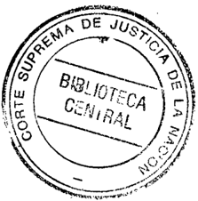

TOMO 327

Volumen 2

2004

## FALLOS DE LA CORTE SUPREMA DE JUSTICIA DE LA NACION


FALLOS

DE LA

CORTE SUPREMA

DE

## JUSTICIA DE LA NACION

PUBLICACION A CARGO DE LA SECRETARIA DE JURISPRUDENCIA DEL TRIBUNAL

TOMO 327 VOLUMEN 2


MAYO

LA LEY .f\.D. c~.

- Ji3l9~teca de la

I

. Corte -

Suprem1

N Q de Orden

flo2if

Ubicación

2J- qO

-P#/~~

Tucumán 1471 (l050) Buenos Aires

2004

Corte Suprema de Justicia. Secretaría de Jurisprudencia Fallos de la Corte Suprema de Justicia de la Nación: 327. -la ed. - Buenos Aires : Corte Suprema de Justicia de la Nación, 2005. v. 2, 1856 p. ; 24x16 cm.

ISBN 950-9825-67-0

1. Corte Suprema de Justicia de la Nación-Fallos. 1. ',['ítulo CDD 347.077

Copyright (e) 2005 by Corte Suprema'de Justicia de la Nación Queda hecho el depósito que previene la-ley 11.723. "Impreso en la Argentina Printed in Argentina I.S.B.N. 950-9825-67-0

## FALLOS DE LA CORTE SUPREMA

## MAYO

## ADMINISTRADOR DE LA ADUANA DÉ CAMPANA

RECURSO EXTRAORDINARIO: Requisitos propios. Sentencia definitiva. ResolucioTJesanteriores a la sentencia definitiva. Cuestio~es de competencia.

La denegación del fuero federal suscita cuestión federal suficiente en los términos de la ley 48.

-Del dictamen de la Procuración General, al que remitió la Corte Suprema-o

RECURSO EXTRAORDINARIO: Requisitos propios. Tribunal superior.

La sentencia que rechaza la competencia federal no proviene del superior tribunal de la causa si fue dictada por la Cámara Federal de San Martín, obviándose interponer el recurso extraordinario ante la Cámara Nacional de Casación Penal.

-Del dictamen de la Procuración General, al que remitió la Corte Suprema-o

RECURSO EXTRAORDINARIO: Requisitos propios. Tribunal superior.

La Cámara Nacional de Casación Penal posee carácter de tribunal intermedio, sea porque ante ella pueden encontrar las partes la reparación de los perjuicios irrogados en instancias anteriores sin necesidad de recurrir ante la Corte Suprema, sea porque el objeto a revisar por ésta ya sería Un producto más elaborado. -Del dictamen de la Procuración General, al que remitió la Corte Suprema-o

## DICTAMEN DEL PROCURADOR FISCAL

Suprema Corte:

-1-

En las presentes actuaciones, incoadas a raíz del robo de un vehículo que contenía mercadería importada, en tránsito desde la adua-



.

,

, ,.

1394

na de Paso de los libres a la aduana de Buenos Aires, a instancias del representante de este Ministerio Público Fiscal, eljuez federal de Campana se declaró incompetente en favor de la justicia nacional en lo penal económico.

Para así resolver argumentó que correspondía a la jurisdicción territorial de la ciudad de BuenosAires, por cuanto el hecho denunciado tipificaba en el delito de contrabando, que se habría consumado en esta localidad, donde debía ejercerse el control aduanero (fs. 20).

El magistrado penal económico, por su parte, no admitió la competencia atribuida (fs. 27/28) y devolvió las actuaciones al juzgado de Campana, cuyo titular tuvo por trabada la cuestión de competencia negativa y remitió el legajo a la Cámara Federal de San Martín (fs. 32).

Esta, por su parte, entendió que el hecho denunciado encontraba adecuación típica en el delito de robo y no en el de contrabando, por lo que declaró la incompetencia del Juzgado Federal de Campana y dispuso la remisión de las actuaciones a conocimiento de la justicia provincial.

Contra esta decisión el fiscal general interpuso recurso extraordinario (fs. 41/45), que fue concedido (fs. 46).

-II-

A mi juicio, el recurso interpuesto no cumple con los requisitos necesarios para ser admitido en esta instancia.

Como afirma el recurrente, la denegación del fuero federal, conforme la doctrina de la Corte, suscita cuestión federal suficiente en los términos de la ley 48 (273:16; 276:222; 307:1831; 316:1881, 2410, 2436, 3093,320:2193; 321:2434, 3150) y la sentencia que rechaza la competencia resulta equiparable a definitiva.

Pero la resolución en cuestión no proviene del superior tribunal de la causa, puesto que ha sido interpuesta contra la decisión de la Cámara Federal de San Martín, obviándose interponer el recurso pertinente ante la Cámara Nacional de Casación Penal.


En este sentido; desde el precedente "Giroldi" VE. Hestacado el carácter de 'tribunal intermedio" de la Cámara Naciona de Gasaconfiado; sea porque ante ella pueden encontrar las partes la reparación de los perjuicios irrogados en instancias anteriores sin necesidad de recurrir ante la Corte Suprema; sea porque el objeto a revisar por ésta ya sería un producto más elaborado (del considerando 13 de Fallos: 318.514)

Así, en concordancia con esta doctrina el Tribunal ha rechazado un recurso análogo (dirigido contra una sentencia de la Cámara Federal de Comodoro Rivadavia que declaraba la incompetencia del fuero federa!), porque la resolución impugnada no emanaba del superior tribunal de la causa CE.226. XXXVI in re "Eaton, Gastón Eduardo sI denuncia hurto en BIP ArbumasaXV" resuelta el 19 de junio de 2001).

- IlI-

Por lo expuesto, es mi opinión que el recurso ha sido erróneamente concedido, lo que así corresponde declarar, razón por la cual no habré de mantenerlo. Buenos Aires, 18 de septiembre de 2003. Luis Santiago González Warcalde.

## FALLO DE LA CORTE SUPREMA

Buenos Aires, 4 de mayo de 2004.

Vistos los autos: "Administrador de la Aduana de Campana sI denunCia".

## Considerando:

Que esta Corte comparte y hace suyos los fundamentos y conclusiones del dictamen del señor Procurador Fiscal, a cuyos términos y conclusiones corresponde remitirse en razón de brevedad.

r

f~

,"

Por ello, se declara mal concedido el recurso interpuesto a fs. 41/45. Hágase y devuélvase.

ENRIQUE SANTIAGO PETRAccm -ANToNIO BOGGIANO -ADOLFO ROBERTO VAzQUEZ -JUAN CARLOS MA~UEDA -E. RAÚL ZAFFARONI.

Recurso extraordinario interpuesto por Fiscal General Dr. Pablo Hernán Quiroga. Tribunal de origen: Cámara Federal de Apelaciones de San Martín, Sala 11. Tribunales que intervinieron con anterioridad: Juzgado Federal de Campana NlI 1. Juzgado Nacional de la. Instancia en lo Penal Económico NlI2.

## ALFREDO HORACIO POMPONIO

JURISDICCION y COMPETENCIACuestiones de competencia. Generalidades.

Resultan elementos indispensables para el correcto planteamiento de una cuestión de competencia, que las declaraciones de incompetencia contengan la individualización de los hechos sobre los cuales versan y las calificaciones que le pueden ser atribuidas, pues sólo en relación a un delito concreto es que cabe pronunciarse acerca del lugar de su comisión y respecto del juez a quien compete investigarlo y juzgarlo.

-Del dictamen de la Procuración General, al que remitió la Corte Suprema-o

JURISDICCION y COMPETENCIA: Competencia ordinaria. Por la materia. Cuestiones penales. Prevención en la causa.

Corresponde al juzgado nacional que previno continuar investigando en la causa en que se investiga la conducta de quien se encontraría vendiendo formularios en blanco para solicitar pensiones nacionales otorgadas por el Congreso Nacional si sólo se cuenta con la declaración del denunciante sin que se hayan practicado las diligencias necesarias para corroborar mínimamente las circunstancias de tiempo, modo y lugar en que se habría cometido el presunto delito.

-Del dictamen de la Procuración General, al que remitió la Corte Suprema-o

## DICTAMEN DEL PROCURADOR FISCAL

Suprema Corte:

Entre el Juzgado NaCional en lo Criminal de Instrucción Nº 24 Yel Juzgado de Garantías NI! 1, del Departamento Judicial de San Mar-


provincia de Buenos Aires, se suscitó la presente contienda nega tiva de competencia con motivo de la denuncia efectuada por tado Nacional Lorenzo Antonio tín, Pepe.

En ella relata que, su asesora Silvia Beatriz Reyes Zalazar tomó conocimiento que en el partido de Tres de Febrero una pe~sona se enl;:ontraría vendiendo formularios eh blanco para solicitar pensiones nacionales otorgadas por el Congreso de la Nación Argentina.

El magistrado nacional, declinó su competencia con base en que los hechos se habrían producido en el partido de Tres de Febrero (fs. 13).

El juez provincial, por su parte, rechazó tal atribución al considerarla prematura (fs. 16).

Devueltas las actuaciones, el juzgado de origen insistió en su criterio y elevó el incidente a la Corte (fs. 23).

A mi modo de ver, el presente conflicto no se halla precedido de la investigación suficiente para que V.E. pueda ejercer las facultades que le confiere el artículo 24, inciso 7º, del Decreto-Ley 1285/58.

Al respecto, el Tribunal tiene decidido que resultan elementos indispensables para el correcto planteamiento de una cuestión de esta naturaleza, que las declaraciones de incompetencia contengan la individualización de los hechos sobre los cuales versa y las calificaciones que le pueden ser atribuidas, pues sólo en relación a un delito concreto es que cabe pronunciarse acerca del lugar de su comisión y respecto del juez a quien compete investigarlo y juzgarlo (Fallos: 308:275, 315:312, 323:171 y 3867).

Habida cuenta que en el caso no concurren los elementos señalados pues, sólo se cuenta con la declaración del denunciante sin que se hayan practicado las diligencias necesarias para corroborar mínimamente las circunstancias de tiempo, modo y lugar en que se habría cometido el presunto delito, opino que corresponde al juzgado nacional, que previno, continuar investigando en la causa (Fallos: 311:67; 317:486 y 319:753, entre otros), sin perjuicio de lo que resulte del trámite ulterior. Buenos Aires, 18 de marzo de 2004. Eduardo Ezequiel Casal. &lt;

FALLOS DE LA CORTE SUPREMA . 327

## FALLO DE LA CORTE SUPREMA

Buenos Aires, 4 de mayo de 2004.

Autos y Vistos:

Por los fundamentos y conclusiones del dictamen del señor Procurador Fiscal, a los que cabe remitirse en razón de brevedad, se declara que deberá entender en la causa en la que se originó el presente incidente el Juzgado Nacional en lo Criminal de Instrucción Nº 24, al que se le remitirá. Hágase saber al Juzgado de Garantías Nº 1 del Departamento Judicial de San Martín, Provincia de Buenos Aires.

ENRIQUE SANTIAGO PETRAccm -ANTONIO BOGGIANO ADOLFO ROBERTO VÁZQUEZ JUAN CARLOS MAQUEDA E. RAúL ZAFFARONI.

DIRECCION GENERAL DE ASUNTOS JURIDICOS DEL MINISTERIO DE JUSTICIA DE LA NACION

## REMUNERACIONES.

Corresponde instruir a la Dirección de Asuntos Jurídicos del Ministerio de Justicia de la Nación para que -dejando a salvo los casos en los que correspondiera articular la defensa de la prescripciónse allane en las demandas que aun pudieran presentarse, desista de todo recurso pendiente de resolución y consienta las liquidaciones que se practiquen de conformidad con el capítulo V de la ley 25.344, en las causas tendientes a que se reconozca carácter remuneratorio y bonificable al adicional creado por la acordada NR57/92.

## RESOLUCION DE LA CORTE SUPREMA

Buenos Aires, 4 de mayo de 2004.

Visto el oficio librado por la Dirección General de Asuntos Jurídicos del Ministerio de Justicia de la Nación, por medio del cual se soli-

cita al Tribunal que evalúe la conveniencia de prestar su conformidad para que las demandas que aún pudieran iniciarse con el objeto de que se reconozca carácter remuneratorio y bonificable al adicional creado por la acordada Nº 57/92 y, si se lo considerara pertinente, desista de los recursos oportunamente interpuestos en las causas judiciales que -por igual pretensiónse encuentran en trámite, y

Considerando:

1º) Que, si bien por el tiempo transcurrido desde el dictado de la acordada 37/94 -por la que se otorgó al suplemento el carácter pretendidopuede avizorarse que la promoción de tales reclamos habrá de concluir o bien de decaer, al verse impedido -o al menos desalentadospor los efectos del instituto de la prescripción, no se advierte óbice para acceder a lo solicitado en lo que hace al allanamiento a eventuales demandas que se inicien en lo sucesivo, bien que dejando a salvo la instrucción de la defensa mencionada, pues "una decisión en tal sentido atenuaría el incremento del pasivo estatal evidenciando, en estos casos, en las significativas erogaciones provenientes de ingentes gastos causídicos.

Del modo indicado ha procedido esta Corte frente a una situación substancialmente análoga (conf. res. Nº 279/98 dictada en el expediente Nº 10-01857/93).

2º) Que el criterio sugerido se funda en que, de no procederse en el sentido indicado, los representantes del Estado Nacional se verían obligados a sostener una línea argumental que ha sido descalificada tanto por la Cámara Nacional de Apelaciones en lo Contencioso Administrativo Federal, comopor esta Corte en la instancia del arto 14 de la ley 48.

3º) Que iguales fundamentos aconsejan, asimismo, prestar conformidad al desistimiento de los recursos interpuestos contra decisiones de naturaleza análoga aja que motivó el pronunciamiento del Tribunal en la causa" Arakaki; Marcela Noemí y otros el Estado NacionalC.S.J.N.acordada 57/92 s/ empleo público", fallada el 7 de octubre de 2003 (Fallos: 326:4076).

4º) Que la instrucción dada no alcanza, por cierto a las cuestiones concernientes a los accesorios de los créditos reclamados ni a si estos quedan comprendidos en el régimen establecido en el capítulo Vde la

ley 25.344, pues el Tribunal no se ha pronunciado sobre tales aspectos en el precedente que da lugar a la presente.

Por ello,

Se Resuelve:

Instruir a la Dirección de Asuntos Jurídicos del Ministerio de Justicia de la Nación para que -dejando a salvo los casos en los que correspondiera articular la defensa de la prescripciónse allane en las demandas que aun pudieran presentarse, desista de todo recurso pendiente de resolución y consienta las liquidaciones que se practiquen de conformidad con el capitulo Vde laley 25.344, en las causas que resulten comprendidas en la consulta cursada.

Regístrese, hágase saber a la Dirección de Asuntos Jurídicos del Ministerio de Justicia de la Nación y archívese.

ENRIQUE SANTIAGO PETRACCHI -ANTONIO BOGGIANO -ADOLFO ROBERTO V ÁZQUEZ JUAN CARLOS MAQUEDA -E. RAÚL ZAFFARONI.

OSCAR ALFREDO RAWSON PAZ y OTRos v..MINISTERIO DE EDUCACION y JUSTICIA

EXCUSACION.

No se presenta causal de entidad suficiente para justificar el apartamiento de los magistrados de la causa si no sólo no se han configurado las hip6tesis previstas en el arto 17 del C6digo Procesal Civil y Comercial de la Naci6n, sino que tampoco se advierten "motivos graves de decoro o delicadeza" si no se trata de resolver la cuesti6n de fondo -pago de diferencias salariales derivadas de la actuálizaci6n de haberes en raz6n de la intangibilidad de las remuneraciones de los magistrados contemplada en el arto 110 de la Constituci6n Nacionalsino que tan s6lo se encuentran debatidos aspectos referentes al cumplimiento de la sentencia ya dictada en autos;

EXCUSACION.

El hecho de haber tenido el magistrado "oportunamente juicio por igual motivo" no traduce un interés actual en la cuesti6n sometida a su conocimiento, por lo

## DE JUSTICIA DE LA NACION 327

que no cabe consi&lt;;(erarlo alcanzado por la causal contemplada en el inc. 2 2 del arto 17 del Código Procesal Civil y Comercial de la Nación. (

## FALLO DE LA CORTE SUPREMA

Buenos Aires, 6 de mayo de 2004.

Autos y Vistos; Considerando:

1º) Que a fs. 1475, 1459, 1461 y 1464, los doctores Juan Carlos Maqueda, Guillermo Antelo, Rodolfo E. Munné y Tomás J. A. Inda se excusaron de intervenir en las presentes actuaciones invocando razones de delicadeza y decoro, ya que tendrían un interés directo en el resultado del pleito, lo que, a su criterio, podría afectar la debida ecuanimidad que deberían observar a la hora de resolver el litigio.

2º) Que, a criterio del Tribunal no sepresenta causal de entidad suficiente para justificar el apartamiento de los magistrados de la causa, ya que no sólo no se han configurado las hipótesis previstas en el artículo 17 del Código Procesal Civil y Comercial de la Nación, sino que tampoco se advierten "motivos graves de decoro o delicadeza" que permitan sustentar una decisión en tal sentido. Máxime si se advierte que en el sub examine no se trata de resolver la cuestión de fondo planteada por los actores -pago de diferencias salariales derivada de la actualización de haberes en razón de la intangibilidad de las remuneraciones de los magistrados contemplada en el artículo 110 de la Constitución Nacionalsino que tan sólo se encuentran debatidos aspectos referentes al cumplimiento de la sentencia ya dictada en autos.

3º) Que, en cuanto se refiere a las razones invocadas por el conjuez Inda, cabe señalar que el hecho de haber tenido "oportunamente juicio por igual motivo"'que el de autos, no t~aduce un interés actual en la cuestión sometida a su conocimiento, por lo que no cabe considerarlo alcanzado por la causal contemplada en el inciso 2º del artículo 17 del Código Procesal Civil y Comercial de la Nación.

Por ello, se resuelve: 1) no aceptar las excusaciones formuladas por los doctores Juan Carlos Maqueda, Guillermo Antelo, Rodolfo E. Munné y Tomás j. A. Inda; 2) aceptar las excusaciones de los doctores

Eugenio Raúl Zaffaroni y Gustavo Mitchell; 3) hacer saber que el tribunal quedará integrado por los Dres. Alberto Mansur, Mirta Tyden de Skanata, Otilio Roque Romano, Juan Carlos Maqueda, Rodolfo Munné, Tomás J. A. Inda, Guillermo Antelo, Arturo Pérez Petit y Julio Demetrio Petra. -r

JORGE O. MORALES -ARTURO PEREZ PETIT -ALBERTO MANSUR -JULIO DEMETRIO PETRA -OTILIO ROQUE ROMANO.

DEFENSOR DEL PUEBLO DE LA NACION v. PODER EJECUTIVO NACIONAL

RECURSO EXTRAORDINARIO: Requisitos propios. Cuestiones no federales. Interpretación de normas y actos comunes.

Es inadmisible el recurso extraordinario contra la sentencia que rechazó la acción promoVida por el Defensor del Pueblo de la Nación tendiente a que se declare la nulidad de los decretos 149/97 y 116/97 si las críticas formuladas constituyen meras discrepancias sobre lo resuelto en cuestiones de hecho y prueba, ya que el a qua desestimó la demanda por considerar que el actor había incumplido la carga de probar tanto los vicios que imputaba a los actos que atacaba como los hechos controvertidos en la causa, fundado en normas procesales. '

-Del dictamen de la ProcuracióD: General, al que remitió la Corte Suprema-o

"

RECURSO EXTRAORDINARIO: Requisitos comunes. Subsistencia de los requisitos.

Las sentencias de la Corte deben atender a las circunstancias existentes al tiempo de su dictado, aunque sean sobrevinientes al recurso extraordinario (Voto del Dr~Juan Carlos Maqueda). .

-Del dictamen de la Procuración General, al que remitió el voto-.

RECURSO EXTRAORDINARIO: Requisitos comunes. Subsistencia de los requisitos.

El proceso de renegociación contractual que se encuentra en pleno desarrollo a partir de la ley 25.561 y del decreto 293/02 habilita a considerar inoficioso un pronunciamiento sobre las cuestiones de índole jurídica propuestas en el recurso extraordinario deducido contra la sentencia que rechazó la acción tendiente a que se declare la nulidad de los decretos 149/97 y 1167/97, ya que las objeciones podrían encontrar respuesta en dicho procedimiento (Voto del Dr. Juan Carlos Maqueda).

~Del dictamen de la Procuración General, al que remitió el voto-.

## DE JUSTICIA DE LA NACION 327

## DICTAMEN DEL PROCURADOR GENERAL

## Suprema Corte:

-1-

Afs. 1395/1398, la Sala V de la Cámara Nacional de Apelaciones en lo Contencioso Administrativo Federal, al confirmar la sentencia de primera instancia, rechazó la acción que había promovido el Defensor del Pueblo de la Nación tendiente a que se declare la nulidad de los decretos 149/97 y 1167/97, así como la de cualquier otra norma dictada en su consecuencia, por entender que vulneraban la Constitución Nacional, la ley 23.696, los decretos 787/93 y 999/92 y diversas resoluciones del Ente Tripartito de Obras y Servicios Sanitarios (ETOSS).

El decreto 149/97 dispuso abrir una instancia negociadora del contrato de concesión de los servicios sanitarios de agua potable y desagües cloacales, celebrado con Aguas Argentinas S. A., aprobado por el decreto 787/93 y regido por la ley 23.696, para modificarlo a fin de satisfacer necesidades de interés público no previstas en el contrato originario y que hubieren surgido durante su ejecución, sujeta a ciertos parámetros (cfr. arts. 1º, 2º, 3º y 4º), mientras que, por el decreto 1167/97, el Poder Ejecutivo Nacional aprobó el Acta-Acuerdo sus cripta entre la Secretaria de Obras Públicas y la Secretaria de Recursos Naturales y Desarrollo Sustentable con la empresa concesionaria, en donde se reflejan los acuerdos del proceso de renegociación que, en lo que aquí interesa, por ser cuestionado por el Defensor del Pueblo de la Nación, elimina el "cargo por infraestructura" (establecido en el arto 40 del Régimen Tarifario, aprobado por el decreto 787/93) y lo reemplaza por el concepto "servicio universal" y "mejora ambiental" (S.U.M.A.), destinado a cubrir el financiamiento del costo de la red domiciliaria y del suministro de nuevas conexiones a los servicios de abastecimiento de agua potable y desagües cloacales de las áreas de expansión de la concesión, así como la diferencia de financiamiento necesaria para ejecutar las inversiones previstas para cada quinquenio en el rubro bienes de uso afectados al servicio del Plan de Mejoras y Expansión del Servicio, que deriven del Plan de Saneamiento Integral que ahí también se establece.

Disconforme, el actor interpuso el recurso extraordinario de fs. 1406/1420, que fue concedido sólo en cuanto se cuestiona la interpretación de normas federales (v. fs. 1463), sin que haya presentado queja al respecto.

Sostiene, en esencia, que el a quo recurrió al camino fácil de convalidar los decretos que impugnó, con el principal argumento de que se habían dictado para mejorar el servicio público, pero sin advertir que el procedimiento utilizado por la Administración era incorrecto y, en especial, que el acta-acuerdo aprobado por el decreto 1167/97 no es, en rigor, el resultado de una renegociación contractual prevista en la concesión originaria ni autorizada por delegación legislativa, sino que es lisa y llanamente un nuevo contrato administrativo, celebrado al margen del sistema legal vigente, porque incorporó el espectro ambiental -que no estaba contemplado en el contrato aprobado por el decreto 787/93-, reformuló el esquema tarifario y bajo la aparente ventaja de eliminar el cargo de infraestructura, introdujo otros que deben ser soportados tanto por los existentes comopor los nuevos usuarios.

Asimismo, critica el fallo en cuanto señala la existencia de un supuesto conflicto de intereses entre los usuarios que impediría la participación del Defensor del Pueblo, pues demostró -según su criterioque la ilegalidad e irrazonabilidad de las medidas adoptadas justifican su intervención, ya que no se opone a que los que hoy carecen del servicio de agua potable y red cloacal lo tengan, sino a que las obras comprometidas por la concesionaria se realicen con el dinero de los usuarios.

Por último, afirma que -contrariamente a lo sostenido por el a quoel cargo "servicio universal" se asemeja más a un impuesto que a una tasa y que, en cuanto tal, el Poder Ejecutivo está inhabilitado para establecerlo.

Ante todo, cabe recordar que las sentencias de la Corte deben atender a las circunstancias existentes al tiempo de su dictado, aunque sean sobrevinientes al recurso extraordinario (Fallos: 313:1081; 320:1875, entre muchos otros).

Por aplicación de esa doctrina, considero que resulta inoficioso un pronunciamiento del Tribunal en el sub lite.

La ley 25.561, denominada de Emergencia Pública y Régimen Cambiario, además de declarar la emergencia pública en materia social, económica, administrativa, financiera y cambiaria, con arreglo a lo dispuesto en el arto 76 de la Constitución Nacional (art. 1 2 ), autorizó al Poder Ejecutivo Nacional a renegociar los contratos celebrados por la Administración Pública -entre los que se incluyen expresamente los de obras y servicios públicos-, bajo ciertas condiciones (arts. 82 y 92 ).

Por su parte, el decreto 293/02 encomendó al Ministerio de Economía la renegociación de los contratos alcanzados por el arto 8 2 de la ley 25.561, que tengan por objeto la prestación de obras y servicios públicos, entre los que incluyó la provisión de servicios de agua potable y desagües cloacales (art. 12 ), al tiempo que fijó un plazo para desarrollar este proceso (luego ampliado por otros decretos y que todavía no ha finalizado) y creó una Comisión de renegociación.

En cuanto es relevante para el sub iudice, por resolución 20/02 del Ministerio de Economía, se incorporó al proceso de renegociación el contrato de Aguas Argentinas S.A. (v. anexo 11),la que presentó una propuesta que se decidió someter a consulta pública, mediante el procedimiento aprobado por la resolución 671/02 de aquel Ministerio, en el que el ETOSS actuará como autoridad del procedimiento y deberá emitir un informe sobre las opiniones recibidas (cfr. arts. 1 2 ,2 2 y 3 2 ).,

Dicho ente regulador, a su turno, debido a una nueva presentación de la concesionaria, dispuso dejar sin efecto la convocatoria al "Procedimiento de Documento de Consulta" que había efectuado en diciembre del año pasado y realizar una nueva a los mismos fines y efectos (arts. 12 y 22 de la resolución 114/02, B.O. 07.01.03).

En tales condiciones, el proceso de renegociación contractual que se encuentra en pleno desarrollo habilita a considerar inoficioso un pronunciamiento del Tribunal sobre las cuestiones de índole jurídica propuestas en el recurso extraordinario, toda vez que las objeciones del apelante podrían encontrar respuesta en dicho procedimiento. Máxime cuando, por otra parte, también cabe señalarlo, se encuentra prevista su participación (v. arto 7 2 del Reglamento de Procedimiento

de Documento de Consulta, aprobado por resolución 576/02 del Ministerio de Economía).

-IV-

No obstante lo expuesto, para el caso que V.E. considere que subsiste interés del apelante en obtener una decisión judicial, pese a la renegociación contractual en curso, desde mi punto de vista, el remedio extraordinario es inadmisible y fue incorrectamente concedido.

Así lo estimo, porque más allá de que ahí se alegue la existencia de cuestión federal, en rigor las críticas que formula contra la sentencia constituyen meras discrepancias sobre lo resuelto en cuestiones de hecho y prueba, toda vez que el a quo desestimó la demanda por considerar que el actor había incumplido la carga de probar tanto los vicios que imputaba a los actos que atacaba comolos hechos controvertidos en la causa (v. en especial, manifestación de fS.1397 vta.), fundado en normas procesales, aspectos todos que están reservados a los jueces de la causa y por ende, ajenos, en principio, al control extraordinario de la Corte.

En tal sentido, es adecuado recordar que aun cuando los agravios vertidos en el recurso extraordinario afirman la existencia de una controversia en punto a normas federales, si en realidad sólo traducen una mera discrepancia con las razones de hecho y prueba que fundan el fallo del a quo, no se encuentra habilitada la vía del arto 14 de la ley 48 (cfr. dictamen de esta Procuración General en la causa "Palma de Gómez, Leticia del Carmen d Ministerio del Interior -arto 6º ley 24.411", cuyas conclusiones compartió el Tribunal en su sentencia del 19 de febrero de 2002 [Fallos: 325:173]).

-V-

Por lo expuesto, considero que corresponde declarar inoficioso un pronunciamiento del Tribunal sobre las cuestiones planteadas en el recurso extraordinario de fs. 1406/1420, así como que, en el caso que V.E. considere que el apelante mantiene interés en obtener una decisión judicial, que aquél es inadmisible y fue incorrectamente concedido. Buenos Aires, 8 de julio de 2003. Nicolás Eduardo Becerra.

## FALLO DE LA CORTE SUPREMA

Buenos Aires, 11'de mayo de 2004.

Vistos los autos: "Defensor del Pueblo de lá Nación el EN -PE Ndtos. 149/97 y 1167/97 si proceso de conocimiento". .

Considerando:

Que esta Corte comparte y hace suyas las razones expuestas por el señor Procurador General en los capítulos 1, 11,IV y V de su dictamen, a los que cabe remitirse en razón de brevedad.

Por ello, de conformidad con lo dictaminado por aquél, se declara inadmisible el recurso extraordinario de fs. 1406/1420. Costas por su orden en todas las instancias, atento a que el actor pudo razonablemente creerse con derecho a litigar (art. 68, segunda parte, del Código Procesal Civil y Comercial de la Nación). Notifiquese y, oportunamente; devuélvase.

ENRIQUE SANTIAGO PETRACCHI -CARLOS S. FAYT -ANTONIO BOGGIANOADOLFO ROBERTO VAzQUEZ -JUAN CARLOS MAQUEDA (segúnsu voto)E. RAÚL ZAFFARONI. . .

VOTO DEL SEÑ'OR MINISTRO DOCTOR DON JUAN CARLOS MAQUEDA

Considerando:

Que esta Corte comparte y hace suyas las razones expuestas por el señor Procurador General en los capítulos 1,11,111y V de su dictamen, a los que cabe remitirse en razón de brevedad.

Por ello, de conformidad con lo dictaminado por aquél, se declara inadmisible el recurso extraordinario de fs. 1406/1420. Costas por su orden en todas las instancias, atento a que el actor pudo razonablemente creerse con derecho a litigar (art. 68, segunda parte, del Código Procesal Civil y Comercial de la Nación). Notifiquese y, oportunamente, devuélvase.

JUAN CARLOS MAQUEDA.

Recurso extraordinario interpuesto por el defensor del Pueblo de la Nación, Eduardo René Mondino.

Traslado contestado por la doctora Patricia Victoria Scattolin en representación del Estado Nacional con el patrocinio letrado del doctor Marcelo Adrián Bibini y por el doctor Carlos H. Ben con el patrocinio letrado del doctor Máximo J. Fonrouge, en representación de Aguas Argentinas S.A..

Tribunal de origen: Cámara Nacional de Apelaciones en lo Contencioso Administrativo Federal Sala V;

Tribunal que intervino con anterioridad: Juzgado Nacional de Primera Instancia en lo Contencioso Administrativo Federal NlI12 Secretaría NlI23.

## SANDRO MARCELOANCHERAMA

RECURSO EXTRAORDINARIO: Requisitos propios. Cuestiones no federales. Sentencias arbitrarias. Procedencia del recurso. Excesos u omisiones en el pronunciamiento.

Es arbitraria la decisión que -por entender que no se encontraban reunidos los requisitos exigidos por el arto 494 'del Código Procesal de la Provincia de Buenos Airesdeclaró mal concedido el recurso de inaplicabilidad de ley, pues de esa forma vedó definitivamente el acceso a la instancia superior, sin atender a los argumentos expuestos por el recurrente, vinculados con su intervención en el proceso y el efectivo cumplimiento de los recaudos exigidos en el último párrafo del arto 451 de dicho código,tendientes a lograr la revisión en la instancia casatoria de la condena impuesta.

-Del precedente "Schwab", al que remitió la Corte Supreina-.

DICTAMEN DEL PROCURADOR FISCAL

## Suprema Corte:

La cuestión traída a conocimiento de V.E.resulta, en sustancia, análoga con la invocada en los autos S. 127. XXXVII in re "Schwab, Juan sI homicidio simple -causa Nº 30~068-",en los que la Corte compartió, el 3 de octubre de 2002, los fundamentos y conclusiones del dictamen de esta Procuración General (confr. fojas 400/402 y 439/440 del principal; fojas 1/33 y 39/41, del legajo Nº 4829, que corren por cuerda). Por tal motivo, cabe dar por reproducidas, en lo pertinente,

las razones allí vertidas, a las que me remito en beneficio de labrevedad.

En consecuencia, sin peIjuicio de lo que se resuelva en definitiva sobre los agravios invocados contra la sentencia de la Cámara de Apelación en lo Criminal y Correccional del Departamento Judicial de San Nicolás, Provincia de Buenos Aires, que condenó a Sandro Marcelo Ancherama a la pena de seis años de prisión como autor del delito de tentativa de robo calificado por la muerte de la víctima (fs. 364/384), soy de la opinión que corresponde revocar el auto apelado para que, por intermedio de quien corresponda, se dicte uno nuevo conforme a derecho. Buenos Aires, 10 de marzo de 2004. Eduardo Ezequiel Casal.

## FALLO DE LA CORTE SUPREMA

Buenos Aires, 11 de mayo de 2004.

Vistos los autos: "Ancherama, Sandro Marcelo si recurso de 'casación. Robo calificado por elresultado homicidio engrado de tentativa".

## Considerando:

Que las cuestiones planteadas en las presentes actuaciones resultan análogas a las examinadas en la 'causa S. 127. XXXVII, "Schwab, Juan si homicidio simple -eausa 30.068-, resuelta el 3 de octubre de 2002 (*), a cuyas consideraciones cabe remitirse en razón de brevedad.

(*) Dicha sentencia dice así:

## JUANSCHWAB

DICTAMEN DEL PROCURADOR GENERAL

Suprema Corte:

-1-

Conforme surge de las actuaciones principales que corren por cuerda, el 12 de junio de 1998, la Sala 111de la Cámara de Apelación en lo Criminal y Correccional de San

Por ello, y de conformidad con lo dictaminado por el señor Procurador Fiscal, se declara procedente el recurso extraordinario concedi-

Martín, provincia de Buenos Aires, condenó a Juan Schwab a la pena de nueve años de prisión por considerarlo autor del delito de homicidio simple cometido en peIjuicio de José Luis Carretero (fs. 229/233). Contra esa decisión y de acuerdo con el régimen procesal local vigente en esa época -ley 3589la defensa oficial interpuso recurso de inaplicabilidad de ley, que fue concedido a fojas 243.

Por su parte, la Suprema Corte de Justicia provincial resolvió (fs. 249), por mayoría, que según lo dispuesto en el artículo 4, inciso 3 2 , de la ley 12.059 -modificado por el artículo 2 de la ley 12.161 -correspondía devolver la causa al tribunal de origen para que, notificada su radicación a las partes, éstas hicieran valer sus derechos de conformidad con las normas relativas al recurso de casación que prescribe el nuevo procedimiento (ley 11.922).

Notificada la defensa oficial de lo ordenado a fojas 261, formalizó al día siguiente la reserva que exige el artículo 451, segundo párrafo, del código adjetivo (fs. 262).

Con fecha 13 de marzo de 2000, se interpuso recurso de casación contra la sentencia condenatoria (fs. 10/13, del legajo N23110, que también corre por cuerda separada), que fue declarado inadmisible por la Sala II del Tribunal de Casación Penal, pues consideró que al no acompañarse copia certificada de la notificación del pronunciamiento apelado se omitió cumplir con el recaudo contemplado en el cuarto párrafo del artículo 451 del Código Procesal Penal de la provincia, necesario para acreditar el cumplimiento de los plazos por parte del recurrente (fs. 25/27, ídem). .

Finalmente, contra la desestimación del recurso de inaplicabilidad de ley deducido contra esa resolución, por entender que no se encontraban reunidos los requisitos exigidos en el artículo 494 del código de forma (fs. 116,del legajo N2 228 que corre por'cuerda), se interpuso recurso extraordinario (fs. 8/16, ídem), cuya denegatoria a fojas 20, dio lugar a la articulación de la presente queja. '

-II-

La defensa oficial considera arbitraria la decisión de la Suprema Corte de Justicia provincial, pues entiende que contiene un fundamento aparente y contradictorio con la conclusión a la que se arribó, sin atender los agravios de carácter constitucional invocados, todo ello, en detrimento de los derechos de defensa en juicio, debido proceso y de recurrir la condena ante un juez o tribunal superior (arts. 18 y 75, inciso 22 2 de la Constitución Nacional y arto 8, inciso 2 2 , letra h, de la Convención Americana sobre Derechos Humanos).

En efecto, refiere que si bien el a quo reconoció que el apelante alegó la violación de normas que harían viable la procedencia del recurso extraordinario local oportunamente deducido, se limitó a sostener dogmáticamente la naturaleza procesal que, a su juicio, involucraba la cuestión planteada, razón por la cual correspondía su desestimación.

Concluye el recurrente, que tanto los argumentos del Tribunal de Casación Penal como de la Suprema Corte local para impedir la revisión de la sentencia condenatoria,

do a fs. 25/25 vta. y se deja sin efecto la sentencia apelada. Notifiquese y devuélvanse los autos al tribunal de origen para que, por quien co-

exhiben un excesivo formalismo al soslayar las especiales características. del caso detalladas en el apartado 1del presente. En este sentido, advierte que la falta de copia de la notificación, sin peIjuicio de no reunir las características de las piezas que exige acompañar el último párrafo de la norma invocada, podía suplirse de distintas formas, tales como la compulsa de los autos principales o su certificación, motivo por la cual ese obstáculo no atribuible al imputado, no podía impedir la revisión del fallo.

-III-

Considero que sin perjuicio de las diferencias fácticas que existen respecto de aquéllas analizadas en los autos G. 839, XXXVin re "Galván Guillermo Pedro; Cabaña, Rodolfo y González, José Luis slhomicidio en ocasión de robo causa n V 3282" en los que V.E., el pasado 18 de diciembre (Fallos: 324:4465), compartió los fundamentos y conclusiones del dictamen de esta Procuración General, advierto que la cuestión que se intenta someter a conocimiento de la Corte guarda, en sustancia, analogía con la allí planteada. Por tal motivo y a fin de evitar repeticiones innecesarias doy por reproducidas, en lo pertinente, las razones allí vertidas.

A diferencia del antecedente señalado, en el sub judice el argumento para impedir la revisión en instancia casatoria de la condena consistió, como ya quedó expuesto, en no haber acompañado copia de la constancia de notificación de la sentencia recurrida, omisión que impedía determinar si tanto la manifestación exigida en el artículo 451, segundo párrafo, del Código Procesal de la provincia, como el recurso de casación, se articularon dentro del término legal.

Sentado ello, entiendo que al igual que en dicho precedente también aquí corresponde descalificar como acto judicial válido la decisión impugnada, toda vez que la ausencia de tratamiento de los agravios invocados por la defensa, especialmente de aquellos vinculados con su intervención en el proceso y el efectivo cumplimiento de los recaudos exigidos en el último párrafo del artículo 451 del código de forma, podría acarrear una seria restricción a los derechos constitucionales invocados en el recurso extraordinario.

Lo expuesto adquiere mayor relevancia si se repara que fue el mismo superior tribunal de provincia que desestimó la pretensión de la defensa de revisar el criterio que impedía el acceso a la instancia casatoria, que le reconoció a ésta la posibilidad de recurrir la sentencia condenatoria en el marco del nuevo ordenamiento procesal actualmente vigente. Esa circunstancia no sólo fue suficientemente advertida en su oportunidad por la asistencia técnica de Schwab en las presentaciones de fojas 10/13 y 21/24 de la causa NV 3110/2000 que corre por cuerda, sino también al deducir el recurso de inaplicabilidad de ley cuyo rechazo motivó la interposición del remedio federal.

Por lo tanto, su no consideración por el a quo, que para negarse a conocer acerca del tema planteado se limitó a sostener que éste exclusivamente involucraba cuestiones de orden procesal, importa un exceso de rigor formal en tanto satisface sólo de modo aparente la exigencia de constituir una derivación razonada de derecho vigente con arreglo a las constancias efectivamente obrantes en la causa, que autoriza a su descalificación con base en la doctrina de la arbitrariedad.

rresponda,se dicte nuevo pronunciamiento con arreglo a lo aquí resuelto.

ENRIQUE SANTIAGO PETRACCHI -CARLOS S. FAYT -ADOLFO ROBERTO V ÁZQUEZ JUAN CARLOS MAQUEDA -E. RAÚL ZAFFARONI.

Recurso extraordinario interpuesto por Ancherama, Sandro Marcelo, representado por el Dr. Mario Luis Coriolano (defensor oficial ante el Tribunal de Casación Penal de la Provincia de Buenos Aires).

No puedo dejar de resaltar que a pesar de haber deducido el apelante los recursos locales conforme los ordenamientos procesales vigentes al momento de su interposición, esa defectuosa fundamentación conduce a una indebida restricción de la vía utilizada, con menoscabo de la garantía consagrada en el artículo 18 de la Constitución Nacional (conf. Fallos: 301:1149; 311:1446; 312:426; 317:12? y 320:'1504).

-IV-

En consecuencia, sin perjuicio de lo que se resuelva en definitiva sobre el fondo del asunto, soy de la opinión que V.E. debe hacer lugar a la queja, declarar procedente el recurso extraordinario y dejar sin efecto la sentencia apelada para que, por intermedio de quien corresponda, se dicte una nueva conforme a derecho. Buenos Aires, 14 de mayo de 2002. Nicolás Eduardo Becerra.

## FALLO DE LA CORTE SUPREMA

Buenos Aires, 3 de ~ctubre de 2002.

Vistos los autos: "Recurso de hecho deducido por el defensor oficial de Juan Schwab en la causa Schwab, Juan si homicidio simple -causa rÍ 2 30.068-", para decidir sobre su procedencia.

Considerando:

Que esta Corte comparte y hace suyos los fundamentos y conclusiones del dictamen del señor Procurador General, a cuyos términos se remite en razón de brevedad.

Por ello, se hace lugar a la queja, se declara procedente el recurso extraordinario y se deja sin efecto la sentencia apelada. Acumúlese la queja al principal. Vuelvan los autos al tribunal de origen con el fin de que, por quien corresponda, se dicte nuevo pronunciamiento con arreglo al presente. Hágase saber y cúmplase.

JULIO S. NAZARENO --EDUARDO MOLlNÉO'CONNOR -CARLOS S. FAYT AUGUSTO CÉSAR BELLUSCIO -ENRIQUE SANTIAGO PETRACCHI GUILLERMO A. F. LóPEZ -GUSTAVO A. BOSSERT -'-ADoLFO RoBERTO V ÁZQUEZ.

Traslado contestado por Juan Angel de Oliveira (Subprocurador General -Suprema Corte de la Provincia de Buenos Aires.

Tribunal de origen: Suprema Corte de Justicia de la Provincia de Buenos Aires. Tribunales que intervinieron con anterioridad: Sala 11 del Tribunal de Casación Penal de la Provincia de Buenos Aires. Cámara de Apelación y Garantías en lo Penal y Correccional del Departamento Judicial de San Nicolás.

## JOSE SALVADOR GOMEZ

','

RECURSO EXTRAORDINARIO: Requisitos propios. Cuestiones no federales. Sentencias arbitrarias. Procedencia del recurso. Excesos u omisiones en el pronunciamiento.

Corresponde dejar sin efecto la sentencia que -tal como el auto de concesión del recurso extraordinario reconoceapalizó el planteo desde el punto de vista penal, cuya sentencia absolutori,a ya se encontraba firme y qmitió el tratamiento específico de la cuestión civil, única sometida a su jurisdicción.

-Del dictamen de la Procuración General, al que remitió la Corte Suprema-o

RECURSO EXTRAORDINARIO: Requisitos propios. Cuestiones no federales. Sentencias arbitrarias. Procedencia del recurso. Excesos u omisiones en el pronunciamiento ..

Al omitirse la consideración de una cuestión oportunamente planteada y conducente para la correcta resolución del pleito, corresponde descalificar lo decidido como acto jurisdiccional válido.

- -Del dictamen de la Procuración General, al que remitió la Corte Suprema-o

## DICTAMEN DEL PROCURADOR GENERAL

Suprema Corte:

-'1-

El juez en lo correccional Nº 2 de la capital de la provincia de Corrientes, mediante sentencia de fojas 1021/44 absolvió a José Salvador Gómez del delito de homicidio culposo por el que había sido acusado, y no hizo lugar. a la acción civil resarcitoria deducida contra el imputado y la empresa Constructora Comercial S.R.L..

Contra ese fallo, el letrado del querellante conjunto y actor civil dedujo recurso de casación y acción de inconstitucionalidad contra el artículo 497 del Código Procesal Penal de la provincia de Corrientes. El primero lo fundó, tanto para la acción penal como para la civil, en los vicios in iudicando e in procedendo que a su criterio presenta la sentencia. Através de la segunda cuestionó la limitación que ese cuerpo normativo determina para su derecho a recurrir como querellante conjunto, pues al no hacerlo el Ministerio Público, cuyo representante solicitó la absolución del acusado, su impugnación queda sujeta al criterio del Fiscal ante el Superior Tribunal de Justicia (fs. 1054/80). Esa impugnación fue declarada admisible por el juez, quien concedió el recurso de casación interpuesto en cuanto a la acción civil y elevó los autos a los restantes fines (fs. 1081).

Al expedirse el Fiscal ante el Superior Tribunal, sostuvo que esa limitación al recurso del querellante es inconstitucional, aunque solicitó la confirmación de la absolución dictada en la cuestión penal por insuficiencia probatoria y la casación de lo resuelto en cuanto a la acción civil (fs. 1086/90). Frente a los términos de ese dictamen, el juez tuvo por no interpuesto el recurso de casación en lo referido al homicidio culposo y, en lo demás, se remitió a la concesión ya ordenada (fs. 1091). Esta decisión fue notificada a la parte recurrente (fs. 1094), que compareció ante el Superior Tribunal y se limitó a mantener la impugnación civil concedida, haciendo así abandono tácito del planteo constitucional que había intentado (fs. 1100).

Al dictar sentencia, el máximo tribunal local también consideró insuficiente las pruebas y rechazó el recurso de casación por interpretar que sólo exhibía una discrepancia con los fundamentos del fallo, sin alcanzar a demostrar violación a las reglas de la sana crítica (fs. 1149/51).

Contra ese pronunciamiento, el actor civil interpuso recurso extraordinario con fundamento en la doctrina de la arbitrariedad, por haberse resuelto sobre el aspecto penal del asunto, ya pasado en autoridad de cosajuzgada, y omitido el tratamiento de la cuestión civil que exclusivamente se había planteado, consistente en la errónea aplicación del artículo 1113 del Código Civil (fs. 1155/63);

Mediante la resolución de fojas 1191/92 el a quo, de conformidad con lo dictaminado por el representante del Ministerio Público Fiscal

ante esa instancia, concedió la apelación federal por interpretar que al haberse verificado esa omisión se ha configurado una causal de arbitrariedad que afecta el derecho del impugnante y lesiona la garantía de defensa en juicio. Allí se reconoció, en efecto, que el planteo se había analizado desde el punto de vista penal, cuya sentencia absolutoria ya se encontraba firme, y que se había omitido el tratamiento específico de la cuestión civil, única sometida a su jurisdicción.

-II-

. Los propios fundamentos del auto de concesión, que reconocen la efectiva procedencia del agravio, hacen aplicable al caso la doctrina de la Corte según la cual, al omitirse la consideración de una cuestión oportunamente planteada y conducente para la correcta resolución del pleito, corresponde descalificar lo decidido como acto jurisdiccional válido (Fallos: 312:1310; 323:2839; 325:2044, entre muchos otros).

Por ello, opino que V.E. debe dejar sin efecto la sentencia de fojas 1149/51 para que se dicte otra con arreglo a derecho. Buenos Aires, 6 de noviembre de 2003. Nicolás Eduardo Becerra.

## FALLO DE LA CORTE SUPREMA

Buenos Aires, 11 de mayo de 2004.

Vistos los autos: "Gómez, José Salvador sI homicidio culposo. Capital".

## Considerando:

Que esta Corte comparte el dictamen del señor Procurador General y se remite a sus fundamentos y conclusiones por razones de brevedad. .

Por ello, de conformidad con lo dictaminado por el señor Procurador General, se declara procedente el recurso extraordinario y se deja sin efecto la sentencia apelada. Vuelvan los autos al tribunal de ori-

gen a fin.de que se dicte nuevo fallo con arreglo a lo expuesto. Notifiquese y, oportunamente, remítase.

ENRIQUE SANTIAGO PETRACCflI -ANTONIO BOGGIANO -ADOLFO ROBERTO VAzQUEZJUAN CARLOS MAQUEDA -E. RAÚL ZAFFARONI.

Recurso extraordinario interpuesto por Francisco A. Villordo, Benjamina Largosta y por su hijo Francisco R. Villordo, representado por el Dr. Ricardo Alberto Maldonado. Traslado contestado por José Salvador Gómez y Constructora Comercial S.R.L. y Hérmes Compañía de Seguros S.A., representado por el Dr. Ramón C. Leguizamón y José C. Gronda.

Tribunal de origen: Superior Tribunal de Justicia de Corrientes.

Tribunales que intervinieron con anterioridad: Juzgado Correccional NV 2 de Corrientes.

## LITORAL GAS S.A. v. MUNICIPALIDAD VILLACONSTITUCION

## ACCION DECLARATIVA

El procedimiento declarativo no excluye necesariamente el cobro compulsivo que el Fisco -local o federalestá habilitado a intentar por las vías procesales que estime pertinentes.

-Del dictamen de la Procuraci6n General, al que remiti6 la Corte Suprema-o

IMPUESTO: Facultades impositivas de la Nación, provincias y municipalidades.

Es indudable la (acuItad de las provincias de darse leyes y ordenanzas de impuestos locales y en general, todas las que juzguen conducentes a su bienestar y prosperidad, sin más limitaciones que las enumeradas en el artículo 126 de la Constituci6n Nacional, toda vez que, entre los derechos que constituyen la autonomía de las provincias, es primordial el de imponer contribuciones y percibirlas sin intervenci6n alguna de autoridad extraña.

-Del precedente "Gas Natural Han S.A.", al que remiti6la Corte Suprema-o

## PROVINCIAS.

Los actos de las legislaturas provinciales no pueden ser invalidados sino en los casos en que la Constituci6n concede al Congreso Nacional, en términos expresos, un poder exclusivo, o en que el ejercicio de idénticos poderes ha sido expresa-

## DE JUSTICIA DE LA NACION 327

mente prohibido a las provincias, o cuando hay absoluta y directa incompatibilidad en el ejercicio de ellos por estas últimas.

-Del precedente "Gas Natural Ban S.A.", al que remitió la Corte Suprema-o

IMPUESTO: Facultades impositivas de la Nación, provincias y municipalidades.

La jurisdicción nacional -a menos que contenga alguna exención acordada en virtud del arto 75, inc. 18, de la Constitución Nacionales compatible con el ejercicio del poder de policía y de la potestad fiscal por parte de las provincias y de sus municipalidades, ya que es la regla -y no la excepción-la existencia de jurisdicciones compartidas entre el Estado Nacional y los Estados locales.

-Del precedente "Gas Natural Ban S.A.", al que remitió la Corte Suprema-o

IMPUESTO: Facultades impositivas de la Nación, provincias y municipalidades.

El ejercicio del poder de policía y de la potestad fiscal por parte de las autoridades locales no deben condicionar de tal modo la prestación del servicio público que puedan obstruirlo o perturbarlo, directa o indirectamente.

-Del precedente "Gas Natural Ban S.A.", al que'remitió la Corte Suprema-o

IMPUESTO: Facultades impositivas de la Nación, provincias y municipalidades.

El transporte y distribución de gas natural constituye un servicio público sujeto a jurisdicción nacional en todo el territorio de la República -arts. 1 g de la ley 24.076 y 1 g del decreto 1738/92-, sin que obste a ello la subsistencia de las facultades impositivas locales, en tanto y en cuanto -a diferencia de lo que expresamente se hizo con otros serviciosno se eximió de gravamen alguno a la actividad y se contempló, como contrapartida, su traslado a la tarifa.

-Del precedente "Gas Natural Ban S.A.", al que remitió la Corte Suprema-o

## CONSTITUCION NACIONAL: Constitucionalidad e inconstitucionalidad. Decretos nacionales.

El uso gratuito que se reconoce en el modelo de licencia aprobado por el arto 5 g del decreto nacional 2255/92, en tanto constituye una exención de índole tributaria sólo prevista en un decreto del Poder Ejecutivo Nacional, vulnera el principio de legalidad que gobierna esta materia, pues la ley 24.076 no contiene precepto alguno que prevea una exención de tal naturaleza.

-Del precedente "Gas Natural Ban S.A.", al que remitió la Corte Suprema-o

IMPUESTO: Facultades impositivas de la Nación, provincias y municipalidades.

Si bien el Congreso Nacional está facultado para consagrar -dentro del ámbito de su competencia constitucionalexcepciones fiscales en el orden provincial o municipal, éstas deben ser dispuestas de modo inequívoco, porque las excepciQ-.

nes revisten carácter excepcional, requieren de una manifestaci6n cierta de voluntad legislativa y no pueden ser resueltas sobre la base de meras inferencias. -Del precedente "Gas Natural Ban S.A.", al que remiti6la Corte Suprema-o

## DICTAMEN DE LA PROCURADORA FISCAL

Suprema Corte:

-1-

A fs. 225/227, la Sala "B"-Civilde la Cámara Federal de Apelaciones de Rosario confirmó la sentencia de primera instancia que había rechazado la acción declarativa de certeza promovida por Litoral Gas S.A. contra la Municipalidad de Villa Constitución, Provincia de Santa Fe, con el objeto de hacer cesar el estado de incertidumbre originado en la aplicación del tributo por uso del dominio público dispuesto por la Ordenanza Municipal Nº 1458/93 Ysus modificatorias, frente a la Ley 24.076 y demás normas federales que regulan la actividad de distribución de gas.

Para así decidir, en coincidencia con la Jueza de la instancia anterior, negó que existiera un estado actual de duda que pudiera ocasionarle un peIjuicio a la actora, ya que las normas federales establecen la gratuidad de las servidumbres administrativas, mientras que la ordenanza impugnada se asienta en el ejercicio de potestades tributarias locales, sin posibilidad de colisión entre ellas. Además, sostuvo que dicha parte pudo disponer de otros medios para poner fin al supuesto conflicto, tanto al haber agotado la vía administrativa local como en el subsiguiente juicio de apremio.

Expuso que tampoco había cuestionado la constitucionalidad de la disposición local ni indicado, de manera concreta, la forma en que sus preceptos resultaban violatorios de las normas constitucionales invocadas.

En tales condiciones, dijo que la acción del arto 322 del Código de Procedimientos Civil y Comercial de la Nación no resulta apta en el sub lite, al no reunirse el requisito de la inexistencia de otras vías y por no haber incertidumbre que le ocasione un peIjuicio.

-I1-

Disconfonne, la actora interpuso el remedio extraordinario que luce a fs. 248/259, concedido por el a quo a fs. 283.

En síntesis, cuestiona la sentencia al indicar que, contrariamente a lo decidido, se verifican en autos los extremos que habilitan la vía procesal escogida, puesto que, de la dilucidación de la procedencia ono del gravamen, depende la posibilidad de su traslación a la tarifa. Aduce al respecto que el Ente Nacional Regulador del Gas (en adelante ENARGAS) autorizó el traslado provisorio de la gabela a los usuarios, atento a las circunstancias en que se encuentra.

Se agravia, asimismo, de la interpretación realizada por la Cámara puesto que, pese a concluir la improcedencia formal de la acción declarativa, decidió que no existe conflicto normativo alguno.

- III-

En mi opinión, es menester poner de relieve, en primer ténnino, que el modo en que la actora ha planteado sus agravios, respecto de la evaluación de la procedencia formal de la vía, realizada en la sentencia definitiva del superior tribunal de la causa -aunque no lo diga expresamente en su recurso-, implica una crítica realizada desde la óptica que proporciona la doctrina de la arbitrariedad.

Cabe señalar, a la sazón, que si bien las cuestiones que se suscitan en torno a la aplicación de nonnas procesales son ajenas, comoregla, a la vía del arto 14 de la Ley 48, el Tribunal puede conocer en aquellos casos cuyas particularidades hacen excepción al principio, con base en la doctrina de la arbitrariedad (arg. Fallos: 315:2969; 316:1141; 319:2959, entre otros).

Con tales premisas, adelanto mi parecer en cuanto a que asiste razón a la apelante en este punto.

En efecto, la sentencia recurrida basa su conclusión, en parte, en la inexistencia del conflictononnativo -argüido por la accionanteentre las leyes federales regulatorias de la distribución de gas y la Ordenanza municipal, extremo que, paradójicamente, el propio decisorio se encargó de despejar en forma previa, al expresar que las primeras

regulan la gratuidad de las servidumbres administrativas necesarias para la realización de las obras, mientras que la segunda tiene origen en el ejercicio del poder tributario municipal.

En tales condiciones, opino que la decisión del a quo luce auto contradictoria pues, sin perjuicio de decidir en el sentido indicado, también resolvió, en forma definitiva, sobre el fondo del asunto, sin que pueda éste ser vuelto a plantear en un nuevo juicio.

Pienso que, contrariamente a lo mantenido en el decisorio apelado, la acción declarativa de certeza es útil para tratar el tema, comolo ha sido en los planteados en Fallos: 320:162 y 619; 322:2331, entre otros. Como tiene decidido el Tribunal, siempre que la cuestión no tenga un carácter simplemente consultivo ni importe una indagación meramente especulativa, sino que responda a un caso y busque precaver los efectos de un acto en ciernes al que se atribuye ilegitimidad y lesión al régimen constitucional federal, la acción declarativa constituye un recaudo apto para intentar que se eviten los eventuales perjuicios que se denuncian (conf. Fallos: 307:1379; 310:606; 311:421; 316:2855 y 318:2374, entre otros).

Al momento de interponer la presente demanda, el requisito del "acto en ciernes" estaba reunido, puesto que la demandada había dictado el Decreto 802/96 (ver fs. 71/76, del anexo agregado por cuerda), que agotó la vía administrativa e intimó a la actora a pagar el tributo conforme a la determinación de oficio realizada. Resulta entonces indudable que se trata de una "causa" en los términos del arto 116 de la Constitución Nacional, donde la parte ve afectados sustancialmente sus intereses, puesto que las normas que cuestiona lo alcanzan en forma suficientemente directa y el conflicto ha llegado a una concreción bastante (confr. Fallos: 304:310 y 306:1125).

Es innegable, asimismo, la existencia de un daño actual para la demandante, producto de la incertidumbre respecto de la relación tributaria que la liga con el Municipio, puesto que se ha visto forzada a pagar el gravamen por los períodos determinados y ha obtenido una resolución del ENARGAS que autoriza su traslado provisorio. Por lo tanto, a mi entender, subsisten las circunstancias de incertidumbre denunciadas (confr. argoFallos: 307:1379 y 1804; 319:2642 y 320:1875).

Por otro lado, afirmar -como erróneamente lo hace el Juzgadorque la decisión definitiva en sede administrativa o bien la sentencia

recaída en el juicio de apremio -de limitado marco cognoscitivo y que, por principio, no resuelve el fondo del temaconforman óbices a la acción declarativa, ya que despejan la existencia de incertidumbre, resulta contrario a la pacífica jurisprudencia del Tribunal que sostiene que el procedimiento declarativo no excluye necesariamente el cobro compulsivo (uno de cuyos requisitos para la emisión del título ejecutivo, vale destacarlo, es la existencia de resolución determinativa) que el Fisco -local o federalestá habilitado a intentar por las vías procesales que estime pertinentes (Fallos: 310:606, cons. 5º; 311:421 y 2104). Ello, sin peIjuicio de remarcar que el conflicto normativo planteado en autos corresponde a la competencia de la justicia federal, ratione materiae, dado el tipo de normas de cuya discusión se trata (Fallos: 322:61 y 323:798).

Debo hacer notar que, en ese orden de ideas, de mantenerse la tesitura del a quo, sería forzoso admitir la improcedencia sobreviniente de toda acción declarativa que, iniciada ante un "acto en ciernes", tuviera, en su desarrollo, que soportar un proceso paralelo de ejecución, puesto que el Fisco demandado fácilmente podría hacer saber esta circunstancia -en la acción declarativapara impedir su progreso.

En último término, me parece acertado el criterio expuesto en Fallos: 316:2206 (disidencia del Dr. Belluscio), en cuanto a que la demanda declarativa es la que mejor satisface indudables razones de economía procesal vinculadas con la pronta terminación del proceso y con la claridad de las obligaciones tributarias de una empresa prestataria de servicios públicos. Máxime, cuando la cuestión debatida resulta de puro derecho (confr. fs. 142 vta.).

Por lo tanto, estimo que asiste razón a la recurrente en cuanto a que la vía procesal por ella escogida resulta apta para ventilar la cuestión sub examine.


Con respecto al fondo del asunto, debe tenerse presente que, en la tarea de establecer la correcta interpretación de las normas federales, la Corte no se encuentra limitada por las posiciones del tribunal apelado y del recurrente, sino que le incumbe realizar "una declaratoria sobre el punto disputado" (art. 16 de la Ley 48), según la inteligencia que ella rectamente le otorgue (arg. Fallos: 307:1457 y 320:1915).

En tales condiciones, estimo que la cuestión debatida guarda sus­ tancial analogía con la examinada en mi dictamen del día de la fecha, in re GLYPH(cmap:df00).501, L.XXXV, "GLYPH(cmap:df00)as Natural BAN SA rI Municipalidad de Cam­ pana si acción meramente declarativa" (Fallos: 326:2653), al cual me remito en cuanto fuere aplicable al sub judice.

-V-

Opino, pues, que cabe revocar parcialmente la sentencia de fs. 2251227, de acuerdo a lo expresado en el acápite III y confirmarla en lo demás, según lo expuesto en el acápite IV. Buenos Aires, 24 de abril de 2001. MarÚJ GLYPH(cmap:df00)raciela Reiriz.

## FALLO DE LA CORTE SUPREMA

Buenos Aires, 11 de mayo de 2004.

Vistos los autos: "Litoral GLYPH(cmap:df00)as S.A. rI Municipalidad Villa Constitu­ ción si acción meramente declarativa".

## Considerando:

1°) Que la Sala "B" de la Cámara Federal de Apelaciones de Rosa­ rio, al confirmar la sentencia de la instancia anterior, rechazó la ac­ ción meramente declarativa incoada por Litoral GLYPH(cmap:df00)as S.A. con el objeto de que se determine si ésta se encuentra alcanzada por la obligación de abonar el derecho de ocupación del dominio público correspondien­ te al municipio de Villa Constitución, Provincia de Santa Fe, de con­ formidad con lo dispuesto por la ordenanza 1458193 y las concordantes de los años 1994, 1995 y 1996. La decisión se fundó, en síntesis, en que, a juicio de la cámara no se encontraban reunidos los requisitos exigíbles para la procedencia de la acción de certeza prevista por el arto 322 del Código Procesal Civil y Comercial de la Nación, puesto que consideró que no existía una incertidumbre que por sí misma pu­ diera ocasionarle perjuicio a la actora, habida cuenta de que, en su concepto, no mediaba conflicto normativo entre la mencionada arde-

nanza municipal y las normas federales invocadas por la actora. Estimó, además, que había otras vías procesales por las que podía debatirse la cuestión.

- 2º) Que contra esa sentencia, la actora dedujo el recurso extraordinario de fs. 248/259 que, contestado por el municipio, fue concedido a fs. 283 en razón de haberse cuestionado la inteligencia de normas federales y ser lo resuelto contrario al sentido a ellas atribuido por la demandante (art. 14, inc. 3 de la ley 48).
- 3º) Que, tal como adecuadamente se señala en el dictamen de la señora Procuradora Fiscal-al que corresponde remitirse en este punto-lo resuelto por el a quo, en atención a las razones en que funda su juicio respecto de la improcedencia de la acción de certeza, importa una decisión definitiva sobre el fondo del asunto adversa a la pretensión de la actora. . , ..
- 4º) Que, con tal comprensión, resulta aplicable en el sub examine la doctrina establecida en la causa G.501.XXXV."Gas Natural Ban S.A. el Municipalidad de Campana (Pcia. de Buenos Aires) si acción meramente declarativa", sentencia del 12 de agosto de 2003 (Fallos: 326:2653), a la que corresponde remitirse por razones de brevedad.

Por ello, y de conformidad con lo dictaminado por la señora Procuradora Fiscal, se declara formalmente procedente el recurso extraordinario, y se modifica la sentencia apelada, rechazándose la demanda por las razones expresadas en el mencionado precedente. Con costas. Notifiquese y devuélvase.

ENRIQUE SANTIAGO PETRAccm -ANTONIO BOGGIANO -ADOLFO ROBERTO VAzQUEZ -JUAN CARLOS MAQUEDA -E. RAÚL ZAFFARONI. .

Recurso extraordinario interpuesto por Litoral Gas S.A., representado por los Dres. Juan Pablo Dirienzo y Daniel Antonio Gómez.

Traslado contestado por Municipalidad de Villa Constitución, representado por los Dres. Hugo Luis Domingo y Ricardo Victorio Moscariello. Tribunal de origen: Cámara Federal de Apelaciones de Rosario, Sala B. Tribunales que intervinieron con anterioridad: Juzgado Federal de Primera Ins- tancia de Rosario, Nll 2.

## FALLOS DE LA CORTE SUPREMA 327

## MARIO DANIEL GOIJMAN v. GOMER SAC.!.

RECURSO EXTRAORDINARIO: Requisitos propios. Sentencia definitiva. Resoluciones anteriores a la sentencia definitiva. Cuestiones de competencia.

Si bien, como regla, los pronunciamientos que resuelven cuestiones de competencia no constituyen sentencia definitiva a los fines del arto 14 de la ley 48, cabe hacer excepción a dicho principio cuando la decisión impugnada importa privar al recurrente de la jurisdicción de los tribunales argentinos para hacer valer sus derechos y, por consiiuiente, de obtener el eventual acceso a la instancia federal por agravios de naturaleza constitucional.

- -Del dictamen de la Procuración General, al que remitió la Corte Suprema-o

## JURISDlCCION INTERNACIONAL.

Los agravios relativos a que no se trataría de un asunto internacional, a que las partes son argentinas y se domicilian en este país, y a la conveniencia de ser demandado ante los tribunales del propio domicilio, encuentran suficiente respuesta en la referencia de la sentencia a la amplitud de lo libremente estipulado yla incorporación de socios financieros internacionales, que llevaban a juzgar procedente la prórroga de jurisdicción pactada.

-Del dictamen de la Procuración General, al que remitió la Corte Suprema-o

RECURSO EXTRAORDINARIO: Requisitos propios. Cuestiones no federales. Sentencias arbitrarias. Improcedencia del reCUrSO.

- La observación concerniente á la extemporaneidad del planteo de nulidad de la cláusula de prórroga no fue decisiva para arribar a la conclusión que propició el 'a quo, si el requerimiento de nulidad se basó en la aseveración de que el asunto sometido a juicio no era internacional sino puramente ,interno, argumento que mereció adecuada réplica en la sentencia sobre la base de fundamentos que el apelante no logra rebatir.
- '-Del dictamen de la Procuración General, al que remitió la Corte Suprema-o

RECURSO EXTRAORDINARIO: Requisitos propios. Cuestiones no federales. Sentencias arbitrarias. Improcedencia del recurso.

El argumento referido a la omisión de considerar que el arto 8, ap. f del acuerdo autorizaría la promoción de cualquier acción legal ante los tribunales comerciales ordinarios de la Ciudad de Buenos Aires de conformidad con la Convención de Nueva York para Reconocimiento y Ejecución de Laudos deArbitraje Extranjeros resulta impropio para variar el resultado del conflicto si no se advierte la existencia de sentencia o laudo arbitral alguno que pretenda ser reconocido o ejecutado ante los tribunales argentinos.

-Del dictamen de la Procuración General, al que remitió la Corte Suprema-o

## · DICTAMEN DEL PROCURADOR GENERAL

Suprema Corte:

-1-

La Sala "B" de la Cámara Nacional de Apelaciones en lo Comercial, rechazó el recurso de apelación interpuesto por el actor contra la sentencia del juez de grado que hizo lugar a la excepción de incompetencia opuesta por la demandada (v. fs. 2071/2072).

Para así decidir, remitió al qictamen del señor Fiscal General cuyos fundamentos dijo compartir.

Manifestó asimismo, en lo que aquí interesa, que por tratarse de asuntos de índole exclusivamente patrimonial y de carácter intemacional-eomo,r~sulta del acuerdo en que se basa la acción y de la incorporaci9n de socios extranjerosla prórroga de jurisdicción pact~da satisface las exigencias del artículo 1 Q del Código Procesal Civil y Comercial de la Nación. Añadió que el artículo 8Q , apartados "f."y "h." del convenio (fs. 548/558), no ofrecía dudas sobre la voluntad de las partes de someterse a la ley de Illinois (EE.UU.), y de que cualquier controversia fuera resuelta por medio de arbitraje obligatorio de conformidad cón las reglas de la Cámara de Comercio Intemacional de la Ciudad de Nueva Yorl~.

-II-

\_Contra este pronunciamiento el actor interpuso el recurso extraordinario de fs. 2078/2083, cuya denegatoria de fs. 2188 motiva la presente queja.

Impugna a la sentencia por arbitraria, y le reprocha que haya prescindido de considerar que, conforme a doctrina, un asunto es internacional cuando aparece de tal modo conectado a múltiples sistemas jurídicos nacionales que pueda suscitar un conflicto internacional. Afirma que en la especie no se advierte ni la pluralidad de sistemas ni el conflicto de jurisdicción.

Critica, asimismo, que no se haya atendido el argumento de que la parte que opuso la incompetencia se encuentra demandada ante los

tribunales de su domicilio, solución que, según el recurrente, contempla la conveniencia de ambas partes dado que nadie puede sentirse agraviado de ser demandado en su domicilio, máxime si no se ha invocado el perjuicio que de ello pueda derivarse.

Alega, por otra parte, que se ha soslayado la cuestión de que los sujetos de la relación sustancial objeto del proceso son personasjurídicas argentinas y domiciliadas en la República Argentina, remarcando que no tienen domicilio en el exterior, ni se encuentran relacionados a varios sistemas jurídicos.

Manifiesta que no se ha considerado que la convalidación de la nulidad de la resolución de fojas 1.553, en cuanto resolvió previamente la excepción de defecto legal en violación de lo que establece el artículo 353 del Código Procesal-inferida del hecho de no haber deducido recurso contra la misma-, importó una nueva prórroga de la jurisdicción a favor del tribunal de origen, pues el defecto atribuido para admitir la excepción de defecto legal no era obstáculo para conocer los términos de la prórroga supuestamente establecida a favor de jueces o árbitros extranjeros. .

Respondiendo a uno de los argumentos del dictamen fiscal, expresa, que no se alcanza a advertir porqué su parte debió solicitar la nulidad de la cláusula de prórroga en la oportunidad que contempla el artículo 177 del Código Procesal, cuando ésta se refiere a nulidades procesales, noción en la que no se encuentra aprehendida la señalada por su parte.

Finalmente, aduce que tampoco se ha considerado que, aún de admitirse la validez de la prórroga en cuestión, el artículo 8, apartado letra D del acuerdo, autoriza la promoción de cualquier acción legal ante los Tribunales Comerciales Ordinarios de la ciudad de Buenos Aires, y que la mención "de conformidad con la Convención de Nueva York" que la antecede, significa que la demanda podrá deducirse ante estos tribunales y eventualmente ejecutarse con sujeción a los términos de la mentada Convención si ese fuera el caso.

- III-

Cabe señalar, en primer término, que V.E. tiene dicho que si bien, comoregla, los pronunciamientos que resuelven cuestiones de compe-

tencia no constituyen sentencia definitiva a los fines dél artículo 14 de la ley 48, cabe hacer excepción a dicho principio cuando la decisión impugnada importa '-como en el casoprivar al apelante,de la jurisdicción de los tribunales argentinos para hacer valer sus derechos y, por consiguiente, de obtener el eventual acceso a la instancia federal por agravios de naturaleza constitucional (v. doctrina de Fallos: 310:1861; 322:1754).

Ahora bien, respecto a la invocada arbitrariedad de la decisión, estimo que las conclusiones del a quo -conforme lo desarrollaré a Continuación-, no son refutadas mediante argumentos conducentes, toda vez que se advierte que las críticas del quejoso, además de reiterar asertos ya vertidos en instancias anteriores, sólo trasuntan una opinión diversa a la sostenida por eljuzgador, insuficiente, por ende, para demostrar que ésta adolezca de una decisiva carencia de fundamentación (v. doctrina de Fallos: 302:1491).

Así, los agravios relativos a que no se trataría de un asunto internacional, a que las partes son argentinas y se domicilian en este país, y a la conveniencia de ser demandado ante los tribunales del propio domicilio, encuentran suficiente respuesta en las consideraciones del dictamen fiscal a las que remitió la sentencia. En efecto, luego de referirse a los términos de la prórroga dejurisdicción convenida en la cláusula Nº 8 del acuerdo, el señor Fiscal General señaló que la amplitud de lo libremente estipulado y la incorporación, en virtud de la capitalización de la sociedad demandada, de socios financieros internacionales (sociedades extranjeras domiciliadas en los Estados Unidos de Norteamérica), lo llevaban a juzgar procedente la prórroga de jurisdicción pactada. Destacó al respecto, la vinculación acordada entre el contrato de empleo del actor, con la serie de pactos referidos a la suscripción, oferta y venta de acciones, fusión con terceras empresas, y forma de recupero de la inversión, entre otros, circunstancia -dijoque pone de relieve la existencia de un negocio de inversión internacional que excede de una mera relación social interna en la que se ha cuestionado la rescisión del vínculo laboral entre actor e inversores, independientemente de la ubicación del domicilio social de la accionada, dado especialmente el sometim~ento a arbitraje obligatorio y que fueron fijados a los efectos respectivos, domicilios especiales en los Estados Unidos (v. fs. 2069 vta. /2070). Estos argumentos, reitero, no fueron debidamente rebatidos por el recurrente, más allá de las diferencias con el criterio del juzgador antes apuntadas.

Otro tanto cabe decir acerca de la crítica referida al tratamiento de la excepción de defecto legal, pues, como se manifestó en el dictamen que nutre al decisorio cuestionado, la incompetencia planteada en forma conjunta y simultánea en el mismo escrito, enerva los argumentos sobre un supuesto consentimiento de la jurisdicción nacional por parte de la accionada (v. fs. 2070, último párrafo), a lo que no resulta ocioso agregar, que el defecto legal fue invocado en relación con la traducción de los contratos en los que se sustentó la demanda, de modo que no parece irrazonable que se lo haya tratado con anterioridad a juzgar la validez de la cláusula que establece la prórroga de jurisdicción.

En cuanto a la objeción del argumento concerniente a la extemporaneidad del planteo de nulidad de la cláusula de prórroga, entiendo el dictamen del señor Fiscal alude a que dicha nulidad debiópromoverse oportunamente por la vía incidental que contempla el artículo 177 del Código Procesal Civil y Comercial de la Nación. Por otra parte, cabe señalar que esta observación sobre la oportunidad del planteo no fue decisiva para arribar a la solución que propició el a quo, toda vez que tal requerimiento de nulidad se basó en la aseveración de que el asunto sometido a juicio no era internacional sino puramente interno, argumento que, como se ha visto precedentemente, mereció adecuada réplica en la sentencia sobre la base de fundamentos que el apelante no logra rebatir.

Por último, en cuanto al reproche relativo a la omisión deconsiderar que el artículo 8, apartado "f' del acuerdo, autorizaría la promoción de cualquier acción legal ante los Tribunales Comerciales Ordinarios de la ciudad de Buenos Aires de conformidad con la Convención de Nueva York para Reconocimiento y Ejecución de Laudos de Arbitraje Extranjeros, vale recordar que, conforme a abundante jurisprudencia de V.E., el juez no está obligado a expedirse sobre todos los argumentos expuestos por las partes sino sólo respecto de aquellos que fueren conducentes para fundar sus conclusiones y resultaren decisivos para la solución de la controversia (v.' doctrina de Fallos: 307:2216; 320:2278; 322:270, entre otros).

A todo evento, se advierte que este argumento resulta impropio para variar el resultado del conflicto, toda vez que según el mentado artículo 8!!,apartado "f', la intervención de los tribunales comerciales locales se encuentra circunscrita -como se ha vistoa los términos de la Convención de Nueva York sobre el Reconocimiento y Ejecución de

Sentencias Arbitrales Extranjeras (v. fs. 555 y 1527/1529), y no se advierte en la especie la existencia de sentencia o laudo arbitral alguno que pretenda ser reconocido o ejecutado ante los tribunales argentinos.

Por todo lo expuesto, estimo que deberechazarse la presente queja. Buenos Aires, 18 de noviembre de 2003. Nicolás Eduardo Becerra.

## FALLO DE LA CORTE SUPREMA

BuenosAires, 11 de mayo de 2004.

Vistos los autos: "Recurso de hecho deducido por la actora en la causa Goijman, Mario Daniel el Gomer S.A.C.!.", para decidir sobre su procedencia.

Considerando:

.

Que aun cuando los agravios del recurrente setefieren a una materia federal, como lo es la concerniente a la interpretación y aplicación de normas contractuales de jurisdicción internacional (Fallos: 293:455; 321:48, 2894), corresponde desestimar la presentación directa por las razones expuestas en el dictamen del señor Procurador Fiscal que esta Corte comparte, cuyos términos se dan por reproducidos en razón de brevedad.

Por ello, de conformidad con el dictamen que antecede se desestima la queja. Declárase perdido el depósito de fs. 1. Notifiquese y, previa devolución &lt;;le los autos principales, archívese.

ENRIQUE SANTIAGO PETRACCHI -CARLOS S. FAYT -ANTONIO BOGGIANOADOLFO ROBERTO V ÁZQUEZ JUAN CARLOS MAQUEDA.

Recurso de .hecho interpuesto por Mario Daniel Goijman, representado por el Dr. Guillermo Eduardo Koon, patrocinado por los Dres. Jorge L. Kielmanovich y Pablo A. Flighelman.

Tribunal de origen: Cámara Nacional de Apelaciones en lo Comercial de la Capital Federal, Sala B.

Tribunales que intervinieron con anterioridad: Juzgado Nacional de Primera Instancia en lo Comercial Ng2.

1430

## LISANDRO MARTIN ICARDI y OTRO v. NALCO ARGENTINA S.A.

RECURSO EXTRAORDINARIO: Requisitos propios. Cuestiones no federales. Interpretación de normas locales de procedimientos. Casos varios.

Si bien lo atinente a la caducidad de la instancia remite al estudio de cuestiones fácticas y de derecho procesal, materia ajena, como regla, a la instancia extraordinaria, tal doctrina admite excepción cuando el examen de aquellos requisitos se efectúa con injustificado rigor formal que afecta a la garantía de defensa en juicio y la decisión en recurso pone fin al pleito o causa un agravio de imposible o insuficiente reparación ulterior.

-Del dictamen de la Procuración General, al que remitió la Corte Suprema-o

RECURSO EXTRAORDINARIO: Requisitos formales. Interposición del recurso. Término.

- Si la resolución que rechazó el recurso de reposición agregó nuevos fundamentos a la cuestión federal que integra el fallo anterior, resulta temporánea la apelación federal interpuesta antes de que venciera el plazo computado desde la notificación de dicho rechazo.
- -Del dictamen de la Procuración General, al que remitió la Corte Suprema-o

## CADUCIDAD DE LA INSTANCIA

La perención de la instancia debe responder a las particularidades de cada caso y, por ser un modo anormal de terminación del proceso y de interpretación restrictiva, la aplicación que de ella se haga debe adecuarse a ese carácter sin llevar ritualistamente el criterio que la preside más allá del ámbito que le es propio, especialmente cuando el trámite se encuentra en estado avanzado y los justiciables lo han instado durante años, encontrándose la causa ya para definitiva, aunque estuviese pendiente el llamamiento de autos a cargo del juzgador.

- -Del dictamen de la Procuración General, al que remitió la Corte Suprema-o

## CADUCIDAD DE LA INSTANCIA

Si el llamamiento de autos para sentencia no se llevó a cabo, no por pedido de alguna de las partes, sino a raíz del requerimiento del a qua al fiscal federal, efectuado a solicitud del ministerio público fiscal, esa determinación no modificó sustancialmente el estado del proceso ya que, una vez contestado el oficio, si de él surge la iniciación de una acción criminal, deberá suspenderse el jiJicio civil por imperio del arto 1101 del Código Civil, hasta conocerse el resultado en aquella causa, y si no se promueve la acción penal, el juicio civil estaría en condiciones de ser resuelto.

-Del dictamen de la Procuración General, al que remitió la Corte Suprema-o

## CADUCIDAD DE LA INSTANCIA.

En la etapa de llamamiento de autos la ~arte queda eximida de su carga procesal' de impulso y, por lo tanto, su inactividad no puede ser presumida como abandono de la instancia, pues ello importaría responsabilizar a la actora por una actividad que deben cumplir los funcionarios Judiciales en virtud de su obligación legal de actuar oficiosamente.

-Del d~ctamen de la Procuración General, al que remitió la Corte Suprema-o

## CADUCIDAD DE LA INSTANCIA.

La caducidad de la instancia sólo halla justificación en la necesidad de conferir un instrumento al Estado para evitar la indefmida prolongación de los juicios pero no un artificio tendiente a impedir un pronunciamiento sobre el fondo del pleito o prolongar situaciones en conflicto, de manera que por ser dicho instituto un modo anormal de la terminación del proceso, su aplicación debe adecuarse a ese carácter sin llevar con excesivo ritualismo el criterio que la preside más allá de su ámbito propio.

-Del dictamen de la Procuración General, al que remitió la Corte Suprema-o

## DICTAMEN DÉL PROCURADOR FISCAL

Suprema Corte:

-1-

La Sala "E", de la Cámara Nacional de Apelaciones en lo Civil, declaró operada la caducidad de la instancia abierta con los recursos de apelación interpuestos por las partes, con sustento en que, desde la última actuación de fs. 4.052 vta. (de fecha 31 de octubre de 2002), no se había realizado ninguna actividad tendiente a impulsar la instancia (v. fs. 4053).

Contra esta resolución las partes interpusieron recursos de reposición: las actoras a fs. 4057/4060 y la demandada a fs. 4061/4064, los que fueron rechazados por la Sala referida a fs. 4066 y vta. Para así decidir, señaló que los recurrentes sostuvieron que frente al informe de fs. 4052 vta. no tenían que cumplir ninguna actividad procesal y que la Sala debía pasar los autos a sentencia, lo que -a criterio del juzgadorno es así. Indicó que el 11 de octubre de 2002 dispuso librar oficio al Fiscal Federal de turno en la ciudad de Avellaneda con el

objeto de comunicarle la existencia de la causa penal Nº 56.124, en trámite ante el Juzgado Criminal y Correccional Nº 11 de Lomas de Zamora, al tiempo que se le remitieron fotocopias de la pericia obrante en autos y de sus impugnaciones y contestaciones pertinentes, y se le solicitó que informara a la Sala la radicación de la causa que, en su caso, se incoare, a los fines del artículo 1101del CódigoCivil (v.fs. 4049).

Dijo que, al aludir dicha providencia a la probable existencia de cuestión prejudicial, resultaba necesario que, una vez contestado el informe por el Fiscal, la Sala se pronunciara al respecto, y que debieron ser las partes quienes solicitaran una declaración en ese sentido por haber consentido la mencionada providencia, señalando, en su caso, la inexistencia de cuestión prejudicial, pero que ellas nada pidieron. De allí -prosiguióque no pueda considerarse trasladada a la Sala la carga del impulso, menos cuando la medida de fs. 4049 fue dictada antes de pasar los autos a sentencia.

-II-

Contra ambos pronunciamientos, el de fs. 4053 que declara la caducidad de la instancia y el de fs. 4066 y vta. que rechaza los recursos de reposición, la demandada interpuso el recurso extraordinario de fs. 4070/4076, cuya denegatoria de fs. 4077 motiva la presente queja.

Tacha a las resoluciones de arbitrarias, y alega que el tribunal no tuvo en cuenta que el artículo 313, inciso 3º, del Código Procesal Civil y Comercial de la Nación, establece que no se' producirá la caducidad cuando los procesos estuvieren pendientes de alguna resolución y la demora en dictarla fuere imputable al tribunal, ola prosecución del trámite dependiera de una actividad que este Código o las reglamentaciones de Superintendencia imponen al Secretario o al Oficial Primero.

- Manifiesta que en el caso de autos, no existía ninguna actividad que se hallara en cabeza de las partes. Elevado el expediente a Cámara -prosigueexpresados los agravios y contestados los traslados, las partes se hallaban en la situación prevista por el artículo 268 del Código Procesal que dispone el llamamiento de autos.

Señala que, en tales condiciones, el tribunal dio vista al señor Fiscal de Cámara, a solicitud de quien se denunciaron los hechos al Fiscal

Penal Federal competente mediante el pertinente oficio, en el que se solicitó se le informara el proceder adoptado y la radicación de la causa. En contestación al oficio, se informa que se ha derivado la denuncia a la Fiscalía Federal Penal de la ciudad de La Plata.

Expresa que, cubierta la responsabilidad del señor Fiscal de Cámara, nada impedía que se llamara a autos para sentencia, lo que, siendo una diligencia que no requiere petición de parte, no existía actividad alguna que éstas pudieran desarrollar, con lo cual la caducidad resulta improcedente.

- Agrega que en el supuesto de que la Sala hubiere entendido que no se hallaba en condiciones de dictar sentencia hasta que se determinara si existía o no delito, debió decretar la suspensión del proceso hasta que se decidiera la iniciación o no de la causa penal y hacerlo saber a las partes. Al no decretar tal suspensión -aducela única actividad que cabía era el llamamiento de autos.

Agrega que siendo de orden público el procedimiento establecido por el artículo 1101 del CódigoCivil y ordenado por el tribunal, ninguna medida podía ni debía adoptarse hasta que fuera contestado el oficiolibrado al Fiscal Federal de La Plata, por lo que su parte se agravia por violación de la defensa en juicio y el debido proceso pues se la ha sancionado sin razón alguna con una caducidad de la instancia en que no incurrió, ni provocó, y no podía ni debía hacer nada más de lo que hizo.

- III-

Si bien es cierto que lo atinente a la caducidad de la instancia remite al estudio de cuestiones fácticas y de derecho procesal, materia ajena -como regla y por su naturalezaa la instancia del artículo 14 de la ley 48, también lo es, que, conforme a reiterada jurisprudencia del Tribunal, tal doctrina admite excepción cuando el examen de aquellos requisitos se efectúa con injustificado rigor formal que afecta a la garantía de defensa en juicio, y, además, la decisión en recurso pone fin al pleito o causa un agravio de imposible o insuficiente reparación ulterior (v. doctrina de Fallos: 307:1693; 320:1821 y sus citas, entre otros). Tal es lo que -a mi verocurre en el sub lite, desde que se advierte que, al tratarse de la caducidad de la segunda instancia, abierta por la apelación deducida contra la resolución de grado anterior

que condena a la apelante a pagar la indemnización por daños y perjuicios que allí establece, y a remediar el predio volviendo el medio ambiente al estado anterior a la ocupación (v. fs. 3971/3977), tal decisión importa poner fin al pleito en tanto, al quedar firme, impide a la recurrente el planteo de las defensas legales deducidas y su tratamiento en un eventual juicio posterior.

En tales condiciones, carece de fundamento -a mi ver-, el primer argumento del a quopara sustentar la denegatoria del recurso extraordinario sobre la base de que la resolución apelada no revestiría el carácter de sentencia definitiva.

E~juzgador también denegó el recurso al sostener que -conforme a doctrina y jurisprudencia que allí citó-, el planteo de la revocatoria -que en autos fue desestimado-, no habría suspendido el plazo para interponer el recurso extraordinario, por lo que, teniendo en cuenta que la demandada fue notificada de la resolución de fs. 4053 el 18 de marzo, la deducción del recurso el día 24 de abril resultaría extemporánea.

Con respecto a este último argumento, corresponde advertir, de un lado, que, comose ha visto, el presente recurso extraordinario se dirige tanto contra la sentencia que declara la caducidad de la instancia, como contra la resolución que rechaza los recursos de rep6sición (v. fs. 4070, ítem 1), y de otro, que resulta aplicable en la especie la doctrina de V.E. en orden que si la resolución que rechazó el recurso de reposición agregó nuevos fundamentos a la cuestión federal que integra el fallo anterior, resulta temporánea la apelación federal interpuesta antes de que venciera el plazo computado desde la notificación de dicho rechazo (v. doctrina de Fallos: 311:1242, 318:1428).

Conviene recordar, por otra parte, que el Tribunal tiene establecido en numerosos pronunciamientos, que la perención de la instancia debe responder a las particularidades de cada caso, y que por ser un modo anormal de terminación del proceso y de interpretación restrictiva, la aplicación que de ella se haga debe adecuarse a ese carácter sin llevar ritualistamente el criterio que la preside más allá del ámbito que le es propio (v. doctrina de Fallos: 308:2219, 319:1142), especialmente cuando -como en el casoel trámite se encuentra en estado avanzado y los justiciables lo han instado durante años (v. doctrina de Fallos:310:1009), encontrándose la causa ya para definitiva, aunque estuviese pendiente el llamamiento de autos a cargo del juzgador (v.

doctrina Fallos: 297:10; sentencia del 10 de abril de 2003 en autos S.C. M. 2561, L. XXXVIII, caratulados "Mato de Solari, Liliana Inés y otros el Kasa S.A.", Fallos: 326:1183).

Teniendo ello presente, se observa que en el sub lite elllamamiento de autos para sentencia no se llevó a cabo, no por pedido de alguna de las partes, sino a raíz del requerimiento del a quo al Fiscal Federal de turno, efectuado a solicitud del Ministerio Público Fiscal (v. fs. 4047/ 4049). Es decir que esta determinación, no modificó sustancialmente el estado del proceso, ya que, una vez contestado el oficio por el Fiscal de la Plata (v. fs. 4052) -cosa que todavía no ocurrió-, si de él surge la iniciación de una acción criminal, deberá suspenderse el juicio civil por imperio del artículo 1101 del Código Civil, hasta conocerse el resultado en aquella causa; y si no se promueve la acción penal, el juicio civil estaría en condiciones de ser resuelto. De modo que no se advierte que, en ese estado, haya existido una obligación inexcusable para las partes de realizar lo que V.E. ha definido como "actividad idónea para impulsar el procedimiento", esto es, alguna diligencia "adecuada a esta etapa procesal, y apta para hacer avanzar el proceso hacia la sentencia" (v. Fallos: 313:97. Las comillas me pertenecen).

Al tener ello presente, estimo que la inactividad en autos no obedeció a desinterés de las partes, permaneciendo el proceso en la etapa del artículo 268 del Código Procesal, razón por la cual, resultaba razonable esperar la actividad de los órganos judiciales. En el marco de otros presupuestos fácticos, el Tribunal tiene dicho que en la etapa de llamamiento de autos, la parte queda eximida de su carga procesal de impulso, y, por lo tanto, su inactividad no puede ser presumida como abandono de la instancia, pues ello importaría responsabilizar a la actora por una actividad que deben cumplir los funcionarios judiciales en virtud de su obligación legal de actuar oficiosamente (v. doctrina de Fallos: 320:38).

A mayor abundamiento, corresponde señalar que V.E. tiene dicho reiteradamente, que la caducidad de la instancia sólohalla justificación en la necesidad de conferir un instrumento al Estado para evitar la indefinida prolongación de los juicios, pero no un artificio tendiente a impedir un pronunciamiento sobre el fondo del pleito o prolongar situaciones en conflicto; de manera que por ser dicho instituto un modo anormal de la terminación del proceso, su aplicación debe adecuarse a ese carácter sin llevar con excesivo ritualismo el criterio que la preside más allá de su ámbito propio (v. doctrina de Fallos: 322:2943 y sus citas).

Por todo lo expuesto, opino que corresponde hacer lugar a la queja, declarar procedente el recurso extraordinario, y disponer vuelvan los actuados al tribunal de origen para que, por quien corresponda, se dicte nuevo pronunciamiento. Buenos Aires, 24 de febrero de 2004. Felipe Daniel Obarrio.

## FALLO DE LA CORTE SUPREMA

Buenos Aires, 11 de mayo de 2004.

Vistos los autos: "Recurso de hecho deducido por la demandada en la causa Icardi, Lisandro Martín y otro d Naleo Argentina S.A.", para decidir sobre, su procedencia.

Considerando:

Que los agravios del apelante han sido objeto de adecuado tratamiento en el dictamen del señor Procurador Fiscal, a cuyos fundamentos corresponde remitirse en razón de brevedad.

Por ello, se declara formalmente admisible el recurso extraordinario y se deja sin efecto la resolución apelada. Costas por su orden en razón de que la decisión impugnada fue dictada de oficio y no existió oposición de parte. Vuelvan los autos al tribunal de origen a fin de que, por medio de quien corresponda, proceda a dictar "unnuevo fallo con arreglo a lo expresado. Reintégrese el depósito de fs. 1. Agréguese la queja al principal. Notifiquese y remítase.

ENRIQUE SANTIAGO PETRACCHI -CARLOS S. FAYT ANTONIO BOGGIANOADOLFO ROBERTO VÁZQUEZ -E. RAÚL ZAFFARONI.

Recurso de hecho interpuesto por Nalco Argentina S.A., representado por el Dr. Gabriel Jacobo.

Tribunal de origen: Cámara Nacional de Apelaciones en lo Civil, Sala E. Tribunales que intervinieron con anterioridad: Juzgado Nacional de Primera Instancia en lo Civil N239.

## DE JUSTICIA DE LA NACION 327

## NESTOR RAUL SILVERA y OTROS

CONSTITUCION NACIONAL: Derechos y garantías. Defensa en juicio. Procedimiento y sentencia.

No se respetan las formas sustanciales del juicio cuando se dicta una sentencia condenatoria sin que haya mediado acusación.

-Del dictamen de la Procuración General, al que remitió la Corte Suprema-o

CONSTITUCION NACIONAL: Derechos y garantías. Defensa enjuicio. Procedimiento y sentencia.

Si dispuesta la elevación ajuicio, el fiscal solicitó durante el debate la libre absolución del sujeto pasivo del proceso, no obstante lo cual el tribunal de juicio pronunció sentencia condenatoria, la misma devino nula, al igual que todos los actos procesales dictados en su consecuencia. .

-Del dictamen de la Procuración General, al que remitió lá Corte Suprema-o

RECURSO EXTRAORDINARIO: Requisitos propios. Cuestiones no federales. Sentencias arbitrarias. Procedencia del recurso. Excesos u omisiones en el pronunciamiento.

La sentencia condenatoria afectó las reglas del debido proceso y defensa enjuicio si no se limitó a modificar la calificación legal asignada al hecho sino que responsabilizó al imputado por una conducta respecto de la cual no se había formulado acusación, violando de ese modo el principio de congruen"cia (Voto de los Ores. Carlos S. Fayt, Adolfo Roberto Vázquez y Juari Carlos Maqueda).

RECURSO EXTRAORDINARIO: Requisitos propios. Cuestiones no federales. Sentencias arbitrarias. Procedencia del recurso. Excesos u omisiones en el pronunciamiento.

Si bien en orden a la justicia represiva el deber de los magistrados, cualesquiera que fuesen las peticiones de la acusación y la defensa o las calificaciones que ellas mismas hubiesen formulado con carácter previsional, consiste en precisar las figuras delictivas que juzgan, con plena libertad y exclusiva subordinación a la ley, este deber encuentra su límite en el ajuste del pron~nciamiento a los hechos que constituyeron la materia del juicio (Voto de los Ores. Carlos S. Fayt, Adolfo Roberto Vázquez y Juan Carlos Maqueda).

## DICTAMEN DEL PROCURADOR FISCAL

Suprema Corte:

El Superior Tribunal de Justicia de la provincia de Jujuy resolvió rechazar el recurso de inconstitucionalidad interpuesto por Pedro Ra-

món Murillo, en contra de la sentencia dictada por la Sala Segunda de la Cámara Penal de la ciudad de San Salvador de Jujuy, que lo condenó a cumplir la pena de dos años de prisión en forma de ejecución condicional por el delito de encubrimiento (artículo 277 inciso 1 Q del Código Penal).

Contra ese pronunciamiento, la defensa interpuso recurso extraordinario cuya denegatoria dio origen a la presente queja.

-1-

- 1. El agravio primario de la defensa, mantenido en todas las instancias recursivas, es el siguiente: en la requisitoria fiscal de elevación a juicio se acusó al nombrado como autor responsable del delito de tortura posibilitada por negligencia (artículo 144, inciso 5 Q , del Código Penal), no obstante lo cual, el tribunal de juicio lo condenó por encubrimiento (artículo 277, inciso 1 Q, del CódigoPenal). Alega la parte que una cosa es el hecho culposo consistente en no haber tenido, previo al delito, una conducta funcional diligente apta para evitar las torturas; y otra, el hecho de que, ejecutado éste y sin promesa previa, se hubiera prestado dolosamente una colaboración a sus autores para que eludieran ~ainvestigación de la autoridad o se sustrajeran a su acción. En otras palabras, se lo condenó sorpresivamente por un hecho nuevo y distinto sobre el que no pudo ejercitar su derecho de defensa.

La otra tacha, esbozada solamente en el escrito de interposición del recurso de inconstitucionalidad local por sentencia arbitraria, trata de la invalidez de la sentencia del tribunal de juicio, con base en la doctrina de V. E. que postula que si el fiscal pidió durante el debate la absolución, el tribunal no se encuentra habilitado para dictar una sentencia condenatoria.

- 2. El tribunal superior provincial, por medio de la elegante pluma del doctor Héctor Tizón, rechaza el recurso de inconstitucionalidad local, y luego, deniega la concesión del extraordinario federal, con el argumento de que no existe menoscabo alguno a principios de raigambre constitucional, y sólo denota la pretensión de que se vuelva a ameritar lo actuado en el proceso, lo que implicaría descorrer una instancia inadmisible en el ordenamiento recursivo local. Tampoco se advierte violación alguna al principio de congruencia, pues la conducta del imputado -sea ésta de acción o de omisióntiene la virtualidad

de haber producido el resultado que produjo, resultando causa adecuada y eficiente para encartado como sucediera.

-Il-

- 1. Aun cuando no se hubiera mantenido este último agravio en todas las instancias recursivas, puesto que en la especie se encuentran involucrados aspectos que atañen al orden público (confr. causa R.227.XXIl, "Rodríguez Soca, Eduardo Manuel sI acción de hábeas corpus", resuelta el 25/4/89, considerando 9º y sus citas, Fallos: 312:579), corresponde aplicar al caso, tal comolopostula la parte, la doctrina de V.E. desarrollada a partir del precedente "Tarifeño, Francisco sI encubrimiento en concurso ideal con abuso de autoridad" (causa T.209.XXIl, resuelta el 28 de diciembre de 1989, Fallós: 325:2019), donde se sostuvo que no se respetan las formas sustanciales del juicio (Fallos: 125:10; 127:36; 189:34; 308:1557, entre otros), cuando se dicta una sentencia condenatoria sin que haya mediado acusación. En efecto, y tal como sucediera en el presente, dispuesta la elevación ajuicio, el fiscal solicitó durante el debate la libre absolución del sujeto pasivo del proceso, no obstante lo cual el tribunal de juicio pronunció sentencia condenatoria, la que, por ese motivo, devino nula, al igual que todos los actos procesales dictados en su consecuencia (confr. también los precedentes publicados en Fallos:317:2043; 318:1234, 1400 y 2098; 320:1891; y 321:2021; así como lo resuelto en S.172.XXVIIl, "Saucedo, Elizabeth y Rocha Pereyra, Lauro Daniel sI averiguación de contrabando", resuelta el 12/9/95).
- 2. En cuanto al otro agravio, donde se señala una persecución sorpresiva en la sentencia, distinta a la intentada por la acusación, si bien resulta palmaria tal circunstancia y la probable lesión al derecho a ser oído y al principio de correlación (Fallos: 242:227;246:357; 247:202; 276:364; 284:54; 298:104; 302:328, 482 y 791, entre muchos otros), esta cuestión no será desarrollada por devenir abstracta, según la solución dada al caso en el punto anterior.

- IlI-

Por todo lo expuesto, opino que V. E. puede declarar procedente la queja planteada en favor del imputado y, en consecuencia, dejar sin efecto el pronunciamiento del Superior Tribunal de Justicia de la provincia de Jujuy, declarando la nulidad de la sentencia en cuanto con-

dena a Pedro Ramón Murillo, así comode los actos procesales dictados en consecuencia. Buenos Aires, 7 de noviembre de 2001. Luis Santiago González Warcalde.

## FALLO DE LA CORTE SUPREMA

Buenos Aires, 11 de mayo de 2004.

Vistos los autos: "Recurso de hecho deducido por la defensa de Ramón Pedro Murillo en la causa Silvera,Néstor Raúl y otros si p.s.a. de omisión de evitar tortura, seguida de homicidio y tortura cometida por negligencia, ciudad -causa NQ 10/98-", para decidir sobre su procedencia. .

## Considerando:

Que esta Corte comparte y hace suyos los fundamentos y conclusiones del dictamen del señor Procurador Fiscal, a cuyos términos se remite en razón de brevedad.

Por ello, y lo concordemente dictaminado por el señor Procurador Fiscal, se hace lugar a la queja, se declara procedente el recurso extraordinario y se deja sin efécto la sentencia recurrida. Agréguese la queja: al principal. Hágase saber y devuélvase a fin de que, por quien corresponda, se dicte un nuevo pronunciamiento de conformidad con lo resuelto (art. 16, primera parte, de la ley 48).

ENRIQUE SANTIAGO PETRACCRl -CARLOS S. FAYT (según su voto) -ANtONIO BOGGIANO -ADOLFO ROBERTO VÁZQUEZ (según su voto) JUAN CARLOS MAQUEDA (según su voto) E. RAÚL ZAFFARONI.

VOTO DE LOS SEÑORES MINISTROS DOCTORES DON CARLOS S. FAYT, DON ADOLFO ROBERTO VÁZQUEZ y DON JUAN CARLOS MAQUEDA

## Considerando:

1Q) Que contra la sentencia del Superior Tribunal de Justicia de la Provincia de Jujuy que denegó el recurso de inconstitucionalidad de-

ducido contra el fallo de la Sala II de la Cámara Penal que había condenado a Ramón Pedro Murillo a la pena de dos años de prisión en suspenso por el delito de encubrimiento, la defensa interpuso recurso extraordinario cuya denegación dio origen a esta presentación directa.

## 2º) Que de las constancias de autos surge:

- a) En el requerimiento de elevación ajuicio el fiscal acusó al procesado como autor del delito de tortura posibilitada por negligencia al entender que en su calidad de director de una dependencia policial no efectuó el control adecuado de su personal para que cumpliera sus deberes y evitar con ello el castigo y la muerte de un detenido.
- b) En la etapa final del juicio el fiscal solicitó la absolución de Murillo por aplicación del arto 410, tercer apartado del Código Procesal Penal de la Provincia de Jujuy. El tribunal, sin embargo, tras señalar que se trataba del mismo hecho histórico, condenó al nombrado a la pena de dos años de prisión en suspenso por encontrarlo autor responsable del delito de encubrimiento. Para resolver de ese modo sostuvo que "la conducta desplegada por el encartado, con posterioridad al evento criminoso, del cual tuvo directo conocimiento ..., nos permiten afirmar sin hesitación que el mismo con su accionar coadyuvó a eludir las investigaciones de la autoridad a los fines de que se logre el esclarecimiento de la verdad real de lo acontecido ... favoreciendo con . . su actitud a los autores del hecho para eludir el accionar investigativo...".

3º) Que en el remedio federal el recurrente sostuvo que en la sentencia examinada se había violado el derecho de defensa pues, habiéndose requerido la elevación de la causa a juicio por un hecho culposo calificado como tortura posibilitada por negligencia, se lo condenó en definitiva por un hecho doloso posterior calificado como encubrimiento.

- 4º) Que el tribunal a qua rechazó el recurso de inconstitucionalidad -en relación al principio de congruenciasobre la base de considerar que "...no sólo hay que analizar la relación material de causalidad ..." sino también "...el mayor o menor reproche que merece la conducta censurada ...".

5º) Que asiste razón al recurrente en cuanto expresa que la sentencia condenatoria ha afectado las reglas del debido proceso y defensa enjuicio. Ello es así dado que el tribunal interviniente no se limitó a modificar la calificación legal asignada al hecho sino que responsabilizó al imputado por una conducta respecto de la cual no se había formulado acusación, violando de ese modo el principio de congruencia.

- 6º) Que al respecto, esta Corte tiene resuelto desde antiguo que, si bien en orden a la justicia represiva el deber de los magistrados, cualesquiera que fuesen las peticiones de la acusación y la defensa o las calificaciones que ellas mismas hubiesen formulado con carácter provisional, consiste en precisar las figuras delictivas que juzgan, con plena libertad y exclusiva subordinación a la ley, este deber encuentra su límite en el ajuste del pronunciamiento a los hechos que constituyeron la materia del juicio (Fallos: 315:2969).
- 7º) Que en tales condiciones, el pronunciamiento recurrido resulta descalificable con arreglo a la doctrina de esta Corte sobre arbitrariedad de sentencias, toda vez que no tiene suficiente fundamentación, lo cual vulnera la garantía de la defensa enjuicio consagrada en el arto 18 de la Constitución Nacional.

Por ello, y oído el señor Procurador Fiscal, se hace lugar a la queja y al recurso extraordinario y se deja sin efecto la sentencia recurrida. Agréguese la queja al principal. Hágase saber y devuélvase a fin de que, por quien corresponda, se dicte un nuevo pronunciamiento de conformidad con lo resuelto (art. 16, primera parte, de la ley 48). Notifiquese y remítase.

CARLOS S. FAYT":ADOLFO ROBERTO VÁZQUEZ -JUAN CARLOS MAQUEDA.

Recurso de hecho interpuesto por Ramón Pedro Murillo, representado por el Dr. Alberto Miguel Matuk.

Tribunal de origen: Superior Tribunal de Justicia de la Provincia de Jujuy.

Tribunales que intervinieron conanterioridad: Cámara Penal, Sala 11de San Salva. dor de Jujuy.

## DE JUSTICIADE LANACION 327

## MARIA INES DEL TRANSITO ETCHEP AR DE BRAVO y OTROS v. PROVINCIA DE TUClJMA1'f y OTROS

## EXCEPCIONES: Clases. Defecto legal.

Para que la excepción de defecto legal sea admitida es menester que la omisión u oscuridad en que se incurre coloquen al contrario en un verdadero estado de indefensión, al no permitirle oponer las defensas adecuadas u ofrecer las pruebas conducentes. --. -

## EXCEPCIONES: Clases. Defecto legal.

Corresponde rechazar la excepción de defecto legal si la. forma en que la parte actora planteó el reclamo -a pesar de no haberse agregado en la cédula de notificación la copia del poderno le impidió, de manera alguna, el ejercicio amplio de .su derecho de defensa, tal como se desprende de la contestación de demanda.

## FALLO DE LA CORTE SUPREMA

Buenos Aires, 11 de mayo de 2004.

Autos y Vistos; Considerando:

1º) Que a fs. 144/158 se presentan María Inés del Tránsito Etchepar de Bravo, María Inés Bravo, María del Carmen Bravo y Luis Gerardo Bravo, por medio de apoderado, e inician demanda contra la Dirección Nacional de Vialidad, la Provincia de Tucumán, la Municipalidad de La Cocha y Susana Eladia Díaz de Rodríguez (ex intendente de ese municipio) por la indemnización de los daños y perjuicios que dicen haber sufrido como consecuencia del accidente ocurrido el 8 de marzo de 2000, del que resultó víctima su esposo y padre, respectivamente.

2º) Que a fs. 245/261 se presenta la codemandada Dirección Nacional de Vialidad y opone la excepción de defecto legal pues al corrérsele el traslado de la demanda se omitió acompañar copia del poder general otorgado por los actores a los letrados intervinierites. Manifiestan que ello, sumado a que no pudo tener acceso al expediente, le impide conocer la calidad de la representación que pretenden ejercer los citados profesionales.

32 ) Que para que esta excepción sea admitida es menester que la omisión u oscuridad en que se incurre coloquen al contrario en un verdadero estado de indefensión, al no permitirle oponer las defensas adecuadas u ofrecer las pruebas conducentes (Fallos: 311:1995; 325:2848).

En el caso de autos no se configura tal extremo ya que la forma en que la parte actora ha planteado el reclamo -a pesar de no haberse agregado en la cédula de notificación la copia del poder, cuyo original se encuentra a fs. 160/161- no le impidió, de manera alguna, el ejercicio amplio de su derecho de defensa, tal comose desprende de la contestación de demanda obrante a fs. 245/261.

Por ello, se resuelve: Rechazar la excepción de defecto legal planteada por la Dirección Nacional de Vialidad a fs. 313. Con costas (arts. 68 y 69 del Código Procesal Civil y Comercial de la Nación). Notifiquese.

ENRIQUE SANTIAGO PETRACCHI -ANTONIO BOGGIANO -ADOLFO ROBERTO V ÁZQUEZ JUAN CARLOS MAQUEDA -E. RAÚL ZAFFARONI.

Nombre de los actores: María Inés del Tránsito Etchepar de Bravo, María Inés Bravo, María del Carmen Bravo y Luis Gerardo Bravo, letrados apoderados Dres. Hernán Frías Silva, José Ignacio GarcÍa Hamilton, Bernabé GarcÍa Hamilton. Nombre de los demandados: Susana Eladia DÍaz de Rodríguez, letrados apoderados Dres. Robinson Rodríguez, Carlos Roberto Antoni Piossek y Gustavo Luis Santillán.

Dirección Nacional de Vialidad: letrado apoderado Dr. Norberto Omar Magallanes. Provincia de Tucumán, letrado apoderado Dr. Daniel Adolfo Olmedo, letrado patrocinante Dra. Graciela C. Jure de Herrera.

Municipalidad de la ciudad de La Cocha. Letrados apoderados: Gustavo Luis Santillán, Carlos Roberto Antoni Piossek y Néstor Adolfo Tonini.

## NORMAROSASANCHEZ v. NACION ARGENTINA y OTRO

## MEDIDAS CAUTELARES.

Habiéndose verificado la verosimilitud del derecho y el peligro en la demora (art. 230 del Código Procesal Civil y Comercial de la Nación) corresponde hacer lugar a la medida cautelar solicitada y ordenar a la Provincia de Buenos Aires y

el Estado Nacional que le provean a la actora en forma urgente los medios, elementos y fondos necesarios para proceder a la intervención quirúrgica de alta complejidad que le aconsejaron los profesionales del Hospital Gral. de Agudos "Dr. Cosme Argerich".

## FALLO DE LA CORTE SUPREMA

Buenos Aires, 11 de mayo de 2004.

Autos y Vistos; Considerando:

1º) Que a fs. 293 se presenta Norma Rosa Sánchez e inicia acción de amparo contra la Provincia de Buenos Aires -Ministerio de Salud y Acción Socialy el Estado Nacional -Ministerio de Salud y Acción Socialpor considerar vulnerado su derecho a la salud. En concreto reclama que se ordene a los demandados a proveer los medios, elementos y fondos necesarios para proceder a la intervención quirúrgica de alta complejidad e internación que le aconsejaron los profesionales de Hospital Gral. de Agudos "Dr. Cosme Argerich" a fin de evitarle una inminente parálisis permanente e irreversible de los miembros inferiores y los esfínteres como, asimismo, para realizar el proceso de rehabilitación sobreviniente.

Dice que tiene 51 años de edad y que desde hace mucho tiempo padece de una enfermedad de la columna vertebral por la que debió ser operada y en virtud de la cual la décima vertebra le quedó afectada en forma permanente. Manifiesta que por el transcurso de los años su problema se fue incrementando hasta llegar a su estado actual en que sufre un estrangulamiento y aprisionamiento de la médula espinal. Agrega que no posee cobertura de obra social ni medicina prepaga y que debido a su discapacidad no puede efectuar tareas laborales por lo que no cuenta con ningún ingreso de orden económico.

Puntualiza que realizó los trámites para la compra de la prótesis y demás elementos necesarios comoasí también, para hacer frente a los costos de la operación por ante la Municipalidad de Morón y el Ministerio de Salud y Acción Social de la Provincia de Buenos Aires, con resultado negativo en el primer caso y sin que haya obtenido respuesta alguna hasta el momento, en el segundo.

Acompaña documentación, funda en derecho su pretensión y solicita como medida cautelar que se ordene a los demandados la entrega de un sistema para fijación lumbosacra en titanio para artrodesis posterior y anterior con DDT, tornillos y ganchos peridurales, laminares, sublaminares, laterizados, cierre de acople en tres dimensiones, tornillos INER y OUT para bloqueo, barra en titanio maleable compuesta por: 20 tornillos poliaxiales, 20 ganchos, 10 alambres sublaminares, 2 barras, 4 dosis de sustituto óseo, 2DDT (uniones transversales), un hemosuctor y un Steri Drape. Además los fondos necesarios para la internación y para la realización de los estudios y compra de insumos para la intervención quirúrgica que no cubra el Hospital "Dr. Cosme Argerich".

2Q ) Que en atención a la documentación acompañada a fs. 305 han quedado superados los argumentos señalados por el señor Procurador General en su dictamen de fs. 302/303, por lo que corresponde declarar que esta causa es de la competencia originaria de la Corte Suprema de Justicia de la Nación (art. 117 de la Constitución Nacional).

- 3 Q ) Que en el presente caso se verifica la verosimilitud del derecho y el peligro en la demora necesarios para conceder la medida pedida (art. 230 del Código Procesal Civil y Comercial de la Nación, conf. Fallos: 325:3542, entre otros).

Por ello, se resuelve: l) Requerir a la Provincia de Buenos Aires y al Estado Nacional el informe circunstanciado que prevé el arto 8 Q de la ley 16.986, que deberá ser contestado en el plazo de diez días. Para su comunicación líbrense los oficios correspondientes con arreglo -en el caso de la provinciaa lo previsto por el arto 341 del Código Procesal Civil y Comercial de la Nación. Il) Hacer lugar a la medida cautelar solicitada y ordenar a los demandados que le provean a Norma Rosa Sánchez, en forma urgente, un sistema para fijación lumbosacra en titanio para artrodesis posterior y anterior, con DDT, tornillos y ganchos peridurales, laminares, sublaminares, laterizados, cierre de acople en tres dimensiones, tornillos INER y OUT para bloqueo, barra en titanio maleable compuesta por: 20 tornillos poliaxiales, 20 ganchos, 10 alambres sublaminares, 2 barras, 4 dosis de sustituto óseo, 2DDT (uniones transversales), un hemosuctor y un Steri Drape, como así también los fondos necesarios para la internación y para la realización de los estudios y compra de insumos para la intervención quirúrgica que no cubra el Hospital "Dr. Cosme Argerich". Una vez obteni-

dos se deberá denunciar en el expediente a fin de evitar la superposición del cumplimiento de la decisión por parte de los codemandados. Notifiquese con habilitación de días y horas inhábiles.

ENRIQUE SANTIAGO PETRACCHI -CARLOS S. FA YT ANTONIO BOGGIANO -ADOLFO ROBERTO V ÁZQUEZ JUAN CARLOS MAQUEDA -E. RAÚL ZAFFARON!.

Recurso interpuesto por Norma Rosa Sánchez, representada por los Dres. Gustavo Darío Tcharikian y Walter Leal Ricaud.

Traslado contestado por la Provincia de Buenos Aires y el Estado Nacional.

Dictaminó Procurador Fiscal Dr. Ricardo O. Bausset.

## OBRASOCIAL DE EMPLEADOS DE AGENCIAS DE INFORMES v. PODER EJECUTIVO NACIONAL y OTRO

JURISDICCION y COMPETENCIA: Competencia federal. Por la materia. Causas regidas por normas federales.

Si se demanda a una de las entidades previstas en el arto 1 2 de la ley 25.587 o a una de éstas con el Estado Nacional-como órgano emisor de las normasen una relación jurídica entre particulares que se rige por el derecho privado, la causa corresponde a la competencia del fuero nacional en lo civil y comercial federal, por aplicación de los arts. 1 y 6 de la ley 25.587.

-Del precedente "Viejo Roble", al que remitió la Corte Suprema-o

DICTAMEN DEL PROCURADOR FISCAL SUBROGANTE

Suprema Corte:

-1-

La presente contienda negativa de competencia se origina en el amparo promovido por la Obra Social de Empleados de Agencias de Informes contra el Estado Nacional (Poder Ejecutivo) y el Banco Central de la República Argentina, a fin de obtener que se declare la inconstitucionalidad de la Comunicación "A" 3637 del B.C.R.A. y de

las 'demás normas dictadas a raíz del estado de emergencia económica declarado por la ley 25.561, por entender que lesionan de manera arbitraria e ilegítima sus derechos y garantías reconocidos en la Ley Fundamental, al dejar sin efecto lo dispuesto en la Comunicación "A" 3467 B.C.RA., por la cual se les permitía a las obras sociales requerir la desafectación de importes comprendidos en los depósitos reprogramados a los efectos de aplicarlos al pago de prestaciones médicas asistenciales. Asimismo, solicitó la concesión de una medida cautelar de no innovar en tal sentido. , .

-II-

A fs. 55, la titular del Juzgado Nacional en lo Contencioso Administrativo Federal NQ10 se declaró incompetente, en razón de la persona, al ser parte una obra social, en los términos del arto 38 de la ley 23.661, pronunciamiento que fue confirmado por la Cámara Nacional de Apelaciones en lo Contencioso Administrativo Federal (Sala IV) a fS.94/95.

Por su parte, el Juez Nacional en lo Civil y Comercial Federal NQ4, también declaró su incompetencia ~e conformidad con el dictamen de la Fiscalcon fundamento en que, si bü;inla relación que une a las partes indicaría la competencia de ese fuero, la pretensión deducida se rige por normas y principios propios del derecho público, razón por la cual resulta competente, a su entender, la Justicia Nacional en lo Contencioso Administrativo Federal.

- III-

En tales condiciones, ha quedado trabado un conflicto negativo de competencia que corresponde dirimir a V.E., en virtud de lo establecido en el arto 24, inc. 7 Q del decreto-ley 1285/58.

-IV-

A mi modo de ver, la cuestión sometida a conocimiento del Tribunal" resulta sustancialmente análoga a la que fuera objeto de tratamiento por este Ministerio Público al expedirse, el4 de marzo de 2003,

in re, ''Viejo Roble S.A. c1Bank Boston NA s/acción meramente declarativa" (Fallos: 326:4019), opinión que fue compartida por V.E. en su sentencia del 30 de septiembre de ese año, puesto que se encontraría configurada la segunda de las hipótesis reseñadas en el acápite VII.

En virtud de las consideraciones allí expuestas, alas cuales, por razones de brevedad, me remito en cuanto fueren aplicables al sub lite, opino que corresponde declarar la competencia de la:Justicia Nacional en lo Civil y Comercial Federal.

No resulta ocioso señalar, asimismo que, la causa corresponde al fuero civil y comercial federal, por ser parte una obra social que se encuentra regida por la ley 23.661 (doctrina de Fallos: 312:985; 315:2292, entre otros).

Por ello, entiendo que las presentes actuaciones deben continuar su trámite ante el Juzgado Nacional en lo Civil y Comercial Federal Nº 4. Buenos Aires, 12 de abril de 2004. Ricardo O. Bausset.

## FALLO DE LA CORTE SUPREMA

Buenos Aires, 11 de mayo de 2004.

## Autos y Vistos:

De conformidad con lo dictaminado por el señor Procurador Fiscal subrogante, se declara que resulta competente para conocer en las actuaciones el Juzgado Nacional de Primera Instancia en lo Civil y Comercial Federal Nº 4, al que se le remitirán.

ENRIQUE SANTIAGO PETRACCHI -ANTONIO BOGGIANO -ADOLFO ROBERTO VÁZQUEZ -JUAN CARLOS MAQUEDA -E. RAÚL ZAFFARONI.

Tribunales que intervinieron con anterioridad: Juzgado Nacional de Primera.Instancia en lo Contencioso Administrativo Federal Nll10YSala IV de la Cámara de Apelaciones del mencionado fuero.

1450

## FALLOS DE LA CORTE SUPREMA 327

## BASF ARGENTINA S.A. v. CAPDEVIELLE KEY y CIA. S.A.

JURISDICCIONY COMPETENCIA: Cuestiones de competencia. Intervención de la Corte Suprema.

Corresponde a la Corte Suprema dirimir el conflicto suscitado entre un órgano de jurisdicción arbitral-Cámara Arbitral de la Bolsa de Cerealesy un tribunal del Poder Judicial de la Nación, al no existir un superior común a ambos órganos en conflicto conforme a lo dispuesto en el decreto-ley 1285/58, texto según ley 21.708.

-Del dictamen de la Procuración General, al que remitió la Corte Suprema-o

## TRIBUNAL ARBITRAL.

Debe tramitar ante lajusticia nacional en lo comercial la causa de cobro de pesos iniciada por el vendedor contra su agente corredor para obtener la condena al pago de las sumas no rendidas al mandante ya que la cláusula compromisoria contenida en los boletos de compraventa claramente está referida a la intervención del órgano arbitral-Cámara Arbitral de la Bolsa de Cerealespara la solución de diferendos que sUljan entre vendedor y comprador, pero no entre el corredor y su comitente enajenante.

-Del dictamen de la Procuración General, al que remitió la Corte Suprema-o

## DICTAMEN DEL PROCURADOR FISCAL

Suprema Corte:

-J-

El Juzgado Nacional en lo Comercial NQ6 Yla Cámara Arbitral de la Bolsa de Cereales, discrepan respecto a quien resulta competente para entender en la presente causa.

La acción de cobro de sumas de dinero fue promovida por Basf Argentina S.A. contra Capdevielle, Kay y Cia S. A. C. L F YM., ante la Cámara Arbitral de la Bolsa de Cereales de la Ciudad Autónoma de Buenos Aires, invocando la accionante para sostener la competencia de dicho organismo, el compromiso asumido por las partes en los con-

tratos de compraventa de cereales y oleaginosos que, en formulario provisto por la Bolsa de Cereales, firmaran y aceptaran oportunamente.

Notificada la demanda a la accionada, manifestó que no consentía la competencia del organismo, sin perjuicio de formular el pedido de que el órgano arbitral intervenga en la conciliación y mediación del conflicto.

Además de tal presentación inició ante el Juzgado Nacional en lo Comercial Nº 6, un pedido de inhibitoria, el que fue admitido y su titular requirió la remisión de las actuaciones, pronunciamiento que es resistido por la Cámara Arbitral de Cereales, que las eleva a V. E. para que dirima el conflicto.

-II-

En tales condiciones, se suscita un conflicto entre un órgano de jurisdicción arbitral y un tribunal del Poder Judicial de la Nación que debe ser dirimido por V. E. al no existir un superior común a ambos órganos en conflicto conforme a lo dispuesto en el decreto-ley 1285/58, texto según ley 21.708. -,

Corresponde señalar, en primer lugar, que el juez natural para intervenir en los conflictos entre particulares es el Poder Judicial de la Nación. Sin embargo, la legislación nacional ha admitido que los justiciables sometan la solución de sus diferendos a árbitros o amigables componedores y ha dado virtualidad a tales decisiones para, ulteriormente, solicitar su ejecución o cumplimiento ante los órganos de justicia, confornie se desprende de las disposiciones establecidas en los artículos 736 a 773 del Código Procesal Civil y Comercial de l~ Nación.

Por otra parte, es del caso puntualizar que dicha prórroga dejurisdicción, debe surgir del contrato que relacione a las partes en litigio y, conforme lo destaca el Fiscal de Primera Instancia, ello requiere una manifestación concreta, clara y expresa del consentimiento de las partes en favor del arbitraje.

Sentado ello, corresponde señalar que el objeto de la acción es el reclamo de Basf S.A. a la demandada de cumplimiento de las obligaciones asumidas comocorredor, en la celebración de contratos de com-

praventa de cereales que celebrara en representación del vendedor, lo cual acredita con los formularios que en copia se acompañan y de los cuales surge su intervención comotal.

Por otra parte, cabe advertir que la accionante sostiene la competencia del tribunal arbitral en lo dispuesto en los boletos de compraventa de cereales que establecen el sometimiento para la solución de las diferencias que surjan con motivo de dichas relaciones contractuales, al laudo de la Cámara de Arbitraje de la Bolsa de Cereales, compromiso éste que negó la accionada, aludiendo a que el mismo, sólo liga a las partes de la compraventa, pero no a quien interviene para acercarlas.

Corresponde poner de resalto, que si bien el corredor ha intervenido en la celebración de los contratos de compraventa en calidad de representante de la actora, la cláusula compromisoria, contenida en los boletos de compraventa, claramente está referida a la intervención del órgano arbitral para la solución de diferendos que surjan entre vendedor y comprador, pero no entre el corredor y su comitente enajenante, los que discrepan en torno al resultado de la gestión del primero y la debida rendición de cuentas sobre los supuestos importes recibidos de los compradores.

Es de destacar, que cualquiera sea la figura jurídica que relacione a las partes de la acción, -cuenta corriente mercantil, cuenta de gestión simple, la del mandato o gestión de corretaje o comisión-, lo que es indudablemente cierto, es que la discusión gira en torno a la relación del demandado con la actora, y la cláusula compromisoria inserta en el contrato, sólo obliga a las partes que realizan la compraventa de cereales, pero no puede relacionarse con la relación jurídica particular establecida entre el vendedor y su mandatario, gestor, comisionista o corredor.

Por ello, esta causa de cobro de pesos iniciada por el vendedor contra su agente corredor para obtener la condena al pago de las sumas no rendidas al mandante, debe tramitar por ante el Tribunal Nacional en lo Comercial requirente, quien resulta competente por razón de la materia y el territorio.

En tales condiciones, opino, que V. E. debe resolver el conflicto declarando la competencia del Juzgado Nacional en lo Comercial Nº 6

para seguir entendiendo en la causa ..Buenos Aires, 9 de marzo de 2004. Felipe Daniel Obarrio.

## FALLO DE LA CORTE SUPREMA

Buenos Aires, 11 de mayo de 2004.

## Autos y Vistos:

De conformidad con lo dictaminado por el señor Procurador Fiscal, se declara que resulta competente para conocer en las actuaciones el Juzgado Nacional de Primera Instancia en lo Comercial Nº 6, al que se le remitirán. Hágase saber a la Cámara Arbitral de la Bolsa de Cereales de la Ciudad Autónoma de Buenos Aires.

ENRIQUE SANTIAGO PETRAccm -CARLOS S. FAYT -ANTONIO BOGGIANO -ADOLFO ROBERTO VÁZQUEZ -JUAN CARLOS MAQUEDA.

## JUANA SANZIO

v. SOCIEDAD ESPAÑOLA DE BENEFICENCIA HOSPITAL ESPAÑOL

JURISDICCIONY COMPETENCIA: CuestioTU!sde competencia. Intervención de la Corte Suprema.

Si bien la contienda no quedó correctamente trabada ya que no se verificó una recíproca atribución de competencia entre los magistrados intervinientes, corresponde que la Corte resuelva defmitivamente el conflicto en ejercicio de las facul, tades conferidas por el arto 24. inc. 7 2 , del decreto-ley 1285/58 habida cuenta de la naturaleza de los derechos debatidos en el caso y a fin de evitar mayores dilaciones.

JURISDICCION y COMPETENCIA: Competencia federal. Por la materia. Causas regidas por normas federales.

Si mediante el amparo la actora reclama de una prestadora de servicios médicos la provisión de un fármaco con fundamento en las normas que integran el Siste-

ma Nacional de Seguro de Salud (resoluciones del Ministerio de Salud dictadas en el marco de las leyes 23.660 y 23.661), la causa es de la competencia de la justicia nacional en lo civil y comercial federal.

## DICTAMEN DEL PROCURADOR FISCAL

## Suprema Corte:

En la presente causa la actora interpuso, por ante el Juzgado Nacional de Primera Instancia en lo Civil Nº 21, un recurso de amparo con medida cautelar de innovar, contra la Sociedad Española de Beneficencia -Hospital Española fin de obtener que se reanude la provisión del medicamento que se le ha indicado por la enfermedad que padece (esclerosis múltiple).

A fojas 28, el magistrado a cargo de dicho Juzgado, declaró su incompetencia y remitió los actuados a la Justicia en lo Civil y Comercial Federal. Afojas 43/44, en virtud de la apelación interpuesta por la actora, los integrantes de la Sala K de la Cámara Nacional de Apelaciones en lo Civil, confirmaron la decisión del inferior y remitieron el expediente al nombrado fuero Federal.

A su turno, el titular del Juzgado Nacional de Primera Instancia en lo Civil y Comercial Federal Nº 6, también se declaró incompetente y dispuso el giro de las actuaciones a la Justicia en lo Comercial (v. fS.50).

A fojas 52, el Juez del Juzgado Nacional de Primera Instancia en lo Comercial Nº 10, entendió que su par Federal no pudo desprenderse de la causa y asignarla a otro fuero, razón por la cual se la restituyó.

Así las cosas, el magistrado federal elevó los autos a la Cámara Nacional de Apelaciones en lo Civil y Comercial Federal a fin de que dirima el conflicto suscitado con el Juez en lo Comercial (v. fs. 53). Los integrantes de la Sala I de dicha Cámara resolvieron que el expediente debía seguir tramitando por ante el Juzgado Comercial Nº 10 (v. fS.57).

Por último, a fojas 63 el magistrado en lo comercial resistió la ad-. judicación de la causa con el fundamento de que la Cámara Federal citada no pudo dirimir ningún conflicto, dado que -sostuvola decisión de fojas 43/4 es irrevisable.

En mi opinión, no subsiste conflicto de competencia en el que deba entender V.E., toda vez que ya quedó dirimido con el pronunciamiento de la Cámara Nacional de Apelaciones en lo Civil y Comercial Federal de fojas 57.

Por tanto, opino que las presentes actuaciones deben seguir tramitando por ante el Juzgado Nacional de Primera Instancia en lo Comercial Nº 10, al que se deberán remitir, a sus efectos. Buenos Aires, 10 de marzo de 2004. Felipe Daniel Obarrio.

## FALLO DE LA CORTE SUPREMA

Buenos Aires, 11 de mayo de 2004.

Autos y Vistos; Considerando:

Que la contienda que dio lugar a la resolución de la Sala I de la Cámara Nacional de Apelaciones en lo Civily Comercial Federal (fs. 57/ 57 vta.) no ha quedado correctamente trabada toda vez que no se verificó una recíproca atribución de competencia entre los magistrados intervinientes (confr. fs. 50, 52 y 63), tal como lo exige la doctrina de esta Corte (Fallos: 318:1834 y 323:3127). En esas condiciones, las actuaciones deberían devolverse a fin de que la mencionada cámara se expida nuevamente una vez satisfecho el requisito incumplido. No obstante, habida cuenta de la naturaleza de los derechos debatidos en el caso y a fin de evitar mayores dilaciones, corresponde que este Tribunal resuelva definitivamente el conflicto en ejercicio de las facultades conferidas por el arto 24, inc. 7º, del decreto-ley 1285/58.

Que en virtud de que mediante el amparo promovido la actora reclama de una prestadora de servicios médicos' la provisión de un fármaco con fundamento en las normas que integran el Sistema Nacional de Seguro de Salud (resoluciones del Ministerio de Salud dictadas en el marco de las leyes 23.660 y 23.661), con arreglo al criterio

fijado en los precedentes registrados en Fallos: 312:985 y 315:2292 para situaciones análogas, cabe concluir que la causa es de la competencia de la justicia nacional en lo civil y comercial federal.

Por ello, oído el señor Procurador Fiscal, se declara que resulta competente para conocer en las actuaciones el Juzgado Nacional de Primera Instancia en lo Civil y Comercial Federal Nº 6, al que se le remitirán. Hágase saber a la Sala I de la Cámara Nacional de Apelaciones en lo Civil y Comercial Federal y al Juzgado Nacional de Primera Instancia en lo Comercial Nº 10.

ENRIQUE SANTIAGO PETRACCHI -CARLOS S. FA YT ANTONIO BOGGIANO -ADOLFO ROBERTO V ÁZQUEZ JUAN CARLOS MAQUEDA.

Tribunales que intervinieron con anterioridad: Juzgado Nacional de Primera Instancia en lo Civil N221, Sala K de la Cámara Nacional de Apelaciones en lo Civil y Sala 1 de la Cámara Nacional de Apelaciones en lo Civil y Comercial Federal.

CA.JA NACIONAL DE AHORRO y SEGURO v. INGENIO LA ESPERANZA S.A.I.C.A.G.

RECURSO ORDINARIO DE APELACION: Tercera instancia. Juicios en que lá Nación esparte.

Para la procedencia del recurso ordinario de apelación es necesario demostrar que el valor disputado en último término, o sea aquel por el cual se pretende la modificación de la sentencia o monto del agravio, excede el mínimo legal a la fecha de su interposición, de acuerdo con lo dispuesto por el arto 24, inc. 6 2 ,ap. a, del decreto-ley 1285/58 y resolución de la Corte 1360/91.

RECURSO ORDINARIO DE APELACION: Tercera instancia. Juicios en que la Nación esparte.

No cabe extremar la exigencia del requisito de demostrar que el valor disputado en último término excede el mínimo legal a la fecha de su interposición cuando la suma en cuestión emana con claridad de los elementos objetivos obrantes en la causa.

## DE JUSTICIA DE LA NACION 327

RECURSO ORDINARIO DE APELACION: Tercera instancia. Generalidades.

Corresponde declarar la deserción del recurso ordinario de apelación si el memorial de agravios no contiene -como es imprescindibleuna crítica concreta y razonada de los fundamentos desarrollados por el a quo.

RECURSO ORDINARIO DE APELACION: Tercera instancia. Juicios en que la Nación esparte. . -

- La carencia de fundamento del recurso ordinario de apelación es evidente si la apelante se limita a solicitar que se aplique el arto 68, segundo párrafo, del Código Procesal ,Civil y Comercial de la Nación, eximiéndosela del pago de las costas, omitiendo tomar en cuenta que la sentencia recurrida fue dictada como consecuencia de lo decidido por la Corte en su anterior intervención en la misma causa y de lo dispuesto por la resolución firme que al establecer que las costas se distribuyesen proporcionalmente excluyen con autoridad de cosa juzgada ia posibilidad de que la actora sea eximida de su pago.

## FALLO DE LA CORTE SUPREMA

Buenos Aires, 27 de mayo de 2004.

Vistos los autos: "Caja Nacional de Ahorro y Seguro d Ingenio La Esperanza' S.A.LC.A.G. si ejecución prendaria".

Considerando:

- 1 º) Que en virtud de la sentencia de esta Corte de fs. 501, que dispuso que las costas por las actuaciones cumplidas en primera instancia fuesen distribuidas en proporción al éxito obtenido por cada uno de los litigantes, la resolución de fs. 634/636, confirmada por la Sala 11de la Cámara Nacional en lo Civil y Comercial Federal a fs. 693/695, decidió que aquéllas fuesen soportadas en un 70% por la ejecutante y en un 30% por la ejecutada. Contra esa decisión, la actora interpuso recursos ordinario de apelación y extraordinario federal. El primero fue concedido a fs. 718 y fundado en el memorial de fs. 731/733; contestado a fs. 736/741 y 742/746; el segundo fue tenido presente para su oportunidad.
- 2º) Que este Tribunal ha resuelto en reiteradas oportunidades que para la procedencia del recurso ordinario de, apelación es necesario

demostrar que el valor disputado en último término, osea aquel por el cual se pretende la modificación de la sentencia o monto del agravio, excede el mínimo legal a la fecha de su interposición, de acuerdo con lo dispuesto por el arto 24, inc. 6º, ap. a, del decreto-ley 1285/58 y resolución de esta Corte 1360/91 (Fallos: 323:1904 y 2360; 324:1846; 325:579, entre otros). Que si bien esa carga no fue cumplida en el escrito de apelación, por aplicación del criterio según el cual no cabe extremar la exigencia de ese requisito cuando la suma en cuestión emana con claridad de los elementos objetivos obrantes en la causa (Fallos: 320:349 y 323:435), corresponde tenerla por satisfecha con lo que resulta del memorial de agravios y su comparación con el monto de las regulaciones de honorarios, pues en aquél se pretende que las costas se distribuyan por su orden, vale decir, eximiendo a la recurrente del pago del 70% de los honorarios regulados, monto que excede notoriamente el referido mínimo.

3º) Que, sin embargo, el memorial de agravios no contiene -como es imprescindibleuna crítica concreta y razonada de los fundamentos desarrollados por el a qua, circunstancia que debe conducir a declarar la deserción del recurso, ya que las razones expuestas en el memorial respectivo deben ser suficientes para refutar los argumentos dados por la cámara para llegar a la decisión impugnada (Fallos: 316:157).

Tal carencia de fundamento es evidente, ya que la apelante se limita a solicitar que se aplique el arto 68, segundo párrafo, del Código Procesal Civil y Comercial de la Nación, eximiéndosela del pago de las costas, omitiendo tomar en cuenta que la sentencia recurrida fue dictada como consecuencia de lo decidido por esta Corte en su anterior intervención en la misma causa y de lo dispuesto por la resolución firme de fs. 515, que al establecer que las costas se distribuyesen proporcionalmente excluyen con autoridad de cosa juzgada la posibilidad de que la actora sea eximida de su pago.

Por ello, se declara desierto el recurso ordinario de apelación deducido por la ejecutante. Con costas. Notifiquese y, oportunamente, devuélvase.

AUGUSTO CÉSAR BELLUSCIO -CARLOS S. FAYT -ANTONIO BOGGIANO -ADOLFO ROBERTO VÁZQUEZ -E.RAúL ZAFFARONI.

Recurso ordinario interpuesto por la Caja Nacional de Ahorro y Seguro, representada por la Dra. María Marlha Tricarico.

Traslado contestado por la demandada (Ingenio La Esperanza S.A.), representada por el Dr. Horacio Américo Oliva, patrocinada por el Dr. Tomás Ise Figueroa. Traslado contestado por el Dr. Carlos Campitelli, por derecho propio.

Recurso extraordinario interpuesto por la Caja Nacional de Ahorro y Seguro representada por la Dra. María Martha Tricarico.

Tribunal de origen: Cámara Nacional de Apelaciones en lo Civil y Comercial Federal, Sala n.

Tribunales que intervinieron con anterioridad: Juzgado Nacional en lo Civil y Comercial Federal NII9.

## CITIBANK N.A. v. DIRECCION GENERAL IMPOSITIVA

RECURSO EXTRAORDINARIO: Requisitos propios. Cuestiones TW federales. Exclusión de las cuestiones de hecho. Varias.

Es improcedente el recurso extraordinario que remite al examen de extremos fácticos que resultan -como regla y por su naturalezaajenos a la vía del recurso extraordinario, máxime si la decisión apelada cuenta con el debido respaldo normativo y no aparece desprovista de la fundamentación indispensable para constituir un acto judicial válido (art. 280 del Código Procesal Civil y Comercial de la Nación).

RECURSO ORDINARIO DE APELACION: Tercera instancia. Juicios en que la Nación esparte.

Es formalmente procedente el recurso ordinario de apelación que se dirige contra una sentencia definitiva, dictada en una causa en que la Nación es parte y la sustancia económica discutida, según la liquidación practicada, supera el míni. mo establecido por el arto 24, inc. 6 11 , ap. a, del decreto-ley 1285/58 y la resolución 1360/91 de la Corte.

RECURSO ORDINARIO DE APELACION: Tercera instancia. Juicios en que la Naeión esparte. .

La interpretación del recurrente en el sentido de que el desestimiento del Fisco Nacional de su recurso ante la cámara en lo referente a lo decidido por lajuez de primera instancia sobre las rentas obtenidas por colocaciones a plazo fijo en entidades del exterior abarcó asimismo la imposición de costas relativas a dicha cuestión, la que, por lo tanto, habría quedado firme y consentida, no se adecua a la amplitud con la que debe ser apreciado el ejercicio del derecho de defensa.

1460

RECURSO ORDINARIO DE APELACION: Tercera instancia. Juicios en que la Nación es parte.

Siendo innegable la notoria complejidad técnica de las cuestiones debatidas, ante la cual el organismo recaudador ~on abstracción del resultado final del plelto-'pudo considerar razonablemente en su momento que correspondía rechazar los quebrantos aducidos por el contribuyente, resulta justificado distribuir las costas en el orden causado con sustento en lo dispuesto en la segunda parte del arto 68 del Código Procesal Civil y Comercial de la NaCión tal como lo hizo el a quo.

## FALLO DE LA CORTE SUPREMA

Buenos Aires, 27 de mayo de 2004.

Vistos los autos: "Citibank N.A. el Fisco Nacional (DGI) sI Dirección General Impositiva".

Considerando:"

- 1º) Que lajuez de primera instancia hizo lugar a la demanda y, en consecuencia, declaró la nulidad de la resolución 155 del 30 de junio de 1994 de la División Quebrantos Impositivos de la Dirección General Impositiva y la de fecha 23 de junio de 1995 que la confirmó, y ordenó al Fisco Nacional que dictara un nuevo acto respecto al pedido del reconocimiento de los quebrantos correspondientes a los años 1984 y 1989 según las pautas establecidas en la sentencia. Impuso las costas a la vencida.
- 2º) Que la Sala III de la Cámara Nacional de Apelaciones en lo Contencioso Administrativo Federal tuvo por desistida a la demandada del recurso planteado ante esa alzada en relación a lo decidido en la instancia anterior sobre las rentas obtenidas por colocaciones a plazo fijo en entidades financieras del exterior, desestimó el agravio referente a la amortización de bienes muebles dados en leasing financiero y dejó sin efecto la nulidad de las resoluciones administrativas, las que revocó en parte, y ordenó a la Dirección General Impositiva que emitiera un nuevo acto de conformidad a las pautas señaladas en la

sentencia anterior que quedaron firmes. Distribuyó las costas de ambas instancias por su orden en atención a las dificultades de la cuestión planteada. Posteriormente, a raíz de un pedido de la actora, la cámara aclaró que la revocación de las resoluciones administrativas impugnadas era total (conf. fs. 452/452 vta.).

- 3º) Que contra tal sentencia, la parte actora interpuso recurso ordinario de apelación y la demandada recurso extraordinario. Ambos recursos fueron concedidos (confr. fs. 452/452 vta. y 488). El deducido por la actora se limita a cuestionar la distribución de las costas, de manera que, siguiendo un orden lógico,será examinado en primer lugar el planteado por la demandada, que objeta lo decidido por el a quo sobre aspectos sustanciales debatidos en el sub lite.
- 4º) Que el recurso extraordinario interpuesto por el Fisco Nacional es improcedente pues remite al examen de extremos fácticos que resultan -como regla y por su naturalezaajenos a la vía federal intentada, máxime habida cuenta de que la decisión apelada cuenta con el debido respaldo normativo y no aparece desprovista de la fundamentación indispensable para constituir un actojudicial válido (art. 280 del Código Procesal Civil y Comercial de la Nación).
- 5º) Que toda vez que la conclusión expuesta y el rechazo del recurso de hecho que corre agregado por cuerda (C.1155JCXXVIII.) determinan que la sentencia apelada quede firme en lo principal que decide, corresponde examinar la apelación ordinaria interpuesta por la actora. Este recurso resulta formalmente procedente, toda vez que se dirige contra una sentencia definitiva, dictada en una causa en que la Nación es parte, y la sustancia económica discutida, según la liquidación practicada, supera el mínimo establecido por el arto 24, inc. 6º, ap. a, del decreto-ley 1285/58 y la resolución 1360/91 de esta Corte. El memorial de agravios obra a fs. 516/521, y su contestación a fs. 524/527.

6º) Que al respecto, corresponde en primer lugar desestimar el argumento del recurrente en el sentido de que el desistimiento del Fisco Nacional de su recurso ante la cámara en lo referente a lo decidido por la juez de primera instancia sobre las rentas obtenidas por colocaciones a plazo fijo en entidades del exterior abarcó asimismo la imposición de costas relativa a dicha cuestión, la que, por lo tanto, habría quedado firme y consentida.

7º) Que, en efecto, tal interpretación no se adecua a la amplitud con laque debe ser apreciado el ejercicio del derecho de defensa, que impide restringir del modo como lo sostiene la actora el agravio expuesto por el Fisco Nacional respecto de la imposición de costas dispuesta en la sentencia de primera instancia, más allá de que puedan ser equívocos los términos empleados (fs. 407).

8º) Que, por otra parte, es innegable la notoria complejidad técnica de las cuestiones debatidas en la presente causa, ante la cual el organismo recaudador -con abstracción del resultado final del pleitopudo considerar razonablemente en su momento que correspondía rechazar los quebrantos aducidos por el contribuyente. En tales condiciones, resulta justificado distribuir las costas en el orden causado con sustento en lo dispuesto en la segunda parte del arto 68 del Código Procesal Civil y Comercial de la Nación tal como lo ha hecho el a quo, comprendiendo en tal decisión a las irrogadas en ambas instancias.

Por ello, se declara improcedente el recurso extraordinario deducido por el Fisco Nacional a fs. 439/451, y se confirma la sentencia apelada en cuanto fue motivo de agravios de la parte actora. Las costas de esta instancia se imponen asimismo en el orden causado por los motivos expuestos en el considerando 8º. Notifiquese y devuélvase.

ENRIQUE SANTIAGO PETRACCHI -AUGUSTO CÉSAR BELLUSCIO -ANTONIO BOGGIANO -ADOLFO ROBERTO V AzQUEZ -JUAN CARLOS MAQUEDA -E. RAúL ZAFFARONI.

Recurso ordinario interpuesto por Citibank NA, representado por el Dr. Pablo Rivas, con el patrocinio letrado del Dr. Fernando M. Dramis.

Traslado contestado por el Fisco Nacional (AFIP - DGI), representado por la Dra. Bettina Laura GarcÍa Scocco.

Recurso extraordinario interpuesto por AFIP -DGI-, representado por la Dra. Bettina Laura GarcÍa Scocco.

Traslado contestado por Citibank NA, representado por el Dr. Fernando M.Dramis.

Tribunal de origen: Cámara Nacional de Apelaciones en lo Contencioso Administrativo Sala 111.

Tribunales que intervinieron con anterioridad: Juzgado Nacional de Prhnera Instancia en lo Contencioso Administrativo Federal NV9.

## PEFI S.A. v. YACIMIENTOS PETROLIFEROS FISCALES S.A.

RECURSO ORDINARIO DE APELACION: Tercera instancia. Juicios en que la Nación es parte.

El recurso ordinario de apelación es formalmente procedente si se dirige contra una sentencia definitiva, dictada en un proceso en que la Nación reviste indirectamente el carácter de parte y el valor disputado supera el monto establecido en la resolución 1360/91 de la Corte Suprema.

RECURSO ORDINARIO DE APELACION: Tercera instancia. Juicios en que la Nación es parte.

Corresponde confirmar la sentencia que rechazó la demanda si la prueba producida tendió a acreditar los daños producidos por la actitud de la demandada pero no el propósito deliberado de no cumplir con su obligación, configurativo del dolo, requisito esencial para que prosperara la acción deducida.

RECURSO ORDINARIO DE APELACION: Tercera instancia. Juicios en que la Nación es parte.

Corresponde declarar desierto el recurso ordinario en cuanto atribuye a la sentencia apelada una violación al principio de congruencia procesal, ya que no controvierte adecuadamente las razones por el tribunal a quo según las cuales el examen de la cosa juzgada quedaba habilitado por las expresiones vertidas en la contestación de'la demanda (Voto de los Dres. Carlos S. Fayt y Adolfo Roberto Vázquez).

RECURSO ORDINARIO DE APELACION: Tercera instancia. Juicios en que la Nación esparte.

Si lo atinente a la existencia de dolo es planteado con un alcance que, en rigor, no hace más que reeditar el.contenido de la expresión de agravios presentada ante la cámara, ello no satisface la exigencia del arto 280, tercer párrafo, del Código Procesal Civil y Comercial de la Nación (Voto de los Dres. Carlos S. Fáyty Adolfo Roberto Vázquez).

## FALLO DE LA CORTE SUPREMA

Buenos Aires, 27 de mayo de 2004.

Vistos los autos: "Pefi S.A. el Y.P.F. S.A. si daños y perjuicios".

## Considerando:

- 1 Q) Que la parte actora dedujo el recurso ordinario contra el fallo de fs. 786/794 de la Sala 1de la Cámara Nacional en lo Civil y Comercial Federal, por el que se confirmó la sentencia de primera instancia, que fue concedido a fs. 808.
- 2Q ) Que el recurso ordinario interpuesto es formalmente procedente, toda vez que se dirige contra una sentencia definitiva, dictada en un proceso en que la Nación reviste indirectamente el carácter de parte y el valor disputado supera el monto establecido en la resolución 1360/91 de este Tribunal.

3Q ) Que la parte actora, comocesionaria de los derechos y acciones de Arpetrol S.A., demandó contra Y.P.F. S.A. los daños y perjuicios provenientes de la demora en cobrar la actualización de facturas emitidas en los años 1989 y 1990, a que se hizo lugar en eljuicio caratulado "Arpetrol S.A. e/Y.P.F. S.A. si lesión o imprevisión contractual".

- Que tanto en primera como en segunda instancias se rechazó la demanda por aplicación del arto 622 del Código Civil, que dispone que el deudor de una suma de dinero que no cumplió en término su obligación, debía a su acreedor los intereses moratorios, con prescindencia de cualquier otro daño, crédito que había sido cancelado con el cumplimiento de la sentencia dictada en la litis aludida en el párrafo anterior.
- 4Q ) Que en su memorial la sociedad apelante sostuvo la inexistencia de cosa juzgada (mencionada en el fallo), que, aunque existiese, no resultaba aplicable al caso; que el a qua no se expidió respecto del dolo invocado, y que omitió la consideración de los daños producidos, cuyas pruebas menciona.

Que dichos agravios de la demandante fueron contestados por la demandada y el Estado Nacional, en sus memoriales de fs. 829/845 y 846/855, respectivamente.

- 5 Q ) Que la parte actora alegó en su recurso que Y.P.F. S.A. había actuado con dolo y que los daños e intereses, resultado de su responsabilidad, debían comprender las consecuencias mediatas, con fundamento en los arts. 506 y 521 del Código Civil, repitiendo las argumentaciones desarrolladas en su expresión de agravios ante la cámara.

Que esta postura de la demandante la obligaba a demostrar el dolo invocado, pero la prueba producida en autos -que se detalla a fs. 624 vta.l627 vta. del alegato; a fs. 739/750 de la expresión de agravios y 821/823 vta. del memorial ante esta Cortetendió a acreditar los daños producidos por la actitud de la demandada, pero no el propósito deliberado de no cumplir con su obligación, configurativo del dolo, requisito esencial para que prosperara la acción deducida.

Que en estas condiciones, la demanda no puede prosperar, sin que sea necesario el tratamiento de los restantes agravios.

Por ello, se declara admisible el recurso ordinario interpuesto por Pefi S.A. y se confirma el fallo de fs. 786/794. Con costas. Notifiquese y devuélvase.

ENRIQUE SANTIAGO PETRACCHI -AUGUSTO CÉSAR BELLUSCIO -CARLOS S. FAYT (según su voto) -,ANTONIO BOGGIANO -ADOLFO ROBERTO VÁZQUEZ (según su voto) JUAN CARLOS MAQUEDA -E. RAÚL ~AFFARONI.

VOTO DE LOS SEÑORES MINISTROS DOCTORES DON CARLOS S. FAYT y DON ADOLFO ROBERTO V ÁZQUEZ

Considerando:

1 º) Que la Sala 1de la Cámara Nacional de Apelaciones en lo Civil y Comercial Federal confirmó la sentencia del juez federal que había rechazado la demanda promovida por la actora -cesionaria de los derechos y acciones de Arpetrol S.A.- para obtener el resarcimiento de los daños sufridos por su cedente por el no cumplimiento en tiempo y forma de las obligaciones a cargo de Y.P.F. S.A. incluidas en facturas emitidas en los años 1989 y 1990, cuyo cobro se persiguió en el juicio "Arpetrol S.A. el Y.P.F. S.A. sI lesión o imprevisión contractual" (fs. 786/794).

Para así decidir, el tribunal a qua relativizó el fundamento central que llevó al juez federal a rechazar la demanda, observando que lo dispuesto por el arto 622 del Código Civil no impedía el resarcimiento suplementario de cualquier daño mayor diferente del que queda cu-

bierto por el pago de los intereses previstos por esa norma, pero observó que, en la especie, la cosa juzgada que emanaba del fallo dictado en el expediente mencionado en el párrafo anterior, sólo habilitaba el resarcimiento de los perjuicios sobrevinientes a la fecha de promoción de la causa respectiva. Con ese entendimiento de las cosas, y en cuanto aquí interesa, rechazó el resarcimiento de los daños que por su título o causa se ubicaban temporalmente en una fecha anterior a la de interposición de la demanda en los citados autos "Arpetrol S.A. c1Y.P.F. S.A." (considerando 8º); concluyó que el daño sobreviniente a esa fecha no era causalmente imputable a Y.P.F. S.A., sino que derivaba de las condiciones en que se formalizó la cesión del crédito reconocido en los autos indicados (considerando 9º); y descartó, también por falta de adecuado nexo causal, que el daño relativo a la pérdida del valor llave de la empresa actora fuera imputable a la demandada (considerando 10).

- 2º) Que contra esa decisión la actora interpuso recurso ordinario de apelación, que fue concedido a fs. 808, fundado a fs. 814/825, y resistido a fs. 829/845 y 846/855.
- 3º) Que el recurso ordinario interpuesto es formalmente procedente, toda vez que se dirige contra una sentencia definitiva, dictada en un proceso en el que la Nación reviste indirectamente el carácter de parte, siendo el valor disputado superior al monto establecido por la resolución 1360/91 de este Tribunal.
- 4º) Que en su memorial sostiene la actora que la sentencia apelada ha violado el principio de congruencia procesal, pues admitió la existencia de cosa juzgada sin que ella hubiera sido opuesta por su contraria; que aunque tal cosa juzgada existiera, no tiene los alcances fijados por el tribunal a quo; que, como consecuencia de lo anterior, es arbitraria la distinción entre los daños anteriores y posteriores a la fecha de promoción de la demanda en la causa "Arpetrol S.A. c1Y.P.F. S.A. s/ lesión o imprevisión contractual"; que a pesar de haberse invocado la inejecución maliciosa de Y.P.F. S.A. y lo dispuesto por los arts. 506 y 521 del Código Civil, omitió referirse a la demostración del dolo; y que resultan agraviantes las conclusiones expresadas con relación a la ausencia de una relación causal entre los daños invocados y la conducta de la demandada.
- 5º) Que el recurso debe ser declarado desierto en cuanto atribuye a la sentencia apelada una violación al principio de congruencia proce-

sal, toda vez que la actora no controvierte adecuadamente las razones expuestas por el tribunal a quo a fs. 789 vta. según las cuales el examen de la cosa juzgada que emanaba de la sentencia dictada en los autos "Arpetrol S.A. c1Y.P.F. S.A.", quedaba habilitado por las expresiones vertidas en la contestación de la demanda referentes a la imposibilidad de que la pretensión deducida en autos pudiera comprender el resarcimiento del daño derivado de la privación del uso del dinero ya que ello debió ser sometido a decisión y demostración en dicha causa. En este sentido, las expresiones de fs. 817 vta.l818 vta. no revelan otra cosa que la personal discrepancia del apelante respecto de la ponderación efectuada por la cámara acerca de los alcances de la contestación de la demanda y efectos procesales de lo señalado por Y.P.F. S.A. a fs. 195 vta.

La ausencia de una crítica concreta y razonada también se aprecia en los restantes agravios que se vinculan argumentalmente con el precedentemente tratado. Al respecto, cabe observar que la actora no controvierte siquiera mínimamente el argumento central del fallo recurrido según el cual la cosa juzgada del fallo dictado en la causa "Arpetrol S.A. c1Y.P.F. S.A." alcanzaba a las cuestiones que, pudiendo haber sido alegadas y probadas-en esa litis, no lo fueron por omisión de la reclamante; premisa que sirvió para la conclusión de que en autos solamente podía tener lugar el reclamo de los daños sobrevinientes al 23 de marzo de 1994. El memorial, en efecto, soslaya el debido tratamiento de la cuestión y, en su reemplazo, expone inconducentes reflexiones y conjeturas (fs. 819 vtal820).

De otro lado, tampoco constituyen agravios las escasas líneas que en fs. 820 vta. se dedican a las conclusiones expuestas por el a quo en los considerandos 9º y 10 de su fallo.

6º) Que el agravio vinculado a que la sentencia omitió considerar que la demandada Y.P.F. S.A. había actuado con dolo comprometiendo su responsabilidad en los términos de los arts. 506 y 521 del Código Civil (fs. 819), no puede ser atendido pues, por el contrario, el tribunal a quo trató la cuestión concluyendo que no podía imputarse a dicha parte un comportamiento que pudiera calificarse de malicioso (fs. 792/792 vta.).

Atodo evento, no es ocioso observar que lo atinente a la existencia de dolo es planteado por la actora ante esta Corte con un alcance que, en rigor, no hace más que reeditar el contenido de la expresión de

agravios presentada ante la cámara (fs. 729 vta.; 733/733 vta.), lo cual no satisface la exigencia del arto 280, tercer párrafo, del Código Procesal Civil y Comercial de la Nación (Fallos: 307:2216; 318:2311, considerando 19), y que lo sostenido en tal sentido por la apelante la obligaba a demostrar acabadamente el factor de atribución indicado, extremo que no ha logrado en modo alguno pues la prueba producida en autos -que'se detalla a fs. 624 vta./627 vta., 739/750 y 821/823tendió a acreditar los daños producidos por la actitud de la demandada, pero no el propósito deliberado de no cumplir con su obligación, configurativo del dolo.

- 7º) Que en las condiciones que anteceden el recurso ordinario de apelación no puede ser sustancialmente admitido.

Por ello, se rechaza el recurso ordinario interpuesto por Pefi S.A., y se confirma el fallo de fs. 786/794: Con costas. Notifíquese y devuélvase.

CARLOS S. FA YT ADOLFO ROBERTO VÁZQUEZ.

Recurso ordinario interpuesto por Pefi S.A. representado por el Dr. Orlando Escribano O'Connor.

Traslado contestado por Y.P.F. S.A., representado por el Dr. Gabriel H. Fissore, patrocinado por los Dres. Héctor Alegría y Pablo E. Anderson.

Tribunal de origen: Cámara Nacional en lo Civil y Comercial Federal, Sala l. Tribunales que intervinieron con anterioridad: Juzgado Nacional de Primera Instancia en lo Civil y comercial Federal Ni 11.

HUGO HECTOR ANGOLANIv. BANKBOSTON N. A.

RECURSO EXTRAORDINARIO: Requisitos propios. Sentencia definitiva. Resoluciones anteriores a la sentencia definitiva, Cuestiones de competencia.

Si bien las decisiones dictadas en materia de competencia son insusceptibles de ser revisadas por la vía del recurso extraordinario por tratarse de cuestiones de índole procesal, cabe apartarse de dicho principio general cuando la decisión apelada deniega el fuero federal reclamado por el recurrente.

-Del dictamen de la Procuración General, al que remitió la Corte Suprema-o

JURISDICCION y COMPETENCIACuestiones de competencia. Intervención de la Corte Suprema.

La aplicación de la ley 25.587 al proceso -que, al momento de dictarse aquélla se encontraba en trámite, segúnlo dispuesto por el arto 195 bis del Código Procesal Civil y Comercial de la Nacióny la consecuente remisión de las actuaciones a la Cámara Federal de Apelaciones de Bahía Blanca no pueden considerarse violatorias de la garantía de juez natural.

-Del dicta~en de la Procuración General, al que remitió la Corte Suprema-o

## JURISDICCION y COMPETENCIA: Principios generales.

Las leyes modificatorias de la jurisdicción y competencia, aun en caso de silencio de ellas, se aplican de inmediato a las causas pendientes y nadie puede alegar un derecho adquirido a ser juzgado por un determinado sistema adjetivo, pues las leyes sobre procedimiento y jurisdicción son de orden público, circunstancia que resulta compatible con la garantía del arto 18 de la Constitución Nacional, siempre que no se prive de validez a los actos procesales cumplidos ni se deje sin efecto lo actuado de conformidad con las leyes anteriores.

-Del dictamen de la Procuración General, al que remitió la Corte Suprema-o

DICTAMEN DEL PROCURADOR FISCAL SUBROGANTE

Suprema Corte:

-1-

En las presentes actuaciones, el Bank Boston NA interpuso recurso, en los términos del arto 195 bis del Código Procesal Civil y Comercial de la Nación, contra la medida cautelar ordenada por el Juzgado en lo Civil, Comercial, Laboral y Minería Nº 1 de la Segunda Circunscripción Judicial, de la citj.dad de General Pico, Provincia de La Pampa, por la cual se le obligó a entregar a los actores el dinero en efectivo que tienen en un fondo de inversión. Asimismo, sostuvo la incompetencia del magistrado que dictó la medida, por entender que la materia del pleito es claramente federal.

Afs. 29, la Corte Suprema de.Justicia de la Nación dispuso que se remitieran los autos a la Cámara Federal de Apelaciones de Bahía Blanca, en virtud de lo dispuesto por el arto 8 de la ley 25.587 y la Acordada Nº 20/02.

Al requerirse el expediente, el juez local declaró la inconstitucionalidad del arto 6º de la ley 25.587, por considerar que tanto la actora como la demandada son personas particulares, que el lugar donde se produjo el vínculo entre ambas es la ciudad de General Pico y que la materia del litigio es un contrato de depósito bancario, celebrado en el marco del derecho comercial. Añadió que la norma citada se contrapone al arto 18 de la Constitución Nacional, puesto que, al disponer la competencia de la justicia federal en todos los procesos detallados en el arto 1º, aparta a los litigantes del juez natural. En consecuencia, declaró su competencia para continuar con el trámite de la causa (v. fs. 32/39).

A su turno, la Cámara Federal de Apelaciones de Bahía Blanca también declaró la inconstitucionalidad de los arts. 1º Y 6º de la ley 25.587, por violar los arts. 18 y 116 de la Constitución Nacional y, en razón de ello, su incompetencia.

Contra esta decisión, la demandada interpuso el recurso extraordinario de fs. 66/75, con fundamento en la existencia de gravedad institucional y en que el pronunciamiento apelado importa la denegatoria del fuero federal. Sostiene la incompetencia de los tribunales provinciales en razón de que en el caso se trata de la regulación de la actividad bancaria, materia netamente federal o nacional, que hace a la defensa del valor de la moneda (art. 75, inc. 19, de la Constitución Nacional) y añade que se encuentra en juego la aplicación de leyes, decretos y resoluciones dictadas por órganos del Estado Nacional en el marco de una situación de emergencia donde está en riesgo el orden institucional.

-II-

Si bien las decisiones dictadas en materia de competencia son insusceptibles de ser revisadas por la vía del recurso extraordinario por tratarse de cuestiones de índole procesal, cabe apartarse de dicho principio general cuando la decisión apelada deniega el fuero federal reclamado por el recurrente, supuesto que se encuentra configurado en el sub lite, toda vez que el pronunciamiento de la Cámara de fs. 61/ 62 importa la remisión de las actuaciones aljuez provincial que considera competente.

En cuanto a la cuestión planteada, cabe señalar que el arto 6º de la ley 25.587 dispone la competencia de la justicia federal en los procesos judiciales en que se demande al Estado Nacional, a entidades integrantes del sistema financiero, de seguros o a mutuales de ayuda eco-

nómica en razón de los créditos, deudas, obligaciones, depósitos o reprogramaciones financieras que pudieran considerarse afectados por las disposiciones de la ley 25.561 y sus normas reglamentarias y complementarias. Por su parte, el arto 8 Q establece que los recursos que se hubieran presentado en virtud del arto 195 bis del Código Procesal Civil y Comercial de la Nación -que deroga el arto 7 Q y estuvieran pendientes de decisión a la fecha de entrada en vigencia de la ley, serán remitidos por la Corte Suprema a las cámaras de apelaciones correspondientes a los efectos de que los resuelvan, según el procedimiento previsto por los arts. 4 Q y 5 Q ·

A mi modo de ver, contrariamente a lo que sostiene el a quo, la aplicación de la ley 25.587 a este proceso -que, al momento de dictarse aquélla se encontraba en trámite, según lo dispuesto por el arto 195 bis del Código de ritoy la consecuente remisión de las actuaciones a la Cámara Federal de Apelaciones de Bahía Blanca no pueden consi~ derarse violatorias de la garantía de juez natural. '

Al respecto, cabe recordar que V.E. tiene dicho que las leyes modificatorias de la jurisdicción y competencia, aun en caso de silencio de ellas, se aplican de inmediato a las .causas pendientes (Fallos: 17:22; 24:432; 32:94; 68:179; 114:89; 181:288; 215:125; 281:92; 295:62; 310:2049, entre otros) y que nadie puede alegar un derecho adquirido a ser juzgado por un determinado sistema adjetivo, pues las leyes sobre procedimiento yjurisdicción son de orden público (Fallos: 193:192; 275:459; 294:343, entre otros), circunstancia que resulta compatible con la garantía del arto 18 de la Constitución Nacional, siempre que no se prive de validez a los actos procesales cumplidos ni se deje sin efecto lo actuado de conformidad con las leyes anteriores (Fallos: 98:311; 200:181; 275:109; 281:92; 302:263; 314:280, entre otros). Por' ello, de mantenerse la postura contraria, se vedaría al legislador la posibilidad de crear, reformar o suprimir remedios, procesales al alcance de los particulares para que pudieran reclamar por sus derechos de un modo más eficaz. Máxime cuando las medidas fueron adoptadas por el Congreso Nacional en el marco de una grave situación económica que condujo a dictar una serie de normas que, a su vez, dieron origen a numerosos procesos tendientes a obtener su declaración de inconstitucionalidad.

A mayor abundamiento, se advierte que en la sentencia el 18 de julio de 2002, in re Com:p.131, L.XXXVIII,"Melli, Hugo Ariel clBanco Río de la Plata S.A. slacción de amparo y medida cautelar" (Fallos:

325:1883), V.E. se remitió a los fundamentos del dictamen de este Ministerio Público del 17 de abril de 2002, en el cual ya se sostuvo la competencia de la justicia federal en razón de la materia y también de la persona.

En tales condiciones, no parece admisible d~scalificar desde el punto de vista constitucional a una solución legislativa, sobre la sola base del desacuerdo con su mérito o acierto y, por otra parte, los argumentos del tribunal para fundar la supuesta violación de garantías constitucionales carecen, a mi modo de ver, de entidad suficiente para declarar la invalidez de las normas, circunstancia que debe ser considerada la última ratio del orden jurídico, según tiene declarado reiteradamenteV.E.

Por lo expuesto, opino que corresponde hacer lugar al recurso extraordinario interpuesto y dejar sin efecto la resolución apelada en cuanto fue materia de aquél. Buenos Aires, 23 de marzo de 2004. Ricardo O. Bausset.

## FALLO DE LA CORTE SUPREMA

Buenos Aires, 27 de mayo de 2004.

Vistos los autos: "Angolani, Hugo Héctor sI BankBoston N.A. deduce apelación arto 195 bis CPCCN en autos: 'Angolani, Hugo Héctor c/BankBoston sI acción de amparo'".

## Considerando:

Que la cuestión debatida en el sub examine ha sido adecuadamente tratada en el dictamen del señor Procurador Fiscal subrogante, que el Tribunal comparte, y a cuyos fundamentos corresponde remitirse, a fin de evitar reiteraciones innecesarias.

Por ello, se declara formalmente procedente el recurso extraordinario, y se revoca la sentencia apelada en cuanto fue materia de dicho recurso. Sin costas en atención a la índole de la cuestión planteada. Notifiquese y remítase.

AUGUSTO CÉSAR BELLUSCIO -ANTONIO BOGGIANO -ADOLFO ROBERTO VAzQUEZ -JUAN CARLOS MAQUE DA E. RAÚL ZAFFARONI.

327

Recurso extraordinario interpuesto por el Bank Boston Natioilal Association, representado por el Dr. Francisco G. Fernández Solario

Contestó el recurso el Dr. Hugo Omar Cañón (fiscal general).

Tribunal de origen: Cámara Federal de Apelaciones de la ciudad de Bahía Blanca. Tribunales que intervinieron con anterioridad: Juzgado de Primera Instancia en lo Civil, Comercial, Laboral y Minería N2 1 de La Pampa.

ARGENCARD S.A. v. PROVINCIA DE SALTA

RECURSO EXTRAORDINARIO: Requisitos propios. Sentencia definitiva. Resoluciones anteriores a la sentencia definitiva. Cuestiones de competencia.

Si bien las decisiones sobre cuestiones de competencia no constituyen sentencia definitiva, ni pueden ser equiparables a ella y, por tanto, no son apelables por la vía del arto 14 de la ley 48, el recurso resulta viable si media denegatoria del fuero federal y se encuentran discutidas cuestiones que remiten a la consideración de puntos regidos por la Constitución Nacional.

-Del dictamen de la Procuración General al que remitió la Corte Suprema-o

RECURSO EXTRAORDINARIO: Requisitos propios. Cuestión federal. Cuestiones federales simples. Interpretación de la Constitüción Nacional.

El nuevo rango asignado a la coparticipación federal de impuestos por la Convención Constituyente de 1994 y el amplio tratamiento que la Ley Fundamental le dedica después de la reforma, conduce a la conclusión de que la afectación del sistema así establecido involucra, en principio, una cuestión constitucional.

-Del dictamen de la Procuración General al que remitió la Corte Suprema-o

JURISDICCION y COMPETENCIA: Competencia federal. Por la materia. Causa; regida~ por normas federales. .

Asume calidad de cuestión constitucional la eventual violación -por parte de una provinciadel compromiso de continuar aplicando las normas del Convenio Multilateral del 18 de agosto de 1977, así como sus modificaciones o sustituciones, adoptadas por unanimidad de los fiscos adheridos (art. 92 , inc. d, ley 23.548), aunqué esa transwésión pueda también exteriorizarse como un conflicto entre dos normas o actos locales. .

-Del dictamen de la Procuración General, al que remitió la Corte Suprema-o

JURISDICClON y COMPETENCIA: Competencia federal. Competencia originaria de la Corte Suprema. Causas en que es parte una provincia. Generalidades.

Las provincias sólo pueden ser demandadas ante la Corte Suprema de Justicia de la Nación, de conformidad con el arto 117 de la Constitución Nacional, o, en su defecto, ante sus propios jueces, según lo establecen los arts. 121, 122, 124 Y concordantes de la Ley Fundamental.

-Del dictamen de la Procuración General, al que remitió la Corte Suprema-o

JURISDICClON y COMPETENCIA: Competencia federal. Competencia originaria de la Corte Suprema. Causas en que es parte una provincia. Generalidades.

Cuando la materia del pleito es civil, y la causa corresponde a la competencia originaria de la Corte Suprema, la provincia podrá declinar la jurisdicción establecida a su favor en la Constitución Nacional y optar por el tribunal federal que resulte competente, pero dicha prórroga no es aceptada cuando no se trata de una causa civil.

-Del dictamen de la Procuración General al que remitió la Corte Suprema-o

DICTAMEN DEL PROCURADOR GENERAL

Suprema Corte:

-1-

Afs. 141/143, la Cámara Federal de Apelaciones de Salta, al confirmar el pronunciamiento de la instancia anterior, ratificó la declaración de incompetencia del fuero federal y el archivo de la acción declarativa iniciada.

Para así decidir, consideró que la pretensión de la actora -de declarar inconstitucional la negativa de la demandada a aplicar el Protocolo Adicional del Convenio Multilateral, respecto de la deuda tributaria determinada por resolución de la Dirección General de Rentas Nº 170/00- remite al tratamiento de cuestiones vinculadas al derecho público local.

Añadió que el respeto a las autonomías provinciales requiere que se reserven a los jueces locales las causas en que lo sustancial del litigio versa sobre aspectos propios de la jurisdicción provincial, sin

perjuicio de que las cuestiones federales que puedan comprender esos pleitos sean susceptibles de adecuada tutela por vía del recurso extraordinario.

Por último, afirmó que corresponde el archivo de las actuaciones -en lugar de la remisión al juez de la causa que se considere competentepor imperio de lo dispuesto en los arts. 4 y 354,'inc. 1 º, del Código Procesal Civil y Comercial de la Nación.

-I1-

Disconforme, la actora interpuso el recurso extraordinario de fs. 145/158, que fue parcialmente concedido a fs. 160/161.

En primer lugar, negó que la aplicación del Convenio Multilateral quede reducida al ámbito del derecho local, por lo menos en el aspecto que se encuentra en discusión en el sub lite, pues pertenece al derecho intrafederal definido por V.E. en Fallos: 314:862, que involucra más de una jurisdicción y, por ese sólo hecho, no puede ser sometida a los tribunales de una sola de ellas.

Especificó que no resulta acertado hablar de enfrentamiento entre un particular y una provincia, pues en realidad se trata de una confrontación entre provincias, por el reparto de la base imponible de un tributo que todas cobran.

Destacó que, por medio de la Ley de Coparticipación Federal (Nº 23.548), los estados provinciales han cedido facultades que constitucionalmente le son propias y, entre ellas, se han obligado a mantener en vigor el Convenio Multilateral, que regula la distribución de la base imponible del impuesto sobre los ingresos brutos y establece compensaciones entre las jurisdicciones por las diferencias que se reclamen.

Finalmente, consideró aplicable para la solución del sub lite lo resuelto en Fallos: 324:4226 (in re "El Cóndor Empresa de Transporte S.A. c/Provincia de Buenos Aires"), cuyos considerandos sexto a décimo segundo transcribe, sobre los cuales concluye que la materia en debate posee innegable naturaleza federal.

## - III-

Coincido con el a quo en que, si bien las decisiones sobre cuestiones de competencia no constituyen sentencia definitiva, ni pueden ser equiparables a ella y, por tanto, no son apelables por la vía del arto 14 de la iey 48, al mediar en el caso denegatoria del fuero federal, y encontrarse discutidas cuestiones que remiten a la consideración de puntos regidos por la Constitución Nacional, el recurso intentado resulta viable (Fallos: 310:1885; 315:75; 324:286, entre otros).

-IV-

Ha sostenido V.E. que el nuevo rango' asignado a la coparticipación federal de impuestos por la Convención Constituyente de 1994 y el amplio tratamiento que la Ley Fundamental le dedica después de la reforma, conduce a la conclusión de que la afectación del sistema así establecido involucra, en principio, una cuestión constitucional (Fallos: 324:4226, cons. 8º).

Como necesaria consecuencia de este criterio, asume tal calidad la eventual violación -por parte de una provinciadel compromiso de continuar aplicando las normas del Convenio Multilateral del 18 de agosto de 1977, así como sus modificaciones o sustituciones, adoptadas por unanimidad de los fiscos adheridos (cfr. art.9º, inc. d., ley 23.548), aunque esa trasgresión pueda también exteriorizarse como un conflicto entre dos normas o actos locales.

En efecto, la Constitución Nacional establece la imperativa vigencia del esquema de distribución de impuestos previsto en la ley-convenio, sancionada por,el Estado Nacional y aprobada podas provincias, la que "no podrá ser modificada unilateralmente ni reglamentada", de modo que una hipotética trasgresión a la ley local de adhesión -y, por ende, a dicha norma federal-, se proyecta como una afectación de las nuevas cláusulas constitucionales, sin que en ello incida el carácter local de la norma o acto mediante la cual pudiera efectivizarse la alteración del sistema vigente en el orden nacional.

Así, en el caso, se plantea un conflicto entre actos y normas locales -el que rechazaría la aplicación del Protocolo Adicional del 18 de diciembre de 1980 y la ley de adhesión al régimen de coparticipación

federal-, que se traduciría en la afectación de la ley convenio en la materia, por desconocerse una obligación expresamente asumida en ella (art. 9 Q , inc. d.), cual es aplicar el citado Protocolo, de carácter complementario y modificatorio al Convenio Multilateral, adoptado por unanimidad de los fiscos adheridos.

Desde esta óptica, no existe obstáculo para que el fuero federal conozca en el sub judice, pues el conflicto -tal comoha sido planteado por la actora en su demandano involucra cuestiones cuyo tratamiento corresponda a los tribunales locales, más allá de la naturaleza de los actos que confrontan con la ley convenio y con las cláusulas constitucionales que rigen el tema (Fallos: 324:4226, cons. 13 Q ).

Esta solución, por otra parte, coincide con la ya adoptada en Fallos: 305:1471, pues el apelante hace valer, por esta vía, una cuestión de derecho federal, suscitada comoconsecuencia de la presunta negativa de la demandada a acatar un procedimiento al que se encuentra sujeta, por imperio del arto 9 Q , inc. d), de la ley 23.548 (cfr. cons. 6 Q ).

~V-

Sin perjuicio de lo expuesto, es dable advertir que las Provincias sólo pueden ser demandadas ante la Corte Suprema de Justicia de la Nación, de conformidad con el arto 117 de la Constitución Nacional (Fallos: 311:1812; 313:144) o, en su defecto, ante sus propios jueces, según lo establecen los arts. 121, 122, 124 Y concordante s de la Ley Fundamental (Fallos: 314:94; 320:217, entre otros y dictamen de este Ministerio Público in re P.125, XXXVI"Petrolera del Comahue S.A. el Río Negro, Provincia de s/medida de no innovar", con sentencia del 21 de noviembre de 2000).

Dicho principio encuentra excepción ..,..comoa reconocido V.E. en h Fallos: 315:2157cuando la materia del pleito es civil, y la causa corresponde a su competencia originaria, en cuyo caso la Provincia podrá declinar la jurisdicción establecida a su favor en la Constitución Nacional y optar por el tribunal federal que resulte competente.

Pero distinta ha sido la suerte de la prórroga de su competencia originaria en favor de los tribunales federales, cuando es parte una provincia y no se trata de causa civil, supuestos en los que no ha sido aceptada. Indudablemente, la alta investidura de los estados provin-

ciales ha motivado que en el supuesto de que se vean sometidos a la justicia federal, como es el presente caso, sólo sea la Corte Suprema -como más importante Tribunal de la Nación-la que intervenga en el pleito (Fallos: 311:1812, cons. 4º y sus citas).

Sobre la base de tales premisas, por ser parte de la contienda una provincia y surgir la jurisdicción federal ratione materiae en los términos explicados supra, pienso que opera plenamente la prescripción de la parte final del arto 117 de la Constitución Nacional, debiendo en. tonces la Corte Suprema conocer en esta causa originariamente (Fallos: 90:97.).

-VI-

Por lo expuesto, opino que corresponde declarar la competencia originaria de V.E. para conocer de la presente demanda. Buenos Aires, 4 de noviembre de 2003. Nicolás Eduardo Becerra.

## FALLO DE LA CORTE SUPREMA

Buenos Aires, 27 de mayo de 2004.

Vistos los autos: "Argencard S.A. el Provincia de Salta sI sumarísimo acción declarativa -medida precautoria".

Considerando:

Que las cuestiones planteadas han sido adecuadamente tratadas en el dictamen del señor Procurador General, cuyos fundamentos el Tribunal comparte, y a los que corresponde remitirse por razones de brevedad.

- Por ello, de conformidád con lo dictaminado por el señor Procurador General, se deja sin efecto la decisión apelada y se declara lacompetencia originaria de esta Corte para conocer en la presente demanda. Notifiquese.

AUGUSTO CÉSAR BELLUSCIO -ANTONIO BOGGIANO -ADOLFO ROBERTO VÁZQUEZ -JUAN CARLOS MAQUEDA -E. RAúL ZAFFARONI.

Recurso extraordinario interpuesto por Argencard S.A., representado por el Dr. Patricio Aristóbulo Navarro, conel patrocinio del Dr. Carlos Alberto López Sanabria. Tribunal de origen: Cámara Federal de Apelaciones de Salta. Tribunales que intervinieron con anterioridad: Juzgado Federal Nll1 de Salta.

## MIGUELANGELJOSEBERTOLOTTO

RECURSO EXTRAORDINARIO: Requisitos propios. Tribunal superior.

Es improcedente el recurso extraordinario que no se dirige contra la sentencia dictada por el superior tribunal de la causa.

RECURSO EXTRAORDINARIO: Requisitos propios. Sentencia definitiva. Resoluciones anteriores a la sentencia definitiva. Medidas precautorias.

La decisión que restringe la libertad del imputado con anterioridad al fallo final de la causa y le ocasiona un peIjuicio que podría resultar de imposible reparación ulterior, es equiparable a sentencia definitiva en los términos del arto 14 de la ley 48, por afectar un derecho que requiere tutela inmediata (Disidencia de los Dres. Augusto César Belluscio y Antonio Boggiano).

RECURSO EXTRAORDINARIO: Requisitos propios. Relación directa. Concepto.

Existe relación directa que habilita la instancia extraordinaria si se impugnó la validez constitucional del arto 2 2 de la ley 24.769 para denegar el beneficio excarcela torio (Disidencia de los Dres. Augusto César Belluscio y Antonio Boggiano). .

CONSTITUCION NACIONAL: Control de constitucionalidad. Principios generales.

La declaración de inconstitucionalidad de una disposición legal es un acto de suma gravedad institucional, ya que las leyes debidamente sancionadas y promulgadas, o sea, dictadas de acuerdo con los mecanismos previstos en la Ley Fundamental, gozan de una presunción de legitimidad que opera plenamente, y que obliga a ejercer dicha atribución con sobriedad y prudencia, únicamente cuando la repugnancia de la norma con la cláusula constitucional sea manifiesta, clara e indudable (Disidencia de los Dres Augusto César Belluscio y Antonio Boggiano).

## DIVISION DE LOS PODERES.

El sistema constitucional de los tres poderes no está fundado en la posibilidad de que cada uno de ellos actúe destruyendo la función de los otros, sino en que lo

1480

- haga con la armonía que exige el cumplimiento de los fines del Estado, para lo cual se requiere el respeto de las normas constitucionales y del poder encargado de dictar la ley (Disidencia de los Dres Augusto César Belluscio y Antonio Boggiano).

CONSTITUCION NACIONAL: Control de constitucionalidad. Facultades del Poder Judicial.

La Corte Suprema, al ejercer el elevado control de constitucionalidad, debe im. ponerse la mayor mesura, mostrándose, tan celosa en el uso de sus facultades como del respeto que la Carta Fundamental asigna, con carácter privativo, a los tres poderes (Disidencia de los Dres. Augusto César Belluscio y Antonio Boggiano).

CONSTITUCION NACIONAL: Control de constitucionalidad., Facultades del Poder Judicial.

- En virtud de la facultad que otorga el arto 75, inc. 12, de la Constitución Nacional, resulta propio del Poder Legislativo declarar la criminalidad de los actos, desincriminar otros e imponer penas, ,y asimismo y en su consecuencia, aumentar o disminuir la escala penal en los casos en que lo estima pertinente, de tal suerte que el único juicio que corresponde emitir a los tribunales es el referente a la constitucionalidad de las leyes, a fin de discernir si media restricción de los principios'consagrados en la Carta Fundamental, sin inmiscuirse en el examen de la conveniencia, oportunidad, acierto o eficacia del criterio adoptado por el legislador en el ámbito propio de sus funciones (Disidencia de los Dres. Augusto César Belluscio y Antonio Boggiano).

CONSTITUCION NACIONAL: Constitucionalidad e inconstitucionalidad. Leyes nacionales.

- El inc. a del arto 2 Q de la ley 24.769 solamente establece una distinción objetiva al entender el legislador la mayor alarma social producida por la evasión de cierto monto en comparación con otra de menor cuantía -arto 1Q de la misma ley-, que se deriva del ejercicio de las facultades que competen al Congreso y que está suficientemente fundada, lo que descarta la supuesta conculcación de la garantía constitucional de la igualdad (Disidencia de los Dres. Augusto César Belhiscio y Antonio Boggiano).

DICTAMEN DEL PROCURADOR FISCAL

## Suprema Corte:

Ami entender, en el sub lite concurren, a los fines de la procedencia formal del recurso previsto por el arto 14 de la ley 48, condiciones

análogas a las presentadas en la causa B.1178 XXXIX,respecto de las cuales emití dictamen en la fecha y, a cuyos términos,y conclusiones me remito en razón de brevedad.

Sobre la base de las consideraciones allí vertidas, opino que V.E. puede declarar mal concedido el recurso extraordinario interpuesto. Buenos Aires, 30 de octubre de 2003. Luis Santiago González Warcalde.

## FALLO DE LA CORTE SUPREMA

Buenos Aires, 27 de mayo de 2004.

Vistos los autos: "Bertolotto, Miguel Angel José sI excarcelación".

Considerando:

Que el recurso extraordinario concedido a fs. 60162 no se dirige contra la sentencia dictada por el tribunal superior de la causa.

Por ello, habiendo dictaminado el señor Procurador Fiscal, se declara improcedente el recurso extraordinario interpuesto. Notifiquese y, oportunamente, remítase.

ENRIQUE SANTIAGO PETRACCHI -AUGUSTO CÉSAR BELLUSCIO (en disidencia) -CARLOS S. FAYT -ANTONIO BOGGIANO (en disidencia) -ADOLFO ROBERTO VAzQUEZ -JUAN CARLOS MAQUEDA -E. RAÚL ZAFFARONI.

DISIDENCIA DEL SEJi&lt;OR VICEPRESIDENTE DOCTOR DON AUGUSTO CÉSAR BELLUSCIO y DEL SEJi&lt;OR'MINISTRO DOCTOR DON ANTONIO BOCGIANO

Considerando:

1 Q) Que la Cámara Federal de Apelaciones de Rosario confirmó la resolución de primera instancia y, en consecuencia, rechazó la excarcelación solicitada por la defensa del procesado Miguel Angel José

Bertolotto, al no hacer lugar a la inconstitucionalidad del arto 2º de la ley 24.769. Contra dicha sentencia la defensa interpuso el recurso extraordinario federal (fs. 47/52) que fue concedido a fs. 60/62.

- 2º) Que en el remedio federal la defensa planteó la inconstitucionalidad de la citada norma por entender que el agravamiento de la pena allí establecido -sobre la base del monto evadido como condición objetiva de punibilidadafectaba el principio de igualdad.

Adujo que se penalizaba una misma conducta tanto en el arto 1 como en e12 de la referida ley, y que el encuadramiento más gravoso surgía de una apreciación de un órgano administrativo sin intervención de parte alguna.

- 3º) Que la decisión apelada, en tanto restringe la libertad del imputado con anterioridad al fallo final de la causa y le ocasiona un perjuicio que podría resultar de imposible reparación ulterior, es equiparable a sentencia definitiva en los términos del arto 14 de la ley 48, por afectar un derecho que requiere tutela inmediata (Fallos: 311:358).

Ello no basta, sin embargo, para habilitar la instancia extraordinaria pues es necesario que el derecho que se invoca tenga una relación directa con lo que ha sido materia de decisión (art. 15 de la ley 48), circunstancia que se presenta en el sub lite toda vez que se ha impugnado la validez constitucional de la norma aplicada para denegar el beneficio excarcelatorio.

- 4º) Que, ante todo, resulta oportuno recordar que la declaración de inconstitucionalidad de una disposición legal es un acto de suma gravedad institucional, ya que las leyes debidamente sancionadas y promulgadas, esto es, dictadas de acuerdo con los mecanismos previstos en la Ley Fundamental, gozan de una presunción de legitimidad que opera plenamente, y que obliga a ejercer dicha atribución con sobriedad y prudencia, únicamente cuando la repugnancia de la norma con la cláusula constitucional sea manifiesta, clara e indudable. De lo contrario, se desequilibraría el sistema constitucional de los tres poderes, que no está fundado en la posibilidad de que cada uno de ellos actúe destruyendo la función de los otros, sino en que lo haga con la armonía que exige el cumplimiento de los fines del Estado, para lo cual se requiere el respeto de las normas constitucionales y del poder encargado de dictar la ley. Tales razones hacen que esta Corte Suprema, al ejercer el elevado control de constitucionalidad, deba imponerse la mayor

mesura, mostrándose tan celosa en el uso de sus facultades como del respeto que la Carta Fundamental asigna, con carácter privativo, a los tres poderes (Fallos: 226:688; 242:73; 285:369; 300:241, 1087).

5º) Que en virtud de la facultad que otorga el arto 75, inc. 12, de la Constitución Nacional, resulta propio del Poder Legislativo declarar la criminalidad de los actos, desincriminar otros e imponer penas (Fallos: 11:405; 191:245; 275:89), y asimismo y en su consecuencia, aumentar o disminuir la escala penal en los casos en que lo estima pertinente; de tal suerte que el único juicio que corresponde emitir a los tribunales es el referente a la constitucionalidad de las leyes, a fin de discernir si media restricción de los principios consagrados en la Carta Fundamental; sin inmiscuirse en el examen de la conveniencia, oportunidad, acierto o eficacia del criterio adoptado por el legislador en el ámbito propio de sus funciones (Fallos: 257:127; 293:163; 300:642; 301:341).

6º) Que, en el sub examine, evidentemente, por cuestiones de política legislativa criminal el legislador entendió la mayor alarma social producida por la evasión de cierto monto -inc. a del arto 2º de la ley 24.769-, en comparación con otra de menor cuantía -arto 1º de la mis-o ma ley- y, en consecuencia, por esta razón, se advierte que se ha legislado de manera diferente porque se trata de situaciones distintas.

7º) Que, en efecto, la disposición cuestionada solamente establece una distinción objetiva, que se deriva del ejercicio de las facultades que competen al Congreso y que, además, está suficientemente fundada, lo que descarta la supuesta conculcación de la garantía constitucional invocada.

Por ello, habiendo dictaminado el señor Procurador Fiscal, se declara admisible el remedio federal y se confirma el pronunciamiento apelado en cuanto fue materia de concesión del recurso. Notifíquese y, oportunamente, remítase.

AUGUSTO CÉSAR BELLUSCIO -ANTONIO BOGGIANO.

Recurso extraordinario interpuesto por el doctor Carlos E. Racamato, defensor de Miguel A. J. Bertolotto

Traslado contestado por el fiscal de Cámara, doctor Claudio M. PalacÍn

Tribunal de origen: Cámara Federal, Sala A, Rosario Tribunales que intervinieron con anterioridad: Juzgado Federal 4 de Rosario

Nll

## FALLOS DELACORTE SUPREMA 327

## BANCO DELANACION ARGENTINA v. MIGUEL ANGEL MARTIN y OTRA

CONSTITUCION NACIONAL: Constitucionalidad e inconstitucionalidad. Constituciones provinciales.

Determinar qué bienes del deudor se hallan sujetos al poder de agresión patrimonial del acreedor -y cuáles, en cambio, no lo estánes materia de la legislación común y, como tal, prerrogativa única del Congreso Nacional; lo cual impone concluir que no corresponde a las provincias incursionar en tal ámbito, delegado al sancionarse la Ley Suprema.

-Del dictamen de la Procuración General, al que remitió la Corte Suprema-o

RECURSO EXTRAORDINARIO: Requisitos propios. Cuestiones no federales. Sentencias arbitrarias. Procedencia del recurso. Defectos en la fundamentación normativa.

Si la ley 8998 de la Provincia de Córdoba no vino sino a profundizar los lineamientos generales de la anterior 8067 -estimada contraria a la Constitución Nacional por la Corte Suprema-, resulta irrazonable el proceder de la alzada que, pese a ello, aplica la nueva preceptiva sin, cuanto menos, conferir traslado de sus términos a la ejecutante -dada la índole sobreviniente de su sanción y el estado de la causa a falloo incursionar en el estudio de la regularidad constitucional del nuevo precepto.

-Del dictamen de la Procuración General, al que remitió la Corte Suprema-o

DICTAMEN DEL PROCURADOR GENERAL

Suprema Corte:

-1-

La Cámara Federal de Apelaciones de la Ciudad de Córdoba, Sala A, modificó la decisión de grado (fs. 11/14) e hizo lugar al incidente de levantamiento de embargo e inejecutabilidad del inmueble. Para así decidir, consideró que: a) la pretensora no arguyó la invalidez constitucional del artículo 58 de la Constitución de la Provincia de Córdoba ni de su norma reglamentaria, ley Nº 8067; b) el planteo de inconstitucionalidad del artículo 3, inciso 2, de la ley Nº 8067, formulado por la accionada, devino abstracto en razón de haber sido derogado aquél por la ley Nº 8998; c) el inmueble embargado -amén de única propiedad de los requeridoses el lugar de residencia familiar; y, d) la re-

nuncia al beneficio de inembargabilidad carece de valor a la luz de lo dispuesto por los artículos 3 y 7 de la ley Nº 8998 (fs. 48/50).

Contra dicha resolución, el Banco de la Nación Argentina interpuso recurso extraordinario (fs. 54162), el que fue concedido, con apoyo tanto en lo establecido por el artículo 14, inciso 2º, de la ley Nº 48, comoen la doctrina sobre la arbitrariedad de sentencias (fs. 71172).

-II-

En síntesis, la recurrente aduce la arbitrariedad de la sentencia con fundamento en que: a) la excepción prevista por el artículo 3º, inciso 2º, de la ley Nº 8067 -vigente al tiempo de la constitución de la hipotecaconstituye un derecho adquirido para la demandada; b) la ley Nº 8998, posterior tanto al contrato de mutuo hipotecario, como a la promoción del incidente de inembargabilidad, fue aplicada por la alzada sin conferir a la accionada la posibilidad de ejercer su defensa y de agraviarse en orden a la irregularidad constitucional de la norma; y, c) el fallo soslayó la disposición que traduce -por parte de la deudora hipotecariala renuncia al beneficio de inembargabilidad habilitada por el artículo 4º de la ley Nº 8067; así como la orientación jurisprudencial expuesta en el antecedente de Fallos: 325:428. Dejó planteada, por último, la inconstitucionalidad de los artículos 2, 3 y 6 de la ley Nº 8998, argumentado que la instancia de excepción constituye la primera oportunidad para objetar la validez de tales disposiciones, de cuya aplicación retroactiva se agravia especialmente. Invoca la preceptiva de los artículos 17 y 18 de la Constitución Nacional.

- III-

El artículo 58 de la Constitución de la Provincia de Córdoba dispone en uno de sus párrafos que: "La vivienda única es inembargable, en las condiciones que fija la ley." A su turno, el artículo 3, inciso 2º, de la ley Nº 8067, en su redacción originaria, excluye del beneficio a las medidas cautelares trabadas en procesos en que se persigue el pago de obligaciones originadas en: hipotecas pactadas sobre inmuebles embargados con arreglo a las disposiciones de fondo; autorizando, por su parte, el artículo 4º -también del texto originalla renuncia al citado derecho sujeta a determinadas formalidades (v. ley Nº 8067).

En ese marco legal, las partes concertaron un préstamo hipotecario dirigido a financiar la adquisición de un camión, convenio que in-

cluyó la renuncia expresa al beneficio de inembargabilidad contemplado en la normativa reseñada anteriormente (v. fs. 49 vta.).

Frente a la falta de pago de las cuotas respectivas, la parte actora promovió la correspondiente ejecución hipotecaria, en cuyo ámbito se suscitó el incidente de inembargabilidad e inejecutabilidad desestimado por eljuez de primera instancia, con apoyo sustantivo en la falta de solidez argumental del planteo fincado en la invalidez del artículo 3, inc. 2 Q ,de la ley NQ8067 y en la tardía introducción del reproche a ese respecto (fs. 11/14).

Apelado el fallo y encontrándose la causa ante la alzada, se dictó la ley provincial NQ8998 (B.O. 27.02.02), que derogó y sustituyó numerosos preceptos de la NQ8067; entre ellos los de los artículos 3 y 4 (v. arto 7, ley NQ8998), suprimiendo así, tanto la excepción a la inembargabilidad establecida en el segundo inciso de la primera norma, como la prerrogativa de renunciar al beneficio incluida en la segunda (arts. 2 y 3 de la ley NQ8998).

Dicha modificación legislativa, atendiendo a su propio tenor (v. arts. 3, 5 y 6 de la ley NQ8998), fue aplicada sin más por el tribunal de alzada, dando lugar a la sentencia en crisis, favorable al planteo deducido por la deudora hipotecaria ejecutada (v. fs. 48/50).

.-IV-

Estimo menester comenzar señalando que, la propia alzada federal, como lo reconoce a fs. 48vta., al menos en dos oportunidades se pronunció en contra de la validez constitucional de la cláusula del artículo 58 de la Constitución de la Provincia de Córdoba relativa a la vivienda única inembargable y de su ley reglamentaria NQ8067, en línea con el temperamento convalidado, más tarde, por el Máximo Tribunal en el decisorio registrado en Fallos: 325:428.

Yale recordar que en esta última ocasión Y.E., para así decidir, hizo hincapié en que determinar qué bienes del deudor se hallan sujetos al poder de agresión patrimonial del acreedor -y cuáles, en cambio, no lo estánes materia de la legislación común y, comotal, prerrogativa única del Congreso Nacional, lo cual impone concluir que no corresponde a las provincias incursionar en tal ámbito, delegado al sancionarse la Ley Suprema.

Frente a ello -y puesto que, en definitiva, la ley Nº 8998 no vino sino a profundizar los lineamientos generales del anterior espectro normativo, que tanto la ad quem comoV.E., en otros precedentes, estimaron contrarios a la Constitución Nacionalestimo que asiste razón a la quejosa cuando afirma irrazonable el proceder de la alzada que, pese a lo anterior, aplica la nueva preceptiva sin, cuanto menos, conferir traslado de sus términos a la ejecutante -dada la índole sobreviniente de su sanción y el estado de la causa a falloo, en su caso, conteste con la tesitura expuesta en el precedente de Fallos: 324:3219, incursionar en el estudio de la regularidad constitucional del nuevo precepto (v. fs. 59 vta.).

Encarece el anterior parecer, la obvia circunstancia de que la falta de un planteo inicial en torno a la invalidez del dispositivo constitucional de la provincia -que, finalmente, tanto la ley Nº 8067, como su correctiva Nº 8998, se limitan meramente a reglamentarsólo se explica en el marco de lo previsto originariamente por los artículos 3, inciso 2º, y 4 de la ley Nº 8067 -derogados, según se observó, con posterioridad tanto a la concertación del mutuo hipotecario comoa la proposición del incidente que nos convocaque dejaban al ejecutante al margen de la posibilidad de resultar alcanzado por el aludido privilegio del deudor, obstando, por ende, a la proposición de un acápite federal, en esas condiciones, a todas luces conjetural o hipotético.

-V-

Por lo expresado, considero que corresponde declarar procedente el recurso extraordinario federal, dejar sin efecto la sentencia apelada y restituir la causa al tribunal de origen a fin de que, por quien proceda, se dicte un nuevo fallo con arreglo a lo indicado. Buenos Aires, 4 de noviembre de 2003. Nicolás Eduardo Becerra.

## FALLO DE LA CORTE SUPREMA

Buenos Aires, 27 de mayo de 2004.

Vistos los autos: "Banco de la Nación Argentina el Martín, Miguel Angel y otra sI ejecución hipotecaria".

## Considerando:

Que esta Corte comparte los argumentos y conclusiones del dictamen del señor Procurador General de la Nación, a los cuales se remite por razones de brevedad.

Por ello, se declara procedente el recurso extraordinario y se deja sin efecto la sentencia recurrida, con costas. Notifíquese, y vuelvan los autos al tribunal de origen a fin de que, por quien corresponda, se dicte nuevo pronunciamiento de acuerdo con lo resuelto.

ENRIQUE SANTIAGO PETRACCHI -AUGUSTO CÉSAR BELLUSCIO -CARLOS S. FAYT -ANTONIO BOGGIANO -ADOLFO ROBERTO VÁZQUEZ -E. RAÚL ZAFFARONI.

Recurso extraordinario interpuesto por el Banco de la Nación Argentina, representado por la Dra. María Marcela Servent, con el patrocinio del Dr. Héctor José Abatedaga.

Tribunales que intervinieron con anterioridad: Cámara Federal de Apelaciones de Córdoba, Sala Civil, Juzgado Federal de Bell Ville, Córdoba.

## JUANA TERESA CASTRO v. JORGE ALBERTO GUEVARA

RECURSO EXTRAORDINARIO: Requisitos propios. Cuestión federal. Cuestiones fede. rales simples. Interpretación de otras normas y actos federales.

No existe cuestión federal suficiente para habilitar la instancia de excepción si no se advierte en la sentencia apelada un inequívoco apartamiento del criterio sustentado en el fallo anterior de la Corte Suprema.

DICTAMEN DEL PROCURADOR GENERAL

## Suprema Corte:

Contra la sentencia de la Sala Primera de la Corte de Justicia de San Juan, que a fs. 303/310 vta. rechazó los recursos de inconstitu-

cionalidad y casación deducidos por la actora contra la sentencia de la Sala Primera de la Cámara de Apelaciones en lo Civil, Comercial y Minería de la referida ciudad, la parte aludida interpuso el recurso extraordinario de fs. 312/315, que fue concedido a fs. 336/337.

En el sub lite, se encuentra en tela de juicio la inteligencia del segundo pronunciamiento del Tribunal recaído en la propia causa (v. fs. 232/234 vta.), circunstancia que hace fonrtalmente viable el recurso extraordinario (v. doctrina de Fallos: 308:617; 310:1129; 311:1333, entre otros).

Dicho esto; y atento a que la Corte Provincial invocó su sometimiento a las directivas de V.E. (v. fs. 304/305), considero que son los miembros de esa Exma. Corte Suprema, en su carácter de intérprete máximo y final de sus propios dichos, a quienes compete expedirse en el problema, dado que esta Procuración General de la Nación no tuvo participación en el primero de los pronunciamientos del Alto Tribunal en la presente causa (v. fs. 102/104), ni opinión consonante con el último (v. fs. 229/231; 232/234 vta). . . .

Por todo ello, solicito a V.E., tenga por evacuada la vista en los términos indicados. Buenos Aires, 18 de noviembre de 2003. Nicolás Eduardo Becerra.

## FALLO DE LA CORTE SUPREMA

Buenos Aires, 27 de mayo de 2004.

Vistos los autos: "Castro, Juana Teresa el.Jorge Alberto Guevara s/ ord. inconstitucionalidad y casación".

## Considerando:

1 º) Que la Sala Primera de la Corte de Justicia de la Provincia de San Juan -al rechazar los recursos de inconstitucionalidad y casación deducidos por la parte actoradejó firme la sentencia dictada por la Sala 1de la Cámara de Apelaciones en lo Civil, Comercial y Minería de esa provincia que había desestimado la demanda incoada.

- 2º) Que, para así decidir, el superior tribunal local -al dictar un nuevo fallo con arreglo a lo resuelto-por esta Corte a fs. 232/234 vta.sostuvo que si bien es cierto que el Ministerio Pupilar no intervino en el acto de entrega de dinero tampoco para fijar el destino de éste, también lo es que sus intervenciones posteriores han sido constantes en ratificar y confirmar lo actuado sin objetar el procedimiento, y sin advertir acto perjudicial o inconveniente para los menores, respecto de los cuales no se ha dado un estado de indefensión. Y que esto es así dado que la ausencia de representación necesaria del Ministerio PÚblico en los actos de que se trata, sólo puede dar lugar a una nulidad relativa. Por último, agregó que al actuar sólo como asesor ante la presencia de la madre en ejercicio de la patria potestad es inaplicable el arto 1042 del Código Civil, y sus concordantes.

Contra el pronunciamiento, la actora interpuso el recurso extraordinario federal que fue concedido a fs. 336/337.

- 3º) Que, en el contexto descripto, no se advierte en la sentencia apelada un inequívoco apartamiento del criterio sustentado en el fallo anterior de este Tribunal, razón por la cual no existe cuestión federal suficiente para habilitar la instancia de excepción.

Por ello, oído el señor Procurador General, se declara que el recurso extraordinario interpuesto a fs. 312/315 es inadmisible (art. 280 del Código Procesal Civil y Comercial de la Nación). Con costas (art. 68, codocit.). Notifiquese y, oportunamente, devuélvanse los autos.

ENRIQUE SANTIAGO PETRACCHI -AUGUSTO CÉSAR BELLUSCIO -CARLOS S. FAYTANTONIO BOGGIANO -JUAN CARLOS MAQUEDA.

Recurso extraordinario interpuesto por Juana Teresa Castro, representado por el Dr. Alberto Marcelo Bustos.

Traslado contestado por el Dr. Jorge Alberto Guevara, por derecho propio. Tribunal de origen: Corte de Justicia de San Juan, Sala l.

Tribunales que intervinieron conanterioridad: Cámara de Apelaciones en lo Civil, Comercial y Minería, Sala 1, de San Juan, y Sexto Juzgado Civil, Comercial y Mínería de San Juan. .

## DE JUSTICIA DE LA NACION 327

## FISCO DE LA PROVINCIA DE CORRIENTES v. JUAN ALBERTO PENZO v/u OTRos

RECURSO EXTRAORDINARIO: Requisitos propios. Cuestiones no federales. Interpretación de normas locales de procedimientos. Costas y.honorarios.

Si bien lo atinente a las regulaciones de honorarios en las instancias ordinarias constituye materia de derecho procesal, sujeto a la legislación local y extraño al recurso extraordinario, ello no es óbice para que la Corte pueda conocer en el asunto cuando, por medio de la doctrina de la arbitrariedad, se tiende a hacer efectiva la garantía de la defensa enjuicio, exigiendo que las sentencias constituyan derivación razonada del derecho vigente con aplicación a las circunstancias comprobadas de la causa, especialmente si la solución afecta el derecho a la justa retribución de los profesionales y los priva de derechos defmitivamente incorporados a su patrimonio como consecuencia de las tareas realizadas.

-Del dictamen de la Procuración General, al que remitió la Corte Suprema-o

## HONORARIOS: Empleados a sueldo de la Nación.

Corresponde revocar la sentencia que se limitó a denegar el pedido de honorarios del letrado del Fisco dado el carácter ad honorem para el cual fue designado en su función, omitiendo analizar lo dispuesto por la ley 4793 de la Provincia de Corrientes y sin considerar que su relación con el Estado provincial no era de dependencia laboral, sino que actuaba en las ejecuciones por vía de apremio según mandato otorgado por la Fiscalía de Estado.

-Del dictamen de la Procuración General, al que remitió la Corte Suprema-o

RECURSO EXTRAORDINARIO: Requisitos formales. Interposición del recurso. Fundamento.

Es inadmisible el recurso extraordinario que no cumple con el requisito de fundamentación autónoma (Disidencia del Dr. Carlos S. Fayt).

DICTAMEN'DEL PROCURADOR GENERAL

Suprema Corte:

-1-

A fs. 248, el Superior Tribunal de Justicia de la provincia de Corrientes desestimó la solicitud de regulación de honorarios del Dr.

Enrique Eduardo Galiana por su labor desempeñada en la instancia extraordinaria.

Para así decidir, consideró que el Dr. Galiana fue designado coordinador en el Area Jurídica de la Dirección General de Rentas, para la iniciación y prosecución de los juicios de apremio en carácter "ad honorem" (fs. 241), motivo por el cual no corresponde que se regulen honorarios en la presente causa, por cuanto las costas son a cargo de la perdidosa, es decir el Fisco de la Provincia de Corrientes.

-I1-

Disconforme con dicho pronunciamiento, el letrado del Fisco interpuso el recurso extraordinario de fs. 252/259, que fue concedido por el Tribunal a fs. 268.

Arguye que la sentencia es arbitraria por cuanto no han sido respetados los principios constitucionales de defensa enjuicio, lo que incidió de manera directa en su patrimonio y peIjudicó así la garantía de la propiedad, al haber sido privado de los honorarios que le corresponden por su labor en la presente causa.

Para fundamentar su recurso cita un fallo del Superior Tribunal de Justicia de la provincia de Corrientes en la causa "Fisco de la Provincia el Albino Luis Arnica s/ apremio (Adrema NII-02417-3) Recurso de Queja por apelación denegada" Expte. Nº 14229/97, en la que -también como representante del fisco provincial y en idéntica calidad que en la de autosse le hizo lugar al recurso extraordinario interpuesto y se ordenó a la anterior instancia que dicte un pronunciamiento regula torio de sus honorarios (fs. 266/267).

Entre otros párrafos del fallo enunciado, destaca que "...cuando el representante de la provincia no percibe sueldo, sí tiene derecho a la regulación y cobro íntegro de honorarios por su actuación (Ley 2793 art.21)".

Asu entender, el Tribunal actuó con exceso ritual manifiesto y se apartó de las constancias de la causa, sin siquiera fundamentar el cambiojurisprudencial en el sub examine. Se agravia, además, porque no se lo eximió de las costas, comohabitualmente se hace en aquellos

casos en los que surgen cuestiones novedosas ocambios en lajurisprudencia.

Si bien lo atinente a las regulaciones de honorarios en las instancias ordinarias constituye materia de derecho procesal, sujeto a la legislación local y extraño al remedio previsto por el arto 14 de la ley 48, ello no es óbice para que la Corte pueda conocer en el asunto por la vía intentada, cuando, por medio de la doctrina de la arbitrariedad, se tiende a hacer efectiva la garantía de la defensa en juicio, exigiendo que las sentencias constituyan derivación razonada del derecho vigente con aplicación a las circunstancias comprobadas de la causa (Fallos: 308:956), pues el pronunciamiento se torna descalificable como acto judicial (Fallos: 308:1079), especialmente si la solución afecta el derecho a la justa retribución de los profesionales y los priva de derechos definitivamente incorporados a su patrimonio como consecuencia de las tareas realizadas (Fallos: 312:682; 317:975; 320:2485).

A mi modo de ver, esto último es lo que acontece en el caso, toda vez que, si bien es cierto que los jueces no se encuentran obligados a tratar todos los planteos de las partes, ni analizar los argumentos utilizadas por éstas y que a su juicio no sean conducentes; sino los que estimen decisivos para la solución del litigio (Fallos: 311:1041), la sentencia recurrida simplemente se limitó a denegar el pedido de regulación de honorarios del Dr. Galiana, dado el carácter ad honorem para el cual fue designado en su función.

En tales condiciones, omitió analizar lo dispuesto por la ley provincia14793, cuyo arto 21 establece que: "La representación del Fisco en los juicios en que éste tenga interés o estén radicados fuera de la jurisdicción Provincial, será ejercida por el Fiscal de Estado, por el Procurador del Tesoro, por los Abogados Asesores o por el representante especial que designe el P.E., a cuyo efecto les otorgará el correspondiente mandato. En este caso, cuando el representante de la provincia no percibe sueldo, tendrá derecho al cobro íntegro de los honorarios que se le regulen por su actuación" (la negrita me pertenece).

Prescinde, además, de considerar que la relación del Dr. Galiana con el estado de la provincia de Corrientes, no era de dependencia laboral, sino que actuaba como representante del Fisco en las ejecu-

'

!

/


ciones p9 . de apremio, según mandato otorgado por la Fiscalía de s. 255 y 266). Sumado a ello, surge del relato del recurso extrao ario, según informe evacuado por el Fiscal de Estado en la "'~"'Cau 'Arnica" referida en el acápite n, que "el Dr. Galiana no tiene convenio alguno con el Estado, ni remuneración pactada por atender los juicios del Fisco de la Provincia, su situación se equipara a la de los abogados que litigan en representación de particulares" (fs. 256).

Cabe poner de resalto que el decreto-ley 100 (publicado en el Boletín Oficial de la provincia de Corrientes el 10/11/00) dispone en su arto 3º que "La actividad profesional de los abogados y procuradores se presume de carácter oneroso, en la medida de su o[iciocidad, salvo en los casos que conforme excepciones legales pudieran o debieran actuar gratuitamente.

Se presume gratuito el patrocinio o representación de los ascendientes, descendientes o cónyuge del profesional" (el resaltado me pertenece).

-IV-

Habida cuenta de ello, y sin que lo expuesto importe emitir opinión sobre el fondo del asunto, estimo que corresponde revocar la sentencia de fs. 248 en cuanto fue materia de recurso extraordinario, y devolver las actuaciones para que, por quien corresponda, dicte un nuevo pronunciamiento ajustado a derecho. Buenos Aires, 3 de noviembre de 2003. Nicolás Eduardo Becerra.

## FALLO DE LA CORTE SUPREMA

Buenos Aires, 27 de mayo de 2004.

Vistos los autos: "Fisco de la Provincia de Corrientes el Juan Alberto Penzo y/o tito Adrema v3-00427-3 y/o q.r.r. si apremio".

## Considerando:

Que esta Corte comparte los argumentos y conclusiones del dictamen del señor Procurador General de la Nación, al cual se remite por razones de brevedad.

Por ello, se declara procedente el recurso extraordina;io y se rev~ca la sentencia recurrida. Con costas. Notifíquese y devuélvase al tribunal de origen a fin de que se dicte nuevo pronunciamiento con arreglo a derecho.

ENRIQUE SANTIAGO PETRACCHI -AUGUSTO CÉSAR BELLUSCIO -CARLOS S. F AYT (en disidencia) -ANTONIO BOGGIANO -ADOLFO RoBERTO V ÁZQUEZ JUAN CARLOS MAQUEDA -E. RAÚL ZAFFARONI.

DISIDENCIA DEL SEÑOR MINISTRO DOCTOR DON CARLOS S. FAYT

## Considerando:

Que el recurso extraordinario interpuesto a fs. 252/259 no cumple con el requisito de fundamentación autónoma.

Por ello, y oído el señor Procurador General de la Nación se declara inadmisible el recurso extraordinario (art. 280 del Código Procesal Civil y Comercial de la Nación). Notifíquese y devuélvase.

CARLOS S. FAYT.

Recurso extraordinario interpuestá por el Dr. Enrique Eduardo Galiatia, por derechopropio.

Tribunal de origen: Superior Tribunal de Justicia de Corrientes.

Tribunales que intervinieron conanterioridad: Cámara de Apelaciones en lo Civil y Comercial NR 2 de la ciudad de Corrientes. Juzgado Civil y éomercial NR 8 de la ciudad de Corrientes.

CARLOSGUTIERREZv.MUNICIPALIDADDE MAKALLE

RECURSO EXTRAORDINARIO: Requisitos propios. Cuestiones no federales. Interpretación de normas y actos comunes.

Si bien el recurso extraordinario no tiene por objeto revisar decisiones de los jueces de la causa respecto a la aplicación e interpretación que han heého de

.'"\

..

1496

normas de derecho común y procesal o del alcance otorgado a cuestiones de hecho que son propias de sus facultades, corresponde admitir tal remedio en los supuestos donde la decisión impugnada carece de los requisitos mínimos que la sustenten como acto jurisdiccional en los términos y alcances de la doctrina de la arbitrariedad de sentencia.

- -Del dictamen de la Procuración General, al que remitió la Corte Suprema-o

RECURSO EXTRAORDINARIO: Requisitos propios. Cuestiones no federales. Sentencias arbitrarias. Procedencia del recurso. Defectos en la fundamentación normativa.

Corresponde dejar sin efecto la sentencia que resuelve la controversia aplicando normativa no conducente a la solución del litigio, al admitir la defensa de prescripción opuesta por la demandada con fundamento en las disposiciones de la ley 17.418 como si se tratara de una de las acciones derivadas de la existencia de un contrato de seguro, no obstante surgir de las constancias de la causa que el reclamo tiene justamente su razón de ser en la inexistencia de dicha relación jurídica. -Del dictamen de la Procuración General, al que remitió la Corte Suprema-o

## DICTAMEN DEL PROCURADOR GENERAL

Suprema Corte:

-1-

El Superior Tribunal de Justicia de la Provincia del Chaco resolvió a fs. 233/240, hacer lugar a la defensa de prescripción opuesta por la demandada y rechazar la demanda contencioso administrativa promovida por la actora contra la Municipalidad de Makalle, de la Provincia del Chaco.

Para así decidir el Superior Tribunal local destacó que en el caso se persigue el cumplimiento de obligaciones emergentes de un contrato de seguro y el pago de la indemnización respectiva. El conflicto en ese contexto se debe estudiar sobre la base del artículo 58 de la ley 17.418, que establece el término de prescripción de un año computado desde que la obligación emergente del contrato de seguro sea exigible.

Agregó que de los antecedentes arrimados al proceso se observa que el accionante al tiempo de considerarse en condiciones de obtener el beneficio de jubilación por invalidez, presentó su renuncia al cargo que desempeñaba en la Municipalidad de Makalle con fecha 26 de octubre de i995. Luego el 26 de Octubre de 1995, solicitó la indemni-

zación prevista en su seguro a través de carta documento dirigida a su empleador, que fue contestada e121 de enero de 1996 por el Intendente Municipal, invitando a la actora a que retire el certificado y para que se le indique a que compañía debía efectuar el reclamo.

Señaló que de ello se desprendía que el momento desde el cual el actor podía reclamar sus derechos por la vía procesal pertinente y el plazo para la prescripción se computan desde la determinación de la incapacidad del agente, es decir el 27 de septiembre de 1995. Confrontado ello con la fecha de interposición de la demanda (18 de noviembre de 1996) concluyó que el plazo de prescripción establecido en el artículo 58 de la ley 17.418 se encontraba vencido.

Puso de relieve que la alegación de la interrupción de dicho plazo con la intimación cursada el 29 de diciembre de 1995 y el reclamo administrativo posterior iniciado el 20 de junio de 1996, no son admisibles por no tratarse de ninguno de los supuestos a que se refiere el arto 3986 segundo párrafo del código civil.

-II-

Contra dicha sentencia se interpuso recurso extraordinario a fs. 246/251, el que fue concedido a fs. 259/260.

Señala el recurrente que al tratar el tribunal apelado la defensa de prescripción opuesta por la demandada, omitió considerar el argumento de que no era aplicable en el caso la ley 17.418 que regula la relaciones con la aseguradora y que en la causa se demanda a la empleadora por incurrir en la omisión de los deberes a su cargo que le provocó la perdida de los beneficios, uno de ellos de carácter obligatorio, lo cual descarta el encuadramiento legal otorgado a la cuestión litigiosa.

Agrega, por otro lado, que las prescripciones legales en materia de seguros de vida del personal del Estado, establecen la prescripción decenal (art. 2º de la ley 14.364), lo que se halla en consonancia con el espíritu que debe primar en la interpretación de estos contratos sociales que encuentran amparo constitucional.

Pone de relieve que tampoco el fallo considera que por hallarse la causa de las obligaciones de la comuna en la relación de empleo públi-

ca, el actor no tenía expedita la acciónjudicial sin un reclamo administrativo previo y por ello no podía hallarse corriendo plazo de prescripción alguno; por tanto, la solución del tribunal denegando la posibilidad de interrupción coloca al actor en situación de desigualdad, ya que no podía reclamar el pago del seguro, porque no había contrato, ni aseguradora a quién exigir el reconocimiento y liquidación del daño de manera tal que se pudiera interrumpir el plazo de prescripción.

Destaca finalmente, que por la exclusiva aplicación de la ley mercantil, el a quo rechaza el efecto interruptivo de la carta documento que puso en mora a la empleadora por el no pago de las indemnizaciones, lo cual vulnera su garantía de defensa enjuicio, al no reconocer los permanentes reclamos efectuados a la demandada, que violentó disposiciones legales y constitucionales vigentes incumpliendo con sus obligaciones de garantizar el seguro integral y obligatorio.

- III-

Cabe señalar de inicio que si bien el recurso extraordinario no tiene por objeto revisar decisiones de losjueces de la causa, respecto a la aplicación e interpretación que han hecho de normas de derecho común y procesal o del alcance otorgado a cuestiones de hecho que son propias de sus facultades, no es menos cierto que ha admitido el remedio excepcional en aquellos supuestos donde la decisión impugnada carece de los requisitos mínimos que la sustenten como acto jurisdiccional en los términos y alcances de la doctrina de la arbitrariedad de sentencia.

Creo que en el sub lite se configura tal supuesto, en virtud de que la sentencia impugnada, resuelve la controversia aplicando normativa no conducente a la solución del litigio, al admitir la defensa de prescripción opuesta por la demandada con fundamento en las disposiciones de la ley 17.418, como si se tratara en el caso de una de las acciones derivadas de la existencia de un contrato de seguro y no obstante surgir de las constancias de autos que el reclamo tiene justamente su razón de ser en la inexistencia de dicha relación jurídica.

Por otro lado, el fallo desconoce las constancias de la causa y se aparta sin fundamento alguno del objeto del juicio, desnaturalizando de tal manera la acción administrativa instaurada, si se atiende a que del propio escrito de demanda surge expresamente que la actora alegó

que demandaba a la Municipalidad de Makalle, para que hiciera efectiva la responsabilidad que le cabe por no dar cumplimiento a su obligación de mantener asegurados a sus empleados para la cobertura de los riesgos previstos por ley y que si la empleadora no contrató o dejó rescindir los convenios celebradós por falta de pago de las primas, debía asumir por sí la responsabilidad y obligación del pago de los siniestros.

Surge también de dicho escrito de demanda que la accionante invocó que el mencionado incumplimiento de la accionada a la obligación del pago de la prima, no obstante la retención que le hiciera al empleado a esos fines determinó que le fuera imposible exigir al asegurador el pago de tal cobertura.

En tales condiciones opino que V. E. debe hacer lugar al presente recurso, dejar sin efecto la sentencia apelada y mandar se dicte una nueva ajustada a derecho. Buenos Aires, 7 de octubre de 2003. Nicolás Eduardo Becerra. .

## FALLO DE LA CORTE SUPREMA

Buenos Aires, 27 de mayo de 2004.

Vistos los autos: "Gutiérrez, Carlos elMunicipalidad de Makalle sI demanda contencioso administrativa".

Considerando:

Que esta Corte comparte los fundamentos y conclusiones del dictamen del señor Procurador General de la Nación, al que se remite en razón de brevedad.

Por ello, se declara procedente el recurso extraordinário y se deja sin efecto la sentencia apelada. Vuelvan los autos al tribunal de origen para que, por quien corresponda, se dicte nueva sentencia con arreglo a la presente. Notifiquese y remítanse.

ENRIQUE SANTIAGO PETRACCHI -AUGUSTO CÉSAR BELLUSCIO -ANTONIO BOGGIANO -ADOLFO ROBERTO VÁZQUEZ --'-E. RAÚL ZAFFARONI.

1500

Recurso extraordinario interpuesto por Carlos Gritiérrez, representado por las Dras.

Susana L. Chazarreta y Zunilda l. González.

Traslado contestado por la Municipalidad de Makalle, representado por el Dr. Hernán DarÍo Fortín y el patrocinio de la Dra. Andrea Raquél Fortín.

Tribunal de origen: Superior Tribunal de Justicia del Chaco.

## BIBIANA PATRICIA GONZALEZ v. TRANSPORTES METROPOLITANOS GENERAL ROCA S.A.

RECURSO EXTRAORDINARIO: Requisitos propios. Sentencia definitiva. Resoluciones anterior~s a la sentencia definitiva. Cuéstiones de competencia.

En principio los pronunciamientos que resuelven cuestiones de competencia no autorizan la apertura del recurso extraordinario toda vez que no constituyen sentencia definitiva, salvo que medie denegatoria del fuero federal o determinadas circunstancias excepcionales que permitan equiparar esos interlocutorios a pronunciamientos definitivos, entre ellas, cuando la decisión atacada afecta, de manera no susceptible de reparación ulterior, un específico privilegio federal.

-Del dictamen de la Procuración General, al que remitió la Corte Suprema-o

JURISDICClON y COMPETENCIA: Competencia federal. Competencia originaria de la Corte Suprema. Causas en que es parte una provincia. Generalidades.

Aefectos de que una provincia pueda ser tenida comoparte y proceda, en consecuencia, la competencia originaria prevista en el arto 117 de la Constitución Nacional, es necesario que ella participe nominalmente en el pleito -ya sea como actora, demandada oterceroy sustancialmente, o sea, que tenga en el litigio un interés directo, de tal manera que la sentencia que se dicte le resulte obligatoria. -Del dictamen de la Procuración General, al que remitió la Corte Suprema-o

JURISDICCION y COMPETENCIA: Competencia federal. Competencia originaria de la Corte Suprema. Causas en que es parte una provincia. Generalidades.

La calidad de parte de una provincia debe surgir, en forma manifiesta, de la realidad jurídica, más allá de la voluntad de los litigantes en sus expresiones formales, pues lo contrario importaría dejar librado al resorte de éstos la determinación de la competencia originaria de la Corte.

-Del dictamen de la Procuración General, al que remitió la Corte Suprema-o

## TERCEROS.

El instituto de la intervención obligada de terceros a que se refiere el arto 94 del Código Procesal Civil y Comercial de la Nación, es de carácter excepcional y su admisión debe ser interpretada con carácter restrictivo.

-Del dictamen de la Procuración General, al que remitió la Corte Suprema-o

## TERCEROS.

Quien solicita la citación de un tercero tiene la carga de probar que se trata de alguno de los supuestos que autorizan a disponerla, esto es, que exista una comunidad de controversia entre éste y las partes o la posibilidad de una futura acción regresiva contra él.

-Del dictamen de la Procuración General, al que remitió la Corte Suprema-o

## DAÑOS Y PERJUICIOS: Responsabilidad del Estado. Policía de seguridad.

El ejercicio del poder de policía de seguridad que corresponde al Estado -o, en su caso, a las provinciasno resulta suficiente para atribuirle responsabilidad en un evento en el cual ninguno de sus órganos o dependencias tuvo participación, toda vez que no parece razonable pretender que su responsabilidad general en orden a la prevención de los delitos pueda llegar a involucrarIo a tal extremo en las consecuencias dañosas que ellos produzcan con motivo de hechos extraños a su intervención directa.

-Del dictamen de la Procuración General al que remitió la Corte Suprema-o

JURISDICCION y COMPETENCIA: Competencia fed~ral ..Competencia originaria de la Corte Suprema. Causas en que es parte una provincia. Generalidades.

- Si no se advierte-que en el accidente sufrido por la actora mientras viajaba en un tren haya participado personal dependiente de la Provincia de Buenos Aires, nada autoriza a citarla por ese evento, ya que no reviste el carácter de titular de la relación jurídica en que se sustenta la pretensión, por lo que no tiene un interés directo en el pleito y, en consecuencia, no es parte sustancial en la litis.
- -Del dictamen de la Procuración General, al que remitió la Corte Suprema-o

JURISDICCION y COMPETENCIA: Competencia federal. Competencia originaria de la Corte Suprema. Generalidades.

El arto 117 de la Constitución Nacional establece de modo taxativo los casos en que la Corte ejercerá su competencia originaria y exclusiva, la cual, por su raigambre, es insusceptible de extenderse a otros casos no previstos.

-Del dictamen de la Procuración General, al que remitió la Corte Suprema-o

## FALLOS DE LA CORTE SUPREMA 327

## DICTAMEN DEL PROCURADOR GENERAL

Suprema Corte:

-1-

Bibiana Patricia González, con domicilio en la Provincia de Buenos Aires, dedujo demanda ante el Juzgado Nacional en lo Civil Nº 54, contra la empresa Transportes Metropolitanos General Roca S.A., domiciliada en la Capital Federal, a fin de obtener una indemnización por los daños y perjuicios derivados de la lesión que sufrió en su rostro mientras viajaba en un tren a cargo de la demandada, cuando éste circulaba entre las estaciones de Sarandí y Avellaneda (localidad bonaerense), debido al impacto de un proyectil que le fue arrojado.

Afs. 104/105, el Juez que intervino hizo lugar al pedido de citación como terceros, efectuado por la demandada (v. fs. 96/99), del Estado Nacional (Ministerio del Interior-Policía Federal-Superintendencia de Seguridad Ferroviaria) y de la Policía de la Provincia de Buenos Aires (Superintendencia de Seguridad y Servicios Especiales), en los términos del arto 94 del Código Procesal Civil y Comercial de la Nación, con fundamento en que la sentencia que recaiga en autos podría producir efectos de cosa juzgada respecto de aquéllos.

A fs. 170/174, la Provincia de Buenos Aires opuso las excepciones de incompetencia y de falta de legitimación pasiva. Respecto a la primera, adujo que las provincias sólo pueden litigar ante sus propios tribunales locales o en la instancia originaria de la Corte Suprema de Justicia de la Nación, en virtud de lo dispuesto en los arts. 5, 116 Y117 de la Constitución Nacional.

Afs. 237/244, el Estado Nacional (Policía Federal Argentina) también planteó excepción de incompetencia y consideró que, al haber sido citado a juicio, el pleito correspondía a la Justicia en lo Civil y Comercial Federal ratione personae, según lo establece el arto 116 de la Ley Fundamental.

El Juez Nacional en lo Civil admitió esta excepción y, en consecuencia, desestimó la de la Provincia, por no reunirse los extremos que habilitan la competencia originaria de la Corte, en tanto la actora es

vecina del Estado local, y ordenó remitir las actuaciones al fuero en lo Civil y Comercial Federal (v. fs. 261/263).

Dicho fallo fue apelado por la Provincia y, a su turno, la Cámara Nacional de Apelaciones en lo Civil-Sala D-, revocó la resolución del a quo y dispuso, por los fundamentos del dictamen del Fiscal (v. fs. 298/ 299), que las actuaciones debían quedar radicadas ante el Juzgado Nacional en lo Civil Nº 54, en razón de que la facultad de oponer excepciones está reservada a los demandados, no pudiéndolo hacer los terceros, pues la acción no se dirige contra ellos y, por lo tanto, no son parte en el pleito (fs. 300).

-11-

Disconforme, la Provincia de Buenos Aires interpuso el recurso del arto 14 de la ley 48 (v. fs. 313/318) que fue concedido por la alzada a fs. 324, con remisión al dictamen del Fiscal (v. fs. 323).

Adujo, en lo sustancial, que la sentencia le causa un gravamen irreparable en cuanto afecta su autonomía provincial, garantizada por los arts. 1, 4, 5, 121 Y 122 de la Constitución Nacional, al pretender someterla a un tribunal ajeno a su jurisdicción local o a la competencia originaria de la Corte Suprema de Justicia de la Nación, conculcando también, de esta forma, los arts. 31, 116 y 117 de la Ley Fundamental.

Asimismo, sostuvo que dicho pronunciamiento es arbitrario en cuanto se aparta de una doctrina reiterada del Tribunal que acepta su competencia originaria cuando una Provincia es citada comotercero a juicio, resultando también violatorio de su derecho de defensa.

Por último, indicó que el caso configura un supuesto de gravedad institucional, pues desconoce la investidura' y el carácter estadual de las Provincias argentinas.

-111-

A efectos de evacuar la vista que se concede a este Ministerio PÚblico a fs. 333, corresponde examinar si en el sub lite se encuentran reunidos los requisitos de admisibilidad del remedio federal deducido.

Sobre el punto, cabe recordar que los pronunciamientos que resuelven cuestiones de competencia -como sucede en autosno autorizan en principio la apertura del recurso extraordinario previsto en el arto 14 de la ley 48, toda vez que no constituyen sentencia definitiva, salvo que medie denegatoria del fuero federal odeterminadas circunstancias excepcionales que permitan equiparar esos interlocutorios a pronunciamientos definitivos (Fallos: 315:66; 320:2193), entre ellas, cuando la decisión atacada afecta, de manera no susceptible de reparación ulterior, un específicoprivilegio federal (Fallos: 299:199; 302:914; 314:1368).

A mi modo de ver, este último supuesto es el que se presenta en autos, puesto que la resolución impugnada obliga a la Provincia a estar en juicio ante un tribunal que no es alguno de los previstos a su respecto por expresas normas constitucionales.

-IV-

En tales condiciones, dado que el planteamiento que efectúa la apelante conduce a determinar el alcance de normas federales -los arts. 116 y 117 de la Constitución Nacional-, V.E. no se encuentra constreñido por los argumentos de las partes o del a quo, y debe realizar una declaratoria sobreJa cuestión controvertida (Fallos: 312:417; 313:132; 316:2845; 319:2936 y 321:2288).

Ala luz de dicho principio, cabe señalar que, a efectos de que una provincia pueda ser tenida como parte y proceda, en consecuencia, la competencia originaria prevista en el arto 117 de la Constitución Nacional, es necesario que ella participe nominalmente en el pleito -ya sea como actora, demandada o tercerO-:- y sustancialmente, o sea, que tenga en el litigio un interés directo, de tal manera que la sentencia que se dicte le resulte obligatoria (Fallos: 311:879 y 1822; 312:1227 y 1457; 313:144; 314:508; 322:1511 y 2105, entre muchos otros).

Asimismo, esa calidad de parte debe surgir, en forma manifiesta, de la realidad jurídica, más allá de la voluntad de los litigantes en sus expresiones formales (Fallos: 307:2249; 308:2621; 314:405; 321:2751; 322:2370), pues lo contrario importaría dejar librado al resorte de éstos la determinación de la competencia originaria de la Corte.

En el sub judice, como antes quedó expuesto, Transportes Metropolitanos General Roca S.A., quien fue demandada por la actora a fin

de obtener un resarcimiento por los daños y perjuicios sufridos mientras viajaba en un tren de dicha empresa, solicitó la.citación como tercero de la Provincia de Buenos Aires -conjuntamente con la del Estado Nacional-, con fundamento en la responsabilidad que ésta tiene en el ejercicio del poder de policía de seguridad en las áreas de explotación ferroviaria.

Al respecto, cabe indicar que el instituto de la intervención obligada de terceros a que se refiere el arto 94 del Código Procesal Civil y Comercial de la Nación, es de carácter excepcional y su admisión debe ser interpretada con carácter restrictivo (Fallos: 311:2725; 318:539; 322:2370 y 3122, entre otros).

Asimismo, debe advertirse que quien solicita esa citación tiene la carga de probar que se trata de alguno de los supuestos que autorizan a disponerla (Fallos: 313:1053; 322:1470), esto es, que exista una comunidad de controversia entre éste y las partes (Fallos: 310:937; 313:1052; 320:3004; 322:1470) o la posibilidad de una futura acción regresiva contra él (Fallos: 303:461; 313:1053).

En mi criterio, la peticionaria no logró acreditar ninguno de los recaudos ut supra señalados, toda vez que fundó la pretensión de citar al Estado local invocando sólo el poder de policía de seguridad que a éste le compete y, al respecto, es dable recordar que en reiteradas oportunidades el Tribunal ha dicho que el ejercicio del poder de policía de seguridad que corresponde al Estado (o, en su caso, a las Provincias), no resulta suficiente para atribuirle responsabilidad en un evento en el cual ninguno de sus órganos o dependencias tuvo participación, toda vez que no parece razonable pretender que su responsabilidad general en orden a la prevención de los delitos pueda llegar a involucrarlo a tal extremo en las consecuencias dañosas que ellos produzcan con motivo de hechos extraños a su intervención directa (confr. doctrina de Fallos: 312:2138 y su cita; 313:1636; 323:305, 318 y 2982, entre otros).

En mérito a lo expuesto, y toda vez que, según las constancias de autos, no se advierte que en el accidente en cuestión haya participado personal dependiente de la Provincia de Buenos Aires, nada autoriza a citarla por ese evento, pues no reviste el carácter de titular de la relación jurídica en que se sustenta la pretensión, por lo que entiendo que no tiene un interés directo en el pleito y, en consecuencia, no es parte sustancial en la litis (Fallos: 317:980; 318:1361).

En tales condiciones y, dado que el arto 117 de la Constitución Nacional establece de modo taxativo los casos en que la Corte ejercerá su competencia originaria y exclusiva, la cual, por su raigambre, es insusceptible de extenderse a otros casos no previstos (Fallos: 312:640; 318:1361 y 322:813, entre otros), entiendo que el presente proceso re­ sulta aJeno a la competencia originaria del Tribunal.

-V-

Opino, por tanto, que corresponde dejar sin efecto la resolución de fs. 300 en cuanto fue materia de recurso extraordinario y, en conse­ cuencia, declarar abstracta la pretensión de la Provincia en cuanto a la tramitación de estas actuaciones ante la instancia originaria de la Corte, sin que quepa tampoco a V.E. pronunciarse sobre el juez que realmente deba entender en el pleito. Buenos Aires, 30 de octubre de 2003. Nicolás Eduardo Becerra.

## FALLO DE LA CORTE SUPREMA

Buenos Aires, 27 de mayo de 2004.

Vistos los autos: "GLYPH(cmap:df00)onzález, Bibiana Patricia el Transportes Me­ tropolitanos GLYPH(cmap:df00)eneral Roca SA si daños y perjuicios·.

Considerando:

Que esta Corte comparte el dictamen del seilor Procurador GLYPH(cmap:df00)ene­ ral y se remite a sus fundamentos y conclusiones por razones de bre­ vedad.

Por ello, de conformidad con lo dictaminado por el seilor Procura­ dor GLYPH(cmap:df00)eneral, se declara formalmente admisible el recurso extraordi­ nario interpuesto, se revoca la resolución de fa. 300 en cuanto fue ma­ teria de recurso y se declara abstracta la pretensión de la provincia en relación a la tramitación de estas actuaciones ante la instancia origi­ naria de este Tribunal. Costas por su orden en atención a los funda­ mentos de la decisión (art. 68, segundo párrafo del Código Procesal

Civil y Comercial de la Nación). Vuelvan los autos al tribunal de origen a los fines que correspondan. Notifiquese y remítase.

ENRIQUE SANTIAGO PETRACCHI -AUGUSTO CÉSAR BELLUSCIO -ANTONIO BOGGIANO -ADOLFO ROBERTO V ÁZQUEZ -JUAN CARLOS MAQUEDA -E. RAÚL ZAFFARONI.

## CARLOS MASSAD SAID y OTRO v. MINISTERIO DE JUSTICIA y DERECHOS HUMANOS

RECURSO EXTRAORDINARIO: Requisitos propios. Cuestión federal. Cuestiones federales simples. Interpretación de las leyes federales. Leyes federales en general.

Es formalmente admisible el recurso si se puso en tela de juicio la inteligencia de normas de naturaleza federal-ley 24.411 y su reglamentacióny la decisión fue contraria a las pretensiones que el recurrente fundó en ellas.

-Del dictamen de la Procuración General, al que remitió la Corte Suprema-o

## DESAPARICION FORZADA DE PERSONAS.

La ausencia en la ley 24.411 y en su reglamentación de una determinación precisa acerca de las circunstancias en las que debieron ocurrir los hechos para acceder al benefició extraordinario que instituyen no autoriza a extenderlas irrazonablemente a cualquier evento que se haya producido en el período histórico que comprende.

-Del dictamen de la Procuración General, al que remitió la Corte Suprema-o

## DESAPARICION FORZADA DE PERSONAS.

Con el dictado de la ley 24.411, el legislador previó una reparación especial sólo para quienes resultaron perjudicados por acciones ilegítimas producidas -durante el último gobierno de factopor las fuerzas armadas, de seguridad o paramilitares, que derivaron en la desaparición forzada o en la muerte.

-Del dictamen de la Procuración General, al que remitió la Corte Suprema-o

## LEY: Interpretación y aplicación.

La inteligencia de las leyes debe tener en cuenta el contexto general y los fines que las informan y, a ese objeto, la labor del intérprete debe ajustarse a un examen atento de sus términos que consulte la racionalidad del precepto y la voluntad del legislador, extremos que no deben ser obviados por las posibles imperfec-

1508

ciones técnicas de la instrumentación legal, precisamente, para evitar la frustración de los objetivos de la norma.

-Del dictamen de la Procuración General, al que remitió la Corte Suprema-o

## LEY: Interpretación y aplicación.

No se trata de desconocer la palabra de la ley, sino de dar preeminencia a su espíritu, a sus fines, al conjunto armónico del ordenamiento jurídico y a las principios fundamentales del derecho en el grado yjerarquía en que éstos son valorados por el todo normativo, cuando la inteligencia de un precepto, basada exclusivamente en la literalidad de uno de sus textos, conduzca a resultados concretos que no armonicen con los principios de hermenéutica, arribe a conclusiones reñidas con las circunstancias singulares del caso o a consecuencias notoriamente contradictorias. .

-Del dictamen de la Procuración General, al que remitió la Corte Suprema-o

## DESAPARICION FORZADA DE PERSONAS.

Los medios de prueba detallados en el arto 3 de la ley 24.411, para la acreditación de las situaciones en ella contempladas, constituyen una buena pauta interpretativa para sostener que el legislador sólo tuvo en miras reparar determinados eventos, claramente definidos, los que no se compadecen con las circunstancias del caso en que el fallecimiento se produjo durante el conflicto bélico Austral, mientras se cumplía con el servicio militar obligatorio.

-Del dictamen de la Procuración General, al que remitió la Corte Suprema-o

## GUERRA.

Através de las leyes 22.660,'22.674 y 23.848 (y de su modificatoria la ley 24.652), el legislador nacional otorgó subsidios extraordinarios y reconoció pensiones vitalicias a los ex combatientes de la Guerra de Malvinas, beneficios que hizo extensivos a sus derechohabientes en caso de muerte o fallecimiento presunto de aquéllos.

-Del dictamen de la Procuración General, al que remitió la Corte Suprema-o

## DICTAMEN DEL PROCURADOR GENERAL

## Suprema Corte:

-1-

A fs. 88/89, la Sala III de la Cámara Nacional en lo Contencioso AdIllinistrativo Federal desestimó el recurso interpuesto por Said Osvaldo Massad y Dalal Abd contra la resolución Nº 236/01 del Minis-

tro de Justicia y Derechos Humanos, que les denegó el beneficio previsto en la ley 24.411, relacionado con el fallecimiento de su hijo Marcelo Daniel Massad, en las Islas Malvinas, durante el conflicto bélico Austral, mientras cumplía con el servicio militar obligatorio.

Para así resolver, sostuvieron losjueces que, en anteriores oportunidades, el tribunal había señalado que tanto la norma legal cuanto su decreto reglamentario se refieren particularizadamente a las víctimas de la lucha antisubversiva, haciéndose concreta alusión en los fundamentos del proyecto a la causa Nº 13, seguida contra los integrantes de las Juntas Militares y que tal limitación no violaba el principio constitucional de igualdad, en tanto la distinción se funda en circunstancias objetivas razonables.

Manifestaron también que, de los fundamentos del proyecto de ley elaborado por el diputado López Arias, surgía que la finalidad había sido la de compensar económicamente a la familia del detenido, desaparecido o fallecido, víctimas de la aplicación del terrorismo de Estado por parte del gobierno del último proceso militar. En el mismo sentido, el senador Alasino refirió que se intentaba establecer una indemnización para que los herederos o causahabientes de todos aquellos argentinos que hubieran sido incluidos en la figura de la desaparición forzada percibieran un beneficio extraordinario.

Subrayaron que los jueces no pueden extender el alcance de dichas normas a cuestiones no previstas especialmente, pues no les incumbía sustituir con su criterio el que las leyes fijan.

Comoconsecuencia de ello, finalizaron, toda vez que el fallecimiento del hijo de los actores acaeció en circunstancias que difieren de aquellas que fueron tenidas en cuenta por el legislador, "corresponde decidir la presente causa en forma adversa al reclamo".

-II-

Disconforme, la actora interpuso el recurso extraordinario de fs. 92/ 99, que fue concedido por el a quo.

En mi opinión, dicho remedio es formalmente admisible, desde que se ha puesto en tela de juicio la inteligencia de normas de naturaleza

federal y la decisión ha sido contraria a las pretensiones que el recurrente funda en ellas. Considero, asimismo, que toda vez que los agravios vinculados con la arbitrariedad de sentencia se encuentran inescindiblemente ligados con los referentes a la inteligencia de las normas federales, resulta procedente tratar en forma conjunta ambos aspectos (Fallos: 308:1076; 314:1460).

-IV-

En cuanto al fondo del asunto, es mi parecer que la ausencia en la ley 24.411 y en su reglamentación de una determinación precisa acerca de las circunstancias en las que debieron ocurrir los hechos para acceder al beneficio extraordinario que instituyen, no autoriza a extenderlas irrazonablemente a cualquier evento que se haya producido en el período histórico que comprende.

En tal orden de ideas, entiendo que no asiste razón al apelante por cuanto, con el dictado de la ley 24.411, el legislador previó una reparación especial sólo para quienes resultaron pezjudicados por acciones ilegítimas producidas -durante el último gobierno de factopor las fuerzas armadas, de seguridad o paramilitares, que derivaron en la desaparición forzada o en la muerte.

Creo oportuno recordar que la inteligencia de las leyes debe tener en cuenta el contexto general y los fines que las informan y, a ese objeto, la labor del intérprete debe ajustarse a un examen atento de sus términos que consulte la racionalidad del precepto y la voluntad del legislador, extremos que no deben ser obviados por las posibles imperfecciones técnicas de la instrumentación legal, precisamente, para evitar la frustración de los objetivos de la norma (Fallos: 308:2246). Asimismo, V.E. ha establecido que no se trata de desconocer la palabra de la ley, sino de dar preeminencia a su espíritu, a sus fines, al conjunto armónico del ordenamiento jurídico y a los principios fundamentales del Derecho en el grado y jerarquía en que éstos son valorados por el todo normativo, cuando la inteligencia de un precepto, basada exclusivamente en la literalidad de uno de sus textos, conduzca a resultados concretos que no armonicen con los principios de hermenéutica enunciados, arribe a conclusiones reñidas con las circunstancias singulares del caso o a consecuencias notoriamente contradictorias (conf. doctrina de Fallos: 302:1611; 312:111, entre otros).

Bajo tales directrices, cabe tener en cuenta que el arto 1 º de la ley antes citada, permite acogerse a los beneficios que otorga, a los causahabientes de las personas que se encuentren en situación de desaparición forzada, a la que define en el segundo párrafo: "cuando se hubiera privado a alguien de su libertad personal y el hecho fuese seguido por la desaparición de la víctima, o si ésta hubiera sido alojada en lugares clandestinos de detención o privada bajo cualquier otra forma del derecho a la jurisdicción".

Seguidamente, el arto 2º -precepto en el cual pretenden quedar comprendidos los actoresdice que "Tendrán derecho a percibir igual beneficio que el establecido en el artículo 1 los causahabientes de toda persona que hubiese fallecido como consecuencia del accionar de las fuerzas armadas, de seguridad, o de cualquier grupo paramilitar con anterioridad al 10-12-83".

Los medios de prueba detallados en el art. 3 de la ley 24.411, para la acreditación de las situaciones en ella contempladas -a) denuncia penal de privación ilegítima de la libertad y resolución del juez de que prima facie la desaparición es debida a esa causa; b) indistintamente, denuncia ante la Comisión Nacional sobre Desaparición de Personas creada por decreto 187/83 ó ante la Subsecretaría de Derechos Humanos del Mi~isterio del Interior-, constituyen una buena pauta interpretativa para sostener que el legislador sólo tuvo en miras reparar determinados eventos, claramente definidos, los que no se compadecen con las circunstancias del sub judice.

En el mismo sentido, una pauta no menor de interpretación, es la que surge del arto 2º del Anexo I del decreto 403/95, que -al reglamentar el art. 2º de la ley 24.411aclara que: "A los efectos del artículo 2 de la ley, se entenderá por grupo paramilitar sólo aquellos que actuaron en la lucha antisubversiva sin identificación de su personal mediante uniformes o credenciales" (énfasis agregado).

La inteligencia asignada a las normas en juego encuentra decidido apoyo en los fundamentos expuestos por los diputados nacionales al presentar el proyecto que dio origen a la ley en cuestión: "La dictadura militar que en 1976 irrumpió de facto el orden democrático del país, dejó tras de sí una Nación desvastada ... lo expresado ha sido comprobado judicialmente en la causa Nº 13 que tramitara ante la Excelentísima Cámara Nacional de Apelaciones en lo Criminal y Correccional Federal y que fuera confirmado por la Excelentísima Corte Suprema

de Justicia de la Nación, de manera que tal verificación por parte del poder jurisdiccional del Estado me exime de mayores comentarios. Si bien todo el pueblo fue víctima de esta dictadura ... sin duda los muertos, los detenidos-desaparecidos, y los que pasaron por las prisiones en los años pasados fueron los más injustamente castigados ... Son los poderes del Estado quienes han determinado, como corresponde a toda sociedad democrática, las responsabilidades en estos años pasados ... pero específicamente a nosotros, legítimos representantes del pueblo, es a quien nos toca dar la pertinente reparación social a las víctimas y familiares de un régimen que no sólo no respetó, sino que suprimió toda manifestación de soberanía popular." Tras manifestar también que esta situación había sido reconocida con el dictado de los decretos 185/83 y 70/91 Yde la ley 24.043, afirmaron que "el presente proyecto no es más que Una continuidad ética, política y legislativa de aquéllas" (confr. Diario de Sesiones de la Cámara de Diputados de la Nación del 26 de octubre de 1994)

Aparece manifiesto, entonces, que la ley 24.411 ha venido a completar, para otras hipótesis fácticas, el "sistem'a" normativo existente, con la finalidad de reparar sólo ciertos y determinados eventos ocurridos en un contexto histórico definido, circunstancia que impide tener por verificados en el sub examine los extremos requeridos por ella, sin que esto -en modo algunoimplique sustituir al legislador, antes bien, se trata de aplicar la norma tal como éste la concibió.

Por lo demás, contrariamente a lo que parece sostener la parte actora cuando señala que "por la desaparición forzada de su hijo, nunca recibieron ningún tipo de indemnización, reconocimiento o beneficio, por parte del estado nacional, hasta el dictado de la ley 24.411" (ver fs. 92), dable es recordar que a través de las leyes 22.660, 22.674 y 23.848 (y de su modificatoria la ley 24.652), el legislador nacional otorgó subsidios extraordinarios y reconoció pensiones vitalicias a los ex combatientes de la Guerra de Malvinas, beneficios que hizo extensivos a sus derechohabientes en caso de muerte o fallecimiento presunto de aquéllos.

En tales condiciones, opino que corresponde confirmar la sentencia apelada en cuanto fue materia de recurso extraordinario. Buenos Aires, 9 septiembre de 2003. Nicolás Eduardo Becerra.

## FALLO DE LA CORTE SUPREMA

Buenos Aires, 27 de mayo de 2004.

Vistos los autos: "Massad Said, Carlos y otro el Mº J. y DD. HH. ley 24.411 (resolución 236/01)".

Considerando:

Que esta Corte comparte y hace suyas las razones expuestas por el señor Procurador General en su dictamen, al que cabe remitirse en razón de brevedad.

Por ello, de conformidad con lo dictaminado por aquél, se confirma la sentencia apelada. Costas por su orden, atento a que los actores pudieron razonablemente creerse con derecho a litigar (art. 68, segunda parte, del Código Procesal Civil y Comercial de la Nación). Notifiquese y, oportunamente, devuélvase.

ENRIQUE SANTIAGO PETRACCHI -AUGUSTO CÉSAR BELLUSCIO -CARLOS S. FAYT ANTONIO BOGGIANO -JUAN CARLOS MAQUE DA.

Recurso extraordinario interpuesto por Said Carlos Massad y Dalal Abd, representados por el Dr. Carlos Alberto Guzmán, con el patrocinio de la Dra. María Laura Bonomi.

Traslado contestado por el Estado Nacional, representado por la Dra. Silvia N. Zotta, patrocinado por el Dr. Norberto S. Bisaro. de

Tribunal de origen: Cámara Nacional Apelaciones en lo Contencioso Administrativo Federal, Sala 111.

## MARCELAVICTORIAOLIVENCIA y OTROS

RECURSO EXTRAORDINARIO: Requisitos formales. Interposición del recurso. Fundamento.

Si bien a partir de la lectura del recurso extraordinario surgen dudas acerca de su adecuada fundamentación, especialmente teniendo en consideración el desorden que presenta en la exposición, esa circunstancia no puede ser entendida

como un defecto formal que constituya obstáculo para la procedencia de la apelación federal si el escrito plantea de modo suficiente el problema y el agravio constitucional que la decisión le causa.

-Del dictamen de la Procuración General, al que remitió la Corte Suprema-o

RE(?VRSO EXTRAORDINARIO: Requisitos propios. Sentencia definitiva. Resoluciones á~teriores a la sentencia definitiva. Varias.

Si bien las decisiones que versan sobre recusación de los jueces son ajenas al recurso extraordinario por no tratarse de sentencias definitivas, corresponde hacer excepción a dicha regla cuando se comprueba, por los antecedentes de la causa, que ésta es la oportunidad para la adecuada tutela del derecho de defensa en juicio del apelante cuya salvaguarda exige asegurar una inobjetable administración de justicia.

-Del dictamen de la Procuración General, al que remitió la Corte Suprema-o

RECURSO EXTRAORDINARIO: Requisitos propios. Sentencia definitiva. Resoluciones anteriores a la sentencia definitiva. Varias.

Si de la propia naturaleza del proceso 'se desprende que al 'no tener éste por objeto una resolución acerca de las consecuencias jurídicas de un hecho determinado, sino de dar satisfacción al derecho a solicitar información, la pretensión articulada habrá de agotarse en el desarrollo de su mismo trámite y lo que se intenta someter a revisión son las condiciones que aseguren la imparcialidad de los magistrados que deben llevarlo a cabo, el agravio que la decisión causa a los recurrentes es insusceptible de reparación ulterior y resulta equiparable a la sentencia definitiva.

-Del dictamen de la Procuración General, al que remitió la Corte Suprema-o

RECURSO EXTRAORDINARIO: Requisitos propios. Cuestiones no federales. Sentencias arbitrarias. Procedencia del recurso. Falta de fundamentación suficiente.

Si bien, por regla general, el recurso extraordinario no procede contra los autos que resuelven sobre la procedencia del recurso de casación, corresponde hacer excepción a ese principio cuando el a quo denegó el recurso sobre la base de fórmulas dogmáticas y genéricas en violación a las reglas del debido proceso.

-Del dictamen de la Procuración General, al que remitió la Corte Suprema-o

RECURSO EXTRAORDINARIO: Requisitos propios. Cuestiones no federales. Sentencias arbitrarias. Procedencia del recurso. Falta de fundamentación suficiente.

No se advierte en la resolución impugnada una argumentación que explique por qué motivo, si no se cuestiona la aplicación al caso del Código Procesal Penal de la Nación -en consonancia con un anterior precedente-, las vías recursivas que ese régimen legal autoriza deberían quedar excluidas.

-Del dictamen de la Procuración General, al que remitió la Corte Suprema-o

RECURSO EXTRAORDINARIO: Requisitos propios. Cuestiones no federales. Sentencias arbitrarias. Procedencia del recurso. Falta de fundamentaci6n suficiente.

- Al no controvertir el a quo el criterio establecido por otra sala del mismo tribunal en un caso anterior, invocado por los recurrentes en apoyo de su pretensión, el apartamiento de la solución allí establecida acerca de la procedencia del recurso de casación, con base en circunstancias que de acuerdo con esa misma doctrina no constituyen una excepción razonable, priva al pronunciamiento de fundamento suficiente que lo sustente y basta para descalificarlo como acto jurisdiccional válido.
- -Del dictamen de la Procuración General, al que remitió la Corte Suprema-o

RECURSO EXTRAORDINARIO: Requisitos propios. Sentencia definitiva. Resoluciones anteriores a la sentencia definitiva. Varias.

Es improcedente el recurso extraordinario que no se dirige contra una sentencia definitiva o equiparable a tal (art. 14 de la ley 48) (Disidencia del Dr'. Augusto César Belluscio).

## DICTAMEN DEL PROCURADOR FISCAL

Suprema Corte: ,

-1-

En el expediente Nº 67.769-M-3.487 "Búsqueda del destino de personas desaparecidas", que tramita ante la Cámara Federal de Apelaciones de Mendoza, los apoderados de los familiares de distintas personas desaparecidas durante el último gobierno militar, recusaron a uno de los jueces del tribunal, el doctor Luis Francisco Miret, con fundamento en la amistad íntima que el magistrado, según él mismo lo expresó, mantiene desde hace años con el General Juan Pablo Saá.

- En su escrito mencionaron que el General Saá, máxima autoridad del Ejército en Mendoza desde diciembre de 1977 hasta febrero de 1979, fue imputado e indagado por delitos cometidos durante la represión de las actividades subversivas, y beneficiado luego por las leyes de punto final y obediencia debida. Sostuvieron, además, que si bien es cierto que en este proceso no se persigue la imposición de una sanción penal, también lo es que ese juicio debe ser conducido con la imparcialidad necesaria para esclarecer la'verdad, razón por la cual soli-

citaron que el doctor Miret se abstuviera de conocer en el caso en atención a su reconocida amistad (fs. 6/7).

La Cámara, en pleno, resolvió rechazar la recusación al considerar que el General Saá no revestía en la causa el carácter de imputado ni la condición de interesado, en los términos del artículo 56 del Código Procesal Penal de la Nación, sino la de testigo, sin perjuicio de que no se hallara obligado a declarar contra sí mismo, conforme la doctrina sentada por la Cámara Nacional de Casación Penal en el caso "Corres" (fs. 9).

Posteriormente, denegó el recurso de casación deducido por los recusantes (fs. 16/26), con fundamento en que la decisión atacada no encuadraba en los supuestos previstos en el artículo 457 del Código Procesal Penal, y que el escrito que lo contenía no cumplía el requisito de crítica y fundamentación que exige el artículo 463 del mencionado cuerpo normativo (fs. 27/29).

Ello motivó la presentación de un recurso de queja ante el tribunal ad quem (fs. 90/100).

La Sala 1de la Cámara Nacional de Casación Penal declaró inadmisible la queja. Para arribar a esa decisión, sostuvo que ese tribunal sólo podía ejercer su competencia de revisión en causas cuyo objeto principal hubiera de tener consecuencias penales necesariamente posibles, o de otra índole accesorias a ellas.

Sentada esa premisa, expresó que al carecer la causa de ese requisito tampoco podía afirmarse que la Cámara Federal de Apelaciones de Mendoza intervenga en ejercicio de su jurisdicción penal federal, ya que también la posee en materia civil, laboral y contenciosoadministrativo federal, a partir de las cuales bien pudo asumir el conocimiento del proceso. Agregó, además, que del hecho de que la Cámara Federal hubiera creído apropiado encauzar el particular procedimiento asumido empleando las reglas penales de forma, no se derivaba la conversión de su materia, que seguía siendo manifiestamente ajena al ámbito criminal.

Por último, destacó que su decisión no contradecía lo resuelto por la Sala IV de ese mismo tribunal en la causa Nº 1996, "Corres, Julián s/recurso de queja", con fecha 13 de septiembre de 2000. De acuerdo con el criterio del a qua, la instancia casatoria se había abierto en

aquel caso debido a que la Cámara Federal de Bahía Blanca había actuado en exceso de sus atribuciones, limitadas al único objeto de averiguar el destino de los "desaparecidos", y fundadas en la ley 23.984 en cuanto fuera pertinente, y había ejercido actos de coerción personal o de procedimiento reñidos con los derechos constitucionales (fs. 106/109).

Contra dicho pronunciamiento, la parte interpuso recurso extraordinario, el cual fue concedido a fs. 15 de este legajo.

-II-

En el escrito que contiene el recurso extraordinario los apelantes sostienen que el a quo, por su Sala r, desconoció la doctrina sentada por la Sala IV en la ya citada causa "Corres", que habían invocado en el recurso de casación como fundamento para la procedencia de la revisión pretendida. En aquella ocasión habían referido que en el precedente de mención, la Sala IV expresó que los procesos como el presente debían tramitar por las reglas del Código Procesal Penal y que, en ese marco procesal, era la Cámara Nacional de Casación Penal la que debía resolver los recursos presentados por las partes; y ello aunque el objeto del proceso no fuera penal.

Concretamente, mencionan que en "Corres" la Sala IV había expresado categóricamente que la Cámara Federal de Apelaciones de Bahía Blanca, a cargo del 'juicio de la verdad" llevado a cabo en esa ciudad, carecía "de facultades para resolver por sí misma los recursos -cualquiera sea su índoleque se planteen contra las resoluciones que en este legajo se dicte, por la simple razón de que no le está permitido erigirse a su arbitrio en Tribunal revisor de sus propios actos"; y que "ni puede haber custodia efectiva de los derechos y libertades individuales, sin que la ley otorgue al afectado el Derecho de hacerlos valer ante quienes pueden evitar, o hacer cesar, las consecuencias negativas de las resoluciones judiciales que las irrespetan" (consid. V).

Por ello, se agravian de que, a su criterio, no obstante haber invocado la aplicación de esa doctrina perfectamente aplicable en el sub examine, la Sala r, sin hacerse cargo de la contradicción que ello importa, permite mediante su resolución que la Cámara Federal de Mendoza se constituya en árbitro de sus propias decisiones.

Añaden, asimismo, que más allá de que el objeto de este proceso no sea penal, no puede privarse a los interesados de las garantías que establece la Constitución Nacional, en particular la de contar con tribunal imparcial, máxime cuando de ello depende el cumplimiento del compromiso internacional asumido por el Estado de investigar seriamente la verdad.

- IlI-

Nodejo de advertir que a partir de la lectura del recurso extraordinario interpuesto surgen dudas acerca de la adecuada fundamentación que exige el artículo 15 de la ley 48, según lo ha interpretado V.E. a través de numerosos precedentes (Fallos: 300:1063; 308:1891; 2263; 310:1147, 1465; 311:2619), especialmente teniendo en consideración el desorden que presenta en la exposición, tanto en sus críticas al pronunciamiento que se impugna comoen la fundamentación de su admisibilidad formal. Sin embargo, considero que esa circunstancia no puede, en este caso, ser entendida comoun defecto formal que constituya obstáculo para la procedencia de la apelación federal, toda vez que el escrito plantea de modo suficiente el problema y el agravio constitucional que la decisión le causa (Fallos: 300:214; 307:440 y 311:2790), tal como puede apreciarse de la síntesis expuesta en el apartado precedente.

Tampoco paso por alto que, según jurisprudencia de V.E., las decisiones que versan sobre recusación de los jueces son ajenas al recurso extraordinario por no tratarse de sentencias definitivas (Fallos: 302:346). No obstante, la Corte ha hecho excepción a esa regla cuando se comprueba, por los antecedentes de la causa, que ésta es la oportunidad para la adecuada tutela del derecho de defensa en juicio del apelante cuya salvaguarda exige asegurar una inobjetable administración de justicia (conf. Fallos: 306:1392 consid. 2º; 311:266; 314:107 consid. 2º; 316:827 consid. 2º). .

Tal es la situación que, a mi juicio, aquí se presenta, pues de la propia naturaleza del proceso se desprende que al no tener éste por objeto una resolución acerca de las consecuencias jurídicas de un hecho determinado, sino de dar satisfacción al derecho reconocido por V.E. en Fallos: 321:2767 (consid. 13º) y 324:232 (consid. 9º), la pretensión articulada habrá de agotarse en el desarrollo de su mismo

trámite. Por lo tanto, si lo que se intenta someter a la revisión del a quo son las condiciones que aseguren la imparcialidad de los magistrados que deben llevarlo a cabo, el agravio que la decisión causa a los apelantes es insusceptible de reparación ulterior y resulta así equiparable, en este aspecto, a la sentencia definitiva (Fallos: 319:585 y sus citas).

Por último, si bien es cierto que, por regla general, el recurso extraordinario no procede contra los autos que resuelven sobre la procedencia del recurso de casación, también lo es que V.E. ha hecho excepción a ese principio cuando el a quo ha denegado el recurso ante ella interpuesto sobre la base de fórmulas dogmáticas y genéricas en violación a las reglas del debido proceso (Fallos: 321:1385 y causa M. 1116, L. XXXVI"M., A. Yotros s/abuso deshonesto", resuelto el 27 de junio de 2002, Fallos: 325:1549).

Tal es, a mi entender, la situación que se ha configurado en el caso traído a examen, pues de los antecedentes se desprende que la Cámara Federal de Mendoza resolvió, en consonancia con el precedente "Corres", que el Código Procesal Penal de la Nación debía regir el trámite de la causa. Esta decisión no fue cuestionada por las partes ni sobre ella abrió juicio el a quo, a lo que cabe agregar que, por tratarse de una cuestión de derecho procesal, no es revisable, por regla general, en esta instancia extraordinaria (Fallos: 297:42; 301:636; 302:236, entre otros).

Por lo tanto, no se advierte en la resolución impugnada una argumentación que explique por qué motivo, si no se cuestiona la aplicación al caso del Código Procesal Penal de la Nación, las vías recursivas que ese régimen legal autoriza deberían quedar excluidas, sin que el fundamento relativo a que no se trata aquí de un proceso penal pueda ser considerado como sustento suficiente de tal conclusión, cuando al mismo tiempo el a quo sostuvo que su decisión no importa contradicción con el criterio establecido por la Sala IV del mismo tribunal en el precedente "Corres".

Pienso que ello es así, pues la admisión de la instancia casatoria en aquel fallo fue establecida -conforme se desprende del considerando 1º, IVcon fundamento en el régimen procesal aplicable, que también era el de la ley 23.984, aun cuando el objeto de aquella causa también carecía de naturaleza penal.

Tampoco la mención de los derechos afectados por las resoluciones que fueron motivo de agravio en ese precedente pueden servir de base para justificar aquí una solución diferente, pues las medidas de coerción no son privativas de la jurisdicción penal, ni convierten al proceso en tal.

La diferencia que se intenta sostener entre ambos casos no alcanza así a subsanar la contradicción que se advierte entre la conclusión y sus fundamentos, en tanto en ellos se admite la vigencia de la doctrina del fallo "Corres" y luego se resuelve en sentido adverso, lo que constituye una inconsecuencia lógica que descalifica al pronunciamiento (conf. Fallos: 321:2904 y 323:407).

Tal defecto de fundamentación adquiere mayor relevancia cuando se advierte que la aplicación del Código Procesal Penal y de sus vías recursivas fue aceptada en el precedente "Corres" como el mejor medio de dar satisfacción a los derechos de las partes intervinientes (consid. 1 º, IV y V).

Asimismo, y sin perjuicio de la mejor interpretación que V.E. pueda hacer de sus propios pronunciamientos, cabe destacar que en la sentencia de Fallos: 324:1683 reconoció, con motivo de su ulterior intervención en el mismo caso "Corres", que la actuación de la Sala IV de la Cámara Nacional de Casación Penal en dicha causa se produjo dentro del marco de los recursos de su especialidad y que lo resuelto se ajusta a las previsiones de la ley 23.984.

En tales condiciones, al no controvertir el a quo el criterio establecido por la Sala IV del mismo tribunal en un caso anterior, invocado por los recurrentes en apoyo de su pretensión, el apartamiento de la solución allí establecida acerca de la procedencia del recurso de casación, con base en circunstancias que de acuerdo con esa misma doctrina no constituyen una excepción razonable, priva al pronunciamiento de fundamento suficiente que lo sustente y basta para descalificarlo como acto jurisdiccional válido (Fallos: 321:3695 y 322:1526, entre otros).

Por lo tanto, sin perjuicio de lo que deba resolverse sobre el fondo, opino que corresponde hacer lugar al recurso extraordinario y revocar el pronunciamiento impugnado para que se dicte uno nuevo con arreglo a derecho. Buenos Aires, 16 de septiembre de 2003. Eduardo Ezequiel Casal.

## DE JUSTICIA DE LA NACION 327

## FALLO DE LA CORTE SUPREMA

Buenos Aires, 27 de mayo de 2004.

Vistos los autos: "Olivencia, Marcela Victoria y otros sI recurso extraordinario" .

## Considerando:

Que esta Corte comparte y hace suyos los argumentos del dictamen del señor Procurador Fiscal a cuyas conclusiones corresponde remitirse en razón de brevedad.

Por ello, y lo concordemente dictaminado por el señor Procurador Fiscal, se declara procedente el recurso extraordinario y se revoca la sentencia apelada. Vuelvan los autos al tribunal de origen para que por quien corresponda, se dicte un nuevo pronunciamiento con arreglo al preserite. Hágase saber y remítase.

ENRIQUE SANTIAGO PETRAccm -AUGUSTO CÉSAR BELLUSCIO (en disidencia) -CARLOS S. FAYT -ANTONIO BOGGIANO -ADOLFO ROBERTO V ÁZQUEZ JUAN CARLOS MAQUEDA -E. RAÚL ZAFFARONI.

DISIDENCIA DEL SEÑOR VICEPRESIDENTE DOCTOR DON AUGUSTO CÉSAR BELLUSCIO

## Considerando:

Que el recurso extraordinario no se dirige contra una sentencia definitiva o equiparable a tal (art. 14 de la ley 48).

Por ello, y habiendo dictaminado el señor Procurador Fiscal, se declara improcedente el recurso extraordinario. Hágase saber y devuélvase.

AUGUSTO CÉSAR BELLUSCIO.

Recurso extraordinario interpuesto por el Movimiento Ecuménico de Derechos Humanos y otros, representados por los doctores Pablo Salinas y Alfredo Guevara Escayola.

Traslado contestado por Raúl O. Plée -fiscal ante la Cámara Nacional de CasaciónPenal.

Tribunal de origen: Sala 1 de la Cámara Nacional de Casación Penal. Tribunales que intervinieron con anterioridad: Cámara Federal de Apelaciones de Mendoza.

## PASA S.A. v. ADMINISTRACION NACIONAL DE ADUANAS

RECURSO EXTRAORDINARIO: Requisitos propios. Cuestión federal. Cuestiones federales simples. Interpretación de las leyes federales. Leyes federales en general.

Es formalmente admisible el recúrso extraordinario si se encuentra en tela de juicio la inteligencia de normas de carácter federal-ley 23.966-, y la sentencia definitiva del superior tribunal de la causa es adversa al derecho que la recurrente sustenta en ellas (art. 14, inc. 3 2 , de la ley 48).

## IMPUESTO A LOS COMBUSTIBLES.

La pretensión del organismo aduanero de percibir el impuesto sobre los combustibles en las importaciones de benceno, en tanto cuenta con suficiente respaldo en una interpretación razonablemente posible del arto 2 2 de la ley 23.966 y del arto 3 2 del reglamento (decreto 74/98), no constituye el acto manifiestamente ilegítimo o arbitrario que se requiere comopresupuesto básico para la procedencia del amparo.

ACCION DE AMPARO: Actos u omisiones de autoridades públicas. Requisitos. Ilegalidad o arbitrariedad manifiesta.

Las cuestiones jurídicas opinables -eomo sería la determinación de los alcances que corresponde asignar a diversas normas de la ley 23.966 y disposiciones complementariasson ajenas al ámbito del amparo, sin que se adviertan motivos que justifiquen que se las decida fuera de los cauces expresamente establecidos por la ley para dirimir las controversias que se susciten entre los particulares y la Aduana con motivo de la aplicación de tributos.

LEY: Interpretación y aplicación.

La primera regla de interpretación de las leyes es dar pleno efecto a la intención del legislador y la primera fuente, para determinar tal voluntad, es la letra de la

## DE JUSTICIA DE LA NACION 327

ley, cuyas palabras deben ser comprendidas en el sentido más obvio del entendimiento común, sin que quepa a los jueces sustituir al legislador, sino aplicar la norma tal como éste la concibió (Disidencia del Dr. E. Raúl Zaffaroni). -Del dictamen de la Procuración General, al que remitió la disidencia-o

## IMPUESTO; Interpretación de normas impositivas.

Las normas impositivas no deben interpretarse con el alcance más restringido que el texto admita, sino en forma tal que el propósito de la ley se cumpla de acuerdo con los principios de una razonable y discreta interpretación, de donde resulta que las exenciones tributarias pueden resultar del indudable propósito de la norma y de su necesaria implicancia (Disidencia del Dr. E. Raúl Zaffaroni). -Del dictamen de la Procuración General, al que remitió la disidencia-o

## IMPUESTO A LOS COMBUSTIBLES.

La exención del inc. c) del arto 7 2 de la ley 23.966 -t.O. según ley 25.239-, como todas las demás del artículo en cuestión, resultan aplicables a todo el objeto del gravamen, con independencia del origen, nacional o foráneo, del combustible, ya que, precisamente, la ratio del beneficio fiscal está dada por el fm que se asigne a la mercadería, sin que incida en algo su procedencia para privarla de efecto (Disidencia del Dr. E. Raúl Zaffaroni).

-Del dictamen de la Procuración General, al que remitió la disidencia-o

## IMPUESTO A LOS COMBUSTIBLES.

Si hubiese sido la intención del legislador gravar en forma autónoma las importaciones de combustibles con independencia de su destino hubiera debido haberlo establecido como tal dentro del arto 1 2 de la ley 23.966, junto con el-hasta hoy"""' único hecho imponible del gravamen -la transferencia de combustibles-, o haber actuado en el ámbito de las exenciones, restringiendo claramente su alcance en el caso de las importaciones (Disidencia del Dr. E. Raúl Zaffaroni). .

-Del dictamen de la Procuración General, al que remitió la disidencia-o

## IMPUESTO; Interpretación de normas impositivas.

Media necesidad de que el Estado prescriba claramente los gravámenes yexenciones para que los contribuyentes puedan fácilmente ajustar sus conductas respectivas en materia tributaria ya que, a diferencia de las obligaciones impuestas mediante acuerdo de partes, donde cada una de ellas es responsable de la oscuridad de las cláusulas redactadas en mancomún, cuando se trata de una obligación que surge de la ley el deudor contribuyente no participa en la redacción normativa y la responsabilidad por deficiencias en orden a la claridad del pre~ cepto debe ser exclusivamente del Estado, es decir, de quien creó la obligación, sin que el sistema de consultas por parte del contribuyente sea obstáculo a la precitada doctrina (Disidencia del Dr. E. Raúl Zaffaroni).

-Del dictamen de la Procuración General, al que remitió la disidencia-o

1524

## IMPUESTO A LOS COMBUSTIBLES.

El inc. c) del arto 7 Q de la ley 23.966 exime del pago del gravamen también a los combustibles importados cuya finalidad sea una de las allí determinadas (Disi. dencia del Dr. E. Raúl Zaffaroni).

-Del dictamen de la Procuración General, al que remitió la disidencia-o

DICTAMEN DEL ~ROCURADOR GENERAL

Suprema Corte:

-1-

A fs. 344/345, la Sala "B" Civil de la Cámara Federal de Apelaciones de Rosario, al confirmar lo resuelto a fs. 318/328 por la instancia anterior, hizo lugar a la acción de amparo interpuesta por PASA S.A. contra la Administración Federal de Ingresos Públicos -Dirección General de Aduanasy, en consecuencia, declaró la inexigibilidad del pago del impuesto a la transferencia de combustibles de la ley 23.966 por la importación de benceno realizada con destino a su uso como materia prima en el desarrollo de actividades petroquímicas.

Para así decidir, estimó que la vía elegida es formalmente procedente y que las disposiciones legales son claras al respecto, ya que si bien la ley grava la transferencia de combustibles líquidos, a la vez exime del pago a los responsables en supuestos como el ventilado en autos, según lo preceptúa el arto 7º de la citada ley, al apreciar su utilización.

Agregó, por último, que la pretensión fiscal de la demandada implica introducir distinciones ajenas a lo dispuesto por la ley.

-I1-

Disconforme, la accionada interpuso el recurso extraordinario de fs. 361/372, que fue concedido por el a quo a fs. 401.

En primer lugar, aduce que la sentencia es arbitraria, ya que la vía intentada es improcedente en lo formal, debido a que existen pro-

cedimientos administrativos que posibilitan al particular evitar el pago del gravamen y, también, porque el acto que en definitiva se impugna no es -a su entendermanifiestamente ilegítimo.

Por otra parte, y en lo sustantivo, arguye que la importación de productos gravados por la ley 23.966 constituye un hecho imponible autónomo e independiente (art. 2º) 'de la transferencia del combustible (art. 1 º), al igual que lo es toda posible diferencia de inventario que detecte la autoridad competente.

- IlI-

A mi modo de ver, el primer agravio de la apelante, enderezado a cuestionar la procedencia formal de la acción de amparo, resulta inadmisible, ya que los motivos de orden fáctico y procesal esgrimidos por aquélla no tienen entidad suficiente para desvirtuar los fundamentos dados por el a qua ni para dilatar el control de constitucionalidad -en este caso de un acto administrativo donde reposa su pretensión tributaria-, que constituye la primera y principal misión del Tribunal (confr. argo Fallos: 318:1154; 323:2256, entre otros). Máxime, cuando el asunto a decidir no requiere de mayor debate y la demandada ha podido ejercer debidamente su derecho de defensa -sin que, por su parte, haya ofrecido ni producido prueba alguna ni que sea preciso discutir sobre los hechos-, por lo que su remisión a un procedimiento ordinario -como lo pretende la accionadasería sólo un ritualismo inútil.

-IV-

En cambio, la restante queja que formula la AFIP sí torna formalmente admisible el remedio extraordinario, pues remite a la interpretación que cabe otorgar a normas de carácter federal (arts. 1º, 2º, 7º y cc. de la ley 23.966 y sus modificaciones) y la sentencia definitiva del superior tribunal de la causa ha sido contraria al derecho que el Fisco Nacional fundó en ella (art. 14, inc. 3º, ley 48).

Por otra parte, hay que tener presente que, en la tarea de establecer el correcto sentido de normas de tal naturaleza, la Corte no se encuentra limitada por las posiciones del tribunal apelado ni del recurrente, sino que le incumbe realizar "una declaratoria sobre el punto"

(art. 16 de la ley 48), según la inteligencia que ella rectamente les otorgue (arg. Fallos: 307:1457; 320:1915, entre otros).

-v-

En cuanto al fondo del asunto debatido, el thema decidendum estriba en determinar si, como lo pretende la AFIP, la importación de combustibles alcanzados por el gravamen de marras es un hecho imponible autónomo y, por ende, no le son aplicables las exenciones del arto 7 Q , inc. c) de la ley 23.966 (y sus modificaciones), o bien si, como lo ha sostenido el a quo, tal inteligencia de las normas no es posible.

Al respecto, ha dicho el Tribunal que la primera regla de interpretación de las leyes es dar pleno efecto a la intención del legislador (Fallos: 302:973) y la primera fuente, para determinar tal voluntad, es la letra de la ley (Fallos: 299:167), cuyas palabras deben ser comprendidas en el sentido más obviodel entendimiento común (Fallos: 306:796; considerando 11 y sus citas), sin que quepa a los jueces sustituir al legislador, sino áplicar la norma tal como éste la concibió (Fallos: 300:700).

Respecto de las leyes tributarias en particular, V.E. ha establecido que "Las normas impositivas no deben interpretarse con el alcance más restringido que el texto admita, sino en forma tal que el propósito de la ley se cumpla de acuerdo con los principios de una razonable y discreta interpretación, de donde resulta que las exenciones tributarias pueden resultar del indudable propósito de la norma y de su necesaria implicancia" (Fallos: 296:253, entre otros) .

- .El impuesto sobre los combustibles líquidos y el gas natural, tal como lo preceptúa el arto 1 Q de la ley 23.966, reconoce como hecho generador de la obligación tributaria la transferencia a título oneroso o gratuito de los productos de origen nacional o importado que describe taxativamente en su arto 4 Q , de manera tal que incida en una sola de las etapas de su circulación.

Se aprecia así que el objeto imponible del gravamen está constituido por los combustibles líquidos que se comercializan en el país, con independencia de si son producidos en él o bien importados del exterior.

Para determinar el momento en que se concreta el hecho imponible, en el arto 2º de la ley se han previsto varios supuestos -tanto en el texto original de la ley 23.966, en la modificación introducida por el decreto 2198/91, ratificado por el arto 29 de la ley 24.307, como así también en la reforma de la ley 25.239-, atendiendo a las diversas modalidades de utilización y comercialización de la mercadería de qu.e se trata.

Asu vez, en los cuatro incisos del arto 7º se establecen los casos en los cuales la transferencia de combustibles está exenta, y de su lectura surge que la ratio legis de este beneficio es, indudablemente, el uso o destino especial que se les asigne a aquéllos.

En lo que interesa al sub lite, el inc. c) de dicho artículo 7º -t.O. según ley 25.239-, preceptúa que los solventes alifáticos y aromáticos y el aguarrás estarán exentos si tienen comodestino el uso como materia prima en la elaboración de productos químicos y petroquímicos, como insumo de la producción de pinturas, diluyentes, adhesivos, agroquímicos y en el proceso de extracción de aceite para uso comestible. Destaco aquí, al mismo tiempo, que en la causa no está en discusión que el destino de la mercadería importada por la actora -un solvente aromático: bencenoestá comprendido entre los mencionados en este inciso (ver constancias de fs. 188).

En tales condiciones, estimo que asiste razón al a quo en cuanto a que la exención del referido inc. c), como todas las demás del artículo en cuestión, resultan aplicables a todo el objeto del gravamen, con independencia del origen, nacional oforáneo, del combustible, ya que, precisamente, la ratio del beneficio fiscal está dada por el fin que se asigne a la mercadería, sin que incida en algo su procedencia para privarla de efecto.

Desde mi punto de vista, la posición de la demandada no mejora con el argumento basado en que el último párrafo del arto 2º de la ley comienza con el adverbio "también", al establecer como un hecho imponible autónomo las diferencias de inventario que detecte la AFIP, mientras no se justifique una causa distinta los supuestos de imposición que las hayan producido, y que llevaría a pensar -según su criterioque la importación -el supuesto inmediato anterior en el texto legal-, también es una hipótesis de incidencia independiente.

Cabe señalar, en primer lugar, que el gravamen que recae sobre las diferencias de inventario constituye, antes que un verdadero he-

cho imponible propiamente dicho, un recurso de técnica legislativa cuyo fin es cerrar la posibilidad de evadir el pago de la obligación en impuestos sobre consumos, que involucran, por lo común, mercaderías o servicios típicamente consumibles. Por necesidades de esa misma técnica, se configura como un hecho imponible diverso, con el fin de evitar toda disputa respecto de la configuración o no del hecho imponible real, claro está, en lo atinente a la posibilidad que le cabe al responsable de demostrar una causa distinta del consumo gravado que ha producido esa diferencia.

En segundo término, es preciso destacar que en el caso de las importaciones de combustibles no se abona el gravamen en sí, sino que se realiza un pago a cuenta por quienes los introduzcan al país, al momento del despacho a plaza (art. 2º de la ley). Precisamente, es un pago a cuenta del impuesto que resulte, en definitiva, cuando se realice el hecho imponible constituido por la transferencia de aquéllos y que, en caso de no realizarse (v. gr. en caso de autoconsumo), revestirá el carácter de pago único y definitivo, 'en coincidencia con lo regulado en el inc: b) del mismo arto 2º.

Por último, advierto que el párrafo que señala la demandada mantiene la misma redacción que se le dio en el primitivo arto 2º de la ley del gravamen -texto según ley 23.966-, donde con una técnica legislativa tal vez mejor, estaba ubicado en último término, al cabo de cuatro incisos en los cuales se determinaban los supuestos en que se perfeccionaba el hecho imponible. En ese marco, resultaba a todas luces evidente la 'incorrección de sostener que, a pesar del vocablo "también", la importación podía ser establecida como otro hecho imponible diferente. Con las sucesivas reformas introducidas al mismo arto 2º por las leyes ya mencionadas, no cambió -en lo sustancialel sentido de la norma ni la redacción dada a su último párrafo que permanece invariable en el texto dado por la ley 25.239.

Además, ha de tenerse presente que si hubiese sido la intención del legislador gravar en forma autónoma las importaciones de combustible con independencia de su destino, hubiera debido adoptar uno de estos dos criterios. El primero, haberlo establecido comotal dentro del arto 1 º de la ley, junto con el-hasta hoy- único hecho imponible del gravamen -la transferencia de combustibles-o O, por otra parte, haber actuado en el ámbito de las exenciones, restringiendo claramente su alcance en el caso de las importaciones.

En este orden de ideas, creo que resulta pertinente recordar que, en Fallos: 253:332 y 255:360, la Corte expresó que "media necesidad de que el Estado prescriba claramente los gravámenes y exenciones para que los contribuyentes puedan fácilmente ajustar sus conductas respectivas en materia tributaria", sabio criterio que reiteró en el precedente registrado en Fallos: 261:39, en el que se afirmó además, en forma contundente, que "Ello es así porque, a diferencia de las obligaciones impuestas mediante acuerdo de partes, donde cada una de ellas es responsable de la oscuridad de las cláusulas redactadas en mancomún, cuando se trata de una obligación que surge de la ley el deudor contribuyente no participa en la redacción normativa y la responsabilidad por deficiencias en orden a la claridad del precepto debe ser exclusivamente del Estado, es decir, de quien creó la obligación, sin que el sistema de consultas por parte del contribuyente sea obstáculo a la precitada doctrina" (considerando 6º del voto del Ministro Luis María Boffi Boggero).

De lo anterior se colige, entonces, que el inc. c) del arto 7º de la ley de referencia exime del pago del gravamen también a los combustibles importados cuya finalidad sea una de las allí determinadas.

-VI-

En virtud de lo expuesto, opino que debe confirmarse la sentencia apelada, en cuanto fue materia de recurso extraordinario. Buenos Aires, 3 de septiembre de 2002, Nicolás Eduardo Becerra.

## FALLO DE LA CORTE SUPREMA

.

Buenos Aires, 27 de mayo de 2004.

Vistos los autos: "Pasa S.A. d ANA sI acción de amparo".

Considerando:

1 º) Que la Cámara Federal de Apelaciones de la ciudad de Rosario confirmó la sentencia de la instancia anterior que había hecho lugar a

la acción de amparo promovida por la actora y, en consecuencia, declaró que no era exigible el pago del impuesto sobre los combustibles en las importaciones de benceno efectuadas por ella.

- 2º) Que para decidir en el sentido indicado expresó, como fundamento, que si bien el benceno se encuentra, en principio, gravado por ese impuesto, resulta aplicable al caso la exención prevista por el arto 7º, inc. c, de la ley 23.966 en razón de que la actora destina ese producto como materia prima para uso petroquímico, tal como resulta de su empadronamiento en la nómina de adquirentes con destino exento.
- 3º) Que, contra lo así resuelto, el Fisco Nacional interpuso el recurso extraordinario que fue concedido mediante el auto de fs. 401/401 "ta., que resulta formalmente admisible en tanto se encuentra en tela dejuicio la inteligencia de normas de carácter federal-como lo son las de la ley 23.966-, y la sentencia definitiva del superior tribunal de la causa es adversa al derecho que la apelante sustenta en ellas (art. 14, inc. 3º, de la ley 48).
- 4º) Que el arto 2º de la mencionada ley (t.o. en 1998 y sus modif.), en lo que interesa, prescribe que "tratándose de productos importados quienes los introduzcan al país, sean o no sujetos responsables del presente gravamen, deberán ingresar con el despacho a plaza un pago a cuenta del tributo, el cual será liquidado e ingresado juntamente con los derechos aduaneros y el impuesto al valor agregado, mediante percepción en la fuente que practicará la Administración Federal de Ingresos Públicos ...".
- Por su parte, el arto 3º del reglamento (decreto 74/98) establece que "el impuesto abonado con motivo del despacho a plaza de los productos importados será definitivo cuando la importación no sea realizada por alguno de los sujetos mencionados en el arto 3º incisos b y c del texto legal del impuesto. Estos últimos sujetos computarán el importe ingresado con el despacho a plaza como pago a cuenta del impuesto que deban tributar por sus ventas en el mercado local".
- 5º) Que las disposiciones transcriptas otorgan fundamento a la conducta de la Aduana, máxime si se tiene en cuenta que la norma que establece la exención invocada por la actora -arto 7º, inc. c, de la citada leyno menciona a las importaciones sino solamente a las "transferencias" de productos gravados.

6 Q ) Que lo expresado -con abstracción de la discrepancia entre las partes con respecto a si la importación de productos gravados constituye un hecho imponible autónomoes bastante para concluir en que la pretensión del organismo aduanero de percibir el impuesto sobre los combustibles en las importaciones a las que se hizo referencia, en tanto cuenta con suficiente respaldo en una interpretación razonablemente posible de las normas mencionadas, no constituye el acto manifiestamente ilegítimo o arbitrario que se requiere como presupuesto básico para la procedencia del amparo (art. 43 de la Constitución Nacional y Fallos: 321:751).

7 Q ) Que, en tal sentido, el Tribunal ha señalado reiteradamente que las cuestiones jurídicas opinables, tal como sería en el caso la determinación de los alcances que corresponde asignar a diversas normas de la ley 23.966 y disposiciones complementarias -según los diversos criterios sustentados por la actora y el Fisco Nacionalson ajenas al ámbito del amparo (Fallos: 248:837; 250:772; 252:64; 265:225; 274:324; 281:394, entre otros), sin que se adviertan motivos quejustifiquen que se las decida fuera de los cauces expresamente establecidos por la ley para dirimir las controversias que se susciten entre los particulares y la Aduana con motivo de la aplicación de tributos (confr. arts. 1025, 1028, 1053 y concordante s del Código Aduanero).

Por ello, oído el señor Procurador General, se declara admisible el recurso extraordinario, se revoca la sentencia apelada y se rechaza la acción de amparo (art. 16, segunda parte, de la ley 48). Con costas. Notifiquese y devuélvase.

ENRIQUE SANTIAGO PETRAccm -AUGUSTO CÉSAR BELLUSCIO -CARLOS S. FAYT -ANTONIO BOGGIANO -ADOLFO ROBERTO V ÁZQUEZ JUAN CARLOS MAQUE DA E. RAÚL ZAFFARONI (en disidencia).

DISIDENCIA DEL SE~OR MINISTRO DOCTOR DON E. RAÚL ZAFFARONI

## Considerando:

Que las cuestiones debatidas en el sub lite han sido adecuadamente tratadas en el dictamen del señor Procurador General, a cuyos fundamentos corresponde remitirse a fin de evitar reiteraciones innecesarias.

Por ello, de conformidad con el mencionado dictamen, se declara formalmente procedente el recurso extraordinario, con el alcance allí indicado, y se confirma la sentencia apelada. Con costas. Notifíquese y devuélvase.

## E. RAÚL ZAFFARONI.

Recurso extraordinario interpuesto por el Fisco Nacional (AFIP - DGA), representado por la doctora Marta Susana Rezia, con el patrocinio del doctor Gabriel Cayetano Spero.

Traslado contestado por Pecom Energía S.A. (continuadora de Pasa S.A.), representado por el doctor Gustavo Elías Donamari.

Tribunal de origen: Cámara Federal de Apelaciones de Rosario.

Tribunales que intervinieron con anterioridad: Juzgado Federal de Primera Instancia N22 de Rosario.

## RICARDOHORACIO RIVAROLA

## PRECLUSION.

La Cámara Nacional de Casación Penal, al remitir el expediente a la Cámara Federal de Apelaciones de Mar del Plata, vuelve sobre la cuestión de competencia -a dos años de haber sido zanjada definitivamente y habiéndose cumplido una intensa actividad probatoriacuando ya había operado la preclusión procesal, puesto que se trataba de una discusión clausurada sin posibilidad de renovarla, so pena de atentar contra la secuencia del proceso.

-Del dictamen de la Procuración General, al que remitió la Corte Suprema-o

## PRECLUSION.

La preclusión cumple una función reconocida en todas las etapas del proceso al consolidar los resultados de los distintos actos y permitir su avance sin retrocesos; ello ocurre a medida que las diversas cuestiones, tanto sustantivas como procesales, que se suscitan durante el trámite de la causa son resueltas y finiquitadas, y ella asegura la fijeza de los actos procesales cumplidos y el avance del juicio hasta su terminación.

-Del dictamen de la Procuración General, al que remitió la Corte Suprema-o

## JUICIO CRIMINAL.

Los principios de progresividady de preclusión rigen en plenitud en el marco de los procesos penales. .

-Del dictamen de la Procuración General al que remitió la Corte Suprema-o

RECURSO EXTRAORDINARIO: Requisitos propios. Cuestiones no federales. Sentencias arbitrarias. Procedencia del recurso. Excesos u omisiones en el pronunciamiento.

Cuando la Cámara Nacional de Casación Penal declara la incompetencia del tribunal oral para seguir entendiendo en un procedimiento sui generis, se ha pronunciado sobre 16 que no era materia del recurso, pues los poderes del tribunal de apelación están limitados por la extensión de éste, según lo enseña el aforismo tantum devolutum quantum apellatum. .

-Del dictamen de la Procuración General, al que remitió la Corte Suprema-o

RECURSO EXTRAORDINARIO: Requisitos propios. Cuestiones no federales. Sentencias arbitrarias. Procedencia del recurso. Excesos u omisiones en el pronunciamiento.

La impugnación marca en principio el límite de conocimiento de la alzada, de modo tal que las cuestiones resueltas y contra las cuales el recurrente no se ha alzado, quedan firmes y no pueden volver a tratarse; el tribunal tampoco podrá considerar puntos no propuestos a la decisión que se impugna y cuando se falla no respetando estos límites se puede incurrir en "exceso" que puede ser "ultra petitia" (más de lo pedido y controvertido), "citra petitia" (por fuera de lo requerido y propuesto), "infra petitia" (por menos de lo reclamado y contrapuesto en el juicio).

-Del dictamen de la Procuración General, al que remitió la Corte Suprema-o

## DESAPARICION FORZADA DE PERSONAS.

Los casos de violaciones sistemáticas á los derechos humanos, comolos ocurridos entre los años 1976 y 1983, exigen comoimperativo insoslayable, y más allá de la . posibilidad jurídica de imponer sanciones, una búsqueda comprometida con la verdad histórica como paso previo a la reconstrucción moral del tejido social y de los mecanismos institucionales del Estado, que deben eVitar la repetición de hechos de similar naturaleza.

-Del dictamen de la Procuración General, al que remitió la Corte Suprema-o

## DESAPARICION FORZADA DE PERSONAS.

El derecho a conocer el destino de las personas desaparecidas, c¿ntemplado en el segundo considerando de la Declaración Americana de los Derechos y Deberes del Hombre, exige en un Estado de Derecho un compromiso estatal de prota-

## FALLOS DE LA CORTE SUPREMA 327

gonismo del sistema judicial pues son los jueces a quienes la Constitución Nacional ha confiado la indelegable función de custodiar los derechos consagrados en ella.

-Del dictamen de la Procuración General, al que remitió la Corte Suprema-o

## DESAPARICION FORZADA DE PERSONAS.

Reafirmada la decisión del Ministerio Público de facilitar a través de todos los medios posibles el hallazgo de aquellos datos y evidencias que puedan, en alguna medida, reparar la incertidumbre y desasosiego que desde hace largo tiempo padecen en forma directa parientes y allegados -e indirectamente todo el pueblo argentinoa consecuencia de los actos de desaparición de personas ocurridos en nuestro país, sería inconveniente, a esta altura del proceso y luego de haberse cumplido una importante actividad de adquisición probatoria, cambiar la radicación de la causa asignándola a ~n nuevo tribunal y sin base legal concreta para ello.

-Del dictamen de la Procuración General, al que remitió la Corte Suprema-o

## DICTAMEN DEL PROCURADOR FISCAL

Suprema Corte:

.

-1-

La Cámara Nacional de Casación Penal resolvió en el punto 11de la sentencia de fojas 84 a 89 vuelta de este incidente, remitir el presente expediente junto con las actuaciones principales (la causa NQ 890/2000, caratulada "Colegiode Abogados de Mar del Plata y otros sI denuncia sI desaparición forzada de personas", en trámite por ante el Tribunal Oral en lo Criminal Federal de esa ciudad) los demás incidentes y todos sus agregados, a la Cámara Federal de Apelaciones de Mar del Plata, provincia de Buenos Aires, para que continúe con la investigación.

Contra esa decisión, la parte titular de la pretensión procesal (los representantes del Colegio de Abogados del Departamento Judicial de Mar del Plata, de la Universidad Nacional de Mar del Plata, del Consejo Escolar de General Pueyrredón, de los Familiares de Detenidos Desaparecidos de Mar del Plata, de Abuelas de Plaza de Mayo, y de la Asamblea Permanente por los Derechos Humanos) con unificación de

patrocinio letrado, planteó recurso extraordinario (fojas 112 a 119 vuelta), el que fue concedido a fojas 143 a 145).

-II-

- 1. El a quo resolvió desplazar la competencia del Tribunal Oral Federal de Mar del Plata en favor de la Cámara Federal de Apelaciones de esa jurisdicción, con el argumento de que el Gobierno Argentino se había comprometido a efectuar la gestión legislativa necesaria para que las cámaras federales con competencia criminal y correccional de todo el país, entendieran exclusivamente .en todos los casos de averiguación sobre el destino de las personas desaparecidas con anterioridadal10 de diciembre de 1983, con la única excepción de las causas por secuestros de menores y sustracción de ideritidad que debían continuar según su estado (se cita el punto 2 de la solución amistosa realizada en el caso Nº 12.059 de la Comisión,Interamericana de Derechos Humanos, "Carmen Aguiar de Lapacó", del 29 de febrero de 2000).
- También arguyó el a quo que la cámara federal marplatense delegó la investigación en el tribunal oral federal de esa ciudad, para lo cual carece de toda competencia, toda vez que no ejerce la superintendencia, ni guarda ninguna vinculación jerárquica respecto de aquél; así como la singular naturaleza de la misión que compete a los tribunales orales en cuanto órganos jurisdiccionales destinados a intervenir en la etapa de juzgamiento, no se compadece -en esenciacon las concretas posibilidades de investigación cuya finalidad persigue esta actuación.

La carencia de una legislación específica en esta materia -se agregaimpone adoptar las medidas que tiendan a una adecuada implementación de competencias para evitar la innecesaria, y posible, superposición de actividades de investigación en este tipo de procesos; máxime cuando de las cámaras federales de apelaciones dependen los juzgados federales, a los efectos de una mejor concreción de la labor emprendida.

- 2. La recurrente, a su vez, considera que el fallo de la casación desconoció la existencia de la cosa juzgada y vulneró el instituto de la preclusión, por cuanto, tal como lo dijo la señora juez de la casación disidente en este aspecto, se encuentran firmes las decisiones adopta-

das en el incidente de competencia respectivo, consentidas por los propios familiares de las víctimas cuyo destino se procura establecer.

Sostiene que en modo alguno puede afirmarse que existe una delegación a favor del tribunal oral por parte de la cámara federal, sino que hubo, clara y definitivamente, una remisión de las actuaciones desprendiéndose de su tramitación.

Controvierte la hipótesis de que la especial naturaleza de estos juicios no coildice con el carácter de órganos de juzgamiento de los tribunales orales, afirmando que la práctica ha demostrado que la gestión del tribunal oral, recibiendo testimoniales en audiencias orales durante más de un año y medio de actividad, su aptitud para los fines propios del presente juicio, permitiendo, por otro lado, su conocimiento por la comunidad marplatense.

A su juicio, la posibilidad alegada por la cámara casatoria de que haya una posible superposición de actividades de investigación, es una afirmación meramente dogmática que carece de todo sustento en los antecedentes de autos, a la par que se niega que las cámara federales estén en mejores condiciones porque de ella dependen los juzgados federales, según lo desmiente la experiencia, para lo cual se remite a supuestas actividades ineficientes por parte de los titulares de los juzgados mencionados . .

-111-

La Cámara Nacional de Casación Penal concedió, a mi juicio de manera correcta, el presente recurso extraordinario, pues concurren los requisitos formales de procedencia.

En primer lugar, considero que aquí se cumple (tal como se dijo en el dictamen emitido en "Marquevich, Roberto José sI causa N2 1098", S. C. M. 216, L. XXXVII,a cuyos fundamentos y conclusiones se remitió V. E. en su fallo del 3 de abril del corriente, Fallos: 326:1053) con la exigencia de que la sentencia provenga de "ese órgano judicial intermedio" según las pautas de Fallos: 318:514, considerando 13 2 , y 319:585, y teniendo en cuenta la doctrina de V. E. que establece que la admisibilidad de la apelación federal queda condicionada, en atención a la finalidad del artículo 6 2 de la ley 4050, a que el pronunciamiento que se pretende traer; a juicio de la Corte no sea susceptible de ser

revisado por otro órgano judicial (Fallos: 313:863 y dictamen de esta Procuración General en "Martín, Simón A. sI robo y atentado a la autoridad" -M.820.XXIXdel 1º/l1/95; y más reciente, "Alderete, Víctor Adrián y otros sI excepción de falta de acción" -A-635. XXXVII- del 5/8/03, considerando s 6º y 7º del voto de la mayoría, Fallos: 326:2514).

Por otro lado, y toda vez que se encuentran en discusión los límites de la jurisdicción apelada y el principio de preclusión, cuestiones que de ser desconocidas pueden llegar a vulnerar de manera directa e inmediata la garantía del debido proceso (artículo 18 de la Constitución Nacional) así como la índole sui generis de esta actuación, directamente relacionada con el llamado "derecho a la protección judicial" o "derecho de justicia" (artículos 18 de la Declaración Americana de los Derechos y Deberes del Hombre, 8 de la Declaración Universal de los Derechos Humanos, y 25 de la Convención Americana sobre Derechos Humanos) considero que la resolución del a quo es susceptible de ocasionar un gravamen que necesite urgente reparación, y constituye, por otro lado, una cuestión federal suficiente.

-IV-

1. He de señalar, haciendo un racconto de la cuestión de competencia, que la Cámara Federal de Mar del Plata, con fecha 24 de octubre de 2000, resolvió, en el marco de la causa Nº 1137, caratulada "Turón de Toledo, María sI desaparición forzada de personas", promover inhibitoria ante el Tribunal Oral Federal de esa jurisdicción, a fin de que se declare incompetente para entender en la presentación efectuada por distintas entidades en pos del esclarecimiento de la verdad sobre los hechos de desaparición forzosa de personas ocurridos durante el último gobierno militar que detentó el poder hasta el año 1983 (fojas 4 a 7 del incidente pertinente, legajo 890/1). Posteriormente, y estando en pleno trámite la incidencia, la misma cámara, de adverso a su postura inicial, decidió remitir al tribunal oral los autos principales mencionados y los conexos que pudieren existir, "a fin de que proceda a dar curso y trámite a las causas relacionadas con el llamado juicio a la verdad", con base en que "los propios familiares y asociaciones de las víctimas de los períodos asolados por el terrorismo de Estado, han acudido al ámbito de un órgano judicial creado legalmente, como lo es el Tribunal Oral Federal, razón por la cual adquiere tal propósito un viso de suma importancia, más cuando no existe norma procesal que impida su actuación en estos atípicos juicios" (fojas 45 a 46 del inci-

dente indicado). Esta última tesitura fue aceptada por el tribunal oral, quien declaró su competencia "para conocer respecto de los hechos de terrorismo de estado perpetrados en esta jurisdicción conforme fueran denunciados a este órgano jurisdiccional, de los conexos que pudieren existir y de todos aquellos hechos de análogas características que estuvieren comprendidos en futuras presentaciones, de conformidad con los argumentos expuestos en los considerandos precedentes" (fojas 47 y vuelta). Esta medida fue comunicada a todas las dependencias de la jurisdicción y notificada a las partes sin que hubiere oposición alguna, por lo que la cuestión quedó resuelta en forma definitiva.

- 2. Tenemos así, que la cámara de casación vuelve sobre la cuestión de competencia -a dos años de haber sido zanjada definitivamente y habiéndose cumplido una intensa actividad probatoriacuando ya había operado la preclusión procesal, puesto que se trataba de una discusión clausurada sin posibilidad de renovarla, so pena de atentar contra la secuencia del proceso.

La preclusión "cumple una función reconocida en todas las etapas del proceso al consolidar los resultados de los distintos actos y permitir su avance sin retrocesos. Ello ocurre a medida que las diversas cuestiones, tanto sustantivas comoprocesales, que se suscitan durante el trámite de la causa son resueltas y finiquitadas ... ella asegura la fijeza de los actos procesales cumplidos y el avance del juicio hasta su terminación ... Observa Mercader que "...su efecto tiende a aislar la etapa y a elevarla al grado de objeto no derogable, porque le insufla certeza y estabilidad definitiva". La preclusión cristaliza y ampara los tramos cumplidos y mira a su conservación para seguir adelante en pos de la cosa juzgada" (Isidoro Eisner, voz "preclusión" en la Enciclopedia Jurídica Omeba, tomo XXII, página 784, edición 1979).

y Clariá Olmedo sostiene que "el orden preclusivo del procedimiento es regla que se opone a la conocida como de secuencia discrecional de la actividad. Desde el punto de vista negativo, la preclusión impide el discrecional desenvolvimiento de la actividad procesal, y positivamente, persigue el avance del proceso hacia su finalidad. Es una regla que provee a la definitiva estabilidad jurídica de cada situación procesal alcanzada durante la marcha del proceso... Esta regla ... impide el retroceso procesal a momentos agotados ... es el más claro impedimento a la discrecionalidad propia de la secuencia de la actividad ... El impedimento al retroceso se garantiza con la clausura de los momentos

procesales cumplidos, y con la causación de estado de las resoluciones internas del proceso, aun las provisionales mientras no cambien las circunstancias" (Derecho Procesal Penal, tomo n, pág. 230 Yste., Marcos Lerner Editora Córdoba, año 1984).

En este sentido, corresponde decir que V. E. ha reconocido que los principios de progresividad y de preclusión rigen en plenitud en el marco de los procesos penales, tesitura que puede extenderse a esta causa teniendo en cuenta su similar naturaleza, esto es, el descubrimiento de hechos -sus circunstancias y efectosque constituyen delitos, en la generalidad de los casos, para aplicar la ley penal, en éste, para garantizar a las víctimas, o a sus parientes, el derecho a la verdad.

En el caso "Mattei" (Fallos: 272:188) el Tribunal sostuvo" ... que el principio de la progresividad impide que el juicio se retrotraiga a etapas ya superadas, porqu~ también debe considerarse axiomático que los actos procesales se precluyen cuando han sido cumplidos observando las formas que la ley establece, es decir, salvo supuesto de nulidad" (considerando 9º).Y agregó "que tanto el principio de progresividad comoel de preclusión reconocen su fundamento en motivos de seguridad jurídica y en la necesidad de lograr una administración dejusticia rápida dentro de lo razonable, evitando así que los procesos se prolonguen indefinidamente" (considerando 10º). Y de la doctrina sentada en tal precedente, esta Corte extrajo la regla general según la cual no hay lugar para retrotraer un proceso penal a etapas ya superadas cuando éstas han sido cumplidas observando las formas sustanciales del proceso que la ley establece (Fallos: 297:486; 298:312; 305:913; 306:1705; 311:2205, considerando 5º de la disidencia parcial de los jueces Bacqué y Petracchi, 312:597; 321:1173, disidencia de losjueces Petracchi y Bossert, entre muchos otros).

- 3. En este caso, el Tribunal Oral Federal de Mar del Plata decidió conceder el recurso de apelación deducido por el representante legal de la Armada Argentina, solamente en contra del punto 1) de la resolución del 21 de diciembre de 2001, que disponía una medida cautelar tendiente a conservar, en el estado en que se hallare, el predio y las construcciones donde funcionara la Escuela de Suboficiales de Infantería de Marina, hasta tanto se resolviera sobre el fondo de la cuestión planteada. Como puede apreciarse, y a pesar de que esa parte, en su escrito de apelación, denuncia la incompetencia del tribunal oral para

realizar medidas de instrucción (fojas 12 a 17 del presente), este planteo no ha sido materia del recurso planteado y concedido, lo cual es correcto pues por aplicación analógica de las leyes procesales, tal su- puesto agravio deberá deducirse, analógicamente, por las vías previstas en las leyes procesales y ante los jueces de la instancia correspondiente.

Por lo tanto, cuando la cámara de casación declara la incompetencia del tribunal oral para seguir entendiendo en este procedimiento sui generis, se ha pronunciado sobre lo que no era materia del recurso, pues los poderes del tribunal de apelación están limitados por la extensión de éste, según lo enseña el aforismo "tantum devolutum quantum apellatum". Por otro lado, el tribunal ad quem no puede decidir sobre cuestiones que no hayan sido objeto de pronunciamiento por el a quo, pues ello importa desconocer la garantía de la doble instancia ("El Proceso Penal", Julio C. Ledesma, tomo n, páginas 318 y 319, "Ediciones Pannedille", 1973). En este sentido, también se ha dicho que "las facultades decisorias del tribunal que conoce del recurso se hallan limitadas por el alcance de éstos. El límite de la posible resolución del tribunal a quien incumbe decidir acerca del recurso está subordinado a la extensión con que se ha otorgado a aquél" ("Curso de Derecho Procesal Penal", Francisco J. D'Albora, tomo n, página 139, "Abeledo-Perrot", 1987). A lo que puede agregarse que "la impugnación... marca en principio el límite de conocimiento de la alzada, de modo tal que las cuestiones resueltas y contra las cuales el recurrente no se ha alzado, esto es, no ha recurrido, quedan firmes y no pueden volver a tratarse. El tribunal tampoco podrá considerar puntos no propuestos a la decisión que se impugna ... Cuando se falla no respetando estos límites se puede incurrir en "exceso"que puede ser "ultra petitia" (más de lo pedido y controvertido), "citra petitia" (por fuera de lo requerido y propuesto), "infra petitia" (por menos de lo reclamado y contrapuesto en el juicio)" ("Elementos de Derecho Procesal Civil, tomo n, página 159, Enrique M. Falcón, "Abeledo-Perrot", 1987).

- 4. En consecuencia, la resolución de la cámara de casación, a mi juicio, ha lesionado el principio de progresión y ha excedido el marco del recurso y, por ende, los límites de su conocimiento, sin que obste a ello que la competencia sea una cuestión de orden público y susceptible de ser declarada aun de oficio y en cualquier estado del proceso (artículos 35 y 39 del Código Procesal Penal) pues ello, a lo sumo, podría incumbirle a los jueces de primera instancia, para no privar a las partes de una instancia revisora.

- 1. En primer lugar, y descartado que en el sub judice la cámara de casación haya actuado como tribunal de alzada, debemos considerar la hipótesis de que lo hizo basándose en facultades de superintendencia judicial que, a mi juicio, no posee en este caso, pues ni la Corte Suprema -que las ejerce de manera originaria (artículos 108 y 113 de la Constitución Nacional)ni el Consejo de la Magistratura (artículo 114, inciso 6º de la Constitución Nacional) se las han conferido. Por el contrario, puede deducirse, ante su silencio, que la Corte aceptó tácitamente el temperamento de que las cámaras federales en lo criminal y correccional no necesariamente debían intervenir en este tipo de causas. En mi opinión, la cámara de casación, si consideraba que se debía reglamentar al respecto, debió promover consulta ante V. E., máxima autoridad judicial del gobierno federal. Parecería que en la especie el a quo confundió sus facultades de tribunal de alzada -que no tenía, como ya se dijocon las de superintendencia judicial.
- 2. De manera subsidiaria, y para el caso de que V. E. considere pertinente ingresar al fondo de la cuestión, esto es, quién resulta competente para seguir entendiendo en este proceso, si el tribunal oral federal, como lo venía haciendo hasta ahora, o la cámara federal, pasaré a desarrollar el tema.
- Tal como se dijo en el dictamen de la causa "Corres, Julián Oscar y otros s/ recurso de queja" -S.C. comp. 1433, L. XXXVI- del 26/12/2000, esta Procuración General de la Nación viene sosteniendo que, "los casos de violaciones sistemáticas a los derechos humanos, como los ocurridos entre los años 1976 y 1983, exigen como imperativo insoslayable, y más allá de la posibilidad jurídica de imponer sanciones, una búsqueda comprometida con la verdad histórica como paso previo a la reconstrucción moral del tejido social y de los mecanismos institucionales del Estado, que deben evitar la repetición de hechos de similar naturaleza ("Suárez Mason, Carlos Guillermo s/recurso extraordinario" Fallos: 321:2031; "Adur, Jorge Oscar s/causa Nº 10.191/97" Competencia Nº 108, XXXV,resuelta el 23 de noviembre de 1999, Fallos: 322:2896, y "Cabeza, Daniel Vicente y otros" Competencia Nº 525, XXXVI,dictamen del 31 de mayo del corriente año, Fallos: 324:735)".

Este derecho a conocer el destino de las personas desaparecidas, contemplado en el segundo considerando de la Declaración America-

na de los Derechos y Deberes del Hombre, exige en un Estado de Derecho "un compromiso estatal de protagonismo del sistema judicial" , pues son los jueces a quienes la Constitución Nacional ha confiado "la indelegable función de custodiar los derechos consagrados en ella" ..

Precisamente, en ese sistema judicial, la administración de justicia penal -cuyo fin principal e inmediato está dirigido al descubrimiento de la verdad real, objetiva y sustancial de los hechos sometidos a enjuiciamiento (Alfredo Vélez Mariconde, Derecho Procesal Penal, tomo n, pago185, ed. Leriler, año.1968)- debe desarrollarse dentro del ordenamiento procesal que en mejor forma reconozca las garantías constitucionales del debido proceso (artículo 18 de la Ley Fundamental) y de la doble instancia (artículo 8º, inciso 2º, apartado h, de la Convención Americana sobre Derechos Humanos).

Ahora bien, en las investigaciones dirigidas a alcanzar la verdad real acerca del destino de los desaparecidos, con sus particulares características, distintos han sido los ropajes formales que han vestido los tribunales llamados a justicia.

Así, la Cámara Federal de Córdoba, dio por agotada la posibilidad de la aplicación del artículo 10 de la ley 23.049, y previendo la preservación del derecho de peticionan tes y otras partes eventuales a la doble instancia, dispuso remitir las actuaciones al juzgado federal en turno, guardando asimismo, esa mejor tutela de derechos, con la aplicación lisa y llana de las normas del Código Procesal Penal de la Nación (in re "Pérez Esquivel, Adolfo y otra s/presentación", en trámite ante el Juzgado Federal Nº 2 de la ciudad de Córdoba), posición que, a mi vista, sería la que más se ajusta al espíritu y letra de la ley 23.984. Este mismo temperamento se adoptó en la jurisdicción rosarina, donde la Cámara Federal con sede en esa ciudad, delegó en la primera instancia (Juzgado Federal Nº 3) el cumplimiento de las medidas de investigación (causas "Traverso" y ''Vermeulén'', ambas sobre desaparición de personas).

En cambio, las cámaras federales de La Plata (in re "Asamblea Permanente por los Derechos Humanos" y todas las otras conexas, de la Secretaría Unica) deBahía Blanca (in're "Presentación de A.P.D.H ... del Neuquén-Bahía Blanca y otros, en causa 11/86 reclamando saber el destino de los desparecidos", en trámite por ante la Secretaría Especial) y de Mendoza (in re "Búsqueda de Personas Desaparecidas"

-M-3487e "Investigación de Personas Desaparecidas, Pcia. de San Juan" -1-1255-) asumieron directamente la sustanciación de estas causas relativas a la reconstrucción de la verdad histórica.

Reafirmada entonces la decisión del Ministerio Público de facilitar a través de todos los medios posibles el hallazgo de aquellos datos y evidencias que puedan, en alguna medida, reparar la incertidumbre y desasosiego que desde hace largo tiempo padecen en forma directa parientes y allegados -e indirectamente todo el pueblo argentinoa consecuencia de los actos de desaparición de personas ocurridos en nuestro país, advierto que en la presente causa sería inconveniente, a esta altura del proceso y luego de haberse cumplido una importante actividad de adquisición probatoria, cambiar la radicación de la causa asignándola a un nuevo tribunal, y para colmo, sin base legal concreta para ello.

y si bien el Gobierno Argentino se comprometió, en el caso Nº 12.059 de la Comisión Interamericana de Derechos Humanos, "Carmen Aguiar de Lapacó", del 29 de febrero del 2000, a gestionar la normativa para que las Cámaras Nacionales en lo Criminal y Correccional Federal de todo el país sean competentes para averiguar el destino de las personas que desaparecieron antes del 10 de diciembre de 1983, lo cierto es que, al no haberse sancionado la legislación correspondiente, y más allá del cumplimiento ineludible del compromiso, éste debe interpretarse con la amplitud suficiente como para que sea aplicado acabadamente por cualquier órgano de la justicia federal, sin sujetarse, por ahora, a ninguna regla específica, en beneficio, justamente, de lo esencial del cometido. Por otra parte, los tribunales orales federales tienen la facultad de dictar sentencia en los juicios penales, con lo cual no sólo queda asegurada la especialidad en razón de la materia, sino que se trata de órganos judiciales de mayor jerarquía procesal que las cámaras federales, que sólo pueden conocer en los recursos deducidos contra las resoluciones de los jueces federales en la etapa de instrucción.

Sostiene el a quo que la cámara federal, sin tener facultad alguna, delegó la investigación en el tribunal oral, pero ello no es así, ya que este último organismo se avocó al conocimiento del proceso en virtud de una acción de amparo presentada originariamente ante sus estrados, y en la cual se peticionaba la averiguación de la verdad con relación a la desaparición forzada de personas ocurridas en esta ciudad durante la última dictadura militar, solicitándose de dicho tribunal la declara-

ción del derecho de los familiares de las víctimas y de la sociedad toda de conocer cuáles fueron las circunstancias en que los hechos fueron cometidos y, en su caso, dónde yacen sus restos. Por otro lado, la cámara federal cuando resuelve remitir al tribunal oral federal de esa misma sede, los autos "Turón de Toledo, María sI desaparición forzada de personas" (fojas 45 y 46 del incidente respectivo) lo hace con el argumento de que "los propios familiares y asociaciones de las víctimas de los períodos asolados por el terrorismo de Estado, han acudido al ámbito de un órgano judicial creado legalmente, comolo es el Tribunal Oral Federal, razón por la cual adquiere tal propósito un viso de suma importancia más cuando no existe norma procesal que impida su actuación en estos atípicos juicios".

En cuanto al argumento de que "la singular naturaleza de la misión que compete a los tribunales orales en cuando órganos jurisdiccionales destinados a intervenir en la etapa dejuzgamiento, no se compadece -en esenciacon las concretas posibilidades investigativas que persigue en este legajo", considero que el mismo no resulta significativo en casos como éstos donde no hay, justamente, un proceso ordinario de juicio penal, que implique la práctica (denostada por este ministerio) de que el mismo organismo que investigue sea el que juzgue.

y con respecto a lo que sostiene la cámara de casación en el sentido de que "son las Cámaras Federales de Apelaciones las que cuentan con juzgados federales que les dependen a los efectos de una mejor concreción de la labor emprendida", he de decir que esta razón de orden práctico choca, precisamente, contra la práctica judicial, porque es público y notorio que sobre estos juzgados pesa una ardua labor, que en el interior del país tienen una jurisdicción territorial y material por demás amplia.

Por otro lado, no debemos olvidar que el juicio penal es de instancia única, por lo que los tribunales orales, en su labor de dirección de ese proceso oral y público, tienen facultades, no sólo de admitir, recibir e incorporar prueba (oír peritos e intérpretes, disponer operaciones periciales; examinar testigos, inspeccionar lugares, ordenar el reconocimiento de personas, la realización de careos, y, aun de oficio, la producción de prueba nueva) sino, también, de ordenar los actos de instrucción suplementaria que resulten necesarios (artículo 357 del Código Procesal Penal). Ycomopuede apreciarse, esta labor de instrucción tiene la misma naturaleza que las que cumple eljuez pertinente, por lo que el argumento de la especialización resulta sumamente endeble.

:

En definitiva, considero que al no haber una normativa precisa respecto a los tribunales competentes para sustanciar este tipo de procesos sui géneris, deben seguir entendiendo los organismos judiciales federales que ya están interviniendo, máxime cuando lo hacen con la aquiescencia del órgano juzgador, del ministerio público y de las partes. Lo contrario sería demorar aún más el conocimiento de la verdad, como ocurre este caso en que la causa fue súbitamente paralizada el día 17 de mayo del 2002 (ver oficio de elevación de fojas 46 del presente) cuando el tribunal oral la remitió, a su pedido, a la cámara de casación, si bien es cierto que con motivo de un recurso planteado por otro tema. El suscripto, en la Resolución P.G.N. 73/98, del 23 de septiembre de 1998, justamente para evitar estas demoras y, en definitiva, frustraciones institucionales, instruyó a todos los fiscales de todos los fueros e instancias, a efectos de que en todas aquellas causas en las que se investiguen o se hayan investigado delitos vinculados con violaciones a los derechos humanos fundamentales producidas entre los años 1976 y 1983, eviten la realización de planteo s que cuestionen las competencias jurisdiccionales que se han ejercido hasta la actualidad y que puedan provocar obstaculizaciones de las tareas de investigación o indebidas dilaciones.

En consecuencia, considero que el desplazamiento del tribunal actuante resulta, cuanto menos, inconveniente, a esta altura avanzada de la incorporación de medios probatorios, algunos de ellos, como las inspecciones oculares de lugares que ya han sido modificados, de difícil reproducción por parte del nuevo órgano interviniente.

-VI-

Por todo lo expuesto, considero que V. E. debe hacer lugar al recurso federal interpuesto y revocar el punto recurrido. Buenos Aires, 25 de septiembre de 2003. Luis Santiago González Warcalde.

## FALLO DE LA CORTE SUPREMA

Buenos Aires, 27 de mayo de 2004.

Vistos los autos: "Rivarola, Ricardo Horacio sI recurso".

## Considerando:

Que esta Corte comparte y hace suyos los argumentos del dictamen del señor Procurador General sustituto'a cuyas conclusiones corresponde remitirse en razón de brevedad.

Por ello, y lo concordemente dictaminado por el señor Procurador General sustituto, se declara procedente el recurso extraordinario y se revoca la sentencia apelada. Vuelvan los autos al tribunal de origen para que por quien corresponda, se dicte 'un nuevo pronunciamiento con arreglo al presente. Hágase saber y remítase.

ENRIQUE SANTIAGO PETRACCHI -AUGUSTO CÉSAR BELLUSCIO -ANTONIO BOGGIANO -ADOLFO ROBERTO VÁZQUEZ JUAN CARLOS MAQUEDA ~ E. RAúL ZAFFARONI.

Recurso extraordinario interpuesto por el Colegio de Abogados del Departamento JudiCial de Mar del Plata y otros, representados por los Dres, Gerónimo Hugo Granel y José Luis Zerillo.

Traslado contestado por la Armada Argentina, representada por el Dr. Sergio Raúl Vargas.

Tribunal de origen: Cámara NaCional de Casación Penal, Sala IV.

Tribunales que intervinieron con anterioridad: Cámara Federal de Apelaciones de Mar del Plata y Tribunal Oral Federal de Mar del Plata.

## SAN FRANCISCO S.A.C.!. E !. v DIRECCION GENERAL IMPOSITIVA

## CORTE SUPREMA.

Si bien, como regla general, las resoluciones de la Corte no son susceptibles de ser revisadas por vía de revocatoria, se configura una excepción a ese criterio cuando resulta evidente y manifiesto que se ha incurrido en un error de magnitud.

## RECURSO EXTRAORDINARIO: Resolución. Costas.

Correspo~de revocar parcialmente lo resuelto en el anterior pronunciamiento si se regularon los honorarios de las letradas del Fisco teniendo en cuenta como base regulatoria el monto total de los intereses reclamados en el proceso princi-

pal cuando el interés económico enjuego en la instancia extraordinaria está constituido por la diferencia entre la retribución pretendida por el contador y la retribución que fijó la cámara.

## FALLO DE LA CORTE SUPREMA

Buenos Aires, 27 de mayo de 2004.

Autos y Vistos: Considerando:

19 ) Que a fs. 374/375 el contador Luis Carlos Broz interpuso recurso de aclaratoria con el fin de que se modifique el pronunciamiento de este Tribunal de fs. 371, segundo párrafo, por el cual se regularon los honorarios a las doctoras Margarita Alicia Rango y Cristina Noemí González por su contestación de traslado del recurso extraordinario de fs. 345/346, obrante a fs. 352/254.

29 ) Que si bien el recurrente deduce recurso de aclaratoria, de los términos de su escrito surge la pretensión de que se revoque la resolución impugnada por contener un error evidente. Esta Corte ha resuelto en reiteradas oportunidades que, comoregla general, sus resoluciones no son susceptibles de ser revisadas por la vía intentada (Fallos: 297:543 y 302:1319). Ello no obsta a que en ciertos casos se configure una excepción a ese criterio, en particular cuando resulta evidente y manifiesto que se ha incurrido en un error de magnitud (ver Fallos: 322:2958).

39 ) Que tal excepción es aplicable al presente caso ya que, según surge del párrafo segundo de la resolución de fs. 371, se regularon los honorarios de las letradas del Fisco teniendo en cuenta como base regulatoria el monto total de los intereses reclamados en el proceso principal ($ 659.807,89) cuando el interés económico en juego en esta instancia extraordinaria está constituido por la diferencia entre la retribución pretendida por el contador Broz en su recurso extraordinario de fs. 345/346 -para cuyo cálculo solicitaba que se imputaran los intereses reclamados en la demanday la retribución que fijó la cámara a fs. 326.

49 ) Que, en tales condiciones, la base regulatoria para calcular los honorarios de las letradas del Fisco por la contestación del recurso

extraordinario deducido por el contador Broz, se reduce a la mencionada diferencia, circunstancia que trae aparejada, como lógica consecuencia, la disminución de los honorarios fijados por esta Corte en la resolución recurrida.

Por ello, se resuelve: Revocar parcialmente el pronunciamiento del 20 de marzo de 2003 en el aspecto indicado en los considerandos precedentes y, en consecuencia, fijar las retribuciones de las doctoras Margarita Alicia Rango y Cristina Noemí González en las sumas de tres mil quinientos pesos ($ 3.500) y de mil pesos ($ 1.000), respectivamente (arts. 6Q , incs. a, b, c y d; 7 Q , 9Q y 14 de la ley 21.839 -modificada por la ley 24.432-). Notifiquese y devuélvase.

ENRIQUE SANTIAGO PETRACCHI -AUGUSTO CÉSAR BELLUSCIO -ANTONIO BOGGIANO -ADOLFO ROBERTO VÁZQUEZ -JUAN CARLOS MAQUEDA.

## SIMMONS DE ARGENTINA SALC. v. MUNICIPALIDAD DE LA CIUDAD DE BUENOS AIRES

RECURSO EXTRAORDINARIO: Requisitos propios. Cuestiones no federales. Interpretación de normas y actos locales en general.

El planteo en torno a la constitucionalidad del arto 56 de la ley 21.499 no da lugar al recurso extraordinario ya que la misma, en cuanto sea de aplicación en el ámbito de la Capital Federal, ha sido dictada en ejercicio de facultades legislativas que corresponden al Congreso en los términos del arto 67, incs. 14 y 27 de la Constitución Nacional (texto anterior a la reforma de 1994), y en consecuencia reviste el carácter de derecho público local.

-Del dictamen de la Procuración General, al que remitió la Corte Suprema-o

RECURSO EXTRAORDINARIO: Requisitos propios. Resolución contraria.

Lo atinente a la declaración de inconstitucionalidad de las leyes locales no constituye cuestión federal apta para sustentar el recurso extraordinario, por no darse uno de los requisitos indispensables para su aceptación, cual es el de la resolución contraria al derecho federal invocado.

-Del dictamen de la Procuración General, al que remitió la Corte Suprema-o

•••

RECURSO EXTRAORDINARIO: Requisitos propios. Cuestiones no federales. Interpretación de normas y actos locales en general.

La ley 23.982 ha sido dictada en ejercicio de facultades legislativas que corresponden al Congreso en los términos del arto 75, inc. 30 de la Constitución Nacional para ser aplicada en el ámbito de la Capital Federal y, en consecuencia, reviste también el carácter de derecho público local.

-Del dictamen de la Procuración General, al que remitió la Corte Suprema-o

## DICTAMEN DEL PROCURADOR GENERAL

Suprema Corte:

-1-

Afs. 423/430 de los autos principales (a los que corresponderán las siguientes citas), la Cámara Nacional de Apelaciones en lo Civil de la Capital Federal (Sala "H") confirmó la parte del fallo de primera instancia que declaró la inconstitucionalidad del arto 56 de la ley 21.499 y los arts. 1, 9, 12, 16, 17,22 y 23 de la ley 23.982; hizo lugar a la expropiación irregular articulada por Simmons de Argentina S.A.LC. contra la ex-Municipalidad de la Ciudad de Buenos Aires y desestimó la excepción de prescripción, a la vez que dejó sin efecto lo dispuesto en materia de intereses.

Para así resolver, en lo que aquí importa, sus integrantes declararon, con apoyo en la jurisprudencia del Tribunal in re: "Bianchi", "Aranda Camacho" y otros, la inconstitucionalidad del arto 56 de la ley 21.499, en cuanto establece la prescripción de cinco años para articular la acción de expropiación irregular.

En otro orden, recordaron que, según el decreto 2971/46, el inmueble de la actora se había afectado parcialmente al ensanche de la calle Vieytes y que, aún cuando ello, posteriormente, fue derogado por la ordenanza 33.739, se dejó subsistente, mediante las ordenanzas 34.778/ 79 y 44.095/89, una restricción constructiva sobre la Línea de Edificación Particularizada. Sobre la base de tales circunstancias fácticas y jurídicas, entendieron que se había configurado la expropiación irregular prevista en el arto 51, inc. c) de la ley 21.499 porque, al retroceder la línea de edificación y prohibir toda construcción en ese espacio

se colocóal inmueble en una situación de indisponibilidad respecto del uso legítimo de "edificar", el cual, en su criterio, no puede ser considerado comouna mera restricción al dominio, en la medida que desnaturaliza el derecho de propiedad protegido por el arto 17 de la Constitución Nacional.

Por último, confirmaron la declaración de inconstitucionalidad del arto 22 de la ley 23.982, al entender que el procedimiento allí regulado comporta una demora en hacer efectiva la indemnización que resulta inconciliable con la exigencia constitucional del pago previo debido al expropiado y, por lo tanto, violatorio del derecho de propiedad.

-II-

Contra tal pronunciamiento, la demandada interpuso el recurso extraordinario de fs. 435/449, que fue concedido en cuanto se funda en la inteligencia del arto 56 de la ley 21.499 y del arto 22 de la ley 23.982.

Sostiene que en el sub lite existe cuestión federal, al haberse violado el derecho de propiedad y las garantías de igualdad "ante la ley y de defensa enjuicio (arts. 17, 16 y 18 de la Constitución Nacional).

- III-

Ami modo de ver, el recurso extraordinario ha sido mal concedido por el a quo pues, en primer lugar, el planteo en torno a la constitucionalidad del art.56 de la ley 21.499, que establece el plazo de cin..co años para deducir la acción de expropiación irregular, no da lugar al remedio intentado, toda vez que dicha ley, en cuanto sea de aplicación en el ámbito de la Capital Federal, ha sido dictada en ejercicio de facultades legislativas que corresponden al Congreso en los términos del arto 67, incs. 14 y 27 de la Constitución Nacional (texto anterior a la reforma de 1994) y, en consecuencia, reviste el carácter de derecho público local (Fallos: 302:529; 304:481 y 308:2132).

En tal sentido, el recurso deducido es inadmisible, toda vez que lo atinente a la declaración de inconstitucionalidad de las leyes locales no constituye cuestión federar apta para sustentar el remedio articulado, por no darse uno de los requisitos indispensables para su acepta-

ción, cual es el de la resolución contraria al derecho federal invocado (doctrina de Fallos: 311:955 y sus citas y 318:1357).

Análogas conclusiones a las expuestas merecen los agravios formulados en torno a la omisión por el a quo de aplicar el'art. 22 de la ley 23.982, cuya inconstitucionalidad fue declarada por los sen tenciantes, pues, en rigor, tampoco su análisis remite a la inteligenCia de una ley a la que deba asignarse carácter federal, si se tiene en cuenta que ha sido dictada en ejercicio de facultades legislativas que corresponden al Congreso en los términos del arto 75, inc. 30 de ~aConstitución Nacional para ser aplicada en el ámbito de la Capital Federal y, en consecuencia, reviste también el carácter de derecho público local (conf. doctrina de Fallos: 318:1357, ~690 y 1786). Desde esa perspectiva, entiendo que tampoco media résolución contraria en los términos del arto 14, inc. 2º, de la ley 48 (~onf.Fallos: 318:1357 y 319:2409 y sus citas).

-N-

Por las razones expuestas, opino que corresponde declarar inadmisible el recurso extraordinario deducido. Buenos Aires, 17 de septiembre de 2003. Nicolás Eduardo Becerra.

## FALLO DE LA CORTE SUPREMA

Huenos Aires, 27 de mayo de 2004.

Vistos los autos: "Simmons de Argentina S.A.LC. el M.C.B.A. si expropiación indirecta".

Considerando:

Que los agravios del apelante han sido objeto de examen adecuado en los fundamentos del dictamen del señor Procurador General, que el Tribunal comparte y hace suyos en razón de brevedad.

Por ello, y de conformidad con lo dictaminado por el señor Procurador General, se declara mal concedido el recurso extraordinario. Con costas. Notifíquese y devuélvase.

ENRIQUE SANTIAGO PETRACCHI -AUGUSTO CÉSAR BELLUSCIO -CARLOS S. FAYT -ANTONIO BOGGIANO -ADOLFO ROBERTO V ÁZQUEZ JUAN CARLOS MAQUEDA -E. RAÚL ZAFFARONI.

Recurso extraordinario interpuesto por la Municipalidad de la Ciudad de Buenos Aires, representada por el Dr. José María Dorrego, en su carácter de apoderado de la P~ocuración General de la Ciudad de Buenos Aires, conel patrocinio letrado de la señora Procuradora General de la Ciudad de Buenos Aires, (8fc) Dra. Daniela B.Ugolini.

Contesta traslado en su carácter de apoderado Simmons de Argentina S.A.I.C., representado por el Dr. Jorge Horacio Ostiglia en su carácter de apoderado, con el patrocinio letrado del Dr. Ernesto José Pombo. '

Tribunal de origen: Cámara Nacional de Apelaciones en lo Civil Sala H.

Tribunales que intervinieron con anterioridad: Juzgado Nacional de Primera Instancia en lo Civil N244.

## DIEGO JESUS VILLARRUEL

RECURSO EXTRAORDINARIO: Requisitos propios. Cuestiones no federales. Interpretación de normas y actos comunes.

Si la crítica del recurrente a la sentencia del superior tribunal provincial se circunscribe solamente a discutir la inteligencia asignada a una norma de derecho común y su adecuación al caso, dichos aspectos, por regla, constituyen facultades propias de losjueces de la causa y resultan ajenas, por ende al recurso extraordinarlo.

-Del dictamen de la Procuración General, al que remitió la Corte Suprema-o

RECURSO EXTRAORDINARIO: Requisitos propios. Cuestiones no federales. Interpretación de normas y actos comunes.

Tiene carácter de derecho común opinable la discusión encaminada a determinar si el tipo penal contenido en el mc. 2 del arto 166 del CódigoPenal requiere la utilización de un arma cargada.

-Del dictamen de la Procuración. General, al que remitió la Corte Suprema-o

ROBO CON ARMAS.

Si la existencia y utilización que se hiciera de las armasen el evento criminoso se halla corroborada no sólo por las declaraciones efectuadas por la víctima en su deposición testimonial, sino también por la aseveración que respecto de la ocurrencia del hecho realizara el encartado, exigirle a la parte acusadora la demostración de la idoneidad de aquellos elementos -cuando su capacidad ofensiva no fue cuestionadaconllevaría a que la agravante pudiese ser aplicada solamente en aquellos casos de flagrancia ocuando se hubiesen efectuado disparos, empero no así cuando nada de ello hubiese ocurrido, con lo cual se desvirtuaría el sentido de la figura acuñada en el arto 166 mc. 2 del Código Penal.

-Del dictamen de la Procuración General, al que remitió la Corte Suprema-o

## RECURSO EXTRAORDINARIO: Principios generales.

El recurso extraordinario contra la sentencia que descartó la aplicación de la agravante prevista en el arto 166 inc. 2 del Código Penal es inadmisible (art. 280 del Código Procesal Civil y Comercial de la Nación) (Disidencia de los Dres. Enrique Santiago Petracchi y E. Raúl Zaffaroni).

## DICTAMEN DEL PROCURADOR FISCAL

Suprema Corte:

-1-

La Sala Unipersonal de la Cámara en lo Criminal de Tercera Nominación de la ciudad de Córdoba resolvió condenar a Diego Jesús Villarruel a la pena de cinco años y seis meses de prisión, por resultar coautor responsable de los delitos de robo calificado por el uso de armas -hechos comprendidos en las requisitorias fiscales de fojas 149/151 y 234/237-; Yde robo simple -hecho contenido en la requisitoria fiscal de fojas 48/50-, todos en concurso real-arts. 45, 166inc. 2, 164 Y55 del Código Penal(fojas 337 vta. y 338 de los autos principales).

A su turno, el Tribunal Superior de Justicia de la provincia homónima, por voto mayoritario, hizo lugar al recurso de casación oportunamente impetrado por la defensa técnica del encausado, y modificó la calificación legal de dos de los tres hechos por los que fuera condenado, imponiéndole para su tratamiento penitenciario la san-

ción de cinco años y cuatro meses de prisión como coautor responsable de los delitos de robo simple -dos hechos(requisitorias fiscales de fojas 149/151 y 48/50) Yde robo calificado por el empleo intimidatorio de armas (requisitoria fiscal de fojas 234/237), todos en concurso real, en los términos establecidos por los arts. 45, 164,41 bis y 55 del Código Penal.

Para resolver de ese modo, y descartar en ambos casos la aplicación de la agravante prevista en el arto 166 inc. 2 del código sustantivo, los magistrados "a quo" consideraron que el tribunal de juicio referido no tuvo en cuenta a la hora de efectuar la calificación legal, la circunstancia causídica de que el arma empleada en el primero de los asaltos era, según el peritaje balístico, de aptitud funcional nula; en tanto que, con relación al segundo, al resultar negativo el secuestro nada pudo saberse sobre el funcionamiento de este instrumento.

I

Entendiendo entonces que en la instancia de grado sí se tuvo por acreditado en ambos quehaceres delictivos el uso intimidatorio de armas, el máximo tribunal provincial concluyó que si bien el empleo de éstas contribuyó a dominar psíquicamente a las víctimas de tales sucesos, esa circunstancia quedaba comprendida dentro de la violencia propia de la figura básica del delito de robo, por cuanto ningún peligro real se derivaba para aquéllas. Manteniéndose en esa tesitura, interpretó -ademásque la falta de acreditación de la idoneidad de las armas de fuego empleadas, y la consecuente ausencia cierta de peligro para los sujetos pasivos de los ilícitos enrostrados, conduCÍa a que se imponga la agravante genérica contemplada en el arto 41 bis del Código Penal (incorporado por ley 25.297, B.O. del 22/09/00), la cual sólo fue aplicada con relación al hecho definido en la requisitoria fiscal de fojas 234/237, dado que su entrada en vigor con fecha anterior a la comisión del injusto -1/01/01así lo justificaba.

Contra ese pronunciamiento, el señor Fiscal General de la provincia interpuso recurso extraordinario federal, el que fuera concedido a fs. 33/37 vta. de las actuaciones que por cuerda corren agregadas.

En su presentación extraordinaria, el recurrente tachó de arbitraria la sentencia en crisis y, con apoyo en criterios doctrinarios y jurisprudenciales invocados al efecto, compartió -en sumalas razo-

nes que fundamentan el voto de la magistrada disidente. En esa línea de pensamiento, sostuvo la errónea inteligencia asignada por el Tribunal "a quo" al arto 166 inc. 2 -primera hipótesisdel código de fondo, por cuanto interpretó de manera excesiva tal dispositivo penal al exigir la acreditación de una circunstancia no prevista en aquél (operatividad del arma). Arguyó el representante de la vindicta pública que con dicho proceder se vio afectado el principio de división de poderes, al asumir facultades propias del legislador; y la garantía de igualdad ante la ley, en tanto se somete a distinto trato y castigo a quienes cometan idéntico hecho delictivo (arts. 1,75 inc. 12 y 16 de la Constitución Nacional).

De igual modo calificó de contradictorio el razonamiento esgrimido en el resolutorio judicial, relativo a que resulta vulneratorio del principio de inocencia convertir un arma propia inepta en impropia (objeto contundente) por la sola posibilidad de su empleo comotal, sin que su efectiva utilización resulte acreditada por las pruebas obrantes en la causa. Al respecto, el impugnante señaló que si por un lado los magistrados de grado hacían depender la agravante de una cuestión. meramente hipotética comosería el mayor peligro real que correría el damnificado frente a un arma operativa, no podían al mismo tiempo descalificar un hipotético uso impropio de aquél instrumento, fundado en que ello pertenece al plano de lo conjetural.

Asimismo, reprochó de dogmático y aparente el fundamento dado en el fallo atacado, al sostener que la interpretación dada a la norma en cuestión no consagraba impunidad alguna, en tanto situaciones como las que se presentan en el caso en estudio -el mayor temor que genera el sometimiento a un elemento que se supone altamente ofensivodebían ser consideradas en la individualización de la pena establecida para la figura básica del delito de robo, cuyo máximo es superior al mínimo de la agravante prevista en el arto 166 inc.' 2 del Código Penal. Desde la óptica del apelante, dicho razonamiento resulta válido sólo para los supuestos en que corresponde aplicar la pena más baja de la figura agravada -que abarca entre los cinco y seis años-, mientras que para el resto de los casos la pena máxima no superaría los seis años.

En primer término, es menester destacar que si bien corresponde a V.E. determinar si en un caso concreto la norma de derecho común

-tal comoha sido entendida y aplicádaafecta una garantía constitucional (Fallos: 194:267; 307:1289), del escrito recursivo formulado surge que aquí la crítica del recurrente a la sentencia del Tribunal Superior de Justicia provincial se circunscribe solamente a discutir la inteligencia asignada a una norma de derecho común y su adecuación al caso, aspectos éstos que, por regla, constituyen facultades propias de los jueces de la causa y ajenas, por ende, a esta instancia extraordinaria federal (Fallos: 292:564; 294:331; 301:909).

En segundo lugar, no advierto que las razones exteriorizadas en el fallo respecto de la exégesis y alcance dados por el "a qua" al arto 166 inc. 2 -primera hipótesisdel orden sustancial, con relación a la conducta delictiva imputada a Diego Jesús Villarruel en la requisitoria fiscal de fojas 149/151, exceda el marco de interpretaciones posibles que involucra el caso y conlleven a sostener que existe materia federal bastante como para cualificar al decisorio de irrazonable y arbitrario en este aspecto. Infiero que ello es así, en tanto el impugnante se detiene particularmente a reprochar de los magistrados de grado la inteligencia e interpretación asignada a la citada norma, al descartar la aplicación de tal calificante por derivarse de la prueba pericial adjunta a fojas 1.11-de los autos principalesque elarma empleada en el hecho no resultaba apta para su funcionamiento específico (el disparo); y máxime cuando V.E. ya otorgó carácter de derecho común opinable a la discusión encaminada a determinar si el tipo penal en estudio requiere la utilización de un arma cargada (Fallos: 311:2548, considerando 6). Por lo tanto, no se advierte que se dé en este punto el requisito del caso federal, necesario para habilitar la vía extraordinaria intentada.

-IV-

Con independencia de lo expuesto en el apartado anterior, estimo, por otra parte, que sí carecen de acierto legal los fundamentos dados por la alzada con relación al segundo de los hechos que aquí se cuestionan, es decir, al descripto en la requisitoria fiscal de fojas 234/237 del legajo principal, con apoyo, como se verá, en la doctrina de la arbitrariedad en la valoración de la prueba.

De acuerdo con el {actum reseñado en la mentada pieza acusatoria, y con sustento en el material probatorio reunido en el curso del proceso, el magistrado del juicio abreviado tuvo por debidamente acreditada la existencia legal del evento criminoso y, al fijar la base fáctica de

la condena precisó que ''Villarruel,junto a los otros sujetos no identificados, mediante el empleo de armas de fuego, lograron desapoderar al remisero Barrera de su vehículo y de una billetera con dinero en su interior" (fojas 346 vta.); es así que luego calificó la conducta desplegada por el encausado como constitutiva del delito de robo con armas, previsto y reprimido en el arto 166 inc. 2 -primer supuestodel código sustantivo.

Necesario es rememorar, al respecto, que al momento de hacer lugar al remedio procesal formulado por la defensa del imputado, el Tribunal Superior de Justicia cordobés excluyó para este hecho la aplicación de la agravante sindicada "ut supra", con fundamento en que la ausencia de secuestro de las armas de fuego empleadas impedía acreditar su operatividad, sin que se dé por cierta, circunstancia alguna que permita :"'-por otros medioscolegir fehacientemente tal extremo.

Ahora bien, dicho lo que antecede destaco de antemano que encuentro acertado hacer para este caso una remisión analógica a lo resuelto por V.E en autos "Aranda, Martín y López, Oscar Gabriel si robo calificado", publicado en Fallos: 319:209. Considero que ello es así, por cuanto también en la presente causa penal existen elementos de juicio que me llevan a sostener que el decisorio apelado exhibe defectos de fundamentación que lo hacen descalificable como acto jurisdiccional válido con base en la doctrina sobre arbitrariedad, pues afecta de manera directa e inmediata las garantías de la defensa en juicio y el debido proceso legal al razonar en contra de los principios asentados en la citada jurisprudencia. En efecto, aquí se saca una conclusión probatoria en violación a las reglas de la lógica y el sentido común. Veamos porqué:

Al testimonio del damnificado en el cual refirió que los sujetos no identificados que acompañaban en el asalto al aquí encausado sacaron a relucir dos armas de fuego, resultando en consecuencia que ante tal circunstancia aquél se arrojara del vehículo en marcha (declaración de fojas 164/165, introducida por lectura al debate), debe adunarse la confesión realizada por el encartado al momento de llevarse a cabo el juicio abreviado, mediante la cual admitió lisa y llanamente la comisión de los hechos que se le endilgan, en coincidencia con las circunstancias de tiempo, lugar y modo descriptas en sus correspondientes piezas acusatorias -(ver acta de fojas 334/336 vta.) En ese orden, importa poner de resalto para el caso de que se trata, el acto fiscal luciente a fojas 234/237, en el que se reprochó -en cuanto aquí intere-

saque "con fecha 1/01/01, siendo alrededor de las 4.30, el imputado Diego Jesús Villarrueljunto a dos sujetos más, aún no individualizados por la instrucción abordaron el remis ... conducido por Ernesto Miguel Angel Barrera Al llegar al fondo del Barrio Sachi, los prevenidos le solicitaron que se detenga en una vivienda, oportunidad en la cual el imputado Villarruel, que se encontraba sentado como acompañante, le dijo "quedate quieto, esto es un apriete", a la vez que los restantes sujetos extrajeron de entre sus ropas dos armas de fuego de características no precisadas ..."

En consecuencia, si tenemos en cuenta que la existencia y utilización que se hiciera de dichas armas en el evento crimino so se halla corroborada no sólo por las declaraciones efectuadas por la víctima en su deposición testimonial, sino también por la aseveración que respecto de la ocurrencia del hecho realizara el encartado, exigirle a la parte acusadora la demostración de la idoneidad de aquellos elementos -cuando su capacidad ofensiva no fue cuestionada en autosconllevaría a que la agravante pudiese ser aplicada solamente en aquellos casos de flagrancia o cuando se hubiesen efectuado disparos, empero no así cuando nada de ello hubiese ocurrido, con lo cual se desvirtuaría el sentido de la figura acuñada en el arto 166 inc. 2 del código sustantivo (confr. doctrina de Fallos: 311:2548).

-V-

Por los fundamentos expuestos, opino que correspondería declarar inadmisible y por lo tanto mal concedido el recurso extraordinario con respecto al primero de los hechos analizados (requisitoria fiscal de fojas 149/151) y, admitiéndolo parcialmente con relación al segundo caso (requisitoria fiscal de fojas 234/237), dejar sin efecto el fallo impugnado, para que, por quien corresponda, se dicte un nuevo pronunciamiento con arreglo a derecho (art. 16 de la ley 48). Buenos Aires, 23 de junio de 2003. Luis Santiago González Warcalde.

## FALLO DE LA CORTE SUPREMA

Buenos Aires, 27 de mayo de 2004.

Vistos los autos: ''Villarruel, Diego Jesús s/ p.s.a. robo calificado".

## Considerando:

Que esta Corte comparte y hace suyos los fundamentos y conclusiones del dictamen del señor Procurador Fiscal, a cuyos términos se remite en razón de brevedad.

Por ello, y lo dictaminado por el señor Procurador Fiscal, se declara mal concedido el recurso extraordinario con respecto al primero de los hechos analizados (requisitoria fiscal de fs. 149/151) y, parcialmente procedente con relación al segundo caso (requisitoria fiscal de fs. 234/237), dejándose sin efecto el pronunciamiento apelado. Hágase saber y devuélvase al tribunal de origen a fin de que, por quien corresponda, se dicte un nuevo fallo.conforme a derecho.

ENRIQUE SANTIAGO PETRACCHI (en disidencia) -AUGUSTO CÉSAR BELLUSCIO -CARLOS S. FAYT -ANTONIO BOGGIANO -ADOLFO ROBERTO VÁZQUEZ-JUAN CARLOS MAQUEDA--::-E. RAÚLZAFFARONI (en disidencia).

DISIDENCIA DEL SEÑOR PRESIDENTE DOCTOR DON ENRIQUE SANTIAGO PETRACCHI y DEL SEÑOR MINISTRO 'i DOCTOR DON E. RAÚL ZAFFARONI

## Considerando:

Que el recurso extraordinario es inadmisible (art. 280 del Código Procesal Civil y Comercial de la Nación).

Por ello, y oído el señor Procurador Fiscal se declara improcedente el recurso intentado. Notifiquese y devuélvase.

ENRIQUE SANTIAGO PETRACCHI -E. RAÚL ZAFFARONI.

Recurso extraordinario interpuesto por Carlos Alberto Baggini (fiscal general de la Prov. de Córdoba).

1560

## FALLOS DE LA CORTE SUPREMA 327

## VICTOR ADRIAN ALDERETE

RECURSO EXTRAORDINARIO: Requisitos propios. Sentencia definitiva. Concepto y generalidades.

Corresponde desestimar la queja si el recurso extraordinario cuya denegación la origina no se dirige contra una sentencia definitiva oequiparable a tal (art. 14 de la ley 48). '

RECURSO EXTRAORDINARIO: Requisitos propios. Tribunal superior.

Corresponde desestimar la queja si el recurso extraordinario cuya denegación la origina no se dirige contra la sentencia dictada por el tribunal superior de la causa (Voto de los Dres. Enrique Santiago Petracchi, Adolfo Roberto Vázquez y E. Raúl Zaffaroni).

## FALLO DE LA CORTE SUPREMA

Buenos Aires, 27 de mayo de 2004.

Vistos los autos: "Recurso de hecho deducido por la defensa de Víctor Adrián Alderete en la causa Alderete, Víctor Adrián s/ presunta infracción a los arts. 248 y 260 del Código Penal -causa Nº 3795/98-", para decidir sobre su procedencia.

## Considerando:

Que el recurso extraordinario, cuya denegación originó esta queja, no se dirige contra una sentencia definitiva oequiparable a tal (art. 14 de la ley 48).

Por ello, se desestima la queja. Intímese al recurrente a que, dentro del quinto día, efectúe el depósito que dispone el arto 286 del Código Procesal Civil y Comercial de la Nación, en el Banco de la Ciudad de Buenos Aires, a la orden de esta Corte y bajo apercibimiento de ejecución. Hágase saber y archívese.

ENRIQUE SANTIAGO PETRACCHI (según su voto) -AUGUSTO CÉSAR BELLUSCIO -CARLOS S. FAYT ANTONIO BOGGIANO ADOLFO ROBERTO V ÁZQUEZ (según su voto) -JUAN CARLOS MAQUEDA E. RAÚL ZAFFARONI (según su voto).

VOTO DEL SEÑOR PRESIDENTE DOCTOR DON ENRIQUE SANTIAGO PETRACCHI y DE LOS SEÑORES MINISTROS DOCTORES DON ADOLFO ROBERTO V ÁZQUEZ y DON E. RAÚL ZAFFARONI .

## Considerando:

Que el recurso extraordinario cuya denegación dio origen a esta queja no se dirige contra l~ sentencia dictada por el tribunal superior de la causa.

Por ello, se desestima la queja. Intímese al recurrente a que, dentro del quinto día, efectúe el depósito que dispone el artO' 286 del Código Procesal Civil y Comercial de la Nación, en el Banco de la Ciudad de Buenos Aires, a la orden de esta Corte y bajo apercibimiento de ejecución. Hágase saber y archívese. e

ENRIQUE SANTIAGO PETRACCm -ADOLFO ROBERTO V ÁZQUEZ -E. RAÚL ZAFFARONI.

Recurso de hecho interpuesto por Víctor Adrián Alderete, representado por Osear Rabinovich y Pablo Slon~msqui. ,

Tribunal de origen: Salá 1de la Cámara Nacional de Apelaciones en lo Criminal y Correccional Federal.

Tribunales que intervinieron con anterioridad: Juzgado Nacional en lo Criminal y Correccional Federal N2 8.-

## ACEROS BRAGADOS.A. v. PROCESAMIENTO INDUSTRIAL DE LAMINADOS ARGENTINOS RESIDUALES S.A.

RECURSO EXTRAORDINARIO: Principios generales.

El recurso extraordinario contra la sentencia que confirmó la decisión de no admitir el pedido de caducidad de instancia es inadmisible (art. 280 del Código Procesal Civil y Comercial de la Nación).

RECURSO EXTRAORDINARIO: Requisitos propios. Cuestiones no federales. Interpretación de normas y actos comunes. ·

Si bien el recurso extra¿;dinario no tiene por objeto revisar decisiones de los jueces que en el ejercicio de facultades propias, aprecian cuestiones de' hecho e

1562

interpretan normas de derecho común, se admite dicha vía excepcional cuando la decisión cuestionada carece de los requisitos mínimos que la sustenten como acto jurisdiccional y de ello se genere la afectación de las garantías del debido proceso y la defensa enjuicio de los derechos (Disidencia del Dr. Carlos S. Fayt). -Del dictamen de la Procuración General, al que remitió la disidencia-o

RECURSO EXTRAORDINARIO: Requisitos propios. Cuestiones no federales. Sentencias arbitrarias. Procedencia del recurso. Apartamiento de constancias de la causa.

Corresponde revocar la sentencia que confirmó la decisión de no admitir el pedido de caducidad de la instancia considerando que la acción había sido iniciada con anterioridad a la entrada en vigencia de la ley 24.522 si tanto de las presentaciones de las partes comode la sentencias de primera y segunda instancia y del dictamen del Fiscal General surge sin mayor duda que la acción ordinaria de revocatoria promovida por la sindicatura se encuentra alcanzada por las previsiones de dicha norma ya que se tuvo por presentada cuando ya estaba vigente (Disidencia del Dr. Carlos S. Fayt).

-Del dictamen de la Procuración General, al que remitió la disidencia-o

## QUiEBRA.

La acción ordinaria de revocatoria promovida por la sindicatura, de naturaleza excepcional, tiene por objeto la recuperación para el activo del deudor de un bien salido de su patrimonio en acto celebrado con un tercero con anterioridad á su estado de falencia y durante el período de sospecha, y puede importar la afectación de situaciones jurídicas consolidadas y derechos adquiridos por lo que quien la promueve debe probar el conocimiento por el tercero del estado de cesación de pagos, razón por la que resulta evidente que la aplicación de la normativa en cuanto al alcance de la acción y el cumplimiento de los plazos fijados por ellegislador deben apreciarse con carácter restrictivo, con el objeto de preservar el principio liminar de la seguridad jurídica (Disidencia del Dr. Carlos S. Fayt). -Del dictamen de la Procuración General, al que remitió la disidencia-o

DICTAMEN DEL PROCURADOR GENERAL

Suprema Corte:

-1-

La Cámara Nacional de Apelaciones en lo Comercial, resolvió a fs, 181/182 de los autos principales (folios a los que me referiré de ahora en mas) confirmar la decisión de primera instancia (ver fs. 150/153)

de no admitir el pedido de caducidad de instancia que oportunamente planteara. la demandada "Procesamiento Industrial de Laminados Argentinos Residuales S.A." (ver fs. 124/36) respecto de la acción de revocatoria concursal promovida por la sindicatura.

Para así resolver, el tribunal a quo además de remitir a los argumentos del Fiscal General, consideró que la aplicación de la ley 24.522 a los procesos universales en trámite a la fecha de su entrada en vigencia, está condicionada a que no resulte de aplicación la segunda parte del artículo 3º del Código Civil, es decir que se presenten situaciones definitivamente consumadas o derechos irrevocablemente adquiridos y que no se de una manifiesta incompatibilidad entre el estado del trámite cumplido bajo 'la vigencia de la ley anterior.

Señaló luego que la acción iniciada el 18 de julio de 1995, fue anterior a la entrada en vigencia de la ley 24.522 y no procede extrapolar los recaudos establecidos en la nueva ley a una situación ya consolidada bajo la vigencia de la anterior, so pena de afectar derechos adquiridos, agregó además, que ello no se encuentra alterado por el hecho de que eljuzgado haya tenido por presentada la acción con posterioridad, ni por haberse ampliado la demanda ulteriormente.

-11-

Contra dicha decisión la demandada interpuso recurso extraordinario por arbitrariedad de sentencia a fs. 196/202, el que desestimado. a fs. 213, dio lugar a esta presentación directa.

Señala el recurrente que la sentencia impugnada incurre en manifiesta arbitrariedad y tiene alcances de definitiva, por cuanto no podrá volver a plantear las cuestiones que motivan la presentación, cuales son la caducidad de la acción, la falta de legitimación del accionante, y la aplicación al caso de la ley 24.522.

Manifiesta que la sentencia no constituye un acto jurisdiccional válido, porqué prescinde de elementos dejuicio decisivos para la solución del planteo efectuado, desconoce abiertamente constancias de la causa e incurre en un error exorbitante lesionando sus derechos de defensa en juicio, al debido proceso legal y de propiedad .

- . Pone de relieve que el tribunal no tiene en cuenta que el escrito de la demanda iniciada el 18 de julio de 1995, fue devuelto al interesado

mediante resolución que quedó consentida, y por ello no tuvo virtualidadjurídica para interrumpir plazo alguno, lo que quedó demostrado con el proveído del propio tribunal que con fecha 29 de noviembre de 1995, recién tiene por presentada la demanda al sólo efecto de interrumpir la prescripción.

Agrega que en dicha oportunidad ya se encontraban vencidos los plazos previstos no sólo por la ley 19.551,.sino por la ley 24.522 para que se opere la caducidad prevista en los artículos 128 y 124 respectivamente de la leyes citadas.

Destaca que la afirmación del dictamen del Fiscal, acerca de que el plazo previsto en el artículo 128 de la ley 19.551, era un plazo de prescripción no se ajusta ni al texto legal, que nada decía, ni a la opinión de la doctrina mayoritaria, ni a la clara expresión del legislador formulada en el artículo 124 de la ley 24.522, que vino a aclarar su alcance, lo cual tiene fundamental importancia a los fines de sellar la suerte de la pretensión de afectar un derecho adquirido.

Expresa que el a quo, no atiende a que los plazos para la promoción de la acción se computan desde la fecha de la sentencia de quiebra, según se desprende expresamente de la disposición legal, que es imperativa, especifica y perentoria, pero aún en el caso de computar el plazo de caducidad desde la fecha de ratificación del pedido de quiebra por los accionistas (14 de agosto de 1992), ella también se hallaría cumplida.

Finalmente expresa, que la sindicatura tampoco se hallaba legitimada para promover la acción conforme lo expresa el dictamen del Fiscal General, porque no ha obtenido al tiempo de su promoción la autorización de los acreedores requerida por la ley.

- III-

- · Cabe señalar de inicio que si bien V. E. tiene dicho que el recurso extraordinario, no tiene por objeto revisar decisiones de losjueces, que en el ejercicio de facultades propias, aprecian cuestiones de hecho e interpretan normas de derecho común, no es menos cierto que ha admitido la vía excepcional en el marco de la doctrina de la arbitrariedad de sentencia acuñada por el Alto Tribunal, cuando la decisión cuestionada carece de los requisitos mínimos que la sustenten como acto ju-

risdiccional, y de ello se genere la afectación de las garantías del debido proceso y la defensa en juicio de los derechos.

Creo que la mencionada situación se verifica en el sub lite, en orden a que de las actuaciones, surgen elementos de juicio suficientes para tener por configurada la arbitrariedad alegada que hace procedente la vía excepcional, ya que de ellos se desprende que media en el caso un notorio apartamiento de las constancias comprobadas de la causa y de la normativa conducente a la solución del litigio, con afectación a la garantía del debido proceso, y los derechos de propiedad y defensa en juicio del recurrente.

Así lo pienso, porque tanto de las presentaciones de las partes, comode la sentencia de primera instancia, el dictamen del Fiscal General y el fallo del tribunal a quo, surge sin mayor margen de duda, que la acción ordinaria de revocatoria promovida"por la sindicatura se encuentra alcanzada por las previsiones de la ley 24.522, ya que la citada acción se tuvo por presentada el día 29 de noviembre de 1995 (ver fs. 40), hallándose ya vigente la nueva ley de concursos que fue sancionada el día 20 de julio del mismo año.

Cabe poner de resalto, que no cabe tener por válida la primera presentación efectuada el día 18 de julio de 1995, ya que la misma fue devuelta a quien la promovió el mismo día de su inicio y fue nuevamente ingresada en el juzgado el día 21 de noviembre de dicho año, según surge del recibo obrante a fs. 39 vta., sin que durante ese lapso mediara trámite alguno hasta el proveído que da curso a la misma y le otorga los efectos de interrumpir la prescripción (sin perjuicio de destacar que se trata de un plazo de caducidad conforme lo previsto expresamente por el legislador) esto es, meses después de hallarse en vigencia la nueva ley de concursos y de vencido el plazo previsto no sólo por la ley 24.522, sino también por la anterior norma legal 19.551, y ello aún si se computara el plazo, desde que la sentencia de quiebra quedara firme.

Por otra parte, no es ocioso poner de relieve que dicha presentación recién fue impulsada, mediante la ampliación en sus fundamentos (7) siete meses después de presentada por segunda vez (ver fs. 57/ 61), es decir cuando ya se había producido la caducidad del segundo intento de iniciar el procedimiento, ya sea que se compute el plazo especial o el general de la ley 24.522 (artículos 119 y 277 respectiva-

mente, o aún el del Código de Procedimientos en lo Civil y Comercial de aplicación subsidiaria (artículos 310, incisos 1º o 2º).

Cabe advertir que la presente acción, de naturaleza excepcional, por sus características, tiene por objeto la recuperación para el activo del deudor de un bien salido de su patrimonio en acto celebrado con un tercero con anterioridad a su estado de falencia y durante el período de sospecha, y puede importar la afectación de situaciones jurídicas consolidadas y derechos adquiridos.

Por dicha razón quien la promueve, exige la ley, que debe probar el conocimiento por el tercero, del estado de cesación de pagos, esto es la ausencia de buena fe en el actuar, razón por la que resulta evidente que la aplicación de la normativa en cuanto al alcance de la acción y el cumplimiento de los plazos fijados por el legislador, deben apreciarse con carácter restrictivo, con el objeto de preservar el principio liminar de la seguridad jurídica.

Por todo lo expuesto, opino que V. E. debe hacer lugar a la presente queja, conceder el recurso extraordinario, revocar el decisorio apelado y mandar se dicte una nueva sentencia con ajuste a derecho. Buenos Aires, 29 de diciembre de 2003. Nicolás Eduardo Becerra.

## FALLO DE LA CORTE SUPREMA

Buenos Aires, 27 de mayo de 2004.

Vistos los autos: "Recurso de hecho deducido por la demandada en la causa Aceros Bragado S.A. si quiebra el Procesamiento Industrial de Laminados Argentinos Residuales S.A.", para decidir sobre su procedencia.

## Considerando:

Que el recurso extraordinario, cuya denegación origina esta queja, es inadmisible (art. 280 del Código Procesal Civil y Comercial de la Nación).

Por ello, y habiendo dictaminado el señor Procurador General, se desestima la queja. Declárase perdido el depósito de fs. 1. Notifiquese y, previa devolución de los autos principales, archívese.

ENRIQUE SANTIAGO PETRACCHI -AUGUSTO CÉSAR BELLUSCIO -CARLOS S. FAYT (en disidencia) -ANTONIO BOGGIANO -JUAN CARLOS MAQUEDAE. RAÚL ZAFFARONI.

DISIDENCIA DEL SEÑOR MINISTRO DOCTOR DON CARLOS S. FAYT

## Considerando:

Que esta Corte comparte los argumentos y conclusiones del dictamen del señor Procurador General de la Nación, a los que remite para evitar repeticiones innecesarias.

Por ello, se hace lugar a la queja, se declara procedente el recurso extraordinario y se revoca la sentencia apelada con el alcance que resulta de la presente. Agréguese la queja al 'principal, reintégrese el depósito de fs. 1. Remítanse los autos al tribunal de origen para que' -por quien correspondase dicte nuevo fallo con arreglo al presente. Notifiquese y devuélvase.

CARLOS S. FAYT.

Recurso de hecho interpuesto por Procesamiento Industrial de Laminados Argentinos Residuales S.A., representado por el Dr. Sergio Ch. Idoyaga. ' Tribunal de ongen: Cámara nacional de Apelaciones en lo Comercial. Tribunales que intervinieron con anterioridad: Juzgado Nacional de la Justicia ,en lo Comercial NV2.

## LAURAR. BLANCO

RECURSO EXTRA,0RDINARIO: Requisitos comunes. Subsistencia de los requisitos.

- Habiendo sido dictado auto de sobreseimiento por aplicación del arto 336, inc. 3 Q , Código Procesal Penal de la Nación, y consentida dicha decisión por el Ministerio

,

Público, todo pronunciamiento de la Corte en el recurso de queja interpuesto resulta inoficioso.

DICTAMEN DEL PROCURADOR GENERAL

Suprema Corte:

~I=

La Sala 111de la Cámara Nacional de Casación Penal declaró improcedente la queja por recurso de casación denegado interpuesto por el Fiscal General ante el Tribunal Oral en lo Criminal Federal de la Pr?vincia de La Pampa (fs. 1/2). .

'

Para adoptar tal temperamento, ela quo sostuvo que la resolución recurrida no reviste el carácter de sentencia definitiva o equiparable a ella por sus efectos..

Contra ese pronunciamiento se interpuso recurso extraordinario, cuya denegatoria de fs. 7, dio lugar a la articulación de la presente queja ..

-11-

En su escrito de fs. 8/11 el recurrente afirmó que el a quo privó el acceso a la instancia casatbria por cuestiones formales y soslayó el . , tratamiento de una cuestión que compromete el orden público, afirmando que la cuestión trasciende el mero interés de las partes y se' proyecta sobre el institucional, pues afecta la distribución constitucional de las funciones del poder.

-111-

En lo tocante a la procedencia formal del recurso, entiendo que ha sido mal denegado por la Cámara de Casación.

En primer orden, cabe destacar que se ha cuestionado la validez de actos de autoridad nacional-las acordadas 19/00 y 21/00 dictadas por V.E.por ser violatorios de garantías constitucionales y la deci-

sión ha sido contraria al derecho que el recurrente fundó en ellas (art. 14, inc. 3 2 ley 48) (Fallos: 311:1517; 311:2629; 316:254 y 316:1551).

Además se encuentra en juego el sentido constitucional de la garantía de la defensa en juicio, entre cuyas formas sustanciales se incluye asegurar al imputado, entre otros derechos, el de comparecer ante un tribunal imparcial y apto (Fallos: 240:160); lo que implica una cuestión federal suficiente a los fines del recurso extraordinario, y permite tener por cumplidos los requisitos de superior tribunal (Fallos: 313:863; 318:514, considerando 13 y 319:585, y dictamen emitido en M. 216.XXXVII, "Marquevich, Roberto José sI causa N2 1098", a cuyos fundamentos y conclusiones se remitió V.E. en su fallo del 3 de abril del corriente, Fallos: 326:1053) y de sentencia equiparada a definitiva, pues este agravio sería de imposible o tardía reparación ulterior al afectar una garantía del proceso penal que exige tutela inmediata (Fallos: 280:297; 290:393; 307:359; 308:1631; 310:1835; 311:358; 314:791, entre otros).

Por otro lado, entiendo que, tal como se ha planteado la cuestión, ésta excedería el mero interés de las partes, especialmente cuando se repara que el descuido de la garantía de juez imparcial, por parte de las máximas autoridades judiciales, podría hacer incurrir en responsabilidad internacional a la República, a la luz de las previsiones de la Convención Americana sobre Derechos Humanos, que no sólo ha sido ratificada por la ley 23.054, sino que fue incorporada a la Constitución Nacional, en los términos expuestos por su arto 75, inc. 22, a partir de la reforma de 1994.

Las razones expuestas permiten efectuar un juicio positivo acerca de la admisibilidad formal de la vía intentada.

Yendo al fondo del asunto, tengo para mí que la asistencia técnica de una persona imputada por delito únicam'ente tiene aptitud para convencer a los magistrados sobre la inocencia del reo, cuando se desarrolla ante un tribunal imparcial, que revisa el caso sin ningún prejuicio o preconcepto, ni abriga tendencia interna, por mínima que fuera, hacia un veredicto adverso.

Por esta razón, la regla de imparcialidad -implícita en el arto 18 de la Constitución Nacional comoparte de la garantía de defensafue reforzada específicamente a través de los Tratados de Derechos Humanos incorporados en la reforma de 1994, donde se la considera como

una cualidad inescindible del concepto de juez hábil o exento de todo interés en el resultado del pleito.

Igual directiva contienen las Reglas Mínimas de la Organización de las Naciones Unidas para el Procedimiento Penal ("Reglas de Mallorca") que receptan el criterio de la comunidad jurídica internacional. Así, la regla 48 establece categóricamente que "los tribunales deberán ser imparciales. Las legislaciones nacionales establecerán las causas de abstención y recusación. Especialmente, no podrá formar parte del tribunal quien haya intervenido anteriormente, de cualquier modo, o en otra función o en otra instancia en la misma causa.

En este sentido, V.E. ha hecho defensa expresa del principio, al dejar sin efecto el fallo que prescindió de la ley local relativa a la incompatibilidad de losjueces del trámite preliminar para intervenir en el debate posterior, resolviendo concretamente que los magistrados que habían intervenido comojueces de cámara, controlando actos realizados por el juez de instrucción, no podían, a su vez, formar parte del órgano de juicio que habría de dictar sentencia en el mismo caso (Fallos: 321:3679).

En ese precedente se dijo que los jueces con activa intervención durante la instrucción como órgano revisor o de alzada "...se verán circunscriptos en la apreciación de las pruebas y aun en su lógica valorativa, a las decisiones adoptadas en el marco de conocimiento que le fue sometido en la primera etapa del proceso..." y que los compromisos internacionales asumidos por el Estado Argentino, interpretados a la luz de los precedentes de los tribunales de Derechos Humanos, excluyen de la etapa del debate al magistrado incurso en parcialidad de carácter objetivo a "...consecuencia de las opiniones vertidas y del conocimiento directo que tuvo de lo actuado en el período de investigación...", con el fin de preservar la garantía del juez imparcial (voto del juez Vázquez, considerando s 13 y 14).

Una atenta lectura de los antecedentes que condujeron a la reforma de la ley 24.121, introducida por la ley 25.269, permite sostener que se fundaron en la necesidad de otorgar mayor celeridad y racionalidad al sistema de administración de justicia, pero principalmente tuvieron en miras salvar los defectos de constitucionalidad que poseía el arto 90 de aquella ley, que lesionaba la garantía del juez imparcial al disponer que el mismo tribunal que iba a llevar el juicio fuera el que decidiera previamente todas las cuestiones planteadas durante la instrucción.

Así, al hacer referencia al citado arto 90, el senador Humberto Salum señaló que además de violar la garantía del arto 118 de la Constitución Nacional, afectaba las disposiciones del Pacto de San José de Costa Rica (art. 8, inc. 1) y del Pacto Internacional de Derechos Civiles y Políticos (art. 14) en relación a la imparcialidad judicial, recordando que de acuerdo al arto 75 de nuestra Ley Fundamental tienen jerarquía superior a las leyes.

En forma similar, los diputados Diana Conti y Juan Pablo Cafiero, al momento de emitir opinión sobre los proyectos presentados, se pronunciaron a favor de la primigenia versión de la ley 23.984, considerando que un magistrado que intervino en un proceso penal dictando sentencia o auto de procesamiento, anticipó su opinión y cohibió de algún modo su imparcialidad.

En resumen, el ejercicio de una actividad jurisdiccional relevante durante la investigación penal preparatoria significa que el juez que se ha formado cierta convicción sobre la culpabilidad del imputado, por lo que debe apartar~e, irremediablemente, del debate ulterior.

Por las razones expuestas, concluyo que las acordadas 19/00 y 21/00, en mi opinión, menoscabarían de manera indirecta la garantía de juez imparcial, establecida en el arto 18 de la Constitución Nacional y en los pactos internacionales introducidos en el texto de la Ley Suprema con fundamento en lo dispuesto por su arto 75, inc. 22, al impedir la subsanación afectada por la ley 25.269 al mecanismo procesallesivo que consiste en que el mismo tribunal que intervino como alzada del juez de instrucción, sea el que juzgue en definitiva al acusado. En este sentido, considero que las altas razones de superintendencia, de política criminal y de organización judicial que, por lo demás el suscrito comparte, deben ceder aquí ante la posibilidad de preservar un derecho individual de la mayor importancia para el progreso de los derechos humanos, quedando comprometido este ministerio para poner todo su esfuerzo en la implementación del régimen estatuido por la ley citada.

En consecuencia, solicito a V.E. que, haciendo lugar a la queja y al recurso extraordinario planteados por el representante de este Ministerio Público, deje sin efecto las acordadas en cuestión. Buenos Aires, 5 de agosto de 2003. Nicolás Eduardo Becerra.

## FALLO DE LA CORTE SUPREMA

Buenos Aires, 27 de mayo de 2004.

Autos y Vistos; Considerando:

Que habiendo sido dictado auto de sobreseimiento respecto de Víctor Manuel Basualdo y de Laura Raquel Blanco por aplicación del arto 336, inc. 3 Q , Código Procesal Penal de la Nación (fs. 65/66 del expediente principaD,y consentida dicha decisión por el Ministerio Público, todo pronunciamiento de esta Corte en el recurso de queja interpuesto resulta inoficioso.

Por ello, oído el señor Procurador General, se desestima la queja. Hágase saber y archívese, previa devolución de los autos principales.

ENRIQUE SANTIAGO PETRACCHI -AUGUSTO CÉSAR BELLUSCIO -CARLOS S. FAYT -AmONIO BOGGIANO -ADOLFO ROBERTO V ÁZQUEZ JUAN CARLOS MAQUEDA -E. RAÚL ZAFFARONI.

Recurso de hecho interpuesto por el Dr. Ricardo Gustavo Wechsler, titular de la Fiscalía N1l3 ante la Cámara NaCional de Casación Penal.

Tribunal de origen: Cámara Nacional de Casación Penal, Sala III.

Tribunales que intervinieron con anterioridad: Tribunal Oral en lo Criminal Federal de la Provincia de La Pampa. .

## JORGE FRANCISCO BACACAMPODONICO

RECURSO EXTRAORDINARIO: Requisitos propios. Cuestión federal. Cuestiones federales simples. Interpretación de los tratados.

Existe una cuestión federal de trascendencia si el planteo relativo a la inmunidad dejurisdicción que le correspondería al recurrente en su condición de funcionario del Fondo Monetario Internacional, ente conpersonalidad jurídica de derecho internacional, comporta la interpretación y aplicación de convenciones suscriptas por la Argentina y, por ende, el cumplimiento por el Estado Nacional de sus obligaciones en este campo.

-Del dictamen de la Procuración General, al que remitió la Corte Suprema-o

## DE JUSTICIA DE LA NACION 327

RECURSO EXTRAORDINARIO: Requisitos propios. Sentencia definitiva. Resoluciones anteriores a la sentencia definitiva. Varias.

El agravio tiene el carácter de definitivo si la realización del juicio de extradición comportaría la sumisión efectiva a la jurisdicción y la privación de la inmunidad a que el apelante se cree con derecho.

-Del dictamen de la Procuración General, al que remitió la Corte Suprema-o

EXTRADICION: Extradición con países extranjeros. Generalidades.

La esencia del juicio de extradición es la discusión sobre la identidad del requerido y la observancia de los requisitos exigidos por las leyes o tratados aplicables. -Del dictamen de la Procuración General, al que remitió la Corte Suprema-o

EXTRADICION: Extradición con países extranjeros. Generalidades.

Ni en el Tratado de Derecho Penal Internacional de Montevideo de 1889 ni en la ley respectiva se menciona que en el juicio de extradición haya de discutirse sobre las inmunidades diplomáticas, y es lógico que así sea, pues se trata de una cuestión previa, anterior al debate de fondo.

-Del dictamen de la Procuración General, al que remitió la Corte Suprema-o

EXTRADICION: Extradición con países extranjeros. Generalidades.

Corresponde que el a qua dicte sentencia sobre el planteo de inmunidad de jurisdicción efectuado por quien se desempeña como funcionario del Fondo Monetario Internacional y a la luz de la normativa internacional correspondiente (Convención de 1946 sobre Privilegios e Inmunidades de las Naciones Unidas, Convención de 1947 sobre Privilegios e Inmunidades de los Organismos Especiales de Naciones Unidas, Convenio Constitutivo del Fondo Monetario Internacional, entre otros).

-Del dictamen de la Procuración General, al que remitió la Corte Suprema-o

DICTAMEN DEL PROCURADOR GENERAL

## Suprema Corte:

Jorge Francisco Baca Campodónico, ciudadano peruano residente en nuestro país, fue convocado por el titular del Juzgado en lo Crimi-

nal y Correccional N" 6 de esta ciudad, a concurrir a la audiencia pre­ vista por los artículos 33 y 34 del Tratado de Derecho Penal de Monte­ video de 1889, y 49 de la ley 24767, en virtud de que las autoridades judiciales de la República del Perú requieren su entrega para serjuz­ gado en un proceso penal incoado en su contra. El compareciente, en esa primera ocasión procesal, e invocando su carácter de funcionario del Fondo Monetario Internacional, en visita oficial a la Argentina, invitado por el propio gobierno local para una misi6n de asistencia técnica, se ampara en la inmunidad de arresto que le reconocen los tratados internacionales (fojas 41142),

El juez federal, ante esta invocaci6n, resolvi6 "declarar que Baca Campod6nico no posee ningún tipo de inmunidad y/o privilegio con relaci6n a la realizaci6n del presente juicio de extradici6n" (fojas 75 a 90 vuelta),

Recurrida esta resoluci6n por el interesado, la Sala I de la Cámara Nacional de Apelaciones en lo Criminal y Correccional Federal de esta ciudad, sostuvo que "los planteos introducidos por la asistencia letra­ da de Baca Campod6nico con relaci6n a la inmunidad 'funcional' que lo ampararía, resultan defensas de fondo propias del debate --que s610 se refieren a la factibilidad de la extradici6n por cuanto se encuentra impedido el análisis "de la culpabilidad o inculpabilidad del individuo reclamado en los hechos que dan lugar al reclamo" (conf. Fallos: 97:39; 106:20; 139:94 y 150:317, entre otrosl- y cuya evaluaci6n se encuen­ tra vedada por ley al conocimiento de esta Cámara como alzada del juez que tramita la extradici6n", Y agrega: "la conclusi6n a la que debe arribarse del análisis mancomunado de todas las consideraciones efec­ tuadas, es que no resulta ser ésta la etapa apropiada para entablar este tipo de cuestionamientos, Lo señalado precedentemente se en­ cuentra estrechamente ligado al planteo introducido por la asistencia letrada del nombrado y deja zanjadas las dudas que pudieran existir en lo atinente al ámbito donde debe seguir sustanciándose la causa, teniéndose presente las reservas formuladas por los doctores Roberto Durrieu y GLYPH(cmap:df00)uillermo Arias, lo que así se resuelve" (fojas 4421443),

Como puede apreciarse, el a quo considera que la defensa basada en la inmunidad debe plantearse en el juicio propiamente dicho, sin peIjuicio de lo cual, no decreta la nulidad de lo resuelto por el juez federal, en cuanto a que resuelve -err6neamente a juicio de la cáma­ ra- sobre el fondo de la cuesti6n, esto es, sobre si cabe o no reconocer la inmunidadjurisdiccional del requerido.

Contra esa resolución se interpuso recurso extraordinario federal (fojas 454 a 473) el que denegado por ausencia de los requisitos de tribunal superior y sentencia definitiva o equiparable a ella (fojas 497 y vuelta) dio origen a la presente queja.

-Il-

- 1. De acuerdo a la doctrina sentada por el Tribunal en el precedente "Recurso de hecho, Martínez Adalid, Jorge Oscar si defraudación por adm~nistración fraudulenta sI incidentes varios de excepción de falta de acción" -M. 1286. XXXVI.-, Fallos: 326:4156, en este caso se habría configurado una cuestión federal de trascendencia, en atención a que el planteo del recurrente relativo a la inmunidad de jurisdicción que le correspondería a Baca Campodónico en su condición de funcionario del Fondo Monetario Internacional, ente con personalidad jurídica de derecho internacional, comporta la interpretación y aplicación de convenciones suscriptas por la Argentina y, por ende, el cumplimiento por el Estado Nacional de sus obligaciones en este campo (Fallos: 318:2639; 319:2411). Por otra parte, el agravio tiene el carácter de definitivo pues la realización del juicio de extradición comportaría la sumisión efectiva a la jurisdicción y la privación de la inmunidad a que el apelante se cree con derecho (Fallos: 319:585) circunstancias excepcionales que ameritan que V. E. pueda tener por cumplidos los requisitos de sentencia definitiva y tribunal superior a los fines del recurso extraordinario.

2. En parecido sentido -mutatis mutandiha resuelto V. E. en el orden interno, al decir, en ocasión en que se discutía si el llamado a dos diputados nacionales a la audiencia de conciliación en delitos de acción privada, implicaba o no el sometimiento a proceso al que se refieren los artículos 68, 69 y 70 de la Constitución Nacional, que el pronunciamiento que impide la posibilidad de discutir este asunto produce un gravamen actual de imposible reparación ulterior, pues no podrá subsanarse una vez celebrada la audiencia dispuesta (caso "Alvarez, Carlos Alberto", Fallos: 319:585). Conceptos que fueron retomados por esta Procuración General de la Nación, en el dictamen producido en la causa "Marquevich, Roberto José" -S.C.M. 216, L. XXXVII- del 18 de abril del 2002, al que V. E. se remitió por razones de brevedad en la sentencia del 3 de abril de 2003 (Fallos: 326:1053). Allí se dijo que "si la materia discutida es la validez constitucional de la actividad judicial instructoria en contra de un juez, entonces su mera producción desconocería de manera inmediata la garantía, y en

tal caso sería insustancial esperar a que recaiga sentencia definitiva contra la persona. Máxime que la inmunidad no es de carácter tuitivo sino que protege a la institución y al libre ejercicio de la función jurisdiccional".

- 3. La esencia del juicio de extradición es la discusión sobre "...la identidad del requerido y la observancia de los requisitos exigidos por las leyes o tratados aplicables" (Fallos 139:94; 150:316; 212:5; 262:409; 265:219; 289:216; 298:138; 304:1609; 308:887, entre muchos otros).

En el caso que nos ocupa, sería la verificación de todos los requisitos que exige el Tratado de Derecho Penal Internacional de Montevideo de 1889: la jurisdicción del Estado requirente; que la infracción, por su naturaleza o gravedad, autorice la entrega (pena privativa de libertad no menor a dos años, que no sean delitos políticos ni de aquéllos que atacan la seguridad interna o externa de un Estado, y que no se trate de'los de duelo, adulterio, injurias y calumnias, o contra los cultos); que se presenten documentos que según sus leyes autoricen la prisión y enjuiciamiento del reo; que el delito no esté prescripto; que el requerido no haya sido penado por el mismo delito (artículos 19 a 23). También se deberá verificar que la pena que haya de aplicarse no sea de muerte, pues, en tal caso, se debe exigir la sustitución por una menor (artículo 29); si no hay otros pedidos de extradición por parte de otras naciones, para efectuar la entrega a la del delito más grave (artículo 27); y si el requerido no goza de asilo (artículos 15 y 16).

Como puede apreciarse, no se menciona en el Tratado, ni en la ley respectiva, que en el juicio de extradición haya de discutirse sobre las inmunidades diplomáticas, y es lógico que así sea, pues se trata de una cuestión previa, anterior al debate de fondo. Resulta obvio que no corresponda que se debata en un juicio si esa persona debe o no ser sometida a tal proceder, porque entonces se estaría analizando a posteriori lo que es prioritario, método absurdo pues transforma en irreparable lo que fue subsanable desde un principio. Pero la ciencia procesal tiene un modo, justamente, de evitar esta arbitrariedad, y que consiste en que la discusión sobre la situación originaria y excluyente ocurra en los preliminares del proceso, es decir, lo que se denomina cuestiones de previo y especial pronunciamiento.

- 4. Con base en estas razones y la jurisprudencia citada, correspondería, por lo taIlto, que el a qua dicte sentencia sobre el planteo de inmunidad de jurisdicción efectuado por la parte, y a la luz de la nor-

mativa internacional correspondiente (Convención de 1946 sobre Privilegios e Inmunidades de las Naciones Unidas, Convención de 1947 sobre Privilegios e Inmunidades de los Organismos Especialesde Naciones Unidas, Convenio Constitutivo del Fondo Monetario Internacional, entre otros). .. ,

- III-

En consecuencia, considero que V. E., abriendo la queja, puede hacer lugar al recurso extraordinario, devolviendo los actuados al a quo para que dicte un nuevo fallo en los términos expuestos en el punto anterior. Buenos Aires, 22 de marzo de 2004. Luis Santiago Gonzalez Warcalde.

## FALLO DE LA CORTE SUPREMA

Buenos Aires, 27 de mayo de 2004.

Vistos los autos: "Recurso de hecho deducido por la defensa de Jorge Francisco Baca Campodónico en la causa Baca Campodónico, Jorge Francisco sI excepción de falta de acción -causa Nº 35.295-", para decidir sobre su procedencia. .

## Considerando:

Que las cuestiones que se debaten en la presente causa han recibido adecuado tratamiento en el dictamen del señor Procurador General sustituto a cuyas conclusiones cabe remitir en razón de brevedad.

Por ello, se hace lugar a la queja, se declara procedente el recurso extraordinario y se deja sin efecto la sentencia apelada. Agréguese la queja al principal. Vuelvan los auto~ al tribunal de origen a.fin de que por quien corresponda se dicte nuevo pronunciamiento con arreglo a la presente. Notifíquese y cúmplase.

ENRIQUE SANTIAGO PETRACCHI -AUGUSTO CÉsAR BELLUSCIO -CARLOS S. FAYT ANTONIO BOGGIANO -ADOLFO ROBERTO V ÁZQUEZ -JUAN CARLOS MAQuEDA -E. RAÚL ZAFFARONI.

1578

Recurso de hecho interpuesto por Jorge Francisco Baca Campodónico, representado por los doctores Roberto Durrieu y Guillermo Arias

Tribunal de origen: Cámara Nacional de Apelaciones en lo Criminal y Correccional Federal, Sala l.

Tribunales que intervinieron con anterioridad: Juzgado Nacional en lo Criminal y Correccional Federal N2 6.

CONSTRUCCIONES EL FORMIDABLE S.A. v. ASOCIACION CIVIL CONSORCIO ALAMEDA

RECURSO EXTRAORDINARIO: Requisitos propios. Cuestiones no federales. Interpretación de normas y actos locales en general.

Si bien el recurso extraordinario no tiene por objeto revisar en la instancia federallas cuestiones de hecho o de derecho común que fueron motivo de análisis y decisi6n por los jueces de la causa y de conclusi6n en la 6rbita de la jurisdicci6n provincial, corresponde hacer excepci6n a tal criterio cuando la sentencia impugnada carece de los requisitos que la sustenten como acto jurisdiccional y de ello se derive una manifiesta violaci6n a derechos o garantías constitucionales.

,-Del dictamen de la Procuraci6n General, al que remiti6 la Corte Suprema-o

RECURSO ExTRAORDINARIO: Requisitos propios. Cuestiones no federales. Sentencias arbitrarias. Procedencia del recurso. Excesos u omisiones en el pronunciamiento.

Si el argumento central traído por la demandada que se presentó a juicio contestando demanda fue que era una persona distinta de la que habría contraído la obligaci6n que se reclamaba, y nunca sostuvo que no poseía personalidad jurídica para estar en juicio, ni que hubiera desaparecido o se hallara disuelta y liquidada la sociedad civil, tales fundamentos, introducidos por el tribunal, violentaron el principio del debido proceso, al impedir a la actora ejercer la defensa correspondiente a tales planteas.

-Del dictamen de la Procuraci6n General, al que remiti6 la Corte Suprema-o

RECURSO EXTRAORDINARIO: Requisitos propios. Cuestiones no federales. Sentencias arbitrarias. Procedencia del recurso. Contradicción.

o

Conforma una clara incongruencia argumental sostener la incapacidad del consorcio para estar en juicio y agregar que ello no le impediría comparecer en defensa de derechos de los integrantes por medio de sus representantes respecto de aquello que es de interés común. o

-Del dictamen de la Procuraci6n General, al que remiti6 la Corte Suprema-o

RECURSO EXTRAORDINARIO: Requisitos propios. Cuestiones no federales. Sentencias arbitrarias. Procedencia del recurso. Falta de fundamentación suficiente.

La conclusión relativa a la inexistencia de la sociedad civil, relacionada con el cumplimiento de su objeto y tiempo transcurrido desde tal circunstancia, conforma una afirmación dogmática relacionada a su eventual liquidación y distribución de su patrimonio a sus integrantes, afirmación que no se sustenta en circunstancia o prueba alguna e importa desconocer disposiciones legales referidas al modo de liquidación de las sociedades y a la continuación de su personalidad jurídica en dicha etapa (art. 1777 del Código Civil y 101 Yconcordantes de la ley 19.550).

-Del dictamen de la Procuración General, al que remitió la Corte Suprema-o

## RECURSO EXTRAORDINARIO: Principios generales.

El recurso extraordinario contra la sentencia que hizo lugar al recurso de casación y desvinculó de la causa al consorcio demandado es inadmisible (art. 280 del Código Procesal Civil y Comercial de la Nación) (Disidencia de los Dres. Antonio Boggiano y Adolfo Roberto Vázquez).

DICTAMEN DEL PROCURADOR GENERAL

Suprema Corte:

-1-

El Superior Tribunal de Justicia de la Provincia de San Juan resolvió a fs. 225/233 de los autos principales (fojas a las que me referiré de ahora en más), hacer lugar al recurso de casación planteado por la demandada y desvincular de la causa al consorcio "Sociedad Civil Consorcio Alameda" y rechazar la demanda contra "Sociedad Civil Alameda".

Para así decidir señaló en lo que aquí interesa que los arts. 22 y 25 de la ley de prehorizontalidad -aplicada por la Cámara"':' no resulta. correcta, porque con posterioridad se promulga la ley 20.276, la que se encontraba vigente con anterioridad a la constitución de la "Sociedad Civil Alameda" y la que en su artículo 1 Q exceptúa de la aplicación de la ley 19.724 a la adjudicación de unidades particulares en inmuebles a condóminos. Sostuvo que en esta excepción encuadra la situación de

autos, circunstancia que evidencia la escritura 173 de constitución del consorcio "Edificio Alameda" que asigna como objeto de la "Sociedad Civil Alameda" la obtención de un préstamo para la construcción de viviendas.

Destaca que en consideración a lo expuesto se pierde el vínculo jurídico que la cámara reconoció entre las dos sociedades con fundamento en el cual atribuyó responsabilidad al consorcio respecto de las deudas contraídas por la sociedad civil aún antes de que la primera se constituyera.

Agrega que la sociedad civil, no actuó como promotor, ni como el administrador a que se refiere el artículo 25 de la ley 19.724, sino como sociedad inmobiliaria, e infiere que en ella está ausente la idea de comercialización de las futuras unidades concepto que tornaría aplicable la ley citada.

Manifiesta que a los fines de determinar si el consorcio debe responder por las obligaciones de la sociedad civil, es menester precisar cuál es la relación que vincula a ambas denominaciones y que de la escritura 78 surge que el consorcio se constituyó como tal con el nombre "Sociedad Civil Consorcio Alameda" es decir no se conformó una sociedad civil, sino un consorcio, ente el que, según la naturalezajurídica que le reconoce -expresano tiene personalidad jurídica para adquirir derechos y contraer obligaciones, porque no tiene patrimonio ni voluntad propia.

Agrega asimismo que ni la ley, ni la voluntad de las partes acordaron al consorcio naturaleza societaria, distinta de la sociedad civil constituida por escritura 173 y por tanto existe una sola persona jurídica que es la "Sociedad Civil Alameda"; no puede entonces condenarse al consorcio que carece de personalidad jurídica y no puede ser demandado, lo que no significa desconocer el derecho de los propietarios a ejercer las acciones o defensas a través de su representante.

Siguió diciendo que desvinculado el consorcio de la causa, respecto de la "Sociedad Civil Alameda" con el sometimiento del edificio Alameda al régimen de propiedad horizontal, se dio cumplimiento al objeto societario de la Sociedad Civil Alameda, operándose la disolución d~ la misma, dado el tiempo transcurrido a partir de tal hecho y que su patrimonio fue distribuido entre los socios, por lo que cabe deducir que

se produjo su liquidación; carece por lo tanto de personalidad jurídica y, por ello, no pudo comparecer a juicio, ni ser condenada.

-II-

Contra dicha sentencia la parte actora interpuso a fs. 2641271 re­ curso extraordinario federal, el que desestimado a fs. 303/304, da lu­ gar a esta presentación directa.

Señala el recurrente que la sentencia del Tribunal Superior de Justicia de la Provincia es sorpresiva, arbitraria y absurda y trae como consecuencia agravios a sus derechos y garantías de propiedad y de­ fensa en juicio de expresa consagración constitucional.

Expresa que la sentencia que hace lugar al recurso de casación local al rechazar la demanda contra la "Sociedad Civil Alameda" con fundamento en que la misma se disolvió por cumplimiento del objeto social y que por el tiempo transcurrido se produjo su liquidación y pérdida de la personalidad jurídica y que por ello no puede ser conde­ nada, es una cuestión generada en dicha instancia no traída COmo de­ fensa de los demandados en la causa y que por tanto no pudo ser con­ trovertida, además de ser falsa, lo cual produce la violación a su ga­ rantía a la defensa en juicio.

Destaca además que la supuesta inexistencia de la Sociedad Civil declarada en el fallo ignora las previsiones de los artículos 1777 del Código Civil y 101 del Código de Comercio de los que se desprende que las sociedades conservan su personalidad al efecto de la liquidación, que consiste en la realización del activo y cancelación del pasivo, lo cual le otorga personalidad jurídica aunque ella se halle limitada a tales efectos.

Manifiesta asimismo que los argumentos señalados no pudieron esgrimirse, ni controvertirse que de las constancias de autos surgía la existencia de la sociedad. Refiere la declaración en autos en calidad de testigo de su Presidente, la presentación de la Sociedad Civil ajuicios que tramitaron contemporáneamente al presente que fueron ofreci­ dos como prueba en esta causa y que se referían unos, a obligaciones originadas en los mismos hechos discutidos en el presente, y otros, en los que se trabó embargo sobre unidades funcionales de la cual era titular la sociedad, lo que demuestra que la sentencia es absurda al

sostener un modo de pérdida de su personalidad jurídica y, consecuentemente la extinción de las obligaciones a su cargo.

Respecto a la desvinculación del Consorcio de la demanda por carecer de personalidad jurídica, también resulta -indicaun argumento que no fue motivo de tratamiento en la litis, porque no fue planteado, lo cual también afecta su derecho a la defensa en juicio y constituye un apartamiento de las normas que imperan en el caso y de las constancias de la causa, porque ignora que existía una autorización dada por los constituyentes del consorcio a sus administradores para que continuaran con los negocios pendientes, lo que no fue motivo de pronunciamiento. Además la conclusión carece de lógica jurídica, porque sino se reconociera personalidad jurídica al consorcio, no tendría posibilidad de estar en juicio como actor o demandado como sucede, por ejemplo, en procesos laborales, razones todas que no pudieron ser motivo de argumentación porque la cuestión fue introducida sorpresivamente por el tribunal al momento de tratar el recurso de casación.

Cabe señalar de inicio que si bien el recurso extraordinario no tiene por objeto revisar en la instancia federal las cuestiones de hecho o de derecho común que fueron motivo de análisis y decisión por los jueces de la causa y de conclusión en la órbita de la jurisdicción provincial, no es menos cierto que ha hecho excepción a tal criterio cuando la sentencia impugnada carece de los requisitos que la sustenten como acto jurisdiccional y de ello se derive una manifiesta violación a derecho o garantías constitucionales.

Creo que en el caso se configura este último supuesto, por cuanto el fallo del tribunal superior de justicia local, al admitir el recurso de casación, rechazar la demanda respecto de uno de los accionados por haber perdido su personalidad jurídica y excluido al otro con fundamento en la ausencia de ella, además de incurrir en afirmaciones dogmáticas, desconocer constancias de la causa e ignorar previsiones legales, introdujo en el proceso una argumentación no sostenida ni planteada por los demandados durante las instancias ordinarias, con lo cual vino a privar al recurrente actor de la posibilidad de ejercer en debida forma su derecho de defensa, y a alterar el principio de igual-

•

dad procesal, de lo cual se deriva una clara y directa afectación a su derecho de propiedad.

En efecto el argumento central traído por la demandada que se presentó ajuicio contestando demanda, consorcio "Sociedad Civil Consorcio Alameda" fue que era una persona distinta de la que habría contraído la obligación que se reclamaba (fs. 29), y nunca sostuvo que no poseía personalidad jurídica para estar en juicio, ni que hubiera desaparecido o se hallara disuelta y liquidada la sociedad civil; por tanto tales fundamentos introducidos por el tribunal, violentaron el principio del debido proceso, al impedir a la actora ejercer la defensa correspondiente a tales planteos.

Sin perjuicio de ello, cabe señalar que el a quo al tiempo que sostiene la incapacidad del consorcio para estar en juicio, agrega que ello no le impediría comparecer en defensa de derechos de los integrantes por medio de sus representantes respecto de aquello que es de interés común (ver párrafo primero de fs. 231 vta) lo cual conforma una clara incongruencia argumental que descalifica el decisorio.

Cabe poner de relieve asimismo que igual consideración cabe hacer en relación al argumento del tribunal, relativo a la inexistencia de personalidad jurídica de la "Sociedad Civil Alameda" sobre la base que se produjo su disolución por cumplimiento de su objeto y liquidación y distribución del patrimonio, cuestión ajena a los planteos y discusiones objeto de la litis y respecto de las cuales el recurrente por lo tanto se vio privado del ejercicio de su derecho de defensa.enjuicio.

También debo advertir que la conclusión a que llega el tribunal apelado de la inexistencia de la sociedad civil, relacionada con el cumplimiento de su objeto y tiempo transcurrido desde tal circunstancia, conforma una afirmación dogmática relacionada a su eventualliquidación (ver párrafo primero de fs. 232) y distribución de su patrimonio a sus integrantes, afirmación que no sustenta. en circunstancia oprueba alguna, e importa desconocer disposiciones legales referidas al modo de liquidación de las sociedades y a la continuación de su personalidad jurídica en dicha etapa (artículo 1777 del Código Civil y 101 Y concordante s de la ley 19.550).

Por todo lo expuesto, opino que V. E. debe hacer lugar a la presente queja, conceder el recurso extraordinario y ordenar se dicte nueva sentencia ajustada a derecho. Buenos Aires, 6 de noviembre de 2003. Nicolás Eduardo Becerra.

1584

## FALLOS DE LA CORTE SUPREMA 327

## FALLO DE LA CORTE SUPREMA

Buenos Aires, 27 de mayo de 2004.

Vistos los autos: "Recurso de hecho deducido por la actora en la causa Construcciones El Formidable S.Á. el Asociación Civil Consorcio Alameda", para decidir ~obre su procedencia.

Considerando:

Que los agravios de la apelante han sido objeto de adecuado tratamiento en el dictamen del señor Procurador General, cuyos fundamentos esta Corte/comparte y a los'cuales se remite brevitatis causa. . ,

Por ello, con el alcance indicado,. se declara formalmente admisible el recurso extraordinario y se deja sin efecto la resolución apelada. Con costas (art. 68 del Código Procesal Civil y Comercial de la Nación). Vuelvan los autos al tribunal de origen a fin de que, por medio de quien corresponda"proceda a dictar un nuevo fallo con arreglo a lo expr~sado. Reintégrese el.depósito, agréguese la queja al principal. Notifíquese y remítase.

ENRIQUE SANTIAGO PETRACCHI -'-AUGUSTO CÉSAR BELLUSCIO -CARLOS S. FAYT -ANTONIO BOGGIANO (en disidencia) -ADOLFO ROBERTO VÁZQUEZ (en disidencia) -JUAN CARLOS MAQUEDA -E. RAÚL ZAFFARONI.

DISIDENCIA DE LOS SEÑORES MINISTROS DOCTORES DON ANTONIO BOGGIANO y DON ADOLFO ROBERTO V ÁZQUEZ

Considerando:

Que el recurso extraordinario, cuya denegación originó esta queja, es inadmisible (art. 280 del Código Procesal Civil y Comercial de la Nación). .

Por ello, y habiendo dictaminado el señor Procurador General, se desestima la queja. Declárase perdido el depósito. Notifíquese y archívese, previa devolución de los autos principales.

ANTONIO BOGGIANO -ADOLFO ROBERTO V ÁZQUEZ.

Recurso de hecho interpuesto por Construcciones El Formidable S.A., representado por el Dr. Ernesto Raúl Usin.

Tribunal de origen: Sala Primera de la Corte de Justicia de la Provincia de San

Juan.

Tribunales que intervinieron con anterioridad: Sala Tercera de la Cámara de Apelaciones en lo Civil, Comercial y Minería y Tercer Juzgado en lo Civil, Comercial y Minería.

DELIA ALICIA CABRAL DE ALARCONv. MUNICIPALIDAD DE RESISTENCIA

RECURSO EXTRAORDINARIO: Principios generales.

El recurso extraordinario contra la sentencia que rechazó la acción contenciosoadministrativa es inadmisible (art. 280 del Código Procesal Civil y Comercial de la Nación). .

RECURSO EXTRAORDINARIO: Requisitos propios. Cuestiones no federales. Interpretación de normas y actos comunes.

Si bien los planteos remiten al examen de cuestiones de hecho, prueba y dederecho local, temas ajenos -como regla y por su naturalezaal recurso del art. 14 de la ley 48, ello no es óbice para la procedencia del recurso extraordinario cuando lo resuelto, con menoscabo de la garantía del derecho de defensa, conduce a la pérdida de derechos que cuentan con amparo constitucional (Disidencia de los Dres. Adolfo Roberto Vázquez y E. Raúl Zaffaroni).

- -Del dictamen de la Procuración General, al que remitió la disidencia-o

RECURSO EXTRAORDINARIO: Requisitos propios. Cuestiones no. federales. Sentencias arbitrarias. Procedencia del recurso. Defectos en la consideración de "extremos conducentes.

Corresponde dejar sin efecto la sentencia que se fundó en que la recurrente había tenido amplio conocimiento y acceso a las actuaciones sumariales si de miine-

ra incontestable surge que no tuvo la oportunidad de alegar sobre la prueba producida ni sobre la que la administración municipal no consideró prudente producir (Disidencia de los Dres. Adolfo Roberto Vázquez y E. Raúl Zaffaroni). -Del dictamen de la Procuración General, al que remitió la disidencia-o

## DICTAMEN DEL PROCURADOR GENERAL

Suprema Corte:

-1-

A fs. 87/96 de los autos principales (a los que corresponderán las siguientes citas), Delia Alicia Cabral de Alarcón promovió demanda contencioso administrativa contra la Municipalidad de Resistencia, por ante el Superior Tribunal de Justicia de la Provincia del Chaco, con el objeto de obtener la nulidad de las resoluciones de Intendencia nros 1805 y 2156, ambas de 1997, su reincorporación como empleada de planta permanente del municipio, la justificación de las pretendidas inasistencias que motivaron la sanción de cesantía y una indemnización reparatoria por los daños y peIjuicios derivados de los actos administrativos cuestionados.

El tribunal-previo encauzar el trámite como demanda de ilegitimidad (fs. 97) y, por ese motivo, rechazar un recurso de revocatoria por extemporáneo y por ser de aplicación estricta el arto 6º in fine del Código Contencioso Administrativo, ley de facto Nº 848 (fs. 124/125)rechazó la acción.

Para así decidir, la mayoría de sus integrantes consideraron que, con rela~ión al planteo de nulidad del sumario, no se había violado su derecho de defensa, en tanto la pendencia judicial esgrimida no inhibía a la Administración de ejercer sus facultades disciplinarias, las piezas principales de la acción de amparo que se dijo pendiente fueron incorporadas al sumario administrativo instruido y la existencia real de la afección no era materia de debate sino, antes bien, el incumplimiento de los reglamentos exigidos por la municipalidad para justificar las inasistencias de la ex agente.

Respecto de la alegada violación del derecho de defensa por omisión de formalidades, destacó las variadas oportunidades y posibilida-

des de la señora de Alarcón de intervenir en el sumario, por lo que entendió que en el trámite se habían cumplido y desarrollado todas las etapas previstas en el decreto provincial 1517/93 con el debido conocimiento y amplio acceso de la actora a las actuaciones sumariales.

El juez que votó en minoría sostuvo, en cambio, que, si bien la administrada tuvo oportunidad de efectuar su descargo y de ofrecer y producir prueba, fue privada del derecho de alegar sobre aquélla con motivo de una irregularidad en el procedimiento, relacionado con el domicilio al que fueron dirigidas las notificaciones, circunstancia que autorizaba la revocación del acto administrativo de cesantía. Ante ello, propuso anular las decisiones del municipio y retrotraer el procedi~ miento sumarial ala etapa prevista en el arto 33 del Reglamento de Sumarios vigente a la fecha de los hechos para salvaguardar el derecho de defensa y dictar un nuevo acto que no adolezca de vicios de forma.

-I1-

Disconforme con este pronunciamiento, a fs. 231/235, la actora in-, terpuso el recurso extraordinario cuya denegatoI;1.a por el a quo (fs. 250/ 251) trae la queja a mi conocimiento.

Sostiene que la interpretación dada por el voto de la mayoría, en cuanto a que en las actuaciones administrativas que llevaron a la cesantía se habían respetado las formalidades reglamentarias establecidas que habían asegurado un adecuado ejercicio de su derecho de defensa, es arbitraria. Máxime, aduce, si se tiene en cuenta que el Procurador General ante la Suprema Corte Provincial y el voto de uno de sus magistrados dan cuenta de un detallado incumplimiento de una de las etapas -el alegatoen el procedimiento' sumarial.

Entiende también que la sentencia es arbitraria desde el momento en que en lugar de buscar la verdad jurídica objetiva -a su criterio, la real existencia de la afecciónel tribunal, en un excesivo rigor formal, se ciñe al cumplimiento u omisión de aspectos formales de un trámite de solicitud de licencia.

Asimismo, explicó que el veredicto era puramente dogmático y voluntarista, sin apoyo en ley alguna, al sostener que las facultades disciplinarias de la Administración no se enervan por la existencia de un litigio, por idéntico motivo, en sede judicial.

Por último, manifestó que la limitación de los términos de la litis a una acción de ilegitimidad, en lugar de una demanda de plena jurisdicción como la actora incoara, era indebida y violaba las reglas del debido proceso y del derecho de defensa.

- IlI-

Tengo para mí, como reiteradamente sostuvo la Corte Suprema, que aun cuando los planteos de la actora remiten al examen de cuestiones de hecho, prueba y de derecho local, temas ajenos -como regla y por su naturalezaal recurso del arto 14 de la ley 48, ello no es óbice para la procedencia de la vía intentada cuando lo resuelto por el a quo, con menoscabo de la garantía del derecho de defensa, conduce a la pérdida de derechos que cuentan .conamparo constitucional.

En este sentido, también sostuvo la Corte que siempre que la garantía de defensa se lesione y la interpretación que se esgrima cause indefensión, la sentencia recaída será descalificable por el carril del recurso federal, causal de arbitrariedad o de exceso ritual. Por medio de la doctrina de la arbitrariedad se tiende a resguárdar las garantías de defensa en juicio y de debido proceso, exigiendo que las sentencias sean fundadas y constituyan una derivación razonada del derecho vigente con aplicación a las circunstancias comprobadas de la causa (Fallos: 316:2464, entre muchos otros).

Al respecto, cabe señalar que el superior tribunal provincial fundó su fallo en que la actora había tenido amplio conocimiento y acceso a las actuaciones sumariales. Si bien ello e~ así, no lo es menos que de manera incontestable surge que no tuvo la oportunidad de alegar sobre la prueba producida ni sobre la que la administración municipal no consideró prudente producir.

En efecto, no hay duda a su respecto, conforme los dichos del Procurador General ante la corte provincial y del voto en minoría, situación que no ha sido suficientemente rebatida por los representantes de la municipalidad. Por lo tanto, el único modo de ponderar la inconducencia de la prueba en el caso o de merituar sobre los informes médicos y distintas constancias de intervención sanitaria, entre otras la quirúrgica por recidiva de la enfermedad que motiva las variadas licencias de la ex agente, es mediante su valoración concreta, circuns-

tancia que en el sumario solo podría haberse realizado una vez producido el alegato y apreciada la eficacia de su contenido.

Considero que el a quo no reparó en que la irregularidad administrativa referida a la etapa soslayada privó arbitrariamente a la actora de la posibilidad de modificar o atenuar la resolución sancionatoria; máxime, cuando dicha omisión cobra relevancia desde el momento en que no está debatida la 'existencia de la enfermedad, existen informes de las Juntas Médicas que dan cuenta que la fecha de la última intervención coincide, en principio, con el lapso en que se habría incurrido en el abandono de servicio y que resulta importante probar la incapacidad de la causante de presentar ante la oficina municipal de manera personal y directa los pedidos formales de licencia por enfermedad.

En este punto, opino que en sede administrativa se ha obviado una de las formas esenciales en el procedimiento, violación que conduce, en principio, a la nulidad del acto de cesantía.

Con lo expresado anteriormente, resulta inoficioso que analice los restantes agravios esgrimidos por la quejosa.

-IV-

En tales condiciones y sin que lo dicho implique pronunciarme sobre el fondo del asunto, en tanto las cuestiones de hecho y prueba deberán ser discernidas por la correspondiente autoridad, opino que corresponde admitir la queja, declarar procedente el recurso extraordinario, dejar sin efecto la sentencia apelada y devolver las actuaciones a fin de que se proceda a dictar un nuevo fallo ajustado a derecho. Buenos Aires, 6 de noviembre de 2003. Nicolás Eduardo Becerra.

## FALLO DE LACORTE SUPREMA'

Buenos Aires, 27 de mayo de 2004.

Vistos los autos: "Recurso de hecho deducido por Delia Alicia Cabral de Alarcón en la causa Cabral de Alarcón, Delia Alicia el Municipalidad de Resistencia", para decidir sobre su procedencia.

## Considerando:

Que el recurso extraordinario, cuya denegación dio origen a la queja en examen, es inadmisible (art. 280 del Código Procesal Civil y Comercial de la Nación).

Por ello, oído el señor Procurador General de la Nación, se desestima la queja. Notifiquese y, previa devolución de los autos principales, archívese.

ENRIQUE SANTIAGO PETRACCHI -AUGUSTO CÉSAR BELLUSCIO -CARLOS S. FAYT -ANToNIO BOGGIANO -ADOLFO ROBERTO VÁZQUEZ (en disidencia) -JUAN CARLOS MAQUEDA -E. RAÚL ZAFFARONI (en disidencia).

DISIDENCIA DE LOS SEÑORES MINISTROS DOCTORES DON ADOLFO ROBERTO V ÁZQUEZ y DON E. RAÚL ZAFFARONI

## Considerando:

Que esta Corte comparte y hace suyos los fundamentos del dictamen del señor Procurador General que antecede, a los que cabe remitirseen razón de brevedad.

Por ello, de conformidad con el dictamen referido, se hace lugar a la queja y al recurso extraordinario interpuestos y se deja sin efecto el pronunciamiento apelado. Con costas. Vuelvan los autos al tribunal de origen a fin de que, por quien corresponda, se dicte un nuevo fallo con arreglo al presente. Notifiquese, agréguese la queja al principal y remítase.

ADOLFO ROBERTO VÁZQUEZ -E. RAÚL ZAFFARONI.

Recurso de hecho deducido por Delia Alicia Cabra} de Alarcón por derecho propio, con el patrocinio de las Dras. Azucena Marisel Skunca y Mercedes Mónica Zusaeta.

Tribunal de origen: Superior Tribunal de Justicia de la Provincia del Chaco.

## DE JUSTICIA DE LA NACION 327

## SILVIA DIANA CONTRERAS

RECURSO EXTRAORDINARIO: Principios generales ...

El recurso extraordinario contra la sentencia que descartó lá posibilidad de la comisión del delito previsto y reprimido en el arto 84 del Código Penal es inadmisible (art. 280 del Código Procesal Civil y Comercial de la Nación).

RECURSO EXTRAORDINARIO: Requisitos propios. Cuestiones no federales. Sentencias arbitrarias. Procedencia del recurso. Defectos en la consideración de extremos conducentes.

Descartar la posibilidad de la comisión del delito previsto y reprimido en el arto 84 del Código Penal, exclusivamente por los argumentos vertidos por la cámara, más allá del valor probatorio que, según las reglas del procedimiento local cabría otorgar a los elementos de juicio cuya consideración fue omitida, implicó desconocer sin un fundamento idóneo el derecho de protección a la vida que toda persona tiene desde el momento mismo de su concepción en el seno materno, consagrados en normas y tratados de jerarquía constitucional (Convención sobre los Derechos del Niño aprobada por ley 23.849 y arto 4.1 de la Convención Americana sobre Derechos Humanos) (Disidencia del Dr. Antonio Boggiano).

-Del dictamen de la Procuració~ General, al que remitió la disidencia-o

RECURSO EXTRAORDINARIO: Requisitos propios. Cuestiones no federales. Interpretación de normas locales de procedimientos. Doble instancia y recursos.' .

Si bien en principio las decisiones que declaran la inadmisibilidad de los recursos locales no justifican -en virtud del carácter fáctico y procesal de las cuestiones que suscitanla apertura de la instancia extraordinaria, cabe hacer excepción a dicho principio cuando el pronunciamiento impugnado conduce sin fundamentos adecuados a una restricción sustancial de la vía utilizada por el justiciable, y afecta irremediablemente el derecho de defensa en juicio (Disidencia del Dr. Adolfo Roberto Vázquez).

CONSTITUCION NACIONAL: Derechos y garantías. Defensa enjuicio. Principios generales.

Todo aquel a quien la ley reconoce personería para actuar en juicio en defensa de sus derechos, es amparado por la garantía del debido proceso legal consagrada en el arto 18 de la Constitución Nacional, sea que actúe como acusador o acusado, como demandante o demandado;' ya que en todo caso media interés institucional en reparar el agravio si éste existe y tiene fundamento en la Constitución (Disidencia del Dr. Adolfo Roberto Vázquez).

1592

CONSTITUCION NACIONAL: Derechos y garantías. Defensa enjuicio. Procedimiento y sentencia.

La Carta Fundamental garantiza a todos los litigantes por igual el derecho a obtener una sentencia fundada previo juicio llevado en legal forma, cualquiera sea la naturaleza del procedimiento -civil o criminalde que se trate (Disidencia del Dr. Adolfo Roberto Vázquez).

## RECURSO EXTRAORDINARIO: Requisitos propios. Tribunal superior.

La decisión del legislador plasmada en la ley 48, fue que todo pleito radicado ante la justicia provincial, en el que se susciten cuestiones federales, debe arribar a la Corte Suprema de Justicia de la Nación sólo después de "fenecer" ante el órgano máximo de la judicatura local, dado que los tribunales de provincia se encuentran habilitados para entender en causas que comprendan puntos regidos por la Constitución, las leyes federales y los tratados internacionales (Disi. dencia del Dr. Adolfo Roberto Vázquez).

RECURSO EXTRAORDINARIO: Requisitos propios. Cuestiones no federales. Sentencias arbitrarias. Procedencia del recurso. Excesos u omisiones en el pronunciamiento.

La falta de tratamiento por el a quo de las cuestiones federales planteadas, referidas a que la limitación para interponer el recurso local de in aplicabilidad de ley a quien actúa en calidad de particular damnificado, establecida por el arto 87 del Código de Procedimientos Penal de la Provincia de Buenos Aires, resulta contraria al arto 31 de la Constitución Nacional y a la ley 48, deja sin fundamento al pronunciamiento que rechazó dicho recurso local, al omitir el análisis de la verdadera sustancia de los derechos que se dicen comprometidos (Disidencia del Dr. Adolfo Roberto Vázquez).

DICTAMEN DEL PROCURADOR GENERAL

Suprema Corte:

-1-

Habiéndose acreditado con las constancias agregadas a fojas 105/ 106 Y110, que el pronunciamiento de fojas 59 constituye la sentencia definitiva del tribunal superior de la causa que exige el artículo 14 de la ley 48, deviene imprescindible analizar en el subjudice, de acuerdo con los antecedentes citados en mi anterior dictamen de fojas 94, si los agravios de los recurrentes contra lo resuelto oportunamente por la Cámara de Apelación en lo Civil, Comercial y de Garantías en lo Penal

de Necochea, provincia de Buenos Aires, comprenden alguna cuestión federal, o bien, algún supuesto de arbitrariedad, a la cual V.E. le ha reconocido el carácter de medio idóneo para asegurar el reconocimiento de alguna de las garantías consagradas en la Constitución Nacional (Fallos: 323:2510, considerando 10º).

Precisamente, advierto que es con base en esta última doctrina que lo decidido por ese tribunal adolece de una decisiva y manifiesta carencia de fundamentación que autoriza a descalificarlo como acto jurisdiccional.

En efecto, si bien la crítica de la querella en ese sentido se dirige a discutir la forma en que fue apreciado el hecho objeto de investigación y las pruebas acumuladas en el proceso, así como también la consecuente calificación legal, aspectos todos ellos que constituyen, por regla, una materia propia de los jueces de la causa y ajena, por ende, a esta instancia extraordinaria (Fallos: 294:331; 301:909; 303:135; 305:1104; 308:718), ello no impide que su análisis autorice la excepción posible a esa regla, en la medida que con la alegada tacha se procura asegurar las garantías constitucionales que los apelantes consideran conculcadas, exigiendo que las sentencias sean fundadas y constituyan derivación razonada del derecho vigente con aplicación a las constancias efectivamente comprobadas en la causa (Fallos: 311:948 y 2547; 313:559; 315:29 y 321:1909).

En este orden de ideas y por opinable que, en principio, pueda resultar la cuestión tendiente a determinar el momento a partir del cual una persona puede ser. sujeto pasivo de la conducta tipificada en lo artículo 84 del Código Penal, coincido con los recurrentes en cuanto a la parcial y, por ende, defectuosa invocación de la cita doctrinaria que se hace en el fallo para descartar su aplicación al caso. Ello se infiere de la sola lectura de la obra citada, a tal punto, que el temperamento adoptado por la mayoría difiere sustancialmente con la opinión de su autor, que sostiene que en el delito de aborto "...la acción debe ser ejecutada sobre un sujeto que no pueda aún ser calificado como sujeto pasivo posible de homicidio, condición que, ...principia con el comienzo del parto ..." (confr. "Derecho Penal Argentino", Sebastián Soler, tomo 3, páginas 12-segundo párrafoy 91, Tipográfica Editora Argentina, 1973).

Sin perjuicio de lo expuesto, también se consideró que el feto nació muerto exclusivamente por lo asentado en la historia clínica (fs. 12 y

24, de los autos principales que corren por cuerda), circunstancia que, a pesar del escaso trámite del proceso, no se encontraba fehacientemente acreditada debido a la existencia de otras pruebas que impedían arribar a tal conclusión -los testimonios del anestesista Daniel Mario Tealdy (fs. 203)y de la pediatra Graciela Noemí Carballo (fs. 112) que intervinieron con la imputada en el parto, aluden a la posibilidad de que el feto haya nacido vivo al mencionar comoposible causa de su deceso la aspiración de líquido amnióticoy que fueron soslayadas en el pronunciamiento de la cámara, al igual que las otras constancias igualmente señaladas por la querella -en especial, la pericia médica de fojas 229/239tendientes a demostrar el embarazo de alto riesgo que padecía la parturienta, el deficiente tratamiento y atención a la que fue sometida sin atender a sus antecedentes, y la posible incidencia que todo ello pudo tener en la muerte del niño.

Resulta evidente que descartar la posibilidad de la comisión del delito previsto y reprimido en el artículo 84 del Código Penal, exclusivamente por los argumentos vertidos por la cámara, más allá del valor probatorio que, según las reglas del procedimiento local cabría otorgar a los elementos de juicio cuya consideración fue omitida, implicó desconocer sin un fundamento idóneo el derecho de protección a la vida que toda persona tiene desde el momento mismo de su concepción en el seno materno, consagrados en normas y tratados de jerarquía constitucional (Convención sobre los Derechos del Niño aprobada por ley 23.849 y arto 4.1 de la Convención Americana sobre Derechos Humanos). En consecuencia, y sin que implique pronunciarme sobre el fondo del asunto, debo concluir que la resolución de la cámara no aparece como una derivación razonada del derecho vigente con aplicación a las circunstancias comprobadas en la causa (Fallos: 308:1162; 312:1150; 318:1103, entre otros).

-II-

Por lo tanto, toda vez que en el caso concurren aquellos requisitos que permitirían la aplicación de la doctrina sentada en Fallos: 312:483 y 321:2891, habida cuenta que los agravios que se intentan someter a conocimiento de la Suprema Corte de la provincia de Buenos Aires resultan aptos para ser conocidos por V.E. por la vía del artículo 14 de la ley 48, considero que corresponde hacer lugar a la presente queja y dejar sin efecto el pronunciamiento impugnado para que, por interme-

dio de quien corresponda, se dicte uno nuevo con arreglo a derecho. Buenos Aires, 30 de abril de 2003. Nicolás Eduardo Becerra.

## FALLO DE LA CORTE SUPREMA

Buenos Aires, 27 de mayo de 2004.

Vistos los autos: "Recurso de hecho deducido por Sergio Fabián Marco y Karina Natalia Juárez en la causa Contreras, Silvia Diana sI homicidio culposo -causa Nº 2-11.089-", para decidir sobre su procedencia. '

## Considerando:

Que el recurso extraordinario, cuya denegación originó esta queja, es inadmisible (art. 280 del Código Proéesal Civil y Comercial de la Nación).

Por ello, y habiendo dictaminado el señor Procurador General se desestima la queja. Notifíquese y, archívese, previa devolución de los autos principales.

ENRIQUE SANTIAGO PETRAccm -AUGUSTO CÉSAR BELLUSCIO -CARLOS S. FAYT -ANTONIO BOGGIANO (en disidencia) -ADOLFO ROBERTO VÁZQUEZ (en disidencia) -JUAN CARLOS MAQUEDA -E. RAÚL ZAFFARONI.

DISIDENCIA DEL SEÑOR MINISTRO DOCTOR DON ANTONIO BOGGIANO

## Considerando:

Que esta Corte comparte y hace suyas las razones expuestas por el señor Procurador General en su dictamen, a las que cabe remitirse en razón de brevedad.

Por ello, se hace lugar a la queja, se declara procedente el recurso extraordinario interpuesto y se revoca la resolución apelada. Vuelvan

los autos al tribunal de origen para que por donde corresponda se dicte un nuevo pronunciamiento con arreglo al presente. Notifiquese y remítase.

ANTONIO BOGGIANO.

DISIDENCIA DEL SEÑOR MINISTRO DOCTOR DON ADOLFO ROBERTO V ÁZQUEZ

Considerando:

Que la cuestión debatida en la presente causa es sustancialmente análoga a la tratada por esta Corte en Fallos: 321:2429 y 2891 entre otros) -votos del juez Vázquez-, a cuyas conclusiones cabe remitirse en razón de brevedad.

Por ello, oído el señor Procurador General, 'se.hace Íugar a la queja y se deja sin efecto la sentencia apeladl:l. Acumúlese al principal. Hágase saber y devuélvase a fin de que por quien corresponda, se dicte una nueva sentencia con arreglo a lo aquí expuesto.

ADOLFO ROBERTO V ÁZQUEZ.

Recurso de hecho interpuesto por Sergio Fabián Marco y Karina Natalia Juárez, representado por lá Dra. Ana Silvia Iribarren.

Tribunal de origen: Suprema Corte de Justicia de la Provincia de Buenos Aires. Tribunales que intervinieron con anterioridad: Cámara de Casación Penal de la Provincia de Buenos Aires y Cámara en lo Civil, Comercial de Garantías en lo Penal del Departamento Judicial de Necochea. Juzgado de Transición NV1 del Departament() Judicial de Necochea.

## PATRICIAROSADONOSOv. DANIELADOLFOROMERO

RECURSO EXTRAORDINARIO: Requisitos propios. Sentencia definitiva. Resoluciones anteriores a la sentencia definitiva. Varias.

La decisión que se limita a rechazar la excepciónde cosajuzgada opuesta como defensa de previo y especial pronunciamiento en un juicio de filiación extra-

matrimonial no constituye la sentencia definitiva requerida por el arto 14 de la ley 48.

RECURSO EXTRAORDINARIO: Requisitos propios. Sentencia definitiva. Resoluciones anteriores a la sentencia definitiva. Varias.

Corresponde desestimar la queja si el recurso extraordinario cuya denegación la origina no se dirige contra una sentencia définitiva o equiparable ~ tal (Voto del Dr. Enrique Santiago Petracchi).

DICTAMEN DEL PROCURADOR GENERAL

Suprema Corte:

,

'

-1-

El Superior Tribunal de Justicia de la Provincia d~ La Rioja, rechazó el recurso de casación articulado contra la sentencia de la ,Cámara Primera en lo Civil, Comercial y de Minas, que rechazó la excepción de cosajuzgada opuesta por el demandado en eljuicio de filiación extramatrimonial (v. fs. 34/39 vta. del expte. NQ9.758, foliatura a citar en adelante, salvo expresá indicación). .. '

Para así decidir trató las distintas causalesinvocada's por el recurrente, ocupándose, en primer lugar, de la violación de Ías'formas procesales. Señaló que el casacionista denunció que el tribunal de méri'to dictó una resolución contraria a la cosa juzgada desconociendo el pr~cepto contenido en el artículo 12 del rito local que, en lo que aquí interesa, se refiere a'la obligación que tienen los magistrado~ de pro~lU~ciarse de oficio respecto de la cosa juzgada.

El a qua juzgó que este planteo no satisfacía los recaudos exigidos por la ley, pues la norma que se denunció vulnerada no está prevista en el código procesal bajo sanción expresa ,de nulidad, y tampoco la sentencia carecía de algún elemento, sustancial que le impidiera lograr su finalidad, ni vulneraba la sustanciación regular del procedimiento. -

-

.

Entendió que, a los efectos de determinar la ip.mutabilidad de la cosa juzgada en las acciones de estado, cabe estar en primer lugar al

interés superior del menor, regla contenida en el artículo 3º, punto 1. de la Convención sobre los Derechos del Niño, de jerarquía constitucional. Añadió que el mismo tratado reconoce a los menores el derecho a conocer su verdadera identidad (arts. 7º, punto 1., y 8º).

De acuerdo a ello -prosiguiócuando la demanda de filiación se rechaza por cuestiones que atañen a deficiencias probatorias (en el caso, la imposibilidad de producir en tiempo oportuno la prueba llamada "complejo mayor de histocompatibilidad") y, por ende, no existe pronunciamiento respecto de la procedencia sustancial del planteo, corresponde dar primacía al derecho de identidad del niño sobre el principio de cosa juzgada. Manifestó que, según este concepto, lajurisprudencia que asigna carácter inmutable a la cosa juzgada en las acciones de estado, se aplica sólo en supuestos en que la pretensión de fondo ha sido objeto de debate, pero no en los casos en que fue rechazada por cuestiones de índole formal.

Al tratar el reproche de arbitrariedad en la aplicación de las reglas de la sana crítica, indicó que el impugnante entendió que tribunal había violado el principio de identidad porque introdujo en su razonamiento elementos ajenos a la cosa juzgada.

Dijo que lo que lo que introdujeron los juzgadores en la argumentación se vincula con el alcance que corresponde otorgar al principio de cosa juzgada en los casos en que intervienen menores y la pretensión se rechaza por deficiencias formales, entendiendo que en tal estado, la conclusión poseía fundamentación suficiente en relación con las circunstancias particulares de la causa.

- Finalmente analizó el agravio por violación de la ley sustantiva, sintetizada en un conflicto entre dos derechos constitucionales: el de propiedad por un lado y el de la identidad del menor por el otro.

Manifestó que según expresiones del recurrente, se habría violado el artículo 17 de la Constitución Nacional, asignándole aquél al derecho de propiedad una significación comprensiva de los intereses que un hombre puede poseer fuera de sí mismo, incluyendo en este concepto a la cosa juzgada.

Expuso que el inferior había optado por aplicar la regla hermenéutica que reconoce primacía a los derechos de la infancia, supeditando tal primacía a la doble condición de que se trate de acciones en las que

esté involucrado el derecho de los menores y que la decisión dictada en otro proceso haya recaído sobre el aspecto formal, mas no sobre la viabilidad de la pretensión. En tales condiciones juzgó que no existe infracción al artículo 17 de la Constitución Nacional.

-II-

Contra este pronunciamiento el demandado interpuso el recurso extraordinario de fs. 45/53, cuya denegatoria de fs. 66/68 vta. motiva la presente queja.

Tacha a la sentencia de arbitraria por carecer de fundamentación al no ser aplicación razonada del derecho vigente, atento a que se basa en afirmaciones contradictorias.

Alega que no brinda razones lógicojurídicas serias que descalifi. quen lo sostenido en doctrina y jurisprudencia en relación al valor absoluto de la cosa juzgada en materia de pretensiones de estado civil, la que se funda en el carácter indivisible que reviste el estado civil de las personas y en el principio de orden público que se halla comprometido en las cuestiones que atañen a la organización de la familia. Cita doctrina y jurisprudencia en apoyo de sus dichos.

Reprocha que confiere a la Convención sobre los Derechos del Niño, un alcance que los convencionales no tuvieron en mira.

Aduce que si hay cosa juzgada, por regla, no puede haber proceso ulterior en el que se ventile la misma cuestión. Reprueba que se afirme la existencia y la no existencia de la cosa juzgada, llegando al absurdo -prosiguede prever la existencia de tantos procesos ulteriores comofracasos judiciales tenga quien demanda la filiación, lo que coloca al apelante en estado de inseguridad jurídica.

, Expresa que se omite analizar que no se impide al menor conocer su identidad, ya que tal derecho fue ejercido en su nombre y nada imposibilitó su acceso a la justicia. Con cita dejurisprudencia dice que la circunstancia de que la demanda anterior haya sido rechazada por falta de prueba, no priva a la decisión de los efectos propios de la cosa juzgada. Admitir lo contrario -añadeimportaría aceptar que en un nuevo proceso puedan salvarse las deficiencias de pruebas de juicios

anteriores, abriéndose permanentemente la puerta a la discusión de todos los derechos.

Se agravia por considerar transgredido el derecho de propiedad, el que se afirma como existente y del que es privado el apelante por la sola voluntad de los jueces. Señala que el artículo 17 de la Constitución Nacional establece la inviolabilidad del derecho de propiedad y que nadie puede ser privado de la misma sino en virtud de sentencia fundada en ley. Es decir -prosigueque para que una persona pueda ser privada de sus derechos, se requiere la existencia de una causa legal y la sustanciación de un proceso judicial previo. Critica que en la sentencia se reconoce el derecho de propiedad y sin mediar los referidos presupuestos, se lo priva de tan elemental derecho.

- III-

Ami modo de ver, un examen estricto de los términos del recurso, lleva a concluir que no cumple con el requisito de fundamentación autónoma que exige el artículo 15 de la ley 48, toda vez que no se hace cargo como es debido de los argumentos conducentes en que se apoya el pronunciamiento recurrido, y no los rebate mediante una crítica prolija como es exigible en la teoría recursiva, máxime en virtud de la excepcionalidad del medio que se intenta. En efecto, los agravios evidencian tan solo discrepancias con fundamentos no federales del decisorio, a la par que reiteran asertos ya vertidos en instancias anteriores que fueron desechados sobre la base de argumentos que no compete a la Corte revisar, ya que se encuentran vinculados a cuestiones de hecho, y derecho común y procesal, suficientes, al margen de su grado de acierto o error, para descartar la arbitrariedad invocada (v. doctrina de Fallos: 310:2376; 312:1859; 313:473, entre otros).

Vale recordar, además, que específicamente sobre el tema, el Tribunal ha dicho que la crítica respecto a la negación por el a quo de los efectos de la cosa juzgada de la sentencia recaída en el anterior juicio de filiación, no resulta suficiente para habilitar el recurso extraordinario si los agravios remiten al examen de cuestiones de hecho, prueba y derecho común y procesal (v. doctrina de Fallos: 324:4085).

Se observa, entonces, que no obstante su esfuerzo impugnativo, el recurso no alcanza a rebatir los fundamentos expuestos por el juzgador, en especial los relativos a la prioridad del interés superior del

niño, reconocido por la Convención respectiva que tiene jerarquía constitucional en virtud de lo establecido por el artículo 75, inciso 22 de la Constitución Nacional, máxime cuando se trata del derecho a la identidad del menor.

Debo señalar al respecto, que esta Procuración ha tenido permanentemente un especial cuidado en salvaguardar este derecho, que se encuentra no solamente en la base de lo que denominamos acciones de estado, sino en la personalidad misma del individuo (v. ítem IV, del dictamen de fecha 24/11/97, en S.C. "O"28, L. XXXII,Fallos: 322:2755); esto es, en otros términos, el derecho a ser uno mismo y no otro, a encontrarse sustentado sobre las raíces que dan razón al presente, a la luz del pasado, que permite vivir una historia única e irrepetible, 10 que resulta esencial y de inestimable valor en las etapas de la vida en las cuales la personalidad -se consolida y estructura y que, precisamente, por su carácter substancial, determina comodañosa cualquier restricción que impida su 'ejercicio (v. voto en disidencia del doctor Petracchi en Fallos: 313:1113).

Amayor abundamiento, cabe recordar que el Tribunal, en su precedente de Fallos: 318:2518, anticipado en el voto en disidencia antes referido, sindicó el derecho a la identidad personal como uno de los derechos fundamentales comprendidos en el marco tutelar del arto 33 de la Constitución, agregando que "... el normal desarrollo psicofisico exige que no se trabe la obtención de respuesta a esos interrogantes vitales. La dignidad de la persona está en juego, porque es la específica verdad personal, es la cognición de aquello que se es realmente, lo que el sujeto naturalmente anhela poseer, como vía irreemplazable que le permita optar por un proyecto de vida, elegido desde la libertad."

Por todo ello, es mi parecer que el fallo impugnado constituye una aplicación razonada del derecho en orden a los antecedentes particulares del caso, y resulta acomodado a las disposiciones de la Convención sobre los Derechos del Niño, cuyos principios básicos, inmediata operatividad y supremacía normativa sobre la legislación procesal, de patronato nacional, y toda otra disposición legal que la contraríe, he asumido la responsabilidad de sostener, en oportunidad del dictado de la Resolución PGN 30/97.

Por todo lo expuesto, opino que debe rechazarse la presente queja. Buenos Aires, 6 de noviembre de 2003. Nicolás Eduardo Becerra.

1602

## FALLO DE LA CORTE SUPREMA

Buenos Aires, 27 de mayo de 2004.

Vistos los autos: "Recurso de hecho deducido por la demandada en la causa Donoso, Patricia Rosa elRomero, Daniel Adolfo",para decidir sobre su procedencia.

## Considerando:

Que la decisión que se limita a rechazar la excepción de cosa juzgada opuesta como defensa de previo y especial pronunciamiento en un juicio de filiación extramatrimonial, no constituye la sentencia definitiva requerida por el arto 14 de la ley 48.

Por ello, y sin perjuicio de que el tribunal de la causa sustancie el planteo de nulidad deducido en forma subsidiaria por la defensora oficial a fs. 55, oído el señor Procurador General, corresponde desestimar la presente queja. Notifiquese, agréguese copia de las actuaciones de fs. 30/61 vta. al juicio principal, devuélvanse los autos y, oportunamente, archívese. .

ENRIQUE SANTIAGO PETRACCHI (según -su voto) -AUGUSTO CÉSAR BELLUSCIO -CARLOS S. FAYT -ANTONIO BOGGIANO -ADOLFO ROBERTO VAzQUEZ -JUAN CARLOS MAQUEDAE. RAúL ZAFFARONI.

VOTO DEL SERoR PRESIDENTE DOCTOR DON ENRIQUE SANTIAGO PETRAccm

## Considerando:

Que el recurso extraordinario, cuya denegación origina la presente queja, no se dirige contra una sentencia definitiva o equiparable a tal.

Por ello, oído el señor Procurador General, se desestima esta presentación directa. Notifiquese, devuélvanse los autos al tribunal de origen y, oportunamente, archívese.

ENRIQUE SANTIAGO PETRAccm.

Recurso de hecho interpuesto por Daniel Adolfo Romero, representado por la Dra. Viviana Sonia Reinoso, con el patrocinio de la Dra. María Elisa Reinoso.

Tribunal de origen: Superior Tribunal de Justicia de la Provincia de La Rioja. Tribunales que intervinieron con anterioridad: Cámara Primera en lo Civil, Comercial y de Minas, de la Provincia de La Rioja y Juzgado de Menores de la Primera Circunscripción Judicial de la Provincia de La Rioja.

## ESTHER FERNANDEZ DE BALBIANO v. COSTA BRAVAS.R.L.

RECURSO EXTRAORDINARIO: Requisitos propios. Sentencia rkfinitiva. Resoluciones anteriores a la sentencia definitiva. Medidas precautorias.

Las resoluciones que ordenan, modifican o levantan medidas cautelares no revisten, en principio, el carácter de sentencias defmitivas para la procedencia del recurso extraordinario aunque dicho principio no es absoluto ya que cede cuando aquéllas causen un agravio que, por su magnitud y circunstancias de hecho, pueda ser de tardía, insuficiente o imposible reparación ulterior, o cuando se configura un supuesto de gravedad constitucional.

- -Del dictamen de la Procuración General, al que remitió la Corte Suprema-o

RECURSO EXTRAORDINARIO: Requisitos propio~. Sentencia definitiva. Resoluciones anteriores a la sentencia 'definitiva. Medidas precautorias.

Es asimilable a definitiva la sentencia confirmatoria de la medida cautelar si lo resuelto puede llegar a frustrar la aplicación de disposiciones de carácter general dictadas por los organismos estatales con incumbencia especjfica en la materia, en ejercicio del poder de policía, con el objeto de preservar los recursos naturales de la Nación (art. 41, segundo párrafo, de la Constitución Nacional).

-Del dictamen de la Procuración General, al que remitió la Corte Suprema~.

La sentencia que confirmó la medida cautelar de no innovar, adoptada a fin de que la actora haga efectivo el posible derecho que se le reconozca en el juicio, también beneficia al demandado poseedor del permiso de pesca, ya que lo coloca en una posición privilegiada al permitirle seguir operando los buques bajo la protección de una medida cautelar, sin estar sujeto al poder de policía de la autoridad de aplicación en la materia y, todo ello, en perjuicio del interés general y en desmedro de las facultades legales del recurrente.

-Del dictamen de la Procuración General, al que remitió la Corte Suprema-o

## PESCA

## DICTAMEN DEL PROCURADOR GENERAL

Suprema Corte:

-1-

Contra la sentencia de la Cámara Federal de Apelaciones de Mar del Plata, confirmatoria de la medida cautelar dispuesta por eljuez de primera instancia de no innovar sobre los permisos de pesca de los buques "Libertad", "Marisol", "Norman", "Bonfiglio", "Chichilo", "Altair", "Karina" y "Franco" (fs. 41/42 de los autos principales, a cuya foliatura me referiré de ahora en más), el Estado Nacional dedujo el recurso extraordinario de fs. 54/61, cuya denegación (fs. 68/69) dio origen a la presente queja.

-II-

El apelante sostiene que la decisión del a quo impide a la Secretaría de Agricultura, Pesca y Alimentación aplicar las normas que rigen la actividad pesquera, de tal modo que cercena sus facultades legales y afecta la correcta administración y control de los recursos vivos del mar. Por ello, solicita que se restrinja la medida a la actividad que pudiera realizar el propietario, el armador o el explotador de los buques y que, con ello, no se impida, ni mucho menos invalide, el dictado de cualquier decisión relativa a la vigencia, extensión, extinción o baja, por caducidad o vencimiento del plazo, de los permisos.

Alega que la sentencia es asimilable a definitiva, porque le impide ejercer las atribuciones que, en su carácter de autoridad de aplicación, le confiere la ley 24.922 y que tal gravamen es absolutamente irreparable en una instancia posterior. Además, el perjuicio se manifiesta -según afirmaen la grave crisis que presenta el caladero nacional como resultado de la pesca abusiva, situación que pone en peligro de extinción a varias especies.

Critica el fallo, en esencia, porque desconoce sus facultades legales; invade la esfera de facultades excluyentes del Poder Ejecutivo Nacional y resulta contra legem, al ignorar el subsistema de los permisos de pesca. En concreto, señala que sus efectos le impiden ejercer las atribuciones que le confieren los arts. 28 y 51 de la ley 24.922 y que lo

## DE JUSTICIA DE LA NACION 327

resuelto en autos constituye una lesión ilegal y arbitraria al Estado Nacional como titular del dominio de los recursos vivos del mar, al tiempo que importa un avasallamiento de sus facultades comoautoridad de aplicación de aquella ley.

-111-

Ante todo, cabe recordar que las resoluciones que ordenan, modifican o levantan medidas cautelares, no revisten, en principio, el carácter de sentencias definitivas, en los tér~inos que exige el arto 14 de la ley 48 para la procedencia del recurso extraordinario (conf. Fallos: 310:681 y 313:116, entre muchos otros), aunque dicho principio no es absoluto, ya que cede cuando aquéllas causen un agravio que, por su magnitud y circunstancias de hecho, pueda ser de tardía, insuficiente o imposible reparación ulterior (Fallos: 308:90; 310:1045; 316:1833; 319:2325; 321:2278), o cuando se configura un supuesto de gravedad institucional, de acuerdo con los criterios y alcances de lajurisprudencia del Tribunal reseñados en el dictamen de esta Procuración General en la causa de Fallos: 323:337.

Sobre la base de'tales criterios, a mi modo de ver, en el sub lite se verifica un supuesto excepcional que permite asimilar a definitiva la sentencia recurrida, debido a que lo resuelto puede llegar a frustrar la aplicación de disposiciones de carácter general dictadas por los organismos estatales con incumbencia específica en la materia, en ejercicio del poder de policía, con el objeto de preservar los recursos naturales de la Nación (art. 4( segundo párrafo, de la Constitución Nacional) (doctrina de Fallos: 307:1194, 312:409; 315:96; 325:461 y sus citas).

-IV-

Sentado lo anterior, considero que asiste razón al apelante cuando sostiene que la sentencia es arbitraria y le impide ejercer las atribuciones que le asigna la ley 24.922, porque proyecta sus efectos más allá de las partes involucradas en la contienda judicial y afecta directamente las facultades que la Secretaría de Agricultura, Ganadería y Pesca debe ejercer en su carácter de autoridad de aplicación de ley antes mencionada.

En efecto, pese a que tales circunstancias fueron puestas de manifiesto por el Estado Nacional en su escrito de apelación de fs. 15/17, cuando intentó limitar los efectos de la cautelar a las actividades del demandado tendientes a disminuir su patrimonio, el a quo igualmente confirmó la medida dispuesta por el magistrado de primera instancia para asegurar el cumplimiento de una eventual sentencia favorable a la actora, sin hacerse cargo de los argumentos del apelante, que se mostraban conducentes para una adecuada solución del conflicto.

Así las cosas, la resolución impugnada, adoptada a fin de que la actora haga efectivo el posible derecho que se le reconozca en el juicio, también beneficia al demandado poseedor del permiso de pesca, toda vez que lo coloca en una posición privilegiada al permitirle seguir operando los buques bajo la protección de una medida cautelar, sin estar sujeto al poder de policía de la autoridad de aplicac.ión en la materia y, todo ello, en perjuicio del interés general y en desmedro de las facultades legales del recurrente.

En tales condiciones, aquella decisión aparece desprovista de sustento, no constituye una derivación razonada del derecho.vigente, con particular aplicación a las constancias de la causa y, por ello, pasible de ser descalificada como acto jurisdiccional válido.

-V-

Opino, entonces, que corresponde hacer lugar a la queja, declarar formalmente admisible el recurso extraordinario interpuesto, revocar la sentencia apelada y devolver las actuaciones para que se dicte una nueva ajustada a derecho. Buenos Aires, 6 de noviembre de 2003. Nicolás Eduardo Becerra.

## FALLO DE LA CORTE SUPREMA

Buenos Aires, 27 de mayo de 2004.

Vistos los autos: "Recurso de hecho deducido por el Estado Nacional -Ministerio de Economía en la causa Fernández de Balbiano, Esther el Costa Brava S.R.L.", para decidir sobre su procedencia.

## Considerando:

Que este Tribunal comparte las consideraciones expuestas por el señor Procurador General de la Nación en el dictamen de fs. 44/45, a las que cabe remitir por razones de brevedad.

Por ello, se declara procedente la queja y el recurso extraordinario y se deja sin efecto la medida cautelar apelada, sólo respecto de la recurrente. Con costas. Agréguese la queja al principal. Exímese al recurrente de efectuar el depósito previsto en el arto 286 del Código Procesal Civil y Comercial de la Nación, cuyo pago se encuentra diferido de conformidad con lo prescripto en la acordada 47/91. Notifiquese y, oportunamente, devuélvase.

ENRIQUE SANTIAGO PETRAccm -AUGUSTO CÉSAR BELLUSCIO -ANTONIO BOGGIANO -ADOLFO ROBERTO VAzQUEZ -JUAN CARLOS MAQUEDA -E. RAÚL ZAFFARONI.

Recurso de hecho interpuesto por el Estado Nacional -Ministerio de Economía, representado por la Dra. Graciela Beatriz Duarte.

Tribunal de origen: Cámara Federal de Apelaciones de Mar del Plata.

Tribunales que intervinieron con anterioridad: Juzgado Federal de Primera Instancia de la ciudad de Mar del Plata. Recurso extraordinario interpuesto por el Estado Nacional, representado por la Dra.

María Gabriela Ruffa.

Traslado contestado por Esther Fernández de Balbiano, representada por el Dr. Luis Miguel Iros.

## CARLOS GUSTAVOFRANCO

RECURSO EXTRAORDINARIO: Requisitos formales. Introducción de la cuestión federal. Forma.

- El cumplimiento oportuno de laintroducci6n de la cuesti6n federal no requiere de f6rmulas sacramentales.
- -Del dictamen de la Procuraci6n General, al que remiti6 la Corte Suprema-o

RECURSO EXTRAORDINARIO: Requisitos propios. Cuestiones no federales. Interpretación de normas y actos comunes.

Si bien la determinaci6n del alcance de las peticiones de las partes y de las cuestiones remiten al examen de extremos de índole fáctica y procesal, extraños a la

1608

instancia del arto 14 de la ley 48, ello no resulta óbice para conocer en un planteo de esa naturaleza cuando la decisión de los tribunales de la causa traduce un apartamiento de las constancias del expediente y de la adecuada interpretación de los principios que informan el debido proceso (art. 18 de la Constitución Nacional).

-Del dictamen de la Procuración General, al que remitió la Corte Suprema-o

RECURSO EXTRAORDINARIO: Requisitos propios. Cuestiones no federales. Sentencias arbitrarias. Procedencia del recurso. Apartamiento de constancias de la causa.

Corresponde dejar sin efecto el pronunciamiento que al declarar no habilitada la instancia desconoció su resolución anterior en donde no sólo se pronunció sobre el tema en sentido favorable al recurrente sino que también declaró su competencia para conocer en el recurso directo interpuesto y, al ordenar el traslado del recurso a la contraria, ésta no cuestionó su temporalidad, por lo que el tema no integraba la litis ni era cuestión de debate para resolverlo en la sentencia:.

-Del dictamen de la Procuración General, al que remitió la Corte Suprema-o

## DEMANDA CONTENCIOSOADMINISTRATIVA.

Dada la condición de presupuesto procesal del plazo de caducidad establecido en el arto 25 de la ley 19.549, el juez está facultado para examinar de oficio su cumplimiento y rechazar in limine la pretensión cuando aquél no concurra. -Del dictamen de la Procuración General, al que remitió la Corte Suprema-o

## PRINCIPIO DE CONGRUENCIA.

El principio de congruencia se vincula con la garantía de la defensa enjuicio, ya que como regla el pronunciamiento judicial que desconoce o acuerda derechos no debatidos es incompatible con las garantías constitucionales, pues eljuzgador no puede convertirse en la voluntad implícita de una de las partes, sin alterar el equilibrio procesal de los litigantes en desmedro de la parte contraria.

-Del dictamen de la Procuración General, al que remitió la Corte Suprema-o

## DICTAMEN DEL PROCURADOR GENERAL

Suprema Corte:

-1-

A fs. 85/86 de los autos principales (a los que corresponderán las siguientes citas), la Cámara Federal de Mar del Plata rechazó el re-

curso que, en los términos del arto 32 de la ley 24521, interpuso el arquitecto Carlos Gustavo Franco contra las resoluciones 345/96 y 820/97 del Consejo Superior de la Universidad Nacional de Mar del Plata, mediante las cuales no se hizo lugar a su designación comoProfesor Adjunto Regular en el Area Arquitectónica-Urbanística, Sub-área comunicación visual dispuesta por el Consejo Académico de la Facultad de Arquitectura, Urbanismo y Diseño (resolución 2444/96).

Para así decidir, sostuvo que frente a esa circunstancia el actor debió recurrir, por la vía del arto 32 de ley 24521, en los plazos establecidos por el arto 25 de la Ley de Procedimientos Administrativos, a través del recurso directo ante ese Tribunal, pero presentó el recurso de alzada ante el Ministerio de Educación y Justicia, que finalmente fue rechazado .

Concluye, entonces que su presentación judicial de marzo de 2000, es manifiestamente extemporánea e inválida.

-II-

Disconforme, el actor interpuso el recurso extraordinario de fs. 931 95, cuya denegación a fs. 105/106 dio origen a la pertinente queja.

Afirma que la sentencia es arbitraria, por ser autocontradictoria con resoluciones anteriores firmes. Señala que a fs. 15, el Presidente del Tribunal declaró habilitada la instancia, lo cual implica que el recurso fue interpuesto en término, pues, de lo contrario debió rechazar su admisibilidad. Sostiene que, sobre la base del principio de preclusión, la revisibilidad de oficio de los requisitos de admisión temporal del remedio intentado, ha quedado sellada en el auto de habilitación de la instancia y que su nuevo tratamiento en la sentencia deviene improcedente, genera autocontradicción, vulnera el principio de economía procesal y lo priva del derecho de acceso a la jurisdicción.

Asimismo; señala que la demandada no cuestionó la temporalidad de la presentación del recurso y,.por ende, no era un tema de debate para ser resuelto en la sentencia, la que aparece como una decisión extra petita.

Manifiesta, en Id pertinente a la temporalidad del recurso, que cabe hacer una interpretación armónica de la ley 19549 y de su decre-

to reglamentario 1664/91 [sic] y la ley 24521 y, finalmente, destaca que, tal como se desprende las constancias de fs. 1 y 4 vta., en la primera oportunidad del proceso cumplió con la carga formal de la reserva federal. Por ello, la Cámara incurrió en excesivo rigorismo formal y apartamiento de las constancias de autos cuando denegó sú recurso extraordinario por considerar que no había fOnÍlulado la correspondiente reserva de acudir ante V.E. por la vía extraordinaria .

.

- III-

Ante todo, en orden a examinar los requisitos formales para habilitar la instancia extraordinaria, toda vez que el a quo lo denegó porque entendió que el actor no había formulado reserva en la primera oportunidad posible, cabe señalar que al pie de fs. 4 vta. bajo el título: "Otro si digo: Reserva Recurso Extraordinario Federal", surge con claridad que el planteo de la cuestión federal se efectuó en la primera presentación, por lo que pienso que el recurso fue mal denegado en ese aspecto. Asimismo, tiene dicho V.E. que el cumplimiento oportuno de la cuestión federal, no requiere de fórmulas sacramentales (el subrayado me pertenece) (Fallos: 325:1014).

-IV-

Por otra parte, aun cuando la determinación del alcance de las peticiones de las partes y de las cuestiones remiten al examen de extremos de índole fáctica y procesal, extraños a la instancia del arto 14 de la ley 48, ello no resulta óbice para que V.E. pueda conocer en un planteo de esa naturaleza cuando la decisión de los tribunales de la causa traduce un apartamiento de las constancias del expediente y de la adecuada interpretación de los principios que informan el debido proceso (art. 18 de la Constitución Nacional) (Fallos: 325:1014 y sus citas).

En efecto, pese a que la determinación acerca de si la demanda fue entablada en tiempo oportuno es materia procesal y de resolución reservada a losjueces de la causa, considero que en el sub lite se configura el aludido supuesto de excepción que torna procedente el remedio intentado.

Así lo estimo porque la Cámara al declarar no habilitada la instancia a fs. 85/86, desconoció su resolución de fs. 15, en donde no sólo se pronunció sobre el tema, en sentido favorable al actor, sino que

-

-

-

-

-

-

también declaró su competencia para conocer en el recurso directo interpuesto. Asimismo, cabe señalar que, ~l ordenar el traslado del recurso a la contraria, ésta no cuestionó su temporalidad y, por ende, el tema no integraba la litis ni era cuestión de debate para resolverlo en la sentencia. Por lo tanto, entiendo que la resolución de fso15 devino firme y la cuestión tratada precluida.

A mayor abundamiento, cabe señalar que es doctrina de la Corte que, dada la condición de presupuesto procesal del plazo de caducidad establecido en el arto 25 de la ley 19549, el juez está facultado para examinar de oficio su cumplimiento y rechazar en in limine la pretensión cuando aquél no concurra (Fallos: 322:73) y que ello fue lo que efectivamente ocurrió en el sub iudice (ver auto de fs. 15), pero, una vez que el juez se pronunció sobre esa cuestión, declaró habilitada la instancia judicial y ello no fue impugnado por la contraparte (en el caso, la Universidad Nacional de Mar del Plata, que nada dijo sobre el punto en su escrito de fso18/19), de tal forma que no podía tratarse nuevamente el tema en la sentencia de fondo; sin violentar los principios procesales de preclusión y congruencia, así como su fuente constitucional, el debido proceso (art. 18 de la Ley Suprema).

En tal sentido, una constante jurisprudencia del Tribunal vincula el principio de congruencia con la garantía de la defensa en juicio y señal&amp; como regla que el pronunciamiento judicial que desconoce o acuerda derechos no debatidos es incompatible con las garantías constitucionales, pues el juzgador no puede convertirse en la voluntad implícita de una de las partes, sin alterar el equilibrio procesal de los litigantes en desmedro de la parte contraria. Esta es la doctrina general, por demás cierta, clara y conocida del alto Cuerpo (Fallos: 310:2709).

En tales condiciones, la resolución apelada afecta de manera directa e inmediata las garantías de defensa en juicio y debido proceso, circunstancia que habilita a descalificarla como acto judicial válido.

-v-

Por lo expuesto, opino que corresponde admitir la queja, revocar la sentencia en cuanto fue materia de recurso extraordinario y devolver los autos al tribunal de origen a fin de que proceda a dictar una nueva con arreglo a derecho. Buenos Aires, 26 de noviembre de 2003. Nicolás Eduardo Becerra.

1612

## FALLOS DE LA CORTE SUPREMA 327

## FALLO DE LA CORTE SUPREMA

Buenos Aires, 27 de mayo de 2004.

Vistos los autos: "Recurso de hecho deducido por Carlos Gustavo Franco en la causa Franco, Carlos Gustavo sI recurso de apelación ley 24.521 arto 32", para decidir sobre su procedencia.

Considerando:

Que esta Corte comparte y hace suyos los fundamentos del dictamen del señor Procurador General que antecede; a los que cabe remitir en razón de brevedad.

Por ello, de conformidad con el dictamen referido, se hace lugar a la queja yal recurso extraordinario interpuestos y se deja sin efecto el pronunciamiento apelado. Vuelvan los autos al tribunal de origen a fin de que, por quien corresponda, se dicte un nuevo fallo con arreglo al presente. Notifiquese, agréguese la queja al principal y oportunamente remítase.

ENRIQUE SANTIAGO PETRACCHI ~ AUGUSTO CÉSAR BELLUSCIO -ANTONIO BOGGIANO -ADOLFO ROBERTO V ÁZQUEZ JUAN CARLOS MAQUEDA -E. RAúL ZAFFARONI.

Recurso de hecho interpuesto por Carlos Gustavo Franco, por propio derecho con el patrocinio letrado del doctor Juan Carlos WIasic.

Tribunal de origen: Cámara Federal de Apelaciones de Mar del Plata, Sala Civil. Organismo que intervino con anterioridad: Consejo Superior de la Universidad Nacional de Mar del Plata.

GARDEBLED HNOS. V. ADMINISTRACION NACIONAL DE ADUANAS

RECURSO EXTRAORDINARIO: Principios generales.

El recurso extraordinario contra la sentencia que revocó la resolución por la que se había impuesto una multa con sustento Em el arto 970 del Código Aduanero es inadmisible (art. 280 del Código Procesal Civil y Comercial de la Nación).

-

-

-

-

-

-

-

-

## PROCURADOR GENERAL DE LA NACION.

A los fines del dictado de un fallo válido, que sea la resultante de una deliberación libre y completa por parte de todos y cada uno de los jueces de la Corte Suprema, cuando cualquiera de ellos exprese la necesidad de contar con el previo dictamen del Ministerio Público para poder expresar fundadamente su opinión, no p:uede una mayoría circunstancial imponerle un camino distinto, como sería el de obligarlo a emitir su voto sin contar con dicho recaudo (Disidencia del Dr. Adolfo Roberto Vázquez)

## PROCURADOR GENERAL DE LA NACION.

Si bien es claro que dado el carácter colegiado de la Corte Suprema una mayoría de jueces puede impónerse a la minoría al momento de pronunciar la sentencia, no parece, en cambio, que tal modo de proceder sea aceptable en la etapa preliminar a su dictado, máxime cuando de ahí deriva que la totalidad de los integrantes del Tribunal se ve privada de su derecho a formar una opinión más acabada sobre el mérito de la apelación federal del modo que, según su legal saber y entender, lo ha estimado más conveniente, para lo cual resulta imperioso el requerimiento de la opinión del Ministerio Público (Disidencia del Dr. Adolfo Roberto Vázquez).

## CORTE SUPREMA.

La mayoría de la Corte Suprema no puede condicionara la minoría en cuanto al modo en que esta última entiende cumplirá más apropiadamente su función de juzgar ya que lo contrario importa validar un límite inaceptable al ejercicio de la antedicha función que compete a cada juez en forma individual y autónoma, y que lógicamente no puede quedar anulada sin desprecio a la jurisdicción de cáda juzgador (Disidencia del Dr. Adolfo Roberto Vázquez).

## FALLO DE LA CORTE SUPREMA

Buenos Aires, 27 de mayo de 2004.

Vistos los autos: "Recurso de hecho deducido por el Fisco Nacional -Administración Federal de Ingresos Públicos en la causa Gardebled Hnos. d Administración Nacional de Aduanas", para ,decidir sobre su procedencia.

## Considerando:

Que el recurso extraordinario, cuya denegación dio origen a la presente queja, es inadmisible (art. 280 del Código Procesal Civil y Comercial de la Nación).

Por ello, se desestima el recurso de hecho planteado. Intímese al apelante para que, en el ejercicio financiero correspondiente, haga efectivo el depósito previsto en el arto 286 del Código Procesal Civil y Comercial de la Nación, de conformidad con lo prescripto en la acordada 47/91. Notifiquese, tómese nota por Mesa de Entradas y, oportunamente, archívese, previa devolución de los"autos principales.

ENRIQUE SANTIAGO PETRACCHI -AUGUSTO CÉSAR BELLUSCIO -ANTONIO BOGGIANO -ADOLFO ROBERTO V ÁZQUEZ (en disidencia) -JUAN CARLOS MAQUEDA -E. RAÚL ZAFFARONI.

DISIDENCIA DgL SEÑOR MINISTRO DOCTOR DON ADOLFO ROBERTO V ÁZQUEZ

## Considerando:

- 1º) Que la Sala Bde la Cámara Federal de Apelaciones de Rosario, al confirmar la sentencia deljuez de grado, admitió la demanda interpuesta por Gardebled Hnos. yen consecuencia revocó la resolución de la Administración Nacional de Aduanas por la que se le había impuesto una multa con sustento en el arto 970 del Código Aduanero, por infracción al régimen de exportación temporaria de mercaderías con destino a la República Oriental del Uruguay.
- 2º) Que contra esa decisión el Fisco Nacional interpuso recurso extraordinario cuya denegación origina la presente queja.
- 3º) Que en una causa sustancialmente análoga a la aquí tratada (G.286.XXXV."Gardebled Hermanos S.A. el Administración Nacional de Aduanas", sentencia del 30 de septiembre de 1999), esta Corte rechazó la queja por denegación del recurso extraordinario interpuesto por la empresa actora contra una decisión de la Sala A de la misma cámara federal que intervino en esta causa, por medio de la cual se había dejado firme la multa impuesta por el organismo aduanero.
- 4º) Que en la inteligencia de que la desestimación de la presente queja por aplicación del arto 280 del Código Procesal Civil y Comercial de la Nación podría resultar contradictoria con la decisión tomada por

el Tribunal en el precedente citado anterionnente, solicité que se re. mitieran estas actuaciones en vista al seftor Procurador GLYPH(cmap:df00)eneral de la Nación, lo que fue resistido por los jueces que suscriben el voto mayo­ ritario.

5") Que esta Corte ha sostenido (confr. B. 3657. XXXVIII "Bellini, Leandro Raúl el Jucht, Ricardo Daniel y otros', sentencia del 12 de agosto de 2003 (Fallos: 326:2682) y resolución de la Corte Suprema de la Justicia de la Nación 217/2004 -votos del juez Vázquez-) que a los fmes del dictado de un fallo válido, que sea la resultante de una deli. beración libre y completa por parte de todos y cada uno de susjueces, cuando cualquiera de ellos exprese la necesidad de contar con el pre­ vio dictamen del Ministerio Público para poder expresarfundadamente su opinión, no puede una mayoría circunstancial imponerle un camino distinto, como sería el de obligarlo a emitir su voto sin contar Con dicho recaudo.

Lo contrario constituye un avasallamiento de la tarea de juzgar, pues si bien es claro que dado el carácter colegiado de este Tribunal una mayoría de jueces puede imponerse a la minoría al momento de pronunciar la sentencia, no parece, en cambio, que tal modo de proce­ der sea aceptable en la etapa preliminar a su dictado, máxime cuando de ahí deriva que la totalidad de los integrantes del Tribunal se ve privada de su derecho a fonnar una opinión más acabada sobre el mérito de la apelación federal del modo que, según su legal saber y entender, lo ha estimado más conveniente, para lo cual resulta impe­ rioso el requerimiento de la opinión del Ministerio Público.

Dicho con otras palabras, la mayoría no puede condicionar a la minoría en cuanto al modo en que esta última entiende cumplirá más apropiadamente su función dejuzgar. Lo contrario importa validar un limite inaceptable al ejercicio de la antedicha función que, valga sefta­ larlo, compete a cadajuez en fonna individual y autónoma, y que lógi­ camente no puede quedar anulada sin desprecio de la jurisdicción de cada juzgador.

Por ello, previo a resolver la presente queja remítanse las actua. ciones a la Procuración GLYPH(cmap:df00)eneral de la Nación.

## ADOLFO RoBERTO VÁZQUEZ.

Recurso de hecho interpuesto por el Fleco Nacional - Administración Federal de Ingresos PúbliCCNl, representado por el doctor RuWn César Pave.

Tribunal de origen: Cámara Federal de Apelaciones de Rosario. Tribunales que intervinieron con anterioridad: Juzgado Federal de Primera Instancia NR 2 de Rosario. '

## RECTOR A. MENDIZABAL S.A.

RECURSO EXTRAORDINARIO: Requisitos propios. Cuestiones no federales. Interpretación de normas y actos comunes.

Noresultan susceptibles de recurso extraordinario las decisiones de los jueces de la causa que remiten a la aplicación e interpretación de cuestiones de hecho o derecho común, salvo que de ellas se derive una arbitraria apreciación de los elementos de juicio obran tes en la causa que redunden en la afectación de garantías constitucionales.

- -Del dictamen de la Procuráción General, al que remitió la Corte Suprema-o

RECURSO EXTRAORDINARIO: Requisitos propios. Cuestiones no federales. Sentencias arbitrarias. Improcedencia del recurso.

La imposición de una multa a la síndico de una quiebra no aparece como irrazonable si la misma recurrente no sólo reconoce que incumplió con el deber de contestar en término el traslado del memorial de apelación del incidentista, sino también a la intimación para hacerlo bajo apercibimiento de remoción, alegando una supuesta no recepción de la cédula de notificación que dice que no puede probar y ello no obstante el deber de comparecer los días de nota para el control y trámite de los expedientes conforme a lo dispuesto por el arto 26 de la Ley de 'Concursos y de las obligaciones que se imponen en el arto 275 de al ley 24.522. -Del dictamen de la Procuración General al que remitió la Corte Suprema-o

## DICTAMEN DEL PROCURADOR FISCAL

Suprema Corte:

-1-

La Cámara Nacional de Apelaciones en lo Comercial, resolvió imponer a la Síndico de la quiebra de Héctor A. Mendizábal S.A.,

Contadora Marta Cristina Lucena, la sanción de multa de mil pesos, por la conducta observada en el trámite del proceso (ver fs. 15116).

Para así decidir el tribunal señaló, que si bien era tardía la pre­ sentación de contestación del memorial de la incidentista Fuerza Al.­ rea Argentina, efectuada por la síndico, ello excluía la sanción de re­ moción prevista en la intimación cursada en los autos, pero autoriza­ ba la sanción de una multa, conforme a las previsiones de la ley 24.522.

-11-

Contra dicha decisión se interpuso por la Síndico recurso extraor­ dinario (ver fs. 416), el que desestimado a fs. 819, da lugar a esta pre­ sentación directa.

Señala la recurrente que la sentencia que impone la sanción es arbitraria, porque por un lado, nunca alcanzó a enterarse de la inti­ mación por haberse elevado el incidente a la Cámara de Apelaciones en lo Comercial, a pesar de que se hallaba pendiente su contestación del traslado, reconociendo que el plazo se hallaba vencido, pero desta­ ca que pudo el juez evitar su remisión en orden a la perentoriedad del término para contestar la intimación.

Agrega que, tampoco llegó a su poder la cédula que la notificaba, aunque afirma que no puede probar tal aserto, pero no obstante ello -dice- que más allá de las legitimas facultades que tiene el tribunal para sancionar, tal facultad ejercida en el caso, no guarda proporcio­ nalidad con la situación dada en autos, porque si bien medió presenta­ ción tardía de su escrito, los argumentos del mismo fueron ponderados por el tribunal para la decisión del incidente.

Destaca que en razón de ello, al haberse logrado el objetivo (cual era que presentara la contestación del memorial) la sanción devenía injustificada al no mediar petjuicio y porque a pesar de que no aparece como grave, le genera un daño irreparable, cual es que se verá impedi­ da de continuar con su actividad de síndico en orden las previsiones de la Acordada de la Cámara Nacional de Apelaciones en lo Comercial del 17 de Mayo de 2000, que impide la inclusión en listas de síndicos a aquellos profesionales que han recibido sanción que Se encuentre fIr­ me, lo cual traduce una afectación irrazonable de sus derechos a tra­ bajar y de propiedad.

## - III-

Cabe señalar de inicio que V. E. tiene dicho que no resultan susceptibles de recurso extraordinario, las decisiones de los jueces de la causa que remiten a la aplicación e interpretación de cuestiones de hecho o derecho común, salvo que de ellas se derive una arbitraria apreciación de los elementos dejuicio obrantes en la causa que redunden en la afectación de garantías constitucionales.

Creo que en el caso no procede la admisión del remedio excepcional, en virtud de no verificarse la alegada arbitrariedad en la imposición de la sanción establecida por el tribunal a qua; así lo pienso, porque la recurrente no sólo reconoce que incumplió con el deber de contestar en término el traslado del memorial de apelación del incidentista, sino también a la intimación para hacerlo bajo apercibimiento de remoción, alegando una supuesta no recepción de la cédula de notificación -que además, dice no puede probary ello no obstante el deber de comparecer los días de nota para el control y trámite de los expedientes conforme a lo dispuesto por el artículo 26 de la Ley de Concursos y de las obligaciones que se imponen en el artículo 275 de la ley 24.522. '

Por otro lado, cabe poner de relieve, que el propio tribunal atenuó su propio apercibimiento y la eximió de la sanción mayor de remoción, no obstante lo tardío en la presentación de la contestación del memorial efectuado por la síndico, razón por la cual la aplicación de la multa ante la omisión en el cumplimiento de sus funciones y el silencio reiterado, no aparece como irrazonable, sino justificada por la conducta objetiva e' impropia de la funcionaria, verificada por el tribunal.

Corresponde destacar asimismo, que no configura causal para eximir de la sanción impuesta, ni que se haya obtenido finalmente el objetivo buscado, el que cabe poner de relieve, recién se logra, luego de la intervención reiterada del órgano jurisdiccional. Tampoco, en orden a las consecuencias que se pueden derivar de la sanción que se aplica, ya que las mismas son de directa y exclusiva responsabilidad de la recurrente que las generó con su propia conducta negligente, en cumplir con las obligaciones a su cargo, luego de mediar vencimiento de los plazos legales, de intimaciones previas y además de ello en forma tardía.

•

Por todo ello, considero que no se configura la arbitrariedad del decisorio que se invoca en el presente recurso y por ello opino que V. E. debe rechazar la presente queja. Buenos Aires, 1º de marzo de 2004. Felipe Daniel Obarrio.

## FALLO DE LA CORTE SUPREMA

Buenos Aires, 27 de mayo de 2004.

Vistos los autos: "Recurso de hecho deducido por Marta Cristina Lucena (síndico) en la causa Héctor A. Mendizábal S.A. sI quiebra sI incidente de verificación por el Estado NacionalFuerza Aérea Argentina", para decidir sobre .su procedencia.

## Considerando:

Que, por los fundamentos expuestos por el señor Procurador Fiscal en el dictamen de fs. 28/29, a los que cabe remitirse por razones de brevedad, el recurso extraordinario cuya denegación origina esta: queja, es inadmisible (art. 280 del Código Procesal Civily Comercial de la Nación). .

Por ello, se desestima la queja. Declárase perdido el depósito de fs. 1. Notifíquese y, previa devolución de los autos principales, archívese. '

ENRIQUE SANTIAGO PETRACCHI -AUGUSTO CÉSAR BELLUSCIO -ANTONIO BOGGIANO -ADOLFO ROBERTO VÁZQUEZ -JUAN CARLOS MAQUEDA --;-E. RAÚL ZAFFARONI.

Recurso de hecho interpuesto por Marta Cristina Lucena, con el patrocinio del doctor Horacio Wagner. -

Tribunal de origen: Cámara Nacional de Apelaciones en lo Comercial, Sala D. Tribunales que interVinieron con'anterioridad: Juzgado Nacional de Primera Instancia en lo Comercial NR1.

1620

## FALLOSDE LACORTESUPREMA 327

## JORGE AUGUSTO KLEIN y OTRA v. BANCO DELANACION ARGENTINA y OTRo

## RECURSO DE QUEJA: Plazo.

Corresponde dejar sin efecto la resolución por la cual se desestimó la queja por haber sido presentada fuera del término establecido por los arts. 158, 282 Y285 del Código Procesal Civil y Comercial de la Nación si la parte incurrió en un involuntario error de tipeo al indicar la fecha de notificación del auto denegatorio del recurso extraordinario y acompañó copia de la respectiva cédula para demostrar dicha circunstancia.

## FALLO DE LA CORTE SUPREMA

Buenos Aires, 27 de mayo de 2004.

Autos y Vistos; Considerando:

- 1º) Que el Tribunal-sobre la base de lo manifestado por el propio recurrente en su presentación directa acerca de la fecha en que había sido notificado del auto denegatorio del recurso extraordinarioresolvió desestimar la queja por haber sido presentada fuera del término establecido por los arts. 158, 282 y 285 del Código Procesal Civil y Comercial de la Nación (fs. 68).
- 22) Que el recurrente solicita que se deje sin efecto dicho pronunciamiento, debido a que su parte incurrió en un involuntario error de tipeo al indicar comofecha de tal notificación el 18 de febrero de 2003, ya que ella tuvo lugar el 17 de marzo del mismo año.

Para demostrar dicha circunstancia, acompaña copia de la respectiva cédula, de la que surge que, en efecto, fue notificado el17 de marzo de 2003 (fs. 70). Cabe concluir entonces que la queja fue presentada. en término.

- 32 ) Que, en esas condiciones, el sub examine reitera un supuesto análogo al resuelto en Fallos: 295:753 y 312:2421, motivo por el cual corresponde hacer excepción al principio estableCido por esta Corte referente a que sus sentencias son irrecurribles (Fallos: 262:34; 266:275; 277:276) y admitir el recurso de reposición deducido.

•

Por ello, se deja sin efecto la resolución de fs. 68. Notifíquese .

AUGUSTO CÉSAR BELLUSCIO -éARLOS S. FAYT Amo~íoBOGGIANOADOLFO ROBERTO VAZQUEZ -JUAN CARLOS MAQUE DA E. RAÚL ZAFFARONI.

Recurso de hecho interpuesto por el Banco de la Nación Argentina, representado por el doctor Pablo Zyla.

Tribunal de origen: Cámara Federal de Apelaciones de General Roca. Tribunales que intervinieron con anterioridad: Juzgado Federal de Viedma.

## SILVIA G. LAGLAIVE y OrRos

,

.l'

CONSTITUCION NACIONAL: Derechos y garantías. Defensa enjuicio. Procedimiento y sentencia. .

En materia criminal la garantía del arto 18 de la' Constituci6n Nacional exige la observancia de las formas sustanciales del juicio relativas a la acusaci6n, defensa, prueba y sentencia dictada por los jueces naturales.

-De los precedentes "Cáseres" y"Mostaccio", a los que remitieron la Corte Su- prema y el voto--.

CONSTITUCION NACIONAL: Derechos y garantías. Defensa enjuicio. Procedimiento y sentencia.

El tribunal no puede condenar si el fiscal, durante el debate, solicitó la absoluci6n del imputado.

-De los precedentes "Cáseres" y "Mostaccio", a los que remitieron la Corte Suprema y el voto-. ,

'

CONSTITUCION NACIONAL: Derechos y garantías~ Defensa enjuicio. Procedimiento y sentencia.

La garantía del arto 18 de la Constituci6n Nacional s610requiere para subsistir la existencia de una acusaci6n respecto del procesado (Disidencias dél Dr. Carlos S. Fayt y del Dr. Adolfo Roberto Vázquez).

-Del precedente "Marcilese", al que remitieron las disidencias-.

1622

## JUICIO CRIMINAL.

La requisitoria de elevación ajuicio es la acusación indispensable para garantizar el debido proceso legal (Disidencias del Dr. Carlos S. Fayt y del Dr. Adolf~ Roberto Vázquez).

-Del precedente "Marcilese", al que remitieron las disidencias-.

CONSTITUCION NACIONAL: Derechos y garantías. Defensa enjuicio. Procedimiento y sentencia. '

Si el representante del Ministerio Público, luego de haber ampliado la acusación contenida en el requerimiento de elevación a juicio, solicitó la absolución del procesado, la condena dictada no afecta la garantía de la defensa en juicio porque respeta el principio acusatorio formal y la exigencia de que al juicio preceda una acusación, y a la vez, se mantiene incólume el sometimiento al principio de contradicción (Disidencias del Dr. Carlos S. Fayt y del Dr. Adolfo Roberto Vázquez).

- -Del precedente "Marcilese", al que remitieron las disidencias-.

CONSTITUCION NACIONAL: Derechos y garantías. Defensa enjuicio. Procedimiento y sentencia.

El requerimiento de absolución por parte del fiscal de juicio no desapodera al tribunal del ejercicio de la jurisdicción, pues el pedido desincriminatorio por parte del acusador no se encuentra necesariamente previsto como causal que determine el cese de la acción penal (Disidencia del Dr. Adolfo Roberto Vázquez). -Del precedente "Fiscal d Femández", al que remitió la disidencia-o

## DICTAMEN DEL PROCURADOR FISCAL

Suprema Corte:

.-1-

La Sala Penal del Tribunal Superior de Justicia de la provincia de Córdoba rechazó, en lo que aquí interesa, el recurso de casación interpuesto por la defensa de Alfredo Torres y Mabel del Valle Torres contra la sentencia que condenó, al primero, como coautor del delito de homicidio doblemente calificado (art. 80, incisos 1º Y 7º, del Código Penal) a la pena de reclusión perpetua y, a la segunda, a quince años de prisión por considerarla coautora del delito de homicidio simple (fs. 302/358).

Contra esa decisión la asistencia técnica de los nombrados interpuso recurso extraordinario, cuya denegatoria a fojas 387/395, dio lugar a la articulación de esta queja.

-I1-

En el escrito de fojas 360/383, los recurrentes sostienen que resulta imposible en el caso condenar a los encausados toda vez que, en oportunidad de pronunciar su alegato, el fiscal solicitó la absolución, temperamento que mantuvo, incluso, luego de concluido el análisis de las nuevas pruebas por las que el tribunal dispuso la reapertura del debate .

Refieren que si bien ése es el criterio sentado por V.E. a partir de la causa T. 209, XXII "Tarifeño, Francisco s/encubrimiento en concur-so ideal con abuso de autoridad", resuelta el 28 de diciembre de 1989 (Fallos: 325:2019), lo que constituye motivo de agravio no es el apartamiento por el a quo de esa doctrina, sino la violación de la garantía de la defensa en juicio y debido proceso que implicó condenar sin acusación fiscal.

Al respecto, coinciden con lo expresado en el fallo en cuanto a que la acusación tiene que ser anterior al juicio o debate, pero consideran que no es aquélla la que necesariamente fundamenta o puede sustentar una condena penal. En este sentido, afinnan los apelantes que durante el proceso tienen lugar varias acusaciones que exigen gradualmente la acreditación de un mayor grado de certeza para la incriminación -desde requerir la investigación, para luego continuar con el llamado a indagatoria, el dictado de la prisión preventiva, la elevación de la causa a juicio, hasta contar, finalmente, una vez finalizado el debate, con la certeza positiva de culpabilidad para requerir condena al momento de alegary que siempre deberán ser anteriores a la actividad defensiva del encausado.

Esa postura, según los recurrentes, se encuentra avalada por el criterio sentado por V.E. en el caso "Cáseres" (Fallos: 320:1891), al dejar sin efecto la sentencia condenatoria con motivo de haber solicitado el fiscal durante el debate, una vez dispuesta la elevación a juicio, la absolución del imputado ..

Sin perjuicio de resaltar, entre otras consideraciones, que la cuestión debatida involucra exclusivamente una materia constitucional

-alcance de las garantías de defensa enjuicio y debido proceso- y no lo que debe entenderse por acusación según el ordenamiento procesal local, estiman que, contrariamente a lo afirmado en el fallo, la requisitoria de elevación a juicio sustenta yjustifica la realización del debate y circunscribe la actividad de los sujetos intervinientes, incluso del propio tribunal, pero no una sentencia condenatoria si el fiscal no acusó luego del contradictorio, toda vez que nada queda por controvertir para el imputado.

Concluyen que su tesis no implica convertir al fiscal en dueño de la pretensión penal-sobre todo, tratándose de un delito de acción públicay que proceda según su arbitrio o capricho. Por el contrario, al estar sujeto al principio de legalidad, está obligado a ser objetivo en su actuación, de manera tal que no se trata de que un órgano concentre las funciones de acusar y juzgar "... sino de que no se puede juzgar condenando si dicho órgano no acusa ..." (fs. 382).

-111-

No desconozco ,que V.E. ha tenido oportunidad de pronunciarse sobre la cuestión que se pretende someter a su conocimiento y que, de aplicar el temperamento sentado a partir del precedente "Tarifeño" (Fallos: 325:2019), el remedio federal resultaría procedente y correspondería revocar el fallo.

Sin embargo, considero que en el caso no se presentan las circunstancias que determinaron la aplicación de esa doctrina.

En tal sentido y, salvo la mejor interpretación que V.E. pueda hacer de su propio pronunciamiento, el criterio allí establecido reconoce fundamento en la necesidad de cumplir con las formas esenciales del juicio como medio para asegurar las garantías de defensa en juicio y debido proceso.

En este orden de ideas, creo conveniente recordar que en aquella oportunidad la Corte sostuvo que en materia criminal la garantía consagrada por el artículo 18 de la Constitución Nacional exige la observancia de las reglas sustanciales del juicio relativas a la acusación, defensa, prueba y sentencia dictada por losjueces naturales; para concluir que esas formas no se ven respetadas si, dispuesta la elevación a

-

juicio, durante el debate el fiscal solicitó la libre absolución del imputado y, pese a ello, se dictó sentencia condenatoria (considerando s 3º y4º) ..

y ello por cuanto, tal como se sostuvo en el dictamen de Fallos: 318:2098, cuyos aspectos concordante s integraron por remisión la sentencia de V.E. "...las conclusiones a que llegue el órgano requirente luego de sustanciado el debate, revisten el carácter de definitivas, y es sólo en ese momento que debe considerarse completamente integrada la acusación, siempre que, lógicamente, se mantenga la pretensión punitiva ya articulada, pero con carácter provisorio ... en el requerimiento de elevación a juicio. De no ser entendida así la cuestión, ante el pedido de absolución del órgano requirente, la defensa sólo podría ejercerse ...sobre la base abstracta de hipotéticas e imaginarias posi~ ciones acusatorias que hubiesen podido adoptarse con fundamento en la valoración de la prueba producida en el juicio ..." (apartado 1I1).Ese fue el marco, a mi modo de ver, dentro del cual se circunscribió la discusión tendiente a determinar si el requerimiento de elevación a juicio formulado por el fiscal podía ser considerado la acusación que exige dicha garantía o, por el contrario, si aquélla recién quedaba completamente integrada en caso de mantener dicho funcionario la pre-. tensión punitiva al momento de alegar, una vez sustanciado el debate (ver también los votos en disidencia de Fallos: 320:1891 y 324:425).

Pese a la naturaleza estrictamente procesal que encierra la determinación de este aspecto, no cabe duda que su análisis podría ser admitido en esta instancia de excepción, tal como lo ha sido en los antecedentes ya citados, en la medida que se acredite que la aplicación del criterio adoptado al respecto por el a quo haya importado el desconocimiento de las garantías constitucionales invocadas, extremo respecto del cual el recurso extraordinario carece, a mi entender, de adecuada fundamentación.

En efecto, si bien ése es uno de los principales agravios en que se apoya el recurso, no aprecio que ese supuesto se haya presentado en el sub lite, pues no sólo en su alegato la propia defensa evaluó el mérito de las pruebas colectadas en el proceso (actas de fojas 2105/2106 y 2148, del principal) sino que, además, tuvo la oportunidad de refutar en su recurso de casación todos y cada uno de los fundamentos que informaron el fallo del tribunal de juicio, sobre todo, en lo relativo a la valoración de la prueba de cargo.

Además, también debo señalar que aún cuando se admitiera como hipótesis que la defensa no hubiese podido prever los argumentos de la condena, lo cierto es que contó con la posibilidad de contestarlos en la instancia recursiva local y sus agravios fueron prolija y exhaustivamente analizados por el Superior Tribunal de la provincia con base en las pruebas examinadas en el debate, sin que las sólidas razones vertidas en tal sentido hayan merecido crítica alguna en el remedio federal.

No alcanzo a percibir entonces, ni los apelantes lo explican, cuál es la lesión a la garantía de defensa enjuicio que habilitaría la aplicación de la doctrina que indican, en la medida que no han podido demostrar que el defecto que señalan haya tornado ilusorio o menoscabado los derechos de los condenados de contestar los hechos que se les reprocharon y señalar las pruebas en sustento de su pretensión.

Ante esa insuficiente fundamentación que contiene el recurso extraordinario (Fallos: 303:167; 311:2461; 314:85; 316:1127, entre otros), carece de relevancia determinar si en el ordenamiento procesal cordobés basta para condenar con el requerimiento de elevación a juicio, toda vez que si bien fue a partir de las conductas allí descriptas que se condenó a los encausados, ello no impidió que, en el caso, éstos hayan podido ejercer con plenitud su derecho a ser oídos y producir la prueba en su descargo, así como también el de hacer valer todos los medios conducentes a su defensa que prevén las leyes procesales (conf. Fallos: 298:308; 306:467; 312:540).

En tales cóndiciones, los agravios de los apelantes no alcanzan más que para exponer una mera discrepancia en la interpretación y aplicación que los jueces hicieron de las normas de procedimiento local que, por regla, resulta una materia ajena a la decisión de la Corte cuando conoce por vía extraordinaria (Fallos: 308:2423; 310:405; 311:1148; 317:161 y causa C. 350, XXXVII"Castro, Aldo René s/homicidio", resuelta el 7 de diciembre de 2001, Fallos: 324:4072).

Por lo expuesto, entiendo que V.E. debe desestimar la presente queja. Buenos Aires, 4 de julio de 2002. Eduardo Ezequiel Casal.

•

-

-

•

•

## FALLO DE LA CORTE SUPREMA

Buenos Aires, 27 de mayo de 2004.

Vistos los autos: "Recurso de hecho deducido pór la defensa de, Alfredo Torres y Mabel del Valle Torres en la causa Laglaive, Silvia Gloria y otros si p.ss.aa. de homicidio calificado en grado de tentativa -causa Nº 24/99 'L'-", para decidir sobre su procedencia .

## Considerando:

Que los agravios traídos a conocimiento del Tribunal en la presente causa son sustancialmente análogos a los tratados y resueltos en Fallos: 320:1891, a cuyas consideraciones y fundamentos cabe remitirse por razones de brevedad. -, '

Por ello, oído el señor Procurador Fiscal, se hace lugar a Ja queja, se declara procedente el recurso extraordinario y se deja sin efecto la sentencia apelada. Reintégrense los depósitos de fs~263 y 418.'Ágréguese la queja al principal con copia del precedente citado. Hágase saber y devuélvase al tribunal de origen, con el fin de que, por quien corresponda, se dicte nuevo fallo conforme a lo resuelto en el presente. " . . .

ENRIQUE SANTIAGOPETRACCHI -AUGUSTO CÉSAR BELLUSCIO -. CARLOS S. FA YT (en disidencia) -ANTONIO BOGGIANO -ADOLFO ROBERTO V ÁZQUEZ (en disidencia) -JUAN CARLOS MAQUEDA -E. RAÚL ZAFFARONI (según su voto).

VOTO DEL SEl'iOR MINISTRO DOCTOR DON E. RAÚL ZAFFARONI

## Considerando:

,

.

Que los agravios traídos a conocimiento del Tribunal en la presente causa son sustancialmente análogos a los tratados y resueltos en la causa M.528.XXXV. "Mostaccio, Julio Gabriel si homicidio culposo", de fecha 17 de febrero de 2004, a cuyas consideraciones corresponde remitirse en orden a la brevedad.

Por ello, oído el señor Procurador Fiscal, se hace lugar a la queja, se declara procedente el recurso extraordinario y se deja sin efecto la sentencia apelada. Reintégrense los depósitos de fs. 263 y 418. Agréguese la queja al principal con copia del precedente citado. Hágase saber y devuélvase al tribunal de origen, con el fin de que, por quien corresponda, se dicte nuevo fallo conforme a lo resuelto en el presente.

## E. RAÚL ZAFFARONI.

DISIDENCIA DEL SEÑOR MINISTRO DOCTOR DON CARLOS S. FAYT

## Considerando:

Que los agravios traídos a conocimiento del Tribunal en la presente causa son sustancialmente análogos a los tratados y resueltos en Fallos:' 325:2005, voto del juez Fayt, a cuyo~fundamentos y conclusiones -en lp pertinentecabe remitirse por razones de brevedad.

Por 'ello, oído el señor Procuradór Fiscal, se hace lugar a la queja, se declára procedente el recurso extraordiÍulrio y se confirma la sentenéia apelada. Reintégrense los depósitos de fs. 263 y 418. Agréguese copia del precedente citado e incorpórese la queja a los autos principales. Hágase saber y devuélvanse.

## CARLOS S. FAYT.

DISIDENCIA DEL SEÑOR MINISTRO DOCTOR DON ADOLFO ROBERTO V AzQUEZ

## Considerando:

Que los agravios traídos a conocimiento del Tribunal en la presente causa son sustancialmente análogos a los tratados y resueltos en Fallos: 324:425, voto del juez Vázquez, 325:2005 y autos M.528.XXXV. "Mostaccio, Julio Gabriel si homicidio culposo", fallada el 17 de febrero de 2004 (voto del juez Vázquez), a cuyas consideraciones y fundamentos -en lo pertinentecabe remitirse por razones de brevedad.

Por ello, oído el señor Procurador Fiscal, se hace lugar a la queja, se declara procedente el recurso extraordinario y se confirma la sentencia apelada. Reintégrense los depósitos de fS.263 y 418. Agréguese copia del precedente citado e incorpórese la queja a los autos principales. Hágase saber y devuélvase.

ADOLFO ROBERTO V ÁZQUEZ.

Recurso de hecho interpuesto por Alfredo Torres y Mabel del Valle Torres, representados por los Ores. Osear Roger y Darío Vezzaro. .

Tribunal de origen: Tribunal Superior de Justicia de Córdoba.

Tribunales que intervinieron con anterioridad: Cámara 8a del Crimen de Córdoba.

## LOS CLAVELES S.R.L.

RECURSO EXTRAORDINARIO: Requisitos propios. Cuestiones no federales~ Sentencias arbitrarias. Procedencia del recurso. Excesos u omisiones en el pronunciamiento.

.

Es arbitraria la sentencia que hizo lugar a la excepción de prescripción y admitió la reconvención por desalojo planteados por la sindicatura de la quiebra pues, al privar a la incidentista de su derecho a escriturar y de la propiedad del bien cuya escrituración reclama, omitió tratar cuestiones oportunamente propuestas, tales como que la venta del inmueble fue hecha antes del estado de cesación de pagos, que la incidentista hizo pago total de la obligación, que se efectuó la tradición del inmueble, que tuvo la posesión pacífica durante un tiempo prolongado, que la concursada no denunció el bien comoparte integrante de su activo,.que los acreedores, ni la sindicatura objetaron la licitud del acto, ni promovieron las acciones de revocación que habilita la ley a esos efectos, y que efectuó presentación en el concurso preventivo reclamando el derecho a escriturar, acto respecto del cual alegó tenía efecto interruptivo de la prescripción;

-Del dictamen de la Procuración General, al que remitió la Corte Suprema-o

RECURSO EXTRAORDINARIO: Requisitos propios. Cuestiones no federales. Sentencias arbitrarias. Procedencia del recurso. Excesos u omisiones en el pronunciamiento.

Corresponde dejar sin efecto el pronunciamiento que desestimó el recurso de la incidentista con el sólo argumento de que era aplicable el nuevo plazo de prescripción establecido en el arto 56 de la ley 24.522 para los procesos de verificación de créditos, pero nada dijo respecto a la alegación de que se trataba de una acción entablada para el cumplimiento de una obligación de hacer, de la que la recurrente sostuvo se regía por las previsiones del Código Civil, en virtud de que la normativa de la ley 19.551 vigente al tiempo de iniciarse el concurso preventivo, no preveía plazo de prescripción para su presentación.

-Del dictamen de la Procuración General, al que remitió la Corte Suprema-o

1630

## PRESCflIPCION: Principios generales.

El instituto de la prescripción es de aplicación restrictiva, razón por la cual en caso de duda, debe preferirse la solución que mantenga vivo el derecho. -Del dictamen de la Procuración General, al que remitió la Corte Suprema-o

## RECURSO EXTRAORDINARIO: Requisitos propios. Cuestiones no federales. Interpretación de normas y actos comunes.

Si bien lo atinente al cumplimiento del plazo de prescripción, como también al momento en que corresponde comenzar su c6mputo o a considerarlo interrumpido, constituye materia de hecho y derecho común propia de los magistrados de la causa y no revisable por la vía del recurso previsto en el arto 14 de la ley 48, corresponde hacer excepción a tal principio cuando la decisión de segunda instancia omite el debido tratamiento de las materias llevadas a su conocimiento por vía del recurso de apelación, las cuales se presentan como estrictamente conducentes para la solución de la litis.

-Del dictamen de la Procuración General, al que remiti6 la Corte Suprema-o

## PRESCRIPCION: Interrupción.

El reconocimiento tácito interruptivo de la prescripción resulta de todo hecho o acto que importe la admisión de la existencia del derecho invocado y se manifieste con la certidumbre exigida por el arto 917 del Código Civil, y ante la duda debe estarse por la existencia de la interrupción, así como por demanda (art. 3986 del Código Civil) debe entenderse toda présentaci6n judicial que traduzca la intención de mantener vivo el derecho de que se trate.

- -Del dictamen de la Procuración General, al que remitió la Corte Suprema-o

## RECURSO EXTRAORDINARIO: Principios generales.

- Es inadmisible (art. 280 del Código Procesal Civil y Comercial de la Nación) el recurso extraordinario deducido contra el pronunciamiento que hizo lugar a la excepción de prescripción y admiti6 la reconvención por desalojo planteados por la sindicatura de la quiebra (Disidencia del Dr. Antonio Boggiano).

## DICTAMEN DEL PROCURADOR FISCAL

Suprema Corte:

-1-

La Cámara Nacional de Apelaciones en lo ComercÍl:ilen virtud de los fundamentos dados por el Fiscal General de Cámara a los que re-

mitió resolvió a fs. 197 de los autos principales (folios que citaré de ahora en más) confirmar el fallo de primera instancia que hizo lugar a la excepción de prescripción del incidente y admitió la reconvención por desalojo planteados por la sindicatura de la quiebra demandada.

En su dictamen el Fiscal GLYPH(cmap:df00)eneral de Cámara a cuyos fundamentos remite el tribunal en su sentencia, sostuvo que más allá de que el concurso preventivo fue presentado durante la vigencia de la ley 19.551, el presente incidente fue promovido una vez vigente la.ley 24.522, consi­ dero asimismo que en la medida que no se presentaban cuestiones definitivamente consumadas o derechos irrevocablemente adquiridos amparados por preceptos de rango constitucional, no advertía razones que permitieran aplicar la ley 19.551 y destacó asimismo que el artícu­ lo 293 de la ley 24.522 en forma expresa había derogado la ley 19.551.

-I1-

Contra dicha decisión la incidentista interpuso recurso extraordi­ nario a fs. 2011211, el que desestimado a fs. 230 da lugar a esta pre­ sentación directa.

Expresa la recurrente que tanto la sentencia de primera instancia como la del tribunal de alzada resultan descalificables por arbitrarie­ dad, porque han confundido la pretensión de exigir el cumplimiento de una obligación de hacer cuya prescripción es de diez aftas o imprescriptible según la doctrína del precedente "GLYPH(cmap:df00)arden", con la pres­ cripción para presentar un pedido tardío de verificación, plazo que por otro lado no estaba previsto en la ley 19.551 y se estableció en la ley 24.522 sancionada con posterioridad al inicio del concurso preventivo y que fue ínterrumpido por presentación de la incidentista.

Agrega que el fallo apelado no tuvo en cuenta que la incidencia no tenía contenido patrimonial, ni que la actora no tenía la obligación de verificar crédito alguno, aspecto este que así fue entendido original­ mente por la concursada y la sindicatura, que no incluyeron a la aetara en sus listados de acreedores y deudores.

Destacó que tampoco se tuvo en cuenta que pese a ello y dentro del plazo de verificación, la aetora se había presentado con efecto interruptivo alegando sus derechos y poniendo en conocimiento de ello a la sindicatura y los acreedores el 20/3195, donde se sostuvo que el

campo les pertenecía y a lo que el tribunal proveyó, "téngase presente para su oportunidad", sin que mediara oposición de la concursada y la sindicatura.

Señala que además el a quo no se hace cargo de la incidencia que tiene en el caso la aplicación del artículo 56 de la ley 24.522 y no tuvo en cuenta al momento de resolver la aplicación coherente de la ley de quiebras con el resto del ordenamiento jurídico y en particular con las previsiones del Código Civil.

De igual manera pone. de relieve que no se tuvieron en cuenta, argumentos comolos referidos a la posesión pública y pacífica no interrumpida de la reclamante, ni que el precio estaba íntegramente pagado, lo que acreditaba que el inmueble estaba fuera del patrimonio de la fallida, con anterioridad incluso a su presentación en concurso preventivo, que no lo incluyo como parte de su activo.

Pone de relieve que se resuelve con extrema liviandad la privación del derecho de propiedad, a quien es adquirente de buena fe, sin que se haya atacado ese derecho por vicios de consentimiento y/o ilicitud de alguna naturaleza.

- . Manifiesta que el fallo produce el desbaratamiento de los derechos acordados, sin atender al principio de que las partes deben actuar de buena fe, sin contradecir sus actos y cumplir sus obligaciones como entendieron y decidieron negociarlas y convenirlas, obviando además considerar que la operación de compraventa fue real y legítima, que la fallida nunca negó la operación, y la sindicatura si bien la negó al presentar su informe individual, término reconociéndola al contestar la demanda de escrituración, lo que importa una actitud contradictoria.

Destaca que si la sindicatura hubiera considerado que la operación de compraventa había sido concretada en alguno de los supuestos contemplados por los artículos 118 y 119, debió haber promovido la acción pertinente la que no puede ahora incoar por haber prescripto la posibilidad de intentarla.

Pone de manifiesto que la decisión despoja de su derecho a la actora, sin apoyo sustancial, y con un fundamento sólo aparente derivado del articulado de forma que no aplica correctamente, sin cumplir con la exigencia constitucional de protección del derecho de propiedad, y ge-

nerando un enriquecimiento sin causa a favor de la masa, que se transforma en ilícito si se atiende a las constancias ignoradas de la causa.

Expresa por último que además la sentencia resulta arbitraria al confirmar sin consideración alguna a los agravios de la apelación contra el fallo de primera instancia que de modo incomprensible hizo lugar a una reconvención por desocupación. que planteó la sindicatura, sin haberla sustanciado, ni mencionado en los considerandos,y sin fundarla en disposición legal alguna, omitiendo atender a la circunstancia de que la juez había rechazado con anterioridad la petición de la concursada de que se le restituyera el predio, sosteniendo que ello era ajeno al concurso y que se debía ocurrir por la vía que corresponda, decisión que quedo consentida.

- III-

Cabe señalar de inicio que si bien V. E. tiene dicho que el recurso extraordinario no tiene por objeto revisar decisiones referidas a la eV8;luación de cuestiones de hecho y prueba, o las relativas a la interpretación otorgada a normas de derecho común y su aplicación en el tiempo, no es menos cierto que ha hecho excepción a tal doctrina, cuando la sentencia impugnada carece de los requisitos mínimos que la sustenten como acto jurisdiccional y como consecuencia de ello se derive la afectación de modo definitivo de derechos y principios de expresa protección constitucionaL

Creo que en el sub lite se configura tal supuesto, por cuanto la sentencia apelada, que priva finalmente a la incidentista de su derecho a escriturar y de la propiedad del bien cuya escrituración reclama,. carece en absoluto de toda consideración sobre los argumentos y agravios que invoco el apelante con apoyo en circunstancias y hechos puntuales que surgían de la causa.

La sentencia por tanto, incurre en arbitrariedad por omisión de tratamiento de las cuestiones oportunamente propuestas, al no hacerse cargo de ningún modo, de circunstancias tales como que la venta del inmueble fue hecha antes del estado de cesación de pagos, que la incidentista hizo pago total de la obligación, que se efectuó la tradición del inmueble, que tuvo la posesión pacífica durante un tiempo prolongado, que la concursada no denunció el bien como parte integrante de su activo, que los acreedores, ni la sindicatura objetaron laJicitud del

acto, ni promovieron las acciones de revocación que habilita la ley a esos efectos, a lo cual agregó que efectuó presentación en el concurso preventivo reclamando el derecho a escriturar, acto respecto del cual alegó tenía efecto interruptivo de la prescripción. .

Es del caso recordar que el tribunal apelado desestimó el recurso interpuesto por la incidentista con el sólo argumento de que era aplicable el nuevo plazo de prescripción establecido en el artículo 56 de la ley 24.522 para los procesos de verificación de crédito, pero nada dijo respecto a la alegación de que se trataba de una acción entablada para el cumplimiento de una obligación de hacer, de la que la recurrente sostuvo se regía por las previsiones del Código Civil, en virtud de que la normativa de la ley 19.551 vigente al tiempo de iniciarse el concurso preventivo, no preveía plazo de prescripción para su presentación, y tampoco trató el agravio de que se había solicitado el reconocimiento del derecho ~diante presentación, a la que el tribunal había proveído "téngase presente para su oportunidad", aspectos que resultaban conducentes para resolver en orden al único fundamento invocado por el fallo de la alzada.

Cabe asimismo poner de relieve que V. E. tiene dicho que el instituto de la prescripción es de aplicación restrictiva, razón por la cual en caso de duda, debe preferirse la solución que mantenga vivo el derecho (v. voto del Dr. Augusto César Belluscio en Fallos: 312:2352; voto de los Dres. Antonio Boggiano, Augusto César Belluscio, Mariano Augusto Cavagna Martínez y Eduardo Moliné O'Connor en Fallos: 316:2325, y doctrina de Fallos: 318:879 entre otros).

De igual manera ha expresado que si bien lo atinente al cumplimiento del plazo de prescripción, como también al momento en que corresponde comenzar su cómputo o a considerarlo interrumpido, constituye materia de hecho y derecho común propia de los magistrados de la causa y no revisable por la vía del recurso previsto en el artículo 14 de la ley 48, corresponde hacer excepción a tal principio cuando la decisión de segunda instancia omite el debido tratamiento de las materias llevadas a su conocimiento por vía del recurso de apelación, las cuales se presentan como estrictamente conducentes para la solución de la litis (Conf. Fallos: 306:1850).

También resulta atinente a las cuestiones propuestas considerar que V. E. ha dicho que el reconocimiento tácito interruptivo de la prescripción resulta de todo hecho o acto que importe la admisión de la

existencia del derecho invocado y se manifieste con la certidumbre exigida por el arto 917 del Código Civil. (conf. Fallos: 312:2152) y que ante la duda debe estarse por la existencia de la interrupción, así como que por demanda (art. 3986 del Código Civil) debe entenderse toda presentación judicial que traduzca la intención de mantener vivo el derecho de que se trate. (conf. Fallos: 312:2134).

Finalmente el fallo tampoco se hace cargo de los agravios invocados por la apelante respecto al accionar de la concursada y la sindicatura durante el proceso, quienes guardaron silencio respecto al invocado carácter genuino de la operación, la percepción del pago total y la posesión no objetada del inmueble, reduciendo su oposición a un mero cuestionamiento formal, de que se hallaban vencidos los plazos para que la actora hiciera valer su derecho a que se le otorgara la escritura traslativa de dominio, circunstancia esta que se alegó constituía una conducta incompatible con una anterior deliberada yjurídicamente eficaz y quitaba fundamento sustancial y causa lícita a la pretensión de incorporar al activo de la concursada un bien que había salido validamente de su patrimonio.

Por todo ello, opino que V. E. debe hacer lugar a la presente queja, conceder el recurso extraordinario y mandar se dicte nueva sentencia con ajuste a derecho. Buenos Aires, 29 de diciembre de 2003. Felipe Daniel Obarrio.

## FALLO DE LA CORTE SUPREMA

Buenos Aires, 27 de mayo de 2004.

Vistos los autos: "Recurso de hecho deducido por Estancias Santa Teresa S.R.L. en la causa Los Claveles S.R.L. si quiebra si incidente de escrituración", para decidir sobre su procedencia.

Considerando:

Que esta Corte comparte los argumentos y conclusiones del dictamen del señor Procurador Fiscal, a los cuales se remite por razones de brevedad.

- Por ello, se declara admisible la queja y el recurso extraordinario y se deja sin efecto la sentencia apelada, con costas. Agréguese la queja al principal, notifíquese, reintégrese el depósito de fs. 1 y oportunamente vuelvan los autos al tribunal de origen a fin de que se dicte nuevo pronunciamiento con arreglo a lo expresado.

ENRIQUE SANTIAGO PETRACCHI -AUGUSTO CÉSAR BELLUSCIO -CARLOS S. FAYT -ANTONIO BOGGIANO (en disidencia) -, JUAN CARLOS MAQUEDAE. RAÚL ZAFFARONI.

DISIDENCIA DEL SEÑOR MINISTRO DOCTOR DON ANTONIO BOGGIANO

Considerando:

Que el recurso extraordinario, cuya denégación origina esta queja, es inadmisible (art. 280 del Código Procesal Civil y Comercial de la Nación).

Por ello, y habiendo dictaminado el señor Procurador Fiscal, se desestima la queja. Declárase perdido el depósito de fs. 1. Notifíquese y previa devolución de los autos principales, archívese.

ANTONIO BOGGIANO.

Recurso de hecho interpuesto por Estancias Santa Teresa S.R.L., representado por Ernesto V. Garófoli y Mirko E. Garófoli, patrocinados por los Dres. María A. A. Muchart, Horacio R. Marino y Manuel H. Castro Hernández. Tribunal de origen: Cámara Nacional de Apelaciones en lo Comercial Sala A. Tribunales que intervinieron con anterioridad: Juzgado Nacional de Primera Instancia en lo Comercial N2 19.

MARCOS RICARDO LAGOMARSINOy OTRO

## CORTE SUPREMA.

Las sentencias definitivas e inter1ocutorias de la Corte Suprema no son susceptibles de ser modificadas por recurso de reposición (arts. 238 y 160 del Código

Procesal Civil y Comercial de la Nación) ni por el de nulidad, salvo circunstancias excepcionales.

ABOGADO.

"

Si la firmante del escrito ante la Corte utilizó términos que trasuntan un exceso en la defensa de sus derechos e implican una falta contra la autoridad, dignidad y decoro de los magistrados que la integran, corresponde imponerle la sanción de prevención (art. 35 del Código Procesal Civil y Comercial de la Nación y 18 del decreto-ley 1285/58), . . .

## FALLO DE LA CORTE SUPREMA

Buenos Aires, 27 de mayo de 2004.

Autos y Vistos; Considerando:

.

' Que mediante la presentación de fs. 241/244, la recurrente pretende la reapertura de la presenta causa, en que el Tribunal desestimó el recurso de queja, por sentencia del 10 de abril de 2003,

Que dicha petición es inadmisible, pues esta Corte tiene decidido que sus sentencias definitivas e interlocutorias no son susceptibles de ser modificadas por recurso de reposición (arts. 238 y 160 del Código Procesal Civil y Comercial de la Nación) .ni por el de nulidad (Fallos: 310:1001; 311:1788, entre otros), salvo circunstancias excepcionales que no concurren en el caso.

Que sin peIjuicio de ello y toda vez que la firmante del escrito de fs. 241/244 ha utilizado términos que trasuntan un exceso en la defensa de sus derechos e implican una falta contra la autoridad, dignidad y decoro de los magistrados que integran esta Corte, correspondeimponerle la sanción de prevención a la doctora Andrea Mariel Cirulli (arts. 35 del Código Procesal Civil y Comercial de la Nación y 18 del decreto-ley 1285/58). . .

Por ello, se desestima la presentación de fs. 241/244, y se impone la sanción de prevención a la doctora Andrea Mariel Cirulli (arts. 35

del Código Procesal Civil y Comercial de la Nación y 18 del decreto-ley 1285/58). Dése noticia al Colegio Público de Abogados de la Capital Federal. Remítanse las presentes actuaciones a la Procuración del Tesoro de la Nación, a los fines de la ejecución del depósito previsto por el arto 286 del Código Procesal Civil y Comercial de la Nación, quien deberá informar a este Tribunal el resultado de la ejecución y transferir los fondos obtenidos a la orden de esta Corte, en virtud de lo dispuesto por el arto 287 del código citado (conf. causa S.62.:XXV."Samet S.A. sI apelación clausura", sentencia del 4 de marzo de 2003). Hágase saber y remítase.

ENRIQUE SANTIAGO PETRACCHI -AUGUSTO CÉSAR BELLUSCIO -ANTONIO BOGGIANO -ADOLFO ROBERTO VÁZQUEZ -JUAN CARLOS MAQUEDA.

MANUFACTURAS DEL COMAHUE S.A. v. MINISTERIO DE ECONOMIA - A.F.I.P.

RECURSO EXTRAORDINARIO: Requisitos propios. Sentencia definitiva. Resolucio. nes anteriores a la sentencia definitiva. Varias.

No reviste el carácter de sentencia definitiva el pronunciamiento que, al recha. zar la oposición al pago de la tasa de justicia, desestimó los argumentos basados en la quiebra de la empresa y referidos a la aplicación del arto 182 de la ley 24.522, en cuanto dispone que las demandas podrán deducirse y proseguirse sin necesidad de previo pago por el fallido de la tasa de justicia, sin peIjuicio de su pago con el producido de la liquidación.

RECURSO EXTRAORDINARIO: Requisitos propios. Cuestiones no federales. Exclusiónde las cuestiones de hecho. Varias.

Es ajeno a la vía del arto 14 de la ley 48 el cuestionamiento de la conclusión alcanzada por el a qua con sustento en las circunstancias fácticas de la causa, en tanto no consideró aplicable el arto 5 Q de la ley 23.898, pues la actora no había logrado demostrar los motivos por los cuales le resultaba imposible determinar el monto del juicio, máxime cuando se probó la existencia, en sede administrativa, de una suma detallada de los daños y peIjuicios perseguidos.

RECURSO EXTRAORDINARIO: Requisitos propios. Cuestiones no federales. Exclusión de las cuestiones de hecho. Varias.

Lo atinente a la aplicación de la ley de quiebras suscita cuestión federal suficiente para habilitar la instancia extraordinaria pues, si bien remite al examen de cuestiones de carácter fáctico y procesal -ajenas como regla a la vía intentadaello no resulta óbice decisivo para la procedencia del recurso cuando el tribunal obvió -sin razón plausiblela norma legal inequívocamente aplicable al caso y que era susceptible de ser determinada en virtud del principio de iura novit curia (Disidencia del Dr. Carlos S. Fayt).

-Del dictamen de la Procuración General, al que remitió la disidencia-o

## JURA NOVIT CURIA

Cuando el arto 277 del Código Procesal Civil y Comercial de la Nación dispone que la alzada no podrá fallar sobre capítulos no propuestos a la decisión del juez de primera instancia, tal limitación sólo veda la introducción de pretensiones o defensas ajenas a las que fueron objeto de debate original, mas ello no obsta a la calificación que correspondiere por ley de las pretensiones deducidas en juicio, toda vez que el juzgador tiene la facultad y el deber de discurrir los conflictos litigiosos y dirimirlos según el derecho vigente, calificando autónomamente la realidad fáctica y subsumiéndola en las normas que la rigen, con prescindencia de los fundamentos jurídicos que enuncien las partes (Disidencia del Dr. Carlos S. Fayt).

-Del dictamen de la Procuración General, al que remitió la disidencia-o

RECURSO EXTRAORDINARIO: Requisitos propios. Cuestiones no federales. Sentencias arbitrarias. Procedencia del recurso. Defectos en la consideración de extremos conducentes.

Corresponde dejar sin efecto la sentenCia si los argumentos empleados para rechazar la aplicación del arto 182 de la ley 24.522 resultan objetables, ya que el a quo, mediante apreciaciones insuficientes y con prescindencia del principio de iuria curia novit, ha ignorado datos objetivos que constan en el expediente, de los que resulta la declaración de quiebra de la empresa (Disidencia del Dr. Carlos S. Fayt).

-Del dictamen de la Procuración General, al que remitió la disidencia-o

CONSTITUCION NACIONAL: Derechos y garantías. Derecho al acceso a la justicia.

El adecuado resguardo de la garantía constitucional de acceso a la justicia, impone afirmar que la tasa creada por la ley 23.898 no es exigible con anterioridad al dictado de la sentencia, momento en el cual se podrá hacer efectivo el gravamen contra quien correspondiere, según la imposición de costas (Disidencia del Dr. Adolfo Roberto Vázquez).

1640

## FALLOS DE LA CORTE SUPREMA 327

DICTAMEN DEL PROCURADOR GENERAL

Suprema Corte,:

-1-

Afs. 22/23, la Cámara Nacional de Apelaciones en lo Contencioso Administrativo Federal (Sala IV) confirmó la sentencia de grado que rechazó la oposición de Manufacturas del Comahue S.A. a pagar la tasa de justicia debida en autos, conforme a la intimación oportunamente efectuada.

Para decidir de ese modo, sostuvo -en primer lugarque su conocimiento quedaba limitado a los agravios vertidos en los memoriales y a las pretensiones y defensas aducidas ante el juez de primera instancia, sin que se pudieran considerar aquellos que no fueron materia de decisión por aquél. Con ese fundamento, desestimó los argumentos basados en la quiebra de la empresa y referidos ala aplicación del arto 182 de la ley'24.522, en cuanto dispone que las demandas podrán deducirse y proseguirse sin necesidad de previo pago por el fallido de la tasa de justicia, sin perjuicio de su pago con el producido de la liquidación.

En otro orden, afirmó que no considera aplicable al sub lite el arto 5º de la ley 23.898, en tanto la actora no había logrado demostrar los motivos por los cuales le resultaba imposible determinar el monto del juicio, máxime, cuando está probada la existencia, en sede administrat,i.va, de una suma detallada de los daños y perjuicios perseguidos.

-II-

Disconforme, la actora interpuso el recurso extraordinario de fs. 25/ 48 que, denegado a fs. 49, motiva la presente queja (fs. 52/60).

Sostiene que el tribunal no tuvo en consideración las normas aplicables al momento de dictar sentencia, toda vez que, al tomar contacto con los autos principales,.no pudo haber soslayado la ineludible situación de falencia que afecta a la empresa y que fue sobreviniente al inicio de la acción por daños.

Afirma que no se trata de una invocación tardía de normas pues la actora denunció el estado de quiebra en el expediente principal en 1997 y que la denegatoria de aplicar la ley de quiebras y su correlato con el arto 5º de la ley de tasas judiciales trasunta un avasallamiento del principio de razonabilidad que debe presidir la labor de administrar justicia, de tal forma que afecta sus derechos de propiedad y de defensa en juicio.

Aduce que es impropio e improcedente que, a las empresas declaradas en quebranto como la de autos, se les exija el pago de la tasa de justicia en los términos de la sentencia que recurre. Máxime, cuando el síndico de la quiebra -que debe velar por conservar o incrementar el patrimonio de la sociedadno se opone al pago de la suma que en justicia corresponda, sino que solicita su diferimiento conforme lo estipula la ley de quiebras.

Finalmente, entiende que si bien en lo relativo al arto 5º de la ley 23.898, la indeterminación del monto del daño fue suficientemente explicitado, es insoslayable el aplazamiento del pago de la tasa debida en tanto la voluntad de la norma es proteger situaciones como la de autos.

- III-

En mi concepto, el agravio vinculado con la aplicación de la ley de quiebras -en particular el arto 182que formula la quejosa, suscita cuestión federal suficiente para habilitar la instancia extraordinaria pues, si bien remite al examen de cuestiones de carácter fáctico y procesal-ajenas comoregla a la vía intentadaello no resulta óbice decisivo para la procedencia del recurso cuando el tribunal obvió -sin razón plausible-la norma legal inequívocamente aplicable al caso y que era susceptible de ser determinada en virtud del principio de iura novit curia (Fallos: 324:1590).

Tiene dicho el Tribunal que, cuando el arto 277 del Código Procesal Civil y Comercial de la Nación dispone que la alzada no podrá fallar sobre capítulos no propuestos a la decisión del juez de primera instancia, tal limitación sólo veda la introducción de pretensiones o defensas ajenas a las que fueron objeto de debate original, más ello no obsta a la calificación que correspondiere por ley de las pretensiones deducidas en juicio, toda vez que el juzgador tiene la facultad y el

deber de discurrir los conflictos litigiosos y dirimirlos según el derecho vigente, calificando autónomamente la realidad fáctica y subsumiéndola en las normas que la rigen, con prescindencia de los fundamentos jurídicos que enuncien las partes (conf. Fallos: 310:1536, 2733; 321:1167, entre otros)

En efecto, el a quo no pudo sostener válidamente que la presentación del agravio es extemporánea por tardía toda vez que no se trató la cuestión en la instancia anterior. Precisamente, a poco que se cotejen las actuaciones, surge probado que este incidente de tasa de justicia quedó traspapelado con el principal durante casi tres años (fs. 116) -término durante el cual se produjo la declaración de quiebra de la empresacircunstancia que, pese a ser advertida por el sentenciante de primer grado, omitió valorar en su sentencia.

La Cámara, a su turno, también obvió considerar que las constancias de la causa revelaban el estadó de falencia y, por consiguiente, la eventual aplicación de las normas que invoca la quejosa, lo que deter.mina, en mi opinión, la invalidez de la sentencia a la luz de la doctrina de arbitrariedad, que tiende a resguardar la garantía de defensa en juicio y debido proceso y exige que las sentencias de los jueces sean fundadas y constituyan una derivación razonada del derecho vigente con aplicación de las circunstancias comprobadas de la causa (Fallos: 322:2755). Además, si bien es cierto que los jueces no están obligados a ponderar una a una las constancias de la causa sino aquellas que estime pertinentes para fundar sus conclusiones, cabe prescindir de dicha teoría cuando -como sucede en el sub litese ha incurrido en una defectuosa y parcial consideración, al omitir el tratamiento de elementos esenciales que inciden sobre el tema debatido, como es el probado estado de falencia de la recurrente. (conf. Fallos: 322:2880).

Ello, a su vez, Sé ve corroborado por el dictamen del representante del Fisco obrante a fs. 171 vta. del incidente, en el cual, sin que se haya agregado otro fundamento al que tuvo a la vista en su anterior intervención, entendió ahora aplicable lo dispuesto por el arto 182 de la ley 24.522.

Tengo para mí que, a la luz de lo expuesto, corresponde dejar sin efecto la sentencia en tanto los argumentos empleados para rechazar la aplicación del citado arto 182 de la ley 24.522 resultan objetables, ya que el a quo, mediante apreciaciones insuficientes y con prescindencia del principio de iuria curia novit, ha ignorado datos objetivos

,

•

•

que constan en el expediente, de los que resulta la declaración de quiebra de la empresa.

Resulta inoficioso, a la luz de lo antedicho, pronunciarme respecto de la aplicación al sub examine del arto 5º de la ley 23.898. Máxime, si se tiene en cuenta que el representante del.Fisco, en el dictamen ya citado, solicita la oportuna liquidación del monto imponible y la reserva del arto 240 de la ley de quiebras Nº 24.522 en el expediente donde tramita la falencia.

-IV-

Opino, por lo tanto, que cabe admitir la presente queja, dejar sin efecto la sentencia de fs. 142/143 en cuanto fue materia de recurso extraordinario y devolver las actuaciones al tribunal de procedencia para que, por la Sala que corresponda, dicte una nueva de acuerdo a derecho. Buenos Aires, 3 julio de 2002. Nicolás Eduardo Becerra

## FALLODE LA CORTE SUPREMA

Buenos Aires, 27 de mayo ~e 2004.

Vistos los autos: "Recurso de hecho deducido por el síndico de la quiebra de Manufacturas del Comahue S.A. en la causa Manufacturas del Comahue S.A. d Estado NacionalMinisterio de EconomíaDirección General Impositiva (hoy Administración Federal de Ingresos Públicos)", para decidir sobre su procedencia.

## Considerando:

Que el recurso extraordinario, cuya denegación origina esta queja, se funda, por una parte, en agravios respecto de un punto en el cual la sentencia apelada no reviste el carácter de definitiva ni es equiparable a tal (art. 14 de la ley 48), y por la otra, en el cuestfonamiento de la conclusión alcanzada por el a quo con sustento en las circunstancias fácticas de la causa, lo cual remite al examen de cuestiones que en principio y por su naturaleza son ajenas a la vía del arto 14 de la ley 48, sin que se advierta la configuración de un supuesto de arbitrariedad.

Por ello, oído el señor Procurador General de la Nación, se desestima el recurso de hecho planteado. Hágase saber al señor juez a cargo del Juzgado Civil y Comercial Nº 3 de la Primera Circunscripción Judicial de Neuquén, que la fallida adeuda el depósito establecido por el arto 286 del Código Procesal Civil y Comercial de la Nación, el que deberá hacerse efectivo en la oportunidad, correspondiente. Notifiquese y archívese, previa devolución de los autos principales.

ENRIQUE SANTIAGO PETRACCHI -AUGUSTO CÉSAR BELLUSCIO -CARLOS S. FA YT (en disidencia) -ANTONIO BOGGIANO -ADOLFO ROBERTO V ÁZQUEZ (en disidencia) -JUAN CARLOS MAQUEDA -E. RAÚL ZAFFARONI.

DISIDENCIA DEL SEÑOR MINISTRO DOCTOR DON CARLOS S. FAYT

Cansiderando:

Que esta Carte camparte y hace suyas las fundamentas expuestas par el señar Pracuradar General de la Nación en el dictamen que antecede, a cuyas cansideracianes carrespande remitir en razón de brevedad.

Par ella, se hace lugar a la queja, se declara pracedente el recursa extraardinaria y se deja sin efecta la sentencia apelada. Can castas (art. 68 del Códiga Pracesal Civil y Camercial de la Nación). Natifiquese, agréguese la queja al principal, regístrese y devuélvase.

CARLOS S. FAYT.

DISIDENCIA DEL SEÑOR MINISTRO DOCTOR DON ADOLFO ROBERTO V ÁZQUEZ

## Cansideranda:

Que de canfarmidad can el criterio expuesta en Fallas: 319:2805 (vata del juez Vázquez), el adecuada resguarda de la garantía canstitucianal de accesa a la justicia, impane afirmar que la tasa creada par la ley 23.898 n.o es exigible can anteriaridad al dictada de la sentencia, mamenta en el cual se padrá hacer efectivo el gravamen cantra quien carrespandiere, según la impasición de castas.

•

Por ello, se hace lugar a la queja, se declara procedente el recurso extraordinario y se deja sin efecto la sentencia apelada. Con costas (art. 68 del Código Procesal Civil y Comercial de la Nación). Agréguese la queja al principal, regístrese y devuélvase.

## ADOLFO ROBERTO V ÁZQUEZ.

Recurso de hecho interpuesto por el Síndico de la quiebra de Manufacturas del Comahue SoA.con el patrocinio letrado del Dr. Jaime Fernández Madero. Tribunal de origen: Cámara Nacional de Apelaciones en lo Contencioso Administrativo Federal (Sala IV).

Tribunales que intervinieron con anterioridad: Juzgado Nacional en lo Contencioso Administrativo Federal N2 1.

## FRANCISCO JAVIER METLICICH y OTRO.

## RECURSO EXTRAORDINARIO: Principios generales.

Es inadmisible (art. 280 del Código Procesal Civil y Comercial de la Nación) el recurso extraordinario deducido contra el fallo del tribunal oral que, por entender que se trataba de un concurso real de delitos '(art. 55 del Código Penal), correspondía aplicar una pena única en los términos del arto 58 de dicho código, estableciendo una modalidad de ejecución condicional.

## CAMARA NACIONAL DE CASACION PENAL.

Sin perjuicio de la legitimidad de la restricción procesal a las facultades recursivas del Ministerio Público respecto de cuestiones no federales, de derecho común o de procedimiento, cuando lo que se pretende es el examen de un agravio constitucional, no es posible soslayar la intervención de la Cámara Nacional de Casación Penal (Voto del Dr. Adolfo Roberto Vázquez).

## RECURSO EXTRAORDINARIO: Requisitos propios. Tribunal superior.

Los agravios constitucionales no sólo exigen -por la gravedad que entrañanun más amplio y explícito debate, sino, antes bien, porque la intervención de la Cámara Nacional de Casación Penal en la protección judicial de la Constitución Nacional (art. 28 de la Constitución Nacional) constituye el modo de preservar el singular carácter de la actuación de la Corte, reservada para después de agotada toda instancia apta para solucionar dichos planteos (Voto del Dr. Adolfo Roberto Vázquez).

1646

## FALLOS DE LA CORTE SUPREMA 327

RECURSO EXTRAORDINARIO: Requisitos propios. Tribunal superior.

La Cámara Nacional de Casación Penal es un tribunal intermedio, facultado para conocer previamente en todas las cuestiones de naturaleza federal que intenten someterse a la revisión final de la Corte Suprema con prescindencia de obstáculos formales (Voto del Dr. Juan Carlos Maqueda).

RECURSO EXTRAORDINARIO: Requisitos propios. Tribunal superior.

Es formalmente procederite el recurso extraordinario interpuesto contra el fallo dictado por el tribunal oral, en tanto se ha establecido la validez de las limitaciones prescriptas por el arto 458 del Código Procesal Civil y Comercial de la Nación (Disidencia de los Dres. Augusto César Belluscio y Antonio Boggiano).

RECURSO EXTRAORDINARIO: Requisitos propios. Cuestiones no federales. Interpretación de normas y actos comunes.

Si bien lo atinente a la interpretación y aplicación de la legislación que regula la unificación e imposición de penas de ejecución condicional, que resultarían ajenas a la vía del arto 14 de la ley 48, tal circunstancia no constituye un obstáculo para habilitar la instancia cuando se evidencia un apartamiento del texto legal sin fundamentación válida de manera que se torna inoperante la norma (Disi. dencia de los Dres. Augusto César Belluscio y Antonio Boggiano).

RECURSO EXTRAORDINARIO: Requisitos propios. Cuestiones no federales. Sentencias arbitrarias. Procedencia del recurso. Defectos en la fundamentación normativa.

Si el imputado cometió uno de los delitos materia del fallo apelado sin quehubiera transcurrido el plazo establecido en el arto 27 del Código Penal, y no obstante ello, el a quo consideró que se trataba de un concurso real de delitos (art. 55 del Código Penal) y que correspondía aplicar una pena única en los términos del arto 58 de dicho código, estableciendo una modalidad de ejecución condicional, la aplicación de una nueva condena en suspenso importa prescindir de las disposiciones de los arts. 26 y 27 del Código Penal (Disidencia de los Dres. Augusto César Belluscio y Antonio Boggiano).

DICTAMEN DEL PROCURADOR GENERAL

Suprema Corte:

La tesis del señor Fiscal General en cuanto a que la sentencia que impugna ha sido dictada por el tribunal superior de la causa, se ajusta al criterio de V.E. sustentado por la mayoría, en su pronunciamiento del 4 de abril último dictado en los autos D. 153, XXXVI in re "Da

Conceicao Texeira, Casimiro si p:s:a.infracción ley 24.769" (Fallos: 325:503), en los"que hizo suyos los fundamentos y conclusiones del dictamen emitido previamente por esta Procuración General. Al compartir además los sólidos argumentos expuestos a fojas 15/25 y 32/45 respecto de la cuestión que se pretende someter a conocimiento de V.E, a las que me remito en beneficio de la brevedad, mantengo la presente queja. Buenos Aires, 30 de abril de 2002: Nicolás Eduardo Becerra.

## FALLO DE LA CORTE SUPREMA

Buenos Aires, 27 de mayo de 2004.

Vistos los autos: "Recurso de hecho' deducido por el Fis'cal General del Tribunal Oral en lo Criminal Nº 26 en la éausa Metlicich,' FranciscoJavier y Urtecho Aliaga Alain Sórizha sI robo -causa Nº 882/1041-", para decidir sobre su procedencia.

Considerando:

Que el recurso extraordinario, cuya denegación dio origen a la presente queja, es inadmisible (art. 280 del Código Procesal Civil y Comercial de la Nación).

Por ello, se desestima la queja. Hágase saber y devuélvanse los autos principales y, oportunamente, archívese.

ENRIQUE SANTIAGO PETRAccm -AUGUSTO CÉSAR BELLUSCIO (en disidencia) -CARLOS S. FAYT -ANTONIO BOGGIANO (en disidencia) -ADOLFO ROBERTO VAzQUEZ (según su voto) -JUAN CARLOS MAQUEDA (según su voto) -E. RAÚL ZAFFARONI.

VOTO DEL SEI'&lt;OR MINISTRO DOCTOR DON ADOLFO ROBERTO V AzQUEZ , .

## Considerando:

Que el recurso extraordinario cuya denegación origina la presente no proviene del superior tribunal de la "causa (doctr. de autos

1648

L.171.XXXVIII. "Ledesma, Julio Oscar sI homicidio culposo -causa NQ 906-", fallada el23 de septiembre de 2003, voto del juez Vázquez).

- Por ello, se declara inadmisible la queja. Hágase saber, devuélvase el principal, y oportunamente, archívese.

ADOLFO ROBERTO V ÁZQUEZ.

VOTO DEL SEÑOR MINISTRO DOCTOR DON JUAN CARLOS MAQUEDA

## Considerando:

Que el recurso extraordinario cuya denegación origina la presente queja, no proviene del superior tribunal dela causa (disidencia de los jueces Petracchi y Bossert en in re "Da Conceicao Texeira" (Fallos: 325:503). .

Por ello, se declara inadmisible la queja. Hágase saber, devuélvase el principal y, oportunamente, archívese.

JUAN CARLOS MAQUE DA.

DISIDENCIA DEL SEÑOR VICEPRESIDENTE DOCTOR DON AUGUSTO CÉSAR BELLUSCIO y DEL SEÑOR MINISTRO DOCTOR DON ANTONIO BOGGIANO

## Considerando:

1 Q) Que contra la sentencia dictada por el Tribunal Oral en lo Criminal NQ 26 por la que se impuso a Alain Sori-zha Urtecho Aliaga la pena de dos años y ocho meses de prisión en suspenso y el pago de las costas procesales comoautor del delito de robo reiterado -tres hechos, uno en grado de tentativaen concurso real con h:urto en grado de tentativa, el representante del Ministerio Público Fiscal interpuso recurso extraordinario federal.cuya denegación dio lugar a la sustanciación de la presente queja.

•

•

- 2º) Que en el recurso extraordinario, el recurrente alegó que la imposición de una condena de ejecución condicional importa el apartamiento sin fundamentación alguna de las disposiciones del arto 27 del Código Penal pues el procesado ya había sido condenado en suspenso y uno de lbs hechos por los que recayó sentencia en la presente causa fue cometido con posterioridad al dictado de aquella primer condena. Por ello, entendió que la aplicación al caso de las disposiciones de los arts. 55 y sgtes. del Código Penal descalifica el fallo pues el a quo se apartó de la solución legal expresamente prevista sin dar fundamentos válidos."
- 3º) Que corresponde señalar en primer término que el recurso extraordinario interpuesto contra el fallo dictado por el tribunal oral es formalmente procedente pues esta Corte ya ha establecido -por mayoría-la validez de las limitaciones prescriptas por el arto 458 del código de forma (conf. Fallos: 325:503 y sus citas). .
- 4º) Que si bien el agravio del recurrente remite a cuestiones vinculadas con la interpretación y aplicación de la legislación que regula la unificación e imposición de penas de ejecución condicional, que resultarían ajenas a la vía del arto 14 de la ley 48, tal circunstancia no constituye un obstáculo para habilitar la instancia cuando se evidencia un apartamiento del texto legal sin fundamentación válida de manera que se torna inoperante la norma (conf. Fallos: 324:547, entre otros).
- 5º) Que los respectivos hechos materia de condena en la presente causa tuvieron lugar el 6 de septiembre de 2000 y el 11 de mayo de 2001.
- 6º) Que, además, Urtecho Aliaga registraba una condena pasada en autoridad de cosa juzgada, impuesta el 14 de septiembre de 2000 por el Tribunal Oral en lo Criminal Nº 2 en la causa Nº 982, con relación a un hecho cometido el 2 de septiembre de 1998 (conf. fs. 12/12 vta.).
- 7º) Que, como queda expuesto, es insoslayable que el nombrado cometió uno de los delitos materia del fallo apelado sin que hubiera transcurrido el plazo establecido en el arto 27 del Código Penal.
- 8º) Que no obstante lo expresado, el tribunal a quo consideró que se trataba de un concurso real de delitos (art. 55 del Código Penal) y que correspondía aplicar una pena única en los términos del arto 58 de

dicho código, estableciendo una modalidad de ejecución condicional (conf. considerando 5 12 ).

- 912) Que en las condiciones expuestas, la aplicación de una nueva condena en súspenso importa prescindir de las disposiciones de los arts. 26 y 27 del Código Penal. Esa inadecuada aplicación de normas de derecho común, capaz de dejar en letra múerta las disposiciones que regulan la condenación condicional, constituye una causal de arbitrariedad que, advertida por esta Corte, determina la invalidez de la sentencia impugnada, pues ésta no constituye derivación razonada del derecho vigente (conf. Fallos: 318:884 y sus citas).

Por ello, de conformidad con lo dictaminado por el señor Procurador Fiscal, se hace lugar a la queja, se declara procedente el recurso extraordinario y se revoca la sentencia apelada. Vuelvan los autos al tribunal de origen para que, po~quien corresponda se dicte nuevo pronunciamiento con arreglo al presente. Acumúlese la queja al principal. Hágase saber y remítase.

AUGUSTO CÉSAR BELLUSCIO ~ ANTONIO BOGGIANO.

Recurso de hecho interpuesto por el Fiscal General (Dr. Javier AugUsto De Luca). Tribunal de origen: Tribunal Oral en lo Criminal Cap. Fed. NlI 26.

## ENRIQUE MATHOV

RECURSO EXTRAORDINARIO: Requisitos propios. Sentencia definitiva. Concepto y generalidades.

Corresponde desestimar la queja si el recurs~ extraordinario cuya denegación la origina no se dirige contra una sentencia aefinitiva o equiparable a tal.

DICTÁMEN DEL PROCURADOR FISCAL

Suprema Corte:

La Sala 1de la Cámara Nacional de Apelaciones en lo Criminal y Correccional Federal de la Capital Federal resolvió confirmar parcial-

•

mente el procesamiento de Enrique José Mathov, en orden al delito de incumplimiento de los deberes de funcionario público (artículo 248 del C. Penal) y, revocando la falta de mérito dictada por la juez federal, disponer su procesamiento como autor de los delitos de homicidio culposo (cinco hechos) en concurso ideal con el de lesiones culposas (227 hechos) (fojas 134 a 168 del incidente respectivo). Contra esa resolución, la defensa planteó recurso de casación, el que fue rechazado por dicho tribunal (fojas 195 a 197 v.), por lo que acudió en queja ante la Cámara Nacional de Casación Penal, tribunal que declaró inadmisible este recurso (fojas 237 y vuelta).

Contra esta última resolución, la parte interpuso recurso extraordinario, el que fue rechazado por la cámara de casación (fojas 273 a 274) dando origen a la presente queja.

Ahora bien, en mi opinión, estamos ante una resolución que no restringe la libertad del imputado con anterioridad al fallo final de la causa, por lo que no ocasiona, más allá del que irroga un proceso penal, un peIjuicio de imposible reparación ulterior (la cámara federal, en un punto que se encuentra firme, revocó la prisión preventiva de Enrique José Mathov y dispuso su inmediata libertad) que la torne susceptible de ser equiparada a una sentencia definitiva (Fallos: 310:2246; 312:1351; 314:451; 316:365; 324:1632 y 3952, jurisprudencia a "contrario sensu").

En consecuencia, considero que V. E. debe rechazar la queja por ausencia de este requisito. Buenos Aires, 1Qde octubre de 2003. Luis Santiago González Warcalde.

## FALLO DE LA CORTE SUPREMA

Buenos Aires, 27 de mayo de 2004.

Vistos los autos: "Recurso de hecho deducido por la defensa de Enrique Mathov en la causa Mathov, Enrique sI causa NQ5621", para decidir sobre su procedencia.

## Considerando:

Que el recurso extraordinario, cuya denegación origina esta queja, no se dirige contra una sentencia definitiva o equiparable a tal.

- Por ello, y de conformidad con lo dictaminado por el señor Procurador Fiscal, se desestima la queja. Intímese a la parte recurrente ya su fiador a que, dentro del quinto día, efectúen el depósito que dispone el arto 286 del Código Procesal Civil y Comercial de la Nación, en el Banco de la Ciudad de Buenos Aires, a la orden de esta Corte y bajo apercibimiento de ejecución. Hágase saber y archívese.

ENRIQUE SANTIAGO PETRACCHI -AUGUSTO CÉSAR BELLUSCIO -ANTONIO BOGGIANO -ADOLFO ROBERTO VÁZQUEZ -JUAN CARLOS MAQUEDA -E. RAÚL ZAFFARONI.

Recurso de hecho interpuesto por Enrique Mathov, representado por los doctores Jorge A. Valerga Aráoz y Fernando F. Castejón.

Tribunal de origen: Cámara Nacional de Apelaciones en lo Criminal y CorrecCional Federal, Sala l.

Tribunales que intervinieron con anterioridad: Juzgado Nacional en lo Criminal y Correccional Federal Nll 1.

ANTONIO JOSE MAYAY OTROS

v. INSTITUTO ARGENTINO DE DIAGNOSTICO y TRATAMIENTO S.A.

RECURSO EXTRAORDINARIO: Requisitos propios. Sentencia definitiva. Con~~pto y generalidades.

Corresponde desestimar la queja si el recurso extraordinario cuya denegación la origina no se dirige contra u'na sentencia definitiva oequiparable a tal (art. 14de la ley 48).

RECURSO EXTRAORDINARIO: Requisitos propios. Sentencia definitiva. Resoluciones anteriores a la sentencia definitiva. Medida~ precautorias.

Si bien, en principio, las resoluciones referentes a medidas cautelares -ya sea' que se las adopte, modifique o deje sin efecto- no constituyen sentencias definitivas o equiparables a ésta a los fines de habilitar la instancia de excepción, cabe obviar esta regla general cuando con la disposición precautoria se ocasiona un agravio de insuficiente, tardía o dificultosa reparación ulterior (Disidencia del Dr. Antonio Boggiano),

lIIl

RECURSO EXTRAORDINARIO: Requisitos propios. Cuestiones no federales. Sentencias arbitrarias. Procedencia del recurso. Contradicción. .

Si la alzada sostuvo que los agravios importaban materia exorbitante a la cuestión provisional en examen porque dependüin de la prueba a rendirse y que la materia llevada a su conocimiento constituía uno de los capítulos de la sentencia que ponga fin a la controversia, el fallo incurre en autocontradicción, puessostiene al mismo tiempo la necesidad de efectuar un acabado estudio de las distintas circunstancias que rodean a la relación jurídica y que esa complejidad impone confirmar la medida precautoria (Disidencia del Dr. Antonio Boggiano).

DICTAMEN DEL PROCURADOR FISCAL

Suprema Corte:

-1-

La Cámara Nacional de ApelaCiones en' lo Comercial resolvió a fs. 150/154 de este incidente confirmar la decisión de primera instan~ cia que ordenó la medida cautelar de suspender la ejecución de decisiones que adoptara por la sociedad demandada en la Asamblea General Ordinaria del 21 de noviembre de 2000.

Para así decidir el a quo señaló que la aludida medida fue ordenada con fundamento en la suficiente verosimilitud del derecho invocado con remisión a consideraciones ya vertidas por el tribunal en otra causa donde litigan las mismas partes y se debaten cuestiones de la misma índole de las aquí discutidas.

Destacó que la apreciación global de las actuaciones revela que subsiste entre los contendientes la misma situación conflictivajustificante de la suspensión de ejecución de puntos resueltos en la Asamblea General Ordinaria del 23 de noviembre de 1999. . .

Agregó que la objeción de la demandada de que los actores habían votado favorablemente el punto 5Q del acto cuestionado, no surge de la lectura del acta respectiva y respecto al argumento relativo a la posibilidad de recuperar la retribución otorgada a los directores por su relación con el contenido del ejercicio contable, desatiende que precisamente están cuestionados sus resultados y suspendido lo decidido

sobre ello y ninguna distribución basada en sus términos puede ser ajena a dicha medida cautelar. Dijotambién que debió tenerse en cuenta que la alegada hipot~tica percepción de los honorarios debía resultar de la prueba a producirse.

Puso de resalto, además, que la adecuación de la conducta de la sociedad conforme a los presupuestos de la ley invocados para la objeción de la medida cautelar era materia de tratamiento y resolución en la sentencia que ponga fin a la controversia.

En cuanto a la manifestación de la impugnante de que los directores permanecerán en sus cargos con motivo de la medida cautelar ordenada, si bien es cierta, desde que ellos continúan hasta que sean reemplazados conforme a la previsión legal, ello no implica que se mantengan hasta el fin de la controversia, porque nada obsta que vencido el plazo de tres períodos una nueva asamblea ordinaria pudiera designar reemplazantes de aquellos cuya reelección fue suspendida.

Destacó, por último, que dados los presupuestos específicos exigidos por la ley para la adopción de la medida cautelar, entre ellos la impugnación de la asamblea, la existencia de motivos graves y la ausencia de perjuicios a terceros, dentro de los estrechos límites de conocimiento del tribunál para decidir en la materia correspondía confirmar la medida precautoria dictada en primera instancia.

-II-

.Contra esa decisión interpuso recurso extraordinario la"sociedad demandada a fs. 156/165, el que desestimado a fs. 173/175, da lugar a esta presentación directa.

Señala la quejosa que la sentencia incurre en arbitrariedad al no tratar concretamente las cuestiones planteadas por las partes, ya que solo contienen una fundamentación aparente, por cuanto su parte controvirtió los fundamentos del fallo y el tribunal no puede soslayar o prescindir de considerar si se ha acreditado la verosimilitud del derecho ni se ha violado el derecho a la información o si se ha acreditado la existencia de superbonificaciones a favor de Medicus.

Agrega que si bien la resolución de primera instancia invoca una supuesta negativa de brindar información en la anterior asamblea,

ello no quiere decir que la misma circunstancia se haya verificado en la asamblea realizada el 21 de noviembre de 2000; así también, que la supuesta superbonificación a Medicus se podría haber evaluado concretamente comparando los precios que ambas partes habían aportado en el proceso.

Destaca, por último, que igual arbitrariedad se advierte acer~a de los restantes agravios referidos a la verificación' de que los actores habían votado favorablemente las decisiones por lo que carecían de acción, circunstancia que contrariamente a lo afirmado en el fallo, surge de las constancias de la causa, ola manifestación de que la cuestión de la retribución de los directores y el destino de la cuenta de resultados excede al conocimiento provisional de la medida cautelar, porque son temas sujetos a prueba y a decisión en la sentencia final de la causa, lo que traduce una contradicción, porque entonces no debió dictarse la medida cautelar por ausencia de verosimilitud del derecho.

-III -

Cabe señalar, en primer lugar, que V.E. tiene dicho que las resoluciones que, como en el caso, decretan o deniegan medidas cautelares, no constituyen sentencia definitiva a los efectos del recurso extraordinario, salvo que se demuestre que el perjuicio que la decisión pueda ocasionar sea de imposible o insuficiente reparación ulterior (conf. Fallos: 303:1617; 305:678, 1929 y muchos otros), aspecto éste que no aparece acreditado en el sub lite y conforma un obstáculo insalvable a la procedencia del recurso.

Así lo estimo, por cuanto el apelante en rigor no ha probado la existencia de algún agravio irreparable o de imposible o tardía reparación ulterior derivado del dictado de la medida cautelar que impugna, sino que, por el contrario, al reconocer que la consideración de los hechos y pruebas respecto de los cuales discrepa con el sentenciador, inclusive hubieran impedido la promoción dé la acción, viene a su vez a admitir que los argumentos formulados en su recurso para solicitar la revocación de la cautelar constituyen materia de discusión y prueba en la acción principal y de tratamiento en la sentencia final de la causa, aspecto que, como el propio tribunal apelado destacó, le impedía a éste resolver ahora sobre dichas cuestiones porque resulta exorbitante al estrecho marco de conocimiento de tales medidas.

Sin perjuicio de ello no es ocioso poner de relieve que, de todos modos, la supuesta arbitrariedad del decisorio por fundamento aparente u omisión de tratamiento de las cuestiones planteadas no aparecería confirmada, ya que el fallo desestimó puntualmente y dio las razones por las que correspondía desestimar algunas de las objeciones formuladas, y respecto de otras, señaló que existía una relación inescindible con situaciones tratadas y resueltas en una medida cautelar previa vigente que era motivo de apelación, así como que los agravios del recurrente solo traducen una discrepancia con la apreciación de hechos y pruebas que han efectuado losjueces de la causa en el ejercicio de facultades propias, circunstancia que, por principio, tampoco resulta susceptible de habilit~r el remedio exc~pcional intentado.

Finalmente cabe destacar que la alusión al eventual perjuicio sufrido por la demora en el trámite de un crédito invocado en la queja, que podrí~ ser tenida en cuenta por el posterior al tiempo del planteo del recurso federal, tampoco tiene entidad suficiente como para acreditar que se trate de un perjuicio irreparable, máxime cuando el hipotético éxito en el sub lite de tal planteamiento no bastaría por si solo para aventar las demandas, en la requerida tramitación, al quedar pendientes de cumplimiento la acreditación del levantamiento de otras suspensiones y el resultado'de la resolución en sede penal que la entidad financiera exige.

Por lo expuesto, opino que corresponde desestimar esta presentación directa. Buenos Aires, 15 de septiembre de 2003. Felipe Daniel Obarrio.

## FALLO DE LA CORTE SUPREMA

Buenos Aires, 27 de mayo de 2004.

Vistos los autos: "Recursq de hecho deducido.por la demandada en la causa Maya, Antonio José y otros el Instituto Argentino de Diagnóstico y Tratamiento S.A.", para decidir sobre su procedencia.

## Considerando:

Que el recurso extraordinario, cuya denegación origina esta queja, no se dirige contra una sentencia definitiva oequiparable a tal (art; 14 de la ley 48). '

Por ello, y de conformidad con lo dictaminado por el señor Procurador Fiscal, se desestima la queja. Declárase perdido el depósito de fs. 1. Notifíquese y, previa devolución de los autos principales, archívese.

ENRIQUE SANTIAGO PETRACCHI -AUGUSTO CÉSAR BELLUSCIO -CARLOS S. FAYT-ANTONIO BOGGIANO (en disidencia) -ADOLFO ROBERTO VÁZQUEZJUAN CARLOS MAQUEDA -E. RAÚL ZAFFARONI.

DISIDENCIA DEL SEÑOR MINISTRO DOCTOR DON ANTONIO BOGGIANO

## Considerando:

- 1 º) Que los antecedentes de la causa, los fundamentos de la sentencia apelada y los planteos de las partes han sido objeto de adecuada reseña en el dictamen del señor Procurador Fiscal, cuyos términos se dan por reproducidos en razón de brevedad.
- 2º) Que si bien, en principio, las resoluciones referentes a medidas cautelares -ya sea que se las adopte, modifique o deje sin efectono constituyen sentencias definitivas o equiparables a ésta a los fines de habilitar la instancia de excepción(Fallos: 303:1347;304:1396; 305:678, 1084; 310:681; 313:116, entre muchos otros), cabe obviar esta regla general cuando, comoen el caso, con la disposición precautoria se ocasiona un agravio de insuficiente, tardía o dificultosa reparación ulterior (Fallos: 271:319; 273:339; 295:646; 308:90; 310:1045; 316:1833; 319:2325; 321:2278).
- 3º) Que ese supuesto excepcional se configura en la especie, toda vez que por un lado, lo resuelto sobre los estados contables incide en el giro normal de la sociedad y, por el otro, lo demás que decide el fallo impugnado afecta el régimen propio de administración y representación societaria.
- 4º) Que la cámara tuvo por satisfecha la verosimilitud del derecho (fumus bonis iuris) sobre la base de una medida cautelar dispuesta en otro pleito entre las partes sin dar razón alguna para justificar la existencia de una sustancial analogía que autorizase a resolver por remisión como lo hizo.

- 5 Q ) Que, por otra parte, la alzada sostuvo que los agravios de la apelante importaban materia exorbitante a la cuestión provisional en examen porque dependían de la prueba a rendirse y que la materia llevada a su conocimiento constituía uno de los capítulos de la sentencia que ponga fin a la controversia. En tales condiciones, se advierte que el fallo impugnado incurre en autocontradicción, pues sostiene al mismo tiempo la necesidad de efectuar un acabado estudio de las distintas circunstancias que rodean a la relación jurídica y que esa complejidad impone confirmar la medida precautoria.
- 6Q ) Que, en tales circunstancias, cabe afirmar que en el reducido marco cognoscitivo en que se ha dictado la medida impugnada, no resulta fundado admitir siquiera prima faeie la existencia de los motivos graves a que hace referencia el arto 252 de la ley 19.550.

Por ello, habiendo dictaminado el señor Procurador Fiscal se declara procedente la queja y el recurso extraordinario interpuestos, se revoca la sentencia apelada y se deja sin efecto la medida precautoria (art 16, segunda parte, ley 48). Con costas en todas las instancias (art. 68 del CódigoProcesal Civil y Comercial de la Nación). Agréguese la queja al principal. Reintégrese el depósito de fs. 1. Notiñquese y remítase.

## ANTONIO BOGGIANO.

Recurso de hecho interpuesto por el Instituto Argentino de Diagnóstico y Tratamiento S.A., representado por el doctor Eduardo G. D. Platero Tribunal de origen: Cámara Nacional de Apelaciones en 10 Comercial, Sala D. Tribunales que intervinieron con anterioridad: Juzgado Nacional en 10 Comercial Nllll.

BLANCA NIEVES MALDONADO DECORIA v. CLINICA MODELO LOS CEDROS y OTROS

RECURSO EXTRAORDINARIO: Requisitos propios. Cuestiones no federales. Sentencias arbitrarias. Procedencia del recurso. Excesos u omisiones en el pronunciamiento.

Si en su apelación la parte actora se limitó a centrar sus agravios respecto a la apreciación que de la prueba se hizo en relación a la segunda operación quirúrgica, sin impugnar en forma directa y concreta el razonamiento que desobliga a las

demandadas por los presuntos daños originados en la primera intervención, la sentencia que infiere la existencia de mala praxis en esta última y, en consecuencia, condena a la recurrente al pago de daños y perjuicios en virtud del contrato de seguro, contiene un exceso en los límites del pronunciamiento (art. 271 in fine del Código Procesal Civil y Comercial de la Nación).

-Del dictamen de la Procuración General al que remitió la Corte Suprema-o

## DICTAMEN DEL PROCURADOR GENERAL

Suprema Corte:

-1-

Contra la decisión de la Cámara Nacional de Apelaciones en lo Civil y Comercial Federal, Sala 1, que revocó la sentencia del estrado inferior y acogió la demanda (fs. 930/933 de los principales, a los que me referiré en adelante), la citada en garantía, Patagonia Cía. Argentina de Seguros, interpuso el recurso extraordinario de fs. 959/967 que, al ser denegado, motiva la presente queja.

En autos, Blanca N. Maldonado de Coria promovió demanda por mala praxis médica contra la Clínica Modelo Los Cedros y la Obra Social del Personal Gráfico, arguyendo haber sufrido daños y perjuicios originados en tres intervenciones quirúrgicas que se le practicaron en aquél sanatorio los días 14 de febrero, y 3 y 6 de noviembre del año 1990 (fs. 8/47).

El Juez de primera instancia rechazó la pretensión (fs. 808/814), con el argumento de que no se había probado en el sub lite responsabilidad civil de la clínica demandada, ni que los daños sufridos por la aetora hubieran sido consecuencia del obrar negligente del profesional interviniente.

Por su parte, la Cámara, tal como ya lo adelanté líneas arriba, dejó sin efecto dicho resolutorio y condenó a las codemandadas -y a las dos compañías aseguradoras citadas en garantía hasta el límite del seguro-, con fundamento en que existió culpa del médico interviniente en las operaciones realizadas y, en consecuencia, debían ser indemnizados por la clínica y la obra social los daños físico y moral sufridos por la pretensora.

En su recurso extraordinario La Patagonia Cía Argentina de Seguros S.A. invoca la doctrina de la arbitrariedad, y sostiene que el Tribunal apelado revisó en la sentencia recurrida un aspecto de la sentencia de primera instancia que había quedado firme, violando el principio de la cosa juzgada, a la vez que realizó una apreciación irrazonable de la prueba producida, en desmedro de sus derechos y garantías constitucionales del debido proceso, defensa enjuicio y propiedad.

-II-

Surge de las constancias del expediente que a la actora se le practicaron tres operaciones quirúrgicas en la Clínica Modelo Los Cedros S.A., en fechas 14 de febrero de 1990, y 3 Y6 de noviembre del mismo año. Como resultado de las mismas, la pretensora invoca que por mala praxis médica por parte de los dependientes del sanatorio accionado, sufrió secuelas incapacitan tes,' y daños material y moral.

Empero, anticipo, que debo limitar mi dictamen a examinar las consecuencias jurídicas de la primera intervención (14 de febrero) respecto a Patagonia Cía. Argentina de Seguros S.A., pues es la única de las tres operaciones que estaba cubierta por el seguro contratado por la clínica demandada con la ahora quejosa, habiendo consentido la sentencia en crisis ambas codemandadas y la restante aseguradora citada en garantía.

- En ese contexto, señalo que el Juzgador de primera instancia expresó en su resolución que "...resulta con claridad que ningún motivo de reproche puede efectuársele a la clínica accionada por las intervenciones efectuadas con anterioridad al3 de noviembre de 1990..." y las operaciones posteriores "...aparecen comoconsecuencia necesaria del estado de salud de la actora y no con una mala praxis médica ..." (ver fs. 814).-

En su apelación ante la alzada la parte actora -yen esto encuentro razón a Patagonia Cía. Argentina de Seguros S.A.se limitó a centrar sus agravios respecto a la apreciación que de la prueba hace el Juez en relación a la operación del 3 de noviembre (de la que resultó una perforación uterina a la paciente), sin impugnar en forma directa y concreta el .razonamiento que desobliga a las demandadas por los presuntos daños originados en la intervención del 14 de febrero (ver expresión de agravios de fs. 909/920).

Desde esta perspectiva, la sentencia de la Cámara que infiere la existencia de mala praxis en el acto médico quirúrgico del 14 defebrero, y en conse'cuencia condena a la recurrente al pago de daños y perjuicios en virtud del contrato de seguro que la vinculaba a la clínica accionada, contiene -a mi modo de verun exceso en los límites del pronunciamiento (art. 271 in fine del Código Procesal Civil y Comercial de la Nación), y, como tal susceptible de ser calificada de arbitraria conforme a la doctrina de V.E. (Fallos: 312:1985; 311:569,695,1601; 310:1753; 301:213; 268:7, entre muchos otros).

Es por lo expresado que, en opinión del suscripto, debe hacerse lugar a la queja yal recurso extraordinario con el alcance que explicité supra, debiéndose, por quien corresponda, dictarse nuevo pronunciamiento conforme a derecho. Buenos Aires, 16 de diciembre de 2003. Nicolás Eduardo Becerra.

## FALLO DE LA CORTE SUPREMA

Buenos Aires, 27 de mayo de 2004.

Vistos los autos: "Recurso de hecho deducido por La Patagonia Compañía Argentina de Seguros en la:causa Maldonado de Coria, Blanca Nieves el Clínica Modelo Los Cedros y otros", para decidir sobre su procedencia.

## Considerando:

Que los agravios de la apelante encuentran adecuada respuesta en los fundamehtos del dictamen del señor Procurador General, que el Tribunal comparte y hace suyos por razón de brevedad.

Por ello, se declara procedente el recurso extraordinario y se deja sin efecto la sentencia apelada. Con costas. Vuelvan los autos al tribunal de origen a fin de que, por medio de quien corresponda, proceda a dictar nuevo fallo con arreglo a lo expresado. Reintégrese el depósito. Agréguese la queja al principal. Notifiquese y remítase.

ENRIQUE SANTIAGO PETRACCHI -AUGUSTO CÉSAR BELLUSCIO -CARLOS S. FAYT -ANTONIO BOGGIANO -ADOLFO ROBERTO VÁZQUEZ -JUAN CARLOS MAQUEDA -E. RAÚL ZAFFARONI.

Recurso de hecho interpuesto por La Patagonia Cía. Argentina de Seguros S.A.. representada por el Dr. Mariano López Saavedra. . Tribunal de origen: Cámara Federal de Apelaciones en lo Civil y Comercial. Sala l. Tribunales que intervinieron con anterioridad: Juzgado Nacional de Primera Instancia en lo Civil y Comercial Nll 6.

## MUNICIPALIDAD DE OLAVARRIA v. PODER EJECUTIVO NACIONAL

RECURSO EXTRAORDINARIO: Requisitos propios. Cuestión federal. Cuestiones federales simples. Interpretación de las leyes federales. Leyes federales en general.

Es formalmente procedente el recurso extraordinario si se halla controvertida la inteligencia y la validez constitucional de normas de carácter federal -decretos 732/72, 7lJ97 Y180/97-, Yla sentencia definitiva del superior tribunal de la causa es adversa al derecho que el recurrente sustenta en ellas (incs. 1 2 y 3 2 del arto 14 de la ley 48).

## RECURSO EXTRAORDINARIO: Requisitos comunes. Subsistencia de los requisitos.

Las sentencias de la Corte Suprema deben atender a las circunstancias existentes al momento de la decisión, aunque ellas sean sobrevinientes a la interposición del recurso. ~

## ADUANA: Importación. Libre de derechos.

El decreto 45lJ02 revela inequívocamente la intención del Poder Ejecutivo de eliminar las distinciones que surgían de anteriores decretos entre importaciones de bienes destinados a la protección y atención de la salud realizadas por entes oficiales nacionales, por una parte, y por la otra, por entes de igual carácter provinciales o municipales, extendiendo para todas ellas los beneficios tributarios establecidos por el decreto 732/72 hasta el 31 de diciembre de 2002.

## CONSTITUCION NACIONAL: Derechos y garantias. Igualdad.

Si a través del decreto 45lJ02, el Poder Ejecutivo dispuso que la derogación del decreto 732/72 comenzará a regir a partir del 1 2 de enero de 2003, hasta ese momento el régimen mantiene su vigencia respecto de todos los beneficiarios, pues -pese a que el decreto 451/02 traduce nítidamente la intención de eliminarlalo contrario implicaría que durante el lapso intermedio subsistiría la discriminación entre entes nacionales y provinciales y municipales, que no se funda en ningún criterio de razonabilidad.

LEY: Interpretación y aplicación.

Es propio de la tarea judicial indagar sobre el espíritu de las leyes más que guiarse por el rigor de las palabras con que ellas están concebidas, procurando que la norma armonice con el ordenamiento jurídico restante y los principios y garantías de la Constitución Nacional y evitando que su aplicación a un caso concreto derive en agraviantes desigualdades entre situaciones personales sustancialmente idénticas.

## DICTAMEN DEL PROCURADOR GENERAL

Suprema Corte:

-1-

A fs. 185/188 de los autos principales (a los que se referirán las siguientes citas), la Cámara Federal de Mar del Plata confirmó la sentencia de la instancia anterior, por medio de la cual se había rechazado la acción declarativa de inconstitucionalidad deducida contra los decretos Nros. 71/97, 180/97 Y1020/97.

Para así decidir, sostuvo -en primer términoque los agravios no cumplían con las exigenci"as técnicas y procesales requeridas por el arto 265 del Código Procesal Civil y Comercial de la Nación (CPCCN), sino que constituían una mera repetición de los argumentos esgrimidos al presentar el alegato de fs. 137/140, pues no resultaban una crítica concreta y razonada de las partes del fallo que el apelante consideraba equivocadas. Por tal motivo, declaró desierto el recurso, conforme lo prescripto por el arto 266 del código ritual.

Pero, a continuación, examinó tales agravios y ratificó el criterio de primera instancia, donde se sostuvo que los reglamentos citados en el primer párrafo del presente no resultaban lesivos de la garantía de igualdad invocada por la actora y, en consecuencia, no se había configurado violación constitucional que autorice la intromisión del Poder Judicial en la denominada "zona de reserva" de la Administración.

Por último, también negó la existencia de un derecho adquirido a gozar de la exención prevista por el decreto 732/72 (derogado por su similar Nº 71/97) para la importación de un tomógrafo computado

helicoidal con destino al hospital municipal "Coronel Olavarría", pues la relación jurídica que une al Municipio con el vencedor de la licitación pública sólo ~ace a partir de la notificación de la adjudicación. Como tal acto se practicó el21 de abril de 1997; bajo la vigencia ya del citado decreto 71/97, entendió que debe aplicarse la derogación dispuesta por este último régimen.

-II-

La actora interpuso el recurso extraordinario de fs. 192/204, cuyo rechazo por el a qua a fs. 230/231 dio origen a la presente queja.

Liminarmente, rechazó la insuficiencia atribuida a la expresión de agravios, pues -en su criterioen ella se ha señalado, remarcado y fundamentado cada una de las partes equivocadas de la sentencia de grado. También negó que constituya una mera repetición del alegato, ya que se trataría de reiteraciones conceptuales, inevitables en el ejercicio pleno de la garantía de defensa y que, bajo ningún aspecto, pueden representar carencia de fundamentos con alcances de deserción del recurso.

También subrayó la contradicción en que incurrió el a qua, quien -luego de negar suficiencia a la expresión de agraviosinmediatamente pasó a considerar y responder sus contenidos. Por esto, entendió que el pronunciamiento exhibe un rigor formal excesivo, que lo descalifica como acto judicial, en tanto lo decidido vulnera las garantías de defensa en juicio y debido proceso legal.

Respecto al fondo del asunto, ratificó que el análisis de la constitucionalidad de los decretos Nros. 71/97, 180/97 y 1020/97 es materia judiciable, y que -a través de ellosse ha vulnerado la garantía de igualdad ante la ley en perjuicio del municipio, así como su derecho adquirido a gozar de la exención fijada por el decreto 732/72. Todo ello, añadió, impide el desarrollo de su función asistencial, con grave daño a la salud pública de la comunidad.

V.E. ha sostenido reiteradamente que valorar la expresión de agravios, a los fines de determinar si reúne las exigencias necesarias para

mantener el recurso, es facultad privativa del tribunal de alzada, por ser una cuestión de hecho y de derecho procesal, ajena a la instancia del arto 14 de la ley 48 (Fallos: 286:177; 287:34; 306:951, entre otros).

Empero, como explicó en Fallos: 298:639 y 300:1143, tal doctrina no puede aplicarse de modo absoluto cuando -como en el casola parte formula apreciaciones críticas respecto de la decisión de primera instancia, con fundamento en la circunstancia que le atribuye de haber omitido analizar pruebas incorporadas a la causa -como la fecha de la adjudicación realizada a través del decreto municipal N2222/ 97- que hubieran impuesto al juzgador valorar la procedencia del beneficio a la luz de lo establecido en el arto 2 2 del decreto 180/97.

Asimismo, de la compulsa del recurso de apelación obrante a fs. 164/ 170 y su comparación con el pronunciamiento impugnado de fs. 185/ 188 y el alegato de fs. 137/140, surge indubitable que, contrariamente a lo afirmado por la Cámara, aquél refuta idóneamente los argumentos que sustentaron el fallo cuya revisión propicia, sin evidenciarse comomera réplica del alegato de fs. 137/140, motivo por el cual pienso que la decisión trae aparejada una grave lesión al derecho de defensa enjuicio delimpugnante y omite el tratamiento de las cuestiones constitucionales planteadas, circunstancias que suscitan cuestión federal bastante para su tratamiento en la instancia cíel arto 14 de'la ley 48 (Fallos: 298:116; 311:813; 317:~19).

-IV-

En cuanto al fondo del asunto, estimo oportuno destacar, con carácter previo, que la declaración de inconstitucionalidad de un precepto de jerarquía legal constituye la más delicada de las funciones a encomendar a un tribunal de justicia, configurando un acto de suma gravedad que debe ser considerado la ultima ratio del orden jurídico (Fallos: 302:1149; 303:1708, entre muchos otros); por lo que no cabe formularla sino cuando un acabado examen del precepto conduce a la convicción cierta de que su aplicación conculca el derecho o la garantía constitucional invocados (conf.doctrina de Fallos: 315:923, in re L.172, L. XXXI, "Lavandera de Rizzi, Silvia d Instituto Provincial de la Vivienda", sentencia del 17 de marzo de 1998), y que la colisión con los preceptos y garantías de la Constitución Nacional debe surgir de la ley misma y no de la aplicación irrazonable que de ella se haga en el caso concreto (Fallos: 317:44).

En este marco, no es ocioso recordar que, si se encuentra en discusión el contenido y alcance de normas de derecho federal-como son los decretos Nº 732/72,71/97 Y180/97-, la Corte nose encuentra limitada por los argumentos de las partes o del tribunal a quo sino que le incumbe realizar una declaratoria sobre el punto disputado (conf. Fallos: 323:1406, entre otros).

-v-

El arto 1º del decreto 732/72 eximía del pago de derechos de importación y de todo otro impuesto, gravamen, contribución, tasa o arancel aduanero o portuario, a las materias primas, productos semielaborados y elaborados, maquinarias, aparatos y equipos y todos aquellos bienes o elementos materiales que se importen con destino a la protección, fomento, atención y rehabilitación de la salud humana.

Eran beneficiarios del régimen los entes oficiales nacionales, provinciales y municipales y sus dependencias centralizadas y descentralizadas, entre otros (art. 2º).

El decreto 71/97 derogó este sistema en forma total, con vigencia a partir de los treinta días a contar desde e131 de enero de 1997, fecha de su publicación en el Boletín Oficial (cfr. arto 4º).

Con anterioridad a la expiración de este plazo, se dictó el decreto 180/97, del 28/02/97.

Su arto 1º estableció que, en los supuestos de importaciones de mercaderías realizadas por entes oficiales nacionales, sus dependencias centralizadas o descentralizadas, destinadas a la educación, la salud, la ciencia y la tecnología, la derogación del decreto Nº 732/72 -dispuesta por su similar Nº 71/97comenzaría a regir a partir del 1º de octubre de 1997 (art. 1º).

A continuación, su arto 2º fijó una serie de supuestos en los cuales la derogación no era aplicable, con la siguiente redacción: "No obstante lo previsto en el artículo anterior, la derogaci6n no resultará aplicable a aquellos casos que, al 1Q de octubre de 1997, se encuentren en alguna de las siguientes situaciones:

a) Que las importaciones se hallen amparadas por carta de crédito irrevocable constituida con anterioridad a esa fecha.

- b) Que la mercadería se halle expedida con destino final al territorio aduanero por tierra, agua o aire y cargada en el respectivo medio de transporte.
- c) Que la mercadería se halle en zona primaria aduanera por haber arribado con anterioridad al territorio aduanero.
- d) Que la mercadería a importar se halle en trámite licitatorio".

Desde mi óptica, es evidente que el precepto sub examine no distingue entre entes oficiales nacionales, provinciales y municipales, como -en contraposiciónlo hace su antecesor inmediato, quien sólo se refiere a los primeros (art. 1 º). Por el contrario, especifica que la "derogación no resultará aplicable" cuando concurran las cuatro hipótesis que enumera, lo cual solo puede ser entendido, a falta de reserva expresa, en general y comprensivo de todos los beneficiarios.

También sustenta dicha inferencia la utilización del giro "no obstante" al comienzo del arto 2º, lo cual apunta -en mi criterioa distinguir la situación de todos los sujetos del régimen, regulados por este último precepto, de aquellos entes nacionales a los que se refiere el artículo anterior en forma exclusiva.

Ello no puede ser entendido comouna redacción descuidada o desafortunada del legislador (Fallos: 120:399), cuya imprevisión no se presume, sino que indica su voluntad de extender la vigencia del decreto 732172hacia todos los beneficiarios de este último régimen, en tanto cumplan los requisitos descriptos por los cuatro incisos del arto 2º.

Pienso que es así, pues la primera fuente de interpretación de la leyes su letra, y cuando emplea varios términos sucesivos, es la regla más segura de hermenéutica la de que estos no son superfluos, sino que han sido empleados con algún propósito, sea de ampliar, de limitar o de corregir los conceptos (Fallos: 200:176; 307:928, entre otros).

-VI-

Establecido lo anterior, observo que no se encuentra acreditado en autos el cumplimiento de ninguna de las situaciones enumeradas por los tres primeros incisos del arto 2º.

Sin embargo, el proceso para la adquisición de la mercadería importada, un tomógrafo computarizado helicoidal destinado al hospital municipal "Coronel Olavarría", comenzó con el llamado a licitación realizado por medio del decreto municipal Nº 833/96, del 28 de noviembre de 1996 (cfr. copia auténtica obrante a fs. 77/78) Yculminó con la firma del contrato del 2 de mayo de 1997 (cfr. fs. 856/870 del expediente municipal 181/D/96 agregado por cuerda).

No escapa a mi análisis que la suscripción de este acuerdo cierra el proceso licitatorio, razón por la cual no se configuraría -al 1º de octubre de 1997-la hipótesis prevista por el inc. d) del arto 2º transcripto supra.

Pese a ello, y como ha sostenido V.E. reiteradamente, en materia de exenciones impositivas, es constante el criterio conforme al cual deben resultar de la letra de la ley, de la indudable intención dellegislador o de la necesaria implicancia de las normas que las establezcan (Fallos: 277:373; 279:226; 283:61; 284:341; 286:340; 289:508; 292:129; 302:1599), y que su interpretación debe practicarse teniendo en cuenta el contexto general de las leyes y los fines que las informan (Fallos: 285:322, entre otros), ya que la primera regla de interpretación es dar pleno efecto a la intención del legislador (Fallos: 302:973), sin que ésta pueda ser obviada por posibles imperfecciones técnicas de su instrumentaciónlegal (Fallos: 290:56; 291:359).

En consecuencia, por encima de lo que las leyes parecen decir literalmente, corresponde indagar lo que dicen jurídicamente, y si bien no cabe prescindir de las palabras, tampoco resulta adecuado ceñirse rigurosamente a ellas cuando así lo requiera la interpretación razonable y sistemática (Fallos: 291:181; 293:528).

En este orden de ideas, si la actora había culminado exitosamente el proceso licitatorio al 1º de octubre de 1997, no resulta -en mi criteriouna razonable derivación del contexto general del reglamento y de los fines que lo informan, colocar a ella en una situación mas desventajosa que los restantes beneficiarios quienes, a la misma fecha, aún no lo habían logrado.

Llegado a este punto, considero importante recordar que desde antiguo V.E. advirtió que se debe "desechar toda interpretación que ha de llevar al absurdo, porque la intención del legislador, concorde

•

•

con su misión, no puede ser otra que la de dictar disposiciones de acuerdo con la razón y bien público, y atendiendo a los principios de equidad yjusticia que informan las condiciones del país" (Fallos: 111:367).

Por ello, si la interpretación y aplicación de leyes requiere no aislar cada artículo y cada ley sólo por su fin inmediato y concreto, sino que debe procurarse que todas entiendan teniendo en cuenta los fines de las demás y considerárselas comodirigidas a colaborar, en su ordenada estructuración, para que las disposiciones imperativas no estén sujetas a merced de cualquier artificio dirigido a soslayarlas en peIjuicio de quien se tuvo en mira proteger (Fallos: 294:223), concluyo que la condición impuesta por el arto 2º, inc. d), del decreto 180/97 debe considerarse también cumplida respecto de la actora, aún cuando a131 de octubre de 1997 la adquisición del tomógrafo no se encontraba en trámite licita torio, puesto que ya había culminado.

Una interpretación contraria carece de razones decisivas que justifiquen la exclusión legal que provóca, y no puede entenderse como fruto de una reglamentación razonable, ni encuentra respaldo -por endeen el arto 28 de la Ley Fundamental (Fallos: 305:945, cons. 8º, in fine).

- VlI-

Estimo que idéntica conclusión se impone respecto de la verificación del requisito establecido por el arto 3º del decreto 180/97 pues, aún cuando no surge de autos la fecha de registración de la solicitud definitiva dé importación para consumo, está acreditado que el tomógrafo arribó a la aduana de Ezeiza e121 de noviembre de 1997 y fue entregado al municipio el 17 de diciembre del mismo año (cfr. fs. 28 y 32 vta. de las actuaciones EAAA-1997-575853 agregadas por cuerda).

En tales condiciones, la fecha a la que se hace referencia queda comprendida dentro del plazo de "noventa días contados a partir del 1 g de octubre de 1997" que fija el arto 3º del decreto 180/97, según los términos otorgados para la realización de tal acto por el arto 217 del Código Aduanero.

Para finalizar, no resulta ocioso recordar que la entrada en vigor de la derogación dispuesta por el decreto 71/97 fue postergada, sucesi-

vamente, por sus similares Nros. 180/97; 1020/97; 1437/98; 156/99; 1283/00 Y451/02. Este último no sólo trasladó el comienzo de la vigencia del decreto 71/97 hasta el 1 Q de enero de 2003 sino que, además, expresamente incluyó dentro del beneficio a las operaciones de importación realizadas por los entes oficiales provinciales, municipales y sus dependencias, como el que aquí se trata. De lo expuesto se puede inferir que la intención de la reforma no ha sido otra que reconocer y fomentar la actividad sanitaria que realizan los municipios, como la que aquí se debate, en igualdad de condiciones con las del estado federal.

## -VIII-

Por lo expuesto, opino que debe hacerse lugar al presente recurso de hecho, revocar la sentencia de fs. 185/188 de los autos principales y devolver las actuaciones para que, por quien corresponda, se dicte una nueva acorde con lo aquí dictaminado. Buenos Aires, 8 dejulio de 2003. Nicolás Eduardo Becerra.

## FALLO DE LA CORTE SUPREMA

Buenos Aires, 27 de mayo de 2004.

Vistos los autos: "Recurso de hecho deducido por la actora en la causa Municipalidad de Olavarría el Estado NacionalPoder Ejecutivo", para decidir sobre su procedencia.

## Considerando:

1 Q) Que la Municipalidad de Olavarría, a raíz de la importación de un tomógrafo axial,computado, destinado al equipamiento del Hospital Municipal Coronel Olavarría, promovió la presente acción declarativa con el objeto de que se declare la inconstitucionalidad de los decretos 71/97, 180/97 Y 1020/97, su inaplicabilidad respecto de la mencionada importación y, en consecuencia, que por ésta la comuna no debe abonar derechos de importación ni el impuesto al valor agregado. Adujo que los mencionados decretos -al derogar la exención tributaria establecida por el decreto 732172respecto, en lo que intere-

sa, de la importación de equipos destinados a "la protección, fomento, atención y rehabilitación de la salud humana" de la que eran beneficiarios los entes oficiales nacionales, provinciales y municipales, dejando subsistente el beneficio sólo para los primeroscercenan una serie de garantías constitucionales, entre ellas la de igualdad, así como el servicio de salud pública.

2º) Que la Cámara Federal de Apelaciones de Mar.del Plata (fs. 185/ 188 de los autos principales), al confirmar la sentencia de primera instancia (fs. 141/145), rechazó la demanda.

Si bien el a quo afirmó inicialmente que correspondía declarar la deserción del recurso, por la, en su criterio, insuficiente fundamentación de los agravios relativos a la alegada omisión por parte del juez de primera instancia de efectuar un examen "integral" de las normas controvertidas a fin de que se advierta la "discriminación" que surgiría de su examen, señaló de inmediato que coincidía con aquel magistrado en cuanto a que tales disposiciones no resultaban lesivas de la garantía constitucional de la igualdad ante la ley invocada por la actora. Sentado lo anterior, coincidió asimismo con el criterio de la sentencia de la primera instancia respecto de la no justiciabilidad de la materia sobre la que versan los aludidos decretos, pues no advertía que, al derogar la exención impositiva, el Poder Ejecutivo hubiese excedido los márgenes que la Constitución Nacional establece para el ejercicio válido de las competencias que ésta le confiere. Por último, desestimó la existencia de un derecho adquirido en favor del municipio por la compra del mencionado tomógrafo. Ajuicio del a quo, la licitación pública convocada por la comuna para la adquisición de ese equipo sólo se perfeccionó con la notificación de la respectiva adjudicación, la que tuvo lugar en abril de 1997, esto es, cuando ya se encontraba en vigencia el decreto 71/97.

3º) Que contra dicha sentencia, la actora interpuso el recurso extraordinario cuya denegación origina la presente queja.

- 4º) Que si bien cabe coincidir con el dictamen del señor Procurador General en cuanto a que resulta arbitrario el juicio de la cámara res, pecto de la deserción del recurso deducido por la actora ante esa alzada, lo cierto es que el a quo, pese a ello, consideró la cuestión de fondo debatida en el sub lite y se pronunció sobre ella en sentido contrario a la pretensión de la mencionada parte. Con tal comprensión, el recurso

extraordinario es formalmente procedepte, toda vez que en autos se halla controvertida la inteligencia y la validez constitucional de normas de carácter federal, y la sentencia definitiva del superior tribunal de la causa es adversa al derecho que el recurrente sustenta en ellas (incs. 1º Y3º del arto 14 de la ley 48).

- 5º) Que, según lo ha establecido reiteradamente el Tribunal, sus sentencias deben atender a las circunstancias existentes al momento de la decisión, aunque ellas sean sobrevinientes a la interposición del recurso (Fallos: 310:112, 670, 819, entre muchos otros).
- 6º) Que a este respectó cabe poner dé relieve que mediante sucesivos decretos 'el Poder Ejecutivo Nacional fue postergando la entrada en vigor de la derogación del decreto 732/72 dispuesta por el decreto 71/97 (confr. decretos 180/97, 1020/97, 1437/98, 156/99 y 1283/00). Tal temperamento obedeció, como se lee en los considerandos respectivos, a que subsistían "las circunstancias y fundamentos que determinaron la prórroga", y según había sido precisado al promulgarse el decreto 180, a la circunstancia de que "existen en la actualidad una serie de supuestos de futurasimportaciones concebidas (...)bajo el régimen del decreto Nº 732/72, que por la importancia social de las destinaciones a las que habrán de afectarse las medidas correspondientes, torna necesario exceptuarlas tempOrariamente de la derogación dispuesta ..." (el énfasis no corresponde al original).
- 7º) Que si bien dichas postergaciones se referían solamente a los supuestos de importaciones realizadas por entes oficiales nacionales, el ulterior decreto 451/02 dispuso, en su arto 1º, sustituir al arto 1º del decreto 1437/98 por un texto según el cual "en los supuestos de importacionés de mercaderías realizadas por entes oficiales nacionales, provinciales y municipales, sus dependencias centralizadas o descentralizadas, destinadas (...) [a] la salud, la ciencia y la tecnología la derogación del Decreto Nº 732/72 dispuesta por el Decreto 71/97 comenzará a regir a partir del 1º de enero de 2003" (énfasis añadido).
- 8º) Que la mencionada norma revela inequívocamente la intención del Poder Ejecutivo de eliminar las distinciones que surgían de anteriores decretos entre importaciones -en lo que interesa, de bienes destinados a la protección y atención de la saludrealizadas por entes oficiales nacionales, por una parte, y por la otra, por entes de igual carácter provinciales o municipales, extendiendo para todas ellas los

beneficios tributarios establecidos por el decreto 732/72 hasta e131 de diciembre de 2002.

9º) Que en cuanto a las importaciones efectuadas en el tiempo intermedio por entes municipales -como en el caso de autoscabe concluir por lo anteriormente señalado que se encontraban amparadas por el mencionado decreto 732/72, sin que obste a ello la circunstancia de que el arto 2º del decreto 451/02 establezca que lo dispuesto en él "producirá efectos a partir del 1º de enero de 2002". En efecto, más allá de la deficiente técnica normativa,' si el Poder Ejecutivo dispone que la derogación del mencionado decreto 732 sólo comenzará a regir desde el1 º de enero de 2003, es lógicoentender que hasta entonces ese régimen ha mantenido su vigenCia respecto de todos los beneficiarios contemplados en él, máxime que lo contrario implicaría afirmar que, pese a que el decreto 451/02 traduce nítidamente la intención de eliminarla, durante aquel lapso intermedio habría subsistido la discriminaCión a la que se hizo referencia entre los entes nacionales y los provinciales y municipales, que no aparece fundada en ningún criterio de razonabilidad, máxime teniendo en consideraCión la finalidad social de las importaciones en cuestión.

10) Que la conclusión expuesta se adecua a las conocidas reglas de interpretación de esta Corte según las cuales es propio de 'la tarea judicial indagar sobre el espíritu de las leyes más que guiarse por el rigor de las palabras con que ellas están concebidas (Fallos: 308:1664), procurando que la norma armonice con el ordenamiento jurídico restante y los principios y garantías de la ConstituCión Nacional (Fallos: 312:2075 y 324:2153) y evitando que su aplicación a un caso concreto derive en agraviantes desigualdades entre situaciones personales sustancialmente idénticas (Fallos: 311:1937 y 323:2117).

Por ello, oído el señor Procurador General, se hace lugar a la queja, se declara formalmente procedente el recurso extraordinario, se revoca la sentencia apelada y, en los términos que resultan de la presente, se hace lugar a la demanda (art. 16, segunda parte, de la ley 48). Costas por su orden en razón de que la causa se decide sobre la base de una norma sobreviniente (decreto 451/02). Reintégrese el depósito de fs. 40, agréguese la queja al principal, notifiquese y devuélvanse las actuaCiones.

ENRIQUE SANTIAGO PETRACCHI -AUGUSTO CÉSAR BELLUSCIO -ANTONIO BOGGIANO -ADOLFO ROBERTO VÁZQUEZ -JUAN CARLOS MAQUEDA -E. RAÚL ZAFFARONI.

1674

Recurso de hecho interpuesto por la MUnicipalidad de Olavarría, representado por el Dr. Amilcar Saúl Dirazar.

Tribunal de origen: Cámara Federal de Apelaciones de Mar del Plata. Tribunales que interVinieron con anterioridad: Juzgado Federal NlI 1 de Azul.

## CRISTINO NICOLAIDES y OTROS

RECURSO EXTRAORDINARIO: Requisitos formales. Interposición del recurso. Fundamento.

Corresponde desestimar la queja si elrecurso extraordinario cuya denegación la motiva no satisface el requisito de fundamentación autónoma.

## RECURSO EXTRAORDINARIO: Principios generales.

Corresponde desestimar la queja si el recurso extraordinario cuya denegación la motiva es inadmisible (art. 280 del Código Procesal Civil y Comercial de la Nación) (Voto del Dr. Juan Carlos Maqueda).

RECURSO EXTRAORDINARIO: Requisitos propios. Tribunal superior.

Ante la disparidad de interpretaciones -expansiones o restriccionesque han elaborado los tribunales inferiores con motivo de la aplicación de los precedentes de la Corte "Giroldi" y "Rizzo", es misión del Tribunal afianzar una pauta jurisprudencial que contribuya a fortalecer la segUridad jurídica y de tal modo evite situaciones potencialmente frustratorias de derechos constitucionales, máxime si las formas a ciuedeben ajustarse los procesos han de ser sopesadas en relación al fin último al que éstos se enderezan, o sea, contribuir a la más efectiva realización del derecho (Disidencia del Dr. Adolfo Roberto Vázquez).

- -Del precedente "Rocca Clement", al que remitió la disidencia-o

## CORTE SUPREMA.

La Corte Suprema debe ponderar cuidadosamente los principios constitucionales a fin de evitar que la aplicación mecánica e indiscriminada de una norma aislada de su contexto conduzca a prescindir de la preocupación por arribar a una decisión objetivamente justa en el caso concreto, lo cual iría en desmedro del propósito de "afianzar la justicia" enunciado en el Preámbulo de la Constituci6n

Nacional, propósito liminar y de por sí operativo, que no sólo se refiere al Poder Judicial, sino a la salvaguarda del valor justicia en los conflictosjurídicos concretos que se plantean en el seno de la comunidad (Disidencia del Dr. Adolfo Roberto Vázquez).

- -Del precedente "Rocca Clement", al que remitió la disidencia-o

## RECURSO EXTRAORDINARIO: Requisitos propios. Tribunal superior.

Ante la invocación de agravios federales, fundados en la arbitrariedad de lo resuelto, por parte de quien se encuentra privado de su libertad en virtud de un auto de prisión preventiva, de una denegación de excarcelación, o en los casos en que no se hace lugar a la exención de prisión, será el tribunal superior a los fines del arto 14 de la ley 48, el que conozca en segUnda instancia, según lo estatuido por el Código Procesal Penal de la Nación y la jurisprudencia de la Corte, solución que se enmarca con respecto a un instituto que por su propia naturaleza está relacionado a una rápida decisión sobre la libertad personal por parte de los órganos jurisdiccionales (Disidencia del Dr. Adolfo Roberto Vázquez).

-Del precedente "Rocca Clement", al que remitió la disidencia-o

## RECURSO EXTRAORDINARIO: Requisitos propios. Tribunal superior.

Cuando por parte de quien se encuentra privado de su libertad en virtud de un auto de prisión preventiva, de una denegación de excarcelación, o en los casos en que no se hace lugar a la exención de prisión se ponga en tela de juicio la constitucionalidad de una norma o se plantee una cuestión federal sin fundamento en la arbitrariedad, deberá entender la Cámara Nacional de Casación Penal, en la instancia expresamente prevista por el arto 474 del Código Procesal Penal de la Nación o por vía del arto 456, inc. 12 pues los pronunCiamientos de tal naturaleza no sólo exigen -por la gravedad que entrañanun más amplio yexplícito debate, sino porque la intervención de ese órgano en la protección judicial de la Constitución Nacional (art. 28) constituye el modo de preservar el singular carácter de la actuación de la Corte, reservada para después de agotada toda instancia apta para solucionar dichos planteos (Disidencia del Dr. Adolfo Roberto Vázquez).

- -Del precedente "Rocca Clement", al que remitió la disidencia-o

RECURSO EXTRAORDINARIO: Requisitos propios. Tribunal superior.

La existencia de órganos judiciales "intermedios" contribuye a la creación de las condiciones imprescindibles para que la Corte Suprema satisfaga al alto,ministerio que le ha sido confiado, sea porque ante ellos puedan encontrar las partes la reparación de los peIjuicios irrogados en instancias anteriores, sin necesidad de recurrir al Tribunal, sea porque el objeto a revisar por ésta ya sería un producto seguramente más elaborado (Disidencia del Dr. Adolfo Roberto Vázquez).

-Del precedente "Rocca Clement", al que remitió la disidencia-o

1676

## FALLOS DE LA CORTE SUPREMA 327

R.ECURSO EXTRAORDINARIO: Requisitos propios. Tribunal superior.

No corresponde restringir el acceso a instancias superiores de revisión de decisiones judiciales, so color de interpretaciones dogmáticas y de excesivos rigorismos formales respecto de la admisibilidad de los recursos, en la medida en que restrinjan o limiten el acceso a la jurisdicción; máxime cuando se debaten cuestiones de evidente naturaleza federal (Disidencia del Dr. Adolfo Roberto Vázquez). -Del precedente "Rocca Clement", al que remitió la disidencia-o

## RECURSO EXTRAORDINARIO: Requisitos propios. Tribunal superior.

Si el código de rito prevé el recurso de casación como una de las vías recursivas habilitadas para la revisión de fallos definitivos o supuestos equiparables, su tratamiento no puede limitarse sobre la base de una interpretación fragmentaria del régimen legal aplicable que importa un rigorismo formal con evidente menoscabo a la garantía constitucional del debido proceso (Disidencia del Dr. Adolfo Roberto Vázquez).

-Del precedente "Rocca Clement", al que remitió la disidencia-o

## FALLO DE LA CORTE SUPREMA

Buenos Aires, 27 de mayo de 2004.

Vistos los autos: "Recurso de hecho deducido por la defensa d~ Antonio Vañek y Rubén Oscar Franco en la causa Nicolaides, Cristino y otros si auto procesamiento -causa Nº 31.369-", para decidir sobre su procedencia.

## Considerando:

- Que el recurso extraordinario, cuya denegación motiva la presente queja, no satisface el requisito de fundamentación autónoma.

Por ello, se desestima la queja. Intímese a la parte recurrente a que, dentro del quinto día, efectúe el depósito que dispone el arto 286 del Código Procesal Civil y Comercial de la Nación por cada uno de sus defendidos, a la orden de esta Corte y bajo apercibimiento de ejecución. Hágase saber y archívese.

ENRIQuE SANTIAGO PETRACCHI -AUGUSTO CÉSAR BELLUSCIO -ANTONIO BOGGIANO -ADOLFO ROBERTO VÁZQUEZ (en disidencia) -JUAN CARLOS MAQUEDA (según su voto) E. RAÚL ZAFFARONI.

## DE JUSTICIA DE LA NACION 327

## VOTO DEL sEROR MlNlSTRO DOCTOR DON JUAN CARLOS MAQUEDA

## Considerando:

Que el recurso extraordinario, cuya denegación motiva la presen­ te queja, es inadmisible (art. 280 del Código Procesal Civil y Comer­ cial de la Nación).

Por ello, se desestima la queja. Intúnese a la parte recurrente a que, dentro del quinto día, efectúe el depósito que dispone el arto 286 del Código Procesal Civil y Comercial de la Nación, por cada uno de sus defendidos, en el Banco de la Ciudad de Buenos Aires, a la orden de esta Corte y bajo apercibimiento de ejecución. Hágase saber y archívese.

JUAN CARLOS MAQUEDA.

DISIDENCIA DEL SEROR MINISTRO DOCTOR DON ADOLFO RoBERTO VAzQUEZ

## Considerando:

Que la cuestión planteada por el recurrente resulta sustancial­ mente análoga a la tratada por esta Corte en los autos R.629.XXXVII. "Rocea Clement, Marcelo y otros si asociación ilícita -en concurso real, ete. -&lt;:ausa N" 88.39412000' -voto de los jueces López y Vázquez-, fa­ llada el 30 de septiembre de 2003 (Fallos: 326:3976), a cuyos términos y conclusiones, en lo pertinente, cabe remitirse en honor a la brevedad.

Por ello, se hace lugar a la queja, se declara procedente el recurso extraordinario, se revoca la sentencia apelada agregando oportuna­ mente el recurso a los autos principales y se dispone que en las pre­ sentes actuaciones deberá intervenir la Cámara Nacional de Casación Penal conforme la doctrina citada. Notifiquese y cúmplase.

ADOLFO RoBERTO VÁZQUEZ.

1678

Recurso de hecho interpuesto por Antonio Vañek y Rubén Oscar Franco, representado por Fernando Goldaracena~ &lt; Tribunal de origen: Cámara Nacional de Casación Penal ill. Cámara Nacional de Apelaciones en lo Criminal y Correccional Federal, Sala l. Tribunales que intervinieron con anterioridad: Cámara Nacional de Apelaciones en lo Civil y Comercial Sala 1, Juzgado Federal en lo Criminal y Correccional N1I 7.

## WALTER NICOLAS NUÑEZ VAZQUEZ

## RECURSO DE QUEJA: Principios generales.

Es inadmisible la queja si el auto impugnado no supuso la denegación de un recurso de naturaleza ordinaria y tampoco puede asignársele este último carácter a aquél cuyos términos fueron suficientemente claros en tanto y en cuanto se invocaron las previsiones del arto 449 y sgtes. del Código Procesal Penal de la Nación (ley 23.984) y no la contemplada por el arto 33 de la ley 24.767.

## DICTAMEN DEL PROCURADOR FISCAL

Suprema Corte:

-1-

El Juzgado Nacional en lo Criminal y Correccional Federal Nº 2, ante el allanamiento a la extradición de Walter Nicolás Núñez Vázquez, la concedió disponiendo su traslado a la República de Paraguay (fs.22/23). &lt;

Posteriormente, se presentó la defensora oficial manifestando que su pupilo revocaba el consentimiento oportunamente prestado puesto que deseaba ejercer la opción prevista en el arto 12 de la Ley de Cooperación Internacional en Materia Penal y, en consecuencia, ser juzgado por los tribunales argentinos.

Ante ello, el magistrado actuante revocó por contrario imperio su decisión anterior y denegó la extradición, haciendo lugar a la opción (fs. 27).

Contra esta decisión el representante del Ministerio Público Fis­ cal interpuso recurso de apelación (fs. 28), que fue concedido (fs. 29).

El recurso fue elevado a la Cámara Nacional de Apelaciones en lo Criminal y Correccional Federal de esta ciudad, quien corrió vista al fiscal de esa instancia. Este, en su dictamen, coincidió con los funda­ mentos del apelante, pero requirió la devolución de las actuaciones por cuanto, en virtud de lo prescripto por el arto 33 de la ley 24.767, esa alzada no tenía jurisdicción para entender en el recurso.

La cámara, en atención a lo expresado por el fiscal general, decla­ ró que carecía de jurisdicción para intervenir en el recurso y dispuso su devolución al juez de la instancia (fs. 39).

Unavez devueltas las actuaciones, el fiscal requirió su elevación a esta Corte para el tratamiento de la apelación (fs. 41). Eljuez, alegan­ do que la sentencia había quedado firme en virtud de lo resuelto por la cámara, denegó tal petición (fs. 42).

Contra esta decisión, se interpuso la presente queja (fs. 43145).

-11-

En la presentación directa ante V.E. el recurrente invoca que la decisión impugnada se constituye en una implícita denegatoria del recurso ordinario oportunamente interpuesto, quizás motivada por no haberse invocado expresamente la norma que prevé la intervención de la Corte en los recursos contra las decisiones de esta índole.

Pero, alega el recurrente, la decisión del magistrado de cerrar la vía recursiva por una supuesta omisión en la invocación expresa de la norma procesal correspondiente, implica denegar un derecho inheren­ te a la función que, en estos procesos, le corresponde al Ministerio Público Fiscal.

Por otro lado, agrega, la decisión del magistrado de primera ins­ tancia carece de razonabilidad puesto que la alzada se limitó a decla-

rar que no poseía jurisdicción y, de esta manifestación, infirió que el recurso había sido resuelto en forma definitiva.

Por último, invocó en apoyo de la admisión del presente que la cuestión debatida resulta ser de carácter federal en tanto se centra en la incorrecta interpretación de un tratado internacional.

- JII-

En mi opinión, asiste razón al recurrente toda vez que la decisión cuya apelación fuera denegada es de las previstas en el arto 33 de la Ley de Cooperación Internacional en Materia Penal, habida cuenta que, el juez de la instancia expresamente denegó la extradición de Núñez Vázquez.

Tal como señalara el recurrente, la sentencia en crisis ha privado a esta parte de recurso contra una decisión que afecta los intereses que represe~ta.

Por un lado, en cuanto en los procesos de esta índole el Ministerio Público Fiscal representa el interés por la extradición (art. 25, primer párrafo de la ley 24.767) y la decisión recurrida fue contraria al extrañamiento. Por el otro, porque por disposición constitucional, también tiene por misión la defensa de la legalidad y de los intereses generales de la sociedad (art. 120 de la Constitución Nacional y arto 1Q de la ley 23.946), se ve conculcada por la sentencia recurrida, que se opone a la recta interpretación de un tratado internacional, con la potencial afectación de las relaciones internacionales que conlleva.

-IV-

Sentado ello, considero que la queja interpuesta resulta atendible habida cuenta que el magistrado arbitrariamente otorgó a la decisión de su superior un alcance que está lejos de lo pretendido.

En efecto, de la lectura de la decisión de la Cámara Nacional de Apelaciones en lo Criminal y Correccional Federal se advierte que la alzada se limitó a observar que el recurso en cuestión no había sido mantenido por el fiscal general porque tanto él como ese tribunal no tenían jurisdicción para tratarlo.

-

-

~

-

Adviértase que el fiscal general expresamente admitió que coincidía con la tesis recursiva de su inferior en grado y que los agravios concretos que se causaban a este Ministerio Público eran atendibles (confr. dictamen de fs. 36/37).

En consecuencia, resulta irrazonable suponer -como hizo el a quo..., que ante tan claras manifestaciones, la alzada haya considerado que no se había mantenido el recurso. Ese es el único sentido que puede dársele a la decisión de la cámara por cuanto, más allá de los términos utilizados para referirse al dictamen del fiscal general, expresamente dijo que "el tribunal carece de jurisdicción para resolver las presentes actuaciones" .

y aun en la hipótesis de que el fiscal general no hubiera mantenido el recurso, dicho dictamen sería ineficaz por cuanto ese funcionario no tiene competencia recursiva en las decisiones finales que recaen en los proéesos de extradición. .

Así las cosas y teniendo en cuenta que, según mi criterio, la presente queja es admisible, paso a expedirme en relación a los agravios contra la decisión del magistrado de grado de rechazar la extradición requerida.

-v-

En primer lugar y tal como señala el recurrente, el magistrado estaba impedido para dictar la resolución en crisis pues, al haber admitido previamente la extradición, carecía ya de competencia para decidir sobre la aplicación del arto 12 de la ley 24.767.

En efecto, la Ley de Cooperación Internacional en Materia Penal organizó, en los procesos de extradición de criminales, un sistema mixto en el que se conjuga la intervención sucesiva del Poder Ejecutivq y del Judicial.

El pedido formal de extradición es recibido por el Poder Ejecutivo -órgano a quien, primigeniamente, le corresponde el manejo de las relaciones internacionales-, quien constata que se hayan observado los requisitos formales (art. 19) y realiza un examen de mérito sobre la conveniencia de admitir el pedido en base a las condiciones previstas en los arts. 3 2 y 10 de la ley 24.767 (art. 21).

- Posteriormente, y previo paso por este Ministerio Público Fiscal -cuya función es corroborar, nuevamente, si se cumplió con las exigencias previstas en el tratado aplicable o, en su defecto, en la ley 24.767el pedido de extradición toma estadojudicial, etapa en la cual y luego de un juicio seguido conforme las reglas del juicio correccional (art. 30), el magistrado actuante dicta la decisión de mérito ya sea concediendo o denegando la extradición.
- , De concederse la extradición, una vez firme la sentencia, elpedido vuelve a la instancia administrativa, etapa en la cual el Poder Ejecutivo tiene oportunidad para valorar, nuevamente, las circunstancias de los arts. 3º y 10 de la ley y, en su caso, rechazar la extradición (art.36).
- Comose advierte en esta descripción, tanto el Poder Ejecutivo como el Judicial cuentan con facultades para, en determinados supuestos, denegar la extradición sin peIjuicio de que el otro órgano la haya admitido en un caso, o concedido en el otro.
- Ahora bien, en lo que aquí interesa, el arto 12 de la ley dispone "si el requerido para la realización de un proceso fuese nacional argentino podrá optar por ser juzgado por los tribunales argentinos ... Si el nacional ejerciere esta opción, la extradición será denegada".

De la simple lectura del texto legal, bajo la óptica del sistema estatuido para el proceso de extradición descripto precedentemente, se infiere claramente que la decisión de rechazar el pedido de extradición al haber elegido el nacional ser juzgado por los tribunales argentinos, no es un atributo exclusivo de los jueces sino que corresponderá ejercerla a quien tenga competencia en el trámite extraditorio, según el momentó en que el extraditable exprese su voluntad.

Ello sin peIjuicio de que esto no importa excluir del conocimiento de los jueces intervinientes las cuestiones jurisdiccionales que puede suscitar el punto en cuestión, lo cual ha de debatirse en el marco de las competencias reconocidas constitucionalmente al Poder Judicial de la Nación (del voto de juez Carlos S. Fayt en Fallos: 322:487).

El sistema así entendido, no sólo respeta la correcta distribución de funciones que la ley estatuye sino que, además, se erige en un bene-

-

•

ficio para el extraditable quien podrá reservar su derecho a optar hasta cuando así lo considere, evitándose de esta manera que se vea obligado a cercenar el proceso judicial y su etapa recursiva mediante el ejercicio de la opción.

-VI-

Por otro lado, la interpretación que el sentenciante hace de las normas aplicables resulta, a mi juicio, incorrecta.

En efecto, como tiene dicho el Tribunal, y sin perjuicio de la regla de subsidiariedad expresada en el arto 2º de la Ley de Cooperación Internacional en Materia Penal, ante la existencia de tratado que rige el trámite sólo resultan admisibles las limitaciones a la entrega contenidas en el acuerdo de voluntades (Fallos: 319:531).

Ahora bien, en lo que respecta a la opción para ser juzgado ante los tribunales argentinos, el instrumento aplicable (ley 25.302) prescribe, en su arto 4º que "1. Cuando el reclamado fuere nacional de la Parte requerida, ésta podrá rehusar la concesión de la extradición de acuerdo a su propia ley. Al respecto, se tendrá en cuenta la nacionalidad que tenía la persona antes de la comisión del delito que motiva la solicitud de extradición".

Comose advierte del texto transcripto, en el tratado aplicable, más allá de la opción ejercida por el extraditable se requiere una manifestación de la voluntad del Estado requerido de denegar la extradición. Voluntad que se supedita a lo establecido en "su propia ley".

El acuerdo internacional, entonces, establece un sistema que faculta al Estado requerido a conceder o no la extradición. Para reglamentar cómo habrá de materializarse esta prerrogativa estatal reenvía a lo dispuesto en su legislación interna que, en lo que respecta a la República Argentina, resulta ser el arto 12 de la Ley de Cooperación Internacional en Materia Penal.

Esta norma, como se dijo, establece el derecho del nacional argentino a ser juzgado en los tribunales argentinos y señala que si el individuo ejerciere esta opción, la extradición será denegada; además, contempla el caso de que un tratado faculte la extradición de nacionales,

en cuyo caso difiere al Poder Ejecutivo la resolución de la cuestión (Fallos: 323:3055).

Esta es, a mi juicio, la correcta hermenéutica de las normas aplicables.

Más allá de que el extraditable debe expresar su volmltad de ser juzgado por los tribunales argentinos, no corresponde al juez de la extradición decidir si se admitirá la opción y, en consecuencia, denegar la extradición.

Como tiene dicho el Tribunal, cuando un tratado faculta la ex;tradición de nacionales, el Poder Ejecutivo en la oportunidad prevista en el arto 36 de la ley 24.767, resuelve si se hace o no lugar a ella (Fallos: 322:486, considerandos 10 y 11; 322:507 y G.646.XXXIlI. in re "García Allende, Jorge Ignacio si infracción ley 1612", resuelta el 6 de octubre de 1998).

En este sentido, en un supuesto análogo al presente, el Tribunal ha dicho que, al señalar el tratado aplicable que el Estado requerido podrá rehusar la concesión de la extradición cuando el reclamado fuere nacional, abre la posibilidad de aplicar la previsión de los arts. 12 y 36 de la ley 24.767 -en virtud de la regla de subsidiariedad establecida en el arto 2º, segundo párrafo, de dicha norma-, en cuanto disponen que sea el Poder Ejecutivo quien, una vez que el Poder Judicial haya declarado procedente la extradición, resuelva si hace o no lugar a la opción (G.646.XXXIll. in re "García Allende, Jorge Ignacio si infracción ley 1612", fallo del 6 de octubre de 1998). .

En síntesis, la decisión del magistrado de denegar la extradición resulta .objetable, habida cuenta que no sólo carecía de jurisdicción para ello pues ya había dictado sentencia sino que, además, ésta fue dictada en contravención a las normas que rigen la materia.

-VII-

Por lo expuesto, mantengo el recurso fiscal, solicitando a V.E. que admita la queja y haga lugar al recurso, revocando la sentencia en todo cuanto fuera materia de apelación. Buenos Aires, 8 de octubre de 2003. Luis Santiago González Warcalde.

## FALLO DE LA CORTE SUPREMA

Buenos Aires, 27 de mayo de 2004.

Vistos los autos: "Recurso de hecho deducido por el fiscal federal a cargo de la Fiscalía Nacional en lo Criminal y Correccional Federal Nº 7 en la causa Núñez Vázquez, Walter Nicolás sI extradición -causa Nº 14.945/02-", para decidir sobre su procedencia.

Considerando:

- 1º) Que la vía de apelación que en el sub lite se intenta habilitar resulta inadmisible ya que el auto de fs. 42 no supuso la denegación de un recurso de naturaleza ordinaria ni tampoco puede asigriársele este último carácter al obrante a fs. 28, cuyos términos fueron suficientemente claros en tanto y en cuanto se invocaron las previsiones del arto 449 y sgtes. del Código Procesal Penal de la Nación (ley 23.984) y no la contemplada por el arto 33 de la ley 24.767.
- 2º) Que, en tales condiciones, el trámite' impreso a la apelación deducida (fs. 28) no hizo más que respetar el camino escogido por la parte recurrente que, lejos de invocar una "errónea" remisión para apartarse de su propia conducta procesal y así modificar el curso de acción oportunamente ejercido, deberá asumir las consecuencias jurídicas de ello, tal como refleja el auto de fs. 42.

3º) Que a la luz de lo expuesto deviene inoficioso resolver acerca de la solicitud de suspensión de los efectos de la sentencia recurrida.

Por lo expuesto, oído el señor Procurador Fiscal, el Tribunal resuelve: No hacer lugar al recurso de hecho por apelación ordinaria denegada interpuesto a fs. 43/45 y mantenido en esta instancia a fS.47/51.

## Notifíquese y archívese.

ENRIQUE SANTIAGO PETRACCHI -AUGUSTO CÉSAR BELLUSCIO -CARLOS S. FAYT -ANTONIO BOGGIANO -ADOLFO ROBERTO V ÁZQUEZ JUAN CARLOS MAQUEDA -E. RAÚL ZAFFARONI.

1686

Recurso de hecho interpuesto por el fiscal federal, doctor Pablo G. Recchini. Tribunal de origen: Cámara Nacional de Apelaciones en lo Criminal y Correccio. nal Federal.

Tribunales que intervinieron con anterioridad: Juzgado Nacional en lo Criminal y Correccional Federal Nll 2.

MIGUEL JOAQUIN OBACHI y OTROS v. BANCO DE LA PROVINCIA DE JUJUY

## RECURSO DE QUEJA: Plazo.

- Si bien la cuestión referente al cómputo de los plazos para la interposición del recurso de queja debe regirse por las normas nacionales y toda alusión a temas vinculados éon el punto en el orden local resulta inoperante para justificar un apartamiento de las reglas que rigen el mismo, corresponde hacer lugar al recurso de reposición contra la decisión que desestimó aquélla por haber sido presentada fuera de término si se.trata de establecer la forma de notificación que resul. ta válida, de lo que derivará el momento en que comenzó a correr el plazo para su interposición, la que sí debe regirse por la norma procesal local.

## RECURSO DE QUEJA: Plazo.

- Corresponde hacer lugar al recurso de reposición y admitir la queja si las normas loc~les e"stablecen que la notificación se tendrá por hecha el primer día de com"parendo obligatorio posterior a la fecha en que la cédula fue puesta en la caja (arts. 137 y 138 de la ley 4055/84 y 5 y 6 de la Acordada 31/84, ambas de la Pr.ovincia .de Jujuy).

## FALLO DE LA CORTE SUPREMA

Buenos Aires, 27 de mayo de 2004.

Autos y Vistos; Considerando:

- 1º) Que contra la decisión de esta Corte que desestimó la queja por haber sido presentada fuera del término que prevé el arto 282 del Código Procesal Civil y Comercial de la Nación, la recurrente dedujo re-

curso de reposición. Sostiene que se ha incurrido en un error en el cómputo del plazo previsto para la presentación del recurso de hecho, pues no se ha considerado el régimen especial de notificaciones que rige para la Provincia de Jujuy (arts. 137 y 138 de la ley 4055/84 y arts. 5 y 6 de la acordada 31/84 del Superior Tribunal de Justicia).

2º) Que aun cuando esta Corte ha entendido que la cuestión referente al cómputo de los plazos para la interposición del remedió intentado ante sus estrados debe regirse por las normas nacionales y que toda alusión a temas vinculados con el punto en el orden local resulta inoperante para justificar un apartamiento de las reglas que rigen el remedio federal (Fallos: 318:2683), en el caso se trata de establecer la forma de notificación que resulta válida, de lo que derivará, éomoconsecuencia, el momento en que comenzó a correr el plazo para la interposición del recurso y, eventualmente, su tempestividad. .

3º) Que la forma de notificación debe regirse por la norma procesal local y, en tal sentido, la ley local 4055/84 y su acordada regl~~entaria 31/84 del superior tribunal, disponen qué la¡;;"notificaciones por cédula, ordenadas en cualquier clase de procesos ... se cumplirán utilizando para ello un casillero de notificaciones"; que "es obligatorio para los letrados y procuradores concurrir tres días a la semana -lunes, miércoles y viernes, o el subsiguiente hábil si alguno fuere feriado-... para retirar las cédulas depositadas en los respectivos casilleros", y que "la notificación se tendrá por hecha el primer día de comparendo obligatorio posterior a la fecha en que la cédula fue puesta en la caja" (arts. 137 y 138, y 5 y 6 de la ley y acordada citadas, respectivamente).

4º) Que, en tales condiciones, el remedio intentado ha sido presentado en término y corresponde admitir la reposición deducida pues de otro modo se frustraría una vía eventualmente apta para obtener el reconocimiento del derecho invocado.

Por ello; se admite el recurso de fs. 92 y se deja sin efecto la decisión de fs. 82. Notifíquese y siga la causa según su estado.

ENRIQUE SANTIAGO PETRACCHI -AUGUSTO CÉSAR BELLUSCIO -ANTONIO BOGGIANO -ADOLFO ROBERTO V ÁZQUEZ -JUAN CARLOS MAQUEDA -E. RAÚL ZAFFARONI.

1688

## FALLOS DE LA CORTE SUPREMA 327

## JORGE FRANCISCO POMPONI y OTROS

RECURSO EXTRAORDINARIO: Requisitos propios. Cuestiones no federales. Interpretación de normas locales de procedimientos. Doble instancia y recursos.

Si bien las decisiones que declaran la improcedencia de los recursos interpuestos ante lós tribunales.de la causa no justifican el otorgamiento de la apelación extraordinaria, corresponde hacer excepción a dicha regla con base en la dóctrina de la arbitrariedad de sentencias, ya que con ésta se procura asegurar las garantías constitucionales de la defensa enjuicio y el debido proceso, exigiendo que las sentencias sean fundadas y constitllyan una derivación razonada del derecho vigent~ con aplicación a las constancias efectivamente comprobadas en la causa. -Del dictamen de la Procuración General, al que remitió la Corte Suprema-o · ~ f ,

## RECURSO EXTRAORDINARIO: Requisitos propios. Tribunal superior:

En el ordenamiento procesal actualla.Cámara Nacional de Casación Penal constituye un órgano intermedio ante el cual las partes pueden encontrar la reparación de los peIjuicios irrogados en instancias anteriores, máxime si los agravios invocados involucran una cuestión federal, como lo es la arbitrariedad.

- -Del dictamen de la Procuración General, al que remitió la Corte Suprema-o

## RECURSO EXTRAORDINARIO: Requisitos propios. Tribunal superior.

La negativa de la Cámara Nacional de Casación Penal a revisar lo resuelto por los tribunales orales en lo criminal de la Capital Federal en materia de honorarios adolece de un excesivo rigor formal que descalifica la decisión como acto jurisdiccional :válido.

-Del dict~men de la Procuración General, al que remitió la Corte Suprema-o

## DOBLE INSTANCIA

Mientras la norma del arto 244 del Código Procesal Civil y Comercial de la Nación se sitúa en el contexto de un proceso ~ivil en el cual la doble instancia y el consiguiente recurso de apelación contra las decisiones de la primera es la regla, el procedimiento penal se desarrolla en una instancia única, sin perjuicio del recurso de casación admisible en los casos previstos por el arto 457 del Código Procesal Penal, en el cual no están comprendidas las regulaciones de honorarios (Disidencia de los Dres. Augusto César Belluscio y Antonio Boggiano) .

## . RECURSO DE CASACION.

La diferencia entre el recurso de apelación, que atribuye al tribunal de alzada plena jurisdicción en la medida en que ha sido fundado y el de casación, limitado

## DE JUSTICIA DE LA NACION 327

en principio a la aplicación del derecho, es evidente (Disidencia de los Dres. Augusto César Belluscio y Antonio Boggiano).

## DOBLE INSTANCIA

En el ordenamiento procesal penal, resulta claro que las regulaciones de honorarios se dictan en instancia única,10 que no afecta principio alguno de raigambre constitucional puesto que si mediara algún defecto que las descalificara haciendo admisible el planteamiento de una cuestión federal, ello tendría remedio en el recurso establecido en el arto 14 de la ley 48 (Disidencia de los Dres. Augusto César Belluscio y Antonio Boggiano).

## RECURSO EXTRAORDINARIO: Requisitos propios; Tribunal superior.

La doctrina establecida en la causa "Giroldi" tiene por fundamento básico la garantía concedida al procesado penalmente por el arto 8 2 , inc. 22, ap. h, de la Convención Americana sobre Derechos Humanos, de ser juzgado en definitiva por un tribunal superior, materia absolutamente ajena a la retribución de los trabajos profesionales (Disidencia de los Dres. Augusto César Belluscio y Antonio Boggiano).

DICTAMEN DEL PROCURADOR GENERAL

Suprema Corte:

-1-

El Tribunal Oral en lo Criminal Nº 1 de esta ciudad resolvió, en lo que aquí interesa, regular los honorarios profesionales del arquitecto Eduardo Antonio Azize y del ingeniero Juan María Cardoni en cincuenta y dos mil pesos y en cincuenta mil pesos, respectivamente (fs. 51/ 291).

Contra esa decisión los nombrados interpusieron recurso de casación que fue declarado mal concedido (fs. 6/17 y 21/23, respectivamente). Tal pronunciamiento motivó la apelación extraordinaria de fs. 34/ 40, cuya denegatoria origina esta presentación directa (fs. 41, 43/46, respectivamente).

En su escrito de fs. 34/40, los recurrentes sostienen la inconstitucionalidad de la interpretación formulada por la Sala 1 de la Cámara Nacional de Casación Penal por la que consideró que los honorarios regulados por los Tribunales Orales en lo Criminal de la Capital Federal no son revisables por la vía casatoria.

En este sentido, entienden los apelantes que la doble instancia, si bien no es requerida constitucionalmente, integra la defensa en juicio cuando la ley la ha instituido y, con base en ello, invocan que el arto 244 del Código Procesal Civil y Comercial de la Nación -que entienden aplicable en función del silencio de la ley 23.984 con relación al temaprevé que toda regulación judicial será apelable.

De ese modo,justifican el derecho que poseen los peritos j'udiciales de recurrir las regulaciones de honorarios y de acceder a una segunda instancia, al mismo tiempo que se agravian de la desigualdad respecto de aquellos que intervienen en procesos regulados por el primero de esos cuerpos legales.

En ese orden de ideas, afirman que, en el caso, sólo la Cámara Nacional de Casación podría ser la que asegure esa revisión, en tanto que, desde la sanción de la ley 23.774 y de conformidad con lo resuelto por la Corte en el precedente de Fallos: 318:514, el recurso extraordinario no constituye un remedio eficaz para la salvaguarda de la garantía de la doble instancia.

Asimismo, manifiestan que el carácter de "tribunal intermedio" en que V.E. situó a aquél órgano en la sentencia publicada en Fallos: 316:1524, no sólo debe extenderse a las cuestiones de fondo, sino también a sus accesorios, que comotales gozan de las mismas vías procesales de revisión y, a partir de ese carácter, sostienen la aplicación del arto 8; inc. 2, ap. h, de la Convención Americana de Derechos Humanos.

En definitiva, sostienen que el a quo incurrió en un excesivo rigor formal que los privó del derecho de revisar el fallo y, en consecuencia, conculcó las garantías constitucionales de defensa en juicio, debido proceso; propiedad y retribución justa.

Finalmente, alegan la existencia de gravedad institucional.

## - III-

Creo conveniente recordar que, de acuerdo con la jurisprudencia de V.E., las decisiones que declaran la improcedencia de los recursos interpuestos ante los tribunales de la causa no justifican, dada su naturaleza procesal, el otorgamiento de la apelación extraordinaria (Fallos: 302:1134; 307:474; 311:357; 313:77 y 319:399).

No obstante ello, la Corte ha resuelto en numerosos precedentes que, ante las particularidades que presentan determinados casos, el análisis de aspectos comolos señalados permite la excepción posible a dicha regla con base en la doctrina de la arbitrariedad de sentencias, toda vez que con ésta se procura asegurar las garantías constitucionales de la defensa en juicio y el debido proceso, exigiendo que las sentencias sean fundadas y constituyan una derivación razonada del derecho vigente con aplicación a las constancias efectivamente comprobadas en la causa (Fallos: 301:978; 311:948 y 2547; 313:559; 315:29 y 321:1909). '

En mi opinión, en el sub lite se configura una de estas situaciones excepcionales. En efecto, es doctrina de V.E. que el carácter fáctico y procesal de las cuestiones referentes a los honorarios regulados en las instancias ordinarias no obsta ni siquiera a la proced~ncia del recurso extraordinario cuando lo decidido aparece privado de razonabilidad no se encuentra suficientemente fundado de conformidad con las circunstancias concretas de la causa (Fallos: 300:1246; 303:578; 311:1039; 319:1612 y 325:324).

Sobre esas bases, pienso que adquiría plena vigencia la doctrina de V.E. por la cual se estableció que en el ordenamiento procesal ac~ tualla Cámara Nacional de Casación Penal constituye un Órgano intermedio ante el cual las partes pueden encontrar la reparación de los perjuicios irrogados en instancias anteriores, máxime si los agravios invocados involucran una cuestión federal, comoloes la arbitrariedad alegada en el presente caso (Fallos: 318:514 y 319:585).

Por lo tanto, estimo que la negativa del a quo a revisar lo resuelto en la instancia anterior adolece de un excesivo rigor formal que la descalifica como acto jurisdiccional válido (Fallos: 308:90 y 312:623).

Por todo ello, opino que V.E. debe hacer lugar a la presente queja, declarar procedente el recurso extraordinario y revocar el fallo apela-

do, a fin de que se dicte una nueva sentencia con arreglo a derecho. Buenos Aires, 28 de agosto de 2003. Nicolás Eduardo Becerra.

## FALLO DE LA CORTE SUPREMA

Buenos Aires, 27 de mayo de 2004.

Vistos los autos: "Recurso de hecho deducido por Juan María Cardoni y Eduardo A. Azize en la causa Pomponi, Jorge Francisco y otros si robo en poblado y en banda con efracción", para decidir sobre su procedencia.

## Cónsiderando:

Que esta Corte comparte el dictamen del señor Procurador General y se remite a sus fundamentos y conclusiones por razones de brevedad.

Por eno, de conformidad con lo dictaminado por el señor Procurador General, se hace lugar a la queja, se declara procedente el recurso extraordinario y se deja sin efecto la sentencia apelada. Vuelvan los autos al tribunal de origen a fin de que se dicte nuevofallo con arreglo a lo expuesto. Reintégrense los depósitos de fs. 47/48. Agréguese la queja al principal. Notifiquese y remítase.

ENRIQUE SANTIAGO PETRACCHI -AUGUSTO CÉSAR BELLUSCIO (en disidencia) -CARLOS S. FAYT -ANTONIO BOGGIANO (en disidencia) -ADOLFO ROBERTO VÁZQUEZ -JUAN CARLOS MAQUEDA -E. RAÚL ZAFFARONI.

DISIDENCIA DEL SEÑOR VICEPRESIDENTE DOCTOR DON AUGUSTO CÉSAR BELLUSCIO y DEL SEÑOR MINISTRO DOCTOR DON ANTONIO BOGGIANO

Considerando:

Que los peritos arquitecto Eduardo Antonio Azize e ingeniero Juan María Cardoni interpusieron recurso de casación contra las regulacio-

nes de honorarios practicadas en esta causa por el Tribunal Oral en lo Criminal Nº 1 de esta Capital. La Sala 1 de la Cámara Nacional de Casación declaró mal concedido dicho recurso, y contra esa decisión se interpuso el recurso extraordinario federal que, al ser denegado, dio lugar a la deducción de la presente queja.

Que si bien los recurrentes reconocen que no existe garantía constitucional de la doble instancia, pero en virtud del silencio de la léy 23.984 sostienen la aplicabilidad al caso del arto 244 del Código Procesal Civil y Comercial de la Nación, según el cual toda regulación de honorarios es apelable. Por ello, afirman que la doble instancia integra la garantía de defensa en juicio cuando la ley la ha instituido garantía que habría sido violada al ser denegada la revisión de las regulaciones por el tribunal superior a los orales, que es la Cámara Nacional de Casación.

Que la norma del citado arto 244 se sitúa en el contexto de un proceso civil en el cual la doble instancia, y el consiguiente recurso de apelación contra las decisiones de la primera, es la regla. En cambio, el procedimiento penal se desarrolla en una instancia única, sin perjuicio del recurso de casación admisible en los casos previstos por el arto 457 del Código Procesal Penal, en el,cual no están comprendidas las regulaciones de honorarios. La diferencia entre el recurso de apelación, que atribuye al tribunal de alzada plena jurisdicción en la medida en que ha sido fundado, y el de casación, limitado en principio a la aplicación del derecho, es evidente y no requiere mayor explicación.

Que en el ordenamiento procesal penal, resulta claro que las regulaciones de honorarios se dictan en instancia única, lo que no afecta principio alguno de raigambre constitucional puesto que si mediara algún defecto que las descalificara haciendo admisible el planteamiento de una cuestión federal, ello tendría remedio en el recurso establecido en el arto 14 de la ley 48.

Que, por último, la doctrina establecida por esta Corte en la causa de Fallos: 318:514 tiene por fundamento básico la garantía concedida al procesado penalmente por el arto 8º, inc. 2º, ap. h, de la Convención Americana sobre Derechos Humanos, de ser juzgado en definitiva por un tribunal superior, materia absolutamente ajena a la retribución de los trabajos profesionales.

Por ello, oído el señor Procurador General de la Nación, se des estimala queja y se dan por perdidos los depósitos de fs. 47/48. Notifiquese y devuélvanse los autos principales.

AUGUSTO CÉSAR BELLUSCIO -,ANTONIO BOGGIANO.

Recurso de hecho interpuesto por Juan M. Cardoni y Eduardo A. Azize, representado por el Dr. Jorge Reinaldo Vanossi.

Tribunal de origen: Cámara de Casación, Sala l.

Tribunales que intervinieron con anterioridad: Trib1;U1al Oral NI! 1, Capital Federat

## ERNESTO OHEL PAEZ v. UNIDAD DE CONTROL PREVISIONAL y ADMINISTRACION NACIONAL DE LA SEGURIDAD SOCIAL'

## REPRESENTACION PROCE~AL.

Corresponde desestimar el recurso de queja contra la sentencia que declaró inadmisible la presentación y decretó la nulidad de todo lo actuado en su consecuencia ya que, si bien es cierto que el arto 48.del Código Procesal Civil y Comercial de la Nación permite, baj'o ciertas condiciones, invocar la representación de un tercero, también' lo es que obliga, dentro de un plazo perentorio, a'acompañar el instrumento acreditante' que lo justifique o a que tal actuar sea ratificado por el representado.

- -Del dictamen de la Procuración General, al que remitió la Corte Suprema-o

## JUBlLACION y PENSION.

- Si bien es plausible la intención de mitigar el rigorismo de la ley en materia ,previsional cuando lo consienta una razonable interpretación del aerecho aplicable, no cabe decir lo mismo cuando tal propósito sólo puede cumplirse al precio del apartamiento de la norma en debate. .

-Del dictamen de la Procuración General, al que remitió la Corte Suprema-o

'

## DICTAMEN DEL PROCURADOR GENERAL

## Suprema Córte:

- , Previo invocar una situación de urgencia producto de dos circunstancias, una; el cumplimiento del plazo establecido para apelar y, otra,

la distancia del lugar donde residía el actor, la profesional que asumió su representación, amparándose en la dispensa que otorga el artículo 48 del Código Procesal Civil y Comercial de la Nación, dedujo recurso de Apelación Ordinaria ante la Corte Suprema (v. fs. 97, del principal).

Los integrantes de la Sala 111 de la Cámara Federal de Apelaciones de la Seguridad Social, que dictaron la sentencia que así se apeló, declararon inadmisible dicha presentación y decretaron la nulidad de todo lo actuado en su consecuencia. Ello, según expresaron, dado que la aludida profesional, no obstante haber vencido el plazo fijado por la norma que autoriza tal tipo de representación, "...no acreditó ni demostró la razón de urgencia que justificaba su gestión de negocios", ni acompañó en autos el instrumento que pruebe la personería, ni el actor ratificó tal desempefto (v. fs. 101).

Contra lo así resuelto, interpuso aquélla recurso extraordinario, cuya denegatoria, previo traslado de ley, motivó la presente queja.

Pienso que el mencionado recurso debe ser desestimado. Así lo considero, pues luego de examinar, por una lado la postura de la accionante tendiente a demostrar que su inacción fue motivada por el actuar del tribunal, y, por el otro, la de los integrantes de éste cuyo sustento es el contenido de la norma que establece la dispensa procesal, debe prevalecer, a mi juicio, la sostenida por estos últimos.

Ello es así, pues tal posición se fundamenta en una ajustada exégesis de la norma, en tanto resalta una circunstancia indiscutible cual es, que si bien es cierto que el artículo 48, permite, bajo ciertas condiciones, invocar la representación de un tercero, también lo es que obliga, dentro de un plazo perentorio, a acompañar el instrumento acreditante que lo justifique o a que tal actuar sea ratificado por el representado.

A lo sostenido cabe agregar, siguiendo la doctrina de la Corte Suprema, que si bien es plausible la intención de mitigar el rigorismo de la ley en materia previsional cuando lo consienta una razonable interpretación del derecho aplicable, no cabe decir lo mismo cuando tal propósito solo puede cumplirse al precio del apartamiento de la norma en debate (v. Fallos: 312:1278 y 321:2663). Por lo demás, hay que señalar que privilegiar el razonamiento de la accionante, llevaría a fragmen-

tar el contenido de la norma, en tanto justifica los términos que la favorecen y desecha los que no lo hacen.

Queda, en fin, decir, que tampoco la posición de los jueces implica que el interesado quede sin cobertura ante la contingencia que sufrió, en tanto no le veda ocurrir en demanda de la prestación que, por los servicios con aportes que prestó, contemple la norma vigente en el momento en que cesó, no siendo ocioso señalar, que resulta cuando menos dudoso su criterio de que por imperio del contenido de una norma local y por haber ejercido un cargo electivo en su provincia, pueda acceder a un beneficio que, aún en su espectro más amplio (v. arto 15 de la ley 21.121) se defiere exclusivamente a las personas que la ley enumera.

Opino, por lo expuesto, que corresponde desestimar la queja. Buenos Aires, 18 de noviembre de 2003. Nicolás Eduardo Becerra.

## FALLO DE LA CORTE SUPREMA

Buenos Aires, 27 de mayo de 2004.

Vistos los autos: "Recurso de hecho deducido por la actora en la causa Páez, Ernesto Ohel d Unidad de Control Previsional y Administración Nacional de la Seguridad Social", para decidir sobre su procedencia.

## Considerando:

Que las cuestiones planteadas en la presente causa encuentran adecuada respuesta en los fundamentos y conclusiones del dictamen del señor Procurador General, a los que corresponde remitir en razón de brevedad.

Por ello, se desestima la queja. Notifíquese y, previa devolución de los autos principales, archívese.

ENRIQUE SANTIAGO PETRAccm -AUGUSTO CÉSAR BELLUSCIO -ANTONIO BOGGIANO -ApOLFO ROBERTO VÁZQUEZ -JUAN CARLOS MAQUEDA.

## DE JUSTICIA DE LA NACION 327

Recurso de hecho interpuesto por Ernesto Obel Páez, representado por la Dra. Giselle Furcada.

Tribunal de origen: Cámara Federal de la Seguridad Social, Sala 111.

Tribunales que intervinieron con anterioridad: Juzgado Federal N2 2 de San Juan.

## PIRELLI CABLES SALC. v. MINISTERIO DE ECONOMIA

RECURSO EXTRAORDINARIO: Requisitos propios. Sentencia definitiva. Concepto y generalidades.

Corresponde desestimar la queja si el recurso extraordinario cuya denegación la origina no se dirige contra una sentencia definitiva oequiparable a tal (art. 14de la ley 48).

RECURSO EXTRAORDINARIO: Requisitos propios. Sentencia definitiva. Resoluciones posteriores a la sente~ia. . ' .'

Si las cuestiones traídas a conocimiento de la Corte no se refieren a la revisibilidad de un laudo del Tribunal Arbitral de Obras Públicas sino de un pronunciamiento de los jueces ordinarios ante el incumplimiento de aquél, resulta aplicable la jurisprudencia según la cual las decisiones recaídas en los procedimientos de ejecución de sentencias no revisten, como regla, el carácter de definitivas én los términos del arto 14 de la ley 48 (Voto del Dr. Antonio Boggiáno);

## FALLO DE LA CORTE SUPREMA

Buenos Aires, 27 de mayo de 2004.

Vistos los autos: "Recurso de hecho deducido por la actora en la causa Pirelli Cables S.A.LC. el Estado NacionalMinisterio de Economía", para decidir sobre su procedencia.

Considerando:

Que el recurso extraordinario, cuya denegación dio origen a la queja en examen, no se dirige contra una sentencia definitiva o equiparable a tal (art. 14 de la ley 48).

Por ello, se desestima la queja. Declárase perdido el depósito de fs. 1. Notifiquese y, oportunamente, archívese.

,

, ENRIQUE SANTIAGO PETRAccm -AUGUSTO CÉSAR BELLUSCIO -ANTONIO BOGGIANO (según su voto) -ADOLFO ROBERTO VAZQUEZ -E. RAÚL ZAFFARONI.

VOTO DEL SEÑOR MINISTRO DOCTOR DON ANTONIO BOGGIANO

## Considerando:

- 1 9 ) Que la Sala 1de la Cámara Nacional de Apelaciones en lo Contencioso Administrativo Federal confirmó la sentencia que rechazó la ejecución del laudo del Tribunal de Obras Públicas. Contra tal pronunciamiento la actora interpuso el recurso extraordinar.io, cuya denegación dio origen a la presente queja.
- 2 9 ) Que, según surge de autos, Pirelli Cables S.A. reclamó ante el Tribunal Arbitral de Obras Públicas (TAOP) el pago de las variaciones de costos ocurridas durante la ejecución de obras de "plantel exterior telefónicas" ejecutadas por ella en cumplimiento del contrato que la unió con la Empresa Nacional de Telecomunicaciones (E.N.Tel.)
- 3 9 ) Que el Tribunal Arbitral de Obras Públicas hizo lugar al reclamo de la actoray ordenó a E.N.Te!. pagar la suma que resulte de liquidar la deuda de conformidad con las bases expuestas en la decisión y dentro del plazo de 120 días a partir de la notificación.
- 4 9 ) Que contra tal pronunciamiento la demandada interpuso recurso extraordinario, que, denegado dio origen a la pertinente presentación directa que fue rechazada por esta 'Corte en Fallos: 322:298. Allí, con sustento en la doctrina de Fallos: 252:109; 261:27 y 308:116, se sostuvo que "de acuerdo a lo prescripto en el arto 79 de la ley 12.910, en los arts. 6 9 , 7 9 y 8 9 deLdecreto 11.511/47, en su aclaratorio 4517/66 y en elde&lt;;:reto 1098/56, no cabe recurso judicial alguno respecto de las decisiones del Tribunal Arbitral de Obras Públicas".

5º) Que, ante la inacción de la demandada y a fin de obtener la liquidación de la deuda cuyo pago fue ordenado en la sentencia arbitral, la actora inició un amparo por mora de la administración, que se declaró abstracto por obrar en el expediente administrativo la reliquidación solicitada, continuándose las actuaciones en sede administrativa.

6º}Que, posteriormente, ante el incumplimiento de la demandada, la actora promovió la ejecución de la sentencia arbitral en los términos del arto 499 del Código Procesal Civil y Comercial de la Nación. Eljuez de primera instancia rechazó la ejecución por inhabilidad de título, pues la reliquidación ordenada en la sentencia arbitral si bien se efectuó, no había sido aprobada por los organismos de control pertinentes, especialmente la Sindicatura General de la Nación, de acuerdo a lo establecido en la ley 23.982. Se señaló que la sentencia del tribunal arbitral se integraba con la reliquidación definitiva aprobada por los organismos de control pertinentes, por lo que ante la inexistencia de acto administrativo definitivo que aprobara el gasto y ordenara el pago, la actora debía reclamar por la vía del juicio ordinario con debate pleno. Tal resolución fue confirmada por la cámara.

7º) Que, como se advierte del relato que antecede las circunstancias del caso no guardan analogía alguna con los precedentes de Fallos: 252:109; 261:27; 308:116 y 325:2893, en las que este Tribunal juzgó que los laudos dictados por el Tribunal Arbitral de Obras Públicas no son susceptibles de recurso judicial alguno. En efecto, en el sub examine se cuestiona una decisión jurisdiccional dictada en la etapa de la ejecución del laudo, según el procedimiento establecido en el arto 499 y sgtes. del Código Procesa,l Civil y Comercial de la Nación. En otros términos, las cuestiones traídas a conocimiento de esta Corte no se refieren a la revisibilidad de un laudo sino de un pronunciamiento de los jueces ordinarios ante el incumplimiento de aquél.

8º) Que, en consecuencia, se impone concluir que resulta aplicable al sub lite la reiterada jurisprudencia de esta Corte según la cual las decisiones recaídas en los procedimientos de ejecución de sentencias no revisten, como regla, el carácter de definitivas enlos términos del arto 14 de la ley 48 (Fallos: 308:983; 312:1950, entre muchos .otros), máxime si el recurrente no demuestra que lo decidido en la causá le irrogue un agravio de imposible o insuficiente reparación ulterior.

Por ello, se desestima la queja. Declárase perdido el depósito de fs. 1. Notifíquese y, oportunamente, archívese.

ANTONIO BOGGIANo.

Recurso de hecho deducido por el Dr. Luis María Gómez Iza apoderado de Pirelli Cables SAI.C.

Tribunal de origen: Sala I de la Cámara Nacional de Apelaciones en lo Contencioso Administrativo Federal.

Tribunales que intervinieron con anterioridad: Juzgado Nacional de Primera Instancia enl0 Contencioso Administrativo Federal NV10.

## JUAN MANUEL SOSA

RECURSO EXTRAORDINARIO: Principios generales.

El recurso extraordinario contra la sentencia que rechazó los recursos de casación e inconstitucionalidad es inadmisible (art. 280 del Código Procesal Civil y Comercial de la Nación).

RECURSO EXTRAORDINARIO: Requisitos formales. Interposición del recurso. Fundamento.

Corresponde rechazar el agravio relativo a la afectación de la división de poderes si el escr:ito que contiene el recurso extraordinario se limitó a reproducir, literalmente, los argumentos que ya había expuesto en su presentación ante la Cámara Nacionalde Casación Penal, sin hacerse cargo de la respuesta que éstos recibieron con sustento en la jurisprudencia de la Corte sobre la materia (Voto de los Dres. Carlos S. Fayt y Antonio Boggiano). .

-Del dictamen de la Procuración General, al que remitió el voto-.

RECURSO EXTRAORDINARIO: Requisitos formales. Interposición del recurso. Fundamento. .

Resultan improcedentes los agravios dirigidos contra la obligatoriedad de lajurisprudencia plenaria si -pese a sus críticasel recurrente admite expresamente la constitucionalidad de dicho sistema en referencia a los arts. 27 y 28 del decreto-ley 1285/58, y aunque postula la solución contraria para el régimen del art. 10 de la ley 24.050, omite todo desarrollo argumental tendiente a demostrar las razones que, a su juicio, justificarían ese tratamiento diferenciado, más allá

de la genérica mención a que el proceso penal sería atípico respecto de los demás sistemas de enjuiciamiento y que la Cámara Nacional de Casación Penal tendría una competencia muy distinta a la de las cámaras de apelaciones (Voto de los Dres. Carlos S. Fayt y Antonio Boggiano).

-Del dictamen de la Procuración General, al que remitió el voto-.

RECURSO EXTRAORDINARIO: Requisitos formales. Interposición del recurso. Fundamento. .

Para la procedencia del recurso extraordinario no basta la aserción de una determinada solución jurídica si ella no está razonada, constituye un agravio concretamente referido a las circunstancias del caso y contempla los términos del fallo impugnado, del cual deben rebatirse, mediante una prolija crítica, todos y cada uno de los argumentos en que se apoya y da lugar a agravios (Voto de los Dres. Carlos S. Fayt y Antonio Boggiano).

-Del dictamen de la Procuración General, al que remitió el voto--.

RECURSO EXTRAORDINARIO: Requisitos propios. Cuestiones no federales. Interpretación de normas y actos comunes.

La interpretación que cabe asignarle al arto 76 bis del Código Penal es un tema de derecho común y, por lo tanto, no es revisable en la ,instancia extraordinaria (Voto de los Dres. Carlos S. Fayt y Antonio Boggiano).

-Del dictamen de la ProcuraCión General, al que remitió el voto-.

RECURSO EXTRAORDINARIO: Requisitos propios. Sentencia definitiva. Concepto y generalidades.

El recurso extraordinario contra la sentencia que rechazó los recursos de casación y de inconstitucionalidad no se dirige contra una sentencia definitiva o equiparable a tal (art. 14 de la ley 48) (Voto del Dr. Augusto César Belluscio).

DICTAMEN DEL PROCURADOR GENERAL

## Suprema Corte:

-1-

Durante la etapa preliminar al debate, Juan Manuel Sosa,acusado por el delito de lesiones graves (artículo 90 del Código PenaD, solicitó al Tribunal Oral en lo Criminal NQ15 la suspensión del juicio a

prueba, con fundamento en que el delito que se le imputaba no preveía pena de inhabilitación y que, en atención a sus antecedentes y demás circunstancias del caso, cabía presumir que, de recaer condena, su cumplimiento sería dejado en suspenso (artículo 76 bis del Código Penal).

Asimismo, y toda vez que de acuerdo con la doctrina sentada por la Cámara Nacional de Casación Penal en el plenario "Kosuta" el artículo 76 bis no sería aplicable al delito de lesiones graves, solicitó al tribunal de juicio que declarase la inconstitucionalidad del artículo 10, inciso "c",segundo párrafo, de la ley 24.050, y que no tomara en cuenta la interpretación de la norma realizada en ese fallo.

El Tribunal Oral en lo Criminal Nº 15 no hizo lugar al pedido de declaración de inconstitucionalidad y, consiguienteme:p.te, rechazó la suspensión del juicio a prueba, sin perjuicio de señalar su opinión contraria a la interpretación del artículo 76 bis establecida en el citado plenario.

Concedidos por el tribunal los recursos de casación y de inconstitucionalidad interpuestos contra esa decisión (fs. 293), ambos fueron rechazados, a su turno, por la Sala II de la Cámara Nacional de Casación Penal, que se pronunció, por un lado, a favor de la constitucionalidad de los fallos plenarios, con sustento en la jurisprudencia de V.E. sobre la materia, a la vez que, por el otro, en contra de la revisión de la doctrina establecida en la causa "Kosuta", por considerar que el recurrente no había expresado nuevos argumentos que permitieran apartarse de ella (fs. 304/305).

Contra ese pronunciamiento la defensa interpuso entonces el recurso extraordinario cuya denegatoria dio lugar a esta presentación directa.

-II-

El recurrente cuestiona la constitucionalidad del artículo 10, inciso "e", segundo párrafo, de la ley 24.050, en virtud del cual el a quo dictó el fallo "Kosuta", pues sostiene que la obligatoriedad de los fallos plenarios afecta el principio de división de poderes de gobierno en lo que atañe a la formación y sanción de la las leyes, lesiona la indepen-

dencia interna de los jueces e importa un menoscabo al principio de igualdad.

Además, tacha de arbitraria la interpretación del artículo 76 bis que la Cámara Nacional de Casación Penal estableció en ese plenario.

- lIl-

Debo señalar, en primer término, que el agravio relativo a la afectación de la división de poderes no puede prosperar, pues observo que en el escrito que contiene el recurso extraordinario el apelante se ha limitado a reproducir, literalmente, los argumentos que ya habüi expuesto en su presentación ante la Cámara Nacional de' Casación Penal, sin hacerse cargo, empero, de la respuesta que estos recibieron de parte de ese tribunal con sustento en la jurisprudencia de la Corte sobre la materia.

Aello cabe agregar, en segundo lugar, que el recurso adolece de un defecto de fundamentación adicional que determina también la improcedencia de los agravios dirigidos contra la obligatoriedad de la jurisprudencia plenaria, pues observo que es el propio apelante quien, a pesar de sus críticas, admite expresamente la constitucionalidad del sistema de fallos plenarios en referencia a los artículos 27 y 28 del decreto-ley 1285/58 (punto lIl. 3 de su escrito), y'si bien postula la solución contraria para el régimen del artículo 10 de' la ley 24,050, omite todo desarrollo argumental tendiente a demostrar las razones que, a su juicio, justificarían ese tratamiento diferenciado, más allá de la genérica mención a que el proceso penal sería atípico respecto de los demás sistemas de enjuiciamiento y que la Cámara Nacional de Casación Penal tendría una competencia muy distinta a la de las cámaras de apelaciones.

Desde este punto de vista, la apelación carece de la adecuada fundamentación que exige el artículo 15 de la ley 48, toda vez que V.E. también tiene reiteradamente dicho que para la procedencia del re- ' curso extraordinario no basta la aserción de una determinada soluciónjurídica si ella no está razonada, constituye agravio concretamente referido a las circunstancias del caso y contempla los términos del fallo impugnado, del cual deben rebatirse, mediante una prolija crítica, todos y cada uno de los argumentos en que se apoya y da lugar a agravios (Fallos: 302:1564; 308:2263 y 312:587).

Finalmente, sin peIjuicio de mi opinión acerca de la interpretación que cabe asignarle al artículo 76 bis del Código Penal (Res. PGN 24/ 00), contraria ciertamente a la sostenida en el plenario "Kosuta", lo cierto es que se trata de un tema de derecho común que ha sido resuelto sin arbitrariedad por la Cámara Nacional de Casación Penal en el fallo de mención, y que no es revisable, por tanto, en esta instancia extraordinaria (Fallos: 301:636; 303:317 y 307:162).

A ello se agrega que el agravio relativo a la arbitrariedad ni fue planteado en tiempo oportuno, ni cuenta con la adecuada fundamentación que exige el artículo 15 de la ley 48. Ello es así pues, por un lado, la 'compulsa del expediente revela que ninguna objeción a ese resp~cto introdujo la parte en sus presentaciones de fs. 138/144 y 167/ 173, ni en el escrito de casación de fs. 286/292, en el' que sólo invocó errónea" aplicación de la ley penal sustantiva (artículo 456, inciso 1 º, de la ley de forma), y, por el otro, porque observo, una vez más, que el capítulo pertinente del recurso extraordinario (punto III. 4) consiste en una reedición de los argumentos a favor de la llamada "interpretación amplia" del artículo 76bis, ya expuestos en el recurso de casación, sin desarrollo alguno ulterior tendiente a demostrar que la tesis cóntraria importe desvirtuar y tornar inoperante la norma (Fallos: 301:108; 308:1796 y 311:2548).

Por el contrario, es el propio apelante quien reconoce la posibilidad de la interpretación contraria al admitir, al comienzode ese acápite, que el artículo 76 bis "ha dado lugar a distintas interpretaciones sobre su aplicación", y expresar que su afirmación de que el plenario "Kosuta" no resulta ajustado a derecho, no implica "desconocer el alto criterio sustentado por la Excma. Cámara de Casación en el fallo plenario mencionado" (punto III. 4 de su escrito).

Estas falencias determinan la inadmisibilidad del recurso también con relación a este agravio.

-IV-

,

Por lo expuesto, opino que corresponde declarar improcedente la queja interpuesta. Buenos Aires, 9 de febrero de 2004. Nicolás Eduardo Becerra.

## FALLO DE LA CORTE SUPREMA

Buenos Aires, 27 de mayo de 2004.

Vistos los autos: "Recurso de hecho deducido por la defensa de Juan Manuel Sosa en la cau~a Sosa, Juan Ma~uel sI lesiones -causa Nº 900-", para decidir sobre su procedencia.

## Considerando:

Que el recurso extraordinario, éuya denegación dio origen a la presente queja, es inadmisible (art. 280 del Código Procesal Civil y Comercial de la Nación).

Por ello, y oído el señor Procurador General de la Nación se desestima la queja. Hágase saber y archíves~, previa devolucióp. de los autos principales.

ENRIQUE SANTIAGO PETRACCHI -AUGUSTO CÉSAR BELLUSCIO (según su voto) CARLOS S. FAYT (según su voto) ANTONIO BOGGIANO (según su voto) ADOLFO ROBERTO V ÁZQUEZ JUAN CARLOS MAQUE DA.

VOTO DE LOS SEÑORES MINISTROS DOCTORES DON CARLOS S. FAYT y DON ANTONIO BOGGIANO

Considerando:

Que esta Corte comparte el dictamen del señor Procurador General de la Nación, a cuyas conclusiones cabe remitir en razón de brevedad.

Por ello, y habiendo dictaminado el señor Procurador General de la Nación, desestima la queja;. ~otifiquese y archívese.

CARLOS S. FAYT -ANTONIO BOGGIANO.

## FALLOS DE LA CORTE SUPREMA 327

## VOTO DEL SEÑOR VICEPRESIDENTE DOCTOR DON AUGUSTO CÉSAR BELLUSCIO

## Considerando:

Que el recurso extraordinario, cuya denegación 'dioorigen a la presente queja, no se dirige contra una sentencia definitiva oequiparable a tal (art. 14 de la ley 48).

Por ello; y habiendo dictaminado el señor Procurador General de la Nación, se desestima la queja. Hágase saber y archívese.

AUGUSTO CÉSAR BELLUSCIO.

Recurso de hecho interpuesto por Juan Manuel Sosa, representado por la Dra. Marcela Obetko.

Tribunal de origen: Cámara Nacional de Casación Penal, Sala 11.

Tribunales que intervinieron con anterioridad: Tribunal Oral en lo Criminal N2 15.

## JUAN PEDRO GUILLERMO STAUDT v. FISCO DE LA PROVINCIA DE BUENOS AIRES

EXPROPIACION: Indemnización. Generalidades.

La adquisición del dominio sobre el bien expropiado por el Estado se halla sujeta al pago de una indemnización previa fijada en la sentencia definitiva del juicio expropia torio y sólo a partir de ese momento puede comenzar a correr el' plazo de la prescripción.

-Del dictamen de la Procuración General, al que remitió la Corte Suprema-o

## EXPROPIACION: Indemnización. Generalidades.

Al resultar la indemnización una condición para el desapropio, el derecho al cobro del valor del bien expropiado ha de calificarse como ilícito e inexigible, hasta tanto exista una sentencia judicial que determine su precio; es ésta inexigibilidad la que hace que el derecho no pueda ser extinguido por el transcurso del tiempo. -Del dictamen de la Procuración General, al que remitió la Corte Suprema-o

"

PRESCRIPCION: Comienzo.

Cualquiera que fuere el plazo extintivo al que se pretenda sujetar la ~cci6n expropiatoria irregular, no cabe admitir el inicio de su c6mputo antes de que se hayan cumplido los requisitos previstos en el arto 17 de la Constituci6n Nacional. -Del dictamen de la Procuraci6n General, al que remiti6 la Corte Suprema-o '

## EXPROPIACION: Principios generales.

Las disposiciones del derecho común son aplicables al ámbito de la expropiaci6n de manera subsidiaria y s610en la medida en que resulten compatibles con los principios que rigen este instituto.

-Del dictamen de la Procuraci6n General, al que remiti6 la Corte Suprema-o

## DICTAMEN DEL PROCURADOR GENERAL

Suprema Corte:

-1-

La Suprema Corte de Justicia de la provincia de Buenos Aires, a fs. 171/183, desestimó el recurso extraordinario de inaplicabilidad de ley (fs. 143/147) interpuesto contra la sentencia de la anterior instancia (134/140).

Para así decidir, sostuvo que el instituto expropiatorioes de derecho administrativo, y su principal fundamento se encuentra en la causa de utilidad pública o interés general, que requiere de una ley especial que la declare. Agregó que la Constitución Nacional establece la indemnización como requisito previo y que si el Estado actúa de manera irregular, se le otorga al propietario -una vez declarada la utilidad públicala acción expropiatoria inversa o irregular.

Con apoyo en determinada corriente doctrinaria, dijo que la prescripción es un límite al ejercicio del derecho subjetivo que tiene que ser utilizado dentro de un período de tiempo razonable, y destacó la importancia institucional que reviste para la seguridad de las relaciones jurídicas, que está regulada en nuestro ordenamiento júrídico, en forma general, por el arto 4019 del Código Civil, que declara que todas

las acciones son prescriptibles, salvo algunas excepciones. Es por ello que la regla es la prescripción y la imprescriptibilidad es la excepción.

Y, sobre tal base, concluyó que el derecho de la actoraa entablar demanda por expropiación inversa, se encuentra prescripto por aplicación del arto 4023 del Código Civil, motivo por el cual no se encuentra lesionado el arto 17 de la Constitución Nacional, ya que es el orden jurídico mismo el que está en juego en el instituto de la prescripción, que goza también de jerarquía constitucional.

-II-

Disconforme con dicho pronunciamiento, la actora interpuso el recurso extraordinario federal de fs. 187/191 que, denegado a fs. 210, dio lugar a esta presentación directa (fs. 86/88 del cuaderno respectivo). .

Sostiene que el Superior Tribunal provincial eludió admitir la índole federal de la cuestión en debate y afirmó erróneamente que la aplicación e interpretación del derecho común son temas privativos de los gobiernos locales, desconociendo así las resoluciones en materia expropiatoria por parte de la Corte Suprema.

Manifiesta que l.ainvalidez constitucipnal de sujetar la acción promovida a plazo alguno de prescripción, cuenta con una uniformidad que ha trascendido -como bien lo reconoce .la minoría del Tribunal apeladolos tiempos y las diversas integraciones de V.E. Cita al respecto fallos que avalan su postura tales como: 180:48; 241:73; 284:23; 287:387; 304:862; 315:596.

Al ser ello así, ratifica que, contrariamente a lo decidido por el Superior. Tribunal provincial, los agravios relativos a la inconstitucionalidad de la admisión de un plazo prescriptivo para la acción de expropiación inversa, sin que se hayan cumplimentado los recaudos exigidos por la cláusula del arto 17 de la Carta Magna, suscitan cuestión federal suficiente para su examen por la vía extraordinaria, pues se ha planteado la invalidez de la aplicación de una norma, para el caso el arto 4023 del Código Civil, por resultar contraria al derecho de propiedad protegido por el ya citado precepto, y el fallo ha sido favorable a la aplicación del precepto impugnado.

.

## - III-

Considero ab initio que corresponde abrir el recurso extraordinario por arbitrariedad, no obstante que los agravios del apelante remiten al análisis de cuestiones de hecho, prueba, derecho público local y derecho común, materia propia de los jueces de la causa y ajena, como regla y por su naturaleza, a la instancia extraordinaria, cuando median razones de mérito suficiente para descalificar el pronunciamiento (Fallos: 308:1160).

-N-

Desde antiguo nuestro Alto Tribunal se expidió en un mismo sentido con relación al tema que se discute en autos.

Así, en Fallos: 287:387 sostuvo, concordantemente con lo dictaminado por el entonces Procurador General de la Nación, que "en eljuicio de expropiación directa o inversa no opera la extinción de aquella relación expropiatoria sustancial y, por ende, para nada altera los derechos estatales sobre el bien expropiado ni el derecho público subjetivo del administrado a perseguir la indemnización por el sacrificio de su propiedad en aras de la utilidad pública y el perfeccionamiento social". Y agrega que la adquisición del dominio sobre el bien expropiado por el Estado se halla subordinado al pago de la indemnización previa, determinada en la sentencia definitiva del juicio expropiatorio (art. 17 de la Constitución Nacional) (en igual sentido 284:23).

Por ello, hasta la fijación definitiva de ese resarcimiento el derecho real de dominio se convierte, por subrogación real, en el derecho al cobro del crédito representativo del valor del bien que se desapropia.

Como corolario, la adquisición del dominio sobre el bien expropiado por el Estado se halla sujeta al pago de una indemnización previa fijada en la sentencia definitiva del juicio expropiatorio, y que sólo a partir de ese momento puede comenzar a correr el plazo de la prescripción (cfr. sentencia de V.E. del 12 de diciembre de 1985 en la causa "Bianchi Héctor.A. y otro el Dirección Provincial de Vialidad" y dictamen de la ex Procuradora Fiscal ante la Corte Suprema de Justicia de la Nación, Dra. María Graciela Reiriz, en el precedente de Fallos: 315:596 caratulado "Aranda Camacho, Carlos el Dirección Nacional de Vialidad sI expropiación irregular").

Ello es así, por cuanto, al resultar la indemnización una condición para el desapropio, ese derecho al cobrodel valor del bien expropiado ha de calificarse comoilíquido e inexigible, hasta tanto exista una sentencia judicial que determine su precio. Es ésta inexigibilidad la que hace que el derecho no pueda ser extinguido por el transcurso del tiempo.

Encontramos así que eh asuntos de expropiación inversa donde se cuestionaron leyes nacionales o provinciales, que establecían o no un plazo de prescripción, la Corte Suprema, con el correr de los años, mantuvo análogo criterio, y ello se encuentra reflejado, incluso, en fallos recientes, tales como"Garden Jacobo Aarón y otros el Municipalidad de la Ciudad de Buenos Aires s/ expropiación inversa" (Fallos: 320:1263).

Por ende, cualquiera que fuere el plazo extintivo al que se pretenda sujetar la acción expropiatoria irregular, no cabe admitir el inicio de su cómputo antes de que se hayan cumplido los requisitos previstos en el arto 17 de la Constitución Nacional. En virtud de ello, las pautas contenidas en los arts. 4019 y 4023 del Código Civil no autorizan a concluir del modo en que lo hizo la anterior instancia. Máxime, si se tiene en cuenta que las disposiciones del derecho común son aplicables al ámbito de la expropiaCión de manera subsidiaria y sólo en la medida en que resulten compatibles con los principios que rigen este instituto.

-V-

Por las razones dadas, opino que corresponde hacer lugar a la queja, dejar sin efecto el pronunciamiento de fs. 171/183 en cuanto fue materia de recurso extraord~nario y devolver los autos al tribunal de origen a fin de que -por quien correspondase dicte un nuevo fallo. Buenos Aires, 6 de noviembre de 2003. Nicolás Eduardo Becerra.

## FALLO DE LA CORTE SUPREMA

Buenos Aires, 27 de mayo de 2004.

Vistos los autos: "Recurso de hecho deducido por la actora en la causa Staudt, Juan Pedro Guillermo el Fisco de la Provincia de Buenos Aires", para decidir sobre su procedencia.

;"

Considerando:

Que esta Corte comparte los fundamentos y conclusiones del dictamen del señor Procurador General de la Nación, al que se remite en razón de brevedad.

Por ello, se hace lugar a la queja y al recurso extraordinariodeducido y se deja sin efecto la sentencia en cuanto fue materia de agravio. Con costas (art. 68 del Código Procesal Civil y Comercial de la Nación). Vuelvan los autos al tribunal de origen a fin de que, por quien corresponda, se dicte un nuevo pronunciamiento con arreglo al presente. Acumúlese la queja al principal. Devuélvase el depósito de fs. 89. Notifiquese, hágase saber y oportunamente, remítase.

ENRIQUE SANTIAGO PETRACCHI -AUGUSTO CÉSAR BELLUSCIO -CARLOS S. FAYT -ANTONIO BOGGIANO -ADOLFO ROBERTO V ÁZQUEZ JUAN CARLOS MAQUEDA -E. RAÚL ZAFFARONI.

Recurso de hecho interpuesto por el Dr. Gerardo Raúl Musotto apoderado de la parte actora, con el patrocinio letrado del Dr. Javier Fernando Musotto.

Tribunal de origen: Suprema Corte de Justicia de la Provincia de Buenos Aires.

Tribunales que intervinieron con anterioridad: Cámara Primera de Apelación, Sala Primera de la ciudad de La Plata, Juzgado en lo Civil y Comercial NI! 8 de la ciudad de La Plata.

## SUPERINTENDENCIA DE SEGUROS DE LA NACION v. LUA SEGUROS LA PORTEÑA S.A.

RECURSO EXTRAORDINARIO: Requisitos propios. Sentencia definitiva. Resoluciones anteriores a la sentencia definitiva. Medidas precautorias.

No se dirige contra una sentencia defmitiva o equiparable a tal el pronunciamiento que confirmó la medida cautelar de prohibición de contratar dispuesta por la Superintendencia de Seguros de la Nación con fundamento en la falta de presentación del balance contable por parte de una aseguradora,

RECURSO EXTRAORDINARIO: Requisitos propios. Sentencia definitiva. Resoluciones anteriores a la sentencia definitiva. Medidas precautorias.

Si bien las resoluciones que se refieren a medidas precautorias, no autorizan como principio la admisión del recurso extraordinario, tal doctrina cede en los

supuestos en que aquellas causen un agravio que por su magnitud puedan ser de tardía, insuficiente oimposible reparación ulterior, ya que ello acuerda al fallo el carácter defmitivo a los efectos del arto 14 de la ley 48 (Disidencia de los Dres. Adolfo Roberto Vázquez y Juan Carlos Maqueda).

-Del dictamen de la Procuración General, al que se remitió la disidencia-

RECURSO EXTRAORDINARIO: Requisitos propios. Cuestión federal. Cuestiones federales simples. Interpretación de las leyes federales. Leyes federales en general. .

Es formalmente procedente el recurso extraordinario si media decisión contraria a las pr~tensiones del apelante con sustento en la aplicación e'interpretaciónde normas de indudable naturaleza federal (ley 20.091 y normas reglamentarias)

- (Disidencia de los Dres. Adolfó Roberto Vázquez y Juan Carlos Maqueda). -Del dictamen de la Procuración General, al que se remitió la disidencia-

RECURSO EXTRAORDINARIO: Requisitos propios. Cuestiones no federales. Sentencias arbitrarias. Procedencia del recurso. Excesos u omisiones en el pronun~iamiento.

Es descalificable el pronunciamiento que, al confirmar la medida cautelar de prohibición de contratar dispuesta por la Superintendencia de Seguros de la Nación con fundamento en la falta de presentación del balance contable por parte de una aseguradora, no trató el agravio referente a si la medida era proporcionada con el objeto que persigue (facilitar la función de control), y si se adecuaba o no a la norma federal que la habilita, al haberse invocado, con sustento en ella, que en sí misma no constituye una medida de prevención sino una especie de sanción por no haber cumplido la exigencia técnica, lo cual prima facie genera un grave e innecesario daño al afectado (Disidencia de los Dres. Adolfo Roberto Vázquez y Juan Carlos Maqueda).

-Del dictamen de la Procuración General, al que remitió la disidencia-o

RECURSO EXTRAORDINARIO: Requisitos propios. Cuestiones no federales. Sentencias arbitrarias. Procedencia del recurso. Excesos u omisiones en el pronunciamiento.

Es descalificable el pronunciamiento que, al confirmar la medida cautelar de prohibición de contratar dispuesta por la Superintendencia de Seguros de la Nación con fundamento en la falta de presentación del balance contable por parte de una aseguradora, no tuvo en cuenta la situación de emergencia que notoriamente afectó a todas las actividades económico financieras del Estado y dio lugar al dictado de normas tales como la ley 25.561 y el decreto 558/02, de referencia expresa a situaciones como la suscitada (Disidencia de los Dres. Adolfo Roberto Vázquez y Juan Carlos Maqueda).

-Del dictamen de la Procuración General, al que remitió la disidencia-o

## JUECES.

Es facultad y deber de los jueces determinar el régimen legal pertinente y vigente para la solución del litigio, con prescindencia de los argumentos jurídicos ex-

(

I

presados por las partes (Disidencia de los Dres. Adolfo Roberto Vázquez y Juan Carlos Maqueda).

-Del dictamen de la Procuración General, al que remitió la disidencia-o

## DICTAMEN DEL PROCURADOR GENERAL

Suprema Corte:

-1-

La Cámara Nacional de Apelaciones en lo Comercial resolvió confirmar la resolución 28.510 de la Superintendencia de Seguros de la Nación (ver fs. 26/32 de estas actuaciones de queja),

Para así resolver y en lo que aquí interesa, el a quo señaló, que las medidas cautelares adoptadas por el organismo de control, tuvieron su causa en la falta de presentación del balance contable que la aseguradora debió confeccionar al 30/9/01, lo que afirma no fue hecho oportunamente y dio lugar a intimación, frente a lo cual se limitó a pedir una prórroga.

Puntualizó, luego de adherir plenamente al dictamen del Fiscal General de Cámara, que el punto 39.7.1 del Reglamento General de la Actividad Aseguradora impone la obligación de presentar estados patrimoniales por los períodos intermedios de un ejercicio económico (balances trimestrales).

Señaló asimismo que si bien según la ley 20.091, los aseguradores no están obligados a presentar balances trimestrales, la entidad de control puede requerirlos a alguno de ellos cuando lo considere conveniente, disposición ésta, que dijo, fue aceptada por la apelante, quien no cuestiono la oportunidad, ni la validez del acto, que considera, finalmente fue incumplido, al entender que la prorroga significó objetivamente no cumplir, aún cuando ello estuviera justificado en las razones que se invocaron, las que a criterio del tribunal no se dieron.

Destacó por otro lado que los balances anuales no parecen suficientes para el ejercicio de las funciones de fiscalización y prevención que le corresponden a la Superintendencia resultando lógicoy razona-

ble que los aseguradores provean la información contable por períodos más breves, para facilitar el mencionado control.

Agregó por otra parte, que si se imposibilita el controlo ejercicio de las funciones de la entidad, es razonable que ésta adopte medidas preventivas, que no son sanciones, pues se trata de inmovilizar la actividad de la aseguradora hasta tanto exhiba y publicite su posición económica y financiera.

Por último puso de relieve, que las razones expuestas para solicitar la prórroga no eran atendibles, por ser absurda y pocoseria la tesis según la cual mientras la aseguradora cambia sus sistemas de computación, reestructura la empresa y busca inversores o accionistas, quede exenta de su deber de informar al órgano de control.

-I1-

Contra dicha decisión se interpuso por la Aseguradora recurso extraordinario que en copia obra a fs. 33/43, el que desestimado conforme se desprende de la copia de fs; 44/46, da lugar a esta presentación directa.

Señala el recurrente que el tribunal apelado al sentenciar ha omitido aplicar normas dictadas por la propia Superintendencia de Seguros y por el Poder Ejecutivo Nacional que se vinculan directa y estrechamente con la cuestión ventilada en la causa, tales como la resolución 28.568, por la que se prorrogó hasta el 28 de Febrero de 2002 el plazo de presentación de los estados contables correspondientes al cierre del 31 de Diciembre de 2001, resolución en la cual se suspendieron los plazos,.entrada en vigencia y la aplicación de diversas resoluciones referidas alás relaciones técnicas exigibles a las aseguradoras.

Agrega que el 15 de Febrero de 2002 por circular 4530, la Superintendencia de Seguros hizo saber que había resuelto dejar sin efecto la presentación de los estados contables de período intermedio correspondientes al 31 de Diciembre de 2001 e hizo saber que tampoco debían presentarse los estados de cobertura de compromisos exigibles y siniestros liquidados a pagar.

Manifiesta asimismo que el 27 de Marzo de 2002 el Poder Ejecutivo Nacional dictó el decreto de necesidad y urgencia 558/02, por el

cual se modificaron diversas normas de la ley 20.091, que flexibilizan las exigencias vinculadas con las relaciones técnicas que deben mantener las empresas de seguros, habilitando planes de regularización y saneamiento, así comola continuidad operativa de las entidades, todo ello, atendiendo a la situación de emergencia declarada por el Congreso por la ley 25.561.

Pone de resalto que, una interpretación adecuada del tribunal, imponía el deber de ponderar la existencia de normas dictadas con posterioridad que suspendieron la obligación, cuyo alegado incumplimiento, dieron motivo a la aplicación de medidas cautelares que en los hechos ponen fin a la empresa por su gravedad y duración.

Expresa que la modificación del Reglamento de la actividad aseguradora, por propia decisión del organismo y la modificación de la ley que regula el control de la actividad significaron un cambio sustancial en las reglas establecidas que debieron necesariamente ser valoradas por el tribunal y el no haberlo hecho importa un grave defecto de fundamentación normativa que descalifican la sentencia como acto jurisdiccional.

Destaca que la cautelar que se mantiene determina la extinción de la empresa, por no haber cumplido una carga reglamentaria, que fue suspendida en su exigibilidad en dos oportunidades por el mismo organismo que la estableció para el resto de las entidades aseguradoras, lo que implica una clara vulneración de la garantía de igualdad ante la ley.

Pone de resalto que la no aceptación de la prórroga solicitada para la presentación de los estados contables por la entidad de control, afecta el principio lógico de no contradicción, si se tiene en cuenta que había establecido prórrogas y suspensiones para el cumplimiento de la misma obligación poco después.

Agrega que el fallo resulta notoriamente injusto y por tanto arbitrario al mantener la medida cautelar aplicando normas que fueron suspendidas por la misma entidad, y por una causa que no constituye infracción alguna para el resto de las entidades.

Finalmente expresa que la decisión prescinde de la realidad económica reconocidas por el propio Congreso de la Nación en la ley 25.561,

que sirve de antecedente necesario a las resoluciones administrativas del organismo que flexibilizaron la reglamentación y la reforma de la ley 20.091 por vía del decreto 558/02.

- IlI-

Cabe señalar de inicio que si bien las resoluciones que se refieren a medidas precautorias, no autorizan como principio la admisión del recurso extraordinario, tal doctrina cede en los supuestos en que aquellas causen un agravio que por su magnitud puedan ser de tardía, insuficiente o imposible reparación ulterior, ya que ello acuerda al fallo el carácter definitivo a los efectos del artículo 14 de la ley 48 (Fallos: 308:90 y otros).

Estimo asimismo que el recurso es procedente al mediar decisión contraria a las pretensiones del apelante con sustento en la aplicación e interpretación de normas de indudable naturaleza federal (ley 20.091 y normas reglamentarias).

Respecto de la cuestión traída en el recurso, corresponde poner de resalto en primer lugar que, el objeto y razón de ser de las medidas precautorias es asegurar y resguardar de manera previa a una decisión definitiva, un derecho o un interés que se invoca esta siendo afectado, es por ello que deben guardar necesaria adecuación y debida proporción con el objeto que se persigue.

Es de destacar asimismo que las cautelares tienen carácter provisional, razón por la cual pueden ser suspendidas, modificadas o suprimidas si se ha invocado yjustificado la variación de las circunstancias de hecho o de derecho existentes en el momento en que fueron dispuestas.

Cabe señalar por otra parte que, de las constancias de la causa, surge que el tribunal a quo confirmó la medida cautelar dispuesta por la Superintendencia de Seguros, con el fundamento de que el apelante no cuestionó las facultades del organismo, ni la validez u oportunidad de la decisión que -dijofinalmente se incumplió, situación que consideró verificada a partir del pedido de prórroga y que resultaba lógicoy razonable exigir información en tiempos más breves por cuanto ello facilitaba el cumplimiento de la función de control.

Si embargo se desprende de la resolución apelada que la misma no analiza, ni controvierte en modo alguno las quejas del apelante en cuanto a la ilegalidad de la resolución que no dio respuesta a los fundamentos del pedido de prórroga con sustento en las normas aplicables al caso, ni al carácter desproporcionado de la medida que alegó tiene sustancia de sanción y genera la virtual desaparición de la entidad aseguradora.

Atendiendo a ello, corresponde poner de relieve que si bien es cierto que el apelante no cuestiono las facultades del organismo y no podría haberlo hecho en razón de que las mismas surgen de la naturaleza de la función asignada por la ley, ello no puede importar en modo alguno, que se considere consentido por el apelante que tal ejercicio no tenga límite alguno. .

Debe también señalarse que las decisiones' de los órganos administrativos no pueden sustentarse, ni encontrar"su razón 'de ser en"su' mera voluntad, sino que ellas deben contener causa, motivación y fundamento suficiente que las justifiquen.

De igual manera, no puede significar, el mencionado ejercicio de la facultad de adoptar medidas preventivas, una especie de decisión definitiva sobre la suerte de la entidad aseguradora, situación esta que estimo se produce, al ordenar la cautelar no sólo la prohibición de realizar actos de disposición, sino también la suspensión de la actividad propia del ente asegurador, lo que por necesaria y lógica consecuencia le generara un daño de imposible reparación ulterior.

Pienso por tanto, que el a quo, no ha tratado el punto esencial traído a su conocimiento, cual es si la medida adoptada guarda 'relación y proporción razonable con el objeto que persigue (facilitar la función de control que supuestamente se estaría obstruyendo), y si se adecua ono con la norma federal que la habilita, ya que se ha invocado con sustento en ella, que en si misma no constituye una medida de prevención sino una especie de sanción por no haber cumplido la exigencia técnica, lo cual prima facie generara un grave e innecesario daño al afectado.

En orden a ello, es del caso recordar, que la Superintendencia y el propio tribunal, han reconocido que la medida de control exigida (la presentación de balances trimestrales) no es una obligación que surja

de la ley (art. 40), sino que tiene carácter excepcional para situaciones determinadas que debe apreciar el organismo, y es de rigor, que por tal razón, el órgano se halla obligado a invocar y fundamentar de modo suficiente las razones que la llevan a adoptarla.

Surge también de la ley (art. 86) que la Superintendencia de Seguros puede disponer medidas precautorias de diversa índole, cuando se dieren determinado tipo de situaciones que enuncia de modo puntual, lo cual exigía para tornar razonable y fundada la decisión de adoptar la totalidad de las medidas precautorias autorizadas por la ley -como lo hizo-, que se invocara como mínimo haber verificado la existencia de algún supuesto diverso y agregado al que mencionó de no presentar los estados contables, de modo de cumplir con el requisito de adecuación y proporcionalidad, evitando peIjuicios innecesarios.

,Por otro lado, cabe destacar, que no se advierte tampoco que las medidas adoptadas, en particular la de prohibir realizar nuevos contratos, sea funcional al objeto perseguido, cual es la de remover el obstáculo a la tarea de fiscalización y control que se imputó a la aseguradora.

Cabe puntualizar, que en su escueta' fUlldamentación la resoluCiÓll de la Superintendencia de Seguros que fue apelada, no cumple a mi criterio con el requisito exigido por el arto 82 de la ley, ya que no invoca, ni tampoco el dictam"en de jurídicos que la precede, que se hayan verificado supuestos de gravedad previstos en la normativa, tales como dificultad de liquidez, irregularidad de estados contables o de funcionamiento, incumplimiento de compromisos, disminución de capacidad económica o financiera, lo que hubiera dado sustento lógico y razollable a la decisión.

La adopción de la medida que le prohíbe contratar, importa la virtual suspensión de la actividad de la entidad, lo que sin dudas puede conducir a afectar su liquidez; situación esta que claramente la puede colocar en situación de liquidación o declaración de estado de insolvencia.

Es del caso además poner de resalto, que conforme lo señala el recurrente, la resolución tampoco hace mención alguna a la presentación de pedido de prórroga que efectuara la aseguradora, aspectos estos de los que tampoco se hace debido cargo el fallo apelado, más que la referencia a que.no resulta atendible la pretensión de liberarse de

informar efectuada por la aseguradora, afirmación esta que no traduce con acierto su pretensión, que no fue la de eximirse de la presentación, sino la de que se le conceda un plazo para cumplir con la exigen-. cia.

Aloexpuesto cabe agregar que con motivo de la notoria y mas que evidente situación de emergencia económica que afectaba al Estado Nacional, se habían dictado normas tales comola ley 25.561 que así lo reconocían y puntualmente el decreto 558/02, de referencia expresa a situaciones como la suscitada en el caso (art. 2, inciso "e" apartado. 6to. que autorizó al órgano de control a admitir excepciones a las normas de relaciones técnicas, sin que sea necesario ordenar la prohibición de nuevas contrataciones) y resoluciones del ente de control como la Nº 28.568, que autorizaban la prórroga para la presentación de los estados contables de las empresas aseguradoras, o la circular 4530 que autorizaba la prórroga de modo general.

Cabe señalar al respecto que dichas disposiciones normativas eran preexistentes a la resolución apelada del 31 de mayo de 2002 (decreto 558/02 del 27 de marzo de 2002, resolución 28.568 del 29 de Enero de 2002, y circular 4530 del 15 de febrero de 2002), al igual que la situación de emergencia que notoriamente afectó á. todas las actividades económicos financieras del Estado y dio lugar al dictado de las mencionadas disposiciones, todo lo cual no fue atendido por el tribunal como era menester al tiempo de expedirse sobre las cuestiones planteadas.

Es del caso poner de relieve que V. E. tiene dicho que es facultad y deber de los jueces determinar el régimen legal pertinente y vigente para la solución del litigio, con prescindencia de los argumentos jurídicos expresados por las partes, razón por la cual estimo que la decisión se torna descalificable al omitir analizar la aplicación ono al caso de la normas vigentes que expresamente regulaban la situación en análisis (Fallos: 297:452;310:1536, 2733; 311:1937; 313:6635 y otros).

Ello así lo pienso, ya que sin perjuicio de la situación puntual que pudiera afectar a la apelante y justificara la adopción de me.didas precautorias de la mas diversa índole, el afectado en su apelación había manifestado que en otros supuestos se había eximido de tal obligación a otras entidades en similar situación, lo que obligaba al tribunal a revisar la decisión del ente, mediante una consideración circunstanciada de los hechos y a dar una fundamentada resolución que justifi-

cara mantener la medida cautelar de prohibición de contratar que se justificó en no haberse cumplido con la presentación contable trimestral (exigencia que había sido suspendida de modo general, por las normas dictadas a ese tiempo).

Por tal razón estimo que el tribunal debió expedirse sobre tales circunstancias y si la revocación solicitada era admisible por el invocado desajuste con el objeto expreso perseguido por el ente cuya decisión al dictar la cautelar se había impugnado de excesiva y arbitraria al habérsele imputado carecer de causa y motivación o bien determinar si existía adecuación de la medida cautelar con la normativa en vigor.

Por todo ello opino que V. E. debe hacer lugar a la presente queja, conceder el recurso extraordinario, revocar la sentencia apelada y mandar se dicte una nueva con ajuste a derecho. Buenos Aires, 8 de abril de 2003. Nicolás Eduardo Becerra.

## FALLO DE LA CORTE SUPREMA

.Buenos Aires, 27 de mayo de 2004.

Vistos los autos: "Recurso de hecho deducido por la demandada en la causa Superintendencia de Seguros de la Nación el Lua Seguros La Porteña S.A.", para decidir sobre su 'procedencia.

Considerando:

Que el recurso extraordinario, cuya denegación motiva esta queja, no se dirige contra una sentencia definitiva o equiparable a tal.

Por ello, oído el señor Procurador General de la Nación, se rechaza la queja y se da por perdido el depósito de fs. 1. Notifíquese, devuélvanse los autos principales y, oportunamente, archívese.

ENRIQUE SANTIAGO PETRACCHI -AUGUSTO CÉSAR BELLuscIO -CARLOSS. FAYT -ANTONIO BOGGIANO -ADOLFO ROBERTO VÁZQUEZ (en disidencia) JUAN CARLOS MAQUEDA (en disidencia) -E. RAÚL ZAFFARONI.

## DE JUSTICIA DE LA NACION 327

## DISIDENCIA DE LOS SEÑORES MINISTROS DOCTORES DON ADOLFO ROBERTO V ÁZQUEZ y DON JUAN CARLOS MAQUEDA

## Considerando:

Que esta Corte comparte y hace suyos los fundamentos y conclusiones del dictamen del señor Procurador General de la Nación, a los que cabe remitir en razón de brevedad.

Por ello, de conformidad con el referido dictamen, se hace lugar a la queja, se declara procedente el recurso extraordinario y se deja sin efecto la sentencia apelada con el alcance indicado, con costas. Vuelvan los autos al tribunal de origen para que, por quien corresponda, se dicte un nuevo fallo con arreglo a derecho. Glósese la queja al principal. Reintégrese el depósito de fs. 1. Notifiquese y, oportunamente, remítase.

ADOLFO ROBERTO V ÁZQUEZ JUAN CARLOS MAQUEDA.

Recurso de hecho interpuesto por Lua Seguros La Porteña S.A., representado por los Dres. Guillermo Ernesto Sagüés y Carlos Alfredo Lluch. Tribunal de origen: Cámara Nacional de Apelaciones en lo Comercial, Sala D. Tribunales que intervinieron con anterioridad: ~uzgado Nacional de Prlmeralns. tancia en lo Comercial NI!7.

## SUSANA CRISTINA TRIPOLI v. NACION ARGENTINA

RECURSO EXTRAORDINARIO: Requisitos propios. Cuestiones no federales. Exclusión de las cuestiones de hecho. Expropiación.

Si "bienlos agravios deducidos contra la sentencia que rechazó la demanda por usucapión remiten al examen de cuestiones de hécho, prueba y derecho común, materia ajena -como regla y por su naturalezaa la instancia del arto 14 de la ley 48, ello no resulta óbice para abrir el recurso, cuando se ha omitido dar un tratamiento adecuado a la controversia de acuerdocon los términos en que fue planteada y el derecho aplicable, y formula una consideración fragmentaria de los elementos conducentes para la solución del 'litigio.

-Del dictamen de la Procuración General, al que remitió la Corte Suprema-o

## FALLOS DE LA CORTE SUPREMA 327

RECURSO EXTRAORDINARIO: Requisitos propios. Cuestiones no federales. Sentencias arbitrarias. Procedencia del recurso. Excesos u omisiones en el pronunciamiento.

Corresponde dejar sin efecto la sentencia que rechaz6la demanda por usucapi6n pues, al interpretar el arto 24, inc. c, de la ley 14.159, omiti6 realizar un examen conjunto e integral de los diversos elementos arribados a la causa y prescindi6 de considerar cuestiones oportunamente alegadas y conducentes para la correcta soluci6n del litigio.

-Del dictamen de la Procuraci6n General, al que remiti6 la Corte Suprema-o

DICTAMEN DEL PROCURADOR FISCAL

Suprema Corte:

-1-

La Sala "A", de la Cámara Federal de Apelaciones de Mendoza, revocó la sentencia del juez de grado y, en consecuencia, rechazó la demanda por usucapión promovida por la actora (v. fs. 258/263).

Para así decidir, consideró en primer lugar la fecha de inicio de la posesión, concluyendo que la subasta sirvió como un primer acto de disposición por parte del Estado Nacional por el cual enajenó el inmueble en cuestión, adjudicándoselo al comprador mediante un acta específica donde se manifestó la entrega de la posesión del bien, acto que se llevó a cabo el 14 de marzo de 1962.

Razonó, sin embargo, que conforme se desprende del artículo 24 de la ley 14.159, en los procesos de usucapión la prueba ha de ser compuesta, esto es, que no basta sólo con testimonios, ni con acreditar algunos pagos de impuestos o tasas a la propiedad.

Dijo que en el sub lite, si bien las testimoniales fueron contestes en cuanto a la realización de actos posesorios por parte de la actora y de su padre (poseedor a quien aquélla heredó), ello por sí solo no basta para probar que la posesión fue ininterrumpida, pacífica y continua durante veinte años, pues no obra en la causa constancia o probanza alguna que corrobore los dichos de los testigos. Con cita de doctrina y jurisprudencia sostuvo que la prueba de la posesión debe ser plena e indudable.

Agregó que el tribunal dispuso efectuar un reconocimiento judicial en el inmueble en cuestión, en el que constató que se trata de un terreno baldío, donde no se observan rastros de construcción alguna, y que, en cuanto al alambrado que la actor a dijo haber construido, no se acreditó esta circunstancia, verificándose, además, que el mismo se extiende también sobre el inmueble colindante que pertenecería al Estado Nacional, lo que hizo sospechar al juzgador, por la estructura de los postes y la extensión del alambrado, que éste fue en verdad colocado por el Estado Nacional. Recordó que el artículo 2384 del Código Civil establece que son actos posesorios de cosas inmuebles: su cultura, percepción de frutos, su deslinde, la construcción oreparación que en ellas se haga, y en general, su ocupación, de cualquier modo que. se tenga, bastando hacerla en alguna de sus partes. Dijo que nada de ello quedó demostrado en autos.

Por último, restó valor a la prueba documental aportada en cuanto a los pagos de impuestos y tasas, pues señaló que si bien se abonó el impuesto inmobiliario desde el año 1986, fue en virtud de un plan de pago fijado por la Dirección General de Rentas y que fue abonado, en partes, en el año 1997. Advirtió que también se abonaron los servicios' de la Municipalidad de Mendoza, pero los recibos datan de fines de 1995 en adelante.

Reiteró, invocando doctrina del Alto Tribunal, que la usucapión debe surgir de la prueba aportada en forma concluyente, clara e inequívoca, siendo de interpretación restrictiva por tratarse de un medio excepcional de adquisición del dominio conforme al artículo 2524, inciso 7º, del Código Civil.

-I1-

Contra este pronunciamiento, la actora interpuso el recurso extraordinario de fs. 271/280, cuya denegatoria de fs. 294/296 vta., motiva la presente queja.

Impugna a la sentencia por arbitrariedad, reprochando que ha sido deficientemente fundada y que no constituye una derivación razonada del derecho aplicable de acuerdo a las constancias de la causa.

Alega que ha omitido considerar que el causante adquirió la posesión legítima y de buena fe, en forma pública e indiscutida, mediando

boleto de compraventa, conforme a lo previsto por el artículo 2355 "in fine" del Código Civil.

Manifiesta que pese a que eljuzgador tomó comofecha de inicio de la posesión la entrega efectuada por acta del 14 de marzo de 1962, luego exigió, contradictoriamente, que la continuidad en esa posesión fuera acreditada por la actora, violando los artículos 2445 y siguientes del Código Civil, así como el citado artículo 2355.

- . Sostiene que si se admite que la toma de la posesión por el causante fue legítima y de buena fe, que fue continuada pacíficamente por sus sucesores, y.que la demandada no acreditó ni ofreció prueba que determine una pérdida o interrupción de esa posesión, la misma subsiste hasta la fecha pues, por imperio del referido artículo 2445, la posesión se retiene y conserva por la sola voluntad de continuar en ella aunque el poseedor no tenga la cosa por sí o por otro.

Critica que del fallo recurrido surge una inversión de la carga de la prueba absolutamente impropia, pues -afirmadebió ser la demandada, al resistir la usucapión promovida, quien tenía que acreditar la pérdida de la legítima posesión por parte de la actora.

Aduce, además, que su parte produjo pruebas consistentes e indubitables que fueron desentendidas por la Cámara. Respecto de las testimoniales dice que, en lugar de aseverar que no hay elementos que las corroboren, debió apreciarse que no hay constancias que prueben lo contrario para destruir la posesión legítima cuya continuidad presume la ley.

Con relación a los impuestos y tasas, expresa que no pudo abonarlas en razón de la falta de deslinde y del estado catastral del inmueble, hasta tanto hubo un cambio de normas de empadronamiento fiscal.

- En cuanto al alambrado, reprocha que se lo haya considerado levantado por el Estado Nacional merced a una mera sospecha, y se pregunta cómo podría la actora acreditar que fue levantado por su padre, más allá de los testimonios producidos, a cuarenta años vista.

Como fundamento adicional, afirma que el Estado Nacional viene contra sus propios actos administrativos y de antigua data, pues desde el boleto de compraventa, la aprobación de la subasta y otros actos, quedó patentizada su voluntad de vender el inmueble al causante,

mientras que ahora resiste esta demanda intentada para sanear registralmente el inmueble que ostensiblemente fue vendido al Causante.

No obstante que los agravios precedentemente reseñados, remiten al examen de cuestiones de hecho, prueba y derecho común, materia ajena comoregla y por su naturaleza -a la instancia del artículo 14 de la ley 48, ello no resulta óbice para abrir el recurso, cuando se ha omitido dar un tratamiento adecuado a la controversia de acuerdo con los términos en que fue planteada y el derecho aplicable, y formula una consideración fragmentaria de los elementos conducentes para la solución del litigio (v. doctrina de Fallos: 311:1171; 312:1234; 315:502; 320:2214; 321:1103, entre muchos otros). El Tribunal también tiene dicho que si los argumentos expuestos por la Cámara han franqueado el límite de razonabilidad al que está subordinada la valoración de la prueba, el pronunciamiento no constituye un acto judicial válido (doctrina de Fallos: 311:1656, 2547, entre otros), situaciones que, a mi modo de ver, se configuran en el sub lite.

En efecto, como se ha visto, el juzgador consideró que la subasta sirvió como primer acto de disposición por parte del Estado Nacional por el cual enajenó el inmueble, y -corroborado por la testimonial que dice que fue puesto en posesión por el Oficial de Justiciatuvo por acreditado el inicio de la posesión para el causante el día 14 de marzo de 1962, fecha del acta en la que consta la entrega del bien (v. fs. 260 y vta.). Luego, bajo el título de "La prueba compleja", concluyó que no se había acreditado la posesión ininterrumpida, pacífica y continua durante veinte años, pero no explicó los motivos, ni indicó qué elementos de prueba llevarían a inferir que aquella posesión otorgada por el Estado Nacional se habría visto interrumpida o se habría perdido. Máxime si se tiene presente -como lo señaló la apelanteque, conforme al artículo 2445 del Código Civil, la posesión se retiene y conserva por la sola voluntad de continuar en ella, aunque el poseedor no tenga la cosa por sí o por otro, y qué la voluntad de conservar la posesión se juzga que continúa mientras no se haya manifestado una voluntad contraria.

En el caso de autos debió valorarse, asimismo, la continuidad de la persona del causante por su heredera (art. 3417 del Código Civil) pues

"...El causante y el sucesor son una misma persona, de tal suerte que el vacío que deja el primero, es llenado instantáneamente por el último, sin que ocurra la menor alteración en la naturaleza y extensión de los derechos comprometidos ..." (Salvador Fornieles, "Tratado de las Sucesiones", cuarta edición, T. "1",pág. 30). En este marco, el artículo 3410 del Código Civil, establece que cuando la sucesión tiene lugar entre ascendientes, descendientes y cónyuge, el heredero entra en posesión de la herencia desde el día de la muerte del autor de la sucesión, sin ninguna formalidad 'O intervención de los jueces, aunque ignorase la apertura de la sucesión y su llamamiento a la herencia.

Valedestacar que, al respecto, el J~ez de Primera Instancia tuvo en cuenta que en autos se acompañó como prueba el expediente sucesorio del causante en el cual el perito contador adjudicó en condominio a su cónyuge supérstite y a su hija el derecho litigioso a la escrituración del inmueble, así como la cesión gratuita de tales derechos que efectuó la primera a favor de la segunda -hoy la actoraa título de anticipo de herencia (v. fs. 222 vta.l223, puntos 179 y 209 ). Sobre esa base, eljuez de grado dedicó el considerando ''VI'' de su pronunciamiento a examinar la accesión de posesiones pretendida en autos, entendiendo que se cumplieron los requisitos necesarios para sumarlas a través del tiempo por las sucesiones que se dieron tanto a título universal, como singular (v. fs. 223/223 vta.). Estas reflexiones no fueron apreciadas y menos impugnadas, ni por la parte demandada, ni por la Alzada.

Por otra parte, si bien es cierto que el artículo 24 de la ley 14.159 establece que el fallo no podrá basarse exclusivamente en la prueba testimonial, se observa que el a quo aplicó un criterio excesivamente restrictivo para juzgar que no obra en la causa probanza alguna que corrobore el tenor de los testimonios (v. fs. 261 vta.; el subrayado me pertenece). En efecto, aún cuando en rigor ello fuera así (es decir, que no hubiere elementos que confirmen de modo preciso lo que dijo cada testigo), no puede negarse que existen en este proceso otros elementos de juicio, como los antes señalados, y la numerosa prueba documental e informativa prolijamente detallada por el inferior (v. fs. 221/223), y que la Cámara desatendió. En relación con lo expuesto, se advierte que el magistrado preopinante ponderó especialmente su inspección ocular en la que constató que se trata de un terreno baldío donde no se observa construcción alguna. Empero, a diferencia del Juez de Primera Instancia, omitió contemplar que del Expediente Administrativo 5401-T-96 de la Dirección General de Rentas, se desprende que existió en el terreno una superficie cubierta de 45 m 2 · desde el año 1966

hasta el año 1993 inclusive (v. punto 18º, fs. 222 vta.l223 de autos, y fs. 33/34 del expediente referido), y que las testimoniales de Bascuñan (v. fs. 145) y Almeida (v. fs. 151) dan cuenta de que existía una casita, que fue habitada por personas que reconocieron al causante y a sus herederos como poseedores del inmueble.

El Expediente Administrativo precitado es demostrativo, asimismo, de las gestiones que debió realizar la actora para el pago del impuesto inmobiliario dado que el inmueble no se encontraba catastralmente deslindado (ver, además, informe de la Dirección Provincial de Catastro a fs. 136 del principaD, situación que explica el abono de dicho impuesto recién en el año 1997, y que no fue examinada por el a quo. No está demás recordar, a todo evento, que según jurisprudencia del Tribunal, la circunstancia de que el artículo 24 de la ley 14.159 establezca que será especialmente considerada la prueba del pago de impuestos y tasas, no obsta a que mediante otras pruebas se pueda declarar operada la usucapión (v. doctrina de Fallos: 308:452).

No se nos escapa, por cierto, que no es potestad de V.E. terciar comoun juzgador de una tercera instancia en la valoración de las cuestiones de hecho, prueba, y derecho común que rodean al sub"lite, mas no es ello lo que en verdad propicio, sino tan sólo advertir la rigidez con que se interpretó el artículo 24, inciso "c", de la ley 14.159, y la omisión de realizar un examen conjunto e integral de los diversos elementos arribados a la causa, lo cual importa una ligera actividad analítica que dista de constituir la que, por el contrario, exige el deber jurisdiccional para convalidar un decisorio.

Sobre el particular, en la doctrina de Fallos: 323:1240, V.E. ha dicho que, si bien los agravios remiten al examen de cuestione"s de hecho y prueba, ajenas al recurso extraordinario, corresponde hacer excepción a tal principio cuando el tribunal -al rechazar la demanda de usucapiónha prescindido de considerar cuestiones oportunamente alegadas y, "prima facie", conducentes para la correcta solución del litigio. En el mismo precedente, el Dr. Enrique S. Petracchi, al remitir al dictamen de esta Procuración, expresó en su voto que corresponde dejar sin efecto la sentencia que rechazó la demanda de usucapión, si mediante un estudio parcializado de los diversos elementos de juicio obrantesen la causa y sin dar explicaciones suficientes para ello, no los integró ni los armonizó debidamente, lo que resultaba indispensable a los efectos de agotar la tarea de valoración de la prueba y satisfa-

cer de manera cabal las exigencias constitucionales vinculadas a la garantía del debido proceso.

Es con arreglo a las razones expuestas que considero que el fallo en recurso debe ser dejado sin efecto, a fin de que otros jueces se dediquen a analizar en plenitud las circunstancias de hecho y prueba de esta causa para que puedan ofrecer el debido basamento sobre lo que en definitiva estimen a ese respecto, sin que, obviamente, el señalamiento de dichos defectos de fundamentación importe abrir juicio alguno sobre cómodeberá dirimirse el conflicto en su aspecto sustancial, desde que ello implicaría inmiscuirme en una potestad exclusiva de las instancias competentes en tales materias, ajenas a la jurisdicción federal del arto 14 de la ley 48.

Por ello, opino que corresponde hacer lugar a la queja, declarar procedente el recurso extraordinario, y disponer vuelvan los actuados al tribunal de origen para que, por quien corresponda, se dicte un nuevo pronunciamiento con arreglo a lo expresado. Buenos Aires, 29 de diciembre de 2003. Felipe Daniel Obarrio.

## FALLO DE LA CORTE SUPREMA

Buenos Aires, 27 de mayo de 2004.

Vistos los autos: "Recurso de hecho deducido por la actora en la causa Trípoli, Susana Cristina el Estado Nacional Argentino", para decidir sobre su procedencia.

## Considerando:

Que los agravios de la apelante han sido objeto de adecuado tratamiento en el dictamen del señor Procurador Fiscal, cuyos fundamentos esta Corte comparte ya los cuales se remite por razón de brevedad.

Por ello, con el alcance indicado, se declara formalmente admisible el recurso extraordinario y se deja sin efecto la decisión apelada. Con costas (art. 68 del Código Procesal Civil y Comercial de la Na-

ción). Vuelvan los autos al tribunal de origen a fin de que, por medio de quien corresponda, proceda a dictar un nuevo fallo con arreglo a lo expresado. Agréguese la queja al principal. Reintégrese el depósito. Notifíquese y remítase.

ENRIQUE SANTIAGO PETRACCHI ....:- AUGUSTO CÉSAR BELLUSCIO -CARLOS S. FAYT -ANTONIO BOGGIANO -ADOLFO ROBERTO VAzQUEZ -JUAN CARLOS MAQUEDA -E. RAÚL ZAFFARONI.

Recurso de hecho interpuesto por Susana Cristina Trípoli, representada por el Dr. Mariano A. Cavagna Martínez, con el patrocinio del Dr. Gabriel Flores Argüello. Tribunal de origen: Cámara Federal de Apelaciones de Mendoza, Sala A. Tribunales que intervinieron con anterioridad: Juzgado Federal Ng2 de Mendoza.

## TELEFONICA ARGENTINA S.A.v. PROVINCIA DE MENDOZA

RECURSO EXTRAORDINARIO: Requisitos propios. Cuestiones no federales. Sentencias arbitrarias. Improcedencia del recurso.

La sentencia que considera que la instrumentación del contrato celebrado en la Provincia de Mendoza queda subsumido dentro del hecho imponible previsto en el arto 201, inc. a), del Código Fiscal (ley 4362, texto ordenado por decreto 3619/ 91) no evidencia apartamiento dé la solución legal, ni irrazonabilidad o exceso alguno para invalidarla.

-Del dictamen de la Procuración General, al que remitió la Corte Suprema-o

## IMPUESTO DE SELLOS.

El arto 201, inc. a), del Código Fiscal (ley 4362, texto ordenado por decreto 3619/ 91) sujeta al impuesto a todos los contratos a título oneroso que consten en instrumentos públicos o privados emitidos en la provincia, sin distinguir el lugar donde generen sus efectos o se sitúen los bienes objetos de transacción.

-Del dictamen de la Procuración General, al que remitió la Corte Suprema-o

## DOBLE IMPOSICION.

La doble imposición no importa por sí misma, agravio constitucional.

-Del dictamen de la Procuración General, al que remitió la Corte Suprema-o

## IMPUESTO DE SELLOS.

, Cualquiera sea el origen de los impuestos sobre las mutaciones de la propiedad conocidos en la ciencia de las finanzas con el nombre de derechos de "sellos yde registro", ellos someten a contribución la riqueza privada en el momento en que ella se manifiesta por una transmisión de propiedad a título oneroso o gratuito o por un contrato, por lo que al verificarse dos transmisiones de propiedad (una universal -fondo de comercioy otra individual -bienes que lo componen-), el legislador pudo válidamente erigir ambas como hechos imponibles al momento de su instrumentación.

-Del dictamen de la Procuración General, al que remitió la Corte Suprema-o

## DICTAMEN DEL PROCURADOR FISCAL

## Suprema Corte:

-1-

A fs. 103/112 de los autos principales (a los que se referirán las demás citas), la Suprema Corte de Justicia de la Provincia de Mendoza denegó la repetición parcial del impuesto de sellos abonado por la actora, a raíz de la instrumentación del contrato de transferencia de fondo de comercio, realizado el 15 de abril de 1992 con la Compañía Argentina de Teléfonos S.A.

Este convenio, señaló, fue celebrado en la Provincia de Mendoza y formalizó la transferencia de bienes muebles e inmuebles situados tanto en esta jurisdicción comoen la Provincia de San Juan. La recurrente, entonces, distribuyó el impuesto total según los bienes ubicados en cada provincia, y abonó $ 318.635,00 a la de Mendoza y $ 296.996,44 a la de San Juan.

Explicó que el 30 de junio de 1992, a raíz de las actuaciones labradas por la Dirección General de Rentas de la demandada, se ingresó bajo protesto la suma cuyo reintegro se reclama ($ 117.662,00), correspondiente al tributo calculado también sobre los bienes transferidos ubicados en la Provincia de San Juan.

Sobre la base de estos hechos remarcó -en primer lugarque el impuesto de sellos responde,. básicamente y por su naturaleza, al cri-

terio del lugar de celebración del negocio. Agregó que interpretar lo contrario significaría asignarle al tributo una naturaleza real, relacionada con la cosa misma y no con el instrumento que lo formaliza, que es su justificativo y razón de ser.

Consideró que el fondo de comercio representa un conjunto de bienes materiales e inmateriales que transcienden sus individualidades, para ser considerados en conjunto, y añadió que su transferencia -frente al impuestosupone un acto complejo, que involucra uno inicial, por el todo, y otros tantos, por la transferencia de los bienes inmuebles y muebles que lo integran y requieren instrumentos distintos.

Por ello, toda vez que el contrato se celebró en la Provincia de Mendoza, entendió que ella puede válidamente gravar la totalidad de la operación, con prescindencia de.la efectiva ubicación de los bienes en su jurisdicción.

- Negó que tal postura conduzca a un supuesto de doble imposición, al no verificarse identidad en los hechos imponibles, pues la instrumentación de la transferencia del fondo de comercio -como universalidades diferente de aquella que formaliza la de los bienes que lo componen a título individual.

Interpretarlo de otra manera, afirmó, sería desnaturalizar la esencia misma del fondo de comercio como universalidad, e implicaría modificar la naturaleza estrictamente instrumental que se le asigna al impuesto de sellos, pues pasaría -en los hechosa ser de carácter real, relacionado con los bienes individualmente considerados y no universalmente estimados.

-11-

Disconforme, la actora interpuso el recurso extraordinario de fs. 116/131 que, denegado por el a qua a fs. 149/150, dio lugar a la presente queja.

En primer término, ratificó que la naturaleza jurídica del acto cuestionado es "transferencia de fondo de comercio", pero cuestionó la conclusión a que arriba el a qua, al sostener que -por el sólo hecho de

celebrarse el contrato en la Provincia de Mendozadebe tributarse el impuesto de sellos aún respecto de los bienes muebles e inmuebles situados en extraña jurisdicción, desatendiéndose de los principios rectores que rigen el tributo, en especial, el principio de legalidad.

. En relación a este. principio, negó que se configure el hecho ,imponible por la transferencia de los bienes ubicados en la Provincia de San Juan, a la luz de lo dispuesto por el arto 201, inc. d), del Código Fiscal, razón por la cual se trata de una exigencia tributaria que carece de norma que la sustente.

Al mismo tiempo, afirmó, se desconoce lo dispuesto por el arto 9º, inc. b), apartado 2), último párrafo, de la ley 23.548 (de coparticipación federaD, el cual establece: "Cuando se trate de operaciones concertadas en una jurisdicción que deban cumplimentarse en otra u otras, la Nación y las Provincias incorporarán a sus legislaciones respectivas cláusulas que contemplen y eviten la doble imposición interna".

También ignoró, en su criterio, el "Acta de Concertación" suscripto por la Nación y todas las Provincias el 3 de diciembre de 1975, en el cual las jurisdicciones se comprometieron a adecuar sus normas internas, o suscribir convenios multilaterales, para evitar la múltiple imposición en el impuesto de sellos.

Por todo ello, tachó de arbitraria a la sentencia, pues omitió tanto interpretar la normativa involucrada como analizar las cuestiones planteadas, las cuales resultaban -en su entenderdecisivas para la correcta solución de la litis.

- III-

Pienso que no cabe acoger, por vía de esta presentación directa, los agravios vertidos por el apelante en el escrito donde deduce su recurso federal pues la postura del a quo, en cuanto a que la instrumentación del contrato sub judice -celebrado en la provincia de Mendozaqueda subsumido dentro del hecho imponible previsto en el arto 201, inc. a), del Código Fiscal (ley 4362, texto ordenado por decreto 3619/91, ADLA LII-A-1347, vigente a la fecha del convenio), no evidencia apartamiento de la solución legal, ni irrazonabilidad o exceso alguno para invalidarla (Fallos: 306:476).

Ello es así, desde mi punto de vista, pues el citado precepto sujeta al impuesto a todos los contratos a título oneroso que consten en instrumentos públicos o privados emitidos en la Provincia, sin distinguir -como pretende la actorael lugar donde generen sus efectos, o se sitúen -como en el.sub iudicelos bienes objetos de,transacción.

Por su parte, el arto 220 del mismo ordenamiento establece que, en el caso de ventas o transmisiones de fondo de comercio, el impuesto se calculará sobre que el valor total que le ha sido atribuido a la operación en el respectivo contrato, sin descontar, entonces, los bienes ubicados en extraña jurisdicción. '

Toda vez que la peticionante no cuestiona la validez constitucional de estos preceptos, considero que la solución brindada con sustento en ellos impone, sin más, el rechazo de la tacha de arbitrariedad invocada.

Los planteos relacionados con la pretendida aplicación de los criterios de vinculación que surgen del inc. d), y del segundo párrafo, del arto 201 del Código Fiscal, deben correr -desde mi ópticaigual suerte. '

El inc. d) del arto 201 establece que los contratos realizados en otras jurisdicciones quedarán sujetos al tributo en la Provincia de Mendoza cuando de sus textos, o comó consecuencia de ellos, alguna ó varias de sus prestaciones deban ser ejecutadas o cumplidas en ésta, o cuando se inscriban, presenten o hagan valer ante cualquier autoridad administrativa o judicial de la Provincia, o en instituciones bancarias o similares allí establecidas.

Por su parte, el segundo párrafo de esta norma preceptúa que no corresponderá el tributo cuando se hubiere ingresado 'el impuesto en la jurisdicción de origen, con excepción de los instrumentos correspondientes á contratos referidos a bienes muebles o inmuebles radicados o registrados en la Provincia, lo que deberán satisfacer el gravamen en Mendoza.

La sentencia recurrida consideró que ambas disposiciones regulan supuestos de hecho diferentes al sub examine: los contratos celebra-

dos fuera de la jurisdicción Mendoza, pero que producen efectos, o se refieren a bienes ubicados en esta última.

En estos términos, advierto que el pronunciamiento, en tanto no prescinde de los hechos ni se aparta de las normas positivas que rigen el caso a través de una razonable interpretación, es ajeno al recurso extraordinario (Fallos: 301:636).

Máxime cuando sostener la interpretación contraria, y reemplazar el criterio de gravabilidad fijado para los instrumentos celebrados dentro de la jurisdicción (arto 201, inc. ao) por aquellos establecidos para los concertados fuera de ella (art. 201, inc. do,y segundo párrafo), implicaría sustituir al legislador en su tarea, aspecto vedado a los tribunales (Fallos: 273:418), quienes no pueden juzgar el mero acierto o conveniencia de las disposiciones adoptadas por los otros poderes en ejercicio de sus facultades propias, debiendo limitarse a su aplicación tal como estos las concibieron (Fallos: 277:25; 300:700).

-v-

Agravia también a la actora la doble imposición que se genera, en su criterio, frente a la superposición de dos tributos idénticos sobre un único hecho imponible, la transmisión del dominio de los bienes muebles e inmuebles ubicados en la Provincia de San Juan.

Es consolidada jurisprudencia del Tribunal que la doble imposición no importa, por sí misma, agravio constitucional (Fallos: 249:657 y sus citas), posición reiterada respecto del impuesto de sellos en Fallos: 257:127, cons. 5º.

Si bien esto sería suficiente para rebatir el planteo, tampoco encuentro arbitrariedad en la postura del a quo, para quien no se verificó tal fenómeno en el sub lite, pues se trata de dos hechos imponibles diferentes: la instrumentación de la transferencia del fondo de comercio, como universalidad, y la instrumentación de la transmisión de los bienes que lo componen, a título individual.

Como sostuvo V.E. en Fallos: 184:5, cualquiera sea el origen de los impuestos sobre las mutaciones de la propiedad conocidos en la ciencia de las finanzas con el nombre de derechos de "sellos y de registro",

es lo cierto que ellos someten a contribución la riqueza privada en el momento en que ella se manifiesta por una transmisión de propiedad a título oneroso o gratuito o por un contrato.

Al verificarse, entonces, dos transmisiones de propiedad (una universal -fondo de comercioy otra individual -bienes que lo componen-), el legislador pudo válidamente erigir ambas como. hechos imponibles al momento de su instrumentación.

Y, comoya remarcó V.E. en Fallos: 257:127, la unidad circunstancial del acto no importa discriminación arbitraria ni propósito persecutorio, habida cuenta que su consideración -frente al tributocomo un todo genérico o la distinción de sus aspectos integrantes. no excede lo que es propio de decisión legislativa, el acierto de cuyo criterio escapa -como se ha dichoa la revisión de los jueces (cons. 62 y 72 ).

-Vl-

Por último, sostuvo la recurrente que el a quo desconoció la obligación asumida por la demandada en el arto 92 , inc. b), apartado 2), último párrafo, de la ley 23.548 (de copátticipación federaD y en el'UActa de Concertación" suscripto por la Nación y todas las Provincias el 3 de diciembre de 1975, a través de las cuales se comprometió a adecuar sus normas internas, o suscribir convenios multilaterales, para evitar la múltiple imposición en el impuesto de sellos.

En mi parecer, el a quo no ha incurrido en tal omisión pues -como aseveré en el acápite anteriorno encuentro arbitraria su postura relativa a la existencia de dos hechos imponibles diferentes en el sub discussio, razón por la cual tampoco considero que procede esa tacha si desconoció -sobre tal fundamentola existencia de un fenómeno de doble imposición. Esto sella -en mi criterio-la suerte adversa del agravio impetrado.

-VlI-

Por lo expuesto, opino que el recurso extraordinario ha sido bien denegado, por lo que no corresponde hacer lugar a esta presentación directa. Buenos Aires, 9 de diciembre de 2003. Felipe Daniel Obarrio.

## FALLO DE LA CORTE SUPREMA

Buenos Aires, 27 de mayo de 2004.

Vistos los autos: "Recurs'o de hecho deducido por la actora en 'la causa Telefónica de Argentina S.A. c/Provincia de Meridoza", para decidir sobre su procedencia.

Considerando:

Que esta Corte comparte el dictamen del señor Procurador Generalde la Nación, a cuyas conclusiones cabe remitir en razón de brevedad.

Por ello, se desestima la queja. Declárase perdido el depósito de fs. 1. Notifíquese y archívese, previa devolución de los autos principales.

AUGUSTO CÉSAR B,ELLUSCIO -ANTONIO BOGGIANO -ADOLFO ROBERTO VAzQUEZ -JUAN CARLOS MAQUEDA -E. RAÚL ZAFFARONI.

Recurso de hecho interpuesto por Telefónica de Argentina S.A., representado por el Dr. Alejandro Nazar Haladjian y con el patrocinio letrado de la Dra. Silvina Erica Coronello. . '

Tribunal de origen: Suprema Corte de Justicia Provincia de Mendoza.

Tribunales que intervinieron con anterioridad: Tribunal Administrativo Fiscal de la Provincia de Mendoza.

## ADRlANAGROSSI

## ABOGADO.

El nuevo planteo reeditando una cuestión de improcedencia manifiesta configu'ra una conducta recalcitrante; que justifica no sólo el rechazo del pedido sino la necesidad de imponer una nueva sanción en los términos que contemplan los

arts. 35 del Código Procesal Civil y Comercial de la Nación y 18 del decreto-ley 1285/58, que en mérito a la gravedad de la falta se establece en el treinta por ciento de la remuneración que por todo concepto perciba efectivamente un juez de primera instancia, con la prevención de que no se dará curso, del modo que corresponde, a las peticiones del presentante sino después de haber dado cumplimiento a la sanción aplicada.

## FALLO DE LA CORTE SUPREMA

Buenos Aires, 27 de mayo de 2004.

Autos y Vistos; Considerando:

Que el nuevo planteo introducido por la peticionaria reeditando una cuestión de improcedencia manifiesta configura una conducta recalcitrante, que justifica no sólo el rechazo del pedido que antecede sino la necesidad' de imponerle una nueva sanción en"los términos que contemplan los arts. 35 del Código Procesal Civil y Comercial de la Nación y 18 del decreto-ley 1285/58, que en mérito a la gravedad de la falta se establece en el treinta por ciento (30%) de la remuneración que por todo concepto perciba efectivamente un juez de primera instancia y que déberá ser depositada a la orden del Tribunal en el plazo de cinco días; ello, con la prevención de que no se dara curso, del modo que corresponde, a las peticiones del presentante sino después de haber dado cumplimiento a la sanción aplicada (conf. causa V.552.XXXVI. "Valdéz, Norma Elena sI su denuncia de privacióndejusticiaen autos: 'Rinaldi, C. A. dValdéz, N. E. sI ordinario. Simulación''', resolución del 5 de marzo de 2002, y su cita).

Por ello, se desestima lo solicitado en el escrito que antecede y se impone a la actora Natalia Evangelina Curto la sanción de multa con el alcance fijado precedentemente. Dése noticia al Colegio Público de Abogados de la Capital Federal. Notifiquese.

ENRIQUE SANTIAGO PETRACCHI -AUGUSTO CÉSAR BELLUSCIO -CARLOS S. FA~ -ANTONIO BOGGIANO -JUAN CARLOS MAQUEDA.

## CARLOS ANTONIO CURA v. PROVINCIA DE BUENOS AIRES y OrRo

## DAÑOS Y PERJUICIOS: Responsabilidad del Estado. Casos varios.

La indemnización por la privación de la libertad durante el proceso no debe ser reconocida automáticamente a consecuencia de la absolución sino sólo cuando el auto de prisión preventiva se revele como incuestionablemente infundado o arbitrario, mas no cuando elementos objetivos hayan llevado a los juzgadores al convencimiento -relativo, dada la etapa del proceso en que aquél se dictade que medió un delito y de que existe 'probabilidad cierta de que el imputado sea su autor.

## DAÑOS Y PERJUICIOS: Responsabilidad del Estado. Casos varios.

Si la absolución del imputado obedeció a que el tribunal d~claró la nulidad del auto de allanamiento y, como consecuencia, la de los actos posteriores a aquél, no se debe deducir que tal resolución haya importado reconocer la arbitrariedad del auto de procesamiento y de la prisión preventiva si las constancias de la instrucción penal revelan que tales actos procesales se basaron en una apreciación razonada de los elementos de juicio existentes hasta ese momento y en la aplicación de las normas procesales vigentes.

## DAÑOS Y PERJUICIOS: Responsabilidad del Estado. Casos varios.

No se dan los requisitos que habilitan la reparación civil por irregular ejercicio de la función judicial si el cuadro fáctico que la Brigada de Investigación puso en conocimiento del juez de instrucción tenía, en esa oportunidad, fuerza suficiente de veracidad, sin que al dictarse el procesamiento y la prisión preventiva se hayan podido advertir las graves irregularidades en que habría incurrido elpersonal de la policía provincial.

## DAÑOS Y PERJUICIOS: Responsabilidad del Estado. Policía de seguridad.

Corresponde reconocer la responsabilidad del Estado provincial si se acreditó suficientemente el cumplimiento irregular del servicio por parte del personal de la policía provincial que tuvo a su cargo las investigaciones que concluyeron con la imputación del delito de tráfico de estupefacientes al recurrente.

## DAÑOS Y PERJUICIOS: Responsabilidad del Estado. Policía de seguridad.

El ejercicio de poder de policía de seguridad estatal impone a sus agentes la preparación técnica y psíquica adecuada para preservar racionalmente la integridad fisica de los miembros de la sociedad y sus bienes, pues ningún deber es más primario y sustancial para el Estado que el. de cuidar de la vida y de la

seguridad de los gobernados, y si para llenar esas funciones se ha valido de agentes o elementos que resultan de una peligrosidad o ineptitud manifiesta, las consecuencias de la mala elección, sea o no excusable, deben recaer sobre la entidad pública que la ha realizado. '

DAÑOS Y PERJUICIOS: Determinación de la indemnización. Daño moral.

Procede el reclamo por daño moral, detrimento que por su índole espiritual debe tenérselo por configurado por la sola producción del evento dañoso, configurada por la prolongada detención del recurrente.

.

.

DAÑOS Y PERJUICIOS: Responsabilidad del Estado. Casos vcirios.

Corresponde desestimar los reclamos fundados en los perjuicios sufridos como consecuencia de la prisión preventiva si se estima que existía semiplena prueba de la comisión del delito imputado en procesos en los cuales se dispuso luego la absolución del detenido (Voto del Dr. Antonio Boggiano).

## FALLO DE LA CORTE SUPREMA

Buenos Aires, 27 de mayo de 2004.

Vistos los autos: "Cura, Carlos Antonio el Buenos Aires, Provincia de y otro (Est. Nacional) si daños y perjuicios", de los que

Resulta:

1) A fs. 21/27 se presenta Carlos Antonio Cura ante el Juzgado Nacional en lo Civil y Comercial Federal Nº 8 de la Capital Federal, e inicia demanda contra el Estado Nacional-Ministerio de Justicia de la Nacióny la Provincia de Buenos Aires por los daños y perjuicios ocasionados por la detención que sufrió a partir del 7 de julio de 1995, que subsistió hasta ser absuelto por el Tribunal Oral en lo Criminal Federal Nº 3 de San Martín.

Dice que en la fecha citada, en momentos en que se encontraba trabajando en el negocio de su propiedad sito en la calle San Eduardo 2083 de la localidad de Ciudadela, se procedió al allanamiento dellugar y fue.detenido por el personal policial interviniente, el que manifestó que contaba con orden judicial para efectuar el procedimiento. A

partir de entonces permaneció privado de su libertad en la comisaría de la ciudad de Moreno y luego en la cárcel de encausados de la Capital Federal (V.1) hasta su absolución, la que se produjo el 22 de agosto de 1997, oportunidad en que se dispuso la nulidad del auto que había ordenado el allanamiento y se le otorgó su libertad. Es decir -agregaque estuvo detenido dos años y cuarenta y seis días.

El motivo que dio origen al allanamiento del local fue un llamado telefónico anónimo del 6 de julio de 1995 efectuado a la División Narcotráfico Zona I, en el que se daba cuenta de que una persona conocida como"Gallega", conjuntamente conotra de nombre Humberto, propietario de un bar-parrilla, se dedicaba a la comercialización de estupefacientes. Araíz de ello las autoridades policiales enviaron una comisión para realizar tareas de observación e inteligencia. Al día siguiente, el juez instructor, teniendo en cuenta los antecedentes suministrados por la policía, ordenó el allanamiento durante el cual se produjo su detención. Cabe resaltar -destacaque la persona que con el nombre de Humberto había sido mencionada en el anónimo era su socio en el local y que a partir de dicho allanamiento desapareció del lugar.

Dice que no existía a su respecto ninguna sospecha y que circunstancialmente estaba ese día a cargo del negocio. Expresa que con su socio habían convenido que la atención y las ganancias se distribuyeran en forma personal por cada día y que por tal razón mal podía conocer las actividades de aquél ya que no tenían contacto directo entre sí. Sin perjuicio de ello, sostiene que todo el procedimiento estuvo viciado, como se demostró en el debate oral, a raíz de las deficiencias de las declaraciones del personal policial. Afirma por ello que la detención ordenada por el juez instructor fue ilegítima, tal como lo reconoció la cámara en su pronunciamiento, y que constituyó un excesivo sacrifiCio para un miembro de la sociedad que debió soportar largos meses privado de su libertad. Cita jurisprudencia en apoyo de su reclamo.

Pasa luego a determinar los daños sufridos, consistentes en la imposibilidad de explotar su negocio y en el desalojo del inmueble que habitaba con su familia por cuanto ésta carecía de los ingresos necesarios para afrontar el pago del alquiler. Asimismo debió desprenderse de parte de las instalaciones del local. La repercusión de su detención sobre su medio familiar hizo que el mayor de sus hijos dejara de estudiar y que su esposa comenzara a trabajar en casas de familia. Recla-

ma la suma de $ 45.900 en concepto de lucro cesante toda vez que en la explotación del local durante la mitad del mes percibía alrededor de $ 1.300, a los que cabe agregar los ingresos que obtenía comochangarín en el mercado mayorista de Tres de Febrero que alcanzaban a $ 500 mensuales.

A ello agrega el daño psíquico, que justiprecia en $ 31.320 y el daño moral por el que reclama $ 77.220.

ID A fs. 69 el juzgado declara su incompetencia remitiéndose los autos a la justicia en lo contencioso administrativo federal.

lID A fs. 85 se presenta la Provincia de Buenos Aires. Opone la excepción de incompetencia por entender que la causa correspondería a la competencia originaria de la Corte Suprema.

N) Afs. 104/127 contesta la demanda el Estado Nacional. En primer término efectúa una negativa de carácter general y pasa luego a considerar los antecedentes del caso. Dice que el actor funda su derecho en la sentencia del Tribunal Oral Federal que dispuso su absolución pero que del espíritu de ese fallo surge que para los magistrados intervinientes existieron causas suficientes comopara procesar y condenar al actor, mas ante la irregularidad del procedimiento efectuado por la policía de la Provincia de Buenos Aires debieron decretar su nulidad dejando sentado que el juez que había tenido a su cargo la instrucción del sumario no había actuado con ilegitimidad o ilicitud. Se extiende luego sobre los fundamentos de los votos de los integrantes del Tribunal y concluye que no ha mediado en la causa error judicial. Considera improcedentes los daños reclamados.

V) A fs. 129/133 contesta la demanda la Provincia de Buenos Aires. Sostiene que ninguna responsabilidad tiene en los hechos por cuanto el personal policial actuó bajo las indicaciones del juez federal interviniente, y que no medió actividad policial alguna que se haya constituido en causa adecuada del perjuicio que aduce el actor. Cuestiona los montos reclamados.

VI) A fs. 152 se declara la competencia de esta Corte.

VID A fs. 158/159 se presenta la cónyuge del actor Mirta Noemí Benítez, por sí y en representación de sus hijos menores Diego Gastón y Débora Romina Cura, y denuncia su fallecimiento.

VIII) A fs. 161 se da intervención al defensor oficial y a fs. 167 se presenta por derecho propio Diego Gastón Cura en razón de haber llegado a la mayoría de edad.

## Considerando:

1º) Que el actor reclama los perjuicios derivados de la privación de su libertad ambulatoria sufrida desde el 7 de julio de 1995 hasta el 22 de agosto de 1997, fecha esta ultima en que fue absuelto por el Tribunal Oral en lo Criminal y Correccional Federal Nº 3 con sustento en las graves irregularidades en las que habría incurrido la prevención policial. Es decir, funda su pretensión en dos hechos diferentes: la privación ilegitima de su libertad por parte de efectivos de la policía de la Provincia de Buenos Aires en el ejercicio irregular de sus funciones, y el dictado de la prisión preventiva por parte del Juzgado Federal Nº 2 de San Martín en un proceso que concluyó con su absolución.

- 2º) Que con respecto al planteo referente a la responsabilidad del Estado Nacional, resultan aplicables las consideraciones formuladas en el voto concurrente de los jueces Fayt, Petracchi y Belluscio en Fallos: 318:1990 en el voto de los jueces Belluscio y Petracchi y en la disidencia parcial del juez Maqueda en la causa L.114.XXXV."Lema, Jorge Héctor el Buenos Aires, Provincia de y otros sI daños y perjuicios", de fecha 20 de marzo de 2003 (Fallos: 326:820), a los que cabe remitirse brevitatis causae, según las cuales la indemnización por la privación de la libertad durante el proceso no debe ser reconocida automáticamente a consecuencia de la absolución sino sólo cuando el auto de prisión preventiva se revele comoincuestionablemente infundado o arbitrario, mas no cuando elementos objetivos hayan llevado a los juzgadores al convencimiento -relativo, obviamente, dada la etapa del proceso en que aquél se dictade que medió un delito y de que existe probabilidad cierta de que el imputado sea su autor.
- 3º) Que, como surge de la sentencia dictada en la causa penal, la absolución del imputado obedeció a que el tribunal declaró la nulidad del auto de allanamiento y, como consecuencia, la de los actos posteriores a aquél, por lo que no se puede deducir que tal resolución haya importado reconocer la arbitrariedad del auto de procesamiento y de la prisión preventiva. Por el contrario, las constancias de la instrucción penal-particularmente la incautación de 36,95 gramos de clorhidrato de cocaína en el bar-parrilla de su propiedadrevelan que tales actos procesales se basaron en una apreciación razonada de los ele-

mentos de juicio existentes hasta ese momento y en la aplicación de las normas procesales vigentes (conf. doctrina, que surge de Fallos: 325:1855-votos concurrentes de losjueces Petracchi, Fayt y Belluscioy causa L.114.XXXV."Lema, Jorge Héctor el Buenos Aires, Provincia de y otros sI daños y perjuicios", de fecha 20 de marzo de 2003, Fallos: 326:820, voto de los jueces Belluscio y Petracchi y disidencia parcial del juez Maqueda).

4º) Que, por otro lado, cabe destacar que el cuadro fáctico que la Brigada de Investigación de San Martín puso en conocimiento del juez de instrucción tenía, en esa oportunidad, fuerza suficiente de yeracidad, sin que al dictarse el procesamiento y la prisión preventiva .se hayan podido advertir las graves irregularidades en que habría incurrido el personal de la policía provincial. En efecto, en la sentencia que absolvió al imputado se hizo mérito de las diversas pruebas producidas en el debate oral, que llevaron al convencimiento del tribunal de que se había tratado de un procedimiento policial irregular. Es decir que sobre la base de nuevas probanzas y conductas atribuibles a la prevención policial se pudieron desentrañar las maniobras irregulares realizadas por quienes tienen a su cargo el deber de investigar la veracidad de los hechos denunciados y de colaborar con la administración de justicia.

5º) Que, en consecuencia, en el sub lite no se dan los requisitos que habilitan la reparación civil por irregular ejercicio de la función judicial, por lo que corresponde rechazar la demanda contra el Estado Nacional.

6º) Que en cuanto a la responsabilidad que se atribuye al Estado provincial, cabe reconocerla toda vez que ha quedado acreditado suficientemente, como lo señala la sentencia del Tribunal Federal Oral Nº 3 de San Martín, el cumplimiento irregular del servicio por parte del personal de la policía provincial que tuvo a su cargo las investigaciones que concluyeron con la imputación a Cura del delito de tráfico de estupefacientes. Dichas irregularidades surgen claramente de las conclusiones del fallo obrante a fs. 537/544 de la causa 198/96 agregada por cuerda, que condujo a la declaráción de nulidad de la orden de allanamiento dictada a fs. 11 de esos autos y de todos los actos que fueran su consecuencia directa y necesaria y; finalmente, a la absolución del acusado.

En efecto, en el debate oral el tribunal interviniente destacó las deficiencias del procedimiento sosteniendo que existían "razones sufi-

cientemente graves como para afirmar que de tal contexto de ilegitimidad no puede provenir evidencia incriminatoria alguna contra los procesados, por lo que no existiendo otro cauce de investigación autónomo, el 'corpus criminis' no se encuentra legalmente corroborado".

7º) Que en tales condiciones cabe reiterar la doctrina expuesta, ante circunstancias análogas, en las causas L.114.XXXV."Lema, Jorge Héctor el Buenos Aires, Provincia de y otros sI daños y perjuicios", de fecha 20 de marzo de 2003 (Fallos: 326:820)), en el sentido de que "el ejercicio de poder de policía de seguridad estatal impone a sus agentes la preparación técnica y psíquica adecuada pata preservar racionalmente la integridad física de los miembros de la sociedad y sus bienes (arts. 512 y 902 del Código Civil) (conf. Fallos: 315:2330; 318:1715). Ello pues ningún deber es más primario y sustancial para el Estado que el de cuidar de la vida y de la seguridad de los gobernados; y si para llenar esas funciones se ha valido de agentes o elementos que resultande una peligrosidad oineptitud manifiesta" -como la que acusa eÍ hecho de que se trata-, "las consecuencias de la mala elección, sea o no excusable, deben recaer sobre la entidad pública que la ha realizado" (Fallos: 190:312; 317:728; 318:1715).

8º) Que, sentado ello, es necesario establecer la procedencia de indemnizar el lucro cesante ocasionado por la privación de la libertad sufrida por Cura, que se extendió por un lapso de dos años y cuarenta y seis días (ver informe del Servicio Penitenciario Federal, a fs. 210).

9º) Que los antecedentes agregados a la causa demuestran que el actor explotaba el local de bar y parrilla en sociedad con Humberto Castro con una modalidad operativa que consistía en la atención del negocio durante quince días por mes cada uno (ver escrito de demanda, informe de fs. 124 de la causa penal y declaración del testigo Veppo a fs. 211/213). Esa actividad la desarrollaba desde fines de 1994 (ver fs. 24 vta. y del citado informe de fs. 124).

Según surge del escrito inicial, los ingresos de Cura eran de alrededor de $ 1.300 netos por quincena, aunque en el informe de fs. 124 los estima en $ 1.000. Cabe consignar que aunque alegó pagar alquiler por el local, ninguna prueba aportó en ese sentido.

Los testigos que declaran a fs. 211/213,228/229 Y 230/231 no aportan prueba alguna para ratificar esos dichos aunque destacan las características del local. El testigo Veppo dice que "tenía unas treinta

mesas y que trabajaba bien a toda hora", en tanto Hugo Alberto Quintero le atribuye una superficie de 6 m por 5 m con alrededor de ocho mesas en el interior y otras en el exterior. Por su parte, Rubén Carlos Fernández reitera que era un "lugar chico". Cabe señalar que a fs. 7 vta. de la causa penal obra una fotografía que ilustra sobre las modestas condiciones del local, que hacen poco creíble la existencia de treinta mesas que alega Veppo y que de los dichos de los testigos citados nada surge acerca de las ganancias que producía, punto sobre el cual Veppo fue interrogado específicamente (ver fs. 213).

Estos elementos probatorios son ineficaces para justificar la cuantía del lucro cesante pretendido, por lo que resulta necesario apelar al arto 165 del Código Procesal en lo Civil y Comercial de la Nación y sobre tales bases fijar la suma de $ 20.000, habida cuenta de que la detención de Cura se extendió durante dos años y cuarenta y seis días.

- 10) Que también resulta procedente el reclamo por daño moral, detrimento que por su índole espiritual debe tenérselo por configurado por la sola producción del evento dañoso. En el caso es indudable que la prolongada detención de Cura. le causó una innegable lesión de esa índole, que se estima en $ 40.000.
- 11) Que el reclamo del actor se integraba con el daño psíquico sufrido comoconsecuencia de su prisión. Pero su muerte impidió la acreditación de tal perjuicio, por lo que resulta inevitable su rechazo. Cabe consignar al respecto que por resolución de fs. 256 se desestimó tal pretensión respecto del cónyuge supérstite y sus hijos.

12) Que, de tal manera, el monto de la indemnización asciende a $ 60.000. Los intereses se deberán calcular a partir del 7 de julio de 1995.

Por ello, se decide: 1.Hacer lugar a la demanda seguida por Carlos Antonio Cura contra la Provincia de Buenos Aires, condenándola a pagar a los sucesores de aquél, Mirta Noemí Benítez, Débora Ramina Cura y Diego Gastón Cura, dentro del plazo de treinta días, la suma de $ 60.000, con más los intereses. Con costas (art. 68 del Código Procesal Civil y Comercial de la Nación). II.Rechazar la demanda interpuesta contra el Estado Nacional. Con costas (art. 68 ya citado).

Teniendo en cuenta la labor desarrollada en el principal y de conformidad con lo dispuesto por los arts. 6º, incs. a, b, c y d; 7º, 9º, 11,37

y 38 de la ley 21.839, se regulan los honorarios del doctor Oscar Alberto Pazos, por la dirección letrada del actor, en la suma de once mil cuatrocientos cincuenta pesos ($ 11.450); los del doctor Norberto S. Bisaro, por la dirección letrada del Estado Nacional en la de ocho mil pesos ($ 8.000) y los de la doctora Martha E. Abdala, por la representación del Estado Nacional en la de tres mil doscientos pesos ($ 3.200). Notifiquese y, oportunamente, archívese.

ENRIQUE SANTIAGO PETRACCHI -AUGUSTO CÉSAR BELLUSCIO -CARLOS S. FAYT -ANTONIO BOGGIANO (según su voto) ADOLFO ROBERTO VAzQUEZ (según su voto) JUAN CARLOS MAQUEDA -E. RAÚL ZAFFARONI.

- VOTO DEL SEÑOR MINISTRO DOCTOR DON ANTONIO BOGGIANO

Considerando:

1º) Que según se desprende del escrito de demanda, el actor reclama los perjuicios derivados de dos hechos diferentes, la prisión preventiva que le fue dictada por la justicia federal en un proceso que concluyó con su absolución y la privación ilegítima de la libertad de que habría sido víctima por parte de efectivos de la policía de la Provincia de Buenos Aires.

2º) Que en cuanto al primer punto, esta Corte ha desestimado reclamos semejantes fundados, como en el caso, en los perjuicios sufridos como consecuencia de la prisión preventiva decretada, por haberse estimado que existía semiplena prueba de la comisión del delito imputado en procesos en los cuales se dispuso luego la absolución del detenido (Fallos: 318:1990; 321:1712; 325:1855). Esos precedentes, a cuyos fundamentos corresponde remitirse en razón de brevedad, resultan aplicables para resolver el punto y rechazar la demanda contra el Estado Naciona!.

3º) Que en cuanto a la responsabilidad que se atribuye al Estado provincial, cabe reconocerla toda vez que ha quedado acreditado suficientemente, como lo señala la sentencia del Tribunal Federal Oral Nº 3 de San Martín, el cumplimiento irregular del servicio por parte del personal de la policía provincial que tuvo a su cargo las investigaciones que concluyeron con la imputación a Cura del delito de tráfico

de estupefacientes. Dichas irregularidades surgen claramente de las conclusiones del fallo .obrante a fs. 537/544 de la causa 198/96 agregada por cuerda, que condujo a la declaración de nulidad de la orden de allanamiento dictada a fs. 11 de esos autos y de todos los actos que fueran su consecuencia directa y necesaria y, finalmente, a la absolución del acusado.

En efecto, en el debate oral el tribunal interviniente destacó las deficiencias del procedimiento sosteniendo que existían "razones suficientemente graves como para afirmar que de tal contexto de ilegitimidad no puede provenir evidencia incriminatoria alguna contra los procesados, por lo que no existiendo otro cauce de investigación autónomo, el 'corpus criminis' no se encuentra legalmente corroborado".

4º) Que en tales condiciones cabe reiterar la doctrina expuesta, ante circunstancias análogas, en las causas L.114.XXXV."Lema, Jorge Héctor el Buenos Aires, Provincia de y otros sI daños y perjuicios", de fecha 20 de marzo de 2003 (Fallos: 326:820), en el sentido de que "el ejercicio de poder de policía de seguridad estatal impone a sus agentes la preparación técnica y psíquica adecuada para preservar racionalmente la integridad física de los miembros de la sociedad y sus bienes (arts. 512 y 902 del Código Civil) (conf. Fallos: 315:2330; 318:1715). Ello pues ningún deber es más primario y sustancial para el Estado que el de cuidar de la vida y de la seguridad de los gobernados; y si para llenar esas funciones se ha valido de agentes o elementos que resultan de una peligrosidad oineptitud manifiesta" -como la que acusa el hecho de que se trata-, "las consecuencias de la mala elección, sea o no excusable, deben recaer sobre la entidad pública que la ha realizado" (Fallos: 190:312; 317:728; 318:1715).

5º) Que, sentado ello, es necesario establecer la procedencia de indemnizar el lucro cesante ocasionado por la privación de la libert.ad sufrida por Cura, que se extendió por un lapso de dos años y cuarenta y seis días (ver informe del Servicio Penitenciario Federal, a fs. 210).

6º) Que los antecedentes agregados a la causa demuestran que el actor explotaba el local de bar y parrilla en sociedad con Humberto Castro con una modalidad operativa que consistía en la atención del negocio durante quince días por mes cada uno (ver escrito de demanda, informe de fs. 124 de la causa penal y declaración del testigo Veppo a fs. 211/213). Esa actividad la desarrollaba desde fines de 1994 (ver fs. 24 vta. y del citado informe de fs. 124).

Según surge del escrito inicial, los ingresos de Cura eran de alrededor de $ 1.300 netos por quincena, aunque en el informe de fs. 124 los estima en $ 1.000. Cabe consignar que aunque alegó pagar alquiler por el local, ninguna prueba aportó en ese sentido.

Los testigos que declaran a fs. 211/213 y 230/231 no aportan prueba alguna para ratificar esos dichos aunque destacan las características del local. El testigo Veppo dice que "tenía unas treinta mesas y que trabajaba bien a toda hora", en tanto Hugo Alberto Quintero le atribuye una superficie de 6 m por 5 m con alrededor de ocho mesas en el interior y otras en el exterior. Por su parte, Rubén Carlos Fernández reitera que era un "lugar chico". Cabe señalar que a fs. 7 vta. de la causa penal obra una fotografia que ilustra sobre las modestas condiciones del local, que hacen poco creíble la existencia de treinta mesas que alega Veppo y que de los dichos de los testigos citados nada surge acerca de las ganancias que producía, punto sobre el cual Veppo fue interrogado específicamente (ver fs. 213).

- . Estos elementos probatorios son ineficaces para justificar la cuantía del lucro cesante pretendido, por lo que resulta necesario apelar al arto 165 del Código Procesal en lo Civil y Comercial de la Nación y sobre tales bases fijar la suma de $ 20.000, habida cuenta de que la detención de Cura se extendió durante dos años y cuarenta y seis días.
- 7º) Que también resulta procedente el reclamo por daño moral, detrimento que por su índole espiritual debe tenérselo por configurado por la sola producción del evento dañoso. En el caso es indudable que la prolongada detención de Cura le causó una innegable lesión de esa índole qué se estima en $ 40.000.
- 8º) Que el reclamo del actor se integraba con el daño psíquico sufrido comoconsecuencia de su prisión. Pero su muerte impidió la acreditación de tal perjuicio, por lo que resulta inevitable su rechazo. Cabe consignar al respecto que por resolución de fs. 256 se desestimó tal pretensión respecto del cónyuge supérstite y sus hijos.
- 9º) Que, de tal manera, el monto de la indemnización asciende a $ 60.000. Los intereses se deberán calcular a partir del 7 de julio de 1995.

Por ello, se decide: 1.- Hacer lugar a la demanda seguida por Carlos Antonio Cura contra la Provincia de Buenos Aires, condenándola a

pagar a los sucesores de aquél, Mirta Noemí Benítez, Débora Ramina Cura y Diego Gastón Cura, dentro del plazo de treinta días, la suma de $ 60.000, con más los intereses. Con costas (art. 68 del Código Procesal Civil y Comercial de la Nación). II.Rechazar la demanda interpuesta contra el Estado Nacional. Con costas (art. 68 ya citado).

Teniendo en cuenta la labor desarrollada en el principal y de conformidad con lo dispuesto por los arts. 6º, incs. a, b, c y d; 7º, 9º, 11,37 Y38 de la ley 21.839, se regulan los honorarios del doctor Oscar Alberto Pazos, por la dirección letrada del actor, en la suma de once mil cuatrocientos cincuenta pesos ($ 11.450); los del doctor Norberto S. Bisaro, por la dirección letrada del Estado Nacional en la de ocho mil pesos ($ 8.000) y los de la doctora Martha E. Abdala, por la representación del Estado Nacional en la de tres mil doscientos pesos ($ 3.200). Notifíquese y, oportunamente, archívese.

ANTONIO BOGGIANo.

VOTO DEL SEÑOR MINISTRO DOCTOR DON ADOLFO ROBERTO V ÁZQUEZ

## Considerando:

1º) Que el actor reclama los peIjuicios derivados de la privación de su libertad ambulatoria sufrida desde el 7 de julio de 1995 hasta el 22 de agosto de 1997, fecha esta última en que fue absuelto por el Tribu-. nal Oral en lo Criminal y Correccional Federal Nº 3 de San Martín, con sustento en las graves irregularidades en las que habría incurrido la prevención policial. Es decir, funda su pretensión en dos hechos diferentes: la privación ilegítima de su libertad por parte de efectivos de la policía de la Provincia de Buenos Aires en el ejercicio irregular de sus funciones, y el dictado de la prisión preventiva por parte del Juzgado Federal Nº 2 de San Martín en un proceso que concluyó con su absolución.

2º) Que con respecto al planteo referente a la responsabilidad del Estado Nacional, resultan aplicables las consideraciones expuestas en la sentencia dictada el 20 de marzo de 2003 en la causa L.114.XXXV. "Lema, Jorge Héctor el Buenos Aires, Provincia de y otros sI daños y peIjuicios" (Fallos: 326:820).

- 3º) Que, como surge de la sentencia dictada en la causa penal, la absolución del imputado obedeció a que el'tribunal declaró la nulidad del auto de allanamiento y, como consecuencia, la de los actos posteriores a aquél, por lo que no se puede deducir que tal resolución haya importado reconocer la arbitrariedad del auto de procesamiento y de la prisión preventiva. Por el contrario, las constancias de la instrucción penal-particularmente la incautación de 36,95 gamos de clorhidrato de cocaína en el bar-parrilla de su propiedadrevelan que tales actós procesales se basaron el una apreciación razonada de los elementos de juicio existentes' hasta ese momento y en la aplicación de las normas-procesales vigentes.
- 4º) Que, por otro lado, cabe destacar que el cuadro fáctico que la Brigada de Investigación de San Martín puso en conocimiento del juez de instrucción tenía, en esa oportunidad, fuerza suficiente de veracidad, sin que al dictarse el procesamiento y la prisión preventiva se hayan podido advertir las graves irregularidades en que habría incurrido el personal de la policía provincial. En efecto, en la sentencia que absolvió al imputado se hizo mérito de las diversas pruebas producidas en el debate oral, que llevaron al convencimiento del tribunal de que se había tratado de un procedimiento policial irregular. Es decir que sobre la base de nuevas probanzas y conductas atribuibles a la prevención policial se pudieron desentrañar las maniobras irregulares realizadas por quienes tienen a su cargo el deber de investigar la veracidad de los hechos denunciados y de colaborar con la administración de justicia. .
- 5º) Que, en consecuencia, en el sub lite no se dan los requisitos que habilitan la reparación civil por irregular ejercicio de la función judicial, por lo que corresponde rechazar la demanda contra el Estado Nacional.
- 6º) Que en cuanto a la responsabilidad que se atribuye al Estado provincial, cabe reconocerla toda vez que ha quedado acreditado suficientemente, como lo señala la sentencia del Tribunal Federal Oral Nº 3 de San Martín, el cumplimiento irregular del servicio por parte del persortal de la policía provincial que tuvo a su cargo las investigaciones que concluyeron con la imputación a Cura del delito de tráfico de estupefacientes. Dichas irregularidades surgen claramente de las conclusiones del fallo obrante a fs. 537/544 de la causa 198/96 agregada por cuerda, que condujo a la declaración de nulidad de la orden de

allanamiento dictada a fs. 11 de esos autos y de todos los actos que fueran su consecuencia directa y necesaria y, finalmente, a la absolución del acusado.

En efecto, en el debate oral el tribunal interviniente destacó las deficiencias del procedimiento sosteniendo que existían "razones suficientemente graves como para afirmar que de tal contexto de ilegitimidad no puede provenir evidencia incriminatoria alguna contra los procesados, por lo que no existiendo otro cauce de investigación autónomo, el 'corpus criminis' no ~eencuentra legalmente corroborado" ..

7º) Que en tales condiciones cabe reiterar la doctrina expuesta, ante circunstancias análogas, en las causas L.114.XXXV."Lema, Jorge Héctor cl Buenos Ai~es, Provinéia de y otros si daños y perjuicios", de fecha 20 de marzo de 2003 (Fallos: 326:820), en el sentido &lt;;le que "el ejercicio de poder de policía de seguridad estatal impone a sus agentes la preparación técnica y psíquica adecuada para preservar racionalmente la integridad física de los miembros de la sociedad y sus bienes (arts. 512 y 902 del Código Civil) (conf. Fallos: 315:2330; 318:1715). Ello pues ningún deber es más primario y sustancial para el Estado que el de cuidar de la vida y de la seguridad de los gobernados; y si para llenar esas funciones se ha valido de agentes o elementos que resultan de una peligrosidad oineptitud manifiesta" -como la que acusa el hecho de que se trata-, "las consecuencias de la mala elección, sea o no excusable, deben recaer sobre la entidad pública que la ha realizado" (Fallos: 190:312; 317:728; 318:1715).

8º) Que, sentado ello, es necesario establecer la procedencia de indemnizar el lucro cesante ocasionado por la privación de la libertad sufrida por Cura, que se extendió por un lapso de dos años y cuarenta y seis días (ver informe del Servicio Penitenciario Federal, a fs. 210).

9º) Que los antecedentes agregados a la causa demuestran que el actor explotaba el local de bar y parrilla en sociedad con Humbérto Castro con una modalidad operativa que consistía en la atención del negocio durante quince días por mes cada uno (ver escrito de demanda, informe de fs. 124 de la causa penal y declaración del testigo Veppo a fs. 211/213). Esa actividad la desarrollaba desde fines de 1994 (ver [s. 24 vta. y del citado informe de fs. 124).

Según surge del escrito inicial, los ingresos de Cura eran de alrededor de $ 1.300 netos por quincena, aunque en el informe de fs. 124

los estima en $ 1.000. Cabe consignar que aunque alegó pagar alquiler por el local, ninguna prueba aportó en ese sentido.

Los testigos que declaran a fs. 211/213,228/229 Y230/231 no aportan prueba alguna para ratificar esos dichos aunque destacan las características del local. El testigo Veppo dice que "tenía unas treinta mesas y que trabajaba bien a toda hora", en tanto Hugo Alberto Quintero le atribuye una superficie de 6 m por 5 m con alrededor de ocho mesas en el interior y otras en el exterior. Por su parte, Rubén Carlos Fernández reitera que era un "lugar chico". Cabe señalar que a fs. 7 vta. de la causa penal obra una fotografía que ilustra sobre las modestas condiciones del local, que hacen pococreíble la existencia de treinta mesas que alega Veppo y que de los dichos de los testigos citados nada surge acerca de las ganancias que producía, punto sobre el cual Veppo fue interrogado específicamente (ver fs. 213).

Estos elementos probatorios son ineficaces para justificar la cuantía del lucro cesante pretendido, por lo que resulta necesario apelar al arto 165 del Código Procesal en lo Civil y Comercial de la Nación y sobre tales bases fijar la suma de $ 20.000, habida cuenta de que la detención de Cura se extendió durante dos años y cuarenta y seis días.

- 10) Que también resulta procedente el reclamo por daño moral, detrimento que por su índole espiritual debe tenérselo por configurado por la sola producción del evento dañoso. En el caso es indudable que la prolongada detención de Cura le causó una innegable lesión de esa índole, que se estima en $ 40.000.
- 11) Que el reclamo del actor se integraba con el daño psíquico sufrido como consecuencia de su prisión. Pero su muerte impidió la acreditación de tal peIjuicio, por lo que resulta inevitable su rechazo. Cabe consignar al respecto que por resolución de fs. 256 se desestimó tal pretensión respecto del cónyuge supérstite y sus hijos.
- 12) Que, de tal manera, el monto de la indemnización asciende a $ 60.000. Los intereses se deberán calcular a partir del 7 de julio de 1995.

Por ello, se decide: 1.Hacer lugar a la demanda seguida por Carlos Antonio Cura contra la Provincia de BuenosAires, condenándola a

pagar a los sucesores de aquél, Mirta Noemí Benítez, Débora Romina Cura y Diego Gastón Cura, dentro del plazo de treinta días, la suma de $ 60.000, con más los intereses. Con costas (art. 68 del Código Procesal Civil y Comercial de la Nación). II.Rechazar la demanda interpuesta contra el Estado Nacional. Con costas (art. 68 ya citado).

Teniendo en cuenta la labor desarrollada en el principal y de conformidad con lo dispuesto por los arts. 6º, incs. a, b, c y d; 7º, 9º, 11,37 y 38 de la ley 21.839, se regulan los honorarios del doctor Oscar Alberto Pazos, por la dirección letrada del actor, en la suma de once mil cuatrocientos cincuenta pesos ($ 11.450); los del doctor Norberto S. Bisaro, por la dirección letrada del Estado Nacional en la de ocho mil pesos ($ 8.000) y los de la doctora Martha E. Abdala, por la representación del Estado Nacional en la de tres mil doscientos pesos ($ 3.200). Notifíquese y, oportunamente, archívese.

ADOLFO ROBERTO V ÁZQUEZ.

Demanda interpuesta por Carlos Antonio Cura, Mirta NoemÍ BenÍtez y Diego Gastón Cura, con el patrocinio del Dr. Osear Alberto Pazos.

Traslado contestado por la Provincia de Buenos Aires, representada por el Dr. Ale. jandro J. Fernández Llanos; el Estado Nacional, representado por la Dra. Martha E. Abdala, con el patrocinio del Dr. Norberto 8. Bisaro.

Ministerio Público: Defensoría Oficial ante la Corte Suprema de Justicia de la Nación. Dres. Mario Hugo Landaburu, 8tella Maris MartÍnez.

## EMPRESA DISTRIBUIDORA SUR SOCIEDAD ANONIMA v. PROVINCIA DE BUENOS AIRES y OTRO

IMPUESTO: Interpretación de normas impositivas.

Un agente de percepción es un sujeto sobre quien recae un deber no contributivo, consistente en adicionar al precio final de los bienes que venda o de los servicios que preste, una suma dispuesta por el Fisco, a título de "percepción", que debe ser conjuntamente cobrada a sus clientes y, en la oportunidad establecida, ha de ser debidamente informada e ingresada a las arcas fiscales.

-Del dictamen de la Procuración General, al que remitió la Corte Suprema-o

IMPUESTO: Interpretación de normas impositivas.

El agente de retención o percepción no integra la relación jurídico tributaria sustancial.

-Del dictamen de la Procuración General, al que remitió la Corte Suprema-o

IMPUESTO: Interpretación de normas impositivas.

Apesar de tener un mero carácter intermediario entre el contribuyente y el Fisco, los agentes de percepción, en virtud de mandato legal expreso, quedan sometidos a consecuencias de naturaleza patrimonial y represiva en caso de incumplimiento o de cumplimiento defectuoso de sus deberes.

-Del dictl;imen de la Procuración General, al que remitió la Corte Suprema-o

IMPUESTO: Facultades impositivas de la Nación, provincias y municipalidades.

Si el Estado Nacional-a través del ENRE, autoridad competente para determinar el asunto-estableció que la inclusión del impuesto provincial a los ingresos brutos en las facturas que emita la prestataril!del servicio público de distribución de energía eléctrica, dificulta la adecuada prestación del servicio e interfiere con él, la Provincia de Bueno~ Aires carece de facultades para ordenar a la actora, que actúe como agente de percepción del tributo, en la forma pretendida mediante la ley local 11.904.

-Del dictamen de la Procuración General,ai que remitió la Corte Suprema-o

IMPUESTO: Facultades impositivas de la Nación, provincias y municipalidades.

La Provincia de Buenos Aires, al exigir la ayuda de la prestataria del servicio público de electricidad, para asegurarse el cobro anticipado del impuesto a los ingresos brutos, estaría utilizando un régimen pensado exclusivamente para el cobro de aquél y aprovecharía instrumentos coercitivos ajenos a su legislación e incumbencia, con demérito en la estructura prestacional del servicio público, causando una obstrucción o entorpecimiento innecesario en la regulación federal.

-Del dictamen de la Procuración General, al que remitió la Corte Suprema-o

IMPUESTO: Facultades impositivas de la Nación, provincias y municipalidades.

El impuesto a los ingresos brutos de la Provincia de Buenos Aires no guarda relación alguna con el servicio público de distribución de energía eléctrica, lo cual implica un injustificado aumento de los costos de la empresa para brindar una prestación al Fisco local, sin que su peso pueda ser trasladado a terceros, repercutiendo en su rentabilidad.

-Del dictamen de la Procuración General, al que remitió la Corte Suprema-o

## DE JUSTICIA DE LA NACION 327

IMPUESTO: Facultades impositivas de la Nación, provincias y municipalidades.

La potestad de la provincia para imponer la carga de actuar como agente de percepción del impuesto a los ingresos brutos, en la medida en que deriva en un incremento del importe a percibir de los usuarios del servicio a cargo de la actora, nOsólo se traduce en un entorpecimiento del servicio de utilidad nacional, sino que incide indirectamente sobre la política diseñada en el orden nacional para la consecución de los fines del servicio público, lo que resulta inadmisible, dado que aquélla ha sido reservada exclusivamente a la Nación.

## IMPUESTO: Interpretación de normas impositivas.

La elección de los agentes de retención proviene del ejercicio por parte del Estado de su poder de imperio en lo atinente al establecimiento de cargas públicasjustificadas por la necesidad de favorecer la percepción de las obligaciones fiscales (Disidencia de los Dres. Augusto César Belluscio y Juan Carlos Maqueda).

## IMPUESTO: Interpretación de normas impositivas.

El deber de actuar como agente de retención constituye una obligación legal cuyo incumplimiento hace nacer en cabeza del agente no sólo una responsabilidad patrimonial sino también, eventualmente, una de naturaleza penal (Disidencia de los Dres. Augusto César Belluscio y Juan Carlos Maqueda).

IMPUESTO: Facultades impositivas de la Nación, provincias y municipalidades.

En tanto no existe relación alguna entre la situación jurídica de la actora como recaudador del impuesto a los ingresos brutos por un expreso mandato legal -actividad por la que recibe una retribucióncon la que asume frente al fisco provincial como sujeto tributario, el régimen impositivo considerado en el marco legal de la actividad en materia energética que realiza la actora (leyes 14.772, 15.336,24.065, decreto 714/92) nada tiene que ver con la cuestión (Disidencia de los Dres. Augusto César Belluscio y Juan Carlos Maqueda). .

DICTAMEN DEL PROCURADOR GENERAL

Suprema Corte:

-1-

A fs. 93/125, la Empresa Distribuidora Sur S.A (en adelante, EDESUR S.A.) inició acción de amparo -que V.E., a fs. 141/146, resol-

vió tramitar por la vía del arto 322 del Código Procesal Civ.ily Comercial de la Nacióncontra la Provincia de Buenos Aires y el Ente Nacional Regulador de la Electricidad (ENRE, de aquí en más), debido a que, mie~tras la primera dispuso, por ley Nº 11.904 y por las Disposiciones Normativas B 38, B 41 y 7/97, que se constituya en agente de percepción del impuesto local sobre los ingresos brutos -al adicionar una suma en las facturas del servicio que emita a los contribuyentes, por un monto variable entre el 2 y el 15%del precio resultante, según el caso-, el segundo, como Autoridad de Aplicación y control de las Leyes Nros. 14.772, 15.336 y 24.065, la conminó a abstenerse de incluir ese tributo en su facturación (conf. Resolución del 10 de abril de 1996, recaída en el Expte. Nº 1944/96).

Destacó que, por tratarse de ,actos contradictorios entre sí, cumplir con uno implica, necesariamente, desobedecer el otro y, por ende, quedar expuesta a las sanciones pertinentes. Manifestó su voluntad de acatar lo que corresponda, mas no puede, por sí, dilucidar cuál de ambos actos resulta ilegítimo, ya que se trata de un conflicto de competencia entre las codemandadas. Es por tal motivo que se ha visto obligada a deducir esta acción,'enderezada a determinar qué conducta asumir.

Señaló que ha recibido intimaciones, por parte de la Dirección General de Rentas de la Provincia demandada, tendientes a establecer concretamente las sumas que debió haber retenido y, en consecuenci,a,hacer efectiva su responsabilidad por el incumplimiento, mediante umi ejecución fiscal.

Sin perjuicio de lo exprésado, vertió su juicio respecto a la colisión normativa y expresó que debe prevalecer la postura del ENRE. Al respecto mencionó -entre otras cosasque no está alcanzada por el impuesto sobre los ingresos brutos y, en tales condiciones, no hay razón para asignarle la tarea de percibir dinero por cuenta del Fisco local; que dicho cometido le demandará trabajos adicionales, modificar el sistema de facturación, etc., con encarecimiento de sus costos y que habrá un aumento en la tasa de morosidad como consecuencia del aumento del valor final del servicio.

Adujo también que, como agente de percepción, estará expuesta a las sanciones por incumplimientos, tanto sustanciales comoformales y que las' obligaciones fijadas por el régimen de retención pueden re-

percutir en su patrimonio, en forma definitiva, sin posibilidad derecuperarlos del cliente, convirtiéndose en cargas directas.

Afs. 160/165, la Provincia de Buenos Aires contestó la demanda y solicitó su rechazo, destacando la concordancia entre sus disposiciones tributarias y el orden constitucional vigente.

Sostuvo, por un lado, que las normas impugnadas responden a su poder tributario, reservado constitucionalmente y, por otra parte, que posee competencia en materia de prestación de servicios públicos, incluida la distribución de electricidad.

Dijo que la aplicación del Decreto Nº 714/92 del Poder Ejecutivo nacional, en tanto no cuenta con adhesión legislativa provincial, vulnera sus potestades. Por otra parte, lo manifestado por la actora en cuanto á su pretendida exención del impuesto sobre los ingresos brutos no conmueve su obligación de actuar como agente de percepción, en los términos de los arts. 151, 152 y cc. del Código Fiscal local, habida cuenta de que la energía que distribuye a sus clientes es un insumo que éstos utilizan para el desarrollo de actividades que, a su vez, les generan ingresos por los cuales han de tributar. Citó, en apoyo de su postura, la Resolución Nº 4/96 de la Comisión Plenaria del Convenio. Multilateral de 1977.

Subrayó, por fin, que el deber impuesto no altera la situación tributaria de la actora frente al Fisco provincial, dado que no la convierte en sujeto pasivo del gravamen. ' .

- III-

A fs. 210/218, respondió la demanda el ENRE. Expresó que, con anterioridad, la actora había promovido un expediente en el que se resolvió denegar la inclusión -en la facturadel concepto pretendido por la codemandada pues, a su criterio, éste colisiona con las normas regulatorias de la actividad de distribución de energía eléctrica. Adujo que lo decidido, al no haber sido recurrido oportunamente; quedó firme en los términos del arto 76 de la Ley 24.065 y 25 del Decreto-Ley 19.549.

Sostuvo que, como ente regulador del servicio público involucrado, en virtud de los arts. 44, 56, inc. d) y concordante s de la citada Ley 24.065, relativos a la determinación de la tarifa, su control y la protección de los derechos de los usuarios, considera improcedente incluir rubro alguno correspondiente a las percepciones del impuesto local en las facturas de suministro de electricidad a los usuarios de EDESUR S.A. Puso de relieve que, la obligación que pretende imponer el Estado provincial, desconoce la.normativa federal en la materia y atenta, por ende, contra el arto 31 de la Carta Magna, máxime cuando, a pesar de estar en conocimiento de su tesitura, aquél no ha intentado gestionar la autorización pertinente para incluir el rubro pretendido en la cobranza: del servicio.

Solicitó la citación del Estado Nacional como tercero, dados los planteos de la codemandada sobre la aplicación del Decreto Nº 714/92.

En definitiva, afirmó que se pretende resguardar el servicio público e impedir un claro entorpecimiento y que se frustre la política diseñada por la Nación para su más eficiente y razonable prestación, apoyada sobre la base de la uniformidad tarifaria.

-IV-

Afs. 230/245, el Estado Nacional, a través del-entoncesMinisterio de Economía y Obras y Servicios Públicos (en adelante, MEyOSP) se presentó comotercero, en los términos del arto 94 del código de rito.

Tras describir el funcionamiento del régimen legal de la energía eléctrica y del sistema interconectado federal, señaló que es la Nación -a través del ENREquien está encargada de hacer cumplir las disposiciones de la Ley 24.065, dictar reglamentos, normas y procedimientos técnicos y que, entre sus competencias, se halla incluida la relativa a la facturación de los consumos. Por tales razones, expresó que la Provincia no tiene facultades para establecer la percepción pretendida.

-v-

Tal como fue expresado en el dictamen obrante a fs. 129/130, considero que V.E. continúa siendo competente para entender en forma originaria en las presentes actuaciones.

No empece, a lo dicho, lo expresado por el ENRE a fs. 210 vta., toda vez que, si bien la resolución recaída en el expediente que allí tramitó pudo considerarse definitiva para la actora, en los términos del a.rt. 76 de la Ley 24.065, en esas actuaciones no tuvo intervención alguna la Provincia codemandada.

Por otra parte; resulta de aplicación la doctrina de V.E. en el sentido de que la competencia de la Corte Suprema proviene de la Constitución Nacional y no es susceptible de ampliarse, restringirse ni modificarse mediante normas legales (arg. Fallos: 308:2356; 311:872, 1812; 312:1875, entre otros). Debo recordar también que, al tratarse en este caso de un problema atinente a la determinación de las órbitas de competencias del Gobierno Federal y de un Estado provincial, la acción declarativa es un medio plenamente eficaz y suficiente para satisfacer el interés de la actora con una declaración de certeza (arg. Fallos: 316:2855).

De la forma en que ha quedado planteada la presente litis, se desprende que el thema decidendum finca en determinar si la Provincia codemandada es o no competente para establecer, en cabeza de la actora, el deber de actuar como agente de percepción del impuesto sobre los ingresos brutos y, en consecuencia, facturar junto con el precio del servicio prestado a sus clientes, un porcentaje añadido, a título de anticipo de dicho gravamen, en el caso en que éstos sean contribuyentes del referido tributo.

- VlI-

En tales condiciones, es conveniente precisar, comoprimer punto, que un agente de percepción es un sujeto sobre quien recae un deber no contributivo, consistente en adicionar al precio final de los bienes que venda o de los servicios que preste, una suma dispuesta por el Fisco, a título de "percepción", que debe ser conjuntamente cobrada a sus clientes- y, en la oportunidad establecida, ha de ser debidamente informada e ingresada a las arcas fiscales. Queda en claro, como lo destacó V.E. en Fallos: 308:442, que el agente de retención o percepción no integra la relación jurídico tributaria sustanciaL

Desde el punto de vista del ~liente, a la sazón contribuyente del gravamen, la suma oblada juega comoun pago parcial o anticipo de la obligación tributaria que, en definitiva, resulte adeudar, en relación al acaecimiento del respectivo qecho imponible que la haga nacer y a la intensidad o cuantía que tal obligación asuma.

El fundamento último del Estado para imponer ,este tipo de comportamientos a sus habitantes, reposa en su poder de imperio del cual emana la capacidad para establecer cargas públicas que, en este caso, atienden a razones de conveniencia en la política de recaudación tributaria. Resulta innegable que, a pesar de tener un mero carácter intermediario entre el contribuyente y el Fisco, los agentes de percepción, en virtud de mandato legal expreso, quedan sometidos a consecuencias de naturaleza patrimonial y represiva en caso de incumplimiento o de cumplimiento defectuoso de sus deberes (arg. Fallos: 186:170; 318:1154, entre otros).

En este orden de ideas, cabe poner en claro que la Provincia de Buenos Aires no ha pretendido gravar a la actora, sino que, en virtud de su poder de imperio y con la finalidad de facilitar la recaudación, impedir el fraude y disminuir la morosidad de sus contribuyentes, impone coactivamente su colaboración, a título de agente d~ percepción.

Así, de acuerdo con el texto del arto 36 de la ley 11.904, sujeta a los contribuyente.s del impuesto sobre los ingresos brutos que desarrollen activ:idade~ comerciales o de servicios con domicilio fisc~l o establecimiento en el territorio de la Provincia, con una alícuota de hasta el 30% que se aplicará sobre el importe facturado, neto de impuestos, tasas y contribuciones, por las empresas prestadoras de los servicios públicos de energía eléctrica, gas y telecomunicaciones, las que, de esta forma, son designadas comoagentes para tal fin.

Es por ello que opino, contrariamente 'a lo afirmado por la actora, que, en el sub lite, no se ha violado, al menos en este aspecto, el régimen del Decreto 714/92 (art. 20 y cc.),en cuanto al establecimiento de un "único impuesto y contribución, tanto de índole fiscal como en lo referente al uso del dominio público provincial", cuyo tratamiento y correcta interpretación, valga destacarlo, fue objeto del pronuncia¡p.iento de Fallos: 322:2624, a cuyos términos me remito, brevitatis causae.

## - VlII-

Determinada la naturaleza del deber que pretende instituir la Provincia, de todos modos es menester estudiar si se produce alguna colisión con el servicio específicamente encomendado a EDESUR S.A. y por cuya debida prestación ha de velar la Nación a través del ENRE.

l'

No se halla en tela de juicio aquí que el servicio públiéo de distribución y comercialización de energía eléctrica en la Capital Federal y en diversos partidos del conurbano bonaerense, prestado por la actora, corresponde a la jurisdicción federal y ha sido regulado por el Gobierno Nacional en virtud de las ya citadas leyes 14.772, 15.336 y 24.065 y demás normas reglamentarias, ni que éste tiene facultades suficientes, concedidas por la Constitución Nacional, para regular en la forma más completa y armónica que estime conveniente, el servicio referido en las zonas y bajo las condiciones razonables que determine, sujetándolo a su jurisdicción, con base en el armónico juego de los incs. 13,18 y 30 del arto 75 de la Carta Magna.

Por otra parte, resulta menester recordar que, como ha dicho el Tribunal, la interpretación de la Constitución Nacional debe hacerse de manera que sus limitaciones no turben el eficaz ejercicio de los poderes del Estado para el cumplimiento de sus fines del modo más beneficioso para la comunidad y que las provincias, dada la posición que ocupan dentro del régimen constitucional, deben observar una conducta que no interfiera, ni directa ni indirectamente, lasatisfacción de servicios de interés público nacional (arg. Fallos: 277:147). Las facultades de las provincias, por importantes y respetables que sean, no justifican la prescindencia de la solidaridad requerida por el destino común de los demás Estados autónomos y de la Nación toda (Fallos: 263:437; 257:159; 270:11, etc.). En forma ilustrativa, expresó la Corte en Fallos: 154:104, que "el ,poder para regular el comercio ... corresponde al.Congreso de la Nación de una manera tan completa como podría serlo en un país de régimen unitario".

Asimismo, es asentada doctrina del Tribunal que, si bien es cierto que todo aquello que involucre el peligro de limitar las autonómías locales ha de instrumentarse con la prudencia necesaria para evitar el cercenamiento de los poderes no delegados de las provincias, no lo es menos que el ejercicio -por parte de la Naciónde las facultades referidas en el párrafo precedente no puede ser enervado por aquéllas, so

pena de convertir en ilusorios los propósitos y objetivos de las citadas facultades que fincan en la necesidad de procurar eficazmente el bien común de la Nación toda, en el que necesariamente se encuentran engarzadas y del cual participan las provincias (Fallos: 304:1186). En ese mismo precedente, subrayó que, conforme al principio de que quien tiene el deber de procurar un determinado fin tiene el derecho de disponer de los medios necesarios para su logro efectivo y, habida cuenta que los objetivos enunciados en el Preámbulo y los deberes-facultades establecidos en los incisos del arto 67 de la Constitución Nacional (texto anterior a la reforma de 1994) tienen razón de causa final y móvil principal del Gobierno Federal, no cabe sino concluir que éste no puede ser enervado en el ejercicio de esos poderes delegados.

Sentado lo expuesto, es preciso destacar, en lo que concierne al sub examine, que corresponde a la Nación, a través del ENRE (de acuerdo con el art.43 y cc. de la Ley 24.065), lo relativo a la fijación de las tarifas para el transporte y distribución de energía eléctrica, las cuales deberán respetar las condiciones generales previstas en los arts. 40 y cc. Asimismo, el precio máximo del servicio será determinado por el ente (art. 42, inc. c).

Por otra parte, el ENRE también debe llevar a cabo todas las medidas necesarias para cumplir con los objetivos enunciados en el arto 2º de dicha ley y para hacerla cumplir (arts. 54 y 56, inc. a), para controlar que las tarifas sean aplicadas de conformidad con las concesiones y disposiciones de la ley (art. 56, inc. d) y, dentro de sus facultades, está la de dictar los reglamentos a los cuales deben ajustarse los distribuidores en materia de medición y facturación de los consumos, de interrupción y reconexión de los suministros (art. 56, inc. b).

No puede dejarse de lado, en este orden de consideraciones, que el marco legal de la energía eléctrica contiene otras normas que delimitan las competencias de los Estados locales, a favor de la Nación, con el objeto de asegurar el logro de los objetivos por ella determinados. Así, el arto 2º de la ley 14.772 puso, en cabeza del Poder Ejecutivo nacional, el deber de proveer lo conducente a solucionar integralmente los problemas de electrificación relativos al servicio público en el área de su aplicación, formulando programas de obras y de prestaciones que contemplen los intereses generales de la Nación y, por otra parte, el arto 5º, si bien resguardó los derechos de las autoridades locales, lo 4izo respetándolos "en todo aquello que sea compatible con lajuris-

dicción técnica y económica que corresponde al Estado nacional" (énfasis, agregado). Se suma a ello lo dispuesto por el arto 12 de la ley 15.336 -norma vigente en nuestro ordenamiento, de acuerdo con los pronunciamientos de Fallos: 322:2598, entre otros-, en tanto dispone que las obras, instalaciones de generación, transformación y transmisión, comoasí también la energía generada otransportada, "... no pueden ser gravadas con impuestos y contribuciones, o sujetas a medidas de legislación local que restrinjan o dificulten su libre producción y circulación ..." (énfasis, agregado).

En uso de estas facultades legales de la Nación, el ENRE ha determinado, mediante Resolución del 10 de abril de 1996 (v. fs. 208), recaída en el citado expediente ENRE Nº 1944/96, que las facturas que emita la actora por el servicio público de distribución no pueden incluir la percepción que la Provincia codemandada pretende. Es decir, que, de acuerdo con la autoridad nacional competente para determinar el asunto, el deber requerido por el Fisco local es una medida que dificulta la adecuada prestación del servicio y, por lo tanto, interfiere con él.

Como lo destacó dicho ente ,en su contestación de demanda (en especial, a fs. 217 y ss.), la inclusión en la factura, del concepto pretendido por la Provincia, podría causar serios inconvenientes en la prestación del servicio público a los usuarios y contradice expresas normas y principios del Reglamento de Suministro de Energía Eléctrica, aprobado por el Decreto Nº 714/92 y modificado por su similar Nº 1323del mismo año.

En efecto, por una parte, se afecta la igualdad y uniformidad de tratamiento de los usuarios, aun dentro de la Provincia, al discriminar entre quienes son contribuyentes del impuesto sobre los ingresos brutos y los que no lo son. Por otra, el cobro de la factura se halla sujeto a un régimen especial sobre la demora y la falta de pago, que contempla sus respectivos intereses moratorios y punitúrios (arts. 2º, inc. b; 5º, inc. b y 9º, del mencionado Reglamento), la suspensión y el corte del servicio y condiciones especiales para su rehabilitación (art. 84 de la ley 24.065 y arts. 6º, 7º y 8º del Reglamento), que se desarticularía ante el caso de un usuario que esté en condiciones de pagar el importe del servicio pero que, por las razones que fueren, no pueda abonar el referido a la pretendida percepción, ya que no podría desdoblarse el cobro de tales conceptos. También se vería interferido el re-

cupero de facturas impagas, donde algunas veces -como lo destaca el entese pactan cancelaciones en cuotas.

La introducción de un concepto ajeno al servicio público de mentas, en definitiva, repercutirá sobre su adecuada prestación, con aumento en los índices de morosidad e incobrabilidad de las distribuidoras y también causará trastornos y problemas en el tratamiento de los casos particulares donde el usuario está dispuesto a pagar el servicio, pero no el anticipo tributario. Queda así puesto de relieve que la Provincia, al exigir la ayuda de la prestataria del servicio para asegurarse el cobro anticipado de su gabela, estaría utilizando un régimen pensado, e~clusivamente, para el cobro de aquél y aprovecharía instrumentos coercitivos ajenos a su legislación e incumbencia, con demérito en la estructura prestacional del servicio público de electricidad, causando una obstrucción o entorpecimiento innecesario en la regulación federal (arg. Fallqs: 192:350; 201:536; 321:1052).

Por último, destaco que, a mi juicio, todas estas razones se ven realzadas al tomar en cuenta que el impuesto a percibir no guarda relación alguna con el servicio público prestado -a diferencia de lo que ocurre con la gabela contemplada en los arts. 19,20 y 21 del Decreto 714/92-, lo cual implica, por otra parte, un injustificado aumento de los costos de la actora para brindar una prestación al Fisco local, sin que su peso pueda ser-trasladado a terceros, repercutiendo en su rentabilidad. Tesitura que, por otra parte, podría constituirse en un peligroso antecedente para que todos los fiscos del país, legítimamente interesados en la eficaz recaudación de las sumas que les son adeudadas, exijan, de manera indebida, la ayuda de la actora para el cobro de sus acreencias, adicionándolas a la facturación del servicio a sus clientes que sean, a la vez, contribuyentes de aquéllos.

-IX-

Si bien con lo hasta aquí expresado basta, a mi juicio, para concluir en la carencia de facultades de la Provincia demandada para ordenar, a la actora, que actúe como agente de percepción del tributo en cuestión, en la forma pretendida mediante la Ley local Nº 11.904, cabe agregar que la solución propuesta no implica, en forma alguna, un perjuicio fiscal para aquélla.

En efecto, el Fisco local podrá recaudar el tributo de manera directa de sus contribuyentes, en la forma, tiempo y modo en que lo

determine su legislación, como asimismo exigirles los anticipos que estime pertinentes y ordenar, en la medida de su competencia, la actuación de aquéllos que válidamente puedan ser instituidos comoagentes de retención y de percepciÓn de sus gravámenes, si lo estimara pertinente.

-x-

Opino, en consecuencia, que cabe hacer lugar a la demanda en lo que respecta a la Provincia de Buenos Aires y, paralelamente, rechazarla con relación al ENRE. Buenos Aires, 31 de octubre de 2001. Ni. colás Eduardo Becerra.

## FALLO DE LA CORTE SUPREMA

Buenos Aires, 27 de mayo de 2004.

Vistos los autos: "Empresa distribuidora Sur Sociedad Anónima el Buenos Aires, Provincia de y otro s/ amparo", de los que

Resulta:

.

1)A fs. 93/125 se presenta Edesur S.A. e inicia una acción de amparo contra la Provincia de Buenos Aires y el Ente Regulador de la Electricidad (E.N.R.E.) a fin de que se disipe la situación de incertidumbre que le genera la decisión de las autoridades fiscales dela provincia en constituirla agente de retención del impuesto a los ingresos brutos y -a su vezel rechazo que el Ente Nacional Regulador de la Energía hizo a dicha pretensión por lo que se encuentra frente a dos actos administrativos distintos, emanados de diferentes órganos y contrarios entre sí que la obligan a observar conductas opuestas. Sostiene que esa conducta de los respectivos órganos institucionales lesiona las garantías consagradas en los arts. 14,16,17,18,19 Y75 incs. 30 y 32 de la Constitución.

Dice que la demandada dictó por medio de su Dirección de Rentas la disposición normativa B 38/95 que creó un régimen de percepción

del impuesto sobre los ingresos brutos que establece que quienes vendan mercaderías, presten servicios o sean locadores de cosas, obras o servicios, deberán adicionar a sus facturas un 2%y en el caso de usua,nos no inscriptos una alícuota del 15% en concepto de percepción del referido tributo. El monto percibido por el agente de retención debe ingresarse a la orden de esa dirección dentro de los plazos fijados por el arto 10 de la resolución citada.

Ante ello, presentó una solicitud recordando su condición de exenta del referido tributo y que, por lo tanto, no estaba obligada a agregar el 2% a sus facturas pero que la Dirección de Rentas haciendo caso omiso a su reclamo la emplazó a inscribirse comoagente de retención bajo apercibimiento de considerarla infractora a los deberes formales establecido en el código fiscal vigente. Efectuó entonces una nueva presentación y posteriormente el organismo provincial le hizo saber que mantenía su criterio adverso, por cierto, a su pretensión.

Ante ello puso la situación planteada en conocimiento del Ente Regulador de la Electricidad el que le hizo saber que no autorizaba "la inclusión del concepto ingresos brutos pretendido". No obstante ello, la Dirección de Rentas procedió a inscribirla como agente de retención. Por lo tanto inició la presente demanda para que se disipe el estado de incertidumbre que creaban estas opiniones divergentes de organismos provinciales y nacionales. Contemporáneamente la dirección llevó a cabo una sene de actos resistidos por la actora y en el mes de enero de 1997 se dictó la ley 11.904 que dispuso un régimen de percepción que se aplicaría a determinados usuarios sobre el importe facturado, neto de impuestos, tasas y contribuciones por las empresas prestadoras de los servicios públicos de energía eléctrica, gas y telecomunicaciones. A partir de entonces -dicela pretensión de la Dirección de Rentas tuvo rango legal y continuó la actividad provincial encaminada a la determinación de las sumas eventualmente debidas.

Más adelante expone los fundamentos de su posición coincidente con la expuesta por el ente regulador. Así sostiene que la provincia pretende utilizar la estructura de facturación y cobro de Edesur S.A. para la percepción del impuesto, esto es, imponerle que sobrefacture en un determinado porcentaje el consumo eléctrico de sus clientes en los casos en que estos sean a la vez responsables del pago del tributo. Ello implica que deberá requerir información del conjunto de contri-

buyentes eventuales que determina el recaudador y adicionar a sus facturas la carga fiscal correspondiente. Ello es arbitrario, ilegítimo e irrazonable porque no existe obligación alguna por parte de la empresa hacia la provincia ya que ni siquiera paga ese impuesto por sus propios ingresos brutos e importa costosísimas modificaciones en su sistema de facturación, aumentos en el costo global de las facturas y una intrusión injustificable en la jurisdicción federal propia de las actividades que desarrolla.

Sostiene que actúa en un marco legal específico, cual es el del decreto 714/92 que contempla un régimen impositivo propio que supone el pago del impuesto único del seis por mil sobre sus entradas brutas, que establece determinadas exenciones que enumera; y dice que ese régimen ha venido aplicándose de manera regular.

Se refiere a la jurisdicción federal en materia energética citando las leyes 14.772, 15.336 Y24.065 y reitera que el particular régimen tributario al que está sometida impide que se le apliquen otros tributos que no sean los contemplados en el decreto mencionado. Se expide, asimismo, sobre el carácter fiscal de la obligación que se le pretende imponer señalando que el agente de retención está sujeto ante su incumplimiento a sanciones que puede repercutir en su patrimo. nio.

Agrega que la percepción que pretende el Estado provincial encarece el monto a pagar por los usuarios contribuyentes que se encuentran frente a una obligación distinta y claramente diferenciable de la de abonar el servicio que presta la actora y destaca que gravita sobre el contrato de concesión que le ha sido otorgado porque interfiere y es incompatible con la finalidad de interés público que surge del conjunto de las normas federales en la materia cuyos antecedentes, en particular las leyes 14.772 y 15.336, señala.

Cita en su apoyo el proceso de privatización iniciado en 1989 sobre la base -entre otrasde la ley 23.696. En ese contexto -dicela pretensión de constituirla en agente de percepción resulta incompatible. Menciona también fallos del Tribunal en los que cree encontrar sustento a su postura. Expone lo que denomina precisiones adicionales sobre el régimen impositivo de la concesión, se explaya sobre el objeto y contenido de la jurisdicción nacional del servicio y se refiere a la doctrina judicial sobre el punto.

Sostiene, finalmente, que no trata de eludir el pago de tributo alguno y que lo que persigue es que se declare su indemnidad frente a un incumplimiento que no puede evitar e impedir que se materialicen las sanciones previstas para ese caso hasta tanto se resuelva la contradicción en que la colocan la exigencia fiscal provincial por un lado y la disposición emanada del ente regulador por el otro.

ID A fs. 141/144 se resuelve tramitar la causa por el procedimiento del juicio ordinario.

nD Afs. 160/165 se presenta la Provincia de Buenos Aires y contesta demanda. Sostiene que las normas que la actora cuestiona no son sino el resultado de sus facultades tributarias de raigambre constitucional y que, por otra parte, ejerce competencia en materia de prestación de servicios públicos, lo que incluye la distribución de electricidad..

Afirma que el decreto 714/92, citado por la actora en apoyo de su postura no ha sido ratificado por la legislatura y que sus disposiciones afectan las potestades provinciales. En cuanto a lo manifestado por la demandante en el sentido de que se encuentra exenta del pago ,del impuesto a los ingresos brutos, sostiene que ello no obsta a su obligación de actuar como agente de retención toda vez que la distribución de energía a sus clientes es un insumo que estos utilizan para el desarrollo de sus actividades que, a su vez, se encuentran sometidas al régimen fiscal recordado. En ese sentido, destaca la resolución 4/96 emanada de la Comisión Plenaria del Convenio Multilateral de 1977. Concluye que el deber que le es impuesto a la actora no modifica su situación frente al fisco provincial ya que no la convierte en sujeto pasivo del gravamen y que, lo que se trata en realidad, es poner en cabeza de quienes tienen una vinculación directa con la universalidad de los contribuyentes del impuesto, la obligación de su recaudación y posterior ingreso al Fisco.

IV)A fs. 210/218 contesta el E.N.R.E. Expresa que antes de la iniciación de la demanda, la actora había iniciado un expediente en el que se resolvió denegar la inclusión en las facturas de Edesur del concepto pretendido por la provincia por cuanto era contrario el régimen federal energético. Como ente regulador del servicio -afirmaconsidera improcedente incluir rubros semejantes por cuanto ello desconoce potestades federales vulnerando el arto 31 de la Constitución y frus-

trando la política diseñada por la autoridad nacional sobre la base de una eficiente y razonable prestación del servicio y la uniformidad tarifaria. Solicita la citación comotercero del Estado Nacional.

V)Afs. 230/245 contesta la citación el entonces Ministerio de Economía y Obras y Servicios Públicos. En sustancia ratifica la competencia de las autoridades nacionales sobre la materia que alcanza a lo relativo a la facturación de los consumos.

## Considerando:

Que la cuestión debatida en el sub lite ha sido adecuadamente tratada en el dictamen del señor Procurador General, cuyos fundamentos y conclusiones el Tribunal comparte y a los que se remite a fin de evitar repeticiones innecesarias. Sólo cabe agregar que la potestad de la provincia para imponer la carga de actuar como agente de percepción del impuesto a los ingresos brutos, en la medida en que deriva en un incremento del importe a percibir de los usuarios del servicio a cargo de la empresa actora, no sólo se traduce en un entorpecimiento del servicio de utilidad nacional, tal comoresulta del dictamen al que esta Corte se remite, sino que incide indirectamente sobre la política diseñada en el orden nacional para la consecución de los fines del servicio público, lo que resulta inadmisible, dado que aquélla ha sido reservada exclusivamente a cargo de la Nación. Ante esta circunstancia, y más allá de la atendible finalidad de la provincia de servirse de una estructura útil para facilitar la recaudación de tributos locales, su empleo permitiría que la provincia en forma unilateral restrinja o dificulte el logro de los propósitos de interés general, condición que resulta excluyente para negar el ejercicio de la facultad local pretendida.

Por ello, y de conformidad con lo dictaminado por el señor Procurador General, se hace lugar a la demanda y se declara que la actora no debe incluir en las facturas pertinentes el concepto correspondiente a los ingresos brutos que intenta percibir la provincia demandada. Las costas se imponen a la provincia que resulta vencida (art.68 del Código Procesal Civil y Comercial de la Nación). Notifiquese.

ENRIQUE SANTIAGO PETRACCHI -AUGUSTO CÉSAR BELLUSCIO (en disidencia) -CARLOS S. FAYT -ANTONIO BOGGIANO -'-ADOLFO ROBERTO V ÁZQUEZ JUAN CARLOS MAQUEDA (en disidencia) -E. RAÚL ZAFFARONI.

## DISIDENCIA DEL SEÑOR VICEPRESIDENTE DOCTOR DON AUGUSTO CÉSAR BELLUSCIO y DEL SEÑOR MINISTRO DOCTOR DON JUAN CARLOS MAQUEDA

## Considerando:

- 1 Q) Que este juicio es de la competencia de la Corte Suprema (arts. 116 y 117 de la Constitución Nacional).
- 2Q ) Que es necesario, en primer lugar, determinar si existe por parte de la Provincia de Buenos Aires potestad suficiente para imponer a la demandada la carga de actuar comoagente de percepción del impuesto a los ingresos brutos respecto de sus clientes que asuman la condición de contribuyentes tal comolo establecen la disposición normativa 38/95 y sus modificaciones y el arto 36, título VI de la ley 11.904. Esta última norma -al decir de la actoraacúerda "rango legislativo expreso" (fs. 98 vta.) a la pretensión de la provincia y constituye, a su juicio, una expresión inequívoca de la voluntad provincial de imponerle tal cargo.
- 3 Q ) Que esa ley, en'el artículo citado y al igual que acontece con otras de carácter fiscal (por ejemplo la ley 11.683) atribuye a los sujetos allí considerados la condición de agentes de retención con el deber de practicar retenciones por deudas tributarias de terceros sobre los fondos de que disponen cuando con su intervención se configure' el presupuesto de hecho determinado por la norma legal. Esa condición los obliga, además, a -ingresar al Fisco los importes retenidos en el término y las condiciones establecidas puesto que tal actividad se vincula con el sistema de percepción de los tributos en la misma fuente en virtud de una disposición expresa que así lo ordena y atendiendo a razones de conveniencia de la política tributaria (Fallos: 308:442).
- 4Q ) Que la elección de los agentes de percepción proviene del ejercicio por parte del Estado de su poder de imperio en lo atinente al establecimiento de cargas públicas justificadas por la necesidad de favorecer la percepción de las obligaciones fiscales. En el presente caso, el servicio requerido a Edesur S.A. y a las empresas mencionadas en el arto 36 de la ley 11.904, participa de los rasgos de aquellas cuya característica es la de ser obligatorias e impuestas por acto unilateral del Estado complementadas por otras condiciones que las definen: expre-

sa disposición legal (en el caso el citado arto 36), determinación, certeza, alcance igualitario y el de responder a un fin de interés público (Fallos: 295:87). Es de señalar que en el caso, la ley provincial contempla un régimen de retribución para los agentes recaudadores por el desarrollo de su actuación (art. 36 ya citado, párrafo 3º).

Cabe concluir, entonces, que el deber de actuar como tal constituye una obligación legal cuyo incumplimiento hace nacer en cabeza del agente no sólo una responsabilidad patrimonial sino también, eventualmente, una de naturaleza penal.

5º) Que, como lo tiene dicho el Tribunal, el agente de retención no integra la relación jurídica sustancial, puesto que el hecho imponible se verifica con respecto al sujeto pasivo de la retención (Fallos: 308:442 citado). Es claro, entonces, que no existe relación alguna entre la situación jurídica de Edesur S.A. como recaudador del impuesto a los ingresos brutos por un expreso mandato legal con la que asume frente al fisco provincial como sujeto tributario.

6º) Que es corolario inevitable de lo expuesto, y dentro de las exenciones consagradas, que el régimen impositivo considerado en el marco legal de la actividad em materia energética que realiza la actora (leyes 14.772, 15.336, 24.065, decreto 7l4/92) nada tiene que ver con la cuestión debatida.

Por lo tanto al no mediar impugnación alguna basada en la inobservancia de las reglas que acuerdan validez a la imposición de una carga pública ni habiéndose demostrado -ni intentado acreditarlos peIjuicios operativos que se mencionan en la demanda, ésta carece de sustento sin que se advierta la lesión a las garantías constitucionales que se invoca.

Por ello y lo dictaminado por el señor Procurador General, se decide: Declarar que la actora debe incluir en las facturas pertinentes el impuesto a los ingresos brutos con relación al cual reviste la calidad de agente de percepción. Con costas en lo que respecta a la pretensión interpuesta contra la Provincia de Buenos Aires (art. 68 del Código Procesal Civil y Comercial de la Nación). En cuanto a la deducida contra el Ente Regulador de la Electricidad y en lo que respecta al tercero citado deben ser soportadas en el orden causado en virtud del resultado de la cuestión sometida a decisión de este Tribunal (art. 68,

segundo párrafo, del código citado). Notifíquese y, oportunamente, archívese.

AUGUSTO CÉSAR BELLUSCIO -JUAN CARLOS MAQUEDA.

Demanda interpuesta por Empresa Distribuidora Sur Sociedad Anónima, representada por el Dr. Orlando Constantino Guala, con el patrocinio del Dr. Alvaro Eduardo Estivariz.

Traslado contestado por Provincia de Buenos Aires, representada por los Dres. Luisa M. Petcoffy Alejandro J. Fernández Llanos; Ente Nacional Regulador de la Electricidad, representado por los Dres. Ricardo Koolen Mariano GarcÍa Cuerva y Héctor Hugo Viguera.

Tercero citado: Estado Nacional, representado por la Dra. Maria Ida A.A. Ricardone.

DAVIDLEON KRAVETZ v. PROVINCIA DE SANTIAGO DEL ESTERO

## PRESCRIPCION: Comienzo.

Corresponde hacer lugar a la defensa de prescripción si se encuentra en juego la responsabilidad extracontractual del Estado y se pretende la reparación de los daños causados por actos y hechos realizados por agentes de la policía, lo que hace aplicable el arto 1047 del Código Civil y el cómputo de la misma a partir del día en que el personal dependiente de la policía provincial irrumpió en el inmueble.

## PRESCRIPCION: Comienzo.

Si más allá de los hechos que antecedieron a la detención del actor, la pretensión se encuentra dirigida al reconocimiento de un resarcimiento sedicentemente originado en el desalojo del inmueble y el posterior despojo de ciertos bienes, no resulta factible, a los fines dejuzgar sobre la aplicación de la prescripción, atender en el establecimiento de su dies a quo a una fecha distinta de la correspondiente al acto mediante el cual el demandante indica que fue detenido y trasladado a dependencias policiales (Voto del Dr. E. Raúl Zaffaroni).

DAÑOS Y PERJUICIOS: Responsabilidad del Estado. Policía de seguridad.

Corresponde rechazar la demanda si el actor no logró probar de un modo inequívoco el dominio alegado, sobre la base del cual reclama el resarcimiento de los peIjuicios que le habría ocasionado el actuar de la policía provincial (Voto del Dr. E. Raúl Zaffaroni).

## FALLO DE LA CORTE SUPREMA

Buenos Aires, 27 de mayo de 2004.

Vistos los autos: "Kravetz, David León el Santiago del Estero, Provincia de s/daños y perjuicios", de los que

Resulta:

1)Afs. 5/17 se presenta por medio de apoderado David León Kravetz e inicia demanda por daños y perjuicios contra la Provincia de Santiago del Estero. Dice que la interpone a los fines de interrumpir la prescripción que se operaría en la fecha y hace reserva de efectuar la modificación o ampliación de su reclamo en los términos del arto 331 del Código Procesal en lo Civil y Comercial de la Nación.

Dice que es titular del cincuenta por ciento indiviso de dos fracciones de campo ubicadas en el departamento Moreno, cuyas características catastrales describe, las que mantuvo en condominio con su hermano Elías Samuel y luego con Juan Bautista Santiago Boiero, quien compró la parte indivisa de aquél a raíz de un juicio de división de condominio en el cual existen constancias del acuerdo al que arribó Boiero con el actor para la venta dei inmueble, y que en la inteligencia de facilitar esa operación e119 de abril de 1985 transfirió a favor de su condómino su 50% indiviso. Empero, en la misma fecha, se suscribió un contradocumento por el que se reconocía que seguía siendo propietario de su fracción.

El 20 de marzo de 1990 y por escritura pasada ante la notaria María Pía Urueña adscripta al Registro Notarial Nº 9 de la ciudad de Santiago del Estero, Boiero vendió su 50% indiviso a Rafael Farga Cuesta, Víctor FargaHernández y Eliana Bello Pérez Canto, representados en ese acto por Sara Hortensia Rentería de Salido, quien manifestó efectuar la adquisición para la razón:social Agroforgan S.R.L. en formación. E121 de noviembre de 1990 esta última empresa aceptó la compra, representada en la operación respectiva por Ramón Marcial Marambio Ovalle, quien en alguna oportunidad había hecho gestiones para adquirir la totalidad del inmueble. Pero, más allá del tema de la titularidad de dominio -agrega-, lo cierto es que lo administraba y explotaba y era propietario de todas las mejoras y maquinarias exis-

tentes, y que lo hizo en forma exclusiva hasta el mes de marzo de 1990, en que fue desalojado y despojado de todas sus cosas luego de un allanamiento llevado a cabo por la policía de la provincia y particulares.

Expone que el día 24 de ese mes concurrió con un amigo a la estancia "La Luisa" y al llegar comprobó una serie de modificaciones que no había ordenado, encontrando la casa totalmente desmantelada. Por otra parte, en lugar de su encargado se apersonó un desconocido, quien le dijo haber sido puesto en funciones por una firma cuya denominación el actor no conocía. Ante ello le manifestó que él era el propietario y le ordenó que se retirara. Luego, al efectuar una recorrida por el campo, constató la falta de una serie de elementos. Dice que el 25 de marzo por intermedio de su amigo envió cartas a su letrado y al diario "El Liberal" relatando lo acontecido.

Ese mismo día -eontinúaentre las 18 y las 19 hs. se detuvo frente a la tranquera una camioneta con cuatro o cinco personas en su interior, una de las cuales le dijo a los gritos que quería hablar con él, a lo que le contestó que si quería hacerlo fuera el lunes acompañado por la policía. Fue entonces agredido de palabra y luego con armas de fuego, ataque que repelió hiriendo a uno de los desconocidos. A la madrugada del día siguiente se presentó una patrulla policial comandada por un oficial de apellido Font, quien lo intimó a entregarse y le dijo que había herido a un policía. Decidió entonces acatar la orden y fue trasladado a la comisaría de Tintina, donde recibió malos tratos y se pretendió hacerle firmar una declaración.

Durante el procedimiento, la policía secuestró elementos que no le fueron devueltos y a partir de allí comenzó un largo peregrinaje que hoy continúa. Expresa que dirigió un telegrama al juez ante el cual tramitaba la causa penal instruida comoconsecuencia de la denuncia formulada y que ninguna medida se había tomado no solo para reponerlo en posesión del establecimiento del que había sido sacado por la fuerza pública ni para desocupar a quienes ilegítimamente lo seguían ocupando, sino tampoco para resguardar la totalidad de sus bienes y pertenencias que en él habían quedado.

Menciona los numerosos reclamos dirigidos a las autoridades, tanto provinciales como nacionales, y hace una reseña de los bienes faltantes como resultado del despojo sufrido.

ID A fs. 28/29 y a consecuencia de lo requerido a fs. 27, el actor manifiesta que concretamente en estas actuaciones se pretende la reparación de los daños causados por actos y hechos realizados por agentes de la policía de la Provincia de Santiago del Estero y tolerados, en el mejor de los supuestos, por el Poder Judicial provincial y más adelante destaca que tal como había expresado en el escrito de demanda el día 25 de marzo de 1991 (énfasis agregado), agentes policiales acompañados por un civil se habían introducido en el establecimiento sin orden de allanamiento alguna y lo habían atacado con armas de fuego que le provocaron heridas. Al repeler el ataque.y herir a su vez a una persona de civil que posteriormente se estableció que revistaba en la institución policial, logró la retirada de los efectivos de su propiedad.

Señala que al día siguiente se presentó un contingente más numeroso de la policía y que tales actitudes comprometen la responsabilidad de la provincia.

lID A fs. 36 comparece la Provincia de Santiago del Estero y a fs. 52/57 contesta demanda. Agrega prueba documental, entre ella un informe del Registro de la Propiedad que evidencia que a la fecha en que se produjeron los hechos descriptos en la demanda el actor no era propietario del bien. Asimismo, invoca la existencia de un litisconsorcio pasivo necesario y contesta la demanda realizando una negativa de carácter general sobre los hechos denunciados. Plantea la excepción de defecto legal, niega legitimación al actor para demandar y opone la prescripción del arto 4037 del Código Civil toda vez que, según el propio actor, la supuesta actividad ilegítima de la autoridad policial habría tenido lugar el 25 de marzo de 1990, mientras que la demanda se inició el 26 de ese mes del año 1992.

Formula, finalmente, consideraciones sobre el concepto de la responsabilidad del Estado.

## Considerando:

Que este juicio es de la competencia originaria de la Corte Suprema de Justicia de la Nación (arts. 116 y 117 de la Constitución Nacional).

Que corresponde en primer lugar resolver la prescripción opuesta con fundamento en lo dispuesto en el arto 4037 del Código Civil.

Que en su escrito de fs. 28 el actor, tal como surge de los antecedentes reseñados, reconoció que el 25 de marzo de 1990 (cita erróneamente el año 1991) el personal dependiente de la policía provincial irrumpió en el inmueble sobre el que se atribuye derechos, ataque que se reiteró al día siguiente (ver fs. 28 in fine). A aquella fecha alude nuevamente a fs. 65 vta. y 66 vta.

Toda vez que está en juego la responsabilidad extracontractual del Estado, lo que hace aplicable la norma legal antes citada, y que la demanda respectiva fue iniciada el26 de marzo de 1992 a las 11, cabe concluir que al momento de la presentación del reclamo se había operado la prescripción.

Por ello, se decide: Hacer lugar a la defensa de prescripción y, en consecuencia, rechazar la demanda seguida por David León Kravetz contra la Provincia de Santiago del Estero. Con costas (art. 68, Código Procesal Civil y Comercial de la Nación).

Teniendo en cuenta la labor desarrollada en el principal y de conformidad con lo dispuesto por los arts. 6º, incs. a, b, c y d; 7º, 9º, 37 y 38 de la ley 21.839, se regulan los honorarios del doctor Héctor Rogelio Monasterio en la suma de cuarenta y seis mil trescientos pesos ($ 46.300); los del doctor Ricardo Calvo en la de doscientos treinta y un mil quinientos pesos ($ 231.500) y los de los doctores Luis A. Carabajal Campos, José Manuel del Campo, Moisés Alberto Matach, Julio C. González y Ramiro A. Suaiter, en conjunto, en la de cuatrocientos treinta y seis mil quinientos pesos ($ 436.500). Notifíquese y, oportunamente, archívese.

ENRIQUE SANTIAGO PETRACCHI -AUGUSTO CÉSAR BELLUSCIO -CARLOS S. FAYT -ANTONIO BOGGIANO -ADOLFO ROBERTO VÁZQUEZ -JUAN CARLOS MAQUEDA -E. RAÚL ZAFFARONI (según su voto).

VOTO DEL SEÑOR MINISTRO DOCTOR DON E. RAÚL ZAFFARONI

## Considerando:

1º) Que este juicio es de la competencia originaria de la Corte Suprema de Justicia de la Nación (arts. 116 y 117 de la Constitución Nacional).

2º) Que corresponde en primer lugar resolver la prescripción opuesta con fundamento en lo dispuesto en el arto 4037 del Código Civil.

Al respecto y según fue expuesto en el relato efectuado en la demanda, más allá de los hechos que antecedieron a la detención del actor, la pretensión se encuentra dirigida al reconocimiento de un resarcimiento sedicentemente originado en el desalojo del inmueble y el posterior despojo de ciertos bienes.

En tal contexto no resulta factible, a los fines de juzgar sobre la aplicación del instituto en cuestión, atender en el establecimiento de su dies a quo a una fecha distinta de la correspondiente al acto mediante el cual el demandante indica que fue detenido y trasladado a dependencias policiales.

- 3º) Que, en tales condiciones, cabe estar a la fecha en que el actor precisó que se produjo la actuación policial a la cual le adjudica virtualidad para privarlo de la posesión del inmueble, esto es el 26 de marzo de 1990.
- 4º) Que la pretensión formulada por el actor se sustenta en la responsabilidad extracontractual del Estado, lo que en la especie hace aplicable la previsión del arto 4037 del Código Civil, de manera que al haberse presentado la demanda el 26 de marzo de 1992 cabe concluir que, a esa fecha, no se hallaba cumplido el plazo de prescripción bianual.
- 5º) Que, como consecuencia de las consideraciones formuladas, corresponde rechazar la defensa de prescripción opuesta por la demandada.
- 6º) Que corresponde resolver en el sub lite sobre el fondo de la cuestión planteada.

El actor manifiesta ser propietario -por escritura Nº 393 del 5 de abril de 1972- del 50% indiviso de dos fracciones de terreno ubicadas en el departamento de Moreno: una de 500 hectáreas que es parte del lote Lilo Viejo (matrícula 16-1487), y la otra de 11.866 hectáreas ubicada en la parte norte de la mitad oeste de la fracción D, designada comolote M (matrícula 16-488) (fs. 7).

Señala que en un principio mantuvo el condominio con su hermano Elías Samuel (escritura Nº 393), Ycon posterioridad conJuan Bautista Boiero (escritura Nº 53) -quien compró la parte indivisa de aquél a raíz de un juicio de división de condominio-; y que el 19 de abril de

1985 transfirió. a favor de este último condómino su 50% (escritura pública 135). En ocasión de esa venta, se suscribió en la misma fecha un contradocumento por el que se reconocía que el actor seguía siendo propietario de su fracción (confr. original obrante en sobre de prueba reservada y copia a fs. 428).

El 20 de marzo de 1990 se labró la escritura pública Nº 38, en virtud de la cual Boiero vendió su 50%indiviso a Rafael Farga Cuesta, Víctor Farga Hernández, y Eliana Bello Pérez Canto -representados en ese acto por Sara Rentería de Salidoquien manifestó efectuar la adquisición para la razón social Agroforgan S.R.L. en formación. E121 de noviembre esta empresa aceptó la compra, representada por Ramón Marambio Ovalle.

7º) Que en consecuencia, de las constancias de la causa resulta la existencia de una circunstancia que reviste singular trascendencia para la solución del presente litigio y que no puede ignorarse; que el actor no era propietario del inmueble a la fecha en que sucedieron los hechos objeto de este pleito. A tales efectos, debe ponderarse no sólo el informe de dominio del Registro de la Propiedad Inmueble acompañado a fs. 539/546, sino también el agregado a fs. 449 vta., que indica que efectuada la búsqueda -en el índice de propietarios pertenecientes al folio realexistente desde médiados de 1974, no se ha logrado ubicar bienes inmuebles dentro del territorio de la provincia a nombre de David León Kravetz. Por otra parte, el informe del 18 de mayo de 1994 demuestra la subsistencia de la inscripción del dominio a nombre de Agroforgan Sociedad de Responsabilidad Limitada, "sin modificación en su dominio al día de la fecha" (fs. 37 vta).

8º) Que no empece a lo expuesto la existencia del contradocumento acompañado a fs. 428/429, que el actor intenta hacer valer a fin de justificar los derechos que invoca (fs. 8, 65 vta. y 587), toda vez que la valoración de ese instrumento excede el marco cognoscitivo de este juicio, y no desvirtúa por sí misma la plena fe que suscita los demás documentos públicos valorados de conformidad con la previsión contenida en el arto 995 del Código Civil. El interesado deberá ocurrir por la vía y forma correspondiente si pretende hacer valer los eventuales derechos emergentes de ese instrumento privado.

9º) Que en lo que respecta a los bienes muebles denunciados por el actor a fs. 11/13, cuyo resarcimiento reclama a fs. 90/97, se debe arribar a la misma conclusión que la establecida en el considerándo 8º.

Dicha pretensión se funda en que "contradocumento mediante, sigue teniendo pertenencia del cincuenta por ciento indiviso del inmueble en cuestión y que con independencia de ello, -era(y sigue siendo) titular y propietario de las mejoras, ganado, plantaciones, elementos de trabajo, enseres y toda existencia material al 25 de marzo de 1990" (fs. 66 vta.). Atales efectos también afirma que administraba y explotaba en forma exclusiva el establecimiento hasta el mes de marzo de 1990 (ver fs. 8 y 65 vta.) y que de los elementos faltantes de la propiedad se conoce que algunos fueron sustraídos, pero se ignora el destino dado a la mayor cantidad (fs. 13 y 64/65).

10) Que en primer término es preciso poner de resalto la absoluta imprecisión del peticionario en lo que respecta a la individualización de los bienes que reclama. En efecto, si bien en el escrito de demanda afirma que puede establecer "las existencias reales del establecimiento" al 26 de marzo de 1990, también indica que no está en condiciones de presentar un inventario de los muebles existentes a la fecha de interposición de la demanda y que sólo puede agregar -tal como lo hace a fs. 73/82 y 87/89copia de lo que denomina "balance e inventario" de los años 1977 y 1987. Tales extremos no coadyuvan al reclamo formulado, ya que impiden que se conozca con exactitud qué bienes existían en el establecimiento a la fecha de la denunciada desposesión. El "inventario y balance" al que se hace referencia no es más que un instrumento confeccionado por el propio interesado, al igual que la denuncia unilateral efectuada en 1992 que da cuenta a fs. 83/86 y, en consecuencia, carente de valor legal alguno. Por lo demás, ningún elemento aporta en lo que respecta al destino de los bienes conposterioridad a su confección. En efecto, se carece de toda prueba que permita siquiera inferir qué bienes había en el campo al 25 de marzo de 1990, y cuáles al 26 de marzo de 1992 fecha de interposición de la demanda.

11) Que, por lo demás, y aun en el caso de que los bienes que se denuncian hubiesen existido a la fecha de interposición del reclamo, su sola existencia no determina la propiedad que se invoca toda vez que no se ha acreditado la posesión, en la que se sustenta para pretender que le sean resarcidos los perjuicios que le habrían causado los actos provinciales. Por otro lado, no existen en la causa elementos que autoricen a reconocer la administración y explotación argüida, con las que pretende justificar la tenencia de los muebles y semovientes. Por el contrario, de los dichos del propio interesado surge que en el acto de escrituración al que se ha hecho referencia en el considerando 8º, llevado a cabo el 20 de marzo de 1990, se dejó constancia que los repre-

sentantes legales del ente societario se encontraban en posesión real y efectiva del inmueble, que las fracciones de campo eran improductivas y que no se encontraban afectadas a explotación alguna (ver fs. 8). Mal puede, frente a semejante enunciación hecha por las partes intervinientes en el acto y sin ningún otro elemento de juicio, desvirtuar el principio de prueba por escrito que cabe asignarle a esa aseveración, y que, junto a la orfandad probatoria del expediente, no permiten reconocer que haya acreditado ser poseedor de los bienes que denuncia.

12) Que, por lo tanto, el actor no ha logrado probar de un modo inequívoco el dominio alegado, sobre la base del cual reclama el resarcimiento de los perjuicios que le habría ocasionado el actuar de la policía provincial lo que sella el resultado adverso de la pretensión a la luz de lo dispuesto por el art: 1667 del Código Civil.

Por ello, se resuelve: Rechazar la demanda seguida por David León Kravetz contra la Provincia de Santiago del Estero. Con costas (art. 68 del Código Procesal Civil y Comercial de la Nación). Notifíquese y, oportunamente, archívese.

## E. RAÚL ZAFFARONI.

Nombre del actor: David León Kravetz, letrados apoderados Dres. Héctor Rogelio Monasterio y Ricardo Calvo.

Nombre de la demandada: Provincia de Santiago del Estero.

Letrado apoderado Dr. Pablo Marcelo Terzano.

Fiscalía de Estado Dres. Luis A. Carabajal Campos (abogado asesor), Moisés Al- berto Matach, José Manuel del Campo, Julio C. González y Ramiro A. Suaiter.

## MARIALEANDRAMONTAGNAv.PROVINCIA DE BUENOS AIRES

DAÑOS Y PERJUICIOS: Responsabilidad del Estado. Registro de la propiedad.

La responsabilidad del Estado por cumplimiento irregular de su función registral tiene como requisitos ineludibles para su procedencia la existencia de un daño cierto, la relación de causalidad entre la conducta de la provincia y el peIjuicio, y la posibilidad de imputar jurídicamente esos daños a la demandada.

DAÑOS Y.PERJUICIOS: Responsabilidad del Estado. Registro de la propiedad.

Corresponde rechazar la demanda si resulta evidente que no fue el alegado error registral la causa eficiente del daño, el cual debe ser atribuido a la propia conducta de la actora, que actuó sin la diligencia que era razonable adoptar para la protección de su derecho en la comprobación de extremos relacionados con el inmueble, máxime cuando decidió abonar el precio total del inmueble al momento de la firma del boleto de compraventa, por lo que le resultan aplicables los principios contenidos en el arto 902 del Código Civil. .

## FALLO DE LA CORTE SUPREMA

Buenos Aires, 27 de mayo de 2004.

Vistos los autos: "Montagna, María Leandra el Buenos Aires, Provincia de sI daños y peIjuicios", de los que

Resulta:

- 1) A fs. 15/20 se presenta -por apoderadoMaría Leandra Montagna e inicia demanda contra la Provincia de Buenos Aires por cobro de la suma de U$S 40.000 en concepto de daños y peIjuicios.

Dice que el 13 de febrero de 1997 compró una fracción de terreno ubicada en el partido de General Sarmiento, Provincia de Buenos Aires, teniendo en cuenta un certificado de anotaciones personales emitido por el Registro de la Propiedad Inmueble provincial, en el que no constaba la anotación de una inhibición general de bienes que pesaba sobre la vendedora, dispuesta por el Juzgado de Primera Instancia en lo Civil y Comercial NQ1, Secretaría NQ1, de San Isidro.

Sostiene que ante la imposibilidad de escriturar el inmueble a su nombre, sufrió múltiples daños, toda vez que pagó íntegramente el precio con la firma del boleto de compraventa.

Expone que la Sociedad Rural de Cerealistas Compañía de Seguros Sociedad Anónima (la vendedora), fue liquidada por la Superintendencia de Seguros de la Nación, y solicitada su quiebra enjulio de 1997. Argumenta que no demanda a la sociedad por "dificultadesjurídicas y económicas".

Por último, considera que el comportamiento del Registro de la Propiedad Inmueble ha sido la causa eficiente del daño sufrido y cita jurisprudencia de esta Corte acerca de la responsabilidad del Estado por la deficiente prestación del servicio registra!.

Funda su derecho en los arts. 1109, 1112 Y1113 del Código Civil, estima los daños, y pide que se haga lugar a la demanda, con intereses y costas.

11) Afs. 48/51 contesta demanda la Provincia de Buenos Aires. En primer término efectúa una negativa general de los hechos expuestos en la demanda y pasa luego a desarrollar los argumentos sobre los cuales propicia su rechazo.

Sostiene que la parte actora ha sido negligente toda vez que omitió solicitar un certificado de dominio y dejó vencer dos certificados de anotaciones personales.

Expresa que la demora en la escrituración no debe imputarse al Registro de la Propiedad Inmueble sino a la actora, que -a la firma del boletoconocía que existían deficiencias en la inscripción de dominio, y aún así, lo suscribió y pagó el precio total en ese acto.

Aduce que la demandante debió probar en el sub lite que cumplió con todos los recaudos para escriturar. Agrega que el notario, en virtud de lo dispuesto en el arto 23 de la ley 17.801, debe tener a la vista la certificación expedida por el Registro de la Propiedad Inmueble, en la que conste la situación jurídica de los bienes y de las personas.

Concluye que los certificados emitidos por el Registro de la Propiedad no podrían ser la causa eficiente del supuesto peIjuicio invocado por la actora.

Niega la cuantía del peIjuicio reclamado y solicita el rechazo de la demanda con costas. '

## Considerando:

1 º) Que este juicio es de la competencia originaria de la Corte Suprema (arts. 116 y 117 de la Constitución Nacional).

2º) Que la actora invoca la responsabilidad del Estado por cumplimiento irregular de su función registra!. Tal pretensión tiene como

requisitos ineludibles para su procedencia la existencia de un daño cierto, la relación de causalidad entre la conducta de la provincia y el perjuicio, y la posibilidad de imputar jurídicamente esos daños a la demandada (Fallos: 321:2144; 324:3699 y conf. causa D. 221.XXXIV. "Decker, Guillermo Angel d Buenos Aires, Provincia de s/ sumario", sentencia del 25 de marzo de 2003, Fallos: 326:964).

3º) Que, según surge de las constancias de autos, el 13 de febrero de 1997, la actora suscribió un boleto de compraventa con la Sociedad Rural de Cerealistas Compañía Argentina de Seguros Sociedad Anónima, por una fracción de terreno ubicada en el partido de General Sarmiento, Provincia de Buenos Aires (boleto en copia agregado a fs. 3/ 6). En ese acto abonó el 100%del precio convenido y el mismo día tomó posesión del inmueble (cláusulas segunda y cuarta).

Anteriormente, el 5 de febrero de 1997, se solicitó -por intermedio del escribano Estanislao Vargasel certificado de anotaciones personales Nº 0121718/0 ante el Registro de la Propiedad Inmueble de la Provincia de Buenos Aires, el que informó que no constaban anotaciones (fs. 10/11, 15 vta./16, y 117/118),

El 5 de marzo, vencido el plazo de vigencia del anterior, el mencionado notario tramitó el certificado de anotaciones Nº 0258989/7, el que fue contestado por la empleada SilviaB. Finollo, del Departamento de Anotaciones Especiales, con igual respuesta (fs. 12/13 y 119/120).

El9 de abril, el escribano Juan Cruz Martín Grondona diligenció el tercer certificado de anotaciones personales Nº 0450271/6 (fs. 7/9 Y 121/123). En esa oportunidad, el registro informó la inhibición general anotada en razón de la inscripción definitivá del1º dejulio de 1996, bajo el Nº 0844979/4, CII: 0661-1685, caducidad: 31 de mayo de 2001, correlacionada con la anotación provisoria del 31 de mayo de 1996, correspondiente a los autos "Décima, Pedro Jesús d Irigoyen, Maximiliano Omar y otro s/ daños y perjuicios", en trámite por ante el Juzgado de Primera Instancia en lo Civil y Comercial Nº 1, Secretaría Nº 1, de San Isidro. Cabe aclarar que este último informe también fue suscripto por Finollo.

Como consecuencia de ello, el Registro de la Propiedad Inmueble abrió el expediente administrativo 2307-1485/2000, cuya copia obra a fs. 127/140.

- 4º) Que conforme a lo señalado precedentemente y contrariamente a lo sostenido a fs. 17 vta./18, el único recaudo que tomó la demandante -antes de celebrar el boleto de compraventafue requerir con relación a la vendedora del inmueble un certificado de anotaciones personales (fs. 10 y 117).
- 5º) Que si bien el informe del registro inmobiliario de fs. 11 y 118 gravitó en la firma del boleto de compraventa, parece inapropiado extender sus efectos al perjuicio que significó para la actora la frustración de la escritura y la consiguiente pérdida del 100%del precio abonado (fs. 17/18), toda vez qU,eMontagna consignó erróneamente los datos de los certificados del 5 de febrero y 5 de marzo, no extremó las medidas necesarias que las circunstancias del caso exigían en razón de que iba a pagar el precio total al momento de suscribir el boleto ni acreditó tener un conocimiento cabal de las condiciones de dominio del inmueble.
- 6º) Que, en efecto, la actora estuvo lejos de comportarse con la previsión necesaria para preservar su derecho. En este sentido, resulta llamativo que a pesar de haber intervenido dos escribanos, Vargas con el certificado de anotaciones personales del 5 de febrero, y Juan Cruz Martín Grondona con el boleto de compraventa cuya firma certificó (ver declaraciones testimoniales de fs. 92/93 y 3/6), sólo exigió un certificado de anotaciones personales de la vendedora del inmueble para adquirir la posesión (cláusula cuarta) y abonar íntegramente el precio de compra en el boleto (cláusula segunda).
- 7º) Que, resulta claro. que fue la propia conducta de la actora la que generó el pm:juicioeconómicoque poy la agravia pues sus propias expresiones demuestran que conocía los riesgos que asumía al pagar íntegramente el precio en el boleto de compraventa, y que actuó con negligencia.

En efecto, a fs. 16 reconoce que si bien es usual abonar el 40% en el boleto, el precio "se mantendría" si pagaba el 100%, por lo que "no podía dejar pasar bajo ningún punto de vista ese negocio".

- 8º) Que tampoco evidenció mayor diligencia el notario en quien confió la tramitación de los certificados de anotaciones personales de fs. 10/13 y 117/120. En efecto, conforme a lo señalado en el considerando 5º, los certificados del 5 de febrero y 5 de marzo (fs. 10/13 y 117/120), fueron solicitados con un número de inscripción de la Sociedad Rural de Cerealistas Compañía Argentina de Seguros Sociedad

Anónima distinto al del 9 de abril que constató la inhibición (fs. 7/9 Y 121/123).

Así, mientras los dos primeros ingresaron con la firma del escribano Vargas, con el número de inscripción: Tomo 2, Folio 822, Nº 59, año 48, y Tomo 51, Folio 871, Nº 85, año 1970, de Rosario, con domicilio en Lavalle 465, Capital Federal; el tercero, fue gestionado por el escribano Juan Cruz Martín Grandona, con el número de inscripción: Tomo 62, Folio 785, Nº 144 q.b. 1981, Provincia de Santa Fe, con domicilio en Salta 3235, Rosario.

Estos últimos datos coinciden con la certificación de firma del boleto de compraventa de fs. 5, realizada también por Juan Cruz Martín Grandona.

9º) Que, asimismo, surge de sus propios dichos que la Sociedad Rural de Cerealistas Compañía Argentina de Seguros Sociedad Anónima fue liquidada por la Superintendencia de Seguros de la Nación, y solicitó la quiebra a mediados dejulio de 1997 (fs. 18).Al respecto, la actor a debió probar en el sub lite que la sociedad antes referida era titular de dominio del inmueble en febrero de 1997, lo que no hizo.

10) Que, por último, asiste razón a la provincia, en el sentido de que la demandante no probó haber realizado las diligencias necesarias para escriturar la compraventa (fs. 50 vta.). Así, dejó vencer los certificados de anotaciones personales de fs. 10/13 y 117/120 porque -según diceno logró cumplir con todos los requisitos necesarios para su escrituración (fs. 16 vta.) y omitió -por ejemplogestionar por escribano público el certificado de dominio correspondiente (art. 23 de la ley 17.801).

- 11) Que en tales condiciones, resulta evidente que no fue el alegado error registralla causa eficiente del daño, el cual debe ser atribuido a la propia conducta de la actora, que actuó sin la diligencia que era razonable adoptar para la protección de su derecho en la comprobación de extremos relacionados con el inmueble (considerandos 8º, 9º Y 10). Máxime cuando decidió abonar el precio total del inmueble al momento de la firma del boleto de compraventa, por lo que le resultan aplicables los principios contenidos en el arto 902 del Código Civil (Fallos: 318:277).

12) Que en consecuencia, este Tribunal no advierte configurada la necesaria relación causal entre el error que habría sido cometido por

la Provincia de Buenos Aires y el daño cuya reparación se persigue, extremo que -como se indicó en el considerando segundoconstituye uno de los presupuestos indispensables para la procedencia del reclamo, lo que conduce a la desestimación de la pretensión.

Por ello, se decide: Rechazar la demanda 'deducida por María Leandra Montagna contra la Provincia de Buenos Aires, con costas (art. 68 del CódigoProcesal Civil y Comercial de la Nación). Notifiquese y, oportunamente, archívese.

ENRIQUE SANTIAGO PETRACCHI -AUGUSTO CÉSAR BELLUSCIO -CARLOS S. FAYT -ANTONIO BOGGIANO ~ ADOLFO ROBERTO V ÁZQUEZ JUAN CARLOS MAQUEDA -E. RAÚL ZAFFARONI.

Demanda interpuesta por María Leandra Montagna, con el patrocinio de los Ores. Sergio Federico Usandivaras y Luis Rodolfo Bullrich.

ROQUE JACINTO MACHUCA y OTRO v. PROVINCIA DE BUENOS AIRES y Ornos

.

JURISDICCION y COMPETENCIA: Competencia federal. Competencia originaria de la Corte Suprema. Causas en que es parte una provincia. Generalidades.

Siendo la co-demandada la Provincia de Buenos Aires -a quien le concierne la competencia originaria de la Corte, de conformidad con el arto 117 de la Ley Fundamentalconjuntamente con el Estado Nacional-quien tiene derecho al fuero federal, según lo dispuesto en el arto 116 de la Constitución Nacional-, la única forma de conciliar ambas prerrogativas jurisdiccionales es sustanciando la acción en la instancia originaria del Tribunal.

- -Del dictamen de la Procuración General, al que remitió la Corte Suprema-o

DICTAMEN DEL PROCURADOR FISCAL SUBROGANTE

Suprema Corte:

-1-

Roque Jacinto Machuca y María de las Mercedes Alegre -padres de quien en vida fuera Nicolás Daniel Machuca-, ambos con domicilio

en la Provincia de Buenos Aires, promovieron demanda ante el Juzgado Nacional en lo Civil y Comercial Federal Nº 4, contra dicho Estado local (Ministerio de Seguridad de la provincia), contra la Municipalidad de Moreno, contra el Complejo Cultural "Francisco Alvarez", con domicilio en la ProvinCia de Buenos Aires, contra el Estado Nacional (ex Ferrocarril Domingo Faustino Sarmiento) y contra quien resulte concesionario del corredor vial Moreno-Mercedes, a la fecha del ilícito de autos (11 de noviembre de 2001), a fin de obtener una indemnización por los daños y peIjuicios sufridos a raíz de la muerte de su hijo, cuando se encontraba presenciando un espectáculo público musical, en el predio ubicado entre las vías de ese ferrocarril, la ruta nacional Nº 5 (ex ruta nacional Nº 7) Yla calleAsunción, próximo a la estación ferroviaria de la localidad de Francisco Alvarez, Partido de Moreno.

Responsabilizaron a la Provincia de Buenos Aires, por el actuar negligente y las omisiones en que incurrieron los agentes de la policía local, al haberse presentado en el lugar, con anterioridad al hecho descripto -ante los disturbios ocasionados por los espectadores-, sin adoptar las medidas necesarias de prevención o punición que evitaran hechos como el ocurrido con posterioridad.

Atribuyeron responsabilidad al Complejo Cultural "Francisco Alvarez" y a la Municipalidad de Moreno, en su carácter de usufructuarios del local donde se llevó a cabo el espectáculo, en tanto no cumplieron con el deber de seguridad y prevención y, además -respecto a esta última-, por no haber ejercido el poder de policía de seguridad a su cargo.

-Asimismo, demandaron al Estado Nacional, en su condición de dueño del predio donde se desarrollaron los acontecimientos y de los terrenos adyacentes, extendiendo dicha responsabilidad a quien revistiera, el carácter de concesionario, a esa fecha.

A fs. 28, el juez federal, con remisión a los fundamentos del fiscal (v. fs. 27), declaró su incompetencia, por corresponder el pleito, en su concepto, a la instancia originaria de la Corte Suprema de Justicia de la Nación, al ser demandada una provincia y el Estado Nacional.

Afs. 35 vta., V.E. corre vista, por la competencia, a este Ministerio Público.

## -II-

A mi modo de ver, en atención a la naturaleza de las partes que han de intervenir, considero que el sub lite corresponde a la competencia originaria del Tribunal ratione personae.

En efecto, toda vez que es codemandada la Provincia de Buenos Aires -a quien le concierne"la competencia originaria de la Corte, de conformidad con el arto 117 de la Ley Fundamentalconjuntamente con el Estado Nacional -quien tiene derecho al fuero federal, según lo dispuesto en el arto 116 de la Constitución Nacional~, entiendo que la única forma de conciliar ambas prerrogativas jurisdiccionales es sustanciando la acción en esta instancia originaria (Fallos: 305:441; 308:2054; 311:489 y 2725; 312:389 y 1875; 313:98 y 551; 317:746; 320:2567; 323:702 y 1110, entre otros).

En consecuencia, opino que el proceso debe tramitar ante los estrados del Tribunal. Buenos Aires, 23 de abril de 2004. Ricardo O. Bausset.

## FALLO DE LA CORTE SUPREMA

Buenos Aires, 27 de mayo de 2004.

Autos y Vistos; Considerando:

Que el Tribunal comparte los argumentos y conclusiones del dictamen del señor Procurador Fiscal subrogan te, a los que corresponde remitirse a fin de evitar repeticiones innecesarias.

Por ello, se resuelve: Declarar la competencia de esta Corte para entender en forma originaria en este juicio. Notifiquese y comuníquese al Procurador General.

ENRIQUE SANTIAGO PETRACCHI -AUGUSTO CÉSAR BELLUSCIO -ANTONIO BOGGIANO -ADOLFO ROBERTO VAzQUEZ -JUAN CARLOS MAQUEDA -E. RAÚL ZAFFARONI.

Demanda interpuesta por Machuca, Roque Jacinto y María de las Mercedes Ale. gre, con el patrocinio letrado del Dr. Mario Luis Vivas.

Nombre de los demandados: Provincia de Buenos Aires, Municipalidad de More. no, Complejo Cultural "Francisco Alvarez" y Estado Nacional (ex Ferrocarril Domingo Faustino Sarmiento).

## MATADERO y FRIGORIFICO MERLO S.A. v. PROVINCIA DE BUENOS AIRES

JURISDICCION y COMPETENCIA: Competencia federal. Competencia originaria de la Corte Suprema. Causas en que es parte una provincia. Causas que versan sobre cuestiones federales.

Para que sUIja la competencia originaria del Tribunal en razón de la materia resulta necesario, al no tratarse de una causa civil, que el contenido dei tema que se somete a la decisión sea predominantemente de carácter federal, de modo que no se planteen también cuestiones de índole local que traigan aparejada la necesidad de hacer mérito de éstas, pues tal extremo importaría un obstáculo insalvable a dicha competencia.

JURISDICClON y COMPETENCIA: Competencia federal. Competencia originaria de la Corte Suprema. Causas en que es parte una' provincia. Causas que versan sobre cuestiones federales.

Las leyes-convenio entre la Nación y las provincias hacen parte del derecho local; esa condición asumen en el campo del derecho público, de modo que su violación colisiona, en primer término, con el plexo normativo provincial, y tal circunstancia excluye la cuestión de la materia exclusivamente federal.

JURISDICCION y COMPETENCIA: Competencia federal. Competencia originaria de la Corte Suprema. Causas en que es parte una provincia. Causas que versan sobre cuestiones federales.

La validez de la disposición contenida en los arts. 32 y 35 de lá ley Ül.003 de la Provincia de Buenos Aires no puede resultar thema decidendi del Tribunal, a riesgo de alterar el orden jurisdiccional correspondiente, ya que es el propio Estado provincial, mediante la intervención de sus jueces el que debe evaluar si han sido violadas las leyes mencionadas.

JURISDICCION y COMPETENCIA: Competencia federal. Competencia originaria de la Corte Suprema. Causas en que es parte una provincia. Causas que versan sobre cuestiones federales.

El respeto del sistema federal y de las autonomías provinciales exige que se reserve a los jueces locales el conocimiento y decisión de las causas que, en lo sus-

## 1790

## FALLOS DE LA CORTE SUPREMA 327

tancial, versan sobre aspectos propios de su derecho público, sin peIjuicio de que las cuestiones federales que también puedan comprender este tipo de procesos sean susceptibles de adecuada tutela por vía del recurso extraordinario.

## JURISDICCION y COMPETENCIA: Competencia federal. Principios generales.

- Para los pleitos en que se cuestionan leyes y decretos provinciales que se califican de ilegítimos caben tres procedimientos y jurisdicciones según la calidad del vicio imputado: a) si son violatorios de la Constitución Nacional, tratados con las naciones extranjeras o leyes federales, debe irse directamente a lajusticia nacional; b) si se arguye que una leyes contraria a la constitución provincial o un decreto es contrario a la ley del mismo orden, debe ocurrirse a la justicia ,provincial; y c) si se sostiene que la ley, el decreto, etc., son violatorios de las instituciones provinciales y nacionales debe irse primeramente ante los estrados de la justicia provincial, yen su caso, llegar a la Corte por el recurso extraordinario.

## COPARTICIPACION DE IMPUESTOS.

Que la Constitución determine que la ley convenio de coparticipación federal instituirá regímenes de coparticipación de las contribuciones sobre la base de acuerdos entre la Nación y las provincias, no implica que al Pacto Federal para ,el empleo, la producción y el crecimiento se le haya asignado rango constitucional.

## PACTO FEDERAL PARA EL EMPLEO, LA PRODUCCION y EL CRECIMIENTO.

- Si bien el Pacto Federal para el empleo, la producción y el crecimiento y los demás que se hayan suscripto entre la Nación y las provincias, podrán ser objeto de consideración y valoración al momento de discutirse y sancionarse la ley prevista en el arto 75, inc. 2 Q , de la Constitución Nacional, ello no determina que la reforma constitucional los haya incorporado, y así extraído del ámbito normativo del derecho público local e intrafederal, en el que se enmarca el sistema de las leyes convenio.

JURISDICCION y COMPETENCIA: Competencia federal. Competencia originaria de la Corte Suprema. Causas en que es parte una provincia. Causas civiles. Distinta vecinoo~ .

El objeto de la jurisdicción originaria de la Corte en los supuestos de distinta vecindad no es otro que darles a los particulares garantías para sus reclamaciones, proporcionándoles jueces que se encuentren al abrigo de toda influencia y parcialidad; mas ello encuentra su límite en el respeto al principio constitucional que consagra la autonomía de los Estados provinciales, de manera de no perturbar su administración interna.

JURISDICCION y COMPETENCIA: Competencia federal. Competencia originaria de la Corte Suprema. Causas en que es parte una provincia. Causas civiles. Distinta vecindad.

La competencia orijp.naria de la Corte es exclusiva e insusceptible de extenderse y sólo procede en razón de las personas cuando a la condición de vecino de otra provincia se une el requisito de que el litigio asume el carácter de "causa civil", el que ha sido atribuido a los supuestos en los que la decisión a adoptar torna sustancialmente aplicables disposiciones del derecho común, entendido como tal el que se relaciona con el régimen de legislación contenido en la facultad del arto 75, inc. 12, de la Constitución Nacional.

JURISDICCION y COMPETENCIA: Competencia federal. Competencia originaria de la Corte Suprema. Causas en que es parte una provincia. Causas civiles. Causas que versan sobre normas locales y actos de las autoridades provinciales regidas por aquellas.

Quedan excluidos de la jurisdicción originaria de la Corte Suprema los casos que requieren para su solución la aplicación de normas de derecho público local, o el examen o revisión en sentido estricto de actos administrativos de las autoridades provinciales, o legislativos de carácter local.

JURISDICCION y COMPETENCIA: Competencia federal. Competencia originaria de la Corte Suprema. Causas en que es parte una provincia. Causas civiles. Causas que versan sobre normas locales y actos de las autoridades provinciales regidas por aquellas.

- Al ponerse en tela de juicio la facultad de cobro del 'impuesto a los ingresos brutos por parte de la Provincia de Buenos Aires, la cuestión no puede ser considerada una causa civil, por ser el impuesto una carga establecida con relación a personas o cosas con un fin de interés público y su percepción un acto administrativo.

## DICTAMEN DEL PROCURADOR GENERAL

## Suprema Corte:

La cuestión sometida a conocimiento del Tribunal en el sub lite resulta sustancialmente análoga a la que fuera objeto de tratamiento por este Ministerio Público, en la fecha, al expedirse in re A.746 XXXIX Originario" Amancay S.A.I.C.A.F.1. y otros el Buenos Aires, Provincia de sI acción declarativa de certeza".

En virtud de lo expuesto en dicho dictamen, que doy aquí por reproducido brevitatis causae, opino que este proceso corresponde a la competencia originaria de la Corte por ser parte una provincia en una causa de manifiesto contenido' federal. Buenos Aires, 14 de agosto de 2003. Nicolás Eduardo Becerra.

## FALLO DE LA CORTE SUPREMA

Buenos Aires, 27 de mayo de 2004.

Autos y Vistos; Considerando:

1 º) Que Matadero y Frigorífico Merlo S.A., empresa que se dedica a la preparación y elaboración de carnes, inicia demanda contra la Provincia de Buenos Aires en los términos del arto 322 del Código Procesal Civil y Comercial de la Nación, a fin de obtener la declaración de inconstitucionalidad de los arts. 32 y 35 de la ley local 13.003.

Cuestiona la legislación en cuanto dispone la suspensión de la exención de pagar el impuesto a los ingresos brutos previsto en el código fiscal del Estado provincial de la cual gozaba la industria frigorífica en virtud de las leyes locales 11.490 (sus arts. 38 y 39) y 11.518 (art. 1º), .10 que a su entender viola el "Pacto Federal para el Empleo, la Producción y el Crecimiento", celebrado el 12 de agosto de 1993 entre la Nación y varias provincias (entre las que se encuentra la demandada), incorporado en el plexo normativo nacional por el decreto del P.E.N. 1807/93 anexo 1, y ratificado por la ley provincial 11.463. Dicho apartamiento de lo establecido en ese pacto viola, según expone, los arts. 31, y los incs. 2º y 3º del 75 de la Constitución Nacional.

- 2º) Que para que surja la competencia originaria del Tribunal en razón de la materia resulta necesario, al no tratarse de una causa civil, que el contenido del tema que se somete a la decisión del Tribunal sea predominantemente de carácter federal, de modo que no se planteen también cuestiones de índole local que traigan aparejada la necesidad de hacer mérito de éstas, pues tal extremo importaría un obstáculo insalvable a la competencia en examen (Fallos: 314:620).

No obsta a lo expuesto el hecho de que los derechos que se dicen vulnerados se encuentren garantizados por la Constitución Nacional, toda vez que dicha circunstancia o alegación no justifica el fuero federal cuando la solución del caso depende, esencialmente, de la aplicación e interpretación de normas que forman parte del derecho provincial. En todo caso, el tratamiento oportuno por la Corte de los aspectos federales que el litigio pueda abarcar, y su consiguiente tutela, deberá procurarse por vía del recurso extraordinario (Fallos: 306:1310; 311:1588, entre otros).

3º) Que la presunta colisión de la ley provincial 13.003 con las previsiones contenidas en el pacto recordado es el fundamento de esta acción. De ella se desprenderían, a juicio de la actora, dos afectaciones constitucionales: la del arto 31-en tanto dicha ley modificaría disposiciones normativas de superior jerarquía-, y la de los incs. 2º y 3º del arto 75, en tanto con su sanción y promulgación se violentarían unilateralmente los acuerdos que, según sostiene la actora, están previstos en esta última disposición constitucional. De ahí que, según la postura esgrimida, el Tribunal sólo debe examinar la adecuación oinadecuación de las disposiciones provinciales cuestionadas frente al Pacto Federal para el empleo, la producción y el crecimiento, al que considera incluido en la Constitución Nacional. De tal manera, le atribuye al sub lite un exclusivo contenido federal, y justifica así la competencia originaria de la Corte en razón de la materia.

- 4º) Que tal como lo ha puesto de resalto este Tribunal en Fallos: 318:2551 y causa C.1781.XXXI. "Cámara Argentina de Supermercados y otros d Buenos Aires, Provincia de sI acción declarativa", del,8 de agosto de 1996, donde se trató específicamente el mencionado pacto, las leyes-convenio entre la Nación y las provincias hacen parte del derecho local. Esa condición asumen en el campo"del derecho público, de modo que su violación colisióna, en primer término, con el plexo normativo provincial, y tal circunstancia excluye la cuestión de la materia exclusivamente federal.

5º) Que como la propia interesada lo afirma en el capítulo "Competencia", en el caso se pretende que la Corte declare la (in)aplicabilidad, (in)validez e inconstitucionalidad a su respecto, de la disposición contenida en los arts. 32 y 35 de la ley de la Provincia de Buenos Aires 13.003.

El restablecimiento de este orden legal local no puede resultar de ninguna manera thema decidendi de este Tribunal por la vía intentada, a riesgo de alterar el orden jurisdiccional correspondiente. Es el

propio Estado provincial, mediante la intervención de sus jueces el que debe evaluar si han sido violadas las leyes transcriptas en el párrafo anterior.

Ello es así en atención a que el respeto del sistema federal y de las autonomías provinciales exige que se reserve a los jueces locales el conocimiento y decisión de las causas que, en lo sustancial, versan sobre aspectos propios de su derecho público, sin perjuicio de que las cuestiones federales que también puedan comprender este tipo de procesos sean susceptibles de adecuada tutela por vía del recurso extraordinario (Fallos: 308:2057, 2467 y 2564; 310:295, 1074, 2308 y 2841; 311:1791; 312:282, 943 y 1297; 314:94 y su citas).

6Q ) Que, en consecuencia, al encontrarse la materia del pleito directa e inmediatamente relacionada, de manera sustancial, con la aplicación e interpretación de normas de derecho provincial, la causa sub examine queda excluida de la competencia originaria del Tribunal. En efecto, como lo puso de resalto esta Corte en la doctrina desarrollada en Fallos: 176:315; 289:144; 292:625, y sus citas, "...para los pleitos en que se cuestionan leyes y decretos provinciales que se califican de ilegítimos ... caben tres procedimientos y jurisdicciones según la calidad del vicio imputado: a) si son violatorios de la Constitución Nacional, tratados con las naciones extranjeras oleyes federales, debe irse directamente a la justicia nacional; b) si se arguye que una leyes contraria a la constitución provincial o un decreto es contrario a la ley del mismo orden, debe ocurrirse a la justicia provincial; y c) si se sostiene que la ley, el decreto, etc., son violatorios de las instituciones provinciales y nacionales debe irse primeramente ante los estrados de la justicia provincial, y en su caso, llegar a la Corte por el recurso extraordinario del artículo 14de la ley 48. En esas condiciones se guardan los legítimos fueros de las entidades que integran el gobierno federal, dentro de su normal jerarquía; pues carece de objeto llevar a la justicia nacional una ley o un decreto que, en sus efectos, pudieron ser rectificados por la magistratura local..." (Fallos: 289:144; 292:625; 311:1588, entre otros).

En estos autos, la ley local ha sido atacada tanto por ser contraria a otras leyes provinciales como a la Constitución Nacional, de tal manera que el caso encuadra en el último de los supuestos contemplados en los precedentes citados.

7Q ) Que no empece a lo expuesto el argumento esgrimido por la actora, según el cual la reforma constitucional del año 1994 otorgó al

convenioen cuestión status normativo, incorporandó este tópico al plexo constitucional en los incs. 29 y 39 del arto 75 (ver fs. 10 vta., 15 vta. y 17 vta.), ya que el pacto no aparece expresamente incluido en dicha previsión constitucional, y no necesariamente debe ser uno de los acuerdos bases de la ley de coparticipación federal de impuestos.

8 9 ) Que la Constitución determine que la ley convenio de coparticipación federal instituirá regímenes de coparticipación de las contribuciones sobre la:base de acuerdos entre la Nación y las provincias, no implica que al pacto -ya tantas veces citadose le haya asignado el rango constitucional que se pretende.

Esta Corte sólo le ha reconocido esa jerarquía a la ley de coparticipación federal misma (Fallos: 324:4226), y no cabe extender esa interpretación a supuestos no contemplados expresamente por la Carta Magna.

Si bien el instrumento en examen, y los demás que se hayan suscripto entre la Nación y las provincias, podrán ser objeto de consideración y valoración al momento de discutirse y sancionarse la ley prevista en el arto 75, inc. 2 9 , de la Constitución Nacional, ello no determina que la reforma constitucional los haya incorporado, y así extraído del ámbito normativo de derecho público local e intrafederal, en el que se enmarca el sistema de las leyes convenio.

9 9 ) Que, en mérito al dictamen del señor Procurador General obrante en el expediente A.746 XXXIX"Amancay S.A.1.C.A.F.1.y otros d Buenos Aires, Provincia de si acción declarativa de certeza", es preciso señalar que en la causa Y.91.XXXVIII.''Yacimientos Petrolíferos Fiscales cl Río Negro, Provincia de si acción declarativa inconstitucionalidad", pronunciamiento del 20 de marzo de 2003, esta Corte admitió la competencia originaria que se invocaba y la radicación del proceso por la vía prevista en el arto 117 de la Constitución Nacional porque la cuestión propuesta era exclusivamente federal en tanto estaba regida por leyes de ese orden.

10) Que establecido lo expuesto, y dado que la actora funda también la competencia en la distinta vecindad que tienen con la Provincia de Buenos Aires (ver fs. 21), debe precisarse que el objeto de la jurisdicción originaria de la Corte en esos supuestos., no es otro que darles a los particulares garantías para sus reclamaciones, proporcionándoles jueces que se encuentren al abrigo de toda influencia y parcialidad. Mas ello encuentra su límite en el respeto al principio consti-

tucional que consagra la autonomía de los estados provinciales, de manera de no perturbar su administración interna (Fallos: 14:425).

- 11) Que por tal circunstancia se le reconoce el carácter de exclusiva e insusceptible de extenderse, tal comolo ha establecido una constante jurisprudencia del Tribunal (Fallos: 271:145; 280:176; 285:209; 302:63; entre muchos otros), y sólo procede en razón de las personas cuando a la condición de vecino de otra provincia se une el requisito de que el litigio asume el carácter de "causa civil"; el que ha sido atribuido a los supuestos en los que la decisión a adoptar torna sustancialmente aplicables disposiciones del derecho común, entendido como tal el que se relaciona con el régimen de legislación contenido en la facultad del'art. 75, inc. 12, de la Constitución Nacional.

Por el contrario, quedan excluidos de tal jurisdicción los casos que requieren para su solución la aplicación de normas de derecho público local, o el examen o revisión en sentido estricto de actos administrativos de las autoridades provinciales, olegislativos de carácter local (Fallos: 301:661; 310:1074; 322:2444, entre muchos otros).

- 12) Que tal situación es la que se configura en el sub examine en la medida en que al ponerse en tela de juicio la facultad de cobro del impuesto a los ingresos brutos por parte de la Provincia de Buenos Aires, la cuestión no puede ser considerada una causa civil, por ser el impuesto una carga establecida con relación a personas o cosas con un fin de interés público, y su percepción un acto administrativo (Fallos: 184:30; 304:408; 314:862; 318:1837; Competencia Nº 279. XXXII."Provincia de Buenos Aires d Galapesca S.A. sI ejecución fiscal", sentencia del 18 dejulio de 1996;E.163. XXXIX."Empresa de Combustibles Zona Común S.A. d Buenos Aires, Provincia de sI acción declarativa", sentencia del 22 de junio de 1999, Fallos: 323:15; 323:3279).

Por ello, y oído el se~or Procurador General, se resuelve: Declarar que la presente causa es ajena a la competencia originaria de esta Corte. Notifíquese y archívese.

ENRIQUE SANTIAGO PETRACCHI -AUGUSTO CÉSAR BELLUSCIO -CARLOS S. FAYT -ANTONIO BOGGIANO -ADOLFO ROBERTO V ÁZQUEZ JUAN CARLOS MAQUEDA -E. RAÚL ZAFFARONI.

Demanda interpuesta por Matadero y Frigorífico Merlo S.A. con el patrocinio letrado de los Dres. Alejandro !turbe y Gregorio Badeni.

## EDUARDO GASTON MONES RUIZ y OTROS v. ALBERTO RODRIGUEZ SAA y OTRA

JURISDICCION y COMPETENCIA: Competencia federal. Competencia originaria de la Corte Suprema. Generalidades.

Se reCOnocela posibilidad de que la acción de amparo, de manera 'general, tramite en la instancia originaria de la Corte Suprema, siempre que se verifiquen las hipótesis que surtan la misma, ya que, de otro modo, en tales ocasiones quedarían sin proteccion los derechos de las partes en los supuestos contemplados por el arto 43 de la Constitución Nacional y por la ley'16.986.

-Del dictamen de la Procuración General, al que remitió la Corte Suprema-o

JURISDICCION y COMPETENCIA:, Competencia federal. Competencia originaria de la Corte Suprema. Causas en que es parte una provincia. Generalidades.

Si bien los actores no dirigen nominalmente su pretensión de amparo contra la Provincia de San Luis sino contra el gobernador y la vicegobernadora, podría entenderse que la provincia resulta sustancialmente demandada porque éstos son sus representantes legales y se los cuestiona junto con los integrantes de la Asamblea Legislativa por no cumplir con lo dispuesto en una ley dictada por ella. -Del dictamen de la Procuración General, al que remitió la Corte Suprema-o

JURISDICCION y COMPETENCIA: Competencia federal. Competencia originaria de la Corte Suprema. Causas en que es parte una provincia. Generalidades.

No basta que una provincia sea parte en un pleito para que proceda la competencia originaria de la Corte, ya que resulta necesario, además, que la materia sobre la que versa tenga un manifiesto contenido federal, o sea de naturaleza civil, en cuyo caso es esencial la distinta vecindad de la contraria, quedando excluidos aquéllos que se vinculan con el derecho público local:

- -Del dictamen de la Procuración Generál, al que remitió la Corte Suprema-o

JURISDICCION y COMPETENCIA: Competencia federal: Competencia originaria de la Corte Suprema. Causas en que es parte una provincia. Causas civiles. Causas que versan sobre normas locales y actos de las autoridades provinciales regidas por aquellas.

La naturaleza del proceso no es exclusivamente federal si el actor pone en tela de juicio actos y omisiones de la demandada por resultar contrarios tanto a disposiciones de la Constitución Nacional como'por ser violatorios de la constitución provincial.

-Del dictamen de la Procuración General, al que remitió la Corte Suprema-o

JURISDICCION y COMPETENCIA: Competencia federal. Competencia originaria de la Corte Suprema. Causas en que es parte una provincia. Causas civiles. Causas que versan sobre normas locales y actos de las autoridades provinciales regidas por aquellas.

Si para resolver el pleito se requiere examinar normas y actos provinciales -entre ellos, la ley 5324 de la Provincia de San Luisinterpretándolos en su espíritu y en los efectos que la soberanía local ha querido darles, el.pleito no es del resorte de la Corte Suprema.

-Del dictamen de la Procuración General, al que remitió la Corte Suprema-o

JURlSDICCION y COMPETENCIA: Competencia federal. Competencia originaria de la Corte Suprema. Causas en que es parte una provincia. Causas civiles. Causas que versan sobre normas locales y actos de las autoridades provinciales regidas por aquellas.

El respeto del sistema federal y de las autonomías provinciales exige que se reserve a los jueces locales el conocimiento y decisión de las causas que versan, en lo sustancial, sobre aspectos propios del derecho próvincial, es decir, que se trate previamente en jurisdicción local la contradicción existente entre esas conductas de autoridades provinciales y sus propias normas, sin peIjuicio de que las cuestiones federales que también puedan comprender esos pleitos sean susceptibles de adecuada tutela por la vía del recUrso extraordinario previsto en el arto 14 de la ley 48.

-Del dictamen de la Procuración General, al que remitió la Corte Suprema-o

ACCION DE AMPARO: Actos u omisiones de autoridades públicas. Principios generales.

La acción de amparo es un remedio excepcional que no tiene por objeto obviar los trámites legales, ni alterar las jurisdicciones vigentes.

-Del dictamen de la Procuración General, al que remitió la Corte Suprema-o

JURISDICCION y COMPETENCIA: Competencia federal. Competencia originaria de la Corte Suprema. Generalidades.

La facultad de los particulares para acudir ante los jueces en procura de tutela de los derechos que les asisten, no autoriza a prescindir de las vías que determinan los arts. 116 y 117 de la Constitución Nacional y sus leyes reglamentarias para el ejercicio de la competencia que aquélla otorga a la Corte.

-Del dictamen de la Procuración General, al que remitió la Corte Suprema-o

JURISDICCION y COMPETENCIA: Competencia federal. Competencia originaria de la Corte Suprema. Generalidades.

La competencia originaria de la Corte Suprema es de orden público y, por su raigambre constitucional, es de naturaleza restrictiva e insusceptible de ampliarse a otros supuestos no previstos.

-Del dictamen de la Procuración General, al que remitió la Corte Suprema-o

JURISDICCION y COMPETENCIA: Competencia federal. Competencia originaria de la Corte Suprema. Causas en que es parte una provincia. Causas civiles. Causas que versan sobre normas locales y actos de las autoridades provinciales regidas por aquellas.

Es ajeno a la instancia originaria de la Corte el amparo interpuesto contra el gobernador y vicegobernador de la Provincia de San Luis para que se los haga cesar de inmediato en las funciones que ejercen como consecuencia de la sanción de la ley local 5324 y del decreto 117/03, a los que tachan de inconstitucionales. -Del dictamen de la Procuración General, al que remitió la Corte Suprema-o

DIctAMEN DEL PROCURADOR FISCAL SUBROGANTE

Suprema Corte:

-1-

Eduardo G. Mones Ruiz, Oscar F. Britos, Eduardo L. Estrada Dubor, Víctor H. Yañez, Hugo E. Carena, Juan J. Corin, Carlos Elías Llampar, por derecho propio y en su condición de habitantes de la Provincia de San Luis, interponen acción de amparo, con fundamento en el arto 43 de la Constitución Nacional yen el arto 45 de la Constitución provincial, contra quienes dicen ser gobernador y vicegobernador de ese Estado local -doctor Alberto Rodríguez Saa y Blanca Renné Pereyra de Yañezpara que los haga cesar de inmediato en las funciones que ejercen como consecuencia de la sanción de la ley local 5324, que estableció la "caducidad de todos los cargos electivos provinciales y municipales", y del decreto 117/03, que convocó a elecciones para cubrirlos, a los que tachan de inconstitucionales por violar expresas garantías constitucionales federales y locales.

Cuestionan la permanencia de los demandados en dichos cargos por entender que, ya sea que se considere válido o no el acto electoral del 27 de abril de 2003, mediante el cual resultaron electos los demandados, no podrán asumir sus funciones para desempeñarlas, entre el 25 de mayo y ellO de diciembre de 2003, por resultar violatorio del arto 153 de la Constitución de la provincia y del arto 36, apartado tercero, de la Constitución Nacional.

Afs. 5, V.E. corre vista a este Ministerio Público.

-II-

V.E. ha reconocido la posibilidad de que la acción de amparo, de manera general, tramite en esta instancia, siempre que se verifiquen las hipótesis que surtan la competencia originaria, toda vez que, de otro modo, en tales ocasiones quedarían sin protección los derechos de las partes enlos supuestos contemplados por el arto 43 de la Constitución Nacional y por la ley 16.986 (Fallos: 307:1379; 311:489, 810 y 2154; 313:127; 320:1093; 322:190, 1387, 1514,3122 y 3572; 323:2107 y 3326, entre muchos otros).

En su mérito, la cuestión radica en determinar si en autos se dan dichos requisitos, según los arts. 116 y 117 de la Ley Fundamental y 24, inc. 1 Q del decreto-ley 1285/58.

En este orden de ideas, cabe señalar, ante todo, que, de los términos de la demanda, a los que se debe atender de modo principal para determinar la competencia (arts. 4 y 5 del Código Procesal Civil y Comercial de la Nación), se desprende que los actores no dirigen nominalmente su pretensión de amparo contra la Provincia de San Luis sino contra el gobernador y la vicegobernadora. Pero, como éstos son Sl¡S representantes legales y se los cuestiona junto con los integrantes de la Asamblea Legislativa por no cumplir con lo dispuesto en una ley dictada .por ella, podría entenderse. que la provincia resulta sustancialmente demandada ..

Sin peIjuicio de lo expuesto, no basta que una provincia sea parte en'un pleito para que proceda la competencia originaria de la Corte, toda vez que resulta necesario, además, que la materia sobre la que versa tenga un manifiesto contenido federal (v.Fallos: 97:177; 115:167; 311:1588; 315:448), o sea de naturaleza civil, en cuyo caso es esencial la distinta vecindad de la contraria (Fallos: 1:485; 310:1074; 313:1217; 314:240), quedando excluidos aquellos que se vinculan con el derecho público local.

- A mi modo de ver, esta última circunstancia es la que se presenta enel sub lite, toda vez que la naturaleza del proceso no es exclusivamente federal, tal como lo requiere una antigua jurisprudencia del Tribunal (v. doctrina de Fallos: 176:315; 311:1588), dado que el actor pone en tela de juicio actos y omisiones de la demandada por resultar contrarios tanto a disposiciones de la Constitución Nacional comopor ser violatorios de la Constitución provincial (v. dictamen de este Mi-

nisterio Público del 30 de agosto de 2002 in re F.1523 XXXVIII "Figueroa, José Osear el Santiago del Estero, Provincia de si amparo", que fue compartido por V.E. en su sentencia del 19 de septiembre de 2002.

De acuerdo con ello se ha sostenido que, si para resolver el pleito se requiere examinar normas y actos provinciales -entre ellos, la ley 5324-, interpretándolos en su espíritu y en los efectos que la soberanía local ha querido darles, el pleito no es del resorte de V.E. (v. Fallos: 315:1892 y 1904 y sus citas y sentencia de la Corte en los autos P.3 XXXIX"Partido Justicialista Distrito Electoral Catamarca el Catamarca, Provincia de si acción declarativa de certeza", del 18 de febrero de 2003, Fallos: 326:193).

En consecuencia, el respeto del sistema federal y de las autonomías provinciales exige que se reserve a los jueces locales el conocimiento y decisión de las causas que versan, en lo sustancial, sobre aspectos propios del derecho provincial, es decir, que se trate previamente en jurisdicción local la contradicción existente entre esas conductas de autoridades provinciales y sus propias normas, sin perjuicio de que las cuestiones federales que también puedan comprender esos pleitos sean susceptibles de adecuada tutela por la vía del recurso extraordinario previsto en el arto 14 de la ley 48 (Fallos: 249:165; 310:295 y 2841; 311:1470; 314:94, 620 y 810; 315:1892; 318:2534 y 2551; 319:1292; 323:524 y 3279; 324:2069, entre muchos otros).

Asimismo, es dable recordar que se ha dicho reiteradamente que la acción de amparo es un remedio excepcional que no tiene por objeto obviar los trámites legales, ni alterar las jurisdicciones vigentes '(v. Fallos: 315:1485), comoasí también que la facultad de los particulares para acudir ante losjueces en procura de tutela de los derechos que les asisten, no autoriza a prescindir de las vías que determinan los arts. 116 y 117 de la Constitución Nacional y sus leyes reglamentarias para el ejercicio de la competencia que aquélla otorga a la Corte (Fallos: 310:279, 789, 790,970 y 2419; 311:175; 321:551).

En mérito a todo ello, toda vez que la competencia originaria de la Corte es de orden público (Fallos: 270:410; 275:76; 315:433 y 1902) y que, por su raigambre constitucional, es de naturaleza restrictiva e insusceptible de ampliarse a otros supuestos no previstos (Fallos: 314:94; 318:1837; 322:1514; 323:1854, entre otros), opino que corresponde declarar que esta acción de amparo resulta ajena a la instancia

originaria de la Corte. Buenos Aires, 28 de abril de 2004~ Luis Santiago González Warcalde.

## FALLO DE LA CORTE SUPREMA

'

Buenos Aires, 27 de mayo de 2004.

Autos y Vistos; Considerando:

Que el Tribunal comparte los argumentos y conclusiones del dictamen del señor Procurador Fiscal subrogante, a los que corresponde remitirse a fin de evitar repeticiones innecesarias.

Por ello, se resuelve: Declarar que la presente causa es ajena a la competencia originaria de la Corte Suprema de Justicia de la Nacion. Notifiquese y comuníquese al señor Procurador General.

ENRIQUE SANTIAGO PETRACCHI ~ AUGUSTO CÉSAR BELLUSCIO -ANTONIO BOGGIANO -ADOLFO RoBERTO V ÁZQUEZ JUAN CARLOS MAQUEDA --E. RAÚL ZAFFARONI. ·

Demanda interpuesta por Eduardo Gastón Mones Ruiz, Osear Felipe Britos, Eduardo Luis Estrada Dubor, Víctor Hugo Yanez, Hugo Ernesto Carena, Juan Jorge Coria y Carlos Elías Llampar, conel patrocinio del Dr. Eduardo Luis Estrada Dubor. '

Nombre de los demandadados: Alberto Rodríguez Saa y Blanca Reneé Pereyra de Yañez. . ..

OBRA SOCIAL PARA LA ACTIVIDAD DOCENTE (OSPLAD) v. PROVINCIA DE CATAMARCA

## MEDIDAS CAUTELARES.

Si bien por vía de principio las medidas cautelares no proceden respecto de actos administrativos habida cuenta de la présunción de'validez que ostentan, tal doctrina debe ceder cuando se los impugna sobre bases prima faeie verosímiles.

## MEDIDAS CAUTELARES.

En tanto resulta suficientemente acreditada la verosimilitud en el derecho y la configuración de los presupuestos establecidos en el arto 230 del Código Procesal Civil y Comercial de la Nación, corresponde hacer lugar a la medida de no innovar y ordenar a la provincia demandada que deberá reintegrar a OSPLAD a los afiliados que por resolución 205/01 de la Subsecretaría de Recursos Humanos.y Gestión Pública fueron dados de baja de esa entidad sin su exp;eso consentimiento.

## DICTAMEN EL PROCURADORCAL SUBROGANTE D FIS

## Suprema Corte:

-1-

La Obra Social para la Actividad Docente, entidad de derecho público no estatal (decretos del P.E.N. 492/95 Y395/96; arts. 1, inc. h, y 2 de la ley 23.660 y resoluciones conjuntas de la ANSSAL 6108 y del 1NOS 148/96), en su condición de agente natural del seguro nacional de salud (art. 15 de la ley 23.661), promueve demanda, en los términos del arto 322 del Código ProcesaI"Civil y Comercial de la Nación, contra la Provincia de Catamarca, a fin de obtener que se declare la inconstitucionalidad de la resolución 205/01 de la Subsecretaría de Recursos Humanos y Gestión Pública de~Ministerio de Educación provincial. .

Cuestiona dicha resolución en cuanto ordena que los aportes patronales y personales del personal docente comprendido en la Cláusula Sexta del Convenio de Transferencia de Servicios Educativos Nacionales a la Provincia (v. fs. 5/16), es decir, que desempeñaba tareas en los establecimientos de enseñanza estatal nacional transferidos al ámbito provincial 'se efectúen obligatoriamente a la Obra Social de Empleados Públicos -O.S.E.P.(que no pertenece al Seguro Nacional de Salud), realizando, de ese modo, su desafiliación compulsiva a OSPLAD, no obstante no haber ejercido la opción a favor de la obra social local prevista en los arts. 7 y 9 de la ley nacional 24.049, en el decreto del P.E.N. 504/98 y en el arto 10 del citado convenio, lo cual importa un avance indebido -a su entendersobre un asunto de competencia exclusiva de las autoridades nacionales, como es el Sistema Nacional del Seguro de Salud regido por las leyes 23.660 y 23.661 y,

1804

en consecuencia, viola los arts. 14 bis, 17,31,75 (inc. 12),108 Y125 de la Constitución Nacional.

Señala que tiene interés jurídico suficiente para promover esta demanda, puesto que tal desafiliación le causa un grave perjuicio económico al verse privada de los aportes de numerosos afiliados. Agrega que también afecta a los docentes comprerididos, los que se ven privados, sin su consentimiento, de los beneficios que les presta OSPLAD ente al que legítimamente quieren pertenecer.

En virtud de lo expuesto, solicitan la concesión de una medida cautelar, por la cual se ordene a la provincia que se abstenga de aplicar la resolución impugnada mientras dure este proceso.

Afs. 246 vta., V.E. corre vista, por la competencia, a este Ministerio Público.

-Il-

Toda vez que en el sub lite'una entidad de obra social, que litiga en el fuero federal, según el arto 38 de la ley 23.661 y doctrina de Fallos: 315:2292, démanda a unaproviricia con derecho a la competencia originaria de la Corte, según el art. 117 de la Constitución Nacional, una solución que satisfaga ambas prerrogativas jurisdiccionales conduce a determinar que la causa tramite en la instancia originaria del Tribunal, ratione personae (confr. dictamen de este Ministerio Público in re 0.230 XXXIX"Obra Social para la Actividad Docente el Córdoba, Provincia de si acción declarativa de inconstitucionalidad", del 18 de noviembre de 2004). Buenos Aires, 26 de febrero de 2004. Ricardo O. Bausset.

## FALLO DE LA CORTE SUPREMA

Buenos Aires, 27 de mayo de 2004.

Autos y Vistos; Considerando:

1º)Que la Obra Social para la Actividad Docente (OSPLAD) promueve demanda en los términos del arto 322 del Código Procesal Civil y Comercial de la Nación contra la Provincia de Catamarca a fin de

obtener que se declare la inconstitucionalidad de la resolución 205/01 de la Subsecretaría de Recursos Humanos y Gestión Pública del Ministerio de Educación provincial.

Cuestiona dicha resolución en cuanto ordena que los aportes del personal docente comprendido en la cláusula sexta del Convenio de Transferencia de Servicios Educativos Nacionales a la Provincia se efectúen obligatoriamente" a la Obra Social de Empleados Públicos (OSEP) realizando de ese modo su desafiliación compulsiva de OSPLAD, aun sin haber ejercido la opción a favor de la obra social local prevista en los arts. 7 y 9 de la ley 24.049, en el decreto PEN 504/ 98 y en el arto 10 del citado convenio.

- 2º) Que la presente demanda corresponde a la competencia originaria de esta Corte, como lo sostiene el señor Procurador Fiscal subrogante en el dictamen que antecede, a cuyos fundamentos y conclusiones cabe remitirse brevitatis causae.
- 3º) Que la actora solicita una medida de no innovar a fin de que la demandada disponga la reincorporación de los afiliados a OSPLAD que fueron dados de baja en virtud de la resolución atacada; todo ello hasta tanto se dicte sentencia definitiva.
- 4º) Que esta Corte ha establecido que si bien por vía de principio medidas comola requerida no proceden respecto de actos administrativos habida cuenta de la presunción de validez que ostentan, tal doctrina debe ceder cuando se los impugna sobre bases prima facie verosímiles (Fallos: 307:1702, entre muchos otros).

En el presente caso resulta suficientemente acreditada la verosimilitud en el derecho y la configuración de los presupuestos establecidos en el arto 230 del código citado para acceder a la medida requerida.

Por ello, se resuelve: 1.Declarar que la presente demanda corresponde a la competencia originaria de esta Corte. En consecuencia, córrase traslado de ella a la Provincia de Catamarca por el término de sesenta días. Atal fin líbrese oficio al gobernador y al fiscal de Estado por intermedio del juez federal de la ciudad de San Fernando del Valle de Catamarca. n. Hacer lugar a la medida cautelar pedida, y en consecuencia ordenar a la provincia demandada que deberá reintegrar a OSPLAD a los afiliados que por resolución 205/01 de la Su.bsecretaría

de Recursos Humanos y Gestión Pública fueron dados de baja de esa entidad sin su expreso consentimiento. De ese modo, a partir de su restitución a la obra social nacional deberá actuar únicamente como agente de retención de los aportes personales destinados a ella. Notifíquese al señor gobernador por oficio.Notifíquese.

ENRIQUE SANTIAGO PETRACCHI -AUGUSTO CÉSAR BELLUSCIO -CARLOS S. FAYT ~ ANTONIO BOGGIANO -ADOLFO ROBERTO V ÁZQUEZ JUAN CARLOS MAQUEDA.

## JUAN ALBERTO MANUEL PAILHE v. PROVINCIA DE BUENOS AIRES

JURISDICCION y COMPETENCIA: Competencia federal. Competencia originaria de la Corte Suprema. Causas en que es parte una provincia. Generalidades.

La Provincia de Buenos Aires es parte sustancial en el proceso, toda vez que, si bien el amparista no la demanda nominalmente, es dable considerar que ella integra la relación sustancial y tiene un interés directo, en tanto se trata de una relación de empleo público local en la que un funcionario judicial cuestiona un acto emanado de un órgano de su .Poder Judicial que carece de personalidad jurÍdica, por lo que dicho acto resulta atribuible a ella. .

-Del dictamen de la Procuración General, al que remitió la Corte Suprema-o

JURISDICCION y COMPETENCIA: Competencia federal. Competencia originaria de la Corte Suprema. Causas en que es parte una provincia. Causas civiles. Causas que versan sobre normas locales y actos de las autoridades provinciales regidas por aquellas.

Si la cuestión planteada exige revisar resoluciones dictadas por la Suprema Corte bonaerense en ejercicio de las facultades reservadas por los arts. 121, 122 Y 124 de la Constitución Nacional, su tratamiento es ajeno a la competencia originaria de la Corte Suprema.

- -Del dictamen de la Procuración General, al que remitió la Corte Suprema-o

JURISDICCION y COMPETENCIA: Competencia federal. Competencia originaria de la Corte Suprema. Causas en que. es parte. una provincia. Causas civiles. Causas que versan sobre normas locales y actos de las autoridades provinciales regidas por aquellas.

La nuda violación de garantías constitucionales, provenientes de autoridades de provincia, no sujeta por sí sola las causas que de ella surjan al fuero federal, pues éste sólo tendrá competencia cuando aquéllas sean lesionadas por o contra una

autoridad nacional, según el arto 18, segunda parte de la ley 16.986, situación que no se presenta si la lesión proviene de una autoridad local.

-Del dictamen de la Procuración General, al que remitió la Corte Suprema-o

JURISDICCION y COMPETENCIA' Competencia federal. Competencia originaria de la Corte Suprema. Causas en que es parte una provincia. Causas civiles. Causas que versan sobre normas locales y actos de las autoridades provinciales regidas por aquellas.

El respeto del sistema federal y de las autonomías provinciales exige qué se reserve a los jueces locales el conocimiento y decisión de las causas que, en lo sustancial, versan sobre aspectos propios de su derecho público; sin peIjuicio de que las cuestiones federales que también puedan comprender esos pleitos sean susceptibles de adecuada tutela por la vía del arto 14 de la ley 48.

-'Del dictamen de la Procuración General, al que remitió la Corte Suprema-o

ACCION DE AMPARO: Actos u omisiones de autoridades públicas. Principios generales.

La acción de amparo es un remedio excepcional que no tiene por objeto obviar los trámites legales, ni alterar las jurisdicciones vigentes.

-Del dictamen de la Procuración General, al que remitió la Corte Suprema-o

JURISDICCION y COMPETENCIA: Competencia federal. Competencia originaria de la Corte Suprema. Generalidades.

La facultad de los particulares para acudir ante los jueces en procura de tutela de los derechos que les asisten, no autoriza a prescindir de las vías que determinan los arts. 116 y 117 de la Constitución Nacional y sus leyes reglamentarias para el ejercicio de la competencia que aquélla otorga a la Corte.

-Del dictamen de la Procuración General, al que remitió la Corte Suprema-o

DICTAMEN DEL PROCURADOR FISCAL SUBROGANTE

Suprema Corte:

-1-

Juan Alberto Manuel Pailhe, en su condición de secretario letrado del Juzgado de Paz de General Alvarado, Departamento Judicial de Mar del Plata, Provincia de Buenos Aires, promueve acción de amparo, en los términos del arto 43 de la Constitución Nacional y de la ley 16.986, contra el accionar de la Suprema Corte de Justicia de la Provincia de Bu.enos Aires.

Manifiesta que en el expte. de Superintendencia 3001/158/03, la demandada, por resolución 200/03 -a raíz de la instrucción de una causa penal en su contra entablada ante los tribunales marplatenses por un hecho acaecido en 1996-, ordenó la suspensión preventiva en el cargo que desempeña, con retención de haberes, a partir del 29 de mayo de 2003, decisión que fue reiterada por acordada 346/04, con fundamento en que dicha retención fue consecuencia de una medida cautelar dispuesta en ese proceso.

Cuestiona exclusivamente lo que se refiere a la privación de sus salarios, puesto que su neto caracter alimentario impide tal retención hasta que se resuelva el juicio penal. Afirma que su comportamiento lo deja en una situación de absoluto desamparo, comoasí también a su grupo familiar, ya que por desempeñar el cargo judicial se encuentra privado de ejercer su profesión, todo lo cual lesiona sus derechos consagrados en los arts. 14 bis y 17 de la Constitución Nacional yen el arto 25 del Pacto de San José de Costa Rica (ley 23.054).

En virtud de lo expuesto solicita al Tribunal que se disponga el pago de todos sus haberes retenidos hasta la fecha.

Afs. 4 vta., V.E. corre vista, por la competencia, a este Ministerio Público.

-II-

El Tribunal ha reconocido la posibilidad de que la acción de amparo, de manera general, tramite en esta instancia, siempre que se verifiquen las hipótesis que surtan la competencia originaria, toda vez que, de otro modo, en tales ocasiones quedarían sin protección los derechos de las partes en los supuestos contemplados por el arto 43 de la Constitución Nacional (v. Fallos: 307:1379; 311:489, 810 y 2154; 313:127; 320:1093; 322:190,1387,1514,3122 y 3572; 323:2107 y 3326, entre otros).

En su mérito, la cuestión estriba en determinar si en autos se dan dichos requisitos, según los arts. 116 y 117 de la Ley Fundamental y 24, inc. 1, del decreto-ley 1285/58.

En primer lugar, es mi parecer que la Provincia de Buenos Aires es parte sustancial en este proceso, toda vez que, si bien el amparista

no la demanda nominalmente, es dable considerar que ella integra la relación sustancial y tiene un interés directo, en tanto se trata de una relación de empleo público local en la que un funcionario judicial cuestiona un acto emanado de un órgano de su Poder Judicial que carece de personalidad jurídica, por lo que dicho acto resulta atribuible a ella (v. dictamen de este Ministerio Público del 18 de junio de 2003 in re C.74XXXIX"Cargill Financial Services International Inc. el Formosa, Provincia de sI acción de amparo").

Sin embargo, no basta que una provincia sea parte en un pleito para que proceda la instancia originaria de la Corte, ya que resulta necesario, además, que la materia sobre la que versa tenga un manifiesto contenido federal (Fallos: 97:177; 115:167; 311:1588; 315:448), o sea de naturaleza civil, en cuyo caso resulta esencial la distinta vecindad o nacionalidad de la contraria (Fallos: 1:485; 310:1074; 313:1217; 314:240), quedando excluidos aquellos que se vinculan con el derecho público local (Fallos: 312:65, 606 y 622; 313:548; 314:810; 323:3973).

Ami modo de ver, esta última circunstancia es la que se presenta en el sub lite toda vez que, de los términos de la demanda, a los que se debe atender de modo principal para determinar la competencia (arts. 4 y 5 del Código Procesal Civil y Comercial de la Nación), se desprende que la cuestión planteada exige revisar resoluciones dictadas por la Suprema Corte bonaerense en ejercicio de las facultades reservadas por los arts. 121,122 Y124 de la Constitución Nacional, lo que implica una injustificada intromisión de V.E. en las potestades propias de las autoridades locales.

En este orden de ideas, se ha sostenido que, si para resolver el pleito se requiere examinar normas y actos provinciales, interpretándolos en su espíritu y en los efectos que la soberanía local ha querido darles, el juicio no es del resorte de V.E. (v. Fallos: 315:1892 y 1904 y sus citas, entre muchos otros).

No empece a lo expuesto el hecho de que el amparista invoque el respeto de cláusulas constitucionales, por cuanto la nuda violación de garantías de tal naturaleza, provenientes de autoridades de provincia, no sujeta por sí sola las causas que de ella surjan al fuero federal, pues éste sólo tendrá competencia cuando aquéllas sean lesionadas por o contra una autoridad nacional, según el arto 18, segunda parte de la ley 16.986 (v. doctrina de Fallos: 307:2249, considerando 3º y sus citas; 318:2457, considerando 6º con cita de Fallos: 236:559), situación

que no se presenta en el sub lite puesto que la lesión proviene de una autoridad local.

En tales condiciones, el respeto del sistema federal y de las autonomías provinciales exige que se reserve a los jueces locales el conocimiento y decisión de hls causas que, en lo sustancial, versan sobre aspectos propios de su derecho público; sin perjuicio de que las cuestiones federales que también puedan comprender esos pleitos sean susceptibles de adecuada tutela por la vía del arto 14 de la ley 48 (Fallos: 310:295 y 2841; 314:94, 810; 315:1892).

Por todo ello, es dable recordar que tiene dicho reiteradamente el tribunal que la acción de amparo es un remedio excepcional que no tiene por objeto obviar los trámites legales, ni alterar las jurisdicciones vigentes (v. Fallos: 315:1485), como así también que la facultad de los particulares para acudir ante los jueces en procura de tutela de los derechos que les asisten, no autoriza a prescindir de las vías que determinan los arts. 116 y 117 de la Constitución Nacional y sus leyes reglamentarias para el ejerciciode la competencia que aquélla otorga a la Corte (confr. doctrina de Fallos: 310:279, 789, 790, 970 y 2419; 311:175; 321:551).

En consecuencia, toda vez que la competencia originaria de la Corte, por ser de raigambre constitucional, es de naturaleza restrictiva e insusceptible de ser ampliada ni restringida, por acuerdo de partes (Fallos: 32:120; 180:176; 271:145; 285:209; 314:94; 318:1837; 322:1514; 323:1854), opino que esta acción de amparo resulta ajena a esta instancia. Buenos Aires, 3 de mayo de 2004. Ricardo O. Bausset.

## FALLO DE LA CORTE SUPREMA

Buenos Aires, 27 de mayo de 2004.

Autos y Vistos; Considerando:

Que el Tribunal comparte los argumentos y conclusiones del dictamen del señor Procurador Fiscal subrogan te, a los que corresponde remitirse a fin de evitar repeticiones innecesarias,

Por ello, se resuelve: Declarar que la presente causa es ajena a la competencia originaria de la Corte Suprema de Justicia de la Nación. Notifíquese y comuníquese al Procurador General.

ENRIQUE SANTIAGO PETRACCHI -AUGUSTO CÉSAR BELLUSCIO -ANTONIO BOGGIANO -ADOLFO ROBERTO VÁZQUEZ -JUAN CARLOS MAQUEDA -E. RAÚL ZAFFARONI.

Demanda interpuesta por Juan Alberto Manuel Pailhe, por derecho propio. Nombre de la demandada: Provincia de Buenos Aires.

## PARTIDO DEMOCRATAPROGRESISTA v. PROVINCIA DE SANTAFE

## RECURSODEREPOSICION

Si bien como principio de carácter general, los pronunciamientos de la Corte Suprema no son susceptibles de ser revisados por vía del recurso de reposición, ello no obsta a que, en los casos en que se manifiesten con nitidez errores que es necesario subsanar, se configure una excepción a ese criterio.

## COSTAS: Principios generales.

Corresponde revocar el pronunciamiento y, pese al rechazo de la demanda, modificar la imposición de las costas, toda vez que el tema examinado. permite subsumir la cuestión entre las que, calificadas comonovedosas, han determinado que aquéllas fuesen establecidas en el orden causado.

## RECURSO DE REPOSICION.

Las sentencias definitivas e inter!ocutorias no son susceptibles de ser modificadas por vía del recurso de reposición (arts. 160 y 238, Código Procesal Civil y Comercial de la Nación); sin que se den en el caso en que se cuestiona lo atinente a la imposición de costas, circunstancias estrictamente excepcionales que autoricen a apartarse de tal principio (Disidencia del Dr. Juan Carlos Maqueda).

## FALLO DE 'LA CORTE SUPREMA

Buenos Aires, 27 de mayo de 2004.

Autos y Vistos; Considerando:

- 19) Que en el escrito a despacho el secretario general de la Junta Ejecutiva Nacional del Partido Demócrata Progresista, solicita la reposición del pronunciamiento recaído a fs. 131/138, en lo que respecta a la imposición de costas allí establecida. ' .
- 29 ) Que si bien esta Corte ha sostenido, como principio de carácter general, que sus pronunciamientos no son susceptibles de ser revisados por la vía intentada (Fallos: 297:543; 302:1319), ello no obsta a que, en los casos en que se manifiesten con nitidez errores que es necesario subsanar, se configure una excepción a ese criterio (Fallos: 313:1461; 315:1431; 318:2329y 325:2803).
- 39 ) Que tal excepción es aplicable al presente. En efecto, pese al rechazo de la demanda corresponde en el sub examine modificar la imposición de las costas, toda vez que el tema examinado permite subsumir la cuestión entre las que, calificadas como novedosas, han determinado que aquéllas fuesen ,establecidas en el orden causado (Fallos: 319:16(4).' ' . .

,

Por ello, se resuelve: Revocar el pronunciamiento de fs. 131/138 en el sentido indicado, y, en consecuencia, imponer las costas en el orden causado (art. 68, segundo párrafo, Código Procesal Civil y Comercial de la Nación). Notifiquese por cédula que se confeccionará por secretaría.

ENRIQUE SANTIAGO PETRACCHI -AUGUSTO CÉSAR BELLUSCIO -CARLOS S. FAYT -ANTONIO BOGGIANO -JUAN CARLOS MAQUEDA (en disidencia) -E. RAÚL ZAFFARONI.

DISIDENCIA DEL SEÑOR MINISTRO DOCTOR DON JUAN CARLOS MAQUEDA

Considerando:

Que en el escrito a despacho el secretario general de la Junta Ejecutiva Nacional del Partido Demócrata Progresista, solicita la'reposi-

ción del pronunciamiento recaído a fs. 131/138, en lo que respecta a la imposición de costas allí establecida.

Que la petición resulta improcedente, ya que las sentencias definitivas e interlocutorias no son susceptibles de ser modificadas por la vía intentada (arts. 160 y 238, CódigoProcesal Civil y Comercial de la Nación); sin que se den en el caso circunstancias estrictamente excepcionales que autoricen a apartarse de tal principio.

Por ello, se resuelve: No hacer lugar al recurso interpuesto. Notifíquese por cédula que se confeccionará por secretaría.

JUAN CARLOS MAQUEDA.

SEARCH ORGANIZACION DE SEGURIDAD S.A. v. PROVINCIA DE SAN LUIS

## ACCION DECLARATNA DE INCONSTITUCIONALIDAD.

Si bien cabe reconocer en el orden nacional la procedencia de la acción declarativa de inconstitucionalidad y que ella pueda ser instaurada ante la Corte Suprema, para que dicha vía procesal sea admitida, resulta una condición ineludible que se configuren los requisitos que determinan su intervención en instancia originaria, cual es que un Estado provincial sea parte adversa de quien efectúa el cuestionamiento.

JURISDICCION y COMPETENCIA: Competencia federal. Competencia originaria de la Corte Suprema. Causas en que es parte una provincia. Generalidades.

La demanda tendiente a que se declare la inconstitucionalidad de la ley 5244 de San Luis -que fija los valores del salario mínimo vital y móvily consecuentemente su inaplicabilidad a los contratos de trabajo que la actora "tenga celebrados y celebre en el futuro" en el territorio de ese Estado provincial, no es suficiente para hacer "parte" al Estado provincial y, comotal, legitimado pasivo para ser demandado.

JURISDICCION y COMPETENCIA: Competencia federal. Competencia originaria de la Corte Suprema. Causas en que es parte una provincia. Generalidades.

Si se admitiese el carácter de parte procesal a los Estados provinciales en todos aquellos expedientes en los que se tachase de inconstitucional una norma dicta-

da por ellos, a pesar de no mediar un vínculo directo con quien interpone tal pretensión, por esa vía se lograrían declaraciones generales de inconstitucionalidad, ajenas a la específica modalidad admitida por la Corte Suprema.

## PODER JUDICIAL.

El poder conferido a la Corte Suprema de Justicia y a los tribunales nacionales porlos arts. 108, 116 Y117 de la Constitución Nacionalse define, de acuerdo con una invariable interpretación, como el que se ejercita en las causas de carácter contencioso a las que se refiere el arto 2 2 de la ley 27; es decir, aquellas en las que se persigue en concreto la determinación del derecho entre partes adversas. Por ello, no se está en presencia de tal situación cuando se procura la declaración general y directa de inconstitucionalidad de las normas o actos de los otros poderes.

JURISDICCION y COMPETENCIA: Competencia federal. Competencia originaria de la Corte Suprema. Generalidades.

La facultad de los particulares para acudir ante los jueces en procura de tutela de los derechos que consideran que les asisten no autoriza a prescindir de las vías que determinan los arts. 116 y 117 de la Constitución Nacional, y sus leyes reglamentarias, para el ejercicio de la jurisdicción que aquélla otorga a la Corte.

## ACCION DECLARATIVA DE INCONSTITUCIONALIDAD.

La acción declarativa de inconstitucionalidad debe responder a un "caso" para cuya configuración se exige -entre otros requisitosque la acción tenga por finalidad fijar las relaciones legales que vinculan a las partes en conflicto (Voto de los Dres. Carlos S. Fayt y Juan Carlos Maqueda).

## ACCION DECLARATIVA DE INCONSTITUCIONALIDAD.

La admisión en el orden nacional de las acciones declarativas de inconstitucionalidad está sujeta al cumplimiento de los requisitos a que alude el arto 322 del Código Procesal Civil y Comercial de la Nación, entre los que se destaca la necesidad de la exigencia de un caso o causa en los términos del arto 2 2 de la ley 27 (Voto de los Dres. Carlos S. Fayt y Juan Carlos Maqueda).

## PODER JUDICIAL.

Los arts. 116 y 117 de la Constitución Nacional -siguiendo lo dispuesto en la sección II del arto III de la ley fundamental norteamericanaencomiendan a los tribunales de la república el conocimiento y decisión de todas las "causas", "casos" o "asuntos" que versen, entre otras cuestiones, sobre puntos regidos por la Constitución (Voto de los Dres. Carlos S. Fayt y Juan Carlos Maqueda).

## DE JUSTICIA DE LA NACION 327

## ACCION DECLARATNA DE INCONSTITUCIONALIDAD.

No hay causa cuando se procura la declaración general y directa de inconstitucionalidad, de las normas o actos de los otros poderes ni, por ende, existe facultad alguna en cabeza del Poder Judicial de la Nación que lo autorice, en tales circunstancias, a formular dichas declaraciones (Votode los Dres. Carlos S. Fayt y Juan Carlos Maqueda).

## DNISION DE LOS PODERES.

Si para determinar la jurisdicción de la Corte y de los demás tribunales de la Nación no existiese la limitación derivada de la necesidad de un juicio, de una contienda entre partes, entendida ésta como un pleito o demanda en derecho instituida con arreglo a un curso regular de procedimiento, el Tribunal dispondría de una autoridad sin contralorsobre el gobierno de la República, y podría llegar el caso de que los demás poderes del Estado le quedaran supeditados con mengua de la letra y del espíritu de la Carta Fundamental (Voto de los Dres. Carlos S. Fayt y Juan Carlos Maqueda). '

CONSTITUCION NACIONAL: Control de constitucionalidad. Facultades del Poder Judicial.

Uno de los mayores aciertos de la Constitución de los Estados Unidos directamente aplicables a nuestro sistema, consistió en limitar los efectos de la sentencia de inconstitucionalidad a la causa o litigio donde aquélla fue declarada, sin afectar empero los efectos normales de la ley sobre las personas extrañas al pleito en que la invalidez fue pronunciada, que debe ser cumplida y reviste iguales efectos que otra cualquiera (Voto de los Dres. Carlos S. Fayt y Juan Carlos Maqueda).

JURISDICCION y COMPETENCIA: Competencia federal. Competencia originaria de la Corte Suprema. Causas en que es parte una provincia. Causas que versan sob~e cuestiones federales.

Si en la demanda tendiente a que se declare la inconstitucionalidad de la ley 5244 de San Luis -que fija los valores del salario mínimo vital y móvily consecuentemente su inaplicabilidad a los contratos de trabajo que la actora "tenga celebrados y celebre en el futuro" en el territorio de ese Estado provincial, se debate una cuestión federal y se dirige contra una provincia, resulta ser de la competencia originaria de la Corte Suprema (Disidencia del Dr. Adolfo Roberto Vázquez).

## MEDIDAS CAUTELARES.

Si resultan suficientemente. acreditadas la verosimilitud en el derecho y la confi" guración de los presupuestos establecidos en los incs. 12 Y2 2 del arto 230 del Có-

digo Procesal Civil y Comercial de la Nación, corresponde admitir'la medida cautelar y hacer saber a la Provincia de San Luis que deberá abstenerse de aplicar la ley 5244 respecto de los dependientes dela actora (Disidencia del Dr, Adolfo Roberto Vázquez).

## DICTAMEN DE LA PROCURADORA FISCAL

Suprema Corte:

-1-

Afs. 86/98, Search Organización de Seguridad S.A., en su carácter de empresa que se dedica a prestar servicios de vigilancia privada, de distinto tipo, en todo el país, con domicilio en la Capital Federal, promueve la presente acción declarativa, en los términos del arto 322 del Código Procesal Civil y Comercial de la Nación, contra la Provincia de San Luis -Poder Ejecutivo-,.a fin de qu;ese declare la inconstitucionalidad de la ley provincial 5244 y, en consecuencia, su inaplicabilidad a la totalidad de los contratos de trabajo que ha celebrado, y que celebre en el futuro, en el territorio de ese Estado provinciaL

Cuestiona dicha norma, en cuanto crea y fija un salario mínimo, vital y móvil para todos los trabajadores del sector público y privado que prestan servicios en territorio provincial, lo cual resulta -a 'su entenderviolatorio de la ley nacional de contrato de trabajo 20.744 -con sus modificaciones-, de la ley nacional de empleo 24.013, de su decreto reglamentario 2725/91 y, en consecuencia, de los arts. 75, ine. 12 y 126 de la Constitución NacionaL

Indica que la coéxistencia de ambas legislaciones, la nacional y la local, le ocasiona un estado de incertidumbre y un perjuicio o lesión de carácter patrimonial, toda vez que la ley provincial atacada impone un salario mínimo, vital y móvil manifiestamente superior al establecido en el convenio colectivo de trabajo 194/92, que rige la .relación laboral del personal que trabaja bajo su dependencia, tanto el afectado al servicio de vigilancia comoel que desarrolla funciones.administrativas.

Asimismo, solicita una medida cautelar por medio de la cual se ordene la suspensión de la aplicación de la norma impugnada, hasta que se dicte sentencia en las presentes actuaciones.

En ese contexto, V.E. corre vista a este Ministerio Público, por la competencia a fs. 98 vta.

-1I-

Ante todo, corresponde señalar que, uno de los supuestos en que procede la competencia originaria de la Corte si es parte una provincia, según el arto 117 de la Constitución Nacional, es cuando la acción entablada se funda directa y exclusivamente en prescripciones constitucionales de carácter nacional, en leyes del Congreso o en tratados con las naciones extranjeras, de tal suerte que la cuestión federal sea la predominante en la causa (Fallos: 311:1812 y 2154; 313:98 y 548; 315:448; 318:992 y 2457; 322:1470; 323:2380 y 3279).

En el sub lite, de los términos de la demanda -a cuya exposición de los hechos se debe acudir de modo principal para determinar la competencia, de conformÍdad con el arto 4 del Código Procesal Civil y Comercial de la Naciónse desprende que la sociedad actora, quien dirige su pretensión contra una provincia, cuestiona la validez de una norma local por encontrarse en colisión directa con normas de derecho común, dictadas por el Congreso Nacional en ejercicio de las facultades que le concede, en forma exclusiva, el arto 75, inc. 12, de la Constitución Nacional, lo cual resulta violatorio de los arts. 31 y 126 de la Ley Fundamental. Habida cuenta de ello, debe asignarse carácter federal a la materia del pleito.

Al respecto, cabe indicar que, en reiteradas oportunidades, V.E. ha dicho que la inconstitucionalidad de leyes y decretos locales -en el caso, la ley 5244constituye una típica cuestión de esa naturaleza (Fallos: 211:1162; 311:810 y 2154; 318:30 y sentencia in reL.87 XXXVI "Loveli S.A. el Buenos Aires, Provincia de si acción declarativa", del 13 de marzo de 2001, Fallos: 324:723).

En consecuencia, al ser demandada una provincia en una causa federal, opino que, cualquiera que sea la vecindad o nacionalidad de la actora (Fallos: 317:473; 318:30 y sus citas y 323:1716, entre otros), el presente proceso debe tramitar ante los estrados del Tribunal. Buenos Aires, 22 de octubre de 2001. María Graciela Reiriz.

## FALLO DE LACORTE SUPREMA

Buenos Aires, 27 de mayo de 2004.

Autos y Vistos; Considerando:

1 º) Que a fs. 86/98 se presenta la firma Search Organización de Seguridad S.A.,y promueve demanda contra la Provincia de San Luis en los términos del arto 322 del Código Procesal Civil y Comercial de la Nación, a fin de que se declare la inconstitucionalidad de la ley 5244 -que fija los valores del salario mínimo vital y móvil que rigen a partir del mes de abril de 2001 en el ámbito localy consecuentemente su inaplicabilidad a los contratos de trabajo que la empresa "tenga celebrados y celebre en el futuro" en el territorio de ese Estado provincial.

Destaca que el umbral remuneratorio previsto en la convención colectiva correspondiente a su actividad es de $ 310 mensuales y supera al salario mínimo establecido por el organismo nacional competente. Sin embargo -señalapor aplicación de las normas impugnadas deberá abonar a sus dependientes que trabajan en aquella provincia una suma no inferior a $ 450.

Afirma que la fijación del salario mínimo, constituye una facultad exclusiva del gobierno federal, conforme a lo previsto en los arts. 75, inc. 12, y 126 de la Constitución Nacional. Puntualiza que el Congreso de la Nación ha encomendado la determinación de su importe al Consejo Nacional del Empleo, la Productividad y el Salario Mínimo, Vital y Móvil (conf. arto 139 de la ley 24.013). Sin embargo -'-siguediciendola legislatura local ha establecido inconstitucionalmente un importe distinto, conlo que se ha producido una situación de incertidumbre jurídica que sólo puede disiparse mediante un fallo judicial.

Aduce que de esa falta de certeza se deriva un perjuicio de carácter patrimonial, pues de mantenerse las circunstancias expuestas deberá abonar a sus empleados una suma superior al salario que corresponde según el convenio colectivo respectivo; mientras que si no lo hace puede sufrir sanciones de tipo administrativo por parte de la autoridad provincial, o bien los trabajadores pueden considerarse des-

I

I

pedidos, lo que afectaría gravemente la normal prestación de su actividad en la provincia.

Solicita que -como medida cautelarse ordene la suspensión de la aplicación de la ley impugnada a esa empresa hasta tanto recaiga sentencia definitiva.

- 2º) Que según surge del texto de la demanda -yen especial de su "objeto" expuesto a fs. 86/86 vta.-, las relaciones sustanciales que dan origen a este proceso están constituidas por los vínculos laborales existentes entre la empresa actora y sus dependientes que prestan servicios en el territorio provincial, a los que se les ha concedido el beneficio legal que por esta acción se intenta cuestionar. En efecto, son los trabajadores los únicos legitimados para exigir las sumas dinerarias previstas en la ley provincial impugnada; la provincia no integra esos vínculos obligacionales. Es importante destacar también que en el caso no se invoca siquiera que la provincia haya ejercido alguna actividad administrativa tendiente a sancionar a la actora por la falta de acatamiento a la normativa impugnada.

La actividad legislativa provincial sólo determina el marco jurídico aplicable; su cuestionamiento debe ser encauzado entre quien resulta afectado por el régimen y quienes se digan sus beneficiarios, por la vía procesal que en cada supuesto corresponda.

- 3º) Que si bien este Tribunal ha reconocido en el orden nacional la procedencia de la acción declarativa de inconstitucionalidad y que ella pueda ser instaurada ante esta Corte, para que dicha vía procesal sea admitida, resulta una condición ineludible que se configuren los requisitos que determinan su intervención en instancia originaria, cual es que un Estado provincial sea parte adversa de quien efectúa el cuestionamiento (confr. los pronunciamientos publicados en Fallos: 307:1379, 2384; 308:1489; 310:142 y 321:551). De lo contrario, la vía escogida no puede ser admitida. Esto es lo que sucede en la especie, pues no cabe calificar al Estado provincial como "parte adversa" en tanto no integra las relaciones jurídicas sustanciales sobre la base de las cuales se demanda.
- 4º) Que no modifica tal conclusión el hecho de que la actora interponga la acción en virtud de la actividad legislativa de la Provincia de San Luis, porque ello no es suficiente para hacerla "parte" en las

obligaciones ya referidas, y, como tal, legitimada pasiva para ser demandada.

Una solución distinta importaría admitir las acciones declarativas directas de inconstitucionalidad por vía de demanda o de acción, extremos que no ha aceptado esta Corte; y transformar en parte procesal a los estados provinciales en todos aquellos expedientes en los que se tachase de inconstitucional una norma dictada por ellos, a pesar de no mediar un vínculo directo con quien interpone tal pretensión. Por esa vía se lograrían declaraciones generales de inconstitucionalidad, ajenas a la específica modalidad que ha admitido el Tribunal (Fallos: 321:551).

52) Que el poder conferido a la Corte Suprema de Justicia ya los tribunales nacionales por los arts. 108, 116 y 117 de la Constitución Nacional se define, de acuerdo conuna invariable interpretación, como el que se ejercita en las causas de carácter contencioso a las que se refiere el arto 22 de la ley 27; es decir, aquellas en las que se persigue en concreto la determinación del derecho entre partes adversas. Por ello, no se está en presencia de tal situación cuando se procura la declaración general y directa de inconstitucionalidad de las normas o actos de los otros poderes. La cuestión en examen no puede, ser asimilada al supuesto de "casos contenciosos", previsto en la norma citada, los únicos en los que los tribunales federales pueden ejercer su jurisdicción, ya que la descripción efectuada impide calificarlo como tal (Fallos: 311:421, considerando tercero y 321:551).

6 2 ) Que también cabe poner de resalto que en términos generales la facultad de los particulares para acudir ante los jueces en procura de tutela de los derechos que consideran que les asisten no autoriza a prescindir de las vías que determinan los arts. 116 y 117 de la Constitución Nacional, y sus leyes reglamentarias, para el ejercicio de la jurisdicción que aquélla otorga a esta Corte (Fallos: 321:551).

Por ello y oída la señora Procuradora Fiscal, se resuelve: Rechazar in limine la demanda deducida por Search Organización de Seguridad S.A. contra la Provincia de San Luis. Notifíquese.

ENRIQUE SANTIAGO PETRACCHI -AUGUSTO CÉSAR BELLUSCIO -CARLOS S. FA YT (según su voto) ANTONIO BOGGIANO -ADOLFO ROBERTO V ÁZQUEZ (en disidencia) -JUAN CARLOS MAQUEDA (según su voto) E. RAÚL ZAFFARONI.

## VOTO DE LOS SEÑORES MINISTROS DOCTORES DON CARLOS S. FAYT y DON JUAN CARLOS MAQUEDA

Considerando:

1º) Que a fs. 86/98 se presenta la firma Search Organización de Seguridad S.A. y promueve demanda contra la Provincia de San Luis en los términos del arto 322 del Código Procesal Civil y Comercial de la Nación, a fin de que declare la inconstitucionalidad de la ley 5244 -que fija los valores del salario mínimo vital y móvil que rigen a partir del mes de abril de 2001 en el ámbito localy consecuentemente su inaplicabilidad a los contratos de trabajo que la empresa "tenga celebrados y celebre en el futuro" en el territorio de ese Estado provincial.

Destaca que el umbral remunerativo previsto en la convención colectiva correspondiente a su actividad es de $ 310 mensuales y supera al salario mínimo establecido por el organismo nacional competente. Sin embargo -señalapor aplicación de las normas impugnadas deberá abonar a sus dependientes que trabajan en aquella provincia una suma no inferior a $ 450.

Afirma que la fijación del salario mínimo, constituye una facultad exclusiva del gobierno federal, conforme a lo previsto en los arts. 75, inc. 12, y 126 de la Constitución Nacional. Puntualiza que el Congreso de la Nación ha encomendado la determinación de su importe al Consejo Nacional del Empleo, la Productividad y el Salario Mínimo, Vital y Móvil (conf. arto 139 de la ley 24.013). Sin embargo -sigue diciendola legislatura local ha establecido inconstitucionalmente un importe distinto, con lo que se ha producido una situación de incertidumbre jurídica que sólo puede disiparse mediante un fallo judicial.

Aduce que de esa falta de certeza se deriva un peIjuicio de carácter patrimonial, pues de mantenerse las circunstancias expuestas deberá abonar a sus empleados una suma superior al salario que corresponde según el convenio colectivo respectivo; mientras que si no lo hace puede sufrir sanciones de tipo administrativo por parte de la autoridad provincial, obien los trabajadores pueden considerarse despedidos, lo que afectaría gravemente la normal prestación de su actividad en la provincia.

Solicita que -como medida cautelarse ordene la suspensión de la aplicación de la ley impugnada a esa empresa hasta tanto recaiga sentencia definitiva.

- 2 Q ) Que según surge del texto de la demanda -yen especial de su "objeto" expuesto a fs. 86/86 vta.-, las relaciones sustanciales que dan origen a este proceso están constituidas por los vínculos laborales existentes entre la empresa actora y sus dependientes que prestan servicios en el territorio provincial, a los que se les ha concedido el beneficio legal que por esta acción se intenta cuestionar. En efecto, son los trabajadores los únicos legitimados para exigir las sumas dinerarias previstas en la ley provincial impugnada; la provincia no integra esos vínculos obligacionales. Es importante destacar también que en el caso no se invoca siquiera que la provincia haya ejercido alguna actividad administrativa tendiente a sancionar la actora por la falta de acatamiento a la normativa impugnada.

La actividad legislativa provincial sólo determina el marco jurídico aplicable; su cuestionamiento debe ser encauzado entre quien resulta afectado por el régimen y quienes se digan sus beneficiarios, por la vía procesal que en cada supuesto corresponda.

- 3 Q ) Que de conformidad con los precedentes de esta Corte en la materia, la acción declarativa de inconstitucionalidad debe responder a un "caso" para cuya configuración se exige -entre otros requisitosque la acción tenga por finalidad fijar las relaciones legales que vinculan a las partes en conflicto (Fallos: 307:1379; 308:1489; 310:606; 311:421; 321:551; 325:474). En el caso, al demandarse a la provincia, ese Estado provincial debería ser la parte adversa de quien efectúa el cuestionamiento.
- 4 Q ) Que así comoesta Corte destacó en Fallos: 322:528, que la legitimación procesal de los actores constituye un presupuesto necesario para que exista un caso o controversia que deba ser resuelto por el Tribunal, idéntica exigencia debe configurarse respecto de la legitimación de la demandada. Al respecto, conviene recordar que si bien en numerosos precedentes el Tribunal admitió la existencia en el orden nacional de las acciones declarativas de inconstitucionalidad, dicha admisión quedó sujeta al cumplimiento de los requisitos a que alude el arto 322 del Código Procesal Civil y Comercial de la Nación, entre los que se destaca la necesidad de la exigencia de un caso o causa en los términos del arto 2 Q de la ley 27.

- 5º) Que dicha necesidad surge de los arts. 116 y 117 de la Constitución Nacional, los cuales -siguiendo lo dispuesto en la sección n del arto In de la ley fundamental norteamericanaencomiendan a los tribunales de la república el conocimiento y decisión de todas las "causas", "casos" o "asuntos" que versen, entre otras cuestiones, sobre puntos regidos por la Constitución; expresiones estas últimas que, al emplearse de modo indistinto, han sido consideradas sinónimas pues, como afirma Montes de Oca con cita de Story, en definitiva, aluden a "un proceso (...) instruido conforme a la marcha ordinaria de los procedimientos judiciales (Lecciones de Derecho Constitucional, Menéndez, Buenos Aires, 1927, T. n, pág. 422). De ahí que, en análoga línea de razonamiento, al reglamentar el citado arto 116, el arto 2º de la ley 27 expresa que la justicia nacional "nunca procede de oficio y sólo ejerce jurisdicción en los casos contenciosos en que es requerida a instancia de parte".
- 6º) Que sobre la base de tales disposiciones -tal comose recordó en Fallos: 322:528 antes citadouna constante jurisprudencia del Tribunal expresó que dichos casos "son aquellos en los que se persigue en concreto la determinación del derecho debatido entre partes adversas", motivo por el cual no hay causa "cuando se procura la declaración general y directa de inconstitucionalidad, de las normas o actos de los otros poderes" ni, por ende, existe facultad alguna en cabeza del Poder Judicial de la Nación que lo autorice, en tales circunstancias, a formular dichas declaraciones (Fallos: 307:2384, considerando 2º y sus citas entre muchos otros).
- 7º) Que una invariable Jurisprudencia del Tribunal ha señalado que "si para determinar la jurisdicción de esta Corte y de los demás tribunales de la Nación no existiese la limitación derivada de la necesidad de unjuicio, de una contienda entre partes, entendida ésta como 'un pleito o demanda en derecho instituida con arreglo a un curso regular de procedimiento' según el concepto de Marshall, la Suprema Corte dispondría de una autoridad sin contralor sobre el gobierno de la República, y podría llegar el caso de que los demás poderes del Estado le quedaran supeditados con mengua de la letra y del espíritu de la Carta Fundamental" (Fallos: 322:528 y sus citas).
- 8º) Que sobre la base de tales argumentos se concluyó en el precedente recién citado, que la exigencia de caso, causa o asunto, presupone la de parte, esto es, la de quien reclama y se defiende y, por ende, la

de quien se beneficia o perjudica con la resolución adoptada al cabo del proceso.

9º) Que en autos, el Estado provincial no puede ser considerado como "parte adversa", en tanto no integra ninguna de las relaciones jurídicas sustanciales sobre la base de las cuales se demanda, conclusión que no se modifica por el hecho de que la acción se interponga sobre la base de la actividad legislativa de la provincia, porque ellOno es suficiente para hacerla "parte" en las relaciones obligacionales que la legislación cuestionada pretende regular y, por tanto, legitimada pasiva para ser demandada. .

Una conclusión distinta sobre este punto importaría tanto como admitir que por esta vía se lograsen declaraciones genéricas de inconstitucionalidad, con efectos derogatorios de la ley y, por tanto, erga omnes, extraños a la especifica modalidad que este Tribunal ha admitido (Fallos: 321:551)y no en forma caprichosa sino atendiendo a las características definitorias del sistema difuso de control de constitucionalidad argentino. Cabe tener presente que este Tribunal en Fallos: 183:76 recordó que uno de los mayores aciertos de la Constitución de los Estados Unidos directamente aplicables a nuestro sistema, consistió en limitar los efectos de la sentencia de inconstitucionalidad a la causa o litigio donde aquélla fue declarada, sin afectar empero los efectos normales de la ley sobre las personas extrañas al pleito en que la .invalidez fue pronunciada, que debe ser cumplida y reviste iguales efectos que otra cualquiera (en igual sentido, Fallos: 247:700, 716; 248:702).

Por ello, y oída la señora Procuradora Fiscal, se resuelve: Rechazar in limine la demanda interpuesta por Search Organización de Seguridad S.A. contra la Provincia de San Luis. Notifiquese.

CARLOS S. FAYT -JUAN CARLOS MAQUEDA.

DISIDENCIA DEL SEÑOR MINISTRO DOCTOR DON ADOLFO ROBERTO V ÁZQUEZ

## Considerando:

1 º) Que a fs. 86/98 se presenta la firma Search Organización de Seguridad S.A., y promueve demanda contra la Provincia de San Luis

en los términos del arto 322 del Código Procesal Civil y Comercial de la Nación, a fin de que se declare la inconstitucionalidad de la ley 5.244 -que-fija los valores del salario mínimo vital y móvil que rigen a partir del mes de abril de 2001 en el ámbito localy consecuentemente su inaplicabilidad a los contratos de trabajo que la empresa "tenga celebrados y celebre en el futuro" en el territorio de ese Estado provincial.

Destaca que el umbral remuneratorio previsto en la convención colectiva correspondiente a su actividad es de $ 310 mensuales y supera al salario mínimo establecido por el organismo nacional competente. Sin embargo -señalapor aplicaciÓn de las normas impugnadas deberá abonar a sus dependientes que trábajan en aquella provincia una suma no inferior a $ 450.

Afirma que la fijación del salario, constituye una facultad exclusiva del gobierno federal, conforme a lo previsto' en los arts. 75, inc. 12, y 126 de la Constitución Nacional. Puntualiza que el Congreso de la Nación ha encomendado la determinación de su importe al Consejo Nacional del Empleo, la Productividad y el Salariq Mínimo, Vital y Móvil (conf. arto 139 de la ley 24.013). Sin embargo -sigue diciendo-la legislatura local ha establecido inconstitucionalmente un importe distinto, con lo que se ha producido una situación de incertidumbre jurídica que sólo puede disiparse mediante un fallo ju~icial. .

Aduce que de esa falta de certeza se deriva un perjuicio de carácter patrimonial, pues de mantenerse las circunstancias expuestas deberá abonar a sus empleados una suma superior al salario que corresponde según el convenio colectivo respectivo; mientras que si no lo hace puede sufrir sanciones de tipo administrativo por parte de la autoridad provincial, obien los trabajadores pueden considerarse despedidos, lo qüe afectaría gravemente la normal prestación de su actividad en la provincia.

Solicita que -como medida cautelarse ordene la suspensión de la aplicación de la ley impugnada a esa empresa hasta tanto recaiga sentencia definitiva.

2º) Que dado que en el sub lite se debate una cuestión federal y que la demanda se dirige contra una provincia, el pleito resulta ser de la competencia originaria de este Tribunal.

Que corresponde observar, asimismo, que la declaración de inconstitucionalidad perseguida en autos no tiene carácter simplemente consultivo ni importa una indagación meramente especulativa, pues la actora persigue la tutela de un interés jurídico concreto. cual es fijar el alcance del marco salarial de la relación jurídica que mantiene con sus dependientes, que se ve influido en forma inmediata por una ley provincial a la que atribuye ilegitimidad y lesión al régimen constitucional federal (Fallos: 308:2569, considerando 3º). De ahí, la existencia de un "caso" en los términos del arto 2º de la ley 27, para lo cual no es exigible que la disputa tenga carácter contencioso en el sentido técnico, pero a la vez limitado, del derecho procesal, como controversia entre partes, sino que es suficiente que se esté frente a un conflicto en el cual el demandante tenga un interés concreto, punto decisivo para que la cuestión merezca resolución judicial.

3º) Que la interesada solicita que se dicte una medida de no innovar a fin de que se ordene la suspensión de la aplicación de la norma impugnada hasta tanto se dicte sentencia en las presentes actuaciones.

Si bien esta Corte ha establecido que, por vía de principio, medidas como las requeridas no proceden respecto de actos administrativos o legislativos habida cuenta de la presunción de validez que ostentan, tal doctrina debe ceder cuando se los impugna sobre bases prima faeie verosímiles (Fallos: 250:154; 251:336; 307:1702; 314:695).

Asimismo ha sostenido que "como resulta de la naturaleza de las medidas cautelares, ellas no exigen de los magistrados el examen de la certeza sobre la existencia del derecho pretendido, sino sólo de su verosimilitud. Es más, el juicio de verdad en esta materia se encuentra en oposición a la finalidad del instituto cautelar, que no es otra que atender a aquello que no excede del marco de lo hipotético, dentro del cual, asimismo, agota su virtualidad" (Fallos: 306:2060).

- 4º) Que en,el presente caso resultan suficientemente acreditadas la verosimilitud en el derecho y la configuración de los presupuestos establecidos en los incs. 1º y 2º del arto 230 del código citado para acceder a la medida pedida.

5º) Que el peligro en la demora se advierte en forma objetiva si se consideran los diversos efectos que podría provocar la aplicación de la

ley impugnada. Ello aconseja -hasta tanto se dicte sentencia definitivamantener el estado anterior al dictado de la ley 5244.

Por ello, se resuelve: 1.Correr traslado de la demanda interpuesta, la que tramitará por las normas del proceso ordinario, a la Provincia de San Luis por el término de 60 días. A tal fin, líbrese oficio al señor juez federal en turno de la ciudad de San Luis a fin de que por su intermedio notifique al gobernador y al fiscal de Estado. n. Admitir la medida cautelar y, en consecuencia, hacer saber al gobierno provincial que deberá abstenerse de aplicar la ley 5244 respecto de los dependientes de Search Organización de Seguridad S.A. Notifiquese.

ADOLFO ROBERTO V AzQUEZ.

Demanda interpuesta por Search Organización de Seguridad S.A., representado por el Dr. Carlos Gustavo Fasano.

Nombre de la parte demandada Provincia de San Luis.

## PROVINCIA DE SANTIAGO DEL ESTERO v. GOBIERNO NACIONAL

## CONSOLIDACION.

Si el requerimiento de pago no tuvo respuesta por parte de la provincia, que no acompañó documento alguno que permita concluir que ha dado cumplimiento a las exigencias y condiciones legales que autoricen a considerar que ha emitido los títulos de consolidación que ofrece en pago, y que ha satisfecho los controles que le permitirían afrontar la deuda, ello impide concluir que se esté frente a una forma de pago a la que se le puedan reconocer los efectos que, con relación a las obligaciones de los estados y en determinadas condiciones, le ha atribuido el excepcional régimen establecido por el arto 19 de la ley 23.982.

INTERESES: Liquidación. Tipo de intereses.

Al no resultar aplicable la ley 23.982, los accesorios deben ser computados de conformidad con las previsiones contenidas en el arto 61 de la ley 21.839, modificado por la ley 24.432, que establece que los réditos que corresponde reconocer con posterioridad a11 2 de abril de 1991 deben ser calculados según la tasa pasiva promedio que publique el Banco Central de la República Argentina.

## HONO~IOS: Regulación.

Los intereses deben ser computados desde la oportunidad en que el deudor ha incurrido en mora en el cumplimiento de su obligación y no desde la fecha de la regulación (arts. 509 y 622, Código Civil, art, 61 de la ley de arancel).

## FALLO DE LA CORTE SUPREMA

Buenos Aires, 27 de mayo de 2004.

Autos y Vistos; Considerando:

1º) Que a fs. 120 el contador Raúl E.P.P. Mariscotti practica liquidación de lo que considera adeudado en concepto de honorarios e intereses, como consecuencia de la regulación recaída en el proceso principal, de la que da cuenta la fotocopia agregada a fs. 56 de este incidente de ejecución de sentencia. Afs. 122 la Provincia de Santiago del Estero la impugna por las razones que allí indica.

2º) Que contrariamente a lo sostenido por la ejecutada, el acreedor ha efectuado el pertinente requerimiento de pago, ta] como surge de las constancias obrantes a fs. 77/80, sin que dicha conducta haya merecido respuesta alguna por parte de la obligada al pago. La provincia, no sólo no ha indicado qué pasos administrativos siguió esa solicitud, que data del 21 de enero de 2002 sino que, además, comoconsecuencia de la intimación que se le cursó en el mes de septiembre del mismo año (ver fs. 87 y 88), sólo se limitó a señalar que se encontraba a la firma del gobernador el decreto de reglamentación de la ley 6546 (ver fs. 92). Desde dicha oportunidad, 10 de octubre de 2002, a la fecha, no invocó ni acompañó documento alguno que permita concluir que ha dado cumplimiento a las exigencias y condiciones legales que autoricen a considerar que ha emitido los títulos de consolidación que ofrece en pago, y que ha satisfecho el correspondiente control de legalidad que le permitiría afrontar la deuda en el marco de la ley invocada, y a la que el acreedor intentó ajustarse.

Tal estado de cosas hace aplicable el criterio seguido por esta Corte en Fallos: 322:1050; 323:1187 y en la causa P.417.XXIII. "Pérez, María Elisa y otra el San Luis, Provincia de y otra si daños y perjui-

cios", sentencia del 1º de noviembre de 1999, ya que las deficiencias y falencias apuntadas, impiden concluir que se esté frente a una forma de pago a la que se le puedan reconocer los efectos que, con relación a las obligaciones de los estados y en determinadas condiciones, le ha atribuido el excepcional régimen establecido por la ley 23.982 (su arto 19; Fallos: 322:1050 ya citado, considerando 5º).

3º) Que, establecido lo expuesto, deviene abstracto expedirse sobre la liquidación de fs. 98, la consiguiente impugnación de fs. 101/103, y la respuesta que ésta mereció obrante a fs. 104/107, ya que las cuestiones allí debatidas han quedado superadas con la decisión que aquí se adopta.

4º) Que, en su mérito, se debe concluir que resulta ajustado a derecho el procedimiento de cálculo seguido por el interesado a fs. 120 de este incidente, ya que al no resultar aplicable la ley de consolidación citada, los accesorios deben ser computados de conformidad con las previsiones contenidas en el arto 61 de la ley 21.839, modificado por la ley 24.432, que establece que los réditos que corresponde reconocer con posterioridad al1 º de abril de 1991 deben ser calculados según la tasa pasiva promedio que publique el Banco Central de la República Argentina (confr. causas L43.XXIlL "Irizar, José Manuel el Misiones, Provincia de s/ inconstitucionalidad", sentencia del 2 de junio de 1998; C.959.XXIlL "Caja Complementaria de Previsión para la Actividad Docente el San Luis, Provincia de si cobro de australes", pronunciamiento del 11 de julio de 2000 y Fallos: 314:3015, entre otros).

5º) Que, sin perjuicio de lo expuesto en el considerando anterior y aun cuando no ha sido objeto de controversia el momento inicial de los intereses, corresponde aclarar que deben ser computados desde la oportunidad en que el deudor ha incurrido en mora en el cumplimiento de su obligación y no desde la fecha de la regulación (arts. 509 y 622, Código Civil; arto 61 de la ley de arancel, Fallos: 324:375 y sus citas y causa D.207.XXIIl. ya citada, pronunciamiento del 25 de septiembre de 2001, Fallos: 324:3025). Dicha situación se configuró en el sub lite una vez transcurrido el plazo previsto en el arto 49 de la ley de arancel, esto es, el 5 de octubre de 2001 y no el 28 de septiembre como se consignó en la liquidación de fs. 120 (ver cédula obrante a fs. 59 de este incidente). De tal manera los intereses adeudados, hasta la fecha de esta decisión, ascienden a $ 417.912. Sumados, a los honorarios y al impuesto al valor agregado, por tratarse de un profesional inscripto

con relación al gravamen, el monto total que se debe pagar alcanza, a la fecha de esta decisión, a $ 1.570.473,52.

6º) Que las costas por los planteos efectuados en su oportunidad y el que aquí se resuelve, que se encuentran estrechamente vinculados, deben ser distribuidas por su orden. En efecto, es la solución que se adopta la que determina que no sea necesario e';aminar todas las cuestiones propuestas, que involucraban el examen de varios regímenes legales de singulares características, y que, en cuanto tales, permiten calificar al tema como novedoso en su conjunto (arts. 68 segundo párrafo y 69, Código Procesal Civil y Comercial de la Nación; confr. argo Fallos: 325:1034).

Por ello, se resuelve: Hacer lugar al planteo formulado y aprobar en consecuencia, y en cuanto hubiere lugar por derecho, la liquidación practicada a fs. 120, con los alcances dados en el considerando' 5º de esta resolución, hasta la suma de $ 1.570.473,52. Costas en el orden causado. Notifiquese a las partes por cédula que será confeccionada por secretaría.

ENRIQUE SANTIAGO PETRACCHI -AUGUSTO CÉSAR BELLUSCIO -ANTONIO BOGGIANO -ADOLFO ROBERTO VAzQUEZ -E. RAÚL ZAFFARONI.

## VIVlANA CANZONlERO

JURISDICCION y COMPETENCIA: Competencia ordinaria. Por la materia. Cuestiones penales. Delitos en particular. Defraudación.

Tanto el lugar donde se desarrolla el ardid propio de la estafa como aquél en el que se verifica la disposición patrimonial deben ser tenidos en cuenta para establecer la competencia territorial, la que se resolverá en definitiva conforme a razones de economía procesal.

-Del dictamen de la Procuración General, al que remitió la Corte Suprema-o

JURISDICCION y COMPETENCIA: Competencia ordinaria. Por la materia. Cuestiones penales. Delitos en particular. Defraudación. .

Si la damnificada realizó uno de los pagos mediante la entrega de un cheque en la ciudad de Buenos Aires y allí se encuentra la sucursal bancaria contra la cual

## DE JUSTICIA DE LA NACION 327

fue librado el documento, corresponde declarar la competencia de la justicia na. cional, atento que se encuentra investigando la conducta de la imputada respecto de hechos similares en perjuicio de otras personas.

-Del dictamen de la Procuración General, al que remitió la Corte Suprema-o

## DICTAMEN DEL PROCURADOR FISCAL

## Suprema Corte:

Entre el Juzgado Nacional en lo Criminal de Instrucción Nº 9, Yel Juzgado de Garantías N° 5 de San Isidro, provincia de Buenos Aires, se suscitó la presente contienda negativa de competencia, con motivo de los hechos denunciados por Teresa Dominga Benedetti.

Surge de sus dichos que encomendó a Viviana Canzoniero el trámite de la documentación necesaria a fin de obtener la ciudadanía italiana, por lo que le abonó la suma de ciento ochenta pesos para iniciar la gestión, en tanto que más tarde le entregó un cheque por la suma de seiscientos pesos más, requeridos por la imputada para continuar con su labor, no obstante lo cual aquella incumplió con lo acordado sin restituirle el dinero, pese haberla intimado formalmente mediante carta documento.

El magistrado nacional declinó su competencia en razón del territorio a favor de la justicia local (fs. 14).

Esta, por su parte, rechazó tal atribución por considerarla prematura (fs. 19).

Devueltas las actuaciones, eljuez de instrucción, luego de realizar medidas instructorias, se declaró parcialmente incompetente respecto del hecho del que habría sido víctima Benedetti, con base en que ésta realizó pagos en territorio provincial (fs. 74/76).

El juez de garantías rechazó tal atribución en el entendimiento que la investigación realizada hasta el momento resulta insuficiente (fs. 80).

Finalmente, la justicia nacional insistió en su criterio y elevó el incidente a la Corte (fs. 84/85).

Tiene resuelto el Tribunal, en supuestos similares al presente, que tanto el lugar donde se desarrolla el ardid propio de la estafa como aquél en el que se verifica la disposición patrimonial deben ser tenidos en cuenta para establecer la competencia territorial, la que se resolverá en definitiva conforme a razones de economía procesal (Fallos: 311:2607; 317:912 y 1332; 318:2509 y 323:2335).

En tal sentido, habida cuenta que de las constancias agregadas al presente surge que fue en esta ciudad donde la damnificada realizó uno de los pagos mediante la entrega de un cheque (fs. 10 vta.) y se encuentra la sucursal bancaria contra la cual fue librado el documento (ver fs. 112,5,10 Y 35/36) opino que corresponde declarar la competencia de la justicia nacional, atento que se encuentra investigando la conducta de Canzoniero respecto de hechos similares en perjuicio de otras personas (ver fs. 74/76). Buenos Aires, 10 de marzo de 2004. Eduardo Ezequiel Casal.

## FALLO DE LA CORTE SUPREMA

Buenos Aires, 27 de mayo de 2004.

Autos y Vistos:

Por los fundamentos y conclusiones del dictamen del señor Procurador Fiscal, a los que cabe remitirse en razón de brevedad, se declara que deberá entender en la causa en la que se originó el presente incidente el Juzgado Nacional en lo Criminal de Instrucción N° 9, al que se le remitirá. Hágase saber al Juzgado de Garantías N° 5 del Departamento Judicíal de San Isídro, Provincia de Buenos Aires.

ENRIQUE SANTIAGO PETRACCHI ~ AUGU8TO CESAR BELLUSCIO -CARLOS S. FAYT -ADOLFO ROBERTO VAzQUEZE. RAÚL ZAFFARONI.

## DE JUSTICIA DE LA NACION 327

## MARCELO ANTONIO MARANGIELO

JURISDICCION y COMPETENCIA: Competencia federal. Por la materia. Causas regidas por normas federales.

Si del peritaje efectuado se desprende que parte de los discos compactos incauta. dos poseen impresas las marcas pertenecientes a las empresas discográficas edi. toras, sus portadas son copias de los originales y los soportes de los discos son graba bies, el caso resulta aprehendido por dos disposiciones penales -leyes 22.362 y 11.723que concurrirían en forma ideal, pues ambas infracciones habrían sido cometidas simultáneamente y mediante una única conducta, por lo que corresponde declarar la competencia del magistrado federal, más allá de que la infracción a la ley 11.723 sea ajena a su conocimiento, y sin perjuicio de lo que resulte de la investigación ulterior.

-Del dictamen de la Procuración General, al que remitió la Corte Suprema-o

## DICTAMEN DEL PROCURADOR GENERAL SUSTITUTO

## Suprema Corte:

Entre los titulares del Juzgado de Garantías Nº 3 del Departamento Judicial de Quilmes, y del Juzgado Criminal y Correccional Federal Nº 1, con asiento en la ciudad de La Plata, ambos de la provincia de Buenos Aires, se suscitó la presente contienda negativa de competencia en la causa instruida por infracción a las leyes 11.723 y 22.362.

Reconoce como antecedente el procedimiento realizado por personal de una comisaría de Quilmes, a solicitud de la Asociación para la Protección de los Derechos Intelectuales sobre Fonogramas y Videogramas Musicales (APDIF), en el que se secuestró gran cantidad de discos compactos musicales, de distintos interpretes y autores, apócrifos en su mayoría, que comercializaban en un puesto de venta ambulante.

El magistrado local, a solicitud de la agente fiscal, declinó la competencia en favor de la justicia de excepción con base en que los elementos incautados presentarían no sólo grabaciones apócrifas, sino también, los hologramas adulterados (fs. 18).

Esta última, a su turno, rechazó tal criterio por considerar que no se habría verificado en la causa, una infracción a la ley 22.362, puesto

que no se habría comprobado engaño respecto de la originalidad de los productos, sino una infracción a los derechos intelectuales en los términos del arto 72 de la ley 11.723 y 172 inc. "e"del Código Penal, que deberia investigar la justicia ordinaria (fs. 6).

Con la insistencia del juez de origen y la elevación del incidente a la Corte, quedó trabada la contienda (fs. 10/11).

Habida cuenta que del peritaje efectuado se desprende que parte de los discos compactos incautados poseen impresas las marcas pertenecientes a las empresas discográficas editoras, sus portadas son copias de los originales y los soportes de los discos son grabables (ver fs. 15), el caso resultaría aprehendido por dos disposiciones penales -leyes 22.362 y 11.723- que concurrirían en forma ideal, pues ambas infracciones habrían sido cometidas simultáneamente y mediante una única conducta (Fallos: 323:169 y Competencia N° 1455, L. XXXIX, in re "Carbone, Rolando Diego sI denuncia", resuelta el 18 de diciembre de 2003).

En tal inteligencia, opino que cabe declarar la competencia del magistrado federal para entender en estas actuaciones" más allá de que la infracción a la ley 11.723 sea ajena a su conocimiento (Fallos: 323:870 y 2232), y sin peIjuicio de lo que resulte de la investigación ulterior. Buenos Aires, 30 de marzo de 2004. Luis Santiago González Warcalde.

## FALLO DE LA CORTE SUPREMA

Buenos Aires, 27 de mayo de 2004.

## Autos y Vistos:

Por los fundamentos y conclusiones del dictamen del señor Procurador General sustituto, a los que cabe remitirse en razón de brevedad, se declara que deberá entender en la causa en la que se originó este incidente el Juzgado Federal en lo Criminal y Correccional N° 1 de La Plata, al que se le remitirá. Hágase saber al Juzgado de Garan-

tías NQ 3 del Departamento Judicial de Quilmes, Provincia de Buenos Aires.

ENRIQUE SANTIAGO PETRACCHI -AUGUSTO CÉSAR BELLUSCIO -ADOLFO ROBERTO VÁZQUEZ JUAN CARLOS MAQUEDA -E. RAÚL ZAFFARONl.

CARLOS OMAR MORENO y OrRo

JURISDICCIONY COMPETENCIA: Competencia federal. Causas penales. Delitos que obstruyen el normal funcionamiento de las instituciones nacionales.

.

.

Es competente la justicia provincial si la maniobra que se denuncia contra los profesionales que habrían elaborado el estudio ambiental y los funcionarios del orden local que lo habrían avalado habría estado dirigida a eludir la reglamentación provinciai en la materia, corrompiendo, en todo caso, -el buen servicio de los empleados de la administración local, sin que se advierta obstrucción al normal desenvolvimiento de un organismo perteneciente al Estado Nacional.

-Del dictamen de la Procuración General, al que remitió la Corte Suprema-o

DICTAMEN DEL PROCURADOR GENERAL SUBROGANTE

Suprema Corte:

Entre los titulares del Juzgado Federal del Chubut, con asiento en Rawson y del Juzgado de Instrucción NQ 5 de la Circunscripción Judicial de Puerto Madryn; misma provincia, se suscitó la presente contienda negativa de competencia en la causa que se inició con una presentación de los representantes de la Fundación Maydai (fs. 3/5) ante la justicia provincial, quienes solicitan la suspensión de una audiencia pública y la rectificacÍón del trámite otorgado por la Dirección de Protección Ambiental de la provincia del Chubut a un proyecto de la empresa "AIuar S.A." para la ampliación de su planta de aluminio.

Esa misma presentación contiene un relato sobre las implicandas ambientales que traería aparejada dicha ampliación y las denuncias

que habría provocado una anterior, por presunta infracción a la ley 24.051, ante la justicia federal. Por otra parte, se hace mención a la supuesta connivencia de funcionarios públicos para avalar los resultados de un estudio de impacto ambiental que constituiria una burda maniobra -criterios técnicos mediantepara justificar su adecuación reglamentaria.

Con fundamento en la distribución de competencia prevista por la ley 24.051, que estimó vigente por la observación del Decreto 1343/02, y al considerar que el hecho resulta conexo con otro que tramita ante el juzgado federal, eljuez local declinó su competencia, al mismo tiempo que reputó inadmisible la acción de amparo instaurada -ley 4572 de la provincia(fs. 6/vta.).

Tras realizar una serie de diligencias y sobre la base de los dichos de los denunciantes, el juez nacional resolvió, a instancias del fiscal, inhibirse para seguir conociendo de los hechos en cuanto involucran la actuación de funcionarios públicos municipales y provinciales en los resultados del informe sobre impacto ambiental. Consideró, además, que la materia se encuentra regida por la ley provincial N° 4032 -de impacto ambiental-. Por lo demás, dispuso la acumulación de lo actuado a otro expediente ya existente por tratarse de los mismos hechos (fs. 85/86 vta.).

Recibido nuevamente el legajo en la justicia local, ésta resolvió, con remisión a los argumentos vertidos en su primigenia interven~ ción, rechazar la competencia y dar por trabada la cuestión.

En esas condiciones se elevó el legajo a la Corte (fs. 9l!vta.).

A modo de consideración preliminar advierto, desde el punto de vista formal, que el conflicto no se hallaria correctamente trabado toda vez que el juez nacional no tuvo oportunidad de insistir o desistir de la cuestión planteada (Fallos: 236:126;306:728, 2000; 317:1022y 324:1474 y 1677, entre otros). En efecto, la realización de medidas de instrucción con posterioridad al inicio de la contienda, importó la asunción de competencia por el magistrado federal y la declinatoria efectuada con posterioridad, dioinicio a un nuevo conflicto(Fallos: 324:891, Competencia N° 562, XXXVIII, resuelta el6 de febrero de 2003 in re "Barrientos, Carlos Ariel si su denuncia"), cuyo rechazo debió haber sido puesto en su conocimiento y, sólo en el supuesto de una posterior insistencia, se

habría suscitado una contienda que deba resolverse de acuerdo a lo nonnado en el artículo 24, inciso 7º, del decreto ley 1.285/58.

No obstante ello, para el supuesto de que V. E., por razones de economía procesal y atendiendo a la necesidad de dar pronto fin a la cuestión, decidiera prescindir de ese reparo formal me pronunciaré sobre el fondo de la misma (Fallos: 312:1839; 315:1940; 321:602; 323:1731 y 2035).

En mi opinión, ceñida la controversia a la imputación efectuada contra los profesionales que habrían elaborado el estudio ambiental en cuestión y los funcionarios del orden local que lo habrían avalado, estimo que lleva razón el magistrado nacional al considerar que, al menos en principio, la investigación escapa al ámbito de su competencia.

Ello por cuanto, según las manifestaciones de los denunciantes (fs. 17/18 y 19/vta. l, a cuyos dichos cabe atenerse en la medida que resultan verosímiles y no controvertidos por otras constancias del legajo, la maniobra que denuncian -sin perjuicio de la relevancia penal que en definitiva quepa asignarlehabría estado dirigida a eludir la reglamentación provincial en la materia, corrompiendo, en todo caso, el buen servicio de los empleados de la administración local, sin que se advierta obstrucción al normal desenvolvimiento de un organismo perteneciente al Estado Nacional (Fallos: 312:1228; 316:339; 317:912; 323:2213).

Por todo lo expuesto, opino que corresponde asignar la competencia al Juzgado de Instrucción Nº 5 de la Circunscripción Judicial de Puerto Madryn, que además previno, para proseguir la investigación. Buenos Aires, 4 de marzo de 2004. Luis Santiago González Warcalde.

## FALLO DE LA CORTE SUPREMA

Buenos Aires, 27 de mayo de 2004.

Autos y Vistos:

Por los fundamentos y conclusiones del dictamen del señor Procurador General subrogante a los que corresponde remitirse en razón de

brevedad, se declara que deberá entender en la causa en la que se originó el presente incidente el Juzgado de Instrucción Nº 5 de la Circunscripción Judicial de Puerto Madryn, Provincia del Chubut, al que se le remitirá. Hágase saber al Juzgado Federal de Rawson.

ENRIQUE SANTIAGO PETRACCHI -AUGUSTO CÉSAR BELLUSCIO -ANTONIO BOGGIANO -ADOLFO ROBERTO V AzQUEZ -JUAN CARLOS MAQUEDA.

## JESUS MARCO ANTONIO RlVERO SUAREZ

JURISDICCION y COMPETENCIA: Competencia federal. Causas penales. Violación de normas federales.

- Si no puede descartarse que el caso resulte -aprehendido por dos disposiciones penales -leyes 22.362 y 11.723que concurrirían en forma ideal, pues ambas infracciones habrían sido cometidas simultáneamente y mediante una única con. ducta, debe declararse la competencia del magistrado federal para entender en las actuaciones, más allá de que la infracción a la ley 11.723 sea ajena a su conoo cimiento.
- -Del dictamen de la Procuración General, al que remitió la Corte Suprema-o

DICTAMEN DEL p¡¡OCÚRADOR FISCAL SUBROGANTE

## Suprema Corte:

Entre los titulares del Juzgado de Garantías Nº 3 del Departamento Judicial de Quilmes y del Juzgado Criminal y Correccional Federal Nº 1 con asiento en la ciudad de La Plata, ambos de la provincia de Buenos Aires, se suscitó la presente contienda negativa de competencia en la causa instruida por infracción a las leyes 11.723 y 22.362.

Reconoce como antecedente el procedimiento realizado por personal de una comisaría de Florencia Varela, conjuntamente con el apo-

derado de la Asociación para la Protección de los Derechos Intelectuales sobre Fonogramas y Videogramas Musicales (APDIF), en un puesto de venta ambulante, oportunidad en la que se secuestró gran cantidad de discos compactos, de distintos interpretes y autores.

El magistrado provincial, a solicitud del agente fiscal, declinó la competencia en favor de la justicia federal con base en que la conducta a investigar configuraría tanto una infracción a la ley de propiedad intelectual como a la ley de marcas, qué concurrirían en forma ideal,. supuesto en el que, conforme a la jurisprudencia, correspondería in. tervenir al fuero de excepción (fs. 23).

El magistrado federal, por su parte, rechazó el planteo, por considerar que no se habría verificado en los hechos denunciados una infracción a ley 22.362, dado que, a su criterio, no se habría comprobado que esos productos se vendían comooriginales.

En esa línea de razonamiento, concluyó que se habría comprobado en el caso una defraudación a los derechos intelectuales en los términos del artículo 72 inc. "c"de la ley 11.723 y 172 del Código Penal, que compete investigar al juzgado provincial (fs. 31).

Con la insistencia del juzgado de origen, quedó formalmente trabada la contienda (fs. 35/36).

Habida cuenta que del peritaje efectuado por el especialista de la Cámara Argentina de Productores Fonográficos (fs. 20) se desprende que los productos secuestrados carecen del holograma sobre los estuches plásticos y, en el caso de las portadas de tapa no se corresponden con los originales, no puede descartarse que el caso resulte aprehendido por dos disposiciones penales -la ley 22.362 y la ley 11.723que concurrirían en forma ideal, pues ambas infracciones habrían sido cometidas simultáneamente y mediante una única conducta (Fallos: 323:169).

En tal inteligencia, opino que cabe declarar la competencia del magistrado federal para entender en estas actuaciones, más allá de que la infracción a la ley 11.723 sea ajena a su conocimiento (Fallos: 323:870 y 2232), y sin perjuicio de lo que resulte de la investigación ulterior. Buenos Aires, 27 de febrero de 2004. Luis Santiago González Warcalde.

## FALLO DE LACORTE SUPREMA

Buenos Aires, 27 de mayo de 2004.

## Autos y Vistos:

Por los fundamentos y conclusiones del dictamen del señor Procurador Fiscal subrogante, a los que cabe remitirse en razón de brevedad, se declar,\ que deberá entender en la causa en la que se originó el presente incidente el Juzgado Federal Nº 1 de La Plata, al que se le remitirá. Hágase saber al Juzgado de Garantías Nº 3 del Departamento Judicial de Quilmes, Provincia de Buenos Aires.

ENRIQUE SANTIAGO PETRACCH1 -AUGUSTO CÉSAR BELLUSCIO -ADOLFO ROBERTO VAzQUEZ -JUAN CARLOS MAQUEDA -E. RAÚL ZAFFARONl.

## ANTONIO QUINTIERO

JURISDICCION y COMPETENCIA: Competencia federal. Causas penales. Delitos que obstruyen el normal funcionamiento de las instituciones nacionales.

Si bien la conducta a investigar estuvo dirigida a perjudicar intereses de particulares, en la medida en que las actuaciones administrativas, mencionadas por ambos magistrados en sus declinatorias, darían cuenta de irregularidades internas en la maniobra que produjo la faltante del dinero en la cuenta del Banco de la Nación Argentina, esa conducta habría obstruido el buen servicio,que debe prestar un organismo nacional y sus empleados, en los términos del arto 3 Q , inc. 3 Q , de la ley 48 y determina la competencia federal.

-Del dictamen de la Procuración General, al que remiti6la Corte Suprema-o

DICTAMEN DEL PROCURADOR GENERAL SUSTITUTO

## Suprema Corte:

Entre los titulares del Juzgado de Garantías N° 1 y del Juzgado Federal en lo Criminal y Correccional Nº 2, ambos de San Martín, provincia de Buenos Aires, se suscitó la presente contienda negativa

de competencia en la causa donde se investiga la denuncia formulada por Antonio Quintiero, en representación de una asociación cooperadora escolar.

Refiere en ella, que su representada es titular de una cuenta corriente en la sucursal San Miguel del Banco de la Nación Argentina, que habría quedado inmovilizada por decisión de los asociados desde el mes de mayo del 2001. Sin embargo, en el mes de julio del 2002 advirtió que el saldo de la cuenta no se correspondía con el que arrojaba el balance realizado.

Agrega, que al hacerse presente en el banco le entregaron la planilla de los movimientos de la cuenta y observó allí dos débitos por la suma de mil quinientos pesos, cada uno, imputados al concepto "varios". En esa oportunidad, le informaron que no existirían comprobantes de esas operaciones, ni registros de firma de quién pudo retirar el dinero.

Por último, manifiesta que las extracciones de dinero sólo podían realizarse por ventanilla o mediante el libramiento de cheques, que él debía firmar conjuntamente con Rosa Ana Martínez, y que las chequeras, que ~iempre perm~necieron en su poder, no habrían sido utilizadas desde la inmovilizaci\5n de la cuenta.

La justicia local declaró su incompetencia para conocer en la causa al entender que del sumario interno, instruido por la entidad, surgiría la participación prima {acie de empleados del banco en los hechos denunciados, circunstancia que habilitaría la competencia de la justicia federal, pues resultaría afectado el patrimonio de la Nación (fs. 31/32).

Esta última, por su parte, rechazó su conocimiento por considerar que el patrimonio afectado es el de una institución privada, más allá de la eventual obligación de la entidad nacion.al a restituir los fondos, tal como habrían dictaminado los instructores. del sumario administrativo (fs. 36/37).

Con la insistencia del juzgado de origen, quedó formalmente trabada la contienda (fs. 38).

Ahora bien, sin perjuicio de advertir que la conducta a investigar estuvo dirigida a perjudicar intereses de particulares, en la medida en que las actuaciones administrativas, mencionadas por ambos magistrados en sus declinatorias, darían cuenta de irregularidades internas

en la maniobra que produjo la faltante del dinero en la cuenta (conf. fs. 31 vta. y 37), estimo que esa conducta habría obstruido el buen servicio que debe prestar un organismo nacional y sus empleados, en los términos del artículo 3º, inciso 3", de la ley 48 (Fallos: 306:1681; 307:2418; 311:2335; 312:1220; 316:76; 323:3300).

En tal inteligencia, opino que corresponde declarar la competencia del juzgado federal para entender en esta causa. Buenos Aires, 29 de marzo de 2004. Luis Santiago González Warcalde.

## FALLO DE LA CORTE SUPREMA

Buenos Aires, 27 de mayo de 2004.

## Autos y Vistos:

Por los fundamentos y conclusiones del dictamen del señor Procurador General sustituto, a los que cabe remitirse en razón de brevedad, se declara que deberá entender en la causa en la que se originó el presente incidente el Juzgado Federal en lo Criminal y Correccional Nº 2 de San Martín, al que se le remitirá. Hágase saber al Juzgado de Garantías Nº 1del Departamento Judicial de la mencionada localidad de la Provincia de Buenos Aires.

ENRIQUE SANTIAGO PETRACCHI -AUGUSTO CÉSAR BELLUSCIO -CARLOS S. FAYT -ADOLFO ROBERTO VÁZQUEZ '-E. RAÚL ZAFFARONI.

## CESAR ROBERTO CERETTI

## v. INSTITUTO DE SERVICIOS SOCIALES BANCARIOS

JURISDICCION y COMPETENCIA: Competencia federal. Competencia originaria de la Corte Suprema. Causas en que es parte una provincia. Causas civiles. Distinto' vecindad.

- Cuando una provincia es parte en una causa civil, la competencia originaria y exclusiva de la Corte surte a condición de que la parte contraria tenga distinta vecindad.
- -Del dictamen de la Procuración General, al que remiti6la Corte Suprema-o

JURISDICCION y COMPETENCIA: Competencia federal. Competencia originaria de la Corte Suprema. Causas en que es parte una provirn:ia. Causas civiles. Distinta vecin&lt;kuL

Si bien se trata de un pleito de naturaleza civil-puesto que versa sobre el incumplimiento de un contrato y los daños y peIjuicios derivados de éstey la Provincia de Buenos Aires ha sido citada como tercero por la obra social demandada, quien tiene su domicilio en la Capital Federal, el actor se domicilia en jurisdicción bonaerense por lo que se encuentra ausente el requisito de distinta vecindad.

- -Del dictamen de la Procuración General, al que remitió la Corte Suprema-o

JURISDICCION y COMPETENCIA: Competencia federal. Competencia originaria de la Corte Suprema. Causas en que es parte una provirn:ia. Causas civiles. Distinta vecindad.

Por aplicación del arto 10 de la ley 48, el fuero federal procede, en caso de pluralidad de litigantes, si todos y cada uno de los intervinientes alineados en la parte contraria tiene distinta vecindad respecto de la provincia a la que se enfrentan. -Del dictamen de la Procuración General, al que remitió la Corte Suprema-o

JURISDICCION y COMPETENCIA' Competencia federal. Competencia originaria de la Corte Suprema. Causas en que es parte una provirn:ia. Generalidades.

Si la obra social demandada debe litigar en el fuero federal, según el arto 38 de la ley 23.661 y la Provincia de Buenos Aires, citada comotercero, tiene ~erecho a la competencia originaria de la Corte, según el arto 117 de la Constitución Nacional, una solución que satisfaga ambas prerrogativas jurisdiccionales conduce a determinar que la causa tramite ante los estrados del Tribunal en la instancia mencionada.

-Del dict.amen de la Procuración General, al que remitió la Corte Suprema-o

DICTAMEN DEL PROCURADOR GENERAL

Suprema Corte:

-1-

César Roberto Ceretti, con domicilio en la ciudad de Mercedes, Provincia de Buenos Aires, promovió demanda ante el Juzgado Nacional en lo Civil Nº 32, contra el Instituto de Servicios Sociales Bancarios (ISSB), domiciliado en la Capital Federal, con fundamento en los arts. 503, 505, 509, 519 a 522, 902, 909, 1099, 1799, 1195, 1199 Y concordantes del Código Civil y en las leyes 19.322, 18.610, 22.269,

23.660, 23.661 Y 19.710, a fin de obtener una indemnización por el incumplimiento contractual de la demandada y por los daños y perjuicios que dice haber sufrido a raíz de su actuación, en oportunidad de ser internado e intervenido quirúrgicamente, debido a la severa enfermedad cardiovascular que padece.

A fs..98, el juez interviniente declaró su incompetencia, de acuerdo a la opinión del fiscal de fs. 97, con fundamento en que la demandada, por ser un agente del seguro nacional de salud, tiene derecho a litigar ante el fuero federal (art. 38 de la ley 23.661) y envió los autos a la justicia en lo civil y comercial federal.

A fs. 246/250 vta. la obra social, al contestar la demanda, solicitó la citación comoterceros, en los términos del arto 94 del Código Procesal Civil y Comercial de la Nación, de la Clínica Cruz Azul S.A. y del Hospital Zonal Dr. Bias L. Dubarry, ambos de la ciudad de Mercedes.

A fs. 299, el titular del Juzgado Nacional en lo Civil y Comercial Federal Nº 3, decidió admitir la excepción de incompetencia articulada por la Provincia de Buenos Aires a fs. 278/279 -en tanto el Hospital Dr. Bias Dubarry es un organismo que integra su administración centralpor entender que el pleito corresponde a la instancia originaria de la Corte .

. En ese contexto, V.E. corre vista a este Ministerio Público, a fs. 305.

-11-

Cuando una provincia es parte en una causa civil, la competencia originaria y exclusiva de la Corte surte a condición de que la parte contraria tenga distinta vecindad. En estos supuestos, dicho requisito es esencial (Fallos: 285:240; 302:238; 310:697; 311:1812; 312:1875; 313:936 y 1016; 314:240; 317:1326, entre muchos otros).

En el sub lite no se presenta dicho extremo, toda vez que, si bien se trata de un pleito de naturaleza civil -puesto que versa sobre el incumplimiento de un contrato y los daños y perjuicios derivados de éstey la Provincia de Buenos Aires ha sido citada como tercero, según el arto 94 del Código Procesal Civil y (jomercial de la Nación, por la obra social demandada, quien tiene su domicilio en la Capital Federal, el actor se do~icilia en jurisdicción bonaerense -en la ciudad de Merce-

des-, por lo que se encuentra ausente el requisito de distinta vecindad. Sobre punto, es dable recordar que, por aplicación del arto 10 de la ley 48, el fuero federal procede, en caso de pluralidad de litigantes, si todos y cada uno de los intervinientes alineados en la parte contraria tiene distinta vecindad respecto de la provincia a la que se enfren. tan, circunstancia que no se da en autos.

No obstante lo expuesto, opino que este proceso corresponde a la competencia originaria de la Corte pues, dado que la obra social demandada debe litigar en el fuero federal, según el arto 38 de la ley 23.661 (v. doctrina de Fallos: 315:2292 y, especialmente, 320:1328) y la Provincia de Buenos Aires, citada comotercero, tiene derecho a la competencia originaria de la Corte, según el arto 117 de la Constitución Nacional, una solución que satisfaga ambas prerrogativas jurisdiccionales conduce a determinar que la causa tramite ante los estrados del Tribunal en instancia originaria (confr. dictamen de este Ministerio Público del 19 de febrero de 2003 in re A.2648 XXXVIII"Albornoz, Luis Roberto y otro el Buenos Aires, Provincia de y otro si daños y peIjuicios", que fue compartido por la Corte en su sentencia del 25 de febrero de este año, Fallos: 326:314). Buenos Aires, 18 de noviembre de 2003. Nicolás Eduardo Becerra.

## FALLO DE LA CORTE SUPREMA

Buenos Aires, 27 de mayo de 2004.

## Autos y Vistos:

De conformidad con lo dictaminado por el señor Procurador General, se declara que la causa sub examine es de la competencia originaria de esta Corte Suprema. Hágase saber al Juzgado Nacional de Primera Instancia en lo Civil Nº 32, al Juzgado Nacional en lo Civil y Comercial Federal Nº 3 y a las partes.

ENRIQUE SANTIAGO PETRACCHI -AUGUSTO CÉSAR BELLUSCIO -ANTONIO BOGGIANO -ADOLFO ROBERTO VAzQUEZ -JUAN CARLOS MAQUEDA -E. RAÚL ZAFFARONI.

## FALLOS DE LA CORTE SUPREMA 327

## FAB!AN CaNDOR!

JURISDICCION y COMPETENCIA: Competencia ordinaria. Por el territorio. Lugar del delito.

Corresponde a la justicia provincial conocer respecto del delito de abuso sexual agravado por el vínculo cometido en forma reiterada si dichos abusos presuntamente ocurridos en una localidad bonaerense constituyen hechos independientes de las exhibiciones obscenas que habrían tenido lugar en la ciudad de Buenos Aires.

-Del dictamen de la Procuración General, al que remitió la Corte Suprema-o

JURISDICCION y COMPETENCIA: Competencia ordinaria. Por el territorio. Lugar del delito.

Los delitos deben ser investigados por los jueces del1ugar donde aparecen cometidos.

-Del dictamen de la Procuración General, al que remitió la Corte Suprema-o

JURISDICCION y COMPETENCIA: Competencia ordinaria. Por la materia. Cuestiones penales. Pluralidad de delitos.

La distribución de competencias judiciales entre las provincias o entre éstas y la Nación -materia regida por los arts. 102 y 67, inc. 11, actualmente 118 y 75, inc. 12, de la Constitución Nacionalescapa a las regulaciones locales y no puede ser alterada por las razones de mero orden y economía procesal que inspiran las reglas de acumulación por conexidad, que sólo pueden ser invocadas en conflic. tos en los que participan únicamente jueces nacionales.

-Del dictamen de la Procuración General, al que remitió la Corte Suprema-o

## DICTAMEN DEL PROCURADOR FISCAL

Suprema Corte:

La presente contienda negativa de competencia suscitada entre el Tribunal Oral. en lo Criminal Nº 7 de esta ciudad, y el Tribunal en lo Criminal Nº 1 del Departamento Judicial de Necochea, provincia de Buenos Aires, se refiere a la causa instruida por los delitos de abuso sexual agravado por el vínculo, cometido en forma reiterada, en concurso real con exhibiciones obscenas.

De los antecedentes de la causa se desprende que se imputa a Fabián Condorí que, durante los meses de enero y febrero de 2000, mientras se hallaba de vacaciones en la localidad de Necochea, provincia de Buenos Aires, habría abusado sexualmente de su nieta en forma reiterada. Asimismo, se le atribuye que, con posterioridad a su regreso a la ciudad de Buenos Aires, habría cometido exhibiciones obscenas, también en perjuicio de su nieta.

El tribunal nacional se declaró parcialmente incompetente para conocer respecto del delito de abuso sexual por considerar que habría tenido lugar en la provincia de Buenos Aires (fs. 223/224).

Por su parte, el tribunal local no aceptó la declinatoria con fundamento en que, de acuerdo con un precedente de V.E. que cito (Fallos: 323:376), en los casos de delito continuado de abuso sexual debía conocer el juez del domicilio de la madre de la menor denunciante que previno en la causa (fs. 306/307vta.).

Devueltas las actuaciones al tribunal de origen, éste insistió en su críterio. Expresó que ese precedente no era aplicable al caso, por cuanto se trataba de dos hechos escindibles que, además, habían sido calificados de manera diversa. Con la elevación del incidente a la Corte, quedó trabada la contienda (fs. 311/312).

En mi opinión, de la lectura de los antecedentes de la causa se desprende que los abusos sexuales presuntamente ocurridos en la localidad de Necochea constituyen hechos independientes de las exhibiciones obscenas que habrían tenido lugar en esta ciudad.

Por lo tanto, considero que resulta de aplicación al caso el criterio establecido por la Corte en Fallos: 311:695; 312:645 y 313:970, entre otros, según el cual los delitos deben ser investigados por los jueces del lugar donde aparecen cometidos.

Creo oportuno recordar, además, que tal como lo expresara el Tribunal, ello es así pues la distribución de competencias judiciales entre las provincias o entre éstas y la Nación -materia regida por los artículos 102 y 67, inciso 1)., actualmente 118 y 75, inciso 12, de la Constitución Nacionalescapa a las regulaciones locales y no puede ser alterada por las razones de mero orden y economía procesal que inspiran las reglas de acumulación por conexidad (302:1082; 305:707; 312:2347, entre otros), que sólo pueden ser invocadas en conflictos en los que

participan únicamente jueces nacionales (Fallos: 312:2347; 314:374; 316:2378; 322:3264; 323:783, entre otros).

Opino, en consecuencia, que corresponde dirimir el conflicto juris w diccional, declarando que corresponde a la justicia provincial conocer respecto del delito de abuso sexual agravado por el vínculo, cometido en forma reiterada. Buenos Aires, 3 de noviembre de 2003. Eduardo Ezequiel Casal.

## FALLO DE LA CORTE SUPREMA

Buenos Aires, 27 de mayo de 2004.

## Autos y Vistos:

Por los fundamentos y conclusiones del dictamen del señor Procurador Fiscal, a los que cabe remitirse en razón de brevedad, se declara que deberá entender en lacausa en la que se originó el presente incidente el Tribunal en lo Criminal Nº 1 del Departamento Judicial de Necochea, Provincia de Buenos Aires, al que se le remitirá. Hágase saber al Tribunal Oral en lo Criminal Nº 7 de la Capital Federal.

ENRIQUE SANTIAGO PETRACCHI -AUGUSTO CÉSAR BELLUSCIO -ANTONIO BOGGIANO -AnOI;FO ROBERTO VAzQUEZ -E. RAÚL ZAFFARONI.

## ALBERTO JUAN SCHIAFFINO v. EDUARDO CASTELLUCCIO

JURISDICCION y COMPETENCIA: Competencia ordinaria. Por la materia. Cuestiones civiles y comerc.ial~s. Quiebra. Fuero de atracción.

La reforma introducida porla ley 24.522 trasluce la intención legislativa de acentuar el alcance del fuero de atracción conforme se desprende de la discusión parlamentaria en torno al tema, por lo cual las razones invocadas 'por el juez del concurso con sustento en la legislación derogada o en la propuesta conveniente o no de modificaciones a la ley en proyectos en estudio, no son suficientes para

obviar la aplicación de la norma vigente, que plasma el espíritu de la mayoría legislativa que la aprobó con el alcance indicado.

-Del dictamen de la Procuración General, al que remitió la Corte Suprema-o

JURISDICCION y COMPETENCIA: Competencia ordinaria. Por la materia. Cuestiones civiles y comerciales. Quiebra. Fuero de atracción.

Resulta aplicable la regla del fuero de atracción establecida en el arto 21 de la ley 24.522, en cuanto determina la radicación ante el juez del concurso de todos los juicios de contenido patrimonial contra el concursado, a la causa iniciada a raíz de un despido.

-Del dictamen de la Procuración General, al que remitió la Corte Suprema-o

JURISDICCION y COMPETENCIA: Competencia ordinaria. Por la materia. Cuestiones civiles y comerciales. Quiebra. Fuero de atracción.

Habiendo manifestado la parte aetora que no desiste de la acción contra el codemandado concursado, corresponde declarar la competencia del juez nacional en lo comercial para seguir entendiendo en las actuaciones relacionadas con el despido (Voto del Dr. Adolfo Roberto Vázquez).

DICTAMEN DEL PROCURADOR GENERAL

## Suprema Corte:

-1-

Los integrantes del Tribunal del Trabajo Nº 3 del Departamento Judicial de Morón, provincia de Buenos Aires y el magistrado a cargo del Juzgado Nacional de Primera Instancia en lo Comercial Nº 9 discrepan en torno a la competencia para entender en el presente juicio (v. fs. 278, 281/286 Y292/293),

La causa iniciada ante el tribunal laboral provincial, a raíz del despido de la actora, fue remitida al Nacional en lo Comercial, donde se halla en trámite el concurso de la codemandada Correo Argentino S.A.. A su turno, el titular de este último tribunal, se opuso al envío alegando que al pretender el actor continuar la acción contra la codemandada y por tratarse de un reclamo laboral, no resulta aplicable el fuero de atracción.

En tales condiciones, se suscita una contienda de competencia que debe resolver V.E., de conformidad con lo dispuesto por el artículo 24, inc. 7 2 , del decreto-ley 1285/58 al no existir. un tribunal superior común a ambos órganos judiciales en conflicto.

-II-

Procede señalar en primer lugar que el artículo 133, párrafo 1º de la ley 24.522 establece literalmente que cuando el fallido sea codemandado, el actor en el proceso es quien puede optar por continuar con el juicio ante el tribunal de su radicación originaria, desistiendo de la acción contra el concursado, sin que por ello quede obligado en costas y sin peIjuicio de solicitar la verificación de su crédito.

Dispone asimismo el inciso 1º del arto 21 de la ley concursal, que los procesos de conocimiento continuarán su trámite ante el juez del concurso y dicha sentencia valdrá como pronunciamiento verificatorio, con lo cual la disposición legal, no admite dudas y no puede ser alterada por el Tribunal, aludiendo al arto 274 de la ley de concursos que otorga la facultad de dirección del proceso en aspectos relativos al dictado oficioso de medidas para el impulso de la causa y de investigación, pero no para modificar la legislación vigente.

Advierto por otra parte, que se alude a la especificidad de la materia como circunstancia justificante para no aceptar la radicación, argumento éste que en mi parecer no resulta válido, en la medida que ello sería aplicable a cualquier tipo de proceso de los atraídos por el concurso preventivo, donde el instituto del fuero opera en virtud de principios superiores de seguridad jurídica, igualdad y concurrencia así como de economía procesal y protección de los derechos de terceros bajo el amparo de la pars conditio creditorum.

Cabe poner de relieve asimismo que la reforma introducida por la ley 24.522 trasluce la intención legislativa de acentuar el alcance del fuero de atracción conforme se desprende de la discusión parlamentaria en torno al tema (ver párrafo 161y 448 del debate de la Cámara de Senadores y Diputados respectivamente). Por tal motivo, las razones invocadas por el señor Juez del concurso con sustento en la legislación derogada o en la propuesta conveniente o no de modificaciones a la ley en proyectos en estudio, no son suficientes para obviar la aplicación de la norma vigente, que plasma el espíritu de la mayoría legislativa que la aprobó con el alcance indicado.

Por último, debe destacarse que el actor ejerció su derecho de optar por continuar el juicio contra el codemandado -fallidoCorreo Argentino S.A., a requerimiento del Tribunal interviniente conforme se desprende de las constancias de fs. 270.

Por todo ello opino que resulta aplicable en la especie la regla del fuero de atracción establecida en el artículo 21 de la ley 24.522, en cuanto determina la radicación ante el juez del concurso de todos los juicios de contenido patrimonial contra el concursado (v. Fallos: 323:2019,2302) y que V.E. debe declarar que resulta competente para seguir entendiendo en la presente causa el Juzgado Nacional de Primera Instancia en lo Comercial Nº 9, donde se halla el concurso preventivo de la demandada. Buenos Aires, 9 de febrero de 2004. Nicolás Eduardo Becerra.

## FALLO DE LA CORTE SUPREMA

Buenos Aires, 27 de mayo de 2004.

## Autos y Vistos:

De conformidad con el dictamen del señor Procurador General, se declara que resulta competente para seguir conociendo en las actuaciones el Juzgado Nacional de Primera Instancia en lo Comercial Nº 9, al que se le remitirán. Hágase saber al Tribunal del Trabajo Nº 3 de la ciudad de Morón, Provincia de Buenos Aires.

ENRIQUE SANTIAGO PETRACCHI -AUGUSTO CÉSAR BELLUSCIO -CARLOS S. FAYT -ANTONIO BOGGIANO -AoOLFO ROBERTO VÁZQUEZ (según su voto) -JUAN CARLOS MAQUEDA.

VOTO DEL SEÑOR MINISTRO DOCTOR DON AoOLFO ROBERTO V ÁZQUEZ

## .Considerando:

Que habiendo manifestado la parte actora que no desiste de la acción contra el codemandado concursado (fs. 277), corresponde decla-

rar la competencia del juez nacional para seguir entendiendo en las presentes actuaciones, de conformidad con la doctrina de esta Corte expuesta en Fallos: 312:724; 323:3642 y en la causa Competencia Nº 1707.XXXVII"Acosta, Juan Carlos el Bauen S.A. y otros si despido", sentencia del 30 de abril de 2002.

Por ello, y de conformidad con el dictamen del señor Procurador General, se declaraque resulta competente para seguir conociendo en las actuaciones el Juzgado Nacional de Primera Instancia en lo Comercial Nº 9, al que se remitirán. Hágase saber al Tribunal del Trabajo Nº 3 de la ciudad de Morón, Provincia de Buenos Aires.

ADOLFO ROBERTO VAzQUEZ.

## ALDO R. GROSSl y OTROS v. ANTONlO PASSARETTl y OTRos

JURISDICCION y COMPETENCIA: Competencia ordinaria. Por la materia. Cuestiones civiles y comerciales. Quiebra. Fuero de atracción,

- El concurso sólo se puede tener por concluido cuando media la resolución del tribunal que da por cumplido el acuerdo preventivo homologado, por lo cual sub, sisten sus efectos r,especto del acreedor de título o causa anterior a su presentación en concurso, y el fuero de atracción sobre la causa iniciada para obtener el reconocimiento de su crédito.
- -Del dictamen de la Procuración General, al que remitió la Corte Suprema-o

## DICTAMEN DEL PROCURADOR GENERAL

Suprema Corte:

El Señor Juez a cargo del Juzgado Nacional en lo Comercial Nº 11, Yel titular del Juzgado en lo Civil y Comercial y de Minería de la Provincia de Río Negro discrepan respecto de la aplicación al caso del instituto del fuero de atracción del Concurso Preventivo en trámite ante el Juzgado Nacional.

El juzgado provincial remitió las actuaciones al tribunal nacional, alegando que la homologación del acuerdo preventivo, no produce la conclusión del concurso, sino cuando se ha declarado el cumplimiento del acuerdo y en la medida que hubiese transcurrido el plazo de prescripción de dos años para promover la acción de verificación prevista en la ley de concursos (ver fs. 402/403, 465/468 Y493).

Por su lado el titular del Juzgado Nacional, se opuso al envío invocando haber declarado la finalización del concurso en los términos y alcances del artículo 59 de la ley 24.522 y por ello consideró inoperante el fuero de atracción (ver fs. 479/480).

En tales condiciones se suscita una contienda negativa de competencia que V. E. debe dirimir al no existir un tribunal superior común de los órganos judiciales en conflicto conforme a lo dispuesto en el artículo 24, inciso 72 del decreto 1285/58, texto según ley 21.708.

Cabe señalar, en primer lugar, que surge de las actuaciones que la presente acción promovida el 6 de febrero de 2001 tiene por objeto la condena en daños y perjuicios, entre otros, de la codemandada en concurso preventivo "Jugos del Sur S.A." (ver fs. 101/102) en virtud de un accidente acaecido el 6 de febrero de 1999.

Se desprende también de las constancias que tengo a la vista que el concurso preventivo se presentó con fecha 17 de mayo de 1999 (ver denuncia de la concursada de fs. 236) y que fue homologado el acuerdo preventivo con fecha 15 de marzo de 2001 (ver fs. 205/207).

En orden a lo expuesto, surge claramente que en el caso se trata de una pretensión creditoria anterior a la presentación del concurso preventivo y por tanto se halla sujeta a sus efectos propios, tanto en lo que hace al fuero de atracción como a los alcances el acuerdo homologado.

Por otra parte, si bien la concursada ha denunciado haber puesto a disposición de los acreedores las obligaciones negociables que se comprometió a emitir en cancelación de los créditos verificados y con ello pretende haber finalizado con los efectos del trámite universal, en el caso resulta aplicable la doctrina de V. E. consagrada en los autos "Espósito Osvaldo el Empresa General Roca si quiebra y otros si cobro

## FALLOS DE LA CORTE SUPREMA 327

de indemnización por despido" fallada el 7 de diciembre de 2001, donde se ha señalado que el concurso sólo se puede tener por concluido cuando media la resolución del tribunal que da por cumplido el acuerdo preventivo homologado, lo que hasta la fecha no se ha acreditado se haya producido, razón por la ctial subsisten sus efectos respecto del acreedor de título o causa anterior a su presentación en concurso, y el fuero de atracción sobre la causa iniciada para obtener el reconocimiento de su crédito.

Por ello, las actuaciones deberán remitirse al tribunal donde radica el juicio universal para su ulterior tramitación. Buenos Aires, 9 de febrero de 2004. Nicolás Eduardo Becerra.

## FALLO DE LA CORTE SUPREMA

Buenos Aires, 27 de mayo de 2004.

Autos y Vistos:

De conformidad con lo dictaminado por el señor Procurador General, se declara que resulta competente para seguir conociendo en las actuaciones el Juzgado Nacional de Primera Instancia en lo Comercial Nº 11 al que se le remitirán. Hágase saber al Juzgado en lo Civil y Comercial y de Minería Nº 5 de la Segunda Circunscripción Judicial de la ciudad de General Roca, Provincia de Río Negro.

ENRIQUE SANTIAGO.PETRACCIll -AUGUSTO CÉSAR BELLUSCIO -ANTONIO BOGGIANO -ADOLFO ROBERTO VAzQUEZ -JUAN CARLOS MAQUEDA -E. RAÚL ZAFF ARON!.

Tribunales que intervinieron con anterioridad: Cámara de Apelaciones en )0 Civil, Comercial y de Minería de la Segunda Circunscripción Judicial de la ciudad de General Roca, Provincia de Río Negro.

## DE JUSTICIA DE LA NACION 327

## SARA INES ESPINILLO

JURISDICCION y COMPETENCIA: Competencia ordinaria. Por la materia. Cuestiones civiles y comerciales. Sucesión. Fuero de atracción. .

Corresponde que la causa siga con su trámite ante el juzgado a cargo del juicio sucesorio si, más allá de que no se configuren estrictamente considerados, los supuestos reglados por el arto3284 del Código Civil, de declararse la validez del poder especial otorgado para percibir los fondos depositados en varias cuentas, podría verse afectado el acervo fuera del marco del proceso universal y, para poder dilucidar si el referido mandato es válido o no, se debe determinar si hay herederos incapaces (art. 1981 del Código Civil) y si aquel contrato puede valer como acto de última voluntad (art. 1983 del mismo código), circunstancias ambas susceptibles de ser esclarecidas con mayor precisión, celeridad y salvaguar. da de los derechos de los herederos por el juez del proceso sucesorio.

-Del dictamen de la Procuración General, al que remitió la Corte Suprema-o

## DICTAMEN DEL PROCURADOR FISCAL

## Suprema Corte:

-1-

En la presente causa, el actor interpuso una acción meramente declarativa, por ante el Juzgado Nacional de Primera Instancia en lo Civil Nº 3, con el objeto que se declare la validez intrínseca y extrínseca del poder especial, otorgado a su favor, por el Sr. José Ramos Rodríguez, en los términos del artículo 1977 del Códígo Cívil, por el plazo de dos años contados desde el 5 de julio de 2000, y con efecto post-mortem -dijo(artículos 1980y 1982 del Cód. Civil) para percibir la totalidad de los fondos depositados en varias cuentas del BBV Banco Francés S.A.. Asimismo, denunció a fojas 58 que por ante el Juzgado de Primera Instancia en lo Civil y Comercial Nº 5 del Departamento Judicial de San Isidro, provincia de Buenos Aires, se ventila el sucesorio del poderdante.

A su tumo el magistrado Nacional declaró su incompetencia en base a que sin perjuicio de no encuadrar el caso -expresóen las previsiones del artículo 3284 del Código Civil, no puede soslayarse que lo que, en definitiva, pretende la actora es la percepción de ciertos fondos

pertenecientes al causante, razón por la cual-continuó-la incidencia del acervo sucesorio resulta innegable y las acciones promovidas pueden afectar derechos de los herederos sobre aquel, cuya transmisión y liquidación tiene a su cargo el magistrado provincial (v. fs. 59/60).

Por su lado, el magistrado provincial rechazó, igualmente, su competencia por entender que, más allá de los argumentos dados por su par nacional, el objeto de la acción intentada consiste en la declaración de certeza de una determinada situación jurídica careciendo de fuerza ejecutiva, por cuanto la declaración judicial basta para satisfacer el interés del actor. También expresó que el presente caso no es uno de los estipulados por el artículo 3284 del Código Civil razón por la cual, tampoco, le corresponde entender en la causa.

En tales condiciones, quedó trabado un conflicto negativo de competencia que corresponde dirimir a V.E. en los términos del artículo 24, inciso 7., del decreto ley 1.285/58, texto según ley 21.708.

-II-

Estimo que la causa deberá seguir con su trámite por ante el juzgado a cargo del juicio sucesorio mencionado. Así lo pienso, toda vez que como se expuso en la demanda, el actor pretende que se declare la validez del poder que acompaña, con el objeto de disponer de las sumas de dinero que pertenecían al causante y que se encuentran en distintas cuentas en el banco citado.

En mi parecer, tal situación toma razonable, más allá que no se configuren, estrictamente considerados, los supuestos reglados por el artículo 3.284 del Código Civil, que el juez a cargo del proceso sucesorio entienda en la causa, toda vez que de declararse la validez del mencionado documento podría disponerse de bienes hereditarios y verse afectado el acervo fuera del marco del proceso universal.

Debo decir, también, que para poder dilucidar si el referido mandato es válido o no, se debe determinar si hay herederos incapaces (cfme. arto 1.981 del Cód. Civil), y si aquel contrato puede valer como acto de última voluntad (cfme. arto 1.983 Cód. Civil) circunstancias, ambas, susceptibles de ser esclarecidas con mayor precisión, celeridad y salvaguarda de los derechos de los herederos por el juez del proceso sucesorio (v. doctrina de Fallos: 322:682, entre otros).

Por tanto, opino que la presente causa deberá seguir tramitando por ante el Juzgado de Primera Instancia en lo Civil y Comercial NQ5 del Departamento Judicial de San Isidro, provincia de Buenos Aires, al que se la deberá remitir, a sus efectos. Buenos Aires, 5 de marzo de 2004. Felipe Daniel Obarrio.

## FALLO DE LA CORTE SUPREMA

Buenos Aires, 27 de mayo d'e 2004.

## Autos y Vistos:

De conformidad con lo dictaminado por el señor Procurador Fiscal, se declara que resulta competente para conocer en las actuaciones el Juzgado de Primera Instancia en lo Civil y Comercial NQ5 del Departamento Judicial de San Isidro, Provincia de Buenos Aires, al que se le remitirán. Hágase saber al Juzgado Nacional de Primera Instancia en lo Civil NQ3.

ENRIQUE SANTIAGO PETRACCHI -AUGUSTO CÉSAR BELLUSCIO -ANTONIO BOGGIANO -ADOLFO ROBERTO VAzQUEZ -JUAN CARLOS MAQUEDA -E. RAÚL ZAFFARONI.

## GABRIELA FUSTER

## v. ADMINISTRACION FEDERAL DE INGRESOS PUBLICaS

JURISDICCION y COMPETENCIA; Competencia ordinaria. Por la materia. Cuestiones laborales.

Corresponde que la causa se radique ante el fuer!&gt;del trabajo si la peticionaria pretende la existencia de una continuidad entre la vinculación originaria como cobradora fiscal y la actual como agente fiscal, invocando a los efectos de la asignación de tareas y la reparación material y moral, la preceptiva del contrato celebrado en origen, subsumido sustancialmente, en la ley 20.744, el conve-

nio colectivo de trabajo aprobado por el laudo NI!15/91 Yrestantes normas laborales.

-Del dictamen de la Procuración General, al que remitió la Corte Suprema-o

## DICTAMEN DEL PROCURADOR FISCAL

## Suprema Corte:

La Cámara Nacional de Apelaciones del Trabajo (Sala VIl) y el Juzgado Nacional de Primera Instancia en lo Contencioso Administrativo Federal N. 4 discrepan en torno a su competencia para entender en la presente causa (cfse. fs. 36, 48 Y 68), en la que la actora deduce demanda contra la Administración Federal de Ingresos Públicos a fin de que se le asignen tareas en su carácter de agente fiscal, se le abonen salarios caidos y se le indemnice el daño moral sufrido (fs. 16/ 33). En tales condiciones, quedó planteada una contienda de competencia de las que corresponde dirimir a V.E., en los términos del artículo 24, inciso 7., del decreto-ley N. 1285/58, en la redacción de la ley Nº 21.708.

En el marco descripto y dejando de lado las contradicciones deslizadas en el escrito introductivo de la actora -cuya exposición debe examinarse de modo principal para determinar la competencia (v. Fallos: 306:1956; 308:229, etc.)entiendo que corresponde que la causa se radique ante el fuero del trabajo, toda vez que surge de la demanda que la peticionaria pretende la existencia de una continuidad entre la vinculación originaria comocobradora fiscal y la actual como agente fiscal, invocando a los efectos de la asignación de tareas y la reparación material y moral, la preceptiva del contrato celebrado en origen (v. fs. 2/6), subsumido -según la pretensiónsustancialmente, en la ley N. 20.744, el convenio colectivo de trabajo aprobado por el laudo N. 15/91 Yrestantes normas laborales (En el mismo sentido, v. el escrito de apelación obrante a fs. 37/39 y la cláusula duodécima, sobre competencia laboral, incluida en el contrato de fs. 2/6).

Por tanto, opino que la presente causa deberá seguir con su trámite por ante el Juzgado Nacional de Primera Instancia del Trabajo Nº lO, al que se la deberá remitir, a sus efectos. Buenos Aires, 5 de marzo de 2004. Felipe Daniel Obarrio.

## FALLO DE LA CORTE SUPREMA

Buenos Aires, 27 de mayo de 2004.

## Autos y Vistos:

De conformidad con lo dictaminado por el señor Procurador Fiscal, se declara que resulta competente para conocer en las actuaciones el Juzgado Nacional de Primera Instancia del Trabajo NQlO, al que se le remitirán. Hágase saber al Juzgado Nacional de Primera Instancia en lo Contencioso Administrativo Federal NQ4. .

ENRIQUE SANTIAGO PETRACCHI -AUGUSTO CÉSAR BELLUSCIO -ANTONIO BOGGlANO -ADOLFO ROBERTO VAzQUEZ -JUAN CARLOS MAQUEDA -E. RAÚL ZÁFF ARON!.

Tribunales que intervinieron con anterioridad: Sala VII de la Cámara Nacional de Apelaciones del Trabajo.

## CAJA COMPLEMENTARIA DE PREVlSION PARA LA ACTlVIDAD DOCENTE v. INSTITUTO PARA LA FUNCION INTEGRAL DEL LENGUAJE S.R.L.

JURISDICCION y COMPETENCIA: Competencia ordinaria. Por la materia. Cuestiones previsionales.

La demanda deducida por la Caja Complementaria de Previsión para la actividad Docente, por aportes adeudados -con sustento en normas previsionalesdebe ser resuelta por el fuero de la Seguridad Social, pues el arto 11 de la ley 17.928 no excluye la competencia de,otros fueros que no han sido expresados por su letra, para entender en los procesos ejecutivos estipulados por el arto 604 del Código Procesal Civil y Comercial de la Nación, máxime teniendo en cuenta que la vigencia de dicha leyes muy anterior al nacimiento del fuero de la Seguridad So. cia!'

- -Del dictamen de la Procuración General, al que remitió la Corte Suprema-o

JURISDICCION y COMPETENCIA: Principios generales.

Las normas que atribuyen competencia a determinados tribunales para entenqer en ciertas materias, cuando de recursos se trata, son indicativas de una espe-

1860

cialización que el ordenamiento les reconoce y que constituye una relevante cir. cunstancia a tener en cuenta cuando esos temas son objeto de una demanda, a falta de disposiciones legales que impongan una atribución distinta. :-Del dictamen de la :procuración General, al que remitió la Corte Suprema-o

DICTAMEN DEL PROCURADOR FISCAL

Suprema Corte:

-1-

Tanto los integrantes de la Sala 1de la Cámara Federal de la Seguridad Social como el magistrado a cargo del Juzgado Nacional de Primera Instancia en lo Civil y Comercial Federal Nº2 discrepan en tomo a la competencia para entender en la presente causa.

En ella la actora, Caja Complementaria de Previsión para la actividad Docente, promovió demanda contra el Instituto para la Función Integral del Lenguaje S.R.L. por aportes adeudados, pagos fuera de término e intereses. Basó su reclamo en las leyes 21.810, 21.864, 22.804, 23.928 decreto 611/92 y el artículo 604 y concordantes del Código ritual. También sostuvo que el fuero de la Seguridad Social es competente para entender en autos conforme lo estipulado en el artículo 15 de la ley 23.473, 11 de la ley 17.928, 92 de la ley 11.683 y 604 del Código de Procedimientos Civil y Comercial Nacional.

Afojas 31/32 los integrantes de dicha Sala, confirmaron la resolución del inferior que, fue apelada por la actora.

Para así decidir sostuvo, en coritra de lo dictaminado por el representante del Ministerio Público, que la doctrina sentada por V.E. en la causa "García Inés el Caja Complementaria para la Actividad Docente" no era aplicable al sub lite, p.orcuanto en el caso que nos ocupa el referido organismo administrativo pretende la ejecución fiscal de aportes adeudados y pagos fuera de término, conforme lo dispuesto en el artículo 16 de la ley 22.804 y 604 del Código de procedimientos nombrado.

Expresó que al estar vigente el artículo 11 de la ley 17.928, no es aplicable el principio emanado de esa Corte Suprema en virtud del

cual es conveniente que tribunales especializados entiendan en aquellos juicios en que la cuestión de fondo exige una específica versación en el materia, ya que sólo es de aplicación -dijoen ausencia de una norma expresa que imponga una solución contraria al problema. Afirmóque dicho artículo no se encuentra derogado, por lo que no procede la aplicación analógica de otras disposiciones legales o jurisprudenciales, las cuales deben ceder en el caso específico en que una norma legal asigna una competencia a la Justicia Civil y Comercial Federal (v. fs. 31/32).

Asu turno, el magistrado en lo Civil y Comercial Federal, compartiendo los fundamentos dados por la Srta. Fiscal (v. fs. 48), se inhibió de entender en la causa en razón de la naturaleza de la acción y de las cuestiones a decidir en el marco de las pretensiones expresadas por la actora. Luego, elevó las actuaciones a V.E.

En tales condiciones, quedó trabado un conflicto negativo de competencia que corresponde dirimir a V.E. en los términos del artículo 24, inciso 7º, del decreto-ley Nº 1285/58, texto según ley 21.708.

-II-

Estimo que es competente para entender en la causa el fuero de la Seguridad Social. Así lo pienso ya que, como tiene reiteradamente dicho el Alto Cuerpo, para la determinación de la competencia corresponde atender de modo principal a la exposición de los hechos que el actor hace en la demanda y, en la medida que se adecue a ellos, al derecho que invoca como fundamento de la pretensión (v. Fallos: 308:229; 310:116; 311:172; 313:971, entre otros). En el caso que nos ocupa la actora interpuso una demanda por el cobro de aportes previsionales, basando su reclamo, en normas de esa naturaleza.

Asimismo, debo precisar que, desde mi punto de vista, el artículo 11 de la ley 17.928 no excluye -como lo ha entendido la Cámara citadala competencia de otros fueros que no han sido expresados por su letra, para entender en los procesos ejecutivos estipulados por el artículo 604 del Código ritual. Nótese, asimismo, que la vigencia de la ley 17.928 es muy anterior al nacimiento del fuero de la Seguridad Social.

Es de destacar, también, que la solución aquí propuesta es totalmente compatible con lo dispuesto por el inciso 6º del artículo 6) del CódigoProcesal aplicable, por cuanto no parece razonable que el juicio

ordinario, de naturaleza previsional, que posiblemente se entable con posterioridad al presente, se ventile ante un tribunal en lo Civil y Comercial Federal.

Por otro lado, debo decir que abona la conclusión a la cual se llega, la reiterada jurisprudencia de V.E. en el sentido de que las normas que atribuyen competencia a determinados tribunales para entender en ciertas materias, cuando dé recursos se trata, son indicativos de una especialización que el ordenamiento les reconoce y que constituye una relevante circunstancia a tener en cuenta cuando esos temas son objeto de una demanda, a falta de disposiciones legales que impongan una atribución distinta (v. Fallos: 321:3024; 317:1105, 809, entre otros). Ello es así, por cuanto esa Corte Suprema, de acuerdo a lo dictaminado por esta Procuración General, determinó que son apelables 'las resoluciones de la mencionada Caja Complementaria ante los Juzgados Federales de la Seguridad Social (cfme. causa S.C. Comp. 900; L. XXXII "GarCÍa Inés Rosario d Caja Complementaria para la Actividad docente, sentencia del 14 de octubre de 1997").

Por tanto, opino que la presente causa deberá seguir con su trámite por ante el Juzgado Federal de Primera Instancia de la Seguridad Social Nº 3, al que se la deberá remitir, a sus efectos. Buenos Aires, 5 de mayo de 2004. Felipe Daniel Obarrio.

## FALLO DE LA CORTE SUPREMA

Buenos Aíres, 27 de mayo de 2004.

## Autos y Vistos:

De conformidad con lo dictaminado por el señor Procurador Fiscal, se declara que resulta competente para seguir conociendo en las actuaciones el Juzgado Federal de Primera Instancia de la Seguridad Social Nº 3, al que se le remitirán. Hágase sab~r al Juzgado Nacional de Primera Instancia en lo Civil y Comercial Federal Nº 2.

ENRIQUE SANTIAGO PETRACCH1 -AUGUSTO CÉSAR BELLUSCIO -ANTONIO BOGGlANO -ADOLFO ROBERTO VAzQUEZ -JUAN CARLOS MAQUEDA -E. RAÚL ZAFF ARON!.

Tribunales que intervinieron con anterioridad: Sala 1 de la Cámara Federal de Apelaciones de la Seguridad Social.

## JOSE ALBERTO ORTIZ v. ALBERTO ZAGAME v/u OTROS

JURISDlCCION y COMPETENCIA: Cuestiones de competencia. Generalidades.

Para la determinación de la competencia corresponde atender de modo principal a la exposición de los hechos que el actor hace en la demanda, y en la medida que se adecue a ellos, al derecho que invoca como fundamento de su pretensión.

- -Del dictamen de la Procuración General, al que r~mitió la Corte Suprema-o

JURISDICCION y COMPETENCIA: Competencia federal. Almirantazgo y jurisdicción marítima.

Son competentes los tribunales federales para entender en todas las acciones derivadas de un contrato de ajuste cumplido en un buque de bandera nacional. -Del dictamen de la Procuración General, al que remitió la Corte Suprema-o

DICTAMEN DEL PROCURADOR FISCAL

Suprema Corte:

-1-

Tanto el magistrado a cargo del Juzgado Federal de Primera Instancia de la ciudad de Rawson, provincia del Chubut como su par provincial, a cargo del Juzgado Civil, Comercial, Laboral, Ruraly de Minería de la misma ciudad, discrepan en torno a la competencia para entender en la presente causa (ver. fs. 81 y fs. 87/88 respectivamente).

En ella, el actor interpuso demanda laboral, por incumplimiento de un contrato celebrado en la ciudad de Rawson, contra el Sr. Alberto

Zagame y/Oquien resulte propietario y/o armador del buque pesquero "Supremacía Il", en donde, según dijo, pr"estaba sus servicios como patrón de pesca costera, hasta que le fue solicitado su desembarco por trasladar dicho navío a la ciudad de Mar del Plata. Basó su reclamo en la ley -estimo local69 y en la Ley de Contrato de Trabajo.

En tales condiciones, quedó trabado un conflicto negativo de competencia que corresponde dirimir a V.E. en los términos del artículo 24, inciso 7 Q ,del decreto-ley NQ1285/58, texto según ley 21.708.

-II-

Cabe recordar, en primer lugar, que V.E. tiene reiteradamente dicho que para la determinación de la competencia corresponde atender de modo principal a la exposición de los hechos que el actor hace en la.,demanda, y en la medida que se adecue a ellos, al derecho que invoca como fundamento de su pretensión (v. Fallos: 324:647, 1477, 2736 entre muchos otros).

Con arreglo a ello, queda claro, como se expuso más arriba, que lo reclamado consiste en varios rubros indemnizatorios que surgen a raíz de la supuesta falta de cumplimiento de un contrato de trabajo que se hacía efectivo en un buque de bandera nacional. Asimismo, que la legislación invocada por la actora es netamente laboral.

Sentado lo anterior debo decir, entonces, que le es aplicable al sub lite la doctrina de esa Corte Suprema que atribuye competencia a los tribunales federales para entender en todas las acciones derivadas de un contrato de ajuste cumplido en un buque de bandera nacional (cfme., entre otros, Fallos: 311:2736; 320:2250). Ello es así, además, desde que se desprende del relato de la demanda que la embarcación estaba destinada a la navegación interjurisdiccional, ya que el contrato fue celebrado en la ciudad de Rawson y el buque fue trasladado a Mar del Plata.

Por tanto, opino que la presente causa debe seguir con su trámite por ante el Juzgado Federal de Primera Instancia de Rawson, al que se la deberá remitir, a sus efectos. Buenos Aires, 15 de marzo de 2004. Felipe Daniel Obarrio ..

## FALLO DE LA CORTE SUPREMA

Buenos Aires, 27 de mayo de 2004.

Autos y Vistos:

De conformidad con lo dictaminado por el señor Procurador Fiscal, se declara que resulta competente para conocer en las actuaciones el Juzgado Federal de Primera Instancia de la ciudad de Rawson, al que se le remitirán. Hágase saber al Juzgado Civil, Comercial, Laboral, Rural y de Minería de la mencionada ciudad, Provincia del Chubut.

ENRIQUE SANTIAGO PETRACCHI -AUGUSTO CÉSAR BELLUSCIO -ANTONIO BOGGIANO -ADOLFO ROBERTO VAzQUEZ -JUAN CARLOS MAQUEDA -E. RAÚL ZAFFARONI.

Tribunales que intervinieron con anterioridad: Juzgado Letrado de Primera Instancia en lo Laboral de la Circunscripción Judicial Noreste de la Provincia del Chubut, con asiento en la ciudad de Trelew.

ROBERTO DAMIAN CAMASCO

JURISDICCION y éOMPETENCIACompetenc'ia ordinaria. Por el territorio. Lugar del delito.

Si de las constancias de la causa se desprende claramente que el hecho con relevancia típica habría ocurrido en la Provincia de Buenos Aires, en cuyo territorio fue robado el camión y se dio intervención en el hecho a la seccionallocal, corresponde aplicar la doctrina que establece que la competencia en materia penal por razón del territorio debe dirimirse atendiendo al lugar donde se ha consumado el delito.

DICTAMEN DEL PROCURADOR FISCAL

Suprema Corte:

Entre el Juzgado Nacional en lo Criminal de Instrucción Nº 33 y el Juzgado de Garantías Nº 3 del Departamento Judicial de La Plata,

provincia de Buenos Aires, se suscitó la presente contienda negativa de competencia seguida contra Roberto Damián Camasco, a quien se le secuestró una camioneta que tendría pedido de secuestro por robo en la unidad regional de Almirante Brown.

El juez nacional declinó su competencia al entender que el delito no se había cometido en su territorio (fs. 8 vtal9).

El magistrado provincial, por su parte, rechazó tal atribución por no hallarse en funciones a la fecha del pedido de secuestro del vehículo (fs. 14).

Con la insistencia del tribunal de origen quedó formalmente trabada esta contienda (fs. 16/17).

Sin perjuicio de señalar la demora en que incurrió la justicia provincial conmotivo de la incidencia que ilustran las constancias de fs. 12 y 13, considero que la presente contienda no se encuentra en condiciones de ser resuelta por el Tribunal. .

Pienso que ello es así pues V.E. tiene decidido que resultan elementos indispensables para el correcto planteamiento de una cuestión de esta naturaleza, que las declaraciones de incompetencia contengan la individualización de los hechos sobre los cuales versa y las calificaciones que le pueden ser atribuidas, pues sólocon relación a un delito concreto es que cabe pronunciarse acerca del lugar de su comisión y respecto del juez a quien compete investigarlo y juzgarlo (Fallos: 308:275, 315:312, 323:171 y 3867).

A mi modo de ver, ese requisito no se encuentra cumplido en la presente incidencia pues de los escasos elementos incorporados a ella no resulta posible determinar si el hecho tiene entidad delictiva ni, mucho menos su calificación legal, atento que según surge de fs. 5, 7, 8vtal9 y 16/17, el pedido de secuestro del vehículo ya no se encontraba vigente al momento de la detención de Camasco.

Por lo tanto, opino que corresponde al juzgado nacional, que previno, continuar investigando en la causa a fin de darle precisión a la notitia criminis (Competencia Nº 405, L. XXXV in re "D'Alvencio, Angel Carlos sI encubrimiento" resuelta elIde noviembre de 1999) y resolver, luego, con arreglo a lo que de ello surja (Fallos: 306:1272;

311:528y 319:2385, entre otros). Buenos Aires, 2 de diciembre de 2003. Eduardo Ezequiel Casal.

## FALLO DE LA CORTE SUPREMA

Buenos Aires, 27 de mayo de 2004.

Autos y Vistos; Considerando:

1º) Que la presenta contienda negativa de competencia quedó trabada entre los titulares del Juzgado Nacional en lo Criminal de Instrucción Nº 33 y del Juzgado de Garantías Nº 3 del Departamento Judicial de La Plata, Provincia de Buenos Aires.

- 2º) Que el juez nacional de instrucción remitió las actuaciones a la justicia bonaerense por haberse cometido allí el delito objeto de la presente causa (conf. fs. 8/9). Por su parte,. el magistrado local rechazó la competencia atribuida aduciendo no hallarse en funciones ese juzgado en la fecha en que se anotó el pedido de secuestro del rodado de referencia (v. fs. 14). Con.la insistencia del juez nacional quedó formalmente trabada la contienda (conf. fs. 16/17).
- 32 ) Que de las constancias agregadas al incidente se desprende claramente que el hecho con relevancia típica habría ocurrido en la Provincia de Buenos Aires, en cuyo territorio fue robado el camión (conf. fs. 7), dándosele intervención en el hecho a la Seccional San Vicente 2º de la Unidad Regional de Almirante Brown (conf. fs. 4), por lo que es de aplicación al caso la doctrina del Tribunal que establece que la competencia en materia penal por razón del territorio debe dirimirse atendiendo al lugar donde se ha consumado el delito (Fallos: 229:853; 253:432 y 265:323).
- 4º) Que finalmente y toda vez que es competente la justicia provincial, corresponde la devolución del presente incidente al juez de La Plata, ello sin perjuicio de que, si este magistrado entiende que la investigación corresponde a otro juez de su misma provincia, se la remita de conformidad con las normas del derecho prócesallocal, cuya interpretación y aplicación es ajena a la jurisdicción nacional.

Por ello, y habiendo dictaminado el señor Procurador Fiscal, se declara que deberá entender en la causa en la que se originó la presente contienda el Juzgado de Garantías Nº 3 del Departamento Judicial de La Plata, Provincia de Buenos Aires, al que se le remitirá. Hágase saber al Juzgado Nacional en lo Criminal de Instrucción Nº 33.

ENRIQUE SANTIAGO ETRACCHI AUGUSTOÉSAR BELLUSCIO CARLOS S. P -C -FAYT ANTONIO BOGGIANO ADOLFO ROBERTOÁZQUEZ JUANCARLOS -V -MAQUEDA E. RAÚLZAFFARONI. -

## ALEJANDRO RODOLFO ORTIZ lRAMA1N v. ANSES

## JUBlLACION y PENSION.

Corresponde confirmar la sentencia que declaró la nulidad de la resolución de la ANSeS por la cual se había dado de baja a la jubilación por retiro voluntario acordado en los términos de las leyes de eatamarea 4094 y 4785, si los agravios no se hacen cargo de desvirtuar las razones expresadas para otorgar eficacia al acto administrativo que otorgó el retiro voluntario por encontrarse reunidos los requisitos legales en razón de haber sido dictado por autoridad competente. notificado y consentido por la parte interesada, sin que con posterioridad el organismo haya emitido resolución alguna que invalidara lo resuelto.

## FALLO DE LA CORTE SUPREMA

Buenos Aires, 27 de mayo de 2004.

Vistos los autos: "Ortiz Iramain, Alejandro Rodolfo el ANSeS sI restitución de beneficio -cargo el beneficiomedida cautelar".

## Considerando:

- 1º) Que el señor Juez Federal de la provincia de Catamarca, al hacer lugar a la demanda (fs. 5/13 y fs. 67), declaró la nulidad de la resolución de la ANSeS Nº 33.645/97 por la cual se había revocado una decisión anterior del Instituto Provincial de Previsión Social y

dado de baja a la jubilación por retiro voluntario acordado en los términos de las leyes 4094 y 4785 (fs. 45/46, expte. adm. 75.402); asimismotuvo por firme una resolución posterior de la ANSeS por la cual se le reconoció al actor el derecho al referido beneficio y declaró la inconstitucionalidad del arto 21 de la ley 24.463 e impuso las costas a la demandada.

- 2º) Que la Sala 1 de la Cámara Federal de la Seguridad Social confirmó dicho pronunciamiento con relación al tema de fondo y lo revocó respecto de la declaración de inconstitucionalidad del arto 21 de la ley de solidaridad, distribuyendo las costas por su orden. Sostuvo que pese a los esfuerzos interpretativos efectuados por la ANSeS, las constancias de la causa demostraban en forma indubitada que después de la revocación de la primer resolución que otorgó el retiro voluntario por parte del instituto provincial, la Administración Nacional de la Seguridad Social dictó un nuevo acto administrativo, con carácter definitivo, que importaba un virtual allanamiento a las pretensiones del actor.
- 3º) Que el a qua rechazó la afirmación de la recurrente respecto a que no se encontraba firme la segunda resolución que reconocía el derecho al retiro voluntario, pues las constancias del expediente demostraban que había sido notificada y consentida por el interesado, razón por la cual hizo valer la doctrina según la cual nadie puede alegar un derecho que vaya en contra de sus propios actos, ni resulta permitido contradecir una conducta jurídicamente relevante y eficaz que importe una postura incompatible con la asumida con anteriori~ dad.
- 4º) Que, por lo tanto, la cámara se abstuvo de examinar los agravios que se referían a la valoración de la prueba efectuada por el juez de primera instancia con referencia al fondo del asunto, prueba que lo había llevado a desechar las conclusiones del organismo acerca de la verificación de servicios e indagación vecinal practicada en razón de que, según sostuvo, careCÍade eficacia frente a la certificación extendida por el intendente de la Municipalidad de Paclin, avalada en ese aspecto por los dichos de tres testigos compañeros de trabajo del demandado.
- 5º) Que contra ese pronunciamiento la demandada dedujo recurso ordinario de apelación, que fue concedido a fs. 212 y fundado a fs. 224/226. Afirma que el tribunal no examinó el alcance que correspondía asignar a la última resolución del organismo previsional; que

frente a la urgencia del trámite la decisión tuvo la finalidad de rehabilitar la prestación para cumplir con la medida cautelar dispuesta y no incurrir en desobediencia, lo que habría motivado el error excusable de su parte.

6º) Que la recurrente efectúa también una serie de apreciaciones de doctrina y citas de jurisprudencia acerca de la teoría de los actos propios, para concluir que no debía aplicarse al caso por estar enjuego intereses sociales que debían prevalecer sobre el individual, comotambién por discutirse una declaración de voluntad imperfecta de su parte en razón de mediar error, o sea ausencia de un elemento fundamental que imponía a losjueces apreciar con prudencia el vicio invocado al dictar la resolución.

7º) Que la decisión que otorgó al actor la jubilación por retiro voluntario en el año 1995, estableció que dicho beneficio se acordaba sujeto a modificaciones si se comprobara con posterioridad que los servicios certificados no concordaban con los registros obran tes en el instituto de previsión local. En el año 1996 la demandada efectuó una verificación en la aludida Municipalidad de Paclin, no encontrando sus inspectores documentación que corroborara la prestación de los servicios denunciados por el interesado; tampoco obtuvieron resultados favorables en la constatación vecinal, razón por la cual se revocó el acto administrativo y se dio de baja el retiro voluntario.

8º) Que remitidos los autos a fin de que se cumpliera con la medida cautelar ordenada por la alzada a raíz de la impugnación judicial de dicho acto, la administración dictó una nueva resolución en el año 1997 en la cual se consignó "...visto el pedido de beneficio formulado en autos, las constancias acumuladas y las normas pertinentes de la ley 4094, sus modificatorias y reclamaciones vigentes. Considerando que se han acreditado los requisitos que dan derecho a la prestación gestionada y en uso de las facultades delegadas por el decreto 1187/96, se aconseja adoptar la siguiente resolución: otorgar retiro voluntario a don Ortiz Iramaín, Alejandro R...." (Resolución 3483/97, conf. fs. 46).

9º) Que frente al traslado de la ampliación de la demanda motivada por el nuevo acto de la administración, el organismo apelante nada dijo al respecto, ni tampoco lohizo en el memorial presentado con motivo del recurso ordinario acerca de las impugnaciones relacionadas con la valoración de la prueba efectuada en primera instancia sobre el fondo del asunto, que había conducido al magistrado a tener por acreditado

el derecho al beneficio jubila torio más allá del alcance que pudiera asignarse al acto de reconocimiento del derecho del actor, aspecto que hacía a la fundamentación de'la apelación aun cuando la cámara hubiese soslayado su tratamiento por cónsiderarlo sobreabundante.

10) Que, por lo demás, los agravios sometidos a conocimiento del Tribunal no tienen entidad que justifique la modificación de la sentencia pues se limitan a transcribir citas de jurisprudencia y doctrina vinculadas con un error que resultaría excusable, pero no se hacen cargo de desvirtuar las razones expresadas para otorgar eficacia al acto administrativo que otorgó el retiro voluntario por encontrarse reunidos los requisitos legales en razón de haber sido dictado por autoridad competente, notificado y consentido por la parte interesada, sin que con posterioridad el organismo haya emitido resolución alguna que invalidara lo resuelto.

Por ello, se declara procedente el recurso ordinario de apelación y se confirma la sentencia. Costas por su orden. Notifíquese y, oportunamente, archívese.

ENRIQUE SANTIAGO PETRACCHI -AUGUSTO CÉSAR BELLUSCIO -ANTONIO BOGGIANO -ADOLFO ROBERTO VÁZQUEZ JUAN CARLOS MAQUEDA -E. RAúL ZAFFARONI.

Recurso ordinario interpuesto por ia Administración Nacional de la Seguridad Social.

Representado por la Dra. Ana Barbieri.

Traslado contest~do por el actor.

Representado por el Dr. Marcelo José Galindo.

Tribunal de origen: Sala 1 de la Cámara Federal de la Seguridad Social.

Tribunales que intervinieron con anterioridad: Juzgado Federal de la provincia de

Catamares.

## ZENON RIVAROLA LUCERO

v. CAJA DE JUBILACIONES y PENSIONES DE LA PROVINCIA

RETIRO POLICIAL.

Si bien los agravios deducidos contra la sentencia que denegó el retiro policial solicitado por incapacidad total (art. 14, inc. a, de la ley 4176 de Mendoza) se

vinculan con temas de hecho, prueba y derecho local, ajenos a la instancia del arto 14 de la ley 48, ello no obsta a la apertura del remedio federal cuando contie. ne fundamentos suficientes que justifican la modificación del fallo apelado en razón de haber quedado demostrada la incapacidad total del peticionario a raíz del accidente sufrido en actividad.

RECURSO EXTRAORDINARIO: Requisitos propios. Cuestiones no federales. Sentencias arbitrarias. Procedencia del recurso. Contradicción.

Es contradictoria la sentencia que -al denegar el retiro policial por incapacidad total~ se ciñó estrictamente al dictamen de la caja previsional y desechó de plano la prueba que el propio tribunal había dispuesto realizar, sin examinar debidamente su contenido pues, tanto los peritos oficiales como el Cuerpo Médico Forense y Criminalístico, habían adjudicado al recurrente 100 % de invalidez respecto de su total obrera.

## DICTAMEN DEL PROCURADOR FISCAL

Suprema Corte:

-1-

Contra la se.ntencia de la Suprema Corte de Justicia de la provincia de Mendoza, que no hizo lugar a la acción tendiente a que se deje sin efecto una resolución de la demandada, la actora interpuso recurso extraordinario que al ser denegado motivó la presente queja.

Explica el recurrente que promovió acción procesal administrativa contra la ex Caja de Jubilaciones y Pensiones de la provincia -hoy Unidad de Control Previsionaldemandando la declaración de ilegitimidad de la Resolución de su directorio que, aún cuando otorgó el beneficio solicitado, consideró que el agente revestía una incapacidad del 20 por ciento, lo que detenninó un haber de retiro del 60 por ciento de la remuneración de los activos, cuando está demostrado que posee una incapacidad mucho mayor y que la misma fue originada en acto de servicio.

Dice que, en la sentencia en recurso, se afirma que los dictámenes de la Junta Médica del organismo previsional no son impugnables, pero durante el transcurso del proceso judicial se aceptó la designa-

ción de peritos para determinar la incapacidad del agente, lo que la torna arbitraria e incongruente.

Asimismo sostiene que el sentenciador se ha apartado de los hechos comprobados en la causa, basando la decisión discutida en su sola voluntad y contrariando la prueba pericial realizada. Hace hincapié en varias de las peritaciones obrantes.

## -II-

Creo que el recurso interpuesto no puede prosperar, desde que el quejoso no refuta los variados argumentos utilizados por el Superior local para fundamentar su decisión, y sólo trata de desvirtuar la apreciación realizada por el a quo respecto a las peritaciones, sin lograr demostrar una arbitrariedad manifiesta.

Tal circunstancia impide que se pueda abrir una vía tan excepcional como la del recurso intentado, de acuerdo a la doctrina de V.E. sentada, entre otros, en Fallos: 311:2187; 310:1707.

Por tanto opino que se debe desestimar la queja. Buenos Aires, 30 de agosto de 2002. Felipe Daniel Obarrio.

## FALLO DE LA CORTE SUPREMA

Buenos Aires, 27 de mayo de 2004.

Vistos los autos: "Recurso de hecho deducido por la actora en la causa Rivarola Lucero, Zenón r:J Caja de Jubilaciones y Pensiones de la Provincia", para decidir sobre su procedencia.

## Considerando:

1 Q) Que contra el pronunciamiento de la Suprema Corte de Justicia de la Provincia de Mendoza que rechazó la demanda de nulidad de la resolución administrativa previsional que había fijado en un veinte por ciento la incapacidad laboral del actor y dispuesto su retiro obligatorio de la Policía con un haber mensual equivalente al sesenta por ciento del sueldo, el interesado dedujo el recurso extraordinario que, denegado, dio lugar a la presente queja.

- 2º) Que el tribunal hizo mérito del dictamen de la Junta Médica de la Caja de Jubilaciones y Pensiones de la Provincia de Mendoza, que había diagnosticado al titular una personalidad anormal con rasgos "psicopáticos" y neurosis de renta, concluyendo que la minusvalía comprobada era definitiva y permanente para realizar tareas de seguridad en la Policía, pero no superaba el 20% de la total obrera.
- 3º) Que los magistrados entendieron que los dictámenes de las juntas médicas no resultaban impugnables por la vía intentada y que no existían vicios que dieran lugar a la nulidad de la resolución administrativa. Atal efecto, expresaron que los peritajes de una causa ante la jurisdicción del trabajo, que habían adjudicado al recurrente 100% de invalidez respecto de su total obrera (fs. 24/25, expediente Nº 57.571 Y 222/227 del principal), no debían ser tenidos en cuenta porque se trataba de un ámbito distinto que no podía asimilarse al previsional.
- 4º) Que los jueces consideraron también que los informes médicos producidos en su jurisdicción (fs. 115/118, 134/140, 176, 183 Y 217) carecían de relevancia para decidir el problema pues sólo informaban acerca del estado del titular a la fecha en que fueron realizados, esto es, entre diciembre de 1995 y mayo de 1999, en lugar de hacerlo con relación a los dos años posteriores a la baja del servicio dispuesta en abril de 1989 (fs. 229/232).
- 5º) Que el actor sostiene que lo decidido no constituye derivación razonada de los hechos comprobados en la causa y que lesiona lo dispuesto en los arts. 14bis, 31 y 75, inc. 12, de la Constitución Nacional, pues ha sido privado arbitrariamente del beneficio previsional que le correspondía en razón de su incapacidad total y permanente ocasionada por un accidente sufrido en acto de servicio.
- 6º) Que el apelante argumenta que el a qua se ha apartado de los variados elementos dejuicio agregados en la instancia administrativa yen sede judicial, en particular del peritaje del Cuerpo MédicoForense y Criminalístico de la provincia, que ponían de manifiesto la gravedad del traumatismo de cráneo sufrido en el año 1987, con pérdida de conocimiento y sucesivas crisis convulsivas que derivaron en una patologia severa e irreversible, incompatible con el desarrollo de cualquier actividad laboral.
- 7º) Que, asimismo, objeta que se haya afirmado que los dictámenes administrativos no resultaban impugnables por la vía utilizada,

sin haberse tenido en cuenta que el mismo tribunal había designado los peritos que opinaron sobre la cuestión de fondo y que su demanda no se hallaba dirigida contra la actuación de la junta médica sino a impugnar la resolución del organismo previsional que le había reconocido un beneficio menor al pretendido.

8º) Que aun cuando los agravios del apelante se vinculan con temas de hecho, prueba y derecho local, ajenos -como regla y por su naturalezaa la instancia del arto 14 de la ley 48, ello no obsta a la apertura del remedio federal cuando, comoen el caso, contiene fundamentos suficientes que justifican la modificación del fallo apelado en razón de haber quedado demostrada la íncapacidad total del peticionario a raíz del accidente sufrido en actividad (doctrina de la causa P.513.XXXIII "Peralta, Aída Servanda el Caja de Jubilaciones y Pensiones de la Provincia", fallada el 12 de diciembre de 2000).

9º) Que, en efecto, la sentencia se ciñó estrictamente al dictamen de la caja previsional y desechó de plano la prueba que el propio tribunal había dispuesto realizar, sin examinar debidamente su contenido. Dicha actitud aparece contradictoria y lesiva de los derechos superiores invocados, particularmente frente a los resultados de las sucesivas ampliaciones a que dieron lugar los informes recabados por los jueces para determinar con precisión el grado de invalidez que presentaba el actor y su posible origen en el accidente de trabajo ya mencionado (fs. 27, 44, 114 vta., 125, 171, 173, 183,208,212/218 y 221).

10) Que los peritos oficiales designados en la causa dictaminaron que el titular padecía de epilepsia postraumática con grave deterioro intelectual y desajuste social, que lo incapacitaba en un 80% de la total obrera (fs. 115/118, 137 y 138/140), en tanto que el Cuerpo Médico Forense y Criminalístico de la provincia, que intervino en tres oportunidades a pedido del superior tribunal, determinó que las enfermedades constatadas habían generado una minusvalia permanente del 100% para las tareas que estaba desarrollando el interesado y de un 70% de la total obrera, según el baremo oficial empleado, coincidiendo todos ellos en que el traumatismo sufrido en el año 1987 fue la causa que originó el alto grado de invalidez (fs. 176/176 vta., 186/186 vta. y 217).

11) Que, en consecuencia, el pronunciamiento que restó relevancia a los diferentes peritajes realizados por no remitir a la fecha del cese, o a los dos años posteriores, contradice las circunstancias COffi-

probadas en autos. Las conclusiones de los expertos se basaron en datos extraídos de la historia clínica y del expediente administrativo contemporáneos al momento en que se produjo la contingencia social y fueron avaladas por exámenes científicos que no dejaban dudas acerca de las patologías informadas y de su origen laboral, según lo había ya entendido el Procurador General de la provincia en su dictamen de fs. 178/178 vta.

12) Que frente a las motivaciones expresadas, resulta justificado descalificar el fallo por aplicación de la doctrina de la arbitrariedad. Las razones formales dadas por el tribunal no aparecen adecuadas a la índole alimentaria .delos derechos en juego y al principio que impone juzgar con extrema prudencia las peticiones en esta materia (doctrina de Fallos: 323:1551 y 2235), más aun cuando las consecuencias del dilatado trámite judicial-iniciado en febrero de 1991- y el tiempo transcurrido hasta su resolución, no pueden redundar en desmedro del derecho a obtener el beneficio que el titular viene reclamando desde su baja en el servicio por incapacidad laboral.

Por ello, oído el señor Procurador Fiscal ante esta Corte, se declara procedente el recurso extraordinario, se revoca la sentencia apelada y por ser innecesaria mayor sustanciación, se reconoce al actor el retiro solicitado según la incapacidad total, permanente e irreversible comprobada en las condiciones exigídas en el arto 14, inc. a, de la ley 4176 (art. 16, segunda parte, de la ley 48). Agréguese la queja al principal. Notifíquese y devuélvase.

ENRIQUE SANTIAGO PETRACCHI -CARLOS S. FAYT -ANrONlO BOGGIANO -ADOLFO ROBERTO VAzQUEZ -E. RAÚL ZAFFARONl.

Recurso de hecho interpuesto por Zenón Rivarola Lucero, representado por el Dr. Antonio R. López Aragón.

Tribunal de origen: Suprema Corte de Justicia de la Provincia de Men~oza.

## CARLOS ENR1QUE PARGA

## AVOCACION.

.

La avocaci6n de la Corte Suprema s610procede en casos excepcionales, cuando se evidencia arbitrariedad en el ejercicio de las facultades disciplinarias o razones de superintendencia general lo tornan pertinente.

## AVOCACION.

No corresponde hacer lugar a la ayocación solicitada por un secretario de juzga. do a los fines de que se deje sin efecto la sanción de prevención impuesta por la cámara en el marco" de un sum"arioadministrativo.

## SUPERINTENDENCIA.

La responsabilidad directa del secretario de juzgado por la pérdida de los expedientes y documentos suponía -en la época que se sancionó el arto 163, inc. 51! de la ley 1893una relación fáctica posible del funcionario judicial con las limitadas causas en trámite, de modo que podía esperarse una prerrogativa de vigilancia real y efectiva sobre las actuaciones judiciales, pero dicha posibilidad de custodia aparece como inviabl~ en las actuales condiciones de la administración de justicia, de ahí que no pueda seguirse de la desaparición o extravío de un expediente una mecánica imputación objetiva al funcionario responsable en tanto no se demuestre que éste no adoptó en el marco de los medios disponibles los recaudos exigibles para garantizar la seguridad de dichas piezas procesales (Disidencia de los Ores. Carlos S. Fayt y Adolfo Roberto Vázquez).

## SUPElliNTENDENCIA

Resulta presupuesto del derecho disciplinario la existencia de un factor subjetivo -condición para que un determinado hecho pueda ser atribuido a la esfera de responsabilidad del sujeto-, de modo que siempre se impone una valoración de la conducta del agente en la cual el juicio de reproche no puede desvincularse de las circunstancias de personas, tiempo y lugar (Disidencia de los Ores. Carlos S. Fayt y Adolfo Roberto Vázquez). "

## RESOLUCION DE LA CORTE SUPREMA .

Buenos Aires, 27 de mayo de 2004.

Visto el expediente Nº 4100/03, caratulado: "Parga, Carlos Enrique si solicita avocación", y

## Considerando:

1º) Que el doctor Carlos Enrique Parga, secretario de la Secretaría N0 145, del Juzgado de Instrucción N° 25, hoy 48, solicita la avocación de esta Corte a los fines de que se deje sin efecto la sanción de prevención, impuesta por la Cámara Nacional de Apelaciones en lo Criminal

- y Correccional de la Capital Federal con fecha 27 de agosto de 1998, en el marco del sumario administrativo N22.442/97. Contra tal decisión interpuso un recurso de reconsideraci6n cuya denegación por la cámara dio lugar a un pedido de avocación ante esta Corte.
- 2 2 ) Que la avocación del Tribunal sólo procede en casos excepcionales, cuando se evidencia arbitrariedad en el ejercicio de las facultades disciplinarias, o razones de superintendencia general lo tornan pertinente (Fallos: 290:168; 300:337y 679; 303:413; 313:149; 315:2515, entre muchos otros).

Que, ninguna de esas situaciones se advierte en el presente caso, por lo que no corresponde la intervención de esta Corte por la vía requerida.

Por ello,

Se Resuelve:

No hacer lugar a lo pedido.

Regístrese, notifiquese al Dr. Carlos Enrique Pardo, por medio de la ujiería del Tribunal, hágase saber a la Cámara Nacional de Apelaciones en lo Criminal y Correccional de la Capital Federal y oportunamente archívese.

ENRIQUE SANTIAGO PETRACCHI -AUGUSTO CÉSAR BELLUSCIO -CARLOS S. FAYT (en disidencia) -ANTONIO BOGGIANO -ADOLFO ROBERTO VÁZQUEZ (en disidencia) -JUAN CARLOS MAQUEDA -E. RAÚL ZAFFARONI.

DISIDENCIA DE LOS SEl'lORES MINISTROS DOCTORES CARLOS S. FAYT y ADOLFO ROBERTO VÁZQUEZ.

## Considerando:

1º) Que el señor Carlos Enrique Parga, titular de la Secretaría N2 145 del Juzgado de Instrucción Nº 25, solicita la intervención del Tribunal por vía de la avocación para que deje sin efecto la sanción de prevención que, por la pérdida de un cuerpo de expediente en la causa

Nº 37.688 "Wainstein, Silvina y otro s/Iesiones y homicidio", le fue impuesta el 27 de agosto de 1998 por la Cámara Nacional de Apelaciones en lo Criminal Correccional (ver copias de fs. 3/5 y fs. 8/9).

La medida, confirmada por el tribunal de alzada con motivo del recurso de reconsideración interpuesta por el actuario, fue adoptada en el marco del sumario administrativo 2.442/97, a raíz de la desaparición del primer cuerpo de la referida causa judicial del despacho del secretario (ver fs. 1/2, 129/131, 134, 145, 154/155, 161/162, 166/168, 171/172 Y175 del expediente 2.442/97).

2º) Que, para así decidir, la cámara observó que el actuario manejaba la causa personalmente, que el cuerpo de expediente desapareció de su propio despacho y que Parga ya había sido pasible de una sanción anterior.

Sobre dicha base, y partiendo de la premisa de que por imperativo legal el funcionario tenía a su cargo la custodia del expediente (art. 163, inc. 5º de la ley 1893), le aplicó la medida disciplinaria más leve, y desestimó el recurso de reconsideración que interpuso el afectado (ver fs. 166/168, 171/172 Y175 del expediente citado).

- 3º) Que el ejercicio de las facultades disciplinarias es, en principio, propio de los tribunales inferiores, y la avocación del Tribunal procede únicamente en supuestos de excepción, en los cuales tal potestad haya sido ejercida en forma arbitraria por parte de las cámaras, o cuando existan razones de superintendencia general que justifiquen dicho proceder (Fallos: 316:1641; 318:963; 307:606, entre otros).
- 4º) Que en punto al deber de custodia que pesa sobre los secretarios, este Tribunal ha tenido recientemente oportunidad de interpretar sus alcances en el actual contexto histórico, afirmando a su respecto que la "responsabilidad directa del secretario por la pérdida de los expedientes y documentos suponía -en la época que se sancionó la normauna relación fáctica posible del funcionario judicial con las limitadas causas en trámite, de modo que podía esperarse una prerrogativa de vigilancia real y efectiva sobre las actuaciones judiciales".

Empero, es claro que dicha posibilidad de custodia aparece como inviable en las actuales condiciones de la administración de justicia, de ahí que no pueda seguirse de la desaparición o extravío de un expediente una mecánica imputación objetiva al funcionario responsable,

en tanto no se demuestre que éste no adoptó -en el marco de los medios disponibleslos recaudos exigibles para garantizar la seguridad de dichas piezas procesales (conf. resolución N° 19/00, expte. SAJ. N° 20--117/91 del 14 de marzo de 2000). Ello, por cuanto resulta presupuesto del derecho disciplinario la existencia de un factor subjetivo -&lt;:ondición para que un determinado hecho pueda ser atribuido a la esfera de responsabilidad del sujeto(Fallos: 315:1370), de modo que siempre se impone una valoración de la conducta del agente en la cual el juicio de reproche no puede desvincularse de las circunstancias de personas, tiempo y lugar (Conf. causa cit. y Fallos: 319:445).

5°) Que al resolver como lo hizo, el a qua sustentó la imputación disciplinaria exclusivamente en el dato objetivo de desaparición del cuerpo del expediente, elemento insuficiente -&lt;:omose ha dichopara justificar la sanción, desde que no se valoró en el caso una posible actitud negligente por parte del secretario en la guarda de las actuaciones, debiendo ponderarse asimismo que se adoptaron medidas exhaustivas para la búsqueda de la causa y que, en definitiva, la pérdida fue subsanada en forma inmediata porque existían fotocopias certificadas de la causa, lo que permitió reconstruir el sumario de manera inequívoca, sin demorar el trámite de la investigación (ver fs. 10/81, 82 Y83/128 Yacta de fs. 145 vta. del expte. 2442/97).

Por ello,

Se Resuelve:

Hacer lugar al pedido de avocación del doctor Carlos Enrique Parga y, en consecuencia, dejar sin efecto la sanción de prevención que le fue impuesta por la Cámara Nacional de Apelaciones en lo Criminal y Correccional en el sumario administrativo 2442/97.

Registrese, notifiquese al doctor Carlos Enrique Parga por medio de la ujiería del Tribunal, hágase saber a la Cámara Nacional de Apelaciones en lo Criminal Correccional, devuélvase el expediente que corre por cuerda y cumplido, archívese.

CARLOS S. FAYT -ADOLFO ROBERTO VAzQUEZ.

## JUNIO

## JOSE CARTELLONE CONSTRUCCIONES CIVILES S.A. v. HIDROELECTRICA NORPATAGONICA S.A. o HIDRONOR S.A.

RECURSO ORDINARIO DE APELACION: Tercera instancia. Generalicj.ades.

Corresponde declarar desierto el recurso ordinario -deducido contra la sentencia que rechaz6el recurso de nulidad interpuesto contra el laudo arbitralen lo que se refiere a la proporción en que deben ser soportadas las costas y al denominado "umbral de revisión" pues, respecto de esos aspectos del laudo, la recurrente no desvirtuó lo expresado por la sentencia, en el sentido de que no estaba habilitada para tratarlos en el reducido marco del recurso de nulidad.

## LAUDO ARBITRAL.

Es requisito básico del laudo arbitral su estricta adecuación a las cuestiones incluidas en el compromiso (art. 754 párrafo 1° del Código Procesal Civil y Comercial de la Nación).

## LAUDO ARBITRAL.

Es nulo el laudo que transforma las pretensiones de una de las partes introduciéndolas como integrantes de la litis y variando así el compromiso.

## LAUDO ARBITRAL.

No puede lícitamente interpretarse que la renuncia a apelar una decisión arbitral se extienda a supuestos en que los términos del laudo que se dicte contraríen el orden público, pues no es lógico prever, al formular una renuncia con ese contenido, que los árbitros adoptarán una decisión que incurra en aquel vicio.

## LAUDO ARBITRAL.

La apreciación de los hechos y la aplicación regular del derecho son funciones de los árbitros y, en consecuencia, el laudo que dicten será inapelable en esas condi. ciones, pero, en cambio, su decisión podrá ilÍlpugnarse judicialmente cuando sea inconstitucional, ilegal o irrazonable.

## LAUDO ARBITRAL.

La renuncia formulada por las partes en el contrato y el compromiso no constituye óbice para que la Corte revoque lo dispuesto en el laudo en cuanto a la aplica. ción de los intereses del arto 48 de la ley 13.064 conforme a las pautas de la resolución del ex Ministerio de Economía y Obras y Servicios Públicos 1516/93, resolución que fue dictada para los casos de negociación de certificados de obra en los términos del decreto 2611178 -circunstancia que no se acreditó en el casoy que estableció un índice diario para actualizar capitales desde el 12 de enero de 1969 hasta e131 de marzo de 1991.

## DEPRECIACION MONETARIA: Intereses.

El mecanismo de actualización basado en el empleo del método bancario de capi~ talización de intereses sólo constituye un arbitrio tendiente a obtener una ponderación objetiva de la realidad económica, mas cuando el resultado obtenido se vuelve objetivamente injusto debe ser dejado de lado, en tanto dicha realidad debe prevalecer sobre abstractas fórmulas matemáticas.

## DEPRECIACION MONETARIA: Intereses.

El cómputo acumulativo de intereses que aplican en forma exponencial tasas que incluyen la actualización del capital para los efectos inflacionarios determi. na un despojo del deudor, cuya obligación no puede exceder el crédito actualizado con un interés que no trascienda los límites de la moral y las buenas costum. bres (arg. arts. 953, 1071 Y21 del Código Civil), en cuya observancia está interesado el orden público, que ha sido vulnerado por la decisión arbitral que decidió la aplicación de tales tasas de interés.

## INTERESES: Liquidaci6n. Tipo de intereses.

Al haberse dejado sin efecto el laudo arbitral en cuanto aplicó las tasas de interés del Banco Nación para fijar la suma adeudada all ll de abril de 1991 y, con el fin de adoptar una pauta razonable de actualización e intereses a adicionar a las sumas reclamadas, cabe aplicar las previsiones originarias del contrato celebra. do entre las partes, es decir, un ajuste sobre la base del índice de precios al por mayor no agropecuarios total, más un 5% anual en concepto de intereses.

## FALLO DE LA CORTE SUPREMA

Buenos Aires, 1º de junio de 2004.

Vistos los autos: "José Cartellone Construcciones Civiles S.A. el Hidroeléctrica Norpatagónica S.A. o Hidronor S.A. sI proceso de conocimiento".

## Considerando:

10) Que José Cartellone S.A. celebró con Hidroeléctrica Norpatagónica S.A. (Hidronor) un contrato de obra pública en el que se previó -en lo que aquí interesa-la sumisión a juicio arbitral de cualquier divergencia o controversia entre el comitente y el contratista, previa interposición de un reclamo en sede administrativa. También se estableció que la sentencia arbitral sería definitiva e inapelable (cláusula 65.1, vol. JI del pliego de condiciones del contrato, fs. 448).

2º) Que debido a reclamos recíprocos entre las partes que no hallaron solución en sede administrativa, aquéllas sometieron a arbitraje varias cuestiones debatidas. En concordancia con lo dispuesto en la citada cláusula, en el compromiso respectivo se pactó la inapelabilidad del laudo (punto 6, fs. 415 del expte. 7647/92 "José Cartellone Construcciones Civiles S.A. el Hidroeléctrica Norpatagónica S.A. y otro sI tribunal arbitral"). También se decidió que, en caso de discrepancia entre los árbitros de las partes, el árbitro tercero dictaría el laudo "total y definitivo" (punto 9, fs. 416 del expte. antes citado).

3º) Que en este contexto la actora interpuso demanda arbitral a fin de que se le abonaran los "mayores costos efectivamente devengados y no reconocidos por irrepresentatividad sobreviniente del sistema de reajuste de precios" y la diferencia entre los montos que se le abonaron por la ejecución de ciertos ítems y trabajos. En el escrito referido solicitó además que a las sumas reclamadas se adicionaran intereses a la tasa fijada por el Banco de la Nación Argentina para los documentos sobre certificados de obra para operaciones a 30 días (fs. 590/590 vta.).

4º) Que mediante el laudo arbitral--eon el voto decisivo del árbitro tercero, que concordó en la mayor parte de los puntos con el árbitro designado por la contratistase decidió hacer lugar a la demanda respecto de varias de las pretensiones propuestas.

Para cuantificar los montos de condena, se hizo remisión a las respuestas de los peritos ingeniero y'contadora, que los calcularon a enero de 1985. Entre esa fecha y ello de abril de 1991 se dispuso que debían adicionarse los intereses previstos en el arto 48 de la ley 13.064, de acuerdo a las pautas de la resolución del ex Ministerio de Economía y Obras y Servicios Públicos 1516/93 (conf. fs. 2910 vta.).

Contra esa decisión, la demandada interpuso recurso de nulidad en los términos de los arts. 760 y 761 del Código Procesal Civil y Comercial de la Nación (fs. 2925/2928).

5º) Que la Cámara Nacional de Apelaciones en lo Civil y Comercial Federal, por su Sala IIl, rechazó el recurso de nulidad. Se fundó para ello en que no se encontraban acreditadas las causales previstas en las referidas normas procesales, pues la mayoría de los agravios conducían a que el tribunal examinara la justicia o equidad del pronunciamiento arbitral, lo que no era posible en razón de que las partes habían renunciado a apelarlo (fs. 3344/3347).

6º) Que el tribunal anterior sólo se pronunció respecto de la queja de la demandada según la cual los árbitros habían fallado ultra petita al decidir que la actualización de los reclamos de la actora debía efectuarse desde enero de 1985 en contra de lo dispuesto en el compromiso arbitral, en el que aquella parte había señalado que las sumas en cuestión estaban actualizadas a febrero del mismo año.

Para descartar este agravio, la cámara examinó el punto 3 del acta compromisoria, en la que se había estipulado que los aspectos dependientes y accesorios de las cuestiones sometidas a arbitraje podían ser alterados, y agregó que la actora estaba por ello habilitada para plantear el modo de ajuste tal comolohizo en su demanda y el árbitro para hacer lugar a la pretensión con ese alcance sin que ello importara laudar más allá de lo comprometido (fs. 3344/3347).

Contra esa decisión la demandada interpuso recurso ordinario de apelación ante esta Corte (fs. 3349), que fue concedido (fs. 3350).

7º) Que la apelante se agravió de que la cámara, con fundamento en una interpretación arbitraria de la cláusula compromisoria, no consideró varios de los argumentos expuestos en el recurso de nulidad, a saber: la diferencia entre la fecha en que la actora solicitó la actualización de sus reclamos en el compromiso arbitral (febrero de 1985) Ylo resuelto por la mayoría del tribunal arbitral (enero del mismo año); la proporción en que debían ser soportadas las costas; el "umbral de revisión", pues no correspondía aplicar normas correspondientes al contrato de obra pública para adoptar métodos de variación de costos que, además, establecían extremos que no fueron acreditados en autos; y lo referente a la aplicación de la ley 24.283, cuestión que no debió ser

resuelta por los árbitros pues su parte sólo había formulado reserva para plantearla en la oportunidad procesal pertinente.

Sostuvo además que era ilegítimo que los árbitros hubieran adicionado a los valores reconocidos desde enero de 1985 hasta abril de 1991, los intereses previstos en el arto 48 de la ley 13.064 conforme a las pautas de la resolución del ex Ministerio de Economía y Obras y Servicios Públicos 1516/93, normas que no resultaban aplÍcables al caso.

En definitiva, la apelante afirmó que no se ajustaba a la realidad lo expresado en el laudo y confirmado por la cámara en el sentido de que en el compromiso arbitral las partes habían delegado en los árbitros amplias facultades para resolver todo tipo de materia respecto de las cuestiones planteadas, así comoque los puntos de compromiso fija' dos en aquél pudieran ser alterados en la demanda.

8°)Que cabe señalar en primer lugar que la apelante reiteró en su memorial ante esta Corte algunos de los argumentos expuestos en el recurso de nulidad debido a que el fallo de la cámara rechazó sus agravios con el único fundamento de que no estaba habilitado para tratarlos en el reducido marco del recurso de nulidad.

En este contexto corresponde declarar desierto el recurso ordinario en lo que se refiere a la proporción en que deben ser soportadas las costas y al denominado "umbral de revisión" pues, respecto de esos aspectos del laudo, la recurrente no ha desvirtuado el citado fundamento de la sentencia.

92 ) Que distinta solución corresponde adoptar respecto del agravio según el cual los árbitros no debieron actualizar la deuda reclamada por la actora desde enero de 1985 sino desde febrero del mismo año, como se previó en el compromiso arbitral.

10) Que sobre el punto cabe destacar que en el compromiso arbitral se sometieron a juicio las cuestiones detalladas en una carta documento que la contratista remitió a la comitente el 22 de octubre de 1985, en la que se consignaron valores actualizados a febrero de 1985 (fs. 523/531).

Por su parte, en la audiencia celebrada el 23 de junio de 1988, en la que quedaron taxativamente determinados los rubros que integra-

rían el reclamo de la actora, el importe total de la demanda se precisó en valores a febrero de 1985 (fs. 414/414 vta. del expte. 7647/92). En cambio, en la demanda aquella parte aumentó las sumas reclamadas, expresándolas a valores al mes de enero de 1985 (fs. 590).

11) Que si bien en el compromiso se señaló que los reclamos serían materia de una "expresión circunstanciada" en el escrito de demanda (fs. 414 vta. del expte. 7647/92), esa expresión no puede legítimamente implicar la posibilidad de variar los períodos por los cuales se reclamaría actualización, que fueron -de acuerdo a lo expuestoprecisados en el compromiso arbitral.

Por ello, resulta inadmisible lo expuesto por la actora en su escrito inicial, en el sentido de que las sumas consignadas en el compromiso eran sólo estimativas y estaban expresadas a título puramente indicativo por lo que su determinación y cuantificación definitivas constituían la tarea encomendada al tribunal arbitral (fs. 591). En efecto, si al formular su reclamo en sede administrativa la contratista actualizó esas sumas a febrero de 1985 y ante la falta de resolución de aquél sometió esa misma cuestión yesos mismos valores a decisión arbitral, no estaba habilitada posteriormente a pedir que aquéllos se actualizaran desde enero, pues de ese modo no determinaba o cuantificaba definitivamente el reclamo sino que sumaba un mes a la actualización, lo que suponía variar lo pactado en el compromiso arbitral.

12) Que el compromiso arbitral delimita en forma definitiva el ob. jeto o thema decidendum del proceso arbitral (art. 740, inc. 3", del Código Procesal Civil y Comercial de la Nación) y cumple una función sustancialmente análoga a la que corresponde, en el proceso judicial de conocimiento, a los escritos de demanda, contestación y reconvención en su caso. Es por ello requisito objetivo básico del laudo arbitral su estricta adecuación a las cuestiones incluidas en el compromiso (art. 754 párrafo 1. del código citado).

En consecuencia, es nulo el laudo que transforma las pretensiones de una de las partes introduciéndolas como integrantes de la litis y variando así el compromiso (Fallos: 290:458).

Por estas razones, la cámara yerra al afirmar que el compromiso pudo quedar definido -y, como en el caso, modificadoen la demanda arbitral y, en consecuencia, debe declararse la nulidad del laudo en

cuanto dispuso actualizar los valores reclamados desde enero de 1985, ya que debió hacerlo desde febrero del mismo año.

13) Que en lo que se refiere a los intereses adicionados a las sumas reclamadas hasta el 1º de abril de 1991, también debe revocarse lo dispuesto por el tribunal arbitral.

Al respecto es menester examinar los alcances de la renuncia de las partes a apelar la decisión de ese tribunal. Si bien ello implicaba, en principio, una cuestión disponible conforme al principio general enunciado en los arts. 1197y 19 del Código Civil, corresponde considerar las normas que, también con categoría de principios, establece el mismo código en relación a la renuncia de derechos.

En ese sentido, el arto 872 del mismo cuerpo legal prohíbe que sean objeto de renuncia los derechos concedidos en mira del interés público, a lo que se agrega la interpretación restrictiva que corresponde aplicar en el ámbito de esta institución jurídica (arg. arto 874 del código citado).

- 14) Que en atención a lo expuesto, no puede lícitamente interpretarse que la renuncia a apelar una decisión arbitral se extienda a supuestos en que los términos del laudo que se dicte contraríen el orden público, pues no es lógico prever, al formular una renuncia con ese contenido, que los árbitros adoptarán una decisión que incurra en aquel vicio. Cabe recordar al respecto que la apreciación de los hechos y la aplicación regular del derecho son funciones de los árbitros y, en consecuencia, el laudo que dicten será inapelable en esas condiciones, pero, en cambio, su decisión podrá impugnarse judicialmente cuando sea inconstitucional, ilegal o irrazonable (Fallos: 292:223).

15) Que por aplicación de los principios expuestos, la renuncia formulada por las partes en el contrato y el compromiso no constituye óbice para que esta Corte revoque lo dispuesto en el laudo en cuanto a la aplicación de los intereses del arto 48 de la ley 13.064 conforme a las pautas de la resolución del ex Ministerio de Economía y Obras y Servicios Públicos 1516/93, resolución que fue dictada para los casos de negociación de certificados de obra en los términos del decreto 2611/78 -eircunstancia que, por lo demás, no se ha acreditado en el casoy que estableció un índice diario para actualizar capitales desde el1 º de enero de 1969 hasta el 31 de marzo de 1991 (fs. 2340/2343 y peritaje contable, punto s, fs. 2338).

- 16) Que comoha sostenido este Tribunal, el mecanismo de actualización basado en el empleo del método bancario de capitalización de intereses sólo constituye un arbitrio tendiente a obtener una ponderación objetiva de la realidad económica, mas cuando el resultado obtenido se vuelve objetivamente injusto debe ser dejado de lado, en tanto dicha realidad debe prevalecer sobre abstractas fórmulas matemáticas (Fallos: 315:2980).
- . 17) Que asimismo ha dicho esta Corte que la aplicación de este tipo de tasas conduce a un resultado desproporcionado e irrazonable, que supera ostensiblemente la pretensión del acreedor y produce un inequivoco e injustificado despojo al deudor, lesivo de su derecho de propiedad (Fallos: 325:1454), prescinde de la realidad económica y altera la relación entre el monto originariamente reclamado y la cuantía de la condena establecida en el laudo (Fallos: 318:912), de modo contrario a las más elementales reglas de la lógica y de la experiencia, con grave menoscabo de la verdad jurídica objetiva (confr. Fallos: 324:4300), debido al cómputo acumulativo de intereses que aplican en forma exponencial tasas que incluyen la actualización del capital para los efectos inflacionarios.

Ello resulta en un despojo del deudor, cuya obligación no puede exceder el crédito actualizado con un interés que no trascienda los límites de la moral y las buenas costumbres (arg. arts. 953, 1071 Y21 del Código Civil, Fallos: 318:1345; 320:158), en cuya observancia está interesado el orden público, que ha sido así vulnerado por la decisión arbitral en cuanto decidió la aplicación al caso de las tasas de interés referidas.

18) Que la aplicación de esta jurisprudencia se torna imperativa si se advierte que, según explicó la perito contadora, si se utilizan las pautas contractuales para el caso de mora de la comitente en los pagos -actualización por índices más intereses del 5% anualla suma a reconocer a la actora se incrementaría, desde febrero de 1985 a abril de 1991,8,0525 veces (fs. 2338). Si se aplican en cambio las tasas de interés del Banco Nación -esto es, las que resultan del laudoel factor de multiplicación asciende a 29,5580.

19) Que, en consecuencia, debe dejarse también sin efecto el laudo en cuanto aplicó los intereses señalados para fijar la suma adeudada al 1Q de abril de 1991 y, con el fin de adoptar una pauta razonable de

actualización e intereses a adicionar a las sumas reclamadas, que deberán ser determinadas a febrero de 1985 conforme a lo expuesto en los considerandos 10 a 13, cabe aplicar las previsiones originarias del contrato celebrado entre las partes, es decir, un ajuste sobre la base del índice de precios al por mayor no agropecuarios total, más un 5% anual en concepto de intereses '(cláusula 58.6, fs. 442). .

Habida cuenta de que conforme,a las pautas de esta sentencia, en la etapa de ejecución deberá practicarse nueva liquidación de los montos adeudados, podrá plantearse, en su caso, la aplicación de la ley 24.283.

Por ello, se declara parcialmente procedente el recurso ordinario y la nulidad del laudo arbitral en los términos de los considerandos,9 a 19. Con costas (art. 68 del Código Procesal Civil y Comercial de la Nación). Notifíquese y devuélvase.

ENRIQUE SANTIAGO PETRACCHI -AUGUSTO CÉSAR BELLUSCIO -CARLOS S. FAYT -ADOLFO RoBERTO VÁZQUEZ -JUAN CARLOS MAQUÉUA -E. RAÚL ZAFFARONI.

Recursoordinariointerpuesto por el doctorCarlos S~Odriozola, apoderadode Hidroeléctrica Norpatagónica S.A, demandada en autos, con el patrocinio letrado del señor Procurador del Tesoro de la Nación doctor Ernesto Alberto Marcer. Pre. sentó memorial el Dr. Carlos S. Odriozola, apoderado de la deinandada, con el patrocinio letrado del Señor Procurador 'del Tesoro de la Nación, Dr. "Rubén Miguel Citara.

Traslado contestado por José Carlellone Construcciones Civiles S.A., representadoporel Dr.Máximo Julio Fonrouge, patrocinadoporel Dr.Juan Carlos Cassagne. Tribunal de origen: Cámara Nacional de Apelaciones en lo Civil y Comercial Federal Sala 111. .

Tribunales que intervinieron con anterioridad: Juzgado Nacional de Primera Instancia en lo Civil y Comercial Federal NQ5.

Buenos Aires, 28 de septiembre de 2004.

Autos y Vistos; Considerando:

1º) Que José Cartellone S. A. solicita aclaratoria de la sentencia de esta Corte, de fecha 1º de junio de 2004 (fs. 3474/3475 vta.). Manifiesta que conforme a lo establecido en la circular 2 -cuya copia agregase modificaron las pautas de actualización e intereses previstas en la

cláusula 58.6 del contrato, por lo que solicita que aquéllas sean aplicadas en el caso.

- 2º) Que cabe aclarar que en el considerando 19 de la sentencia se acudió a la pauta prevista originariamente en el contrato celebrado entre las partes, en el pliego respectivo, para el caso de mora en el pago de certificados. Lo dispuesto en esa cláusula -si bien atendía a un supuesto distinto del que sustentó la pretensión de la aetora (mayores costos efectivamente devengados y no reconocidos por irrepresentatividad sobreviniente del sistema de reajuste de precios y diferencia entre los montos que se le abonaron por la ejecución de ciertos ítems y trabajos, confr. considerando 3º)fue contemplado por esta Corte como una pauta razonable para calcular la actualización e intereses de las sumas reclamadas por la empresa. Por lo demás, se trata de las pautas cuya aplicación postuló la demandada a fs. 3416 vta;
- 3º) Que, con relación a la aclaratoria presentada por la demandada a fs. 3462, en atención al resultado del proceso y a los agravios vertidos en el recurso ordinario, corresponde imponer las costas de la instancia arbitral en un 70% a la aetora y en un 30% a la demandada (art. 71 del Código Procesal Civil y Comercial de la Nación). Asimismo las costas de la cámara se imponen a la aetora (art. 279 del mismo código).

.Por ello, se admiten los pedidos de aclaratoria de ambas partes en los términos señalados. Notifiquese.

ENRIQUE SANTIAGO PETRACCHI AUGUSTO CÉSAR BELLUSCIO CARLOS S. FAYT JUAN CARLOS MAQUEDA E. RAÚL ZAFFARONI.

MIGUEL ALFREDO GALANTINI v. ASOCIACION CORRENTINA AMATEUR DEHOCKEY SOBRE CESPED y PISTA

## LEGITlMACION PROCESAL.

La carencia de legitimación se configura cuando alguna de las partes no es titular de la relación jurídica sustancial en que se sustenta la pretensión, con pres~ cindencia de que ésta tenga o no fundamento.

ACCION DE AMPARO: Actos u omisiones de autoridades públicas. Principios gene. rales.

Aun cuando la reforma constitucional de 1994 importó un ensanchamiento de la protección constitucional, lo cual ha sido consagrado en el segundo párrafo del arto43 con relación a determinados sujetos y materias, ello no enerva la exigencia que para todo tipo de causas consagra el arto 116 de la Constitución Nacional, acerca de que quien alegue padecer una afectación de sus derechos, demuestre un interés concreto. inmediato y sustancial a fin de viabilizar la acción de amparo.

ACCION DE AMPARO: Actos u omisiones de autoridades públicas. Principios generales.

No se advierte una irrazonable evaluación de los hechos en la decisión que hizo lugar a la excepción de falta de legitimación activa al considerar que la sanción no fue aplicada en forma personal a la aetora -jugadora de hockeyy que el titular de la acción -club destinatario de la medida reglamentariaformuló los reclamos pertinentes agotando las instancias correspondientes.

## RECURSO EXTRAORDINARIO: Principios generales.

El recurso extraordinario contra la resolución que hizo lugar a la defensa de falta de legitimación activa es inadmisible (art. 280 del Código Procesal Civil y Comercial de la Nación) (Voto de los Ores. Carlos S. Fayt y Antonio Boggiano).

DICTAMEN DEL PROCURADOR FISCAL

Suprema Corte:

-1-

El Superior Tribunal de la Provincia de Corrientes, resolvió a fs. 176/177 (foliosde los autos principales a los que me referiré de ahora en más) rechazar el recurso de inaplicabilidad de ley planteado por la actora y confirmó la sentencia de segunda instancia que hizo lugar a la defensa de falta de acción opuesta por la demandada.

Para así decidir el a qua destacó que la sentencia impugnada por la actora, no incurre en defectos de fundamentación y por tanto es ajena al vicio de arbitrariedad que se le endilga. Señala asimismo que

en la apelación no se ha argumentado directa y concretamente contra el razonamiento que funda la sentencia, aspecto éste que no se cumple con la mera invocación de criterios distintos a los del sentenciador.

Agregó que la cámara juzgó que sin peIjuicio de la pesadumbre y preocupación que a laactora pudo causarle la decisión de la Asociación Amateur de Hockey por ser la que ocasionó la medida, es el Club Aranduroga Rugby Club como persona jurídica quien ha sufrido la lesión moral y material al verse sancionado con la quita de puntos que fueron adjudicados a un club rival y no la actora individualmente considerada quien sufre las consecuencias del supuesto acto arbitrario -pues ella no fue personalmente sancionada-, sino el club al cual pertenece comoente colectivo que representa a todos sus asociados y simpatizantes.

-Il-

Contra dicha decisión se interpuso recurso extraordinario a fs. 179/183, el que fuera concedido a fs. 196.

Señala el recurrente que la sentencia es arbitraria porque no ha tenido en cuenta los fundamentos dados por su parte en la apelación de fs. 152/155, que no contiene una mera disparidad de criterio con la sentencia de segunda instancia, que explica fundadamente porque su parte tiene legitimación activa para promover el amparo.

Agrega que no se trata de una disparidad de criterios, sino de la aplicación concreta y específica de un artículo de la Constitución Nacional que la decisión impugnada ignora, privándola de su derecho a acceder a la justicia y obtener una sentencia sobre una cuestión puesta a consideración de los tribunales.

Manifiesta que tanto la sentencia de segunda instancia y del Superior Tribunal no han tenido en cuenta la teoría del interés difuso receptado por la doctrina de V.E., ya que la jugadora del club, tiene un interés compartido con el mismo de jugar y ganar y si el club al que pertenece no ejerce el derecho, bien lo puede hacer la jugadora que se ve directamente tocada por la aplicación de sanciones al club, ya que la quita de puntos, en el caso de autos peIjudica a las jugadoras que no pueden obtener el primer puesto en el campeonato.

Pone de relieve finalmente que en el caso de autos existe un interés particular de la jugadora y un perjuicio concreto, personal e inclusive colectivo del club, que necesariamente habilita la jurisdicción para restablecer el orden violado.

## -III-

Corresponde señalar de inicio que el recurso extraordinario resulta admisible (inc. 3º del arto 14 de la ley 48) en virtud de haber mediado decisión contraria a la pretensión del apelante que sí fundamentó en la aplicación al caso del arto 43 de la Constitución Nacional.

Ello es así por cuanto se desprende de las actuaciones que el Tribunal Superior de la Provincia de Corrientes, rechazó el recurso de inaplicabilidad de ley local, sosteniendo que la decisión de la Cámara de Apelaciones tachada de arbitrariedad, tenía suficientes fundamentos que la sostenían comoacto jurisdiccional, decisión ésta que conduce finalmente a desestimar la pretensión del apelante que fundó en el alcance amplio que pretende conferir a lo dispuesto en el arto 43 de la Constitución Nacional para considerarse habilitado a promover el presente amparo, de lo que se deduce que medió decisión contraria implícita a la inteligencia asignada a la norma federal que invocó.

Surge entonces de lo expuesto que la cuestión central discutida en el sub lite es la inteligencia que cabe asignar a la norma constitucional y si en virtud de ella se halla la actora legitimada para promover el presente amparo.

Al respecto cabe señalar que la acción de amparo es una vía excepcional de acceso a la justicia a los fines de resguardar de modo eficaz y expedito la vigencia de derechos y garantías reconocidos por la Constitución Nacional, frente a actos de autoridades públicas o particulares que de modo arbitrario o de ilegalidad manifiesta los lesionen, restrinjan, alteren o amenacen. No existe duda que el constituyente al iricorporar el mecanismo a nuestra Ley Suprema, ha expresado literalmente que toda persona puede interponer tal acción, pero va de suyo que siempre que se invoque la existencia de un derecho, su titularidad y el daño directo o el perjuicio inmediato e inequívoco en la persona que presenta la petición de tutela.

En el caso de autos, la actora ha manifestado expresamente que el supuesto derecho en juego, es la posibilidad del club al que pertenece

de acceder a competir y obtener el título de campeón en un deporte que se practica en la institución, expectativa que se vería amenazada por la sanción impuesta de pérdida de puntos en un partido del cual resultó vencedor; alega que en su calidad de jugadora también comparte tal interés, lo cual le otorgaría legitimación procesal para reclamar la revisión de la sanción, sin peIjuicio de la actividad del directamente afectado.

De lo expuesto surge reconocido que el titular directo del derecho es del club al que pertenece la jugadora y que la representa en su actividad deportiva, es decir el posible afectado directo es el club, así comoque es la citada institución la que se beneficia o peIjudica por la pérdida de puntos. Si bien ello tiene incidencia respecto de las jugadoras que integran el plantel, y podría señalarse que aun para los asociados y simpatizantes del club, de por tal circunstancia si no configura propiamente un derecho, sino como lo expresa la apelante un interés.

Cabe señalar además que tal incidencia indirecta de la posibilidad de que el club no salga campeón, refiere en todo caso la existencia de un interés de la accionante que más allá de su legitimidad es simple y además sólo tiene un rasgo de expectativa, sujeta a contingencias de diverso orden y conjeturales que pueden o no verificarse (entre otros que el club gane todos los partidos pendientes).

Pero tal incidencia no predica la existencia de un derecho, ni su afectación, ya que el10significa tener una relación inmediata con los peIjuicios que provoca el acto u omisión, y no está vinculado al hecho por pertenencia a un grupo o sector, sino porque se sufren las consecuencias dañinas de la lesión, alteración, restricción o amenaza en sus derechos o garantías, es decir supone necesariamente la existencia real o cierta del derecho en el patrimonio moral y material de la persona de lo que le pertenece, cualidad ésta que no posee en modo alguno la situación de reclamo de la apelante.

Noresulta ociososeñalar por otro lado, que en rigor el derecho en juego no es la posibilidad de obtener el campeonato -que comose dijo es una mera expectativa-, sino el de que se le reconozcan al club los puntos obtenidos, y la afectación que se produce es su privación presuntamente ilegítima, lo que cabe distinguir de la consecuencia indirecta, que es la posibilidad de no llegar a ser campeón. Sentado ello cabe afirmar comolo admite la accionante, que el derecho a los puntos

es sólo de la institución sancionada, y de admitirse el reclamo, recién se habilitaria la conjetural posibilidad de ser campeón.

De otro lado, el afectado es el legitimado, que se diferencia de los otros interesados, porque además de ser titular del derecho, tiene aptitudes suficientes para pretender algo más, porque es el que puede invocar el daño diferenciado (en el caso la pérdida de los puntos).

Por último, cabe poner de relieve, que si bien hace al sentido mismo del texto constitucional y de la protección de los derechos a que está destinado, realizar una interpretación extensiva del arto 43 de la Ley Suprema, a los fines de no privar al justiciable del acceso a la jurisdicción para la custodia de sus derechos, tal extensión no puede llevar a habilitar la intervención de los tribunales en toda presentación de los ciudadanos, ignorando previsiones legales e instituciones juridicas esenciales que hacen operativamente útil a las garantías del debido proceso y la defensa en juicio.

Por otra parte siguiendo el criterio asignado a la norma por la apelante, podría interpretarse que cualquiera de los interesados, ya sean estos jugadores, asociados o simpatizantes estarian habilitados a efectuar el reclamo que corresponde ejercer al ente social al que pertenecen y por el que se hallan representados en una suerte de acción popular no habilitada por el texto constitucional.

Por lo expuesto opino que cabe desestimar el presente recurso extraordinario y confirmar el fallo apelado. Buenos Aires, 15 de septiembre de 2003. Felipe Daniel Obarrio.

## FALLO DE LA CORTE SUPREMA

Buenos Aires, 1Q de junio de 2004.

Vistos los autos: "Galantini, Miguel Alfredo d Asociación Correntina Amateur de Hockey sobre Césped y Pista si amparo".

Considerando:

1 2 ) Que el actor inició una acción de amparo contra la Asociación Correntina Amateur de Hockey sobre Césped y Pista, con el objeto de

que se deje sin efecto una decisión del Consejo Directivo de dicha institución -a la que califica de ilegitimamediante la cual se decidió, en relación al partido disputado el 3 de octubre de 1999 en la categoría damas juveniles del "Tomeo Oficial 1999",quitar los puntos obtenidos por el equipo de hockey sobre césped del club "Aranduroga Rugby Club" y otorgárselos al contrincante, esto es, al club "Corrientes Hockey". El actor adujo actuar en nombre y representación de su hija menor que, comointegrante del equipo de hockey que resultó pmjudicado por aquella decisión, tenía "...un interés directo en que se hagajusticia ...",y fue "...gravemente perjudicada en forma DIRECTA" (fs. 22). En este sentido sostuvo que si bien la sanción fue aplicada al club "Aranduroga Rugby Club", se le quitó al equipo que integra su hija y por una infracción que ésta habría cometido en el partido antes mencionado, "...la aspiración a obtener un campeonato, sin dejar de tener en cuenta las frustraciones individuales y colectivas con daños psicológicos" (fs. 22 vta.). Señaló, también, que se privó a dicho equipo de la "...posibilidad y aspiración de competir por el primer puesto o por alguno de los primeros puestos" (fs. 24).

2º) Que el Superior Tribunal de Justicia de Corrientes, al rechazar el recurso extraordinario local interpuesto por la actora, mantuvo la decisión de la Sala IV de la Cámara de Apelaciones en lo Civil y Comercial de la Provincia de Corrientes que hizo lugar a la defensa de falta de legitimación activa y rechazó la demanda de amparo interpuesta (fs. 147/150 y 176/177). Contra aquella decisión del superior tribunal, la actora interpuso el remedio federal de fs. 179/183, que fue contestado a fs. 186/192 y concedido a fs. 196.

3º) Que en el recurso extraordinario la actora sostiene que los tribunales de grado han consagrado una concepción "histórica y caduca" de la legitimación activa en el proceso de amparo. En su concepto, "Si un tribunal de justicia le coarta el derecho a peticionar justicia a una persona que se siente perjudicada por un acto de otro, la resolución adoptada por aquél es más que arbitraria, y en ello radica el agravio de mi parte. Concretamente, se ha dejado a mi mandante sin el derecho constitucional de obtener una sentencia sobre una cuestión puesta a consideración de los tribunales" (fs. 180). Sostiene que tanto la cámara de apelaciones comoel superior tribunal provincial han dictado pronunciamientos arbitrarios, pues omitieron aplicar el arto 43 de la Constitución Nacional, en flagrante violación del "...derecho de acceder a la justicia y peticionar ..." (fs. 181 vta.). Tras descartar que se trate de ejercer la llamada acción popular, aduce que en el caso se

configura un supuesto de "interés difuso", " ...ya que la jugadora del club tiene un interés compartido con el mismo". "Este interés en parte es el mismo que el del club: jugar y ganar. Si el club al que pertenece no ejerce el derecho, bien lo puede hacer la jugadora que se ve directamente tocada por aplicación de sanciones al club, ya que la quita de puntos ...perjudica directamente a las jugadoras que no pueden obtener el primer puesto en el campeonato ..." (fs. 182/182 vta.).

4º) Que el recurso extraordinario interpuesto resulta formalmente admisible pues el pronunciamiento del Tribunal Superior de Justicia de Corrientes -que mantuvo la decisión de la Cámara de Apelaciones en lo Civil y Comercialimportó resolver la cuestión debatida en esta causa -implícitamentede un modo contrario a la pretensión que la actora sustentó en lo dispuesto por el arto 43 de la Constitución Nacional (art. 14, inc. 3º, ley 48).

5º) Que, según una pacífica jurisprudencia de esta Corte, la carencia de legitimación se configura cuando alguna de las partes no es titular de la relación jurídica sustancial en que se sustenta la pretensión, con prescindencia de que ésta tenga o no fundamento (Fallos: 311:2725; 312:985, 2138; 317:687, 1598, 1615; 318:1323, 2114; ver el dictamen del señor Procurador General al que adhirió la mayoría de la Corte en el precedente "Ortiz Almonacid" registrado en Fallos: 322:385). Asimismo, con especial referencia a la legitimación que requiere el arto 43 de la Constitución Nacional, el Tribunal ha establecido que aun cuando la reforma constitucional de 1994 importó un ensanchamiento de la protección constitucional, lo cual ha sido consagrado en el segundo párrafo de aquella norma con relación a determinados sujetos y materias, ello no enerva la exigencia que para todo tipo de causas consagra el arto 116 de la Constitución Nacional, acerca de que quien -como ocurre en el casoalegue padecer una afectación de sus derechos, demuestre un interés concreto, inmediato y sustancial a fin de viabilizar la acción de amparo -Fallos: 324:2381, considerando 4º; 324:2388, considerando 4º y 6º; ver en este sentido, en el Diario de Sesiones de la Convención Nacional Constituyente, Santa Fe, Paraná, 1994, Tomo IV, Secretaría Parlamentaria, Dirección Publicaciones, lo expresado por los convencionales Díaz (pág. 4050), Barcesat (págs. 4056 y 4259) y, muy particularmente, las intervenciones de los convencionales Cullen, García Lema y Ortiz Pellegrini, de las que resulta que al incorporar al texto constitucional la palabra "afectado", se continuaba con la "...enorme y reiterada doctrina de la

Corte, que manifiesta que para que exista juicio debe haber un interés afectado", o bien que "...el particular damnificado podría promover la acción [de amparo] pero no daría lugar a una acción 'popular" (págs. 4259 y 4260)-.

6º) Que, en consecuencia, lo decidido en las instancias anteriores acerca de que "...no obstante el pesar de la deportista ... no es ella individualmente considerada quien sufre las consecuencias del supuesto acto arbitrario, manifiestamente ilegal y lesivo, sino el Club al cual pertenece, comoente colectivo, representante de todos sus asociados y simpatizantes, quienes han sufrido el descuento de puntos durante el Torneo Oficial 1999, y como consecuencia la pérdida de posiciones en dicho evento deportivo" (fs. 148 vta.), se adecua" a la interpretación constitucional reseñada en el considerando anterior, sin que, por lo demás, se advierta una irrazonable evaluación de los hechos del caso, en tanto se ponderó que la sanción no fue "...aplicada en forma personal a la actora ..." -la que continuó representando a su club en diversos partidos jugadosy que, el titular de la acción, esto es, el club destinatario de la medida reglamentaria "...formuló los [pertinentes] reclamos... a la Asociación Amateur de Hockey, agotando las instancias reglamentarias y quedando expedita la acciónjurisdiccional que debió promover"'(fs. 148 vta.).

Por ello, y lo concordemente dictaminado por el señor Procurador "Fiscal, se rechaza el recurso extraordinario interpuesto y se confirma la sentencia apelada. Con costas. Notifíquese y, oportunamente, devuélvase.

ENRIQUE SANTIAGO PETRACCHI -AUGUSTO CÉSAR BELLUSCIO -CARLOS S. FAYT (según su voto) -ANTONIO BOGGIANO (según su voto) -ADOLFO ROBERTO V ÁZQUEZ -JUAN CARLOS MAQUEDA -E. RAÚL ZAFFARONl.

VOTO DE LOS sEfloRES MINISTROS DOCTORES DON CARLOS S. FAYT y DON ANTONIO BOGGIANO

Considerando:

Que el recurso extraordinario es inadmisible (art. 280 del Código Procesal Civil y Comercial de la Nación).

Por ello y oído el señor Procurador Fiscal, se declara improcedente el recurso extraordinario, con costas. Notifiquese y devuélvase.

CARLOS S. FAYT -ANTONIO BOGGIANO.

Recurso extraordinario interpuesto por Miguel Alfredo Galantini, representado por el Dr. Dante Escofache.

Traslado contestado por la Asociación Correntina Amateur de Hockey sobre Césped y Pista, representada por el Dr. Eugenio Grela.

Tribunal de origen: Superior Tribunal de Justicia de Corrientes.

Tribunales que intervinieron con anterioridad: Cámara de Apelaciones en lo Civil y Comercial de Corrientes, Sala IV, y Juzgado Civil y Comercial N" 2 de Corrientes.

FRANCISCO ORTlZ y OTRAv. BANCO CENTRAL

CONSTITUCION NACIONAL: Control de constitucionalidad. Principios generales.

La declaración de inconstitucionalidad de un precepto normativo constituye la más delicada de las funciones susceptibles de encomendarse a un tribunal de justicia, ya que configura un acto de suma gravedad que debe ser considerado como la ultima ratio del orden jurídico, por lo que no debe recurrirse a ello, sino cuando una estricta necesidad Id requiera y no exista la posibilidad de una solución adecuada del juicio a la que cabe acudir en primer lugar.

-Del dictamen de la Procuración General, al que remitió la Corte Suprema-o

CONSTITUCION NACIONAL: Control de constitucionalidad. Principios generales.

El planteo de inconstitucionalidad exige de un sólido desarrollo argumental y fundamentos suficientes para que pueda ser atendido y, por lo tanto, debe contener no sólo el aserto de que la norma impugnada causa agravio, sino la demostración del mismo en el caso concreto, pues no compete a los jueces hacer declaraciones generales abstractas, al ser de la esencia del Poder Judicial decidir coli. siones efectivas de derechos.

-Del dictamen de la Procuración General, al que remitió la Corte Suprema-o

CONSTITUCION NACIONAL: Control de constitucionalidad. Interés para impugnar la constitucionalidad.

El interesado en la declaración de inconstitucionalidad de una norma debe de. mostrar claramente de qué manera ésta contraría la Constitución Nacional, cau-

1900

sándole de ese modo un gravamen, para lo cual es menester que se precise y acredite suficientemente en la causa, el perjuicio que le origina la aplicación del precepto que se ataca, pues la invocación de agravios meramente conjeturales resulta inhábil para abrir la instancia extraordinaria.

- -Del dictamen del Procurador General, al que remitió la Corte Suprema-o

CONSTITUCION NACIONAL: Control de constitucionalidad. Interés para impugnar la constitucionalidad.

Corresponde rechazar el recurso extraordinario si el recurrente se limita a plan. tear la inconstitucionalidad de la norma con el s610argumento genérico de que el Poder Ejecutivo ha excedido sus facultades constitucionales de reglamentación sin hacer una crítica concreta a los argumentos de la sentencia que sostienen lo contrario.

-Del dictamen de la Procuración General al que remiti61a Corte-.

## RECURSO EXTRAORDINARIO: Requisitos comunes. Gravamen.

No se halla configurado el requisito de agravio concreto si el fallo apelado, más allá de sostener la constitucionalidad de la norma, declaró la nulidad de la sentencia y ordenó encarrilar el procedimiento, reconociendo la oportunidad que tiene el quejoso de acreditar los extremos requeridos en el decreto 2076/93, con lo cual no ha rechazado la pretensión y por tanto no existe decisión definitiva que desestime el derecho reclamado.

-Del dictamen del Procurador General, al que remitió la Corte Suprema-o

RECURSO EXTRAORDINARIO: Requisitos propios. Cuestión feder~l. Cuestiones federales simples. Interpretación de las leyes federales. Leyes federales en general.

Procede el recurso extraordinario si se encuentra en tela de juicio la inteligencia y aplicación de normas de carácter federal -decreto 2076193 y arto 56 de la ley 21.526y lo decidido por el tribunal superior de la causa fue adverso al derecho que en ella sustentó el recurrente (Disidencia del Dr. Antonio Boggiano).

## LEY: Vigencia.

La sentencia que consideró que el caso quedaba comprendido en el ámbito de aplicación del decreto 2076/93 y que cabía declarar la nulidad de la sentencia de instancia anterior por no sustentarse en los presupuestos de la legislación vigen. te, contradice el criterio de la Corte según el cual el mismo resultaba inaplicable a aquellos casos en los que la litis ya se había trabado y la prueba se encontraba ofrecida al producirse la entrada en vigencia de dicha norma (Disidencia del Dr. Antonio Boggiano). -

## DE JUSTICIA DE LA NACION 327

## DICTAMEN DEL PROCURADOR GENERAL

## Suprema Corte:

-1-

La Cámara Federal de Apelaciones de la ciudad de La Plata, resolvió a fs. 252/257, decretar la nulidad de la sentencia de primera instancia y remitir las actuaciones al juzgado de origen para que se encarrile el procedimiento de acuerdo a pautas que indicó.

Para así resolver el tribunal a qua sostuvo que debía dejarse sin efecto la declaración de inconstitucionalidad del decreto 2076/93 efectuada en primera instancia, y destacó que, como lo sostiene la Corte Suprema de Justicia de la Nación, tal declaración corresponde cuando se desconocen o restringen irrazonablemente derechos que la ley reglamentada otorga, o cuando se subvierte su espíritu o finalidad.

Señaló luego que el Poder Ejecutivo, al reglamentar el artículo 56 de la ley 21.526 mediante el decreto 2076/93, actuó en ejercicio de facultades conferidas por la Constitución Nacional y no se advertía que al hacerlo hubiera producido una alteración al espíritu de la ley, ni una restricción irrazonable de los derechos acordados, sino la determinación de ciertos extremos que ya habían sido receptados en precedentes del Máximo Tribunal, destinados a asegurar la real operatividad de la garantía legal de los depósitos.

Dijo también que no surge que el decreto afecte el principio de igualdad ante la ley, ni el derecho de propiedad, porque sólo se aplica a los reclamos pendientes, y tuvo por fin precaver al Estado de que reintegre reclamos genuinos y certeros, evitando poner en riesgo el sistema monetario nacional.

Señaló, por último, que el caso de autos no está exento de la aplicación del decreto cuestionado, por cuanto el fallo de la instancia de origen se dictó con posterioridad a su ent~ada en vigencia, y que habi'éndose abierto a prueba la causa antes de su dictado, correspondía dar la oportunidad a los actores para ofrecer y producir la prueba tendiente a acreditar los extremos exigidos en el decreto y por ello cabía decretar la nulidad de la sentencia y remitir la causa a la instancia a los fines de que se encarrile el procedimiento.

Contra dicha decisión la aetora interpuso recurso extraordinario a fs. 260/262 el que fue concedido a fs. 268.

Señala el recurrente que la sentencia le causa un agravio de imposible reparación ulterior, que en el caso se encuentra en discusión la inteligencia y aplicación de una norma federal y la decisión es adversa al derecho que el recurrente sustentó en ella, y que el fallo declara la constitucionalidad del decreto 2076/93, que impuso nuevas condiciones para el cumplimiento de la garantía de los depósitos, lo que sólo sería posible si hubiera mediado delegación legislativa, situación que al darse en el caso motivó que el Poder Ejecutivo excediera sus limites constitucionales para la reglamentación de la ley modificando la norma. Agregó a ello que se aplicó en el sub lite una norma dictada con posterioridad a la traba de la litis y por tal razón también correspondía revocar la sentencia.

-III-

Cabe poner de relieve, en primer término, que V. E. tiene dicho que la declaración de inconstitucionalidad de un precepto normativo constituye la más delicada de las funciones susceptibles de encomendarse a un tribunal de justicia, ya que configura un acto de suma gravedad que debe ser considerado comola ultima ratio del.ordenjuridico, por lo que no debe recurrirse a ello, sino cuando una estricta necesidad lo requiera y no exista la posibilidad de una solución adecuada del juicio a la que cabe acudir en primer lugar.

Por otra parte, corresponde añadir, que el planteo de inconstitucionalidad exige de un sólido desarrollo argumental y fundamentos suficientes para que pueda ser atendido, y por tanto, debe contener no sólo el aserto de que la norma impugnada causa agravio, sino la demostración del mismo en el' cas'o concreto, pues no compete a los jueces hacer declaraciones generales abstractas, al ser de la esencia del Poder Judicial decidir colisiones efectivas de derechos (Fallos: 303:1633; 304:759; 305:518 y muchos otros).

De igual modo V. E ha señalado reiteradamente que el interesado en la declaración de inconstitucionalidad de una norma debe demos-

trar claramente de qué manera ésta contraría la Constitución Nacional, causándole de ese modo un gravamen, para lo cual es menester que se precise y acredite suficientemente en la causa, el peIjuicio que le origina la aplicación del precepto que se ataca, pues la invocación de agravios meramente conjeturales resulta inhábil para abrir la instancia extraordinaria.

Pienso que en el caso se verifican las mencionadas objeciones a la procedencia del recurso, por cuanto el recurrente se limita a plantear la inconstitucionalidad de la norma con el sólo argumento genérico de que el Poder Ejecutivo ha excedido sus facultades constitucionales de reglamentación sin hacer una crítica concreta a los argumentos de la sentencia que sostienen lo contrario.

Cabe considerar asimismo que el fallo apelado, más allá de sostener la constitucionalidad de la norma, declaró la nulidad de la sentencia y ordenó encarrilar el procedimiento, reconociendo la oportunidad que tiene el quejoso de acreditar los extremos requeridos en el decreto 2076/93, con lo cual no ha rechazado la pretensión y por tanto no existe decisión definitiva que desestime el derecho reclamado, razón por la que el requisito de agravio concreto no se halla configurado, razones que, además de las señaladas ut supra, obstan a la procedencia del recurso.

Por lo expuesto opino que V. E. debe rechazar éste recurso extraordinario. Buenos Aires, 30 de abril de 2003. Nicolás Eduardo Becerra.

## FALLO DE LA CORTE SUPREMA

Buenos Aires, 1 2 de junio de 2004.

Vistos los autos: "Ortiz, Francisco y otra d Banco Central si cobro de australes".

Considerando:

Que las cuestiones planteadas en el sub lite han sido adecuadamente examinadas en el dictamen del Señor Procurador General, cu-

yos fundamentos y conclusiones son compartidos por el Tribunal y se dan por reproducidos para evitar reiteraciones innecesarias.

Por ello, de conformidad con lo dictaminado por el señor Procurador General, se declara improcedente el recurso extraordinario, con costas. Notifiquese y devuélvase.

ENRIQUE SANTIAGO PETRACCHI -AUGUSTO CÉSAR BELLUSCIO -CARLOS S. FAYT -ANTONIO BOGGIANO (en disidencia) -ADOLFO ROBERTO V ÁZQUEZ JUAN CARLOS MAQUEDA.

DISIDENCIA DEL SEÑOR MINISTRO DOCTOR DON ANTONIO BOGGIANO

## Considerando:

1 º) Que la Sala II de la Cámara Federal de Apelaciones de La Plata declaró la validez constitucional del decreto 2076/93, la nulidad de la sentencia de la instancia anterior y dispuso remitirle estas actuaciones a efectos de encauzar el procedimiento para permitir a la actora ofrecer y producir la prueba relativa a los presupuestos requeridos por el citado decreto. Contra tal decisión, la demandante dedujo recurso extraordinario de apelación, que fue concedido a fs. 268.

2º) Que el aludido remedio federal resulta procedente toda vez que en el sub lite se encuentra en tela de juicio la inteligencia y aplicación de normas de carácter federal -decreto 2076/93 y el arto 56 de la ley 21.526y lo decidido por el tribunal superior de la causa fue adverso al derecho que en ella sustentó el recurrente, ocasionando un gravamen que justifica la intervención de la Corte en esta etapa del proceso.

3º) Que la apelante se agravia por entender que el tribunal a qua efectuó una errónea interpretación de la constitucionalidad del decreto 2076/93 pues omitió ponderar sus argumentos tendientes a destacar que, al modificar esta norma el arto 56 de la ley 21.526, el Poder Ejecutivo excedió el marco reglamentario y, en consecuencia, ha violado el arto 99, inc. 2º, de la Constitución Nacional. Sostiene, también, que la sentencia impugnada se contrapone a la doctrina de esta Corte expuesta en Fallos: 318:63.

4º) Que en la causa P.18.XXXN. "Parisi, Vito y otros elBanco Central de la República Argentina si cobro de australes", fallada el 31 de marzo de 1999 -disidencia de los jueces Moliné O'Connor, Boggiano y López-, se estableció que el decreto 2076/93 resultaba inaplicable -a la luz de la doctrina de Fallos: 318:63a aquellos casos en los que la litis ya se había trabado y la prueba se encontraba ofrecida al producirse la entrada en vigencia de la citada norma (considerando 7º).

5º) Que la conclusión expuesta por el tribunal a qua relativa a que el sub lite quedaba comprendido en el ámbito de aplicación del citado decreto y, sobre tal base, que cabía declarar la nulidad de la sentencia de instancia anterior por no sustentarse en los presupuestos de la legislación vigente, contradice el criterio establecido por este Tribunal en los citados precedentes.

Por ello, se revoca la sentencia apelada, con costas (art. 68 del Código Procesal Civil y Comercial de la Nación). Vuelvan los autos al tribunal de origen para que, por quien corresponda, dicte un nuevo fallo de acuerdo con lo aquí expresado. Notifíquese y remítase.

ANTONIO BOGGIANO.

Recurso extraordinario interpuesto por Francisco Ortiz y otra, con el patrocinio del doctor Domingo Alberto Serra. .

Traslado contestado por el Banco Central de la República Argentina, representado por el doctor Alberto José Cúneo.

Tribunal de origen: Cámara Federal de Apelaciones de La Plata (Sala 11).

Tribunales que intervinieron con anterioridad: Juzgado Federal NQ4 de La Plata

OSCAR HORACIO CABRERA

RECURSO DE QUEJA: Trámite.

La exigencia de presentar copias es facultad del Tribunal de acuerdo con lo dis~ puesto en el arto 285 del C6digo Procesal Civil y Comercial de la Naci6n y ello no constituye un caso de intimaci6n.

1906

RECURSO DE QUEJA: Trámite.

Las providencias dictadas en los recursos de hecho por las cuales se requiere la presentación de recaudos quedan notificadas por ministerio de ley -arto 133 del Código Procesal Civil y Comercial de la Nación-.

## FALLO DE LA CORTE SUPREMA

Buenos Aire's: 1 º de junio de 2004.

Autos y Vistos; Considerando:

- 1 º) Que contra el pronunciamiento dictado a fs. 32, por el cual se declaró operada la perención de la instancia en los términos del arto 310, inc. 2º, del Código Procesal Civil y Comercial de la Nación, se dedujo recurso de reposición.
- 2º) Que el recurrente afirmó que no dio cumplimiento a lo requerido por el secretario del Tribunal debido a un error excusable de su parte, con motivo de las equívocas circunstancias derivadas de la parecida numeración de las quejas incoadas en el mismo expediente.
- 3º) Que el prosecretario jefe de la Mesa de Entradas de la Corte informó que la queja permaneció en letra a disposición de la parte entre el 24 de abril y el 14 de agosto de 2003 en razón de la providencia dictada a fs. 31 y que, revisado e¡'libro de asistencia, no surge que la misma hubiese sido consultada por persona alguna mientras permaneció en esa dependencia.
- 4º) Que esta Corte tiene dicho que la exigencia de presentar copias es facultad del Tribunal de acuerdo con lo dispuesto en el arto 285 del Código Procesal Civil y Comercial de la Nación y que ello no constituye un caso de intimación. Por ese motivo ha señalado que las providencias dictadas en los recursos de hecho por las cuales se requiere la presentación de recaudos quedan notificadas por ministerio de ley -arto 133 del Código Procesal Civil y Comercial de la Nación(Fallos: 303:374 y 1236, entre otros).
- 5º) Que, en ese sentido, no existe desde la fecha de la providencia de fs. 31 hasta la del dictado de la resolución de fs. 32, constancia de

petición alguna del interesado destinada a impulsar el procedimiento, de manera que los argumentos empleados por la parte resultan insuficientes para justificar la revocatoria.intentada.

Por ello, se desestima el recurso de reposición interpuesto a fs. 59/61. Declárase perdido el depósito de fs. 58. Notifíquese y estése a lo dispuesto a fs. 32 in fine.

ENRIQUE SANTIAGO PETRACCHI -AUGUSTO CÉSAR BELLUSCIO -CARLOS S. FAYT -ANTONIO BOGGIANO -ADOLFO ROBERTO VÁZQUEZ JUAN CARLOS MAQUEDA.

Recurso de hecho interpuesto por Carlos Enrique Gallo Candolo en su carácter de ahogado defensor de Oscar Horacio Cabrera.

Tribunal de origen: Cámara Nacional de Casación Penal (Sala lIla).

Tribunales que intervinieron con anterioridad: Juzgado Nacional en lo Correccional NI 4, Secretaría Ng 66. .

## OMAR MATEO LLOP v. AUTOLATINA ARGENTINA S.A.

RECURSO EXTRAORDINARIO: Requisitos propios. Cuestiones no federales. Sentencias arbitrarias. Procedencia del recurso. Falta de fundamentación suficiente.

Es condición de validez de los fallos judiciales que ellos sean fundados y constituyan derivación razonada del derecho vigente con aplicación a las circunstancias comprobadas de la causa.

-Del dictamen de la Procuración General, al que remitió la Corte Suprema-o

RECURSO EXTRAORDINARIO: Requisitos propios. Cuestiones no federales. Sentencias arbitrarias. Procedencia del recurso. Falta de fundamentación suficiente.

Si las consideraciones para atribuir responsabilidad al fabricante sobre la base de la evolución doctrinaria yjurisprudencial del principio de la relatividad de las convenciones consagrado en el arto 1199 del Código Civil, y la invocación, en ese marco, de la Ley de Defensa al Consumidor, han sido formuladas por eljuzgador de manera genérica, sin referirlas adecuada y concretamente a las circunstancias comprobadas de la causa, el pronunciamiento aparece sustentado sobre pautas de excesiva latitud. insuficientes para satisfacer el requisito de debida fundamentación exigible en las decisiones judiciales.

-Del dictamen de la Procuración General, al que remitió la Corte Suprema-o

1908

## FALLOS DE LA CORTE SUPREMA 327

RECURSO EXTRAORDINARIO: Requisitos propios. Cuestiones no federales. Sentencias arbitrarias. Procedencia del recurso. Defectos en la fundamentación normativa.

Corresponde dejar sin efecto la sentencia que omite precisar cuáles son las disposiciones específicas de la ley 24.240 cuya aplicación determinaría la responsabilidad del fabricante del automóvil, no resultando adecuada la referencia a su arto 40, pues, más. allá de que se encontraba observad? al tiempo de la interposición de la demanda por el decreto 2089/93, esta norma se refiere a la responsabilidad solidarla por el daño al consumidor que resulte del vicio o riesgo de la cosa. -Del dictamen de la Procuración General, al que remitió la Corte Suprema-o

RECURSO EXTRAORDINARIO: Requisitos propios. Cuestiones no federales. Sentencias arbitrarias. Procedencia del recurso. Defectos en la fundamentación normativa.

La invocación doginática de la Ley de Defensa al Consumidor como elemento prioritario de atribución de responsabilidad, sin el paralelo estudio de los elementos obrantes en las constancias del caso, importa de por sí, una ligera actividad analítica que dista de constituir la que, por el contrario, exige el deber jurisdiccional para convalidar un decisorio.

-Del dictamen de la Procuración General, al que remitió la Corte Suprema-o

DICTAMEN DEL PROCURADOR GENERAL

Suprema Corte:

-1-

La Sala "A"de la Cámara Federal de Apelaciones de la 'ciudad de Córdoba, revocó el pronunciamiento del juez de grado y, en consecuencia, hizo lugar a la demanda intentada por el actor contra 'Autolatina Argentina S.A. (v. fs. 345/348).

Antes de examinar el fondo de la cuestión, el juzgador determinó los parámetros fácticos y jurídicos en que quedó trabada la litis. Relató que el actor demandó a Autolatina Argentina S.A. como responsable principal en la comercialización de sus productos, atribuyéndole negligencia en el control operativo y funcional que le correspondía ejercer sobre su concesionario oficial ("S.A. Feigin Hnos. Ltda.") que no cumplió con el contrato de venta de la unidad Orión adquirida por el actor, apoyando también su pretensión en la protección que le otorga la Ley de Defensa al Consumidor.

Continuó narrando que la demandada negó todas las argumentaciones del accionante, resaltando que no vendía automotores al públicoy que por lo tanto resultó ajena a la operación, ya que la concesionaria actuó por su propia cuenta y riesgo, no siendo su dependiente o subordinada, no correspondiéndole responsabilidad alguna frente al incumplimiento contractual por no existir relación de causalidad entre los daños alegados y el obrar de la fábrica.

Atento a ello, el a quo dijo que el estudio de la presente tendía a la determinación de la supuesta responsabilidad por los daños y perjuicios que podría caber a la empresa demandada, frente al incumplimiento de la que fuera su concesionaria oficial a la fecha del negocio convenido con el actor.

Sostuvo que, conforme a doctrina yjurisprudencia, ha variado la interpretación estricta del principio de la relatividad de las convenciones contenido en el artículo 1199 del Código Civil que, con el influjo de la Ley de Defensa al Consumidor, tiende a proteger de manera más eficaz los intereses de este último, imponiendo obligaciones a cargo de los integrantes de la cadena de comercialización, más allá de las partes del contrato. Expresa que los denominados "deberes de tráfico" vinculan al fabricante con el consumidor mediante la realización de ventas encadenadas, y así, la obligación de reparar los daños se extiende a aquél, pues se sirve del concesionario para poner en el comercio su producción, obteniendo de tal relación una utilidad económica.

Manifestó que cobraba vital importancia, de conformidad a las prescripciones del articulo 40 de la Ley 24.240, que la empresa Autolatina, comoconcedente de la firma Feigin, tenia la dirección técnica y supervisión de la concesionaria, siendo ésta el canal de comercialización de sus productos, 10que imponía la responsabilidad de la fábrica en los daños ocasionados.

En virtud de ello hizo lugar a la demanda, atendiendo -expresóa la carencia de eximentes para liberar a la demandada, al argüirse solamente la falta de relación directa entre fabricante y comprador, y no haberse demostrado en forma contundente con prueba independiente el cumplimiento de todos los pedidos realizados por la concesionaria con quien contrató el actor.

Contra este pronunciamiento, la demandada interpuso el recurso extraordinario de fs. 351/362, cuya denegatoria de .fs. 369 bis y vta., motiva la presente queja.

Impugna por arbitraria a la sentencia, reprochando .que se funda en afirmaciones dogmáticas que constituyen un fundamento sólo aparente, siendo autocontradictoria.

Aduce que no se dice cuál es el factor de atribución de responsabilidad: si es subjetiva u objetiva; si es contractual o extracontractuaL

Afirma que si la responsabilidad se le atribuye en función de lo dispuesto por el artículo 40 de la Ley de Defensa al Consumidor, la sentencia carecería de fundamento, pues esta norma se refiere al daño causado como consecuencia del vicio o defecto de la cosa vendida, supuesto que no es el de autos.

Tacha de dogmática la afirmación de que su parte tenía la dirección técnica y supervisión de la concesionaria y que ello le imponía responsabilidad por los daños ocasionados. Alega, de un lado, que dicha aserción es contraria a las consideraciones del fallo de Primera Instancia, y de otro, que la Cámara debió indicar de qué pruebas se valió para llegar a tal conclusión.

Dice que si se le atribuye responsabilidad por los actos que habría cometido su representante, se estaría suponiendo la existencia de un mandato, extremo que no fue alegado por el actor, y que no se configuró con la celebración del contrato de concesión. Agrega que, de igual modo, y contrariamente a lo afirmado por el juzgador, tampoco hubo un supuesto incumplimiento de una obligación de resultado.

Por otra parte, manifiesta que se aplicaron preceptos legales no vigentes, pues a la fecha en que se interpuso la demanda, el artículo 40 de la ley 24.240, mereció el veto del Poder Ejecutivo de la Nación.

,Sostiene, asimismo, que se dieron como fundamentos pautas de excesiva latitud, en sustitución de normas conducentes, pues se dejó de lado la aplicación del artículo 1199 del Código Civil que consagra el principio "res ínter alias acta", mediante citas doctrinarias y jurisprudenciales que relativizan su aplicación, pero que constituyen aprecia-

ciones muy generales, insuficientes para apartarse de normas expresas e inmediatamente aplicables del Código Civil.

También critica que se invocó prueba que contradice las constancias de autos, pues, en sustento de la condena, la Cámara citó fundamentos del fallo dictado en una causa en la que se ventilaba la aplicación de sanciones administrativas por aplicación de la ley 24.240, y dijo que tenía comopartes a los directamente involucrados en el presente, cuando en realidad ello no es así, de un lado, porque el actor no formuló la denuncia ní motivó tales actuaciones administrativas, y de otro, porque en las mismas se le imputó la infracción a los artículos 7 y 8 de la ley 24.240 que regulan las condiciones de oferta y los efectos de publicidad, mientras que aquí se la responsabiliza por el incumplimiento contractual del concesionario en virtud de su culpa "in eligendo et vigilando".

Reprocha, además, que se omitió resolver defensas oportunamente introducidas por su parte y que recuperaron valor dirimente al ser acogida la demanda por la Alzada. Refiere que en autos se acreditó que el actor promovió y obtuvo la verificación de su crédito en el concurso preventivo de la concesionaria "S.A. Feigin Hnos. Ltda.", por lo que la demanda promovida en la presente causa resulta improcedente por aplicación de la doctrina de los propios actos.

Finalmente alega gravedad institucional, en orden a que la cuestión debatida excede el mero interés de las partes y atañe al de la colectividad, ante la posibilidad de poner en peligro a todo el comercio automotor y repercutir negativamente en la confianza de los inversores extranjeros y en la valoración de la seguridad jurídica existente en el país.

El Tribunal tiene dicho que es condición de validez. de los fallos judiciales que ellos sean fundados y constituyan derivación razonada del derecho vigente con aplicación a las circunstancias comprobadas de la causa. Por ello, careciendo la sentencia de la fundamentación mínima que la valide como acto judicial o incurriendo en errores de gravedad que la descalifiquen comotal, debe ser declarada arbitraria, pues en ambos supuestos se encuentra desprovista de la fundamen-

tación que es recaudo de su validez y que tiene base constitucional (v. doctrina de Fallos: 308:914; 312:1467; 321:1494, entre muchos otros).

Tal es lo que, a mi ver, ocurre en el sub lite, toda vez que las consideraciones para atribuir responsabilidad al fabricante sobre la base de la evolución doctrinaria y jurisprudencial del principio de la relatividad de las convenciones consagrado en el artículo 1199 del Código Civil, y la invocación, en ese marco, de la Ley de Defensa al Consumidor, han sido formuladas por el juzgador de manera genérica, sin referirlas adecuada y concretamente a las circunstancias comprobadas de la causa, por lo que el pronunciamiento aparece sustentado sobre pautas de excesiva latitud, insuficientes para satisfacer el requisito de debida fundamentación exigible en las decisiones judiciales.

En efecto, el juzgador omite precisar cuáles son las disposiciones específicas de la ley 24.240 cuya aplicación determinaría la responsabilidad del fabricante del automóvil. En este orden, corresponde advertir que no resulta adecuada la referencia a su artículo 40,pues, más allá de que se encontraba observada al tiempo de la interposición de la demanda por el Decreto 2089/93, esta norma se refiere a la responsabilidad solidaria por el daño al consumidor que resulte del vicio o riesgo de la cosa, supuesto que no corresponde al de autos.

Tampoco se ocupa la sentencia de examinar el caso a la luz de los artículos 1109 o 1113 del CódigoCivil, resultando dogmáticas sus afirmaciones relativas a que la empresa Autolatina comoconcedente de la firma Feigin, tenía la dirección técnica y supervisión de la concesionaria, desde que ninguna precisión efectúa respecto del alcance, particularidades y cláusulas de la relación jurídica que efectivamente vinculó a ambas personas jurídicas.

Por otra parte, asiste razón a la recurrente en cuanto a que se omitió tratar su defensa fundada en la verificación del crédito del actor en el concurso preventivo de la concesionaria "S.A. Feigin Hnos. Ltda.". Dicho argumento fue expuesto al contestar la demanda (v. fs. 62), y mantenido al contestar los agravios de la apelación del actor (v. fs. 339). En atención a ello, considero que la sentencia también debe descalificarse por haber omitido el examen de cuestiones oportunamente propuestas, y que, eventualmente, podrían resultar conducentes para la resolución de la causa (v. doctrina de Fallos: 312:1150; 313:323, entre otros).

No se nos escapa, por cierto, que no es potestad de V.E. terciar como un juzgador de una tercera instancia en la valoración de las cuestiones de hecho y derecho común que rodean al sub lite, mas no es ello lo que en verdad propicio, sino tan sólo advertir que la invocación dogmática de la Ley de Defensa al Consumidor comoelemento prioritario de atribución de responsabilidad, sin el paralelo estudio de los elementos obrantes en las constancias del sub examine, importa de por sí, una ligera actividad analítica que dista de constituir la que, por el contrario, exige el deber jurisdiccional para convalidar un decisorio. Porque si bien es cierto que los magistrados no están obligados a analizar todos y cada uno de los elementos del pleito, ello es así cuando la elocuencia de los estudiados torna inoficioso hacerlo con los restantes, pero en cambio no es un principio válido cuando la aplicación de fórmulas demasiado genéricas, dista de convencer sobre la racionalidad de la valoración efectuada.

Con arreglo a las razones expuestas, considero que el fallo en recurso debe ser dejado .sin efecto, a fin de que otros jueces se dediquen a analizar en plenitud las circunstancias de hecho y de derecho de esta causa para que puedan ofrecer el debido fundamento sobre lo que en definitiva estimen a este respecto, sin que, obviamente, el señalamiento de los aludidos defectos de fundamentación importe abrir juicio alguno sobre cómo deberá dirimirse el conflicto en su aspecto sustancial, desde que ello implicaría inmiscuirme en una potestad exclusiva de las instancias competentes en tales materias, ajenas a lajurisdicción federal del arto 14 de la ley 48.

Por todo ello, opino que corresponde hacer lugar a la queja, declarar procedente el recurso extraordinario, y disponer vuelvan los actuados al tribunal de origen para que, por quien corresponda, se dicte un nuevo pronunciamiento con arreglo a lo expresado. Buenos Aires, 7 de octubre de 2003. Nicolás Eduardo Becerra.

## FALLO DE LA CORTE SUPREMA

Buenos Aires, 1Q de junio de 2004.

Vistos los autos: "Recurso de hecho deducido por la demandada en la causa L1op,Ornar Mateo elAutolatina Argentina S.A.", para decidir sobre su procedencia.

## Considerando:

Que contra el pronunciamiento de la Sala A de la Cámara Federal de Apelaciones de Córdoba que, al revocar lo resuelto en la instancia anterior, condenó a Autolatina S.A. a indemnizar los daños y perjuicios derivados de la falta de entrega de un vehículo vendido por una de sus concesionarias, la demandada interpuso el recurso extraordinario cuyo rechazo origina la presente queja.

Que esta Corte comparte los fundamentos expuestos por el señor Procurador General, a los que cabe remitir en razón de brevedad.

Por ello, se hace lugar a la queja, se declara admisible el recurso extraordinario y se deja sin efecto la sentencia con el alcance indicado. Con costas. Vuelvan los autos al tribunal de origen a fin de que, por medio de quien corresponda, proceda a dictar un nuevo fallo con arreglo a lo expresado. Agréguese la queja al principal. Reintégrese el depósito. Notifíquese y remítase.

ENRIQUE SANTIAGO PETRACCHI -AUGUSTO CÉSAR BELLUSCIO -ANToNIO BOGGlANO -ADOLFO ROBERTO VÁZQUEZ JUAN CARLOS MAQUEDA.

Recurso de hecho interpuesto porAutolatina Argentina S.A, representada por el Dr. Eduardo Arturo Alvarez, patrocino del Dr. Carlo.Miehele Ferrari. Tribunal de origen: Cámara Federal de Apelaciones de Córdoba. Tribunales que intervinieron con anterioridad: Juzgado Federal NV1 de Córdoba.

## EDUARDO MOLlNE O'CONNOR

## JUICIO POLITICO.

Si bien la atribución y potestad del Congreso de la Nación para llevar adelante el enjuiciamiento de un miembro de la Corte Suprema no puede ser puesta en cuestión, sí es debatido el asunto relativo a la naturaleza y función del Senado de la Naci6n en su rol de 6rgano emisor de la resolución por la que se destituye o absuelve al magistrado enjuiciado.

## RECURSO EXTRAORDINARIO: Requisitos comunes. Tribunal de justicia.

- La tesis que afirma que el Senado es equiparable a un tribunal de justicia cuan. do lleva adelante el enjuiciamiento de un miembro de la Corte Suprema encuen. tra respaldo en sólidos argumentos de derecho positivo, de doctrina constitucional y de jurisprudencia internacionaL

## JUICIO POLITICO.

La detérminaci6n de que el Senado cumple una funci6njudicial no debe conducir al equívoco de pretender que se produce una completa asimilaci6n con un tribu. naI de justicia, ya que el Senado es siempre un 6rgano político que, cuando le toca actuar en un juicio político concreto, cumple una funci6n de carácter juris. diccionaL

## JUICIO pOLITICO.

El asignarle a un cuerpo político una especial y limitada funci6njudicial resulta de dos consecuencias fundamentales: la primera radica en que le es exigible al 6rgano político juzgador la observancia de las reglas de procedimiento que preserven las garantías de defensa en juicio y del debido proceso que debe reconocerse a toda persona sometida a un juicio que puede concluir con la pérdida de un derecho y la segunda, que la observancia de las reglas procesales relativas a la garantía de defensa en juicio adquiere el rango de materia revisable judicial. mente, ya que corresponde a la Corte el control de validez constitucional de tales procedimientos, sin que ello implique el re examen de la soluci6n de fondo que puede dictar el cuerpo político, pues las decisiones de fondo quedan en la zona de exclusi6n donde residen las cuestiones políticas no justiciables.

## JUICIO POLITICO.

Es deber del 6rgano político cuando actúa como tribunal de enjuiciamiento ob. servar las reglas procesales que garanticen el derecho de defensa en juicio y el debido proceso, si bien no con el rigor que le es exigible a un tribunal penal, pero sí con la precisi6n y el cuidado que deje a salvo el derecho de defensa del enjuiciado, lo que se entenderá logrado únicamente cuando éste ejercite efectivamente ese derecho.

RECURSO EXTRAORDINARIO: Requisitos comunes. Cuestión justiciable.

El procedimiento de juicio político es materia susceptible de revisi6njudicial, en tanto las garantías constitucionales de defensa en juicio y el debido proceso pueden constituir materia federal en los términos del arto 14 de la ley 48.

RECURSO EXTRAORDINARIO: Requisitos comunes. Cuestión justiciable.

El control de constitucionalidad del procedimiento de destitución mediante juicio político también puede ser aplicable, por la VÍa del arto 14 de la ley 48, al enjuiciamiento de un miembro de la Corte.

## CONSTITUCION NACIONAL: Derechos y garantías. Defensa enjuicio. Principios generales.

El derecho de defensa en juicio y la garantia del debido proceso (art. 18 de la Constitución Nacional) pueden estar también en juego cuando el enjuiciado es un miembro de la Corte, siendo tales garantías invocables por éste ante el tribunal encargado del control de constitucionalidad.

## RECURSO EXTRAORDINARIO: Requisitos comunes. Cuestión justiciable.

Privar a unjuez de la Corte del derecho de solicitar el control de constitucionalidad del procedimiento que culminó en su destitución. con el argumento que tal destitución es una cuestión política no justiciable, importa desconocer la letra del arto 25 de la Convención Americana sobre Derechos Humanos.

CONSTITUCION NACIONAL: Derechos y garantías. Defensa enjuicio. Principios ge. nerales.

El control de constitucionalidad debe dirigirse a verificar inexcusablemente si el enjuiciado mediante juicio político pudo, efectivamente. ejercer su derecho de defensa en el marco de un debido proceso, antes que a controlar la observancia rigurosa de las formas procesales.

## JUICIO POLITICO.

Si bien el juicio político es un proceso, aunque ventilado ante órganos políticos, en que se debe asegurar la inviolabilidad de la defensa y demás presupuestos del debido proceso, estas garantías constitucionales se ejercen de conformidad con las leyes que reglamentan su ejercicio y, en consecuencia, quien pretenda el ejercicio del control de la Corte debe demostrar en forma nítida, inequívoca y concluyente un grave menoscabo de las reglas del debido proceso, además de la relevancia que ello pudo tener para variar el destino de la causa.

## JUICIO POLITICO.

Corresponde rechazar las impugnaciones que carecen de entidad suficiente para tener por acreditado que se ha violado en forma nítida o concluyente. la garantía de defensa y si no se acreditó que una eventual alteración de las circunstancias procesales ocurridas durante la tramitación del juicio hubiese favorecido al recurrente o hubiese desvirtuado la decisión finaL

## JUICIO POLITICO.

Corresponde rechazar las impugnaciones dirigidas a cuestiones que constituyen materias vinculadas al ejer~icio de poderes reservadas al parlamento, que excluyen la posibilidad de intervención del Poder Judicial, en tanto se trata de actuaciones realizadas en el marco de potestades constitucionalmente conferidas (arts. 53, 59 Y concordantes de la Constitución Naciona!), mediante las que se posibilita los procedimientos destinados a hacer efectiva la responsabilidad política de los magistrados, ya que lo contrario implicaría desconocer la competencia constitucionalmente atribuida al Congreso y alterar el principio cardinal de división de poderes consagrado en nuestro sistema constitucionaL '

## JUICIO POLITICO.

Si bien se debe r~afirmar el principio de independencia del Poder Judicial que, en materia de enjuiciamientos políticos. se traduce en la imposibiliqad de desti. tuir a un magistrado por el contenido de sus sentencias. la destitución del recurrente no estuvo vinculada al contenido de sus pronunciamientos, sino a la configuración de la causal de mal desempeño que el Senado tuvo por acreditada, estimación que no puede ser alcanzada por el poder de revisión conferido a la Corte.

## JUICIO POLITICO.

Si para la destitución del magistrado ,recurrente se pronunciaron en función acusatoria las dos"terceras'partes de la Cámara de Diputados:y adoptaron la decisión de destituirlo las dos terceras partes del Senado. de la Nación, desconocer la voluntad de tal abrumadora mayoría implica desconocer la voluntad popular expresada por sus representantes, con menoscabo para las instituciones democráticas.

## JUICIO POLITICO.

El uso de la expresión político para calificar al juicio público que contempla el arto 59 de la Carta Magna, lejos está de desmerecer o de entenderse peyorativamente a la actuación que se trata, ya que, por el contrario, la política en el sentido más alto, comoarte para arribar al poder en su faz agonal y como c.iencia en la conducción cuando se llegó a la etapa de gobernar, es esencial e insustituible para la vida en una comunidad políticamente organizada, para evitar la anarquía, el recurso de la violencia y la disolución del Pacto (Voto del Dr. José Alejandro Mosquera).

## JUICIO POLITICO.

Jamás puede racionalmente aceptarse que la circunstancia de ventilarse la responsabilidad política de los miembros de la Corte Suprema a través de un juicio político, permita soslayar, neutralizar, minimizar o distorsionar la esencia de lo que configura un juicio (Voto del Dr. José Alejandro Mosquera).

## JUICIO POLITICO.

Al enjuiciado ante el Senado de la Nación le corresponden todas las garantías de defensa en juicio con un alcance análogo al que corresponde a las causas judiciales: tribunal natural e imparcial, acusación. audiencia y prueba (Voto del Dr. José Alejandro Mosquera).

## JUICIO POLITICO.

Si bien el instituto de la recusación no es ajeno al enjuiciamiento de magistrados por el Congreso, no cabe soslayar que el principio de interpretación estricta y rigurosa de las causales legales se acentúa en la medida en que frente al apartamiento de un legislador no cabe, como sflo permite la actuación ante los tribunales de justicia, la posibilidad de sustitución por otro integrante del tribunal que sea representante del pueblo de las provincias como son los senadores, con lo cual de adoptarse un criterio diferente del postulado se arribaría a la inaceptable conclusión de que el Senado de la Nación (Tribunal de Enjuiciamiento) podría quedar desintegrado para llevar a cabo la función que insustituiblemente le impone la Constitución Nacional (Voto del Dr. José Alejandro Mosquera).

## JUICIO POLITICO.

Constituye un grave atentado contra la independencia del Poder Judicial que el Congreso de la Nación pretenda revisar, mediante el procedimiento de enjuiciamiento público, el criterio con el cual son falladas por la Corte Suprema las causas en que el Tribunal es llamado a intervenir (Voto del Dr. José Alejandro Mosquera).

## RECURSO EXTRAORDINARIO: Requisitos comunes. Cuestión justiciable.

Los constituyentes han atribuido la consideración y decisión sobre la responsabilidad política de los jueces de la Corte Suprema a la sabiduría y la prudencia de los representantes del pueblo que integran el Congreso de la Nación, otorgando a una cámara legislativa la función de acusar y al otro cuerpo la de juzgar, sin interferencias de las otras autoridades de la Nación, con la salvedad del control judicial sobre la violación de las formas esenciales que conciernen al derecho de defensa (Voto del Dr. José Alejandro Mosquera).

## JUICIO POLITICO.

Si los representantes del pueblo han dado su veredicto definitivo considerando que un ministro de la Corte Suprema ha incurrido en la causal constitucional de mal desempeño y que tal conducta justifica su remoción del cargo, no hay lugar para opiniones personales de los miembros que integran el Tribunal, sino sólo acatamiento a lo decidido por el órgano al que le corresponde eljuzgamiento por mandato de la Constitución Nacional, cuyas normas todos quienes integran dicha Corte Suprema juraron cumplir (Voto del Dr. José Alejandro Mosquera).

## JUICIO POLITICO.

Si el Congreso de la Nación no puede constituirse en una instancia revisora de los fallos de la Corte Suprema, en una suerte de cuarta ~nstancia, tampoco puede aceptarse que la Corte de conjueces se convierta en un tribuna¡ de revisión de lo resuelto por el Senado de la Nación, en una quinta vía de decisión (Voto del Dr. José Alejandro Mosquera).

## RECURSO EXTRAORDINARIO: Requisitos comunes. Tribunal de justicia.

El Senado de la Nación constituye un órgano equiparable a un tribunal de justicia a los efectos de la admisibilidad del recurso extraordinario y -sin menoscabo del aspecto político del enjuiciamiento previsto en el arto 45 y eones. de la Constitución Nacionalcorresponde al Senado juzgar en juicio público a los acusados por la Cámara de Diputados, en proceso que culmina con su fallo (Voto del Dr. Javier María Leal de Ibarra).

## JUICIO POLITICO.

Del examen de la reforma de la Constitución Nacional del año 1994 surge, sin lugar a dudas, la reafirmación del carácter esencialmente político que tiene el enjuiciamiento de los magistrados de la Corte Suprema, frente a lo que podría denominarse como unajudiciaiización del procedimiento de remoción de losjueces de instancias inferiores (Voto del Dr. Javier María Leal de Ibarra).

## JUICIO POLITICO.

La distinta naturaleza que a partir de la propia Constitución Nacional y de normas de distinto rango e índole se le ha otorgado a la designación y remoción de los jueces de la Corte Suprema frente a los de las demás instancias, persuade de imponer un criterio de revisión que, dada la naturaleza del cargo que ostentaba el recurrente -ministro del Tribunal-, debe ser francamente riguroso (Voto del Dr. Javier María Leal de Ibarra).

## JUICIO POLITICO.

La afirmación por la que se descalifica la imputación que se le efectuara al magistrado enjuiciado a raíz del dictado de un pronunciamiento sobre la base de considerar que esa resolución no fue dictada por él sino por la Corte Suprema a través del voto de cinco de sus miembros resulta conjetural ya que el Tribunal fue llamado a resolver respecto de la decisión adoptada por el Senado de la Nación vinculada a un magistrado de un tribunal colegiado contando, dicho cuerpo legislativo, con la aptitud y la facultad para adoptar en el futuro idéntico temperamento respecto de otro u otros integrantes de aquel órgano judicial colegiado y por las mismas razones que motivaron el pronunciamiento recurrido (Voto del Dr. Javier María Leal de Ibarra).

## JUICIO POLlTlCO.

No cabe sino aceptar que la Nación tiene derecho a prescindir de alguno de sus funcionarios -ministro de la Corte Suprema de Justicia de la Naci6npor medio de sus representantes, cuando a su juicio, ellos no reúnan los requisitos establecidos constitucionalmente para desempeñarse en el cargo, y estas subjetividades quedan sometidas en su consideración solo al criterio de las mayorías obtenidas en la Cámara de Diputados para acusar y en la del Senado para condenar o absolver, y únicamente sujetas al control jurisdiccional cuando se violenten palmariamente las garantías del debido proceso y de la defensa en juicio (Voto de la Dra. Mirta Delia Tyden de Skanata).

## RECURSO EXTRAORDINARIO: Requisitos comunes. Cuestión justiciable.

El ejercicio del control de constitucionalidad que la Ley Fundamental i~pone a la Corte Suprema como cabeza del Poder Judicial de la Nación, pero que en el régimen de control difuso la Corte comparte con todos los tribunales nacionales y provinciales, requiere especial cuidado cuando se dirige a los actos celebrados por los poderes políticos en el ámbito de sus respectivas competencias (Disidencia de los Dres. Román Julio Frondizi y Arturo Pérez Petit).

## RECURSO EXTRAORDINARIO: Requisitos comunes. Cuestión justiciable.

En lo que concierne al enjuiciamiento político, el control jurisdiccional no se ejerce sobre la materia misma de la decisión del Senado erigido en tribunal, sino sobre el cumplimiento de las condiciones bajo las cuales la Constitución ha otorgado a esa Cámara del Congreso la facultad de juzgar (Disidencia de los Dres. Román Julio Frondizi y Arturo Pérez Petit).

## JUICIO POLITICo.

"Mal desempeño" no es un concepto que pueda ser aprehendido bajo fórmulas sacramentales o inflexibles, sino que su configuración depende de una conducta grave, trascendente para el desempeño de la función y que prudentemente ponderada por el juzgador, revele la ineptitud del magistrado para continuar ejerciendo el cargo con que fue investido (Disidencia de los Ores. Román Julio Frondizi y Arturo Pérez Petit).

## JUICIO POLlTICO.

Si bien existen supuestos en que la decisió"njurisdiccional es la expresión de un delito cometido en ejercicio de las funciones o la exteriorización de una manifiesta "ignorancia del derecho", tradicionalmente concebida como causa de remoción, el principio es el que veda el enjuiciamiento y eventual destitución de los magistrados por el contenido de sus pronunciamientos, pues de lo contrario, el

Congreso de la Nación se erigiría en tribunal de última instancia y árbitro final de las controversias judiciales, 10que importaría una inadmisible injerencia en la órbita del Poder Judicial de la Nación, que excede las facultades y competencias propias del órgano leg;slativo en detrimento del princip.io republicano de la división de poderes, a la par que representaría una afectación de la independen. cia de los jueces, que para fundar sus decisiones deberían estar más atentos a satisfacer el paladar de los poderes políticos que a consagrar la supremacía de la Constitución Nacional (Disidencia de los Dres. Román Julio Frondizi y Arturo Pérez Petit).

## JUICIO POLITICO.

El control de la opinión de los jueces expresada en sus sentencias, lesiona irreparablemente la imparcial administración de justicia y, con ella, la división de poderes, ya que el criterio de los magistrados se verá ineludiblemente sustituido por el de los órganos políticos a quienes compete sujuzgamiento (Disidencia de los Dres. Román Julio Frondizi y Arturo Pérez Petit).

## INTERPRETACION DE LOS TRATADOS.

La jurisprudencia de los tribunales internacionales competentes para la interpretación y aplicación de la Convención Americana sobre Dere'chos Humanos debe servir de guía para la interpretación de los preceptos convencionales en la medida en que el Estado argentino reconoció la competencia de la Corte Interamericana para conocer en todos los casos relativos a la interpretación y aplicación de dicha convención (Disidencia de los Dres. Román Julio Frondizi y Arturo Pérez Petit).

## JUECES.

No puede lograrse una administración imparcial de justicia si los jueces carecen de plena libertad de deliberación y decisión en los casos que se someten a su conocimiento y si corren el riesgo de ser removidos por el solo hecho de que las consideraCiones vertidas en sus sentencias pudieran ser objetables (Disidencia de los Dres. Román Julio Frondizi y Arturo Pérez Petit).

## JUICIO POLITICO.

Si no media imputación de que la sentencia cuestionada constituya en sí misma delito, las conductas atribuidas al magistrado enjuiciado comoconfiguración del "mal desempeño" traducen una valoración impropia del Honorable Senado de la Nación por cuanto éste carece de potestad para revisar las sentencias del máximoTribunal nacional y discernir, de su contenido, el eventual mal desempeño de uno de los varios magistrados que lo integran (Disidencia de los Dres. Román Julio Frondizi y Arturo Pérez Petit).

1922

## JUICIO POLITICO.

Las imputaciones de mal desempeño deben reposar sobre hechos, aunque la calificación que éstos merezcan pueda variar en el juzgamiento (Disidencia de los Dres. Román Julio Frondizi y Arturo Pérez Petit).

## JUICIO POLITICO.

La falta de precisión en la acusación y en el fallo respecto de los actos del magistrado enjuiciado que habñan servido para convalidar el llamado "proceso administrativo fraudulento" conduce a entender, como única hipótesis posible, que ello se habría concretado por la sola desestimación del recurso extraordinario con fundamento en una conocida jurisprudencia del Tribunal, que establecía la irrecurribilidad en casos análogos (Disidencia de los Dres. Román Julio Frondizi y Arturo Pérez Petit). . .

## JUICIO POLITICO.

Si en ninguna de las dos causales se imputó al magistrado enjuiciado la existencia de al~n propósito ajeno al leal desempeño de la funci6n jurisdiccional -y menos aún la comisión de delito alguno-, el examen ha de limitarse a la comprobación de la existencia de esas conductas y a su aptitud para configurar el "mal desempeno" que habilita a la destitución del juez (Disidencia de los Dres. Román Julio Frondizi y Arturo Pérez Petit).

## JUICIO POLITICO.

A pesar de los esfuerzos desplegados por la acusaci6n para demostrar que el contenido de las sentencias no es inmune a examen en eljuzgamiento político, no se verifica ninguna de las hipótesis en que la decisi6n emitida por el juez podría dar sustento constitucional a la causal de destitución y para que ello fuese posible debería concurrir un elemento indicativo del mal desempeño que exceda el mero sentido u orientación jurídica del pronunciamiento implicado (Disidencia de los Dres. Román Julio Frondizi y Arturo Pérez Petit).

## JUICIO POLITICO.

La decisión que destituyó al magistrado de su cargo dejuez de la Corte Suprema de Justicia de la Nación contraviene el texto expreso de la ley 24.937, modificada por la ley 24.939, que en su arto 14, ap. b) expresa que queda asegurada la garantía de independencia de los jueces en materia del contenido de las sentencias, norma que, aplicable a los jueces federales, no puede ser ajena a los que integran el máximo Tribunal de la Nación (Disidencia de los Dres. Román Julio Frondizi y Arturo Pérez Petit).

## JUICIO POLITICO.

La decisi6n de destituir al juez de la Corte Suprema que reconoce como único fundamento la desaprobaci6n, por parte del6rgano legislativo, del criteriojurídico adoptado por el magistrado para resolver una contienda judicial, sin que se haya invocado ni demostrado la existencia de ninguna de las causales de mal desempeño en el cargo previstas en la Constituci6n Nacional, aparece inscripta fuera del marco de potestades del6rgano con capacidad parajuzgar en el proceso de enjuiciamiento político, ya que esa capacidad constitucional le es otorgada s610bajo el modo que las normas fundamentales establecen, lo que constituye requisito ineludible para su validez (Disidencia de los Ores. Román Julio Frondizi y Arturo Pérez Petit).

## RECURSO EXTRAORDINARIO: Requisitos comunes. Subsistencia de los requisitos.

Procede el examen de los agravios referidos a la suspensi6n al recurrente en el ejercicio de su cargo de juez de la Corte Suprema de Justicia de la Naci6n con privaci6n de la percepción de sus salarios pese al sentido de la decisi6n con respecto a su destitución, si dada la modalidad con que se produce el desenlace de estas situaciones es harto dificil que, en la práctica, lleguen a estudio del Tribunallas importantes cuestiones constitucionales que aquéllas conllevan sin haberse vuelto abstractas (Disidencia de los Ores. Román Julio Frondizi y Arturo Pérez Petit).

RECURSO EXTRAORDINARIO: Requisitos comunes. Subsistencia de los requisitos.

Resultan justiciables aquellos casos susceptibles de repetici6n, pero que escaparían a la revisión de la Corte por ser harto dificil que, en la práctica, lleguen a estudio las importantes cuestiones constitucionales que conllevan por haberse vuelto abstractas (Disidencia de los Ores. Román Julio Frondizi y Arturo Pérez Petit).

RECURSO EXTRAORDINARIO: Requisitos propios. Sentencia definitiva. Concepto y generalidades.

Si de un pronunciamiento puede predicarse su equiparación a definitivo a fin de habilitar la instancia del arto 14 de la ley 48, no otro puede representarse con mayor fidelidad sino aquel que suspende a un magistrado en las funciones judi~ ciales para cuyo ejercicio cuenta con un título válido de naturaleza constitucional y con garantías de igual naturaleza, en la medida que bajo un ropaje cautelar y provisorio afecta de modo directo e inmediato las dos garantías esenciales instituidas en beneficio de la independencia del Poder Judicial: la inamovilidad de los magistrados y la intangibilidad de sus remuneraciones (Disidencia de los Ores. Román Julio Frondizi y Arturo Pérez Petit).

1924

## RECURSO EXTRAORDINARIO: Requisitos comunes. Cuestión justiciable.

Lejos de constituir una materia extraña al riguroso control judicial. la suspensión preventiva configura una de aquellas excepcionales decisiones que, por su naturaleza, está sometida al control de constitucionalidad de parte de la Corte Suprema en la instancia del arto 14 de la ley 48 (Disidencia de los Dres. Román Julio Frondizi y Arturo Pérez Petít).

## JUICIO POLITICO.

El Senado carece de facultades explícitas para suspender a un juez de la Corte Suprema de Justicia, ámbito normativo que no mereció alteración alguna durante el proceso de reforma que culminó en el año 1994; dado que en esa oportunidad fue creado el Consejo de la Magistratura, órgano al cual le fueron otorgadas las mencionadas atribuciones, no cabe suponer imprevisión u olvido en el constituyente, sino decisión tácita de que la cuestión no debía ser reformulada en 10 concerniente a los integrantes del máximo Tribunal de la Nación (Disidencia de los Dres. Román Julio Frondizi y Arturo Pérez Petit).

## PODERES IMPLICITOS.

Quien tiene poderes para realizar un cometido debe 'contar con las facultades implícitas necesarias para llevar a buen término la misión deferida, mas predicar la presencia de poderes de dicha naturaleza es únicamente reconocer ciertas atribuciones que son imprescindibles para el ejercicio de las expresamente concedidas, que puedan considerarse adecuadas y compatibles con el diseño general de la Constitución, pero que no son sustantivas ni independientes de los poderes expresamente concedidos, sino auxiliares y subordinadas (Disidencia de los Dres. Román Julio Frondizi y Arturo Pérez Petit).

## PODERES IMPLICITOS.

La invocación de la denominada teoría de los poderes implícitos no puedejustificar un desconocimiento de que el principio que sostiene el diseño institucional de la república es que ningún poder puede arrogarse mayores facultades que las que le hayan sido expresamente conferidas, pues si de un poder expreso pudiera implicarse otro de análoga consistencia se destruyen los límites de la concesión y no tardaría en echarse por tierra el aludido equilibrio de la Constitución -(Disidencia de los Dres. Román Julio Frondizi y Arturo Pérez Petit).

## JUICIO POLITICO.

En el texto constitucional no ha sido conferida facultad alguna a favor del Sena. do de la Nación para suspender a los jueces de la Corte Suprema durante el curso del juicio político y no existe margen para considerar esa atribución como implícita, porque no sólo no es necesaria para el desempeño de ese cometido, sino que

el constituyente muy recientemente omitió incorporarla al texto constitucional, no obstante haber estudiado el tema respecto de otro organismo que cumple funciones semejantes respecto de los jueces inferiores y habérsela otorgado en forma expresa (art. 114inc. 5 de la Ley Fundamental) (Disidencia de los Dres. Román Julio Frondizi y Arturo Pérez Petit). ,

## CORTE SUPREMA.

Aunque jueces con el poder para dar la última palabra válida sobre el derecho, los ministros de la Corte Suprema encabezan un poder del Estado para el cual -ademáses fundamental la independencia de criterio respecto de los restantes poderes, esencialmente políticos (Disidencia de los Dres. Román Julio Frondizi y Arturo Pérez Petit).

## CORTE SUPREMA.

Parece razonable eximir a quienes integran la cabeza del Poder Judicial de la Nación, de la presión que importa el riesgo de ser apartados de su cargo, quizás temporariamente, pero con el ineludible peligro de que la conformación de mayorías de opinión jurídica en el cuerpo colegiado -y por ende, el séntido de los pro. nunciamientos judicialespueda quedar a merced de vertientes políticas ocasionales y temporarias como sucede con la política agonal (Disidencia de "losDres. Román Julio Frondizi y Arturo Pérez Petit).

## JUICIO POLlTICO.

Si el presidente de la Nación -por vía de hipótesispudiera quedar sometido a una mera medida cautelar de suspensión, este recurso, en manos de una mayoría legislativa circunstancial, podría convertirse en un novedoso y preocupante instrumento de gobierno en la República, para someter al titular del Poder Ejecutivo de la Nación mediante la suspensión en sus funciones hasta que expire el plazo de su mandato y para desconocer la independencia del Poder Judicial sus. pendiendo igualmente en sus funciones, sin plazo, a los integrantes de la Corte Suprema (Disidencia de los Dres. Román Julio Frondizi y Arturo Pérez PetiO.

## JUICIO POLlTICO.

La privación del salario implica una evidente lesión a las garantías estructurales reconocidas por los constituyentes al Poder Judicial si constituye una medida innecesaria e infundada, cuya improcedencia se acentúa si se tiene en cuenta que mientras el magistrado estuvo suspendido y hasta su destitución, seguía teniendo la investidura de juez de la Nación, y por lo tanto estaba vigente la incompatibilidad para desempeñarse"profesionalmente como abogado (art. 8 del Reglamento para la Justicia Nacional con sus sucesivas reformas) (Disidencia de los Dres. Román Julio Frondizi y Arturo Pérez Petit) .

1926

## CONSTITUCION NACIONAL: Principios geMrales.

La Constitución debe ser analizada como un conjunto armónico dentro del cual cada parte ha de interpretarse a la luz de las disposiciones de las demás, toda vez que es una estructura sistemática, en .donde sus distintas partes forman un todo coherente (Disidencia del Dr. Hugo Rodolfo Fossati).

## JUICIO POLITICO.

Con la resolución por la que se destituyó al magistrado acusado, solamente se cumplió con lo precripto en el arto 11 del Reglamento del Senado -Procedimiento para el caso de juicio políticoy en todo caso podrá calificársela como un veredicto, pero carente de fundamentos por contener afirmaciones infundadas (Disidencia del Dr. Rugo Rodalfo Fossati).

## JUICIO POLITICO.

También en los llamados juicios políticos resulta descalificable el fallo que -al reconocer la revisabilidadjudicial de la decisión de la legislatura sin dar al condenado la posibilidad de individualizar las razones que lo sustentaron para posibilitar su expresión de agraviossatisface de manera aparente la exigencia de una derivación razonada del derecho vigente con aplicación de los hechos de la causa (Disidencia del Dr. Hugo Rodolfo Fossati).

## SENTENCIA: Principios generales.

La exigencia de que los fallos sean fundados deriva concretamente en que durante el transcurso del proceso se respeten ciertas formas sustanciales del "juicio" -en el sentido constitucional del ténnino-, relativas a la acusación, defensa, prueba y sentencia, configurando la motivación de esta última, uno de esos requisitos esenciales (Di~idencia del Dr. Hugo Rodolfo Fossati).

## SENTENCIA: Principios generales.

Que las sentencias sean motivadas posibilita y asegura el control republicano sobre la conducta de los jueces, ya que ello permite demostrar cómo ha sido estudiada la causa, si se han valorado tanto los límites de la acusación como las pruebas, así como también si se han explicado las normas legales según un justo criterio de adecuación (Disidencia del Dr. Hugo Rodolfo Fossati).

## JUICIO POLITICO.

- Si bien no resulta aceptable un juzga miento únicamente por la disconfonnidad de un fallo o sólo por cuestiones opinables en el campo de lo jurídico, tampoco es posible afinnar que en ningún caso puedan analizarse las motivaciones por las

que un juez actuó del modo que se le objeta, pues ello significa instaurar una barrera infranqueable a la evaluación de toda actividad ocurrida en un proceso judicial (Disidencia del Dr. Rugo Rodolfo Fossati).

## JUICIO POLITICO.

El apartado B del arto 14 de la ley 24.937, en cuanto asegura la garantía de independencia de los jueces en materia del contenido 'de las sentencias, debe ceñirse al ámbito de la Comisión de Disciplina del Consejo de la Magistratura, de modo que no afecta la atribución de la Comisión de Acusación del mismo cuerpo, para analizar si de las sent~ncias de un juez surgen el~mentos de juicio que configuren algunas de las causales que habilitan a iniciar un proceso de rem!? ción ante el Jurado de Enjuiciamiento, tanto por supuestos delitos en el ejercicio de las funciones, como por hipótesis de mal desempeño (Disidencia del Dr. Rugo Rodolfo Fossati).

## JUICIO POLITICO.

La sentencia es la forma por la que se manifiestan los jueces, de modo que es a través de este instrumento donde puede advertirse un desvío o abuso de poder por otros objetivos distintos a los fines públicos, y es allí, entonces, donde debe efectuarse el control -con las debidas limitacionespara evitar los efectos que por su directa consecuencia lesionan los derechos y garantías de los ciudadanos (Disidencia del Dr. Rugo Rodolfo Fossati).

## JUICIO POLITICO.

Para entender y preservar la independencia de poderes debe primar el equilibrio entre ellos, y una de las formas de contribuir en este ámbito es que sea viable la revisión de los fallos; un activo y eficaz control de la sociedad como mandantes a través de los poderes delegados, evidencia una mayor transparencia para erradi. car concepciones erróneas que dan pie a la creencia de que los poderes son sobe. ranos (Disidencia del Dr. Hugo Rodolfo Fossati).

## DICTAMEN DEL PROCURADOR GENERAL SUBROGANTE

SupTema Corte:

-1-

Por oficio del 15 de abril pasado se me comunicó que en mérito al punto III de la resolución del Tribunal de fs. 381/385, se dispuso que el

6 de mayo del corriente se celebre el acuerdo en donde se examinarán las cuestiones planteadas en esta causa M.56, L. XL"MolinéO'Connor, Eduardo s/juicio político" y las que tramitan por expedie.ntes M.2214, L. XXXIXy M.2392, L. XXXIX,y se me invitó a participar para expresar la opinión de esta Procuración General.

Atal fin, acepto la invitación y, en mi carácter de Procurador General de la Nación subrogante (artículos 11 y 35 inciso e de la ley 24.946), en.cumplimiento de los deberes impuestos por el artículo 120 de la Constitución Nacional y los correspondientes de la Ley Orgánica del Ministerio Público, en defensa de la legalidad y de los intereses generales de la sociedad por los que debo velar, a .continuación me pronuncio por escrito sobre los temas que se suscitan en estos autos.

-II-

.Pero antes de pasar al análisis de los agravios puntuales, y puesto que se basan en supuestas violaciones al debido proceso ya la defensa en juicio, considero' impresCindible situar la discusión en lo que creo que es su verdadero cauce, esto es, en la proposición de que el juicio político previsto en nuestra Constitución, si bien reúne las características materiales de un juicio (acusación, defensa, debate y veredicto del tribuna!), no es un proceso en el que rijan con toda estrictez las garantías judiciales propias del ámbito penal.

Por el contrario, la destitución de un magistrado por parte del senado, dadas sus características y' particular naturaleza, no requiere un estándar tan elevado de formalidades procesales.

y creo que la médula de la cuestión que aquí me toca analizar puede extraerse de dos autores del inicio del constitucionalismo argentino.

Por un lado, de José Manuel Estrada quien dice del juicio político que "versa entre nosotros, sobre la capacidad del funcionario" y "no tiene más objeto que averiguar si un empleado es o no hábil para continuar en el desempeño de sus funciones", agregando que "no es un fuero especial: es sólo una garantía de buen gobierno, establecida para defender el principio de autoridad (José Manuel Estrada, Curso de Derecho Constitucional, ed. Ecyla, 1927, p. 252, 256).

Por el otro, de Joaquín V. González que, citando a Von Rolst, señala: "el propósito del juicio político no es el castigo de la persona del delincuente, sino la protección de los intereses públicos contra el peligro u ofensa por el abuso del poder oficial, descuido del deber o conducta incompatible con la dignidad del cargo", para continuar diciendo que "el poder de acusar y sentenciar en este juicio es discrecional de las Cámaras dentro del calificativo de 'político', sin que las palabras 'delitos' y 'crímenes comunes', signifique darles autoridad para clasificarlos y designarles la pena"; a lo que agrega que "el Senado' ejerce funciones judiciales, éstas son por causas de carácter político y no cambia su naturaleza constitucional. No está obligado a seguir las reglas del procedimiento judicial común. y tiene toda la discreción necesaria para cumplir su misión ... sólo es juez en cuanto afecta a la calidad pública del empleado, a la integridad o cumplimiento de las funciones que la Constitución y las leyes han prescripto para el cargo, y a mantenerlo en condiciones de satisfacer los intereses del pueblo. Por eso la sentencia no recae sino sobre el empleo y la incapacidad temporal o definitiva del acusado para ocupar ese mismo u otros de la República..." (Joaquín V. González; Manual de la Constitución Argentina, ed. Angel Estrada y Cía., 1983, pp. 504, 505, 507 y 509, esta última, con cita de Paschal, La Constitución anotada; el subrayado me pertenece).

Estas caracterizaciones de Estrada y de J. V. González, persuade de la corrección de la tesis que desarrollaré a continuación, a saber: la especial situación del funcionario ante quienes lo han designado y el carácter de juicio de idoneidad funcional del juicio político, implican que no sea necesario actuar con un ritualismo tal que desvirtúe su particular naturaleza política administrativa.

Pero más allá de esta concordancia doctrinaria -valiosa, por ciertoexisten otras razones que sustentan esta tesis, que intentaré esbozar a continuación.

Aunque suene obvio, es preciso tener en claro que el juicio político no es, en rigor, un proceso con objeto de castigar a quien sea sometido a él.

En sus comentarios, Corwin recuerda que las acusaciones (impeachment) son objeciones a la conducta del funcionario y compa-

rabies a las denuncias o imputaciones formuladas ante un gran jurado. La imputación puede consistir en una acusación de traición, cohecho u otros crímenes o delitos, empleándose éstos en un sentido amplio, siendo presumiblemente equivalente a la falta de aquella buena conducta que se exige muy especialmente a los jueces (E. S. Corwin,; La constitución norteamericana y su actual significado, ed. Kran, 1942).

De allí que esta visión resulte plenamente aplicable -sin desconocer la independencia del Poder Judicial-, a la cláusula del artículo 16 de la Constitución Nacional en cuanto establece la idoneidad para el cargo como una exigencia republicana. Requisito inherente a la condición de todo funcionario y esencial para la salud del sistemárepresentativo y republicano.

Cláusula constitucional que no resulta de ningún modo antojadiza si tenemos en cuenta que, en el devenir histórico de Occidente, siempre se tuvo conciencia de la importancia de lo que en ella se prevé. Así, la responsabilidad del funcionario fue una exigencia corriente en el constitucionalismo de la Antigüedad: los atenienses tenían que dar cuenta de su actuación a una autoridad de tipo judicial (el funcionario estaba sometido no sólo a la dokimasia -la investigación sobre su conducta intachable de ciudadano y su lealtad democrática, antes de ocupar el cargo-, sino también a un intenso examen del ejercicio de su función al concluir su mandato, ante la logistai y euthynoi -George Busolt, Griechisque Staatskunde, Munich, 1926-). Por su parte, en Roma existían diferentes formas de responsabilidad a las que estaba sometido el funcionario republicano. Y con mayor exigencia, sin ningún plazo de prescripción, la responsabilidad de todos los funcionarios en la notable organización estatal de la república veneciana (Karl Loewenstein, Teoría de la Constitución, Ariel, 1970, p. 70/71).

Es que esta idoneidad es la condictio sine qua non que fundamenta el cargo público y, en última instancia, justifica la autoridad que en él reposa y el acatamiento que a ella se le debe.

Autoridad que existe para la efectiva promoción del bien común, es decir, de un "proyecto sugestivo de vida en común", siguiendo las palabras de Ortega y Gasset en España Invertebrada.

y si es cierto que la autoridad debe ser respetada y obedecida por todo el cuerpo social, puesto que a ella corresponde la pacífica coordinación de los distintos intereses de los individuos y grupos interme-

dios, que no puede realizarse sin el consenso y la aquiescencia de todos, no es menos cierto que este respeto reposa también en su efectiva capacidad, esto es, en su idoneidad para guiar a la comunidad política a los objetivos que se ha propuesto, resumidos, para nosotros, en el preámbulo de la Constitución Naciona!.

De allí que la idoneidad no es una cierta condición que se requiere para ser nombrado en el empleo público, sino que es una cualidad que debe perdurar, omnipresente, durante todo su ejercicio.

Por ello, lejos ya de aquella concepción de las viejas monarquías elocuentemente expresada en el aforismo inglés the king can do no wrong, resulta hoy indudable el principio de la responsabilidad de los gobernantes por sus actos y omisiones. Que será mayor según sea más prominente la función de gobierno que se ejerza, pues a mayor injerencia en la prosecución del bien común, debe corresponder mayor responsabilidad del funcionario ante la sociedad que lo ha investido.

y para que esto no se convierta en algo meramente ilusorio, 'es preciso que la sociedad cuente con medios que le permitan, en forma expedita, prescindir de aquellos que sean cuestionados en el ejercicio de sus potestades por merma o ausencia de la dignidad e idoneidad originarias.

Esto no implica desmedro alguno en sus derechos esenciales, sino que es la contrapartida necesaria -y voluntariamente aceptadaal ejercicio de las altas potestades estatales y de la cual, en consecuencia, ningún funcionario, por más encumbrado que fuere, está exento. Así lo muestra Tocqueville en su penetrante examen de las instituciones norteamericanas: "...el juicio político ... no hiere sino a aquellos que, al aceptar las funciones públicas, se han sometido de antemano a sus rigores ... Por eso los legisladores de los Estados Unidos no lo han considerado como un remedio extremo para los grandes males de la sociedad, sino como un medio habitual de gobierno" (Alexis de Tocqueville, La democracia en América; 1963, Fondo de Cultura Económica, p. 113).

En uno de los primeros casos de enjuiciamiento en nuestra república, el Diputado Gonnet -citando a Macaulayrecordó que el propio Warren Hastings, protegido por el poderoso Consejo de Indias, que había gobernado numerosos pueblos, conducido poderosos ejércitos, proclamado y envilecido a reyes y monarcas, y llenado las cajas de la

Compañía de Indias con millones de libras arrancadas por tributo a la opulencia de los indostaníes, tuvo que arrodillarse en tierra ante los pares de la Gran Bretaña, acusado por Sheridam, por Fox, por Burke ... y Hastings, había gobernado veinte años la India, y tenía los títulos, los grandes títulos del que aseguró a la corona de Inglaterra el territorio más dilatado, la comarca más rica de sus vastas posesiones. Ocho años duró el procesó y al fin fue absuelto, sin que sus auspicios detuvieran el ejercicio de esta facultad suprema que ejercía el parlamento británico, en nombre de la constitución, en nombre de los derechos políticos de Inglaterra (Diario de sesiones de la Cámara de Diputados de la Nación; 14"Sesión Extraordinaria del 18 de noviembre de 1892, pp. 244/246).

Es que, al provenir el poder de impeachment de los individuos que conforman el todo social, ante ellos el funcionario no puede hacer valer para conservar sus prerrogativas, garantía alguna. Entiéndase bien: no quiero decir con ello que esta persona-autoridad posea derechos subjetivos de menor calidad, sino que su ejercicio se verá disminuido cuando el conflicto se suscite entre él y la comunidad-mandataria, si el problema recae sobre el título de la potestad y no sobre las prerrogativas inherentes a la función.

Gira entonces esta cuestión entre dos principios esenciales de nuestro sistema político: el de autoridad -con los mayores deberes y cargas que él implicay el de representación popular -con la posibilidad de revocatoria de ese cometido.

y este criterio resulta aún más insoslayable en épocas de crisis, cuando para el común de los ciudadanos las más altas investiduras de la República se encuentran seriamente cuestionadas, hasta el punto que, me permito decir aunque sin ánimo de vaticinio, la anarquía no es una tentación menor. Nuestra historia así lo ha demostrado.

-IV-

Es esta característica -la vulnerabilidad del funcionario ante el juicio de idoneidadla que, según mi criterio, ha sido decisivo para delinear el instituto deljuicio político con las particularidades que posee en la actualidad.

De allí que Alexis de Tocqueville, tras definir eljuicio político como "el fallo que pronuncia un cuerpo político momentáneamente revesti-

do del derecho de juzgar", lo delinea a la perfección comparando el que rige en los Estados Unidos de Norte América con el que regía en los países europeos: "En los Estados Unidos como en Europa, una de las dos ramas de la legíslatura está revestida del derecho de acusar y la otra del derecho de juzgar. Los representantes denuncian al culpable y el Senado lo castiga ... en Europa, los tribunales políticos pueden aplicar todas las disposiciones del Código Penal y en los Estados Unidos, cuando desposeen a un culpable del carácter público de que está revestido y lo han declarado indigno de ocupar ninguna función política en el porvenir, su derecho está agotado y la tarea de los tribunales ordinarios comienza ... En Europa, el juicio político es, pues, más bien un acto judicial que una medida administrativa. Lo contrario se ve en los Estados Unidos, y es fácil convencerse de que el juicio político es allí más bien una medida administrativa que un acto judicial... el fallo del Senado es judicial por la forma ... Pero es administrativo por su objeto... El fin principal del juicio político, en los Estados Unidos, es quitar el poder a quien hace de él mal uso e impedir que ese mismo ciudadano se encuentre revestido de él en el futuro. Es, como se ve, un acto administrativo al que se ha dado la solemnidad de una sentencia. En esta materia, los norteamericanos han creado algo mixto. Dieron a la destitución administrativa todas las garantías del juicio político y han quitado al juicio político sus más grandes rigores ... Los europeos, al establecer los tribunales políticos, han tenido por principal objeto castigar a los culpables; los norteamericanos, arrebatarles el poder. El juicio político, en los Estados Unidos, es en cierto modo una medida preventiva. No se debe constreñir, por consiguiente, aljuez norteamericano en definiciones criminales muy exactas" (op. cit., p. 112/113; el subrayado me pertenece, no así las bastardillas). En estas "definiciones criminales muy exactas" quedan incluidas las propias del derecho procesal y, por ende, la interpretación -conforme mi opinión restrictivadel alcance que se le reconocerá a las garantías judiciales.

Ilustrativa cita que resalta un punto crucial. Sin intentar hacer de la discusión suscitada por este recurso una cuestión terminológica, es importante tener en cuenta -puesto que ésta es una de las principales causas del desconcierto en la materiaque al hablarse de juicio polítiCO, el término "juicio"debe tomarse en un sentido más laxo del que se le otorga en el ámbito específicamente judicial.

Como acertadamente se ha señalado las palabras más allá de un núcleo de significación claro, poseen también un campo difuso: "hay

casos centrales o típícos, frente a los cuales nadíe vacílaría en aplicar la palabra, y casos claros de exclusión respecto de los cuales nadie dudaría en no usarla. Pero en el medio hay una zona más o menos extendida de casos posibles frente a los cuales, cuando se presentan, no sabemos qué hacer (Genaro C. Carrió, Notas sobre derecho y lenguaje, Abeledo Perrot, 1986, p. 31 Y32).

Es que el juicio político no implica necesariamente la determinación de la responsabilidad del funcionario y la consecuente sanción, sino que su principal objeto es verificar si conserva las condiciones mínimas necesarias para ejercer ciertas responsabilidades públicas.

De allí que exista como causal de remoción la incapacidad fisica que, como es obvio, es insusceptible de constituirse en un reproche de tipo moral (cfr., entre muchos otros, Carta Europea sobre el Estatuto del Juez, artículo 7.1-promulgada por el Consejo de Europa-; Estatuto del Juez Iberoamericano, artículo 14 -promulgada por la VII Cumbre Iberoamericana de Presidentes de Cortes Supremas y Tribunales Supremos de Justicia).

Esta .es la razón por la que se ha visto como antecedente remoto del impeachment, en el derecho romano, a las facultades de destitución del Senado basadas en un criterio mágico y no ético, según se advierte en esta cita: "la primera regla para la elección de magistrado era la que da Cicerón: 'que sea nombrado con arreglo a los ritos'. Si muchos meses después, venían a decir al Senado que había olvidado o practicado mal algún rito, el Senado ordenaba a los cónsules que abdicasen y ellos obedecían, habiendo de esto numerosos ejemplos; y si dos o tres de ellos puede hacer creer que al Senado le vino bien hacerlo así para deshacerse de un cónsul inhábil o mal inclinado, la mayor parte de las veces no puede suponerse otro motivo que el escrúpulo religioso" (Fustel de Coulanges, La ciudad antigua, Edaf, 1982, p. 172/173).

En consecuencia, sólo en un sentido derivado y parcial es posible aplicar el ténnino '~uicio" al procedimiento efectuado por el Congreso para la remoción de magistrados. Noquiero decir con ello que eljuicio político no deba ser considerado como tal; en esencia, posee las principales características que así permiten identificarlo: dos contendientes (la Cámara de Diputados y el funcionario acusado) que discuten una determinada cuestión (la existencia o no de mal desempeño) que será

dirimida por un tercero imparcial con imperium para hacer efectiva su decisión (la Cámara de Senadores), ajustado a determinadas formas preestablecidas (el reglamento que se han dado las Cámaras).

Pero -y aquí radica la principal diferencialo ritual consiste no tanto en el apego excesivo a las formas, sino en la voluntad de los representantes de las provincias, garantes del sistema federal, de efectuar un juicio de mérito sobre la capacidad de un funcionario para continuar ejerciendo su cargo. Se ve entonces que la investidura de los senadores como "jueces"tiene un claro sentido en la arquitectura constitucional.

Y, además, más allá de la representatividad que los caracteriza, existen otros méritos que le son inherentes y explican su intervención en este peculiar proceso.

Sobre este tópico, señala Alexander Hamilton que el senado "en su carácter judicial como tribunal encargado de juzgar las acusaciones oficiales ... posee una naturaleza que puede correctamente denominarse política, ya que se relaciona sobre todo con daños causados de manera inmediata a la sociedad. Por esta razón, su persecución raras veces dejará de agitar las pasiones de toda la comunidad, dividiéndola en partidos más o menos propicios o adversos al acusado ... ¿Dónde sino en el Senado se hubiera podido encontrar un tribunal con bastante dignidad y la necesaria independencia? ¿Qué otro cuerpo sería capaz de tener suficiente confianza en su propia situación para conservar libre de temores e influencias la imparcialidad requerida entre un individuo acusado y los representantes del pueblo, que son sus acusadores?". Tras lo cual, y siempre ensalzando la idoneidad institucional del Senado para destituir a un funcionario, agrega que "es lícito sostener, acaso con no menos razón, que los poderes relativos a las acusaciones por responsabilidades oficiales son un freno esencial en manos de ese cuerpo contra las invasiones del ejecutivo. Su división entre las dos ramas de la legislatura, por la cual se atribuye a una el derecho de acusación y a la otra el de instruir el proceso y dictar sentencia, evita el inconveniente de que las mismas personas acusen yjuzguen; y protege contra el peligro de una persecución, originada por el espíritu faccioso que pudiera prevalecer en cualquiera de esas ramas. Como para condenar son necesarios los votos de dos terceras partes del Senado, la garantía que ofrece a los inocentes esta circunstancia suplementaria será todo lo completa que aun ellos puedan desear".

Pero, en lo que es más determinante, arguye que "la necesidad de un tribunal numeroso para juzgar en los casos de acusación por delitos oficiales la impone, asimismo, la naturaleza de sus actuaciones. Estas nunca pueden conformarse a reglas tan estrictas, ni en lo que se refiere a la definición del delito por parte de los acusadores, ni a su interpretación por los jueces, como"las que sirven en casos ordinarios para limitar el arbitrio de los tribunales a favor de la seguridad personal. No habrá un jurado que se interponga entre los jueces que deben pronunciar la sentencia y el sujeto que tiene que sufrirla. El tremendo poder discrecional que necesariamente han de poseer esos tribunales, para destinar al honor o al oprobio a los personajes en quienes más se confia y más distinguidos de la comunidad, impide que esta misión se encomiende a un número reducido de personas" (Hamilton. Madison, Jay; El Federalista o la nueva constitución, editorial Fondo de Cultura Económica, opinión de Hamilton, p. 283 a 291; bastardillas del autor, subrayado del suscripto).

Como puede apreciarse, Hamilton, debido a la particular naturaleza del juicio político y, sobre todo, a la potestad e importancia representativa del órgano dejuzgamiento, considera que no resulta necesario que actúe con la estrictez formal de los tribunales del poder judicial, pues su cometido no es dictar un veredicto condenatorio en materia civil, criminal o militar.

Porque, a pesar de que -como se ha dichoel proceso de juicio político también implica en cierto sentido un "dar a cada uno su derecho" (Fallos: 316:2940, considerando 5') es decir, lo que Aristóteles y la filosofia clásica entendía comojusticia conmutativa, su fin último es otro, lograr el correcto reparto de las funciones y dignidades públicas a quienes son especialmente aptos para ella, esto es, la denominada justicia distributiva.

De allí que cualquier consideración rigurosa o formalista de estas garantías, que conlleve un excesivo predominio del interés particular de conservar algún empleo público, por sobre el de la comunidad de contar con funcionarios probos e idóneos, resultará inaceptable. Llevaría a frustrar los altos fines para los que el proceso de juicio político ha sido instituido -la promoción del bien común y el adecuado funcionamiento de las institucionesso capa de proteger unos derechos subjetivos que, en rigor, sólo serán afectados en un grado mínimo en caso de que se produzca la destitución.

Es desde este prisma que en el caso debe observarse la aplicación de las garantías judiciales reconocidas por la Constitución Nacional y los instrumentos internacionales, y es por eso que los requisitos necesarios para considerarlas resguardadas deben entenderse, en el marco del impeachment, con mayor laxitud.

No será, en suma, argumento suficiente para provocar la intervención judicial la constatación de una cierta mengua en su ejercicio, sino sólo en el caso que se verifique una desnaturalización tal que haya conducido, en la práctica, al aniquilamiento de estos derechos.

Caso extremo, para el que encuentro como ejemplo el que fuera llevado a la Corte Interamericana de Derechos Humanos en "Aguirre Roca, Rey Terry y Revoredo Marsano vs. Perú (caso del Tribunal Constitucional)", donde se había privado a losjueces sometidos a juicio político de todo conocimiento de los hechos materia de la acusación y de cualquier posibilidad de presentar pruebas y examinar las que se habían producido.

En resumen, reitero, sólo cabe hacer excepción a este principio ante patentes violaciones -nítidas y gravesa las reglas del debido proceso y a la garantía de defensa en juicio, siempre y cuando sea acreditado por el recurrente no sólo ello, sino también que la reparación del perjuicio es conducente para variar la suerte del proceso (Fallos: 316:2940, considerando 10º y B. 450 L. XXXVI in re "Brusa, Víctor Hermes sI pedido de enjuiciamiento" resuelta el 11 de diciembre de 2003, considerando 9º, Fallos: 326:4816).

Coincidente con esta postura, Bidart Campos se pregunta, si es posible algún recurso ante el Poder Judicial, y responde así: "en principio parece que no, porque es al Senado a quien incumbe ponderar la acusación de la cámara de diputados, investigar los hechos, y resolver si el acusado debe o no ser destituido o inhabilitado. Pero si aparte de ese juicio sobre el fondo del asunto -que parece irrevisablese incurre en algún vicio grave de forma en el procedimiento, el recurso extraordinario ante la Corte Suprema de Justicia ha de quedar expedito. La distinción es importante: ningún órgano, fuera del Senado, puede juzgar los hechos, porque el fondo del asunto es competencia exclusiva y excluyente de esa cámara; pero el aspecto puramente de forma -por ej.: violación de la defensaha de ser revisable judicialmente, ya que con eso no se invade lo privativo del Senado, sino que se controla el procedimiento; y el procedimiento jamás es privativo de ningún órga-

no cuando está comprometida o violada una garantía individual, porque por encima de toda competencia de los órganos prevalece el derecho a la jurisdicción de los individuos" (Germán J. Bidart Campos, Tratado elemental de Derecho Constitucional Argentino, tomo n, Ediar, p. 189).

Con lo cual hemos llegado a la médula de cuál debe ser el cometido de este dictamen, a la luz del recurso interpuesto por la asistencia letrada del doctor Moliné O'Connor: establecer si los agravios planteados lesionan gravemente las garantías invocadas, considerando el marco institucional tan especial del juicio politico.

-v-

A fs. 187/376, el doctor Eduardo Moliné O'Connor se presenta en queja ante la Corte, por habérsele denegado implícitamente el recurso extraordinario que dedujo contra la resolución del Senado de la Nación, constituido comotribunal de enjuiciamiento político, del 3 de diciembre de 2003, mediante la cual se lo destituyó del cargo de Juez de la Corte Suprema de Justicia de la Nación, por mal desempeño en el ejercicio de sus funciones.

Señala que contra esa decisión, interpuso, el 17 de diciembre, el recurso del artículo 14 de la ley 48, pero, comono fue tratado, el23 del mismo mes solicitó que se le diera curso. Esta petición tampoco fue atendida y, por ello, considera denegado el recurso y solicita a V.E. que ordene sustanciarlo ante su sede, declare su procedencia formal, la invalidez de la sentencia y, como medida previa, disponga la inviabilidad de cubrir la vacante.

También solicita que se declare que la interposición del recurso extraordinario suspende la ejecución de la sentencia hasta tanto el tribunal lo conceda o deniegue o, en su caso, que se admita la queja y el recurso extraordinario por existencia de cuestión federal de máxima gravedad, con la consecuente suspensión de la sentencia apelada, para garantizar que la decisión de V.E. resultará útil, pues sostiene que si obtuviera la revocación que persigue, entonces debería ser repuesto en el cargo.

Al fundar la procedencia del recurso y la gravedad institucional que se suscita, indica los precedentes de la Corte en donde se admitie-

ron cuestiones de orden federal en procesos de remoción de magistrados provinciales y nacionales. Señala la falta de fundamentos de la sentencia de destitución, que en solo dos carillas se limita a enumerar los votos positivos y negativos sobre los cargos propuestos, sin valorar los hechos, la prueba rendida, ni brindar las conclusiones de derecho que justifican la decisión de remover un juez de la Corte Suprema de Justicia.

Después de explayarse sobre la naturaleza jurisdiccional del juicio público y de afirmar que los jueces no pueden ser removidos por el contenido de sus sentencias -como interpreta que sucedió en su casoporque significaría, entre otros graves perjuicios, el fin de la independencia del Poder Judicial, alega que tanto organismos internacionales, asociaciones nacionales vinculadas a la magistratura y prestigiosos autores se han pronunciado por la imposibilidad de remover a los jueces por el contenido de sus sentencias, a menos que con ellas se incurra en un delito o se tenga el deliberado propósito de beneficiar o perjudicar maliciosamente a una de las partes.

Extremos que, alega, no concurren en su caso, porque sólo se le imputa mal desempeño de sus funciones por haber votado, junto a otros ministros del Tribunal, de una manera que no es compartida por los acusadores, pero sin que aquellos hayan precisado o probado tales circunstancias.

Este principio -diceno es extraño a la doctrina del propio Congreso de la Nación, que reiteradamente ha sostenido que no le corresponde interferir en la órbita del Poder Judicial. Incluso la Comisión de Juicio Político de la Cámara de Diputados afirmó que se destruye por su base el principio de separación de poderes y se convertiría al Congreso en una especie de supertribunal, árbitro final de las contiendas, si se admitiera que el criterio que los jueces sustentan en sus sentencias puede constituir causal de mal desempeño. Esta garantía también está asegurada en el artículo 14 de la ley 24.937 pero sostiene que, a pesar de ello, el curso que tomó el juicio revela que los órganos políticos se han convertido en el intérprete final de las decisiones judiciales, lo que torna nulas la acusación y la sentencia.

En cuanto a los vicios que imputa al procedimiento de remoción y las críticas que dirige contra la decisión apelada, con el fin de exponerlos de la manera más clara y simple posible, procederé a agruparlos en dos categorías: a) las quejas contra el trámite seguido en la Cámara de

Diputados y b) las relativas a la actuación del senado, como tribunal de enjuiciamiento ..

A) Entre las primeras, el apelante sostiene:

- 1) La nulidad de la acusación acarrea la invalidez del fallo del Senado. La Comisión de Juicio Político que tuvo a su cargo la etapa acusatoria no respetó las reglas del debido proceso y desconoció su derecho de defensa, debido, en síntesis, a la omisión completa y total de responder a todos y cada uno de los planteas realizados en el juicio político. Esta omisión de respuestas o las respuestas infundadas es lo que hace que eljuicio político haya importado una constante violación del debido proceso, con la culminación en una sentencia sin fundamento (fs. 228, último párrafo).
- 2) Viciosen la conformación de la Comisión de Juicio Político. Surge del Libro de Actas respectivo que está integrada por treinta y un diputados, tal como resulta, por otra parte, del artículo 61 del reglamento de la Cámara de Diputados.

Entre los defectos que surgen de las actas, menciona que en la sesión del 3 de julio, donde fueron enunciados cuatro expedientes que se declararon admisibles para sustanciar los sumarios en su contra, participó tanto un miembro que había renunciado a la Comisión como su reemplazante (fs. 229, in fine), mientras que en la sesión del 10 de julio -cuando se dispuso correrle traslado de los cargosla nómina de diputados presentes y ausentes fue de treinta y dos, incluidos los reemplazantes Obeid y Cante Grand, así como el reemplazado Díaz Bancalari. Tampoco consta en dicho libro la renuncia de este último diputado, ya que solamente figura la del diputado Acevedo, que fue reemplazado por Cante Grand.

En síntesis, afirma que la irregular constitución de la comisión determina, necesariamente, la nulidad de las decisiones que adoptó a fs. 105 y 108, porque en ellas participó un diputado que había sido designado en reemplazo de otro -Díaz Bancalarique seguía figurando entre sus integrantes.

Dice también que estos vicios no pudieron ser purgados por la acusación de la Cámara de Diputados ni por la sentencia del Senado, porque no fueron tratados.

- 3) Desconocimiento del derecho de defensa por la fijación de plazos arbitrarios. Sostiene que los cuatro días y medio hábiles que le concedió la Comisión de Juicio Político para su descargo fueron manifiestamente lesivos de su derecho de defensa, cuyo respeto también lo impone el artículo 13 del reglamento interno.

En tal sentido, recuerda que cuando en el 2002 estuvo sOlnetido a otro proceso similar, se le concedió un plazo de quince días hábiles, que se ajusta a la exigencia del arto 8 Q , inc. 1 Q) de la Convención Americana sobre Derechos Humanos y al Informe 50/2000 de la Comisión Interamericana de Derechos Humanos.

Por otra parte, aquel plazo de por sí exiguo se redujo a tres días y doce horas hábiles, porque se impidió a sus letrados, por casi un día, retirar copias de la acusación ante las negativas injustificadas de reconocerles suficiente representación.

Sin embargo, en la página 19 de la Orden del Día NQ2399 se insiste en que tuvo siete días corridos para defenderse y que ese plazo es mayor a los seis días que fija el artículo 349 del Código Procesal Penal, de aplicación supletoria al trámite de juicio político.

Esta afirmación, alega, desconoce que los plazos que fJja ese ordenamiento se cuentan en días hábiles (cfr. artículo 162), por lo que el artículo 349 también reviste esta característica; y por otro lado, la norma se aplica en una etapa del proceso penal donde la defensa ya tiene pleno conocimiento de los antecedentes de la causa.

- 4) Violación del artículo 12 del reglamento de la Comisión de Juicio Político. Dicho precepto dispone: "Si del estudio previo del expediente surgieren indicios ciertos o semiplena prueba de causales gra. ves que hagan a la procedencia del juicio político, se procederá a abrir la instancia mediante la sustanciación de sumario, a fin de obtener elementos probatorios para la comprobación de los hechos investigados".

Como ellO de julio la Comisión de Juicio Político puso a su disposición "los expedientes referenciados, sus anexos y los elementos constitutivos de indicios o semiplena prueba de causales graves (art. 12, primera parte del Reglamento interno), que hacen a la procedencia del juicio político", de denuncias formuladas el3 de ese mes, es decir, solo

siete días antes, solicitó que se recolectaran todos los elementos que podrían servir de sustento a los cargos (enumeración de fs. 234 vta.l242, en las que se incluyen pedidos de documentos, libramiento de oficios, pruebas testimoniales, etc.). Sin embargo, ninguna de estas medidas fue considerada por la comisión cuando -en su conceptoeran indispensables para proveer a su defensa e ilustrar a los miembros del cuerpo legislativo para que funden sus decisiones.

Pero más grave aún es la irregularidad en que habría incurrido la comisión cuando afirmó (página 35 de la Orden del Día Nº 2399), que el análisis de los documentos incorporados al juicio político contra el ex ministro Nazareno apoyan las conclusiones de esta causa, porque esas constancias jamás le fueron exhibidas sino que, por el contrario, le fueron negadas, tal como surge de la escritura Nº 93 del 17 de julio, donde se indica que esa documentación fue recibida "porla Comisión con posterioridad a que se notificara a la representación del Dr. Moliné el traslado de los cargos efectuados y que no se confiere vista de los mismos, puesto que ellos fueron remitidos exclusivamente en relación a la acusación contra el Doctor Nazareno y no fueron objeto de requerimiento por la Comisión con respecto al Doctor Moliné". Se trata -dicede documentos que no fueron ofrecidos como prueba por la acusación, y que se habrían incorporado ilegalmente y sin su consentimiento a la Comisión de Asuntos Constitucionales del senado.

En resumen, sostiene que los cargos se formularon sobre documentos que no le fueron exhibidos y que, además, no se hallaban en la Comisión de Juicio Político a la fecha en que se le confirió traslado. Que ello viola los artículos 9º y 12º del reglamento interno de la comisión, porque ningún esfuerzo serio y leal se realizó para comprobar los hechos investigados.

Así, de las constancias del Libro de Actas de la Comisión resulta que se formularon y aceptaron denuncias, se ordenó la instrucción -aunque no se adoptó ninguna medida conducente-, se otorgó la posibilidad de formular descargos -con un plazo irrisorioy, finalmente, se emitió una resolución acusatoria sobre los casos "Meller", "Macri" y "Magariños", vedándole el acceso a la documentación del primero de ellos.

5) Violación del artículo 90 del Reglamento de la Cámara de Dioutados, que dispone que los diputados deberán excusarse en las denun-

cias formuladas contra los jueces de distrito donde ejerzan su profesión de abogado o procurador.

En su concepto, la norma incluye a todos los diputados-abogados matriculados en el fuero federal que pueden actuar ante la Corte Suprema de Justicia de la Nación, sin que importe si efectivamente abogaron en una causa, ya que basta con que puedan hacerlo.

En esta situación se encuentran, al menos, catorce diputados que integran la Comisión, es decir que casi la mitad de sus miembros estaban inhabilitados para actuar, mientras que otros que también son abogados no estarían incluidos en esta categoría por diferentes motivos (cancelación de la matrícula, carácter inactivo, suspensión de la matrícula por falta de pago, etc.).

- 6) Violación del debido proceso legal por emitir opiniones condenatorias antes de concluir la instrucción. Afirma que varios diputados-a los que identificaincurrieron en esta conducta que atenta contra la garantía del artículo 82 , inciso 12 de la Convención Americana sobre Derechos Humanos.
- 7) Violación del artículo 72 del Reglamento de la Comisión de Juicio Político, que establece que esa comisión carece de iniciativa para promover un juicio político.

De esta prohibición, el recurrente deriva que las denuncias sólo pueden ser presentadas por terceros o por legisladores que no integren la comisión; y si uno de sus integrantes presenta una denuncia, debe abstenerse de actuar en su seno, por la calidad de órgano instructor de la comisión (artículo 55, inciso 12 , del Código Procesal Penal).

Sin embargo, en su caso esta prohibición fue.vulnerada en forma elíptica, porque la comisión estuvo integrada por legisladores denunciantes. Se pregunta, por ello, cómo es posible que los propios denunciantes resuelvan la promoción del proceso informativo, citen.a los denunciados para que presenten sus defensas y, además, expidan el dictamen definitivo que menciona el artículo 14 del reglamento interno.

- 8) Falta de resolución previa de las nulidades planteadas. Por los vicios de la acusación, sostiene que correspondía que el senado se pronunciara en forma previa sobre las nulidades articuladas, máxime

porque tales temas fueron planteados a la Cámara de Diputados y aquélla dispuso tenerlos presente "para su oportunidad ante el H. Senado de la Nación" (resolución del 26 de agosto), es decir, consideró que este último cuerpo, en su carácter de tribunal de enjuiciamiento, debía resolverlos. Pero resulta que el1 º de octubre, sin fundamentos, dicho tribunal rechazó las nulidades. Es decir, que ninguna de las cámaras resolvió el tema porque consideraron que debía hacerla la otra, configurándose así, una manifiesta denegación de justicia. También tacha el dictamen de la Comisión de Asuntos Constitucionales que brinda sustento a tal decisión, en cuanto afirma que el tribunal de enjuiciamiento no puede decidir sobre cuestiones que fueron planteadas ante la Cámara de Diputados y que ésta no resolvió.

- B) Las imputaciones que formula contra la actuación del Senado, comotribunal de enjuiciamiento, pueden resumirse del siguiente modo:
- 1) Recusación de los jueces. Afirma que en varias oportunidades recusó con causa a algunos de sus jueces, con fundamento en el artículo 55, incisos 3º, 4º Y 1Oºdel Código Procesal Penal, comoocurrió con la senadora Cristina Femández de Kirchner.

En particular, sobre este punto, corresponde remitir, por razones de brevedad, al relato efectuado en el dictamen de esta Procuración General del 10 de noviembre de 2003 en la causa M.1915, L.xXXIX, aunque ahora el apelante expone que durante la sustanciación del proceso de remoción (v. gr. audiencias), la legisladora incurrió en nuevas causales que, en su concepto, también justifican su apartamiento de la causa. También incluye en estas recusaciones a los senadores Gioja, Mazza y Yoma.

- 2) Violación del derecho de defensa mediante el rechazo arbitrario de la prueba. Sostiene que el grueso de la prueba que ofreció fue rechazada sin fundamentos y, en concreto, que el tribunal de enjuiciamiento la tuvo presente y agregó la prueba documental pero, pese a sus reclamos, la Comisión de Asuntos Constitucionales del Senado no libró los oficios para requerir los documentos en poder de terceros. Además confundió prueba instrumental con informativa, con el agravante de no proveer parte de la primera que hacía a su defensa y era conducente para la determinación de los hechos en debate. También desestimó casi toda la prueba informativa, ya que sólo aceptó realizar un pedido de informes al Consejo de la Magistratura.

También fue ilícita -dicela decisión adoptada sobre la prueba pericial, porque se le negó la potestad de ofrecer perito de parte que le confiere el artículo 259 del Código Procesal Penal.

En cuanto a la prueba testimonial, afirma que de los cincuenta y cinco testigos ofrecidos sólo se aceptaron siete. De ellos, cinco eran para el caso "Meller" y dos de concepto, que fueron elegidos por el tribunal, sin que se le permitiera intervenir en la selección.

Además, le negaron quince testigos que ofreció para declarar sobre el caso "Macri",trece para el caso "Meller" y cuatro para el caso "Magariños".

Señala que la Comisión de Asuntos Constitucionales del Senado excusó de declarar al testigo Troha, so pretexto de no vulnerar el principio que veda la autoincriminación, pero con ello redujo el número de testigos a solo seis y no tuvo en cuenta, además, que no podía adoptar esa decisión en abstracto, toda vez que no todas las preguntas podían caer bajo esa hipótesis. Culmina este ítem con una enumeración de la prueba vinculada a la causa "Meller" que el senado rechazó (v. 278 vta.l280 vta.).

- 3) Producción de prueba no ofrecida por la acusación. Sobre este punto, recuerda que el artículo 3º del Reglamento del Senado, establece que con la acusación se deben ofrecer y presentar todas las pruebas, obligación que reitera el artículo 4º. Esto se concretó el 3 de septiembre cuando la Comisión de Juicio Político de la Cámara de Diputados formuló la acusación.

Sin embargo, el 19 del mismo mes, la comisión remitió diversos expedientes y fojas correspondientes al caso "Meller" que no había agregado como prueba oportunamente. Recién tomó conocimiento de este hecho el6 de noviembre, aunque no del contenido de los documentos.

Después de indicar su contenido afirma que, por acta notarial del 15 de septiembre, constató que los documentos no se encontraban en la Comisión de Asuntos Constitucionales del Senado, ya que recién se presentaron el19 de ese mes, es decir, trece días después de vencido el plazo para ofrecer prueba. Pese a esta irregularidad, no se rechazó, como prevé el artículo 4° del reglamento.

- 4) Otros vicios insanables. violatorios del derecho de defensa y del debido proceso legal. Bajo este ítem, el apelante describe una serie de irregularidades cometidas durante el proceso de remoción, que -en su conceptoson suficientes para descalificar el pronunciamiento.

Así, enuncia (i) la fijación de plazos al margen del artículo 359 del Código Procesal Penal, por ejemplo cuando se tomaron las audiencias testimoniales antes de los diez días que exige el precepto; (ii) el cierre del período de prueba antes de su vencimiento y cuando todavía existía alguna pendiente. Refiere que pese a esta circunstancia instó a su producción, aún cuando ello le correspondía al tribunal. El 18 de noviembre se le corrió traslado por tres días de la prueba pericial, pero al día siguiente el senado dispuso clausurar el período de prueba. Así -dice-, como no había vencido la etapa probatoria y existía prueba pendiente, como no se confirió traslado de sus impugnaciones contra el peritaje, mal podía decretar la clausura del período de prueba y fijar fecha para los alegatos; (ii1)por aplicación inconstitucional del artículo 6" del reglamento del senado, se delegó la producción de la prueba en la Comisión de Asuntos Constitucionales del cuerpo legislativo, cuando no existe autorización constitucional para ello, sin que sirva a ese propósito la invocación de su artículo 79 porque no se refiere a la actuación jurisdiccional del Senado. Por otra parte, aquella Comisión tampoco tuvo quórum durante las audiencias, porque hubo momentos en que sólo estaban presentes cinco o seis senadores, es decir, entre el 7%y 8% de los jueces. En tales condiciones, se pregunta qué conocimiento cabal pudieron tener los restantes (el 92% del tribunal) de las testimoniales y su verosimilitud, entre otras cuestiones relevantes para decidir.

Durante el proceso (iv) se vulneró el principio de inmediación del tribunal para acceder a la verdad real, porque sólo la presencia permanente de los juzgadores es el medio a través del cual se escucha al acusado ya los testigos, se atiende el alegato y se elabora una síntesis de lo acontecido; (v) este principio aparece enlazado con el de oralidad, que tampoco se respetó en el proceso; (vi) lo mismo puede decirse del principio de identidad física del juzgador, que debe respetarse durante el debate, desde el inicio hasta el final, pues solo así los magistrados estarán habilitados para deliberar y emitir el fallo. Esto no ocurrió en el proceso al que estuvo sometido, porque los senadores, desde el principio y con escasas excepciones, no permanecían en el recinto durante el debate, tal como se comprueba por los registros fílmicos de los distintos actos (acusación, alegatos). Además de la ausencia de los sena-

dores, extraños ocuparon bancas en las sesiones del 3 y 4 de septiembre; (vii) también se transgredió el principio de concentración, al violar el artículo 396 del Código Procesal Penal, en cuanto prescribe que una vez terminado el debate los jueces pasarán inmediatamente a deliberar en sesión secreta, con la única asistencia del secretario. En el caso, el debate se cerró el 27 de noviembre, luego de oírse los alegatos, y la deliberación recién se produjo en la sesión secreta del 3 de diciembre, fecha en que, en sesión pública, los senadores votaron so. bre cada uno de los cargos, el pedido de inhabilitación y pronunciaron su fallo; (viii) finalmente, recuerda que formuló expresa reserva del caso federal con motivo de las nulidades que impetró y que fueron rechazadas sin fundamento.

- 5) Inconstitucionalidad de los artículos 4º y 6º del Reglamento del Senado para la sustanciación del juicio público. Cuestiona la decisión del senado de rechazar sus planteos de inconstitucionalidad e inaplicabilidad de los preceptos mencionados.

En concreto, objeta la validez del párrafo final del primero de aquellos artículos, en cuanto autoriza al senado a suspender preventivamente al acusado en sus funciones y en el cobro de sus retribuciones, así comola disposición que prevé que la prueba del juicio se sustanciará ante la Comisión de Juicio Político (artículo 6º) y reitera las críticas que formuló a la posición contraria que adoptaron los legisladores (v. fs. 303vta.l31l).

En cuanto a la inconstitucionalidad de la previsión del artículo 4º del reglamento, afirma que la Constitución Nacional no autoriza a suspender a un juez de la Corte Suprema de Justicia de la Nación durante eljuicio que prevé el artículo 53. Esta falta de previsión -dicees decisiva, porque cuando el constituyente quiso reconocer esta medida excepcional, así lo hizo (artículo 114, tercer párrafo, inciso 5º). Además, tal decisión no es antojadiza porque tiende a evitar que se decapite a uno de los poderes del Estado y a que, eventualmente, se concentre la totalidad del poder estatal en el órgano legislativo. También transcribe los precedentes doctrinarios que sustentarían la invalidez de la medida.

Asimismo, impugna por inconstitucional la norma en cuanto faculta al Senado a decidir la suspensión del pago de sus haberes, pues no solo se afecta la garantía de defensa enjuicio, sino que se le impide obtener ingresos para subsistir, pues mantiene su estado judicial du-

rante el proceso y la incompatibilidad absoluta para ejercer otras actividades.

Acerca del segundo de los preceptos impugnados, recuerda que establece que el procedimiento para la producción de la prueba deberá ajustarse a las disposiciones del Código Procesal Penal, entre las que destaca a las incluidas en los artículos 363 y 374, que imponen, respectivamente, el debate oral y público y la presencia del tribunal en aquel acto. Sin embargo, sostiene que la facultad de actuar como tribunal en el proceso público que prevé la Constitución Nacional corresponde al senado en pleno, de manera que si se autoriza a otro órgano -una comisión internaa producir la prueba, el juzgamiento se estaría realizando por una comisión especial, contrariando al artículo 18 del texto constitucional, es decir, se desconocería el principio del juez natural. Por ello, la autorización que en tal sentido prevé el artículo 6º del reglamento sería inválida.

- 6) Inexistencia de fundamentos en la decisión. Afirma que el fallo del senado carece de fundamentos, lo que impide conocer si su desempeño se ajustó a la Constitución, a las leyes de la Nación y si fue un acto de justicia imparcial y recto, comoprevé eljuramento que deben prestar los legisladores para integrar el Tribunal (artículo 1º del reglamento).

Sobre el tema, expone varios argumentos para demostrar que no se cumplió con este requisito que hace al derecho de defensa (artículos 18 y 75 inciso 22 de la Constitución Nacional), al tiempo que imputa contradicción en el pronunciamiento.

Ello es así, dice, porque la acusación prosperó por el cargo de legitimar judicialmente un proceso administrativo fraudulento, y no en cuanto se le imputó haber negado al Estado la revisión judicial de una resolución administrativa ilegitima. En tales condiciones, se pregunta cómo puede afirmarse que actuó ilegitimamente o que abdicó de ejercer el control de constitucionalidad (el otro cargo que acogió el tribunal de enjuiciamiento), cuando el artículo 280 del Código Procesal Civil y Comercial de la Nación faculta a la Corte Suprema a rechazar el recurso con la sola invocación de dicha norma, facultad que el Tribunal ejerce "según su sana discreción", como lo dispone el texto legal.

Luego se explaya sobre los efectos del laudo del Tribunal Arbitral de Obras Públicas, de la sentencia en la causa "Meller" y del contenido

del decreto 431/03 del Poder Ejecutivo Nacional, para demostrar, en un caso, que losjueces de la mayoría se limitaron a aplicar la doctrina según la cual resulta inviable el recurso extraordinario contra los laudos de aquel órgano y en otro que el decreto confirmó que el pronunciamiento no legitimó un proceso fraudulento.

Seguidamente, afirma que también se le imputó haber causado un perjuicio millonario al Estado y, aunque el senado desestimó ese cargo, se vincula estrechamente con los que prosperaron. Por ello aporta razones para demostrar que no fue así, principalmente, porque la sentencia de la Corte no condenó a pagar sumas de dinero sino que denegó la queja, y así lo reconoció el decreto 431/03.

- 7) Por último, critica la decisión de acoger el cargo de abdicación arbitraria de la responsabilidad de ejercer el control de constitucionalidad. Sostiene que este cargo carece de toda justificación, ya que no dejó de ejercer ningún deber, pues en el caso "Meller" no se debatía ninguna disposición legal sujeta a control de constitucionalidad.

Ello es así, dice, porque cuando el Estado Nacional pretendiórecurrir ante la Corte Suprema no planteó la inconstitucionalidad de las normas que impedían revisar judicialmente las declsiones del tribunal arbitral y, en tales condiciones, a falta de agravio, mal se le puede imputar a los jueces haber abdicado de ejercer un control no solicitado. Asimismo, aclara que su posición es contraria a la declaración de oficio de inconstitucionalidad, por las razones que invocó en su voto en disidencia en Fallos: 324:3219. .

':"VI-

A fs. 381/385, por mayoría, la Corte ordenó correr traslado a la Cámara de Diputados de la Nación del recurso extraordinario cuya denegación originó esta queja y que, una vez contestado el traslado o vencido el plazo para hacerlo, se corran los autos en vista a esta Procuración General.

A fs. 389/414, se presentan el presidente de la Cámara, Eduardo Osear Camaño y los diputados Ricardo Falú y Nilda Garré y manifiestan que, sin ser partes en este expediente ni pretender serlo, vienen a exponer las razones por las cuales el Tribunal debe declarar improce-

dente el recurso. Pues, en su concepto, la Corte carece de jurisdicción para entender en cuestiones que la Constitución Nacional atribuye de modo exclusivo y excluyente al Senado.

En primer término afirman que, no obstante la inexistencia de caso judicial, para el supuesto de que se pretenda construir un debate de tal naturaleza en torno a la remoción del doctor Moliné O'Connor, jamás será contraparte la Cámara de Diputados o su Comisión Acusadora, sino que, en todo caso, ese carácter lo tendrá el Senado de la Nación, cuyas facultades son las que se cuestionan.

Sin embargo, estiman necesario hacer saber a V.E. y al pueblo argentino lo que piensan sobre la actuación del Tribunal y la presentación del apelante, por considerar provechoso que, en el marco del diálogo republicano, se indiquen algunas circunstancias de hecho y de derecho que no habrían sido correctamente entendidas y que demostrarían que existe confusión en cuanto a qué es lo que la Constitución Nacional prescribe sobre la materia.

En tal sentido, dicen que haría bien el Tribunal en escuchar las reflexiones que formulan y de tal suerte no caer en el defecto de la causa "Nicosia" donde se omitió escuchar al órgano cuya actuación se ponía en entredicho, aunque admiten que, por el resultado al que se arribó, a la postre, no se lo afectó.

No obstante, mantienen su planteo y desechan la aplicación de los precedentes "Nicosia" y "Trovato" (Fallos: 316:2940 y 321:2339, respectivamente) porque en ellos se soslayó la consideración profunda del asunto y, por cierto, no se escuchó a quien estaba en mejores condiciones de acercar las razones que justifican la tesis que defienden.

Por ello, en síntesis, señalan que su rol será el de amicus curiae y, en tal condición, refieren que el recurso no está dirigido contra el fallo de un tribunal de justicia, porque el Senado no reviste ese carácter.

Ello es así porque el juicio político es un procedimiento por el cual el Estado depura sus cuadros superiores, de acuerdo con las pocas normas que prevé el texto constitucional, para resguardar la decisión de los vaivenes de la política.

En efecto, la exigencia de una mayoría calificada convierte a la decisión en un verdadero repudio de una mayoría tan abrumadora del

pueblo que quien queda alcanzado por ella pierde todo vínculo con la voluntad popular, que es la base de los nombramientos judiciales; y desconocer este principio -dicenes desconocer la democracia.

Así, tras pasar revista a la naturaleza del juicio político, a sus antecedentes históricos y a distintos precedentes nacionales y extranjeros, afirman que las resoluciones del senado, como tribunal de enjuiciamiento no son justiciables, con apoyo en las opiniones de un doctrinario tan prestigioso comoJoaquín V. González y del Procurador General José Nicolás Matienzo.

## -VII-

Cabe aclarar que, como medida para mejor dictaminar, este Ministerio Público tomó vista de las actuaciones obrantes en la Comisión de Asuntos Constitucionales del senado, conforme se certifica en los anexos que se acompañan y, por lo tanto, el discurso contenido en este dictamen es fruto del estudio, tanto de las piezas acompañadas en la queja cuanto de las anexadas.

Sentado ello, corresponde examinar la admisibilidad formal del remedio intentado, a la luz de las reflexiones de los diputados obrantes a fs. 389/414.

En tal sentido, conviene recordar que el recurso extraordinario se habilita para que la Corte asegure la primacía de la Constitución y determine la inteligencia de los tratados, de las leyes federales y de las comisiones ejercidas en nombre de la autoridad nacional (Fallos: 213:349).

Se trata de un medio excepcional para acudir al Tribunal en procura del ejercicio de su jurisdicción apelada, por la gravedad de la función que, por esa vía, cumple la Corte (Fallos: 190:466) y, como tal, debe versar sobre un pronunciamiento concreto para que aquella lo pueda confirmar o revocar (Fallos: 234:791).

A su vez, es preciso tener claro que el objeto del recurso extraordinario es el mantenimiento de la supremacía constitucional y no la sumisión a la Corte de cualquier causa en la que pueda presumirse agravio o injusticia, a criterio del recurrente (Fallos: 194:220), ya que no se

propone rectificar hipotéticas equivocaciones del fallo apelado sino solo mantener, comoqueda dicho, la supremacía nacional (Fallos: 235:972; 247:173; 316:64, voto de los jueces Barra, BeJluscio y Boggiano; 316:1146 y 1213, en ambos casos voto del último de los jueces mencionados).

En consecuencia, se debe analizar si en estos casos existe cuestión susceptible de ser sometida a decisión del Poder Judicial, pues hay que recordar que, y en esto coincido con los diputados que contestaron el traslado de fs. 381 vta., tradicionalmente el proceso de enjuiciamiento y remoción de los magistrados judiciales, tanto provinciales como nacionales, fue considerado como una de las cuestiones políticas no justiciables.

En el marco de esta controversia, debo decir que este Ministerio Público se ocupó de la cuestión en varias oportunidades, incluso en el recurso de hecho que planteó el propio doctor Moliné O'Connor contra la decisión del senado de rechazar la recusación de la senadora Cristina Femández de Kirchner en este procedimiento de remoción (cfr. dictamen del 10 de noviembre de 2003 en M. 1915 L. XXXIX in re "Moliné O'Connor, Eduardo si juicio político").

También en la causa publicada en Fallos: 324:3358, donde, de igual modo, se discutía si el ejercicio de una atribución por parte de una de las cámaras del Congreso constituía uno de los temas incluidos en esta categoría. En esa ocasión se sostuvo que el problema de las cuestiones políticas no justiciables se encuentra abierto a debate tanto en la doctrina comoen la jurisprudencia y que ha concitado la permanente atención de los estudiosos del Derecho y de los tribunales de justicia, nacionales y extranjeros. Es que su importancia se manifiesta cuando se advierte su relación directa por un lado, con el principio reiteradamente sostenido por la Corte desde 1864 de que ella es el intérprete final de la Constitución (Fallos: 1:340) y, por el otro, con el que señala que la misión más delicada de la Justicia es la de saber mantenerse dentro de la órbita de su jurisdicción, sin menoscabar las funciones que incumben a los otros poderes (Fallos: 155:248).

En nuestro derecho constitucional, desde los primeros tiempos, calificados autores han propugnado la plena revisión judicial de todas las cuestiones referidas a la Constitución y, con sólidos argumentos, han cuestionado la doctrina opuesta. Entre otros, no puede obviarse a

Luis María Boffi Boggero, pues a su calidad de tratadista sumó su condición de integrante del Tribunal y son recordadas sus disidencias en Fallos: 243:260; 248:61; 252:54 y 253:386.

Es importante señalar que en la jurisprudencia se fue dando una trascendente evolución que muestra una tendencia, cada vez mayor, si no a la eliminación total de una categoría de actos exentos de control judicial sí a circunscribirla a límites cada vez más precisos. Así sucede, por ejemplo, con la jurisprudencia del Tribunal que, desde el lejano precedente de 1893, "Cullen c. Llerena" (Fallos: 53:420) -en donde la opinión mayoritaria consagró el carácter nojusticiable de las aludidas cuestiones, aunque con la posición contraria del ministro Luis V. Varela-, viene delineando los contornos de esta categoría hasta llegar a nuestros días, en donde prácticamente no existen bloques temáticos de la actividad de los poderes del Estado sustraídos al control judicial.

Esta tendencia se verifica en temas tan variados como la revisión de los requisitos mínimos e indispensables en la creación de la ley en el ámbito del Congreso (Fallos: 256:556); la invalidez de determinadas promulgaciones del Poder Ejecutivo (Fallos: 268:352; 323:2256); los alcances de los privilegios de los miembros del Congreso por los artículos 60 y 61 de la Constitución Nacional [68y 69 después de la reforma del año 1994] (Fallos: 14:223;41:405; 54:432; 59:434; 135:250) las atribuciones del senado para imponer sanciones de arresto por violación de los privilegios parlamentarios (Fallos: 318:1967 y 319:1222); el proceso de reforma de cartas constitucionales provinciales en general (Fallos: 317:335 y 711) y, en particular, la actuación de las convenciones constituyentes tanto provinciales (Fallos: 316:2743) como nacional (Fallos: 322:1616).

Precisamente en este último caso, la Corte examinó la validez del procedimiento de reforma constitucional y declaró la nulidad de una cláusula introducida por la Convención Constituyente Reformadora, por exceder los límites fijados por el Congreso en la ley declarativa de la necesidad de la reforma. Tal proceder implica, por supuesto, admitir el carácter justiciable de esta cuestión, tal como expresamente lo señaló la Corte en los considerandos 52 y 6 2 del voto de la mayoría.

y en esta enumeración se destaca de modo particular el cambio operado en el criterio del Tribunal respecto del control judicial del al-

cance de la competencia del Poder Legislativo en materia de juicio político. Primero respecto del enjuiciamiento de magistrados provinciales (Fallos: 308:961) y luego, en el orden federal (Fallos: 316:2940).

Se dijo también en Fallos: 324:3358 que esa evolución de la Corte en materia de cuestiones políticas no justiciables nos alerta sobre un definido avance en la consolidación del Estado de Derecho, que no admite bloques o conjuntos temáticos exentos de control judicial, ya sea que se les asigne la denominación de actos institucionales o se los adscriba a otra categoría. En todo caso, la irrevisibilidad se circunscribe a algunos aspectos bien delimitados, máxime cuando ello constituye un modo de asegurar, en este nuevo milenio, el principio de tutela judicial efectiva, consagrado en los tratados internacionales de jerarquía constitucional, en virtud de lo dispuesto por el artículo 75, inciso 22, de la Ley Suprema (v.gr., entre otros, la Convención Americana sobre Derechos Humanos [artículo 8º y, en especial, artículo 25.2.a.], el Pacto Internacional de Derechos Civiles y Políticos [artículo 14.1.] v. capítulo VIII del dictamen que vengo citando, p. 3373).

## -VlII-

Sobre la base de tales premisas, que operan como pautas conceptuales para dilucidar este tema, corresponde abordar el estudio de la revisión judicial de las decisiones adoptadas en un proceso de juicio político a un magistrado judicial y de la posibilidad de que ello se logre por medio del recurso extraordinario.

Para ello, es imprescindible detenerse en el examen del pronunciamiento del Tribunal en elleading case "Nicosia" de 1993 (Fallos: 316:2940), pues, como se verá, sus conclusiones arrojan decisiva luz sobre esta materia.

El estudio atento de este precedente permite advertir que allí la Corte extendió al proceso de enjuiciamiento y remoción de magistrados nacionales la doctrina que ya había desarrollado con relación a iguales procedimientos contra jueces provinciales, a partir del caso "Graffigna Latino" (Fallos: 308:961), esto es, que las decisiones adoptadas por órganos ajenos a los poderes judiciales que, por principio, no conformarían casojudicial, se transfiguran en cuestión justiciable cuando se invoca la violación del debido proceso.

Sin perjuicio de ello, la Corte consideró necesario esclarecer el tema en lo tocante a la actuación del Senado de la Nación, es decir, según sus propios términos, "desarrollar las bases a partir de las cuales, a los efectos de la admisibilidad del recurso extraordinario respecto de las resoluciones relativas al juicio político nacional, aquél configura un órgano equiparable a un tribunal de justicia" (considerando 5. del voto de la mayoría) y, a tal efecto, después de una profunda investigación sobre el contenido y alcance de las normas constitucionales involucradas, concluyó que, también en el orden nacional, desde el punto de vista sustancial, nada obsta a que aquel órgano legislativo, constituido en "tribunal", sea equiparado a "tribunal de justicia" a los fines del recurso extraordinario cuando se invoca lesión a la garantía del debido proceso.

Después de reiterar que la Corte ha reconocido la justiciabilidad del juicio político cuando se alega una real violación del derecho de defensa, aclaró que ··... la aplicación e interpretación de dicho derecho deben ser llevadas a cabo a la luz de la naturaleza del Juicio", sin que ello entrañe, desde luego, negación alguna de que tan elevada consagración constitucional (artículo 18) exhiba requisitos esenciales, cuya inexistencia importaría la del propio derecho (considerando 10. del voto citado).

De ahí que se imponga un criterio de revisión que, dada la especificidad del juicio político, no deberá ser en extremo riguroso, sino limitado al análisis de tales falencias. Sólopatentes violaciones a aspectos esenciales del derecho de defensa pueden tener acogida ante los estrados judiciales, y siempre que se acredite que la reparación del perjuicio es conducente para variar la suerte del proceso. Preservadas formalmente las exigencias para que tal derecho pueda ser considerado bajo resguardo en el juicio político, sólo la demostración por parte del interesado de que aquellas formalidades resultan aparentes y encubren un real desconocimiento de estos requisitos, habilitaría la instancia de excepción (considerando citado).

En síntesis, pienso que las directrices que deben guiar el examen de casos como el presente, para entender por qué sejustifica un criterio de control menos estricto y riguroso, se encuentran contenidas en el considerando 20. del voto de la mayoría del Tribunal, cuando sostuvo las siguientes tres conclusiones: "... En primer lugar, la relativa a que la Constitución ha conferido al procedimiento del juicio político

una naturaleza que no debe~ necesariamente, guardar apego estricto a las formas que rodean al trámite y decisión de las controversias ante el Pader Judicial, pero que, igualmente, debe observar requisitos que hacen a la esencia y validez de todo juicio', en el caso: el de 'defensa', inexcu. sablemente 'inviolable'. En segundo lugar, cuadra también reconocer que la Ley Fundamental ha dado a quienes conocen en esejuicio, facultades suficientes para reglarlo y conducirlo en forma acorde con su especificidad, aunque en concierto con la esencia del derecho y garantía aludidos. Finalmente, se infiere que si bien la Constitución no ha excluido que, en esos terrenos, los jueces puedan tener un determinado grado de autoridad con motivo de un 'caso', su intervención debe ser, amén de excepcional, adecuada a las particularidades del enjuiciamiento político" (p. 2971).

Por tales razones, y contrariamente a lo que señalan los presentantes de fs. 389/414, pienso que el Tribunal ha estudiado minuciosamente y en profundidad las cuestiones constitucionales que suscitan la revisión judicial de las decisiones adoptadas en un proceso de juicio político y su doctrina es clara y precisa en cuanto a los límites que se deben respetar durante su sustanciación, así comolos requisitos que el apelante debe satisfacer para obtener la habilitación de la vía extraordinaria.

De otra forma se desconocerían las obligaciones internacionales asumidas por la República, por cuanto quedaría trunca la posibilidad de que la destitución de un magistrado sea revisada por un órgano de justicia, dando lugar a un control posterior, en los límites y según las pautas fijadas por la Comisión (informe 30/97) y la Corte Interamericana de Derechos Humanos (caso del Tribunal Constitucional). Así, debe tenerse especialmente en cuenta que, la prescindencia de las normas internacionales por los órganos internos pertinentes puede originar la responsabilidad internacional del Estado Argentino (Fallos: 318:2639)

Admitiendo, entonces, que ciertas resoluciones del juicio político pueden ser revisadas judicialmente siempre que concurran las condiciones que así lo permitan, tanto por la naturaleza y características de aquel proceso como por las pautas jurisprudenciales resumidas, resta

considerar si el recurso extraordinario cuya denegación origina esta presentación directa es o no admisible.

Desde esta óptica, considero que la resolución apelada que dispuso destituir de su cargo al magistrado sometido a proceso, reviste el carácter de sentencia definitiva en los términos del artículo 14 de la ley 48, según la jurisprudencia de la Corte.

Sentado lo anterior y sobre la base de que -según ya he afirmadoen el caso no encuentro que se susciten las condiciones excepcionales que tornarían justiciable la decisión del tribunal de enjuiciamiento, corresponde analizar por qué el apelante no logra demostrar que durante el juicio público que culminó con su destitución se produjeron irregularidades que viciaron irreparablemente el procedimiento; es decir, que se hubiera atentado de modo sustancial contra su garantía de defensa en juicio y debido proceso.

En pos de tal objetivo es preciso recordar, una vez más, que la revisión extraordinaria de la Corte, más que escrutar si los órganos legislativos se apegaron al trámite formal-cuestión propia de las controversias que resuelve el Poder Judicial-, debe verificar si su actuación respetó el derecho de defensa.

A mi juicio, estas garantías fueron resguárdadas y, al mismo tiempo, el apelante no demuestra en forma nítida, inequívoca y concluyente un menoscabo que exhiba relevancia bastante para variar la suerte de la causa, tal como se exigió en "Nicosia", tantas veces citado (considerando 23º, penúltimo párrafo del voto de la mayoría).

En efecto, para analizar las críticas que se formulan a la actuación de la Comisión de Juicio Político de la Cámara de Diputados, cabe recordar que en su seno se desarrolla una etapa preliminar del proceso de juicio político, que no se trata del "juicio"propiamente dicho. Este tiene lugar en el senado, constituido como tribunal de enjuiciamiento, una vez que la otra cámara aprueba por mayoría calificada, la acusación de algún funcionario de los mencionados en el artículo 53 de la Constitución Nacional.

Desde esta perspectiva, los vicios que -por vía de hipótesispudieran tener lugar en la etapa previa pueden ser subsanados en ocasión del debate. En todo caso, para que prospere el pedido de control judicial del juicio político, el interesado debe demostrar, con las precisio-

nes antes indicadas, que el modo en que fueron resueltos sus planteas afecta la garantía de la defensa en juicio.

En el caso, el primero de los agravios reseñado (capítulo A.l) adolece de una amplitud que impide una respuesta específica, en cuanto sólo enuncia presuntas afectaciones genéricas a sus derechos.

Por otra parte, en cuanto imputa vicios en la conformación de la Comisión de Juicio Político de la Cámara de Diputados (A.2) no tuvo en cuenta que, aun de haber existido, no afectaron el principio de incolumidad de la acusación pues esta facultad reside en el órgano y no en la personalidad de sus integrantes; en efecto, una cosa es la aplicación del principio de identidad al tribunal que debe juzgar las conductas cuya punición reclama la acusación -que para respetarlo debe mantenerse, en principio, inalteradoy otra muy distinta es el desarrollo de las diligencias preliminares de la actividad acusatoria, que puede ser llevada a cabo por distintas personas -en el caso, por diferentes diputadossin que se afecte, por ello, aquel principio cardinal del proceso.

De otro lado, y más allá de los avatares inherentes a un órgano colegiado numeroso como es la comisión señalada, lo cierto es que el apelante no demuestra, por ejemplo, que no se respetó el quorum reglamentario para sesionar y adoptar decisiones, ni rebate -como era menesterlos argumentos dados por dicha comisión para desestimar sus quejas en tal sentido (ver Orden del Día 2399 del 2003, de la Comisión de Juicio Político de la Cámara de Diputados de la Nación).

En cuanto al agravio relacionado con la brevedad del plazo para presentar su descargo (A.3),más allá de lo expuesto en el capítulo en el que se analizó la naturaleza del juicio político -en cuanto a que en estos casos pueden verse disminuidas las garantías procesalescabe señalar que el apelante pudo efectivamente ejercer su derecho de defensa. Así surge de la lectura del Orden del Día N° 2399 del año 2003, página 19, que contiene el dictamen de la Comisión de Juicio Político de la Cámara de Diputados y da cuenta de la presentación de un escrito de descargo de 233 fojas, junto a su prueba (ver Anexo 6 de los documentos acompañados con el escrito de queja), sin que, por cierto, ahora se ensaye una crítica concreta de tal situación.

Es decir, existió actividad defensiva -si se quiere, profusa. confor~ me surge de la prueba indicada y de las vistas fílmicas del juicioy no

se ha acreditado el perjuicio concreto que le produjo la alegada brevedad en los términos.

Cabe recordar que en Fallos: 314:1723 se desestimó un agravio similar, en el marco de unjuicio político seguido contra un funcionario provincial, ya que, según se razonó, carece de la debida fundamentación el agravio relacionado con la violación del derecho de defensa por la brevedad de los plazos legales que habría impedido llevar a cabo una defensa efectiva y calificada, si no se sustenta con la demostración concreta de las pruebas o defensas omitidas y su relevancia para la solución del caso (considerando 11"del voto de la mayoría).

Esta carencia demostrativa del perjuicio sufrido, también es aplicable a la supuesta violación del artículo 12del reglamento de la comisión (agravio AA) si se tiene en cuenta, por un lado, que la conducta objetada tuvo lugar en la etapa preliminar de las investigaciones, y que el conocimiento de la prueba es inherente a la etapa del juicio; y, por el otro, que los documentos que no habría podido consultar -relativos al caso "Meller"- corresponden a una causa vinculada a su actividad comojuez que de ninguna manera le era desconocida. Esto surge con toda evidencia de la lectura de la sentencia de la Corte en ese caso, donde se aprecia que los jueces del Tribunal contaron con información directa de la causa e incluso de los expedientes administrativos (cfr. Fallos: 325:2893, en especial, la prolija relación de todos los antecedentes que contiene el voto de los jueces Fayt y Petracchi, en pp. 2908/2918).

Respecto a la violación del artículo 90 del reglamento de la Cámara de Diputados, que el apelante imputa a varios legisladores por no excusarse por su profesión de abogados o procuradores, cabe hacer notar que no se rebaten adecuadamente las razones que expuso la Comisión para desestimar su planteo (v. Sesiones Ordinarias del 2003 de la Comisión de Juicio Político de la Cámara de Diputados de la Nación -{)rden del día 2399-), en especial, cuando sostuvo que dicha norma no rige el caso.

De admitirse el agravio, se provocaría una situación cuanto menos curiosa, toda vez que ningún diputado abogado podría actuar en estos procesos, yen el caso concreto, quedaría desarticulado el órgano acusatorio que se integró por legos y abogados. Y todo ello, merced a la invocación de un peIjuicio meramente hipotético.

Además, la tesis de la defensa desvirtúa el correcto sentido de la restricción contenida en la cláusula constitucional del artículo 59, establecida para prever el enjuiciamiento de los jueces de sección, en busca de evitar colisión con intereses de abogados que pudieran haber litigado en cada jurisdicción.

En cuanto a la trasgresión del debido proceso legal por las opiniones que emitieron los diputados antes de concluir la instrucción (agravio A.6), pienso que carece de relevancia para invalidar el proceso, pues los diputados no pueden prejuzgar, porque, en rigor, tampoco pueden juzgar, dado que la Ley Fundamental atribuye esta función al otro cuerpo que integra el Poder Legislativo, la Cámara de Senadores, constituida comotribunal de enjuiciamiento (artículos 59 y 60).

Nohay que olvidar que los legisladores que integran la Comisión de Juicio Político de la Cámara de Diputados llevan adelante un proceso investigativo que puede culminar en una propuesta de acusación ante el plenario de esa cámara, pero es ese cuerpo en pleno, por una mayoría calificada, quien decide si acusa al funcionario o desestima el proceso.

Tampoco puede prosperar el agravio vinculado a la supuesta vulneración del artículo 7º del reglamento, porque las denuncias que dieron origen al proceso de destitución del doctor Moliné O'Connor si bien fueron presentadas por diputados, lohicieron por iniciativa individual, tal como él mismo lo reconoce, y no representando al órgano que es quien tiene vedada esa atribución.

Cabe consignar que el sentido de la norma es impedir que la Comisión inicie de oficioun proceso respetando así el principio de no acoger querellas, que aprovechando que la decisión persecutoria es asumida por un cuerpo múltiple, persigan mantener a sus verdaderos autores en la desdeñable sombra del cuasi anonimato. Por ello no puede impugnarse la acción particular de algunos integrantes de la Comisión de promover una denuncia, asumiendo nominativamente su responsabilidad.

Para finalizar este capítulo, respecto al agravio reseñado comoA.S, cabe señalar que, si bien existió una remisión de la Cámara de Diputados al Senado (ver respuesta de la Cámara de Diputados en documental Nº 10 y punto 9 de la 24º reunión, cuarta sesión del tribunal del 10de octubre de 2003 -documental N° 59-, respectivamente) éste

órgano efectivamente contestó nulidades con posterioridad a esas sesiones y el recurrente no demostró que fueran distintas de las nulidades diferidas.

Tampoco acredita el perjuicio concreto que le habría producido, ni las defensas que se vio privado de oponer. Es bien sabido que en esta materia rige el principio de la trascendencia, desde que carece de sentido declarar la nulidad por la nulidad misma (doctrina de Fallos: 314:290).

-x-

Sentado lo anterior, corresponde analizar las quejas del apelante contra la actuación del senado como tribunal de enjuiciamiento.

En tal sentido, pienso que el agravio referido a la recusación con causa de varios senadores encuentra adecuada respuesta en el dictamen de este Ministerio Público del 10 de noviembre de 2003, en la causa M.1915, L. XXXIX,al que cabe remitir brevitatis causae, en lo pertinente.

A lo entonces expuesto puede agregarse que en esta oportunidad el apelante no rebate en debida forma', tal comoes menester para admitir una presentación del tipo que intenta, las razones por las cuales el senado desestimó sus planteas (ver sesión del 19de noviembre -anexo 64-).

Despejada esta cuestión, pienso que varias de las razones expuestas en el capítulo precedente son también aplicables a los agravios resumidos en B.2, 3 Y4 Yalcanzan para desestimarlos.

En efecto, el apelante admite haber hecho uso del derecho de defensa, aunque, ciertamente, considera insuficiente su ejercicio. Pero en ningún caso acredita de modo palmario e inequívoco un apartamiento sustancial y grave del procedimiento previsto para adoptar el pronunciamiento cuestionado, a la luz de las atribuciones que los artículos 53, 59 Y60 de la Constitución Nacional confieren al Congreso de la Nación.

Así, cabe retener que, como es comúnmente aceptado, los jueces están facultados para determinar la pertinencia y procedencia de las

pruebas ofrecidas por las partes. De allí que, entre otros aspectos relevantes para la conducción del proceso, tengan la potestad de fijar el número de testigos que habrán de declarar o de establecer cuáles pruebas o informes deberán ser producidos.

Buscando un parangón con las normas procesales para los juicios criminales, dentro de los límites en que es posible la semejanza entre ambos procesos con arreglo a la esencial diferencia inicialmente expuesta, el artículo 356 del procedimiento para la Nación, prevé como criterios para el rechazo de la prueba ofrecida por las partes, los de impertinencia y superabundancia. Criterio que estaba habilitado para aplicar, también, el Senado. Que así lo hizo, sin que se haya demostrado su irrazonabilidad (ver versión taquigráfica de las reuniones del21 y 28 de octubre).

En particular, sobre la alegada afectación al debido proceso por la clausura de la etapa probatoria cuando no había vencido el plazo para examinar sus observaciones al peritaje, cabe señalar que el apelante no se hace cargo -ni rebateque en la sesión del 19 de noviembre (página 7), el senado adoptó aquella medida sin que implique, como se aclaró, "que una vez diligenciada esa prueba que falta [se refiere a la contestación de un oficioy el traslado de la pericia contable a ambas partes, que podía ser extemporáneo] no puedq, agregarse". Decisión que se adecua al principio de preclusión de las distintas etapas del juicio.

Por otra parte, no hay que olvidar que el peritaje en cuestión se vinculaba con uno de los cargos de la acusación que no prosperó ¡ver resolución del Senado DR-1116/03, del 3 de diciembre).

En este orden de ideas, las restantes críticas al modo en que se desarrolló el juicio tampoco muestran un desvío dentro de las características que son propias a este especial tipo de proceso, máxime cuando, no indica ni prueba los perjuicios concretos que le habrían producido tales conductas.

No hay que descuidar que todos los principios del proceso penal que el apelante sostiene que se vulneraron, deben ser evaluados a la luz de las reglas y pautas que rigen -como ya se explicóel juicio político. Recuerdo, pues, la jurisprudencia del Tribunal que impone un criterio de revisión francamente estricto en sus límites, en el cual

solo patentes violaciones a aspectos esenciales del derecho de defensa pueden tener acogida ante los estrados judiciales y siempre que se acredite que la reparación del perjuicio es conducente para variar la suerte del proceso (Fallos: 316:2940, considerando 1Oºdel voto de la mayoría y sus citas).

Bajo este prisma pierden relevancia las quejas para invalidar el procedimiento: preservadas las exigencias para que el derecho de defensa pueda ser considerado bajo resguardo en eljuicio político, sólo la demostración de que aquellas formalidades encubren un real desconocimiento de garantías esenciales habilitaría la instancia judicial.

Finalmente, en cuanto a los agravios vinculados con la aparente falta de fundamentos para disponer su destitución, considero que no resultan acordes con las características propias del juicio político.

En cambio, no puede ser materia de discusión lo que sí constituye el núcleo central de este juicio: la decisión política de destituir, materia ajena a la revisión de los jueces.

En efecto, lo atinente a la exégesis de la Constitución en orden a las causales de destitución por juicio político y la apreciación de los hechos materia de acusación a la luz de dicha interpretación, conforman ámbitos depositados por la Ley Fundamental en el exclusivo y definitivo juicio del Senado, no revisables judicialmente, pues lo central de aquel juicio es la decisión acerca de la conducta o desempeño del acusado (Fallos: 316:2940).

De tal forma, determinar si el juez es responsable por los cargos que le formuló la Cámara de Diputados, constituye un tema reservado a la decisión del órgano encargado de juzgar su conducta. Y la Constitución Nacional otorga esa atribución al Senado

Pero volviendo al agravio de falta de fundamentos, nótese que el Senado la desarrolla conforme a su propia naturaleza y respondiendo a las características de un órgano colegiado numeroso, donde\_su riqueza reside en la diversidad de sus miembros, tanto en lo relativo a su representación federal como política. Riqueza que permite la plena discusión de los asuntos que son llevados a su seno, y oportunidad en que se sopesan los intereses superiores que llevan a una decisión que se expresa por la concurrencia de votos.

Es la forma, pues, en que este órgano se expresa, ya fuere para sancionar una ley, para decidir una interpelación, O para destituir a un magistrado.

Por ello, que el sustento del voto individual pueda no ser expreso cuando la votación, no significa que sea insustancial; y mucho menos puede afirmarse tal circunstancia de la decisión colegiada.

A los órganos legos de juzgamiento no puede exigirseles, por otra parte, que desarrollen fundamentos para decidir conforme la visión propia de un tribunal letrado; así, los códigos de procedimiento penal que aceptan la incorporación de legos al tribunal judicial (como, por ejemplo, lo hace el código cordobés que añadió a los jueces letrados la figura de los "escabínos", o las jurados en otros países) arriban a deci~ siones sin que expresen fundamentos escritos quienes no son abogados.

Ala luz de las conclusiones de los capítulos anteriores, resta todavía por examinar las impugnaciones que planteó el apelante en torno a la validez constitucional de las normas del reglamento del senado que permiten suspender preventivamente al magistrado sometido a proceso, sin goce de sueldos, y delegan la realización de la etapa probatoriaen una comisión del cuerpo legislativo (artículos 49 y 69 ).

Pienso que la potestad de suspender al magistrado, integra el grupo de cuestiones que está fuera de la revisión de los jueces en la materia que nos ocupa, toda vez que hace a la resolución de cuestiones que la Constitución Nacional asignó a otro órgano del Estado, en el caso, al Senado de la Nación y no se compadecen con la excepción jurisprudencial que habilita el remedio federal.

En efecto, la limitación que vimos respecto del control ejercido por medio del recurso extraordinario también se debe extender a lo accesorio (Fallos: 316:2940; 318:219; 321:2339).

y tan es así, que desde fines del siglo XIX se ha venido planteando una intensa discusión sobre la legitimidad de la suspensión en el ámbito de las cámaras parlamentarias, recinto natural para que los titulares de la representación popular debatan esta cuestión (Sesiones

Extraordinarias del 16 de diciembre de 1892, Decimoséptima Sesión Ordinaria del 5 de julio de 1899, entre otras).

En efecto, tal como ya se indicó cuando se examinaron las características de este proceso y el limitado ámbito de revisión judicial al que está sujeto, los principios que lo regulan no autorizan a sustituir el criterio del Senado por el de la Corte en cuanto a lo sustancial dejuicio político, pues el rol de los tribunales judiciales es constatar que el proceso se haya ajustado a la garantía consagrada en el artículo 18 de la Constitución Naciana!.

Conviene reiterar, para despejar toda duda sobre esta materia, que "...la Ley Fundamental ha dado a quienes conocen en este juicio, facultades suficientes para arreglarlo y conducirlo de forma acorde con su especificidad" (Fallos: 316:2940, considerando 20º del voto de la mayoría).

En este sentido, resulta ilustrativa la Acordada Nº 67/90 del Tribunal (Fallos: 313:774) en donde al analizar, aunque por vía de superintendencia, la facultad del senado de suspender preventivamente a un juez, sostiene que no corresponde que la Corte Suprema formule peticiones o sugerencias al respecto, en atención a la naturaleza del juicio político que la Constitución encomienda al Honorable Senado de la Nación. Doctrina que condice con la opinión del Procurador General Lascano, vertida en el precedente "Klappenbach", donde afirma que "la cámara obra con entera independencia de los otros órganos del Estado, en cuanto a la oportunidad y extensión de las medidas que adopta" (Fallos: 245:219).

Conviene reiterar que el carácter justiciable en la materia depende de que el conflicto guarde relación directa e inmediata con la cuestión federal relativa a la inviolabilidad de la defensa en juicio y del debido proceso.

y en el caso, el agravio del apelante no se vincula con estos principios, ni se demuestra alguna de estas circunstancias susceptibles de revisión, puesto que versa sobre la legitimidad de medidas cautelares que, más allá de su carácter restrictivo sobre ciertos derechos, no resultan directamente limitativas de las garantías judiciales básicas, ni pueden significar una grave arbitrariedad, toda vez que el juicio político al juez Moliné O'Connor tuvo como objeto imputaciones de mal desempeño en el cargo.

En consecuencia, y volviendo al principio general, punto de partida del presente análisis, si no resultan justiciables las cuestiones esen. ciales del proceso, mucho menos lo serán las secundarias, esto es, las medidas precautorias, pues lo accesorio sigue la suerte de lo principal.

Con relación al segundo de los temas planteados, es pertinente señalar que, aun cuando desde un punto de vista amplio se pueda admitir cierta proximidad con el invocado principio de defensa, en el sub discussio, el recurso intentado es inadmisible, por ausencia de fundamentación suficiente y de agravio concreto.

Así lo considero, pues, más allá de la supuesta violación del debido proceso que el apelante sostiene, por la autorización reglamentaria de que la prueba se sustancie ante una comisión, ningún agravio concreto desarrolla en cuanto a que tal proceder haya afectado sustancialmente aquel principio, en particular con relación a los cargos por los que finalmente prosperó la acusación.

Esta deficiencia es mayor cuando se advierte, por la simple lectura del precepto impugnado, que no contiene impedimentos para que los demás senadores valoren la prueba -uno de los argumentos del apelante, si no el principal en este punto-; por el contrario, ahí mismo se prevé que ··... todos los miembros del tribunal... podrán formular preguntas a los testigos y peritos ...", como también lo pueden hacer el acusado y sus defensores. Una previsión de tal naturaleza supone, precisamente, conjurar aquel peligro que plantea el recurrente, al mismo tiempo que exige una demostración real y concreta del perjuicio que se intenta aventar con la declaración de inconstitucionalidad que se propugna. Máxime que, como ya se esbozó, la mera adquisición de prueba por parte del tribunal no impide su control ni, mucho menos, su discusión en el pleno, por lo que no existen vicios esenciales en cuanto al grado de conocimiento del caso por parte de los juzgadores.

A lo expuesto se puede añadir que el tema tampoco pasó inadvertido para el Tribunal cuando resolvió elleading case "Nicosia", pues se hizo mérito de las consideraciones de su par norteamericano cuando, al fallar en la causa Nixon v. United States, también desestimó el agravio del juez removido en cuanto objetaba que las pruebas del proceso se recibieran por un comité de senadores y no por el senado en pleno (Fallos: 316:2940, considerando 21Q del voto de la mayoría), y no obstante ello, el apelante tampoco demostró su inaplicabilidad al caso, o rebatió tales argumentos.

En tales condiciones, dicha carencia de la presentación bajo examen se transforma en un obstáculo sustancial para abordar el planteo, pues, tal cornoestá formulado, no pasa de ser una cuestión meramente conjetural, cuyo análisis por parte de V.E. importaría resolver un caso hipotético y no una efectiva colisión de derechos.

-XII-

Por todo lo expuesto, a V.E. solicito:

- 1) Tenga por aceptada la invitación a participar del acuerdo del día 6 de mayo, incorporando este dictamen;
- 2) Tenga presente, y en su caso, incorpore la documentación que corre aneja;
- 3) En base a la consideraciones precedentemente expuestas, desestime esta queja y, en consecuencia, rechace el recurso extraordinario en todo cuanto fuera materia de apelación. Buenos Aires, 5 de mayo de 2004. Luis Santiago González Warcalde.

## FALLO DE LA CORTE SUPREMA

Buenos Aires, 1º de junio de 2004.

Vistos los autos: "Recurso de hecho deducido por la actora en la causa Moliné O'Connor, Eduardo si su remoción", para decidir sobre su procedencia.

## Considerando:

- 1 º) Que, el doctor Eduardo José Antonio Moliné O'Connor interpuso la presente queja, por habérsele denegado el recurso extraordinario que dedujo contra la decisión del Senado de la Nación (Res. DR1116/03), de fecha 3 de diciembre de 2003, por la que se lo destituyó del cargo de ministro de la Corte Suprema de Justicia de la Nación por la causal de mal desempeño. Sostiene el recurrente que ha sido viola-

do su derecho de defensa en juicio y que se ha desconocido la garantía constitucional del debido proceso.

2º) Que, en razón de la importancia y gravedad institucional que presenta la causa traída a conocimiento y decisión de esta Corte, se considera insoslayable, desde el inicio, situar la cuestión sub examine en el marco de los principios, reglas y mandatos constitucionales bajo cuya vigencia deberá ser resuelta. En primer lugar, resulta necesario partir del principio de división de poderes que es cardinal en nuestro sistema constitucional y en cuya virtud el poder estatal ha quedado dividido en tres grandes departamentos: el Ejecutivo, el Legislativo y el Judicial. Si bien, bajo la supremacía de la Constitución, cada uno de los poderes tiene asignada una función esencial (ejecutar, legislar y juzgar), también es exacto que cada uno de ellos ha sido dotado de un preciso catálogo de atribuciones, facultades y deberes, que deben añadirse a la función esencial asignada. En tal sentido, interesa destacar a los fines de la causa, que nuestra Constitución le ha otorgado al Congreso de la Nación la potestad de llevar adelante el juicio político del presidente y vicepresidente de la Nación, del jefe de gabinete de ministros, de los ministros y de los miembros de la Corte Suprema de Justicia de la Nación (arts. 53, 59, 60 y concordantes de la Constitución Nacional). Por otra parte, nuestra Constitución le ha reservado a la Corte Suprema el rol de intérprete final de la Constitución Nacional (Fallos: 1:340) y le ha impuesto el deber de controlar la validez constitucional de los actos de los otros dos poderes (arts. 116 Constitución Nacional y 14, ley 48), sin que ello implique autorizarla a avanzar en la esfera de sus atribuciones propias.

3º) Que, si bien la atribución y potestad del Congreso de la Nación para llevar adelante el enjuiciamiento de un miembro de la Corte Suprema no puede ser puesta en cuestión, sí es debatido el asunto relativo a la naturaleza y función del Senado de la Nación en su rol de órgano emisor de la resolución por la que se destituye o absuelve al magistrado enjuiciado. La discusión gira en torno de determinar si el Senado actúa como un "tribunal de justicia" o como un "cuerpo político", derivándose de la posición que se asuma, importantes consecuencias jurídicas. En los antecedentes de nuestra doctrina constitucional y en los precedentes de esta Corte se encuentra registrado el referido debate. Si bien la tesis que afirma que el senado actúa como un "cuerpo político" ha recibido importantes adhesiones (votos del ministro de esta Corte doctor José Severo Caballero en las causas "Fiscal de Estado Dr. Luis Magín Suárez sI formula denuncia" del 19 de diciembre de 1986

(Fallos: 308:2609); y "Lamonega, Jorge Enrique si denuncia. Recurso de hecho", del 3 de marzo de 1988 (Fallos: 311:200), entre otras y, en doctrina, Armagnague, J. F., Juicio político y jurado de enjuiciamiento, pág. 133, Depalma, Bs. As., 1995), hoy se ha impuesto la que sostiene que los órganos ante quienes se sustancian y resuelven los enjui~ ciamientos políticos, no obstante su naturaleza, cumplen, en el caso. una función judicial, aunque dentro de los límites y alcances impuestos por la finalidad y el objetivo que se persigue con tales enjuiciamientos. La tesis que afirma que el Senado es equiparable a un tribunal de justicia, encuentra respaldo en sólidos argumentos que pueden ser agrupados, para una mejor exposición, en tres especies, de derecho positivo, de doctrina constitucional y dejurisprudencia internacional, considerando la fuente que los proporciona.

4º) Que, en primer lugar, cabe mencionar, como argumentos de derecho positivo, los siguientes: 1)de acuerdo con nuestro diseño constitucional, la Ley Fundamental ha dispuesto en su arto 59 que le corresponde al Senado 'Juzgar" en "juicio público" a los acusados por la Cámara de Diputados, empleando una terminología que sólo cabe predicar de los tribunales que cumplen funciones judiciales; 2) luego, refiriéndose a la resolución por la cual el Senado decide la suerte del enjuiciado, destituyéndolo o absolviéndolo, el texto constitucional (art. 60l lo califica como "fallo", fijándole los límites a los efectos que pueden derivarse de tal pronunciamiento; 3) asimismo, considerando que al llevar adelante el enjuiciamiento del acusado, el Senado cumple una función típica, específica y distinta de la función general de legislar, la Ley Fundamental requiere que sus miembros cumplan con el deber de "prestar juramento para este acto" (art. 59), juramento que resultaría sobreabundante si el enjuiciamiento fuera un acto legislativo: pues para tal misión se ha de suponer que si los senadores están en funciones. ya prestaron aquel juramento al asumir el cargo; 4) este nuevo juramento (el del arto 59) tiene por objeto el cometido de una función específica, ajena a la general de legislar, según resulta del propio Reglamento de la Cámara de Senadores cuando se constituye en tribunal a los fines de un juicio político, cuyo arto 1º, refiriéndose al asunto, dispone en lo pertinente: "...los miembros del Senado prestarán ante él el juramento de 'administrar justicia con imparcialidad y rectitud conforme a la Constitución y a las leyes de la Nación"'.

5º) Que, la doctrina constitucional, argentina y comparada, también se ha expresado en el sentido indicado. J. Story, comentando la cláusula de la Constitución norteamericana referida al juicio político,

luego de enumerar las razones que justifican instituir al Senado como el órgano encargado de llevar adelante el trámite de tal juicio y de dotarlo de la potestad de resolverlo, dice "las cualidades más importantes que se deben buscar en la formación del tribunal, para el juicio político, son: la imparcialidad, la integridad, el saber y la independencia", preguntándose luego "¿No reúne el Senado estas cualidades?". Mas adelante, al referirse al juramento que deben prestar los senadores para cumplir su cometido en eljuicio político, afirma "Esta disposición, imponiendo a los senadores revestidos de funciones judiciales, la misma condición aplicable a los jueces y a los jurados en los demás tribunales, será ciertamente aplaudida por todas las personas ..." (J. Story, Comentario sobre la Constitución Federal de los Estados Unidos, t. 1, Nº 383, pág. 470 YNº 387, pág. 473, de la 4" edición, traducción y notas de Nicolás Antonio Calvo, Buenos Aires, 1888). En nuestra doctrina, Joaquín V. González sostuvo que la Constitución le ha conferido al Senado el privilegio de ser "el tribunal adecuado a la naturaleza de la función" que no es otra que juzgar enjuicio público a los funcionarios que pueden ser acusados por la Cámara de Diputados (Joaquín V. González, Manual de derecho constitucional, pág. 505).

6º) Que en materia de jurisprudencia internacional, se estíma pertinente mencionar los fundamentos del fallo dictado por la Corte Interamericana de Derechos Humanos, en adelante CIDH, en el caso del Tribunal Constitucional del Perú, in re: "Aguirre Roca, Rey Terry y Revoredo Marsano vs. Perú", en sentencia de fecha 31 de enero de 2001. En lo que atañe a la cuestión bajo análisis la sentencia de la CIDH expresa entre sus fundamentos: "Deconformidad con la separación de los poderes públicos que existe en el Estado de Derecho, si bien la función jurisdiccional compete eminentemente al Poder Judicial, otros órganos o autoridades públicas pueden ejercer funciones del mismo tipo (Cfr. Eur. Court H.R., Campbell and Felljudgroent of28 June 1984, Series A Nº. 80, par. 76; y Eur. Court H.R., case of Xv. the United Kingdom of 5 November 1981, Series A Nº. 46, par. 53). Es decir, que cuando la Convención se refiere al derecho de toda persona a ser oída por un 'juez o tribunal competente' para la 'determinación de sus derechos', esta expresión se refiere a cualquier autoridad pública, sea administrativa, legislativa ojudicial, que a través de sus resoluciones determine derechos y obligaciones de las personas. Por la razón mencionada, esta Corte considera que cualquier órgano del Estado que ejerza funciones de carácter materialmente jurisdiccional, tiene la obligación de adoptar resoluciones apegadas a las garantías del debido proceso legal en los términos del artículo 8 de la Convención

Americana". Comose ve, es claro que para la Corte lnteramericana el Senado cumple -en el caso del juicio políticouna función equiparada a la judicial.

7º) Que, sin embargo, la determinación de que el Senado cumple una función judicial, no debe conducir al equívoco de pretender que se produce una completa asimilación con un tribunal de justicia. El Senado es siempre un órgano político que, cuando le toca actuar en un juicio político concreto, cumple una función de carácter jurisdiccional. En consecuencia, se abre este interrogante ¿qué importancia tiene asignar al Senado función jurisdiccional en el supuesto de enjuiciamiento, si se trata de un cuerpo político? Se arriba así al nudo gordiano del asunto: la importancia de asignarle a un cuerpo político una especial y limitada función judicial, resulta de dos consecuencias fundamentales que derivan de aquella premisa: la primera radica en que le es exigible al órgano político juzgador, la observancia de las reglas de procedimiento que preserven las garantías de defensa en juicio y del debido proceso que debe reconocerse a toda persona sometida a un juicio que puede concluir, comoconcluyó el sub examine, con la pérdida de un derecho, ya que en este caso concreto implicó para el recurrente la pérdida de su derecho a "conservar su empleo" en los términos del arto no de la Constitución Nacional; la segunda, que la observancia de las reglas procesales relativas a la garantía de defensa en juicio adquiere el rango de materia revisable judicialmente, desde que corresponde a esta Corte el control de validez constitucional de tales procedimientos, sin que ello implique el re examen de la solución de fondo que puede dictar el cuerpo político, pues las decisiones de fondo quedan en la zona de exclusión donde residen las cuestiones políticas nojusticiables.

8º) Que, con respecto al rigor con que deben observarse las reglas procesales, desde los albores del constitucionalismo norteamericano se viene sosteniendo que un cuerpo político llamado ajuzgar a un funcionario "no está obligado a observar las formalidades rigurosas de los tribunales ordinarios; puede tramitar todo el tiempo que juzgue útil para llegar al descubrimiento de la verdad. Ninguna forma especial ha sido prescripta para el acta de acusación: basta que sea clara y precisa. Aun pueden agregarse nuevas causales en todo estado de causa, al menos mientras el acusado no haya establecido sus medios de defensa" (J. Story, Comentario sobre la Constitución Federal de los Estados Unidos, t. l, Nº 392, pág. 476, 4" edición, traducción y notas de Nicolás Antonio Calvo). En similar sentido se ha expedido el señor

Procurador General subrogante en su dictamen de fs. 421, al señalar que el juicio político previsto en nuestra Constitución, si bien reúne las características materiales de un juicio no rigen en él "con toda estrictez las garantías judiciales propias del ámbito penal". Y luego concluye: "la destitución de un magistrado por parte del Senado, dadas sus características y particular naturaleza, no requiere un estándar tan elevado de formalidades procesales". Cabe sin embargo destacar que la Corte Interamericana de Derechos Humanos ha sentado una doctrina un tanto más severa en sus pronunciamientos, al señalar que "Si bien el artículo 8 de la Convención Americana se titula 'Garantías Judiciales', su aplicación no se limita a los recursos judiciales en sentido estricto, 'sino el conjunto de requisitos que deben observarse en las instancias procesales' (Cfr. Garantías judiciales en Estados de Emergencia Arts. 27.2, 25 Y 8 Convención Americana sobre Derechos Humanos. Opinión Consultiva OC-9/87 del 6 de octubre de 1987. Serie ANº 9, párr. 27) a efecto de que las personas puedan defenderse adecuadamente ante cualquier tipo de acto emanado del Estado que pueda afectar sus derechos": CIDH, in re: "Aguirre Roca, Rey Terry y Revoredo Marsano vs. Perú" (considerando 69), doctrina que reitera la que fuera sentada en otro precedente de la CIDH, sentencia dictada en el "Caso Paniagua Morales y otros", del 8 de marzo de 1998; Serie C, Nº 37, párr. 149, entre cuyos fundamentos se lee: ''Ya la Corte ha dejado establecido que a pesar de que el citado artículo no especifica garantías mínimas en materias que conciernen a la determinación de los derechos y obligaciones de orden civil, laboral, fiscal o de cualquier otro carácter, el elenco de garantías mínimas establecido en el numeral 2 del mismo precepto se aplica también a esos órdenes y, por ende, en ese tipo de materias el individuo tiene también el derecho, en general, al debido proceso que se aplica en materia penal".

Se ha de tener presente, por último, que los señores jueces Aguirre Roca, Rey Terry y Revoredo Marsano lo eran del Tribunal Constitucional del Perú, circunstancia de la que se colige que la reseñada doctrina de la CIDH es invocable, incluso, por magistrados de los más altos tribunales de un país y no solamente por losjueces inferiores. En síntesis, de acuerdo con lo expuesto, cabe concluir que es deber del órgano político cuando actúa como tribunal de enjuiciamiento, observar las reglas procesales que garanticen el derecho de defensa en juicio y el debido proceso, si bien no con el rigor que le es exigible a un tribunal penal, pero sí con la precisión y el cuidado que deje a salvo el derecho de defensa del enjuiciado, lo que se entenderá logrado únicamente cuando éste ejercite efectivamente ese derecho.

90) Que, la segunda consecuencia que resulta de considerar que el órgano enjuiciador debe ser equiparado a un tribunal de justicia, radica en que el procedimiento de juicio político es materia susceptible de revisión judicial, en tanto las garantías constitucionales de defensa en juicio y el debido proceso pueden constituir materia federal en los términos del arto 14 de la ley 48.

Cabe aquí, por su importancia, efectuar una breve reseña de los precedentes de esta Corte que muestran una interesante evolución.

a) Con respecto al enjuiciamiento de jueces de provincia, en procesos llevados a cabo tanto por las legislaturas provinciales (juicio políticopropiamente dicho) como por organismos especiales (jurados ojuris de enjuiciamiento) esta Corte viene sosteniendo la doctrina de que tales enjuiciamientos "configuran cuestión justiciable cuando se invoca por la parte interesada la violación del debido proceso". Así se decidió a partir del caso "Graffigna Latino" en sentencia del 19 de junio de 1986 (Fallos: 308:961) y se reiteró en "Fiscal de Estado Dr. Luis Magin Suárez", sentencias del 19 de diciembre de 1986 y 29 de diciembre de 1987 (Fallos: 308:2609 y 310:2845, respectivamente); "Llamosas, Oscar Francisco" del 6 de octubre de 1987 (Fallos: 310:2031); "Retondo, María D. de Spaini", del 26 de mayo de 1988 (Fallos: 311:881); "Cantos, José Maria sI juicio político el Dr. Velloso Colombres", del 28 de febrero de 1989 (Fallos: 312:253); "Caballero Vidal, Juan Carlos sI solicita enjuiciamiento del titular del Cuarto Juzgado Penal Dr. Carlos Horacio Zavalla", del 21 de abril de 1992 (Fallos: 315:761), entre otros.

b) Esa misma doctrina se sostuvo cuando el magistrado enjuiciado fue un juez nacional ofederal. En efecto, en el recurso planteado por el doctor Alberto Oscar Nicosia, que fuera destituido del cargo de juez nacional de primera instancia en lo civil de la Capital Federal, esta Corte reiteró la doctrina de que las garantías de defensa enjuicio y del debido proceso constituyen materia federal a los fines del recurso extraordinario cuando son invocadas por el recurrente. Se consideró, en consecuencia, que, sea que se trate de un juez de provincia o de un juez de la Nación, en todo enjuiciamiento concurren dos hechos fundamentales, por un lado, "el relativo a que los mentados procesos están protegidos por la garantía de defensa en juicio consagrada por la Ley Fundamental (art. 18); por el otro, el concerniente a que la violación de dicha garantía que irrogue un perjuicio a derechos jurídicamente protegidos, de estar reunidos los restantes recaudos de habilitación

judicial, puede y debe ser reparada por los jueces de acuerdo con el principio de supremacía de la Constitución y con arreglo al control de constitucionalidad judicial y difuso (art. 31 y eones.)" (caso "Nicosia", Fallos: 316:2949). Más recientemente, esta Corte reafirmó esta doctrina, cuando trató la destitución de un juez federal, en el precedente BA50 XXXVI in re "Brusa, Víctor Hermes si pedido de enjuiciamiento", de fecha 11 de diciembre de 2003.

e) Cabe plantearse ahora qué doctrina habrá de observarse en los casos de enjuiciamiento de los miembros de esta Corte, como ocurrió en el sub examine, en atención a que no existe al respecto ningún precedente de este Tribunal. Del análisis de los textos de la Constitución vigentes después de la reforma de 1994, se advierte que los miembros de la Corte Suprema y los jueces inferiores han recibido, en punto a nombramiento, remoción, requisitos jubilatorios y demás regímenes, un tratamiento distinto. En lo que atañe a su designación, mientras los miembros de la Corte son designados por el Presidente con acuerdo del Senado, previa audiencia pública, los jueces inferiores deben ser propuestos en terna al Poder Ejecutivo por el Consejo de la Magistratura, previo concurso de antecedentes y prueba de oposición. Con respecto a su remoción, mientras los jueces inferiores deben ser destituidos por eljury de enjuiciamiento del Consejo de la Magistratura, los miembros de la Corte Suprema pueden ser destituidos por juicio político substanciado por las Cámaras del Congreso de la Nación. Esta diversidad de tratamiento podria inducir al intérprete a suponer que la doctrina sentada a partir del precedente "Nicosia" para los jueces nacionales no resultaría aplicable a losjueces de la Corte Suprema, en tanto la designación y remoción de éstos -a diferencia de aquéllostuvo y tiene carácter absolutamente político. Por tratarse de la primera oportunidad que esta Corte tiene de emitir pronunciamiento respecto de la cuestión planteada, deviene inexcusable asumir una posición concreta. En tal sentido, corresponde dejar establecido que el control de constitucionalidad del procedimiento de destitución mediante juicio político también puede ser aplicable, por la vía del arto 14 de la ley 48, al enjuiciamiento de un miembro de esta Corte, en mérito a los siguientes fundamentos:

n La circunstancia de que el enjuiciado ostente la máxima jerarquía en la estructura del Poder Judicial de la Nación no altera la naturaleza de la cuestión bajo análisis, que es idéntica a la que se presenta cuando el enjuiciado es un juez inferior, en tanto la decisión del órgano encargado de destituir o absolver, puede determinar la pérdida de

un derecho amparado por la Constitución Nacional, que en el caso de los jueces, tanto de la Corte Suprema como de los tribunales inferiores, está expresamente reconocido en el arto no de la Constitución Nacional.

ID Por la apuntada razón, el derecho de defensa en juicio y la garantía del debido proceso (art. 1S Constitución Nacional) pueden estar también en juego cuando el enjuiciado es un miembro de esta Corte, siendo tales garantías invocables por éste ante el tribunal encargado del control de constitucionalidad.

UD Privar a un juez de esta Corte del derecho de solicitar el control de constitucionalidad del procedimiento que culminó con su destitución, con el argumento que tal destitución es una cuestión política nojusticiable, importa desconocer la letra del arto 25 de la Convención Americana sobre Derechos Humanos (Pacto de San José de Costa Rica) y la doctrina sentada al respecto por la Corte Interamericana de Derechos Humanos. El citado arto 25, bajo el título "Protección judicial", dispone en su inc. 1º "Toda persona tiene derecho a un recurso sencillo y rápido o a cualquier otro recurso efectivo ante los jueces o tribunales competentes 1 que la ampare contra actos que violen sus derechos fundamentales reconocidos por la Constitución, la ley o la presente Convención 1 aun cuando tal violación sea cometida por personas que actúen en ejercicio de sus funciones oficiales". Luego, por el inc. 2º, la convención establece que los Estados Partes se comprometen: "a) a garantizar que la autoridad competente prevista por el sistema legal del Estado decidirá sobre los derechos de toda persona que interponga tal recurso; b) a desarrollar las posibilidades de recurso judicial, y; c) a garantizar el cumplimiento, por las autoridades competentes, de toda decisión en que se haya estimado procedente el recurso". La Corte Interamericana, al interpretar la cláusula 25 de la Convención, dijo que la citada cláusula incorporó el principio, reconocido en el derecho internacional de los derechos humanos, de la efectividad de los instrumentos o medios procesales destinados a garantizar tales derechos. Luego, en los casos Velásquez Rodríguez, Fairén Garbi y Solís Corrales y Godínez Cruz, Excepciones Preliminares, Sentencias del 26 de junio de 19S7, párrs. 90,91 Y92, respectivamente, la Corte ha señalado que, según la Convención "los Estados Partes se obligan a suministrar recursos judiciales efectivos a las víctimas de violación de los derechos humanos (art. 25), recursos que deben ser sustanciados de conformidad con las reglas del debido proceso legal (art. S.l), todo ello dentro de la obligación general a cargo de los mismos Estados, de ga-

rantizar el libre y pleno ejercicio de los derechos reconocidos por la Convención a toda persona que se encuentre bajo su jurisdicción". En otro pronunciamiento, al responder a una consulta que le dirigió el gobiemo de la República Oriental del Uruguay, la CIDH dijo: "Según este principio (el del arto 25), la inexistencia de un recurso efectivo contra las violaciones a los derechos reconocidos por la Convención constituye una trasgresión de la misma por el Estado Parte en el cual semejante situación tenga lugar. En ese sentido debe subrayarse que, para que tal recurso exista, no basta con que esté previsto por la Constitución o la ley o con que sea formalmente admisible, sino que se requiere que sea realmente idóneo para establecer si se ha incurrido en una violación a los derechos humanos y proveer lo necesario para remediarla. No pueden considerarse efectivos aquellos recursos que, por las condiciones generales del país o incluso por las circunstancias particulares de un caso dado, resulten ilusorios. Ello puede ocurrir, por ejemplo, cuando ... por cualquier causa, no se permita al presunto lesionado el acceso al recurso judicial" (CIDH, opinión consultiva del 6 de octubre de 1987, "Garantías judiciales en estados de emergencia. Arts. 27.2,25 Y8º convención americana sobre derechos humanos, solicitada por el gobierno de la República Oriental del Uruguay). De esa doctrina se concluye, en definitiva, que si "toda persona" tiene derecho a un recurso judicial, nada autoriza a excluir de esa tutela a quien se desempeñara comojuez de esta Corte. Cabe destacar que se considera oportuna la mención de la sentencia del tribunal internacional antes citada, en tanto interpreta los textos de la Convención Americana sobre Derechos Humanos, puesto que tal tratado integra nuestro derecho interno por mandato e imperio de los arts. 31 y 75 inc. 22 de la Constitución Nacional.

10) Que, recapitulando lo expuesto hasta aquí, establecido que el Senado cumple materialmente una función equiparada a la judicial cuando actúa como órgano de decisión en un enjuiciamiento político, admitido que el procedimiento observado, en tanto involucra el derecho de defensa enjuicio y la garantía del debido proceso (art. 18 Constitución Nacional), puede constituir materia federal a los fines del recurso extraordinario (art. 14, ley 48) y en el entendimiento de que el control de constitucionalidad puede ser invocado por un miembro de esta Corte, corresponde ahora establecer los límites dentro de los cuales debe actuar el referido control. El establecimiento de los precisos límites del control de constitucionalidad es también fundamental, pues de ninguna manera se puede poner en riesgo el delicado equilibrio que

debe existir entre los distintos poderes del Estado y alterar el sistema de "frenos y contrapesos".

Es doctrina de esta Corte, reiterada recientemente en "Brusa"que la revisión de lo actuado ante el Senado debe llevarse a cabo dentro de pautas rigurosas y precisas. Atal fin -dijo el señor Procurador General en el dictamen que precedió aquel pronunciamiento"resulta muy ilustrativo el considerando 19 del voto concurrente del aludido caso 'Nicosia', donde -con cita de EstradaV.E. afirmó que la Constitución garante al acusado, hasta cierto punto, la libertad de la defensa, evitando que sea juzgado sin conocimiento completo del asunto y parcialmente; y se concluyó siguiendo a Alexander Hamilton que, no obstante ello, la naturaleza de un procedimiento como el presente 'nunca puede trabarse por reglas tan estrictas, ya en la explicación minuciosa de las ofensas por los acusadores, ya en su interpretación po, los jueces, de manera que en los casos comunes sirvan para limitar la discreción de los tribunales en favor de la seguridad personal'''. Esta, por otra parte, es la opinión que sustenta la doctrina más autorizada, como se desprende de esta afirmación de Joaquín V. González: "el Senado no está obligado a seguir las reglas del procedimiento judicial común, y tiene toda la discreción necesaria para cumplir su misión" (Manual de derecho constitucional, pág. 506). En definitiva, el control de constitucionalidad debe dirigirse a verificar inexcusablemente si el enjuiciado pudo, efectivamente, ejercer su derecho de defensa en el marco de un debido proceso, antes que a controlar la observancia rigurosa de las formas procesales.

11) Que, con el alcance apuntado, corresponde ahora examinar aquellos agravios invocados por el recurrente que este Tribunal considera necesario que sean analizados en el marco del referido control de constitucionalidad. Si bien el recurrente sostiene, como argumento capital, que durante la tramitación del juicio público se habrían quebrantado los principios básicos del debido proceso y la defensa en juicio, la gravedad del planteo requiere una consideración pormenorizada ya que, tal comoloha señalado el señor Procurador General subrogante en su reseña de antecedentes, los agravios están referidos tanto a la etapa cumplida en la Cámara de Diputados, comoa supuestas irregularidades ocurridas durante el juicio público llevado a cabo ante el Senado de la Nación.

12) Que, comenzando con los agravios referidos a las anomalías en que se habría incurrido en la Cámara de Diputados, el recurrente sos-

tiene que la acusación que se formuló en Diputados es nula, lo que traeria consigo la invalidez del fallo dictado por el Senado. La nulidad de la acusación estaría dada por dos razones: la) "la omisión completa y total de responder a todos y cada uno de los planteos realizados (por la defensa) en todas las instancias del juicio político", según se afirma textualmente en el'recurso; 2 a ) la irregular conformación de la comisión de juicio político en Diputados, con renuncias y reemplazos que crearon incertidumbre respecto de la nómina de diputados miembros de la Comisión que debían actuar. Examinados cada uno de estos agravios este Tribunal considera que carecen de suficiente entidad corno para tener por acreditado que se ha vulnerado el derecho de defensa o que se infringió la garantía del debido proceso. En efecto, con relación al primero (omisión en responder los distintos planteos de la defensa), además de tratarse de un alegato genérico e impreciso que no 'permite conocer qué planteo, en concreto, habría puesto en crisis el derecho de defensa, basta considerar que la Comisión de Juicio Político de Diputados -según resulta de su propio reglamento-lleva adelante una tarea de investigación cuyo objetivo es determinar, en primer lugar, si existen elementos de convicción suficiente para considerar que concurren, en el caso, causales graves que hagan a la procedencia del juicio político; en caso afirmativo, se decide abrir la instancia, ordenándose la producción y recepción de pruebas, lo que puede concluir con un dictamen acusatorio que luego deberá ser tratado por el pleno. En ese marco, el arto 13 del reglamento contempla la citación del acusado para que haga su descargo, citación que, debidamente cumplida, deja a salvo el ejercicio del derecho de defensa. En los anales de la Comisión de Juicio Político de Diputados se recuerda el caso del enjuiciamiento llevado a cabo contra el ministro doctor Augusto César Belluscio, oportunidad en la que se había decidido omitir su citación para oír su descargo con el argumento que tal descargo podría hacerse, luego, al tramitarse el juicio público ante el Senado. Esa omisión, sí hubiese comprometido efderecho de defensa enjuicio garantizado por la Constitución, que no llegó a consumarse porque el pleno desestimó la acusación; en el sub examine, en cambio, el recurrente fue citado y pudo efectuar su descargo, tal cornoresulta de las constancias de autos. Con relación al segundo agravio (irregular composición de la Comisión de Juicio Político de Diputados) tampoco resulta atendible, en tanto la misión de la comisión es investigar para, en su caso, aconsejar al pleno que formule acusación, de donde se sigue que lo preponderante -corno lo ha señalado el señor Procurador General subrogantees la función investigadora que allí se cumple, función que reside en el órgano y no en los miembros de la comisión individualmente considerados.

13) Que, sostiene el recurrente que en violación de expresas normas procesales aplicables y, en especial, contrariando la cláusula 8 numeral 1 de la Convención Americana sobre Derechos Humanos, la Comisión de Juicio Político de Diputados le confirió escasos cuatro días y medio hábiles para formular su descargo, plazo que se redujo en un día, ante la negativa de la comisión de reconocer la personería que invocó uno de los letrados representantes del recurrente. Si bien, en principio, el otorgamiento de plazos reducidos puede comprometer el derecho de defensa enjuicio, en el subjudice, en razón de las particularidades propias de esta causa, se considera que el agravio debe ser desestimado, en mérito a las siguientes razones: r.) cobra aquí relevancia el hecho de que no siendo el juicio político un proceso penal, el rigor de la formas procesales no puede ser exigido con la solemnidad de tales causas; 2") lo que interesa, a los fines del control de constitucionalidad, es que el funcionario o magistrado sujeto a enjuiciamiento haya podido, efectivamente, ejercer su derecho de defensa; en autos, está acreditado que pudo hacerlo, pese a lo reducido del plazo que se le concedió; 3") el recurrente no alcanzó a acreditar qué defensa o qué prueba se vio privado de incorporar a la causa, con motivo del reducido plazo que tuvo para efectuar su descargo; 4")no acreditó, por ende, qué incidencia tuvo la brevedad del plazo en la solución final adoptada por el Senado, configurando su agravio una petición de nulidad por la nulidad misma; 5")esa es, por otra parte, la doctrina sentada por esta Corte in re: "Recurso de hecho deducido por Ricardo Jaime Del Val el H. Cámara de Diputados de la Provincia de Santa Cruz" del 3 de diciembre de 1991 (con la disidencia de los jueces Cavagna Martínez y Barra, Fallos: 314:1723).

14) Que, el siguiente agravio expuesto por el recurrente se refiere a la presunta violación del arto 12 del Reglamento de la Comisión de Juicio Político de Diputados ya que, sostiene, ese texto requiere, como condición necesaria para abrir la instancia sumarial, el previo estudio del expediente y demás documentación pertinente, todo lo cual debe ser puesto a disposición del acusado para su defensa. Afirma el recurrente que en el sub judice, entre la fecha en que la comisión comenzó el tratamiento de la denuncia (3 de julio de 2003) y la fecha en que se notificó al denunciado que la documentación estaba a su disposición (10 de julio) pasaron apenas 7 días, de donde dedujo que era previsible que no se hubiese reunido -€n ese escaso lapsola totalidad de la documentación pertinente, razón por la cual solicitó a la comisión una serie de medidas tendientes a colectar mayor prueba instrumental, al tiempo que propuso incorporar la declaración testimonial de 15 perso-

nas. Esas peticiones probatorias no sólo no fueron atendidas sino que, sin estar incorporada al sumario toda la documental que debía consultarse, la comisión procedió a recibir el descargo y a emitir dictamen acusatorio. Al proceder así, la comisión, a juicio del recurrente, habría violado el arto 12 del reglamento y habría vulnerado su derecho de defensa al impedir la incorporación de prueba conducente.

Este agravio debe ser desestimado, por las siguientes razones: n La Comisión de Juicio político se constituye para, en una primera etapa, llevar a cabo una investigación preliminar tendiente a tomar "conocimiento" (art. 53 de la Constitución Nacional) sobre la existencia de causas de responsabilidad por las que pudieran formularse cargos al investigado; In La potestad de investigar le ha sido conferida a esa comisión y si bien el investigado debe ser oídoy puede ofrecer la prueba que estime pertinente, en ejercicio de aquella potestad la comisión no está obligada a aceptar la totalidad de la prueba que le sea ofrecida, pudiendo limitarse a producir parte de ella, o sólo aquélla que estime suficiente para formar convicción de que existen, prima facie, causas de responsabilidad; III) Lo contrario importaría desplazar la potestad de investigar desde la comisión hacia el investigado, desnaturalizando su función específica; IV) Por otra parte, siempre quedará a salvo el derecho del acusado de reiterar o ampliar sus defensas durante la substanciación del juicio público ante el Senado, siempre que se acredite que tales pruebas tendrán una incidencia determinada en la decisión final a adoptarse; V) Por último, siendo atribución del Congreso de la Nación sancionar las disposiciones legales que regulen el procedimiento de enjuiciamiento, no resulta atendible la alegada inconstitucionalidad de los arts. 4º y 6º del Reglamento del Senado.

15) Que, los restantes agravios que el recurrente expone respecto de la etapa cumplida en Diputados están relacionados, desde diversas perspectivas, a la concurrencia de causales de recusación o excusación de los diputados que, al no haberse apartado de intervenir, habrían viciado el procedimiento de nulidad al desconocer el principio de imparcialidad, con menoscabo del debido proceso. Puesto que la cuestión de la recusación también fue planteada respecto de los senadores, estos agravios serán tratados en conjunto cuando se considere lo relacionado con lo actuado ante el Senado (infra, considerando 17 de este voto).

16)Que, comoquedó expresado, el recurrente también invoca como agravios supuestas violaciones del derecho de defensa que habrían

ocurrido durante la tramitación del juicio en el Senado. Con ese propósito afirma que ese derecho fue vulnerado porque se rechazó la producción de pruebas que ofreció oportunamente y, además, porque se ordenó producir prueba que no fue ofrecida en su momento por la acusación. A lo ya expresado en el considerando 14, que es válido también para fundar el rechazo de este agravio, cabe añadir que el recurrente no demostró qué incidencia pudo tener en la decisión final la presunta omisión probatoria que denuncia y, por ello, se trata de una petición de nulidad por la nulidad misma, en el sentido que no favorecería la posición del recurrente ordenar la producción de la prueba que solicitó, pues, cabe reiterarlo, no ha demostrado qué incidencia pudo tener esa prueba en la decisión final adoptada.

17) Que, también afirma el recurrente que se siente agraviado por que no se aceptaron las recusaciones que oportunamente planteó ni se produjeron las excusaciones que, según su criterio, correspondían. Sin embargo, todo el alegato que sobre este tema construye el recurrente no encuentra correlato en los precedentes de esta Corte que, ante planteos substancialmente idénticos al que se concreta en el sub .examine, ha dejado establecido que admitir múltiples recusaciones por prejuzgamiento o presunto interés en la destitución del funcionario "hubiera llevado a desintegrar el órgano" establecido por la Constitución para efectuar el control interpoderes, bloqueando el sistema. En efecto, esa consecuencia tendría lugar, pues de acuerdo con el sistema de integración de las Cámaras del Congreso por los representantes del pueblo previsto en nuestra Constitución, no resulta factible proveer la subrogancia parcial o ad hoc de los diputados o senadores apartados con otros funcionarios, "pues cualquier modo de reemplazo que se hubiera elegido podría haber sido cuestíonado de inconstitucional ya que, al sustraer el conocimiento de la causa al poder controlante previsto en el sistema, éste quedaría destruido" (Fallos: .314:1723, considerando 9º).

18) Que, en razón de lo que se lleva expuesto, si bien el juicio político es un proceso, aunque ventilado ante órganos políticos, en que se debe asegurar la inviolabilidad de la defensa y demás presupuestos del debido proceso, éstas garantías constitucionales se ejercen de conformidad con las leyes que reglamentan su ejercicio. En consecuencia, quien pretenda el ejercicio del control de esta Corte debe demostrar en forma nítida, inequívoca y concluyente un grave menoscabo de las reglas del debido proceso, además de la relevancia que ello pudo tener para variar el destino de la causa.

19) Que, la mayoría de las impugnaciones realizadas, según resulta del análisis de los agravios, carecen de entidad suficiente para tener por acreditado que se ha violado en forma nítida o concluyente, como se afirma en el considerando anterior, la garantía de defensa y sobre todo, porque no se acreditó que una eventual alteración de las circunstancias procesales ocurridas durante la tramitación del juicio, alteración en el sentido solicitado por el recurrente, lo hubiese favorecido o hubiese desvirtuado la decisión final.

20) Que, en efecto, en relación con la invocada violación de la garantía de defensa en juicio, dentro del acotado margen de apreciación que permite la instancia, no se verifica la existencia de una efectiva privación o restricción de ese derecho. Ello, en tanto no se demuestra cómo las cuestiones que plantea el recurrente -muy vinculadas a la apreciación de las pruebasle han cercenado su derecho de defensa durante la tramitación del juicio de remoción. Por el contrario, destaca el escrito recursivo que el recurrente ha tenido oportunidad de ser asistido, de contestar el traslado, de ofrecer pruebas y alegar, sin que la circunstancia de que se le hubiera denegado alguna de las medidas probatorias que propusiera oportunamente conduzca a un razonamiento distinto.

21)Que, otras impugnaciones del recurrente están dirigidas a cuestiones que constituyen materias vinculadas al ejercicio de poderes reservados al parlamento, que excluyen la posibilidad de intervención del Poder Judicial, en tanto se trata de actuaciones realizadas en el marco de potestades constitucionalmente conferidas (arts. 53, 59 y concordantes de la Constitución Nacional), mediante las que se posibilita los procedimientos destinados a hacer efectiva la responsabilidad política de los magistrados. Criterio contrario, convalidando la revisión judicial de tales materias, implicaría desconocer la competencia constitucionalmente atribuida al Congreso y alterar el principio cardinal de división de poderes consagrado en nuestro sistema constitucional.

22) Que, por último, se considera imperativo poner de relieve que se debe reafirmar el principio de independencia del Poder Judicial que, en materia de enjuiciamientos políticos, se traduce en la imposibilidad de destituir a un magistrado por el contenido de sus sentencias. Que, en el sub examine, si bien tal es el argumento que expone el recurrente, se considera que la decisión destitutoria reposa en ra-

zones políticas que los representantes del pueblo debieron evaluar dentro del marco de sus atribuciones constitucionales y en los márgenes de discrecionalidad con que deben cumplir la misión de que les ha conferido la Constitución Nacional. Para expresarlo sin tapujos, se considera que la destitución del recurrente no estuvo vinculada al contenido de sus pronunciamientos, sino a la configuración de la causal de mal desempeño que el Senado tuvo por acreditada, estimación que no puede ser alcanzada por el poder de revisión conferido a esta Corte.

Que, no se puede dejar de destacar, asimismo, que para la destitución del recurrente se pronunciaron en función acusatoria las dos terceras partes de la Cámara de Diputados y adoptaron la decisión de destituirlo las dos terceras partes del Senado de la Nación; desconocer la voluntad de tal abrumadora mayoría implica desconocer la voluntad popular expresada por sus representantes, con menoscabo para las instituciones democráticas.

23) Que, debe quedar en claro, como colofón, que esta Corte entiende que no hubo violaciones al derecho de defensa, en los términos en que esa garantía es exigíble a un órgano político que conoce en el juicio público previsto por los arts. 59 y sgtes. de la Constitución Nacional. Se procedió, por ende, a la mera revisión de si hubo o no ejercicio efectivo del derecho de defensa, arribándose a la respuesta afirmativa; ello, por cuanto hasta allí se extiende la facultad de revisión en esta instancia extraordinaria, sin que ello signifique emitir opinión sobre el mérito de las motivaciones de fondo, pues éstas son exclusivas del Congreso de la Nación que actúa comoórgano político y, por ende, ajena a nuestra competencia y sóloevaluables por las cámaras legíslativas investidas de la voluntad soberana de quienes las eligen y expresada a través de la mayoría de los dos tercios de los votos en cada Cámara.

Por todo ello, y el dictamen concordante del señor Procurador General subrogante, se desestima la queja. Notifíquese y archívese.

WAGNER GUSTAVO MITCHELL -JORGE OSCAR MORALES -ERNESTO CLEMENTE W AYAR RoMÁN JULIO FRONDIZI (en disidencia) -MIRTA DELIA TYDEN DE SKANATA (según su voto) JAVIER MARÍA LEAL DE IBARRA (según su voto) JosÉ ALEJANDRO MOSQUERA (según su voto) RUGO RODOLFO FOSSATI (en disidencia) -ARTURO PÉREZ PETIT (en disidencia).

VOTO DEL SEÑOR CONJUEZ DOCTOR DON JOSÉ ALEJANDRO MOSQUERA

## Considerando:

- 1 º) Que los antecedentes del caso que han dado lugar al enjuiciamiento público y a la destitución del cargo, por ante el Congreso de la Nación, del señor Ministro de la Corte Suprema de Justicia de la Nación, doctor Eduardo Moliné O'Connor, así como los agravios que, como de naturaleza federal, se plantean para conocimiento de este Tribunal por parte del vencido en la instancia del arto 14 de la ley 48, han sido adecuadamente relacionados y sintetizados en el dictamen del señor Procurador General subrogante así como,en lo pertinente, en los otros votos que integran esta sentencia, por lo que a ellos se remite para evitar reiteraciones innecesarias que, además, dificultarían la adecuada comprensión .del núcleo conceptual de este voto que concurre a formar mayoría.
- 2º) Que la Constitución Nacional, con arreglo al texto sancionado por los padres fundadores de 1853 y mantenido inalterado por todas las reformas llevadas a cabo hasta la actualidad, ha establecido un mecanismo para juzgar la responsabilidad política de los miembros de la Corte Suprema y privarlos, eventualmente, de la garantía de la inamovilidad funcional que prevé el arto no de la misma Ley Suprema, el cual se asienta sobre ciertos pilares insoslayables, que singularizan en nuestra República el modo y el alcance con el cual se instrumenta este control institucional al que está sometida la cabeza del Poder Judicial de la Nación, dentro del tradicional sistema de frenos y contrapesos que caracteriza al Estado de derecho y a todo gobierno democrático (arts. 53, 59y 60; cláusula transitoria decimocuarta de la reforma de 1994). Estos pilares son:
- 1.- El órgano encargado de ejercer el mentado control es el Congreso de la Nación, a cuyo efecto compete a la Cámara de Diputados la atribución acusatoria, mientras que a la Cámara de Senadores sólo le corresponde la función juzgadora.
- 2.- Las causales que dan lugar a la responsabilidad política son regladas, consistiendo únicamente en las de mal desempeño o delitos cometidos en ejercicio de las funciones, o la comisión de crímenes comunes.

- 3.Las mayorías necesarias para que ambas cámaras legislativas puedan llevar a cabo las funciones encomendadas son calificadas, pues cada una puede, en su caso, acusar y declarar culpable al enjuiciado sólo con los dos tercios de los miembros presentes.
- 4.Las actuaciones cumplidas por las cámaras legislativas se tramitan en una causa, en la cual la función juzgadora se lleva a cabo mediante un juicio público.
- 3º) Que con particular referencia a las expresiones lingüísticas "causa" y '~uicio", jamás puede predicarse que los constituyentes hubiesen utilizado tales vocablos con un sentido equívoco o dual, cuyo contenido estuviese librado a la particular comprensión que pudieren asignarles los intérpretes en función de las circunstancias políticas, históricas o sociales existentes; de posiciones ideológicas o filosóficas; a partir de una exégesis dinámica o estática.

En efecto, cuando la Constitución expresa que la responsabilidad política de los miembros de la Corte Suprema se lleva a cabo a través de un juicio, no está utilizando cualquier expresión conceptual sino una cuyo alcance es nítido e inequívoco, que ha sido utilizada en el arto 118 para referirse a los asuntos que corresponden a la competencia del Poder Judicial de la Nación, al expresar que "Todos los juicios criminales ordinarios, que no se deriven del despacho de acusación concedido en la Cámara de Diputados ... La actuación de estos jui. cios ..., el Congreso determinará por una ley especial el lugar en que haya de seguirse el juicio".

- 4º) Que desde los albores del funcionamiento de las instituciones republicanas, constituye dentro de la comprensión asignada por los integrantes de los denominados Poderes Políticos -el Poder Ejecutivo y el Congreso de la Naciónque el procedimiento tendiente a ventilar la responsabilidad política de los miembros de la Corte Suprema es un mero juicio político, como si tal calificación de político devaluara hasta anular la comprensión de la existencia de un juicio, al extremo de que tal calificación de político configura una suerte de salvoconducto insustituible para ignorar a la Constitución Nacional, arrasar con las garantías establecidas y destruir los pilares que sostienen el sistema de frenos y contrapesos en la República.
- 5º) Que más allá de lo que después se precisará en cuanto a la recta comprensión de los textos constitucionales en juego, cabe resca-

tar que el uso de la expresión político para calificar al juicio público que contempla el arto 59 de la Carta Magna, lejos está de desmerecer o de entenderse peyorativamente a la actuación que se trata. Por el contrario, la política en el sentido más alto, como arte para arribar al poder en su faz agonal y como ciencia en la conducción cuando se llegó a la etapa de gobernar, es esencial e insustituible para la vida en una comunidad políticamente organizada, para evitar la anarquía, el recurso de la violencia y la disolución del Pacto. Acaso no haya más que observar y evaluar las funciones que corresponden a la Corte Suprema de Justicia de la Nación, para detectar que una de las cualidades imprescindibles con que debe contar el Alto Tribunal es sopesar las consecuencias políticas de sus decisiones jurisdiccionales y, de este modo, convertirse en un actor esencial y garante del proceso político de gobierno.

Comoloha enseñado y subrayado el maestro Alberto Antonio Spota en su póstuma obra ("Recurso extraordinario", págs. 21/22 y 65) "No hay duda que en los quehaceres de la Corte Suprema de Justicia de la Nación, son tribunales fundamentalmente políticos, vestidos o diseñados de jurídicos en sí y en sus quehaceres ...", porque "...guste o no guste, la historia enseña mal que nos pese y nos desagrade que en la inmensa mayoría de los supuestos, es lo político lo que condiciona a lo jurídico y no al revés .. ,", pues "... sin duda el recurso extraordinario es un instrumento con finalidades políticas, que aparece vestido jurídicamente".

6") Que con esta comprensión, jamás puede racionalmente aceptarse que la circunstancia de ventilarse la responsabilidad política de los miembros de la Corte Suprema a través de un juicio político, permita soslayar, neutralizar, minimizar o distorsionar la esencia de lo que configura un juicio.

Si la Constitución ha utilizado una denominación común para las actuaciones que lleva a cabo el Senado de la Nación y para todas aquellas otras que tramita el Poder Judicial-"Causas" (art. 116 y cláusula transitoria decimocuarta)y también lo ha hecho para los procedimientos cumplidos en las sedes enunciadas -"Juicios" -, la garantía consagrada en el arto 18 de la Constitución Nacional de que "es inviolable la defensa en juicio de la persona y de los derechos", alcanza a todo juicio constitucional que se siga en la República, sea para hacer valer una responsabilidad penal o patrimonial ante el Poder judicial

de la Nación, fuera para dirimir una responsabilidad política ante el Congreso de la Nación.

De ahí, pues, que al enjuiciado ante el Senado de la Nación le corresponden todas las garantías de defensa en juicio con un alcance análogo al que corresponde a las causas judiciales: tribunal natural e imparcial, acusación, audiencia y prueba.

7") Que desde esta base conceptual no puede constitucionalmente aceptarse otra conclusión de aquella que postula la existencia de control judicial sobre lo actuado por el Senado de la Nación en torno al cumplimiento de dichos contenidos mínimos y esenciales de la garantía de defensa en juicio, tal comolo ha admitido la Corte Suprema en la doctrina constitucional concorde de los precedentes "Nicosia" y "Brusa", instancia judicial que se lleva a cabo exclusivamente por este Tribunal en la instancia del arto 14 de la ley 48 a fin de llevar a cabo el control de constitucionalidad deljuicio tramitado por ante el Congreso de la Nación.

8") Que en lo que concierne a la ausencia de imparcialidad del Senado de la Nación por haber estado integrado por la cónyuge del presidente de la Nación, senadora que presidió la comisión ante la cual tramitó el procedimiento, basta contraer a cuento la añeja doctrina de la Corte Suprema sentada para casos judiciales, con arreglo a la cual cabe hacer una interpretación estricta y rigurosa de las causales legales de recusación, de entre las cuales no surge un enunciado descriptivo que contemple la situación invocada por el recurrente. A lo expresado, cabe agregar que si bien el instituto de la recusación no es ajeno a esta clase de enjuiciamientos, no cabe soslayar que el principio enunciado precedentemente se acentúa en la medida en que frente al apartamiento de un legislador no cabe, como si lo permite la actuación ante los tribunales de justicia, la posibilidad de sustitución por otro integrante del tribunal que, en el caso, sea representante del pueblo de las provincias comoson los senadores, con lo cual de adoptarse un criterio diferente del postulado se arribaría a la inaceptable conclusión de que el Senado de la Nación (Tribunal de Enjuiciamiento) podría quedar desintegrado para llevar a cabo la función que insustituiblemente le impone la Constitución Nacional.

9")Que en lo que concierne a las irregularidades invocadas durante la sustanciación de la acusación y del juicio, más allá de que, en lo

sustancial, corresponde remitir a las consideraciones y conclusiones efectuadas en el dictamen de la Procuración General, corresponde subrayar que el recurrente no ha cumplido con el decisivo recaudo de demostrar en qué medida si se hubiera procedi&lt;Jode otro modo, en cuanto a la substanciación del proceso o a la producción de las pruebas, el resultado del enjuiciamiento hubiese sido distinto en exclusivo orden a los cargos aceptados por el Senado de la Nación como para dar lugar a la destitución.

En otras palabras, más allá de las graves irregularidades denunciadas en cuanto al ofrecimiento y a la producción de pruebas y del impacto que tales expresiones producen para quienes sólo cuentan con una comprensión mediata, genérica y abstracta del conflicto, el debido control judicial sobre la afectación de las garantías constitucionales, a cargo de esta Corte en la instancia del arto 14 de la ley 48, sólo se lleva a cabo a partir de una concreta y fundada demostración en el expediente de que el resultado del proceso hubiese sido diferente en el caso de no haberse incurrido en las inobservancias invocadas. Ysobre este aspecto central, medular e insustituible de la cuestión, el recurrente no ha atinado a señalar qué medio probatorio, qué trámite incumplido, qué intervención o actuación pendiente, hubiese modificado el veredicto adoptado por el Tribunal de Enjuiciamiento en orden a los cargos que consideró demostrados y suficientes para destituir al señor ministro doctor Moliné O'Connor.

- 10) Que resta por considerar el agravio concerniente a si la decisión adoptada por el doctor Moliné O'Connnor, como miembro de la Corte Suprema de Justicia en la causa "Meller", da lugar a la consumación de la causal de mal desempeño de las funciones que prevé la Constitución Nacional.

11)Que al respecto es absolutamente necesario esclarecer que constituye un grave atentado contra la independencia del Poder Judicial que el Congreso de la Nación pretenda revisar, mediante el procedimiento de enjuiciamiento público, el criterio con el cual son falladas por la Corte Suprema las causas en que el Tribunal es llamado a intervenir. Si tal criterio que se impugna se consagrara, ello significaría lisa y llanamente el fin de la independencia del Poder Judicial respecto de los otros poderes del gobierno, y aun de los reclamos u opiniones populares que pudiesen reflejarse en la representación parlamentaria. Y el fin de la independencia del Poder Judicial es el fin del régí-

men republicano de gobierno que consagra la Constitución Naciona!. Así lo expresó hace ya más de dos siglos el arto 16de la Declaración de los Derechos del Hombre y del Ciudadano de 1789:"Toute société dan laquelle la garantie des droits nést pas assurée, ni la séparation des pouvouirs d'terminée, n'a point de constitución" (Toda sociedad en la cual la garantía de los derechos no está asegurada, ni la separación de poderes determinada, no tiene constitución).

Cabe recordar aquí que con motivo de la defensa de otro miembro de la Corte Suprema también enjuiciadopolíticamente, pero hace más de cincuenta años, se ha sostenido:

"Debo destacar que la mayor parte de los cargos de la comisión acusadora se refieren a la interpretación de acordadas, resoluciones, o sentencias de la Corte, que dentro de nuestro régimen institucional no pueden ser controladas por ninguno de los otros poderes, pues de lo contrario el sistema republicano sería una ficción. Igualmente corresponde establecer que los tribunales de Justicia tienen potestad soberana para modificar la jurisprudencia, de acuerdo con el interés social y el progreso jurídico, como se advierte todos los días en todos los países, y que acusaría ignorancia desconocer esa atribución"; "...porque así como ninguno de los miembros del Congreso puede ser acusado, interrogado judicialmente ni molestado por las opiniones que emita en desempeño de su mandato (artículo 60 de la Constitución Nacional), ni el Poder Ejecutivo puede atribuirse funciones judiciales (art. 95 de la Constitución), recíprocamente los magistrados no pueden ser enjuiciados por las doctrinas o convicciones que sustenten en sus fallos, porque entonces desaparecería totalmente su independencia y quedaría abolido el principio de la separación de poderes".

12) Que, no obstante, es decisivo subrayar que el doctor Moliné O'Connor no ha sido destituido por el Senado de la Nación por el mero contenido de la sentencia dictada por la mayoría de la Corte Suprema en la causa "Meller" (Fallos: 325:2893, con disidencias de los jueces Fayt, Petracchi, y Belluscio),sino por los cargos de haber, a través del voto que efectuó para formar mayoría en dicha sentencia, legitimado judicialmente un procesoadministrativo fraudulento y de haber abdicado de manera arbitraria a su responsabilidad de efectuar el control de constitucionalidad en los términos del arto 14 de la ley 48.

13) Que en el punto los señores senadores de la Nación, constituidos en Tribunal de Enjuiciamiento y actuando comojurados, llegaron a la conclusión de que la conducta del doctor Moliné O'Connor al dictar el pronunciamiento que tomó en su voto en la causa "Meller", ha incurrido en la causal de mal desempeño en el ejercicio de sus funciones según los cargos puntualizados con anterioridad.

y sobre esta decisión del cuerpo al cual la Constitución Nacional le ha confiado juzgar la responsabilidad politica de losjueces de la Corte Suprema, no puede ni debe haber control judicial sino, por el contrario, pleno acatamiento hacia lo resuelto, so riesgo de transgredir la Constitución Naciona!.

Los constituyentes han atribuido la consideración y decisión sobre la responsabilidad politica de losjueces de la Corte Suprema a la sabiduría y la prudencia de los representantes del pueblo que integran el Congreso de la Nación, otorgando a una cámara legislativa la función de acusar y al otro cuerpo la de juzgar, sin interferencias de las otras autoridades de la Nación, con la salvedad del control judicial sobre la violación de las formas esenciales que conciernen al derecho de defensa.

Este es el sistema de la Constitución, el que no es dable modificar ni sustituir por vía interpretativa a la luz de pareceres judiciales. Al infrascripto pueden no parecerle convenientes una ovarias normas de la Constitución Nacional; también pueden disgustarle ciertas disposiciones normativas sancionadas por el Congreso de la Nación y, más aún, discrepar marcadamente con algunas de las politicas generales o sectoriales fijadas por el Poder Legislativo. Pero su función como magistrado constitucional es abstraerse de tales opiniones individuales y, en cambio, preservar la supremacía de la Carta Magna por sobre todo el ordenamiento jurídico, dejando de lado para tan augusta misión sus preferencias personales o sus particulares opciones éticas que, por cierto, no se superponen ni se mimetizan con la supremacía de la Constitución.

14) Que, en conclusión, el juicio politico como tal no puede ser entendido de otra manera; la política es la madre de la democracia; los partidos politicos ya cuentan conreconocimiento constitucional (art. 38) y este es el fecundo mérito del Estado de Derecho; sin democracia como forma de vida y sin partidos politicos para acceder a la función representativa, se desnaturalizan y degradan las instituciones, a cuyo res-

peto debemos todos nuestros esfuerzos: "Para ser libres hay que ser esclavos de la ley", y la cúspide de todo el ordenamiento normativo es la Constitución Naciona!.

Para vivir en paz hay que respetar el Estado de"Derecho,la política es el medio; la guerra y la violencia son el fracaso de la política.

La voluntad del pueblo expresada en elecciones libres nos llevan a conformar una institución fundamental consagrada por nuestra Constitución Nacional, el Congreso de la Nación, al que concurren representantes de todas las expresiones políticas, mayoritarias y minoritarias, nacionales y provinciales, que lo convierten en la mayor expresión de la democracia.

La democracia vive y palpita en ambas cámaras legislativas y sus decisiones pueden y deben ser controladas por el Judicial de la Nación, siempre dentro del marco constitucional y legal que la misma Constitución Nacional impone a la actuación de este Poder, el debido proceso en algunos casos y la legalidad en otras situaciones, mas respetando los extremos infranqueables para nuestras decisiones judiciales. El mérito, la oportunidad y la conveniencia de los actos políticos del Poder Ejecutivo y del Poder Legislativo, son irrevisables judicialmente, so riesgo de alterar la división de poderes diseñada por nuestros constituyentes desde 1853. De igual manera que la apreciaciónjudicial no puede ni debe sustituir a la que deben llevar a cabo los poderes políticos para la determinación de las políticas generales del gobiemo, aún de la llamada política judicial, el Congreso de la Nación se ha expresado en este enjuiciamiento con una mayoría calificada para acusar por varios cargos al doctor Moliné O'Connor, dos de los cuales fueron admitidos también por una mayoría calificada.

Los representantes del pueblo han dado su veredicto definitivo, considerando que el doctor Moliné O'Connor ha incurrido en la causal constitucional de mal desempeño y que tal conducta justifica su remoción del cargo.

Sobre esta conclusión no hay lugar en las actuaciones para opiniones personales de los miembros que integran esta Corte Suprema, sino sólo acatamiento a lo decidido por el órgano al que le corresponde el juzgamiento por mandato de la Constitución Nacional, cuyas normas todos quienes integramos este Tribunal juramos cumplir.

Si el Congreso de la Nación no puede constituirse en una instancia revisora de los fallos de la Corte Suprema, en una suerte de cuarta instancia, tampoco puede aceptarse que esta Corte de conjueces se convierta en un tribunal de revisión de lo resuelto por el Senado de la Nación, en una quinta vía de decisión.'Todavía alguien, llevando este esquema hasta e¡'¡ímite de su propia lógica, podría entender que lo decidido por esta Corte es susceptible de controlarse a través de la instancia del Consejo de la Magistratura y del Jurado de Enjuiciamiento para remover a los infrascriptos, creando una sexta instancia, cuya decisión, por cierto, también sería recurrible por ante la Corte Suprema en los términos del precedente "Brusa", llegando ya a una séptima instan.cia.

Parece claro que, por su condición de circular y absurdo, no es este el sistema de la Constitución, que manda fenecer las causas como la juzgada en el Senado de la Nación y .cuando dicho cuerpo concluye en que hubo mal desempeño, no hay ningún tipo dejuicio posterior.

Sólo el de la conciencia individual y el de la historia de las instituciones, exentos de la autoridad de los magistrados.

Por ello, se desestima la queja. Notifíquese y archívese.

JOSÉ ALEJANDRO MOSQUERA.

VOTO DEL SE&amp;OR CONJUEZ DOCTOR DON JAVIER MARtA LEAL DE IBARRA

## Considerando:

1") Que por resolución DR-1116f03, el Senado de la Nación destituyó al doctor Eduardo José Antonio MoUné O'Connor del cargo de juez de la Corte Suprema de Justicia de la Nación. Contra ese pronunciamiento, el nombrado dedujo la apelación federal, cuya denegación origina la presentación directa en examen, ,.

2º) Que en la decisión impugnada a través del recurso extraordinario, el mentado cuerpo legislativo dispuso ",..Destituir al acusarlo, doctor Eduardo.José Antonio MoUné O'Connor del cargo de Ministro

de la Corte Suprema de Justicia de la Nación por la causal de mal desempeño en el ejercicio de sus funciones, en virtud de: haber legitimado judicialmente un proceso administrativo fraudulento y haber abdicado de manera arbitraria a su responsabilidad de efectuar el control de constitucionalidad en los términos del arto 14 de la ley 48'; de conformidad con lo dispuesto por el artículo 60 de la Constitución Nacional; con la declaración de que no queda inhabilitado para ocupar empleo de honor, de confianza o a sueldo de la Nación ...".

- 3º) Que en lo que se refiere tanto a los antecedentes fácticos de la causa como a los agravios en los que el recurrente fundamenta su planteo, resulta pertinente -por razones de brevedadremitirse a lo reseñado por el señor Procurador General subrogante en el dictamen de fs. 421/442.
- 4º) Que asimismo, y tal como lo destaca el representante del Ministerio Público en el punto IX del dictamen ya mencionado, la decisión recurrida, en la medida en que dispuso destituir de su cargo a un magistrado judicial sometido a enjuiciamiento, reviste el carácter de definitiva en los términos exigidos por el arto 14 de la ley 48 y lajurisprudencia de esta Corte.
- 5º) Que sentado ello, cabe destacar que en cuanto se vincula a la posibilidad de cuestionar una decisión de un tribunal de enjuiciamiento por la vía aquí intentada, esto es el recurso extraordinario federal, esta Corte interpretando distintas disposiciones constitucionales según su redacción anterior a la reforma sancionada en 1994, tras recordar su orientación jurisprudencial respecto de las decisiones dictadas en la esfera provincial en los llamados juicios políticos o de enjuiciamiento de magistrados. consideró aplicables análogos criterios cuando se cuestionase un enjuiciamiento político proveniente del ordenamiento federal. El Senado de la Nación -dijoconstituye un órgano equiparable a un tribunal de justicia a los efectos de la admisibilidad del recurso extraordinario y que -sin menoscabo del aspecto político del enjuiciamiento previsto en el arto 45 y concs.corresponde al Senado juzgar enjuicio público a los acusados por la Cámara de Diputados, en proceso que culmina con su fallo (Fallos: 321:2339 y sus citas).
- 6º) Que en los precedentes a que se hace referencia en el considerando anterior el Tribunal ha reconocido, en esencia, el carácter justiciable de los enjuiciamientos políticos cuando se alega que en éstos se ha producido una real violación a los derechos de defensa en

juicio y del debido proceso, siendo ilustrativo al respecto, rememorar la cita que se efectúa en la sentencia publicada en Fallos: 316:2940 del pronunciamiento dictado por la Suprema Corte de los Estados Unidos de América en el caso "United States v. Nixon" --418 U.S. 683-, sobre inmunidades del presidente de la Nación, en el que se expresó "Reafirmamos -dijo el justice Burger, exponiendo la opinión de la mayoríaque es de la competencia y del deber de esta Corte 'decir qué es la ley' con respecto al reclamo de inmunidad formulado".

7º) Que en ese orden de pensamiento, no resulta ocioso recordar aquí las reflexiones formuladas por esta Corte en el precedente invocado en el considerando anterior, a fin de poner de resalto las razones por las que el reconocimiento de los derechos establecidos en el arto 18 de la Carta Magna, deben ser deslindados de aquellos aspectos cuya revisión -por diversas circunstanciasle está vedado al Poder Judicial. Así, expresó este Tribunal que "...la 'inviolabilidad' de la 'defensa enjuicio de la persona y de los derechos', consagrada en el arto 18 de la Constitución, posee un sentido sumamente fuerte. Esto es así, tanto por el delicado bien que protege, cuanto por la muy significativa razón de que es a aquélla a la que le corresponde el honor de haber institucionalizado en forma específica y expresa el mencionado derecho, no obstante la diversidad de constituciones que vieron la luz, tanto en América como en Europa, durante el siglo XIX...".

Agregó también el Tribunal en la recordada sentencia que "...'Las formas sustanciales de la garantía constitucional de la defensa' incluyen la de asegurar al imputado la posibilidad de ofrecer prueba de su inocencia o de su derecho (Fallos: 196:19), sin que corresponda diferenciar causas criminales (Fallos: 134:242; 129:193; 127:374; 125:10), juicios especiales (Fallos: 198:467; 193:408) o procedimientos seguidos ante tribunales administrativos (Fallos: 198:78; 233:74); todos deben ofrecer a quienes comparezcan ante ellos ocasión de hacer valer sus medios de defensa y producir prueba, proscribiendo los procedimientos que conducen necesariamente a la condena del imputado, porque no le permiten sino la apariencia formal de su defensa (Fallos: 189:34). 'La tradición del Tribunal ha sido la de asegurar celosamente las garantías consagradas en el arto 18 de la Constitución contra todo orden de disposiciones reglamentarias que las restrinjan' (Fallos: 237:193)...".

8º) Que destacado ello, resulta de suma utilidad, a fin de contar con parámetros concretos que permitan establecer un marco de precisiones respecto de las cuestiones que se encuentran -en procesos como

el de autosfuera del alcance de la revisión judicial, la referencia que en el Punto VIII del dictamen del representante del Ministerio Público se efectúa respecto de las pautas directrices que fijó esta Corte Suprema en el considerando 20 de la sentencia dictada en la causa "Nicosia". Allí se dijo que, a fin de compatibilizar la naturaleza del juicio político con el resguardo de la garantía de la defensa en juicio, "...la Constitución ha conferido al procedimiento deljuicio político una naturaleza que no debe, necesariamente, guardar apego estricto a las formas que rodean el trámite y decisión dé las controversias ante el Poder Judicial, pero que igualmente, debe observar requisitos que hacen a la esencia y validez de todo 'juicio', en el caso: el de 'defensa', inexcusablemente 'inviolable'. En segundo lugar, cuadra también reconocer que la Ley Fundamental ha dado a quienes conocen en ese juicio, facultades suficientes para reglarlo y conducirlo en forma acorde con su especificidad, aunque en concierto con la esencia del derecho y garantías aludidos. Finalmente, se infiere que si bien la Constitución no ha excluido que, en esos terrenos, los jueces puedan tener un determinado grado de autoridad con motivo de un 'caso', su intervención debe ser, amén de excepcional, adecuada a las particularidades del enjuiciamiento político...".

9 2 ) Que las pautas que han sido mencionadas, son el fruto de la interpretación del Tribunal en la resolución de controversias que han involucrado a magistrados de tribunales inferiores sean provinciales o federales; las que si bien resultan aplicables al sub examine corresponde, en razón de que el recurrente se desempeñaba comojuez de la Corte Suprema de Justicia de la Nación, efectuar algunas reflexiones que atiendan a esta particular circunstancia.

10) Que en ese orden de ideas, es menester poner de relieve que del examen de la reforma de la Constitución Nacional del año 1994 surge, sin lugar a dudas, la reafirmación del carácter esencialmente político que tiene el enjuiciamiento de los magistrados de la Corte Suprema, frente a lo que podría denominarse comounajudicialización del procedimiento de remoción de los jueces de instancias inferiores.

11) Que a esa conclusión cabe arribar, a partir del estudio de diferentes circunstancias, algunas plasmadas en la propia Carta Magna y otras en distintas disposiciones normativas cuales son, en primer lugar la integración del "tribunal" que debe juzgar a los magistrados de la Corte Suprema. En este aspecto, los integrantes del Senado de la Nación -a quien corresponde juzgar a los miembros del Alto Tribunal

como lo dispone el arto 53 de la Constitución Nacionalestán sólo sujetos a las condiciones previstas en el arto 55 del texto constitucional para poder incorporarse al cuerpo legislativo. En cambio, losjueces de los tribunales inferiores, son juzgados por un "Jurado de Enjuiciamiento de los Magistrados" el que está integrado -según lo dispuesto por el arto 22 de la ley 24.937-, por tres jueces que serán: 'Un ministro de la Corte Suprema de Justicia de la Nación, elegido por sus pares, en carácter de presidente, dosjueces de cámara elegidos por sus pares', tres legisladores 'dos por la Cámara de Senadores, elegidos uno por la mayoría y otro por la primera minoría y un legislador perteneciente a la Cámara de Diputados de la Nación elegido por mayoría de votos' -todos deben tener la profesión de abogado-- y tres abogados de la matrícula federal. 'Elegidos, dos en representación de la Federación Argentina de Colegios de Abogados y el uno en representación del Colegio Público de Abogados de la Capital Federal, por el mismo sistema utilizado para elegir los miembros del Consejo"'.

12) Que la distinción que se enuncia en el considerando 9º de la presente, y que como ya se ha señalado trajo como consecuencia reafirmar el carácter político que al enjuiciamiento de los magistrados de la Corte Suprema le ha otorgado la reforma constitucional del año 1994 se visualiza asimismo, en el modo en que la Carta Magna dispone sean designados los jueces de las diferentes instancias. Así, en lo que se refiere a los integrantes de la Corte Suprema, la reforma constitucional mencionada no modifica en ningún aspecto el modo en que aquéllos son nombrados, el que continúa llevándolo a cabo el Poder Ejecutivo con acuerdo del Senado de la Nación, sin perjuicio de lo dispuesto por decreto 222/03 (B.O. del 20 de junio de 2003), disposición que no desnaturaliza, en esencia, dicho sistema.

13) Que en cambio, y reafirmando lo expresado en el considerando 9º, respecto de los jueces de las instancias inferiores, el arto 114 de la Constitución Nacional confía al Consejo de la Magistratura, la facultad de "Seleccionar mediante concursos públicos los postulantes a las magistraturas inferiores" y de "Emitir propuestas en temas vinculantes, para el nombramiento de los magistrados de los tribunales inferiores"; a lo que se debe añadir el rígido procedimiento de selección reglado en el arto 13 de la ley 24.937.

14) Que en esta línea de pensamiento, por la que se pretende describir la distinta naturaleza que en esencia tienen los procedimientos

de remoción de los jueces de la Corte Suprema frente al establecido para losmagistrados de lostribunales inferiores a partir de la manera en que son designados que fuera descripta en el considerando anterior, cuadra señalar también que dicha distinción se manifiesta en el modo y las condiciones en las que pueden acceder a los beneficios jubilatorios, para la que resulta ilustrativo hacer hincapié en las disposicionesde la ley 24.018,de prestaciones previsionales para magistrados y funcionarios del Poder Judicial de la Nación.

15)Queen tal sentido, el arto 1"de esa norma prevé que."El presidente, el vicepresidente de la Nación y los jueces de la Corte Suprema de la Nación quedan comprendidos en el régimen de asignaciones mensuales vitalicias que se establecen en el presente capítulo a partir del cese en sus funciones". Asimismo,el art. 2"deesa ley establece que "Losjueces de la Corte Suprema de Justicia adquieren el derecho a gozar de la asignación mensual cuando cumplan como mínimo cuatro años en el ejercicio de sus funciones" (el resaltado no es original).

16) Que al propio tiempo, y en lo que se refiere a los haberes previsionales de los magistrados de los tribunales inferiores, el arto 9 de la ley 24.018 dispone que "Los magistrados y funcionarios que hayan ejercido o ejercieran los cargos comprendidos en el arto S",que hubieran cumplido sesenta años de edad y acreditasen treinta años de servicios y veinte de aportes computables en uno o mas regímenes incluidos en el sistema de reci.. procidad jubilatorio, tendrán derecho a que el haber de la jubilación ordinaria se determine en la forma establecida en el arto 10, si reunieran además los requisitos previstos en uno de los siguientes incisos:a) Haberse desempeñado por lo menos quince años continuos o veinte discontinuos en el Poder Judicial o en el Ministerio Público de la Nación o de las provincias adheridas al régimen de reciprocidad jubilatoria o en la Fiscalía Nacional de Investigaciones Administrativas; de los cuales cinco años como mínimo en cargos de los indicados en el arto S, b) Haberse desempeñado como mínimo durante los diez últimos años de servicios en cargos de los comprendidos en el arto S" (el resaltado tampoco en este casopertenece al texto original).

17)Que la descripción que fuera efectuada, de la que surge a las claras la distinta naturaleza que a partir de la propia Constitución

Nacional y de normas de distinto rango e índole se le ha otorgado a la designación y remoción de los jueces de la Corte Suprema frente a los de las demás instancias, persuade a este Tribunal de, amén de mantener las pautas de interpretación que fueron volcadas en el considerando 72 de la presente sentencia, imponer en el sub examine un criterio de revisión que, dada la naturaleza del cargo que ostentaba el recurrente, debe ser francamente riguroso.

18) Que, a partir de esa premisa, y en lo que particularmente incumbe a la cuestión en examen por este Tribunal, será necesario corroborar si han sido preservadas formalmente las exigencias para que el derecho de defensa del recurrente fuera efectivamente resguardado o sí por el contrario, a partir de la necesaria demostración por parte del interesado se acredita que aquellas formalidades resultan aparentes y encubren un real desconocimiento de dichos requisitos en los términos fijados por el Tribunal en el precedente de Fallos: 316:2940, compatibilizándolos con las consideraciones efectuadas en particular en los considerandos 8º al 16 de este pronunciamiento.

19) Que desde esa perspectiva, y por los fundamentos que expone el señor Procurador General subrogante en los puntos IX y X del dictamen de fs. 421/442 que esta Corte comparte y a los que se remite brevitatis causae, los planteas que el recurrente formula en el recurso extraordinario, resultan insuficientes para demostrar en forma inequívoca y concluyente que en el proceso de enjuiciamiento que concluyó con el dictado de la resolución DR-1116/03 del Senado de la Nación, se haya afectado el debido proceso o el derecho de defensa del apelante en los términos y con las precisiones que se han desarrollado a lo largo de este pronunciamiento y en los precedentes que le han servido de sustento.

20) Que por último; este Tribunal no puede soslayar la consideración de dos aspectos señalados por el recurrente en el punto IV A. del escrito de apelación federal, y que están vinculados por un lado, a la eventual similitud que tendría la situación fáctica que ha motivado el sub examine, con la que diera origen al pronunciamiento del 31 de enero de 2001 de la Corte Interamericana de Derechos Humanos en el caso "Aguirre Roca, Rey Ferry y Revoredo Marsano vs. Perú" y por el otro, la afirmación por la que se descalifica la imputación que se le efectuara a raíz del dictado de un pronunciamiento, sobre la base de considerar que esa resolución "...no fue dictada por él, sino por la Corte Suprema a través del voto de cinco de sus miembros ...".

21) Que en cuanto a la primera cuestión se refiere, a diferencia de lo sostenido por el recurrente, y tal como se describe en el dictamen del señor Procurador General subrogan te, la plataforma fáctica en la que reposó la decisión del mencionado Tribunal internacional, difiere sustancialmente de la presente, pues en aquél fallo, como se señala a fs. 426, "se había privado a los jueces sometidos a juicio político de todo conocimiento de los hechos materia de la acusación y de cualquier posibilidad de presentar pruebas y examinar las que se habían producido".

22) Que la sola transcripción de algunos párrafos de la decisión de la Corte Interamericana de Derechos Humanos del 31 de enero de 2001 demuestran, sin duda alguna, la distinta situación de hecho que motivó esa decisión con la que está siendo motivo de estudio. Así, se señaló en el capítulo X, punto 64 ap. g, de ese pronunciamiento que "...el tránsito seguido por la Comisión Investigadora del Congreso violentó el debido proceso en razón de que dicha comisión fue creada para examinar hechos enunciados por la magistrado Revoredo sobre la sustracción de documentos del Tribunal Constitucional y no para revisar actos jurisdiccionales de dicho TribunaL.". Asimismo, se destacó en el ap. h del punto 64 que "...en este caso, se violentaron las siguientes garantías del debido proceso: conocimiento previo de la acusación (art. 8.2.b. de la Convención Americana sobre Derechos Humanos); defensa personal o a través de un defensor elegido libremente y con quien el acusado se pueda comunicar en forma libre y privada (art. 8.2.d); derecho a interrogar a los testigos y obtener que comparezcan otras personas que colaboren en el esclarecimiento de los hechos (art. 8.2.D;derecho a la presunción de inocencia (art. 8.2) y derecho a contar con el tiempo y los modos adecuados para preparar la defensa (art. 8.2.c)..."

23) Que los hechos y conclusiones a que se hace referencia en la decisión parcialmente transcripta, afectaron las garantías del debido proceso y de defensa en juicio de los magistrados de la República del Perú, circunstancia que, como fuera puesto de relieve en este pronunciamiento ni se advierten, ni el apelante ha logrado acreditar que se produjeran en el sub examine.

24) Que abordando la segunda cuestión referida en el considerando 20, corresponde decir de ella que resulta conjetural y por tanto de inadmisible consideración por la vía intentada (Fallos: 312:290, entre muchos otros), por cuanto esta Corte ha sido llamada a resolver res-

pecto de la:decisión adoptada por el Senado de la Nación vinculada a un magistrado de un tribunal colegiado contando, dicho cuerpo legislativo, con la aptitud y la facultad para adoptar en el futuro idéntico temperamento -a partir de las atribuciones que posee frente la particular naturaleza del "enjuiciamiento político" que fuera enfáticamente destacada en la presenterespecto de otro u otros integrantes de aquel órgano judicial colegiado y por las mismas razones que motivaron el pronunciamiento cuya descalificación aquí se pretende.

25) Que en ese orden de ideas, este planteo sólo podría tener virtualidad en el supuesto de haberse cuestionado también en este proceso de enjuiciamiento, la conducta de otro u otros de los jueces que suscribieron la resolución cuestionada y respecto de ellos, la decisión del cuerpo legislativo hubiese sido absolutoria.

26) Qué por tanto, y a la luz de los argumentos que fueron desarrollados, las garantías cOI1stituciop.ales cuyo desconocimiento se invoca, no guardan con lo decidido la relación directa e inmediata que exige el arto 15 de la ley 48. Por ello, y lo concordantemente dictaminado por el señor Procurador General subrogante, se desestima la queja. Notifiquese y archívese.

JAVIER MARIA LEAL DE IBARRA.

VOTO DE LA SEÑORA CONJUEZ MIRTA DELIA TYnEN DE SKANATA

## Considerando:

Que adhiero al voto del señor conjuez doctor Javier María Leal de Ibarra en la votación de la causa por sus fundamentos, y agrego las razones que a continuación paso a exponer:

- 1 º) Que, en relación a la invocada violación a la garantía del derecho de defensa en juicio, no se verifica su privación o restricción. Ello, en tanto no se advierte cómo las cuestiones que plantea el recurrente -muy vinculadas a la apreciación de las pruebas-le han cercenado su derecho de defensa durante la tramitación del juicio de remoción.

Por el contrario, el propio escrito recursivo destaca que el doctor Moliné O'Connor ha tenido la oportunidad de ser asistido, de contes-

tar traslados, de ofrecer pruebas y alegar; no demostrando en qué manera las medidas denegadas hubieran conducido a un resultado distinto.

Que además, la crítica al actuar del legislativo se ve debilitada por el hecho que, así como la Corte Suprema de Justicia de la Nación tiene derecho a abrir o no la instancia extraordinaria según su "sana discreción" (art. 280 del Código Procesal Civil y Comercial de la Nación), el Poder Legislativo se encuentra facultado constitucionalmente para actuar con la discreción con que lo hizo.

2º) Que, la permanencia en el empleo establecida por el arto 110 de la Constitución Nacional para los jueces de la Corte Suprema de Justicia de la Nación es de excepción -y no se está cuestionando en manera alguna su justificacióny vinculada a la forma democrática y republicana adoptada por el gobierno de la Nación (arts. 1,36,50,56,86 Y 90 de la Constitución Nacional). Que tal particularidad -que no es prerrogativa, privilegio, ventaja, monopolio, ni favorse vincula principalmente con los conceptos de buena conducta (art. 110 de la Constitución Nacional) e idoneidad (art. 16 de la Constitución Nacional).

Que, la idoneidad es condición de admisibilidad para el empleo; ergo, para su permanencia que, en el caso, excede los requisitos del arto 111 de la Carta Magna; es decir, la buena conducta no podrá existir sin idoneidad, cuya ausencia es constitutiva de mal desempeño (art. 53 de la Constitución Nacional).

Que ello no puede juzgarse en un proceso judicial, sino a través de lo que la Constitución designa como causas de responsabilidad, juicio político, extraños -en principioa la jurisdicción de los tribunales judiciales y con el único efecto de destituir, privar del cargo al funcionario y, según fuere el caso, declararlo incapaz para el futuro de ocupar otro empleo en la Nación.

3º) Que, no cabe sino aceptar que la Nación tiene derecho a prescindir de alguno de sus funcionarios -en este caso un ministro del máximo tribunalpor medio de sus representantes, cuando a su juicio,ellos no reúnan los requisitos establecidos constitucionalmente para desempeñarse en el cargo. Y estas subjetividades, quedan sometidas en su consideración solo al criterio de las mayorías obtenidas en la Cámara de Diputados para acusar y en la del Senado para condenar o absolver, y únicamente sujetas al control jurisdiccional cuando se vio-

lenten palmariamente las garantía, del debido proceso y de la defensa enjuicio.

La elección que invistió al recurrente le ha sido revocada de manera constitucional, y es democrática en su consecuencia. Quizás, una de las formas más viscerales y descarnadas del equilibrio entre los tres poderes de gobierno.

No puede aquí volver a juzgarse lo que se cree se juzgó. mal en el Senado, único juzgador habilitado por mandato constitucional.

- 4 2 ) Que, en tales condiciones, resultaba imprescindible que el recurrente demostrara que, de no haber existido las situaciones por las cuales se siente agraviado, no se hubiera alcanzado el voto de los dos tercios de los miembros presentes del Senado, pero ello, ni siquiera aparece como presumible en autos.-
- 52) Que, finalmente, es reconocible que la cobertura mediática, difundió situaciones del trámite que causaron, cuanto menos, extrañeza en determinados sectores de la sociedad, pero ello no justifica apartamiento de lo institucional, menos en el dictado de esta sentencia.

Por lo precedentemente expuesto, y los motivos compartidos con el doctor Leal de Ibarra debe rechazarse la queja.

MIRTA DELIA TYDEN DE SKANATA .

. DISIDENCIA DE LOS SEfwRES CONJUECES DOCTORES DON RoMAN JULIO FRONDIZI y DON ARTURO PÉREZ PETlT

## Considerando:

- 1") Que el doctor Eduardo Moliné O'Connor interpone la presente queja por habérsele denegado el recurso extraordinario que dedujo contra la resolución del Senado de la Nación que lo destituyó del cargo de juez de la Corte Suprema de Justicia de la Nación.

Sostiene el apelante que el fallo resulta arbitrario, y que en el curso del procedimiento se han violado de manera ostensible y reiterada

su derecho de defensa en juicio y las reglas esenciales que conforman el debido proceso legal. Asimismo, aduce que la cuestión que plantea en autos reviste gravedad institucional, y que el juicio público se ha desarrollado conviolación de los arts. 14, 16, 18,53,59, 109, 110 Y116 de la Constitución Nacional, del arto 14 de la ley 24.397, de las reglas internacionales conocidas como "LosPrincipios Básicos de las Naciones Unidas Relativos a la Independencia de la Judicatura" y de los arts. 8 y 25, en función del arto 1.1, del Pacto de San José de Costa Rica.

- 2 2 ) Que, según afirma el recurrente, también ha sido violada la garantía de igualdad ante la ley, ya que el fallo de la Corte Suprema en el caso "Meller", que está en la base de la destitución, fue adoptado por mayoría, pero tan sólo el apelante fue suspendido en la función y luego destituido del cargo.

Sostiene, además, que con el dictado del decreto 431/2003 por parte del Poder Ejecutivo Nacional, quedó esclarecido que al no ingresar en el fondo de la cuestión del caso "Meller", el recurrente no legitimó judicialmente un proceso administrativo fraudulento ni abdicó de manera arbitraria de su responsabilidad de efectuar el control de constitucionalidad.

Expresa asimismo que su planteo trae a conocimiento de esta Corte una cuestión de gravedad institucional que guarda estrecha relación con la forma republicana de gobierno, con la debida integración de los órganos gubernamentales, con la distribución del poder "en el Estado" entre tres poderes independientes, y con las garantías constitucionales destinadas a preservar la independencia de uno de esos poderes -el Poder Judicialante los embates que pudieran provenir de los otros dos. Advierte que están en debate cuestiones institucionales de suma gravedad por su proyección inmediata o potencial sobre la estructura constitucional del sistema jurídico-político argentino que, en rigor, superan los legitimos intereses del apelante.

Destaca que se trata de la segunda oportunidad, a lo largo de la historia constitucional argentina, en que se somete a juicio público ante el Tribunal del Senado a un ministro de la Corte Suprema de Justicia. Considera que la situación planteada ahora es análoga a la del precedente de 1947 en cuanto a la motivación que inspira la promoción del juicio público: motivos de política agonal finalizados a pro-

ducir vacantes en la Corte a ser cubiertas por magistrados que guarden afinidad con el pensamiento político del titular del órgano ejecutivo. Mas, según afirma, el presente caso reviste aun mayor gravedad, toda vez que el avance sobre la independencia del Poder Judicial transitó la vía inconstitucional de la suspensión en el cargo del juez enjuiciado.

32 ) Que, según el apelante, si bien eljuicio público que establece la Constitución Nacional en su arto 59 para la eventual remoción de los jueces de la Corte Suprema de Justicia de la Nación tiene naturaleza política, ya que la sustanciación está a cargo de un órgano político -el Congreso Nacional-, no es menos cierto que las cámaras legislativas carecen de potestades ilimitadas, arbitrarias, discriminatorias o discrecionales, por lo que la sustanciación de tal juicio debe adecuarse a las disposiciones que regulan los procedimientos, respetándose las regias del debido proceso y la garantía de la defensa en juicio, violadas reiteradamente en el caso. Alega entonces que tanto la acusación cuanto la resolución final se han apartado de las causales establecidas en el arto 53 de la Constitución, ya que, si bien se ha invocado la causal de mal desempeño, en realidad se ha removido a un juez por discreparse con el contenido de su sentencia, no obstante no haberse acreditado que hubiera incurrido en algún delito o que hubiera tenido el deliberado propósito de beneficiar operjudicar maliciosamente a alguna de las partes.

- 4º) Que, con particular referencia a las violaciones al derecho de defensa y a las reglas del debido proceso legal que se habrían producido en la etapa acusatoria, anota y sustenta las siguientes:
- a) Nulidad de la acusación, por vicios en la conformación de la Comisión de Juicio Político de la Cámara de Diputados.

Refiere al respecto que no obstante que la Comisión de Juicio Político está formada por 31 diputados (según surge del Libro de Actas de la Comisión misma, y establece el arto 61 del reglamento de esa cámara), el 29 de mayo de 2003, se dejó constancia de que el número de diputados presentes y ausentes era de 30, y se aclaró que la vacante producida por la renuncia del diputado Sergio Acevedo será cubierta por el diputado Gerardo Conte Grand, de modo que, al renunciar Acevedo -que era miembro y presidente de la Comisión-, su vacante comomiembro fue cubierta por Conte Grand y la presidencia fue asig-

nada a Falú, quien ya formaba parte de esa Comisión. Posteriormente, el 5 de junio de 2003 se dejó constancia de que "concurren además los señores diputados Obei y Conte Grand quienes integrarán la Comisión en reemplazo de los diputados Acevedoy Díaz Bancalarí", aunque en la nómína de los 30 legisladores presentes y ausentes no figuran los nuevos miembros, aunque sí Díaz Bancalari. Pero Obeid -citado erróneamente como "Obei"-, apareció en realidad reemplazando al diputado Acevedo quien ya había sido sustituido por el diputado Conte Grand como miembro de la Comisión. Luego el 12 de junio de 2003, cuando el número de los diputados presentes y ausentes era de 30, en la nómina respectiva continuaba figurando Díaz Bancalari, pero no Obeid ni Conte Grand, pese a que se dejó constancía de que asistieron a la reunión con otros diputados: "Daniel Esain, Alberto Natale, Atilio Tazzioli, Franco Caviglia, Carlos Sonegui y Guillermo Cantini". Posteriormente el19 de junio de 2003, el total de diputados presentes y ausentes continuaba siendo de 30 con inclusión de Díaz Bancalari pero sin mención de Conte Grand y de Obeid, no obstante que el26 de mayo de 2003 tuvo ingreso en la Cámara de Diputados la renuncia a la Comisión que presentara Díaz Bancalari. El 26 de junio de 2003 el total de miembros presentes y ausentes se elevó a 31 porque en la nómina fueron incluidos esta vez los diputados Obeid y Conte Grand y excluido el diputado Díaz Bancalari. Sin embargo, el 3 de julio de 2003 la nómina en cuestión ascendió a 32 porque se volvió a mencionar al diputado Díaz Bancalari mientras paralelamente se incluía también a los diputados Obeid y Conte Grand, de modo que tanto reemplazado cuanto reemplazante aparecían simultáneamente como miembros de la Comisión, situación que se reiteró el 10 de julio de 2003, oportunidad en la que se resolvió correr traslado de los cargos al inculpado. Cabe aclarar -relata el recurrenteque en el Libro de Actas de la Comisión sólo consta la renuncia presentada por Sergio Acevedo, pero no la de Díaz Bancalari. Tal situación configura, a su juicio, un vicio de extrema gravedad en la integración de la Comisión de Juicio Político, ya que no correspondía tener integrado al diputado Conte Grand -que estuvo presente en dos de las reuniones avalando las decisiones allí adoptadaspuesto que sólo habría de ingresar en reemplazo de quien, según el Libro de Actas, continuaba formando parte de la Comisión: Por ese motivo, sostiene que resultan nulas las decisiones adoptadas a fs. 105 y 108 del Líbro de Actas. Ello determinaría la nulidad de la acusación, porque ésta se basó, a su vez, en actuaciones nulas desarrolladas en el seno de aquella Comisión, conformada al margen de lo dispuesto por el arto 61 del Reglamento de la Cámara de Diputados.

- b) Desconocimiento del derecho de defensa debido a la fijación de plazos arbitrarios por parte de la Comisión de Juicio Político para la presentación de los descargos.
- c) Nunca se sustanció sumario en el sentido que establecen los reglamentos de la comisión, ya que los cargos se dirigieron y se fundamentaron sobre la base de documentos que no se hallaban en dicha dependencia ni a la fecha de formularlos ni tampoco cuando se corrió el traslado pertinente, lo cual constituye una violación a las previsiones de los arts. 92 y 122 del Reglamento de la Comisión de Juicio Polí. tico y a las reglas que tutelan el derecho de defensa en la etapa instructoria, ya que en ese estadio ni la acusación ni la defensa pudieron tenerlos a la vista. De esa manera, la acusación se basó en pruebas documentales que nunca fueron confrontadas por la Comisión, circunstancia que fue puesta de manifiesto en sendas actas notariales de fechas 17 y 18 de julio de 2003, acompañadas por la parte. Tampoco se dio oportunidad al apelante de producir la profusa prueba ofrecida en ese estadio.
- d) Se ha transgredido el arto 90 del Reglamento de la Cámara de Diputados de la Nación, ya que actuaron durante el juicio político un elevado número de legisladores que tenían el deber de excusarse en virtud de que se hallaban matriculados para actuar en el fuero federal, entre quienes cabe mencionar a Ricardo Bussi, Manuel Baladrón, Hernán Damiani, Eduardo Di Cola, José Falú, María América González, Simón Hernández, Carlos Iparraguirre, Guillermo Johnson, Juan Mínguez, Benjamín Nieto Brizuela, Jorge Villaverde, Gerardo Amadeo Cante Grand y José Díaz Bancalari.
- e) Violación del debido proceso legal debido al reiterado adelanto de opiniones de signo condenatorio por parte de los diputados Ricardo Falú, Eduardo Di Cola, Elisa Carrió y Carlos Iparraguirre durante el curso de la instrucción, ante los diversos medios de prensa, cuyo detalle brinda la parte en el escrito de queja.
- f) Violación del arto 72 del Reglamento de la Comisión de Juicio Político debido a que no obstante carecer los miembros de ésta de potestad de iniciativa para promover juicio político a los funcionarios y magistrados incluidos en el arto 53 de la Constitución Nacional, no sólo realizaron las denuncias respectivas sino que, además, participaron de manera directa durante la totalidad del proceso instructorio,

citando el caso de los diputados Ricardo Falú, Carlos Raúl Ipárraguirre y Margarita Stolbizer, respecto del caso "Meller", sin perjuicio de los demás supuestos vinculados con los demás cargos que también se mencionan.

- g) Violación del derecho de defensa por no haber sido resueltas previamente las nulidades planteadas como artículos de previo y especial pronunciamiento, ya que al plantearse la nulidad de la acusación ante la Cámara de Diputados, dicho cuerpo difirió su tratamiento para la etapa a ventilarse ante el Senado, y esta cámara, finalmente, la rechazó por entender que no correspondía abocarse a su resolución porque había sido introducida en la etapa anterior.
- 5º) Que, en cuanto a las violaciones al derecho de defensa y a las reglas del debido proceso legal que habrían ocurrido en la etapa de juicio ante el Senado de la Nación, menciona y desarrolla las siguientes:
- a) Violación de la garantía de la defensa en juicio y del debido proceso producidas por la ostensible actuación parcial de los senadores Fernández de Kirchner, Gioja, Mazza y Yoma que ha afectado gravemente la imparcialidad del Tribunal. Ellos fueron recusados por el apelante con pie en su evidente interés en el resultado del juicio como resulta de los diversos y puntuales fundamentos sustentados por la parte. La recusación fue rechazada por el Senado con sustento en argumentos ajenos al Código Procesal Penal, ley ritual aplicable de manera supletoria a todos los actos de procedimiento del juicio público conforme estatuye el reglamento interno.
- b) Violación del derecho de defensa por la decisión -carente de fundamentación suficientede rechazar la mayor parte de la prueba ofrecida por el apelante. La imposibilidad de contar con esa prueba, trascendente para la estrategia procesal de la parte, restringió de manera notoria e incausada su derecho a la prueba.
- c) Violación del derecho de defensa, del debido proceso legal y del principio de igualdad procesal de las partes, en virtud de haberse incorporado en la etapa de debate numerosa prueba documental que no había sido ofrecida por la parte acusadora en tiempo oportuno.

En efecto, por acta notarial del 17 dejulio de 2003, se constató que en la Comisión de Juicio Político se encontraban los expedientes TAOP

2346/98 Y10711 ENTEL referentes al caso "Meller", los que habían sido recibidos con posterioridad a que se notificara al inculpado el traslado de los cargos. Asimismo, mediante el acta notarial del 18 de julio de 2003, se constató que también se hallaban en dicha Comisión las causas penales promovidas con relación al caso "Meller".los autos caratulados "Empresa Nacional de Telecomunicaciones d Telefónica Argentina S.A. sI contrato administrativo", expediente Nº 40.522/95 Y la causa Nº 9618/01 caratulada "N.N. sI abuso de autoridad y violación de los deberes de funcionario", y los expedientes TAOPNº 2346/98 Yexpedientes del Ministerio de Economía SOl:0285493/2002 y 028852002. Además, mediante acta notarial del 15 de septiembre de 2003 se constató que en la Comisión de Asuntos Constitucionales no se hallaban los documentos citados precedentemente. Sin embargo, con fecha 19 de septiembre de 2003, a 13 días de vencido el plazo para ofrecer prueba, la Comisión de Asuntos Constitucionales dejó constancia, al folio 18.968/18.970, con nota de agregación suscripta por el secretario parlamentario del Senado, doctor Estrada, que en esa fecha recibió la siguiente documentación:

- 1. Expediente Nº 9618/2001 (Cuerpo l). Poder Judicial de la Nación. Juzgado Nacional en lo Criminal y Correccional Federal Nº 4, Secretaría Nº 7, caratulado: "NN si abuso de autoridad y violación de los deberes de funcionario público, negociaciones incompatibles (art. 265), defraudación contra la administración pública, defraudación por administración fraudulenta". Denunciante: Garrido, Manuel. Denunciante: Oficina Anticorrupción, Ministerio de. Querellante: Oficina Anticorrupción. Fecha de inicio: 11 dejulio de 2001, en doscientas (200) fojas útiles.
- 2. Expediente Nº 9618/2001 (Cuerpo ID. Poder Judicial de la Nación. Juzgado Nacional en lo Criminal y Correccional Federal Nº 4, Secretaría Nº 7, caratulado: "NN si abuso de autoridad y violación de los deberes de funcionario público, negociaciones incompatibles (art. 265), defraudación contra la administración pública, defraudación por administración fraudulenta". Denunciante: Garrido, Manuel. Denunciante: Oficina Anticorrupción, Ministerio de. Querellante: Oficina Anticorrupción. Fecha de inicio: 11 de julio de 2001, en ciento noventa y una (191) fojas útiles.
- 3. Corte Suprema de Justicia de la Nación. Letra M, Nº 681, libro XXV,año 1999. Recurso de hecho deducido por la demandada en los

autos "Meller Comunicaciones S.A. U.T.E. d Empresa Nacional de Telecomunicaciones", en doscientas veintinueve (229) fojas útiles.

- 4. Expediente Nº 19.442/2003. Poder Judicial de la Nación. Juzgado Nacional en lo Contencioso Administrativo Federal Nº 2, Secretaría Nº 3, caratulado "Meller S.A.- Meller Comunicaciones S.A.- U.T.E d P.E.N Ley 25.561, Dto. 1570/01,214/02 (Caja de Valores) s/ proceso de conocimiento - Ley 25.561", en doscientas catorce (214) fojas útiles.
- 5. Ministerio de Justicia y Derechos Humanos. Oficina Anticorrupción. Carpeta referencia Nº 826. Institución denunciada: Ex Entel (e.!.). Motivo de la investigación: diversas anomalías y/o irregularidades de pago y tramitación en expedientes Nº 8946/94 y Nº 1. Por reclamos impulsados por denunciante: Sindicatura General de la Nación. Fecha de inicio: 18 de agosto de 2000. Investigador: Marcelo Colombo. No contiene ningún tipo de foliatura y consta de ciento ochenta y cinco (185) fojas útiles.
- 6. CUDAP. Expediente SOl:0285493/2002. Organismo: MECON. Fecha: 3 de diciembre de 2002. En respuesta a su nota Expte. Nº 10.711/96, en doscientas ocho (208) fojas útiles.
- 7. CUDAP. Expediente SOl:0028166/2003. Nº original: Expte 10.711/96. Organismo: MECON. Fecha: 20 de febrero de 2003. Reclama rendición final de cuentas Meller S.A. Comunicaciones, en doscientas cuatro (204) fojas útiles.
- 8. Meller (Páginas Doradas) 10.227. Anexo I, en doscientas diecisiete (217) fojas útiles.
- 9. Meller (Páginas Doradas) 10.227. Anexo n, en ciento treinta y cuatro (134) fojas útiles.
- 10.Meller (Páginas Doradas) 10.227.AnexoIn, en doscientas veinte (220) fojas útiles.
- 11. CUDAP. Expediente SOl:0208527/2002. Nº original: Exp. MECON ex 090-002201. Organismo MECON. Fecha, 31 de julio de 2001. Notificación de sesión Meller S.A. -Meller Comunicaciones S.A.a favor del Banco de Galicia y Buenos Aires, en cuarenta y nueve (49) fojas útiles.

- 12. CUDAP. Expediente 801:0268060/2002. Organismo: MECON. Fecha: 6 de noviembre de 2002. Autos: "Meller Comunicaciones 8.A. UTE d ENTEL si Expte. 10.711", cédula 40.104/02, en sesenta (60) fojas útiles.
- 13. Cuerpo que inicia con una nota al señor Procurador del Tesoro de la Nación, doctor Díaz del 27 de agosto de 1999, firmada por el doctor Eleazar González, gerente de Asuntos Legales (e.l.), en doscientas veintiocho (228) fojas útiles.
- 14. CUDAP. Expediente 801:0028166/2003. Nº original: Expentel. 10.711/96. OrganiSI1lO: MECON. Ref. reclama rendición final de cuentas -Meller 8.A. Comunicaciones. Cuerpo lI, en doscientas diecinueve (219) fojas útiles.
- 15. CUDAP. Expediente 801:0028166/2003. Nº original: Expentel 10.711/96. Organismo: MECON. Ref. reclama rendición final de cuentas -Meller 8.A. Comunicaciones. Cuerpo lII, en ciento cuarenta y siete (147) fojas útiles.
- 16. CUDAP. Expediente 801:0028166/2003. Nº original: Expentel 10.711/96. Organismo: MECON. Ref. reclama rendición final de cuentas -Meller 8.A. Comunicaciones. Cuerpo IV, en trescientas veintiséis (326) fojas útiles.
- 17. CUDAP. Expediente 801:00297563/2002. Organismo: MECON. Fecha 23 de diciembre de 2002. "Acompaña documentación, según memo -E88LEGAS-1O.374/2002 y nota 8L y A Nº 37 Ynota 88 AD Y NP Nº 32/02 -vinculada a las actuaciones promovidas por la U.T.E. M.8.Ay Meller Comunicaciones G.T.E.-, en cuarenta y siete (47) fojas útiles.
- 18. CUDAP. Expediente 801:0061826/2003. Organismo: MECON. Fecha 11 de abril de 2003. Expte. Ex ENTEL Nº 10.711/96, en setenta y seis (76) fojas útiles .
- . 19. Expediente Meller (Páginas Doradas). Ref.: Pago de intereses por mora. Exp. Nº 10.277, en cuatrocientas quince (415) fojas útiles.
- d) Fijación de audiencias para recibir la prueba testimonial los días 4 y 11 de noviembre de 2003 violando lo establecido en el arto 359

del Código Procesal Penal, privando a la defensa de contar con plazo suficiente para articular las preguntas a los testigos.

- e) Clausura del período probatorio con antelación al vencimiento establecido por la ley ritual, y mientras estaba pendiente de producción prueba que había sido despachada favorablemente y que no había sido desistida por la defensa.
- f) Inconstitucional delegación de la sustanciación de la prueba ante la Comisión de Asuntos Constitucionales del Senado, lo que condujo a que se adoptasen diversas decisiones trascendentes y a que se celebrasen las audiencias testimoniales en presencia y con la participación de una mínima cantidad de senadores, no obstante revestir la totalidad de los integrantes del cuerpo la calidad de jueces que debían participar en la decisión definitiva del caso.
- g) Violación de los principios de inmediación y de oralidad, pues durante el transcurso del juicio no estuvieron presentes, en todo momento, la totalidad de los senadores que, luego, con su voto, adoptaron la decisión final no obstante no haber podido captar con sus propios sentidos los debates y pruebas producidos.
- h) Violación del principio de identidad física del juzgador, ya que hubieron senadores a quienes tocó actuar comojueces y por ende fallar la causa, que no asistieron a la totalidad de las sesiones en que se celebró el juicio. Hace hincapié en que algunos senadores prestaron el juramento previsto en el arto 59 de la Constitución Nacional, de manera escalonada y, en un número importante, con posterioridad a haberse iniciado la etapa de debate ante el Senado, y que, en algunos casos, recién se incorporaron a la cámara al momento de los alegatos (senadora Leguizamón), o bien escasos días antes (senador Miranda).
- i) Violación del principio de concentración, al transgredirse la directiva del arto 396 del Código Procesal Penal, puesto que la deliberación y votación recién tuvo lugar días después de cerrado el debate, no obstante que la norma en cuestión establece una relación de inmediatez entre ambos actos, que deben cumplirse sin solución de continuidad.
- j) Inconstitucionalidad de los arts. 4º y 6" del Reglamento del Senado constituido en Tribunal para la sustanciación del juicio público reglado en los arts. 59 y 60 de la Constitución, por conculcar los preceptos constitucionales y las normas de los tratados internacionales.

En el primer caso, porque sólo es viable la suspensión de un magistrado judicial cuando se tratare de un juez inferior, y hubiera sido dispuesta por el Consejo de la Magistratura, ya que es la única excepción al principio de inamovilidad de losjueces que fue establecida expresamente con motivo de la reforma constitucional de 1994 en el arto 114, inc. 5", de nuestra Ley Fundamental, mas sin establecerse previsión alguna respecto de los jueces de la Corte Suprema de Justicia de la Nación.

En cuanto al art. 6", no sólo porque en realidad no existe ninguna Comisión de Juicio Político en la Cámara de Senadores, sino porque, además, dicha norma habilitaria a sustanciar la etapa probatoria, de importancia decisiva, sin la presencia de la gran mayoría de los jueces que deben dictar sentencia, contrariando el principio elemental del juicio oral de que el tribunal sólopuede ponderar el valor convictivo de aquellas pruebas cuya producción cayó bajo los sentidos de los juzgadores.

Se agravia también porque la validez de tales normas no fueron establecidas por una decisión del tribunal del Senado sino que sólo se produjeron manifestaciones individuales, a favor y en contra de la validez de aquéllas, que no configuran motivación bastante. De ello se derivaría su nulidad, conforme lo establecido por el arto 123 del Código Procesal Penal, de aplicación supletoria según lo dispuesto por el arto 27 del Reglamento del Senado sobre juicio público.

k) La sentencia que dispone su destitución no está fundada ni en los hechos ni en la prueba ni en derecho, por cuya razón resulta arbitraria, máxime que ha omitido el tratamiento de las defensas esgrimidas por la parte.

6") Que, con relación a la cuestión federal, el recurrente subraya que ha cumplido con su debido planteo en cada una de las oportunidades en que cuestionó el desarrollo del proceso de juicio público, tanto en la etapa instructoria cuanto en la dejuicio. Asi lohizo en ocasión de formular el descargo, cuando planteó la nulidad de la acusación y la invalidez de los arts. 4" y 6" del Reglamento del Senado comotribunal en un '~uicio político". La decisión del Senarlo frente a ese planteo, a juicio del apelante, dio primacia a las normas de un simple reglamento interno sobre las cláusulas constitucionales y de los tratados internacionales invocados por la defensa, vulneró la doctrina de la "división de poderes" que conforma la base del sistema republicano de go-

bierno impuesto por el arto 1º de la Constitución Nacional, privó a un magistrado de la Corte Suprema del ejercicio de su cargo y de su derecho de defensa.

El apelante también entendió violado el arto 14 de la Constitución Nacional, ya que, sin que exista norma constitucional que lo avale -y mediante un procedimiento en el cual fueron desconocidas las garantías del derecho de defensa y del debido proceso legalel Senado le impidió ejercer su mandato constitucional de juez de la Corte Suprema de Justicia; el derecho resultante. del arto 19 de la Ley Fundamental y del arto 11 de la Convención Americana sobre Derechos Humanos, pues se lo privó del derecho a la inamovilidad en el cargo e intangibilidad de las remuneraciones, sin que exista norma constitucional que justífique ni semejante decisión ni el procedimiento irregular que la precedió. Asimismo, se habría lesionado el principio de igualdad consagrado por el arto 16 de la Ley Fundamental, el arto 7º de la Declaración Universal de Derechos Humanos, el arto 24 de la Convención Americana sobre Derechos Humanos y el arto 26 del Pacto Internacional de Derechos Civiles y Políticos, puesto que se ha sometido a juicio tan sólo al recurrente sobre la base del contenido de un pronunciamiento -en un principio eran tres los fallosdictado por el voto de la mayoría de un tribunal colegiado cual es Corte Suprema de Justicia.

7º) Que en relación al agravio, ya citado, atinente a la sustanciación de las pruebas ante una Comisión del Senado, y no ante el Tribunal en pleno tal como lo imponen los arts. 59 y 60 de la Constitución Nacional, el apelante afirma que, al así proceder, el Senado ha vulnerado, una vez más, las reglas del debido proceso legal y, en particular, las atinentes al juez natural de la causa. Ello así por cuanto la mayoría de los senadores no intervinieron en la etapa probatoria y dos de ellos --que también contribuyeron con su voto a formar la decisión finalse incorporaron a la Cámara al concluir dicha etapa. Por lo tanto, el arto 6º del reglamento, que así lo autoriza, vulnera las garantías expuestas en el arto 18 de la Ley Fundamental; el arto XVIII de la Declaración Americana de los Derechos y Deberes del Hombre; el arto 8° de la Declaración Universal de Derechos Humanos; los arts. 8º y 25 de la Convención Americana sobre Derechos Humanos; y los arts. 3º y 14 del Pacto Internacional de Derechos Civiles y Políticos.

En suma, el apelante afirma que la invocación de los poderes implícitos no faculta al Senado a incrementar o alterar las potestades

que le reconoce la Constitución, entre las que no se encuentra la de suspender a un juez de la Corte Suprema; tampoco la de privarlo de las garantías de la inamovilidad en su cargo ni de la intangibilidad de sus remuneraciones; ni la de desvirtuar el funcionamiento del Senado como Tribunal en un juicio público; ni la de concretar un proceso irregular y al margen de la ley. No puede el Senado, mediante la invocación de esos poderes implícitos -que son medios y no fines-, desconocer el principio de supremacía de la Constitución y de los tratados internacionales sobre derechos humanos (arts. 32 y 75, inc. 22, Constitución Nacional) dictando reglamentos que colisionan con los principios contenidos en esas normas de jerarquía superior.

- SO) Que, en síntesis, los agravios descriptos precedentemente denunciaríim la afectación de las garantías constitucionales de debido proceso y de defensa en juicio, desde las más amplias perspectivas, acontecida durante el curso del procedimiento y en su culminación con la destitución, a la vez que describirían un defectuoso cumplimiento, por parte de los órganos políticos, del cometido que la Constitución Nacionalles impuso en la delicada misión de ejercer el juzgamiento público que, en este caso, afecta a un juez de la Corte Suprema de Justicia de la Nación.

9º) Que en la causa "Nicosia" (Fallos: 316:2940), esta Corte -después de lo decidido en "Graffigna Latino" para los enjuiciamientos políticos llevados a cabo en las provinciasexaminó y resolvió el primer caso en que se ponía en debate la validez de un enjuiciamiento político tramitado en el marco de la Constitución Nacional. Consideró entonces conveniente desarrollar con amplitud los motivos que explican el estándar de revisión de tales procesos, y se introdujo en el estudio de las causales que dan motivo al juicio político, cuya precisa determinación es uno de los puntos trascendentales que ofrece "ese expediente extraordinario", y tanto, que su resolución "influye de una manera directa en la apreciación de los otros tópicos que le son correlativos", según las palabras de Montes de Oca, en "Lecciones de Derecho Constitucional", n, 202 (fallo citado, considerandos 11 y 12).

- 10) Que la formulación de consideraciones de parecida índole se impone en el sub lite, ya que la alta investidura del magistrado que requiere la intervención de esta Corte, acentúa la trascendencia institucional del fallo y ratifica la conveniencia -o necesidadde delinear los márgenes de la revisión que le compete, en tanto el caso some-

tido a su conocimiento involucra el desempeño funcional de un juez de la más alta magistratura nacional y la apreciación de lo actuado por las dos cámaras del Poder Legislativo de la Nación en el cumplimiento de los cometidos específicos impuestos por la Constitución Nacional, todo ello bajo la invocación de haberse violado garantías y principios constitucionales que, como la defensa en juicio, el debido proceso y la separación de poderes, constituyen pilares inconmovibles del régimen republicano de gobierno.

11) Que, desde esa perspectiva, corresponde recordar que es jurisprudencia constante de este Tribunal que las decisiones en materia de los llamados juicios políticos o enjuiciamientos de magistrados, tanto en la esfera provincial como en la federal, configuran cuestión justiciable cuando se invoca por la parte interesada la violación del debido proceso, de modo que se accede a su revisión judicial por la vía del recurso extraordinario (Fallos: 308:961, considerando 6º -causa "Graffigna Latino"-; 308:2609 y 310:2845 -causa "Magín Suárez"-; 315:781, considerando 2º y sus citas -"Juzgado de Instrucción de Goya"-; 316:2940, considerando 2º y sus citas -"Nicosia"-; 317:874, considerando 4º y sus citas -causa "A.T.E. San Juan"-; 323:3922, considerando 2º -causa "Colegiode Abogados de San Isidro"-, entre otros).

12) Que, tal como se destacó en la recordada causa "Nicosia", esa doctrina, válida tanto para los enjuiciamientos pertenecientes al ámbito de las provincias comoa los cumplidos en sede federal, obedece a dos hechos fundamentales. En primer término, a la certeza de que los referidos procesos están protegidos por la garantía de la defensa en juicio consagrada en el arto 18 de la Constitución Naciona\. Después, a que la violación de dicha garantía, que ocasione un perjuicio a derechos jurídicamente protegidos, puede y debe ser reparada por losjueces de acuerdo con el principio de supremacía de la Constitución y con arreglo al control de constitucionalidad judicial vígente en nuestro régimen institucional (causa citada, considerando 3º).

13) Que, a esos fines, esta Corte efectuó un ponderado desarrollo de las razones que conducen a concluir que el Senado de la Nación es, a los efectos de la admisibilidad del recurso extraordinario, un órgano equiparable a un tribunal de justicia (causa "Nicosia" citada, considerando 5º).

Esa conclusión, que constituye hasta el presente doctrina de este Tribunal, se asienta esencialmente en las prescripciones constitucio-

nales que definen la actuación del Senado en el proceso de "juicio público"establecido en el arto 59 de la Ley Fundamental. Allí se le asigna la misión de "juzgar" a los acusados por la Cámara de Diputados -término de inequívoco significadopara lo cual sus integrantes deben prestar un juramento específico, acto -este últimoque reviste doble importancia, pues al imponerse a legisladores que ya han prestado juramento de desempeñar fielmente su labor, ratifica que el rol que les compete en el trámite del juicio político es diferente del que ejercen de manera habitual. A la vez, la fórmula que establece el Reglamento del Senado en cumplimiento del precepto constitucional, impone a sus miembros la obligación de "administrar justicia con imparcialidad y rectitud, conforme a la Constitución y a las leyes de la Nación". Se suma a ello que el proceso se encuentra reglamentado por normas específicas y, en lo no previsto, se rige -conforme al reglamento actualmente en vigenciapor el Códigode Procedimientos en Materia Penal que se aplica en los procesos judiciales. En ese ámbito, existe una parte acusadora y una acusación, un acusado y su defensa, ofrecimiento y producción de pruebas y, en fin, una decisión o "fallo" dictado por el Senado, constituido en tribunal.

14) Que, por otra parte, en el sub lite se controvierte el alcance e inteligencia de los arts. 18, 53 y 59 de la Constitución Nacional, así comoel de los tratados internacionales invocados por el recurrente, de rango constitucional según lo dispuesto por el arto 75 inc. 22 de la Ley Fundamental, de modo que se está en presencia de una neta cuestión federal (art. 14, inc. 3, de la ley 48, conf. causa "Nicosia" cit., considerando 7").

15)Que los márgenes dejusticiabilidad del enjuiciamiento político no deben afectar al régimen de división de poderes, ya que la Constitución Nacional ha asignado, en forma concreta e inequívoca, a la Cámara de Diputados la facultad de acusar y a la de Senadores la de juzgar a los altos funcionarios individualizados en el arto 53.

16) Que tal restricción es de orden constitucional y ha sido frecuentemente invocada por la Corte cuando debe ejercer el control de constitucionalidad de los actos cumplidos por los otros dos poderes, para lo cual sostiene, desde antiguo, que "la misión más delicada de la justicia de la Nación es la de saberse mantener dentro de la órbita de su jurisdicción, sin menoscabar las funciones que incumben a los otros poderes ojurisdicciones" (Fallos: 155:248).

17) Que el ejercicio de este deber que la Ley Fundamental impone a la Corte Suprema comocabeza del Poder Judicial de la Nación, pero que en el régimen de control difuso la Corte comparte con todos los tribunales nacionales y provinciales, requiere especial cuidado cuando se dirige a los actos celebrados por los poderes políticos en el ámbito de sus respectivas competencias.

18) Que, en lo que concierne al enjuiciamiento político, ha señalado este Tribunal que el control jurisdiccional no se ejerce sobre la materia, misma de la decisión del Senado erigido en tribunal, sino sobre el cumplimiento de las condiciones bajo las cuales la Constitución ha otorgado a esa Cámara del Congreso la facultad de juzgar. Ha dicho en tal sentido que: "El cumplimiento de esos recaudos hace a la validez misma de la facultad, porque ésta sólo ha sido dada bajo el modo que aquéllos establecen. De ahí que no puede desconocerse que los problemas vinculados con dichos capítulos podrian caer bajo el control judicial, toda vez que pertenece a éste juzgar si el ejercicio de una atribución, incluso irrevisable en su fondo, ha sido hecho dentro del ámbito y con arreglo a las formalidades que estableció la propia Constitución, mayormente en el supuesto de la señalada irrevisabilidad" (causa "Nicosia", cit., considerando 17). .

19) Que, recientemente; esa doctrina ha sido reiterada en la causa BA50.XXXVI llBrusa, Víctor Hermes si pedido de enjuiciamiento", fallada el 11 de diciembre de 2003. No obstante que, en dicho caso, cabe puntualizar que el arto 115 de la Constitución Nacional contiene una norma específica referente a la irrecurribilidad del pronunciamiento del Jurado, lo que no sucede respecto del Senado de la Nación, resulta de interés recordar los conceptos vertidos por la Corte: "En efecto, no podrá la Corte sustituir el criterio del jurado en cuanto a lo sustancial del enjuiciamiento, esto es el juicio sobre la conducta de los jueces. En cambio, sí será propio de su competencia, por vía del re;cursoextraordinario, considerar las eventuales violaciones -nítidas y gravesa las reglas del debido proceso y a la garantía de la defensa en juicio" (considerando 9º).

20) Que; a la luz de la mencionada doctrina, constituye objeto de la revisión judicial, comprobar si los poderes políticos se han manejado dentro del ámbito de sus respectivas competencias y facultades constitucionales, función que desde los inicios de la vida institucional de la República ha sido entendido como una atribución propia de

esta Corte Suprema como intérprete final de la Ley Fundamental (Fallos: 1:340).

21) Que el alcance de esa potestad jurisdiccional, que importa el control de constitucionalidad de los actos celebrados por los poderes políticos, ha sido bien descripto en conocidos fallos dictados por la Suprema Corte de los Estados Unidos de Norteamérica, citados frecuentemente por este Tribunal. En ''Baker v. Carr" (369 US 186, 1962), aquella Corte ha dicho que decidir "...si un asunto ha sido, en alguna medida, conferido a otro poder del Estado, o si la acción de ese poder excede las facultades que le han sido otorgadas, es en sí mismo un delicado ejercicio de interpretación constitucional y una responsabilidad de esta Corte como último intérprete de la Constitución". En "Powell v. Mc Cormack" (395 U.S. 486, 1969), en el que la Cámara de Representantes había excluido a un diputado electo, por razones que no se encontraban entre los requisitos establecidos por la Constitución norteamericana, la Suprema Corte expresó que para esclarecer si el caso sometido a su conocimiento era justiciable, debía interpretarse la Constitución para comprobar si determinada atribución había sido conferida a un órgano del Estado y si había sido desempeñada de conformidad con el marco constitucional y legal que la rige. Así, señaló que dilucidar si un poder del Estado tiene determinadas atribuciones exige interpretar la Constitución, lo que permite definir en qué medida -si existe algunael ejercicio de ese poder puede ser sometido a revisión judicial.

22) Que, recientemente, esa doctrina encontró concreta aplicación en la causa "Bussi" (Fallos: 324:3358), en la que, a semejanza de lo ocurrido en el mencionado caso "Powell v. Me. Cormack", se cuestionaba la validez de una decisión de la Cámara de Diputados de la Nación que había denegado la incorporación al cuerpo de un diputado electo, por razones -no previstas taxativamentea las que se atribuía una intencionalidad política. Planteada la incompetencia de dicha cámara para excluir a un legislador que había reunido todos los requisitos exigidos por la Constitución para acceder al cargo, el tribunal ratificó que se trataba de una cuestión justiciable. Dijo entonces que "...planteada una causa, no hay otro poder por encima del de esta Corte para resolver acerca de la existencia y los límites de las atribuciones constitucionales otorgadas a los departamentos legislativos, judicial y ejecutivo, y del deslinde de atribuciones de éstos entre sí y con respecto a los de las provincias. No admite excepciones, en esos ámbitos, el prin-

cipio reiteradamente sostenido por el Tribunal, ya desde 1864, en cuanto a que él 'es el intérprete final de la Constitución' (Fallos: 1:340)".

23) Que delimitado el ámbito de revisión jurisdiccional de la decisión del Senado de la Nación cuestionada por la vía extraordinaria, un orden lógico impone examinar aquellos agravios que, en caso de ser admitidos, tornarían inconducente o superflua la consideración de los restantes.

24) Que, desde esa perspectiva, suscita primordial atención el agravio referente al presunto exceso en que habría incurrido el Senado de la Nación al destituir al juez recurrente por causales ajenas al ámbito de sus atribuciones constitucionales. Al respecto, alega el apelante que las únicas dos causales configurativas de mal desempeño que obtuvieron la mayoría necesaria para fundar la destitución, importan el enjuiciamiento político por el contenido de las sentencias, lo que exorbita las facultades del órgano juzgador, viola el principio de división de poderes, afecta la independencia del Poder Judicial y la libertad de criterio de los jueces, e invalida de manera definitiva el fallo.

25) Que el examen de dicho agravio resulta formalmente procedente de conformidad con los rigurosos límites del ejercicio del poder jurisdiccional revisor a que se hizo mención supra. En efecto, resulta inequívoco que compete a este Tribunal verificar si el Senado de la Nación actuó dentro del marco de sus facultades constitucionales al destituir al doctor Moliné O'Connor por considerarlo incurso en la causal aludida o si, como lo alega el recurrente, sólo se ha cumplido un formalismo ritual que encubre la violación a las normas fundamentales invocadas, configurándose de tal modo el supuesto que habilita la intervención de este Tribunal (causa "Nicosia",considerando 10 in fine).

26) Que, según resulta de la resolución dictada por el Senado de la Nación el 3 de diciembre de 2003, ese órgano resolvió: "destituir al acusado, doctor Eduardo José Antonio Moliné O'Connor, del cargo de ministro de la Corte Suprema de Justicia de la Nación por la causal de mal desempeño en el ejercicio de sus funciones, en virtud de haber legitimado judicialmente un proceso administrativo fraudulento y haber abdicado de manera arbitraria a su responsabilidad de efectuar el control de constitucionalidad en los términos del artículo 14 de la ley 48, de conformidad con lo dispuesto por el artículo 60 de la Constitución Nacional, con la declaración de que no queda inhabilitado para

ocupar empleo de honor, de confianza o a sueldo de la nación y ordenar se comunique a quienes corresponda a los efectos consiguientes".

27) Que, tal comosurge del texto expreso de dicho pronunciamiento, de las causales de destitución contempladas en la Constitución Nacional -mal desempeño, delito en el ejercicio de la función, crímenes comunesel Senado sólo encontró configurada la primera de ellas. El "mal desempeño" en que habría incurrido eljuez estaría configurado en su voto en la causa judicial "Meller". Cabe, entonces, examinar si este extremo encuadra en el concepto de mal desempeño establecido en la Constitución Nacional.

2S) Que este Tribunal efectuó una síntesis de la evolución y alcance del concepto de "mal desempeño", desde las primeras organizaciones constitucionales patrias hasta el texto actualmente vigente (causa "Nicosia", considerandos 12 a 14). Del mismo modo, el Jurado de Enjuiciamiento de Magistrados realizó un detallado estudio del origen y alcance de dicho concepto en las causas "Brusa" y "Bustos Fierro" (Fallos: 323:JE 5 y lOS, respectivamente).

29) Que la compulsa de tales precedentes y de sus citas lleva a la conclu~ión de que "mal desempeño" no es un concepto que pueda ser aprehendido bajo fórmulas sacramentales o inflexibles, sino que su configuración depende de una conducta grave, trascendente para el desempeño de la función y que prudentemente ponderada por el juzgador, revele la ineptitud del magistrado para continuar ejerciendo el cargo con que fue investido.

30) Que la exclusividad de la función asignada por la Constitución al Senado de la Nación no impide, comose ha visto, el controljurisdiccional que asegure que ha sido ejercida dentro del ámbito en que sus atribuciones le han sido conferidas y con las formalidades que la Ley Fundamental exige para su cumplimiento.

31) Que, en el contexto descripto, resulta particularmente delicado ejercer ese control jurisdiccional cuando -como acontece en el sub lite-la causal de destitución se funda exclusivamente en una decisión judicial adoptada por el magistrado, suscripta -ademásen forma conjunta con otros miembros del Tribunal, y se alega frontal colisión con el principio republicano de división de poderes, traducido en la independencia de criterio de los jueces para decidir las causas sometidas a su conocimiento.

32) Que, conceptualmente, no cabe descartar que una sola sentencia pueda constituir el hipotético soporte de una inconducta susceptible de ser calificada como"mal desempeño", con aptitud para motivar la destitución del juez que la suscribió. Por el contrario, existen supuestos en que la decisión jurisdiccional es la expresión de un delito cometido en ejercicio de las funciones o la exteriorización de una manifiesta "ignorancia del derecho", tradicionalmente concebida como causal de remoción. Mas fuera de estas hipótesis excepcionales, el principio es el que veda el enjuiciamiento y eventual destitución de los magistrados por el contenido de sus pronunciamientos, pues de lo contrario, el Congreso de la Nación se erigiría en tribunal de última instancia y árbitro final de las controversias judiciales, lo que importaría una inadmisible injerencia en la órbita del Poder Judicial de la Nación, que excede las facultades y competencias propias del órgano legislativo en detrimento del principio republicano de la división de poderes, a la par que representaría una afectación de la independencia de los jueces, que para fundar sus decisiones deberían estar más atentos a satisfacer el paladar de los poderes políticos que a consagrar la supremacía de la Constitución Naciana!.

33) Que el control de la opinión de los jueces expresada en sus sentencias, lesiona irreparablemente la imparcial administración de justicia y, con ella, la división de poderes, ya que el criterio de los magistrados se verá ineludiblemente sustituido por el de los órganos políticos a quienes compete su juzgamiento.

34) Que ya AlfredoPalacios, en ocasión deljuicio político a los miembros de la Corte Suprema de Justicia de la Nación, señaló, en 1947, que: "...así como ninguno de los miembros del Congreso puede ser acusado, interrogado judicialmente ni molestado por opiniones que emita en desempeño de su mandato; ni el Poder Ejecutivo puede atribuirse funciones judiciales, recíprocamente los magistrados no pueden ser enjuiciados por las doctrinas o convicciones que sustenten en sus fallos porque entonces desaparecería totalmente su independencia y quedaría abolido el principio de separación de poderes" (Alfredo Palacios, "La Corte Suprema ante el Tribunal del Senado", Ed. Jus, Buenos Aires, 1947, pág. 252).

35) Que ese principio es universal, y ha sido reconocido por los más diversos y prestigiosos organismos. nacionales e internacionales, inclusive recientemente.

Así, a modo de ejemplo, la "American Bar Association", en el informe redactado el4 dejulio de 1997, formuló "Recomendaciones" relativas a "problemas relacionados con la independencia de los jueces". Señaló allí que: "El desacuerdo con una decisión determinada de un juez no es una base apropiada para iniciar el procedimiento de acusación. Los funcionarios públicos deberán abstenerse de amenazar con la iniciación del procedimiento de acusación basado en sus percepciones de la interpretación -efectuada por el magistradoacertada oequivocada de la ley, en una resolución determinada". En el informe se destaca que en doscientos años, ningún juez fue removido en base a sus decisiones. Advierte también que el juez está resguardado por esa necesaria independencia, para poder resistir un intento de remoción por un fallo que no conforme a los legisladores.

En la misma dirección se han pronunciado el Estatuto Universal del Juez, dictado por la Unión Internacional de Magistrados, y el Estatuto del Juez Iberoamericano, sancionado por la Cumbre Iberoamericana reunida en Santa Cruz de Tenerife (España), en 2001.

36) Que con la reforma constitucional de 1994, el orden constitucional argentino vio afianzado el principio republicano de independencia de los jueces, mediante la incorporación, con rango constitucional, de varios tratados que refieren al tema. Así, la Convención Americana de Derechos Humanos, en su arto 8, y el Pacto Internacional de Derechos Civiles y Políticos, en su arto 14, establecen que toda persona tiene derecho a ser oída por un juez o tribunal competente, independiente e imparcial. Queda de tal modo consagrada, en forma aún más elocuente -si cabe-la libertad de criterio de los magistrados judiciales en el ejercicio de sus funciones.

37) Que, en tal sentido, cabe recordar que la Corte Interamericana de Derechos Humanos, dictó sentencia en la causa "Aguirre Roca, Rey Terry y Revoredo Manzano vs. Perú", en fecha 31 de enero de 2001. El pronunciamiento tuvo origen en una denuncia relativa a la ilegal remoción de tres magistrados del Tribunal Constitucional del país demandado.

Los jueces habían sufrido un proceso de presión y hostigamiento por parte de los poderes políticos, que se había originado en un pronunciamiento judicial adverso al gobierno y que culminó con la destitución de los magistrados. El Tribunal receptó los argumentos de la

Comisión Interamericana, en el sentido de que la independencia de los jueces, amparada por el arto 8 de la Convención, debía ser valorada con relación a la posibilidad de los magistrados de dictar decisiones contrarias a los Poderes Ejecutivo y Legislativo, como así también al carácter en que debe actuar el Congreso comojuez en el procedimiento de destitución de los magistrados. Dijo que: "Cualquier acto estatal que afecte esa independencia y autonomía resulta contrario al artículo 8 de la Convención". Juzgó que en el caso se había configurado "una confabulación de los tres poderes públicos" y expresó que: "El juicio político contemplado en la Constitución peruana no puede emplearse para controlar el ejercicio de la jurisdicción del Tribunal Constitucional, ni para ejercer presión contra sus magistrados, pues ello constituiría, como efectivamente sucedió, una interferencia ilegítima en la función de los jueces, lo que debilitaría el sistema democrático de gobierno".

No omitió la ponderación de lo actuado durante el proceso de remoción, pues advirtió que el Congreso había violado los criterios de "imparcialidad subjetiva", al señalar que: "la mayoría del Congreso ya tenía una convicción formada respecto al caso", pues consideró que cuarenta legisladores, entre ellos varios integrantes de las Comisiones Investigadora y Acusadora, habían tomado partido públicamente acerca del sentido en que debía haber sido resuelta la causa judicial por los magistrados que fueron finalmente destituidos.

La Corte Interamericana dijo en el caso que "uno de los objetivos principales que tiene la separación de los poderes públicos, es la garantía de independencia de losjueces". Agregó que: "Esta Corte considera necesario que se garantice la independencia de cualquier Juez en un estado de derecho y, en especial, la del juez constitucional en razón de la naturaleza de los asuntos sometidos a su conocimiento" y concluyó que: "...es evidente que el procedimiento de juicio político al cual fueron sometidos los magistrados destituidos no aseguró a éstos las garantías del debido proceso legal y no se cumplió con el requisito de la imparcialidad del juzgador. Además, la Corte observa que, en las circunstancias del caso concreto, el Poder Legislativo no reunió las condiciones necesarias de independencia e imparcialidad para realizar eljuicio político contra los tres magistrados del Tribunal Constitucional".

Por ello, juzgó que: "el Estado violó el derecho a la protección judicial... consagrado en el artículo 25 de la Convención Americana", en

virtud de lo cual y del resultado de las restantes cuestiones sujetas a decisión, impuso al Estado una severa sanción pecuniaria, consistente en el pago de los salarios caídos -dos de los magistrados ya habían sido repuestos en sus cargosy de las sumas fijadas por la Corte en concepto de costas y gastos.

38) Que también cabe recordar la doctrina de esta Corte en el sentido de que la jurisprudencia de los tribunales internacionales competentes para la interpretación y aplicación de la Convención Americana sobre Derechos Humanos debe servir de guía para la interpretación de los preceptos convencionales en la medida en que el Estado argentino reconoció la competencia de la Corte Interamericana para conocer en todos los casos relativos a la interpretación y aplicación de la Convención Americana (Fallos: 318:514, "Giroldi", entre otros).

En tal sentido, el precedente "Aguirre Roca, Rey Terry y Revoredo Manzano vs. Perú" de la Corte Interamericana de Derechos Humanos marca una pauta muy importante acerca de cómo los órganos internos de la República deben interpretar las normas que rigen el juicio político para no incurrir en violación de aquel tratado internacional y no generar una eventual responsabilidad internacional del Estado.

39) Que en ese orden de ideas, y como muestra del consenso internacional que existe en materia de remoción por el contenido de las sentencias, el arto 70, párrafo 2, de la Convención Americana de Derechos Humanos establece que no podrá exigirse responsabilidad en ningún tiempo a los jueces de la Corte ni a los miembros de la Comisión por votos y opiniones emitidos en el ejercicio de sus Funciones.

40) Que la defensa de esos principios fue desde antiguo sostenida por esta Corte, que señaló que no podrá lograrse una administración imparcial de justicia si los jueces carecen de plena libertad de deliberación y decisión en los casos que se someten a su conocimiento y si corren el riesgo de ser removidos por el solo hecho de que las consideraciones vertidas en sus sentencias pudieran ser objetables (Fallos: 274:415).

41) Que también la jurisprudencia de la Suprema Corte de Estados Unidos de Norteamérica refleja la misma línea de pensamiento, al señalar que: "Es un principio general de fundamental importancia de toda administración de justicia que un funcionario judicial, cuando

ejerce las facultades que le han sido conferidas, tenga libertad para actuar de acuerdo con sus propias convicciones, sin miedo a sufrir consecuencias personales" ("Bradley v. Fischer", 80 U.S. 13Wall. 335-1871).

42) Que del mismo modo, el Congreso de la Nación ha reconocido que no le corresponde interferir en la órbita del Poder Judicial, aprobando o desaprobando sus sentencias (Diario de Sesiones de la Cámara de Diputados de 1899, págs. 828/829; dictamen de la Comisión de Juicio Político de rechazo in limine en los expedientes acumulados 3531-D-92, 3745-D-92 Y158-P-92).

En idéntico sentido, ha dicho la Comisión de Juicio Político de la Cámara de Diputados que "no corresponde que el Parlamento interfiera en la órbita del Poder Judicial aprobando o desaprobando sus fallos, y ésa ha sido la doctrina que tradicionalmente ha seguido el Congreso... Sostener que el criterio registrado en los fallos puede constituir mal desempeño de sus funciones, destruye en sus bases el principio de separación de los poderes; y convierte al Congreso en una especie de supertribunal, árbitro final de las contiendas judiciales, que impondría su jurisprudencia mediante la inhabilitación de los jueces que no siguieran su dictado ... Desaparecería así el control de constitucionalidad de las normas emanadas del Parlamento; no sólo por la enorme presión que significa en el ánimo del juez pensar en alzarse frente a la ley dictada por el órgano que tiene en sus manos removerlo, sino porque el Congreso podría destituirlo de inmediato, conservando como jueces sólo a aquellos que no declararan la inconstitucionalidad de sus leyes" (Labor Legislativa -Comisión de Juicio Político-- año 1998, pág. 711 y siguientes).

43) Que, como lo recuerda el Jurado de Enjuiciamiento en la causa "Bustos Fierro" (Fallos: 323: JE 108, considerando 4 Q ), en el juicio político se juzga institucional y administrativamente la inconducta o la incapacidad de losjueces, pero no la dirección de sus actos o el criterio que informa sus decisiones en la interpretación de la ley (Sánchez Viamonte, Manual de Derecho Constitucional, Ed. Kapeluz, 1958, pág. 280).

44) Que, en función de lo expuesto, resulta ajeno, tanto a la decisión del Senado de la Nación como a la que aquí se adopte, señalar cuál debería ser la solución jurídica acertada para dirimir el litigio. El Jurado de Enjuiciamiento de Magistrados advirtió con claridad que

tal proceder es por completo ajeno a la índole y límites constitucionales del instituto de juicio político. Dijo, en la causa "Bustos Fierro", citada, que: "...resultaría estéril confrontar en este proceso eventuales diferencias con la interpretación del derecho formulada en la acusación, ya que ello implicaría ejercer una suerte de revisión jurídica del criterio que la funda, lo cual no se encuentra previsto en el marco constitucional y legal que rige ese procedimiento, no resulta propio de la actuación de un órgano que no ejerce funciones jurisdiccionales y sería inconducente a los fines perseguidos, en tanto reduciría el examen de la causal de mal desempeño a una hipotética diversidad de opiniones jurídicas entre los dos órganos a los que la Constitución asigna el cometido de llevar el proceso de remoción de los magistrados federales" .

45) Que, como se anticipó, esa prevención resulta igualmente válida para este Tribunal, pues aunque su fallo es de naturalezajurisdiccional, se encuentra circunscripto al control de constitucionalidad, referido supra, respecto de los actos celebrados por los poderes políticos que llevaron a cabo el enjuiciamiento y, como es obvio, no le cabe formular disquisiciones jurídicas sobre la solución de la causa "Meller".

46) Que, en el sub lite, la conducta configurativa del "mal desempeño" es la atribución al doctor Moliné O'Connor de "haber legitimado judicialmente un proceso administrativo fraudulento y haber abdicado de manera arbitraria a su responsabilidad de efectuar el control de constitucionalidad en los términos del arto 14 de la ley 48".

Se trata, comoemana de la sola enunciación de los cargos, de decisiones de índole jurisdiccional, adoptadas en una causa judicial.

47) Que, en efecto, y sin que ello importe juzgar acerca del acierto o error del pronunciamiento de la mayoría en la causa "Meller"(Fallos: 325:2893) -de hacerlo, se incurriría en tacha idéntica a la que se reprueba-, lo cierto es que según el voto de los jueces Moliné O'Connor y López que integró aquélla, el recurso de queja deducido fue desestimado con fundamento en una reiterada jurisprudencia de la propia Corte Suprema -la que se encuentra citada en el precedente al que expresamente se remitió-, según la cual, no cabe recurso alguno respecto de las decisiones del Tribunal Arbitral de Obras Públicas, destacándose que, en el caso, el recurrente no había desarrollado argumentos que permitiesen apartarse de tal criterio ni se advertía un supues-

## DE JUSTICIA DE LA NACION 327

to de arbitrariedad en la decisión cuestionada que justificase la intervención del Tribunal (considerando 1º).

En cuanto a los considerandos 2º y 3º del voto aludido, se trata--en el contexto de tal pronunciamientode apreciaciones formuladas obiter dicta, en tanto la decisión se sustentó en las razones expresadas en el considerando 1º Yen el dictamen concordante del señor Procurador General de la Nación.

Por lo demás, la doctrina de la Corte desde hacía casi medio siglo caracterizaba como irrecurribles a los fallos del tribunal arbitral de obras públicas, entre la que cabe mencionar los casos: "Amelcom" (Fallos: 239:357; 11 de diciembre de 1957);"Servente y Magliola" (Fallos: 252:109; del 12 de marzo de 1962); "Empresa Tomagra y Sastre S.A." (sentencia del 11 de junio de 1962); "Kimbaum Ferrobeton S.A. de Construcciones" (Fallos: 261:27, sentencia del 19 de febrero de 1965); Comisión Arbitral (Fallos: 242:109 y otros); "Juan Di Nitto" (Fallos: 308:116, sentencia del 13 de febrero de 1986) y "Pirelli Cables el Empresa Nacional de Telecomunicaciones" (Fallos: 322:298, sentencia del 9 de marzo de 1999).

48) Que, habida cuenta de que no media imputación de que la sentencia "Meller" constituya en sí misma delito, las conductas atribuidas al doctor Moliné O'Connor como configuración del "mal desempeño" traducen una valoración impropia del Honorable Senado de la Nación por cuanto éste carece de potestad para revisar las sentencias del máximo Tribunal nacional y discernir, de su contenido, el eventual mal desempeño de uno de los varios magístrados que lo integran. La decisión cuestionada por el Senado sólo traduce la aplicación de una jurisprudencia reiterada de la Corte Suprema y el ejercicio de facultades que le son propias, como ha sido, en el caso, la calificación -o no-dentro un estándar de creación pretoriana, cual es la arbitrariedad de las sentencias judiciales.

49) Que, a mayor abundamiento, ha de señalarse que el primero de los cargos admitidos -haber legítimado judicialmente un proceso administrativo fraudulento-no permite, por sí mismo, comprender la imputación. Para deslindar su alcance es preciso remitirse a lo alegado y probado durante la tramitación del juicio político ante ambas cámaras del Poder Legíslativo, respecto de la causa judicial en que esa decisión fue adoptada.

50) Que es pacifica la doctrina que establece que las imputaciones de mal desempeño -en el caso ya convertidas en causales de destitucióndeben reposar sobre hechos, aunque la calificación que éstos merezcan pueda variar en el juzgamiento (causa "Nicosia" citada).

La falta de precisión en la acusación y en el fallo respecto de los actos del magistrado que habrían servido para convalidar el llamado "proceso administrativo fraudulento" conduce a entender, como única hipótesis posible, que ello se habría concretado por la sola desestimación del recurso extraordinario con fundamento en una conocida jurisprudencia del Tribunal, que establecía la irrecurribilidad en casos análogos.

51) Que carencias de parecida índole presenta la segunda de las causales que sirvieron para la destitución del magistrado, ya que "haber abdicado de manera arbitraria a su responsabilidad de efectuar el control de constitucionalidad en los términos del arto 14 de la ley 48", en sí misma, no predica una actividad concreta del magistrado susceptible de examen, sino que, como la anterior causal, parece circunscribirse a la decisión de desestimar el recurso extraordinario con fundamentos que, más allá de su acierto o error, no traducen ninguna de las causales de mal desempeño admitidas por la Constitución Nacional.

52) Que cabe reiterar que en ninguna de las dos causales se imputó al doctor Moliné O'Connor la existencia de algún propósito ajeno al leal desempeño de la función jurisdiccional-y menos aún la comisión de delito algunopor lo que el presente examen ha de limitarse a la comprobación de la existencia de esas conductas y a su aptitud para configurar el "mal desempeño" que habilita a la destitución del juez.

53) Que, por otra parte, en-J",resolución del Senado de la Nación sólo se da cuenta de los votos reunidos para el progreso de los cargos formulados y el resultado de esa votación. Por ello, para comprender el alcance y sentido de las causales de destitución, es imprescindible remitirse a lo actuado durante el proceso de juicio político, a lo manifestado por los diversos legisladores que formularon la acusación y los que la sostuvieron ante el Senado y, en fin, a los numerosos debates orales y argumentos vertidos por escrito, por la acusación y por la defensa, que definieron los puntos en cuestión, ya que la resolución .del Senado no explica los motivos por los que se tuvo por configurado y probado cada uno de los cargos.

54) Que, en ese orden, son muchos los textos de las actas de sesiones y de los escritos de la acusación y de la defensa, que versan sobre las particularidades de la causa "Meller" y de la solución que correspondía dar al caso, así como del alcance del fallo de la Corte Suprema de Justicia que motivó la destitución del doctor Moliné O'Connor, de sus efectos en relación con un posterior decreto del Poder Ejecutivo Nacional y, en fin, de las más variadas alternativas jurídicas a las que cabía acudir para enfrentar el tema litigioso.

55) Que, en ese marco, ha de ponderarse que si se imputó al doctor Moliné O'Connor haber convalidado un proceso administrativo fraudulento y haber abdicado del control de constitucionalidad, sin atribuírsele motivación alguna para esa supuesta inconducta, sólo puede concluirse que subyace en esa imputación la imposición de una solución jurídica contraria a la adoptada por el magistrado. Ello ratifica la conclusión de que la destitución radica en que, a criterio del Senado de la Nación, el juez debió haber admitido el recurso extraordinario y descalificado la decisión y no lo hizo así.

56) Que, a pesar de los esfuerzos desplegados por la acusación para demostrar que el contenido de las sentencias no es inmune a examen en el juzgamiento político, en el caso no se verifica ninguna de las hipótesis en que la decisión emitida por el juez podría dar sustento constitucional a la causal de destitución. Para que ello fuese posible debería concurrir -como en la totalidad de los casos citados por la acusaciónun elemento indicativo del mal desempeño que exceda el mero sentido u orientación jurídica del pronunciamiento implicado.

57) Que así, a modo de ejemplo, cabe recordar que en la destitución del juez doctor Angel Pizarro (1892) se evaluaron causales como ejercicio habitual del comercio, dictado de sentencias contrarias a las leyes que regían el caso, designaciones en expedientes de personas vinculadas por relaciones de negocios, extracción de fondos en expedientes alterando los hechos que constaban en la causa, etc. En el conocido caso del juez Ponce y Gómez, fue la propia cámara del fuero la que pidió su juicio político por numerosas irregularidades, entre las que se encontraban delitos cometidos por medio de los expedientes judiciales, tales comoextracciones de sumas de dinero confiadas a su custodia. El doctor Valentín Arroyo fue destituido por haberse hallado conductas delictivas o cuasi delictivas en su accionar, además de irregularidades funcionales. En cuanto al juez Rafael de Allende, las causales de destitución se fundaron en la comisión de delitos de

prevaricato, abuso de autoridad, entre otras. Aljuez de Oro se lo acusó por extracción de fondos de manera irregular y desaparición de fondos depositados en un juicio, entre otras irregularidades vinculadas con los litigantes en su juzgado. Respecto del juez Nicosia, es de público conocimiento que las irregularidades se basaron en la designación de peritos en determinada índole de expedientes en sujuzgado -seguidos contra Ferrocarriles Argentinos-, entre los que se discernía los "falsos" de los "legales", y se vislumbraba la comisión del delito de prevaricato.

58) Que, tal como resulta de lo expuesto, los antecedentes parlamentarios invocados no confieren sustento a la decisión dictada en el sub lite, ya que en el caso ni en la acusación ni en la sentencia que determinó su progreso, se consigna otro elemento con aptitud para tipificar el "mal desempeño", que exceda de la simple y llana decisión jurisdiccional.

59) Que, como se dijo precedentemente, esa hipótesis colisiona frontalmente con las normas constitucionales invocadas por el recurrente, que establecen y garantizan el sistema republicano de gobierno, mediante la división de los poderes del Estado, la independencia del Poder Judicial, la libertad de criterio de losjueces y la inamovilidad en sus cargos. También contraviene el texto expreso de la ley 24.937, modificada por la ley 24.939, que en su arto 14, ap. b expresa que: "queda asegurada la garantía de independencia de losjueces en materia del contenido de las sentencias", norma que, aplicable a los jueces federales, no puede ser ajena a los que integran el máximo Tribunal de la Nación.

60) Que, por todo lo expuesto, se configura en el caso un intolerable exceso en el ejercicio de las facultades privativas del Honorable Senado de la Nación que habilita la intervención de esta Corte a la luz de la jurisprudencia del tribunal citada supra y que exige la reparación de los agravios constitucionales inferidos por el pronunciamiento apelado.

61) Que ello es así por cuanto, tal como surge de las consideraciones vertidas, la destitución del doctor Moliné O'Connor reconoce como único fundamento la desaprobación, por parte del órgano legislativo, del criterio jurídico adoptado por el magistrado para resolver una contienda judicial, sin que se haya invocado ni demostrado la existencia de ninguna de las causales de mal desempeño en el cargo previstas en

la Constitución Nacional. La decisión de destituir al juez aparece, de tal modo, inscripta fuera del marco de potestades del órgano con capacidad de juzgar en el proceso de enjuiciamiento político, ya que esa capacidad constitucional le es otorgada sólo bajo el modo que las normas fundamentales establecen (conf. "Nicosia" cit., considerando 17), lo que constituye requisito ineludible para su validez.

62) Que, en orden al sentido de la presente decisión, cabe examinar si conserva virtualidad el recurso extraordinario deducido contra la resolución del Senado de la Nación de suspender al recurrente en el ejercicio de su cargo de juez de la Corte Suprema de Justicia de la Nación, con privación de la percepción de sus salarios, cuya acumulación -actuaciones M.1915103solicitó para su tratamiento con el presente recurso.

63) Que podría inferirse la escasa utilidad de considerar tales agravios, sobre la base de que la reposición del doctor Moliné O'Connor en el cargo dejuez de la Corte Suprema de Justicia, por las razones y con los alcances precedentemente indicados, importa la percepción de los haberes de los que fue privado el magistrado. Sin embargo, la cuestión planteada configura una de aquellas cuestiones litigiosas que se presentan con frecuencia en el curso de un juicio político, pero que, por el mero cumplimiento de los procedimientos ordinarios, dificilmente encuentran marco para ser resueltas por esta Corte, que de este modo encontraría frustrado el ejercicio de su alta misión institucional de ser el intérprete final de la Constitución.

64) Que, desde la perspectiva expuesta, y a la luz de la doctrina de este Tribunal sentada en la causa "Rios"(Fallos: 310:819 y los votos de los jueces Petracchi, Boggiano, Cavagna Martinez y Belluscio en el caso "Bahamondez", Fallos: 316:479), resulta conveniente proceder al examen de tales agravios, máxime ante la grave trascendencia institucional que presenta la cuestión planteada.

Es que dada la modalidad con que se produce el desenlace de situaciones comola de autos, es harto difícil que, en la práctica, lleguen a estudio del Tribunal las importantes cuestiones constitucionales que aquéllas conllevan sin haberse vuelto abstractas -en el caso la suspensión de un juez de la Corte Suprema antes de su destitución final en el trámite del juicio político-o Para remediar esta situación, que es frustratoria del rol que debe desempeñar todo tribunal al que se le ha encomendado la función de garante supremo de los derechos huma-

nos, corresponde establecer que resultan justiciables aquellos casos susceptibles de repetición, pero que escaparían a su revisión por circunstancias análogas a las antes mencionadas (confr. Fallos: 310:819 y Corte Suprema de Estados Unidos, casos "Carroll v. President and Commissioners ofPrincess Anne et al.", 393 US 175;"Gerstein v. Pugh" 420 US 103; "Board ofSchool Comrs. v. Jacobs" 420 US 128; "Moore v. Ogilvie" 394 US 814; "Dunn v. Blumstein" 405 US 330; "Roev. Wade", "Doe v. Bolton" 410 US 179; "Rosario v. Rockefeller" 410 US 752; "Brown v. Chote"; "Storer v. Brown" (1974) 415 US 724; "Super Tire Engineering Co.v. McCorkle"416 US 115;"Sosna v. Iowa" 419 US 393).

65) Que el Tribunal no comparte la opinión del señor Procurador General con respecto a que la decisión del Senado de la Nación de suspender al magistrado enjuiciado configura, por su naturaleza secundaria y cautelar, una cuestión excluida del control judicial por parte de esta Corte Suprema.

En efecto, en elleading case "Nicosia", varias. veces citado, el Tribunal ha enfatizado, y reiterado recientemente in re "Brusa", que el control judicial de los procesos de enjuiciamiento político de los magistrados queda reservado para las decisiones finales que destituyan a los enjuiciados y para aquellas otras que, por sus efectos, sean equiparables a definitivas. Y si de un pronunciamiento puede predicarse su equiparación a definitivo a fin de habilitar la instancia del arto 14 de la ley 48, no otro puede representarse con mayor fidelidad sino aquel que suspende a un magistrado en las funciones judiciales para cuyo ejercicio cuenta con un titulo válido de naturaleza constitucional y con garantías de igual naturaleza, .enla medida que bajo un ropaje cautelar y provisorio afecta de modo directo e inmediato las dos garantías esenciales instituidas en beneficio de la independencia del Poder Judicial: la inamovilidad de los magistrados y la intangibilidad de sus remuneraciones.

El connatural efecto cautelar de la suspensión, en la medida en que implica un adelanto de jurisdicción según clásica expresión utilizada en la materia, priva al magistrado de su inamovilidad funcional y de su intangibilidad salarial, bastando que tal agravio se ocasione durante un solo día o sobre una porción mínima de su sueldo para interesar a las normas institucionales en juego.

De ahí, pues, que lejos de constituir una materia extraña al riguroso control judicial existente en esta clase de asuntos, la suspensión

preventiva configura una de aquellas excepcionales decisiones que, por su naturaleza, está sometida al control de constitucionalidad de parte de este Tribunal en la instancia del arto 14 de la ley 48.

66) Que el arto 110 de la Constitución Nacional establece que los ''jueces de la Corte ... conservarán sus empleos mientras dure su buena conducta, y recibirán por sus servicios una compensación que determinará la ley, y que no podrá ser disminuida de manera alguna, mientras permaneciesen en funciones". Por otra parte, el arto 114 inc. 5 de la Ley Fundamental autoriza al Consejo de la Magistratura a ordenar la suspensión -sólode los magistrados de tribunales inferiores, pues son los únicos que se encuentran bajo su jurisdicción a los fines del enjuiciamiento político.

67) Que, en ese marco constitucional, el Senado carece de facultades explícitas para suspender a un juez de la Corte Suprema de Justicia, ámbito normativo que no mereció alteración alguna durante el proceso de reforma que culminó en el año 1994. Dado que en esa oportunidad fue creado el Consejo de la Magistratura, órgano al cual le fueron otorgadas las mencionadas atribuciones, no cabe suponer imprevisión u olvido en el constituyente, sino decisión tácita de que la cuestión no debía ser reformulada en lo concerniente a los integrantes del máximo Tribunal de la Nación.

Además de la incoherencia del constituyente que implicaría postular que una atribución de igual naturaleza, la suspensión de un magistrado judicial durante su enjuiciamiento público, ha sido conferida en forma explícita a un órgano mientras que a otro le corresponde de modo implícito, tal contradicción se agrava hasta límites intolerables si se observa que, paradójicamente, la facultad concerniente al acto de mayor trascendencia institucional-suspensión de un juez de la Corte Supremaes meramente implícita y carente de toda limitación temporal, mientras que aquella que comprende a los jueces inferiores ha sido expresamente reconocida por el constituyente y se encuentra sometida en cuanto a su vigencia a un plazo fatal que debe acatar el jurado de enjuiciamiento.

68) Que si bien esta Corte ha admitido en otras oportunidades que el Senado de la Nación posee facultades implícitas (Fallos: 19:231), tal facultad luego fue limitada bajo la idea directriz que no es absoluta (Fallos: 28:406 y causa "Pelaez", Fallos: 318:1967), sin que deba olvidarse que, como se dijo con anterioridad (considerandos 20, 21 y concordantes), la división de poderes implica el respeto a las faculta-

des de otro poder del Estado y que si bien este Tribunal no puede juzgar sobre las facultades propias de otro poder político, sí puede analizar si éstas han sido ejercidas dentro del marco que fijan la Constitución y las leyes.

69) Que, en clara definición del perfil con que debe interpretarse el instituto, dijo esta Corte en Fallos: 322:1616: "Sin duda, quien tiene poderes para realizar un cometido debe contar con las facultades implícitas necesarias para llevar a buen término la misión deferida. Mas predicar la presencia de poderes de dicha naturaleza es únicamente reconocer ciertas atribuciones que son imprescindibles para el ejercicio de las expresamente concedidas, que puedan considerarse adecuadas y compatibles con el diseño general de la Constitución, pero que no son sustantivas ni independientes de los poderes expresamente concedidos,sino auxiliares y subordinadas (Fallos: 300:1282y 301:205). La invocación de la denominada teoría de los poderes implícitos no puede justificar un desconocimiento de que el principio que sostiene el diseño institucional de la república es que ningún poder puede arrogarse mayores facultades que las que le hayan sido expresamente conferidas, pues si de un poder expreso pudiera implicarse otro de análoga consistencia se destruyen los límites de la concesión y no tardaría en echarse por tierra todo el aludido equilibrio de la Constitución (Fallos: 318:1967)".

70) Que, tal como surge de lo expuesto, en el texto constitucional no ha sido conferida facultad alguna a favor del Senado de la Nación para suspender a los jueces de la Corte Suprema durante el curso del juicio político y no existe margen para considerar esa atribución como implícita, porque no sólo no es necesaria para el desempeño de ese cometido, sino que el constituyente muy recientemente omitió iocar. porarla al texto constitucional, no obstante haber estudiado el tema respecto de otro organismo que cumple funciones semejantes respecto de losjueces inferiores y habérsela otorgado en forma expresa (art. 114 inc. 5 de la Ley Fundamental).

71) Que la ausencia de esas atribuciones respecto de los jueces de la Corte Suprema de Justicia no puede ser tachada como carente de sustento ni promueve una inmovilidad paralizante en el Senado, dentro del equilibrio que deben mantener los poderes del Estado en el régimen republicano establecido por nuestra Constitución. No cabe olvidar que, aunque jueces con el poder para dar la última palabra válida sobre el derecho, los ministros de la Corte Suprema encabezan

un poder del Estado para el cual -ademáses fundamental la independencia de criterio respecto de los restantes poderes, esencialmente políticos. En ese orden, parece razonable eximir a quienes integran la cabeza del Poder Judicial de la Nación, de la presión que importa el riesgo de ser apartados de su cargo, quizás temporariamente, pero con el ineludible peligro de que la conformación de mayorías de opinión jurídica en el cuerpo colegiado -y por ende, el sentido de los pronunciamientos judicialespueda quedar a merced de vertientes políticas ocasionales y temporarias comosucede con la política agona!.

y no debe olvidarse que todo cuanto aquí se considere, juzgue y concluya es inmediatamente aplicable al enjuiciamiento público del presidente de la Nación, que si -por vía de hipótesispudiera quedar sometido a una mera medida cautelar comola examinada, este simple recurso, secundario y cautelar como.curiosamente lo llama el señor Procurador General de la Nación, en manos de una mayoría legislativa circunstancial, podría convertirse en un novedoso y preocupante instrumento de gobiemo en la República, para someter al titular del Poder Ejecutivo de la Nación mediante la suspensión en sus funciones hasta que expire el plazo de su mandato, y para desconocer la independencia del Poder Judicial suspendiendo igualmente en sus funciones, sin plazo, a los integrantes de la Corte Suprema.

Una aparentemente innocua atribución cautelar y accesoria, que no nace del texto ni de los poderes implí~itos admitidos por la Constitución, no puede ser reconocida en cabeza del Senado de la Nación porque, además de lo expresado, alteraría de raíz el sistema de frenos y contrapesos que caracteriza el diseño institucional de la República, al punto que desplazaría el sistema presidencialista que nuestros padres fundadores han legado a las generaciones del porvenir y éstas se han encargado de mantener, entronizando un sistema parlamentario sui generis, en que, la Cámara de Senadores de la Nación pasaría a constituirse al amparo de atribuciones auto asignadas en el marco del enjuiciamiento público, en el órgano constitucional depositario de las decisiones finales que sólo formalmente corresponden al Poder Ejecutivo y a la Corte Suprema de Justicia.

El Senado de la Nación, en la nueva distribución de las relaciones reales de poder en la República, vendría así a ejercer una suerte de instancia superior a la de esta Corte en las causas judiciales, y a ser un celoso gendarme de la administración general por parte del Poder Ejecutivo.

72) Que esa interpretación constitucional, a la vez que lesionar potencialmente el equilibrio de los poderes del Estado, importaría un apartamiento del marco de garantías que establece la Convención Americana de Derechos Humanos, aplicable al enjuiciamiento político de conformidad con los resuelto por la Corte Interamericana en el caso "Perú" (Corte Interamericana de Derechos Humanos, sentencia del31 de enero de 2001, caso P.456/99-A.CIDH.1999 "Aguirre Roca y Rey Terry y Revoredo Mansano vs. Perú").

73) Que a idéntica conclusión cabe arribar en relación a la privación del salario del magistrado recurrente, pues no sólo es consecuencia directa de la suspensión así descalificada, sino que constituye una medida innecesaria e infundada, cuya improcedencia se acentúa si se tiene en cuenta que mientras el magistrado estuvo suspendido y hasta su destitución, seguía teniendo la investidura de juez de la Nación, y, por lo tanto estaba vigente la incompatibilidad para desempeñarse profesionalmente comoabogado (art. 8 del Reglamento para la Justicia Nacional con sus sucesivas reformas). Tal privación implica una evidente lesión a las garantías estructurales reconocidas por los constituyentes al Poder Judicial, que no pueden quedar sin reparar según los fundamentos expresados por el juez Fayt en su disidencia en Fallos: 316:451, que deben considerarse íntegramente reproducidos.

Por ello, oído el señor Procurador General subrogan te, corresponde hacer lugar a la queja, declarar procedente el recurso extraordinario y dejar sin efecto las resoluciones del Senado de la Nación que dispusieron la destitución y la suspensión preventiva del doctor Eduardo José Antonio Moliné O'Connor en el cargo de ministro de la Corte Suprema de Justicia de la Nación. Notifiquese. Comuníquese a quienes corresponda.

RoMÁN JULIO FRONDIZI -ARTURO PÉREZ PETIT.

DISIDENCIA DEL SEÑOR CONJUEZ DOCTOR DON HUGO RODOLFO FOSSATI

Considerando:

1º) Que el 3 de diciembre de 2003, por resolución DR-1116/03, el Senado de la Nación destituyó al doctor Eduardo Moliné O'Connor del

cargo de juez de la Corte Suprema de Justicia de la Nación, por "haber legitimado judicialmente un proceso administrativo fraudulento" y "haber abdicado de manera arbitraria a su responsabilidad de efectuar el control de constitucionalidad en los términos del arto 14 de la ley 48".

Contra este pronunciamiento, la defensa interpuso recurso extraordinario federal, el que fue denegado, dando lugar a la presente queja.

2°) Que de acuerdo con la actual jurisprudencia de la Corte Suprema de Justicia de la Nación, es posible controlar la legalidad constitucional de los actos realizados en los procesos de juicio político en tanto se denuncie la afectación de garantías y principios constitucionales (Fallos: "Graffigna Latino", 308:961; "Carol", 311:881; "Jaef', 2320; "Caballero Vidal", 315:761; "Nicosia", 316:2940; "ATE San Juan", 317:874; "Superior Tribunal de Justicia", 1418; "Gerardo Walter Rodríguez", 318:219; "Nellar", 319:705, entre otros).

Ese Alto Tribunal sostuvo, que así como la Constitución deposita en manos del Senado la valoración de la conducta de los jueces, pone en las de la Corte Suprema, caso mediante, la eventual revisión de que el proceso respectivo no haya sido violatorio de la garantía de la defensa en juicio (fs. 2971 del citado fallo "Nicosia").

Concuerda la doctrina con la jurisprudencia citada (confr., entre otros, Humberto Quiroga Lavié, "Derecho Constitucional", Ed. Depalma, 1984, pág. 556; Miguel Angel Ekmekdjian, "Tratado de Derecho Constitucional", TomoIV,Ed. DePalma, 1997,pág. 302 y Germán Bidart Campos "Tratado Elemental de Derecho Constitucional", Tomo n, Ed. Ediar, 1986, pág. 188).

La Corte Suprema "es el intérprete final de la Constitución" (Fallos: 1:340), y a tal fin debe asegurar celosamente las garantías consagradas en el arto 18 de la Constitución Naciona!.

Además, conforme ha señalado dicho Tribunal con anterioridad, la Constitución debe ser analizada comoun conjunto armónico dentro del cual cada parte ha de interpretarse a la luz de las disposiciones de las demás (Fallos: 190:571), toda vez que la Ley Fundamental es una estructura sistemática, en donde sus distintas partes forman un todo coherente (Fallos: 240:311 y sus citas).

En razón de ello, la reforma Constitucional de 1994, incorporó en el texto de la Carta Magna (art. 75, inc. 22), la Convención Americana sobre D,erechosHumanos, la cual prevé en su arto 25 que toda persona tiene derecho a un recurso sencillo y rápido que lo ampare contra aquellos actos que violan sus derechos. Sin embargo, para que dicha tutela judicial sea efectiva, no se debe agotar con el libre acceso al recurso judicial, sino que, por el contrario, es necesario que el órgano interviniente produzca una conclusión razonada sobre los méritos del reclamo (Conclusión de la Comisión Interamericana sobre Derechos Humanos, desarrollada en el informe 30/97 sobre el caso 10.087 y que se citara en el fallo "Brusa" del 11 de diciembre de 2003; voto de los jueces Boggiano y Vázquez).

Por último, adquiere especial relevancia el fallo "Aguirre Roca y Rey Terry y Revoredo Manzano vs. Perú" de la Corte Interamericana de Derechos Humanos del 31 de enero de 2001.

3°) La defensa se agravia -entre otras cuestiones que más adelante serán tratadas-, por entender que se habrían violado las garantías del debido proceso tanto en la etapa acusatoria como en la llevada a cabo ante el Senado.

Dentro de las primeras, señala: a) la nulidad de la acusación por los vicios en la conformación de la comisión de juicio político; b) desconocimiento del derecho de defensa por la fijación de plazos arbitrarios por la comisión de juicio político; c) violación del arto 12 del Reglamento de la Comisión de Juicio Político, ya que los cargos que se le imputan se formularon sobre documentos que no le fueron exhibidos, a la vez que no se encontraban en la Comisión de Juicio Político cuando se le confirió traslado; d) violación del arto 90 del Reglamento de la Cámara de Diputados, en tanto considera que varios de los diputados que integraban la comisión estaban inhabilitados para actuar; e) violación del debido proceso legal, por la emisión de opiniones condenatorias por los instructores antes de haber concluido la instrucción; D violación del arto 7º de la Comisión de Juicio Político, porque entiende que la Comisión estuvo integrada por legisladores denunciantes; y g) violación del derecho dé defensa por no haber sido resueltas previamente las nulidades.

Respecto del Senado, entre otros, que se tratarán más adelante: a) violación del derecho de defensa mediante el arbitrario rechazo de la

prueba ofrecida; b) producción de prueba no ofrecida por la acusación; c) otros vicios insanables por violar el derecho de defensa y el debido proceso legal. A su vez, dentro de éste señala: 1) fijación de plazos al margen del arto 359 del Código Procesal Penal, 2) el cierre del período de prueba sin'que se operara su vencimiento y habiendo prueba pendiente de producción, 3) delegación inconstitucional, 4) violaciones del principio de inmediación, 5) principio de oralidad, 6) principio de identidad del juzgador y 7) principio de concentración.

En cuanto a los agravios señalados en el ámbito de las cámaras de diputados y de senadores, a fin de dar respuesta a ello, procede remitirse -por razones de brevedad y a fin de evitar inútiles repeticionesa lo desarrollado por el Procuración General de la Nación, en su dictamen en la presente causa, de fecha 5 de mayo de 2004.

Sin perjuicio de ello, cabe destacar en cuanto al punto a de la Cámara de Diputados, que el mismo fue contestado por la orden del día 2399 de la referida cámara, explicando claramente que conforme se desprendía de los libros de actas de la Comisión de Juicio Político, la situación aludida por la defensa no se había dado de esa manera (ver fs. 325/326).

En cuanto al punto c es pertinente reiterar la remisión -en lo sustanciala lo expuesto por el señor Procurador, excluyendo lo allí señalado, en cuanto a que la prueba incorporada en la causa "Meller" no podía serIe desconocida al acusado, por corresponder a una causa vinculada a su actividad comojuez, en razón de su endeblez para confutar el agravio defensista.

Respecto de los puntos b, c y h de la Cámara de Diputados y b, c Y d de la de Senadores, es preciso destacar que el recurrente ejerció ampliamente su derecho de defensa en juicio -con encomiable labor desarrollada-, máxime cuando de la lectura de los agravios en particular se advierte claramente que tomó conocimiento de cada una las pruebas que se fueron incorporando.

Por todo lo expuesto, con relación a estos puntos, no se advierte que se hayan transgredido las garantías constitucionales de la defensa en juicio.

4") Que en cuanto al agravio relativo a la recusación de los jueces, el mismo se funda en lo sustancial, en la violación del arto 18 de la

Constitución Nacional y de diversos tratados internacionales, respecto de la garantía del juez imparcial.

Atendiendo a lo sostenido por el Alto Tribunal, en el fallo "Nicosia", en el sentido de que, tras referirse a la exégesis de la Ley Fundamental, el deslinde del ámbito de lo no justiciable debe constituir una excepción a la regla del control judicial, resulta autorizado considerar este agravio excluido de las cuestiones irrevisables.

Ello así, por cuanto los enjuiciamientos de magistrados no configuran, en principio, ámbitos vedados a su conocimiento en la medida que se acredite lesión a la garantía del debido proceso, de modo que el agravio encontraría su reparación en el ejercicio de la jurisdicción apelada del arto 14 de la ley 48 (Fallos: 313:584, disidencia del juez Carlos S. Fayt).

El fundamento expuesto, radica en que las cuestiones de recusación se encuentran relacionadas con una correcta.administraci6n de justicia, siendo la imparcialidad del juzgador, uno de los elementos de la defensa enjuicio (Fallos: 257:132).

La Corte ha dicho que el juzgamiento imparcial se encuentra tan severamente cuestionado, que el derecho de defensa comprometido exige una consideración inmediata en tanto constituye la única oportunidad para su adecuada tutela (Fallos: 316:826).

Es que la garantía referida es el fundamento de los princípios de juez natural e independencia judicial.

Tal es la magnitud que debe dársele a la aptitud del juez o tribunal, que nuestro Código Procesal Penal (de aplicación supletoria al caso -arto 27 del Reglamento del Honorable Senado, Procedimiento para el caso de Juicio Político-) establece como uno de los supuestos de nulidad absoluta, la observancia de las disposiciones concernientes: 1) al nombramiento, capacidad y constitución del juez, tribunal o representante del Ministerio Fiscal (arts. 64 y 167 del Código Procesal Penal de la Nación).

Sentado ello, y analizado el tema a la luz de la doctrina emergente del citado fallo "Nicosia", en cuanto a que dada la naturaleza del juicio político el criterio de revisión no debe necesariamente guardar apego estricto a las formas que rodean el trámite y decisión de las controver-

sias ante el Poder Judicial, no se observa que en el caso, se hayan lesionado las garantías del debido proceso, ya que las cuestiones que la defensa planteó en sus escritos de recusación de fechas 21 de agosto y 2 de septiembre, ambas del 2003, fueron contestadas con fundamentación suficiente.

El planteo aludió a las causales del arto 55 incs. 3º, 4º y 10 del citado código, atribuyendo a la senadora Cristina Kirchner un interés directo en el resultado de la causa, siendo que tales cuestiones fueron abordadas en la reunión de la Comisión de Asuntos Constitucionales del 26 de agosto de 2003 por la primera exponente, quien respondió específicamente cada uno de estos puntos, con citas jurisprudenciales de la Corte Suprema.

Igual suerte corren las nuevas causales de recusación incorporadas con posterioridad por la defensa con relación a la nombrada senadora, pues -amén de la extemporaneidad de la presentaciónse ha dado respuesta a ello de manera suficiente comopara descartar alguna clara transgresión a las garantías constitucionales en juego (confr. resolución del Senado, de fecha 9 de noviembre de 2003).

Idéntica solución y por las mismas razones antes expuestas merecen las restantes recusaciones, habida cuenta de los fundamentos consignados en los arts. 6º, 7º y 10 de la aludida resolución del Senado.

Por último, procede aclarar que lo expuesto apunta únicamente a afirmar la improcedencia de la judiciabilidad de esta cuestión y de manera alguna importa pronunciarse sobre el fondo del asunto (voto del juez Fayt ya citado).

5º) Que, en cuanto al agravio acerca de la falta de fundamentos del fallo en crisis, primero cabe atender a los arts. 8º y 25 de la Convención Americana sobre Derechos Humanos, en tanto consagran las garantías del debido proceso legal y el principio de protección judicial, respectivamente.

Es dable subrayar sobre dichas normas, que el ejercicio de la defensa constituye un derecho y una garantía para impedir la arbitrariedad de los órganos del poder público; y, entre otras garantías, contiene la de obtener decisiones fundadas (Corte Interamericana de Derechos Humanos, "Aguirre Roca y otros vS.Perú", del 31 de enero de 2001, Considerando 64, letra i; L.L. 2001-C, 879).

La aplicación de las "garantías judiciales" no se limita a los recursos judiciales estrictamente, sino al conjunto de requisitos que deben observarse en las instancias procesales, a fin de que pueda oponerse una defensa ante "cualquier tipo de acto emanado del Estado que pueda afectar sus derechos". Y el control del debido proceso legal no implica valoración alguna sobre actos de carácter estrictamente político atribuidos por la Constitución al Poder Legislativo (causa cit. supra, considerandos 69 y 95).

De ahí que, en lo atinente a la interpretación de la norma superior en orden a las causales de destitución por juicio político y la apreciación de los hechos materia de acusación, son ámbitos que la Ley Fundamental otorga al juicio del Senado (Fallos: 316:2940).

También es útil recordar que en el citado antecedente "Nicosia" del Alto Tribunal, se señaló que la revisión judicial se ciñe a las formas que deben regir el enjuiciamiento y no concierne a lo central del juicio político, es decir, a la decisión acerca de la conducta o desempeño del acusado (considerando 17) así como que la cuestión sustancial acerca de qué debe ser entendido por "mal desempeño" o "buena conducta" está librada por entero al Senado (considerando 18).

Asimismo se concluyó que no puede la Corte sustituir el criterio del jurado (llámese aquí el Senado) en cuanto a lo sustancial del enjuiciamiento, o sea el juicio sobre la conducta de los jueces, siendo propio de su competencia atender a las violaciones -nítidas y graves-, a las reglas del debido proceso y la garantía de la defensa en juicio (Fallos: 316:2940, in re "Emsa", del 11 de diciembre de 2003).

A esta altura resulta indiscutible que se ha traspuesto el otrora principio absoluto acerca de la vedada revisión judicial de las decisiones de otros poderes, con el alcance señalado en los últimos antecedentes de la Corte Suprema, tantas veces citados.

Todo lo aquí expuesto resulta conciliable para autorizar la revisión de lo decidido por el Senado, en la medida que se determine el exacto límite, ya dentro del contenido de su resolución final.

Para ello, primero es menester considerar el "debido proceso" en su acepción más amplia (González Calderón, "Derecho Constitucional Argentino", T. n, pág. 110;Joaquín V. González "Manual de la Constitución Argentina", pág. 93).

Sentado ello, procede destacar que el ejercicio de facultades propias de otros poderes no puede apartarse de las disposiciones constitucionales, ni ser arbitrario o irrazonable. Este principio cobra especial valor en tanto se recuerde que sólo está prohibido para el Alto Tribunal el ámbito de los juicios políticos, mientras no se afecten las garantías del debido proceso ("Jaef', Fallos: 311:2320). Y dentro de esto cabe ponderar la arbitrariedad de las decisiones que ejerce el Poder Legislativo (admitido comoTribunal de justicia, Fallos: 321:2339) tal como corresponde ahora llevar a cabo con la resolución que destituyó al recurrente, bien que con pautas limitativas en cuanto a un eventual juicio de valor en tomo a las causales por las que se llegó a la destitución, integradoras del "mal desempeño", y acerca de si procede o no la remoción como consecuencia de ello. Es decir, que el examen debe limitarse a determinar si hubo fundamentos suficientes y razonables, lo que no obsta a la discrecionalidad otorgada al Senado en el sentido ya interpretado por la Corte Suprema. Procurar el respeto por este delgado alcance en aras de un justo equilibrio, contribuye a mantener lo sostenido en Fallos: 316:2624, en cuanto enseña evitar que se llegue a un abuso o desborde de poder que, bajo aparente intención de una mayor eficacia en el logro del bienestar general rompa con el ordenamiento jurídico vigente, con prescindencia de la Constitución y la democracia (disidencia de los jueces Fayt y Belluscio).

Analizado este supuesto con las limitaciones explicadas a la luz de todos los principios reseñados, se advierte que la decisión del Senado ha violado la garantía constitucional del debido proceso. En efecto, la remoción del acusado obra en la resolución DR-1116103, del 3 de diciembre de.2003, en la cual sólo se consignó el resultado de la votación y los cargos que determinaron la culpabilidad del enjuiciado, de acuerdo a la acusación presentada por la Honorable Cámara de Diputados, presentada el 13 de agosto de 2003, resolviéndose por último la destitución del doctor Eduardo José Antonio Moliné O'Connor por la causal de mal desempeño en el ejercicio de sus funciones comoministro de la Corte Suprema de Justicia de la Nación, con mención de los cargos y citas legales.

El decisorio dista de ser considerado una sentencia aun atendiendo a la propia naturaleza del juicio político, toda vez que la referida resolución proviene de lo establecido en el arto 11 del Reglamento del Honorable Senado -Procedimiento para el caso de juicio políticoen tanto determina que en sesión pública el presidente preguntará a sus miembros si el acusado es culpable de los cargos que se hacen, corres-

pondiendo interrogarlos asimismo por cada uno de ellos que la acusación contenga, debiendo responderse únicamente por "sí" o por "no". Por otro lado, el arto 16 de ese reglamento imperativamente dispone que el presidente con posterioridad nombrará una comisión de tres miembros para la redacción de "la sentencia", acerca de la cual no hay constancias en esta sede, no obstante que dicha norma indica que se notificará a la Corte Suprema, debiendo destacarse que la defensa menciona el incumplimiento del citado artículo.

No puede dejar de resaltarse, además, que reglamentariamente "la sentencia" debía probarse por simple mayoría y agregarse el original al proceso (art. 16). De tal modo, puede afirmarse que con la resolución por la que se destituyó al acusado, solamente se cumplió con lo prescripto en el arto 11 del reglamento de referencia. En todo caso la resolución en crisis podrá calificársela como un veredicto, pero carente de fundamentos por contener afirmaciones infundadas.

Lo esencial es que, también en los llamados juicios políticos resulta descalificable el fallo que -al reconocer la revisabilidad judicial la decisión de la legislatura sin dar al condenado la posibilidad de individualizar las razones que lo sustentaron para posibilitar su expresión de agraviossatisface de manera aparente la exigencia de una derivación razonada del derecho vigente con aplicación de los hechos de la causa. El concepto del "debido proceso" involucra una serie de garantías que culminan con una decisión fundada (Fallos: 317:874).

A mayor abundamiento y teniendo en cuenta el carácter supletorio de las normas del CódigoProcesal Penal (art. 27 del aludido reglamento), cabe destacar la jurisprudencia imperante al respecto con estricta aplicación del citado cuerpo de leyes.

Así, la exigencia de que los fallos sean fundados, deriva concretamente en que durante el transcurso del proceso se respeten ciertas formas sustanciales del "juicio"(en el sentido constitucional del término), relativas a la acusación, defensa, prueba y sentencia, configurando la motivación de esta última, uno de esos requisitos esenciales (Cámara Nacional de Casación Penal, Sala IJI, del 29 de diciembre de 1999, con citas de Fallos: 116:23; 119:284; 189:34, entre otros).

Que las sentencias sean motivadas, posibilita y asegura el control republicano sobre la conducta de los jueces, ya que ello permite demostrar cómoha sido estudiada la causa, si se han valorado tanto los

límites de la acusación comolas pruebas, así comotambién si se han explicado las normas legales según un justo criterio de adecuación (Cámara Nacional de Casación Penal, Sala UI, del 21 de diciembre de 1999).

En virtud de lo señalado, es autorizado entonces afirmar que concurren en el caso defectos graves de fundamentación que tornan aplicable la doctrina de la arbitrariedad (Fallos: 298:360; 300:982).

6º) Que, independientemente de la conclusión final arribada en el considerando anterior, el agravio acerca de la inviabilidad de la remoción de losjueces en razón del contenido de las sentencias es oportuno tratarlo ahora, dado que su importante significación gravita en las instituciones generando serias inquietudes y las más diversas opiniones. Se impone primero precisar distinciones para determinar en esta queja la sutil línea divisoria que evita la intromisión de las facultades atribuidas a cada poder por la Constitución Nacional, en torno a las sanciones recaídas en el juicio político fundadas en el examen del contenido de las sentencias. Para ello es menester remitirse, brevitatis causa, a todo cuanto se dijera más arriba acerca de la garantía del debido proceso comopauta de permisión para introducirse en el análisis de los fallos.

Que sin duda no resulta aceptable unjuzgamiento únicamente por la disconformidad de un fallo o sólopor cuestiones opinables en el campo de lojurídico.

Mas, tampoco es posible afirmar que en ningún caso puedan analizarse las motivaciones por las que un juez actuó del modo que se le objeta, pues ello significa instaurar una barrera infranqueable a la evaluación de toda actividad ocurrida en un proceso judicial (voto en minoría del Jurado de Enjuiciamiento de Magistrados, en causa "Bustos Fierro", Fallos: 323: JE 108).

Que es dable aclarar con relación al apartado B del arto 14 de la ley 24.937, en cuanto asegura la garantía de independencia de losjueces en materia del contenido de las sentencias, que debe ceñirse al ámbito de la Comisión de Disciplina del Consejo de la Magistratura, de modo que no afecta la atribución de la Comisión de Acusación del mismo cuerpo, para analizar si de las sentencias de un juez surgen elementos de juicio que configuren algunas de las causales que habilitan a iniciar un proceso de remoción ante el Jurado de Enjuiciamien-

to, tanto por supuestos delitos en el ejercicio de las funciones, como por hipótesis de mal desempeño (El Consejo de la Magistratura y el Jurado de Enjuiciamiento en el XX Congreso Nacional de Derecho Procesal, por Zulema Rivera - Revista La Ley del 30 de noviembre de 1999) tema que no dio lugar a divergencias.

La sentencia es la forma por la que se manifiestan los jueces, de modo que es a través de este instrumento donde puede advertirse un desvío o abuso de poder por otros objetivos distintos a los fines públicos. Es allí, entonces, donde debe efectuarse el control -con las debidas limitacionespara evitar los efectos que por su directa consecuencia lesionan los derechos y garantías de los ciudadanos. Ello, independientemente de la diversidad de los medios para controlar, prevenir y sancionar en las respectiv~s esferas, el exceso incurrido en el ejercicio del poder por el desborde y desnaturalización de los fines específicos (J.A. 2000-I1, pág. 1026) como podría ser a través de un recurso procesal.

Así como no se ha admitido consentir la atribución de un poder omnipotente a los poderes políticos, habida cuenta de que pueden revisarse sus sentencias con los alcances ya conocidos (conforme a lo expuesto en el considerando anterior) por iguales razones -para evitar otra primacíacontribuye al equilibrio de los tres poderes permitir la revisión de las sentencias judiciales también con las limitaciones ut supra indicadas.

Que, precisamente para entender y preservar la independencia de poderes debe primar el equílibrio entre ellos; y una de las formas de contribuir en este ámbito es que sea viable la revisión de los fallos en el sentido expuesto. Un activo y eficaz control de la sociedad como mandantes a través de los poderes delegados, evidencia una mayor transparencia para erradicar concepciones erróneas que dan pie a la creencia de que los poderes son soberanos. Los obstáculos serán allanados en la medida en que se acepten cambios o modificaciones (como lo fue haciendo el Alto Tribunal en materia de judicialidad en losjuicios políticos) dejando a un lado las ideas que en contrario ahora incomodan a la sociedad como consecuencia de interpretaciones herméticas. Mediante un dinámico ejercicio de comprensión podrán examinarse con amplitud y extensamente estas cuestiones, atendiendo a las diversas circunstancias presentes, a la vez que se adquirirá mayor confianza en los resultados, dando más fuerza y credibilidad a las instituciones ante el convencimiento de que son libres.

Sin perjuicio de la ausencia de fundamentos de la condena del Senado por la cual se lo destituye al aquí acusado, conforme se viera, lo cierto es que a aquélla, exclusivamente a los fines que ahora se analizan, no resulta autorizado adjudicarle una simple disconformidad con su voto en el caso "Meller", en virtud de que el fallo del Senado ha considerado para el dictado de la misma la acusación de la Comisión de Juicio Político, donde se han desarrollado argumentaciones suficientes para atribuirle un mal desempeño al enjuiciado.

Como corolario para el presente caso, basta con remitirse a la acusación (Orden del día 2399, impreso ello de agosto de 2003) para advertir -si abrir juicio de valor al respectoque la cuestión va más allá de una simple disconformidad, dado los extensos fundamentos que sustentaron los indicios allí indicados, sobre la base de los cuales se arribó a la conclusión acusatoria. Esto permite desechar las apreciaciones subjetivas atribuidas por el recurrente, pues para estos supuestos adquieren relevancia los indicios, los argumentos indirectos, las confrontaciones y todos los diversos elementos que conduzcan a la convicción acerca del sentido del accionar impugnado (voto de la minoría en causa "Bustos Fierro" antes citada).

7º) En cuanto al tema relativo a la suspensión del magistrado, motivo también de agravio, atento al resultado arribado, deriva in"oficiosopronunciarme al respecto.

Por ello, oído el señor Procurador General subrogante, corresponde hacer lugar a la queja, declarar procedente el recurso extraordinario y dejar sin efecto las resoluciones del Senado de la Nación que dispusieron la destitución y la suspensión preventiva del doctor Eduardo José Antonio Moliné O'Connor en el cargo de ministro de la Corte Suprema de Justicia de la Nación. Notifíquese. Comuníquese a quienes corresponda.

## RUGO RODOLFO FOSSATI.

Recursodehechointerpuesto porel Dr. Eduardo Moliné O'Connor. representado por los Dres. Eduardo Aguirre Obarrio, Gregorio Badeni y Juan Manuel Aráuz Castex

Tribunal de enjuiciamiento: H. Senado de la Nación.

## FALLOS DE LA CORTE SUPREMA 327

## EDUARDO MOLINE O'CONNOR

## RECURSO EXTRAORDINARIO: Principios generales.

- El recurso extraordinario -asi denominado por una inveterada jurisprudencia y la doctrina pertinente, sin que figure expresamente con ese nombre en las leyes 48 y 4055, aunque luego fue recogido en distintas legislaciones-, es aquel que excepcionalmente se acuerda para que la Corte asegure la primacía de la Constitución y determine la inteligencia de los tratados, de las leyes federales y de las comisiones ejercidas en nombre de la autoridad nacional.
- -Del dictamen de la Procuración General, al que remiti6la Corte Suprema-o

## RECURSO EXTRAORDINARIO: Principios generales.

El recurso extraordinario es uno de los medios para acudir al Tribunal en procura del ejercicio de su jurisdicción apelada y, como tal, debe versar sobre un pronunciamiento concreto para que aquél pueda confirmarlo o revocarlo. por oposición a la jurisdicción originaria, la otra forma de acceder a la Corte (art. 117 de la Constitución Nacional).

-Del dictamen de la Procuración General, al que remitió la Corte Suprema-o

## RECURSO EXTRAORDINARIO: Principios generales.

El recurso extraordinario es excepcional-por la gravedad de la función que, por esa vía, cumple la Corte y de aplicación restrictiva -en tanto las normas del arto 14 de la ley 48, como todas las atinentes a la competencia de los tribunales federales, deben interpretarse restrictivamente, en atención a la naturaleza excepcional de esa competencia-o

-Del dictamen de la Procuración General, al que remitió la Corte Suprema-o

## RECURSO EXTRAORDINARIO: Principios generales.

El objeto del recurso extraordinario es el mantenimiento de la supremacía constitucional y no la sumisión a la Corte de cualquier causa en que pueda existir agravio o injusticia, a juicio del recurrente, ya que aquél no se propone rectificar toda injusticia que pueda existir en el fallo apelado, sino mantener la supremaCÍanacional.

-Dél dictamen de la Procuración General, al que remitió la Corte Suprema-o

RECURSO EXTRAORDINARIO: Requisitos comunes. Cuesti6njusticiable.

El tema de las cuestiones políticas no justiciables se relaciona en forma directa, por un lado, con el principio reiteradamente sostenido por la Corte desde 1864,

en cuanto a que ella es la intérprete final de la Constituci6n y, por el otro, con aquel que señala que la misi6n más delicada de la Justicia es la de saber mantenerse dentro de la 6rbita de su jurisdicci6n, sin menoscabar las funciones que incumben a los otros poderes.

-Del dictamen de la Procuración General, al que .remiti61a Corte Suprema-o

## RECURSO EXTRAORDINARIO: Requisitos comunes. Cuestión justiciable.

Existe un definido avance en la consolidaci6n del E'stado de Derecho que no admite la existencia de bloques o conjuntos temáticos exentos de control-judicial, ya sea que se les asigne la denominación de actos institucionales o se los adscriba a otra categoría sino, en todo caso, la irrevisibilidad de algunos aspectos bien delimitados, máxime cuando ello constituye un modo de asegurar, en este nuevo milenio, el principio de tutela judicial efectiva, consagrado en distintos tratados internacionales de jerarquía constitucional a partir de 1994, en virtud de lo dispuesto por el arto 75, inc. 22, de la Ley Suprema (Convenci6n Americana sobre Derechos Humanos, arto 8 2 y, en especial, arto 25.2.a., Pacto Internacional de Derechos Civiles y Políticos, arto 14.1).

-Del dictamen de la Procuración General, al que remiti61a Corte Suprema.,.....

## RECURSO EXTRAORDINARIO: Requisitos comunes. Cuestión justiciable.

Dada la' especificidad' del juicio político el criterio de' revisi6n debe ser francamente riguroso y sólo patentes violaciones a aspectos esenciales del derechó de defensa podrían tener acogida ante los estrados judiciales y siempre y cuando sea acreditado por el recurrente no sólo ello, sino también que la reparación del peIjuicio es conducente para variar la suerte del proceso.

-Del dictamen de la Procuración General, al que remiti61a Corte Suprema-o

RECURSO EXTRAORDINARIO: Requisitos propios. Sentencia definitiva. Concepto y generalidades.

Solamente una decisi6n definitiva, o una que resulte equiparable a tal, emitida por el Senado de la Nación, constituido comotribunal de enjuiciamiento político, puede ser objeto de revisión judicial por la vía del recurso extraordinario.

-Del dictamen de la Procuración General, al que remitió la Corte Suprema-o

RECURSO EXTRAORDINARIO: Requisitos propios. Sentencia definitiva. Resoluciones anteriores a la sentencia definitiva. Varias ..

La resolución que rechaz6Ia recusaci6n planteada contra uno de los integrantes del Senado de la Nación, constituido comotribunal de ~njuicianiiento político no reviste el carácter de sentencia definitiva, en los ténninós del 3rt: 14de la ley 48. -Del dictamen de la Procuraci6n General, al que remiti6la Corte Suprema-o

2050

## FALWS DE LA CORTE SUPREMA 327

RECURSO EXTRAORDINARIO: Requisitos propios. Sentencia definitiu"a. Resoluciones anteriores a la sentencia definitiva. Varias.

Lo atinente a la recusación de los magistrados es materia ajena al recurso extraordinario, por la naturaleza, en principio, fáctica y procesal del tema y la ausencia de sentencia definitiva o equiparable.

-Del dictamen de la Procuración General, al que remitió la Corte Suprema-o

RECURSO EXTRAORDINARIO: Requisitos propios. Sentencia definitiva. Concepto y generalidades.

La ausencia de sentencia definitiva no puede ser suplida por la invocación de garantías constitucionales supuestamente vulneradas, ni por la pretendida arbitrariedad del pronunciamiento o la alegada interpretación errónea del derecho que exige el caso.

-Del dictamen de la Procuración General, al que remitió la Corte Suprema-o

RECURSO EXTRAORDINARIO: Requisitos propios. Sentencia definitiva. Resolucio. nes anteriores a la sentencia definitiva. Varias.

No existe gravamen irreparable si el recurrente no alcanza a demostrar que du. rante el desarrollo del incidente que culminó con el rechazo de su planteo recusatorio se hayan producido irreguralidades que vicien irreparablemente el procedimiento.

-Del dictamen de la Procuración General, al que remitió la Corte Suprema-o

DICTAMEN DEL PROCURADOR GENERAL

Suprema Corte:

-1-

A fs. 234/297, el doctor Eduardo Moliné O'Connor se presenta en queja ante la Corte, por habérsele denegado el recurso extraordinario que dedujo contra la resolución del Senado de la Nación, constituido comotribunal de enjuiciamiento político, tomada en la sesión plenaria de los días 3 y 4 de septíembre de 2003, mediante la cual rechazó sus pedidos de recusación con causa de la senadora Cristina Fernández de Kirchner, presidenta de la Comisión de Asuntos Constitucionales de aquel órgano legis!l¡.tivo.

Afirma, en síntesis, el carácter justiciable del asunto sometido a conocimiento del Tribunal y que debe admitirse su planteo de recusación contra la mencionada legisladora, pues resulta nítido e inequívoco que, a raíz del vínculo matrimonial que la une con el presidente de la Nación, se ve comprometida su imparcialidad e independencia en el proceso de juicio político al que está sometido, así como que existieron irregularidades en las sesiones del Senado en las que se votaron las resoluciones que impugna.

En su concepto, todo ello lesiona el debido proceso legal y el derecho de defensa enjuicio que garantizan los arts. 18 de la Constitución Nacional y 8º de la Convención Americana sobre Derechos Humanos. Por otra parte las resoluciones cuestionadas son equiparables a definitivas, por sus efectos, y deben ser descalificadas por ser arbitrarias, infundadas y no constituir derivación razonada del derecho vigente, al mismo tiempo que configuran un supuesto de gravedad institucional.

Después de relatar los antecedentes de la causa, concreta sus agravios en los siguientes términos: a) las decisiones del Senado -que desestimaron sus pedidos de recusación y el recurso extraordinariocarecen de motivación y de fundamentos necesarios para que pueda ejercer su derecho de defensa, pues dicho órgano se apoya en afirmaciones dogmáticas, tales como la imposibilidad de plantear recusaciones en el trámite del juicio político, o en la irrevisibilidad de sus actos jurisdiccionales; b) las resoluciones fueron adoptadas sin la debida imparcialidad, conclusión que extrae de la lectura de las versiones taquigráficas de las sesiones de la Comisión de Asuntos Constitucionales en donde se trataron su primer pedido de recusación y el recurso extraordinario que dedujo contra la decisión adoptada en el plenario de desestimarla, que demuestra que fueron presididas por la senadora recusada; c) las decisiones impugnadas están revestidas de vicios manifiestos, porque antes de adoptarse la primera -rechazo de las recusaciones-, se produjeron irregularidades en el trámite, tales comola firma en el dictamen de un senador que estuvo ausente en la sesión de Comisión y la falta de dictamen escrito y fundado. En cuanto a la segunda decisión, dice que rechazó su apelación extraordinaria sin fundamentos; d) el Senado, al desconocer la revisibilidad de los actos jurisdiccionales que se emiten en un enjuiciamiento político, se apartó de la doctrina de la Corte sobre tales cuestiones, que surge del caso "Nicosia".

Al criticar la resolución denegatoria del recurso extraordinario, sostiene que el Senado se limitó a desestimarlo sin fundamentos, apli-

cando irrazonablemente la doctrina de la irrevisibilidadjudicial de las decisiones del Cuerpo y sin considerar que su apelación se fundaba en una recusación contra una senadora que tiene clara injerencia en el curso del proceso.

En cuanto al fondo del asunto debatido en elsub lite, afirma que la cuestión federal se configura por la transgresión al juramento que la Constitución Nacianal impone a cada senador para erigirse en juez (art. 59); la violación a la garantía de ser juzgado por un tribunal competente, independiente e imparcial (art. 8.1. del Pacto de San José de Costa Rica) y de ser oído conjusticia por un tribunal independiente e imparcial (art. 10de la Declaración Universal de Derechos Humanos).

Manifiesta que las decisiones que recurre fueron dictadas en medio de una serie de irregularidades que exceden el mero ámbito de lo formal y se proyectan sobre la legalidad y eficacia del pronunciamiento. Tales defectos -alegano son susceptibles de repararse por la votación en el plenario del Cuerpo y, en concreto, son los siguientes: (i) en la sesión del 26 de agosto de 2003, de la Comisión de Asuntos Constitucionales, no se respetó el procedimiento legal para tratar su primer pedido de recusación, porque la senadora recusada presidió la sesión y dirigió el debate, lo que trajo consecuencias -a las que califica de gravesque provocan su nulidad. En su concepto, no se cumplieron los trámites que prevé el CódigoProcesal Penal-cuerpo normativo al que remite el reglamento del Senado para el procedimiento del juicio politicopara resolver el incidente de recusación de un magistrado; (ii) otra irregularidad es la falta de dictamen escrito y fundado de la decisión de la Comisión. En tal sentido, dice que solo se le notificó el dictamen de la Comisión referente al otro punto tratado en aquella sesión -el pedido de excusación de un senador-, pero no se hizo lo mismo con el correspondiente a la recusación que planteó. Recién en la sesión plenaria del Senado, constituido como Tribunal de Enjuiciamiento Político, salió a la luz que ese dictamen nunca existió, o que, por lo menos, no estaba suscripto en el momento de someterse el tema a decisión de la Cámara (v. fs. 276 vta.l277 vta.); (iii) en la sesión de Comisión del 26 de agosto de 2003, "participó" un senador que estuvo ausente, ya que la senadora Fernández de Kirchner leyó una nota enviada por el senador Yoma, en la que manifestaba no poder concurrir a la reunión por encontrarse enfermo, pero al mismo tiempo anticipaba su voto sobre las dos cuestiones que se iban a tratar en esa oportunidad. Ese voto -dicees manifiestamente inválido y resulta intrascendente si fue o no necesario para formar mayoría, pues en

cualquier caso se afecta el proceso de formación de la voluntad del cuerpo colegiado. Cabe aclarar que las manifestaciones que formula a fs. 278/282 de la presente queja se refieren a vicios que le imputa a las sesiones del 1Q de octubre del corriente año, de la mencionada Comisión y del pleno de la cámara, en donde se consideró su recurso extraordinario y, por tal motivo, no los incorporo a este relato.

Por último, señala que el principal y esencial argumento que exhibe la decisión del Senado es considerar que no es posible formular recusación con causa contra sus miembros, por el carácter político del órgano, en el que cada senador ejerce la representación de su provincia y, por ello, no se contempla su reemplazo o sustitución. Rechaza esta línea argumental, porque aquella representación política no desplaza a la alta responsabilidad que tienen los senadores de administrar justicia con imparcialidad y rectitud en el proceso de juicio político.

También sostiene que las dos recusaciones que formuló contra la senadora Fernández de Kirchner no recibieron tratamiento alguno en cuanto al fondo de la cuestión, porque aquélla no informó acerca de su existencia ni el Senado se pronunció respecto de su alto compromiso con la política que expresa el presidente de la Nación -su esposodestinada a remover a varios ministros de la Corte Suprema de Justicia de la Nación, entre los que se encuentra. Así, después de resumir nuevamente los fundamentos de sus pedidos, afirma que la recusación debe ser admitida, porque el proceso continúa 'conuna composición defectuosa del tribunal, que se ve agravada por la condición que reviste la recusada en la comisión que atiende todas las cuestiones que planteó hasta ahora en el proceso.

-I1-

Afs. 298, los magistrados Carlos S. Fayt, Augusto Belluscio, Enrique Petracchi, Antonio Boggiano, Guillermo López, Adolfo Vázquez y Juan Carlos Maqueda se excusaron de intervenir en todos los asuntos vinculados con el juicio político deljuez Moliné O'Connor, por motivos graves de delicadeza y decoro y ordenaron que se proceda a integrar el Tribunal según lo previsto por el arto 22, primer párrafo, del decretoley 1285/58.

La disposición fue notificada al apoderado deljuez Moliné O'Connor, conforme surge de la cédula obrante a fs. 299/299 vta.

EI15 de octubre de 2003, el Secretario General de la Corte fijó la fecha y hora de la audiencia para proceder a la integración del tribunal con nueve conjueces, en los términos del arto 22, primer párrafo, del decreto-ley 1285/58, en mérito a las excusaciones señaladas, la imposibilidad de intervenir del ministro sometido a juicio político y la vacante producida por la renuncia del doctor Julio S. Nazareno (fs. 300).

Esta decisión fue notificada al apoderado del recurrente (fs. 301/301 vta.), a la Cámara de Diputados de la Nación -Comisión de Juicio Político(fs. 302/302 vta.) y a la Mesa de Entradas de la mencionada cámara (fs. 303/303 vta.).

El 17 de octubre ppdo., se realizó la audiencia para efectuar el sorteo previsto en el precepto antes indicado, con el resultado que surge del acta obrante a fs. 304. Así, resultaron desinsaculados en carácter de titulares los presidentes de las siguientes cámaras federales de apelación: de Corrientes, el doctor Jorge Morales; de La Plata, el doctor Román Frondizi; de Córdoba, el doctor Alejandro Mosquera; de Posadas, la doctora Mirta Tyden de Skanata; de Civil y Comercial, el doctor Guillermo Antelo; de General Roca, el doctor Arturo Pérez Petit; de Comodoro Rivadavia, el doctor Javier Leal de Ibarra; de Tucumán, el doctor Ernesto Wayar; de Casación Penal, el doctor Gustavo Mitchell.

Cinco de los conjueces designados manifestaron que aceptaban el cargo (doctores Mitchell, Frondizi, Pérez Petit, Mosquera y Morales conforme surge de fs. 391,392,395,396 Y399, respectivamente, mientras que el doctor Guillermo A. Antelo, planteó su excusación para intervenir en la causa (v. pedido de fs. 397/398). En este último caso, se resolvió tener presente la excusación formulada para su consideración por los señores conjueces (fs. 398 vta.).

## -III-

Afs. 314, se presenta el presidente de la Comisión de Juicio Político de la Cámara de Diputados de la Nación y comunica al Tribunal que el órgano que representa a dicho cuerpo en el juicio es la Comisión Acusadora designada por la Presidencia del Cuerpo el 20 de agosto de 2003 (v. copia de fs. 377), constituida por tres miembros: los diputados José Falú (PJ), Nilda Garré (Frepaso) y Carlos Iparraguirre(UCR) (cfr. resolución que se aprobó el 13 de agosto de 2003 por Orden del día 2399, que adjunta a fs. 317/376).

Anoticia, también, que la Comisión Acusadora fue tenida por parte en el juicio político por resolución del 3 de septiembre de 2003 del Senado de la Nación.

En consecuencia, entiende que la notificación referida a la fijación de la fecha de la audiencia para proceder a la integración del Tribunal ante la excusación de sus miembros y el procedimiento de selección, estuvo mal dirigida.

-IV-

Con posterioridad, la Cámara de Diputados de la Nación, por intermedio de su Comisión Acusadora, se presentó ante la Corte para señalar que no le reconoce competencia ni jurisdicción alguna al Poder Judicial para controlar las decisiones políticas adoptadas por el Senado de la Nación dentro del ámbito de sus facultades constitucionales, entre las que se incluye el rechazo de la recusación planteada contra la senadora Cristina Fernández de Kirchner, que el juez acusado pretende revisar por esta vía (fs. 387/388).

También sostiene que no deben actuar comoconjueces en esta causa los presidentes de las cámaras de apelaciones, sino abogados de la matrícula, porque los primeros carecen de independencia o imparcialidad plena para juzgar, sin que esto afecte sus dignidades funcionales y personales.

La comisión legislativa afirma que mientras la mayoría de la Corte mantenga vigente la doctrina "Magariños" o"Dragonetti de Román", por la que abusivamente se arroga facultades disciplinarias sobre los magistrados del Poder Judicial, éstos no pueden ni deben ser jueces en un caso donde se dirime la remoción de uno de los integrantes de esa mayoría que, eventualmente, si no es destituido, puede entender como superior en una cuestión disciplinaria. Por ello, indica que V.E. debió prever esta cuestión y desinsacular jueces que, de ordinario, no estén bajo el influjo sancionador directo de la Corte. Estos -diceson los abogados que forman la lista de conjueces y así pide que se haga.

Asimismo, deduce incidente de nulidad al entender que la notificación de la audiencia para la designación de conjueces fue mal dirigida a la Comisión de Juicio Político de la Honorable Cámara de Diputados y que, de ese modo, la Comisión Acusadora -parte en e!juicio polí-

2056

tico seguido al magistradose ha visto privada de oponerse a la desinsaculación de conjueces prevista por el Tribunal. En este sentido, solicita la nulidad de todos los actos procesales subsecuentes a la resolución del 15 de agosto de 2003 por falta de adecuada notificación a una de las partes en el pleito.

Para el supuesto que no se haga lugar a su pedido, recusa a todos los conjueces desinsaculados en el sorteo del 17 de octubre ppdo.

En su petitorio, además del rechazo in limine del recurso interpuesto por el doctor Eduardo Moliné O'Connor, requiere que se dé vista a la Procuración General "... por encontrarse de por medio una cuestión de jurisdicción" (fs. 388 vta.).

En ese estado del trámite, a fs. 401, el presidente de la Corte, doctor Carlos S. Fayt, por disposición del Tribunal, confiere vista a esta Procuración General, cuando todavía aquél no se había conformado.

-v-

Ante todo, es preciso señalar que, más allá de lo indicado, en cuanto a las condiciones en que fue solicitada mi intervención, estimo que la importancia de las cuestiones en juego, así como la premura que demanda su resolución -al punto que el recurrente solicita su pronto despacho, por las razones que expone en su escrito de fs. 400-, autorizan a que de todas formas me pronuncie en este momento, en mi carácter de titular del Ministerio Público Fiscal y en cumplimiento de los deberes que me imponen la Constitución Nacional (art. 120) y la Ley Orgánica del Ministerio Público 24.946 (art. 33).

-VI-

Previo a todo, con relación a la presentación de la Comisión Acusadora de la Cámara de Diputados de la Nación de fs. 387/388, entiendo que no hay cuestión federal sobre la que deba expedirme.

En efecto, respecto de la integración del Tribunal corresponde, ante todo, recordar lo dispuesto por el arto 22 del decreto-ley 1285/58 (texto según ley 23.498): "Enlos casos de recusación, excusación, vacancia o licencia de alguno de los miembros de la Corte Suprema de Justicia de

la Nación este tribunal se integrará, hasta el número legal para fallar, mediante sorteo entre los presidentes de las cámaras nacionales de apelación en lo federal de la Capital Federal y los de las cámaras federales con asiento en las provincias. Si el tribunal no pudiera integrarse mediante el procedimiento previsto en el párrafo anterior, se practica~ rá un sorteo entre una lista de conjueces, hasta completar el número legal para fallar. Los conjueces de la Corte Suprema de Justicia de la Nación en número de diez (10), serán designados por el Poder Ejecutivo con acuerdo del Senado. La designación deberá recaer en personas que reúnan las condiciones establecidas en el arto 4 de esta ley y tendrá una duración de tres (3) años. Esa duración se extenderá al solo efecto de resolver las causas en que el conjuez hubiere sido sorteado, hasta tanto se dicte pronunciamiento",

De la simple lectura de la disposición queda claro cuál es el procedimiento que se debe llevar adelante para casos como el presente.

Sin embargo, no puedo dejar de hacer notar la incidencia que podría tener, sobre la conformación del Tribunal, la cobertura de la vacante existente a la fecha de la designaron de los conjueces -por renuncia del doctor Julio Nazarenocon la designación y toma de posesión del cargo del doctor Eugenio Zaffaroni, el 31 de octubre próximo pasado-posterior a todos los trámites de la queja-, ni tampoco la excusación planteada por uno de los conjueces designados en el acto del 17 de agosto.

-VII-

Sentado lo anterior, conviene recordar que el recurso extraordinario, así denominado por una inveterada jurisprudencia y la doctrina pertinente, sin que figure expresamente con ese nombre en las leyes 48 y 4055, aunque luego fue recogido en distintas legislaciones, es aquel que excepcionalmente se acuerda para que la Corte asegure la primacía de la Constitución y determine la inteligencia de los tratados, de las leyes federales y de las comisiones ejercidas en nombre de la autoridad nacional (Fallos: 213:349). Se trata de uno de los medios para acudir al Tribunal en procura del ejercicio de su jurisdicción apelada y, como tal, debe versar sobre un pronunciamiento concreto para que aquél pueda confirmarlo o revocarlo (Fallos: 234:791), por oposición a la jurisdicción originaria, la otra forma de acceder a la Corte (art. 117 de la Constitución Naciona!).

Es excepcional y de aplicación restrictiva, por su fin y naturaleza. Excepcional, por la gravedad de la función que, por esa vía, cumple la Corte (Fallos: 190:466), mientras que la otra característica se sustenta en que las normas del arto 14 de la ley 48, como todas las atinentes a la competencia de los tribunales federales, deben interpretarse restrictivamente, en atención a la naturaleza excepcional de esa competencia.

Asu vez, es preciso tener claro que el objeto del recurso extraordinario es el mantenimiento de la supremacía constitucional y no la sumisión a la Corte de cualquier causa en que pueda existir agravio o injusticia, a juicio del recurrente (Fallos: 194:220), ya que aquél no se propone rectificar toda injusticia que pueda existir en el fallo apelado, sino mantener, como queda dicho, la supremacía nacional (Fallos: 235:972; 247:173; 316:64,voto de losjueces Barra, Belluscio y Boggiano; 316:1146 y 1213, en ambos casos voto del último de los jueces mencionados, entre muchos otros).

En tales condiciones, para habilitar la instancia de excepción del arto 14 de la ley 48, el recurso extraordinario debe satisfacer requisitos tanto en cuanto a su admisibilidad formal como a su procedencia sustancial. La doctrina especializada ha planteado diferentes clasificaciones, aunque cabe señalar que, más allá de la inclusión de alguno de aquéllos en una u otra categoría y que éstas no son verdaderas ni falsas, sino útiles o inútiles, todos los autores concluyen en que tales requisitos pueden sintetizarse en comunes, propios y formales. Los primeros son comunes a los demás recursos del proceso judicial (existencia de tribunal dejusticia, que la intervención haya tenido lugar en un juicio, que se haya resuelto una cuestión justiciable, que la decisión apelada cause gravamen y que tales requisitos subsistan al momento en que la Corte se pronuncie), mientras que los propios, que atienden a sus condiciones específicas o particulares, pueden subdividirse, a su vez, en condiciones de admisibilidad relativos a los aspectos formales del recurso, o formales en otras clasificaciones (introducción y mantenimiento de la cuestión federal, la existencia de una sentencia definitiva, emanada del superior tribunal de la causa, que resulte contraria al derecho federal invocado, así como otros que se refieren a su deducción, tramitación específica, oportuna y formal) y en condiciones de procedencia (cuestión federal, gravedad institucional, relación directa e inmediata con la litis) (cfr. Sagües, Néstor Pedro, "Derecho procesal constitucional Recurso extraordinario" 3" ed. acto y ampl., Editorial Astrea, 1992, pág. 327).

Corresponde, entonces, examinar si en el sub lite concurren los requisitos legales y jurisprudenciales, que permitan declarar admisible el recurso extraordinario, cuya denegación motiva esta queja. Solamente después de despejar este punto, en sentido afirmativo, se podrá considerar su procedencia sustancia!.

## -VIII-

El primer tema que debe ser analizado en esta causa se relaciona con la existencia de una cuestión susceptible de ser sometida a decisión del Poder Judicial, pues hay que recordar que, tradicionalmente el proceso de enjuiciamiento y remoción de los magistrados judiciales, tanto provinciales como nacionales, fue considerado como una de las cuestiones políticas no justiciables.

En tal sentido, cabe recordar que, cuando tuve que pronunciarme en la causa publicada en Fallos: 324:3358, donde también se discutía si el ejercicio de una atribución por parte de una de las cámaras del Congreso constituía uno de los temas incluidos en esta categoría, sostuve que la existencia de cuestiones políticas nojusticiables todavía se encuentra abierto a debate, tanto en la doctrina cuanto en lajurisprudencia y que ha concitado la permanente atención de los estudiosos del Derecho y de los tribunales de justicia, nacionales y extranjeros. Es que su importancia se pone de manifiesto cuando se advierte que se relaciona en forma directa, por un lado, con el principio reiteradamente sostenido por la Corte desde 1864, en cuanto a que ella es la intérprete final de la Constitución (Fallos: 1:340) y, por el otro, con aquel que señala que la misión más delicada de la Justicia es la de saber mantenerse dentro de la órbita de su jurisdicción, sin menoscabar las funciones que incumben a losotros poderes (conf.Fallos: 155:248 y muchos otros).

En nuestro Derecho Constitucional, en todos los tiempos, calificados autores han propugnado la plena revisión judicial de todas las cuestiones referidas a la Constitución y, con sólidos argumentos, han cuestionado la doctrina que podemos calificar de tradicional en la materia (entre otros, se puede citar a Luis María BoffiBoggero, pues a su condición de tratadista sumó su calidad de ex integrante del Tribunal y son recordadas sus disidencias en Fallos: 243:260; 248:61; 252:54; 253:386, etc.).

Respecto a las decisiones judiciales, se advierte una trascendente evolución, que muestra una tendencia, cada vez mayor, si no a la eliminación total de una categoría de actos exentos de control judicial, sí a circunscribirlos a límites precisos. Así sucede, por ejemplo, con la jurisprudencia de V.E. que, desde el lejano precedente de 1893, "Cullen c. Llerena" (Fallos: 53:420), en donde la opinión mayoritaria consagró la injusticiabilidad de las aludidas cuestiones, aunque con la posición contraria del ministro doctor Luis V.Varela, viene delineando los contornos de esta categoría de cuestiones, hasta llegar a nuestros días, en donde prácticamente no existen bloques temáticos de la actividad de los Poderes del Estado que carezcan de control judicial.

Dicha tendencia se verifica en temas tan variados como la revisión de los requisitos mínimos e indispensables que condicionan la creación de la ley en el ámbito del Congreso (Fallos: 256:556); la invalidez de determinadas promulgaciones del Poder Ejecutivo (Fallos: 268:352; 323:2256), osobre los alcances de los privilegios acordados a los miembros del Congreso por los arts. 60 y 61 de la Constitución Nacional [68 y 69 después de la reforma de 1994] (Fallos: 14:223; 41:405; 54:432; 59:434; 135:250).

En esta enumeración no puede dejar de mencionarse el cambio operado en el criterio del Tribunal, respecto del control judicial del alcance de la competencia del Poder Legislativo en materia de juicio político, primero respecto del enjuiciamiento de magistrados provinciales y, luego, de los realizados en el orden federal (Fallos: 316:2940) -sobre los que me explayaré más adelante-, o de las atribuciones del Senado para imponer sanciones de arresto a particulares por violación de los privilegios parlamentarios (Fallos: 318:1967 y 319:1222), así comoen cuestiones en donde se discutían aspectos referidos al proceso de reforma de cartas constitucionales provinciales en general (Fallos: 317:335 y 711) y, en particular, la actuación de las convenciones constituyentes reformadoras tanto provinciales (Fallos: 316:2743) como nacional (Fallos: 322:1616). Precisamente, en este último precedente, examinó la validez del procedimiento de reforma de la Carta Magna y declaró la nulidad de una cláusula constitucional introducida por la Convención Reformadora, por exceder los límites fijados por el Congreso en la ley 24.309, declarativa de la necesidad de la reforma. Tal proceder implica, por supuesto, admitir el carácter justiciable de la cuestión controvertida, tal como expresamente lo señaló el Tribunal (conf. considerandos 5º y 6º del voto de la mayoría).

Señalé también en esa oportunidad que esa evolución de la jurisprudencia de la Corte en materia de cuestiones políticas nojusticiables nos alerta sobre un definido avance en la consolidación del Estado de Derecho que, siempre según mi punto de vista, no admite la existencia de bloques o conjuntos temáticos exentos de control judicial, ya sea que se les asigne la denominación de actos institucionales o se los adscriba a otra categoría sino, en todo caso, la irrevisibilidad de algunos aspectos bien delimitados, máxime cuando ello constituye un modo de asegurar, en este nuevo milenio, el principio de tutela judicial efectiva, consagrado en distintos tratados internacionales dejerarquía constitucional a partir de 1994, en virtud de lo dispuesto por el arto 75, inc. 22, de la Ley Suprema (vgr., entre otros. la Convención Americana sobre Derechos Humanos [arto 8° y, en especial, arto 25.2.a.], el Pacto Internacional de Derechos Civiles y Políticos [arto 14.1]) (v. capítulo VIII del dictamen que vengo citando, pág. 3373).

Sobre la base de tales premisas, que operan como pautas conceptuales para dilucidar el tema bajo examen, corresponde abordar el estudio de la revisión judicial de las decisiones adoptadas en el proceso de un juicio político a un magistrado judicial, así como la posibilidad de que ello se logre por medio del recurso extraordinario.

Al respecto, es obligatorio detenerse en el examen del pronunciamiento del Tribunal en el caso "Nicosia" de 1993 (Fallos: 316:2940), pues constituye un leading case y, como se verá, considero que sus conclusiones arrojan luz para dilucidar esta materia.

En dicho precedente, la Corte extendió al proceso de enjuiciamiento y remoción de los magistrados nacionales la doctrina que había desarrollado con relación a iguales procedimientos contra jueces provinciales, criterio adoptado a partir del caso "Graffigna Latino" (Fallos: 308:961), en cuanto a que las decisiones adoptadas por órganos ajenos a los poderes judiciales locales, configuran una cuestión justiciable cuando se invoca por la parte interesada la violación del debido proceso, dado que entendió que las razones que sustentan esa posición -expuestas en numerosos casos de juicios políticos provincialesmutatis mutandi eran aplicables a supuestos comoel sub examine.

Sin perjuicio de ello, V.E. consideró necesario y oportuno esclarecer el tema en lo tocante a la actuación del Senado de la Nación, es decir, "desarrollar las bases a partir de las cuales, a los efectos de la admisibilidad del recurso extraordinario respecto de las resoluciones relativas al juicio político nacional, aquél configura un órgano equiparable a un tribunal dejusticia ... " (considerando 5º, del voto de la mayoría) y, a tal efecto, después de un profundo estudio de las normas constitucionales involucradas, concluyóque, desde el punto de vista sustancial, nada obsta a que aquel órgano legislativo, constituido en "tribunal" sea equiparado a "tribunal dejusticia", a los fines del recurso extraordinario.

Asimismo, después de reiterar que la Corte ha reconocido la justiciabilidad de los enjuiciamientos políticoscuando se alega que en éstos se ha producido una real violacióndel derecho de defensa, aclaró que ··... la aplicación e interpretación de dicho derecho deben ser llevadas a cabo a la luz de la naturaleza del 'juicio'", sin que ello entrañe, desde luego, negación alguna de que tan elevada consagración constitucional (art. 18) exhiba requisitos esenciales, cuya inexistencia importaría la del propio derecho (considerando ID, del voto citado).

De ahí que se imponga un criterio de revisión que, dada la especificidad del juicio político, debe ser francamente riguroso. Sólo patentes violaciones a aspectos esenciales del derecho de defensa podrian tener acogida ante los estrados judiciales, y siempre y cuando sea acreditado por el recurrente no sólo ello, sino también que la reparación del perjuicio es conducente para variar la suerte del proceso. Preservadas formalmente las exigencias para que tal derecho pueda ser considerado bajo resguardo en el juicio político, sólo la demostración por parte del interesado de que aquellas formalidades resultan aparentes y encubren un real desconocimiento de dichos requisitos, habilitaría la instancia de excepción (considerando cit., énfasis agregado).

En síntesis, pienso que el resumen de las directrices que deben guiar el examen de casos comoel presente, así comopara entender por qué se justifica un criterio de control estricto y riguroso, se encuentra contenido en el considerando 20 del voto de la mayoría del Tribunal en la causa mencionada, cuando, con relación a los perfiles del procedimiento vinculados con el derecho de defensa, sostuvo las siguientes tres conclusiones:

"...En primer lugar, la relativa a que la Constitución ha conferido al procedimiento del juicio politico una naturaleza que no debe, necesariamente, guardar apego estricto a las formas que rodean al trámite y decisión de las controversias ante el Poder Judicial, pero que, igualmente, debe observar requisitos que hacen a la esencia y validez de todo )'uicio', en el caso: el de 'defensa', inexcusablemente 'inviolable', En segundo lugar, cuadra también reconocer que la Ley Fundamental ha dado a quienes conocen en ese juicio, facultades suficientes para reglarlo y conducirlo en forma acorde con su especificidad, aunque en concierto con la esencia del derecho y garantia aludidos. Finalmente, se infiere que si bien la Constitución no ha excluido que, en esos terreo nos, los jueces puedan tener un determinado grado de autoridad con motivo de un (caso', su intervención debe ser amén de excepcional, adecuada a las particularidades del enjuiciamiento politico" (pág. 2971).

Admitiendo, entonces, que ciertas resoluciones del juicio político pueden ser revisadas judicialmente, siempre que concurran las condi. ciones que así lo permítan, tanto por la naturaleza y características de aquel proceso comopor las pautasjurisprudenciales resumidas, todavía resta por considerar si el recurso extraordinario cuya denegación origina esta presentación directa es admisible formalmente.

En efecto, es claro que, para habilitar la vía de revisión excepcional del arto 14 de la ley 48, la apelación extraordinaria queda sujeta, como en todos los casos, al cumplimiento de los demás requisitos que se exigen para su admisibilidad, que, por otra parte, exigen un escru. tinio muy riguroso, en virtud de la especial prudencia que debe regir toda la actuación judicial en asuntos relativos al juicio político, así como al limitado campo dejusticiabilidad que éste contiene.

Al respecto, cabe recordar que solamente una decisión definitiva, o una que resulte equiparable a tal, emitida por el Senado de la Nación, constituido comotribunal de enjuiciamiento político, puede ser objeto de revisión judicial por la vía del recurso extraordinario (Fallos: 318:219) y, el juez Boggiano, al votar en la citada causa, aclaró, que "...habida cuenta de que el control judicial sobre la existencia de las atribuciones del Senado y la inviolabilidad del derecho de defensa en los juicios políticos debe encauzarse por la vía del recurso extraordina. rio respecto de una decisión del Senado -&lt;zuea estos efectos es equipa-

rabie a un 'tribunal de justicia' con arreglo a lo demostrado en el caso 'Nicosia' cit.-, es evidente que el remedio será admisible siempre y cuando, entre otros recaudos, la resolución contra la que se lo dirija sea definitiva, esto es: que ponga fin al pleito o impida su prosecución. No es dudoso que cualquier menoscabo al mentado derecho que originara la acusación formulada por la Cámara de Diputados, sería susceptible de ser reparado por el 'tribunal' de la causa, el Senado; o bien podria llegar a perder toda entidadjurídica en la hipótesis de un posterior pronunciamiento absolutorio. Las resoluciones de ese órgano del Congreso, dictadas durante la sustanciación del juicio, no habilitarían, por ende, la instancia del arto 14 de la ley 48, a excepción de las que pudieran irrogar agravios de entidad proporcionada a las de un 'fallo' de condena, o sea, de imposible reparación ulterior. Empero, tal equiparación de los autos interlocutorios del juicio político a definitivos en los alcances de la norma últimamente citada, exigirá, en todo trance, una apreciación severa y restrictiva, a fin de no contradecir los fines perseguidos por la Constitución mediante la determinación del órgano especialmente competente en el trámite del enjuiciamiento: el Senado" (considerando 8º, del voto cit., págs. 228/229) (énfasis añadido).

Precisamente, por aplicación de dicho criterio, en la causa "Trovato" (Fallos: 320:745), se desestimó la queja que interpuso el magistrado sometido a juicio político contra la decisión del Senado que denegó el recurso extraordinario que había deducido con el objeto de cuestionar una resolución de aquel órgano -constituido como tribunal de enjuiciamiento-, pues V.E. consideró que el recurso no se dirigía contra una sentencia definitiva.

Desde esta óptica, entonces, es necesario señalar que la resolución apelada -rechazo de la recusación planteada contra uno de los integrantes del Senado de la Nación, constituido como tribunal de enjuiciamiento políticono reviste el carácter de sentencia definitiva, en los términos del arto 14 de la ley 48, según la jurisprudencia de la Corte.

Ello es así, porque lo atinente a la recusación de los magistrados es materia ajena al recurso extraordinario, por la naturaleza, en principio, fáctica y procesal del tema y la ausencia de sentencia definitiva o equiparable (Fallos: 303:220; 305:1745; 311:565; 314:649; 317:771, entre varios otros), y el Tribunal ha destacado, incluso, que se deben

interpretar restrictivamente las causales de recusación (Fallos: 306:1392; 310:2845).

Aloexpuesto, también es preciso recordar que es doctrina consolidada de la Corte la que indica que la ausencia de sentencia definitiva no puede ser suplida por la invocación de garantías constitucionales supuestamente vulneradas, ni por la pretendida arbitrariedad del pronunciamiento o la alegada interpretación errónea del derecho que exige el caso (conf. Fallos: 312:1891, 2150 y 2348; 317:1814; 322:2920 entre muchos otros).

Sin embargo, para el supuesto caso que el Tribunal estime que lo anterior no es suficiente para desestimar el recurso, cabe señalar que tampoco se configuraría otro de los requisitos necesarios para su admisión, cual es la existencia de gravamen irreparable.

En efecto, aun cuando la regla antes mencionada no es absoluta y admite excepciones, considero que ellas no se presentan en autos.

Seguidamente doy las razones que sustentan mi convicción, aunque aclaro que de ello no debe seguirse que adelanto un pronunciamiento sobre el fondo del asunto, ya que el desarrollo siguiente sólo tiene por objeto fundar esta postura.

Por un lado, considero que el apelante no alcanza a demostrar que durante el desarrollo del incidente que culminó con el rechazo de su planteo recusa torio se hayan producido irregularidades que vicien irreparablemente el procedimiento. En efecto, cabe recordar que el magistrado sometido a juicio político pudo ejercer -y lo sigue haciendoplenamente su derecho de defensa, tanto en lo que respecta a la posibilidad de exponer sus argumentos comoa que éstos fueran tratados y analizados por el tribunal de enjuiciamiento. Surge de las copias de las sesiones de la Comisión de Asuntos Constitucionales y del plenario del Cuerpo Legislativo (del 26 de agosto y 3 y 4 de septiembre de 2003, respectivamente), acompañadas por el recurrente (v. fs. 37/54 Y 55/155), que tanto en la primera comoen la segunda, en este caso, el Senado constituido como tribunal de enjuiciamiento, sus miembros -los '~ueces"examinaron sus presentaciones, debatieron sobre ellas y fundaron su posición, ya sea para rechazarlas o para adoptar otro criterio, y cabe resaltar que ninguno se pronunció expresamente por admitirlas. Las actas de ambas sesiones, que no fueron cuestionadas

por el apelante, corroboran la forma en que se desarrolló el trámite de resolución de sus pedidos.

En cuanto a los vicios e irregularidades que aquél le imputa, es oportuno señalar que, en este tipo de procesos -por su naturaleza-, la revisión extraordinaria de la Corte persigue reparar las violaciones sustanciales del debido proceso -aquellas que atentan contra su existencia-, más que escrutar si el órgano legislativo se apegó literalmente al trámite formal y, sobre la ausencia de un senador en el seno de la Comisión, que envió por escrito su postura, es preciso indicar que la recusación fue considerada y resuelta antes de que la presidenta comunicara esta circunstancia, es decir, aquella ausencia no fue deter~ minante para que la comisión -que sesionaba con quorumdecidiera el tema. Las otras manifestaciones del apelante se refieren al segundo punto tratado en esa oportunidad -el pedido de excusación de otro senador-, que no tiene relación directa con el sub lite.

Vale la pena aquí traer a colación los conceptos de V.E. ya mencionados (supra cap. IX), en cuanto a que el procedimiento del juicio político no debe, necesariamente, guardar apego estricto a las formas que rodean al trámite y decisión de las controversias ante el Poder Judicial, aunque sí debe observar los requisitos que hacen a la esencia y validez de todo juicio, en el caso: el de defensa, inexcusablemente inviolable (caso "Nicosia").

Tales extremos, en mi concepto, fueron cumplidos por la Comisión de Asuntos Constitucionales del Senado, pero no está de más señalar que, en el caso de haber existido una omisión o vicio en el trámite ante aquélla, el punto fue nuevamente considerado, tratado y resuelto por el Cuerpo en sesión plenaria, tal comosurge de la versión taquigráfica obrante a fs. 55/155.

Por otro lado, no surge con toda evidencia -del modo que es menester para admitir el remedio extraordinarioel carácter irreparable de los perjuicios que derivarían de la medida que cuestiona, porque no explica o demuestra con suficiencia la relación entre la aludida afectación al debido proceso y el rechazo de la recusación de uno de los setenta y dos senadores que conforman el "tribunal". Máxime, cuando siempre existe la posibilidad, cierta y no meramente conjetural, de que desaparezca el agravio, por una sentencia absolutoria.

En tales condiciones, aquél no demuestra, en forma nítida, inequí~ voca y concluyente que, en el caso, se verifique un grave menoscabo a

la garantía de la defensa en juicio (confr. M.2162 XXXVIII. "Recurso de hecho deducido por Alberto José Troncoso en la causa Magnin Lavisse, Alberto si enjuiciamiento", sentencia del 18de febrero de 2003), y todo ello obsta a que se abra esta instancia de excepción.

Por último, considero importante señalar que el criterio emitido por esta Procuración General en la causa publicada en Fallos: 322:1941 -invocada por el apelanteno resulta aplicable al caso de autos.

Así lo estimo, pues, si bien se trataba de un recurso extraordinario concedido contra el rechazo de un pedido de recusación de una magistrada correccional, cabe retener que V.E. decidió que, por no tratarse de una sentencia definitiva o equiparable a tal, el remedio fue mal concedido (v. sentencia del 31 de agosto de 1999, pág. 1969). Y, por otra parte, porque en dicha causa se cuestionaba que un mismo juez acumulaba las funciones de instruir, ordenar la elevación ajuicio y dictar pronunciamiento final, con posible afectación de la garantía constitucional deljuez imparcial. Comose puede apreciar, las diferencias con el sub lite son sustanciales, en tanto aquí las funciones de acusación y juzgamiento están asignadas a órganos diferentes (Comisión Acusadora de la Cámara de Diputados y Senado de la Nación), al tiempo que, también cabe destacar, que el tribunal de enjuiciamiento es un órgano colegiado.

-XII-

En resumen, es conveniente recordar que el principio general que rige en materia de enjuiciamiento de magistrados indica que se trata de cuestiones que, de ordinario, no son justiciables, por ser un proceso con características especiales. Noobstante, la jurisprudencia de V.E. fue extendiendo los temas que' pueden ser sometidos a revisión judicial y asimilando a estos tribunales a un "tribunal de justicia" a los efectos del recurso extraordinario, aunque cabe aclarar que esta ampliación fue restrictiva y limitada a determinadas situaciones, como surge de este dictamen, así comoque el apelante debe satisfacer todos los demás requisitos formales y sustanciales exigidos para la admisión del remedio excepcional.

Precisamente, en el sub lite existen impedimentos formales que tornan inadmisible esta queja, cuales son la ausencia de sentencia definitiva -que, vále la pena reiterar, no se puede suplir con la invocación de cuestión federal o arbitrariedady la inexistencia de gravamen irreparable que provoque la resolución apelada, tal comose señaló precedentemente.

Por las razones expuestas, considero que corresponde desestimar la queja. Buenos Aires, 10 de noviembre de 2003. Nicolás Eduardo Becerra.

## FALLO DE LA CORTE SUPREMA

Buenos Aires, 1º dejunio de 2004.

Vistos los autos: "Recurso de hecho deducido por Gregario Badeni (apoderado) en la causa Moliné O'Connor, Eduardo si su juicio política", para decidir sobre su procedencia.

## Considerando:

Que el Tribunal comparte los fundamentos y conclusiones del dictamen del señor Procurador General de la Nación, por lo que a fin de evitar reiteraciones innecesarias corresponde remitir a lo dictaminado así como a lo decidido, en lo pertinente, por esta Corte en la causa M.56.XL. "Maliné O'Connor. Eduardo si su remoción", sentencia de la fecha.

Por ello y de conformidad con lo dictaminado por el señor Procurador General de la Nación, se desestima la queja. Reintégrese el depósito por no corresponder. Notifiquese y archívese.

WAGNER GUSTAVO MITeHELL -JORGE OseAR MORALES -ERNESTO CLEMENTE WAYAR ROMAN JULIO FRONDIZI (según su voto) -MIRTA DELIA TYnEN DE SKANATA (según su voto) -JAVIER MARtA LEAL DE IBARRA (según su voto) -JosÉ ALEJANDRO MOSQUERA (según su voto) -RUGO RODOLFO FOSSATI -ARTURO PÉREZ PETIT (según su voto).

## DE JUSTICIA DE LA NACION 327

## VOTO DE LOS SEÑORES CONJUECES DOCTORES DON JAVIER MARíA LEAL DE IBARRA y DOÑA MIRTA DELIA TYnEN DE SKANATA

## Considerando:

Que el Tribunal comparte los fundamentos y conclusiones del dictamen del señor Procurador General de la Nación, a los que cabe remi. tir por razones de brevedad.

Por ello, y de conformidad con lo dictaminado por el señor Procurador General de la Nación, se desestima la queja. Reintégrese el depósito por no corresponder. Notifíquese y archívese.

JAVIER MAR!A LEAL DE IBARRA -MIRTA DELIA TYnEN DE SKANATA.

VOTO DEL SEÑOR CONJUEZ DOCTOR DON JosÉ ALEJANDRO MOSQUERA

## Considerando:

Que a fin de evitar reiteraciones innecesarias corresponde remitir, en lo pertinente, a lo decidido por esta Corte en la causa M.56.XL. "Moliné O'Connor, Eduardo si su remoción", sentenciá de la fecha, voto del juez Mosquera.

Por ello, y de conformidad con lo dictaminado por el señor Procurador General de la Nación, se desestima la queja. Reintégrese el depósito por no corresponder. Notifíquese y archívese.

JosÉ ALEJANDRO MOSQUERA.

VOTO DEL SEÑOR CONJUEZ DOCTOR DON RUGO RODOLFO FOSSATI

## Considerando:

Que a fin de evitar reiteraciones innecesarias corresponde remitir, en lo pertinente, a lo decidido por esta Corte en la causa M.56.XL.

2070

"Moliné O'Connor, Eduardo si su remoción", sentencia de la fecha, disidencia del juez.Fossati.

Por ello, y de conformidad con lo dictaminado por el señor Procurador General de la Nación, se desestima la queja. Reintégrese el depósito por no corresponder. Notifíquese'y archivese.

Hueo RODOLFO FOSSATI.

VOTO DE LOS SEÑORES CONJUECES DOCTORES DON ROMÁN JULIO FRONDIZI y DON ARTURO PÉREZ PETIT

Considerando:

Que en mérito a lo resuelto por esta Corte en la causa M.56.XL. "Moliné O'Connor, Eduardo si su remoción", sentencia de la fecha, disidencia de los jueces Frondizi y Pérez Petit, es inoficioso el tratamiento de.los agravios planteados en el recurso extraordinario cuya denegación origina la presente queja, por lo que la cuestión se ha tornado abstracta.

Por ello, y oido el señor Procurador General de la Nación, se declara abstracta la queja. Reintégrese el depósito por no corresponder. Notifíquese y archivese.

ROMÁN JULIO FRONDIZI -ARTURO PÉREZ PETIT.

Recurso de hecho interpuesto por Eduardo Moliné O'Connor, representado por Gregorio. Badeni. ..

Tribunal de origen: Tribunal de Enjuiciamiento del Honorable Senado de la Nación.

## DE JUSTICIA DE LA NACION 327

## EDUARDO MOLINE O'CONNOR

## DICTAMEN DEL PROCURADOR GENERAL SUBROGANTE

## Suprema Corte:

En este expediente tramita la queja interpuesta por la defensa del doctor Eduardo Moliné O'Connor por la denegación del recurso extraordinario que dedujo contra la resolución DR-JP-(M) 16/03, del Senado de la Nación, comotribunal de enjuiciamiento, mediante la cual no se hizo lugar a la revocatoria que interpuso contra la resolución DR-JP-(M) 15/03, del 29 de octubre de 2003, en cuanto desestimó algunas medidas de prueba que ofreció en el marco del proceso al que fue sometido,

Ami modo de ver, resulta innecesario que me expida en esta causa, toda vez que en la fecha lo hago en los autos M,56 XL, donde se examinan éste y otros agravios relativos al proceso que culminó con la destitución del nombrado de su cargo de juez de la:Corte Suprema de Justicia de la Nación, por mal desempeño en el ejercicio de sus funciones, Buenos Aires, 5 de mayo de 2004. Luis Santiago González Warcalde.

## FALLODE LA CORTE SUPREMA

Buenos Aires, 1º de junio de 2004.

Vistos los autos: "Recurso de hecho deducido por Eduardo Moliné O'Connor en la causa Moliné O'Connor,Eduardo si juicio político", para decidir sobre su procedencia.

## Considerando:

Que a fin de evitar reiteraciones innecesarias corresponde remitir a lo decidido, en lo pertinente, por esta Corte en la causa M.56.XL. "Moliné O'Connor, Eduardo sI su remoción", sentencia de la fecha.

Por ello, y de conformidad con lo dictaminado por el señor Procurador General subrogante de la Nación, se desestima la queja. Reintégrese el depósito por no corresponder. Notifíquese y archívese.

WAGNER GUSTAVO MITCHELL -JORGE OSCAR MORALES -ERNESTO CLEMENTE WAYAR -RoMAN JULIO FRONDIZI (según su voto) -MIRTA DELIA TmEN DE SKANATA (según su voto) -JAVIER MARtA LEAL DE IBARRA (según su voto) JOSÉ ALEJANDRO MOSQUERA (según su voto) RUGO RODOLFO FOSSATI -ARTURO PÉREZ PETIT (según su voto).

VOTO DE LA SEÑORA CONJUEZ DOCTORA MIRTA DELIA TmEN DE SKANATA

.

## Considerando:

Que a fin de evitar reiteraciones innecesarias corresponde remitir a lo'decidido, en lo pertinente, por esta Corte en la causa M.56XL. "Moliné O'Connar, Eduardo sI su remoción", sentencia de la fecha, .voto de los jueces Leal de Ibarra y Tyden de Skanata.

Por ello, y de conformidad con lo dictaminado por el señor Procurador General subrogante de la Nación, se desestima la queja. Reintégrese el depósito por no corresponder. Notifíquese y archívese.

MIRTA DELIA TmEN DE SKANATA.

VOTO DEL SEÑOR CONJUEZ DOCTOR DON JAVIER MARtA LEAL DE IBARRA

## Considerando:

Que a fin de evitar reiteraciones innecesarias corresponde remitir a lo decidido, en lo pertinente, por esta Corte en la causa M.56.XL. "Moliné O'Connor, Eduardo si su remoción", sentencia de la fecha, voto del juez Leal de Ibarra. ·

Por ello, y de conformidad con lo dictaminado por el señor Procurador General subrogante de la Nación, se desestima la queja. Reintégrese el depósito por no corresponder. Notifíquese y archívese.

## JAVIER MARíA LEAL DE IBARRA.

VOTO DEL SEÑOR

CONJUEZ DOCTOR DON JOSÉ ALEJANDRO MOSQUERA

## Considerando:

Que afin de evitar reiteraciones innec~sarias corresponde remitir, en lo pertinente, a lo decidido por esta Corte en la causa M.56.XL. "Moliné O'Connor, Eduardo sI su remoción", sentencia de la fecha, voto del juez Mosquera. .

Por ello, y de confornlidad con lo dictaminado por el señor Procurador General subrogante de la Nación"se desestima la queja. Reintégrese el depósito por no corresponder. Notifíquese y archívese.

JOSÉ ALEJANDRO MOSQUERA.

## VOTO DEL SEÑOR CONJUEZ DOCTOR DON RUGO RODOLFO FOSSATI

## Considerando:

Que a fin de evitar reiteraciones innecesarias corresponde remitir, en lo pertinente, a lo decidido por esta Corte en la causa M.56.XL. "Mollné O'Connor, Eduardo si su remoción", sentencia de la fecha, disidencia del juez Fossatí.

Por ello, y de conformidad con lo dictaminado por el señor Procurador General subrogante de la Nación, se desestima la queja. Reintégrese el depósito por no corresponder. Notifíquese y archívese.

RUGO RODOLFO FOSSATI.

VOTO DE LOS SEÑORES CONJUECES

DOCTORES DON ROMÁN JULIO FRONDIZI y DON ARTURO PÉREZ PETIT

## Considerando:

Que en mérito a lo resuelto por esta Corte en la causa M.56.XL. "Moliné Q'Connor, Eduardo sI su remoción", sentencia de la fecha, disidencia de los jueces Frondizi y Pérez Petit, es inoficioso el tratamiento de los agravios planteados en el.recurso extraordinario cuya denegación origina la presente queja, por lo que la cuestión se ha tornado abstracta.

Por ello, y oído el señor Procurador General subrogante de la Nación, se declara abstraéta la queja. Reintégrese el depósito por no corresponder:Notifiquese y archívese,.

ROMÁN JULIO FRONDIZI -ARTURO PÉREZ PETIT.

Recurso de hecho interpuesto por Edu~rdo MoUné O'Connor, representado por Gregorio Badeni.

Tribunal de origen: Tribunal de Enjuiciamiento del Honorable Senado de la Nación.

## MILTON JULIO QUIROZ y OTROSv. JUAN CAPORALETTI y OTROS

RECURSO EXTRAORDINARIO: Requisitos propios. Cuestiones no federales. Interpretación de normas y actos comunes.

Los agravios relativos a la inteligencia asignada al cumplimiento del plazo de prescripción y al momento en que ha de comenzar su cómputo asignado al trámite de mediación obligatoria realizado en el marco de la ley 24.573, conducen al examen de cuestiones de hecho y prueba e interpretación de nor~as de derecho procesal-y común, ajenas, en principio, a la instancia extraordinaria.

-Del dictamen de la Procuración General, al que remitió la Corte Suprema-o

RECURSO EXTRAORDINARIO: Requisitos propios. Cuestiones no federales. SentenCias arbitrarias. Procedencia del recurso. Exceso ritual manifiesto.

La decisión que al no declarar operativo los efectos suspensivos de la querella criminal deducida por el padre de los menores y en consecuencia declarar

prescripta la acción contra estos últimos con fundamento en la negligencia operada por su progenitor al no invocar. en el momento de interponer dicha acción criminal la debida representación que le exige el ordenamiento ritual, importó un excesivo rigorismo formal, ya que sólo se traduce en un grave peIjuicio sobre la persona y los intereses de los menores sometidos al proceso.

-Del dictamen de la Procuración General, al que remitió la Corte Suprema-o

RECURSO EXTRAORDINARIO: Requisitos propios. Cuestiones no federales. Senten. cias arbitrarias. Procedencia del recurso. Exceso ritual manifiesto.

El juzgador debió haber ponderado -al declarar prescripta la acción de ,daños y peIjuiciosno sólo que el derecho de los hijos menores está sujeto a un régimen especial vertebrado en la titularidad y ejercicio de la patria potestad por parte de sus progenitores derivado, fundamentalmente, de los preceptos contenidos en los arts. 57, 59 Y274 del Código Civil sino, además, los principios que dimanan de los diversos tratados internacionales, y la Convención sobre los Derechos del Niño, de naturaleza federal y supra legal, de donde se desprende que el niño tiene derecho a una protección especial, cuya tutela debe prevalecer como factor primordial de toda relación jurídica.

-Del dictamen de la Procuración General, al que remiÚó la Corte Suprema-o

## PRESCRlPCION: Suspensión.

Sobre la base del interés superior de los niños y del familiar -conforme arto 264 quater del Código Civilcomo 10 es el derecho a poder ejercer un reclamo indemnizatorio como consecuencia de la muerte de uno de sus hermanos deriva. do de un presunto hecho ilícito, el efecto suspensivo de los plazos de la prescripción alcanzado por la querella criminal incoada oportunamente por el padre de los menores en los términos del arto 3982 bis del mencionado código, debe hacerse extensiva a favor de estos Últimos.

-Del dictamen de la Procuración General. al que remitió la Corte Suprema-o

## DICTAMEN DEL PROCURADOR GENERAL

Suprema Corte:

-1-

La Sala J de la Cámara Nacional de Apelaciones en lo Civil (fs. 286/vta.) confirmó el decisorio del juez de grado (fs. 236/9) quién hizo lugar a la éxcepción de prescripción incoada por los codemandados (fs. 58/61; 81/4 Y 190/4) contra la Sra. María Rosa Santos y sus hijos

menores -Milton Julio, Rodrigo Ezequiel, Mabel Ruth, María Florencia y Lucas Emanuel Quirózrechazándola respecto a su cónyuge y padre de los niños citados -Sr. Milton Julio Quiróz-, por entender que a su respecto se encontraban operados los efectos suspensivos de los plazos de la prescripción que le cabe asignar a la acción penal que fue iniciada exclusivamente por éste, Sostuvo, al no haber invocado en tal oportunidad la representación de sus hijos, correspondía declarar prescripta respecto a estos últimos la demanda de daños y perjuicios que fue promovida comoconsecuencia de la muerte de uno de sus hermanos menores -Guillermo Esteban Quirózpor intoxicación con monóxido de carbono como consecuencia del mal funcionamíento de un calefón ubicado en su vivienda, hecho por el que le atribuyen responsabilidad a los aquí accionados (el consorcio de copropietarios, su administrador, un contratista y Metrogas - ver fs. 12/20-).

Contra tal decisorio la actora interpuso recurso extraordinario (fs, 295/302) cuya denegatoria (fs. 320) dio lugar a la presente queja (Ver fojas 11/14 del cuaderno de queja),

-II-

Se agravia el recurrente -en lo que aquí interesaen virtud de que el tribunal de alzada no ponderó la interpretación que éste le asignó al computo de los plazos de la suspensión de la prescripción de la acción atribuida al trámite de mediación obligatoria, previa al inicio de la presente acción, en el marco del artículo 3986, segundo párrafo, del Código Civil, circunstancia ésta, que torna al fallo en arbitrario por apartarse de las cuestiones oportunamente planteada por las partes y conducentes a la resolución del litigio.

Señaló, además, el excesivo ritualismo en que incurrió el juzgador en cuanto sólo otorgó efectos suspensivos de la querella penal iniciada por el Sr. Julio Milton Quiróz, padre de los menores mencionados supra, no haciéndolo extensivo a su cónyuge Ana María Santos y a éstos últimos con fundamento en que al momento de interponer dicha acción omitió invocar su carácter de representante legal exigido por el ordenamiento procesal; decisorio que, según señaló, consagra una solución que veda la verdad objetíva que debe primar en todo proceso judicial vulnerándose de esta forma la garantía constitucional de la defensa enjuicio y, en lo fundamental, los derechos superiores del niño.

A fojas 30/6 -del presente cuaderno de quejala Sra. Representante del Ministerio Público de la Defensa, señaló, centralmente, que el sentenciador al declarar prescrita la presente demanda-en cuanto resolvió que los menores aquí accionantes no se encuentran alcanzados por los efectos suspensivos de los términos de la prescripción originada tanto por la mediación obligatoria como por la acción penal con fundamento en que su progenitor no invocó el carácter de representante legal de aquéllos que le exigia el procedimiento, importó, por un lado, desconocer el mandato tácito y universal que le corresponde a los padres relativo al ejercicio de los derechos de sus hijos menores conferidos en el marco de patria potestad; y, por el otro, vulnera lo previsto en el artículo 3º de la Convención de los Derechos del Niño, dada la peculiar naturaleza de la acción formulada cabía considerar a los niños como partícipes necesarios del reclamo por su condición de víctimas.

-III-

Estimo que los agravios traídos por el apelante relativos a la inteligencia asignada por el a qua al cumplimiento del plazo de prescripción como al momento en que ha de comenzar su cómputo asignado al trámite de mediación obligatoria realizado en el marco de la ley 24.573, conducen al examen de cuestiones de hecho y prueba e interpretación de normas de derecho procesal y común, ajenas, en principio, a la instancia extraordinaria(Fallos: 271:158; 284:189; 291:268; 297:49, 307, 392,467; 298:561; 300:346; 301:587, 1045; 303:717, 1526, 2054; 305:2081; 306:1671; 307:513, entre muchos otros); máxime cuando aquéllos sólo traducen la mera discrepancia con la solución dada por el juzgador, la que al margen su acierto o error, importa una interpretación posible -insistode los hechos y normas no federales aplicables a la especie, que resultan suficientes para sustentar el fallo impugnado como acto jurisdiccional válido.

En cuanto al decisorio del Tribunal de Alzada al no declarar operativo los efectos suspensivos de la querella criminal deducida por el padre de los menores aquí actores y en consecuencia declarar prescripta la presente acción contra éstos últimos con fundamento en la negligencia operada por su progenitor al no invocar, en el momento de interponer dicha acción criminal la debida representación que le exige el ordenamiento ritual, importó, a mi modo de ver, un excesivo rigorismo

formal por parte del sentenciador, desde que tal decisorio sólo se traduce en un grave perjuicio sobre la persona y los intereses de los menores sometidos al presente proceso.

Así lo pienso, pues el juzgador debió haber ponderado no sólo que el derecho de los hijos menores está sujeto a un régimen especial vertebrado en la titularidad y ejercicio de la patria potestad por parte de sus progenitores derivado, fundamentalmente, de los preceptos contenidos en los artículos 57, 59 Y274 del Código Civil, cual es la representación necesaria, universal, indelegable e irrenunciable de sus hijos menores de edad, que se extiende a todos las actos en que los mismo estén interesados sean éstos, personales, patrimoniales, judiciales o extrajudiciales que a aquéllos les cabe respetar; sino, además, los principios que dimanan de los diversos Tratados Internacionales, y, en los que aquí interesa poner de relieve, la Convención sobre los Derechos del Niño, de naturaleza federal y supra legal -que ha sido expresamente invocada por el aquí recurrente-, de donde se desprende que el niño tiene derecho a una protección especial, cuya tutela debe prevalecer comofactor primordial de toda relación jurídica, de modo que, ante un conflicto como ocurre en la especie, el interés moral y material de los niños debe tener una relevante prioridad sobre cualquier otra ponderación que implique de manera alguna conculcar el acceso a la jurisdicción por parte de aquéllos, toda vez que éste es un deber que el Estado debe garantizar a través de sus órganos competentes -Conf. artículo 12, punto 2, de la Convención sobre los Derechos del Niño.

En tal orden de ideas y sobre la base del interés superior de los niños y del familiar -conforme arto 264 quater del Código Civil-, como lo es en este caso el derecho a poder ejercer un reclamo indemnizatorio como consecuencia de la muerte de unos de sus hermanos menores derivado de un presunto hecho ilícito, estimo que el efecto suspensivo de los plazos de la prescripción alcanzado por la querella criminal incoada oportunamente por el padre de los menores en los términos del artículo 3982 bis de la norma de fondo-quien cabe presumir, aunque no lo diga expresamenteejercía la acción, dado su condición de responsable de la patria potestad de los niños, también en su representacióndebe hacerse extensiva a favor de esto últimos.

Opino, por todo lo expuesto, que con el alcance indicado corresponde hacer lugar a la presentación directa y al recurso extraordinario y

dejar sin efecto la sentencia apelada con el alcance indicado, para que por quién corresponda se dicte una nueva. Buenos Aires, 16 de diciembre de 2003. Nicolás Eduardo Becerra.

## FALLO DE LA CORTE SUPREMA

Buenos Aires, 1º de junio de 2004.

Vistos los autos: "Recurso de hecho deducido por Milton Julio Quir6z y María Rosa Santos por sí y por sus hijos Milton Julio, Rodrigo Ezequiel, Mabel Ruth, María Florencia y Lucas Emanuel en la causa Quir6z, Milton Julio y otros el Caporaletti, Juan y otros", para decidir sobre su procedencia.

## Considerando:

Que los agravios del apelante han sido objeto de examen adecuado en los fundamentos del dictamen del señor Procurador General, que el Tribunal comparte y hace suyos en razón de brevedad.

Por ello, se declara procedente el recurso extraordínario y se deja sin efecto la sentencia apelada. Con costas. Vuelvan los autos al tribunal de origen a fin de que, por medio de quien corresponda, proceda a dictar nuevo fallo con arreglo a lo expresado. Agréguese la queja al principal. Notifiquese y remítase.

ENRIQuE SANTIAGO 'PETRACCHI -AUGUSTO CÉSAR BELLUSCIO -CARLOS S. FAYT -ANToNIO BOGGIANO -ADOLFO ROBERTO VÁZQUEZ JUAN CARLOS MAQUEDA -E. RAÚL ZAFFARONI.

Recurso de hecho interpuesto por Milton Julio Quiróz y otros, representado por la Dra. Marta Paz.

Tribunal de origen: Cámara Nacional de Apelaciones en lo Civil, Sala J. Tribunales que intervinieron con anterioridad: Juzgado Nacional de Primera Instancia en lo Civil NQ 58.

2080

## FALLOS DE LA CORTE SUPREMA 327

## JAVIER ALEJANDRO DI SCIPIO

JURISDICCIONYCOMPETENCIA: Competencia federal. Causas penales. Delitos que obstruyen el normal funcionamiento de las instituciones nacionales.

Si existió una efectiva interrupción del servicio público de telecomunicaciones. corresponde declarar la competencia de la justicia federal para conocer en las actuaciones seguidas con motivo de la denuncia por sustracción de línea telefónica mediante una conexión clandestina.

-Del dictamen de la Procuración General, al que remitió la Corte Suprema-o

JURISDICCION y COMPETENCIA: Competencia federal. Causas penales. Delitos que obstruyen el normal funcionamiento de las institucioTU!S nacionales.

El fuero de excepción no resulta competente para entender en la mera desconexión de una línea telefónica particular que interrumpió o impidió la comunicación de un solo abonado, toda vez que no se advierte que puedan estar comprometidos intereses federales en un hecho que no creó una situación de peligro común ni afectó el normal funcionamiento del servicio público de telecomunicaciones (arts. 194 y 197 del Código Pena!) (Disidencia de los Dres. Juan Carlos Maqueda y E. Raúl Zaffaroni).

## DICTAMEN DEL PROCURADOR FISCAL

## Suprema Corte:

Entre el Juzgado de Garantías Nº 3 Yel Juzgado Federal en lo Criminal y Correccional Nº 1, ambos de San Isidro, provincia de Buenos Aires, se suscitó la presente contienda negativa con motivo de la denuncia efectuada por Adriana Inés Lotartaro por la sustracción de su línea telefónica mediante una conexión clandestina.

El magistrado provincial, declinó su competencia a favor de lajusticia federal al entender que se encontraría afectado el servicio público (fs. 27). . .

Esta, por su parte, rechazó tal atribución al considerar que el hechono afectó las rentas del Estado Nacional sino de particulares (fs. 29).

Devueltas las actuaciones, eljuzgado de origen insistió en su criterio y elevó el incidente a la Corte (32/33).

Habida cuenta que de las declaraciones de la denunciante (fs. 3/4) surge que existió una efectiva interrupción del servicio público de telecomunicaciones, opino que corresponde declarar la competencia de la justicia federal para conocer en estas actuaciones (Fallos: 311:488; 314:1185; 313:1067; 320:111 y 322:688). Buenos Aires, 17 de noviembre de 2003. Eduardo Ezequiel Casal.

## FALLO DE LA CORTE SUPREMA

Buenos Aires, 1º de junio de 2004.

Autos y Vistos:

Por los fundamentos y conclusiones del dictamen del señor Procurador Fiscal, a los que cabe remitirse en razón de brevedad, se declara que deberá entender en la causa en la que se originó el presente incidente el Juzgado Federaf en lo Criminal y Correccional Nº"l de San Isidro, al que se le remitirá. Hágase saber al Juzgado de Garantías Nº 3 del departamento judicial de la mencionada ciudad de la Provincia de Buenos Aíres.

ENRIQUE SANTIAGO PETRACCHI -AUGUSTO CÉSAR BELLUSCIO -CARLOS S. FAYT ANTONJO BOGGIANO -ADOLFO ROBERTO VAzQUEZ -JUAN CARLOS MAQUEDA (en disidencia) -E. RAÚL ZAFFARONI (en disidencia).

DISIDENCIA DE LOS SEÑ'ORES MINISTROS DOCTORES DON JUAN CARLOS MAQUEDA y DON E. RAÚL ZAFFARONI

## Considerando:

1 º) Que la presente contienda negativa de competencia se suscitó entre el Juzgado de Garantías Nº 3 Yel Juzgado Federal en lo Criminal y Correccional Nº 1, ambos de San Isidro, en la causa en la que se investiga la sustracción de la línea telefónica asignada a Adriana Inés Lotartaro mediante una conexión clandestina a una finca lindante.

- 2 2 ) Que la magistrada provincial declinó su competencia por considerar que, sin perjuicio del carácter público o privado de la empresa concesionaria, el apoderamiento ilegítimo de esa línea telefónica había perturbado la prestación del servicio público (fs. 27).
- 3º) Que el juez federal no aceptó la competencia atribuida al entender que el hecho no había afectado la seguridad común, los intereses nacionales, ni las rentas del Estado (fs. 29).
- 4º) Que con la insistencia de la justicia local quedó formalmente trabada la contienda (fs. 32/33), que debe ser resuelta por esta Corte conforme lo establecido por el arto 24, inc. 7º, del decreto-ley 1285/58.
- 5º) Que, en tales condiciones, cabe señalar que el fuero de excepción no resulta competente para entender en la mera desconexión de una línea telefónica particular que interrumpió o impidió la comunicación de un solo abonado, toda vez que no se advierte que puedan estar comprometidos intereses federales en un hecho que no creó una situación de peligro común ni afectó el normal funcionamiento del servicio público de telecomunicacioIl;es (arts. 194y 197 del Código Penal).
- Por ello, y oído el señor Procurador Fiscal, se declara que deberá intervenir en la causa en la que se originó este incidente el Juzgado de Garantías Nº 3 del Departamento Judicial de San Isidro, al que se le remitirá para que investigue la presunta comisión del delito de hurto (art. 162 del Código Penal). Hágase saber al Juzgado Federal en lo Criminal y Correccional Nº 1 de San Isidro.

JUAN CARLOS MAQUEDA -E. RAÚL ZAFFARONI.

NILDA SILVESTRI V. ANSES

JUBlLACION y PENSION.

Atento a que la afiliación formal impuesta por distintas disposiciones de la ley 18.038 responde a una finalidad probatoria de la efectiva prestación de los servi. cios; que las tareas que se pretende acreditar como realizadas hace más de eua-

renta años fueron declaradas al formalizar aquel acto, y que, además, se abonó la deuda por aportes correspondiente a esos años, procede reconocer el período denunciado y revocar la resolución administrativa que no hizo mérito de tales circunstancias.

## FALLO DE LA CORTE SUPREMA

Buenos Aires, 1º de junio de 2004.

Vistos los autos: "Silvestri, Nilda el ANSeS si dependientes: otras prestaciones".

## Considerando:

1º) Que contra la sentencia de la Sala I de la Cámara Federal de la Seguridad Social que, al revocar el fallo de la instancia anterior que había rechazado la demanda, hizo lugar a la reapertura,de la instancia y ordenó que se dictara una nuevo resolución administrativa que se pronunciara sobre el beneficiojubilatorio solicitado, la actora dedujo el recurso ordinario de apelación que fue concedido y resulta formalmente admisible (art. 19 de la ley 24.463).

- 2º) Que la recurrente aduce que la cámara omitió tratar el planteo referente al reconocimiento de las tareas desempeñadas como,modelista en el período comprendido entre los años 1959 y 1961, que fue introducido en la demanda, mantenido en la expresión de agravios, y era conducente para la solución del caso. Sostiene que tales servicios fueron aceptados por la Dirección General Impositiva, que determinó la deuda correspondiente a esos años y que fue abonada por la titular, por lo que el desconocimiento de la ANSeS de la actividad desplegada por el organismo fiscal importó una violación a las normas que rigen la competencia de ambos entes administrativos.
- 3º) Que asiste razón a la apelante cuando alega que las instancias anteriores soslayaron el examen de la cuestión de fondo vinculada con la fecha de comienzo de las labores denunciadas, pues el juez de grado se pronunció acerca de un período de servicios respecto del cual

se había solicitado la prescripción liberatoria y la cámara sólo se expidió respecto de la reapertura del procedimiento, aspectos que no han dado una adecuada respuesta a la principal pretensión referida por la parte.

4º) Que, según resulta de las constancias de autos, la peticionaria se afilió al sistema previsional en el año 1978, oportunidad en la que denunció haber trabajado como modelista de damas desde el año 1959, declaración que no resulta desvirtuada por lo manifestado al ampararse en el régimen de moratoria y reempadronamiento obligatorio previstos por la resolución 592/79 S.E.8.S., ya que el período consignado en los formularios respectivos podría ser interpretado como el lapso que la titular pretendió sanear mediante el plan de facilidades de pago contemplado en dicha norma (fs. 6; 7 y 8 del expediente administrativo).

- 5º) Que atento a que la afiliación formal impuesta por distintas disposiciones de la ley 18.038 responde a una finalidad probatoria de la efectiva prestación de los servicios (Fallos: 311:1655); que las tareas que se pretende acreditar como realizadas hace más de cuarenta años fueron declaradas al formalizar aquel acto, y que, además, se abonó la deuda por aportes correspondiente a esos años, procede reconocer el período denunciado y revocar la resolución administrativa que no hizo mérito de todas las circunstancias sometidas a su consideración.

Por ello, se declara procedente el recurso ordinario interpuesto, se revocan las sentencias apeladas y se hace lugar a la demanda. Costas por su orden (art. 21 de la ley 24.463). Notifíquese ydevuélvase.

ENRIQUE SANTIAGO ETRACCIII AUGUSTOÉSAR BELLUSCIO CARLOS S. P -C -FAYT ANTONIO BOGGIANO ADOLFO ROBERTOÁZQUEZ JUANCARLOS -V -MAQUEDA E. RAÚLZAFFARONI.

Recurso ordinario interpuesto por Nilda Silvestri, representada por el Dr. Edgardo S. Waissbein. . ..

Tribunal de origen: Cámara Federal de la Seguridad Social, Sala l. Tribunales que intervinieron con anterioridad: Juzgado Federal de la Seguridad SocialNQ 3.

## CENTRO PRIVADO DE TOMOGRAFIA COMPUTADA CORDOBA S.A. v. ADMINISTRACION FEDERAL DE INGRESOS PUBLICOS -D.G.I.-

## RECURSO DE QUEJATrámite.

Corresponde desestimar el agravio que cuestiona la imposición de las costas en el auto denegatorio del remedio federal, pues según resulta del arto 285 del Códi. go Procesal Civil y Comercial de la Nación, el recurso directo constituye un medio de impugnación sólo de decisiones que deniegan recursos deducidos para ante la Corte Suprema, para 10 cual es preciso que se haya interpuesto y denegado una apelación -ordinaria o extraordinariasobre el tema motivo del agravio, y no es idónea para cuestionar otras resoluciones aun cuando se relacionen con el trámite de aquellos recursos, pues tales asuntos, de suscitar agravios de carácter federal, deben ser articulados según las formas y plazos previstos en los arts. 254 y 257 del Código Procesal Civil y Comercial de la Nación.

## FALLO DE LA CORTE SUPREMA

Buenos Aires, 1º de junio de 2004.

Vistos los autos: "Recurso de hecho deducido por la Dirección General Impositiva en la causa Centro Privado de Tomografía Computada Córdoba S.A. cl Administración Federal de Ingresos Públicos -D.G.I.-", para decidir sobre su procedencia.

## Considerando:

- 1º) Que el recurso extraordinario, cuya denegación.motiva la presente queja, es inadmisible (art. 280 del Código Procesal Civil y Comercial de la Nación).
- 2º) Que también debe desestimarse el agravio que cuestiona la imposición de las costas en el auto denegatorio del remedio federal, pues según resulta del arto 285 del Código Procesal Civil y Comercial de la Nación, el recurso directo constituye un medio de impugnación sólode decisiones que deniegan recursos deducidos para ante esta Corte Suprema, para lo cual es preciso que se haya interpuesto y denegado una apelación -&lt;&gt;rdinaria o extraordinaria\_ sobre el tema motivo del agravio (Fallos: 311:881; 312:289; 313:530; 322:1128; 323:486 y 325:1556).

- 3º) Que por lo tanto, la vía del recurso directo no es idónea para cuestionar otras resoluciones "aun cuando se relacionen con el trámite de aquellos recursos. Tales asuntos, de suscitar agravios de carácter federal, deben ser articulados según las formas y plazos previstos en los arts. 254 y 257 del Código Procesal Civil y Comercial de la Nación (Fallos: 305:2058; 316:1024; 318:2440; 319:1274 y causa T.237.XXXIII. "Tamagno de Palma, Aída Mónica Georgina y otros el Consejo Nacional de Educación Técnica", del 17 de marzo de 1998; Fallos: 324:356).

Por ello, se declara improcedente la presente queja. Notifiquese y, 9Portunamente,archívese.

ENRIQUE SANTIAGO PETRACCHI -AUGUSTO CÉSAR BELLUSCIO ~ CARLOS S. FAYT -ANTONIO BOGGIANO -ADOLFO ROBERTO VAzQUEZ JUAN CARLOS MAQUEDA -E. RAÚL ZAFFARONI.

Recurso de hecho interpuesto por la D.G.I., representada por el Dr. Fernando M. eao y con el patrocinio del Dr. Octavio R.G. Rosso. Tribunal de origen: Cámara Federal de la Seguridad Social, Sala 111.

## MARCELO ARIEL BERARDO

## EMPLEADOS JUDICIALES.

Por encontrarse cumplidos los requisitos establecidos en el decreto 4107/84 y la acordada 39/85. corresponde autorizar la liquidación de la bonificación adicional por el título de bachiller universitario en derecho que posee un ayudante dejuzgado, en tanto las tareas que realiza, además.de las propias de su función, exceden las correspondientes a su cargo de maestranza y resultan de suma utilidad para el funcionamiento del juzgado.

## RESOLUCION DE LA CORTE SUPREMA

Buenos Aires, 1 Q de junio de 2004.

Visto el expediente caratulado "Haberes -Bonificación adicional por título -Berardo, Marcelo ArielBachiller Universitario en Derecho" y

## Considerando:

12) Que el agente Marcelo Ariel Berardo, ayudante del Juzgado Nacional de Primera Instancia del Trabajo N° 58, solicita que se le liquide la bonificación adicional por el título de bachiller universitario en derecho que posee (fs. 1).

- 2°) Que la ley 19.362 otorgó a los agentes que integran el personal administrativo y técnico, obrero, de maestranza y de servicio del Poder Judicial a quienes la Constitución, la ley u otra norma, no exijan título para el desempeño de su cargo, la bonificación por título universitario y secundario que tenga asignado o se asigne a los empleados comprendidos en el escalafón aprobado por decreto 9530/58 y sus modificatorios (confr. arto 22 ). Este decreto fue reemplazado por el nro. 1428/73.

Que, a su vez, el decreto 4107/84 sustituyó el arto 44 del escalafón aprobado por el decreto 1428/73.

- 3°) Que teniendo en cuenta las normas anteriormente citadas, el Tribunal, mediante la acordada 39/85 dispuso que se pagará adicional por título "siempre que los agentes que lo posean se desempeñen en funciones propias de su especialidad, debiendo entenderse por tales aquellas tareas para cuya ejecución, aun cuando no sea imprescindible la posesión del título, la aplicación de conocimientos adquiridos mediante estudios cursados relativos a la materia específica del servicio se traduce en una mayor eficacia en el cumplimiento de éste".
- 40)Que, en el presente caso, el título obtenido se encuentra dentro de los previstos en el inc. b del arto 44 el escalafón aprobado por el decreto 4107/84. En efecto, de las constancias obrantes en las actuaciones, surge que el peticionario obtuvo el título de bachiller universitario en derecho en la Universidad de Buenos Aires (fs. I/2)

50)Que de acuerdo con lo informado a fs. 3 por el titular del Juzgado, "el agente Berardo, además de las tareas propias de su función, presta tareas en la atención de la Mesa de Entradas e interviene en la recepción de escritos. Asimismo, efectúa el archivo de expedientes, registra los expedientes que se elevan a cámara en libros y asiste en la consulta de jurisprudencia. Estas tareas, que exceden las correspondientes a su cargo de maestranza, resultan de suma utilidad para el funcionamiento del juzgado". Según estima el magistrado, los conoci-

2088

mientas adquiridos por el peticionario "mediante estudios relativos a la materia específica del servicio revelan una mayor eficacia en el cumplimiento de éste", por lo que considera que corresponde acceder a lo solicitado.

- A fs. 6, el presidente de la cámara hace saber que ésta "no tiene objeción alguna a la petición formulada".
- 6º) Que mediante las resoluciones 1219/99 de la Administración General del Poder Judicial, que tramitó por expediente 14-30736/99 y 162/03 del Tribunal se hicieron lugar a reclamos similares al presente.
- 7º) Que en virtud de lo expuesto, por encontrarse cumplidos los requisitos establecidos en el decreto 4107/84 y la acordada 39/85, esta Corte estima procedente acceder a lo solicitado.

Por ello,

Se Resuelve: ,

Ha:cersaber a1a Dirección de Administración Financiera del Consejo de la Magistratura que esta Corte estima procedente el pago del adicional por título a favor del agente Marcelo Ariel Berardo, con el alcance establecido en lbs considerandos 3º y 4º de la presente resolución, sin perjuicio del cumplimiento' de lo establecido en el inc. i del arto 8º del Reglamento para la Justicia Nacional.

Regístrese, hágase saber y oportunamente archívese.

CARLOS S. FAYT ANTONIO BOGGIANO -AOOLFO ROBERTO VÁZQUEZJUAN CARLOS MAQUEDA E. RAÚL ZAFFARONI.

## CECILIA YOLANDA FEDERICO

NULIDAD DE ACTOS JURIDICOS.

Si en la resolución dictada se omitió la suscripción por parte de uno de los inte. grantes del Tribunal, cuya intervención era necesaria para conformar la mayo-

ría de opiniones que, como recaudo esencial, exige toda decisión de la Corte Suprema, ello determina su nulidad y corresponde su revocación por razones de ilegitimidad, ya que carece de la estabilidad propia de los actos regulares, y no particulares frente al orden público, interesado en la vigencia de la legalidad.

## SUPERINTENDENCIA.

El arto 8, inc. m, del Reglamento para la Justicia Nacional ha sido dictado para asegurar el correcto ejercicio de la función judicial por parte de quienes cumplen tareas extrañas a ella y que pueden, por su naturaleza, afectarla de u~ modo directo o indirecto.

## SUPERINTENDENCIA.

Corresponde autorizar a lajueza peticionante para integrar, en carácter de vicepresidente una asociación de bien público sin fInes de lucro, que tendrá como finalidad social el diagnóstico y análisis de la gesti6n juridica, discusi6n de los distintos fenómenos problemáticos, difusi6n y capacitaci6n, en especial sobre la gestión y la eficiencia en la administración limitada al área de la justicia, elaboración y recomendación de soluciones a los problemas de gestión en dicho ámbito si, a juicio de la Corte Suprema, el desarrollo de tal actividad no interferirá con las funciones de la magistrada.

## SUPERINTENDENCIA.

No corresponde autorizar -en los términos del arto 8, inc. m), del Reglamento para la Justicia Nacionala una jueza a integrar en carácter de vicepresidente, una asociación que tiene por objeto el cumplimiento de funciones que son incompatibles con la magistratura: capacitación sobre gestión y efi,ciencia en la administración de justicia, recomendación de soluciones en el mencionado ámbito, organización de cursos, seminarios y congresos (Disidencia de los Dres. Augusto César Belluscio y Carlos S. Fayt).

## RESOLUCION DE LA CORTE SUPREMA

Buenos Aires 1Q de junio de 2004.

Vistas las actuaciones caratuladas "Aútorización Federico, Cecilia Yolanda si integración Asociación Civil Centro de Estudios", y

## Considerando:

D Que en la resolución N9458/03 se ha omitido la suscripción por parte de uno de los integrantes de este Tribunal, cuya intervención era necesaria para conformar la mayoría de opiniones que, como recaudos esencial, exige toda decisión de esta Corte, lo cual determina su nulidad; por ello, corresponde su revocación por razones de legitimidad, ya que "carece de la estabilidad propia de los actos regulares, y no puede generar válidamente derechos subjetivos de los particulares frente al orden público, interesado en la vigencia de la legitimidad" (conf. Fallos: 311:160 y 314:322). Ello así pues tal como lo dispone el arto 17 de la ley 19.549 -según redacción ley 21.686una vez advertida la irregularidad debe revocarse el acto pues, además de no encontrarse consentido, "su aplicación acarrea la subsistencia en el mundo jurídico de un acto viciado de nulidad absoluta, hasta tanto se produzca la declaración judicial pertinente" (conf. Fallos: 310:380) ..

ID Que corresponde el nuevo tratamiento de la cuestión de fondo planteada en las actuaciones.

El arto 8 9 inc. m del Reglamento para la Justicia Nacional prohíbe a los magistrados, funcionarios y empleados "participar en asociaciones profesionales con excepción de las mutualistas, y en comisiones directivas de ninguna asociación, sin autorización de la respectiva autoridad de superintendencia".

La referida norma ha sido dictada para asegurar el correcto ejercicio de la función judicial por parte de quienes cumplen tareas extrañas a ella y que pueden, por su naturaleza, afectárla de un modo directo o indirecto.

En el caso particular, según surge de la copia del acta constitutiva agregada a fs. 5/19, se trata de una asociación de bien público sin fines de lucro, que tendrá como finalidad social el "diagnóstico y análisis de la gestión jurídica en distintos ámbitos; discusión de los distintos fenómenos problemáticos; difusión y capacitación, en especial sobre la gestión y la eficacia en la administración limitada al área de la justicia; elaboración y recomendación de soluciones a los problemas de gestión en el mencionado ámbito".

Luego de un nuevo análisis, a juicio del Tribunal el desarrollo de tal actividad no interferirá con las funciones de la magistrada.

Por ello,

Se Resuelve:

- 1) Disponer la revocación de la resolución Nº 458/03.
- 2) Autorizar a la doctora Cecilia Yolanda .Federico, titular del Juzgado Nacional de Primera Instancia en lo Civil Nº 94 para integrar, en carácter de vicepresidente la "Asociación Civil Centro de Estudios para la Calidad en el Servicio de Justicia". .

Regístrese, hágase saber y, oportunamente, archivese.

ENRIQUE SANTIAGO PETRACCHI -AUGUSTO CÉSAR BELLUSCIO (en disidencia) -CARLOS S. FAYT (en disidencia) -ANTONIO BOGGIANO -ADOLFO RÓBERTO VÁZQUEZ -JUAN CARLOS MAQUEDA -E. RAÚL ZAFFARONI.

DISIDENCIA DEL SEÑOR VICEPRESIDENTE DOCTOR DON AUGUSTO CÉSAR BELLUSCIO y DEL SENOR MINISTRO DOCTOR DON CARLOS S. FAYT

Considerando:

I) Que en la resolución Nº 458/03 se ha omitido la suscripción por parte de uno de los integrantes de este Tribunal, cuya intervención era necesaria para conformar la. mayoría de opiniones que, como recaudos esencial, exige toda decisión de esta Corte, lo cual determina su nulidad; por ello, corresponde su revocación por razones de legítimidad, ya que "carece de la estabilidad propia de los actos regulares, y no puede generar válidamente derechos subjetivos de los particulares frente al orden público, interesado en la vigencia de la legítimidad" (conf. Fallos: 311:160 y 314:322). Ello asi pues tal como lo dispone el arto 17 de la ley 19.549 -según redacción ley 21.686-- una vez advertida la irregularidad debe revocarse el acto pues, además de no encontrarse consentido, "su aplicación acarrea la subsistencia en el mundo jurídico de un acto viciado de nulidad absoluta, hasta tanto se produzca la declaración judicial pertinente" (conf. Fallos: 310:380).

II) Que corresponde el nuevo tratamiento de la cuestión de fondo planteada en las actuaciones.

El arto 8º inc. m del Reglamento para la Justicia Nacional prohíbe a los magistrados, funcionarios y empleados "participar en asociaciones profesionales con excepción de las mutualistas, y en comisiones directivas de ninguna asociación, sin autorización de la respectiva autoridad de superintendencia".

La asociación cuya vicepresidencia pretende ejercer la peticionaria tiene por objeto .el cumplimiento de funciones que son incompatibles con la magistratura, como capacitación .sobre gestión y eficiencia en la administración de justicia, recomendación de soluciones en el mencionado ámbito, organización de cursos, seminarios y congresos, etc.

Con estas atribuciones se estaría infringiendo la restricción concerniente al ejercicio de la docencia sólo en el ámbito universitario y, además, se la legitimaría para ejercer una función de asesoramiento en materia de administración de justicia, que también está vedada a los magistrados federales.

Por ello,

Se Resuelve:

- 1º) Disponer la revocación de ta resolución Nº 458/03.
- 2º) No autorizar a la doctora Cecilia Yolanda Federico, titular del Juzgado Nacional de Primera Instancia en lo Civil Nº 94, para integrar, en carácter de vicepresidente, la "Asociación Civil Centro de Estudios para la Calidad en el Servicio de Justicia".

Regístrese; hágase saber y, oportunamente, atchívese.

AUGUSTO CÉSAR BELLUSCIO -CARLOS S. FAYT.

OSCAR A. CARRARA y OTRO

RECURSO EXTRAORDINARIO: Principios generales.

Es inadmisible (art. 280 del Código Procesal Civil y Comercial de la Nación) el recurso extraordinario deducido contra el pronunciamiento que -al declarar la

"

J

extinción de la acción penal por prescripciónabsolvió al imputado en orden al delito de uso de documento público falso.

RECURSO EXTRAORDINARIO: Requisitos propios. Cuestiones no federales. Sentencias arbitrarias. Procedencia del recurso. Falta de fundamentación suficiente.

Es arbitrario el pronunciamiento que -al declarar la extinción de la acción penal por prescripcióninvocó erróneamente doctrina de la Corte Suprema relativa a las consecuencias de la mora judicial que no se condice con las particularidades de la causa, por tratarse de hipótesis disímiles, pues en los casos citados no podía avizorarse que culminaran de su consubstancial modo natural, con la sanción de una norma de carácter individual: la sentencia. que sí había sido dictada en el sub judice (Disidencia del Dr. Augusto César Belluscio).

-Del dictamen de la Procuración General, al que remitió la disidencia-o

RECURSO EXTRAORDINARIO: Requisitos propios. Cuestiones no federales. Sentencias arbitrarias. Procedencia del recurso. Falta de fundamentación suficiente.

Corresponde dejar sin efecto el pronunciamiento si no existe congruencia entre los votos que habrían conformado la ap'arente mayoría, pues la adhesión del voto que' acompañó la postura del primero no se extiende respecto'de la extensión conceptual de la locución "secuela del juicio", único fundamento subsistente, al haberse fundado lo resuelto respecto de ~asconsecuencias de la mora judicial en fallos que no se adecuan a las ci~cunstancias de la causa (Disidencia del Dr. Augusto César Belluscio). .

-Del dictamen de la Procuración General, al que remitió la disidencia-o

DICTA¥EN DEL PROCURADOR FISCAL

Suprema Corte:

La Cámara Federal de Apelaciones de Mar del Plata, provincia de Buenos Aires, declaró, por mayoría, la extinción de la acción penal por prescripción, absolviendo a Osear Aníbal Carrara en orden al delito de uso de documento público falso, previsto y penado por el artículo 296 del Código Penal.

Contra dicho pronunciamiento, el Fiscal General subrogante ante la jurisdicción interpuso recurso extraordinario federal, el que fue concedido a fojas 12 del legajo incidental.

El señor juez a cargo del Juzgado Federal'de Azul dictó sentencia en los presentes actuados, con fecha 15 de abril de 2002, condenando al nombrado Carrara a la pena de un año y tres meses de prisión en suspenso, con costas, por considerarlo autor penalmente responsable del delito arriba indicado.

Esta sentencia condenatoria fue impugnada por la defensa técnica mediante el recurso de apelación ante la alzada, en el que la expresión de agravios consistió en cuestionar la valoración efectuada por el a quo de las probanzas que permitian acreditar la autoría y la responsabilidad del imputado en los sucesos sindicados.

A su turno, la Cámara resolvió, por mayoría, declarar la extinción de la acción por prescripción, y en consecuencia, a.bsolver aCarrara.

Para así decidir, los magistrados consideraron excesiva la dilación en el tiempo del presente proceso -trece años-, que reconoce su génesis el 6 de marzo de 1990. En apoyo de esa tesitura, se citaron precedentes de la Corte Nacional, que avalarian el entendimiento de que dicho lapso no encuadra dentro del concepto "plazo razonable" previsto en el bloque constitucional (art. 18 y 75, inc. 22 de la C.N.), para la duración de los procesos.

Asimismo, se indicó que el instituto de la prescripción operó en el presente caso por el transcurso del tiempo previsto (6 años) para la pena máxima del delito del arto 296 del C.P., entre la fecha del hecho y la de la acusación, sin que se haya verificado entre esos extremos ninguna causal interruptiva.

-Il-

Mediante la apelación federal el representante de la vindicta pública se agravió de lo resuélto por el a quo. En tal sentido, expuso que la conclusión a la que se arribó adolece de una falta de correspondencia con las concretas circunstancias de la causa. De este modo, sostuvo que el fallo se basa en afirmaciones dogmáticas carentes de fundamentación, todo lo cual convierte a la decisión en arbitraria.

Indicó que se ha interpretado erróneamente la aplicación del derecho del imputado a obtener un pronunciamiento judicial sin dilaciones

I

indebidas que defina, de una vez y para siempre, su situación frente a la ley y a la sociedad -principio, también, afirmado por la Corte Suprema en varios precedentes que los sentenciantes citaron-o

Tal prerrogativa, señaló, persigue el loable propósito de hacer cesar la situación de incertidumbre y de innegable restricción a la libertad individual que importa el sometimiento a un proceso penal, situación que, a su criterio, no se plantea en este caso, en el que la decisión impugnada tuvo lugar a raíz de la apelación incoada contra la senten. cia condenatoria, que venía a poner coto al proceso criminal.

Asu vez, agregó, el recurso de apelación de la defensa que habilitó el pronunciamiento de la Cámara sólo se circunscribe a cuestionar las valoraciones de las pruebas relativas a la autoría y la responsabilidad asignada.

Por otro lado, expuso que el dictado de la sentencia condenatoria no hubiera sido posible sin el rechazo al planteo de prescripción de la acción efectuado por la defensa con anterioridad -14/3/99-, y que fue rechazado por la misma Cámara el 21/6/00.

Arguyó que en el sub lite no se puede sostener una "irrazonabilidad en la duración del proceso", y tampoco lo explican los magistrados intervinientes, puesto, que las causas de ello no surgen evidentes, ni mucho menos en el lapso de dos años transcurridos entre el primigenio rechazo de la prescripción y la resolución de la misma Cámara, ahora en crisis, que la otorga.

-III-

Cabe anticipar que el remedio federal interpuesto resulta, en principio, formalmente procedente en tanto se dirige contra una sentencia definitiva emanada del superior tribUnal de la causa, y el recurrente funda su pretensión federal en la doctrina judicial de V.E. sobre arbitrariedad de sentencias.

Asimismo, el apelante aduce razones que ponen en tela de juicio la aplicabilidad, en este caso, de los precedentes que, respecto de la materia, ha establecido la Corte y, los sentenciantes los han entendido comode indudable aplicación al sub lite. Dicha circunstancia que cons-

tituye una seria controversia respecto de la solución aquí adoptada, satisface la ocurrencia de una cuestión federal sustancia!.

La magistrado que votó en primer término, cuyos argumentos conforman la decisión de la mayoría se basaron en los precedentes de la Corte Nacional sobre la duración prolongada de los procesos penales.

Veamos pues, de qué manera a partir de una somera revista de los tres precedentes invocados por el a quo la aplicación que se pretendió de ellos resulta, en mi opinión, irrazonable por cuanto no corresponden a las circunstancias concretas del sub examine.

El primer precedente citado, corresponde al caso conocido como "Mattei" (Fallos: 272:188). Allí se dijo en lo pertinente que: "tanto el principio de progresividad como el de preclusión reconocen fundamento en motivos de seguridad jurídica y en la necesidad de lograr una administración dejusticia rápida dentro de lo razonable, evitando así que los procesos se prolonguen indefinidamente; pero, además, y esto es esencial atento los valores que entran en juego en el juicio penal, obedecen al imperativo de satisfacer una exigencia consubstancial con el respeto debido a la dignidad del hombre, cual es el reconocimiento del derecho que tiene toda persona a liberarse del estado de sospecha que importa la acusación de haber cometido un delito, mediante una sentencia que establezca, de una vez y para siempre, su situación frente a la ley penal" (considerando lOO).Idéntico criterio se siguió en "Mozzatti" (Fallos: 300:1102).

Dichos precedentes se originaron ante planteas dirigidos a evitar que declaraciones de nulidad provocaran, al retrotraer el juicio a etapas superadas, un agravamiento de la situación en causas que ya habían tenido una duración considerable.

Estas situaciones difieren de la planteada en esta causa, pues se trata de un juicio tramitado en legal forma con todos los hitos procesales fundamentales cumplidos y, consecuentemente, sin ninguna nulidad que declarar. En este sentido, aprecio que estamos ante un proceso que cumple con aquellos elementos fundamentales definidos por el Tribunal, acerca de que en materia criminal la garantía del artículo

18 de la Constitución Nacional exige la observancia de las formas sustanciales del juicio relativas a la congruencia entre la acusación, defensa, prueba y sentencia dictada por los jueces naturales (Fallos: 320:1891, entre otros).

y esto es, precisamente, lo que se encuentra cumplido en el sub examine en el que han precluido y superado todas las partes sustanciales del proceso -ley 2372-, a saber: se ha recibido la declaración indagatoria, se ha dictado prisión preventiva, se ha cumplido con la apertura y realización de medidas de pruebas que las partes pudieron requerir, se llevaron a cabo los informes sobre el mérito de la prueba producida, se ha efectuado la acusación y la pertinente defensa, se ha efectuado las audiencias de conocimiento e informes de los artículos 40 y 41 del CódigoPenal, se llamó a autos para sentencia y, finalmente se dictó sentencia que, debido a una apelación de la defensa acerca de cuestiones de hecho y prueba, aún no quedó firme.

En segundo lugar, se citó el caso "Rosa, Carlos Alberto d Estado Nacional si daños y perjuicios", rta. el 1/11/99, que se trata de una demanda civil incoada por el nombrado con el objeto de obtener la indemnización por el Estado Nacional de los daños y perjuicios causados a raíz del auto de prisión preventiva -y la prolongación de ésta por un período mayor de cuatro añosdictado en un proceso penal instruido contra aquél y que concluyó por sentencia absolutoria.

Este precedente reconoce como eje principal de la decisión a la prisión preventiva en cuanto a su extensión en el tiempo de detención efectivamente cumplido y a su fundamento, para determinar la ilegitimidad reclamada.

En mi opinión, dichas circunstancias hacen que la cita jurisprudencial diste de ser siquiera asimilable al presente caso, en el que el imputado Carrara nunca estuvo detenido -cfr. incidente de eximición de prisión-, sino que siempre gozó de su libertad caucionada durante la tramitación de la causa.

No obstante, vale aclarar que en aquel caso se señaló una circunstancia que la Corte consideró, entre otras, como fundamento legítimo para justificar la razonabilidad de una parte del tiempo sufrido en detención, tal fue: "el dictado de la sentencia definitiva (que) no iba a demorar mucho tiempo" (ver considerando 18º, último párrafo).

Asimismo, en el considerando siguiente se aludió a la misma circunstancia, esta vez para determinar la arbitrariedad del pronunciamiento que privaba de libertad al imputado por el resto del lapso de detención que se examinaba. Así, el Tribunal señaló que la invocación de "la proximidad del dictado del fallo final" para continuar con la medida restrictiva se contradecía conla etapa en que se encontraba el proceso.

El tercer antecedente citado es el de la causa" Amadeo de Roth, Angélica Lía s/lesiones culposas", rta. el 4/5/2000. Aquí, la parte recurrente había interpuesto recurso extraordinario, en el que manifestó que a raíz de un accidente automovilístico se le incriminó el delito de lesiones culposas en un proceso que se prolongó por un lapso de 18 años sin arribar a una sentencia definitiva. Para resolver la cuestión la Corte entendió relevante aplicar la doctrina de Fallos: 272:188 ("Mattei"). Sobre el particular, por la aplicación que se hizo de los principios allí sentados, me remito a lo ya dictaminado al respecto ut supra.

También, creo pertinente resaltar que la procedencia formal del remedio se vio expedita al considerar a la decisión impugnada equiparable a una sentencia definitiva, pues, dijo la Corte, "en la medida en que cabe presumir que hasta la sentencia final puede transcurrir un lapso tan prolongado que por sí solo irrogue al procesado un perjuicio que no podrá ser ulteriormente reparado" (considerando 52).

Es decir, a mi parecer, en los casos en que el Tribunal aplicó la doctrina en estudio, lo fue, sin duda, porque no podía predecirse que en esos casos se obtendría a corto plazo una resolución definitiva del pleito o, mejor dicho, no podía avizorarse que aquéllos culminaran de su consubstancial modo natural, esto es, la sanción de una norma de carácter individual: la sentencia.

Situación que, repito, nada tiene que ver con estos actuados, pues aquí efectivamente sí se arribó a un pronunciamiento de condena en primera instancia, cuyo efecto trata precisamente de poner fin a la situación de incertidumbre que el enjuiciamiento produce en el acusado. Nótese que tal premisa es reconocida por la propia juez que votó en primer lugar, al decir que "el imputado tiene derecho a liberarse del estado de sospecha que esa situación implica, mediante el dictado de una sentencia que ponga fin al proceso, es decir al estado de incertidumbre" (cfr. fojas 505, segundo párrafo, del principal).

Y, sin más, debió examinar la sentencia condenatoria para expedirse desde la alzada, sobre la base de los límites impuestos por los agravios traídos (cuestiones de valoración de prueba y culpabilidad), emitiendo un juicio acerca de su concurrencia.

En este orden de ideas, entiendo que la aplicación que hizo el a quo de la doctrina judicial citada es errónea y no se condice con las particularidades de la causa, puesto que se trata de hipótesis disímiles.

En efecto, si existe un punto en común entre los casos citados y el de marras, sólo lo es en cuanto registran un tiempo más o menos prolongado de substanciación, pero que no es definitorio para asimilarlo a aquéllos en cuanto a la conclusión allí arribada (la extinción de la acción por prescripción). Ello, si se atiende a que estamos ante un proceso tramitado bajo un código de rito centenario deficiente en su celeridad y, además, desde la perspectiva del Tribunal en cuanto a que "la garantía a obtener un pronunciamiento sin demoras indebidas no puede traducirse en un número de días, meses o años" (Fallos: 310:1476).

Aduna, ilustrativamente, el alcance que propiciolo resuelto en la causa "Pickelas", publicado en el tomo de Fallos: 297:486, en el cual el imputado había sido condenado en primera instancia en tres oportunidades.

En cada una Pickelas había apelado la sentencia condenatoria procediendo la cámara a decretar la nulidad en base a un problema en la calificación legal de los hechos. Contra la tercera resolución anulatoria de la alzada, el fiscal interpuso recurso extraordinario. El Tribunal hizo lugar a la apelación e invocó la doctrina de "Mattei" indicando que "sín duda ésa es la situación que se plantea en el sub lite donde, ... la incertidumbre y la restricción a la libertad a que se refería esta Corte en el caso de Angel Maltei no han sido dilucidadas en el de Ernesto Antonio Pileckas".

En razón de ello, V.E. estimó ajustada a derecho la última sentencia condenatoria dictada, declarándola firme.

-V-

Por otro lado, considero arbitraria la decisión impugnada desde que adolece de una fundamentación insuficiente, al no brindar per se argumentos que resulten racionalmente controlables.

Ello así, puesto que el a quo ha omitido explicitar acabada y detalladamente las circunstancias fácticas que concurren en el sub lite y que conforman las razones que lo llevan a emitir el juicio de razonabilidad en la duración de la causa, y que no se satisface con la sola mención en cifras del tiempo de trámite.

Al respecto, se ha dicho que "el carácter valorativo de un concepto -tal como "razonabilidad"obliga a profundizar y extender los argumentos, a fin de que la valoración pueda ser examinada críticamente y de evitar que se convierta en la expresión de una pura subjetividad inmune a la misma razón a la que el concepto "razonabilidad" alude" (considerando 12, in (ine). "Que ello es así también desde la perspectiva de la jurisprudencia del Tribunal Europeo de Derechos Humanos ...". "Este tribunal internacional mantiene, en efecto, que no existen plazos automáticos o absolutos, y que, además, la inobservancia de los plazos de derecho interno no configura, por sí, una violación al arto 6 Q , inc. 1Q, de la Convención Europea de Derechos Humanos ..., sino sólo un indicio de morosidad". "Sin embargo, ... se fijan claras pautas acerca de cómo debe ser ponderada esta cuestión ... ", "Una somera revisión de algunos de los numerosos casos en los que el tribunal europeo debió pronunciarse sobre el asunto demuestra que dichas pautas no quedan satisfechas con su mera mención (pues sería admitir que las palabras constituyen lo que nombran, o que hay que atender más al ruido que a la nuez)". "Antes bien, se requiere una referencia extremadamente detallada de los pasos de tramitación concretos que pudieron haber motivado el retraso del trámite judicial (confr ... casos "Koning", "Buchholz", "Fati", "Eckle", "Zirnmermann" y "Steiner" ... ). "Como diría Unamuno, no en abstracto y muerto, sino en concreto y vivo" (considerando 13, del voto de los jueces Santiago Petracchi y Antonio Boggiano en el precedente "Kipperband", publicado en Fallos: 322:360).

-VI-

Al devenir inaplicables -porque su cita resulta de una arbitraria interpretaciónlas doctrinas invocadas en la sentencia, relativas a las consecuencias de la mora judicial, quedaría sin embargo un residuo en la fundamentación del fallo que podría en apariencia dotarlo de razonabilidad. Tal es, la postura que asume el primer voto respecto de la voz "secuela dejuicio" para tener por prescripta la acción. Cuestión, que en principio resultaría ajena a este examen extraordinario, por conducir a la interpretación de normas comunes.

Pero he aquí, que tampoco se podría dar por válidos los fundamentos del fallo en este aspecto, pues no existe congruencia entre los votos que habrían conformado la aparente mayoría, de tal forma, que la afirmación relativa al alcance restricto de la voz "juicio" sólo pertenece al primer voto, según lo expone la juez Arrola de Galandrini.

Es el voto del doctor Ferro el que acompañaría su postura -conformando la mayoría, pues el doctor Tazza vota en disidencia-, al compartir la aplicación de la doctrina emergente del precedente "Mattei" y de los demás fallos que se citaron en apoyo; que, valga la reiteración conforme a lo ya expuesto, no se adecuan a las circunstancias de esta causa.

Sin embargo, de los términos expuestos en ese voto, se colige sin dificultad que omitió tomar posición sobre la única cuestión que puede sobrevivir a las arbitrariedades señaladas, ya que no se pronuncia sobre la extensión conceptual de la-locución "secuela de juicio", sino que se limita a decir: "más allá del concepto que se manlje respecto de la denominada secuela dejuicio en este especialísimo supuesto, cabe coincidir con la solución propuesta por la doctora Arrola de Galandrini, toda vez que la extinción de la acción penal y prescripción se presenta, en este caso, como instituto idóneo ... para salvaguardar derechos de raigambre constitucional como es el de obtener un pronunciamiento en plazo razonable y sin dilaciones indebidas".

De tal forma que, reitero, su adhesión al primer voto no se extiende, de ninguna manera, al único fundamento sobreviviente: el alcance que se adjudica a la voz juicio, pues comparte los fundamentos expuestos por la Dra. Arrola de Galandrini, sólo en lo referido al precedente "Mattei".

Tampoco puede obviarse que con anterioridad el juez Ferro, integrando la misma Sala, rechazó un pedido de la defensa sobre la prescripción de la acción en base a un concepto distinto del término "secue. la de juicio" al utilizado por su colega en el fallo en crisis.

En relación a dicho pronunciamiento, cabe hacer referencia que se fundó en circunstancias temporo-procesales idénticas a las que fueron motivo de análisis en el voto de la juez Arrola de Galandrini, entendiendo que la prescripción se encontraba interrumpida por diversos

actos procesales que se consideraron "secuela dejuicio": la declaración indagatoria &lt;19/11/93)y el auto de prisión preventiva (31/10/97), contemplando un lapso total desde la fecha del hecho (29/9/88) hasta la fecha de la resolución (21/3/00).

Término -y actos considerados interruptivosque no se puede alegar sean distintos a los que en la sentencia en crisis se reexaminan, por lo que se afecta, a mi juicio, una situación ya decidida y al amparo de la cosa juzgada, incurriendo de tal forma en otro vicio descalificante.

En estas condiciones, opino que la resolución de la Cámara no configura un decisorio válido -pues no ha sido integrado por un acuerdo mayoritario-; ingresa en una cuestión ya debatida y clausurada pues fue válidamente resuelta con anterioridad sin que el advenimiento de nuevos elementos la habiliten para hacerlo; se basa en afirmaciones dogmáticas al fundarse en precedentes inaplicables al caso y en una antojadiza interpretación de cuestiones de hecho, por lo que debe ser descalificada en base a la doctrina elaborada por V.E. sobre la arbitrariedad de sentencias.

Por todo lo expuesto, y -demás fundamentos del Fiscal General, opino corresponde que V.E. haga lugar al recurso extraordinario interpuesto y revoque el fallo impugnado para que se dicte uno conforme a derecho. Buenos Aires, 25 de agosto de 2003. Luis Santiago González Warcalde.

## FALLO DE LA CORTE SUPREMA

Buenos Aires, 8 de junio de 2004.

Vistos los autos: "Carrara, Osear A.y Zavataro, José si infr. arts. 292 y 296 C.P,". . .-,.

## Considerando:

Que el recurso extraordinario concedido a fs. 12/12 vta., es inadmisible (art. 280 del Código Procesal Civil y Comercial de la Nación).

Por ello, y oído el señor Procurador General, se lo declara improcedente. Hágase saber y devuélvase.

ENRIQUE SANTIAGO PETRACCHI -AUGUSTO CÉSAR BELLUSCIO (en disidencia) ANTONIO BOGGIANO -ADOLFO ROBERTO VÁZQUEZ -JUAN CARLOS MAQUEDA -E. RAÚL ZAFFARONI.

## DISIDENCIA DEL SEÑOR

VICEPRESIDENTE DOCTOR DON AUGUSTO CÉSAR BELLUSCIO

## Considerando:

Que esta Corte comparte y hace suyos los fundamentos y conclusiones del dictamen del señor Procurador General, a cuyos términos se remite en razón de brevedad.

Por ello, se hace lugar al recurso extraordinario y se deja sin efecto el pronunciamiento apelado para que, por intermedio de quien corresponda, se dicte uno nuevo, con arreglo a derecho. Hágase saber y devuélvase.

AUGUSTO CÉSAR BELLUSCIO.

Recurso extraordinario interpuesto por Osear Aníbal Carrara, representado por el Dr. Enrique Alberto Lotero (Fiscal de la Cámara Federal de Mar del Plata).

DEFENSOR PUEBLO NACION

DEL DE LA v. MINISTERIO DE ECONOMIA y OBRAS y SERVICIOS PUBLICaS

HONORARIOS: Empleados a sueldo de la Nación.

La imposición de costas no obsta a la aplicación del arto 98 de la ley 11.683 (t.o. en 1998), en cuanto impide a los funcionarios de la Administración Federal de Ingresos Públicos que representen o patrocinen al Fisco la percepción-de honora. rios que estén a cargo de la Nación (confr. arto36 de la ley 24.284, modif. por ley 24.379).

## FALLO DE LA CORTE SUPREMA

Buenos Aires, 8 de junio de 2004.

## Autos y Vistos;

En atención a lo solicitado por la actora a fs. 187/203, con sustento en los arts. 36, inc. 6º, y 166, inc. 2º, del Código Procesal Civil y Comercial de la Nación, aclárase que la imposición de costas dispuesta en la sentencia de fs. 183 no obsta a la aplicación del arto 98 de la ley 11.683 (t.o. en 1998), en cuanto impide a los funcionarios de la Administración Federal de Ingresos Públicos que representen o patrocinen al Fisco la percepción de honorarios que estén a cargo de la Nación, tal comoocurre en la especie (confr. arto 36 de la ley 24.284, modif. por ley 24.379). Notifiquese y devuélvase como ha sido ordenado.

AUGUSTO CÉSAR BELLUSCIO -CARLOS S. FAYT (según su vota) -ANTONIO BOGGIANO -ADOLFO ROBERTO VÁZQUEZ -JUAN CARLOS MAQUEDA (según su voto) E. RAÚL ZAFFARONJ (según su voto).

VOTO DE LOS SENORES MINISTROS DOCTORES DON CARLOS S. FAYT, DON JUAN CARLOS MAQUEDA y DON E. RAÚL ZAFFARONI

## Considerando:

Que si bien no hemos suscripto la sentencia dictada por la Corte en la presente causa, y con abstracción de nuestros respectivos criterios respecto de la cuestión decidida en ella, ante la necesidad de resolver el pedido de aclaratoria planteado, y sin que nuestra intervención, motivada únicamente por esa necesidad, implique -por lo tantojuicio alguno de nuestra parte sobre la legitimación procesal del Defensor del Pueblo, o sobre la falta de ella, aclárase que la imposición de costas dispuesta en la sentencia de fs. 183 no obsta a la aplicación del arto 98 de la ley 11.683 (t.o. en 1998), en cuanto impide.a los funcionarios de la Administración Federal de Ingresos Públicos que representen opatrocinen al Fisco la percepción de honorarios que estén a cargo de la Nación, tal como ocurre en la especie (confr. arto 36 de la ley

24.284, modif. por ley 24.379). Notifíquese y devuélvase como ha sido ordenado.

CARLOS S. FAYT -JUAN CARLOS MAQUEDA -E. RAÚL ZAFFARONI.

Recurso extraordinario interpuesto por la Administración Federal de Ingresos Públicos -DGI-, representado por la Dra. Carmen Mercedes Carciente.

Traslado contestado por el Defensor del Pueblo de la Nación señor Eduardo Mondino letrado patrocinante doctor Daniel Jorge Burgan~ Olano.

Tribunal de origen: Cámara Nacional de Apelaciones en lo Contencioso Admi. nistrativo Federal, Sala IV.

Tribunales que intervinieron con anterioridad: Juzgado Nacional de Primera Instancia en lo Contencioso Administrativo Federal NI! 4.

## LEONARDO JORGE LYPNIZKY

RECURSO EXTRAORDINARIO: Requisitos propios. Cuestiones no federales. Interpretación de normas locales de procedimientos. Casos varios. -

Si bien tanto la apreciayión de las pruebas comola interpretación y aplicación de normas de derecho pr'ocesaly común -como es la prescripci6n de la acción civil interpuesta en un proceso criminal que tramita bajo las reglas de la ley 2372constituyen, por vía de principio, facultades de los jueces de la causa 'y no son susceptibles de revisión en la instancia extraordinaria, ello no es óbice para que el tribunal conozca en los casos.cuyas particularidades hacen excepción a ella con base en la doctrina de la arbitrariedad, toda vez que con ésta se tiende a resguardar la garantía de la defensa en juicio y el debido proceso.

RECURSO EXTRAORDINARIO: Requisitos propios. Cuestiones no federales. Sentencias arbitrarias. Procedencia del recurso. Excesos u omisiones en el.pronunciamiento.

Es arbitrario el pronunciamiento que, sin que mediara ninguna circunstancia nueva, desbarató una situación procesal ya consolidada al amparo de la prec1usión -el rechazo de la prescripción de la accióncivil- en'desmedro de las garantías del debido proceso y defensa en juicio del querellante.

RECURSO EXTRAORDINARIO: Principios generales.

Es inadmisible (art. 280 del CódigoProcesa:lCivil y Comercial de la Nación) el recurso extraordinario deducido contra 'el pronunciamiento que -al revocar lo

resuelto en la instancia anteriordeclaró prescripta la acción civil (Disidencia del Dr. Juan Carlos Maqueda).

## DICTAMEN DEL PROCURADOR FISCAL

Suprema Corte: . ;.

'.

La Sala I de la Cámara Nacional en lo Criminal y Correccional, entre otros, revocó el punto VI de la sentencia del juez de grado, y declaró prescripta la acción civil respecto de la firma Citibank S.A.

Contra ese pronunciamiento el actor civil interpuso recurso extraordinario federal, el que fue concedido a fojas 2251/vta.

-I-

Mediante la apelación federal el recurrente tacha de arbitraria la resolución del a quo, por cuanto, a su criterio, los jueces de la Sala aludida, excedieron el límite de su potestad jurisdiccional, al haberse modi'ficado "contra legem" una situación ya consolidad3: al amparo de los institutos de la preclusión y cosa juzgada, afectándose las garantías constitucionales de debido proceso y defensa en juicio.

Para ello, expuso que la sentencia de fojas 1216/18 dictada por la juez de primera instancia,' hizo cosa juzgada respecto de la cuestión, toda vez que allí se pronunció sobre el punto.

- Así, arguyó que con la resolución de la Cámara se pretende renovar una contienda judicial fenecida por otra resolución firme anterior.

Indicó que en los actuados la prescripción de la acción civil contra la demandada "Citibank S.A." ya fue resuelta con anterioridad con el rechazo "in limine" por el juez de sentencia a fojas 1216/18, y que dicho temperamento fue confirmado por la alzada a fojas 1239, con la expresa imposición de costas contra la demandada.

Asimismo, esta tesitura fue convalidada al rechazarse a fojas 1283, el recurso extraordinario federal interpuesto por la demandada.

En primer término, estimo corresponde destacar que la circunstancia de que el agravio del peticionario remita a una cuestión de hecho, derecho común y procesal -como es la prescripción de la acción civil interpuesta en un proceso criminal que tramita bajo las reglas de la ley 2372-, ajena, comoregla y por su naturaleza, al remedio federal del artículo 14 de la ley 48, no constituye óbice decisivo para abrir el recurso cuando el tribunal incurrió en una causal de arbitrariedad que menoscaba los derechos de propiedad y las garantías de debido proceso y defensa en juicio.

Y, precisamente, esto es lo que, entiendo, acontece en el sub lite, a poco que cotejo las actuaciones, donde media relación directa e inmediata entre lo resuelto y las garantías constitucionales que se dicen vulneradas (art. 15, ley 48).

En este orden, advierto que el planteo del asunto ya obtuvo una decisión jurisdiccional firme, precedida de la pertinente sustanciación entre las partes.

Así, a fojas 1216/18 vta., la señora juez de sentencia resolvió rechazar el pedido incoado -como excepción de previo y especial pronunciamiento-, por los apoderados del "Citibank S.A.", relativo a la prescripción de la acción civil impetrada por la querella.

Contra ese auto, la demandada interpuso recurso de apelación ante la alzada, la que a fojas 1239 confirmó el rechazo del planteo, con la imposición de costas.

Luego de ello, se interpuso recurso extraordinario federal, el que no fue concedido -fojas 1283-, sin que se planteara recurso de hecho.

Finiquitado el debate sobre el particular, tiempo después la civilmente demandada reeditó la cuestión al producir su alegato, resultando que en la sentencia el planteo fue rechazado "in limine" por tal motivo. En esa oportunidad, la magistrado sostuvo: "El tercero civilmente demandado ..., pretende una vez más que el tribunal se pronuncie sobre la prescripción de la acción civil que dicha parte la planteara como excepción previa, la cual fuera rechazada ...". "En este sentido, entiendo que el equivocado planteo que formula el demandado civil, no puede tener favorable acogida. En efecto, en estas circunstancias,

la resolución que el tribunal adoptara l. ..) hizo cosa juzgada, toda vez que entre las mismas partes, por la misma cosa e invocándose el mismo derecho, se pretenda renovar una contienda judicial fenecida por resolución firme" (cfr. fojas 1824, considerando tercero, punto I).

Contra esta última decisión, se interpuso recurso de apelación. y la misma Sala que anteriormente intervino se avocó directamente sobre el fondo del asunto, revocando lo decidido al respecto por la sentencia del juez de grado y declarando la prescripción de la acción civil, desconociendo lo que el mismo tribunal había resuelto en sentido contrario con antelación.

En estas condiciones, y no concurriendo ninguna circunstancia novedosa que justifique la excepción de volver a tratar la cuestión otrora decidida, considero que la sentencia de la Cámara es manifiestamente arbitraria, por ende, violatoria de garantías constitucionales.

En efecto, al así decidir el a qua desbarató una situación procesal firme, ya consolidada al amparo de la preclusión, en desmedro del debido proceso del apelante.

En este tópico, V.E. tiene dicho que "los derechos nacidos de la preclusión procesal son tan dignos de protección constitucional como los surgidos con motivo de la cosa juzgada" (Fallos: 323:1250), por lo que el desconocimiento de la situación ya fijada en la causa al amparo de una resolución jurisdiccional, lesiona las garantías de los artículos 17 y 18 de la Constitución Nacional).

Concordemente, en Fallos: 319:2527, considerandos 13 y 14, V.E. recordó haber "conferido jerarquía constitucional a la cosa juzgada (Fallos: 224:657; 250:435; 252:370; 259:389), en razón de que la inalterabilidad de los derechos definitivamente adquiridos por sentencia firme reconoce fundamento en los derechos de propiedad y defensa enjuicio (Fallos: 199:466; 258:220; 281:421) y que la estabilidad de las decisiones jurisdiccionales constituye un presupuesto ineludible de la seguridad jurídica (Fallos: 253:171)".

A juicio del suscripto los agravios expresados suscitan cuestión federal bastante para ser examinada en la instancia extraordinaria, puesto que en el caso se verifican las circunstancias expuestas por el apelante, y, en esas condiciones, sólo es posible concluir que el a qua incurrió en arbitrariedad, conculcando principios de preclusión y cosa

juzgada, comprendidos en los artículos 17 y 18 de la Constitucíón Nacional.

En esta inteligencia, la Corte Nacional entendió que "es admisible el recurso extraordinario, si se ha extendido el valor formal de los institutos de la preclusión y la cosa juzgada más allá de límites razonables utilizando pautas de excesiva latitud y prescindiendo de una adecuada ponderación de aspectos relevantes del expediente" (Faltos: 317:1845).

En tales condiciones, opino corresponde declarar procedente el recurso extraordinario e invalidar lo decidido. Buenos Aires, 12 de junio de 2003. Luis Santiago González Warcalde.

## FALLO DE LA CORTE SUPREMA

Buenos Aires, 8 de junio de 2004.

Vistos los autos: "Lypnizky, Leonardo Jorge si falsificación de documento privado reiterado en concurso real".

## Considerando:

10) Que la Sala I de la Cámara Nacional de Apelaciones en lo Criminal y Correccional -entre otras cosasrevocó el punto VI de la sentencia de la juez de grado y declaró prescripta la acción civil respecto del Citibank N.A. Contra esa decisión la parte querellante dedujo recurso extraordinario que fue concedido a fs. 2251/2252.

2°) Que el recurrente tachó de arbitrario el fallo del tribunal a quo por considerar que los jueces habían excedido el límite de su potestad jurisdiccional al modificar una situación ya consolidada al amparo de los institutos de preclusión y cosa juzgada y afectar, de ese modo, las garantías constitucionales del debido proceso y de la defensa enjuicio, toda vez que una solicitud similar -prescripción de la acción civilya había sido tratada y rechazada tanto por lajuez de sentencia -fs. 1216comopor la alzada -fs. 1239- sin que, por otra parte, se hubiesen aportado nuevos elementos que permitieran modificar el criterio adoptado.

3°) Que esta Corte tiene dicho reiteradamente que tanto la apreciación de las pruebas como la interpretación y aplicación de normas

de derecho procesal y común constituyen, por vía de principio, facultades de los jueces de la causa y no son susceptibles de revisión en esta instancia extraordinaria.

- 4º) Que, sin embargo, esta regla no es óbice para que el tribunal conozca en los casos cuyas particularidades hacen excepción a ella con base en la doctrina de la arbitrariedad, toda vez que con ésta se tiende a resguardar la garantía de la defensa en juicio y el debido proceso (Fallos: 311:948 y 2402, entre otros).
- 5º) Que el presente es uno de esos casos pues la cámara, sin que mediara ninguna circunstancia nueva, desbarató una situación procesal ya consolidada al amparo de la preclusión -el rechazo de la prescripción de la acción civilen desmedro de las garantías del debido proceso y defensa en juicio del querellante.
- 6º) Que en las condiciones expuestas -y sin abrir juicio sobre el fondo del asuntoel pronunciamiento recurrido resulta descalificable con arreglo a la doctrina de esta Corte sobre arbitrariedad de sentencias, toda vez que no constituye una derivación razonada del derecho vigente con aplicación a las circunstancias comprobadas de la causa, lo cual vulnera las garantías antes mencionadas y reconocidas en el arto 18 de la Constitución Nacional.

Por ello, y de conformidad con lo dictaminado por el señor Procurador Fiscal, se declara procedente el recurso extraordinario y se deja sin efecto la sentencia en cuanto fue materia de agravios. Notifiquese y vuelvan los autos al tribunal de origen para que, por quien corresponda, se dicte un nuevo pronunciamiento con arreglo a lo expuesto.

ENRIQUE SANTIAGO PETRACCHI -AUGUSTO CÉSAR BELLUSCIO -CARLOS S. FAYT -ANTONIO BOGGIANO -ADOLFO ROBERTO VAzQUEZ JUAN CARLOS MAQUEDA (en disidencia) -E. RAÚL ZAFFARONI.

DISIDENCIA DEL SEÑOR MINISTRO DOCTOR DON JUAN CARLOS MAQUEDA

## Considerando:

Que el recurso extraordinario concedido a fs. 2251/2252 es inadmisible (art. 280 del Código Procesal Civil y Comercial de la Nación).

Por ello, y habiendo dictaminado el señor Procurador Fiscal, se lo declara improcedente. Hágase saber y devuélvase.

JUAN CARLOS MAQUEDA.

Recurso extraordinario interpuesto por Demetrio Juan Ruiz Caldérón, representado por el doctor Sergio A. Pizarro Posse, con el patrocinio del doctor Francisco GarcÍa Santillán.

Recurso extraordinario interpuesto por Stella Maris Faronai, representada por el doctor Eduardo R. Oderigo.

Recurso extraordinario interpuesto por el Citibank N~, representado por los doctores Pablo ;E.Maggio y Alejo Pisani.

Traslado contestado por el Citibank N.A., representado por los doctores Pablo E. Maggio y Alejo Pisani.

Traslado contestado por Demetrio Juan Ruiz Calderón, representado por el doctor Sergio A. Pizarra Posse, conel patrocinio del doctor Francisco GarcÍa Santillán.

Tribunal de origen: Cámara Nacional en lo Criminal y Correccional, Sala l.

Tribunales que intervinieron con anterioridad: Juzgado Nacional de Primera Ins-' tancia en lo Criminal y de Instrucción NQ47.

## HILDA AURORA MIGLIERINI y ÜTROS v. PROVINCIA DE RIO NEGRO (I.P.R.O.S.S.J

RECURSO EXTRAORDINARIO: Requisitos propios. Cuestión federal. Cuestiones fede. rales complejas. Inconstitucionalidad de normas y actos provinciales.

Es admisible el recurso extraordinario si se ha puesto en tela de juicio la constitucionalidad de la ley 2989 y los decretos de naturaleza legislativa 1/97 y 5/97 -todos de Río Negro-, bajo la pretensión de ser contrarios a los derechos consagrados en los arts. 14bis, 16, 17 Y18de la Constitución Nacional y la deci. sión defmitiva del superior tribunal de la causa ha sido favorable a la validez de las normas provinciales (art. 14, inc. 2 de la ley 48).

CONSTITUCION NACIONAL: Derechos y garantías. Derecho de propiedad.

Nomedia lesión a la garantía del arto 17de la Constitución Nacional cuando, por razones de interés público, el Congreso decide disminuir para el futuro las remuneraciones de los agentes estatales sin alterar sustancialmente el contrato de

## FALLOS DE LA CORTE SUPREMA 327

empleo público al no mediar una quita confiscatoria o arbitrariamente desproporcionada.

CONSTITUCION NACIONAL: Derechos y garantías. Derecho de propiedad.

No existe -en principioun derecho adquirido a mantener el nivel de la remuneración futura de los agentes públicos sin variantes y en todas las circunstancias.

## EMPLEADOS PUBLICOS: Remuneración.

Corresponde confirmar la sentencia que rechazó la demanda tendiente a obtener la declaración de inconstitucionalidad del arto 7 de la ley 2989 y de los decretos de naturaleza legislativa 1/97 y 5/97 -todos de Río Negroen cuanto dispusieron la reducción de los salarios de agentes públicos, si las rebajas impugnadas operaron sobre salarios y cargos cuya exagerada magnitud era consecuencia de disposiciones gubernamentales de muy dudosa constitucionalidad y los apelantes no intentaron rebatir tal afirmación, máxime si el a qua vinculó tales rebajas al estado de "emergencia" de la provincia.

## EMPLEADOS PUBLICOS: Remuneración.

El monto del sueldo puede ser modificado por la administración pública -en el caso se agrega una primera reducción por vía legislativaen ejercicio de la prerrogativa contenida en la pertinente cláusula implícita exorbitante del derecho privado, en tanto no lo altere sustancialmente, es decir, en proporción tal que resulte insuficiente para que el funcionario o empleado afronten las exigencias del costo de la vida (Voto del Dr. Augusto César Belluscio).

## EMPLEADOS PUBLICaS: Remuneración.

Corresponde confirmar la sentencia si los porcentajes de reducción de las remuneraciones habilitadas por las normas provinciales, si bien traducen una sensible ~isminución en salarios de alta significación económica, no revisten una magnitud que permita considerar alterada la sustancia de la relación de empleo público, ni se.ha demostrarlo que la aplicación de la norma produjese la ruptura del necesario equilibrio entre los servicios prestados y el salario pertinente, y la reducción dispuesta por las normas impugnadas es de excepción y se mantiene debido a que perdura la situación de emergencia sobre cuya base se dictaron (Voto del Dr. Augusto César Belluscio).

## EMPLEADOS PUBLICaS: Remuneración.

En tanto el empleado público no cuenta con un derecho adquirido a mantener el nivel de la remuneración futura sin variantes y en todas las circunstancias, la

disminución general de los salarios del sector público en las condiciones formales y sustanciales establecidas por el arto 7 de la ley 2989 y los decretos de naturaleza legislativa 1/97 y 5/97 de Río Negro no justifica su invalidez constitucional, único juicio que compete a la Corte Suprema (Voto del Dr. Augusto César Belluscio).

## EMPLEADOS PUBLICOS: Remuneración.

El trabajo del funcionario o empleado público -que tienen derecho a una retribuciónjusta pero no intangibleno puede dar lugar a otro crédito que el correspondiente al emolumento autorizado por la ley de presupuesto y la disminución general de remuneraci~nes dispuesta por las normas locales impugnadas -arto 7 de la ley 2989 y decretos de naturaleza legislativa 1197y 5/97 de Río Negrohabida cuenta de su porcentaje, no resulta confiscatoria y respeta una razonable relación de equivalentes entre los servicios prestados y el sueldo percibido, en el marco de una situación de grave riesgo social, que no pudo ser precisada con exactitud temporal (Voto del Dr. Antonio .B.oggiano).

## EMPLEADOS PUBLICOS: Remuneración.

En el marco de la relación de empleo público el Poder Ejecutivo goza -en el ámbito de su competenciade prerrogativas exorbitantes propias del régimen ius administrativo que le permiten, a fin de satisfacer t:n la mejor forma el interés público, introducir modificaciones en el contrato, siempre que ellas sean razonables y no signifiquen una alteraci6n sustancial de sus condiciones (Voto del Dr. Adolfo Roberto Vázquez).

## EMPLEADOS PUBLICOS: Remuneración.

La intangibilidad del sueldo del empleado público no está asegurada por ninguna-disposici6n constitucional, ni existe, por ende, un derecho adquirido a mantener un nivel de la remuneración futura sin variantes y en todas las circunstancias. Además, la decisión de reducir las remuneraciones en forma generalizada no resulta un ejercicio irrazonable de las facultades del Estado frente a una.si. tuación de grave crisis económica (Voto del Dr. Adolfo Roberto Vázquez).

## RECURSO EXTRAORDINARIO: Principios generales.

Es inadmisible (art. 280 del Código Procesal Civil y Comercial de la Nación) el recurso extraordinario deducido contra la sentencia que rechazó íntegramente la demanda interpuesta con el objeto de obtener que se declare la inconstitucionalidad del arto 7 de la ley 2989 y de los decretos de naturaleza legislativa 1197 y 5/97 -todos de Río Negroen cuanto dispusieron la reducción de los salarios de los agentes públicos (Disidencia de los Dres. Carlos S. Fayt y Juan Carlos Maqueda).

## , DICTAMEN DEL PROCURADOR GENERAL

## Suprema Corte:

-1-

A fs. 262/422, el Superior Tribunal de la Provincia de Río Negro revocó la sentencia de la Cámara del Trabajo de Viedma y, en consecuencia, rechazó íntegramente la demanda interpuesta por Hilda Aurora Miglierini y otros con el objeto de obtener que se declare la inconstitucionalidad del arto 7 de la ley local 2989 y de los decretos de naturaleza legislativa 1/97 y 5/97 en cuanto dispusieron la reducción de sus salarios como agentes públicos.

Disconformes, los actores dedujeron el recurso extraordinario federal de fs. 426/438, donde sostienen, en síntesis, que el fallo vulnera sus derechos a una retribución justa, a la igualdad de trato, de propiedad, de defensa enjuicio y al debido proceso legal, a la vez que cuestionan el criterio que informa respecto a la pauta de confiscatoriedad y a la duración de las medidas de disminución salarial. Además, peticionan la nulidad de dicho fallo, en subsidio, por haberse basado en informes y datos a los que no tuvieron acceso ni fueron agregados a las actuaciones.

-II-

Ami modo de ver, la apelación federal intentada es procedente en su aspecto formal en cuanto se ha puesto en tela de juicio la constitucionalidad de la ley provincial 2989 y los decretos de naturaleza legislativa 1/97 y 5/97, bajo la pretensión de ser contrarios a los derechos consagrados en los arts. 14bis, 16, 17 y 18 de la Constitución Nacional y la decisión definitiva del superior tribunal de la causa ha sido favorable a la validez de las normas provinciales (art. 14, inc. 2 de la ley 48).

En cuanto al fondo del asunto, cabe señalar que, según tiene dicho V.E., es ajeno a su ámbito cognoscitivo lo referente a la interpretación

de los preceptos legales que se impugnan, debiéndose aceptar -.m principiola que han dado los tribunales locales en uso de sus facultades propias y exclusivas, por lo que corresponde únicamente decidir si dicha inteligencia se halla o no en contradicción con las disposiciones constitucionales que sirven de base al recurso (Fallos: 186:356; 310:2039, voto en disidencia de los jueces Caballero y Belluscio y 321:2181).

Con este alcance, cabe determinar si lo dispuesto por las normas cuestionadas importó alterar el aspecto sustancial del derecho al sueldo o bien se trata de una mera limitación justificada en razones de emergencia que no conlleva una quita confiscatoria ni afecta un derecho adquirido.

Debo poner de resalto que no es esta la primera vez que se analiza una cuestión similar a la aquí debatida y, por lo tanto, que la totalidad de los agravios hallan adecuada respuesta en anteriores dictámenes de este Ministerio Público, a los que corresponde que me remita por razones de brevedad.

En efecto, en la causa "Guida" (Fallos: 323:1566) -donde se cuestionaba la constitucionalidad del decreto 290/95convalidé, entre otros temas, la posibilidad de que el Estado Nacional, mediante el ejercicio del ius variandi en la relación de empleo público, redujera los salarios de sus agentes -salvo en aquellos casos en que la Constitución Nacional asegurare su intangibilidadsiempre y cuando se cumplieran ciertos requisitos, esto es, que la reducción se adopte ante situaciones excepcionales de emergencia, que tenga efectos generales y vigencia para el futuro en forma transitoria y que no resulte confiscatoria, es decir, que no desnaturalice el derecho a la retribución.

Igual criterio sostuve cuando dictaminé en los autos M.588.XXXVII "Muller, Miguel Angel el PEN Contaduría Gral. Ejército Argentino dto. 430/00 sI amparo ley 16.986", el 21 de junio de 2002, acerca de la validez de la rebaja salarial impulsada por el decreto 430/00.

Por su parte, V.E., en la causa citada en primer término, no sólo admitió la constitucionalidad de la decisión de rebajar las remuneraciones en forma generalizada por considerar que ello constituye un ejercicio razonable de las facultades estatales frente a circunstancias de gravedad económica, sino que también descartó que significara per

se una violación al arto 17 de la Constitución Nacional, a la vez que puso de resalto su carácter de excepción y transitorio.

Es indudable pues, y así lo ha reiterado V.E., que la restricción que imponga el Estado al ejercicio normal de los derechos patrimoniales debe ser razonable, limitada en el tiempo, un remedio y no una mutación en la sustancia o esencia del derecho adquirido (conf. Fallos: 243:467).

Sin embargo, sobre la base de los mismos criterios, en mi reciente dictamen del 16 de julio próximo pasado en la causa T.348.XXXVIII ''Tobar, Leónidas r:I EN. Mº Defensa - Contaduría General del Ejército -ley 25.453 s/ amparo ley 16.986",donde se trató la reducción salarial efectivizada con fundamento en el arto 34 de la ley 24.156 (según texto otorgado por el arto 10 de la ley 25.453), entendí que dicha ley no cumplía con los requisitos que la Corte estableció para reconocer su constitucionalidad, en tanto está destinada a regir en todo tiempo y es ajena a todo límite, sea sustancial o temporal. En esas condiciones, estimé que existía una violación constitucional, en tanto se transformó unilateralmente la retribución, que pasó, de tener contenido cierto, a ser variable y fluctuante, en función de circunstancias aclaratorias y extrañas a la relación de empleo.

Pon ende, en el sub examine, aquellas reducciones salariales implementadas en el sector público provincial a raíz de la emergencia que respeten los principios justificantes establecidos por la Corte Suprema, no vulnerarían, en mi concepto, normas constitucionales.

Empero, toda vez que la primera rebaja salarial aquí cuestionada -dispuesta por ley provincial 2989fue consolidada posteriormente por el decreto de naturaleza legislativa 1/97 y tomada así como base para otra reducción salarial, pienso que ya no tiene el carácter de una mera limitación temporaria del derecho a la retribución integral de los empleados públicos ante una situación excepcional -como intenta hacer ver la provincia al decir que la consolidación de los salarios al 31 de diciembre de 1996 es al sólo efecto de establecer un monto cierto sobre el cual efectuar el nuevo descuento sin que ello importe perpetuarlo (ver resaltado en fs. 473)pues ha introducido una modificación sustancial del contrato que proyecta sus efectos sine die, de manera incompatible con los derechos tutelados por la Constitución Nacional.

Las restantes normas impugnadas, puesto que prima facie cumplen con los requisitos de temporalidad y se encuentran limitadas al plazo indispensable para que desaparezcan las causas que motivaran la medida, justifican su validez, desde mi punto de vista, a la luz de los precedentes del Alto Tribunal y de los dictámenes reseñados. Ello, sin dejar de advertir que, a pesar de lo expresado por la Corte en cuanto a que la temporaneidad de la legislación de emergencia no puede ser fijada de antemano en forma precisa sino que dura todo el tiempo que duran las causas que la motivan (conf. doctrina de Fallos: 243:449 y 323:1566),ha de llegar el momento de analizar si las sucesivas prórrogas no trasuntan finalmente una quita permanente o la sumatoria de sucesivas reducciones una confiscación en los haberes.

-IV-

Por lo expuesto, opino que corresponde revocar la sentencia conforme a lo expresado en el párrafo noveno del acápite precedente y devolver las actuaciones al tribunal de procedencia para que dicte un nuevo pronunciamiento ajustado a derecho. Buenos Aires, 20 de agosto de 2002. Nicolás Eduardo Becerra.

## FALLO DE LA CORTE SUPREMA

Buenos Aires, 8 de junio de 2004.

Vistos los autos: "Miglierini, Hilda Aurora y otros d Provincia de Río Negro (LP,R.O.S.S.) si contencioso administrativo slinaplicabilidad de ley".

## Considerando:

1 º) Que los antecedentes de la causa están debidamente reseñados en el dictamen del señor Procurador General, así como también las razones por las cuales el recurso extraordinario es formalmente procedente (conf. capítulos 1y II del mencionado dictamen, a los que cabe remitirse en razón de brevedad),

- 2º) Que el superior tribunal local ha puesto énfasis, en su fallo, en las características especiales de la relación de empleo público que vincula a los actores con la demandada. Así, por ejemplo, señaló que en aquélla "impera el llamado 'régimen exorbitante del derecho privado' que le otorga a la Administración una serie de prerrogativas, entre las que se encuentra -en lo que al caso de autos interesala de modificar unilateralmente, y dentro de ciertos limites, algunos de los términos de la contratación" (fs. 282). Agregó, más adelante, que "el Estado puede unilateralmente modificar el contrato de empleo público, incluido lo concerniente a la remuneración" (fs. 286). Resaltó que "ni la Constitución Nacional ni la Provincial prohiben la reducción de las remuneraciones de la generalidad de los agentes públicos, ni establecen la 'intangibilidad' genérica de los sueldos de la administración" (fs. 288).
- 3º) Que estas aserciones del a qua no han sido contradichas, siquiera mínimamente, por los apelantes, razón por la cual resulta apropiado recordar -mutatis mutandilo expuesto en Fallos: 323:1566, 1613 (caso ",Guida"),disidencia del juez Petracchi, en el sentido de que no media lesión a la garantía del arto 17 de la Constitución Nacional cuando, por razones de interés público, el Congreso decide disminuir para el futuro las remuneraciones de los agentes estatales sin alterar sustancialmente el contrato de empleo público al no mediar una quita confiscatoria o arbitrariamente desproporcionada (conf. voto citado, considerando 9º). Se agregó, también, que no existe -en principioun derecho adquirido a mantener el nivel de la remuneración futura de los agentes públicos sin variantes y en todas las circunstancias (loc.cit.).
- 4º) Que, desde esta perspectiva, la cuestión constitucional consiste en resolver si las disminuciones salariales sufridas por los agentes públicos demandantes transgreden los límites más allá de los cuales se estaría en presencia de una quita confiscatoria. Todo ello a la luz de una situación de "emergencia" provincial que debe tenerse por real y persistente, puesto que las normas locales la invocan, el a qua la analiza extensamente y los apelantes manifiestan sobre ella, en su recurso, que "noresulta pertinente discutir[la] en esta instancia en cuanto a su real existencia, magnitud y extensión" (fs. 428 vta.).
- 5º) Que las rebajas salariales dispuestas en la Provincia de Río Negro por medio de la ley 2989 y los decretos-ley 1/97 y 5/97 establecen escalas con índices porcentuales más bajos para los salarios menores y, progresivamente, más altos a medida que atañen a remuneraciones mayores. Esto es habitual en este tipo de normativas.

No hay mayores divergencias en este punto entre el a quo y los recurrentes. Según la sentencia, la reducción mínima es del 10,1%y el tope máximo de descuento es del 27,8% (fs. 353), en tanto que, según los actores, la escala va desde un 10%hasta un máximo de 29,8% para los salarios superiores a cierta suma (fs. 432).

- 6 Q ) Que sin desconocer el impacto que tales quitas en las remuneraciones provocan en quienes las sufren, no puede sostenerse que ellas seanper se inconstitucionales, en mérito a un doble orden de razones:
- Al Las señaladas escalas no superan los porcentuales que tradicionalmente ha tomado en cuenta el Tribunal para decidir que, más allá de ellos, se incurre en ilegítima confiscación.
- B) El a quo en su sentencia ha puntualizado una serie de circunstancias -no cuestionadas en absoluto por los apelantesa la luz de las cuales queda un tanto relativizado el impacto de las mencionadas quitas salariales. En efecto, el superior tribunal local ha descripto de manera pormenorizada cómo en la provincia se produjeron "aumentos salariales, algunos acaecidos en la misma víspera de la 'emergencia' o durante ella; y r...] el incremento del plantel de personal en los cuadros del empleo público" (fs. 321), los que analizó a la luz de las disposiciones de la Constitución local. Ello le permitió concluir en estos términos: "Este Superior Tribunal estima que, en efecto, en nuestra provincia se han verificado las dos variantes a las que se hacía inicialmente referencia (aumento de cargos y aumento de masa salaria!); las que -reitéraseno se ajustaban a la letra y al espíritu del arto 139 inc. 8 de la Ley Fundamental, y también constituyen una causa fundamental Quegeneró los efectos ya ponderados de la 'emergencia'" (fs. 3221323, el subrayado no es del texto). El razonamiento del a quo -sobre el que no compete a esta Corte nacional, obviamente, emitir juicioes claro: las rebajas salariales impugnadas en el sub lite operaron sobre salarios y cargos cuya exagerada magnitud era consecuencia de disposiciones gubernamentales de muy dudosa constitucionalidad.

Los apelantes no han intentado rebatir esta categórica afirmación que, como es fácil comprender, minimiza los alcances prácticos de la aplicación de los porcentuales de rebaja salarial mencionados en el considerando precedente. Por esta razón, la sentencia apelada presenta, en este punto, fundamentos de suficiente razonabilidad que impiden su descalificación.

7º) Que, por otro lado, la afirmación del señor Procurador General, en cuanto a que la normativa provincial ha introducido una modificación sustancial del contrato que proyecta sus efectos sine die (cap. III del dictamen, fs. 501, penúltimo párrafo) no se compadece con categóricas afirmaciones del Superior Tribunal que, al interpretar el derecho local, le atribuye un significado contrario y del que esta Corte no puede, en principio, apartarse.

El a qua ha siempre vinculado las rebajas salariales al estado de "emergencia" por el que pasa la provincia. Así, por ejemplo, estima "imprescindible puntualizar que la (emergencia' salarial sustentada en la ley 2989 tiene carácter excepcional y transitorio" (fs. 357), carácter transitorio que había recalcado a fs. 335. También enumera las diversas normas locales que prorrogan el plazo de vigencia de la "emergencia salarial del sector público de la Provincia de Río Negro" (fs. 358/359), sucesivas prórrogas sobre las que vuelve a fs. 360. Sostiene, más adelante, que "El derecho y la legislación de 'emergencia' constituyen instrumentos idóneos para modificar el alcance práctico de aquellas prestaciones o términos del vínculo o relación de empleo público" (fs. 375).

Queda evidenciado, con lo reseñado precedentemente, que la demandada siempre dictó las normas impugnadas en el marco de una legislación de "emergencia", que sucesivamente fue prorrogando, y que, por lo tanto, la perennidad que el dictamen de la Procuración postula para las normas locales se contradice con la interpretación que del derecho provincial ha hecho el órgano jurisdiccional competente para efectuarla.

8º) Que, con referencia al precedente "Tobar, Leónidas" (Fallos: 325:2059), es conveniente puntualizar que el fundamento adverso a la constitucionalidad del arto 10 de la ley 25.453, expresado en el voto del juez Petracchi, radicó en que dicha norma, al sujetar la retribución del agente público -de modo absoluto y sin limitación algunaa la existencia de recursos fiscales, creaba tal y tan grande estado de incertidumbre que desnaturalizaba la sustancia misma de la relación de empleo público. Se dijo, en esa oportunidad, que, a la luz de la citada norma, el empleado tiene una única certeza: que deberá seguir trabajando en iguales condiciones a las que regían antes. Lo que no sabe es si cobrará algo por su trabajo y, en ese caso, cuánto será. Todo dependerá de la eficacia recaudadora del Estado, de la cual el demandante

no podría, claro está, convertirse en garante (conf. voto citado en "Tobar", considerando 4º).

Resulta evidente que las normas provinciales sub examine nada tienen en común con el arto 10 de la citada ley 25.453, por lo que las consideraciones que anteceden no son trasladables a la presente.

9º) Que los restantes agravios de los apelantes no tienen el desarrollo que resulta exigible a los formulados ante esta instancia por la vía del recurso extraordinario, razón por la cual no se justifica su tratamiento.

Por ello, habiendo dictaminado el señor Procurador General, se confirma la sentencia de fs. 262/422, con costas de esta instancia en el orden causado, atento a que los actores pudieron creerse razonablemente con derecho a litigar (art. 68 del CódigoProcesal Civil y Comercial de la Nación). Notifíquese y, oportunamente, devuélvase.

ENRIQUE SANTIAGO PETRACCHI -AUGUSTO CÉSAR BELLUSCIO (según su voto) -CARLOS S. FAYT (en disidencia) -ANTONIO BOGGIANO (según su voto) -ADOLFO ROBERTO VAZQUEZ (según su voto) -JUAN CARLOS MAQUEDA (en disidencia) -E. RAÚL ZAFFARONI.

VOTO DEL SEÑOR V1CEPRESIDENTE DOCTOR DON AUGUSTO CÉSAR BELLUSCIO

## Considerando:

1º) Que los antecedentes de la causa están debidamente reseñados en el dictamen del señor Procurador General, así como también las razones por las cuales el recurso extraordinario es formalmente procedente (conf. capítulos 1y II del mencionado dictamen, a los que cabe remitirse en razón de brevedad).

2 2 ) Que los recurrentes se agravian, en lo sustancial, de la irrazonabilidad de la reducción salarial en orden a dos elementos, a saber, la temporalidad de la medida y la confiscatoriedad de la detracción.

3º) Que cabe señalar al respecto que el monto del sueldo puede ser modificado por la administración pública -en el caso se agrega una primera reducción por via legislativaen ejercicio de la prerrogativa contenida en la pertinente cláusula implícita exorbitante del derecho privado, en tanto no lo altere sustancialmente, es decir, en proporción tal que resulte insuficiente para que el funcionario o empleado afronten las exigencias del costo de la vida (Marienhoff, Tratado de Derecho Administrativo t. III-B, Ed. 1970, pág. 272; Fallos: 323:1566, voto del juez Belluscio).

4º) Que la afirmación precedente no obsta al control de compatibilidad entre las normas cuestionadas -las que fueron dictadas en el marco de la emergencia provincialy las garantías constitucionales, vigentes tanto en tiempos normales como en la emergencia (doctrina de Fallos: 243:467; 323:1566, voto del juez Belluscio).

- 5º) Que, en este sentido, cabe destacar que los porcentajes de reducción de las remuneraciones habilitadas por las normas provinciales, si bien traducen una sensible disminución en salarios de alta significación económica, no revisten una magnitud que permita considerar alterada la sustancia de la relación de empleo público, ni se ha demostrado que la aplicación de la norma produjese la ruptura del necesario equilibrio entre los servicios prestados y el salario pertinente (Fallos: 323:1566, voto del juez Belluscio). Por lo demás, la reducción dispuesta por las normas impugnadas es de excepción y se mantiene debido a que perdura la situación de emergencia sobre cuya base se dictaron, situación que los apelantes consideran que no resulta pertinente discutir en cuanto a su real existencia, magnitud y extensión (fs. 428 vta.).
- 6º) Que, en suma, habida cuenta de que el empleado público no cuenta con un derecho adquirido a mantener el nivel de la remuneración futura sin variantes y en todas las circunstancias, la disminución general de los salarios del sector público en las condiciones formales y sustanciales reseñadas en esta causa no justifica su invalidez constitucional, único juicio que compete a este Tribunal (Fallos: 323:1566, voto del juez Belluscio).

7º) Que los restantes agravios de los apelantes no tienen el desarrollo que resulta exigible a los formulados ante esta instancia por la vía del recurso extraordinario, razón por la cual no se justifica su tratamiento.

I

Por ello y oído el señor Procurador General, se declara procedente el recurso extraordinario y se confirma la sentencia apelada. Costas de esta instancia por su orden en atención a las particularidades de la cuestión. Notifíquese y devuélvase.

AUGUSTO CÉSAR BELLUSCIO.

VOTO DEL SEÑOR MINISTRO DOCTOR DON ANTONIO BOGGIANO

## Considerando:

1 Q) Que los antecedentes de la causa, los fundamentos de la sentencia apelada, los planteos de las partes y lo atinente a la admisibilidad formal del recurso extraordinario han sido objeto de adecuado tratamiento en el dictamen del señor Procurador General, cuyos términos se dan por reproducidos en razón de brevedad ..

- 2 Q ) Que, en razón de las circunstancias del caso, resulta aplicable la doctrina de Fallos: 323:1566, voto del juez Boggiano.
- 3 Q ) Que, en consecuencia, cabe afirmar que el trabajo del funcionario o empleado público -que tienen derecho a una retribución justa pero no intangibleno puede dar lugar a otro crédito que el correspondiente al emolumento autorizado por la ley de presupuesto (Fallos: 319:318 y sus citas) y que la disminución general de remuneraciones dispuesta por las normas locales impugnadas, habida cuenta de su porcentaje, no resulta confiscatoria y. respeta una razonable relación de equivalentes entre los servicios prestados y el sueldo percibido.
- 4Q ) Que el plexo normativo cuestionado se dictó con motivo de una situación de grave riesgo social, cuya existencia, magnitud y extensión los apelantes no estiman pertinente discutir (fs. 428 vta.) y, que como es obvio no pudo ser precisada con exactitud temporal (Fallos: 243:449).
- 5 Q ) Que los demás agravios carecen del desarrollo necesario como para demostrar las razones que avalan la pretensión articulada, razón por la cual no se justifica su tratamiento.

Por ello, habiendo dictaminado el señor Procurador General, se declara procedente el recurso extraordinario y se confirma la sentencia apelada. Costas de esta instancia por su orden en atención a las particularidades de la cuestión. Notifíquese y remítase.

ANTONIO BOGGIANO.

VOTO DEL SEI'IOR MINISTRO DOCTOR DON ADOLFO ROBERTO VAzQUEZ

## Considerando:

- - 1º) Que los actores, agentes públicos dependientes del Instituto Provincial del Seguro de Salud de la Provincia de Río Negro, promovieron demanda de inconstitucionalidad de la ley provincial 2989 y de los decretos locales de naturaleza legislativa 1/97 y 5/97, normas me. diante las que se redujeron sus reinuneraciones, y solicitaron la devolución de las sumas descontadas.

2 2 ) Que la referida ley ,2989 (del 10 de junio de 1996) estableció una reducción salarial para los empleados del ámbito de la administraciórr pública, con una escala que contempló un mínimo del 6% hasta un máximo de 19,8%. El decreto-ley 1/97 (del 30 de enero de 1997) tomó las retribuciones al31de diciembre de 1996 comobase de cálculo para la implementación de medidas de emergencia, por el plazo de 120 días, consistentes en-la reducción del 25%,del sueldo bruto. El decreto-ley 5/97 (del 17 de marzo de 1997) sustituyó la última medida por una reducción general del 10%, que en el caso de las autoridades superiores sería del 25%, supuesto-que no es el del sub lite.

3º) Que-el Superior Tribunal de Justicia provincial (fs. 262/422), al revocar la sentencia de la "instancia anterior en grado, rechazó la demanda, con sustento, en suma; en que: a) la legislaéión sobre las relaciones de empleo público local era de exclusiva 'competencia provincial; b) el derecho al sueldo derivado de esa relación no era absoluto, sino que se caracterizaba por su movilidad; c) la circunstancia de que la ley 2989 utilizata el vocablo "hasta" indica que no necesariamente labase de cálculo de la reducción habría de coincidir con el porcentual indicado en el precepto, sino que él podría ser menor; d) del juego de la

ley 2989 y de los decretos-ley 1/97 y 5/97 surgía, en conjunto y en términos generales, "una reducción mínima del 10.1 % y un tope máximo de descuento del 27,8% sobre las remuneraciones brutas"; e) las consideraciones formuladas en Fallos: 323:1566 acerca de los porcentajes contemplados en el decreto nacional 290/95, cuyo máximo era del 15%, no implicaba que otros porcentajes distintos resultaran irrazonables; f) los porcentajes previstos en las normas impugnadas no superaban el límite trazado por esta Corte para descalificar una reducción de haberes comoconfiscatoria, por lo que debía descartarse un supuesto de alteración sustancial del contrato; g) la "emergencia salarial" reflejada en la ley 2989 tenía "carácter excepcional y transitorio"; h) dicha ley previó un plazo de vigencia de doce meses, prorrogable por otro plazo idéntico; i) el derecho y la legíslación de emergencia constítuían instrumentos idóneos para modificar el alcance práctico de las relaciones de empleo público.

4°) Que contra dicho pronunciamiento los actores interpusieron recurso extraordinario (fs. 426/438) -que fue replicado (fs. 442/476) y concedido (fs. 483/493)-, cuya admisibilidad ha sido tratada adecuadamente en el dictamen del señor Procurador General de la Nación (capítulo ID, al que cabe remitirse en razón de brevedad.

5°) Que en orden a examinar el agravio principal, consistente en la irrazonabilidad de la reducción salarial -sustentada en la temporalidad y en la confiscatoriedad de la medida-, resultan aplicables las consideraciones expuestas en el precedente de Fallos: 323:1566, voto del juez Vázquez. Por ello, resulta pertinente recordar que en el marco de la relación de empleo público el Poder Ejecutivo goza -en el ámbito de su competenciade prerrogativas exorbitantes propias del régímen ius administrativo que le permiten, a fin de satisfacer en la mejor forma el interés público, introducir modificaciones en el contrato, siempre que ellas sean razonables y no signifiquen una alteración sustancial de sus condiciones. Es que la intangibilidad del sueldo del empleado público no está asegurada por ninguna disposición constitucional, ni existe, por ende, un derecho adquirido a mantener un nivel de la remuneración futura sin variantes y en todas las circunstancias. Además, la decisión de reducir las remuneraciones en forma generalizada no resulta un ejercicio irrazonable de las facultades del Estado frente a una situación de grave crisis económica.

6°) Que, a la luz de tales consideraciones, no cabe sino concluir que los porcentajes de reducción de las remuneraciones previstos en las

normas locales impugnadas, si bien traducen una sensible disminución en los salarios, no revisten una magnitud que permitan considerar alterada la sustancia del contrato. Debe señalarse, por otra parte, que los recurrentes no rebaten adecuada y suficientemente uno de los argumentos centrales exhibidos por el tribunal a quo: aquel según el cual las consideraciones formuladas en Fallos: 323:1566 acerca de los porcentajes contemplados en el decreto nacional 290/95, cuyo máximo era del 15%, no implicaba que otros porcentajes distintos resultaran irrazonables.

- 7 Q ) Que, desde otra perspectiva, la reducción tiene carácter transitorio y de excepción, y se mantiene en tanto perdura la situación de emergencia sobre cuya base se dictaron, situación que los apelantes estiman que no corresponde discutir en cuanto a su real existencia, magnitud y extensión (fs. 428 vta.).
- 8 Q ) Que los restantes agravios no tienen el desarrollo que resulta exigible a los formulados ante esta instancia por la vía del recurso extraordinario, razón por la cual no se justifica su tratamiento.

Por ello, habiendo dictaminado el señor Procurador General de la Nación, se declara admisible el recurso extraordinario y se confirma la sentencia apelada. Costas de esta instancia por su orden en atención a las particularidades de la cuestión debatida. Notifiquese y devuélvase.

ADOLFO ROBERTO VÁZQUEZ.

DISIDENCIA DE LOS SEl'lORES MINISTROS DOCTORES DON CARLOS S. FAYT y DON.JUAN CARLOS MAQUEDA

Considerando:

Que el recurso extraordinario interpuesto es inadmisible (art. 280 del Código Procesal Civil y Comercial de la Nación).

Por ello, se lo declara improcedente. Con costas. Notifiquese y, oportunamente, remítase.

CARLOS S. FAYT -JUAN CARLOS MAQUEDA.

Recurso extraordinario interpuesto por Hilda Aurora Miglierini y otros, representa. dos por el Dr. Ariel Alberto Gallinger, con el patrocinio letrado de los Dres. Francisco R. Digüero y María A Imperiale.

Traslado contestado por Eduardo M. Martirena (apoderado de la Provincia de Río Negro).

Tribunal de origen: Superior Tribunal de Justicia de la Provincia de Río Negro. Tribunales que intervinieron con anterioridad: Tribunal del Trabajo de la Primera Circunscripción Judicial de Viedma.

SERGIO GUSTAVO MARTIN y OTROS v. FUERZA ARREA ARGENTINA ~bIRECCION GENERAL DEBIENESTAR PERSONAL OELA FUERZA ARREA-

RECURSO EXTRAORDINARIO: Resoluci6n. Límites del pronunciamiento.

Si la alzada concedió el recurso extraordinario sólo en lo que atañe a los alcances conferidos a la ley 24.901 y decretos Nll 762197 y 1193198, y no en 10 que se refiere a la arbitrariedad, al no haberse deducido recurso de hecho, la jurisdicción ha quedado expedita sólo en la medida en que la queja ha sido concedida por el tribunal.

-Del dictamen de la Procuración General, al que remitió la Corte Suprema-o

RECURSO EXTRAORDINARIO: Requisitos propios. Cuestión federal. Cuestiones federales simples. Interpretación de la Constitución Nacional.

.

Es admisible el recurso extraordinario deducido contra el pronunciamiento que denegó el amparo promovido por los padres de una menor discapacitada contra la Fuerza AéreaArgentina a fm de que se haga cargo del tratamiento integral de la misma, por estimar que no había ¡;oido invocada la adhesión de la Dirección General de Bienestar para Personal de la Fuerza Aérea al Sistema de Prestaciones Básicas de Atención Integral a favor de las Personas conDiscapacidad (art. 111 , ley Nll 24.901) y que no se habían hecho las gestiones previstas por el decreto 762/97 y concordantes, pues el planteo atañe a la aplicación e inteligencia de previsiones federales que tutelan los derechos a la vida y salud de los menores. -Del dictamen de la Procuración General, al que remitió la Corte Suprema-o

RECURSO EXTI00RDINARIO: Requisitos propios. Cuestión federal. Generalidades.

Cuando se trata de la aplicación e inteligencia de nonnas federales, la Corte Suprema no se encuentra limitada por los argumentos de las partes o del tribunal, sino que le incumpe realizar una declaración sobre el punto d,ebatido. -Del d~ctamen de la Procuración General, al que remiti61a Corte Suprema-o

I

## CONSTITUCION NACIONAL: Derechos y garantías. Derecho a la salud.

En 10atinente a la cobertura integral de las prestaciones básicas por discapacidad está claro no sólo el plano constitucional en que se sitúa el asunto sino, también, la índole de obligaciones que conciernen al Estado Nacianal en su condición de garante primario del sistema de salud -inclusive en el orden internacionalsin perjuicio de las que corresponden a las jurisdicciones locales, obras sociales y entidades de medicina prepaga.

-Del dictamen de la Procuración General, al que remitió la Corte Suprema-o

## CONSTITUCION NACIONAL: Derechos y garantías. Derecho a la salud.

Las obligaciones puestas a cargo de una entidad intermedia no obstan a aquellas que conciernen a la atención sanitaria pública, y la ley 22.431 obliga al Estado a garantir a los menores discapacitados los tratamientos médicos en la medida en que no pudieren afrontarlos las personas de quienes dependan o los entes de obra social a que estén afiliados.

- -Del dictamen de la Procuración General, al que remitió la Corte Suprema-o

## DISCAPACIDAD.

El sistema instaurado por la ley 22.431 se dirige a abarcar todos los aspectos relativos a la situación en la sociedad de los discapacitados.

- -Del dictamen de la Procuración General, al que remitió la Corte Suprema-o

## DISCAPACIDAD.

La protección y la asistencia integral a la discapacidad -con fundamento, espe~ cialmente, en las leyes 22.431 y 24.901 y en jurisprudencia de la Corte Suprema que pone énfasis en los compromisos internacionales asumidos por el Estado Nacional en esta materiaconstituye una política pública de nuestro país, en tanto se refiere al "interés superior ...··de los menores, cuya tutela encarece, elevándolo al rango de principio, la Convención sobre los Derechos del Niño, de jerarquía constitucional con arreglo al arto 75, mc. 22, de la Constitución Nacio~ nal.

-Del dictamen de la Procuración General, al que remitió la Corte Suprema-o

## DISCAPACIDAD ..

Los menores, máxime en circunstancias en que se encuentra comprometida su salud y normal desarrollo, a más de la especial atención que requieren de quie~ nes están directamente obligados a su cuidado, requieren también la de losjue~ ces y de la sociedad toda, pues la consideración primordial del interés del niño que la 'Convención sobre los Derechos del Niño impone a toda autoridad nacional en los asuntos concernientes a ellos, viene tanto a orientar como a condicionar la decisión de los jueces llamados al juzgamiento en estos casos~ por lo que no es admisible que pueda resultar notoriamente dejada de lado por un ente como la

Dirección General de Bienestar para el Personal de la Fuerza Aérea, situado, fInalmente, en órbita del Ministerio de Defensa de la Nación; es decir, del Poder Ejecutivo Nacional.

-Del dictamen de la Procuración General, al que remitió la Corte Suprema-o

## DISCAPACIDAD.

Es impostergable la obligación de la autoridad pública de emprender acciones positivas, especialmente en todo lo que atañe a promover y facilitar el acceso efectivo a los servicios médicos y de rehabilitación que requieran los infantes, con particular énfasis en aquellos que presenten impedimentos físicos o mentales, cuyo interés superior debe ser tutelado, por sobre otras consideraciones, por todos los departamentos gubernamentales.

-Del dictamen de la Procuración General, al que remitió la Corte Suprema-o

## DISCAPACIDAD.

La no adhesión por parte de la.demandada al sistema de las leyes 23.660, 23.661 y 24.901 no determina que le resulte ajena -ante el pedido efectuado por el afIliado para que se completara el reconocimiento hasta entonces parcial del trata~ miento médico indicado a su hija menor discapacitada-la carga de adoptar las medidas razonables a su alcance para lograr la realización plena de los derechos . de la niña a los benefIcios de la seguridad social, con el alcance integral que estatuye la normativa tutelar en la materia.

-Del dictamen de la Procuración General, al que remitió la Corte Suprema-o

ACCION DE AMPARO: Actos u omisiones de autoridades públicas. Principios generales.

Atañe a los jueces buscar soluciones que se avengan con la urgencia que conllevan las pretensiones, para lo cual deben encauzar los trámites por vías expeditivas y evitar que el rigor de las formas pueda conducir a la frustración de derechos que cuentan con tutela de orden constitucional, lo cual se produciría si el reclamo de la actora -que se complete el reconocimiento del tratamiento médico indicado a su hija menor discapacitada-tuviese que aguardar al inicio de un nuevo proceso dirigido contra los órganos a los que se refIere la reglamentación de las leyes 22.431 y 24.901 y en ese lapso quedaran desprotegidos los intereses cuya satisfacción se requiere, la suspensión de los cuales no puede ser admitida bajo ninguna circunstancia.

-Del dictamen de la Procuración G€neral, al que remitió la Corte Suprema-o

ACCION DE AMPARO: Actos u omisiones de autoridades públicas. Requisitos. Ilegalidad o arbitrariedad manifiesta. .

Es improcedente el amparo ante la inexistencia de arbitrariedad o ilegalidad manifIesta en el actuar de la demandada, si ésta ajustó su accionar a la normati~

I

va aplicable al caso (Disidencia de los Dres. Enrique Santiago Petracchi, Augusto César Belluscio y Antonio Boggiano).

## DICTAMEN DEL PROCURADOR GENERAL

Suprema Corte:

-1-

La Cámara Nacional de Apelaciones en lo Civil y Comercial Federal (Sala 1), revocó la decisión de grado que hizo lugar al amparo promovido por los padres de una menor discapacitada contra la Fuerza Aérea Argentina a fin de que se haga cargo del tratamiento integral de la misma (v. fs. 108/113). Para así decidir, en lo que interesa, estimóque: a) no ha sido invocada la adhesión de la Dirección General de Bienestar para Personal de la Fuerza Aérea al Sistema de Prestaciones Básicas de Atención Integral a favor de las Personas con Discapacidad (art. 1º, ley Nº 24.901); y, b) para acceder a una cobertura pública en materia de discapacidad deben gestionarse los beneficios otorgados por el Estado Nacional en el marco de lo dispuesto por el decreto Nº 762/97 y previsiones concordantes (fs. 129/130).

Contra dicha decisión, la actora dedujo recurso extraordinario (v. fs. 138/152), que fue contestado por la demandada (fs. 157/159) y concedido -parcialmentea fs. 160.

-II-

En suma, la recurrente estima que la solución provista por la a quo interpreta erróneamente diversos preceptos de las leyes N° 22.431 y 24.901 y decretos Nº 762/97 y 1193/98, al tiempo que contraría lo dispuesto por los artículos 14, 16, 18, 28, 31, 33, 42, 75, incisos 19,22 Y23, Y 99, inciso 2º, de la Constitución Nacional y dispositivos concordantes de tratados internacionales -particularmente, el artículo 23, incisos 1º Y2., de la Convención Internacional de los Derechos del Niñoal desconocer el derecho de su hija discapacitada a recibir una cobertura integral para su patología. Reprocha, .además, la índole arbitraria del pronunciamiento.

I

## -III-

Ante todo, es menester resaltar que, al pronunciarse respecto de la admisibilidad del recurso, la alzada -como se anticipó-lo concedió sólo en lo que atañe a los alcances conferidos a la ley Nº 24.901 y decretos Nº 762/97 y 1193/98 (fs. 161vta.); no así en lo que se refiere a la arbitrariedad. De ahí, puesto que la actora no dedujo recurso de hecho, que la jurisdicción ha quedado expedita sólo en la medida en que la queja ha sido concedida por el tribunal (doctrina de Fallos: 318:1246 y sus citas, entre muchos otros).

-IV-

La impugnación de la recurrente atañe a la aplicación e inteligencia de previsiones federales que tutelan los derechos a la vida y salud de los menores, por lo que resulta admisible el recurso extraordinario (cfse. Fallos: 323:3229; 324:3569; etc.). En ese plano, V.E. no se encuentra limitada por los argumentos de las partes o del tribunal, sino que le incumbe realizar una declaración sobre el punto debatido (v. Fallos: 320:1602; 323:1656, etc.).

Ello no importa desconocer que, en tanto la alzada remite -a fin de acceder a una cobertura públicaal régimen del decreto Nº 762/97, el resolutorio podría entenderse privado de la índole definitiva a que se refiere el artículo 14 de la ley Nº 48. No obstante, dada la naturaleza de los intereses en debate, e inclusive, lo dicho por la actora en orden a la conveniencia de que el tratamiento asistencial continúe en el ámbi. to en que se desarrolla en la actualidad, estimo que ésta es la ocasión oportuna para interpretar los preceptos en j{.iego a fin de tutelar debidamente los derechos comprometidos en el litigio (doctrina de Fallos: 318:1246, etc.).

-v-

Conviene señalar que no se discute en el caso la índole de relación que une a las partes ni la patologia que aqueja a la menor, sino, si atañe a la demandada la obligación de cubrir en forma integral las prestaciones básicas por discapacidad que la actora reclama ..

Apartir de lo dicho por V.E., particularmente, en Fallos: 323:3229 y 324:3569, ha quedado en claro no sólo el plano constitucional en que

sitúa el asunto sino, también, la índole de obligaciones que conciernen al Estado Nacional en su condición de garante primario del sistema de salud -inclusive en el orden internacionalsin perjuicio de las que corresponden a las jurisdicciones locales, obras sociales y entidades de medicina prepaga (cfse., además, Fallos: 321:1684 y 323:1339, entre otros antecedentes sobre el tema).

Así, en el precedente de Fallos: 323:3229, V.E. resaltó con nitidez que las obligaciones puestas a cargo de una entidad intermedia no obstan a aquellas que conciernen a la atención sanitaria pública (cfse. cons. 31), y que la ley NQ22.431 obliga al Estado a garantir a los menores discapacitados los tratamientos médicos en la medida en que no pudieren afrontarlos las personas de quienes dependan o los entes de obra social a que estén afiliados (cons. 32). En un sentido similar, se pronunció en Fallos: 324:3569, considerando 15 y siguientes.

Vale apuntar que ya en el precedente registrado en Fallos: 313:579, V.E. se refirió al propósito integral de la protección inherente al sistema instaurado por la ley NQ22.431, dirigido a abarcar todos los aspectos relativos a la situación en la sociedad de los discapacitados (cons. 5 Q ).

-VI-

Precisado lo anterior, cuadra, primero, determinar si la demandada puede entenderse sea uno de los organismos del Estado Nacional a que se refieren los artículos 4 de las leyes NQ22.431 y 24.901, tal como asevera la actora en su presentación federal, o, en su caso, cual resulta la índole y el alcance de sus obligaciones en el estricto diseño de la normativa en examen.

Entiendo que la respuesta a tales interrogantes comienza a partir de la lectura del citado artículo 4 de la ley 22.431, que establece que el Estado, a través de sus organismos, prestará a las personas con discapacidad no incluidas en el sistema de obras sociales, en la medida que aquellas o las personas de quienes dependan no pudieren afrontarlas, los servicios que enumera.

Asu turno, el artículo 2 del decreto 762/97, considera beneficiarias del Sistema Unico de Prestaciones Básicas para Personas con Discapacidad, a aquellas personas discapacitadas, incorporadas o no al sistema de seguridad social, que acrediten su patologia mediante el cer-

tificado establecido en el artículo 3 de la ley Nº 22.431 Yque requieran, para su plena integración, de las prestaciones básicas que se enumera en el anexo I.

El artículo 2 de la ley Nº 24.901, por su parte, sienta la obligación de las obras sociales enunciadas en el artículo 1de la ley Nº 23.660, de proveer la cobertura total de las prestaciones básicas incluidas en la norma; puntualizando el artículo 4, para el caso de personas discapacitadas carentes de cobertura de obra social, su derecho a las prestaciones reconocidas en el sistema a través de los organismos dependientes del Estado.

En el precepto reglamentario de la ley Nº 24.901-dec. Nº 1193/98-, puntualmente, se precisa la situación de las obras sociales no comprendidas en el citado artículo 12 de la ley Nº 23.660, al establecerse que las mismas podrán adherir al Sistema de Prestaciones Básicas de Atención Integral a favor de las Personas con Discapacidad (art. 2); pautándose, a su turno, para el caso de personas con discapacidad sin cobertura suministrada por ente, organismo o empresa y sin recursos económicos suficientes, la posibilidad de obtener las prestaciones a través de los organismos del Estado Nacional, Provincial o Municipal y de la Ciudad de Buenos Aires, según corresponda, adheridos al sistema.

Por último, el mismo dispositivo reglamentario establece, respecto de los organismos dirigidos a brindar cobertura al personal militar y civil -activo o pasivode las Fuerzas Armadas y de Seguridad, la posibilidad de optar por su incorporación al sistema mediante la firma del correspondiente convenio de adhesión (v. arto 8, dec. 1193/98).

En el plano público, por su parte, sin peIjuicio de la responsabilidad atribuida en cada materia a los respectivos ministerios, la normativa remite al accionar de un conjunto de organismos con competencia específica, a los que se refieren, entre otros preceptos, los artículos 14 del decreto Nº 762/97 y 12 del Anexo B:Anexo I, del decreto Nº 1193/98.

-VII-

De la reseña anterior emerge, en primer lugar, que los organismos del Estado a que se hace referencia son, primariamente, en la inteligencia de la precitada normativa, los del artículo 14 del decreto Nº 762/97 y concordantes del Nº 1193/98 (v., en especial, arto 1º, Anexo

B: Anexo I). Ello es así, en el marco de la tarea rectora que atañe, en este orden, al Ministerio de Salud y Acción Social de la Nación, según lo expresado en Fallos: 323:3229 y 324:3569. Tales entes habrán de contar para el desarrollo de su tarea con los fondos que prevén, principalmente, los artículos 11, inciso D, del decreto Nº 762 /97 y 7, inciso e), de la ley Nº 24.901.

En segundo término, que entidades como la demandada aparecen expresamente aludidas en el anterior detalle normativo, en atención a lo dispuesto por los artículos 2 de la ley 24.901 y 2 y 8 del decreto 1193/98. Así, estimo, se trata la Dirección General de Bienestar para el Personal de la Fuerza Aérea (DIBPFA), de uno de los entes a que se refiere el artículo 1, inciso g), de la ley 23.660, cuya inclusión en las previsiones de tal normativa aparece condicionada a que "... adhieran en los términos que determine la reglamentación ..." (v. fs. 61: Resol. FAA Nº 682/98).

Asu turno, también la reglamentación de la ley 24.901, alocuparse de las obras sociales no comprendidas en el artículo 1 de la ley Nº 23.660, puntualiza que podrán adherir al Sistema de Prestaciones Básicas (art. 2) y, en el caso puntual de "... Ios organismos que brindan cobertura al personal militar y civil de las Fuerzas Armadas y de Seguridad ... y a los pensionados yjubilados de dichos ámbitos, como asi también todo otro ente de obra sociaL." estatuye que "... podrán optar por su incorporación al sistema mediante convenio de adhesión ..." (art. 8).

Es claro, en mi perspectiva, puesto que no se debate que la Fuerza Aérea Argentina no adhirió al sistema de las leyes Nº 23.660 y 23.661, y tampoco se ha invocado aquí -como lo resalta la a quola adhesión de la Institución al sistema de la ley Nº 24.901 (v. fs. 130), que la preceptiva en cuestión no es alegable -al menos prima facieen relación a la entidad demandada; máxime, cuando el régimen de financiación previsto para las prestaciones a cargo de las obras sociales, reglado por los artículos 11, inciso a), del decreto Nº 762/97 y 7, inciso a), de la ley Nº 24.901, supone la pertenencia al sistema de las leyes N0 23.660 y 23.661.

Expuesto lo anterior, entiendo que no cabe asentir a las objeciones de la actora relativas a la índole facultativa de la adhesión al sistema

de la ley 24.901 por parte de la demandada, ni a la falta de reconocimiento a sus afiliados de la posibilidad de optar por otras prestadoras, toda vez que dicha crítica, huérfana del correlativo planteo constitucional oportuno y fundado, según es menester, no excede la expresión del mero desacuerdo de la actora con las características del citado régimen, así como con el que gobierna a la entidad accionada.

Empero, aun admitido ello, considero que no puede escapar a este examen, en primer término, que la protección y la asistencia integral a la discapacidad -como se ha explicitado con fundamento, especialmente, en las leyes Nº 22.431 y 24.901 y en jurisprudencia de V.E. que pone énfasis en los compromisos internacionales asumidos por el Estado Nacional en esta materiaconstituye una política pública de nuestro país; y, en segundo, que lo decidido compromete el "interés superior..."de un menor, cuya tutela encarece, elevándolo al rango de principio, la Convención sobre los Derechos del Niño (v. Fallos: 318:1269; 322:2701; 323:854, 2021; 2388; 3229; 324:122, 908, 1672) de jerarquía constitucional con arreglo al artículo 75, inciso 22, de la Constitución Nacional (v. Fallos: 318:1269; 319:3370; 320:1292; 322:328; 323:854, 2021; 324:908; y, recientemente, S.C. M. Nº 1116, L. XXXVI,"M., A. Y otros sI abuso deshonesto", sentencia del 27 de junio del corriente -Fallos: 325:1549-y S.C. P. Nº 709, L. XXXVI,"Portal de Belén -Asociación Civil sin fines de lucro elMinisterio de Salud y Acción Social de la Nación sI amparo", del 05 de marzo, también, de 2002 -Fallos: 325:292-).

A este respecto, conviene recordar que, como señalaron los jueces Fayt y Moliné O'Connor en Fallos: 318:1269 -a quienes se sumó el juez López en Fallos: 318:1676-10s menores, máxime en circunstancias en que se encuentra comprometida su salud y normal desarrollo, a más de la especial atención que requieren de quienes están directamente obligados a su cuidado, requieren también la de los jueces y de la sociedad toda; siendo que la consideración primordial del interés del niño que la Convención citada impone a toda autoridad nacional en los asuntos concernientes a ellos -según parecer de Fallos: 322:2701 y 324:122; y voto de los jueces Moliné O'Connor y López en Fallos: 324:975y que viene tanto a orientar como a condicionar la decisión de los jueces llamados al juzgamiento en estos casos, no es admisible pueda resultar notoriamente dejada de lado por un ente como la Dirección General de Bienestar para el Personal de la Fuerza Aérea, situado, finalmente, en órbita del Ministerio de Defensa de la Nación; es decir, del Poder Ejecutivo Nacional.

I

y es que no en balde V.E. ha resaltado la impostergable obligación de la autoridad pública de emprender, en este campo, acciones positivas, especialmente en todo lo que atañe a promover y facilitar el acceso efectivo a los servicios médicos y de rehabilitación que requieran los infantes, con particular énfasis en aquellos que presenten impedimentos físicos o mentales (cfse. Fallos: 324:3569), cuyo interés superior debe ser tutelado, por sobre otras consideraciones, por todos los departamentos gubernamentales (Fallos: 323:3229).

Es precisamente en este punto en el que considero que comienza a asistir razón a la aetora, desde que las anteriores circunstancias imponían, a mi entender, otro tipo de conducta por parte de la demandada respecto de quien, en definitiva, en su calidad de afiliado, se limitó a pedir que se complete el reconocimiento hasta aquí parcial del tratamiento médico indicado a su hija menor discapacitada. En efecto, la accionada no acreditó haber encarado siquiera gestión alguna tendiente a encauzar el requerimiento de la aetora por ante las instancias com~ petentes, limitándose en todo momento a negar su responsabilidad y a argüir diversas limitaciones de tenor presupuestario que, conforme sus dichos, estarían aquejándola; en un plano en el cual no puede entenderse le resultara ajena la carga de adoptar las medidas razonables a su alcance que fuera menester para lograr la realización plena de los derechos de la menor discapacitada a los beneficios de la seguridad social (cfse. Fallos: 321:1684; 324:3569), con el alcance integral que en esta materia estatuye la normativa tutelar a que se hizo varias veces referencia (v. Fallos: 313:579).

Lo anterior es así, en tanto que, situados siempre en el contexto de particular urgencia invocado en el litigio, no advierto la razonabilidad de imponer a la aquí actora -menos actualmenteque acuda a los órganos a que se refiere la reglamentación de las leyes 22.431 y 24.901; máxime, cuando tampoco advierto, a priori, inverosímil que la demandada pueda gestionar la compensación de los gastos que irrogue el tratamiento de la menor ante los órganos competentes o, más ampliamente, articular con aquellos un mecanismo que, sin transitar por los extremos puntuales a que se refiere el artículo 8º del decreto Nº 1193/98, permita contar a la niña con las prácticas y servicios necesarios para su rehabilitación.

Señalo en orden a lo anterior que, si bien a propósito de un reclamo vinculado con prestaciones alimentarias a favor de un menor, V.E. interpretó que atañe a los jueces buscar soluciones que se avengan con

la urgencia que conlleva este tipo de pretensiones, para lo cual deben encauzar los trámites por vías expeditivas y evitar que el rigor de las formas pueda conducir a la frustración de derechos que cuentan con tutela de orden constitucional, lo cual se produciría si el reclamo de la actora tuviese que aguardar al inicio de un nuevo proceso dirigido contra los organismos a que se hizo referencia en el acápite anterior y en ese lapso quedaran desprotegidos los intereses cuya satisfacción se requiere (v. Fallos: 324:122, etc.); la suspensión de los cuales, como recuerdan con cita de preceptos de la Convención Americana sobre Derechos Humanos los ministros López y Moliné O'Connor, no puede ser admitida bajo ninguna circunstancia (cfse. F.allos: 324:975).

-IX-

Por lo expresado, entiendo que corresponde admitir la presentación y revocar la sentencia. Buenos Aires, 31 de octubre de 2002. Nicolás Eduardo Becerra.

## FALLO DE LA CORTE SUPREMA

Buenos Aires, 8 de junio de 2004.

Vistos los autos: "Martín, Sergio Gustavo y otros el Fuerza Aérea Arg. Direc. Gral. Bienestar Pers. Fuerza Aérea sI amparo".

Considerando: .

Que el Tribunal comparte los fundamentos y conclusiones del dictamen del señor Procurador General, a cuyos término.s corresponde remitirse p~r razón de brevedad.

Por ello, se declara procedente el recurso extraordinario y se deja sin efecto la resolución apelada. Con costas (art. 68 del Código Procesal Civil y Comercial de la Nación). Vuelvan .los autos al tribunal de origen a fin de que, por medio de quien corresponda, proceda a dictar un nuevo fallo con arreglo a lo expresado. Notifiquese y remítase:

ENRIQUE SANTIAGO PETRAccm (en disidencia) -AUGUSTO CÉSAR BELLUSCIO (en disidencia) -CARLOS S. FAYT -AmONIO BOGGIANO (en disidencia) -ADOLFORoBERTO VAzQUEZ -JUAN CARLOS MAQUEDA -E. RAúL ZAFFARONI -MARINA COSSIO DE MERCAU -JORGE OSCAR MORALES.

I

## DISIDENCIA DEL SEÑOR PRESIDENTE

DOCTOR DON ENRIQUE SANTIAGO PETRAccm, DEL SEÑOR VICEPRESIDENTE DOCTOR DON AUGUSTO CESAR BELLUSCrO y DEL SEÑOR MINISTRO DOCTOR DON AmONIO BOGGIANO

## Considerando:

1 º) Que la Sala I de la Cámara Nacional de Apelaciones en lo Civil y Come.rcial Federal, al revocar lo resuelto en la instancia anterior, rechazó el amparo promovido por los padres dé una menor discapacitada a fin de que la demandada se haga cargo de su asistencia integral. Contra tal pronunciamiento la actora interpuso recurso extraordinario de fs. 138/152, concedido parcialmente a fs. 160.

- 2º) Que con relación a la procedencia formal del recurso extraordinario y a la interpretación y aplicación de leyes federales en juego, esta Corte comparte lo dictaminado por el señor Procurador General de la Nación (capítulos III a VII), a cuyos fundamentos y conclusíones corresponde remítir eti razón de brevedad.
- 3°)Que ello determina la improcedencia del amparo ante la inexistimcia de arbitrariedad. o ilegalidad manifiesta en el actuar de la demandada, que ajustó su accionar a la normativa aplicable al caso (Fallos: 310:567; 311:1313; g13:101, entre otros).
- 4°) Que, por lo demás, cabe señalar que los precedentes de Fallos: 323:3229 y 324:3569 no guardan analogía con el presente.

Por ello, habiendo dictaminado el señor Procurador General, se declara procedente el recurso extraordinario con el alcance con el que ha sido concedido y se confirma la sentencia apelada. Costas por su orden en atención a la naturaleza de la cuestión debatida (art. 68, segundo párrafo, del Código Procesal Civil y Comercial de la Nación). Notifiquese y devuélvase.

ENRIQUE SANTIAGO PETRACCHI -AUGUSTO CESAR BELLUSCIO -ANTONIO BOGGIANO.

Recurso extraordinario interpuesto porMartín, Sergio Gustavo y Palumbo, Mónica Mabel en representación de. Martín, Mieaela Agustina,' representado por el Dr. Diego Leandro Agüero.

•

I

Traslado contestado por el Estado Nacional (Estado Mayor General de la Fuerza Aérea), representado por el Dr. Luis Ro Carranza Torres.

Tribunal de origen: Cámara Nacional de Apelaciones en lo Civil y Comercial Federal, Sala l.

Tribunales que intervinieron con anterioridad: Juzgado Nacional en lo Civil y Comercial Federal NQ4.

## ENRIQUE JOSE PlANA y OTROS

RECURSO EXTRAORDINARIO: Requisitos propios. Tribunal superior.

El recurso extraordinario deducido contra el pronunciamiento de la Cámara Nacional en lo Criminal y Correccional que &lt;;onfirmólaresolución que dispuso el procesamiento y prisión preventiva del recurrente en orden al delito de fraude en perjuicio de la Administración Pública, en concurso real con el de asociación ilícita en carácter de organizador, no se dirige contra la sentencia emanada del superior tribunal de la causa.

## RECURSO EXTRAORDINARIO: Principios generales.

Es inadmisible (art. 280 del Código Procesal Civil y Comercial de la Nación) el recurso extraordinario deducido contra el pronunciamiento que confirmó la resolución que dispuso el procesamiento y pris.iónpreventiva del recurrente en orden al delito de fraude en perjuicio de la Administración Pública, en concurso real con el delito de asociación ilícita en carácter de organizador (Voto de los Dres. Augusto César Belluscio, Antonio Boggiano y Juan Carlos Maqueda).

DICTAMEN DEL PROCURADOR GENERAL SUSTITUTO

## Suprema Corte:

El Juzgado Nacional en lo Criminal y Correccional Federal Nº 2 dispuso el procesamiento y prisión preventiva de Enrique José Piana en orden al delito de fraude en perjuicio de la Administración Pública -diecinueve hechos-, en concurso real con el delito de asociación ilícita en carácter de organizador (fs. 9/34).

Ante la apelación interpuesta, la cámara del fuero confirmó la resolución (fs. 79/85) y, coetáneamente, la denegatoria de la excarcelación dél nombrado, en virtud de lo decidido respecto de la prisión preventiva.

Contra estas decisiones, la defensa interpuso el presente recurso extraordinario (fs. 149/188), que fue concedido (fs. 207).

-1-

Dos son las cuestiones por las que el recurrente se agravia.

Por un lado, afirma que la interpretación de la cámara del artículo 210 del Código Penal sería inconstitucional. Alega que, en el caso, la alzada ha sustituido el artículo 45 del Código Penal por esta figura, toda vez que, si Piana hubiera organizado una estructura para obtener reintegros ilegítimos del Impuesto al Valor Agregado, esto lo haria autor de fraude a la Administración Pública y no miembro u organizador de una asociación ilícita.

Invoca, en este sentido el precedente "Stancanelli" (Fallos: 324:3952), del que desprende varias premisas que, según afirma, descartan en el caso la calificación del artículo 210 del Código Penal.

Impugna, además, la calificación que se le impusiera en base a la doctrina de la arbitrariedad. Aduce, sobre este aspecto, que los argumentos esgrimidos por los magístrados sólo serían viables para sustentar su condición de integrante de la asociación pero no el carácter de organizador.

Considera que, además, el rol protagónico que se le asigna responde a una visión parcializada de la maniobra puesto que, al centrarse la investigación únicamente en la irregular obtención de beneficios impositivos, se habría perdido de vista la real integración del grupo y, por ende, el papel que le corresponde a cada uno de sus integrantes.

Por otro lado, se agravia de la interpretación sostenida tanto por el juez de la instancia como por la alzada en lo que se refiere a su detención en los Estados Unidos de Norteamérica. Según refiere, fundándose en los informes del Departamento de Justicia de aquel país y soslayando las notas remitidas por el fiscal del proceso, se llegó a la conclusión de que Piana estuvo en Norteamérica gozando de libertad

vigilada mientras tramitaba el requerimiento de extradición solicitado por las autoridades judiciales argentinas.

El recurrente sostiene que no fue así, toda vez que sólo se concedió una modificación del lugar de prisión, autorizándolo a que la cumpliera en su domicilio. Esto, alega, influye decisivamente en la denegatoria de libertad por cuanto, al no computarse este tiempo de detención, se le impide acceder al beneficio de la excarcelación conforme el inciso 5º del artículo 317 del Código Procesal Penal de la Nación.

-II-

Es doctrina del Tribunal que la decisión que confirma la resolución por la cual se dicta la prisión preventiva, no es susceptible de recurso extraordinario (Fallos: 323:1472 y sus citas), aunque el Tribunal ha admitido excepciones a este principio en casos referidos al procesamiento con prisión preventiva (Fallos: 319:1840; 320:2118; 324:1632 y 3952), en tanto la decisión recurrida restringe la libertad del imputado con anterioridad al fallo final de la causa, afectando así un derecho constitucional que exige tutela inmediata (Fallos: 280:297; 307:359; 310:1835; 314:791, entre otros).

Pero estos supuestos, admitidos a partir del precedente "Rizzo" constituyeron situaciones excepcionales, en los que, además de la restricción de la libertad ambulatoria señalada, se admitió la vía del artículo 14 de la ley 48 porque se encontraba involucrada una cuestión federal (Fallos: 314:791 y sus citas) o concurrían defectos graves en el pronunciamiento que permitían descalificarlo en base a la doctrina de la arbitrariedad (Fallos: 324:1632 y 3952).

En consecuencia, corresponde examinar en el caso si se verifican estas condiciones, puesto que la defensa -como reseñara supraha impugnado la resolución basándose en la supuesta interpretación inconstitucional del artículo 210 del Código Penal y en la arbitrariedad de la alzada en el cómputo del tiempo que estuvo detenido en el extranjero.

En lo que hace al segundo de los agravios, considero que resulta inadmisible su revisión por esta vía, puesto que remite a cuestiones de

hecho y prueba que, como tiene dicho V.E., más allá de su acierto o error son ajenas a esta instancia extraordinaria (Fallos: 308:1078, 2630; 311:341; 312:184 y 1859, entre muchos otros).

En efecto, adviértase que lo argüido en torno a esta cuestión se centra en la primaCía que -se alegase le habría otorgado a los documentos remitidos por el Departamento de Justicia de los Estados Unidos de Norteamérica por sobre los informes -según la defensa, de un tenor diferente a los primerosemitidos por el fiscal Hillman.

Pero en la sentencia recurrida no se soslaya lo manifestado por este fiscal sino que se atribuye a sus aserciones -que Piana se encontraba a disposición de la justicia argentinaun significado de "cortesía internacional" (cfr. fs. 144vta.), por cuanto -según el pormenorizado análisis de la alzadasu detención en el extranjero respondía a motivos ajenos al requerimiento de extradición librado por las autoridades argentinas.

Hipótesis ésta que parece, cuando menos, razonable, puesto que de esta manera no existiría contradicción alguna entre lo manifestado por el fiscal Hillman y las notas remitidas por el Departamento de Justicia de los Estados Unidos de Norteamérica. Sostener la postura de la defensa implicaría suponer sin más la mendacidad o negligencia de alguno de estos funcionarios, y si los recurrentes intentan sustentar esta grave tesis deberían; por lo menos, aportar elementos de convicción suficientes para redargüir de falsedad o respaldar la tacha.

En consecuencia, la versión que otorga la defensa en torno a este punto, no merece acogida en esta instancia teniendo en cuenta que se refiere a cuestiones sobre la valoración de la prueba, y los agravios invocados traslucen una mera discrepancia del recurrente con lo allí decidido.

En relación al agravio reseñado en primer término, la defensa, basándose en el precedente del Tribunal de Fallos: 324:3952, extrae los siguientes caracteres que, dice, configuran la asociación ilícita en los términos del artículo 210 del Código Penal: a) la necesidad de que existan múltiples planes delictivos; b) que el simple dolo de cometer

I

delitos en forma organizada no se confunda con el elemento subjetivo del artículo 210 del Código Penal; c) que la organización de delitos complejos, aunque tengan cierta duración, no sea equiparable a la permanente organización de la asociación ilícita; d) que el bienjurídico tutelado por la figura de la asociación ilícita -tranquilidad públicano se vea menoscabado por delitos exclusivamente dirigidos a afectar el erario público.

Pero, a mi juicio, estas conclusiones que la parte infiere del fallo o bien no se condicen con lo afirmado por la Corte, o se interpreta dicho pronunciamiento sin tener en cuenta las peculiares circunstancias fácticas y probatorias que sustentaron aquella decisión y que difieren de las que son objeto de estas actuaciones. En consecuencia, mediante este proceso argumental, se intenta transformar lo decidido por la Corte para un caso particular e individualizado, en afirmaciones generales que el Tribunal, a mi modo de ver, estuvo lejos de sostener en materia de interpretación del derecho común.

-v-

En lo que hace a la existencia de múltiples planes delictivos, la defensa incurre en un error de orden inverso al que se remedió mediante la revocatoria de la prisión preventiva en "Stancanelli".

En aquella oportunidad, se dijo que no era razón suficiente para afirmar la existencia de una pluralidad delictiva la sola circunstancia de que los hechos que conformaban la maniobra investigada caían bajo múltiples tipos penales (cfr. considerando 6º): y en el presente, el recurrente parece sostener la proposición inversa, esto es, que por caer bajo un mismo tipo legal los hechos delictivos del caso (fraude en perjuicio de la Administración Pública), no puede considerárselos como "diversos".

Es que se pierde de vista que no es la calificación legal en la que son subsumibles los hechos plurales lo esencial, sino que éstos, en su concreción histórica, sean múltiples y respondan a decisiones delictivas diferenciadas.

En la imputación a Piana, las numerosas exportaciones ficticias conforinaron un plan delictivo único que no agotaba el acuerdo preestablecido de voluntades entre los numerosos protagonistas, puesto que

para lograr los sucesivos reintegros impositivos se conformó una estructura que -además de transmitir a las maniobras apariencia de legalidad-, permitía la comisión de estos ilícitos en forma indeterminada.

Es la propia defensa quien sustenta la existencia de la asociación ilícita cuando, en su afán por probar el papel secundario de Piana, reconoce que "...el objeto del 'negocio' era obtener el 12% de reintegro aduanero a las exportaciones de las manufacturas de oro... En un comienzo las cuatro empresas argentinas que participarían de la maniobra eran Casa Eise, Rodhio, Vildex y Vega y Camji. A último momento se incorporó Casa Piana y así quedó conformado el G5 (Grupo 5). Esa era la maniobra básica. A partir de ella, los ejecutivos norteamericanos armaron otros esquemas que llevaron a la práctica en forma individual con algunas de las empresas argentinas. Así lo hicieron con... Casa Piana ... es lo que se conoce en la causa como 'Plan Princeton'" (cfr. fs. 152 vta.).

Como se advierte, se "armaron otros esquemas" para obtener reintegros, y uno de ellos fue el llamado "Plan Princeton", además de los planes delictivos concebidos originariamente con el G5.

En cuanto a que la crítica se centra en la uniformidad de los diversos delitos que habría cometido la asociación cabe contestar que es precisamente la especificidad de los delitos consumados un indicio de que esta integración de sus autores resulta subsumible en el artículo 210 del Código Penal. Así lo señala Molinario quien resalta esta característica como una nota distintiva de la asociación ilícita: "el sentido común indica que esos 'delitos' no pueden ser una idea abstracta, es decir, cualquier cosa que se les vaya ocurriendo a los asociados ... con. secuentemente, así comohay empresas que fabrican prendas de vestir o kioskos que venden cigarrillos y golosinas, así también una asociación ilícita tiene su rubro que, por otra parte, se puede ampliar" (Los delitos, Buenos Aires, TEA, 1999, p. 195)

Afirma la defensa que la cámara incurrió en arbitrariedad por cuanto se identificó el dolo del artículo 45 y ccdtes. con la complicidad delictiva de la figura del artículo 210 del Código Penal.

Pero aquí se intenta otorgar al ya citado precedente una extensión que tampoco se tuvo en miras.

Tiene dicho la Corte que no es posible trasladar la doctrina de un caso a otras situaciones, si ello conduce a dejar de lado pautas interpretativas según las cuales no cabe prescindir de las consecuencias que derivan de cada criterio (doctrina de Fallos: 312:156; 313:664; 318:79; 323:1460), pues ellas constituyen uno de los índices más seguros para verificar la razonabilidad de la solución (Fallos: 314:1764).

Así, de adherir a la tesis defensista, se reduciría el ámbito de aplicación del artículo 210 del CódigoPenal hasta hacerlo inoperable, puesto que resultaría inexplicable de qué manera podría interpretarse la afirmación del Tribunal de que el dolo específico de esta figura lo constituye "la intención de asociarse para cometer delitos" (considerando 7°)si, como se pretende, el acuerdo expreso y previo con los directores de H&amp;H para perpetrar múltiples defraudaciones (pacto delictivo reconocido por la defensa, cfr. 151/vta.), constituiría una mera participación en cada una de ellas.

En este sentido, resulta aplicable al presente la doctrina que emana de Fallos: 311:1925, en el cual se descalificó la sentencia que dejó sin efecto una declaración de reincidencia en base a una hermenéutica que interpretaba las normas de manera tal que conducía prácticamente a eliminar el instituto. Se dijo, en aquella oportunidad, que la consecuencia de esa interpretación se oponía a la intención del legislador, quien, de haberlo querido le habría bastado con suprimir la reincidencia de nuestro derecho positivo (Fallos: 311:1925).

Del mismo modo, una interpretación del artículo 210 del Código Penal que conlleve su inaplicabilidad para los casos de acuerdos criminales previos y expresos, traería como lógica consecuencia una virtual derogación de la figura.

Porque es precisamente esta circunstancia -la del acuerdo previo para la comisión de delitos indeterminados-lo que caracteriza y diferencia a la asociación ilícita de la simple participación criminal. Así, afirma Soler que "aquí no se trata de castigar la participación en un delito, sino la participación en una asociación o banda destinada a cometerlos con independencia de la ejecución o inejecución de los hechos planeados o propuestos ..." (Derecho Penal Argentino -tomo IV, Buenos Aires, TEA, 1996, p. 711).

## -VII-

Comoafirma la defensa, en el precedente invocado el Tribunal consideró que la organización de un delito complejo, aunque tenga cierta duración, no eS equiparable a la permanente organización de la asociación ilícita.

Pero como se ha señalado anteriormente, aquí no nos encontramos ante un solo delito con cierta continuidad temporal en su ejecución (como ocurría en el precedente invocado) sino con delitos plurales, que caen bajo una misma configuración típica, por lo que la solución a la que se arribó resulta inaplicable a este caso y no puede erigírsela en regla.

En efecto, no se trata aquí de un hecho que precisa una cierta coordinación entre los partícipes, extendido en un lapso más" menos prolongado para lograr su consumación. En el presente, mediante un acuerdo previo, se confeccionó una compleja estructura entre sociedades comerciales -en algunos casos vinculadas entre sí y en otros, mediante el compromiso de sus directivoscuya finalidad era proveer de viso de legalidad a una multiplicidad de maniobras tendientes a obtener ilegítimamente privilegios fiscales, asegurar los réditos ilícitos de estas operáciones y procurar la impunidad de sus autores.

## -VIII-

También en lo que respecta a la afectación del bien jurídico protegido por el delito de asociación ilícita, la defensa intenta, a mi juicio inadecuadamente, inferir una premisa general que no se desprende del precedente de la Corte que trae a colación.

Se dijo en aquella ocasión que no se advertía "...en qué medida la supuesta organización para efectuar ventas de armas al exterior pueda producir alarma colectiva o temor de la población de ser víctima de delito alguno, pues en todo caso aquéllos [delitos] habrían estado dirigidos contra el .erario nacional y no contra personas en particular" (considerando 7").

Pero de lo precedentemente transcripto no puede inferirse -eomo intenta la defensaque todo delito contra el erario público sea, de por sí, incapaz de perturbar aquella "tranquilidad pública" que la norma

I

tutela. Una vez más, a mi modo de ver, se interpreta abusivamente el precedente.

En efecto, sabido es que la asociación ilícita constituye, en esencia, un supuesto de tipificación autónoma de una estructura que posibilita la comisión de otros delitos, cuya ejecución constituye el objeto de la asociación (cfr. Soler, Sebastián. op. cit., pp. 710 y sgtes.).

Como ya se hiciera notar en otra oportunidad, la legitimidad de esta incriminación tiene su razón de ser en que la existencia de la asociación lesiona el bien jurídico de la tranquilidad pública, al elevar drásticamente el riesgo de que se produzca un número indeterminado de delitos. Además, la misma existencia de la organización delictiva disminuye el sentimiento de responsabilidad personal de sus integrantes, puesto que su dinámica grupal genera una disminución de los factores individuales de inhibición y, por otro lado, su estructura organizativa facilita a sus miembros la comisión de hechos punibles (cfr. punto III del dictamen en S.C. S. 1175; L. XXXVI in re "Sanzoni, Emilio O. slasociación ilícita" de fecha 6 de agosto de 2001 y la doctrina y jurisprudencia allí citada).

De este modo, la sola existencia de la asociación ilícita es susceptible de poner en peligro el bien jurídico referido -y de ahí su constitución como un delito sui generisa pesar de la naturaleza de los actos de conformación que, por ello, no pueden ser considerados, en rigor, como meramente preparatorios.

En "Stancanelli" el Tribunal no consideró verificado este extremo porque situó como proposición primaria de su razonamiento la dudosa existencia de una organización delictiva y, partiendo desde esta base, afirmó que menos aún los hechos afectarían la tranquilidad pública. Esto se debió a que consideró que la coordinación de los copartícipes de la supuesta exportación de armas al extranjero no constituía una estructura que, por su sola existencia, pudiera promover o facilitar la comisión de delitos indeterminados.

Por ello, cuando caracteriza el bien jurídico protegido la Corte lo define como "... la sensación de sosiego de las personas integrantes de una sociedad nacida de la confianza de que pueden vivir en una atmósfera de paz social, por lo que los delitos que la afectan producen alarma colectiva al enfrentarlos con hechos marginados de la regular convivencia que los pueden afectar indiscriminadamente", haciendo

referencia a que "...la criminalidad de éstos residen esencialmente, no en la lesión efectiva de cosas o personas, sino en la repercusión que ellos tienen en el espíritu de la población y en el sentimiento de tranquilidad pública, produciendo alarma y temor por lo que puede suceder" (del considerando 5º).

En síntesis, no existen "clases" de delitos cuya comisión organizada excluya de por si la concurrencia del tipo del artículo 210 del Código Penal, como sí ocurre en el caso de la asociaciones ilícitas especiales. Lo esencial es la constatación de que la tranquilidad pública y la paz social, comobienes jurídicos protegidos, puedan ser potencialmente afectados por los delitos para cuya comisión la asociación se ha consti. tuido.

y es en este aspecto donde se advierte que no existen elementos comunes para -como se pretendesostener una aplicación analógica de "Stancanelli".

Contrariamente a lo afirmado por la Corte en esa oportunidad, la maniobra aquí investigada sí resulta capaz de producir esta afectación al bien jurídico, dada la magnitud del daño económico causado y en la que, además, intervinieron diversas empresas locales y dos entidades financieras, que habrían adquirido los ilegítimos derechos de reintegros de IVA y colaboraron con el imputado en la concreción de este inmenso fraude.

El real y constatable desequilibrio que produjo en las arcas fiscales la operación que aquí se investiga, resulta una razón suficiente para considerar que el bien jurídico ha sido menoscabado, puesto que la apropiación de dineros públicos cuyo destino natural es la promoción del bien común y el bienestar social, es claramente susceptible de provocar esta "alarma colectiva" a la que se refiere la Corte.

-IX-

Resta entonces analizar la calificación de la conducta del nombrado en el agravante del segundo párrafo del artículo 210 del Código Penal.

En primer lugar, corresponde destacar que, conforme se observa en la sentencia recurrida, no es cierto que -como arguye la defensa-la alzada sólo habría invocado argumentos viables para sustentar la asociación ilícita pero no respecto del carácter de organizador de Piana.

I

Al ingresar en el tratamiento de este agravio la cámara refiere que Piana "... poseía conocimientos integrales de las maniobras delictivas con amplio poder de decisión, y aunque según sus dichos tuviera una capacidad limitada a las órdenes y necesidad de informar a quienes serían sus jefes, dicha descripción resulta compatible con la condición de organizador que es la que concretamente le ha asignado el a quo ..." (cfr. fs. 127vta.l128). Así, describe a continuación las conductas que consideró expresión de esta cualidad de organizador que se le atribuye. Entre otras, refiere que fue Enrique Piana quién se contactó con los directores de H&amp;H para ofrecer su empresa para estas operaciones, y que era él quien tenía "contactos" en la oficina de Control de Selectividad de la Aduana, y quién consiguió los proveedores simulados para la emisión de facturas falsas.

Por último, coincido con la alzada en que la atribución del papel de "organizador" en los términos del artículo 210 del Código Penal, no se opone a que otra persona resulte ''jefe"de la mismu. Afirmación que, por otra parte, no fue adecuadamente rebatida por la defensa por lo cual, su argumento de que la asignación de ese rol responde a una visión parcializada de la maniobra resulta insustancial, máxime teniendo en cuenta que la calificación escogida por el magistrado en la resolución donde dispone su procesamiento y prisión preventiva es acorde con los elementos de convicción que valora, sin perjuicio que, dado el carácter provisorio de estas medidas cautelares, pueda variar en el futuro.

En síntesis, a mi juicio, las impugnaciones del recurrente referidos a la inclusión de la conducta de Piana en el artículo 210 del Código Penal, remite al examen de cuestiones de hecho y derecho común propias del tribunal y ajenas, comoregla y por su naturaleza, al recurso extraordinario, máxime cuando la decisión apelada se basa en fundamentos fácticos y jurídicos que, más allá de su acierto o error, excluyen la tacha de arbitrariedad (doctrina de Fallos: 317:465; 321:2904, 3170; 322:792; 323:1006, entre muchos otros).

-x-

Por lo expuesto, a mi juicio, corresponde declarar mal concedido el recurso extraordinario. Buenos Aires, 23 de septiembre de 2003. Luis Santiago González Warcalde.

## FALLO DE LA CORTE SUPREMA

Buenos Aires, 8 de junio de 2004.

Vistos los autos: "Piana, Enrique José y otros si defraudación contra la administración pública".

Considerando:

Que el recurso extraordinario concedido a fs. 207 no 'se dirige contra la sentencia emanada del superior tribunal de la causa.

Por ello, y oído el señor Procurador General sustituto, se lo declara improcedente. Hágase saber y devuélvase.

ENRIQUE SANTIAGO PETRACCHI -AUGUSTO CÉSAR BELLUSCIO (según su voto) CARLOS S. FAYT -ANTONIO BOGGIANO (según su voto) ADOLFO ROBERTO VÁZQUEZ -JUAN CARLOS MAQUEDA (según su voto) E. RAÚL ZAFFARONI.

VOTO DEL SE¡;¡OR VICEPRESIDENTE DOCTOR DON AUGUSTO CÉSAR BELLUSCIO y DE LOS SE¡;¡ORES MINISTROS DOCTORES DON ANTONIO BOGGIANO y DON JUAN CARLOS MAQUEDA

## Considerando:

Que el recurso extraordinario concedido a fs. 207 es inadmisible (art. 280 del Código Procesal Civil y Comercial de la Nación).

Por ello, concordemente con lo dictaminado por el señor Procurador General sustituto, se lo declara improcedente. Hágase saber y devuélvase.

AUGUSTO CÉSAR BELLUSCIO -ANTONIO BOGGIANO -JUAN CARLOS MAQUEDA.

,.

I

## DE JUSTICIA DE LA NACION

## JORGE ALBERTO DELLAGIOV ANNA

RECURSO EXTRAORDINARIO: Requisitos propios. Tribunal superior.

Corresponde dejar sin efecto el pronunciamiento de la Suprema Corte de la Provincia de Buenos Aires que -por entender que se debatía una cuestión ajena al derecho civilrechazó los recursos planteados contra la decisión que redujo la sanción impuesta por el Colegio de Médicos local, pues -en tanto las cuestiones propuestas son potencialmente aptas para ser sometidas 'a la instancia federal una vez decididas por el superior tribunal provincial-lo resuelto desconoce garantías conferidas por el arto 18 de la Constitución Nacional.y efectúa una interpretación errónea de los principios que emanan del arto 31.

-Del dictamen de la Procuración General, al que remitió la Corte Suprema-o

"

## RECURSO EXTRAORDINARIO; Requisitos prC!pios. Tribunal superior.

No compatibiliza con el régimen federal de gobierno la zona de reserva jurisdiccional de las provincias y el principio de la supremacía constitucional consagrado en el arto 31 de la Constitución Nacional, el hecho de que un tema en el "quese encuentra planteada una cuestión federal no merezca el conocimiento del órgano máximo de una provincia y que, en cambio, sea propio de la Corte Suprema de Justicia de la Nación si, como resulta de las constancias de la causa, el perjudicado ha dado cumplimiento a la exigencia del debido agotamien~o de las instancias provinciales con explícita invocaci6n de la cuestión federal.

-Del dictamen de la Procuraci6n General, al que remitió la Corte Suprema-o

RECURSO EXTRAORDINARIO: Requisitos propios. Tribunal superior.

Si bien las provincias son libres para crear las instancias judiciales que estimen apropiadas, no pueden vedar a ninguna de ellas y menos a las más altas, la aplicación preferente de la Constitución Nacional.

-Del dictamen de la Procuraci6n General, al que remiti61a Corte Suprema-o

## RECURSO EXTRAORDINARIO: Principios generales.

Es inadmisible el recurso extraordinario deducido contra el pronunciamiento de la Suprema Corte de la Provincia de Buenos Aires que -por entender que se debatía una cuestión ajena al derecho civilrechazó los recursos planteados contra la decisión que redujo la sanción impuesta por el Colegio de Médicos local (art. 280 del Código Procesal Civil y Comercial de la Nación) (Disidencia de los Ores. Carlos S. Fayt, Antonio Boggiano y Juan Carlos Maqueda).

## FALLOS DE LA CORTE SUPREMA 327

## DICTAMEN DEL PROCURADOR GENERAL

## Suprema Corte:

-1-

La Sahi Especial de las Cámaras Primera y Segunda de Apelación en lo Civil y Comercial del Departamento Judicial de La Plata modificó la resolución dictada por el Tribunal Superior de Disciplina del Colegio de Médicos de la Provincia de Buenos Aires y, en consecuencia, redujo la sanción impuesta al doctor Jorge Dellagiovanna a un mes de suspensión en el ejercicio profesional, más la inhabilitación para desempeñar cargos en el Colegio.

Apelada la decisión, dicho tribunal desestimó los recursos extraordinarios de inaplicabilidad de ley o doctrina legal y de nulidad, con fundamento illl que ellos no proceden cuando se trata de decisiones dictadas por la Sala Especial (art. 4 del decreto-ley 9398/79, modificado por el 9671/81).

A su turno, la Suprema Corte de Justicia de la Provincia de Buenos Aires resolvió que dichos recursos fueron bien denegados, al considerarque en autos se debate una cuestión ajena al derecho civil, lo que torna inaplicables las reglas del Código Procesal y que no cabe efectuar una interpretación extensiva de los arts. 278 y 296. Añadió que no basta con introducir una alegación de carácter constitucional para habilitar la competencia del tribunal "fuera de los límites establecidos en las normas constitucionales y procesales, creando recursos inexistentes con derogación de la ley respectiva".

-II-

Disconforme, el actor interpuso r~curso extraordinario que, denegado, dio origen a la presente queja.

Sostiene, en lo sustancial, que la sentencia apelada es arbitraria, pues contiene afirmaciones dogmáticas que se apartan de las constancias de la causa y afecta el principio de control judicial suficiente, y las garantías de debido proceso, defensa en juicio, propiedad, igualdad y

"1

otros derechos protegidos por la Constitución Nacional. Destaca que la decisión es contraria a la doctrina sentada por el Alto Tribunal en los precedentes "Strada" y "Di Mascio" en relación a las limitaciones provenientes de normas locales de procedimiento para que el órgano judicial superior de la Provincia entienda en causas que involucran cuestiones federales y que, al reconocer que la materia es de índole administrativa, resulta absurda y contradictoria la solución adoptada. De aceptarse este criterio restrictivo -continúano existiría recurso alguno tendiente al control de legalidad, constitucionalidad y demás competencias emergentes del ordenamiento jurídico, en des,medro del control jurisdiccional que se garantiza en toda organización judicial.

-III-

Si bien las resoluciones que declaran la improcedencia de los recursos deducidos ante los tribunales locales no son, en principio, revisables mediante la v(a extraordinaria, por vincularse con cuestiones de naturaleza común y procesal, procede hacer excepción a dicha regla cuando media alguna causal de arbitrariedad que descalifique el pronunciamiento, circunstancia que, a mi modo de ver, se configura en la especie.

En efecto, estimo que resulta acertada la alegación del recurrente en cuanto a que la denegatoria del recurso de queja, fundada en que el pronunciamiento de la Sala Especial no es recurrible ante a Corte local por encontrarse en debate una cuestión ajena al derecho civil, desconoce garantías conferidas por el arto 18 de la Constitución Nacional y efectúa una interpretación errónea de los principios que emanan del art.31.

Ello es así, toda vez que el apelante adujo en los remedios extraordinarios locales agravios de naturaleza constitucional, pues se refieren a que la sentencia dictada por el tribunal especial habría vulnerado el principio de división de poderes, la garantía de debido proceso y los derechos de igualdad, defensa en juicio, propiedad y otras normas que garantizan el principio de congruencia, al haberse arrogado la competencia del Tribunal de Disciplina del Colegiode Médicos e imponerle una sanción por un hecho ajeno a lo debatido en el sumario instruido por presuntas irregularidades en el trámite de la autorización

para el uso del título de especialista en hemoterapia. Tales cuestiones, oportunamente propuestas, son potencialmente aptas para ser sometidas a la instancia federal, una vez que se hubiese obtenido el pronunciamiento final por parte del superior tribunal provincial, sin perjuicio de lo que, en definitiva, corresponda resolver.

Al respecto, cabe recordar que, según doctrina del Alto Tribunal, no compatibiliza con el régimen federal de gobierno la zona de reserva jurisdiccional de las provincias y el principio de la supremacía constitucional consagrado en el arto 31 de la Constitución Nacional, el hecho de que un tema en el que se encuentra planteada una cuestión federal no merezca el conocimiento del órgano máximo de una provincia y que, en cambio, sea propio de la Corte Suprema de Justicia de la Nación si, como resulta de las constancias de la causa, el perjudicado ha dado cumplimiento a la exigencia del debido agotamiento de las instancias provinciales con explícita invocación de la cuestión federal (v. Fallos: 323:3501, consid. 5º y sus citas). Asimismo, sostuvo que, si bien las provincias son libres para crear las instancias judiciales que estimen apropiadas, no pueden vedar a ninguna de ellas y menos a las más altas, la aplicación preferente de la Constitución Nacional (Fallos: 324:2177 y sus citas).

Toda vez que el pronunciamiento apelado no se ajusta a las pautas emergentes de la citada doctrina, presupuesto de ineludible cumplimiento para que sean eventualmente tratadas por V.E. las cuestiones federales involucradas -que no pueden considerarse como una mera alegación de carácter constitucionalcorresponde dejarla sin efecto.

En tales condiciones, entiendo que lo resuelto por el a qua lesiona de manera directa e inmediata el derecho de defensa (art. 18 de la Constitución Nacional) y, en consecuencia, habilita a descalificar el fallo impugnado como acto judicial válido, según conocida jurisprudencia del Tribunal sobre arbitrariedad de sentencias.

Por todo lo expuesto, opino que corresponde hacer lugar a la queja interpuesta, dejar sin efecto la sentencia apelada y devolver las actuaciones, a fin de que se dicte una nueva conforme a derecho. Buenos Aires, 17 de septiembre de 2003. Nicolás Eduardo Becerra.

## FALLO DE LA CORTE SUPREMA

Buenos Aires, 8 de junio de 2004.

Vistos los autos: "Recurso de hecho deducido por Jorge Alberto Dellagiovanna en la causa Dellagiovanna, Jorge Alberto sI recurso ley 9671- Colegio de Médicos de la Provincia de Buenos Aires", para decidir sobre su procedencia.

## Considerando:

Que los agravios del apelante han sido objeto de examen adecuado en los fundamentos del dictamen del señor Procurador General, que el Tribunal comparte y hace suyos en razón de brevedad. .

Por ello, se declara procedente el recurso extraordinario y se deja sin efecto la sentencia apelada. Con costas. Vuelvan los autos al tribunal de origen a fin de que, por medio de quien corresponda, proceda a dictar nuevo fallo con arreglo a lo expresado. Agréguese la queja al principal. Reintégrese el depósito. Notifíquese y remítase.

ENRIQUE SANTIAGO PETRACCHI -AUGUSTO CÉSAR BELLUSCIO -CARLOS S. FAYT (en disidencia) -ANTONIO BOGGIANO (en disidencia) -ADOLFO ROBERTO VAzQUEZ -JUAN CARLOS MAQUEDA (en disidencia) -E. RAÚL ZAFFARONI -JORGE FERRO -RICARDO GUSTAVO RECONDO.

DISIDENCIA DE LOS SEÑORES MINISTROS DOCTORES DON CARLOS S. FAYT, DON ANTONIO BOGGIANO y DON JUAN CARLOS MAQUEDA .

## Considerando:

Que el recurso extraordinario, cuya denegación origina la presen~ te queja, es inadmisible (art. 280 del Código Procesal Civil y Comercial de la Nación). '

## FALLOS DE LA CORTE SUPREMA

Por ello, y habiendo dictaminado el señor Procurador General, se desestima la queja. Declárase perdido el depósito. Notifíquese y archivese, previa devolución de los autos principales.

CARLOS S. FAYT -ANToNIO BOGGIANO -JUAN CARLOS MAQUEDA.

Recurso de hecho interpuesto por Jorge Alberto Del1agiovanna, patrocinado por el Dr. Carlos Alberto Andreucci.

Tribunal de origen: Suprema Corte de Justicia de la Provincia de Buenos Aires. Tribunales que intervinieron con anterioridad: Cámara Primera y Segunda de Apelaciones en lo Civil y Comercial de La Plata.

## MATIAS KOOK WESKOT

RECURSO DE QUEJA: Fundamentación.

Corresponde desestimar la queja si no refuta los motivos de la resolución denegatoria del recurso extraordinario.

RECURSO DE QUEJA: Fundamentación.

Es inadmisible la queja deducida contra la decisión que rechazó por extemporáneo el remedio federal interpuesto contra la desestimación del de hecho por casación denegada, si el apelante omitió refutar los motivos de la resolución atacada (Disidencia del Dr. Enrique Santiago Petracchi).

RECURSO EXTRAORDINARIO: Requisitos propios. Cuestiones no federales. Interposición de normas y actos comunes,

Si bien los agravios deducidos contra la decisión que calificó los hechos imputados al recurrente como abuso deshonesto (art. 127 del Código Penal, conf. Ley 23,077), se refieren a una cuesti6n de derecho común ajena a la vía del arto 14 de la ley 48, corresponde hacer ~xcepci6n a dicha regla cuando la Cámara de Casación se ha limitado a dar respuesta meramente aparente a los agravios introducidos por la defensa (Disidencia del Dr. Enrique Santiago Petracchi).

RECURSO EXTRAORDINARIO: Requisitos propios. Cuestiones no federales. Sentencias arbitrarias. Procedencia del recurso. Defectos en la consideraci6n de extremos con* ducentes.

Es arbitraria la sentencia que rechazó el agravio fundado en que no era posible afirmar que había existido "sorpresa" como una causa que impidiere a la vícti. ma resistir el ataque abusivo, en los términos del arto 119, pár\_ 22, Código Penal (redacción ley 23.077), pues el a qua se limitó a hacer referencia a precedentes anteriores sin analizar las concretas razones que permitían equiparar la situación de hecho planteada en la causa con las que invocó como aparente fundamento, máxime tratándose de una cuestión de interpretación de un tipo penal, correctamente planteada por la defensa y que constituye la materia más característica de lajurisdicción casatoria.(Disidencia del Dr. Enrique Santiago Petracc~i).

RECURSO EXTRAORDINARIO: Requisitos propios. Cuestiones no federales. Sentencias arbitrarias. Procedencia del recurso. Defectos en la consideraci6n de extremos,conducentes.

Es descalificable el pronunciamiento que omitió toda consideración respecto del reclamo de examinar la posibilidad de que los hechos comprobados fueran típicos conforme la nueva redacción del tipo de abuso deshonesto, pero atípicos según el texto anterior aplicable al caso (Disidencia del Dr. Enrique Santiago Petracchi).

CONSTITUCION NACIONAL: Derechos y garantías. Defensa enjuicio. Procedimiento y sentencia.

Es violatorio del debido proceso el pronunciamiento que -al rechazar el recurso de casación deducido contra la sentencia que condenó al recurrente por el deli. to de abuso deshonestoadmitió parcialmente el argumento de la defensa. mediante la conversión de un único hecho en varios, pues se produjo una altera* ción sustancial y sorpresiva del objeto contra el cual los defensores habían diri* gido sus argumentos de descargo (Disidencia del Dr. Enrique Santiago Petracchi).

RECURSO EXTRAORDINARIO: Requisitos propios. Cuestiones no federales. Senten. cia arbitraria. Principios generales. '

Aun cuando no es imprescindible que losjueces den respuesta a todas y cada una de las argumentaciones de las partes, resultan descalificables por arbitrariedad las resoluciones que omiten toda consideración sob~e articulaciones serias formuladas por las partes, susceptibles de influir en la controversia, al margen de su definitiva pertinencia o no en el resultado de ella (Disidencia del Dr. Enrique Santiago Petracchi).

## FALLOS DE LA CORTE SUPREMA

## FALLO DE LA CORTE SUPREMA

Buenos Aires, 8 de junio de 2004.

Vistos los autos: "Recurso de hecho deducido por la defensa de M. K. W. en la causa K.W., M. s/ abuso deshonesto-causa Nº 963-", para decidir sobre su procedencia.

## Considerando:

Que la queja no refuta los motivos de la resolución denegatoria del recurso extraordinario.

Por ello, se desestima la queja. Declárase perdido el depósito de fs. 1. Hágase saber y archívese.

ENRIQUE SANTIAGO PETRACCHI (en disidencia) -AUGUSTO CÉSAR BELLUSCIO -ANTONIO BOGGIANO -ADOLFO ROBERTO VÁZQUEZ -JUAN CARLOS MAQUEDA -E. RAÚL ZAFFARONI.

DISIDENCIA DEL SEÑOR PRESIDENTE DOCTOR DON ENRIQUE SANTIAGO PETRACCHI

Considerando:

1º) Que el Tribunal Oral en lo Criminal Nº 7 de la Capital Federal condenó a M. K. W. a la pena de seis meses de prisión en suspenso y costas por considerarlo autor del delito de abuso deshonesto (art. 127, párr. 1º, del Código Penal, redacción ley 23.077). Contra dicha sentencia la defensa interpuso recurso de casación, que fue parcialmente concedido. La Sala IV de la Cámara Nacional de Casación Penal rechazó tanto la queja introducida con motivo de la denegatoria parcial, como el recurso de casación (fs. 83/84). Ambas decisiones fueron impugnadas mediante el recurso extraordinario de fs. 86/108, que fue denegado a fs. 109/110, y ello dio origen a la presente queja.

2º) Que en lo atinente .al cuestionamiento de la decisión del a quo que rechaza por extemporáneo el remedio federal interpuesto contra

la desestimación del recurso de hecho por casación denegada, el apelante ha omitido refutar los motivos de la resolución atacada. En consecuencia, la queja introducida en esta instancia resulta, en este punto, inadmisible.

3º) Que la situación es diferente con relación a la impugnación de la desestimación del recurso de casación, rechazada por el a quo por no encontrarse en juego cuestión federal alguna que habilite la vía del recurso extraordinario.

- 4º) Que si bien es cierto que la apelación en casación -€n los puntos respecto de los cuales había sido concedidaestuvo fundamentalmente dirigida a cuestionar que los hechos imputados a K. W. pudieran ser calificados como abuso deshonesto en los términos del arto 127 del Código Penal (conf. ley 23.077) y que ello, en principio, constituye una cuestión de derecho común ajena a la vía del arto 14 de la ley 48, corresponde hacer excepción a dicha regla en los casos como el presente, en que la Cámara de Casación se ha limitado a dar respuesta meramente aparente a los agravios introducidos por la defensa.
- 5º) Que en su recurso de casación la defensa había sostenido, entre otros puntos, que, sobre la base de los hechos fijados en la sentencia, no era posible afirmar que había existido "sorpresa" como una causa que impidiere a la víctima resistir el ataque abusivo, en los términos del arto 119, párr. 2º, Código Penal (redacción ley 23.077).
- 6º) Que, con prescindencia de su acierto o error, dicho agravio había sido formulado de tal manera que se le imponía a la alzada el deber de examinar las circunstancias particulares en que los hechos se habrían producido, esto es, en un contexto en el que tales hechos se habrían repetido en forma cotidiana, y si, en tales condiciones, la "sorpresa" es tal como para equipararla a los casos en que "la persona ofendida se hallare privada de razón o de sentido, o cuando por enfermedad o cualquier olra causa, no pudiere resistir" (conf. inc. 22 , arto 119, Código Penal, en relación con el arto 127, con£.ley 23.077).

7º) Que a pesar de lo específico del planteo del recurrente, el a quo se limitó a hacer referencia a precedentes anteriores, en los que ya había admitido la sorpresa comocircunstancia comisiva del abuso deshonesto. Noobstante la transcripción de numerosas citas doctrinarias sobre diversos aspectos del delito en cuestión, en ningún momento analizó las concretas razones que permitían equiparar la situación de

hecho planteada en la causa con las que dieran origen a las decisiones que invoca como aparente fundamento, y en las cuales las particularidades señaladas por la defensa, tales comola convivencia, la reiteración y la fugacidad de los tocamientos, no habían estado presentes.

8º) Que, en otras palabras, el punto relevante sometido a examen de la alzada había sido la determinación del alcance de la norma prevista por el arto 127, Código Penal (conf. ley 23.077), y si las circunstancias de comisión del hecho que se tuvieron por probadas en la sentencia tenían entidad suficiente comopara ser subsumidas en las modalidades comisivas de la violación, a las que remitía el arto 127 en su anterior redacción. Desde este punto de vista, resulta inadmisible que el agravio haya sido rechazado con la mera formulación estereotipada de que "la existencia de sorpresa era una cuestión de hecho ajena a la instancia de casación". Por el contrario, se trataba de una cuestión de interpretación de un tipo penal, que fue correctamente planteada por la defensa, y que, por cierto, constituye la materia más característica de la jurisdicción casatoria. A pesar de ello, su tratamiento fue eludido.

92 ) Que, por otro lado, la defensa había expresado que los jueces del tribunal oral, implícitamente, habían resuelto el caso teniendo en cuenta la nueva redacción del tipo de abuso deshonesto, más amplio que el aplicable al sub lite, pues alcanza conductas que, en la anterior redacción -más estrechamente vinculada al delito de violación-, no estaban abarcadas por la prohibición. Tal el caso -según la defensade la intimidación que puede derivar de una relación de dependencia. Sobre este punto, el a quo afirmó que la nueva ley "no alteró el criterio que sigue la llamada 'doctrina objetivista', según la cual también resultan típicos los actos que no tengan finalidad libidinosa pero que objetivamente son impúdicos". Sin embargo, el núcleo del agravio no era la necesidad de un elemento final en el desarrollo del acto abusivo, sino que lo que se reclamaba de la alzada era que examinara la posibilidad de que los hechos comprobados fueran típicos conforme la nueva redacción de la ley pero atípicos según el texto anterior aplicable al caso, y sobre esto, el a qua omitió toda consideración.

10) Que a lo expuesto se agrega la inadmisible modificación de la base fáctica fijada de la condena, en que incurrió la Cámara de Casación. En efecto, la sentencia del tribunal oral había entendido que "el imputado realizó, en el período en que B. S. C. laboró en su casa, acciones sucesivas y homogéneas, signadas por el aprovechamiento de cir.

cunstancias esencialmente iguales cuando estaban solos en la cocina, en el cuarto o en el lavadero, las que más allá de que en sí mismas agotaron el contenido típico del abuso deshonesto (art. 127 del Código PenaD, tenían como propósito vencer la reticencia mostrada insistentemente por la víctima con sus continuos escapes, para que finalmente accediera a mantener relaciones sexuales con él", Y que "en cada oportunidad en que le tocó la cola a S. C. o se apoyó detrás de ella con el pene erecto, K. tuvo desde el punto de vista subjetivo, desde sus inicios, alguna forma genérica de representación mental de los actos que luego realizó uno tras otro". Sobre esa base, se consideró que había existido "una unidad de acción, que configura un solo delito continuado de abuso deshonesto".

11) Que, como era lógico, a ello se atuvo la defensa al argumentar su descargo ante la casación. Así, confiando en que ya estaba fijado que había sido un hecho único, se dedicó a poner en tela de juicio la coherencia interna de la decisión y a señalar serios defectos en la fundamentación. Siguiendo esta línea, aseveró que la calificación de los hechos como"delito continuado" sólo había tenido por función encubrir un objeto procesal "mutante", que nunca estuvo suficientemente determinado ni probado en forma circunstanciada, y que ello había impedido un ejercicio eficiente del derecho de defensa. Pero, según los defensores, la supuesta "unidad de acción" no sólo encubría esta falta de prueba y de determinación del objeto procesal. Además, dicha construcción era la que les había permitido a losjueces darle una connotación sexual a una serie de tocamientos fugaces, que, aisladamente considerados, carecían de entidad suficiente comopara ser calificados "abuso deshonesto". En esta misma dirección, argumentaron que, si lo que daba unidad a los hechos independientes era la finalidad de lograr, en definitiva, una relación sexual, tales conductas de acercamiento fisico, o bien eran atípicas, o bien deberían haber sido calificadas como tentativa de violación por haber estado dirigidas al acceso carnal.

12) Que, frente a ello, el a qua, en lugar de analizar la consistencia del razonamiento de los sentencian tes, afirmó que la defensa tenía razón, y que, efectivamente, los hechos habían constituido una multiplicidad de sucesos "fáctica y jurídicamente separables", que debieron haber sido calificados como tales conforme el arto 55 del Código Penal. Sin embargo, restó toda relevancia a dicha falencia, pues, desde su particular punto de vista, "la falta de enunciación separada de cada uno de los hechos ... y la determinación concreta de su número en manera alguna invalida el decisorio en crisis toda vez que, bien y detalla-

damente descriptos los tratamientos inverecundos de los que el autor hizo objeto a la víctima y también fehacientemente establecido que ellos ocurrieron en reiteradas oportunidades, sin margen de duda en más de una, es suficiente para que la asistencia técnica del encausado pudiera cumplir cabalmente su cometido y autoriza a condenar por el delito reiterado sin fijación de número. Yello es así dada la identidad fáctica y de significación jurídica de cada uno de los sucesos". De todos modos -indicó-, tal afirmación sólo tenía por objeto dar respuesta a lo argüido por los recurrentes, en tanto la prohibición de reforma tia in pejus le impedía producir cualquier modificación agravatoria del monto de la pena.

13) Que a pesar de la interpretación del a qua con respecto a los límites de su "respuesta" a los agravios, al admitir parcialmente el argumento de la defensa, mediante la conversión de un único hecho en varios, en la decisión recurrida se ha violentado el debido proceso, en la medida en que produjo una alteración sustancial y sorpresiva del objeto contra el cual los defensores habían dirigido sus argumentos de descargo. En efecto, en todo momento la defensa, conrazón o no, orientó su estrategia a sostener que la sentencia del tribunal oral había incurrido en una utilización espuria de la noción de "delito continuado", al englobar en esa categoría hechos que no habían podido ser detallados ni en su cantidad ni en su calidad y mucho menos, en cuanto a las circunstancias en que cada uno de ellos se produjo. En tales condiciones, resultaba inadmisible que el a qua le respondiera a la defensa que, efectivamente, le asiste razón, pues son varios hechos independientes, pero que, de todas formas, se pudo defender suficientemente. Pues, justamente, de lo que se defendió fue de otra decisión, esto es, una sentencia en la que el acontecimiento histórico imputado era concebido como una única unidad. Con lo cual, suponer -como lo hace el a quoque de haberse afirmado que eran varios hechos, la defensa nada habría podido argumentar -{)bien, que de todos modos no le hubieran dado la razónes insostenible. En efecto, semejante rechazo de las "hipotéticas defensas" que se podrían haber ejercido si la sentencia hubiera sido diferente le resta toda significación al derecho del imputado a que sus descargos sean efectivamente oídos por un tribunal de alzada, y poco o nada queda entonces del "derecho al recurso" (art. 8, inc. 2, ap. h, Convención Americana sobre Derechos Humanos).

14) Que esta Corte ha señalado que, aun cuando no es imprescindible que los jueces den respuesta a todas y cada una de las argumen-

taciones de las partes, resultan descalificables por arbitrariedad las resoluciones que omiten toda consideración sobre' articulaciones serias formuladas por las partes, susceptibles de influir en la controversia, al margen de su definitiva pertinencia o no en el resultado de ella (conf. Fallos: 293:37 y sus citas; 302:1176; 305:1664; 308:2077; 310:1707).

15) Que en el sub lite, al rechazar el recurso de casación, el a quo omitió el tratamiento de puntos decisivos para la resolución del pleito y fundó su decisión en argumentos meramente aparentes, insuficientes para constituir un acto jurisdiccional válido y que descalifican su fallo conforme la doctrina sobre arbitrariedad de sentencias.

Por ello, se hace lugar a la queja, se declara procedente el recurso extraordinario con el alcance indicado precedentemente y se deja sin efecto el pronunciamiento apelado. Notifíquese y remítase a la Cámara Nacional de Casación Penal, Sala IV para su agregación a los autos principales y a fin de que, por quien corresponda, se dicte nuevo pronunciamiento conforme a derecho.

ENRIQUE SANTIAGO PETRAccm.

Recurso de hecho interpuesto por el doctor M. K. W., representado por los doctores Carlos A. Sarrabayrouse Bargalló y Fernando Goldaracena. Tribunal de origen: Cámara Nacional de Casación Penal, Sala IV. Tribunales que intervinieron con anterioridad: Tribunal Oral en lo Criminal N2 7 de la Capital Federal.

MARIA BLANCA MENDEZ DE DEL VISO y OrRos Y. MUNICIPALIDAD DE LA CIUDAD DE BUENOS AlRES

RECURSO EXTRAORDINARIO: Resolución. L(mites del pronunciamiento.

Habiéndose alegado tanto arbitrariedad como cuestión federal, corresponde examinar en primer término la primera, dado que de existir, en rigor, esa tacha, no habría sentencia propiamente dicha.

-Del dictamen de la Procuración General, al que remitió la Corte Suprema-o

RECUR.SO EXTRAORDINARIO: Requisitos propios. Cuestiones no federales. Sentencias arbitrarias. Procedencia del recurso. Defectos e", la consideración de extremos conducentes.

Es descalificable el pronunciamiento que no tomó en cuenta los agravios ten. dientes a demostrar que los actores no aéreditaron disminución alguna en sus salarios, sino que, de manera puramente dogmática, se limitó a revocar la sentencia del juez de grado y declarar la nulidad parcial de las ordenanzas cuestionarlas, sin expedirse respecto al agravio relativo a la diferenciación que efectúa eljuez de grado -que preside su argumentaciónentre el sueldo y los adicionales especiales, limitándose exclusivamente al análisis de los últimos, sin tener en .cuenta la remuneración total de los agentes.

-Del dictamen de la Procuración General, al que remitió la Corte Suprema-o

## DICTAMEN DEL PROCURADOR GENERAL

Suprema Corte:

-1-

A fs. 369/371, la Sala "M"de la Cámara Nacional de Apelaciones en lo Civil -al revocar el fallo de Primera Instanciahizo lugar parcialmente a la demanda incoada por diversos agentes de la Municipalidad de la Ciudad de Buenos Aires (Personal de Sistematización de Información y Computación de Datos), que requerian la nulidad de las ordenanzas municipales 41.122 y 41.150 dec. 1187/86;2325/86; 2385/86 Y1470/87, por cuanto modificaron, sus retribuciones.

Para así decidir, consideró que del peritaje contable practicado en autos, resulta que todos los actores sufrieron una merma importante en sus remuneraciones a partir de las normas municipales cuestionadas, que modificaron la base de cálculo de los "Suplementos por Función S.LC.D" y por "Actividad Crítica". A su juicio, la demandada no probó en ningún momento lo aseverado en torno a que los actores solamente sufrieron un cambio de modalidad salarial.

Destaca que la rebaja significativa de los sueldos de los reclamantes aparece a todas luces violatoria de las garantías constitucionales

del arto 14 bis y 17 de la Constitución Nacional, mediante una conducta del municipio injustificada e ilegítima.

-II-

Disconforme,. la accionada interpuso recurso extraordinario (fs. 374/391), que denegado a fs. 396, dio lugar a esta presentación directa (fs. 50/72 del cuaderno respectivo).

Sostiene, que el fallo apelado es arbitrario, por prescindir de pruebas decisivas regularmente introducidas al proceso, al desestimar -sin fundamentaciónlos elementos probatorios producidos y efectuar un análisis parcial y aislado del material convictivo, sin integrarlo, armonizarlo y considerarlo en su totalidad.

Ajuicio de la recurrente, la Cámara no ponderó de manera adecuada los recibos de sueldo incorporados en la causa comoprueba instrumental, en virtud de que llega a conclusiones absurdas que colisionan con las constancias incorporadas. Consideró que, con la prueba aportada, era suficiente para consolidar su postura en cuanto a que el cambio de modalidad salarial no afectaba el sueldo de los agentes.

-III-

En cuanto a la admisibilidad formal del recurso, al alegar la demandada, tanto arbitrariedad comocuestión federal, corresponde examinar en primer término la primera, dado que de existir, en rigor, esa tacha, no habría sentencia propiamente dicha (Fallos: 325:1218).

-IV-

En ese orden de consideraciones, si bien, como regla, las discrepancias del apelante con el criterio del tribunal concernientes a la selección y valoración de los distintos elementos probatorios no habilitan la vía del arto 14 de la ley 48, pues ella no tiene por objeto sustituir a los jueces dellitigío en la decisión de las cuestiones que le son privativas, ello no impide a la Corte conocer en un planteo de esa naturaleza cuando la decisión impugnada rebasa los límites de la razonabilidad

a que está subordinada la valoración de la prueba y omite aspectos decisivos para la dilucidación del pleito, lo que .importa evidente menoscabo de la garantía del debido proceso (art. 18 de la Constitución Nacional) Fallos: 316:636).

En efecto, advierto que la Cámara, al desconocer el valor de las pruebas aportadas -que podrían ser decisivas para el resultado del pleitoy omitir un análisis adecuado de los problemas conducentes a su solución, menoscaba la garantía constitucional de la defensa en juicio, circunstancia que, pese a referirse a cuestiones de hecho y prueba -ajenas en principio a la vía del arto 14 de la ley 48-, torna al pronunciamiento en descalificable como acto judicial, a la luz de la doctrina de la arbitrariedad (Fallos: 322:3105 y 3196).

A mi modo de ver, la Alzada no tomó en cuenta los agravios vertidos por la demandada en su escrito de fs. 358/364, tendientes a demostrar que los actores no acreditaron disminución alguna en sus salarios, sino que, por el contrario y sin más, de manera puramente dogmática, se limitó a revocar la sentencia del juez de grado y declarar la nulidad parcial de las ordenanzas en cuestión.

A mayor abundamierito, tampoco se expidió con respecto al agravio relativo a la diferenciación que efectúa eljuez de grado -que preside su argumentaciónentre el sueldo y los adicionales especiales, limitándose exclusivamente al análisis de éstos últimos, sin tener en cuenta la remuneración total de los agentes.

En tales condiciones, las garantías constitucionales que se dicen vulneradas guardan relación directa e inmediata con lo resuelto, según lo exige el arto 15 de la ley 48, sin que ello implique emitir juicio sobre la solución que en definitiva deba adoptarse sobre el fondo del asunto.

-v-

Por lo expuesto, opino que corresponde hacer lugar a la queja, declarar procedente el recurso extraordinario, dejar sin efecto la sentencia apelada en cuanto fue materia de éste y disponer que vuelvan los actuados a tribunal.de origen para que, por la Sala que corresponda, se dicte un nuevo pronunciamiento. Buenos Aires, 4 de diciembre de 2003. Nicolás Eduardo Becerra.

## DE JUSTICIA DE LA NACION

## FALLO DE LA CORTE SUPREMA

Buenos Aires, 8 de junio de 2004.

Vistos los autos: "Recurso de hecho deducido por la demandada en la causa Méndez de Del Viso, María Blanca y otros cl Municipalidad de la Ciudad de Buenos Aires", para decidir sobre su procedencia.

## Considerando:

Que esta Corte hace suyos los fundamentos y conclusiones del dictamen del señor Procurador General de la Nación, el que se da por reproducido.

Por ello, se hace lugar a la queja, se declara procedente el recurso extraordínario y se deja sin efecto la sentencia apelada. Vuelvan los autos al tribunal de origen para que, por quien corresponda, se dicte un pronunciamiento con el alcance indicado. ExÍmese a la recurrente de efectuar el depósito previsto en el arto 286 del CódigoProcesal Civil y Comercial de la Nación, cuyo pago se encuentra diferido a fs. 74. Notifiquese. Agréguese la queja al principal y remítase.

ENRIQUE SANTIAGO PETRACCHI -AUGUSTO CÉSAR BELLUSCIO -ANTONIO BOGGIANO -ADOLFO ROBERTO VAzQUEZ -JUAN CARLOS MAQuEDA -E. RAÚL ZAFF ARON!.

Recurso de hecho deducidopor el Dr. Guillermo Miguel Baccarelli, por la Munici. palidad de la Ciudad de Buenos Aires, conel patrocinioletrado del Subsecretario de Asuntos Contenciosos de la Procuración General de la Ciudad de Buenos Aires, Dr. Víctor Zamenfeld.

Tribunal de origen: Sala Mde la Cámara Nacional de Apelaciones en lo Civil. Tribunales que intervinieron con anterioridad:Juzgado Nacional de Primera Instancia en lo Civil Ni 24. .

## FALLOS DE LA CORTE SUPREMA 327

## GUILLERMO ALBERTO VALLEJO v. EDITORIAL LA CAPITAL S.A.

RECURSO EXTRAORDINARIO: Requisitos formales. Interposición del recurso. Fundamento.

Es improcedente el recurso extraordinario deducido contra el pronunciamiento que rechazó la demanda de daños y perjuicios promovida a raíz de publicaciones que, a criterio del actor, configuraron una campaña de difamación en demérito de su honra y decoro personal, si no se advierte la falsedad que el recurrente pretende atribuir a la nota, y el reproche vinculado con que el artículo deja en el lector la idea de que fue separado del cargo de juez por cohecho, aparece fuera de contexto.

-Del dictamen de la Procuración General, al que remitió la Corte Suprema-o

RECURSO EXTRAORDINARIO: Requisitos formales. Interposición del recurso. Fundamento.

Si el apelante no precisó en qué publicaciones del medio demandado se habrían vulnerado los requisitos de la doctrina "Campillay", es improcedente el recurso extraordinario deducido contra el pronunciamiento que estableció que el comportamiento del diario no fue abusivo ni mendaz.

-Del dictamen de la Procuración General, al que remiti61a Corte Suprema-o

## DAÑOS Y PERJUICIOS, Prueba.

En el sistema legal vigente es imprescindible probar el factor de imputabilidad subjetivo -sea la culpa o el dolode la persona u órgano que dio la noticia o publicó la crónica, por lo que debe rechazarse el recurso extraordinario deducido contra la sentencia que rechaz6la demanda de daños y perjuicios, pues tanto el fallo de Cámara, comolos agravios expresados en el escrito recursivo, no tienen suficiente apoyatura en las probanzas de autos, ni en las causas judiciales .agregadas.

-Del dictamen de la Procuración General, al que remiti61a Corte Suprema-o

RECURSO EXTRAORDiNARIO: Requisitos propios. Cuestiones no federales. Sentencias arbitrarias. Improcedencia del recurso.

Corresponde rechazar el recurso extraordinario deducido contra la sentencia que descalificó la que había hecho lugar a la responsabilidad del diario, si ello se fund6 en que la cámara había entendido que las noticias en análisis se ajustaban a circunstancias acreditadas, para afirmar luego que de su lectura lo que quedaba era la sensación de que el medio periodístico había tomado partido desde el inicio en la calificación de las conductas en las que el actor había incurrido.

-Del dictamen de la Procuración General, al que remitió la Corte Suprema-o

## DE JUSTICIA DE LA NACION 327

J?ECURSO EXTRAORDINARIO: Requisitos propios. Cuestiones no federales. Sentencias arbitrarias. I"!,procedencia del recurso.

No promueve cuestión apta para ser tratada en la instancia excepcional, la tacha de arbitrariedad que sólo trasunta una opinión diversa a la sostenida por el juzgador, insuficiente por ende para demostrar que ésta conduzca a un apartamiento palmario de la solución jurídica prevista para el caso, o adolezca de una decisiva carencia de fundamentación. .

-Del dictamen de la Procuración General, al que remitió la Corte Suprema-o

.

DICTAMEN DEL PROCURADOR GENERAL

Suprema Corte:

-1-

La Suprema Corte de Justicia de la Provincia de Buenos Aires, revocó el fallo de la Sala Primera de la Cámara de Apelación en lo Civil y Comercial de Mar del Plata, y rechazó la de~anda que promovió el Dr. Guillermo Alberto Vallejo contra "EditorialLa Capital S.A." reclamando la indemnización por los daños y perjuicios que dijo haber sufrido a raíz de diversas y continuas publicaciones que, a criterio del actor, configuraron una campaña de difamación en demérito de su honra y decoro personal (v. fs. 1034/1058 vta.).

Para así decidir, el señor Juez doctor Hitters -a cuyo voto adhirieron los demás magistrados integrantes del Superior Tribunal Provincial-, luego de una reseña de la jurisprudencia de la Corte Suprema: de Justicia de la Nación en materia de libertad de prensa, en especial sobre la evolución en la aplicación del estándar jurisprudencial norteamericano de la real malicia, señaló que algunos autores nacionales consideran que no es imprescindible acudir a doctrinas foráneas, pues nuestro ordenamiento jurídico ofrece soluciones para esta problemática. Manifestó que el modelo civilístico argentino es para la prensa más tuitivo que el norteamericano, pues siempre impone la búsqueda del factor imputativo, no solamente para el hombre público, sino también para los particulares, con lo que se dilata notoriamente el campo de protección de la prensa. .

Con cita dejurisprudencia del Tribunal, dijo que resulta necesaria la acreditación de la imputabilidad subjetiva del accionado, es decir la

culpa o dolo del originante del daño (arts. 1069, 1072 Yconcordantes del CódigoCivil), lo que beneficia en gran medida a los medios de prensa, pues, en lo que hace a la responsabilidad, no puede existir para ellos un esquema objetivo comosi se tratara de una actividad riesgosa.

Hecha esta introducción, entendió que en los presentes autos la demandada no hizo un uso abusivo de su derecho a informar, en razón de que las publicaciones en cuestión hicieron alusión a hechos objetivos generados y difundidos por actuaciones de indole policial yjudicial que tuvieron amplia repercusión en todo el pais.

Sin perjuicio de lo antedicho, y a mayor abundamiento, también consideró aplicable en la especie la postura de la Corte Suprema de Justicia de la Nación sostenida en los autos ''Vago Jorge Antonio cl Ediciones La Urraca S.A. y otros", pronunciamiento que tomó la doctrina de la real malicia. Señaló que la Cámara, al analizar las copias de los artículos publicados por la demandada expresó que las noticias D resúmenes que contienen se ajustan a circunstancias acreditadas. Sostuvo que la aplicación de esta doctrina lleva a la exculpación de la demandada, la que solamente hizo uso legitimo de su derecho a informar, dado que los hechos publicados eran veraces, no fueron creados, provocados ni inducidos por ella, lo cual despoja de ilicitud a los mismos (arts. 512, 1109 del Código Civil). Agregó que, por lo demás, no podía hablarse de campaña periodística que careciera de veracidad, cuando el ex juez Vallejo fue destituido por el Tribunal de Enjuiciamiento, decisión que fue confirmada en última instancia por la propia Corte Suprema de Justicia de la Nación, y que el medio periodístico demandado se limitó a realizar la cobertura de ese caso de indudable interés público para la comunidad de Mar del Plata, y en general para todo el país.

El señor Juez doctor Pisano agregó consideraciones acerca del precedente "Campillay" (Fallos: 308:789), y dijo que en la especie la demandada describió los hechos con objetividad, individualizando las fuentes de su información, transcribiendo manifestaciones de los protagonistas y utilizando verbos en forma potencial cuando se trataba de situaciones no comprobadas fehacientemente. Juzgó que el comportamiento del diario "La Capital" no fue abusivo ni mendaz.

Por su parte, el señor Juez doctor Pettigiani, luego de exponer acerca de la libertad de prensa, ilustrar sobre las características actuales

de la tarea periodística, y señalar la evolución en la jurisprudencia de la Suprema Corte de Justicia de la Nación de las doctrinas de la "real malicia" y del caso "Campillay", dijo que no advertía en el sub judice un menosprecio por la realidad de los hechos, ni que se hubiera procedido con ligereza con la intimidad y el buen nombre de las personas, sino que se había suministrado una información razonablemente proporcionada a la gravedad del caso, basada en revelaciones de fuentes confiables, como.surgía de las publicaciones que acerca del caso de autos realizaron contemporáneamente otros diarios del país cuya autenticidad y contenido fueron corroborados por la prueba informativa, con lo cual se acreditó la trascendencia objetiva que a nivel nacional mereció la información del asunto.

Consideró que los hechos en que se vio involucrado el actor -además de haber sido suministrados por otros medios informativosfueron conducidos por la demandada brindando una cobertura periodística adecuada, máxime en razón de tratarse de un medio local de la ciudad de Mar del Plata, en la que sucedieron la mayoría de los hechos en los que aquél estuvo implicado.

-Il-

Contra este pronunciamiento., el actor dedujo el recurso extraordinario de fs. 1061/1068 vta., cuya denegatoria de fs. 1118 y vta. motiva la presente queja.

Expresa que la cuestión de la libertad de prensa es típicamente federal (art. 14, inc. 3 de la ley 48) pues en ella está comprometida la interpretación y aplicación de normas federales, y ello habilita la instancia extraordinaria. En tal sentido -dicela descripción y aplicación de la doctrina de la Corte Federal sobre la garantía de libertad de expresión e información que se ha hecho en el fallo recurrido, no es el fiel reflejo &lt;j.e todas las ideas del Alto Tribunal en esta materia, que han sido distorsionadas principalmente en lo que se refiere a la responsabilidad.

Afirma que, ala luz de la doctrina del precedente "Campillay",las noticias en el caso están plagadas de subjetividades e inexactitudes respecto del actor quien es calificado constantemente comoel "juez de la superbanda", cuando un enfoque adecuado a la seriedad que debe

privar en la misión de difundir noticias que pueden rozar la reputación de las personas, imponía propalar la información sin esos títulos e imputaciones. Reprocha que una cantidad apreciable de publicaciones omite citar la fuente, y que contienen referencias directas o indirectas al actor -sin utilizar el potencial ni omitir su identificacióncomojefe ointegrante de una asociación ilícita, lo que es falso y calumnioso. Sostiene que la doctrina referida conduce a dirimir el pleito a su favor, y por lo tanto a la conclusión de que la cuestión federal ha sido resuelta en forma equivocada.

A continuación examina el caso sobre la base del estándar de la real malicia, manifestando que sólo el análisis de la publicación del artículo titulado "Un caso del juez de la superbanda" del9 de noviembre de 1994 (v. fs. 138), bastaría para dirimir el pleito, pues a la fecha de esta publicación un tribunal había establecido la inocencia del Dr. Vallejo en esos hechos criminales y declarado que el proceso no afectaba su buen nombre y honor, y había resuelto destituirlo por otras razones. Sin embargo -prosiguese comienza impactando al lector con el título "el juez de la superbanda", y luego se rehistoria el caso con evidente falsedad, incluyendo la figura del cohecho, que ni siquiera había sido materia de imputación en el juicio.

Compara el caso "New York Times vs. Sullivan" con el presente y dice 'que aquí la Corte Provincial rechazó la demanda en contra del diario que en una campaña de más de ciento veinte publicaciones hizo todo lo posible para que su público lector asociara la persona del actor a la comisión de crímenes comojefe o miembro de una superbanda, aún después de que el caso había sido resuelto por las instituciones públicas en un sentido opuesto a esas imputaciones.

Afirma que las constancias del expediente son una prueba irrefutable de la dolosa intención en la publicación de noticias falsas que condena la doctrina de la real malicia. En este orden recrimina: que hubo una campaña y no meramente una información, como -según el recurrente-Io atestiguan la serie de artículos que machacan para formar su imagen como juez de la superbanda, que es su jefe o su miembro; que hubo publicación de noticias en expectativa con el fin de lograr una continua atención sobre esa imagen; que hubo falsas imputaciones, concretamente como autor del delito de cohecho, varias de ellas posteriores a las decisiones en que se determinaba que las acciones no afectaban su buen nombre y honor; que se empleó el mensaje fotográ-

fico con el mismo fin de insuflar la idea de pertenencia del actor a una sociedad ilícita; que se incurrió en mendacidad, como en las publicaciones del 14 de septiembre de 1992 en las que se afirma que el actor se encontraba implicado en diecisiete causas judiciales cuando lo cierto es que fue acusado sólo en relación con tres en las cuales no se lo relacionó con la "superbanda" y fue absuelto; que se hizo uso reiterado de títulos engañosos, como"El caso Vallejo", cuando en verdad la noticia no se refería a su persona, ni existía el mentado "caso Vallejo" con las implicancias que el diario le adjudicó; que el diario publicó noticias que en nada se vinculaban CQnsu persona pero de un modo que reforzaban la imagen que intencionalmente había creado del juez vinculado a la superbanda, como la publicación acompañada a la demanda con el número 132 (fs. 139).

Reprocha, además, que la sentencia ha incurrido en arbitraríedad en la valoración de la prueba. Señala que los doctores Hitters y Negri razonaron que habiendo considerado la Cámara que las noticias se ajustaron a las circunstancias acreditadas, la aplicación de la doctrina de la real malicia llevaba a su exculpación. Critica que este razonamiento omite, de.un lado, que la Cámara advirtió la veracidad en gran parte de los artículos, pero no en todos, y de otro, que ello fue el preámbulo para confirmar la sentencia en cuanto a la responsabilidad del diario, ya que, a renglón seguido, la Alzada mencionó que el medio tomó partido desde el inicio en el sentido de que el Dr. Vallejo había incurrido en conductas criminales, que con el título de las noticias lo vinculaba directamente con la actividad ilícita, y que en las publicaciones se efectuaron vinculaciones explícitas o implícitas aún luego de que el Tribunal de Enjuiciamiento reconoció la falta de comprobación de ilícitos.

Agrega que su destitución obedeció a errores procesales, mientras que el diario montó una imagen del actor comojefe o miembro de una asociación criminal de gran peligro.

En cuanto al voto del doctor Pisano, expresa que sus afirmaciones están contradichas por numerosos elementos de la causa, y cita como ejemplo la publicación del 9 de noviembre de 1994, agregada a la demanda con el número 131 (v. fs. 138), en la que se dice que la acusación de la Procuración en contra del actor comprendía "la comisión de prevaricato, cohecho, incumplimiento de los deberes de funcionario público, omisión de persecución y represión de delincuentes, entre

otros", lo que es falso y que, además, no indica la fuente ni está escrito en forma potencial. Critica que el mismo artículo concluye con la aseveración de que "enjulio de 1992 un tribunal de enjuiciamiento separa de su cargo al juez Vallejo" omitiendo exponer las razones, lo que deja en el lector la idea de que el juez fue separado por cohecho.

Al ocuparse del voto del Juez doctor Pettigiani, califica de absurda la idea de que en el caso no hubo un menosprecio por la realidad de los hechos, de que el fallo condenatorio de la Cámara no tiene suficiente apoyatura en las probanzas aportadas y de que la cobertura del diario fue adecuada, remitiendo, al respecto, a los comentarios precedentes sobre algunas de las publicaciones de la demandada.

-III-

Surge de la reseña que antecede, que de todas las cuestiones traídas a esta elevada instancia por el apelante, ocupa el primer orden comprobar si en el fallo recurrido se ha efectuado la debida interpretación y aplicación de los precedentes doctrinarios del Tribunal sobre la garantía de libertad de prensa, particularmente de la doctrina del caso "Campillay" y del estándar de la "real malicia", o si, como afirma el recurrente, tales pautas jurisprudenciales han sido distorsionadas en lo relativo a la responsabilidad.

Corresponde recordar que la doctrina introducida en el caso "Campillay" (Fallos: 308:789), y desarrollada posteriormente en causas como "Abad" y "Granada" (Fallos: 315:632; y 316:2394), ha establecido que el medio que difunde una información eventualmente difamatoria para un tercero, no responde civilmente por ella cuando utiliza un tiempo de verbo potencial, o cuando omite la identidad de los implicados, o cuando atribuye sinceramente la noticia a otra fuente.

Como se ha visto, el apelante sostiene que una cantidad apreciable de publicaciones omitieron citar la fuente, y afirma que contienen referencias directas o indirectas al actor como jefe o integrante de una asociación ilícita, sin utilizar el potencial ni silenciar su identificación. Se observa, sin embargo, que esta crítica se encuentra formulada de manera genérica, prescindiendo de indicar cuáles de las diversas publicaciones acompañadas a la demanda, habrian incurrido en tales excesos.

Sólo más adelante, cuando se ocupa de la tacha de arbitrariedad, refiere que la publicación del 9 de noviembre de 1994 (v. fs. 138) no indicó la fuente ni fue escrita en forma potencial. Como se ha visto, el apelante afirma que es falso lo que se dijo en esta publicación en orden a que la acusación de la Procuración en su contra comprendía "la comisión de prevaricato, cohecho, incumplimiento de los deberes de funcionario público, omisión de persecución y represión de delincuentes, entre otros ", y que el artículo deja en el lector la idea de que fue separado del cargo por cohecho. Empero, de la simple lectura de la nota de marras, surge que tales reproches aparecen separados del contexto de la misma. En efecto, la publicación no dice que el Procurador haya acusado al Dr. Vallejo por todos los delitos que allí se mencionan, ni del contenido de la misma puede inferirse que haya sido separado del cargo por la comisión de cohecho. Se observa, en cambio, que el artículo reseñó los hechos más sobresalientes de las investigaciones sobre la llamada "superbanda", que en primera instancia estuvieron a cargo del juez Pedro Federico Rom, y recordó, además, las imputaciones habidas contra el Dr. Vallejo, abogados, delincuentes y funcionarios policiales, que actuarían en connivencia en la comisión de diversos delitos (subrayo el verbo para destacar su modo potencial). Así, ya en publicaciones anteriores, el medio demandado había informado sobre la acusación de "cohecho agravado activo" que pesaba sobre el abogado Rugo Sala (v. fs. 39, 58, 65,113, entre otras), y en la nota que nos ocupa, también señaló que el juez Rofft había dictado prisión preventiva contra el funcionario policial Miguel Angel Fuster por "omisión de la represión de la delincuencia". Atodo evento, cabe señalar que el Dr. Vallejo, si bien fue separado de su cargo por irregularidades procesales, también fue acusado ante el Jurado de Enjuiciamiento por los delitos de abuso de autoridad y violación de los deberes de funcionario público, prevaricato y encubrimiento por favorecimiento personal (v. fotocopia expediente 3001-251/92, fs. 45 vta.). Atento a lo expuesto, no se advierte la falsedad que el recurrente pretende atribuir a esta nota.

En tales condiciones, y habiendo el apelante soslayado precisar en qué otras publicaciones se habrían vulnerado los requisitos de la doctrina del fallo "Campillay", debo concluir que asiste razón al Juez doctor Pisano en las consideraciones que realizó al respecto -antes reseñadas-, para juzgar que el comportamiento del diario no fue abusivo ni mendaz.

El actor también propone examinar el caso desde los postulados del estándar jurisprudencial de la "real malicia". Procede recordar que

esta doctrina, se resume en la exculpación de los periodistas acusados criminalmente o procesados civilmente por los daños y peIjuicios causados por informaciones falsas, poniendo a cargo de los querellantes o demandantes la prueba de que las informaciones falsas lo fueron con conocimiento de que eran tales, o con imprudente y notoria despreocupación sobre si lo eran.

Al exponer sus críticas, el recurrente insiste en que el artículo titulado "Un caso del juez de la superbanda" (fs. 138), precedentemente examinado, bastaría para dirimir el pleito a la luz de la referida doctrina. Las consideraciones anteriores sobre el particular, a las que remito por razones de brevedad, sellan la suerte de este aserto. Solamente cabe agregar, a mayor abundamiento, que el título de dicha nota guarda relación con la reseña que contiene, referida a las investigaciones de las que surgieron elementos de juicio que derivaron en eljury de enjuiciamiento del Dr. Vallejo, pero ni de este título, ni de los diversos artículos acompañados a la demanda, puede inferirse que el diario haya tratado de formar la imagen de que el apelante fuera jefe o miembro de la superbanda, comoéste reprocha en su escrito recursivo.

Al igual que cuando se refirió al caso "Campillay", el recurrente persiste aquí en aludir genéricamente a las constancias del expediente para expresar que serían una prueba irrefutable de la intención dolosa de publicar noticias falsas, pero identifica solamente a dos: una es la del 14 de septiembre de 1992 (fs. 66/67) en la que, según el actor, se afirma que estaba implicado en diecisiete causas, cuando lo cierto es que fue acusado sólo en relación a tres. A mi modo de ver, no se advierte en dicha noticia, ni la mendacidad, ni la intención malsana que el apelante pretende endilgarle, toda vez que la alusión al número de causas se sitúa, de un lado, en el marco de las investigaciones policiales y judiciales que entonces se llevaron a cabo (fs. 66), y de otro, en el requerimiento de datos por parte del Sub Procurador para formular la acusación (fs. 67), pero en ningún lugar se dice que el Dr. Vallejo sería acusado por su actuación en diecisiete causas. La otra noticia que señala el recurrente es la del 25 de abril de 1994 (v. fs. 139), afirmando que reforzaba la imagen del juez vinculado a la superbanda. Sin embargo, esta nota alude a un accidente de tránsito protagonizadopor el hijo del apelante, quien habría golpeado al otro conductor. Su referencia al 'llijo del exjuez Vallejo", no parece tener las connotaciones que el actor le adjudica.

En atención a lo expuesto, no puedo sino compartir los argumentos del Juez doctor Pettigiani sobre la base de jurisprudencia del Tribunal (v. fs. 1057 y vta.l, en orden a que en el sistema legal vigente es imprescindible probar el factor de imputabilidad subjetivo -sea la culpa o el dolo-- de la persona u órgano que dio la noticia o publicó la crónica (doctrina de Fallos: 316:1623, cons. 10º), lo que no ocurrió en la especie, en razón de que tanto el fallo de Cámara, como ahora los agravios expresados en el escrito recursivo, no tienen suficiente apoyatura en las probanzas de autos, ni en las causas judiciales agregadas.

Finalmente, al ocuparse de la tacha de arbitrariedad, se ha visto que el apelante sostuvo que, contrariamente a lo dicho por los Jueces doctores Hitters y Negri, la Cámara había señalado la veracidad de parte de las publicaciones, pero no de todas, y que ello fue el preámbulo para confirmar la sentencia en cuanto a la responsabilidad del diario. Pero lo que el recurrente parece no advertir y, en consecuencia, no se ocupa de refutar debidamente, es que fue precisamente este razonamiento de la Cámara lo que determinó la revocación de su decisorio por la Corte Provincial. Tal circunstancia fue claramente destacada por el voto del Juez doctor Negri cuando expresó que no constituyó un acto jurisdiccional válido a tenor de la legislación y la doctrina de ese tribunal, reconociendo el absurdo y la contradicción en que incurrió la Cámara al entender que las noticias en análisis se ajustaban a circunstancias acreditadas, para afirmar luego que de su lectura lo que quedaba era la sensación de que el medio periodístico había tomado partido desde el inicio en la calificación de las conductas en las que el actor había incurrido (v. fs. 1040).

Se advierte asimismo, que los agravios expuestos so color de arbitrariedad remiten a cuestiones de hecho y prueba -materia propia de los jueces de la causa y ajena, en principio, a la instancia del art: 14, de la ley 48 -, Yque, además, pretenden meramente oponerse a conclusiones del juzgador que exteriorizaron fundamentos que resultan suficientes como para excluir la tacha que se les endilga, lo que, como es obvio, obsta a su admisión (v. doctrina de Fallos: 308:2.405; 310:1.395; 311:904, 1.950). Sobre el particular, la Corte también tiene dicho, que no promueve cuestión apta para ser tratada en la instancia excepcional, la tacha de arbitrariedad que sólo trasunta una opinión diversa a la sostenida por el juzgador, insuficiente por ende para demostrar que ésta conduzca a un apartamiento palmario de la solución

jurídica prevista para el caso, o adolezca de una decisiva carencia de fundamentación (Fallos: 302:1491).

Por todo lo expresado, opino que debe rechazarse la presente queja. Buenos Aires, 22 de diciembre de 2003. Nicolás Eduardo Becerra.

## FALLO DE LA CORTE SUPREMA

Buenos Aires, 8 de junio de 2004.

Vistos los autos: "Recurso de hecho deducido por Guillermo Alberto Vallejo en la causa Vallejo, Guillermo Alberto el Editorial La Capital S.A.", para decidir sobre su procedencia.

## Considerando:

Que los agravios del apelante han sido objeto de adecuado tratamiento en el dictamen del señor Procurador General, cuyos fundamentos esta Corte comparte y a los cuales se remite por razón de brevedad.

Por ello, se desestima esta presentación directa. Notifiquese y, previa devolución de los autos principales, archívese.

ENRIQUE SANTIAGO PETRACCHI -AUGUSTO CÉSAR BELLUSCIO -CARLOS S. FAYT -ANTONIO BOGGIANO -ADOLFO ROBERTO V ÁZQUEZ JUAN CARLOS MAQUEDA -E. RAÚL ZAFFARONI.

Recurso de hecho interpuesto por Guillermo Alberto Vallejo, patrocinado por los doctores Mariano A..Cavagna Martínez y José María Monferrán. Tribunal de origen: Suprema Corte de Justicia de la Provincia de Buenos Aires. Tribunales que intervinieron con anterioridad: Cámara Primera de Apelación en lo Civil y Comercial del Departamento Judicial de Mar del Plata; Juzgado en lo Civil y Comercial del Departamento Judicial de Mar del Plata.

## DE JUSTICIA DE LA NACION J27

## AGUAS DE FORMOSA S.A. y 0rRA v. PROVINClA DE FORMOSA

JURISDICCION y COMPETENCIA: Competencia federal. Competencia originaria de la Corte Suprema. Causas en que es parte una provincia. Causas que versan sobre cuestiones federales. .

La Corte Suprema es competente para conocer originariamente en las causas que versan sobre cuestiones. federales en las que sea parte una provincia, cualquiera que sea la vecindad onacionalidad de la contraria, y la inconstitucionalidad de leyes y decretos provinciales constituye una típica cuesti6n de esa especie.

JURISDICCION y COMPETENCIA: Competencia federal. Competencia originaria de la Corte Suprema. Causas en que es parte una provincÚJ. Causas que versan sobre cuestiones federales.

Debe rechazarse la excepci6n de incompetencia pues; al haberse deciarado la competencia originaria por la materia debatida en el pleito -impugnación de inconstitucionalidad de la ley 1332 de Formosa-, es inco.nducente el planteo de la provincia en relación al rechazo del pedido de citaci6n de tercero.

EXCEPCIONES: Clases. Falta de legitimación para obrar.

Corresponde diferir el tratamiento de la excepción de falta de legitimación activa para la oportunidad de dictarse el pronunciamiento definitivo, si no aparece CODfigurado el supuesto contemplado en el arto 347, inc. 3 2 del Código Proc,esal Civil y Comercial de la Nación.

DICTAMEN DEL PROCURADOR GENERAL

Suprema Corte:

-l'-

A fs. 290, V.E. corre nuevamente vista a este Ministerio Público, con motivo de las excepciones de incompetencia y falta de legitimación activa de SAGUA lnternational Corporation, opuestas por la Provincia de Formosa a fs. 267/269, cuyo rechazo solicitaron las actoras a fS.287/289.

<!-- formula-not-decoded -->

La Provincia sostiene que V.E. resulta incompetente para entender en el sub lite, porque mediante su resolución de fs. 234/235 desestimó el pedido de las actoras de citar a juicio como tercero al Estado Nacional, en el que aquéllas fundaron la competencia originaria del Tribunal.

También afirma que la demanda de las actoras versa sobre cuestiones de derecho público local, cuyo conociroiento está reservado a sus tribunales y que, por lo tanto, resulta ajena a esta instancia.

En cuanto a la excepción de falta dé legitimación activa de la coactora SAGUAInternational Corporation, señala que se trata de una accionista de Aguas de Formosa S.A., que es la persona jurídica que resultó concesionaria de la prestación de los servicios de provisión de aguas y desagües cloacales de las ciudades de Formosa y Clorinda. En tal carácter, es una persona distinta de la concesionaria, que será la única afectada por la admisión o el rechazo de esta acción.

-III-

. A fin de evacuar la vista conferida, estimo necesario señalar que V.E. deClaró que la presente causa debe tramitar ante su instancia originaria, en tanto se debate una cuestión federal y se halla' demandada una Provincia (fs. 234/235).

En virtud de ello, considero que la excepción de incompetencia no puede prosperar, toda vez que la Provincia no logra demostrar que la materia debatida en el sub lite sea ajena al conocimiento originario de V.E. y reservada a losjueces locales, atento al respeto que merecen las autonomías provinciales.

Al r:especto, cabe recordar que en autos las actoras pretenden que se declare la invalidez de una ley local, por considerarla contraria a las garantías y derechos que reconoce la Constitución Nacional (v. es~ritode demanda y considerandos 2ºy 3ºde la resolución de fs. 2341235), y que el Tribunal ha sostenido reiteradamente su competencia para conocer originariamente en .las causas que versan sobre cuestiones federales en las que sea parte una provincia, cualquiera que sea la

vecindad o nacionalidad de la contraria, y que la inconstitucionalidad de las leyes y decretos provinciales constituye una típica cuestión de esa especie (Fallos: 211:1162; 311:810; 317:347, entre muchos otros).

Por otra parte, es inconducente para resolver el planteo la mención de la Provincia acerca del rechazo del pedido de citación como tercero del Estado Nacional, en la medida en que V.E. declaró su competencia por la materia debatida en el pleito y no por las personas involucradas.

-IV-

En cuanto a la excepción de falta de legitimación activa de SAGUA International Corporation, es preciso señalar que el arto 347, inc. 3º) del Código Procesal Civil y Comercial de la Nación, por razones de economía procesal y de una más pronta afirmación de la seguridad jurídica, admite el tratamiento de la carencia de legitimación sustancial en forma previa a la sentencia, en la medida en que resulte manifiesta (Fallos: 321:551), así como que la defensa sine actione agit procede cuando alguna de las partes en el litigio no es titular de la relaciónjurídica que sustenta la pretensión, conprescindencia de que ésta tenga o no fundamento (Fallos: 318:2114, entre muchos otros).

Sobre tales bases, a mi modo de ver, en el sub examine dicho planteo no reviste el carácter manifiesto que exige el ordenamiento procesal para su consideración en esta. etapa, pues para su dilucidación será necesario un estudio y examen atento de las disposiciones reglamentarias incluidas en el pliego de bases y condiciones que forma parte de la concesión, a fin de determinar si aquella co-actora es responsable frente a la Provincia, como se afirma en la demanda y en el escrito de contestación de excepciones o si, por el contrario, como alega el Estado local, efectivamente no resulta alcanzada por la sentencia que eventualmente se dicte en autos.

-V-

Por lo expuesto, considero que deben desestimarse las excepciones opuestas por la Provincia de Formosa a fs. 267/269. Buenos Aires, 3 de septiembre de 2003. Nicolás Eduardo Becerra.

## FALLOS DE LA CORTE SUPREMA 327

## FALLO DE LA CORTE SUPREMA

Buenos Aires. 8 de junio de 2004.

Autos y Vistos; Considerando:

lQ) Que a fs. 267/269 se presenta la Provincia de Formosa. opone las excepciones previas de incompetencia y de falta de legitimación activa, y a fs. 281/285 contesta la demanda.

Sostiene que este Tribunal es incompetente para conocer en el pleito, toda vez que la actora cuestiona la inconstitucionalidad de la ley provincial 1332, lo que comporta el estudio de una facultad propia de las autoridades locales que se encuentra regulada por el derecho público provincial.

Advierte que "siendo la República Argentina un Estado federal. en el que coexisten una administración y justicia nacional con una administración y justicia provincial ·... no es dable que sin ser parte la Nación, se desplace la jurisdicción provincial a un magistrado nacional sin grave mengua de los principios propios del.régimen institucional de aquel Estado federal".

Arguye que Aguas de Formosa S.A.. en su condición de concesionaria de la provisión del servicio público de aguas y desagües cloacales en las ciudades de Formosa y Clorinda. tiene domicilio en la Provincia de Formosa y pretende la declaración de inconstitucionalidad de una ley provincial. razón por la cual la materia litigiosa es de carácter local.

Señala que la actora solicitó la citación como tercero del Consejo Federal de Agua Potable y Saneamiento. en virtud de un convenio de préstamo entre la Nación y el Banco Internacional de Reconstrucción y Fomento. yen función de esa citación entendió que era competente para conocer en el caso este Tribunal. Continúa diciendo que en la resolución de fs. 234/235 se rechazó la citación del tercero. y apareció "patente la incompetencia. al quedar sin sustento por la exclusión del ente nacional. la posibilidad de prórroga de jurisdicción en razón de las personas".

Por último, cita jurisprudencia y expone que en la cláusula vigésimo segunda del contrato de concesión se estableció que las partes se sometían a la jurisdicción ordinaria de la Provincia de Formosa.

En relación a la excepción de falta de legitimación activa, dice que Sagua International Corporation acciona en calidad de socio de Aguas de Formosa S.A. y que esta última es la concesionaria de la prestación del servicio público de la provisión de aguas y desagües cloacales.

Aclara que Aguas de Formosa S.A. es una entidad cuya personalidad es distinta de la de sus socios y que es la única afectada por el dictado de la ley cuya constitucionalidad se impugna. En este sentido explica que la admisión o rechazo de la demanda "incidirá" en Aguas de Formosa S.A. y de manera indirecta en sus socios.

Reitera que la presentación de Sagua International Corporation tiene como finalidad sustraer el litigio de los jueces naturales que deben resolver el caso. Corrido el traslado pertinente, la actora lo contesta a fs. 287/289 solicitando su rechazo.

- 2º) Que a fs. 354/355 obra el dictamen del señor Procurador General de la Nación.
- 3º) Que con respecto a la primera de las excepciones, cabe recordar que las actoras promueven la presente accíón de amparo contra la Provincia de Formosa a fin de que se declare la invalidez de la ley provincial 1332, por considerarla contraria a las garantías y derechos que reconoce la Constitución Nacional (fs. 198/219 y considerandos 1º y 3º de fs. 234/235).
- 4º) Que este Tribunal ha reiteradamente establecido que es competente para conocer originariamente en las causas que versan sobre cuestiones federales en las que sea parte una provincia, cualquiera que sea la vecindad onacionalidad de la contraria, y que la inconstitucionalidad de leyes y decretos provinciales constituye una típica cuestión de esa especie (Fallos: 211:1162; 311:810, 2154; 318:30; 324:723, entre otros).

5º) Que, por lo demás, es inconducente el planteo de la demandada en relación al rechazo del pedido de citación del tercero (fs. 267 vtaJ268), en virtud de que la competencia originaria se declaró por la materia debatida en el pleito. En consecuencia, debe rechazarse la excepción

de incompetencia y estarse alo ya resuelto a fs. 234/235 (considerando 2").

6") Que en relación a la excepción de falta de legitimación activa de Sagua International Corporation opuesta por la Provincia de Formosa a fs. 268 vta.l269, corresponde diferir su tratamiento para la oportunidad de dictarse el pronunciamiento definitivo, dado que no aparece configurado el supuesto contemplado en el arto 347, inc. 3"del Código Procesal Civil y Comercial de la Nación.

Por ello, de conformidad con lo dictaminado por el señor Procurador General, se resuelve: L- Rechazar la excepción de incompetencia opuesta por la Provincia de Formosa, con costas (arts. 68 y 69 del Código Procesal Civil y Comercial.de la Nación); II.Diferir la excepción de falta de legitimación activa para el momento de dictar sentencia; IILCon relación al planteo formulado a fs. 346/351, por tratarse de la denuncia de un hecho nuevo córrase traslado a la contraria. En cuanto a la ampliación de la medida cautelar que allí se pide, requiérase a la actora que manifieste si mantiene interés en que el Tribunal se pronuncie en relación a ésta. Notifíquese.

ENRIQUE SANTIAGO PETRACCHI -AUGUSTO CÉSAR BELLUSCIO -ANTONIO BOGG1ANO -ADOLFO ROBERTO VAzQUEZ -JUAN CARLOS MAQUEDA.

ESSO S.A. PETROLERA ARGENTINA v. COVISUR S.A. y OTROS

## ASTREINTES.

En los términos del arto 37 del Código Procesal Civil y Comercial de la Nación, corresponde intimar a la Comisión Nacional de Defensa de la Competencia para q~~. dentro del plazo de diez días, dé cUmplimiento a su obligación de informar lo requerido por la Corte Suprema, fijando una suma por cada día de retardo en que incurra a partir del plazo conferido.

## ASTREINTES.

En los términos del arto 37 del Código Procesal Civil y Comercial de la Nación, corresponde-intimar a la Comisión Naciana! de Defensa de la Competencia para

que, dentro ~el plazo de diez días, dé cumplimiento a su obligación de informar lo requerido por la Corte Suprema, fijando una suma por cada día de retardo en que incurra a partir del plazo conferido y haciendo extensivo lo resuelto al funcionario responsable (Voto del Dr. Adolfo Roberto Vázquez).

## FALLO DE LA CORTE SUPREMA

Buenos Aires, 8 de junio de 2004.

## Autos y Vistos; Considerando:

Que en mérito de lo solicitado y constancias de autos (ver fs. 495/495 vta. y 553/553 vta.), de las que resulta la demora en que ha incurrido la Comisión Nacional de Defensa de la Competencia en su obligación de informar lo requerido por el Tribunal, corresponde acceder al requerimiento formulado. .

Por .ello, y lo dispuesto por el arto 37 del Código Procesal Civil y Comercial de la Nación, se resuelve: 1.Intimar a la Comisión Nacional de Defensa de la Competencia para que, dentro del plazo de diez días, dé cumplimiento a la orden de que se trata. II. Fijar la suma de cien pesos ($ 100) por cada día de retardo en que incurra a partir del vencimiento del plazo conferido. A tal fin notifíquese por cédula, que suscribirá el secretario y que el ujier deberá diligenciar personalmente con el señor presidente de la Secretaría de Coordinación Técnica del Ministerio de Economía.

ENRlQUE SANTIAGO PETRACCHI -AUGUSTO CÉSAR BELLUSCIO -CARLOS S. FAYT -ANTONIO BOGGIANO -ADOLFO ROBERTO VAzQUEZ (según su voto) JUAN CARLOS MAQUEDA -E. RAÚL ZAFFARONI.

VOTO DEL SEÑOR MINISTRO DOCTOR DON ADOLFO ROBERTO VAzQUEZ

## Considerando:

Que en mérito a lo solicitado y constancias de autos (ver fs. 495/495 vta. y 553/553 vta.), de las que resulta la demora en que ha incurrido la Comisión Nacional de Defensa de la Competencia en su obligación

de informar lo requerido por el Tribunal, corresponde acceder al requerimiento formulado.

Por ello, y lo dispuesto por el arto 37 del Código Procesal Civil y Comercial de la Nación, se resuelve: 1. Intimar a la Comisión Nacional de Defensa de la Competencia para que, dentro del plazo de diez días, dé cumplimiento a la orden de que se trata. II. Fijar la suma de cien pesos ($ 100) por cada día de retardo en que incurra a partir del vencimiento del plazo conferido. III. Hacer extensivo lo resuelto en el punto precedente al funcionario que resulte responsable directo del retardo y, eventualmente para el caso en que aquél no pueda ser individualizado, el señor presidente de la Comisión Nacional de Defensa de la Competencia (artículo citado, segunda parte) -conforme votos del juez Vázquez en C.52.XXXVII. "Cam-Ber S.A. d Buenos Aires, Provincia de si daños y perjuicios" y A.265.XXXVIL "American Express Argentina S.A. d Río Negro, Provincia de sI acción declarativa" sentencias del 23 de septiembre y del 17 de noviembre de 2003, respectivamente-o A tal fin notifiquese por cédula, que suscribirá el secretario y que el ujier deberá diligenciar personalmente con el señor presidente de la Comisión Nacional de Defensa de la Competencia del Ministerio de Economía y Producción de la República Argentina.

ADOLFO ROBÉRTO VÁZQUEZ.

NORA DEL CARMEN ¡TURBE y OTRA v. PROVINCIA DE CORDOBA

## HONORARIOS: Principios generales.

En tanto los peritos designados de oficio no se encuentran obligados a contar con el patrocinio de un letrado para el cumplimiento de su labor, y al no exigir las presentaciones de que se trata la participación ineludible de un profesional del derecho, no deben ser soportadas por quien no dio lugar a su intervención, sino que los honorarios deben ser abonados por el experto.

## HONORARIOS: Regulación.

Debe reputarse inoficiosa la tarea realizada, si el embargo ejecutivo requerido contra las aetoras resultaba improcedente en virtud del beneficio provisional del que gozaban (art. 83 del Código Procesal Civil y Comercial de la Nación) hasta tanto se-resolviese el incidente sobre beneficio de litigar sin gastos.

## DE JUSTICIA DE LA NACION 327

## FALLO DE LA CORTE SUPREMA

Buenos Aires, 8 de junio de 2004.

Autos y Vistos; Considerando:

- 1°) Que a fs. 331 la doctora Stella Maris Lucero, letrada patrocinante del perito ingeniero Pablo Gustavo Spodo, solicita que se regulen sus honorarios por la tarea que describe.
- 2°) Que corresponde admitir el pedido con relación a los trabajos de fs. 141/143,162,221/223; 245,256/257,263/264,265 Y266. No obstante ello, debe señalarse que estos honorarios deberán ser abonados por el experto toda vez que los peritos designados de oficio no se encuentran obligados a contar con el patrocinio de un letrado para el cumplimiento de su labor. De tal manera, y al no exigir las presentaciones de que se trata la participación ineludible de un profesional del derecho, mal pueden ser soportadas por quien no dio lugar a su intervención.
- 3°) Que en lo que respecta a la tarea cumplida a fs. 323, debe reputársela inoficiosa. Ello es así dado que, además de las razones señaladas en el segundo párrafo de la providencia de fs. 323 vta., el embargo ejecutivo allí requerido contra las actoras resultaba improcedente en virtud del beneficio provisional del.que gozaban establecido en el arto 83 del Código Procesal Civil y Comercial de la Nación, hasta tanto se resolviese el incidente sobre beneficio de litigar sin gastos.

Por ello, se decide: Hacer lugar a lo solicitado con los alcances que resultan de los considerandos y, en consecuencia, fijar la retribución de la doctora Stella Maris Lucero en la suma de ciento cincuenta pesos ($ 150), por los trabajos detallados en el considerando segundo. Dichos honorarios deberán ser afrontados por su patrocinado. Notifiquese.

ENRIQUE SANTIAGO PETRACCHI -AUGUSTO CÉSAR BELLUSCIO -CARLOS S. FAYTANTONIO BOGGIANO -ADOLFO ROBERTO VÁZQUEZ JUAN CARLOS MAQUEDA -E. RAÚL ZAFFARONI.

## FALLOS DE LA CORTE SUPREMA 327

## PROVINCIA SANTIAGO ESTERO

## DE DEL v. ADMINISTRACION FEDERAL DE INGRESOS PUBLICaS

JURISDICCION y COMPETENCIA: Competencia federal. Competencia originaria de la Corte Suprema. Causas en que es parte una provincia. Generalidades.

Corresponde la competencia originaria de la Corte ralione personae si la Provincia de Santiago del Estero -8 quien le corresponde la competencia originaria del Tribunal, de conformidad con el arto 117 de la Ley Fundamentaldemanda a la Administración Federal de Impuestos (Dirección General Impositiva y al Estado Nacional) -quienes tienen derecho al fuero federal, según 10 dispuesto en el arto 116 de la Constitución Nacional-, pues la única forma de con. ciliar ambas prerrogativas jurisdiccionales es sustanciando la acción en dicha instancia.

-Del dictamen de la Procuradón General, al que remitió la Corte Suprema-o

JURISDICCION y COMPETENCIA: Competencia federal. Competencia originaria de la Corte Suprema. Causas en que es parte una provincia. Generalidades.

Los Estados provinciales pueden prorrogar la competencia originaria de la Corte a favor de los tribunales inferiores de la Nación, cuando ésta corresponde ratione personae, a excepción de que existan razones institucionales o federales, o conflicto entre la Nación y la provincia, que obliguen a aplicar un principio de interpretación restrictiva (art. 116 de la Constitución Nacional).

-Del dictamen de la Procuración"General, al que remitió la Corte Suprema-o

JURISDICCION y COMPETENCIA: Competencia federal. Competencia originaria de la Corte Suprema. Causas en que es parte una provincia. Causas que versan sobre cuestiones federales.

- Si la cuestión en debate -acción declarativa de inconstitucionalidad, tendiente a que se exima a la Provincia de Santiago del Estero de cumplir con los recaudos previstos por las leyes 11.683, 18.820 Y21.864, en cuanto establecen el principio del sol ve et repete para acceder a la jurisdicciónversa sobre el preservamiento de las órbitas de competencias entre la provincia y el gobierno federal, materia que se encuentra entre las especialmente regidas por la Constitución Nacional, según el arto 2", inc. 1", de la ley 48, el proceso reviste un neto contenido federal, y debe tramitar ante la instancia originaria del Tribunal.

-Del dictamen de la Procuración General, al que remitió la Corte Suprema-o

## DICTAMEN DEL PROCURADOR FISCAL SUBROGANTE

## Suprema Corte:

-1-

La Provincia de Santiago del Estero promovió acción declarativa de inconstitucionalidad y de certeza ante el Juzgado Federal de Santiago del Estero, contra la Administración Federal de Ingresos Públicos y/o Dirección General Impositiva y/o Estado Nacional, a fin de que se declare la supremacía, validez y eficacia de las normas constitucionales provinciales invocadas, se ordene la suspensión de los procedimientos iniciados por los demandados en contra del Estado provincial y se exima a éste de cumplir con los recaudos previstos por la ley 11.683, de procedimiento tributario, y los arts. 15 y 12 de las leyes 18.820, de creación de la Dirección Nacional de Previsión Social, y 21.864, de actualización monetaria de deudas previsionales, declarándolas inaplicables al caso y/o inconstitucionales.

Cuestionó esas disposiciones en cuanto establecen la doctrina del solve el repele como indispensable para acceder a la jurisdicción, cuyo acatamiento obligaría a la provincia a incurrir en un gasto tal que le impediría cumplir con sus obligaciones esenciales, como el pago de sueldos, las derivadas de los servicios públicos de prestación directa, etc., poniendo en peligro -según dice-la paz social. Por lo tanto, adujo que dichas leyes lesionan sus derechos de defensa enjuicio y a lajurisdicción, consagrados en el arto 18 de la Constitución Nacional y en el arto 8 de la Convención Americana de derechos Humanos (con jerarquía constitucional), siendo violatorias también del arto 31 de la Ley Fundamental.

Indicó que el litigio tiene su origen en el Pacto Federal para el Empleo, la Producción y el Crecimiento de 1993, a consecuencia del cual la provincia suscribió en 1995 un Convenio de Transferencia del Sistema de Previsión Social con el Estado Nacional, por el que asumió obligaciones respecto de las contribuciones patronales y los aportes personales, sometiéndose a las normas previsionales nacionales (leyes 24.241 y 24.463), aceptando un mecanismo de pago mediante dec1aracionesjuradas y retención, por parte de la A.F.I.P., de un porcentaje de los recursos derivados de la coparticipación federal, por deudas de aportes y contribuciones.

Solicitó una medida cautelar de no innovar para que los demandados se abstengan de iniciar ejecuciones en su contra hasta tanto se dicte sentencia definitiva en la presente causa, como así también de retener los fondos de coparticipación federal, o tomar alguna medida que implique declarar la caducidad de las presentaciones administrativas.

A fs. 210/211, el juez federal, de conformidad con el dictamen del fiscal (v.fs. 208), se declaró competente, con fundamento en los arts. 116 de la Constitución Nacional y 2º, inc. 6º, de la ley 48, admitiendo, de este modo, la prórroga de la competencia originaria de la Corte efectuada por la provincia, y ordenó el cumplimiento de la medida de no innovar peticionada.

A fs. 237, se presentó el Estado Nacional e interpuso recurso de apelación contra ese interlocutorio, que fue concedido a fs. 240.

Afs. 91/93 del incidente sobre incompetencia agregado por cuerda separada, la Cámara Federal de Apelaciones de la Provincia de Tucumán, adhiriéndose al dictamen del fiscal subrogante (v. fs. 74/75), declaró la incompetencia de la justicia federal de Santiago del Estero, por entender que la causa corresponde a la competencia originaria de la Corte, con apoyo en los arts. 116 y 117 de la Constitución Nacional, al ser parte una provincia y el Estado Nacional y, además, por tratarse de una causa de carácter federaL Asimismo, no aceptó la renuncia ejercida por aquélla, puesto que entendió que se debaten en el pleito asuntos constitucionales directos en relación a la distribución constitucional de competencias entre la Nación y un Estado local.

Afs. 284 vta., V.E. corre vista, por la competencia, a este Ministerio Público.

-II-

A mi modo de ver, en atención a la naturaleza de las partes que han de intervenir en el pleito, el sub lite corresponde a la competencia originaria de la Corte ratione personae, toda vez que la Provincia de Santiago del Estero -a quien le corresponde la competencia originaria del Tribunal, de conformidad con el arto 117 de la Ley Fundamentaldemanda a la Administración Federal de Impuestos -Dirección General Impositiva y al Estado Nacional -quienes tienen derecho al fuero federal, según lo dispuesto en el arto 116 de la Constitución Nacional-, por lo que entiendo que la única forma de conciliar ambas prerrogati-

vas jurisdiccionales es sustanciado la acción en esta instancia originaria (Fallos: 311:489 y 2725; 312:389 y 1875; 313:98 y 551; 317:746; 320:2567; 323:702 y 1110, entre otros).

No obstante, toda vez que la Provincia de Santiago del Estero optó por someterse a la justicia federal de grado de su jurisdicción, la cuestión a resolver aquí consiste en determinar si la competencia originaria del Tribunal -cuando procede ratione personaepuede ser prorrogada.

Al respecto, cabe recordar que V.E., a partir de la sentencia dictada in re F.280.XXIII. "Flores, Feliciano Reinaldo y otra el Buenos Aires, Provincia de sI cobro de pesos", del 29 de septiembre de 1992, publicada en Fallos: 315:2157, admitió la posibilidad de que los Estados provinciales puedan prorrogar la competencia originaria de la Corte a favor de los tribunales inferiores de la Nación, cuando ésta corresponde ratione personae, a excepción de que existan razones institucionales o federales, o conflicto entre la Nación y la provincia, que obliguen a aplicar un principio de interpretación restrictiva, como el que surge del arto 116 de la Constitución Nacional.

En su mérito, considero que este último supuesto es el que se presenta en el sub judiee (confr. Fallos: 323:470), toda vez que la cuestión en debate versa sobre el preservamiento de las órbitas de competencias entre la provincia y el gobierno federal, materia que se encuentra entre las especialmente regidas por la Constitución Nacional, según el arto 2', inc. 1', de la ley 48, por lo que reviste un neto contenido federal (Fallos: 308:610; 310:877; 311:919; 325:3525).

En tales condiciones, opino que el proceso debe tramitar ante la instancia originaria del Tribunal. Buenos Aires, 26 de mayo de 2004. Ricardo O. Bausset.

## FALLO DE LA CORTE SUPREMA

Buenos Aires, 8 de junio de 2004.

Autos y Vistos; Considerando:

Que el Tribunal comparte los argumentos y conclusiones del dictamen del señor Procurador Fiscal subrogante, a los que corresponde remitirse a fin de evitar repeticiones innecesarias.

Por ello, se resuelve: Declarar la competencia de esta Corte para entender en forma originaria en este juicio. Notifíquese y comuníquese al señor Procurador General.

ENRlQUE SANTIAGO PETRACCHI -AUGUSTO CÉSAR BELLUSCIO -CARLOS S. FAYT -ANTONlO BOGGIANO -ADOLFO ROBERTO V ÁZQUEZ JUAN CARLOS MAQUEDA -E. RAúL ZAFFARONI.

Recurso interpuesto por Provincia de Santiago del Estero. Fiscal de Estado. Dres. Remo Eduardo Terzano y Luz Frágola.

Traslado contestado por Fisco Naciona] -Administración Federal de Ingresos Públicos -Dirección General Impositiva, representados por los Dres. Ricardo Martín Rottjer y Gabriela Alicia Ruf"mo de Hernández, patrocinados por el Dr. Ricardo Héctor Gallardo.

Señor Procurador Fiscal Dr. Aldo W. Alzogaray.

Representación estatal ante los tribunales federales provinciales de la Procuración del Tesoro de la Nación Dr. René Gustavo Hauteberque.

## DEBORANATALIA MAIDANA

JURISDICCION y COMPETENCIA: Competencia ordinaria. Por el territorio. Lugar del delito.

Las infracciones al arto 33 del decreto-ley 6582/58 -arto 289, inc. 31i! del Código Penal, según reforma ley 24.721son de competencia de lajusticia ordinaria, ya que no tienen entidad suficiente para producir un peIjuicio al Registro Nacional de la Propiedad Automotor o una obstrucción a su normal funcionamiento, y si de las probanzas del expediente no surge dónde se cometi61a infracción, corresponde investigarla a la justicia nacional en lo correccionalaunque no haya sido parte en la contienda, en cuya jurisdicción se comprobó la adulteración de los números de chasis y motor y se secuestró el rodado cuya chapa identificatoria había sido cambiada.

-Del dictamen de la Procuración General, al que remitió la Corte Suprema-o

JURISDICCION y COMPETENCIA: Competencia ordinaria. Por la materia. Cuestiones penales. Delitos en particular. Portación de armas de fuego de uso civil.

Corresponde a la justicia ordinaria el conocimiento del delito previsto en el arto 189 bis, 3er. párrafo, del Código Penal.

-Del dictamen de la Procuración General, al que remiti61a Corte Suprema-o

JURISDICCION y COMPETENCIA: Competencia ordinaria. Por la materia. Cuestiones penales. Prevención en la causa.

Si los escasos elementos reunidos no alcanzan para encuadrar con el grado de certeza requerida, la conducta en que habrían incurrido los imputados, corresponde a la justicia provincial profundizar la investigación respecto de la sustracción del vehículo.

-Del dictamen de la Procuración General, al que remitió la Corte Suprema-o

JURISDICCION y COMPETENCIA: Competencia federal. Causas penales. Violación de normas federales.

El delito de portación de arma de fuego de uso civil sin la debida autorización, previsto en el arto 189 bis, tercer párrafo, del Código Penal, debe ser juzgado por la justicia federal (Disidencia del Dr. Antonio Boggiano).

## DICTAMEN DEL PROCURADOR FISCAL

Suprema Corte:

Entre el Juzgado Nacional en lo Criminal de Instrucción Nº 48 Yel Juzgado de Garantías Nº 2 del departamento judicial de Lomas de Zamora, provincia de Buenos Aires, se suscitó la presente contienda negativa de competencia referida a esta causa instruida por el delito de encubrimiento y portación ilegítima de arma.

De los antecedentes agregados al expediente, surge que personal policial secuestró en esta ciudad, en poder de los imputados, un rodado con la chapa patente cambiada, cuyos números de chasis y motor se encontraban adulterados (vid informe pericial de fojas 53), y que había sido sustraído en el partido de Avellaneda; y en poder de Débora Natalia Maidana, un revólver calibre veintidós con seis cartuchos en su interior (fs. 3).

La justicia nacional, declinó su competencia con base en que el hecho debía ser investigado por el magistrado provincial que se encono

traba entendiendo en el robo del vehículo, en razón de la relación de alternatividad existente entre ambas infracciones.

Este, por su parte, rechazó tal atribución al considerar que el juez de instrucción no especificó el delito concreto por el cual declinaba su intervención.

Con la insistencia del tribunal de origen quedó trabada esta contienda (fs. 139).

En relación con los hechos materia de esta incidencia, y de acuerdo a las constancias de la causa, opino que son tres las hipótesis delictivas a considerar.

En primer lugar, advierto que en el caso se presenta una presunta supresión de la numeración de un objeto registrado de acuerdo con la ley.

Al respecto, es doctrina de V.E. que las infracciones al artículo 33 del decreto ley 6582/58 -artículo 289, inciso 3º del Código Penal, según reforma ley 24.721son de competencia de la justicia ordinaria, ya que no tienen entidad suficiente para producir un perjuicio al Registro Nacional de la Propiedad Automotor ouna obstrucción a su normal funcionamiento (Fallos: 303:1607; 313:86 y 524, y Competencia Nº 566, L. XXXV in re "Milito, Fernando A. y otros s/ falsificación de marcas y sellos", resuelta el 28 de diciembre de 1999).

Habida cuenta que de las probanzas del expediente no surge dónde se cometió la infracción, estimo que corresponde investigarla a la justicia nacional en ]0 correccionalaunque no haya sido parte en la contienda (Fallos: 317:929; 318:182 y 323:2032), en cuya jurisdicción se comprobó la adulteración de los números de chasis y motor y se secuestró. el rodado cuya chapa identificatoria había sido cambiada (Fallos: 306:1711; 311:1386 y Competencia Nº 434, L. XXXV in re "Colli, Daniel Alejandro si encubrimiento", resuelta el 21 de diciembre de 1999), sin perjuicio de lo que surja del trámite ulterior.

Además, ese fuero también deberá entender en relación con el arma secuestrada en poder de Maidana, de acuerdo al criterio establecido por el señor Procurador General al dictaminar el 14 de noviembre de

2000, en la Competencia Nº 1289, L. XXXVI"Soto, Daniel Alberto sI inf. arto 189 bis del Código Penal".

Acerca del hallazgo del vehículo en poder de los imputados, considero que los escasos elementos reunidos hasta el presente no alcanzan para encuadrar con el grado de certeza que esta etapa procesal requiere, la conducta en que aquéllos habrían incurrido.

Por ello, entiendo que resulta indispensable contar con una adecuada investigación y un auto de mérito que defina su situaciónjurídica respecto de la sustracción, especialmente si se repara en que no surge que se haya realizado ninguna medida tendiente a dilucidar su posible participación en ella (Fallos: 317:499 y Competencia N° 1329 L. XXXVII, in re "Chaparro, Edgardo Daniel si encubrimiento", resuelta el16 de octubre del 2001 y CompetenciaN° 948, L. XXXVIII, in re "Russo, Nicolás y García, Julio César sI encubrimiento", resuelta el 20 de marzo del corriente año -Fallos: 326:918-).

Sobre la base de estas consideraciones, estimo que corresponde a la justicia provincial profundizar la investigación respecto de la sustracción del vehículo, a partir de los elementos recabados con motivo de su secuestro en esta ciudad, sin perjuicio de lo que resulte del trámite ulterior. Buenos Aires, 23 de septiembre de 2003. Eduardo Ezequiel Casal. .

## FALLO DE LA CORTE SUPREMA

Buenos Aires, 8 de junio de 2004.

## Autos y Vistos:

Por los fundamentos y conclusiones del dictamen del señor Procurador Fiscal, a los que cabe remitirse.en razón de brevedad, se declara que deberá enviarse el presente incidente al Juzgado Nacional en lo Criminal de Instrucción N° 48 para que remita las actuaciones pertinentes al Juzgado Nacional en lo Correccional N° 3 con el fin de que entienda en la causa respecto de las infracciones al arto 189 bis, 3er. párrafo y al arto 289, inc. 3° del Código Penal. Asimismo, el tribunal nacional deberá enviar copia de las actuaciones pertinentes al Juzga-

do de Garantías Nº 2 del Departamento Judicial de Lomas de Zamora, Provincia de Buenos Aires, para que continúe la investigación respecto del apoderamiento ilegítimo del automóvil. Hágase saber lo resuelto al último tribunal mencionado.

ENRIQUE SANTIAGO PETRACCHI -CARLOS S. FAYT -ANTONIO BOGGIANO (en disidencia) -ADOLFO ROBERTO V AzQUEZ JUAN CARLOS MAQUEDA -E. RAÚL ZAFFARONI.

DISIDENCIA DEL sEfloR MINISTRO DOCTOR DON ANTONIO BOGGIANO

Por los fundamentos y conclusiones del dictamen del señor Procurador Fiscal, a los que cabe remitirse en razón de brevedad, se declara que deberá enviarse el presente incidente al Juzgado Nacional en lo Criminal de Instrucción Nº 48 para que remita las actuaciones pertinentes al Juzgado Nacional en lo Correccional Nº 3 con el fin de que entienda en la causa respecto de la infracción al arto 289, inc. 3º del Código Penal. Asimismo, el tribunal nacional deberá enviar copia de las actuaciones correspondientes a la Cámara Nacional de Apelaciones en lo Criminal y Correccional Federal para que desinsacule eljuzgado que deberá entender respecto de la infracción al arto 189 bis, tercer párrafo del Código Penal, y al Juzgado de Garantías Nº 2 del Departamento Judicial de Lomas de Zamora, Provincia de Buenos Aires para que continúe la investigación del apoderamiento ilegítimo del automóvil. Hágase saber lo resuelto al último tribunal mencionado.

ANTONIO BOGGIANO.

EAGLE STAR (INTERNATIONAL LIFE) L1MITED SUCo ARGENTINA v. SUPERINTENDENCIA DESEGUROS DELA NACION '

JURISDICCION y COMPETENCIA: Competencia federal. Por la materia. Causas regidas por normas federales.

La invocada contradicción de la resolución de la Superintendencia de Seguros de la Nación -régimen aplicable a las entidades reguladas por la ley 20.091con el

.

arto 138 de la ley 17.418, al establecer la posibilidad de un rescate anticipado de p6lizas de seguros de vida en un plazo menor al previsto en la ley -raz6n por la cual se la impugna por exceso reglamentario, violaci6n de la ley aplicable y vicio de motivación en el acto administrativo-, excede el marco de la competencia atribuida por el arto 83 de la ley 20.091, pues es materia propia del conocimiento de la Justicia en lo Contencioso Administrativo Federal (art. 45. inc. a), de la ley 13.998).

-Del dictamen de la Proct.!"ración General, al que remiti6la Corte Suprema-o

## DICTAMEN DEL PROCURADOR FISCAL

Suprema Corte:

-1-

La Cámara Nacional de Apelaciones en lo Comercial, resolvió a fs. 252/3, revocar la decisión del tribunal de primera instancia que rechazó la excepción de incompetencia planteada por la Superintendencia de Seguros de la Nación y el Estado Nacional y ordenó la remisión de la causa al fuero federal en lo contencioso administrativo.

Para así resolver el tribunal destacó, de conformidad con el dictamen de la Fiscal General subrogante, que en el caso la decisión previa de la Cámara Contencioso Administrativo Federal, que había dirimido el conflicto de competencia entre losjueces nacionales de primera ins, tancia en la medida cautelar autónoma previa a esta acción o~dinaria, no era oponible a la demandada que se hallaba habilitada a plantear la excepción, al no haber sido parte en dicha incidencia.

Señaló por otro lado que en el caso no se trataba de la impugnación a una resolución particular apelable ante el tribunal en los términos del artículo 83 de la ley 20.091, sino de una impugnación a un acto administrativo de carácter general emanado de un órgano autárquico del Estado Nacional, razón por la cual correspondía la competencia del fuero federal.

Recibidas las actuaciones por el Juzgado en lo Contencioso Administrativo Federal Nº lO,la titular se opuso a la remisión invocando la decisión de la Cámara de Apelaciones del fuero que en el conflicto suscitado en la medida cautelar autónoma previa a la promoción de la

presente acción había declarado la incompetencia del fuero para entender en la causa.

En tales condiciones se suscita un conflicto negativo de competencia entre órganos judiciales que no tienen un tribunal superior común por lo que corresponde que dirima V. E. la contienda conforme a lo dispuesto por el artículo 24, inciso 7º del decreto 1285/58, texto según ley 21.708. .

Cabe poner de relieve en primer lugar, que la resolución de la Cámara Contencioso Administrativo Federal respecto de la competencia para entender en la medida cautelar autónoma promovida por la accionante, a más de no ser oponible al demandado comolo señala el tribunal de alzada del fuero en lo comercial, por no haber tenido participación en dicho conflicto oficiosoy no haber consentido la competencia del tribunal, no produce la prórroga de la competencia a favor del juez que intervino, ni la radicación de la causa principal conforme a lo dispuesto en el artículo 196 del Código Procesal ,Civily Comercial de la Nación.

Sentado ello, corresponde señalar que, del texto de la demanda surge que la acción se inicia con el objeto de que se declare la nulidad e inaplicabilidad de la resolución 27.220 de la Superintendencia de 'Seguros de la Nación y de los actos que agotaron la vía administrativa de impugnación de la citada disposición reglamentaria.

Se desprende asimismo de las constancias de la causa, que la resolución impugnada es una disposición de carácter general que impone un régimen de quitas por rescate anticipado de pólizas de seguros de vida, aplicable a todas las entidades aseguradoras reguladas por la ley 20.091.

Por otra parte, la acción intentada se funda esencialmente en la contradicción de la resolución impugnada conla previsión del artículo 138 de la ley de seguros 17.418, al establecer la posibilidad de un rescate anticipado en un plazo menor al previsto en la citada norma legal, razón por la cual se la impugna en su legitimidad por exceso reglamentario y violación de la ley aplicable, a lo cual se agrega con

diversos argumentos, que se trata de un acto admin:istrativo viciado en su motivación.

De todo lo expuesto se desprende que el objeto de la acción excede el marco de la competencia atribuida en el artículo 83 de la ley 20.091, y que la cuestión litigiosa es materia propia del conocimiento de la Justicia en lo Contencioso Administrativo Federal, conforme a lo dispuesto por el arto 45 inciso "a" de la ley 13.998 (ver Fallos: 316:609).

Por ende, opino que V. E. debe dirimir el presente conflicto declarando que corresponde entender en la-presente acción a la Justicia Federal en lo Contencioso Administrativo, debiendo remitirse las actuaciones para su ulterior tramitación al Juzgado Nº 10 de dicho fuero. Buenos Aires, 9 de marzo de 2004. Felipe Daniel Obarrio.

## FALLO DE LA CORTE SUPREMA

Buenos Aires, 8 de junio de 2004.

Autos y Vistos:

De conformidad con lo dictaminado por el señor J:'rocurador Fiscal, se declara que resulta competente para seguir conociendo en las actuaciones el Juzgado Nacional de Primera Instancia en lo Contencioso Administrativo Federal Nº lO, al que se le remitirán. Hágase saber al Juzgado Nacional de Primera Instancia en lo Comercial Nº 19.

ENRIQUE SANTIAGO PETRACCHI -AUGUSTO CÉSAR BELLUSCIO -ANTONIO BOGGIANO -ADOLFO ROBERTO VAzQUEZ -JUAN CARLOS MAQUEDA -E. RAÚL ZAFF ARON!.

Tribunales que intervinieron con anterioridad: Sala D de la Cámara Nacional de Apelaciones en lo Comercial.

## FALLOS DE LA CORTE SUPREMA 327

## JAVIER P. MANZANO y OrRO v. AGUAS ARGENTINAS S.A.

JURISDICCION y COMPETENCIA: Competencia federal. Por la materia. Causas regidas por normas federales.

Es de la competencia de la Justicia Nacional en lo Civil y Comercial "Federal la demanda tendiente a la recategorización de las cocheras de propiedad de los actores y el reintegro de las sumas abonadas a la empresa prestataria del servicio público de aguas, pues la cuestión se ciñe a una relación contractual entre particulares, ya que se trata de una acción incoada por usuarios contra el concesionario, a raíz de una desinteligencia puramente comercial entre ambas partes . del contrato, de manera tal que no aparecen cuestionados actos emanados de la Administración Naci~nal o de entes públicos estatales.

-Del dictamen de la Procuración General, al que remitió la Corte Suprema-o

## DICTAMEN DEL PROCURADOR FISCAL SUBROGANTE

Suprema Corte:

-1-

La presente contienda positiva de competencia tiene su origen en la demanda promovida por Javier Manzano y Roberto Manzano, contra AGUASARGENTINAS S.A., a fin de obtener que se proceda a la correcta asignación de las cocheras de su propiedad, como usuarios residenciales, y también para que se le reintegren la totalidad de los importes que han sido percibidos y cobrados por la empresa demandada, según dicen, por encima de la tarifa correspondiente.

-II-

A fs. 16, el titular del Juzgado Nacional en lo Civil y Comercial Federal Nº 9, se declaró incompetente', en razón de la materia, a raíz de lo dispuesto en el arto 10 de la ley 23.637 y, en consecuencia, remitió las actuaciones a la Justicia Nacional en lo Civil.

Dicho pronunciamiento fue apelado y, a su turno, la Cámara Nacional de Apelaciones en lo Civil y Comercial Federal -Sala IItambién resolvió declararse incompetente, con fundamento en que en el sub lite se cuestiona la integración .9.e los regímenes tarifarios que SUf-

gen del marco regula torio de la concesión respectiva, por lo que la materia del pleito resulta propia de la Justicia Nacional en lo Contencioso Administrativo Federal (v. fs. 24)..

Por su parte, la titular del Juzgado Nacional en lo Contencioso Administrativo Federal Nº 5, también declaró su incompetencia, al entender que se trata de una cuestión suscitada en el marco de las relaciones jurídicas contractuales entre particulares y, por lo tanto, ajenas a ese fuero.

-III-

En tales condiciones, ha quedado trabado un conflicto negativo de competencia que corresponde dirimir a V.E., en virtud del arto 24, inc. 7º del decreto-ley 1285/58.

-lV-

Creo oportuno recordar, ante todo, que, para determinar la competencia corresponde atender de modo principal a la exposición de los hechos que el actor hace en la demanda, y después, sólo en la medida que se adecue a ello, al derecho que invoca como fundamento de la pretensión (doctrina de Fallos: 319:218; 322:1387 y 1865;323:470, entre muchos otros), así como también a la naturaleza jurídica de la relación existente entre las partes.

En el sub examine, de tal exposición se desprende que lo pretendido por los actores consiste en obtener que se proceda a la recategorización inmediata de las cocheras de su propiedad y, como consecuencia de ello, les reintegren las sumas de dínero que abonaron a la empresa -AGUAS ARGENTINAS S.A.-, por lo que la cuestión debatida en autos se ciñe a una relación contractual entre particulares

En efecto, es mi parecer que se trata de una acción incoada por usuarios contra el concesionario, a raíz de una desinteligencia puramente comercial entre ambas partes del contrato, de manera tal que no aparecen cuestionados actos emanados de la Administración Nacional o de entes públicos estatales (Fallos: 315:1883; 320:46 y, dictamen de este Ministerio Público, del 18 de marzo de 2003, in re, Comp. 630, XXXVIII,"Goldztein, Hugo Dario y otros d EDENOR S.A. si daños y perjuicios", opinión que fue compartida por el Tribunal en su sentencia del 6 de mayo de ese año -Fallos: 326:1539-).

2202

Por lo expuesto, opino que este proceso corresponde a la competencia de la Justicia Nacional en lo Civil y Comercial Federal, por intermedio del Juzgado Nº 9, que intervino en la contienda. Buenos Aires, 9 de marzo de 2004. Ricardo O. Bausset.

## FALLO DE LA CORTE SUPREMA

Buenos Aires, 8 de junio de 2004.

## Autos y Vistos:

De conformidad con lo dictaminado por el señor Procurador Fiscal subrogan te, se declara que resulta competente para conocer en las actuaciones el Juzgado Nacional de Primera Instancia en lo Civil y Comercial Federal Nº 9, al que se le remitirán. Hágase saber al Juzgado Nacional de Primera Instancia en lo Contencioso Administrativo Federal Nº 5.

ENRIQUE SANTIAGO PETRACCHI -AUGUSTO CÉSAR BELLUSCIO -ANTONIO BOGGIANO -ADOLFO RoBERTO VÁZQUEZ -JUAN CARLOS MAQUEDA -E. RAÚL ZAFFARONI.

Tribunales que intervinieron con anterioridad: Sala 2 de la Cámara Nacional de Apelaciones en lo Civil y Comercial Federal.

LOBA PESQUERA S.A.M.C.I. v. DIRECCION GENERAL IMPOSITIVA

JURISDICCION y COMPETENCIA: Competencia ordinaria. Por la materia. Cuestio. nes Civiles y comerciales. Quiebra. Fuero de atracción,

Si bien el juez comercial dispuso la apertura del concurso preventivo de la empresa actora, la Cámara Federal de la Seguridad Social debe entender en el recurso de impugnación de las actas de determinación de deuda previsional, pues el fuero de atracción respecto del reclamo crediticio efectuado por la AFIP sólo puede operar después de la intervención del tribunal de alzada y en el supuesto de que éste confirme la decisión de la AFIP.

## DE JUSTICIA DE LA NACION 327

## FALLO DE LA CORTE SUPREMA

Buenos Aires, 8 de junio de 2004.

Vistos los autos: "Recurso de hecho deducido por la Dirección General Impositiva en la causa Loba Pesquera S.A.M.C.!. d Dirección General Impositiva", para decidir sobre su procedencia.

## Considerando:

Que el juez de primera instancia a cargo del Juzgado Comercial N" 4 dispuso la apertura del concurso preventivo de la empresa actora, razón por la cual la Sala III de la Cámara Federal de la Seguridad Social, por remisión al dictamen de la fiscalía N" 2 del fuero, se declaró incompetente para entender en el recurso de impugnación de las actas de determinación de deuda previsional y dispuso la remisión de las actuaciones al tribunal del concurso.

Que contra ese pronunciamiento la representante de la Administración Federal de Ingresos Públicos dedujo el recurso extraordinario cuya denegación motiva la presente queja, en la cual plantea agravios cuyo tratamiento resulta insustancial pues tienen adecuada respuesta en la resolución de fs. 351 del expediente principal, al decidir la Corte la contienda suscitada entre los integrantes de la Sala III del fuero de la Seguridad Social y el titular del juzgado de primera instancia en la Competencia Nº 875.XXXVIII "Loba Pesquera S.A.M.C.!. d A.F.!'P; -D.G.!. si impugnación de deuda" el 11 de junio de 2003 (*).

(*) Dicha sentencia dice así:

DICTAMEN DEL PROCURADOR GENERAL

Suprema Corte:

-1-

La Sala III de la Cámara Federal de la Seguridad Social y el titular del Juzgado de Primera Instancia en lo Comercial NI! 4 discrepan en tomo a la competencia para entender en las presentes actuaciones (v. fs. 323, 3461347).

La causa iniciada ante el mencionado tribunal de alzada, con motivo del recurso de apelación interpuesto por Loba Pesquera S.A.M.C.I. contra la resolución de la A.F.I.P. que desestima la impugnación de actas de inspección e infracción, fue remitida al Juzgado Co~ercial en virtud del fuero de atracción que ejerce el concurso de la apelante.

Por ello, se resuelve remitir los autos a la Sala JII de la Cámara Federal de la Seguridad Social a fin de que los jueces continúen con el trámite de la causa en los términos ordenados por este Tribunal en dicho pronunciamiento. Agréguese la queja al principal. Notifiquese y, oportunamente, remítase.

ENRIQUE SANTIAGO PETRACCHI -AUGUSTO CÉSAR BELLUSCIO -CARLOS S. FAYT -ANTONIO BOGGIANO -ADOLFO ROBERTO V AzQUEZ -JUAN CARLOS MAQUEDA -E. RAÚL ZAFFARONI.

Por su parte, el titular de éste último tribunal, puso de resalto, que en el caso, no procedía la aplicación de dicho instituto, por considerar que la concursada reviste el carácter de parte aetora, motivo por el que dispuso el envío de los autos a V.E.

En tales condiciones, se suscita una contienda de competencia que debe resolver V.E., de conformidad con lo dispuesto por el artículo 24, inciso 7P., del decreto-ley 1285/58, texto según ley 21.708 al no existir un tribunal superior a ambos órganos judiciales en conflicto.

-Il-

Cabe señalar en primer lugar que el fundamento sostenido por el magistrado comercial respecto al carácter de actor que reviste el concursado, no se ajusta a lo que surge de las actuaciones porque en el caso se trata de una pretensi6n crediticia reclamada por la AFIP, apelada por el concursado y que no ha sido resuelta por la Sala Ilr de la Cámara Federal de la Seguridad Social.

A mi modo de ver, en el sub lite se verifica la situaci6n prevista en los precedentes de V.E. que señalan que el fuero de atracci6n s610podría operar despuéS de la intervención del tribunal de alzada, y en el supuesto de que éste confirmara la decisi6n de la AFIP, se habilitaría la radicación de la causa ante el tribunal del concurso.

Consecuentemente, opino que la presente causa deberá continuar con el trámite del recurso concedido ante la Sala III de la Cámara Federal de la Seguridad Social y expedirse sobre el mismo, cumplido lo cual habrá de darse curso a la actuación que corresponde conforme al estado de autos. Buenos Aires, 25 de marzo de 2003. Felipe Daniel Obarrio.

## FALLO DE LA CORTE SUPREMA

Buenos Aires, 11 de junio de 2003.

## Autos y Vistos:

De conformidad con lo dictaminado por el señor Procurador Fiscal, se declara que la presente causa deberá ser remitida a la Sala III de la Cámara Federal de la Seguridad Social.

EDUARDO MOLINt O'CONNOR -CARWS S. FAYT AUGUSTO CÉSAR BELLUSCIO ENRIQUE SANTIAGO PETRACCHI -ANTONIO BOGGIANO ADOLFO RoBERTO VÁZQUEZ JUAN CARWS MAQUEDA.

Recurso de hecho interpuesto por la demandada Administración Federal de Ingresos Públicos, representada por la Dra. Liliana Pérez, con el patrocinio del Dr. Octavio Rosso.

Tribunal de origen: Sala 111de la Cámara federal de la Seguridad Social.

## EDUARDO MOLINE O'CONNOR

RECURSO EXTRAORDINARIO: Requisitos comunes. Subsistencia de los requisitos.

Si bien podría postularse que la cuestión concerniente a la suspensión del ministro de la Corte Suprema carece de objeto actual, al haber sido ulteriormente destituido y rechazarse, mediante sentencia del Tribunal, el recurso extraordinario contra dicha remoción, cabe subrayar la necesidad de que la cuestión sea resuelta mediante pronunciamiento expreso si la resolución impugnada decidió la suspensión del recurrente sin gocede haberes, privación ésta que importa una sanción con entidad suficiente para poner en marcha el control de validez constitucional.

## INTERPRETACION DE LA CONSTITUCION NACIONAL.

La sola circunstancia de que la reforma constitucional de 1994 no hubiese incorporado a la Ley Fundamental una norma que expresamente 'autorizara al Senado a disponer las suspensiones de los funcionarios sometidos a enjuiciamiento político, no puede ser interpretada como una expresa prohibición, máxime teniendo en cuenta que con anterioridad a la reforma, pese a la inexistencia de una autorización expresa, era práctica constitucional que el Senado, instituido como órgano encargado dejuzgar enjuicio público a los jueces de la Nación, procedió a suspender a magistrados judiciales en numerosas ocasiones.

## JUICIO POLITICO.

Si la inexistencia de autorizaci6n expresa en los textos de la Ley Fundamental no fue óbice en el pasado para que el Senado ejerciera la atribuci6n de suspender a un enjuiciado, la inexistencia de normativa que persiste después. de la reforma de 1994 no puede ser hoy interpretada comouna prohibición de aquella práctica ni mucho menos como una supresión ya que, por el contrario, si el constituyente de 1994 hubiese decidido prohibirla o derogar ese derecho consuetudinario, debió decretarlo expresamente.

2206

## FALLOS DE LA CORTE SUPREMA 327

## JUICIO POLITICO.

La circunstancia de que el arto 114, ine. 5 11 , de la Constituci6nde 1994 haya autorizado al Consejo de la Magistratura a suspender a los jueces inferiores en trance de enjuiciamiento no modifica la conclusión de que el Senado puede ejercer dicha atribución, ya que tratándose aquélla de una institución recién creada, sin práctica ni jurisprudencia precedente, bien puede interpretarse que el constituyente decidió disipar toda duda respecto de tal atribución y por ello la incorporó en un texto expreso.

## JUICIO POLITICO.

En tanto corresponde a las cámaras del Congreso dictar sus propios reglamentos (art. 66 de la Constitución Naciaoa}), corresponde al propio Senado decidir qué atribuciones puede o debe ejercer durante el trámite de un juicio político, sin la injerencia de los otros dos poderes.

## JUICIO POLITICO.

- Si bien el Senado no podría darse a sí mismo por 'vía reglamentaria atribuciones "quela Constitución le niega, ningún texto de la Ley Fundamental niega al Sena-
- do la posibilidad de suspensión de un funcionario sino que, por el contrario, tal atribución estaba ya consagrada por una práctica constitucional centenaria.

## SENADO NACIONAL.

Cabe admitir que el Senado de la Nación tiene signados en el reparto de competencias, los llamados poderes implícitos, sin los cuales se frustraría el cumplimiento de sus funciones específicas.

## PODERES IMPLICITOS.

Quien tiene poderes para realizar un cometido debe contar con las facultades implícitas necesarias para llevar adelante a buen término la misión deferida, mas predicar la presencia de poderes de dicha naturaleza es únicamente reconocer ciertas atribuciones que son imprescindibles para el ejercicio de las expresamente concedidas, que puedan considerarse adecuadas y compatibles con el diseño de la Constitución, pero que no son sustantivas ni independientes de los poderes expresamente concedidos sino auxiliares y subordinados.

## JUICIO POLITICO.

El arto 4 2 del Reglamento del Senado, al referirse a la suspensión, no confiere esa atribución en términos imperativos, sino sólo facultativos, al disponer que "podrá" suspender al enjuiciado, de todo lo cual surge que el textO en juego sólo

## DE JUSTICIA DE LA NACION

327

otorga una atribución discrecional que debe ser ejercida con prudencia y razonabilidad, no sólo en cuanto a su admisibilidad sino también, con igual alcance, en cuanto a su extensión temporal.

## JUICIO POLITICO.

La suspensión del Ministro de la Corte Suprema sin goce de haberes resulta innecesaria y excesiva si va más allá de lo institucionalmente indispensable, al no guardar relación con la decisión definitiva, privando al recurrente de sus haberes con el sólo fin de abatirlo o sancionarlo.

## JUICIO POLITICO.

La suspensión sin goce de haberes es una grave sanción, al privar al recurrente de todo ingreso, privación que se agrava aun más en atención a las incompatibilidades que los magistrados del Poder Judicial tienen para el ejercicio de cual. quier profesión y, habiendo mantenido el recurrente durante el lapso que duró su suspensión, el carácter de miilistro de la Corte Suprema, estaba comprendido en las incompatibilidades indicadas en el arto 8 2 del Reglamento para la Justicia Nacional.

## JUICIO POLITICO.

La sanción de suspensión del Ministro de la Corte Suprema sin goce de haberes vulnera la garantía constitucional del debido proceso ya que toda remuneración tiene carácter alimentario y al suspenderse el pago de todos los rubros salariales se priva al recurrente de la cuota o base mínima de subsistencia tanto para él como para su familia pudien~o afectarse, incluso, los beneficios sociales.

RECURSO EXTRAORDINARIO: Requisitos comunes. Subsistencia de los requisitos.

Si bien podría postularse que la cuestión concerniente a la suspensión del Ministro de la .Corte Suprema carece de objeto actual, al haber s~do ulteriormente destituido del cargo que ostentaba y rechazarse el recurso extraordinario planteado contra dicha remoción, resulta conveniente proceder al examen de los agravios, máxime ante la grave trascendencia insti~ucional que presenta la cuestión planteada (Voto de los Dres. Javier María Leal de Ibarra y Jorge Osear Morales).

RECURSO EXTRAORDINARIO: Requisitos comunes. Subsistencia de los requisitos.

Para remediar la situación planteada ante lo dificil que resulta que, en la prácti~ ca, lleguen a estudio de la Corte las importantes cuestiones constitucionales que conllevan determinadas situaciones sin haberse vuelto abstractas, corresponde establecer que resultan justiciables aquellos casos susceptibles de repetición, pero

2208

que escaparían a su revisión por dichas circunstancias (Voto de los Dres. Javier María Leal de Ibarra y Jorge Osear Morales).

## JUICIO POLlTICO.

El Senado carece de facultades explícitas para suspender a un juez de la Corte Suprema, ámbito normativo que no mereció alteración alguna durante el proceso de reforma.que culminó en el año 1994 y dado que en esa oportunidad fue creado el Consejo de la Magistratura, órgano al cual le fueron otorgadas las mencionadas atribuciones, no cabe suponer imprevisión u olvido en el constituyente, sino decisión tácita e inequívoca de que la cuestión no debía ser reformulada en lo concerniente a Jos integrantes del máximo Tribunal de la Nación (Voto de los Dres. Javier María Leal de Ibarra y Jorge Osear Morales).

## DIVISION DE LOS PODERES.

La división de poderes implica el respeto a las facultades de otro poder del Estado y si bien la Corte Suprema no puede juzgar sobre las facultades propias de otro poder político, sí puede analizar si éstas han sido ejercidas dentro del marco que fijan la Constitución y las leyes (Voto de los Dres. Javier María Leal de Ibarra y Jorge Osear Morales).

## JUICIO POLITICO.

El Senado posee facultades implícitas para suspender en sus funciones a los funcionarios y magistrados previstos en el arto 53 de la Constitución Nacional, en el marco del juicio público allí contemplarlo, en tanto esa medida no se prolongue indefinidamente, sino que abarque un lapso temporal razonable que atienda las particularidades propias de los procesos de enjuiciamiento político (Voto de los Dres. Javier María Leal de Ibarra y Jorge Osear Morales).

## JUICIO POLITICO.

El arto 4 del Reglamento del Honorable Senado constituido en tribunal para el caso de juicio político en cuanto dispone la posibilidad de suspender preventivamente al acusado, constituye el reconocimiento a favor de la Cámara de Senadores de la Nación de una atribución que no le corresponde con arreglo a la Constitución Nacional, por lo que dicho texto normativo debe ser privado de validez constitucional (Disidencia parcial de los Dres. Román Julio Frondizi y Arturo Pérez Petit).

## JUICIO POLITICO.

Además de la incoherencia del constituyente que impli~aría postular que una atribución de igual naturaleza, la suspensión de un magistrado judicial durante

su enjuiciamiento público, ha sido conferida en forma explícita a un órgano mientras que a otro le corresponde de modo implícito, tal contradicción, se agrava hasta límites intolerables si se observa que, paradójicamente, la facultad'concerniente al acto de mayor trascendencia institucional-suspensión de un juez de la Corte Supremaes meramente implícita y carece de toda limitación temporal, mientras que aquella que comprende a los jueces inferiores ha sido expresamente reconocida por el constituyente y se encuentra sometida en cuanto a su vigen. cia a un plazo fatal que debe acatar el jurado de enjuiciamiento (Disidencia parcial de los Dres. José Alejandro Mosquera y Rugo Rodolfo Fossati).

## PODERES IMPLICITOS.

La invocación de la denominada teoría de los poderes implícitos no puedejustificar un desconocimiento de que el principio que sostiene el diseño institucional de la república es que ningún poder puede arrogarse mayores facultades que las que le hayan sido expresamente conferidas, pues si de un poder expreso pudiera implicarse otro de análoga consistencia se destruyen los límites de la concesión y no tardaría en echarse por tierra todo el aludido equilibrio de la Constitución (Disidencia parcial de los Dres. José Alejandro Mosquera y Rugo Rodolfo Fossati).

## JUICIO POLITICO.

En el texto constitucional no ha sido conferida facultad a favor del Senado de la Nación para suspender a los jueces de la Corte Suprema durante el curso del juicio político y no existe margen para considerar esa atribución como implícita, porque no sólo no es necesaria para el desempeño de ese cometido, sino que el constituyente muy recientemente omitió incorporarla al texto constitucional, no obstante haber estudiado el tema respecto de otro organismo que cumple funciones semejantes respecto de los jueces inferiores y habérselas otorgado en forma expresa (art. 114 inc. 5 de la Ley FundamentaD (Disidencia parcial de los Dres. José Alejandro Mosquera y Hugo Rodolfo Fossati).

## JUICIO POLITICO.

La ausencia de atribuciones para suspender a los jueces de la Corte Suprema de Justicia de la Nación no puede ser tachada como carente de sustento ni promueve una inmovilidad paralizante en el Senado de,la Nación, dentro del equilibrio que deben mantener los poderes del Estado en el régimen republicano establecido por la Constitución (Disidencia parcial de los Dres. José Alejandro Mosquera y Rugo Rodolfo Fossati).

## JUICIO POLITICO.

A:unque jueces con el poder de ser ios intérpretes fmales de la Constitución Nacional y de las leyes dictadas en su consecuencia, los ministros de la Corte Supre. ma encabezan un poder del Estado para el cual -ademáses fundamental la

independencia funcional con respecto de los restantes poderes, esencialmente políticos, por lo que parece razonable eximir a quienes integran la cabeza del Poder Judicial de la Nación, de la presión que importa el riesgo de ser apartados de su cargo, quizás temporariamente, pero con el ineludible peligro de que la conformación de mayorías de opinión jurídica en el cuerpo colegiado -y por ende, el sentido de los pronunciamientos judicialespueda quedar a merced de vertientes políticas ocasionales y temporarias como sucede con la política aganal (Disidencia de los Dres. José Alejandro Mosquera y Hugo Rodolfo Fossati).

## JUICIO POLITICO.

Una aparentemente inocua atribución cautelar y accesoria, que no nace del texto ni de los poderes implícitos de la Constitución Nacional, no puede ser reconocida en cabeza del Senado de la Nación porque alteraría de raíz el sistema de frenos y contrapesos que caracteriza el diseño institucional de la República, al punto que desplazaría el sistema presidencialista que nuestros padres fundadores han legado a las generaciones del porvenir y éstas se han encargado de mantener, en~ tronizando un sistema parlamentario Buigeneris, en que la Cámara de Senadores de la Nación ha pasado a constituirse al amparo de atribuciones auto asignadas en el marco del enjuiciamiento público, en el órgano constitucional depositario de las decisiones finales que sólo formalmente corresponden al Poder Ejecuti~ va y a la Corte Suprema de Justicia (Disidencia de los Dres. José Alejandro Mosquera y Hugo Rodolfo Fossati).

## DICTAMEN DEL PROCURADOR GENERAL SUBROGANTE

## Suprema Corte:

En este expediente tramita la queja interpuesta por la defensa del doctor Eduardo Moliné O'Connor por la denegación del recurso extraordinario que dedujo contra la resolución DR-JP-(M) 14/03, deIS de octubre de 2003, del Senado de la Nación, como tribunal de enjuiciamiento, mediante la cual se rechazaron por improcedentes sus planteas de inconstitucionalidad e inaplicabilidad de los arts. 42 y 6º del reglamento procesal, y se lo suspendió preventivamente en el ejercicio de sus funciones, sin goce de haberes.

Ami modo de ver, resulta innecesario que me expida en esta causa, toda vez que en la fecha lo hago en los autos M.56 XL, donde se examinan éste y otros agravios relativos al proceso que culminó con la destitución del nombrado de su cargo de juez de la Corte Suprema de

Justicia de la Nación, por mal desempeño en el ejercicio de sus funciones. Buenos Aires, 5 de mayo de 2004. Luis Santiago González Warcalde.

## FALLO DE LA CORTE SUPREMA

Buenos Aires, 9 de junio de 2004.

Vistos los autos: "Recurso de hecho deducido por Eduardo Moliné O'Connor en la causa Moliné O'Connor, Eduardo s/ recurso de queja", para decidir sobre su procedencia.

Considerando:

- 12 ) Que en el marco del enjuiciamiento público del señor ministro de esta Corte Suprema de Justicia, doctor Eduardo Moliné O'Connor, el Senado de la Nación, constituido como Tribunal de Enjuiciamiento, dictó elB de octubre de 2003 la Resolución DR-JP-(M) 14/03 por la cual suspendió preventivamente al acusado en el ejercicio de sus funciones, sin goce de haberes, según lo solicitado por la Comisión Acusadora de la Cámara de Diputados de la Nación y conforme lo dispuesto por el arto 42 del Reglamento del Senado de la Nación aplicable en los procedimientos de juicio político.
- 22 ) Que, contra dicho pronunciamiento, el doctor Moliné O'Connor dedujo recurso extraordinario que, denegado, dio lugar a esta presentación directa.
- 3 2 ) Que, ordenada por el Tribunal la intervención del señor Procurador General de la Nación, éste emitió dictamen, agregado en la causa M.56 XL, en cuyo punto XI, primera parte, se refiere a la materia debatida en el sub lite, concluyendo en que la decisión del Senado de la Nación no es susceptible de control judicial, dada su naturaleza secundaria y cautelar.
- 42) Que si bien podría postularse que la cuestión concerniente a la suspensión del señor ministro de la Corte Suprema carece de objeto actual, al haber sido ulteriormente destituido y rechazarse, mediante

sentencia de esta Corte del martes 1 q de junio del corriente, el recurso extraordinario planteado contra dicha remoción, cabe subrayar la necesidad de que la cuestión sea resuelta mediante pronunciamiento expreso, en razón de que la resolución impugnada decidió la suspensión del recurrente sin gocede haberes, privación ésta que importa, en el caso, una sanción con entidad suficiente para poner en marcha el control de validez constitucional.

- 5.) Que por ello, el Tribunal no comparte la opinión del señor Procurador General subrogante en cuanto afirma que la decisión del Senado de la Nación de suspender al magistrado enjuiciado configura, por su naturaleza cautelar y secundaria, una cuestión excluida del control judicial encomendado a esta Corte. .
- 6 2 ) Que el recurrente ha solicitado que se declare la inconstitucionalidad del arto 4. del Reglamento de juicio político que dictó para sí el Senado de la Nación, en tanto dispone en su última parte que "Finalizado este trámite el Senado podrá suspender preventivamente al acusado en el ejercicio de sus (unciones suspendiendo asimismo el pago de sus retribuciones". Afirma el recurrente que la Constitución no le ha conferido al Senado la potestad de suspender a los sujetos pasibles de juicio político mencionados en el arto 59 de la Constitución Nacional, ni menos lo ha autorizado a privarlos de sus remuneraciones, razón por la cual el arto 42 del Reglamento debe ser declarado inconstitucional.

Así planteado, el recurso comprende dos agravios: el referido a la posibilidad de suspensión del enjuiciado y el concerniente a la privación de sus remuneraciones.

- 7 2 ) Que en lo que atañe al primero de los planteos enunciados precedentemente, el Tribunal cuenta conjurisdicción suficiente para dictar un pronunciamiento que examine, juzgue y decida la cuestión, por las razones dadas en el voto en disidencia de los jueces Frondizi y Pérez Petit, considerandos 63 y 64, en la sentencia dictada el pasado 1 2 de junio en la causa M.56 XL.
- 8 2 ) Que en las condiciones expresadas cabe señalar que, con respecto a la suspensión, el recurrente afirma la inconstitucionalidad del arto 4. con el argumento de que la Constitución Nacional no autorizaba antes de la reforma de 1994 al Senado de la Nación en términos explícitos, ni lo autoriza ahora, a suspender a un funcionario sometido

a enjuiciamiento político. Se añade que la Convención Constituyente de 1994 decidió (art. 114, inc. 59)conferir al Consejo de la Magistratura la potestad de suspender a los jueces inferiores, pero omitió conceder al Senado la misma atribución respecto de los sujetos pasibles de juicio político, omisión que se interpreta comoconfirmatoria de la imposibilidad del Senado de proceder a la suspensión de un enjuiciado.

99 ) Que, sin embargo, esa argumentación no puede ser admitida, porque la sola circunstancia de que la reforma constitucional de 1994 no hubiese incorporado a la Ley Fundamental una norma que expresamente autorizara al Senado a disponer tales suspensiones, no puede ser interpretada como una expresa prohibición. Máxime teniendo en cuenta que con anterioridad a la reforma, pese a la inexistencia de una autorización expresa, era práctica constitucional que el Senado, instituido comoórgano encargado dejuzgar en juicio público a losjueces de la Nación, procedió a suspender a magistrados judiciales en numerosas ocasiones; registrándose suspensiones desde el año 1899 en que fuera suspendido el juez Aurrecoechea, en 1920 el juez Ramón J. Costa, en 1921 el juez Rafael Allende, en 1925 el juez Oro, en 1949 el juez Barraca Mármol, y a partir de 1983 fueron suspendidos los jueces Nicosia, Balaguer, Foucault, Correa, Walter Rodríguez, Juan Carlos Vera Ocampo, Branca, Trovato, Marino, Bernasconi, Pisarenco, Oyarbide y Tiscomia.

10) Que, la referida práctica constitucional pone en evidencia que si la inexistencia de autorización expresa en los textos de la Ley Fundamental no fue óbice en el pasado para que el Senado ejerciera la atribución de suspender a un enjuiciado, la inexistencia normativa que persiste después de la reforma de 1994 no puede ser hoy interpretada comouna prohibición de aquella práctica ni mucho menos como una supresión. Por el contrario, si el constituyente de 1994 hubiese decidido prohibirla o derogar ese derecho consuetudinario, debió decretarlo expresamente. No modifica esta conclusión la circunstancia de que el arto 114, inc. 59,de la Constitución de 1994 haya autorizado al Consejo de la Magistratura a suspender a los jueces inferiores en trance de enjuiciamiento, pues tratándose ésta de una institución recién creada, sin práctica ni jurisprudencia precedente, bien puede interpretarse que el constituyente decidió disipar toda duda respecto de tal atribución y por ello la incorporó en un texto expreso.

11) Que en relación directa con la cuestión bajo análisis, se debe tener presente, como tema no controvertible, que corresponde a las

cámaras del Congreso dictar sus propios reglamentos (art. 66 Constitución Naciona1l. El reglamento, en tanto conjunto de normas destinadas a ordenar el funcionamiento interno de las cámaras y sus distintas comisiones, contiene también los atributos y deberes que le son propios para el cumplimiento de sus fines. En ese marco, debe reconocerse que corresponde al propio Senado decidir qué atribuciones puede o debe ejercer durante el trámite de un juicio político, sin la injerencia de los otros dos poderes. Por otra parte, si bien es cierto que el Senado no podría darse a sí mismo por vía reglamentaria, atribuciones que la Constitución le niega, no es esa la hipótesis planteada en el sub lite, en tanto ningún texto de la Ley Fundamental niega al Senado la posibilidad de suspensión de un funcionario; por el contrario, como fue dicho, tal atribución estaba ya consagrada por una práctica constitucional centenaria.

12) Que, tanto la doctrina como la jurisprudencia han reconocido que cabe admitir que el Senado de la Nación tiene signados en el reparto de competencias, los llamados poderes implícitos, sin los cuales se frustraría .elcumplimiento de sus funciones específicas. Esta Corte ha admitido la teoría de los poderes implícitos (Fallos: 19:231), en el entendimiento de que quien tiene poderes para realizar un cometido debe contar con las facultades implícitas necesarias para llevar adelante a buen término la misión deferida. Mas predicar la presencia de poderes de dicha naturaleza es únicamente reconocer ciertas atribuciones que son imprescindibles para el ejercicio de las expresamente concedidas, que puedan considerarse adecuadas y compatibles con el diseño de la Constitución, pero que no son sustantivas ni independientes de los poderes expresamente concedidos sino auxiliares y subordinados (Fallos: 300:1282 y 301:205).

13) Que, en el marco que ofrece la teoría de los poderes implícitos, cabe indagar si entre ellos se incluye el de la suspensión analizada en el sub judice. Se podría afirmar que no está incluida con el argumento de que no es necesaria para el cumplimiento de la función encomendada al Senado comoTribunal de Enjuiciamiento. Tal afirmación no puede ser admitida, no sólo por su carácter puramente dogmático, sino porque importa desconocer que, siendo el Senado el Tribunal que entiende en el juicio, sólo a él le toca determinar, de acuerdo con las circunstancias particulares de cada caso concreto, si la medida de suspensión es o no necesaria en atención, entre otras circunstancias, a las condiciones personales en que pueda encontrarse el enjuiciado.

Por ello, el arto 4. del Reglamento del Senado, al referirse a la suspensión, no confiere esa atribución en términos imperativos, sino sólo facultativos, al disponer que "podrá" suspender al enjuiciado, de todo lo cual surge que el texto en juego sólo otorga una atribución discrecional que debe ser ejercida con prudencia y razonabilidad, no sólo en cuanto a su admisibilidad sino también, con igual alcance, en cuanto a su extensión temporal, exigencias que, en el caso, no han sido desconocidas.

- 14) Que, en razón de los argumentos expuestos y por haberse respetado por parte del Senado de la Nación la mayoría calificada de dos tercios que exige la Constitución para tomar la resolución suspensiva, no se entienden violadas las garantías constitucionales invocadas por lo que corresponde desestimar el primero de los agravios analizados.
- 15) Que, con relación al segundo agravio, referido a que la suspensión le fue impuesta sin goce de haberes, cabe afirmar que esta decisión tiene entidad suficiente para ser tratada como una cuestión susceptible de control judicial de constitucionalidad, en la instancia del arto 14 de la ley 48, considerando que de ella resultaron perjuicios reales sufridos por el recurrente en razón de la no percepción de sus remuneraciones durante el lapso que duró la suspensión.
- 16) Que si bien el Senado, haciendo uso de la atribución que el arto 4. del reglamento le confiere decidió, además de la suspensión del acusado, privarlo de percibir los emolumentos que le correspondían comojuez de esta Corte, esta última decisión debe ser revisada en el marco del control de validez constitucional del debido proceso.
- 17) Que la suspensión sin goce de haberes resulta, en el caso, innecesaria y excesiva por ir más allá de lo institucionalmente indispensable, al no guardar relación con la decisión definitiva, privando al recurrente de sus haberes con el sólo fin de abatirlo o sancionarlo. Se trata de una grave sanción, al privar al recurrente de todo ingreso, privación que se agrava aun más en atención a las incompatibilidades que los magistrados del Poder Judicial tienen para el ejercicio de cualquier profesión. En el sub examine, habiendo mantenido el recurrente durante el lapso que duró su suspensión, el carácter de ministro de la Corte Suprema, estaba comprendido en las incompatibilidades indicadas en el arto 8º del Reglamento para la Justicia Nacional.

18) Que toda remunenición tiene carácter alimentario y al suspenderse el pago de todos los rubros salariales se priva al recurrente de la cuota o base mínima de subsistencia tanto para él como para su familia pudiendo afectarse, incluso, los beneficios sociales. Por ello, la sanción impuesta vulnera la garantía constitucional del debido proceso, y debe ser dejada' sin efecto.

Por ello, oído el señor Procurador General subrogante, corresponde declarar procedente el recurso extraordinario y revocar la Resolución DR-JP-(M) 14/03 del Senado de la Nación, sólo en cuanto dispone que la suspensión preventiva establecida respecto del recurrente lo fue sin goce de haberes. En virtud de lo resuelto, líbrese oficio a la Dirección de Gestión y Habilitación de la Corte Suprema de Justicia para que de forma inmediata disponga el pago de las compensaciones suspendidas. Notifiquese.

WAGNER GUSTAVO M1TCHELL -JORGE OSCAR MORALES (según su voto)ERNESTO CLEMENTE WAYAR -ROMÁN JULIO FRONDlZI (en disidencia parcial) -MIRTA DELIA TYnEN DE SKANATA (según su voto) -JAVIER MARtA LEAL DE IBARRA (según su voto) JOSÉ ALEJANDRO MOSQUERA (en disidencia parcial) -HUGO RODOLFO FOSSATI (en disidencia parcial) -ARTURO PÉREZ PETIT (en disidencia parcial) ..

VOTO DE LOS SENORES CONJUECES DOCTORES DON JAVIER MARtA LEAL DE IBARRA y DON JORGE OSCAR MORALES

## Considerando:

1°)Que en el marco del enjuiciamiento público del doctor Eduardo Moliné O'Connor, el Senado de la Nación, constituido en tribunal de enjuiciamiento, dictó el 8 de octubre de 2003 la resolución DR-JP-(M) 14-03, por la cual suspendió preventivamente al acusado en el ejercicio de sus funciones, sin goce de haberes, según lo solicitado por la Comisión Acusadora de la Cámara de Diputados de la Nación y conforme lo dispuesto por.el art. 4° del Reglamento del Senado de la Nación constituido en Tribunal para el caso de juicio político.

- 2") Que contra dicho pronunciamiento el doctor Moliné O'Connor dedujo recurso extraordinario que, denegado, dio lugar a esta presentación directa.

Cabe señalar que mediante providencia del 27 de noviembre de 2003 el Tribunal subsanó la omisión en que había incurrido el Senado de la Nación y, en consecuencia, procedió a substanciar el recurso extraordinario con la Cámara de Diputados, cuya contestación luce agregada a fs. 359/373.

- 3") Que ordenada por el Tribunal la intervención del señor Procurador General de la Nación con arreglo a lo dispuesto en el arto 33, inc. a, ap. 5, de la ley 24.946, el dictamen del titular del Ministerio Público Fiscal obra agregado en la causa M.56.XL, en cuyo punto XI, primera parte, se refiere a la materia debatida en el sub lite, concluyendo en que la decisión del Senado de la Nación no es susceptible de control judicial, dada su naturaleza secundaria y cautelar.
- 4") Que el recurso extraordinario es admisible pues la definición de la cuestión suscitada está reglada directamente por el texto de la Constitución Nacional, además de que una norma procedimental dictada por el Senado de la Nación para esta clase de enjuiciamientos, y en la que se ha intentado sostener la suspensión impugnada, ha sido tachada de inválida por ser repugnante a la Ley Suprema y la decisión ha sido en favor de la validez de la disposición infraconstitucional (art. 14 incs. 1 y 3 de la ley 48).
- 5")Que si bien podría postularse que la cuestión concemiente a la suspensión del recurrente carece de objeto actual, al haber sido ulteriormente destituido del cargo que ostentaba y rechazarse por pronunciamiento del 1" de junio del corriente el recurso extraordinario planteado contra dicha remoción, cabe subrayar que configura una de aquellas cuestiones litigiosas que se presentan con frecuencia en el curso de un juicio político pero que, por el mero cumplimiento de los procedimientos ordinarios, dificilmente encuentran marco para ser resueltas por esta Corte, que de este modo encuentra frustrado el ejercicio de su alta misión institucional de ser el intérprete final de la Carta Magna.

Desde la perspectiva enunciada, y a la luz de la doctrina de este Tribunal expuesta en la causa "Rios" (Fallos: 310:819) y en el caso "Bahamondez" (Fallos: 316:479), resulta conveniente proceder al exa-

men de tales agravios, máxime ante la grave trascendencia institucional que presenta la cuestión planteada.

Es que dada la modalidad con que se produce el desenlace de situaciones comola de autos, es harto dificil que, en la práctica, lleguen a estudio del Tribunal las importantes cuestiones constitucionales que aquellas conllevan sin haberse vuelto abstractas -en el caso la suspensión de un juez de la Corte Suprema antes de su destitución final en el trámite del juicio político-. Para remediar esta situación, que es frustratoria del rol que debe desempeñar todo tribunal al que se le ha encomendado la función de garante supremo de los derechos humanos, corresponde establecer que resulten justiciables aquellos casos susceptibles de repetición, pero que escaparían a su revisión por circunstancias análogas a las antes mencionadas (confr. Fallos: 310:819 y Corte Suprema de Estados Unidos, casos "Carroll v. President and Commissioners ofPrincess Anne et al.", 393 US 175;"Gerstein v. Pugh", 420 US 103; "Board of School Comrs. v. Jacobs", 420 US 128; "Moore v. Ogilvie", 394 US 814; "Dunn v. Blumstein", 405 US 330; "Roe v. Wade", 410 US 113; "Doe v. Bolton", 410 US 179; "Rosario v. Rockefeller", 410 US 752; "Brown v. Chote", 411 US 452; "Storer v. Brown" (1974), 415 US 724; "Super Tire Engineering Co.v. McCorkle", 416 US 115; "Sosna v. Iowa", 419 US 393).

6°) Que el Tribunal no comparte la opinión del señor Procurador General con respecto a que la decisión del Senado de la Nación de suspender al magistrado enjuiciado configura, por su naturaleza secundaria y cautelar, una cuestión excluida del control judicial por parte de esta Corte Suprema.

En efecto, en elleading case "Nicosia" de Fallos: 316:2940 el Tribunal ha enfatizado, y reiterado recientemente in re "Brusa" (Fallos: 326:4816), que el control judicial de los procesos de enjuiciamiento político de los magistrados queda reservado para las decisiones finales que destituyan a los enjuiciados y para aquellas otras que, por sus efectos, sean equiparables a definitivas.

7°) Que el arto 110 de la Constitución Nacional establece que los "jueces de la Corte ... conservarán sus empleos mientras dure su buena conducta, y recibirán por sus servicios una compensación que determinará la ley, y que no podrá ser disminuida en manera alguna, mientras permanecieren en sus funciones". Por otra parte, el arto 114, inc. 5,

de la Ley Fundamental autoriza al Consejo de la Magistratura a ordenar la suspensión -sólode los magistrados de tribunales inferiores, pues son los únicos que se encuentran bajo su jurisdicción a los fines del enjuiciamiento político.

8 2 ) Que, en ese marco constitucional, el Senado carece de facultades explícitas para suspender a un juez de la Corte Suprema de Justicia, ámbito normativo que no mereció alteración alguna durante el proceso de reforma que culminó en el año 1994. Dado que en esa oportunidad fue creado el Consejo de la Magistratura, órgano al cual le fueron otorgadas las mencionadas atribuciones, no cabe suponer imprevisión u olvido en el constituyente, sino decisión tácita e inequívoca de que la cuestión no debía ser reformulada en lo concerniente a los integrantes del máximo Tribunal de la Nación.

9º) Que si bien esta Corte ha admitido en otras oportunidades que el Senado de la Nación posee facultades implícitas (Fallos: 19:231), no obstante tales poderes luego fueron limitados bajo la idea directriz de que no son absolutos (Fallos: 28:406 y causa "Pelaez", Fallos: 318:1967), y sin que deba olvidarse, como se subrayó con anterioridad, que la división de poderes implica el respeto a las facultades de otro poder del Estado y que si bien este Tribunal no puede juzgar sobre las facultades propias de otro poder político, sí puede analizar si éstas han sido ejercidas dentro del marco que fijan la Constitución y las leyes.

10) Que desde esa perspectiva, este Tribunal considera que el Senado posee facultades -de la naturaleza mencionada en el considerando anteriorpara suspender en sus funciones a los funcionarios y magistrados previstos en el arto 53 de la Constitución Nacional, en el marco del juicio público allí contemplado, en tanto esa medida no se prolongue indefinidamente, sino que abarque un lapso temporal razonable que atienda las particularidades propias de los procesos de enjuiciamiento político -como ha sido, el supuesto examinado en el sub lite-o

11) Que en ese sentido, resulta menester poner de relieve la gravedad que supondría privar a dicho cuerpo legislativo de adoptar la medida en examen cuando podrían presentarse situaciones -verbigraciade pérdida de aptitud para dirigir su persona por parte de los sometidos a enjuiciamiento político, o lo que resulta aún más gravoso, se inhabilitaría al Senado a adoptar esa medida frente a la posibilidad

de que el enjuiciado pretenda lograr evitar su destitución a través de eventuales acuerdos espurios logrados merced a la continuidad plena en el ejercicio de sus funciones, mientras está tramitando el proceso de enjuiciamiento.

12) Que el lapso temporal razonable a que hace referencia el Tribunal en el considerando lO, tiene singular importancia, pues no debe soslayarse que todo cuanto aquí se considere, juzgue y concluya es inmediatamente aplicable al enjuiciamiento público del presidente de la Nación, que si -por vía de hipótesispudiera estar sometido a una mera medida cautelar comola examinada, este simple recurso, secundario y cautelar comolocalifica el señor Procurador General subrogante de la Nación, en manos de una mayoría legislativa circunstancial podría convertirse en un novedoso y preocupante instrumento de gobierno en la República, para someter al titular del Poder Ejecutivo de la Nación mediante la suspensión en sus funciones hasta que expire el plazo de su mandato popular, y para desconocer la independencia del Poder Judicial, suspendiendo igualmente sin plazos en sus funciones a los integrantes de la Corte Suprema, dando lugar a una situación claramente repudiada por nuestra historia y por el arto 29 de.la Constitución Naciana!.

13) Que en cuanto se vincula a las remuneraciones del recurrente durante el lapso por el que fue suspendido, constituye una medida innecesaria e infundada, cuya improcedencia se acentúa si se tiene en cuenta que mientras el magistrado estuvo suspendido y hasta su destitución, seguía teniendo la investidura de juez de la Nación y por lo tanto estaba vigente la incompatibilidad para desempeñarse profesionalmente como abogado (art. 8 del Reglamento para la Justicia Nacional con sus sucesivas reformas).

Por ello, oído el señor Procurador General subrogante, y con el preciso alcance que resulta del considerando 13 corresponde declarar procedente el recurso extraordinario y revocar la resolución DR..JP(M).14/03 del Senado de la Nación, solo en cuanto dispone que la suspensión preventiva establecida respecto del recurrente, lo sea sin goce de haberes. Reintégrese el depósito de fs. 217. Notifíquese y hágase saber a la Corte Suprema de Justicia a fin de disponer el pago de las compensaciones suspendidas.

JAVIER MARíA LEAL DE IBARRA -JORGE OseAR MORALES.

VOTO DE LA SEÑORA CONJUEZ DOCTORA MIRTA DELIA TYoEN DE SKANATA

## Considerando:

- 1 2 ) Que en el marco del enjuiciamiento público del doctor Eduardo Moliné O'Connor, el Senado de la Nación, constituido en Tribunal de Enjuiciamiento, dictó el 8 de octubre de 2003 la resolución DR-JP(M) 14-03, por la que se suspendió preventivamente al acusado en el ejercicio de sus funciones, sin goce de haberes, según lo solicitado por la Comisión Acusadora de la Cámara de Diputados de la Nación y conforme lo dispuesto por el arto 4° del Reglamento del Senado de la Nación constituido en Tribunal para este caso.
- 2°) Que, contra dicho pronunciamiento, el mencionado magistrado dedujo recurso extraordinario en esa instancia que, denegado, dio lugar a la presentación que aquí se dirime.
- 3º) Que, este Tribunal procedió a sustanciar el recurso mediante providencia del 27 de noviembre de 2003, corriéndole traslado a la Cámara de Diputados de la Nación, cuya contestación obra a fs. 359/373.
- 4º) Que el Tribunal dio intervención al señor Procurador General de la Nación en virtud de lo dispuesto en él arto 33, inc. a, ap. 5, de la ley 24.946; el dictamen del titular del Ministerio Público Fiscal obra agregado en la causa M.56 XL, en cuyo punto XI, primera parte, se refiere a la materia que se analiza en este voto, concluyendo que la decisión del Senado no es susceptible de control judicial, dada su naturaleza secundaria y cautelar.
- 5º) Que no es aceptable la caracterización dada a esta cuestión por el titular del Ministerio Público Fiscal en atención a que, si bien a esta altura ya fue resuelto por esta Corte -en el expediente mencionado suprala improcedencia del recurso extraordinario con respecto a la destitución, la resolución por la que se aplica sanción de suspensión sin goce de haberes tiene la entidad suficiente para ser tratada como una decisión susceptible del control judicial -de constitucionalidadde parte de este Tribunal en la instancia del arto 14 de la ley 48, considerando que del caso resultaron perjuicios reales sufridos por el recurrente por el descuento de los salarios que percibía.

- 6") Que el arto 4" del Reglamento del Senado de la Nación en su parte final establece: "La defensa se presentará por escrito, sin perjuicio de que el acusado, si lo solicita, pueda ampliarla en forma oral ante el tribunal. Finalizado este trámite el Senado podrá suspender preventivamente al acusado en el ejercicio de sus funciones suspendiendo asimismo el pago de sus retribuciones".

Si bien la regla tra.scripta establece que la suspensión puede ir acompañada de la privación de los emolumentos que se perciben, y aún reconociendo dentro de las facultades que son propias del Senado la decisión de suspender en virtud de las atribuciones que la misma Constitución le concede, la suspensión del pago de las retribuciones merece una reflexión distinta por ser violatoria de la Norma Máxima y en especial de los arts. 14 y 14 bis ubicados en su primera parte: "Declaraciones, Derechos y Garantías".

- 7") Que la suspensión sin goce de haberes resulta innecesaria y excesiva por ir más allá de lo institucionálmente indispensable, al privar al recurrente de todo ingreso atento las incompatibilidades que los magistrados y funcionarios del Poder Judicial tienen para el ejercicio de cualquier profesión liberal.

En este caso se trata de un ministro de la Corte Suprema de Justicia de la Nación al que le es aplicable igualmente las incompatibilidades del arto 8" del Reglamento para la Justicia Nacional.

- 8") Que toda remuneración tiene carácter alimentario, y al suspenderse el pago de todos los rubros salariales se priva al recurrente de la cuota o base mínima de subsistencia tanto para él como para su familia e inclusive se afectan los beneficios sociales.

De esta forma y para este caso, resulta desproporcionada e inútil la sanción ya que no se dirige en su objetivo final hacia la decisión definitiva, sino tan sólo a privar al recurrente de la percepción de sus retribuciones.

Por ello, oído el señor Procurador General subrogante, y con el preciso alcance que resulta de los considerandos 7" y 8", corresponde declarar procedente el recurso extraordinario y revocar la resolución DR-JP(M) 14/03 del Senado de la Nación, y sólo en cuanto dispone que la suspensión preventiva establecida respecto del recurrente, lo fue

sin goce de haberes. En virtud de lo resuelto líbrese oficio a la Dirección de Gestión y Habilitación de la Corte Suprema de Justicia para que de forma inmediata se disponga el pago de las compensaciones suspendidas. Reintégrese el depósito de fs. 217. Notifíquese.

MIRTA DELIA TYnEN DE SKANATA.

DISiDENCIA PARCIAL DE LOS SEÑORES CONJUECES DOCTORES DON RoMAN JULIO FRONDIZI y DON ARTURO PÉREZ PETIT

## Considerando:

Que por haber sido examinado el planteo concerniente a la constitucionalidad de la suspensión preventiva del recurrente en la sentencia dictada el pasado 1.de junio de 2004 en la causa M.56.XL "Moliné O'Connor, Eduardo sI su remoción", disidencia de los jueces Frondizi y Pérez Petit, considerandos 62 a 73, para evitar reiteraciones innecesarias corresponde remitir a las consideraciones y conclusiones allí efectu'adas. .

Que en las condiciones expresadas, el arto 4 del Reglamento del Honorable Senado constituido en tribunal para el caso de juicio político en cuanto dispone que "...el Senado podrá suspender preventivamente al acusado en ejercicio de sus funciones suspendiendo asimismo el pago de sus retribuciones" constituye el reconocimiento a favor de la Cámara de Senadores de la Nación de una atribución que no le corresponde con arreglo a la Constitución Nacional, por lo que dicho texto normativo debe ser privado de validez constitucional.

Por ello, oído el señor Procurador General subrogante, corresponde hacer lugar a la queja y al recurso extraordinario interpuestos, declarar la inconstitucionalidad del arto 4. del Reglamento del Honorable Senado constituido en tribunal para el caso de juicio político en los términos del considerando 15 y, en consecuencia, revocar la resolución del Senado de la Nación que suspendió preventivamente al doctor Eduardo Moliné O'Connor en el cargo de ministro de la Corte Suprema de Justicia de la Nación. Reintégrese el depósito de fs. 217. Notifíquese y hágase saber a la Corte Suprema de Justicia a fin de dispo-

ner el pago de las compensaciones suspendidas por la medida inconstitucional que se deja sin efecto.

ROMÁN JULIO FRONDIZI -ARTURO PÉREZ PETIT.

DISIDENCIA PARCIAL DE LOS SEÑORES CONJUECES DOCTORES DON JOSÉ ALEJANDRO MOSQUERA y DON HUGO RODOLFO FOSSATI

## Considerando:

- 1º) Que en el marco del enjuiciamiento público del señor ministro de la Corte Suprema de Justicia de la Nación, doctor Eduardo Moliné O'Connor, el Senado de la:Nación, constituido en tribunal de enjuiciamiento, dictó el 8 de octubre de 2003 la resolución DR.JP-(M) 14-03, por la cual suspendió preventivamente al acusado en e( ejercicio de sus funciones, sin goce de haberes, según lo solicitado por la Comisión Acusadora de la Cámara de Diputados de la Nación y conforme lo dispuesto por el arto 4º del Reglamento del Senado de la Nación constituido en tribunal para el caso de juicio político.
- 2º) Que contra dicho pronunciamiento el doctor Moliné O'Connor dedujo recurso extraordinario que, denegado, dio lugar a esta presen. tación directa.

Cabe señalar que mediante providencia del 27 de noviembre de 2003 el Tribunal subsanó la omisión en que había incurrido el Senado de la Nación y, en consecuencia, procedió a substanciar el recurso extraordinario con la Cámara de Diputados de la Nación, cuya contestación luce agregada a fs. 359/373.

- 3º) Que ordenada por el Tribunal la intervención del señor Procur¡&gt;dor General de la Nación con arreglo a lo dispuesto en el arto 33, inc. a, apartado 5, de la ley 24.946, el dictamen del titular del Ministerio Público Fiscal obra agregado en la causa M.56.XL, en cuyo punto XI, primera parte, se refiere a la materia debatida en el sub lite, concluyendo en que la decisión del Senado de la Nación no es susceptible de control judicial, dada su naturaleza secundaria y cautelar.

4°) Que el recurso extraordinario es admisible pues la definición de la cuestión suscitada está reglada directamente por el texto de la Constitución Nacional, además de que una norma procedimental dictada por el Senado de la Nación para esta clase de enjuiciamientos, y en la que se ha intentado sostener la suspensión impugnada, ha sido tachada de inválida por ser repugnante a la Ley Suprema y la decisión ha sido en favor de la validez de la disposición infraconstitucional (art. 14 incs. 1 y 3 de la ley 48).

5°) Que si bien podría postularse que la cuestión concerniente a la suspensión del señor ministro de la Corte Suprema de Justicia carece de objeto actual, al haber sido ulteriormente destituido dicho magistrado y rechazarse por pronunciamiento del 1 º dejunio del corriente el recurso extraordinario planteado contra dicha remoción, cabe subrayar que configura una de aquellas cuestiones litigiosas que se presentan con frecuencia en el curso de un juicio politico pero que, por el mero cumplimiento de los procedimientos ordinarios, difícilmente encuentran marco para ser resueltas por esta Corte, que de este modo encuentra frustrado el ejercicio de su alta misión institucional de ser el intérprete final de la Carta Magna.

Desde la perspectiva enunciada, y a la luz de la doctrina de este Tribunal expuesta en la causa "Rios" (Fallos: 310:819) y en el caso "Bahamondez" (Fallos: 316:479), resulta conveniente proceder al examen de tales agravios, máxime ante la grave trascendencia institucional que presenta la cuestión planteada.

Es que dada la modalidad con que se produce el desenlace de situaciones comola de autos, es harto difícil que, en la práctica, lleguen a estudio del Tribunal las importantes cuestiones constitucionales que aquellas conllevan sin haberse vuelto abstractas -en el caso la suspensión de un juez de la Corte Suprema antes de su destitución final en el trámite del juicio político-. Para remediar esta situación, que es frustratoria del rol que debe desempeñar todo tribunal al que se le ha encomendado la función de garante supremo de los derechos humanos, corresponde establecer que resultan justiciables aquellos casos susceptibles de repetición, pero que escaparían a su revisión por circunstancias análogas a las antes mencionadas (confr. Fallos: 310:819 y Corte Suprema de Estados Unidos, casos "Carroll v. President and Commissioners ofPrincess Anne et al.", 393 US 175;"Gerstein v. Pugh", 420 US 103; "Board ofSchool Comrs. v. Jacobs", 420 US 128; "Moore

v. Ogilvie", 394 US 814; "Dunn v. Blumstein", 405 US 330; "Roe v. Wade", 410 US 113; "Doe v. Bolton", 410 US 179; "Rosario v. Rockefeller", 410 US 752; "Brown v. Chote", 411 US 452; "Storer v. Brown" (1974), 415 US 724; "Super Tire Engineering Ca. v. McCorkle", 416 US 115; "Sosna v. Iowa", 419 US 393).

6°) Que el Tribunal no comparte la opinión del señor Procurador General con respecto a que la decisión del Senado de la Nación de suspender al magistrado enjuiciado configura, por su naturaleza secundaria y cautelar, una cuestión excluida del control judicial por parte de esta Corte Suprema.

En efecto, en elleading case "Nicosia" de Fallos: 316:2940 el Tribunal ha enfatizado, y reiterado recientemente in re "Brusa", que el control judicial de los procesos de enjuiciamiento político de los magistrados queda reservado para las decisiones finales que destituyan a los enjuiciados y para aquellas otras que, por sus efectos, sean equiparables a definitivas. Y si de un pronunciamiento puede predicarse su equiparación a definitivo a fin de habilitar la instancia del art. 14 de la ley 48, no otro puede representarse con mayor fidelidad sino aquel que suspende a un magistrado en las funciones judiciales para cuyo ejercicio cuenta con un título válido de naturaleza constitucional y con garantías de igual naturaleza, en la medida en que bajo un ropaje cautelar y provisorio afecta de modo directo e inmediato las dos garantías esenciales instituidas en beneficio de la independencia del Poder Judicial: la inamovilidad de los magistrados y la intangibilidad de sus remuneraciones.

El connatural efecto cautelar de la suspensión, en la medida en que implica un adelanto de jurisdicción según clásíca expresión utilizada en la materia, priva al magistrado de su inamovilidad funcional y de su intangibilidad salarial, bastando que tal agravio se ocasione durante un solo día o sobre una porción mínima de su sueldo para interesar a las normas constitucionales en juego.

De ahí, pues, que lejos de constituir una materia extraña al riguroso controljudicial existente en esta clase de asuntos, la suspensión preventiva configura una de aquellas excepcionales decisiones que, por su naturaleza, está sometida al control de constitucionalidad de parte de este Tribunal en la instancia del arto 14 de la ley 48.

7") Que el arto no de la Constitución Nacional establece que los "jueces de la Corte ... conservarán sus empleos mientras dure su buena conducta, y recibirán por sus servicios una compensación que determinará la ley, y que no podrá ser disminuida en manera alguna, mientras permanecieren en sus funciones", Por otra parte, el arto 114, inc. 5, de la Ley Fundamental autoriza al Consejo de la Magistratura a ordenar la suspensión -sólode los magistrados de tribunales inferiores, pues son los únicos que se encuentran bajo su jurisdicción a los fines del enjuiciamiento político.

8.) Que, en ese marco constitucional, el Senado carece de facultades explícitas para suspender a un juez de la Corte Suprema de Justicia, ámbito normativo que no mereció alteración alguna durante el proceso de reforma que culminó en el año 1994. Dado que en esa oportunidad fue creado el Consejo de la Magistratura, órgano al cual le fueron otorgadas las mencionadas atribuciones, no cabe suponer imprevisión u olvido en el constituyente, sino decisión tácita e inequívoca de que la cuestión no debía ser reformulada en lo concerniente a los integrantes del máximo Tribunal de la Nación.

Además de la incoherencia del constituyente que implicaría postular que una atribución de igual naturaleza, la suspensión de un magistrado judicial durante su enjuiciamiento público, ha sido conferida en forma explícita a un órgano mientras que a otro le corresponde de modo implícito, tal contradicción se agrava hasta límites intolerables si se observa que, paradójicamente, la facultad concerniente al acto de mayor trascendencia institucional-suspensión de un juez de la Corte Supremaes meramente implícita y carece de toda limitación temporal, mientras que aquella que comprende a los jueces inferiores ha sido expresamente reconocida por el constituyente y se encuentra sometida en cuanto a su vigencia a un plazo fatal que debe acatar el jurado de enjuiciamiento.

9.) Que si bien esta Corte ha admitido en otras oportunidades que el Senado de la Nación posee facultades implícitas (Fallos: 19:231) tales poderes luego fueron limitados bajo la idea directriz de que no son absolutos (Fallos: 28:406 y causa "Pelaez", Fallos: 318:1967), sin que deba olvidarse, como se subrayó con anterioridad, que la división de poderes implica el respeto a las facultades de otro poder del Estado y que si bien este Tribunal no puede juzgar sobre las facultades propias de otro poder político, sí puede analizar si éstas han sido ejercidas dentro del marco que fijan la Constitución y las leyes.

10) Que, en clara definición del perfil con que debe interpretarse el instituto, dijo esta Corte en Fallos: 322:1609: "Sin duda, quien tiene poderes para realizar un cometido debe contar con las facultades implícitas necesarias para llevar a buen término la misión deferida. Mas predicar la presencia de poderes de dicha naturaleza es únicamente reconocer ciertas atribuciones que son imprescindibles para el ejercicio de las expresamente concedidas, que puedan considerarse adecuadas y compatibles con el diseño de la Constitución, pero que no son sustantivas ni independientes de los poderes expresamente concedidos sino auxiliares y subordinadas (Fallos: 300:1282 y 301:205). La invocación de la denominada teoría de los poderes implícitos no puede justificar un desconocimiento de que el principio que sostiene el diseño institucional de la república es que ningún poder puede arrogarse mayores facultades que las que le hayan sido expresamente conferidas, pues si de un poder expreso pudiera implicarse otro de análoga consistencia se destruyen los límites de la concesión y no tardaría en echarse por tierra todo el aludido equilibrio de la Constitución (Fallos: 318:1967)".

11) Que, tal como surge de lo expuesto, en el texto constitucional no ha sido conferida facultad a favor del Senado de la Nación para suspender a los jueces de la Corte Suprema durante el curso del juicio político y no existe margen para considerar esa atribución comoimplícita, porque no sólo no es necesaria para el desempeño de ese cometido, sino que el constituyente muy recientemente omitió incorporarla al texto constitucional, no obstante haber estudiado el tema respecto de otro organismo que cumple funciones semejantes respecto de los jueces inferiores y habérselas otorgado en forma expresa (art. 114inc. 5 de la Ley Fundamental).

12) Que la ausencia de esas atribuciones respecto de los jueces de la Corte Suprema de Justicia de la Nación no puede ser tachada como carente de sustento ni promueve una inmovilidad paralizante en el Senado de la Nación, dentro del equilibrio que deben mantener los poderes del Estado en el régimen republicano establecido por nuestra Constitución. No cabe olvidar que, aunque jueces con el poder de ser los intérpretes finales de la Constitución Nacional y de las leyes dictadas en su consecuencia, los ministros de la Corte Suprema encabezan un poder del Estado para el cual -ademáses fundamental la independencia funcional con respecto de los restantes poderes, esencialmente políticos. En ese orden, parece razonable eximir a quienes inte-

gran la cabeza del Poder Judicial de la Nación, de la presión que importa el riesgo de ser apartados de su cargo, quizás temporariamente, pero con el ineludible peligro de que la conformación de mayorías de opinión jurídica en el cuerpo colegiado -y por ende, el sentido de los pronunciamientos judicialespueda quedar a merced de vertientes políticas ocasionales y temporarias comosucede con la política agona!.

y no debe soslayarse que todo cuanto aquí se considere, juzgue y concluya es inmediatamente aplicable al enjuiciamiento público del presidente de la Nación, que si -por vía de hipótesispudiera estar sometido a una mera medida cautelar comola examinada, este simple recurso, secundario y cautelar como curiosamente lo califica el señor Procurador General subrogante de la Nación, en manos de una mayoría legislativa circunstancial podría convertirse en un novedoso y preocupante instrumento de gobierno en la República, para someter al titular del Poder Ejecutivo de la Nación mediante la suspensión en sus funciones hasta que expire el plazo de su mandato popular, y para desconocer la independencia del Poder Judicial, suspendiendo igualmente sin plazos en sus funciones a los integrantes de la Corte Suprema, dando lugar a una situación claramente repudiada por nuestra historia y por el arto 29 de la Constitución Naciona!.

Una aparentemente inocua atribución cautelar y accesoria, que no nace del texto ni de los poderes implícitos de la Constitución Nacional, no puede ser reconocida en cabeza del Senado de la Nación porque, además de lo expresado, alteraría de raíz el sistema de frenos y contrapesos que caracteriza el diseño institucional de la República, al punto que desplazaría el sistema presidencialista que nuestros padres fundadores han legado a las generaciones del porvenir y éstas se han encargado de mantener, entronizando un sistema parlamentario suigeneris, en que la Cámara de Senadores de la Nación ha pasado a constituirse al amparo de atribuciones auto asignadas en el marco del enjuiciamiento público, en el órgano constitucional depositario de las decisiones finales que sólo formalmente corresponden al Poder Ejecutivo y a la Corte Suprema de Justicia.

El Senado de la Nación, en la nueva distribución de las relaciones reales del poder en la República, pasaría a ejercer una suerte de instancia superior de esta Corte en las causas judiciales y a ser 'un celoso gendarme de la administración general de la Nación a cargo del Poder Ejecutivo.

13) Que esa interpretación constitucional, a la vez que lesionar potencialmente el equilibrio de los poderes del Estado, importaría un apartamiento del marco de garantías que establece la Convención Americana de Derechos Humanos, aplicable al enjuiciamiento político de conformidad con lo resuelto por la Corte Interamericana en el caso "Perú" (Corte Interamericana de Derechos Humanos, sentencia del 31 de enero de 2001, caso P.456/99-A.CIDH.1999 "Aguirre Roca y Rey Terry y Revoredo Mansano vs. Perú").

14) Que a idéntica conclusión cabe arribar con relación a la privación de la garantía de intangibilidad salarial del magistrado recurren. te, pues no sólo es consecuencia directa de la suspensión así descalifi. cada, sino que constituye una medida innecesaria e infundada, cuya improcedencia se acentúa si se tiene en cuenta que mientras el magistrado estuvo suspendido y hasta su destitución, seguía teniendo la investidura de juez de la Nación y por lo tanto estaba vigente la incompatibilidad para desempeñarse profesionalmente como abogado (art. 8 del Reglamento para la Justicia Nacional con sus sucesivas re. formas). Tal privación implica una evidente lesión a las garantías estructurales reconocidas por los constituyentes al Poder Judicial, que no pueden quedar sin reparar según los fundamentos expresados en el voto disidente del juez Fayt en Fallos: 316:451, cuyos desarrollos deben considerarse íntegramente reproducidos.

15) Que en las condiciones expresadas, el arto 4 del Reglamento del Honorable Senado constituido en tribunal para el caso de juicio político en cuanto dispone que "...el Senado podrá suspender preventivamente al acusado en ejercicio de sus funciones suspendiendo asimismo el pago de sus retribuciones" constituye el reconocimiento a favor de la Cámara de Senadores de la Nación de una atribución que no le corresponde con arreglo a la Constitución Nacional, por lo que dicho texto normativo debe ser privado de validez constitucional.

Por ello, oído el señor Procurador General subrogante, corresponde hacer lugar a la queja y al recurso extraordinario interpuestos, de. clarar la inconstitucionalidad del arto 4º del Reglamento del Honorable Senado constituido en tribunal para el caso de juicio político en los términos del considerando 15 y, en consecuencia, revocar la resolución del Senado de la Nación que suspendió preventivamente al doctor Eduardo Moliné O'Connor en el cargo de ministro de la Corte Suprema de Justicia de la Nación. Reintégrese el depósito de fs. 217. Noti-

fiquese y hágase saber a la Corte Suprema de Justicia a fin de disponer el pago de las compensaciones suspendidas por la medida inconstitucional que se deja sin efecto.

JosÉ ALEJANDRO MOSQUERA -HUGO RODOLFO FOSSATI.

Recurso de hecho interpuesto por el Dr. Eduardo MoUné Q'Connor, representado por los Dres. Gregorio. Badeni y Martín Galli Ba~ualdo. Procedencia: Honorable Senado de la Nación constituido en Tribunal de Enjuiciamiento Político.

## COMPAÑlA AZUCARERA CONCEPCION S.A. v. SECRETARIA DE ENERGlA

RECURSO ORDINARIO DE APELACION: Tercera instancia. Juicios en que la Nación es parte.

Es admisible el"recurso ordinario de apelaci6n deducido contra el pronunciamiento que rechaz61a demanda tendiente a que se condene al Estado Nacional a abonar los dafios y perjuicios derivados del incumplimiento de una serie de resoluciones administrativas o-en su defectopor el incumplimiento de lo dispuesto en el arto 4 11 , inc. c, de la ley 23.287 -plan alconafta-, pues se dirige contra una sentencia definitiva en una causa en que el Estado Nacional es parte y el valor cuestionado en último término supera el mínimo previsto en el arto 24, inc. 611, ap. a, del decreto-ley 1285/58, con las modificaciones introducidas por la ley 21.708 y la resoluci6n 1360/91 de la Corte Suprema.

## ACTOS ADMINISTRATNOS.

Corresponde confirmar la sentencia que rechaz6 el reclamo de daños y perjuicios derivados del incumplimiento de una serie de resoluciones vinculadas con el precio de la alconafta, pues la cámara juzg6 correctamente que el subsecretario de Combustibles carecía de competencia para fijar el precio del alcohol anhidro, toda vez que su determinaci6n fue atribuida, por expresa previsi6n del arto 4'\ inc. c, de la ley 23.287, a la autoridad de aplicación de la ley, la cual, según su arto 3 11 , era la Secretaría de Energía, máxime cuando se concluyó que la firma recurrente conocía esa falta de competencia.

## COMBUSTIBLES.

Corresponde confirmar la sentencia que rechazó el reclamo de daños y perjuicios derivados del incumplimiento de una serie de resoluciones vinculadas con el pre.

cio de la alconafta, si de los términos del contrato suscript9 entre las firmas petroleras y las destilerías surge que la Secretaría de Energía no constituía la única autoridad competente para fijar las retenciones y precios de los combusti. bIes.

## COMBUSTIBLES.

Corresponde confirmar la sentencia que rechazó ei reclamo de daños y perjuicios derivados del incumplimiento de una serie de resoluciones vinculadas con el pre. cio de la alconafta, si de los términos de una nota redactada por el subsecretario de Combustibles resulta que s610 hubo intención por parte del funcionario de mantener el sistema de fijación del precio hasta que se reglamentara la ley 23.287, pero sin considerarlo como una pauta rígida e inalterable, pues su variación po. día resultar aconsejable por razones de oportunidad, mérito o conveniencia, propios de la discrecionalidad administrativa, dentro de un marco de respeto a los costos y márgenes razonables de beneficios.

## PRUEBA: Principios generales.

Corresponde confirmar la sentencia que rechaz6 la reparaci6n de los daños y perjuicios derivados del incumplimiento del Estado de lo dispuesto en el arto 4l!, inc. c), de la ley 23.287 si la carga de probar los antecedentes fácticos de la pretensi6n examinada, que pesaba sobre la demandante (arto 377 del Código Procesal Civil y Comercial de la Naci6n), no ha sido cumplida ..

## PRUEBA: Peritos.

Corresponde confirmar la sentencia que rechazó la demanda de daños y perjuicios si la prueba de peritos rendida en la causa no alude a las razones en virtud de las cuales mediante las resoluciones 39/88 y 77188 la Secretaría de Energía resolvi6 modificar el criterio que hasta entonces había adoptado para la fijación del precio del alcohol anhidro, ni las refuta.

## COMBUSTIBLES.

Si las retenciones fijadas para la~ naftas comunes ya no guardaban relación proporcional alguna con los costos de producción de alcohol anhidro, la pretensi6n de que la Secretaría de Energía se hallaba obligada a mantener el sistema de ajuste del precio del alcohol adoptado hasta ese momento, según el cual el precio de dicho producto debía evolucionar proporcionalmente en función del aumento de las retenciones fijadas para las naftas comunes (que, a su vez, reflejaban el costo y utilidad correspondientes a la producción de petróleo crudo), aparece desprovista de fundamento.

## PRUEBA: Principios generales;

Si los ingenios no hicieron uso de su facultad de resolver los contratos, y continuaron suministrando el alcohol a los nuevos precios fijados por la Secretaría de Energía, cabe presumir que no se produjo el alegado deterioro del margen de ganancia razonable (art. 4, inc. c, de la ley 23.287); y en esas condiciones, la actora tenía la carga de producir la prueba idónea y específica para desvirtuar esa presunción derivada de su propia actitud y acreditar, en cambio, el deterioro de la ecuación económica del negocio invocada como base de su demanda.

## FALLO DE LA CORTE SUPREMA

Buenos Aires, 15 de junio de 2004.

Vistos los autos: "Compañía Azucarera Concepción S.A. el Estado Nacional-Sec. de Energíasi proceso de conocimiento".

## Considerando:

- 1 º) Que la Sala lV de la Cámara Nacional de Apelaciones en lo Contencioso Administrativo Federal, al confirmar el pronunciamiento de primera instancia, rechazó la demanda promovida con el objeto de que se condenara al Estado Nacional a abonar a,Ia firma actora una indemnización de daños y perjuicios generados por el incumplimiento de una serie de resoluciones administrativas o -en su defectopor el incumplimiento de lo dispuesto en el arto 4º, inc. c, de la ley 23.287 (fs. 533/536 vta.).
- 2º) Que contra dicho pronunciamiento la demandante dedujo recurso ordinario de apelación (fs. 539/541), que fue bien concedido (fs. 595) en tanto se dirige contra una sentencia definitiva en.una causa en que el Estado Nacional es parte y el valor cuestionado en último término supera el mínimo previsto en el arto 24, inc. 6º, ap. a, del decreto-ley 1285/58, con las modificaciones introducidas por la ley 21.708 y la resolución 1360/91 de esta Corte.
- 3º) Que con el objeto de facilitar la adecuada comprensión de las cuestiones debatidas en el pleito, es conveniente reseñar sucintamente sus antecedentes fácticos y su marco normativo.

Mediante el decreto 1339/80 se implementó el denominado "plan alconaft,a", por el que se autorizó, en las provincias del noroeste argentino -sin perjuicio de que después pudieran añadirse otras provincias más-, la comercialización, como combustible para automotores, de la mezcla de naftas con alcohol anhidro (alconafta). Al mismo tiempo, se previó que "el precio de venta de dicha mezcla no podrá ser superior al precio oficial que se fije a la nafta de similar nivel de calidad. Los hidrocarburos derivados del petróleo, integrantes de la mezcla, tributarán un impuesto igual al determinado para la nafta común o especial, según sea el caso (ley 17.597 Ycomplementarias)". La Secretaría de Energía quedó facultada para dictar las reglamentaciones que con. siderase adecuadas para la interpretación de las disposiciones contenidas en el decreto.

En ejercicio de las ~eferidas facultades, la Secretaría de Energía dictó la resolución 213/84 por la que dispuso que el precio del alcohol anhidro sería equivalente al "precio de venta de la alconafta menos el valor de retención comercial para las zonas en que se implemente el Plan Alconafta".

La ley 23.287, sancionada en 1985, ratificó el "plan alconafta" -al que declaró de interés nacionaly fijó su marco legal, en el que se contempló que sería la autoridad de aplicación la Secretaría de Energía (art. 3"), la que se hallaba facultada para establecer los mecanismos necesarios para determinar el preCiodel alcohol etílico en función de los costos y márgenes razonables de beneficios (art. 4", inc. c).

Posteriormente, la Secretaría de Energía, mediante resolución 307/86, mantuvo el precio del alcohol anhidro, suspendió los efectos de la resolución 213/84 y encomendó a la Dirección Nacional de Políticas y Programación de los Combustibles "el estudio de la ecuación económica del alcohol etílico como combustible a fin de determinar los mecanismos más convenientes para fijar el precio y correspondientes valores de retención".

Por resolución 339/86, esa misma secretaría estableció a partir del 5 de julio de 1986 los precios de venta oficiales de los derivados de combustibles líquidos; determinó los valores de retención sobre el precio de venta de los derivados de combustibles líquidos del petróleo nacional y de las alconaftas, así como también las bonificaciones que percibirían los expendedores por las ventas de esos combustibles en las estaciones de servicio; y dispuso que el precio del alcohol anhidro

era el precio "puesto en destino". También contempló que para el cálculo de los fondos previstos en las leyes 17.597 y 20.073, modificada por la ley 20.336, se aplicarían sobre la venta de alconaftas super y común, respectivamente, los valores de retención fijados para sus correspondientes derivados combustibles líquidos de petróleo, naftas super y común.

La resolución 382/96, vigente desde el 2 de agosto de 1986, también de la misma secretaría, tuvo un contenido similar al de la resolución 339/86.

Esas tres resoluciones fueron impugnadas -mediante recursos jerárquicospor la Cámara de Alcoholes. Tales impugnaciones dieron lugar a la nota DNPPC/SSC 15.442/86 del subsecretario de Combustibles, en la que se explicó que "los incrementos futuros del precio del alcohol se fijarán en proporción al incremento en el valor de la retención de las naftas", en tanto dicho mecanismo era más equitativo y consideraba los intereses del país, de los consumidores y de los productores, ya que aumentaba las ventas (ver anexos V y VI de la documentación acompañada por la parte actora).

En ese contexto tuvo lugar una serie de reuniones entre la Secretaría de Energía, la Cámara de Alcoholes y las empresas Yacimientos Petrolíferos Fiscales Sociedad del Estado, Esso y Shell. En la reunión del 30 de septiembre de 1986, las compañías petroleras y las empresas productoras de alcohol acordaron firmar un contrato por tres años; además, aceptaron las modificaciones introducidas por la resolución 339/86 y desistieron de las impugnaciones que habían deducido contra ella y contra las resoluciones 382/86 y 307/86. También acordaron solicitar a la Secretaría de Energía que ratificara lo expresado en la nota DNPPC/SSC 15.442/86. Mediante la nota DNPPC/SSC 17.449/86, el subsecretario de Combustibles informó que continuaba "teniendo vigencia lo expuesto en la nota DNPPC/SSC Nº 15.442", hasta que se reglamentara la ley 23.287 (ver anexos VII y VIII de la documentación).

Las destilerías asociadas a la Cámara de Alcoholes y las petroleras Y.P.F. y Esso firmaron los convenios de "compra de alcohol" (ver anexo IX de la documentación).

La resolución 39/88 de la Secretaría de Energía fijó, con efecto a partir del 1º de febrero de 1988 "los valores de retención de los deriva-

dos combustibles líquidos del petróleo nacional y los precios F.O.E. para los distintos tipos de petróleo nacional".

Por resolución 77/88, la misma secretaría fijó, a partir del 19 de febrero de 1988: a) "los precios oficiales de conformidad con las disposiciones de la ley 17.597, sus correspondientes impuestos internos de acuerdo con lo establecido en el arto 43 punto 1 del título VI de la ley 23.549 y sus consecuentes precios oficiales de venta al público", de las alconaftas; b) "los precios mínimos, netos del Impuesto al Valor Agregado y todo otro gravamen, como así también del impuesto que surge de la aplicación del artículo 4º de la ley 17.597". También previó que "el impuesto interno ley 23.549, conforme las normas del Capítulo I -Disposiciones Generalesartículo 2º de la Ley de Impuestos Internos incide en la etapa del expendio (comercialización) del producto, resultando de aplicación lo prescripto por el segundo y el último párrafo del artículo 1. de la ley 17.597". Ambas resoluciones fueron impugnadas mediante recurso jerárquico, con sustento en que fijaban un precio del alcohol anhidro inferior al que correspondía en función del mecanismo acordado hasta la reglamentación de la ley 23.287 y al que surgía de aplicar el arto 4., inc. c, de dicha ley (ver anexo X de la documentación).

Con posterioridad, la Secretaría de Energía dictó las resoluciones 134/88, 146/88,200/88,262188,312188,364/88,438/88,538/88,620/88 Y653/88, 3/89, 26/89, 76/89, 134189 y 147/89, que fueron impugnadas mediante recursos jerárquicos que, pese al pedido de pronto despacho, no fueron resueltos (ver anexos XII y XVIII de la documentación).

4º) Que la firma recurrente promovió demanda con el objeto de que se le reconociera, como pretensión principal, una indemnización por los daños y perjuicios que alegó haber sufrido, como consecuencia del incumplimiento de las notas 15.442/86 y 17.449/86 y del acta del 30 de septiembre de 1986 por parte de la Secretaría de Energía, a partir del 1. de febrero de 1988 y hasta el mes de mayo de 1989 en que el "plan alconafta" fue suspendido. En forma subsidiaria demandó que se le reconocieran los daños y perjuicios provocados por el incumplimiento de lo dispuesto en el arto 4., inc. c, de la ley 23.287 (fs. 2/47).

Al argumentar sobre su pretensión principal señaló que con el dictado de las resoluciones 39/88 y 77/88 se había generado "una diferencia en menos del 39,81% en el precio del alcohol" que fue mantenida por las referidas resoluciones 134/88, 146/88, 200/88, 262/88, 312/88,

364/88, 438/88, 538/88, 620/88 Y 653/88. 3/89, 26/89, 76/89, 134/89 Y 147/89, todas ellas dictadas hasta el momento en que se suspendió el "plan alconafta". Sustentó la pretensión subsidiaria en que el Estado Nacional no cumplió con la previsión contenida en el arto 4', inc. c, de la ley 23.287, según la cual la autoridad de aplicación debía determinar el precio del alcohol etílico anhidro en función de los costos y márgenes razonables de beneficios, concretamente unprecio que cubriera sus costos más una utilidad razonable que estimó en un 10% sobre venta.

5') Que para rechazar la demanda la cámara juzgó, con relación a la pretensión principal, que únicamente la Secretaría de Energía, como autoridad de aplicación, tenía competencia para modificar cualquier situación de los productores o de los elementos que componían el precio del producto, por lo que las notas emanadas de la Subsecretaría de Combustibles -dependiente de aquéllano podían tener más efecto que el informativo, sin comprometer al Estado. Aello agregó que la ley 23.287 sólo esbozó un programa tendiente a impulsar la producción de alconafta, que no generó una relación contractual nacida de la concesión. En lo atinente a la pretensión subsidiaria, consideró que la recurrente no había probado que el modo en que la demandada fijó el precio del combustible no hubiera respetado el parámetro de "costos y márgenes razonables de beneficios" previsto en el arto 4' de la ley 23.287. En ese sentido, indicó que la actora no había aportado los elementos de juicio necesarios para la fijación de un precio acorde con las pretensiones de los productores, por lo que no podía atribuirse a la Administración el haber establecido por sí misma el valor de venta del producto teniendo en consideración elementos de juicio que consideró razonables. Y añadió que en el convenio firmado entre las empresas azucareras y las destilerías para el suministro de alcohol anhidro proveniente de la caña de azúcar el Estado no había intervenido, por lo que no había asumido compromiso alguno que pudiera exigírsele en la causa.

6') Que la recurrente se agravia, en primer lugar, de que la cámara haya considerado a la Secretaría de Energía única autoridad de aplicación (ver memorial de fs. 6021627 vta., replicado a fs. 630/647 vta.). Señala, en ese sentido, que si bien dicha secretaría tuvo competencia primaria, existieron actos expresos de atribución de funciones. o delegación de facultades a otras dependencias de la Secretaría de Energía, tal como la resolución 213/84 que tuvo en cuenta que la Comisión Ejecutiva del Plan Alconafta había recomendado una de las altemati-

vas propuestas por la Comisión Socioeconómica convocada al efecto, y la resolución 307/86 que encomendó a la Dirección Nacional de Políticas y Programación de los Combustibles el estudio de la ecuación económica del alcohol etílico como combustible a fin de determinar los mecanismos más convenientes para fijar el precio y correspondientes valores de retención. Sostiene, asimismo, que el subsecretario de Combustibles, por su nivel jerárquico -"un alto funcionario del Gobierno de la Nación"obligó al Estado Nacional, haya existido o no delegación de facultades.

7º) Que tales argumentos no pueden ser acogidos. La cámara ha juzgado correctamente que el subsecretario de Combustibles carecía de competencia para fijar el precio del alcohol anhidro, toda vez que su determinacíón fue atribuida, por expresa previsión del arto 4º, inc. c, de la ley 23.287, a la autoridad de aplicación de la ley, la cual, según su arto 3º, era la Secretaría de Energía. Si bien es cierto que el arto 3" de la ley fue vetado por el decreto 2044/85, no puede soslayarse, por un lado, que tal observación fue fundada por el Poder Ejecutivo Nacional en la "intromisión en la llamada zona de reserva de la Administración", ni, por otro, que aquél recalcó al mismo tiempo que ello no suponía "en modo alguno poner en tela dejuicio la actual competencia primaria [de la Secretaría de Energía] para entender en [la] elaboración e implementación" del plan alconafta (ver considerandos del decreto).

Por otra parte, de las constancias de la causa surge que la falta de competencia no pudo haber sido ignorada por la recurrente. En efecto, en la reunión del 30 de septiembre de 1986 las empresas petroleras y la Cámara de Alcoholes (que agrupaba a diversas destilerías asociadas a ella, entre las cuales se encontraba la firma demandante, quien había delegado en dicha cámara "la función de único representante ante las empresas petroleras"; ver punto 1, "Personería", del recurso jerárquico deducido por dicha cámara contra la resolución 339/86, que consta como anexo IV de la documentación acompañada, y "convenio interempresario para suministro del alcohol anhidro", obrante a fs. 166/177 de esta causa), acordaron solicitar a la Secretaría de Energía que ratificara lo expresado por el subsecretario de Combustibles en la ya citada nota DNPPC/SSC 15.442/86 "respecto de la variación del precio del alcohol en proporción al valor de retención de las naftas para la etapa que cubre el período de vigencia de la resolución 339/86 hasta la reglamentación de la ley 23.287, a partir de la cual regírá el precio que fije la autoridad de aplicación en cumplimiento de lo establecido en el arto 4º inc. c) de la ley mencionada". También en dicho

encuentro, el presidente de la Cámara de Alcoholes se comprometió a gestionar ante la Secretaría de Energía "una aclaración por escrito acerca de la forma en que se hará el ajuste del precio del alcohol hasta tanto se reglamente la ley". Como resultado de dicha gestión, el subsecretario de Combustibles manifestó, por medio de la ya mencionada nota DNPPC/SSC 17.449/86, que continuaba en "vigencia lo expresado en la nota DNPPC/SSC Nº 15.442 e..) los incrementos futuros del precio del alcohol se fijarán en proporción al incremento de retención de naftas" (ver considerando 32 de este pronunciamiento).

Sobre la base de las circunstancias reseñadas no puede sino concluirse que la firma recurrente conocía la falta de competencia del subsecretario de Combustibles para determinar el precio del alcohol anhidro. De lo contrario cabría preguntarse qué otro sentido tuvieron el pedido de ratificación por la Secretaría de Energía -acordado en la referida reunióny la gestión efectuada ante ella por el presidente de la Cámara de Alcoholes, que no hubiese sido el de obtener un pronunciamiento de la autoridad de aplicación o, en otras palabras, del órgano competente.

En refuerzo de la conclusión precedente, todavía puede agregarse otro fundamento. En el contrato suscripto entre las firmas petroleras y las destilerías, las partes convinieron, en su cláusula quinta, en lo que aquí interesa señalar, que: "El precio a pagar por 'El comprador' a 'Los vendedores' por litro de alcohol anhidro desnaturalizado e..) será el que fije la Autoridad competente, al presente la Secretaría de Energía ..." (el destacado no aparece en el texto origína\).

8º) Que las afirmaciones que anteceden, a su vez, conducen, por un lado, a desechar lo alegado por la demandante en el sentido de que la jerarquía del subsecretario de Combustibles, "un alto funcionario del Gobierno de la Nación", obligó al Estado Nacional; y, por otro lado, dichas afirmaciones privan de relevancia a lo aducido por la ápelante en el sentido de que la resolución 16/88 de la Secretaría de Desarrollo Regional evídenciaba que la Secretaría de Energía no constituía la única autoridad competente para fijar las retenciones y precios de los combustibles.

Tampoco pueden ser atendidas las críticas fundadas en la existencia de actos expresos de atribución de funciones o delegación de facultades a diversas oficinas dependientes de la Secretaría de Energía, tales como la Comisión Ejecutiva del Plan Alconafta y la Dirección

Nacional de Políticas y Programación de los Combustibles. No se advierte que la Secretaría de Energía haya efectuado delegación alguna en dichas dependencias ni tampoco en otras. Como es sabido, la delegación requiere una norma que la autorice y un acto concreto e individual del órgano delegante. Por otra parte, las dos oficinas recién mencionadas sólo tenían funciones de asesoramiento de la Secretaría de Energía, tal como se desprende claramente de las resoluciones 213/84 y 307/86.

9º) Que, sin pmjuicio de lo expuesto en el considerando precedente y por vía de hipótesis, aun cuando se considerase que el subsecretario de Combustibles era competente para fijar el precio del alcohol anhidro, la nota 17.449/86, como acertadamente consideró el tribunal a quo, tuvo un contenido meramente informativo. Esta conclusión se desprende de los términos en que dicha nota fue redactada, la que contempló, en lo que aquí importa destacar, que "...esta Subsecretaría informa que continúa teniendo vigencia lo expresado en la nota DNPPC/SSC Nº 15.442/86..." (el destacado no se encuentra en el texto origínalJ. De esos términos deriva, asimismo, que sólo hubo intención por parte del subsecretario de Combustibles de mantener el sistema de fijación del precio del alcohol anhidro hasta que se reglamentara la ley 23.287, pero sin considerarlo como una pauta rígída e inalterable. Ello es así, pues su variación podía resultar aconsejable por razones de oportunidad, mérito o conveniencia, propios de la discrecionalidad administrativa, dentro de un marco de respeto a los costos y márgenes razonables de beneficios consagrados en el arto 4', inc. c, de la ley 23.287.

Por otra parte, en la ya referida cláusula quinta del contrato firmado entre las empresas petroleras y las destilerías -contrato que fue posterior a la nota 17.449/86-- se convino, en cuanto aquí interesa poner de relieve, que "...cualquier variación de estos factores económicos, cualquier modificación en los componentes del costo de cada producto que las partes se vean impedidas de trasladar al precio de venta que hicieran variar la ecuación económica del presente contrato, será causal inimputable de resolución del mismo, en caso de no existir un acuerdo previo entre las partes sobre la negociación como consecuencia de la variación económica ocurrida". Parece claro, entonces, que era bien conocida la posibilidad de que se produjeran cambios en los factores económicos y componentes de la mezcla.

Las afirmaciones precedentes llevan a desechar, a su vez, lo aseverado por la recurrente en el sentido de que la nota 17.449/86 constitu-

ye un acto administrativo regular, y que tanto ella como la referida nota 15.442/86, conjuntamente con la solicitud de la Cámara de Alcoholes que provocó el dictado de ambas notas, constituyen manifestaciones de voluntad de las partes que "dieron origen no sólo a un acto administrativo bilateral, sino a un cuasicontrato administrativo", situación que "merece protección contractual".

10) Que no resultan aplicables al caso las conclusiones y fundamentos contenidos en el pronunciamiento de Fallos: 323:922, donde se examinó un supuesto distinto del que aquí se ha configurado, ya que allí efectivamente existió un acuerdo firmado entre los sectores interesados y el Estado Nacional (acuerdo que originó la ley 23.292; ver considerando 11 de dicho pronunciamiento), situación que, como puede apreciarse, difiere de un modo claro de la que dio lugar a este pleito. Las mismas razones llevan a desechar la aplicación del precedente de Fallos: 296:672.

11) Que la apelante también se agravia de que el tribunal a quo haya fundado el rechazo de la pretensión principal en el convenio acordado entre las distintas productoras azucareras y las destilerías, cuando en realidad ella se había referido a los contratos de provisión de alcohol anhidro suscriptos entre las destilerías y las firmas petroleras. Es suficiente señalar, para rechazar la crítica, que aun cuando aquélla, en su expresión de agravios ante la cámara, hubiera querido aludir al contrato que firmarían las destilerías y las empresas petroleras para la provisión de alcohol anhidro -lo cual no surge con claridad-, el Estado no suscribió dicho contrato, por lo que mal puede interpretárselo en el sentido de que aquél se haya comprometido a seguir una determinada conducta (art. 1199 del Código Civil).

12) Que, asimismo, la actora critica el rechaza de la reparación de los daños y pmjuicios derivados del incumplimiento del Estado de lo dispuesto en el arto 4º, inc. c, de la ley 23.287, que demandó en forma subsidiaria. Tras señalar que quedó demostrado que las resoluciones impugnadas tramitaron sin antecedentes, que no contaron con estudios técnicos y que no estuvieron sustentadas en estructuras de costos y gastos, expresa que el porcentaje de beneficio razonable de 10% fue tomado por la firma consultora López Uriburu, Beltramo, Jalón y asociados de la estructura base aprobada por la Secretaría de Desarrollo Regional el 30 de septiembre de 1987 y calculado por aquélla sobre el costo de producción promedio de la industria. Ydestacó que el mismo

porcentaje también fue calculado sobre la base de los costos de producción individual que fueron estimados en el peritaje contable.

Tales argumentos no pueden ser atendidos. La carga de probar los antecedentes fácticos de la pretensión examinada, que pesaba sobre la demandante (art. 377 del Código Procesal Civil y Comercial de la Nación), no ha sido cumplida. Debe repararse, en primer lugar, en que la Subsecretaría de Combustibles informó (a fs. 306/307 y 362) que no había constancias de que la Secretaría de Desarrollo Regional hubiera aprobado la estructura de costos que la recurrente dice haber sido tomada por la consultora comobase para establecer las "Pautas utilizadas para la estimación del costo al 20/02188" -y, a su vez, para calcular el porcentaje de utilidad del 10% sobre el precio de venta del alcohol anhidro-. No puede dejar de señalarse que pese al resultado del requerimiento, la apelante no solicitó a la firma consultora que aportara al pleito los antecedentes que habrían servido de base a su informe. Por otro lado, resulta insoslayable que la Subsecretaría de Combustibles informó que: 1) de haber existido tal estructura de costos, ella no habría tenido por objeto regular el precio del alcohol anhidro; 2) no constaba que dicha tarea fuese de la competencia de la Secretaría de Desarrollo Regional; 3) el informe presentado por la consultora "adolece de información en cuanto a las pautas utilizadas para su realización en numerosos aspectos, pero aun así, del mismo se desprenden numerosos defectos de la metodologia utilizada para su realización, en cuanto a los costos de la materia prima, alocación (sic) de costos en condiciones de producción conjunta, orígenes alternativos de la producción de alcohol, definición de factores de uso de la capacidad instalada, causas extra producción de alcohol para el cálculo de la capacidad ociosa y definición de la tecnologia, que lo hacen objetable desde todo punto de vista, y debe ser impuguado para el fin de determinar el precio del alcohol etílico anhidro desnaturalizado con destino a su mezcla para uso combustible" (fs. 306/307).

De las razones expuestas se desprende que el informe elaborado por la consultora -sin entrar a analizar lo aseverado por la cámara al resaltar la falta de "relación directa e inmediata con la empresa demandante" - no puede ser tomado comoelemento dejuicio para examinar la razonabilidad del precio del alcohol anhidro.

Tampoco el peritaje contable puede ser reputado como elemento de convicción acerca de que los precios del alcohol anhidro fijados a

partir de la resolución 77/88 de la Secretaria de Energía no respetaron la pauta de "costos y márgenes razonables de beneficios" contemplada en el arto 42 , inc. c, de la ley 23.287. Ello es así habida cuenta de que, aun cuando el experto haya tomado los costos del alcohol anhidro de los libros de la empresa actora (ver respuesta al punto k y anexo VI, a fs. 213/233), lo cierto es que, comolo afirmó la demandada, no se especificó cuál fue el método de "alocación" de costos indirectos y de costos directos conjuntos, cuando ello era necesario ante la característica de producción conjunta (ver pedido de aclaraciones, a fs. 284/298). Esas observaciones cobran relevancia a la luz de lo informado por la estación experimental agro-industrial "Obispo Colombres" en el sentido de que "Durante la vigencia del plan alconafta los ingenios de Tucumán procesaban simultáneamente caña para fabricar azúcar y para producir alcohol. Se determinaba en el jugo la cantidad de azúcares presentes en la caña que debía destinarse a cada producto. El jugo mixto extraído en los trapiches se clarificaba por el método convencional empleado en la fabricación de azúcar y se concentraba. Luego se realizaban sólo dos cocimientos de azúcar y con las mieles de segunda se fabricaba alcohol, cuidando que se fermentase sólo la cantidad de azúcar correspondiente a la que tenía la caña procesada a ese efecto. Como en destilería se fermentaban además los azúcares correspondientes a las melazas provenientes de la caña molida para elaborar azúcar, se separaba el alcohol de 962 proveniente de ellas y sólo se deshidrataba el correspondiente a caña para alcohol. El alcohol anhidro se desnaturalizaba con isopropanol para evitar que pudiese destinarse a un uso diferente al del combustible y se enviaba a las petroleras donde se mezclaba con diferentes tipos de naftas, según formulación de cada compañía, manteniendo siempre una proporción de 15% de alcohol anhidro y 85% de naftas" (fs. 205). Ahora bien, el pedido de aclaraciones formulado por la demandada en el sentido analizado no fue respondido por el experto -quien sólo sostuvo que dichas aclaraciones constituían nuevos puntos de pericia y que, eventualmente, si el juez determinaba su procedencia, necesitaría a tal efecto nuevos elementos de juicio y su correspondiente examen (fs. 324/331)-, pese a que resultaba necesario que se determinara si existió una efectiva canta. bilidad separada de costos para la actividad de elaboración de alcohol etílico anhidro.

En suma, no puede tenerse por probado que al fijar el precio de dicho producto, el Estado se haya apartado de la pauta de "costos y márgenes razonables de beneficios" consagrada en el arto 42 , inc. c, de la ley 23.287.

13) Que a lo expuesto cabe añadir que la prueba de peritos rendida en la causa no alude a las razones en virtud de las cuales mediante las resoluciones 39/88 y 77/88 la Secretaría de Energía resolvió modificar el criterio que hastá entonces había adoptado para la fijación del precio del alcohol anhidro, ni las refuta. En efecto, el dictamen del director nacional de Combustibles (fs. 268/270 del Anexo XVII, agregado) pone de relieve que los valores de las retenciones (que representan el costo más la utilidad que reciben los proveedores de la materia prima; confr. arts. 1 y 3 de la ley 17.597) fijadas para las naftas comunes experimentaron un incremento sustancial, en proporción al correlativo aumento del petróleo crudo, cuyo precio fue equiparado a los valores internacionales.

Teniendo en cuenta que el alcohol anhidro constituye la materia prima necesaria para la elaboración de alconafta, y se obtiene por destilación de la caña de azúcar (no del petróleo crudo), no correspondía incrementar el precio de aquél en la misma proporción en que habían sido incrementadas las retenciones .correspondientes a las naftas comunes. En otras palabras, las retenciones fijadas para las naftas comunes ya no guardaban relación proporcional alguna con los costos de producción de alcohol anhidro. En consecuencia, la pretensión de que la Secretaría de Energía se hallaba obligada a mantener el sistema de ajuste del precio del alcohol adoptado hasta ese momento, según el cual el precio de dicho producto debía evolucionar proporcionalmente en función del aumento de las retenciones fijadas para las naftas comunes (que, a su vez, reflejaban el costo y utilidad correspondientes a la producción de petróleo crudo), aparece desprovista de fundamento.

14) Que; por último, también conviene señalar que, según la cláusula quinta ("Precio") de los contratos celebrados entre las destilerías productoras de alcohol y las petroleras elaboradoras de alconafta, el precio de venta de aquél sería fijado por la Secretaría de Energía, y ajustado según la evolución de las retenciones percibidas por las petroleras por las naftas comunes. No obstante, en dicha cláusula las partes también estipularon expresamente que cualquier variación de dichos factores o modificación de los componentes de costo de cada producto que hiciere variar la ecuación económica base del contrato sería causal suficiente para que cualquiera de las partes estuviera facultada a resolverlo, sin culpa del que así lo hiciera.

La circunstancia de que los ingenios se abstuvieran de hacer uso de la mencionada facultad de resolver los contratos de provisión de

alcohol, y continuaran suministrando dicho,producto durante años a los nuevos precios fijados por la Secretaría de Energía, fuerza a presumir que el alegado deterioro del margen de ganancia razonable previsto en el arto 4, inc. c, de la ley 23.287 no se produjo. En tales condiciones, la actora tenía la carga de producir la prueba idónea y específica para desvirtuar esa presunción derivada de.su propia actitud y acreditar, en cambio, el deterioro de la ecuación económica del negocio invocada como base de su demanda (Fallos: 315:2689; 319:1975 y 320:2101).

Por ello, se confirma la sentenciá apelada. Con costas. Notifíquese y, oportunamente, devuélvase.

ENRIQUE SANTIAGO PETRACCHI -AUGUSTO CÉSAR BELLUSCIO -CARLOS S. FAYT -ANTONIO BOGGIANO -ADOLFO ROBERTO VÁZQUEZ JUAN CARLOS MAQUEDA -E. RAÚL ZAFFARONI.

Recurso ordinario interpuesto por la Compañía Azucarera Concepción S.A., representada por el doctor Juan Carlos Etchebehere.

Traslado contestado por el Estado NacionalSecretaría de Energía, representado por la doctora Mariela Beatriz GarcÍa.

Tribunal de origen: Cámara Nacional de Apelaciones en lo Contencioso Administrativo Federal.

Tribunales que intervinieron con anterioridad: Juzgado Nacional en lo Contencioso Administrativo Federal Nl' 12.

## PARQUES INTERAMA S.A. v. MUNICIPALIDAD DE LA CTIJDAD DE BUENOS AIRES

RECURSO ORDINARIO DE APELACION: Tercera instancia. Juicios en que la Nación es parte.

Corresponde hacer excepción a la regla de conformidad con la cual las sentencias y resoluciones de la Corte Suprema no son susceptibles de revocatoria si, al declarar mal concedido el recurso ordinario de apelación deducido contra la sentencia que confirmó la condena dictada en el juicio ejecutivo promovido por el síndico contra la Municipalidad de la Ciudad de Buenos Aires, por entender que el Estado Nacional carecía de gravamen para apelar la condena recaída en el juicio dirigido contra la comuna, medió un evidente error en la apreciación de los alcances de la condena.

2246

## CIUDAD AUTONOMA DE BUENOS AIRES.

Aunque en principio la ex Municipalidad de la Ciudad de Buenos Aires no deba ser considerada una simple repartición administrativa de la Nación ni equiparada a las entidades autárquicas nacionales, tal principio debe ceder &lt;;uando el Congreso de la Nación, por razones que exceden la administración del territorio local y afecten los intereses generales de la Nación, le haya dado un tratamiento legislativo equivalente al de las restantes entidades descentralizadas que conforman la hacienda estatal.

## CIUDAD AUTONOMA DE BUENOS AIRES.

Las leyes 23.696 (emergencia económica), 23.697 (reforma del Estado), 23.982 (consolidación de la deuda pública); los decretos 2284/91 (desregulación econó. mica) y 290/95; Ylo dispuesto en los arta. 19 y 20 de la ley 24.624 con relación a la inembargabilidad de cuentas y fondos públicos, ponen de manifiesto la intención legislativa de regular lo relativo al estado financiero patrimonial de la Municipalidad de Buenos Aires en términos equivalentes a los de las demás entidades descentralizadas, en virtud de su incidencia en los intereses fiscales del Estado Nacional y bajo una inteligencia unitaria de los motivos que originaron la crisis de la hacienda pública y condujeron al Congreso de la Nación a dictar las medidas tendientes a conjurarla.

## RECURSO ORDINARIO DE APELACION: Tercera instancia. Juicios en que la Nación es parte.

Por ser de orden público, la ley de consolidación puede y debe ser aplicada de oficio por la Corte Suprema y, si a resultas de ello, el agravio de la comuna rela. tivo a la aplicación de la ley 23.982 fuera declarado procedente, el monto de la condena debería ser solventado con bonos emitidos por el Tesoro de la Nación; circ;:unstancia que lleva a inferir que el Estado Nacional tiene interés indirecto en lo que el Tribunal decida al respecto en el juicio (Voto del Dr. Carlos S. Fayt).

## RECURSO DE REVOCATORIA

Las sentencias definitivas e interlocutorias no son susceptibles de ser modificadas por vía de revocatoria (arta. 160 y 238 del Código Procesal Civil y Comercial de la Nación), sin que se den en el caso circunstancias excepcionales que autoricen a apartarse de tal principio (Disidencia del Dr. Antonio Boggiano).

## CIUDAD AUTONOMA DE BUENOS AIRES.

La ex Municipalidad de la Ciudad de Buenos Aires no es una simple repartición administrativa de la Nación ni puede ser equiparada a las entidades autárquicas nacionales (Disidencia del Dr. Antonio Boggiano).

RECURSO ORDINARIO DEAPELACION: Tercero instancia. Juicios en que la Nación es parte.

Con independencia del monto de condena, no es posible ampliar la competencia apelada de la Corte en supuestos no previstos expresamente por el legislador (Disidencia del Dr. Antonio Boggiano). .

## FALLO DE LA CORTE SUPREMA

.Buenos Aires, 15 de junio de 2004.

Autos y Vistos; Considerando:

1 º) Que la Ciudad Autónoma de Buenos Aires solicita la revocatoria de la resolución de fs. 2600, mediante la cual se declaró mal concedido el recurso ordinario de apelación deducido contra la sentencia de la Sala B de la Cámara Nacional de Apelaciones en lo Comercial, que confirmó la condena dictada en el juicio promovido por el síndico de la quiebra de Interama S.A. contra la Municipalidad de la Ciudad de Buenos Aires, con el objeto de que los acreedores de la empresa fallida fueran indemnizados con un importe equivalente al valor de lo invertido por aquélla en los terrenos del dominio público municipal entregado en concesión en 1981 (v. fs. 2602/2607, 2272/2273 Y216112167).

- 2º) Que, para declarar mal concedido el recurso de apelación, se destacó que la circunstancia de que el Estado Nacional fuera el principal acreedor de la fallida no significaba que tuviera interés directo o indirecto en el pleito toda vez que, en dicho carácter, carecía de gravamen para apelar la condena recaída en el juicio dirigido contra la comuna.
- 3º) Que en el caso cabe hacer excepción a la regla de conformidad con la cual las sentencias y resoluciones del Tribunal no son susceptibles de revocatoria ya que, al declarar mal concedido el recurso de apelación, medió un evidente error en la apreciación de los alcances de la condena (Fallos: 295:801, considerando 4º; 315:2581, considerando 2º y 318:2329).
- 4º) Que, en efecto, aunque en principio la ex Municipalidad de la Ciudad de Buenos Aires no deba ser considerada una simple reparti-

ción administrativa de la Nación ni equiparada a las entidades autárquicas nacionales (Fallos: 192:17; 286:360 y 314:456), tal principio debe ceder cuando el Congreso de la Nación, por razones que exceden la administración del territorio local y afecten los intereses generales de la Nación, le haya dado un tratamiento legislativo equivalente al de las restantes entidades descentralizadas que conforman la hacienda estatal (confr. Fallos: 251:449, considerando s 1º al 3º y 270:354, entre otros).

5°)Que, en tal sentido, cabe poner de relieve que tanto la ley 23.696, de emergencia económica (art. 68) como la ley 23.697, de reforma del Estado (arts. 46 y 81); la ley 23.982, de consolidación de la deuda pública (art. 2º, segundo párrafo); los decretos 2284 de 1991, de desregulación económica (art. 119) y 290 de 1995 (art. 1º, confr. Fallos: 322:2415); y, finalmente, lo dispuesto en los arts. 19y 20 de la ley 24.624 con relación a la inembargabilidad de cuentas y fondos públicos (cuya aplicación al municipio de la Capital fue vetada por el Poder Ejecutivo Nacional con fundamento en que aquél ya se había transformado en la Ciudad Autónoma de Buenos Aires; confr. decreto 1040 de 1995), ponen de manifiesto la intención legislativa de regular lo relativo al estado financiero patrimonial de la Municipalidad de Buenos Aires en términos equivalentes a los de las demás entidades descentralizadas, en virtud de su incidencia en los intereses fiscales del Estado Nacional y bajo una inteligencia unitaria de los motivos que originaron la crisis de la hacienda pública y condujeron al Congreso de la Nación a dictar las medidas tendientes a conjurarla.

6°) Que a lo expresado cabe agregar que el monto inusual de la condena (426.867.697 pesos al1º de abril de 1991, más intereses a la tasa activa, capitalizables periódicamente desde esa fecha) que, según las estimaciones realizadas por la demandada, al tiempo de la interposición del recurso oscilaba entre 837.844.022,40 y 1.638.564.570.29 pesos (confr. fs. 2005 y 2277/2277 vta.), y la posibilidad de que ella tenga incidencia sobre el Tesoro Nacional, llevan a concluir que la Nación tenía y tiene un interés indirecto en el pleito.

Por ello, se resuelve: Hacer lugar a la revocatoria de fs. 260212607, dejar sin efecto la resolución de fs. 2600, y llamar autos para sentencia. Preventivamente, como medida para mejor proveer, solicítase el expediente principal correspondiente a la causa "Parques Interama S.A. el Municipalidad de la Ciudad de Buenos Aires", que motivó el recurso de hecho deducido en la causa P.301.XXXI., fallada el 16 de

abril de 1998 y la causa penal "Otero, Juan Carlos y otros si arto 300 del C.P. -causa N. 2062-", que dio lugar a la resolución dictada por el Tribunal en la causa O.340.XXXII., del 21 de,agosto de 1997; y, asimismo, los autos de las causas "Mid American Corporation d Parques Interama S.A. sI tercería de dominio por Municipalidad de la Ciudad de Buenos Aires"; "Parques Interama S.A. d Municipalidad de la Ciudad de Buenos Aires si sumario". Notifiquese.

ENRIQUE SANTIAGO PETRACCHI -AUGUSTO CÉSAR BELLUSCIO -CARLOS S. FAYT (según su votO)-ANTONIO BOGGIANO (en disidencia) -JUAN CARLOS MAQUEDA -E. RAÚL ZAFFARONI.

VOTO DEL SEÑOR MINISmO DOCTOR DON CARLOS S. FAYT

## Considerando:

1.) Que la Ciudad Autónoma de Buenos Aires solicita la revocatoria de la resolución de fs. 2600, mediante la cual se declaró mal concedido el recurso ordinario de apelación deducido contra la sentencia de la Sala B de la Cámara Nacional de Apelaciones en lo Comercial, que confirmó la condena dictada en el juicio promovido por el síndico de la quiebra de Interama S.A. contra la Municipalidad de la Ciudad de Buenos Aires, con el objeto de que los acreedores de la empresa fallida fueran indemnizados con un importe equivalente al valor de lo invertido por aquélla en los terrenos del dominio público municipal entregados en concesión en 1981 (v. fs. 2602/2607,2272/2273 y 2161/2167).

2.) Que, para declarar mal concedido el recurso de apelación, se destacó que la circunstancia de que el Estado Nacional fuera el principal acreedor de la fallida no significaba que tuviera interés directo o indirecto en el pleito toda vez que, en dicho carácter, carecía de gravamen para apelar la condena recaída en el juicio dirigido contra la comuna.

3.) Que en el caso cabe hacer excepción a la regla de conformidad con la cual las sentencias y resoluciones del Tribunal no son susceptibles de revocatoria ya que, al declarar mal concedido el recurso de apelación, medió un evidente error en la apreciación de los alcances de la condena (Fallos: 295:801, considerando 4.; 315:2581, considerando 2. y 318:2329).

- 4º) Que en el recurso ordinario de apelación la demandada se agravia, entre otras razones, de lo decidido por la cámara a fs. 2276 en el sentido de no hacer lugar a su pedido de consolidación del monto de la condena en los términos de la ley 23.982. '
- 5°) Que al respecto cabe advertir que, por ser de orden público, dicha ley puede y debe ser aplicada de oficio por el Tribunal (Fallos: 317:1342). Y, si a resultas de ello, el agravio de la comuna relativo a la aplicación de la ley 23.982 fuera declarado procedente, el monto de la condena debería ser solventado con bonos emitidos por el Tesoro de la Nación; circunstancia que lleva a inferir que el Estado Nacional tiene interés indirecto en lo que la Corte decida al respecto en el presente juicio.

Por ello, se resuelve hacer lugar a la revocatoria de fs. 260212607, dejar sin efecto la resolución de fs. 2600, y llamar autos para sentencia. Preventivamente, como medida para mejor proveer, solicítase el expediente principal correspondiente a la causa "Parques Interama S.A. el Municipalidad de la Ciudad de Buenos Aires", que motivó el recurso de hecho deducido en la causa P.301.XXXI., fallada el 16 de abril de 1998 (Fallos: 321:879) y la causa penal "Otero, Juan Carlos y otros si arto 300 del C.P. ~ausa N° 2062-", que-dio lugar a la resolución dictada por el Tribunal en la causa O.340.XXXII., del 21 de agosto de 1997; y, asimismo, los autos de las causas "Mid American Corporation el Parques Interama S.A. si tercería de dominio por Municipalidad de la Ciudad de Buenos Aires"; ''Parques Interama S.A. el Municipalidad de la Ciudad de Buenos Aires sI sumario". Notifiquese.

CARLOS S. FAYT.

DISIDENCIA DEL SEl'lOR MINISTRO DOCTOR DON ANTONIO BOGGIANO

## Considerando:

1º) Que la Ciudad Autónoma de Buenos Aires solicita la revocatoria de la resolución de fs. 2600, mediante la cual se declaró mal concedido el recurso ordinario de apelación deducido contra la sentencia de la Sala B de la Cámara Nacional de Apelaciones en lo Comercial, que confirmó la sentencia dictada en el juicio promovido por el síndico de

la quiebra de Interama S.A. contra la Municipalidad de la Ciudad de Buenos Aires, con el objeto de que los acreedores de la empresa fallida fueran indemnizados con un importe equivalente al valor de lo invertido por aquélla en los terrenos del dominio público municipal entregado en concesión en 1981 (fs. 2602/2607, 2272/2273 Y2161/2167).

2º) Que tal petición resulta improcedente ya que las sentencias definitivas e interlocutorias no son susceptibles de ser modificadas por la vía intentada (arts. 160 y 238 del Código Procesal Civil y Comercial de la Nación), sin que se den en el caso circunstancias excepcionales que autoricen a apartarse de tal principio.

3º) Que, en efecto, es jurisprudencia reiterada de esta Corte que la ex Municipalidad de la Ciudad de Buenos Aires no es una simple repartición administrativa de la Nación ni puede ser equiparada a las entidades autárquicas nacionales (Fallos: 192:17; 286:360; 314:456).

4º) Que, concordemente con dicha jurisprudencia, en los precedentes de Fallos: 251:449 y 270:354 se decidió la improcedencia del recurso ordinario ante la Corte Suprema en las causas en que el Fisco Nacional interviene en gestión de sus intereses locales. En el primero de ellos se hizo especial hincapié en que de la discusión parlamentaria de la ley 15.271, que acordó el recurso tanto en los supuestos en que la Nación sea parte directa como indirecta, surgía la preocupación legíslativa de limitar el número de causas a decidir por este Tribunal (con£' considerando 4º), lo cual impedía la interpretación extensiva de la norma vigente, doctrina ésta que resulta aplicable en la especie. A ello cabe añadir que el Tribunal ha negado desde antiguo la procedencia del recurso en supuestos no previstos expresamente por ellegíslador (Fallos: 244:356; 245:282; 255:401). En tales circunstancias, con independencia del monto de condena, no es posible ampliar la competencia apelada de esta Corte como pretende la recurrente.

52) Que, en las condiciones señaladas carece de relevancia el tratamiento que distintas normas -de emergencia, desregulación y presupuestariashan dispensado a la ex Municipalidad de la Ciudad de Buenos Aires (conf. arts. 68 de la ley 23.696; 22 , segundo párrafo de la ley 23.982; 119 del decreto 2284/91; 12 del decreto 290/95; 19 Y20 de la ley 24.624, cuya aplicación en el ámbito de la Capital fue vetada por decreto 1040/95 con sustento en que se había convertido en Ciudad Autónoma). Máxime cuando el Estado Nacional es el principal acreedor de la recurrente.

2252

Por ello, se desestima la presentación de fs. 2602/2607. Notifíquese.

ANTONIO BOGGIANO.

CARLOS A. BOCCO v. CAJA DE PREVISION y SEGURIDAD.SOCIAL DE ABOGADOS y PROCURADORES DE LA PROVINCIA DE CORDOBA

RECURSO EXTRAORDINARIO: Principios generales.

Es inadmisible (art. 280 del Código Procesal Civil y Comercial de la Nación) el recurso extraordinario deducido contra la sentencia que anuló el fallo que había reconocido el derecho al ascenso.

RECURSO EXTRAORDINARIO: Requisitos propios. Cuestiones no feckrales. Sentencias arbitrarias. Procedencia del recurso. Defectos en la consideración de extremos con. ducentes.

Es descalificable el pronunciamiento que -al declarar la nulidad del fallo que había reconocido el derecho al ascensono se sustenta en una concreta referencia legal o probatoria, pues remite vagamente a las peculiares características de las tareas ejercidas por el actor y a las diferencias de índole sustantivas existentes entre ellas y las desempeñadas por la ex-jefe de departamento, sin explicitar fundamento alguno que respalde la tesitura expuesta ni la aseveración relativa a la ausencia de vínculo vertical entre una y otra tarea, ni, en todo caso, a la relevancia de ello, en un contexto en el que se estimó cuanto menos probado que cupo al peticionante igual desempeño "administrativo" que a su predecesora (Disidencia de los Dres. Carlos S. Fayt y E. Raúl Zaffaroni).

-Del dictamen de la Procuración General, al que remitió la disidencia-o

DICTAMEN DEL PROCURADOR FISCAL

Suprema Corte:

-1-

El Tribunal Superior de Justicia de la Provincia de Córdoba, (Sala Laboral), admitió el recurso de casación deducido y, en consecuencia,

anuló el fallo que condenaba a la demandada a designar al actor en el cargo de jefe de departamento de primera categoría y a abonar las diferencias de haberes (fs. 238/251). Para así decidir, la mayoría de la Sala consideró que: a) no constan acreditadas de manera fehaciente las "mayores funciones" desempeñadas por el actor; b) el peticionante nunca reemplazó a la funcionaria jubilada en el ejercicio de su cargo, a partir del retiro; c) el actor ejecutó tareas "más calificadas" dada su condición de médico, las que carecían de relación vertical con las de su colega -técnicas, las primeras, administrativas las segundas-; y, d) la existencia de una vacante no genera el derecho de ascender ni de percibir la diferencia de haberes, sin valorar los demás elementos de juicio que fáctica y jurídicamente caracterizan ambos cargos. Sobre la base de los argumentos enumerados rechazó, finalmente, la demanda (fs.307/311).

Contra dicho fallo, la actora dedujo apelación federal (fs. 313/330), que fue contestada por la Caja de Previsión local (v. fs. 336/344) y concedida a fs. 350/351.

-I1-

En resumen, la quejosa imputa arbitrariedad a la sentencia, fundada en que: a) introdujo cuestiones no planteadas a fin de decidir la impugnación; en particular, las relativas a la supuesta existencia en la accionada de un escalafón técnico y otro administrativo y a la ausencia de relaciones verticales entre uno y otro cargo; las que -por otro ladoomitió basar en referencias concretas; b) incurre en dogmatismo al afirmar que el reclamante nunca ejerció la función superior, a partir del retiro de su titular, y que no existen relaciones verticales entre los cargos; prescindiendo del itinerario probatorio y lógico instituido por el tríbunal de mérito; y, c) excedió la competencia conferida por la ley ritual al revisar la prueba y rechazar el reclamo -cuando correspondía se limitara a anular el fallo y reenviar las actuacionesincurriendo así en un supuesto de privación de justicia. Cita, finalmente, la preceptiva de los artículos 17, 18,31 y 33 de la Constitución Nacional (fs. 313/330).

Previo a todo, corresponde señalar que el tribunal de mérito (Sala la de la Cámara del Trabajo de Córdoba), acogió el reclamo del actor

por entender que, comoestablece el artículo 26 del Convenio Colectivo del Trabajo Nº 18175, el agente logró demostrar su desempeño durante seis meses en una función superior a la categoría o agrupamiento técnico de revista. Al respecto, hizo hincapié en que: a) la regla no exige, como presupuesto de aplicación, que el cargo del agente sea el inmediato anterior al del reemplazo; b) obra probado -e incluso, reconacidoque la funcionaria cuya sustitución se debate, previo a su retiro, accedió al cargo de jefe de departamento de primera categoría, el que dejó vacante desde el 1.1.88; c) la supuesta supresión o "congelamiento" del cargo y la correlativa rectificación presupuestaria, amén de no integrar la litis, no fueron objeto de probanza; sin que quepa asentir a un "congelamiento de hecho", pues ello comportaría burlar el sentido de una norma que ampara un derecho de los trabajadores; d) la prueba producida -testimonial, documental, reconocimientos e instrumentalpermite concluir que el pretensor desplegó las mismas y aun mayores tareas que su antecesora; e) el margen de discrecionalidad administrativa en materia de promociones alcanza sólo a los aspectos que las normas dejan indeterminados, supuesto que no se corresponde con el del artículo 26 del CCT Nº 18/75;Dla naturaleza profesional de varias de las labores desempeñadas por el actor, no deja sino en evidencia que las mismas superaban en modo manifiesto a las cumplidas por la antecesora; g) la presencia de personal profesional y no profesional y de mayor y menor antigüedad que el reclamante comojefe de departamento de primera categoría, desvirtúa la estrictez de que pretende hacer gala la accionada en el respeto de las pautas escalafonarias; y, h) la existencia de un reclamo administrativo no congruente con el deducido más tarde en sede judicial, nada obsta a la procedencia de la petición, en tanto que no corresponde conferir al asunto, alcanzado por la Ley de Contrato de Trabajo y el Convenio Colectivo Bancario, un abordaje esencialmente administrativista, máxime a la luz del principio sustantivo de la irrenunciabilidad de los derechos del trabajador (cfse. fs. 238/251).

Contra dicho pronunciamiento, dedujo la accionada recurso de casación (fs. 255/271), que concedido a fs. 272 e informado por las partes a fs. 282 y 283/291, dio origen, previo dictamen del Ministerio Público Fiscal (fs. 294/302), al fallo en crisis.

Establecido lo anterior, corresponde comenzar diciendo que, conforme fuera reseñado, fundado en la existencia de supuestos vicios in

procedendo, el Tribunal Superior local anuló la sentencia de mérito por entender que, mediante la misma, se quebrantaron normas impuestas bajo pena de inadmisibilidad, caducidad o nulidad; en concreto, aquellas que remiten al principio lógicode razón suficiente, en cuanto se refiere aquí a la acreditación fehaciente del cumplimiento de mayores funciones por el actor (fs. 308/309).

y es que en el parecer de la mayoría del Tribunal, ello es así pues, como se narró, el actor no acreditó, en rigor, haber desempeñado con posterioridad al retiro de su predecesora las tareas inherentes al cargo que ella ejercía, sino, en todo caso, otras, de distinta calificación profesional dada su calidad de médico, mas carentes, empero, de relación vertical con el cargo cuya titularidad, en definitiva, le fue denegada (fs. 308/309).

Si bien la crítica de la impugnante expresada a propósito de tal parecer, refiere notoriamente a aspectos de orden no federal, por regla, ajenos a la vía de excepción (Fallos: 323:284, 350; entre muchos), estimo, no obstante, que merece ser atendida, pues logra poner de manifiesto en el resolutorio de la ad quem la presencia de vicios con ostensible vigor invalidante.

Lo anterior, atendiendo a que el temperamento expuesto por la mayoría del Tribunal Superior de la Provincia, amén de apartarse del prolijo señalamiento en contrario efectuado por el órgano de juicio -responsable, finalmente, en el marco de la impugnación casatoria, de la determinación de los hechos de la causase revela huérfano de toda referencia concreta al plexo probatorio que permita sustentarlo y, además, ostensiblemente dogmático.

En efecto, sobre la base, principalmente, de los testimonios de personal -activo y retirado-de la accionada y diversas instrumentales y documentales, la a quo concluyó que el actor, durante más de seis meses, desempeñó las mismas y aun mayores tareas que su predecesora.

Frente a ello, la ad quem -amén, lo reitero, de su dogmática aseveración contraria en torno al punto-- opone una distinción basada en la diversa índole de las tareas, técnicas y administrativas, cuyo origen y relevancia, especialmente a la luz del fallo de mérito, no logra apreciarse.

y es que aun dejando de lado la imputación de la recurrente en orden a la ajenidad de este tema respecto de los agravios recursivos propuestos por la accionada -los que habrían sido excedidos, según este parecer, por el Tribunal Superior provinciallo cierto es que la naturaleza de tal distinción, amén de no hacerse cargo de lo aseverado por el órgano dejuicio a propósito de la relativa trascendencia conferida por la demandada a la antigüedad y calidad profesional del personal en materia de promociones y ascensos -en cuanto atañe, al menos, al cargo de titular de departamento de primera categoríatampoco descansa sobre la base de una concreta referencia legal o probatoria que la sustente.

En efecto, en este punto el decisorio remite vagamente a las peculiares características de las tareas ejercidas por el actor y a las diferencias de índole sustantivas existentes entre ellas y las desempeñadas por la ex-jefe de departamento, sin explicitar fundamento alguno que respalde la tesitura expuesta ni la aseveración relativa a la ausencia de vínculo vertical entre una y otra tarea, ni, en todo caso, a la relevancia de ello, en un contexto -insistoen el que, con prescindencia de lo anterior, se estimó cuanto menos probado que cupo al peticionante -hoy quejoso-- igual desempeño "administrativo" que a su predecesora.

Lo expuesto es así, situados en un plano en el que, además, la primacía de los principios sustanciales definidos en el marco legal de aplicación, a los que se refiere no sólo el tribunal de juicio sino, también, el voto en minoría (v. fs. 309 vta.) -legalidad, irrenunciabilidad, etc.parece verse desafiada sin que se hagan explícitas las razones que así lo justifiquen; extremo que se agrava tan pronto se advierte que la nitidez de la distinción entre tareas administrativas y técnicas propuesta por el Tribunal Superior se revela, cuanto menos, relativa en el caso del cargo en disputa, respecto del cual, su ex-titular declara, por ejemplo, que emitía "órdenes médicas codificadas de internación", dado que, en ausencia del personal médico, tenía la firma autorizada a esos efectos (fs. 247).

Finalmente, no escapa a lo aquí expuesto que la tesitura del Superior Tribunal de la Provincia, si bien expresada en el marco de la causal fonual y no sustantiva del remedio casatorio, parece asentarse, en definitiva, sobre la base de una diversa inteligencia del artículo 26 del Convenio Nº 18/75 -según la cual, el ejercicio de la función mayor exige, además, el respeto del agrupamiento correspondiente-- parecer que,

amén de carecer de la explicitación debida, se revela, igualmente, falto de la justificación de rigor.

Loexpuesto no implica abrir juicio sobre la solución que, en definitiva, proceda adoptar sobre el fondo del asunto, extremo que, por otra parte, comose señaló al dictaminar, entre otros, en el precedente registrado en Fallos: 324:4178, es potestad exclusiva de las instancias competentes en tales materias, ajenas a la vía del artículo 14 de la ley Nº 48.

Finalmente, la índole'de la solución adoptada -estimome exime de considerar los restantes agravios.

## -V-

En mérito a lo expresado, estimo que corresponde declarar procedente el recurso, dejar sin efecto la"sentencia impugnada y disponer que vuelvan los autos al tribunal de origen para que, por quien proceda, se dicte una nueva decisión con arreglo a lo indicado. Buenos Aires, 21 de abril de 2003. Felipe Daniel Obarrio.

## FALLO DE LA CORTE SUPREMA

Buenos Aires, 15 de junio de 2004.

Vistos los autos: "Bocco,Carlos A. rJ Caja de Prevo y Seg. Social de Abogados y Procuradores de la Provincia de Cba. sI recurso de casación".

## Considerando:

Que el recurso extraordinario es inadmisible (art. 280 del Código Procesal Civil y Comercial de la Nación).

Por ello, y habiendo dictaminado el señor Procurador Fiscal, se declara improcedente el recurso extraordinario, con costas. Notifíquese y devuélvase.

ENRIQUE SANTIAGO PETRACCHI -AUGUSTO CÉSAR BELLUSCIO -CARLOS S. FAYT (en disidencia) -AmoNIO BOGGIANO -AoOLFO RoBERTO VÁZQUEZ JUAN CARLOS MAQUEDA -' E. RAÚL ZAFFARONI (en disidencia).

## FALLOS DE LA CORTE SUPREMA

## DISIDENCIA DE LOS SEÑORES MINISTROS DOCTORES DON CARLOS S. FAYT y DON E. RAÚL ZAFFARONI

## Considerando:

Que esta Corte comparte y hace suyos los fundamentos y conclusiones del dictamen del señor Procurador Fiscal ante esta Corte, los que se dan por reproducidos en razón de brevedad.

Por ello, de conformidad con el referido dictamen, se declara procedente el recurso extraordinario y se deja sin efecto la sentencia con el alcance indicado. Con costas (art. 68 del Código Procesal Civil y Comercial de la Nación). Vuelvan los autos al tribunal de origen para que, por quien corresponda, se dicte un nuevo fallo con arreglo al presente. Notifíquese y, oportunamente, remítase.

CARLOS S. FAYT -E. RAÚL ZAFFARONI.

Recurso extraordinario interpuesto por Carlos A. Boceo, representado por el Dr. Guillermo Torres Aliaga.

Traslado contestado por la Caja de Previsión y Seguridad Social de Abogados y Procuradores de la Provincia de Córdoba, representado por el Dr. Jorge J. Sappia. Tribunal de origen: Tribunal Superior de Justicia de Córdoba.

Tribunales que intervinieron con anterioridad: Juzgado de Conciliación de la 5a. Nominación de Córdoba y Cámara del Trab~o, Sala li, de la ciudad de Córdoba.

CENCOSUD S.A. v. SECRETARIA DE INDUSTRIA COMERCIO y MINERIA DE LA NACION

RECURSO EXTRAORDINARIO: Requisitos comunes. Subsistencia de los requisitos.

Corresponde rechazar los agravios que conducen a la inteligencia de la Ley de Defensa al Consumidor (24.240), así como los referidos a la lesi6n del arto 121 de la Constituci6n Nacional, a las garantías de la supremacía constitucional y del juez natural, si no han sido debidamente mantenidos, pues si bien al formular su descargo Émsede administrativa el recurrente cuestion6 la competencia de las autoridades nacionales, no hizo 10 propio al interponer el recurso de apelaci6n

ante la cámara federal, por lo que debe inferirse que ha hecho abandono de la cuestión.

-Del dictamen de la Procuración General, al que remitió la Corte Suprema-o

CONSTITUCION NACIONAL: Derechos y garantías. Principio de legalidad.

El principio de legalidad (art. 18 de la Constitución Nacional, 9 de la Convención Americana sobre Derechos Humanos y 15:1 del Pacto Internacional de Derechos Civiles y Políticos) nace de la necesidad de que haya una ley que mande o prohiba una conducta, para que una persona pueda incurrir en falta por haber obrado u omitido obrar en determinado sentido, y que además se establezcan las penas a aplicar. Por ende, de tal norma constitucional se desprende que la ley no puede aplicarse retroactivamente. Ello, en función del arto 3 del Código Civil y del principio de benignidad consagrado en los arts. 2 del Código Penal, 9 de la Conven. ción Americana sobre Derechos Humanos y 15:1 del Pacto Internacional de Derechos Civiles y Políticos, aplicable, prima {acie, al ordenamiento contravenciona1. -Del dictamen de la Procuración General, al que remitió la Corte Suprema-o

CONSTITUCION NACIONAL: Derechos y garantías. Principio de legalidad.

Corresponde revocar la sentencia que sancionó a la apelante sobre la base de hacer extensiva su responsabilidad contravencional por solidaridad del vende. dor con la conducta del fabricante prevista en el arto 13 de la ley 24.240 -no vigente al momento de configurarse el hecho en virtud de haber sido observado por el decreto 2089/93pues ha violado de modo directo el principio de legalidad. -Del dictamen de la Procuración General, al que remitió la Corte Suprema-o

DICTAMEN DEL PROCURADOR GENERAL

Suprema Corte:

-1-

A fs. 91/93, la Cámara Federal de Apelaciones de La Plata (Sala III) revocó parcialmente la disposición 274/2000 de la Dirección Nacional de Comercio Interior e impuso a CENCOSUD S.A. la multa de $ 6000, por aplicación de los arts. 11,13,47 Y49 de la Ley de Defensa al Consumidor 24.240.

Relataron sus integrantes que, a raíz de la inspección que funcionarios de la Secretaría de Industria, Comercio y Minería de la Nación

-en ejercicio de facultades de vigilancia y de control de la ley 24.240realizaron en un hipermercado perteneciente a la citada empresa, ubicado en la localidad de Quilmes -Provincia de Buenos Aires-, detectaron que se vendían productos no consumibles, cuyos certificados de garantía estaban redactados en infracción al arto 11 de la ley, al consignar que "... los gastos de traslado, flete y seguro deberán ser abonados por el usuario", cuando, según tal disposición, el transporte debe estar a cargo del responsable de la garantía, al igual que los gastos de flete y seguro y cualquier otro que tenga que efectuarse para su ejecución.

En ese sentido, expresaron que dicha conducta resulta contraria a los arts. 4, 11, 12, 13 y 14 de la ley, en cuanto prescriben que los vendedores son solidariamente responsables del otorgamiento y cumplimiento de la garantía legal y le imponen el deber de informar al consumidor de las circunstancias señaladas de manera fehaciente, sin inducirlo a error. También consideraron, a los efectos de graduar la sanción, que la infractora registraba antecedentes, así como la gravedad de los riesgos y perjuicios sociales derivados de la conducta, su generalización y el grado de intencionalidad.

-I1-

Disconforme con tal pronunciamiento, CENCOSUD S.A. interpuso el recurso extraordinario de fs. 118/138, que fue concedido a fs. 157.

En primer lugar, cuestiona la competencia de las autoridades administrativas nacionales para realizar el procedimiento y aplicar sanciones, por entender que constituye un avasallamiento de los poderes locales, toda vez que, en su concepto, el arto 41 de la ley 24.240 atribuye, exclusivamente, a los gobiernos provinciales el ejercicio del poder de policía. Aclara que no obsta a lo expuesto la facultad concurrente de la autoridad nacional para vigilar, controlar yjuzgar que consagra el arto 42, púes sostiene que en razón de tratarse de facultades no delegadas por los gobiernos provinciales, tal disposición autoriza a aquellos órganos, únicamente, a intervenir en forma simultánea y de consuno con los locales, pero no a sustituirlos. Expresa que la inteligencia de este último artículo, según la cual, la Secretaría de Comercio de la Nación es competente para ejercer en forma unilateral y exclusiva el poder de policía de la ley 24.240 en el ámbito provincial, es

## DE JUSTICIA DE LA NACION 327

contrario al arto 121 de la Constitución Nacional, a la supremacía constitucional y a la garantía del juez natural.

Por otra parte, afirma que el fundamento de la sanción por la conducta prevista en el arto 13 de la aludida ley -que dispone la responsabilidad solidaria de los vendedores por el otorgamiento y cumplimiento de la garantía legalafecta el arto 18 de la Carta Magna. Considera que ello es así, porque aquella norma, al haber sido observada por el decreto 2089/93, no se encontraba vigente al tiempo de ocurrir los hechos imputados, máxime aún cuando, con posterioridad, fue incorporada a la ley 24.240, mediante su similar 24.999, promulgada meses después --&lt;ln julio de 199B-de labrada el acta que dio ori. gen a estas actuaciones.

-IlI-

En primer lugar, cabe advertir que los agravios vinculados a la alegada incompetencia de las autoridades nacionales para realizar el procedimiento y aplicar sanciones, que conducen a la inteligencia de la Ley de Defensa al Consumidor (24.240 y sus modificatorias), así como los referidos a la lesión del arto 121 de la Constitución Nacional, a las garantías de la supremacía constitucional y del juez natural no han sido debidamente mantenidos en todas las instancias del proceso, circunstancia que, a mi modo de ver, de por sí habilita su rechazo conforme la tradicional doctrina de la Corte (Fallos: 313:1088; 316:724; 319:3071, entre muchos otros). En efecto, si bien la apelante, al momento de formular su descargo en sede administrativa cuestionó la competencia de las autoridades nacionales, no hizo lo propio al interponer el recurso de apelación ante la cámara federal, razón \_ por la cual este agravio y los efectos que de él derivan no pudieron ser revisados en la sentencia del a quo, por lo que-como V.E. tiene dichodebe inferirse que la nombrada ha hecho abandono de la cuestión (Fallos: 300:429 y 314:376, disidencia del doctor Eduardo Moliné O'Connor).

Distinto es, a mi juicio, el criterio que debe adoptarse en punto al agravio referido a la violación del principio de legalidad consagrado en

el arto 18 de la Constitución Nacional (nullum crimen, nulla poena sine lege) pues, aun cuando -como se dijoconstituye obstáculo a la procedencia del recurso extraordinario el hecho de que la cuestión federal no se haya introducido oportunamente, cabe igualmente admitirlo, si tal como aquí acontece, se ha configurado un supuesto de arbitrariedad sorpresiva, que surgió para la apelante con el dictado del fallo que impugna.

En efecto, el a qua, al sentenciar, aplicó por primera vez -sumando a la calificación del hecho efectuada por la autoridad administrativa como infracción al arto 11 de la ley-la responsabilidad solidaria del vendedor establecida en el arto 13 del proyecto sancionado de dicha ley. Este último, tal como expresa la apelante, al momento de promulgarse el proyecto, fue observado por el decreto 2089/93, razón por la cual-y con arreglo a la doctrina de Fallos: 323:2256no tuvo vigencia sino hasta que fue incorporado nuevamente a su texto por su similar 24.999, promulgada el 24 de julio de 1998, esto es, meses después de labrada el acta de infracción que dio origen a las actuaciones, que data del 17 de febrero de 1998.

Al respecto, ha expresado el Tribunal que del principio de legalidad consagrado por el arto 18 de la Constitución Nacional (9 de la Convención Americana sobre Derechos Humanos y 15:1 del Pacto Internacional de Derechos Civiles y Políticos) nace la necesidad de que haya una ley que mande o prohíba una conducta, para que una persona pueda incurrir en falta por haber obrado u omitido obrar en determinado sentido, y que además se establezcan las penas a aplicar (Fallos: 304:892). Por ende, de tal norma constitucional se desprende que la ley no puede aplicarse retroactivamente. Ello, en función del arto 3 del Código Civil y del principio de benignidad consagrado en los arts. 2 del Código Penal, 9 de la Convención Americana sobre Derechos Humanos y 15:1 del Pacto Internacional de Derechos Civiles y Políticos, aplicable, prima {acie, al ordenamiento contravencional.

Desde esa perspectiva, opino que la alzada, al sancionar a la apelante sobre la base de hacer extensiva su responsabilidad contravencional por solidaridad del vendedor con la conducta del fabricante prevista en el arto 13 de la ley 24.240 -no vigente al momento de configurarse el hechoha violado de modo directo aquel principio constitucional, por lo que corresponde, a mi juicio, invalidar parcialmente el fallo.

Por otra parte, opino que la cuestión relativa a la construcción del tipo contravencional, debe ser analizada por la Cámara teniendo en cuenta que ya no resulta aplicable la norma mencionada en el párrafo anterior.

-V-

Opino, por tanto, que corresponde hacer lugar al recurso extraordinario articulado, devolver las actuaciones al tribunal de procedencia para que dicte un nuevo fallo con el alcance indicado en el acápite IV y declararinadmisible dicho remedio en lo que atañe a la competencia. Buenos Aires, 4 de noviembre de 2003. Nicolás Eduardo Bece.rra.

## FALLO DE LA CORTE SUPREMA

Buenos Aires, 15 de junio de 2004.

Vistos los autos: "Cencosud S.A. rJ Secretaría de Industria Comoy Minería -disp. DNCI 274/00".

## Considerando:

Que esta Corte comparte y hace suyos los fundamentos y conclusiones del dictamen del señor Procurador General de la Nación a cuyas conclusiones cabe remitirse en razón de brevedad.

Por ello, se declara parcialmente procedente el recurso extraordinario y se revoca la sentencia apelada con el alcance que resulta del dictamen del señor Procurador General. Vuelvan los autos al tribunal de origen a fin de que, por quien corresponda, se dicte un pronunciamiento con arreglo a lo allí dispuesto. Con costas (art ..71 del Código Procesal Civil y Comercial de la Nación). Notifiquese y, oportunamente, remítase.

ENRIQUE SANTIAGO PETRACCHI -AUGUSTO CÉSAR BELLUSCIO -CARLOS S. FAYT -ANTONIO BOGGIANO -ADOLFO ROBERTO VAzQUEZ (según su voto) -JUAN CARLOS MAQUEDA -E. RAúL ZAFFARONI.

## VOTO DEL SEÑOR MINISTRO DOCTOR DON ADOLFO ROBERTO VAzQUEZ

## Considerando:

Que esta corte comparte el dictamen del señor Procurador General de la Nación, a cuyos fundamentos y conclusiones me remito en razón de brevedad, con excepción de la cita del precedente de Fallos: 323:2256 (ver disidencia del juez Vázquez).

Por ello, se declara procedente el recurso extraordinario y se revoca la sentencia apelada con el alcance que resulta del referido dictamen. Vuelvan los autos al tribmial de origen a fin de que, por medio de quien corresponda, se dicte un pronunciamiento con arreglo a lo allí dispuesto. Con costas (art. 71 del Código Procesal Civil y Comercial de la Nación). Notifíquese y, oportunamente, remítase.

## ADOLFO ROBERTO V AzQUEZ.

Recurso extraordinario interpuesto por Cencosud SA, representado por el Dr. Juan Enrique Pedéflous, en carácter de apoderado.

Traslado contestado por el Ministerio de Economía, representado por la Dra. Claudia Pellegrini.

Tribunal de origen: Cámara Federal de Apelaciones de La Plata, Sala IIJ.

## JORGE KAMEL CALAS v. NACION ARGENTINA

## EXPROPIACION: Principios generales.

Si bien la expropiación se legitima por la necesidad que el Estado tiene de un bien, también debe afirmarse que el acto no cae en el ámbito prohibido de la confiscación gracias al inexcusable pago previo de la indemnización, que debe ser justa, actual e íntegra.

## EXPROPIACI0l&gt;(: Principios generales.

Ninguna ley puede modificar ni subvertir los principios de raigambre constitucional que han sido preservados aún ante el caso de leyes de emergencia y nunca

una "indemnización previa" podrá entenderse como "crédito a cobrar por expro. piación".

## EXPROPIACION: Indemnizaci6n. Generalidades.

Aun en supuestos de leyes de emergencia, fundadas en el poder de policía del Estado, la propiedad está garantizada, en los supuestos expropiatorios, por los principios fundamentales que la tutelan (art. 17 de la Constitución Nacional) y que exigen, para que pueda privarse de ella, una justa indemnización.

## EXPROPIACION: Indemnización. Generalidades.

Corresponde confirmar la sentencia que -al condenar al demandado a pagar la indemnización prevista en los arts. 10y 58 de la ley 21.499declaró inaplicables las leyes 23.982 y 24.624.

RECURSO EXTRAORDINARIO: Requisitos formales. Interposición del recurso. Fundamento.

Corresponde confirmar la sentencia si el apelante no cuestionó lo resuelto acerca de que el crédito reconocido, por su naturaleza, se encuentra excluido del régimen de consolidación en virtud de lo dispuesto por el último párrafo del arto 1 2 de la ley 23.982, toda vez que no mantuvo en la instancia extraordinaria el agravio que expuso ante la alzada con sustento en el distingo que cabe efectuar entre la expropiación y la ocupación temporánea, sino que sólo lo menciona tangencialmente, sin efectuar desarrollo alguno a fm de refutar lo decidido sobre la materia (Voto del Dr. Antonio Boggiano).

## DICTAMEN DEL PROCURADOR FISCAL

Suprema Corte:

-1-

Jorge Kamel Calas, propietario de un campo ubicado en Las Lajas, Departamento de Las Heras, Provincia de Mendoza, inició demanda contra el Estado Nacional, a fin de que se le reconozcan los daños y perjuicios que le habría ocasionado la ocupación de sus tierras por la Fuerza Aérea Argentina desde diciembre de 1979 hasta septiembre de 1987.

El juez de primera instancia hizo lugar parcialmente a la demanda a fs. 647/668, sentencia que fue modificada por la Cámara Federal de Apelaciones de Mendoza -Sala Ben cuanto a la indemnización otorgada en concepto de resarcimiento por la destrucción de las mejoras referentes a nivelación y emparejamiento de suelos y al cómputo de los intereses correspondientes al rubro "tendido de línea de media tensión" (v. fs. 7401766).

Este fallo, a su vez, fue apelado por ambas partes y ello motivó el pronunciamiento de la Corte Suprema de Justicia de la Nación de fs. 840/842, que declaró inadmisibles ambos recursos extrllordinarios.

-II-

Iniciada la ejecución de la sentencia, la Fiscal Federal, en representación del Estado Nacional, se opuso al embargo decretado a fs. 859 con fundamento 'en que la condena de autos estaria comprendida en los términos de la ley 23.982, de Consolidación de Deudas y solicitó que, de estimarse que no es aplicable, se tuvieran en cuenta las disposiciones de la ley 24.624, referidas a la inembargabilidad de los fondos y valores afectados a'la ejecución presupuestaria del sector público (v. fs. 863/865).

-III-

Afs. 872/874, el Juez Federal subrogante rechazó la pretensión de la demandada, por entender que el resarcimiento cuyo cobro se persigue en el sub lite "no constituye un simple crédito del actor frente al Estado Nacional", sino que tiene el carácter jurídico de la indemnización expropiatoria y recordó que la Corte Suprema ha declarado la inconstitucionalidad del régimen de la ley 23.982 cuando sea aplicable a resarcimientos de esta índole, que no pueden ser sustituidos por otras prestaciones si no media conformidad del expropiado, puesto que una demora en el cobro es inconciliable con la exigencia constitucional del pago previo (art. 17 de la Carta Magna).

La Cámara Federal desestimó el recurso interpuesto contra esa decisión a fs. 890/893. Por una parte, consideró que, al haberse actualizado la deuda al 24 de agosto de 1993, fue excluida del alcance de la

ley 23.982, que no es aplicable pues exige que la deuda sea expresada al31 de marzo de 1991 y, además, el caso fue encuadrado en la Ley de Expropiación Nº 21.499, lo cual impide incluir el monto de la condena en la Ley de Consolidación de Deudas citada, circunstancia que tampoco se vería modificada por la observación del Poder Ejecutivo mediante el decreto Nº 1652/91. Por otro lado, en cuanto a la aplicación de la Ley de Presupuesto N224.624, estimó que la recurrente no había aportado prueba alguna de que los fondos afectados a la ejecución en trámite estuvieran comprendidos entre aquellos utilizados para atender erogaciones previstas en el Presupuesto General de la Nación, esto es; de aquellos destinados a un fin específico y que no pueden ser desviados de su asignación correspondiente por un acto de ejecución forzada (arts. 19 y 20 de la ley 24.624).

-v-

Disconforme, la Fiscal General, en su carácter de representante del Estado Nacional, dedujo recurso extraordinario a fs. 895/899.

Sostiene que el pronunciamiento apelado, al excluir la condena de las leyes 23.982 y 24.624, ocasiona un gravamen de imposible reparación ulterior. En este sentido, expresa que la Ley de Consolidación de Deudas no suspende durante varios años su cobro, puesto que se prevé periódicos pagos parciales y, además, existe la posibilidad de enajenar inmediatamente los títulos en el mercado. En cuanto al decreto 1652/91 ---queobservó la exclusión por la ley de las indemnizaciones por expropiación-.aduce que el tribunal no puede dejarlo sin efecto cuando se funda en las facultades de colegislador del Poder Ejecutivo y, por lo demás, su inconstitucionalidad no fue planteada, lo cual impide que sea declarada de oficio.

Finalmente, destaca que la ley 24.624, cuyo arto 19 establece la inembargabilidad de los fondos de cualquier cuenta del Estado Nacional, es de orden público y fue incluida comoarto 66 de la Ley Complementaria Permanente del Presupuesto Nº 11.672 (t.o. decreto N2792/96).

-VI-

Ante todo, es preciso señalar que, si bien este Ministerio Público ejerció la representación del Estado Nacional desde la contestación de

la demanda hasta la interposición del recurso extraordinario, con posterioridad la defensa de los intereses estatales fue asumida por dos delegados del Cuerpo de Abogados del Estado (v. Resolución NQ635/99 del Ministerio de Justicia de la Nación obrante a fs. 927/930 y presentación de fs. 931), circunstancia que me habilita a expedirme actualmente con autonomía de criterio.

-VII-

Sentado lo anterior, considero que el recurso interpuesto es formalmente admisible, toda vez que se halla en juego la aplicación e inteligencia de normas de naturaleza federal y la -decisióndel superior tribunal de la causa -a la que cabe atribuir el carácter de definitiva, por cuanto los agravios constitucionales que se invocan no son susceptibles de reparación ulteriorfue contraria a las pretensiones de la apelante.

-VIII-

En cuanto al asunto discutido -que en esta instancia se circunscribe a determinar si el monto de la condena fijada en el sub lite queda comprendido o no en los términos de las leyes 23.982 y 24.624-, pienso, ante todo, que, tal como afirma la apelante, la Cámara incurre en desacierto al considerar que la mencionada ley 23.982 es inaplicable en la especie por no haber sido expresada la deuda al 31 de marzo de 1991, puesto que, según-su art. 1 Q ,y el arto 2º, inc. d), del decreto 2140/91, a los efectos de la consolidación, es determinante que las obligaciones sean de causa o título anterior al 1Qde abril de 1991, aun cuando se reconocieran administrativa ojudicialmente con posteriori~ dad a esa fecha, tal comoaquí ocurre, conclusión que tampoco se modifica por el hecho de que el "monto líquido de resarcimiento" hubiera sido fijado a valores del 24 de agosto 1993.

Ello no obstante, cierto es que la condena de autos -que se encuentra firme y consentidadebe encuadrarse, a mi modo de ver, dentro de las excepciones al régimen de consolidación de deudas del Estado, según los términos del arto 1 Q , último párrafo, de la ley 23.982, que se refiere al pago de "las indemnizaciones por expropiación por causas de utilidad pública".

Surge de autos que la ocupación por parte de la Fuerza Aérea Argentina de tierras de propiedad del actor entre 1979 y 1987 fue calificada por el juez de grado como una ocupación temporánea anormal que "se continuó en una ocupación temporánea normal" (v. fs. 659, segundo y tercer párrafos). Por su parte, la Cámara, tras señalar la dificultad que presenta el caso para efectuar el encuadre jurídico correcto por las particulares características de los hechos, coincidió, en lo sustancial, con dicha calificación (v. a fs. 749 la salvedad expuesta en el Considerando VIIl, primer párrafo), aspectos que quedaron definitivamente resueltos en virtud del pronunciamiento del Alto Tribunal de fs. 840/842. Posteriormente, durante el trámite de ejecución, se sostuvo que el resarcimiento acordado en autos no constituye un sim~ pie crédito del actor frente al Estado Nacional, sino que tiene el mismo carácter jurídico de la indemnización expropiatoria (v. fs. 873 vta.) y que, al haber sido encuadrado el caso en la ley 21.499 de Expropiación, dicho crédito no se encuentra alcanzado por la 23.982 (v. fs. 892 vta.), aseveraciones que, según mi entender, traducen una correcta interpretación de las normas en juego.

En efecto, V.E. ha establecido en el precedente de Fallos: 318:445 que, en la base de la expropiación, se halla un conflicto que se resuelve por la preeminencia del interés público y por el irremediable sacrificio del interés particular, pero la juridicidad exige que ese sacrificio sea repartido y que toda la comunidad -que se beneficia con el objetivo de la expropiaciónindemnice a quien pierde su bien por causa del bienestar general. Aun cuando el expropiado no puede oponerse a la declaración de utilidad pública, sí tiene derecho a que su patrimonio no sea gravado más allá de lo que consienta la igualdad ante las cargas públicas. Comoconsecuencia de tales consideraciones y de la garantía prevista por el arto 17 de la Constitución Nacional, la Corte sostuvo que, si indemnizar consiste en pagar el equivalente económico del bien del que se priva al expropiado, el medio de pago es el dinero, pues es oficialmente la medida de los valores y añadió que a la indemnizaci6n en dinero no la pueden sustituir otras prestaciones, por el riesgo de afectar los requisitos esenciales de pago previo, actual e íntegro, principio imposible de soslayar ni aun en supuestos de leyes de emergencia, fundadas en el poder de policía del Estado.

Considero que tales apreciaciones resultan íntegramente aplicables al sub lite, puesto que, aun cuando la expropiación no alcanzó a quedar perfeccionada y las circunstancias fácticas fueron subsumidas,

según se reseñó, en la figura de la ocupación temporánea, la estrecha correlación que se verifica entre ambos institutos permite incluir a la reparación otorgada en la especie entre las excepciones que prevé el arto 1 º de la Ley de Consolidación de Deudas. En efecto, además de que la ocupación temporánea se encuentra regulada en la Ley Nacional de Expropiaciones Nº 21.499, cabe advertir que, si bien aquí no se produce el sacrificio máximo que caracteriza a la expropiación -transmisión del dominio del bien al expropiante-, de todos modos se configura una restricción que recae no sólo sobre lo absoluto sino también sobre el carácter de exclusiva de la propiedad y, durante cierto lapso, el dueño pierde el uso y disfrute de la cosa, lo cual importa una real desmembración -temporariadel derecho de dominio que merece resarcimiento. Es más, la identidad de fundamentos en ambas situaciones -facultad del Estado de apoderarse de los bienes particulares cuando la necesidad pública lo exijacondujo a la doctrina a sostener que la indemnización debe ser previa tanto en la ocupación temporánea así como en la expropiación, porque importa un verdadero sacrificio para el titular del bien ocupado, hay un desmembramiento de la propiedad y se impone como lógica consecuencia de los principios constitucionales referidos a la expropiación (Marienhoff, Miguel, "Tratado de Derecho Administrativo", Tomo IV, p. 416).

Sentado ello, resta examinar la aplicación al caso de lo dispuesto por el arto 1 º del decreto 1652/91 que solicita la apelante. Al respecto, cabe recordar que V.E. también ha tenido oportunidad de pronunciarse en el precedente de Fallos: 318:445 ya citado, donde sostuvo que la consecuencia de haberse vetado una exclusión al régimen general de consolidación del pasivo público, es el mantenimiento de la regla incluso en los supuestos de obligación de pago de las indemnizaciones por expropiación por causa de utilidad pública. Estas disposiciones promulgadas son las únicas que han podido ser declaradas "inaplicables" por resultar incompatibles con la garantía de la inviolabilidad de la propiedad (art. 17 de la Constitución Naciona!) y añadió que la decisión del a quo equivale a la declaración de inconstitucionalidad de la ley 23.982 en su aplicación al pago de la indemnización debida al expropiado. .

Finalmente, considero que resultan inatendibles los argumentos de la apelante en cuanto a la aplicación del arto 19 de la ley 24.624 (incorporado al arto 67 de la Ley Complementaria Permanente de Presupuesto Nº 11.672, t.O. por deereto 689/99), referidos a la inembargabilidad de los fondos afectados a la ejecución del presupuesto del

sector público y al modo de satisfacer las condenas al pago. de sumas de dinero. En efecto, cabe recordar que dicha norma fue sancionada por el Congreso de la Nación para imponer pautas racionales en el cumplimiento de las obligaciones a cargo del Estado, evitando el desvío de los recursos presupuestarios y los trastornos consiguientes que en la economía del sector público pueda producir tal desvío (v. Fallos: 322:2132 y su cita). Sin embargo, no basta invocarla para que proceda su aplicación automática a las sumas de dinero que encuadran en la hipótesis prevista por ella, sino que resulta menester acreditar la falta de partida presupuestaria pertinente para atender el pago del crédito reconocido en sede judicial, según lo dispuesto por el arto 20, primera parte, de la ley 24.624, extremo de hecho cuya existencia no se presume, por lo que debe ser probado por quien invoque la aplicación del arto 19 de la ley 24.624 (Conf. Fallos: 322:2132, 79 considerando).

Ello basta, en mi concepto, para descartar lo afirmado por la recurrente en tomo a "que dicha ley, establece la inembargabilidad de los fondos, sin exigir otro requisito al respecto" y, por lo tanto, para rechazar su pretendida aplicación en el caso, toda vez que dicha parte no se hizo cargo siquiera -y, por ende, menos lo controvirtió-del argumento del a quo según el cual "no ha aportado prueba alguna de que los fondos afectados a esta ejecución sean de aqueJios utilizados para atender a erogaciones previstas en el Presupuesto General de la Nación, es decir de los que son destinados a un fin específico y no pueden ser desviados de su asignación correspondiente por un acto de ejecución forzada".

-IX-

Opino, pues, que corresponde confirmar la sentencia de fs. 890/893 en cuanto fue materia de recurso extraordinario. Buenos Aires, 16 de octubre de 2002. Felipe Daniel Obarrio.

## FALLO DE LA CORTE SUPREMA

Buenos Aires, 15 de junio de 2004.

Vistos los autos: "Calas, Jorge Kamel e/Estado Nacional si daños y perjuicios".

## Considerando:

Que las circunstancias relevantes del caso (en el que se condenó al demandado a pagar la indemnización prevista en los arts. 10 y 58 de la ley 21.499) son sustancialmente análogas a las consideradas en Fallos: 318:445 (en particular, considerandos 13y 16), a cuyos fundamentos cabe remitirse por razón de brevedad.

Por ello, y lo concordemente dictaminado por el señor Procurador Fiscal, se confirma el fallo apelado. Con costas. Notifíquese y devuélvase.

ENRIQUE SANTIAGO PETRACCHI -AUGUSTO CÉSAR BELLUSCIO -ANTONIO BOGGIANO (según su voto) ADOLFO ROBERTO V AzQUEZ -JUAN CARLOS MAQUEDA -E. RAÚL ZAFFARONI.

,

.

## VOTO DEL sElloR MINISTRO DOCTOR DON ANTONIO BOGGIANO

Considerando; ,

- 1 º) Que los antecedentes de la causa, los fundamentos del pronunciamiento impugnado, los planteos de las partes, la admisibilidad formal del recurso extraordinario y lo atinente a la causa o título de la obligación han sido objeto de adecuado tratamiento en el dictamen del señor Procurador Fiscal, cuyos términos se dan por reproducidos en razón de brevedad.
- 2 2 ) Que el apelante no cuestiona lo resuelto por la cámara acerca de que el crédito reconocido en autos, por su naturaleza, se encuentra excluido del régimen de consolidación en virtud de lo dispuesto por el último párrafo del arto 1 2 de la ley 23.982, toda vez que no mantiene en esta instancia el agravio que expuso ante la alzada con sustento en el distingo que cabe efectuar entre la expropiación y la ocupación temporánea. Sólo lo menciona tangencialmente al reseñar los antecedentes de la causa, sin efectuar desarrollo alguno a fin de refutar lo decidido sobre la materia. Los planteos se fundan exclusivamente en el decreto 1652/91 sin aportar nuevos argumentos que justifiquen revisar la doctrina de Fallos: 318:445 que, en las circunstancias señaladas, resulta aplicable en la especie.

3°) Que, en lo demás, esta Corte comparte los fundamentos y conclusiones del señor Procurador Fiscal, al que cabe remitir a fin de evitar repeticiones. innecesarias. .

Por ello, y lo concordemente dictaminado por el señor Procurador Fiscal, se declara procedente el recurso extraordinario y se confirma la sentencia apelada. Con costas. Notifíquese y remítase.

ANTONIO BOGGIANO.

Recurso extraordinario interpuesto por el Estado Nacional, representado por la doctora María Susana Balcameda, Fiscal General.

Traslado contestado por Esther Julia Madoery, María Inés Calas, ambas por derecho propio; y Fidel Bustelo, apoderado, por Jorge Rubén Calas, todos en carácter de herederos del actor.

Tribunal de origen: Cámara Federal de Apelaciones de Mendoza.

Tribunales que intervinieron con anterioridad: Juzgado Federal de Primera Instancia NR 2 de Mendoza.

## J.J.D.S.

RECURSO EXTRAORDINARIO: Requisitos propios. Cuestiones no federales. Interpretación de normas y actos comunes.

Si bien lo relativo a la detenninación del dies a quo a partir del cual deberá contarse el plazo para que opere la extinción de la acción por prescripción es materia de hecho y de derecho común, propia de losjueces de la causa y ajena, en principio, a la instancia extraordinaria, cabe hacer excepción a esta regla general cuando el pronunciamiento recurrido carece de fundamentación suficiente para ser considerado comoun acto judicial válido.

PRESCRIPCION: Tiempo de la prescripción. Materia penal.

Corresponde dejar sin efecto el pronunciamiento que -con fundamento en la imposibilidad de establecer una calificación definitiva, que surgiría de la pruebarechazó el planteo de prescripción interpuesto al comenzar el juicio oral pues, teniendo en cuenta que la condena subsumió el hecho en la figura de lesiones culposas --cuya pena máxima al momento de iniciación de la causa era de dos añosla excepción planteada debió haberse resuelto favorablemente, toda vez que entre la providencia que fijó la citaCióna juicio y la que dispuso hacer lugar a la prueba, transcurrió el término previsto para el máximo de la pena del delito.

## PRESCRIPCION: Principios generales.

La extinción de la acción penal es de muen público y se produce de pleno derecho por el transcurso del plazo pertinente, de tal suerte que "debeser declarada de oficio·. por cualquier tribunal, en cualquier estarlo de la causa y en forma previa a cualquier decisión sobre el fondo. Si la acción penal se extinguió, cesó el poder punitivo como contenido del proceso, y el objeto de éste no es ya el tema inicial a decidir sino el referente a la causal de extinción.

## DICTAMEN DEL PROCURADOR GENERAL

Suprema Corte:

-1-

El Superior Tribunal de Justicia de San Luis, rechazó el recurso de inconstitucionalidad local interpuesto por la defensa de J. J. D. S. contra la sentencia de la Cámara Segunda del Crimen de la Primera Circunscripción Judicial de la provincia que, por mayoría, juzgó penalmente responsable al nombrado como autor del delito de lesiones culposas y lo declaró no punible atento lo dispuesto por el artículo 1"de la ley 22.278 (ver fojas 43/46 de estas actuaciones y 435/66 de los autos principales).

Contra aquella decisión, la asistencia letrada dedujo a fojas 49/55 recurso extraordinario federal con sustento en la doctrina de la arbitrariedad, el cual fue concedido por el a qua a fojas 67/8. Se cuestiona allí la omisión de tratar el planteo de prescripción de la acción penal y la falta de valoración de extremos conducentes para la solución del pieito.

-1I-

Si bien V.E. ha establecido comoprincipio que la tacha de arbitrariedad es particularmente restringida respecto de pronunciamientos de superiores tribunales de provincia cuando deciden recursos extraordinarios de orden local (Fallos: 302:418; 305:515; 306:477; 307:1100 y 313:493, entre otros), ha hecho excepción a ello cuando la decisión carece de una suficiente valoración de las constancias de la causa (Fa-

1I0s: 307:92), de manera que sólo satisface en apariencia la exigencia de ser una sentencia fundada en ley, con el consiguiente menoscabo de la garantía del debido proceso (Fallos: 319:175).

Pienso que esta última hipótesis es la acreditada en autos desde que, tal como ha admitido el a qua al conceder la apelación federal, el planteo de prescripción de la acción penal formulado por la defensa en el recurso de inconstitucionalidad local no fue abordado en la sentencia de fojas 43/46, con exclusivo sustento en que resultaba ajeno a la competencia del tribunal y que su tratamiento correspondía a los jueces de la causa (ver fojas 45 vta.). No obstante esa afirmación, cabe señalar que en el dictamen de fojas 36/37, el señor Procurador General de la provincia consideró que la acción penal se había extinguido en atención a la pena del delito por el que la Cámara responsabilizó a D. S. (artículo 94 del Código Penal) y solicitó al Superior Tribunal que así lo declare.

En tales condiciones, habida cuenta que la extinción de la acción penal es de orden público y se produce de pleno derecho por el transcurso del plazo pertinente, de tal suerte que debe ser declarada de oficio, por cualquier tribunal, en cualquier estado de la causa y en forma previa a cualquier decisión sobre el fondo, resulta aplicable al sub judice el criterio de V.E. que ha declarado arbitraria la sentencia que omitió tratar el planteo de prescripción de la acción penal por razones formales (Fallos: 316:1328; 322:300; 324:3583 y sus citas).

Al resultar así descalificable como acto jurisdiccional válido el pro, nunciamiento impugnado, se hace innecesario ingresar a la consideración de la restante causal de arbitrariedad invocada por el recurrente (conf. Fallos: 312:1034; 321:172, 407 y 1173; 322:3206).

Por ello, opino que V.E. debe dejar sin efecto la sentencia apelada. Buenos Aires, 6 de noviembre 2003. Nicolás Eduardo Becerra.

## FALLO DÉ LA CORTE SUPREMA

Buenos Aires, 15 de junio de 2004.

Vistos los autos:

"D. S., J. J. s/lesiones graves".

## Considerando:

- 1") Que el Superior Tribunal de Justicia de la Provincia de San Luis rechazó el recurso de inconstitucionalidad deducido con motivo del fallo de la Cámara Segunda del Crimen de la Primera Circunscripción que declaró penalmente responsable a J. J. D. S. como autor del delito de lesiones culposas -arto 94 del C.P.y no punible atento a lo dispuesto por el arto 1 de la ley 22.278. Contra aquélla resolución se interpuso recurso extraordinario que fue concedido a fs. 67 y 68.
- 2") Qúe el tribunal a qua sostuvo que las cuestiones relacionadas con la valoración de la prueba de autos -determinante de la calificación legal en que se subsumió el hechoy el examen del planteo de extinción de la acción penal por prescripción resultaban potestad del tribunal de mérito. Tampoco advirtió arbitrariedad en el tratamiento de tales cuestiones.
- 3") Que en el recurso extraordinario federal la apelante expresó que la sentencia del superior tribunal de la causa -que convalida la del tribunal de méritoafecta el derecho de defensa enjuicio, el debido proceso legal y la garantía de establecer legalmente la culpabilidad de todo enjuiciado.

En tal sentido, indicó que el fallo del tribunal dejuicio había soslayado el tratamiento de un examen médico realizado a la víctima -que descartaba la existencia de lesiones graves-, lo cual -a su entenderimportaba un cambio de calificación legal en relación al hecho imputado, circunstancia que implicaba la extinción de la acción por prescripción y cuyo tratamiento -a pesar de haberse articulado la excepciónno fue tratado ni al comenzar el debate ni en el momento de dictar la sentencia que declaró responsable al menor D. en orden al delito de lesiones culposas.

- 4") Que si bien esta Corte ha establecido reiteradamente que lo relativo a la determinación del dies a qua a partir del cual deberá contarse el plazo para que opere la extinción de la acción por prescripción es materia de hecho y de derecho común, propia de losjueces de la causa y ajena, en principio, a la instancia extraordinaria, cabe hacer excepción a esta regla general cuando, como en el sub lite, el pronunciamiento recurrido carece de fundamentación suficiente para ser considerado como un acto judicial válido.

5º) Que si el fundamento para rechazar el planteo de prescripción interpuesto al comenzar eljuicio oral-cuando el hecho tenía asignada la calificación provisoria de lesiones graves, cuya pena máxima es de seis añosradicó en la imposibilidad de establecer una calificación definitiva que surgiría del análisis de la prueba transcurrido el debate, teniendo en cuenta que la condena subsumió el hecho en la figura de lesiones culposas -cuya pena máxima al momento de iniciación de la causa era de dos añosla excepción planteada por la defensa debió haberse resuelto favorablemente.

Esto es así toda vez que entre la providencia que fija la citación a juicio -25 de abril de 1996y la que dispone hacer lugar a la prueba ofrecida -24 de septiembre de 1998- transcurrieron los dos años previstos para el máximo de la pena del delito aplicada a D. al dictar sentencia -arto 94 del C.P.-.

6º) Que es doctrina de esta Corte que la extinción de la acción penal es de orden público y se produce de pleno derecho por el transcurso del plazo pertinente, de tal suerte que debe ser declarada de oficio,por cualquier tribunal, en cualquier estado de la causa y en forma previa a cualquier decisión sobre el fondo. Si la acción penal se extinguió, cesó el poder punitivo como contenido del proceso, y el objeto de éste no es ya el tema inicial a decidir sino el referente a la causal de extinción (Fallos: 311:2205, considerando 9", 313:1224; 321:2002; 322:300, 717; 323:982 considerando 10, 1785y, disidencia de losjueces Belluscio, López, y Bossert considerando 5º).

Por ello, y lo concordemente dictaminado por el señor Procurador General, se declara procedente el recurso extraordinario y se deja sin efecto la sentencia apelada. Vuelvan los autos al tribunal de origen para que, por quien corresponda, se dicte un nuevo pronunciamiento con arreglo a lo aquí dispuesto. Notifíquese y remítase.

ENRIQUE SANTIAGO PETRAccm -AUGUSTO CÉSAR BELLUSCIO -CARLOS S. FAYT -ANToNIO BOGGIANO -ADOLFO ROBERTO V AzQUEZ -JUAN CARLOS MAQUEDA -E. RAÚL ZAFFARONI.

Recurso extraordinario interpuesto por el Dr. Bernardo Ramón Estrada, abogado defensor de J. J. D. S.

Traslado contestado por el Dr. Omar Esteban Uria, abogado de la querellante Mirta Haydée Sotomayor.

Dictaminó el señor Procurador General de la Provincia de San Luis Dr. Julio César Agundez y el entonces señor Procurador General de la Nación, Nicolás Eduardo Becerra.

Tribunal de origen: Superior Tribunal de Justicia de San Luis.

Tribunales que intervinieron con anterioridad: Cámara Segunda del Crimen: de la Primera Circunscripción Judicial de San Luis.

## ONOFRE DA ROSA v. ALTO PARANA S.A. y OTRO

RECURSO EXTRAORDINARIO: Requisitos comunes. Subsistencia de los requisitos.

Si una de las eodemandadas depositó el saldo según los términos del compromiso y prestó conformidad con el libramiento de los giros respectivos y el juez no hizo lugar a la oposición formulada por la otra codemandada y ordenó la entrega de los giros, es inadmisible el recurso extraordinario, pues el cumplimiento de la sentencia implicó para la recurrente la pérdida de interés en el resultado del recurso.

RECURSO EXI'RAORDINARIO: Requisitos comunes. Subsistencia de los requisitos.

Las sentencias de la Corte Suprema deben ceñirse a las circunstancias existen. tes al momento de ser dictadas, aun cuando sean sobrevinientes a la interposición del recurso extraordinario.

## FALLO DE LA CORTE SUPREMA

Buenos Aires, 15 de junio de 2004.

Vistos los autos: "Da Rosa, Onofre d Alto Paraná S.A. y otro si accidente -ley 9688".

Considerando:

1 2 ) Que el recurso extraordinario en examen fue concedido por el a qua a fs. 525 sólo en relación con la responsabilidad que pudiera ha-

cerse efectiva sobre la codemandada recurrente (Los Tres Sauces S.R.L.) en caso de un eventual incumplimiento por parte de la codemandada restante. Tal decisión se basó en que la obligación se encontraba "extinguida por la codemandada 'Alto Paraná S.A.' que se hizo cargo de la totalidad del crédito (v. presentación de fs. 497/497 vta.)".

2º) Que, con posterioridad, esta última depositó el saldo de capital e intereses según los términos del compromiso anterior y prestó conformidad con el libramiento de los giros respectivos (confr. fs. 497 vta. y 543). Por su lado, la juez de primera instancia no hizo lugar a una oposición formulada por "Los Tres Sauces S.R.L." y ordenó la entrega de esos giros, que el actor recibió sin suscitar cuestionamiento alguno (fs. 535 y 555).

3º) Que, en tales condiciones, el recurso extraordinario resulta inadmisible, por aplicación de la doctrina de esta Corte según la cual sus sentencias deben ceñirse a las circunstancias existentes al momento de ser dictadas, aun cuando sean sobrevinientes a la interposición de aquél (Fallos: 301:693; 320:2603; 323:3158, entre muchos otros), Ello es así, habida cuenta de 'que el cumplimiento de la sentencia en los términos antedichos implicó para la recurrente la pérdida de interés en el resultado del recurso.

Por ello, se declara inadmisible el recurso extraordinario. Costas por su orden, en atención a lo manifestado por la actora en su presentación de fs. 523/523 vta. Notifiquese y devuélvase.

ENRIQUE SANTIAGO PETRACCHI -AUGUSTO CÉSAR BELLUSCIO -CARLOS S. FAYT -ANroNlO BOGGlANO -ADOLFO ROBERTO VÁZQUEZ JUAN CARLOS MAQUEDA -E. RAÚL ZAFFARONI.

Recurso extraordinario interpuesto por Los Tres Sauces S.A., representado por el Dr. Javier Guido González.

Traslado contestado por desistido, representado por el Dr. José Luis Nacuchio. Tribunales que intervinieron con anterioridad: Cámara Nacional de Apelaciones del Trabajo, Sala VI. Juzgado Nacional del Trabajo NQ42.

2280

## MINISTERIO PUBLICO DE LA NACION v. NACION ARGENTINA y OTRO

## EXCUSACION.

Si la índole de la cuestión suscitada da lugar a que el pronunciamiento que la decida sea de interés para los ministros de la Corte Suprema, en los términos que contempla el arto 17, ine. 2 2 , del Código Procesal Civil y Comercial de la Nación, corresponde que se excusen de integrar el Tribunal que tomará intervención en el asunto (art. 30 del ordenamiento citado); y por secretaría debe procederse a la integración de la Corte según lo previsto en el arto 22, primer párrafo, del decreto-ley 1285/58.

## . FALLO DE LA CORTE SUPREMA

Buenos Aires, 15 de junio de 2004.

Autos y Vistos; Considerando:

Que la índole de la cuestión suscitada en estas actuaciones da lugar a que el pronunciamiento que la decida sea de interés para los infrascriptos, en los ténninos que contempla el arto 17, inc. 2., del Código Procesal Civil y Comercial de la Nación,"por lo que se excusan de integrar el Tribunal que tomará intervención en el asunto (art. 30 del ordenamiento citado); procédase por secretaría a la integración de esta Corte según lo previsto en el arto 22, primer párrafo, del decreto-ley 1285/58. Notifiquese.

ENRIQUE SANTIAGO PETRAccm -AUGUSTO CÉSAR BELLUSCIO -CARLOS S. FAYT -ANTONIO BOGGIANO -ADOLFO ROBERTO VÁZQUEZ JUAN CARLOS MAQUEDA -E. RAÚL ZAFFARONI.

MARIA INES FORNIELES DE ELranJIZEN -TF. 7934-A v. DIRECCION GENERAL DE ADUANAS

RECURSO EXTRAORDINARIO: Requisitos proPios. Cuestión federal. Cuestiones federales simples. Interpretación de las leyes federales. Leyes federales en general.

Es formalmente admisible el recurso extraordinario deducido contra la sentencia que confirmó la multa aplicada por infracción al arto 979 del Código Aduane-

ro más el comiso de la mercadería -obras de artesi se halla enjuego la interpretación que corresponde atribuir a normas de carácter federal -ley 24.633y la sentencia definitiva del superior tribunal de la causa ha sido contraria al derecho que la recurrente fundó en ella.

-Del dictamen de la Procuración General, al que remitió la Corte Suprema-o

## ADUANA: Penalidades.

Corresponde revocar la sentencia que aplicó los efectos de la ley 24.633 en forma parcializada pues, al señalar que era considerada más benigna sólo a los fines de dejar sin sustento la sanción de comiso de la mercadería y no la de multa, incurrió en una inconsistencia en su veredicto, ya que la nueva ley -a través de su art, 15, derogó el decreto 159/73establece un régimen específico para la libre circulación de obras de arte, desincriminando cualquier transgresión aduanera que las incluya

-Del dictamen de la Procuración General, al que remitió la Corte Suprema-o

## CONSTITUCION NACIONAL: Derechos y garantias. Ley penal más benigna.

El principio de ley penal más benigna goza de raigambre constitucional.

- -Del dictamen de la Procuración General, al que remitió la Corte Suprema-,

## ADUANA: Penalidades.

La modificación establecida mediante una ley formal -la ley 24.633 que, entre otras disposiciones, derogó el régimen del decreto 159/73 y delegó en la autoridad de aplicación el dictado de normas relativas al ingreso y egreso de obras de arte (decreto 1321/97)es mucho más que una alteración de elementos circunstanciales, coyunturales o una simple modificación del tratamiento aduanero o fiscal de la mercadería, pues ha venido a consagrar una ampliación de la esfera de libertad de comportamiento en materia de protección, importación y exportación de dichas obras (Voto del Dr. Enrique Santiago Petracchi).

## ADUANA: Penalidncks.

Si bien se ha admitido que comoprincipio los efectos de la ley penal más benigna también operan sobre las disposiciones represivas aduaneras, ello presupone la sucesión en el tiempo de normas penales, ya que sólb en esta hipótesis se modifica la concepción represiva que sustenta la ley anterior (Disidencia del Dr. Adolfo Roberto Vázquez).

## ADUANA: Penalidades.

Si la norma que sanciona a quien extrajere opretendiere extraer por vía de equipaje mercadería que no fuere de la admitida en tal carácter por las respectivas

reglamentaciones (art. 979 del Código Aduanero) ha permanecido invariable,la ley 24.633, que fijó normas referentes a la importación y exportación de obras de arte y derogó al decreto 159/73, no puede ser considerada como una ley penal más benigna (Disidencia del Dr. Adolfo Roberto Vázquez).

DICTAMEN DEL PROCURADOR GENERAL

Suprema Corte:

-1-

A fs. 106/115, el Tribunal Fiscal de la Nación confirmó parcialmente el fallo ANca Nº 1214/95 en cuanto había aplicado una multa a María Inés Fornieles de Elkhuizen por infracción al arto 979 del Código Aduanero más el comiso de la mercadería -obras de arte-.

Sostuvo que la actora no logró desvirtuar la configuración de la infracción tipificada y sancionada en el arto 959 del Código Aduanero, por cuanto había pretendido extraer del territorio aduanero, por vía de equipaje, mercadería que no constituía incidencias de viaje y cuya exportación, por ese régimen al momento del hecho, se encontraba prohibida en virtud de los arts. 4º y 6º del deáeto Nº 159/73.

Sin embargo, mediante la aplicación del principio de la buena fe y de razones de equidad, al reconocer la existencia de un estado de desconcierto sobre la prohibición de exportación de este ti po de mercancía y su vigencia -tanto por parte de los peritos especialistas en obras de arte como así también por lo expresado por los propios legisladores en varios informes parlamentarios con motivo del debate de la ley 24.633hizo uso de las facultades de atenuación dadas por el arto 916 del código citado, revocó la sanción de comiso y redujo el importe de la multa.

-11-

A su turno, la Sala IV de la Cámara Nacional de Apelaciones en lo Contencioso Administrativo Federal confirmó lo decidido en la etapa anterior (fs. 243/247).

Entendió constatada objetivamente la infracción aduanera al considerar que el desconocimiento de la restricción por parte deja actora debía ser analizado como un error de derecho extrapenal, por lo cual, al no existir en el sub lite argumento alguno que autorizara la despenalización de su conducta -teniendo en cuenta el nivel cultural y social de la pasajerase había configurado una negligencia nojustificable.

Al examinar la naturaleza y cuantía de la sanción impuesta, afirmó que el citado tribunal administrativo dejó sin efecto la pena del segundo párrafo del arto 979 del Código Aduanero sobre la base de estimar que la ley 24.633 constituía una ley penal más benigna, en tanto la importación y exportación de obras de arte había dejado de estar prohibida y la sanción de comiso quedaba sin sustento.

Por otro lado, atento a que la cuantía de la multa había sido dísminuida por dicho tribunal con apoyo en el principio de la duda, prevista en 'el arto 898 del código de rito, no advirtió razones que motivaran el ejercicio de la facultad de atenuación como para reducir la sanción impuesta por debajo del mínimo legal.

-1Il-

Disconforme con el veredicto, la actora presentó el recurso extraordinario que obra a fs. 250/256, que fue concedido a fs. 263 por hallarse comprometida la interpretación de la ley federal 24.633.

Afirma que ésta ha desincriminado la conducta atribuida a su parte al derogar la prohibición de exportar obras de arte por el régimen de equipaje, circunstancia que planteó desde la publicación de la ley y que no se consideró adecuadamente. En este sentido, sostiene que el Tribunal Fiscal omitió tratar su planteamiento de ley penal más benigna, que sólo tomó en cuenta la ley 24.633 para graduar la pena y que la alzada la consideró como tal, pero únicamente a los efectos de hacer inaplicable la pena de comiso.

Entiende que el hecho imputado ha dejado de ser una conducta punible, en tanto y en cuanto la legislación actual que regla la circulación internacional de obras de arte derogó el decreto NQ159/73, sustento de la infracción objetiva que se le atribuyó.

Arguye que la ley no se limitó a modificar el tratamiento aduanero ofiscal de la mercadería, en los términos de la última parte del arto 899 del CódigoAduanero, sino que, por el contrario, estableció un régimen específico para la circulación de obras de arte.

En este orden, indica que la sustitución de un régimen general -basado en disposiciones generales del Código Aduaneropor otro especial, estatuido por la ley 24.633, no significa un mero cambio circunstancial y contingente de la reglamentación del tipo penal en blanco del arto 979 sino que define, por. ley del Congreso, un tratamiento específico que consagra un nuevo régimen protector del patrimonio artístico nacional que, incluso, considera como valiosa la otrora conducta infraccional de la actora.

Por otro lado, aduce que los alcances del arto 899 del Código Aduanero, en cuanto a la aplicación del principio de ley penal más benigna para supuestos de infracciones aduaneras, se ven extendidos por aplicación de la Convención Americana sobre Derechos Humanos y el Pacto Intemacional de Derechos Civiles y Políticos, normas internacionales de jerarquía constitucional, en virtud del art; 75 inc. 22 de la Constitución Naciana!.

-IV-

Considero que el remedio interpuesto es formalmente admisible, toda vez que se halla en juego la interpretación que corresponde atribuir a normas de carácter federal -ley 24.633y la sentencia definitiva del superior tribunal de la causa ha sido contraria al derecho que la recurrenté fundó en ella.

-v-

.En cuanto al fondo del asunto, es mi parecer que asiste razón a la recurrente cuando sostiene que corresponde aplicar la ya citada ley 24.633 como norma penal más benigna, en forma integra!.

En primer lugar, porque no cabe duda que la mercaderia, al momento del hecho, no era susceptible de ser exportada por el régimen de equipaje, en virtud de lo dispuesto por el arto 4º del decreto Nº 159/73, configurándose la infracción prevista en el arto 979 de la ley aduanera.

Ahora bien, esta prohibición rigió hasta la sanción de la ley 24.633, que legisló específicamente sobre la circulación internacional de obras de arte y que, entre otras cosas, regula en forma expresa -si bien sujeta a diferentes reglamentacionesla posibilidad de importar y exportar libremente obras de esa especie, cuya salida o ingreso se autorizaba tanto por el régimen de equipaje, sea éste acompañado o no, como por encomienda. De lo expuesto, claramente se infiere que nunca podría hoy penarse a quien quisiera exportar cuadros por el régimen de equipaje, tal como lo hizo la recurrente.

Entiendo que el a quo, al aplicar los efectos de la ley en forma parcializada, al señalar que la ley 24.633 era considerada más benigna sólo a los fines de dejar sin sustento la sanción de comiso de la mercadería y no la de multa, incurrió en una inconsistencia en su veredicto. En rigor, la nueva ley establece un régimen específico para la libre circulación de obras de arte, desincriminando cualquier trasgresión aduanera que las incluya. Ello es así, desde el momento en que, a tr.avés de su arto 15, derogó el citado decreto N° 159/73 y toda otra legislación que se le opusiere, sin efectuar excepción alguna.

La infracción cometida acarreaba, conforme el mencionado arto 979 del Código de la materia, la sanción de multa -para mercadería no admitida como equipajecon más el comiso por ser, además, objetos cuya exportación estaba prohibida. No se trata de dos transgresiones diferentes sino de una sola con penas que se agravan conforme a las circunstancias del caso. En el sub examine, la conducta otrora punida, según se dijo precedentemente, dejó de estarlo, por lo que toda sanción que sobre ella pese, por aplicación del principio penal aludido, carece de sustento.

En consecuencia, en mi criterio, el mantenimiento de la sanción impuesta a la actora importaría vulnerar el principio de ley penal más benigna, el cual goza de raigambre constitucional (Conf.args. Fallos: 321:3160).

-VI-

Por lo expuesto, estimo que corresponde hacer lugar al recurso extraordinario y revocar la sentencia impugnada en cuanto fue materia de apelación. Buenos Aires, 23 de mayo de 2002. Nicolás Eduardo Becerra.

2286

## FALLOS DE LA CORTE SUPREMA 327

## FALLO DE LA CORTE SUPREMA

Buenos Aires, 15 de junio de 2004.

Vistos los autos: "Fornieles de Elkhuizen, María Inés TF. 7934ArlD.G.A.".

## Considerando:

Que esta Corte comparte los fundamentos y conclusiones del dictamen del señor Procurador General, cuyos términos se dan por reproducidos a fin de evitar repeticiones innecesarias.

Por ello, se declara procedente el recurso extraordinario. y se revoca la sentencia apelada. Con costas. Notifiquese y remítase.

ENRIQUE SANTIAGO PETRACCHI (según mi voto) -AUGUSTO CÉSAR BELLUSCIO -CARLOS S. FAYT -ANTONIO BOGGIANO -ADOLFO ROBERTO VÁZQUEZ (en disidencia) -E. RAÚL ZAFFARONI.

VOTO DEL SEÑOR PRESIDENTE DOCTOR DON ENRIQUE SANTIAGO PETRACCHI

Considerando:

1 º) Que comparto el voto de los jueces Belluscio, Fayt, Boggiano y Zaffaroni en cuanto adhiere a los fundamentos y conclusiones del dictamen del señor Procurador General de la Nación y, cuyos términos, aquellos jueces dan por reproducidos a fin de evitar reiteraciones innecesarias.

- 2º) Que lo allí expuesto, coincide con el criterio que expuse al fallar el caso "Ayerza" (Fallos: 321:824), oportunidad en la que fijé mi postura en relación al principio de la retroactividad de la ley penal más benigna, a partir de la recepción de dicho principio en normas del derecho internacional a las que la última reforma de nuestra Constitución Nacional les asignó jerarquía constitucional (art. 75, inc. 22, de la Constitución Nacional), como asimismo, respecto de su

alcance -y excepcionesen el supuesto de leyes penales en blanco (ver en el precedente antes citado, mi voto y el de los jueces Fayt, Boggiano y Bossert).

3") Que en consecuencia, la modificación examinada en estas actuaciones que ha sido establecida mediante una ley formal (la ley 24.633 que, entre otras disposiciones, derogó el régimen del decreto 159/73 y delegó en la autoridad de aplicación el dictado de normas relativas al ingreso y egreso de obras de arte -ver decreto 1321/97-) es mucho más que una alteración de elementos circunstanciales, coyunturales o una simple modificación del tratamiento aduanero o fiscal de la mercadería, pues ha venido a consagrar una ampliación de la esfera de libertad de comportamiento en materia de protección, importación y exportación de dichas obras.

Por ello, y lo concordemente dictaminado por el señor Procurador General de la Nación, se declara procedente el recurso extraordinario y se revoca la sentencia apelada. Con costas. Notifíquese y, oportunamente, devuélvase.

ENRIQUE SANTIAGO PETRAccm.

DISIDENCIA DEL SENOR MINISTRO DOCTOR DON ADOLFO ROBERTO V ÁZQUEZ

## Considerando:

1 2 ) Que la Sala IV de la Cámara Nacional de Apelaciones en lo Contencioso Administrativo Federal, al confirmar la sentencia del Tribunal Fiscal de la Nación, mantuvo parcialmente la resolución del organismo aduanero, en cuanto aplicó una multa a la actora por infracción al arto 979 del Código Aduanero y la revocó en relación al comiso de los bienes. Asimismo, redujo el monto de la mencionada multa.

22 ) Que las actuaciones administrativas se iniciaron a raíz de que funcionarios del servicio aduanero constataron, en oportunidad de proceder al control de equipajes correspondientes al vuelo 796 de la compañía KLM con destino a Holanda --&lt;ll15 de agosto de 1992que la señora Fornieles de Elkhuizen conducía obras de arte --&lt;:uatropintu-

rasen infracción al régimen de equipaje. La autoridad aduanera tuvo por configurada la infracción al mencionado arto 979 debido a que el decreto 159/73 -entonces vigenteprohibía la exportación de esa clase de bienes.

- 3º) Que el Tribunal Fiscal, si bien coincidió con el criterio de la resolución aduanera en cuanto tuvo por configurada la infracción prevista por el arto 979 del código de la materia, juzgó que correspondía atenuar la sanción aplicada, según lo autoriza el arto 916 de ese cuerpo legal. Fundó esta decisión en la buena fe con la que, en su concepto, actuó la aetora -pese a considerar que su conducta fue "imprudente y carente de la debida aconsejable diligencia" (fs. 115)- y en "razones de equidad" (fs. 114 vta.). En lo referente a estas últimas, tuvo en cuenta que el decreto 159/73 -que establecía la prohibición a la que se hizo referenciafue derogado por la ley 24.633. Si bien destacó que esa derogación se produjo con posterioridad a la ínfracción examinada en autos y no tuvo efectos retroactivos, estimó -sobre la base de opiniones vertidas en el debate parlamentario de esa leyque el régimen imperante hasta entonces en materia de circulación de obras de arte nacionales y extranjeras "era negativo y aun desprotector del patrimonio artístico nacional -que supuestamente el decreto 159/73 procuraba resguardary obstaculizador de su acrecentamiento" (fs. 114 vta.). Afirmó que para determinar la atenuación debían considerarse ambas penas en conjunto -la multa y el comiso- y, por el valor afectivo que las pinturas razonablemente pudieren tener para la actora -ya que desde largo tiempo atrás pertenecían a su familiadecidió dejar sin efecto el comiso. En lo relativo a la multa redujo su importe -que el arto 979 del Código Aduanero relaciona con el valor de la mercadería en infraccióndebido a que los peritajes valuaron las pinturas en distintos montos y, en ausencia de motivos para inclinarse por uno frente a los otros, se atuvo al menor, según el principio de que en caso de duda. debe estarse a lo que fuese más favorable para el imputado (art. 898 del Código Aduanero). Asimismo, dispuso que el organismo administrativo debía expedirse sobre la exportación de las pinturas en orden a lo establecido por la ley 24.633.
- 4º) Que, como se señaló, la cámara confirmó tal pronunciamiento. En lo que interesa, rechazó la pretensión de la actora de que se aplicase la ley 24.633 como ley penal más benigna.
- 5.) Que contra lo así decidido, la mencionada parte interpuso el recurso extraordinario que fue concedido mediante auto de fs: 263/263

vta. La apelante sostiene que la ley 24.633 ha desincriminado la conducta sancionada por la Aduana, pues dicha ley está basada en un criterio totalmente opuesto al que inspiró el dictado del decreto 159/73, ya que procura facilitar la circulación internacional de obras de arte en lugar de impedirla. Alrespecto, señala que el arto 15de la ley 24.633 derogó expresamente el decreto 159/73, en el cual se sustentó la condena, y que de acuerdo a lo dispuesto por el arto 11, ap. 4º, de la ley 24.633, la exportación de las obras de arte es posible por la via de equipaje tanto acompañado comono acompañado.

Por otra parte, afirma que la ley 24.633 no se ha limitado a modificar "el tratamiento aduanero y fiscal de la mercadería", en los términos de la última parte del arto S99 del Código Aduanero, pues -a su criterioimplica una sustitución del sistema general por el régimen especial que el Poder Legislativo ha considerado conveniente establecer para facilitar la circulación internacional de obras de arte. En consecuencia, sostiene que corresponde en el caso hacer aplicación de la ley 24.633 como ley penal más benigna. Invoca en sustento de su pretensión el arto 9º de la Convención Americana sobre Derechos Humanos yel arto 15 del Pacto Internacional de Derechos Civiles y Políticos.

- 6º) Que la apelación planteada es formalmente. admisible pues se encuentra en tela de juicio la inteligencia y aplicación de normas de carácter federal (art. 14, inc. 3º, de la ley 4S).
- 7 2 ) Que el arto S99 del Código Aduanero dispone que "si la norma penal vigente al tiempo de cometerse la infracción fuere distinta de la que estuviere vigente al pronunciarse el fallo o en el tiempo intermedio, se aplicará la que resultare más benigna al imputado. Nosurtirá ese efecto la que modificare el tratamiento aduanero o fiscal de la mercadería". Por su parte, el arto 979 sanciona a quien "extrajere o pretendiere extraer del territorio aduanero por vía de equipaje o de pacotilla, según el caso, mercadería que no fuere de la admitida en tal carácter por las respectivas reglamentaciones".
- S2) Que el Tribunal ya ha tenido oportunidad de señalar que las normas referentes a las prohibiciones a las que la mercadería pueda estar sujeta tienen cabida en la expresión "tratamiento aduanero", mencionada en la última parte del citado arto S99, y que sus modifi-

caciones no constituyen variación del tipo penal (Fallos: 310:462 y su cita).

- 9º) Que, en ese orden de ideas, cabe destacar que si bien la Corte ha admitido que comoprincipio los efectos de la ley penal más benigna también operan sobre las disposiciones represivas aduaneras, ello presupone la sucesión en el tiempo de normas penales, ya que sólo en esta hipótesis se modifica la concepción represiva que sustenta la ley anterior (Fallos: 293:670; 320:769, entre otros). En el caso, la norma que sanciona a quien extrajere o pretendiere extraer por vía de equipaje mercadería que no fuere de la admitida en tal carácter por las respectivas reglamentaciones (art. 979 del CódigoAduanero)ha permanecido invariable.
- 10) Que, en consecuencia, de acuerdo con la doctrina que surge de los precedentes citados, la ley 24.633, que fijó normas referentes a la importación y exportación de obras de arte y derogó al decreto 159/73, no puede ser considerada como una ley penal mas benigna.
- 11) Que, en tales condiciones, lo dispuesto por la Convención Americana sobre Derechos Humanos (art. 9º) y el Pacto Internacional de Derechos Civiles y Políticos (art. 15) -que consagran la obligación de aplicar la ley penal posterior más benignano guarda relación directa e inmediata con la cuestión que debe decidirse en el sub lite.

Por ello, habiendo dictaminado el señor Procurador General, se declara formalmente admisible el recurso extraordinario planteado y se confirma la sentencia apelada en cuanto ha sido materia de agravios. Con costas. Notifiquese y devuélvase.

## ADOLFO ROBERTO VÁZQUEZ.

Recurso extraordinario interpuesto por Fornieles de Elkhuizen, María Inés. representada por el Dr. Jorge E. Petersen. por

Traslado contestado el Fi~o Nacional (D.G.A.), representado y patrocinado por la Dra. Irene Iantorno.

Tribunal de origen: Cámara Nacional de Apelaciones en lo 'Contencioso Admi. nistrativo, Sala W.

Tribunales que intervinieron con anterioridad: Tribunal Fiscal de la Nación -Sala G-.

## DE JUSTICIA DE LA NACION 327

## VICTOR CR1STlAN MART1NEZ

## RECURSO EXTRAORDINARIO, Trámite.

Es nula la resolución que concede el recurso extraordinario, si ha omitido resolver circunstanciadamente si la apelación federal, prima (acie valorada, cuenta con fundamento suficiente respecto de la relaci6n directa que deben guardar las cláusulas constitucionales invocadas, con la cuestión objeto del pleito.

## RECURS~ ExTRAORDINARIO: Requisitos propios. Relación dire~ta.

La sola invocaci6n de preceptos constitucionales con motivo de situaciones regi. das por normas de inequívoca naturaleza no federal -sentencia del jurado de enjuiciamiento de magistrados provinciales-, no cuestionadas en su validez, no basta para fundar la resolución por la que se concede el recurso extraordinario. De otro modo, la jurisdicción de la Corte Suprema sería indebidamente privada de todo límite, pues no hay derecho que en definitiva no tenga raíz y fundamento en la Constitución Nacional, aun que esté directa e inmediatamente regido por el derecho no federal.

## FALLO DE LA CORTE SUPREMA

Buenos Aires, 15 de junio de 2004.

## Autos y Vistos; Considerando:

1 2 ) Que contra la sentencia del Tribunal Superior de Justicia de la Provincia de Córdoba que, al declarar inadmisible la queja interpuesta por el enjuiciado, denegó el recurso de revisión interpuesto contra la sentencia del Jurado de Enjuiciamiento de Magistrados y Funcionarios, el vencido interpuso recurso extrao:r:dinariofederal.

22 ) Que el tribunal a qua concedió el recurso con fundamento en que se encontraba en tela de juicio la garantía del debido proceso, por lo que resultaba "conveniente" abrir la vía extraordinaria intentada. Argumentó que "lainstancia recursiva ordinaria es considerada como una de las etapas del proceso... [por lo que] no se advertí[an] razones para no considerar la instancia de revisión también como parte de proceso", a lo que agregó: "atento a que, solo está previsto a favor del sancionado, a la naturaleza de las causales regladas que autorizan a

ir contra la cosa juzgada y que su finalidad es la de permitir superar errores judiciales, debe concluirse que, la discusión sobre su procedencia involucra la garantía del debido proceso legal y por lo tanto resulta idónea para habilitar formalmente la instancia extraordinaria".

3º) Que esta Corte ha tenido oportunidad de declarar la nulidad del auto por el que se concede el recurso extraordinario cuando ha constatado que aquél no daba satisfacción a un requisito idóneo para la obtención de la finalidad a que se halla destinado (art. 169, segundo párrafo, del Código Procesal Civil y Comercial de la Nación), en razón de haber omitido resolver circunstanciadamente si la apelación federal, prima facie valorada, cuenta respecto de cada uno de los agravios que la originan con fundamentos suficientes para darle sustento (confr. doctrina de Fallos: 310:1014, considerando 4°, 2122, 2306).

4º) Que en la presente causa, que versa --€nprincipiosobre materias regidas por el derecho no federal, el auto referido no contiene aquella fundamentación, la que es exigible no sólo en cuanto el recurso se basa en la doctrina de la arbitrariedad, sino también en los casos en que se invocan cláusulas constitucionales, respecto de la relación directa que ellas deben guardar con la cuestión objeto del pleito (art. 15 de la ley 48, confr. causas citadas).

5°) Que esto es especialmente así en tales circunstancias, pues la sola invocación de preceptos constitucionales con motivo de situaciones regidas por normas de inequívoca naturaleza no federal, no cuestionadas en su validez, no basta para aquel fin (confr. doctrina de Fallos: 165:62; 181:290; 266:135; 287:341; 305:2096 y muchos otros). De otro modo, la jurisdicción de la Corte Suprema sería indebidamente privada de todo límite, pues no hay derecho que en definitiva no tenga raíz y fundamento en la Constitución Nacional, aunque esté directa e inmediatamente regido por el derecho no federal (confr. doctrina de Fallos: 238:488; 295:335; 316:2940, considerando 5º del voto de los jueces Belluscio y Levene (h); 319:687, considerando 3º y muchos otros).

Por ello, se declara la nulidad de la resolución por la que se concedió el recurso extraordinario. Vuelvan los autos al tribunal de origen a fin de que se dicte una nueva decisión sobre el punto. Notifiquese.

ENRIQUE SANTIAGO PETRACCHI -AUGUSTO CÉSAR BELLUSCIO -CARLOS S. FAYT -ANTONIO BOGGIANO -ADOLFO ROBERTO VAzQUEZ -JUAN CARLOS MAQUEDA -E. RAúL ZAFFARONI.

Recurso extraordinario interpuesto por el doctor Víctor Cristian Martínez, con el patrocinio de los doctores Jorge Horacio Gentile y Juan José Sosa.

Traslado contestado por el Fiscal General de la Provincia,de Córdoba, representa. do por el doctor Carlos Alberto Baggini.

Tribunal de origen: Tribunal Superior de Justicia de Córdoba.

Tribunales que intervinieron con anterioridad: Juzgado de Enjuiciamiento de Magistrados y Funcionarios de la Provincia de Córdoba.

## SAN JaSE AFJP S.A. v. ADMINISTRACION FEDERAL DE INGRESOS PUBLICaS

RECURSO EXTRAORDINARIO: Requisitos propios. Cuestión federal. Cuestiones fede. roles simples. Interpretación de las leyes federales. Leyes federales en general.

Es formalmente procedente el recurso extraordinario deducido contra la sentencia que declaró que la tasa establecida por la ley 25.085 -sobre los fondos colectados por el sistema de "monotributo" (ley 24.977}- sólo es aplicable a la recaudación percibida a partir de su vigencia, pues se encuentra en tela de juicio el alcance e interpretación de una norma federal.

IMPUESTO: Interpretación de normas impositivas.

La ley 25.085 no establece distinción entre los fondos recaudados en virtud del régimen del "monotributo" -instituido por la ley 24.977que permanecen en poder del Estado y los que deben ser transferidos a las empresas administradoras de fondos de jubilaciones y pensiones.

## TASAS.

La figura creada por la ley 25.085 reviste todas las características de una tasa, en tanto se trata de una prestación impuesta coactivamente por el Estado cuyo presupuesto de hecho consiste en el desarrollo de una actividad estatal que atañe al obligado, como lo es la percepción de los fondos que se transfieren a la empresa administradora. En consecuencia, al haber sido instituida por una disposición emanada del Congreso, ninguna objeción puede efectuarse a su validez formal.

## TASAS.

Corresponde rechazar los agravios si -según el informe contable presentado por la propia empresa al promover la demanda-la incidencia de la tasa establecida

2294

por la iey 25.085 sobre la comisión neta percibida por ella resultaría un porcen. taje muy inferior al fijado tradicionalmente por la Corte Suprema como pauta para discernir la existencia de confiscatoriedad.

IMPUESTO: Interpretación de normas impositivas.

De la circunstancia de que la ley 24.241 no haya previsto que el Estado Nacianal cobraría a las empresas administradoras de fondos de jubilaciones y pensiones por el servicio de recaudación y distribución de las sumas respectivas, no puede inferirse la existencia de un derecho adquirido por aquéllas a que dicho servicio -que indudablemente implica un gasto para el organismo estatal que tiene a su cargo la tarea recaudadora y constituye un beneficio para tales empresascontinúe siendo prestado indefinidam:ente a título gratuito.

CONSTITUCION NACIONAL: Derechos y garantías. Derec/w de propiedad.

Nó' existe un derecho adquirido al mantenimiento de las leyes o reglamentos ni a su inalterabilidad.

DICTAMEN DEL PROCURADOR GENERAL

Suprema Corte:

-1-

A fs. 383/386, la Sala V de la Cámara Nacional de Apelaciones en lo Contencioso Administrativo Federal, al confirmar lo resuelto a fs. 312/314 en la instancia anterior, declaró que la tasa establecida por la ley 25.085 -sobre los fondos colectados por el sistema de "monotributo" (ley 24.977).... sóloes aplicable a la recaudación percibida a partir de su vigencia.

Para así decidir, ratificó que dicha detracción posee el carácter de "tasa", al ser exIgida en forma obligatoria .porel Estado, a raíz de la actividad recaudatoria desarrollada por la Administración Federal de Ingresos Públicos (AFIP, en adelante), que afecta al obligado a su pago.

En el mismo orden, rechazó el planteo de confiscatoriedad, por no demostrarse la absorción de una parte sustancial del capital o de la renta, como consecuencia del pago del tributo.

También desestimó el pedido de inconstitucionalidad, que la actora fundó en la supuesta doble imposición generada por la implementación de similares tasas a través del decreto 863/98 y -posteriormentede la ley 25.345, al considerar que la doble imposición solo será inconstitucional cuando -por su conducto-- se viole alguna garantía de la Ley Fundamental o se extralimite la competencia territorial del poder que sancionó el gravamen, hipótesis no verificadas en el caso.

-Il-

Disconforme, la actora interpuso el recurso extraordinario de fs. 389/406, que fue concedido a fs. 414.

En primer lugar, negó el carácter de "tasa" atribuido al instituto sub examine, al entender que se trata de una "afectación" de los fondos recaudados por el régimen de "monotributo". Esto -en su criterio-no resulta válido, pues el Estado sólo puede decidir sobre la "afectación" de fondos propios, más no sobre aquellos que no le pertenecen, comoes el caso de los aportes de los trabajadores, con destino a sus cuentas de capitalización individual.

Alegó violación de los derechos adquiridos al amparo del régimen de la ley 24.241, bajo el cual las administradoras de fondos de jubilaciones y pensiones (AFJP) decidieron incorporarse al sistema. Especiñcó que dicha ley las había eximido de costo alguno por los gastos que irrogue la recaudación, fiscalización y distribución de fondos, los cuales pesaban exclusivamente sobre el Estado Nacional, razón por la cual la "afectación" creada por la ley 25.085 modifica unilateralmente, y de manera arbitraria, las reglas del juego establecidas.

Respecto de la confiscatoriedad, manifestó que no se configura sobre el quantum a ingresar a favor del Fisco, sino sobre el objeto de la pretendida tasa, y su repercusión. Ello es así pues, por ínfimo que sea el porcentaje, recaerá sobre los fondos de los afiliados/contribuyentes -administrados por las AFJP-, lo cual será siempre de carácter sustancial y violatoriodel derecho de propiedad.

Reiteró, por último, que existe un supuesto de doble imposición inconstitucional, al superponerse la tasa bajo examen con la creada por el arto 14 de la ley 25.345, máxime cuando ambas retribuyen el mismo servicio.

Ami modo de ver, el remedio intentado es formalmente admisible, en tanto se ha puesto en tela de juicio la inteligencia de normas de carácter federal (ley 25.085 y arto 14 de la ley 25.345) y la sentencia definitiva del superior tribunal de la causa ha sido contraria al derecho que el recurrente ha sustentado en ellas (art. 14, inc. 3º, de la ley 48).

-IV-

Pienso que un orden jurídicamente lógico impone examinar la legitimación de la actora en forma previa al tratamiento de sus agravios, puesto que, de no configurarse tal requisito, se estaría ante la inexistencia de un "caso", "causa" o "controversia", en los ténninos del arto 116 de la Carta Magna, que tornaría imposible la intervención de la Justicia.

En este orden de ideas, cabe indicar que, como lo recordó este Ministerio Público en los dictámenes recogidos en Fallos: 303:893 y 322:528, desde antiguo V.E. ha declarado que no compete a los jueces hacer declaraciones generales oabstractas, porque es de la esencia del Poder Judicial decidir colisiones efectivas de derechos (Fallos: 2:253; 24:248; 94:444; 94:51; 130:157; 243:177; 256:103; 263:397, y muchos otros).

Así, ya desde sus inicios (confr. Fallos: 1:27 y 292), el Tribunal negó que estuviese en la órbita del Poder Judicial de la Nación la facultad de expedirse en forma general sobre la constitucionalidad de las normas emitidas POr los poderes Legislativo y Ejecutivo (Fallos: 12:372; 95:51 y 115:163) pues, comolo afirmó en Fallos: 242:353, el fin y las consecuencias del control encomendado a la Justicia sobre las actividades ejecutiva y legislativa suponen que este requisito de la existencia de "caso"o "controversia judicial" sea observado rigurosamente para la preservación del principio de la división de poderes, según lo expone el juez Frankfurter con fundamento en la jurisprudencia norteamericana (341 U.S. 149).

Es por tales motivos que el arto 2º de la ley 27 preceptúa que la Justicia nacional nunca procede de oficioy sólo ejerce jurisdicción en

los casos contenciosos en que es requerida a instancia de :Ili!IJ&amp;. Así lo ha entendido V.E. en su invariable doctrina, según la cual "si para determinar la jurisdicción de la Corte y de los demás tribunales de la Nación no existiese la limitación derivada de la necesidad de un juicio, de una contienda entre partes, entendida ésta como 'un pleito o demanda en derecho instituida con arreglo a un curso regular de procedimiento', según el concepto de Marshall, la Suprema Corte dispondría de una autoridad sin contralor sobre el gobierno de la República, y podría llegar el caso en que los demás poderes del Estado le quedaran supeditados con mengua de la letra y del espíritu de la Carta Fundamental" (Fallos: 156:318; 227:688; 245:552; 322:528, entre muchos otros) (énfasis, añadido).

En esta inteligencia de la cuestión, la existencia de un "caso" o "causa" presupone la de "parte",es decir, de quien reclama o se defiende y, por ende, la de quien se beneficia o peIjudica con la resolución adoptada al cabo del proceso.

En este orden de ideas, ha expresado V.E. en Fallos: 322:528, cons. 9º, que, como lo ha destacado acertadamente la jurisprudencia norteamericana, "al decidir sobre la legitimación resulta necesario determinar si hay un nexo lógico entre el status afirmado [por el litigante] y el reclamo que se procura satisfacer", el cual "resulta esencial para garantizar que [aquél] sea una parte propia y apropiada que puede invocar el poder judicial federal" ('Flast. v. Cohen', 392 U.S. 83), y, en definitiva, como fue señalado por el juez de la Corte Suprema de los Estados Unidos, Antonin Scalia, a fin de preservar al Poder Judicial de la sobrejudicialización de los procesos de gobierno ("The doctrine of standing as an essential element ofthe separation ofpowers", 17Suffolk Univ. Law Review, 1983, pág. 881). En síntesis, la "parte" debe demostrar la existencia de un "interés especial" en el proceso o, como lo ha dicho nuestra jurisprudencia, que los agravios alegados la afecten de forma "suficientemente directa" o "substancial", esto es, que po~ sean "concreción e inmediatez" bastante para poder procurar dicho proceso.

A lo dicho, cabe agregar que, como también lo ha sostenido V.E. (arg. Fallos: 311:1435, cons. 5º -a contrario sensuy C.1329, L.XXXVI, in re "Casime, Carlos Alberto r:J Estado Nacional", sentencia del 20 de febrero de 2001", Fallos: 324:333 -que remite al dictamen de este Ministerio Público Fiscal-l, se configura una causa judicial atinente al

control de constitucionalidad de preceptos legales infraconstitucionales cuya decisión es propia del Poder Judicial, siempre y cuando se produzca un perjuicio concreto al derecho que asiste a quien legítimamente lo invoca.

En este orden de ideas, cabe advertir que esta carencia de legitimación en quien demanda (o en la accionada) puede aparecer en forma manifiesta al momento de realizar su presentación ante la Justicia -cuando quien lo hace luce desprovisto de todo interés concreto en el dictado de un pronunciamiento-; o bien puede no ser manifiesta, sino permanecer oculta o disimulada durante el trámite de la causa, o requerir algún tipo de investigación, para hacerse ostensible recién al momento de dictar la sentencia (arg. arto 347, inc. 3", del Código Procesal Civil y Comercial de la Nación). En este último caso, debe ser resuelta igualmente de manera previa, ya que su ausencia imposibili. taría el ejercicio de la jurisdicción sobre el fondo del asunto discutido, so riesgo de realizar un pronunciamiento en abstracto.

-v-

Sobre la base de tales criterios, en su aplicación al sub lite, considero que la actora carece de legitimación para esgrimir la pretensión que dedujo frente al Estado Nacional, pues no ha demostrado tener un interés concreto en el dictado de un pronunciamiento judicial que la beneficie -{)perjudique-, que remueva -{)noel obstáculo al que atribuye la lesión de los derechos invocados (arg. Fallos: 306:1125; 317:335, entre otros).

En efecto, a partir de la sanción de la ley 25.085 se estableció, en forma coactiva, una contraprestación a favor de la AFIP, por el servi. cio de recaudación y verificación del "impuesto integrado", establecido por el "Régimen Simplificado para Pequeños Contribuyentes" o "monotributo" (ley 24.977).

Del análisis del arto 1" de la ley 25.085 se desprende que la AFIP procederá a detraer un 2,5% del total recaudado a través del sistema de "monotributo" y lo imputará como contraprestación por el servicio de recaudación y verificación que realiza. El remanente será girado a las cuentas recaudadoras nacionales, y a las distintas administradoras de fondos de jubilaciones y pensiones (AFJP), en los porcentajes que correspondan.

Por su parte, la ley 24.241 -al instituir el sistema integrado de jubilaciones y pensionescreó el "fondo de jubilaciones y pensiones" como un patrimonio independiente y distinto de la AFJP, que pertenece a los afiliados (cfr. arto 82). El citado artículo establece, en forma expresa, que la administradora no tiene derecho de propiedad alguno sobre él.

Sobre la conjunción de ambas normas es que sostengo la carencia de legitimación de la aetora, pues resulta claro que el tributo grava con un 2,5% los importes abonados por los pequeños contribuyentes adheridos al régimen simplificado establecido por la ley 24.977. Ellos resultan los sujetos pasivos de la tasa, pues soportan -en definitivala ablación patrimonial en el aporte mensual que destinan a su cuenta de capitalización.

Por ello, no advierto que la aetora experimente daño alguno a raíz de la sanción de la norma atacada, toda vez que el cobro del gravamen recae sobre un patrimonio independiente y distinto al suyo (art. 82 de la ley 24.2,H). Tampoco ha alegado -y mucho menos probadoque la nueva gabela, al disminuir el monto de la base sobre la cual percibe su comisión, torne imposible oexcesivamente gravoso el desenvolvimiento de su actividad, conforme a los parámetros establecidos por V.E. en Fallos: 150:419; 179:98; 201:202; 205:131; 203:275 y 210:1129, entre otros.

Sobre la.base de este razonamiento, considero improcedente examinar los agravios vinculados con la naturaleza jurídica del gravamen, la violación de derechos adquiridos y la confiscatoriedad planteados, pues -en mi criteriono existe afectación suficientemente directa o sustancial sobre la recurrente como para habilitar su tratamiento. 1

-VI-

Desde mi óptica, idéntica respuesta merece el.agravio vinculado a la existencia de doble imposición, pues resulta requisito -para que ella se verifiqueque la capacidad contributiva sobre la cual inciden los tributos impugnados sea la misma (Fallos: 183:319; 187:234; 195:250 y 270; 193:397; 210:172; 220:699; 236:22; 255:66; 262:366, entre otros).

Pienso que esta condición no se cumple en la especie, dado que la tasa bajo examen y la creada por el arto 14 de la ley 25.345,recaen sobre diferentes sujetos pasivos y, por ende, sobre diversas capacidades contributivas.

Como se explicó en el acápite anterior, la primera grava a los importes abonados por los pequeños contribuyentes adheridos al régimen simplificado establecido por la ley 24.977.

l.a segunda, por el contrario, faculta al Poder Ejecutivo a fijar una tasa de hasta el 0,7% sobre el total de la recaudación correspondiente a los aportes persoIlales destinados al régimen de capitali,zación de la ley 24.241 y de las contribuciones patronales de la ley 24.557, y debe ser abonada por las AFJp Ylas aseguradoras de riesgos de trabajo (ARTl, previo a la transferencia de los recursos que correspondan. En este segundo supuesto, es claro que quienes soportan la carga del tributo son las mismas AFJP y ART.

Esto sella la suerte adversa de la pretensión de la actora pues, en mi criterio, no se verifica la identidad de capacidad contributiva qúe torne procedente la superposición alegada.

## -VII-

En virtud de 10 expuesto, opino que debe confirmarse la sentencia de fs. 383/386, en cuanto fue materia de recurso extraordinario. Buenos Aires, 17 de septiembre de 2003, Nicolás Eduardo Becerra.

## FALLO DE LA CORTE SUPREMA

Buenos Aires, 15 de junio de 2004.

Vistos los autos: "San José AFJp S.A. el AFIP -ley 25.085dto. 863/98 si proceso de conocimiento" . ·

Considerando:

1°) Que la Sala V de la Cámara Nacional de Apelaciones en lo Contencioso Administrativo Federal (fs. 383/386), al confirmar la sen-

tencia de primera instancia (fs. 312/314 vta.), rechazó la demanda en lo atinente a las impugnaciones efectuadas por la actora a la validez constitucional y aplicación a su respecto de la ley 25.085 -€n tanto la demandada pretende imponer una tasa con sustento en dicha ley-, y la admitió en lo referente a la imposibilidad de la AFIP de exigirle el pago de sumas correspondientes a períodos anteriores a la vigencia de aquélla.

2.) Que, para así resolver, el a quo consideró que la detracción establecida por esa norma guardá las características propias de una tasa en cuanto es una prestación exigida en forma obligatoria por el Estado y tiene relación con la actividad recaudatoria de la AFIP que afecta al obligado. Concluyó, por lo tanto, en que no se ha violado el principio de legalidad. Juzgó asimismo que no se había demostrado el carácter confiscatorio del tributo que justifique su declaración de inconstitucionalidad. De igual modo, desestimó que la sanción de la ley 25.345 (B.O. 17 de noviembre de 2000), cuyo arto 14 faculta al Poder Ejecutivo a fijar una comisión de hasta el 0,7% del total de la recaudación correspondiente a los aportes personales destinados al régimen de capitalización de la ley 24.241 y a las contribucioneS patronales de la ley 24.577 constituya un "hecho nuevo", y que lo dispuesto por ella entraí\e un supuesto de "doble imposición" pues, aparte de que la ley 25.345 fue publicada con anterioridad a la presentación del recurso de apelación, "no surge del cotejo de la ley 25.085 y de la mencionada norma, la coexistencia de entidades dotadas de poder tributario que formulen reclamos en términos confiscatorios" (fs. 385 vta.).

:empero, admitió que no surge de los términos de la ley 25.085 que ésta tenga carácter aclaratorio o complementario de la ley 24.977, motivo por el cual no puede otorgársele efectos retroactivos.

3.) Que contra tal sentencia, la actora dedujo recurso extraordinario que, contestado por el Fisco Nacional, fue concedido en tanto se halla debatido el alcance e interpretación de una norma federal y denegado en cuanto a la tacha de arbitrariedad (confr. fs. 414), sin que contra esto último se haya promovido queja. En los términos en que fue concedido, el recurso resulta formalmente procedente (art. 14, inc. 3., de la ley 48).

4.) Que la apelante se agravia porque, en su concepto, la ley 25.085 no ha creado una tasa respecto de los fondos recaudados por la AFIP

que deben ser remitidos a ella -como empresa administradora de fondos dejubilaciones y pensionessino que se limita a realizar una afectación de recursos (impuesto a las ganancias y al valor agregado) que le corresponden a la administración nacional; es decir, se trataría de una afectación de recursos propios del Estado Nacional. Destaca, en tal sentido, que la ley no dispone en forma concreta la creación de una tasa, por lo que el criterio de la demandada de tenerla por establecida resulta manifiestamente improcedente y opuesto al principio de legalidad y a la seguridad jurídica. Aduce asimismo que el establecimiento de una tasa alteraría unilateral y arbitrariamente las reglas del juego establecidas por la ley 24.241 que no puso a cargo de las administradoras los gastos de recaudación, fiscalización y distribución de fondos. Por otra parte alega que, de tratarse efectivamente de una "tasa", ésta resultaría confiscatoria y provocaría una "doble imposición", atento a lo dispuesto por el arto 14 de la ley 25.345 al referirse ambas gabelas a idéntica causa, hecho y base imponibles.

5.) Que ninguno de tales agravios resulta atendible. En cuanto al primero, el texto de la ley 25.085 es claro en el sentido de que la afectación del dos y medio por ciento que establece se aplica sobre el "importe de la recaudación de la ley 24.977 cuya percepción efectúa la Administración Federal de Ingresos Públicos". En consecuencia, no resulta posible interpretar -sin contrariar la disposición legalque ella sólo comprende a los fondos recaudados en virtud del régimen del denoininado "monotributo" -instituido por la citada ley 24.977que permanecen en poder del Estado, y deja al margen los que deben ser transferidos a las empresas administradoras de fondos de jubilaciones y pensiones ya que, como se ha visto, la ley 25.085 no establece dístinción alguna que pueda dar sustento a limitar de ese modo su alcance. Sentado lo que antecede, y con relación a éstos últimos -pues a ellos se circunscribe este pleit&lt;r- más allá de que la ley ha omitido designar el nomen iuris, es evidente que la figura que ha creado reviste todas las características de una tasa (confr. causa S.365.XXXVII "Selcro S.A. d Jefatura Gabinete de Mas. deci 55/00 [dto. 360/95 y 67/96] si amparo -ley 16.986", fallada el 21 de octubre de 2003, consíderando 4., Fallos: 326:4251) en tanto se trata de mía prestación impuesta coactívamente por el Estado cuyo presupuesto de hecho consiste en el desarrollo de una actividad estatal que atañe al obligado, como lo es la percepción de los fondos que se transfieren a la empresa administradora. En consecuencia, al haber sido instituida por una disposición emanada del Congreso, ninguna objeción puede efectuarse a su validez formal.

6º) Que en cuanto a los argumentos relativos a la confiscatoriedad, y a la doble imposición, el recurso extraordinario no logra refutar las conclusiones a las que ha llegado la cámara en el sentido de que en el caso de autos no se presenta ninguna de las circunstancias en las cuales, con arreglo a los criterios establecidos en conocida jurisprudencia de esta Corte, el tributo pueda resultar inválido por afectar principios constitucionales. En orden a ello, basta señalar que según el informe contable presentado por la propia empresa actora al promover la demanda, la incidencia de la tasa creada por la ley 25.085 sobre la comisión neta percibida por ella alcanzaría al 12,33 % (confr. fs. 43 y lo expresado concordemente por aquélla a fs. 12); es decir, un porcentaje muy inferior al fijado tradicionalmente por el Tribunal como pauta para discernir la existencia de confiscatoriedad (Fallos: 210:172; 220:699; 239:157, entre otros). Por lo demás, no ha sido adecuadamente demostrado por la actora que ese tributo y la prestación a que se refiere el arto 14 de la ley 25.345 se apliquen sobre la misma base.

7º) Que, por otra parte, de la circunstancia de que la ley 24.241 no haya previsto que el Estado Nacional cobraría a las empresas administradoras de fondos de jubilaciones y pensiones por el servicio de recaudación y distribución de las sumas respectivas, no puede inferirse la existencia de un derecho adquirido por aquéllas a que dicho servicio -que indudablemente implica un gasto para el organismo estatal que tiene a su cargo la tarea recaudadora y constituye un beneficio para tales empresascontinúe siendo prestado indefinidamente a título gratuito. En tal sentido debe recordarse que según lo ha afirmado reiteradamente esta Corte, no existe un derecho adquirido al mantenimiento de las leyes o reglamentos ni a su inalterabilidad (Fallos: 308:1361 y sus citas, entre muchos otros). A lo expuesto cabe agregar, a mayor abundamiento, que en el caso de autos se trata de ingresos provenientes de un régimen legal-el denominado "monotributo" - instituido con posterioridad a la ley 24.241, todo lo cual conduce a desestimar los restantes agravios del recurrente.

Por ello, y habiendo dictaminado el señor Procurador General, se declara admisible el recurso extraordinario y se confirma la sentencia apelada en cuanto fue materia de agravios. Con costas. Notifíquese y devuélvase.

ENRIQUE SANTIAGO PETRACCHI -AUGUSTO CÉSAR BELLUSCIO -ANToNIO BOGGIANO -ADOLFO ROBERTO VAzQUEZ -JUAN CARLOS MAQUEDA -E. RAúL ZAFFARONI.

2304

Recurrente: San José AFJP BoA., representado por el Dr. Nereo Nazareno de Carlos, con el patrocinio del Dr. Gregario Badeni. .

Contestó el recurso: la Administración Federal de Ingresos Públicos, representada por el Dr. Martín A Escobar Aldao.

Tribunal de origen: Cámara Nacional de Apelaciones en lo Contencioso Administrativo Federal &lt;Sala V).

Tri~unales que intervinieron con anterioridad: Juzgado NlI 12 de ese fuero.

UNIVERSIDAD NACIONAL DEL LITORAL v. NACION ARGENTINA

RECURSO EXTRAORDINARIO: Requisitos propios. Sentencia definitiva. Resoluciones anteriores a la sentencia definitiva. Medidas precautorias.

- Las resoluciones que ordenan, modifican o levantan medidas cautelares, no revisten, en principio, el carácter de sentencias definitivas, en los términos que exige el arto 14 de la ley 48 para la procedencia del recurso extraordinario, aunque dicha regla no es absoluta, ya que cede cuando aquéllas causen un agravio que, por su magnitud y circunstancias de hecho, pueda ser tardía, insuficiente o de imposible reparaci6n ulterior, o cuando se configura un supuesto de gravedad institucional.
- -Del dictamen de la Procuraci6n General, al que remiti61a Corte Suprema-o

RECURSO EXTRAORDINARIO: Requisitos propios. Sentencia definitiva. Resoluciones anteriores a la sentencia definitiva. Medidas precautorias.

Se verifica un supuesto excepcional que permite asimilar a definitiva la medida cautelar dictada en el juicio tendiente a obtener que se declare la inconstitucionalidad del decreto 1356/99 -que modifica la Ley de Presupuesto NV25.064cuyo arto 4 11 establece la indisponibilidad de los saldos adeudados del crédito presupuestario previsto para gastos de funcionamiento del ejercicio 1999, pues excede el interés individual de las partes y atañe a la comunidad en raz6n de su aptitud para incidir en la gesti6n de las finanzas del Estado y, en particular, en la política educativa nacional. .

- ,-Del dictamen de la Procuraci6n General, al que remitió la Corte Suprema-o

## MEDIDAS CAUTELARES.

Teniendo en cuenta la presunción de legitimidad que debe reconocerse a los actos de las autoridades constituidas y la consideración del interés público comprometido, no basta para sustentar el bonis fumus juris la mera aseveración de que

el decreto 1356/99, al modificar 10dispuesto por la ley de presupuesto 25.064, violaría el art. 31 de la Constitución Nacional, puesto que, sin perjuicio del análisis de validez que será efectuado en la etapa procesal correspondiente, lo cierto es que el decreto citado, para deciarar indisponibles los créditos no transferidos, se funda en razones de índole presupuestaria y financiera que impedirían cumplir con las cuotas de compromiso asignadas para el ejercicio 1999, situación que ya fue prevista por la ley que rige la administración financiera del Estado (art. 34 de la ley 24.156).

-Del dictamen de la Procuración General, al que remitió la Corte Suprema-.

## MEDIDAS CAUTELARES.

Si la pretensión fue encauzada por la vía de la acción de mera certeza y no puede desconocerse que ella está destinada, por su índole, a agotarse en la declaración del derecho, esta limitación, en principio, obsta a que pueda configurarse el recaudo de peligro en la demora.

-Del dictamen de la Procuración General, al que remitió la Corte Suprema-.

## DICTAMEN DEL PROCURADOR GENERAL

Suprema Corte:

-1-

La Universidad Nacional del Litoral (UNL en adelante) promovió acción declarativa en los términos del arto 322 del Código Procesal Civil y Comercial de la Nación contra el Estado Nacional -Ministerio de Cultura y Educación-, a fin de obtener que' se declare la inconstitucionalidad del decreto 1356/99 -que modifica la Ley de Presupuesto N. 25.064- cuyo arto 4. establece la indisponibilidad de los saldos adeudados del crédito presupuestario previsto para gastos de funcionamiento del ejercicio 1999. Fundó la cuestión constitucional en la autonomía y autarquía de las universidades nacionales, en el derecho a la educación, de propiedad yen, el principio de orientación de la actividad financiera.

-II-

La Cámara Federal de Apelaciones de Rosario, al pronunciarse acerca de la medida cautelar concedida por el juez de primera instan-

cia, la confirmó, al estimar cumplidos los requisitos del arto 230 del Código de rito, aunque revocó el monto fijado, pues no se habría acreditado que se adeude la suma reclamada por la actora. Asimismo, ordenó que se. transfiera la diferencia entre lo asignado por la Ley de Presupuesto en concepto de gastos de funcionamiento y el monto efectivamente transferido.

-I1I-

Disconforme, la demandada interpuso recurso extraordinario con fundamento en que la resolución que dispone la medida cautelar "ocasionaría un fuerte detrimento y obstrucción del manejo presupuestario" para todas las casas de altos estudios y, consecuentemente, un peIjuicio de imposible reparación ulterior.

Afirma, en lo sustancial, que la constitucionalidad del decreto 1356/99 debe ser examinada en el curso del proceso principal y no en el estrecho marco cognoscitivo del instituto cautelar. Agrega que, según las normas pertinentes de las leyes 24.156 y 24.521, las diferencias entre la UNL y el Ministerio en cuanto al manejo presupuestario deben plantearse en el ámbito de la Administración y no ante el Poder Judicial, pues se trata de un conflicto interadministrativo regido por la ley 19.983 y el decreto reglamentario 2481/93. .

Finalmente, fundó la gravedad institucional del caso en los valores en juego, en la envergadura de las partes intervinientes, en su .incidencia en todo el espectro universitario nacional y en que se encuentran comprometidos los intereses de toda la comunidad por tratarse del manejo de la hacienda pública.

-IV-

Ante todo, cabe recordar que las resoluciones que ordenan, modifican o levantan medidas cautelares, no revisten, en principio, el carácter de sentencias definitivas, en los términos que exige el arto 14 de la ley 48 para la procedencia del recurso extraordinario (Fallos: 310:681; 313:116; 323:3085, entre otros), aunque dicha regla no es absoluta, ya que cede cuando aquéllas causen un agravio que, por su magnitud y circunstancias de hecho, pueda ser tardía, insuficiente o de imposible reparación ulterior (Fallos: 316:1833; 319:2325), o cuando se configura .un supuesto de gravedad institucional de acuerdo a los criterios y

alcances establecidos por la jurisprudencia del Alto Tribunal reseñados en el dictamen de esta Procuración General, a cuyos fundamentos y conclusiones se remitió V.E. en el precedente de Fallos: 323:337.

Sobre la base de tales pautas, a mi modo de ver, se verifica en el sub lite un supuesto excepcional que permite asimilar a definitiva la resolución recurrida, toda vez que lo decidido excede el interés individual de las partes y atañe a la comunidad en razón de su aptitud para incidir en la gestión de las finanzas del Estado y, en particular, en la política educativa nacional.

-V-

En cuanto a la medida concedida por el a quo, cabe señalar que la presunción de validez que debe reconocerse a los actos de las autoridades constituidas, impone como requisito ineludible para admitir la pertinencia de medidas cautelares como la decretada en autos, una especial prudencia en la apreciación de los recaudos que tornen viable su concesión.

Estimo que, en la especie, los fundamentos expresados por la Cámara para tener por acreditados los requisitos de verosimilitud del derecho y peligro en la demora (art. 230 del Código Procesal Civil y Comercial de la Nación) resultan dogmáticos e insuficientes para admitir la procedencia de la medida ordenada. En efecto, teniendo en cuenta la presunción de legitimidad mencionada así como la consideración del interés público comprometido, no basta para sustentar el bonis furnus juris la mera aseveración de que el decreto 1356/99, al modificar lo dispuesto por la ley de presupuesto 25.064, violaría el arto 31 de la Constitución Nacional, puesto que, sin perjuicio del análisis de validez que será efectuado en la etapa procesal correspondiente, lo cierto es que el decreto citado, para declarar indisponibles los créditos no transferidos, se funda en razones de índole presupuestaria y financiera que impedirían cumplir con las cuotas de compromiso asignadas para el ejercicio 1999, situación que ya fue prevista por la ley que rige la administración financiera del Estado (v. arto 34 de la ley 24.156).

Tampoco se ha sustentado adecuadamente, a mi entender, lo que concierne al peligro que generaría la demora, máxime cuando la pretensión fue encauzada por la vía de la acción de mera certeza y no

puede desconocerse que ella está destinada, por su índole, a agotarse en la declaración del derecho, limitación que, en principio, obsta a que pueda configurarse aquel recaudo (Fallos: 307:1804; 319:1069, entre otros). Habida cuenta de ello, no existen razones suficientes para adoptar la decisión de eximirla de soportar las consecuencias de la reasignación integral de los créditos presupuestarios, hasta tanto se resuelva sobre su validez constitucional, pues aun cuando mediare la posibilidad de un peIjuicio irreparable, un análisis de esta índole implicaría una meditada valoración de la totalidad de los datos conducentes, apreciación que no puede llevarse a cabo en el actual estado del proceso y, por lo demás, configuraría un prejuzgamiento sobre el fondo del litigio.

Las consideraciones que anteceden, a mi modo de ver, son sufi. cientes para revocar la sentencia recurrida y tornan innecesario examinar los restantes agravios que invoca el Estado Nacional en el recurso extraordinario, referidos a que se halla configurado un conflicto interadministrativo, toda vez que serán tratados por los jueces de la causa en las instancias que correspondan.

-VI-

- En virtud de lo expuesto, opino que corresponde declarar admisible el recurso interpuesto, dejar sin efecto la resolución apelada y devolver las actuaciones al tribunal de origen a fin de que continúen según su.. estado. Buenos Aires, 17 de septiembre de 2003. Nicolás Eduardo'Becerra.

## FALLO DE LA CORTE SUPREMA

Buenos Aires, 15 de junio de 2004.

Vistos los autos: "Universidad Nacional del Litoral el Estado Nacional si sumario"'.

## Considerando:

- Que esta Corte comparte el dictamen del señor Procurador General de la Nación, a cuyos términos y conclusiones cabe remitir en razón de brevedad.

Por ello, se declara procedente el recurso extraordinario y se deja sin efecto la sentencia apelada. Con costas. Notifíquese y devuélvase.

ENRIQUE SANTIAGO PETRAccm -AUGUSTO CÉSAR BELLUSCIO -ANTONIO BOGGIANO -ADOLFO ROBERTO VAzQUEZ -JUAN CARLOS MAQUEDA.

Recurso extraordinario interpuesto' por el Estado Nacional-Ministerio de Educación-, representado por la Dra. Analía Mazza, delegada del Cuerpo de Abogados del Estado de la Delegación Rosario.

Traslado contestado por la Universidad Nacional del Litoral;' representada por el Dr. Carlos Emilio Depetris en su carácter de apoderado.

Tribunal de origen: Cámara Federal de Apelaciones de Rosario -Sala "B" Civil. Tribunales que intervinieron con anterioridad: Juzgado Federal de Primera Ins. tancia Nit 1 de Santa Fe.

## ASOCIACION DE COMUNIDADES ABORIGENES LHAKA HONHAT v. PODER EJECUTIVO DE LA PROVINCIA DE SALTA

RECURSO EXTRAORDINARIO: Requisitos propios. Cuestiones no federales. Interpretación de normas y actos locales en general.

Si bien los agravios deducidos contra la sentencia que rechazó el amparo tendiente a obtener la suspensión de efectos y declaración de inconstitucionalidad de la norma provincial que dispuso la adjudicac~ón de tierras a miembros qe diversas comunidades aborígenes, remiten al examen de cuestiones de hecho, prueba y derecho público local, ajenas, comoregla al recurso extraordinario, corresponde hacer excepción a tal principio y habilitar la instancia si se ha prescindido de dar un tratamiento adecuado a la controversia de acuerdo a las constancias del expediente y a las normas aplicables.

-Del dictamen de la Procuración General, al que remitió la Corte Suprema-o

RECURSO EXTRAORDINARIO: Requisitos propios. Cuestiones no federales. Sentencias arbitrarias. Procedencia del recurso. Excesos u omisiones ~\_n el pronunciamiento.

Corresponde dejar sin efecto el pronunciamiento que rechazó el amparo deducido contra la adjudicación de tierras, si el a qua no tuvo im cuenta lo expuesto al plantear el recurso jerárquico y reiterado al deducir el amparo, con respecto a que la resolución impugnada había dado curso a peticiones de personas que solicitaban fracciones en áreas que la actora había reclamado con anterioridad y omitió valorar el acuerdo celebrado entre la provincia y los miembros de l~ comunidades aborígenes respecto a las modalidades de la adjudicación.

-Del dictamen de la Procuración General, al que remitió la Corte Suprema-o

RECURSO EXTRAORDINARIO: Requisitos propios. Cuestiones no federales. Sentencias arbitrarias. Procedencia del recurso. Defectos en la consideraci6n de extremos con. ducentes.

Es descalificable el pronunciamiento que rechazó el amparo sin resolver la situación de los ocupantes refevados, pues la falta de notificación personal por notificadores ad hoc, prescrita por el decreto 1467/90 -circunstancia que había sido puesta de manifiesto al impugnar la adjudicación de tierras en sede administrativaafectaba los derechos de los pobladores aborígenes que no saben leer ni escribir y habitan en zonas marginales alejadas de las ciudades, donde carecen de medios de información tales como el boletín oficial y periódicos locales. -Del dictamen de la Procuración General, al que remi~i61a Corte Suprema-o

## DICTAMEN DEL PROCURADOR GENERAL

Suprema Corte:

-1-

A fs. 203/210 de los autos principales (a cuya foliatura corresponderán las siguientes citas), la Corte de Justicia de Salta desestimó la acción de amparo deducida por la Asociación de Comunidades Aborígenes Thaka Honhat contra la Provincia de Salta a fin de obtener la suspensión de los efectos y la declaración de inconstitucionalidad de la resolución 423/99 de la Secretaría General de la Gobernación de la Provincia y del decreto 461/99 del Poder Ejecutivo local-que adjudica a los miembros de diversas comunidades aborígenes y criollos fracciones del lote 55 de esa Provincia-, por vulnerarlos arts. 14, 17, 18 y 75 inc. 17 de la Constitución Nacional y el arto 15 de la Constitución Provincial.

Para así decidir, sostuvieron sus integrantes que los actos impugnados no exhiben arbitrariedad o ilegalidad notorias, toda vez que, en primer lugar, la resolución 423/99, al disponer la notificación mediante edictos a los ocupantes no relevados siguió el procedimiento previsto en el arto 23 de la ley 6469 y en los arts. 12, 13 y 14 de su reglamentación.

De igual modo, afirmaron que el decreto 461/99 del Poder Ejecutivo provincial, además de respetar la modalidad de adjudicación con título único reclamada por las diferentes etnias que conforman las

comunidades aborígenes que habitan el lote fiscal 55, se adecua totalmente a las disposiciones de la ley 6469, en tanto permite que se adjudiquen parcelas o fracciones (arts. 1 a 11); autoriza, en su arto 14, a que los integrantes de las comunidades opten por cualquiera de las formas de adjudicación establecidas en la ley, de acuerdo con lo dispuesto en los arts. 2º a 17, Yque adquieran la propiedad de la o las parcelas en forma individual o colectiva.

En consecuencia, estimaron que el eje central del planteo de la amparista, atinente a la adjudicación de una superficie única y sin divisiones internas, no encuentra apoyo legal, razón por la cual, concluyeron que la acción de amparo deducida carece de una imputación concreta de ilegalidad contra los actos impugnados, y por ende, no se verifican la arbitrariedad o la irrazonabilidad manifiesta necesarias para su procedencia.

Asimismo, señalaron que en lo atinente a la legitimación de la Asociación actora, la circunstancia de que haya participado en representación de las distintas etnias que habitan los lotes 55 y 14 en los reclamos de tierras desde 1991, no invalida la adjudicación de fracciones a otras comunidades aborígenes que han cumplido los recaudos impuestos por la ley 6469, pues tales reclamos sólo les ha generado una expectativa posible de que les sea transferida en propiedad las tierras en cuestión, al igual que a los restantes pobladores de la zona. Sobre este aspecto, en particular, puntualizaron que la existencia de otras comunidades aborígenes en el lugar que no comparten los principios sentados por la aetora, impone la necesidad de que la cuestión sea sometida a un debate más amplio, impropio del estrecho margen del juicio sumarísimo del amparo.

-II-

Contra dicho pronunciamiento, la aetora dedujo el recurso extraordinario de fs. 216/235 que, denegado a fs. 242/245, dio origen a la presente queja.

Afirma que la decisión del a qua es arbitraria y afecta la garantía de debido proceso y sus derechos de propiedad y de igualdad (arts. 18, 17, 16 de la Ley Fundamental) y, en especial, los reconocidos a los pueblos indígenas en el arto 75 inc. 17 de la Constitución Nacional y 15 de la Provincial (art. 15), así como en los tratados internacionales,

del mismo modo que los principios de legalidad, razonabilidad, igualdad ante la ley y los referidos al sistema republicano de gobierno y la división de poderes.

Si bien la apelante sostiene que existe cuestión federal, a mi modo de ver, sus agravios se remiten al examen de cuestiones de hecho, prueba y derecho público local, los cuales constituyen materia propia de los jueces de la causa y ajenas, como regla, al recurso extraordinario previsto en el art. 14 de la ley 48. Sin embargo, corresponde en el sub lite, hacer excepción a tal principio y habilitar la instancia pues, a mi juicio, se ha prescindido de dar un tratamiento adecuado a la controversia de acuerdo a las constancias del expediente y a las normas aplicables (doctrina de Fallos: 311:1171; 317:1139 y 325:329, entre muchos otros).

Así lo pienso, pues, tal comoseñala la apelante, el a quo no tuvo en cuenta el argumento vertido por la actora al plantear el recurso jerárquico contra la resolución 500/99 de la Secretaría General de la Gobernación (v. fs. 78 vta.) y reiterado al deducir la acción de amparo (fs. 127 vta.), según el cual, la resolución 423/99 dio curso a peticiones de personas que solicitaban fracciones en áreas que aquélla había reclamado cuatro años antes, al igual que prescindió de la circunstancia referida a fs. 128 vta. acerca de que, mientras estaba pendiente de resolver el recurso jerárquico que impugnaba el procedimiento previsto en esa resolución, se adjudicó "mediante el Decreto N9461/99 ... áreas que forman parte del reclamo original formulado en el año 1991" (énfasis del originaD. Cuestionamientos que, en mi concepto, habrían resultado conducentes para la resolución de la causa y tornan arbitraria la sentencia.

Análogas consideraciones merece la omisión del tribunal a quo de valorar el Acta Acuerdo celebrada entre la Dirección General de Adjudicaciones de Tierras Fiscales con los miembros de las comunidades aborígenes que habitan el territorio de los lotes fiscales 55 y 14, el5 de diciembre de 1991, ratificada por el decreto 2609/91 del Poder Ejecutivo local -posterior a la ley 6469-, por la cual la Provincia se compromete a respetar la solicitud de las etnias, en cuanto a que las superficies serán adjudicadas sin divisiones y mediante título único

## de propiedad y donde también acuerdan unificar los lotes aludidos para someterlos a un destino común.

En tales condiciones, estimo que la sentencia debe ser descalificada con sustento en la doctrina del Tribunal que señala que es arbitrario el pronunciamiento cuando el a quo ha omitido examinar la cuestión fáctica esencial acerca de la cual las partes han producido pruebas cuya valoración resultaba inexcusable para la determinación de las "circunstancias comprobadas de la causa" y para la posterior aplicación del derecho vigente (Fallos: 313:1070), pues, si bien los jueces no están obligados a ponderar exhaustivamente todas las pruebas agregadas, no pueden prescindir de examinar aquellas oportunamente propuestas y susceptibles de incidir en una diversa decisión final del pleito (Fallos: 313:1270).

En ese orden de ideas, también considero que el pronunciamiento debe ser descalificado con fundamento en la doctrina de la arbitrariedad, toda vez que el tribunal a quo prescindió de aplicar las disposiciones de derecho público local invocadas por la actora, con menoscabo del derecho de defensa en juicio (doctrina de Fallos: 323:3924), pues efectuó una interpretación restrictiva que equivale a prescindir de la norma aplicable y desconoce expresas disposiciones del decreto 1467/90, con afectación de derechos que cuentan con amparo constitucional (conf. doctrina de Fallos: 318:1378).

Estimo que ello es así, pues -tal comoseñala la apelanteel a quo se limitó a afirmar que "la notificación cursada a los ocupantes no relevados ha seguido en forma tiel el trámite (de citación por edictos) previsto en el arto 23 de la ley citada y los arts. 12, 13 y 14 de su reglamentación" (énfasis agregado), sin mencionar siquiera la situación de los ocupantes relevados, para los cuales el decreto 1467/90 prevé que deben ser notificados personalmente por notificadores -&lt;Id hoc-, circunstancia no resuelta por el tribunal pese a que había sido puesta de manifiesto desde sede administrativa, al impugnarse la resolución 423/99, con sustento en que la falta de notificación en la forma allí prescrita afectaba los derechos de los pobladores aborígenes que no saben leer ni escribir y habitan en zonas marginales alejadas de las ciudades, donde carecen de medios de información tales comoel boletín oficial y periódicos locales.

En esas condiciones, a mi juiCio, la sentencia recurrida -ha extinguido la acción entablada sin suficientes fundamentos jurídicos y

fácticos que lo autorice y, de tal modo, sólo satisface en forma aparente la necesidad de ser derivación razonada del derecho vigente con adecuada referencia a los hechos de la causa, por lo cual corresponde que sea descalificada comoacto jurisdiccional válido (Fallos: 311:609). Máxime, cuando no se advierte utilidad en la sustanciación de otro proceso con más debate y prueba, al cual no han de aportarse más datos conducentes para la solución del caso que los que obran en el presente litigio.

De tal modo, pienso que la configuración de los vicios enunciados justifica la apertura del remedio federal, toda vez que pone de manifiesto la relación directa e inmediata existente entre lo resuelto y las garantías constitucionales que se dicen vulneradas (art. 15 de la ley 48 y arts. 14, 17, 18 y 75 inc. 17 de la Constitución Nacional).

-IV-

En virtud de lo expuesto, opino que corresponde hacer lugar a la presente queja, dejar sin efecto la sentencia de fs. 203/210 y devolver las actuaciones para que se emita un nuevo pronunciamiento ajustado a derecho. Buenos Aires, 26 de noviembre de 2003. Nicolás Eduardo Becerra.

## FALLO DE LA CORTE SUPREMA

Buenos Aires, 15 de junio de 2004.

Vistos los autos: "Recurso de hecho deducido por la actora en la causa Asociación de Comunidades Aborigenes Lhaka Honhat rJ Poder Ejecutivo de la Provincia de Salta", para decidir sobre su procedencia.

## Considerando:

Que esta Corte comparte y hace suyos los fundamentos y conclusiones expuestos por el señor Procurador General, a los que cabe remitir por razones de brevedad.

Por ello, se hace lugar a la queja, se declara procedente el recurso extraordinario interpuesto y se deja sin efecto la decisión apelada. Vuelvan los autos al Tribunal de origen a fin de que, por quien corresponda, proceda a dictar un nuevo fallo con arreglo a lo expresado. Con costas. Agréguese la queja al principal. Notifíquese y remítase.

ENRIQUE SANTIAGO PETRACCHI -AUGUSTO CÉSAR BELLUSCIO -CARLOS S. FAYT -ANTONIO BOGGIANO -ADOLFO ROBERTO VÁZQUEZ JUAN CARLOS MAQUEDA -E. RAúL ZAFFARONI.

Recurso de hecho interpuesto por Asociación de Comunidades Aborígenes Lhaka Honhat, representado por el Dr. Jorge Julio Tejerina, con el patrocinio letrado de la Dra. Julieta Rossi.

Tribunal de origen: Corte de Justicia de la Provincia de Salta.

## JULlO CHR1STlAN ABDELNABE

## NULIDAD PROCESAL.

Para que prospere la declaración de nulidades procesales, se requiere la existen. cia de un perjuicio concreto para alguna de las partes, porque cuando se adopta en el sólo cumplimiento de la ley importa un manifiesto exceso ritual no campa. tibIe con el buen servicio dejusticia.

-Del dictamen de la Procuración General, al que remitió la Corte Suprema-o

RECURSO EXTRAORDINARIO: Requisitos propios. Sentencia definitiva. ResC?luciones anteriores a la sentencia definitiva. Varias.

Las resoluciones que rechazan planteas de nulidad y cuya consecuencia es conti. nuar sometido a proceso, no constituyen sentencia definitiva o equiparable a tal, a los fines del recurso extraordinario, sin que la invocación de la tacha de arbi. trariedad o de garantías constitucionales puedan suplir ese requisito.

-Del dictamen de la Procuración General, al que remitió la Corte Suprema-o

RECURSO EXTRAORDINARIO: Requisitos propios. Cuestiones no federales. Sentencias arbitrarias. Procedencia del recurso. Falta de fundamentación suflCiente.

La remisión al dictamen del fiscal de cámara no torna arbitrario el pronuncia. miento.

-Del dictamen de la Procuración General, al que remitió la Corte Suprema-o

## DICTAMEN DEL PROCURADOR FISCAL

Suprema Corte:

-1-

El Tribunal Oral en lo Criminal Nº 30 de esta ciudad, no hizo lugar al planteo de nulidad del auto de procesamiento de fojas 1224/35 que habia formulado la defensa de Julio Christian Abdelnabe (fs. 17/19). Esa decisión fue impugnada por la asistencia letrada m~diante recuro so de casación que fue declarado inadmisible (fs. 36/37). Interpuesta la respectiva queja ante la Cámara Nacional de Casación Penal, su Sala III también la rechazó (ver fs. 105 de la causa !';Iº3054 de ese tribunal, que corre por cuerda). Contra esa resolución, la defensa dedujo recurso extraordinario cuya denegatoria (fs. 85) ha generado esta queja in forma pauperis por parte del procesado. '

El recurrente cuestiona lo resuelto por el a qua por falta de motivación, al haberse rechazado su impugnación con remi~ión a las razones expuestas por el Fiscal General, afectando de ese modo las garantías del debido proceso y defensa en juicio cuya reparaCión pretendía ante la decisión adversa de la instanCia anterior.

La señora Defensora OfiCialante la Corte"en ocasión de dotar de fundamentación técnica el recurso de su pupilo (fs. 14.1/143),opuso la nulidad de lo actuado por el Tribunal Oral NQ30, pues entendió que luego de haber adquirido firmeza la nulidad del auto de elevaCión a juiCio que declaró a fojas 3576/77 de los autos principales, carecía de competenCia para resolver el planteo de nulidad del"auto de procesamiento de fojas 1224/35 que había formulado la defensa de Abdelnabe con anterioridad, y cuyo rechazo ha susCitado esta queja. . ~; .

-II-

Frente a los términos de la presentación efectuada por la defensa, corresponde en primer lugar examinar si, como ha',sido planteado, lo resuelto a fojas 3576/77 despojó al tribunal oral de,su potestad jurisdiccional, pues en tal caso la apelación aquí introduCida por su asisti. do se tornaría abstracta. Ello aun cuando ese análisis pueda vincularse con aspectos netamente procesales, ajenos pOTfreglaal recurso ex-

traordinario, e inclusive pueda exceder la materia sometida a V.E. por el propio recurrente, pues podría afectar la garantía del debido proceso que asegura el artículo 18 de la Constitución Nacional (conf. Fallos: 308:2658; 311:1199; 312:579; 314:1846).

Al respecto, el señor Fiscal General interviniente ya sostuvo a fojas 3691/2 que, como surgía de los considerandos de la resolución de fojas 3576/77, aquella declaración de nulidad se limitaba al hecho que damnificaba a Dayco S.A. -objeto procesal de la causa Nº 488 acumulada a la presentey no a la totalidad del legajo, razón por la cual el tribunal continuaba habilitado -tal como lo venía haciendopara actuar en la causa. Este temperamento, además de haber sido consentido por la anterior defensa particular de Abdelnabe en tanto no sólo impugnó la resolución que aquí se cuestiona -dictada con posterioridad a esa declaración de nulidadsin formular reparos al respecto, sino que continuó planteando incidencias ante el mismo tribunal (v.gr. fs. 3628, 3641, 3718, 3719 y 3782 del principal), también fue implícitamente admitido por la Cámara Nacional de Casación Penal al conocer en ese recurso sin efectuar objeciones (ver fs. 105 de la causa Nº 3054, ya citada). Cabe destacar sobre este último aspecto, que según surge de la copia del oficioque luce a fojas 3675, con anterioridad a su decisión esa cámara había sido informada por el tribunal oral de la nulidad declarada.

Esa interpretación del representante del Ministerio Público Fiscal, a la que cabe agregar el defecto formal con relación a la acción civil intentada, también advertido por el tribunal oral, mantiene vigencia aun cuando luego de dictarse la resolución aquí cuestionada se haya cumplido con la devolución de las actuaciones al Juzgado de Instrucción Nº 38, tal como se había ordenado, pues como surge de fojas 3934, 3944 y 396110 actuado en esa instancia se ha limitado, al margen de las nuevas presentaciones allí introducidas por los procesados (ver fs. 3943 y 3957/58), a los aspectos señalados por el tribunal oral en la resolución de fojas 3576/77.

Resulta pertinente señalar que, según surge de fojas 3932/33 de los autos principales, el tribunal oral cumplimentó la devolución al juzgado de instrucción luego de certificar que la Sala III de la Cámara de Casación Penal había rechazado el recurso extraordinario interpuesto por Abdelnabe contra la inadmisibilidad resuelta por esa cámara en la ya citada causa Nº 3054 que, recuérdese, es el antecedente

de esta queja. En mi opinión, tal circunstancia también concurre a abonar el criterio que ahora cuestiona la defensa pública, pues de prosperar el planteo del imputado sus consecuencias podían afectar los limitados alcances que se habían fijado a la nulidad declarada a fojas 3576177.

A esta altura del relato, cabe recordar que es criterio de V.E. que para que prospere la declaración de nulidades procesales, se requiere la existencia de un peIjuicio concreto para alguna de las partes, porque cuando se adopta en el sólo cumplimiento de la ley importa un manifiesto exceso ritual no compatible con el buen servicio de justicia (Fallos: 295:961; 298:312; 302:221; 306:149 y 1360; 310:1880; 311:1413 y 2337; 323:929, entre otros). .

Desde este punto de vista, los antecedentes del trámite hasta aquí desarrollados, no permiten advertir -ni tampoco ha sido invocadoqué perjuicio concreto haya podido irrogar al ocasiona! asistido por la defensa pública la subsistencia de la jurisdicción del tribunal oral para resolver la cuestión cuya revisión se pretende.

Según lo veo, la cuestión introducida en esta instancia por la señora Defensora Oficial parece exclusivamente dirigida a aquel objetivo formal, pues aun cuando ha invocado la afectación de la garantía del debido proceso, ello resulta insuficiente en tanto no .ha explicado de qué modo pueden haberse afectado los derechos de su pupilo por la resolución dictada por el Tribunal Oral Nº 30 sobre la nulidad del auto de procesamiento de fojas 1224/35. Antes bien, la revisión por parte de la Cámara de Casación Penal e inclusive el trámi~ de la presente queja ante V.E., contribuyen a descartar-con prescindencia del resultado obtenidocualquier gravamen sustancial en tal sentido.

En razón de lo expuesto y en aplicación de las pautas restrictivas que la Corte ha fijado en los precedentes ya citados, ºpino que el planteo introducido a fojas 141/143 resulta improcedente.


Con referencia a la presentación directa efectuada por Julio Christian Abdelnabe a fojas 87/115 observo que?tal como viene resuelto por el a qua, los agravios introducidos no ;alcanzan para hacer

excepción a la regla que ha sentado V.E., según la cual las resoluciones que rechazan planteos de nulidad y cuya consecuencia es continuar sometido a proceso, no constituyen sentencia definitiva oequiparable a tal, a los fines del recurso extraordinario, sin que la invocación de la tacha de arbitrariedad o de garantías constitucionales puedan suplir ese requisito (com.Fallos: 310:2733;316:341y sus citas; 321:2310 y sus citas, y 321:3679).

En tal sentido y aun a riesgo de ingresar al tratamiento de cuestiones ajenas a la materia propia de la vía del artículo 14 de la ley 48, me limitaré a señalar que el alcance que el recurrente ha asignado a la supuesta cosajuzgada derivada del auto de falta de mérito firme, desconoce el carácter eminentemente provisorio de un auto de esa naturaleza (articulos 309 y 311 del CódigoProcesal Penal). Del mismo modo, en cuanto a los efectos de la nulidad del auto de procesamiento cuya declaración se persigue, la pretendida asimilación a la doctrina de la exclusión que V.E. ha aplicado a partir del caso "Montenegro" (Fallos: 303:1938), también desconoce que no se trata aqui de una confesión o de una prueba incorporada irregularmente al proceso, sino tan sólo de una resolución de mérito dictada por la juez interviniente frente a la cual, aun cuando pudiera prosperar la nulidad articulada, sus consecuencias procesales no encuadrarían bajo aquella regla, pues ha sido elaborada para contemplar otros supuestos.

Asimismo, im cuanto a la afectación del derecho de defensa en juicio que se ha alegado por la falta de indagatoria previa al auto de procesamiento cuestionado, tampoco aquí se ha demostrado qué perjuicio concreto puede haberse causado al recurrente, lo que impone la desestimación del agravio según la interpretación de V.E. a la que antes se ha hecho referencia. Esta conclusión se aprecia con claridad si se observa que aun de haberse declarado la invalidez del auto de fojas 1224/35, ello carecería de efectos desde que, por tratarse de un inter!ocutorio esencialmente provisorio (artículo 311 citado), con las posteriores indagatorias de fojas 1453/64 y 1541148Yel nuevo auto de procesamiento de fojas 1631144,confirmado por la Cámara de Apelaciones en lo Criminal y Correccional a fojas 1760/61 y no objetado por Abdelnabe, se han cumplido regularmente las etapas procesales que reclama el nombrado y, a la vez, descartado la existencia de algún perjuicio relevante.

Lo recién expuesto coincide con el criterio seguido a fojas 1411143 por la calificada llsistencia técnica oficial al abstenerse de dotar de

sustento técnico a estos agravios y limitarse a plantear, del modo considerado en el apartado II de este dictamen, la declaración de nulidad de las actuaciones a partir de lo resuelto por tribunal. oral a fojas 3576/77. y más aun, la misma defensa reconoce allí que una vez saneádos los "vicios de la instrucción", las actuaciones serán devueltas al tribunal oral donde el encausado podrá efectuar todas las peticiones que hagan a sus derechos (artículo 354 del Código Procesal Penal). Al respecto, cabe recordar que la causa ya ha sido devuelta al juzgado de instrucción a tales fines.

Por último, en cuanto a la alegada falta de fundamentación de lo resuelto por el a qua, es criterio de ese Tribunal que la remisión al dictamen del fiscal de cámara no torna arbitrario el pronunciamiento (Fallos: 308:2352 y sus citas).

En tales condiciones, no obstante que los términos en que se ha expedido la señora defensora bien podrían ser considerados como un desistimiento implícito de la presentación directa de su asistido, en atención a los criterios establecidos por la Corte para el ejercicio del derecho de defensa en juicio en casos como el sub judice (Fallos: 310:2078; 320:854 y 323:84, entre otros), opino que corresponde desestimar la queja interpuesta in forma pauperis a fojas 87/115. Buenos Aires, 24 de febrero de 2004. Eduardo Ezequiel Casal.

## FALLO DE LA CORTE SUPREMA

Buenos Aires, 15 de junio de 2004.

Vistos los autos: "Recurso de hecho deducido por Julio Christian Abdelnabe en la causa Abdelnabe, Julio Christian sI asociación ilícita etc. -causa Nº 41.990-", para decidir sobre su procedencia.

## , Considerando:

Que esta Corte comparte y hace suyos los fundamentos y conclusiones del dictamen del señor Procurador Fiscal, a10s que corresponde remitirse en razón de brevedad. .r -1'

Por ello, y lo concordemente dictaminado por el señor Procurador Fiscal, se desestima la queja. Intímese al recurrente a que, dentro del quinto día, efectúe el depósito que dispone el arto 286 del Código Procesal Civil y Comercial de la Nación, en el Banco de la Ciudad de Buenos Aires, a la orden de esta Corte y bajo apercibimiento de ejecución. Hágase saber y archívese, previa devolución de los autos principales.

ENRIQUE SANTIAGO PETRACCHI -AUGUSTO CÉSAR BELLiJSCIO -'ANTONIO BOGGIANO -ADOLFO ROBERTO VÁZQUEZ -JUAN CARLOS MAQUEDA -E. RAÚL ZAFFARONI.

Recurso de hecho interpuesto por Julio Christian Abdelnabe, representado por la defensora oficial ante esta Corte.

Tribunal de origen: Sala 111 de la Cámara Nacional de Casación Penal.

Tribunales que intervinieron con anterioridad: Juzgado Nacional en lo Criminal de Instrucción N2 38 YTribunal Oral en lo Criminal N2 30.

## EL SOBERBIO S.A.

:~

RECURSO EXTRAORDINARIO: Requisitos propios. Cuestiones no federales. Interpre. tación de normas locales de procedimientos. Cosa juzgada.

Si bien lo atinente a la existencia o no de cosa juzgada, es un problema de hecho y de derecho procesal extraño a la instancia del arto 14 de la ley 48, ello no impide a la Corte Suprema conocer en un planteo de esa naturaleza, cuando su examen por los tribunales de la causa extiende su valor formal mas allá de los límites razonables y prescinde de una adecuada ponderación de las constancias relevantes del expediente, lo cual redunda en evidente menoscabo de las garantías con. sagradas en el artículo 18 de la Constitución Naciona!.

-Del dictamen de la Procuración General, al-que remitió la Corte Suprema-o v"

COSAJUZGADA

La aplicación de la insiitución de la cosa juzgada y los loables motivos que inspi. ran el principio de inmutabilidad de las sentencias no son absolutos y deben ceder frente a la necesidad de afirmar el valor jurídico y objetivo constitucional de afianzar "la justicia, entendiendo a ésta como una virtud al servicio de la verdad sustancial, lo cual se expresa a través de una decisión judicial que conduzca a consagrarla y:al1reconocimiento de los derechos que surgen evidenciados de las constancias del-p-;oceso.

-Del dictamen de la Procuración General, al que remitió la Corte Suprema-o

RECURSO EXTRAORDINARIO: Requisitos propios. Cuestiones no fed!!rales. Senten. cias arbitrarias. Procedencia del recurso. Exceso ritual manifiesto.

Corresponde dejar sin efecto el pronunciamiento que rechazó la rectificación del monto de un crédito verificado si se demostró la existencia del error que invocó el incidentista en el cálculo aritmético de su crédito (el que duplica el monto del capital verificado), pues no corresponde que el acreedor se ampare en el vencí. miento de plazos y pérdida de las oportunidades procesales previstas para su objeción, para beneficiarse con un resultado, que acrecentaría indebidamente su pretensión, en perjuicio indudable de los intereses y derechos de los terceros involucrados.

-Del dictamen de la Procuración General, al que remitió la Corte Suprema-o

## COSA JUZGADA

El cumplimiento de una sentencia informada por errores aritméticos o de cálculo, lejos de preservar, conspira y destruye la institución de la cosa juzgada de inequívoca raigambre constitucional.

-Del dictamen de la Procuración General, al que remitió la Corte Suprema-o

DICTAMEN DEL PROCURADOR GENERAL

Suprema Corte:

-1-

El Superior Tribunal de Justicia de la Provincia de Misiones, resolvi6 a fs. 378/392 de los autos principales (folios a lo~que referiré de ahora en más) hacer lugar al recurso de inaplicabilidad de ley e inconstitucionalidad planteado por el Banco de la Provincia de Misiones y rechazar el incidente. de rectificaci6n de crédito verificado promovido por la concursada "El Soberbio S.A.".

Para así decidir el tribunal y en lo que aquí interesa, señal6 que la sentencia impugnada receptaba el fallo de primera instancia para admitir el trámite del presente incidente, y al hacerlo omiti61a aplicaci6n del artículo 38 de la ley 19.551 (hoy 37 de la ley,24.522), norma de orden público, que dispone que la resoluci6n que declara verificado el crédito hace cosa juzgada salvo dolo..; ·..

.'r.

Expres6 luego que por la raz6n indicada todQs los fundamentos que sustentaban la resoluci6n atacada violaban la garantía constitu-

cional de la seguridad jurídica, por cuanto el incidentista no hizo el planteo oportunamente, ni utilizó los medios de impugnación legales pertinentes para revisar el crédito y su monto, tales comola impugnación, la revisión, la apelación o la nulidad, consintiendo la verificación de créditos; pretende en realidad -indicó-, revivir el debate de cuestiones litigiosas pasadas en autoridad de cosa juzgada mediante el referido incidente.

Destaca que el tribunal de la anterior instancia ha admitido la existencia de la preclusión procesal y no obstante ello subsana los actos propios del incidentista que hizo renuncia tácita de sus derechos no sólo en el procedimiento concursal, sino en el procedimiento de la ejecución hipotecaria, sin invocar la existencia de mala fe, no obstante que la ley de concursos establece literalmente que hay cosa juzgada salvo dolo, extremo que el propio tribunal desestima al señalar que se trata de un error aritmético.

Agrega que en el caso se configura un apartamiento del texto expreso de la ley, por cuanto la razón admitida por la legislación, para afectar la existencia de cosa juzgada, no es la buena fe, sino por el contrario que haya mediado mala fe.

Pone de relieve que la alzada incurre en incongruencia violentando el principio de igualdad de las partes en el proceso, eximiendo al actuar del incidentista de los efectos preclusivos y de la existencia de la cosa juzgada, no obstante que medió consentimiento de las partes, del síndico y del juez respecto del crédito verificado.

Expresa por .otra parte que existe una errónea aplicación al caso de los artículos 166 inciso 1 º Y591 del CódigoProcesal al incidente de rectificación de crédito verificado, porque no cae en la jurisdicción del juez del concurso el trámite de la ejecución hipotecaria, que no admite entonces la invocación de los artículos 278 y 280 de la ley 24.522.

Por último observa el sentenciador que el daño invocado por el concursado es atribúible a su conducta, a sus propios actos de acción y omisión, que se halla desvirtuada la afirmación de enriquecimiento. sin causa por la existencia del crédito hipotecario y porque la deuda fue cancelada con motivo de la compra en subasta hasta la concurrencia del monto del crédito verificado.

Finalmente dice que el incidente no puede prosperar sin que se avasalle la normativa legal vigente y que el principio de equidad es un elemento valioso e imprescindible para la interpretación de las normas, pero que no se lo puede invocar para soslayar la previsión contenida expresamente en la ley.

-II-

Contra dicho pronunciamiento la concursada dedujo a fs. 402/430 recurso extraordinario por arbitrariedad de sentencia y violación de derechos constitucionales, el que desestimado a fs. 464/472, da lugar a esta presentación directa. .

Señala el recurrente que la sentencia impugnada incurre en error, al aplicar lisa y llanamente el artículo 38 de la ley de concursos para desestimar la pretensión del incidentista, descalificando con ello el artículo 166 del Código Procesal que es complementario de la ley de fondo, ya que mediante el incidente no se modifica el monto real de los demás créditos o su privilegio, sino que la corrección pretendida sólo alcanza al error en que incurre la sindicatura respecto del crédito del acreedor hipotecario, cuando el determinar el total adeudado, sumó dos veces el capital de origen e incrementó en excesoel interés punitorio, circunstancia que fue reconocida por dicho funcionario y por el perito designado en el marco de una corrección aritmética autorizada por la ley procesal.

Agrega que además el fallo se asienta en un hecho inexistente, no probado, ni fáctica ni jurídicamente, cual es la cancelación del crédito, hecho negado por el propio acreedor que al agraviarse de la sentencia de primera instancia manifestó que en la causa no existía prueba alguna de la extinción de las obligaciones emergentes .delmutuo hipotecario, porque para ello se requiere declaración judicial de la existencia del pago. '.

Destaca además, que en la ejecución hipotecaria'no existe liquidación definitiva aprobada para determinar el monto.del crédito, ni admisión de la solicitud de compensación judicial 'con el monto por el cual resulta comprador en la subasta el Banco acr~edor por las sumas fijadas como base, las que fueron establecidas por. la misma entidad en una liquidación estimativa, hecha sobre la bas~ del error en que se

incurre en la verificación, ya que tales decisiones se encontraban sujetas a la suspensión de las actuaciones decretada hasta tanto se dictara sentencia en este incidente.

Manifiesta que también es arbitraria la decisión al desestimar el planteo incidental con fundamento en que eljuez del concurso no tiene jurisdicción sobre eljuicio hipotecario, porque el tribunal de alzada se limitó a estudiar la procedencia o no de la corrección del crédito verificado.

Pone de relieve que es arbitrario negar la existencia de perjuicio, lo que claramente se encuentra acreditado, porque en caso de no ser revocada la sentencia del Superior Tribunal Provincial se permitirá a la entidad bancaria acrecentar su crédito indebidamente.

-1Il-

Cabe señalar de inicio, que si bien V. E. tiene dicho que lo atinente a la existencia o no de cosa juzgada, es un problema de hecho y de derecho procesal extraño a la instancia del artículo 14 de la ley 48, ello no impide al Alto Tribunal conocer en un planteo de esa naturaleza, cuando su examen por los tribunales de la causa extienden su valor formal mas allá de los límites razonables y prescinden de una adecuada ponderación de las constancias relevantes del expediente, lo cual redunda en evidente menoscabo de las garantías consagradas en el artículo 18 de la Constitución Nacional (v. Fallos: 308:281; 312:163 y otros).

Es del caso'señalar que no obstante ser cierto, como lo sostiene -el tribunal apelado, el incidentista no recurrió a los mecanismos procesales establecidos en la ley de concursos a los fines de objetar oportunamente la cuantía del crédito verificado en autos, lo que trae aparejado la existenci'a de una decisión jurisdiccional al que la ley le otorga fuerza de cosa juzgada, no es menos cierto que la aplicación de dicha institución procesal y los loables motivos que inspiran el principio de inmutabilidad de las sentencias no son absolutos y deben ceder frente a la necesidad de 'afirmar el valor jurídico y objetivo constitucional de afianzar la justiCia, entendiendo a esta comouna virtud al servicio de la verdad sustancial, lo cual se expresa a través de una decisión judicial que conduzca' a consagrarla y al reconocimiento de los derechos que surgen evidenciados de las constancias del proceso.

También ha sostenido V. E. que la existencia de resoluciones que formalmente se apartan de lo dispuesto en una sentencia firme, lejos de menoscabar la autoridad de la cosa juzgada, la preservan, porque salvaguardan su justicia, sin lo cual el más íntimo sentido de dicha autoridad, que es su sentido moral, no es concebible (Fallos: 310:1797;311:133 y otros).

En ese sentido cabe poner de resalto, que en el caso el acreedor que obtuvo la verificación de su crédito, no ha negado la existencia del error que invocó el incidentista en el cálculo aritmético de su crédito (el que duplica el monto del capital verificado), error que además fue reconocido por el síndico que debía efectuar y controlar dicho crédito y se halla probado mediante la pericial contable producida en los autos. No obstante ello el acreedor pretende ampararse en el vencimiento de plazos y pérdida de las oportunidades procesales previstas para su objeción, para beneficiarse con un resultado, que acrecentaría indebidamente su pretensión, en petjuicio indudable de los intereses y derechos de los terceros involucrados en el proceso universal (v. fs. 38; 108/111).

Al respecto el Alto Tribunal ha sostenido que el cumplimiento de una sentencia informada por errores aritméticos o de cálculo, lejos de preservar, conspira y destruye la institución de la cosa juzgada de inequívoca raigambre constitucional (Fallos: 313:1024).

También ha dicho que el exceso en los límites de razonabilidad para aplicar el principio de la cosajuzgada, podría considerarse configurado cuando se pretende extender el resultado de una sentencia obtenido sobre la base de operaciones matemáticamente equivocadas, a pesar de encontrarse dicha situación evidenciada en eljuicio (Fallos: 310:302).

Corresponde destacar por último que de no admitirse la corrección aritmética del monto verificado, más allá de la oportunidad procesal en que se realiza, ello sólo generaría un beneficio para el acreedor hipotecario con sustento en un error, pero que tien~ como consecuencia necesaria, producir un perjuicio no sólo al concursado con quien mantiene la disputa, sino a los terceros, quienes por la equivocación del funcionario encargado de velar por los intereses del conjunto de los acreedores, verían disminuido el activo que constituye la garantía del pago de sus créditos, lo que sin dudas les genera una concreta afecta-

ción a su derecho de propiedad y de igualdad de trato, principios liminares que sostienen el procedimiento concursal.

Por todo ello, opino que V. E. debe hacer lugar a la presente queja, conceder el recurso extraordinario, revocar el fallo apelado y mandar se dicte uno nuevo ajustado a derecho. Buenos Aires, 16 de diciembre de 2003. Nicolás Eduardo Becerra.

## FALLO DE LA CORTE SUPREMA

Buenos Aires, 15 de junio de 2004.

Vistos los autos: "Recurso de hecho deducido por El Soberbio S.A. en la causa El Soberbio S.A. si concurso preventivo si incidente de rectificación de crédito verificado", para decidir sobre su procedencia.

## Considerando:

Que contra el pronunciamiento del Superior Tribunal de Justicia de la Provincia. de Misiones que, al hacer lugar a los recursos locales de inaplicabilidad de ley y de inconstitúcionalidad, dejó sin efecto lo resuelto en la instancia anterior en cuanto se admitió un pedido de rectificación del monto de un crédito verificado, la concursada interpuso el recurso extraordinario cuyo rechazo origina la presenta queja.

Que esta Corte comparte los fundamentos expuestos por el señor Procurador General, a los que cabe remitir en razón de brevedad.

Por ello, de conformidad con el dictamen del señor Procurador General, se hace lugar a la queja, se declara admisible el recurso extraordinario y se deja sin efecto la sentencia con el alcance indicado. Con costas. Vuel~an los autos al tribunal de origen a fin de que, por medio de quien corresponda, proceda a dictar un nuevo fallo con arreo o r. glo ala expresado. Agréguese la queja al principal. Reintégrese el depósito. Notifíqué~~y remítase.

ENRIQUE SANTIAGOJ~ETRAccm -AUGUSTO CÉSAR BELLUSCIO -CARLOS S. FAYT ANTONIO BOGGIANO -ADOLFO ROBERTO VÁZQUEZ JUAN CARLOS MAQuEDA -E. RAúL ZAFFARONI. ~~l

Recurso de hecho interpuesto por El Soberbio BoA., representado por Carlos Alberto Novello, patrocinado por la Dra. Teresa Rosa Bisordi de Carbia. Tribunal de origen: Superior Tribunal de Justicia de Misiones. Tribunales que intervinieron con anterioridad: Cámara de Apelaciones en lo Civil,

Comercial y Laboral de la Segunda Circunscripción Judicial de Misiones. Juzgado de Primera Instancia en lo Civil y Comercial W 1de Oberá, Misiones.

## INSTITUTO DE OBRA MEDICO ASISTENCIAL DE LA PROVINCIA DE BUENOS AIRES

RECURSO EXTRAORDINARIO: Requisitos comunes, Tribunal de justicia.

En principio la Corte no está facultada para entender en recursos interpuestos contra resoluciones que provienen de organismos que no pertenecen al Poder Judicial de la Nación o de las provincias.

RECURSO EXTRAORDINARIO: Requisitos comunes. Tribunal de justicia.

Si la Comisión Nacional de Defensa de la Competencia desestimó el planteo de incompetencia efectuado por el Instituto de Obra Médico Asistencial de la Provincia de Buenos Aires, el recurrente debió, como ineludible requisito previo de acceso a la Corte, hal:ier planteado sus agravios ante el tribunal de justicia competente (arts. 52 y 53 de la ley 25.156) y, en caso de entender que existían obstáculos procesales para el tratamiento de esos agravios, impugnar la validez constitucional de dichos obstáculos ante el citado órgano judicial.

.;

## FALLO DE LA CORTE SUPREMA

•

Oro''''''

Buenos Aires, 15 de junio de 2004.

Vistos los autos: "Recurso de hecho deducido por el Instituto de Obra Médico Asistencial de la Provincia de Buenos Aires en la causa Instituto de Obra Médico Asistencial de la Provincia de Buenos Aires si infracción ley 25.156", para decidir sobre su procedencia.

## Considerando:

,

- 1 2) Que-la Comisión Nacional de Defensa de la Competencia desestimó el planteo de incompetencia efectuado por el Instituto de Obra Médico Asistencial de la Provincia de Buenos Aires. Contra esa decisión, el instituto interpuso recurso extraordinario, cuya denegación motivó la presente queja.
- 2º) Que, en principio, esta Corte no está facultada para entender en recursos interpuestos contra resoluciones que provienen, como en el caso, de organismos que no pertenecen al Poder Judicial de la Nación o de las provincias (Fallos: 312:1861; 316:2940; entre otros).
- 3º) Que, por tal motivo, el apelante debió, como ineludible requisito previo de acceso a esta Corte, haber planteado sus agravios federales ante el tribunal de justicia competente (arts. 52 y 53 de la ley 25.156), y, en caso de entender que existían obstáculos procesales para el tratamiento de esos agravios, impugnar la validez constitucional de dichos obstáculos ante el citado órgano judicial.

En consecuencia, al no haber cumplido el apelante con ese requisito, su recurso no resulta formalmente apto para habilitar la instancia extraordinaria.

Por ello, se desestima la queja. Declárase perdido el depósito de fs. 19. Notifíquese y, oportunamente, archívese.

ENRIQUE SANTIAGO PETRACCHI -AUGUSTO CÉSAR BELLUSCIO -CARLOS S. FAYT -ANTONIO BOGGlANO -ADOLFO ROBERTO VAzQUEZ -JUAN CARLOS MAQUEDA -E. RAÚL ZAFFARONI.

Recursode hecho deducidoporel doctor Alejandro Fernández Llanos, represen. tante judicial de la Provincia de Buenos Aires y sus órganos autárquicos en sustitución del Fiscal de Estado, en representación de lOMA, actor en estos autos. '

El recurso extraordinario fue denegado por la Comisión Nacional de Defensa de la Competencia., .

## FALLOS DE LA CORTE SUPREMA 327

## MERCOFRUT v. ADMINISTRACION FEDERAL DE INGRESOS PUBLICOS

RECURSO EXTRAORDINARIO: Requisitos propios. Sentencia definitiva. Resoluciones anteriores a la senténcia definitiva. Medidas precautorias.

Si bien las resoluciones sobre medidas precautorias, ya sea que las ordenen, modifiquen o extingan, no autorizan el otorgamiento del recurso. extraordinario ya que no revisten, en principio, el carácter de sentencias definitivas, cabe hacer excepción a dicha regla si lo decidido excede el interés individu~l de las partes y atañe también a la comunidad toda, en razón de su aptitud para perturbar la oportuna y tempestiva percepción de las rentas públicas.

:""Deldictamen de la Procuración General, al que remitió la Corte Suprema-o

RECURSO EXTRAORDINARIO: Requisitos propios. Cuestión federal. Cuestiones fede. rales simples. Interpretación de las leyes federales. Leyes federales en general. ,

Es admisible el recurso extraordinario deducido contra el pro~unciamiento que hizo lugar a la medida de no innovar con fundamento en qu~ la actora es una asociación sin fines de lucro, cuyos objetivos no podrían obtenerse sin los ingresos provenientes de la locación que la AFIP -DGI pretende 'gravar con el im. puesto al valor agregado, si se encuentra en juego la aplicación de leyes federales (11.683 y 23.349).

-Del dictamen de la Procuración General, al que remitió la Corte Suprema-o

RECURSO EXTRAORDINARIO: Requisitos propios. Cuestiones no federales. Senten. cias arbitrarias. Procedencia del recurso. Falta de fundamentación suficiente.

Corresponde dejar sin efecto el pronunciamiento que hizo lugar a la medida de no innovar pues la carencia de fin de lucro y la importancia, para la aetora, de los ingresos obtenidos por sus locaciones, no evidencian furidamento bastante para la concesión de la cautelar solicitada, frente a la reiterada necesidad de pruden. cia en el otorgamiento de este tipo de medidas, derivada de la presunción de validez de los actos de los poderes públicos -en el caso se trata de una resolución determinativa de deuda emanada del organismo fiscal (art. 16 de la ley 11.683)y de la consideración del interés público en juego.

-Del dictamen de la Procuración General, al que remitió la Corte Suprema-o

DICTAMEN DEL PROCURADOR FISCAL' '.

Suprema Corte:

...

-1-

J \_:.:.'

A fs. 55/56.de los autos principales (a los que me referiré en adelante), la Cámara Federal de Apelaciones de Tucúmán confirmó la

sentencia que, al hacer lugar a la medida de no innovar solicitada por la Corporación del Mercado Frutihortícola de Tucumán, ordenó a la Administración Federal de Ingresos Públicos -Dirección General Impositiva (seguidamente AFIP-DGI), abstenerse de adoptar medidas tendientes al cobro, embargo y otras cautelares por los importes y conceptos determinados en la resolución N° 429/99, ratificada por su similar N° 89/00. .

Para así decidir, sostuvo que el fumus bonis iuris aparecía suficientemente demostrado con las disposiciones legales en juego, las actuaciones de la causa principal y el estatuto de la actora, del cual surge que se trata de una asociación que no persigue fines de lucro, cuyos objetivos no podrían obtenerse sin los ingresos provenientes de la locación de espacios físicos en el mercado de concentración frutihortícola, actividad ésta que la AFIP DGI pretende gravar con el impuesto al valor agregado.

Respecto del periculum in mora, afirmó que la ejecución de. los montos reclamados tornaría ilusorio un eventual pronunciamiento favorable a la reclamante en eljuicio principal, atento a su naturaleza jurídica y a la carencia' de lucro en su desempeño, al mismo tiempo que afectaría su normal desenvolvimiento.

Para finalizar, aclaró que la cautelar concedida no afecta -desde su ópticael interés general, máxime cuando se trata de medidas que no causan estado.

-II-

Disconforme, la demandada interpuso el recurso extraordinario de fs. 59/67 que;.denegado a fs. 131, motivó la presente queja.

Sostuvo que la contribuyente resulta alcanzada por el IVA en todos sus ingresos provenientes de los servicios que presta para lograr el funcionamiento del mercado de concentración que administra y que, entre ellos, se incluyen los originados en la locación de espacios físicos para ferias, por ser provistos junto a otros servicios in~ dispensables para el cumplimiento de esos fines.

Señaló que el a'quo omitió tratar el argumento referido a los alcances de la medida cautelar dictada en autos, por no haberla limita-

do a la multa e intereses que impuso la resolución de marras y que, con ello, se apartó de sus propios precedentes sin dar fundamento alguno.

Alegó también que la sentencia es arbitraria, por no constituir una derivación razonada del derecho vigente, al desconocer la presunción de legitimidad y la ejecutoriedad del acto impugnado, sin que pueda tenerse por configurada su nulidad manifiesta. Agregó que tampoco tuvo en cuenta el agravio referido a la existencia de una realidadjurídica subyacente, encubierta bajo la forma de asociación sin fines de lucro adoptado por la actora.

En cuanto al peligro patrimonial, especificó que el monto reclamado en concepto de impuesto (sin sus accesorios) asciende a $ 41.060,57 y, según consta en los antecedentes administrativos, los ingresos de la Asociación en el período 1997 fueron de $ 1.817.352, sobre cuya base infirió la inexistencia del perjuicio alegado.

Adujo la existencia de gravedad institucional, pues la sentencia, impide su adecuada defensa en el ámbito procesal y el cumplimiento de la función recaudatoria, lo cual afecta el interés del Fisco Naciona!.

-III-

Tiene dicho la Corte que las resoluciones sobre medidas precautorias, ya sea que las ordenen, modifiquen o extingan, no autorizan el otorgamiento del recurso extraordinario ya que no revisten, en principio, el carácter de sentencias definitivas (Fallos: 300:1036; 308:2006, entre otros). Sin embargo, pienso que en el sub lite cabe hacer excepción a dicha regla, pues lo decidido excede el interés individual de las partes y atañe también a la comunidad toda, en razón de su aptitud para perturbar la oportuna y tempestiva percepción de las rentas públicas (Fallos: 268:126; 297:227; 298:626; 312:1010; 3i3:1420; 318:2431; 319:1317, entre otros).

En tales condiciones -y toda vez que se encuentra en juego laaplicación de leyes federales (11.683 y 23.349)el planteo efectuado por el recurrente constituye, desde mi óptica, cuestión bastante parajustificar la intervención de la Corte por la vía elegid.L:

Considero que los temas a resolver son sustancialmente idénticos a los ya examinados por este Ministerio Público el 30 de noviembre de 2001, in re M.923, L.XXXVI, "Magnelli, Daniel Héctor el D.G.I. sI impugnación de acto administrativo y prohibición de innovar -incidente de apelación cautelar", compartido por V.E. en Fallos: 325:2347, a cuyos términos me remito, brevitatis causae.

A mayor abundamiento, entiendo que la carencia de fin de lucro y la importancia, para la actora, de los ingresos obtenidos por sus locaciones, no evidencian -en mi perspectivafundamento bastante para la concesión de la cautelar solicitada, frente a la reiterada necesidad de prudencia en el otorgamiento de este tipo de medidas, derivada de la presunción de validez de los actos de los poderes públicos -en el caso se trata de una resolución determinativa de deuda emanada del organismo fiscal (art. 16 de la ley 11.683}- y de la consideración del interés público en juego (arg. Fallos: 310:1928 y sus citas).

Por otra parte, creo necesario recordar la reiterada exigencia de que los fallos judiciales tengan fundamentos serios, lo que exige un correcto análisis de las constancias de la causa, que acrediten los hechos y una razonable conclusión sobre la valoración que le corresponde a la luz del derecho vigente (Fallos: 303:290; 303:1295).

Sobre la base de tales requisitos, también observo que las afirmaciones del a qua sobre los peligros que acarrearía la ejecución de los montos reclamados y la afectación al normal desenvolvimiento de la Asociación, omiten toda referencia concreta a las circunstancias de la causa, sin revelar los motivos ni" indicar por medio de cuales constancias arribó a dicha conclusión, máxime cuando -como señala el organismo recaudadpr con sustento en los antecedentes administrativos agregados-la su~atoria del capital y los intereses reclamados ascienden a $ 67.019,65 y los ingresos de la Asociación, sólo en el período 1997, fueron de $ 1.817.352 (cfr. fs. 62 vta.).

En tales condiciones, es mi opinión que la decisión apelada resulta descalificable como'acto judicial válido, a la luz de la conocida doctrina de la Corte elaborada en tomo a las sentencias arbitrarias (Fallos: 312:1150; 314:740; 318:643; 324:2009, entre otros).

.•

- •.

Por todo ello, opino que corresponde admitir la queja, dejar sin efecto la sentencia apelada y devolverla al tribunal de origen para que, por quien corresponda, se dicte un nuevo pronunciamiento conforme a derecho. Buenos Aires, 29 de marzo de 2004. Ricardo O. Bausset.

## FALLO DE LA CORTE SUPREMA

Buenos Aires, 15 de junio de 2004.

Vistos los autos: "Recurso de hecho deducido por la demandada en la causa Mercofrut d Administración Federal de Ingresos Públicos -Dirección General Impositiva", para decidir sobre su procedencia.

## Considerando:

Que las cuestiones debatidas han sido adecuadamente tratadas en el dictamen del señor Procurador Fiscal, cuyos fundamentos el Tribunal comparte, y a los que corresponde remitirse por razones de brevedad.

Sólo cabe aclarar que de los términos del escrito del recurso extraordinario surge que el gravamen que motiva su interposición se limita a la postergación del cobro del impuesto que implica la medida cautelar dispuesta por el a qua, la que cabe tener por consentida en lo referente a la multa y los intereses (confr. especialmente fs. 60 vta., 62 vta. y 65 vta. de los autos principales).

Por ello, de conformidad con lo dictaminado por.el señor Procurador Fiscal, se hace lugar a la queja, se declara proéedente el recurso extraordinario, y se revoca la decisión apelada en cuanto fue objeto de dicho recurso, con el alcance indicado. Con costas ..Reintégrese el depósito de fs. 60. Notifiquese, agréguese la presentación directa a los autos principales, y devuélvanse las actuaciones.

ENRIQUE SANTIAGO PETRACCHI -AUGUSTO CÉSAR Il1'~LUSCIO -ANTONIO BOGGIANO -ADOLFO ROBERTO VAzQUEZ -JUAN CÁRLós MAQUEDA. , :~G

## DE JUSTICIA DE LA NACION 327

Recurso de hecho interpuesto por la Administración Federal de Ingresos Públicos -Dirección General Impositiva. representada por la doctora Mónica del Huerto Molina, con el patrocinio del doctor Gustavo Alejandro Atim.

Tribunal de origen: Cámara Federal de Apelaciones de Tucumán.

Tribunales que intervinieron con anterioridad: Juzgado Federal de Primera Instancia N92 de Tucumán.

## NAZARENO PRIMERANO

## v. SERVICIOS ELECTRICOS DEL GRAN BUENOS AIRES y OTRO

## RECURSO EXTRAORDINARIO: Principios generales.

El recurso contra la sentencia que consideró que Edenor S.A. no es continuadora jurídica de Segba y que disminuyó el monto establecido como resarcimiento por daño material es inadmisible (art. 280 del Código Procesal Civil y Comercial de la Nación).

RECURSO EXTRAORDINARIO: Requisitos propios. Cuestiones no federales. Sentencias arbitrarias. Procedencia del recurso. Defectos en la consideracwn de extremos conducentes.

Corresponde dejar sin efecto el pronunciamiento que al disminuir el resarcimiento en concepto de daño material se fundó en un error evidente con respecto a la edad del actor y entremezcló ítems que, prima facie, avalarían su aumento o confirmación, con otros que justificarían su reducción, lo que torna confuso el razonamiento general, e, inclusive, el sentido con el que termina apreciando determinados aspectos (Disidencia de los Dres. Antonio Boggiano y Adolfo Roberto Vázquez). .

-Del dictamen de la Procuración General, al que remitió la disidencia-o l' .

'DICTAMEN DEL PROCURADOR GENERAL

Suprema Corte: ...·.·".

-1-

La Cámara NaCional de Apelaciones en lo Civil (Sala.D), denegó el recurso extraordinilho interpuesto por la actora basada en que no se

configura la cuestión federal aducida y en que el planteo de invalidez del decreto N° 1803/92 no fue introducido oportunamente (fs. 847).

Contra dicha decisión, viene en queja la actora, por razones que, en sustancia, reproducen las expuestas en el recurso principal (cfse. fs. 20/21 del cuaderno respectivo).

-II-

La a quo modificó parcialmente la sentencia de la anterior instancia (cfse. fs. 758/772), elevando el monto en concepto de daño moral; reduciendo el relativo a incapacidad sobreviniente y confirmando lo resuelto en orden a la falta' de legitimación de la co-demandada. Para así decidir, consideró, en esencia, que: i) EDENOR S.A. no es continuadorajurídica deSEGBA; ii) el planteo de inconstitucionalidad del decreto N° 1803/92 es inoportuno e infundado; y, iii) las secuelas de orden psíquico del trastorno sufrido y su incidencia en la faz productiva justifican la corrección de los rubros daño fisicoy moral (fs. 821/826).

Contra dicha resolución, la actora dedujo recurso extraordinario (fs. 830/836 y 838), que fue contestado (fs. 842/843 y 844/845) Ydenegado -lo reiteroa fs. 847, dando origen a esta queja.

-III-

En síntesis, la recurrente aduce que la sentencia es arbitraria, por cuanto le impone la carga de anticipar las posibles defensas de la contraria -en el caso, referidas al decreto N° 1803/92- Yde explicitar los argumentos relativos a la invalidez del precepto con arreglo a formas establecidas y estrictas; lo que vulnera previsiones de los artículos 16, 17 Y18 de la Constitución Nacional.

Refiere, además, que mal puede ser el contrato de transferencia de Segba instrumentación del decreto N° 1803/92, cuando aquél es 'anterior a éste, extremo que avala la inoponibilidad del 'acuerdo y, asimismo, la inaplicabilidad del propio decreto desde que, cuando operó la transferencia y se consolidó la adquisición de derechos en torno a los artículos 225, 228 Yconcordantes de la ley 20.744 (31.08.92), aquél precepto no existía.

En otro orden, precisa que a la fecha de acaecimiento del infortunio el actor tenía 45 años (no 75, como asevera la a quo); que luego de acaecido el mismo, si bien subsistió la relación de empleo, no pudo llevarse a cabo, en cambio, la prestación de tareas; que, los haberes abonados lo fueron en razón de enfermedad y no por el efectivo desempeño de servicios; y que los trabajos de albañilería realizados por el pretensor no pudieron continuarse tras el infortunio; todo lo cual, emerge de constancias soslayadas o apreciadas ligeramente por la a quo, lo que condujo a la arbitraria disminución del monto indemnizatorio en concepto de incapacidad.

Denuncia, asimismo, una inadecuada apreciación de las probanzas médicas, extremo que obstaculizó la apropiada valoración de los padecimientos sufridos en orden a la determinación del daño moral; y una omisión en lo referente a la imposición de costas de la segunda instancia.

Asu tumo y en lo que concierne a la cuestión federal estricta, dice que ha mediado un pronunciamiento tácito favorable a la constitucionalidad del decreto NQ1803/92, omitiendo que, con su rango inferior, no puede -con ajuste a los artículos 31, 75, inciso 12, y 99, inciso 2Q , de la Constitución Nacionalalterar las disposiciones de la Ley de Contrato de Trabajo; y, también, que, tanto la fecha del infortunio (26.06.92), como la de transferencia de la empresa (31.08.92), son anteriores al decreto NQ1803/92 (6.10.92), el que viene a ignorar así, oponiéndose a los artículos 3 del Código Civil y 14 bis, 16 y 17 de la Ley Fundamentalsu derecho a la reparación solidaria de la incapacidad laboral (fs. 830/836).

-IV-

En tanto constituye potestad de losjueces de la causa pronunciarse en orden a tiempo y modo de introducción de la cuestión federal, es carga de la quejosa dejar en evidencia la sin razón de lo resuelto al respecto. Fracasa, empero, la interesada, en la acreditación de tal extremo, toda vez que el decreto N° 1803/92 prevé que no serán aplicables a ningún efecto, en los procesos de privatización concretados o a concretarse en cumplimiento de la ley Nº 23.696, sus normas complementarias y reglamentaciones, los artículos 225 a 229 del Régimen de Contrato de Trabajo aprobado por la ley N° 20.744 (v. arto 1 Q).

Pretendiendo la actora lo contrario, debió objetar tal precepto en la ocasión de ded{¡éir su reclamo, limitándose, en cambio, recién al

responder el escrito de contestación de demanda de Edenor (fs. 90/98), escuetamente a anotar que el decreto en cuestión vulnera el orden de prelaciórt instituido por el artículo 31 de la Carta Magnay las garantías contempladas en sus artículos 14 bis, 17 y 18, haciendo reserva de acudir a'la vía extraordinaria (fs. 101 vta.).

Sobre el citado planteo, inclusive, no volvió siquiera en ocasión de alegar (fs. 623/624 y 751), tornándose, en el marco descripto, comprensible la convicción expresada por Edenor en el sentido de que no mediaba objeción a la constitucionalidad de la norma (cfse. fs. 631), convicción que parece, asimismo, compartir el juez de primera instancia, quien se limitó a aplicar el dispositivo sin añadir ninguna otra consi. deración (fs. 765).

A lo anterior se añade que la juzgadora principió Su tratamiento del tema señalando que si bien Edenor SAoes continuadora de SEGBA en la prestación del servicio, no lo es en el universo jurídico, desde que no es fruto de una transformación o escisión operada etila última, "de ahí que no es posible imputarle una obligación asumida por un sujeto de derecho distinto ..." (fs. 822 vta.), afirmación que, en rigor, advierto no ha sido criticada por la quejosa.

En las condiciones descriptas, aprecio que los agráyios de la actora no se sustentan del modo que es menester, desde que no dejan expuesto el error o la falta de razonabilidad de lo decidido en torno a la deficiente introducción del caso federal, ni critican, en definitiva, la tesis de la Sala en lo que hace a los alcances de la continuidad de Segba.

Empero, sin perjuicio de lo dicho, para el caso que V.E., amparada, por ejemplo, en razones como las expuestas en Fal)os: 321:1058, no comparta el anterior parecer, destaco que la causa guarda analogía con las registradas en Fallos: 319:3071; 323:506, 3381; 324:667, 3729; a cuyos términos cabe remitir, en lo pertinente, en razón de brevedad.

<!-- formula-not-decoded -->

En cuanto a los restantes agravios, procede decir que el magistrado de primera instancia estableció en $ 24.000 el resarcimiento en concepto de daño material y en $ 6.000 en concepto de daño moral (fs. 758/772). La alzada, a su turno, corrigió tales montos resarcitorios, estableciéndolos en $ 18.000Y$ 12.000, respectivaménte (v.fs. 8211826).

Como es obvio, por comprometer extremos de hecho y pI")lebay de derecho procesal y común, tales asuntos son, por regla, ajenos a la instancia del artículo 14 de la ley NQ48. No obstante, advierto en el caso del daño material que la disminución se funda, entre otros ítems, cuando menos, en un error evidente, comoes el que cifra en 75 años la edad del actor a la fecha del infortunio (según constancias de la causa la data correda sería 45 años).

Aello se añade -dejando, incluso, de lado, que la juzgadora parece considerar que, tras el hecho, el actor continuó prestando' efectivamente tareas"lo que no es claro que se corresponda totalmente con las probanzas deis. 242/246,305/306,312, 424vta., 697/710, 716/728, etc.que, en ocasión de justificar la reducción de la suma por este concepto, lajuzgadora entremezcla ítems que,prima {acie, avalarían su aumento o confirmación -por ej., la existencia de hijos menores a cargo-, con otros que justificarían su reducción -por ej., los aludidos 75 añoslo que torna confuso el razonamiento general, e, inclusive, el sentido con el que termina apreciando aspectos tales comolas labores de albañilería, etc. .

La índole de la solución a que se arriba considero que me exime de tratar los restantes agravios; sin que lo dicho implique abrir juicio sobre la solucióh que, en definitiva, proceda adoptar sobre el fondo del asunto.

-VI-

Por lo expuesto y con el alcance indicado, estimo que corresponde hacer lugar a li queja, declarar procedente el recurso, dejar sin efecto la sentencia y d,sponer que vuelvan los autos al tribunal de origen para que, por quien proceda, se dicte un nuevo fallo. Buenos Aires, 17 de septiembre de 2003. Nicolás Eduardo Becerra.

; t ,.

## FALLO DE LA CORTE SUPREMA

```
Buenos Aires, 15 de junio de 2004.
```

Vistos los autos: "Recurso de hecho deducido .por Nazareno Primerano en la C¡l.usaPrimerano, Nazareno el Servicios Eléctricos del Gran Buenos Aires y otro", para decidir sobre su procedencia.

## Considerando:

Que el recurso extraordinario, cuya denegación dio origen a esta queja, es inadmisible (art. 280 del Código Procesal Civil y Comercial de la Nación).

Por ello, oído el señor Procurador General, se desestima la queja. Hágase saber, devuélvase el expediente principal y, oportunamente, archívese. .

ENRIQUE SANTIAGO PETRACCHI -AUGUSTO CÉSAR BELLUSCIO -CARLOS S. FAYT -ANTONIO BOGGIANO (en disidencia) -ADOLFO ROBERTO V AzQUEZ (en disidencia) -JUAN CARLOS MAQUEDA -E. RAÚL ZAFFARONI.

DISIDENCIA DE LOS SEfloRES MINISTROS DOCTORES DON ANTONIO BOGGIANO y DON ADOLFO ROBERTO VAzQUEZ

## Considerando:

Que esta Corte comparte los fundamentos y conclusiones del dictamen del señor Procurador General, a los que corresponde remitirse por razón de brevedad.

. ," Por ello, se hace lugar a la queja, se declara procedente el recurso y se deja sin efecto la sentencia con el alcance indicado. Vuelvan los autos al tribunal de origen a fin de que, por quien corresponda, dicte un nuevo fallo con arreglo a este pronunciamiento. Con costas (art. 68 del Código Procesal Civil y Comercial de la Nación). Notifiquese y remítase.

ANTONIO BOGGIANO -ADOLFO ROBERTO V AzQUEZ.

Recurso de hecho interpuesto por Nazareno Primerano, patrocinado por el Dr. Enri. que Alejandro Wodzak.

Tribunal de origen: Cámara Nacional de Apelaciones en ló Civil, Sala D.

Tribunales que intervinieron con anterioridad: Juzgado Nacional de Primera ins- tancia en lo Civil N!i! 63.

)r;-:

## ORFILIO PORLEY v. CENTRO ARGENTINO DE INGENIEROS y OTRos

RECURSO EXTRAORDINARIO: Requisitos propios. Cuestiones no federales. Interpretación de normas locales de procedimientos. Doble instancia y recursos.

Si bien es facultad privativa de los jueces de la causa lo concerniente a valorar los recursos por ante ellos planteados por las partes, a fin de determinar si cumplen con los requisitos relativos a su procedencia formal, corresponde hacer excepción a tal principio cuando resulta indebidamente frustrada, por razones procesales insuficientes y que no valoran en su integridad el problema, la existencia de una vía apta para obtener el reconocimiento del derecho invocado.

RECURSO EXTRAORDINARIO: Requisitos propios. Cuestiones no federales. Sentencias arbitrarias. Procedencia del recurso. Defectos en la consideración de extremos conducentes.

Corresponde dejar sin efecto la sentencia que, al rechazar el recurso de inaplicabilidad de ley, afirmó dogmáticamente que se había resuelto sobre la base de . las circunstancias fácticas del caso y de las pruebas producidas, sin efectuar una correcta comparación de las situaciones que influyeron de manera decisiva en las soluciones del precedente invocado y del fallo que motivaba el recurso.

DICTAMEN DEL PROCURADOR GENERAL

Suprema Corte:

-1-

Contra la decisión de la Cámara Nacional de Apelaciones del Trabajo, Sala IV, que rechazó el recurso de inaplicabilidad de la ley interpuesto por el Centro Argentino de Ingenieros (fs. 543/544 de los principales, a los que me referiré en adelante), este dedujo el recurso extraordinario de fs. 549/564 que, al ser denegado, motiva la presente queja.

En el sub exaTfl~ne el actor promovió demanda laboral contra el recurrente, Traiteur.8.R.L. y Juan Carlos Cafoncelli, reclamando indemnización por antigüedad, sustitutiva del preaviso, vacaciones, sueldo anual complementario y otros rubros provenientes de la relación laboral (fs. 5/10).

El J\1ez de primera instancia acogió la pretensión, .y condenó a Traiteur S.R.L. y al Centro Argentino de Ingenieros al pago de una suma de dinero, fundando la responsabilidad de éste último en la solidaridad prevista en el artículo 30 de la Ley de Contrato de Trabajo (fs. 466/482).

La Cámara laboral, Sala UI, confirmó -eon argumentos similaresel fallo del estrado inferior (fs. 516/518).

'¡

El Centro Argentino de Ingenieros interpuso entonces el recurso de inaplicabilidad de la ley del artículo 288 del Código Procesal Civil y Comercial de la Nación (fs. 522/535), el que -tal como adelantéfue rechazado por la Sala IV del Tribunal de Apelaciones del Trabajo.

En su recurso extraordinario la quejosa invoca la doctrina de la arbitrariedad y sostiene que el resolutorio en crisis afecta sus derechos y garantías constitucionales de propiedad y defensa enjuicio, en cuanto no se ha cumplimentado el procedimiento de consulta a las distintas salas de la Cámara y se ha omitido considerar las cuestiones constitucionales planteadas.

-U-

Tiene dicho V.E. que en casos como el presente,. en el que la presunta arbitrariedad de la sentencia inter1ocutoria de fs. 543/543 vta. no ha sido demostrada, ese Alto Tribunal no es competente para conocer en quejas dirigidas contra la denegatoria de un recurso de inaplicabilidad de la ley previsto en el CódigoProcesal Civil y Comercial de la Nación (Fallos: 311:2763; 306:141).

En relación a la cuestión de fondo, la quejosa pretende introducir tardíamente en su recurso de fs. 549/569 los agravios que -a su entender-le causa la sentencia de fs. 516/518. El término para interponer el remedio extraordinario contra éste último decisorio (arts. 257 y 156 del CódigoProcesal Civil y Comercial de la Nació'n)es fatal y perentorio (Fallos: 160:78; 114:209), y no se suspende I]iinterrumpe por la interposición. de otros recursos declarados improcedentes (Fallos: 308:2423; 307:2061; 248:650; 247:675, entre otro.J.

Específicamente, en relación al recurso de inaplicabilidad de la ley en el orden nacional, V.E. tiene dicho que el plazo para deducir la apelación extraordinaria no se interrumpe con motivo de la interposición del recurso de inaplicabilidad de la ley que ha sido declarado improcedente (Fallos: 250:648; 248:650; 247:675).

Siendo ello así, y al haberse notificado al recurrente la sentencia de fs. 516/518 en fecha 17 de agosto de 2001 (ver fs. 520 vta.) -sin haberla objetado mediante la vía del remedio extraordinario(ver fs. 520 vta.), la cuestión de fondo ha quedado firme, pasada en autoridad de cosa juzgada.

Por ello, en opinión del suscripto, debe desestimarse la queja. Buenos Aires, 18 de marzo de 2003. Nicolás Eduardo Becerra.

## FALLO DE LA CORTE SUPREMA

Buenos Aires, 15 de junio de 2004.

Vistos los autos: "Recurso de hecho deducido por el Centro Argentino de Ingenieros en la causa Porley, Orfilio el Centro Argentino de Ingenieros y otros"; para decidir sobre su procedencia.

## Considerando:

- 1°) Que contra la resolución de la Sala IV de la Cámara Nacional de Apelaciones del Trabajo que rechazó el recurso de inaplicabilidad de ley interpuesto por el Centro Argentino de Ingenieros, éste dedujo la apelación del arto 14 de la ley 48 cuya denegación motivó la presente queja.

-

..

',

- 2º) Que si bien' es reiterada doctrina de esta Corte que, debido a tratarse de una cuestión de hecho y de derecho procesal, es facultad privativa de los jueces de la causa lo concerniente a valorar los recursos por ante ellos :planteados por las partes, a fin de determinar si cumplen con los requisitos relativos a su procedencia formal, corresponde hacer excepción a tal principio cuando, como en el sub examine, resulta indebidamente frustrada, por razones procesales insuficientes

y que no valoran en su integridad el problema, la existencia de una vía apta para obtener el reconocimiento del derecho invocado (Fallos: 311:1666).

- 3º) Que, en efecto, la apelante invocó un precedente en el cual se estableció que la concesión de servicios de gastronomía a la misma empresa codemandada en autos no complementa la actividad normal y específica propia de la recurrente, por lo que ésta no es responsable en los términos del arto 30 de la Ley de Contrato de Trabajo.
- 4º) Que, como se advierte, dicha propuesta tenía como finalidad poner de relieve la contradicción que requiere el arto 292, segundo párrafo del Código Procesal Civil y Comercial de la Nación, por lo que no puede dejar de considerarse como eficaz fundamento de un recurso dirigido a obtener un pronunciamiento que establezca la doctrina legal obligatoria a aplicarse en la materia (conf. causa "Coca Cola S.A.C.I.F.", cuyo sumario se encuentra registrado en Fallos: 311:505).
- 5º) Que el a qua no dio debida respuesta al referido planteo, pues afirmó dogmáticamente que la Sala III había resuelto sobre la base de las circunstancias fácticas del caso y de las pruebas producidas, sin efectuar una correcta comparación de las situaciones que influyeron de manera decisiva en las soluciones del precedente invocado y del fallo que motiva el recurso de inaplicabilidad de ley. La necesidad de tal cotejo se hace aún más evidente si se repara en la ya señalada identidad entre las partes del contrato de concesión en el que se fundó la condena solidaria. Su ausencia condujo a una decisión inadecuada sobre el meollo del asunto, que no era otro que la determinación de doctrinas contradictorias sobre el tema en debate, desvirtuando el significado del remedio procesal que se reclamó ante la alzada (doctrina de Fallos: 308:1104; 311:1666).
- 6º) Que, en función de lo expuesto, cabe concluir que lo resuelto guarda nexo directo e inmediato con las garantía~ constitucionales que se invocan comovulneradas (art. 15 de la ley 48), por lo que corresponde su descalificación como acto jurisdiccional con arreglo a conocida doctrina de esta Corte en materia de arbitrariedad.

Por ello, habiendo dictaminado el señor Procurador General, se declara procedente la queja y el recurso extraordinario interpuestos y se deja sin efecto la sentencia apelada. Con cos£,"';-.'uelvan V los autos

al tribunal de origen a fin de que, por quien corresponda, se dicte un nuevo fallo con arreglo al presente. Agréguese la queja al principal. Reintégrese el depósito de fs. 1. Notifíquese y remítase.

AUGUSTO CÉSAR BELLUSCIO -ANTONIO BOGGIANO -ADOLFO ROBERTO VÁZQUEZ JUAN CARLOS MAQUEDA -E. RAÚL ZAFFARONI.

Recurso de hecho interpuesto por el Centro Argentino de Ingenieros, representado por el doctor Esteban Saverio Troncoso.

Tribunal de origen: Cámara Nacional de Apelaciones del Trabl\io. Sala IV.

Tribunales que intervinieron con anterioridad: Juzgado Nacional de Primera Instancia del Trabajo NI 66.

## JORGE RIAL y OTRos

## RECUSACION.

No constituye ninguna de las causales previstas en el arto 17 del Código Procesal Civil y Comercial de la Nación, la opinión vertida por el Tribunal en sentencias sobre los puntos cuya dilucidación requirieron los juicios en que se las dictó.

## SANCIONES DISCIPLINARIAS.

Si las expresiones desmesuradas contenidas en el escrito presentado son notablemente lesivas del respeto debido al Tribunal, carecen del mínimo decoro con el que un profesional debe actuar ante todo tribunal de justicia, y exceden sin justificación el ejercicio del derecho de defensa, corresponde imponer al letrado una sanción disciplinaria -apercibimientode acuerdo a lo previsto por los arts. 35 del Código Procesal Civil y Comercial de la Nación y 18 del decreto.ley 1285/58.

## FALLO DE LA CORTE SUPREMA

Buenos Aires, 15 de junio de 2004.

-

'"

Autos y Vistos; Considerando:

1º) Que más allá de que el presentante no ha deducido un planteo de recusación que ob.\igara a examinar el punto, en atención a que el

recurrente.insiste con su solicitud de excusación de los señores ministros del Tribunal, los firmantes consideran necesario destacar a fin de disipar toda duda sobre el particular, tal como lo han hecho en los precedentes de Fallos: 313:1277 y causa M.871 XXXVII"Mac Loughlin, Bernardo Enrique el E.N. Poder Judicial si empleo público" (fallada el 5 de septiembre de 2002, Fallos: 326:4751), que no se encuentran comprendidos en ninguna de las causales previstas en el arto 17 del Código Procesal Civil y Comercial de la Nación, máxime cuando reiteradas decisiones de esta Corte han desestimado el apartamiento fundado en la opinión vertida por el Tribunal en sentencias sobre los puntos cuya dilucidación requirieron losjuicios en que se las dictó (Fallos: 5:86; 24:199; 199:184; 240:123; 246:159; 247:285; 252:177; 270:415; 280:347; 301:117 y 596; 303:241; 306:2070, entre muchos otros).

2') Que por los fundamentos expresados en el pronunciamiento del pasado 25 de noviembre es inadmisible el planteo de nulidad efectuado por el recurrente, máxime cuando no se observa en el sub lite una situación análoga a la examinada en Fallos: 233:17; 244:43 y 293:698, pues el acuerdo que dio lugar a dicha sentencia cumple fielmente con lo dispuesto en el arto 23 del decreto-ley 1285/58, toda vez que el juez ZafIaroni decidió no participar de aquél.

3') Que en distintos párrafos del escrito de fs. 64/75 se observa una innecesaria y reprochable ausencia de estilo que esta Corte no puede soslayar. En efecto, las expresiones desmesuradas contenidas en dicha pieza son notablemente lesivas del respeto debido al Tribunal, carecen del mínimo decoro con el que un profesional debe actuar ante todo tribunal de justicia, y exceden sin justificación el ejercicio del derecho de defensa. En consecuencia, corresponde imponer al letrado una sanción disciplinaria de acuerdo a lo previsto por los arts. 35 del Código Procesal Civil y Comercial de la Nación y 18 del decreto-ley 1285/58.

Por ello, se desestima la presentación de fs. 64/75 y se impone al doctor Jaime Emma la sanción de apercibimiento. Remítanse las presentes actuaciones a la Procuración del Tesoro de la Nación a fin de proceder a la ejecución del depósito previsto por el arto 286 del Código Procesal Civil y Comercial de la Nación, que deberá informar a este Tribunal el resultado de la ejecución y transferir los fondos obtenidos a la orden de esta Corte, en virtud de lo dispuesto por el arto 287 del código citado (conf. causa S.62 XXV"Samet S.A. s/ apelación clausu-

ra", sentencia del 4 de marzo de 2003). ,Notifiquese, Dése noticia al Colegio Público de Abogados de la Capital Federal y remítase.

ENRIQUE SANTIAGO PETRACCHI -AUGUSTO CÉSAR BELLUSCIO -CARLOS S. FAYT -ANTONIO BOGGIANO -ADOLFO ROBERTO V ÁZQUEZ ~ JUAN CARLOS MAQUEDA.

YERBATERA ALTO PARANA S.R.L. y OTROS v. BANCO PROVINCIA DE MISIONES

RECURSO EXTRAORDINARIO: Requisitos propios. Cuestión federal. Cuestiones federales simples. Interpretación de las leyes federales. Leyes federales en general.-

Es formalmente procedente el recurso extraordinario si se halla en juego la apli~ cación de normas de naturaleza federal, cuales son las disposiciones A.1194 y A.1225 del Banco Central de la República Argentina, que regulan la operatoria de cancelación de deudas mediante el rescate de Bonos de la deuda externa y la decisión ha sido contraria a lás pretensiones ~ue tienen sustento en ellas.

-Del dictamen de la Procuración General, al que remitió la Corte Suprema-o

RECURSO EXTRAORDINARIO: Resolución. Límites del pronunciamiento.

Cuando el recurso extraordinario se funda, por un lado, en agravios de naturale~ za federal, y por otro, en la arbitrariedad del pronunciamiento, corresponde considerar en primer término esta última, pues de existir arbitrariedad, deviene insustancial el tratamiento de los demás argumentos, ya que no habría senten. cia propiamente dicha.

-Del dictamen de la Procuración General, al que remitió la Corte Suprema-o

RECURSO EXTRAORDINARIO: Requtsitos propios. Cuestiones no federales. Sentencias arbitrarias. Procedencia del recurso. Excesos u omisiones en el pronunciamiento.

Es descalificable el pronunciamiento que incurre en un excesojurisdiccional, pues el argumento esencial de los agravios de la demandada fue que la cámara se había apartado de los términos en que quedó trabada la litis y de la pretensión del recurrente, argumento éste que fue desestimado de inicio por el fallo cuestio. nado sin las explicitaciones pertinentes y no obstante ello resuelve la causa con fundamentos ajenos a los agravios del demandado.

-Del dictamen de la Procuración Genera~, al que remitió la Corte Suprema-o

RECURSO EXTRAORDINARIO: Requisitos propios. Cuestiones no federales. Sentencias arbitrarias. Prqcedencia del recurso. Contradicción.

Es arbitrario el pronunciamiento que, por un lado, sostiene que se debate respecto del derecho al saldo arrojado en una operatoria cOnforme al régimen estableci. do en las comunicaciones A1194 y A,1125, yque la comunicación A,1194, ap. 42, prevé acuerdos con los clientes de eventuales saldos y porcentajes de intermediaci6n, y, por otro, afirma que el sistema no contempla diferencias a favor de las partes.

-Del dictamen de la Procuración General, al que remitió la Corte Suprema-o

RECURSO EXTRAORDINARIO: Requisitos propios. Cuestiones no federales. Sentencias arbitrarias. Procedencia del recurso. Falta de fundamentación suficiente.

Incurre en afirmaciones dogmáticas, y que se contradicen con el texto literal de la norma (ap. 4 Q de la comunicación A.1194), el pronunciamiento que sostuvo la existencia de riesgo para la entidad financiera intermediaria y el carácter no gratuito de la operación, sin fundamentar cuál es el riesgo, y validar en última instancia que la demandada se apropie en virtud de ese riesgo de las diferencias que de hecho reconoce existieron, sin hacerse cargo de la disposición expresa de la normativa que contempla la posibilidad de que puedan existir diferencias de saldos y porcentajes de intermediación y un mecanismo de solución en caso de surgir diferencias, cual es la concertación entre el deudor y el Banco intermediario.

-Del dictamen de la Procuración General, al-que remitió la Corte Suprema-o

## DICTAMEN DEL PROCURADOR FISCAL

Suprema Corte:

-1-

El Superior Tribunal de la Provincia de Misiones, resolvió a fs. 476/483 (folios de los autos principales a los que me referiré de ahora en más), hacer lugar al recurso de inaplicabilidadde ley interpuesto por la demandada, y rechazada demanda instaurada.

Señaló que, respecto del recurso extraordinario de nulidad, no advierte que haya existido apartamiento de los términos en que quedó trabada la litis, por lo que resuelve desestimarlo.

Destacó que, salvo la referencia de la comunicación A.1194 apartado 4., del Banco Central de la:República Argentina, que prevé acuer-

dos con sus clientes de eventuales saldos y porcentajes de intermediación, el sistema no contempla que puedan darse diferencias a favor de las partes.

Agregó que, del desarrollo de la compleja operatoria financiera, surge el alto riesgo que ella representa durante su ejecución, no sólo por las características de la operatoria, sino porque existe confusión entre inversores y sociedad deudora. Consideró atendible la queja de la demandada relativa a que las operaciones bancarias son todas comerciales y no puede suponerse que sean gratuitas.

Expresó también que no hubo acuerdo respecto del excedente, conforme lo establece la comunicación A.1l94, apartado 4º y que no se encuentra acreditado que la actora haya recurrido al Banco Central de la Republica Argentina, ni que lo haya consultado, ni que exista normativa legal expresada que eventualmente permita resolver la cuestión, por lo que no puede invocar ahora su propia torpeza, ni pretender un enriquecimiento sin causa.

Puso de relieve que la capitalización de deuda se produce únicamente entre lo concertado, esto escon respecto a la deuda a cancelar, por lo que la capitalización del excedente resulta arbitraria, y desvirtúa lo acordado, ya que el compromiso irrevocable de capitalización en la operatoria en análisis debía ser equivalente al monto de la deuda cancelada por la entídad bancaria.

-II-

Contra dicha decisión la actora interpuso recur~o extraordinario a fs. 487/525, el que desestimado a fs. 546/551, da lugar a esta presentación directa. .

Señala el recurrente que la sentencia es arbitraria por haberse apartado sin razón que lojustifique del régimen legal dentro del cual debía ejercer su facultad de revisión, incurriendo en exceso de jurisdicción, además ~deotorgar a la sentencia sólo una fundamentación aparente desprovista de toda lógica.

Agrega que la demandada articuló su recurso de inaplicabilídad de ley sosteniendo la violación del artículo 271 y 71 del Código Proce-

sal local y del artículo 149 de la ley 19.550, tema al que debió necesariamente limitarse el Superior Tribunal y el fallo que emitió no está fundado en dichas normas, así como que los fundamentos dados no tienen relación con los agravios expresados por la demandada.

Destaca que el fallo exhibe un total desprecio por las formas del debido proceso, al acoger el recurso por causas totalmente diferentes a las invocadas por la demandada, sustentando la decisión en su sola voluntad y sin fundamentos válidos para revocar el fallo de segunda instancia y rechazar la demanda.

Pone de relieve que la sentencia contiene una fundamentación solo aparente y contradictoria, porque, por un lado, desestima el recurso extraordinario de nulidad por no verificarse la violación a lo dispuesto en el artículo 271 del Código Procesal (excesojurisdiccional por apartamiento de los términos de la litis), único fundamento de la apelante y por otro entra a analizar el recurso de inaplicabilidad de ley, reconociendo que en la causa se debate respecto al derecho al saldo arrojado en una operación.

Manifiesta que el fallo sostiene que del desarrollo de la compleja operatoria financiera surge el riesgo que la misma representa, lo cual constituye una expresión dogmática, porque no explica cual es el riesgo y de allí deriva que por ello no puede suponerse que sea gratuita, afirmaciones que no guardan relación entre sÍ, ni con lo discutido acerca de la propiedad del saldo, lo que nada tiene que ver con que la operación sea gratuita u onerosa, sin perjuicio de que trata un tema que no fue motivo de discusión en la litis.

Añade que si nada se convino respecto de la comisión del Banco y de los saldos que pudieran resultar de la operación, ello no autoriza al agente financiero a quedarse con el saldo a título de comisión por la operación, tema que por otro lado nunca fue invocado por la demandada.

Dice que otra afirmación que también resulta arbitraria por dogmática es la que considera que el riesgo se eleva por la confusión entre inversores y sociedad deudora, porque no se explica cuál es la razón que la lleva a realizar tal afirmación.

Asevera que igual crítica merece el párrafo por el cual se afirma que no se acordó respecto al excedente conforme lo prevé la comunica-

ción del Banco Central de la RA., pues el hecho de no haberse acordado sobre los saldos no autoriza a razonar que por ello el excedente sea de propiedad del Banco.

Indica luego que sostener que no se recurrió al Banco Central de la República Argentina, ni se lo consultó, o no se hizo uso de facultades, resulta arbitrario por incomprensible y dogmático, al no explicarse cual es el recurso que se debió ejercer ante la entidad de control y que norma lo impone.

Sostiene que la capitalización de deuda se produce únicamente respecto de la deuda a cancelar y por lo que sostiene que el saldo excedente, al no integrar el capital de la sociedad era del Banco, es un razonamiento absurdo, que no resuelve la cuestión litigiosa.

Finalmente, afirma que si bien debía existir equivalencia entre el monto de la deuda cancelada y la capitalización, ello no implica que el resultado final sea neutro, ya que el monto resultante está vinculado a la cotización de la divisa americana en una fecha futura y por ello la operatoria prevé la posibilidad de diferencias en más o en menos, las que deberán concertarse con el Banco.

-III-

Cabe señalar, en primer lugar, que el recurso resulta procedente, al hallarse en juego la aplicación de normas de naturaleza federal, cuales son las disposiciones A.1194 y A.1225 del Banco Central de la República Argentina, que regulan la operatoria de cancelación de deudas mediante el rescate de Bonos de la deuda externa y la decisión ha sido contraria a las pretensiones del recurrente que tienen sustento en ellas.

Corresponde poner de relieve, asimismo, que al disponer el fallo apelado el rechazo de la demanda, tal decisión puso fin al proceso y con ello desestimó de modo definitivo las pretensiones y derechos reclamados en la acción por la actora, lo que hace admisible la vía excepcional. Sin embargo, previo a examinar el fondo del asunto, procede recordar que, conforme lo ha establecido el Tribunal, cuando el recurso extraordinario se funda, como ocurre en el caso, por un lado, en

agravios de naturaleza federal, y por otro, en la arbitrariedad del pronunciamiento, corresponde considerar en primer término esta última, pues de existir arbitrariedad, deviene insustancial el tratamiento de los demás argumentos, ya que no habria sentencia propiamente dicha (v. doctrina de Fallos: 312:1034; 317:1455; y sentencia de fecha 17 de marzo de 1998, dictada en los autos S. 268, L. XXXIII, caratulados "Stoll, Violeta Andrea si sucesión testamentaria -proceso especial", entre otros).

Conforme a ello cabe destacar que asiste razón al recurrente en su agravio de que el tribunal, además de ser contradictorio, incurre en un excesojurisdiccional, porque según surge de los dichos de la apelación de la demandada (ver fs. 401/403) el argumento esencial de sus agravios fue que la cámara se había apartado de los términos en que quedó trabada la litis, y de la pretensión del recurrente, argumento éste que fue desestimado de inicio por el fallo cuestionado sin las explicitaciones pertinentes (ver fs. 479 primer párrafo) y no obstante ello resuelve la causa con fundamentos ajenos a los agravios del demandado.

Si bien lo expuesto bastaría para invalidar el pronunciamiento cuestionado creo necesario poner de resalto que la decisión adoptada también es arbitraria por cuanto, por un lado, sostiene que en autos se debate respecto del derecho al saldo arrojado en una operatoria conforme al régimen establecido en las comunicaciones A,1194 y A,1125 (ver párrafo segundo de fs. 479), y que la comunicación A,1194, apartado 4º prevé acuerdos con los clientes de eventuales saldos y porcentajes de intermediaci6n, y, por otro, afirma que el sistema no contempla diferencias a favor de las partes.

A su vez incurre en afirmaciones dogmáticas, y que se contradicen con el texto literal de la norma (ver apartado 4" de la comunicación A,1194) al predicar la existencia de riesgo para la entidad financiera intermediaria y el carácter no gratuito de la operación, sin sostener en fundamento alguno cuál es el riesgo, y validar en última instancia que la demandada se apropie en virtud de ese riesgo de las diferencias que de hecho reconoce existieron, sin hacerse cargo de la disposición expresa de la normativa que contempla la posibilidad de que puedan existir diferencias de saldos y porcentajes de intermediación y un mecanismo de solución en caso de surgir diferencias cual es la concertación entre el deudor y el Banco intermediario.

Cabe recordar que las sumas reclamadas por la actora, eran el saldo que surgía de la diferencia entre las deudas que la sociedad actora mantenía con la entidad financiera y que fueron canceladas con el producido de la conversión de los títulos entregados por el inversor (por cuyovalor se constituyó en accionista y capitalizó a la sociedad), y la mayor entidad dineraria de las obligaciones del Banco de Misiones por préstamos y redescuentos que le otorgó el Banco Central de la República Argentina, que fueran cancelados con los mencionados importes producto de la conversión.

- Es del caso, por último, poner de relieve que el Banco Central de la R. A. reguló la relación que se establece entre la cancelación de obligaciones de la entidad financiera y su cliente deudor (ver Comunicación A. Punto 4º párrafos 4º, y 5º) en cuanto a la concertación de la forma y condiciones de la percepción del margen de intermediación devengado o a devengar a que tengan derecho, "así como a los saldos que pudieran corresponder una vez aplicada la operatoria" (que es la cuestión y materia sustancial discutida en el proceso) y la citada normativa, no fue motivo de debido tratamiento por el juzgador, no obstante constituir cuestión esencial y conducente a la solución del litigío, omisión que torna también desde este punto de vista a la decisión inválida en los términos de la doctrina de la arbitrariedad.

En tales condiciones, conforme a todo lo expuesto opino que V. E. debe hacer lugar a la presente queja, conceder el recurso extraordinario, dejar sin efecto el decisorio apelado y ordenar que, con ajuste a derecho se dicte por quien corresponda nueva sentencia. Buenos Aires, 9 de marzo de 2004. Felipe Daniel Obarrio.

## FALLO DE LA CORTE SUPREMA

Buenos Aires, 15 de junio de 2004.

Vistos los autos: "Recurso de hecho deducido por Yerbatera del Alto Paraná S.R.L., AdolfoJacobo Gunther y María Laban de Gunther en la causa Yerbatera Alto Paraná S.R.L. y otros el Banco Provincia de Misiones", para decidir sobre su procedencia.

## Considerando:

Que las cuestiones planteadas en el sub lite han sido adecuadamente examinadas en el dictamen del señor Procurador Fiscal, cuyos fundamentos y conclusiones son compartidos por el Tribunal y se dan por reproducidos para evitar reiteraciones innecesarias.

Por ello, de conformidad con lo dictaminado por el señor Procurador Fiscal, se hace lugar a la queja, se declara procedente el recurso extraordinario y se deja sin efecto la sentencia apelada. Con costas. Reintégrese el depósito de fs. 190, agréguese la presentación directa a los autos principales ·. notifiquese y devuélvanse las actuaciones .al tribunal de origen a fin de que, por quien corresponda, se dicte nuevo fallo.

ENRIQUE SANTIAGO PETRACCIll -AUGUSTO CÉSAR BELLUSCIO -ANTONIO BOGGIANO -ADOLFO ROBERTO VÁZQUEZ -E. RAÚL ZAFFARONI.

Recurso de hecho interpuesto porAdolfo Jacobo Gunther; María Laban de Gunther; Yerbatera Alto Paraná S.R.L., apoderado Edmundo Raúl Maldonado, con el pa. trocinio'de lós Dres. Miguel Reynaldo Brollo y Armando Cervone.

Tribunal de origen: Superior Tribunal de Justicia de Misiones.

Tribunales que intervinieron con anterioridad: Cámara de Apelaciones en lo Civil y Comercial, Sala I. Juzgado de Primera Instancia en lo Civil y Comercial Nll 2 con asiento en Posadas.

ADMINISTRACION DE PARQUES NACIONALES v. PROVINCIA DEL NEUQUEN

## RECURSO DE REPOSICION.

Sólo son susceptibles de reposición las providencias simples, no las sentencias definitivas (art. 238 del Código Procesal Civil y Comercial de la Nación), máxime si no se configuran circunstancias, en verdad extraordinarias, que autoricen a apartarse de ese principio.

## ACLARATORIA.

Por ser suficientemente clara ia sentencia, no existe mérito para admitir el recurso interpuesto en los términos del arto 166, ine. 2 2 , del Código Procesal Civil y

Comercial de la Nación, sin perjuicio de señalar que ese pronunciamiento dispo~ ne que la Provincia del Neuquén deberá abstenerse de llevar a cabo actos que importen pretensiones jurisdiccionales sobre las aguas del río Limay, en el sector comprendido entre los parajes Rincón Chico y Villa Llanquín, sobre los que se asientan las secciones XXXVIII y XXXIX, que se han reconocido como integran~ tes del dominio público del Estado Nacional en cabeza de la Administración de Parques Nacionales.

## PROVINCIAS.

En materia de dominio de los ríos, las provincias pueden ejercer todas las atribu. ciones que les son propias mientras no traben la navegación y las facultades reconocidas al gobierno nacional. '

## FALLO DE LA CORTE SUPREMA

Buenos Aires, 15 de junio de 2004.

Autos y Vistos; Considerando:

- 10)Que a fs. 178/183 la Provincia del Neuquén interpone recurso de reposición y aclaratoria contra el pronunciamiento de fs. 173/176.
- 20) Que el primero de dichos recursos no puede ser atendido, ya que, sólo son susceptibles de reposición las providencias simples, no las sentencias definitivas (art. 238 del Código Procesal Civil y Comercial de la Nación) sin que se configuren en el caso circunstancias, en verdad extraordinarias, que autoricen a apartarse de ese principio.
- 3.) Que la sentencia del 9 de marzo de 2004 es suficientemente clara, por lo que no existe mérito para admitir el recurso interpuesto en los términos del arto 166 inc. 2. del Código Procesal Civil y Comercial de la Nación.
- 40) Que, sin perjuicio de ello y para dar total satisfacción al recurrente, cabe señalar que ese pronunciamiento dispone que la Provincia del Neuquén deberá abstenerse de llevar a cabo actos que importen pretensiones jurisdiccionales sobre las aguas del río Limay, en el sector comprendido entre los parajes Rincón Chico y Villa Llanquín, sobre los que se asientan las secciones XXXVIII y XXXIX que en el

juicio entre las mismas partes (fs. 305/311 de la causa A1373.XXXID se han reconocido como integrantes del dominio público del Estado Nacional en cabeza de la Administración de Parques Nacionales con los alcances que surgen de la resolución de fs. 316.

Por otro lado, el Parque Nacional Nahuel Huapí fue constituido en los entonces territorios del Neuquén y Río Negro que, como tales, formaban parte del Estado Nacional y es, por lo tanto, preexistente a la constitución de esas provincias. Dicho parque fue declarado parte del dominio público de la Nación (art. 15 ley 12.103) y sobre el particular son ilustrativas las extensas consideraciones dedicadas a la cuestión en la causa ya citada.

Asimismo cabe señalar que la ley 24.302, dictada en ejercicio de las facultades del Congreso Nacional, desafectó ciertas tierras del dominio público del Estado Nacional y en lo que aquí interesa dispuso modificar los límites de la reserva nacional Nahuel Huapí, que estableció en la siguiente forma: "Partiendo del esquinero Norte del Lote Pastoril 4 de la Sección XXXVIIIde la Provincia del Neuquén, se sigue una línea con rumbo Sureste hasta la intersección con la orilla Este del Río Limay; seguirá por dicha orilla hasta su nacimiento en el Lago Nahuel Huapí...".

Queda claro entonces que ese límite indica que la postura de la provincia, basada en que dicha reserva llega sólo a la margen oeste de aquel río (o, a lo sumo, hasta su línea media), es infundada.

A todo ello cabe añadir que es la propia provincia la que acuerda sustento a lo decidido. A fs. 28vta. dice: "La Provincia del Neuquén no puede omitir negar el dominio del Estado Nacional (que representa en este caso Parques Nacionales) sobre las secciones XXXVIII y XXXIX. Así resulta dado que para atribuirse dominio o algún derecho sobre el río Limay el Estado Nacional debe considerarse propietario ribereño del mismo. En el caso, como será probado, las tierras ribereñas (en el sector del río Limay comprendido entre los parajes Rincón Chico y Villa Llanquín) corresponden a las Secciones XXXVIII y XXXIXde la Provincia del Neuquén. Sobre esas Secciones tiene dominio la Provincia por escritura pública e inscripción en virtud de la transmisión efec-. tuada por el propio Estado Nacional, en cumplimiento de la ley de provincialización 14.408 del antes Territorio Nacional del Neuquén". Precisamente, el fallo dictado en la causa precedentemente citada ha

reconocido el dominio del Estado Nacional sobre esas secciones, lo que resulta suficiente para negar el derecho que pretende la demandada.

Por último, es necesario señalar que el Tribunal conoce su abundante jurisprudencia en materia de.dominio de los ríos por parte de las provincias, que les permite ejercer todas las atribuciones que les son propias mientras no traben la navegación y las facultades reconocidas al gobierno nacional (Fallos: 111:179; 126:82; 237:837; 275:357; 297:236; 311:1459).

Por ello, se resuelve: Rechazar los recursos interpuestos. Notifíquese.

ENRIQUE SANTIAGO PETRACCHI -AUGUSTO CÉSAR BELLUSCIO -CARLOS S. FAYT -ANTONIO BOGGIANO -E. RAÚL ZAFFARONI.

Nombre del actor: Administración de Parques Nacionales. Letrado apoderado doctor: Jorge Reinaldo Vanossi, patrocinante María Eugenia Urquijo.

Nombre de la demandada: Provincia del Neuquén.

Letrado apoderado doctor: Edgardo O Scotti. Fiscal de Estado de la Provincia del Neuquén, doctor Raúl M. Gaitan.

## GOBIERNO DE LA CIUDAD DE BUENOS AIRES v. DIRECCION GENERAL IMPOSITIVA

JURISDICCION y COMPETENCIA: Competencia federal. Competencia originaria de la Corte Suprema. Generalidades.

La facultad de los particulares para acudir a los jueces en tutela de los derechos que les asisten, no autoriza a prescindir de las vías que determinan los arts. 116 y 117 de la Constitución Nacional y sus leyes reglamentarias, para el ejercicio de la competencia que aquélla otorga a la Corte.

-Del dictamen de la Procuraci6n General, al que remiti6la Corte Suprema-':.

JURISDICCION y COMPETENCIA: Competencia federal. Competencia originaria de la Corte Suprema. Generalidades.

La Corte Suprema no puede asumir jurisdicci6n originaria y exclusiva sobre una causa si el asunto no concierne a embajadores, ministros y cónsules extraI\ieros

2358

o nó es parte una provincia (art. lQde la ley 48, 2 g de la ley 4055 y 24 inc. 1 11 del decreto-ley 1285/58).

-Del dictamen de la Procuración General, al que remitió la Corte Suprema-o

JURISDICCION y COMPETENCIA: Competencia federal. Competencia originaria de la Corte Suprema. Causas en que es parte una provincia. Generalidades.

No corresponde la jurisdicción originaria de la Corte Suprema si la demanda ha sido interpuesta por el Gobierno de la Ciudad Autónoma de Buenos Aires, la cual no es una provincia argentina (art. 129 y cláusula transitoria séptima de la Constitución Nacional),

-Del dictamen de la Procuración General, al que remitió la Corte Suprema-o

JURISDICCION y COMPETENCIA: Competencia federal. Competencia originaria de la Corte Suprema. Generalidades.

La competencia originaria de la Corte Suprema, de raigambre constitucional, es insusceptible de ampliarse, restringirse o modificarse mediante normas legales. -Del dictamen de la Procuración General, al que remitió la Corte Suprema-o

DICTAMEN DEL PROCURADOR FISCAL SUBROGANTE

Suprema Corte:

-1-

El Gobierno de la Ciudad de Buenos Aires promovió ejecución fiscal, ante el Juzgado en lo Contencioso Administrativo y Tributario Nº 1 local, contra la Dirección General Impositiva, en su carácter de titular registral del inmueble ubicado en la calle Carlos Pellegrini 675, en la Capital Federal, a fin de obtener el pago del certificado de deuda que se agrega a fs. 1, en concepto de contribuciones de alumbrado, barrido y limpieza, contribución territorial y de pavimentos y aceras y ley 23.514.

A fs. 33, el Juez no hizo lugar a la excepción opuesta por la D.G.!. (v. fs. 17/21), se declaró incompetente por estar demandada una entidad nacional, con fundamento en el arto 116 de la Constitución Nacional, y remitió la causa al Fuero en lo Contencioso Administrativo Federal.

A fs. 39, la titular del Juzgado Federal NQ9 también declaró su incompetencia en virtud de las personas intervinientes y consideró que el proceso debía tramitar ante la instancia originaria de la Corte Suprema de Justicia de la Nación.

Afs. 44 vta., V.E. corre vista, por la competencia, a este Ministerio Público.

-1I-

Ami modo de ver, la cuestión debatida en el sub examine resulta sustancialmente análoga a la resuelta por el Tribunal en su sentencia del 16 de mayo de 2000, in re "Fisco Nacional (AF.I.P. -D.G.!.)", publicada en Fallos: 323:1199, y su cita, en la que V.E. se remitió al dictamen de este Ministerio Público, compartiendo sus argumentos y conclusiones.

En virtud de lo expuesto en dicha oportunidad, que doy aquí por reproducido brevitatis causae, toda vez que el Gobierno de la Ciudad Autónoma de Buenos Aires no es una provincia argentina, opino que el proceso es ajeno a la competencia originaria de la Corte. Buenos Aires, 24 de mayo de 2004. Ricardo O. Bausset. .

## FALLO DE LA CORTE SUPREMA

Buenos Aires, 15 de junio de 2004.

Autos y Vistos; Considerando:

Que el Tribunal comparte los argumentos y conclusiones del dictamen del señor Procurador Fiscal subrogante, a los que corresponde remitirse a fin de evitar repeticiones innecesarias."

Por ello, se resuelve: Declarar que la presente causa es ajena a la competencia originaria de la Corte Suprema de Justicia de la Nación. Notifíquese y comuníquese al señor Procurador General.

ENRIQUE SANTIAGO PETRACCHI -AUGUSTO CÉSAR BELLUSCIO --, CARLOS S. FAYT -ANTONIO BOGGIANO -ADOLFO ROBERTO V ÁZQUEZ JUAN CARLOS MAQUEDA -E. RAÚL ZAFFARONI.

Nombre de la actora: Gobierno de la Ciudad de Buenos Aires. Letrado apoderado doctor Jorge Isaac Youtchak, letrado patrocinante doctor: Ariel Poletti.

Nombre de la demandada: Administración Federal de Ingresos Públicos. Letrado apoderado doctor Alejandro Founburg.

## G. GIL S.A. v. PROVINCIA DE ENTRE RIOS y OTROS

JURISDICCION y COMPETENCIA: Competencia federal. Competencia originaria de la Corte Suprema. Generalidades.

Se reconoce, en principio, la posibilidad de que la acción de amparo, de manera general, tramite en la instancia originaria de la Corte Suprema, siempre que se verifiquen las hipótesis que surtan la misma porque, de otro modo, en tales controversias, quedarían sin protección los derechos de las partes en los supuestos contemplados por el arto 43 de la Constitución Nacional y por la ley 16.986.

-Del dietamen de la Procuración General, al que remitió la Corte Suprema-o

JURISDICCION"Y COMPETENCIA: Competencia federal. Competencia originaria de la Corte Suprema. Causas en que es parte una provincia. Generalidades.

A fin de que proceda la competencia originaria de la Corte Suprema es preciso que la provincia participe tanto en forma nominal-ya sea como aetora, demandada o tercer(}como sustancialmente en el pleito, o sea, que tenga en el litigio un interés directo, de tal manera que la sentencia que se dicte le resulte obligatoria. -Del dictamen de la Procuración General, al que remitió la Corte Suprema-o

JURISDICCION y COMPETENCIA: Competencia federal. Competencia originaria de la Corte Suprema. Causas en que es parte una provincia. Generalidades.

La calidad de parte de la provincia debe surgir, en forma manifiesta de la realidad jurídica, más allá de la voluntad de los litigántes en sus expresiones formales, pues lo contrario importaría dejar librado al resorte de éstos la determinación de la competencia originaria de la Corte.

-Del dictamen de la Procuración General, al que remitió la Corte Suprema-o

JURISDICCION y COMPETENCIA: Competencia federal. Competencia originaria de la Corte Suprema. Causas en que es parte una provincia. Generalidades.

Si bien la actora interpone la acción nominalmente contra la Provincia de Entre Ríos, no lo hace en forma sustancial, pues sólo pretende tutela respecto del Ente Autárquico Puerto Concepción del Uruguay (EAPCU), quien emitió y aplicó las resoluciones que impugna y de las cuales se agravia, pero no alega haber sido

## DE JUSTICIA DE LA NACION 327

afectada por acto u omisión alguno por parte de la provincia, por lo cual la misma no puede ser tenida como parte sustancial en la litis.

-Del dictamen de la Procuración General, al que remitió la Corte Suprema-o

JURISDICCION y COMPETENCIA: Competencia federal. Competencia originaria de la Corte Suprema. Generalidades.

El arto 117 de la Constitución Nacional establece de modo taxativo los casos en que la Corte ejercerá su competencia originaria y exclusiva, la cual, por su raigambre, es restrictiva e insusceptible de extenderse a otros casos no previstos. -Del dictamen de la Procuración General, al que remitió la Corte Suprema-o

## DICTAMEN DEL PROCURADOR FISCAL SUBROGANTE

Suprema Corte:

-1-

G. GIL S.A. -en su carácter de empresa que se dedica al comercio internacional, cuya principal fuente de recursos es la exportación de madera desde el puerto de Concepción del Uruguay-, dedujo acción de amparo, en los términos del arto 43 de la Constitución Nacional y de la ley nacional 16.986, ante el Juzgado Federal de Concepción del Uruguay, Provincia de Entre Ríos, contra el Ente Autárquico Puerto Concepción del Uruguay (EAPCU), contra el Instituto Portuario Provincial y contra aquél Estado local, a fin de que se declare la inconstitucionalidad de: a) la resolución 01-CA-EAPCU-99, por medio de la cual se pretende inhabilitar a la actora para operar desde ese puerto; b) la resolución CDA-EAPCUNº 16/02,que dolarizó, a una relación de cambio libre comprador, la tasa portuaria denominada "servicios a las cargas"; c) de la dolarización de la factura Nº 00001304, emitida el 2 de junio de 2003 y d), toda otra que cree, amplíe, modifique o mantenga vigente el pago de dicha tasa portuaria.

Cuestiona esas disposiciones, en cuanto produjeron un aumento ilegal, sorpresivo y arbitrario de la tasa de "servicios a las cargas", lo que le provoca un perjuicio económico directo, dado que afectan sus derechos adquiridos nacidos al amparo de leyes preexistentes, en tanto resultan violatorias -a su entenderde la ley nacional 25.561, de Emergencia Pública, del decreto nacional 293/02 y de la resolución 38 del Ministerio de Economía, conculcando así los arts. 17, 18 Y19 de la Constitución Nacional.

Solicita una medida cautelar innovativa para que se ordene al EAPCU que suspenda la dolarización de la factura Nº 00001304, así como de todas las tasas de "servicios de cargas", que se le exija la aplicación de las tarifas que se peticionan y, además, que se le impida inhabilitar a la empresa para operar en dicho puerto.

A fs. 32/34, el Juez Federal declaró la admisibilidad formal de la acción de amparo, requirió a los demandados el informe correspondiente e hizo lugar a la medida cautelar peticionada.

Afs. 158/160, la Cámara Federal de Apelaciones de Paraná, a raíz del recurso de apelación interpuesto por el Ente Autárquico Puerto Concepción del Uruguay (v. fs. 57/66), declaró la incompetencia de la Justicia Federal y ordenó la remisión de las actuaciones a la Corte Suprema de Justicia de la Nación, por ser parte una provincia en una causa de manifiesto contenido federal.

Afs. 164 vta., V.E. corre vista, por la competencia, a este Ministerio Público.

-I1-

Cabe recordar, en principio, que el Tribunal ha reconocido la posibilidad de que la acción de amparo, de manera general, tramite en esta instancia, siempre que se verifiquen las hipótesis que surtan la competencia originaria prevista en el arto 117 de la Constitución Nacional porque, de otro modo, en tales controversias, quedarían sin protección los derechos de las partes en los supuestos contemplados por el arto 43 de la Constitución Nacional y por la ley 16.986(Fallos: 307:1379; 311:489,810 y 2154; 312:640; 313:127 y 1062 y 322:1514).

Sentado lo expuesto, entiendo que la cuestión radica en determinar si en el sub lite se dan los requisitos que habilitan su tramitación en la instancia originaria del Tribunal, según los arts. 116 y 117 de la Constitución Nacional.

Asimismo, corresponde señalar que, a fin de que ésta proceda, es preciso que la provincia participe tanto en forma nominal-ya sea como actora, demandada o tercerocomo sustancialmente en el pleito, o sea, que tenga en el litigio un interés directo, de tal manera que la sentencia que se dicte le resulte obligatoria (Fallos: 311:879 y 1822; 312:1227 y 1457; 313:144; 314:508; 322:1511 y 2105, entre muchos otros).

Además, esa calidad de parte debe surgir, en forma manifiesta, de la realidad jurídica, más allá de la voluntad de los litigantes en sus expresiones formales (Fallos: 307:2249; 308:2621; 314:405; 321:2751; 322:2370), pues lo contrario importaría dejar librado al resorte de éstos la determinación de la competencia originaria de la Corte.

En virtud de lo expuesto, es mi parecer que en el sub judice, según se desprende de los términos de la demanda, a cuya exposición de los hechos se debe atender de modo principal para determinar la competencia (según el arto 4 del Código Procesal Civil y Comercial de la Nación), no se cumple con el recaudo. indicado, en tanto, si bien la actora interpone la acción nominalmente contra la Provincia de Entre Ríos, no lo hace en forma sustancial, pues sólo pretende tutela respecto del Ente Autárquico Puerto Concepción del Uruguay (EAPCU), quien emitió y aplicó las resoluciones que impugna y de las cuales se agravia, pero no alega haber sido afectada por acto u omisión alguno por parte de la Provincia de Entre Ríos.

En consecuencia, al no aparecer dicho Estado local comotitular de la relación jurídica en que se sustenta la pretensión, entiendo que no cabe tener a la Provincia como parte sustancial en la litis (Fallos: 325:246).

En tales condiciones y dado que el arto 117 de la Constitución Nacional establece de modo taxativo los casos en que la Corte ejercerá su competencia originaria y exclusiva, la cual, por su raigambre, es restrictiva e insusceptible de extenderse a otros casos no previstos (Fallos: 312:640; 318:1361; 322:813), opino que la acción de amparo intentada resulta ajena a esta instancia. Buenos Aires, 31 de mayo de 2004. Ricardo O. Bausset.

## FALLO DE LA CORTE SUPREMA

Buenos Aire~, 15 de junio dé 2004.

Autos y Vistos; Considerando:

Que el Tribunal comparte los argumentos y conclusiones del dictamen del señor Procurador Fiscal subrogante, a los que corresponde remitirse a fin de evitar repeticiones innecesarias.

## FALWS DE LA CORTE SUPREMA 327

Por ello, se resuelve: Declarar que la presente causa es ajena a la competencia originaria de la Corte Suprema de Justicia de la Nación. Notifiquesey comuníquese al señor Procurador General.

ENRIQUE SANTIAGO PETRACCHI -AUGUSTO CÉSAR BELLUSCIO -CARLOS S. FAYT -ANTONIO BOGGIANO -ADOLFO ROBERTO VÁZQUE2 JUAN CARLOS MAQUEDA -E. RAÚL ZAFFARONI.

Nombre de la aetora: G.Gil S.A., letrado patrocinante doctor: Jorge Luis Delorenzi. Nombre de la demandada: Provincia de Entre Ríos.

Ente Autárquico Puerto Concepción del Uruguay (EAPCU).

Letrado apoderado doctor: Javier A. Cottet.

Instituto Portuario Provincial de Entre Ríos.

Letrado patrocinante doctor: Javier A. Cottet.

Ministerio Público: Fiscalía General ante la Cámara Federal. Paraná, Entre Ríos.

Fiscal General doctor Ricardo C. M. Alvarez.

RUGO ANTONIO ROBLES y OTROSv. PROVINCIA DEL CHACO

JURISDICCION y COMPETENCIA: Competencia federal. Competencia originaria de la Corte Suprema. Causas en que es parte una provincia. Causas civiles. Causas que versan sobre normas locales y actos de las autoridades provinciales regidas por aquellas.

La cuestión referida a que las resoluciones judiciales prevalecen sobre la resolu~ ción 426198 de Lotería Chaqueña y el resto de las medidas adoptadas por el Oo. bierno de la Provincia del Chaco corresponde manifiestamente a la competencia de los magistrados que intervinieron en esos procesos, en cuanto se vinculan con la ejecución de las sentencias allí dictadas -respecto de las cuales se encuentran pendientes de resolución las apelaciones interpuestas-, por lo cual es ante di. chos jueces donde deben plantearse todas las cuestiones que se consideren conducentes para lograr la percepción de las indemnizaciones que dicen haberles sido reconocidas.

-Del dictamen de la Procuración General, al que remitió la Corte Suprema-o

## ACCION DECLARATIVA

Ni ias demandas de amparo ni las acciónes meramente declarativas autorizan a sustituir a los jueces propios de la causa en las decisiones que les incumben,

pues, de no ser así, reinaría una absoluta inseguridad jurídica, ya que tal soluci6n implicaría transgredir los modos y términos de la legislaci6n de forma, que son de cumplimiento ineludible.

-Del dictamen de la Procuración General, al que remitió la Corte Suprema-o

## DICTAMEN DEL PROCURADOR FISCAL SUBROGANTE

. Suprema Corte:

-1-

Rugo Antonio Robles,Bruno Marcelo Geat y Miguel Cándido Basail -en su carácter de permisionarios para la explotación de máquinas tragamonedas del tipo denominado "video póker" en la Provincia del Chaco, de conformidad con la resolución 426/98 de Lotería Chaqueña y la ley 3836 de ese Estado local-, quienes denuncian tener sus domicilios en 1~ Provincia de Corrientes, promueven acción meramente declarativa, en los términos del arto 322 del Código Procesal Civil y Comercial de la Nación, contra la Provincia del Chaco, a fin de que: a) cese el estado de incertidumbre en que se encuentran -según dicena raíz del dictado de la resolución 426/98 de Lotería Chaqueña, en tanto estatuye un plazo de vencimiento para los permisos precarios de cinco años, a partir del 1 Q de mayo de 1998, con la opción de prorrogarlo por tres años más, y de las resoluciones judiciales que han dispuesto la continuidad de la actividad comercial que desarrollan, hasta que se cumpla con el pago de las indemnizaciones que les corresponden, por consiguiente, b) que se declare que dichas sentencias, sus efectos y los derechos adquiridos y reconocidos por ellas, no devienen abstractos y cl que se establezca que no opera la caducidad de sus permisos hasta el previo pago de las indemnizaciones.

Señalan que, tanto el Gobierno de la Provincia como Lotería Chaqueña, con anterioridad al vencimiento de dicho plazo, turbaron en forma reiterada la actividad comercial que desarrollan, mediante el ejercicio de vías de hecho y el dictado de normas violatorias de su derecho de propiedad y pretendieron llevar a cabo el cierre de sus es-

tablecimientos comerciales, así como el despojo de las máquinas de su dominio, sin la debida indemnización.

En consecuencia, indican que interpusieron una acción de amparo ante la Justicia Federal de Resistencia (causa "Robles Rugo y otros d Provincia del Chaco -PEs/ acción de amparo", expte. Nº 306/99), ante los efectos disvaliosos producidos por el decreto 2212 y la ley 4677, dictados por la Provincia del Chaco, en cuanto el primero prohíbe a Lotería Chaqueña otorgar todo permiso de explotación relativo a las máquinas electrónicas tragamonedas "video póker" y/o toda habilitación y/o extensión de nuevos permisos y/o renovación de los existentes y la segunda prohíbe, en el ámbito de la Provincia, el funcionamiento de dichas máquinas y declara la caducidad de los permisos precarios otorgados por aquélla. El Juez Federal hizo lugar parcialmente a la demanda, declaró inconstitucionales los arts. 1º y 2º de la ley provincial y ordenó a Lotería Chaqueña y al Poder Ejecutivo local, abstenerse de aplicarlos, sentencia que fue apelada y que se encuentra pendiente de resolución por la Alzada.

A su vez, señalan que, con posterioridad, ante la inminente clausura de los locales de su dominio por parte del Gobierno Provincial, dedujeron una acción de amparo ante el Juzgado de Instrucción Nº 6 de Resistencia (causa "Robles Rugo Antonio, Geat Bruno Marcelo, Basail Miguel Cándido d Lotería Chaqueña y/o Gobierno de la Provincia del Chaco si acción de amparo, expte. N° 4.769/2001). Dicho magistrado resolvió que los demandados debían abstenerse de avanzar en la clausura de los locales y secuestro de las máquinas y terminar con los operativos que impliquen obstaculizar o interferir en el normal desarrollo de su actividad comercial, pronunciamiento que fue confirmado por la Cámara Segunda del Crimen de la Provincia del Chaco, el cual fue recurrido por los demandados, por lo que la causa se encuentra, estando pendiente de concesión el recurso, ante el Superior Tribunal de Justicia.

Araíz del dictado de la ley provincial 4930 -&lt;J.ueen su arto 1 º considera comojuegos de azar permitidos en el territorio de la Provincia aquéllos que sean explotados exclusivamente por Lotería Chaqueña y los autorizados por ésta y que los demás se reputan prohibidos y quienes lo practiquen están sujetos a las sanciones allí establecidas-, varios particulares hicieron presentaciones ante la Justicia de Faltas provincial (exptes. N° 31212002, 309/2002, 377/2002 y 311/2002) y la

titular de dicho Juzgado dispuso el decomiso de las máquinas que se encontraban en los locales de llis accionantes y su detención.

Por lo tanto, éstos dedujeron acción de amparo ante dicho fuero y, luego de un nuevo análisis de la cuestión, la Jueza declaró la inaplicabilidad del régimen punitivo de la ley 4930, suspendió todos los procedimientos iniciados hasta ese momento, debiendo mantenerse a los actores en su actividad y declaró vigentes las autorizaciones conferidas hasta que se defina su condición de permisionarios por sentencia definitiva. Esta resolución fue apelada y en la actualidad el proceso se encuentra pendiente de resolución ante el Superior Tribunal de Justicia de la Provincia del Chaco.

Por último, solicitan, comomedida cautelar, que se ordene in limine litis e inaudita pars la continuidad de la explotación de los permisos sin que medie turbación alguna en el ejercicio del derecho, de manera provisional y hasta tanto se resuelva la acción principal y/o se verifique que el Estado provincial y/oLoteria Chaqueña operaron los mecanismos tendientes a efectivizar la indemnización y el pago previsto en la ley 4677 y el arto 40 de la Constitución local.

Afs. 190 vta., V.E. corre vista, por la competencia, a este Ministerio Público.

-I1-

Ami modo de ver, la vía utilizada por los peticionarios no constituye ninguna de las previstas en los arts. 116 y 117 de la Constitución Nacional, para habilitar la jurisdicción de la Corte Suprema de Justicia de la Nación (Fallos: 317:686 y sus citas).

Asímismo, es doctrina del Tribunal que "la jurisdicción para conocer en el pleito importa la conducente a hacer cumplir las decisiones que en él recaigan"; como así también que las sentencias que se pronuncian no pueden ser interferidas o revisadas, por una vía inadecuada, por otras que se dictan en causas diferentes (Fallos: 323:518 y sus citas).

En el sub lite, según se desprende de los términos de la demanda, a cuya exposición de los hechos se debe atender de modo principal para determinar la competencia (según el arto 4 del Código Procesal

Civil y Comercial de la Nación), los actores pretenden que V.E. declare que las resoluciones judiciales ut supra mencionadas prevalecen sobre la resolución 426/98 de Lotería Chaqueña y el resto de las medidas adoptadas por el Gobierno de la Provincia del Chaco.

Considero que tal cuestión corresponde manifiestamente a la competencia de los magistrados que intervinieron en esos procesos, en cuanto se vinculan con la ejecución de las sentencias allí dictadas -respecto de las cuales se encuentran pendientes de resolución las apelaciones interpuestas-, motivo por el cual, es ante dichos jueces donde deben plantearse todas las cuestiones que se consideren conducentes para lograr la percepción de las indemnizaciones que dicen haberles sido reconocidas. En efecto, una solución contraria importaría producir una injustificada intromisión de V.E. en procesos sujetos a la jurisdicción y competencia de otros magistrados (federales y locales).

En consecuencia, los litigantes deberán someterse a sus jueces naturales, ajustarse a las decisiones que en esos expedientes recaigan y, ante ellos, efectuar cualquier reclamo que consideren atendible, a cuyo efecto deberán utilizar las vías autorizadas por las leyes procesales. Ello es así, puesto que sólo a los jueces que conocen del proceso es a quienes les incumbe dictar resoluciones sobre la materia litigiosa. La ejecución de esas decisiones no puede ser neutralizada por magistrados incompetentes, toda vez que una elemental exigencia del orden jurídico impone esta solución (Fallos: 323:518).

Por otra parte, tales pretensiones no resultan aptas para legitimar el ejercicio de la jurisdicción de este Tribunal, en mérito del conocido principio según el cual, ni las demandas de amparo ni las acciones meramente declarativas autorizan a sustituir a los jueces propios de la causa en las decisiones que les incumben (Fallos: 259:430; 308:1489; 314:95; 317:916, 924 y sus citas y 321:562), pues, de no ser así, reinaría una absoluta inseguridad jurídica, ya que tal solución implicaría transgredir los modos y términos de la legislación de forma, que son de cumplimiento ineludible (Fallos: 323:1217). En su caso, sólo la vía prevista en el arto 14 de la ley 48 será la viable para acudir después de agotada la instancia local o federal.

En tales condiciones, opino que el proceso resulta ajeno a la instancia originaria del Tribunal. Buenos Aires, 31 de mayo de 2004. Ri. cardo O. Bausset.

## FALLO DE LA CORTE SUPREMA

Buenos Aires, 15 de junio de 2004.

Autos y Vistos; Considerando:

Que el Tribunal comparte los argumentos y conclusiones del dictamen del señor Procurador Fiscal subrogan te, a los que corresponde remitirse a fin de evitar repeticiones innecesarias.

Por ello, se resuelve: Declarar que la presente causa es ajena a la competencia originaria de la Corte Suprema de Justicia de la Nación. Notifiquese y comuníquese al señor Procurador General.

ENRIQUE SANTIAGO PETRAccm -AUGUSTO CÉSAR BELLUSCIO -CARLOS S. FAYT -ANTONIO BOGGIANO -ADOLFO ROBERTO V ÁZQUEZ JUAN CARLOS MAQUEDA -E. RAÚL ZAFFARONI.

Nombre de los actores: Hugo Antonio Robles, Bruno Marcelo Geat y Miguel Cándido Basail.

Letrado apoderado doctor: Carlos Rodolfo Arias.

## YACYLEC S.A. v. PROVINCIA DE CORRIENTES

## ENERGIA ELECTRICA.

Lo atinente al régimen de la energía eléctrica se inscribe en un marco de regulación federal incorporado al concepto abarcativo que supone la interpretación del arto 75, inc. 13 de la Constitución Nacional y en esa inteligencia el Congreso dictólas leyes 15.336 y 24.065 por las que se planifica, se establecen pautas generales y se ordena la política energética.

## ENERGIA ELECTRICA.

La ley 24.065, modificatoria en ciertos aspectos de su antecedente, la ley 15.336, no modificó ni derogó el arto 12 de ésta.

## IMPUESTO DE SELLOS.

Corresponde declarar que el contrato de electroducto celebrado entre el Estado Nacional y la aetora para la construcción, operación y mantenimiento del primer tramo del sistema de transmisión asociado a la central hidroeléctrica de Yaciretá se encuentra exento del impuesto de sellos si la autoridad federal decidió sobre la base de lo dispuesto en el arto 12 de la ley 15.336 que la concesión no puede ser gravada por impuestos y contribuciones de legislación provincial o municipal, entendiendo que esos tributos constituyen medidas que restringen o dificultan la libre producción o circulación de la energía.

IMPUESTO: Facultades impositivas de la Nación, provincias y municipalidades.

Quien tiene el deber de procurar determinado fin tiene el derecho de disponer los medios para su logro efectivo.

DICTAMEN DEL PROCURADOR GENERAL

## Suprema Corte:

-1-

Comose expresó oportunamente en el dictamen obrante a fs. 39/40, Yacylec S.A. promovió demanda declarativa de certeza contra la Provincia de Corrientes, en los términos del arto 322 del Código Procesal Civil y Comercial de la Nación.

Pretende que V.E. decida si está obligada a pagar el impuesto de sellos por la instrumentación del contrato celebrado con el Estado Nacional el 15 de diciembre de 1992, mediante el cual se le encomendó la construcción, operación y mantenimiento del primer tramo del sistema de transmisión asociado a la central hidroeléctrica de Yacyretá y se le otorgó la licencia técnica para prestar el servicio de transporte de energía eléctrica, bajo la modalidad de transportista independiente.

Para el caso en que se ratifique la procedencia del impuesto sobre aquel instrumento, pide que se declare su derecho a trasladar, al canon que percibe, la exacta incidencia que resulte de la aplicación de la gabela.

Afirmó que el contrato subjudice se encuentra sometido a lajurisdicción federal exclusiva y, en virtud de tal exclusividad, el Poder Ejecutivo Nacionallo reconoció exento del impuesto de sellos al momento de aprobar su suscripción por medio del decreto 273/93. Tal reconocimiento operó, en su criterio, por aplicación de la dispensa establecida en el arto 12 de la ley 15.336. En subsidio, agregó, también se encuentra exento por la ley 23.696 y su decreto reglamentario (Nº 1105/89).

En otro orden de ideas, planteó la inconstitucionalidad del arto 157, inc. g), del Código Fiscal (t.o. por decreto 4142/83, al que se referirán las demás citas), que grava los contratos celebrados fuera de la Provincia de Corrientes pero con efectos en ella, cuando en su lugar de celebración no estén alcanzados por el impuesto.

También opuso la prescripción de toda acción vinculada con la exigencia de pago del tributo, con sustento en el arto 4027, inc. 3º, del Código Civil y tachó de improcedente el arto 89, inc. 1º, del Código Fiscal, por contrariar el plazo máximo fijado en la legislación nacional común.

Puntualizó que la coexistencia de las leyes 15.336, 23.696 y 24.065, sus reglamentos y los decretos 114/93 y 293/92, por un lado, y el Código Fiscal por el otro, implican la superposición de dosjurisdicciones, lo cual trae aparejada una ostensible y grave incertidumbre a Yacylec S.A.

Esta situación, concluyó, no sólo atenta contra la unidad y coherencia del tratamiento tributario en la materia, perseguido por el Estado Nacional a través de las normas citadas en el párrafo anterior, sino también incide directamente en la prestación del servicio público de transporte de energía, que se trasladará en un mayor costo a los usuarios, repercutiendo negativamente en todo el sistema.

-II-

De conformidad con el citado dictamen de este Ministerio Público, V.E. declaró que la causa corresponde a su competencia origínaria y, a la vez que corrió traslado de la demanda, no hizo lugar a la medida cautelar solicitada y citó como tercero -en los términos del arto 94 del Código Procesal Civil y Comerciala Transener S.A., pero rechazó el pedido de citación del Estado Nacional y del Ente Nacional Regulador de la Electricidad (fs. 245/246).

A fs. 336/341, contestó la demanda el Fiscal de Estado de la Provincia de Corrientes y solicitó su rechazo.

En primer lugar, impugnó la procedencia formal de la acción, pues sostuvo que no existe "estado de incertidumbre" sobre la existencia y modalidad de la relaciónjuridica que la une con la actora.

Reconoce que, contra la intimación de pago, la accionante interpuso recurso de reconsideración, que fue favorablemente acogido por medio de la resolución Nº 348/00 de la Dirección General de Rentas. Pero aclaró que, advertida esa repartición del erróneo fundamento legal que contenía el acto y dado que aún no había sido notificado al administrado, procedió a su anulación mediante la resolución Nº 379/00. Luego dictó otra similar (Nº 152/01), rechazando el recurso de reconsideración.

Sobre la base de este último dispositivo es que considera despejado el estado de incertidumbre, pues la Provincia -en contra de su anterior posiciónse ha pronunciado en favor de la gravabilidad del instrumento.

Respecto al fondo de la cuestión debatida, especificó que el impuesto de sellos grava la celebración de un acto jurídico formalizado en un instrumento y no pretende ni ha pretendido gravar el comercio, la generación o el transporte de la energia eléctrica, así comotampoco sus obras e instalaciones. Por ello, considera inaplicables las disposiciones de las leyes 15.336 y 24.065.

Sin peIjuicio de ello, agregó que el arto 12 de la ley 15.336 no puede eximir de un tributo local sin violar, al mismo tiempo, el reparto de competencias entre el Estado Nacional y las Provincias. Tal entendimiento, en su criterio, implicaría que la Nación puede legislar sobre materias reservadas, no delegadas, por los estados locales, lo cual repugna al sistema federal instituido por la Constitución Naciona\.

En cuanto a la ley 24.065, manifestó que la adhesión de la Provincia fue en fecha posterior a la celebración del contrato, esto es, luego de acaecido el hecho imponible, por lo cual no es aplicable a la solución del pleito.

Negó que el tributo incida en el canon que percibe la actora, pues grava un acto jurídico instrumentado, y afirma que la accionante debió prever su incidencia al momento de formular la oferta y estimar el valor de su retribución.

La exención contenida en el apartado 15.3 del contrato de concesión, afirmó, se encuentra limitada al impuesto de sellos regulado por la ley 18.524, dictada como legislación local para la entonces Capital Federal, y negó que alcance al tributo provincial sub discussio.

También rechazó la excepción de prescripción articulada, pues no se trata de una deuda cuyos pagos deben realizarse por años, o plazos periódicos más cortos (art. 4027, inc. 3º, del Código Civil), sino de un tributo de pago único, por lo cual resulta de aplicación la prescripción general ordinaria prevista en el arto 4023 del mismo plexo legal, el cual coincide con el arto 89 del Código Fiscal.

Por último, aclaró que la pretensión provincial se basa en el arto 157, inc. b), del Código Fiscal y no en el inc. g) del mismo precepto, como sostiene la actora, por lo cual el planteo de inconstitucionalidad de este último deviene abstracto.

-IV-

A fs. 545/576, Transener S.A. contesta su citación como tercero.

En primer lugar, requirió que se deje sin efecto su citación, por no darse el supuesto de causa común indispensable que habilitaría su comparencia.

En subsidio, solicitó a V.E. que declare -por díversas razones que exponeque el contrato de electroducto sub examine no se encuentra alcanzado por el ímpuestode sellos de la Provincia de Corrientes. Tambíén exigió la cítacíón del Estado Nacional-en su carácter de firmante de tal acto y principal beneficiario del sistema de transportey del Ente Nacional Regulador de la Electricidad -por ser autoridad de aplicación del contratopara resolver la presente acción de manera integral y conforme a derecho.

Por los fundamentos expuestos en el dictamen obrante a fs. 39/40, considero que V.E. continúa siendo competente para entender en forma originaria en las presentes actuaciones.

-V1-

Corresponde señalar que el17 de marzo de 1999, la Dirección General de Rentas de la Provincia de Corrientes emitió la nota Nº 73/99, a través de la cual informó a la actora que se encontraba pendiente de pago el impuesto de sellos del que daba cuenta el acta de situación de fiscalización del día 15 del mismo mes y año y que debía abonar catorce millones ochenta y dos mil setecientos noventa y un pesos con setenta centavos ($ 14.082.791,70), según la liquidación que adjuntaba.

Contra ella, Yacylec S.A. interpuso recurso de reconsideración, a cuyos planteas el organismo recaudador hizo lugar mediante resolución Nº 348/00, dejando sin efecto la intimación de pago cursada.

Sin embargo, el mismo órgano procedió luego a la anulación de tal acto mediante la resolución Nº 379/00, para -posteriormentedictar otra similar (identificada como Nº 152/01) rechazando el recurso de reconsideración originalmente presentado.

En este estado, y sobre la base del reconocimiento de la Provincia a las resoluciones citadas en los dos párrafos precedentes (cfr. fs. 337), pienso que existe una controversia definida, concreta, real y sustancial, que admite remedio específico a través de una decisión de carácter definitivo de V.E. (Fallos: 316:1713; 320:1556 y 2851).

A su vez, estimo que las cuestiones en debate no tienen un mero carácter consultivo ni importan una indagación especulativa sino que, antes bien, responden a un caso que busca precaver los efectos .de actos en ciemes -a los que la accionante atribuye ilegitimidad y lesión al régimen federalcomo lo ha reconocido implícitamente V.E. al hacer lugar a la medida cautelar de fs. 333.

Por lo tanto, estimo que la acción preventiva intentada tiene suficiente fundamento para ser utilizada comovía procesal.


Ante todo, debo aclarar que lo atinente a la defensa de prescripción opuesta por la actora, toda vez que remite al examen de normas de derecho común y de derecho público local, resulta materia ajena a mi dictamen, que debe circunscribirse a cuestiones de índole federal.

Empero, para el caso de estimar V.E. que dicha defensa debe ser rechazada, pienso que igual suerte debe correr el planteo de inconstitucionalidad del arto 157, inc. g), de ese plexo legal, pues, como señala la demandada, ella funda su pretensión de cobro en el inc. b) del mismo precepto (cfr. fs. 258 y 340, pto. g.), cuya.validez la actora no ha cuestionado.

En tales circunstancias, al resultar la norma en cuestión ajena a la litis, el planteo de su inconstitucionalidad deviene abstracto.

## -VIII-

Establecido lo anterior, considero que no es ocioso recordar que una ya arraigada doctrina del Tribunal ha establecido que lo atinente al régimen de la energia eléctrica se inscribe en un marco de regulación federal, incorporado al concepto abarcativo que supone la interpretación del arto 75, inc. 13, de la Constitución Nacional (Fallos: 304:1186; 305:1847: 322:2862, entre otros) ..

En esa inteligencia, como se dijo en Fallos: 320: 1302, el Congreso dictó las leyes 15.336 y 24.065 por las que se planifica, se establecen pautas generales y se ordena la política energética. En ese contexto legal es que debe resolverse si la pretensión impositiva provincial, basada en el ya citado arto 157, inc. b), de su Código Fiscal, pone en crisis a ese régimen, advirtiendo que la ley 24.065, modificatoria en ciertos aspectos de su antecedente, la ley 15.336, no modificó ni derogó el arto 12 de ésta, como se expresó en Fallos: 322:2598.

En esa oportunidad, V.E. señaló que el citado arto 12 de la ley 15.336 no consagró una inmunidad impositiva absoluta. En efecto, aquella norma -indicadora del carácter objetivo de la exención que consagra (Fallos: 310:1567, voto del Dr. Bellusciolestablece que "las obras e instalaciones de generación, transformación y transmisión de energía

eléctrica de jurisdicción nacional y la energía generada o transportada en las mismas no pueden ser gravadas con impuestos o contribuciones, o sujetas a medidas de legíslación local que restrinjan odificulten su libre producción o circulación".

Tal criterio resulta, comose explicó en Fallos: 325:723, compatible con lo dispuesto por el arto 75, inc. 30, de la Constitución Nacional, que establece comofacultad del Congreso legíslar "para el cumplimiento de los fines específicos de los establecimientos de utilidad nacional" aunque respetando el poder de policía e imposición local, en tanto no interfieran con el cumplimiento de aquellos fines.

Sobre la base de tales consideraciones, pienso que la exención del impuesto de sellos contenida en el apartado 15.3 del contrato de concesión y en el arto 5º del decreto 279/93, norma a través del cual se aprobó el contrato celebrado entre la Unidad Especial Sistema de Transmisión Yacyretá (UESTY)y YacylecS.A., se inscribe entre aquellas que el Estado Nacional clasifica, en el ámbito energético legal, comodemostrativas de la determinación de los medios apropiados para lograr los fines de interés nacional en la materia, conforme V.E. sostuvo en Fallos: 325:723, cons. 5º.

Por esto, puede afirmarse que es la autoridad federal -&lt;:omoconcluyó el Tribunal en ese precedentequien decidió, sobre la base de lo dispuesto en el arto 12 de la ley 15.336, que el contrato estaría exento del impuesto de sellos, entendiendo que ese tributo constituía una medida que restringía o dificultaba "la libre producción o circulación de la energía".

Esta conducta de las autoridades nacionales debe ser entendida en el contexto del reconocimiento de la consolidada jurisprudencia de la Corte de que "quien tiene el deber de procurar determinado fin, tiene el derecho de procurar los medios para su logro efectivo" (Fallos: 304:1186; 322:2624).

En ese orden, la declaración de la autoridad federal respecto de la exención tributaria, que goza de la presunción de legítimidad propia de todo acto administrativo (Fallos: 250:36, entre otros), es la que distingue -como sostuvo V.E. en el ya citado precedente de Fallos: 325:723la solución que aquí se propicia de la adoptada en Fallos: 322:2598.

Por ello, como manifesté al dictaminar in re C.30, L.XXXV"Compañía de Transportes de Energía Eléctrica en Alta Tensión Transener S.A. el Neuquén, Provincia de", del 28 de mayo de 2001, no nos encontramos frente a la creación ex novo de una exención por medio de un reglamento sino que, por el contrario, en virtud de lo claramente dispuesto por el citado arto 12 de la ley 15.336, la autoridad nacional competente se limitó a constatar la ocurrencia, en los hechos, del presupuesto fáctico contemplado en la norma legal de exención, que reposa en claras facultades constitucionalmente otorgadas a la Nación (art. 75, inc. 18, de la Constitución Nacional y pacífica jurisprudencia de Fallos: 68:227; 183:181 y 190, entre otros).

En consecuencia, es mi parecer que el contrato celebrado el 15 de diciembre de 1992 entre el Estado. Nacional y Yacylec S.A., para la construcción, operación y mantenimiento del primer tramo del sistema de transmisión asociado a la central hidroeléctrica de Yacyretá, se encuentra exento del impuesto de sellos que pretende cobrar la demandada. .

Por otra parte, estimo que al mismo resultado se arriba si se toma en consideración lo dispuesto por el Pacto Federal para el Empleo, la Producción y el Crecimiento del 12 de agosto de 1993, ratificado por el decreto nacional Nº 14, del 6 de enero de 1994, y por la Provincia mediante decreto 1807/93.

El análisis .de esta cuestión guarda sustancial analogía con la ya examinada en el acápite VII de mi dictamen del 28 de mayo de 2001 in re C.30, L.XXXV,"Compañía de Transportes de Energía Eléctrica en Alta Tensión Transener S.A. el Neuquén, Provincia de", ya citado, a cuyos fundamentos me remito en cuanto fueren aplicables al sub judice.

Destaco, como lo hice en esa oportunidad, que en Fallos: .322:2624, sobre la base del mismo Pacto Federal, V.E. sostuvo que los impuestos automotor e inmobiliario -que incidían de forma genérica sobre la energía eléctrica en el caso de una empresa prestataria del servicio público de distribución de electricidadresultaban, asimismo, en colisión con el arto 1, ap. 2) del convenio, criterio que ha de aplicarse al supuesto del sub lite, donde el impuesto de sellos también incide, en

2378

forma indirecta, sobre los ingresos que recibe la actora, provenientes del transporte de ese tipo de energía.

-x-

Para finalizar, cabe recordar que, entre los criterios de interpretación posibles, no debe prescindirse de las consecuencias que derivan de la adopción de cada uno, pues ellas constituyen uno de los índices más seguros para verificar su razonabilidad y su coherencia con el sistema en que está engarzada la norma (Fallos: 234:482; 302:1284; 311:1925; 319:2594, entre otros).

En tales condiciones, adquiere singular relevancia -desde mi ópticalo dispuesto por la cláusula 30.1 del contrato sub examine, que establece: "Durante el período de operación y mantenimiento se aplicarán las normas vigentes correspondientes al transporte de energía eléctrica, en especial .... Asimismo, en lo pertinente, serán de aplicación 'mutatis mutandi' las disposiciones del régimen de concesión que se otorgue al cesionario de la comitente" (cfr. fs. 11 vta.).

Sobre tal base, considero que la autoridad federal buscó someter la operación y el mantenimiento del electroducto encomendado a Yacylec S.A. a las mismas pautas que ordenan el régímen de concesión del servicio público de transporte de energía eléctrica en alta tensión, otorgado -en fecha posterior a la celebración del acto sub iudicea Transener S.A. (quien es el cesionario de la comitente, en los términos de la cláusula transcripta en el párrafo anterior).

Asi lo reconoce la misma Transener S.A. a fs. 571, razón por la cual -en virtud de la identidad de funciones encomendadas a ambas dentro del mercado eléctrico y de la aplicación mutatis mutandi dispuesta por la cláusula 30.1, transcripta supraconsidero que la solución que aquí se propicia guarda estricta coherencia con la postura adoptada por el Tribunal en Fallos: 325:723.

Por último, en atención a la forma como se dictamina, los restantes agravios devienen -en mi parecerabstractos.

Por lo expuesto, opino que corresponde hacer lugar a la demanda. Buenos Aires, 6 de noviembre de 2003. Nicolás Eduardo Becerra.

## DE JUSTICIA DE LA.NACION 327

## FALLO DE LA CORTE SUPREMA

Buenos Aires, 15 de junio de 2004.

Vistos los autos: "Yacylec S.A. d Corrientes, Provincia de s/ acción declarativa", de los que

## Resulta:

n Que a fs. 10/37 Yacylec S.A. inicia la presente acción declarativa contra la Provincia de Corrientes a fin de que se declare que el contrato celebrado con el Estado Nacional el 15 de diciembre de 1992 para la construcción, operación y mantenimiento del primer tramo del sistema de transmisión asociado a la Central Hidroeléctrica Yacyretá, como así también el otorgamiento de la licencia técnica para prestar el servicio de transporte de energía eléctrica bajo la modalidad de transportista independiente en dicho tramo, se encuentran sometidos a la jurisdicción y legíslación federal.

En consecuencia, solicita que por aplicación de las leyes 15.336, 23.696 y 24.065 y de los decretos 293/92, 114/93 Y 273/93, se declare igualmente que dicho contrato no se encuentra alcanzado por el impuesto de sellos que la provincia demandada pretende aplicar con fundamento en lo dispuesto en el arto 157, inc. g, del Código Tributario local.

Para el caso de que se admita la procedencia del impuesto, pide que se reconozca su derecho a trasladar al canon que percibe el monto resultante.

Afirma que el Estado Nacional acordó al contrato la exención del impuesto de sellos, tal comose desprende del decreto 273/93 por el que se aprobó su suscripción. Ese reconocimiento se basó en lo dispuesto en el arto 12 de la ley 15.336 y se encuentra amparado por la ley 23.696 y su decreto reglamentario (1105/89).

Asimismo, plantea la inconstitucionalidaddel citado arto 157, inc. g, del Código Fiscal local, que grava los contratos realizados fuera de la Provincia de Corrientes pero destinados a producir efectos en ella, cuando en su lugar de celebración no estén alcanzados por el tributo.

Sostiene que la coexistencia de las normas federales mencionadas con el régimen fiscal provincial implica una superposición de jurisdicciones que le ocasiona una grave incertidumbre jurídica. Ello atenta contra la unidad y coherencia del sistema tributario perseguidas por el Estado Nacional en la materia y también contra la mejor prestación del servicio público de transporte de energia.

Agrega que el contrato de electroducto que celebró está expresamente sometido a la jurisdicción federal, comosurge del numeral 15.2 del pliego de bases y condiciones para el concurso público internacional y del arto 39 de su propio texto, y también, que el Estado Nacional, al disponer la adjudicación a la actora, aprobar su suscripción y autorizar a la Secretaría de Energia para llevarla a cabo, lo eximió en forma expresa del pago del impuesto de sellos.

Pide la citación como terceros de la empresa Transener S.A., el Estado Nacional y el Ente Regulador de la Electricidad, solicitud que mereció acogida sólo en el primer caso (fs. 245/246).

ID A fs. 336/341, contesta la demanda el Fiscal de Estado de la Provincia de Corrientes y solicita su rechazo.

En primer lugar, impugna la procedencia formal de la acción, pues sostiene que no existe el mentado "estado de incertidumbre" sobre la existencia y modalidad de la relación jurídica que la une con la actora.

Reconoce que la actora interpuso un recurso de reconsideración contra la íntimación de pago que fue, en principio, favorablemente acogido por la resolución 348/00 de la Dirección General de Rentas. Pero afirma que, advertida esa repartición del erróneo fundamento legal que contenía el acto y dado que aún no había sido notificado al administrado, procedió a su anulación mediante la resolución 379/00. Posteriormente, sigue, dictó otra similar (Nº 152/01) rechazando el recurso de reconsideración.

En esos términos considera despejado el estado de incertidumbre, pues la provincia -en contra de su anterior posiciónse ha pronunciado en favor de la procedencia del tributo.

Respecto al fondo de la cuestión debatida, especifica que el impuesto de sellos grava la celebración de un acto jurídico formalizado

en un instrumento y no pretende ni ha pretendido gravar el comercio, la generación o el transporte de la energía eléctrica, así como tampoco sus obras e instalacion~s. Por consiguiente, considera inaplicables las disposiciones de la leyes 15.336 y 24.065.

Sin perjuicio de ello, agrega que el arto 12 de la ley 15.336 no puede eximir de un tributo local sin violar, al mismo tiempo, el reparto de competencias entre el Estado Nacional y las provincias. Tal entendimiento, en su criterio, implicaría que la Nación puede legíslar sobre materias reservadas y no d~legadas por los estados locales.

En cuanto a la ley 24.065, manifiesta que la adhesión de la provincia fue en fecha posterior a la celebración del contrato, esto es, después de acaecido el hecho imponible, por lo cual resulta inaplicable.

Entiende que el tributo no gravita en el canon que percibe la actora, pues opera sobre un acto jurídico instrumentado, y afirma que la demandante debió prever tal circunstancia al momento de formular la oferta y estimar el valor de su retribución.

Sostiene que la exención contenida en el apartado 15.3 del contrato de concesión, se encuentra limitada al impuesto de sellos regulado por la ley 18.524, dictada comolegíslación local para la entonces Capital Federal, y niega que alcance al tributo provincial en cuestión.

También rechaza la excepción de prescripción articulada, pues no se trata de una deuda cuyos pagos deben realizarse por años o plazos periódicos más cortos (art. 4027, inc. 3º, del Código Civil), sino de un tributo de pago único, por lo cual resulta de aplicación la prescripción general ordinaria prevista en el arto 4023 de ese texto legal, el cual coincide con el arto 89 del Código Fiscal.

Aclara, por último, que la pretensión provincial se basa en el arto 157, inc. b, y no en el inc. g de esa norma.

nD Afs. 545/576 se presenta Transener S.A. En primer lugar, sostiene la improcedencia de su citación toda vez que no existe el requisito de causa común que la justifique. Por otro lado, niega el derecho de la provincia demandada a gravar el contrato en virtud de las exenciones consagradas en la materia por la legíslación federal.

## Considerando:

1 º) Que este juicio es de la competencia originaria de esta Corte (arts. 116 y 117 de la Constitución Nacional).'

2º) Que la objeción de la demandada acerca de la improcedencia de la acción intentada no se ajusta a las circunstancias concretas de la causa toda vez que la actividad de sus órganos fiscales basta para justificarla (Fallos: 311:421; 323:3277; 325:474).

3º) Que, como se sostuvo en Fallos: 325:723, considerando 2°, "una ya arraigada doctrina ha establecido que lo atinente al régimen de la energia eléctrica se inscribe en un marco de regulación federal incorporado al concepto abarcativo que supone la interpretación del arto 75, inc. 13 de la Constitución Naciona!. En esa inteligencia -se dijo ya en Fallos: 320:1302el Congreso dictó las leyes 15.336 y 24.065 por las que se planifica, se establecen pautas generales y se ordena la política energética. En ese contexto legal es que debe resolverse si la pretensión impositiva provincial pone en crisis a ese régimen, advirtiendo que la ley 24.065, modificatoria en ciertos aspectos de su antecedente, la citada ley 15.336, no modificó ni derogó el arto 12 de ésta, tal como se expresó en Fallos: 322:2598".

4º) Que, asimismo, se expresó allí "que en esa causa -y con cita de Fallos: 320:162esta Corte desestimó la pretensión de la demandada en el sentido de que la ley 22.016 derogó el arto 12 de la 15.336 y que, por consiguiente, quedaron sin efecto las exenciones tributarias allí contenidas y precisó que la ley 22.016 citada fija una política impositiva clara, dirigida a un conjunto específico de sujetos, por lo que constituye, como lo destaca el dictamen del señor Procurador General, un ordenamiento de carácter subjetivo que apunta a cierta categoría de personas jurídicas en el que no gravita la actividad desarrollada, aspecto, en cambio, considerado en el arto 12 de la ley 15.336 que atiende a la naturaleza objetiva de las materias de la industria eléctrica comprensivas de todo lo vinculado a la generación, transformación, transmisión y distribución de la electricidad, con prescindencia de los sujetos autorizados a su explotación. Cabe concluir, por lo tanto, que el arto 12 de la ley 15.336 conserva su vigencia y no se vio afectado por los alcances de la ley 22.016" (considerando 3º).

5º) Que, en el mismo orden de ideas, se afirmó que el mencionado arto 12 no consagró una inmunidad impositiva absoluta. En efecto,

aquella norma -indicadora del carácter objetivo de la exención que consagraestablece que "las obras e instalaciones de generación, transformación y transmisión de la energía eléctrica de jurisdicción nacional y la energía generada o transportada en las mismas no pueden ser gravadas con impuestos y contribuciones, o sujetas a medidas de legíslación local que restrinjan o dificulten su libre producción y circulación". Tal criterio resulta, por otro lado, compatible con lo dispuesto por el arto 75, inc. 30 de la Constitución Nacional, que establece como facultad del Congreso legislar "para el cumplimiento de los fines específicos de los establecimientos de utilidad nacional" aunque respetando el poder de policia e imposición local en tanto no interfieran en el cumplimiento de aquellos fines (considerando 42 ).

6 2 ) Que el presente caso debe resolverse de conformidad a los principios antes indicados.

En ese sentido, es de señalar que el contrato de electrodueto que tuvo comopartes a la Unidad Especial Sistema de Transmisión Yaciretá (UESTY), que actuaba "en nombre y representación del Estado Nacional, Secretaría de Energía", y a la empresa aetora fue celebrado según los términos del decreto 1174/92 Y en mérito a lo dispuesto en las leyes 15.336, 23.696 y 24.065, esto es, en el marco energético nacional (ver copia del mencionado, fs. 48).

El contrato tenía por objeto "la construcción, operación y mantenimiento de la obra de la primera vinculación eléctrica entre la Central Hidroeléctrica Yacyretá Provincia de Corrientes y la Estación Transformadora Resistencia (Provincia del Chaco); como asimismo el otorgamiento de la autorización para prestar el servicio de transporte de energía eléctrica" (art. 12 ). Comoregla general, el arto 30 establecía su sujeción a las normas vigentes correspondientes al transporte de energía, en especial las resoluciones 61/92 y 137/92 de la entonces Secretaría de Energía (fs. 69).

En materia de tributación el contrato era considerado como un servicio de jurisdicción nacional, por lo que se aplicaban plenamente los arts. 1,6 y 12 de la ley 15.336, razón por la cual todos los "impuestos provinciales o municipales que incidan sobre el canon dificultan la libre circulación de la energía y por lo tanto no podrán gravar el canon, la actividad o el servicio que se prestará conforme al contrato" (art. 39, ap. 3, fs. 83/84).

Como confirmación del ámbito en que se encuadraba el caso, el arto 49 establecía que el contrato sería regido e interpretado conforme al marco legal de las leyes 15.336 y 24.065 (fs. 85).

7") Que el 22 de febrero de 1993, el Poder Ejecutivo Nacional dictó el decreto 273/93 por el que se aprobó el contrato de electroducto y se dispuso su exención de tributar el impuesto de sellos (art. 5"). El mencionado acto se fundó en el arto 91 de la ley 24.065, el arto 59 de la ley que regula aquel gravamen yen las facultades contenidas en el arto 86, inc. 1", de la Constitución Nacional.

Cabe señalar asimismo que el contrato fue llevado a cabo en el marco de las previsiones de la ley 23.696, por lo que resulta aplicable lo dispuesto en su decreto reglamentario 1105/98, que en su arto 3. excluía del contrato en cuestión a todos los actos que fueran consecuencia de lo dispuesto en los capítulos l, II, lII, VI y VII de aquella norma, a la que, debe advertirse, se adhirió la demandada mediante su ley 4366 (causa T.352.XXXV.''Transportadora de Gas del Sur Sociedad Anónima (TGS)elSanta Cruz, Provincia de si acción declarativa de certeza", sentencia del 15 de abril de 2004, Fallos: 327:1083).

8") Que ante lo expuesto no caben dudas de que la autoridad federal es la que decidió sobre la base de lo dispuesto en el arto 12 de la ley 15.336 que la concesión no puede ser gravada por impuestos y contribuciones de legislación provincial o municipal, entendiendo que esos tributos constituyen medidas que restringen o dificultan la libre producción o circulación de la energía.

9") Que, por último, asume trascendencia para la decisión del sub lite lo decidido por esta Corte en la causa C.799.XXXlII. "Coviares S.A. el Provincia de Buenos Aires" (pronunciamiento del 15 de abril de 1999), en la que se sostuvo que si la concesión no es otorgada por alguna de las autoridades a las que se refiere la legislación provincial o municipal, el instrumento respectivo no puede ser gravado en el orden local. En el supuesto, y como ya quedó expresado, el contrato de electroducto se celebró bajo un régimen de naturaleza federal por lo que esas conclusiones resultan plenamente aplicables.

10) Que, por último, cabe declarar que la conducta de las autoridades nacionales debe ser entendida en el contexto del reconocimiento del Tribunal de que "quien tiene el deber de procurar determinado fin

## DE JUSTICIA DE LA NACION 327

tiene el derecho de disponer los medios para su logro efectivo" (Fallos: 304: 1186; 322:2624).

11) En atención a los términos en que se resuelve, resulta innecesario considerar la cuestión vinculada a la prescripción que introduce la actora y a la inconstitucionalidad planteada con relación al arto 157, inc. g, del Código Fiscal local.

Por ello, y de conformidad con lo dictaminado por el señor Procurador General, se decide: Hacer lugar a la demanda seguida por Yacylec S.A. contra la Provincia de Corrientes y, en consecuencia, declarar que el contrato de electroducto, celebrado el 15 de diciembre de 1992, entre el Estado Nacional y la empresa actora, para la construcción, operación y mantenimiento del primer tramo del sistema de transmisión asociado a la central hidroeléctrica de Yacyretá, se encuentra exento del impuesto de sellos que pretende cobrar la demandada. Con costas (art. 68 del Código Procesal Civil y Comercial de la Nación). Notifiquese y, oportunamente, archívese.

ENRIQUE SANTIAGO PETRACCHI -AUGUSTO CÉSAR BELLUSCIO -ANTONIO BOGGIANO -ADOLFO ROBERTO VAzQUEZ -JUAN CARLOS MAQUEDA -E. RAÚL ZAFF ARON!.

Juicio originario interpuesto por Yacylec S.A., representada por Letrados apoderados doctores Héctor M. Pozo Gowland y Ramón Zubiaurre, conel patrocinio de lo Doctores Eduardo A. Koch y Alberto GarcÍa Lema.

Parte demandada: Provincia de Corrientes, representada por el fiscal de Estado doctor Marcelo Ernesto Rodríguez Aranciva y el Procurador del Tesoro de la Provincia doctor Alejandro José Barilari.

Tercer citado: Compañía de Transporte de Energía Eléctrica en Alta Tensión Transener S.A, representada por letrado apoderado doctor Mariano Palacios y letrados patrocinantes doctores Uriel Federico Q'Farrell y Alejandro N. Haladjian.

Buenos Aires, 15 de junio de 2004.

## Autos y Vistos:

Teniendo en cuenta la labor desarrollada en el principal y de conformidad con lo dispuesto porlos arts. 6", incs. a, b, c y d; 7", 9., 37 y 38 de la ley 21.839, modificada por la ley 24.432, se regulan los honora-

2386

rios de los doctores Eduardo A. Koch, Alberto Manuel García Lema y Héctor M.Pozo Gowland, en conjunto, por la dirección letrada y representación de la actora en la suma de trescientos setenta y dos mil quinientos pesos ($ 372.500) Ylos de los doctores Uriel Federico O'Farrell, Alejandro N. Haladjian y Mariano Palacios, en conjunto, por la dirección letrada y representación del tercero citado en la de ciento ochenta y seis mil trescientos pesos ($ 186.300). Notifiquese.

ENRIQUE SANTIAGO PETRACCHI -AUGUSTO CÉSAR BELLUSCIO -CARLOS S. FAYT -ANToNIO BOGGIANO (en disidencia) -ADOLFO ROBERTO V ÁZQUEZ (en disidencia) -JUAN CARLOS MAQUEDA -E. RAÚL ZAFFARONI.

DISIDENCIA DEL SEÑOR MINISTRO DOCTOR DON ANTONIO BOGGIANO

## Considerando:

Que el suscripto reitera el criterio expuesto en la disidencia parcial pertinente en Fallos: 322:2961, acerca de la inclusión de los intereses en la base regulatoria, lo que así se resuelve. Notifiquese.

ANTONIO BOGGIANo.

DISIDENCIA DEL SEÑOR MINISTRO DOCTOR DON ADOLFO ROBERTO VÁZQUEZ

## Considerando:

Que eljuez Vázquez se remite, en lo pertinente, a la disidencia de Fallos: 314:1305, acerca de la inclusión de los intereses en la base regulatoria. Notifiquese.

ADOLFO ROBERTO VÁZQUEZ.

## DE JUSTICIA DE LA NACION 327

## ROBERTO LUIS RODRIGUEZ

JURISDICCION y COMPETENCIA: Cuestiones de competencia. Inhibitoria: planteamiento y trámite.

Si el juez federal asumió la investigación, la declaración de incompetencia, con fundamento en que los hechos encuadrarían en la figura del arto 172 del Código Penal, debe ser considerada como la iniciación de una nueva contienda, que recién habría quedado correctamente trabada con la insistencia de ese tribunal sin que resulte posible prescindir del cumplimiento de ese requisito, pues las razones expuestas por el juez provincial, no conocidas por el magistrado declinante, pueden servir de fundamento para la adecuada resolución del conflicto.

-Del dictamen de la Procuración General, al que remiti6la Corte Suprema-o

DICTAMEN DEL PROCURADOR FISCAL

## Suprema Corte:

Entre el Juzgado Federal y el Juzgado de Instrucción Nº 1, ambos de la ciudad de Paraná, se suscitó la presente contienda negativa de competencia referida a la causa instruida con motivo de la denuncia efectuada por María del Carmen Tortul.

En ella refiere que en 1997 adquirió un automóvil junto a Roberto Rodríguez, con quien en aquel momento se encontraba casada, y firmó a pedido de aquél y ante el escribano interviniente un formulario "OS" en blanco, en tanto que meses más tarde realizaron la transferencia del vehículo a nombre de ambos, luego de lo cual su marido rompió el documento y la certificación realizada por el actuario, rasgándolos en la mitad.

Agrega que al año siguiente, en circunstancias en que se encontraba en curso eljuicio de divorcio que inició contra Rodríguez, éste transfirió el vehículo sin su consentimiento a nombre de Rosa Matilde Finis, para lo que presentó aquel formulario, remendado, ante el Registro Nacional de la Propiedad del Automotor (fs. 112).

Luego de reunir elementos probatorios, entre los que se encuentra el informe pericial caligráfico efectuado sobre el documento cuestionado (ver fs. 5/6), el magistrado provincial declinó su competencia al entender que corresponde a la justicia de excepción conocer acerca de la falsificación de documentos públicos de carácter nacional (fs. 7/S).

Eljuez federal, luego de realizar medidas instructorias, se declaró incompetente al considerar que los hechos no justifican su intervención, atento a que encuadrarían en la figura descripta por el artículo 172 del Códígo Penal (fs. 10/12).

Devueltas las actuaciones, el juzgado de origen insistió en que se habría falsificado un documento público nacional, por lo que rechazó la atribución y elevo el incidente a la Corte (fs. 14/15).

Habida cuenta que el juzgado federal asumió la investigación, entiendo que la resolución de fojas 10/12 debe ser considerada como la iniciación de una nueva contienda, que recién habría quedado correctamente trabada con la insistencia de ese tribunal (Fallos: 231:237; 236:126; 237:142; 323:1802 y 324:891 y 2086) sin que, a mi modo de ver, resulte posible prescindir del cumplimiento de ese requisito en el caso, desde que las razones que expone el juez provincial, que en virtud de aquel defecto no han sido conocidas por el magistrado declinante, pueden servir de fundamento para la adecuada resolución del conflicto.

Por otra parte, tampoco puede ser suplido aquel reparo formal a partir de las escasas constancias del expediente, al que no se ha incorporado copia del formulario de transferencia, ni de las declaraciones del titular del registro que fue objeto de análisis por ambos magistrados.

En esta inteligencia, opino que corresponde remitir las presentes actuaciones al tribunal nacional, a sus efectos (conf. Competencia N° 164, L. XXXV in re "Barreiro, Juan Manuel si resistencia a la autoridad en concurso ide.al el abuso de arma.-"ausa N° 87-", resuelta el5 de agosto de 1999).Buenos Aires, 16 de abril de 2004. Eduardo Ezequiel Casal.

## FALLO DE LA CORTE SUPREMA

Buenos Aires, 15 de junio de 2004.

Autos y Vistos:

Por los fundamentos y conclusiones del dictamen del señor Procurador Fiscal, a los que cabe remitirse en razón de brevedad, se declara

que deberá enviarse el presente incidente al Juzgado Federal de Paraná, al que se le remitirá, a sus efectos. Hágase saber al Juzgado de Instrucción Nº 1 de la mencionada ciudad de la Provincia de Entre Ríos.

ENRIQUE SANTIAGO PETRAccm -AUGUSTO CÉSAR BELLUSCIO -ADOLFO ROBERTO VÁZQUEZ -JUAN CARLOS MAQUEDA -E. RAÚL ZAFFARONI.

PRUDENCIO QUILAQUEO y OTRA v. PROVINCIA DE RIO NEGRO y Orno

JURISDICCION y COMPETENCIA: Competencia federal. Competencia originaria de la Corte Suprema. Causas en que es parte una proviru:ia. Generalidades.

Para que proceda la competencia originaria de la Corte no basta que una provincia sea parte en un pleito pues es necesario, además, examinar la materia sobre la que ésta versa, o sea, que se trate de una causa de manifiesto y exclusivo contenido federal o de una causa civil, en cuyo caso resulta esencial la distinta vecindad o nacionalidad de la contraria, quedando excluidos aquellos procesos que se rigen por el derecho público local.

-Del dictamen de la Procuración General, al que remitió la Corte Suprema-o

JURISDICCION y COMPETENCIA: Competencia federal. Competencia originaria de la Corte Suprema. Causas en que es parte una provincia. Causas que versan sobre cuestiones federales.

La causa en la que los actores -en su carácter de sucesores universalesreclaman una indemnización por accidente de trabajo a raíz de la muerte de su hijo, que se desempeñaba en la Cárcel de Encausados de General Roca, no constituye una causa federal, ya que no se funda directa y exclusivamente en prescripciones constitucionales de carácter nacional, en leyes del Congreso o en tratado con las naciones extranjeras, de tal suerte que la cuestión federal sea la predominante en la causa.

-Del dictamen de la Procuración General, al que remitió la Corte Suprema-o

JURISDICCION y COMPETENCIA: Competencia federal. Competencia originaria de la Corte Suprema. Causas en que es parte una provincia. Causas civiles. Causas regidas por el derecho común.

No reviste naturaleza civil el reclamo por muerte si la relación jurídica que vinculó a la víctima con la provincia demandada y sobre cuya base reposa el reclamo

fue de empleo público -materia típicamente administrativa-o por 10 que el litigio se encuentra directa e inmediatamente relacionado con la aplicación e interpretación de normas de derecho público local, como es la ley de empleo público en la que se funda la pretensión.

-Del dictamen de la Procuración General, al que remitió la Corte Suprema-o

## DICTAMEN DEL PROCURADOR FISCAL SUBROGANTE

## Suprema Corte:

-1-

Prudencio Quilaqueo y Aurora Colipi de Quilaqueo -en carácter de sucesores universales de su hijo, Sergio Daniel Quilaqueo-, quienes denuncian tener su domicilio en la Provincia de Río Negro, promovieron demanda, ante el Juzgado Federal de General Roca, contra dicho Estado local (Jefatura de Policía), a fin de obtener el pago de una indemnización por los daños y peIjuicios sufridos a raíz de la muerte de su hijo, mientras ejercía sus funciones comoOficial Ayudante en la Cárcel de Encausados de General Roca, ocasionada por un preso (v. fs. 66170) ..

Fundaron su pretensión en la ley nacional 24.557 (de Riesgos de Trabajo), en su decreto modificatorio 1278/00, en los arts. 509, 512, 1113,3567,3568,3569,3279 del Código Civil y en la ley de empleo público de la Provincia de Río Negro.

Indicaron que -habiéndole negado Horizonte ART las prestaciones del sistema de la ley 24.557, en tanto la modificación al arto 18, que incluye a los ascendientes con derecho a pensión, fue incorporada posteriormente a este sucesoentablaron con anterioridad un proceso, con apoyo en los mismos hechos, ante la Cámara Laboral de General Roca -autos "Quilaqueo, Prudencio y otra el Provincia de Río Negro si indemnización accidente de trabajo", expte. Nº 14967-CT-02-, en el cual dicha Cámara declaró su incompetencia por encuadrarse la pretensión en el marco de la ley nacional 24.557 (v. fs. 65).

Por otra parte, solicitaron como medida .preliminar que se libre oficio a la Fiscalía de Estado de la Provincia de Río Negro para que remita el expediente administrativo "Prudencio Quilaqueo y otra", N" 10390-DGA-SLTy ALl1999.

Afs. 74/76, el Juez Federal se declaró incompetente. Para así decidir, consideró que los actores fundan su pretensión sustancialmente en normas de derecho común y son vecinos de la Provincia a la que demandan, motivo por el cual, además, descartó la competencia originaria de la Corte. Por lo expuesto, entendió que -a raíz de la decisión que ya había sido tomada por la Justicia localse suscita en autos un conflicto negativo de competencia que corresponde a la Corte Suprema de Justicia de la Nación resolver, en virtud de lo dispuesto por el arto 24, inc. 7 del decreto ley 1285/58.

A fs. 568, V.E. corre vista, por la competencia, a este Ministerio Público.

-II-

Ante todo, pienso que, al haberse declarado incompetente la Cámara Laboral de General Roca de la Provincia de Río Negro en el primer juicio deducido por los .actores y haber adoptado igual postura el magistrado a cargo del Juzgado Federal de ese Estado local en el nuevo proceso, se ha configurado una situación de las previstas en el arto 24, inc. 7, in fine, del decreto-ley 1285/58, que corresponde al Tribunal dirimir (Fallos: 312:944).

-I1I-

Cabe recordar que, si bien para dilucidar las cuestiones de competencia es preciso atender, de modo principal, a la exposición de los hechos de la demanda -arto 4 del Código Procesal Civil y Comercial de la Nacióny, en la medida que se adecue a ellos, al derecho invocado como fundamento de la pretensión (Fallos: 305:1453; 306:1053 y 308:2230; 320:46; 324:4495), también se torna imprescindible examinar el origen de la acción, así como la relación de derecho existente entre las partes (Fallos: 311:1791 y 2065; 322:617, entre otros).

En el sub lite, según se desprende de los términos del escrito inicial, los actores -en su carácter de sucesores universalesreclaman una indemnización por accidente de trabajo, a raíz de la muerte de su hijo al momento de encontrarse en ejercicio de su función --empleado público que se desempeñaba como Oficial Ayudante en la Cárcel de Encausados de General Roca-, atribuyendo responsabilidad a la Provincia de Río Negro (Jefatura de Policía) en su condición de empleadora de aquél.

En primer lugar, dado que es demandada una Provincia argentina, es preciso determinar si en autos se dan los supuestos que suscitan la competencia originaria de la Corte.

Para que proceda dicha instancia -establecida en los arts. 116 y 117 de la Constitución Nacional, reglamentada por el arto 24, inc. 1º, del decreto-ley 1285/58-, no basta que una provincia sea parte en un pleito pues es necesario, además, examinar la materia sobre la que éste versa, o sea, que se trate de una causa de manifiesto y exclusivo contenido federal o de una causa civil, en cuyo caso resulta esencial la distinta vecindad o nacionalidad de la contraria (Fallos: 322:1514 y 3572; 323:1854; 324:533 y sus citas), quedando excluidos aquellos procesos que se rigen por el derecho público local.

En mérito a ello, es dable indicar que los actores, a pesar de fundar su pretensión en la ley nacional 24.557 --&lt;lecarácter federal, según doctrina de Fallos: 323:3770y en el decreto 1278/00, se basan en artículos del Código Civil, así como también en normas de carácter local, en tanto invocan la ley de empleo público de la Provincia de Río Negro.

En consecuencia, de conformidad con una reiterada doctrina de V.E., sostengo, previo a todo, que el sub examine no corresponde a la instancia originaria del Tribunal, pues no constituye una causa federal, ya que no se funda directa y exclusivamente en prescripciones constitucionales de carácter nacional, en leyes del Congreso o en tratados con las naciones extranjeras, de tal suerte que la cuestión federal sea la predominante en la causa (Fallos: 311:1812 y 2154; 313:98 y 548; 315:448; 318:992 y 2457; 322:1470; 323:2380 y 3279). '

Tampoco reviste naturaleza civil, como sostiene el Juez Federal que intervino, dado que la relación jurídica que vinculó a Sergio Daniel Quilaqueo con la Provincia demandada, y sobre cuya base reposa el reclamo de autos, fue de empleo público -materia típicamente administrativa(Fallos: 310:295; 311:1428; 312:450; 318:1205; 324:2388), por lo que entiendo que el litigio se encuentra directa e inmediatamente relacionado con la aplicación e interpretación de normas de derecho público local, como lo es la ley de empleo público en la que los actores también fundan su pretensión.

Por ser ello así, considero que el proceso deberá ser resuelto por la Justicia local (Fallos: 322:456), en razón del respeto que depara el sis-

tema federal y las autonomías provinciales, puesto que requiere que sean los jueces locales los que intervengan en las causas en que se ventilen cuestiones de esa naturaleza, sin perjuicio de que las cuestiones federales que también puedan comprender esos pleitos sean susceptibles de adecuada tutela por la vía del recurso extraordinario regulado en el arto 14 de la ley 48 (Fallos: 311:1588 y 1597; 313:548; 323:3859 y sus citas).

En tales condiciones, y toda vez que las provincias sólo pueden ser demandadas ante la Corte Suprema' de Justicia de la Nación, de conformidad con el arto 117 de la Constitución Nacional o, en su defecto, ante sus propios jueces, según lo establecen los arts. 121, 122, 124 Y concordantes de la Ley Fundamental (dictamen de este Ministerio Público in re O. 205. XXXVIII, Recurso de Hecho, "Olmedo, Heberto Daría y otro el Giudicate, Silvia Gustavo y otros", del 8 de agosto de 2002, que fue compartido por V.E. ellO de abril de 2003), opino que el proceso debe tramitar ante la Justicia de la Provincia de Río Negro. Buenos Aires, 15 de abril de 2004. Ricardo O. Bausset.

## FALLO DE LA CORTE SUPREMA

Buenos Aires, 15 de junio de 2004.

## Autos y Vistos:

De conformidad con lo dictaminado por el señor Procurador Fiscal subrogante, se declara que resulta competente para conocer en las actuaciones la justicia de la Provincia de Río Negro. Remítanse las actuaciones al Superior Tribunal de Justicia de la mencionada provincia a los fines correspondientes y hágase saber al Juzgado Federal de Primera Instancia de General Roca.

ENRIQUE SANTIAGO PETRACCHI -AUGUSTO CÉSAR BELLUSCIO -CARLOS S. FAYT -ANTONIO BOGGIANO -ADOLFO ROBERTO V ÁZQUEZ JUAN CARLOS MAQUEDA.

Tribunales que intervinieron con anterioridad:Cámara del Trabajo de la Segunda Circunscripción Judicial de General Roca, Provincia de Río Negro.

## FALLOS DE LA CORTE SUPREMA 327

## LUIS MARIO ZVEDEÑIUK

JURISDICCION y COMPETENCIA: Competencia federal. Causas penales. Delitos en perjuicio de los bienes y rentas de la Nación y de sus entidades autárquicas.

Corresponde entender a la justicia local en la presunta defraudación cometida por quien ejercía la presidencia del Banco de Corrientes si de las probanzas del expediente no se advierte la participación directa de los funcionarios nacionales en la operación sometida a análisis.

- -Del dictamen de la Procuración General, al que remitió la Corte Suprema-o

JURISDICCION y COMPETENCIA: Competencia federal. Causas penales. Delitos en perjuicio de los bienes y rentas de la Naci6n y de sus entidades autárquicas.

La mera intervención del Banco Central en el carácter de liquidador de una ins. tituci6n de crédito no basta para atribuir el conocimiento de la causa a lajusticia federal, especialmente cuando no se configuran, prima facie, situaciones que puedan perjudicar directamente el patrimonio nacional, ya que no se encuentra en discusi6n su responsabilidad por dicha gesti6n, ni por el régimen de garantía de los dep6sitos, ni surge que la controversia se vea sustancialmente regida y sujeta a la aplicación e interpretaci6n de las leyes especiales de la Naci6n, que norman el régimen de las entidades financieras.

-Del dictamen de la Procuración General, al que remiti6la Corte Suprema-o

DICTAMEN DEL PROCURADOR GENERAL SUBROGANTE

## Suprema Corte:

La presente contienda positiva de competencia suscitada entre la Cámara Federal de Apelaciones de Corrientes y el Juzgado de Instrucción Nº 1, de la misma ciudad, se refiere a la causa donde se investiga la conducta, entre otros, de Luis Mario Zvedeñiuk, quien, en ejercicio de la presidencia del Banco de Corrientes, habría defraudado a éste al transferir los derechos sobre un bien inmueble, que la entidad adquirió en una licitación judicial, operación que habria ejecutado adulterando un acta del directorio.

Reconocecomoantecedente el planteo de inhibitoria formulado por el nombrado, alegando que ese acto habría sido llevado a cabo en cumplimiento de órdenes emanadas de los veedores del Banco Central de

la República Argentina, designados en los términos del artículo 34 de la ley de entidades financieras para supervisar el proceso de saneamiento al que fue sometida la institución, por lo que estaría comprometido el patrimonio del Estado nacional y la aplicación de normas de esa misma naturaleza (fs. 1/2).

El titular del Juzgado Federal de Corrientes rechazó la solicitud por considerar que el hecho a investigar no afecta al Estado nacional, ni la conducta de sus agentes, toda vez que del sumario no surgirían elementos que permitan concluir que aquel respondió a órdenes impartidas por los funcionarios del Banco Central (fs. 25).

Tal resolución fue revocada por la alzada con motivo del recurso de apelación interpuesto por Zvedeñiuk.

Los miembros del tribunal, por su parte, sin perjuicio de reconocer que de las probanzas aportadas "no surge de modo concreto la intervención directa de los funcionarios, designados en la calidad de veedores, en la operatoria cuestionada", argumentaron para declarar procedente el planteo inhibitorio, que no podían soslayarse las funciones de contralor y veto que ejercían, ni su eventual responsabilidad civil y/o penal en la maniobra (fs. 51).

A su turno, el magistrado provincial lo desestimó con fundamento en las declaraciones testimoniales de los veedores, glosadas a fs. 397, 398, 602 Y603 del principal (fs. 87), y devolvió las actuaciones al juez federal, quien, en atención a lo resuelto en su oportunidad por la alzada, declaró la competencia de ese fuero para conocer en ellas y dispuso su elevación a la Corte (fs. 106).

No obstante que para la correcta traba de la contienda debió ser la cámara, que declaró la competencia de la justicia federal, la que insistiera o no en su criterio, razones de economía procesal y buena administración de justicia aconsejan, en el caso, dejar de lado ese óbice formal y dirimir, sin más, la cuestión planteada (Fallos: 324:3002 y 3125).

Habida cuenta que de las probanzas del expediente no se advierte la participación directa de los funcionarios nacionales en la operación sometida a análisis, tal como lo manifiestan los jueces de la cámara federal (ver fs. 51), el caso no guarda semejanza con el precedente invocado por el imputado en autos: "Brisco de Romero Feris, María Isa-

bel si inhibitoria", y parella entiendo que es la justicia local la que debe conocer en la causa.

Ello así, por cuanto V. E. tiene dicho, en casos que guardan analogía con el presente, que la mera intervención del Banco Central en el carácter de liquidador de una institución de crédito, no basta para atribuir el conocimiento de la causa a la justicia federal, especialmente cuando no se configuran. prima {acie, situaciones que puedan perjudicar directamente el patrimonio nacional, desde que no se encuentra en discusión su responsabilidad por dicha gestión, ni por el régimen de garantía de los depósitos, ni surge que la controversia se vea sustancialmente regida y sujeta a la aplicación e interpretación de las leyes especiales de la Nación, que norman el régimen de las entidades financieras (Fallos: 310:1930; 313:972 y 324:883).

En mérito a todo lo expuesto, opino que corresponde declarar la competencia del Juzgado de Instrucción N° 1 de Corrientes, para seguir entendiendo en la causa que originó este incidente. Buenos Aires, 27 de febrero de 2004. Luis Santiago González Warcalde.

## FALLO DE LA CORTE SUPREMA

Buenos Aires, 15 de junio de 2004.

## Autos y Vistos:

Por los fundamentos y conclusiones del dictamen del señor Procurador General subrogante, a los que cabe remitirse en razón de brevedad; se declara que deberá entender en la causa en la que se originó el presente incidente el Juzgado de Instrucción N° 1 de la Primera Circunscripción Judicial de la Provincia de Corrientes, al que se le remit~rá. Hágase saber a la Cámara Federal de Apelaciones con asiento en la ciudad de Corrientes y por su intermedio al Juzgado Federal N0 1 interviniente.

ENRlQuE SANTIAGO PETRACCHI -AUGUSTO CÉSAR BELLUSCIO -ADOLFO ROBERTO V AzQUEZ JUAN CARLOS MAQUEDA E. RAÚL ZAFFARONI.

## DE JUSTICIA DE LA NACION 327

## JUAN CARLOS MOREYRA v. INDUSTRIA DEL CUERO S.A.

JURISDICCION y COMPETENCIA: Competencia ordinaria. Por la materia. Cuestiones civiles y comerciitles. Quiebra. Fuero de atracción.

No resulta aplicable el fuero de atracción de la quiebra si eLactor inició acción por cobro de indemnización por accidente de trabajo acumulando además un reclamo por despido, con fundamento en normas del derecho del trabajo y en la ley 24.557 y el arto 21, inc. 5 in {ule de la ley 24:522 excluye el fuero de atracción a las causas laborales que tramiten por leyes especiales en materia de accidente de trabajo.

-Del dictamen de la Procuración General, al que remitió la Corte S':lprema-.

## DICTAMEN DEL PROCURADOR FISCAL

Suprema Corte:

-1...,

Los integrantes del Tribunal de Trabajo Nº 2 de Avellaneda, del Departamento Judicial de Lomas de Zamora, Provincia de Buenos Aires y el magistrado a cargo del Juzgado Nacional de Primera InstanCia en lo Comercial Nº 20 de esta Capital, discrepan en tomo a la radicación del presente juicio (71/72, 77 Y78179).

La causa iniciada ante el tribunal provincial fue remitida al nacional en lo comercial, en virtud de la quiebra de la demandada -Industria del Cuero S.A.-, por aplicación del fuero de atracción previsto en el arto 132 de la ley 24.522.

El titular de éste último se opuso a la remisión sosteniendo que no era aplicable al caso la referida norma legal, por tratarse de una acción por accidente de trabajo, respecto de la cual no opera el fuero de atracción.

En tales condiciones, se suscita una contienda jurisdiccional que corresponde resolver a V.E. de conformidad con lo dispuesto por el artículo 24, inciso 7º, del decreto-ley 1285/58, texto según ley 21.708.

V.E. tiene reiteradamente dicho que para resolver una cuestión de competencia, hay que atender, en primer término, a los hechos que se relatan en la demanda, y después, y sólo en la medida en que se adecue a ellos, al derecho que se invoca con fundamento de su pretensión (v. Fallos: 303:1453,1465; 306:1056; 308:1029, 2230; 312:808, entre otros).

Surge de las presentes actuaciones que el actor, inició acción por cobro de indemnización por accidente de trabajo acumulando además un reclamo por despido, con fundamento en normas del derecho del trabajo y en la ley 24.557 (v. fs. 35/43).

Por otra parte, más allá del planteo de inconstitucionalidad del arto 39 de la ley 24.557 que se invoca, procede señalar que el artículo 21 inc. 5 in fine de la ley 24.522 excluye del fuero de atracción a las causas laborales que tramiten por leyes especiales en materia de accidente de trabajo, motivo por el que estimo que el fuero de atracción de la quiebra no resulta aplicable en el caso.

Cabe advertir que en tal sentido la cuestión resulta en lo sustancial análoga, a la dada en el precedente "Kreder, José Roberto el Frigorífico Mellino S.A. sI laboral", resuelta por V.E. el1º de julio de 1997 con remisión a los fundamentos del dictamen de esta Procuración General.

Por ello, opino que la presente causa laboral, 'deberá quedar radicada ante el Tribunal de Trabajo Nº 2 de Avellaneda, Provincia de Buenos Aires. Buenos Aires, 11 de mayo de 2004. Felipe Daniel Obarrio.

## FALLO DE LA CORTE SUPREMA

Buenos Aires, 15 de junio de 2004.

## Autos y Vistos:

De conformidad con lo dictaminado por el señor Procurador Fiscal, se declara que' resulta competente para seguir conociendo en las ac-

tuaciones el Tribunal del Trabajo Nº 2 de la ciudad de Avellaneda, Provincia de Buenos Aires, al que se le remitirán. Hágase saber al Juzgado Nacional de Primera Instancia en lo Comercial Nº 20.

ENRIQUE SANTIAGO ETRACCHI AUGUSTOÉSAR BELLUSCIO CARLOS S. P -C -FAYT ANTONIO BOGGIANO ADOLFO ROBERTOÁZQUEZ JUANCARLOS -V -MAQUEDA.

## VICTORIANO QUINTANA V. ANSES

## RECURSO ORDINARIO DE APELACION: Seguridad social.

Los agravios de la ANSeS vinculados con la decisión de asignar al actor un 66% de minusvalía resultan ineficaces para modificar la solución si sólo alega que se afecta el financiamiento del sistema previsional pero no rebate con fundamentos científicos las conclusiones médicas que tuvo en cuenta la cámara para fallar de tal modo, circunstancias que impiden su tratamiento y llevan a declarar la deserción del recurso, máxime cuando el arto33 de la ley 18.037 imponía el deber de valorar los diferentes aspectos que podían incidir negativamente en la aptitud laboral del individuo.

## FALLO DE LA CORTE SUPREMA

Buenos Aires, 15 de junio de 2004.

Vistos los autos: "Quintana, Victoriano el ANSeS si restitución de beneficio",

## Considerando:

1º) Que contra el pronunciamiento de la Sala III de la Cámara Federal de la Seguridad Social que confirmó el fallo de la instancia anterior que había hecho lugar al pedido de restitución del beneficio de jubilación por invalidez y ordenado a la ANSeS que abonara los haberes adeudados al actor desde la fecha en que se tuvo por extinguida la prestación, la demandada dedujo recurso ordinario de apelación, que fue concedido y es, en principio, admisible (art. 19 de la ley 24.463).

- 2°) Que el a qua, como medida para mejor proveer, requirió la intervención del Cuerpo Médico Forense. El actor presentó un certificado expedido por el médico psiquiatra que lo atendía en la ciudad de Bell Ville, Provincia de Córdoba, en el que justificaba su inasistencia a la revisación médica ordenada en razón de no poder viajar solo, no contar con familiares que lo ayudaran y, además, carecer de medios económicos para costearse el traslado a la capital. En atención a las particulares circunstancias del caso, la cámara dispuso la remisión del expediente al Juzgado Federal de Córdoba a fin de que, por su intermedio, se procediera a dar cumplimiento a la medida.
- 3º) Que en el peritaje efectuado por los médicos del Servicio de Salud Mental del Complejo Asistencial Regional Bell Ville se asignó al actor una minusvalía del 40% de la total obrera tanto a la fecha del examen médico como a la de la extinción del beneficio, pero allí se determinó también que dicho porcentaje revestía jerarquía invalidante pues el titular tenía dificultad para comprender incluso las órdenes más simples, lo cual impedía el desempeño de las tareas que realizaba como peón rural.
- 4.) Que la ANSeS se agravia de que la alzada haya ordenado la restitución del beneficio sobre la base de un porcentaje de incapacidad menor al establecido en el arto 33 de la ley 18.037. Además, sostiene que el a qua se ha apartado de las normas que rigen la reapertura del procedimiento administrativo, toda vez que confirmó la sentencia que había ordenado el reintegro de la prestación desde la fecha de la resolución que la extinguió y no desde el pedido de reapertura.
- 5°) Que los agravios de la ANSeS vinculados con la decisión del a qua de asignar al actor un 66% de minusvalía resultan ineficaces para modificar la solución, pues la demandada sólo alega que se afecta el financiamiento del sistema previsional pero no rebate con fundamentos científicos las conclusiones médicas que tuvo en cuenta la cámara para fallar de tal modo, circunstancias que impiden su tratamiento y llevan a declarar la deserción del recurso en este punto, máxime cuando el arto 33 de la ley 18.037 imponía el deber de valorar los diferentes aspectos que podían incidir negativamente en la aptitud laboral del individuo.

6°)Que, por el contrario, son procedentes los planteas de la ANSeS relacionados con la fecha a partir de la cual debe restituirse el beneficio, aspecto en el cual cabe remitir a lo resuelto por el Tribunal en la

causa B.895. XXXVI."Budowski, Jorge Ornar d ANSeS sI restitución de beneficio" -considerando 5º-, del 13 de noviembre de 2001 ('l, cuyos argumentos se dan por reproducidos en razón de brevedad.

(*) Dicha sentencia dice así:

JORGE

OMAR BUDOWSK1 v. ANSES

## FALLO DE LA CORTE SUPREMA

Buenos Aires, 13 de noviembre de 2001.

Vistos los autos: "Budowski, Jorge Omar el ANSeS si restitución de beneficio".

Considerando:

- r') Que contra el pronunciamiento de la Sala 1de la Cámara Federal de la Seguridad Social que confirmó el fallo de la instancia anterior que había hecho lugar al pedido de restitución del beneficio de jubilación por invalidez y ordenado a la ANSeS que abonara los haberes adeudados al actor desde la fecha de la resolución que había dispuesto el cese de la prestación, la demandada dedujo recurso ordinario de apelación. que fue concedido y es procedente (art. 19 de la ley 24.463).
- 2°)Que a tal efecto, el a qua considero que el dictamen del perito oficial tenía plena eficacia probatoria y que no cabía apartarse de sus conclusiones toda vez que se hallaban fundadas en principios técnicos inobjetables que no habían sido desvirtuados por pruebas de mayor rigor científico. Además, hizo apreciaciones acerca del alcance de la reapertura de la instancia administrativa y señaló que en virtud de tratarse de un pro~ ceso iniciado al amparo de una norma anterior a la vigencia de la ley 24.241, no era obligatoria la utilización del baremo establecido por el decreto 1290/94.
- 3°)Que la ANSeS sostiene que la alzada ha ordenado la restitución de la jubilación por invalidez sobre la base de un porcentaje de incapacidad menor al establecido en el arto 33 de la ley 18.037 y que el perito médico valoró las patologías del actor al momento del diagnóstico pero no a la fecha del examen efectuado por la auditoría médica del ente previsional que dio lugar a la baja del beneficio.
- Aduce también la demandada que el a qua se ha apartado de las normas que rigen la reapertura del procedimiento administrativo, toda vez que confirmó la sentencia que había ordenado la restitución desde la fecha de la resolución que había extinguido la prestación y no desde el pedido de reapertura.
- 4°) Que no son atendibles los planteas de la administración relacionados con el porcentaje de incapacidad asignado al beneficiario, pues pretende en esta instancia desvirtuar el examen médico realizado por el perito designado de oficio cuando no lo impugnó en la etapa procesal oportuna. Por lo demás, el organismo tampoco rebate en forma precisa y razonada los argumentos vinculados con la falta de prueba de índole científica que sustenten la descalificación del peritaje.
- 5°) Que, por el contrario, son procedentes los agravios relacionados con la fecha desde la cual debe restituirse el beneficio, ya que el tribunal no tuvo en cuenta que la resolución por la que se extinguió la prestación no podía ser ponderada a esos efectos en

Por ello el Tribunal resuelve: Declarar parcialmente admisible el recurso ordinario interpuesto por la ANSeS y ordenar que al actor se le restituya el goce del beneficio de jubilación por invalidez desde la fecha de solicitud de reapertura de la instancia administrativa (6 de julio de 1995). Costas por su orden (art. 21 de la ley 24.463). Notifiquese y devuélvase.

ENRIQUE SANTIAGO PETRAccm -AUGUSTO CÉSAR BELLUSCIO ~ CARLOS S. FAYT -ANTONIO BOGGIANO -ADOLFO ROBERTO VÁZQUEZ JUAN CARLOS MAQUEDA -E. RAÚL ZAFFARONI.

Recurso ordinario interpuesto por la Administración Nacional de la Seguridad Social, representada por la Dra. Carolina Fernanda Granja. Tribunal de origen: Cámara Federal de la Seguridad Social, Sala DI. Tribunales que intervinieron con anterioridad: Juzgado Federal de BeD Ville, Córdoba.

## RODOLFO SARY v. INPS -CAJA NACIONAL DE PREVISION DE LA INDUSTRIA, COMERCIO y ACTIVIDADES CIVILES

## RECURSO ORDINARIO DE APELACION: Seguridad social.

Si la cámara no tuvo en cuenta.las declaraciones testificales, ni los telegramas enviados por la empresa y por el recurrente ni la denuncia del interesado por falta de aportes previsionales, y tales elementos demuestran la efectiva prestación de tareas, corresponde examinar si el reconocimiento de dicho período tiene aptitud para modificar la situaci6n previsional y el haber del actor, o si se trat6 de una vuelta al trabajo del jubilado que, por la falta de denuncia y por su corta extensión, s610puede conducir a la formulaci6n de cargos en su contra.

virtud de que las disposiciones aplicables establecen que si se hiciera lugar al reconocimiento del derecho comoconsecuencia de la reapertura del procedimiento, se considerará como fecha de solicitud la del pedido de reapertura de la instancia (con£' arto 15, primer párrafo, de la ley 24.241, similar al decreto 1377n4, arto 72).

Por ello, el Tribunal resuelve: Declarar admisible el recurso ordinario interpuesto, ordenar que al actor se le restituya el goce del beneficio de jubilaci6n por invalidez desde la fecha de solicitud de reapertura de la instancia administrativa (7 de agosto de 1995) y desestimar los restantes agravios. Costas por su orden (art. 21 de la ley 24.463).Practíquese la comunicaci6n a la Procuraci6n del Tesoro a los fines del arto 6"de la ley 25.344. Notifiquese y devuélvase.

JULIO S. NAZARENO EDUARDO MOLINt O'CONNOR -AUGUSTO CtsAR BELLUSCIO ENRIQUE SANTIAGO PETRACCHI -ANTONIO BOGGIANO -GUILLERMO A. F. LÓPEZ -GUSTAVO A. BOSSERT ADoLFO RoBERTO V ÁZQUEZ.

## RECURSO ORDINARIO DE APELACION: Seguridad social.

Si la petición que dio origen a la causa debe calificarse como una rectificación de la fecha de cese denunciada al momento de comenzar el trámitejubilatorio, con incidencia en la fecha inicial de pago de la prestación, debe prosperar el agravio referente a la legislación aplicable, pues a la fecha del cese definitivo se encon. traba vigente la ley 22.976, que modificó el arto 49 de la ley 18.037 (t.o. 1976), por lo que cabe hacer lugar al pedido de que se efectúe una nueva determinación del haber de jubilación de acuerdo con lo solicitado, sin petjuicio de que el actor deba restituir las sumas percibidas.

## FALLO DE LA CORTE SUPREMA

Buenos Aires, 15 de junio de 2004.

Vistos los autos: "Sary, Rodolfo el INPS Caja Nac. de Prevo de la Industria, Comoy Act. Civiles si dependientes: otras prestaciones".

## Considerando:

1 º) Que el 20 de diciembre de 1983 el actor solicitó la jubilaciÓn ordinaria, la cual le fue otorgada con efecto a partir del 14 de febrero de ese mismo año por ser talla fecha de cese laboral denunciada (fs. 2, 26, 30, 31 Y37 del expte. principal). Cinco años después pidi6el reconocimiento de los servicios que manifestó haber prestado para la empresa ALGADE S.A. entre el 20 de febrero y el 13 de diciembre de 1983, y requirió que se practicara una nueva liquidación de su prestación inicial teniendo en cuenta la modificación introducida en el arto 49 de la ley 18.037 por la ley 22.976 (fs. 1/2 del expte. que corre por cuerda y fs. 40 de la causa principal).

2º) Que el organismo administrativo rechazó su pretensión confundamento en que esas tareas no podían ser computadas para promediar los tres mejores años trabajados en virtud de que no equivalían a un año calendario completo (art. 64, inc. b, de la ley 18.037). Además, expresó que eljubilado había reingresado a la actividad sin haber efectuado la denuncia correspondiente, por lo que había perdido así la posibilidad de reajustar la prestación (arts. 67 y 68, ley citada). Por último, señaló que en la eventualidad de que el interesado, durante el lapso comprendido entre el 14 de febrero y el 13 de diciembre de 1983, hubiera percibido sumas que excedieran el límite de compatibilidad legal, debía acotarse el haber y formularse cargo por lo indebidamente percibido (fs. 42 y 53/55 del expte. principal).

3") Que el actor apeló esa decisión ante la ex Cámara Nacional de Apelaciones de la Seguridad Social. La Sala III la confirmó con idénticos fundamentos y agregó que el actor, al solicitar la prestación, no había incluido en su declaración jurada las tareas cuyo reconocimiento procuraba. Contra ese pronunciamiento, aquél interpuso recurso .ordinario de apelación, que fue concedido y es formalmente admisible (art. 19 de la ley 24.463).

4") Que el recurrente se agravia de que el tribunal no se haya expedido de manera expresa acerca del pedido de reconocimiento de servicios y de que se haya ignorado la prueba ofrecida y la denuncia efectuada contra la empleadora por incumplimiento de sus obligaciones previsionales. Sostiene que la sentencia apelada se basa en disposiciones que no le son aplicables por no haber existido un reingreso en la actividad, pues su parte había cesado en forma definitiva al momento de solicitar la jubilación ordinaria -£120 de diciembre de 1983-, según surge de las constancias de autos.

Por último, objeta que el a quo haya soslayado los reiterados planteos de recomposición del haber jubilatorio sobre la base de la modificación introducida por la ley 22.976, según la cual a fin de determinar la prestación inicial se debían considerar las remuneraciones de los últimos diez años trabajados inmediatamente anteriores al cese en vez de los últimos cinco que establecía la norma anterior.

5") Que los agravios referidos justifican examinar las cuestiones planteadas a la luz de las probanzas de autos. En tal sentido, se observa que la cámara no tuvo en cuenta las declaraciones testificales de tres personas que afirmaron haber desempeñado tareas junto al recurrente en ALGADE S.A. durante el período discutido (fs. 68/70 del expte. que corre por cuerda), ni la copía de un telegrama enviado por la empresa al actor, con fecha 9 de diciembre de 1983, por el cual se le notificó la suspensión de tareas por falta de trabajo hasta el 5 de febrero de 1984 (fs. 51). Tampoco se evaluaron el telegrama del recurrente dirigido a la empleadora rechazando esa suspensión bajo apercibimiento de considerarse despedido (fs. 51), las intimaciones por salarios adeudados efectuadas el 9 de noviembre y 1" de diciembre de 1983, respectivamente (fs. 52 y 53), y las copias de recibos de sueldo (fs. 54/57).

6") Que no se aprecia que se haya ponderado la denuncia del interesado contra la citada firma por falta de aportes previsionales, más

allá de que se encuentra agregada copia de una actuación producida en el juicio "Sary, Rodolfo rJ Algade S.A. si despido", ofrecido como prueba, de la cual surge que con fecha 12 de febrero de 1986 se intimó a la demandada a depositar la suma adeudada, y allí figura la liquidación practicada por la empresa que comprende el mes de noviembre y parte del de diciembre del año 1983 (fs. 65 del expediente agregado).

7") Que tales elementos demuestran la efectiva prestación de tareas a las órdenes de ALGADE S.A. entre el 20 de febrero y el 13 de diciembre de 1983, por lo que corresponde examinar si el reconocimiento de dicho período tiene aptitud para modificar la situación previsional y el haber del actor, o si se trató de una vuelta al trabajo del jubilado que, por la falta de denuncia y por su corta extensión, sólo puede conducir a la formulación de cargos en su contra.

82) Que para dilucidar esta cuestión cabe tener en cuenta que al momento de solicitar el beneficio --&lt;ll 20 de diciembre de 1983el titular ya había cesado definitivamente en toda tarea, cosa que ocurrió el 13 de ese mismo mes, por lo que no resulta apropiado calificar al período debatido como reingreso en la actividad. Además, se puede inferir que el modo como terminó la última relación de trabajo del apelante, con ausencia de documentación y aportes -aspectos que entre otros dieron lugar a la causa judicial aludida-, fue lo que motivó la invocación de un cese laboral anterior correspondiente a otro empleador, ya que de esa manera podía satisfacer los requisitos exigidos para el 10gro de la prestación.

9") Que, por otro lado, el organismo administrativo conocía la existencia de las labores desarrolladas en ALGADE S.A., pues el actor había formulado una denuncia contra dicha empresa por falta de depósito de sus aportes, la cual fue recibida por la ex Dirección Nacional de Recaudación Previsional cuatro días antes de la solicitud del beneficio (véase la tirilla expedida por la ANSeS, obrante a fs. 142), hecho que quita trascendencia a los argumentos del fallo relacionados con la omisión de incluir esas tareas en la declaración jurada y con el incumplimiento del arto 67 de la ley 18.037.

10) Que las circunstancias apuntadas llevan a concluir que la petición que dio origen a la presente causa debe calificarse como una rectificación de la fecha de cese denunciada al momento de comenzar el trámite jubilatorio, con incidencia en la fecha inicial de pago de la prestación, la que deberá quedar fijada el 13 de diciembre de 1983.

11) Que por ser ello así debe prosperar el agravio referente a la legislación aplicable, pues a la fecha del cese definitivo se encontraba vigente la ley 22.976 (B.O. del 16 de noviembre de 1983), que modificó el arto 49 de la ley 18.037 (t.o. 1976), por lo que cabe hacer lugar al pedido de que se efectúe una nueva determinación del haber de jubilación de acuerdo con lo solicitado, sin perjuicio de que el actor deba restituir las sumas percibidas por el período comprendido entre el 14 de febrero y el 13 de diciembre de 1983.

Por ello, se declara procedente el recurso ordinario interpuesto y se revocan la resolución administrativa y la sentencia apelada con el alcance indicado. Costas por su orden (art. 21 de la ley 24.463). Notifíquese y remítase.

ENRIQUE SANTIAGO PETRACCHI -AUGUSTO CÉSAR BELLUSCIO -CARLOS S. FAYT -ANTONIO BOGGIANO -ADOLFO ROBERTO VÁZQUEZ JUAN CARLOS MAQUEDA -E. RAÚL ZAFPARON!.

Recurso ordinario interpuesto porRodolfo Sary, representado por el Dr. Atillo Alfredo Siutti.

Tribunal de origen: Cámara Federal de la Seguridad Social (Sala III).

ALICIA LIDIA GANNIO v. INSTITUTO NACIONAL DE SERVICIOS SOCIALES PARA JUBILADOS y PENSIONADOS

RECURSO EXTRAORDINARIO: Requisitos propios. Cuestiones no federales. Interpretación de normas y actos comunes.

Es improcedente el recurso extraordinario deducido contra el pronunciamiento que -al hacer lugar a la medida cautelarordenó a la demandada arbitrar los medios para que la discapacitada continúe recibiendo la prestación reclamada, debiendo para su cumplimiento abonar las cuotas atrasadas y entregar la medicación requerida, pues los agravios se sustentan en argumentos de derecho oo. mún, ajenos a la instancia del arto 14 de la ley 48 y pretenden meramente opo. nerse a conclusiones de la alzada que exteriorizaron fundamentos que, más allá del grado de su acierto o error, resultan suficientes como para excluir la tacha de arbitrariedad.

-Del dictamen de la Procuración General, al que remitió la Corte Suprema-o

## DE JUSTICIA DE LA NACION 327

RECURSO EXTRAORDINARIO: Requisitos propios. Cuestiones no federales. Sentencias arbitrarias. Principios generales.

No promueve cuestión apta para ser tratada en la instancia excepcional, la tacha de arbitrariedad que sólo trasunta una opinión diversa a la sostenida por el juzgador, insuficiente por ende para demostrar que ésta conduzca a un apartamiento palmario de la solución jurídica prevista para el caso, o adolezca de una decisiva carencia de fundamentación.

-Del dictamen de la Procuración General, al que remitió la Corte Suprema-o

RECURSO EXTRAORDINARIO: Requisitos propios. Sentencia definitiva. Resoluciones anteriores a la sentencia definitiva. Medidas precautoria~.

Para que proceda el recurso extraordinario, se requiere que la resolución apelada revista el carácter de sentencia defmitiva en los términos del arto 14 de la ley 48. Tal es el caso de las decisiones que ponen fin al pleito, impiden su continuación o causan un agravio de imposible o insuficiente reparación ulterior.

-Del dictamen de la Procuración General, al que remitió la Corte Suprema-o

RECURSO EXTRAORDINARIO: Requisitos propios. Sentencia definitiva. Concepto y generalidades.

La invocación de cláusulas constitucionales no excusa la falta del requisito de sentencia definitiva cuando los agravios pueden encontrar remedio en las mismas instancias o por vía de intervención de la Corte al dictarse la sentencia final de la causa.

-Del dictamen de la Procuración General, al que remitió la Corte Suprema-o

RECURSO EXTRAORDINARIO: Requisitos propios. Sentencia definitiva. Resoluciones anteriores a la sentencia definitiva. Medidas precautorias.

Al tratarse de un amparo, corresponde rechazar el recurso extraordin~o deducido contra el pronunciamiento que hizo lugar a la medida cautelar y orde~ó a la demandada a arbitrar los medios para que la discapacitada continúe recibiendo la prestación requerida pues, debido al breve plazo en que se debe expedir el juzgador respecto de la cuestión de fondo, la medida no ocasiona a la recurrente un agravio de entidad suficiente que justifique hacer excepción al principio según el cual tales decisiones no son revisables por la vía del arto 14 de la ley 48, en razón de carecer de la calidad de sentencia definitiva.

-Del dictamen de la Procuración General, al que remitió la Corte Suprema-o

RECURSO EXTRAORDINARIO: Requisitos propios. Sentencia definitiva. Concepto y generalidades.

Corresponde desestimar la queja si el recurso extraordinario cuya denegación la motiva no se dirige contra una sentencia definitiva o equiparable a tal (art. 14 de la ley 48) (Voto del Dr. Juan Carlos Maqueda).

## FALLOS DE LA CORTE SUPREMA

## DICTAMEN DEL PROCURADOR GENERAL

## .Suprema Corte:

-1-

La Sala "1", de la Cámara Nacional de Apelaciones en lo Civil y Comercial Federal, confirmó la resolución deljuez de grado que a fs. 44 hizo lugar a la medida cautelar requerida, ordenando a la demandada arbitrar los medios en el plazo de 72 hs., para que la discapacitada continúe recibiendo en forma inmediata, integral e ininterrumpida la prestación "Hogar conCentro de Día" en el "Instituto Venid", debiendo para su cumplimiento abonar las cuotas atrasadas y entregar la medicación requerida hasta que se dicte sentencia en las presentes actuaciones, comoparte de su obligación de mantener la cobertura (v. fs. 124).

Contra este pronunciamiento la demandada interpuso el recurso extraordinario de fs. 130/143, cuya denegatoria de fs. 158y vta. motiva la presente queja.

-II-

Examinados los términos de la sentencia, y los agravios que se invocan en el escrito de impugnación, cabe señalar que, en principio, éstos no se dirigen contra una. sentencia definitiva o que pueda equipararse a tal en los términos del artículo 14 de la ley 48. En efecto, como bien lo expresó el a qua en el auto denegatorio del recurso, las decisiones referentes a medidas cautelares, no dan lugar -eomo principio y en virtud de su carácter interino y provisionalal recurso extraordinario, por no constituir el pronunciamiento definitivo que resuelve de modo final la controversia (v. doctrina de Fallos: 312:533; 324:4414, entre muchos otros). A lo que cabe agregar que, en la especie, por tratarse de una acción de amparo, también resulta aplicable la doctrina de V.E. en orden a que debido al breve plazo en que cabe presumir se expedirá el juzgador respecto de la cuestión de fondo, la medida cautelar decretada no ocasiona a la recurrente un agravio de entidad suficiente que justifique hacer excepción al principio según el cual las decisiones atinentes a tales medidas no son revisables por la

vía del arto 14 de la ley 48, en razón de carecer de la calidad de sentencia definitiva (v. doctrina de Fallos: 318:814; 322:2568, entre otros).

## -I1I-

Se observa por otra parte, que las conclusiones del a qua -conforme lo desarrollaré a continuación-, no son refutadas mediante argumentos conducentes para poner en evidencia una decisiva falta de fundamentación en el decisorio. En este orden, se advierte que las críticas de la quejosa, expuestas en su generalidad de manera dogmática, sólo traducen diferencias de criterio con el juzgador, y no resultan suficientes para rechazar las consideraciones en que se apoya el pronunciamiento recurrido, máxime frente a la excepcionalidad del remedio que se intenta. Corresponde señalar, asimismo, que reiteran asertos vertidos en instancias anteriores desechados sobre la base de fundamentos que no compete a la Corte revisar, ya que se encuentran vinculadas a cuestiones de hecho, prueba y derecho común (v. doctrina de Fallos: 312:1859; 313:473 y sus citas, entre otros).

Así, la recurrente insiste en reprochar que la cautelar importa una sentencia anticipatoria que ha hecho lugar a la cuestión de fondo pues, afirma, los términos en que ha sido dictada agotan el objeto de la pretensión principal. Sin embargo, esta crítica obtiene debida respuesta en la consideraciones del a qua (v. fs. 125, cons. 52),en orden a que es de la esencia de estos institutos procesales enfocar sus proyecciones sobre el fondo mismo de la controversia, pues se encuentran dirigidos a evitar los peIjuicios para el caso de que no se dicte la medida, tornándose de dificultosa o imposible reparación en la oportunidad del dictado de la sentencia definitiva (conf. sentencia de V.E. del 19 de septiembre de 2002 en autos S.C. S. 2597, L. XXXVIII, caratulados "Salta, Provincia de el Estado Nacional si acción de amparo", Fallos: 325:2367).

Se queja además de que el afiliado, sin legitimación para ello, reclama pagos, pretensión sólo ejercible por el prestador, en tanto que la cautelar debió dirigirse únicamente a obtener el cumplimiento de la prestación. Este agravio, significa solamente una diferencia con el criterio del juzgador, quién señaló que no se trata de una acción por cobro de pesos, sino que está dirigida a asegurar el cumplimiento de una prestación cuya obligación de cobertura no se encuentra cuestionada, y que la resolución apelada no se adoptó en beneficio de los prestadores de la demandada, sino de la parte actora (v. fs. 125 in finel125 vta.).

Agrega la quejosa que lo resuelto compromete y pone en crisis al sistema y plan prestacional para la cobertura de sus servicios asistenciales, pues interfiere en el normal desarrollo de las actividades esenciales y financieras del Instituto. Más adelante expresa que se ha consumado en autos una "Intervención Judicial" en la administración y disposición de los fondos del INSSJP y que se ha subvertido el orden constitucional e institucional vigente por la vía de la frustración de la justicia concretándose la violación del principio de dívisión de poderes. La resolución impugnada -prosigue-, obliga a hacer lo que la ley no manda contrariando los principios y garantías establecidos por el artículo 19 de la Constitución Nacional, trascendiendo el mero interés de las partes por su gravedad institucional y configurando así causal suficiente que habilita la vía del recurso extraordinario. Como puede observarse, la recurrente expone estos argumentos de manera dogmática, omitiendo hacerse cargo de que el a quo, sobre el final del considerando 6., dijo que no se trata de ordenar al instituto demandado que cumpla adecuadamente las obligaciones contraídas con sus prestadores a fin de que éstos no resulten perjudicados, sino para que no se presenten situaciones que puedan acarrear un riesgo para la continuidad de la atención que recibe la actora discapacitada (v. fs. 125 vta.).

También reprocha arbitrariedad fáctica y normativa en razón de que la Alzada habria omitido tener en cuenta que en la especie no se encontrarían reunidos los requisitos de procedencia de las medidas cautelares, esto es, verosimilitud del derecho y de la ilegitimidad alegada, peligro de la demora, no afectación del interés público involucrado. Nuevamente se observa una mera disidencia con el criterio del juzgador, que se ocupó del tema con suficientes fundamentos en el considerando 4., al recordar que esa Sala sostuvo la fundabilídad de la pretensión cautelar en la mera posibilidad de la existencia del derecho invocado, concorde con el estrecho marco de conocimiento y la finalidad provisional de las medidas cautelares, añadiendo que, con ese alcance, y sin que la accionada hubiera explicado de qué manera la medida dispuesta le causaba gravamen (pues al cumplir brindaba una cobertura cuya obligación de satisfacer reconoció), el mantenimiento de la protección cautelar aparecía como la respuesta apropiada a la asistencia requerida (v. fs 124 vta.).

Amayor abundamiento, cabe señalar que el a quo advirtió en primer término, que la afirmación de la accionada en el sentido de que se

había brindado la cobertura requerida resultaba contradictoria con el propio reconocimiento de la deuda que mantiene con el "Instituto Venid", y que, de la documentación acompañada por las actoras a fs. 22/23, surgía lo contrario a lo afirmado por la demandada. Puso de resalto, asimismo, que el incumplimiento de los pagos debidos por parte de la demandada podía conducir a la suspensión de la asistencia que recibía la incapaz, configurándose así el peligro que la cautelar dictada venía a conjurar (v. considerandos 3º y 4º, fs. 124 vta.l125).

La síntesis de los agravios que precede, y su estudio a la luz de los fundamentos de la sentencia, tiene por objeto, no sólo reafirmar lo expuesto en el sentido de que la generalidad de ellos remiten a cuestiones de hecho y prueba o argumentos de derecho común -materia propia de losjueces de la causa y ajena, en principio, a la instancia del arto 14, de la Ley 48-, sino destacar que, asimismo, pretenden meramente oponerse a conclusiones de la Alzada que exteriorizaron fundamentos que, más allá del grado de su acierto o error, resultan suficientes como para excluir la tacha de arbitrariedad que se les endilga, lo que, comoes obvio,obsta a su admisión (v. doctrina de Fallos: 308:2405; 310:1395; 311:904, 1950). Sobre el particular, la Corte tiene dicho, además, que no promueve cuestión apta para ser tratada en la instancia excepcional, la tacha de arbitrariedad que sólo trasunta una opinión diversa a la sostenida por el juzgador, insuficiente por ende para demostrar que ésta conduzca a un apartamiento palmario de la soluciónjurídica prevista para el caso, o adolezca de una decisiva carencia de fundamentación (Fallos: 302:1491).

Todo ello sin perjuicio de reiterar que V.E. tiene dicho insistentemente que para que proceda el recurso extraordinario, se requiere que la resolución apelada revista el carácter de sentencia definitiva en los términos del artículo 14 de la ley 48. Tal es el caso de las decisiones que ponen fin al pleito, impiden su continuación o causan un agravio de imposible o insuficiente reparación ulterior. La invocación de cláusulas constitucionales no excusa la falta de aquel requisito cuando los agravios pueden encontrar remedio en las mismas instancias o por vía de intervención de la Corte al dictarse la sentencia final de la causa (v. doctrina de Fallos: 257:187 y sus citas; 307:2281, entre muchos otros).

Por todo lo expuesto, estimo que debe rechazarse la presente queja. Buenos Aires, 6 de noviembre de 2003. Nicolás Eduardo Becerra.

## FALLOS DE LA CORTE SUPREMA

## FALLO DE LA CORTE SUPREMA

Buenos Aires, 15 de junio de 2004.

Vistos Jos autos: "Recurso de hecho deducido por la demandada en la causa Gannio, Alicia Lidia d Instituto Nacional de Servicios Sociales para Jubilados y Pensionados", para decidir sobre su procedencia.

## Considerando:

Que los agravios del apelante encuentran adecuada respuesta en los fundamentos del dictamen del señor Procurador General, que el Tribunal comparte y hace suyos por razón de brevedad.

Por ello, se desestima la presentación directa. Notifíquese yarchivese, previa devolución de los autos principales.

ENRIQUE SANTIAGO PETRACCHI -AUGUSTO CÉSAR BELLUSCIO -CARLOS S. FAYT -AmONIO BOGGIANO -ADOLFO ROBERTO V AzQUEZ -JUAN CARLOS MAQUEDA (según su voto) E. RAúL ZAFFARONI.

VOTO DEL SEÑOR MINISTRO DOCTOR DON JUAN CARLOS MAQUEDA

## Considerando:

Que el recurso extraordinario, cuya denegación motivó esta queja, no se dirige contra una sentencia definitiva oequiparable a tal (art. 14 de la ley 48).

Por ello, y lo concordemente dictaminado por el señor Procurador General, se desestima la queja. Notifiquese y, previa devolución de los autos principales, archívese.

## JUAN CARLOS MAQUEDA.

Recurso de hecho interpuesto por el Instituto Nacional de Servicios Sociales para Jubilados y Pensionados, representado por la Dra. Silvia Noemí Banz. Tribunal de origen: Cámara Nacional de Apelaciones en lo Civil y Comercial Federal, Sala l.

Tribunales que intervinieron con anterioridad: Juzgado Nacional de Primera Instancia en lo Civil, Comercial Federal NI!5.

## GRACIELA BEATRIZ LIFSCHITZ v. NACION ARGENTINA

## DISCAPACIDAD.

El objetivo de la ley 22.431-que instituyó un sistema de protección integral de las personas discapacitadas tendiente a abarcar todos los aspectos relativos a su situación dentro de la sociedad~ se dirige fundamentalmente a tratar de conce. der a quienes se encontraren en esas condiciones, franquicias y estímulos que le permitan -en lo posibleneutralizar la desventaja que la discapacidad les provoca.

-Del dictamen de la Procuración General, al que remitió la Corte Suprema~.

## DISCAPACIDAD.

Corresponde descalificar la sentencia que -por considerar no acreditada la imposibilidad de la familia de pagar el costo educacional y de usar el transportedejó sin efecto los beneficios acordados de conformidad con el arto 4 2 , inc. c, de la ley 22.431 pues, teniendo en cuenta la finalidad de la ley, el interés superior que trata de proteger, y la urgencia en encontrar una solución, no parece razonable ser tan rigurosos con la exigencia indefectible de una prueba negativa que resulta de muy dificil producción, máxime si es incuestionable que la atención de tales patologías requiere de numerosos gastos de diversa índole que deben ser soportados por los padres.

-Del dictamen de la Procuración General, al que remitió la Corte Suprema-o

## DISCAPACIDAD.

Al ser harto dificultosa para los actores la prueba de falta de cupo en entidades educativas estatales, resulta razonablemente más sencillo y realizable, que sea el propio Estado quien demuestre que tales cupos existen, poniéndolos a disposición de los padres del menor discapacitado.

-Del dictamen de la Procuración General, al que remitió la Corte Suprema-o

## DISCAPACIDAD.

Es evidente la imposibilidad de transportar en el servicio de transporte gratuito a una persona en silla de ruedas, y que no se vale por sí misma.

-Del dictamen de la Procuración General, al que remitió la Corte Suprema-o

## DISCAPACIDAD.

Ante la claridad del plexo normativo conformado por las leyes 24.431 y 24.901 Y el decreto 762/97, en orden a que ponen a cargo del Estado el sistema de prestaciones básicas para los discapacitados en la medida en que éstos, las personas de quienes dependan o las obras sociales no puedan afrontarlos, y atento a lajerarquía de los intereses enjuego y la gravedad de la situación, no corresponde invalidar los beneficios otorgados, sin perjuicio de que el Estado pueda demostrar oportunamente la aptitud económica de los padres, y repetir contra ellos o, si correspondiere, contra la obra social, las erogaciones realizadas para cubrir las asignaciones.

-Del dictamen de la Procuración General, al que remitió la Corte Suprema-o

## DISCAPACIDAD.

La atención y asistencia integral de la discapacidad --&lt;:on sustento en las leyes 24.431 y 24.901, en el decreto 762/97 y en los compromisos asumidos por el Estado Nacionalconstituye una política pública de nuestro país; máxime si lo decidido compromete el interés superior de quien, al inicio de las actuaciones era, además, menor de edad, pues la Convenci6n sobre los Derechos del Niño, encarece su tutela elevando aquel "interés superior" al rango de principio.

-Del dictamen de la Procuraci6n General, al que remiti6la Corte Suprema-o

## DISCAPACIDAD.

Los menores, con quienes respecto de su atención y asistencia integral corresponde equiparar a los discapacitados, a más de la especial atenci6n que merecen de quienes están directamente obligados a su cuidado, requieren también la de los jueces y de la sociedad toda, siendo que la consideraci6n pri~ordial del interés del incapaz, viene tanto a orientar como a condicionar la decisión de los jue. ces.

-Del dictamen de la Procuración General, al que remitió la Corte Suprema-o

## DISCAPACIDAD.

Es irrazonable imponer que los actores acudan a la vía ordinaria cuando nevan dos años litigando por la VÍadel amparo, pues atañe a los jueces buscar soluciones que se avengan con la urgencia que conllevan los reclamos tendientes a obtener la atención y asistencia integral de la discapacidad, para lo cual deben encauzar los trá'mites por VÍas expeditivas y evitar que el rigor de las formas pueda conducir a la frustración de derechos que cuentan con tutela constitucional.

-Del dictamen de la Procuración' General, al que remitió la Corte Suprema-o

## DE JUSTICIA DE LA NACION 327

## DICTAMEN DEL PROCURADOR GENERAL

## Suprema Corte:

-1-

En autos, la parte actora, por derecho propio y en representación de su hijo discapacitado, inició acción de amparo contra el Estado Nacional, a fin de hacer efectiva la asistencia educativa y transporte especial necesarios para el incapaz atento a su patología.

El señor Juez a cargo del Juzgado Federal de Primera Instancia de la Seguridad Social Nº 7, hizo lugar al amparo condenando al Estado Nacional -Secretaría de Desarrollo Social de la Presidencia de la Nación Comisión de Pensiones Asistenciales, a disponer, de conformidad con la ley 22.431, artículo 4º, inciso "e",la asignación de un subsidio destinado a facilitar la actividad intelectual del incapaz, que le permitiera atender completamente la educación escolar tal como la recibiera en el establecimiento que denunció la parte adora y costear el transporte especial conforme a la dolencia que padece (v.fs. 181/184).

La Sala "1"de la Cámara Federal de la Seguridad Social, ante la apelación de la demandada, revocó la sentencia del juez de grado (v. fs. 201/202 vta.). .

Pará así decidir, dijo que el artículo 2º, inciso "a" de la ley 16.986, establece que el amparo no será admisible cuando existan recursos o remedios judiciales que permitan obtener la protección del derecho o garantía constitucional de que se trate, y que en el caso de autos, la actora podría haber interpuesto demanda ordinaria contra el Estado. Asimismo -prosiguióde conformidad al artículo 2º, inciso "d" de la ley citada, el amparo es improcedente cuando la cuestión requiere una mayor amplitud en el debate y la prueba, siendo deber de los jueces extremar la cautela a fin de que no se decida por esta vía aquello que deba resolverse por otros medios procesales.

Expresó que los amparistas se limitaron a manifestar la falta de cupo en las entidades educativas estatales sin acreditarlo, y que tampoco demostraron no poder utilizar el servicio público de transporte que según la ley vigente debe prestarse en forma gratuita tanto al discapacitado como a su acompañante, lo que lleva a un tema que requiere de mayor debate y prueba, ajeno al proceso elegído.

Sin perjuicio de ello, señaló que la ley 24.431, establece en su artículo 4. que el Estado prestará a los discapacitados los servicios que la ley prevé, en la medida en que éstos, las personas de quienes dependan o los entes de obra social a los que estén afiliados, no puedan afrontarlos.

Agregó que la ley 24.901, que creó el sistema de prestaciones básicas, reiteró el concepto de su aplicabilidad a personas que no puedan afrontar los distintos servicios necesarios para abordar su problemática. En cuanto al servicio de transporte, señaló que el artículo 13. de esta norma, establece que los beneficiarios que se vean imposibilitados de usufructuar el traslado gratuito contemplado por el artículo 22, inciso "a" de la ley 24.314, tendrán derecho a requerir de su cobertura social un transporte especial, con el auxilio de terceros cuando fuere necesario.

El decreto 762/97 -añadió-, dispone que las prestaciones educativas recibirán cobertura en aquellos casos que no estén aseguradas a través del sector público y, en:cuanto al transporte, que estará destinado a aquellas personas que por razones inherentes a su discapacidad ode distancia no puedan concurrir a los servicios que brindan las prestaciones básicas utilizando un transporte público. Por último -manifestóel decreto 497/98 ordenó a las empresas de transporte incorporar unidades de pasajeros con adaptaciones para el ingreso y egreso, y espacio suficiente que permita la ubicación en su interior de personas con movilidad y comunicación reducidas.

Dijo que la vigencia de estas normas, demuestran que el Estado Nacional cumple con su deber subsidiario de asistencia, consagrado constitucionalmente, cuando el individuo se ve imposibilitado de hacer frente a la contingencia que lo afecta.

Señaló que la Convención sobre los Derechos de Niño, establece que para lograr la efectividad de los derechos en ella reconocidos, deberá tenerse en cuenta la legislación nacional, los recursos y la situación de cada infante y de las personas responsables de su mantenimiento.

Consideró que en el presente caso no se encuentra debidamente acreditada la imposibilidad de la familia de pagar el costo educacional del niño, ni la imposibilidad de utilizar el transporte, que no se ha

probado la precariedad laboral o económica ni el estado de desamparo asistencial, y que, por el contrario, quedó demostrado que los padres del menor son profesionales y que la madre percibe por parte de la Caja de Previsión Social para Abogados de la Provincia de Buenos Aires, una asignación de $ 360 mensuales por hijo discapacitado .

.- II-

Contra este pronunciamiento los actores interpusieron el recurso extraordinario de fs. 204/209, cuya denegatoria de fs. 221 motiva la presente queja.

Afirman que no existen recursos o remedios paralelos que permitan proteger al amparista. Manifiestan que es grave y concreto el daño que se le está ocasionando desde el 21 de diciembre de 2001, fecha desde la cual permanece en su casa porque sus padres no pueden abonar la escuela a la que concurría. Dicen que ello es habilitante del remedio procesal intentado pues no se puede retrotraer todo a unjuicio ordinario que significaría para su hijo permanecer en su casa sin escolaridad durante el tiempo que dure dicho proceso.

En cuanto a la no acreditación de la falta de cupo en las entidades educativas estatales, alegan que le es imposible a su parte probar este hecho negativo y que correspondía al Estado al contestar la demanda demostrar que ello no era así, e informar dónde existía un establecimiento público que recibiera al incapaz.

Respecto al transporte público gratuito, aducen que la madre y el padre del discapacitado deben trabajar para sobrevivir, con lo cual deberían contratar un acompañante, gasto que no pueden afrontar y que la obra social no cubre. Exponen que la línea de colectivos más cercana circula a cuatro cuadras de distancia y lo deja a cinco cuadras del colegio, con lo que se preguntan cómoharían cuando llueve o en los días de sol penetrante. Advierten que todas las obras sociales, menos la de los. actores, cubren ese costo, lo que indica que no es un tema discutible que requiera mayor debate.

Señalan que los compañeros del discapacitado, hijos de carenciados o desocupados que tienen pensión estatal y la obra social del PAMI, continúan concurriendo al colegio.

Reiteran que la ley 22.431 instituye un sistema de protección integral de las personas discapacitadas tendiente a asegurar su atención médica, su educación y sus seguridad social, en la medida que éstas o sus obras sociales no puedan afrontarlas, y advierten que su obra social es una prepaga que sólo cubre aspectos médicos y nada la obliga a afrontar otros gastos.

Expresan que no pueden por sus medios afrontar los costos de atención de su hijo y que el Estado no cumple con las prestaciones básicas establecidas por la ley 24.901.

Refieren que la sentencia menciona el decreto 762/97 para llegar a la solución contraria a la invocada por los amparistas, cuando ellos se encuentran precisamente en la situación que contempla esta norma.

Con respecto a los colectivos especiales, manifiestan que es imposible llevar en esos vehículos a una persona en silla de ruedas que no se autovale.

Transcriben la parte del fallo que se refiere a la Convención sobre los Derechos del Niño, y afirman que esos mismos argumentos sirven para llegar a la solución contraria, pues, reiteran, los padres del discapacitado no pueden afrontar los gastos y éste no merece, quedarse en su casa sin asistencia educativa porque el Estado no proporciona los recursos. .

Agregan que la sentencia no ha tratado todos los aspectos en consideración, pues si bien la Obra Social C.A.S.A. fue citada en autos como tercero (pues debiera cubrir los gastos de escolaridad del discapacitado), no se ha concretado una condena o absolución cierta de la misma.

-III-

Corresponde recordar que, tal como lo expresa el artículo 1" y el mensaje de elevación, la ley 22.431 instituyó un sistema de protección integral de las personas discapacitadas tendientes a abarcar todos los aspectos relativos a su situación dentro de la sociedad, tratando de establecer un régimen particular en relación con los derechos de los discapacitados, así comorespecto de las obligaciones que se imponen a los órganos del Estado. El objetivo de la ley se dirige fundamental-

mente a tratar de conceder a quienes se encontraren en esas condiciones, franquicias y estímulos que le permitan -en lo posibleneutralizar la desventaja que la discapacidad les provoca (v. doctrina de Fallos: 313:579).

En autos, la Alzada dejó sin efecto los beneficios que, de conformidad con el artículo 42 , inciso "c",de la norma citada, le había acordado el juez de grado al incapaz, sobre la base -como se ha visto-- de considerar no acreditada la imposibilidad de la familia de pagar el costo educacional del niño, y la imposibilidad de utilizar el transporte.

Teniendo en cuenta la finalidad de la ley, antes señalada, el interés superior que trata de proteger, y la urgencia en encontrar una solución acorde con la situación planteada, no parece razonable ser tan rigurosos con la exigencia indefectible de una prueba negativa que resulta de muy difícil producción. Máxime si se tiene presente, de un lado, que es incuestionable que la atención de una patología como la que padece el incapaz requiere de numerosos gastos de diversa índole que deben ser soportados por los padres, y de otro, que éstos, según lo manifestaron en la demanda, cubrieron, mientras les fue posible, los costos de educación y transporte, llegando a un límite de agotamiento y agobio financiero que les impidió continuar con la atención del menor (v. fs. 2). Cabe señalar asimismo que, si bien es cierto que no existe en autos una prueba precisa sobre la situación económica de los actores, se advierten, sin embargo, algunos indicios, como la observación de la Caja de Previsión Social para Abogados de la Provincia de Buenos Aires acerca de que el padre del menor no tiene cumplidas las obligaciones previsionales (v. fs. 148), o la nota de la misma Caja, agregada a fs. 210, en la que, a la par que le comunican a la actora la disminución del importe de la Asignación por Hijo Discapacitado, le notifican la suspensión del beneficio por no encontrarse cancelada la cuota anual obligatoria 2001.

También es harto dificultosa para los actores, comoellos lo señalaron, la prueba de falta de cupo en entidades educativas estatales, resultando razonablemente más sencillo y realizable, que sea el propio Estado quien demuestre que tales cupos existen, poniéndolos a disposición de los peticionantes.

Finalmente, en cuanto a que tampoco acreditaron no poder utilizar el servicio de transporte gratuito para el discapacitado y su acom-

pañante, surge por demás evidente la imposibilidad de transportar en esos vehículos a una persona en silla de ruedas, y que no se vale por sí misma.

En tales condiciones, ante la claridad del plexo normativo conformado por las leyes 24.431 y 24.901 y el decreto 762/97, en orden a que ponen a cargo del Estado el sistema de prestaciones básicas para los discapacitados en la medida en que éstos, las personas de quienes dependan o las obras sociales no puedan afrontarlos, y atento, además, a la jerarquía de los intereses en juego y la gravedad de la situación, opino que no existen en autos, elementos de juicio suficientes como para invalidar los beneficios otorgados al discapacitado por el Juez de Primera Instancia, sin perjuicio de que el Estado pueda demostrar oportunamente la aptitud económica de los padres del incapaz, y repetir contra ellos, o eventualmente contra la obra social, si así correspondiere, las erogaciones realizadas para cubrir aquellas asignaciones.

Al propiciar esta solución, considero que debe tenerse en especial miramiento, de un lado, que la atención y asistencia integral de la discapacidad, comose ha explicitado en las leyes antes referidas y en jurisprudencia de V.E. que pone énfasis en los compromisos asumidos por el Estado Nacional en esta materia (v. doctrina de Fallos: 323:3229; 324:3569, entre otros), constituye una política pública de nuestro país; y de otro, que lo decidido compromete el interés superior de un discapacitado, que al inicio de estas actuaciones era, además, menor de edad, y que la Convención sobre los Derechos del Niño -citada por el juzgador en la sentencia impugnada-, encarece su tutela elevando aquel "interés superior" al rango de principio (v. Fallos: 318:1269; 322:2701; 323:2388; 324:112, entre muchos otros). Conviene recordar asimismo que los menores, con quienes en este aspecto corresponde equiparar a los discapacitados, a más de la especial atención que merecen de quienes están directamente obligados a su cuidado, requieren también la de los jueces y de la sociedad toda, siendo que la consideración primordial del interés del incapaz, viene tanto a orientar como a condicionar la decisión de los jueces llamados al juzgamiento de estos casos (v. doctrina de Fallos: 322:2701; 324:122).

Finalmente, situados siempre en el marco de particular urgencia invocado en autos, parece irrazonable imponer a los aquí actores que acudan a la vía ordinaria, cuando por la vía del amparo ya llevan dos años litigando. En este contexto, si bien a propósito de un reclamo de

alimentos a favor de un menor, V.E. interpretó que atañe a los jueces buscar soluciones que se avengan con la urgencia que conlleva este tipo de pretensiones, para lo cual deben encauzar los trámites por vías expeditivas y evitar que el rigor de las formas pueda conducir a ll} frustración de derechos que cuentan con tutela de orden constitucional, lo cual se produciría si los actores tuviesen que aguardar al inicio de un nuevo proceso, y en ese lapso quedaran desprotegidos los intereses cuya satisfacción se requiere (v. Fallos: 324:122 y sus citas).

Por todo lo expuesto, opino debe hacerse lugar a la queja, dejar sin efecto la sentencia apelada, y disponer vuelvan los actuados al tribunal de origen para que, por quien corresponda, se dicte nuevo pronunciamiento con arreglo a lo expresado. Buenos Aires, 22 de diciembre de 2003. Nicolás Eduardo Becerra.

## FALLO DE LA CORTE SUPREMA

Buenos Aires, 15 de junio de 2004.

Vistos los autos: "Recurso de hecho deducido por la actora en la causa Lifschitz, Graciela Beatriz y otros d Estado Nacional", para decidir sobre su procedencia.

## Considerando:

Que los agravios de la parte actora encuentran adecuada respuesta en los fundamentos del dictamen del señor Procurador General de la Nación, que el Tribunal comparte y hace suyos por razón de brevedad.

Por ello, se declara procedente el recurso extraordinario y se deja sin efecto la sentencia apelada. Con costas. Vuelvan los autos al tribunal de origen a fin de que, por medio de quien corresponda, proceda a dictar nuevo fallo con arreglo a lo expresado. Agréguese la queja al principal. Notifiquese y remítase.

ENRIQUE SANTIAGO PETRACCHI -AUGUSTO CÉSAR BELLUSCIO -CARLOS S. FAYT -ANTONIO BOGGIANO -AoOLFO ROBERTO VAzQUEZ ~ E. RAÚL ZAFFARONl.

2422

## FALLOS DE LA CORTE SUPREMA 327

Recurso de hecho interpuesto por la Dra. Graciela Beatriz Lifschitz, por derecho propio.

Tribunal de origen: Cámara Federal de la Seguridad Social, Sala l. Tribunales que intervinieron con anterioridad: Juzgado Federal de Primera Instancia de la Seguridad Social NI:! 7.

## EDUARDO OSV ALDO DONAMARIA v. CARGIL S.A. y OTRO

RECURSO EXTRAORDINARIO: Requisitos propios. Cuestiones fU) federales. Sentencias arbitrarias. Procedencia del recurso, Excesos u omisiones en el pronunciamiento.

Corresponde dejar sin efecto la sentencia adversa al reclamo de indemnizaciones por accidente del trabajo basado en el derecho civil, si el planteo de inconstitucionalidad del arto 39 de la ley 24.557 formó parte de los agravios y, además de oportuno, resultaba decisivo para la suerte del litigio.

## FALLODE LACORTE SUPREMA

Buenos Aires, 15 de junio de 2004.

Vistos los autos: "Donamaría, Eduardo Osvaldo rJ Cargil S.A. y otro sI acc. acción civil".

Considerando:

lO) Que la Sala VIII de la Cámara Nacional de Apelaciones del Trabajo concedió el recurso extraordinario interpuesto por la parte actora, en la medida en que ésta sostiene haber mantenido en la apelación ante aquélla el planteo de inconstitucionalidad del arto 39 de la ley 24.557 y demostrado que en el caso era inaplicable el precedente de esta Corte en que se fundó el fallo de primera instancia. En tal sentido, para confirmar este último pronunciamiento, adverso al reclamo de indemnizaciones por accidente del trabajo basado en el derecho civil, el a quo juzgó, en lo que interesa, que había quedado firme lo resuelto sobre la constitucionalidad del precepto antes mencionado.

2°) Que el recurso extraordinario ha sido correctamente concedido por el a quo pues, como surge de la apelación planteada ante éste por la actora, la cuestión señalada en el párrafo anterior formó parte de los agravios.

- 3°) Que, en tales condiciones y por estar en juego un planteo que, además de oportuno resulta decisivo para la suerte del litigio, es de aplicación al sub examine la doctrina de los precedentes publicados en Fallos: 312:451 y 2017, lo cual conduce a que el pronunciamiento impugnado resulte descalificable como acto judicial válido.

Por ello, se declara bien concedido el recurso extraordinario y se deja sin efecto la sentencia apelada, con costas en esta instancia a las demandadas. Hágase saber y, oportunamente, devuélvase a fin de que, por quien corresponda, se dicte un nuevo pronunciamiento con arreglo al presente.

ENRIQUE SANTIAGO PETRAccin -AUGUSTO CÉSAR BELLUSCIO -CARLOS S. FAYT -ANTONIO BOGGIANO -ADOLFO ROBERTO V AzQUEZ -JUAN CARLOS MAQUEDA -E. RAÚL ZAFFARONI.

Recurso extraordinario interpuesto por la aetora, representado por el Dr. Alejandro Fabio Pereyra, con el patrocinio del Dr. Natan Taubas.

Traslado contestado por Cargil S.A.C.I. codemandada, representado por la Dra. Cris~ tina Leonor Menéndez.

Traslado contestado por Liberty A.R.T. S.A., representado por el Dr. Martín José MelanoPaz.

Tribunal de origen: Cámara Nacional de Apelaciones del Trabajo, Sala VIII.

Tribunales que intervinieron con anterioridad: Juzgado Nacional del Trabajo ~ 65.

OBRA SOCLAL DE LA UNJON DEL PERSONAL CIVIL DE LA NACION v. PODER EJECUTIVO NACIONAL

RECURSO EXTRAORDINARIO: Requisitos propios. Cuestión federal. Cuestiones federales simples. Interpretación de las leyes federales. Leyes federales en general.

Es formalmente admisible el recurso extraordinario si se discute la interpretación y aplicación de normas federales -ley 23.660, modificada por la ley 25,239y la decisión adoptada fue adversa al derecho que la recurrente fundó en estas disposiciones.

-Del dictamen de la Procuración General, al que remitió la Corte Suprema-o

## RECURSO EXTRAORDINARIO: Requisitos propios. Cuestión federal. Generalidades.

- En la tarea de esclarecer la inteligencia de las normas federales, la Corte no se encuentra limitada por las posiciones del a qua ni de las partes, sino que le in. cumbe realizar una declaratoria sobre el punto disputado.
- -Del dictamen de la Procuración General, al que remitió la Corte Suprema-o

## LEY: Interpretación y aplicación.

La primera regla de interpretación de la ley consiste en respetar la voluntad del legislador y, en tal sentido, cabe estar a las palabras que ha utilizado. -Del dictamen de la Procuración General, al que remitió la Corte Suprema-o

## LEY' Interpretación y aplicación.

Si la ley emplea determinados términos, la regla de interpretación más segura es la de que esos términos no son superfluos, sino que han sido empleados con algún propósito, por cuanto, en definitiva, la misión de los jueces es dar pleno efecto a las normas vigentes sin sustituir al legislador ni juzgar sobre el mero -acierto o conveniencia de disposiciones adoptadas por aquél en el ejercicio de sus propias facultades.

-Del dictamen de la Procuración General, al que remitió la Corte Suprema-o

## OBRAS SOCIALES.

La modificación introducida por el arto 23 de la ley 25.239 a la ley de obras sociales 23.660 se limitó a sustituir el inciso al del arto 16, reduciendo el porcentaje de las contribuciones patronales allí previsto, dejando subsistentes los restantes . incisos y, en especial, el último párrafo de dicho artículo que establece, expresamente, el mantenimiento de los mayores montos que perciban las obras sociales, emergentes de otras fuentes diferenciadas.

-Del dictamen de la Procuración General, al que remitió la Corte Suprema-o

## OBRAS SOCIALES.

No se puede suponer que con la modificación introducida por el arto 23 de la ley 25.239 a la ley de obras sociales 23.660 la voluntad del legislador haya estado en hacer una derogación orgánica y por lo tanto tácita del último párrafo del arto 16, ya que no se derogó todo un sistema, sino simplemente se introdujo una modificación al inciso destinado a supuestos generales, dejando sin alterar el.resto del cuerpo normativo que reconoce la existencia de regímenes diferenciados.

-Del dictamen de la Procuración General, al que remitió la Corte Suprema-o

## LEY: Interpretación y aplicación.

La inconsecuencia o imprevisión no se supone en la tarea legislativa.

-Del dictamen de la Procuración General, al que remitió ]a Corte Suprema-o

## DICTAMEN DEL PROCURADOR GENERAL

## Suprema Corte:

-1-

Los miembros de la Sala X, de la Cámara Nacional de Apelacíones del Trabajo, confirmaron la sentencia de primera instancia que había hecho lugar al amparo promovido por la actora, con fundamento en que la reducción de las contribuciones patronales, introducida por la ley 25.239 (Reforma Tributaria), que modificó el inciso a, del arto 16 de la ley 23.660, no alcanzaba a la Obra Social de la Unión del Personal Civil de la Nación (v. fs. 527/528).

Para así decidir, sostuvieron, en principio, que no podía cuestionarse la admisibilidad del amparo en tanto el tema había sido resuelto favorablemente por la juez de grado que intervino previamente y en autos no podía discutirse la configuración de los presupuestos exigídos por el arto 1° de la ley 16.986, ya que se trataba de un acto del poder público, que con ilegalidad manifiesta (en base a una capciosa interpretación legal), lesionaba el derecho de propiedad. de la "amparista" .

Explicaron, además, que el derecho de la actora a percibir un determiIiado porcentual en concepto de contribuciones deriva de normas muy anteriores al dictado de la ley 23.660 (ley 19.330 y el decreto 259/74), las que fueron mantenidas; por esa circunstancia, no podía inferirse siquiera que haya quedado sin efecto por medio del arto 23 de la ley 25.239, el cual, conforme su redacción literal, se limita a sustituir el inciso a), del arto 16 de la ley 23.660.

Tuvieron en cuenta, también, la decisión de la Cámara Civil y Comercial Federal (v. fs 497/499) y el dictamen del Fiscal General ante la Cámara del Trabajo (v. fs. 525) donde se había señalado que no parecía adecuado conjeturar que hubiese mediado una suerte de derogación tácita, ya que las disposiciones que se pretendía abrogadas no se encontraban ni siquiera mencionadas por la reforma introduci~ da por el arto 23 de la ley 25.239, para agregar por su parte que tampoco se evidenciaba que el legíslador hubiera intentado introducir una modificación integral del sistema de contribuciones patronales; pues la nueva norma omitía toda referencia al sistema diferenciado;

y por la materia que regula ella debía interpretarse con carácter restrictivo.

Contra tal pronunciamiento la demandada dedujo el recurso extraordinario federal que ha sido concedido en la medida en que se ha puesto en tela dejuicio normas federales y la decisión ha sido adversa al derecho que el recurrente sustentó en él (v. fs. 579); pero se lo desestimó en cuanto se alegó arbitrariedad de la sentencia, circunstancia que dio origen a esta presentación directa.

-I1-

En cuanto al fondo del asunto, cabe señalar que, la recurrente sostiene que en el caso no se encuentran reunidos los requisitos necesarios para la viabilidad del amparo. Arguye que el control judicial no queda habilitado cuando lo que se pretende no es la inaplicabilidad al litigante de un texto legal o reglamentario, sino el establecimiento por vía judicial de un régimen distinto al imperante o la extensión del régimen establecido a supuestos excluidosde la norma. Afirma que el presente reclamo carece de objeto, porque no existiría acto lesivo del Poder Ejecutivo Nacional ya que el denunciado es meramente conjetural, sin que el fallo recurrido hubiese analizado y fundado sólidamente que hubiese existido acto u omisión que lesione, restrinja, altere o amenace en formal actual o inminente derecho constitucional alguno.

Agrega que habrían otros remedios judiciales por lo que pudiese transitar el presente planteo y que por lo tanto, tal circunstancias, obstaculizaría el progreso de la vía elegida. Señala que la decisión pretende torcer la interpretación de leyes nacionales, que requeriría de un estadio de debate y prueba que excede este reclamo. Razona que el a quo no determinó con precisión, ni individualizó, cuál o cuáles serían los derechos o garantía constitucionales afectados en forma manifiesta ilegal y arbitraria. Expone que ello no estaría cumplido con la genérica cita de tutela del derecho del trabajador a proteger su salud y a la de su grupo familiar, porque esa circunstancia conllevaría precisar en forma cierta y concreta cuáles serían los perjuicios ocasionados; los que, por otra parte, no se encontrarían probados con datos precisos.

Enfatiza que la ley 25.239, de Reforma Tributaria, en el Título XIX, "Modificación de las leyes 24.241 y 23.660", sustituye el inciso a) del arto 16 de la ley 23.660, modificando las contribución a cargo del empleador. Argumenta que ese marco normativo trata de un acto institucional esencial para la subsistencia de las instituciones fundamentales de la organización constitucional y carecen de efectos jurídicos inmediatos sobre los terceros administrados. Entiende que no podrían ser revisados por los tribunales porque se afectaría la división de poderes, convirtiéndose el Poder Judicial en árbitro del equilibrio de poderes o relación institucional entre los órganos constitucionales desnivelando el equilibrio a su favor.

Sostiene que se pretende distinguir donde la ley no distingue omitiéndose el contexto general donde se inserta aquella modificación; y que -añadede seguirse el criterio del amparista, tornaría absurda la modificación impetrada por la ley 25.239 desvirtuándose su finalidad. Insiste con que por encima de lo que las leyes parecen decir literalmente, corresponde indagar lo que dicen jurídicamente, y si bien no cabe prescindir de las palabras -explicatampoco resultaría adecuado ceñirse rigurosamente a ellas cuando así lo requiera la interpretación razonable y sistemática. Por lo tanto, concluye, la resolución cuestionada constituiría una declaración de principios más que un acto jurisdiccional, ya que, sin fundamento legal ni fáctico, resuelve hacer lugar a la acción de amparo dejando de lado la ley vigente, dictada para solucionar la crisis fiscal que se ha venido debatiendo en el país en los últimos años.

-III-

Estimo que el recurso extraordinario, parcialmente concedido por el tribunal a qua, es formalmente admisible porque en autos se discute la interpretación y aplicación de normas federales (ley 23.660, modificada por la ley 25.239) y la decisión adoptada ha sido adversa al derecho que la recurrente fundó en estas disposiciones (art. 14, inc. 3º, ley 48). Al respecto, cabe tener presente la jurisprudencia del Tribunal a tenor de la cual, en la tarea de esclarecer la inteligencia de aquel tipo de normas, la Corte no se encuentra limitada por las posiciones del a qua ni de las partes, sino que le incumbe realizar una declaratoria sobre el punto disputado (conf. Doctrina de Fallos: 323:1491 y sus citas).

Cabe señalar que los agravios relativos a la improcedencia de la vía elegida por el amparista y admitida por el a qua, no puede prosperar, toda vez que conducen al examen de cuestiones procesales ajenas al recurso extraordinario, cuya resolución es propia de losjueces de la causa, sin que se advierta un caso de arbitrariedad que permita hacer excepción a tal-principia\_

En cuanto al fondo del asunto y en relación con los métodos de interpretación de la ley, V.E. ha dicho que la primera regla consiste en respetar la voluntad del legislador y, en tal sentido, cabe estar a las palabras que ha utilizado. Si la ley emplea determinados términos, la regla de interpretación más segura es la de que esos términos no son superfluos, sino que han sido empleados con algún propósito, por cuanto, en definitiva, la misión de los jueces es dar pleno efecto a las normas vigentes sin sustituir al legislador ni juzgar sobre el mero acierto o conveniencia de disposiciones adoptadas por aquél en el ejercicio de sus propias facultades (Fallos: 314:1704, entre otros).

En tales condiciones, cabe señalar que la modificación introducida por el arto 23 de la ley 25.239 a la ley de obra sociales 23.660, se limitó a sustituir el inciso a) del arto 16, reduciendo el porcentaje de las contribuciones patronales allí previsto. Dejó subsistentes los restantes incisos y, en especial, el último párrafo de dicho artículo que establece, expresamente, el mantenimiento de los mayores montos que perciban las obras sociales, emergentes de otras fuentes diferenciadas. Ninguna mención formuló el legislador en este sentido, ni sobre la ley 19.330, que regula la obra social reclamante, ni menos aún sobre sus decretos reglamentarios que habían fijado la contribución patronal distinta al régimen general (decretos N° 259/74 y N° 1684/74).

En el caso no se trataría de suponer -como lo hace la recurrenteque la voluntad del legislador haya estado en hacer una derogación orgánica y por lo tanto tácita del último párrafo del arto 16, ya que no se derogó todo un sistema, sino simplemente se introdujo una modificación al inciso destinado a supuestos generales, dejando sin alterar el resto del cuerpo normativo que reconoce la existencia de regímenes diferenciados. Cabe recordar que, respecto de la entidad actora, esa contribución perduró a pesar de los cambios legislativos del régimen de obras sociales (leyes 18.610, 22.269 y 23.660). Resulta claro que si el legislador hubiese querido modificarla lo habría hecho expresamente; circunstancia que revela su intención de mantener vigente dicho

porcentaje pues, en principio, la inconsecuencia o imprevisión no se supone en la tarea legislativa (Fallos: 321:2453 y sus citas).

Es por lo expresado que, en mi opinión, corresponde hacer lugar a la queja y al recurso extraordinario y confirmar la sentencia apelada. Buenos Aires, 17 de septiembre de 2003. Nicolás Eduardo Becerra.

## FALLO DE LA CORTE SUPREMA

Buenos Aires, 24 de junio de 2004.

Vistos los autos: "Obra Social de la Unión del Personal Civil de la Nación rJ Estado Nacional -Poder Ejecutivo Nacional sI acción de amparo".

Considerando:

Que las cuestiones propuestas por la apelante han sido objeto de adecuado tratamiento en el dictamen del señor Procurador General de la Nación, a cuyos fundamentos y conclusiones corresponde remitir en razón de brevedad.

Por ello, de conformidad con el referido dictamen, se hace lugar a la queja, se declara procedente el recurso extraordinario y se confirma la sentencia apelada. Con costas (art. 68 del Código Procesal Civil y Comercial de la Nación). Glósese la queja al prinCipal, déjase sin efecto la realización del depósito dispuesta a fs. 185 de ésta. Notifíquese y, oportunamente, remítase." .

ENRIQUE SANTIAGO PETRACCHI -AUGUSTO CÉSAR BELLUSCIO -CARLOS S. FAYT ANTONIO BOGGIANO -ADOLFO ROBERTO VÁZQUEZ JUAN CARLOS MAQUEDA -E. RAÚL ZAFFARONI.

Recurso extraordinario interpuesto por las Dras. EIsa Concepción Pistorio y Diana Alicia Lorenzo.

Traslado contestado por la aetora, representada por la Dra. Marcela Inés Mezzina.

Recurso de hecho deducido por la demandada, representada por la doctora EIsa Concepción Pisto~o.

Tribunal de origen: Cámara Nacional de Apelaciones del Trabajo -Sala X-o Tribunales que intervinieron con anterioridad: Juzgado Nacional de Primera Instancia del Trabajo ~ 15.

## SUPERMERCADOS NORTE S.A.

RECURSO EXTRAORDINARIO: Requisitos propios. Cuestiones no federales. Sentencias arbitrarias. Improcedencia del recurso.

No corresponde hacer lugar a la crítica que remite al examen de cuestiones de orden procesal que, aún regidas por una ley federal, son propias de los jueces de la causa si, por lo demás, el pronunciamiento impugnado contiene en este aspecto fundamento suficiente con base en las constancias del proceso y en las normas que la cámara consideró aplicables al caso, que más allá de su acierto o error, no autorizan su descalificación como acto jurisdiccional.

- -Del dictamen de la Procuración General, al que remitió la Corte Suprema-o

RECURSO EXTRAORDINARIO: Requisitos propios. Relación directa. Normas extra. ñas al juicio.

Si la sanción no se impuso por incumplir la obligación de controlar la veracidad de la información que, de acuerdo a la ley, deben contener los productos que el recurrente comercializa, sino por haber violado la prohibición de venderlos sin identificación (art. 1 2 , inc. b), de la ley 22.802), el arto 62 de la ley de lealtad comercial no gtiarda relación directa o inmediata con lo decidido.

-Del dictamen de la Procuración General, al que remitió la Corte Suprema-o

RECURSO EXTRAORDINARIO: Requisitos propios. Cuestión federal. Generalidades.

Respecto de la inteligencia de normas de naturaleza federal, la Corte no se en. cuentra limitada en su decisión por los argumentos de las partes o lo expresado en el fallo.

-Del dictamen de la Procuración General, al que remitió la Corte Suprema-o

## DICTAMEN DEL PROCURADOR GENERAL

## Suprema Corte:

-1-

La Sala "A" de la Cámara Nacional de Apelaciones en lo Penal Económico confirmó lo resuelto en sede administrativa por el Director Nacional de Comercio Interior en la disposición Nº 308/2002, por la que se impuso una multa de cincuenta mil pesos a la razón social "Supermercados Norte S.A.", en orden a las infracciones previstas en el articulo 1, inciso b, de la ley 22.802 y en la Resolución Nº 287/00 de la ex Secretaría de Defensa de la Competencia y del Consumidor. Tal sanción reconoce como sustento fáctico las omisiones verificadas en la mercadería que se detalla en el acta N° 46.615, labrada a raíz de la inspección que se llevó a cabo en la sucursal Bernal de dicha empresa, el 11 de noviembre de 1999 (fs. 1/2 y 61/79).

Para así resolver, el tribunal de alzada sostuvo, en lo que aquí interesa, que si bien cuando se trata de reglamentaciones de aspectos técnicos de fabricación de productos el artículo 6 de la citada ley, invocado por el recurrente, exime de responsabilidad al comerciante que no los elabora e individualiza fehacientemente a los fabricantes, ello no ocurre cuando, no siendo de carácter técnico, la falencia puede ser fácilmente advertida, tal comoacontece en autos (fs. 106/107).

Asimismo, desestimó el planteo de caducidad articulado, pues consideró que esa consecuencia no estaba contemplada en la ley y que el plazo de veinte días establecido en ella para que la autoridad de aplicación dicte resolución definitiva, era meramente ordenatorio.

Contra esa decisión, el letrado apoderado de la mencionada firma interpuso recurso extraordinario, que fue concedido sólo con el alcance que surge del auto de fojas 149.

-II-

En su escrito de fojas 122/133, el apelante sostiene que se ha realizado una interpretación de la norma federal aplicable adversa a la pretensión de su representada, afectándose su derecho de propiedad consagrado en el artículo 17 de la Constitución Nacional.

- a) Por un lado, refiere que los argumentos expuestos por el a quo para desestimar su planteo de caducidad por no haberse respetado el término establecido en el artículo 17, inciso D,de la ley 22.802, no sólo contraría lo dispuesto en dicha norma, sino que tampoco se compadece con la necesidad de certeza y estabilidad que requieren los actos administrativos, ni con lo prescripto en el artículo 163 del Código Procesal Penal, acerca del carácter perentorio e improrrogable de los plazos, cuya aplicación supletoria, según su opinión, prevé el artículo 27 de ese cuerpo legal.

b) También se agravia el recurrente acerca de la errónea interpretación realizada por la Cámara sobre el artículo 6 de la ley 22.802. En este sentido, sostiene que tanto de esa norma como de su exposición de motivos resulta con toda claridad el alcance que corresponde atribuirle a dicho precepto legal, al establecer en la primera parte una enunciación taxativa de los sujetos responsables, entre los que no se encuentran los comerciantes mayoristas o minoristas, salvo en el supuesto que no exhiban la documentación que individualice a los responsables de su fabricación.

Agrega que en ningún momento se hace referencia a que la aplicación de esa excepción dependerá de los aspectos técnicos de fabricación de los productos que en cada caso se presenten, o bien, si la falencia es de fácil o difícil verificación y, mucho menos, si debe obedecer exclusivamente a la veracidad de las indicaciones consignadas en los rótulos.

Siendo que la ley 22.802 tiende a proteger la lealtad en las relaciones comerciales, que abarca tanto los derechos del consumidor como del comerciante cumplidor, expresa que esa finalidad ha sido parcialmente transgredida con la forzada inteligencia que en el fallo se le asigna a la norma en análisis, al impedirle a la empresa que representa no'sólo el cabal conocimiento de la legislación a la que debe adecuarse, sino que también se la obliga a ejercer un poder de policía -analizar la mercadería que había adquirido de sus proveedores para determinar si cumplían con las normas vigentesque constituye facultad exclusi~ va del Estado.

En cuanto a la arbitrariedad en la que según el quejoso habría incurrido la Cámara al confirmar el monto -excesivode la sanción,

1

deviene inoficioso que me expida al no haberse articulado, ante lo resuelto a fojas 149, la pertinente queja.


Si bien no ha sido materia de controversia, resulta oportuno aclarar que V.E. tiene establecido, de acuerdo con las razones expuestas por esta Procuración General en Fallos: 323:1787, que en supuestos comoel subjudice, la Cámara Nacional en lo Penal Económico reviste el carácter de tribunal superior de la causa a los fines del recurso extraordinario.

Sentado ello, no paso por alto que la supuesta interpretación errónea de las disposiciones legales que invoca el recurrente en sustento de los agravios detallados en .el apartado n habilita, en principio y atento la naturaleza de las normas involucradas -arto 14, inc. 3º, de la ley 48su análisis en esta instancia de excepción (Fallos: 295:1008; 305:779; 311:2464; 324:2006).

Sin embargo, respecto del primero de ellos (punto a), advierto que la crítica remite al examen de cuestiones de orden procesal que, aún regidas por una ley federal, son propias de losjueces de la causa y, por ende, resultan ajenas al recurso extraordinario (Fallos: 300:293; 308:1578; 310:319 y 2937; 312:1913; 313:235, entre otros). Por lo demás, debo poner de resalto que, a mi juicio, el pronunciamiento impugnado contiene en este aspecto fundamento suficiente con base en las constancias del proceso y en las normas que la Cámara consideró aplicables al caso, que más allá de su acierto o error, no autorizan su descalificación como acto jurisdiccional (Fallos: 304:596; 307:2504; 308:627 y 2447; 311:1960).

En cuanto a la restante crítica que formula el recurrente -apartado n, punto b)aprecio que su planteo guarda sustancial analogía con el realizado en la causa C. 3, XXXV in re "Cencosud Sociedad Anónima y Producciones Top Sociedad Anónima sI ley 22.802", resuelta el 6 de febrero pasado (Fallos: 326:17), motivo por el cual cabe dar por reproducidas, en lo pertinente, las razones allí invocadas.

En efecto, en dicha oportunidad V.E. sostuvo, también con remisión a los fundamentos expuestos por esta Procuración General, que

en la medida que la sanción impuesta a la empresa fue -al igual que en el sub litepor considerarla responsable de la infracción al artículo 1, inciso b, de la ley 22.802, resultaba irrelevante examinar si "...Ios comerciantes se eximen de la responsabilidad que les cabe por la veracidad de indicaciones consignadas en los rótulos de las mercaderías, cuando exhiban la documentación que individualice fehacientemente a los verdaderos responsables de su fabricación, fraccionamiento, importación o comercialización, porque carece de relación directa e inmediata con la conducta investigada y sancionada en sede administrativa y revisada por el a quo, en la medida que no fue penalizada por incumplir su obligación de controlar la veracidad de la información que, de acuerdo a la ley, deben contener los productos que comercializa, sino -reitero-por haber violado la prohibición de venderlos sin identificación ...".

Aello cabe agregar que la tesis expuesta por la Cámara acerca de la mayor o menor facilidad para advertir el defecto que presentaba la mercadería, no importa óbice alguno para resolver el caso con base en el criterio hermenéutico ínsito en dicho precedente, pues respecto de la inteligencia de normas de naturaleza federal, la Corte no se encuentra limitada en su decisión por los argumentos de las partes o lo expresado en el fallo (con£' Fallos: 308:647; 314:529).

-V-

En consecuencia, soy de la opinión que corresponde declarar improcedente el recurso extraordinario de fojas 122/133. Buenos Aíres, 6 de noviembre de 2003. Nicolás Eduardo Becerra.

## FALLO DE LA CORTE SUPREMA

Buenos Aíres, 24 de junio de 2004.

Vistos los autos: "Supermercados Norte S.A. sI 22.802 Secode Ind. y Comercio Ministerio de Economía -Expte. Nº 064-020285/99 -0119082/02".

1

\

## Considerando:

Que este Tribunal comparte los fundamentos expuestos por el señor Procurador General de la Nación en el dictamen de fs. 156/158, al que cabe remitirse para evitar repeticiones innecesarias.

Por ello, y de conformidad con el mencionado dictamen, se declara improcedente el recurso extraordinario deducido. Con costas (art. 68 del Código Procesal Civil y Comercial de la Nación). Notifiquese y remítase.

ENRIQuE SANTIAGO PETRACCHI -AUGUSTO CJ!:SAR BELLUSCIO -CARLOS S. FAYT -ANTONIO BOGGIANO -AoOLFO ROBE~TO V ÁZQUEZ JUAN CARLOS MAQUEDA -E. RAúL ZAFFARONI.

Recurso extraordinario interpuesto por Supermercados Norte S.A., representado por el Dr. Alejandro Javier Lévy Guido.

Traslado contestado por el Estado Nacional, representado por las Dras. María Cecilia Pintos Prat, María Ida Ricardone, y Gloria Chaparro.

Tribunal de origen: Cámara Nacional de Apelaciones en lo Penal Económico, SalsA

## UNIVERSIDAD NACIONAL DE CORDOBA v. ADMINISTRACION FEDERAL DE INGRESOS PUBLICOS

RECURSO EXTRAORDINARIO: Requisitos propios. Cuestión federal. Cuestiones federales simples. Interpretación de las leyes federales. Leyes federales en general.

Es formalmente admisible el recurso extraordinario si se puso en tela''de juicio la inteligencia de normas de carácter federal-leyes 24.195 y 24.521-.y la sentencia definitiva del superior tribunal de la causa es contraria al derecho que el recurrente sustentó en ellas (art. 14, inc. 3 2 , de la ley 48).

-Del dictamen de la Procuración General, al que remitió la Corte Suprema-o

## UNIVERSIDAD.

La autonomía y autarquía universitaria garantizadas por el art ..75, inc. 19, tercer párrafo, de la Constitución Nacional no son aptas para enervar su carácter público y estatal, ontológicamente diverso de las "entidades privadas" a las que se refiere el decreto 1791/94.

-Del dictamen de la Procuración General, al que reniitióla Corte Suprema-o

## CONSTITUCION NACIONAL: Derechos y garantías. Generalidades.

Las garantías constitucionales han sido dadas a los particulares contra las auto~ ridades y la del arto 16 podría ser invocada por un contribuyente a quien se pretendiera gravarlo más que a otro, pero ella no está destinada a asegurar el poder del Estado en un caso concreto.

-Del dictamen de la Procuración General, al que remitió la Corte Suprema-o

## CONSTITUCION NACIONAL: Derechos y garantías. Igualdad.

El arto 16 de la Constitución Nacional no excluye la facultad del legislador para establecer distinciones o formar categorías, siempre que tales clasificaciones no revistan el carácter de arbitrarias o estén inspiradas en un propósito manifiesto de hostilidad contra determinadas personas o clases, es decir, siempre que tales distinciones, categorías o clasificaciones se apoyen en una base razonable o respondan a una finalidad económica o social.

-Del dictamen de la Procuraci6n General, al que remiti61a Corte Suprema-o

## CONSTITUCION NACIONAL: Derechos y garantías. Igualdad.

No es posible desconocer la existencia de motivos razonables para hacer distinción entre las universidades públicas y las instituciones privadas a los fines de la procedencia de un beneficio, pues el mismo fue instaurado por el decreto 2609/93 -en cumplimiento del compromiso asumido por el acto declarativo segundo, punto 3), del "Pacto federal para el empleo, la producción y el crecimiento", con el objetivo expreso de disminuir la presión tributaria sobre la nómina salarial, para así lograr un crecimiento sostenido de la actividad económica, la productividad y los niveles de ocupaci6n.

-Del dictamen de la Procuración General, al que remitió la Corte Suprema-o

## UNNERSIDAD.

La limitación del beneficio previsto en los decretos 2609/93 y 1791/94 a las instituciones privadas -únicamenteresponde a una justificada finalidad económica, dirigida a fomentar el crecimiento de sus niveles de ocupación y productividad y no implica hostilizar ni perseguir arbitrariamente a la universidad estatal. pues el pleno funcionamiento, desarrollo y cumplimiento de sus fines se encuentra suficientemente garantizado por el Estado Nacional (art. 58. ley 24.521). -Del dictamen de la Procuración General. al que remiti61a Corte Suprema-o

## UNNERSIDAD.

Aún cuando s610se tenga en cuenta que la ley 25.521 asegura a las universidades públicas -y no a las instituciones privadassu sostenimiento por parte del Estado Nacional, así como garantiza su funcionamiento, desarrollo y cumpli-

"\

miento de sus fines, ello representa causal bastante para autorizar el distinto tratamiento otorgado por el decreto 1791/94.

-Del dictamen de la Procuración General, al que remitió la Corte Suprema-o

## UNIVERSIDAD.

El arto 75 de la ley 24.521 sólo faculta al órgano ejecutivo a eximir, total o par. cialmente, de inipuestos y contribuciones previsionales de carácter nacional a las instituciones universitarias, sin obligarlo, y sin reconocer tampoco legitimación a estas últimas para exigir en tal sentido.

-Del dictamen de la Procuración General, al que remitió la Corte Suprema-o

## EXENCIONES.

Las exenciones impositivas deben resultar de la letra de:la ley, de la indudable intención del legislador o de la necesaria implicancia de las normas que las establezcan.

-pel dictamen de la Procuración General, al que remitió la Corte Suprema-o

## DICTAMEN DEL PROCURADOR GENERAL

Suprema Corte:

-1-

A fs. 229/243, la Cámara Federal de Córdoba revocó la sentencia de primera instancia y, en consecuencia, rechazó la acción declarativa interpuesta.

Para así decidir, afirmó la exclusión de la Universidad Nacional de Córdoba (U.N.C., en adelante) del beneficio de disminución de las contribuciones patronales establecido por los decretos 2609/93, 1791/94 Ysus modificatorios, pues ello constituye una medida extraordinaria, que debió ser objeto de expresa y clara consagración normativa por parte del Poder Ejecutivo Nacional.

También reconoció que, si bien existen similitudes entre la U.N.C. y las universidades privadas que gozan de este, en el marco del objeto y de los fines del decreto 2609/93 y del "Pacto federal para el empleo, la producción y el crecimiento", no se advierte igualdad de situación entre ambas instituciones.

Explicó que es así pues estas medidas buscan promover el empleo mediante la disminución del costo laboral, circunstancia que no afecta a la actora, que se rige por normas diferentes a las del empleo privado y cuyos recursos provienen del presupuesto nacional.

En tales condiciones, concluyó que la exclusión de la U.N.C. no representa un ejercicio abusivo, arbitrario o irrazonable de las facultades discrecionales con que cuenta el Poder Ejecutivo Nacional en la materia y desestimó la acción promovida.

-Il-

Disconforme, la actora interpuso el recurso extraordinario obrante a fs. 249/263, que fue concedido por el a quo a fs. 280.

En primer lugar, negó su pertenencia al Estado Nacional, pues posee autonomía y, como consecuencia, aseveró que no le es aplicable lo dispuesto por el arto 2" del decreto 2609/93 (texto según su similar N° 372195),en cuanto establece la exclusión de la disminución para las actividades desarrolladas por aquel, así comopor los estados provinciales y municipales y sus correspondientes instituciones.

Consideró transgredido el principio de legalidad, pues entendió que el beneficio surge -&lt;m su casoen forma directa del arto 75 de la ley 24.521, el cual no distingue entre universidades estatales y privadas.

Por último, también estimó conculcados la garantía de igualdad ante las cargas públicas y el principio de razonabilidad (arts. 16 y 28, Constitución Nacional), por la inteligencia que realizó el a quo, sin que su inclusión dentro de las previsiones de la ley 24.156 altere lo concluido.

Ami modo de ver, el remedio extraordinario es formalmente admisible, en tanto sé ha puesto en tela de juicio la inteligencia de normas de carácter federal (leyes 24.195 y 24.521), y la sentencia definitiva del superior tribunal de la causa es contraria al derecho que el recurrente ha sustentado en ellas (art. 14, inc. 3", de la ley 48).

Mediante el decreto 2609/93 se dispuso la disminución de las contribuciones a cargo de los empleadores sobre la nómina salarial, para las actividades referidas a la producción primaria, industria, construcción, turismo e investigación científica y tecnológica.

Posteriormente, y respecto de las actividades enumeradas en último término, su similar Nº 1791/94 limitó el beneficio a las entidades privadas que tengan comoobjeto principal la investigación científica y tecnológica, aún cuando esté destinada a la actividad académica o docente.

Desde mi óptica, entonces, la primera cuestión a dilucidar consiste en establecer si la U.N.C. debe ser considerada como una "entidad privada", a los fines de su encuadramiento en el precepto citado.

En tal sentido, es claro el arto 48 de la ley 24.521, en cuanto establece que las instituciones universitarias nacionales son personas jurídicas de derecho público, que sólo pueden crearse por ley de la Nación, con previsión del crédito presupuestario correspondiente. Su cese también se hará por ley, y tienen asegurado su sostenimiento mediante aportes financieros del Estado Nacional (art. 58).

Aun cuando poseen autarquía econ6mico-financiera, deben acatar la ley de administración financiera y control del sector público nacional (Nº 24.156), de la cual no pueden sustraerse invocando sus normas estatutarias, como sostuvo V.E. en Fallos: 322:910 (cons. 21O). Asimismo, están sujetas al régimen general de contrataciones, responsabilidad patrimonial y gestión de bienes reales (art. 59, inc. D, y los rectores y miembros de su consejo superior serán responsables por los daños económicos causados, en los términos de los arts. 130 y 131 de la ley 24.156.

En tales condiciones, pienso que la alegada autonomía y autarquía universitaria, garantizada por el arto 75, inc. 19, tercer párrafo, de la Constitución Nacional y con el alcance fijado en Fallos: 319:3148; 322:842, y en especial respecto de la misma U.N.C. en Fallos: 322:919, cons. 13º y 14', no son aptas para enervar su carácter público y estatal, ontológicamente diverso de las "entidades privadas" a las que se refiere el decreto 179V94.

Por esto, considero que es correcta la interpretación del a qua, referida a la exclusión de la recurrente del beneficio dispuesto por el reglamento citado.

Desde mi punto de vista, ello torna insustancial el análisis del agravio vinculado con el decreto NQ372/95, en cuanto dispuso que la disminución de las contribuciones a cargo de los empleadores sobre la nómina salarial sería de aplicación para todas las actividades, excepto las desarrolladas por los estados nacional, provinciales y municipales, y por las instituciones que les pertenecen.

Esto es así, pues la actora ya se encontraba excluida del beneficio por imperio del decreto 1791/94, sin que el nuevo reglamento mejore o peIjudique su situación.

-v-

Por otra parte, con referencia a la violación de la garantía de igualdad ante las cargas públicas y al principio de razonabilidad, considero oportuno recordar que, desde antiguo, la Corte ha sostenido que las garantías constitucionales han sido dadas a los particulares contra las autoridades, y la del arto 16 Q podría ser invocada por un contribuyente a quien se pretendiera gravarlo más que a otro, pero ella no está destinada a asegurar el poder del Estado en un caso concreto (Fallos: 132:101; 134:37; 134:148; 202:230; 303:113).

En estas circunstancias, aún cuando no se trata de un particular sino de una persona jurídica de derecho público, perteneciente al Estado Nacional, entiendo que la garantía de la igualdad resulta aplicable, pues la actora acude en su situación de contribuyente, y no en su carácter de autoridad estatal, quien soporta una detracción coactiva de riqueza que presume más gravosa que otros en idéntica situación.

Como desde antiguo ha sostenido la Corte, esta garantía importa, en lo relativo a impuestos, establecer que, en condiciones análogas, deberán imponerse gravámenes idénticos a los contribuyentes (Fallos: 105:273; 117:22; 132:198, entre otros).

Por consiguiente, la norma constitucional de que se trata no excluye la facultad del legislador para establecer distinciones o formar categorías, siempre que tales clasificaciones no revistan el carácter de

arbitrarias o estén inspiradas en un propósito manifiesto de hostilidad contra determinadas personas o clases (Fallos: 115:111; 132:402), es decir, siempre que las distinciones, categorías o clasificaciones se apoyen en una base razonable o respondan a una finalidad económica o social (Fallos: 138:313; 147:402).

Sobre tales parámetros, pienso que en el caso no aparece violada la garantía constitucional invocada, desde que todas las instituciones universitarias estatales son gravadas con una base uniforme, esto es, aplicando íntegramente la alícuota, sin disminución alguna. Nótese, a mayor abundamiento, que todo el Estado Nacional, provincial y municipal, y las instituciones que le pertenecen son alcanzados de igual manera.

Y, por otra parte, no es posible desconocer la existencia de motivos razonables para hacer distinción entre las universidades públicas y las instituciones privadas a los fines de la procedencia del beneficio, pues el mismo ha sido instaurado por el decreto 2609/93 -en cumplimiento del compromiso asumido por el acto declarativo segundo, punto 3), del "Pacto federal para el empleo, la producción y el crecimiento", del 6 de enero de 1994con el objetivo expreso de disminuir la presión tributaria sobre la nómina salarial, para así lograr un crecimiento sostenido de la actividad económica, la productividad y los niveles de ocupación (cfr. cons. 1" y 5").

A la luz de estos objetivos, es mi parecer que la limitación del beneficio a las instituciones privadas -únicamenteresponde a unajustificada finalidad económica, dirigida a fomentar el crecimiento de sus niveles de ocupación y productividad. Ello no implica -€n mi opiniónhostilizar ni perseguir arbitrariamente a la universidad estatal, pues el pleno funcionamiento, desarrollo y cumplimiento de sus fines se encuentra suficientemente garantizado por el Estado Nacional (art. 58, ley 24.521).

Sostener lo contrario implicaría afirmar, al mismo tiempo, que este último incumple con su responsabilidad indelegable en la prestación del servicio de educación superior de carácter público y no garantiza adecuadamente el derecho a acceder a ese nivel de la enseñanza a todos aquellos que quieran hacerlo y cuenten con la formación y capacidad requeridas (art. 2, ley 24.521), materia que no ha sido objeto de debate en este proceso.

Por ello, aun cuando sólo se tenga en cuenta que la ley 25.521 asegura a las universidades públicas -y no a las instituciones privadassu sostenimiento por parte del Estado Nacional, así como garantiza su funcionamiento, desarrollo y cumplimiento de sus fines, ello representa, desde mi óptica, causal bastante para autorizar el distinto tratamiento otorgado por el decreto 1791/94.

-VI-

Tampoco existe, en mi criterio, violación al principio de reserva de ley, pues el decreto 2609/93 ha sido dictado por el Poder Ejecutivo en uso de las atribuciones conferidas por el arto 188 de la ley 24.241, cuya legitimidad no ha sido cuestionada, lo cual sella -en mi parecerla suerte adversa de su pretensión.

Pero, aun cuando la actora pretendiera fundar su derecho al beneficio en el arto 75 de la ley 24.521, cabe destacar que éste, contrariamente a lo sostenido, solo faculta al órgano ejecutivo a eximir, total o parcialmente, de impuestos y contribuciones prevísionales de carácter nacional a las instituciones universitarias, sin obligarlo, y sin reconocer tampoco legitimación a éstas últimas para exigir en tal sentido.

En consecuencia, el principio invocado por la U.N.C. no hace más que ratificar la improcedencia de su postura pues, si las exenciones impositivas deben resultar de la letra de la ley, de la indudable intención del legislador o de la necesaria implicancia de las normas que las establezcan (Fallos: 277:373; 279:226; 283:61; 284:341; 286:340; 289:508; 292:129; 302:1599), ninguna de las tres hipótesis se verifica en el arto 75 de la ley 24.521.

En efecto, ningún beneficio de reducción en las contribuciones patronales se establece por medio del citado precepto, ni puede inferirse de allí la inequívoca voluntad del legislador en tal sentido, razón por cual resulta notoriamente insuficiente para sustentar su derecho.

Por último, es doctrina"reiterada del Tribunal que sus sentencias deben atender a las circunstancias existentes al momento de la deci-

sión, aunque sean sobrevinientes. al recurso extráordinario (Fallos: 298:33; 304:1649; 312:555; 323:3083 y 3158, entre muchos otros).

En este marco, no escapa a mi análisis que, a través del decreto Nº 1103/02, publicado en el Boletín Oficial el 28 de junio del 2002, se aprobó el convenio general Nº 266, suscripto el 20 de septiembre de 2001 entre la Secretaría de Hacienda de la Nación, la Administración Federal de Ingresos Públicos, la ex Secretaría de Educación Superior y distintas universidades nacionales, entre las que no se encontraba la actora.

Allí se acordó el procedimiento para resolver la situación de mora en el pago de las contribuciones patronales, originada en el conflicto planteado entre el Estado Nacional y algunas casas de altos estudios, respecto de los alcances de los decretos Nros. 2609, 1791, Y sus modificatorios.

En lo que aquí interesa, el arto 2º del decreto 1103/02 dispuso: "Instrúyese a la Administración Federal de Ingresos Públicos del Ministerio de Economía a archivar las actuaciones administrativas que tenga en trámite con relación a las diferencias de ingresos de contribuciones patronales de las universidades firmantes del acuerdo objeto del presente, originados en la aplicación de quitas zonales, por los períodos anteriores al 30 de agosto de 2001, y a prestar conformidad con los desistimientos que se obligaron a efectivizar las universidades firmantes y la Universidad Nacional de Córdoba. de las accionesjudiciales en trámite que tengan por objeto esta cuestión. En todos los casos las costas serán soportadas en el orden causado" (el subrayado me pertenece).

En estas condiciones, observo que la actora ninguna obligación ha podido asumir a través de un convenio en el que -como se dijono ha sido parte, razón por la cual, pese a lo sostenido por el arto 2º del decreto 1103/02, considero que su promulgación no altera la solución propiciada.

## - VIII-

Por lo expuesto, opino que debe confirmarse la sentencia de fs. 229/243 en cuanto fue materia de recurso extraordinario. Buenos Aires, 26 de noviembre de 2003. Nicolás Eduardo Becerra.

## FALLO DE LA CORTE SUPREMA

Buenos Aires, 24 de junio de 2004.

Vistos los autos: "Universidad Nac. de Córdoba e/Estado Nacional (A.F.I.P.) arto 322 C.P.C.C.N. -sumario-",

## Considerando:

Que esta Corte comparte y hace suyas las razones expuestas por el señor Procurador General en su dictamen, al que cabe remitirse en razón de brevedad.

Por ello, de conformidad con lo dictaminado por aquél, se confirma la sentencia apelada. Con costas (art. 68 del Código Procesal Civil y Comercial de la Nación). Notifíquese y, oportunamente, devuélvase.

ENRIQuE SANTIAGO PETRACCHI -AUGUSTO CÉSAR BELLUSCIO -CARLOS S. FAYT -ANTONIO BOGGIANO -ADOLFO ROBERTO VÁZQUEZ JUAN CARLOS MAQUEDA.

Recurso extraordinario interpuesto por Universidad Nacional de Córdoba, representado por el Dr. Guillermo E. Falco.

:J'rasladocontestado por AF.I.P., representado por el Dr. Carlos Edgar Romero, patrocinado por el Dr. Pedro Emilio Salvadeo.

Dictaminó Cámara Federal de Apelaciones de la Cuarta Circunscripción Judicial de Córdoba. Juzgado Federal Ni 1 de Córdoba.

BANCO DE CREDITO ARGENTINO S.A. v. RA.NDULFO EDUARDO BAZAN

RECURSO EXTRAORDINARIO: Principios generales.

Es inadmisible (art. 280 del Código Procesal Civil y Comercial de la Nación) el recurso extraordinario deducido contra la sentencia que aprobó -con modificaciones-la liquidación practicada por la actora respecto del saldo deudor en cuenta corriente bancaria ejecutado, desestimando las impugnaciones del cuentacorrentista vinculadas al carácter usurario de las tasas de interés compensatorio y punitorio contabilizadas.

## DE JUSTICIA DE LA NACION 327

RECURSO EXTRAORDINARIO: Requisitos propios. Cuestiones no federales. Interpretación de normas locales de procedimientos. Doble instancia y recursos.

Si bien los pronunciamientos en los cuales los más altos tribunales provinciales deciden acerca de los recursos extraordinarios que les son sometidos no resultan, en principio, susceptibles de revisión por medio de la apelación federal, y la tacha de arbitrariedad es particularmente restringida respecto de aquéllos, esta doctrina admite excepción cuando lo resuelto no constituye derivación razonada del derecho vigente con particular aplicación a las circunstancias de la causa, o se traduce en una violación de la garantía del debido proceso (Disidencia de los Dres. Adolfo Roberto Vázquez y E. Raúl Zaffaroni).

RECURSO EXTRAORDINARIO: Requisitos propios. Cuestiones no federales. Sentencias arbitrarias. Procedencia del recurso. Defectos en la consideración de extremos con. ducentes.

Es descalificable el pronunciamiento que -por entender que existía consentimiento por el ejecutado a la sentencia de trance y remate en cuanto a "los intereses que correspondieren"declaró la inadmisibilidad formal del recurso de casación local, pues ello implicó ignorar que las críticas de aquél referentes al exceso de las tasas que se le pretende cobrar, sólo podían ser discutidas en el momento de la liquidación y hasta el pago, y no en el momento de oponer las excepciones luego resueltas por la sentencia de trance y remate (Disidencia de los Dres. Adolfo Roberto Vázquez y E. Raúl Zaffaroni).

INTERESES: Liquidación. Tipo de intereses.

Como regla, la calificación de una tasa de interés comoexorbitante o usuraria no puede ser establecida en abstracto, para todos los casos y en todos los tiempos, sino que está sujeta a una ponderación judicial que tenga en cuenta los vaivenes de la economía mientras el proceso tramita, la que cabe realizar, precisamente, en el momento de la liquidación (Disidencia de los Dres. Adolfo Roberto Vázquez y E. Raúl Zaffaroni).

RECURSO EXTRAORDINARIO: Requisitos propios. Cuestiones no federales. Sentencias arbitrarias. Procedencia del recurso. Defectos en la consideración de extremos con. ducentes.

És descalificable el pronunciamiento que eludió el tratamiento de las críticas del ejecutante respecto de la magnitud de las tasas de interés compensatorio y punitorio que el banco le pretende cobrar, desentendiéndose del resultado económico que había convalidado la decisión contra la cual se interpuso el recurso de casación local, la que, por su parte, también obvió todo examen comparativo entre las tasas que pretende percibir la entidad bancaria según una planilla que fue cuestionada incluso por su origen y la evolución de las tasas máximas oficiales a las que, por cierto, remitía la solicitud de apertura de la cuenta corriente (Disidencia de los Dres. Adolfo Roberto Vázquez y E. Raúl Zaffaroni).

INTERESES: Liquidación. Tipo de intereses.

Si bien es la conducta del deudor moroso la que generó la aplicación de los intereses moratorias y punitorios, ello no legitima el progreso de una pretensión que constituya un abuso de derecho proscripto por el arto 1071 del Código Civil, y en especial, por el arto 656, segundo párrafo, de ese cuerpo legal (Disidencia de los Dres. Adolfo Roberto Vázquez y E. Raúl Zaffaroni).

DICTAMEN DEL PROCURADOR GENERAL

Suprema Corte:

-1-

El Tribunal Superior de Justicia de la Provincia de La Rioja, rechazó por mayoría el recurso de casación interpuesto por el demandado contra la sentencia de la Cámara Primera en lo Civil, Comercial y de Minas., que hizo lugar parcialmente a las impugnaciones formuladas por aquél a la Planilla de fs. 186/187, aprobando la misma con la reducción que allí mencionó (v. fs. 44/51 del cuaderno de casación y fs. 255/258 del principal).

Se trata en autos de un juicio ejecutivo cuyo título que le sirve de base, es un certificado de saldo deudor en una cuenta corriente bancaria.'

Para decidir como lo hizo -Bn lo que aquí interesa~, el señor Juez del primer voto -al que adhirió el señor Juez que votó en último término-, señaló que la sentencia dictada en el juicio ejecutivo resolvió llevar adelante la ejecución hasta el íntegro pago del capital reclamado, más sus intereses correspondientes y costas, resolución que quedó firme, lo que implica que el recurrente consintió la sentencia de ejecución tanto .por el capital como por los intereses que correspondieren, por lo que no podía introducir en la casación la queja por violación al artículo 275 del Código Procesal local argumentando que el título ejecutado no aludía a intereses.

El Juez del tercer voto agregó que no concurrían en el caso los extremos necesarios para hacer procedente el análisis del planteo sustancialllevado a conocimiento de ese tribunal, por no advertirse en la

resolución cuestionada la necesaria omisión o violación de las formas que, conforme al juego armónico de los artículos 257, inciso 2º, Y 130 del ordenamiento procesal local, deben estar prescriptas expresamente bajo pena de nulidad.

Dijo que la resolución de la Cámara determinó que el cómputo de los intereses se adecuaba a derecho, invocando el artículo 622 del Código Civil y teniendo en cuenta los términos del contrato de adhesión obrante a fs. 10 del principal, en el cual el cuentacorrentista tuvo la posibilidad de elección o impugnación de la tasa de interés que se le pretendía imponer por la entidad bancaria al momento de la apertura de cuenta. Dicha interpretación -prosiguió -se basó en la aplicación de la norma de derecho de fondo aludida, la cual no contiene tacha de nulidad alguna.

-II-

Contra este pronunciamiento, el demandado interpuso el recurso extraordinario de fs. 54/57 del cuaderno de casación, cuya denegatoria de fs. 66/67 vta., motiva la presente queja.

Tacha a la sentencia de arbitraria y le reprocha exceso de rigor formal. Cita jurisprudencia de la Corte Suprema de Justicia de la Nación en orden a que la interpretación de las normas procesales no pueden prevalecer sobre la necesidad de acordar primacía a la verdad jurídica objetiva. Alega que, en base a una supuesta convención de partes ajena a la naturaleza del juicio ejecutivo, no se consideró la aplicación de tasas usurarias.

Expresa que hubo defecto en la consideración de las constancias del principal, pues el apelante no sostuvo que no corresponde aplicar intereses, sino que desconoce validez a los que contiene la solicitud obrante a fs. 10 de los autos principales, ya que, dada la autonomía del juicio ejecutivo, nada debe investigar el juez que no conste en el título que da base a la ejecución, que en el caso es el certificado de saldo deudor.

Reprocha apartamiento notorio de la realidad económica. Cita jurisprudencia de la Corte sobre el tema, y señala que al interponer el recurso de casación manifestó que la fijación de intereses, conforme se procedió en el principal, refleja una exorbitancia, e invocó jurisprudencia acerca de las facultades de losjueces para corregir excesos aún

de oficio,y que la tasa de interés no debe sobrepasar el 24 %, en tanto que en el caso se aplicaron en forma conjunta intereses compensatorios y punitorios en el orden del 60 % anual. Dice que la decisión basada en criterios formalistas, no se compadece con la tutela del derecho de propiedad, lo que surge palmariamente al considerar que sobre un capital originario de $ 12.573,57, ya abonados, se establecieron intereses en época de estabilidad en la suma de $ 50.085,48.

-III-

Examinados los términos de la sentencia, y los agravios que, a título de arbitrariedad, se invocan en el escrito de impugnación, estimo que las conclusiones del a quo no son refutadas mediante argumentos conducentes para poner en evidencia una decisiva falta de fundamentación en el decisorio. En este orden, se advierte que las críticas del quejoso, expuestas en su generalidad de manera dogmática, sólo traducen diferencias de criterio con el juzgador, y no resultan suficientes para rechazar las consideraciones en que se apoya el pronunciamiento recurrido, máxime frente a la excepcionalidad del remedio que se intenta. Se observa, asimismo, que reiteran asertos vertidos en instancias anteriores desechados sobre la base de fundamentos que no compete a la Corte revisar, ya que se encuentran vinculadas a cuestiones de hecho y derecho común (v. doctrina de Fallos: 312:1859; 313:473 y sus citas, entre otros).

Así, la insistencia del recurrente en invocar la autonomía del juicio ejecutivo y la ausencia de intereses en el certificado de saldo deudor que le sirve de base, resulta una mera discrepancia con los argumentos del juzgador en orden, por un lado, a que se encuentra firme y consentida la sentencia que mandó llevar adelante la ejecución hasta el completo pago del capital, intereses y costas (v. fs. 45), y por otro, a que el cómputo de intereses se adecua a lo dispuesto por el artículo 622 del Código Civil (v. fs. 50 vta.), conforme al cual, el deudor moroso debe los intereses que estuviesen convenidos en la obligación.

No está demás señalar, asimismo, que el apelante se limita a criticar, por elevada, la cifra correspondiente a intereses aprobada en autos, pero omite referirse a los motivos por los que se arribó a dicha cifra, así como tampoco indica cuál sería a su criterio el importe que debiera abonarse por tal concepto, la tasa a aplicar y el procedimiento a seguir para arribar al resultado al que él aspiraría.

Corresponde recordar, finalmente, la abundante jurisprudencia de V.E. en orden a que la determinación de los intereses constituye una cuestión de hecho y de derecho común, propia de losjueces de la causa, y ajena, como regla, a la instancia extraordinaria (v. doctrina de Fallos: 292:574; 296:293; 300:520; 302:767; 303:684, entre muchos otros).

Por todo lo expuesto, estimo que debe rechazarse la presente queja. Buenos Aires, 16 de diciembre de 2003. Nicolás Eduardo Becerra.

## FALLO DE LA CORTE SUPREMA

Buenos Aires, 24 de junio de 2004.

Vistos los autos: "Recurso de hecho deducido por la demandada en la causa Banco de Crédito Argentino S.A. el Bazán, Ranulfo Eduardo", para decidir sobre su procedencia.

## Considerando:

Que el recurso extraordinario, cuya denegación origina esta queja, es inadmisible (art. 280 del Código Procesal Civil y Comercial de la Nación).

Por ello, y de conformidad con lo dictaminado por el señor Procurador General de la Nación, se desestima la queja. Declárase perdido el depósito de fs. 1. Notifíquese y archívese, previa devolución de los autos principales.

ENRIQUE SANTIAGO PETRACCHI -AUGUSTO CÉSAR BELLUSCIO -CARLOS S. FAYT -ANTONIO BOGGlANO -ADOLFO ROBERTO VAzQUEZ (en disidencia) -JUAN CARLOS MAQUEDA -E. RAÚL ZAFFARONI (en disidencia).

DISIDENCIA DE LOS SEÑORES MINISTROS DOCTORES DON ADOLFO ROBERTO V AzQUEZ y DON E. RAÚL ZAFFARONI

## Considerando:

1 Q) Que el Tribunal Superior de Justicia de la Provincia de La Rioja, por mayoría de votos, rechazó el recurso de casación local articulado

por el demandado respecto de la sentencia dictada por la Cámara Primera en lo Civil, Comercial y Minas, la cual había decidido aprobar --eonmodificaciones-la liquidación practicada por la parte actora respecto del saldo deudor en cuenta corriente bancaria ejecutado en autos, desestimando las impugnaciones del cuentacorrentista vinculadas al carácter usurario de las tasas de interés compensatorio y punitorio contabilizadas.

Que, para decidir de ese modo,el tribunal a quo consideró, en cuanto aquí interesa, que no concurría el requisito propio de apertura del recurso de casación local consistente en la necesidad de acreditar la violación de las formas procesales, la que quedaba en el caso descartada porque lo decidido era consecuencia del consentimiento que el propio ejecutado había prestado a la sentencia de trance y remate tanto por el capital como por los intereses. Cabe observar que tal fue el único argumento sobre el que hubo concurrencia en los votos que formaron mayoría para el dictado de la resolución que decidió no habilitar la casación provincial (fs. 45, voto del juez Tulian, y adhesión del juez Baigorri a fs. 49 vta., expte. Nº 9132, agregado por cuerda).

- 2º) Que contra esa resolución el ejecutado interpuso recurso extraordinario por arbitrariedad, cuya denegación originó la presente queja.
- 3º) Que existe cuestión federal bastante para su examen por la'vía del arto 14 de la ley 48, pues si bien los pronunciamientos en los cuales los más altos tribunales provinciales deciden acerca de los recursos extraordinarios en el orden local que les son sometidos no resultan, en principio, susceptibles de revisión por medio de la apelación federal, y la tacha de arbitrariedad es particularmente restringida respecto de aquéllos, esta doctrina admite excepción cuando -como sucede en el sub litelo resuelto no constituye derivación razonada del derecho vigente con particular aplicación a las circunstancias de la causa (Fallos: 315:356), o se traduce en una violación de la garantía del debido proceso consagrada por el arto 18 de la Constitución Nacional (T.90. XXVIII "Tecnokrat S.R.L. si quiebra si incidente de revisión", sentencia del 13 de junio de 1995).
- 4º) Que esto último es lo que ha ocurrido en el caso toda vez que la afirmación realizada por el tribunal a qua según la cual existe consentimiento por el ejecutado a la sentencia de trance y remate en cuanto a "los intereses que correspondieren", infiriendo de allí la inadmi-

sibilidad formal del recurso de casación local, implicó ignorar que las críticas de aquél referentes al exceso de las tasas que se le pretende cobrar, sólo podían ser discutidas en el momento de la liquidación y hasta el pago, y no en el momento de oponer las excepciones luego resueltas por la sentencia de trance y remate, ya que, como regla, la calificaciónde una tasa de interés comoexorbitante ousuraria no puede ser establecida en abstracto, para todos los casos y en todos los tiempos, sino que está sujeta a una ponderación judicial que tenga en cuenta los vaivenes de la economía mientras el proceso tramita, la que cabe realizar, precisamente, en la instancia procesal indicada.

Que, por cierto, así lo entendió específicamente la cámara de apelaciones cuando al dictar sentencia de trance y remate señaló de modo expreso que "...10 referido a actualización, tipo de intereses, etc. es materia de dilucidación de la planilla de liquidación a presentarse a posteriori ..." (fs. 140, expte. principal), por lo que mal podía el superior tribunal provincial concluir en la presencia de un consentimiento por parte del ejecutante de la naturaleza indicada.

5")Que lo decidido -eon tal alcancepor el tribunal a quo, ha tenido el inadmisible efecto de eludir el tratamiento de las reiteradas críticas que el ejecutante ensayó en autos respecto de la magnitud de las tasas de interés compensatorio y punitorio que el banco actor le pretende cobrar, desentendiéndose del resultado económico que había convalidado la decisión contra la cual se interpuso el recurso de casación local, la que, por su parte, también obvió todo examen comparativo entre las tasas que pretende percibir la entidad bancaria según una planilla que fue cuestionada incluso por su origen (fs. 183/185 y 217 vta., punto 3, expte. principal) y la evolución de las tasas máximas oficiales a las que, por cierto, remitía la solicitud de apertura de la cuenta corriente (fs. 10 y 256 vta.l257, expte. principal).

Que, en tales condiciones, con menoscabo al derecho de propiedad del ejecutado, el superior tribunal provincial ha renunciado a la ponderación de las consecuencias patrimoniales de su fallo (Fallos: 318:912; 319:351), en una causa en la que sobre valores constantes se pretende hacer efectivos intereses compensatorios cuya media, según períodos, trepa a más del 40 % anual y cuya cuota más alta ha sido la de un 68,45 % anual, a lo que se suma punitorios equivalentes al 50 % de los anteriores (fs. 186/187), todo lo cual ha llevado, según lo acepta el propio banco actor, a un incremento de la deuda -en un lapso de seis años signado por una total estabilidad económicade más del 400 % de la

deuda original (fs. 234 vta.), lo que se revela comocontrario a derecho (arts. 953 y 1071 del Código Civil).

6") Que a lo dicho no es ocioso agregar que, más allá de que la conducta del deudor moroso es la que generó la aplicación de los intereses mora torios y punitorios, ello no legitima el progreso de una pretensión que constituya un abuso de derecho proscripto por el arto 1071 del Código Civil, y en especial, por el arto 656, segundo párrafo, de ese cuerpo legal en el que se faculta a losjueces a "reducir las penas cuando su monto desproporcionado con la gravedad de la falta que sancionan, habida cuenta del valor de las prestaciones y demás circunstancias del caso, configuren un abusivo aprovechamiento de la situación del deudor" (Fallos: 324:1449).

Por lo expuesto, y oído el señor Procurador General, dado que existe relación directa e inmediata entre lo resuelto y las garantías constitucionales que el recurrente dice vulneradas, se hace lugar a la queja, se declara procedente el recurso extraordinario, y se deja sin efecto el fallo apelado. Con costas. Vuelvan los autos al tribunal de origen para que por quien corresponda se dicte nueva sentencia con arreglo a lo aquí decidido. Devuélvase el depósito. Notifiquese y remítase.

ADOLFO ROBERTO VAzQUEZ -E. RAÚL ZAFFARONI.

Recurso de hecho interpuesto por Ranulfo Eduardo Bazán, patrocinado por el"Dr. Julio A. Areu.

Tribunal de origen: Tribunal Superior de Justicia de la Provincia de La Rioja, SalaB.

Tribunales que intervinieron con anterioridad: Cámara Primera en lo Civil, Comercial y de Minas de La Rioja.

COORDINACION ECOLOGICA AREA METROPOLITANA SOCIEDAD DEL ESTADO v. YAMIL CABULI y Ornos

RECURSO EXTR~.oRDINAR10: Principios generales.

Es inadmisible (art. 280 del Código Procesal Civil y Comercial de la Nación) el recurso extraordinario deducido contra el pronunciamiento del superior tribunal provincial que rechazó el recurso de inaplicabilidad de ley deducido contra la

sentencia de cámara que había considerado uno de los peritajes como más ajustado a las constancias de la causa para la valuación de las tierras expropiadas.

RECURSO EXTRAORDINARIO: Requisitos propios. Cuestiones no federales. Sentencias arbitrarias. Procedencia del recurso. Contradicción.

Es contradictorio el pronunciamiento que asignó el carácter de ar~mento novedoso a lo atinente a la relevancia de la "legislación restrictiva" pues, ai descalifi. car la primera sentencia de la cámara sostuvo que el informe pericial incurría en un error al evaluar la circunstancia de la continua comercialización de la zona justamente por no ponderar la existencia de normativa restrictiva en razón de su inundabilidad, argumento éste que ahora considera inexplicablemente como novedoso (Disidencia de los Dres. Carlos S. Fayt y Adolfo Roberto Vázquez).

DICTAMEN DEL PROCURADOR GENERAL

Suprema Corte:

-1-

Contra la sentencia de la Suprema Corte de Justicia de la Provincia de Buenos Aires que rechazó el recurso de inaplicabilidad de la ley (fs. 2977/2981), la Coordinación Ecológica Metropolitana Sociedad del Estado (en adelante, CEAMSE) interpuso elrecurso federal extraordinario de fs. 2983/3017 que, denegado a fs. 3048/3050 dio origen a la presente queja.

En especial, sostuvo que la cámara efectuó una valoración absurda de la prueba y que, al considerar a uno de los peritajes como más ajustado a las constancias de la causa, se apartó de los parámetros determinados por el tribunal provincial para la valuación de las tierras expropiadas, toda vez que, por otra vía, llegó al mismo resultado -.m lo que al valorque el anterior fallo, cuya impugnación dio lugar a su revocación por la corte provincial.

Adujo que el análisis de uno de los peritajes efectuado por la alzada" ...conforma un conjunto de groseros errores aritméticos, alarmante superficialidad y grave preconcepto" a partir del eu.al,en su criterio, se extraen conclusiones viciadas. Asimismo, sostuvo que no solo aquella instancia se adhirió a estos postulados arbitrarios sino que, a la

vez, el superior tribunal se contradice con su veredicto anterior al convalidar el pronunciamiento cuya base es el peritaje antes descartado.

En cuanto a las costas, indicó que la alzada siguió los mismos lineamientos arbitrarios de uno de los peritajes y omitió sacar sus propias conclusiones, en tanto que el superior tribunal, a su entender, se apartó de su propia doctrina.

-II-

V.E., a fs. 3116, declaró formalmente admisibles la queja y el recurso extraordinario, como así también decretó la suspensión de la sentencia apelada, por encontrar que los argumentos de la actora involucraban, prima facie, cuestiones de naturaleza federal susceptibles de tratamiento en la instancia del arto 14 de la ley 48, sin que ello importara pronunciamiento alguno sobre el fondo de la cuestión.

En ese estado de cosas, se dio vista a este Ministerio Público (fs. 3122 vta).

-III-

A mi modo de ver, no existe cuestión federal suficiente que torne procedente el recurso intentado, por lo que entiendo que V.E., de compartir las razones que sostendré infra, debe declarar la improcedencia de la queja (ver Fallos: 320:1941). .

En efecto, la controversia remite a la interpretación y aplicación de derecho procesal y común, asi como de los hechos y las pruebas aportadas a la causa, circunstancias todas que son -en principioprivativas de los tribunales locales y ajenas a la competencia federal, sin que concurran en el sub examine situaciones de excepción o de arbitrariedad que motiven un apartamiento de dicho criterio.

Tiene dicho el Tribunal que la doctrina de la arbitrariedad no tiene por objeto corregir sentencias equivocadas o que el recurrente considere tales, a raíz de su mera discrepancia con el alcance atribuido por el a quo a principios y normas de derecho común o con la valoración de la prueba, sino que reviste un carácter estrictamente excepcional que se acentúa cuando -como aquí ocurretal análisis importaría atribuirse implícitamente el conocimiento de los límites de la compe. tencia extraordinaria del superior tribunal provincial, materia exclui-

da también de la instancia de excepción (conf. Fallos: 308:199 y sus citas). En este sentido, es principio reiterado del Alto Tribunal que las decisiones que declaran la inadmisibilidad de los recursos locales no justifican --envirtud de su carácter fáctico y procesal de las cuestiones que suscitanla apertura de la instancia extraordinaria (Fallos: 297:227; 320:2089), más aún si se tiene en cuenta la reiterada doctrina de la Corte en cuanto a que el respeto de las autonomías provinciales supone que se reserve a sus jueces el conocimiento y decisión de las causas que, en lo sustancial, versen sobre aspectos propios de sus instituciones (Fallos: 321:692).

Asimismo, ha decidido V.E. que es improcedente el recurso extraordinario fundado en agravios que reiteran asertos ya vertidos al cuestionar la sentencia de la alzada, desechados sobre la base de argumentaciones que no compete a la Corte revisar, toda vez que se vinculan a cuestiones de hecho y prueba -como lo es la determinación del precio de la expropiacióny derecho procesal, suficientes, más allá de su acierto o error, para descartar la arbitrariedad invocada (Fallos: 312:1859).

A mi modo de ver, concurren en autos supuestos similares a los citados supra, desde el momento en que el quejoso se alzó contra la sentencia del superior tribunal que determinó el marco de su competencia y en sus escritos reitera los agravios vertidos en instancias anteriores, que sólo traducen diferencias con el criterio del sentenciante en orden a la interpretación de normas procesales, valoración de la prueba y justiprecio de la expropiación. Sobre el particular, la Corte tiene dicho que no es cuestión apta para el tratamiento en la instancia extraordinaria, la tacha de arbitrariedad que solo denota una opinión diferente a la sostenida en el pronunciamiento que se recurre, insuficiente para demostrar que se ha apartado de la solución jurídica prevista para el asunto o que el mismo carezca de fundamentación (Fallos: 302:1491) y que aquella no se configura ante la circunstancia de que el tribunal haya acordado preferencia a determinados elementos probatorios sobre otros (Fallos: 308:2475).

En mi opinión, la crítica que el quejoso efectúa a la sentencia sobre la base de agravios de naturaleza constitucional tampoco puede prosperar, toda vez que no solo carecen de suficiente fundamento (conf. args. Fallos: 310:405 y 320:2294), sino que su posible transgresión no guarda relación directa con los hechos de la causa ni con los fundamentos de la sentencia (conf. argoFallos: 259:527).

En efecto, el quejoso no procura que el Tribunal efectúe un control de constitucionalidad, que es su primera y esencial misión, sino que pretende que se revise la inteligencia que se ha dado a normas locales no federales y el quantum de la indemnización. Se trata, pues, de un conflicto de hecho y derecho local que, a mi juicio, no justifica la apertura del extraordinario. Máxime, cuando no se advierte la presencia de arbitrariedad y median razones bastantes que no autorizan su revisión en esta instancia.

Por otra parte, he de señalar que la presentación en análisis carece de la debida fundamentación, lo cual, a mi modo de ver, determina su improcedencia. Los agravios solo traducen meras diferencias con el criterio del juzgador para la selección y valoración de la prueba y las conclusiones de éste no son refutadas mediante argumentos conducentes para poner en evidencia una decisiva falta de razonabilidad en el decisorio (Fallos: 323:4028; 324:2679), así como que no se encuentran acreditadas las supuestas infracciones constitucionales que sólo alega, toda vez que el escrito no contiene referencia estricta a la vinculación que los hechos guardan con las disposiciones constitucionales que el quejoso se limita a enumerar.

En cuanto al agravio referido a las costas del juicio, cabe concluir que, como tiene dicho V.E., por su carácter fáctico y procesal, son insusceptibles de tratamiento por la vía del arto 14 de la ley 48, sobre todo si el apelante no logra demostrar la arbitrariedad de lo decidido, sino solo expresa una discrepancia con el criterio del juzgador (Fallos: 323:3068)

-IV-

Por lo expuesto, considero que corresponde desestimar la presente queja. Buenos Aires, 30 de abril de 2003. Nicolás Eduardo Becerra.

## FALLO DE LA CORTE SUPREMA

Buenos Aires, 24 de junio de 2004.

Vistos los autos: "Recurso de hecho deducido por la actora en la causa Coordinación EcológÍca Area Metropolitana Sociedad del Estado el Cabuli, Yamil y otros", para decidir sobre su procedencia.

## Considerando:

Que el recurso extraordinario, cuya denegación dio origen a la queja en examen, es inadmisible (art. 280 del Código Procesal Civil y Comercial de la Nación).

Por ello, y lo dictaminado por el señor Procurador General, se desestima la queja. Notifíquese y remítase.

ENRIQUE SANTIAGO PETRACCHI -CARLOS S. FAYT (en disidencia) -ANToNIO BOGGIANO -ADOLFO ROBERTO V AzQUEZ (en disidencia) -JUAN CARLOS MAQUEDA -E. RAÚL ZAFFARONI -MARTíN IRURZUN -AUGUSTO ENRIQUE FERNÁNDEZ -CARLOS M. PEREYRA GONZÁLEZ.

DISIDENCIA DE LOS SEÑORES MINISTROS DOCTORES DON CARLOS S. FAYT y DON ADOLFO RoBERTO VAzQUEZ

## Considerando:

lO) Que contra la sentencia de la Suprema Corte de Justicia de la Provincia de Buenos Aires que rechazó el recurso de inaplicabilidad de la ley (fs. 2459/2463), la Coordinación Ecológica Metropolitana Sociedad del Estado (en adelante, CEAMSE) interpuso el recurso extraordinario de fs. 2470/2504 que, denegado a fs. 2545/2545 vta. dio origen al correspondiente recurso de hecho. A fs. 3116, esta Corte declaró formalmente admisibles la queja y el recurso extraordinario, y . decretó la suspensión de la sentencia apelada, por encontrar que los argumentos de la actora involucraban, prima (acie, cuestiones de na. turaleza federal susceptibles de tratamiento en la instancia del arto 14 de la ley 48.

2º) Que la Corte provincial basó la desestimación del recurso local en que las cuestiones de hecho y prueba -en las que a su juicio se fundaba el remedio rechazadoeran privativas de las instancias ordinarias y ajenas ala casación, salvo absurdo. Consideró que este último no se daba en el caso pues la cámara -con serios y fundados argumentos suficientes para dar respuesta a los planteos de la parte actoraestimó que el informe pericial era adecuado. Entendió por otra parte, que se había respetado su anterior pronunciamiento, lo que descalifi-

caba el agravio formulado acerca de la contradicción entre la resolución de la cámara y la anterior sentencia casatoria. Advirtió que los agravios vinculados con la aplicación de la legislación restrictiva constituían un argumento novedoso ausente en la expresión de agravios, lo que obstaba a su consideración. Finalmente en lo referente a las costas sostuvo que se trataba de una cuestión irrevisable en casación, salvo arbitrariedad, que no se daba en el caso.

- 3º) Que si bien, comoregla, las decisiones que declaran la improcedencia de los recursos deducidos por ante los tribunales locales nojustifican el otorgamiento de la apelación extraordinaria -en virtud del carácter fáctico y procesal de las cuestiones que suscitancabe hacer excepción a ese principio cuando como en el caso la decisión frustra la vía utilizada por el justiciable sin fundamentación idónea suficiente, lo que se traduce en una violación de la garantía del debido proceso consagrada en el arto 18 de la Constitución Nacional (Fallos: 310:2435; 311:509 y 569; 312:426, entre muchos otros).

4°) Que tal situación se configura en la especie pues el tribunal ha efectuado una exégesis inadecuada de las circunstancias de la causa a la par que ha incurrido en un palmario apartamiento de los términos de su pronunciamiento anterior (confr. Fallos: 310:236 y 325:3030 entre otros).

5º) Que, en efecto, es descalificable el pronunciamiento de la corte provincial respecto de la relevancia de la "legislación restrictiva", a la que asigna el carácter de argumento novedoso. Ello es abiertamente contradictorio con los términos de su anterior decisión, pues al descalificar la primera sentencia de la cámara sostuvo que el informe pericial incurría en un error al evaluar la circunstancia de la continua comercialización de la zona justamente por no ponderar la existencia de normativa restrictiva en razón de su inundabilidad, argumento éste que ahora considera inexplicablemente como novedoso.

Por ello, y oído el señor Procurador General, se revoca la sentencia recurrida, con costas (art. 68 del Código Procesal Civil y Comercial de la Nación). Vuelvan los autos al tribunal de origen para que, por quien corresponda, se dicte nuevo pronunciamiento con arreglo al presente. Notifíquese y remítase.

CARLOS S. FAYT -ADOLFO ROBERTO VÁZQUEZ.

Recurso de hecho deducido por la doctora Ivana Patricia Gierberg, en representación de la Coordinación Ecológica Area Metropolitana Sociedad del Estado con el patrocinio letrado de los doctores Diego Norberto Quirno y José Antonio Capdevila. Tribunal de origen: Suprema Corte de Justicia de la Provincia de Buenos Aires.

## TEOFILO MARIA CACERES v. FUNDACION CORRENTINA PARA LA SANIDAD ANIMAL y SERVICIO NACIONAL DE SANIDAD ANIMAL

RECURSO EXTRAORDINARIO: Requisitos propios. Cuestión federal. Cuestiones fede. rales simples. Interpretación de las leyes federales. Leyes federales en general.

Es formalmente admisible el recurso extraordinario si se encuentra enjuego la aplicación e interpretaci6n de normas de naturaleza federal-ley 24.305 y decreto 643/96y la decisión del superior tribunal de la causa es contraria a los derechos que invoca el recurrente.

- -Del dictamen de la Procuraci6n General, al que remitió la Corte Suprema-o

ACCION DE AMPARO: Actos u omisiones de autoridades públicas. Requisitos. Ilegalidad o arbitrariedad manifiesta.

.

La acción de amparo es inadmisible cuando no media ilegalidad o arbitrariedad manifiesta y la determinación de la eventual invalidez del acto requiere mayor amplitud de debate y prueba (arts. 1 y 2, inc. d, de la ley i6.986), criterio que no ha variado con la sanción del nuevo arto 43 de la Constitución Nacional, pues éste reproduce el citado arto 1 de la ley, imponiendo idénticos requisitos para -su procedencia.

- -Del dictamen de la Procuraci6n General, al que remitió la Corte Suprema-o

ACCION DE AMPARO: Actos u omisiones de autoridades públicas. Requisitos. Ilegalidad o arbitrariedad manifiesta.

La circunstancia de que el arto 14 del decreto 643/96 -reglamentario de la-ley 24.305admita criterios diversos impide considerar que la conducta asumida por el Servicio Nacional de Sanidad Animal y la Fundación Correntina para la Sanidad Animal padezca de un vicio manifiesto ya que encuentra sustento suficiente en la exégesis opuesta -no restrictivade las normas en juego.

-Del dictamen de la Procuración General. al que remitió la Corte Suprema-o

ACCION DE AMPARO: Actos u omisiones de autoridades públicas. Requisitos. Ilegalidad o arbitrariedad manifiesta.

Aun cuando la obligación de abonar la prestación del servicio de vacunación con. tra la aftosa no se encuentra prevista en forma expresa en las normas de la ley

24.305 Ysu decreto reglamentario 643/96, modificado por eI1324/98, ello no auw toriza a concluir que la omisión que se le imputa a la demandada adolezca de los vicios que requiere el arto 43 de la Constitución Nacional y ell!! de la ley 16.986, pues la conducta que se cuestiona encuentra fundamento bastante en una interpretación posible basada en que aquel servicio no puede obtenerse en forma gratuita, sino que, por el contrario, la vacunación del ganado presupone que los gastas deben ser afrontados por quienes se benefician con ella, máxime cuando esta clase de programas nacionales de lucha sanitaria es llevada a cabo por organismos o entes que no persiguen un fin de lucro y el pago de los aranceles sólo se requiere a los efectos del sostenimiento económico financiero que posibilite su eficaz funcionamiento.

-Del dictamen de la Procuración General, al que remitió la Corte Suprema-o

DICTAMEN IJEL PROCURADOR GENERAL

Suprema Corte:

-1-

Afs. 92/97 (de los autos principales, a los que me referiré en adelante) la Cámara Federal de Apelaciones de Corrientes confirmó la sentencia de la instancia anterior e hizo lugar al amparo contra el Servicio Nacional de Sanidad Animal (SENASA)y lo rechazó -tácitamentecontra la Fundación Correntina p:¡tra la Sanidad Animal (FUCaSA), que había sido interpuesto por la actora a fin de que se ordene el otorgamiento de las constancias de vacunación del ganado de su propiedad.

Para así decidir, el tribunal consideró las siguientes cuestiones:

1- que la notificación del requerimiento de informe en una de las comisiones locales no es nula porque no se afectaron las garantías de debido proceso y defensa en juicio;

2- que en autos no se requiere la declaración de inconstitucionalidad de la ley 24.305 ni de su decreto reglamentario, sin pmjuicio de que el arto 2", inc. d), de la ley 16.986 fue derogado por el arto 43 de la Constitución Nacional;

3qué el amparo no fue interpuesto en forma extemporánea;

4que FUCOSA es una de las entidades convalidadas del arto 7º de la ley 24.305;

5- que el concepto de obligaciones que utiliza el arto 14 del decreto reglamentario 643/96 se encuentra restringido a aquellas relacionadas directamente con la lucha contra la aftosa y no comprende a "las obligaciones pecuniarias que los particulares tengan para con las entidades previstas en el arto 7º de la ley 24.305 por servicios de vacunación prestados", motivo por el cual el SENASA no puede negarse a extender los certificados denominados PSTA (Permisos Sanitarios de Tránsito Animal).

-II-

Disconforme, el representante del SENASA interpuso recurso extraordinario que, denegado, dio origen a la presente queja.

Luego de expresar los objetivos que se persiguieron con el "Programa Nacional de Lucha contra la Fiebre Aftosa" y sus mecanismos de implementación, sostiene que el fallo apelado interpreta en forma errónea el arto 14 del decreto 643/96, puesto que, según surgiría de los antecedentes legales y fácticos que puso de manifiesto, las afirmaciones que efectúa el tribunal son insuficientes para justificar el apartamiento del texto expreso de la norma mencionada opara limitar facultades otorgadas al SENASA. Agrega que se omitió las consideración de otros preceptos de la ley y del decreto que ampliarían el alcance del analizado, que el actor no sólo conocía la normativa y se había sometido a ella, sino que viene gozando de sus beneficios y que SENASA no actuó con arbitrariedad o ilegalidad manifiesta al negarle el certificado oficial, requisito'exigido para la procedencia del amparo (art. 1º de la ley 16.986).

Por otra parte, reitera los argumentos vertidos acerca de la extemporaneidad del amparo porque el afectado no lo interpuso en el término de quince días y porque el actor se había sometido voluntariamente al régimen establecido por la ley 24.305 y su decreto reglamentario. Finalmente, sostiene que la falta de debida notificación le impidió producir el informe del arto 8º de la ley 16.986 y ofrecer y producir pruebas que -a su entender-le hubieran permitido lograr pronunciamientos favorables en ambas instancias, lo cual afecta irreparablemente derechos constitucionales.

## -III-

Ami modo de ver, el recurso extraordinario interpuesto es formalmente admisible y, por lo tanto, fue mal denegado, toda vez que se encuentra en juego la aplicación e interpretación de normas de naturaleza federal-ley 24.305 y decreto 643/96y la decisión del superior tribunal de la causa es contraria a los derechos que invoca el apelante.

Ante todo, cabe recordar que V.E. señaló que la acción de amparo es inadmisible cuando no media ilegalidad o arbitrariedad manifiesta y la determinación de la eventual invalidez del acto requiere mayor amplitud de debate y prueba (arts. 1y 2, inc. d, de la ley 16.986), criterio que no ha variado con la sanción del nuevo arto 43 de la Constitución Nacional, pues éste reproduce -.m lo que aquí importael citado arto 1 de la ley, imponiendo idénticos requisitos para su procedencia (Fallos: 319:2955).

De la sentencia apelada surge que la indispensable ausencia de dudas acerca de la ilegalidad del acto o de la omisión que se imputa a las autoridades para habilitar la vía del amparo por su carácter ostensible, no se configuró en el sub lite, pues la lectura de los propios términos de la sentencia indica que el a quo ya advirtió que el alcance que cabe asignar al concepto "obligaciones" mencionado en el arto 14 del decreto reglamentario resulta discutible, por lo cual entendió que debía efectuar un examen atento y profundo del precepto y añadió que, aunque hay varias interpretaciones posibles, optó por considerar que dicha disposición está referida únicamente a las obligaciones relacionadas directamente con la lucha contra la fiebre aftosa, sin incluir las de carácter pecuniario.

La circunstancia de que la norma citada admita criterios diversos impide considerar que la conducta asumida por las entidades demandadas padezca de un vicio manifiesto, toda vez que encuentra sustento suficiente en la exégesis opuesta -no restrictivade las normas en juego. En efecto, con el objeto de erradicar la fiebre aftosa del país, se dictó la ley 24.305 y su decreto reglamentario 643/96, modificado por el 1324/98, que otorgan al SENASA, a la Comisión Nacional de Lucha contra dicha enfermedad y a las entidades locales de lucha sanitaria, diversas facultades y, al mismo tiempo, establecen obligaciones a car-

go de los propietarios, poseedores y tenedores de especies susceptibles de contraerla. En lo que aquí interesa, cabe señalar que, aun cuando la obligación de abonar la prestación del servicio de vacunación no se encuentra prevista en forma expresa en la normativa citada, ello no autoriza a concluir -como lo ha hecho el a quoque la omisión que se le imputa a la demandada adolezca de los vicios que requiere el arto 43 de la Constitución Nacional y el1 Q de la ley 16.986, pues la conducta que se cuestiona encuentra fundamento bastante en una interpretación posible basada en que aquel servicio no puede obtenerse en forma gratuita, sino que, por el contrario, la vacunación del ganado presupone que los gastos deben ser afrontados por quienes se benefician con ella, máxIme cuando esta clase de programas nacionales de lucha sanitaria es llevada a cabo por organismos o entes que no persiguen un fin de lucro y el pago de los aranceles sólo se requiere a los efectos del sostenimiento económico financiero que posibilite su eficaz funcionamiento.

En tales condiciones, estimo que no se encuentran reunidos los requisitos propios de la vía intentada, puesto que, al no surgir en forma palmaria la ilegalidad o arbitrariedad en la omisión del organismo demandado que pretende la actora, ello condujo al tribunal a efectuar una indagación jurídica que resulta más propia de cuestiones de cierta complejidad ajenas al proceso del amparo, solución que torna innecesario el tratamiento de los restantes agravios.

-V-

Por todo lo expuesto, opino que corresponde hacer lugar al recurso extraordinario interpuesto y dejar sin efecto la sentencia apelada. Buenos Aíres, 16 de septiembre de 2003. Nicolás Eduardo Becerra.

## FALLO DE LA CORTE SUPREMA

Buenos Aíres, 24 de junio de 2004.

Vistos los autos: "Recurso de hecho deducido por el Servicio Nacional de Sanidad y Calidad Agroalimentaria en la causa Cáceres, Teófilo María el FUCOSA y SENASA", para decidir sobre su procedencia.

## Considerando:

Que esta Corte comparte los fundamentos y conclusiones expuestos por el señor Procurador General de la Nación en su dictamen, al que corresponde remitirse por razones de brevedad.

Por ello, se hace lugar a la queja, se declara procedente el recurso extraordinario y se revoca la sentencia de fs. 92/97 del expediente principal. Con costas. Reintégrese el depósito de fs. 56, agréguese la queja al principal y, oportunamente, remítase.

ENRIQUE SANTIAGO PETRACCHI -AUGUSTO CÉSAR BELLUSCIO -CARLOS S. FAYT -ANTONIO BOGGIANO -ADOLFO ROBERTO VÁZQUEZ -JUAN CARLOS MAQUEDA -E. RAÚL ZAFFARONI.

Recurso de hecho deducido por el Dr. Adrián Leopoldo Azzi, apoderado de la demandada SENASA.

Tribunal de origen: Cámara Federal de Apelaciones de Corrientes -Sala Civil. Tribunales que intervinieron con anterioridad: Juzgado Federal de Primera Instancia de Paso de los Libres, Corrientes.

## RUGO LUIS DOMINGO v. GODOFREDO NEUMANN ASTIZ

## RECURSO DE REVOCATORIA

Corresponde desestimar el recurso de revocatoria que fue deducido sin observar el plazo establecido en el arto 239 del Código Procesal Civil y Comercial de la Nación.

## ABOGADO.

Si la presentación obligó a un dispendio de jurisdicción completamente innecesario, en tanto formula un planteo de revocatoria sin ningún fundamento atendible cuando ya había sido rechazada una reposición deducida también de modo extemporáneo, se hace saber al presentante que deberá abstenerse de reiterar con-ductas que afecten los deberes de lealtad, probidad y buena fe en lo sucesivo, bajo apercibimiento de aplicársele una sanción más severa (arts. 34, incs. 52 y 6 2 , Y35 4el Código Procesal Civil y Comercial de la Nación).

## DE JUSTICIA DE LA NACION

## FALLO DE LA CORTE SUPREMA

Buenos Aires, 24 de junio de 2004.

## Autos y Vistos; Considerando:

1º) Que el recurso de revocatoria fue deducido sin observar el plazo establecido en el arto 239 del Código Procesal Civil y Comercial de la Nación para su interposición (Fallos: 317:381 y causa D.132.XXVIII. "Dirección General Impositiva el Juan y Juan W. Porres", sentencia del 25 de abril de 1995). Tampoco la nulidad solicitada ha sido interpuesta en término (art. 170, segunda parte del mencionado código).

- 2º) Que por otra parte, la vista al señor Procurador General que nuevamente se solicita a fs. 37/37 vta. resulta manifiestamente improcedente tal como se señaló a fs. 32.
- 3°) Que la presentación efectuada por el letrado ha obligado a un dispendio de jurisdicción completamente innecesario, en tanto formula, en fecha 24 de marzo de 2004, un planteo de revocatoria sin ningún fundamento atendible cuando, mediante resolución que le fue notificada el 12 de diciembre de 2003 (conf. fs. 33), ya había sido rechazada una reposición deducida también de modo extemporáneo. Por lo tanto, se hace saber al presentante que deberá abstenerse de reiterar conductas que afecten los deberes de lealtad, probidad y buena fe en lo sucesivo, bajo apercibimiento de aplicársele una sanción más severa (arts. 34, incs. 5° y 6º, y 35 del Código Procesal Civil y Comercial de la Nación).

Por ello, se desestima el planteo formulado a fs. 37/37 vta. Apercíbese al doctor Godofredo Neumann Astíz y se le advierte a fin de que se abstenga de reiterar conductas impropias. Notifiquese y estése a lo resuelto a fs. 29 y 32.

ENRIQUE SANTIAGO PETRAccm -AUGUSTO CÉSAR BELLUSCIO -ANTONIO BOGGIANO -ADOLFO ROBERTO VAzQUEZ -JUAN CARLOS MAQUEDA -E. RAÚL ZAFFARONI.

Recursodehechointerpuesto porNeumann Astíz, Godofredo, por derecho propio. Tribunal de origen: Corte Suprema de Justicia de Santa Fe.

2466

## FALLOS DE LA CORTE SUPREMA 327

Tribunales que intervinieron con anterioridad: Juzgado de Primera Instancia en lo Civil, Comercial y Laboral de la Segunda Nominación de Villa Constitución, Cámara de Apelaciones en lo Civil y Comercial de Rosario (Sala 111).

## GUIDO FERNANDO GUELAR

RECURSO EXTRAORDINARIO: Principios generales.

Es inadmisible (art. 280 del Código Procesal Civil y Comercial de la Nación) el recurso extraordinario deducido contra el pronunciamiento que declaró extinguida por prescripción la acción penal deducida respecto del encartado y lo sobreseyó parcial y definitivamente en la causa seguida en orden a los delitos de estafa, defraudaciones reiteradas contra la administración pública y asociación ilícita (art. 210 del Código Penal).

RECURSO EXTRAORDINARIO: Requisitos propios. Sentencia definitiva. Resoluciones anteriores a la sentencia definitiva. Varias.

Es equiparable a sentencia definitiva, en los términos del arto 14 de la ley 48, la resolución que declara producida la prescripci6n, en tanto pone fin al pleito e impide su continuación, causando un gravamen de imposible reparación ulterior (Disidencia del Dr. Juan Carlos Maqueda).

RECURSO EXTRAORDINARIO: Requisitos propios. Cuestiones no federales. Sentencias arbitrarias. Procedencia del recurso. Falta de fundamentaci6n suficiente.

Es arbitrario el pronunciamiento que declar6 la prescripción de la acci6n penal por considerar que la asociación ilícita habría cesado a partir de la intervenci6n dispuesta por el Banco Central a la empresa que dirigía el imputado, conclusi6n que no se sustenta en las constancias de la causa sino en una hip6tesis que parte de una irrazonable interpretación del delito previsto en el arto 210 del C6digo Penal, pues dicha intervención no resultaba determinante para la desintegración de la asociaci6n ilícita, pues ésta no dependía de que se ejecutasen delitos, ni mucho menos que éstos se llevasen a cabo en determinados lugares, pues lo decisivo era la desaparici6n del acuerdo de voluntades que unía a sus integrantes (Disidencia del Dr. Juan Carlos Maqueda).

CONSTITUCION NACIONAL: Derechos y garantías. Defensa enjuicio. Procedimiento y sentencia.

Si bien todo imputado tiene derecho a ser juzgado "sin dilaciones indebidas" (art. 14.3 c) del Pacto Internacional de Derechos Civiles y Políticos y arto 7, inc. 5

## DE JUSTICIA DE LA NACION 327

de la Convención Americana sobre Derechos Humanos), por la propia naturaleza de dicha garantía, el lapso que puede ser razonable para el trámite judicial de un delito simple puede no serlo para un caso complejo, como la investigación de la supuesta asociación delictiva que habría cometido numerosas maniobras defraudatorias, en perjuicio de la administración pública y un sinnúmero de particulares, utilizando como medio una sofisticada infraestructura (Disidencia del Dr. Juan Carlos Maqueda).

## DICTAMEN DEL PROCURADOR GENERAL

## Suprema Corte:

Afin de que V.E. pueda pronunciarse sobre la cuestión planteada, mantengo la queja interpuesta a fs. 17/20. Buenos Aires, 28.de diciembre de 1999. Nicolás Eduardo Becerra.

## FALLO DE LA CORTE SUPREMA

Buenos Aires, 24 de junio de 2004.

Vistos los autos: "Recurso de hecho deducido por el fiscal general adjunto a cargo de la Fiscalía General ante la Cámara Nacional de Apelaciones en lo Criminal y Correccional Federal en la causa Guelar, Guido Fernando sf incidente de prescripción de la acción penal-causa Nº 14.980-", para decidir sobre su procedencia.

## Considerando:

Que el recurso extraordinario, cuya denegación motiva la presente queja, es inadmisible (art. 280 del Código Procesal Civil y Comercial de la Nación).

Por ello, y oído el señor Procurador General, se desestima la queja. Hágase saber y archívese, previa devolución de los autos principales.

AUGUSTO CÉSAR BELLUSCIO -CARLOS S. FAYT -ANTONIO BOGGIANOADOLFO ROBERTO VAzQUEZ -JUAN CARLOS MAQUEDA (en disidencia) -E. RAÚL ZAFFARONI.

## DISIDENCIA DEL SEÑOR MINISTRO DOCTOR DON JUAN CARLOS MAQUEDA

## Considerando:

1º) Que la Sala II de la Cámara Nacional de Apelaciones en lo Criminal y Correccional Federal, declaró extinguida por prescripción la acción penal deducida respecto de Guido Fernando Guelar, y, en consecuencia, lo sobreseyó parcial y definitivamente en la causa seguida en orden a los delitos de estafa, defraudaciones reiteradas contra la administración pública y asociación ilícita (art. 210 del Código Penal).

Para así decidir el a quo consideró que ya sea que se considere como último acto interruptivo de la prescripción el auto de procesamiento dictado contra Guelar o a la orden de captura nacional e internacional dictada con posterioridad, la prescripción también habría operado al haber transcurrido el plazo de seis años previsto para los delitos atribuidos al nombrado, de conformidad conel arto 62 del Código Penal. Agregó que no tenía incidencia sobre lo expuesto la circunstancia de que el imputado haya integrado una asociación ilícita -en carácter de organizadora la época de los hechos toda vez que ésta habría sido desbaratada tras la intervención del Banco Central de la República Argentina del Banco del Oeste S.A., entidad en la que se habría centrado el accionar ilícito y, en consecuencia, también se vería alcanzada por el instituto de la prescripción desde esa fecha.

2º) Que contra esa decisión el fiscal de cámara dedujo recurso extraordinario, cuya denegación originó esta queja. Allí acusa de arbitrario al pronunciamiento impugnado por cuanto no hizo mérito del valor persecutorio de diversas presentaciones del Ministerio Público que se tradujeron en un incuestionable interés del Estado en investigar el delito. Puso de relieve la irrazonabilidad del a quo al haber considerado que el delito de asociación ilícita (art. 210 del Código Penal) habría cesado de cometerse con la intervención de un organismo administrativo -B.C.R.A.cuando se trata de una acción antijurídica que se pone por el sólo hecho de integrar la asociación con fines delictuales, con independencia de la existencia o no de hechos exteriores. Agrega que la "razón de ser del cese de la comisión del delito de asociación ilícita, no puede encontrar su génesis en un acto administrativo de un tercero, sino en una actitud subjetiva del sujeto activo"

- (fs. 13 vta. expte de queja). Finalmente señala que "es claro que el resolutorio puesto en crisis, carece de sustento y por ende aparece ausente su motivación, resultando su fundamentación de apreciaciones de carácter dogmático" (fs. 14).
- 3") Que el pronunciamiento impugnado resulta equiparable a sen. tencia definitiva, en los términos del arto 14 de la ley 48, pues la reso. lución que declara producida la prescripción, pone fin al pleito e impi. de su continuación, causando un gravamen de imposible reparación ulterior (Fallos: 311:696, 1490).
- 4º) Que, por otra parte, esta Corte tiene dicho que lo resuelto en materia de prescripción y cómputo de su plazo "admite revisión en casos excepcionales ... cuando se ha omitido la consideración de ele. mentos esenciales para la correcta dilucidación de la litis ... de un modo notablemente lesivo de la garantía de la defensa en juicio" (Fallos: 315:1195). También ha señalado que "procede el recurso extraordina. rio contra la resolución que declaró extinguida por prescripción la ac. ción penal si se ha fundado en una afirmación dogmática" (Fallos: 312:1221).
- 5") Que esta última excepción se da en el sub lite, pues el a quo consideró que la asociación ilícita habría cesado a partir de la inter. vención al Banco del Oeste por parte del Banco Central de la Repúbli. ca Argentina, conclusión que no se sustenta en las constancias de la causa sino en una hipótesis que parte de una irrazonable interpreta. ción del delito previsto en el arto 210 del Código Penal. En efecto, si bien en algunos casos la asociación ilícita puede estar disimulada mediante una asociación de fines lícitos lo cierto es que "noes necesario una organización funcional, con estatutos, distribución de funciones, jerarquías o actividad entre los concertados" (Núñez, Ricardo C. en Derecho Penal Argentino t. VI. Parte especial, pág. 184/185, ed. 1971). Consecuentemente, la circunstancia que el B.C.R.A. haya intervenido la empresa que dirigía el imputado no resultaba determinante para la desintegración de la asociación ilícita, pues ésta no dependía de que se ejecutasen delitos, ni mucho menos que éstos se llevasen a cabo en determinados lugares, pues lo decisivo era la desaparición del acuerdo de voluntades que unía a sus integrantes. En sentido coincidente la corte norteamericana ha señalado que en aquellos casos en que la po. licía frustró un objetivo específico de los conspiradores, ello no implica que se haya dejado de cometer el delito de conspiración (United States v. Jiménez Recio del 12 de noviembre de 2003).

A pesar de ser conducente para la adecuada solución del caso dichas cuestiones no fueron tratadas por el a qua.

6º) Que, por otra parte, si bien todo imputado tiene derecho a ser juzgado "sin dilaciones indebidas" (art. 14.3 c) del Pacto Internacional de Derechos Civiles y Políticos y arto 7, inc. 5 de la Convención Americana sobre Derechos Humanos) cabe tener presente que por la propia "naturaleza de dicha garantía ... el lapso que puede ser razonable para el trámite judicial por un hurto puede no serlo para una asociación ilícita compleja" (disidencia de los jueces Fayt y Bossert en Fallos: 322:360; y de este último en Fallos: 323:982, considerando 11). Del análisis del legajo es fácil advertir la complejidad del caso en estudio, donde se investiga una supuesta asociación delictiva que habría cometido numerosas maniobras defraudatorias, en perjuicio de la administración pública y un sinnúmero de particulares, utilizando como medio una sofisticada infraestructura.

En sentido coincidente la Corte Suprema de los Estados Unidos al enunciar la garantía constitucional a obtener un juicio rápido -denominado allí "speedy trial" ha señalado que "la duración que puede ser tolerada en un crimen callejero ordinario es considerablemente menor que para una imputación seria y compleja de conspiración" (407 US 514, 530).

7º) Que de todo lo expuesto cabe concluir que asiste razón al fiscal de cámara, a cuyos fundamentos se remite el dictamen del señor Procurador General de la Nación, en cuanto a que la decisión impugnada carece de fundamentos suficientes, para considerarla como un acto jurisdiccional válido.

Por ello, se declara admisible el recurso extraordinario interpuesto y se deja sin efecto la sentencia apelada. Vuelvan los autos al tribunal de origen, para que por quien corresponda dicte un nuevo pronunciamiento conforme a lo aquí expuesto. Notifíquese. Agréguese la queja al principal y remítase.

JUAN CARLOS MAQUEDA.

Recurso de hecho interpuesto por Carlos Racedo -Fiscal General Adjunto a cargo de la Fiscalía General ante la Cámara Nacional de Apelaciones en lo Criminal y Correccional Federal-.

Tribunal de origen: Sala n de la Cámara Nacional de Apelaciones en lo Criminal y Correccional Federal.

Tribunales que intervinieron con anterioridad: Juzgado Nacional en lo Criminal y Correccional Federal NI!2.

## LUIS ESTEBAN SORBA y OrRos v. SUPERINTENDENCIA DE SEGUROS DE LA NACION y OTRO

RECURSO EXTRAORDINARIO: Requisitos propios. Cuestiones no federales. Sentencias arbitrarias. Procedencia del recurso. Excesos u omisiones en el pronunciamiento.

Corresponde dejar sin efecto la sentencia que hizo lugar a la demanda deducida contra la Superintendencia de Seguros de la Nación y el Estado Nacional pues, al revocar el pronunciamiento anterior por invocación del principio iura TWvit curia, se revela falto de congroencia con los términos de la demanda, de tal for. ma que lejos de limitarse a suplir una omisión del litigante, viene a modificar la acción originariamente deducida.

-Del dictamen de la Procuración General, al que remitió la Corte Suprema-o

## JURA NOVIT CURiA

Si bien es cierto que los jueces no se encuentran vinculados por la calificación jurídica que las partes dan a sus pretensiones y pueden enmendar o reemplazar el derecho mal invocado por aquellas, ello es así en la medida que no alteren las bases fácticas del litigio y la causa petendi, lo que acontece cuando la pretensión originariamente deducida, basada en la responsabilidad de la Superintendencia como garante de la relación entre asegurado y aseguradora, se co~vierte en otra en virtud de la cual se la termina condenando como responsable de un accionar ilícito u omisivo en el ejercicio del poder de policía sobre las entidades asegurado. ras.

-Del dictamen de la Procuración General, al que remitió la Corte Suprema-o

RECURSO EXTRAORDINARIO: Requisitos propios. Cuestiones no federales. Sentencias arbitrarias. Procedencia del recurso. Excesos u omisiones en el pronunciamiento.

Es arbitraria la sentencia que, al fundarse en un hecho que no fue objeto de demanda -la responsabilidad por supuesta falta de control adecuado en el ejercicio del poder de policíase aparta del principio de congruencia, con mengua del derecho de defensa enjuicio de las recurrentes.

-Del dictamen de la Procuración General, al que remitió la Corte Suprema-o

## DICTAMEN DEL PROCURADOR GENERAL

Suprema Corte:

-1-

Afs. 562/565 y 567, la Cámara Federal de Apelaciones de Mar del Plata revocó la sentencia de fs. 499/510, por la que se rechazó la demanda iniciada contra la Superintendencia de Seguros de la Nación y el Estado Nacional y, en consecuencia, hizo lugar al reclamo del señor Luis Sorba y de los letrados Luis Garriga Lacaza y Graciela Messina, tendientes al cobro de una indemnización por daños y peIjuicios y de los honorarios profesionales, respectivamente, por ser acreedores en los autos "Sorba, Luis Esteban el Sur Lag S.A. y Lazarte, Eduardo sI indemnización por daños y peIjuicios Expte 33.869", donde los allí demandados y la citada en garantía, Olimpia Compañía Argentina de Seguros S.A., fueron condenados al pago de la reparación.

Para así decidir, sostuvo -sobre la base de la regla procesal iura novit curiaque la responsabilidad de la Superintendencia de Seguros de la Nación y del Estado Nacional tenía fundamento legal en el régimen de responsabilidad civil extracontractual por las consecuencias de la actitud omisiva en el ejercicio del poder de policía.

En este orden, consideró que en la demanda se imputó a la Superintendencia un ejercicio ineficiente de sus funciones de contralof, pues no previno el estado falencial de uno de los entes aseguradores. Expresó que, conforme al régimen tuitivo de la ley 20.091, el organismo de control debió adoptar medidas urgentes y necesarias para preservar el capital mínimo y la operatividad de la compañía aseguradora en lugar de mantener, a su criterio, una actitud pasiva frente a la situación económicofinanciera de la entidad. La conclusión se basó en el informe general presentado por los síndicos en autos "Olimpia Compañía de Seguros S.A. si liq. pI disolución forzosa".

-II-

Disconforme, la Superintendencia de Seguros de la Nación y el Estado Nacianal interpusieron los recursos extraordinarios de fs. 590/608 y 609/622, respectivamente, cuya denegatoria motivó la pertinente queja conjunta que fuera admitida por V.E. a fs. 867.

Las presentantes aducen que la sentencia es arbitraria, toda vez que altera los hechos de la causa, recepta agravios que no están comprendidos en la acción intentada y yerra al aplicar la ley 20.091. Con ello, transgrede las garantías constitucionales consagradas en los arts. 17 y 18 de la Ley Fundamental.

Sostienen que jamás en la demanda se pretendió atribuir ni probar inacción de la entidad estatal o del Estado Nacional en cuanto a sus funciones de control de la actividad aseguradora, a la vez que la materia de la litis fue una supuesta función de garantía estatal por la insolvencia patrimonial de la liquidada, circunstancia que, además; contradice el marco normativo de la ley 20.091.

Por otro lado, señalan que toda vez que se defendieron dentro del contexto en que fue fundada la demanda, al modificar el a quo el objeto de la controversia, se vieron privados de sus garantías constitucip-. nales de defensa y de debido proceso adjetivo.

Aducen, que la sentencia conlleva gravedad institucional en tanto abroga todo el sistema legal de control de la actividad aseguradora, aviniéndose a suplir la omisión en que incurriera la actora al no verificar su crédito ante la liquidación de la compañía de seguros, configurando una vía absolutamente inidónea a costa del Estado para hacer valer las acreencias de aquélla, sin sustento normativo alguno. Advirtieron que la alzada, al admitir la acción, suplió indebidamente y sin fundamento legal alguno la falta de ejercicio de ese derecho.

-1Il-

V.E., al entender que los argumentos expuestos en el recurso extraordinario y mantenidos en la presentación directa pueden, prima (acie,.involucrar cuestiones de orden federal susceptibles de examen en la instancia del arto 14 de la ley 48, declaró formalmente admisible el recurso de hecho y dispuso la suspensión del trámite del proceso (fs.867).

-lV-

En mi criterio, el agravio de las quejosas fundado en sostener que la alzada modificó los términos del litigio -mediante una argumentación que no había sido motivo de demanda, con menoscabo del derecho de defensasuscita cuestión federal suficiente para su examen por la vía intentada, pues, si bien es cierto que la Corte Suprema ha dicho

-

\..-

que la determinación de las cuestiones comprendidas en la litis y el alcance de las peticiones de las partes constituyen extremos de índole fáctica y procesal, que no justifican en principio la intervención de la Corte Suprema, ésta debe intervenir cuando las elaboraciones del a qua con fundamento en el principio del iura novit curia llevan -como ocurre en el sub litea un pronunciamiento ultra petita que lesiona la garantía de defensa en juicio.

En efecto, de la sentencia de primera instancia, más la lectura de la demanda y de las presentaciones de excepciones previas y sus resoluciones, no surge en punto alguno que la Superintendencia de Seguros de la Nación o el Estado Nacional, ni siquiera subsidiariamente, fueran demandarlos por un accionar ineficiente u omisivo relacionado con la liquidación forzosa de la compañía aseguradora. En esas condiciones, el decisorio de la alzada que revoca el anterior por invocación del principio iura novit curia, se revela falto de congruencia con los términos de la demanda, de tal forma que lejos de limitarse a suplir una omisión del litigante, viene a modificar la acción originariamente deducida. Y, si bien es cierto que los jueces no se encuentran vinculados por la calificación jurídica que las partes dan a sus pretensiones y pueden enmendar oreemplazar el derecho mal invocado por aquellas, ello es así en la medida que no alteren las bases fácticas del litigio y la causa petendi, lo que acontece cuando la pretensión originariamente deducida, basada en la responsabilidad de la Superintendencia como garante de la relación entre asegurado y aseguradora, se convierte en otra en virtud de la cual se la termina condenando como responsable de un accionar ilícito u omisivo en el ejercicio del poder de policía sobre las entidades aseguradoras (conf. args. dictamen de esta Procuración General en autos G.518, L.xXXVI "Giménez, Irma Marcelina d Rocha, Teresa y otro" que V.E. hizo suyos en fallo dictado el 19 de noviembre de 2002, Fallos: 325:3045, y Fallos: 300:1015; 313:915, entre muchos otros).

Así, entiendo que la decisión de la Alzada, al fundarse en un hecho que no fue objeto de demanda -la responsabilidad por supuesta falta de control adecuado en el ejercicio del poder de policíase aparta del principio de congruencia, con mengua del derecho de defensa enjuicio de las recurrentes, lo que la hace pasible de la tacha de arbitrariedad.

A mi modo de ver, tal circunstancia se verifica en autos, toda vez que los argumentos que dieron lugar a la decisión del a quo, al no constituir el punto de controversia de las partes y ser motivos ajenos a

la demanda, careció de debate entre ellas. Y, si bien la necesaria invocación de la falta o actitud omisiva de control como configurativa de la posible responsabilidad de la Superintendencia fue introducida por el sentenciante en primer grado, ello fue para diferenciarlo de la supuesta responsabilidad en su calidad de garante como pretendía la actora y lograr, con ello, una mayor claridad en punto al rechazo de la demanda tal como había sido iniciada. De este modo, queda en claro que la actora incorporó a la litis el argumento que utilizó el primer tribunal interviniente para distinguir las responsabilidades de las demandadas y, por ende, no puede considerarse que pudo formar parte de los términos del recurso ante la Cámara.

Por lo precedentemente expuesto, considero que el fallo debe ser invalidado, desde que, habiéndose introducido efectiva y ciertamente el asunto en una oportunidad impropia para posibilitar la discusión de su procedencia y al no corresponder a los jueces extender el principio de iura novit curia a apartarse de lo que tácitamente resulte de los términos de la demanda (Fallos: 306:1271; 312:2504; 315:103; 317:177, entre otros), se termina reconociendo supuestos derechos no debatidos en violación a la garantía del arto 18 de la.Constitución Naciona!.

La conclusión a la que arribo me exime de tratar los demásagravios.

-V-

En tales condiciones, los derechos constitucionales invocados guardan relación directa e inmediata con lo resuelto, según lo exige el arto 14 de la ley 48, por lo que corresponde, a mi juicio, hacer lugar a la queja, declarar procedente el remedio federal, dejar sin efecto la sentencia impugnada en cuanto fue materia de éste y disponer que vuelvan las actuaciones al tribunal de procedencia para que dicte una nueva ajustada a derecho. Buenos Aires, 7 de octubre 2003. Nicolás Eduardo Becerra.

## FALLO DE LA CORTE SUPREMA

Buenos Aires, 24 de junio de 2004.

Vistos los autos: "Recurso de hecho deducido por la demandada en la causa Sorba, Luis Esteban y otros el Superintendencia de Seguros

de la Nación y Estado Nacional s/ daños y perjuicios -sumario-", para decidir sobre su procedencia.

## Considerando:

Que este Tribunal comparte los fundamentos expuestos por el señor Procurador General de la Nación en el dictamen de fs. 871/872 vta., al que cabe remitirse para evitar repeticiones innecesarias.

Por ello, y de conformidad con el mencionado dictamen, se deja sin efecto la sentencia recurrida. Con costas (art. 68 del Código Procesal Civil y Comercial de la Nación). Vuelvan los autos al tribunal de origen a fin de que, por quien corresponda, se dicte un nuevo fallo con arreglo a lo resuelto. Reintégrese el depósito de fs. 698. Notifíquese y, oportunamente, remítase.

ENRIQuE SANTIAGO PETRACCHI -AUGUSTO CÉSAR BELLUSCIO -CARLOS S. FAYT -ANTONIO BOGGlANO -ADOLFO RoBERTO V ÁZQUEZ JUAN CARLOS MAQUEDA.E. RAÚL ZAFFARONI.

Recurso extraordinario interpuesto por el Dr. Jaime Gustavo González en representación del Estado Nacional-Ministerio de Economía-; y los Dres. Gabriel Jorge Torres y Marcela Andrea Mandolini en representación de la Superintendencia de Sea guros de la Nación.

Tribunal de origen: Cámara Federal de Apelaciones de Mar del Plata. Tribunales que intervinieron con anterioridad: Juzgado Federal de Primera Ins. tancia de Mar del Plata N" 2. -

SINDICATO ARGENTINO DE DOCENTES PARTICULARES v. PROVINCIA DE BUENOS AIRES

RECURSO EXTRAORDINARIO; Requisitos comunes. Subsistencia de los requisitos.

Las sentencias de la Corte Suprema deben ajustarse a las circunstancias exis. tentes en el momento en que se dictan, aunque éstas sean sobrevinientes a la interposición del recurso extraordinario.

-Del dictamen de la Procuración General, al que remiti61a Corte Suprema-o

RECURSO EXTRAORDINARIO: Requisitos comunes. Subsistencia de los requisitos.

Falta uno de los requisitos indispensables para habilitar la vía del arto 14 de la ley 48 cuando lo demandado carece de objeto actual. porque las nuevas condidones toman inúti11a resolución pendiente y la.transforman en inoficiosa. -Del dictamen de la Procuración General, al que remitió la Corte Suprema- ..

RECURSO EXTRAORDINARIO: Requisitos comunes, Subsistencia de los requisitos.

Es inoficioso pronunciarse respecto del amparo tendiente a obtener la declaración de inconstitucionalidad de la ley 12.727 de la Provincia de Buenos Aires y su inaplicabilidad a los docentes dependientes de establecimientos educativos de gestión privada domiciliados en dicha provincia. si venció el plazo por el cual la ley atacada declaró el estado de emergencia provincial.

- -Del dictamen de la Procuración General. al que remitió la Corte Suprema-o

## DICTAMEN DEL PROCURADOR FISCAL

Suprema Corte:

-1-

A fs. 248/279 de los autos principales (a cuya foliatura corresponderán las siguientes citas), la Suprema Corte de Justicia de la Provincia de Buenos Aires, integrada por conjueces, por mayoría, rechazó el amparo que promovió el Sindicato Argentino de Docentes Particulares (SADOP), tendiente a que se declare la inconstitucionalidad de la ley local 12.727 y su planilla anexa, que establece una escala de reducciones salariales, así comosu inaplicabilidad a los docentes de establecimientos educativos de gestión privadas que reciban subsidios provinciales para el pago de sueldos.

Disconforme, el SADOP interpuso el recurso extraordinario de fs. 283/327, que fue denegado (fs. 344/345) y dio origen a esta presentación directa.

-ll-

Los principales agravios del apelante pueden resumirse del siguiente modo: (a) contrariamente a lo que entendieron los conjueces que

formaron la posición mayoritaria, los docentes privados no pueden ser tratados como los docentes estatales, pues no son agentes públicos. Por ello, el Congreso local es incompetente para legislar en materia de empleo docente privado, reglamentar su régimen remuneratorio, disminuir sus salarios y pagarlos parcialmente con la moneda local "Patac&lt;Ín",así como para restringir los derechos de los docentes por aplicación de la emergencia provincial. Cita en su apoyo los precedentes de V.E. de Fallos: 312:418 y 319:408, donde -sostienela Corte estableció que los docentes que prestan servicios en establecimientos privados de enseñanza mantienen un vínculo laboral de empleo privado, ajeno por completo a las caracteristicas del empleo público; (b) la sentencia apelada, en cuanto admite que el legislador local puede reducir las remuneraciones de los docentes privados cuando se paguen a partir del subsidio estatal, por razones de emergencia, desconoce que tal estado de situación sólo es predicable respecto de los agentes públicos y sus respectivos salarios, pero no alcanza a los docentes que representa, pues no son empleados de la Provincia de Buenos Aires. Además, la norma impugnada es irrazonable por la evidente desproporción entre los medios que utiliza y el fin de conjurar la situación de emergencia que persigue, ya que para llegar a este último avanza sobre la relación de empleo privado y usurpa las facultades constitucionales del Congreso Nacional; (c)el fallo convalida la transgresión de la Provincia de emitir y hacer sellar moneda, que la Ley Fundamental reserva a la Nación; (d) también justifica la fijación inconstitucional de un impuesto al trabajo, en un supuesto de doble imposición y confiscatorio, contrario a principios de los derechos del Trabajo y Tributario; (e) la sentencia es arbitraria, porque carece de fundamentos, es autocontradictoria y valoró incorrectamente las constancias de la causa.

Ante todo, cabe recordar que V.E. reiteradamente ha señalado que sus sentencias deben ajustarse a las circunstancias existentes en el momento en que se dictan, aunque éstas sean sobrevinientes a la interposición del recurso extraordinario (Fallos: 311:787; 324:3948, entre muchos otros). Por ello, falta uno de los requisitos indispensables para habilitar la vía del arto 14 de la ley 48 cuando lo demandado carece de objeto actual, porque las nuevas condiciones toman inútil la resolución pendiente y la transforman en inoficiosa.

En mi opinión, esto es lo que ocurre en el sub lite, desde que el objetivo perseguido mediante este ya no puede ser alcanzado, pues el actor circunscribe su pretensión a que se declare la inconsti tucionalidad de los arts. 1º, 2º, 9º, 15 a 20, 22, 23, 47 y 48 de la ley 12.727, de su planilla anexa -que establece la escala de reducciones salariales-, así como su inaplicabilidad a los docentes dependientes de establecimientos educativos de gestión privada domiciliados en la Provincia de Buenos Aires (v. objeto y petitorio de su escrito de demanda, fs. 71 y 98, respectivamente), pero sucede que el plazo por el cual la ley atacada declaró el estado de emergencia provincial, con las consiguientes medidas adoptadas para conjurarlo, que cuestiona el actor, venció el 31 de diciembre de 2003, según lo dispuso ei'art. 51 de la ley local 13.002.

Lo expuesto obsta a que el órgano jurisdiccional pueda realizar la declaración pretendida, sin que ello implique, claro está, emitir opinión sobre los efectos que tales normas producen en la relación que vincula a los trabajadores de establecimientos educativos privados con sus empleadores, los que podrán hacerse valer por los medios y formas que resulten pertinentes.

-IV-

Opino, entonces, que actualmente resulta abstracto el tratamiento de las cuestiones propuestas por el apelante en el recurso extraordinario cuya denegación dio origen a la presente queja. Buenos Aires, 3 de marzo de 2004. Ricardo O. Bausset.

## FALLO DE LA CORTE SUPREMA

Buenos Aires, 24 de junio de 2004.

Vistos los autos: "Recurso de hecho deducido por la actora en la causa Sindicato Argentino de Docentes Particulares el Provincia de Buenos Aires", para decidir sobre su procedencia.

## Considerando:

Que este Tribunal comparte las consideraciones expuestas por el señor Procurador Fiscal en el dictamen de fs..390/391, a las que cabe remitir por razones de brevedad.

Por ello, se declara que resulta inoficioso emitir pronunciamiento en la presente causa. Notifiquese, devuélvanse los autos principales y, oportunamente, .archívese.

ENRIQUE SANTIAGO PETRACCHI -AUGUSTO CÉSAR BELLUSCIO -CARLOS S. FAYT -ANTONIO BOGGIANO -ADOLFO ROBERTO VÁZQUEZ JUAN CARLOS MAQUEDA -E. RAúL ZAFFARONI.

Recurso de hecho interpuesto por la Dra. Luz Marina Jaureguiberry, apoderada del Sindicato Argentino de Docentes Particulares, con el patrocinio letrado del Dr. Juan Pablo Capón Filas.

Tribunal de origen: Suprema Corte de Justicia de la Provincia de Buenos Aires.

## TORA TRANSPORTE INDUSTRIAS LIMITADA v. EXPRESO MERCURIO

## TRATADOS INTERNACIONALES.

El tratado posterior, aprobado por la ley 22.111, no sólo no reitera un precepto como el contenido en el arto 13, último párrafo, anexo e, de la ley 17.280, sino que, inclusive -en el contexto de la previsión general del arto 17, anexo A- habi. lita a que las partes signatarias mediante acuerdos bilaterales, autoricen, en el transporte carretero internacional, la utilizaci6n de vehículos de terceros, siempre bajo la responsabilidad de las permisionarias (art. 12,22 párrafo, anexo C, de la ley N' 22.111).

-Del dictamen de la Procuraci6n General, al que remitió la Corte Suprema-o

## TRATADOS INTERNACIONALES.

Corresponde confirmar la sentencia que rechazó la demanda de daños y perjuicios si tanto el Protocolo de San Luis en materia de Responsabilidad Civil Emergente de Accidentes de Tránsito entre los Estados Parte del Mercosur, cuanto el acuerdo sobre Transporte Internacional Terrestre de 1990, inscripto comoAcuerdo de Alcance Parcial en el Marco del Tratado de Montevideo de 1980, que sustituyó el Convenio de Transporte Internacional Terrestre de 1977, no se hallaban vi. gentes al tiempo de los hechos de la causa, ni se desprende de su articulado una intenci6n diferente (art. 28 de la Convención de Viena sobre Derecho de los Tratados).

## DE JUSTICIA DE LA NACION 327

## DICTAMEN DEL PROCURADOR FISCAL

Suprema Corte:

-1-

El Superior Tribunal de Justicia de la Provincia de Entre Ríos (Sala Civil y Comercial), denegó el recurso extraordinario de la actora con sustento en la índole procesal del tema -denegatoria de un recurso local por falta de fundamentoy en que el planteo se limita a exteriorizar disconformidad con la valoración probatoria verificada en la causa (fs. 273/274).

Contra dicha decisión, la actora viene en queja por razones que, en sustancia, reproducen las del principal. Reprocha la arbitrariedad de la denegatoria (fs. 25/28 del cuaderno respectivo).

-II-

La Cámara de Apelaciones de la Ciudad de Concordia, Provincia de Entre Ríos (Sala III en lo Civil y Comercial), confirmó el decisorio del inferior que rechazó la demanda de daños y perjuicios (fs. 193/196). Para así decidir, ratificó, en suma, que: a) la actora no acreditó la titularidad registral del vehículo siniestrado; y, b) tratándose de un usuario, no probó la incidencia en su patrimonio del daño causado a la propiedad de otro (fs. 236/239).

Cuestionada la decisión mediante recurso de inaplicabilidad de ley (fs. 244/249 y 250), la Sala en lo Civil y Comercial del Superior Tribunal de Justicia de la Provincia lo desestimó con apoyo en que: 1) se limita a discrepar con la solución de la ad quem, sin poner en evidencia la sin razón de lo resuelto; 2)no surge del tratado aprobado por ley Nº 17.280 la presunción de propiedad de los vehículos de empresas de transporte internacional; 3) el tratado impone el cumplimiento de recaudos para operar cuya prueba no emerge de la instrumental de fs. 145, sin que conste, por otro lado, su acreditación en la causa; y, 4) el artículo 3º del Protocolo aprobado por ley N° 25.407 no resulta vulnerado pues en el siniestro resultaron afectadas personas domiciliadas en tres países; no sólo en Brasil (fs. 260/262).

Contra dicha decisión, la actora dedujo apelación federal (v. fs. 264/267), que fue contestada (fs. 270/271) y denegada -lo reiteroa fs. 273/274, dando lugar a esta queja.

## -I1I-

En suma, el apelante aduce la existencia de caso federal con base en que se encuentra en juego la inteligencia de preceptos de los tratados aprobados por medio de las leyes Nº 17.280 y Nº 25.407; y, también, la arbitrariedad del fallo basada' en que, sin fundamento, se pretende aplicar la normativa del decreto Nº 6582/58 a un rodado con registro en la República de Brasil. Cita las disposiciones de los artículos 17 y 31 de la Ley Suprema.

En tal sentido, asevera que el decisorio desconoce que la prueba de la calidad de transportadora internacional de la usuaria del rodado (fs. 145) autoriza a presumir la titularidad del mismo, conforme surge de los artículos 7 del anexo A; 1 y 2 del anexo B. 1y 13 del anexo C. n e, igualmente, a tenor del formulario "A"contemplado en el capítulo XVI del último anexo -dispositivos todos incluidos en el tratado aprobado por ley Nº 17.280-; al tiempo que acusa que el temperamento contrario se asienta en un exceso de rito.

Sin perjuicio de lo expuesto, afirma que, de la constancia de fs. 145 y de lo establecido por los artículos 9º, anexo C. n, del convenio aprobado por la ley Nº 17.280 y 1110 del Código Civíl, resulta la calidad de usuario responsable del vehículo por parte de la pretensora. Alega, finalmente, una hipótesis de privación de justicia (v. fs. 264/267).

Por último, para concluir la reseña, a fs. 48 del cuaderno de queja, la.actora contesta el traslado corrido por iniciativa de este Ministerio Público Fiscal (fs. 33) en punto a lo informado por el Ministerio de Relaciones Exteriores a propósito de la fecha de entrada en vigor del tratado aprobado por ley 22.111 (fs. 38), ocasión en la que arguye que, en tanto el siniestro acaeció durante la vigencia del citado acuerdo, el mismo resulta de aplicación obligatoria.

En lo que interesa, procede señalar que la peticionaria persigue la reparación de los daños derivados de un accidente de tránsito acaeci-

do el 01.09.90 en la ruta nacional NQ14,a la altura del kilómetro NQ300, en el Departamento de Federación, Provincia de Entre Ríos, que afectaron tanto a un rodado con semirremolque de tres ejes de su propiedad, como al conductor del mismo, entre otros perjuicios y damnificados (fs. 56/59 y 187/188).

Cabe decir a este respecto que el eje de la controversia se sitúa en torno a la prueba de la titularidad del citado vehículo que, en el criterio de los jueces de la causa (fs. 193/196; 236/239 Y260/262), la reclamante aduce, mas omite demostrar según es menester y que, por cierto, fue cuestionada por la requerida al contestar la demanda y al alegar (fs. 66/71 y 185).

Según el citado temperamento, la titularidad del rodado no consta acreditada con arreglo a la legislación nacional ni a la brasileña; y tampoco se deriva del tratado aprobado por ley NQ17.280, bien por no figurar en él una presunción en el sentido pretendido por la actora, bien por depender ella de la acreditación de recaudos que no se tienen por satisfechos aquí; extremo al que se añade -€n este parecerque tampoco se probó la incidencia en el patrimonio de la peticionaria del daño causado a lo que en rigor sería propiedad de otro.

Lo expresado, permite situar la cuestión mayormente en el territorio de los hechos, las pruebas y el derecho procesal, cuyo reexamen persigue la recurrente, en un primer momento, sirviéndose de la excepcional doctrina de V.E. sobre sentencias arbitrarias (v. Fallos: 312:195, entre otros), a la que, por otra parte, según jurisprudencia, entre otros muy numerosos antecedentes, de Fallos: 323:35, procede atender de manera prioritaria.

Empero, dejando a un lado la infundada crítica fincada en el decreto NQ6582/58 -€s obvio que su cita, junto a la legislación brasileña y al convenio aprobado por ley NQ17.280, lejos de significar el sometimiento a la normativa nacional que agravia a la quejosa, apunta a señalar que bajo ningún contexto resultó probada la titularidad del camiónobservo que la imputación de arbitrariedad dirigida a la valoración del informe de fs. 145, descansa, en rigor, en la inteligencia de diversos preceptos del acuerdo sobre el que se debate. En tales condiciones, su tratamiento corresponde emprenderlo de manera conjunta con el del tema federal estricto propuesto a propósito de la interpretación de esa norma, dado que, obviamente, a ella atañe tal naturaleza (v. Fallos: 318:2639; 322:2926; 323:3160, etc.).

.

,


En este punto, no obstante, advierto que se suscita una situación singular. Y es que, como emerge de los artículos 22 y 24 del tratado aprobado por ley N° 22.111, corrobora el informe del Ministerio de Relaciones Exteriores que obra a fs. 38 del cuaderno de queja y acepta, luego, la propia pretensora a fs. 48 del mismo expediente, el referido tratado sustituyó al anterior aprobado por ley Nº 17.280, en una fecha, inclusive, bastante anterior a la del accidente (fs. 38).

La relevancia del dato es obvia si se observa que el eje del planteo de la impugnante descansa en preceptos del dispositivo reemplazado, los que, si bien en algunos casos encuentran parcial correlato en el nuevo convenio (v., por ej., los artículos 8, anexo A; 6 Y7, anexo B; y 8, anexo C, del tratado de 1977, respecto de los artículos 7, anexo A, 1 y 2, anexo B; y 9, anexo C, del de 1966); en otros se distancian nítidamente de aquél, como acaece con el artículo 12, anexo C, del nuevo texto, a propósito del Nº 13, anexo C, del anterior.

Aello se añade, fmalmente, respecto de un tema comoel debatido -acreditación de la titularidad de un rodadoen el que no cabe inferir que las partes hayan ejercido facultad implícitamente dispositiva o convencional alguna a propósito del derecho de fondo aplicable a la controversia, que los propios jueces del caso, al menos desde la segunda instancia, han venido interpretando y aplicando una legislación, en definitiva, no vigente; circunstancia que -a mi criteriono podría aparecer siendo convalidada por V.E. mediante el reexamen de la inteligencia conferida a su tenor, so consecuencia de incurrir, en ausencia de una hipótesis de eventual ultraactividad normativa -no alegada ni probada aquíen un absurdo jurisdiccional.

Por otro lado, situados en un contexto en el que la competencia del Alto Tribunal, según el criterio expuesto, entre otros, en Fallos: 302:328, es de naturaleza apelada y no originaria, no es errado anotar que tal extremo, apreciado en rigor, obstaría al tratamiento liso y llano del tema por la Corte, con arreglo a los términos del precepto ignorado en las instancias ordinarias (ley N° 22.111). Repárese en que la falta de mención de la norma en el proceso impide que se considere que ha mediado a su respecto una denegatoria implícita.

En tales condiciones, sólo restaría asentir a que, en efecto, habría mediado manifiestamente en el proceder de los tribunales de la causa

un comportamiento arbitrario -a saber: el juzgamiento de la controversia con arreglo, en un punto sustancial, a un régimen sustituidoaunque diverso al denunciado por la quejosa y, en gran medida, auspiciado por sus planteos, que impondría la restitución del caso a los jueces de origen para su reexamen con ajuste a lo expresado.

-VI-

Otra solución, empero, entiendo es admisible; la que encuentra su fundamento en la naturaleza federal que, como se dijo, incumbe a los tratados celebrados con potencias extranjeras (Fallos: 318:2639), cuyo examen último, por imperativo de los artículos 116y 117 de la Constitución Nacional atañe, en definitiva, a V.E. (v. Fallos: 322:1245, disidencia del juez Vázquez; 324:547,1295 y 1884; etc.) y que, en cierto modo, es dable anticipar aquí en el marco de un singular proceso en el que, a la intervención que le cupo a las instancias ordinarias, especialmente en el segmento probatorio, se suma que se otorgó a los litigantes la ocasión de pronunciarse en tomo al nuevo dispositivo (fs. 48 y 49 del cuaderno de queja), dictado en reemplazo de uno anterior concertado virtualmente entre las mismas partes (se sumaron al segundo tratado Bolivia y Perú) y sobre la misma materia.

Examinado el asunto conarreglo a esos términos, cabe decir que el planteo de la quejosa tropieza, a mi entender, con un obstáculo insalvable. Y es que, vale recordarlo, la pretensión de la peticionaria se apoya en el informe del delegado local de la Dirección Nacional de Transporte Terrestre que da cuenta de la inscripción de la empresa en el registro de transportistas internacionales de carga (fs. 145), extremo que, a juicio de la actora, autoriza a presumir la propiedad del rodado. Ello es así, con sostén esencial en que el anexo C de la ley 17.280 no consiente en la prestación de los servicios a que dicha inscripción habilita, el empleo de rodados que no pertenezcan en propiedad a la empresa transportista; recaudo de cuyo cumplimiento da fe, a su tumo, según esta perspectiva, el mecanismo de controles implicados mayormente en la habilitación y otros impuestos en los términos del propio convenio internacional (v., en especial, artículo 13, último párrafo, anexo C, de la ley Nº 17.280.).

He aquÍ, no obstante, que el tratado posterior, no solo no reitera un precepto como el reseñado, sino que, inclusive -en el contexto de la previsión general del artículo 17, anexo Ahabilita a que las partes

signatarias, mediante acuerdos bilaterales, autoricen, en el transporte carretero internacional, la utilización de vehículos de terceros, siempre bajo la responsabilidad de las permisionarias (cfse. arto 12, 2º párrafo, anexo C, de la ley Nº 22.111).

En consecuencia, aun obviando todo reparo a la constancia obrante a fs. 145, lo cierto es que ella, en el marco descripto, no habilita a presumir la titularidad del vehículo; en un contexto en el cual, por lo demás, ninguna probanza se ha provisto en torno a la inexistencia de los aludidos acuerdos bilaterales; extremo al que se añade que, allende la opinión que eventualmente pudiera merecer el aserto vertido por los jueces del caso a propósito de la falta de acreditación de la incidencia de los daños en el patrimonio del "usuario", lo cierto es que el mismo, en ausencia de toda alegación apta para rebatirlo. o conmoverlo, ap,,:rece aquí dotado de firmeza.

- VII-

En mérito a lo expresado, estimo que corresponde hacer lugar a la presentación directa, admitir el recurso federal y proceder, bien con arreglo a lo indicado en el acápite V, párrafo final, de este dictamen; bien con ajuste a lo dicho en su acápite VI. Buenos Aires, 21 de abril de 2003. Felipe Daniel Obarrio.

## FALLO DE LA CORTE SUPREMA

Buenos Aires, 24 de junio de 2004.

Vistos los autos: "Recurso de hecho deducido por la actora en la caUsaTora Transportes Industrias Limitada elExpreso Mercurio", para decidir sobre su procedencia.

## Considerando:

Que esta Corte comparte los fundamentos y conclusiones del señor Procurador Fiscal establecidas en el punto VI del dictamen, en cuanto a la interpretación del Convenio sobre Transporte Internacional Te-

rrestre de 1977, aprobado por ley 22.111, a las que cabe remitir en razón de brevedad.

Afin de dar cabal tratamiento a los agravios federales expresados, cabe añadir que tanto el Protocolo de San Luis en Materia de Responsabilidad Civil Emergente de Accidentes de Tránsito entre los Estados Parte del Mercosur, cuanto el acuerdo sobre Transporte Internacional Terrestre de 1990, inscripto como Acuerdo de Alcance Parcial en el Marco del Tratado de Montevideo de 1980, que sustituyó el Convenio de Transporte Internacional Terrestre de 1977, no se hallaban vigentes al tiempo de los hechos de la causa, ni se desprende de su articulado una intención diferente (art. 28 de la Convención de Viena sobre Derecho de los Tratados).

Por ello, se declara admisible la queja y el recurso extraordinario y se confirma la sentencia apelada con costas. Agréguese la queja al principal, notifíquese y reintégrese el depósito de fs. 1.

ENRIQUE SANTIAGO PETRACCHI -AUGUSTO CÉSAR BELLUSCIO -ANTONIO BOGGIANO -ADOLFO ROBERTO VÁZQUEZ -JUAN CARLOS MAQUEDA -E. RAÚL ZAFF ARON!.

Recurso de hecho interpuesto por Tora Transportes Industrias Limitada, representado por Dr. Jorge Ramón Maydana.

Tribunal de origen: Superior Tribunal de Justicia de la Provincia de Entre Ríos. Tribunales que intervinieron con a~terioridad: Cámara de Apelaciones de Concordia, Sala en lo Civil y Comercial. Juzgado de Primera Instancia en lo Civil y Comercial de Federación.

ASOCIACION DE TRABAJADORES DEL ESTADO v. PROVINCIA DE MISIONES

## NULIDAD.

La circunstancia de que la citación no se hiciera efectiva por medio de un mandamiento sino de un oficio, como fue ordenado en la providencia atacada, no puede provocar la nulidad de la intimación de pago c':lrsada,si ésta ha sido realizada de acuerdo a las exigencias del trámite de las ejecuciones y la ejecutada no ha demostrado el perjuicio que la presunta irregularidad le habría ocasionado (art. 172 del Código Procesal Civil y Comercial de la Nación).

2488

## EXCEPCIONES: Clases. Inhabilidad de título.

Las leyes en general incluyen en la categoría de títulos ejecutivos a las certifica. cianes de deuda, autorizando a suscribir tales documentos a los jefes de los respectivos organismos.

## EXCEPCIONES: Clases. Inhabilidac(de título.

Si el Estatuto de la Asociación de Trabajadores del Estado expresa que el secre.tario general es el representante legal de la misma en todos sus actOs y para todos los efectos jurídicos y gremiales que ésta requiera, no se encuentra impedimento para.considerar incluida en tal atribución de facultades la de suscribir el certificado de deuda, título de la ejecución iniciada.

## CERTIFICADO DE DEUDA

Si bien la ley procesal no especifica los recaudos básicos que los certificados de deuda deben reunir, resulta, necesario que sean expedidos en forma que permita identificar con nitidez las circunstancias que justifican el reclamo por la vía elegida.

## FALLO.DE LA CORTE SUPREMA

Buenos Aires, 24 de junio de 2004.

## Autos y Vistos; Considerando:

1 º) Que la ejecutada, Provincia de Misiones, solicita la nulidad de la ejecución por cuanto considera que la intimación de pago no ha sido realizada en debida forma. Asimismo opone excepción de inhabilidad de título. Corrido el traslado pertinente, la actora pide que se desestime la defensa planteada.

2 2 ) Que la nulidad debe ser rechazada. En efecto, la providencia de fs. 142 ordena el requerimiento de pago y, en su defecto, la correspondiente citación para oponer excepciones, habiéndose acompañado copia del escrito de iniciación y de la documentación respectiva; además se hace saber el deber de constituir domiciiio dentro del radio de la Capital Federal, todo ello de acuerdo a las prescripciones dadas por el arto 542 del Código Procesal Civil y Comercial de la Nación. De ese

modo la circunstancia de que la citación no se hiciera efectiva por medio de un mandamiento sino de un oficio, como fue ordenado en la providencia atacada, no puede provocar la nulidad de la intimación de pago cursada. En efecto, ésta ha sido realizada de acuerdo a las exigencias del trámite de las ejecuciones, y la ejecutada no ha demostrado el perjuicio que la presunta irregularidad le habría ocasionado (art. 172, códigocitado). Por lo demás, en lo que hace específicamente a la inexistencia del mandamiento, no se ha alegado que, en el supuesto de haber sido diligenciado éste, la ejecutada habría hecho efectivo el pago en el acto (confr. Fallos: 312:2217).

3 2 ) Que la excepción de inhabilidad de título también debe ser rechazada. En efecto, respecto de las facultades que confiere el arto 33 del estatuto de A.T.E. a su representante legal, cabe recordar lo que ha sostenido reiteradamente este Tribunal en el sentido de que las leyes en general incluyen en la categoría de títulos ejecutivos a las certificaciones de deuda, autorizando a suscribir tales documentos a los jefes de los respectivos organismos (confr. Fallos: 322:804, A:231. XXXlV "Asociación de Trabajadores del Estado (AT.E.) el Misiones, Provincia de sI cobro de cuota sindical", pronunciamiento del 7 de septiembre de 1999). Por lo demás, en tanto el documento en examen expresa que el secretario general es el representante legal de la actora en todos sus actos y para todos los efectos jurídicos y gremiales que ésta requiera, no se encuentra impedimento para considerar incluida en tal atribución de facultades la de suscribir el certificado de deuda, título de la ejecución iniciada.

42 ) Que, finalmente, si bien la ley procesal no especifica los recaudos básicos que los certificados de deuda deben reunir, resulta necesario que sean expedidos en forma que permita identificar con nitidez las circunstancias que justifican el reclamo por la vía elegida (confr. Fallos: 323:685, O.105.XXIII. "Obra Social para la Actividad Docente el San Luis, Provincia de sI ejecución fiscal", pronunciamiento del 17 de diciembre de 1991; y C.1094.XXVI. "Caja Complementaria de Previsión para la Actividad Docente el Tucumán, Provincia de sI ejecución fiscal", sentencia del 17 de noviembre de 1994, entre otros). En ese marco el documento acompañado con el escrito inicial constituye título ejecutivo suficiente, sin que sea posible revisar en este juicio su proceso de formación (confr. C.442.XXII. "Caja Complementaria de Previsión para la Actividad Docente elProvincia de Jujuy -Poder Ejecutivosi ejecución fiscal", sentencia del 19 de diciembre de 1989). En

consecuencia, los restantes argumentos expuestos en el escrito de fs. 188/198, fundados en el incumplimiento de trámites administrativos previos a la expedición del certificado de deuda, no pueden ser atendidos (confr. causa C.1264.XXXI."Caja Complementaria de Previsión para la Actividad Docente el Córdoba, Provincia de sI cobro de pesos -juicio ejecutivo-", pronunciamiento del 6 de febrero de 1997).

Por ello, se resuelve: Rechazar el incidente de nulidad y la excepción opuesta, y mandar llevar adelante la ejecución, hasta hacerse al acreedor íntegro pago del capital reclamado e intereses. Con costas. Notifíquese.

ENRIQUE SANTIAGO PETRACCHI -AUGUSTO CÉSAR BELLUSCIO -CARLOS S. FAYT -ANTONIO BOGGIANO -ADOLFO ROBERTO VÁZQUEZ -JUAN CARLOS MAQUEDA -E. RAÚL ZAFFARONI.

Nombre de la aetora: Asociación de Trabajadores del Estado: letrado apoderado Dr. Horacio David Meguira, patrocinado por el Dr. Matías Cremonte. . Nombre del demandado: Provincia de Misiones: fiscal de Estado de la Provincia de Misiones Dr. Lloyd Jorge Wickstrom y letrados apoderados Dres. Raúl Osear Ramírez y Nora Noemí Fariña.

ASOCIACION DEMAESTROS y PROFESORES DELA RIOJA v. PROVINCIA DELA RIOJA y OrRo

## MEDIDA CAUTELAR INNOVATIVA.

Si bien el objeto de la demanda se refiere a la declaración de inconstitucionalidad de la ley 7306 de la Provincia de La Rioja y del decreto 34/96, y la medida cautelar innovativa a la suspensión de lo resuelto por el decreto 12103, resulta evidente que del dictado de ésta se derivarían los mismos efectos que los de una sentencia definitiva, tanto en la órbita de los intereses que pretende proteger la actora como en los de la provincia demandada.

## MEDIDAS CAUTELARES.

Corresponde descalificar como medida cautelar la que produce los mismos efectos que si se hubiese hecho lugar a la demanda, pues la finalidad de dichas deci. siones es asegurar el cumplimiento de una eventual sentencia favorable, mas no

lograr anticipadamente el fin perseguido (art. 232 del Código Procesal Civil y Comercial de la Nación).

## MEDIDA DE NO INNOVAR.

Cuando por medip de una prohibición de innovar se pretende modificar el status quo existente su admisibilidad reviste carácter excepcional.

## MEDIDAS CAUTELARES.

Los recaudos de viabilidad de las medidas precautorias deben ser ponderados con especial prudencia en tanto un pronunciamiento favorable altera el estado de hecho o de derecho existente al momento de su dictado y configura un anticipo de jurisdicción favorable respecto del fallo final de la causa.

DICTAMEN DEL PROCURADOR FISCAL SUBROGANTE

## Suprema Corte:

-1-

La Asociación de Maestros y Profesores (A.M.P.) de La Rioja, con domicilio en la Ciudad de La Rioja, en su carácter de entidad sindical de primer grado con personería gremial, de conformidad con el arto 30, inc. a, de la ley 23.551, promueve demanda, en los términos del arto 322 del Código Procesal Civil y Comercial de la Nación, contra la Provincia de La Rioja y contra el Estado Nacional, a fin de obtener que se declare la inconstitucionalidad de la ley provincial 7306 y del decreto local 34/96.

Los cuestiona en cuanto desconocen el derecho de los docentes transferidos de la Nación a la provincia de que se les respete la estabilidad en los cargos y horas cátedra, incluso los que tenían en disponibilidad, obligándolos a renunciar, bajo apercibimiento de oficio o cesantía, lo cual conculca con lo dispuesto en la ley nacional 23.049 y con lo acordado entre los aquí demandados en el Convenio de Transferencia celebrado el 16 de abril de 1992 (especialmente cláusulas segunda, inc. b, y 8, inc. d) y, en consecuencia, viola los arts. 14 bis, 17 y 31 de la Consti tución Naciona!.

Señala, que tanto la Nación como la provincia deben responder frente a terceros por el incumplimiento del convenio, dado que asumieron mutuamente el rol de garantes de la ley nacional 23.049.

Afirma que la provincia no cumplió, al dictar la ley y el decreto que se impugnán, con lo cual obró en contra de sus propios actos. Indica que el Estado Nacional tampoco lo hizo, al omitir los controles correspondientes para que se cumpla con lo acordado en 1992.

En virtud de lo expuesto, y a fin de evitar el perjuicio económico que significa para los docentes transferidos la cesantía de las horas y cargos por aplicación del régimen mencionado, solicita una medida cautelar de no innovar, para que se ordene a la provincia demandada que suspenda sus efectos.

A fs. 14, V.E. corre vista, por la competencia, a este Ministerio Público.

-II-

La competencia originaria de la Corte, prevista en los arts. 116 y 117 de la Constitución Nacional y 24, inc. 1", del decreto-ley 1285/58 procede, cuando se demanda a una provincia y la acción entablada tiene un manifiesto contenido federal, esto es, si la pretensión se funda directa y exclusivamente en prescripciones constitucionales, en tratados con las naciones extranjeras y en leyes nacionales, de tal suerte que la cuestión federal sea la predominante en la causa (Fallos: 115:167; 122:244; 292:625 y sus citas; 310:877; 311:1588, 1812 y 2104; 313:98, 127y 548; 314:495; 315:448; 318:2534; 319:1292;323:1716, entre otros).

A mi modo de ver, tal hipótesis se presenta en el sub lite.

En efecto, según se desprende de los términos de la demanda, a cuya exposición de los hechos se debe atender de modo principal para determinar la competencia, según el arto 4 del Código Procesal Civil y Comercial de la Nación y doctrina de Fallos: 308:2230; 312:808; 314:417, la actora solicita una declaración de certeza respecto de actos emana' dos de la Provincia de La Rioja que -a su entenderresultan violatorios de una ley nacional, de preceptos constitucionales y de un convenio celebrado entre la Nación y la provincia, cuya interpretación resulta

sustancial para la solución del litigio, lo que asigna naturaleza federal a la materia sobre la que éste versa.

En este orden de ideas, es dable recordar que también es doctrina reiterada del Tribunal que la inconstitucionalidad de las leyes y decretos provinciales -como se solicita en autosconstituye una típica cuestión de esa especie (Fallos: 211:1162; 303:1418; 311:810 y 2154; 317:473; 318:1077; 319:418; 321:194; 322:1442; 324:723, entre otros).

Por ello, cualquiera que sea la vecindad de la actora (v. Fallos: 1:485; 97:177 considerandos 9º y 7º; 115:167; 122:244; 272:17; 310:697; 311:810, 1812 y 2154; 313:127; 317:742 y 746, entre otros), el caso se revela co1llode aquellos que corresponden a la competencia originaria de la Corte.

Por otra parte, toda vez que en el sub lite resulta demandada una provincia con derecho a la competencia originaria de la Corte, según el arto 116 de la Constitución Nacional y el Estado Nacional, que litiga en el fuero federal, de conformidad con lo previsto en el arto 116 de la Ley Fundamental, una solución que satisfaga las prerrogativas jurisdiccionales de ambos conduce a determinar que la causa debe tramitar en la ,instancia originaria del Tribunal ratione personae. Buenos Aires, 27 de febrero de 2004. Ricardo O. Bausset.

## FALLO DE LA CORTE SUPREMA

Buenos Aires, 24 de junio de 2004.

Autos 'y Vistos; Considerando:

1 º) Que la Asociación de Maestros y Profesores de La Rioja, entidad sindical de primer grado con personería gremial, inicia demanda contra esa provincia a fin de que se declare la inconstitucionalidad e ilegalidad de la ley provincial 7306 y del decreto 34/96 ..

Cuestiona esa legislación por cuanto, a su juicio, desconoce los derechos de los docentes transferidos de la Nación a la provincia a que se les respete la estabilidad de los cargos y horas cátedra, obligándolos a

renunciar en aplicación del régimen regulatorio de la acumulación de cargos y de las incompatibilidades en el ejercicio de la docencia creado por ella. De ese modo contraría, según expone, lo dispuesto en la ley nacional 24.049 y lo acordado en el "Convenio de Transferencia de Servicios Educativos Nacionales a la Provincia de La Rioja", y en consecuencia viola los arts. 14 bis, 17 y 31 de la Constitución Nacional.

- 2 Q ) Que esta causa es de la competencia originaria de esta Corte, y ello de acuerdo a lo dictaminado por el señor Procurador Fiscal subrogante a fs. 15/16.
- 3 Q ) Que la actora solicita una medida cautelar a fin de que se retrotraiga la situación a la exÍstente con anterioridad al dictado del decreto 12/03 del Ministerio de Educación y Salud Pública local; y se suspendan "todos sus efectos entre los que se encuentra la retención de los importes correspondientes al salario devengado a los trabajadores, con fundamento aparente en esa norma, disponiéndose su devolución".
- 4 Q ) Que si bien el objeto de la demanda en este expediente se refiere a la declaración de inconstitucionalidad de la ley provincial 7306 y del decreto 34/96, y la medida cautelar innovativa a la suspensión de lo resuelto por el decreto 12103,resulta evidente que del dictado de ésta se derivarían los mismos efectos que los de una sentencia definitiva, tanto en la órbita de los intereses que pretende proteger la actora comoen los de la Provincia de La Rioja. Tal situación determina que el pedido deba ser rechazado, ya que, de conformidad con lo resuelto por el Tribunal en otras oportunidades, corresponde descalificar como medida cautelar la que produce los mismos efectos que si se hubiese hecho lugar a la demanda, pues la finalidad de dichas decisiones es asegurar el cumplimiento de una eventual sentencia favorable, mas no lograr anticipadamente el fin perseguido (art. 232, Código Procesal Civil y Comercial de la Nación; Fallos: 316:1833).
- 5 Q ) Que, por último, cabe señalar que cuando por medio de una prohibición de innovar se pretende modificar el status quo existente, esta Corte ha establecido que su admisibilidad reviste carácter excepcional (conf. argo Fallos: 315:96; 316:1833; 318:2431; 319:1069; 320:2697; 321:695; 323:4188). Es que en esos casos los recaudos de viabilidad de las medidas precautorias deben ser ponderados con especial prudencia en tanto un pronunciamiento favorable altera el es-

tado de hecho o de derecho existente al momento de su dictado y configura un anticipo de jurisdicción favorable respecto del fallo final de la causa (Fallos: 316:1833; 320:1633, entre muchos otros).

En el caso, la reincorporación de los docentes a los cargos de los que habrían sido apartados o están por serlo, y la devolución de los sueldos correspondientes a su mantenimiento en aquellos de los cuales, se evidencia como un acto jurisdiccional de tal magnitud que excede el marco de lo hipotétiCo, dentro del cual toda medida cautelar agota su virtualidad (Fallos: 325:388).

Por ello, se resuelve: 1. Declarar que esta causa corresponde a la competencia originaria de la Corte Suprema de Justicia de la Nación. Ir. No hacer lugar a la medida cautelar pedida. Notifíquese.

ENRIQUE SANTIAGO PETRAccm -AUGUSTO CÉSAR BELLUSCIO -CARLOS S. FAYT -ANTONIO BOGGIANO -ADOLFO ROBERTO. VAzQUEZ -JUAN CARLOS MAQUEDA.

Nombre de la actora: Asociación de Maestros y, Profesores.

Apoderada: María Ellsa ReinaBa.

Nombre de los demandados: Provincia de La Rioja, aún no presentada en autos.

MARIO CESAREO BERNALDO DE QUIROS v. PROVINCIA DE ENTRE RIOS

## MEDIDAS CAUTELARES.

Si bien las decisiones por las que se admiten o rechazan solicitudes de medidas precautorias crean un estado jurídico provisional, susceptible de revisión y modi~ ficación en cualquier etapa del juicio, para que se abra esa posibilidad es necesa~ rio que hayan variado los presupuestos que determinaron su admisión o rechazo, o q~e se hayan aportado nuevos elementos de juicio que señalen la inconvenien~ cía de mantener la sentencia dictada.

## MEDIDAS CAUTELARES.

Corresponde rechazar el pedido de levantamiento de la medida cautelar si la provincia demandada no aportó'elementos de juicio que autoricen a levantar la misma, sin perjuicio del examen que se realice de sus defensas en el momento de dictar sentencia.

## FALLOS DE LA CORTE SUPREMA

## FALLO DE LA CORTE SUPREMA

Buenos Aires, 24 de junio de 2004.

## Autos y Vistos; Considerando:

- 1 2 ) Que a fs. 164 la Provincia de Entre Ríos, solicita el levantamiento de la medida cautelar decretada a fs. 26/26 vta. y que se la autorice a encomendar la restauración de los doce cuadros pintados por el artista Cesáreo Bernaldo de Quirós. Por su parte, la actora se opone al pedido por las diversas razones que expone a fs. 171/172.
- 2 2 ) Que el incidente debe ser resuelto en el marco del arto 202 del Código Procesal Civil y Comercial de la Nación, pues en el estado actual del proceso sólo cabe examinar si se han modificado las circunstancias tenidas en cuenta para decretar el embargo y secuestro de las obras pictóricas de que se trata, ya que el Estado provincial no inter. puso el recurso previsto en el arto 198 en el plazo establecido en el arto 238 de aquel ordenamiento legal.
- 3 2 ) Que si bien las decisiones por las que se admiten o rechazan solicitudes de medidas precautorias, crean un estado jurídico provisional, susceptible de revisión y modificación en cualquier etapa del juicio, para que se abra esa posibilidad es necesario que hayan variado los presupuestos que determinaron su admisión orechazo, o que se hayan aportado nUevos elementos de juicio que señalen la inconveniencia de mantener la sentencia dictada (arg. causa C.30.XXXVIII "Crisorio Hnos. Sociedad de Hecho y otro d Neuquén, Provincia del s/ acción declarativa de certeza", pronunciamiento del 30 de marzo de 2004, Fallos: 327:845).
- 4 2 ) Que en el sub lite la Provincia de Entre Ríos no aportó elementos de juicio que autoricen a levantar la medida ordenada, sin perjuicio del examen que se realice de sus defensas en el momento de dictar sentencia.

Por ello, se resuelve: Rechazar el pedido de levantamiento de fs. 164. Notifiquese.

ENRIQuE SANTIAGO PETRACCHI -AUGUSTO CÉSAR BELLUSCIO -CARLOS S. FAYT -ANTONIO BOGGIANO -ADOLFO ROBERTO VÁZQUEZ JUAN CARLOS MAQUEDA -E. RAÚL ZAFFARONI.

Nombre de los actores: Dr. Juan S. Lasheras Shine, curador definitivo de Mario Cesáreo Bernaldo de Quirósj y los Dres. Carlos D. Diehl, Juan A. Lasheras Bunge y Gonzalo Pereyra de Olazábal, letrados patrocinantes.

Nombre de los demandados: Provincia de Entre Ríos, Sergio Gustavo Avero, Fiscal de Estado del Estado provincial, y la Dra. María Eugenia Urquijo, letrada apoderada.

Ministerio Público: Interviniente la defensora oficial ante la Corte Suprema de Justicia de la Nación, Dra. Stella Maris Martínez.

MARIO CESAREO BERNALDO DE QUIROS v. PROVINCIA DE ENTRE RIOS

## INCAPACES.

Por aplicación del arto 90, inc. 611, del Código Civil, los incapaces tienen el domicilio legal de sus representantes, ya que al no poder dirigir su persona libremente, carecen de la posibilidad de constituir domicilio por sí, razón por la que tienen el domicilio de su curador, aunque éste resida en otro lugar.

JURISDICCION y COMPETENCIA: Competencia ordinaria. Por la materia. Cuestiones civiles y comerciales. Curatela.

Las eventuales modificaciones del lugar de internación y de la residencia del incapaz, no alteran la competencia de la Corte Suprema para seguir conociendo en las actuaciones si es la distinta vecindad de su representante legal la que fija dicha competencia.

DICTAMEN DEL PROCURADOR GENERAL

Suprema Corte:

-1-

Juan Santiago Lasheras Shine, en su carácter de curador definitivo de Mario Cesáreo Bernaldo de Quirós; promueve la presente demanda con fundamento en los arts. 1789, 1810 in fine, 1826, 1827, 1849, 1850 Y1852 del Código Civil, contra la Provincia de Entre Ríos, a fin de obtener que se revoque la donación de doce cuadros y objetos

personales del pintor Cesáreo Bernaldo de Quirós, abuelo del incapaz, que se efectuó a dicho Estado local, a raíz del incumplimiento del cargo acordado, consistente en el pago de una renta mensual vitalicia de mil dólares estadounidenses (U$S 1.000) a favor de su representado.

Indica que la demandada, en el período que va desde 1999 hasta 2001, sólo ha efectuado pagos parciales y con atraso, mientras que a partir de 2002 dejó de hacerlo en forma definitiva (v. fs. 13).

Solicita asimismo la concesión de una medida cautelar, en virtud de la cual se ordene la verificación de la existencia de dichas obras en el Museo de Bellas Artes "Pedro E. Martínez", su estado de conservación mediante peritos, su embargo y secuestro con el objeto de efectuar tareas de reacondicionamiento y restructuración que los expertos consideren necesarias, todo ello a cargo exclusivo de la provincia demandada.

En ese contexto, V.E. corre vista a este Ministerio Público, por la competencia a fs. 24 vta.

-II-

Ante todo, cabe señalar que la competencia originaria de la Corte, conferida por el arto 117 de la Constitución Nacional y reglamentada por el arto 24, inc. 1 2 del decreto-ley 1285/58, procede en los juicios en que una provincia es parte si, a la distinta vecindad de la contraria, se une la naturaleza civil de la materia en debate (Fallos: 269:270; 272:17; 294:217; 310:1074; 313:548; 323:1202, 843 y 690, entre muchos otros).

En el sub lite, se desprende de los términos de la demanda que el actor peticiona que se revoque una donación con fundamento en normas de derecho común, por lo que cabe asignar naturaleza civil a la materia del pleito.

En consecuencia, de considerar V.E. probada la distinta vecindad del actor respecto de la provincia demandada con la constancia agregada en autos a fs. 3, entiendo que el presente proceso corresponde a la competencia originaria del Tribunal. Buenos Aires, 8 de agosto de 2002. Nicolás Eduardo Becerra.

## DICTAMEN DEL PROCURADOR FISCAL

## Suprema Corte:

-1-

V.E. corre nuevamente vista a este Ministerio Público, a fs. 156 y 174, con motivo de la excepción de incompetencia articulada parla Provincia de Entre Ríos (v. fs. 147/153), de la cual el actor solicita su rechazo (v. fs. 154 bis/155).

-Il-

La excepcionante sostiene que la Corte es incompetente para entender en este proceso -en el que Juan Santiago Lasheras Shine, en su carácter de curador definitivo de Mario Cesáreo Bemaldo de Quirós, promueve demanda contra la Provincia de Entre Ríos, a fin de obtener que se revoque la donación que se efectuó a dicho Estado local, a raíz del incumplimiento del cargo acordado-, ya que no se dan los requisitos exigidos por los arts. 116 y 117 de la Constitución Nacional, reglamentados por el arto 24, inc. 1 º, del decreto-ley 1285/58, para que el Tribunal intervenga en instancia ~riginaria.

Apoya su defensa en que no existe distinta vecindada, dado que Mario Cesáreo Bernaldo de Quirós reside en la Colonia de Salud Mental de la ciudad de Diamante, en dicho Estado local, por lo que debe entender en la causa la justicia provincial.

Asimismo, sostiene que la madre del incapaz celebró un contrato de renta vitalicia con la provincia, en el que pactaron someterse a los tribunales de dicha jurisdicción, respecto de cualquier asunto que se suscite con motivo del convenio, renunciando a cualq'uier otro fuero o jurisdicción, inclusive la competencia originaria de la Corte Suprema de Justicia de la Nación.

-III-

A fs. 154 bisl155, el actor contesta la excepción e insiste en sostener que la causa corresponde a la competencia originaria de la Corte ratione personae, dado que en estos casos rige el arto 90, inc. 6., del Código Civil.

Afirma que, dado que el curador tiene su domicilio en la Capital Federal, quien fue designado testamentariamente por la madre del incapaz también en dicha jurisdicción y que la curatela tramita desde 1982 en el Juzgado Nacional de Primera Instancia en lo Civil N° 102 de la Capital Federal, éste es el domicilio que le corresponde al insano.

Por lo tanto, indica que la causa debe tramitar ante la instancia originaria del Tribunal, criterio que coincide con la postura del juez que interviene en la curatela y que es compartido por el asesor de menores e incapaces.

En cuanto a la prórroga de competencia que se efectuó en el contrato de renta vitalicia, sostiene que ésta es inoponible a la curatela, puesto que no surge, de las constancias de dichos autos, autorización del juez de la causa o del Ministerio Pupilar para suscribir aquel contrato.

Asimismo, señala que no tuvo conocimiento de la existencia del contrato de renta vitalicia hasta esta oportunidad, por lo que lo considera un hecho nuevo, dejando expresa reserva de los derechos que le asisten a su representado.

-IV-

A mi modo de ver, no asiste razón a la excepcionante y sus argumentos no logran conmover .la postura asumida por este Ministerio Público en su dictamen de fs. 25.

En dicha oportunidad se afirmó que el sub lite correspondía a la competencia originaria de la Corte por ser parte una provincia en una causa civil y cumplir el actor con el recaudo de distinta vecindad, criterio que seguiremos manteniendo.

En efecto, cabe advertir que los incapaces carecen de la posibilidad de constituir domicilio por sí, por lo que resulta de aplicación el arto 90 del Código Civil, que, al reglar el domicilio legal establece que es el lugar donde la ley presume, sin admitir prueba en contra, que una persona reside de manera permanente para el ejercicio de sus

derechos y cumplimiento de sus obligaciones, aunque de hecho no esté allí presente, y en su inc. 6º prescribe que "los incapaces tienen el domicilio de sus representantes".

A mayor abundamiento, cabe recordar que los incapaces conservan el domicilio de su curador, aunque éste resida en otro lugar, y lo mantienen hasta que el cambio de domicilio del curador haya sido autorizado judicialmente &lt;Belluscio,Augusto C. [director] y Eduardo Zannoni [coordinador], Código Civil y leyes complementarias, comentado, anotado y concordado, Tomo l, Buenos Aires, Editorial Astrea, 1978, págs. 426/427), de lo contrario el insano lo conserva en el lugar en donde fue discernida la cura tela (Borda, Guillermo A., Tratado de Derecho Civil Argentino, Parte Generall, 4º ed., Buenos Aires, Editorial Perrot, 1965, págs. 326/327).

- En tales condiciones, toda vez que de acuerdo con las constancias de autos (v. fs. 19124 Y154bis/155) se desprende que el domicilio legal de Juan Santiago Lasheras Shine -curador definitivo de Mario Cesáreo Bernaldo de Quirósse encuentra en la Capital Federal y dado que también la curatela tramita en el Juzgado Nacional en lo Civil Nº 102 de la Capital Federal, pienso 'que en autos se cumple con el requisito de distinta vecindad invocado, recaudo que es esencial a los fines de suscitar la competencia originaria del Tribunal (Fallos: 313:1221; 322:1514; 323:3991, entre otros).

En cuanto a la prórroga de competencia pactada en el contrato de renta vitalicia, a la que el curador califica de nula por no haberse cumplido con las formalidades esenciales para su validez, en virtud de lo dispuesto por los arts. 59 y 434 del Código Civil, considero qué, de verificarse ese incumplimiento con las constancias que surjan del expediente de la curatela, dicha prórroga resultaría inoponible al actor, quien ha acreditado gozar del derecho constitucional que consagran los arts. 116 y 117 de la Ley Fundamental.

-v-

Por lo dicho, opino que corresponde rechazar la defensa opuesta por la provincia y declarar que estas actuaciones deben continuar su trámite ante los estrados del Tribunal. Buenos Aires, 15 de marzo de 2004. Ricardo O. Bausset.

## FALLOS DE LA CORTE SUPREMA 327

## FALLO DE LA CORTE SUPREMA

Buenos Aires, 24 de junio de 2004.

Autos y Vistos; Considerando:

1°)Que a fs. 147/153 se presenta la Provincia de Entre Ríos, opone la excepción previa de incompetencia y contesta la demanda.

Sostiene que este Tribunal es incompetente para conocer en este pleito, en el que Juan Santiago Lasheras Shine --&lt;)nsu carácter de curador definitivo de Mario Cesáreo Bernilldo de Quiróspromueve demanda contra la Provincia de Entre Ríos, a fin de que se revoque la donación que se efectuó a dicho Estado local, por no haber cumplido el cargo al que estaba supeditada. Entiende que no se dan los requisitos exigidos por los arts. 116 y 117 de la Constitución Nacional, reglamentados por el arto 24, inc. 1º, del decreto-ley 1285/58, para que se habilite en instancia originaria.

Considera que no existe la distinta vecindad que se alega, dado que Mario Cesáreo Bernaldo de Quirós reside en el Hospital "Colonia Salud Mental", de Diamante, Entre Ríos, por lo que debe entender en la causa la justicia provincial. Cita jurisprudencia de esta Corte en apoyo de su postura.

Por último, expresa que la madre del incapaz suscribió un contrato de renta vitalicia con la provincia, por el cual acordó someterse a los tribunales de dicha jurisdicción respecto de cualquier cuestión que se suscite con motivo del convenio y renunciar a cualquier otro fuero o jurisdicción que pudiera corresponder, inclusive la competencia originaria de este Tribunal.

2º) Que, corrido el traslado pertinente, la actora lo contesta a fs. 154 bis/155 solicitando su rechazo.

3º) Que a fs. 187/188 obra el dictamen del señor Procurador Fiscal.

4º) Que por aplicación del arto 90, inc. 6º, del Código Civil, los incapaces tienen el domicilio legal de sus representantes. En efecto, al no poder dirigir su persona libremente, carecen de la posibilidad de cons-

tituir domicilio por sí, razón por la que tienen el domicilio de su curador, aunque éste resida en otro lugar .

- . En este sentido, de las constancias de autos surge que Juan Santiago Lasheras Shine -curador definitivo de Mario Cesáreo Bernaldo de Quiróstiene el domicilio legal en Capital Federal (fs. 3 vta., 19/24 y 154 bisl155), lugar en el que tramita también la curatela por ante el Juzgado Nacional de Primera Instancia en lo Civil Nº 102 (fs. 1/3 y expediente 20.026/82, remitido ad effeetum videndi).
- 5º) Que, en consecuencia, las eventuales modificaciones del lugar de internación y de la residencia del incapaz, que se desprenden de las constancias de fs. 98/131 y 148 vta., no alteran la competencia de este Tribunal para seguir conociendo en estas actuaciones. Es, como queda expuesto, la distinta vecindad de su representante legal la que fija esta competencia.
- 6") Que de conformidad con lo sostenido por el señor Procurador General a fs. 25 y en el dictamen que antecede, en autos se cumple con el requisito de la distinta vecindad invocado, recaudo que es esencial a los fines de suscitar la competencia originaria de la Corte Suprema de Justicia de la Nación (Fallos: 313:1221; 322:1514; 323:3991, entre otros).
- 7º) Que por lo demás, por tratarse de una previsión contenida en una norma de orden público, no corresponde atender a la defensa que se introduce a fs. 148 vta.l149, sobre la base de lo acordado por la anterior curadora del insano en la cláusula 6º del contrato de renta vitalicia (fs. 81 del expediente 430.834 agregado por cuerda) ..

Por ello, y de conformidad con lo dictaminado por el señor Procurador Fiscal, se resuelve: Rechazar la excepción de incompetencia opuesta por la Provincia de Entre Ríos, con costas (arts. 68 y 69 del Código Procesal Civil y Comercial de la Nación). Notifi&lt;¡uese.

ENRIQuE SANTIAGO PETRACCHI -AUGUSTO CÉSAR BELLUSCIO -CARLOS S. FAYT -ANTONIO BOGGIANO -AoOLFO 'ROBERTO V AzQUEZ -JUAN CARLOS MAQUEDA -E. RAÚL ZAFFARONI.

## CAJA COMPLEMENTARIA DE PREVISION PARA LA ACTIVIDAD DOCENTE v. PROVINCIA DE TUCUMAN

## EXCEPCIONES: Clases. Pago parcial.

Si la Corte dictó sentencia haciendo lugar parcialmente a la excepción de pago parcial y mandó llevar adelante la ejecución hasta hacerse a la acreedora íntegro pago del capital.reclamado, mal puede pretender el estado provincial abrir UDa etapa probatoria a fin de establecer cuáles fueron los montos retenidos, ya que la admisión de tal postura, cuanto menos extemporánea, importaría desconocer los efectos y alcances de la cosa juzgada formal que emerge del pronunciamiento firme dictado.

## IMPUESTO AL VALOR AGREGADO.

Deben pesar sobre la deudora las deducciones que se realizan en concepto de comisiones e 1.V.A. en cada una de las transferencias a la cuenta corriente ya que es el retardo en el cumplimiento de sus obligaciones el Quejustificó los embargos y, en consecuencia, es sobre la"provincia QU~ deben pesar los costos consecuentes.

## FALLO DE LA CORTE SUPREMA

BuenDs Aires, 24 de junio de 2004.

Autos y Vistos; Considerando:

1 º) Que a fs. 264/273 la demandada impugna la liquidación practicada por la actora a fs: 256/261. Al efecto cuestiona el capital reclamado en concepto de aportes adeudados dado que, de acuerdo con el informe de la Dirección de RecursDs ECDnómicos y FinancierDs del Ministerio de Educación y Cultura de la prDvincia, que acompaña, difiere .con lo realmente retenido a los afiliados.

Observa también el cálculo efectuado con relación a los montDs y las fechas considerados por la ejecutante como pagos a cuenta, pues, según afirma, nDse ha computado "el total de las sumas embargadas" y se han deducido lDsgastos correspondientes a comisión e LV.A.

Corrido el traslado pertinente, la Caja Complementaria de Previsión para la Actividad Docente solicita el rechazo del planteo por los argumentos que expone a fs. 274.

- 2º) Que la impugnación no debe prosperar. En efecto, la ejecutada sólo se limitó a realizar observaciones abstractas, contradictorias y genéricas. Noatacó de un modo preciso, concreto y específico los montos que integran la cuenta presentada, ni demostró las deficiencias o los errores en que habría incurrido en el cálculo, tal como hubiese correspondido. Sin peIjuicio de ello, y para dar satisfacción a su planteo, el Tríbunal examinará sus cuestionamientos.
- 3º) Que la primer objeción no puede ser aceptada. En efecto, a fs. 87 esta Corte dictó sentencia, hizo lugar parcialmente a la excepción de pago parcial hasta la suma de $ 9.506,40 Ymandó llevar adelante la ejecución hasta hacerse a la acreedora íntegro pago del capital reclamado y de los intereses pertinentes. Mal puede pretender el Estado provincial abrir en esta instancia procesal una etapa probatoria a fin de establecer cuáles fueron los montos retenidos. La admisión de tal postura, cuanto menos extemporánea, importaría desconocer en este expediente los efectos y alcances de la cosa juzgada formal que emerge del pronunciamiento firme dictado (conf. argo causa C.1287.XXXI "Caja Complementaria de Previsión para la Actividad Docente el San Juan, Provincia de si ejecución fiscal", sentencia del 24 de febrero de 1998).
- 4º) Que la restante observación tampoco puede prosperar. Ello es así pues, en la liquidación practicada se han computado como pagos "los importes efectivamente transferidos" a la cuenta corriente de la acreedora, de los que dan cuenta las constancias de fs. 143vta., 1461148, 153, 155, 207, 218 vta., 220/221, 232, 235, 238, 249/250,251 Y254/255.
- 5º) Que, por último, se debe indicar que le asiste razón a la ejecutante en lo que respecta a que deben pesar sobre la deudora las deducciones que se realizan en concepto de comisiones e LV.A. en cada una de las transferencias. Es el retardo en el cumplimiento de sus obligaciones el que justificó los embargos y, en consecuencia, es sobre la provincia que deben pesar los costos consecuentes.

Por ello, se resuelve: Desestimar la impugnación formulada a fs. 264/273 y aprobar, en cuanto ha lugar por derecho, la liquidación

2506

practicada a fs. 256/261 por la suma de $ 544.408,90. Con costas (arts. 68 y 69 del Código Procesal Civil y Comercial de la Nación). Notifiquese.

ENRIQUE SANTIAGO PETRACCHI -AUGUSTO CÉSAR BELLUSCIO -ANTONIO BOGGIANO -ADOLFO ROBERTO VAzQUEZ -JUAN CARLOS MAQUEDA.

Nombre de los actores: Caja Complementaria de Previsión para la Actividad Docente, representada por el Dr. Marcelo Blousson.

Nombre de los demandados: Provincia de Tucumán, representada por el Dr. Adolfo

Daniel Olmedo.

JORGE EDUARDO CHOVET v. PROVINCIA DE BUENOS AIRES

JURISDICCION y COMPETENCIA: Competencia federal. Competencia originaria de la Corte Suprema. Causas en que es parte una provincia. Causas civiles. Causas qU;e versan sobre normas locales y actos de las autoridades provinciales regidas por aquellas.

No es causa civil aquella en que, a pesar de demandarse restituciones, compensaciones o indemnizaciones de carácter civil, sea necesario el examen y revisión de actos administrativos, legislativos ojudiciales de las provincias que actuaron dentro de las facultades propias reconocidas por los arts. 121 y sgtes. de la Cons. titución Nacional.

JURISDICCION y COMPETENCIA: Competencia federal. Competencia originaria de la Corte Suprema. Causas en que es parte una provincia. Causas civiles. Causas que versan sobre normas locales y actos de las autoridades provinciales reg;.das por aquellas. .

No corresponde a la jurisdicción originaria de la Corte Suprema la demanda de daños y perjuicios ocasionados por la suspensión de la inscripción como perito médico de oficio del Poder Judicial, pues para resolver la cuestión debe recurrirse al examen o revisión en sentido estricto de actos administrativos locales -tal es el carácter que revisten las acordadas de la Suprema Corte de la Provincia de Buenos Aires-, interpretándolas en su espíritu y en los efectos que la soberanía local ha querido darles.

## DICTAMEN DEL PROCURADOR FISCAL

## Suprema Corte:

-1-

V.E. corre nuevamente vista a este Ministerio Público, a fs. 92, a raíz de la excepción de incompetencia articulada por la Provincia de Buenos Aires (v. fs. 69/73), de la cual el actor solicita su rechazo (v. fs.88/91).

-11-

La provincia sostiene que la Corte resulta incompetente para conocer de este pleito --&lt;)n el que Jorge Eduardo Chovet, con domicilio en la Capital Federal, pretende obtener la indemnización de los daños y perjuicios derivados de la suspensión, durante cerca de ocho años, de su inscripción en las listas para desempeñarse como perito médico de oficio del Poder Judicial bonaerense, sanción dispuesta por las resoluciones 726/92 y 854/94 Y levantada por la resolución 3124/99 de la Suprema Corte local-, ya que no se presenta uno de los requisitos exigidos porlos arts. 116y 117 de la Constitución Nacional y 24, inc. 1, del decreto-ley 1285/58, para que el Tribunal intervenga en instancia originaria: que se trate de una causa civil, como afirma el actor.

Funda su defensa en que el proceso se encuentra regido por el derecho público local y, como tal, resulta propio de los jueces provinciales, en tanto el actor intenta que se lo indemnice por los daños derivados -según su criteriode la actuación de la Suprema Corte local en ejercicio de sus facultades de superintendencia, es decir, de carácter administrativo, como órgano competente para designar, controlar y aplicar sanciones respecto de los profesionales auxiliares de la justicia (peritos), función reglada por las acordadas 1888/79, 2726/96, 2774/97, 2794/97, entre otras.

En consecuencia, señala que para la solución del litigio resulta imprescindible interpretar esos actos administrativos locales, efectuados conforme a los arts. 161, 164 y concs. de la Constitución Provincial

y que están dentro de los poderes no delegados por las provincias al Gobierno Nacional, según el arto 121 de la Constitución Nacional.

## -III-

Afs. 88/91 vta., el actor contesta la excepción e insiste en afirmar que se trata de una causa de naturaleza civil, relativa a un supuesto de responsabilidad extracontractual del Estado local, que se resuelve por la aplicación sustancial de normas del Código Civil.

Sostiene que el objeto de este juicio no es revisar los actos administrativos por los cuales se lo suspendió para ejercer como perito, sino apreciar su incidencia en la causa civil, la cual está dirigida a obtener una recompensa por las consecuencias dañosas que le provocó el comportamiento irregular del Poder Judicial local, al alargar esa situación .sine die, a pesar de la inexistencia -según dicede elementos que justificaran tal sanción más allá de lo razonable, lo que le significó un verdadero sacrificio desigual que viola los arts. 14, 16 Y17 de la Constitución Nacional, hecho que no está obligado a tolerar sin la debida compensación.

-IV-

Ante todo, cabe recordar que el concepto de causa civil no puede ser tomado sobre la base exclusiva de los términos formales de la demanda, sino con relación a la efectiva naturaleza del litigio (Fallos: 311:1791 y 2065; 312:606; 314:810), así como también al origen de la pretensión y a la relación de derecho existente entre las partes.

En este orden de ideas, se ha dicho que no es causa civil aquélla en que a pesar de demandarse restituciones, compensaciones e indemnizaciones de carácter civil, tiende al examen y revisión de actos administrativos, legislativos ojudiciales de las provincias en los que éstas procedieron dentro de las facultades propias reconocidas por los arts. 121 y sgtes. de la Constitución Nacional (Fallos: 313:548; 315:1892, entre otros).

Ami modo de ver, tal es la situación que se presenta en el sub lite y por ello asiste razón al excepcionante cuando sostiene que no corres-

ponde asignar naturaleza civil a la pretensión del actor, tal comoya lo anticipara este Ministerio Público en el dictamen obrante a fs. 41/41 vta. y sus citas, toda vez que entiendo que la atribución de responsabilidad de la provincia demandada por la presunta prestación irregular de un servicio por parte de la Suprema Corte bonaerense, quien actuó en ejercicio de las facultades conferidas por los arts. 161 y 164 de la Constitución provincial, constituye una típica materia regida por principios y normas de derecho público local.

En efecto, la circunstancia de que, para resolver el pleito, se requiera examinar las acordadas del Máximo Tribunal local citadas ut supra, interpretándolas en su espíritu y en los efectos que la soberanía provincial ha querido darles, privan al proceso de la competencia originaria de la Corte (confr. sentencias de V.E. in re P.298.XXXIII. "Panosetti, Domingo y otro si acción de amparo", B.374.XXXIV.''Eonis, Pedro Luis rJ Buenos Aires, Provincia de si acción declarativa de inconstitucionalidad" y B.432.XXXIV. "Bustamante, Daniel si acción de amparo", del 1º de julio de 1997, 15 de diciembre de 1998 y 16 de febrero de 1999, respectivamente.

En tales condiciones, el respeto del sistema federal y de las amonomías provinciales exige que se reserve a los jueces locales el conoci. miento y decisión de las causas que, en lo sustancial, versan sobre aspectos propios de su derecho público; sin perjuicio de que las cuestiones federales que también puedan comprender esos pleitos sean susceptibles de adecuada tutela por la vía del arto 14 de la ley 48 (Fallos: 310:295 y 2841; 314:94 y 810 y 315:1892).

-V-

Habida cuenta de lo expuesto, dada la aptitud que tiene V.E. para declararse incompetente en cualquier momento del proceso, toda vez que la competencia originaria de la Corte, es de orden público (Fallos: 270:410; 275:76; 315:433 y 1902) y que por su raigambre constitucional, es de naturaleza restrictiva e insusceptible de ampliarse a otros supuestos no previstos (Fallos: 314:94; 318:1837; 322:1514; 323:1854, entre otros), opino que corresponde hacer lugar a la excepción opuesta por la Provincia de Buenos Aires y, en consecuencia, declarar que este proceso resulta ajeno a la instancia originaria del Tribunal. Buenos Aires, 24 de marzo de 2004. Ricardo o. Bausset.

## FALLOS DE LA CORTE SUPREMA 327

## FALLO DE LA CORTE SUPREMA

Buenos Aires, 24 de junio de 2004.

Autos y Vistos; Considerando:

1") Que a fs. 29/39 Jorge Eduardo Chovet promueve demanda con-. tra la Provincia de Buenos Aires a fin de que se le indemnicen los daños y perjuicios que, según sostiene, le ocasionó la suspensión de la inscripción en las listas para desempeñarse como perito médico de oficio del Poder Judicial provincial dispuesta por la Suprema Corte de Justicia de la Provincia de Buenos Aires.

Señala que dirige su acción contra la demandada, por "el obrar ilegitimo de uno de sus órganos", la Corte de Justicia provincial, en ejerciCio de sus funciones de superintendencia (fs. 34), que 'prolongó de manera ilegitima e irrazonable la suspensión preventiva ordenada por las resoluciones 726/92 y 854/94, que fueron dejadas sin efecto por la resolución 3124/99. Aclara asimismo que la última de estas decisiones no le fue notificada, provocando un estado de incertidumbre sobre su inclusión en los registros de peritos para el año 2000 (fs. 33).

Funda la competencia originaria del Tribunal en su distinta vecindad con la provincia y en el carácter de causa civil que -a su juicioasume la materia en debate.

2º) Que a fs. 69/73 se presenta la Provincia de Buenos Aires, opone las excepciones previas de incompetencia y prescripción. En subsidio, contesta la demanda.

Sostiene que este Tribunal es incompetente para conocer en este pleito, toda vez que no se presenta uno de los requisitos exigidos por los arts. 116 y 117 de la Constitución Nacional y 24, inc. 1 º, del decreto-ley 1285/58, para que el Tribunal intervenga en instancia originaria, y niega que se trate de una "causa civil" como afirma el actor.

Manifiesta que el proceso se encuentra regido por el derecho público local, y como tal, resulta propio de los jueces provinciales, en tanto el actor pretende que se lo indemnice por los daños derivados -según dicede la actuación de la Suprema Corte local en ejercicio de sus facultades de superintendencia.

30)Que, corrido el traslado pertinente, a fs. 88/91 la actora contesta las excepciones opuestas solicitando su rechazo.

42) Que a fs. 93/95 obra el dictamen del señor Procurador Fiscal.

50)Que la competencia originaria de la Corte procede en los juicios en que una provincia es parte si a la distinta vecindad de la contraria se une el carácter de "causa civil" de la materia en debate (Fallos: 269:270; 272:17; 294:217; 310:1074 y 323:690, entre otros).

60) Que esta Corte ha señalado en reiteradas oportunidades que no es causa civil aquella en que, a pesar de demandarse restituciones, compensaciones o indemnizaciones de carácter civil, sea necesario el examen y revisión de actos administrativos, legislativos o judiciales de las provincias que actuaron dentro de las facultades propias reconocidas por los arts. 121 y sgtes. de la Constitución Nacional (Fallos: 311:1597; 312:622 y 313:548, entre otros).

72) Que, esa es, precisamente, la situación debatida en el sub lite.

En efecto, para resolver la cuestión planteada el Tribunal tendría que hacer el examen o revisión en sentido estricto de actos administrativos locales -tal es el carácter que revisten las acordadas de la Suprema Corte de Justicia de la Provincia de Buenos Aires (ver copias acompañadas a fs. 5/12)-, interpretándolas en su espíritu y en los efectos que la soberanía local ha querido darles, todo lo cual no es del resorte de la Corte Suprema de Justicia de la Nación (conf. causa B.433.XXXIV"Bustamante, Daniel sI acción de amparo", pronunciamiento del 16 de febrero de 1999, entre otros).

82) Que, por último, corresponde distribuir las costas por su orden, en razón de la dificultad que pudo haber ofrecido el examen de los hechos en la elección del tribunal ante el cual debía interponerse la demanda (ver fs. 41, 46 Y 93/95) (art. 68, segundo párrafo, del Código Procesal Civil y Comercial de la Nación).

Por ello, y de conformidad con lo dictaminado por el señor Procurador Fiscal, se resuelve: Hacer lugar a la excepción de incompetencia articulada y, consecuentemente, declarar que la presente causa no corresponde a la jurisdicción originaria de esta Corte Suprema. Con costas por su orden (art. 68, segundo párrafo, del Código Procesal Ci.

## FALLOS DE LA CORTE SuPREMA 327

vil y Comercial de la Nación). Notifiquese, remítase copia de esta decisión a la Procuración General y, oportunamente, archívese.

ENRIQUE SANTIAGO PETRACCHI -AUGUSTO CÉSAR BELLUSCIO -CARLOS S. FAYT -ANTONIO BOGGIANO -ADOLFO ROBERTO VÁZQUEZ JUAN CARLOS MAQUEDA -E. RAÚL ZAFFARONI.

Nombre del actor: Jorge E. Chovet; letrado apoderado Dr. Carlos A Botassi. Nombre del demandado: Provincia de Buenos Aires y letrado apoderado Dr. Ale. jandro J. Fernández Llanos.

Ministerio Público: Dres. Nicolás E. Becerra y Ricardo O. Bausset.

CARLOS JOSE DIAZ v. PROVINCIA DE BUENOS AIRES y OrRO

JURISDICCION y COMPETENCIA: Competencia federal. Competencia originaria de la Corte Suprema. Causas en que es parte una provincia. Generalidades.

Si el amparista no individualiza actos u omisiones en concreto que provengan del Estado Nacianal o de la Provincia de Buenos Aires que lesionen arbitraria e ilegítimamente sus derechos y garantías reconocidos por la Constitución Nacional, de los cuales se derive un daño o perjuicio particular y grave a su parte, las demandadas no son titulares de la relaci6njurídica en que se sustenta la pretensión, puesto que carecen de un interés directo en el pleito, de tal fonna que la sentencia que se dicte les resulte obligatoria.

-Del dictamen de la Procuración General, al que remiti6 la Corte Suprema-o

## LEGITIMACION.

Como regla, un daño es abstracto cuando el demandante no puede expresar un agravio diferenciado respecto de la situaci6n en que se hallan los demás ciudadanos, y tampoco puede fundar su legitimación para accionar en el interés general en que se cumplan la Constituci6n y las leyes.

-Del dictamen de la Procuración General, al que remitió la Corte Suprema-o

ACCION DE AMPARO: Actos u omisiones de autoridades públicas. Principios generales.

La raz6n de ser de la instituci6n del amparo no es la de someter a la supervisi6n judicial el desempeño de los funcionarios y organismos administrativos, ni el

contralor del acierto o error con que ellos cumplen las funciones que la ley les encomienda, sino la de proveer de un remedio contra la arbitrariedad de sus actos que puedan lesionar los derechos y garantías reconocidos por la Ley Fundamental

-Del dictamen de la Procuración General, al que remitió la Corte Suprema-o

ACCION DE AMPARO: Actos u omisiones de autoridades públicas. Principios generales. .

Corresponde rechazar in limine la demanda tendiente a obtener un pronuncia. miento que garantice el derecho a la seguridad pública del accionante y que tutele tanto su propia integridad como la de toda la población, pues el amparo únicamente procede para la tutela inmediata de un derecho constitucional violado en forma manifiesta, y, en cambio, es inadmisible, cuando el vicio que compromete garantías constitucionales no afecta un derecho diferenciable y no resulta evidente.

-Del dictamen de la Procuración General, al que remitió la Corte Suprema-o

DICTAMEN DEL PROCURADOR FISCAL SUBROGANTE

Suprema Corte:

-1-

Carlos José Díaz, en su condición de ciudadano y abogado, con domicilio en la Capital Federal, interpone acción de amparo, con fundamento en el arto 43 de la Constitución Nacional, contra el Estado Nacional y contra la Provincia de Buenos Aires, a fin de.obtener un pronunciamiento que garantice de manera efectiva su derecho a la seguridad pública y que tutele tanto su propia integridad como la de toda la población, ante los actos de violencia y la ola de secuestros a la que está expuesta toda la población, que son cometidos por bandas, muchas de ellas integradas por personal policial de las demandadas.

Funda su pretensión en el Preámbulo y en los arts. 28,31,43 Y75 de la Constitución Nacional, en el Preámbulo y en los arts. 10,15,20 Y 56 de la Constitución de la Provincia de Buenos Aires, en los arts. 1,II YXVIII de la Declaración Americana de los Derechos y Deberes del Hombre, en los arts. 1,2,3,4,5, 8, 24 Y25 de la Convención Americana sobre Derechos Humanos, en el arto 3 de la ley 27, en los arts. 14 y 15 de la ley 48 y en la ley 19.865 (Convención de Viena) y en lo pertinente de la ley 16.986.

Solicita que se adopten medidas adecuadas, eficientes y urgentes para poner a las fuerzas de seguridad -y a sus miembrosen un correcto funcionamiento, bajo imperio del estado de derecho, es decir, se las capacite y controle, se las remunere acorde a las tareas asignadas, se verifique la circulación de armamento, se fiscalicen las agencias de seguridad privadas y se impida la ilegítima "recaudación policial" como medio para financiar la política, para resolver y superar la situación de inseguridad en que se encuentran todas las personas que transitan por las calles de Buenos Aires y de! "Gran Buenos Aires".

Afs. 52 vta., V.E. corre vista, por la competencia, a este Ministerio Público.

-Il-

Cabe recordar que, en principio, V.E. ha reconocido la posibilidad de que la acción de amparo, de manera general, tramite en esta instancia, siempre que se verifiquen las hipótesis que surtan la competencia originaria, toda vez que, de otro modo, en tales ocasiones quedarían sin protección los derechos de las partes en los supuestos contemplados por el arto 43 de la Constitución Nacional y por la ley 16.986 (doctrina de Fallos: 307:1379; 311:489, 810 y 2154; 312:640; 313:127 y 1062; 320:1093; 322:190 y 1387; 323:2107 y 3326, entre otros).

Sentado lo expuesto, entiendo que la cuestión radica en determinar si en autos se cumplen los requisitos que habilitan la sustanciación de este proceso en la instancia origínaria del Tribunal, según los arts. 116 y 117 de la Ley Fundamental.

Atal fin, resulta preciso señalar que V.E. ha reconocido, en principio, que, cuando son demandados una provincia y el Estado Nacional, la causa corresponde a la competencia origínaria de la Corte, toda vez que esa es la única forma de conciliar lo preceptuado por el arto 117 de la Ley Fundamental respecto de las provincias, con la prerrogativa jurisdiccional que le asiste a la Nación al fuero federal, sobre la base de lo dispuesto en el arto 116 de la Constitución Nacional (Fallos: 305:441; 308:2054; 311:489; 312:389 y 1875; 313:98, entre otros).

Sin embargo, tanto la provincia comola Nación deben ser parte en el pleito no sólo en sentido nominal, sino también sustancial, pues lo contrario importaría dejar librado al resorte de los litigantes la determinación de la competencia origínaria de la Corte (confr. sentencia in

re S.372.XXIII. "Sandoval, Zulma Catalina el Chaco, Provincia del y otro si inconstitucionalidad", del 27 de abril de 1993, Fallos: 316:772, entre otros), la cual, por ser de raigambre constitucional, es taxativa e insusceptible de extenderse a otros casos no previstos (Fallos: 312:640; 318:1361; 322:813).

Ami modo de ver, de los términos de la presente demanda, a cuya exposición de los hechos se debe acudir de modo principal para determinar la competencia, según el arto 4 del Código Procesal Civil y Comercial de la Nación y doctrina de Fallos: 306:1056; 308:2230, se desprende que la Nación y la provincia no revisten dicho carácter, toda vez que el amparista no individualiza actos u omisiones en concreto que provengan del Estado Nacional o de la Provincia de Buenos Aires que lesionen arbitraria e ilegítimamente sus derechos y garantías reconocidos por la Constitución Nacional, de los cuales se derive un daño o perjuicio particular y grave a su parte, por lo que entiendo que las demandadas no son titulares de la relación jurídica en que se sustenta la pretensión, puesto que carecen de un interés directo en el pleito, de tal forma que la sentencia que se dicte les resulte obligatoria (Fallos: 313:1681; 314:405; 315:2316; 316:604; 323:1217), lo cual obsta a la competencia origínaria de la Corte.

## -III-

Por otra parte, es mi parecer que la sola condición de ciudadano que alega el actor sin otra afectación particular no resulta suficiente en principio -en el orden federalpara autorizar la intervención de losjueces a fin de ejercer su jurisdicción, pues dicho carácter es de una generalidad tal que impide tener por configurado el interés concreto, inmediato y sustancial que permita considerar al pleito como un "caso", "causa" o "controversia", en los términos de los arts. 116 y 117 de la Constitución Nacional y 2 2 de la ley 27, único supuesto en que la mentada función puede ser ejercida (v.doctrina de Fallos: 317:335; 321:1252 y 324:2381, entre otros).

En tal sentido, es dable recordar que, como regla, un daño es abstracto cuando el demandante no puede expresar un agravio diferenciado respecto de la situación en que se hallan los demás ciudadanos, y tampoco puede fundar su legítimación para accionar en el interés general en que se cumplan la Constitución y las leyes (Fallos: 321:1352), como aquí ocurre.

Ello es así, pues, al no concretarse qué efectos habría de tener la concesión de lo peticionado sobre sus presuntos intereses, la sentencia habría de tener un sentido meramente conjetural e hipotético, impropio de un fallo jurisdiccional.

En este orden de ideas, se debe afirmar que la razón de ser de la institución del amparo no es la de someter a la supervisión judicial el desempeño de los funcionarios y organismos administrativos, ni el contralor del acierto o error con que ellos cumplen las funciones que la ley les encomienda, sino la de proveer de un remedio contra la arbitrariedad de sus actos que puedan lesionar los derechos y garantías reconocidos por la Ley Fundamental.

Así, V.E. ha dicho reiteradamente que el amparo únicamente procede para la tutela inmediata de un derecho constitucional violado en forma manifiesta, y, en cambio, es inadmisible, cuando el vicio que compromete garantías constitucionales -según se diceno afecta un derecho diferenciable y no resulta evidente (Fallos: 321:1252).

También se debe aclarar que este criterio no ha variado con la sanción del nuevo arto 43 de la Constitución Nacional puesto que, en lo que aquí importa, el nuevo texto reproduce el arto 1 º de la ley 16.986, imponiendo idénticos requisitos para su procedencia formal (v. Fallos: 321:1252 y 324:2381).

En tales condiciones, al carecer el amparista de legitimación sustancial para actuar, opino que no se configura en autos un caso o causa que corresponde a V.E. resolver. Buenos Aires, 23 de marzo de 2004. Ricardo O. Bausset.

## FALLO DE LA CORTE SUPREMA

Buenos Aires, 24 de junio de 2004.

Autos y Vistos; Considerando:

Que el Tribunal comparte los argumentos y conclusiones del dictamen del señor Procurador Fiscal subrogante, a los que corresponde remitirse a fin de evitar repeticiones innecesarias.

## DE JUSTICIA DE LA NACION 327

Por ello, se resuelve: Rechazar in limine la demanda intentada. Notifiquese y comuníquese al señor Procurador General.

ENRIQUE SANTIAGO PETRACCHI -AUGUSTO CÉSAR BELLUSCIO -ANTONIO BOGGlANO -JUAN CARLOS MAQUEDA -E. RAÚL ZAFFARONI.

Nombre del actor: Carlos José DÍaz.

Nombre de los demandados: Provincia de Buenos Aires. Estado Nacional (Poder Ejecutivo Nacional).

## PROVINCIA DE FORMOSA v. TECNICAGUA S.A. y OTRos

## EXCEPCIONES: Clases. Prescripción.

Corresponde diferir el tratamiento de la excepción de prescripción para el momento de dictar sentencia si no se da el caso contemplado en el arto 346 del Código Procesal Civil y Comercial de la Nación.

EXCEPCIONES: Clases. Falta de legitimación pasiva.

Corresponde diferir el tratamiento de las excepciones de falta de legitimación pasiva para la oportunidad de dictarse el pronunciamiento defInitivo, si no aparece confIgurado el supuesto contemplado en el arto 347. inc. 3 1l del Código Procesal Civil y Comercial de la NaCión.

## TERCEROS.

Corresponde admitir la citación de terceros cuando la controversia puede serIe común o el citado podría encontrarse sometido a una eventual acción regresiva, supuestos típicos que habilitan el pedido.

## EXCEPCIONES: Clase;. Defecto legol.

Para que la excepción de defecto legal sea admÍtida es menester que la omisión u oscuridad de la demanda coloquen al contrario en verdadero estado de indefensión, al no permitirle oponer las defensas adecuadas u ofrecer las pruebas conducentes.

JURISDICCION y COMPETENCIA: Competencia federal. Competencia originaria de la Corte Suprema. Generalidades.

Para demandar ante la jurisdicción originaria de la Corte no resulta necesario efectuar el reclamo administrativo previo.

## FALLO DE LA CORTE SUPREMA .

Buenos Aires, 24 de junio de 2004.

Autos y Vistos; Considerando:

- 1°) Que a fs. 245/262 se presenta la Provincia de Fonnosa e inicia demanda contra Tecnicagua S.A.; Benito Roggio e Hijos S.A.; Dong Won Co. Ltd. y el Estado Nacional (Ministerio de Economía y Obras y Servicios Públicos), por reliquidación de regalías hidrocarburiferas, liquidación de sus diferencias y mora en el pago por la explotación del yacimiento "El Chivil" sito en el territorio provincial, otorgado en concesión por el Estado Nacional confonne al decreto 1766/90 (fs. 245 vta.) .
- . 2°) Que a fs. 388/406 comparece Tecnicagua S.A. y opone la excepción previa de prescripción (fs. 399). Pide, asimismo, la integración de la litis con la Compañía General de Combustibles S.A. en los términos del arto 89 del Código Procesal Civil y Comercial de la Nación (fs. 4011402).

3°) Que a fs. 350/373 se presenta Benito Roggio e Hijos S.A. y contesta la demanda. Solicita asimismo, que se cite en calidad de terceros a la Compañía General de Combustibles S.A. y a Misahar Argentina S.A., de confonnidad con lo dispuesto con el arto 94 del código citado (fs. 371/372). Corrido el traslado, la actora lo contesta a fs. 527 vta./ 5.:48.

4°) Que a fs. 313/318 comparece Dong Won CO.Ltd., opone la excepción de falta de legitimación pasiva (fs. 313) y contesta la demanda. Peticiona la citación como tercero de GNR International (Argentina) Inc. y la integración de la litis con la Compañía General de Combustibles S.A. en los ténninos del arto 89 del Código Procesal Civil y Comercial de la Nación (fs. 313 vta.). Corrido el traslado, la aetora lo contesta a fs. 413 vta./415.

- 5.) Que a fs. 496/510 se presenta el Estado Nacional y opone las excepciones de falta de legitimación pasiva, prescripción y defecto legal. Asimismo plantea la falta de habilitación de la instancia judicial y, en subsidio, contesta la demanda.
- 6.) Que corridos los pertinentes traslados de las excepciones, la actora los contesta a fs. 409/411 y 533/552, solicitando su rechazo.
- 7.) Que en relación a la excepción de prescripción. opuesta por Tecnicagua S.A. a fs. 399 y por el Estado Nacional a fs. 499 vta., corresponde diferir su tratamiento para el momento de dictar sentencia toda vez que no se da el caso contemplado en el arto 346 del Código Procesal Civil y Comercial de la Nación.
- 8.) Que con respecto a las excepciones de falta de legitimación pasiva opuestas por Dong Won CO.Ltd. a fs. 313 y el Estado Nacional a fs. 497/499, también corresponde diferir su tratamiento para la oportunidad de dictarse el pronunciamiento definitivo, dado que no aparece configurado el supuesto contemplado en el arto 347, inc. 3. del Código Procesal Civil y Comercial de la Nación.
- 9.) Que en lo que respecta al pedido de citación como terceros de Compañía General de Combustibles S.A. y de Misahar Argentina S.A., solicitado por Benito Roggio e Hijos S.A. a fs. 371/372 y consentido por la actora a fs. 527 vta.l528, el Tribunal ha decidido en reiteradas oportunidades que corresponde admitir la citación en esos términos cuando la controversia puede serie común o el citado podría encontrarse sometido a una eventual acción regresiva, supuestos típicos que habi~ litan el pedido (conf. Fallos: 313:1052; 325:2848 y 3296) V.233.XXI. "Vilauquén S.A. el Buenos Aires, Provincia de sI daños y perjuicios" y A. 102.XXV."Antonini Modet, Martiniano E. el Buenos Aires, Provincia de -Dirección Provincial del Registro de la Propiedad Ministerio de Economía de la Provinciasi acción declarativa", pronunciamientos del 2 de febrero de 1988 y 29 de noviembre de 1994, respectivamente). Tal extremo se presenta en el caso, por lo que .corresponde admitir la citación de Compañía General de Combustibles S.A. y de Misahar Argentina S.A.

Igual criterio debe aplicarse en relación al planteo de Dong Won Co. Ltd. de fs. 313 vta., sobre la base del cual requiere que se cite en calidad de tercero interesado a GNR International (Argentina) Inc.

- 10) Que con respecto al requerimiento formulado a fs. 313 vta. y 4011402 por Don Won Co. Ltd. y por Tecnicagua S.A. en relación a la Compañía General de Combustibles S.A., debe estarse a lo dispuesto precedentemente.
- 11) Que el Estado Nacional opone la excepción de defecto legal a fs. 500/501, pues considera que la demanda no satisface los requisitos exigidos por el arto 330 del Código Procesal Civil y Comercial de la Nación. En particular señala que la demanda contiene una imprecisión en uno de sus elementos constitutivos, que es el reclamo.

Plantea que la actora peticiona: a) las diferencias por reliquidación de regalías hidrocarburíferas; b) los intereses por mora (enero de 1991diciembre de 2001) y c)la diferencia correspondiente a las regalías por "los períodos posteriores al último que ha sido considerado en los cálculos efectuados (diciembre de 2001), si las liquidaciones correspondientes se continúan realizando aplicando la alícuota del 8% con más los intereses por la mora en que se incurre".

Sostiene que si bien los dos primeros conceptos están determinados, la indeterminación resulta del último inciso, en el que se pretende integrar el reclamo con "perjuicios eventuales e inespecíficos", ya que no se sabe si el concesionario pagará conforme a derecho o si existirá mora.

En este sentido advierte que no sólo falta determinar el monto "definitivo" sino también los rubros que lo integran, y que esta circunstancia coloca a su parte en estado de indefensión, le impide contestar y ofrecer las pruebas conducentes que hacen a su derecho.

Para que la excepción en estudio sea admitida, es menester que la omisión u oscuridad de la demanda coloquen al contrario en verdadero estado de indefensión, al no permitirle oponer las defensas adecuadas u ofrecer las pruebas conducentes (Fallos: 311:1995 y 325:2848). En el sub lite nOse advierte ninguna deficiencia susceptible de afectar el derecho de defensa de la demandada, que a fs. 509 vta. ha podido dar respuesta al reclamo formulado. En todo caso será el Tribunal, una vez producidas las pruebas que se han ofrecido, el que determinará sobre qué bases se debe hacer el cálculo o cuál es la suma adeudada.

12) Que, finalmente, corresponde rechazar el planteo opuesto por el Estado Nacional de falta de habilitación de la instancia judicial (fs. 501/503), pues, como ya ha sido decidido por este Tribunal, para demandar ante la jurisdicción originaria de la Corte no resulta necesario efectuar el reclamo administrativo previo (Fallos: 310:471; 311:2680; 312:425 y 475; 322:473 y causa C.21.XXXVII."Castro Zapata, Eladio y otros d Jujuy, Provincia de sI cobro de pesos", pronunciamiento del 10 de abril de 2003).

Por ello, se resuelve: 1. Diferir las excepciones de prescripción opuestas por Tecnicagua S.A. y por el Estado Nacional, y de falta de legitimación pasiva opuestas por Dong Won Ca. Ltd. y el Estado Nacional para el momento de dictar sentencia. II. Rechazar la excepción de defecto legal y el planteo de falta de habilitación de la instancia judicial opuesta por el Estado Nacional. Con costas (arts. 68 y 69 del Código Procesal Civil y Comercial de la Nación). III. Hacer lugar al pedido de citación como tercero de la Compañía General de Combustibles S.A., máxime si se tiene en cuenta los alcances que cabe asignar al arto 96 del Código Procesal Civil y Comercial de la Nación (texto según ley 25.488, vigente desde el 22 de mayo de 2002). A tal fin fijase el plazo de quince días; IV. Citar como terceros interesados a Misahar Argentina S.A. y GNR International (Argentina) Inc. en los términos del arto 94 del Código Procesal Civil y Comercial de la Nación. A tal fin fijase el plazo de quince días. Notifiquese.

ENRIQUE SANTIAGO PETRACCHI -AUGUSTO CÉSAR BELLUSCIO -CARLOS S. FAYT -ANTONIO BOGGIANO -ADOLFO ROBERTO VÁZQUEZ JUAN CARLOS MAQUEDA -E. RAÚL ZAFFARONI.

Nombre del actor; Provincia de Fonnosa, representado por el Dr. Carlos Patricio Iturbe y patrocinado por el Dr. Alejandro R. Durán Lobato.

Nombre de los demandados: Dong Won Co. Ltd: letrado apoderado Dr. Byung Soo Choij Benito Roggio e Hijos: letrada apoderada Dra. Alicia Silvia Manghi; Tecnicagua S.A.: letrado apoderado Dr. Pedro Pablo Lanusse¡ G.N.R. International (Argentina) Inc: letrado apoderado Dr. Ricardo V. Seeber y letrados patrocinantes Dres. Eduardo Guemes y Gerardo L. Ingaramoj Compañía General de Combustibles S.A.; letrado apoderado Dr. Ricardo Manuel Verdaguer y letrado patrocinante Dr. Luis Rodolfo Bullrich¡ Estado Nacional: letrados apoderados Dres. Ana María Albina Bassi, Alberto Daniel García y Pablo Fabián Verdún y letrado apoderado Dr. Rubén Miguel Citara.

## FALLOS DE LA CORTEBUPREMA 327

## ADMINISTRACION FEDERAL DE INGRESOS PUBLICOS v. PROVINCIA DE CATAMARCA y OTROS

## EXCEPCIONES: Clases. Falta de personería.

Corresponde rechazar la excepción de falta de personería si las letradas actuantes no han hecho más que cumplir con el mandato conferido por la Provincia de estamarea para que en nombre y representación de la Fiscalía de ese estado tomen la intervención que por ley a ella le corresponda en las actuaciones.

## FALLO DE LA CORTE SUPREMA

Buenos Aires, 24 de junio de 2004.

Autos y Vistos; Considerando:

Que a fs. 941a parte actora opone la excepción de falta de personería respecto de las representantes de la codemandada Provincia de Catamarca por considerar que el poder especial acompañado por las letradas al contestar la demanda no las faculta para realizar ese acto procesal, por lo que solicita que se lo tenga por no cumplido, se declare la rebeldía y se ordene el desglose del escrito pertinente.

Interpone, en consecuencia, recurso de reposición con apelación en subsidio contra la providencia de fecha 30 de octubre de 2002 que la tiene por contestada. Corrido el pertinente traslado, a fs. 107 la codemandada se opone por las razones que allí expone.

Que no le asiste razón al incidentista. En efecto, de conformidad con lo que se desprende de la documentación obrante a fs. 80/81, el poder especial judicial fue otorgado por la Provincia de Catamarca a las doctoras María Eugenia Suárez y Adriana del Valle Monllau para que, en nombre y representación de la Fiscalía de ese estado, tomen la intervención que por ley a ella le corresponda en las presentes actuaciones, además de dejar expresamente establecido que podrán actuar "en todos los actos de naturaleza procesal indispensables para cumplir con el objeto del mandato que es conferido sin limitaciones". Si ello es así, cabe concluir, entonces, que las letradas actuantes no han hecho más que cumplir con el mandato conferido toda vez que la contes-

tación de la demanda es un acto procesal indispensable para la dilucidación y progreso de la causa. Por lo que la defensa no puede prosperar.

En atención a lo expuesto, corresponde rechazar, también, el recurso de reposición con apelación en subsidio planteado contra la providencia del 30 de octubre de 2002.

Por ello, se resuelve: Rechazar la excepción de falta de personería y el recurso de reposición con apelación en subsidio opuestos por la actora a fs. 94. Con costas (arts. 68 y 69 del Código Procesal Civil y Comercial de la Nación). Notifiquese.

ENRIQUE SANTIAGO PETRAccm -AUGUSTO CÉSAR BELLUSCIO -CARLOS S. FAYT -ANTONIO BOGGIANO -ADOLFO ROBERTO VÁZQUEZ -JUAN CARLOS MAQUEDA -E. RAÚL ZAFFARONI.

Nombre de los actores: Fisco Nacional (A.F.I.P.), representado por los Dres. Jorge A. Marini y Alejandro Founburg. I

Nombre de los demandados: en el incidente interviene la eodemandada Provincia de eatamarea, Dras. María Eugenia Suárez, Adriana Monllau y Graciela Beatriz Rodríguez.

AMALIA QUIÑONES y OTRosv. PROVINCIA OEBUENOS AIRES y OTRO

JURISDICCION y COMPETENCIA: Competencia federal. Competencia originaria de la Corte Suprema. Causas en que es parte una provincia. Generalidades.

A efectos de que una provincia pueda ser tenida como parte y proceda, en consecuencia, la competencia originaria de la Corte prevista en el arto 117 de a Constitución Nacional, es necesario que ella participe nominalmente en el pleito -ya sea como aetora, demandada o terceroy sustancialmente, es decir, que tenga en el litigio un interés directo, de tal manera que la sentencia que se dicte le resulte obligatoria.

-Del dictamen de la Procuración General, al que remitió la Corte Suprema-o

JURISDICCION y COMPETENCIA: Competencia federal. Competencia or.iginaria de la Corte Suprema. Causas en que es parte una provincia. Generalidades ..

La calidad de parte de la provincia debe surgir, en forma manifiesta, de la realidad jurídica, más allá de la voluntad de los litigantes en sus expresiones forma-

les, pues lo contrario importaría dejar librado al resorte de éstos la determinación de la instancia originaria de la Corte.

-Del dictamen de la Procuración General, al que r~mitíó la Corte Suprema-o

JURISDICCION y COMPETENCIA: Competencia federal. Competencia originaria de la Corte Suprema. Causas en que es parte una provincia. Generalidades.

El Instituto de la Vivienda de la Provincia de Buenos Aires, de acuerdo con el arto 1 2 del decreto-ley 9573/80, es una entidad aútárquica de derecho público, con capacidad para actuar pública o privadamente dentro del ámbito de la competencia que le asigna esa norma, por lo que se diferencia del Estado local y no se identifica con él.

- -Del dictamen de la Procuración General, al que remitió la Corte Suprema-o

JURISDICCION y COMPETENCIA: Competencia federal. Competencia originaria de la Corte Suprema. Causas en que es parte una provincia. Generalidades.

No cabe tener a la Provincia de Buenos Aires como parte sustancial en la litis, si no aparece como titular de la relación jurídica en que se s~stenta la pretensión. -Del dictamen de la Procuración General, al que remitió la Corte Suprema-o

JURISDICCION y COMPETENCIA: Competencia federal. Competencia originaria de la Corie Suprema. Generalidades.

El arto 117 de la Constitución Nacional establece de modo taxativo los casos en que la Corte ejercerá su competencia originaria y exclusiva, la cual, por su raigambre, es insusceptible de extenderse a otros casos no previstos.

-Del dictamen de la Procuración General, al que remitió la Corte Suprema-o

DICTAMEN DEL PROCURADOR FISCAL SUBROGANTE

Suprema Corte:

-1-

Amalia Quiñones, quien denuncia tener su domicilio en la Provincia de Buenos Aires, por derecho propio y en representación de todos los habitantes de la villa "La Cava" afectados por la falta de vivienda, promueve demanda contra el Estado Nacional -Subsecretaría de Desarrollo Urbano y Vivienda del Ministerio de Planificación Federal,

Inversión Pública y Servicios y contra la Provincia de Buenos Aires Instituto de la Vivienda-, a fin de que se condene a los demandados a que adopten las medidas necesarias para solucionar en forma definitiva el problema habitacional que padecen, de conformidad con el convenio que celebraron la Secretaría de la Vivienda y Ordenamiento Ambiental de la Nación y el Instituto de la Vivienda de la Provincia de Buenos Aires, el 26 de noviembre de 1986, con las resoluciones 795/84, 549/91 Ylas que en su consecuencia se dictaron, que regularon el"Programa de Renovación Urbana del Barrio La Cava".

Asimismo, solicita que se ordene a los demandados a informar sobre las acciones realizadas con el objeto de implementar ese programa y que provean el cronograma de actividades y acciones que garanticen su correcto desarrollo.

A su vez, impugna el decreto provincial 1622/03, que otorga la tenencia precaria a título gratuito, por el término de cinco años, del bien inmueble donde se ubica la villa "La Cava", a favor de la "Agrupación Tradicional Argentina El Lazo", en tanto -según diceadolece de nulidad absoluta e insanable por estar viciados sus elementos esenciales.

También peticiona que se amplíe la medida cautelar dictada por la titular del Juzgado en lo Civil y Comercial Nº 9 de San Isidro, Provincia de Buenos Aires, en la causa "Quiñones, Amalia d Gobierno de la Provincia de Buenos Aires si medida cautelar" (expte. 44.320), con el objeto de que se ponga en conocimiento de las Cámaras de Diputados y Senadores de la Provincia de Buenos Aires esa medida cautelar dictada por aquella magistrada y se ordene la suspensión de los efectos del decreto provincial 1622/03. .

Indica que la omisión en que incurren las demandadas afecta su derecho a una vivienda digna, consagrado en el arto 14 bis de la Constitución Nacional, en el arto 11 del Pacto Internacional de Derechos Económicos, Sociales y Culturales, en el arto 25 de la Declaración Universal de Derechos Humanos, en el arto XI de la Declaración Americana de los Derechos y Deberes del Hombre y en el arto 26 de la Convención Americana sobre Derechos Humanos.

A fs. 160, V.E. corre vista, por la competencia, a este Ministerio Público.

## -II-

A efectos de que una provincia pueda ser tenida como parte y proceda, en consecuencia, la competencia originaria de la Corte prevista en el arto 117 de la Constitución Nacional, es necesario que ella participe nominalmente en el pleito -ya sea como actora, demandada o terceroy sustancialmente, es decir, que tenga en el litigio un interés directo, de tal manera que la sentencia que se dicte le resulte obligatoria (Fallos: 311:879 y 1822; 312:1227 y 1457;313:144; 314:508; 322:1511 y 2105, entre muchos otros).

Asimismo, esa calidad de parte debe surgir, en forma manifiesta, de la realidad jurídica, más allá de la voluntad de los litigantes en sus expresiones formales (Fallos: 307:2249; 308:2621; 314:405; 321:2751; 322:2370), pues lo contrario importaría dejar librado al resorte de éstos la determinación de esa instancia originaria.

Sentado ello, entiendo que en el sub lite, según se desprende de los términos de la demanda, a cuya exposición de los hechos se debe atender de modo principal para determinar la competencia (según el arto 4 del Código Procesal Civil y Comercial de la Nación), no se cumple con el recaudo señalado, en tanto el Instituto de la Vivienda de la Provincia de Buenos Aires, con el arto 12 del decreto-ley 9573/80, es una entidad autárquica de derecho público, con capacidad para actuar pública o privadamente dentro del ámbito de la competencia que le asigna esa norma, por lo que se diferencia del Estado local y no se identifica con él (confr. Fallos: 312:248 y sentencia in re C.88.XXXVI. "Cooperativa Familiar de Vivienda Limitada CO.FA.VI. el Buenos Aires, Provincia de -Instituto de la Vivienda de la Provincia de Buenos AiressI ordinario -revocación de donación", del 11 de julio de 2000).

En consecuencia, al no aparecer la Provincia de Buenos Aires como titular de la relación jurídica en que se sustenta la pretensión, entiendo que no cabe tenerla comoparte sustancial en la litis (Fallos: 317:980; 318:1361).

En tales condiciones, y dado que el arto 117 de la Constitución Nacional establece de modo taxativo los casos en que la Corte ejercerá su competencia originaria y exclusiva, la cual, por su raigambre, es insusceptible de extenderse a otros casos no previstos (Fallos: 312:640; 318:1361; 322:813), opino que el proceso resulta ajeno a esta instancia. Buenos Aires, 3 de junio de 2004. Ricardo O Bausset.

## DE JUSTICIA DE LA NACION 327

## FALLO DE LA CORTE SUPREMA

Buenos Aires, 24 de junio de 2004.

Autos y Vistos; Considerando:

Que el Tribunal comparte los argumentos y conclusiones del dictamen del señor Procurador Fiscal subrogante, a los que corresponde remitirse a fin de evitar repeticiones innecesarias.

Por ello, se resuelve: Declarar que la presente causa es ajena a la competencia originaria de la Corte Suprema de Justicia de la Nación. Notifiquese y comuniquese al señor Procurador General.

ENRIQUE SANTIAGO PETRACCHi -AUGUSTO CÉSAR BELLUSCIO -CARLOS S. FAYT -ANTONIO BOGGIANO -ADOLFO ROBERTO V ÁZQUEZ JUAN CARLOS MAQUEDA -E. RAÚL ZAFFARONI.

Nombre de la actara: Amalia Quiñones. Letrado patrocinante: Dres. Víctor Ernesto Abramovich, Diego Morales, Sebastián Tedeschi y Luis E. Campos.

SALVADOR CARLOS REYNOT BLANCO v. PROVINCIA DE SANTIAGO DEL ESTERO

## HECHO NUEVO.

Corresponde rechazar la oposición a la agregación del documento pues el levantamiento del pagaré que se denuncia y, por consiguiente, su presentación por su suscriptor, pueden subsumirse válidamente en un hecho nuevo que tiene evidente relación con la cuestión que se ventila, pues constituye uno de los rubros de los daños y perjuicios que se reclaman, y ha sido invocado dentro del plazo fijado por el arto 365 del Código Procesal Civil y Comercial de la Nación.

## FALLO DE LA CORTE SUPREMA

Buenos Aires, 24 de junio de 2004.

Autos y Vistos; Considerando:

1 2 ) Que a fs. 82/83 la demandada Provincia de Santiago del Estero se opone a la agregación del pagaré presentado por el actor a fs. 74 por

considerar que debió ser acompañado con el escrito de demanda, de modo que su pretensión actual resultaría extemporánea. Corrido el traslado pertinente, la contraparte resiste el planteo en los términos de su escrito de fs. 84/85.

- 2 2 ) Que la oposición debe ser rechazada. En efecto, el actor ha presentado el documento alegando que ahora obra en su poder como consecuencia de haberlo cancelado recientemente. En la demanda había denunciado su existencia y acompañado copia de él, conducta que no fue cuestionada por la ahora oponente en la contestación de fs. 69/72.
- 3 2 ) Que el levantamiento del pagaré que se denuncia y, por consiguiente, su presentación por su suscriptor, pueden subsumirse válidamente en un hecho nuevo que tiene evidente relación con la cuestión que se ventila en autos, pues constituye uno de los rubros de los daños y perjuicios que aquí se reclaman, y ha sido invocado dentro del plazo fijado por el arto 365 del Código Procesal Civil y Comercial de la Nación.
- 4 2 ) Que frente al desconocimiento del pagaré efectuado por la demandada en los términos de fs. 82/83, el hecho nuevo deberá ser objeto de la correspondiente prueba, la que se encuentra ofrecida a fs. 85 y se tiene presente para proveer en su oportunidad.

Por ello, se resuelve: Rechazar la oposición, con costas (arts. 68 y 69, código citado). Notifiquese.

ENRIQUE SANTIAGO PETRACCHI -AUGUSTO CÉSAR BELLUSCIO -CARLOS S. FAYT -ANTONIO BOGGIANO -ADOLFO ROBERTO VÁZQUEZ JUAN CARLOS MAQUEDA -E. RAÚL ZAFFARONI. .

Nombre de los actores: Salvador Carlos Reynot Blanco. Letrado apoderado Dr. Federico G. Domínguez.

Nombre de los demandados: Provincia de Santiago del Estero, representada por el Fiscal de Estado doctor Remo Eduardo Terzana, y apoderado Guillermo Rezola. Patrocinio letrado: Ramiro Agustín Suaiter.

## DE JUSTICIA DE LA NACION 327

## TRANSPORTADORA DE ENERGIA S.A. v. PROVINCIA DE CORRIENTES

## ACCION DECLARATIVA DE INCONSTITUCIONALlDAD.

La acción declarativa de inconstitucionalidad debe responder a un "caso",ya que dicho procedimiento no tiene carácter simplemente consultivo, ni importa una indagación meramente especulativa. En efecto, la acción debe tener por finalidad precaver las consecuencias de un acto en ciernes -al que se atribuye ilegitimidad y lesión al régimen constitucional federaly fijar las relaciones legales que vinculan a las partes en conflicto. .

## EXCEPCIONES: Clases. Falta de legitimación para obrar.

Corresponde hacer lugar a la excepción de falta de legitimación activa si la resolución determinativa del impuesto a los ingresos brutos no existió, pues se excedería en mucho la función encomendada al Poder Judicial si se continuase adelante con el proceso, pues es de absoluta evidencia que su examen sin acto del poder administrador que tenga concreción directa, actual y bastante, exigiría emitir un pronunciamiento de carácter teórico por medio del cual, indudablemente, se juzgasen las bondades del sistema vigente y cuestionado, función que, sin los presupues~s necesarios, le está vedado a la Corte ejercer.

## FALLO DE LA CORTE SUPREMA

Buenos Aires; 24 de junio de 2004.

Autos y Vistos; Considerando:

1.) Que a fs. 85 bis/111 Transportadora de Energía S.A. (TESA S.A.) inicia la presente acción declarativa en los términos del arto 322 del Código Procesal Civil y Comercial de la Nación, contra la Provincia de Corrientes con el objeto de que el Tribunal declare que los contratos celebrados: a) con el Estado Nacional -£1 12 de julio de 2002para el otorgamiento de la concesión del servicio público de transporte de energía eléctrica de interconexión internacional del tramo Nodo Rincón de Santa María-Nodo Frontera Garabí (segundo circuito); y b) con Comercializadora de Energía del Mercosur S.A. (CEMSA S.A.) para la construcción, operación y mantenimiento de la instalación de energía eléctrica de interconexión internacional en el tramo antes referido, se encuentran sometidos a la jurisdicción federal y, en consecuencia, exen-

tos del impuesto a los ingresos brutos que la demandada intenta aplicarle con fundamento en el Código Fiscal local.

2º) Que a fs. 133/148 se presenta la Provincia de Corrientes, opone la excepción previa de falta de legitimación activa y contesta la demanda.

Sostiene que la actora no está legitimada para promover la presente acción, ya que la Dirección General de Rentas provincial no le ha exigido a TESA S.A. el pago del impuesto a los ingresos brutos, por lo que no existe un "caso".

Aduce que tampoco ha demostrado que la aplicación del régimen fiscal provincial le ocasione un 'perjuicio concreto ni el monto total del reclamo. En este sentido, aclara que la documentación acompañada no prueba el requerimiento fiscal de la Provincia de Corrientes.

Por otra parte, destaca que la demandante no ha acreditado un interés personal, legítimo, especifico y no genérico en la declaración de inconstitucionalidad que plantea. Manifiesta que en los proyectos de contratos que se acompañan, se autoriza expresamente "la traslación del costo de los impuestos provinciales al canon", por lo que desaparece cualquier perjuicio que pudiera alegar.

Por último, señala que la situación de TESA S.A. no es análoga a la examinada por el Tribunal en los precedentes de Fallos: 321:2501 y en la causa C.30.XXXV."Compañía de Transportes de Energía Eléctrica en Alta Tensión Transener S.A. el Neuquén, Provincia del si acción declarativa" del 16 de abril de 2002 (Fallos: 325:723) y "Aerolíneas Argentinas S.E." (Fallos: 308:2153). Cita jurisprudencia en apoyo de su postura. Corrido el traslado pertinente, la actora lo contesta a fs. 150/155 solicitando su rechazo.

3") Que, de conformidad con los precedentes de esta Corte en la materia, la acción declarativa de inconstitucionalidad debe responder a un "caso",ya que dicho procedimiento no tiene carácter simplemente consultivo, ni importa una indagación meramente especulativa. En efecto, la acción debe tener por finalidad precaver las consecuencias de un acto en ciemes -al que se atribuye ilegitimidad y lesión al régimen constitucional federaly fijar las relaciones legales que vinculan a las partes en conflicto (Fallos: 307:1379; 310:606; 311:421; 320:1556 y 325:474).

- 4º) Que en tal sentido, esta Corte ha exigido que medie: a) actividad administrativa que afecte un interés Jegitimo; b) que el grado de afectación sea suficientemente directo; c) que aquella actividad tenga concreción bastante (Fallos: 307:1379 y 325:474).
- 5º) Que dichos requisitos no se cumplen en el sub lite, en la medida en que no ha existido actividad alguna que haya puesto en tela de juicio el derecho que se ejerce. En efecto, no median actos concretos o en ciernes del poder administrador.

En este sentido, la actora no ha acreditado que exista una resolución determinativa del tributo de la cual surjan las sumas que el Fisco provincial le reclama (conf. causa L.373JCXXIX."La Cabaña S.A. d Buenos Aires, Provincia de si acción declarativa", pronunciamiento del 2 de diciembre de 2003, Fallos: 326:4774).

No obsta a tal conclusión la documentación acompañada a fs. 8/84, ya que no tiene aptitud para demostrar que TESA S.A. se encuentra en la posición que denuncia en la demanda.

- 6º) Que sus propias y confusas expresiones son demostrativas de lo indicado. En efecto, ,a fs. 87 vta. señala que "actualmente la Dirección de Rentas de la Provincia de Corrientes exige el pago del impuesto sobre los ingresos brutos a TESA S.A., dando lugar a una situación concreta y actual, de la que derivan y continuarán derivando en el futuro ... efectos sin dudas perjudiciales".

En la presentación de fs. 151dice que "no es un requisito indispensable para el inicio de esta acción la existencia de un requerimiento por parte de la Dirección Provincial de Rentas de Corrientes para que [TESA S.A.] pague el impuesto a los ingresos brutos" y que basta con analizar el Código Fiscal provincial para darse cuenta de la intención de la provincia de gravar con este impuesto la actividad que realiza.

Por otro lado, a fs. 151 vta.l152 vta. reconoce que no fue necesario un requerimiento concreto del Fisco provincial, dado que TESA S.A. "efectuó 10s pagos corréspondientes", con el fin de evitar mayores perjuicios tales como penalidades o clausuras.

De tal manera, queda claro que la resolución determinativa a la que se ha hecho referencia no existió.

7°) Que, por lo demás, las diversas argumentaciones planteadas por la actora permiten al Tribunal señalar que se excedería en mucho la función encomendada al Poder Judicial si se continuase adelante con este proceso. Es de absoluta evidencia que su examen sin acto del poder administrador que tenga concreción directa, actual y bastante, exigiría emitir un pronunciamiento de carácter teórico por medio del cual, indudablemente, se juzgasen las bondades del sistema vigente y cuestionado, función que, sin los presupuestos necesarios e inevitables señalados en el considerando cuarto, le está vedado a esta Corte ejercer (Fallos; 325;474).

Por ello, se resuelve; 1. Hacer lugar a la excepción de falta de legitimación activa, con costas (arts. 68 y 69 del Código Procesal Civil y Comercial de la Nación); n. Dejar sin efecto la medida dispuesta a fs. 113/114. Notifíquese y, oportunamente archívese.

ENRIQUE SANTIAGO PETRACCHI -AUGUSTO CÉSAR BELLUSCIO -CARLOS S. FAYT -ANTONIO BOGGlANO -ADOLFO ROBERTO V AzQUEZ -JUAN CARLOS MAQUEDA.

Nombre de los actores: Transportadora de Energía BoA. (TESA S.A.); letrado apoderado Dr. Héctor M. Pozo Gówland y letrado patrocinante Dr. Eduardo A..Koch. Nombre de los demandados: Provincia de Corrientes, letrado apoderado Dr. AlbertoF.Garay.

Ministerio Público: Dr. Nicolás E. Becerra.

CRUCERO DEL NORTE S.R.L.

JURISDICCION y COMPETENCIA: Competencia federal. Por las personas. Distinta vecindad.

Una sociedad a:nónima, al ejercer su actividad en una provincia, se halla en las mismas condiciones normales en las que puede hallarse un vecino de la misma provincia, ya que la actuación constante en una localidad, el conocimiento de las circunstancias personales y especiales del lugar , son elementos de juicio que conforman el arraigo suficiente de una sociedad en determinada provincia y que tornan inútil su amparo frente al fuero federal.

-Del dictamen de la Procuración General, al que remitió la Corte Suprema-o

JURISDICCION y COMPETENCIA: Competencia federal. Por las personas. Distinta vecindad.

No cabe determinar la vecindad de una sociedad en atención al lugar de su domi. cilio estatutario: sino respecto del efectivo espacio donde se desarrollaron las vinculaciones jurídicas que dieron origen al litigio.

-Del dictamen de la Procuración General, al que remitió la Corte Suprema-o

DICTAMEN DEL PROCURADOR FISCAL

Suprema Corte:

-1-

Tanto el Juzgado Federal de Primera Instancia N° 1de Paso de los Libres como la Cámara de Apelaciones en lo Civil Comercial, Laboral y Paz Letrada de Santo Tomé, provincia de Corrientes~ discrepan sobre la competencia para entender en.la presente causa.

En ella, el apoderado de la empresa Crucero del Norte S.R.L. interpuso inhibitoria por ante el Juzgado Federal de Primera Instancia de Paso de los Libres, con el objeto de que el magistrado a cargo se declare competente para entender en los autos "Empresa Río Uruguay dEmpresa Crucero del Norte S.R.L.",expediente N° 13.244/2001, que se tramita por ante el Juzgado Civil, Comercial, y Laboral de la Quinta Circunscripción Judicial de la provincia de Corrientes, con asiento en la primera ciudad mencionada.

En fundamento de su petición, adujo que la acción que tramita ante la justicia local tiene el mismo objeto que la que promovió su parte, por ante el estrado federal, contra la Dirección Provincial de Transporte de la provincia de Corrientes, por cuanto en ambas causas se dilucida la validez y legitimidad del servicio que presta Crucero del Norte S.R.L., en el modo "Tráfico Libre" en el corredor comprendido entre las localidades de Santo Tomé y la ciudad de Corrientes. y viceversa, prestación que la empresa Río Uruguay -aseverópretende interrumpir.

Manifestó que la competencia de la Justicia Federal deviene de la diferente vecindad de las partes, dado que su representada tiene domicilio en la localidad de Guarupá, provincia de Misiones y la otra en Colonia Liebig, provincia de Corrientes. Tal circunstancia -expresósurge claramente del escrito de demanda y del oficio dirigido a su mandante, que obran en el expediente que tramita por ante la justicia local. También, dio sustento normativo a su posición en el artículo 116 de la Constitución Nacional y en los incisos 1 y 2 del artículo 2" de la ley 48.

Asimismo, en virtud de que las cabeceras de línea del servicio de transporte público de pasajeros de la empresa Crucero del Norte se encuentran en las ciudades de Paso de los Libres y de Santo Tomé, localidades bajo su jurisdicción, atribuyó la competencia, específicamente, al Tribunal Federal referido.

A fojas 7/9, dicho magistrado declaró su competencia para entender en la causa con base en idénticos argumentos que el presentante.

Agregó, también, que en los autos "Crucero del Norte S.R.L. '" amparo" Expte. 1-7057/01, que tramita por ante su Tribunal, se dictó, con fecha 26 de octubre de 2001, medida cautelar de no innovar contra la Dirección Provincial de Transporte de Corrientes, ordenándole que deberá permitir a la firma actora cumplir con la prestación del servicio público de pasajeros a través de la modalidad del "Tráfico Libre" desde Santo Tomé a ciudad de Corrientes y viceversa como, asimismo, desde Paso de los Libres a Corrientes y viceversa. Por tal razón -adujosi se cumple con la petición que la empresa Río Uruguay realizó en su demanda, interpuesta por ante el Juzgado local -esto es que la empresa Crucero del Norte se abstenga de prestar servicio de pasajeros entre la ciudad de Santo Tomé y Corrientes capital, hasta tanto sea autorizado el servicio por parte de la Dirección Provincial del Transportese estaría contradiciendo con la medida cautelar dictada con anterioridad, por el Juzgado a su cargo.

Afojas 13, el magistrado local mencionado declaró su incompetencia y remitió los actuados al Tribunal oficiante, decisión que fue apelada, a fojas 24, por la empresa Río Uruguay. Arribada la causa al Superior provincial, ésta revocó aquella resolución en base a que -sostuvopara que proceda el fuero Federal en razón de la distinta vecindad de las partes, es necesario que el demandado que se acoge a dicho fuero

se domicilie, realmente, en otra provincia o en la Capital Federal, por lo que, conforme surge del expediente -continuódemandado y demandante se encuentran domiciliados en la provincia de Misiones, razón por la cual, no corresponde la intervención del fuero nacional. Prosiguió diciendo que, aún tomando como domicilio de las empresas contendientes el legal, constituido en Colonia Liebig y Santo Tomé, tampoco se daría el supuesto de la distinta vecindad que requiere el artículo 2, inciso 2" de la ley 48, toda vez que esas dos localidades se encuentran en la provincia de Corrientes.

En tales condiciones, se suscitó un conflicto de competencia que corresponde dirimir a V.E.; en los términos del artículo 24, inciso 7", del decreto-ley 1285/58, texto según ley 21.708.

-II-

En primer término es preciso recordar que V.E. tiene dicho que una sociedad anónima, al ejercer su actividad en una provincia, se halla en las mismas condiciones normales en las que puede hallarse un vecino de la misma provincia, ya que la actuación constante en una localidad, el conocimiento de las circunstancias personales y especiales del lugar, son elementos de juicio que conforman el arraigo suficiente de una sociedad en determinada provincia y que tornan inútil su amparo frente al fuero federal (v. Fallos: 320:2283; 319:2857; 310:2131).

Ello es precisamente lo que acontece en el sub lite, por cuanto la empresa Crucero del Norte S.R.L. se encuentra prestando servicios en la provincia de Corrientes de acuerdo a las constancias de la causa. Por otro lado, debo decir que no cabe determinar la vecindad de una sociedad en atención al lugar de su domicilio estatutario, sino respecto del efectivo espacio donde se desarrollaron las vinculaciones jurídicas que dieron origen al litigio (v. Fallos: 320:2283).

Por tanto, opino que la presente causa deberá seguir con su trámite por ante el Juzgado Civil, Comercial, y Laboral de la Quinta Circunscripción Judicial de la provincia de Corrientes, al que se la deberá remitir, a sus efectos. Buenos Aires, 29 de marzo de 2004, Felipe Daniel Obarrio. .

## FALLO DE LA CORTE SUPREMA

Buenos Aires, 24 de junio de 2004.

Autos y Vistos:

De conformidad con lo dictaminado por el señor Procurador Fiscal, se declara que resulta competente para seguir conociendo en las actuaciones el Juzgado Civil, Comercial y Laboral de la Quinta Circunscripción Judicial de Santo Tomé, Provincia de Corrientes, al que se le remitirán. Hágase saber al Juzgado Federal de Primera Instancia de Paso de los Libres.

ENRIQUE SANTIAGO PETRACCHI -AUGUSTO CÉSAR BELLUSCIO -ANTONIO BOGGIANO -ADOLFO RoBERTO VAzQUEZ -JUAN CARLOS MAQUEDA -E. RAÚL ZAFFARONI.

Tribunales que intervinieron con anterioridad: Cámara de Apelaciones en lo Civil, Comercial, Laboral y de Paz Letrada de Santo Tomé, Provincia de Corrientes.

GOBIERNO DE LA CIUDAD DE BUENOS AIRES . v. FERROCARRILES ARGENTINOS

JURISDICCION y COMPETENCIA: Competencia federal. Competencia originaria de la Corte Suprema. Generalidades.

La facultad de los particulares para acudir ante los jueces en procura de tutela de los derechos que les asisten, no autoriza a prescindir de las vías que determinan los arts. 116 y 117 de la Constitución Nacional y sus leyes reglamentarias para el ejercicio de la competencia que aquélla otorga a la Corte Suprema. -Del dictamen de la Procuración General, al que remitió la Corte Suprema-o

JURISDICCION.Y COMPETENCIA: Competencia federal. Competencia originaria de la Corie Suprema. Causas en que es part~ una provincia: Generalidades.

La demanda iniciada por el Gobierno de la Ciudad de Buenos Aires contra Ferrocarriles Argentinos a los efectos de obtener el cobro de la suma que le adeudaría

en concepto de patentes sobre vehículos en general y ley 23.514 resulta excluida de la competencia originaria de la Corte ya que la Ciudad de Buenos Aires no es una provincia argentina, según lo dispuesto por el arto 129 y Cláusula Transito. ria Séptima de la Constitución Nacional.

-Del dictamen de la Procuración General, al que remitió la Corte Suprema-o

JURISDICCION y COMPETENCIA: Competencia federal. Por la materia. Causas re. gidas por normas federales.

Debe continuar su trámite ante el fuero Contencioso Administrativo Federal la ejecución fiscal iniciada por el Gobierno de la Ciudad de Buenos Aires contra Ferrocarriles Argentinos (en liquidación) ya que resulta aplicable lo dispuesto por los arts. 116 de la Constitución Nacional y 2 11 de la ley 48, al ser la demandada un ente residual que se encuentra en la órbita del Estado Nacional y, a los efectos de resolver la pretensión, se aplicarán normas y principios propios del derecho público.

-Del dictamen de la Procuración General, al. que remitió la Corte Suprema-o

## DICTAMEN DEL PROCURADOR FISCAL SUBROGANTE

Suprema Corte:

-1-

La cuestión de competencia que se plantea en las presentes actuaciones tiene su origen en la ejecución fiscal iniciada por el Gobierno de la Ciudad de Buenos Aires contra Ferrocarriles Argentinos (en liquidación), a los efectos de obtener el cobro de la suma que le adeudaría en concepto de patentes sobre vehículos en general y ley 23.514.

La titular del Juzgado en lo Contencioso Administrativo y Tributario N° 5 de la Ciudad hizo lugar a la excepción de incompetencia opuesta por la demandada, con fundamento en que prevalece la jurisdicción federal establecida en el arto 116 de la Constitución Nacional cuando es parte una entidad nacional descentralizada (v. fs. 57).

A fs. 72/76, la Sala II de la Cámara de Apelaciones de ese fuero, por mayoría, revocó dicha decisión. Recordó que ya la Corte Suprema Nacional estableció, por un lado, la competencia local para entender en los temas relacionados con la percepción de los tributos y, por el

otro, la competencia originaria en casos en los que se debatían cuestiones entre una provincia y una entidad descentralizada del Estado Nacional. Asimismo, advirtió que en autos no se presenta claramente ninguno de los supuestos que son resueltos uniformemente desde antaño por el Alto Tribunal, puesto que se trata de una materia de derecho público local -potestad ejercida por el Gobierno de la Ciudad en forma equivalente a las provinciasy la demandada invoca el fuero federal en razón de la persona. Por ello, concluyó que la única manera de compatibilizar las prerrogativas en juego, es atribuir competencia al único superior jerárquico común a ambas jurisdicciones -local y federalque podría asegurar la imparcialidad y armonía nacional, esto es, la Corte Suprema de Justicia de la Nación (art. 24, inc."7., del decreto-ley 1285/58).

En este contexto, V.E. me corre vista a fs. 84.

-II-

Ante todo, cabe recordar que la facultad de los particulares para acudir ante los jueces en procura de tutela de los derechos que les asisten, no autoriza a prescindir de las vías que determinan los arts. 116 y 117 de la Constitución Nacional y sus leyes reglamentarias para el ejercicio de la competencia que aquélla otorga a la Corte (Fallos: 310:279; 311:175; 323:1199, entre muchos otros).

En virtud de ello, V.E. no puede "asumir jurisdicción originaria y exclusiva sobre una causa si el asunto no concierne a embajadores, ministros y cónsules extranjeros ono es parte una provincia, según los arts. 1º de la ley 48, 2. de la ley 4055 y 24, inc. 1º, del decreto-ley 1285/58.

A mi modo de ver, ninguno de estos supuestos se presenta en el sub lite, toda vez que la demanda ha sido interpuesta por el Gobierno de la Ciudad Autónoma de Buenos Aires, que no es una provincia argentina, según lo dispuesto por el arto 129 y la Cláusula Transitoria Séptima de la Constitución Nacional, por lo que resulta excluida de la competencia originaria de la Corte asignada por los arts. 116 y 117 de la Ley Fundamental, la que es insusceptible de ampliarse, restringirse omodificarse mediante normas legales (Fallos: 322:2856; 323:1199).

No obsta a tal solución lo resuelto en la sentencia del 5 de agosto de 2003, in re G. 857, LXXXVI, "Gobierno de la Ciudad de Buenos Aires el Chubut, Casa de la Provincia del si ejecución fiscal" (Fallos: 326:2479), puesto que, para disponer allí la jurisdicción originaria de la Corte Suprema, se tuvo especialmente en consideración que la de. mandada era una provincia, naturaleza que impedía aceptar la competencia de los tribunales en lo Contencioso Administrativo y Tributario de la Ciudad de Buenos Aires sin que resultaran afectadas sus prerrogativas constitucionales (arts. 117, 121, 122 Yconcordantes de la Ley FundamentaD.

Estimo, en consecuencia, que la presente causa resulta ajena a la jurisdicción originaria de V.E.

## -III-

Sin perjuicio de ello, con la finalidad de evitar una situación que va en desmedro del principio de economía procesal y del buen servicio de justicia y de impedir la perduración de situaciones que podrían llegar a configurar un caso de privación jurisdiccional para las partes (Fallos: 310:2842; 322:447), resulta necesario determinar qué juez debe intervenir en estas actuaciones, máxime cuando la demandada ya invocó su derecho al fuero federal.

En tales condiciones, entiendo que la presente causa debe conti. nuar su trámite ante el fuero Contencioso Administrativo Federal, puesto que, por un lado, resulta aplicable lo dispuesto por los arts. 116 de la Constitución Nacional y 2º de la ley 48, al ser la demandada un ente residual que se encuentra en la órbita del Estado Nacional y, por el otro, cabe tener en cuenta que, a los efectos de resolver la pretensión de la actora, se aplicarán normas y principios propios del derecho público.

-IV-

Por ello, opino que corresponde remitir las actuaciones a la Justi. cia en lo Contencioso Administrativo Federal, pues aun cuando no hubiera intervenido en la contienda, la Corte Suprema se encuentra facultada a atribuir competencia a un tercer magistrado. Buenos Aires, 23 de abril dE!' 2004. Ricardo O. Bausset.

## FALLOS DE LA CORTE SUPREMA 327

## FALLO DE LA CORTE SUPREMA

Buenos Aires, 24 de junio de 2004.

Autos y Vistos:

De conformidad con lo dictaminado por el señor Procurador Fiscal subrogan te, se declara que resulta competente para conocer en las actuaciones la Justicia Nacional en lo Contencioso Administrativo Federal, a la que se le remitirán. Hágase saber a la Sala Ir de la Cámara de Apelaciones en lo Contencioso Administrativo y Tributario de la Ciudad Autónoma de Buenos Aires.

ENRIQUE SANTIAGO PETRACCHI -AUGUSTO CÉSAR BELLUSCIO -ANTONIO BOGGIANO -ADOLFO ROBERTO VÁZQUEZ -JUAN CARLOS MAQUEDA.

Tribunales que intervinieron con anterioridad: Juzgado de Primera Instancia en lo Contencioso Administrativo y Tributario NlI 5 de la Ciudad Autónoma de Buenos Aires.

## ASOCIACION MUTUAL DEL VALLE INFERIOR

JURISDICCION y COMPETENCIA: Competencia ordinaria. Por la materia. Cuestiones civiles y comerciales. Quiebra. Gerreralidades.

En el espíritu del legislador que sancionó la ley 24.522-primó la idea de otorgar una competencia amplia al juez del concurso, -la que no opera solamente en supuestos excepcionales-, ello como consecuencia de los caracteres de unidad y universalidad del proceso y principios como el de economía procesal, conexidad y seguridad jurídica.

-Del dictamen de la Procuración General, al que remitió la Corte Suprema-o

JURlSDICCION y COMPETENCIA: Competencia ordinaria. Por la materia. Cuestiones civiles y comerciales. Quiebra. Generalidades.

La concursada por disposición de la ley 24.522, (art. 17), para el ejercicio de los actos de disposición a que se refiere el arto 16 de ese cuerpo legal, debe solicitar autorización expresa del tribunal que entiende en el juicio universaL Su activi-

dad de administración está.'también bajo la vigilancia de dicho tribunal, que puede adoptar medidas como la de intervención, así como decidir sobre el levantamiento de medidas precautorias (art. \_21inc. 4 2 ), '

-Del dictamen de la Procuración General, al que remitió la Corte Suprema-o

DICTAMEN DEL PROCURADOR FISCAL

Suprema Corte:

El Juzgado Federal de la Ciudad de Viedma y el Juzgado Civil Comercial y de Minería Nº 1 de la Primera Circunscripción Judicial de la Provincia de Río Negro discrepan respecto de la competencia para entender en la presente causa.

El Juzgado local solicitó la remisión de las actuaciones con fundamento en que por ante este tribunal tramita el concurso de las mutuales cuya intervención ordenó el magistrado federal, fundando su solicitud en lo dispuesto en los arts. 1, 21 y 17 de la Ley de Concursos.

El Juzgado Federal, se opuso a la remisión con apoyo en que la causa que motiva la intervención deviene de una decisión ordenada por el INAES y con sustento en el arto 35 bis de la ley 20.321.

En tales condiciones se configura una contienda de competencia que corresponde dirimir a V.E. en los términos del arto 24 inc. 7 del decreto-ley 1285/58, según ley 21.708, al no existir un tribunal superior a ambos órganos judiciales en conflicto.

En las presentes actuaciones el tribunal federal dispuso la intervención, entre otras, de la Asociación Mutual del Valle Inferior, medida que fue solicitada por el apoderado del INAES, en su carácter de órgano fiscalizador. Para ello fundamentó su competencia en que, al ser el Estado Nacional quien opera a través de dicho organismo con jurisdicción en todo el territorio del país.

Por su parte, el juez local entendió que, atento estar comprendidas las mutuales dentro del régimen de la ley 24.522, conforme lo dispuso

la reforma introducida al arto 37 de la ley 20.321, por la ley 25.374, tratándose de un proceso universal, es el juez que interviene en el concurso el competente para entender en toda cuestión relacionada con el patrimonio del concursado y los actos que éste haya realizado o realice durante la tramitación del proceso. Agregó que el arto 17 de la ley 24.522 dispone la eventual separación de la administración del concursado, efectoque se genera conuna solicitud de intervención como la planteada en autos, destacando que es el juez del concurso quien desplaza a cualquier otro en decisiones como la peticionada por el INAES.

Cabe señalar, en primer lugar, que V.E. tiene dicho que en el espíritu del legislador que sancionó la ley 24.522 primó la idea de otorgar una competencia amplia al juez del concurso, -la que no opera solamente en supuestos excepcionales-, ello como consecuencia de los caracteres de unidad y universalidad del proceso y principios comoel de economía procesal, conexidad y seguridad jurídica.

Por otra parte, la decisión adoptada por el tribunal federal, a petición de la autoridad de aplicación, afecta sin dudas la actividad regular de la concursada y, consecuentemente, aspectos referidos a sus facultades de administración y disposición, todos los cuales ya se hallan en el marco de control y de las facultades jurisdiccionales del juez del concurso, así como de la sindicatura designada en el mismo.

En tal sentido, cabe señalar que la concursada por disposición de la ley 24.522, (art. 17), para el ejercicio de los actos de disposición a que se refiere el arto 16de ese cuerpo legal, debe solicitar autorización expresa del tribunal que entiende en el juicio universal. Su actividad de administración está también bajo la vigilancia de dicho tribunal, que puede adoptar medidas comola de intervención, así como decidir sobre el levantamiento de medidas precautorias (art. 21 inc. 4º) lo cual sin dudas entra en colisión con iguales facultades que pudiera ejercer el juez federal.

Por ello opino que V.E. debe dirimir el conflicto declarando que corresponde al juzgado con competencia en el trámite del concurso, entender en las presentes actuaciones. Buenos Aires, 16 de abril de 2004. Felipe Daniel Obarria.

## FALLO DE LA CORTE SUPREMA

Buenos Aires, 24 de junio de 2004.

## Autos y Vistos:

De conformidad con lo dictaminado por el señor Procurador Fiscal, se declara que resulta competente para conocer en las actuaciones el Juzgado Civil, Comercial y de Minería Nº 1 de la Primera Circunscripción Judicial de la Provincia de Río Negro, al que se le remitirán. Hágase saber al Juzgado Federal de Primera Instancia de la ciudad de Viedma.

ENRIQUE SANTIAGO PETRACCHI -AUGUSTO CÉSAR BELLUSCIO -ANTONIO BOGGIANO -ADOLFO ROBERTO VÁZQUEZ -JUAN CARLOS MAQUEDA.

## RDBEN NORBERTO ALV AREZ y OTROS

JURISDICCION y COMPETENCIA. Cuestiones de competencia. Inhibitona: plantea. miento y trámite.

De acuerdo con lo dispuesto por el arto 4 11 , tercer párrafo, del Código Procesal Civil y Comercial de la Nación, no procede la declaración de oficio de incompetencia territorial en asuntos exclusivamente patrimoniales, pues ésta puede serobjeto de prórroga mediante la conformidad de las partes (art. 11, segundo párrafo, del código citado).

- -Del dictamen de la Procuración General, al que remitió la Corte Suprema-o

JURISDICCION y COMPETENCIA: Cuestiones de competencia. Inhibitona: planteamiento y trámite.

Es prematura la inhibición decretada de oficio por el magistrado de primera instancia si la demandada aun no ha tomado participación en ella, sin perjuicio de que dicho magistrado tenga la oportunidad de pronunciarse respecto a su competencia siel demandado opone defensas u excepciones al respecto. -Del dictamen de la Procuración General, al que remitió la Corte Suprema-o

## DICTAMEN DEL PROCURADOR FISCAL

## Suprema Corte:

-1-

La Sala 1de la Cámara Nacional de Apelaciones en lo Civil y Comercial Federal de Buenos Aires y el Juzgado Civil y Comercial Federal Nº 1 de la Ciudad de Rosario, discrepan en torno a la competencia para entender en la presente causa. Los integrantes de la Cámara Federal dispusieron la remisión de la causa con base en que las acciones personales deben ser incoadas ante el juez del domicilio del demandado, o el lugar de cumplimiento de la obligación, conforme lo prescribe el artículo 5º, inciso 3º del Código Procesal Civil y Comercial de la Nación (v. fs. 5617) ..Entendieron que de la documentación agregada en autos surge que el lugar de cumplimiento de la obligación es la sucursal del Banco de la Nación Argentina de la Provincia de Santa Fe, razón por la cual la cuestión debe resolverse aplicando la regla que establece como competente al juez del lugar del cumplimiento de la obligación. Por su parte, el magistrado de la Provincia de Santa Fe, resistió la radicación del juicio, señalando, -en lo que aquí interesaque en casos como el presente, en que la cuestión es exclusivamente patrimonial, el magistrado no puede declarar de oficiola incompetencia en razón del territorio sino a instancia de parte, por ser aquella prorrogable. Añade que de la documentación agregada surge que el acuerdo tenía comolugar de pago la ciudad de Buenos Aires, lugar en el que tuvo principio de ejecución (v. fs. 66).

En tales condiciones, se suscita una contienda jurisdiccional que debe ser dirimida por V.E. de conformidad con lodispuesto por el arto 24, inciso 7º, del decreto-ley 1285/58, (texto según ley 21.708).

-II-

Creo oportuno indicar, en primer lugar, que la presente causa fue iniciada por los actores a fin de percibir intereses por el atraso en que incurrió la demandada en el cumplimiento de compromisos asumidos en el convenio agregado a fs. 1, en donde la empresa Telecom Argentina procedía a la recompra de las acciones clase "c" del programa de propiedad participada. En cuanto al carácter de la obligación, entiendo que la es esencialmente patrimonial, por lo que, la procedencia de la declaración oficiosa de incompetencia por eljuez por razón del terri-

torio, está restringida en forma expresa por el legislador. En efecto, el artículo 4º, tercer párrafo, del Código Procesal Civil y Comercial de la Nación, dispone que no procede la declaración de oficio de incompetencia territorial en asuntos exclusivamente patrimoniales, pues ésta puede ser objeto de prórroga mediante la conformidad de las partes (conforme artículo 11, segundo párrafo, del código citado). Por tanto estimo que la inhibición decretada de oficio por el magistrado de primera instancia en este estado procesal de la causa en que la demandada aun no ha tomado participación en ella, confirmada por la Sala 1de la Cámara Federal Civil y Comercial Federal, es prematura. Sin perjuicio, obviamente, de que dicho magistrado tenga la oportunidad de pronunciarse respecto a su competencia si el demandado opone defensas u excepciones al respecto. (Conf. Sentencia 6 de mayo de 2003 en autos S.C.Comp. 582. L XXXVIII Obra Social del Pers. Emp. de Limpieza y Maestranza de Mendoza d Microemprendimientos S.A. sI ejecución ley 23.660, Fallos: 326:1536).

Por ende, considero que en este estado corresponde que el proceso continúe su trámite, por ante el Juzgado Federal de Primera Instancia Nº 1, de esta Capital Federal con el alcance indicado en el párrafo que antecede. Buenos Aires, 29 de marzo de 2004. Felipe Daniel Obarrio.

## FALLO DE LA CORTE SUPREMA

Buenos Aires, 24 de junio de 2004.

Autos y Vistos:

De conformidad con lo dictaminado por el señor Procurador Fiscal, se declara que resulta competente para conocer en las actuaciones el Juzgado Nacional de Primera Instancia en lo Civil y Comercial Federal Nº 1, al que se le remitirán. Hágase saber al Juzgado Federal Nº 1 de la ciudad de Rosario y a la Sala 1de la Cámara Nacional de Apelaciones en lo Civil y Comercial Federal.

ENRIQUE SANTIAGO PETRACCHI -AUGUSTO CÉSAR BELLUSCIO -CARLOS S. FAYT -ANTONIO BOGGIANO -ADOLFO ROBERTO V A2QUEZ -JUAN CARLOS MAQUEDA.

## FALLOS DE LA CORTE SUPREMA 327

## DANIEL RUGO BARROSO y OTROS

JURISDICCION y COMPETENCIA: Cuestiones de competencia. Inhibitoria: planteamiento y trámite.

Es presupuesto necesario para una concreta contienda negativa de competencia que los jueces entre quienes de suscita se la atribuyan recíprocamente, lo que no sucede si el juez nacional no atribuyó competencia a la justicia provincial, sino que admitió que correspondía a otro fuero de su jurisdicción conocer del hecho objeto de este proceso, sin perjuicio de las demás consideraciones que efectuara en torno a una eventual calificación legal distinta a aquélla sobre la cual fundó su rechazo.

-Del dictamen de la Procuración General, al que remitió la Corte Suprema-o

JURISDICCION y COMPETENCIA Competencia ordinaria. Por el territorio. Lugar del delito.

Es competente la justicia nacional tanto si los hechos materia de investigación fueran subsumidos bajo las previsiones del arto 172 del Código Penal, como respecto de aquéllas contempladas por el arto 302 del mismo cuerpo legal, pues en ambos casos se habrían desarrollado en la ciudad de Buenos Aires, en la que fueron entregados los cheques y donde tienen domicilio las entidades bancarias giradas.

-Del dictamen de la Procuración General, al que remitió la Corte Suprema-o

DICTAMEN DEL PROCURADOR GENERAL SUBROGANTE

## Suprema Corte:

La presente contienda negativa de competencia suscitada entre los titulares del Juzgado de Transición Nº 1 del Departamento Judicial de Quilmes, Provincia de Buenos Aires, y del Juzgado Nacional en lo Criminal de Instrucción Nº 34, se originó con la denuncia realizada por Angel Nicolás Gallese, propietario de la firma Integración Química S.R.L. contra la Empresa Anzín S.A., en virtud de haber recibido, en pago, a cambio de mercadería, tres cheque posdatados de dos cuentas de la sociedad en los banco Galicia y Francés, ambos con sede en esta ciudad, que al ser depositados al cobro, habrían sido rechazados por falta de fondos (fs. 26/27).

De las constancias agregadas al legajo surge, además, que la firma denunciada realizó operaciones comerciales con las empresas

Davison S.A. por la adquisición de una guillotina; con Crosal S.R.L. por productos químicos; con Coafi S.A., por la compra de automóviles y con Cosmoquímica S.A., por la compra de soda cáustica, glicerina y ácido. Del mismo modo que en la operación mencionada en el exordio, los cheques depositados fueron rechazados por falta de fondos.

Por otra parte, también se desprende del incidente que quienes operaban en nombre de Anzín S.A. lo habrían hecho, también, bajo el nombre de otras sociedades, Ferriquim, Azteco S.A. y Lavaisse S.A. (fs. 120; 151/152 Y189).

El magistrado provincial, tras convertir en prisión preventiva la detención de Néstor Iaonucci, Sebastián Chiesa y Daniel Barroso, y calificar el hecho como estafas reiteradas en concurso real y asociación ilícita (ver fs. 4/10), se declaró incompetente y remitió la causa al juez de instrucción en turno de esta ciudad, por entender que los damnificados fueron inducidos a error al realizar las operaciones de compra y venta de mercaderías, ya que Anzín S.A. aparentó solvencia económica y a cambio de ello recibieron cheques sin provisión de fondos. Agregó que en todas las operaciones se llevó a cabo el mismo procedimiento e intervinieron las mismas personas bajo falsas apariencias y que crearon sociedades con el fin de cometer delitos (fs. 15/16).

El juez nacional no aceptó el planteo. Para ello estimó que los hechos aparecían, en principio, como constitutivos del delito de libramiento de cheques sin provisión de fondos (art. 302 del Código Penal), en tanto habrían sido entregados con fecha de pago posdatada, que compete investigar al fuero penal económico.

Argumentó que, para el caso de que los hechos encuadrasen en el delito de estafa, los mismos tuvieron lugar en múltiples jurisdicciones, dado que, en algunas ocasiones se hizo entrega de mercadería en la localidad de Lanús, Provincia de Buenos Aires. Agregó que la causa fue investigada durante seis años en la jurisdicción del juez remitente y que al presentar puntos de conexión con varias jurisdicciones, por una cuestión de estabilidad de la competencia y para garantizar el derecho de defensa de las partes que litigan desde tiempo atrás en ese tribunal, debe intervenir el juzgado que previno (fs. 18 bis, sin foliar).

Con la insistencia del tribunal de origen (fs. 19/20) y la elevación del incidente a la Corte, quedó trabada la contienda.

'V.E. tiene establecido que es presupuesto necesario para una concreta contienda negativa de competencia que losjueces entre quienes de suscita se la atribuyan recíprocamente (Fallos: 304:342 y 1572; 305:2204; 306:591; 307:2139; 311:1965 y 314:239, entre otros), lo que no sucede en el sub lite, dado que el juez nacional no atribuyó competencia a la justicia provincial, sino que admitió que correspondia a otro fuero de su jurisdicción conocer del hecho objeto de este proceso, sin perjuicio de las demás consideraciones que efectuara en torno a una eventual calificación legal distinta a aquélla sobre la cual fundó su rechazo.

Para el supuesto de que el Tribunal, por razones de economía procesal y atendiendo a la necesidad de dar pronto fin a la cuestión, decidiera dejar de lado este reparo formal, me pronunciaré sobre el fondo de la misma.

En primer término, y aún cuando los hechos materia de investigación fueran subsumidos bajo las previsiones del arto 172 del Código Penal, o bien en aquéllas contempladas por el arto 302 del mismo cuerpo legal, en ambos casos se habrían desarrollado en esta jurisdicción, en la que fueron entregados los cheques a Gallese (fs. 26/27) y donde tienen domicilio las entidades bancarias giradas (fs. 5).

No obstante lo expuesto y con la finalidad de evitar eventuales planteos en torno a la cuestión, comparto lo expresado por el juez provincial en cuando a que la conducta desplegada por los imputados debe ser analizada como una maniobra defraudatoria.

En efecto, diversas son las probanzas agregadas al legajo relativas a los pergeños de los que se habrían valido los imputados para inducir a error a los distintos comerciantes con losque trataban. Así, habrían constituido falsas sociedades con cuentas en diferentes bancos, todos de esta ciudad, y operado con nombres falsos, incluso algunos de ellos habrían modificado su fisonomía con el fin de no levantar sospechas (ver testimonios del auto de prisión preventiva obrante a fs. 4/10 y 120, 132/133, 134/135, 138/139, 150, 169, 170/171 y 189).

A ello debemos agregar que uno de los valores de la cuenta corriente de Anzín, en el Banco Francés, fue librado y entregado a la firma Davison S.A., con posterioridad al cierre de la cuenta (fs. 83 y 138/139).

Por lo expuesto, y de conformidad a la doctrina del Tribunal en Fallos: 297:161; 300:112; 304:408; 305:569; 306:735; 310:2742 y 315:2746, estimo que corresponde al Juzgado Nacional en lo Criminal de Instrucción Nº 34, continuar con el trámite de las actuaciones. Buenos Aires, 13 de abril de 2004. Luis Santiago González Warcalde.

## FALLO DE LA CORTE SUPREMA

Buenos Aires, 24 de junio de 2004.

## Autos y Vistos:

Por los fundamentos y conclusiones del dictamen del señor Procurador General subrogante, a los que cabe remitirse en razón de brevedad, se declara que deberá entender en la causa en la que se originó el presente incidente el Juzgado Nacional en lo Criminal de Instrucción Nº 34, al que se le remitirá. Hágase saber al Juzgado de Transición Nº 1 del Departamento Judicial de Quilmes, Provincia de Buenos Aires.

ENRIQUE SANTIAGO PETRACCHI -AUGUSTO CÉSAR BELLUSCIO -CARLOS S. FAYT -ADOLFO ROBERTO VAzQUEZ -JUAN CARLOS MAQUEDA -E. RAÚL ZAFFARONI.

## NELIDA ESTER ROJAS V. ANSES

RECURSO ORDINARIO DE APELACION: Seguridad social.

Corresponde confirmar la sentencia si la solicitante no impugnó con fundamen~ tos científicos las conclusiones médicas sobre las que se basa la sentencia, ya que ninguna consideración efectúa respecto a los dictámenes del Cuerpo Médico Forense y sólo expresa de manera genérica la imposibilidad de reinsertarse en el mercado laboral por razones de salud.

## RECURSO ORDINARIO DE APELACION: Seguridad social.

Lo argumentado en cuanto al régimen general para minusválidos no resulta viable si el beneficio fue solicitado en el marco de la ley 24.241 y no de la ley 20.475 y la primera oportunidad en la que se planteó la aplicación de esta última norma fue al contestar el traslado de lo dictaminado por el cuerpo médico y la cámara no se expidió respecto del régimen mencionado, razón por la que no puede ser plan. teado ni tratado en la instancia ordinaria ante la Corte, sin perjuicio de la posibilidad de la recurrente de solicitar la prestación al amparo de la ley citada en sede administrativa.

## FALLO DE LACORTE SUPREMA

Buenos Aires, 24 de junio de 2004.

Vistos los autos: "Rojas, Nélida Ester el ANSeS si retiro por invalidez (art. 49 p. 4 ley 24.241)".

Considerando:

1 º) Que contra el pronunciamiento de la Sala 1de la Cámara Federal de la Seguridad Social que confirmó el dictamen de la Comisión Médica Central que había establecido que el afiliado no alcanzaba el grado de incapacidad exigido por la ley 24.241 para acceder al retiro por invalidez, la aetora interpuso el recurso ordinario que fue concedido a fs. 92 y es formalmente admisible (art. 19, ley 24.463).

2 2 ) Que el a quo se basó en el informe producido por el Cuerpo Médico Forense que adjudicó a la titular un 37,43% de incapacidad por padecer de artropatía degenerativa con compromiso de las articulaciones de la columna cervical, dorso lumbar y ambas rodillas, dictamen que fue ratificado ars. 82. Además, consideró que el peritaje estaba debidamente fundado y que lo manifestado por la aetora importaba una mera discrepancia que no alcanzaba a revertir la conclusión dada por los médicos intervinientes.

3º) Que en el memorial presentado ante la Corte, la recurrente se agravia de que se haya omitido tratar la aplicación al caso de la ley 20.475 para minusválidos, cuando a su entender se encontrarían reunidos los requisitos para el otorgamiento del beneficio que contempla la citada norma. Asimismo impugna lo decidido por el a qua por cuanto aunque admitió el grave compromiso de su capacidad laboral, no reconoció el derecho a la jubilación solicitada.

- 4º) Que los agravios propuestos no resultan procedentes para modificar la decisión apelada toda vez que la solicitante no ha impugnado con fundamentos científicos las conclusiones médicas sobre las que se basa la sentencia, ya que ninguna consideración efectúa respecto a los dictámenes del Cuerpo Médico Forense y sólo expresa de manera genérica la imposibilidad de reinsertarse en el mercado laboral por razones de salud, de modo que sus planteos constituyen una mera discrepancia con lo decidido.
- 5º) Que lo argumentado en cuanto al reglmen general para minusválidos tampoco resulta viable pues el presente beneficio fue solicitado en el marco de la ley 24.241 y no de la ley 20.475, aparte de que la primera oportunidad en la que se planteó la aplicación de esta última norma fue al contestar el traslado de lo dictaminado por el cuerpo médíco y la cámara no se expidió respecto del régimen mencionado, razón por la que no puede ser planteado ni tratado en esta instancia; sin perjuicio de la posibilidad de la recurrente de solicitar la prestación al amparo de la ley citada en sede administrativa.

Por ello, se declara procedente el recurso ordinario y se confirma la sentencia apelada. Costas por su orden. Notifiquese y devuélvase.

ENRIQUE SANTIAGO PETRACCHI -AUGUSTO CÉSAR BELLUSCIO -CARLOS S. FAYT -ANTONIO BOGGIANO -ADOLFO ROBERTO VÁZQUEZ JUAN CARLOS MAQUEDA.

Recurso ordinario interpuesto porNélida Ester Rojas representada por el Dr. Alcides Juan Rossello.

Tribunal de origen: Cámara Federal de la Seguridad Social, Sala l.

CLAUDIO OMAR PETRELLI v. MINISTERIO DEL INTERIOR -POLICIA FEDERAL

RECURSO EXTRAORDINARIO: Requisitos formales. Interposición del recurso. Fundamento.

Corresponde rechazar el recurso extraordinario que se limitó a esgrimir una defensa sumamente genérica de la constitucionalidad de la ley .25.344, si no alcan-

2552

## FALLOS DE LA CORTE SUPREMA 327

za para conmover los fundamentos del pronunciamiento que excluyó del régimen de consolidación el resarcimiento de las secuelas derivadas de UDa lesión padecida en y por acto de servicio con apoyo en normas de derecho civil.

- -Del dictamen de la Procuración General, al que remitió la &lt;?orte Suprema-o

RECURSO EXTRAORDINARIO: Requisitos propios. Cuestión federal. Cuestiones federales simples. Interpretación de las leyes federales. Leyes federales en generol.

Es formalmente procedente el recurso extraordinario si se encuentra debatida la inteligencia y aplicación de disposiciones federales (ley 25.344) -en sí mismas y en su compatibilidad con otras de naturaleza constitucional-o

- -Del dictamen de la Procuración General, al que remitió la Corte Suprema-o

RECURSO EXTRAORDINARIO: Requisitos formales. Introducción de la cuestión federal. Forma.

- La circunstancia de que la sentencia recurrida trate la cuestión federal, hace indiferente la forma y oportunidad de su planteo a los fines de habilitar la instancia extraordinaria.
- -Del dictamen de la Procuración General, al que remitió la Corte Suprema-o

CONSTITUCION NACIONAL: Control de constitucionalidad. Principios generales.

- La declaración de invalidez constitucional de un precepto constituye la ultima ratio del orden jurídico, a la que sólo cabe acudir cuando no existe otro modo de salvaguardar algún derecho o garantía amparado por la Constitución.
- -Del dictamen de la Procuración General, al que remitió la Corte suprema-o

## CONSOLIDACION DE DEUDAS.

Corresponde rechazar los agravios deducidos contra la sentencia que -en virtud de la naturaleza alimentaria del crédito y la situación de indigencia y desamparo del pretensorexcluyó del régimen de consolidación la indemnización otorgada por una lesión producida en actos de servicio pues, además de que los jueces deben abordar con cautela las peticiones relativas a créditos de índole "asistencial y alimentaria", el peticionario, afectado por una incapacidad importante, devino minusválido y necesitado de someterse a tratamientos médicos que difícilmente pueden ser solventados con su haber de retiro.

-Del dictamen de la Procuración General, al que remitió la Corte Suprema-o

## CONSOLIDACION DE DEUDAS.

Si se trata del resarcimiento de afecciones de orden físico, psíquico y estético derivadas del evento dañoso, debe excluirse el cumplimiento de la sentencia en

los términos de la ley 25.344, pues un aspecto esencial de la reparación es el cese del proceso de degradación mediante una rehabilitación tempestiva. -Del dictamen de la Procuración General, al que re~itió)a Corte Suprema-o

## DICTAMEN DEL PROCURADOR GENERAL

Suprema Corte:

~I-

La Cámara Nacional de Apelaciones en lo Civil y Comercial Federal (Sala 2"), modificó la resolución de mérito que condenó al Estado Nacional (Ministerio del Interior -Policía Federal Argentina) a resarcir al pretensor, con apoyo en diversas normas de derecho civil, las secuelas derivadas de una lesión padecida en y por acto de servicio. (v. fs. 291/295). En concreto, reconoció, asimismo, al actor el rubro gastos de tratamiento psicológicofuturo, al tiempo que excluyó el monto total de la reparación -y sus interesesdel régimen de .consolidación instrumentado por medio de la ley NQ25.344 (cfse. fs. 330/336).

Contra este último punto de la sentencia el Estado Nacional dedujo recurso extraordinario (v. fs. 342/347), que fue contestado (fs. 350/354) y concedido con base en que se encuentra en tela de juicio la inteligencia y aplicación de la ley Nº 25.344 (fs. 357).

.- Il-

En lo que interesa, la alzada federal consideró que la ley Nº 25.344 es inconstitucional pues obsta a la atención inmediata de las afecciones padecidas por el pretensor -devenido minusválido comoconsecuencia de un "acto de servicio" lo que la sitúa en línea con la doctrina expuesta en Fallos: 318:1593. Sumó a ello que el artículo 18 de la ley, al que se refirió Señor el Fiscal General en su dictamen de fs. 327/328, autoriza a excluir de este régimen, en circunstancias de excepción, a las obligaciones alimentarias relacionadas con situaciones de desamparo e indigencia, las que, según esta opinión, se suscitan aquí (fs. 330/336).

La recurrente, a su turno, juzgando vulneradas las garantías de los artículos 16 y 19 de la Constitución Nacional, rechaza que se atrio

buya alcance alimentario a la indemnización de daños y perjuicios reconocida en la'sentencia y que se la entienda, además, relacionada a una situación de desamparo e indigencia que no se corresponde con el haber mensual de retiro percibido por el actor -propio de una jerarquía de suboficial escribientey con la cobertura médico-social con la que cuenta. Defiende, por último, con invocación de jurisprudencia de V.E., la regularidad constitucional de la ley Nº 25.344 (fs. 342/347).

-III-

En primer término, corresponde decir que, en mi criterio, una lectura estricta de la apelación concedida a la luz de las disposiciones del artículo 15 de la ley Nº 48, autoriza a concluir que no se ha cumplimentado, según es menester, el requisito de la debida fundamentación. y es que, como se sintetizó, la decisión de la alzada se sustenta en dos argumentos; a saber: a) la incompatibilidad del dispositivo en examen respecto de diversas garantías constitucionales; y, b) lo establecido en el artículo 18 de la referida ley Nº 25.344 (fs. 330/336).

El aludido escrito impugnativo, a su turno, circunscribe virtualmente la critica al segundo de los ítems reseñados, limitándose, en lo concerniente al primero, a esgrimir una defensa sumamente genérica de la regularidad constitucional de la norma, lo que no alcanza para conmover los fundamentos de la alzada en este punto, sustentados, por otra parte, en jurisprudencia de V.E..

Sin perjuicio de lo expresado y, frente a la hipótesis de que V.E. no comparta la anterior apreciación, procede decir que, en el caso, se encuentra debatida la inteligencia y aplicación de disposiciones federales -en sí mismas y en su compatibilidad con otras de naturaleza constitucionalextremos que tornan admisible, en el plano formal, la impugnación intentada (Fallos: 322:87, 324:826, 4389, etc.).

La circunstancia de que la sentencia en crisis trate el aludido ítem federal, hace indiferente la forma y oportunidad de su planteo a los fines de habilitar esta instancia (Fallos: 324:1335, etc.), lo que vuelve desestimable la protesta de la contraria a ese respecto (fs. 350/354).

Ingresando al fondo del tema, vale recordar que, según ha reitera. doV.E., la declaración de invalidez constitucional de un precepto cons-

tituye la ultima ratio del orden jurídico, a la que sólo cabe acudir cuando no existe otro modo de salvaguardar algún derecho o garantía amparado por la Constitución (Fallos: 312:2315,316:779; entre otros).

En este caso y puesto que, como se dijo, la ad quem fundó su fallo no sólo en un acto de tan alta relevancia institucional como el referido, sino también en la lisa y llana subsunción del supuesto en la disposición del artículo 18, 22 párrafo, de la ley Nº 25.344, procede examinar, en primer término, si lo decidido sobre este último punto se sustenta, puesto que, de ser así, devendría ociosa la consideración de lo concerniente a la constitucionalidad de la norma. Esa es, advierto, por otra parte, la doctrina que emerge de Fallos: 316:779, considerando 7º.

Vale destacar que las partes no controvierten aquí que la obligación reconocida resulta alcanzada por la preceptiva de la ley N2 25.344, sino, si se verifican en la hipótesis las circunstancias que autorizan a excluirla del régimen de consolidación de la deuda pública o, llegado el caso, a declarar la invalidez de los preceptos contrarios a la Ley Fundamental, por juzgarlos afectatorios de la sustancia del pronunciamiento (doctrina de Fallos: 316:779).

La norma en cuestión, tras habilitar que se reglamente un límite de edad a partir del cual se pueda exceptuar del régimen a titulares de créditos previsionales derivados del sistema general, establece: "...Asimismo, se podrá disponer la exclusión cuando mediaren circunstancias excepcionales vinculadas a situaciones de desamparo e indigencia en los casos en que la obligación tuviere carácter alimentario ...". (cfse. arto 18, pár. 2., ley Nº 25.344). Al respecto, es claro que la ad quem interpretó que se encontraba frente a una de esas circunstancias de tenor excepcional a las que se refiere la previsión en examen (En el mismo sentído, v. el dictamen del Señor Fiscal General ante la Cámara obrante a fs. 327/328).

Discrepa la impugnante a propósito de tal conclusión en orden tanto a la naturaleza alimentaria del crédito como a la situación de indigencia y desamparo del pretensor.

En cuanto al primer ítem, sin peIjuicio de anotar la índole dogmática de la crítica, no amparada en ningún orden de razones, vale subrayar, además, que dicho argumento desestima la opinión contraria de V.E., expuesta en precedentes tales como el de Fallos: 321:1369,

donde hizo hincapié en la cautela con que losjueces deben abordar las peticiones relativas a créditos de índole "asistencial y alimentaria" como los derivados de infortunios en servicio (En Fallos: 315:1427, inclusive, enfatizó el imperativo de justicia y garantismo patrimonial implicado en el reajuste de los créditos de naturaleza análoga a la examinada).

En cuanto al segundo, y toda vez que la impugnación no se dirige a discutir el significado o los alcances de la norma sino el acaecimiento de los extremos de hecho que condicionan su aplicación, aprecio que resulta ajeno a la VÍaintentada (Fallos: 310:2376, etc.), máxime, cuando el apelante se limita a discrepar con la ponderación del asunto formulada por la ad quem, sin poner de manifiesto la ausencia de razonabilidad en la subsunción normativa operada por ésta (v.Fallos: 310:1395; 311:1950; 312:173,1311; etc.).

y es que, según se desprende de los actuados, como consecuencia de las heridas recibidas, el peticionario, afectado por una incapacidad importante, deVÍnominusválido (v. fs. 203/205 y 241/244) Ynecesitado de someterse a tratamientos médicos -tanto en el orden físico como psíquicode diversa índole, los que difícilmente puedan ser solventados con su haber de retiro; más aún, atendiendo a las constancias que emergen del beneficio de litigar sin gastos agregado por cuerda -tanto en lo concerniente al orden personal como familiara cuya concesión, es relevante decirlo, no se opuso la accionada (fs. 27). Repárese en que el recurrente, consintió, además, el argumento explicitado tanto en primera como en segunda instancia en punto a que las obras sociales normalmente no cubren la totalidad de las erogaciones de los pacientes (fs. 294vta.) -el extremo contrario, se anotó, debe acreditarse (fs. 333vta.)máxime, en circunstancias de notoria crisis como las actuales.

La ley Nº 25.344, conviene señalarlo, siguiendo los lineamientos de su predecesora, ley Nº 23.982 (artículo 1º, inciso c), consolida en el Estado Nacionallas obligaciones vencidas ode causa otítulo posterior al 31.03.91 y anterior al 01.01.00, que consistan en el pago de sumas de dinero, cuando --&lt;ln lo que interesael crédito haya sido reconocido por fallo judicial (cfse. arto 13); estableciendo que tales obligaciones quedarán sujetas a los recursos que anualmente contenga la Ley de Presupuesto para hacer frente al pasivo así consolidado, en un plazo máximo de dieciséis años para las obligaciones generales (art. 14);

salvedad hecha de la alternativa de pago en bonos de consolidación a que se refiere el artículo 15 de la misma ley.

Se suma a lo anterior que, comoenfatizó V,E. en Fallos: 318:1593, el resarcimiento del damnificado requiere la atención oportuna de las afecciones de orden físico, psíquico y estético derivadas del evento dañoso, toda vez que un aspecto esencial concerniente al mismo es el cese del proceso de degradación mediante una rehabilitación tempestiva, a lo que ciertamente obsta un modo de cumplimiento de la sentencia como el que resulta de la ley NQ25.344. Cuando se evalúan situaciones vinculadas con beneficios de índole alimentaria, adujo V.E. en Fallos: 314:1017, debe extremarse la cautela a fin de lograr que lleguen en tiempo y forma las prestaciones comprometidas; y tal ponderación, "particularmente cuidadosa", debe efectuarse a favor de los derechos de los beneficiarios, por cuanto, en definitiva, ellos gozan de la correspondiente tutela constitucional (v. Fallos: 323:1122).

Por lo enunciado en el acápite 1Vdel presente dictamen (v. pár. 2 Q ),uzgo inoficioso examinar j el planteo constitucional expuesto por el Estado Nacional en su queja.

-v-

Por lo expresado, estimo que cor~esponde admitir el recurso con el alcance indicado y confirmar la sentencia. Buenos Aires, 22 de diciembre de 2003. Nicolás Eduardo Becerra.

## FALLO DE LA CORTE SUPREMA

Buenos Aires, 24 de junio de 2004.

Vistos los autos: "Petrelli, Claudio Omar el Estado Nacional Ministerio del Interior Policía Federal sI daños y perjuicios".

## Considerando:

Que esta Corte comparte y hace suyas las razones expuestas por el señor Procurador General en su dictamen, al que cabe remitirse en razón de brevedad.

Por ello, de conformidad con lo dictaminado por aquél, se confirma la sentencia apelada. Con costas. Notifiquese y, oportunamente, devuélvase.

ENRIQUE SANTIAGO PETRACCHI -AUGUSTO CÉSAR BELLUSCIO -ANTONIO BOGGIANO -JUAN CARLOS MAQUEDA -E. RAÚL ZAFFARONI.

Recurso extraordinario interpuesto por la Policía Federal Argentina, representada por]a Dra. Nora A. C. Verteramo.

Traslado contestado por Claudio Ornar Petrelli, patrocinado por el Dr. Rafael H. Nocerino.

Tribunal de origen: Cámara Nacional de Apelaciones en lo Civil y Comercial Federal, Sala 11.

Tribunales que intervinieron con anterioridad: Juzgado Nacional en lo Civil y Comercial Federal N" 11.

## DANIEL ALBERTO FRANSCINO

## SUPERINTENDENCIA.

La intervención de la Corte Suprema en materia disciplinaria resulta procedente cuando media arbitrariedad o manifiesta extralimitación en el ejercicio de las facultades sancionatorias por las autoridades respectivas y cuando razones de orden generall0 hagan conveniente.

## SUPERINTENDENCIA.

Corresponde denegar la avocación deducida contra la sanción de suspensión por incumplimientos en el ejercicio de su función, impuesta por el Tribunal de Superintendencia de la Cámara Federal de la Seguridad Social, si la decisión recurrida estuvo suficientemente fundada y debe rechazarse el planteo fundado en la violación a la garantía contra el múltiple juzgamiento -en virtud del sumario administrativo pendiente de resolución en la Secretaría de Auditoressi el Tribunal no advierte, ni el recurrente ha demostrado, que se verifique la identi. dad de hecho que da lugar a la garantía invocada.

## RESOLUCION DE LA CORTE SUPREMA

Buenos Aires, 24 de junio de 2004.

Visto el expediente Nº 2399/2003 "Avocación Franscino, Daniel Alberto el res. 36/2003 de cámara", y

## Considerando:

1º) Que el Tribunal de Superintendencia de la Cámara Federal de la Seguridad Social, mediante la resolución Nº 36/2003, impuso al SubDirector General de la Corte Suprema de Justicia contador Daniel Alberto Franscino, transferido a ese fuero mediante resolución Nº 2837/98, la sanción de diez (10) días de suspensión, por los reiterados incumplimientos en el ejercicio de su función.

2º) Que el recurrente solicitó la avocación de esta Corte en los términos del arto 23 del Reglamento para la Justicia Nacional, con fundamento en que la decisión sancionatoria constituida un doble juzgamiento por el mismo hecho, ya que mediante resolución Nº 82 de fecha 4 de diciembre de 2002, dictada por el Tribunal de Superintendencia de la Cámara Federal de Seguridad Social, se había solicitado a la Secretaría de Auditores de la Corte Suprema de Justicia que se instruya sumario administrativo a fin de deslindar la responsabilidad del recurrente, con arreglo a la presunta inacción en que había incurrido en los peritajes sujetos a su dictamen, petición que había dado lugar a la formación del expediente Nº 4310/2002 (actual 4127/2003 de la Secretaría Nº 5), que se encontraba en trámite y pendiente de resolución.

También alegó, con invocación de la violación al debido proceso y de la defensa en juicio, que la sanción impugnada era nula de nulidad absoluta por carecer de motivación y por no constituir una derivación razonada del derecho vigente.

Por último, se agravió de la decisión adoptada por el Tribunal de Superintendencia de la Cámara, mediante resolución N° 41, de fecha 24 junio de 2003, en cuanto no hizo lugar al recurso de reconsideración y ratificó el temperamento adoptado en la resolución 36/2003, pues, a su juicio, contenía las mismas causales de nulidad aludidas anteriormente.

- 3°) Que según reiterada doctrina de este Tribunal, su intervención en materia disciplinaria resulta procedente cuando media arbitrariedad o manifiesta extralimitación en el ejercicio de las facultades sancionatorias por las autoridades respectivas y cuando razones de orden general lo hagan conveniente (Fallos: 308:137 y 251; 311:2756; 313:1102, entre otros).
- 4°) Que, con esta comprensión, el recurso es inadmisible, pues la decisión recurrida estuvo suficientemente fundada, en términos que no justifican su revisión por esta Corte.

Por lo demás, cabe subrayar que el planteo fundado en la violación a la garantía contra el múltiple juzgamiento es inadmisible puesto que el Tribunal no advierte, ni el recurrente lo ha demostrado, que en el caso se verifique la identidad de hecho que da lugar a la garantía invocada.

Por todo ello,

Se Resuelve:

Rechazar la avocación solicitada por el contador Daniel Alberto Franscino contra la resolución Nº 36/03 del Tribunal de Superintendencia de la Cámara Federal de la Seguridad Social.

Regístrese, hágase saber mediante cédula que se diligenciará por la ujiería del Tribunal y devuélvase.

E. ENRIQUE SANTIAGO PETRACCHI -AUGUSTO CÉSAR BELLUSCIO -ANTONIO BOGGIANO -ADOLFO ROBERTO VÁZQUEZ -JUAN. CARLOS MAQUEDA -E. RAÚL ZAFFARONI.

## CARLOS GARRIEL MEDINA

## EMPLEADOS JUDICIALES.

Al encontrarse cumplidos los requisitos establecidos por la acordada 39/85, corresponde liquidar la bonificación adicional por el título de analista de sistemas a quien se desempeña en el centro de informática de la cámara, en virtud de sus "'conocimientos en materia informática".

## RESOLUCION DE LA CORTE SUPREMA

Buenos Aires, 24 de junio de 2004.

Visto el expediente caratulado "Haberes Bonificación Adicional por título -Medina, Carlos Gabriel", y

Considerando:

I) Que el agente Carlos Gabriel Medina, quien se desempeña en la Oficina de Sistemas de Consulta de Causas de la Cámara Nacional de Apelaciones en lo Civil, solicita que se le liquide el adicional por el título de analista de sistemas que posee (fs. 2).

Ir) Que a fs. 9 la Directora del Centro de Informática Judicial de la cámara destacó que desde el 6 de diciembre de 1999 se lo trasladó a la oficina mencionada en el considerando anterior "porsus conocimientos en materia informática". Asimismo, a fs. 20 la citada funcionaria informó que dicho sistema "forma parte de la estructura funcional del Centro de Informática Judicial (art. 55 del RJNC)", y detalló las funciones que allí desempeña el peticionario, las que resultan afines al título cuya bonificación pretende.

nI) Que, en consecuencia, por encontrarse cumplidos los requisitos establecidos por la acordada 39/85 corresponde hacer lugar a lo solicitado, con el alcance previsto en el arto 44, punto. 1, inc. c del decreto 4107/84 -ver fs. 3/5-.

Por ello,

Se Resuelve:

Hacer saber a la Administración General del Consejo de la Magistratura que corresponde liquidar la bonificación adicional por título a favor de Carlos Gabriel Medina, con el alcance establecido en el considerando tercero de la presente resolución, y sin pmjuicio del cumplimiento de lo establecido en el inciso i del arto 8 del Reglamento para la Justicia Nacional.

Registrese, hágase saber y oportunamente archívese'.

ENRIQUE SANTIAGO PETRACCHI -AUGUSTO CÉSAR BELLUSCIO -ANTONIO BOGGIANO -ADOLFO ROBERTO VAzQUEZ -JUAN CARLOS MAQUEDA.

2562

## FALLOS DE LA CORTE SUPREMA 327

## RAFAEL RECTOR SAIEGH y OTROS v. BANCO CENTRAL DE LA REPUBLICA ARGENTINA

RECURSO ORDINARIO DE APELACION: Tercera instancia. Juicios en que la Nación es parte.

Para la procedencia del recurso otdinario de apelación en tercera instancia en una causa en que la Nación, directa o indirectamente, revista el carácter de parte, resulta necesario que el "valor disputado en último término" o "monto del agravio" exceda el mínimo legal a la fecha de su interposición.

RECURSO ORDINARIO DE APELACION: Tercera instancia. Juicios en que la Nación es parte.

Carece de contenido patrimonial-a los fines del recurso ordinario de apelación en tercera instancia-la pretensi6n contencioso administrativa por nulidad de actos administrativos emitidos por el Banco Central de la República Argen. tina.

RECURSO ORDINARIO DE APELACION: Tercera instancia. Juicios en que la Nación es parte.

No puede entenderse que el monto del pleito corresponda al patrimonio de la sociedad, por estar en juego la autorización para funcionar, ni puede considerarse como tal al valor de los créditos que el apelante sostiene que el Banc.o Central reclama a las entidades financieras, pues el objeto del juicio se limita al examen de la validez de las resoluciones del ente rector y no comprende, en consecuencia, pretensión alguna de aquél.

RECURSO ORDINARIO DE APELACION: Tercera instancia. Juicios en que la Nación es parte.

El hecho de que una decisión favorable a la recurrente constituya el presupuesto para entablar una acción de daños y peIjuicios, no obsta a la conclusión de que el juicio carece de contenido patrimonial, pues el arto 24, inc. 6, ap. a, del decretoley 1285/58 requiere un monto disputado que, obviamente, debe ser susceptible de verificación en el caso concreto que corresponde decidir (Voto del Dr. Antonio Boggiano).

## DE JUSTICIA DE LA NACION 327

## DICTAMEN DEL PROCURADOR FISCAL

## Suprema Corte:

-1-

Afs. 1910/1918, V.E. dejó sin efecto el fallo de la Cámara Nacional de Apelaciones en lo Contencioso Administrativo Federal -Sala 11que, a su vez, había hecho lo propio con las resoluciones 395/80 y 400/80, por las cuales el Banco Central de la República Argentina dispuso revocar la autorización para funcionar y la liquidación de las entidades Credibono Cía. Financiera S.A. y Dar S.A. de Ahorro y Préstamo para la Vivienda u otros inmuebles, respectivamente. .

Entendió la Corte que el argumento del juzgador que hacía depender la solvencia patrimonial de dichas entidades del régimen de adelantos de fondos implementados por el Banco Central mediante la Circular R.F. 1051/80 implica una interpretación que se aparta de su espíritu y de su letra, que preveía amplias facultades de ponderación y decisión de la autoridad titular del poder de policía bancario respecto de las solicitudes de quienes pretendían recibir recursos según el sistema.

Expresó que el objetivo de la medida fue facilitar temporalmente el desenvolvimiento de las entidades que pudiesen experimentar disminuciones en el nivel de sus depósitos, pero es claro que la mera presentación de la respectiva solicitud no generaba a favor del peticionario un derecho subjetivo a percibir los beneficios del régimen, ni aun en el caso de satisfacer los recaudos, pues no surge de norma alguna la obligación del ente rector de exponer "las razones que diesen lugar a la falta de pronunciamiento" respecto del requerimiento de fondos de una entidad y de notificarle fehacientemente los motivos de tal negativa.

Agregó que la omisión de tales recaudos que, a juicio de la:Cámara, configuró una actitud de "inercia" del Banco Central que, en la especie, se convirtió "porsí sola en causa suficiente para la configuración del alegado estado de cesación de pagos", comportó una interpretación contraria al sistema expeditivo de resolución de solicitudes contemplado en el párrafo 5 de la Circular, del que se infiere que la falta

de aprabación en el día del pedida de adelanta de fandas equivale a una negativa implícita, que es una de las apcianes camprendidas dentro. del margen de discreción que el pader administradar ha canfiada al ente aficial.

En tales candicianes, cancluyó que las recaudas exigidas par el tribunal a qua, lejas de ser idóneas para fundar un vicia de desviación de pader, expresan una interferencia del órgano.judicial en la esfera prapia del órgano administrador. "Máxime si se pondera que el exceso demastrada en la utilización del régimen de adelanta par parte de las entidades financieras invalucradas en este litigio.durante las últimas meses del año.1980 -can las cargas subsiguienteseran signas reveladares de la impatencia de aquéllas en cumplir las abligacianes prapias de su abjeta, la que determina que la decisión del ente fiscalizadar na pueda reputarse irrazonable o arbitraria".

Remarcó que ambas resalucianes se fundaran en el supuesta del inc. "a" del arto 45 de la ley 21.526, esto es, "en las casas de disalución previstas en el Código.de Camercia a en las leyes que rijan su existencia cama persana jurídica", remisión que camprende la hipótesis de hallarse reunidas las elementas demastrativas de la incapacidad de la entidad para aperar canfarme can su abjetiva sacietaria y para cumplír can sus abligacianes exigibles (art. 94, ley 19.550) y que, si se verifica tal extrema -y na se ha praducida prueba que demuestre la cantrariose abren para el ente cantraladar diversas alternativas previstas en el ardenamienta legal (arts. 45 y 34, segunda párrafo. de la ley 21.526; arto 4 de la ley 22.267). La canveniencia de aplicar una u atro criterio, según las condiciones de solvencia en que se encuentre la entidad y las necesidades de la cayuntura ecanómica -parámetros cuya apreciación carrespande a la entidad rectara de la palítica financiera y manetariaes una de las temas que tradicianalmente se han cansiderada ajenas a la campetencia de las jueces, salva las hipótesis de arbitrariedad a vialación del derecha de defensa que na se advierten en el subjudice.

Señaló que del texto.del arto 4 de la ley 22.267 resulta que la intervención allí cantemplada supane que "na se dieran fehacientemente las causales de liquidación previstas en las artículas 45 y cancardantes" de la ley 21.526. Par su parte, el plan de regularización y saneamiento. tiene como presupuesto "determinadas deficiencias" técnicas, pero siempre y cuando. la entidad canserve la pasibilidad de aperar canfarme a

su objetivo, extremo sin el cual carece de sentido hablar de regularización. Precisamente, del arto 34 de la ley 21.526 se infiere, a contrario sensu, que de no resultar exigible el plan de regularización, tampoco debía instruirse el pertinente sumario.

Por otro lado, frente a las constancias de este expediente -y las de la causa C.919,XXII, "Credibono Cía. Financiera S.A. si quiebra si incidente de nulidad del auto de quiebra" (Fallos: 316:1205) que tuvo a la vistaestimó que las afirmaciones relativas a la inexistencia de los hechos consignados en las resoluciones impugnadas constituyen meras afirmaciones dogmáticas de quienes suscriben el fallo, que invalidan lo resuelto como acto jurisdiccional. Ello, por cuanto sostener que la revocación de la autorización para funcionar y liquidar las entidades fue tomada sorpresivamente por mero capricho o preconcepto del ente oficial demandado, implica omitir la circunstancia de que desde el 10 de noviembre de 1980 el Banco Central realizaba la inspección de que da cuenta el informe técnico de fs. 1135/1146.

Además, de la causa que tramitó en el fuero comercial resulta que se efectuaron reuniones entre los representantes legales de Credibono Cía. Financiera S.A. y funcionarios del Banco Central y del Ministerio de Economía tendientes a formular una propuesta de alternativa de saneamiento, que no fue viable. Por último, consideró V.E. que la cámara prescindió, también, de ponderar el valor de las notas que los directores de las entidades involucradas dirigieron al Banco Central el 18 y 3123 de diciembre de 1980, reclamándole la implementación urgente de medidas en razón de una virtual cesación de pagos.

Afs. 2150, la Sala II de la citada cámara, con distinta integración, desestimó el pedido del actor tendiente a que se abra a prueba en esa instancia, ante su propia manifestación de existir hechos sobrevinientes ocurridos durante la tramitación de las actuaciones e inmediatamente, a fs. 2152/2722, procedió a dictar sentencia confirmatoria de las resoluciones del Banco Central Nos. 395/80 y 400/80.

Ambas decisiones fueron dejadas sin efecto por la Corte a fs. 2713/2715 en razón de haber sido dictadas cuando se hallaba pendiente de decisión un recurso extraordinario deducido por el actor con-

tra el auto de la cámara que había rechazado la recusación de una de sus íntegrantes, la doctora Conte Grand, toda vez que, en tales condiciones, dicho acto procesal carecía de operatividad y que la participación de la nombrada en la deliberación y votación de la sentencia determinó su nulidad, pues el tribunal no podía integrarse válidamente con ella.

-I1I-

A fs. 2731/2733, el actor solicitó la revocatoria del llamado de autos para sentencia por parte de la cámara.

Adujo que correspondía el análisis y la realización de pruebas omitidas, así como de las que no fueron valoradas en la sentencia del 06/10/94, razón por la cual solicitó un traslado, mediante el cual pudiera efectuar el ofrecimiento y realización de las probanzas indicadas, a fin de alcanzar un pronunciamiento "noarbitrario".

Ello, en atención al largo tiempo transcurrido desde la fecha en que se dictara la sentencia dejada sin efecto por V.E. el 8 de junio de 1993 y la posterior del 6 de octubre de 1994 ya que, desde ambas fechas, en diversas actuaciones judiciales se produjeron hechos nuevos y pruebas que tienen incidencia directa sobre lo discutido en autos y la resolución que en definitiva se adopte. .

-IV-

A fs. 2737/2738, la Sala nI, siempre de la misma cámara, decidió no hacer lugar al pedido de revocatoria.

Refirieron sus integrantes que el fallo de la Corte de fs. 2713/2722, anulatorio del rechazo de una nueva sustanciación, obedeció a que había sido suscripto por una camarista respecto de la cual se hallaba pendiente de decisión un planteo de recusación y no a las razones dadas para denegar ese pedido, las cuales eran ajustadas a derecho.

Entendieron que, en efecto, el Código de rito no fija ningún procedimiento para el dictado de una nueva sentencia por la alzada ante un fallo revocatorio con reenvío y que tampoco éste estableció que deba imprimírselo, interpretación que condice con el último párrafo del

arto 280 de dicho ordenamiento, que no admite la apertura a prueba ni la admisión de hechos nuevos en el procedimiento ante la Corte y que lo contrario importaría retrotraer el juicio a etapas ya precluidas.

Agregaron que el derecho de defensa del recurrente no se ha visto conculcado pues: a) fue resguardado por la actuación que le cupo en el trámite de la causa; b) los fallos anulatorios de la Corte del 8 de junio de 1993 y 27 de diciembre de 1996 no aluden a ninguna omisión probatoria, en tanto el primero afirmó la prescindencia de la cámara en valorar pruebas ya producidas (confr. fs. 1910/1913, esp. consid. 9no. fs. 2713/2715).

-V-

A fs. 2739/2745, el mismo tribunal desestimó el recurso directo sobre el que versan estas actuaciones.

Para así decidir, expresaron sus integrantes, entre otros conceptos y luego de reseñar el fallo de la Corte de fs. 1910/1913, que la revocación de la autorización para funcionar de una entidad financiera, por parte del Banco Central, no requiere la instrucción de un sumario administrativo previo (conf. arto 24, ley 22.529, 3er párrafo). Ello, sin perjuicio de asegurar el derecho de defensa frente a una medida que, si bien desvinculada del régimen punitivo, no es óbice para la garantía constitucional correspondiente, sino que implica que sólo se la adecue a la necesaria celeridad que requiere la protección de los intereses generales y particulares en juego que se vinculan con la existencia en el mercado de entidades sólidas y solventes; finalidad legal a la que se acordó prevalencia sobre aspectos formales que atañen al derecho de defensa. Lo que no significó, empero desconocerlo.

Por lo demás, estimaron que la recurrente contó en la posterior tramitación de la causa en sede judicial con la oportunidad de reparar las deficiencias procedimentales en que pudo incurrirse en sede administrativa. Tampoco configuró agravio al derecho de defensa la omisión del traslado previsto por el arto 91 de la ley 19.551, ya que fue rechazado el3 de septiembre de 1987 en sede comercial en el incidente de nulidad de la quiebra de Dar S.A. Ahorro y Préstamo para la Vivienda que tramitó por ante el Juzgado Nacional de Primera Instancia en lo Comercial N° 11.

En cuanto a que la mención del "obrar irregular" de las entidades, que el recurrente aduce han sido desvirtuadas en las causas penales en las que se investigaron los delitos de subversión económica y administración fraudulenta, debe hacerse notar, expresaron, la distinta naturaleza de las responsabilidades en juego y las sanciones condignas. Por lo demás, las sentencias dictadas en ese fuero corroboran las transgresiones a las normas del Banco Central y a la configuración de irregularidades administrativas.

Señalaron que el Banco Central no tiene obligación de sostener financieramente a las entidades que rige y que éstas, en todo caso, debieron extremar los cuidados a fin de prevenir las consecuencias de cualquier alteración económica. En este marco, el saneamiento de una entidad depende de un análisis técnico que revele la posibilidad de recuperación a través de un esfuerzo que, en forma preponderante, corresponde a una entidad en apuros. .

Sobre tal base, y de argumentos concordantes, concluyeron que carecen de incidencia para esta decisión, las razones que en cada caso particular -y de otras entidadespueda haber tomado el Banco Central en materia de facilidades, ya que es normal que respondan a las respectivas realidades.

Por último, estimaron que resulta pueril el argumento de que el régimen de garantía que prevé el arto 56 de la ley 21.526 excluya li! posibilidad de la cesación de pagos, ya que éste ha sido instituido en aras de proteger a los ahorristas y no a entidades financieras cuyo obrar haya sido irregular.

A renglón seguido, aclararon, con apoyo en diversos argumentos, que el arto 26 de la ley 22.529 no impone llevar a cabo el intento de saneamiento o consolidación como requisito ineludible y previo a la liquidación y que, en el caso, la recurrente reconoció el rechazo de la propuesta de fusión de ambas entidades en septiembre de 1980 (fs. 473 vta., 477 Y1252)Yno hizo mérito de las reuniones mantenidas respecto de las restantes alternativas (fs. 49, 475 y cctes.).

Dijeron que, de la prueba rendida en autos resulta la afectación tanto de la solvencia comode la liquidez de las entidades en cuestión y que ya la Corte sostuvo que la decisión de revocar la autorización para funcionar tuvo lugar luego de la inspección de que da cuenta el infor-

me 711/09 agregado a fs. 1135/46, en tanto, de las constancias de la causa que tramitó en el fuero comercial resultó la existencia de una propuesta de saneamiento que no fue viable, mientras los directorios de las entidades involucradas dirigieron al Banco Central notas el 18 y el23 de diciembre de 1980, reclamándole la implementación urgente de medidas en razón de una virtual cesación de pagos (confr. fs. 812/4 vta. y 815).

Además, destacaron que, del peritaje contable efectuado en sede comercial respecto de Credibono S.A. -fs. 974/87y de fs. 2184/7 respecto de Dar S.A., surge un desvío de las relaciones técnicas con respecto a la responsabilidad patrimonial computable de esas entidades y que ello se produjo como consecuencia de la reversión de los intereses apropiados por el devengamiento mensual de los créditos otorgados, en tanto de la nota de fs. 1142 resulta la concertación de operaciones de call money a las que se vieron obligadas por la situación de iliquidez (conf. Informe a fs. 1215/6 y punto 4.1. del informe agregado en copia a fs. 1135/46).

Concluyeron asi que el estado de iliquidez a que se refiere la resolución impugnada es suficiente comofundamento, ya que, cualesquiera sean las causas que provoquen la ausencia de esa condición, lo decisivo es que frente a su deterioro la revocación de la autorización para funcionar no puede calificarse de arbitraria (con£.Fallos: 303:1776).

Además, también encontraron acreditada la distorsión en el manejo crediticio, no sólo por los problemas que aquejaron su distribución -aproximadamente el 50% no poseían balances actualizados y el otorgamiento a vinculados y delegados en una proporción mayor a la permitida por la circular RF 25, o que reflejaban un patrimonio insuficiente frente a las obligaciones contraídas en violación a la Circular RF 636--y respaldo también por la dudosa credibilidad de los créditos otorgados, cabe concluir que se encontraba afectada la solvencia de la entidad crediticia (confr. expte. 38.813/83, es. Parte 1 fs. 42, informe 711/09 en copia a fs. 115/46 y sus anexos, partes 2 a 5, fs. 61/72).

Por último, expresaron que, de entenderse la solvencia como la aptitud para responder a los pasivos en una instancia de liquidación, se puede concluir que se encontraba comprometida por la deficiente calidad del activo y ello, más allá de la gravitación que sobre el punto asignara la recurrente a las previsiones por riesgo de incobrabilidad.

A fs. 2746/2747, la misma Sala, por los fundamentos expuestos al rechazar el recurso de revocatoria del actor, a los que remitió en razón de brevedad, desestimó también la solicitud de dicha parte de fs. 1994/97, tendiente a obtener un nuevo traslado de las actuaciones con motivo del primer fallo revocatorio de la Corte de fs. 1910/13.

Consecuentemente, entendieron que igual suerte corresponde a la solicitud de fs. 2019/2121 de apertura a prueba en segunda instancia a raíz de hechos nuevos acaecidos en el ínterin transcurrido entre las dos actuaciones del Alto Tribunal.

## -VlI-

Disconforme, el actor interpuso dos recursos ordinarios de apelación, a fs. 2756/2765 y fs. 2766/2775, así como los recursos extraordinarios de fs. 2882/2935 y fs. 2990/2999. Los dos primeros fueron concedidos por el a quo a fs. 3000 y, atento a ello, sin perjuicio de lo que pudiera resolver la Corte al respecto, decidió no hacer lugar "por el momento a los recursos extraordinarios", pese a lo cual los sustanció.

## - VlII-

Ami modo de ver, ambos remedios ordinarios fueron mal concedidos por el juzgador, si se tiene en cuenta que, por todo intento de demostrar que el valor disputado en último ténilino en estas actuaciones supera el mínimo legal que establece el arto 24, inc. 6., ap. a) del decreto-ley 1285/58 ($ 726.523,32, de acuerdo con la Resolución de la Corte N" 1360/91), el apelante se limitó a mencionar "el valor de los presuntos créditos reclamados por el B.C.R.A. contra Credibono C.F.S.A. de 184.879.231 y contra Dar S.A. de 143,726.835", así como el del activo de ambas sociedades que, actualizado a febrero de 1991 arrojaba un monto de $ 89.798.504,64 (ver fs. 2763/2764 y fs. 2773/2774).

Así lo pienso, .de acuerdo con lo declarado por la Corte en un caso análogo, donde la Cámara Nacional de Apelaciones en lo Comercial desestimó los planteos de inconstitucionalidad del arto 82 y concordantes de la ley 20.091 y de nulidad respecto de la resolución N" 18.176 de la Superintendencia de Seguros de la Nación, por la que se revocó

la autorización para operar de una compañía de seguros, lo que implicó su disolución automática en los términos del arto 49 de la ley 20.091.

En efecto, no obstante que, a diferencia de lo que aquí acontece, el recurso ordinario de apelación intentado por la mencionada sociedad fue denegado por los jueces de la causa, la Corte desestimó la queja respectiva, tras recordar que es requisito esencial para que proceda el mencionado recurso en tercera instancia, en juicios en los que la N a~ ción reviste el carácter de parte, la demostración, sobre la base de la constancias de la causa, que el valor disputado en último término exceda el mínimo legal.

Ello, por cuanto consideró que -tal como, desde mi punto de vista, sucede en el sub lite"no surge de la pretensión contenida enla demanda que tenga contenido patrimonial directamente ponderable, ni puede considerarse -como pretende la recurrenteque el monto del pleito corresponde al patrimonio de la sociedad, por estar en juego la autorización para funcionar" (conf.sentencia del 24 de febrero de 1987, in re R.235, L.XXI, RECURSO DE HECHO "Resguardo Compañía de Seguros si observaciones al balance al 30/6/85" -Fallos: 310:377-).

-IX-

Atento a la solución que propugno en el capítulo precedente, es mi parecer que debo pronunciarme, sin necesidad de mayor sustanciación, acerca de los recursos extraordinarios interpuestos por el señor Saiegh, previo relato de sus fundamentos.

-x-

Recurso Extraordinario de fs. 2882/2935:

Está dirigido contra lo resuelto acerca del fondo del asunto.

Sostiene el apelante, en lo esencial, que la interpretación que pueda otorgarse a la Circular RF 1051 no es la materia traída a conocimiento de la cámara, como erróneamente resulta del fallo. Ello, por cuanto no inició estas actuaciones con la finalidad de obtener una sentencia que dispusiera el carácter obligatorio de ciertos mecanismos tendientes a proporcionar solvencia a las entidades financieras, ni

debatir cuestiones de puro derecho en torno a la interpretación de ciertas normas, sino que solicitóla nulidad de las Resoluciones 395 y 400/80, por considerarlas afectadas de vicios graves.

La pretensión del recurso directo sólo se encuentra en el escrito de fs. 471/516 y apunta a la revisión de los hechos de la causa a la luz de las pruebas aportadas en torno a las conductas criminales dolosas de los ex funcionarios del Ministerio de Economía y del Banco Central que motivan este prolongado pleito.

Aclaró que, aún cuando el Banco Central hubiera otorgado los mentados redescuentos o cualquier otra línea de crédito, ello no hubiera impedido la nulidad de los actos en cuestión por vicios en sus elementos, los cuales no podrían haber dependido jamás, exclusivamente, de un régimen de redescuentos o adelantos.

Las conductas alegadas consistieron en vías de hecho, amenazas, ilícitos comprobados de parte de procesados ex funcionarios, campañas de difamación de éstos en avasallamiento de la confianza pública en las entidades financieras que precedieron al dictado de los actos administrativos. Esas vías de hecho y los ilícitos probados en sede penal -que la propia Corte Suprema de Justicia tuvo por acreditadosson muy anteriores a cualquier cuestión de temporánea disminución de la liquidez producida posteriormente y, además, no afectaron la solvencia de las entidades, conforme surgiría de los peritajes glosados a fs. 974/987; 673/676 y 932/936. Sólo se ha recurrido invariablemente, agregó, a solicitar tutela jurisdiccional para certificar las violaciones de los derechos humanos y demás ilícitos de que su parte fue objeto de manos de los funcionarios de ipso para lograr la revisión judicial de los actos impugnados.

Dicha pretensión no fue tratada por el a quo, quien se limitó a incursionar acerca de cuestiones que fueron simplemente mencionadas por el voto mayoritario de la Corte Suprema, con la pretensión de otorgarle carácter de resolución de fondo, cuando dichas opiniones son ajenas a las planteadas por su parte y, por lo tanto, se ha violentado el principio de congruencia.

Dice que en autos se probaron las diversas deficiencias del acto, que no pudieron ser refutados por el Banco Central y que no merecieron tratamiento en la sentencia del 26/09/97. Acompaña al efecto co-

pias de diversas pruebas obrantes a fs. 391; 463/467; 673/676; 860; 932/936; 974/987; 1070; 1074; escrito del 22/09/99, como así también de la causa 1256 (ex 7096).

Por lo tanto, aduce que la sentencia es arbitraria puesto que desobedeció el mandato de la Corte Suprema que, al dejar sin efecto el anterior pronunciamiento de la Sala n, ordenó el dictado de uno nuevo. "noarbitrario",que considerara debidamente las mencionadas pruebas, ajenas a la competencia de aquélla y encaminadas a demostrar que las resoluciones cuestionadas del Banco Central se adoptaron mediante desviación de poder, falta de motivación y de causa y demás vicios probados.

-XI-

## Recurso Extraordinario de fs. 2990/2999:

Se deduce contra los pronunciamientos de fs. 2737/2738 y 2747, por las cuales la cámara denegó un nuevo traslado de las actuaciones.

Dice que el juzgador incurrió en arbitrariedad al interpretar erróneamente el fallo de la Corte, por cuanto no decretó la nulidad de la anterior sentencia de la cámara por el sólohecho de haber sido suscripto por una jueza que se encontraba recusada, ya que la participación de ésta habría viciado también el contenido de la decisión.

Además, sostiene que la devolución de la causa por la Corte para su posterior juzgamiento supone la devolución al tribunal de segunda instancia en todas las cuestiones que son de hecho y prueba, por lo cual el procedimiento se rige por las normas del arto 260 y siguientes del Código Procesal, de tal forma que lo declarado por el a qua en cuanto a que la solución a la que arriba condice con el arto 280 de dicho ordenamiento deviene arbitraria y meramente dogmática, pues éste regula el procedimiento ante la Corte Suprema, totalmente distinto, en tanto su competencia apelada es de excepción y -por principioexcluye las cuestiones de hecho y prueba.

También se agravia por lo declarado en torno a que su derecho de defensa no fue conculcado pues "se ha visto resguardado por la actuación que le cupo en el trámite de la causa", extremo que, según afirma.

queda desmentido por su violación de su derecho en juicio producida por la actuación de la Sala II en la causa.

Asimismo, le causa gravamen la parte de la sentencia de acuerdo a cuyos términos "el recurrente no precisa cuáles son los hechos nuevos ni las pruebas que tienen incidencia directa con lo debatido en autos que se habrían producido después de esa intervención". Ello, por cuanto vulnera elementales principios de lógica, en tanto si no le confirió un nuevo traslado de las actuaciones, cuando estuvieron a sentencia durante varios años -con la imposibilidad que ello implica para las partes de compulsar el expediente-, resulta claro que el traslado pretendido tendía a permitirle "precisar, enumerar, las pruebas a producir" y "poner a conocimiento de la Sala III determinados hechos y pruebas que tienen aptitud para alcanzar un pronunciamiento exento de arbitrariedad.

-XII-

A mi modo de ver, de ambos recursos extraordinarios corresponde tratar en primer término el dirigido contra la decisión por cuyo intermedio el a qua denegó una nueva sustanciación, traslado y apertura a prueba de las actuaciones con carácter previo al dictado de la sentencia de fondo, toda vez que, en la hipótesis de otorgarse razón al apelante, ello bastaría para dejar sin efecto a esta última.

Cabe señalar que, de acuerdo con reiterada doctrina, si bien la interpretación de los pronunciamientos de la Corte configura cuestión federal bastante para sustentar el recurso extraordinario, ello sólo es exacto en supuestos en los cuales se desconozca, en lo esencial, lo resuelto por aquéllos (conf.Fallos: 299:287; 305:473, 681 y 1894, 308:905, entre muchos otros).

Pienso que, en el sub lite el remedio intentado es formalmente inadmisible pues, en mi concepto, no es dable aceptar, como aduce el recurrente, que la nueva decisión de los jueces de la causa incurra en tal desconocimiento por el sólo hecho de mencionar que el fallo de la Corte de fs. 2713/22 "anulatorio del rechazo de una nueva sustanciación, obedeció a que éste había sido suscripto por una camarista respecto de la cual se hallaba pendiente de decisión un planteo de recusación y no a las razones dadas para denegar ese pedido, las cuales son ajustadas a derecho" (el resaltado me pertenece).

En efecto, si bien la actuación de la mencionada jueza acarreó -como declaró el Tribunalla nulidad del pronunciamiento en cuestión, ello no significó en modo alguno, que el nuevo a dictarse tuviera que ser indefectiblemente, para quedar a resguardo de la tacha de arbitrariedad, de contenido contrario a lo opinado por aquélla, como ahora pretende el apelante -en definitiva y como único agravio sobre el puntosin demostrar, por ende, que tales argumentos no son derivación razonada de las constancias de la causa o de la legislación aplicable.

En tales condiciones, es improcedente el recurso extraordinario pues, dado su carácter autónomo, es insuficiente la aserción de determinada solución jurídica en tanto ella no esté razonada con referencia a las circunstancias de la causa y a los términos del fallo que la resuelve, para lo cual el escrito respectivo debe contener una crítica prolija de la sentencia ímpugnada, refutando todos y cada uno de los fundamentos en que se apoyó el a quo para arribar a las conclusiones que lo agravian (conf. doctrina de Fallos:303:884; 303:1181 y 1807; 304:1306 y 1588, entre muchos otros).

Cabe agregar en este sentido, que la simple mención de haber estado la causa a sentencia durante varios años y la consiguiente imposibilidad de compulsar el expediente, así la necesidad de "precisar, enumerar las pruebas a producir" y "poner a conocimiento' de la Sala III determinados hechos y pruebas que tienen aptítud para alcanzar un pronunciamiento exento de arbitrariedad" no es suficiente, a mi juicio, para tener por cumplida la carga que pesa sobre el recurrente y que indica que la doctrina de la arbitrariedad, en materia de prescindencia de pruebas, requiere tanto la indicación concreta de las que se dicen omitidas como la demostración de su pertinencia para modificar la solucíón del litigio (conf. Fallos: 304:769 y 307:2281, entre otros).

Máxime, cuando el juzgador no se limitó a efectuar aquel juicio, sino que, por el contrarío, agregó -como antes quedó expuestoque "el código de rito no fija ningún procedimiento para el dictado de nueva sentencia por la Alzada ante un fallo revocatorio con reenvío. Tampoco éste, estableció que deba imprimírselo", afirmación que exhibe, desde mi punto de vista, suficientes fundamentos de índole procesal ajenos, por principio, a la vía excepcional del arto 14 de la ley 48 y que, más allá de su grado de acierto o error, obstan a su descalificación como acto judicial válido.

Cabe señalar, al respecto, que la exigencia de que los pronunciamientos judiciales deban ser motivados en derecho no es óbice para que las consideraciones de hecho y prueba satisfagan los requisitos de adecuada fundamentación, cuando la decisión apelada puede ser referida a normas obvias que no requieren declaración expresa (conf.. Fallos: 306:1073).

Por lo demás, la decisión a la que se remitió el juzgador versaba sobre la imposibilidad de admitir en segunda instancia los hechos nuevos alegados por el recurrente, materia que tampoco'reviste carácter federal (conf. Fallos: 302:1492; 277:144 y 281:51).

Finalmente, no resulta ocioso recordar que la doctrina de la arbitrariedad es de aplicación estrictamente excepcional y no puede requerirse, por su intermedio, el reexamen de cuestiones no federales cuya solución es del resorte exclusivo de los jueces de la causa, salvo que se demuestre su notorio desvío de las leyes aplicables o una total ausencia de fundamento, pues no pretende convertir a la Corte en un tribunal de tercera instancia, ni tiene por objeto corregir fallos equivocados, toda vez que sólo pretende suplir defectos realmente graves de fundamentación o razonamiento, que impidan considerar a la sentencia como acto jurisdiccional (conf.Fallos: 304:106, 375, 479, 494, 1017; 305:1103; 306:882, 998, 1012, 1472,1678; 307:514, 1368, entre muchos otros).

Opino, por lo tanto, que el recurso extraordinario interpuesto a fs. 2990/2999 debe ser declarado formalmente inadmisible y máxime, en lo fundamental, a la luz de lo que expondré acto seguido, al tratar el otro recurso pendiente, al respecto de los alcances de la intervención anterior de la Corte.

## -XIII -

En cuanto a este recurso de fs. 2882/2935, que se origina en torno de las cuestiones de fondo ventiladas a lo largo de este prolongado pleito, advierto que, en lo substancial, remite a la inteligencia que se atribuya en definitiva a lo resuelto anteriormente por V.E., cuando intervino en razón del primer recurso extraordinario contra la primera sentencia recaída en la causa, de resultas de la cual ese Elevado Tribunal, por el voto de su mayoría, decidió avalar lo actuado oportunamente por el Banco Central de la República Argentina, no sólo en el aspecto legal, con referencia al carácter potestativo de los auxilios que

dicho órgano podía otorgar a las entidades financieras en crisis, sino también respecto de las cuestiones fácticas que, a su criterio, no fueron razonadamente analizadas por el primigenio juzgador y que evidenciaban que el aludido ente de contralor, ni había tomado la decisión de liquidar a la recurrente de modo improvisado, ni mucho menos lo había así dispuesto sin ponderar las irregularidades técnicas en que ésta incurriese en torno de las operativas llevadas a cabo con los auxilios acordados con anterioridad a la decisión de liquidarla y que, a la postre, fueron las causantes objetivas de su estado de cesación de pagos.

Estimo que es francamente nítido que en dicha oportunidad esa Corte decidió de tal suerte el litigio de manera definitiva, eligiendo la vía de devolverlo a la cámara a fin de que un nuevo fallo formulara la solución con arreglo a lo expuesto, extremo que, obedeciendo tal mano dato, cumplió la última sentencia que ahora pretende recurrirse por medio del remedio excepcional del arto 14 de la ley 48.

Aeste respecto, valga señalar que si bien es cierto que, por principio,la Corte Suprema de Justicia de la Nación no resuelve las cuestiones de derecho común, hecho y prueba, no lo es menos que, al abrir el recurso extraordinario sobre la base de la doctrina de la arbitrariedad, en una gran cantidad de casos -de lo que ilustra el repertorio de sus Fallosal juzgar la irracionalidad de una inteligencia normativa, o del modo en que se analizaron los hechos, de modo tácito, cuando no directamente expreso, determina, en el ámbito de su rol jurisdiccional supremo, la correcta interpretación o valoración de dichas cuestiones, situación que es, según lo aprecio, la que aconteció en el subjudice.

En este marco, considero que cualquier intento de replantear la materia litigiosa traduce la pretensión imposible de rever el referido fallo de V.E., lo cual es de modo manifiesto improcedente ya que, como el Tribunal tiene dicho desde antaño, sus decisiones son finales y no admiten otro control, salvo situaciones muy contadas, que no son precisamente las del sub lite.

Quedaría pendiente la cuestión de las presiones que invoca haber sufrido el apelante.

Si no me equivoco, creo que a ello ya se refirió el ministro Belluscio en su voto con motivo de la apelación precedente, cuando al interpretar los alcances del primer fallo de la Corte advirtió que sobre tales cuestiones de hecho no se había expedido el Tribunal, desde que se

estaba ante un recurso de nulidad de resoluciones administrativas y no frente a una demanda de daños y perjuicios (ver fs. 2716/2722.).

Esto es, V.E. no atendió tales planteas -tampoco, en rigor, lo había hecho el primer pronunciamiento de la cámara que hizo lugar a la demanda, sin que conste, dicho sea de paso, que el recurrente haya hecho reserva expresa sobre el particular, como era, a todo evento, menester, al contestar el recurso del Banco Centralporque estas aducidas circunstancias eran obviamente ajenas a las irregularidades que el Banco Central tuvo en consideración para no continuar auxiliando a la entidad en crisis y disponer su liquidación. Podrian dar lugar, acreditada su ocurrencia, a una acción por daños por su autónoma naturaleza dolosa, pero el recurrente no había demostrado lo que re. sultaba esencial e indefectible, es decir, que fueran la causa, o tuvieran vinculación directa, con las mentadas irregularidades técnicas que, a la postre, motivaron su estado de cesación de pagos a juicio de las autoridades de aplicación, lo cual quedó jurisdiccionalmente avalado por esa Corte. Ello es así porque, a mi modo de ver, tal fue la inteligencia del Tribunal al dictar el primer fallo, si nos atenemos a la interpretación aportada por uno de sus miembros, desde que, por lo demás, de lo contrario, ni hubiese vertido sus manifestaciones en favor del correcto proceder del ente rector, ni hubiera podido dejar de declarar de modo expreso que el nuevo voto de la cámara tenía que atender tales cuestiones.

De todos modos, creo que V.E. será la más fiel intérprete de los alcances de su anterior sentencia, sin peIjuicio de reiterar que, a mi criterio, dicha decisión final ya ha resuelto este pleito de modo pleno y que la cámara a qua no ha hecho otra cosa que cumplir con lo ordena. do, no siendo nuevamente posible cuestionar en sede judicial la absoluta validez que adquirió -en virtud de la actuación jurisdiccional del Elevado Tribunalel accionar del Banco Central al resolver la liquidación de la recurrente, más allá, como dije, de los eventuales derechos del posible damnificado a demandar por los concretos daños que las amenazas referidas pudieron causarle, acerca de cuya procedencia, por cierto, no cabe aquí de modo alguno que me pronuncie.

Opino, por lo tanto, que corresponde rechazar los recursos deducidos y confirmar la sentencia apelada. Buenos Aires, 6 de diciembre de 2000. Felipe Daniel Obarrio.

## FALLO DE LA CORTE SUPREMA

Buenos Aires, 29 de junio de 2004.

Vistos los autos: "Saiegh, Rafael Héctor y otros el RC.R.A. -resols. 395/80 y 400/80-".

## Considerando:

1 º) Que contra los pronunciamientos de la Sala III de.la Cámara Nacional de Apelaciones en lo Contencioso Administrativo Federal que rechazaron el pedido de revocatoria del llamado de autos para sentencia por parte del tribunal y la pretensión de nulidad de las resoluciones 395/80 y 400/80 del Banco Central de la República Argentina, aquél interpuso sendos recursos ordinarios de apelación (fs. 2756/2765 y 2766/2775), que fueron concedidos (fs. 3000).

- 2 2 ) Que según conocida jurisprudencia de esta Corte, para la procedencia del recurso ordinario de apelación en tercera instancia en una causa en que la Nación, directa o indirectamente, revista el carácter de parte, resulta necesario que el "valor disputado en último término" o "monto del agravio" exceda el mínimo legal -ala fecha de su interposición (Fallos: 245:46; 297:393; 323:1904, entre otros).

3") Que este último requisito excluye, desde luego, de la competencia apelada de esta Corte losjuicios carentes de contenido patrimonial (Fallos: 187:293 y 250:594), situación que se configura en el caso, en el que no se trata de una acción de resarcimiento contra el Estado por daños y perjuicios sino de una pretensión contencioso administrativa por nulidad de actos administrativos emitidos por el Banco Central de la República Argentina.

A ello se agrega que -como ha señalado esta Corteno puede entenderse que el monto del pleito corresponda al patrimonio de la sociedad, por estar en juego la autorización para funcionar (Fallos: 310:377) y que en modo alguno puede considerarse comotal al valor de los créditos que el apelante sostiene que el Banco Central de la República Argentina reclama a las entidades financieras en cuestión, pues el objeto de este juicio se limita al examen de la validez de las resoluciones del ente rector y no comprende, en consecuencia, pretensión alguna de aquél.

4º) Que, en consecuencia, los recursos ordinarios han sido mal concedidos.

Por ello, y de conformidad con lo dictaminado -en lo pertinentepor el señor Procurador Fiscal, se declaran mal concedidos los recursos ordinarios de fs. 2756/2765 y 2766/2775. Con costas (art. 68 del Código Procesal Civil y Comercial de la Nación). Notifiquese y devuélvanse.

AUGUSTO CÉSAR BELLUSCIO -CARLOS S. FAYTANTONIO BOGGIANO (según su voto) ADOLFO ROBERTO VAzQUEZ -JUAN CARLOS MAQUEDA -E. RAÚL ZAFFARONI.

VOTO DEL SEROR MINISTRO DOCTOR DON ANTONIO BOGGIANO

## Considerando:

- 1°) Que contra los pronunciamientos de la Sala 1II de la Cámara Nacional de Apelaciones en lo Contencioso Administrativo Federal que rechazaron el pedido de revocatoria del llamado de autos para sentencia por parte del tribunal y la pretensión de nulidad de las resoluciones 395/80 y 400/80 del Banco Central.de la República Argentina, aquél interpuso sendos recursos ordinarios de apelación (fs. 2756/2765 y 2766/2775), que fueron concedidos (fs. 3000).
- 2") Que según conocida jurisprudencia de esta Corte, para la procedencia del recurso ordinario de apelación en tercera instancia en una causa en que la N ación, directa o indirectamente, revista el carácter de parte, resulta necesario que el "valor disputado en último término" o "monto del agravio" exceda el minimo legal a la fecha de su interposición (Fallos: 245:46; 297:393; 323:1904, entre otros) .
- . 3") Que este último requisito excluye, desde luego, de la competencia apelada de la Corte los juicios carentes de contenido patrimonial (Fallos: 187:293 y 250:594), situación que se configura en el caso, en el que no se trata de una acción de resarcimiento contra el Estado por daños y perjuicios, sino de una pretensión contencioso administrativa por nulidad de actos administrativos emitidos por el Banco Central de

la República Argentina. El hecho de que una decisión favorable a la recurrente constituya el presupuesto para entablar una acción de aquella naturaleza, no obsta a tal conclusión, pues el arto 24, inc. 6, ap. a, del decreto-ley 1285/58 requiere un monto disputado que, obviamente, debe ser susceptible de verificación en el caso concreto que corresponde decidir.

Aello cabe añadir que -como ha señalado este Tribunalno puede entenderse que el valor del litigio corresponda al patrimonio de la sociedad, por estar en juego la autorización para funcionar (Fallos: 310:377) y que en modo alguno puede considerarse como tal al valor de los créditos que el apelante sostiene que el Banco Central de la República Argentina reclama a las entidades financieras en cuestión. Pues el objeto de este juicio se limita al examen de la validez de las resoluciones del ente rector y no comprende, en consecuencia, preten. sión alguna de aquél.

4º) Que, en consecuencia, los recursos ordinarios han sido mal con~ cedidos y corresponde que la cámara se expida sobre la admisibilidad de los recursos extraordinarios interpuestos a fs. 2882/2935y 2990/2999 (conf. arto 257 del Código Procesal Civil y Comercial de la Nación).

Por ello, y oído el señor Procurador Fiscal, se declaran mal concedidos los recursos ordinarios de fs. 2756/2765 y 2766/2775. Notifiquese y devuélvanse los autos a fin de que la cámara se expida sobre la admisibilidad de los recursos extraordinarios de fs. 2882/2935 y 2990/2999.

## ANTONIO BOGGIANO.

Recursosordinarios interpuestos porel doctor Rafael H. Saiegh, en causa propia, patrocinadoporel doctor Osvaldo E. Siseles

Traslado contestado por el BCRA, representado por las doctoras Nora Beatriz Binaghi y María Cristina Filigura.

Tribunal de origen: Cámara Nacional de Apelaciones en lo Contencioso Administrativo Federal, Sala 111.

Tribunales queinterVinieronconanterioridad:Cámara Nacional de Apelaciones en lo Contencioso Administrativo Federal, Sala 11;Juzgado Nacional de Primera Instancia en lo Contencioso Administrativo Federal N'~5.

## FALLOS DE LA CORTE SUPREMA 327

## RAFAEL RECTOR SAlEGR y OTROS v. BANCO CENTRAL DE LA REPUBLICA ARGENTINA

RECURSO ORDINARIO DE APELACION: Tercera instancia. Sentencia definitiva. Resoluciones anteriores.

No constituyen sentencia definitiva a los fines previstos en el arto 24, inc. 62, del decretowley 1285/58 las resoluciones que se refieren a la concesión o denegación de medidas cautelares, pues el criterio con el que debe examinarse el carácter definitivo de un pronunciamiento judicial a los fines del recurso ordinario de apelación en tercera instancia es más estricto que el que se emplea en el ámbito del arto 14 de la ley 48.

## RECURSO EXTRAORDINARIO: Trámite.

Si el recurso ordinario ha sido mal concedido, corresponde que la cámara sustancie el recurso extraordinario interpuesto y se expida sobre su admisibilidad (art. 257 del Código Procesal Civil y Comercial de la Nación) (Voto del Dr. Antonio Boggiano).

## FALLO DE LA CORTE SUPREMA

Buenos Aires, 29 de junio de 2004.

Vistos los autos: "Saiegh, Rafael Héctor y otros incidente de medida cautelar y otro el B.C.R.A. resols. 395/80 y 400/80".

Considerando:

1 Q) Que contra el pronunciamiento de la Sala III de la Cámara Nacional de Apelaciones en lo Contencioso Administrativo Federal por el que se denegó el pedido del incidentista de que se ordenaran ciertas medidas cautelares respecto del Banco Central de la República Argentina, aquél interpuso recurso ordinario de apelación (fs. 1011108),que fue concedido (fs. 122).

2") Que el criterio con el que debe examinarse el carácter definitivo de un pronunciamiento judicial a los fines del recurso ordinario de apelación en tercera instancia es más estricto que el que se emplea en

el ámbito del arto 14 de la ley 48 (Fallos: 311:2063; 312:745; 315:47; 317:363; 322:1433, entre otros).

- 32) Que con arreglo a la doctrina enunciada no constituyen sentencia definitiva a los fines previstos en el arto 24, inc. 6º, del decreto-ley 1285/58 las resoluciones que -como en el caso de autosse refieren a la concesión o denegación de medidas cautelares.
- 4º) Que, en consecuencia, el recurso ordinario ha sido mal concedido.

Por ello, se declara mal concedidoel recurso ordinario de fs. 101/108. Con costas (art. 68 del Código Procesal Civil y Comercial de la Nación). Notifíquese y devuélvanse.

AUGusro CÉSAR BELLUSCIO -CARLOS S. FAYT -ANTONIO BOGGIANO (según su voto) ADOLFO ROBERTO VÁZQUEZ -JUAN CARLOS MAQUEDA -E. RAÚL ZAFFARONl.

VOTO DEL SEÑOR MINISTRO DOCTOR DON ANTONIO BOGGIANO

## Considerando:

- 1 º) Que contra el pronunciamiento de la Sala III de la Cámara Nacional de Apelaciones en lo Contencioso Administrativo Federal por el que se denegó el pedido del incidentista de que se ordenaran ciertas medidas cautelares respecto del Banco Central de la República Argentina, aquél interpuso recurso ordinario de apelación (fs. 101/108), que fue concedido (fs. 122).
- 22 ) Que el criterio con el que debe examinarse el carácter definitivo de un pronunciamiento judicial a los fines del recurso ordinario de apelación en tercera instancia es más estricto que el que se emplea en el ámbito del arto 14 de la ley 48 (Fallos: 311:2063; 312:745; 315:47; 317:363; 322:1433, entre otros).
- 3º) Que con arreglo a la doctrina enunciada no constituyen sentencia definitiva a los fines previstos en el arto 24, inc. 6º, del decreto-ley 1285/58 las resoluciones que -como en el caso de autosse refieren a la concesión o denegación de medidas cautelares.

4 9 ) Que, en consecuencia, el recurso ordinario ha sido mal concedido y corresponde que la cámara sustancie el recurso extraordinario interpuesto a fs. 109/118 y se expida sobre su admisibilidad (conf. arto 257 del Código Procesal Civil y Comercial de la Nación).

Por ello, se declara mal concedido el recurso ordinario de fs. 101/108. Notifíquese y devuélvanse los autos a fin de que la cámara sustancie y se expida sobre la admisibilidad del recurso extraordinario de fs. 109/118.

ANTONIO BOGGIANO.

Recurso ordinario interpuesto por el Dr. Rafael H. Saiegh, en causa propia, patrocinado por el Dr. Osvaldo E. Siseles.

Traslado contestado por el BCRA, representado por las Dras. Nora Beatriz Binaghi y María Cristina Filigura.

Tribunal de origen: Cámara Nacional de Apelaciones en lo Contencioso Administrativo Federal-Sala 111-.

FISCALIA DE ESTADO v. ASOCIACION COMUNIDAD ISRAELITA LATINA

RECURSO EXI'RAORDINARIO: Requisitos propios. Cuestiones no federales. Exclusión de las cuestiones de hecho. Expropiación.

Si bien lo atinente al reajuste de indemnización expropiatoria remite al examen de cuestiones de derecho público local, ajenas a la instancia extraordinaria, en virtud del respeto debido a las atribuciones de las provincias de darse sus propias instituciones y regirse por ellas, así comoa temas de hecho y prueba, corresponde hacer lugar al recurso si los agravios dirigidos a cuestionar el quantum indemniza torio a la fecha de su efectivo pago, suscitan cuesti6n federal bastante para su examen en la vía elegida, toda vez que la sentencia ha prescindido de considerar las concretas circunstancias de la causa para arribar a una correcta soluci6n del caso.

-Del dictamen de la Procuraci6n General, al que remiti61a Corte Suprema-.

EXPROPIACION: Indemnización. Generalidades.

La expropiación es un fenómeno jurídico de conversión y sustitución de derechos del particular a favor de la comunidad, mediante el cual lo que se abona al expropiado no es el precio de la cosa expropiada, sino -como lo señala expresamente

nuestra Constituciónel resarcimiento de un perjuicio, que consecuentemente resulta accidental y no permanente.

-Del dictamen de la Procuración General, al que remitió la Corte Suprema-o

RECURSO EXTRAORDINARIO: Requisitos propios. Cuestiones no federales. Sentencias arbitrarias. Procedencia del recurso. Excesos u omisiones en el pronunciamiento.

Es arbitraria la sentencia que revocó el fallo que había admitido el pedido de reajuste de la indemnización expropiatoria pues sostuvo la absoluta inmutabilidad de la cosa juzgada, sin tener en cuenta que no había mediado desposesión y que no se había abonado la indemnización.

- -Del dictamen de la Procuración General, al que remitió la Corte Suprema-o

## DICTAMEN DEL PROCURADOR FISCAL'

## Suprema Corte:

-1-

La Suprema Corte de Justicia de la Provincia de Buenos Aires -por mayoríahizo lugar al recurso que planteó el Fiscal de Estado con fundamento en la violación de los arts. 34 y 50 de la ley 5708; arts. 34 inc. 4º, 163 inc. 6º, 164, 165 Y166 del Código Procesal Civil y Comercial de la Provincia; arts. 16, 17 y 18 de la Constitución Nacional y, en consecuencia, revocó el fallo de la anterior instancia en cuanto admitió el pedido de reajuste de la indemnización expropiatoria efectuado por la demandada (fs. 270/276).

Para así decidir, los jueces que conformaron la decisión mayoritaria entendieron que aquélla consintió la sentencia de fs. 122/125 -que acogió la demanda de expropiación y fijó el monto indemnizatorioy, en virtud de dicha circunstancia, obtuvo autoridad y eficacia propias que impedían su posterior modificación.

La minoría, en cambio, consideró que, como el expropiante no había tomado posesión del bien, el monto de la indemnización podía ser revisada.

## -II-

Disconforme, la demandada, interpuso el recurso extraordinario de fs. 279/282, que fue concedido a fs. 285/286.

Dice que el pronunciamiento es arbitrario, por cuanto incurre en excesivo rigor formal al sostener la absoluta inmutabilidad de la cosa juzgada, sin considerar aspectos relevantes de la causa, como los puntualizados por la minoría.

También es defectuoso en la consideración de extremos conducentes, ya que ignoró: a) que no había mediado desposesión; b) que no se había abonado el monto indemniza torio; c) que la indemnización debe ser justa comocompensación de aquel desapoderamiento del bien, y d) la expropiante había revalorizado el inmueble asignándole un valor diez veces mayor al que pretendía pagar.

Asimismo, sostiene que el a quo forzó la inteligencia de las normas que aplicó y que así desconoció la verdad jurídica objetiva y la efectiva realización del derecho, sin analizar las circunstancias del caso, máxime cuando se apartó de la realidad económica del fallo y de sus consecuencias patrimoniales.

Ante todo, es preciso señalar que el thema decidendum remite al examen de cuestiones de derecho público local -reajuste de indemnización expropiatoriaque, en principio, son ajenas a la instancia extraordinaria, en virtud del respeto debido a las atribuciones de las provincias de darse sus propias instituciones y regirse por ellas (Fallos: 311:2004, y más recientemente M. 138, L. XXXV."Maulonas Estancias Sociedad en Comandita por Acciones clProvincia del Neuquén", sentencia del 13 de mayo de 2003-Fallos: 326:1556-), así comoa temas de hecho y prueba, también extraños a la vía del arto 14 de la ley 48.

No obstante ello, a mi modo de ver, el recurso extraordinario es procedente, por cuanto los agravios de la apelante, dirigidos, en definitiva, a cuestionar el quantum indemnizatorio a la fecha de su efectivo pago, suscitan cuestión federal bastante para su examen en la vía elegida, toda vez que la sentencia ha prescindido de considerar las

concretas circunstancias de la causa para arribar a una correcta soln. ción del caso (Fallos: 317:377).

Sentado lo anterior, cabe recordar la doctrina de V.E. en cuanto a que la expropiación es un fenómeno jurídico de conversión y sustitución de derechos del particular a favor de la comunidad, mediante el cual lo que se abona al expropiado no es el precio de la cosa expropiada, sino -como lo señala expresamente nuestra Constituciónel resarcimiento de un perjuicio, que consecuentemente resulta accidental y no permanente (conf. Fallos: 306:1409; 312:2444).

Ello es así, porque el arto 17 de la Constitución Nacional establece la garantía de la inviolabilidad de la propiedad y prohíbe la confiscación y, sobre la base de tales parámetros, la jurisprudencia del Tribunal fue construyendo el principio de "justa indemnización", que incluye las características de ser "actual" e "integral". Al respecto, en Fallos: 318:445, V.E. recordó que "... la indemnización debe ser justa por exigencia constitucional, condición que en palabras de JOAQUIN V. GONZALEZ, 'no ha sido jamás puesta en duda' (Manual de la Constitución Argentina, Nº 127, pág. 142). Este requisito se satisface cuando es íntegra, es decir, cuando restituye al propietario el mismo valor económico de que se lo priva y cubre, además, los daños y perjuicios que son consecuencia directa e inmediata de la expropiación (Fallos: 268:112, entre muchos otros). Se trata de un fenómeno jurídico de conversión y sustitución de derechos del particular a favor de la comunidad, mediante el cual se abona al expropiado el resarcimiento de un perjuicio (Fallos: 312:2444, por citar un pronunciamiento reciente). En suma: si bien es cierto que la expropiación se legitima por la necesidad que el Estado tiene de un bien, también debe afirmarse que el acto no cae en el ámbito prohibido de la confiscación gracias al inexcusable pago previo de la indemnización, que debe ser justa, actual e íntegra (Fallos: 268:112; 301:1205; 302:529; 304:782 entre otros) ... " (cons. 13, del voto de la mayoría), mientras que el juez Carlos S. Fayt aclaró: "...la indemnización esjusta cuando restituye al propietario el mismo valor económico de que se lo priva. Que indemnizar es, en suma, eximir de todo daño y perjuicio mediante un cabal resarcimiento. Yese cabal resarcimiento no se logra si el daño o perjuicio subsisten en alguna medida. Por eso tiene dicho esta Corte que la indemnización

debe ser integral; el valor objetivo del bien no debe sufrir disminución ni desmedro alguno, ni debe el propietario experimentar lesión en su patrimonio que no sea objeto de oportuna y cumplida reparación. Que esto es así porque la expropiación, tal como está legislada en nuestra Constitución, es un instituto concebido para conciliar los intereses públicos con los privados. Y la conciliación no existe si éstos sacrifican sustancialmente aquellos y si no se compensa al propietario la privación de su bien, ofreciéndole el equivalente económico que permita, de ser posible, adquirir otro similar al que pierde en virtud del desapoderamiento (Fallos: 268:238,325,489, 510; 269:27; 271:198)" (cons. 18, el destacado me pertenece), doctrina que reiteró en épocas recientes al fallar en la causa A. 686, L. XXXV, "Agua y Energía Eléctrica S. E. el Montelpare Gustavo si expropiación -incidente de desindexación", sentencia del 8 de julio de 2003 (Fallos: 326:2329).

En esa inteligencia, cabe agregar que el arto 8" de la ley provincial 5708 dispone que: "Las indemnizaciones deben ser fijadas en dinero y con expresión de los precios o valores de cada uno de los elementos tomados en cuenta para fijarlos. Además comprenderán el iusto valor de la cosa o bien a la época de la desposesión .... " (énfasis agregado).

A la luz de tales criterios, opino que la sentencia resulta arbitraria, porque el respeto a la propiedad (art. 17 de la Constitución Nacional) exige que se restituya íntegramente al propietario el mismo valor de que se lo priva, ofreciéndole el equivalente económico que le permita, de ser posible, adquirir otro bien de similares características.

No obsta a lo expresado, la existencia del pronunciamiento que estableció el monto de la indemnización, pues la Corte tiene dicho que el principio de cosa juzgada busca fijar, no tanto el texto formal del fallo, sino la solución real prevista por eljuez a través de éste, es decir, el resarcimiento íntegro del crédito y su inmutabilidad durante todo el proceso (Fallos: 294:434; 317:377, entre otros).

Precisamente, en el último de los casos indicados, de sustancial analogía con el sub lite, por aplicación del principio de "justa indemnización", V.E. descalificó una sentencia que no habia admitido el pedido de adecuación del monto indemnizatorio porque no tuvo en cuenta que el pago realizado por el Estado expropiante representaba el total de la indemnización calculada de conformidad con el criterio expuesto en la sentencia y el ente estatal no habia tomado posesión aún del

inmueble. Asimismo, resaltó que esa circunstancia -que se mantenía al tiempo que la Corte falló la causaconstituía un importante elemento dejuicio para conciliar los intereses debatidos en el pleito, toda vez que, según las pautas de evaluación establecidas por el arto 20 de la ley nacional 21.499 -al igual que el arto 8º de la ley local 5708-, la sentencia debe fijar la indemnización teniendo en cuenta el valor del bien al tiempo de la desposesión.

Pues bien, en mi. concepto, las conclusiones de dicho precedente son enteramente aplicables al sub discussio, no sólo por la ya aludida similitud de regulación entre ambas normas sobre las pautas legales para fijar la indemnización, sino también porque en autos el Estado ni siquiera tomó posesión del bien que quiere expropiar.

En tales condiciones, cabe dejar sin efecto el pronunciamiento impugnado pues no proporciona adecuada respuesta a los argumentos expuestos por la. apelante en defensa de sus derechos ni constituye derivación razonada del derecho vigente con aplicación a las concretas circunstancias de la causa, situación que pone de manifiesto" la existencia de la relación directa e inmediata e"igida por el arto 15 de la ley 48 entre los agravios vertidos y las garantías constitucionales invocadas.

-V-

Por lo expuesto, considero que debe dejarse sin efecto el fallo apelado en cuanto fue materia de recurso extraordinario y devolver las actuaciones, para que, por quien corresponda, se dicte un nuevo pronunciamiento con arreglo a derecho. Buenos Aires, 26 de febrero de 2004. Ricardo O. Bausset.

## FALLO DE LA CORTE SUPREMA

Buenos Aires, 29 de junio de 2004.

Vistos los autos: "Fiscalía de Estado el Asoc. Comunidad Israelita Latina sI expropiación".

## Considerando:

Que esta Corte comparte los argumentos y conclusiones del dictamen del señor Procurador Fiscal, a los que se remite por razones de brevedad.

Por ello, se declara admisible el recurso extraordinario y se deja sin efecto la sentencia recurrida, con costas. Notifíquese y oportunamente vuelvan las actuaciones al tribunal de origen a fin de que por quien corresponda se dicte nuevo pronunciamiento con arreglo a derecho.

ENRIQUE SANTIAGO PETRACCHI -AUGUSTO CÉSAR BELLUSCIO -ANTONIO BOGGIANO -ADOLFO ROBERTO VAzQUEZ -JUAN CARLOS MAQUEDA -E. RAÚL ZAFF ARON!.

Recurso extraordinario interpuesto por la Asociación Comunidad Israelita Latina de Buenos Aires, representada por la Dra. EIsa Haydeé Pérez Polanco. Tribunal de origen: Suprema Corte de Justicia de la Provincia de Buenos Aires. Tribunales que intervinieron con anterioridad: Cámara de Apelación en lo' Civil y Comercial de Lomas de Zamora; Juzgado de Primera Instancia en lo Civil y Comercial NV10 de Lomas de Zamora.

## CARLOS GUSTAVO GERSCOVICH v. UNIVERSIDAD DE BUENOS AIRES

RECURSO EXTRAORDINARIO: Resolución. Límites del pronunciamiento.

Las decisiones adoptadas en los concursos universitarios son ajenas al recurso extraordinario concedido respecto a la inteligencia de las normas federales en juego y excluyendo lo atinente a la invocada arbitrariedad.

## MINISTERIO PUBLICO.

Corresponde desestimar el planteo de nulidad del dictamen del Procurador Fiscal ante la Corte, si las circunstancias mencionadas por el impugnante no configuran ninguna de las causales previstas en el arto 17 del Código Procesal Civil y Comercial de la Nación, se refieren al Procurador General de la Nación y no al

## DE JUSTICIA DE LA NACION 327

magistrado del ministerio público que dictaminó, y son manifiestamente insufi. cientes para dudar sobre el proceder imparcial que, cabe presumir, presidió tal dictamen.

## RECURSO EXTRAORDINARIO: Requisitos comunes. Cuestión justiciable.

La designación y separación de profesores universitarios, así como los procedimientos arbitrados para la selección del cuerpo docente no admiten, en principio, revisi6njudicial por tratarse de cuestiones propias de las autoridades que tienen a su cargo el gobierno de la universidad, salvo en aquellos casos en que los actos administrativos impugnados en el ámbito judicial estén afectados por arbitrariedad manifiesta o cuando ello es obstáculo para que se ejerza judicialmente el control de legalidad de los actos dictados en el curso de los procedimientos de selección de los docentes universitarios (Voto del Dr. Juan Carlos Maqueda).

## DICTAMEN DEL PROCURADOR FISCAL

## Suprema Corte:

-1-

El doctor Carlos G. Gerscovich dedujo el recurso previsto en el arto 32 de la ley 24.521 contra la resolución 3582/00 del Consejo Superior de la Universidad de Buenos Aires (UBA)y de todas las decisiones que le hayan servido de antecedente, por estar afectadas de nulidad absoluta e insanable (fs. 1/22 y ampliación de fs. 152/158).

Por aquel acto administrativo, se rechazaron los recursos interpuestos por el doctor Gerscovich y otros participantes del concurso para proveer siete cargos de profesor regular titular o asociado de Derecho Comercial en el Departamento de Derecho Económico y Empresarial de la Facultad de Derecho, contra las decisiones del Consejo Directivo de esa Facultad de desestimar las impugnaciones al dictamen del jurado, de aprobarlo y de proponer la designación de profesores (v. resoluciones 10.121/98 y 13.816/99 obrantes a fs. 3536/3539 y 3606, respectivamente, del expediente 693.512/96 por el que tramitó el mencionado concurso).

Relató que se inscribió para participar del concurso indicado, con antecedentes de los que carecían todos los demás aspirantes, alguno

de ellos los incorporó luego de la fecha de cierre de inscripción, tal comolo prevé el arto 30 del Reglamento de concursos -antes de que el jurado se reúna para evaluar a los candidatos-, pero la verdad es que tales antecedentes desaparecieron misteriosamente del expediente y el jurado no los consideró, circunstancia a la que calificó de vicio formal y reveladora de serias deficiencias formales y de procedimiento que afectaron el trámite del concurso y concluyeron en un resultado final perjudicial para su candidatura.

Por otra parte, sostuvo que ninguno de los concursantes que lo precedieron en el orden de méritos tenía los títulos y honores académicos que detenta y que, pese a ello, el Consejo Directivo de la Facultad de Derecho, en una resolución que carece de toda fundamentación y, por tanto, es ilegítima, dejó de lado tales antecedentes y declaró ganadores del concurso a quienes -a diferencia de élcarecen del título máximo otorgado por la misma Universidad, a quienes nunca investigaron ni se dedicaron de modo semi exclusivo a tareas vinculadas con la docencia y la investigación, ni obtuvieron premios por su producción científica.

También adujo que el dictamen del jurado fue totalmente insatisfactorio, tanto por las omisiones en que incurrió y por la desaparición de sus antecedentes curriculares comopor el lugar que le asignó en el orden de méritos (8" sobre 19 calificados). Por ello, una vez notificado del dictamen, lo observó e impugnó por nota del 17 de junio de 1997 donde, además de señalar la ausencia de la documentación complementaria que presentó, dio cuenta de otras diecisiete omisiones de destacables antecedentes curriculares en que incurrió el jurado (v. fs. 3187/3192 del expte. administrativo mencionado, en foliatura que -dijono sigue el orden cronológíco,porque es anterior a su escrito de ampliación de antecedentes que presentó el13 de mayo de 1997 y que en copia está agregado a fs. 3193/3196 [v. documentos origínales, con sello de recepción en la fecha recién indicada, incorporado a esta causa como anexo 2, en sobre que corre por cuerda]).

Asimismo, señaló que el dictamen revela arbitrariedad e ilegalidad manifiesta, que lo hace nulo, porque no contiene ninguna explicación acerca de la mejor ubicación en el orden de mérito de algunos concursantes que carecen de los antecedentes curriculares únicos que él tiene y que, por otra parte, ello contrasta notablemente con la calificación otorgada a la prueba de oposición y a la entrevista personal con

los postulantes, de tal forma que el resultado es desequilibrado, ilógico y totalmente desproporcionado.

Por último, indicó que el trámite del concurso continuó pese a sus observaciones e impugnaciones pero que, de todos modos, el Consejo Directivo de la Facultad lo nominó para cubrir una vacante, debido a que uno de los concursantes mejor ubicados también fue propuesto para ocupar otra plaza en un concurso que tramitó simultáneamente para designar a cuatro profesores titulares o asociados (cfr. resolución 10.121/98, concurso que tramitó por expte. 691.711/93). Sin embargo, como la Universidad objetó tal proceder, al considerar que no se podía cubrir un cargo de profesor titular cuando la vacante correspondía a uno asociado -de jerarquía académica inmediatamente inferior-, el candidato propuesto volvió a ocupar su lugar en el concurso del expte. 693.512/96 y ello trajo como consecuencia que el actor fuera nuevamente desplazado al octavo lugar, sin posibilidad de acceder a los siete cargos en disputa (cfr. resolución 13.816/99).

Por ello, también cuestionó la revocación así dispuesta, por diversos motivos (v. en particular, fs. 16 vta.l19 vta.) y señaló que ella provoca una absurda e ilógica incongruencia, porque con un mismo jura. do para dos concursos, con un mismo y único tema para las pruebas de oposición y entrevistas personales, resulta que, por aquella circunstancia, en el otro concurso accedió al cargo de profesora asociada una postulante que se ubicó dos puestos por debajo del suyo.

Después de dar traslado tanto a la Universidad de Buenos Aires como a los profesores ubicados en los primeros siete lugares del orden del méritos del concurso que tramitó por expte. 693.512/96 --que fueron designados en los cargos respectivos por resolución 3583/00 del Consejo Superior de la UBA-, a fin de que ejerzan su derecho de defensa y de escuchar sus posiciones, la Sala V de la Cámara Nacional de Apelaciones en lo Contencioso Administrativo Federal desestimó el recurso del actor (fs. 342/345).

Para así resolver, sus integrantes recordaron que el control judicial de las decisiones que se adopten en el orden interno de las universidades en punto a la selección del cuerpo docente y de los procedi-

mientos seguidos al efecto, se limita al examen de la razonabilidad de los actos respectivos, es decir, a verificar la ausencia de arbitrariedad manifiesta, por tratarse de cuestiones propias de las autoridades que tienen a su cargo el gobierno de las universidades.

Sobre tales bases y del examen de las normas que rigen el procedimiento de selección de profesores de la UBA (Estatuto universitario y Reglamento de concursos), entendieron que la actividad evaluadora del jurado es intransferible y no puede ser objeto de sustitución por un órgano judicial, así como que, en el sub examine, aquél tomó en cuenta todos los antecedentes de los distintos concursantes, añadiendo que el objeto del concurso no es seleccionar a los aspirantes con mejores antecedentes o mayores títulos u honores, sino determinar cuál de ellos contribuye a valorar la capacidad del aspirantes para la docencia e investigación.

-III-

Contra este pronunciamiento, el actor interpuso el recurso extraordinario de fs. 355/368, donde sostiene, en esencia, que el a qua se apartó de las constancias de la causa, sin ningún razonamiento ni consideración concreta sobre las cuestiones que introdujo a la litis, al tiempo que dejó de lado los graves vicios que afectan a las actuaciones administrativas, tales comola desaparición de sus antecedentes curriculares y la falta de razones y fundamentos que justifiquen los actos impugnados.

Así, después de reiterar sus críticas a la actuación del jurado y al trámite del concurso que culminó con la imposibilidad de acceder a uno de los cargos en pugna -a los que me referí in extenso en el punto I-, cuestionó la sentencia por ser puramente dogmática y consentir el arbitrario proceder tanto de la Facultad de Derecho como de la Universidad de Buenos Aires.

En tal sentido, señala que la Cámara no prestó atención a ninguno de los planteos que efectuó en sede administrativa, ni a los que desarrolló en su presentación judicial, entre otros, a su carácter de doctor por la Universidad de Buenos Aires, su condición de miembro permanente del Instituto de Investigaciones "Ambrosio Gioja" de la misma alta Casa de Estudios -que ningún postulante tenía-, así como de los

demás antecedentes que fueron omitidos al tiempo de evaluar sus aptitudes para el cargo.

Sin embargo -continúa-, los jueces se limitaron a señalar que no están obligados a seguir todas y cada una de las argumentaciones de las partes, cuando en realidad la sentencia carece de razonamiento sobre sus alegaciones. Insiste en el carácter dogmático del fallo, porque no trata uno de sus principales argumentos, cual es la ausencia en el expediente administrativo de importantes antecedentes, circunstancia que considera plenamente probada y este proceder produce una afectación de su derecho de defensa.

-IV-

Ante todo, cabe señalar que la ambigüedad de la formula empleada en el auto de concesión del recurso extraordinario, hace difícil comprender la extensión con que el a qua lo concedió, toda vez que, por un lado, parece denegarlo por las causales de arbitrariedad que invoca, aunque, pese a ello, también dice concederlo por existir cuestión federal y, en definitiva, así lo hace pero sin limitarlo claramente a este aspecto (v. fs. 417), circunstancia que determinaría que los planteos del recurrente deban ser atendidos con la amplitud que exige la garantía de la defensa enjuicio (cfr. Fallos: 314:1202; 318:1428; 319:2264, entre otros). No obstante, también cabe recordar la doctrina tradicional del Tribunal en materia de procesos de selección de profesores universitarios, pues ello condiciona tanto la admisibilidad de la vía intentada comola procedencia sustancial del recurso interpuesto.

En tal sentido, la Corte ha señalado, desde antiguo, que las resoluciones que dictan las universidades en el orden interno, disciplinario, administrativo y docente que les es propio no son, como principio, susceptibles de revisión judicial, en tanto ellas respeten en sustancia los derechos y garantías establecidos en la Constitución Nacional y no constituyan un proceder manifiestamente arbitrario (Fallos: 301:410; 304:391; 315:701 y sus citas; 323:620, entre otros).

También sostuvo reiteradamente, en jurisprudencia que estimo aplicable al sub examine, que la designación y separación de profesores universitarios, así como los procedimientos arbitrados para la selección del cuerpo docente, no admiten, en principio, revisión judicial,

por tratarse de cuestiones propias de las autoridades universitarias (Fallos: 235:337; 320:2298), aunque dicha regla no es obstáculo para que se ejerza judicialmente el control de legalidad de los actos administrativos dictados en el curso de los procedimientos de selección de los mencionados docentes, cuando sean manifiestamente arbitrarios (Fallos: 314:1234; 316:1723; 317:40).

-v-

Sentado lo anterior, debo señalar que, a mi modo de ver, en el sub iudice concurren las circunstancias excepcionales que permiten apartarse de dichos criterios, pues -tal comolo indica el apelante y se verá seguidamentedurante el procedimiento de selección se produjeron vicios graves, que no fueron subsanados y que afectan la validez de las resoluciones impugnadas. Paso a dar las razones que sustentan esta afirmación.

El Reglamento para la provisión de cargos de profesores regulares titulares, asociados y adjuntos de la VBA, aprobado por resolución 161/84 del Consejo Superior (con sus modificaciones), en lo que aquí interesa, mediante su arto 5º dispone que no se admitirá la presentación de nuevos títulos, antecedentes o trabajos con posterioridad a la clausura del plazo de inscripción, sin perjuicio de lo dispuesto en el arto 30, en donde se impone el deber al jurado de "valorar también los méritos que los aspirantes hubieren acumulado desde la clausura del plazo de inscripción" (textos según res. [CS] 2662/95). Es decir, se prevé expresamente la posibilidad de que los participantes del concurso amplíen sus antecedentes durante el lapso que transcurre entre la fecha de cierre de inscripciones y el momento en que el jurado deba evaluarlos, seguramente como una forma de conciliar los efectos que produce el transcurso del tiempo que necesariamente demanda la tramitación de un concurso para proveer una plaza de profesor universitario sobre los méritos de los postulantes, al tiempo que permite al jurado cumplir fielmente su cometido y a la comunidad universitaria seleccionar al más apto para el desarrollo de las tareas asignadas al cargo en COID petencia.

Para la concreción de esos loables objetivos, sin duda inspirados en el deseo común de que los mejores profesionales ocupen la cátedra universitaria, deben respetarse los procedimientos previstos en las

normas que rigen el trámite de selección y para ello, precisamente, el reglamento bajo examen regula minuciosamente la actuación del jurado (arts. 28 a 33), tanto en lo que respecta a su conformación como a su labor evaluativa y los aspectos que debe contener el dictamen que emita (v., en especial, arts. 32 y 33), Yprevé que las únicas causales para impugnarlo serán (i) defectos de forma o de procedimiento y (ii) manifiesta arbitrariedad (art. 35).

En las actuaciones administrativas llevadas a cabo para proveer siete cargos de profesor regular titular o asociado de Derecho Comercial en el Departamento de Derecho Económico y Empresarial de la Facultad de Derecho, del que participó el doctor Gerscovich, no se cumplieron los recaudos previstos reglamentariamente y, lo que es peor, tales vicios no se subsanaron con las intervenciones que tuvieron los distintos órganos administrativos antes de la emisión del acto aquí impugnado, ni tampoco fue objeto de tratamiento por parte del a quo en su sentencia de fs. 342/345, circunstancia que, también vale la pena señalarlo, constituye una resolución contraria implícita de la cuestión federal planteada por aquél.

En efecto, a fs. 3118 del expte. administrativo 693.512/96 obra un acta del 23 de septiembre de 1996, que da cuenta del cierre del plazo de inscripción de aspirantes al concurso en cuestión y de los postulantes anotados. Apartir de ahí siguen diversas actuaciones propias del trámite del concurso (v. gr. las pertinentes a conformar el jurado, notificaciones, renuncias de algunos participantes etc.).

Recién el 20 de mayo de 1997 el jurado se reunió para recibir la prueba de oposición oral prevista en el arto 31 del Reglamento para la provisión de cátedras (v. acta de fs. 3143/3144) y el22 del mismo mes y año elaboró su dictamen evaluatorio (presentado el 26 de mayo 1997, según cargo de la Facultad de Derecho, fs. 3145/3165), en donde señala que "havalorado minuciosamente los antecedentes académicos, docentes y de producción científica, los informes sobre pedagogía universitaria, la prueba oral expuesta ante el Tribunal y la entrevista persa. nal con cada uno de los candidatos, llegando por último a indicar los resultados de acuerdo con el orden de méritos que se expresa al final del dictamen".

Más lo cierto es que, por la nota del 13 de mayo de 1997, con cargo de recepción el mismo día, el doctor Gerscovich presentó antecedentes

posteriores al cierre de inscripción, con información sobre sus actividades académicas tanto en universidades nacionales como extranjeras, sus publicaciones -libros publicados y en prensa y artículos de doctrinaconferencias y trabajos de investigación, entre otros méritos que consideró relevantes para que el jurado evaluara su idoneidad para acceder a los cargos en concurso. Estos antecedentes no fueron agregados inmediatamente al expediente administrativo, ya que recién se incorporaron, en copia, cuando el propio interesado formuló observaciones al dictamen del jurado (v. nota del 17 de junio de 1997, obrante a fs. 3187/3192 del expte. administrativo mencionado y lo expuesto supra, punto I).

Por lo tanto, aquel órgano no pudo considerarlos al momento de producir su dictamen, pese a que ahí se menciona un análisis minucioso y a que dichos antecedentes fueron presentados a la Facultad con bastante antelación a la primera reunión del jurado, que fue el 20 de mayo de aquel año, según se vio.

En tales condiciones, siempre según mi modo de ver, el procedimiento de selección estuvo afectado por un vicio grave que necesariamente repercute en forma negativa sobre la actuación del jurado y el dictamen que recoge su evaluación sobre los distintos aspirantes, porque es claro que si no tuvo oportunidad de examinar todos los antecedentes de éstos, mal pudo efectuar una completa valoración de los méritos y aptitudes de los concursantes, al menos del modo que lo exigen los arts. 32 y 33 del Reglamento para la provisión de cátedras de la UBA. Máxime cuando -es pertinente destacarlo-los antecedentes aportados por el concursante se presentan, en principio, como demostrativos de una variada actividad académica y relevantes para incidir en el orden de méritos, aunque ello, claro está, es una atribución propia del jurado, que debe evaluarlos y determinar si efectivamente modifican la ubicación de este aspirante -juicio que no corresponde en esta instancia formular, toda vez que se estaría sustituyendo a aquel órgano técnico designado específicamente para examinar y ponderar los méritos de los candidatos a cubrir la vacante-, pero también es evidente que para cumplir esta tarea debe conocerlos.

Por otra parte, cabe retener que aun cuando el concursante puso en conocimiento de la Administración dicha circunstancia, ningún órgano se ocupó de investigar o aclarar el tema, ni se hizo cargo de la omisión denunciada. En tal sentido, son reveladoras de este modo de

actuar los informes de los integrantes del jurado, cuando en oportunidad de contestar la vista que les confirió el Consejo Directivo de la Facultad a fs. 3451 (resolución 8226/97) nada mencionan sobre este tema (v. respuestas de los profesores que conformaron el tribunal examinador de 3453/3455,3470/3479 Y3480/3488), el dictamen de la Asesoria Jurídica de la Facultad de fs. 3527/3532, que indica: "... las formas o el procedimiento concursal no han merecido reparos sustanciales. Esta Asesoría tampoco tiene observaciones que formular respecto de ellos ..." (fs. 3530), o la intervención de otros durante el trámite (v. gr. comisión de concursos del Consejo Directivo, el propio Consejo, los órganos de asesoramiento jurídico y técnicos de la Universidad, el Consejo Superior, entre otros).

Incluso en sede judicial también se omitió considerar este tema, que fue introducido por el actor, lo que ciertamente constituye una resolución contraria implicita a la cuestión federal sometida a conocimiento y decisión de los jueces, tal comoya se indicó.

-VI-

Aun cuando lo expuesto es determinante para concluir que los actos administrativos impugnados son ilegítimos y suficiente para admitir el recurso interpuesto, revocar la sentencia y declarar la nulidad de aquéllos, considero que también asiste razón al apelante cuando sostiene que el dictamen del jurado carece de motivación, circunstancia que lo descalifica como el acto de evaluación y juicio previsto normativamente como antecedente de la designación de profesores universitarios.

En efecto, de la lectura del dictamen de fs. 3145/3165 se advierte que, respecto de la mayoría de los participantes -incluso el aquí apelante-, el jurado se limitó a enumerar una serie de antecedentes académicos y de otra índole y a describir el desarrollo de la prueba de oposición oral y de la entrevista personal que mantuvo con cada candidato. Sin embargo, no efectuó un examen ni valoración de tales antecedentes ni del desempeño de los aspirantes durante las restantes etapas evaluadoras -aunque sí calificó numéricamente la prueba de oposición oral-, ya que no formuló ningún juicio, entendido como evaluación conceptual sobre los méritos y aptitudes de los postulantes, ni siquiera explicó los criterios utilizados para listar los antecedentes o para calificarlos en distintos grados de importancia, ya sea por su en-

tidad, seriedad, originalidad, variedad, amplitud con relación los distintos temas que abarca la materia en concurso, características de las actividades desarrolladas, forma de designación en cargos público o privados, ocualquier otro que hayan considerado relevante para encarar la tarea asignada y ello motivó que varios de los concursantes lo impugnaran con fundamentos similares, basados en la falta de motivación, algunos incluso judicialmente.

No se me escapa en este análisis que al iniciar su dictamen el jurado manifiesta haber valorado minuciosamente los antecedentes académicos, docentes y de producción científica, entre otros, de los aspirantes (v. supra punto V), pero si ello sucedió, de su texto no surgen ni los criterios ni los parámetros empleados para sustentar el orden de méritos que propone, Nose trata, por cierto, de que el título académico de mayor jerarquía (doctor) o la condición de investigador reconocido por la Universidad -por nombrar solo algunos de los antecedentes señalados por el apelante y que, en mayor o menor medida, también fueron planteados por otros postulantessean determinantes para acceder a la plaza concursada, sino de explicar de qué modo tales antecedentes son relevantes para ello o contrarrestados por otros de igual o mayor valía que puedan tener otros candidatos.

En síntesis, el acto de evaluación debe exponer los factores o variables que se tomaron en cuenta para discernir acerca los antecedentes y méritos de los postulantes. La importancia de este requisito también se advierte cuando se repara nuevamente en que el Reglamento para la provisión de cátedras de la UBA contiene previsiones expresas sobre la forma y el modo en que el jurado debe realizar su tarea, al descartar que se tomen como méritos la simple antigüedad en el dictado de cursos o la acumulación de publicaciones de escaso o nulo valor (art. 32) e imponer como requisito de validez del dictamen, que sea explícito y fundado, así como el detalle y valoración de los antecedentes, méritos y desempeño en las pruebas (oral y entrevista) de cada uno de los candidatos (art. 33).

Es que, aun cuando el objeto del concurso no es seleccionar a los candidatos con mejores antecedentes, o mayores títulos u honores, sino determinar cuáles de ellos contribuyen a valorar la capacidad del aspirante para la docencia e investigación -así lo indica el Consejo Directivo de la Facultad de Derecho en su resolución 10.121/98 y lo recoge el a qua en la sentencia apelada-, para ello es necesario, precisa-

mente, que el jurado explique en forma detallada cómoponderó aquellos antecedentes a los fines indicados.

Finalmente, también es oportuno señalar que, atento a las conclusiones expuestas, resulta innecesario emitir pronunciamiento sobre los planteos que el apelante formula con respecto al otro concurso que se sustanció en forma simultánea con el aquí impugnado, tendiente a cubrir cuatro cargos de profesor titular o asociado en la misma materia (expediente 691.711/93), porque las resoluciones cuestionadas en el sub lite no guardan relación con aquél, en donde, por otra parte, nadie lo impugnó y el recurrente ni siquiera se presentó a competir, es decir, no es parte.

-VII-

Opino, entonces, que el recurso extraordinario deducido es admisible, que corresponde dejar sin efecto el fallo apelado y revocar las resoluciones impugnadas. Buenos Aires, 20 de mayo de 2003. Luis Santia. go González Warcalde.

## FALLO DE LA CORTE SUPREMA

Buenos Aires, 29 de junio de 2004.

Vistos los autos: "Gerscovich, Carlos Gustavo el U.B.A. resol. 3582/00".

## Considerando:

1 º) Que contra la sentencia de la Sala V de la Cámara Nacional de Apelaciones en lo Contencioso Administrativo Federal que desestimó el recurso deducido por el actor contra la resolución 3582/00 de la Universidad Nacional de Buenos Aires (fs. 3421345), el demandante interpuso recurso extraordinario (fs. 355/368).

2º) Que, contrariamente a lo afirmado por el señor Procurador General substituto en su dictamen (fs. 431 vta./432), el auto de conce-

sión no adolece de "ambigüedad", ni se "hace difícil comprender la extensión con que el a quo lo concedió [al recurso]".

En efecto, el mencionado auto de concesión (fs. 417/417 vta.l comienza afirmando "[ q]ue no resulta conducente para la concesión del recurso extraordinario la pretendida arbitrariedad atribuida a la sentencia impugnada, pues al margen de que esta causal es insusceptible de ser examinada por la Sala, el decisorio resistido exhibe suficientes fundamentos fácticos y jurídicos que lo habilitan como acto jurisdiccional válido f ..,]; máxime cuando el recurso extraordinario por arbitrariedad reviste carácter excepcional y no tiene por objeto abrir una tercera instancia ordinaria ... " (fs. 417, primer párrafo).

La providencia prosigue: "[ q]ue, no obstante ello, toda vez que la sentencia impugnada interpreta normas de carácter federal en sentido adverso al postulado por el recurrente [se citan fallos] se resuelve: Conceder el recurso extraordinario deducido ... " (loe.cit., párrafo segundo).

La única interpretación posible de la señalada concesión es que ella se limita a lo relativo a la inteligencia de las normas federales en juego (art. 14, inc. 3", de la ley 48), excluyendo lo atinente a la invocada arbitrariedad, respecto de la cual el a quo afirmó expresamente que "noresulta conducente para la concesión del recurso extraordinario".

3")Que, sentado lo expuesto, resulta aplicable -mutatis mutandial caso de autos, lo expresado en la causa P.2708.XXXVlII, "Piaggi, Ana Isabel el U.B.A. resol. 3582/00", considerandos 3" y 6" del voto del juez Vázquez, resuelta en la fecha, el que se da por reproducido en razón de brevedad.

4") Que, atento a que las cuestiones propuestas por el apelante en su recurso no son aptas para ser abordadas en el marco de un recurso concedido con los alcances indicados precedentemente (considerando 2" in fine) y puesto que aquél no ha deducido un recurso de queja que permita el examen de sus agravios desde otra perspectiva, no cabe sino rechazar el remedio federal intentado.

5")Que, por último, corresponde desestimar el planteo de nulidad del dictamen del señor Procurador Fiscal ante esta Corte, pues las circunstancias mencionadas por el impugnante no configuran ningu-

na de las causales previstas en el arto 17 del Código Procesal Civil y Comercial de la Nación, se refieren al señor Procurador General de la Nación y no al magistrado del Ministerio Público que dictaminó, y son manifiestamente insuficientes para dudar sobre el proceder imparcial que I cabe presumir I presidió tal dictamen.

Por ello, habiendo dictaminado el señor Procurador General substituto, se declara improcedente el recurso extraordinario de fs. 355/368, con costas de esta instancia (art. 68 del Código Procesal Civil y Comercial de la Nación). Notifiquese y, oportunamente, devuélvase.

ENRIQUE SANTIAGO PETRACCHI -AUGUSTO CÉSAR BELLUSCIO -ANTONIO BOGGIANO -ADOLFO ROBERTO V ÁZQUEZ JUAN CARLOS MAQUEDA (según su voto).

VOTO DEL SEÑOR MINISTRO DOCTOR DON JuAÑ CARLOS MAQUEDA

## Considerando:

1 º) Que contra la sentencia de la Sala V de la Cámara Nacional de Apelaciones en lo Contencioso Administrativo Federal que desestimó el recurso deducido por la actora respecto de la resolución 3582/00 de la Universidad Nacional de Buenos Aires (fs. 342/345), el demandante interpuso recurso extraordinario (fs. 355/368).

2º) Que el a qua desestimó el recurso interpuesto en lo referente a la arbitrariedad invocada, concediéndolo, en cambio, parcialmente, en la medida que la sentencia apelada "interpreta normas de carácter federal en sentido adverso al postulado por la recurrente" (fs. 417/417 vta.).

3º) Que del recurso directo interpuesto por el apelante (fs. 1/22) se desprende claramente que, en lo que aqui importa, cuestiona la actividad desplegada por el jurado en cuanto a la arbitrariedad en la que habría incurrido en la valoración e los antecedentes y por supuestas irregularidades de procedimiento, todas cuestiones fácticas y de control de legalidad, absolutamente alegadas de la discusión o interpretación, directa o indirecta, de normas federales, y por ello, ajenas por

su naturaleza a la vía de acceso a la instancia extraordinaria prevista en el inc. 3º, arto 14 de la ley 48.

4º) Que esta Corte, según conocida jurisprudencia, tiene establecido que la designación y separación de profesores universitarios, así como los procedimientos arbitrados para la selección del cuerpo docente no admiten, en principio, revisión judicial por tratarse de cuestiones propias de las autoridades que tienen a su cargo el gobierno de la universidad, salvo en aquellos casos en que los actos administrativos impugnados en el ámbito judicial estén afectados por arbitrariedad manifiesta (Fallos: 177:169; 235:337; 267:450; 283:189; 295:39; 314:1234; 317:40, entre otros) o cuando ello es obstáculo para que se ejerza judicialmente el control de legalidad de los actos dictados en el curso de los procedimientos de selección de los docentes universitarios (Fallos: 307:2106 y 320:2298).

5º) Que, por último, corresponde desestimar el planteo de nulidad del dictamen del señor Procurador Fiscal ante esta Corte, pues las circunstancias mencionarlas por el impugnante no configuran ninguna de las causales previstas en el arto 17 del Código Procesal Civil y Comercial de la Nación, se refieren al señor Procurador General de la Nación y no al magistrado del Ministerio Público que dictaminó, y son manifiestamente insuficientes para dudar sobre el proceder imparcial que, cabe presumir, presidió tal dictamen.

6°) Que, en atención a que las cuestiones planteadas por el apelante no son susceptibles de ser tratadas en esta instancia por la vía prevista en el ine. 3º, arto 14 de la ley 48, tal comofuera concedido, yeomo el recurrente no ha deducido la queja que habilite el examen de sus agravios en materia de arbitrariedad, no cabe sino rechazar el remedio federal intentado.

Por ello, habiendo dictaminado el señor Procurador General sustituto, se declara improcedente el recurso extraordinario de fs. 355/368, eon costas de esta instancia (art. 68 del Código Procesal Civil y Comercial de la Nación). Notifiquese y, oportunamente, archívese.

JUAN CARLOS MAQUEDA.

## DE JUSTICIA DE LA NACION 327

## ROBERTO J. MARQUEVICH

RECURSO EXTRAORDINARIO: Requisitos formales. Interposición del recurso. Fundamento.

Corresponde declarar mal concedido el recurso extraordinario deducido contra el rechazo del de casación interpuesto contra la resolución que rechazó el planteo de nulidad contra lo actuado en el proceso en que se investiga la posible comisión del delito de prevaricato por parte de un.juez federal, si los argumentos dados por la defensa en el remedio federal son insuficientes para rebatir la postura en contra de la cámara de casación, por lo cual no se cumple con el requisito de fundamentación suficiente.

-Del dictamen de la Procuración General, al que remitió la Corte Suprema-o

DICTAMEN DEL PROCURADOR GENERAL SUBROGANTE

Suprema Corte:

-1-

La Sala 1 de la Cámara Nacional de Casación Penal resolvió rechazar el recurso de casación interpuesto por la defensa de Roberto J. Marquevich contra la decisión de la Sala II de la Cámara Federal de Apelaciones de San Martín, Provincia de Buenos Aires, que confirmó la resolución del juez federal subrogante que rechazaba la acción de nulidad interpuesta por la defensa contra todo lo actuado en este proceso penal, a partir de la fs. 21, donde consta la primera diligencia sumarial ordenada -luego del requerimiento fiscalpor eljuez titular.

Cabe consignar que el objeto de esta causa es investigar la posible comisión del delito de prevaricato por parte del juez federal de San Isidro, doctor Marquevich, supuestamente cometido en el marco del incidente de recusación producido en la causa 6141/98 caratulada "Lanusse, Pablo si dcia., amenazas, lesiones y daños", y en ocasión del informe previsto en el arto 61 del CódigoProcesal Penal, pieza donde este magistrado habría incurrido en inexactitudes.

Contra la sentencia de la Cámara de Casación se interpuso recurso extraordinario federal (fs. 260 a 266 de este incidente) el que fue concedido a fs. 270 a 271.

1. Dice la cámara de casación que el agravio medular alegado por la defensa se dirige a descalificar la actividad desarrollada por el juez instructor en la investigación instada en contra del juez Marquevich, puesto que se extendió más allá de lo que autorizaba la ley adjetiva, y, de ese modo, obtener a partir de ese supuesto exceso la nulidad de todo lo actuado a partir de la fs. 21, por lo que la cuestión consiste en determinar el alcance de los arts. 189y siguientes del Código Procesal Penal de la Nación, normativa vigente al tiempo de comisión del presunto delito.

Así las cosas, y tras citar jurisprudencia, se concluye que la actuación del juez de grado no menoscabó de ningún modo las prerrogativas constitucionales de que goza el imputado, puesto que se ajusto a los límites que le imponía el código de rito y aun la actual ley 25.320, toda ve que, 1)no dictó auto de procesamiento; y 2) si bien dispuso el llamado a prestar declaración indagatoria del imputado, difirió el acto para cuando el Consejo de la Magistratura habilite su realización, situaciones éstas que tornan compatibles las diligencias dispuestas con el concepto de "información sumaria" del arto 189 del código procesal.

Agrega el a qua que el recurrente no ha refutado la afirmación del tribunal de alzada en el sentido de que todas las diligencias practicadas en la etapa instructoria son factibles de verificación por el imputado y su defensor en la etapa del juicio plenario, a lo que es menester agregar -siempre al decir de la cámara de casaciónque la no presentación de éste ante el tribunal de mérito, ya sea a los efectos de ejercer las atribuciones que le otorgan los arts. 72 y 73 del C.P.P.N. o para controlar la prueba, se debió a la propia conducta discrecional del imputado, pues no existe normativa alguna que le impida tanto a él como a su defensor, especialmente, llevar a cabo tales actos. Y no está demás señalar sobre este tópico -agregaque de la armónica inteligencia de los arts. 73 y 279 del C.P.P.N. no resulta que el ejercicio del derecho del imputado a aclarar los hechos e indicar las pruebas útiles, demande inexorablemente su presencia personal en el juzgado para que se le reciba declaración indagatoria, desde que puede presentarse por escrito a tales fines, pues solo "si la declaración fuere recibida en la forma prescripta para la indagatoria, valdrá como tal a cualquier efecto". Esta previsión otorga sustento a la afirmación hecha más arriba, puesto que no excluye una presentación espontánea instrumentada

en forma distinta a la prevista para la declaración indagatoria, bien que sin el valor de tal.

Por último, señala el tribunal que si bien resulta cierto que el Consejo de la Magistratura y el órgano jurisdiccional colectaban pruebas simultáneamente, no lo es menos que esas actividades de pesquisa apuntaban a finalidades diferentes, cuales son, respectivamente, la de determinar si correspondía la suspensión o remoción del encartado y la de precisar la posible comisión del delito imputado, por lo que, ha de concluirse, no se han violado los derechos de igualdad ante la ley, defensa en juicio e independencia del Poder Judicial, reglamentados por las disposiciones procesales cuya inobservancia, sin razón, se denuncia.

- 2. De adverso a ello, la defensa sostiene que la cámara de casación ha incurrido en una interpretación dogmática de los arts. 73 y 279 del CódigoProcesal Penal, con la finalidad de refutar el planteo defensivo que pone de manifiesto la situación de tratamiento desigual que, por razón del fuero funcional, recibe un juez de la nación, de admitirse la actividad procesal tachada de nula por la parte.

La crítica central y el argumento que produce el agravio constitucional-siempre ajuicio del recurrenteconsiste en que un magistrado, mientras no haya sido suspendido por el Consejo de la Magistratura conforme lo autoriza el arto 114, inc. 5.de la Constitución Nacional, no puede presentarse a ejercer su derecho de defensa en una causa penal incoada en su contra, por cuanto el fuero funcional que reside en su inmunidad al proceso no es de carácter tuitivo, sino que protege la institución y el libre ejercicio de la actividad jurisdiccional, circunstancia que le priva de ser sometido a prestar declaración indagatoria. Esta oposición aparente entre las normas que aseguran la inmunidad de los jueces y las que a su vez aseguran la defensa en juicio, sólo pueden conciliarse en la medida que la información sumaria no avance más allá de las mínimas comprobaciones necesarias, para hacer saber tal circunstancia al Consejo de la Magistratura, comoser identidad del denunciado y que la conducta incriminada pueda ser delito. Con estos solos elementos, no se afectaría derecho alguno, por cuanto, al no comenzarse con la instrucción del sumario ni adquirirse pruebas, no se pondrían en colisión normas constitucionales, como la de. fensa en juicio, la igualdad ante la ley y la inmunidad de los jueces al proceso penal.

Agrega la parte que su agravio se ha centrado en la circunstancia de que la única forma que admite el código de presentación de la persona imputada, es bajo la forma de declaración indagatoria, y este derecho de defensa no lo puede ejercer Marquevich, como los demás imputados, debido a sus fueros funcionales. Sin embargo, el a qua ha desechado esta hipótesis, al entender que los derechos que confieren los arts. 73 y 279 del código procesal, pueden ejercerse sin necesidad de ser oído en la forma de la indagatoria.

La presentación espontánea mediante la que el imputado puede hacer valer sus plenos derechos del arto 72 del código procesal, sería, en consecuencia -según lo propone la cámara de casaciónla presentación de un escrito, pero esta actuación no surtiría ningún efecto de defensa, por cuanto para poder resolver la situación procesal debe necesariamente eljuez haber oídoen indagatoria al imputado, vinculándolo a la causa.

El argumento de la cámara de que las medidas de prueba pueden reproducirse en el plenario, no quita, a juicio de la defensa, que se perjudíque al imputado al no poder estar presente ejerciendo sus derechos en plenitud desde el inicio del proceso, tal comolofaculta la ley, y como lo puede hacer cualquier otro imputado.

El procedimiento constitucional de destitución es condición previa e ineludible del juicio penal, y además es condición de procedibilidad de la acción penal, por consiguiente, la tramitación conjunta de ambos procesos, tiene el vicio de sustituir actividad de uno sobre el otro.

En síntesis, se ha avanzado en una instrucción que está expresa y sabiamente vedada en la misma ley procesal, porque el curso a la querella o la formación de proceso por requerimiento fiscal, recién será posible cuando el juez sea removido, y de esa manera, se ha violado la igualdad ante la ley, la defensa enjuicio y la inmunidad de los magistrados.

Considero que los argumentos dados por la defensa en el recurso extraordinario, son insuficientes para rebatir la postura en contra de la cámara de casación, por lo cual no se cumple con el requisito de fundamentación suficiente (Fallos: 305:171; 306:1401; 307:1752;

311:1695; 312:389, entre otros); a lo que debe agregarse que se efectúan aseveraciones -ya dichas y suficientemente respondidasque, a mi juicio, van más allá de la letra y del espíritu de las normas que reglamentan los fueron constitucionales que poseen los jueces de la Nación.

A mayor abundamiento, y no obstante esta falencia del recurso federal, agregaré escuetamente que la cláusula constitucional sóloexige la destitución del juez para quedar sujeto "a acusación, juicio y castigo" (art. 115, segundo párrafo de la Constitución Nacional) y el Código de Procedimientos Penales de la Nación -ley aplicable al caso según la parte y los jueces inferiores, sin que quepa examinar aquí tal cuestión dada su naturaleza procesal y el hecho de que el código citado es más estricto en cuanto a la defensa de la inmunidaden su arto 190, prescribe que cuando se formule requerimiento fiscal contra un funcionario sujeto a juicio político, deben recogerse todos los antecedentes mediante una infonnación sumaria.

En el subjudice, y teniendo en cuenta la índole de los hechos puestos en conocimiento de la justicia federal por el diputado nacional Guillermo Francos, la parte no ha demostrado concretamente que los medios probatorios adquiridos en autos, excedan el concepto de información sumaria, más allá de la demora en la sustanciación de la causa debida a las articulaciones formuladas, precisamente, por la parte, y a las complejidades de sucesivas recusaciones y excusaciones.

Alo que se suma el hecho de que el recurrente tampoco ha señalado fehacientemente qué actividad probatoria se hizo en contra de su defendido de manera que lo peIjudicara por no haberla podido controlar adecuadamente, por lo que el agravio en este sentido es meramente conjetural y, como tal, subsanable en curso del juicio -si es que lo hayde ser comprobada la restricción concreta.

Por último, al decir la recurrente que las defensas preliminares que autoriza el arto 73 del C.P.M.P., resultan inoperantes en este caso, porque, al no poder ser indagado --€n preservación de su fuerono conducirían a una declaración liberatoria en su favor, va más allá de lo que este dispositivo normativo tiene comofinalidad inmediata: aclarar los hechos e indicar la prueba útil desde el inicio, por lo cual el supuesto daño deviene indirecto y, por lo tanto, ineficaz para el diseño del agravio concreto. Por otro lado, no se explica adecuadamente por qué una declaración espontánea, en los términos del arto 279, no po-

dría haberse recibido en la forma prescripta para la indagatoria; ¿de qué manera se afectarían los fueros judiciales con tal actividad provocada voluntariamente por quien ejercita, aun cuando no fuere su titular, la inmunidad? De todas maneras, tampoco se dice por qué una declaración de tal tenor, aun cuando no se hubiera cumplido con alguna exigencia, obstara a un posible sobreseimiento, toda vez que estas formalidades están prescriptas a favor y no en contra del imputado (arts. 334 y sgtes.).

En consecuencia, y toda vez que los argumentos ensayados por la defensa en su recurso extraordinario, no son más que la reedición de los ya planteados y, por otro lado, no logran refutar acabadamente los dados por la cámara de casación, considero, como ya se adelantó, que falta el requisito de fundamentación suficiente.

-IV -

Por todo lo expuesto, considero que V.E. puede declarar mal concedido por la Cámara Nacional de Casación Penal, el recurso extraordinario interpuesto en favor de Roberto J. Marquevich. Buenos Aires, 14 de abril de 2004. Luis Santiago González Warcalde.

## FALLO DE LA CORTE SUPREMA

Buenos Aires, 29 de junio de 2004.

Vistos los autos: "Marquevich, Roberto J. sI recurso de casación".

## Considerando:

Que esta Corte comparte y hace suyos los fundamentos del dictamen del señor Procurador General subrogante, a cuyas conclusiones cabe remitirse por razón de brevedad.

Por ello, se declara mal concedido el recurso extraordinario. Hágase saber y devuélvase.

ENRIQUE SANTIAGO PETRACCHI -AUGUSTO CÉSAR BELLUSCIO -ANTONIO BOGGIANO -JUAN CARLOS MAQUEDA -E. RAÚL ZAFFARONI.

Recurso extraordinario interpuesto por el doctor Roberto J. Marquevich, representado por el doctor Norberto Julio Marconi.

Tribunal de origen: Cámara Nacional de Casación Penal, Sala l.

Tribunales que intervinieron con anterioridad: Cámara Federal de Apelaciones de San Martín, Sala 11.Juzgado Federal de Primera Instancia NlI 2 de San Isidro.

## EVARISTA AYALA AVALOS v. EL PUENTE S.A. DE TRANSPORTE

RECURSO EXTRAORDINARIO: Principios generales.

Es inadmisible (art. 280 del Código Procesal Civil y Comercial de la Nación) el recurso extraordinario deducido contra el pronunciamiento que rechazó la demanda por daños y perjuicios derivados de un accidente ocurrido en circunstancias en que la actora era transportada como pasajera en uno de los vehículos de la demandada.

RECURSO EXTRAORDINARIO: Requisitos propios. Cuestiones no federales. Sentencias arbitrarias. Procedencia del recurso. Apartamiento de constancias de la causa.

Es descalificable la sentencia que rechazó la demanda por daños y perjuicios derivados de un accidente ocurrido en circunstancias en que la aetora era transportada como pasajera en uno de los vehículos de la demandada, pues la sola ponderación de la aparente contradicción de los dichos de la actora en sede penal yen sede civil, como principal elemento de convicción de la cuestión fáctica sustancial de la causa, sin el paralelo estudio de algunos otros elementos obrantes en las constancias de autos, importa de por sí, una actividad analítica insuficiente, que dista de constituir la que, por el contrario, exige el deber jurisdiccional para convalidar un decisorio (Disidencia de los Dres. Augusto César Belluscio y Adolfo Roberto Vázquez).

-Del dictamen de la Procuración General, al que remitió la disidencia-o

RECURSO EXTRAORDINARIO: Requisitos propios. Cuestiones no federales. Senten. cias arbitrarias. Procedencia del recurso. Defectos en la consideración de extremos con. ducentes.

Es arbitraria la sentencia que -al establecer que el accidente fue producido por la intervención de un tercero por el cual la demandada no debía respondersostuvo que el tercero no había sido demandado, si se observa que los terceros y sus aseguradoras citadas en garantía ejercieron plenamente su derecho de defensa, al contestar la demanda, ofrecer prueba y participar de las demás diligencias del pleito, incluso la contestación del recurso extraordinario (Disidencia de los Dres. Augusto César Belluscio y Adolfo Roberto Vázquez).

-Del dictamen de la Procuración General, al que remitió la disidencia-o

## DICTAMEN DEL PROCURADOR FISCAL

Suprema Corte:

-1-

La Sala "B" de la Cámara Nacional de Apelaciones en lo Civil, confirmó la sentencia de grado que rechazó la demanda por daños y perjuicios que dijo haber sufrido la actora, a raíz de un accidente ocurrido en circunstancias en que era transportada como pasajera en uno de los vehículos de la demandada.(v. fs. 363/364 vta.).

Para así decidír otorgó razÓn al inferior en cuanto fundó su decisión en las contradicciones en las que incurríó la actora al relatar los hechos en esa jurisdicción y en el fuero penal. Señaló que en este último manifestó en el sumario que "el colectivo es chocado por la parte trasera por otro colectivo"y que por la brusca detención del rodado en que viajaba, golpeó contra el pasamanos lesionándose, mientras que en sede civil dijo que viajaba en el primer asiento y al llegar a la inter. sección de las calles Roca y Sáenz Peña, el conductor frenó bruscamente.

Coincidió con eljuez de grado con que la versión brindada en sede correccional se correspondía con la realidad de los hechos, lo que se encuentra avalado -dijopor las fotografías y el informe del expediente penal que dan cuenta del impacto sufrido por el vehículo de la demandada, que aparece colisionado.

Reconoció que si la persona transportada sufre una lesión, ello implica que el contrato de transporte no se ha cumplido, incurriendo el transportista en culpa contractual, salvo que acredite que el accidente ocurrió por culpa de la víctima o del hecho de un tercero, conforme a las causales exculpatorias del artículo 184 del Código de Comercio. Pero advirtió que cuando la conducta procesal del reclamante aparece contradictoria, ambigua, o reticente, el juzgador debe atenerse a las resultas y pruebas del pleito a los fines de reconstruir los hechos y en su caso atribuir responsabilidad.

Concluyó que las presunciones evidenciadas en la causa constituían un medio importante para llegar a la convicción de que el acci-

dente que motiva el reclamo fue producido por la intervención de un tercero por el cual no cabía responsabilizar a la demandada, tercero quien por otra parte -sostuvono ha sido demandado.

-II-

Contra este pronunciamiento, la parte actora interpuso el recurso extraordinario de fs. 365/371 vta. cuya denegatoria de fs. 396 y vta. motiva la presente queja.

Manifiesta que el Juez de Primera Instancia, sin ninguna prueba consideró responsables a los terceros citados por la demandada principal y no los condenó porque entendió que respecto a ellos no se había ampliado la demanda.

Agrega que en la Alzada, no sólo no se trató la cuestión respecto de los terceros, haciéndose solamente mención en forma errónea -sostienede que no habían sido demandados, sino que se confirmó la sentencia poniéndose de relieve que la actora había tratado de ocultar la verdad ante la evidente contradicción -según el juzgadorentre sus dichos en sede penal y lo manifestado en el escrito de la demanda.

Señala que para el juzgador esta conducta es una fuente de convicción que está por encima de la confesión ficta del chofer y con ello consideró acreditada la responsabilidad de un tercero en el evento, aplicando el artículo 184 del Código de Comercio en lo que hace a los eximentes.

Alega que lo declarado por la actora en sede penal no es una confesión, sino sólo una manifestación respecto de la conducta de un tercero que debe ser concordada con otros elementos de prueba.

Aduce que en el caso de que se hubiera acreditado la culpa de terceros, éstos debieron ser condenados, en razón de que los mismos también se transformaron en demandados y con el traslado de la demanda se produjo en autos mutación en parte de la condición de terceros.

Insiste más adelante que existe en autos una confesión ficta del chofer demandado, que para ser desechada debe existir una prueba de igual característica, no bastando con una presunción que se asienta en que la actora en sede penal dijo una cosa y en sede civil dijo otra.

Añade que tampoco es posible, en el caso de considerarse responsable a un tercero, obviar que los mismos fueron también demandados en el expediente, y que nada hace presumir que éstos no alcanzaron la calidad de parte demandada.

-III-

Estimo, en primer lugar, que si bien no es potestad de V.E. terciar como un juzgador de una tercera instancia en la valoración de las cuestiones de hecho y prueba que rodean al sub lite, se advierte sin embargo que la sola ponderación de la aparente contradicción de los dichos de la actora en sede penal y en sede civil, como principal elemento de convicción de la cuestión fáctica sustancial de la causa, sin el paralelo estudio de algunos otros elementos obrantes en las constancias de autos, importa de por sí, una actividad analítica insuficiente, que dista de constituir la que, por el contrario, exige el deber jurisdiccional para convalidar un decisorio. Porque si bien es muy cierto que los magistrados no están obligados a analizar todos y cada uno de los elementos que se arriban al pleito, ello es así cuando la elocuencia de los estudiados torna inoficioso continuar haciéndolo con los restantes, pero en cambio no es un principio válido en el extremo en que el o los elegidos están distantes de convencer sobre la racionalidad de la valoración efectuada.

Tal es, a mi criterio, lo que acontece en estos autos, donde la mera inclinación dogmática sobre lo que el a qua juzga comouna conducta procesal impropia -sobre la base de un relato aparentemente contradictorio, pero que, en definitiva, revela que sea por haber sido colisionado por otros vehículos, o por una frenada del conductor, lo que provocó el accidente fue la brusca detención del colectivo-, no configura el cumplimiento de la debida fundamentación que debe contener una sentencia judicial, y obligaba, por tanto, a los jueces de la causa a buscar en los demás elementos probatorios el mayor grado de verosimilitud de los hechos ocurridos.

Por otra parte, no puedo dejar de advertir que el actor en el punto VIII de su demanda (fs. 11), dijo explícitamente que para el caso de que los accionados pretendieran eximirse de responsabilidad in-

vocando la de un tercero por el que no deben responder, solicitaba se ampliara la demanda a quién fuera citado en tal carácter, postura que fue ratificada en el escrito de fs. 36, en el que no se opone a la citación de terceros y solicita se ordene correrles el traslado de la demanda.

En consecuencia, se equivoca el a quo cuando, al concluir que el accidente fue producido por la intervención de un tercero por el cual la demandada no debía responder, sostiene que este tercero no ha sido demandado.

Vale recordar en este punto, lo decidido por el Tribunal en su sentencia de fecha 16 de abril de 1998 dictada en los autos caratulados "Gandolfi de Vanetta, Mercedes d Dirección Nacional de Vialidad sI ordinario", y de conformidad a la doctrina establecida en Fallos: 318:1459, en orden a "...que resulta un inútil dispendio de actividad jurisdiccional diferir la consideración de la responsabilidad de un tercero citado en los términos del artículo 94 del Código Procesal Civil y Comercial de la Nación, cuando éste ha ejercido en plenitud el derecho constitucional de defensa en juicio, de modo que no existe óbice para que, como lo dispone el artículo 96 del mencionado cuerpo legal, la sentencia dictada después de su citación ointervención, lo afecte como a los litigantes principales." (v. Fallos: 321:767, cons. 5º).

A mi modo de ver, dicha doctrina resulta plenamente aplicable al sub lite, toda vez que se observa que los terceros y sus aseguradoras citadas en garantía han ejercido plenamente su derecho de defensa, pues contestaron la demanda, ofrecieron prueba (v. fs. 52/57; 62/65), Y participaron de las demás diligencias del pleito, habiendo, incluso, contestado el traslado del recurso extraordinario (v. fs. 389/390 vta.; 393/394 vta.).

Estimo, asimismo, que aceptar la solución que propicia la sentencia impugnada, no solamente podría significar un inútil dispendio jurisdiccional, sino que además, teniendo en cuenta que se ha pronunciado acerca de la culpabilidad de terceros (aunque sin condenarlos), ello podría conducir al dictado de sentencias contradictorias. si es que, en la eventual resolución de un nuevo juicio, el magistrado actuante no coincidiera con el criterio aquí sustentado al respecto.

Es con arreglo a las razones expuestas, que considero que el fallo en recurso debe ser dejado sin efecto, a fin de que otros jueces se dedi-

quen a analizar en plenitud las circunstancias de hecho y prueba de esta causa para que puedan ofrecer el debido basamento sobre lo que en definitiva estimen a este respecto, sin que, obviamente, el señalamiento de dichos defectos de fundamentación importe abrir juicio alguno sobre cómo deberá dirimirse el conflicto en su aspecto sustancial, desde que ello implicaría inmiscuirme en una potestad exclusiva de las instancias competentes en tales materias, ajenas a la jurisdícción federal del arto 14 de la ley 48.

Por todo ello, opino que corresponde hacer lugar a la queja, declarar procedente el recurso extraordinario, y disponer vuelvan los actuados al tribunal de origen para que, por quien corresponda, se dícte un nuevo pronunciamiento con arreglo a lo expresado. Buenos Aires, 9 de diciembre de 2003. Felipe Daniel Obarrio.

## FALLO DE LA CORTE SUPREMA

Buenos Aires, 29 de junio de 2004.

Vistos los autos: "Recurso de hecho deducido por la 'actora en la causa Ayala Avalos, Evarista rJ El Puente S.A. de Transporte", para decidir sobre su procedencia.

## Considerando:

Que el recurso extraordinario, cuya denegación origina la presente queja, es inadmisible (art. 280 del Código Procesal Civil y Comercial de la Nación).

Por ello, y oído el señor Procurador Fiscal, se desestima la presentación directa. Notifíquese y archívese, previa devolución de los autos principales.

ENRIQUE SANTIAGO PETRACCHI -AUGUSTO CÉSAR BELLUSCIO (en disidencia) CARLOS S. FAYT-ANTONIO BOGGIANO ADOLFO ROBERTO VAzQUEZ (en disidencia) -JUAN CARLOS MAQUEDA E. RAÚL ZAFFARONI.

## DE JUSTICIA DE LA NACION 327

## DISIDENCIA DEL SEÑOR VICEPRESIDENTE DOCTOR DON AUGUSTO CÉSAR BELLUSCIO y DEL SEÑOR MINISTRO DOCTOR DON ADOLFO ROBERTO VÁZQUEZ

## Considerando:

Que los agravios del apelante han sido objeto de examen adecuado en los fundamentos del dictamen del señor Procurador Fiscal, que el Tribunal comparte y hace suyos por razón de brevedad.

Por ello, se declara procedente el recurso extraordinario y se deja sin efecto la sentencia apelada. Con costas, Vuelvan los autos al tribunal de origen a fin de que, por medio de quien corresponda, proceda a dictar nuevo fallo con arreglo a lo expresado. Agréguese la queja al principal. Notifíquese y devuélvase.

AUGUSTO CÉSAR BELLUSCIO -ADOLFO ROBERTO V ÁZQUEZ.

Recurso de hecho interpuesto por Evarista Ayala Avalos, representada por el Dr. Rubén César Chaparro.

Tribunal de origen: Cámara Nacional de Apelaciones en lo Civil, Sala B. Tribunales que intervinieron con anterioridad: Juzgado Nacional de Primera Instancia en lo Civil NlI40.

ADRIAN OSVALDO BOTTARO v. CONSEJO PROFESIONAL DE CIENCIAS ECONOMICAS DE LA CAPITAL FEDERAL

RECURSO EXTRAORDINARIO: Principios generales.

Es inadmisible (art. 280 del Código Procesal Civil y Comercial de la Nación) el recurso extraordinario deducido contra el pronunciamiento que atribuyó pleno valor convictivo al telegrama de despido remitido, declaró extinguida la relación laboral por decisión de la demandada, y excluyó de la condena algunos rubros.

RECURSO EXTRAORDINARIO: Requisitos propios. Cuestiones no federales. Interpretación de normas y actos comunes.

Si bien lo resuelto remite al examen de cuestiones de hecho, prueba e interpreta. ción de normas de derecho común, materia ajena -como regla y por su naturale.

Z8- a la instancia del artículo 14 de la ley 48, cabe hacer excepción a tal principio, cuando se ha omitido dar un tratamiento adecuado a la controversia de acuerdo a los términos en que fue planteada, el derecho aplicable y la prueba rendida, máxime si los argumentos expuestos por la Cámara han franqueado el límite de razonabilidad al que está subordinada la valoración de la prueba (Disidencia de los Dres. Antonio Boggiano y E. Raúl Zaffaroni).

-Del dictamen de la Procuración General, al que remitió la disidencia-o .

RECURSO EXTRAORDINARIO: Requisitos propios. Cuestiones no federales. Senten. cias arbitrarias. Procedencia del recurso. Falta de fundamentación suficiente,

Es descalificable el pronunciamiento que incurre en un grave error de interpretación y valoración de las probanzas de la causa, efectuando un razonamiento fuera de contexto y sin sustento, al apartarse sin fundamento alguno de la doc. trina de fallos plenarios de aplicación obligatoria y de la jurisprudencia de la Corte Suprema en lo atinente al carácter recepticio que debe atribuirse a la notificación del despido (Disidencia de los Dres. Antonio Boggiano y E. Raúl Zaffaroni). -Del dictamen de la Procuraci6n General, al que remiti6la disidencia-o

RECURSO EXTRAORDINARIO: Requisitos propios. Cuestiones no federales. Sentencias arbitrarias. Procedencia del recurso. Defectos en la consideración de extremos con. ducentes.

Es arbitraria la sentencia que omitió considerar la existencia en el legajo de un certificado médico recomendando reposo laboral por estado depresivo y la receta de un sanatorio -del mismotenor~, ya que eran aspectos cuyo tratamiento devenía ineludible frente a los argumentos de la accionada en cuanto a su desconocimiento respecto del estado de salud de su dependiente (Disidencia de los Dres. Antonio Boggiano y E. Raúl Zaffaroni).

- -Del dictamen de la Procuraci6n General, al que remitió la disidencia-o

DICTAMEN DEL PROCURADOR GENERAL

Suprema Corte:

-1-

En cuanto a los antecedentes del caso creo conducente poner de resalto que el actor, inició demanda ante el Juzgado de Primera Instancia del Trabajo Nº 3D, contra el Consejo Profesional de Ciencias Económicas de la Capital Federal, y le reclamó una suma de dinero en concepto de rubros salariales e indemnizatorios supuestamente adeu-

dados, que dice corresponderle, por el despido incausado dispuesto por su empleador. Asimismo le requirió las multas previstas en los artículos 9 y 15 de la Ley de Empleo. Fundó su reclamo en lo normado por los artículos pertinentes de la Ley de Contrato de Trabajo, Ley 24.013, jurisprudencia y doctrina aplicables al caso -v. fs. 3/7 Y21-.

Afojas 26/35, contestó demanda la accionada, quien negó todos y cada uno de los hechos denunciados, como así también el derecho invocado por el accionante. Reconoció que el actor trabajó bajo sus órdenes, primero contratado a través de una empresa de servicios -13 abril de 1989-, luego el contrato fue directo entre la empresa y el accionado -1 de mayo de 1990-, y recién a partir del 11 de marzo de 1994 se lo tomó en relación de dependencia, siendo despedido conjusta causa en el mes de noviembre de 1995. Sostuvo también, que las intimaciones cursadas por el actor fueron extemporáneas, razón por la cual rechazó los reclamos indemnizatorios efectuados por éste.

El Magistrado de Primera Instancia, dictó sentencia a fojas 9321940, haciendo lugar parcialmente, pero en lo substancial, al reclamo del actor. Apelado el decisorio por ambas partes -actor v. fs. 9521958 y demandada fs. 960/993-, la Sala VI de la Cámara Nacional de Apelaciones del Trabajo, resolvió a fojas 1045/1049modificar el fallo apelado.

En tal sentido, le atribuyó pleno valor convictivo al telegrama de despido remitido por la accionada el29 de noviembre de 1995, aunque éste supuestamente no hubiere sido recepcionado por el actor, por lo que consideró, produjo plenos efectos jurídicos, quedando extinguida la relación laboral por decisión de la demandada, la que calificó de injustificada, efectivizándose en la fecha precedentemente indicada, y no como consideró el Inferior, por despido indirecto, el 5 de julio de 1996. Consecuentemente, excluyó de la condena los salarios por enfermedad, correspondientes a su entender a un período durante el cual el contrato ya no se encontraba vigente (diciembre/95 ajulio/96), con fundamento en que la relación laboral cesó con anterioridad a la notificación de la enfennedad. Por iguales razones, rechazó las indemnizaciones especiales de los artículos 9 y 15 de la Ley de Empleo, sin perjuicio de reconocer como fecha de ingreso la denunciada por el actor, es decir el 13 de abril de 1989. También modificó la base para el cálculo del monto indemnizatorio, pues si bien consideró comprobada la realización de horas extras, sostuvo que el salario tomado por el Inferior no era el normal y habitual percibido.

Contra dicho pronunciamiento, dedujo el accionante recurso extraordinario federal, el que contestado por la demandada, fue rechazado, dando lugar a la interposición de la presente queja -v. fs. 1056/1067, 1077/1088, 1089 Y 192/206 del respectivo cuaderno-.

-II-

El quejoso reprocha arbitrariedad en la sentencia. Sostuvo que la resolución del a qua, en cuanto modificó la sentencia del Inferior, se apartó de la jurisprudencia de V.E. en cuanto a la naturaleza recepticia de la notificación del despido, con lo cual estimó, contradijo los Tratados y Convenciones Internacionales en la materia, de expresa aplicación conforme lo normado por el artículo 75, inciso 22 de la Constitución Nacional, especialmente la Declaración Americana de los Derechos y Deberes del Hombre, en los artículos II, X,XVI;Yla Convención Americana sobre Derechos Humanos en su artículo 24.

También se agravió en cuanto el decisorio recurrido se apartó de la doctrina plenaria del fuero laboral, fijada en autos "Bruni dLotería Nacional" -Plenario Nº 298-, que habilita a efectuar la base del cálculo de la indemnización por despido sobre la ponderación de la mejor remuneración percibida por el trabajador.

Sostuvo que el fallo de la Alzada omitió la consideración de pruebas esenciales al derecho de su parte, desconoció las propias constancias de la causa, invirtió el onus probandi, e incurrió en autocontradicciones, razón por la cual, a su criterio, no constituye una derivación razonada del derecho aplicable al caso, violentando derechos y garantías de raigambre constitucional-arts. 1,14 bis, 16, 17, 18, 19,31 Y75 inc. 22 de la C.N.-.

En primer lugar, cabe advertir que la Corte tiene dicho, en forma reiterada, que los pronunciamientos judiciales no son factibles de ser revisados por la vía excepcional del artículo 14 de la ley 48, cuando las objeciones del recurrente suscitan el examen de cuestiones de hecho y derecho común y procesal, las que constituyen materia propia de los jueces de la causa (Fallos: 308:1078, 2630; 311:341; 312:184; entre

muchos); máxime, cuando la sentencia se funda en argumentos no federales que, más allá de su acierto o su .error, resultan suficientes para sustentarla e impiden su descalificación como acto judicial (v. Fallos: 302:175; 308:986, etc.).

En particular, ha manifestado, que las cuestiones entre empleados y empleadores que atañen a los derechos que emanan de la relación laboral, debatidos ante los tribunales del fuero respectivo, no dan lugar, por sus extremos de hecho, prueba, derecho común y procesal, a la vía establecida en el artículo 14 de la ley 48 (v. Fallos: 294:324; 307:1502; 308:540,1478,1745; 310:2277; 311:2187, etc.).-

No obstante, también ha reiterado, que es condición de validez de los pronunciamientos judiciales que éstos sean fundados (v. Fallos: 318:189; 319:2264, entre otros); exigencia que, al decir del Alto Cuerpo, antes de orientarse a mantener el prestigio de la magistratura, procura esencialmente la exclusión de decisiones irregulares (Fallos: 236:27; 319:2264).

También ha encarecido, en este marco, la índole particular que atañe a la doctrina pretoriana de la arbitrariedad, la que al decir del Alto Tribunal, no se propone convertir a la Corte en un tercer tribunal de las instancias ordinarias, ni corregir fallos equivocados o que se reputen tales, sino que tiende a cubrir casos de carácter excepcional en los que las deficiencias lógicas del razonamiento ouna total ausencia de fundamento normativo, impiden considerar al decisorio como la "sentencia fundada en ley...··a que aluden los artículos 17 y 18 de la LeySuprema (v.Fallos: 308:2351,2456;311:786,2293; 312:246;313:62, 1296, entre varios más).

Noobstante que los agravios señalados, remiten al examen de cuestiones de hecho, prueba e interpretación de normas de derecho común, materia ajena -eomo regla y por su naturalezaa la instancia del artículo 14 de la ley 48, ha hecho V.E. excepción a tal principio, cuando se ha omitido dar un tratamiento adecuado a la controversia de acuerdo a los términos en que fue planteada, el derecho aplicable y la prueba rendida, habiendo establecido además, que, si los argumentos expuestos por la Cámara han franqueado el límite de razonabilidad al

que está subordinada la valoración de la prueba, el pronunciamiento no constituye un acto judicial válido -doctrina de Fallos: 311:1656; 317:768, entre otrossituación que a mi modo de ver, se configura en el sub lite.

En tal sentido, estimo, le asiste razón al quejoso cuando sostiene que el fallo incurre en un grave error de interpretación y valoración de las probanzas de autos, efectuando un razonamiento fuera de contexto y sin sustento, apartándose sin fundamento alguno de la doctrina de fallos plenarios de aplicación obligatoria, y de la jurisprudencia de la Corte en lo que es materia de agravios.

En este último aspecto, cabe recordar, que en cuanto al carácter recepticio que debe atribuirse a la notificación del despido, es pacífica la jurisprudencia de V.E., que reiteradamente viene sosteniendo que éste debe considerarse producido, en la fecha en que el dependiente tomó conocimiento de lo decidido por el principal, siendo indiferente el momento en que se expidió el despacho telegráfico. atento a que lo que interesa es la recepción de la pieza por parte del trabajador -v. Fallos: 304:351-.

En tal sentido, es dable destacar, que de la prueba documental-v. fs. 301/313-, que da cuenta del intercambio telegráfico que medió entre las partes durante el período cuestionado, interrelacionada con los informes pericial caligráfico e informativo, surge: que el actor no conoció la voluntad extintiva de su empleador, respecto de la relación laboral que los unió, ni la causa que lo motivó.

También se encuentra probada la negativa por parte de la empleadora a reiterar sus términos, ante la concreta solicitud al respecto del dependiente -v. fs. 306 y 308-, con lo cual privó a éste, conforme razonablemente sostuvo el Juez de Primera Instancia del derecho de defensa, ante la calificación injuriosa que le imputó el demandado, al disponer su despido con justa causa, aspectos esenciales y conducentes que no consideraron los jueces de la Cámara, los que con sus afjrmaciones dogmáticas relativas a las disposiciones del reglamento de correos respecto de la entrega de los despachos telegráficos, y la falta de acreditación por parte del actor de que no habita con otra u otras personas que pudieren haber recepcionado el telegrama cuestionado, no logran conmover los sólidos fundamentos que razonablemente llevaron al Inferior a hacer lugar al reclamo del actor.

A mayor abundamiento, cabe señalar, que el telegrama de despido, cuya recepción negó el accionante, aún en la hipótesis de haber sido recibido, conforme se desprende del informe del Correo Argentino -v. fs. 217,486 y 586-, cuestionado reiteradamente por el actor, lo fue el día 30 de noviembre de 1995, a las 12.00 horas; cuando las comunicaciones cursadas por el dependiente a su empleadora notificando su enfermedad -estado depresivo (v. fs. 656)e intimándola en los términos de la Ley de Empleo, a que se reconociera su real fecha de ingreso (v. fs. 655), fueron recepcionadas por la citada en la misma fecha, pero a las 9.09 horas -v. fs. 663-.

Por lo expuesto, es dable deducir que el empleador tomó conocimiento de los telegramas cursados por el accionante, con carácter previo a que el dependiente recepcionara el de despido, ello, sin pmjuicio de la negativa que en tal sentido efectuó el actor, conforme señaláramos precedentemente, razón por la cual estimo razonable el fallo del Inferior, en cuanto consideró procedente los salarios caídos por enfermedad y la indemnización especial en los términos de lo normado por la Ley 24.013, toda vez que ambas comunicaciones, de conformidad con la jurisprudencia de V.E. en la materia, fueron recepcionadas con anterioridad a que el trabajador pudiera tomar conocimiento del despido con causa efectivizado por la empresa, y por ende vigente la relación laboral.

Respecto de la enfermedad padecida por el actor, es preciso resaltar, según surge de lo informado por el experto contable -v. fs. 780-, que en el legajo del accionante, obra un certificado médico recomendando reposo laboral durante el día 13 de noviembre de 1995, por estado depresivo, y una receta del Sanatorio Santa Isabel del 1º de noviembre del citado año, recomendando reposo por el término de veinte días por igual diagnóstico, sujeto a nueva evaluación, aspectos cuya consideración omitió el a qua, y cuyo tratamiento devenia ineludible frente a los argumentos de la accionada en cuanto a su desconocimiento respecto del estado de salud de su dependiente.

Asimismo, soy de opinión, que también corresponde hacer lugar al agravio del quejoso, en cuanto refiere que en la causa la Alzada se apartó sin fundamento suficiente de la doctrina plenaria del fuero, toda vez que si bien de los recibos de salarios acompañados, no se desprende que el accionante efectuara horas extras con habitualidad, ello queda desvirtuado con la pericial contable -v. fs. 772/773que

sostiene lo contrario, aclarando que éstas no le fueron abonadas, por lo que la sentencia del a qua que no atiende a esta última constancia, en este marco, deviene arbitraria. En lo pertinente, es jurisprudencia de V.E. admitir el recurso extraordinario, contra la sentencia que se apartó de un fallo plenario, si carece de fundamentos acordes con la índole y complejidad de las cuestiones debatidas en la causa (conf. Doctrina de Fallos: 313/635, 739; 317:1809, entre otros).

En tales condiciones, entiendo, corresponde declarar procedente la queja, hacer lugar al recurso extraordinario fundado en la 'arbitrariedad del pronunciamiento, y disponer que vuelvan los autos al tribunal de origen a fin de que, por quien corresponda, se dicte un nuevo pronunciamiento. Buenos Aires, 18 de septiembre de 2002. Nicolás Eduardo Becerra.

## FALLO DE LA CORTE SUPREMA

Buenos Aires, 29 de junio de 2004.

Vistos los autos: "Recurso de hecho deducido por la actora en la causa Bottaro, Adrián Osvaldo d Consejo Profesional de Ciencias Económicas de la Capital Federal", para decidir sobre su procedencia.

## Considerando:

Que el recurso extraordinario, cuya denegación dio origen a esta queja, es inadmisible (art. 280 del Código Procesal Civil y Comercial de la Nación).

Por ello, oído el señor Procurador General de la Nación se desesti~ ma la queja. Hágase saber, devuélvase el expediente principal y, oportunamente, archívese.

ENRIQUE SANTIAGO PETRACCHI -AUGUSTO CÉSAR BELLUSCIO -CARLOS S. FAYT ANToNlO BOGGIANO (en disidencia) -ADOLFO ROBERTO VAzQUEZ JUAN CARLOS MAQUEDA -E. RAÚL ZAFFARONI (en disidencia).

## DE JUSTICIA DE LA NACION 327

## DISIDENCIA DE LOS SEÑORES MINISTROS DOCTORES DON ANTONIO BOGGIANO y DON E. RAÚL ZAFFARONI

## Considerando:

Que esta Corte comparte y hace suyos los fundamentos y conclusiones del dictámen del señor Procurador General de la Nación, a los que se remite por razones de brevedad.

Por ello, de conformidad con el referido dictamen, se hace lugar a la queja, se declara procedente el recurso extraordinario y se deja sin efecto la sentencia apelada, con el alcance indicado. Con costas (art. 68 del Código Procesal Civil y Comercial de la Nación). Vuelvan los autos al tribunal de origen para que, por medio de quien corresponda, se dicte un nuevo fallo con arreglo al presente. Glósese la queja al principal. Notifiquese y, oportunamente, remítase.

ANTONIO BOGGIANO -E. RAÚL ZAFFARONI.

Recurso de hecho interpuesto por Bottaro, Adrián Osvaldo, representado por el Dr. Mario Juan Podolosky.

Tribunal de origen: Cámara Nacional de Apelaciones del Trabajo, Sala VI. Tribunales que intervinieron con anterioridad: Juzgado Nacional del Trabajo N° 30.

TERESA MARIA BASUALDO DE ROMANO y OTROS v. NACION ARGENTINA

RECURSO EXTRAORDINARIO: Requisitos propios. Sentencia definitiva. Resoluciones anteriores a la sentencia definitiva. Varias. .

Cabe atribuir carácter dé sentencia definitiva a la que rechazó la defensa de falta de legitimaci6n pasiva interpuesta por el Estado Nacional e hizo lugar a la demanda por despido contra un ingenio azucarero por la circunstancia de que aquél era propietario de las acciones de la sociedad anónima -en liquidación-, pues lo decidido causa un agravio de insusceptible reparación posterior, ya que sella definitivamente la cuestión sin posibilidad de que pueda ser planteada en adelante.

-Del dictamen de la Procuración General. alque remiti61a Corte Suprema-o

2626

## FALLOS DE LA CORTE SUPREMA

327

EXCEPCIONES: Clases. Falta de legitimación para obrar.

La falta de legitimación sustancial se configura cuando alguna de las partes no es el titular de la relación jurídica en que se sustenta la pretensión, con prescindencia de la fundabilidad de ésta.

-Del dictamen de la Procuración General, al que remitió la Corte Suprema-o

RECURSO EXTRAORDINARIO: Requisitos propios. Cuestiones no federales. Sentencias arbitrarias. Procedencia del recurso. Defectos en la consideración de extremos con. ducentes.

Corresponde dejar sin efecto la sentencia que rechazó la defensa de falta de legitimación pasiva interpuesta por el Estado Nacional e hizo lugar a la demanda por despido contra un ingenio azucarero, pues la relación sustancial que da ori. gen a la ejecución de sentencia está constituida por el vínculo que existía entre la actora y su empleadora, y no corresponde calificar de parte adversa al Estado Nacional como para efectuar el requerimiento de pago en tanto no es el deudor de los créditos acerca de los cuales se esgrime la pretensión, lo cual no se ve modificado por el hecho de que haya transferido a su favor las acciones de la sociedad, toda vez que ésta sigue manteniendo su personalidad jurídica.

-Del dictamen de la Procuración General, al que remitió la Corte Suprema-o

DICTAMEN DEL PROCURADOR GENERAL

Suprema Corte:

-1-

Afs. 378/382, la Cámara Federal de Apelaciones de Tucumán, confirmó la sentencia de fs. 323/339, por la que se rechazó la defensa de falta de legitimación pasiva interpuesta por el Estado Nacional y, en consecuencia, hizo lugar a la demanda de la señora Teresa María Basualdo de Romano, acreedora -en virtud de una sentencia firme de la Justicia del Trabajo de Tucumán del 14 de octubre de 1992tendiente al cobro de una indemnización por despido incausado a raíz de un juicio laboral entablado contra la Compañía Azucarera Bella Vista S.A. (en liquidación).

Disconforme, el Estado Nacional interpuso el recurso extraordinario de fs. 394/410 que, denegado, motiva la presente queja (fs. 99/120).

Sostiene que la sentencia contraría sus derechos constitucionales del debido proceso y de propiedad, en tanto pretende ejecutar la decisión de un órgano judicial de la Provincia contra el Minísterio de Economía de la Nación por la mera circunstancia de que, al momento de dicha sentencia, era el titular del 98,66% de las acciones de la Compañía Azucarera Bella Vista S.A.-en liquidación- con motivo de un acuerdo transaccional por el que concluyó el juicio "Gettas, José R. y Fiad, Elías cJ C.I.F.E.N. si reívindicación de acciones y rendición de cuentas". Aduce que, del modo en que resolvió el a quo, se confunde la indemnización pactada entre partes distintas de la actora, con el resultado de una liquidación final inexistente.

Por tanto, el fallo, al autorizar la ejecución de una sentencia contra el Estado Nacional cuando la deudora es una persona jurídica privada, no solo es arbitrario sino que constituye una violación a la ley federal de presupuesto 24.624 -&lt;¡ueestablece que el Estado Nacional no puede afectar fondos del Tesoro para solventar deudas contraídas por personas privadasy sus similares 19.550, 21.976 y 24.522.

Afirma que de los antecedentes agregados a la causa y del procedimiento especial que se estableció para la liquidación de la empresa privada surge que, de ningún modo, se operó sustitución de parte alguna; que la sociedad azucarera no se convirtió en estatal; que el Estado Nacional no es depositario de ninguna suma y que, en definitiva, los actores deben hacer valer el derecho que dicen les asiste en el proceso universal por el cual se rige la liquídación de la Compañía Azucarera Bella Vista S.A.

Según expresa, dado que la liquidación estaba en manos de la Secretaría de Seguridad Social del Ministerio de Trabajo, no cabe dirigir ni aceptar una demanda contra el Ministerio de Economía, en tanto al entender el a qua que repercuten en un mismo centro de imputación, se opone a lo establecido respecto de las competencias en el arto 100 de la Constitución Nacional y en el arto 3º de la Ley Nacional de Procedimientos Administrativos.

Finalmente, sostiene que los hechos y el derecho son valorados de manera contradíctoria e ilógica, según más convenga a los actores, y vulnera las reglas de la razonabilidad al procurar, exclusivamente, convertir en responsable al Estado Nacional de una suma que no adeuda.

.

En síntesis, aduce que la sentencia soslaya elementos probatorios conducentes y que carece de la debida fundamentación, pues se basa en suposiciones emergentes de resoluciones tomadas enjuicias ajenos a la causa.

-III-

Tiene dicho la Corte, en forma reiterada, que los pronunciamientos judiciales no son factibles de ser revisados por la vía excepcional del arto 14 de la ley 48 cuando las objeciones del recurrente suscitan el examen de cuestiones de hecho y de derecho común y procesal, que constituyen materia propia de losjueces de la causa (Fallos: 308:1078; 312:184; 324:3674, entre otros). No obstante, también ha expresado que es condición de validez de los veredictos que sean fundados (Fallos: 319:2264), exigencia que, al decir del Tribunal, no se satisface cuando se omite un análisis razonado de cuestiones conducentes para la dilucidación del pleito (Fallos: 310:1707). En este sentido, dijo que la doctrina de la arbitrariedad no se propone convertir al Tribunal en una tercera instancia, ni corregir fallos que se reputen equivocados, sino que sólo tiende a resguardar casos excepcionales -como ocurre en el sub examineen los que deficiencias lógicas del razonamiento o una total ausencia de fundamento normativo, impiden sostener que el decisorio es una se.ntencia fundada en ley (Fallos: 311:786).

Por otra parte, cabe atribuir a la sentencia carácter de definitivo por causar un agravio de insusceptible reparación posterior, ya que lo cuestionado es la falta de legitimación pasiva del Estado Nacional en autos y lo decidido sella definitivamente la cuestión sin posibilidad de que pueda ser planteada en adelante (con£'args. Fallos: 324:2184).

-IV-

Sentado ello, a mi entender, asiste razón al Estado Nacional al sostener que no es titular de la relación jurídica sustancial que se debate en el sub lite.

En efecto, el crédito de la actora surge de una sentencia firme recaída en- autos "Basualdo de'Romano, Teresa María vs Cía. Azucarera Bella Vista S.A. (en liquidación) sI indemnización pI despido injustifi-

cado etc. Expte. N2862" dictada por la Cámara del Trabajo, Sala Va, de la Provincia de Tucumán.

En su escrito de demanda (fs. 21/25), expuso que iniciaba la acción de cobro de pesos contra el Estado Nacional por el hecho de ser éste ahora el deudor del denominado "pasivo privado" de la Compañía Azucarera Bella Vista S.A. en liquidación. Para ello, sostuvo que con la homologación judicial de la causa "Gettas" (por la que el juez que intervino en una transacción dio por reconocido que el Estado Nacional se había constituido en depositario de las sumas correspondientes a las deudas de la compañía azucarera conCIFEN -fs. 233/237-) se había dado por finalizada la liquidación de la empresa e interpretó que la transferencia al Estado Nacional de la propiedad del total de las acciones de la compañía azucarera en liquidación (art. 52de la resolución N21017/92 del entonces Ministerio de Economía y Obras y Servicios Públicos -copia de fs. 12/16 del expediente principal-) entrañaba una confusión de patrimonios o un cierre de la liquidación, por lo cual correspondía el pago de la deuda a aquél.

La relación de antecedentes y afirmaciones que surgen de lo actuado, demuestran, con suficiente evidencia, que la relación sustancial que da origen a esta ejecución de sentencia está constituida por el vínculo que existía entre la actora y su empleadora, la Compañía Azucarera Bella Vista SA (e.!.), sin que el Estado Nacional integre el vínculo obligacional a pesar de ser propietario de las acciones de la sociedad anónima.

La falta de legitimación sustancial se configura cuando, como sucede en el sub lite, alguna de las partes no es el titular de la relación jurídica en que se sustenta la pretensión, con prescindencia de la fundabilidad de ésta (canf. Fallos: 310:2943).

Con respecto esto último, considero necesario aclarar que no se encuentra en discusiónel desempeño y posterior desvinculación de la actora en el ingenIOazucarero ni la sentencia recaída en el juicio laboral que motiva la ej,cución del pago de la indemnización.

De lo actuado en autos, entiendo que no corresponde calificar de parte adversa al Eskdo Nacional como para efectuar el requerimiento de pago en tanto nüoesel deudor de los créditos acerca de los cuales

se esgrime la pretensión. Este aserto, a mi modo de ver, no se ve modificado por el hecho de que el Estado Nacional haya transferido a su favor las acciones de la sociedad, toda vez que ésta, en principio, sigue manteniendo su personalidad jurídica.

La afirmación precedente tiene su sustento, por lo demás, en lo resuelto por V.E. en la causa "Sucesión Rotundo, Luis rJ Compañía Azucarera Bella Vista S.A. y otro slordinario" del 7 de diciembre de 2001 (Fallos: 324:4026) de similares ribetes al aquí planteado. En dicho decisorio -referido al pago de la retribución del Iiquidadortextualmente se dijo. "Que las constancias de este expediente no permiten condenar al Estado Nacional a pagar -como obligado concurrente o solidariouna obligación que indudablemente pesa sobre la compañía azucarera codemandada, que, por lo demás, no se encuentra en estado falencia!' Ello es así a pesar de la pasividad procesal que el apelante ha evidenciado hasta el alegato ..." (el Estado Nacional en aquella causa no dedujo la excepción de falta de legitimación pasiva en el plazo para deducir excepciones previas ni contestó la demanda) ... "sin que las pruebas producidas respecto de la participación del Estado Nacional en la negociacióny celebración del acuerdo transaccional que puso fin al juicio 'Gettas, José Roberto y Fiad, Elías rJ Estado Nacional si reivindicación de acciones y rendición de cuentas' ni los términos de la sentencia homologatoria del 29 de diciembre de 1992, permitan formar convicción sobre una supuesta obligación de pago de honorarios a cargo del Estado Nacional ... ya sea a título de deudor o de responsable." Ninguna de las constancias de autos "...permiten desvirtuar la siguiente conclusión: el único deudor de la retribución del señor Luis Rotundo es la sociedad codemandada Cía. Azucarera Bella Vista S.A. (ej.) que no ha sido declarada en quiebra. El demandante no puede pretender un pago directo del Estado Nacional, obviando la personalidad jurídica de la única deudora, ni la pretensión deducida en este juicio puede transformarse en una vía oblicua que no ha ejercido," (la cursiva no es original).

-V-

Por lo expuesto, estimo que corresponde admitir a la queja, dejar sin efecto la sentencia en cuanto fue materia de recurso extraordinario y devolver las actuaciones al tribunal de procedencia a fin de que dicte una nueva de acuerdo con lo aquí expuesto. Buenos Aires, 4 de noviembre de 2003. Nicolás Eduardo Becerra.

## DE JUSTICIA DE LA NACION 327

## FALLO DE LA CORTE SUPREMA

Buenos Aires, 29 de junio de 2004.

Vistos los autos: "Recurso de hecho deducido por la demandada en la causa Basualdo de Romano, Teresa María y otros el Estado Nacional", para decidir sobre su procedencia.

## Considerando:

Que este Tribunal comparte las consideraciones expuestas por el señor Procurador General de la Nación en el dictamen de fs. 145/146, a las que cabe remitir por razones de brevedad.

Por ello, se declara procedente la queja, se hace lugar al recurso extraordinario deducido y se deja sin efecto el fallo en cuanto fue objeto de agravios. Con costas. Vuelvan los autos al tribunal de origen a fin de que, por quien corresponda, se dicte nuevo pronunciamiento con arreglo a lo resuelto. Exímese a la recurrente de efectuar el depósito previsto en el arto 286 del Código Procesal Civil y Comercial de la Nación, cuyo pago se encuentra diferido de conformidad con lo dispuesto en la acordada 47/91. Agréguese la queja al principal, notifiquese y, oportunamente, remítanse.

ENRIQUE SANTIAGO PETRAccm -AUGUSTO CÉSAR BELLUSCIO -ANTONIO BOGGIANO -JUAN CARLOS MAQUEDA E. RAÚL ZAFFARONI.

Recurso de hecho interpuesto por la Dra. Anunciación Irene Marziano, apoderada del Estado Nacional, demandado en autos.

Tribunal de origen: Cámara Federal de Apelaciones de Tucumán.

BERNARDA RAMONA BARREYRO v. MUNICIPALlDAD DE POSADAS

RECURSO EXTRAORDINARIO: Requisitos propios. Cuestiones no federales. Interpretación de normas y actos comunes.

Si bien los agravios deducidos contra la sentencia que rechazó la demanda con fundamento en el vencimiento del plazo de prescripción previsto en la ley 1556 de Misiones, remiten a cuestiones de derecho común, ajenas, como regla, a la vía

del arto 14 de la ley 48, ello no es óbice para que la Corte pueda conocer de los casos cuyas particularidades hacen excepción al principio con base en la doctrina de la arbitrariedad, toda vez que con ésta se tiende a resguardar la garantía de la defensa en juicio y el debido proceso, exigiendo que las sentencias de los jueces sean fundadas y constituyan una derivación razonada del derecho vigente con aplicación a las circunstancias comprobadas d.e la causa.

PRESCRIPCION: Principios generales.

Las legislaciones provinciales que reglamentan la prescripción en forma contraria a lo dispuesto en el Código Civil son inválidas, pues las provincias carecen de facultades para establecer normas que importen apartarse de la aludida legislación de fondo, inclusive cuando se trata de regulaciones concernientes a materiás 'de derecho público. .

## CONGRESO NACIONAL.

La facultad del Congreso Nacional para dictar los códigos de fondo comprende la de establecer las formalidades necesarias para hacer efectivos los derechos que reglamenta.

## PRESCRIPCION: Principios generales.

La disposición del arto 3964 del Código Civil, que prohíbe a los magistrados suplir de oficio la prescripción, constituye una formalidad propia del régimen del instituto, comprendida dentro de las facultades de aquél para legislar de manera uniforme sobre los modos de extinción de las obligaciones.

DICTAMEN DEL PROCURADOR GENERAL

## Suprema Corte:

-1-

A fs. 62/64 de los autos principales (a los que corresponderán las siguientes citas), el Superior Tribunal de Justicia de la Provincia de Misiones desestimó la demanda contencioso administrativa promovida por Bernarda Ramona Barreyro contra la Municipalidad de Posadas, tendiente a obtener la declaración de nulidad del decreto del Intendente Municipal 842/98, mediante el cual no se hizo lugar a la in-

demnización por invalidez prevista en los arts. 23 y 24 de la ley provincial1556, adoptada por la ordenanza 83/89.

Para así decidir, sostuvieron sus integrantes que, al haber transcurrido el plazo de dos años establecido en el arto 73 de la ley citada, el crédito estaba prescripto, por lo cual, el reclamo administrativo efectuado era extemporáneo. En tal sentido, expresaron que ello surge con claridad de las actuaciones administrativas, toda vez que la resolución 0045/96 -que otorgó a la actora la jubilación por invalidez-, le fue notificada el 15 de enero de 1996 (fs. 78/80 del Expte. Nº 12.549-R1993 que se encuentra agregado por cuerda) y la solicitud de pago de indemnización la presentó el 26 de febrero de 1998 (fs. 41 y vta. del Expte. Nº 2591-B-1998 que se encuentra agregado por cuerda).

-II-

Disconforme con tal pronunciamiento, la actora interpuso el re. curso extraordinario de fs. 69/75, cuya denegatoria dio origen a la presente queja.

Sostiene que la decisión del a quo es arbitraria y vulnera los derechos y garantías consagrados en los arts. 17 y 18 de la Constitución Nacional, al prescindir, en primer lugar, del derecho aplicable al caso y decidir la cuestión contra legem y, en segundo término, por resolver cuestiones que no le fueron sometidas a su competencia.

En tal sentido, manifiesta que la prescripción que aplicó el a quo no fue alegada por la demandada en el procedimiento administrativo, como tampoco al sustanciarse el proceso judicial, razón por la cual, en su concepto, se prescindió del texto del arto 3964 del Código Civil, en cuanto dispone que "eljuez no puede suplir de oficio la prescripción" y se aparta del principio general de derecho, por el cual "la prescripción no produce sus efectos de pleno derecho, ni puede ser declarada de oficio por los jueces".

Ante todo, cabe recordar que los agravios que se vinculan con las facultades de los tribunales provinciales, el alcance de su jurisdicción

y la forma en que ejercen su ministerio, materia que se encuentra reglada por la Constitución y leyes locales, escapan a la instancia del recurso extraordinario del arto 14 de la Ley 48, en virtud del respeto debido a las atribuciones de las provincias de darse sus propias instituciones y regirse por ellas (Fallos: 305:112; 306:617,1111; 311:100 y 1855, entre otros), principio que cede cuando la decisión adolece de arbitrariedad (conf. doctrina de Fallos: 311:1435; 312:1722; 316:2477 y 3231).

También la Corte ha sostenido que la determinación del alcance de las peticiones de las partes y de las cuestiones en debate remiten al examen de extremos de índole fáctica y procesal, extraños a la instancia del arto 14 de la ley 48, mas ello no resulta óbice para que V.E. pueda conocer en un planteo de esa naturaleza cuando la decisión de los tribunales de la causa traduce un apartamiento de las constancias del expediente y de la adecuada interpretación de los principios que informan el debido proceso (art. 18 de la Constitución Nacional) (Fallos: 325:1014 y sus citas). En tales condiciones, pese a que la determinación acerca de si la demanda fue entablada en tiempo oportuno es materia procesal y de resolución reservada a los jueces de la causa, considero que en el sub examine se configura el aludido supuesto de excepción que torna procedente el remedio intentado.

Así lo estimo, porque el tribunal a qua, al declarar prescripto el crédito de la actora y el reclamo administrativo fuera de término a fs. 62/64, desconoció su resolución de fs. 41/42, donde estimó formalmente admisible el proceso contencioso administrativo. Asimismo, cabe señalar que, al evacuar el traslado de la demanda, la contraria no cuestionó su temporalidad y, por ende, el tema no integraba la litis ni era cuestión de debate para resolverlo en la sentencia. Por lo tanto, entiendo que la resolución de fs. 41/42 devino firme y la cuestión tratada precluida.

A mayor abundamiento, cabe señalar que, aún cuando el juez esté facultado para examinar de oficioel cumplimiento de los presupuestos de la demanda contencioso administrativa y rechazar in limine la pretensión cuando aquéllos no concurran, a mi modo de ver, tales presupuestos no podían tratarse nuevamente en la sentencia de fondo, sin violentar los principios procesales de preclusión y congruencia, así como su fuente constitucional, el debido proceso (art. 18 de la Ley Suprema), tal como aconteció en el sub lite. En efecto, el tribunal a quo, con

grave afectación a los derechos y garantías que se dicen vulnerados, después de revisar los presupuestos de la demanda contencioso administrativa y declarar habilitada la instancia judicial y sin haber sido impugnado por la contraparte (pues la Municipalidad de la Ciudad de Posadas nada dijo sobre el punto en el escrito de fs. 51/54), en la sentencia de fondo desestimó la demanda por no reunir tales presupuestos.

En ese sentido, una antigua jurisprudencia del Tribunal vincula el principio de congruencia con la garantía de la defensa enjuicio y señala como regla 'que el pronunciamiento judicial que desconoce o acuerda derechos no debatidos es incompatible con las garantías constitucionales, pues el juzgador no puede convertirse en la voluntad implícita de una de las partes, sin alterar el equilibrio procesal de los litigantes en desmedro de la parte contraria. Esta es la doctrina general, por demás cierta, clara y conocida del alto Cuerpo (Fallos: 310:2709).

Entiendo, por tanto, que la resolución apelada afecta de manera directa e inmediata las garantías de defensa en juicio y debido proceso, circunstancia que habilita a descalificarla: como acto judicial válido.

-IV-

Por las consideraciones que anteceden, opino que corresponde admitir la queja, revocar la sentencia de fs. 62/64 en cuanto fue materia de recurso extraordinario y devolver las actuaciones al tribunal de origen para que dicte una nueva con arreglo a derecho. Buenos Aires, 6 de noviembre de 2003. Nicolás Eduardo Becerra.

## FALLO DE LA CORTE SUPREMA

BuenosAires, 29 de junio de 2004.

Vistos los autos: "Recurso de hecho deducido por Bernarda Ramona Barreyro en la causa Barreyro, Bernarda Ramona d Municipalidad de Posadas", para decidir sobre su procedencia.

## Considerando:

1 Q) Que el Superior Tribunal de Justicia de la Provincia de Misiones rechazó la demanda interpuesta con el fin de que se condenara a la Municipalidad de Posadas a pagar a la actora la indemnización por invalidez prevista en la ley local 1556, y se declarara nulo el decreto del intendente por el cual se había desestimado el reclamo. Para así decidir, sostuvo que el reclamo había sido presentado en sede administrativa una vez vencido el plazo bienal de prescripción previsto en el arto 73 de la ley citada. Contra este pronunciamiento, la actora dedujo el recurso extraordinario que, denegado, motivó la presente queja.

2 Q ) Que los agravios de la recurrente suscitan cuestión federal bastante. Ello es así porque si bien remiten a cuestiones de derecho común, ajenas, como regla, a la vía del arto 14 de la ley 48, ello no es óbice para que la Corte pueda conocer de los casos cuyas particularidades hacen excepción al principio con base en la doctrina de la arbitrariedad, toda vez que con ésta se tiende a resguardar la garantia de la defensa en juicio y el debido proceso, exigiendo que las sentencias de los jueces sean fundadas y constituyan una derivación razonada del derecho vigente con aplicación a las circunstancias comprobadas de la causa (Fallos: 312:2507, 321:3415, entre otros).

3 Q ) Que esta Corte ha tenido oportunidad de señalar que las legislaciones provinciales que reglamentan la prescripción en forma contraria a lo dispuesto en el Código Civil son inválidas, pues las provincias carecen de facultades para establecer normas que importen apartarse de la aludida legislación de fondo, inclusive cuando se trata de regulaciones concernientes a materias de derecho público (confr. causa F.194.XXXIV. "Filcrosa S.A. sI quiebra sI incidente de verificación de Municipalidad de Avellaneda", del 30 de septiembre de 2003 -Fallos: 326:3899-).

4°) Que a lo expuesto cabe agregar que la facultad del Congreso Nacional para dictar los códigos de fondo comprende la de establecer las formalidades necesarias para hacer efectivos los derechos que reglamenta (Fallos: 320:1344). En este aspecto, debe repararse en que la disposición del arto 3964 del Código Civil, que prohíbe a los magistrados suplir de oficio la prescripción, constituye una formalidad propia del régimen del instituto, comprendida dentro de las facultades de aquél para legislar de manera uniforme sobre los modos de extinción

de las obligaciones, por lo que el superior tribunal no debió 'anteponer su ley local a dicho precepto de fondo.

5') Que, ello asentado y toda vez que las cuestiones que se ventilan en el sub examine resultan sustancialmente análogas a las debatidas en el precedente al que se hizo referencia: en el considerando 3', corresponde remitirse --€nlo pertinentea lo expresado en dicho fallo y, en consecuencia, descalificar al pronunciamiento impugnado con sus~ tento en la doctrina de la arbitrariedad.

Por ello, y habiendo dictaminado el señor Procurador General de la Nación, se declara formalmente admisible la queja y el recurso extraordinario, y se deja sin efecto el pronunciamiento apelado. Vuelvan los autos al tribunal de origen para que, por quien corresponda, se dicte nuevo fallo con arreglo a lo expuesto. Agréguese la queja. Notifiquese y remítase.

ENRIQUE SANTIAGO PETRACCHI -AUGUSTO CÉSAR BELLUSCIO -CARLOS S. FA YT ANTONIO BOGGIANO -ADOLFO ROBERTO VÁZQUEZ ~ JUAN CARLOS MAQUEDA -E. RAÚL ZAFFARONI.

Recurso de hecho interpuesto por Bernarda Ramona Barreyro, por derecho propio, con el patrocinio letrado de los Dres. Miguel Hugo González, María del Cielo Artigas y Laura C. Scipioni.

Tribunal de origen: Superior Tribunal de Justicia de Misiones.

DAR S.A. DE AHORRO y PRESTAMO PARA LAVIVIENDA U OTROSINMUEBLES

RECURSO ORDINARIO DE APELACION: Tercera instancia. Juicios"en que la Nación es parte,

La admisibilidad del recurso ordinario de apelación en tercera instancia, se encuentra supeditada a la demostración de que el valor disputado en último término, o sea aquél por el que se pretende la modificación de la sentencia o monto del agravio, exceda el mínimo legal a la fecha de su interposición de acuerdo con lo dispuesto por el arto 24, inc. 6 11 , ap. a, del decreto-ley 1285/58, según la ley 21.708.

RECURSO ORDINARIO DE APELACION: Tercera instancia. Juicios en que la Nación es parte.

Si no fue deducida una acción de daños y perjuicios que pudiese comprometer la responsabilidad patrimonial del Banco Central o'la Nación Argentina y sólo en la hipótesis de declararse la nulidad del auto de falencia, quedaría habilitada la acción resarcitoria, no se encuentra satisfecho el requisito de que exista "'un valor disputado" -arto 24. inc. 6 Q , ap. a, del decreto-ley 1285/58, según ley 21. 708~ pues la pretensión del recurrente en el pleito no consiste en obtener una senten. cia de condena de contenido patrimonial.

## FALLO DE LA CORTE SUPREMA

Buenos Aires, 29 de junio de 2004.

Vistos los autos: "Recurso de hecho deducido por Dar S.A. de Ahorro y Préstamo para la Vivienda u otros Inmuebles en la causa Dar S.A. de Ahorro y Préstamo para la Vivienda u otros Inmuebles sI quiebra sI incidente de nulidad del auto de quiebra", para decidir sobre su procedencia.

## Considerando:

1º) Que contra la sentencia de la Sala D de la Cámara Nacional de Apelaciones en lo Comercial que resolvió -en lo que aqui interesadesestimar el incidente de nulidad planteado contra el auto declarativo de la quiebra de Dar S.A de Ahorro y Préstamo para la Vivienda u otros Inmuebles, dictado con fecha 12 de mayo de 1981, la fallida interpuso recurso ordinario de apelación (fs. 1421152),cuya denegación dio motivo a la queja en examen.

2º) Que el auto denegatorio -según surge de la copia obrante a fs. 153/159consideró que no se debatia en autos la eventual responsabilidad patrimonial que cabría al Banco Central como peticionante de la quiebra por la ilegítima y dañosa actuación que le atribuye el apelante. En tal sentido, señaló que en el escrito inicial no fue deducida una acción de daños y perjuicios que pudiese comprometer la responsabilidad patrimonial del Banco Central o de la Nación Argentina y que sólo en la hipótesis de declararse la nulidad del auto de falencia,

quedaría habilitada aquella acción resarcitoria -arto 103 de la ley 19.551- que es distinta y posterior al planteo de nulidad formulado en el incidente.

- 3º) Que el recurrente, por su parte, aduce que la relación secuencial existente entre ambas cuestiones determina que la sola interposición del planteo de nulidad comprometa indefectiblemente el patrimonio del Estado Nacional.
- 4º) Que es jurísprudencia de este Tribunal que la admisibilidad del recurso ordinario de apelación en tercera instancia, se encuentra supeditada a la demostración de que el valor disputado en último término, o sea aquél por el que se pretende la modificación de la sentencia o monto del agravio, exceda el mínimo legal a la fecha de su interposición de acuerdo con lo dispuesto por el arto 24, inc. 6º, ap. a, del decreto-ley 1285/58, según la ley 21.708 (Fallos: 312:98, entre otros).
- 5º) Que tal requisito no se encuentra satisfecho en el caso de autos puesto que la pretensión del recurrente en este pleito no consiste en obtener una sentencia de condena de contenido patrimonial. El hecho de que una decisión favorable a su parte le permita entablar una acción de esa naturaleza, no obsta a tal conclusión pues la citada norma del decreto-ley 1285/58 exige que exista "un valor disputado", el cual, obviamente, debe ser verificable en el caso concreto que corresponde decidir.

Por ello, se rechaza el recurso de hecho interpuesto. Notifiquese y, oportunamente, archívese.

AUGUSTO CÉSAR BELLUSCIO -CARLOS S. FAYT -ANTONIO BOGGIANOADOLFO ROBERTO VÁZQUEZ JUAN CARLOS MAQUEDA -E. RAÚL ZAFFARONI.

Recurso de hecho interpuesto por Dar S.A. de Ahorro y Préstamo para la Vivienda u otros Inmuebles, representado por el Dr. Rafael H. Saiegh.

Tribunal de origen: Cámara Nacional de Apelaciones en lo Comercial-Sala D-. Tribunales que intervinieron con anterioridad: Juzgado Nacional de Primera Instancia en lo Comercial N2 11.

## FERNANDO DE LA RUA

RECURSO EXTRAORDINARIO: Requisitos propios. Tribunal superior.

El recurso extraordinario deducido contra el pronunciamiento que rechazó la recusación por entender que el planteo era reiteración de uno anterior y que los motivos eraD exclusivamente conjeturales, no se dirige contra una sentencia dic. tada por el superior tribunal de la causa (art. 14 de la ley 48).

RECURSO EXTRAORDINARIO: Requisitos propios. Sentencia definitiva. Resoluciones anteriores a la sentencia definitiva. Varias.

El recurso extraordinario deducido contra el pronunciamiento que rechazó la recusación por entender que el planteo era reiteración de uno anterior y que los motivos eran exclusivamente conjeturales, no se dirige contra una sentencia definitiva o equiparable a tal (art. 14 de la ley 48) (Voto de los Dres. Augusto César Belluscio y Antonio Boggiano).

## FALLO DE LA CORTE SUPREMA

Buenos Aires, 29 de junio de 2004.

Vistos los autos: "Recurso de hecho deducido por la defensa de Fernando De la Rúa en la causa De la Rúa, Fernando sI recusación -causa Nº 35.853-", para decidir sobre su procedencia.

## Considerando:

Que el recurso extraordinario, cuya denegación originó esta queja, no se dirige contra una sentencia dictada por el superior tribunal de la causa (art. 14 de la ley 48).

Por ello, se desestima la queja. Intímese a la parte recurrente a que, dentro del quinto día, efectúe el depósito que dispone el arto 286 del Código Procesal Civil y Comercial de la Nación, en el Banco de la Ciudad de Buenos Aires, a la orden de esta Corte y bajo apercibimiento de ejecución. Hágase saber y archívese.

ENRIQUE SANTIAGO PETRACCHI -AUGUSTO CÉSAR BELLUSCIO (según su voto) -CARLOS S. FAYT -ANTONIO BOGGIANO (según su voto) -ADOLFO ROBERTO VAzQUEZ -JUAN CARLOS MAQuEDA -E. RAÚL ZAFFARONI.

VOTO DEL SEI'lOR VICEPRESIDENTE DOCTOR DON AUGUSTO CÉSAR BELLUSCIO y DEL SEI'lOR MINISTRO DOCTOR DON ANTONIO BOGGLANO

## Considerando:

Que el recurso extraordinario, cuya denegación originó esta queja, no se dirige contra una sentencia definitiva o equiparable a tal (art. 14 de la ley 48).

Por ello, se desestima la queja. Intimese a la parte recurrente a que, dentro del quinto día, efectúe el depósito que dispone el arto 286 del Código Procesal Civil y Comercial de la Nación, en el Banco de la Ciudad de Buenos Aires, a la orden de esta Corte y bajo apercibimientode ejecución. Hágase saber y archívese.

AUGUSTO CÉSAR BELLUSCIO -ANTONIO BOGGIANO.

Recurso de hecho interpuesto por De la Rúa, Fernando, representado por el Dr. Mi. guel Angel Almeyra.

Tribunal de origen: Cámara Nacional de Apelaciones en lo Criminal y Correccional Federal, Sala l.

Tribunales que intervinieron con anterioridad: Juzgado Federal en lo Criminal y Correccional Federal Nll 1.

## ESTERLlNA S.A. v. BANCO CENTRAL DE LA REPUBLICA ARGENTINA

DAÑOS Y PERJUICIOS: Responsabilidad del Estado. Casos varios.

Es admisible el recurso extraordinario deducido contra la sentencia que condenó al Banco Central a pagar una compensación por los perjuicios derivados de la suspensión precautoria de la autorización para operar en cambios, pues lo decidido exhibe una errónea fundamentación al interpretar y limitar indebidamente las facultades que al Banco Central atribuyen las normas aplicables a la controversia (ley 18.924 y su decreto reglamentario 62/71) y, asimismo, otorga un alcance inadecuado a la sentencia anterior de la Corte Suprema en orden a atribuir responsabilidad al Estado. por la actividad legítima desarrollada en aquel contexto normativo.

2642

## CAMBIO.

El universo de las infracciones típicas del régimen penal cambiario es necesariamente más restringido que el constituido por el conjunto de obligaciones y deberes legales, reglamentarios, y aun contractuales, cuyo incumplimiento podía dar lugar a la suspensión o a la revocación de la autorización para funcionar como casa de cambios, cuya descripción no necesita ser típica.

CONSTITUCION NACIONAL: Constitucionalidad e inconstitucionaÚdad. Leyes nacionales.

- No son inconstitucionales los arts. 5° de la ley 18.924 y 9° del decreto 62/71, pues la suspensión precautoria que prevén constituye una restricción transitoria de los derechos de propiedad emergentes de la autorización para operar en cambios que no supera lo normalmente admisible y necesario en materia de limitaciones al derecho de propiedad por razones de poder de policía de esa actividad. es decir, deriva razonablemente del poder de prevenir y controlar la existencia de irregularidades en la actividad de las casas de cambio.

## DAÑOS Y PERJUICIOS: Responsabilidad del Estado. Casos varios.

Corresponde dejar sin efecto la sentencia que condenó al Banco Central a pagar una compensación por los perjuicios derivados de la suspensión precautoria de la autorización para operar en cambios, pues el acto en cuestión no impuso a la actora el sacrificio de los derechos patrimoniales emergentes de la autorización para operar en cambios en beneficio público, sino su limitación transitoria, en interés público, como medida de policía de la actividad cambiaria. y con funda. mento en el incumplimiento de entregar los fondos resultantes de la colocación de títulos públicos; comportamiento a la luz del cual correspondía juzgar su regularidad.

## DICTAMEN DEL PROCURADOR GENERAL

## Suprema Corte:

-1-

Afs. 350/353 de los autos principales (a los que corresponderán las siguientes citas), la Cámara Nacional de Apelaciones en lo Contencioso Administrativo Federal -Sala II1revocó el fallo de la instancia anterior y, en consecuencia, hizo lugar parcialmente a la demanda que la síndico de la quiebra de Esterlina S.A. (fs. 141/154) promovió

contra el Banco Central de la República Argentina a fin de obtener una indemnización por los daños y perjuicios derivados de la suspensión de esa Sociedad para operar en el mercado de cambios, por la presunta comisión de infracciones a la ley penal cambiaria, que -en definitivafueron declaradas inexistentes por la Corte Suprema de Justicia.

Disconforme, el demandado interpuso el recurso extraordinario de fs. 360/377, cuya denegatoria por el a qua originó la presente queja.

-1I-

A mi modo de ver, el recurso planteado es inadmisible, toda vez que en el caso no se controvierte la inteligencia de normas de carácter federal, sino que los agravios del apelante remiten al examen de cuestiones de hecho y prueba ajenas ~comoregla y por su naturalezaa la instancia del arto 14 de la ley 48.

Pienso que el recurrente tampoco logra demostrar la arbitrariedad que le atribuye al pronunciamiento, puesto que -contrariamente a lo afirmado por éstela cámara no realizó una inadecuada interpretación del fallo de V.E. por el que se revocó la sanción penal que se le impusiera a la actora. En efecto, al descartar el agravio de la demandante fundado en la violación de la cosa juzgada, puso de resalto -con claro sustento en el fallo de la Corteque la falta de sanción expresa no obstaba al examen de las irregularidades que hubieran podido cometerse y, sobre tal premisa, concluyó que no se produjeron daños como consecuencia del accionar ilícito del Estado, lo cual no impedía plantear la cuestión con fundamento en su actividad lícita.

y en este punto, según entiendo, los agravios del apelante sólo traducen su discrepancia con los argumentos del fallo relativos a la ponderación de tales extremos, que llevaron al a qua a concluir que la suspensión de la actora para operar en el mercado cambiario le produjo un daño que debía ser reparado, al reunir los requisitos señalados por V.E. para tener por configurada la responsabilidad del Estado por acto lícito.

Tales razones de hecho y de derecho acuerdan, al margen de su acierto o error, sustento bastante a la decisión apelada y la ponen a

resguardo de la tacha de arbitrariedad (conf. doctrina de Fallos: 303:862), máxime cuando -como reiteradamente ha sostenido el Tribunaldicho remedio no tiene por objeto sustituir a los jueces de la causa en la decisión de cuestiones que le son privativas, ni corregir en tercera instancia fallos equivocados o que se reputen de tales (doctrina de Fallos: 302:836, 1030; 312:1859; 313:473, entre otros).

Cabe destacar, por otra parte, que el recurrente no rebate adecuadamente el pronunciamiento apelado, pues omite criticar argumentos que el a quo entendió decisivos para la resolución de la causa. Así ocurre, por ejemplo, cuando no refuta lo afirmado por la cámara respecto a que el Banco Central en ningún momento invocó haber proseguido actuaciones administrativas a efectos de demostrar que la conducta investigada, al no encuadrar en una infracción cambiaría, debía ser reprimida de otro modo. En relación con lo expuesto, ha dicho la Corte que es improcedente el recurso extraordinario si el escrito en el que se lo dedujo no contiene una crítica concreta y razonada en todos los argumentos en que se sustenta el pronunciamiento impugnado (Fallos: 311:499, entre otros muchos).

-III-

En tales condiciones, a mi modo de ver, V.E. debería desestimar la presente queja. Buenos Aires, 26 de septiembre de 2002. Nicolás Eduardo Becerra.

## FALLO DE LA CORTE SUPREMA

Buenos Aires, 29 de junio de 2004.

Vistos los autos: "Recurso de hecho deducido por la demandada en la causa Esterlina S.A. si quiebra el Banco Central de la República Argentina". para decidir sobre su procedencia.

## Considerando:

1.) Que el 17 de mayo de 1982 el Banco Central de la República Argentina suspertdió precautoriamente ]a autorización para operar

en cambios a Esterlina S.A. Adoptó esa medida al tomar conocimiento de que dicha casa de cambios había transferido 1.376.289,40 dólares (provenientes de la colocación de Bonex series 1981 y 1982 en Nueva York) a una cuenta controlada por ella en su banco corresponsal, Manfra, Tordella &amp; Brookes, en lugar de transferirlos al Banco de la Nación Argentína, sucursal Nueva York,para ser acreditados a la cuenta del Banco Central de la República Argentina (tal comolo establecía la reglamentación referente a la colocación de esos títulos públicos). Poco después solicitó la ampliación de esa medida precautoria al Juzgado Nacional de Primera Instancia en lo Penal Económico Nº 1, que decretó el embargo preventivo, el bloqueo de fondos y cuentas, y la clausura de las cajas de seguridad del Esterlina S.A. y de todos los miembros de su directorio (v. fs. 44 y 142 del expediente principal). Por otra parte, promovió el sumario administrativo que concluyó con el dictado de la resolución 396 del 3 de mayo de 1990, mediante la cual impuso a la firma y a su presidente sendas multas por infracción al régimen de la ley 19.359, y canceló la autorización de aquélla para operar como casa de cambios (v. fs. 74, ídem).

2º) Que la resolución 396 del 3 de mayo de 1990 del Banco Central fue confirmada por la Cámara Nacional de Apelaciones en lo Penal Económico, cuya sentencia, oportunamente apelada, fue dejada sin efecto por la decisión de Fallos: 318:207, debido a la inexistencia de las infracciones penales cambiarias investigadas. Al dictar el nuevo pronunciamiento ordenado por el Tribunal en dicho fallo, la Sala A de esa cámara dejó sin efecto la resolución 396 de 1990 y absolvió a la firma y a su presidente de las infracciones penales cambiarias que les habían sido imputadas (v. fs. 87 del expediente principal).

3º) Que, firme la sentencia absolutoria, la sindicatura de la quiebra de la casa de cambios Esterlina S.A. reclamó al Banco Central de la República Argentina la indemnización de los daños y perjuicios ocasionados por la suspensión precautoria de la autorización para operar en cambios dispuesta el17 de mayo de 1982. Señaló que esa medida y sus ampliaciones, cuya sustitución y levantamiento había solicitado sin éxito, la habían obligado a cerrar a fines de junio de 1982 y conducido a la quiebra. Sostuvo que su derecho al resarcimiento de esos perjuicios tenía un doble orden de fundamentos: En primer término, adujo que la suspensión precautoria de la autorización para operar en cambios había sido "abusiva"y "arbitraria"pues; al disponerla, el Banco Central le había imputado falsamente la comisión de infracciones a ley 19.359 que a la postre se declararon inexistentes en Fallos: 318:207.

En segundo lugar, afirmó que aun cuando la suspensión para operar en cambios hubiese sido legítima, su parte igualmente tenía derecho a la compensación reclamada en razón de que la medida había implicado el sacrificio de sus derechos patrimoniales en beneficio del público, interesado en la investigación de presuntas infracciones penales cambiarias, finalmente inexistentes. Sostuvo que en tales condiciones era de aplicación la doctrina conforme a la cual el Estado debe responder por los daños causados a los particulares en ejercicio de sus actividades lícitas.

4º) Que la Sala III de la Cámara Nacional de Apelaciones en lo Contencioso Administrativo Federal, al revocar lo decidido en la instancia precedente, admitió parcialmente la demanda y condenó al Banco Central de la República Argentina a pagar a la actora 896.000 pesos, en carácter de compensación por los peIjuicios derivados de la suspensión precautoria de la autorización para operar en cambios desde la fecha de esa medida hasta la del cierre de la casa de cambios, a fines de junio de 1982. Contra esta decisión, la actora interpuso el recurso ordinario de apelación concedido a fs. 378 del expediente principal, sustanciado a fs. 415/429, y el Banco Central de la República Argentina dedujo el recurso extraordinario cuya denegación origínó la presente queja.

5º) Que, como fundamento, el tribunal de alzada destacó que la suspensión precautoria para operar en cambios había sido legítima, pues el Banco Central de la República Argentina contaba con atribuciones suficientes para disponerla ante la presunta comisión de infracciones al régímen de la ley 19.359. Agregó que, de acuerdo con el informe pericial contable agregado a la causa (v. fs. 245 de los autos principales), esa suspensión había producido "contundentes" perjuicios a la firma interesada, en tanto le había impedido generar utilidades y determinado el cese de sus actividades. Sostuvo que, en consecuencia, el Banco Central debía reparar la lesión producida de ese modo al patrimonio de la actora, que no tenía la obligación de soportar los daños ocasionados por la autoridad demandada al intentar prevenir, en ejercicio del poder de policía de la actividad cambiaría, la comisión de delitos penales cambiarios que la decisión de Fallos: 318:207 declaró no cometidos.

6 2 ) Que el Banco Central de la República Argentina se agravia por considerar que el pronunciamiento apelado tergíversa el sentido de la

decisión de Fallos: 318:207. Destaca que ésta declaró que los delitos penales cambiarios investigados no habían existido con fundamento exclusivo en que el desvío de los fondos obtenidos de la colocación de los títulos públicos no podia ser tipificado como una infracción penal cambiaria. Señala que no obstante declarar que ese desvío no habia constituido una infracción al régimen de la ley 19.359, igualmente lo caracterizó como una irregularidad de orden administrativo, que generaba la obligación de la imputada de entregar al Banco Central los fondos retenidos. Sostiene que ello significa que la suspensión precautoria de la autorización para operar en cambios fue ordenada por el Banco Central en ejercicio legítimo del poder de policía de la actividad cambiaria y con motivo en esa irregularidad; por lo que la firma actora se hallaba obligada a soportar las consecuencias patrimoniales desfavorables resultantes de esa medida sin derecho a indemnización.

7º) Que la cuestión planteada es de carácter federal porque lo decidido por el a quo exhibe una errónea fundamentación al interpretar y limitar indebidamente las facultades que al Banco Central atribuyen las normas aplicables a la controversia (ley 18.924 y su decreto reglamentario 62171) y, asimismo, otorga un alcance inadecuado a la sentencia de esta Corte registrada en Fallos: 318:207 en orden a atribuir responsabilidad al Estado por la actividad legítima desarrollada en aquel contexto normativo.

8º) Que no existe controversia con respecto a que la finna interesada omitió entregar los fondos obtenidos de la colocación de los títulos públicos al Banco Central de la República Argentina, razón por la cual éste solicitó la quiebra de aquélla, decretada el 15 de marzo de 1984 con base en dicho crédito (v. fs. 60/61 vta. de los autos principales). Por otra parte, la existencia de esa deuda está reconocida por la interesada (v. fs. 142 vta. y 331/331 vta., ídem).

9º) Que el arto 5º de la ley 18,924 autorizaba al Banco Central, en su carácter de autoridad de aplicación de la ley regulativa de la actividad de las casas de cambio, a adoptar "...las medidas precautorias que correspondan de acuerdo a las facultades que le otorguen las reglamentaciones vigentes". Por su parte, el arto 9º del decreto 62 de 1971, reglamentario de aquélla, disponía que "...cuando la índole de las irregularidades cometidas lo hiciera aconsejable, el Banco Central de la República Argentina podrá disponer comomedida precautoria, la suspensión transitoria para actuar como casa de cambio ...".

10) Que las normas que autorizaban a dictar la medida cuestionada (cuya constitucionalidad también es puesta implícitamente en tela de juicio al declarar que ella es legítima pero lesíva del derecho de propiedad) justificaban la suspensión precautoria del permíso para operar en cambios no sólo frente a la comisión de infracciones penales cambiarias, sino toda vez que la índole de las irregularidades la tornase aconsejable. Por otra parte, no cabe atribuir a la decisión de Fallos: 318:207 el alcance de haber exculpado a la firma interesada de la inobservancia de todas las obligaciones y deberes que le correspondía cumplir en su carácter de casa de cambio autorizada para operar como tal. Ello es así porque tal decisión se circunscribió al ámbito específico de las infracciones típicas del régimen penal cambiarío, cuyo universo es necesariamente más restringido que el constituido por el conjunto de obligaciones y deberes legales, reglamentarios, y aun contractuales, cuyo incumplimiento podía dar lugar a la suspensión o a la revocación de la autorización para funcionar como casa de cambios, cuya descripción no necesitaba ser típica (cfr. Fallos: 305:2130).

11) Que la suspensión precautoria prevista en los arts. 5º de la ley 18.924 y 9º del decreto 62 de 1971 constituye una restricción transitoria de los derechos de propiedad emergentes de la autorización para operar en cambios que no supera lo normalmente admisible y necesario en materia de limitaciones al derecho de propiedad por razones de poder de policía de esa actividad, es decir, deriva razonablemente del poder de prevenir y controlar la existencia de irregularidades en la actividad de las casas de cambio. En tales condiciones, su constitucionalidad es inobjetable (doctrina de Fallos: 317:1233 y 319:2658, considerando 9°).

12) Que, en consecuencia, es un error lo sostenido en la sentencia apelada en el sentido de que la actora no tenía la obligación de soportar los perjuicios derivados por esa medida, debido a que la Constitución Nacional le garantizaba indemnidad frente a los efectos perjudiciales de ella. Ello es así pues, según se ha expresado, el acto en cuestión no impuso a la actora el sacrificio de los derechos patrimoniales emergentes de la autorización para operar en cambios en beneficio público, sino su limitación transitoria, en interés público, como medida de policía de la actividad cambiaria, y con fundamento en el incumplimiento de entregar los fondos resultantes de la colocación de títulos públicos; comportamiento a la luz del cual correspondía juzgar su regularidad.

13) Que, en atención al modo en que se resuelve, resulta innecesario pronunciarse sobre el recurso ordinario de apelación, mediante el cual la actora cuestionó por exiguo el monto de la indemnización reconocida a su parte en la sentencia apelada.

Por ello, y habiendo dictaminado el señor Procurador General, se resuelve hacer lugar a la queja, declarar formalmente admisible el recurso extraordinario, y dejar sin efecto la sentencia apelada. Con costas. Vuelvan los autos al tribunal de origen a fin de que, por medio de quien corresponda, se dicte un nuevo pronunciamiento con. arreglo a lo dispuesto en el presente. Devuélvase el depósito de fs. 147. Notifiquese, agréguese la queja al principal y, oportunamente, remÍtanse.

ENRIQUE SANTIAGO PETRACCHI -AUGUSTO CÉSAR BELLUSCIO -CARLOS S. FAYT -ADOLFO ROBERTO VÁZQUEZ -JUAN CARLOS MAQUEDA -E. RAÚL ZAFFARONI.

Recurso de hecho interpuesto por el Banco Central de la República Argentina, representado por el doctor Alfredo Javier Pérez.

Tribunal de origen: Cámara Nacional de Apelaciones en lo Contencioso Admi. nistrativo Federal Nl! 3.

Tribunales que intervinieron con anterioridad: Juzgado Nacional en lo Contencioso Administrativo Federal Nl! l.

## FRIGORIFICO MORRONE S.A.

RECURSO EXTRAORDINARIO: Requisitos propios. Cuestiones no federales. Interpretación de normas locales de procedimientos. Doble instancia y recursos.

Si bien, como regla, las decisiones que declaran la improcedencia de los recursos planteados por ante los tribunales locales no justifican el otorgamiento de la apelación extraordinaria -en virtud del carácter fáctico y procesal de las cuestiones que suscitan-, cabe hacer excepción a ese principio cuando la decisión frustra la vía utilizada por eljusticiable sin fundamentación idónea suficiente, lo que se traduce en una violación de la garantía del debido proceso consagrada en el arto 18 de la Constitución Nacional.

2650

RECURSO EXTRAORDINARIO: Requisitos propios. Cuestiones no federales. Sentencias arbitrarias. Procedencia del recurso, Defectos en la consideración de extremos conducentes.

Corresponde dejar sin efecto el pronunciamiento que desestimó el recurso local sobre la base del carácter no definitivo del fallo que ordenó reservar a favor de la concursada una cantidad anual fija de toneladas de cortes vacunos correspondientes a la cuota Hilton. sin hacerse cargo de lo expuesto por la apelante en cuanto a que la Corte había considerado que medidas de tal natural.eza provocaban perjuicios ciertos en el marco de la política de comercialización de carnes de tardía o dificil reparación ulterior, y no trató los agravios vinculados con el desconocimiento de legitimación de la apelante para recurrir la medida.

## DICTAMEN DEL PROCURADOR GENERAL

Suprema Corte:

-1-

El Superior Tribunal de la Provincia de Buenos Aires, resolvió a fs. 135 de los autos principales, (folios a los que referiré de ahora en más) rechazar el recurso de inaplicabilidad de ley provincial planteado por la incidentista.

Para así decidir, el tribunal a qua, destacó que las decisiones que conceden o deniegan medidas cautelares, no tiene carácter de definitivas, porque no causan instancia, ni recaen sobre los puntos que son materia del litigio principal, ni impiden su continuación.

-II-

Contra dicha decisión la Asociación de Industrias Argentinas de Carnes, interpuso recurso extraordinario a fs. 138/176, el que desestimado a fs. 186, da lugar a esta presentación directa.

Señala el recurrente, en lo que f,).quí interesa, que la resolución cuestionada es asimilable a definitiva porque pone fin a una cuestión clave del proceso, cual es la de mantener sin criterio de razonabilidad

alguno y contra legem la cautelar ordenada en perjuicio de derechos de los representados por la asociación, y otros interesados, causando con ello un perjuicio irreparable que sólo por esta vía excepcional se puede reparar.

Destaca que el objeto del recurso es que se de una autentica y final interpretación de varias normas que se refieren a la regulación de un régimen esencialmente federal, cual es el de la asignación de cupos de cuota Hilton y la protección de los derechos de igualdad, propiedad, el ejercicio libre de toda industria lícita y del principio de división de poderes, que se hallan afectados por la medida cautelar decretada.

Pone de relieve que en el caso no existe una acción de fondo que sustente la medida cautelar ordenada por el juez del concurso dirigida a la Secretaria de Agricultura, Ganadería, Pesca y Alimentación, en virtud de la cual se ordena no aplicar la reglamentación específica por un extenso período y de efectuar asignaciones fijas a favor de la concursada, lo cual constituye un apartamiento de las disposiciones federales vigentes que proporcionan un ilegítimo e ilegal beneficio, y desbaratan las facultades del órgano otorgadas por dicha legislación.

Agrega también que la decisión omite tratar la cuestión de fondo debatida, que es la legitimación de su parte para solicitar el levantamiento dela medida con fundamento en las normas federales que rigen la asignación de la cuota Hilton, la que es procedente por cuanto se trata de un juicio universal, donde no solo son parte los acreedores, el síndico y la concursada, sino los terceros afectados'por resoluciones judiciales que recaen en el concurso.

Expresa que el rechazo por el tribunal de segunda instancia de su legitimación para solicitar el levantamiento de la medida resulta improcedente por cuanto si bien la afectada por la medida cautelar es la Secretaria de Agricultura, Ganadería, Pesca y Alimentación, la distorsión que se provoca en la distribución de las cuotas con un paralelo desfasaje hacia las empresas del sector, impactan en un costo y perjuicio que soporta el resto del mercado exportador que integran otros frigoríficos y entre ellos a los que conforman la asociación apelante.

## -III-

Cabe señalar de inicio que V. E. tiene dicho, que el recurso extraordinario no procede respecto de resoluciones que decretan odeniegan medidas cautelares porque no revisten el carácter de sentencia definitiva en los términos del artículo 14 de la ley 48 (conf. Fallos: 305:1084, 1929 y muchos otros).

También es doctrina de V. E., que el remedio excepcional no tiene por objeto revisar decisiones que son propias de la facultad de los jueces de la causa, porque atienden a cuestiones de hecho y prueba o aplican e interpretan normas de derecho común, cual es el caso de la admisibilidad, revocación o modificación de medidas cautelares que han sido resueltas con fundamento en la ley de concursos.

De igual manera tiene resuelto el Alto Tribunal que el recurso del art.14 de la ley 48, no procede respecto de la aplicación e inteligencia de normas de derecho público local que regulan la competencia de sus órganos judiciales, salvo que medie arbitrariedad en la decisión y de ello se derive la violación a derechos de consagración constitucional, o se prive a V. E. de conocer como Máximo Tribunal de Justicia del Estado de cuestiones que versen sobre la interpretación de normas federales. (conf. Fallos: 303:219, 1622; 306:1111, 1323 y otros).

Creo que en el sub lite no se configura ninguno de los supuestos que habiliten la concesión del recurso extraordinario, en virtud de que se trata de la impugnación de la sentencia del Máximo Tribunal de Justicia de la Provincia de Buenos Aires, que denegó el recurso de inaplicabilidad local, con fundamento en que la sentencia apelada no es definitiva, porque se trata de la decisión que rechaza el pedido de levantamiento de una medida cautelar, fundada en normativa procesal local y no decide la cuestión de fondo, que en el caso sería si se afectaron las facultades del órgano para asignar los eupos de la cuota Hilton en el marco de las normas federales que lo rigen, aspecto este que no aparece cuestionado por la directa interesada que es la Secretaría de Agricultura, Ganadería, Pesca y Alimentación.

Cabe consignar que el tribunal de alzada cuya resolución fue impugnada por vía del recurso de inaplicabilidad de ley, le negó al apelante legitimación para cuestionar la medida cautelar del juez del concurso, con fundamento en que la alegada violación de las facultades

discrecionales de la Secretaría de Agricultura, Ganadería, Pesca y Alimentación, para la asignación de cupos y beneficiarios destinados a cubrir la denominada cuota Hilton de exportación de Carnes, no fue objetada por el citado organismo, que era el destinatario de la medida y el único habilitado para impugnar la decisión.

Es del caso destacar que dichos argumentos se ajustan a las circunstancias de hecho que surgen de la causa y encuentran sustento en normas de derecho común, que más allá de su acierto o error al no mediar arbitrariedad imposibilitan la procedencia del remedio excepcional, máxime cuando no se advierte que la decisión constituya sentencia definitiva sobre el punto que pretende introducir el apelante mediante la objeción a la medida cautelar, que comose dijo, finalmente consiste en determinar, si el obrar del órgano administrativo, ha observado las disposiciones federales a las que debe sujetar su cometido.

Estimo que la cuestión planteada no es susceptible de tratarse en esta oportunidad, ni en la presente causa, en tanto se trata de una objeción al obrar de la Secretaria mencionada que por acatar la decisión del juez del concurso, supuestamente habría violado las disposiciones federales que regulan su accionar, aspecto que si dudas resulta pasible de observación por los interesados en participar de la asignación de los cupos, pero ello estimo debe ser dirigido contra la decisión del organismo por las vías pertinentes de naturaleza administrativa o judicial que permitan cuestionar su obrar dentro del marco de las facultades discrecionales que el propio recurrente ha reconocido le asisten al órgano.

Cabe poner de resalto asimismo que no se aprecia la existencia del agravio irreparable invocado, por cuanto no surge de autos, ni se ha manifestado que tales observaciones se hayan efectuado en la órbita administrativa y en todo caso el agravio con sustento en las normas federales invocadas aparece como conjetural, ya que supone que la posible modificación y asignación de los cupos de la cuota Hilton por decisión de la Secretaría del área por razones de índole cautelar necesariamente hubiera mejorado su situación o la de otros interesados que no identifica para acceder al derecho que pretenden.

Por todo eIlo opino que corresponde desestimar la presente queja. Buenos Aires, 18 de noviembre de 2003. Nicolás Eduardo Becerra.

## FALLO DE LA CORTE SUPREMA

Buenos Aires, 29 de junio de 2004.

Vistos los autos: "Recurso de hecho deducido por La Asociación de Industrias Argentinas de Carnes en la causa Frigorífico Morrone S.A. s! concurso preventivo si incidente de apelación", para decidir sobre su procedencia.

## Considerando:

- 1 º) Que contra el pronunciamiento de la Suprema Corte de Justicia de la Provincia de Buenos Aires que, al declarar mal concedido un recurso de inaplicabilidad de ley local, dejó firme lo resuelto en la instancia anterior en cuanto se ordenó a la Secretaría de Agricultura, Ganadería, Pesca y Alimentación reservar a favor de la concursa~ da y hasta la fecha de cumplimiento total del acuerdo preventívo una cantidad anual fija de toneladas de cortes vacunos correspondiente a la cuota Hiltori, la Asociación de Industrias Argentinas de Carnes interpuso el recurso extraordinario cuyo rechazo origina la presente queja.
- 2º) Que, para así decidir, el a quo consideró que la resolución impugnada no revestía el carácter de definitiva en los términos de los 'arts. 278 y 296 del código procesal de la provincia.
- 3º) Que la recurrente funda su recurso en que, al no reconocérsele legitimación para cuestionar la medida adoptada, se ha decidido en contra de los derechos que sustentó en normas de índole federal como lo son las de la ley 21.740, decretos y demás reglamentaciones dictadas por la aludida secretaría y que regulan la cuota Hilton.
- 4º) Que si bien, comoregla, las decisiones que declaran la improcedencia de los recursos planteados por ante los tribunales locales no justifican el otorgamiento de la apelación extraordinaria -en virtud del carácter fáctico y procesal de las cuestiones que suscitan-, cabe hacer excepción a ese principio cuando la decisión frustra la vía utilizada por el justiciable sin fundamentación idónea suficiente, lo que se traduce en una violación de la garantía del debido proceso consagrada en el arto 18 de la Constitución Naciona!.

- 5°) Que tal situación se ha configurado en el sub lite cuando el a qua desestimó el recurso local sobre la base del carácter no definitivo del fallo sin hacerse cargo de lo expuesto por la apelante en cuanto a que esta Corte había considerado que medidas de tal naturaleza provocaban perjuicios ciertos en el marco de la política de comercialización de carnes de tardía o difícil reparación ulterior (ver Fallos: 321:190; 323:956; 324:3513; entre otros).
- 60) Que, de esta manera, el tribunal provincial sustrajo a su consideración el tratamiento de los agravios oportunamente vertidos en el recurso extraordinario local respecto a la decisión de la instancia anterior que no reconoció la legitimación de la apelante para recurrir la medida dispuesta.
- 70) Que, en tales condiciones, corresponde declarar procedente el recurso extraordinario e invalidar lo decidido, pues media relación directa e inmediata entre lo resuelto y las garantías constitucionales que se dicen vulneradas (art. 15 de la ley 48).

Por ello, y habiendo dictaminado el señor Procurador General, se hace lugar a la queja, se declara admisible el recurso extraordinario y se deja sin efecto la sentencia con el alcance indicado. Con costas. Vuelvan los autos al tribunal de origen a fin de que, por medio de quien corresponda, proceda a dictar un nuevo fallo con arreglo a lo expresado.Agréguese la queja al principal. Reintégrese el depósito. Notifíquese y remítase.

ENRIQUE SANTIAGO PETRACCHI -AUGUSTO CÉSAR BELLUSCIO -CARLOS S. FAYT -ANTONIO BOGGIANO -ADOLFO ROBERTO VAzQUEZ -E. RAÚL ZAFFARONI.

Recurso de hecho interpuesto por la Asociación de Industrias Argentinas de Caro nes (AIAC.), representada por la Dra. Laura Laiva.

Tribunal de origen: Suprema Corte de Justicia de la Provincia de Buenos Aires. Tribunales que intervinieron con anterioridad: Cámara de Apelaciones en lo Civil y Comercial, Sala J, de Lomas de Zamora; Juzgado de Primera Instancia en 10 Civil y Comercial NI 4 de Lomas de Zamora.

2656

## FALLOS DE LA CORTE SUPREMA 327

## GERMAN LUIS KAMMERATH ~ CORDOBA DEPARTAMENTO CAPITAL

RECURSO EXTRAORDINARIO: Requisitos comunes. Subsistencia de los requisitos.

Las sentencias de la Corte Suprema han de ceñirse a las circunstancias dadas cuando se dictan, aunque sean sobrevinientes al recurso extraordinario, pues la subsistencia de los requisitos jurisdiccionales es comprobable de oficio y su desaparición importa la del poder de juzgar.

- -Del dictamen de la Procuración General, al que remitió la Corte Suprema-o

RECURSO EXTRAORDINARIO: Requisitos comunes. Gravamen.

Corresponde declarar abstracta la cuestión vinculada con la admisibilidad del proceso de revocatoria del mandato de un intendente si dicho mandato expiró, pues la inexistencia de gravamen, cuando de hecho ha desaparecido por falta de interés económico o jurídico, cancela la competencia extraordinaria de la Corte. -Del dictamen de la Procuráción General, al que remitió la Corte Suprema-o

## RECURSO EXTRAORDINARIO: Principios generales.

Es inadmisible (art. 280 del Código Procesal Civil y Comercial de la Nación) el recurso extraordinario deducido contra la sentencia que declaró admisible el proceso de revocatoria del mandato de un intendente (Voto de los Ores. Enrique Santiago Petracchi y Augusto César Belluscio).

## DICTAMEN DEL PROCURADOR FISCAL

Suprema Corte:

-I-

Afs. 390/418 de los autos principales (a cuya foliatura corresponderán las siguientes citas), el Tribunal Superior de Justicia de la Provincia de Córdoba -por mayoria-, al revocar la sentencia del Juzgado Electoral de esa Provincia que ordenaba anular el proceso de "revocatoria" contra el Intendente de la Ciudad de Córdoba -Germán Luis Kammerathpor encontrarse pendiente el de "responsabilidad política" ante el H. Concejo Deliberante de esa Ciudad, confirmó la resolución de la Junta Electoral Municipal que declaró admisible el proceso de "revocatoria" del mandato del mencionado Intendente, solicitado por Carlos Emilio Bellotti, en su carácter de elector.

Para así resolver, el tribunal a quo, tras admitir la legitimación como tercero interesado del último de los nombrados, entendió que no podía tenerse por promovido el proceso de destitución iniciado contra el citado funcionario ante el H. Concejo Deliberante, porque este órgano no había resuelto, con el voto de dos tercios de sus miembros presentes, que hubiera mérito suficiente para la formación de causa pues, en su criterio, la denuncia que se había entablado ante aquel órgano legislativo constituye un acto de apertura del procedimiento de destitución y, por consiguiente, no resulta aplicable el arto 119 de la Carta Orgánica Municipal.

-II-

Contra dicho pronunciamiento, Germán Luis Kammerath dedujo el recurso extraordinario de fs. 422/457 que, denegado -por mayoríaa fs. 507/517, dio origen a la presente queja.

Afirma que la sentencia es arbitraria y atenta contra el debido proceso legal, la defensa enjuicio, la igualdad ante la ley, el principio democrático y republicano de gobierno y el derecho político al ejercicio del cargo electivo de Intendente (arts. 18, 16, 1,5 y 37 de la Constitución Nacional). Sostiene que el tribunal a quo realizó afirmaciones dogmáticas y afectó el principio de congruencia, al otorgar legitimación a Bellotti, quien carece de derecho subjetivo para ser tenido como tercero, toda vez que no es razonable que un solo ciudadano pueda impulsar el proceso de revocatoria popular.

Por otra parte, señala que el a quo se apartó de lo dispuesto en el arto 119 de la Carta Orgánica Municipal, en cuanto establece que si se ha promovido el juicio político contra un funcionario electivo municipal, el electorado no puede ejercer el derecho de revocatoria hasta tanto no finalice aquel juicio, y viceversa, lo cual impide, a su entender, el ejercicio simultáneo del proceso de revocatoria popular del mandato iniciado ante la Junta Electoral Municipal mientras se encuentre en trámite el proceso de enjuiciamiento de responsabilidad política (juicio político) en el H. Concejo Deliberante de la Ciudad de Córdoba contra el mismo funcionario.

Afirma que la "promoción" del proceso de destitución regulado en los arts. 113 a 118 de la Carta Orgánica Municipal se configura, tal como ha acontecido en el caso, cuando las denuncias ingresadas al

Concejo Deliberante han tomado estado parlamentario, no han sido archivadas y se encuentran en estudio de las comisiones correspondientes.

Alega que no se tuvo en cuenta el planteo de nulidad del procedimiento llevado a cabo en autos -por haberse desestimado otro pedido de revocatoria con anterioridad-, en contra de lodispuesto en el arto 146 de la Carta Orgánica Municipal, en cuanto prevé que no puede intentarse una nueva "revocatoria" contra la misma autoridad si no mediara por lo menos el transcurso de un año entre una y otra.

Finalmente, aduce que existe gravedad institucional, porque la decisión del a quo permite que el Concejo Deliberante, por una parte, y el electorado, por la otra, arriben en forma paralela y simultánea a soluciones contradictorias, con grave afectación al sistema representativo y republicano.

-III-

Es de público y notorio conocimiento que a la fecha ya ha expirado el mandato del apelante, Germán Luis Kammerath, comoasí también que se encuentra en posesión del cargo el nuevo Intendente de la Ciudad de Córdoba electo, lo cual, a mi modo de ver, torna inoficioso en el sub lite un pronunciamiento de la Corte, en razón de haber devenido abstracto el objeto del recurso extraordinario articulado por aquél.

En tal sentido, cabe recordar que las sentencias de la Corte Suprema han de ceñirse a las circunstancias dadas cuando se dictan, aunque sean sobrevinientes al recurso extraordinario (Fallos: 311:787), pues la subsistencia de los requisitos jurisdiccionales es comprobable de oficio y su desaparición importa la del poder de juzgar (Fallos: 315:466). Entre tales extremos se halla el de inexistencia de gravamen cuando de hecho ha desaparecido por falta de interés económico o jurídico, circunstancia que cancela la competencia extraordinaria de la Corte (Fallos: 316:310).

Por las razones expuestas, opino que corresponde declarar abstracta la cuestión planteada en el recurso extraordinario de fs. 422/457. Buenos Aires, 18de marzo de 2004. Luis Santiago González Warcalde.

## DE JUSTICIA DE LA NACION 327

## FALLO DE LA CORTE SUPREMA

Buenos Aires, 29 de junio de 2004.

Vistos los autos: "Recurso de hecho deducido por Germán Luis Kammerath en la causa Kammerath, Germán Luis - Córdoba Departamento Capital si interpone recurso directo expte. c2/02", para decidir sobre su procedencia.

## Considerando:

Que los agravios de la apelante han sido objeto de adecuado tratamiento en el dictamen del señor Procurador Fiscal, cuyos fundamentos y conclusiones esta Corte comparte y a los cuales se remite por razones de brevedad.

Por ello, se desestima esta presentación directa. Reintégrese el depósito de fs. 1 por no corresponder. Notifiquese, "gréguese copia de este pronunciamiento a los autos principales y, previa devolución de dichas actuaciones, archívese.

ENRIQUE SANTIAGO PETRACCHI (segúnsu voto)AUGUSTO CÉSAR BELLUSCIO (según su voto) -CARLOS S. FAYT -ANTONIO BOGGIANO -ADOLFO ROBERTO V AzQUEZ -JUAN CARLOS MAQUEDA -E. RAÚL ZAFFARONI.

VOTO DEL SEÑOR PRESIDENTE DOCTOR DON ENRIQUE SANTIAGO PETRACCHI y DEL SEÑOR VJCEPRESIDENTE DOCTOR DON AUGUSTO CÉSAR BELLUSCIO

## Considerando:

Que el recurso extraordinario, cuya denegación origina esta queja, es inadmisible (art. 280 del Código Procesal Civil y Comercial de la Nación).

Por ello, se desestima la queja. Reintégrese el depósito de fs. 1 por no corresponder. Notifiquese, agréguese copia de este pronunciamien-

to a los autos principales y, previa devolución de dichas actuaciones, archívese.

ENRIQUE SANTIAGO PETRACCHI -AUGUSTO CÉSAR BELLUSCIO.

Recurso de hecho interpuesto por Germán L. Kammerath, patrocinado por el doctor Osear Eduardo Roger.

Tribunal de origen: Tribunal Superior de Justicia de la Provincia de Córdoba. Tribunales que intervinieron con anterioridad: Juzgado Electoral de la Provincia de Córdoba.

## H. H. M. v. M. C. H.

RECURSO EXTRAORDINARIO: Requisitos propios. Cuestiones no federales. Interpretación de normas y actos comunes.

Corresponde rechazar el recurso extraordinario deducido contra la sentencia que admitió parcialmente la reconvención por injurias graves y abandono malicioso y voluntario, y declaró disuelto el vínculo matrimonial por culpa del esposo, si las críticas sólo traducen diferencias con el criterio del juzgador respecto de la valoración de la prueba, y no bastan para rechazar las consideraciones en. que se apoya el pronunciamiento recurrido, máxime frente a la excepcionalidad del remedio que se intenta, pues reiteran asertos vertidos en instancias anteriores, desechados sobre la base de fundamentos que no compete a la Corte revisar, ya que se encuentran vinculados a cuestiones de hecho, prueba y derecho común. -Del dictamen de la Procuración General, al que remitió la Corte Suprema-.

RECURSO EXTRAORDINARIO: Requisitos propios. Cuestiones no federales. Sentencias arbitrarias. Improcedencia del recurso.

Debe rechazarse la tacha de arbitrariedad que se endilga a lo resuelto con base en las audiencias mantenidas con los cónyuges y sus hijos, la prueba pericial psicológica, las testimoniales, el informe del hospital, la causa penal y el examen de los médicos forenses, toda vez que los agravios, solo trasuntan una opinión diversa a la sostenida por el a qua, ineficaz, por ende, para demostrar que exista un apartamiento palmario de la solución jurídica prevista para el caso, o que la sentencia adolezca de una decisiva carencia de fundamentación.

-Del dictamen de la Procuración General, al que remitió la Corte Suprema-o

PRUEBA: Principios generales.

Debe conferirse valor a un informe que no obra agregado en el expediente, si resulta coincidente con el resto de las pruebas producidas.

-Del dictamen de la Procuración General, al que remitió la Corte Suprema-o

RECURSO EXTRAORDINARIO: Requis.itos propios. Cuestiones no federales. Interpretación de nor.mas y actos comunes.

Si bien los agravios deducidos contra la sentencia que hizo lugar a la reconvención y declaró disuelto el vínculo matrimonial por culpa del esposo, remiten al examen de cuestiones de hecho, prueba y derecho común y procesal, materia propia de los jueces de la causa y ajena -como regla y por su naturalezaal remedio del arto 14 de la ley 48, ello no resulta óbice para abrir el recurso cuando, con menoscabo del derecho de defensa, el tribunal ha prescindido de efectuar un tratamiento adecuado del asunto de acuerdo con las constancias probadas en la causa y sus argumentos han franqueado el límite de razonabilidad al que está subordinada su valoración (Disidencia del Dr. Augusto César Belluscio).

RECURSO EXTRAORDINARIO: Requisitos propios. Cuestiones no federales. Sentencias arbitrarias. Improcedencia del recurso.

Si bien, en principio, las reglas de la sana crítica aconsejan efectuar una valoración armónica y conjunta de las pruebas y los magistrados no están obligados a analizar todos y cada uno de los elementos de juicio agregados al proceso, tales criterios requieren que la elocuencia de los elementos estudiados torne inoficioso continuar haciéndolo conlos restantes, criterio que no resulta de ap~icaci6ncuando los elegidos no permiten formar convicciónacerca de la racionalidad de la valora M ción efectuada (Disidencia del Dr. Augusto César Belluscio).

RECURSO EXTRAORDINARIO: Requisitos propios. Cuestiones no federales. Sentencias arbitrarias. Procedencia del recurso. Valoración de circunstancias de hecho y prueba.

Es arbitraria la sentencia que soslayó que las declaraciones testificales de las que ha hecho especial mérito para tener por demostrada la causal de injurias provenían de personas que no habían conocido al actor, atestiguaban sobre la base de lo que les habría dicho la esposa varios años después de haberse inte M rrumpido la convivencia o mantenían una relación de amistad con la actora, cir M constancias que debilitan su eficacia probatoria y debió llevar al tribunal a ser cauteloso al formar convicciÓn,máxime cuando era la prueba principal en la que sustentó su decisión (Disidencia del Dr. Augusto César Belluscio).

## FALLOS DE LA CORTE SUPREMA 327

## DICTAMEN DEL PROCURADOR GENERAL

Suprema Corte:

-1-

Contra la sentencia de la Sala K, de la Cámara Nacional de Apelaciones en lo Civil, que confirmó el fallo del Inferior, interpuso el actor recurso extraordinario federal, el que contestado por la accionada, fue rechazado, dando lugar a la interposición de la presente queja -v. fs. 382/385, 286/294, 397/412, 418/420, 422, expte. 38.233/96, y 62/67 del cuaderno respectivo-.

-II-

Surge de las actuaciones que el actor inició demanda de divorcio vincular contra la demandada, en los términos de lo normado por el artículo 214, inciso 2º del Código Civil y sus concordantes. Refiere que se separaron de común acuerdo, porque la vida en común se había tornado insostenible, llegando ella en alguna oportunidad a agredirlo, configurándose a su criterio, serias injurias hacia su parte.

La accionada contestó demanda, negó los hechos imputados, y reconvino por injurias graves, abandono voluntario y malicioso del hogar conyugal por parte del señor M., y reclamó en consecuencia una suma de dinero en concepto de indemnizaciones por daño moral y psicológico-v. fs. 21/23 y 36/52 respectivamente del expte. 38.233/96-.

A su vez, la aquí demandada inició demanda por divorcio vincular y atribución del hogar conyugal contra el accionan te, la que corre por cuerda comoexpediente Nº 52914/96, en el cual el citado también contestó demanda y reconvino -v. fs. 126/138 y 160/169 respectivamente del expediente citado-, tramitando ambas causas ante el Magistrado a cargo del Juzgado Civil Nº 92, ante quien se sustanció con carácter previo eljuicio que por alimentos iniciara la señora M. C. H. en representación de los menores -L., F. y S.-, contra el señor H. H. M., en su carácter de progenitor de éstos.

La Magistrada de Primera Instancia luego de evaluar, las probanzas arrimadas a la causa, comoasí también el resultado de las audien-

cias mantenidas con los cónyuges e hijos respectivamente, decretó el divorcio vincular entre M. y H., por culpa exclusiva del primero, por las causales que describen los artículos 202, incisos 4º y 5º y 214, inciso 2º del Código Civil, ley 23.515, y declaró procedente la indemnización por daño moral peticionada por ésta última, en la suma de pesos quince mil ($ 15.000.-).

Apelado el decisorio por ambas partes, M. en cuanto al fondo de lo resuelto, y H. por el monto de la indemnización acordada, la Sala Kde la Cámara Nacional de Apelaciones en lo Civil, resolvió -confirmar al fallo recurrido en todos sus términos.

Contra dicho pronunciamiento, dedujo el cónyuge recurso extraordinario federal, el que rechazado, conforme refiriéramos ab initio, dio lugar a la interposición de la presente queja.

-III-

El quejoso reprocha arbitrariedad en la sentencia. En especial, se agravió de que la Alzada omitiera decidir sobre cuestiones oportunamente propuestas y conducentes a la solución del litigio, que prescindió de pruebas decisivas, y determinó un monto de condena, declarando procedente el daño moral reclamado, sobre la base de la apreciación subjetiva de los jueces que decidieron.

Asimismo, sostuvo para descalificar la fundamentación del fallo de la Alzada, que ésta omitió tratar los agravios interpuestos respecto del monto de condena por la demandada, con lo cual consideró que el decisorio recurrido vulneró arbitrariamente el derecho de propiedad, debido proceso y defensa enjuicio de raigambre constitucional-arts. 17, 18 Y75 de la Constitución Nacional-.

-IV-

El recurrente cuestiona la valoración de la prueba, alegando que se omitió la consideración armónica y totalizadora de los elementos de la causa, que los mismos fueron tomados fuera de su contexto o en -forma parcializada.

En dicho marco, criticó los dichos de los testigos, la pericial psicológica y el informe de la odontóloga, y reexaminó los mismos para ase-

verar que dar lugar a la convicción sobre la existencia de culpabilidad de su parte, en las injurias graves que se le imputan, y en las lesiones que supuestamente le atribuye la demandada reconviniente, le provocaron un agravio irreparable de subsanar.

Adujo que existió contradicción y apartamiento de las constancias de la causa, al no considerar el a qua testimoniales de importancia que aludían a una vida normal entre los cónyuges.

Examinados los términos de la sentencia, y los agravios que, a título de arbitrariedad, se invocan en el escrito de impugnación, estimo que las conclusiones de la Alzada, que analizó las testimoniales referidas por el quejoso, a mi criterio razonablemente, y que concluye confirmando el resolutorio del Inferior, no son refutadas mediante argumentos conducentes para poner en evidencia una decisiva falta de fundamentación en el decisorio.

Así lo pienso porque las críticas del quejoso sólo traducen diferencias con el criterio del juzgador respecto de la valoración de la prueba, y no resultan suficientes para rechazar las consideraciones en que se apoya el pronunciamiento recurrido, máxime frente a la excepcionalidad del remedio que se intenta. Observo, asimismo, que reiteran asertos vertidos en instancias anteriores, desechados sobre la base de fundamentos que no compete a la Corte revisar, ya que se encuentran vinculados a cuestiones de hecho, prueba y derecho común (v. doctrina de Fallos: 312:1859; 313:473 y sus citas, entre otros).

En efecto, estimo que las probanzas analizadas, como ser las audiencias que mantuviera la Inferior con los cónyuges y sus hijos, que conforme sus dichos fueron fluidas y respetuosas, prueba que refiere valorará en todas sus circunstancias de acuerdo a su íntima convicción -v. fs. 290 expte. 38233/96-; la pericial psicológica que se les efectuara a ambas partes -v. fs. 209/237, en especial apartados XI XV,del expte. 52.914/96-; las testimoniales de Sadis, Fernández, Silva Moyano, Perez y Viquendi -v. fs. 124/126, 126 vta.l127, 166/167, 167 vta.l169, 177/178 del expte. 38233/96-; el informe del Hospital Carlos Durand -v. fs. 206/208, expte. 52.914/96-; como así también la causa penal por lesiones agravadas seguidas por H. contra M., en la cual si bien fue sobreseído provisoriamente, ello no implica que las agresiones no le fueran infringidas, lo que fue corroborado por el examen de los médicos forenses -v. expte.70.279/96 que corre por cuerda-, resultan a mi criterio suficientes y de evidente valor convictivo, más allá del gra-

do de su acierto o error, para excluir la tacha de arbitrariedad que se les endilga. toda vez que esta última, solo trasunta, como se ha visto. una opinión diversa a la sostenida por el a quo, ineficaz, por ende, para demostrar que exista un apartamiento palmario de la solución jurídica prevista para el caso, o que la sentencia adolezca de una decisiva carencia de fundamentación -v. doctrina de Fallos: 302:1491; 308:2405; 310:1395; 311:904. entre otros).

En lo relativo al informe producido por la doctora Nora Schmidt, odontóloga que asistiera a la señora H.·y cuyo relato fue recogido por la sentencia de Primera Instancia -v. fs. 292 vta.-. señalado en la expresión de agravios por el actor -v. fs.-349-. valorado por la Alzada -v. fs. 384 vta.y considerado en el recurso extraordinario por el accionante perdidoso -v. fs. 406/407-, individualizándolos todos como obrante a fojas 200 del expediente 38.233/96, estimo que debe conferírsele pleno valor. en razón de resultar coincidente con el resto de las pruebas producidas y señaladas oportunamente, que el quejoso no logró desvirtuar, sin perjuicio de señalar a V .E. que el citado informe no obraagregado en el expediente cuya foliatura pasa del 199 al 201 del primer cuerpo del expediente 38.233/96.

Procede recordar. asimismo. por resultar plenamente aplicable al sub lite. la doctrina de V.E. que ha establecido que la solución de la controversia mediante el análisis y aplicación del derecho común y la valoración de las circunstancias fácticas. y las constancias probatorias, no puede sino fenecer con el ejercicio de la potestad jurisdiccional de los tribunales superiores de la causa, no siendo la Corte. en tal sentido, salvo los supuestos muy precisos del recurso ordinario, una nueva y tercera instancia para revalorizar y juzgar respecto de dichas cuestiones -v. doctrina de Fallos: 312:195-.

Por todo lo expuesto, estimo que debe rechazarse la queja. Buenos Aires, 6 de noviembre de 2003. Nicolás Eduardo Becerra.

## FALLO DE LA CORTE SUPREMA

Buenos Aires. 29 de junio de 2004.

Vistos los autos: "Recurso de hecho deducido por la actora en la causa M.·H. H. d H., M. C.··· para decidir sobre su procedencia.

Considerando:

Que los agravios del apelante encuentran adecuada respuesta en los fundamentos del dictamen del señor Procurador General, que el Tribunal comparte y hace suyos por razón de brevedad.

Por ello, se desestima la queja. Reintégrese el depósito de fs. 1, por no corresponder. Notifíquese y, previa devolución de los autos principales, archívese.

ENRIQUE SANTIAGO PETRACCHI -AUGUSTO CÉSAR BELLUSCIO (en disidencia) -CARLOS S. FAYT -ANTONIO BOGGIANO -ADOLFO ROBERTO VAzQUEZ -'-JUAN CARLOS MAQUEDA -E. RAÚL ZAFFARONI.

DISIDENCIA DEL SEÑOR VICEPRESIDENTE DOCTOR DON AUGUSTO CÉSAR BELLUSCIO

## Considerando:

1 º) Que contra el pronunciamiento de la Sala K de la Cámara Nacional de Apelaciones en lo Civil que confirmó el de primera instancia que había rechazado la demanda de divorcio por causal objetiva, ad. mitido parcialmente la reconvención por injurias graves y abandono malicioso y voluntario, y declarado disuelto el vínculo matrimonial por culpa del esposo, el vencido' dedujo recurso extraordinario que, denegado, dio origen a la presente queja.

2º) Que el tribunal, sin desconocer que las declaraciones testificales ponderadas aisladamente podían ofrecer reparos, entendió que una valoración armónica y en conjunto de los dichos de los testigos, unida a los demás elementos obrantes en la causa, cobraba particular importancia para resolver la controversia ya que permitía tener un panorama del modo como se habían desarrollado las relaciones matrimoniales, lo que ayudaba a comprender las conductas adoptadas por cada uno de los cónyuges.

3º) Que sobre esa base, al hacer mérito también de las constancias de la causa penal por lesiones iniciada por la esposa, destacó que las

partes habían vivido "situaciones de total anormalidad" que impedían considerar el argumento del demandante atinente a que las peleas no pasaban de ser las que ocurrían en cualquier matrimonio, máxime frente a lo dictaminado por el perito psicólogo en punto a la personalidad inmadura de la esposa y a la figura de "domador" del marido, aspectos que, según el experto, llevaban a admitir que el conflicto entre los cónyuges podía obedecer al trato que mantenían (fs. 234/236 de las actuaciones 52.914/96 y fs. 2/9 de la causa penal).

4º) Que el a quo hizo particular hincapié en las apreciaciones que la profesional odontóloga efectuó en su informe relacionadas con los trastornos y deterioros bucales de gran magnitud que presentaba la esposa, que evidenciaban lesiones a nivel de la articulación temporomandibular, pues estimó que provenían de golpes o traumatismos producidos en dirección de abajo hacia arriba y habían sido provocados por factores traumáticos externos (fs. 200 de las actuaciones principales), para concluir que se había configurado la causal de injuria que autorizaba a declarar el divorcio por culpa exclusiva del demandante.

5º) Que los agravios del recurrente suscitan cuestión federal para su consideración por la vía intentada pues aunque remiten al examen de cuestiones de hecho, prueba y derecho común y procesal, materia propia de losjueces de la causa y ajena -como regla y por su naturalezaal remedio del arto 14 de la ley 48, ello no resulta óbice para abrir el recurso cuando, con menoscabo del derecho de defensa, el tribunal ha prescindido de efectuar un tratamiento adecuado del asunto de acuerdo con las constancias probadas en la causa y sus argumentos han franqueado el límite de razonabilidad al que está subordinada su valoración (Fallos: 302:1276; 311:2547; 316:647; 321:1647; 322:1522, entre otros).

6º) Que ello es así pues si bien es cierto que, en principio, las reglas de la sana crítica aconsejan efectuar una valoración armónica y conjunta de las pruebas y que los magistrados no están obligados a analizar todos y cada uno de los elementos de juicio agregados al proceso, tales criterios requieren que la elocuencia de los elementos estudiados torne inoficioso continuar haciéndolo con los restantes, criterio que no resulta de aplicación cuando los elegidos no permiten formar convicción acerca de la racionalidad de la valoración efectuada (Fallos: 322:1522).

7º) Que el tribunal no pudo soslayar que las declaraciones testificales de las que ha hecho especial mérito para tener por demostrada la causal de injurias provenían de personas que no habían conocido al actor, atestiguaban sobre la base de lo que les habría dicho la esposa varios años después de haberse interrumpido la convivencia o mantenían una relación de amistad con la actora (fs. 166/167; 167 vta.l169), circunstancias que debilitan su eficacia probatoria y debió llevar al tribunal a ser cauteloso al formar convicción, máxime cuando era la prueba principal en la que sustentó su decisión.

8º) Que en efecto, los testigos en los que encuentra respaldo el fallo y llevaron a la cámara a desmerecer la eficacia probatoria de quienes habían destacado que la relación matrimonia! era normal, han declarado sobre hechos que no han percibido con sus sentidos oque se refieren a una época posterior a la separación de las partes. La testigo Moyana conocióa la demandada en el grupo de autoayuda para mujeres maltratadas al que recurrió en el año 1995 y sus dichos sólo expresan las conversaciones que habría tenido con la madre de la actora u otras integrantes del referido grupo, así como lo que la esposa habría contado en dichas reuniones. El testimonio de Pérez da cuenta de situaciones ocurridas después de la separación y el relato acerca del estado de angustia que vivía la esposa era reiteración de lo que ella misma le habría comentado (fs. 166/167; 167 vta.l169 del expediente principal).

9º) Que, por otra parte, el certificado odontológico acompañado por la cónyuge, aun cuando pueda ser considerado como un indicio, no otorga certeza alguna de que las lesiones a que alude obedecieran a golpes de un puño, que hubieran provenido del cónyuge ni que hubieran sido causadas durante la convivencia matrimonial, más allá de que dicho informe no tiene el alcance de un dictamen pericial y sólo se presenta como la opinión de una especialista (fs. 200 de las actuaciones principales),

10) Que frente a las consideraciones precedentes, la relevancia que el a qua le ha dado a las expresiones de la perito psicóloga efectuadas al tratar la personalidad del actor, que se refieren a la figura del "domador" "comoparte del ejercicio de un rol de poder posiblemente compensatorio del sentimiento de impotencia recurriendo a la agresividad como defensa" (fs. 225/237 del expediente 52.914/96), quedan como elementos de juicio aislados y sin fuerza probatoria suficiente para justificar la decisión.

11) Que a igual conclusión cabe arribar con relación a la interpretación que el tribunal ha efectuado de los dichos del actor en sede penal (fs. 7 de la causa penal). En tales condiciones y sin perjuicio de lo que en definitiva se decida sobre el fondo, la sentencia adolece de defectos de fundamentación y corresponde descalificarla a fin de que pueda darse una solución que contemple en forma íntegra la totalidad de la prueba y las particulares circunstancias del caso.

Por ello, oído el señor Procurador General, se declara procedente el recurso extraordinario y se deja sin efecto la sentencia apelada. Con costas. Vuelvan los autos al tribunal de origen a fin de que, por medio de quien corresponda, se dicte un nuevo pronunciamiento con arreglo a lo expresado. Reintégrese el depósito. Agréguese la queja al principal. Notifiquese.

AUGUSTO CÉSAR BELLUSCIO.

Recurso de hecho interpuesto por H. H. M., representado por Alejandro J. Vásquez. Tribunal de origen: Cámara Nacional de Apelaciones en lo Civil, Sala K. Tribunales que intervinieron con anterioridad: Juzgado Nacional de Primera Ins. tancia en lo Civil Ni 92.

MERCEDES MARCELA MEDINA y OTROS Y. AGUAS ARGENTINAS S.A. y OTRo

## BENEFICIO DE LITIGAR SIN GASTOS.

Corresponde dejar sin efecto la resoluci6n que dispuso el pago de la tasa dejusticia, por no haber iniciado el beneficio de litigar sin gastos, conjuntamente con la demanda, pues -pendiente la sustanciación de la queja ante la Corte Supremase dictó la ley 25.488, que modificó el arto84 del Código Procesal Civil y Comercial de la Nación en el sentido de que en todos los casos la concesi6n del beneficio de litigar sin gastos tiene efecto retroactivo a la fecha de promoción de la demanda, y el arto4 de la mencionada ley establece su aplicaci6n a todos los juicios, aun a los que se encontraren pendientes a la fecha de su entrada en vigencia.

CONSTITUCION NACIONAL: Derechos y garantías. Derecho al acceso a la justicia.

La decisión que consideró que el otorgamiento de un beneficio de litigar sin gastos iniciado con posterioridad a la promoción de la demanda principal no alean-

zaba para eximir al interesado del pago de la tasa de justicia devengada con anterioridad, genera una severa restricción a la garantía de acceso a la jurisdicción que la Corte está obligada a restituir en plenitud, más allá de cualquier ápice' formal frustra torio, por ser el custodio último de los derechos y garantías consagrados por la Constitución Nacional (Voto del Dr. Adolfo Roberto Vázquez).

## DICTAMEN DEL PROCURADOR FISCAL

## Suprema Corte:

-1-

Contra la sentencia de la Sala K, de la Cámara Nacional de Apelaciones en lo Civil, que confirmó el decisorio del Inferior y resolvió que la actora debía abonar el tres por ciento sobre el capital reclamado en concepto de tasa de justicia, por no haber iniciado el beneficio de litigar'sin gastos, conjuntamente con la demanda, la accionante interpuso recurso extraordinario federal, el que desestimado, dio lugar a la interposición de la presente queja -v. fs. 48/49,28,70/72,75,33/38 del cuaderno respectivo-.

-II-

Creo conveniente recordar, ante todo, que uno de los requisitos que hacen a la admisibilidad formal del recurso extraordinario, conforme lo normado por el artículo 14 de la ley 48, es que éste haya sido interpuesto contra una sentencia definitiva, esto es, respecto de aquellas decisiones que dirimen la controversia poniendo fin al pleito o haciendo imposible su continuación. Complementariamente, V.E. ha establecido que cabe dar por cumplido el recaudo cuando se trate de una resolución que, sin ser de esa naturaleza, origine un agravio de imposible o insuficiente reparación ulterior (Conf. doctrina de Fallos: 298:312; 312:2348 entre muchos).

Asu vez, la Corte ha decidido de modo uniforme que la invocación de arbitrariedad o de agravios constitucionales, no puede suplir la ausencia de tal carácter en el pronunciamiento que se impugna (Fallos: 298:47 y 85; 302:417; 312:2348; etc.).

En tal sentido, si bien las controversias suscitadas en torno a la aplicación de la ley de tasas judiciales en procesos sustanciados ante los tribunales ordinarios de la Capital Federal son ajenas, comoregla, al ámbito del recurso extraordinario, cabe hacer excepción a tal principio cuando la decisión recurrida, pone de manifiesto una comprensión ritual de las normas involucradas, arribando a una solución notoriamente injusta que redunda en un menoscabo de los derechos constitucionales de defensa y propiedad.

Estimo, por ende que debe considerarse definitivo el pronunciamiento cuando origina agravios cuya enmienda en la oportunidad procesal en que se los invoca exhiben prima faeie entidad bastante, y de ser mantenidos, generarían consecuencias de insuficiente o imposible reparación ulterior.

Tal es a mi entender la situación de los quejosos, para quienes afrontar el pago inmediato de la tasa judicial (en razón del monto del litigio) importa ya una denegación de justicia, no sólo por su monto (3% sobre la suma reclamada de $ 181.105,69), sino pues se supeditó la elevación a la Alzada del juicio a los fines del tratamiento de los recursos de fojas 77, 80/85, al pago de dicha suma. No puedo dejar de considerar, que ante el mismo magistrado, tramitó otro beneficio de litigar sin gastos, el que les fue concedido para accionar por la misma causa, contra otro demandado (el Consorcio de Propietarios Avenida Corrientes 4674/76), por los daños y petjuicios ocasionados en su vivienda -inundación y pérdida de mercaderías-o Cabe señalar además que la demanda fue rechazada, a su respecto, atribuyéndose responsabilidad en el evento a Aguas Argentinas S.A., que intervino en dicho proceso en carácter de tercero, porlo que se consideró la inejecutabilidad del pronunciamiento en cuanto a esta sociedad. En tal situación es que los recurrentes inician la presente acción de daños y perjuicios, ahora contra Aguas Argentinas S.A. y Obras Sanitarias de la Nación. En el marco del referido contexto de antecedentes fácticos yjurídicoscuya consideración omite la Alzada-, no cabe sino concluir el rigorismo formal en que ella incurre al exigir el mencionado pago de la tasa de justicia, con el único fundamento de haberse iniciado el beneficio respectivo apenas veintitrés días después de la deducción de esta de. manda.

Ese pago advierto -si bien sujeto a una futura y eventual repeticiónpuede implicar una exigencia insuperable porque, precisamen. te, el objeto del incidente previsto en el artículo 79 del Código Procesal

Civil y Comercial de la Nación, es demostrar la carencia de recursos para solventar en forma adelantada los gastos causídicos. De modo que la exigencia de efectivización de la tasa judicial como previo a la consideración de los agravios que invocó el recurrente contra la decisión de fojas 48/49 y 78, reitero frustra su posibilidad de acceso a la jurisdicción, derecho que ostenta tutela constitucional (art. 75, inc. 22, de la Constitución Nacional).

Cabe puntualizar que, en cuanto a la materia en debate el a qua sostuvo que, cuando el beneficio de litigar sin gastos se solicita durante un proceso en trámite, la resolución que lo otorga no alcanza a los gastos de justicia devengados con anterioridad a dicha solicitud ya que, al no haberse observado el orden señalado por la ley para el ejercicio de una facultad procesal, ésta no puede volverse a ejercer cuando se ha consumado, operándose la preclusión procesal a su respecto. Concluyó que tal situación se planteaba en el caso, por cuanto el beneficio previsto en el artículo 78 del Código Procesal se promovió a posteriori de la iniciada la demanda principal-23 días despuésmientras que en virtud de lo dispuesto por el artículo 9, inciso a, de la ley 23.898, el hecho imponible se había verificado con el acto de interposición de la demanda.

Al respecto, destaco que el artículo 9, inciso a, de la Ley 23.898 en cuanto se refiere al acto de iniciación de las actuaciones como oportunidad para abonar la tasa judicial, no puede ser interpretado literalmente -yen forma aislada de todo el contexto de la ley en cuestión-, sino en un sentido jurídico amplio como acto procesal imponible, relacionado, en cuanto aquí interesa con el artículo 13 de la citada normativa, que exime del pago de la referida tasa a las personas que actúan con beneficio de litigar sin gastos, independientemente de la oportunidad en que hubiere sido iniciado o concedido, con la restricción de que no hubiere recaído sentencia definitiva en el juicio.

La Alzada realiza una hermenéutica textual de la norma del artículo 9, inciso aJ, omitiendo toda referencia a otros preceptos y antecedentes fácticos conducentes -a que me refiero en los párrafos que antecedensituación que autoriza a V.E. a dejar sin efecto tal pronunciamiento.

Cabe recordar, que el instituto del beneficio de litigar sin gastos, encuentra su sustento en dos preceptos de raigambre constitucional, como son la garantía de la defensa en juicio y la de la igualdad ante la

ley -arts. 16 y 18 de la Constitución Nacional-, extremos todos ellos que cabe concluir no fueron evaluados criteriosamente por la Alzada (v. doctrina de Fallos: 311:1372; 313:1015; 319:2805, entre otros).

Por lo expuesto, soy de opinión, que V.E. debe declarar procedente la queja interpuesta, abrir el recurso extraordinario, y dejar sin efecto la sentencia recurrida. Buenos Aires, 27 de febrero de 2004. Felipe Daniel Obarrio.

## FALLO DE LA CORTE SUPREMA

Buenos Aires, 29 de junio de 2004.

Vistos los autos: "Recurso de hecho deducido por Mercedes Marcela Medina y Perla Groisman en la causa Medina, Mercedes Marcela y otros rJAguas Argentinas S.A.y otro", para decidir sobre su procedencia.

## Considerando:

Que, pendiente la sustanciación de esta queja, se dictó la ley 25.488, que modificó el arto 84 del Código Procesal Civil y Comercial de -la Nación en el sentido de que en todos los casos la concesión del beneficiode litigar sin gastos tiene efecto retroactivo a la fecha de promoción de la demanda, yel arto 4 de la mencionada ley establece su aplicación a todos los juicios, aun a los que se encontraren pendientes a la fecha de su entrada en vigencia.

Que, por tanto, la cuestión planteada debe ser resuelta por aplicación de la mencionada normativa.

Por ello, habiendo dictaminado el señor Procurador Fiscal, se declara formalmente admisible el recurso extraordinario y se deja sin efecto la resolución apelada. Agréguese la queja al principal, notifiquese, y vuelvan los autos al tribunal de origen a fin de que, poi medio de quien corresponda proceda, a dictar un nuevo fallo con arre. glo a lo expresado.

ENRIQUE SANTIAGO PETRACCHI -AUGUSTO CÉSAR BELLUSCIO -CARLOS S. FAYT -ANTONIO BOGGIANO -ADOLFO ROBERTO VAzQUEZ (según su voto) -JUAN CARLOS MAQUEDA -E. RAÚL ZAFFARONI.

## FALLOS DE LA.CORTE SUPREMA 327

## VOTO DEL SEl'IOR MINlSTRO DOCTOR D,ON ADOLFO ROBERTO V AzQUEZ

## Considerando:

Que las cuestiones planteadas en la causa guardan analogía en lo pertinente a las examinadas por el Tribunal en Fallos: 319:3015, disidencia del juez Vázquez, a cuyas consideraciones, cabe remitirse por razones de brevedad.

Que por otro lado, no puede dejar de soslayarse que pendiente la sustanciación de esta queja, se dictó la ley 25.488, que modificó el arto 84 del Código Procesal Civil y Comercial de la Nación en el sentido de que en todos los casos la concesión del beneficio de litigar sin gastos tiene efecto retroactivo a la fecha de promoción de la demanda, el arto 4 de la mencionada ley establece su aplicación a todos los juicios, aun a los que se encontraren pendientes a la fecha de su entrada en vigencia.

Que, por tanto, la cuestión planteada debe ser resuelta por aplicación de la mencionada normativa.

Por ello, habiendo dictaminado el señor Procurador Fiscal, se declara formalmente admisible el recurso extraordinario y se deja sin efecto la resolución apelada. Agréguese la queja al principal, notifiquese, y vuelvan los autos al tribunal de origen a fin de que, por medio de quien corresponda, proceda a dictar un nuevo fallo con arreglo a lo expresado. .

## ADOLFO ROBERTO V AzQUEZ.

Recurso de hecho interpuesto por Mercedes Marcela Medioa y Perla Groisman, patrocinado por los Dres. Héctor Martínez Salgado y Antonio Luis Palermo. Tribunal de origen: Cámara Nacional de Apelaciones en lo Civil, Sala K. Tribunales que intervinieron con anterioridad: Juzgado Nacional de Primera Instancia en lo Civil N2 39.

## DE JUSTICIA DE LA NACION 327

## OSCAR R. PINOLA

## v. MINISTERIO DE SALUD DE LA PROVINCIA DE BUENOS AIRES

RECURSO EXTRAORDINARIO: Requisitos propios. Cuestiones no federales. Sentencias arbitrarias. Procedencia del recurso. Excesos u omisiones en el pronunciamiento.

Las sentencias que omiten considerar y decidir cuestiones oportunamente propuestas por las partes y conducentes para la solución del litigio, carecen de validez como actos jurisdiccionales y deben ser dejadas sin efecto, pues ellas satisfacen sólo de manera aparente la exigencia de constituir,una derivación razonada del derecho vigente con aplicación a los hechos comprobados de la causa.

-Del dictamen de la Procuración General, al que remitió la Corte Suprema-o '

RECURSO EXTRAORDINARIO: Requisitos propios. Sentencia definitiva. Resoluciones anteriores a la sentencia ~efinitiva. Juicios de apremio y ejecutivo.

La resolución que decide acerca de cuestiones suscitadas en el marco de un proceso ejecutivo, es equiparable al pronunciamiento definitivo exigido por el arto 14 de la ley 48, pues la apelante se encuentra impedida en el futuro de replantear sus quejas al respecto, 'lo cual le ocasiona un agravio de imposible reparación ulterior. .

-Del dictamen de la Procuración General, al que remitió la Corte Suprema-o

RECURSO EXTRAORDINARIO: Requisitos propios. Cuestiones no federales. Sentencias arbitrarias. Procedencia del recurso, Excesos u omisiones en el pronunciamiento.

Corresponde dejar sin efecto el pronunciamiento que -al ordenar llevar adelante la ejecución por entender que la disposición dictada por el Delegado Regional de Lanús de la Subsecretaría de Trabajo de la Provincia "causa instancia con los efectos de la cosa juzgada administrativa"omitió toda referencia acerca de la aplicabilidad de la ley 11.192 de la Provincia de Buenos Aires de consolidación de deudas, que adhiere a la ley nacional 23.982, cuestión que, sin perjuicio del carácter de orden público, había sido expresamente propuesta y era susceptible de incidir en la forma de cumplimiento de la condeIl;a.

-Del dictamen de la Procuración General, al que remiti61a Corte Suprema-o

DICTAMEN DEL PROCURADOR GENERAL

Suprema Corte:

-1-

A fs. 89/91 (de los autos principales, a los que me referiré en adelante), la Suprema Corte de Justicia de la Provincia de Buenos Aires

revocóla decisión del Tribunal del Trabajo Nº 4 de La Plata de fs. 5lJ52 y ordenó llevar adelante la ejecución iniciada por el actor contra dicha Provincia, a fin de obtener el monto fijado por la Disposición Nº 2/90, dictada por la autoridad administrativa del trabajo, correspondiente a la indemnización por la minusvalía laboral que lo aqueja.

-II-

Disconforme con esta"decisión, la demandada interpuso recurso extraordinario a fs. 95/101 que, denegado, dio origen a la presente queja.

Sostiene que se violaron garantías constitucionales (arts. 16, 17 Y 18 de la Constitución Nacional), que se omitió el tratamiento de una cuestión esencial y que, con meras afirmaciones dogmáticas, no se aplicó la ley provincial 11.192, que reviste carácter de orden público. Agregó que su aplicación al caso había sido solicitada en forma oportuna y que no puede ser soslayada sin mediar declaración judicial de inconstitucionalidad.

-III-

En primer término, cabe advertir que V.E. tiene dicho, de manera reiterada, que las decisiones judiciales no son factibles de ser revisadas por la vía excepcional del artículo 14 de la ley 48 cuando las objeciones del recurrente suscitan el examen de cuestiones de hecho y de derecho común y procesal, las que constituyen materia propia de los jueces de la causa, máxime cuando la sentencia se sustenta en argumentos no federales que, más allá de su acierto o error, resultan suficientes para excluir la tacha de arbitrariedad (Fallos: 308:986, entre otros).

Sin embargo, entiendo que en el sub lite corresponde hacer excepción a esta regla y declarar la procedencia del recurso en examen, en virtud de la jurisprudencia del Alto Tribunal que establece que las sentencias que omiten considerar y decidir cuestiones oportunamente propuestas por las partes y conducentes para la solución del litigio, carecen de validez comoactos jurisdiccionales y deben ser dejadas sin efecto (Fallos: 303:944), pues ellas satisfacen sólo de manera aparente la exigencia de constituir una derivación razonada del derecho vigen-

te con aplicación a los hechos comprobados de la causa (Fallos: 311:621). Por otra parte, la resolución atacada, aun cuando decide acerca de cuestiones suscitadas en el marco de un proceso ejecutivo, es equiparable al pronunciamiento definitivo exigido por el arto 14 de la ley 48, pues la apelante se encuentra impedida en el futuro de replantear sus quejas al respecto, lo cual le ocasiona un agravio de imposible reparación ulterior.

En efecto, al entender el tribunal que la Disposición Nº 2/90 -dictada por el Delegado Regional de Lanús de la Subsecretaría de Trabajo de la Provincia"causa instancia con los efectos de la cosa juzgada administrativa" y que, en consecuencia, es definitiva y ejecutable ante los tribunales del trabajo, ordenó llevar adelante la ejecución iniciada por el actor contra la Provincia. Esta decisión, tal comoseñala la recurrente al exponer sus agravios, omitió toda referencia acerca de la aplicabilidad al sub lite de la ley local 11.192 de consolidación de deudas, que adhiere a la ley nacional 23.982, cuestión que, sin peIjuicio del carácter de orden público, habia sido expresamente propuesta en el memorial de fs. 86/87 y era susceptible de incidir en la forma de cumplimiento de la condena.

Esta omisión del a qua -único aspecto cuestionado por la apelante en el recurso extraordinariopermite calificar de arbitrario al pronunciamiento, carácter que se atribuye cuando no se han atendido siquiera mínimamente los argumentos expuestos por la parte que se considera agraviada, lo que produce menoscabo de la garantia de defensa en juicio consagrada en el arto 18 de la Constitución Naciana!.

Finalmente, no resulta ociosoadvertir que la tacha que se propugna no implica abrir juicio sobre la solución que en definitiva corresponda arbitrar, esto es, si corresponde aplicar al caso la ley provincial de consolidación de deudas o si cabe considerar que la ejecución promovida por el actor se encuentra excluida de dicho régimen lega!.

-IV-

Por todo lo expuesto, opino que corresponde declarar la procedencia del recurso extraordinario interpuesto, dejar sin efecto la sentencia apelada y devolver la causa al tribunal de origen, a fin de que se dicte una nueva conforme a derecho. Buenos Aires, 16 de diciembre de 2003. Nicolás Eduardo Becerra.

## FALLO DE LA CORTE SUPREMA

Buenos Aires, 29 de junio de 2004.

Vistos los autos: "Recurso de hecho deducido por la Fiscalía de Estado de la Provincia de Buenos Aires en la causa Pinola, Oscar R. d Ministerio de Salud de la Provincia de Buenos Aires", para decidir sobre su procedencia.

## Considerando:

Que esta Corte comparte los fundamentos y conclusiones del dictamen del señor Procurador General, cuyos términos se dan por reproducidos en razón de brevedad.

Por ello, se declaran procedentes la queja y el recurso extraordinario interpuestos, y deja sin efecto la sentencia apelada. Con costas. Vuelvan los autos al tribunal de origen a fin de que, por quien corresponda, se dicte un nuevo fallo con arreglo a derecho. Agréguese la queja al principal. Reintégrese el depósito de fs. 1. Notifíquese y, oportunamente, remítase.

AUGUSTO CÉSAR BELLUSCIO -CARLOS S. FAYT -ANTONIO BOGGlANOADOLFO RoBERTO VAzQUEZ -JUAN CARLOS MAQUEDA -E. RAÚL ZAFFARONI.

Recurso de hecho interpuesto por la Fiscalía de Estado de la Provincia de Buenos Aires, con el patrocinio letrado del Dr. Carlos Alberto Echevesti.

Tribunal de origen: Suprema Corte de Justicia de la Provincia de Buenos Aires.

Tribunales que intervinieron con anterioridad: Tribunal del Trabajo N2 4 de La Plata.

ANA ISABEL PlAGGI v. UNIVERSIDAD DE BUENOS AIRES

RECURSO EXTRAORDINARIO: Requisitos comunes. Cuestión justiciable.

La designación y separación de profesores universitarios, así como los procedimientos arbitrados para la selección del cuerpo docente no admiten, en principio, revisión judicial por tratarse de cuestiones propias de las autoridades que tienen

a su cargo el gobierno de la universidad, salvo cuando los actos administrativos impugnados en el ámbito judicial estén afectarlos por.arbitrariedad manifiesta o cuando ello es obstáculo para que se ejerza judicialmente el control de legalidad de los actos dictados en el curso de los procedimientos de selección de los docentes universitarios.

## UNNERSIDAD.

La autonomía universitaria no puede ser entendida de tal manera que implique colocar a las universidades, en el plano normativo, al margen de todo control de constitucionalidad y legalidad, desconociéndose así el principio general del arto 116 de la Constitución Nacional, piedra angular del sistema judicial argentino.

RECURSO EXTRAORDINARIO: Requisitos propios. Cuestiones no federales. Sentencias arbitrarias. Procedencia del recurso. Falta de fundamentación suficiente.

Es arbitraria la sentencia que desestimó el recurso deducido contra la resolución de la Universidad Nacional de Buenos Aires que rechazó la impugnación a un concurso, pues el a quo no trató ninguno de los argumentos oportunamente planteados en el recurso directo respecto de la decisión del jurado, ya que se limitó a citar los precedentes de la Corte Suprema en la materia, sin siquiera mencionar en qué medida los mismos resultaban de aplicación al caso para fundar la denegatoria del recurso interpuesto.

RECURSO EXTRAORDINARIO: Requisitos propios. Cuestiones no federales. Sentencias arbitrarias. Procedencia del recurso. Falta de fundamentación suficiente.

Corresponde dejar sin efecto el pronunciamiento que desestimó el recurso deducido contra la resolución de la Universidad Nacional de Buenos Aires que rechazó la impugnación a un concurso, si el jurado omitió la ~plicación de lo dispuesto en los arts. 32 y 33 del Reglamento de Concursos que exigen el examen minucioso de los antecedentes y aptitudes de los aspirantes y la obligatoriedad de fundar el dictamen, que también deberá contener la valoración detallada de los antecedentes y títulos, publicaciones, trabajos científicos y profesionales, entrevista personal, prueba de oposición, así como el orden de mérito para los cargos objeto del concurso.

## MINISTERIO PUBLICO.

Corresponde desestimar el planteo de nulidad del dictamen del Procurador Fiscal ante la Corte, si las circunstancias mencionadas por el impugnante no configuran ninguna de las causales previstas en el arto 17 del Código Procesal Civil y Comercial de la Nación, se refieren al Procurador General de la Nación y no al magistrado del ministerio público que dictamin~, y son manifiestamente insuficientes para dudar sobre el proceder imparcial que, cabe presumir, presidió tal dictamen.

2680

## FALLOS DE LA CORTE SUPREMA 327

RECURSO EXTRAORDINARIO: Requisitos propios. Cuestiones no federales. Exclusión de las cuestiones de hecho. Varias.

Lo atinente a si el concreto proceder del jurado del concurso ha violado las normas del estatuto universitario y del reglamento para la provisión de cátedras y la ley 19.549 constituye una cuestión eminentemente fáctica que es ajena por naturaleza, al recurso extraordinario (Voto de los Dres. Ricardo Gustavo Recando y Rodolfo Emilio Munné).

RECURSO EXTRAORDINARIO: Requisitos propios. Cuestiones no federales. Sentencias arbitrarias. Procedencia del recurso. Defectos en la consideración de extremos conducentes.

Corresponde dejar sin efecto el pronunciamiento que desestimó el recurso dedu. cido contra la resolución de la universidad que rechazó la impugnación a un concurso si el jurado no explicó qué criterios objetivos utilizó para calificar los antecedentes, méritos y desempeño de la recurrente con relación a los demás postulantes (Voto del Dr. Adolfo Roberto Vázquezl.

RECURSO EXTRAORDINARIO: Requisitos propios. Cuestiones no federales. Sentencias arbitrarias. Improcedencia del recurso.

Corresponde rechazar los agravios que no van más allá del mero enunciado (Disidencia de los Dres. Enrique Santiago Petracchi, Augusto César Belluscio y Antonio Boggiano).

RECURSO EXTRAORDINARIO: Requisitos propios. Cuestiones no federales. Sentencias arbitrarias. Improcedencia del recurso.

Corresponde rechazar el agravio fundado en la falsedad de un antecedente, si el recurrente no se hace cargo ni rebate la conclusión de la resolución con respecto a la actividad académica del otro concursante en una universidad extranjera (Disidencia de los Dres. Enrique Santiago Petracchi, Augusto César Belluscio y Antonio Boggiano).

DICTÁMENES DEL PROCURADOR GENERAL SUSTITUTO

Suprema Corte:

-1-

Afs. 633/637, la Sala V de la Cámara Nacional de Apelaciones en lo Contencioso Administrativo Federal desestimó el recurso que, en

los términos del arto 32 de la ley 24.521, interpuso la doctora Ana Isabel Piaggi de Vanossi contra la resolución 3582/00 del Consejo Superior de la Universidad de Buenos Aires (UBA), que rechazó el recurso que dedujo contra las decisiones del Consejo Directivo de la Facultad de Derecho de desestimar las impugnaciones al dictamen del jurado, de aprobarlo y de proponer la designación de profesores en el concurso sustanciado para proveer siete cargos de profesor regular o asociado de Derecho Comercial en el Departamento de Derecho Económico y Empresarial de aquella unidad académica (v. resoluciones 10.121/98 y 13.816/99 obrantes a fs. 3536/3539 y 3606, respectivamente, del expediente 693.512/96 por el que tramitó el mencionado concurso).

Contra dicho pronunciamiento, la actora dedujo el recurso extraordinario de fs. 654/670, que, al ser concedido solo en cuanto cuestiona la interpretación de normas federales (v. fs. 765), dio origen a la queja que tramita por expediente P.2623, L.XXXVIII, en donde también se confirió.vista a esta Procuración General (v. fs. 27 de dichos autos).

-II-

Ante todo, considero necesario poner de resalto que ya tuve oportunidad de examinar el trámite administrativo del concurso universitario que involucra a la recurrente, con motivo de la impugnación judicial que realizó otro aspirante que también acudió a la Corte por la vía del arto 14 de la ley 48.

En efecto, en el dictamen del día de la fecha, in re G.2987, L.XXXVIII- Gerscovich, Carlos Gustavo el UBA- Resol. 3582/00", me pronuncié sobre los vicios que afectaron a este procedimiento de selección de profesores universitarios -así como sobre la mayoría de los planteas que se someten a consideración del Tribunal por intermedio del recurso extraordinario de fs. 654/670-, a donde me remito, en razón de brevedad, pues entiendo que las conclusiones ahí vertidas son aplicables a la presente causa (v., en especial, puntos Vy VI).

No obstante lo expuesto, a mayor abundamiento, cabe señalar que, del mismo modo que en el caso del doctor Gerscovich, en autos el jurado que tuvo la tarea de evaluar a los candidatos a cubrir las vacantes en disputa, no explicó los criterios que utilizó para calificar los antecedentes, méritos y desempeño de la recurrente con relación a los demás participantes.

Dicha circunstancia se comprueba con la mera lectura del dictamen ders. 3145/3165 del expediente administrativo, que carece de todo juicio o calificación -positiva o negativano ya sobre la idoneidad de la recurrente para alcanzar la cátedra, sino sobre su ubicación en el orden de méritos. Esta ausencia de fundamentos es rectificada, en parte, con las ampliaciones que brindaron los miembros del tribunal examinador ante el requerimiento del Consejo Directivo .de la Facultad (v. informes de fs. 3453/3455,3470/3479 y 3480/3488), donde sí señalan su opinión (evaluación) sobre los méritos de la concursante y sobre su desempeño tanto en la prueba oral comoen la entrevista personal, pero ello constituye, en mi opinión, un intento tardío por subsanar los defectos del dictamen original.

En efecto, tal como lo señalé en la causa antes citada, el acto de evaluación debe exponer los factores o variables que se tomaron en cuenta para discernir acerca de los antecedentes y méritos de los postulantes. La importancia de este requisito también se advierte cuando se repara en que el Reglamento para la provisión de cátedras de la UBAcontiene previsiones expresas sobre la forma y el modo en que el jurado debe realizar su tarea, al descartar que se tomen como méritos la simple antigüedad en el dictado de cursos o la acumulación de publicaciones de escaso o nulo valor (art. 32) e imponer comorequisito de validez del dictamen, que sea explícito y fundado, así como el detalle y valoración de los antecedentes, méritos y desempeño en las pruebas (oral y entrevista) de cada uno de los candidatos (art. 33).

Pues, aun cuando el objeto del concurso no es seleccionar a los candidatos con mejores antecedentes, o mayores títulos ti honores, sino determinar cuáles de ellos contribuyen a valorar la capacidad del aspirante para la docencia e investigación -así lo indica el Consejo Directivo de la Facultad de Derecho en su resolución 10.121/98-, para ello es necesario, precisamente, que eljurado explique en forma detallada cómo ponderó aquellos antecedentes a los fines indicados.

Opino, entonces, que el recurso extraordinario deducido es admisible, que corresponde dejar sin efecto el fallo apelado y revocar las resoluciones impugnadas. Buenos Aires, 20 de mayo de 2003. Luis Santiago González Warcalde.

Suprema Corte:

A mi modo de ver, resulta innecesario que me pronuncie en esta queja, toda vez que los agravios que se pretenden someter a consideración de V.E. ya fueron tenidos en cuenta en mi dictamen de la fecha, emitido en los autos principales. Buenos Aires, 20 de mayo de 2003. Luis Santiago González Warcalde.

## FALLO DE LA CORTE SUPREMA

Buenos Aires, 29 de junio de 2004.

Vistos los autos: "Piaggi, Ana Isabel el Universidad de Buenos Aires (UBA) Resolución 3582/2000".

Considerando:

- 19 ) Que contra la sentencia de la Sala V de la Cámara Nacional de Apelaciones en lo Contencioso Administrativo Federal que desestimó el recurso deducido por la actora respecto de la resolución 3582/2000 de la Universidad Nacional de Buenos Aires (fs. 633/637), la demandante interpuso recurso extraordinario (fs. 654/670).
- 29 ) Que el a quo desestimó el recurso interpuesto en lo referente a la arbitrariedad invocada, concediéndolo, en cambio, parcialmente. en la medida en que la sentencia apelada "interpreta normas de carácter federal en sentido adverso al postulado por la recurrente" (fs. 765/765 vta.). La denegación parcial en lo atinente a la arbitrariedad, motivó la interposición de la queja agregada, sin acumular, a estas actuaciones como expediente P.2623.XXXVIII.
- 3°) Que en lo que aquí importa, la actora impugna un concurso para cubrir siete cargos de profesores titulares en el área de derecho comercial en la Facultad de Derecho y Ciencias Sociales de la Universidad Nacional de Buenos Aires, en el que eljurado le asignó el décimo lugar en el orden de mérito.

- 4º) Que la actora fundamentó su impugnación de lo resuelto por el jurado, sustancialmente, en: a) falta de valoración razonable y desestimación de la verdad jurídica objetiva de los antecedentes de los postulantes; b) arbitrariedad en la valoración de la oposición oral; c) error esencial, en tanto se aceptaron como existentes antecedentes inexistentes y falsos y d) insubsanables vicios formales.
- 5º) Que de lo brevemente expuesto, se desprende claramente que la recurrente cuestiona la actividad desplegada por eljurado en cuanto a la arbitrariedad en la que habría incurrido en la valoración de los antecedentes y por supuestas irregularidades de procedimiento, todas cuestiones fácticas y de control de legalidad, absolutamente alejadas de la discusión o interpretación directa o indirecta, de normas federales, y por ello, ajenas por su naturaleza a la vía de acceso a la instancia extraordinaria prevista en el inciso 3º, artículo 14 de la ley 48.
- 6º) Que esta Corte, según conocidajurisprudencia, tiene establecido que la designación y separación de profesores universitarios, así como los procedimientos arbitrados para la selección del cuerpo docente no admiten, en principio, revisión judicial por tratarse de cuestiones propias de las autoridades que tienen a su cargo el gobierno de la universidad, salvo en aquellos casos en que los actos administrativos impugnados en el ámbito judicial estén afectados por arbitrariedad manifiesta (Fallos: 177:169; 235:337; 267:450; 283:189; 295:39; 314:1234; 317:40, entre otros) o cuando ello es obstáculo para que se ejerza judicialmente el control de legalidad de los actos dictados en el curso de los procedimientos de selección de los docentes universitarios (Fallos: 307:2106; 320:2298).

7º) Que la autonomía universitaria no puede ser entendida de tal manera que implique colocar a las universidades, en el plano normativo, al margen de todo control de constitucionalidad y legalidad, desconociéndose así el principio general del arto 116 de la Constitución Nacional, piedra angular del sistema judicial argentino (Fallos: 320:2298, cons.6º).

8º) Que en relación a la queja interpuesta con el objeto de posibilitar el tratamiento por parte del Tribunal de las arbitrariedades invocadas, le asiste razón a la recurrente, en tanto el a qua no procedió a darle tratamiento a ninguno de los argumentos oportunamente planteados en su recurso directo respecto de la decisión del jurado del concurso.

En efecto, la alzada, en la sentencia apelada, se limitó a citar lo precedentes de este Tribunal en la materia, sin siquiera mencionar en qué medida los mismos resultaban de aplicación al caso para fundar la denegatoria del recurso interpuesto.

9") Que, por otra parte, el jurado omitió la aplicación de los dispuesto en los arts. 32 y 33 del Reglamento de Concursos que exigen el examen minucioso de los antecedentes y aptitudes de los aspirantes, estableciendo, asimismo, la obligatoriedad de fundar el dictamen, que también deberá contener la valoración detallada de los antecedentes y títulos, publicaciones, trabajos científicos y profesionales, entrevista personal, prueba de oposición, así como el orden de mérito para los cargos objeto del concurso.

10)Que lo expuesto en los considerandos precedentes resulta suficiente para descalificar el pronunciamiento recurrido con fundamento en la doctrina de este Tribunal en materia de arbitrariedad de sentencias (Fallos: 305:72; 312:1150; 314:740; 320:2675, entre otros).

- 11) Que, por último, corresponde desestimar el planteo de nulidad del dictamen del señor Procurador Fiscal ante esta Corte, pues las circunstancias mencionadas por el impugnante no configuran ninguna de las causales previstas en el arto 17 del Código Procesal Civil y Comercial de la Nación, se refieren al señor Procurador General de la Nación y no al magistrado del ministerio público que dictaminó, y son manifiestamente insuficientes para dudar sobre el proceder imparcial que, cabe presumir, presidió tal dictamen.

Por ello, habiendo dictaminado el señor Procurador General Sustituto, se desestima el planteo de fs. 815, se declara improcedente el recurso extraordinario de fs. 654/670, se hace lugar a la queja interpuesta por la misma parte y se deja sin efecto la sentencia apelada, con costas a la demandada (art. 68, primera parte, del Código Procesal Civil y Comercial de la Nación). Vuelvan los autos al tribunal de origen a fin de que, por quien corresponda, se dicte un nuevo fallo con arreglo a lo expresado. Reintégrese el depósito de fs. 24. Notifiquese, agréguese la queja al principal y remítanse.

ENRIQUE SANTIAGO PETRAccm (en disidencia) -AUGUSTO CÉSAR BELLUSCIO (en disidencia) -ANTONIO BOGGIANO (en disidencia) -ADOLFO ROBERTO VAZQUEZ (según su voto) -JUAN CARLOS MAQUE DA -E. RAÚL ZAFFARONI RODOLFO EMILIO MUNNÉ (según su voto) RICARDO GUSTAVO RECONDO (según su voto).

## VOTO DE LOS SEÑORES CONJUECES DOCTORES DON RICARDO GUSTAVO RECONDO y DON RODOLFO EMILIO MUNNÉ

## Considerando:

1.) Que contra la sentencia de la Sala V de la Cámara Nacional de Apelaciones en lo Contencioso Administrativo Federal que desestimó el recurso deducido por la actora contra la resolución 3582/00 de la Universidad Nacional de Buenos Aires (fs. 6331637), la demandante interpuso recurso extraordinario a fs. 654/670.

2 2 ) Que el a qua rechazó el mencionado recurso en lo atinente a la arbitrariedad aducida por la actora, en tanto lo concedió "toda vez que la sentencia impugnada interpreta normas de carácter federal en sentido adverso al postulado por la recurrente" (fs. 765/765 vta.). La actora impugnó la denegación parcial y contra ella dedujo el recurso de hecho agregado, sin acumular, a estas actuaciones (con£' Expte. P.2623.xXXVIII). Esa queja intenta posibilitar el tratamiento, por parte de esta Corte, de las hipotéticas arbitrariedades invocadas por la apelante.

3.) Que si se coteja el fallo del a qua y el recurso extraordinario de la actora resulta imposible advertir en qué consiste la cuestionada inteligencia de normas federales, supuestamente "interpretadas" en "sentido adverso" (según la cámara). No hay "sentidos" o "alcances" normativos disputados, razón que impide apreciar cuál es el debate que abriría -según el tribunal a quola jurisdicción extraordinaria del tribunal (conf. arto 14, inciso 3., de la ley 48).

La aetora cuestiona un concurso para cubrir cargos de profesores titulares en el área de derecho comercial celebrado en la Facultad de Derecho y Ciencias Sociales de la U.B.A., y, por ello, resulta explicable que cite normas del estatuto universitario y del reglamento para la provisión de cátedras, como así también la ley 19.549 (fs. 666/667). Empero, no es el alcance de esas normas lo discutido (directa o indirectamente) en el sub examine, sino algo distinto: si el concreto proceder del jurado las ha violado. Esto constituye una cuestión eminentemente fáctica que es ajena por su naturaleza, al cauce previsto en el ya mencionado inciso 3. del arto 14 de la ley 48, dentro del cual esta Corte realiza su tarea interpretativa del derecho federal infraconstitucional y constitucional.

Si se aduce ..como en autos, que el jurado universitario no tomó en cuenta antecedentes relevantes del postulante, o que se apoyó en constancias (sindicadas falsas) arrimadas por otro, se están efectuado planteas que nada tienen que ver con la hermenéutica de las normas federales sino con supuestas irregularidades de procedimiento. Y bien, éstas últimas no son aptas para ser invocadas dentro de la vía de la apelación indicada supra.

- 4') Que, con relación al recurso de queja de fs. 20/22 vta. tExpte. P.2623.XXXVIIl), asiste razón a la recurrente en cuanto a que el a qua no analizó ninguno de los argumentos que fueron oportunamente planteados en el recurso directo de fs. 1110vta .. En efecto, la actora basó la impugnación de lo decidido por eljurado del concurso en cuatro aspectos: (1) falta de valoración razonable y desestimación de la verdadjurídica objetiva de los antecedentes de los postulantes; (2) arbitrariedad en la valoración de la oposición oral; (3) error esencial, en tanto se aceptaron como existentes, antecedentes inexistentes y falsos; (4) insubsanables vicios formales. Ninguna de estas argumentaciones fueron siquiera mencionadas por el tribunal a qua, el que se limitó a citar la jurisprudencia de este Tribunal en la materia sin explicar cómo la aplicación de dichos criterios jurisprudenciales al sub lite justificaba el rechazo del recurso interpuesto.
- 5') Que los fundamentos expresados en los considerandos precedentes resultan suficientes para descalificar el pronunciamiento recurrido con fundamento en la doctrina de esta Corte en materia de arbitrariedad de sentencias (Fallos: 305:72; 312:1150; 314:740; 320:2675, entre otros).
- 6') Que, por último, corresponde desestimar el planteo de nulidad del dictamen del señor Procurador Fiscal ante esta Corte, pues las circunstancias mencionadas por el impugnante no configuran ninguna de las causales previstas en el arto 17 del Código Procesal Civil y Comercial de la Nación, se refieren al señor Procurador General de la Nación y no al magistrado del ministerio público que dictaminó, y son manifiestamente insuficientes para dudar sobre el proceder imparcial que, cabe presumir, presidió tal dictamen.

Por ello, habiendo dictaminado el señor Procurador General Sustituto, se desestima el planteo de fs. 815, se declara improcedente el recurso extraordinario de fs. 654/670, se hace lugar a la queja inter-

puesta por la misma parte con los alcances expresados en los considerandos 4º y 5º Y se deja sin efecto la sentencia apelada, con costas a la demandada (art. 68 del Código Procesal Civil y Comercial de la Nación). Vuelvan los autos al Tribunal de origen a fin de que, por quien corresponda, proceda a dictar un nuevo fallo con arreglo a lo expresado. Reintégrese el depósito de fs. 24. Notifiquese, agréguese la queja al principal y remitanse.

RODOLFO EMILIO MUNNÉ -RICARDO GUSTAVO RECONDO.

VOTO DEL SEÑOR MINISTRO DOCTOR DON ADOLFO ROBERTO V ÁZQUEZ

## Considerando:

1 º) Que contra la sentencia de la Cámara Nacional de Apelaciones en lo Contencioso Administrativo Federal, Sala V, que rechazó (fs. 633/637),el recurso interpuest~ por la actora, en los términos del arto 32 de la ley 24.521, contra la resolución 3582/00 del Consejo Superior de la Universidad de Buenos Aires, la demandante dedujo recurso extraordinario (fs. 654/670) que fue replicado (fs. 678/680 vta.; 682/692 vta.; 695/702; 711/724; 749/752 y 754/763) y parcialmente concedido (765/765 vta.).

2 2 ) Que, en cuanto aqui importa reseñar, la actora se presentó en el concurso convocado por la Facultad de Derecho de la Universidad de Buenos Aires (resolución 3789/96) para proveer siete cargos de profesor titular en el área de derecho comercial. El jurado le asignó el décimo lugar en el orden de méritos. El Consejo Directivo de la Facultad de Derecho y Ciencias Sociales y el Consejo Superior de la universidad rechazaron, mediante las respectivas resoluciones 10.121/98 y 3582/00, las impugnaciones formuladas por la actora. Posteriormente, el Consejo Superior designó como profesores titulares a los postulantes ubicados en los siete primeros lugares (resolución 3583/00).

3º) Que, para decidir del modo en que lo hizo, la cámara consideró que las decisiones adoptadas en los concursos universitarios, como regla, eran irrevisables judicialmente ya que constituían cuestiones propias de las autoridades que tienen a su cargo el gobierno de la Universidad. Agregó que el juicio de valor sobre los antecedentes de los

postulantes estaba reservado al jurado y a las autoridades directivas de la universidad, aunque ello no era obstáculo para que se ejerciera el control judicial de legalidad, es decir, verificar que no se hallaran configurados vicios de forma, procedimiento o manifiesta arbitrariedad.

4º) Que la recurrente se agravia en la medida en que la alzada no trató ninguno de los argumentos propuestos en el recurso directo, consistentes en: a) falta de valoración razonable de los antecedentes de los postulantes; b) arbitrariedad en la valoración de la oposición oral; e) error esencial en tanto se tuvieron en cuenta antecedentes inexistentes y falsos; d) insubsanables vicios formales.

5º) Que la cámara rechazó el recurso extraordinario en lo atinente a la arbitrariedad aducida por la actora, en tanto lo concedió "toda vez que la sentencia impugnada interpreta normas de carácter federal en sentido adverso al postulado por la recurrente" (fs. 765/765 vta.). La apelante impugnó la denegación parcial y contra ella dedujo el recurso de hecho, sin acumular, a estas actuaciones (confr. expte. P.2623.XXXVIlI).Esa queja intenta posibilitar el tratamiento, por parte de esta Corte, de las hipotéticas arbitrariedades invocadas por la apelante.

6º) Que si se coteja el fallo del tribunal a qua y el recurso extraordinario resulta imposible advertir en qué consiste la cuestionada inteligencia de normas federales, supuestamente "interpretadas" en "sentido adverso". No hay "sentidos" o "alcances" normativos disputados, razón que impide apreciar cuál es el debate que abriría -según la cámara-la jurisdicción extraordinaria del Tribunal (conf. arto 14, inciso 3º, de la ley 48).

7º) Que con relación al recurso de queja, asiste razón a la recurrente en tanto la alzada no examinó ninguno de los argumentos que fueron oportunamente planteados en el recurso directo. Más aún, ni siquiera fueron mencionados en la sentencia apelada, que se limitó a citar la jurisprudencia de este Tribunal en la materia sin explicar cómo la aplicación de dichos criterios jurisprudenciales justificaban en el sub lite el rechazo del referido recurso.

8º) Que esa omisión cobra especial relevancia en el caso, toda vez que el jurado, sin justificación plausible, no ajustó su evaluación a lo dispuesto en los arts. 32 y 33 del Reglamento de Concursos (aprobado por resolución CSP 161/84). El primer artículo citado prevé que "El

jurado examinará minuciosamente los antecedentes y las aptitudes de los aspirantes y en ningún caso en sus pronunciamientos se computarán comoméritos la simple antigüedad en el dictado de clases o la acumulación de publicaciones de valor escaso o nulo". Y el segundo de ellos prescribe que "El dictamen del jurado deberá ser explícito y fundado [...] y deberá contener [...] cl el detalle y la valoración de: 1) los antecedentes y títulos, 2) publicaciones, trabajos científicos y profesionales, 3) entrevista personal y plan de trabajo, 4) prueba de oposición, 5) demás elementos de juicios considerados; d) el orden de méritos para el o los cargos objeto del concurso, detalladamente fundamentado. El jurado considerará para tal efecto todos y cada uno de los elementos del inciso c)".

Ello es así, pues, comobien lo señala el Procurador General Sustituto, el jurado no explicó qué criterios objetivos utilizó para calificar los antecedentes, méritos y desempeño de la recurrente con relación a los demás postulantes.

9°) Que, por otra parte, las ,objeciones a tales deficiencias no fueron examinadas suficientemente por las sucesivas resoluciones ema. nadas de las autoridades de la universidad, pese a que la actora sostuvo en las impugnaciones formuladas en sede administrativa -y lo reiteró en su recurso directo ante la cámara-, que el jurado no había ponderado varios de sus antecedentes nacionales e internacionales.

10) Que lo expuesto resulta suficiente para descalificar el pronunciamiento recurrido con fundamento en la doctrina de esta Corte en materia de arbitrariedad de sentencias (Fallos: 305:72; 312:1150; 314:740; 320:2675).

11) Que, por último, corresponde desestimar el planteo de nulidad del dictamen del señor Procurador Fiscal ante esta Corte, pues las circunstancias mencionadas por el impugnante no configuran ninguna de las causales previstas en el arto 17 del Código Procesal Civil y Comercial de la Nación, se refieren al señor Procurador General de la Nación y no al magistrado del ministerio público que dictaminó, y son manifiestamente insuficientes para dudar sobre el proceder imparcial que~ cabe presumir, presidió tal dictamen.

Por ello, y lo dictaminado por el señor Procurador General Sustituto, se desestima el planteo de fs. 815, se declara mal concedido el recurso extraordinario, se hace lugar a la queja y se deja sin efecto la

sentencia apelada. Con costas (art. 68, primera parte, del Código Procesal Civil y Comercial de la Nación). Vuelvan los autos al tribunal de origen para que, por medio de quien corresponda, se dicte un nuevo pronunciamiento con arreglo al presente. Reintégrese el depósito de fs. 24. Notifiquese, agréguese al queja al principal y remitase.

ADOLFO ROBERTO VÁZQUEZ.

DISIDENCIA DEL SEÑOR PRESIDENTE DOCTOR DON ENRIQUE SANTIAGO PETRACCHI, DEL SEÑOR VICEPRESIDENTE DOCTOR DON AUGUSTO CÉSAR BELLUSCIO y DEL SEÑOR MINISTRO DOCTOR DON ANTONIO BOGGIANO

- 1º) Que contra la sentencia de la Cámara Nacional de Apelaciones en lo Contencioso Administrativo Federal que desestimó el recurso deducido por la aetora contra la resolución 3582/2000 de la Universidad Nacional de Buenos Aires (fs. 6331637), la demandante interpuso recurso extraordinario (fs. 654/670).
- 2º) Que el a quo rechazó el mencionado recurso en lo atinente a la arbitrariedad aducida por la aetora, en tanto que lo concedió "toda vez que la sentencia impugnada interpreta normas de carácter federal en sentido adverso al postulado por la recurrente" (fs. 765/765 vta.). La aetora impugnó la denegación parcial y contra ella dedujo el recurso de hecho agregado, sin acumular, a estas actuaciones (conf. P.2623.XXXVIIl).Esa queja intenta posibilitar el tratamiento, por parte de esta Corte, de las hipotéticas arbitrariedades invocadas por la apelante.
- 3º) Que si se coteja el fallo del a quo y el recurso extraordinario de la aetora resulta imposible advertir en qué consiste la cuestionada inteligencia de normas federales, supuestamente, "interpretadas" en "sentido adverso" (según la cámara). No hay "sentidos" o "alcances" normativos disputados, razón que impide apreciar cuál es el debate que abriría -según el a quola jurisdicción extraordinaria del Tribunal (con£.arto 14, inciso 3º, de la ley 48).

La aetora cuestiona un concurso para cubrir cargos de profesores titulares en el área de derecho comercial celebrado en la Facultad de

Derecho y Ciencias Sociales de la U.B.A., y, por ello, resulta explicable que cite normas del estatuto universitario y del reglamento para la provisión de cátedras, como así también de la ley 19.549 (fs. 666/667). Empero, no es el alcance de esas normas lo discutido (directa o indirectamente) en el sub examine, sino algo muy distinto: si el concreto proceder del jurado las ha violado. Esto constituye una cuestión eminentemente fáctica que es ajena, por su naturaleza. al cauce previsto en el ya mencionado inciso 3º del arto 14, dentro del cual esta Corte realiza su tarea interpretativa del derecho federal infraconstituciona1.

Si se aduce, como en autos, que el jurado universitario no tomó en cuenta antecedentes relevantes del postulante, oque se apoyó en constancias (sindicadas falsas) arrimadas por otro, se están efectuando planteos que nada tienen que ver con la hermenéutica de las normas federales sino con supuestas irregularidades de procedimiento. Ybien, estas últimas no son aptas para ser invocadas dentro de la vía de apelación indicada supra.

- 4º) Que, sin perjuicio de lo expuesto, el Tribunal también ha reconocido que, si bien los procedimientos arbitrados para la selección del cuerpo docente no admiten revisión judicial por tratarse de cuestiones propias de las autoridades que tienen a su cargo el gobierno de la Universidad, cabe hacer excepción a esta regla cuando se acredite que los actos administrativos impugnados en el ámbito judicial sean manifiestamente arbitrarios (Fallos: 314:1234, considerando 7º, entre otros).
- 5º) Que, atento al recurso de queja interpuesto por la actora, es preciso juzgar si la apelante trae ante esta Corte agravios de suficiente entidad comopara justificar la descalificación del concurso (y de las resoluciones que lo convalidaron) como"manifiestamente arbitrarios", de conformidad con el estándar precedentemente recordado.

Debe repararse en que la actora formula agravios que no van más allá del mero enunciado. Así, por ejemplo, los que aluden a que habría faltado "valoración razonable". que se habría prescindido de la "verdad jurídica objetiva", que habría mediado "arbitrariedad en la valoración de la oposición oral", y que existirían "insubsanables vicios formales" (fs. 668).

Sólo precisa un poco más cuando se refiere a cierto antecedente de otro postulante, que invocó haber recibido un reconocimiento de una

universidad europea. La demandante insiste sobre la falsedad de tal antecedente, pero no se hace cargo ni rebate la conclusión del Consejo Directivo de la Facultad de Derecho y Ciencias Sociales, que en la resolución 210.121/98 (a la que la apelante alude) constató que "las explicaciones brindadas y la prueba acompañada demuestra que ha tenido [el otro concursante] alguna actividad académica en la Universidad de París" (fs. 3538 del expediente administrativo 693.512; conf. también recurso de la actora, fs. 662, párrafo 4º, de estos autos).

Lo expuesto es muy poco cuando se trata del ejercicio de las facultades excepcionales a que se refiere el estándar de Fallos: 314:1234, recordado en el considerando 4º.

6º) Que, por último, corresponde desestimar el planteo de nulidad del dictamen del señor Procurador Fiscal ante esta Corte, pues las circunstancias mencionadas por el impugnante no configuran ninguna de las causales previstas en el arto 17 del Código Procesal Civil y Comercial de la Nación, se refieren al señor Procurador General de la Nación y no al magistrado del ministerio público que dictaminó, y son manifiestamente insuficientes para dudar sobre el proceder imparcial que, cabe presumir, presidió tal dictamen.

Por ello, habiendo dictaminado el Procurador General Sustituto, se desestima el planteo de fs. 815, se declara improcedente el recurso extraordinario fs. 654/670, con costas de esta instancia (art. 68 del CódigoProcesal Civil y Comercial de la Nación) y se desestima la queja interpuesta por la misma parte, con pérdida del depósito de fs. 24. Notifiquese, devuélvase el recurso extraordinario y, oportunamente, archívese la queja.

ENRIQUE SANTIAGO PETRACCHI -AUGUSTO CÉSAR BELLUSCIO -ANTONIO BOGGIANO.

HECTOR RIOS EREÑU V. JOSE LUIS D'ANDREA MOHR y OTROS

RECURSO EXTRAORDINARIO: Requisitos propios. Cuestiones rw federales. Exclusión de las cuestiones de hecho.

Si bien el recurso extraordinario no tiene por objeto revisar en una tercera instancia la apreciación que han hecho los jueces de la causa en el ejercicio de facul.

tades propias sobre cuestiones de hecho y prueba. no 10es menos que se admite excepción a tal criterio cuando la sentencia impugnada carece de los requisitos mínimos que la sustenten como acto jurisdiccional y afecta de modo definitivo los derechos que se invocan afectados que gozan de especial protección constitucional.

-Del dictamen de la Procuración General, al que remitió la Corte Suprema-o

RECURSO EXTRAORDINARIO: Requisitos propios. Cuestiones no federales. Sentencias arbitrarias. Procedencia del recurso. Excesos u omisiones en el pronunciamiento.

Corresponde hacer lugar al recurso extraordinario si el sentenciador afirma expresamente que las eventuales diatribas y calificativos desdorosos o injuriosos expuestos en el libro que pudieran haberse expresado respecto de un oficial superior no forma parte del tema a decidir, lo cual predica de modo evidente que no se ha hecho debido cargo de los agravios y argumentos del apelante puntual y expresamente alegados.

-Del dictamen de la Procuración General, al que remitió la Corte Suprema-o

RECURSO EXTRAORDINARIO: Requisitos propios. Cuestiones no federales. Sentencias arbitrarias. Procedencia del recurso. Falta de fundamentación suficiente.

Corresponde dejar sin efecto la sentencia que no analiza, ni se expide concretamente respecto a si se podía o no considerar al actor como sujeto de las manifestaciones realizadas en el libro por el prologuista.

-Del dictamen de la Procuración General, al que remitió la Corte Suprema-o

RECURSO EXTRAORDINARIO: Requisitos propios. Cuestiones no federales. Sentencias arbitrarias. Procedencia del recurso. Contradicción.

La sentencia recurre a un fundamento aparente y contradictorio, cuando por un lado expresa que no existe imputación directa al demandante y por otro señala que el libro se refiere a la desaparición de soldados de sus regimientos y a la obligación de sus jefes de estar informados de la suerte de ellos a la que no se habría dado debido cumplimiento y sostiene al propio tiempo que el actor era jefe de un regimiento donde desapareció uno de los soldados, aludiendo al hecho cierto de su designación, pero relativizando la circunstancia probada y reconocida de que el mismo no había asumido el cargo al tiempo que se produjeron los hechos de que da cuenta el libro, remitiéndose a afirmar dogmáticamente que el error pudo ser producto de dificultades del autor para realizar la investigación.

-Del dictamen de la Procuración General, al que remitió la Corte Suprema-o

RECURSO EXTRAORDINARIO: Requisitos propios. Cuestiones no federales. Sentencias arbitrarias. Procedencia del recurso. Falta de fundamentación suficiente.

Corresponde dejar sin efecto la sentencia que no se hace debido cargo del agravio en torno a la responsabilidad de la editorial, con indicaciones en la tapa y en la

contratapa, circunscribiendo el análisis a un comentario general sobre la imposibilidad de imputar a las editoriales el contenido de las obras.

-Del dictamen de la Procuración General, al que remitió la Corte Suprema-o

## RECURSO EXTRAORDINARIO: Principios generales.

El recurso extraordinario contra la sentencia que rechazó la demanda de indem. nización de daños y perjuicios por calumnias e injurias es inadmisible (art. 280 del Código Procesal Civil y Comercial de la Nación) (Disidencia de los Dres. Carlos S. Fayt, Juan Carlos Maqueda y Mario Osvaldo Boldú).

## DICTAMEN DEL PROCURADOR GENERAL

Suprema Corte:

-1-

La Cámara Nacional de Apelaciones en loCivil resolvió a fs. 771/777 de los autos principales (folios a los que me referiré de ahora en más) confirmar en todas sus partes la sentencia de primera instancia (fs. 612/632) que rechazó esta demanda de indemnización de daños y perjuicios por calumnias e injurias.

Para asi decidir, el tribunal sostuvo que la acción se originó en la circunstancia de que el actor se consideró injuriado por las expresiones vertidas por el autor del libro "El escuadrón perdido", las que estarían contenidas en las paginas 182, 188, 309/331, así como por la presentación de la tapa y contratapa que efectuó la editorial y los dichos volcados en las páginas 9/12 por el prologuista de la obra.

Destacó, que el libro en cuestión analiza una etapa histórica de la Argentina respecto de un tema de conocimiento restringido, que no se trata de una biografía del actor, y que la obra no tiene por objeto analizar puntualmente el desempeño del Regimiento de Infantería Monte 28, ni la actividad de la fuerza en Tucumán, o en la zona comprensiva de varias Provincias, sino que refiere la desaparición de soldados producida no sólo en unidades del ejército, sino en las fuerzas armadas y en todo el país.

Puso de relieve que la obra tampoco es original, sino que recoge lo informado por la CONADEP en el libro "Nunca más" y las conclusio-

nes a que allí se arriba, y que si bien dicho informe es lapidario respecto del método empleado para combatir la subversión, no asigna responsabilidades de los casos que informa, aunque pudieran hacerse referencias que sugieran su autoría, y que tal informe es invocado por ambas partes, lo que revela que no hay controversia respecto de su contenido y la calificación disvaliosa que el sistema de represión merece.

Agregó que las eventuales diatribas y calificativos desdorosos o injuriosos expuestos en el libro que pudieran haberse expresado respecto de un oficial superior, no forma parte del tema a decidir, y si bien pueden dichos calificativos parecer inconvenientes, también lo es, que ello pudo ser producto de la pasión y subjetividad del autor.

Afirmó que la obra cuestionada si bien reitera las conclusiones del informe de la CONADEP, detalla caso por caso la fecha, forma y lugar de la desaparición de soldados, encabezando cada mención con los datos personales de la víctima, el lugar donde prestaba servicios y quienes eran los oficiales con mando en el área, y que debía tomarse en cuenta que el autor debió verse en las mismas dificultades que la CONADEP para la reconstrucción fidedigna de los hechos.

Expresó luego el sentenciador que la solapa de la obra incluye un biografía del autor, sin mención injuriosa alguna para él, ni otra persona y que la contratapa sólo contiene una introducción al libro, pero en modo alguno conduce a que la editorial se haga responsable de la veracidad de lo informado por el autor, ni la obliga a revisar la investigación, o significa que participe de la opinión que pudiera surgir del libro, por lo que desestimó la demanda respecto de la Editorial Planeta.

Respecto al prólogo de la obra, afirmó el a qua que en modo alguno puede constituir a quien lo hace en ca-autor, ya que se limita a presentarla y a dar su opinión sobre ella; que el prologuista no hace imputación alguna al actor que pudiera considerarse desdorosa, y la frase aislada referida a quien le solicitara un tribunal de honor no implica cargo alguno, par lo que la interpretación que hace la actora es meramente subjetiva.

Respecto del autor, afirmó, que al episodio relatado a fs. 182 no se le puede imputar falsedad dolosa, porque mas allá de las imprecisiones ya defectos de memoria que pudiera padecer el testigo Mittelbach (ver

fs. 423/25), lo cierto es la forma en que entró en conocimiento el autor del libro de los hechos vividos por el testigo en su destino militar, resulta anecdótica, porque no importa cómollegó a conocer los hechos el autor, sino si existió el hecho relatado por el testigo.

Agregó que el testigo insiste en su declaración sobre la existencia de torturas en el ingenio Santa Lucía, que lo habría informado a su comandante, quien le dijo que sería eliminado el centro de detención y los prisioneros sacados del centro, lo que efectivamente se hizo y que si bien el actor niega los hechos relatados por el testigo que recoge el libro, el autor no estaba en condiciones de corroborar lo expuesto.

Afirmó luego que si bien el testigo reconoció que no comunicó al accionante la constatación de torturas y la orden de cese dada por él, sino que lo hizo al jefe del regimiento. Agregó el sentenciador que, no ha quedado claro que es lo que aquel relató al autor del libro; dijo que de la prueba (grabación) surge que se hablaba de un tema ya conversado, pero que ella no es clara para determinar cuál fue su contenido. Concluye al respecto que bien pudo el testigo referirse a que se presentó a sujefe omitiendo aclarar, si era el actor u otro oficial y como adjudica al primero haber logrado el levantamiento del sitio de detención, ello pudo llevar al que escucha la grabación a considerar que se trataba de una misma persona.

Señaló luego que si bien es cierto que el actor asumió el cargo con fecha 9 de diciembre de 1975 y los hechos ocurrieron el 11 de noviembre de ese año, lo que desvincula al actor de su participación, ello no implica que la mención de la página 188 fue insertada dolosamente con el objeto de injuriarlo, considerando la dificultad para lograr información respecto de ese período de la historia argentina, y lo escueto de la referencia al soldado Hernández desaparecido.

Reconoció también el a qua que el autor investigó el tema con dificultades, y pudo constatar la designación del actor inserta en el boletín de octubre de 1975 y si bien omitió examinar documentos posteriores que le hubieran permitido saber que el demandante se hizo cargo del regimiento con posterioridad a los hechos, ello no indica dolo, porque pudo entender que la asunción del cargo sería inmediata, por su naturaleza y la situación imperante a ese tiempo en el lugar (operativo Independencia) que hacía necesaria la presencia del jefe del Regimiento.

Expresó finalmente el sentenciador, que no hay en el libro una sola imputación directa que pueda ofender al actor; que en la hoja 326 únicamente se transcribe con exactitud datos personales referidos al mismo, y que a fs. 182 se da una versión de lo narrado por un tercero de un hecho que lo tuvo comoprotagonista y si hubiere error oimputación desdorosa. ello es exclusiva responsabilidad del narrador.

-II-

Contra dicha decisión el actor interpuso recurso extraordinario a fs. 785/801, el que desestimado a fs. 23, da lugar a esta presentación directa.

Señala el recurrente que la sentencia apelada es arbitparia porque prescinde de pruebas decisivas e invoca otras que son inexistentes, no resuelve cuestiones planteadas y valora situaciones no invocadas, incurre en afirmaciones dogmáticas y auto-contradictorias, otorga fundamentos aparentes a la decisión y se aparta de textos legales.

Destaca que el rechazo de la demanda respecto del Mayor Mittelbach, incurre en una afirmación dogmática. ya que mas allá de que no se lo considere autor de la obra por sólo haberla prologado, ello no quita que haya injuriado al reclamante, y la sentencia ignora que sus dichos complementan el contenido del libro, en particular con su referencia a la denuncia efectuada por "Davico"y con el apéndice que titula "un insulto al ejército argentino".

Pone de manifiesto que la sentencia incurre en contradicción al señalar que lo narrado a fs. 182, es una versión del hecho relatada por Mittelbach y si hubiera imputación desdorosa es responsabilidad del dicente al que por otro lado exime de responsabilidad.

Expresa que el fallo incurre en arbitrariedad al señalar que el actor era jefe del Regimiento de Infantería de Monte 28, sin atender a que no había asumido el cargo y afirmar que por el hecho de haber sido designado no podía desconocer la desaparición del soldado Hernández, circunstancia esta última que había reconocido que no estaba probada, al igual de que el recurrente no había asumido el cargo, ni estaba en la zona al tiempo de los hechos.

Agrega que el fallo cambia el objeto procesal de la demanda ya que el motivo de la misma no es determinar si se produjo la desaparición

.(

del soldado Hemández, sino la indemnización por la dolosa atribución al aetor de la jefatura del regimiento donde supuestamente se produjo la desaparición.

Manifiesta que la sentencia afirma falsamente que el hecho de que se mencione al actor en la página 188 del libro comojefe de la unidad militar, es una circunstancia comprobada que no puede afectarlo, ya que el libro cita a muchos militares que tuvieron participación activa en los hechos y otros que no la tuvieron, pero ignora que el texto del libro no hace ninguna discriminación entre unos y otros y por otro lado denostó a todos por igual.

Agrega que el fallo ignora la absolución de posiciones del autor, donde reconoció que el libro no tenía por objeto honrarlo y que el calificativo "constitucional" que le asignl!ra, es una atribución de indignidad, y las pruebas en las que el ca-demandado Mittelbach lo involucra con expresiones tales como"los mandos que tramitaron la alcahueta denuncia" y la totalidad del contenido del libro donde califica a los militares como runfla despreciable, cobarde y asesina con formación criminal, así comoque la editorial en la contratapa afirma que el libro es producto de una minuciosa investigación que incluye a quienes estaban a cargo del comando en el momento de la desaparición, al que agrega el comentario de "es difícil encontrar antecedentes en la historia de la humanidad de militares que secuestren a su propia tropa".

-III-

Cabe señalar en primer lugar que si bien es cierto V. E. tiene reiteradamente dicho que el recurso extraordinario no tiene por objeto revisar en una tercera instancia la apreciación que han hecho losjueces de la causa en el ejercicio de facultades propias sobre cuestiones de hecho y prueba, no lo es menos que ha admitido excepción a tal criterio, cuando la sentencia impugnada carece de los requisitos mínimos que la sustenten comoacto jurisdiccional, y afecta de modo definitivo los derechos que se invocan afectados que gozan de especial protección constitucional.

Considero que en el caso se configuran tales circunstancias por cuanto el sentenciador, afirma expresamente que las eventuales diatribas y calificativos desdorosos o injuriosos expuestos en el libro que pudieran haberse expresado respecto de un oficial superior, no

forma parte del tema a decidir, lo cual predica de modo evidente que no se ha hecho debido cargo de los agravios y argumentos del apelante puntual y expresamente alegados.

Cabe señalar que contradictoriamente a lo expuesto habia reconocido que el actor inició la acción por haberse sentido injuriado por expresiones contenidas en el libro en sus hojas (9/12, 182, 188 Y 309 a 331 y 326) Ypuntualmente correspondia determinar si constituyen o no injurias a su persona los términos contenidos en el libro, que literalmente calificaron a los mandos de las fuerzas armadas (el actor era uno de ellos) de "ineptos y cobardes", y debía analizarse, si existía una relación inescindible entre estos dichos y el haber sindicado al actor en su carácter de Jefe del Estado mayor del Ejército y receptor de la carta de "Davico" referida a la eliminación del servicio militar obligatorio, en cuyo comentario se incluyen los epitetos (hoja 11 segundo y tercer párrafo).

De igual manera, el fallo no analiza, ni se expide concretamente respecto a si se podía o no considerar al actor como sujeto de las mani. festaciones realizadas en el libro por el prologuista, tales como "aberrantes actitudes en todas las jerarquías y responsabilidades" (hoja 11párrafo cuarto). Tampoco profundiza -como era debido-Ia referencia a las desapariciones y su investigación "ninguno de los integrantes de esta runfla despreciable, cobarde y asesina" teniendo en consideración, que se agrega "la que se cita en este libro" (hoja 11y 12 párrafo 4º y 1º respectivamente), y atendiendo en particular, a que se menciona al actor como jefe de un regimiento (hoja 188) donde se verificaron casos de desaparecidos y en la lista de los oficiales mencionados (ver hoja 309 y 326).

Tampoco nada dice la sentencia, sobre las manifestaciones que rezan "las desapariciones ocurrieron porque ellos existieron", "con su formación criminal soberbia y vesánica" teniendo en cuenta que se agrega "aqui están, estos son" (hoja 12, 3º párrafo) y si se da o no la relación entre esas manifestaciones con la afirmación de que el actor era jefe de la unidad donde desapareciera el soldado Hernández.

Considero asimismo que la sentencia recurre a un fundamento aparente y contradictorio, cuando por un lado expresa que no existe imputación directa al demandante (párrafo 3° de fs. 776) y por otro señala que el libro se refiere a la desaparición de soldados de los regimientos y a la obligación de sus jefes de estar informados de la suerte

de ellos a la que no se habría dado debido cumplimiento (fs. 771 vta. párrafo final y 772 primer párrafo), y sostiene al propio tiempo que el actor erajefe de un regimiento donde desapareció uno de los soldados (fs. 775 última parte), aludiendo al hecho cierto de su designación, pero relativizando la circunstancia probada y reconocida de que el mismo no habia asumido el cargo al tiempo de que se produjeron los hechos de que da cuenta el libro, remitiéndose a afirmar dogmáticamente que el error pudo ser producto de dificultades del autor para realizar la investigación (ver fs. 775 vta. 1º y 2º párrafo).

Tampoco la sentencia se hace debido cargo del agravio del recurrente en torno a la responsabilidad de la editorial por la presentación del libro, que indicaba en la tapa "la verdad sobre los 129 soldados desaparecidos" yen la contratapa, el comentario de que se trataba de "un minucioso trabajo de investigación del autor" circunscribiendo el análisis a un comentario general sobre la imposibilidad de imputar a las editoriales el contenido de las obras.

Conforme a lo expuesto pienso que la sentencia no se expide concretamente sobre las cuestiones propuestas, no se hace debido cargo de los agravios del recurrente, incurre en generalizaciones, apreciaciones dogmáticas y contradicciones y por tanto en el marco de la doctrina de la arbitrariedad de sentencias, carece de los requisitos que la sustenten como acto jurisdiccional sin que lo expuesto importe anticipar opinión en orden a la solución final del asunto, una vez tratados ordenadamente en las instancias los temas indicados.

Por ello, opino que corresponde hacer lugar a la presente queja, conceder el recurso extraordinario y ordenar se dicte una nueva sentencia con ajuste a derecho. Buenos Aires, 8 de julio de 2003. Nicolás Eduardo Becerra.

## FALLO DE LA CORTE SUPREMA

Buenos Aires, 29 de junio de 2004.

Vistos los autos: "Recurso de hecho deducido por Héctor Luis Ríos Ereñú en la causa Ríos Ereñú, Héctor Luis d D'Andrea Mohr, José Luis y otros", para decidir sobre su procedencia.

## Considerando:

Que los agravios del apelante han sido objeto de adecuado tratamiento en el dictamen del señor Procurador General de la Nación, a cuyos fundamentos y conclusiones cabe remitir, en lo pertinente, por razones de brevedad.

Por ello, de conformidad con el referido dictamen, se hace lugar a la queja, se declara procedente el recurso extraordinario y se deja sin efecto la sentencia con el alcance indicado, con costas (art. 68 del CódigoProcesal Civil y Comercial de la Nación). Vuelvan los autos al tribunal de origen, para que, por quien corresponda, se dicte un nuevo fallo con arreglo al presente. Glósese la queja al principal. Reintégrese el depósito de fs. 1. Notifíquese y, oportunamente, remítase.

AUGUSTO CÉSAR BELLUSCIO -CARLOS S. FAYT (en disidencia) -ANTONIO BOGGIANO -ADOLFO ROBERTO VAzQUEZ -JUAN CARLOS MAQUEDA (en disidencia) -MARIO OSVALDO BOLDU (en disidencia) -MARINA COSSIO DE MERCAU -AMELIA BERRAZ DE VIDAL.

DISIDENCIA DE LOS SEÑORES MINISTROS DOCTORES DON CARLOS S. FAYT, DON JUAN CARLOS MAQUEDA y DEL SEÑOR CONJUEZ DOCTOR DON MARIO OSVALDO BOLDU

## Considerando:

Que el recurso extraordinario, cuya denegación origina la presente queja, es inadmisible (art. 280 del Código Procesal Civil y Comercial de la Nación).

Por ello, y lo dictaminado por el señor Procurador General, se desestima la queja. Declárase perdido el depósito. Notifíquese y archívese, previa devolución de los autos principales.

CARLOS S. FAYT -JUAN CARLOS MAQUEDA -MARIO OSVALDO BOLDU.

Recurso de hecho interpuesto por Héctor Luis Ríos Ereñú, patrocinado por lós Dres. Diana Leonor y Pablo Horacio Rabey.

Tribunal de origen: Cámara Nacional de Apelaciones en lo Civil, Sala B. Tribunales que intervinieron con anterioridad: Juzgado Nacional de Primera Instancia en lo Civil Nll 110.

## VISA ARGENTINA S.A.

RECURSO EXTRAORDINARIO: Requisitos propios. Cuestiones no federales. Interpretación de normas locales de procedimientos. Doble instancia y recursos.

Si bien lo vinculado con los requisitos que debe reunir la apelación ante los tribunales de la causa constituye una cuestión, por regla y atento su naturaleza procesal, ajena a la instancia extraordinaria federal. corresponde hacer excepción a ese principio con sustento en la posibilidad de que se acredite un apartamiento de las constancias del juicio o cuando el examen de aquellos requisitos se efectúa con injustificado rigor formal que afecta la garantía de la defensa enjuicio.

-Del dictamen de la Procuración General, al que remitió la Corte Suprema-o

## LEYES PROCESALES.

Las leyes sobre procedimiento son de aplicación inmediata. incluso, a las causas pendientes.

-Del dictamen de la Procuración General, al que remitió la Corte Suprema-o

## ABOGADO.

Aún cuando permanecen inalterables las disposiciones de la ley 22.802, no es posible desconocer que la derogación del Código de Procedimientos en Materia Penal al haberse sancionado el actual ordenamiento ritual (art. 538 de la ley 23.984), también ha sustituido el régimen procesal que subsidiariamente debe aplicarse a los casos comprendidos en aquella ley (art. 27). '

-Del dictamen de la Procuración General, al que remitió la Corte Suprema-o

RECURSO EXTRAORDINARIO: Requisitos propios. Cuestiones no federales. Sentencias arbitrarias. Procedencia del recurso. Exceso ritual manifiesto.

El fundamento que exhibe el pronunciamiento impugnado para impedir el tratamiento de los agravios contra la confirmación de la multa impuesta en sede administrativa, se muestra más bien como producto de Ulla afirmación dogmática e importa un exceso de rigor formal, pues satisface sólo de modo aparente la eJo-

gencia de constituir una derivación razonada de derecho con arreglo a las constancias obrantes en la causa, al no observar lo dispuesto en el procedimiento vigente al momento de cometerse la infracción (art. 164 del Código Procesal PenaD, lo que permitiría considerar que el recurso de apelación fue presentado en término.

-Del dictamen de la Procuración General, al que remitió la Corte Suprema-o

## DICTAMEN DEL PROCURADOR GENERAL

## Suprema Corte:

-1-

La Sala "B" de la Cámara Nacional de Apelaciones en 10 Penal Económico, declaró erróneamente concedido el recurso de apelación interpuesto por los letrados apoderados de ''Visa Argentina S.A." contra lo dispuesto por la Dirección Nacional de Comercio Interior en la disposición Nº 109/2003, que impuso a dicha firma una multa de diez mil pesos en orden a la infracción prevista en el artículo 9 de la ley 22.802 (fs. 6/32).

Contra ese pronunciamiento se dedujo recurso extraordinario, cuya denegatoria dio lugar a la articulación de la presente queja. En esta oportunidad, además de resaltar el a quo que atento la naturaleza procesal de la cuestión planteada su solución se encontraba reservada, en principio, a losjueces de la causa, sostuvo que el plazo de gracia que alegan los apelantes no estaba previsto en el Código de Procedimientos en Materia Penal (ley 2372), que entendió aplicable en virtud de lo dispuesto en el artículo 27 de la citada ley. Por lo tanto, consideró ajustado a derecho el rechazo' por extemporáneo del recurso previsto en el artículo 22 del mismo cuerpo legal.

-II-

Resulta del caso destacar que en su presentación de fojas 34/51, el recurrente atribuye arbitrariedad al fallo pues contiene, a su juicio, un fundamento aparente, al no atender las razones oportunamente invocadas y tendientes a demostrar cuáles son las normas rituales que rigen en el caso. Sostiene que ello refleja un excesivo formalismo

en la apreciación de las constancias de la causa, al impedir la revisión por la única instancia judicial de la multa impuesta a la empresa condenada, todo ello, en detrimento de los derechos de defensa en juicio y debido proceso (art. 18 C.N.).

En este sentido, alega que la cámara realizó una errónea aplicación del Código de Procedimientos en Materia Penal a partir de una ilegítima interpretación del artículo 27 de la ley 22.802, toda vez que, al momento de la comisión del hecho que dio lugar a la sanción impuesta, dicho ordenamiento jurídico se encontraba derogado por la ley 23.984. Destaca que el actual Código Procesal Penal que se sancionó en consecuencia, a diferencia del anterior, contempla la posibilidad de formalizar el acto -en el caso, la presentación del recurso de apelacióndurante las dos primeras horas del día hábil siguiente al que venciere su plazo (art. 164).

-III-

Si bien es cierto que lo vinculado con los requisitos que debe reunir la apelación ante los tribunales de la causa constituye una cuestión, por regla y atento su naturaleza procesal, ajena a la instancia extraordinaria federal (Fallos: 276:130; 297:227; 302:1104; 311:926; 312:1186), encuentro aplicable al sub judice la excepción a ese principio, sustentada en la posibilidad que se acredite un apartamiento de las constancias del juicio o cuando el examen de aquellos requisitos se efectúa con injustificado rigor formal que afecta la garantía de la defensa enjuicio (Fallos: 298:638; 301:1149; 312:426; 313:215).

Entiendo que ello es así pues, sin perjuicio de lo que se resuelva en cuanto al fondo del asunto, no cabe duda de la relevancia de aquel argumento invocado por el recurrente y soslayado por el a qua, especialmente, si se tiene en cuenta que V.E ha sostenido en reiteradas oportunidades que las leyes sobre procedimiento son de aplicación inmediata, incluso, a las causas pendientes (conf. Fallos: 181:288; 215:470; 306:1615 y 1223; 317:499).

Por otra parte, aún cuando permanecen inalterables las disposiciones de la ley 22.802, no es posible desconocer que la derogación del Código de Procedimientos en Materia Penal al haberse sancionado el actual ordenamiento ritual (art. 538 de la ley 23.984), también ha sus-

tituido el régimen procesal que subsidiariamente debe aplicarse a los casos comprendidos en aquella ley (art. 27).

En consecuencia, el fundamento que exhibe el pronunciamiento impugnado para impedir el tratamiento de los agravios contra la confirmación de la multa impuesta en sede. administrativa, se muestra más bien como producto de una afirmación dogmática e importa un exceso de rigor formal, pues satisface sólo de modo aparente la exigencia de constituir una derivación razonada de derecho con arreglo a las constancias obrantes en la causa, al no observar lo dispuesto en el procedimiento vigente al momento de cometerse la infracción (art. 164 del Código Procesal Pena\), lo que permitiría considerar que el recurso de apelación fue presentado en término. Precisamente, esa defectuosa fundamentación conduce a una restricción sustancial de la vía utilizada, con menoscabo de la garantía consagrada en el artículo 18 de la Constitución Nacional, lo que autoriza a descalificar el fallo con base en la alegada doctrina de la arbitrariedad (conf. Fallos: 311:1446; 317:126 y 320:1504).

-IV-

Por todo ello, soy de la opinión que V.E. debe hacer lugar a la presente queja y revocar el pronunciamiento de fojas 32 para que, por intermedio de quien corresponda, se dicte uno nuevo conforme a derechó. Buenos Aires, 4 de febrero de 2004. Nicolás Eduardo Becerra.

## FALLO DE LA CORTE SUPREMA

Buenos Aires, 29 de junio de 2004.

Vistos los autos: "Recurso de hecho deducido por Visa Argentina S.A. en la causa Visa Argentina S.A. si infracción ley 22.802 -causa Nº 49.830-", para decidir sobre su procedencia.

Considerando:

Que este Tribunal comparte las consideraciones expuestas por el señor Procuración General de la Nación en el dictamen de fs. 80/81, a las que cabe remitir por razones de brevedad.

Por ello, se hace lugar a la queja, se declara procedente el recurso extraordinario y se deja sin efecto el pronunciamiento de fs. 146 de los autos principales. Con costas. Vuelvan los autos al tribunal de origen a fin de que, por quien corresponda, se dicte nuevo pronunciamiento con arreglo a lo resuelto. Reintégrese el depósito previsto en el arto 286 del Código Procesal Civil y Comercial de la Nación (confr. fs.70). Agréguese la queja al principal. Notifiquese y, oportunamente, remítase. '

ENRIQUE SANTIAGO PETRACCHI -AUGUSTO CÉSAR BELLUSCIO -ANTONIO BOGGIANO -ADOLFO ROBERTO VAzQUEZ -JUAN CARLOS MAQUEDA -E. RAÚL ZAFFARONI.

Recurso de hecho interpuesto por el actor Visa Argentina S.A, representada por el Dr. Bernardo Cassagne, con el patrocinio del Dr. Tomás P. Cóppola. Tribunal de origen: Sala B de la Cámara Nacional de Apelaciones en ló Pena] Económico.

LUCIANA ESTELA YUSEM v. UNIVERSIDAD NACIONAL DE ROSARIO

## UNIVERSIDAD.

La designación y separación de los profesores universitarios, así como los procedimientos arbitrados para la selección del cuerpo docente, no admiten, en principio, revisión judicial, por tratarse de cuestiones propias de las autoridades uni. versitarias, aunque dicha regla no es obstáculo para que se ejerza judicialmente el control de legalidad de los actos administrativos dictados en el curso de los procedimientos de selección de los docentes, cuando sean manifiestamente arbi~ trarios.

-Del dictamen de la Procuración General, al que remitió la Corte Suprema-o

RECURSO EXTRAORDINARIO: Requisitos propios. Cuestiones no federales. Sentencias arbitrarias ..Principios generales.

La doctrina de la arbitrariedad no tiene por objeto corregir sentencias equivocadas o que se consideren tales, sino que atiende solamente a supuestos de excepción en los que fallas de razonamiento lógico en que se sustenta la sentencia, o una manifiesta carencia de fundamentación nonnativa, impiden considerar el pronunciamiento apelado como un acto jurisdiccional válido.

-Del dictamen de la Procuración General, al que remitió la Corte Suprema-o

2708

RECURSO EXTRAORDINARIO: Requisitos propios. Cuestiones no federales. Sentencias arbitrarias. Improcedencia del recurso.

Si el Consejo de Investigación de la Universidad Nacional de Rosario actuó sobre una amplia gama de elementos considerados necesarios para la evaluación de una docente de esa casa de estudios y resolvió las eventuales diferencias que exhibían los informes de los asesores externos y las directoras del proyecto de investigación de la aetara, no se puede calificar de arbitraria la decisión del rector que resolvió dejarla cesante.

-Del dictamen de la Procuración General, al que remitió la Corte Suprema-o

DICTAMEN DEL PROCURADOR GENERAL

Suprema Corte:

-1-

A fs. 5/10 de los autos principales (a cuya foliatura corresponderán las siguientes citas), Liliana Estela Yusem interpuso el recurso del arto 32 de la ley 24.521 contra la resolución 64/99 del Consejo Superior de la Universidad Nacional de Rosario, que desestimó el recurso jerárquico dirigido contra la resolución 2441/98, del Rector de esa casa de estudios que, a su vez, había rechazado su impugnación contra las decisiones del Consejo de Investigación de esa Universidad (CIUNR) de calificar como"no aceptables" sus informes de 1987 y 1996 Yde aconsejar su remoción automática de la carrera de investigadora, al desestimar los informes correspondientes a 1994, 1995 y 1996.

También cuestionó la legitimidad de la resolución 919/99 del Rector, que dispuso su remoción, con fundamento en la ordenanza 261/78, reguladora de la Carrera del Investigador.

-II-

A fs. 157/159, la Sala B de la Cámara Federal de Apelaciones de Rosario revocó las resoluciones 64/99 y 2441/98 y declaró inaplicable la 919/99.

Para así decidir, sostuvo que en el sub examine existen diferencias entre los profesores externos -que, en su calidad de asesores científi-

cos del CIUNR, evaluaron el trabajo de la actoray las directoras de su proyecto de investigación y que dos de aquéllos ni siquiera conocían los informes de las últimas.

Así, la Cámara entendió que esa calificación discordante sobre la labor de la investigadora debía subsanarse en sede administrativa -ya que ello escapa a la competencia de los tribunalesy que resultaba arbitraria la resolución del Rector que dispuso su cesantía con fundamento en las referidas evaluaciones.

## -III-

Disconforme, a fs. 169/173, la Universidad Nacional de Rosario interpuso el recurso del arto 14 de la ley 48 que, denegado a fs. 192/193, origina la presente queja.

Sostiene que los fundamentos esgrimidos para revocar los actos impugnados y declarar la inaplicabilidad de la resolución 919/99 no constituyen una derivación razonada del derecho vigente y que el fallo exhibe solo argumentos aparentes, basados en afirmaciones de excesiva latitud.

Aduce que es evidente la diferencia de conclusiones a los que llegan las directoras del proyecto de investigación y los evaluadores externos, que el CIUNR aplicó el reglamento como lo dispone la ordenanza 261, ítem 3.5) y que.la instancia administrativa a la que se refiere el fallo apelado no es otra que el propio CIUNR, órgano que, en el caso de autos, dispuso solicitar informes a asesores externos.

Manifiesta que la actora contó con una gama de recursos administrativos, los cuales fueron analizados y resueltos por los órganos de gobierno de la Universidad.

Agrega que la norma no exige que el asesor externo deba conocer ni evaluar el informe del director, sino que su función es emitir un dictamen acerca del Informe Anual que cada investigador debe presentar (art. 4" de la citada Ordenanza). Afirma que los dictámenes de los cinco asesores externos no fueron meras formalidades y que en todos se observa un minucioso nivel de argumentación, fundamentación y seriedad en sus conclusiones, coincidiendo en que ninguno aconseja aceptar los informes anuales, con resultados negativos acer-

ca de la producción científica de la actora. Asimismo, sostiene que la propia Directora de Yusem, con relación a uno de los informes, formuló una serie de advertencias a su investigadora, señalando que "debe aumentar su rendimiento para el próximo período".

Puntualiza, que el CIUNR, a fin de evaluar los informes de los investigadores, debe contar tanto con el dictamen del director como con el de los asesores cuando así lo solicita.

Por lo expuesto, concluye que el fallo ha exigido a la CIUNR el cumplimiento de un requisito que no surge de la norma. También vulnera el principio de la autonomía universitaria consagrado en la Constitución y en la ley 24.521, el Estatuto de la UNR y la Ordenanza 261178,avanzando en competencias que le son exclusivas al gobierno de la Universidad.

-IV-

Ami modo de ver, corresponde habilitar la instancia del arto 14 de la ley 48, toda vez que en autos se discute la validez de actos emanados de una autoridad nacional y la decisión definitiva de los jueces de la causa ha sido contraria a las pretensiones que el recurrente funda en ellos (Fallos: 314:1234).

El Tribunal ha sostenido reiteradamente que la designación y separación de los profesores universitarios, así como los procedimientos arbitrados para la selección del cuerpo docente, no admiten, en principio, revisión judicial, por tratarse de cuestiones propias de las autoridades universitarias (Fallos: 320:2298), aunque dicha regla no es obstáculo para que se ejerza judicialmente el control de legalidad de los actos administrativos dictados en el curso de los procedimientos de selección de los mencionados docentes, cuando sean manifiestamente arbitrarios (Fallos: 314:1234 entre otros).

En lo que se refiere a la arbitrariedad aducida, V.E. también señaló que dicha doctrina no tiene por objeto corregir sentencias equivocadas o que se consideren tales, sino que atiende solamente a supuestos de excepción en los que, fallas de razonamiento lógico en que se sustenta la sentencia, o una manifiesta carencia de fundamentación normativa, impiden considerar el pronunciamiento apelado como un acto jurisdiccional válido (Fallos: 304:279), pues su objeto no es abrir una tercera instancia para revisar decisiones judiciales.

En mi opinión, la sentencia de la Cámara se incluye en una de esas hipótesis de excepción, puesto que se apartó de las disposiciones aplicables y omitió la consideración de las constancias obran tes en la causa. En efecto, según la Ordenanza 261/78 (art. 3.5) y sus modificaciones: "el ingreso, promoción y remoción de los investigadores será dispuesto por el CIUNR sobre la base de los siguientes elementos de evaluación: a) El informe del correspondiente Director de Investigación; b) El dictamen de asesores cientificos que designe el CIUNR cuando lo considere conveniente para una mejor evaluación,\_ o cuando se trate de evaluar a investigadores independientes ...; c) Los demás elementos de juicio que disponga o reúna el CIUNR." (énfasis, agregado). En este marco, dicho Consejo puede someter a evaluación de asesores externos los trabajos de sus investigadores y aquéllos en su tarea no están supeditados ni limitados por los informes de los Directores del Proyecto de los Investigadores, sino que constituyen otra forma de evaluación de la producción científica de los profesores universitarios incluidos en la carrera de investigadores.

A mi modo de ver, el CIUNR, actuó sobre una amplia gama de elementos considerados necesarios para la evaluación de una docerite de esa casa de estudios (ver. Expte. NQ57900/467 fs. 16, 17 y 18) y resolvió las eventuales diferencias que exhibían los informes de los asesores externos y las directoras del proyecto de investigación de la actora y, sobre tales bases, no se puede calificar de arbitraría la decisión del Rector que resolvió dejarla cesante.

-V-

Por todo ello, opino que corresponde hacer lugar al recurso extraordinario interpuesto, dejar sin efecto la sentencia apelada y devolver las actuaciones para que se dicte una nueva conforme a derecho. Buenos Aires, 26 de noviembre de 2003. Nicolás Eduardo Becerra.

## FALLO DE LA CORTE SUPREMA

Buenos Aires, 29 de junio de 2004.

Vistos los autos: "Recurso de hecho deducido por la demandada en la causa Yusem, Luciana Estela el Universidad Nacional de Rosarío", para decidir sobre su procedencia.

## Considerando:

Que esta Corte comparte y hace suyos los fundamentos del dictamen del señor Procurador General que antecede, a los que cabe remitir por razones de.brevedad.

Por ello, de conformidad con el dictamen referido, se hace lugar a la queja y al recurso extraordinario interpuestos y se deja sin efecto el pronunciamiento apelado. Vuelvan los autos al tribunal de origen a fin de que, por quien corresponda, se dicte un nuevo fallo con arreglo al presente. Reintégrese el depósito de fs. 1. Notifíquese, agréguese la queja al principal y, oportunamente, remítase.

ENRIQUE SANTIAGO PETRAccm -AUGUSTO CÉSAR BELLUSCIO -ANTONIO BOGGIANO -ADOLFO ROBERTO VAzQUEZ -JUAN CARLOS MAQUEDA.

Recurso de hecho interpuesto por la demandada &lt;Universidad Nacional de Rosario), representada por el Dr. Fernando M. Corbo.

Tribunal de origen: Sala B de la Cámara Federal de Apelaciones de Rosario.

ASOCIACION DE TRABAJADORES DEL ESTADO v. PROVINCIA DE CORRIENTES

## CONSOLIDACION DE DEUDAS.

Si mediante el dictado del decreto ley 106/2001 la Provincia de Corrientes ha consolidado las obligaciones a su cargo, ello impone la obligación de que los interesados se ajusten a sus disposiciones y a los mecanismos administrativos previstos por dicho régimen a fin de percibir los créditos que les son reconocidos.

JURISDICCION y COMPETENCIA: Competencia federal. Competencia originaria de la Corte Suprema. Generalidades.

Nada impide la aplicación del decreto-ley 106/2001 de la Provincia de Corrientes en la instancia originaria de la Corte Suprema en la medida en que no se presente un conflicto con el arto 31 de la Constitución Nacional (art. 21, ley 48).

JURISDICCION y COMPETENCIA: Competencia federal. Competencia originaria de la Corte Suprema. Generalidades.

La normativa que tiende a la consolidación de las deudas provinciales no impar. ta, por la sola circunstancia de resultar oponible ante la Corte Suprema, una actividad legislativa provincial que exceda su ámbito territorial.

## CONSOLlDACION DE DEUDAS.

En el régimen instaurado por la ley nacional 23.982. a cuyos términos remite la ley 25.344, no es posible atribuir carácter accesorio a los honorarios profesionales respecto del capital de condena, pues la causa de la obligación de pagar di. chas retribuciones está dada por el servicio prestado por el profesional en el marco de un proceso judicial, por lo que no resulta del objeto de la obligación ventilada en la litis ni de la relación con el sujeto pasivo de aquélla.

## CONSOLlDACION DE DEUDAS.

La cancelación por parte de la demandada de la obligación cuyo cobro constituyó el objeto de la contienda judicial no es óbice a la aplicación del régimen de consolidación al crédito por honorarios, pues dicha novación también alcanza a los efectos no cumplidos de las sentencias respecto a obligaciones consolidadas (art. 6 2 , inc. a, decreto 2140191) y en tal situación se encuentra la retribución del ejecutante, toda vez que constituye un efecto no éxtinguido de la condena en costas establecida en la sentencia dictada en el proceso.

## CONSOLlDACION DE DEUDAS.

El arto 32 de la ley 4558 de la Provincia de Corrientes -a la que remite el arto 13 del decreto ley 106/2001, similar al arto 3 11 de la ley 23.982restringe inequívocamente el efecto de la resolución judicial a una mera condición declarativa que, por un lado, excluye la alternativa invocada con relación a que la sentencia es constitutiva del título al que alude el arto 2 11 de la ley y, por el otro, exige indagar el momento o la época en que se cumplió el hecho, acto o relación jurídica que engendró y sirvió de fundamento a la obligación (art. 499 del Código Civil).

CONSTITUCION NACIONAL: Constitucionalidad e inconstitucionalidad. Leyes nacionales.

La aplicación del sistema de consolidación de deudas no priva al acreedor del resarcimiento patrimonial declarado en la sentencia, sino que sólo suspende tem. poralmente la percepción íntegra de las sumas adeudadas, circunstancia que obsta a la declaración de inconstitucionalidad.

2714

## CONSOLIDAClON DE DEUDAS.

Siempre que existan dos obligaciones dinerarias la obligación que resulte accesow ria se consolidará si la principal se consolida, y resultará excluida del régimen cuando la principal también lo estuviera (Voto del.Dr. Antonio Boggianol.

## CONSOLIDAClON DE DEUDAS.

La circunstancia de que la obligación de pagar los honorarios hubiera sido accesoria de una obligación dineraria ya cancelada, sólo puede incidir excepcionalmente para excluirla de la consolidación si la segunda, de subsistir, hubiese estado excluida de este régimen (Voto del Dr. Antonio Boggiano).

## DICTAMEN DEL PROCURADOR GENERAL

## SupTema Corte:

-1-

A fs. 151/154, la Provincia de Corrientes solicitó que se deje sin efecto el embargo decretado en el marco del trámite de ejecución de los honorarios cuya regulación fue aprobada a fs. 139/141, al considerar que debe quedar comprendida en el régimen de consolidación de deudas establecido por la ley nacional 25.344, al que se adhirió la Provincia por el decreto-ley 106/01 y su complementario 113/01, dictados por el Interventor Federal.

-II-

A fs. 157/159, la actora se opuso a dicha solicitud. Señaló que la Provincia no puede desconocer el carácter de cosa juzgada de la sentencia y recordó la jurisprudencia del Alto Tribunal que establece que las leyes locales que tienden a sustraer de la acción de los acreedores los bienes, recursos y rentas del Estado en contra de los derechos y garantías que acuerda la ley civil, no pueden ser válidamente invocados, pues las relaciones entre acreedor y deudor son de exclusiva legislación del Congreso Nacional y el ejercicio de la jurisdicción originaria no puede ser limitada ni restringida por normas provinciales.

Advirtió que la sentencia que condenó a la Provincia ya fue ejecutada y sólo resta la percepción de los honorarios profesionales oportunamente regulados, crédito de carácter accesorio que, para evitar una situación de desigualdad y por tener fecha posterior al1 º de enero de 2000, no debe ser consolidado.

Finalmente, solicitó en forma subsidiaria la declaración de inconstitucionalidad de las normas de consolidación, al entender que resulta irrazonable discriminar los créditos principales de los accesorios y que, en autos, el primero no está consolidado ni es pasible de serlo. Añadió que si se considerara lo contrario, se vulneraría la libertad sindical, pues la cuota que percibe la asociación es su único sustento.

-III-

En primer lugar, cabe señalar que, mediante el dictado del decreto-ley 106/01, la Provincia de Corrientes ha consolidado las obligaciones a su cargo, en virtud de la facultad de adherirse que otorga el arto 24 de la ley nacional 25.344, circunstancia que impone la obligación de que los interesados se ajusten a sus disposiciones y a los mecanismos administrativos previstos por la ley a fin de percibir los créditos que les son reconocidos (v. Fallos: 317:739 y su cita).

V.E. tiene dicho que no es óbice para ello el argumento según el cual la ley cuestionada no puede ser opuesta por el Estado provincial en la jurisdicción originaria de la Corte Suprema, pues nada impide su aplicación siempre que no se presente un conflicto con el arto 31 de la Constitución Nacional, extremo que, a mi modo de ver, no ocurre en el sub lite, puesto que, en todo caso, las modificaciones introducidas a la regulación de las relaciones entre deudor y acreedor han tenido lugar en virtud de una delegación -cuya validez no se cuestionaefectuada por una ley nacional.

Por otra parte, contrariamente a lo que sostiene la actora, en el régimen instaurado por la ley nacional 23.982, a cuyos términos remite la nueva ley 25.344 en lo que aquí interesa, no es posible atribuir carácter accesorio a los honorarios profesionales respecto del capital de condena, puesto que la causa de la oblígación de pagar dichas retribuciones está dada por el servício prestado por el profesional en el marco de un proceso judicial, por lo que no resulta del objeto de la

obligación ventilada en la litis ni de la relación con el sujeto pasivo de aquélla. En razóri de esta falta de interdependencia y de que la novación establecida en el arto 17 de la ley 23.982 alcanza a los efectos no cumplidos de las sentencias referidas a obligaciones que hubieran resultado consolidables (art. 6º, inc. a, del decreto 2140/91), la consolidación de los honorarios pendientes de pago se producirá aun cuando -como ocurre en la especiela sentencia de condena se hubiera cancelado mediante dinero circulante con anterioridad a la vigencia de la ley (v. Fallos: 317:779 y 319:660).

En tales condiciones, al haberse originado la deuda en los trabajos realizados por el letrado, casi en su totalidad, con fecha anterior a la que fijan las normas provinciales (v. escrito obrante a fs. 138), estimo que esta ejecución debe quedar comprendida en dicho régimen especia!'

No obsta a esta solución, la tacha de invalidez que esgrimió el letrado con escuetos y genéricos argumentos acerca de que la ley provincial afectaría garantías constitucionales, puesto que no bastan para que el Alto Tribunal ejerza en el sub examine la atribución más delicada de las que le han sido encomendadas (Fallos: 301:905; 318:1084, entre otros).

Por lo expuesto, entiendo que corresponde desestimar los planteos del letrado de la actora. Buenos Aires, 8 dejulio de 2003. Nicolás Eduardo Becerra.

## FALLO DE LA CORTE SUPREMA

Buenos Aires, 29 de junio de 2004.

Autos y Vistos; Considerando:

1º) Que a fs. 151/154 la Provincia de Corrientes pide que se deje sin efecto el embargo decretado a fs. 147 por considerar que los honorarios que se ejecutan se encuentran comprendidos en el régimen de consolidación de deudas establecido por los decretos-ley 106/01y 113/01, de adhesión a la ley nacional 25.344. Corrido el traslado pertinente, el acreedor embargante, beneficiario de la regulación recaída a

fs. 139/141, se opone a su aplicación por los diversos argumentos que introduce en su presentación de fs. 157/159. Subsidiariamente, plantea la inconstitucionalidad del régimen;nvocado.

- 2º) Que mediante el dictado del decreto ley 106/2001 la Provincia de Corrientes ha consolidado las obligaciones a su cargo, extremo que impone la obligación de que los interesados se ajusten a sus disposiciones y a los mecanismos administrativos previstos por dicho régimen a fin de percibir los créditos que les son reconocidos (Fallos: 317:739 y sus citas).
- 3º) Que no es óbice a lo expuesto el argumento del acreedor según el cual el decreto-ley en cuestión no puede ser invocado por el Estado provincial en la jurisdicción originaria de este Tribunal. Nada impide su aplicación en esta instancia en la medida en que no se presente un conflicto con el arto 31 de la Constitución Nacional (art. 21, ley 48; conf. Fallos: 317:739 ya citado).

Dicha situación no se configura en la especie si se advierte que por medio de su dictado la provincia se ha adherido a la ley nacional 25.344 de conformidad con lo dispuesto en el arto 24 de esta última.

- 4º) Que, por lo demás, la normativa que tiende a la consolidación de las deudas provinciales no importa, por la sola circunstancia de resultar oponible ante este Tribunal, una actividad legislativa provincial que exceda su ámbito territorial (conf. causa R.359.XXI "Ruiz Kaiser, Débora Cristina el Chaco, Provincia del s/ daños y perjuicios", sentencia del 15 de febrero de 1994).
- 5º) Que, contrariamente a lo sostenido por el ejecutante, y de conformidad con la doctrina de Fallos: 317:779, en el régimen instaurado por la ley nacional 23.982, a cuyos términos remite la ley 25.344, no es posible atribuir carácter accesorio a los honorarios profesionales respecto del capital de condena, pues la causa de la obligación de pagar dichas retribuciones está dada por el servicio prestado por el profesional en el marco de un proceso judicial, por lo que no resulta del objeto de la obligación ventilada en la litis ni de la relación con el sujeto pasivo de aquélla.
- 6º) Que, por otra parte, la cancelación por parte de la demandada de la obligación cuyo cobro constituyó el objeto de esta contiendajudi-

cial no es óbice a la aplicación del régimen de consolidación al crédito por honorarios, pues dicha novación también alcanza a los efectos no cumplidos de las sentencias respecto a obligaciones consolidadas (art. 6", inc. a, decreto 2140/91) y en tal situación se encuentra la retribución del ejecutante, toda vez que constituye un efecto no extinguido de la condena en costas establecida en la sentencia dictada en el proceso (Fallos: 317:779 ya citado).

7º) Que de acuerdo a lo expuesto. la obligación de pagar los honorarios regulados a fs. 139/141 debe considerarse alcanzada por la consolidación, aunque en la medida en que corresponda a la retribución de la tarea profesional cumplida hasta ellº de enero de 2000.

Ello es así, toda vez que el arto 3º de la ley local 4558 -a la que remite el arto 13 del decreto ley 106/2001, similar al arto 3º de la ley 23.982restringe inequívocamente el efecto de la resolución judicial a una mera condición declarativa que, por un lado, excluye la alternativa invocada con relación a que la sentencia sea constitutiva del título al que alude el arto 2º de la ley y, por el otro, exige indagar el momento o la época en que se cumplió el hecho. acto o relación jurídica que engendró y sirvió de fundamento a la obligación (art. 499 del Código Civil y causa F.464.XXII "Figueroa, Julio Enrique Angel d Buenos Aires, Provincia de si inconstitucionalidad", sentencia del 20 de di. ciembre de 1994 -Fallos: 317:1820-).

Con tal comprensión, el mencionado auto de fs. 139/141 sólo tuvo en mira la determinación del contenido patrimonial de la retribución debida por la provincia al letrado de la actora, servicio profesional que fue realizado mediante prestaciones continuadas que fueron ejecutadas durante un lapso que sólo parcialmente fue anterior a la recordada fecha de corte. situación que exige determinar cuál es el porcentaje de la retribución correspondiente a la tarea anterior al 1º de enero de 2000.

Sobre el particular, el Tribunal estima que de los 32.500 pesos regulados, 30.000 pesos están afectados por el régimen de consolidación de deudas, de manera que la demandada debe afrontar en este proceso la suma de 2.500 pesos que corresponden a los trabajos posteriores a la mencionada fecha de corte (art. 40 de la ley 21.839).

8º) Que la escueta y genérica impugnación sobre la base de la cual se sostiene que la legislación referida afecta garantías constituciona.

les no basta para que la Corte ejerza en el caso la atribución más delicada de las funciones que le han sido encomendadas (Fallos: 264:364 y 301:905).

9") Que, sin perjuicio de ello, es oportuno recordar que este Tribunal ha señalado que la aplicación del sistema de consolidación de deudas no priva al acreedor del resarcimiento patrimonial declarado en la sentencia, sino que sólo suspende temporalmente la percepción íntegra de las sumas adeudadas, circunstancia que obsta a la declaración de inconstitucionalidad pretendida (Fallos: 316:3176; 317:739; 318:1084 y 1887, entre otros).

Por ello, y de conformidad en lo pertinente con lo dictaminado por el señor Procurador General, se resuelve: 1. Admitir el planteo de fs. 151/154 con el alcance indicado en el considerando 7°. Las costas se imponen en un 95% a la ejecutante y un 5% a la demandada (arts. 68 y 69 del Código Procesal Civil y Comercial de la Nación). lI. En atención a lo solicitado en el punto 2) de fs. 159 vta., al embargo decretado a fs. 147 y a que en autos existen fondos suficientes para responder al crédito reclamado con los alcances dados en el considerando 7º, líbrese cheque a favor del Dr. Horacio David Meguira por la suma de dos mil quinientos pesos ($ 2.500) sobre fondos depositados en la cuenta del LO356, Fº 81/8 del Banco de la Ciudad de Buenos Aires, sucursal Tribunales en concepto de honorarios. Previamente a la confección del giro el interesado deberá acreditar en estas actuaciones su situación impositiva ante la A.F.1.P. Notifiquese.

ENRIQUE SANTIAGO PETRACCHI -AUGUSTO CÉSAR BELLUSCIO -CARLOS S. FAYT ANTONIO BOGGIANO (según su voto) ADOLFO RoBERTO V ÁZQUEZ JUAN CARLOS MAQUEDA -E. RAÚL ZAFFARONI.

VOTO DEL SEÑOR MINISTRO DOCTOR DON ANTONIO BOGGIANO

## Considerando:

l0) Que a fs. 151/154 la Provincia de Corrientes pide que se deje sin efecto el embargo decretado a fs. 147 por considerar que los honorarios que se ejecutan se encuentran comprendidos en el régimen de

consolidación de deudas establecido por los decretos-ley 106/01y 113/01, de adhesión a la ley nacional 25.344. Corrido el traslado pertinente, el acreedor embargante, beneficiario de la regulación recaída a fs. 139/141, se opone a su aplicación por los diversos argumentos que introduce en su presentación de fs. 157/159. Subsidiariamente, plantea la inconstitucionalidad del régimen invocado.

- 2º) Que mediante el dictado del decreto-ley 106/2001 la Provincia de Corrientes ha consolidado las obligaciones a su cargo, extremo que impone la obligación de que los interesados se ajusten a sus disposiciones y a los mecanismos administrativos previstos por dicho régimen a fin de percibir los créditos que les son reconocidos (Fallos: 317:739 y sus citas).
- 3º) Que no es óbice a lo expuesto el argumento del acreedor según el cual el decreto-ley en cuestión no puede ser invocado por el Estado provincial en la jurisdicción originaria de este Tribunal. Nada impide su aplicación en esta instancia en la medida en que no se presente un conflicto con el arto 31 de la Constitución Nacional (art. 21, ley 48; conf. Fallos: 317:739 ya citado).

Dicha situación no se configura en la especie si se advierte que por medio de su dictado la provincia se ha adherido a la ley nacional 25.344 de conformidad con lo dispuesto en el arto 24 de esta última.

- 4º) Que, por lo demás, la normativa que tiende a la consolidación de las deudas provinciales no importa, por la sola circunstancia de resultar oponible.ante este Tribunal, una actividad legislativa provincial que exceda su ámbito territorial (conf. causa R.359.XXI "Ruiz Kaiser, Débora Cristina el Chaco, Provincia del s/ daños y perjuicios", sentencia del 15 de febrero de 1994).
- 52) Que el ejecutante sostiene que su crédito está excluido de la consolidación por tratarse de una obligación accesoria de una obligación no consolidable, como ocurre en la especie, por haberse cancelado en efectivo la obligación principal.

El planteo es inadmisible dado que como expuso el Tribunal en .Fallos: 317:779, voto del juez Boggiano, siempre que existan dos obligaciones dinerarias la obligación que resulte accesoria se consolidará si la principal se consolida, y resultará excluida del régimen cuando la

principal también lo estuviera. La circunstancia de que la obligación de pagar los honorarios hubiera sido accesoria de una obligación dineraria ya cancelada, como ocurre en la especie, sólo puede incidir excepcionalmente para excluirla de la consolidación si la segunda, de subsistir, hubiese estado excluida de este régimen, circunstancia que no ocurre en el sub lite.

- 6') Que de acuerdo a lo expuesto, la obligación de pagar los honorarios regulados a fs. 139/141 debe considerarse alcanzada por la consolidación, aunque en la medida que corresponda a la retribución de la tarea profesional cumplida hasta el l' de enero de 2000. Ello es así, por ser la actividad profesional la causa que le da origen a aquella obligación y sobre la cual debe aplicarse el límite temporal impuesto por la ley (causa F.464.xXlI "Figueroa, Julio Enrique Angel d Buenos Aires, Provincia de si inconstitucionalidad", sentencia del 20 de diciembre de 1994 -Fallos: 317:1820-).
- 7') Que en el caso la labor profesional fue cumplida antes de la fecha indicada, con excepción de las presentaciones de fs. 120/121, 122 y 135, lo que obliga a determinar cuál es el porcentaje de la regulación correspondiente a la tarea anterior al l' de enero.

Sobre el particular, el Tribunal estima que de los 32.500 pesos regulados, 30.000 pesos están afectados por el régimen de consolidación de deudas, de manera que la demandada debe afrontar en este proceso la suma de 2.500 pesos que corresponden a los trabajos posteriores a la mencionada fecha de corte (art. 40 de la ley 21.839).

- 8') Que la escueta y genérica impugnación sobre la base de la cual se sostiene que la legislación referida afecta garantías constitucionales no basta para que la Corte ejerza en el caso la atribución más delicada de las funciones que le han sido encomendadas (Fallos: 264:364 y 301:905).
- 9') Que, sin perjuicio de ello, es oportuno recordar que este Tribunal ha señalado que la aplicación del sistema de consolidación de deudas no priva al acreedor del resarcimiento patrimonial declarado en la sentencia, sino que sólo suspende temporalmente la percepción íntegra de las sumas adeudadas, circunstancia que obsta a la declaración de inconstitucionalidad pretendida (Fallos: 316:3176;317:739; 318:1084 y 1887, entre otros).

Por ello, y de conformidad en lo pertinente con lo dictaminado por el señor Procurador General, se resuelve: LAdmitir el planteo de fs. 151/154 con el alcance indicado en el considerando 7º. Las costas se imponen en un 95% a la ejecutante y un 5%a la demandada (arts. 68 y 69 del Código Procesal Civil y Comercial de la Nación) II.En atención a lo solicitado en el punto 2 de fs. 159 vta., al embargo decretado a fs. 147 y a que en autos existen fondos suficientes para responder al crédito reclamado con los alcances dados en el considerando 7º, líbrese cheque a favor del doctor Horacio David Meguira por la suma de dos mil quinientos pesos ($ 2.500) sobre fondos depositados en la cuenta del Lº 356, Fº 81/8 del Banco de la Ciudad de Buenos Aires, sucursal Tribunales en concepto de honorarios. Previamente a la confección del giro el interesado deberá acreditar en estas actuaciones su situación impositiva ante la A.F.LP. Notifíquese.

ANTONIO BOGGIANO.

FABIAN ALEJANDRO COCO v. PROVINCIA DE BUENOS AIRES y OTRos

EXCEPCIONES .. Clases. Falta de legitimación para obrar.

La carencia de legitimación se configura cuando una de las partes no es titular de la relación jurídica sustancial en que se sustenta la pretensión con prescindencia de que ésta tenga o no fundamento.

## DAÑOS Y PERJUICIOS: Responsabilidad del Estado. Policía de seguridad.

- El ejercicio del poder de policía de seguridad que corresponde al Estado no resulta suficiente para atribuirle responsabilidad en UD evento en el cual ninguno de sus órganos o dependencias tuvo parte, toda vez que no parece razonable pretender que su responsabilidad general en orden a la prevención de los delitos pueda llegar a involucrarla a tal extremo en las consecuencias dañosas que ellos produzcan con motivos de hechos extraños a su intervención directa .

.DAÑOS y PERJUICIOS: Responsabilidad del Estado. Policía de seguridad.

La presunta omisión en el ejercicio del poder de policía de seguridad que se le imputa a la Prefectura Naval Argentina consiste en la inobservancia de los

recaudos que debía exigir al bote semirígido. que operaba habitualmente en las márgenes del Río de la Plata. a corta distancia de las instalaciones del Destacamento Quilmes y utilizando para su despegue las aguas ribereñas.

## DAÑOS Y PERJUICIOS: Responsabilidad del Estado. Policía de seguridad.

Resultan datos concluyentes a los fines de imputar responsabilidad a la Prefectura Naval Argentina la circunstancia de que ésta haya habilitado el aparato para la navegación acuática. que el codemandado se hiciera presente ese día ante la autoridad marítima a los efectos de obtener el rol de salida de la aeronave y el comportamiento de ese organismo que sólo en la convicción de que el caso correspondía a su jurisdicción pudo instruir el sumario en el cual aplicó una sanción pecuniaria.

## PRESCRIPCION: Tiempo de la prescripción. Materia administrativa.

Si el hecho que dio origen a las actuaciones puede ser comprendido como una actividad aeronáutica destinada a ofrecer vuelos calificables comode "bautismo" a terceros, aun cuando no pudiese considerarse una operación de transporte por no importar el traslado de un lugar a otro, ha de reglarse por analogía según las normas correspondientes a los supuestos ordinarios del transporte aéreo y dicho marco legal conlleva la aplicación del plazo de prescripción anual del arto 228 del Código Aeronáutico.

## DAÑOS Y PERJUICIOS: Responsabilidad del Estado. Policía de seguridad.

Si las afirmaciones de la experta. si bien no ponen en tela de juicio la aptitud para el vuelo del bote semirígido, indican con suficiente certeza que ante la presencia de un elemento rotante -de suyo peligrosocorrespondía adoptar recaudos compatibles con las condiciones de seguridad necesarias para el acompañante que no se han observado, la responsabilidad de la Prefectura Naval Argentina surge de la omisión del deber de seguridad que le imponía el ámbito jurisdiccional en el cual operaba el aparato.

## DAÑOS Y PERJUICIOS: Responsabilidad del Estado. Policía de seguridad.

Si la Prefectura Naval Argentina entendió que existían razones para imponer una sanción por la omisión del deber de seguridad de parte del propietario del vehículo, es obvio que una verificación oportuna -y no posterior al accidentepudo advertir sobre los riesgos que luego sirvieron para fundamentar la sanción.

DAÑOS Y PERJUICIOS: Responsabilidad del Estado. Policía de seguridad.

Corresponde atribuir responsabilidad en el accidente a la Prefectura Naval Argentina si las afirmaciones de la perito. si bien no ponen en tela de juicio la

## FALLOS DE LA CORTE SUPREMA 327'

aptitud para el vuelo del bote semirígido, indican con suficiente certeza que ante la presencia de un' elemento rotante -hélice descubierta~ correspondía adoptar recaudos compatibles con las condiciones de seguridad necesarias para el acom. pañante que no se obsenraroD.

DAÑOS .y PERJUICIOS: Determinación de la indemnización. Generalidades.

Cuando la víctima resulta disminuida en sus aptitudes físicas o psíquicas en forma permanente, esta incapacidad debe ser objeto de reparación, al margen de lo que puede corresponder por el menoscabo de la actividad productiva y por el daño moral, ya que la integridad física tiene por sí misma un valor indemnizable y su lesión comprende a más de aquella actividad económica, diversos aspectos de la personalidad que hacen al ámbito doméstico, cultural o social con la consi. guiente frustración del desarrollo pleno de la vida.

## DAÑOS Y PERJUICIOS: Determinación de la indemnización. Generalidades.

Para evaluar el monto del resarcimiento por la disminución de las aptitudes físicas o psíquicas no es necesario -recurrir a criterios matemáticos ni tampoco son aplicables los porcentajes fijados en la ley de accidentes de trabajo, aunque pueden ser útiles como pauta genérica de referencia, sino que deben tenerse en cuenta las secuelas, los efectos que éstas puedan tener en el ámbito de la vida laboral de la víctima y en su vida de relación.

DAÑOS Y PERJUICIOS: Determinación de la indemnización. Generalidades.

El daño o lesión estética no es autónomo respecto al material o moral, sino que integra uno u otro o ambos, según el caso.

DAÑOS Y PERJUICIOS: Determinación de la indemnización. Generalidades.

Si bien cuando la víctima resulta disminuida en sus aptitudes tanto fisico como psíquicas esta incapacidad debe"ser.reparada, ello es en la medida que asuma la condición de permanente.

DAÑOS Y PERJUICIOS: Determinación de la indemnización. Daño moral.

Para la indemnización autónoma del daño psíquico respecto del moral, la incapacidad a resarcir es la pennanente y no la transitoria, y debe producir una alteración a nivel psíquico que guarde adecuado nexo causal con el hecho dañoso.

## DE JUSTICIA DE LA NACrON

## FALLO DE LA CORTE SUPREMA

Buenos Aires, 29 de junio de 2004.

Vistos los autos: "Coco,Fabián Alejandro el Buenos Aires, Provincia de y otros sI daños y perjuicios", de los que

## Resulta:

nA fs. 20/31 se presenta por medio de apoderado Fabián Alejandro Cocoe inicia demanda contra Fermin Rey, el Estado Nacional (Prefectura Naval Argentina -Destacamento Reforzado Quilmes), contra la Provincia de Buenos Aires, la Municipalidad de Quilmes y/o quien resulte propietario y/o poseedor y/o tenedor y/o usuario y/o usufructuario y/o civilmente responsable por los daños causados por y con el bote semirígido con aptitud para vuelo, matrícula Prefectura 2234 Quil. .

Dice que el 24 de setiembre de 1995, en horas de la tarde, mientras se encontraba en la zona ribereña de la localidad de Quilmes disfrutando de un día de esparcimiento en el balneario municipal que se extiende paralelamente a la avenida Cervantes, observó que sobrevolaba la zona una aeronave de características muy particulares a bordo de la cual se encontraban el piloto y un pasajero. Desde tierra pudo apreciar que en la parte inferior de la aeronave aparecía sobre un fondo blanco la palabra "paseo" escrita en grandes letras de color negro.

Atraído por la posibilidad de efectuar un vuelo se dirigió a la playa que se encuentra a pocos metros del destacamento de la Prefectura ya que en ese lugar la aeronave operaba en maniobras de decolaje y acuatizaje y era allí donde se encontraba su titular y se estacionaba entre cada salida. Tomó entonces contacto con el demandado Rey, quien le ofreció la posibilidad de realizar un viaje, para lo cual le indicó que debía.esperar aproximadamente treinta minutos puesto que tenía que cambiar la hélice que hasta ese momento estaba usando. Después de un breve lapso el demandado lo invitó a ingresar a bordo sin darle más indicaciones que las concemientes a los lugares en los que debía pisar y al uso del cinturón de seguridad. Ante su requisitoria -afirma el actorle manifestó "que no habría ningún problema, que era muy seguro".

Dice que se introdujo en la nave y que tomó asiento en la parte posterior colocándose el cinturón de seguridad. El asiento o butaca se encontraba a una altura superior con respecto al del piloto que estaba situado en la parte delantera y a escasos veinte o treinta centímetros por delante del motor de la aeronave del cual emergía hacia atrás el eje que hacía gírar la hélice. Estos elementos y en especial la hélice que gíraba a altísimas revoluciones a pocos centímetros de la espalda del pasajero, no contaban con ningún tipo de protección o cobertura sino que, por el contrario, estaban totalmente al descubierto aumentando de modo considerable la peligrosidad que de por sí tienen los elementos de ese tipo máxime cuando funcionan excesivamente cerca de las personas y aún más, en este caso, tratándose de pasajeros inexpertos.

Dice que una vez todo dispuesto, el conductor hizo desplazar la nave por las aguas del Río de la Plata hasta que alcanzó la velocidad necesaria para decolar y que ya en el aire fue ascendiendo hasta alcanzar una altura aproximada de cincuenta metros, siempre sobrevolando el río de espaldas a la costa. Después de unos pocos minutos -continúael piloto hizo gírar la nave ciento ochenta grados y la dirigíó hacia la zona de ribera y, mientras sobrevolaba la zona del Club Náutico, entre el destacamento de Prefectura y el Club Pejerrey, viró en contra del viento, lo generó una especie de temblor o cimbronazo que por lo fuerte y repentino descolocóal actor que se encontraba relajado disfrutando del paseo. Ese brusco movimiento sacudió su cuerpo y a causa de ello su mano derecha fue succionada por el vacío provocado por la hélice al intentar mantenerse en equilibrio y sujetarse nuevamente de la nave. Ello ocasionó un gran ruido que hizo que el demandado se diera vuelta para ver que había pasado pero no pudo observar nada por lo que siguió conduciendo hasta que el actor golpeó su casco y le mostró la mano lesionada.

Ocurrido el infortunio el piloto hizo acuatizar la nave a unos doscientos metros de la orilla y ante su retardo en desplazarse hacia la playa, se vio en la necesidad de arrojarse al agua y caminar en busca de auxilio. Cuando llegó a la guardería náutica "Malibet" donde estaban sus familiares y amigos, un médico allí presente comprobó la gravedad de las lesiones y se comunicó con el Sanatorio Modelo Quilmes S.A. donde fue atendido constatándose la amputación parcial de la falange distal del dedo anular y del mayor y la del dedo índice a la altura de la falange proximal. Estas lesiones, su alcance y consecuen-

cias, constan en el informe médico elaborado por el doctor Guillermo Gustavo Macia que acompaña.

Dice que el daño sufrido ha alterado su vida, afectando su integridad fisica y espiritual y ocasionándole importantes gastos. Por ello reclama por el daño fisico y el moral, los gastos de atención médica y psicológica y los de farmacia. También demanda el daño estético.

Expone los fundamentos de la responsabilidad del demandado Rey basada en los daños causados con una cosa riesgosa lo que hace aplicable al caso el segundo párrafo del arto 1113 del Código Civil y en la carencia de habilitación de la nave y del propio piloto. Asimismo atribuye responsabilidad a los entes estatales que -sostieneno han ejercido idóneamente el poder de policía de seguridad que a cada uno le competía.

ID A fs. 39/41 comparece la Municipalidad de Quilmes. Realiza una negativa de carácter general y plantea la falta de legitimación pasiva a su respecto. En ese sentido sostiene que del juego armónico de los arts. 24, 25, 26 y 27 de la Ley Orgánica de Municipalidades vigente en la Provincia de Buenos Aires se desprende que no existe jurisdicción del municipio que pudiera comprometerlo en un caso como el de autos, producido en un ámbito ajeno al poder de policía comunal.

nD A fs. 153/160 se presenta la prefectura Naval Argentina.

Plantea en primer término la excepción de falta de legitimación pasiva toda vez que el espacio aéreo en el cual aconteció el accidente sufrido por el actor no está bajo la jurisdicción de ese organismo. Atal fin no sólo hace mérito de los propios dichos de la demanda sino de lo dispuesto por la ley 18.398, que delimita el ámbito de actuación exclusiva y excluyente de la Prefectura.

En cuanto al fondo de la cuestión, reconoce el accidente, que el vehículo era conducido por Fermín Rey y que aquel se habría producido en vuelo sobre el Río de la Plata. Asimismo que el actor abonó un arancel al citado codemandado lo que motivó la apertura de un sumario administrativo. Niega las restantes afirmaciones contenidas en la demanda.

IV) A fs. 190/199 contesta la Provincia de Buenos Aires. Opone la excepción de falta de legitimación pasiva toda vez que no hay antiju-

ricidad de conducta que le sea imputable y porque, además, la provincia transfirió en su momento, por medio del convenio aprobado por el decreto 2847/77, la administración, explotación y el uso y goce de las playas ribereñas como asimismo la respectiva jurisdicción a la Municipalidad de Quilmes. Cita lajurisprudencia de este Tribunal a partir del caso seguido contra la provincia por Mirta E. Ruiz y otros, sentencia del 7 de noviembre de 1989 (Fallos: 312:2138), y en cuanto al fondo del debate realiza una negativa de carácter general, cuestionando el comportamiento del actor que asumió los riesgos de la actividad deportiva en la que participó. Impugna el monto de los reclamos efectuados.

V) A fs. 223/239 contesta Fermín Rey. Expone una negativa de carácter general respecto de los hechos relatados en la demanda y rechaza las indemnizaciones pretendidas. Opone, también, la prescripción del arto 855 del Código de Comercio aplicable en el supuesto de entenderse que medió un contrato de transporte.

Niega que la nave sea una cosa peligrosa y que sea aplicable la segunda parte del arto 1113 del Código Civil. También que la hélice del aparato constituya la causa del supuesto daño puesto que no está colocada a escasos centímetros de la posición del acompañante sino a 0,75 m. Además -afirmaentre dicha hélice y el acompañante se interponen comocobertura el motor y el caño de escape, tal comosurge de la prueba instrumental, las fotografias y el video acompañados, que demuestran que el bote semirígido no es ni más ni menos que un aparato deportivo con similitudes al ala delta o al planeador. Por lo tanto, la afirmación de que sea una cosa riesgosa es falsa. Rechaza la invocada falta de habilitación para volar y que el aparato careciera de ese recaudo. Dice que no lo utilizaba con fines lucrativos y niega que haya cobrado al actor por el vuelo. Destaca la conducta temeraria del demandante.

Recuerda sus antecedentes en la práctica deportiva para la cual cuenta con los registros respectivos, y se refiere a las características del flying boat para resaltar su seguridad al punto que no existen antecedentes en el mundo de accidentes producidos por el aparato, que es de construcción italiana.

Hace referencias al vuelo realizado con Cocoy dice que le explicó con precisión cómo sentarse y comportarse, ajustándole el cinturón de seguridad. Expone que el vuelo era normal hasta que comprobó que el

actor se movía de manera brusca, forzada e inédita según su larga práctica y que cuando advirtió que tenía su mano ensangrentada acuatizó. En esas circunstancias se ofreció a acompañarlo sin obtener respuesta favorable. Agrega que visitó al demandante en el Sanatorio Quilmes y que en esa oportunidad éste reconoció su imprudencia, señalando que en su afán de saludar a sus amigos en tierra se había puesto de costado forzando el cinturón y estirando el brazo de tal manera que sus dedos habían golpeado las paletas de la hélice. Cuestiona la pretendida succión provocada por este elemento y reitera la conducta temeraria del actor que lo convirtió en víctima del riesgo asumido (si lo había, aclara). Reitera que el bote no es una cosa riesgosa y que se trata de una embarcación deportiva y afirma que la culpa fue de Coco.

## Considerando:

1º) Que este juicio es de la competencia originaria de la Corte Suprema (arts. 116 y 117 de la Constitución Nacional).

- 2º) Que corresponde en primer lugar estudiar la falta de legitimación pasiva planteada por la Prefectura Naval, la Provincia de Buenos Aires y la Municipalidad de Quilmes.
- 3º) Que la carencia de legitimación se configura cuando una de las partes no es titular de la relación jurídica sustancial en que se sustenta la pretensión con prescindencia de que esta tenga o no fundamento (Fallos: 310:2943; 324:1838; causa E.74.XXXV. "Estado Nacional -Estado Mayor General del Ejército cl Misiones, Provincia de sI inconstitucionalidad", pronunciamiento del 21 de noviembre de 2000 y sus citas).
- 4º) Que resultan plenamente aplicables al sub lite las conclusiones vertidas en Fallos: 312:2138 y 313:1636, reiteradas en fecha más reciente en Fallos: 323:305 y 318. En efecto, el actor atribuye la responsabilidad en la omisión del deber de seguridad al que están obligados los distintos órganos estatales demandados. "En síntesis" -dice en su alegato a fs. 733 vta."ninguna autoridad pública nacional, provincialo municipal ha ejercido efectiva e idóneamente el poder de policía de seguridad a fin de prevenir el accionar del codemandado Rey".

Expresado el reproche en términos tan genéricos cabe recordar -como se dijo en el primero de los casos citadosque "el ejercicio del

poder de policía de seguridad que corresponde al Estado 'no resulta suficiente para atribuirle responsabilidad en un evento en el cual ninguno de sus órganos o dependencias tuvo parte, toda vez que no parece razonable pretender que su responsabilidad general en orden a la prevención de los delitos pueda llegar a involucrarla tal extremo en las consecuencias dañosas que ellos produzcan con motivo de hechos extraños a su intervención directa" (ver considerando 5º).

5º) Que tal conclusión del considerando anterior, si bien apropiada para definir la situación de la provincia demandada y la de Municipalidad de Quilmes no resulta extensible al caso de la Prefectura Naval Argentina.

En su defensa esta repartición se apoya en que el hecho por el cual fue traída a juicio se produjo en el espacio aéreo ámbito ajeno a su jurisdicción. Para sostener tal postura, la repartición se limita a aquella afirmación dogmática y a reproducir las partes pertinentes de la ley 18.398.

Pero es del caso señalar que la presunta omisión en el ejercicio del poder de policía de seguridad que se le imputa consiste en la inobservancia de los recaudos que debía exigir al bote semirígido propiedad de Rey, que operaba habitualmente en las márgenes del Río de la Plata, a corta distancia de las instalaciones del Destacamento Quilmes y utilizando para su despegue las aguas ribereñas (ver fs. 68 vta., 76 vta., 84 vta. del expediente administrativo Q 20.127, posiciones del codemandado Rey y declaraciones testimoniales de fs. 356/359,360/362, 364/368,369/371 y 372/374 de estos autos).

Cabe consignar, no obstante, que los datos más concluyentes sobre el punto los da la circunstancia de que la Prefectura haya habilitado el aparato para la navegación acuática (única habilitación que tenía ya que carecería de la aérea, verfs. 78 vta. y 79 del sumario y 472 de esta causa), que, según el codemandado Rey, ese día se hiciera presente ante la autoridad maritima "a los efectos de obtener el rol de salida de la aeronave" (fs. 76 de las actuaciones administrativas) y que pidió autorización a la Prefectura para efectuar vuelos (fs. 353 de estos autos). Por último asume relevancia el comportamiento de ese organismo que sólo en la convicción de que el caso correspondía a sujurisdicción pudo instruir el sumario en el cual aplicó una sanción pecuniaria a Rey. Admitir lo contrario importaría reconocer que el acto adminis-

trativo pertinente fue dictado contrariando el principio de legalidad y afrontando el riesgo de su nulidad (arts. 7. inc. a y 14 inc. b de la ley 19.549).

6.) Que corresponde, asimismo, decidir sobre la prescripción opuesta por el codemandado Rey con fundamento en el arto 855 del Código de Comercio para el supuesto de que "se considerara el caso encuadrado en los términos del contrato de transporte" (fs. 238/239).

El hecho que dio origen a estas actuaciones puede ser comprendido como una actividad aeronáutica destinada a ofrecer vuelos calificables como de "bautismo" a terceros, aun cuando no pudiese considerarse una operación de transporte por no importar el traslado de un lugar a otro, y ha de reglarse por analogía según las normas correspondientes a los supuestos ordinarios del transporte aéreo (confr. Videla Escalada, Federico, "Derecho Aeronáutico", tomo IV-B págs. 798 y 811).

Este marco legal conlleva la aplicación del plazo de prescripción anual del arto 228 del Código Aeronáutico, que se encontraba vencido al tiempo de entablar la demanda. Por ello, corresponde admitir la excepción de prescripción opuesta por el codemandado Rey.

7.) Que en cuanto al fondo de la cuestión, resultan particularmente relevantes los antecedentes del sumario instruido por la Prefectura y las conclusiones del peritaje técnico de los que se desprende la responsabilidad de aquella repartición.

Resulta conveniente señalar que el bote semirígído estaba habilitado para la navegación acuática y que, si bien quien lo conducía, contaba con una habilitación para la aeronavegación, aquel artefacto carecía de ella toda vez que no tenía matrícula (fs. 97 y 322) y no había sido "clasificado ni homologado por la Dirección Nacional de Aeronavegación" (ver peritaje, fs. 472). No obstante ello, se operaba con habitualidad (ver fs. 76, 352/353, 369 vta.) hasta el momento del accidente que motivó la instrucción del sumario. En estas actuaciones, la Asesoría Técnica informó que la embarcación "no contaba con la mínima indicación de la presencia de la hélice descubierta" y señalaba "el peligro potencial que ello significaba" (fs. 121), lo que motivó que se le formularan cargos por no adoptar las "medidas básicas de seguridad, al no colocar a bordo aviso o señal luminosa en donde exis-

ta peligro de producir accidentes, arriesgando con ello la integridad física de un transportado" (fs. 125/127).

Por su parte el informe pericial de fs. 386/390 y su ampliación de fs. 472/476 contiene conclusiones importantes. A fs. 387 la ingeniera aeronáutica Sosa describe las características del bote semirígido o "Flying boat" destacando que "la distancia medida entre la hélice y la posición normal (perpendicular) del acompañante (entre el centro del plano de giro de la hélice y el punto medio del plano vertical del asiento del acompañante) es de 65 centímetros". En determinadas situaciones, por ejemplo si el acompañante moviese el brazo para saludar o realizara otra maniobra parecida, "fácilmente el conjunto brazo-mano ... [podría ser] llevado hacia atrás a causa de la magnitud de la presión dinámica", la que depende directamente de la velocidad relativa entre el aire y el aparato en cuestión y no de la succión de la hélice (fs. 387/388). La experta destaca, también que si en reiteradas oportunidades el artefacto fue usado en vuelos con acompañante ello indicaría su aptitud (fs. 389).

Afs. 472/476 la experta realiza otras consideraciones. Entre ellas, que el flying boat no ha sido certificado ni homologado por la autoridad aérea, que en las condiciones que se describen en la demanda el brazo del actor pudo haber sido empujado hacia la hélice por efecto de la presión dinámica (fs. 473) y, finalmente, que entiende "imprescindible una protección (probablemente un enrejado) adecuada entre la hélice y el asiento del acompañante a fin de evitar la posibilidad de un accidente debido al riesgo intrínseco del movimiento de una hélice" (fs. 476). Antes había aludido a los "protectores enrejados que se colocan en las proximidades de toda máquina rotante" citando como ejemplo las que se usan en "los aparatos que se desplazan en los pantanos de los EE.UU., donde la hélice lleva una clara protección para evitar accidentes de este tipo" (fs. 390) cuya similitud con el bote semirígido admitió el propio Rey en el acápite "n" de fs. 232 vta. Tales afirmaciones si bien no ponen en tela de juicio la aptitud para el vuelo del bote semirígido, indican con suficiente certeza que ante la presencia de un elemento rotante -de suyo peligrosocorrespondía adoptar recaudos compatibles con las condiciones de seguridad necesarias para el acompañante que no se han observado. Por último, es del caso señalar que en modo alguno se ha acreditado la conducta "temeraria" atribuida a Coco (ver fs. 228/229) que, por lo demás no fue siquiera insinuada en la primera declaración efectuada en el sumario administrativo (ver fs.76/77).

8º) Que la responsabilidad de la Prefectura surge de la omisión del deber de seguridad que le imponía el ámbito jurisdiccional en el cual operaba el aparato. El organismo tenía pleno conocimiento de las actividades, al punto que -como se ha dichoese día se realizaron ocho viajes que partieron de las cercanías del Destacamento Quilmes, extremo que, por otra parte, no fue desconocido en la contestación. La evidencia del hecho, reiterado comose ha visto, debió mover a los integrantes de ese destacamento a indagar sobre la existencia de habilitación por parte de la autoridad competente para que el artefacto realizara los vuelos. Por otro lado, si entendió que existían razones para imponer una sanción por la omisión del deber de seguridad de parte del propietario del vehículo, es obvio que una verificación oportuna -y no posterior al accidentepudo advertir sobre los riesgos que luego sirvieron para fundamentar la sanción. No debe olvidarse, además, que el bote debía necesariamente utilizar como condición previa al despegue el espacio acuático en el cual la Prefectura tenía un pleno poder de policía y que, según el testigo Bibiloni ofrecido por el codemandado Rey -quien afirma a fs. 586 haber volado en más de una oportunidad"no existe la posibilidad de que la Prefectura ignorara que el señor Rey hacía esta actividad" (fs. 587).

Por otro lado, cabe señalar que con posterioridad al accidente la Prefectura dictó las directivas que corren a fs. 632 vta., orientadas a la reglamentación de la actividad de los botes semirígidos. Una de ellas disponía "que a los fines de la seguridad, durante el vuelo, el piloto deberá mantener una separación prudencial de cualquier artefacto acuático, horizontal y vertical, a fin de no poner en riesgo la integridad física a terceros" (directiva d) en lo que parece un tardío reconocimiento de los riesgos de la navegación del artefacto.

9º) Que establecida entonces la responsabilidad antedicha, corresponde fijar los montos de la indemnización. Para ello debe tenerse en cuenta que el actor contaba al momento del accidente con 22 años de edad y que cursaba estudios universitarios en la carrera de bioquímica (ver fs. 297) gozando de una beca estudiantil para realizar entrenamiento en un laboratorio de fertilización in vitro~ microcirugía celular y genética molecular (fs. 305).

A fs. 421/422 obra el peritaje del especialista en ortopedia y traumatología, doctor Horacio Alberto Bolla, quien confirma que el actor sufrió la amputación del sector medio de la falange media del dedo índice derecho, como asimismo la del dedo mayor a nivel de la falange

distal. En cuanto al dedo anular derecho, la amputación se manifiesta en el sector distal de la última falange con acortamiento del dedo en 7 mm. Los tres dedos presentan dolor al nivel de los muñones y limitaciones funcionales que, entre otras, afecta la fuerza de la pinza digital entre el pulgar y el índice y disminuyen la fuerza de prehensión en la mano. Agrega que la mano derecha presenta una deformación que configura un daño estético y que el actor es diestro. En la respuesta al pedido de explicaciones el perito ratifica su dictamen, reitera que Coco presenta dolores en la zona afectada, que pueden variar en su intensidad ante diversas exigencias, e informa que a los tres meses del accidente pudo reanudar sus tareas con limitaciones (fs. 489/490).

En otro campo, la perito psicóloga designada de oficio señala que el "daño psíquico" del actor "afecta sus capacidades afectivas, familiares, intelectuales, sociales y laborales, como así también sus proyectos vitales" y que aquél "se expresa por una incapacidad parcial y permanente de grado moderado del 25% (Desarrollo reactivo)" (fs. 419, el subrayado pertenece al Tribunal).

Esta Corte ha establecido que "cuando la víctima resulta disminuida en sus aptitudes fisicas o psíquicas en forma permanente, esta incapacidad debe ser objeto de reparación, al margen de lo que puede corresponder por el menoscabo de la actividad productiva y por el daño moral, ya que la integridad física tiene por sí misma un valor indemnizable y su lesión comprende a más de aquella actividad económica, diversos aspectos de la personalidad que hacen al ámbito doméstico, cultural o social con la consiguiente frustración del desarrollo pleno de la vida" (Fallos: 315:2834; 321:1124; 322:1792). Para evaluar el monto del resarcimiento por la disminución de las aptitudes físicas o psiquicas no es necesario recurrir a criterios matemáticos ni tampoco son aplicables los porcentajes fijados el la ley de accidentes de trabajo, aunque pueden ser útiles comopauta genérica de referencia, sino que deben tenerse en cuenta las secuelas, los efectos que éstas puedan tener en el ámbito de la vida laboral de la víctima y en su vida de relación (Fallos: 320:1361). Sobre la base de estas pautas, cabe fijar por este concepto la suma de sesenta mil pesos ($ 60.000).

10)Que el actor reclama indemnización por la pérdida de la chance, pues las lesiones sufridas le ocasionarían un importante daño futuro ya que, para el ejercicio de su profesión, es "esencial el pleno y perfecto dominio de sus manos, del que adolece por causa del accidente" (fs. 23 de la demanda).

Al respecto se señala que así planteada, la pretensión -pérdida de ganancias futuras por la lesión fisicaqueda comprendida en la incapacidad permanente que ha sido objeto de reconocimiento en el considerando precedente.

## 11) Que también pretende indemnización por daño estético.

Sobre el punto, este Tribunal ha dicho que el daño o lesión estética no es autónomo respecto al material o moral, sino que integra uno u otro o ambos, según el caso; y dado que no hay indicios de que el sufrido por Cocoprovoque o haya provocado perjuicios patrimoniales, será considerado al establecer el daño moral (Fallos: 321:1117).

12) Que el actor reclama también por el daño psíquico. Si bien esta Corte ha establecido que cuando la víctima resulta disminuida en sus aptitudes tanto fisico como psíquicas esta incapacidad debe ser reparada, ello es en la medida que asuma la condición de permanente (Fallos: 315:2834; 321:1124; 322:1792; S.36.XXXI."Sitja y Balbastro, Juan Ramón el La Rioja, Provincia de y otro si daños y perjuicios", sentencia del 27 de mayo de 2003 -Fallos: 326:1673-). De modo que, para la indemnización autónoma del daño psíquico respecto del moral, la incapacidad a resarcir es la permanente y no la transitoria, y debe producir una alteración a nivel psíquico que guarde adecuado nexo causal con el hecho dañoso.

En ese contexto, y de acuerdo con el resultado del informe de la perito en psicología, Leticia Torres, obrante a fs. 414/420, no corresponde admitir ese rubro indemnizatorio.

Sí, es indemnizable el daño moral. Para establecer su monto debe tenerse en cuenta su carácter resarcitorio, la índole del hecho generador de la responsabilidad y la entidad del sufrimiento causado a la víctima, por lo que se lo fija prudencialmente en la suma de $ 60.000, monto que abarca -conforme con lo expresado en el considerando 11el correspondiente por la lesión estética sufrida.

13) Que en cuanto a los gastos médicos y farmacéuticos, corresponde señalar que el costo total de las prestaciones suministradas por el Sanatorio Modelo Quilmes S.A. susceptibles de reconocimiento ascendió a $ 801,50, toda vez que las restantes expensas por un valor de $ 2.300 fueron facturadas a la obra social respectiva. A ello deben agregarse otros gastos que no requieren comprobación, como son los de farmacia.

Parece prudente pues, fijar por este ítem la suma de $ 5.000.

En relación a los gastos afrontados por el actor por haber recibido atención psicológica durante el lapso septiembre 1995-abril 1996, a razón de dos sesiones por semana a un costo de $ 70 cada una (certificado de fs 14, emitido por el doctor Carlos A. Giambroni, consultor técnico del actor, e informe de fs. 424), cabe reconocer la suma de $ 4.480.

Aesta suma debe adicionarse la de $ 14.400 que se fija por el tratamiento recomendado por la perito psicóloga, que insumirá "un mÍnimo de tres años con una frecuencia de dos sesiones semanales a un costo promedio de $ 50 la sesión" (fs. 419 cit.).

14)Que, de tal manera, la indemnización total asciende a la suma de $ 144.681,50. Los intereses se deberán calcular a partir del 24 de septiembre de 1995 -día del accidente-o Dichos accesorios deben ser computados a partir de la notificación de la presente en lo que se refiere a la suma de $ 14.400 correspondiente al tratamiento psicológico recomendado por la perito de oficio.

Por ello, se decide: 1.- Rechazar los reclamos interpuestos contra la Provincia de Buenos Aires y contra la Municipalidad de Quilmes. Con costas (art. 68 del Código Procesal Civil y Comercial de la Nación); 11.Hacer lugar a la prescripción opuesta y, en consecuencia, rechazar la demanda con relación a Fermín Rey; II1.- Hacer lugar a la demanda seguida contra el Estado Nacional, condenándolo a pagar dentro del plazo de treinta días la suma de $ 144.681,50 con más los intereses que se liquidarán en la forma indicada en el considerando precedente. Con costas (art. 68 ya citado). Notifiquese, devuélvase el expediente acompañado y, oportunamente, archívese.

1';NRIQUE SANTIAGO PETRACCHI -AUGUSTO CÉSAR BELLUSCIO -ANTONIO BOGGIANO -ADOLFO ROBERTO VÁZQUEZ JUAN CARLOS MAQUEDA -E. RAÚL ZAFFARONI.

Buenos Aires, 29 de junio de 2004.

## Autos y Vistos:

Teniendo en cuenta la labor desarrollada en el principal y de conformidad con lo dispuesto por los arts. 6º, incs. a, b, c y d; 7º, 9º, 11,37

y 38 de la ley 21.839, modificada por la ley 24.432, se regulan los honorarios del doctor Lucas C. Incicco en la suma de diecinueve mil setecientos ochenta pesos ($ 19.780); los del doctor Luis Carlos Romagnoli en la de tres mil cien pesos ($ 3.100); los del doctor Roberto D. Bruzzoni en la de mil doscientos cincuenta pesos ($ 1.250); los de los doctores Alejandro J. Fernández Llanos y Luisa M. Petcoff, en conjunto, en la de siete mil trescientos pesos ($ 7.300) y los de los doctores Alberto De Fazio y Gabriela Alejandra Delia Sala, en conjunto, en la de tres mil setecientos pesos ($ 3.700).

Por la tarea cumplida en el incidente resuelto a fs. 665 y de acuerdo con lo establecido por los arts. 33 y 39 de la ley citada, se fija la retribución del doctor Lucas C. Incicco en la suma de quinientos pesos ($ 500).

Asimismo, regúlanse los honorarios de los peritos designados de oficio: ingeniero aeronáutico Lilia Patricia Sosa en la suma de tres mil cuatrocientos cuarenta pesos ($ 3.440); psicóloga Leticia Inés Torres en la de tres mil cuatrocientos cuarenta pesos ($ 3.440) y médico traumatólogo Horacio Alberto Bolla en la de tres mil cuatrocientos cuarenta pesos ($ 3.440). En cuanto a la tarea cumplida a fs. 424/424 vta. por el consultor técnico de la actora Carlos A. Giambroni, se fijan sus honorarios en la suma de mil setecientos veinte pesos ($ 1.720). Notifiquese.

ENRIQUE SANTIAGO PETRACCHI -AUGUSTO CÉSAR BELLUSCIO -CARLOS S. FAYT -ANTONIO BOGGIANO (en disidencia) -ADOLFO ROBERTO VÁZQUEZ (en disidencia) -JUAN CARLOS MAQUEDA -E. RAÚL ZAFFARONJ.

DISIDENCIA DEL SEÑOR MINISTRO DOCTOR DON ANTONIO BOGGIANO

## Considerando:

Que el suscripto reitera el criterio expuesto en la disidencia parcial pertinente de Fallos: 322:2961, acerca de la inclusión de los intereses en la base regulatoria, lo que así se resuelve. Notifiquese.

ANTONIO BOGGIANO.

## FALWS DE LA CORTE SUPREMA 327

## DISIDENCIA DEL SENOR MINISTRO DOCTOR DON ADOLFO ROBERTO VAzQUEZ

## Considerando:

Que eljuez Vázquez se remite, en lo pertinente, a la disidencia de Fallos: 314:1305, acerca de la inclusión de los intereses en la base regulatoria dado que deben ser computados en relación con los honorarios correspondientes a la demanda admitida. Notifíquese.

ADOLFO ROBERTO VAzQUEZ.

## ESSO PETROLERA ARGENTINA S.R.L. v. PROVINCIA DE ENTRE RIOS

## MEDIDA DE NO INNOVAR.

Si bien por vía de principio las medidas de no innovar no proceden respecto de actos administrativos o legislativos habida cuenta de la presunción de validez que ostentan, tal doctrina debe ceder cuando se los impugna sobre bases prima faeie verosímiles.

## MEDIDAS CAUTELARES.

Como resulta de la naturaleza de las medidas cautelares, ellas no exigen de los magistrados el examen de la certeza sobre la existencia del derecho pretendido, sino sólo de su verosimilitud, es más, el juicio de verdad en esta materia se encuentra en oposición a la finalidad del instituto cautelar, que no es otra que atender a aquello que no excede del marco de 10hipotético. dentro del cual, asimismo, agota su virtualidad.

## MEDIDA DE NO INNOVAR.

Corresponde hacer lugar a la medida de no innovar solicitada en el juicio ten. diente a que se declare que las cartas ofertas de contratos no se encuentran alcanzadas por el impuesto de sellos provincial en razón de haberse formalizado a su respecto aceptaciones instrumentadas, ya que el peligro en la demora se advierte en forma objetiva si se consideran los diversos efectos que podría provocar la concreción de las medidas anunciadas por el Estado provincial y la gravitación económica que tendrían.

327

## MEDIDA DE NO INNOVAR.

La decisión de hacer lugar a la medida de no innovar por parte de la Corte Suprema persigue ordenar a la provincia que se abstenga de realizar actos tendientes al cobrodel impuesto de sellos con fundamento en las cartas ofertas que acompaña, mas no persigue obstaculizar los trámites administrativos que el Estado provincial se considerase con derecho a llevar a cabo para. poner las actuaciones en condiciones de ejecutar el crédito si la pretensión esgrimida en el proceso fuese finalmente rechazada por el Tribunal.

## MEDIDA DE NO INNOVAR.

No corresponde hacer lugar a la -medida de no innovar solicitada en el juicio tendiente a que se declare que las cartas ofertas de contratos no se encuentran alcanzadas por el impuesto de sellos provincial en razón de no haberse formalizado a su respecto aceptaciones instrumentadas si de acuerdo a la documentación adjunta no resulta verosímil la posibilidad de que se recaiga en un peligro de desapoderamiento de bienes de la entidad (Disidencia parcial del Dr. Juan Carlos Maqueda).

## DICTAMEN DEL PROCURADOR FISCAL SUBROGANTE

## Suprema Corte:

La cuestión sometida a conocimiento del Tribunal en el sub lite resulta sustancialmente análoga a la resuelta por el Tribunal in re E.492.xXXVII "Esso Petrolera Argentina S.R.L. (continuadora de Esso S.A.P.A.) d Entre Ríos, Provincia de y otro (Estado Nacional citado como tercero sI acción declarativa)", sentencia del 24 de octubre de 2002.

En virtud de lo expuesto en esa oportunidad, que doy aquí por reproducido brevitatis causae, y atento a que se solicita la citación del Estado Nacional como tercero, en los términos del arto 94 del Código Procesal Civil y Comercial de la Nación, opino que la presente demanda corresponde a la competencia originaria del Tribunal ratione personae.

A ello cabe agregar que este proceso también debe tramitar en la instancia prevista en el arto 117 de la Constitución Nacional, por ser demandada una provincia en una causa de manifiesto contenido fede-

ral, en tanto el impuesto de sellos sobre el que versa la pretensión de la actora, se impugna por resultar contrario a la Ley de Coparticipación Federal de Impuestos y a la Ley Fundamental, tal como lo ha entendido V.E. a partir del precedente in re E.1l5.XXXIV "El Cóndor Empresa de Transportes S.A. el Buenos Aires, Provincia de sI acción declarativa", sentencia del 7 de diciembre de 2001. Buenos Aires, 8 de marzo de 2004. Ricardo O. Bausset.

## FALLO DE LA CORTE SUPREMA

Buenos Aires, 29 de junio de 2004.

Autos y Vistos; Considerando:

- 1 º) Que Esso Petrolera Argentina ImCla la presente aCClOn declarativa en los términos del arto 322 del Código Procesal Civil y Comercial de la Nación contra la Provincia de Entre Ríos, a fin de que se declare que las cartas ofertas de contratos que acompaña no se encuentran alcanzadas por el impuesto de sellos provincial en razón de no haberse formalizado a su respecto aceptaciones instrumentadas.
- 2º) Que la presente demanda corresponde a la competenciaoriginaria de esta Corte, por lo que en razón de brevedad cabe remitirse a los fundamentos expuestos por el señor Procurador Fiscal subrogante en el dictamen que antecede.
- 3°) Que por los diversos motivos que esgrime en su escrito inicial, la actora solicita que el Tribunal decrete una prohibición de innovar en los términos del arto 230 del código citado, tendiente a que la Provincia de Entre Ríos disponga suspender las actuaciones administrativas de la Dirección General de Rentas relacionadas con la pretensión fiscal descripta, y ello hasta tanto recaiga sentencia en las presentes actuaciones (fs. 309 punto 4).
- 4°) Que es dable señalar que se ha establecido que si bien por vía de principio medidas como las requeridas no proceden respecto de actos administrativos o legislativos habida cuenta de la presunción de validez que ostentan, tal doctrina debe ceder cuando se los impugna

sobre bases prima faeie verosímiles (Fallos: 250:154; 251:336; 307:1702; 314:695).

5")Que, asimismo, este Tribunal ha dicho en Fallos: 306:2060 "que comoresulta de la naturaleza de las medidas cautelares, ellas no exigen de los magistrados el examen de la certeza sobre la existencia del derecho pretendido, sino sólo de su verosimilitud. Es más, el juicio de verdad en esta materia se encuentra en oposición a la finalidad del instituto cautelar, que no es otra que atender a aquello que no excede del marco de lo hipotético, dentro del cual, asimismo, agota su virtualidad".

6") Que en el presente caso el Tribunal considera que se configuran los presupuestos necesarios para acceder a la solicitud de la actora, y, en el limitado marco de conocimiento propio del instituto en examen, no puede dejar de ponderar que la situación resulta análoga a la resuelta por esta Corte en las causas S.1077.XXXVI."Shell Compañía Argentina de Petróleo S.A. el Neuquén, Provincia del sI acción de inconstitucionalidad" (Fallos: 327:1034);Y.16.XXXIV."Yacimientos Petrolíferos Fiscales S.A. el Tierra del Fuego, Provincia de sI acción declarativa de inconstitucionalidad" (Fallos: 327:110S); T.352.XXXV. "Transportadora de Gas del Sur S.A. (TGS) el Santa Cruz, Provincia de si acción declarativa de certeza" (Fallos: 327:lOS3), sentencias del 15 de abril de 2004, circunstancia que torna procedente apartarse del criterio restrictivo con que deben considerarse este tipo de medidas cautelares frente al ejercicio de la actividad fiscal provincial (arg. causa Y.SO.XXXVIII."Yacylec S.A. el Corrientes, Provincia de sI acción declarativa", pronunciamiento del 3 de diciembre de 2002).

7") Que el peligro en la demora se advierte en forma objetiva si se consideran los diversos efectos que podría provocar la concreción de las medidas anunciadas por el Estado provincial y la gravitación económica que tendrían, aspecto que esta Corte ha valorado para admitir el planteo formulado (Fallos: 314:1312).

S") Que sin perjuicio de ello y en mérito a los alcances de la solicitud formulada por la actora, es necesario dejar expresamente establecido que esta decisión persigue ordenar que la provincia se abstenga de realizar actos tendientes al cobro del impuesto de sellos con fundamento en las cartas ofertas que acompaña, mas no persigue obstaculizar los trámites administrativos que el Estado provincial se conside-

rase con derecho a llevar a cabo para poner las actuaciones en condiciones de ejecutar el crédito si la pretensión esgrimida en este proceso fuese finalmente rechazada por la Corte (confr. causa T.71.XXXVII. "Transportadora de Gas del Norte S.A.-T.G.N;c/Neuquén, Provincia del si acción declarativa de certeza -incidente de medida cautelar-", sentencia del 12 de marzo de 2002) ('l.

(*) Dicha sentencia dice así:

Buenos Aires, 12 de marzo de 2002.

Autos y Vistos; Considerando:

- 11!) Que a fs. 7017518 aetora contesta el traslado conferido por el Tribunal respecto de la solicitud del Estado provincial de que se fije una contracautela como consecuencia de la medida cautelar dispuesta a fs. 43/44.
- 2 11 ) Que el pedido no puede prosperar. En efecto. en el caso no se advierte razón para adoptar un criterio diverso del seguido por este Tribunal en los pronunciamientos recaídos en la fecha en las causas T.352.XXXV. "Transportadora de Gas-del Sur Socie. dad Anónima (T.G.S.) dSanta Cruz, Provincia de si acción declarativa de certeza'" (*)"y T.48.XXXVII. "Transportadora de Gas del Sur S.A. el Río Negro, Provincia de si acción

(*) Dicha sentencia dice así:

Buenos Aires, 12 de marzo de 2002.

Autos y Vistos; Considerando:

- 1") Que a fs. 238/241 la aetora contesta el traslado conferido por el Tribunal respecto de la solicitud del Estado provincial de que se fIje una contracautela como consecuen~ da de la medida cautelar dispuesta a fs. 182/183.
- 2") Que el pedido no puede prosperar. En efecto, con la documentación acompañada al expediente en el escrito de inicio de estas actuaciones, a juicio del Tribunal la aetora ha justifIcado ser reconocidamente abonada, de modo tal que no resulta exigible la caución.requerida (art. 200 inc. 1 9 in fine, Código Procesal Civil y Comercial de la Nación).
- 3 11 ) Que en ese orden de ideas resulta necesario poner de manifIesto que las elevadas sumas de dinero cuyo cobro persiguen las pretensiones fiscales impugnadas en el sub examine dan cuenta precisamente del caudal permanente de la aetividad económica y comercial de la empresa aetora, sin que exista en autos elemento de convicción alguno que autorice siquiera a presumir lo contrario.

Por ello, se resuelve: Rechazar el pedido de con~-r:acautela. Notifíquese.

JULIO S. NAZARENO EDUARDO MOUNE O'CONNOR -AUGUSTO CÉSAR BELLUSCIO GUILLERMO A. F. LóPEZ -ADOLFO ROBERTO VÁZQUEZ.

9°) Que en virtud de la naturaleza de la cuestión planteada y deci. siones del Tribunal recaídas en casos anteriores resulta procedente admitir en el caso la participación como tercero del Estado Nacional (Fallos: 322:2273).

Por ello, se resuelve: 1. Correr traslado de la demanda interpuesta a la Provincia de Entre Ríos, que se sustanciará por la vía del proceso ordinario, por el plazo de sesenta días. Para su comunicación al señor gobernador y al señor fiscal de Estado líbrese oficio al señor juez fede. ral en turno de la ciudad del Paraná; Il. Hacer lugar a la medida cautelar pedida, y en consecuencia decretar la prohibición de innovar, haciéndole saber a la provincia demandada que se abstenga de reali. zar actos tendientes al cobro del impuesto de sellos con fundamento en las cartas ofertas acompañadas por la actora, con los alcances estable. cidos en el considerando 8° precedente; IIl. Citar al Estado Nacional -Secretaría de Energíapara que dentro de sesenta días tome la intervención que le pudiere corresponder en defensa de sus derechos

declarativa". Ajuicio de la Corte, cabe reconocerle a la actara el carácter de suficientemente abonada previsto en el inc. 1 11 del arto 200 del Código Procesal Civil y Comercial de la Nación para no exigirle caución por la medida cautelar lograda.

- 311 ) Que en ese orden de ideas resulta necesario poner de manifiesto, comose lo hizo en las sentencias ya referidas, que las altas sumas de dinero cuyo cobro persiguen las pretensiones fiscales impugnadas en el sub examine dan cuenta precisamente del caudal permanente de la actividad económica y comercial de la empresa actara, sin que exista en autos elemento de convicción alguno que autorice siquiera a presumir lo contrario.
- 4°) Que tampoco puede ser atendida la solicitud que formula Transportadora de Gas del Norte S.A. a fs. 88/90. En efecto, tal como lo sostuvo el Tribunal a fs. 64/65, frente al planteo efectuado en esa oportunidad por la Provincia del Neuquén (ver considerando segundo del pronunciamiento citado), la medida cautelar dispuesta a fs. 43/ 46 se limitó a acceder al requerimiento en los términos en que fue formulado y a evitar la traba de medidas asegurativas del crédito esgrimido por el Estado provincial (ver fs. 37 punto XIV-mal individualizado comoXIIIprimer párrafo del escrito que encabeza este incidente). Su finalidad, en el excepcional marco en el que fue admitida, ha sido impedir "una probable ejecución fiscal" (ver fs. 39 tercer párrafo de este incidente), mas no obstaculizar los trámites administrativos que el Estado provincial se considerase con derecho a llevar a cabo para poner las actuaciones en condiciones de ejecutar el crédito si la pretensión esgrimida en este proceso es finalmente rechazada por la Corte.

50) Que una solución distinta a la antedicha sobre la base de la cual se le impidiese a la provincia llevar adelante dichos trámites, hubiese importado de parte de este Tri. bunal una intromisión en cuestiones locales, extremo que le está vedado ya que los

(art. 94, Código Procesal Civil y Comercial de la Nación). Notifiquese por cédula que se confeccionará por Secretaría.

ENRIQUE SANTIAGO PETRACCHI -AUGUSTO CÉSAR BELLUSCIO -ANTONIO BOGGIANO -ADOLFO ROBERTO VAzQUEZ -JUAN CARLOS MAQUEDA (en disidencia PARCIAL) -E. RAúL ZAFFARONI.

DISIDENCIA PARCIAL DEL SEÑOR MINISTRO DOCTOR DON JUAN CARLOS MAQUEDA

## Considerando:

1°) Que Esso Petrolera Argentina inicia la presente acción declarativa en los términos del arto 322 del Código Procesal Civil y Comercial de la Nación contra la Provincia de Entre Ríos, a fin de que se declare que las cartas ofertas de contratos que acompaña no se en-

temas 'atinentes a ellas no corresponden a la competencia originaria prevista en el arto 117 de la Constitución Nacional.

62 ) Que no empece a lo expuesto la circunstancia que se pone de resalto en el primer párrafo de fs. 89. En primer término, porque la norma que la regula y las objeciones que se intentan formular con relación a ella en el escrito a despacho son ajenas al objeto procesal de este expediente (ver fs. 89. nota 2 al pie de página); y en segundo lugar, porque el actor ha elegido la vía de la acción declarativa de inconstitucionalidad en la instancia originaria de esta Corte, lo que de por sí veda la posibilidad de'recurrir ante el Tribunal Superior de Justicia del Neuquén para que se resuelva ante él lo que es materia de este juicio.

72 ) Que, sin perjuicio de ello, cabe señalar que si la actora considera que se encuentra habilitada para efectuar planteas en la sede referida porque los tópicos que allí se deciden exceden el marco de conocimiento de este expediente, o porque en el caso de rechazarse la demanda se haría valer en su contra la cosa juzgada administrativa, deberá ocurrir por la vía allí prevista para hacerlos valer, pero no intentar que el alcance de la medida cautelar aquí decidida tenga un efecto en sede local que resulta imposible asignarle.

Por ello, se resuelve: 1. Rechazar el pedido de fijación de una contracautela; Ir. Rechazar el planteo formulado a fs. 88/89. Notifíquese.

JULIO S. NAZARENO -EDUARDO MOLINÉ O'CONNOR -AUGUSTO CÉSAR BELLUSCIO -ENRIQUE SANTIAGO PETRACCHI -GUILLERMO A. F. LóPEZ -ADOLFO RoBERTO V ÁZQUEZ.

cuentran alcanzadas por el impuesto de sellos provincial en razón de no haberse formalizado a su respecto aceptaciones instrumentadas.

- 2º) Que la presente demanda corresponde a la competencia originaria de esta Corte, por lo que en razón de brevedad cabe remitirse a los fundamentos expuestos por el señor Procurador Fiscal subrogante en el dictamen que antecede.

3") Que por los diversos motivos que esgrime en su escrito inicial, la actora solicita que el Tribunal decrete una prohibición de innovar en los términos del arto 230 del código citado, tendiente a que la Provincia de Entre Ríos disponga suspender las actuaciones administrativas de la Dirección General de Rentas relacionadas con la pretensión fiscal descripta, y ello hasta tanto recaiga sentencia en las presentes actuaciones.

4") Que la medida cautelar no puede ser admitida por cuanto no se configura, a criterio de este Tribunal, las circunstancias existentes en los autos T.352.XXXV."Transportadora de Gas del Sur S.A. d Santa Cruz, Provincia de sI acción declarativa de certeza", T.48.XXXVII. "Transportadora de Gas del Sur d Río Negro, Provincia de si acción declarativa" y T.71.XXXVII."Transportadora de Gas del Norte S.A. d Neuquén, Provincia del sI acción declarativa de certeza", resueltas el 12 de marzo de 2002, en tanto el monto del reclamo provincial de la dirección de rentas nojustifica la adopción del criterio particular utilizado en los casos citados y en lo publicado en Fallos: 288:287 y 314:1312.

En efecto, de acuerdo a la documentación adjunta (ver anexo c) la pretensión vinculada a este tipo de contratos asciende en el caso concreto de la aetora a la suma de $ 3.636.122,20. En esas condiciones, no resulta verosímil la posibilidad de que se recaiga en "un peligro de desapoderamiento de bienes de la entidad" (criterio expuesto en T.352. XXXV."Transportadora de Gas del Sur S.A. d Santa Cruz, Provincia de sI acción declarativa de certeza" (Fallos: 324:871), T.48.XXXVII. "Transportadora de Gas del Sur d Río Negro, Provincia de si acción declarativa", pronunciamientos del 27 de marzo y 10 de abril de 2001, respectivamente; y especialmente Fallos: 324:2730).

5") Que del relato de la demanda y de la naturaleza del tema en cuestión resulta procedente y suficiente admitir en el caso la partici. pación como tercero del Estado Nacional (confr. Fallos: 322:2273, en. tre muchos otros).

Por ello, se resuelve: 1.Correr traslado de la demanda interpuesta a la Provincia de Entre Ríos, que se sustanciará poda vía del proceso ordinario, por el plazo de sesenta días. Para su comunicación al señor gobernador y al señor fiscal de Estado líbrese oficioal señor juez federal en turno de la ciudad del Paraná. II. No hacer lugar a la medida cautelar pedida. III. Citar al Estado Nacional -Secretaría de Energíapara que dentro de sesenta días tome la intervención que le pudiere corresponder en defensa de sus derechos (art. 94, código adjetivo). Notifíquese.

JUAN CARLOS MAQUEDA.

Demanda interpuesta por Esso Petrolera Argentina S.R.L., representada por los Dres. Arístides Horacio M. Corti y Rubén Amílcar Calvo.

## EXOLGAN S.A. v. DISTRIBUIDORA QUIMICA S.A.

EXCEPCIONES: Clases. Litispendencia.

La litispendencia procede cuando se configura la triple identidad de sujeto, objeto y causa, o bien cuando se evidencia la posibilidad de fallos contradictorios, caso en el cual la solución .se logra, habida cuenta de razones de conexidad, por medio de la acumulación de procesos (arts. 188 y sgtes. Código Procesal Civil y Comercial de la Nación),

## EXCEPCIONES: Clases. Litispendencia.

Corresponde rechazar la litispendencia si en las actuaciones invocadas por el excepcionante se persigue la declaración de ilegitimidad de actos administrativos dictados por el Estado Nacional y por la Provincia de Buenos Aires con relación al puerto de Dock Sud, y en la causa la acción se dirige contra la empresa a la que se reclama la reparación de los daños y perjuicios que h~brían derivado de la traba indebida de una medida cautelar en el juicio de amparo que promovió.

EXCEPCIONES: Clases. Prescripción.

No corresponde tratar la defensa de prescripción si el tercero no corre riesgos frente a la pretensión del demandante, que no entabló reclamo alguno a su respecto y si se entendiese que la prescripción se opuso contra el citante, que es la

parte demandada por el actor, únicamente constituiría una eventual defensa contra una no menos eventual pretensión de regreso que, por ende, debería dilucidarse en dicho posible proceso futuro.

## DAÑOS Y PERJUICIOS: Principios generales.

- El reclamo de daños y perjuicios derivados de una medida cautelar debe resolverse de acuerdo con los principios del Código Civil, es decir, mediante la coro. probación de si se configuran las exigencias de su arto 1067, toda vez que ninguna disposición legal establece en este ámbito una responsabilidad por hecho personal sin culpa; y a idéntica conclusión conduce la aplicación del arto 208 del Código Procesal Civil y Comercial de la Nación, puesto que la procedencia del resarcimiento que tal norma consagra exige la demostración de que el solicitante de la medida "abusó o se excedió en el derecho que la ley otorga para obtenerla".

## DAÑOS Y PERJUICIOS: Principios generales.

- El solo levantamiento de la medida como resultado de la desestimación de la pretensión principal no es suficiente para generar automáticamente la responsabilidad civil del solicitante, ya que es necesario demostrar que quien peticionó la cautela procedió con dolo -con plena conciencia de su falta de razón-, con culpa o que se excedió en el ejercicio de su derecho. De lo contrario, y de admitirse un criterio más riguroso en la apreciación de esta responsabilidad, ello conduciría a restringir la actuación de quienes ocurren ante la justicia en defensa de sus derechos, para cuyo eficaz aseguramiento están instituidas las medidas cautelares.

## DAÑOS Y PERJUICIOS: Principios generales.

Si la frustración de la acción tuvo lugar respecto de la actora por una deficiente traba de la litis sin que se definiera la ausencia de derecho, tal deficiencia -más allá de las consecuencias desfavorables respecto de la suerte del amparono traduce de por sí mala fe en la traba de la cautelar, o una negligencia o imprudencia suficiente para imputar responsabilidad en los términos. del régimen de . nuestro Código Civil (arts. 1067, 1109,512 y eones.).

## FALLO DE LA CORTE SUPREMA

Buenos Aires, 29 de junio de 2004.

Vistos los autos: "Exolgan S.A. d Distribuidora Química S.A. si daños y perjuicios", de los que

## Resulta:

1) Que a fs. 101/114 se presenta la firma Exolgan S.A. e inicia demanda ante ¡ajusticia nacional en lo civil contra Distribuidora Química S.A. Refiere sucintamente los antecedentes que motivaron la promoción de la causa D.161 XXXII "Distribuidora Química S.A. d Subsecretaría de Puertos y Vías Navegables -P.E.N.y Provincia de Buenos Aires si amparo ley 16.986", que tramitó ante la instancia origínaria de esta Corte. Recuerda que dicho amparo fue iniciado ante el Juzgado Nacional en lo Contencioso Administrativo Federal Nº 12, tribunal que ordenó la prohibición de innovar solicitada por la actora, previa caución juratoria. Una vez radicado el juicio ante esta instancia origínaria, este Tribunal confirmó la referida medida cautelar y dispuso la sustitución de la caución juratoria por una real o personal por la suma de $ 1.056.000. Distribuidora Química ofreció como caución real un inmueble de su propiedad, pero esa medida -por un defecto en el trámitefue anotada en el Registro de la Propiedad sólo en forma provisoria por 180 días. Finalmente, al conocer en el fondo del asunto, esta Corte rechazó la demanda de amparo, con costas, pronunciamiento que importó dejar sin efecto la prohibición de innovar decretada.

En el escrito inicial, la actora también se extiende en consideracio~ nes acerca del fundamento y de los presupuestos de la responsabilidad que deriva del requerimiento indebido de medidas cautelares. Sostiene que Distribuidora Química promovió la demanda de amparo antes citada sabiendo o, por lo menos, debiendo saber su sinrazón para ello, toda vez que la acción fue rechazada justamente con fundamento en la conducta anterior de la actora, comportamiento que obviamente no podía ignorar.

Aduce que, como consecuencia de la medida cautelar dispuesta en el amparo, se vio impedida de ejecutar la concesión de obra y servicios públicos por más de dos años (entre julio de 1996 y junio de 1998). En concepto de daños y perjuicios reclama la suma de U$S 6.714.076,19, o lo que en más o en menos resulte de la prueba a producirse.

ID A fs. 128 se presenta Distribuidora Química S.A. y contesta la demanda. Realiza una negativa pormenorizada de los hechos expuestos por la actora y de los daños invocados por esa parte. Afirma que la medida cautelar decretada no pudo irrogar obstaculízación odesmedro a los derechos de Exolgan S.A. dados los términos de la sentencia de la Corte Suprema de 19 de mayo de 1997, que confirmó la prohibición de

innovar dispuesta por el juez de primera instancia. Agrega que en esa oportunidad Exolgan S.A. consintió la medida cautelar, y por ello mal puede reclamar aquí por los supuestos daños derivados de la medida. Niega el sentido que la actora atribuye al fallo de esta Corte que desestimó la acción de amparo. Según la demandada ese pronunciamiento indicó la necesidad de un proceso de conocimiento amplio para esclarecer las complejas cuestiones comprendidas en la litis, y la contradicciónconlospropios actos que se le atribuyó en la sentencia sería producto de la incoherencia de las autoridades nacionales y provinciales, que la llevó de una a otra sede, sucesivamente. Se ampara en su derecho de ocurrir ante la justicia, y afirma que la demandante ya fue retribuida con el pago de los gastos de justicia a que fue condenada Distribuidora Química S.A., por lo que resulta improcedente este reclamo adicional. Niega la procedencia y la cuantía de los daños reclamados.

Finalmente, solicita la citación comoterceros del Estado Nacional -Ministerio de Economía y Obras y Servicios Públicos-, y de la Provincia de Buenos Aires, en virtud de tratarse de una controversia común (art. 94 del Código Procesal Civil y Comercial de la Nación) y afirma que una eventual condena contra la demandada abriría una vía de regreso contra los citados.

III) A fs. 320/328 comparece el Estado Nacional (Ministerio de Economía). Opone las excepciones de prescripción y litispendencia. Subsidiariamente contesta la citación como tercero, y niega la existencia de relación de causalidad entre actos del Estado Nacional y los daños supuestamente derivados de la medida cautelar. Afirma que carece de jurisdicción sobre el puerto de Dock Sud, ya que su cesión a la Provincia de Buenos Aires marcó la finalización de la vinculación jurídica con las autoridades nacionales.

IV) A fs. 333/334 contesta la citación comotercero la Provincia de Buenos Aires. Opone la excepción de incompetencia por cuanto -a su juiciocorrespondía la remisión de la causa a esta Corte. En cuanto al fondo, sostiene la improcedencia de la citación por no tener el estado provincial legitimación pasiva para ser demandado por reintegro alguno de los supuestos daños y perjuicios a los que pudiera resultar eventualmente condenada Distribuidora Química S.A.

V) A fs. 341/344 la actora contesta el traslado conferido respecto de las excepciones articuladas por los citados en calidad de terceros y solicita su rechazo; y a fs. 348/351 hace lo mismo la parte demandada.

VI) A fs. 360 el juez de primera instancia hizo lugar a la excepción de incompetencia y ordenó la remisión de las actuaciones a esta Corte, decisión que fue confirmada por la alzada a fs. 418.

## Considerando:

1º) Que este juicio, tal comose resolvió a fs. 434, es de la competencia originaria de la Corte Suprema (arts. 116y 117 de la Constitución Nacional).

2º) Que corresponde expedirse, en primer término, con relación a las excepciones deducidas a fs. 320. Con respecto a la de litispendencia, el Estado Nacional sostiene que en tanto se pretenda hacer oponible a su respecto la sentencia que se dicte en autos en virtud de la impugnación del procedimiento de traspaso del puerto de Dock Sud -que fundaría la continuidad del poder de policia estatal en dicho ámbito-, resulta procedente la defensa ya que el referido objeto es materia de debate en los autos caratulados D.439 XXXIII"Distribuidora Química S.A. el Estado Nacional si acción declarativa", en trámite ante esta Corte. Al respecto, cabe señalar que el Tribunal tiene dicho que la litispendencia procede cuando se configura la triple identidad de sujeto, objeto y causa, o bien cuando se evidencia la posibilidad de fallos contradictorios, caso en el cual la solución se logra, habida cuenta de razones de conexidad, por medio de la acumulación de procesos (arts. 188 y sgtes. Código Procesal Civil y Comercial de la Nación; Fallos: 319:1397; 323:3546; 325:2848). Tales circunstancias no se configuran en el caso, toda vez que en las actuaciones invocadas por el excepcionante se persigue la declaración de ilegitimidad de actos administrativos dictados por el Estado Nacional y por la Provincia de Buenos Aires con relación al puerto de Dock Sud, y en la causa sub examen la acción se dirige contra Distribuidora Química S.A., a quien se reclama la reparación de los daños y perjuicios que habrían derivado de la traba indebida de una medida cautelar en el juicio de amparo que aquélla promovió, según se adelantó anteriormente. Por ello, corresponde disponer su rechazo.

3º) Que en lo que respecta a la excepción de prescripción, no corresponde en este pleito considerar esa defensa. En efecto, por un lado el tercero no corre mayores riesgos frente a la pretensión del demandante, pues no entabló reclamo alguno a su respecto (fs. 101/115). Desde otra perspectiva, si se entendiese que la prescripción se opuso contra la citan te, que es la parte demandada por el actor (fs. 152 vta.

punto VIII), únicamente constituiría una eventual defensa contra una no menos eventual pretensión de regreso que, por ende, debería dilucidarse en dicho posible proceso futuro (Fallos: 311:857 y su cita y 1001).

4º) Que con relación a la cuestión de fondo, en autos se reclama la reparación de los daños y perjuicios derivados de la medida cautelar dictada en la causa D.161 XXXII"Distribuidora Química S.A. d Subsecretaría de Puertos y Vías Navegables, P.E.N. y Provincia de Buenos Aires si amparo", y confirmada por esta Corte al asumir su competencia originaria (resolución del 19 de mayo de 1997), mediante la cual se ordenó a la Dirección Provincial de Puertos y a Exolgan S.A. que se abstuvieran "de interferir las actividades y el paso y comunicación entre el depósito y la terminal portuaria de la actora (Dock Sud), así como de efectuar toda obra o demolición que afecta dicho predio, instalaciones y/o ejercicio de sus actividades", y se dispuso el retiro del cerco de alambrado instalado por Exolgan S.A. frente al citado depósito, que impedía el paso señalado.

5") Que el presente caso debe resolverse de acuerdo con los principios del Código Civil, es decir, mediante la comprobación de si se configuran las exigencias de su arto 1067, toda vez que ninguna disposición legal-ya sea sustancial o procesalestablece en este ámbito una responsabilidad por hecho personal sin culpa (conf. Fallos: 308:1061, considerando 3º), A idéntica conclusión conduce la aplicación del arto 208 del Código Procesal Civil y Comercial de la Nación, puesto que la procedencia del resarcimiento que tal norma consagra exige la demostración de que el solicitante de la medida "abusó o se excedió en el derecho que la ley otorga para obtenerla" (Fallos: 284:484, disidencia de los jueces Risolía y Cabral; 308:1061, considerando 4").

Ello es así pues el solo levantamiento de la medida comoresultado de la desestimación de la pretensión principal no es suficiente para generar automáticamente la responsabilidad civil del solicitante, ya que es necesario demostrar que quien peticionó la cautela procedió con dolo-con plena conciencia de su falta de razón-, con culpa oque se excedió en el ejercicio de su derecho. Sin la demostración de estos extremos, la admisión de la medida cautelar en función de la verosimilitud que presentaba al momento de su requerimiento resulta un acto lícito y arreglado a la finalidad de la institución. De lo contrario, y de admitirse un criterio más riguroso en la apreciación de esta responsa-

bilidad, ello conduciría a restringir la actuación de quienes ocurren ante la justicia en defensa de sus derechos, para cuyo eficaz aseguramiento están instituidas las medidas cautelares.

6º) Que la actitud de Distribuidora Química en la acción de amparo, donde solicitó y obtuvo en esta sede la prohibición de innovar antes mencionada, no traduce de por sí una conducta antifuncional, negligente u omisiva de las diligencias debidas según las circunstancias de tiempo, persona y lugar (conf. arto 512 del Código Civil). Antes bien, importó el "ejercicioregular de un derecho" en los términos del arto 1071 del Código Civil, que no excedió los límites de la buena fe ni configuró una conducta de las reprobadas en la segunda parte del citado texto legal. En efecto, de los términos de la sentencia que desestimó la acción de amparo (ver Fallos: 321:221) se desprende que los cuestionamientos de Distribuidora Química con respecto a las presuntas "vías de hecho" imputadas a Exolgan S.A. no fueron objeto de tratamiento expreso por parte del Tribunal. Ello es así pues la decisión del amparista de marginar de la demanda a la Provincia de Buenos Aires y a Exolgan S.A. -sólo citados a juicioimpedía un pronunciamiento acerca de la legitimidad o ilegitimidad de las referidas acciones, toda vez que en virtud del principio de congruencia la sentencia sólo puede y debe referirse a las partes del juicio (considerando 6º, último párrafo). De tal modo, la frustración de la acción tuvo lugar respecto de Exolgan S.A. por una deficiente traba de la litis sin que se definiera la ausencia de derecho del actor, deficiencia que -más allá de las consecuencias desfavorables respecto de la suerte del amparono traduce de por sí mala fe en la traba de la cautelar, o una negligencia o imprudencia suficiente para imputar responsabilidad en los términos del régimen de nuestro Código Civil (arts. 1067, 1109, 512 Yeones.).

Por ello, se decide: Rechazar la demanda. Con costas (art. 68 del Código Procesal Civil y Comercial de la Nación). Las derivadas de la citación como tercero del Estado Nacional y de la Provincia de Buenos Aires estarán a cargo de la demandada, pues a su pedido y en su interés tuvo lugar la integración de la litis, y no se advierten razones que justifiquen un apartamiento del criterio objetivo de la derrota. Notifíquese y, oportunamente, archívese.

ENRIQUE SANTIAGO PETRACCHI -AUGUSTO CÉSAR BELLUSCIO -ANTONIO BOGGIANO -ADOLFO ROBERTO VAzQUEZ -JUAN CARLOS MAQUEDA -E. RAÚL ZAFFARONI.

Nombredela actora:Exolgan S.A. Letrados apoderados: doctores Ismael Mata y Eduardo Mertehikian. Letrados patrocinantes: doctores Patricia S. Manes Marzano y M. Daniel Braga Rosado.

Nombrede la demandada: Distribuidora Química S.A. Letrada apoderada: doctora María Isabel Azaretto. Letrados patrocinantes: doctores Carlos A. Vaquer y Luis Alejandro Ugarte.

Tercerocitado:Estado NacionalMinisterio de Economía-. Letrados apoderados: doctores Juan Pablo Francisco Montesano y Patricia Andrea Sisero Provincia de Buenos Aires. Letrados apoderados: doctores Alejandro J. Fernández Llanos y Luisa M. Petcoff.

Tribunales que intervinieron con anterioridad:Juzgado Nacional de Primera Instancia en 10Civil N'~19. Cámara Nacional de Apelaciones en lo Civil, Sala F.

Buenos Aires, 29 de junio de 2004.

Autos y Vistos:

Teniendo en cuenta la labor desarrollada en el principal y de conformidad con lo dispuesto por los arts. 6", incs. a, b, cy d; 7., 9", 37 Y38 de la ley 21.839, modificada por la ley 24.432, se regulan los honora. rios de los doctores Patricia Susana Manes Marzano, M. Daniel Braga Rosado, Ismael Mata y Eduardo Mertehikian, en conjunto, por la dirección letrada y representación de la actora en la suma de novecientos cuarenta y cinco mil cien pesos ($ 945.100); los de los doctores María Isabel Azaretto, Carlos A. Vaquer y Luis Alejandro Ugarte, en conjunto, por la dirección letrada y representación de la demandada en la de novecientos noventa mil cien pesos ($ 990.100); los de los doctores Patricia Andrea Siser y Juan Pablo Francisco Montesano, en conjunto, por la dirección letrada y representación del Estado Nacional en la de setecientos cuarenta y dos mil seiscientos pesos ($ 742.600) Ylos de los dotares Alejandro J. Fernández Llanos y Luisa Margarita Petcoff, en conjunto, por la dirección letrada y representación de la Provincia de Buenos Aires en la de setecientos cuarenta y dos mil seiscientos pesos ($ 742.600).

Asimismo, regúlanse los honorarios de los doctores Alejandro J. Fernández Llanos y Luisa Margarita Petcoff, en conjunto, en la suma de cincuenta y tres mil doscientos pesos ($ 53.200), por la tarea cumplida en el incidente resuelto a fs. 360 (arts. 33,39 Yeones. de la ley de arancel); y los del doctor Alejandro J, Fernández Llanos en la de trece mil trescientos pesos ($ 13.300), por el trabajo realizado a fs. 388/389 (arts. 33, 39 Y 14 de la ley citada).

Por último, en razón de lo previsto por el arto 39 del decreto ley 16.638/57, se fija la retribución del perito contador Héctor Domínguez en la suma de cuatrocientos mil pesos ($ 400.000) y los del consultor técnico de la actora contador Daniel Adrián Morilla en la de doscientos mil pesos ($ 200.000). Notifiquese.

ENRIQUE SANTIAGO PETRACCHI -AUGUSTO CÉSAR BELLUSCIO -ANTONIO BOGGIANO (en disidencia) -ADOLFO ROBERTO VÁZQUEZ -JUAN CARLOS MAQUEDA -E. RAÚL ZAFFARONI.

DISIDENCIA DEL SEÑOR MINISTRO DOCTOR DON ANTONIO BOGGIANO

## Considerando:

Que el suscripto reitera el criterio expuesto en la disidencia parcial pertinente de Fallos: 322:2961, acerca de la inclusión de los intereses en la base regulatoria, lo que así se resuelve. Notifiquese.

ANTONIO BOGGIANO.

PROVINCIA DEL NEUQUEN v. FUERZA ARREA ARGENTINA

JURISDICCION y COMPETENCIA: Competencia federal. Competencia originaria de la Corte Suprema. Causas en que es parte una provincia. Generalidades.

Es de la competencia originaria de la Corte Suprema (arts. 116 y 117 de la Constitución Nacional) la demanda deducida por la Provincia del Neuquén contra el Estado Nacional-Fuerza Aérea Argentinaa fin de obtener el pago de tasas por servicios aeroportuarios.

IMPUESTO: Interpretación de normas impositivas.

La interpretación de las leyes tributarias debe efectuarse por medio de una razo. nable y discreta interpretación de los preceptos propios del régimen impositivo y de las razones que los informan con miras a determinar la voluntad legislativa:

debiendo recurrirse a los principios del derecho común, con carácter supletorio posterior, cuando aquellas fuentes no resulten decisivas -arto 11 de la ley 11.683 (t.o. en 1978)-.

## TASAS.

Las tasas retributivas de servicios son de índole y finalidad diferente de los impuestos a que alude el arto 12 de la ley 11.585, por lo que el plazo de prescripción de la acción tendiente a obtener su cobro no puede estar directamente regido por esa disposición legaL Su determinación ha de hacerse, por aplicación analógica de otras normas de derecho tributario, y luego por las del Código Civil. recurriendo entonces a éste en razón de que aquella disciplina no está al margen de la unidad general del derecho, ni es incompatible con los principios del derecho privado, y en especial del derecho civil, generalmente con vigencia en todo el orden jurídico.

## TASAS.

El plazo de prescripción de las tasas aeronáuticas es de cinco años, pues tal solución para las tasas retributivas de servicios es armónica con la aplicable a la mayor parte de las relaciones jurídicas de derecho tributario -arto 110 de la ley 11.683y a las de derecho privado respecto de todo lo que debe pagarse por años o por plazos periódicos más breves -arto 4027, inc. 3", del Código Civil-o

## PRESCRIPCION: Interrupción.

La primera demanda -contra la misma parte y con idéntico objetotiene efectos interruptivos sobre la prescripción opuesta respecto de la posterior acción.

## TASAS.

Las aeronaves de Líneas Aéreas del Estado utilizadas en función de las activida. des de fomento no están destinadas al servicio del poder público, no revisten el carácter de públicas conforme al arto 37 del Código Aeronáutico, y por ello, el Estado Nacional-Fuerza Aérea Argentinadebe tributar las tasas por los servicios aeronáuticos utilizados en el Aeropuerto Internacional del Neuquén.

## INTERESES: Liquidación. Tipo de intereses.

Los intereses correspondientes a las sumas adeudadas por el Estado Nacional -Fuerza Aérea Argentinaa la Provincia del Neuquén en concepto de tasas por servicios aeroportuarios se deberán calcular a partir de la fecha en que debieron ser pagadas hasta el 31 de diciembre de 2001 conforme a la tasa prevista en el arto 1"del decreto provincial 3772186; y desde entonces hasta el efectivo pago a la tasa que corresponda según la legislación que resulte aplicable.

## FALLOS DE LA CORTE SUPREMA

## FALLO DE LA CORTE SUPREMA

Buenos Aires, 29 de junio de 2004.

Vistos los autos: Neuquén, Provincia del el Estado Nacional-Fuerza Aérea Argentina-, de los que

Resulta:

n A fs. 39/44 se presenta la Provincia del Neuquén y promueve demanda contra el Estado Nacional-Fuerza Aérea Argentina (Líneas Aéreas del Estado)-, a fin de obtener el pago de la suma de $ 184.744, en concepto de tasas por "ocupación de local", "aterrizajes" y "uso de aeroestación" correspondientes al Aeropuerto Internacional del Neuquén, desde julio de 1990 respecto de los dos primeros tributos, y, desde diciembre de 1992 el último, con más sus intereses a la fecha de pago.

Sostiene que la deuda reclamada comprende únicamente las tasas por servicios aeroportuarios utilizados por aeronaves pertenecientes al Estado Nacional -LADEen el desarrollo de la activid.ad de transporte aerocomercial. Refiere que la demandada negó la existencia de la deuda que se reclama en las excepciones dispuestas en el arto 2º del decreto 1674/76, en razón del carácter público de las aeronaves que utiliza.

Reconoce que intimó a la demandada al pago de la deuda -el 1º de julio de 1997- y con posterioridad dedujo la acción tendiente a perseguir el cobro de las tasas ante el Juzgado de Primera Instancia en lo Civil, Comercial y de Minería Nº 6, Circunscripción 1, de la Provincia del Neuquén, el cual se declaró incompetente el8 de mayo de 1998. El 18 de abril de 2000 -eontinúael Director General de Transporte del Neuquén reiteró la intimación por idénticos conceptos, y ante el incumplimiento de la demandada, el Ministerio de Hacienda, Obras y Servicios Públicos, determinó la deuda mediante la resolución 271/00 del 20 de septiembre de 2000.

Funda su pretensión en el arto 28 del Código Aeronáutico, la ley 13.041reglamentada por el decreto 1674/76,y en la ley provincial 79/59

reglamentada por el decreto provincial 1205171. Afirma que conforme al criterio expuesto por las Fuerzas Armadas en la orden 112/84 (exenciones al pago de las tasas aeroportuarias), la obligación de la demandada de abonar dicho tributo surge en razón de que la deuda que se reclama no se ha generado por el uso del Aeropuerto Internacional del Neuquén por aeronaves públicas, sino aquellas afectadas a la actividad comercial de transporte aéreo, es decir, privadas (art. 37 del Código Aeronáutico).

Concluye que la tasa de interés punitorio a aplicar a las deudas originadas por el incumplimiento de pago en término de tasas aeroportuarias, se encuentra fijada en el arto 49 del decreto provincial 1205171. A fs. 245 y 357 amplía el monto de la demanda y acompaña expediente administrativo 2705-11964/98.

ID A fs. 136/137 se presenta el Estado Nacional -Fuerza Aérea Argentinay contesta la demanda negando los hechos invocados por la actora.

Dice que Líneas Aéreas del Estado (LADE)se fundó en 1940 y fue la primer aerolínea en inaugurar diferentes rutas aéreas en la Patagonia. En 1945 se iniciaron las operaciones en la ciudad de Neuquén y otros aeródromos de la provincia -las que continuaron inin~ terrumpidamenteuniendo las localidades de Neuquén, Chapelco, Cutralcó y Zapala con el resto de las ciudades patagónicas y con la Provincia de Buenos Aires. Aclara que en 1998 los servicios a las localidades de Cutralcó y Zapala se dejaron de realizar por razones presupuestarias.

Niega que LADE tenga como fin la obtención de un lucro, reitera que su objetivo principal siempre fue el fomento y desarrollo de la aviación en el sur del país. Afirma que no corresponde reconocer pago alguno por el concepto solicitado sobre los vuelos regulares de fomento que cumple.

Dice que Líneas Aéreas del Estado es el instrumento del cual se vale el Estado Nacional para desarrollar los servicios de fomento previstos en la ley 19.030, y que esta actividad aérea tiende a lograr la integración con el resto del territorio nacional con aquellos puntos que no se encuentran atendidos por servicios de transporte aéreo comercial, ya sea regular o no.

Asimismo aclara que las aeronaves utilizadas por LADE son públicas y que se encuentran exceptuadas del pago de las denominadas tasas por servicios aeronáuticos (art. 2º del decreto 1674/76, reglamentario de la ley 13.041).

En relación a la presunta deuda que mantendría LADE sostiene que se debe distinguir: la tasa de "aterrizaje" por $ 61.110,74, que no le corresponde pagar por las razones antes expuestas; y respecto a las tasas de "ocupación de espacio" y "uso de aeroestación" por $ 26.706,11, reconoce que le cursó una nota a la actora -el 28 de junio de 2001y le ofreció su cancelación en un número de cuotas a convenir.

Por último, señala que en el sub examine se reclaman deudas originadas enjulio de 1990 y, en consecuencia, opone la defensa de prescripción del arto 4027, inc. 3º, del Código Civil (punto VI). Asimismo acompaña los antecedentes administrativos de la causa (fs. 56/135).

## Considerando:

1º) Que este juicio es de la competencia originaria de la Corte Suprema de Justicia de la Nación (arts. 116 y 117 de la Constitución Nacional).

2º) Que a fs. 137 vta. el Estado Nacional-Fuerza Aérea Argentinaopone la prescripción prevista en el arto 4027, inc. 3º, del Código Civil. Sostiene que la acción deducida por la actora está prescripta, en virtud que en el sub lite se reclaman deudas originadas desde julio de 1990, según liquidaciones de fs. 111 y 113/115.

3º) Que a fs. 141/144 la actora contesta el traslado y pide su rechazo, pues entiende que no ha transcurrido el plazo respectivo. Asu criterio, el régimen general para los impuestos nacionales previsto en la ley 11.585 es aplicable a las tasas aeronáuticas, por lo que el plazo de prescripción es de 10 años (art. 1O). Aclara que promovió una demanda --conidéntica pretensión a la de autosante el Juzgado de Primera Instancia en lo Civil, Comercial y de Mineria Nº 6 de la Provincia del Neuquén, por lo que debe tenerse por interrumpido el cómputo del plazo de prescripción a la fecha de su iniciación, en febrero de 1998. Cita los antecedentes de Fallos: 42:266; 171:390 y 212:393.

4º) Que corresponde en primer lugar examinar la defensa de prescripción deducida por el Estado Nacional y decidir cuál es el término

de prescripción aplicable a la acción emergente de la facultad de la Provincia del Neuquén para cobrar las tasas aeronáuticas por "uso de aeroestación", "ocupación de espacio" y "aterrizajes" correspondiente al Aeropuerto Internacional del Neuquén, con el fin de que se retribuya la prestación del respectivo servicio.

52) Que la interpretación de las leyes tributarias -según lo ha sostenido esta Cortedebe efectuarse por medio de una razonable y discreta interpretación de los preceptos propios del régimen impositivo y de las razones que los informan con miras a determinar la voluntad legislativa: debiendo recurrirse a los principios del derecho común, con carácter supletorio posterior, cuando aquellas fuentes no resulten decisivas (Fallos: 258:149 y 313:1366).

Tal es la regla metodológica reconocida en el arto 11 de la ley 11.683 (t.o. en 1978), al consagrar la primacía en dicho terreno juridico de los textos que le son propios, de su espíritu y de los principios de la legislación especial, y con carácter supletorio o secundario, de los que pertenecen al derecho privado (Fallos: 237:452; 249:189; 280:82; 290:97; 295:755; 304:1059 y 313:1366).

62) Que en el precedente de Fallos: 313:1366, este Tribunal señaló que "resulta evidente que las tasas retributivas de servicios prestados por la actora son de índole y finalidad diferente de los impuestos a que alude el arto 12 de la ley 11.585, por lo que el plazo de prescripción de la acción tendiente a obtener su cobro no puede estar directamente regido por esa disposición legal. Su determinación ha de hacerse, ...en primer lugar por aplicación analógica de otras normas de derecho tributario, y sólo en segundo término por las del Código Civil, recurriendo entonces a éste en razón de que aquella disciplina no está al margen de la unidad general del derecho, ni es incompatible con los principios del derecho privado, y en especial del derecho civil, generalmente con vigencia en todo el orden jurídico (Fallos: 190:142; 205:200; 297:500)".

7 2) Que en esa oportunidad, se indicó también que "las reglas de derecho tributario no permiten dar una solución clara al problema, pues si bien el artículo 1 2 de la ley 11.585 establece la prescripción de diez años para los impuestos, el artículo 59 de la ley 11.683 t.O. en 1978 -siguiendo el criterio ya fijado en el artículo 23 del texto originario-- adopta como principio la prescripción quinquenal, reservando la

de diez años para los contribuyentes que violen la obligación de inscribirse en la Dirección General Impositiva. Aún cuando la segunda de esas leyes, por su referencia a tributos determinados, parecería constituir la excepción a la regla establecida en la primera, en rigor de verdad la aplicación de ésta ha quedado limitada a casos residuales, puesto que la enunciación del arto 110 de la ley 11.683 cubre la gran mayoría de los impuestos nacionales".

8º) Que, "en tal situación -se concluyóviene a coincidir el plazo de prescripción quinquenal con la norma que regula la generalidad de los recursos impositivos y en la que en derecho privado comprende todo lo que debe pagarse por años o por plazos periódicos más breves (artículo 4027, inciso 3º, del Código Civil), por lo que la aplicación de igual plazo a las tasas retributivas de servicios representa una solución armónica con la aplicable a la mayor parte de las relaciones jurídicas de derecho tributario y a las de derecho privado" (Fallos: 313:1366).

En este orden de ideas, cabe concluir que el plazo de prescripción de las tasas aeronáuticas es de cinco años. En consecuencia, los reclamos por períodos que excedan ese plazo se encuentran prescriptos.

9º) Que de las constancias de autos surge que en febrero de 1998 (fs. 123,128/129 Y143vta.) la actora promovióun juicio ejecutivo (causa "Provincia del Neuquén el Líneas Aéreas del Estado al cobro ejecutivo", expediente 203.055) ante el Juzgado de Primera Instancia en lo Civil, Comercial y de Minería Nº 6 de la Provincia del Neuquén (fs. 40, 128/129). El 8 de mayo de 1998, el juzgado interviniente declaró su incompetencia para entender en la causa (fs. 40 y 74).

El 26 de marzo de 2001 inició una nueva acción -contra la misma parte y con idéntico objetoante este Tribunal (fs. 44 vta.), y pretende atribuir a la primera demanda efectos interruptivos sobre la prescripción opuesta en el sub lite.

- 10) Que, en efecto, asiste razón a la Provincia del Neuquén en el sentido de que la demanda interpuesta en febrero de 1998 interrumpió el curso de la prescripción. No obstante ello, es preciso señalar que a esa fecha la acción estaba prescripta en relación a las deudas de 1990 y 1992 (fs. 35, 37 y 39 vta.), por lo que sólo se computarán a partir de febrero de 1993.

11)Que en cuanto al fondo del asunto, resulta necesario en primer término resolver si las aeronaves utilizadas por Líneas Aéreas del Estado son públicas o privadas.

En este sentido, la demandada aduce que cumple sus servicios con aeronaves de matrícula pública, provenientes de la Fuerza Aérea Argentina, y por aplicación de lo establecido en el arto 2, inc. 1º del decreto 1674/76, reglamentario de la ley 13.041, está exceptuada de abonar dicho gravamen (fs. 108, 137 y 247). Señala además que LADE es el instrumento del cual se vale el Estado Nacional para desarrollar los servicios de fomento previstos en la ley 19.030 y que esta actividad aérea se dirige a lograr la integración con el resto del territorio nacional de aquellos puntos que no se encuentran atendidos por servicios de transporte aéreo comercial, regular o no regular (fs. 6, 133, 136 vta.l137,280).

Por su parte, la actora sostiene que la deuda no se ha generado "por el uso del Aeropuerto Internacional del Neuquén por aeronaves públicas, sino aquellas afectadas a la actividad comercial de transporte aéreo, es decir, privadas" (fs. 42 vta.l.

- 12) Que el arto 37 del Código Aeronáutico define a las aeronaves públicas como aquellas destinadas al servicio del poder público, y las demás son privadas, aunque pertenezcan al Estado. En la nota, el codificador aclara que "la norma adopta el sistema objetivo o funcional para clasificar una aeronave como pública o privada, en consecuencia, una aeronave es pública sólo cuando esté destinada al serviciodel poder público, comolas militares, de policía o aduana. Fuera de ellas -continúano existen otras aeronaves públicas, aunque sean de propiedad del Estado, pues no es la calidad del propietario lo que determina la clasificación de las aeronaves, sino el fin específico a que se las destina".
- 13) Que el arto 2º, inc. 1º, del decreto 1674/76 (reglamentario de la ley 13.041), y el arto 2º, inc. 1º, del decreto provincial 1205 (reglamentario de la ley 79), exceptúan del pago de las tasas aeronáuticas a las aeronaves públicas argentinas (fs. 19/20).
- 14) Que en este orden de ideas, el Comando de Regiones Aéreas, aprobó -por la facultad conferida en el arto 68--las normas de aplicación del decreto 1674/76 (Orden 112), disponiendo que están eximi-

das de pago de tasas por servicios aeronáuticos "las aeronaves públicas afectadas al poder de policía del Estado, como las militares, policiales, aduaneras (2.3.1), y las aeronaves afectadas a servicios sanitarios de propiedad de la Nación, Provincia o Municipalidad y de propiedad de instituciones deportivas oficialmente reconocidas" (2.3.2). Las restantes aeronaves, aunque pertenezcan al Estado Nacional, provincial o municipal, son consideradas privadas y encuadran en alguno de los grupos del punto 2.2., es decir, aeronaves de transporte comercial (regular o no regular) o aeronaves de reducido porte (fs. 29/31).

- 15) Que, asimismo, de las constancias de autos surge que el Director General de Transporte de la Provincia del Neuquén indica que "en el detalle de frecuencias informado por la Fuerza Aérea Argentina-de febrero de 2000se observa la categorización de la clase de vuelos como IR (comercia!), que originó la factura 9254" (fs. 209/227 y 232).
- 16) Que en este contexto, cabe concluir que las aeronaves de Líneas Aéreas del Estado utilizadas en función de las actividades de fomento no están destinadas al servicio del poder público, no revisten el carácter de públicas conforme al arto 37 del Código Aeronáutico. y por ello, la demandada debe tributar las tasas por los servicios aeronáuticos utilizados en el Aeropuerto Internacional del Neuquén.
- 17) Que en tales condiciones, corresponde determinar el monto de la deuda por las tasas aeronáuticas de "aterrizaje" I "ocupación de espacio" y "uso de aeroestación" reclamadas en el sub lite. Al respecto, la actora reclama la suma de $ 207.666,17 (fs. 369 vta.).

En efecto, la demanda se inicia por $ 184.744 en concepto de las tasas antes mencionadas e intereses calculados al 31 de julio de 2000 (fs. 39 y 234). A fs. 244/245, la actora amplía en $ 22.058,66, correspondiente a la tasa de "aterrizaje" por el período que va del 7 de septiembre de 2000 al 10 de diciembre de 2001. Por último, a fs. 357 amplía el monto por $ 863,51 por las tasas de "aterrizajes y uso de aeroestación" -actualizada al 10 de marzo de 2002 (fs. 354)por haber omitido su presentación en el escrito de fs. 245. La demandada se opone a tal pretensión con fundamento en que presta servicios de fomento, y que el crédito, de prosperar, estaría consolidado (fs. 137 vta. y 240). En relación al reclamo de fs. 357, alega que es extemporáneo (fs. 360).

,

18) Que, sin perjuicio de ello, es preciso señalar que en la contestación de demanda, el Estado Nacional reconoció la deuda de $ 26.706,11 por "ocupación de espacio" y "uso de aeroestación" y aclaró que el 28 de junio de 2001-por intermedio del Jefe del Departamento de Asesoría Jurídicale ~ursó una nota a la actora y le ofrecíó cancelar la suma parlas conceptos antes mencionados (fs. 114/117,133 Y137).A fs. 101, se indicó que la propuesta de pago no se hizo efectiva por "restricciones económico-financieras y presupuestarias",

19) Que, en consecuencia, conforme a las liquidaciones de fs. 35/37 y 244, Ylo expuesto en el considerando 10, el monto que corresponde pagar por la tasa de "aterrizaje" es de $ 71.052,39, por la tasa de "uso de aeroestación" es de $ 13.397, Ypor la tasa de "ocupación de espacio" es de $ 12.694,21; que en total asciende a la suma de $ 97.143,60.

En cuanto a los interes,es correspondientes a las sumas adeudadas, se deberán calcular a partir de la fecha en que debieron ser pagadas hasta el31 de diciembre de 2001 conforme a la tasa prevista en el arto 1 º del decreto provincial 3772/86; y desde entonces hasta el efectivo pago a la tasa que corresponda según la legislación que resulte aplicable (Fallos: 316:165).

En relación al planteo de fs. 354, según surge del expediente administrativo 2705-11964/98 que se acompaña (fs. 248/356), la deuda que se reclama es la determinada por la resolución 69/02 (fs. 345) correspondiente a las tasas por "uso de aeroestación y aterrizajes" en aeropuertos del interior, lo que no es objeto de esta litis.

Por ello, se resuelve: Hacer lugar a la demanda seguida por la Provincia del Neuquén contra el Estado Nacional-Fuerza Aérea Argentinacondenándola a pagar, dentro del plazo de treinta días, la suma de $ 97.143,60 en concepto de tasas por "aterrizajes", "ocupación de espacio" y "uso de aeroestación" correspondientes al Aeropuerto Internacional del Neuquén, con más los intereses que se calcularán de acuerdo con las pautas indicadas en el considerando que antecede. Notifiquese y, oportunamente, archívese.

ENRIQUE SANTIAGO PETRAccm -AUGUSTO CÉSAR BELLUSCIO -CARLOS S. FAYT -ANTONIO BOGGlANO -ADOLFO ROBERTO V ÁZQUEZ JUAN CARLOS MAQUEDA -E. RAÚL ZAFFARONI.

2764

FALLOS DE LA CORTE SUPREMA

327

Recurso interpuesto por la Provincia del Neuquén~ representada por el Dr. Edgardo 8cotti.

Fiscal de Estado: Dr. Raúl Miguel Gaitán.

Traslado contestado por el Estado NacionalFuerza Aérea Argentina, representado por el Dr. Francisco Nazareno Carletti.

## ROQUE REYMUNDO E HIJOS S.A.C.I.F.A.I. v. PROVINCIA DE SAN LUIS v OTROS

## DAÑOS Y PERJUICIOS: Responsabilidad del Estado. Generalidades.

El Estado es responsable por las consecuencias dañosas derivadas de su comportamiento omisivo cuando no adopta las medidas de precaución que suponen las obligaciones provenientes del cuidado, manutenci6n y conservación de las rutas, entre las cuales asume relevancia la necesidad de advertir a los transeúntes acerca de su estado peligroso.

## DAÑOS Y PERJUICIOS: Responsabilidad del Estado. Obras públicas.

Las obligaciones del Estado respecto del cuidado. manutención y conservación de las rutas, se extienden a los caminos alternativos escogidos para el desvío del tránsito a causa de las reparaciones a las que está sometida la vía principal, y son la consecuencia de que el uso y goce de los bienes del dominio público por parte de los particulares impone al Estado la n.ecesidad de colocarlos en condicio. nes de utilizarlos sin"riesgo, lo que no es más que una aplicación del principio según el cual los órganos administrativos tienen la potestad irrenunciable de verificar y controlar el cumplimiento efectivo y eficiente del contrato, de modo de impedir que se causen daños a terceros ajenos a su ejecución.

## DAÑOS Y PERJUICIOS: Responsabilidad del Estado. Obras públicas.

Corresponde hacer lugar a la demanda de daños y perjuicios deducida contra una provincia por el accidente sufrido por un camión transportador de carga -que cumplía las condiciones de seguridad impuestas por la legislación-, pues la vía alternativa impuesta al tránsito pesado en virtud de la ejecución de los tra. bajos de reparación de la ruta, no satisfacía las exigencias de seguridad y se constituyó en un factor de riesgo.

DAÑOS Y PERJUICIOS: Responsabilidad del Estado. Obras públicas.

La responsabilidad de la Provincia de San Luis en el accidente ocurrido en el camino de desvío generado por la ejecución de trabajos de reparación de la ruta,

/'

/

se funda en las obligaciones de la administración respecto a las obras encomen. dadas a un contratista de una obra pública (art. 28, ley 3744) y en las que, de manera más específica. le impone el deber de vigilancia sobre los trabajos realizados por un tercero en un camino público provincial sometido a su jurisdicción (art. 211 , ley 506B), pues en ejercicio del poder de policía de seguridad, debe pre. servar a los usuarios de riesgos imprevisibles para ellos.

## CONTRATO DE OBRAS PUBLICAS.

Es responsable el contratista por la omisión de atender a la exigencia que suponía el paso de vehículos pesados por el desvío que efectuó, cuya transitabilidad devino riesgosa ante una contingencia posible frente a un cuadro climático que no excedía el curso normal de tales eventos, pues al inscribirse en el registro respectivo, los contratistas deben acreditar su capacidad (art. 11, ley 3744 de San Luis) y son responsables de la conducción técnica de la obra (art. 28, ley citJ y de cualquier defecto de construcción, y de las consecuencias que puedan deri. var de la realización de trabajos basados en proyectos o planos con deficiencias manifiestas, si no las denuncian a la administración antes de iniciar los trabajos (art. 35 de la misma ley), de 10 que se deriva una responsabilidad aún más grave en supuestos en los que sea el propio contratista el que confecciona el proyecto.

## FALLO DE LA CORTE SUPREMA

Buenos Aires, 29 de junio de 2004.

Vistos los autos: "Roque Reyrnundo e Hijos S.A.C.I.F.A.I. cJ San Luis, Provincia de y otros sI daños y perjuicios", de los que

## Resulta:

nA fs. 25/32 se presenta ante la justicia federal de la Provincia de San Luis la empresa Roque Reyrnundo e Hijos SA.C.I.F.A.I. e inicia demanda contra Vialidad Provincial (Gobierno de la Provincia de San Luis) y Victorio Américo Gualtieri S.A. sobre daños y perjuicios por la suma de $ 30.000, intereses y costas.

Dice que se dedica a la comercialización de vidrios los que distri. buye en distintos puntos del país en su propia flota de camiones.

El 13 de abril de 1998 a las 23 salió de la ciudad de Rosario un camión conducido por Hugo Alfredo Marcellini con la finalidad de dar

cumplimiento a la entrega del cargamento de vidrios, cristales y espejos a vidrierías de las provincias de Mendoza y San Juan. Después de varias horas de viaje el vehículo arribó al lugar conocidocomo El Volcán, en la Provincia de San Luis, donde el conductor fue advertido por agentes policiales, y personal que se identificaba comoperteneciente a la empresa Gualtieri y banderilleros, de que, como consecuencia de trabajos de reparación de la ruta a cargo de esa firma, el tránsito pesado debía ser desviado hacia el camino de tierra que une Los Puquios con San Luis. Fue entonces que el conductor del camión indagó sobre las condiciones de ese camino e hizo notar que transportaba una carga de vidrios, a lo que se le contestó que eran buenas y que, por ser la única vía, había sido acondicionado.

Llegado al punto que indicaba el desvío el conductor observó que el camino estaba en condiciones de ser transitado pero después de haber avanzado unos 200 metros pudo advertir que esas condiciones variaban y que estaba descuidado y con lodo. Se presentó entonces una curva a la derecha que resultaba difícil de tomar para un camión de más de veinte metros de largo y que transportaba más de 22.000 kilogramos, máxime dado el pésimo estado del camino. Como era imposible regresar, decidió seguir adelante y luego el chasis comenzó a doblarse y cruzarse ante la presión de la carga. El vehículo se hundió en el lodo del lado del conductor, produciendo el corte de los soportes que eran reforzados como corresponde en los casos de transportes de altura. Ello produjo el desplazamiento hacia la izquierda de toda la carga, que se estrelló contra el suelo.

Ante el accidente, el chofer se comunicó con la empresa, a raíz de lo cual se hizo presente en el lugar el señor Roque Andrés Reymundo, quien tomó conocimiento de lo sucedido y se trasladó a la ciudad de San Luis de la que regresó acompañado de un notario y un fotógrafo. Agrega que en el lugar se encontraba un representante de la empresa Gualtieri quien le informó que se encargaría de liberar el camino cuyo estado, "un poco mejorado", se documentó mediante una fotografía y un acta notarial.

El hecho -continúa-le causó los enormes perjuicios que describe y motivó el envío de cartas documento a la Dirección de Vialidad provincial ya la firma Gualtieri, sin resultados positivos.

Dice que el camino alternativo utilizado en reemplazo de la ruta principal debió encontrarse en buen estado de conservación de tal modo

que su uso no causara daños, y que si ese camino era usado como consecuencia de una obra pública a cargo de una empresa privada en el marco de una concesión es muy posible que su mantenimiento estuviera a cargo de la empresa respectiva.

Cita jurisprudencia que considera apropiada y sostiene que la responsabilidad está regida en el caso por el arto 1113 del Código Civil haciendo hincapié en el carácter de propietario que asume el Estado respecto a la ruta de la que la empresa Gualtieri, era a su vez, guardadora contractual.

## ID A fs. 46 se declara la competencia de esta Corte.

nD Afs. 72/82 se presenta la empresa Victoria América Gualtieri S.A. En primer lugar, realiza una negativa general de los hechos invocados, de los que aporta su propia versión. Dice que llevó a cabo tareas de reparación y mantenimiento en la rotonda de El Volcán en cumplimiento de compromisos contraídos con el gobierno de la Provincia de San Luis. En el marco de esas tareas se debió suspender el tránsito en forma temporal, circunstancia que fue debidamente señalada e indicada por el personal de la empresa como,según sostiene, lo reconoce la propia actora y surge de las manifestaciones del 16 de abril de 1998 efectuadas por el ingeniero Santiago Javier Prota en la exposición civil que se acompaña.

Expone que la interrupción del camino y la correspondiente señalización fue correctamente efectuada, que antes de llevarla a cabo presentó ante la Dirección de Vialidad provincial los desvíos propuestos para el tránsito liviano y el pesado conjuntamente con planos que ilustran la ubicación de los carteles de señalización correspondientes. Manifiesta que publicó en el Diario de la República un aviso en el que explicaba tales circunstancias. Es decir -agregaque había cumplido con los recaudos publicitarios e informativos que la realización de la obra requería, desde más de un año antes al accidente de autos. Es por ello que las características y restricciones a la circulación y la exigencia de tomar un camino alternativo eran conocidos por cualquier persona que circulara por la zona. Especialmente -afirmasi se trata de empresas cuya actividad consiste en el transporte de mercaderías de condición frágil, como acontece en el caso de la actora. Esas obligaciones le están impuestas a los empresarios del transporte por el arto 162 del Código de Comercio y por el arto 902 del Código Civil, y en particular a los que, como en el caso, son distribuidores de vidrios, y surgen

asimismo de los incs. e y h del arto 7º de la ley nacional 24.653 yart. 7. de su decreto reglamentario.

Niega que el siniestro se haya debido al estado del camino, que se mantenía en perfectas condiciones de transitabilidad comosurge de la ya citada exposición del ingeniero Prota, y lo atribuye a la imprudencia del personal de la actora. Cuestiona, asimismo, las afirmaciones del escribano que levantó el acta notaria!.

Concluye diciendo que si bien la contraria debió alterar su recorrido y transitar por una vía alternativa, tal hecho era de su absoluto conocimiento y que si bien esta vía no reunía las características de la principal, contaba con la aprobación y las condiciones de una ruta de desvío por lo que debió tomarse los recaudos apropiados. Cita jurisprudencia que sustenta su postura.

IV)A fs. 96/99 se presenta Compañía Argentina de Seguros Visión S.A. citada comotercero. Estima que la imprudencia o negligencia del conductor del vehículo de la actora fue la causante del accidente y que no puede imputarse al asegurador la omisión de las diligencias o cuidados debidos.

V) A fs. 125/137 contesta la Provincia de San Luis. Realiza una negativa general de los hechos invocados y atribuye la responsabilidad por el accidente al conductor del camión propiedad de la actora. Respecto de su parte, sostiene que la Dirección de Vialidad adoptó todas las medidas necesarias para advertir las obras viales, señalizando e indicando las alternativas de circulación en el lugar. Cuestiona el monto reclamado .

## .Considerando:

1 º) Que, según se expresa en la demanda, el vehículo de propiedad de la actora que transportaba vidrios sufrió un accidente que destruyó totalmente la carga al ingresar en el camino Los Puquios-San Luis. Se señala que debió tomar ese desvío como consecuencia de los trabajos de reparación llevados a cabo por la empresa codemandada en la zona conocida como rotonda El Volcán sobre la ruta provincial 20.

No es objeto de controversia la existencia del siniestro ni tampoco la presencia en el lugar de personal policial y de la empresa, el que

detuvo al camión e indico el camino a seguir, que estaba señalizado. En cambio, las partes discrepan sobre las causas que motivaron el accidente, que para la actora tuvieron origen en el mal estado del camino alternativo y para los demandados en la impericia del conductor y la falta de seguridad del vehículo para ese tipo de transporte.

Cabe señalar que tampoco hay discusión acerca de que, ante la inclemencia del clima, el sector del camino donde se produjo el hecho se encontraba con lodo, barro yagua de lluvia, pues las demandadas 10han reconocido en sus respectivos cuestionarios presentados al peri~ to mecánico y en el pedido de explicaciones (ver preg. c de la Provincia de San Luis a fs. 243 e igual pregunta de la codemandada a fs. 260 y 277).

- 2 Q ) Que surge de las constancias obran tes en la causa que, con motivo de la obra pública mencionada, se hizo necesario reordenar la circulación vial. A tal fin se utilizaron caminos alternativos para el tránsito liviano y el pesado (ver fs. 418), para lo cual se colocaron los carteles indicadores pertinentes.

Surge, también, que la manutención de esos caminos estaba a cargo de la contratista de la obra bajo el control de la inspección designada por la Dirección Provincial de Vialidad (ver fs. 229/230).

- 3 Q ) Que el peritaje del ingeniero Claudia Gómez resulta esclarecedor a fin de comprobar las condiciones de seguridad del camino impuesto al tránsito pesado, así comola aptitud del camión para el transporte de la carga. En este último aspecto informa que el vehículo contaba con los acondicionamientos y medidas necesarias para el transporte de la mercadería dañada, que cumplía con las condiciones de seguridad impuestas por la legislación vigente, y que existía eslinga para ajustar la carga, lo que deduce de que, de no ser así, no podría afrontar curvas sin provocar la caída de aquélla (conf. preg. a y b de fs. 236, y g de fs. 238/239). Considera asimismo que el camión estaba en condiciones de transportar vidrios (preg. m de fs. 240/241) y que los soportes eran adecuados (preg. b de fs. 269).

En cuanto al estado que presentaba el camino y su aptítud para el paso de ese típo de rodados, sus conclusiones son igualmente útiles. En efecto, ante el requerimiento de la provincia codemandada en el sentido de que informara "si el estado del camino al día 15/4/98, de

acuerdo a lo manifestado por la actora y documental que se acompaña a la causa, el mismo resultaba habilitado para circular el camión Mercedes Benz, con semi y peso denunciado" (preg. 3a de fs. 241), contestó negativamente, al igual que al ser preguntado sobre si un "camino vecinal, alternativo, de tierra y enlodado permite la circulación de un camión de [tales] características" (preg. 3c de fs. 243).

En sus respuestas a los pedidos de explicaciones, el experto aporta otros datos de interés. Así, sobre la base de las fotografías obrantes en el expediente obtenidas el día posterior al accidente, considera como causa más probable de éste el estado fangoso del lugar (preg. 2 de fs. 268) y más adelante afirma que en un camino alternativo enlodado se puede producir el desequilibrio del vehículo y su carga, causado por "la fuerza resultante lateral, [que es consecuencia de] la inclinación del vehículo debido al camino enlodado" (preguntas i y j de fs. 279).

Lo expuesto indica que la vía alternativa impuesta al tránsito pesado, sin restrícciones sobre la modalidad de transporte o peso de los vehículos, no cumplía con las exigencias de seguridad que requerían las circunstancias ambientales existentes, constituyéndose así en un factor de riesgo. Esa obligación de seguridad debe subsistir aun en los caminos de desvío generados por la ejecución de obras, tal como lo establece el arto 23 de la ley nacional de tránsito, a la que se adhirió la provincia mediante la ley 5068, cuando dispone que "durante la ejecución de obras en la vía pública debe preverse paso supletorio que garantice el tránsito de vehículos y personas y no presente perjuicio o riesgo".

En consecuencia, las vías que suplían la momentánea interrupción de la circulación por la ruta provincial 20 debían presentar suficiente idoneidad de uso para vehículos de las características del siniestrado.

- 4º) Que la actora atribuye responsabilidad por el accidente tanto al Estado provincial como a la empresa contratista de la obra pública mencionada.

En lo que respecta a la Provincia de San Luis, cabe recordar que en Fallos: 314:661 esta Corte ha señalado que el Estado es responsable por las consecuencias dañosas derivadas de su comportamiento

omisivo cuando no adopta las medidas de precaución que suponen las obligaciones provenientes del cuidado, manutención y conservación de las rutas, entre las cuales asume relevancia la necesidad de advertir a los transeúntes acerca de su estado peligroso.

Estas obligaciones se extienden a los caminos alternativos escogidos para el desvío del tránsito a causa de las reparaciones a las que está sometida la vía principal, y son la consecuencia de que el uso y goce de los bienes del dominio público por parte de los particulares impone al Estado la necesidad de colocarlos en condiciones de utilizarlos sin riesgo, lo que no es más que una aplicación del principio según el cual los órganos administrativos tienen la potestad irrenunciable de verificar y controlar el cumplimiento efectivo y eficiente del contrato, de modo de impedir que se causen daños a terceros ajenos a su ejecución.

En el caso, esa responsabilidad se funda, en lo que hace a la provincia demandada, en las obligaciones de la administración respecto a las obras encomendadas a un contratista de una obra pública (art. 28, ley 3744)y en las que, de manera más específica, le impone el deber de vigilancia sobre los trabajos realizados por un tercero en un camino público provincial sometido a su jurisdicción (art. 2°, ley 5068), que reconoció tener a su cargo de acuerdo con lo informado a fs. 230. La omisión que evidencia el comportamiento descripto precedentemente indica un deficiente ejercicio del poder de policía de seguridad, el que debe preservar a los usuarios de riesgos imprevisibles para ellos.

5°) Que en cuanto a la contratista a cargo de la obra, resulta responsable por la omisión de atender a la exigencia que suponía el paso de vehículos pesados por el desvío que efectuó, cuya transitabilidad devino riesgosa ante una contingencia posible frente a un cuadro climático que no excedía el curso normal de tales eventos.

Cabe señalar que no existen evidencias que acrediten el conocimiento previo de esas condiciones por parte del conductor del camión, lo que excluye toda imprudencia de su parte (art. 1111, Código Civil). Aello debe agregarse que no se ha acreditado que el personal encargado del control del tránsito, advertido por el conductor del vehículo de la naturaleza de la carga transportada (ver manifestaciones no controvertidas en la exposición policial de fs. 16), haya informado de las condiciones del camino.

Lo expuesto permite concluir en la falta de la idoneidad profesional y técnica que se presupone en todo contratista de obra y cuya exigencia surge de la normativa local según la cual los contratistas, al inscribirse en el registro respectivo, deben acreditar su capacidad técnica, económica, financiera y de ejecución (art. 11, ley 3744), son responsables de la conducción técnica de la obra (art. 28, ley cit.) y de cualquier defecto de construcción, y de las consecuencias que puedan derivar de la realización de trabajos basados en proyectos o planos con deficiencias manifiestas, si no las denuncian a la administración antes de iniciar los respectivos trabajos (art. 35 de la misma ley), de lo que se deriva una responsabilidad aún más grave en supuestos en los que, como en el sub examine, sea el propio contratista el que confecciona el proyecto.

Cabe concluir por lo tanto que las codemandadas resultan responsables del siniestro, toda vez que no han podido acreditar la culpa de la actora en su producción.

6 9 ) Que, en consecuencia, debe establecerse la cuantía del daño. A fs. 459 y ante la omisión del perito contador en contestar el punto propuesto por la actora a fs. 32, se le requirió expedirse sobre el particular. El experto, alegando que las partes no depositaron anticipo de gastos para la realización de sus tareas en extraña jurisdicción, no contestó el requerimiento y sugirió la designación de otros radicados en las respectivas localidades. Corrido el traslado de esa presentación, la actora no adoptó los recaudos necesarios tendientes a cumplir con el anticipo de gastos o posibilitar su prueba por lo que cabe tenerla por desistida. Ante tal insuficiencia probatoria, no ya del daño sino de su monto, corresponde entonces recurrir al arto 165 (tercer párrafo) del Código Procesal Civil y Comercial de la Nación y fijar en concepto de indemnización la suma de $ 20.000. Los intereses se deberán calcular a partir del 15 de abril de 1998 -día del accidente, ver exposición policial fs. 372/372 vta.-.

La condena podrá hacerse extensiva respecto de la citada en garantía (art. 118 de la ley 17.418).

Por ello, se decide: Hacer lugar a la demanda seguida por Roque Reymundo e Hijos S.A.C.I.F.A.I. contra la Provincia de San Luis y Victorio Américo Gualtieri S.A., condenándolos a pagar, dentro del plazo de treinta días, la suma de 20.000 pesos, con más los intereses.

La condena podrá hacerse extensiva a la citada en garantía (art. 118 de la ley 17.418). Con costas (art. 68 del Código Procesal Civil y Comercial de la Nación). Notifíquese y, oportunamente, archívese.

ENRIQUE SANTIAGO PETRACCHI -AUGUSTO CÉSAR BELLUSCIO -ANTONIO BOGGIANO -ADOLFO ROBERTO VÁZQUEZ -JUAN CARLOS MAQUEDA -E. RAÚL ZAFFARONI.

Nombre de la aetora: Roque Reymundo e Hijos S.A.C.I.F .A.I.; letrados apoderados Dres. Jorge Rubén Sosa, Fabiana Haydée Bojosian, Claudio Pszemiarower y letrado patrocinante Dr. Roberto Eduardo Pagano.

Nombre de los demandados: Victoria Américo Gualtieri S.A.; letrado apoderado Dr. Daría Eduardo Viarengo y letrado patrocinante Dra. Karina Lorena Gallelli; Compañía Argentina de Seguros Visión S.A.; letrado apoderado Dr. Claudio J. Horst Speyer, Leonardo A. Lubel, Provincia de San Luis, Dra. Sandra C. Sirur Flores; delegados liquidadores por la Superintendencia de Seguros de la Na. ción en Compañía Argentina de Seguros Visión S.A.; Dres. Alicia Nilda Sturla y Roberto Armando Vicario.

## MARIA LAURA LOTARTARO v. OBRA SOCIAL DE LA CIUDAD DE BUENOS AIRES y OrRes

JURISDICCION y COMPETENCIA: Cuestiones de competencia. Generalidades.

A los efectos de dilucidar las cuestiones de competencia, es preciso atender, de modoprincipal, a la exposición de los hechos que la aetora efectúa en la demánda -arto 42 del CódigoProcesal Civil y Comercial de la Nación- y después, sóloen la medida en que se adecue a ellos. el derecho que invoca como fundamento de su pretensión.

-Del dictamen de la Procuración General, al que remitió la Corte Suprema-o

## CIUDAD AUTONOMA DE BUENOS AIRES.

Si se solicita el cumplimiento de determinados trámites para que -de acuerdo con lo estipulado por la ley 472 de la Ciudad Autónoma de Buenos Airesla OSBA se inscriba en el Registro de Obras Sociales que administra la Superintendencia de Seguros de Salud, para poder ejercer el derecho de opción que las leyes 23.660 y 23.661 confieren a los afiliados, la materia reviste carácter administrativo, pues se pretende atribuir responsabilidad a las demandadas por el supuesto incumplimiento de una obligación legal que lesionaría los derechos

del actor, para cuya resolución se deberán aplicar normas y principios que integran el derecho público local. sin peIjuicio de que, eventualmente, deba recurrirse a las leyes nacionales mencionadas.

- -Del dictamen de la Procuración General, al que remitió la Corte Suprema-o

JURISDICCION y COMPETENCIA: Competencia federal. Por las personas. Generalidades.

No corresponde el fuero federal si la Obra Social de Buenos Aires (OSBA) no se ha adherido al Sistema Nacianal del Seguro de Salud, por lo tanto no es un agente de ese tipo (art. 2!!de la ley 23.661) y no le es aplicable el arto 38 de dicha ley. -Del dictamen de la Procuración General, al que remiti6la Corte Suprema-o

DICTAMEN DEL PROCURADOR FISCAL SUBROGANTE

## Suprema Corte:

-1-

La presente contienda negativa de competencia se origina en el amparo promovido por María Laura Lotartaro contra el Gobierno de la Ciudad de Buenos Aires y la Obra Social de la Ciudad de Buenos Aires (en adelante OSBA), a fin de que se le ordene a la última a inscribirse en el registro de obras sociales que administra la Superintendencia de Servicios de Salud y a efectuar todo trámite administrativo que resultare menester para que se adhiera a las leyes 23.660 y 23.661, tal comolo dispone la ley local 472, para poder ejercer su derecho de opción entre la Obra Social de la que actualmente es afiliada y cualquier otra que estime conveniente de acuerdo a lo estipulado en el arto 37 de la ley 472 y las leyes nacionales 23.660 y 23.661.

-II-

Afs. 16/17, el titular del Juzgado Nº 9 en lo Contencioso Administrativo y Tributario de la Ciudad Autónoma de Buenos Aires se inhibió de oficio para entender en las presentes actuaciones. Para ello, consideró que, en atención a lo informado por la Superintendencia en otro

expediente que tramita ante ese mismo Juzgado y según lo dispuesto por el arto 37 de la ley 472, el derecho de opción se deberá ejercer dentro del régimen de las leyes 23.660 y 23.661, de carácter federal, suscitándose un conflicto entre la normativa local y la nacional, puesto que, comoresulta de los hechos expuestos en la demanda, para hacer efectivo el aludido derecho de opción, la OSBA debe ser agente del seguro de salud nacional. Por otra parte, sostuvo que, al ser la autoridad de aplicación la Secretaría de Salud de la Nación y en su ámbito la Superintendencia de Servicios de Salud -que es el órgano que autoriza inscripciones y cancelaciones en el Registro Nacional de Agentes del Seguro (art. 13, inc. g de la ley 23.661)-, resulta insoslayable que, aun cuando no ha sido demandada en autos, será dicha Superintendencia la que apruebe o no la inscripción de la OSBA como agente de salud del Sistema Nacional, motivo por el cual se encontraría en juego un acto proveniente de un organismo nacional.

Asu turno, la titular del Juzgado Federal de Primera Instancia de la Seguridad Social Nº 10, previo dictamen del fiscal a fs. 19, también se declaró incompetente.

En este sentido, advirtió que la competencia de la OSBA ha sido sometida expresamente, por el arto 28 de la ley local 472, a los tribunales de la Ciudad Autónoma de Buenos Aires y que, a la luz de lo normado por el arto 106 de la Constitución de dicha Ciudad y por los arts. 2º y 48 de la ley 7 (Ley Orgánica del Poder Judicial de la Ciudad Autónoma de Buenos Aires) la jurisdicción es única y se ejerce por los tribunales yjuzgados previstos en esa ley, correspondiéndole al fuero en lo contencioso administrativo y tributario entender en "todas las cuestiones en que la ciudad sea parte, cualquiera fuera su fundamento y origen, tanto en el ámbito del derecho público como del privado". Por último, sostuvo que el territorio de la Ciudad de Buenos Aires dejó de ser territorio federal y sólo queda sujeto parcialmente a dichajurisdicción a los fines de garantizar los intereses del Estado Federal (art. 3º).

En tales condiciones, quedó trabado un conflicto negativo de competencia, que corresponde dirimir a V.E. en virtud de lo establecido por el arto 24, inc. 7º, del decreto-ley 1285/58.

Ante todo, cabe recordar que, a los efectos de dilucidar las cuestiones de competencia, es preciso atender, de modo principal, a la exposición de los hechos que la actora efectúa en la demanda -arto 4º del Código Procesal Civil y Comercial de la Nacióny después, sólo en la medida en que se adecue a ellos, el derecho que invoca como fundamento de su pretensión (Fallos: 308:2230; 230:46; 324:4495, entre otros).

Según se desprende de los términos de la demanda, en el sub lite se solicita el cumplimiento por parte de la OSBAde determinados trámites administrativos para que -de acuerdo con lo estipulado por la ley 472se inscriba en el Registro de Obras Sociales que administra la Superintendencia de Seguros de Salud, a los efectos de poder ejercer el derecho de opción que las leyes 23.660 y 23.661 confieren a los afiliados. En consecuencia, la materia en debate reviste carácter administrativo, pues se pretende atribuir responsabilidad a las demandadas por el supuesto incumplimiento de una obligación legal que lesionaría los derechos del actor, para cuya resolución se deberán aplicar normas y principios que integran el derecho público local, sin perjuicio de que, eventualmente, deba recurrirse a las leyes nacionales ya mencionadas.

En tales condiciones, el presente proceso no correspondería a la competencia del fuero federal, no sólo por la materia en debate -como ya se indicósino también en razón de que la falta de adhesión de la OSBA al Sistema Nacional del Seguro de Salud, sea por omisión o por falta de adecuación a las prescripciones del nuevo régimen, torna inaplicable lo dispuesto por el arto 38 de la ley 23.661, pues mientras la OSBA no cumpla con lo estipulado en la ley local, no sería un agente comprendido en las previsiones de aquella ley nacional (v. sentencia del 24 de febrero de 2004, in re Comp. 2148, L. XXXVII, "Fisco de la Provincia de Buenos Aires c!Instituto Municipal de Obra Social -LM.O.SsI apremio" -Fallos: 327:272-).

## -III-

Por ello, opino que las actuaciones deben continuar su trámite ante el Juzgado en lo Contencioso Administrativo y Tributario Nº 9 de la Ciudad Autónoma de Buenas Aires, que intervino en la contienda. Buenos Aires, 4 de mayo de 2004. Ricardo O. Bausset.

## DE JUSTICIA DE LA NACION

## FALLO DE LA CORTE SUPREMA

Buenos Aires, 29 de junio de 2004.

## Autos y Vistos:

De conformidad con lo dictaminado por el señor Procurador Fiscal subrogante, se declara que resulta competente para conocer en las actuaciones el Juzgado de Primera Instancia en lo Contencioso Administrativo y Tributario Nº 9 de la Ciudad Autónoma de Buenos Aires, al que se le remitirán. Hágase saber al Juzgado Federal de Primera Instancia de la Seguridad Social Nº 10.

ENRIQUE SANTIAGO PETRACCHI -AUGUSTO CÉSAR BELLUSCIO -ANTONIO BOGGlANO -ADOLFO ROBERTO VÁZQUEZ -JUAN CARLOS MAQUEDA.

## MIRlAN NANCY MAGDALENA

JURISDICCION y COMPETENCIA: Competencia federal. Causas penales. Violación de normas federales.

La competencia del fuero federal sólo se justifica en los casos en los que se hubieren comprobado los supuestos de excepción contemplados por el arto 1 11 de la ley24.051. -Del precedente "Vintage Oil Argentina y otros", al que remitió la Corte Supre. ma-.

JURISDICCION y COMPETENCIA' Competencia federal. Causas penales. Violación de normas federales.

Corresponde a la justicia local conocer en la causa sobre presunta infracción a la ley 24.051, si no se ha verificado ninguno de los supuestos descriptos en su arto 1 2 , que contemplan la competencia del fuero de excepción (Voto del Dr. E. Raúl Zaffaroni).

-Del dictamen de la Procuración General, al que remitió el voto-.

## DICTAMEN DEL PROCURADOR FISCAL

## Suprema Corte:

A mi juicio, concurren en la presente contienda negativa de competencia trabada entre los titulares del Juzgado Federal Nº 1 de La Plata, y del Juzgado de Garantías Nº 3 del Departamento Judicial de Quilmes, ambos de la Provincia de Buenos Aires, circunstancias substancialmente análogas a las consideradas en la Competencia Nº 97 XXXIX"Espínola, Bárbara Inés si incumplimiento de los deberes de funcionario público", resuelta el 20 de mayo de este año (Fallos: 326:1649).

En atención a los fundamentos allí expresados, a los que me remito en beneficio de la brevedad, opino que corresponde al juzgado local conocer en estas actuaciones. Buenos Aires, 10 de noviembre de 2003. Luis Santiago González Warcalde.

## FALLO DE LA CORTE SUPREMA

Buenos Aires, 29 de junio de 2004.

## Autos y Vistos; Considerando:

Que al caso resulta aplicable, en lo pertinente, lo resuelto el 18 de diciembre de 2003 en la Competencia N' 1522.XXXIX.''Vintage Oil Argentina y otros si presunta infracción ley 24.051" (Fallos: 326:4996), a cuyos fundamentos y conclusiones corresponde remitirse en razón de brevedad.

Por ello, y de conformidad con lo dictaminado por el señor Procurador Fiscal, se declara que deberá entender en la causa en la que se originó el presente incidente el Juzgado de Garantías Nº 3 del Departamento Judicial de Quilmes, Provincia de Buenos Aires, al que se le remitirá. Hágase saber al Juzgado Federal Nº 1 de La Plata.

ENRIQUE SANTIAGO PETRACCHI -AUGUSTO CÉSAR BELLUSCIO -CARLOS S. FAYT -ANTONIO BOGGIANO -ADOLFO ROBERTO VÁZQUEZ JUAN CARLOS MAQUEDA -E. RAÚL ZAFFARONI (según su voto).

## VOTO DEL SElloR MINISTRO DOCTOR DON E. RAÚL ZAFFARONI

## Autos y Vistos:

Por los fundamentos y conclusiones del dictamen del señor Procurador Fiscal, a los que cabe remitirse en razón de brevedad, se declara que deberá entender en la causa en la que se originó el presente incidente el Juzgado de Garantías Nº 3 del Departamento Judicial de Quilmes, Provincia de Buenos Aires, al que se remitirá. Hágase saber al Juzgado Federal Nº 1 de La Plata.

## E. RAÚL ZAFFARONI.


## HOJA COMPLEMENTARIA

Hoja incorporada a los efectos de permitir la búsqueda por página dentro del Volumen.

## JULIO

## DAGLOM S.A. (T.F. 7509-1) v. DIRECCION GENERAL IMPOSITIVA

RECURSO EXTRAORDINARIO: Requisitos propios. Cuestión federal. Cuestiones federales simples. Interpretación de las leyes federales. Leyes federales en general.

Es formalmente admisible el recurso extraordinario si se ha puesto 'en tela de juicio la interpretación y aplicación de normas de carácter federal-el arto 183 de la ley 11.683, la ley 23.928 y el decreto 941191- y la decisión recaída ha sido contraria al derecho que en ellas fundó el recurrente (art. 14 ine. 2 2 de la ley 48).

RECURSO EXTRAORDINARIO: Requisitos propios. Cuestiones no federales. Sentencias arbitrarias. Procedencia del recurso. Excesos u omisiones en el pronunciamiento.

Si bien la determinación de las cuestiones comprendidas en la litis es materia ajena al recurso extraordinario, ello admite excepción en casos en que media manifiesto apartamiento de la relación procesal, por haberse pronunciado el a qua sobre cuestiones no articuladas por las partes, y que el juzgador no pudo considerar de oficio sin desmedro de garantías constitucionales.

RECURSO EXTRAORDINARIO: Requisitos propios. Cuestiones no federales. Sentencias arbitrarias. Procedencia del recurso. Excesos u omisiones en el pronunciamiento.

Si no se propuso a los jueces procedencia de intereses, frente al pedido de devolución de un depósito regido por una norma que expresamente dispone que aquél no devengará tales accesorios -at:t. 183 de la ley 11.683 (t.o. en 1978)debe ad. mitirse el agravio del Fisco Nacional en el sentido de que la sentencia se ha pronunciado ultra petita, y ha afectado, de manera directa e inmediata su derecho de defensa enjuicio, pues la actora no planteó la incidencia que pudo derivarse de la ley 23.928 y de sus decretos reglamentarios en relación al arto 183 de la ley 11.683 (t.o. en 1978) sino hasta contestar el traslado del recurso extraordinario deducido por el Fisco.

RECURSO EXTRAORDINARIO: Requisitos propios. Cuestiones no federales. Sentencias arbitrarias. Procedencia del recurso. Falta de fundamentación suficiente.

Constituye una motivación sólo aparente la decisión que, por entender que los intereses fijados tienen como objeto mantener el valor de las sumas que no pueden ser reajustadas, avanzó sobre aspectos de naturaleza eminentemente procesal, que no dependían sino de la actuación de la parte. pues la norma aplicable establecía que en el supuesto en que procediera la devolución, ésta sería actualizada y no devengaría intereses (Voto del Dr. Carlos S. Fayt).

2782

## FALLOS DE LA CORTE SUPREMA 327

INTERESES: Relación jurídica entre las partes. Repetición de impuestos.

En aquellos supuestos en que la Administración sea renuente a reintegrar los importes que no le son propios, la aplicación de intereses no altera la letra ni el espíritu del arto 202 de la ley 11.683 (t.o. 1998 y sus modificaciones) (Disidencia de los Dres. Antonio Boggiano, Adolfo Roberto Vázquez y E. Raúl Zaffaroni). -Del dictamen de la Procuración General, al que remitió la disidencia-o

## INTERESES: Relación jurídica entre las partes. Repetición de impuestos.

Vedado el recurso de la actualización monetaria por depreciación. la aplicación de intereses a la tasa pasiva prevista en el arto 10 del decreto 941/91, reglamentario de la ley de convertibilidad 23.928, desde e11º de abril de 1991 en más, es la solución más adecuada para mantener el valor de las sumas que no pueden ser reajustadas, sin que deba desvirtuarse el fin desindexatorio de dicha ley mediante el recurso indirecto de la aplicación de tasas de interés excesivamente elevadas (Disidencia de los Dres. Antonio Boggiano, Adolfo Roberto Vázquez y E. Raúl Zaffaroni).

-Del dictamen de la Procuración General, al que remitió la disidencia-o

DICTAMEN DEL PROCURADOR GENERAL

Suprema Corte:

-1-

Afs. 71/72, la Sala III de la Cámara Nacional de Apelaciones en lo Contencioso Administrativo Federal revocó el fallo del Tribunal Fiscal de la Nación por el cual se confirmó la resolución de la Dirección General Impositiva del 14 de agosto de 1985 que, a su vez, había rechazado el pedido de devolución del depósito en garantía efectuado por el actor, en los términos del arto 183 de la Ley Nº 11.683 (t.o. 1978 y sus modificaciones), al apelar ante dicho tribunal la detenninación de oficio del impuesto a las ganancias por los ejercicios 1975-1977.

Para así decidir, sostuvo que, ante el acogimiento del contribuyente a un régimen de moratoria (Ley 23.019), la negativa a devolver el depósito, por considerarlo como pago total del impuesto, implicaba no sólo la creación -por vía interpretativade un impedimento a obtener los beneficios de la regularización no previsto en la ley sino, además, el ingreso duplicado del tributo. En consecuencia, ordenó que la suma

a devolver se actualice hasta el 31 de marzo de 1991 y que genere intereses -eon el fin de mantener el valor de las sumas que no pueden ser reajustadasa la tasa pasiva del Banco Central de la República Argentina lECRA, en adelante), desde esa fecha hasta el efectivo pago, conforme al arto 8° de la Ley Nº 23.928 Y al arto 10 del Decreto N° 941/91, respectivamente.

-II-

Contra dicha sentencia, el Fisco Nacional interpuso el recurso ex c traordinario que obra a fs. 76/78 y que fue concedido por el a qua a fs. 86. Arguye que la decisión de liquidar los intereses del arto 10 del Decreto Nº 941/91 constituye un pronunciamiento extra petita, al resolver cuestiones no solicitadas por las partes y que la Alzada contrarió la ley específicamente aplicable -el arto 183 de la Ley Nº 11.683que establece que, en caso de proceder la devolución del depósito, la suma será actualizada pero no devengará intereses. Estas razones -a su juiciovulneran el principio de legalidad y las garantías constitucionales que amparan los derechos de propiedad y de defensa en juicio (arts. 17 y 18 de la Constitución Nacional) y tiñen de arbitrariedad la sentencia.

-III-

Estimo que el remedio federal interpuesto resulta formalmente admisible, toda vez que se halla en tela de juicio la inteligencia de normas federales (art. 183 de la Ley N° 11.683 -t.O. 1978 Y sus modificatoriosy arto 10 del Decreto Nº 941/91) Yla decisión definitiva del superior tribunal de la causa ha sido contraria al derecho que la recurrente fundó en ellas. Por otra parte, pienso que corresponde examinar en forma conjunta con esta cuestión la referida a la alegada arbitrariedad en que habría incurrido la Alzada al otorgar derechos no pedidos por la actora, pues ambas involucran aspectos que guardan estrecha conexidad entre sí (confr. doctrina de Fallos: 321:2764; 323:1625).

En cuanto al fondo del asunto, trataré, en primer término, el agravio relativo a la interpretación dada por el a qua al arto 183 de la Ley

Nº 11.683, hoy arto 202, conforme con el texto ordenado en 1998 y sus modificaciones.

Cabe señalar que, si bien es cierto que la norma allí contenida establece, en términos que no dejan lugar a dudas, la improcedencia del pago de intereses en los casos de devolución de los depósitos en garantía de obligaciones que no resulten total o parcialmente adeudadas por el contribuyente, no lo es menos que rige para el supuesto en que el depósito sea reintegrado por el Fisco en la oportunidad debida. Vale decir que, por el tiempo transcurrido entre el momento en que se realizó el depósito y aquél en que debe devolverse al contribuyente, el capital dado en garantía no genera intereses, por expresa disposición legal.

Pero este precepto de la ley de rito no impide, comolo ha sostenido la Corte, que, si el Fisco Nacional no devuelve oportunamente las sumas depositadas que resultaren no adeudarse y es constituido en mora para su restitución, tenga que abonar los intereses devengados desde la fecha en que tal devolución se debió efectuar hasta la del efectivo pago (arg. Fallos: 311:144). V.E. fundó su postura, en aquella oportunidad, en que el arto 509 del Código Civil manda compensar la privación del capital, toda vez que la procedencia de dichos accesorios es atribuible a la conducta del depositario posterior a la extinción de la obligación fiscal que dio origen al depósito realizado y condenó al Fisco a liquidar intereses, desde la fecha de mora, a la tasa del 6% anual.

Concluyo sobre el punto que tal doctrina demuestra que, en aquellos supuestos en que la Administración sea renuente a reintegrar los importes que, como en el sub examine, no le son propios, la aplicación de intereses no altera la letra ni el espíritu del arto 202 de la ley de rito (t.o. 1998 y sus modificaciones).

Con relación a los intereses previstos en el arto 10 del Decreto Nº 941/91, reglamentario de la Ley de Convertibilidad Nº 23.928, el Supremo Tribunal reconoció que, vedado el recurso de la actualización monetaria por depreciación, la aplicación de intereses a la tasa pasiva prevista en dicho decreto, desde el1 º de abril de 1991 en más, era la solución más adecuada para mantener el valor de las sumas que no pueden ser reajustadas, sin que deba desvirtuarse el fin desindexatorio de la ley de convertibilidad mediante el recurso indirecto de la aplicación de tasas de interés excesivamente elevadas (arg. Fallos: 315:158 y concordantes).

Por ello, tampoco considero atendible el agravio de la apelante vinculado con que la sentencia es un pronunciamiento extra petita. En efecto, no advierto que el a quo haya incurrido en una actividad incorrecta o transgresora del debido proceso que tache al veredicto de arbitrario, en tanto hizo uso de la alternativa que se emplaza en el marcode facultades que deviene del propio ordenamiento, que es de orden público y sobre cuya constitucionalidad se expidiera la Corte Suprema, máxime si se tiene en cuenta tanto que las normas cuya aplicación cuestiona la recurrente fueron dictadas mucho tiempo después de iniciado el reclamo de devolución, como que el actor solicitó ab initio el mantenimiento del valor del depósito.

-v-

Corresponde, en mi opinión, admitir el remedio deducido y confirmar la sentencia de fs. 71172,en lo que fue materia de recurso. Buenos Aires, 30 de noviembre de 2001. Nicolás Eduardo Becerra.

## FALLO DE LA CORTE SUPREMA

Buenos Aires, 6 de julio de 2004.

Wstos los autos: "Daglom S.A. (TF 7509-I) d D.G.I.".

## Considerando:

1º) Que la Sala III de la Cámara Nacional de Apelaciones en lo Contencioso Administrativo Federal, al revocar el pronunciamiento del Tribunal Fiscal, admitió la devolución de la suma depositada, con actualización hasta el31 de marzo de 1991 (conf. arto 8º, ley 23.928), y dispuso que a partir de esa fecha y hasta el efectivo pago, aquélla generaría intereses a la tasa pasiva del Banco Central (conr. arto 10 del decreto 941/91), "dado que el fin de éstos es mantener el valor de las sumas que no pueden ser reajustadas" (fs. 72).

2º} Que contra esta sentencia, el Fisco Nacional interpuso el recurso extraordinario de fs. 76/78 vta., que fue concedido mediante el auto de fs. 86/86 vta. Sus agravios se circunscriben a lo decidido por el a

quo respecto de la procedencia de intereses. Sostiene que en este punto la sentencia constituye una decisión extra petita, pues avanza sobre aspectos no discutidos en autos, que no fueron objeto de agravios, al tiempo que resulta contraria a la norma aplicable (art. 183 de la ley 11.683, texto ordenado en 1978, hoy arto 202 del t.O.en 1998) que prevé -para los casos de devolución de los depósitos dados en garantíasólo el pago del capital actualizado, y expresamente dispone que aquéllos no devengarán intereses. En tales condiciones, aduce que lo resuelto por el a quo vulnera el principio de legalidad y las garantías constitucionales que amparan los derechos de propiedad y de defensa enjuicio (arts. 17 y 18 de la Constitución Nacional), ya que la obliga a pagar intereses que la ley prohíbe y que su contraparte no solicitó.

3") Que el recurso extraordinario es formalmente admisible porque, por un lado, se ha puesto en tela de juicio la interpretación y aplicación de normas de carácter federal--el arto 183 de la ley 11.683, la ley 23.928 y el decreto 941/91- y la decisión recaída ha sido contraria al derecho que en ellas fundó el recurrente (art. 14 inc. 2" de la ley 48). Asimismo, por otra parte, si bien es doctrina del Tribunal que la determinación de las cuestiones comprendidas en la litis es materia ajena al recurso extraordinario, ello admite excepción en casos como el sub examine en que media manifiesto apartamiento de la relación procesal, por haberse pronunciado el a quo sobre cuestiones no articuladas por las partes, y que eljuzgador no pudo considerar de oficiosin desmedro de garantías constitucionales (confr. doctrina de Fallos: 300:1169; 303:543; 305:405; 306:1271; 324:481, entre otros).

4º) Que según resulta de las presentes actuaciones, la actora apeló ante el Tribunal Fiscal de la Nación el acto por el cual la Dirección General Impositiva determinó de oficiosu obligación tributaria frente al impuesto a las ganancias, ejercicios 1975 a 1977. El contribuyente, en esa oportunidad, decidió garantizar, mediante depósito de dinero en efectivo a la orden del organismo recaudador, el importe de dicho tributo, en los términos del arto 183 de la ley 11.683, texto ordenado en 1978 (art. 202 en el ordenamiento de 1998). Esa norma prescribe que a partir de tal depósito no son aplicables las disposiciones que establecen la actualización de deudas fiscales y que "en caso de que procediere la devolución, ésta será actualizada y no devengará intere-~" (el subrayado es añadido). Luego el contribuyente se acogió al régimen de facilidades de pago establecido por la ley 23.029 para cancelar esa deuda; manifestó que aceptaba la determinación tributaria a

la que se hizo referencia (confr. fs. 10 de las actuaciones agregadas por cuerda) y desistió de la apelación que había interpuesto.

5º) Que, posteriormente, solicitó la devolución del depósito, pedido que fue rechazado por la Dirección General Impositiva. Para pronunciarse en tal sentido el organismo recaudador consideró que el desistimiento del recurso interpuesto contra la determinación de oficio importó la aceptación de ésta por parte del contribuyente, por lo que no procedía la devolución solicitada. Asimismo puntualizó que, en las circunstancias mencionadas el acogimiento al régimen de la ley 23.029 resultaría improcedente, aunque no adoptó una resolución sobre este último extremo.

6º) Que contra esa resolución el contribuyente dedujo el recurso ante el Tribunal Fiscal que dio origen a esta causa. Pidió que se la revocara y que se condenara a la Dirección a reintegrarle "la suma reclamada, debidamente actualizada" (fs. 12 vta.). Nada dijo respecto de intereses.

7º) Que el mencionado organismo jurisdiccional confirmó el acto del organismo recaudador que rechazó el pedido de devolución del importe de la garantía, dejando a salvo el derecho de la actora de solicitar a la Dirección General Impositiva que le restituyese las sumas abonadas en el marco del régimen de facilidades de pago establecido por la ley 23.029 (fs. 37/38 vta.J. Al respecto, el mencionado tribunal señaló que con dicho acogimiento el contribuyente había obtenido una quita del 40% en la actualización computable del impuesto.

En su memorial de agravios para ante la cámara -presentado cuando ya se encontraban en vigencia la ley 23.928 y el decreto 941/91tampoco solicitó intereses.

9º) Que, como resulta de lo expuesto, la procedencia de intereses no fue un capítulo propuesto por la actora a consideración de los jueces, lo cual, frente al pedido de devolución de un depósito regido por una norma que expresamente dispone que aquél no devengará tales accesorios -arto 183 de la ley 11.683 (t.o. en 1978)-lleva a admitir el agravio del Fisco Nacional en el sentido de que la sentencia se ha pronunciado ultra petita, y ha afectado, de manera directa e inmediata su derecho de defensa enjuicio (conf. doctrina de los precedentes citados en el considerando 3°).Al respecto cabe destacar que la adora en ningún momento planteó la incidencia que pudo derivarse de la ley 23.928

y de sus decretos reglamentarios en relación al arto 183 de la ley 11.683 (Lo. en 1978) sino hasta contestar el traslado del recurso extraordinario deducido por el Fisco.

Por ello, habiendo dictaminado el señor Procurador General, se declara procedente el recurso extraordinario y se revoca la sentencia apelada en cuanto fue materia de agravios, debiendo el a quo, por donde corresponda, dictar un nuevo pronunciamiento con arreglo a la presente. Con costas. (art. 68 del Código Procesal Civil y Comercial de la Nación). Practique la actora, osu letrado la comunicación prescripta por el arto 6' de la ley 25.344. Notifíquese y devuélvase.

ENRIQUE SANTIAGO PETRACCHI -AUGUSTO CÉSAR BELLUSCIO -CARLOS S. FAYT (según su voto) ANTONIO BOGGIANO (en disidencia) -ADOLFO ROBERTO V ÁZQUEZ (en disidencia) -JUAN CARLOS MAQUEDA -E. RAÚL ZAFFARONI (en disidencia) -ELENA 1. HIGHTON DE NOLASCO.

VOTO DEL SEÑOR MINISTRO DOCTOR DON CARLOS S. FAYT

## Considerando:

Que el infrascripto coincide con los considerandos l' a 9' del voto de la mayoría.

10) Que, de tal modo, la adopción de un criterio como el del a quo, según el cual los intereses fijados tienen como objeto "mantener el valor de las sumas que no pueden ser reajustadas" (fs. 72) no puede lograrse a costa de sustituir la voluntad del titular de un derecho patrimonial-dispositivocomo el de autos, de confol1nidad con elementales principios generales.

Por tal razón, constituyó una motivación sólo aparente la decisión que, por la vía interpretativa reseñada, avanzó sobre aspectos de naturaleza eminentemente procesal, que no dependían sino de la actuación de la parte. Esta conclusión se robustece si -como se adelantó-la nOl1lla aplicable establecía que en el supuesto en que procediera la devolución, ésta sería actualizada y no devengaría intereses. Tal circunstancia exigía una actividad procesal apta para superar la limitación legal, y en su caso, para obtener la asimilación que oficiosa -e

indebidamenteintrodujo el a qua, carga que la actora discrecionalmente no asumió.

Por ello, habiendo dictaminado el señor Procurador General, se declara procedente el recurso extraordinario y se revoca la sentencia apelada en cuanto fue materia de agravios, debiendo el a quo, por donde corresponda, dictar un nuevo pronunciamiento con arreglo a la presente. Con costas. (art. 68 del Código Procesal Civil y Comercial de la Nación). Practique la actora, o su letrado la comunicación prescripta por el arto 6º de la ley 25.344. Notifíquese y devuélvase.

CARLOS S. FAYT.

DISIDENCIA DE LOS SEÑORES MINISTROS DOCTORES DON ANTONIO BOGGIANO, DON ADOLFO ROBERTO V AzQUEZ y DON E. RAÚL ZAFFARONI

## Considerando:

Que el Tribunal comparte los fundamentos y conclusiones del dictamen del señor Procurador General, a cuyos términos corresponde remitirse por razón de brevedad.

Por ello, se declara procedente el recurso extraordinario y se confirma la sentencia apelada. Con costas (art. 68 del Código Procesal Civil y Comercial de la Nación). Practique la actora, o su letrado la comunicación prescripta por el arto 6º de la ley 25.344. Notifíquese y devuélvase.

ANTONIO BOGGIANO -ADOLFO ROBERTO VAzQUEZ -E. RAÚL ZAFFARONI.

Recurso extraordinario interpuesto por el Fisco Nacional (D.G.I.), representado por el Dr. Carlos E. Raffaeta.

Traslado contestado por Daglom S.A, representado y patrocinado por el Dr. Patricio Aristóbulo Navarro.

Tribunal de origen: Cámara Nacional de Apelaciones en lo Contencioso Admi. nistrativo Sala III.

Tribunales que intervinieron con anterioridad: Tribunal Fiscal de la Nación.

## FALLOS DE LA CORTE SUPREMA 327

## SANTIAGO FARIÑA DUARTE y OTROS

RECURSO EXTRAORDINARIO: Requisit98 propios. Cuestión federal. Cuestiones federales simples. Interpretación de la Constitución Nacional.

El recurso extraordinario resulta formalmente procedente en tanto se ha cuestionarlo la observancia de las formas sustanciales del juicio relativas a la acusa. ción, defensa, prueba y sentencia que exige la garantía consagrada por el arto 18 de la Constitución Nacional, y la decisión recaída ha sido contraria a la pretensión de los recurrentes.

RECURSO EXTRAORDINARIO: Requisitos propios. Cuestiones no federales. Sentencias arbitrarias. Procedencia del recurso. Excesos u omisiones en el pronunciamiento.

Si en el requerimiento de elevación a juicio no fue incluida la circunstancia de que los imputados se hubieran apoderado del arma, es arbitraria -al distorsionar la exigencia básica del derecho de defensa con respecto a la necesidad de que la acusación sea clara y circunstanciadala reinterpretación efectuada por el a qua de 10que el fiscal expresó, al considerar que, a pesar de una "objetable falta de definición sobre el punto", la secuencia de la descripción permite tener por incluido el apoderamiento del arma.

CONSTITUCION NACIONAL: Derechos y garantías. Defensa enjuicio. Procedimiento y sentencia.

Si bien el tribunal de juicio no se encuentra vinculado por la calificación jurídica seleccionada por el fiscal y que el enjuiciado ha de defenderse de una imputación consistente en la descripción de un acontecimiento histórico, corresponde descalificar lo decidido si la defensa no se ve sorprendida por una diferente calificación jurídica del hecho que bien pudo haber previsto (concurso ideal en vez de concurso rea}), sino por la incorporación de una circunstancia agravante que el fiscal había excluido del objeto de la acusación por razones procesales.

CONSTITUCION NACIONAL: Derechos y garantías. Defensa enjuicio. Procedimiento y sentencia.

El hecho por el que se condena al imputado debe ser previamente descripto en forma circunstanciada -en su caso, en el requerimiento de elevación a juicioa fin de que el imputado pueda ejercer su derecho de defensa en forma razonable.

CONSTITUCION NACIONAL: Derechos y garantías. Defensa enjuicio. Procedimiento y sentencia.

El tribunal no puede condenar si el fiscal, durante el debate, solicitó la absolución del imputado (Votode los Dres. Augusto César Belluscio y Antonio Boggiano). -Del precedente "Mostaccio", al que remitió el voto-.

## DE JUSTICIA DE LA NACION 327

CONSTITUCION NACIONAL: Derechos y garantías. Defensa enjuicio. Procedimiento y sentencia.

La posibilidad de condenar a pesar del pedido de absolución del fiscal de juicio -sin vulneración del derecho de defensapuede formularse como corolario de la existencia de una acusación válida (Voto de los Dres. Carlos S. Fayt y Adolfo Roberto Vázquez).

CONSTITUCION NACIONAL: Derechos y garantías. Defensa enjuicio. Procedimiento y sentencia.

Los informes [males -Pladoyersólo tienen por misión permitir a las partes una valoración del contenido del debate como facuItad otorgada a aquéllas para influir sobre la voluntad del juzgador, quien conserva el poder de decisión sobre la procedencia o improcedencia de la acusación contenida en el requerimiento (Voto de los Dres. Carlos S. Fayt y Adolfo Roberto Vázquez).

CONSTITUCION NACIONAL: Derechos y garantías. Defensa enjuicio. Procedimiento y sentencia.

La acusación formal que describa el hecho delictuoso que se atribuye resulta un requisito ineludible del principio de contradicción que -en tanto enfrentamiento dialéctico entre las partescoloca a la defensa en posición de resistir la acusación y controlar la prueba de cargo. Lo que debe evaluarse en cada caso es que el imputado haya tenido la posibilidad de colocarse en una situación tal capaz de resistir la acusación. Para ello es necesario verificar si la sentencia contuvo alguna precisión que hubiera podido significar una "sorpresa" para quien se encuentra sometido a proceso, es decir algo que no haya podido rebatir (Voto de los Dres. Carlos S. Fayt y Adolfo Roberto Vázquez).

CONSTITUCION NACIONAL: Derechos y garantías. Defensa enjuicio. Procedimiento y sentencia.

Si se admitiera la posibilidad de condenar por un hecho distinto al contenido en la requisitoria de elevación ajuicio, se arribaría a la inadmisible consecuencia de dejar en manos del tribunal la determinación del objeto mismo de la acusación. 10que además de violar el principio de contradicción afectaría el principio de imparcialidad (Voto de los Dres. Carlos S. Fayty Adolfo Roberto Vázquez).

CONSTITUCION NACIONAL: Derechos y garantías. Defensa enjuicio. Procedimiento y sentencia.

El principio acusatorio supone como regla de garantía que el juzgador queda ligado a la acusación en el sentido de su imposibilidad de coridenar a persona distinta de la acusada y por hechos distintos de los imputados en el requerimiento de elevación ajuicio (Votode los Dres. Carlos S. Fayt y AdolfoRoberto Vázquez).

## FALLOS DE LA CORTE SUPREMA

CONSTITUCION NACIONAL: Derechos y garantías. Defensa enjuicio. Procedimiento y sentencia.

Es violatoria de la garantía de defensa en juicio la condena que no ha respetado el principio acusatorio formal y la exigencia de que al juicio preceda una acusación clara y circunstanciada acorde con los principios de imparcialidad y contradicción (Voto de los Dres. Carlos S. Fayt y Adolfo Roberto Vázquez).

## DICTAMEN DEL PROCURADOR FISCAL

## Suprema Corte:

El Tribunal Oral en lo Criminal NQ2 de esta ciudad, condenó a Santiago Fariña Duarte a la pena de cinco años de prisión, accesorias legales y costas, en orden a los delitos de atentado a la autoridad calificado en concurso ideal con robo agravado por haber sido cometido en poblado y en banda, y a Andrés Duarte a la pena de doce años de prisión, accesorias legales y costas, por los delitos mencionados con más el concurso formal de los de homicidio simple en grado de tentativa en concurso ideal con tenencia ilegítima de arma de guerra.

Contra ese pronunciamiento los nombrados interpusieron sendos recursos de casación, respecto de los cuales, la Sala IV de la Cámara Nacional de Casación Penal, resolvió, por mayoría, no hacer lugar parcialmente al de Fariña Duarte y rechazar el articulado por Andrés Duarte.

Ante ello, las defensas oficiales de los imputados, interpusieron recursos extraordinarios, los que fueron concedidos a fojas 1612.

-1-

Mediante los recursos extraordinarios las defensas de Fariña Duarte y Andrés Duarte se agraviaron de la sentencia dictada por el tribunal de la casación, en el entendimiento de que aquélla dio por cumplidas ciertas exigencias en lo que se refiere a la actuación del Ministerio Público Fiscal durante el proceso que, a sus criterios, resultan inexistentes.

Consideraron, que no existe acusación fiscal válida respecto al hecho consistente en la sustracción del arma reglamentaria del agente Pablo Duarte de la Policía Federal Argentina, dirigida a una persona específica, ni se plasmó petición de pena, sino que, por el contrario, el Fiscal General de juicio, sólo se habría limitado a la descripción del hecho requiriendo al Tribunal Oral la remisión de las actuaciones a la justicia de instrucción para que continuara con la investigación pertinente, incluso para determinar el rol protagónico de los que habrían intervenido en ese suceso.

Adujeron los recurrentes, que la casación se sustituyó en la función del órgano acusador en su labor requirente, en desmedro de las garantías de defensa en juicio y de ser oído y del debido proceso (artículo 18 de la Constitución NacionaD.

-II-

En la oportunidad de dictar sentencia el Tribunal Oral consideró en el punto VIII, que: "En primer lugar, debe señalarse que el dictamen del fiscal presenta una inconsistencia al describir un resultado tipico -el desapoderamiento del armacon toda precisión y luego no incluir este tipo penal en la calificación total del comportamiento de los acusados Fariña y Duarte, sino que solicita un nuevo. sumario al respecto. Es una inconsistencia, pues un pedido tal no puede plantearse sino en relación a un hecho completamente diverso del que ha sido materia de acusación (art. 401, segundo párrafo CPPN) y, como se desprende de la descripción por él mismo realizada y acogida en esta sentencia, el robo de la pistola reglamentaria se superpone completamente con el acometimiento configurativo del atentado a la autoridad, lo que pone a ambas figuras en una relación de concurso ideal (articulo 54 del Código Penal). No es válida entonces la solicitud de remitir las actuaciones al juzgado de instrucción".

- "...los miembros del tribunal examinamos si el debate, en relación a la sustracción de la pistola, había cubierto los requisitos que habilitan el dictado de una sentencia, esto es, si a su respecto hubo una correlación entre la acusación del fiscal y su precedente procesal, el requerimiento de elevación a juicio, por un lado y, por el otro, entre aquélla y una adecuada posibilidad de defensa de los imputados. Hemos arribado a la conclusión de que estos presupuestos están cumplidos".

"Está claro entonces que el fiscal general, al incluir en su descripción del comportamiento imputado, la sustracción de la pistola reglamentaria del agente Duarte, actuó válidamente, pues se movió dentro del objeto procesal. Al mismo tiempo, el pedido que hizo más adelante de la remisión de las actuaciones resulta por completo inoficioso, dado que ya había acusado por la misma conducta, impulsando así el proceso hacia su normal terminación: la sentencia",

"La calificación que se hará del hecho objeto de acusación como constitutivo tanto de atentado a la autoridad, cuanto de robo en poblado y en banda es, entonces, una eventualidad del fallo previsible --en este caso, además, efectivamente prevista por los defensoresy no arremete, en consecuencia, el derecho de defensa". (ver fs. 1287 y ss.)

Al respecto, la Cámara Nacional de Casación Penal sostuvo, por mayoría, que las diversas circunstancias conformantes del particular suceso han quedado debidamente fijadas en la exposición acusatoria, en la cual el fiscal especificó secuencialmente la participación de Fariña y otros dos sujetos.

Consideró no afectado el principio de congruencia toda vez que el objeto procesal se encuentra demarcado en el requerimiento de cierre de instrucción, comprendiendo en todos sus aspectos típicos el desarrollo de la actividad que discuten los defensores, y que invariable ha sido descripto en el alegato del juicio, con más la concreta imputación que allí se dirige contra quienes fueran sus autores. Agregó que la disertación del fiscal de juicio reunió todos los caracteres de una auténtica imputación, pues estimó probadas todas las circunstancias del comportamiento pretéritamente ocurrido, reunidos todos los elementos como para calificarlas típicamente compatible con la figura del desapoderamiento violento, llegando incluso a implicar, como protagonista de ese accionar, a Andrés Duarte.

En primer lugar, corresponde decir que se trata de una cuestión federal simple y, por ende, los recursos extraordinarios interpuestos resultan admisibles formalmente, puesto que la parte basa su agravio en la violación de las garantías constitucionales de la defensa enjuicio y del debido proceso (artículo 18 de la Constitución Nacionai) y la reso-

lución ha sido contraria a los derechos invocados (artículo 14, inc. 3º, de la ley 48).

En cuanto al fondo del asunto, cabe recordar que V.E. tiene dicho que en materia criminal la garantía del artículo 18 de la Constitución Nacional exige la observancia de las formas sustanciales del juicio relativas a la acusación, defensa, prueba y sentencia dictada por losjueces naturales (Fallos: 320:1891, entre otros).

Asimismo, el Tribunal tiene establecido que constituye un requisito fundamental del debido proceso penal el de que las sentencias penales contengan el examen de la participación de cada uno de los procesados en los hechos ilícitos que se consideren probados, con la concreción de las figuras delictivas que sejuzgan, sin otro límite que el de ajustar el pronunciamiento a los hechos que constituyen materia del juicio, en razón del derecho fundamental del acusado, basado en el artículo 18 de la Constitución Nacional, de tener un conocimiento efectivo del delito por el cual ha sido condenado (Fallos: 321:469, considerando 4º y sus citas).

Ahora bien, en esta inteligencia, he de adelantar que coincido con el razonamiento del a qua, en cuanto también encuentro en el sub lite satisfechos aquellos presupuestos señalados, puesto que, el tribunal oral, cumplió acabadamente con las formas constitucionales exigibles para que se considere a la sentencia como un acto jurisdiccional válido.

El requerimiento de elevación ajuicio contiene especialmente una descripción del ataque conjunto de Duarte, Fariña y un tercer autor, que fija la materia del juicio sobre la cual se celebró el debate en lo que hace al punto apelado.

A saber: "... Fariña sacó de entre sus ropas a la altura de la cintura lado derecho una pistola y apuntó hacia la cabeza de Duarte, al mismo tiempo que los otros dos sujetos (se refiere a Andrés Duarte y otro autor) comenzaron a golpearlo para impedir todo tipo de movimiento del agente. Fue por ello que el agente cayó al piso y al intentar sacar su arma reglamentaria pudo notar que la misma ya no se hallaba en su estuche. Fue entonces cuando el imputado Fariña Duarte le colocó el arma sobre su sien y previo decirle "hijode puta, te voy a matar", accionó el disparador, pudiendo escucharse el distintivo ((die"del mecanis. mo percutor, aunque ningún proyectil fue disparado. Los imputados continuaron propinándole golpes" (fojas 805 vta.l806).

A ello debe agregarse que en tal pieza acusatoria se menciona expresamente, que Andrés Duarte fue detenido en la villa 1-11-14 en poder de la pistola 9mm., serie 11-50986 de la Policía Federal Argentina, asigoada al agente Pablo Duarte (ver fojas 806vta.) y, al hacer mérito de la prueba (fojas 810), apunta las declaraciones del subinspector Esteban Hernán Gari y del cabo Adrián Garay, quienes detuvieron al nombrado, como así también, el acta de detención y secuestro del arma de fojas 16.

En la oportunidad de la apertura del juicio oral y público, el presidente del tribunal, en cumplimiento de lo preceptuado por el artículo 374 del C.P.P.N, ordenó por secretaría que se dé lectura del requerimiento de elevación ajuicio, tras lo cual declaró abierto el debate (confr. acta de fojas 1238).Asimismo, durante la declaración indagatoria prestada en el juicio por el imputado Andrés Duarte se le exhibió el arma 9mm., Nº 11-50986. Todo ello da cuenta de que se cumplió, respecto a todas las circunstancias del hecho, con la intimación prescripta en el arto 298 y segón lo dispuesto por el arto 378 del código citado.

Por su parte, el fiscal de juicio precisó en su alegato, efectuado dentro de las previsiones del artículo 393 del Código Procesal Penal, que: "... En circunstancias en que Duarte (agente de policía) solicitó a uno de ellos la entrega de un bolso que estaba en la parte trasera del vehículo, y una vez que le fue alcanzado, el imputado Fariña Duarte tomó del hombro a Pablo Duarte y extrajo un arma de fuego que éste identificó como una pistola 11.25. En ese momento, Hugo Ortigoza tomó a Heredia, impidiéndole extraer su arma reglamentaria, produciéndose un forcejeo entre ambos. De resultas de esos forcejeos producidos, ... resultó que, en primer lugar, a Pablo Duarte le fue inmediatamente sustraída la pistola calibre 9mm. reglamentaria por Andrés Duarte ... los cinco disparos fueron tres de ellos producidos con una pistola calibre 11.25... y los otros dos con la pistola que le fuera sustraída a Pablo Duarte ..." (fojas 1249vta. y 1250).

También, surge a fojas 1250vta. y 1251 del acta de debate que el fiscal afirmó: "el imputado Duarte fue quien despojó al agente Pablo Duarte de su pistola reglamentaria ... "y (( ... además, el arma ... fue encontrada en poder del imputado".

Como puede advertirse, el hecho se encuentra descripto tanto en el relato efectuado en el requerimiento de elevación de la causa a juicio ("alintentar sacar el arma... pudo notar que no se hallaba en su

estuche"), donde se fijó el objeto procesal, comoen el alegato del fiscal realizado durante el debate ("a Pablo Duarte le fue inmediatamente sustraída la pistola"), en el que se narró esta secuencia de los hechos de manera detallada y circunstanciada, concretándose de forma definitiva la base fáctica sobre la que debía versar la condena.

Ahora bien, teniendo en cuenta todas estas cuestiones prácticas, considero que puede sostenerse en este caso que si el fiscal acusó por un hecho que el tribunal consideró inescindible (con un criterio amplio que no toca aquí revisar habida cuenta del reducido marco de la materia federa!), aunque él, quizá erróneamente lo haya dividido, debe concluirse que acusó por todas las circunstancias y modos del suceso reputado único. Por consiguiente, el tribunal oral estaba facultado para juzgar sobre todos los aspectos de la acusación.

De este modo, la imputación satisfizo las exigencias requeridas por el ordenamiento legal, en cuanto no sólo cumplió con una descripción específica del suceso fáctico, sino que, además, brindó las razones, fundadas en la prueba, que permitieron al tribunal determinar en qué medida la conducta de cada uno de los imputados fue contraria a las normas penales involucradas y dentro de qué tipo de acción delictiva.

La conclusión a la que se arriba, aleja la cuestión de la doctrina de V.E. sostenida en el precedente "Tarifeño" (T. 209.XXII) (Fallos: 325:2019) y luego mantenida en las sentencias publicadas en Fallos: 317:2043; 318:1234; 318:1400 y 2998; 320:1891; pues allí se trata de casos en los que el fiscal de juicio pide la absolución del imputado y, pese a ello, el tribunal condena.

-IV-

Por otro lado, a fojas 1253 vta. luce el acta de debate en el que consta el alegato de la defensa técnica del imputado Fariña Duarte. Allí, refirió en cuanto a la sustracción del arma del agente Pablo Duarte, que "no podía achacarse a su asistido aquel hecho puesto que no existió en él la decisión de sustraer el arma, y tampoco podía responsabilizárselo por la tenencia de Duarte del arma de guerra"... "que, al momento de marcharse, ni siquiera podía haber tenido conocimiento Fariña de que Andrés Duarte se llevaba el arma del policía"... "tampoco podía disponerse la extracción de los testimonios comolo solicitara el

señor fiscal,ya que ello implicaría la fragmentación del comportamiento de Fariña Duarte, y en consecuencia nos encontraríamos ante un supuesto de doble juzgamiento, debido a que se valoraría nuevamente la violencia del atentado a la autoridad que el fiscal diera por probado, ahora con relación a un apoderamiento, violándose el principio non bis in idem". A su turno, la defensa del imputado Andrés Duarte sostuvo que "ningún testigo refirió haber visto a su asistido portando dos armas, como pretendió el fiscal". "Todoello... conducía a la conclusión que su asistido no estuvo en el lugar de los hechos ..." (ver fojas 1254).

De lo hasta aquí expuesto, puede deducirse que los recurrentes tuvieron completo conocimiento acerca de cuál fue la situación de hecho concreto que se imputaba, independientemente de la calificación que postularon los fiscales que actuaron en las distintas etapas del proceso, lo cual torna válido el supuesto de que el tribunal tenga libertad para variar la significación jurídica (iura nouit curia) en los términos del artículo 401 del C.P.P.N., y considerar, como en este caso, la inseparabilidad de las circunstancias fácticas que se sometieran al juicio.

En síntesis, sobre este punto las partes ejercieron el debido control, por lo que no puede prosperar el agravio aducido por los apelantes acerca de la afectación del derecho de defensa ante la supuesta aparición sorpresiva de la cuestión.

Quedaría un último aspecto a considerar y es la ausencia de una pretensión fiscal concreta en cuanto a la pena. En tal sentido, estimo oportuno traer a colación las conclusiones vertidas en los considerandos 9º), lOO) y 11º), del voto del doctor Julio S. Nazareno, en el caso publicado en Fallos: 320:1891, en cuanto a que ello no resulta una obligación del fiscal al finalizar el debate, ya que, si bien es cierto que al momento del requerimiento no se individualiza la pena que en definitiva el ministerio público solicita para cada caso, no lo es menos que al calificar legalmente la conducta, el propio ordenamiento penal establece en cada delito, un mínimo y un máximo punitivo, dentro del cual el juez en caso de considerar el hecho probado y de acuerdo con la tipificación que a él le atribuya, cuantificará el monto de la sanción que considere adecuado, según las pautas mensurativas contenidas en los arts. 40 y 41 del Código Penal, con lo cual la ausencia de deter-

minación de pena por parte del fiscal queda soslayada, sin que haya sido vulnerada garantía constitucional alguna.

-VI-

Por todo lo expuesto, opino que corresponde admitir formalmente los recursos extraordinarios interpuestos y confirmar la sentencia apelada. Buenos Aires, 21 de marzo de 2002. Luis Santiago González Warcalde.

## FALLO DE LA CORTE SUPREMA

Buenos Aires, 6 de julio de 2004.

Vistos los autos: "Fariña Duarte, Santiago y otros sI recurso de casación",

## Considerando:

10)Que el Tribunal Oral en lo Criminal N° 2 condenó a Santiago Fariña Duarte a la pena de cinco años de prisión, accesorias legales y costas, por el delito de atentado a la autoridad agravado en concurso ideal con robo en poblado y en banda (arts. 54, 167 inc. 2°y 238 incs. 1°, 20Y4°, Código Pena!) y a Andrés Duarte, a la de doce años de prisión, accesorias legales y costas, por los mismos delitos en concurso ideal con el de tentativa de homicidio en concurso ideal con tenencia ilegal de arma de guerra (arts. 42, 54, 79, 167 incs. 2º, 189 bis, y 238 incs. 1º, 2º Y4º, Código Pena!). Dicha resolución fue confirmada por la Sala IV de la Cámara Nacional de Casación Penal, que resolvió no hacer lugar parcialmente al recurso interpuesto por Fariña Duarte y rechazar el de Andrés Duarte. Contra esta decisión las defensas oficiales de los imputados interpusieron los recursos extraordinarios de fs. 1570/1591 y 1597/1606, concedidos a fs. 1612.

2º) Que los defensores se agraviaron por cuanto en la sentencia de la casación no se examinaron los cuestionamientos constitucionales que se le habían hecho a la acusación producida durante el debate, en violación al derecho de defensa y de debido proceso. Según los recurrentes, la acusacíón fue inválida, en la medida en que el Ministerio Público no ejerció su pretensión punitiva ni requirió pena alguna respecto de la sustracción del arma reglamentaría del agente de la Poli-

cía Federal Pablo Duarte, que se habría producido en el transcurso del hecho que dio origen a las actuaciones. Por el contrario, con respecto a esa círcunstancía el fiscal sostuvo en su alegato que si bien cabía el reproche por la sustracción y la tenencia del arma del agente Duarte, ello no había sido materia de requerimiento de elevación ajuicio. Consecuentemente, solicitó, a este respecto, que se devolvieran las actuacíones a la justicia de instruccíón a fin de que se investigue la conducta de Andrés Duarte y de Fariña Duarte por el robo de la pistola de Pablo Duarte.

3º) Que el recurso extraordinario resulta formalmente procedente en tanto se ha cuestionado la observancia de las formas sustanciales del juicio relativas a la acusación, defensa, prueba y sentencia que exige la garantía consagrada por el arto 18 de la Constitución Nacional (Fallos: 320:1891 y 325:2019), y la decisión recaída ha sido contraria a la pretensión de los recurrentes.

4º) Que según surge del requerimiento de elevacíón a juicio y de lo actuado durante el debate, el hecho llegó a juicio sin que estuvieran nada claras muchas de sus particularidades. Por ejemplo, fue sólo durante el debate que se estableció que habrían sido A. Duarte y Fariña quienes, al atacar al agente Pablo Duarte, lo despojaron de su arma reglamentaria. Como consecuencia, al finalizar la producción de la prueba, el fiscal describió el hecho incluyendo esta nueva circunstancia, pero indicó expresamente que, por una valla procedimental (el no haber estado incluida en el requerimiento), ella debía quedar fuera de la acusación.

5º) Que, en lo fundamental, el tribunal oral consideró que, en la medida en que la circunstancia "sustracción del arma" había sido incluida en la descripcíón que el fiscal hizo del resultado de la prueba producida en el debate, su pretensión de excluirla para que fuera investigada en forma autónoma era irrelevante. Ello, por cuanto se trataría de un caso de concurso ideal, por lo cual sería improcedente separar dicha circunstancia de hecho, integrante de un único acontecimiento histórico. Sobre esa base, condenó también por el delito de robo en poblado y en banda, tanto a Duarte comoa Fariña.

6º) Que según surge del requerimiento de elevación a juicio, la circunstancia de que Fariña Duarte, o bien Andrés Duarte, se hubieran "apoderado" del arma aludida, en los términos del delito de robo,

no fue incluida, sino, a lo sumo, se sostuvo que la habrian utilizado durante el atentado a la autoridad. En este sentido, la reinterpretación de lo que el fiscal expresó en el requerimiento que hace el a qua, al considerar que, a pesar de "una objetable falta de definición sobre el punto", la secuencia de la descripción permite tener por incluido el apoderamiento del arma, no es más que una conclusión arbitraria, que distorsiona la exigencia básica del derecho de defensa con respecto a la necesidad de que la acusación sea clara y circunstanciada.

7") Que es cierto que el tribunal de juicio no se encuentra vinculado por la calificación jurídica seleccionada por el fiscal y que el enjuiciado ha de defenderse de una imputación consistente en la descripción de un 'Iacontecimiento histórico". Sin embargo, en el sub lite el fiscal había indicado que la circunstancia "apoderamiento del arma" integraba el acontecimiento histórico tal como posiblemente había sucedido, pero no tal comopodía ser legítimamente juzgado por el tribunal. En efecto, la exclusión que el fiscal hace de dicha circunstancia se basó en un argumento normativo, y no fáctico: que no había estado incluida en el requerimiento. En tales condiciones, la defensa no se ve sorprendida por una diferente calificación jurídica del hecho que bien pudo haber previsto (concurso ideal en vez de concurso reaD, sino por la incorporación de una circunstancia agravante que el fiscal había excluido del objeto de la acusación por razones procesales. En otras palabras, la defensa se ve sorprendida por la violación al principio de congruencia. En este sentido, carece de relevancia que hubiera cuestionado efectivamente que se remitieran las actuaciones a instrucción, sobre la base de que esto "fragmentaria" el hecho, pues ello no alcanza para satisfacer el derecho de defensa. En efecto, la perspectiva con la que enfocó el problema fue la posible violación al ne bis in idem y no la procedencia y alcances de la valoración de ese aspecto del hecho dentro del arto 54, Código Penal, comohubiera correspondido.

8")Que no obsta a lo señalado que la calificación de concurso ideal tenga como única consecuencia que la circunstancia en cuestión sea relevante para la determinación de la pena, en la medida en que se trata de un aspecto del hecho de suma significación para la agravación del delito, que fue descripto de una forma y no de otra, y respecto de la cual los imputados tenían derecho a ejercer su defensa. Esto se advierte en forma palmaria en el caso de Fariña Duarte, respecto de quien la subsunción del hecho como robo agravado en concurso ideal con atentado a la autoridad tuvo el efecto concreto, por aplicación de la regla establecida en el arto 54, CódigoPenal, de reemplazar por una

más grave la escala penal de la que el tribunal partió al momento de individualizar la pena.

9 9 ) Que en la medida en que ni en el requerimiento de elevación a juicio ni en el alegato final del fiscal existió una descripción suficiente del hecho sometido a juzgamiento del tribunal, que incluyera la circunstancia apoderamiento del arma, la cuestión planteada en el presente se aparta de la doctrina del caso "Marcilese" (Fallos: 325:2005). En dicho precedente, la mayoría de la Corte -con disidencia de los jueces Belluscio y Bossertadmitió la posibilidad de que el tribunal de juicio condenara a pesar del pedido de absolución del fiscal, pero nunca llegó al extremo de afirmar que no hiciera falta que el hecho por el que se condena al imputado hubiera sido previamente descripto en forma circunstanciada -en su caso, en el requerimiento de elevación a juicioa fin de que el imputado hubiera podido ejercer su derecho de defensa en forma razonable.

Por ello, oído el señor Procurador Fiscal, se declaran procedentes los recursos extraordinarios y se deja sin efecto el pronunciamiento apelado. Vuelvan los autos al tribunal de origen a fin de que, por quien corresponda, se dicte un nuevo fallo conforme a derecho. Notifiquese, y oportunamente, devuélvase.

ENRIQUE SANTIAGO PETRACCHI -AUGUSTO CÉSAR BELLUSCIO (según su voto) CARLOS S. FAYT (según su voto) ANTONIO BOGGIANO (según su voto) -ADOLFO ROBERTO VAzQUEZ (según su voto) -JUAN CARLOS MAQUEDA -E. RAÚL ZAFFARONI.

VOTO DEL SEÑOR VICEPRESIDENTE DOCTOR DON AUGUSTO CÉSAR BELLUSCIO y DEL SEÑOR DOCTOR DON ANTONIO BOGGIANO

## Considerando:

Que los agravios traídos a conocimiento del Tribunal en la presente causa son sustancialmente análogos a los tratados y resueltos en Fallos: 320:1891, en la causa M.528.XXXV."Mostaccio, Julio Gabriel si homicidio culposo", del 17 de febrero de 2004, a cuyos fundamentos cabe remitirse por razones de brevedad.

Por ello, y oído el señor Procurador Fiscal, se declaran procedentes los recursos extraordinarios y se deja efecto el pronunciamiento apelado. Hágase saber y devuélvase con copia del precedente citado al tribunal de origen, a fin de que, por quien corresponda se dicte nuevo fallo conforme a lo resuelto en el presente.

AUGUSTO CÉSAR BELLUSCIO -ANTONIO BOGGIANO.

VOTO DE LOS SEÑORES MINISTROS DOCTORES DON CARLOS S. FAYT y DON ADOLFO ROBERTO V ÁZQUEZ

## Considerando:

1º) Que el Tribunal Oral en lo Criminal Nº 2 condenó a Santiago Fariña Duarte a la pena de cinco años de prisión, accesorias legales y costas, por el delito de atentado a la autoridad agravado en concurso ideal con robo en poblado y en banda (arts. 54, 167 inc. 2º y 238 incs. 1º, 2º Y4º, Código Penal) y a Andrés Duarte, a la de doce años de prisión, accesorias legales y costas, por los mismos delitos en concurso ideal con el de tentativa de homicidio en concurso ideal con tenencia ilegal de arma de guerra (arts. 42,54,79, 167 incs. 2º, 189 bis, y 238 incs. 1º, 2º Y4º, Código Penal). Dicha resolución fue confirmada por la Sala IV de la Cámara Nacional de Casación Penal, que resolvió no hacer lugar parcialmente al recurso interpuesto por Fariña Duarte y rechazar el de Andrés Duarte. Contra esta decisióri las defensas oficiales de los imputados interpusieron los recursos extraordinarios de fs. 1570/1591 y 1597/1606, concedidos a fs. 1612.

2º) Que los defensores se agraviaron por cuanto en la sentencia de la casación no se examinaron los cuestionamientos constitucionales que se le habían hecho a la acusación producida durante el debate, en violación al derecho de defensa y de debido proceso. Según los recurrentes, la acusación fue inválida, en la medida en que el Ministerio Público "noejerció su pretensión punitiva ni requirió pena alguna respecto de la sustracción del arma reglamentaria del agente de la Policía Federal Pablo Duarte, que se habría producido en el transcurso del hecho que dio origen a las actuaciones. Por el contrario, con respecto a esa circunstancia el fiscal sostuvo en su alegato que si bien cabía el reproche por la sustracción y la tenencia del arma del agente Duarte,

ello no había sido materia de requerimiento de elevación ajuicio. Consecuentemente, solicitó, a este respecto, que se devolvieran las actuaciones a la justicia de instrucción a fin de que se investigue la conducta de Andrés Duarte y de Fariña Duarte por el robo de la pistola de Pablo Duarte.

3 2 ) Que el recurso extraordinario resulta formalmente procedente en tanto se ha cuestionado la observancia de las formas sustanciales del juicio relativas a la acusación, defensa, prueba y sentencia que exige la garantía consagrada por el arto 18 de la Constitución Nacional (Fallos: 320:1891 y 325:2019), y la decisión recaída ha sido contraria a la pretensión de los recurrentes.

4º) Que según surge del requerimiento de elevación a juicio y de lo actuado durante el debate, el hecho llegó a juicio sin que estuvieran nada claras muchas de sus particularidades. Por ejemplo, fue sólo durante el debate que se estableció que habrían sido A. Duarte y Fariña quienes, al atacar al agente Pablo Duarte, lo despojaron de su arma reglamentaria. Como consecuencia, al finalizar la producción de la prueba, el fiscal describió el hecho incluyendo esta nueva circunstancia, pero indicó expresamente que, por una valla procedimental (el no haber estado incluida en el requerimiento), ella debía quedar fuera de la acusación.

5º) Que, en lo fundamental, el tribunal oral consideró que, en la medida en que la circunstancia "sustracción del arma" había sido incluida en la descripción que el fiscal hizo del resultado de la prueba producida en el debate, su pretensión deexcluirla para que fuera investigada en fOnTIa autónoma era irrelevante. Ello, por cuanto se trataría de un caso de concurso ideal, por lo cual sería improcedente separar dicha circunstancia de hecho, integrante de un único acontecimiento histórico. Sobre esa base, condenó también por el delito de robo en poblado y en banda, tanto a Duarte comoa Fariña.

6 2 ) Que según surge del requerimiento de elevación a juicio, la circunstancia de que Fariña Duarte, o bien Andrés Duarte, se hubieran "apoderado" del arma aludida, en los términos del delito de robo, no fue incluida, sino, a lo sumo, se sostuvo que la habrían utilizado durante el atentado a la autoridad. En este sentido, la reinterpretación de lo que el fiscal expresó en el requerimiento que hace el a qua, al considerar que, a pesar de "una objetable falta de definición sobre el punto", la secuencia de la descripción permite tener por incluido el

apoderamiento del arma, no es más que una conclusión arbitraria, que distorsiona la exigencia básica del derecho de defensa con respecto a la necesidad de que la acusación sea clara y circunstanciada.

72) Que es cierto que el tribunal de juicio no se encuentra vinculado por la calificación jurídica seleccionada por el fiscal y que el enjuiciado ha de defenderse de una imputación consistente en la descripción de un "acontecí'miento histórico". Sin embargo, en el sub lite el fiscal había indicado que la circunstancia "apoderamiento del arma" integraba el acontecimiento histórico tal como posiblemente había sucedido, pero no tal como podía ser legítimamente juzgado por el tribunal. En efecto, la exclusión que el fiscal hace de dicha circunstancia se basó en un argumento normativo, y no fáctico: que no había estado incluida en el requerimiento. En tales condiciones, la defensa no se ve sorprendida por una diferente calificación jurídica del hecho que bien pudo haber previsto (concurso ideal en vez de concurso real), sino por la incorporación de una circunstancia agravante que el fiscal había excluido del objeto de la acusación por razones procesales. En otras palabras, la defensa se ve sorprendida por la violación al principio de congruencia. En este sentido, carece de relevancia que hubiera cuestionado efectivamente que se remitieran las actuaciones a instrucción, sobre la base de que esto "fragmentaría" el hecho, pues ello no alcanza para satisfacer el derecho de defensa. En efecto, la perspectiva con la que enfocó el problema fue la posible violación al ne bis in idem y no la procedencia y alcances de la valoración de ese aspecto del hecho dentro del arto 54, Código Penal, comohubiera correspondido.

82) Que no obsta a lo señalado que la calificación de concurso ideal tenga como única consecuencia que la circunstancia en cuestión sea relevante para la determinación de la pena, en la medida en que se trata de un aspecto del hecho de suma significación para la agravación del delito, que fue descripto de una forma y no de otra, y respecto de la cual los imputados tenían derecho a ejercer su defensa. Esto se advierte en forma palmaria en el caso de Fariña Duarte, respecto de quien la subsunción del hecho como robo agravado en concurso ideal con atentado a la autoridad tuvo el efecto concreto, por aplicación de la regla establecida en el arto 54, Código Penal, de reemplazar por una más grave la escala penal de la que el tribunal partió al momento de individualizar la pena.

9 2) Que en la medida en que el requerimiento de elevación a juicio careció de una descripción suficiente del acontecimiento histórico so-

metido a juzgamiento del tribunal, en tanto no incluyó la circunstancia "apoderamiento del arma", la cuestión a decidir se distingue claramente de la que fuera planteada en el caso "Marcilese" (Fallos: 325:2005).

Más aún, de lo decidido en ese precedente no podría derivar, de ningún modo, la convalidación de una condena que no estuviera precedida por una acusación clara y circunstanciada. La posibilidad de condenar a pesar del pedido de absolución del fiscal de juicio -sin vulneración del derecho de defensapudo formularse, precisamente, como corolario de la existencia de una acusación válida. En efecto, sólo sobre esta premisa pudo enunciarse una doctrina como la allí establecida.

10) Que -tal comose señaló en el precedente mencionadola concurrencia de una acusación así definida, contenida en el requerimiento de elevación a juicio, es indispensable para garantizar el debido proceso legal. Por el contrario, los informes finales -Pladoyersólo tienen por misión permitir a las partes una valoración del contenido del debate comofacultad otorgada a aquéllas para influir sobre la voluntad del juzgador, quien conserva el poder de decisión sobre la procedencia o improcedencia de la acusación contenida en aquel requerimiento (considerando 10 y passim, voto del juez Fayt).

Es por ello, que en tanto único objeto alrededor de la cual se instala el debate, su correcta formulación -como imputación a una persona determinada de un hecho delictivo concreto y singularresulta aun más exigible para garantizar la inviolabilidad de la defensa.

11) Que en ese sentido, se ha señalado que las garantías constitucionales del debido proceso y de la defensa enjuicio exigen que la acu. sación describa con precisión la conducta imputada, a los efectos de que el procesado pueda ejercer en plenitud su derecho de ser oído y producir prueba en su descargo, así comotambién el de hacer valer todos los medios conducentes a su defensa, que prevén las leyes de procedimientos (con cita de Fallos: 290:293; 298:308; 306:467 y 312:540; considerando 11 del voto del juez Fayt en el precedente citado, el resaltado no pertenece al origina!).

En efecto, así como "el demandado en juicio civil no se podría defender si no existiera esa concreta y clara manifestación de voluntad

que debe estar contenida en la demanda, el imputado no se podría defender si el juicio penal no reposara en una acusación formal que describa el hecho delictuoso que se le atribuye. Nadie puede defenderse debidamente de algo que ignora" (conf. Vélez Mariconde, Derecho Procesal Penal, ed. Lerner, 1969, T. n, pág. 216).

12) Que ello resulta un requisito ineludible del principio de contradicción que -en tanto enfrentamiento dialéctico entre las partescoloca a la defensa en posición de resistir la acusación y controlar la prueba de cargo. Precisamente, lo que debe evaluarse en cada caso es que el imputado haya tenido la posibilidad de colocarse en una situación tal capaz de resistir la acusación. Para ello es necesario verificar si la sentencia contuvo alguna precisión que hubiera podido significar una "sorpresa" para quien se encuentra sometido a proceso, es decir algo que no haya podido rebatir (considerando 17 del voto del juez Fayt en Fallos: 325:2005).

En este cometido -y como ya se afirmóse observa claramente en el sub lite que la acusación -requerimiento fiscal de elevación ajuiciono presentó todos los elementos para garantizar una defensa válida y razonable. En efecto, al omitirse en ella la circunstancia "apoderamiento del arma", el imputado no vio satisfecho su derecho a conocer todas las consecuencias que podían derivarse de la comprobación de su conducta delictiva en el presente caso.

13) Que, por último, cabe puntualizar que si contrariamente a lo dicho hasta aquí, se admitiera la posibilidad de condenar por un hecho distinto al contenido en la requisitoria de elevación a juicio, se arribaría a la inadmisible consecuencia de dejar en manos del tribunal la detenninación del objeto mismo de la acusación, lo que además de violar el principio de contradicción afectaría el principio de imparcialidad (arg. considerando 10 voto del juez Fayt en Fallos: 325:2005). En efecto, el principio acusatorio -tal como en el precedente se consignósupone como regla de garantía que el juzgador queda ligado a la acusación en el sentido de su imposibilidad de condenar a persona distinta de la acusada y por hechos distintos de los imputados en el requerimiento de elevación a juicio.

14) Que de lo expuesto -yen concordancia con los principios establecidos in re Marcilese, voto del juez Fayt y en la disidencia de los jueces Vázquez y Fayt en la causa M.528.XXXV "Mostaccio, Julio

Gabriel si homicidio culposo" resuelta el 17 de febrero de 2004- corresponde reiterar que en el sub lite se ha verificado una clara distorsión de la garantía de defensa enjuicio, en tanto la condena dictada en las condiciones descriptas ha irrespetado el principio acusatorio formal y la exigencia de que al juicio preceda una acusación clara y circunstanciada acorde con los principios de imparcialidad y contradicción.

Por ello, oído el señor Procurador Fiscal, ,se declaran procedentes los recursos extraordinarios y se deja sin efecto el pronunciamiento apelado. Vuelvan los autos al tribunal de origen a fin de que, por quien corresponda, se dicte un nuevo fallo conforme a derecho. Notifíquese, y oportunamente, devuélvase.

CARLOS S. FAYT -ADOLFO ROBERTO VAzQUEZ.

Recursos extraordinarios interpuestos por Santiago Fariña Duarte, Andrés Duarte y Hugo Hernán Ortigoza. patrocinado por los defensores oficiales doctores: Guillermo Lozano (por Santiago Fariña Duarte y Laura Beatriz Pollastri (por Andrés Duarte)j y Hugo H. Ortigoza (Rodolfo N. Yanzón).

Traslado contestado por Ricardo Gustavo Wechsler (Fiscalía NQ3 de la Cámara Nacional de Casación Penal).

Tribunal de origen: Sala IV de la Cámara Nacional de Casación Penal. Tribunales que intervinieron con anterioridad: Tribunal Oral en lo Criminal N22 de Capital Federal.

SANAVIRON SA v, ADMINISTRACION NACIONAL DE ADUANAS

ADUANA: Infracciones. Varias.

Los arts. 985 a 987 del Código Aduanero prevén y reprimen la tenencia de mercadería de origen extranjero con fines comerciales o industriales cuando ella no presentare aplicados los respectivos instrumentos fiscales o medios de identificación o cuando no se probare, ante el requerimiento del servicio aduanero, que aquélla hubiese sido librada lícitamente a plaza.

## DEJUSTICIADELANACION 327

RECURSO EXTRAORDINARIO: Requisitos propios. Cuestiones no federales. Sentencias arbitrarias. Improcedencia del recurso.

Es improcedente el recurso extraordinario deducido contra la sentencia que revocó la condena al pago de multa y comiso de la mercadería que carecía del estampillado identificatorio exigido por la reglamentación. si la cámara -ajustándose a doctrina de la Corte Supremaconsideró idóneos para probar la legítima introducción de la mercadería secuestrada los diversos elementos de juicio incorporados al proceso. '

RECURSO EXTRAORDINARIO: Requisitos propios. Cuestiones no federales. Exclusión de las cuestiones de hecho. Varias.

Lo atinente a considerar o no idóneos para probar la legítima introducción de la mercadería secuestrada, los diversos elementos de juicio aportados, remite al análisis de una cuestión de hecho y prueba, propia de los jueces de la causa y ajena a la instancia extraordinaria, máxime si la decisión se basa en fundamentos suficientes de igual carácter que bastan para sustentarla.

RECURSO EXTRAORDINARIO: Requisitos propios. Cuestiones no federales. Exclusión de las cuestiones de hecho. Varias.

Si bien la crítica del apelante contra los argumentos que llevaron al a qua a considerar que concurrían causas de exculpación o atenuación de la pena no resultarían, en principio, eficaces para habilitar la vía intentada ya que remiten al examen de cuestiones de hecho y prueba ajenas -como regla y naturalezaal remedio del arto 14 de la ley 48, dichos agravios suscitan materia federal bastante, toda vez que se ha prescindida. de dar un tratamiento adecuado a la cuestión de acuerdo a las constancias de la causa y las normas aplicables, a la vez que el pronunciamiento se funda en afirmaciones dogmáticas que no dan adecuada respuesta a los planteas de la accionada (Disidencia del Dr. Adolfo Roberto Vázquez). -Del dictamen de la Procuración General, al que remitió la disidencia-o

RECURSO EXTRAORDINARIO: Requisitos propios. Cuestiones no federales. Sentencias arbitrarias. Procedencia del recurso. Valoración de circunstancias de hecho y prueba.

Es arbitraria la sentencia que -al considerar acreditado el ingreso en forma legítima y reglamentaria de la mercadería decomisadadetuvo su análisis sólo en los dichos de los testigos y en un despacho de importación, sin indagar sobre la totalidad de los elementos aportados al proceso, único modo de concluir -como lo hizo--, no solamente en que la mercadería había ingresado al país en legal forma, sino también Em la buena fe de la actora (Disidencia del Dr. Adolfo Roberto Vázquez).

-Del dictamen de la Procuración General, al que remitió la disidencia-o

## FALLOS DE LA CORTE SUPREMA

## DICTAMEN DEL PROCURADOR FISCAL SUBROGANTE

## Suprema Corte:

-1-

A fs. 219/223 del expediente principal (al que corresponderán las siguientes citas, salvo cuando se mencionen otras actuaciones), la Cámara Federal de Apelaciones de la Cuarta Circunscripción Judicial -Sala "B"-, al revocar lo decidido a fs. 160/165 por la instancia anterior, hizo lugar a la demanda contencioso administrativa articulada por SANAVIRON S.A. contra el Fisco Nacional (ex-Administración Nacional de Aduanas) y, en consecuencia, dejó sin efecto la resolución ANA045/95 -por la cual se había impuesto a la actora una multa y el decomiso de la mercadería de origen extranjero en su poder (debido a que carecía de la identificación -estampillasque exigen el arl. 986 del Código Aduanero y la resolución ANA 2522/87, modificada por su similar 2506/93)a la vez que ordenó la restitución de la mercadería con la debida comunicación al Registro General de Infractores.

Para así decidir, estimaron sus integrantes que el arto 986 del citado plexo legal, aun cuando consagra la responsabilidad objetiva, en virtud del principio de que no hay responsabilidad sin culpa, igualmente, el presupuesto subjetivo debe ser analizado y valorado para comprobar si concurren los extremos requeridos para configurar la infracción. De tal modo, entendieron que, si bien SANAVIRON S.A. había reconocido expresamente la comisión del hecho, existían circunstancias atenuantes o eximentes de su responsabilidad que debían ser consideradas.

En ese orden, manifestaron, que una de ellas era la acreditación efectiva del ingreso, en forma legítima y reglamentaria, de la mercadería decomisada mediante el despacho de importación Nº 12842-9 -obrante a fs. 12129, del sumario administrativoextremo que, a su juicio y en principio, exime a la actora de la sanción prevista en el CódigoAduanero y que, además, era manifiesta su buena fe, al haber presentado las estampillas -aunque en forma extemporánea (fs. 71/76, del sumario administrativo) por las circunstancias relatadas por los testigos a fs. 81, 82 Y 83 (del sumario administrativo)porque ello permite suponer que no serían utilizarlas en otra mercadería de su propiedad.

Disconforme, el accionado interpuso el recurso extraordinario de fs. 234/240, que fue concedido por el a quo a fs. 256.

En primer lugar, sostiene que existe cuestión federal porque se prescindió de tomar en cuenta que se había configurado la acción típica del arto 986 del Código Aduanero, que consiste en poseer, por cualquier título, mercadería de origen extranjero que no tenga debidamente aplicados los medios de identificación que establece el servicio aduanero. Por consiguiente, afirma que la mercadería, al haber sido secuestrada porque no se ajustaba a la obligación legal de identificarla según las previsiones de la resolución ANA2506/93, modificatoría de la resolución 2522/87, deja a la luz el aspecto objetivo de la incríminación contenida en el arto 986.

Expresa que el Capítulo 13, del Título II, del Código Aduanero, admite únicamente en el arto 987 la carga de la prueba del lícito libramiento a plaza de la mercadería, mientras que los arts. 985 y 986 no permiten otro elemento para acreditarlo que las estampillas de identificación fiscal, de forma tal que ellas son la única prueba total y absoluta y su ausencia excluye la posibilidad de recurrir a otro medio.

Además, señala que no se ha cumplido debidamente con el cuidado y diligencia para la introducción de bienes de origen extranjero a territorio aduanero y con la identificación obligatoria que imponen la resolución 2522/87. Máxime, cuando la aetora, además de comerciar, demostró habitualidad en importar mercaderías sujetas a identificación, por lo que considera endeble su excusa de "...que por razones de desorganización interna no se controló que la tarea se hubiera realizado correctamente" J pues la propia empresa debía solicitar en cada operación la presencia del servicio aduanero para la inspección del estampillado.

Asimismo, alega que la sentencia es arbitraria porque, contrariamente a lo afirmado por el a quo, la mercadería secuestrada no habría sido introducida legítimamente pues, según surge de la planilla de verificación técnica confeccionada por la Aduana (fs. 99, del sumario administrativo), sólo dos ítem se "encontrarían" amparados por el despacho de importación (Nº 12842/9-93) -61 televisores marca Phillips, modelo GSX 1550 y 12 televisores marca Phillips, modelo GSX 1850--, los que suman 73 artículos sobre un total de 450 secuestrados. Al res-

pecto, aclara que el informe se elaboró empleando términos condicionales, porque al tratarse de mercadería no registra} y sin número de serie en la documentación aduanera no hay modo de saber, como no sea a través de las estampillas, que los artículos documentados son los verificados.

Por lo demás, agrega que, según el informe de la Sección Contabilidad de la Aduana (fs. 85, del sumario administrativo), a partir del cotejo de los recibos archivados en esa Sección, ninguna de las estampillas, posterionnente encontradas por la actora, fueron adjudicadas al citado despacho de importación, motivo por el cual ni siquiera los 73 artículos antes mencionados estarían en regla, al carecer de las estampillas de identificación fiscal que amparen su lícito ingreso al país.

-III-

A mi modo de ver 1 el remedio extraordinario es admisible, pues remite a la interpretación que cabe otorgar a una norma de carácter federal (art. 986 del Código Aduanero) y la sentencia definitiva del superior tribunal de la causa ha sido contraria al derecho que el Fisco Nacional fundó en ella (art. 14, inc. 3', ley 48).

En cuanto al fondo del asunto, pienso que corresponde examinar en forma conjunta las impugnaciones traídas a conocimiento del Tribunal, ya que las referidas a la alegada arbitrariedad en que habría incurrido el a qua y las atinentes a la interpretación de nonnas federales involucradas son dos aspectos que guardan entre sí estrecha conexidad (confr. doctrina de Fallos: 321:2764 y 323:1625).

En el régimen del CódigoAduanero, el tipo infraccional del arto 986 se configura con la mera tenencia de mercadería de origen extranjero sin los medios de identificación que establece la Administración Nacional de Aduanas.

En lo concerniente a la caracterización del hecho ilícito -aspecto que entraña la hermenéutica de la norma en exameucuadra puntualizar que en cuestiones de índole sancionatoria, la Corte ha consagrado el criterio de personalidad de la pena que, en su esencia, responde al principio fundamental do qnc sólo puede ser reprimido quien sea

culpable, es decir, aquél a quien la acción punible le pueda ser atribuida objetiva como subjetivamente (Fallos: 271:297).

Si bien, por lo tanto, es inadmisible la existencia de responsabilidad sin culpa, aceptado que una persona ha cometido un hecho que encuadra en una descripción de conducta que merezca sanción, su impunidad sólo puede apoyarse en la concreta y razonada aplicación al caso de alguna excusa admitida por la legislación vigente (Fallos: 316:1313 y 320:2271).

Ami modode ver, en el sub lite se está en presencia de una infracción concerniente al incumplimiento de deberes formales y está comprobada la existencia misma de los elementos materiales, pues se trata de un tenedor de mercadería: a) de origen extranjero; b) con fines comerciales y cl sin presentar debidamente aplicados los medios de ídentificación que la ex-Adminístración de Aduanas había dispuesto por la resolución 2522/87 (fs. 27/44) modificada por su similar 2506/93 (fs. 45/52), que no son objeto de debate. Por lo tanto, al resultar su adecuación al tipo penal pertinente, corresponde que sea la imputada quien cargue con la prueba tendiente a demostrar la inexistencía del elemento subjetivo (confr. Fallos: 316:1313).

En este aspecto, estimo que asiste razón al representante del Fisco cuando sostiene que en la sentencia no se ha efectuado una adecuada ponderación de los hechos, pruebas y documentos obrantes en las actuaciones administrativa y judicial. En efecto, si bien la crítica del apelante contra los argumentos que llevaron al a quo a considerar que concurrían causas de exculpación o atenuación de la pena no resultarían, en principio, eficaces para habilitar la vía intentada ya que remiten al examen de cuestíones de hecho y prueba ajenas -como regla y naturalezaal remedio del arto 14 de la ley 48 estimo que, igualmente, dichos agravios suscitan materia federal bastante para su tratamiento en esta instancia excepcional, toda vez que se ha prescindido de dar un tratamiento adecuado a la cuestión de acuerdo a las constancias de la causa y las normas aplicables (Fallos: 310:927, 2114; 311:1171, entre otros), a la vez que el pronunciamiento se funda en afirmaciones dogmáticas que no dan adecuada respuesta a los planteos de la accionada (Fallos: 310:1589).

En lo que aquí interesa, el a qua para hacer lugar al recurso de apelación, consideró que se había acreditado el ingreso en forma legitima y reglamentaria de la mercadería decomisada mediante el des-

pacho de importación Nº 12842-9 -obrante a fs. 12/29 del sumario administrativoy consideró, además, que era manifiesta su buena fe, al haber presentado las estampillas aunque en forma extemporánea (fs. 71/76, del sumario administrativo), por las circunstancias relatadas por los testigos a fs. 81, 82 Y83 (del sumario administrativo), toda vez que ello permite suponer que no serían utilizadas en otra mercadería de propiedad de la sancionada.

Al encontrarse fundada la conclusión del tribunal en la confrontación que realizó de la prueba, no pudo detener su análisis sólo en los dichos de los testigos y en el despacho de importación Nº 12842-9 sino que debió indagar sobre la totalidad de los elementos aportados al proceso, único modo de concluir -como lo hizo-, no solamente en que la mercadería había ingresado al país en legal forma, sino también en la buena fe de la actora.

Así pues, el vicio en el razonamiento le llevó a no hacerse cargo de lo expresado por el demandado en el sentido de que no se había acreditado que toda la mercadería secuestrada hubiera sido introducida legítimamente al país porque, como surge de la planilla de verificación técnica confeccionada por la Aduana (fs. 99, del sumario administrativo), sólo dos ítem estarían amparados por el despacho de importación Nº 12842/9-93 -61 televisores marca Phillips, modelo GSX 1550 y 12 televisores marca Phillips modelo GSX 1850-, los que suman 73 artículos sobre un total de 450 secuestrados, ni tampoco la buena fe de aquélla ya que, según el informe de la Sección Contabilidad de la Aduana (fs. 85, del sumario administrativo), a partir del cotejo de los recibos archivados en esa Sección, no se pudo comprobar que las estampillas posteriormente encontradas por la actora fueron adjudicadas al citado despacho de importación, motivo por el cual ni siquiera los 73 artículos antes mencionados estarían en regla.

Por consiguiente, es mi parecer que al omitir la ponderación razonada de toda prueba producida, lo resuelto sólo constituye una formulación dogmática, producto de la mera voluntad de quienes suscriben el fallo. Tales defectos, a mi juicio, imponen la descalificación del fallo comoacto jurisdiccional, de conformidad con la doctrina de la Corte en materia de arbitrariedad de sentencias, dado que la solución de la alzada no cumple con el requisito de debida fundamentación exigíble en las decisiones judiciales y sólo satisface, en forma aparente, la exigencia de constituir una derivación razonada del derecho vigente, aplicable a los hechos concretos de la causa (Fallos: 301:472; 302:1033).

En virtud de lo expuesto, opino que corresponde dejar sin efecto la sentencia de fs. 219/223, en cuanto fue materia de recurso extraordinario. Buenos Aires, 2 de abril de 2004. Ricardo O. Bausset.

## FALLO DE LA CORTE SUPREMA

Buenos Aires, 6 de julio de 2004.

Vistos los autos: "Sanavirón S.A. el Fisco NacionalAdministración Nacional de Aduanas -ordinario".

Considerando:

19 ) Que la Cámara Federal de Apelaciones de la ciudad de Córdoba revocó el pronunciamiento de la anterior instancia e hizo lugar a la demanda contencioso administrativa que dedujo Sanavirón S.A. a raíz de la resolución 45/95 dictada por el administrador de la Aduana de Córdoba, que la había condenado al pago de una multa y al comiso de la mercadería secuestrada en autos en los términos del arto 986 del Código Aduanero, por haber constatado la existencia de mercaderías de origen extranjero sin el estampillado identificatorio adherido a ellas. Contra tal decisión el organismo aduanero dedujo el recurso extraordinario que fue concedido por auto de fs. 256/256 vta.

29 ) Que el a quo llegó a tal conclusión tras un pormenorizado examen de los hechos del caso. En síntesis, admitió la queja de la actora -a pesar de reconocer la existencia de mercadería de origen extranjero sin los sellos identifica torios exigidos por la reglamentacióncon los siguientes argumentos: a) que la actora ha acreditado debidamente -mediante el despacho de importación 12.842-9 obrante a fs. 12/29 del sumario administrativoel ingreso legítimo de la mercadería, "extremo este que no ha sido controvertido por la entidad aduanera ...··.En éste sentido, señaló que la jurisprudencia de esta Corte ha establecido la posibilidad de acreditar por otros medios de prueba la legitima introducción en plaza de la mercadería ante la ausencia del instrumento fiscal aplicado en ella, ya que interpretar que esta figura consagra una suerte de aplicación automática de la pena ante la sola falta de

estampilla fiscal, frustraría la garantía constitucional de la defensa en juicio pues haría ilusoria toda posibilidad de descargo; bl que, en tales condiciones, sostuvo que aparece manifiesta la buena fe de Sanavirón S.A. con la presentación de los instrumentos que acreditaban la introducción legal de la mercadería, conjuntamente con la posterior presentación de las estampillas, puesto que ello "en modo alguno permiten suponer un ánimo contrario (mala fe) en su accionar dirigido a una posible utilización del estampillado en otra mercadería de su propiedad" y c) que "fue la propia actora la que solicitó a la Administración de Aduanas que enviara funcionarios para verificación de estampillados. tal cual surge de fs. 30 del sumario administrativo" y que la mercadería, al llevarse a cabo el allanamiento, "se encontraba aún en depósito y no a la venta", lo que agrega un atenuante más a su situación frente a la imputación planteada por la Aduana.

3º) Que en primer lugar corresponde poner de relieve que los arts. 985 a 987 del Código Aduanero prevén y reprimen la tenencia de mercadería de origen extranjero con fines comerciales o industriales cuando ella no presentare aplicados los respectivos instrumentos fiscales o medios de identificación o cuando no se probare, ante el requerimiento del servicio aduanero, que aquélla hubiese sido librada lícitamente a plaza. En el sub examine se imputa a la actora la infracción prevista en el arto 986 del mencionado códigoque establece lo siguiente: "El que por cualquier título tuviere en su poder con fines comerciales o industriales mercadería de origen extranjero, que no presentare debidamente aplicados los medios de identificación que para ella hubiere establecido la Administración Nacional de Aduanas, será sancionado con el comiso de la mercadería de que se tratare y con una multa de 1 a 5 veces su valor en plaza".

4º) Que, cuando la aludida infracción se encontraba prevista en el arto 198 de la Ley de Aduana (cuerpo legal vigente con anterioridad al código de la materia), el Tribunal ha afirmado que no cabe interpretar dicho artículo de "modotal que consagre una suerte de aplicación automática de la pena ante la sola ausencia de adherencias fiscales, pues tal inteligencia resultaría frustratoria de la garantía constitucional de la defensa enjuicio, ya que haría ilusoria toda posibilidad de defensa o descargo y aun la existencia misma de los procedimientos regulados y de los recursos que las leyes autorizan (Fallos: 270:205, considerando 82 ; 273:202, considerando 3º, entre otros). Asimismo, ha sostenido que el arto 198 de la Ley de Aduana debe entenderse en el sentido de que permite determinar la procedencia lícita de la mercadería por

cualquier medio probatorio (Fallos: 273:202; 298:542), sin que ello signifique que la adherencia del estampillado deje de constituir la prueba principal y casi siempre decisiva para determinar la existencia ono de infracción a las normas aduaneras (Fallos: 298:542).

5º) Que cabe concluir entonces que la cámara no hizo sino más que ajustarse a la doctrina precedentemente expuesta, pues ha considerado idóneos para probar la legítima introducción de la mercadería secuestrada en autos los diversos elementos de juicio incorporados al proceso. A mayor abundamiento, en lo relativo a la valoración de las pruebas, si bien es verdad -como lo señala el organismo aduaneroque el despacho de importación 12.842-9/93 (mencionado por el a quo) amparaba el legítimo ingreso al país sólo de algunos bienes secuestrados, de las actuaciones administrativas resulta que el resto de los bienes también ingresó regularmente en el país, mediante diversos despachos de importación, tal como expresamente lo reconoce la propia Aduana en la planilla obrante a fs. 99 de las actuaciones administrativas en copia agregadas, lo que descarta la tacha de arbitrariedad endilgada a la sentencia. Por lo demás, la discrepancia del apelante sobre el punto -tal como se señaló en Fallos: 298:542; 300:680, entre otrosremite al análisis de una cuestión de hecho y prueba, materia propia de losjueces de la causa y ajena por su naturaleza a la instancia del arto 14 de la ley 48.

Por ello, y habiendo dictaminado el señor Procurador Fiscal subrogante, se declara improcedente el recurso extraordinario planteado. Con costas. Notifiquese, practíquese la comunicación prescripta por el arto 6º de la ley 25.344, y devuélvase.

ENRIQUE SANTIAGO PETRAccm -AUGUSTO CÉSAR BELLUSCIO -CARLOS S. FAYT -ANTONIO BOGGIANO -ADOLFO ROBERTO VAzQUEZ (en disidencia) -JUAN CARLOS MAQUEDA -E. RAÚL ZAFFARONI.

DISIDENCIA DEL SENOR MINISTRO DOCTOR DON ADOLFO ROBERTO V AzQUEZ

## Considerando:

Que las cuestiones planteadas han sido adecuadamente tratadas en el dictamen del señor Procurador Fiscal subrogan te, cuyos funda-

mentos el Tribunal comparte, y a los que corresponde remitirse en razón de brevedad.

Por ello, se declara procedente el recurso extraordinario y se deja sin efecto la sentencia. Con costas. Vuelvan los autos al tribunal de origen para que, por quien corresponda, se dicte un nuevo pronunciamiento con arreglo al presente. Notifíquese y remítase.

ADOLFO ROBERTO VÁZQUEZ.

Recurso extraordinario interpuesto por el Fisco NacionalAdministración Naciona! de Aduanas, representado por el Dr. Germán Serrichio.

Traslado contestado por la actora, Sanavirón S.A, repre"sentado por el Dr. Miguel Angel Vizzio.

Tribunal de origen: Cámara Federal de Apelaciones de la ciudad de Córdoba. Tribunales que intervinieron con anterioridad: Juzgado Federal de Primera Instancia ~ 2 de la ciudad de Córdoba.

OSCAR EDUARDO BOTIARO v. M1NISTERIO DE ECONOMIA V OTRO

RECURSO EXTRAORDINARIO: Requisitos propios. Cuestión federal. Cuestiones federales simples. Interpretación de las leyes federales. Leyes federales en general.

Es formalmente admisible el recurso extraordinario si se halla en discusión el alcance de disposiciones de índole federal contenidas en el título IV de la ley 19.549, y el pronunciamiento fue contrario al derecho que el recurrente fundó en ellas Cart. 14, inc. 3°, de la ley 48 y arto 6 0 de la ley 4055):

RECURSO EXTRAORDINARIO: Requisitos propios. Cuestiones no federales. Sentencias arbitrarias. Procedencia del recurso. Defectos en la consideración de extremos conducentes.

Es descalificable el pronunciamiento que admiti6la excepción de caducidad, pues aun cuando resulta acertado lo expresado acerca de que es inadmisible la acción de indemnizaci6n por daños sin cuestionar dentro del plazo del arto 25 de la ley 19.549, la legitimidad del acto administrativo que desestima la pretensión ocuyo contenido excluye el pago de lo reclamado, la alzada omiti6 ponderar que de la mera confrontación de las constancias del expediente surgía que el decreto que dispuso la cesantía del actor fue impugnado judicialmente en término, pues des-

de la fecha en que se entendió que había quedado notificado hasta el día de presentación de la demanda no habían transcurrido los 90 días hábiles judiciales requeridos por aquella norma.

RECURSO EXTRAORDINARIO: Requisitos propios. Cuestiones no federales. Sentencias arbitrarias. Procedencia del recurso. Falta de fundamentación suficiente.

Para la aplicación de las doctrinas plenaria y de la Corte Suprema -respecto de la improcedencia de la acción por cobro de pesos o indemnización de daños, sin cuestionar dentro del plazo del arto 25 de la ley 19.549 la legitimidad del acto administrativo que desestima la pretensión o cuyo contenido excluye el pago de 10 reclamadose impone la comprobación de los presupuestos que las conforman, sin los cuales la decisión carece de un fundamento razonable y trae aparejada la frustración injustificada del derecho del recurrente a obtener un pronunciamiento que se expida sobre su pretensión, con grave lesión al derecho de defensa enjuicio. '

## ACTOS ADMINISTRATNOS.

Los actos administrativos no impugnados judicialmente en el plazo que establece el arto 25 de la ley 19.549, devienen firmes e irrevisables a pedido del interesado debido a la caducidad operada, razón por la cual no es admisible la acción por cobro de pesos o el reclamo de los daños y perjuicios basados en el accionar ilícito de la administración (Disidencia del Dr. Antonio Boggiano).

DICTAMEN DEL PROCURADOR GENERAL

Suprema Corte:

-1-

La Sala IV de la Cámara Nacional de Apelaciones en lo ContenCioso Administrativo Federal confirmó la sentencia de la instancia anterior y, en consecuencia, hizo lugar a la defensa de caducidad opuesta por la demandada en los términos del arto 25 de la ley 19.549.

Para así decidir, consideró que dicha excepción fue interpuesta en tiempo oportuno -al contestar a demanday que, de tener la pretensión resarcitoria de autos como causa la anulación del decreto que dispuso la cesantía del actor, se debió agotar previamente la instancia administrativa mediante la vía de impugnación, según lo dispuesto por los arts. 23 y 25 de la ley 19.549. Finalmente, expresó que la carta

documento remitida al Presidente de la Nación carecia de efectos, pues aun cuando pudiera ser considerada como recurso, habría sido extemporánea.

-II-

Disconforme, el actor interpuso el recurso extraordinario que, denegado, dio origen a la presente queja.

Sostiene que la sentencia afecta la garantía de defensa en juicio y de debido proceso sustantivo, que omite considerar los planteas efectuados y que carece de fundamento. Añade que la Cámara no examinó lo referido a la aplicación del arto 32, inc. el de la ley 19.549 y que, de haberlo hecho, se hubiera arribado a una conclusión distinta. En este sentido, entiende que sólo cuando la pretensión del particular se agote en la impugnación de un acto, individual o general, son aplicables los arts. 23 y siguientes de la ley mencionada, pero que, cuando dicha impugnación está comprendida en una controversia más amplia, corresponde aplicar los arts. 30 a 32.

Por otra parte, esgrime la ilegitimidad del decreto 1388/96, que dispuso la cesantía de los directores de la Ex-Comisión Nacional del Transporte Automotor que lesiona, a su entender, la forma republicana a.€ gobierno, los principios que inspiraron la Reforma Constitucional de 1994 y su derecho a la estabilidad en el cargo.

-IlI-

En primer término, considero que corresponde desestimar el agravio relativo a la oportunidad en que fue planteada la defensa de falta de habilitación de.la instancia judicial, pues se trata de un tema de derecho procesal ajeno, en principio, a la vía del arto 14 de la ley 48 y el apelante, con sustento en la tacha de arbitrariedad, sólo demuestra su discrepancia con el criterio adoptado por el a quo, sin rebatir los fundamentos expuestos con relación a este punto.

-IV-

Por el contrario, entiendo que el recurso extraordinario es formalmente admisible en lo que se refiere a la procedencia de la excepción

en el caso, toda vez que se encuentra en juego la inteligencia y aplicación de normas de naturaleza federal -ley 19.549y la decisión del superior tribunal de la causa -a la que cabe atribuir el carácter de definitiva por cuanto los agravios constitucionales que se invocan no son susceptibles de reparación ulteriorfue contraria a los derechos que invoca el apelante.

Al respecto, cabe señalar que en el precedente de Fallos: 319:1476, el Alto Tribunal sostuvo que los actos administrativos no impugnados judicialmente en el plazo que establece el arto 25 de la ley 19.549 devienen firmes e irrevisables a pedido del interesado debido a la caducidad operada, razón por la cual no es admisible la acción por cobro de pesos o el reclamo de los daños y perjuicios basados en el accionar ilícito de la administración. Asimismo, agregó que dicha conclusión es una consecuencia lógica de la naturaleza accesoria -en el ámbito del derecho administrativode pretensiones comolas indicadas respecto de la acción de nulidad, en virtud de la presunción de legitimidad que tienen los actos administrativos (art. 12 de la ley citada), por cuyo mérito se presume que toda la actividad de la administración guarda conformidad con el ordenamiento jurídico, presunción que subsiste en tanto no se declare lo contrario por el órgano competente. Al no mediar declaración de ilegitimidad, no puede haber resarcimiento o pago de suma de dinero alguna pues falta la causa de tales obligaciones.

En tales condiciones, al no haberse cuestionado judicialmente en el término legal previsto el decreto que dispuso la cesantía del actor en el cargo de Director de la Comisión Nacional de Transporte Ferroviario, ni haberse declarado su ilegitimidad, no es posible demandar el pago de los daños y perjuicios que le habría ocasionado.

Finalmente, entiendo que también debe desestimarse el agravio referido a la omisión en que habría incurrido la Cámara al no tratar la aplicación del arto 32, inc. e) de la ley 19.549, que invocó el apelante a los efectos de ser eximido del reclamo administrativo previo. Ello es así, puesto que los magistrados no están obligados a seguir a las partes en todas sus argumentaciones sino sólo aquéllas estimadas conducentes para fundar sus conclusiones y, en el sub lite, del modo en que fue resuelta la cuestión, se tornó inoficioso pronunciarse al respecto. En efecto, la posibilidad que otorga dicha norma a los particulares sólo opera en la medida en que, por el objeto de la pretensión, resulten aplicables los arts. 30 y siguientes de la ley citada, hipótesis que, como sostuvo el a quo y se :reiteró supra, no se configura en la especie. En

este sentido, cabe recordar que V.E. distinguió entre la vía impugnatoria que presupone el agotamiento de las instancias administrativas reglamentadas en los arts. 23 y sgtes. de la ley 19.549, cuyo resultado sería necesariamente la declaración de ilegitimidad del acto administrativo, de la reclamación del reconocimiento de un derecho -aun originado en una relación jurídica preexistentebasada en lo dispuesto por los arts. 30 y concordantes de ese mismo cuerpo legal (Fallos: 312:1017 y 315:2346), caso en el cual es posible prescindir del reclamo previo si se diera alguna de las circunstancias previstas en el arto 32.

-V-

Por todo lo expuesto, opino que corresponde confirmar la sentencia de fs. 299/301 de los autos principales, en cuanto fue materia de recurso extraordinario. Buenos Aires, 16 de septiembre de 2003. Nicolás Eduardo Becerra.

## FALLO DE LA CORTE SUPREMA

Buenos Aires, 6 de julio de 2004.

Vistos los autos: "Recurso de hecho deducido por la aetora en la causa Bottaro, Osear Eduardo el Estado Nacional (Ministerio de Economía y otro)", para decidir sobre su procedencia.

## Considerando:

- 1º) Que contra el pronunciamiento de la Sala IV de la Cámara Nacional de Apelaciones en lo Contencioso Administrativo Federal que confirmó el fallo de primera instancia que había admitido la excepción de caducidad opuesta por la demandada en los términos del arto 25 de la ley 19.549, el actor interpuso el recurso extraordinario que, rechazado, motivó esta presentación directa.
- 2º) Que el a qua consideró que la excepción había sido deducida en tiempo oportuno toda vez que podía ser planteada hasta el momento de contestar la demanda, a la par que valoró que la pretensión resar-

citoria deducida por el actor tenía por causa la anulación del decreto 1388/96, que había dispuesto su cese en el cargo que ocupaba, por lo que en fonua previa a la demanda judicial debió agotarse la instancia administrativa mediante la impugnación de aquel acto de conformidad con lo dispuesto en los arts. 23 y 25 de la ley 19.549.

3º) Que al respecto, agregó que según jurisprudencia plenaria de la cámara del fuero y la doctrina de Fallos: 319:1476, era improcedente la acción por cobro de pesos o indemnización por daños, sin cuestionar dentro del plazo del arto 25 de la ley 19.549 la legitimidad del acto administrativo que desestima la pretensión o cuyo contenido excluye el pago de lo reclamado. Asimismo, concluyó que ningún efecto cabía otorgar a la carta documento que el demandante había remitido al presidente de la Nación, toda vez que aun cuando pudiera ser formalmente tomada como recurso, éste sería extemporáneo.

4º) Que el apelante se agravia por considerar que se han lesionado los derechos de defensa en juicio, debido proceso y propiedad, además de que no se han valorado debidamente las constancias de la causa. Aduce que no resulta aplicable la doctrina plenaria invocada en la sentencia y sostiene que la cámara omitió ponderar los argumentos referentes a que el caso debía regirse por los arts. 30 a 32 de la ley 19'.549,pues su pretensión no se agotaba en la impugnación del acto de cese (decreto 1388/96) sino que estaba comprendida en una controversia más amplia de naturaleza resarcitoria.

- 5º) Que el recurso extraordinario es fonualmente admisible por hallarse en discusión el alcance de disposiciones de índole federal contenidas en el título IV de la ley 19.549, y el pronunciamiento fue contrario al derecho que el recurrente fundó en ellas (art. 14, inc. 3º, de la ley 48 y arto 6º de la ley 4055).

6º) Que aun cuando resulta acertado lo expresado en el fallo acerca de que es inadmisible la acción de indemnización por daños sin cuestionar dentro del plazo del arto 25 de la ley 19.549 la legitimidad del acto administrativo que desestima la pretensión o cuyo contenido excluye el pago de lo reclamado, se advierte que la alzada omitió ponderar que de la mera confrontación de las constancias del expediente surgia que el decreto que dispuso la cesantía del actor fue impugnado judicialmente en término, pues desde la fecha en que se entendió que había quedado notificado (10 de diciembre de 1996) hasta el día de presentación de la demanda (9 de mayo de 1997 -eonf. fs. 40-), no

habían transcurrido los 90 días hábiles judiciales requeridos por aquella norma.

7º) Que en tales condiciones, y dado que para la aplicación de las doctrinas plenaria y de este Tribunal invocadas en la sentencia se imponía la comprobación de los presupuestos que las conforman, sin los cuales la decisión carece de un fundamento razonable y trae aparejada la frustración injustificada del derecho del recurrente a obtener un pronunciamiento que se expida sobre su pretensión, con grave lesión al derecho de defensa en juicio, corresponde dejar sin efecto la sentencia recurrida.

Por ello, oído el señor Procurador General, se declara procedente el recurso extraordinario y se deja sin efecto el pronunciamiento apelado. Con costas. Vuelvan los autos al tribunal de origen para que, por quien corresponda, se dicte un nuevo fallo. Agréguese la queja al principal. Notifiquese y devuélvase.

ENRIQUE SANTIAGO PETRACCHI -AUGUSTO CÉSAR BELLUSCIO -CARLOS S. FAYT ANTONIO BOGGIANO (endisidencia) -ADOLFO ROBERTO VÁZQUEZ JUAN CARLOS MAQUEDA -E. RAÚL ZAFFARONl.

DISIDENCIA DEL SEÑOR MINISTRO DOCTOR DON ANTONIO BOGGIANO

## Considerando:

1 º) Que contra el pronunciamiento de la Sala IV de la Cámara Nacional de Apelaciones en lo Contencioso Administrativo Federal que confirmó el fallo de primera instancia que había admitido la excepción de caducidad opuesta por la demandada en los términos del arto 25 de la ley 19.549, el actor interpuso el recurso extraordinario que, rechazado, motivó esta presentación directa.

2º) Que el a quo consideró que la excepción había sido deducida en tiempo oportuno toda vez que podía ser planteada hasta el momento de contestar la demanda, a la par que valoró que la pretensión resarcitoria deducida por el actor tenía por causa la anulación del decreto 1388/96, que había dispuesto su cese en el cargo que ocupaba, por lo que en forma previa a la demanda judicial debió agotarse la ínstancia

administrativa mediante la impugnación de aquel acto de conformi­ dad con lo dispuesto en los arts. 23 y 25 de la ley 19.549.

3.) Que al respecto, agregó que según jurisprudencia plenaria de la cámara del fuero y la doctrina de Fallos: 319:1476, era improceden­ te la acción por cobro de pesos o indemnización por daños, sin cuestio­ nar dentro del plazo del arto 25 de la ley 19.549 la legitimidad del acto administrativo que desestima la pretensión o cuyo contenido excluye el pago de lo reclamado. Asimismo, concluyó que ningún efecto cabía otorgar a la carta documento que el demandante había remitido al presidente de la Nación, toda vez que aun cuando pudiera ser formal­ mente tomada como recurso. éste sería extemporáneo.

4.) Que el apelante se agravia por considerar que se han lesionado los derechos de defensa enjuicio, debido proceso y propiedad, además de que no se han valorado debidamente las constancias de la causa. Aduce que no resulta aplicable la doctrina plenaria invocada en la sentencia y sostiene que la cámara omitió ponderar los argumentos referentes a que el caso debía regirse por los arts. 30 a 32 de la ley 19.549, pues su pretensión no se agotaba en la impugnación del acto de cese (decreto 1388196) sino que estaba comprendida en una contro­ versia más amplia de naturaleza resarcitoria.

512) Que el recurso extraordinario es fonnalmente admisible por hallarse en discusión el alcance de disposiciones de índole federal con­ tenidas en el título IV de la ley 19.549, y el pronunciamiento fue con­ trarió al derecho que el recurrente fundó en el\as (art. 14, inc. 3º, de la ley 48 y arto 6. de la ley 4055).

62) Que esta Corte, en el precedente de Fallos: 319:1476, sostuvo que los actos administrativos no impugnados judicialmente en el pla­ zo que establece el arto 25 de la ley 19.549, devienen firmes e irre­ visables a pedido del interesado debido a la caducidad operada, razón por la cual no es admisible la acción por cobro de pesos o el reclamo de los daños y perjuicios basados en el accionar ilícito de la administra­ ción. Ello es una consecuencia lógica de la naturaleza accesoria -en el ámbito administrativo- de pretensiones como las indicadas respecto de la acción de nulidad, en razón de la presunción de legitimidad que ostentan los actos administrativos (art. 12 de la ley citada); presun­ ción que subsiste en tanto no se declare lo contrario por el órgano com­ petente. Además -se dijo en el precedente mencionado- al no mediar

declaración de ilegitimidad no puede haber resarcimiento o pago de suma de dinero alguna pues falta la causa de tales obligaciones.

7") Que, de modo concordante, en Fallos: 319:1532 se declaró que no procedía la demanda de daños y perjuicios -promovida con sustento en los arts. 30, 31 Y32 de la ley 19.549derivados de una cesantía considerada ilegitima por el demandante, si este acto había quedado firme al no haber sido impugnado dentro del plazo previsto en el arto 25 de la ley.

8°) Que los agravios del recurrente encuentran adecuada respuesta en el criterio interpretativo expuesto, por lo que, ante la falta de impugnación concreta sobre el cómputo del plazo de caducidad realizado por los jueces de la causa, corresponde confirmar la sentencia apelada.

Por ello, de acuerdo con lo dictaminado por el señor Procurador General, se declara admisible el recurso extraordinario y se confirma el fallo apelado. Con costas. Agréguese la queja al principal. Notifíquese YI oportunamente, devuélvase.

ANTONIO BOGGIANO.

Recurso de hecho interpuesto por Osear Eduardo Bottaro, representado por la doctora María Alejandra Santurio.

Tribunal de origen: Cámara Nacional de Apelaciones en lo Contencioso Administrativo Federal, Sala IV.

Tribunales que intervinieron con anterioridad: Juzgado Nacional en lo Contencioso Administrativo Federal N2 1.

RAUL FRANCISCO EYRAS v. CAJA DE CREDITO VERSAILLES y OTRO

RECURSO EXTRAORDINARIO: Requisitos propios. Cuestión federal. Cuestiones federales simples. Interpretación de las leyes fed£rales. Leyes federales en general.

Es formalmente admisible el recurso extraordinario si se halla en juego la inteligencia de una norma de carácter federal-arto 56 de la ley 21.526, texto según ley 22.051y la sentencia del superior tribunal de la causa es adversa al derecho que el apelante sustenta en ella (art. 14, inc. 3", de la ley 48).

## ENTIDADES FINANCIERAS.

La presentación de la declaración jurada que menciona la ley 21.526. es un requisito para la procedencia de la garantía que pretende hacerse valer.

## ENTIDADES FINANCIERAS.

Corresponde revocar la sentencia que hizo lugar a la efectivizaci6n de la garantía establecida por el arto 56 de la ley 21.526, texto según ley 22.051, si el interesado no presentó la declaración jurada y la sentencia no tuvo en cuenta que el certificado no estaba registrado en los libros contables de la entidad emisora, que el ingreso de fondos no figuraba en planilla, que los sellos no eran los utilizados habitualmente, que la firma no correspondía al personal de la entidad, que el certificado exhibía diferencias con los utilizados por la entidad y que existía en el tesoro de la depositaria un certificado con el mismo número y en blanco.

## ENTIDADES FINANCIERAS.

Si bien asiste al ente rector la facultad de cuestionar el contenido de la declaraciónjurada a los efectos de controlar, en ejercicio de su poder de policía financiero. la efectiva imposición de las sumas de que se trate, al no tratarse de un supuesto en el que la ley presume la simulación, es aquél quien debe allegar al proceso la prueba de los hechos en que se'funde para sostener la existencia de un negocio simulado (Disidencia del Dr. Antonio Boggiano&gt;.

## ENTIDADES FINANCIERAS.

Frente a la ausencia de una norma que disponga lo contrario, no puede pretenderse que, a los efectos de facilitar el cometido del ente de control, sean alteradas las consecuencias jurídicas de orden sustancial derivadas de la relación jurídica nacida con motivo de la emisión de un certificado de depósito, consistentes en que, al ser dicho certificado un título de crédito que, aunque causal, se rige en lo pertinente por las reglas establecidas en el decreto-ley 5965/63 (art. 4 de la ley 20.663), goza de los caracteres de literalidad y autonomía que le otorgan eficacia para probar sin más la entrega del dinero a la entidad financiera y la consecuente obligación de ésta de atender la promesa de restituirlo en las condiciones establecidas en el documento (Disidencia del Dr. Antonio Boggiano).

## ENTIDADES FINANCIERAS.

Los defectos y omisiones en que puedan incurrir los depositarios, tales como la falta de contabilización de las operaciones por las entidades o de conservación de los duplicados de las boletas de depósito, no pueden perjudicar a los depositantes, pues sería en exceso riguroso exigirle a aquél el control de tales extremos cuando, por la forma en que se realizan las operaciones bancarias, quien debe cumplirlos es el depositario (Disidencia del Dr. Antonio Boggiano).

## ENTIDADES FINANCIERAS.

La reprochable -delictivamaniobra consistente en el supuesto concierto fraudulento entre el depositante y las autoridades de la entidad, requiere para ser aceptada como excluyente de la garantía, si no prueba directa, por lo menos fuertes indicios de alguna vinculación dolosa entre el personal de la entidad y el titular del certificarlo, puesto que, de otro modo, resulta inverosímil cualquier planteo que pretenda justificar la tenencia de un certificado de depósito sin el correspondiente ingreso del dinero (Disidencia del Dr. Antonio Boggiano).

## ENTIDADES FINANCIERAS.

No corresponde exigir al actor que, además del certificado. aporte otras pruebas enderezadas a demostrar el efectivo ingreso de los fondos a la entidad pues, más allá de que las funciones -probatoria, constitutiva y dispositiva del derecho--propias de los títulos de crédito hacen de aquél el instrumento no sólo necesario sino también suficiente para acreditar dicho extremo, la única constancia de la imposición que queda en poder del depositante luego de efectuarla (Disidencia del Dr. Antonio Boggiano).

DICTAMEN DEL PROCURADOR GENERAL

## Suprema Corte:

-1-

Afs. 626/628 de los autos principales (a los que corresponderán las citas siguientes), la Cámara Nacional de Apelaciones en lo Contencioso Administrativo Federal -Sala IV-confirmó la sentencia de primera instancia que hizo lugar a la demanda deducida por Luis Alberto Korman -luego sustituido por Raúl Francisco Eyras y otroscontra el Banco Central de la República Argentina y la Caja de Crédito de Versailles Cooperativa Limitada -en liquidacióny condenó a la entidad rectora al pago de la suma reclamada en concepto de garantía legal del depósito a plazo fijo que había realizado el actor en la codemandada.

Para arribar a tal conclusión, estimó razonable que el Banco Central exigiera -al presentar irregularidades los registros de la entidad en liquidación y no encontrarse contabilizada la imposición de Kormanel cumplimiento de ciertos requisitos, entre ellos la posibilidad econó-

mica del presunto inversor al momento de efectuar tal imposición. En ese sentido, valoró en su conjunto distintos elementos de hecho aportados a la causa, que entendió suficientes para hacer efectiva la garantía establecida en el arto 56 de la ley 21.526.

-II-

Disconforme, el Banco Central de la República Argentina interpuso el recurso extraordinario de fs. 634/644, cuya denegatoria dio lugar a la presente queja.

Afirma, en sustancia, que la decisión del a quo es arbitraria y le ocasiona un gravamen irreparable por haber afectado su derecho de propiedad y las garantías de igualdad ante la ley, de debido proceso y de defensa en juicio (arts. 17, 16 y 18 de la Constitución Nacional), como también los derechos derivados de leyes federales, en especial del arto 56 de la ley 21.526 -antes de la vigencia de la ley 24.144-, en cuanto prevé que el titular del certificado formule una declaraciónjurada para que los depósitos puedan ser reintegrados por el Banco Central que, según alega, el actor no acreditó haber presentado.

Manifiesta que el a quo omitió evaluar la prueba que aportó, referida "a la imposición efectiva y el entorno que generó la emisión del documento", la cual compromete el certificado sub examine.

-III-

A mi modo de ver, el recurso es formalmente admisible y ha sido mal denegado por el a quo, toda vez que se encuentra en tela de juicio la inteligencia y aplicación de una norma de carácter federal -como lo es el arto 56 de la ley 21.526y la sentencia del superior tribunal de la causa fue adversa al derecho que el apelante sustentó en ella (inc. 3º del arto 14, de la ley 48), sin que a tal viabilidad obste el hecho de que lo hubiese fundado en la doctrina de la arbitrariedad.

Según la reseña expuesta de los agravios, cabe dilucidar en primer lugar, si la declaración jurada prevista en el arto 56 de la ley 21.526 y

su modificatoria, ley 22.051-antes de la vigencia de su similar 24.144es un requisito ineludible para que el Banco Central de la República Argentina, en los supuestos de no encontrarse contabilizado el certificado de depósito y tratarse de entidades que llevan irregularmente sus registros, proceda a la devolución de la garantía.

Es preciso destacar al respecto que, en la tarea de esclarecer la inteligencia de normas de carácter federal, la Corte no está limitada por las posiciones de losjueces intervinientes ni de las partes, sino que le incumbe realizar una declaratoria sobre el punto disputado, según la interpretación que rectamente le otorgue (Fallos: 321:2683; 323:3160 y 3229, entre otros).

El aludido precepto contemplaba -según el texto previo a la vigencia de ley 24.144que los depósitos constituidos en las entidades adheridas al régimen de garantía de depósitos a nombre de personas físicas, en las condiciones y hasta el monto que por vía reglamentaria estableciera el Banco Central de la República Argentina, serían reintegrados en su totalidad, "A ese fin -agregabapodrá disponerse que los depositantes formulen una declaración jurada referente a los depósitos que mantengan en la entidad en liquidación. Los responsables, en caso de incurrir en inexactitud o falseamiento, quedarán sujetos a las sanciones previstas en el artículo 293 del Código Penal".

Considero que el examen de la norma transcripta debe realizarse desde la perspectiva de la finalidad que cabe suponer en la ley, toda vez que si bien la primera regla de interpretación de los textos legales es dar pleno efecto a la intención del legislador y la primera fuente para determinar esa voluntad es la letra de la ley (Fallos: 308:1745; .312:1098; 313:254), es propio de la tarea judicial indagar sobre su espíritu (Fallos: 308:1664) mediante un examen atento y profundo de sus términos que consulte la realidad del precepto y la voluntad del aquél, pues sea cual fuere la naturaleza de la norma, no hay método de interpretación mejor que el que tiene primordialmente en cuenta la finalidad la ley (Fallos: 308:1861; 322:2321, entre otros). Desde esta óptica adelanto que, en mi concepto, la omisión de presentar la declaración jurada carece en autos de la relevancia que le atribuye el apelante.

Ello es así, en primer lugar, por el carácter facultativo que tiene dicho recaudo para el Banco Central, lo cual permite configurarlo como un elemento no siempre necesario para la procedencia de la garantía.

En segundo término, porque la función de la declaración jurada no es otra que la de agregar a la verosimilitud del derecho del ahorrista alcanzada en sede administrativa, la advertencia de su responsabilidad penal en caso de que haya falseado los hechos invocados para obtener el pago.

En ese sentido, V.E. (Fallos: 324:2260 -disidencia de los doctores Moliné O'Connor y López-) se ha expedido al manifestar que tal declaración "No es, por ende, un elemento de prueba -ni podría serlo, al consistir en una mera manifestación individual del interesado-, sino un recaudo para fortalecer aquellos antecedentes cuando ellos se presentan, ajuicio del ente rector, relativamente insuficientes para tener por acreditada la deuda ajena a cuya cancelación debe proceder; fortalecimiento que se logra de aquel modo, esto es, por el compromiso penal que asume quien conscientemente falsea los hechos para percibir un crédito inexistente" (conf. cons. 18, Fallo cit.).

En esas condiciones, si bien tal declaración "sirve de medio para responsabilizar a sus firmantes cuando no es posible comprobar de otro modo la verdad que declaran, forzoso es concluir que pierde relevancia cuando esa verdad es -como en la especieinvestigada en-el ámbito de un juicio, claramente más apto para el logro de tal finalidad" (cons. 11, Fallo cit.). Lo expuesto "no implica desconocer la reiterada doctrina del Tribunal, según la cual el único requisito exigible por el Banco Central a los efectos de hacer efectiva la garantía en el citado arto 56 es la declaración jurada que la ley menciona (Fallos: 311:2746; 315:2223, entre otros), sino simplemente distinguir la diversa situación que se encuentra el ente rector según deba proceder extrajudicialmente al pago, o que, en cambio, él le sea exigido por la vía de un juicio" (cons. 12, Fallo cit.).

"Es decir, que obtenida esa certeza por otros medios de prueba, carecería de rigor lógico sostener que ella pudiera ser soslayada por no haber cumplido el actor con aquel recaudo. E importaría ir mucho más allá de la disposición legal, dado que, al traducirse en la imposibilidad de considerar que lo actuado enjuicio sea apto para superar ese obstáculo el razonamiento culminaría con una virtual equiparación de ese recaudo a una especie de carga susceptible de tornar improponible la demanda" (cons. 16, Fallo cit.).

Entiendo que, como corolario de lo expuesto, de interpretarse que la declaración jurada es imprescindible para acreditar la existencia

del depósito, llevaría a la irrazonable conclusión de que un instrumento concebido para complementar una demostración insuficiente, se convirtiera en un elemento de prueba insustituible, aún cuando existieran otros más idóneos para tal fin.

Cabe recordar, por otra parte que, con motivo de las interpretaciones contradictorias respecto del tratamiento de la garantía de los depósitos constituidos en las entidades comprendidas en la ley 21.526, el Poder Ejecutivo Nacional, mediante el decreto 2076/93, reglamentó el arto 56, a cuyo fin estableció que la obligación de devolución de la garantía contemplada en dicho artículo para los depósitos pendientes, esté sujeta al cumplimiento estricto de los siguientes requisitos: a) que los mismos depositantes exhiban títulos material y formalmente válidos; b) justifiquen el origen y disponibilidad de los fondos depositados a través de constancias que demuestren su verosimilitud y c) que se constate el efectivo ingreso de los fondos a la entidad respecto de cada operación amparada por el Régimen de Garantía.

Ello permite inferir el carácter accesorio de la declaración jurada prevista en la ley para acreditar la autenticidad de los depósitos, pues -según surge de la motivación de dicho reglamentose consideró necesario para la operatividad de aquella norma, concebir otros recaudos para asegurar "la existencia de un depósito real y genuino y no (que sUIja) de la mera tenencia de cualquiera de los títulos justificativos que se invoquen para su aplicación".

En tales condiciones, la solución adoptada por el a quo al considerar comprobado el depósito por otros instrumentos -ventas de bonos externos, cuyas cobranzas superan el valor de la imposición y acreditan el origen y la disponibilidad de fondos, no cuestionados por la demandada (v. fs. 627 vta. y 628)-, más amplios e idóneos que la simple declaración de parte para disponer su reintegro, es razonable a la luz de la normas interpretadas supra pues, a mi modo de ver, en vez de perjudicar al ente rector, redunda en una mayor protección contra el riesgo de un pago indebido al otorgarle la posibilidad de arribar a una certeza de la existencia del crédito, certeza no susceptible de lograr con aquella declaración.

Por último, la simple manifestación del Banco Central referente a que el a quo omitió valorar la prueba aportada sobre "la imposición

efectiva y el entorno que generó la emisión del documento", no es suficiente, a mi juicio, para tener por cumplida la carga que pesa sobre el recurrente y que indica que la doctrina de la arbitrariedad, en materia de prescindencia de pruebas, requiere tanto de la indicación concreta de las que se dicen omitidas como la demostración de su pertinencia para modificar la solución del litigio (conf. Fallos: 304:769 y 307:2281, entre otros).

Máxime, cuando el juzgador, frente a las graves irregularidades observadas en la entidad depositaria que tornaban dudosa la operación, consideró que las pruebas aportadas por el actor que eran suficientes para desvirtuar la seria presunción creada al respecto, no fueron impugnadas por el demandado en su memorial. En tales condiciones, deviene improcedente el recurso extraordinario pues, dado su carácter autónomo, es insuficiente la aserción de determinada solución jurídica en tanto ella no esté razonada con referencia a las circunstancias de la causa y a los términos del fallo que la resuelve, para lo cual el escrito respectivo debe contener una crítica prolija de la sentencia impugnada, refutando todos y cada uno de los fundamentos en que se apoyó el a quo para arribar a las conclusiones que lo agravian (conf. doctrina de Fallos: 303:884 y 304:1306 y 1588, entre muchos otros).

-VI-

Por las razones expuestas, opino que corresponde confirmar la sentencia de fs. 626/628, en cuanto fue materia de recurso extraordinario. Buenos Aires, 17 de septiembre de 2003. Nicolás Eduardo Becerra.

## FALLO DE LACORTE SUPREMA

Buenos Aires, 6 de julio de 2004.

Vistos los autos: "Recurso de hecho deducido por el Banco Central de la República Argentina en la causa Eyras, Raúl Francisco el Caja

de Crédito Versailles y Banco Central de la República Argentina", para decidir sobre su procedencia.

## Considerando:

1º) Que la Cámara Nacional de Apelaciones en lo Contencioso Administrativo Federal, Sala IV, al confirmar la sentencia de la instancia anterior hizo lugar a la demanda promovida contra el Banco Central de la República Argentina en procura de la efectivización de la garantía establecida por el arto 56 de la ley 21.526, texto según ley 22.051, en relación al certificado de depósito a plazo fijo nominativo intransferible 70711, emitido el 23 de noviembre de 1983 por la Caja de Crédito Versailles a nombre de Luis Alberto Korman. Contra tal decisión, el Banco Central interpuso recurso extraordinario, cuya denegación dio motivo al planteo de la queja en examen.

Para decidir en el sentido indicado, si bien reconoció la existencia de graves irregularidades en la entidad depositaria que tornaban dudosa la operación, el tribunal a qua juzgó decisiva la circunstancia de que la actora había acreditado la disponibilidad y el origen de los fondos invertidos mediante elementos probatorios cuya validez no había sido impugnada por la demandada en su memorial.

- 2º) Que el recurso planteado es formalmente admisible pues se halla enjuego la inteligencia de una norma de carácter federal-art. 56 de la ley 21.526, texto según ley 22.051y la sentencia del superior tribunal de la causa es adversa al derecho que el apelante sustenta en ella (art. 14, inc. 3º, de la ley 48). Además, los argumentos en que se funda la tacha de arbitrariedad están inescindiblemente unidos a la mencionada cuestión federal, razón por la cual serán tratados en forma conjunta.
- 3º) Que cabe recordar que esta Corte ha establecido reiteradamente que la presentación de la declaración jurada que la ley menciona, es un requisito para la procedencia de la garantía que pretende hacerse valer (Fallos: 311:2746; 318:1516 y 1578, entre otros).
- 4º) Que en el sub Ute no constituye un hecho controvertido que la Caja de Crédito Versailles formuló un expreso requerimiento a la actora para que presentara la declaración jurada a que alude el arto 56 de la Ley de Entidades Financieras, con carácter previo al cobro del certifi-

cado en cuestión (confr. posiciones quinta y sexta del pliego de la parte aetora y sus respuestas, obrante a fs. 266).

5º) Que, sin embargo, el señor Korman -que posteriormente cedió el crédito litigioso a tenor del instrumento obrante a fs. 99/101 vta.no presentó esa declaración, tal como surge del informe obrante a fs. 404. En tales condiciones, al no cumplirse el mencionado requisito legal (art. 56 de la ley 21.526), no procede la garantía reclamada.

6') Que, por otra parte, tampoco la sentencia impugnada se ha adecuado a las pautas interpretativas fijadas por esta Corte en Fallos: 319:823 pues, de acuerdo con ellas, no pudo restar relevancia a circunstancias tales comoque el certificado de depósito a plazo fijo nominativo intransferible 70711 no estaba registrado en los libros contables de la entidad emisora, ni que tampoco el ingreso de los fondos para su constitución figura en la planilla de caja del 23 de noviembre de 1983 (puntos a y b del peritaje contable, fs. 409/410 y c de fs. 425 vta.); que el sello con la leyenda "Tesorería" que lleva inserto dicho título no era el utilizado habitualmente en la depositaria (declaración testifical de fs. 439/440, respuesta quinta); que la firma que acompaña a dicho sello no resulta atribuible a ningún funcionario o empleado de esa entidad (fs. 439/440, respuesta octava); que el sello que supuestamente certifica la contabilización del documento -inserto el certificado 70711- no era de uso en la caja de crédito (fs. 439/440, respuesta novena); que dicho certificado exhibe diferencias respecto de los que se hallaban en uso en esa entidad (fs. 439/440, respuesta a repregunta séptima); que un certificado de depósito a plazo fijo nominativo e intransferible con ese mismo número (70711) se hallaba en blanco y en existencia en el tesoro de la depositaria al 30 de noviembre de 1983 (confr. declaración testifical de fs. 443/445 -respuesta a la quinta repreguntay acta obrante a fs. 584/586).

Por ello, oído el señor Procurador General, se hace lugar a la queja, se declara procedente el recurso extraordinario y se revoca la sentencia apelada. Con costas. Notifiquese, agréguese la queja al principal y remítase al tribunal de origen para que, por quien corresponda, dicte nuevo pronunciamiento.

AUGUSTO CÉSAR BELLUSCIO -CARLOS S. FAYT -ANTONIO BOGGIANO (en disidencia) -ADOLFO ROBERTO V ÁZQUEZ JUAN CARLOS MAQUEDA -E. RAÚL ZAFF ARON!.

## FALLOS DE LA CORTE SUPREMA 327

## DISIDENCIA DEL SEÑOR MINISTRO DOCTOR DON ANTONIO BOGGIANO

## Considerando:

Que las cuestiones planteadas en el sub lite resultan sustancialmente análogas a las resueltas el 5 de noviembre de 1996 en la causa C.790.XXIII. "Casares, Carlos Alberto d Banco Central de la República Argentina sI cobro de pesos", disidencia de los jueces Moliné O'Connor, Boggiano y López, a cuyos fundamentos y conclusiones cabe remitirse en razón de brevedad.

Por ello, oído el señor Procurador General, se hace lugar a la queja, se declara procedente el recurso extraordinario y se confirma la sentencia apelada. Con costas. Notifiquese, agréguese la queja al principal y devuélvase.

## ANTONIO BOGGIANO.

Recurso de hecho interpuesto por el Banco Central de la República Argentina, representado por el Dr. Alberto José Cúneo.

Tribunal de origen: Cámara Nacional de Apelaciones en 10 Contencioso Administrativo Federal Sala IV.

Tribunales que intervinieron conanterioridad: Juzgado Nacional en lo Contencio~ so Administrativo Federal ~ 2.

## PLASTICOS SILVATRIM S.A.

RECURSO EXTRAORDINARIO: Requisitos propios. Cuestiones no federales. Interpretadón de normas y actos comunes.

Si bien el recurso extraordinario, no tiene por objeto, revisar decisiones que son propias del ejercicio de facultades de losjueces de la causa, relativas a la apreciación de circunstancias de hecho e interpretación y aplicación de normas de derecho procesal y común -como lo es la declaración de nulidad de una subasta-, cabe hacer excepción a tal criterio, cuando la decisión del tribunal carece de los requisitos mínimos que la sustenten comoactojurisdiccional y generen agravios a derechos y garantías constitucionales de imposible o insuficiente reparación ulterior.

-Del dictamen de la Procuración General, al que remitió la Corte Suprema-o

## DE JUSTICIA DE LA NACION 327

RECURSO EXTRAORDINARIO: Requisitos propios. Cuestiones no federales. Interpretación de normas locales de procedimientos. Cosa juzgada.

Si bien lo concerniente a los alcances de la cosa juzgada, es materia ajena por principio, a la instancia del arto 14 de la ley 48, cabe hacer excepción a dicho principio, cuando por vía de una interpretación y ponderación de las constancias relevantes del expediente, la decisión se extiende apartándose de resoluciones firmes recaídas en la causa.

-Del dictamen de la Procuración General, al que remitió la Corte Suprema-o

RECURSO EXTRAORDINARIO: Requisitos propios. Cuestiones no federales. Sentencias arbitrarias. Procedencia del recurso. Excesos u omisiones en el pronunciamiento.

Corresponde dejar sin efecto el pronunciamiento que declaró de oficio la nulidad de la subasta si -habiéndose pagado el precio, otorgado la posesión a los compradores e inscripto el dominio de una parcela, sin objeciones del martillero, síndico o tercerosla única cuestión a decidir era si la subasta también comprendía la parcela que no había sido referenciada en la constataci6n previa, en la publici. dad de la subasta, ni en el boleto de compraventa.

-Del dictamen de la Procuraci6n General, al que remitió la Corte Suprema-o

RECURSO EXTRAORDINARIO: Requisitos propios. Cuestiones no federales. Sentencias arbitrarias. Procedencia del recurso. Excesos u omisiones en el pra~unciamiento.

Corresponde dejar sin efecto el pronunciamiento que declaró de oficio la nulidad de la subasta si el a qua no sólo omitió el tratamiento de las cuestiones traídas a su conocimiento, sino que excedió el límite propio de su potestad jurisdiccional otorgada por la apelación, afectando decisiones firmes y una situación procesal y sustancialmente consolidada, lo cual sin dudas causa grave lesión a los princi. pios de la cosa juzgada, al principio de preclusión, y por tanto a la defensa en juicio y los derechos de propiedad de los recurrentes.

-Del dictamen de la Procuración General, al que remitió la Corte Suprema-o

DICTAMEN DEL PROCURADOR FISCAL

## Suprema Corte:

La Cámara Nacional de Apelaciones en lo Comercial, resolvió a fs. 646/647 de los autos principales (folios a los que me referiré de ahora en mas) declarar de oficio la nulidad de la subasta realizada en

autos, ordenó devolver las sumas abonadas a los compradores y dispuso una nueva subasta del bien de la fallida.

Para así decidir, en lo que aquí interesa, el tribunal consideró, que dicho remate, había sido dispuesto sin mayores precisiones; que medió en el caso una actuación deficitaria del martillero actuante, quién fijó la base correspondiente en forma absolutamente arbitraria y utilizando argumentos que no coincidían con las características del bien subastado.

Agregó que además el síndico prestó su conformidad sin mayores elementos de apreciación y sin atender a las discordancias existentes entre lo informado por el martillero y lo que surgía de las constancias de autos, incumpliendo con las funciones que le asigna la ley de concursos.

Puso de relieve que tampoco se cumplieron extremos exigíbles en la constatación que deben efectuarse antes del remate, la que aparece sin la claridad necesaria e imprescindible para un acto de tal naturaleza, motivo por el cual considera que, mediando irregularidades de trascendencia, y tales comodeterminar en forma previa la titularidad de la parcela 27 del inmueble, si esta constituía un todo inescindible con el resto del inmueble integrando una unidad productiva industrial a los fines del artículo 204 de la ley 24.522, corresponde disponer la nulidad de la subasta realizada en el juicio.

-II-

Contra dicha resolución los compradores del inmueble interpusieron recurso extraordinario a fs. 657/663, el que desestimado a fs. 672, dio lugar a esta presentación directa.

Señala el recurrente que la sentencia es arbitraria y por ello debe ser dejada sin efecto, ya que constituye un mero acto de voluntad incompatible con el adecuado servicio de justicia, al exceder la decisión el marco de la cuestión planteada que fue materia de los agravios articulados en la apelación.

Agrega que el recurso tenía comofin resolver si se debía inscribir o no a nombre de los compradores la parcela 27, Yel tribunal decretó la

nulidad de la subasta, aspecto éste que no habrá sido motivo de apelación, ni planteado en el proceso por ninguno de los intervinientes o decidido por el juez de la causa.

Destaca que la subasta fue aprobada, se pagó el saldo de precio, se entregó la posesión y se inscribió el dominio de la parcela 26, todos actos que se encuentran firmes y hacen cosa juzgada al respecto. La decisión del tribunal vino a afectar dicho instituto, despojando a los legítimos adquirentes luego de dos años de hallarse a su nombre el inmueble vendido, violentando los artículos 17 y 18 de la Constitución Nacional que ampara de modo directo los derechos afectados.

Señala asimismo que la sentencia de Cámara no respeta el principio de congruencia y viola expresamente los artículos 34, inciso a y 163 inciso 62 del Código Procesal Civil y Comercial de la Nación.

Pone de relieve que la apelación estaba dirigida a que se corrigieran errores en que se habría incurrido en primera instancia, y por el contrario en lugar de corregirlos se castiga al apelante con una decisión que no se compadece con las constancias de la causa, resolviendo además, fuera del marco de su competencia, cuestiones que no estaban planteadas.

Se agravia también el apelante porque el fallo del tribunal no se expide sobre la cuestión que fue motivo de apelación, donde debía establecer si correspondía ordenar la inscripción de la titularidad de la parcela 27, único motivo traído en discusión en el recurso, señalando al respecto, que se había pagado el precio y otorgado la posesión de dicha parcela, la que se ejercía desde hace dos años y a la que sólo le faltaba cumplir con la inscripción formal de la titularidad a nombre de los compradores.

-III-

Corresponde señalar de inicio que si bien el recurso extraordinario, no tiene por objeto, revisar decisiones que son propias del ejercicio de facultades de los jueces de la causa, relativas a la apreciación de circunstancias de hecho e interpretación y aplicación de normas de derecho procesal y común, no es menos cierto que ha hecho excepción a tal criterio, cuando la decisión del tribunal, carece de los requisitos

mínimos que la sustenten comoactojurisdiccional y generen agravios a derechos y garantías constitucionales de imposible o insuficiente reparación ulterior.

También ha señalado de modo reiterado que si bien lo concerniente a los alcances de la cosa juzgada, es materia ajena por principio, a la instancia del artículo 14 de la ley 48, cabe hacer excepción a dicho principio, cuando por vía de una interpretación y ponderación de las constancias relevantes del expediente, la decisión se extiende apartándose de resoluciones firmes recaídas en la causa.

Creo que en el caso se configura tal situación, en virtud de que el a quo, haciendo abstracción de principios procesales y constitucionales de ineludible aplicación en el caso, en el marco de los cuales debía ejercer su capacidad jurisdiccional, dicta una resolución que excede la competencia habilitada por el recurso de apelación de los compradores.

En efecto, la cuestión sometida a tratamiento del tribunal por el recurso de los compradores, era resolver en definitiva, si la subasta realizada en autos también comprende la parcela 27 del inmueble en cuestión o sólo la numero 26, en virtud de que la primera de ellas no fue referenciada en la constatación previa, en la publicidad de la subasta, ni en el boleto de compraventa (ver. fs. 528/530).

Por otra parte, se desprende de las actuaciones, que se tuvo por oblado el precio de compra del inmueble, se dispuso y otorgó la posesión del mismo a los compradores ellO y 29 dejunio de 1999 respectivamente (ver fs. 446 y 466), que se inscribió el dominio de la parcela 26 a su nombre (ver fs. 512 a 527), circunstancias estas que no merecieron objeción alguna en autos, de parte del martillero, síndico, ni de terceros y dieron lugar a la aprobación de la subasta por el tribunal de primera instancia. Ello otorgóal acto carácter de cosajuzgada en cuanto a la venta de la parcela identificada como26, antecedente que impedía su modificación, so pena de afectar los derechos adquiridos de los peticionantes compradores.

Surge también de las constancias de autos que la cuestión traída en la apelación ante la alzada, se suscita con posterioridad a dichos actos y que el recurso de los compradores, se interpuso contra la decisión del tribunal de primera instancia de no admitir la inscripción de la parcela 27, la que insisten se habría vendido en la subasta ordena-

da en autos, única cuestión ésta, sobre la que reitero, debía expedirse el tribunal, en virtud de que eran los agravios traídos por el apelante.

Por dicha razón, la decisión asumida por el tribunal a quo no sólo omitió el tratamiento de las cuestiones traídas a su conocimiento, sino que excedió el límite propio de su potestad jurisdiccional otorgada por la apelación, afectando decisiones firmes y una situación procesal y sustancialmente consolidada, lo cual sin dudas causa grave lesión a los principios de la cosa juzgada, al principio de preclusión, y por tanto a la defensa en juicio y los derechos de propiedad de los recurrentes y descalifica la decisión en los términos y alcances de la doctrina de la arbitrariedad acuñada por V.E. Lo expuesto no importa anticipar opinión en cuanto a la admisibilidad del reclamo de transferencia del dominio de la parcela 27, cuestión cuya dilucidación queda a cargo de los jueces de la causa.

Por ello opino que. V.E. debe hacer lugar a la presente queja, conceder el recurso extraordinario interpuesto, revocar la resolución y mandar se dicte por quien corresponda una nueva sentencia ajustada a derecho. Buenos Aires. 8 de marzo de 2004. Felipe Daniel Obarrio.

## FALLO DE LA CORTE SUPREMA

Buenos Aires, 6 de julio de 2004.

Vistos los autos: "Recurso de hecho deducido por Rafael Jorge Pérez San Vicente y Matilde Inés Pérez San Vicente en la causa Plásticos Silvatrim S.A. sI quiebra sI incidente de subasta", para decidir sobre su procedencia.

## Considerando:

Que esta Corte Suprema comparte el dictamen del señor Procurador Fiscal, y se remite a sus fundamentos y conclusiones por razones de brevedad.

Por ello, de conformidad con lo dictaminado por el señor Procurador Fiscal, se hace lugar a la queja, se declara procedente el recurso extraordinario y se deja sin efecto el pronunciamiento apelado. Con

costas (art. 68 del Código Procesal Civil y Comercial de la Nación). Vuelvan los autos al tribunal de origen a fin de que, por medio de quien corresponda, se dicte un nuevo fallo con arreglo a lo expresado. Reintégrese el depósito de fs. 1. Agréguese la queja al principal, notifiquese y remítanse.

ENRIQUE SANTIAGO PETRACCHI -AUGUSTO CÉSAR BELLUSCIO -CARLOS S. FAYT -ANTONIO BOGGIANO -ADOLFO ROBERTO V AzQUEZ -JUAN CARLOS MAQUEDA -E. RAÚL ZAFFARONI.

Recursos extraordinario y de hecho interpuestos por Rafael Jorge Pérez San Vicente y Matilde Inés Pérez San Vicente, con el patrocinio del Dr. Carlos Luis Chiesa. Traslado contestado por Cipriano E. Quesada, patrocinado por el Dr. Miguel V. Murray.

Tribunal de origen: Cámara Nacional de Apelaciones en lo Comercial-Sala A-. Tribunales que intervinieron con anterioridad: Juzgado Nacional de Primera Instancia en lo Comercial W 24, secretaría N2 47.

QUADRUM S.A. v. CICCONE CALCOGRAFICA S.A.

RECURSO EXTRAORDINARIO: Requisitos propios. Cuestiones no federales. Interpretación de normas y actos comunes.

Si bien el recurso extraordinario no tiene por objeto revisar en una tercera instancia decisiones que son propias de la facultad de losjueces de la causa, respecto a la interpretación de cuestiones de hecho y de normas de derecho común y procesal, no es menos cierto que corresponde hacer excepción a tal criterio cuando la sentencia impugnada carece de los requisitos que la sustenten como acto jurisdiccional, generando con ello agravios a derechos y garantías constitucionales.

-Del dictamen de la Procuración General, al que remitió la Corte Suprema-o

RECURSO EXTRAORDINARIO: Requisitos propios. Cuestiones no federales. Sentencias arbitrarias. Procedencia del recurso. Excesos u omisiones en el pronunciamiento.

Corresponde dejar sin efecto el pronunciamiento que recurriendo al sólo argumento de que el apelante no impugnó de manera puntual el rubro intereses a aplicar a su modo de cálculo establecido en la sentencia, no considera de modo alguno los fundamentos del recurrente. que con apoyo en doctrina de la Corte Suprema, solicitó la modificación de tales pautas. que le generaban agravios a su

derecho de propiedad y que no podía resultar obstáculo para ello que en el caso mediara sentencia firme.

-Del dictamen de la Procuración General, al que remitió la Corte Suprema-o

RECURSO EXTRAORDINARIO: Requisitos propios. Cuestiones no federales. Sentencias arbitrarias. Procedencia del recurso. Excesos u omisiones en el pronunciamiento.

Si'bien el apelante no objetó oportunamente el rubro de los accesorios que contenía la sentencia, propició su rechazo total, al considerar que no debía las sumas que le eran reclamadas, razón por la cual el sentenciador, más allá de considerar que la sentencia ulteriormente confirmada había hecho cosa juzgada, debió tratar todos los agravios del apelante al respecto, máxime cuando se había planteado la inconstitucionalidad de la decisión sobre la base de un plenario del tribunal, con cita expresa de fallos de la Corte Suprema, que descalificaban las pautas fijadas en el mismo.

-Del dictamen de la Procuración General, al que remitió la Corte Suprema-o

RECURSO EXTRAORDINARIO: Requisitos propios. Cuestiones no federales. Sentencias arbitrarias. Procedencia del recurso. Excesos u omisiones en el pronunciamiento.

Corresponde dejar sin efecto la sentencia si el recurrente alegó que las pautas del plenario a aplicar en el cálculo de intereses que debía realizarse en la etapa de ejecución de sentencia en la causa, entraban en colisión con la disposición del arto 623 del Código Civil y le generaban la afectación directa a su derecho de propiedad, lo cual había sido admitido en doctrina emanada de la Corte, y dichas alegaciones no fueron tratadas por el a qua.

-Del dictamen de la Procuración General, al que remitió la Corte Suprema-o

RECURSO EXTRAORDINARIO: Requisitos propios. Cuestiones no federales. Sentencias arbitrarias. Procedencia del recurso. Falta de fundamentación suficiente.

Carecen de fundamento las sentencias de los tribunales inferiores que se apartan de los precedentes de la Corte Suprema sin aportar nuevos argumentos que justifiquen modificar las posiciones sustentadas en ellos.

-Del dictamen de la Procuración General, al que remitió la Corte Suprema-o

DICTAMEN DEL PROCURADOR FISCAL

Suprema Corte:

-1-

La Cámara Nacional de Apelaciones en lo Comercial resolvió a fs. 1186/89 de los autos principales (folios a los que me referiré de aho-

fa en más), confirmar la decisión del tribunal de primera instancia que rechazó la impugnación presentada por la recurrente contra la liquidación de intereses practicada por la parte actora.

Para así decidir el a qua destacó, que si bien la demandada había apelado la sentencia, en su memorial de agravios no criticó en modo alguno la aplicación en el caso de la tasa de interés, ni la capitalización de los réditos ordenada en la sentencia, la que fue confirmada en general por el tribunal que no examinó dicho tema en particular, en virtud del silencio que al respecto guardó en su momento la apelante, por lo que pretender tratar en esta etapa cuestiones precluidas y que han hecho cosa juzgada deviene improcedente.

Agregó además que la liquidación constituye la concreción aritmética de la condena contenida en la sentencia y en el caso la apelante no ha alegado que la liquidación que impugnó se haya apartado de las pautas allí establecidas, las que se encuentran ejecutoriadas.

Contra dicha decisión la demandada interpuso recurso extraordinario a fs. 1256/1263, el que desestimado a fs. 1281/1283, da lugar a esta presentación directa.

Señala el recurrente en lo que aquí interesa, que la sentencia es arbitraria porque no se ha hecho debido cargo de los argumentos expuestos en el memorial respecto de que la apelación in totum de la sentencia solicitando su total revocación implicaba que no consentía la aplicación del plenario Uzal y que así lo expreso en su memorial e incluso en la oportunidad de articular la impugnación de la liquidación de intereses.

Agrega que no resulta necesario deducir un recurso de apelación autónomo, como forma de demostrar que no se consienten todas y cada una de las cuestiones contenidas en ]a sentencia, si dicha voluntad se expresa de otra manera, tal como sucede en la expresión de agravios.

Manifiesta que más allá de que no se consintió la aplicación del plenario Uzal, aún en el supuesto de considerarse que existe cosajuzgada a ese respecto, ello no podría incidir en la obligación del tribunal de considerar su planteo de inconstitucionalidad, que lleva a un irrazonable y disvalioso menoscabo de las garantías consagradas en los artículos 17y 18de la Constitución Nacional, que se pone de manifiesto en la oportunidad de formular la liquidación en autos.

Sostiene que ello debió merecer la consideración del tribunal, que no trató ninguno de los argumentos, máxime porque se habían invocado precedentes de V. E. que descartaban de plano la fuerza de la cosa juzgada frente a la irrazonabilidad del precedente y que fueron desatendidos por el fallo apelado ..

## -III-

Cabe señalar de inicio que si bien V. E. tiene dicho que el remedio excepcional previsto en el artículo 14 de la ley 48, no tiene por objeto revisar en una tercera instancia decisiones que son propias de la facultad de los jueces de la causa, respecto a la interpretación de cuestiones de hecho y de normas de derecho común y procesal, no es menos cierto que ha hecho excepción a tal criterio cuando la sentencia impugnada carece de los requisitos que la sustenten comoacto jurisdiccional, generando con ello agravios a derechos y garantías constitucionales.

Creo que tal circunstancia se verifica en el caso, por ausencia de fundamentación suficiente, en virtud de que el tribunal recurriendo al sólo argumento de que el apelante no impugnó de manera puntual el rubro intereses a aplicar y su modo de cálculo establecido en la sentencia, no considera de modo alguno los fundamentos del recurrente, que con apoyo en doctrina del Alto Tribunal, solicitó la modificación de tales pautas, que le generaban agravios a su derecho de propiedad, y que no podía resultar obstáculo para ello que en el caso mediara sentencia firme.

Si bien es cierto que el apelante no objetó oportunamente el rubro de los accesorios que contenía la sentencia, no lo es menos, que propició su rechazo total, al considerar que no debía las sumas que le eran reclamadas, razón por la cual el sentenciador, más allá de considerar -como lo hizoque la sentencia ulteriormente confirmada había hecho cosa juzgada, debió tratar los agravios del apelante al respecto, máxime cuando se había planteado la inconstitucionalidad de la decisión sobre la base de un plenario del tribunal, con cita expresa de fallos de la Corte Suprema de Justicia de la Nación, que descalificaban las pautas fijadas en el mismo (ver Fallos: 318:912 y sentencia del 15 de julio de 1997, en autos "Okretich, Raul A. el Editorial Atlántida S.A." -Fallos: 325:2652-).

Cabe poner resalto que el apelante alegó, que las mencionadas pautas del plenario a aplicar en el cálculo de intereses que debía realizarse en la etapa de ejecución de sentencia en la causa, entraban en colisión con la disposición del artículo 623 del Código Civil, y le generaban la afectación directa a su derecho de propiedad, lo cual había sido admitido en doctrina emanada de V.E. en los fallos citados, y dichas alegaciones no fueron tratadas por el a quo.

Corresponde señalar, que más allá del carácter vinculante que se le quiera asignar en el caso a la doctrina contenida en dichos fallos, la misma tiene un valor moral intrínseco por emanar de la Corte Suprema de Justicia de la Nación, que no puede ser despreciado por los jueces, los que tiene la obligación de tratar yen su caso, conformar sus decisión a la del Alto Tribunal, atendiendo a su carácter de interprete final de la Constitución y las leyes. (conf. Fallos: 303:1769 y otros).

En tal sentido, ha declarado V. E. que carecen de fundamento las sentencias de los tribunales inferiores que se apartan de los precedentes de la Corte Suprema sin aportar nuevos argumentos que justifiquen modificar las posiciones sustentadas en ellos (Fallos: 311:1644 y otros) .

.Por todo ello, opino que V. E. debe hacer lugar a la presente queja, conceder el recurso extraordinario planteado, revocar la sentencia y mandar se dicte una nueva con ajuste a derecho. Buenos Aires, 29 de diciembre de 2003. Felipe Daniel Obarrio.

## FALLO DE LA CORTE SUPREMA

Buenos Aires, 6 de julio de 2004.

Vistos los autos: "Recurso de hecho deducido por la demandada en la causa Quadrum S.A. el Ciccone Calcográfica S.A.", para decidir sobre su procedencia.

## Considerando:

Que esta Corte comparte los fundamentos expuestos por el señor Procurador Fiscal, a los que cabe remitirse en razón de brevedad.

Por ello, se hace lugar a la queja, se declara admisible el recurso extraordinario y se deja sin efecto la sentencia con el alcance indicado. Con costas. Vuelvan los autos al tribunal de origen a fin de que, por medio de quien corresponda, proceda a dictar un nuevo fallo con arreglo a lo expresado. Agréguese la queja al principal. Reintégrese el depósito. Notifíquese y remítase.

ENRIQUE SANTIAGO PETRACCHI -AUGUSTO CÉSAR BELLUSCIO -CARLOS S. FAYT -ADOLFO ROBERTO VAzQUEZ -JUAN CARLOS MAQUEDA -E. RAÚL ZAFFARONI.

Recurso de hecho interpuesto por la demandada, Ciccone Calcográfica S.A, representada por el Dr. Ignacio Flores, con el patrocinio del Dr. Rafael M. Lobos, nes, asimismo, presentaron el recurso extraordinario.

quie~ Traslado del recurso extraordinario contestado por la actora Quadrum S.A, representada y patrocinada por los Dres. Manuel J. Mariño y Jorge H. Palmieri. Tribunal de origen: Cámara Nacional de Apelaciones en lo Comercial, Sala D. Tribunales que intervinieron con anterioridad: Juzgado Nacional de Primera Instancia en lo Comercial NlI12.

## JORGE GABRIEL RIZZO v. METROVIAS S.A.

RECURSO EXTRAORDINARIO: Requisitos propios. Cuestiones no federales. Interpretación de normas y actos comunes.

Si bien el Alto Tribunal tiene reiteradamente dicho que las cuestiones de hecho, prueba e interpretación de normas de derecho común constituyen temas propios de los jueces de la causa, y ajenos por principio a la instancia del arto 14 de la ley 48, ello no resulta óbice para abrir el recurso cuando se ha omitido dar un tratamiento adecuado a la controversia de acuerdo a los términos en que fue plantea~ da, el derecho aplicable y la prueba rendida.

-Del dictamen de la Procuración General, al que remitió la Corte Suprema-o

RECURSO EXTRAORDINARIO: Requisitos propios. Cuestiones no federales. Sentencias arbitrarias. Procedencia del recurso. Valoraci6n de circunstancias de hecho y prueba.

Corresponde dejar sin efecto la sentencia que a los efectos de revocar la del juez de grado se fundó en un excesivo rigor fonnal, con lo cual valoró el hecho fuera de

contexto y en forma desvinculada con la totalidad de las probanzas producidas, tomando como único elemento de ponderación de la cuestión fáctica sustancial de la causa, la condiciónrelativa a la persona del trabajador -su carácter de abogado-, circunstancia que a su criterio no permite invalidar lo pactado, reconociéndole a la instrumental pleno valor convictivo.

-Del dictamen de la Procuración General, al que remitió la Corte Suprema-o

RECURSO EXTRAORDINARIO: Requisitos propios. Cuestiones no federales. Sentencias arbitrarias. Procedencia del recurso. Valoración de circunstancias de hecho y prueba.

La falta del paralelo y proporcionado estudio del resto de los antecedentes y pruebas producidas, señaladas y examinadas por eljuez de grado y que lo condujeron a una solución diametralmente opuesta -cuyas conclusiones no se ocupó de desmerecer el a quo-, importa de por sí una muy ligera actividad analítica que dista de constituir la que, por el contrario, exige el deber jurisdiccional para convali. dar un decisorio.

-Del dictamen de la Procuración General, al que remitió la Corte Suprema-o

RECURSO EXTRAORDINARIO: Requisitos propios. Cuestiones no federales. Sen. tencias arbitrarias. Procedencia del recurso. Valoración de circunstancias de hecho y prueba.

Si bien los magistrados no están obligados a analizar todos y cada uno de los elementos que se arriban al pleito, ello es así cuando la elocuencia de los estudia. dos torna inoficioso continuar haciéndolo con los restantes, pero no es un principio válido en el extremo en que el o los elegidos están distantes de convencer sobre la racionalidad de la valoración efectuada.

-Del dictamen de la Procuración General. al que remitió la Corte Suprema-o

RECURSO EXTRAORDINARIO: Requisitos propios. Cuestiones no federales. Senten. cias arbitrarias. Procedencia del recurso. Falta de fundamentación suficiente.

La exclusiva remisión a los términos del instrumento suscripto por el actor, al tratarse de una mera carta de intención, formulada en términos genéricos, cuyos alcances no fueron probados por la accionada, sin referencia a consideración alguna al principio de indemnidad del trabajador, y a 10normado por las leyes de jornada de trabajo y tratados internacionales de protección de los derechos del trabajador, no configura la debida fundamentación que debe contener una sen. tenciajudicial, y obliga, por tanto, a los magistrados de la causa, a buscar en los demás elementos probatorios el mayor grado de verosimilitud de los hechos ocurridos. máxime cuando muchos de éstos sirvieron al juez de grado para arribar a conclusiones opuestas.

-Del dictamen de la Procuración General, al que remitió la Corte Suprema-o

## DE JUSTICIA DE LA NACION 327

## DICTAMEN DEL PROCURADOR GENERAL

## Suprema Corte:

-I-

Contra el decisorio de la Sala I, de la Cámara Nacional de Apelaciones del Trabajo de Capital Federal, que 'revocó la sentencia del Inferior y rechazó íntegramente la demanda, la actora interpuso recurso extraordinario federal, el que denegado dio lugar a la presente queja (v. fs. 268/272, 216/220, 276/282, 291, 44/50 del respectivo cuaderno).

-II-

En cuanto a los antecedentes del caso creo conducente poner de resalto que el actor, inició demanda ante el Juzgado de Primera Instancia del Trabajo Nº 76, contra Metrovías S.A. y le reclamó, en virtud del despído íncausado de que fue objeto, una suma de dinero en concepto de horas suplementarias trabajadas, y sueldo anual complementario proporcional, que no le fueran abonados en su oportunidad. Fundó su derecho en lo normado por los artículos 201 y concordante s de la Ley de Contrato de Trabajo.

Sostuvo, que ingresó a trabajar para la demandada como letrado empleado, en la gerencia de tráfico el 1º de agosto de 1994, siendo su tarea la de establecer las causas, responsabilidades y posibles consecuencias de todos los accidentes que se produjeran en las líneas subterráneas, Premetro y Ferrocarril General Urquiza, así como el estudio de casos por reclamo de terceros. Refirió, que a posteriori fue trasladado a la Gerencia de Operaciones, donde se le asignaron diversas tareas, con lo cual debió trabajar para la demandada, prácticamente las veinticuatro horas del día, por lo que estimó que su horario de ocho horas, pasó a ser de dieciséis; que laboraba todos los días de la semana, incluso sábados y domingos, percibiendo igual remuneración, sin cobrar por ello horas extras.

Ante tal circunstancia, reclamó a la empresa el pago de las horas suplementarias trabajadas o la modificación del régimen de trabajo, recibiendo como respuesta un pase a la sección tráfico, cesando de fi-

char ingreso y egreso, siendo posterionnente asignado a seguridad, para finalmente despedirlo el 22 de mayo de 1997 -v. fs. 8/11-.

A fojas 22/32, contestó demanda la accionada, quien negó todos y cada uno de los hechos denunciados, comoasí también el derecho invocado por el actor. Sostuvo que al ingresar, el actor suscribió un contrato, donde pactó las condiciones económicas y de trabajo, con la extensión horaria determinada para el personal de dirección y vigilancia, y en el cual se fijó una remuneración por su dedicación tiempo completo.

El Magistrado de Primera Instancia dictó sentencia a fojas 216/220, haciendo lugar al reclamo del actor. Apelada la sentencia por la demandada, la Alzada resolvió revocar la sentencia del Juez de Grado, y rechazar lo peticionado por el accionante en todos sus términos -v. fs. 268/272-.

Contra dicho pronunciamiento, dedujo el demandante recurso extraordinario federal, el que contestado por la accionada, fue rechazado, dando lugar a la interposición de la presente queja -v. fs. 276/282, 285/290, 291, 44/50-.

-III-

El quejoso reprocha arbitrariedad en ia sentencia. Sostuvo que la resolución del a quo padece de omisiones, errores y desaciertos de gravedad extrema, que lo invalida comoauto judicial.

Asimismo refiere que el fallo recurrido excede los límites propios de la razonabilidad, fundándose en afirmaciones dogmáticas, discriminatorias y subjetivas, sin sustento legal, ni probatorio, incurriendo en autocontradicciones, por lo que concluyó que del mismo no se desprende una derivación razonada del derecho vigente en la materia.

Por lo expuesto, consideró que el decisorio de la Alzada violentó, derechos y garantías de raigambre constitucional-arts. 14,14 bis, 17 y 18- Tratados Internacionales incorporados a nuestra Constitución Nacional, y lo nonnado por la ley 11.544 y la Ley de Contrato de Trabajo.

No obstante que el Alto Tribunal tiene reiteradamente dicho que las cuestiones de hecho, prueba e interpretación de normas de derecho común, constituyen temas propios de los jueces de la causa, y ajenos por principio a la instancia del artículo 14 de la ley 48, tiene dicho V.E. que ello no resulta óbice para abrir el recurso, cuando se ha omitido dar un tratamiento adecuado a la controversia de acuerdo a los términos en que fue planteada, el derecho aplicable, y la prueba rendida, habiendo establecido, además, que, si los argumentos expuestos por la Cámara han franqueado el límite de razonabilidad al que está subordinada la valoración de la prueba, el pronunciamiento no constituye un acto judicial válido (doctrina de Fallos: 311:1656, 2547; 317:768, entre otros), situación que, a mi modo de ver, se configura en el sub lite.

No se nos escapa, por cierto, que no es potestad de V.E. terciar como un juzgador de una tercera instancia en la valoración de las cuestiones de hecho y prueba que rodean al sub lite, mas no es ello lo que en verdad propicio, sino tan sólo advertir que la Alzada, fundó su resolución a los efectos de revocar la del Juez de Grado, en un excesivo rigor formal, con lo cual valoró el hecho fuera de contexto, y en forma desvinculada con la totalidad de las probanzas producidas, tomando como único elemento de ponderación de la cuestión fáctica sustar-&lt;eial de la causa, la condición relativa a la persona del trabajador (su carácter de abogado), circunstancia que a su criterio no permite invalidar lo pactado, reconociéndole a la instrumental de fojas 18, pleno valor convictivo. Ello sin el paralelo y proporcionado estudio del resto de los antecedentes y pruebas producidas, en particular las señaladas y examinadas por el juez de grado, que lo condujeron a una solución diametralmente opuesté\ -cuyas conclusiones, el a qua tampoco se ocupó de desmerecerlo que importa de por sí, una muy ligera actividad analítica que dista de constituir la que, por el contrario, exige el deber jurisdiccional para convalidar un decisorio.

Porque si bien es muy cierto que los magistrados no están obligados a analizar todos y cada uno de los elementos que se arriban al pleito, ello es así cuando la elocuencia de los estudiados toma inoficioso continuar haciéndolo con los restantes, pero en cambio no es un principio válido en el extremo en que el o los elegidos están distantes de convencer sobre la racionalidad de la valoración efectuada.

Tal es, a mi criterio, lo que acontece en estos obrados, donde la exclusiva remisión por el a quo a los términos del instrumento agregado a fojas 18, suscripto por el actor, de su condición de profesional, al tratarse de una mera carta.de intención, formulada en términos genéricos, cuyos alcances no fueron probados por la accionada, sin referencia o consideración alguna de losjueces al principio de indemnidad del trabajador, y a lo normado por las leyes de jornada de trabajo y tratados internacionales de protección de los derechos del trabajador, no configura la debida fundamentación que debe contener una sentencia judicial, y obliga, por tanto, a los magistrados de la causa, a buscar en los demás elementos probatorios el mayor grado de verosimilitud de los hechos ocurridos, máxime cuando, reitero, muchos de éstos han servido al juez de grado para arribar a conclusiones opuestas.

En tal sentido, y en el referido contexto era preciso valorar conforme lo hiciera con razonabilidad el Inferior, la totalidad de probanzas arrimadas a la causa -testimoniales, peritaje contable, y documental-o

Resulta relevante destacar, los testimonios vertidos por Bonelli, Chardón y Aparisi, por la demandada -v. fs. 143 y 143 vta.-, quienes reconocieron la documental que les fue exhibida, de donde se desprenden las tareas efectuadas por el actor, el horario amplio -incluso nocturnoque éste prestaba para la accionada, como así también que fichaba el ingreso y egreso.

Asimismo cabe destacar las testimoniales de Sannguinetti, Bordoli, Fernández y Paglioni, por la actora -v. fs. 144/148- quienes en forma coincidente con los testimonios de la demandada, ratificaron la diversidad de tareas desempeñadas por el accionante, como así también que el actor no gozaba de francos compensatorios, ni cobraba por eno horas extras, recibiendo órdenes de un superior jerárquico. En lo que respecta a los dichos de Fernández, éste afirmó también que el contrato firmado por el actor, que se le exhibiera, era similar al sus cripta por él-v. fs. 146-.

Es preciso poner de resalto, la negativa por parte de la demandada a presentar los recibos de salario, y las tarjetas reloj correspondientes al accionante -v. fs. 115-, conformese le requiriera, actitud que reiteró al ser solicitada dicha documental por la perito contadora, a fin de contestar los puntos peticionados, los que es preciso señalar, fueron respondidos sólo en base a los dichos de la accionada -v. informe de fs. 149/151-.

También cabe señalar, que lo respondido en su absolución de posiciones, por el representante legal de la empresa -v. fs. 123vta.-, quien afirmó que el aludido contrato fue suscripto por la gran mayoría del personal, como así también que la empresa poseía aproximadamente 490 empleados fuera de convenio, categoría en la cual también revestía el accionante, informa un estudio más fundado en orden al alcance jurídico y oponibilidad del mencionado documento~

Es con arreglo a lo expuesto, que considero que el fallo en recurso debe ser dejado sin efecto, en lo que fue materia de agravios, a fin de que otros jueces se dediquen a analizar en plenitud las circunstancias de hecho y prueba de esta causa, para que puedan ofrecer el debido basamento sobre lo que en definitiva estimen a este respecto, sin que, obviamente, el señalamiento de dichos defectos de fundamentación importe abrir juicio alguno sobre cómo deberá dirimirse, en este aspecto substancial, el conflicto, desde que ello implicaría inmiscuirse en una potestad exclusiva de las instancias competentes en tales nlaterias, ajenas a la jurisdicción federal del artículo 14 de la ley 48.

En tales condiciones, entiendo que corresponde declarar procedente la queja y el recurso extraordinario fundado en la arbitrariedad del pronunciamiento, dejar sin efecto la sentencia con el alcance señalado y disponer que vuelvan los autos al tribunal de origen, a sus efectos. Buenos Aires, 26 de diciembre de 2002. Nicolás Eduardo Becerra.

## FALLODE LACORTE SUPREMA

Buenos Aires, 6 de julio de 2004.

Vistos los autos: "Recurso de hecho deducido por la actora en la causa Rizzo, Jorge Gabriel si Metrovías S.A.", para decidir sobre su procedencia.

## Considerando:

Que los agravios del apelante han sido objeto de adecuado tratamiento en el dictamen del señor Procurador General, a cuyos fundamentos y conclusiones corresponde remitir en razón de brevedad.

Por ello, se declara procedente la queja y el recurso extraordinario y se deja sin efecto la sentencia apelada. Con costas. Vuelvan los autos al tribunal de origen a fin de que por quien corresponda se dicte un nuevo pronunciamiento con arreglo al presente. Agréguese la queja al principal. Notifiquese y remítase.

ENRIQUE SANTIAGO PETRACCHI -AUGUSTO CÉSAR BELLUSCIO -CARLOS S. FAYT -ANTONIO BOGGIANO -JUAN CARLOS MAQUE DA E. RAÚL ZAFFARONI.

Recurso de hecho interpuesto por Rizzo, Jorge Gabriel, representado por el doctor Pedro J. Kesselman.

Tribunal de origen: Cámara Nacional de Apelaciones del Trabajo -Sala 1-.

Tribunales que intervinieron con anterioridad: Juzgado Nac.ional del Trab~o N2 75.

## AZURIX BUENOS AIRES S.A.

JURISDICCION y COMPETENCIA: Cuestiones de competencia. Intervención de la Corte Suprema.

Si el tribunal de alzada interviniente ha decidido suspender el trámite de las actuaciones y remitirlas a la Corte sin resolver concretamente el recurso de apelación deducido contra el pronunciamiento dictado en origen que había desesti. mado la excepci6n de incompetencia opuesta por la demandada, la intervenci6n que se pretende de la Corte Suprema, en los términos del arto24, ine. 7°. del decreto-ley 1285/58, resulta prematura.

DICTAMEN DEL PROCURADOR GENERAL

Suprema Corte:

El señor Juez a cargo del Juzgado Nacional de Primera Instancia en lo Comercial Nº 17 Yla titular del Juzgado de Primera Instancia en

lo Civil y Comercial Nº 17, del Departamento Judicial de La Plata, Provincia de Buenos Aires, discrepan en torno a la radicación de la presente causa (ver fs. 4; 9; 10 Y5 de las presentes actuaciones).

El tribunal nacional, requirió los autos caratulado: "Fisco de la Provincia de Buenos Aries el Azurix Buenos Aires S.A. s/apremio" Expediente Nº 26.874, en trámite por ante el juzgado provincial, sobre la base del fuero de atracción que ejerce el concurso de la aquí demandada Azurix Buenos Aires S.A. previsto por el artículo 21 de la L.C.Q.. Empero éste último se opuso a la remisión alegando que el crédito reclamado a aquélla en el juicio de apremio citado uf supra es posterior a la presentación de su concurso.

En tales condiciones se suscita una contienda positiva de competencia que habrá de resolver V. E., de conformidad con lo dispuesto por el artículo 24, inciso 7º, del decreto-ley 1285/58, texto según ley 21.708, al no existir un superior tribunal común a ambos órganosjudiciales en conflictos.

Cabe destacar, conforme surge de las constancias de autos, que el Fisco de la Provincia de Buenos Aires ha iniciado una ejecución fiscal contra la aquí fallida en concepto de las sumas adeudadas relativa al Impuesto de Ingresos Brutos, cuyo hecho generador temporal relativo a la presentación del juicio universal se encuentra en discusión.

En tal sentido, V.E. ha sostenido que el juez del proceso concursal es el órgano habilitado por la ley para determinar en última instancia, si se trata de una deuda pre o post concursal, y en su caso para hacer lugar a la prosecución de la causa por la vía obligatoria de verificación para el reconocimiento del crédito y su posterior percepción ( Ver reciente doctrina de V.E. en autos: Fisco Nacional elSebastián Maronese e Hijos S.A.", S.C. F., Nº 128, L. XXXVII,sentencia del 12 de diciembre de 2002 -Fallos: 325:3386y su cita.), máxime cuando como en el caso el mismo Tribunal Provincial ha señalado que las obligaciones se devengaron durante el mes de febrero de 2002 y el concurso se presentó hacia fines de dicho mes.

Por ello, soy de opinión, que corre~ponde dirimir la contienda, atribuyendo al Señor Juez Nacional de Primera Instancia en lo Comercial

Nº 17, competencia para entender en eljuicio de apremio seguido contra la aquí fallida en jurisdicción provincial. Buenos Aires, 29 de diciembre de 2003. Nicolás Edúardo Becerra.

## FALLO DE LA CORTE SUPREMA

Buenos Aires, 6 de julio de 2004.

Autos y Vistos; Considerando:

- 1º) .Que el presentante denuncia que el Juzgado Nacional de Primera Instancia en lo Comercial Nº 17, donde tramita el concurso preventivo de Azurix Buenos Aires S.A., ha requerido la remisión de un juicio de apremio radicado ante el Juzgado de Primera Instancia en lo Civil y Comercial Nº 17 del Departamento Judicial de La Plata, Provincia de Buenos Aires, en virtud de operar a su respecto el fuero de atracción. En razón de que el mencionado juzgado provincial se habría opuesto al requerimiento, el peticionario acude a esta Corte para que disponga lo pertinente a fin de dirimir la contienda de competencia que, en principio, habría quedado planteada.
- 2º) Que de las constancias de los autos principales se desprende que el tribunal de alzada interviniente ha decidido suspender el trámite de las actuaciones y remitirlas a esta Corte (fs. 309/310) sin resolver concretamente el recurso de apelación deducido contra el pronunciamiento dictado en origen que había desestimado la excepción de incompetencia opuesta por la demandada (confr. fs. 200/200 vta., 211 y 2121217).
- 3º) Que, en las condiciones expuestas, la intervención que se pretende del Tribunal; en los términos del arto 24, inc. 7º, del decreto-ley 1285/58, resulta prematura por lo que corresponde disponer el rechazo de lo solicitado.

Por ello, oído el señor Procurador General de la Nación, se desestima la presentación articulada. Remítanse los autos principales a la Cámara Segunda de Apelación Civil y Comercial del Departamento Judicial de La Plata, Provincia de Buenos Aires, con copia de la pre-

sente, a los fines de decidir el recurso pendiente. Notifíquese y, oportunamente, archívese.

ENRIQUE SANTIAGO PETRACCHI -AUGUSTO CÉSAR BELLUSCIO -ANTONIO BOGGIANO -ADOLFO ROBERTO VÁZQUEZ JUAN CARLOS MAQUEDA.

GOBIERNO DE LA CIUDAD DE BUENOS AIRES v. BANCO NACIONAL DE DESARROLLO y/u OTRO

JURISDICCION y COMPETENCIA: Competencia federal. Por las personas. Nación.

Es competente la justiCia federal para resolver la ejecución fiscal promovida por el Gobierno de la Ciudad de Buenos Aires contra el Banco Nacional de Desarrollo (Patrimonio en liquidación -Estado Nacional) pues si la demanda se instaura contra entidades nacionales, el fuero federal surte por razón de la persona. -Del dictamen de la Procuración General, al que remitió la Corte Suprema-o

DICTAMEN DEL PROCURADOR FISCAL SUBROGANTE

Suprema Corte:

-1-

La presente contienda negativa de competencia se origina en la demanda de ejecución fiscal que promovió el Gobierno de la Ciudad de Buenos Aires contra el Banco Nacional de Desarrollo (Patrimonio en Liquidación-Estado Nacional), a fin de obtener el cobro de la contribución en concepto de Alumbrado, Barrido y Limpieza, Territorial y de Pavimentos y Aceras (fs. 2/4).

A fs. 55/56, el titular del Juzgado Nacional en lo Civil Nº 104 se inhibió de oficio para entender en las presentes actuaciones, al consi-

derar que cesó su competencia transitoria, por haberse habilitado la Justicia en lo Contencioso Administrativo y Tributario de la Ciudad Autónoma de Buenos Aires.

La titular del Juzgado Nº 12 de dicho fuero también se declaró incompetente con fundamento en que el ejecutado es un ente relacionado con el Estado Nacional y que las disposiciones del régimen local se subordinan a las previsiones del arto 116 de la Constitución Nacional (fs. 101). Apelado dicho pronunciamiento a fs. 108/117, la Cámara de ese fuero -de acuerdo con lo dictaminado por la Fiscal que actúa ante ese Tribunalconfirmó la resolución recurrida, al entender que la demandada invocó expresamente su derecho a litigar ante los tribunales federales (fs. 135/136).

Asu turno, el titular del Juzgado en lo Contencioso Administrativo Federal N° 12, al compartir la opinión del Fiscal Federal de fs. 148, también se declaró incompetente, porque, como surge de lo normado por el Título III del Código Fiscal de la Ciudad de Buenos Aires, se trata de la ejecución de un tributo de naturaleza local (fs. 149).

-III-

En tales condiciones, quedó trabado un conflicto negativo de competencia, que corresponde dirimir a V.E. en virtud de lo establecido por el arto 24, inc. 7°del decreto-ley 1285/58.

-IV-

Afin de evacuar la vista que se concede a este Ministerio Público a fs. 158, cabe recordar que la materia y las personas constituyen dos categorías distintas de casos cuyo conocimiento atribuye la Constitución Nacional, a la justicia federal (art. 116). En uno y otro supuesto, dicha competencia de excepción responde a distintos fundamentos. Así, el primero, lleva el propósito de afirmar atribuciones del gobierno federal en las causas relacionadas con la Constitución, tratados y leyes nacionales, así como las concernientes a almirantazgo y jurisdicción marítima, mientras que el segundo, procura asegurar, entre otros aspectos, la imparcialidad de la decisión cuando se plantean pleitos entre vecinos de diferentes provincias (Fallos: 310:136; 311:919; 323:872; 324:1470 entre muchos otros).

En mi parecer, este proceso corresponde a la justicia federal ratione personae, por cuanto tiene dicho V.E. que si la demanda se instaura contra entidades nacionales, el fuero federal surte por razón de la persona (doctrina de Fallos: 303:395; 308:72; 488; 655; 1093; 2033; 310:2340; 311:2303 y 2728; 312:592) y sólo es renunciable a favor de la justicia provincial, toda vez que se trata de un privilegio que sólo al Estado Nacionalle concierne. Si bien dicha renuncia puede ser explícita o surgir implícita de la postura que asuma en el proceso aquél a cuyo favor se establece, en el caso, la excepción de incompetencia interpuesta por el Estado Nacional tal como se plantea a fs. 78/81, importa explícitamente la preferencia del fuero federal.

Siendo ello así, resulta aplicable al caso la reiterada jurisprudencia del Tribunal que, con arreglo a lo dispuesto en el arto 116 de la Constitución Nacional y arto 2 2 inc. 6 2 y 12 de la ley 48, establece que corresponde a la justicia federal conocer de las causas en que la Nación o una entidad nacional sea parte (Fallos: 308:2033 citado).

-V-

Habida cuenta de lo expuesto, opino que las presentes actuaciones deben continuar su trámite ante la Justicia Nacional en lo Contencioso Administrativo Federal, en el juzgado que intervino en la contienda. Buenos Aires, 23 de abril de 2004. Ricardo O. Bausset.

## FALLO DE LACORTE SUPREMA

Buenos Aires, 6 de julio de 2004.

## Autos y Vistos:

De conformidad con lo dictaminado por el señor Procurador Fiscal subrogante, se declara que resulta competente para conocer en las actuaciones el Juzgado Nacional de Primera Instancia en lo Contencioso Administrativo Federal N2 12, al que se le remitirán. Hágase saber a la Sala I de la Cámara de Apelaciones en lo Contencioso

Administrativo y Tributario de la Ciudad Autónoma de Buenos Aires y, por su intermedio, al Juzgado de Primera Instancia Nº 12 del mismo fuero.

ENRIQUE SANTIAGO PETRACCHI -AUGUSTO CÉSAR BELLUSCIO -ANTONIO BOGGIANO -ADOLFO ROBERTO VÁZQUEZ JUAN CARLOS MAQUEDA. .. ' ·.

## GUILLERMO ARISTÍA

JURISDICCION y COMPETENCIA: Competencía federal. Causas penales. Delitos que obstruyen el normal funcionamiento de las instituciones nacionales.

Si la presunta adulteración recayó sobre fichas de afiliación a una entidad partidaria que actúa en el ámbito municipal yesos formularios habrían sido presentados a la Junta Electoral provincial, que advirtió las irregularidades, la conducta a investigar no habría afectado una elección nacional, ni el servicio o patrimonio de los organismos vinculados a ésta y corresponde declarar la competencia de la justicia provincial para seguir conociendo en la causa.

-Del dictamen de la Procuración General, al que remitió la Corte Suprema-o

DICTAMEN DEL PROCURADOR GENERAL SUBROGANTE

## Suprema Corte:

La presente contienda negativa de competencia trabada entre los titulares del Juzgado de Garantías Nº 1 del Departamento Judicial de La Plata y del Juzgado Federal Nº 1 con asiento en la misma ciudad, ambos de la provincia de Buenos Aires, se refiere a la causa donde se investiga la presentación, ante la Junta Electoral de la Provincia de Buenos Aires, de algunas fichas de afiliación al partido "Agrupación Encuentro Por San Miguel", que presentaban firmas diferentes atribuidas a un mismo ciudadano.

Eljuez local, a solicitud del agente fiscal, se declaró incompetente en atención a lo establecido en el artículo 44 del Código Electoral Nacional (fs. 12), y remitió las actuaciones al juzgado federal con competencia electoral, que a su turno, rechazó el planteo.

Este último sostuvo, para fundar su resolución, que el hecho denunciado no afectó la materia federal electoral, toda vez que las fichas presuntamente adulteradas no constituyen documentos nacionales por cuanto fueron presentadas ante un organismo provincial, para lograr el reconocimiento político y jurídico de la agrupación (fs. 14).

Con la insistencia del juzgado de origen, quedó formalmente trabada la contienda (fs. 15).

Al resultar de las constancias del incidente que la presunta adulteración recayó sobre fichas de afiliación a una entidad partidaria que actúa en el ámbito municipal y que, por otra parte, esos formularios habrían sido presentados a la Junta Electoral provincial, que advirtió las irregularidades, estimo que la conducta a investigar no habría afectado una elección nacional, ni el servicio o patrimonio de los organismos vinculados a ésta (Fallos: 324:2091).

En esa inteligencia, opino que corresponde declarar la competencia de la justicia provincial para seguir conociendo en la causa (Fallos: 312:258; 693 y Competencia Nº 880, XXXV in re "Vázquez, Beatriz Aída y otros s/denuncia" resuelta el 21 de marzo de 2000). Buenos Aíres, 21 de mayo de 2004. Luis Santiago González Warcalde.

## FALLO DE LA CORTE SUPREMA

Buenos Aíres, 6 de julio de 2004.

## Autos y Vistos:

Por los fundamentos y conclusiones del dictamen del señor Procurador General subrogan te, a los que cabe remitirse en razón de brevedad, se declara que deberá entender en la causa en que se originó el presente incidente el Juzgado de Garantías Nº 1 del Departamento Judicial de La Plata, Provincia de Buenos Aíres, al que se le remitirá. Hágase saber al Juzgado Federal Nº 1 con asiento en la mencionada ciudad.

ENRIQUE SANTIAGO PETRACCHI -AUGUSTO CÉSAR BELLUSCIO -CARLOS S. FAYT -ANTONIO BOGGIANO -ADOLFO ROBERTO VAzQUEZ -E. RAÚL ZAFFARONI.

## FALLOS DE LA CORTE SUPREMA 327

## ANA MARIA LOPEZ ZAFFARONI v. PODER EJECUTIVO NACIONAL

JURISDICCION y COMPETENCIA: Competencia ordinaria. Por la materia. Cuestiones civiles y comerciales. Principios generales.

Si los fondos respecto de los cuales se solicita la no aplicación de las disposiciones de emergencia se encuentran en depósito judicial a raíz de la caución que la aetora prestó en el proceso penal, es el titular del juzgado de instrucción ante el cual se inició aquél quien posee en plenitud la jurisdicción para emitir el mandamiento de devolución, así como todas las diligencias necesarias referidas a dicho depósito, pues tales decisiones se encuentran dentro de la órbita de su específica incumbencia como director del proceso.

-Del dictamen de la Procuración General, al que remitió la Corte Suprema-o

JURISDICCION y COMPETENCIA: Competencia ordinaria. Por la materia. Cuestiones civiles y comerciales. Principios generales.

Si el juez en lo contencioso administrativo federal asumiera competencia en el proceso tendiente a obtener que se declare la inconstitucionalidad de las normas de emergencia económica en relación a un depósito judicial a raíz de una caución prestada en un proceso penal, implicaría una inadecuada intromisión en cuestiones que se encuentran bajo la órbita de conocimiento de otro juez. quien puede válidamente pronunciarse sobre la actual situación jurídica de los fondos que están consignados a su nombre, máxime cuando los planteas constitucionales esgrimidos en el amparo pueden ser resueltos por cualquier juez de la Nación. -Del dictamen de la Procuración General, al que remitió la Corte Suprema-o

DICTAMEN DEL PROCURADOR FISCAL SUBROGANTE

Suprema Corte:

-I-

La presente contienda negativa de competencia se origina con el amparo que promovió Ana María López Zaffaroni contra el Estado Nacional (Poder Ejecutivo), a fin de obtener que se declare la inconstitucionalidad de la ley 25.561, de los decretos 1570/01, 1606/01, 214/02 y 320/02, de las resoluciones 6/02, 9/02, 18/02,23/02 y 46/02 del Ministerio de Economía y de la Comunicación A 3467 del Banco Central de la República Argentina, por entender que lesionan de manera arbitraria e ilegítima sus derechos reconocidos en la Ley Fundamen-

tal. En consecuencia, solicita la libre disponibilidad del dinero que se encuentra depositado a plazo fijoconrenovación automática en el Banco de la Ciudad de Buenos Aires, en una cuenta judicial a nombre del Juzgado Nacional de Instrucción Nº 44, Secretaría Nº 115, el cual corresponde a la caución que otorgó en la causa Nº 920, seguida contra Juan Pablo López Zaffaroni.

-II-

A fs. 23, la titular del Juzgado Nacional en lo Contencioso Administrativo Federal Nº 9, declaró su incompetencia en razón de que los fondos cuya restitución se solicita se encuentran depositados en el Banco de la Ciudad de Buenos Aires, a la orden del Juzgado de Instrucción citado.

Remitidas las actuaciones al Tribunal Oral en lo Criminal Nº 9 -por haber sido elevada a juicio la causa Nº 920, que luego pasó a tramitar bajo el Nº 1228- éste también se declaró incompetente. Consideró, por una parte, que la pretensión esgrimida resulta propia del conocimiento de losjueces federales y, por otra, que no habría conexión alguna que permita sostener que la imputación penal o la decisión del juez de instrucción de constituir en depósito judicial la caución, atraigan cualquier incidencia que pudiera plantearse sobre el cambio del eventual régimen jurídico aplicable a tales depósitos con motivo de legislación de carácter general (v. fs. 36/37).

A fs. 43, la Cámara Nacional de Apelaciones en' lo Contencioso Administrativo Federal (Sala V) resolvió elevar las actuaciones a la Corte Suprema de Justicia de la Nación, para que resuelva la contienda.

-III-

Pienso que se encuentra configurado un conflicto negativo de competencia que corresponde dirimir a V.E., en los términos del arto 24, inc. 7º, del decreto-ley 1285/58, ante la falta de un superior tribunal común a los magistrados intervinientes.

Afin de evacuar la vista que se le concede a este Ministerio Público cabe advertir que, si bien la actora interpuso este amparo a fin de obtener que se declare la inconstitucionalidad de las normas de emer-

gencia económica, en tanto establecen limitaciones para disponer del depósito que oportunamente efectuó en dólares estadounidenses, es preciso poner de manifiesto que no se trataría en la especie de un depósito legislado por el Código de Comercio y sujeto a las normas del derecho bancario, sino que, en principio, debido a su naturaleza judicial, se regiría por las leyes procesales y especiales del caso y, supletoriamente, por el Código Civil, aun cuando se realicen en instituciones crediticias del Estado.

En efecto, los fondos respecto de los cuales se solicita la no aplicación de las disposiciones de emergencia, se encuentran en depósito judicial a raíz de la caución que la actora prestó en él proceso penal que se inició contra Juan Pablo López Zaffaroni ante el Juzgado de Instrucción Nº 44 y, en tales condiciones, es su titular quien posee en plenitud lajurisdicción para emitir el mandamiento de devolución, así como todas las diligencias necesarias referidas a dicho depósito, pues tales decisiones se encuentran dentro de la órbita de su específica incumbencia como director del proceso.

Habida cuenta de ello, la medida cautelar origen del depósito debe ser cumplida por el mismo juez o por su reemplazante legal, íntegramente y en todas sus consecuencias, hasta su cese definitivo, sea por ejecución de la fianza opor finalización del proceso. Lo contrario significaría que eljuez depositante debe iniciar un proceso ante otro magistrado, para obtener la devolución íntegra de los fondos, lo cual es una conclusión que desnaturaliza el depósito: quien ordena la entrega de la cosa, en estos mandatos judiciales, es quien puede ordenar su retiro.

En tales condiciones, si el Juez en lo Contencioso Administrativo Federal asumiera competencia en este proceso, implicaría una inadecuada intromisión en cuestiones que se encuentran actualmente bajo la órbita de conocimiento de otro juez, quien puede válidamente pronunciarse sobre la actual situación jurídica de los fondos que están consignados a su nombre, máxime cuando los planteas constitucionales esgrimidos en el amparo pueden ser resueltos por cualquier juez de la Nación. La irrazonabilidad de la solución contraria es evidente si se advierte que, con base en tal criterio, se produciría un desplazamiento masivo hacia el fuero antes citado de todos aquellos juicios en los cuales se encuentre en juego la aplicación de las normas de emergencia a los depósitos judiciales efectuados en tales causas, sin importar la naturaleza del proceso.

Por ello, sin perjuicio de que, en virtud de facultades que les son propias, los magistrados puedan ordenar la adecuación de la vía procesal elegida o declarar in limine la improcedencia del amparo, opino que el Tribunal Oral en lo Criminal Nº 9 -donde actualmente estarían radicadas las actuacionesresulta competente para seguir conociendo en ellas. Buenos Aires, 19 de abril de 2004. Ricardo Oscar Bausset.

## FALLO DE LA CORTE SUPREMA

Buenos Aires, 6 de julio de 2004.

Autos y Vistos:

De conformidad con lo dictaminado por el señor Procurador Fiscal subrogante, se declara que resulta competente para conocer en las actuaciones el Tribunal Oral en lo Criminal Nº 9, al que se le remitirán.

ENRIQUE SANTIAGO PETRACCHI -AUGUSTO CÉSAR BELLUSCIO -CARLOS S. FAYT -ANTONIO BOGGIANO -ADOLFO ROBERTO VÁZQUEZ JUAN CARLOS MAQUEDA.

Tribunales que intervinieron con anterioridad:Juzgado Nacional de Primera Instancia en lo Contencioso Administrativo Federal N29. Juzgado Nacional de Primera Instancia de Instrucción N2 44 Yla Sala V de la Cámara Nacional de Apelaciones en lo Contencioso Administrativo Federal.

GOBIERNO DELACIUDAD DEBUENOS AIRES v. OBRA SOCIAL DELMINISTERIO DEEDUCACION

JURISDICCION y COMPETENCIA: Competencia federal. Por la materia. Causas regidas por normas federales.

Si ha sido demandada una obra social -que, en principio, se encontraría comprendida en los términos de los arts. 1"de la ley 23.660 y 21, segundo párrafo,de la 23.661-, resulta aplicable al caso el arto38 de la ley citada en último término,

## FALLOS DE LA CORTE SUPREMA 327

en cuanto prevé el sometimiento exclusivo de sus agentes a la jurisdicción fede. ral, pudiendo optar por la justicia ordinaria sólo cuando fueran actores.

-Del dictamen de la Procuración General, al que remitió la Corte Suprema-o

JURISDICCION y COMPETENCIA: Competencia federal. Por la materia. Causas re. gidas por normas federales.

La ejecución fiscal de tributos promovida por el Gobierno de la Ciudad de Buenos Aires contra una obra social-en virtud del arto 38 de la ley 23.661debe trami. tar en el fuero contencioso administrativo federal, pues para resolver la pretensión de la aetora se aplicarán normas y principios propios del derecho público. -Del dictamen de la Procuración General, al que remitió la Corte Suprema-.

DICTAMEN DEL PROCURADOR FISCAL SUBROGANTE

Suprema Corte:

-1-

La presente contienda negativa de competencia se origina en la ejecución fiscal que promovió el Gobierno de la Ciudad de Buenos Aires contra la Obra Social del Ministerio de Educación, propietaria de un inmueble ubicado en esta Capital Federal que, según las constancias obrantes a fs. 2, adeudaría una suma en concepto de contribuciones de alumbrado, barrido y limpieza, contribución territorial, de pavimentos y aceras y ley 23.514.

Afs. 22, la titular del Juzgado en lo Contencioso Administrativo y Tributario Nº 6 de la Ciudad de Buenos Aires, al compartir lo dictaminado por el fiscal, declaró su incompetencia para entender en el proceso, pues consideró que su conocimiento corresponde a la justicia federal, en virtud de lo dispuesto por el arto 116 de la Constitución Nacional, por estar demandado un "organismo eventualmente vinculado con el Estado Nacional".

Por su parte, la titular del Juzgado en lo Contencioso Administrativo Federal Nº 7 también se inhibió de entender en las actuaciones, con fundamento en que se persigue el cobro de un tributo de orden local y la ejecutante es una autoridad administrativa de la Ciudad de

Buenos Aires (Dirección General de Rentas) incluida en el arto 1º del Código Contencioso Administrativo y Tributario de dicha ciudad (v. dictamen del fiscal de fs. 26/27, al que remite la resolución de fs. 28).

En tales condiciones, ha quedado trabado un conflicto negativo de competencia que corresponde dirimir a V.E., en virtud de lo dispuesto por el arto 24, inc. 7º, del decreto-ley 1285/58.

-II-

Ante todo, cabe señalar que en autos ha sido demandada una obra social-que, en principio, se encontraría comprendida en los términos de los arts. 1º de la ley 23.660 y 2º, segundo párrafo, de la 23.661-, motivo por el cual resulta aplicable al caso el arto 38 de la ley citada en último término, en cuanto prevé el sometimiento exclusivo de sus agentes a la jurisdicción federal, pudiendo optar por la justicia ordinaria sólo cuando fueran actores.

Al respecto, es necesario reparar en el precedente de Fallos: 315:2292, donde, ante la demanda contra una obra social por indemnización de daños y perjuicios, V.E. señaló que, antes del dictado de dicho precepto, no existía una norma uniforme sobre jurisdicción y competencia, pues cada ley de creación de las obras sociales difería en la materia. En tales condiciones, a fin de conjurar la incertidumbre de los litigantes, a quienes, frente a la decisión de promover una demanda, se les planteaba la duda del fuero ante el cual debían interponerla, puso de relieve que la unificación dispuesta por el legislador en aquel artículo trajo, por primera vez, claridad a un tema que hasta ese momento generaba dificultades.

Los mismos argumentos y soluciones sobre el fuero competente fueron reiterados cuando la pretensión demandada se vinculaba a reclamos laborales (Fallos: 320:1328 y, más recientemente, en la sentencia del 5 de diciembre de 2000, in re Comp.Nº 1270,L.XXXVI,"Agüero, Modesta Irene el O.S.P.I.M. si despido y enfermedad profesional"), o se encontraba pendiente una regulación de honorarios (sentencia del 18 de septiembre de 2001, in re Comp. 609, L.XXXVII,"Asociación de Obras Sociales de Neuquén si medida cautelar").

Atento a lo expuesto, dado que el mencionado precepto legal establece que en todos los casos las obras sociales deben ser demandadas

en el fuero federal, sin que sea óbicepara ello la materia del pleito, por los razones dadas por el Tribunal en los casos citados, cabe concluir que la presente causa debe tramitar en la justicia federal, aunque todavía resta por examinar a qué fuero -dvil y comercial federal o contencioso administrativo federal-le corresponde hacerlo cuando el proceso se sustancia en el ámbito de la Capital Federal.

En tal sentido, aun cuando en los precedentes mencionados se asignó competencia al primero de aquéllos, pienso que en el sub lite corresponde ordenar su remisión al fuero contencioso administrativo federal, pues para resolver la pretensión de la actora -ejecución fiscal de tributos-, se aplicarán normas y principios propios del derecho público.

-III-

Por ello, entiendo que la presente causa debe continuar su trámite ante el Juzgado en lo Contencioso Administrativo Federal Nº 7. Buenos Aires, 5 de mayo de 2004. Ricardo Osear Bausset.

## FALLODE LACORTE SUPREMA

Buenos Aires, 6 de julio de 2004.

## Autos y Vistos:

De conformidad con lo dictaminado por el señor Procurador Fiscal subrogan te, se declara que resulta competente para conocer en las actuaciones el Juzgado Nacional de Primera Instancia en lo Contencioso Administrativo Federal NQ7, al que se le remitirán. Hágase saber al Juzgado de Primera Instancia en lo Contencioso Administrativo y Tributario Nº 6 de la Ciudad Autónoma de Buenos Aires.

ENRIQUE SANTIAGO PETRACCHI -AUGUSTO CÉSAR BELLUSCIO -AmONlO BOGGIANO -ADOLFO ROBERTO VAzQUEZ -JUAN CARLOS MAQUEDA.

## DE JUSTICIA DE LA NACION 327

## ERIKA NAPOLI y OTROS

JURISDICCIONY COMPETENCIA: Competencia federal. Causas penales. Delitos que obstruyen el normal funcionamiento de las instituciones nacionales.

Es competente lajusticia federal ~atento el carácter nacional del documento destinado a acreditar la identidad de la personasi se trata de una pluralidad de movimientos voluntarios que responden a un plan común y que conforman una única conducta -arto 54 del Código Penalinsusceptible de ser escindida, en la que el delito de supresión de estado civil concurre idealmente con la falsificación del acta de nacimiento y del referido documento de identidad, pues la admisión del juzgamiento por separado de un único hecho -en razón de las distintas tipicidadesimportaría violar la prohibición de la doble persecución penal.

## DICTAMEN DEL PROCURADOR FISCAL

## Suprema Corte:

Entre el Juzgado Federal de Campana y el Juzgado de Garantías Nº 2, del departamento judicial de San Isidro, ambos de la provincia de Buenos Aires, se suscitó la presente contienda negativa de competencia conmotivo de la causa en la que se investigan los delitos previstos en los artículos 139, inciso 2º; 139 bis; 292 y 293 del Código Penal, que se habrían cometido con motivo del nacimiento de una niña cuya madre biológica, Alejandra Beatriz Linconao Cheuquel, la habría ínscripto en la Dirección Provincial del Registro de las Personas bajo el nombre de María Ditzel, simulando que la criatura sería hija de Thomas Ditzel. Con base en esa falsa inscripción se habría obtenido la expedición del acta de nacimiento de la menor y del documento nacional de identidad Nº 39.673.397, como también del pasaporte Nº 14.568.111 (fs. 1117).

El magistrado federal declinó su competencia, al considerar que la investigación objeto de la causa resulta ajena a la materia del tribunal, ya que la solicitud de inscripción de la menor fue presentada ante un organismo local, sin que, por lo tanto, se encuentren afectados intereses nacionales, ni tampoco la seguridad de las instituciones (fs. 20).

La justicia local, por su parte, rechazó tal atribución al entender que el conjunto de conductas ilícitas. que se investiga en el caso, forma

una unidad de hechos destinados a burlar instituciones y autoridades de la Nación (fs. 27).

Con la insistencia de la justicia de excepción, quedó formalmente trabada la contienda (fs. 29).

Tiene establecido V.E., que el delito de supresión de estado civil es distinguible de aquel otro que se habria cometido al lograrse la expedición de documentos falsos destinados a acreditar la identidad de las personas (Fallos: 314:1321 y 320:2020).

También tiene resuelto el Tribunal, que tratándose de delitos de supresión de estado civil en concurso ideal con la falsificación del acta de nacimiento y de falsedad ideológica de documento público, y al haberse suscitado la contienda de competencia entre un juzgado federal y otro provincial, corresponde, respectivamente, la intervención de ambos; el provincial en relación con el primero de esos hechos, y el federal respecto de la falsedad ideológica de los documentos públicos destinados a acreditar la identidad de las personas, por su carácter nacional (FalIos: 316:1789).

Por lo tanto, opino que corresponde al juzgano de garantías, conocer en relación con el delito de supresión de estado civil en concurso ideal con la falsedad del acta de nacimiento, mientrasque eljuez federal deberá hacerlo respecto de la falsedad ideológica de los instrumentos públicos destinados a acreditar la identidad de la menor -documento nacional de identidad y pasaportesegún el criterio recientemente establecido por V.E. en un caso análogo al presente (FalIos: 325:779), en el que intervino el mismo juzgado nacional. Buenos Aires, 4 de noviembre de 2003. Eduardo Ezequiel Casal.

## FALLO DE LA CORTE SUPREMA

Búenos Aires, 6 de julio de 2004.

Autos y Vistos; Considerando:

1 º) Que la presente contienda negativa de competencia se suscitó entre el Juzgado Federal de Campana y el Juzgado de Garantías Nº 2

del Departamento Judicial de San Isidro en la causa en la que se investiga la presunta comisión de los delitos previstos en los arts. 139 -inc. 2'-, 139 bis y 293 del Código Penal.

2') Que el magistrado federal declinó su competencia por considerar que la solicitud de inscripción del nacimiento de la niña -con la que se obtuvo el acta de nacimiento y el documento nacional de identidadhabía sido presentada en la oficina del Registro Provincial de las Personas ubicada en el Hospital Municipal de Pilar, Provincia de Buenos Aires, y que, a su vez, no se advertía que en el hecho investigado hubieran participado agentes federales o que se hubieran afectado intereses nacionales o la seguridad de las instituciones (fs. 20).

- 3') Que el juez local no aceptó la competencia atribuida y sostuvo que debía continuar conociendo la justicia federal puesto que los distintos hechos conformaban una unidad y estaban destinados a burlar instituciones y autoridades de la Nación (fs. 27).
- 4') Que con la insistencia de la justicia de excepción quedó formalmente trabada la contienda (fs. 29) que debe ser resuelta por la Corte conforme lo establecido por el arto 24, inc. 7', del decreto-ley 1285/58.
- 5') Que, según surge de las constancias de este incidente, con el llenado y la suscripción de la solicitud de inscripción de nacimiento y del acta ubicada en el folio 141 del libro lro. de Nacimientos del año 1996 del Registro Provincial de las Personas, se logró la expedición del acta de nacimiento y del documento nacional de identidad de la menor. En tales condiciones, se trata de un caso de pluralidad de movimientos voluntarios que responden a un plan común y que conforman una única conducta -en los términos del arto 54 del Código Penalinsusceptible de ser escindida, en la que el delito de supresión de estado civil concurre idealmente conla falsificación del acta de nacimiento y del documento destinado a acreditar la identidad de la persona, la que deberá ser investigada por la justicia federal habida cuenta el carácter nacional del último documento (Fallos: 316:1789). De lo contrario, el juzgamiento por separado de un único hecho -en razón de las distintas tipicidadesimportaría violar la prohibición de la doble persecución penal, cuyo rango constitucional ha sido reconocido por la Corte (conf. Fallos: 311:67). Por último, cabe señalar que la asignación de competencia a la justicia de excepción también incluye lo relativo a la falsedad del pasaporte.

6 Q ) Que por las razones expuestas corresponde apartarse de la doctrina de Fallos: 325:779 y concs.

Por ello, y oído el señor Procurador Fiscal, se declara que deberá intervenir en la causa en la que se originó este incidente el Juzgado Federal de Campana, al que se le remitirá. Hágase saber al Juzgado de Garantías NQ2 del Departamento Judicial de San Isidro.

ENRIQUE SANTIAGO PETRACCHI -AUGUSTO CÉSAR BELLUSCIO -CARLOS S. FAYT -AmONIO BOGGIANO -An(lLFO ROBERTO VAzQUEZ JUAN CARLOS MAQUEDA -E. RAÚL ZAFFARONI.

## VERONICA DANIELA EMALDI v. GUSTAVO CARDOZO y OTROS

JURISDICCIONYCOMPETENCIA: Cuestiones de competencia. Intervención de la Corte Suprema.

- En tanto la correcta traba de una contienda de competencia exige la recíproca atribución de aptitud jurisdiccional entre los tribunales intervinientes, ello no se verifica si el magistrado nacional no se ha expedido concretamente sobre el punto, por lo que resulta prematura la intervención de esta Corte toda vez que, con arreglo al arto 24, me. 7°, del decreto.ley 1285/58, no existe un conflicto que a ella le incumba resolver.

DICTAMEN DEL PROCURADOR FISCAL

## Suprema Corte:

Vienen estos autos a fin de dictaminar sobre el conflicto suscitado, al decidir el titular del Juzgado de Primera Instancia en lo Civil y Comercial NQ1, del Departamento Judicial de Morón, (v. fs. 698/700) la acuqlulación a la causa I'PorcinoGraciela Fabiana el Cardozo Gustavo Eduardo sI Daños y Perjuicios", en trámite por ante su Juzgado, de los autos "Emaldi Verónica Daniela el Cardozo Gustavo si Daños y Perjuicios" que se siguen por ante el Juzgado Nacional de Primera Instancia en lo Civil NQ32, Yal entender, además, que correspondía

resolver el fondo del asunto al Juez que previno respecto de ambas causas, al existir identidad en la parte demandada y sér el mismo el hecho dañoso.

En principio, y antes de entrar en el fondo de la cuestión, creo oportuno señalar que, a mi entender, el conflicto aludido no se encuentra debidamente trabado toda vez que, ante el pedido de acumulación del magistrado provincial, lajuez nacional resolvió remitir las actuaciones (v. fs. 701), haciendo saber luego, mediante oficio a dicho magistrado, que con fecha 7 de septiembre del 2000 la parte actora y la defensora de menores se habían opuesto al pedido de acumulación introducido por la demandada (v. fs. 738). Ahora bien sin perjuicio de ello a fin de no dilatar más la cuestión y en orden al principio de economía y celeridad procesal, creo necesario expedirme respecto de la cuestión en debate.

V.E. tiene dicho que la acumulación debe cumplir, para ser procedente, con los requisitos previstos en los arts. 188 y 190 del CPCC, que disponen que puede ordenarse en cualquier etapa del proceso, hasta el dictado sentencia, dejando a salvo el hecho de que procederá siempre que fuere admisible con arreglo a lo dispuesto por el arto 188 inc. 4º del código ritual, es decir que el estado de las causas lo permita en cuanto a su sustanciación conjunta sin producir demora perjudicial e injustificada en el trámite del o de los que estuvieren más avanzados (conf. doctrina de Fallos: 313:397; 314:811).

Además tiene dicho V.E. que la acumulación de procesos es admisible si se evidencia la posibilidad de fallos contradictorios, situación que se evita, si median razones de conexidad suficiente, con el instituto previsto en el arto 188 del Código Procesal' Civil y Comercial de la Nación. Ya así ocurre en el caso pues si bien, en cada uno de los expedientes, los actores reclaman en forma diversa una indemnización por el daño sufrido, ello encuentra sustento en el mismo accidente automovilístico, por lo que existe la posibilidad del dictado de pronunciamientos contradictorios respecto de la determinación del responsable en el evento. (Fallos: 324:1542). Al ser así, no puedo dejar de ponderar que ambos juicios se hallan en trámite en la misma instancia pero ante jueces de diferentes jurisdicciones territoriales, por lo que es opinión de este Ministerio Público que en caso de que V.E. considere que existe conflicto a resolver, cabe hacer lugar al pedido de acumulación, sobre los autos en trámite en jurisdicción provincial, toda vez que fue en dichas actuaciones en donde quedó notificada en primer término la

demanda (Fallos: 322:3278) y con el objeto -reiterode evitar el peligro del dictado de pronunciamientos contradictorios enjuicias con identidad de hecho generador de ambos procesos. Buenos Aires, 6 de mayo de 2004. Felipe Daniel Obarrio.

## FALLO DE LA CORTE SUPREMA

Buenos Aires, 6 de julio de 2004.

Autos y Vistos; Considerando:

Que la correcta traba de una contienda de competencia exige la recíproca atribución de aptitud jurisdiccional entre los tribunales intervinientes (Fallos: 311:1965; 318:1834; 323:3127, entre otros), extremo que no se verifica en el caso en que el magistrado nacional no se ha expedido concretamente sobre el punto. En consecuencia, resulta prematura la intervención de esta Corte toda vez que, con arreglo al arto 24, inc. 7º, del decreto-ley 1285/58, no existe un conflicto que a ella le incumba resolver.

Por ello, oído el señor Procurador Fiscal, devuélvanse las actuaciones al Juzgado Nacional de Primera Instancia en lo Civil Nº 32.

ENRIQUE SANTIAGO PETRACClll -AUGUSTO CÉSAR BELLUSCIO -ANTONIO BOGGIANO -ADOLFO ROBERTO VAzQUEZ -JUAN CARLOS MAQUEDA.

Tribunales que intervinieron con anterioridad: Juzgado de Primera Instancia en lo Civil y Comercial Ng 1 del Departamento Judicial de Morón, Provincia de Buenos Aires.

HAYDEE PORCEL DEPERALTA V.ANSES

RECURSO ORDINARIO DE APELACION: Seguridad social.

Corresponde rechazar los planteos que nojustifican la modificación del fallo que remitió a la sentencia de primera instancia y se fundó en la legislación aplicable -cuya validez no fue cuestionada-, según la cual corresponde el derecho a la

pensión a las hijas solteras que hubieran convivido con la causante en forma habitual y continuada durante los diez años inmediatamente anteriores a su deceso, que a ese momento tuvieran cumplida la edad de cincuenta años y se encontraran a su cargo, siempre que no gozaran de jubilación, salvo que se efectúe la opción que establece la ley 18.038.

## FALLO DE LA CORTE SUPREMA

Buenos Aires, 6 de julio de 2004.

Vistos los autos: "Porcel de Peralta, Haydée el ANSeS sI pensiones".

## Considerando:

- 12 ) Que contra el pronunciamiento de la Sala III de la Cámara Federal de la Seguridad Social que confirmó el fallo de la instancia anterior que había rechazado la demanda dirigida a obtener el beneficio de pensión derivada del fallecimiento de su madre, la actora dedujo recurso ordinario de apelación que fue concedido y resulta formalmente admisible (art. 19 de la ley 24.463).
- 22 ) Que la cámara hizo suyas las conclusiones del juez de grado que había tenido en cuenta tanto el estado a cargo de la madre falleci. da, comotambién que la interesada era beneficiaria de una jubilación por invalidez y no había efectuado la opción que establece la ley 18.038, aparte de que consideró que no correspondia el otorgamiento de la pensión sobre la base de lo dispuesto en el arto 26 de la ley mencionada.
- 32 ) Que la apelante reitera argumentos expresados en instancias anteriores relativos a que de la ley 18.038 citada no surgiría la exigencia de efectuar la opción y hace referencia a la situación angustiante por la que atraviesa y al desequilibrio esencial que produce en su economía imponerle tal ejercicio. Dichos planteos no justifican la modificación del fallo que remitió a la sentencia de primera instancia y fue fundado en la legislación aplicable -cuya validez no fue cuestionada-, según la cual corresponde el derecho a la pensión a las hijas solteras que hubieran convivido con la causante en forma habitual y continua-

da durante los diez años inmediatamente anteriores a su deceso, que a ese momento tuvieran cumplida la edad de cincuenta años y se encontraran a su cargo, siempre que no gozaran de jubilación, salvo que se opte por la pensión que acuerda la presente.

Por ello, se confirma la sentencia de fs. 101. Costas por su orden (art. 21 de la ley 24.463). Notifiquese y devuélvase.

ENRIQUE SANTIAGO PETRACCHI -AUGUSTO CÉSAR BELLUSCIO -CARLOS S. FAYT -ANTONIO BOGGIANO -ADOLFO ROBERTO V ÁZQUEZ JUAN CARLOS MAQUEDA.

Recurso ordinario interpuesto por Haydée Porcel de Peralta, representada por la Dra. María Inés Barberón. -

Tribunal de origen: Cámara Federal de la Seguridad Social, Sala 111. Tribunales que intervinieron con anterioridad: Juzgado Federal de la Seguridad Social N!l4.

VICTOR RUGO SABLE V. ANSES

RECURSO ORDINARIO DE APELACION: Seguridad social.

Corresponde confirmar la sentencia que ordenó el otorgamiento del retiro volun. tario solicitado, pues los planteas de la ANSeS fundados en que el derecho del actor está regido por el texto original del arto 76 de la ley 4094 de Catamarca en razón del principio que prevé la aplicación de la norma vigente al cese de servicios, resultan genéricos y no se hacen cargo de que las disposiciones que regularon el período de transición del sistemajubilatorio establecieron excepciones a la regla indicada.

## FALLO DE LA CORTE SUPREMA

Buenos Aires, 6 de julio de 2004.

Vistos los autos: "Sable, Víctor Hugo el ANSeS si retiro voluntario".

## Considerando:

- 1 º) Que la Sala II de la Cámara Federal de la Seguridad Social confirmó la sentencia de primera instancia en cuanto había hecho lugar a la demanda interpuesta y ordenado el otorgamiento del retiro voluntario solicitado por el actor en el régimen previsional de la Provincia de Catamarca, pero la modificó con relación a las costas, que fueron distribuidas por su orden. Contra dicho pronunciamiento, la demandada dedujo el recurso ordinario que fue concedido a fs. 262.
- 2º) Que la alzada consideró que el principio relativo a que el derecho a las prestaciones se rige por la ley vigente a la fecha del cese -en el caso, la ley 4094debía ceder cuando al momento de juzgarse la procedencia de un beneficio existía una regulación más benigna y se acreditaban los requisitos para ella. Valoró que aunque el arto 76 de la ley 4094 exigía 20 años de trabajos con aportes exclusivamente prestados en el ámbito local para acceder al retiro voluntario, dicha norma había sido modificada mediante la cláusula 18 del Convenio de Transferencia del Sistema de Previsión Social de la Provincia de Catamarca a la Nación -ley 4785-, que permitió computar servicios correspondientes a otros regimenes cuando las cotizaciones hubieran sido realizadas a la Administración Nacional de la Seguridad Social.
- 3º) Que el tribunal tuvo en cuenta también que el actor tenía 4 años de trabajos provinciales y 20 nacionales -todos con aportes a la ANSeS dado que los primeros habían pasado a integrar su acervo patrimonial por imperio de la transferencia efectuada-, por lo que estaban cumplidos los recaudos para acceder a la prestación requerida conforme a la ley 4785. Concluyó que admitir una tesis diferente sería efectuar una interpretación ritualista de las normas en juego y contraria a la Constitución Nacional, máxime cuando ante situaciones dudosas correspondía estar a la interpretación favorable a los intereses del afiliado.
- 4º) Que en el memorial presentado ante la Corte, el organismo previsional demandado aduce que el fallo es arbitrario porque resuelve por vía de interpretación la aplicación de una norma que no se encontraba vigente a la fecha del cese de servicios, a la par que sostiene que no existen en autos temas dudosos y que el retiro voluntario legislado en el ámbito de la provincia es un beneficio de carácter excepcional que debe ser examinado con criterio estricto.

5º) Que al contestar el traslado respectivo, el actor afirma que la ley 4785 regía a la finalización de las tareas; invoca haber cesado antes del traspaso de la caja a la Nación y cita varias normas reglamentarias, así como el acta complementaria del convenio de transferencia suscripta el 11 de abril de 1995 relacionada con la vigencia de la legíslación local, la cual ya había sido invocada en la demanda (fs. 4).

- 6º) Que los planteos de la apelante fundados en que el derecho del actor está regído por el texto original del arto 76 de la ley 4094 en razón del principio que prevé la aplicación de la nornia vigente al cese de servicios, resultan genéricos y no se hacen cargo de que las disposiciones que regularon el período de transición del sistema jubilatorio establecieron excepciones a la regla indicada (causa A.79. XXXVIII. "Astudillo de Gallo, María Josefina del Valle el ANSeS si jubilación por retiro voluntario" (*) del 12 de marzo de 2002).

(*) Dicha sentencia dice así:

## MARIA JOSEFINA DELVALLE ASTUDILLO DEGALLO V. ANSES

## FALLO DE LA CORTE SUPREMA

Buenos Aires, 12 de marzo de 2002.

Vistos los autos: "Astudillo de Gallo, María Josefina del Valle d ANSeS 51 jubilación por retiro voluntario".

## Considerando:

- 1 2 ) Que contra el pronunciamiento de la Sala 11de la Cámara Federal de la Seguridad Social que confirmó el fallo de primera instancia que había hecho lugar a la dernan. da entablada por la aetora y ordenado el otorgamiento del beneficio de retiro voluntario previsto en el sistema de previsión de la Provincia de Catamarca,la demandada interpuso el recurso ordinario que fue concedido a fs. 85.
- 2 2 ) Que la alzada consideró que la peticionaria había solicitado la prestación antes de la entrada en vigencia de la ley 24.241 en el ámbito local, por lo que el pedido había quedado encuadrado en las leyes 4094 y 4785 según lo establecido en el convenio de transferencia del Sistema de Previsión de la Provincia de Catamarca a la Nación y en el acta complementaria de aquel instrumento. Hizo mérito de que la interesada tenía el tiempo de servicios requerido por el arto 76 de la ley 4094, modificado por la cláusula 18 del referido acuerdo, y de que también alcanzaba la edad necesaria para la obtención del beneficio en cuestión.

3 11 ) Que asimismo, ponderó que no obstaba a la pretensión de la titular el hecho de que hubiera continuado en actividad hasta el año 1996, habida cuenta de que el arto 109

- 7°)Que, en efecto, no cabe soslayar que en el acta complementaria del convenio de transferencia suscripta el 11 de abril de 1995 se estableció la aplicación de la legislación provincial vigente para los beneficios previsionales que estuvieran "en trámite" (cláusula sexta), lo cual resulta relevante si se considera que en ese estado se encontraba el pedido del actor, que había solicitado la prestación al amparo de la ley 4785 en noviembre de 1994 y cesado en la actividad en marzo del año siguiente.
- 8º) Que, en tales condiciones, atento a los términos de la disposición mencionada -cuyos alcances no han sido examinados por la recu~

de la ley 4094 preveía que no era exigible el cese de servicios para la tramitación de las prestaciones jubilatorias aunque la resolución respectiva quedara condicionada a dicha circunstancia, a la par que valoró que tampoco tenía entidad suficiente la fecha de finalización de las tareas en el ámbito provincial-año 1981- puesto que la actual tendencia de integración y federalización concretada en el aludido convenio permitía computar servicios nacionales junto con los provinciales, sin perjuicio de la época en que se hubie. sen prestado.

- 42) Que el organismo previsional entiende que no correspondía otorgar el beneficio solicitado por la titular en el sistema provincial en razón de que dicho régimen consagraba el principio relativo a que el derecho a las prestaciones se rige por la ley vigente al cese de servicios y la aetora había concluido su actividad en relación de dependencia cuando ya había empezado a regir en el ámbito local la ley 24.241.
- 52) Que los planteas efectuados no se hacen cargo de que el principio invocado por la apelante fue admitido en la legislación de la provincia dejando a salvo la existencia de disposición expresa en contrario, excepción que se plantea en el presente caso en que las cláusulas del convenio de transferencia y del acta complementaria que regularon el período de transición del sistema jubilatorio, se apartaron de aquella regla general al considerar la fecha de solicitud del beneficio a los efectos de determinar el derecho apli. cable (cláusula cuarta del citado convenio y sexta y séptima del acta complementaria).
- 61l ) Que, en tales condiciones, y atento a los términos de las normas citadas -cuyos alcances no han sido debidamente examinados por la recurrente, que se limitó a transcribirlas en forma parcialcorresponde rechazar los agravios propuestos por cuanto carecen de mérito para modificar la solución adoptada en el fallo.

Por ello, se declara admisible el recurso ordinario y se confirma la sentencia apela. da. Costas por su orden. Notifiquese y devuélvase.

- JULIO S. NAZARENO -EDUARDO MOLINÉ O'CONNOR -CARLOS S. FAYT -AUGUSTO CÉSAR BELLUSCIO -ENRIQUE SANTIAGO PETRACClflANToNIO BOGGIANO GUILLERMO A. F. LúPEZ -GUSTAVO A. BOSSERT -ADOLFO ROBERTO V ÁZQUEZ.

2880

rrente a pesar de referirse a la situación planteada en autos-, corresponde rechazar los agravios propuestos por cuanto carecen de mérito para modificar la solución en definitiva adoptada en la causa.

Por ello, se confirma la sentencia apelada. Costas por su orden (art. 21 de la ley 24.463). Practíquese la comunicación a la Procuración del Tesoro a los fines del arto 6º de la ley 25.344. Notifíquese y devuélvase.

ENRIQUE SANTIAGO PETRACCHI -AUGUSTO CÉSAR BELLUSCIO -ANTONlO BOGGIANO -ADOLFO ROBERTO VÁZQUEZ JUAN CARLOS MAQUEDA -E. RAÚL ZAFFARONI.

Recurso ordinario interpuesto por la ANSeS, representado por la Dra. Liliana Beatriz Polti.

Traslado contestado por Víctor Hugo Sable, representado por el Dr. Marcelo José Galindo.

Tribunal de origen: Sala 11de la Cámara Federal de la Seguridad Social.

Tribunales que intervinieron con anterioridad: Juzgado Federal de Primera Ins- tancia de la Provincia de eatamarea.

GABINO RIQUELME y OTROSv. MINISTERIO DEL INTERIOR y OTRO

RECURSO EXTRAORDINARIO: Principios generales.

Es inadmisible (art. 280 del Código Procesal Ciyil y Comercial de la Nación) el recurso extraordinario deducido contra la sentencia que hizo lugar a la acción de reconocimiento de categoría promovida por agentes de la Dirección Nacional de Migraciones.

RECURSO EXTRAORDINARIO ..Requisitos propios. Cuestiones no federales. Interpretación de normas y actos comunes,

Lo atinente al cumplimiento del plazo de prescripción y a la determinación del momento a partir del cual ha de comenzar su cómputo, remite al examen de cuestiones de hecho y de derecho común, materia propia de losjueces de la causa y ajena -como regla y por naturalezaal recurso extraordinario (Disidencia del Dr. Adolfo Roberto Vázquez).

-Del dictamen de la Procuración General, al que remiti6 la disidencia-,

## DE JUSTICIA DE LA NACION 327

RECURSO EXTRAORDINARIO: Requisitos propios. Cuestión federal. Cuestiones federales simples. Interpretación de las leyes federales. Leyes federales en general.

Es admisible el recurso extraordinario si se ha puesto'en tela de juicio la interpretación de normas federales (decretos 1428/73,515/77 Y290/79 Yresoluciones ministeriales 72/75, 1259/76, 509/77 Y124/89) Yla decisión definitiva del supe. rior tribunal de la causa es contraria al derecho que los apelantes fundan en ellas (art. 14, inc. 31 de la ley 48) (Disidencia del Dr. Adolfo Roberto Vázquez). -Del dictamen de la Procuración General, al que remitió la disidencia-o

## EMPLEADOS PÚBLICOS: Principios generales.

Corresponde confirmar la sentencia que hizo lugar a la acción de reconocimiento de categoría promovida por agentes de la Dirección Nacional de Migraciones si no cabe imputar error alguno a la resolución 72/75, pues la.autoridad competente sentó con claridad un criterio en torno al encasillamiento de los Inspectores del Departamento Control Migratorio en el tramo de supervisión del agrupa. miento administrativo según las funciones desempeñadas, lo que de ninguna manera podía alcanzar a todos los agentes de la Administración Pública Nacional y que posteriormente fueron considerados personal de ejecución en 18:ssucesivas reestructuraciones (Disidencia del Dr. Adolfo Roberto Vázquez).

-Del dictamen de la Procuración General, al que remiti6la disidencia-o

## DICTAMEN DEL PROCURADOR GENERAL

Suprema Corte:

-1-

A fs. 690/695, la Sala II de la Cámara Nacional de Apelaciones en lo Contencioso Administrativo Federal, al desestimar el recurso de apelación de las demandas, confirmó el fallo de primera instancia en cuanto hizo lugar a la acción que promovieron Gabino Riquelme y otros agentes de la Dirección Nacional de Migraciones, aunque dispuso consolidar la deuda.

Para así resolver, la vocal que votó en primer término relató que, al entrar en vigencia el escalafón aprobado por el decreto 1428/73, en virtud de la tabla de conversión establecida en los arts. 91 y 92, a los Técnicos Administrativos Principales (Inspectores) del Departamento Control Migratorio de aquella Dirección Nacional, que en el escalafón

anterior establecido por el decreto 9530/58 revistaban en la grilla B lI, les fue reconocida la categoría 6, que se elevó hasta dos categorías según la antigüedad del agente.

Manifestó que, atento lo decidido en el caso "J aunarena", el Ministerio del Interior, mediante la resolución 72175, resolvió con carácter general que correspondía encasillar a los Técnicos Administrativos Principales (Inspectores) del Departamento Control Migratorio en el tramo de supervisión del Agrupamiento Administrativo, no siendo aplicables los arts. 91 y 92 del Escalafón pues, de lo contrario, serían ubicados en un nivel inferior al que les correspondía según sus funciones. Por ello, a partir del 19 de marzo de 1973 se asignó la categoría 13 a los agentes que cumplían esa función a la fecha en que entró en vigencia el escalafón previsto en el decreto 1428173, ya sea que continuaran en actividad (art. 12 ), entre ellos, Callejas y Jarulaki, o hubieran cesado (arts. 2 9 , 3 9 y 42 ), entre los que se encontraban Gauna y Riquelme. Para estos últimos, se resolvió expresamente que la Caja de Retiros, Jubilaciones y Pensiones de la PoliCÍaFederal modificaría la situación de revista y reconocería la jerarquía asignada para el reajuste de sus haberes previsionales (art. 10).

Asimismo, coincidió con la jueza de primera instancia en que el encasillamiento decidido por la resolución 72175 (arts. 19 a 49 ), respecto de quienes se desempeñaban como inspectores al 19 de marzo de 1973, fue un acto regular dictado por la autoridad competente -ministropor delegación expresa del Poder Ejecutivo Nacional (art. 32 del decreto 1428173), que implicó modificar la estructura orgánica de la Dirección y habilitar la imputación de los mayores gastos que demandaren los arts. 6 9 y sgtes. del citado decreto. Tal encasillamiento -dijono fue cuestionado por el Tribunal de Cuentas de la Nación, pues la observación que realizó sólo alcanzó lo dispuesto en los arts. 59 a 9 9 de la resolución 72175, que se referían a los agentes designados con posterioridad al 1/3173. Luego, la resolución 1258176 dejó sin efecto la recategorización de aquéllos prevista en los artículos observados, pues ello exigía un gasto especial no autorizado.

En tales condiciones, sostuvo que los demandados no habían demostrado el error que imputaban a la Administración al dictar la resolución 72175, por haber considerado a los Inspectores del Departamento de Control Migratorio comprendidos en el tramo supervisión del agrupamiento administrativo, según la definición dada por el apartado c) del arto 10 del decreto 1428173.

Reconoció que, si bien en las reestructuraciones posteriores se los consideró como personal de ejecución (decretos 515/77, 290/79, resolución ministerial 124/89) y que, mediante resolución 124/89, a partir del 1º de enero de 1990 se les otorgó categoría 15, ello no demuestra el error imputado, sino un distinto criterio de la autoridad competente respecto a la categorización de la función de los inspectores.

Tampocoadmitió loargumentado en orden a la falta de operatividad de lo resuelto por la resolución 72/75 hasta tanto el Poder Ejecutivo Nacional modificara la estructura administrativa pues, según dijo, la referencia del arto 11 de dicha resolución lo era para tomar en consideración la categoría asignada en general a todos los inspectores y adecuar la jerarquía de los Supervisores y Jefes de las respectivas divisiones.

Entendió que el agravio de la Caja de Retiros, Jubilaciones y Pensiones de la Policía Federal en torno a la prescripción carece de sustento, pues no demuestra, en el caso concreto, la infracción a los principios de prescripción legal e imprescriptibilidad del beneficio, ni se hace cargo de los argumentos del a quo referidos a la innecesaridad de reclamo ante la Caja y el efecto interruptivo de aquél presentado ante el Ministerio del Interior.

-II-

Contra tal pronunciamiento, la Caja de Retiros, Jubilaciones y Pensiones de la Policía Federal y el Estado Nacional (Ministerio del Interior) interpusieron sendos recursos extraordinarios (fs. 701/710 y fs. 712/727, respectivamente), que fueron concedidos a fs. 734/vta., en cuanto se fundan en la inteligencia de normas federales.

## II.1. Recurso extraordinario de la Caja de Retiros, Jubilaciones y Pensiones de la Policía Federal

Se sostiene allí que el fallo es arbitrario al no admitir la excepción fundada en el arto 4027, inc. 3º del Código Civil, pues, a la fecha de promoción del juicio, ya se encontraban prescriptas las sumas de dinero pretendidas.

Asimismo, considera que la sentencia viola disposiciones federales, establecidas en el decreto ley 15.943/46 (ratificada por la ley 13.593 y modificada por la ley 20.090), pues los actores debieron interponer el

reclamo administrativo ante la sede de la Caja, en su calidad de organismo descentralizado y autárquico del Estado Nacional, para interrumpir el curso de la prescripción.

Además, señala que no corresponde otorgarle el derecho a percibir las diferencias de haberes entre la fecha de baja del servicio y el 1/1/90, en razón de que ello implicaría darle efecto retroactivo a la decisión judicial, vulnerando el arto 3º del Código Civil.

Se agravia de que la sentencia tome como precedente el caso de Jaunarena, quien fue equiparado a la categoría 13, dado que ese cargo superior se encontraba vacante, y no podría haber sido reubicado en esa categoría si previamente no se modificaba la estructura orgánica y se determinaba ese nivel para las funciones de inspector, lo que sí se plasmó en la resolución 509/77.

En este orden de ideas, expresa que aquéllos cubrían los cargos de Inspectores -en el tramo de ejecución-, cuyas funciones eran eminentemente ejecutivas, de control y verificación de ingresos y egresos de personas, y no de supervisión que están destinadas al planeamiento, dirección, coordinación y control de actividades del personal a sus órdenes integrantes de la Administración Pública.

A.legaque el criterio del sentenciante es arbitrario al considerar, por,;n lado..la validez de la resolución 72/75 y, por el otro, desconocer que la resolución 1259/76 (también dictada por el Ministro del Interior) dejó sin efecto los arts. 5º a 9º de la primera y reiteró que las reubicaciones ordenadas sólo podrían materializarse cuando operase la pertinente modificación de la estructura orgánica de la Dirección Nacional de Migraciones. Tal es así que, en 1977, el Poder Ejecutivo Nacional aprobó una nueva estructura orgánica (decreto 515/77), asignando a los cargos de Inspectores en el tramo EjecHcián(categoría 10).

En este sentido, afirma que ha quedado probado que el Poder Ejecutivo N acianal actuó en la esfera de su competencia y no sobre la base de un distinto criterio respecto de la categorización de la función de Inspectores e incluyó en esa nueva estructura a los referidos inspectores en el mismo agrupamiento de ejecución, con lo cual otorgó operatividad a lo prescripto en el arto 11 de la resolución 72/75.

Por último, sostiene que, de mantenerse la sentencia recurrida, se superaría el porcentual tope otorgado al haber al momento del cese

del agente y se produciría un desequilibrio del sistema de movilidad implementado por el legislador, que vulneraría no sólo el espíritu y finalidad de las normas aplicables, sino también su correlación con las demás disposiciones que integran el ordenamiento en análisis.

## 11.2.Recurso extraordinario del Estado Nacional (Ministerio del Interior)

Afirma que la decisión del a quo es equivocada, ya que se aparta de las constancias de autos, así comode la correcta interpretación del derecho aplicable.

Ello es así, porque la resolución 1259/76 estableció que las reubicaciones sólo podían materializarse una vez que se modificara la estructura orgánica pertinente -facultad privativa del Poder Ejecutivo Nacional-, o sea, que lo dispuesto por la resolución 72/75 sólo podría concretarse cuando el Superior, atendiendo a las necesidades del servicio y posibilidades presupuestarias, aprobara una nueva estructura orgánica.

Pues bien, ello se realizó mediante el decreto 515/77, que ubicó a los Inspectores en el tramo ejecución, que comprende las categorías 2 a 10, por considerar que sus funciones no estaban incluidas en el tramo supervisión.

Señala que la inteligencia armónica de las normas determina que las previsiones del decreto 1428/73 (arts. 3º, 6º, 7º, 91, 92 y ccdtes.) están referidas únicamente a las conversiones automáticas contenlpiadas en los arts. 91 y 92, pero no son extensivas a las reubicaciones que se produzcan comoconsecuencia del progreso de los reclamos que efectúen los agentes con fundamento en el arto 98 del Escalafón.

En este sentido, dice que la resolución 72/75 tiene comocausa los reclamos administrativos interpuestos por diversos inspectores de la Dirección Nacional de Migraciones, en ejercicio de la facultad que les acordaba el arto 98 del Escalafón, que no tenía previsto modificar automáticamente la estructura que regía como consecuencia del favorable acogimiento de los citados reclamos, por lo que la pretensión de cobrar supuestas diferencias salariales carece de fundamento normativo.

Considera que lo argumentado por el a qua carece de razón, pues si bien es cierto que en las reestructuraciones posteriores se consideró a los inspectores personal de ejecución, luego afirma que "ello no demuestra el error imputado a la resolución 72/75 sino un distinto criterio de la autoridad competente respecto de la categorización de la función de los inspectores".

Destaca que no advierte por qué motivo la autoridad competente, respecto de la categorización de la función de los inspectores, podría cambiar de criterio, sin que hubieran cambiado las circunstancias de hecho relativas a las tareas que realizaba esa categoría. A su entender, la reiterada ubicación de los inspectores en el tramo "personal de ejecución" muestra justamente que ese era el criterio de "la autoridad competente respecto de la categorización de los inspectores".

Se agravia de que se haya desestimado el planteo referido a la nulidad de la resolución 72/75 con fundamento en lo normado por el arto 10 del decreto 1428/73.

Indica que la interpretación armónica del decreto 1428/73 conduce a una solución distinta a la alcanzada por la sentenciante, pues si se tomara en forma literal el mentado ejercicio de "... la fiscalización o inspección del cumplimiento de leyes, decretos u ordenanzas", todo el personal de la Administración Pública quedaría encuadrado en el tramo de supervisión, ya que hace a las obligaciones de cualquier agente velar por el cumplimiento de la ley.

Dice que del propio texto del decreto surge el sentido que la reglamentación da a los términos utilizados, por lo que cabe remitirse al arto 91, que regula la conversión automática de un escalafón al otro. Así, a los agentes ubicados en la categoría E-U del previsto por el decreto 9530/58 (los actores), corresponde asignarle la categoría 6 en el nuevo, o hasta dos más según su antigüedad (art. 92).

Concluye que la aplicación integral del sistema importa acotar la interpretación del arto 10, inc. c) del decreto 1428/73 a los casos similares a los del precedente" J aunarena" que, a diferencia de los actores, cU2nplía con la función de supervisar a otros agentes.

Por último, alega que se equivoca la Cámara al no admitir la falta de operatividad de la resolución 72/75 hasta tanto el Poder Ejecutivo

Nacional modificara la estructura administrativa, pues el arto 11 de la citada resolución reconoce que ello no podía suceder hasta tanto el Superior, en uso de atribuciones propias, modificara la estructura funcional del Departamento Control Migratorio.

-III-

Ante todo, cabe señalar que las críticas de la Caja de Retiros, Jubilaciones y Pensiones de la Policía Federal, atinentes al cumplimiento del plazo de prescripción y a la determinación del momento a partir del cual ha de comenzar su cómputo, remiten al examen de cuestiones de hecho y de derecho común, materia que, comoha sostenido la Corte en numerosas oportunidades, es propia de los jueces de la causa y ajena -&lt;:omoregla y por naturalezaal recurso extraordinario (Fallos: 297:307; 311:1188, entre otros). Máxime cuando la interesada tampoco dedujo la pertinente queja en torno a la tacha de arbitrariedad, pues el a quo limitó la competencia del Tribunal al conocimiento de la cuestión federal introducida por los recurrentes.

-IV-

Considero, en cambio, que los restantes agravios planteados en los recursos extraordinarios habilitan la vía del arto 14 de la ley 48, toda vez que, por su intermedio, se ha puesto en tela de juicio la interpretación de normas federales (decretos 1428/73, 515/77 y 290/79 y resoluciones ministeriales 72/75, 1259/76, 509/77 y 124/89) y la decisión definitiva del superior tribunal de la causa es contraria al derecho que los apelantes fundan en ellas (art. 14, inc. 32 de la ley 48).

-v-

En cuanto al fondo del asunto, cabe recordar que los actores se desempeñaban como Técnicos Administrativos Principales (Inspectores) del Departamento Control Migratorio, División Control de Ingresos y Egresos, de la Dirección Nacional de Migraciones y estaban ubicados en la categoría E-U del escalafón aprobado por el decreto 9530/58. Al entrar en vigencia el Escalafón del Personal Civil de la Administración Pública Nacional aprobado por el decreto 1428/73, se les asignó la categoría 6, que se elevó hasta dos más según la antigúedad de cada

uno (cfr. arts. 91 y 92), con efecto retroactivo al1 º de marzo de 1973, conforme a las resoluciones ministeriales 390/73 y 501/73.

Luego, por resolución 10.010/75 -y previo dictamen favorable de la Procuración del Tesoro de la Nación-, el ministro del Interior reubicó en la categoría 13, a partir del 1º de marzo de 1973, al agente Jorge Abel Jaunarena, Técnico Administrativo Principal (Inspector) de la mencionada División y, sobre tal base, dictó la resolución 72/75, a fin de encasillar a todos los Técnicos Administrativos Principales (Inspectores) en el tramo de supervisión del agrupamiento administrativo, ya que consideró no aplicables los arts. 91 y 92 del Escalafón, pues, de lo contrario, serían ubicados en un nivel inferior al que les correspondía según sus funciones.

Por lo tanto, reubicó en la categoría 13, a partir de la fecha citada, a los agentes que cumplían esa función cuando entró en vigencia el nuevo escalafón, ya sea que continuaran cumpliendo tales tareas, entre ellos Callejas y Jarulaki (art. 1º), o hubieran cesado en ellas, entre otros Gauna y Riquelme (arts. 2º a 4º). También asignó la misma categoría a los agentes designados en dichos cargos luego del 1/3/73 (arts. 5º a 9º) y dispuso que la Caja de Retiros, Jubilaciones y Pensiones de la Policía Federal modifique la situación de revista de los incluidos en la resolución y les reconozca la jerarquía asignada para el reajuste de los haberes previsionales (art. 10). Finalmente, ordenó que, por el Servicio de Organización y Métodos, se realicen las gestiones pertinentes para proyectar la modificación de la estructura funcional del Departamento Control Migratorio, a fin de adecuar la jerarquía de los Supervisores y Jefes de las Divisiones Control de Permanencia y Control de Ingresos y Egresos al nivel adjudicado a los Técnicos Administrativos Principales -Inspectores(art. 11).

Más tarde, ante la objeción legal formulada por el ex Tribunal de Cuentas de la Nación a los arts. 5º a 9º de la resolución 72/75 -relativos a los agentes designados como Inspectores con posterioridad a la fecha antes mencionada-, el ministro del Interior dictó la resolución 1259/76, que dejó sin efecto tales artículos, consignando que dicho personal, al volver a su anterior situación de revista, quedaba incorporado nuevamente al tramo de ejecución.

Sentado lo anterior, opino que la resolución 72/75, que dispuso el encasillamiento de quienes se desempeñaban como inspectores al

1/3173,fue dictada por la autoridad competente (art. 3º del decreto 1428173),implicó la modificación de la estructura orgánica de la Dirección Nacional de Migraciones y contaba con la expresa autorización para imputar el mayor gasto que irrogare (art. 6º del citado decreto).

Así las cosas, tal encasillamiento no fue alcanzado por la observación legal Nº 4 del ex Tribunal de Cuentas de la Nación, que sólo objetó los arts. 5º a 9º de la resolución 72175,ni fue dejado sin efecto por resolución 1259176,que se refiere a los agentes designados con posterioridad al 1/3173.Es que, solo con relación a tales agentes, se consideró que las reubicaciones ahí ordenadas podrían materializarse cuando se modificara la estructura orgánica de la Dirección Nacional de Migraciones, sin que esos efectos se extiendan al encasillamiento previsto en los arts. 1º a 4º de la mencionada resolución, que comprende a los actores.

Es más, considero que no resulta óbice alguno lo previsto en el arto 11 de la resolución 72175 a los efectos de la efectivización del encasillamiento, pues sólo se advierte la exigencia de adecuar lajerarquía de los Supervisores y Jefes de las Divisiones Control de Permanencia y Control de Ingresos y Egresos al nivel adjudicado a los Técnicos Administrativos Principales (Inspectores).

Por lo demás, dicha resolución implicó una modificación automática de la estructura orgánica de la Dirección Nacional de Migraciones, ya que, como bien dijo la juez a de primera instancia, el presente caso no encuadra en la hipótesis del arto 98 del Escalafón, toda vez que no se ha demostrado que los actores hubieran articulado recurso alguno, como sí lo hizo el agente Jaunarena, sino que la reubicación fue dispuesta directamente, de oficio, por el Ministerio del Interior.

Por último, respecto de los agravios que versan sobre la nulidad de la resolución 72175,debo señalar que su antecedente es el dictamen del Procurador del Tesoro de la Nación en el caso "Jaunarena", donde se deja sentado el principio de que los Técnicos Administrativos Principales (Inspectores) del Departamento Control Migratorio debían ser encasillados en el tramo de supervisión y no de ejecución del agrupamiento administrativo, acorde con la jerarquía de la función que desempeñaban.

Pues bien, el inc. c) del arto 10 del escalafón prescribe: "Personal de Supervisión: Se incluirá a los agentes que, en relación de dependencia con el personal superior, ejercen la fiscalización o inspección del cumplimiento de leyes, decretos u ordenanzas o cumplen {unciones de supervisión directa sobre las tareas encomendadas al personal de este agrupamiento. El tramo de Supervisión comprenderá la categoria 13 a 16, ambas inclusive".

La resolución 72/75, comoya dije, mereció la observación legal del entonces Tribunal de Cuentas de la Nación, al considerar que tal principio sólo resultaba aplicable para aquellos casos en que el personal venía desempeñando las mencionadas funciones a la fecha de entrada en vigencia del decreto 1428/73 y no con posterioridad. Por ello, como bien dice el a quo, el ministro del Interior tuvo la oportunidad de revisar toda la resolución anterior, pero se limitó a dejar sin efecto los artículos que habían sido observados (conf. arto 1 º de la resolución ministerial 1259/76), manteniendo de esta manera el criterio allí sentado. -

Luego, se consideró a los Inspectores del Departamento Control Migratorio comprendidos en el tramo de ejecución del agrupamiento administrativo, de acuerdo a las sucesivas modificaciones de la estructura orgánica de la Dirección Nacional de Migraciones (conf. decretos 515/77 y 290/79 Yresolución ministerial 124/89).

Sobre tales bases, concluyo que no advierto error alguno que se le pueda imputar a la resolución 72/75, por el contrario, la autoridad competente sentó con claridad un criterio en torno al encansil1amiento de los Inspectores del Departamento Control Migratorio en el tramo de supervisión del agrupamiento administrativo según las funciones desempeñadas, lo que de ninguna manera podía alcanzar a todos los agentes de la Administración Pública Nacional y que posteriormente fueron considerados personal de ejecución en las sucesivas reestructuraciones.

Por lo expuesto, considero que corresponde confirmar la sentencia de fs. 690/695 en cuanto fue materia de los recursos extraordinarios interpuestos. Buenos Aires, 4 de diciembre de 2003. Nicolás Eduardo Becerra.

## FALLO DE LA CORTE SUPREMA

Buenos Aires, 6 de julio de 2004.

Vistos los autos: "Riquelme, Gabino y otros el Gobierno NacionalMº del Interior y otro sI empleo público".

1 éonsiderando:

Que los recursos extraordinarios son inadmisibles (art. 280 del Código Procesal Civil y Comercial de la Nación).

Por ello, concordemente con lo dictaminado con el señor Procurador General de la Nación se lo desestima. Notifíquese y remítanse.

ENRIQUE SANTIAGO PETRACCHI -AUGUSTO CÉSAR BELLUSCIO -CARLOS S. FAYT -ANTONIO BOGGIANO -'-ADOLFO ROBERTO VÁZQUEZ (en disidencia) JUAN CARLOS MAQUEDA -E.'RAÚL ZAFFARONI.

DISIDENCIA DEL SEÑDR MINISTRO DOCTOR DON ADOLFO ROBERTO V ÁZQUEZ

Considerando:

Que esta Corte comparte el dictamen del señor Procurador General, a cuyos fundamentos y conclusiones cabe remitir por razones de brevedad .

- . Por ello, se declaran admisibles los recursos extraordinarios y se confirma la sentencia apelada. Con costas. Notifíquese' y, oportunamente, devuélvase.

## ADOLFO ROBERTO VÁZQUEZ.

Recurso extraordinario interpuesto por Caja de Retiros Jubilaciones y Pensiones de la Policía Federal, representado por la Dra. Graciela Silvia González. Recurso extraordinario interpuesto por el Estado Nacional Ministerio del Interior, representado por el Dr. Edgardo Daniel Nigro, patrocinado por el Dr. César David Graziani.

2892

## FALLOS DE LA CORTE SuPREMA

327

Traslado contestado por Gabino Riquelme, Hortensia M. Bouzón de Callejas, Jorge Jarulaskis y Héctor P. Gauna, representado por el Dr. Raúl Angel Borthwick. Tribunal de origen: Cámara Nacional de Apelaciones en lo Contencioso Administrativo Federal.

Tribunales que intervinieron con anterioridad: Juzgado Nacional de Primera Instancia en lo Contencioso Administrativo Federal N03.

## ANDREY ANDREEV

EXTRADICION: Extradición con países extranjeros. Procedimiento.

Si bien el agravio fundado en el incumplimiento del recaudo contemplado por el arto 13, ine. d, de la ley 24.767 s610fue planteado en la instancia ante la Corte Suprema, debe ser igualmente tratado ya que se trata de una cuestión susceptible de afectar el orden público argentino y el mencionado requisito es un presu. puesto necesario para que el Estado Nacional conceda la extradición.

EXTRADICION: Extradición con países extranjeros. Procedimiento.

La nonna contenida en el arto 13, inc. d, de la ley 24.767 es suficientemente clara en cuanto establece que tanto la resolución que dispone la detención del procesado como la que ordena la extradición deben revestir el carácter de resolución judicial para que sea posible asignarle efectos en jurisdicción argentina.

EXTRADICION' Extradición con países extranjeros. Procedimiento.

Si la solicitud de extradición sólo aparece firmada por el fiscal general adjunto de la Federación Rusa lo presentado no es el recaudo formal exigido por el arto 13. inc. d), de la ley 24.767, porque ni la orden de detención, ni la solicitud de extra. dición, emanan de un tribunal judicial conceptuado como tal por el derecho del requirente y admitir el pedido sin más sería un peligroso precedente derogatorio de la ley penal argentina y de la garantía del debido proceso consagrada por el arto 18 de la Constitución Nacional y enriquecida por los tratados de derechos humanos que gozan de jerarquía constitucional (art. 75, inc. 22).

EXTRADICION: Extradición con países extranjeros. Procedimiento.

No corresponde el rechazo definitivo de la solicitud de extradición que sólo aparece firmada por el fiscal general adjunto de la Federación Rusa pues el encauza-

miento del trámite judicial permitirá favorecer la cooperación internacional en la lucha mundial contra la delincuencia. por lo que corresponde suspender la decisión por un plazo de noventa días a fin de que el estado requirente presente el requerimiento solicitado (art. 13, ine. d,ley 24.767).

EXTRADICION: Extradición con países extranjeros. Procedimiento.

Corresponde rechazar el pedido de extradición que resulta manifiestamente insuficiente para considerar cumplido el requisito de "resolución judicial" que exi. ge el arto 13, inc. d, de la ley 24.767 si la solicitud aparece suscripta por el fiscal general adjunto de la Federación Rusa (Disidencia de los Dres. Enrique Santiago Petracchi, Carlos S. Fayt y E. Raúl Zaff'aroni).

DICTAMEN DEL PROCURADOR FISCAL

Suprema Corte:

-1-

El titular del Juzgado Nacional en lo Criminal y Correccional Federal Nº 6 concedió la extradición de Andrey Andreev solicitada por la Federación Rusa (fs. 401/411). Contra esta sentencia la defensa interpuso recurso ordinario de apelación (fs. 413/417), que fue concedido a fS.418.

El nombrado es requerido por las autoridades judiciales de la ciudad de San Petersburgo por los delitos de homicidio agravado (artículo 105.2 del código penal ruso), privación ilegitima de la libertad agravada (artículo 126.3), robo agravado (126.3 párrafos "b" y "d"), extorsión agravada (artículo 163.3 párrafos "a","b" y "d");falsificación y uso de documentos falsos (artículo 327.1 y 3) para traspasar las fronteras de la Federación Rusa (artículo 322.1), bandolerismo (artículo 209.2) y tenencia de armas (artículo 222).

-Il-

La defensa basa su impugnación en que no se encontrarían cumplidos los requisitos del artículo 13 inciso "d" de la ley 24.767, por cuanto el testimonio de la orden de prisión no habría sido emitida por un magistrado sino por el Fiscal de San Petersburgo, por lo que no existiría la "resolución judicial" exigida por la norma.

Se agravia. además, de que en la descripción de los hechos por los que se requiere a Andreev, no existe una valoración de la prueba que describa, siquiera mínimamente, las razones por las que se le imputan estos actos a su defendido.

Por otro lado, impugna el rechazo por parte del magistrado interviniente de la prueba que la defensa propusiera en su oportunidad, pues la denegatoria constituye una lesión al derecho de defensa en juicio y estaría viciada por un excesivo rigor formal en sus fundamentos.

Considera que la extradición debería ser rechazada por cuanto uno de los delitos por los que se lo requiere, el homicidio calificado (artículo 105.2 -fs. 46-), está castigado con la pena de muerte.

En este sentido, reputa insuficientes en los términos del artículo 8º inciso "r' de la ley 24.767 las explicaciones ofrecidas por el fiscal ruso. Alega que este funcionario no reviste las calidades necesarias para comprometer, ya sea a los tribunales que se encargarán de juzgar a su defendido o al mismo Poder Ejecutivo, que esta sanción no se aplicará o, en su caso, no se hará efectiva. Refiere que más allá de sus simples aseveraciones, no constan en autos elementos que prueben fehacientemente que este castigo ha dejado de aplicarse en la Federación Rusa. Así, destaca que no se ha aclarado qué modalidad se utiliza para impedir la ejecución de estas sentencias -teniendo en cuenta que, conforme el mismo informe, los tribunales rusos siguen condenando a esta pena-; ni quién es la autoridad que exime al condenado.

Por último, considera que aún en la hipótesis de que no se dispusiera la ejecución del condenado, teniendo en cuenta que el tipo penal en cuestión prevé, como pena alternativa, la reclusión perpetua -que a la luz del mencionado informe debe interpretarse comoreclusión de por vida-, debe calificárselo como "inhumano y degradante" (artículo 8º inciso "c"de la ley 24.767), por cuanto no cumple con los fines específicos de toda sanción: la reforma y readaptación social del reo.

Los agravios relacionados con la supuesta omisión de remitir los recaudos exigidos por el inciso "d" del artículo 13 de la ley 24.767 y la -según la defensadeficiente descripción del hecho por el que se re-

quiere a Andreev, no fueron invocados en la oportunidad de la audiencia de debate, de manera que deben considerarse como tardíamente introducidos (Fallos: 320:1775; 322:486; 323:3699, entre otros) y, sobre la base de la doctrina del Tribunal, corresponde su rechazo in [imine.

Es más, tampoco fueron motivo del recurso planteado por la defensora oficial en contra de la sentencia que concede la extradición (fs. 413/417).

En este sentido, la señora defensora ante el Tribunal reconoce que es ésta una "cuestión no abordada explícitamente" por su predecesora. Aunque, se podría agregar, que en realidad esta impugnación no fue planteada ni siquiera en forma implícita, ya que los argumentos defensistas en el debate se circunscribieron únicamente a la posibilidad de que se condene a Andreev a la pena de muerte (cfr. acta de debate de fs. 399/400 y memorial cuya agregación fue admitida por el magistrado actuante y que se encuentra glosado a fs. 391/398).

Reconocimiento que se torna expreso cuando en esta instancia, luego de tratar la cuestión referida supra refiere: "Entrando al análisis de los agravios introducidos por la Sra. Defensora Oficial. .."; es decir que la misma defensora ante la Corte, acepta que con anterioridad había desarrollado una mera crítica de la sentencia, ajena a los estrictos fines recursivos (fs. 429, punto IlI, C.a).

Por otro lado, el agravio que sí fuera incluido por quien interpuso la apelación, referido a la denegatoria del magistrado federal de incluir el informe del Comité de Derechos Humanos de las Naciones Unidas, reclamado por la defensa, entiendo que tampoco puede ser objeto de estudio en esta instancia, toda vez que tal petición ya fue introducida en la oportunidad prescripta en el artículo 355 del Código Procesal Penal de la Nación y, ante su repudio, se interpuso recurso de reposición que fue rechazado, sin que luego se agotaran las instancias recursivas que ofrece el ordenamiento procesal; por lo que mal puede ahora, ante una sentencia adversa a sus intereses, reeditar una cuestión que voluntariamente abandonó y que no fue motivo de discusión en el debate.

De todas formas, el informe del Comité de Derechos Humanos de las Naciones Unidas, cuyo ingreso al proceso pretendió la defensa y sobre el que desarrolla sus argumentos en esta instancia no es tempo-

ralmente apto para reflejar la situación jurídico-fáctica de la Rusia actual, puesto que fue emitido en el año 1995.

-IV-

Sí merece un tratamiento detallado el agravio de la defensa referido a la posible aplicación de la pena de muerte a Andrey Andreev.

Para iniciar este estudio tengo en cuenta que en los procesos extraditarías el juez argentino necesariamente se encontrará con variadas estructuras judiciales, que no coincidirán exactamente con la organización nacional de los tribunales, como ocurre también en el orden interno. Ante ellas, en la medida de lo posible pero siempre teniendo en miras el respeto a las garantías de debido proceso y defensa enjuicio, deberá propender a compatibilizarIas con las argentinas, con una perspectiva más conciliadora.

En el caso de la Federación Rusa, la estructura de los poderes del Estado responde a la división tripartita de los órganos de gobierno, característica del estado contemporáneo de tradición occidental y a la que se considera comola mejor garantía de protección de los derechos de los ciudadanos contra posibles arbitrariedades del poder público.

En efecto, en su Carta Magna (la citas que preceden se corresponden a la versión en idioma inglés de la Constitución de la Federación Rusa, editada por la Escuela de Derechos Humanos de Moscú -Moscow School of Human Rights-) se establece la forma de gobierno republicana, democrática y federal (artículo 1) en la cual los poderes del estado se ejercitan sobre la base de la separación e independencia entre el legislativo, el ejecutivo y eljudicial (artículo 10);se reconocen los derechos esenciales de la persona (Capítulo 2, "Rights and Liberties of Man and Citizen"), tales comola igualdad ante la ley (artículo 19), el derecho a la vida (artículo 20); la libertad (artículo 21), la privacidad (artículo 22), la libre circulación en todo el territorio (artículo.27), la libre asociación (artículo 30), la propiedad privada (artículo 35); en síntesis, todas las llamadas garantías constitucionales básicas.

Dentro de esta estructura, el organismo fiscal (Prosecutor's off ice ofthe Russian Federation) -adviértase, y así lo resalto, que sus atribuciones están reguladas en el capítulo 7º, referido al Poder Judicial-

posee, dentro de esa definición constitucional otras características similares al status actual del Ministerio Público Fiscal argentino.

El artículo 129, inciso 1º lo define así: "a single centralized system in wich lower prosecutors are subordinated to higher prosecutors and the Prosecutor-General ofthe Russian Federation", es decir que, a partir de su inclusión dentro del poder judicial, establece un sistema jerárquicamente organizado.

El Procurador General, que designa a los fiscales inferiores (incisos 3 y 4), es nombrado y destituido por el Consejo de la Federación, a propuesta del Presidente (inciso 2 y artículo 83 inciso "f') -sistema idéntico al de la designación de los integrantes del Tribunal Constitucional, la Suprema Corte y el Supremo Tribunal de Arbitraje (artículo 128.1)- Ylas facultades, organización y funciones del órgano se determinan mediante una ley federal (inciso 5).

Adviértase que el Tribunal ha sostenido que la existencia de diferencias en el modo de regular un instituto no implica necesariamente que estas soluciones disímiles sean contrarias al orden público criminal de la Nación, ya que postular que en todos los casos en que la ley extranjera es diferente a la nacional ésta debe prevalecer sobre aquélla, implica consagrar que la única legislación extranjera aplicable sería la que coincidiera exactamente con las normas internas (Fallos: 313:256).

Sentado ello, corresponde ahora tratar la cuestión de si el Procurador Fiscal de San Petersburgo, al pertenecer a un órgano autónomo que integra el poder judicial de su país, asumió la obligación de no aplicar la pena de muerte y, de esta manera, comprometió la voluntad del estado requirente

Pero a mi juicio tal análisis es insustancial, pues no ha sido ésta la intención de dicho funcionario sino que, en el informe obrante a fs. 18/19, únicamente quiso demostrar la irrelevancia de tal compromiso. En efecto, se lo consideró superfluo porque en la Federación Rusa la pena de muerte ha sido derogada de hecho, al no aplicársela desde hace años.

Para controvertir la afirmación del fiscal ruso, la defensa ha invocado el Informe del Comité de Derechos Humanos, examinado en el 54º período de sesiones (28 de julio de 1995) de las Naciones Unidas

(cfr. fs. 391/398), en la que se sostiene que se habrían ejecutado sentencias de muerte en la Federación Rusa.

Pero como se ha advertido, éste se corresponde con un período anterior al señalado por el requirente, quien asevera que la pena de muerte no se ha aplicado más en su país desde el año 1996, por lo que en nada controvierte el informe invocado por la defensa a las manifestaciones del fiscal ruso.

Pero, además, tengo por seguro que este abandono de las ejecuciones no responde a meras circunstancias casuales.

Para emitir este juicio de certidumbre, tengo en cuenta que a partir del 28 de febrero de 1996 la Federación Rusa forma parte del Consejo de Europa. Para ser admitido en esta organización se le exige al país aspirante su adhesión a una serie de convenios de colaboración entre los estados parte y, además, el compromiso de respetar los derechos y garantías fundamentales de los habitantes de su propio territorio, mediante la firma y ratificación de la Convención para la Protección de los Derechos Humanos y Libertades Fundamentales, instrumento que fuera suscripta por Rusia el 28 de febrero de 1996 y ratificado el 5 de mayo de 1998.

En lo que interesa a la cuestión que aquí se debate, la Convención cuenta entre sus documentos anexos con el llamado Sexto Protocolo, donde se desarrolla lo concerniente a la abolición de la pena de muerte y que resulta de aceptación necesaria para los estados partes a partir de la Resolución N' 1044 de la Asamblea Parlamentaria del Consejo t:e Europa.

Es en virtud de este Sexto Protocolo que los estados firmantes se comprometen, en caso de que su derecho interno prevea la pena de muerte, a derogarla (artículo 1'), pudiendo preservarla únicamente contra actos cometidos en época de guerra o de inminente amenaza de un conflicto (artículo 2').

Este instrumento fue firmado por la Federación Rusa el 16de abril de 1997 y si bien la pena de muerte no ha sido hasta la fecha erradicada de su legislación positiva, el gobierno ruso dispuso la suspensión de todas las ejecuciones (Informe del Comité de Asuntos Legales y Derechos Humanos del Consejo de Europa -20 de mayo de 1999-). Es más,

el presidente -que conforme la legislación rusa debe necesariamente dar su opinión antes de que se ejecute una condena a muerte-, ha manifestado su intención de suspender las ejecuciones y reemplazarlas por penas de prisión perpetua o a 25 años (punto 43 y 44), propósito que, además, atiende a los preceptos de la Constitución de la Federación Rusa que admite la pena de muerte para casos excepcionales y solamente "hasta su abolición" (artículo 20.2), redundancia que puede entenderse comouna demostración de la voluntad de esa nación en tal sentido.

Precisamente, este informe corroborala versión de la fiscalía rusa: en dicho país no ha habido ejecuciones desde el 2 de agosto de 1996 (punto 38) con la sola excepción de la República de Chechenia, donde -según Amnesty Internacionalse han ejecutado cinco sentencias de muerte en el año 1997 y por lo menos una en 1998. Pero en esa región las condiciones son particulares: Chechenia aplica la pena de muerte inclusive en casos no previstos por la legislación rusa y en discordancia con los compromisos internacionales que ésta ha asumido, ya que allí rige una política criminal basada en una radicalizada interpretación de la "Shaira", la ley islámica (punto 46).

En tales condiciones y a pesar de esta situación excepcional que, cabe aclarar, no resulta relevante en el presente caso habida cuenta que Andreev ha sido solicitado por los organismos judiciales de San Petersburgo, resulta razonable la postura del fiscal ruso, quién si bien no se comprometió a eximir al requerido de la eventual imposición de la pena de muerte (quizás porque no se encuentra capacitado para ello), describió la situación reinante en su país, donde este castigo ya no tiene aplicación.

Todas estas cuestiones explican los términos del informe de la fiscalía y aparecen como suficientes para aventar el peligro de que Andreev pueda ser sometido a la pena de muerte.

No obstante lo cual, y puesto que, en definitiva, las circunstancias apuntadas atienden a un propósito estatal que aún no se ha traducido en normas positivas de derecho interno, ya que esta moratoria fue dispuesta en vistas a la obligación asumida ante el Consejo de Europa pero su código penal aún prevé este castigo e, inclusive, los jueces siguen dictando estas condenas aunque de hecho no se apliquen -con la consiguiente penuria que ello acarrea al reopuede V.E., a los efectos

de un mayor resguardo de la garantías del extraditado, recabar de la Federación Rusa el compromiso formal de que en el caso, e independientemente de la situación referida supra, no se aplicará la pena de muerte.

y no obsta al extrañamiento de Andreev que este recaudo no se haya formalizado con anterioridad a esta instancia. En otras oportunidades el Tribunal ha admitido extradiciones supeditándolas a condiciones que debía cumplir el estado requirente a posteriori de la concesión (Fallos: 235:414; 236:306;voto del doctor AdolfoRoberto Vázquez en Fallos: 319:2557; 321:1928 y 323:3699).

Por cierto, lo expuesto debe entenderse exclusivamente referido a los ocho hechos que caerían bajo el tipo penal del homicidío agravado, únicos supuestos para los que se prevé la pena de muerte. Respecto de los demás (extorsión agravada, privación ilegítima de la libertad agravada, robo agravado, falsificación y uso de documentos falsos, bandolerismo y tenencia de armas), la defensa nada ha alegado por loque no existe óbice alguno para conceder la extradición.

-V-

Resta entonces analizar la última cuestión planteada por la defensa oficial, esto es, si la condena a reclusión perpetua -entendida ésta como prisión para toda la vidapuede considerarse como "penas crueles, inhumanos o degradantes" en los términos del artículo 8º inciso e) de la ley 24.767.

Este argumento se basa en una hipótesis meramente conjetural: no surge de las constancias de autos que la reclusión perpetua signifique la imposibilidad de obtener la libertad de por vida.

Del hecho normativo de que el tipo penal prevea, además, una pena altemativa a veinte años de prisión, no se puede arribar a esta conclusión. Esta situación únicamente nos permite suponer que la reclusión perpetua se podría satisfacer con una prisión efectiva por un término mayor que el previsto en el ordenamiento penal nacional.

Adviértase que, precisamente, existen tipos penales en la legíslación argentina que prevén en abstracto esta pena (artículos 80, 214,

215, 218, 227 Y227 bis. del Código Penal) y si bien en la generalidad de los casos no resulta una efectiva prisión perpetua en virtud de lo establecido por los artículos 13y 53 del Código Penal, tal liberación se encuentra condicionada al cumplimiento de ciertos requisitos, sin descartarse la posibilidad de que el beneficio no corresponda o, usado, se interrumpa o suspenda.

Por otro lado, no resulta razonable tachar a la norma extranjera de violatoria del orden público criminal argentino -y así rechazar la extradicióncuando la legislación nacional admite, justamente, la misma pena para un tipo penal análogo.

-VI-

Por todo lo expuesto, considero que corresponde confirmar la sentencia en cuanto concede la extradición de.Andrey Andreev respecto de los delitos que no prevén la pena de muerte y supeditar la concesión en este último aspecto al compromiso por parte de la Federación Rusa de que, en caso de una eventual condena, ésta no se aplicará. Buenos Aires, 4 de junio de 2002. Luis Santiago González Warcalde.

## FALLO DE LA CORTE SUPREMA

Buenos Aires, 13 de julio de 2004,

Vistos los autos: "Andreev, Andrey si extradición".

Considerando:

10) Que contra la resolución del juez a cargo del Juzgado Nacional en lo Criminal y Correccional Federal Nº 6 que declaró procedente la extradición de Andrey Nikolaevich Andreev solicitada por la Federación Rusa para sujuzgamiento en orden a los delitos de asesinato agravado, rapto de hombre, robo agravado y extorsión agravada, según la descripción de los hechos obrantes en autos (fs. 401/411), la defensa del nombrado interpuso recurso de apelación ordinario que fue concedido a fs. 418 y fundado en esta instancia por la señora defensora oficial (fs. 424/434).

2º) Que mientras se encontraba la causa en estado de resolver, se presentó la recurrente denunciando como "hecho nuevo" la entrada en vigencia en la Federación Rusa de un nuevo Código Penal así como Procesal Penal. Acompañó un ejemplar de cada uno de esos cuerpos normativos en idioma ruso y solicitó una serie de medidas prevías que consideró pertinentes y útiles en relación a los reparos incluidos en su memorial.

Los agravios que, en lo sustancial, fundan el recurso se refieren a la ausencia del recaudo contemplado por el arto 13, inc. d de la ley 24.767 en cuanto exige "resolución judicial" tanto respecto de la solicitud de extradición como de la orden de detención que le da sustento y a las "seguridades" que, en los términos del arto 8º, inc. f de la ley 24.767, debe dar el país requirente en supuestos en que el requerido podría ser sometido a pena de muerte.

A ello agregó que atento la nueva normativa penal que rige en el estado requirente, debería exigirse formal promesa de que se aplicará la ley penal más benigna. También se agravió por la ausencia de prueba de la imputación y la violación al inc. e del arto 8º de la ley 24.767, toda vez que la alternativa de cadena perpetua constituiría un supuesto de "tortura u otros tratos o penas crueles, inhumanas o degradantes".

3º) Que el agravio fundado en el incumplimiento del recaudo contemplado por el arto 13, inc. d, de la ley 24.767, sólo fue planteado en esta instancia. Sin embargo, puesto que se trata de una cuestión susceptible de afectar el orden público argentino y' que el mencionado requisito es un presupuesto necesario para que el Estado Nacional conceda la extradición, debe ser igualmente tratado por este Tribunal.

4") Que aquella norma dispone que "la solicitud de extradición de un imputado debe contener ... testimonio o fotocopia autenticada de la resolución judicial que dispuso la detención del procesado, con explicación de los motivos por los que se sospecha que la persona requerida habría tomado parte en el delito, y de la que ordenó el libramiento de la solicitud de extradición".

5º) Que en Fallos: 324:2603 esta Corte sostuvo que "la norma transcripta es suficientemente clara en cuanto establece que tanto la resolución que dispone la detención del procesado como la que ordena

la extradición deben revestir el carácter de resolución judicial para que sea posible asignarle efectos en jurisdicción argentina",

6º) Que, respecto de los hechos individualizados como (1) y (2) del resultando I de la resolución apelada, el estado requirente acompaña orden de arresto firmada por el primer juez instructor de la sección de bandidaje y asesinatos premeditados adjunto a la Dirección de Investigación de Asuntos de Importancia Especial. Jurista de III clase, con sustento en el arto 195 del Código Procesal Penal vigente al momento de los hechos.

En relación a los restantes delitos incluidos en el pedido de extradición anotados como (3), (4), (5) (a), 5 (b), 5 (c), (6) y (7) del resultando 1 de la sentencia de primera instancia, si bien adjuntó la "disposición de imputar" y referencias acerca de las circunstancias que rodearon la comisión de los hechos, no existen constancias de una orden de detención en contra del requerido por esos delitos.

En todos los casos, la solicitud de extradición sólo aparece firmada por el fiscal general adjunto de la Federación Rusa.

7º) Que en tales condiciones, lo presentado no es el recaudo formal exigido por el arto 13 d de la ley 24.767, porque ni la orden de detención, en los casos enumerados en el considerando 6º, segundo párrafo, ni la solicitud de extradición, en ninguno de los supuestos mencionados en el considerando 6º primero y segundo párrafo, emanan de un tribunal judicial conceptuado comotal por el derecho de la Federación Rusa. Admitir este pedido sin más, sería un peligroso precedente derogatorio de la ley penal argentina y de la garantía del debido proceso consagrada por el arto 18 de la Constitución Nacional y enriquecida por los tratados de derechos humanos que gozan de jerarquía constitucional (art. 75, inc. 22). Ello no obstante, tampoco corresponde el rechazo definitivo de la extradición, pues el encauzamiento de este trámite judicial permitirá favorecer la cooperación internacional en la lucha mundial contra la delincuencia.

Por ello, se resuelve: Suspender la decisión sobre la procedencia o rechazo de la extradición por un plazo de noventa días más -contados a partir de la notificación de este pronunciamiento al estado requirente por intermedio del Ministerio de Relaciones Exteriores, Comercio Internacional y Cultoa fin de que la Federación Rusa presente el

requerimiento solicitado que ordene, apruebe o ratifique la detención y la solicitud de extradición del requerido en esta causa (art. 13, inc. d, ley 24.767).

ENRIQUE SANTIAGO PETRACCHI (en disidencia) -AUGUSTO CÉSAR BELLUSCIO -CARLOS S. FAYT (en disidencia) -ANTONIO BOGGIANO \_ ADOLFO ROBERTO VÁZQUEZ -JUAN CARLOS MAQUEDA -E. RAÚL ZAFFARONI (en disidencia) -ELENA 1. HIGHTON DE NOLASCO.

DISIDENCIA DEL SEÑOR PRESIDENTE DOCTOR DON ENRIQUE SANTIAGO PETRACCHI, DE LOS SEÑORES MINISTROS DOCTORES DON CABLOS S. FAYT y DON E. RAÚL ZAFFARONl

## Considerando:

1 º) Que el arto 13, inc. d, de la ley 24.767 de "Cooperación Internacional en Materia Penal" exige comopresupuesto para la procedencia del extrañamiento que la solicitud de extradición responda a una "resolución judicial".

- 2º) Que la solicitud de extradición de Andrey Nikolaevich Andreev -requerido por la Federación Rusaaparece suscripta por el fiscal general adjunto de la Federación Rusa.
- 3º) Que, en tales condiciones, la cuestión planteada en estos autos es sustancialmente idéntica a la de Fallos: 324:2603 (disidencia de los jueces Moliné O'Connor, Fayt y Petracchi), a cuyas consideraciones corresponde remitir en razón de brevedad.

Por ello, oído el señor Procurador Fiscal, se revoca la sentencia de fs. 401/411, y se rechaza el pedido de extradición formulado por la Federación Rusa respecto de Andrey Nikolaevich Andreev. Devuélvase sin más trámite, a fin de que la instancia anterior se practiquen las notificaciones del caso y se disponga la libertad del nombrado en la presente causa,

ENRIQUE SANTIAGO PETRAccm -CARLOS S. FAYT -E. RAÚL ZAFFABONI.

Recurso ordinario interpuesto por la Dra. Silvia Otero Re11a,titular de la defensoría Pública Oficial de Andreev, Andrey Nikolaevich, la defensora oficial ante la Corte Suprema, Dra. SteUa Maris Martínez, fundamenta el recurso de apelación.

Tribunal de origen: Juzgado Nacional en lo Criminal y Correccional Federal N26.

GERONIMO RAFAEL CABRERA y OTRO v. PODER EJECUTIVO NACIONAL

CONSTITUCION NACIONAL: Derechos y garantías. Derecho de propiedad.

Cuando una previsión constitucional ha sido establecida exclusivamente para la protección de los derechos de propiedad de los ciudadanos, éstos se hallan facultados para renunciar a esa protecci6n.

CONSTITUCION NACIONAL: Derechos y garantías. Derecho de propiedad.

El voluntario sometimiento de los interesados a un régimen jurídico, sin expresa reserva, determina la improcedencia de su impugnación ulterior conbase constitucional.

CONSTITUCION NACIONAL: Derechos y garantías. Derecho de propiedad.

Las garantías atinentes a la propiedad privada pueden ser renunciadas por los particulares expresa o tácitamente, y ello sucede cuando el interesado realiza actos que, según sus propias manifestaciones o el significado que se atribuya a su conducta, importan acatamiento de las disposiciones susceptibles de agraviar a dichas garantías, o suponen el reconocimiento de la validez de la ley que se pretende impugnar.

CONSTITUCION NACIONAL: Control de constitucionalidad. Interés para impugnar la constitucionalidad.

No puede peticionar y obtener el ejercicio del control judicial de la constitucionalidad de las leyes el particular que antes de la iniciación del juicio renunció al derecho que alega.

2906

## BANCOS.

- Si el actor optó por un mecanismo que le permitió desafeetar sus depósitos en moneda extranjera de las restricciones vigentes a su disponibilidad y 10hizo percibiendo los importes respectivos a la paridad establecida por el arto 2° del decreto 214/02, al no mediar reserva, corresponde considerar extinguida la obligación que pesaba sobre el banco depositario.

## EMERGENCIA ECONÓMICA

Al haber el demandante realizado actos que importaron la liberación del deudor, no puede luego ponerse en oposición a ellos y reclamar una diferencia motivada por la pari4ad cambiarla por la cual aceptó que se cancelara su depósito banca-

- rio, aduciendo la inconstitucionalidad de las normas que establecieron el régimenjurídico de emergencia.

## EMERGENCIA ECONÓMICA

Al tratarse de derechos patrimoniales -de los cuales su titular puede disponer e, incluso, renunciarlos expresa o tácitamentesi aceptó el pago de su depósito a la paridad establecida por el arto 2 0 "deldecreto 214/02 sin efectuar reserva alguna no puede sustraerse de las consecuencias de dicho acto.

## RECURSO EXTRAORDINARIO: Requisitos formales. Interposición del recurso. Fundamento.

La aserción acerca de que el actor no aportó elementos probatorio~ con entidad suficiente para desvirtuar el carácter voluntario de la desafectación del depósito no ha sido eficazmente refutada si los argumentos se centraron en afirmaciones referentes a un invocado estado de necesidad que no ha sido adecuadamente demostrado con elementos probatorios que permitan afirmar que el acto de la aceptación resulte inválido por encontrarse viciada la voluntad del actor.

CONSTITUCION NACIqNAL: Control de constitueionalidad ..lnterés para impugnar la constitucionalidad.

El sometimiento voluntario sin reserva expresa a un régimen jurídico obsta a su ulterior impugnación con base constitucional toda vez que no puede ejercerse una pretensión judicial manifiestamente contradictoria e incompatible con una anterior conducta deliberada, jurídicamente relevante y plenamente eficaz.

ACCION DE AMPARO: Actos u omisiones de autoridades públicas. Requisitos. Ilegalidad o arbitrariedad manifiesta.

La acción de amparo es inadmisible cuando no media arbitrariedad o ilegalidad manifiestas y la determinación de la eventual invalidez del acto requiere una

## DE JUSTICIA DE LA NACION

mayor amplitud de debate y prueba (arts. 1°Y2°, inc. d, de la ley 16.986), requisitos cuya demostración es imprescindible para la procedencia de aquélla, y este criterio no varió con la sanción del nuevo arto 43 de la Constitución Nacional, pues reproduce el arto 1° de la ley reglamentaria, imponiendo idénticos requisitos para su procedencia (Voto del Dr. Antonio Boggiano).

ACCION DE AMPARO: Actos u omisiones de autoridades públicas. Requisitos. Ilegalidad o arbitrariedad manifiesta.

La cuestión referida a si el pago recibido por la actora constituyó un acto jurídico válido que, por ende, tuvo efecto cancelatorio de la obligación de su deudor, caso en el cual la pretensión hallaría un obstáculo insalvable en la doctrina del sorne. timiento voluntario al régimen que se tacha de inconstitucional, requiere diluci. dar aspectos de hecho y prueba que exceden el marco procesal del amparo (Voto del Dr. Antonio Boggiano).

## EMERGENCIA ECONÓMICA.

No se advierte que el régimen que afectó la devolución del depósito bancario de quien eligió una de las opciones ofrecidas a partir del dictado del decreto 214/02 sea palmariamente arbitrario o ilegal (Voto del Dr. Antonio Boggiano).

## EMERGENCIA ECONÓMICA.

No puede prosperar el recurso extraordinario si la acción se dedujo casi siete meses después de haber aceptado voluntariamente la conversión, desafectación de la reprogramación y cancelación de su depósito a la paridad fijada en el arto 2° del decreto 214/02, pretendiendo el cobro sólo de la diferencia entre la relación de cambio establecida en la norma citada y la vigente al dólar libre, olvidando que la relaci6njurídica originalmente pactada había sufrido una novación, producto de su propio accionar y que esta nueva relación jurídica resultó cancelada mediante el pago aceptado con efecto liberatorio (Voto del Dr. Adolfo Roberto Vázquez).

## FALLO DE LA CORTE SUPREMA

Buenos Aires, 13 de julio de 2004.

Vistos los autos: "Cabrera, Gerónimo Rafael y otro el P.E.N. -ley 25.561 dtos. 1570/01 y 214/02 sI amparo sobre ley 25.561".

## Considerando:

1º) Que la Cámara Nacional de Apelaciones en lo Contencioso Administrativo Federal, Sala n, revocó la sentencia de la instancia anterior Y. en consecuencia, rechazó la acción de amparo, mediante la cual los actores plantearon la inconstitucionalidad de la ley 25.561, de los decretos 1570/01, 71/02, 141/02, 214/02 y 320/02 y de las resoluciones 6, 9, 18, 23 y 46/02 del Ministerio de Economía, en procura de que se les abone -con relación a una inversión en dólares estadounidenses efectuada en el Citibank-Ia diferencia entre la suma que les fue acreditada en pesos a la relación de cambio fijada por el arto 2º del decreto 214/02 ($ 1,40 por dólar), y la que hubiera resultado de realizar tal conversión según el valor de esa moneda extranjera en el mercado libre.

2º) Que para decidir en el sentido indicado, el tribunal de alzada sostuvo que si bien la conclusión del juez de primera instancia en cuanto a la inconstitucionalidad de la normativa impugnada coincidía con la doctrina de un precedente de esa sala, debía considerarse que en el caso de autos el actor había optado voluntariamente por desafectar de la reprogramación la totalidad de los fondos pesificados de su cuenta de ahorro en dólares, circunstancia que surgía de lo expuesto y acreditado por la entidad bancaria y que resultaba asimismo de la propia demanda, en la que el actor sólo reclama la diferencia de cotización.

Ajuicio del a qua, no corresponde reconocer la aludida diferencia de cambio por los dólares que el interesado aceptó convertir a una cotización menor a la de mercado, en tanto se trató de una opción voluntariamente elegida por aquél entre las ofrecidas a partir del dictado del decreto 214/02 para concluir conel régimen de indisponibilidad de los depósitos. En esta línea de razonamiento, señaló que, según jurisprudencia de esta Corte, el voluntario sometimiento a un régimenjurídico obsta a su impugnación con base constitucional.

Puso de relieve que el actor había efectuado aquella opción sin aclarar simultáneamente que lo hacía por la necesidad de disponer de algo de su dinero, sin que ello significara consentimiento alguno al régimen, y aceptó voluntariamente las condiciones establecidas para hacerse de los fondos. Agregó que aquél no había aportado ningún elemento probatorio con entidad suficiente para desvirtuar el hecho de que la desafectación de la reprogramación del depósito pesificado fue hecha voluntariamente III demostró que hubiese efectuado oportu-

na reserva. Afirmó, en consecuencia, que no podía luego volver sobre sus propios actos.

3º) Que contra tal sentencia la parte actora dedujo recurso extraordinario (fs. 333/343), que fue concedido mediante el auto de fs. 368.

En los agravios aduce, en síntesis, que la ley 25.561 y el decreto 214/02 son irrazonables e inválidos desde el punto de vista constitucional; que el régimen instituido por tal decreto tiene carácter compulsivo; que no hubo "voluntariedad" en la opción ejercida por los actores; que no se trató de una decisión libre sino forzada por un estado de necesidad derivado de los problemas de salud padecidos por la madre de la coactora; que se inclinaron por "el mal menor"; que no es aplicable la teoría de los actos propios; que se vulneraron el derecho a la salud y a la propiedad y se desconocieron derechos adquiridos, y que la sentencia es arbitraria.

4º) Que cabe dejar establecido, en primer lugar, que la decisión de la cámara se apoya en la antigua y uniforme doctrina de esta Corte, expuesta a partir de Fallos: 149:137, según la cual, con relación a los derechos, patrimoniales, hay hipótesis en que una ley en su aplicación al caso particular debe ser sostenida a causa de que la parte que la objeta, por un acto anterior, ha excluido la posibilidad de ser oída sobre su validez; ya que cuando una previsión constitucional ha sido establecida exclusivamente para la protección de los derechos de propiedad de los ciudadanos, éstos se hallan facultados para renunciar a esa protección (Cooley, "Constitutional Limitations", 7a. ed. pág. 250, citada asimismo en Fallos: 184:361 y en el dictamen del señor Procurador General en Fallos: 311:1695 -esp. pág. 1703, al que se remitió el Tribunalen cuanto a la aplicación de esta regla por parte de la Corte Suprema de Estados Unidos).

5º) Que en tal línea de razonamiento, ha sostenido reiteradamente esta Corte que el voluntario sometimiento de los interesados a un régimen jurídico, sin expresa reserva, determina la improcedencia de su impugnación ulterior con base constitucional (Fallos: 149:137; 170:12; 175:262; 184:361;202:284; 205:165; 241:162; 271:183; 279:350; 297:236; 300:147; 304:1180; 316:1802; 322:523; 325:1922, entre muchos otros).

También afirmó -sobre la base del criterio enunciado en el considerando anteriorque las garantías atinentes a la propiedad privada pueden ser renunciadas por los particulares expresa o tácitamente, y

que ello sucede cuando el interesado realiza actos que, según sus propias manifestaciones o el significado que se atribuya a su conducta, importan acatamiento de las disposiciones susceptibles de agraviar a dichas garantías (Fallos: 255:216, considerando 3') o suponen el reconocimiento de la validez de la ley que se pretende impugnar (Fallos: 187:444; 275:235; 279:283 y sus citas). Y, en tal orden de ideas, concluyó en que no puede peticionar y obtener el ejercicio del control judicial de la constitucionalidad de las leyes el particular que antes de la iniciación del juicio renunció al derecho que alega (Fallos: 249:51).

6') Que de las constancias de autos y de los propios términos del escrito de promoción del amparo, surge que del importe depositado en la caja de ahorros en dólares, el 11 de enero de 2002 fue debitada la suma de U$S 28.342, que, posteriormente, convertida en pesos a la relación de cambio de $ 1,40 por dólar, fue acreditada en moneda nacional -$ 39.678,80en una caja de ahorro en pesos, el 15 de febrero de ese año (confr. fs. 16). Concordemente con ello, a fs. 96 obra un recibo, con esa misma fecha, firmado por Gerónimo R. Cabrera en el que éste expresa que recibió de conformidad la indicada cantidad de dólares estadounidenses -28.342en concepto de la cancelación de un plazo fijo "por reprogramación, los cuales son pesificados a coti~ación oficial1.4 y depositados en cuenta en pesos N' 5-165530-634". Asimismo, de la anteriormente aludida caja de ahorros en dólares, el 15 de febrero de 2002, se debitó la suma de U$S 4.514,03, que también fue convertida a pesos a la paridad de 1,4 y acreditada en una cuenta de ahorro en pesos (confr. fs. 16/16 vta.). No surge de autos que en las indicadas oportunidades el actor haya formulado reserva alguna. Por lo demás, éste manifestó haber dispuesto de las sumas que, del modo indicado, fueron acreditadas en sus cuentas.

7') Que, en tales circunstancias, resulta correcta la aplicación que ha hecho el a qua de la doctrina de esta Corte reseñada en los anteriores considerandos. En efecto, el actor ha optado por un mecanismo que le permitió desafectar sus depósitos en moneda extranjera de las conocidas restricciones entonces vigentes a su disponibilidad, y lo ha hecho percibiendo los importes respectivos a la paridad establecida por el arto 2' del decreto 214/02, con lo cual -al no mediar reservacorresponde considerar extinguida la obligación que pesaba sobre el banco depositario. De tal manera, al haber el demandante realizado actos que importaron la liberación del deudor, no puede luego ponerse en oposición a ellos y reclamar una diferencia motivada por la paridad cambiaria por la cual aceptó que se cancelara su depósito, aduciendo

la inconstitucionalidad de las normas que establecieron el régimen jurídico de emergencia. Dicho en otros términos, al tratarse de derechos patrimoniales -de los cuales su titular puede disponer e incluso, comose seiíaló, renunciarlos expresa o tácitamentesi aceptó el pago de su depósito a la paridad establecida por el arto 2" del decreto 214/02 sin efectuar reserva alguna no puede sustraerse de las consecuencias de dicho acto. Al respecto cabe destacar que el mencionado artículo, tras establecer que todos los depósitos en dólares estadounidenses u otras monedas extranjeras existentes en el sistema financiero se con~ vierten a pesos en razón de un peso con cuarenta centavos por cada dólar estadounidense, o su equivalente en otra moneda extranjera, prescribe que "la entidad financiera cumplirá con su obligación devolviendo PESOS a la relación indicada".

8") Que, por otra parte, la aserción del tribunal a qua acerca de que el actor no aportó elementos probatorios con entidad suficiente para desvirtuar el carácter voluntario de la desafectación del depósito no ha sido eficazmente refutada en el recurso extraordinario. En efecto, los argumentos del apelante se centraron en afirmaciones referentes a un invocado estado de necesidad que, sin embargo, no ha sido adecuadamente demostrado con elementos probatorios que permitan afirmar que el acto de la aceptación resulte inválido por encontrarse viciada la voluntad del actor. Ello sin peIjuicio de que en rigor, la detenninación de tal extremo resultaría, por su naturaleza, ajena a la vía del amparo.

9") Que, por las razones expuestas, corresponde concluir en que el recurso extraordinario resulta improcedente, en tanto la sentencia del a qua encuentra debido sustento en conocida jurisprudencia de esta Corte -reseiíada en los considerandos 4" y 5" de la presente-, sin que esta decisión implique, por lo tanto, juicio alguno respecto de la validez o invalidez constitucional de las normas que configuran el régimen jurídico que pretendió cuestionar el recurrente.

Por ello, se declara improcedente el recurso extraordinario planteado. Costas por su orden en razón de tratarse de una cuestiónjurídica novedosa. Notifíquese y devuélvase.

AUGUSTO CÉSAR BELLUSCIO -CARLOS S. FAYT (según su voto) ANTONIO BOGGIANO (según su voto) ADOLFO ROBERTO VAzQUEZ (según su voto) JUAN CARLOS MAQUEDA -E. RAÚL ZAFFARONI -ELENA 1. HIGHTON DE NOLASCO.

## VOTO DEL SElloR MINISTRO DOCTOR DON CARLOS S. FAYT

## Considerando:

1º) Que la Sala II de la Cámara Nacional en lo Contencioso Administrativo Federal revocó la sentencia de primera instancia y rechazó la acción de amparo enderezada a obtener la declaración de inconstitucionalidad de los decretos 1570101 y 214/02, de la ley 25.561 y de otras normas dictadas en consecuencia de aquéllas, así como la restitución del depósito en la misma moneda de origen y la diferencia de valor de los fondos pesificados extraídos. Contra tal pronunciamiento la parte actora interpuso el recurso extraordinario que fue concedido.

2º) Que para así resolver la alzada sostuvo que los amparistas se sometieron voluntariamente al régimen jurídico que impugnan con base constitucional, pues aceptaron desafectar de la reprogramación al depósito pesificado sin haber efectuado oportuna reserva. En tales condiciones consideró aceptable la doctrina de los actos propios.

3º) Que en este orden de consideraciones resulta de aplicación la doctrina de este Tribunal de la que hizo mérito en la causa S.173.xXXVIII "San Luis, Provincia de el Estado Nacional sI acción de amparo", sentencia del 5 de marzo de 2003, voto concurrente de los jueces Moliné O'Connor y López, según la cual "el sometimiento voluntario sin reserva expresa a un régimen jurídico obsta a su ulterior impugnación con base constitucional toda vez que no puede ejercerse una pretensión judicial manifiestamente contradictoria e incompatible con una anterior conducta deliberada, jurídicamente relevante y plenamente eficaz" (conf. Fallos: 255:216; 279:350; 290:216; 297:236; 310:1623, 2117; 311:1695, 1880; 316:1802; 317:524, entre otros; así comoloprevisto en los arts. 724, 725 y concordantes del Código Civil y 17 de la Constitución Naciona!). Ello obsta al estudio de la cuestión federal en la que pretende sustentarse el recurso extraordinario, por cuanto ésta resulta así insustancial.

Por ello, se declara improcedente el recurso extraordinario. Notifíquese y devuélvase.

CARLOS S. FAYT.

## DE JUSTICIA DE LA NACION 327

## VOTO DEL SEflOR MINISTRO DOCTOR DON ANTONIO BOGGIANO

## Considerando:

- 1 º) Que la Sala II de la Cámara Nacional en lo Contencioso Administrativo Federal revocó la sentencia de primera instancia y rechazó la acción de amparo enderezada a obtener la declaración de inconstitucionalidad de los decretos 1570/01 y 214/02, de la ley 25.561 y de otras normas dictadas en consecuencia de aquéllos, así como la restitución del depósito en la misma moneda de origen y la diferencia de valor de los fondos pesificados extraídos. Contra tal pronunciamiento la actora interpuso el recurso extraordinario que fue concedido.
- 2º) Que para así resolver la alzada sostuvo que los amparistas se sometieron voluntariamente al régimen jurídico que impugnan con base constitucional, pues aceptaron desafectar de la reprogramación el depósito pesificado sin haber efectuado oportuna reserva. En tales condiciones, consideró aplicable la doctrina llamada de los actos propios.
- 3º) Que se controvierte en autos si aquel comportamiento de los actores fue deliberado, jurídicamente relevante y plenamente eficaz, tal como lo exige la reiterada jurisprudencia de esta Corte para que resulte aplicable la doctrina de los actos propios (Fallos: 275:235, 459; 294:220; 300:480; 307:1602; 312:1706; 313:367, entre muchos otros).
- 4º) Que los apelantes sostienen que su sometimiento al régimen que impugnan no tuvo los señalados caracteres. En efecto, afirman que las opciones eran compulsivas y, además, que se vieron constreñidos a seguir una de ellas en virtud del estado de necesidad derivado de la avanzada edad de la madre de uno de ellos y de las enfermedades que la aquejan y que, por lo tanto, el pago careció de efectos liberatorios. Consiguientemente, los amparistas niegan la validez y eficacia de sus actos como aceptación del cumplimiento integral de la obligación original.
- 5º) Que esta Corte ha resuelto reiteradamente que la acción de amparo es inadmisible cuando no media arbitrariedad o ilegalidad manifiestas y la determinación de la eventual invalidez del acto requiere una mayor amplitud de debate y prueba (arts. 1º y 2º, inc. d, de

la ley 16.986), requisitos cuya demostración es imprescindible para la procedencia de aquélla (Fallos: 275:320; 296:527; 302:1440; 305:1878; 306:788 y 308:137 entre muchos otros). Este criterio no ha variado con la sanción del nuevo arto 43 de la Constitución Nacional, pues reproduce -en lo que aquí importael citado arto 10de la ley reglamentaria, imponiendo idénticos requisitos para su procedencia (Fallos: 319:2955).

6º) Que en la presente causa es menester examinar, en primer término, si el pago recibido por la actora constituyó un acto jurídico válido, que, por ende, tuvo efecto cancelatorio de la obligación de su deudor; caso en el cual la pretensión que motivó este pleito hallaría un obstáculo insalvable en la aludida doctrina del sometimiento voluntario al régimen que se tacha de inconstitucional. Y si se llegase a la conclusión de que el pago mencionado fue inválido por demostrarse la existencia de un vicio en la voluntad, originado en el carácter compulsivo de las normas vinculado a la situación de necesidad que dijo padecer la actora, procedería indagar entonces si dicho régimen es manifiestamente arbitrario o ilegal.

7 0 ) Que la primera cuestión, tal como ha sido planteada por la parte actora, requiere dilucidar aspectos de hecho y prueba que exceden el marco procesal del amparo. Ello es así, puesto que no sólo debe ser manifiesta la ilegalidad o arbitrariedad del acto u omisión que se impugna, sino que también debe ser evidente el gravamen que tal acto u omisión le ocasiona al amparista, lo que en el sub lite no ocurre pues para ello debe demostrar, con amplitud probatoria adecuada, que no puede atribuirse al pago recibido ningún efecto liberatorio de la obligación debido a la presencia de la situación de necesidad alegada. Y la prueba de este extremo no es propia de una acción expeditiva y rápida.

8°) Que aunque lo expresado bastaría para invalidar el camino procesal elegido por la actora -y confirmar con ese alcance el rechazo de la demanda-, cabe señalar, de todos modos, que no se advierte que el régimen que afectó la devolución del depósito bancario de dicha parte sea palmariamente arbitrario o ilegal. A tal fin es aplicable lo expresado en la sentencia del 5 de marzo de 2003, dictada en la causa S.173.XXXVIII"San Luis, Provincia de elEstado Nacional sI acción de amparo", disidencia de los jueces Belluscio, Boggiano y Maqueda.

Por ello, se declara improcedente el recurso extraordinario. Costas por su orden en razón de tratarse de una cuestión jurídica novedosa

(art. 68, segundo párrafo del Código Procesal Civil y Comercial de la Nación). Notifiquese y remítase.

ANTONIO BOGGlANO ·.

VOTO DEL SEÑOR MINISTRO DOCTOR DON ADOLFO ROBERTO V ÁZQUEZ

## Considerando:

1°)Que la Cámara Nacional de Apelaciones en lo Contencioso Administrativo Federal, Sala n, revocó -por mayoría-la sentencia de la instancia anterior y, en consecuencia, rechazó la acción de amparo mediante la cual los actores plantearon la inconstitucionalidad de la ley 25.561, de los decretos 1570/01, 71/02, 141/02,214/02 y 320/02 y de las resoluciones 6, 9, 18, 23 Y46/02 del Ministerio de Economía, en procura de que se les abone -con relación a una inversión en dólares estadounidenses efectuada en el Citibank-la diferencia entre la suma que les fue acreditada en pesos a la relación de cambio fijada por el arto 2° del decreto 214/02 ($ 1,40 por cada dólar), y la que hubiera resultado de realizar tal conversión según el valor de esa moneda extranjera en el mercado libre.

2°) Que para decidir en el sentido indicado, el tribunal de alzada sostuvo que si bien la conclusión deljuez de primera instancia en cuanto a la inconstitucionalidad de la normativa impugnada coincidía con la doctrina de un precedente de esa sala, debía considerarse que en el caso de autos el actor había optado voluntariamente por desafectar de la reprogramación la totalidad de los fondos pesificados de su cuenta de ahorro en dólares, circunstancia que surgía de lo expuesto y acreditado por la entidad bancaria y que resultaba asimismo de la propia demanda, en la que el actor sólo reclamaba la diferencia de cotización.

Ajuicio del a qua, no correspondía reconocer la aludida diferencia de cambio por los dólares que el interesado aceptó convertir a una cotización menor a la del mercado, en tanto se trató de una opción voluntariamente elegida por aquél entre las ofrecidas a partir del dictado del decreto 214/02 para concluir conel régimen de indisponibilidad de los depósitos. En esa línea de razonamientos, señaló que según la

jurisprudencia de esta Corte, el voluntario sometimiento a un régimen jurídico obsta a su impugnación con base constitucional.

Puso de relieve que el actor había efectuado aquella opción sin aclarar simultáneamente que lo hacia por la necesidad de disponer de algo de su dinero, sin que ello significara consentimiento alguno del régimen, y aceptó voluntariamente las condiciones establecidas para hacerse de los fondos. Agregó que aquél no había aportado ningún elemento probatorio con entidad suficiente para desvirtnar el hecho de que la desafectación de la reprogramación del depósito pesificado fue hecha voluntariamente ni demostró que hubiese efectuado oportuna reserva. Afirmó, en consecuencia, que no podía luego volver sobre sus propios actos.

3")Que contra tal sentencia la parte actora dedujo recurso extraordinario (fs. 333/343) que fue concedido mediante el auto de fs. 368.

En sus agravios aduce, en síntesis, que la ley 25.561 y el decreto 214/02 son irrazonables e inválidos desde el punto de vista constitucional; que el régimen instituido por tal decreto tiene carácter compulsivo; que no hubo "voluntariedad" en la opción ejercida; que no se trató de una decisión libre sino forzada por un estado de necesidad derivado de los problemas de salnd padecidos por la madre de la coactora; que se inclinaron por "el mal menor"; que no era aplicable la teoría de los acb,,' propios; que se vulneraron el derecho a la salud y a la propiedad y se desconocieron derechos adquiridos, y que la sentencia resulta arbitraria.

4") Que cabe dejar establecido, en primer Ingar, qne la decisión de la cámara se apoya en la antigua y uniforme doctrina de esta Corte, expuesta a partir de Fallos: 149:137 según la cual, con relación a los derechos patrimoniales, hay hipótesis en que una ley en su aplicación al caso particular debe ser sostenida a causa de que la parte que la objeta, por un acto anterior, ha excluido la posibilidad de ser oída sobre su validez; ya que cuando una previsión constitucional ha sido establecida exclusivamente para la protección de los derechos de propiedad de los ciudadanos, éstos se hallan facultados para renunciar a esa protección (Cooley, "Constitutional Limitations", 7a. ed. pág. 250, citada asimismo en Fallos: 184:361 y en el dictamen del señor Procurador General en Fallos: 311:1695 -esp. pág. 1703, al que se remitió el Tribunalen cuanto a la aplicación de esta regla por parte de la Suprema Corte de Justicia Norteamericana).

5º) Que en tal línea de razonamiento, ha sostenido reiteradamente esta Corte que el voluntario sometimiento de los interesados a un régimen jurídico, sin expresa reserva, determina la improcedencia de su impugnación posterior con base constitucional (Fallos: 149:137; 170:12; 184:361; 202:284; 205:165; 241:162; 271:183; 279:350; 297:236; 300:147; 304:1180; 316:1802; 322:523; 325:1922, entre muchos otros).

También afirmó -sobre la base del criterio enunciado en el considerando anteriorque las garantías atinentes a la propiedad privada pueden ser renunciadas por los particulares expresa o tácitamente, y que ello sucede cuando el interesado realiza actos que, según sus propias manifestaciones o el significado que se le atribuya a su conducta, importan acatamiento de las disposiciones susceptibles de agraviar a dichas garantías (Fallos: 255:1216, considerando 3º) o suponen el reconocimiento de la validez de la ley que se pretende impugnar (Fallos: 187:444; 275:235; 279:283 y sus citas). Y, en tal orden de ideas, concluyó en que no puede peticionar y obtener el ejercicio del control judicial de la constitucionalidad de las leyes el particular que antes de la iniciación del juicio renunció al derecho que alega (Fallos: 249:51).

6º) Que de las constancias de autos, y de los propios términos del escrito de promoción de amparo (deducido recién el27 de septiembre de 2002, confr. cargo de fs. 10 vta.), surge que del importe depositado en la caja de ahorro en dólares, elll de enero de 2002 fue debitada la suma de U$S 28.342; que, posteriormente, convertida en pesos a la relación de cambio de $ 1,40 por dólar, fue acreditada en moneda nacional -$ 39.678,80en una caja de ahorro en pesos, el 15 de febrero de ese año (confr. fs. 16). Concordemente con ello, a fs. 96 obra un recibo, con esa misma fecha, firmado por Gerónimo R. Cabrera en el que éste expresa que recibió de conformidad la indicada cantidad de dólares estadounidenses -28.342en concepto de cancelación de un plazo fijo "por reprogramación, los cuales fueron pesificados a cotización oficial 1.4 y depositados en cuenta en pesos Nº 5-165530-634". Asimismo, de la anteriormente aludida caja de ahorro en dólares, el15 de febrero de 2002, se debitó la suma de U$S 4.514,03, que también fue convertida a pesos a la paridad de 1,4 y acreditada en una cuenta de ahorro en pesos (confr. fs. 16/16 vta.). No surge de autos que en las indicadas oportunidade3 el actor haya formulado reserva alguna. Por lo demás, éste manifestó haber dispuesto de las surnas que, dellnodo indic..:.l.uo, ueron f acreditadas en sus cuentas.

7º) Que, en tales condiciones, resulta correcta la aplicación que ha hecho el a quo de la doctrina de esta Corte reseñada en los considerandos anteriores.

En efecto, el actor ha optado por un mecanismo que le permitió desafectar sus depósitos en moneda extranjera de las conocidas restricciones entonces vigentes, y lo ha hecho percibiendo los importes respectivos a la paridad establecida por el arto 22 del decreto 214/02, con lo cual -al no mediar reservacorresponde considerar extinguida la obligación que pesaba sobre el banco depositario. De tal manera, al haber el demandante realizado actos que importan la liberación del deudor, no puede luego ponerse en oposición a ellos y reclamar la diferencia motivada por la paridad cambiaria por la cual aceptó que se cancelase su depósito, aduciendo la inconstitucionalidad de las normas que establecieron el régimen jurídico de emergencia. Dicho en otros términos, al tratarse de derechos patrimoniales -de los cuales el titular puede disponer e incluso, como se señaló, renunciarlos expresa o tácitamentesi aceptó el pago de su depósito a la paridad establecida por el arto 22 del decreto 214/02 sin efectuar reserva alguna no puede sustraerse de las consecuencias de dicho acto. Al respecto cabe destacar que el mencionado artículo, tras establecer que todos los depósítos en dólares estadounidenses existentes en el sistema financiero se convierten a pesos en razón de un peso con cuarenta centavos por cada dólar estadounidense, o su equivalente en otra moneda extranjera, prescribe que "la entidad financiera cumplirá con su obligación devolviendo PESOS a la relación indicada".

8º) Que, por otra parte, la aserción del tribunal a quo acerca de que el actor no aportó elementos probatorios con entidad suficiente para desvirtuar el carácter voluntario de la desafectación del depósito no ha sido eficazmente refutada en el recurso extraordinario. En efecto, los argumentos del apelante se centraron en afirmaciones referentes al invocado estado de necesidad que, sin embargo, no ha sido adecuadamente demostrado con elementos probatorios que permitan afirmar que el acto de la aceptación resulte inválido por encontrarse viciada la voluntad del actor.

92 ) Que lo hasta aquí expuesto hace inaplicable al sub lite la línea jurisprudencial trazada en la materia por el Tribunal a partir de los conocidos precedentes "Smith", publicado en Fallos: 325:28 y S.173.XXXVIII "San Luis, Provincia de el Estado Nacional sI acción de

amparo" sentencia del 5 de marzo de 2003 -voto del juez Vázquez(Fallos: 326:417) pues la solución a la que se arriba en autos obedece exclusivamente a la diversidad de los presupuestos de hecho analizados. Ello sin perjuicio de señalar -sin que esto implique adelanto de opiniónque se encuentran a estudio de esta Corte -desde hace más de dos añosmiles de amparos mucho más antiguos que el presente y en los que podría resultar aplicable la doctrina establecida en los fallos recién mencionados.

En efecto, mientras que en los precedentes citados los depositantes promovieron acción de amparo -con fundamento en la inconstitucionalidad de la normativa vigentea fin de que se ordenara judicialmente, por vía de medidas cautelares o sentencias definitivas la restitución de las sumas de su propiedad, en la moneda de origen y sin restricción alguna en cuanto a su disponibilidad, en autos la acción se dedujo casi siete meses después de haber aceptado voluntariamente la conversión, desafectación de la reprogramación y cancelación de su depósito a la paridad fijada en el arto 2º del decreto 214/02, pretendiendo el cobro sólo de la diferencia entre la relación de cambio establecida en la norma citada y la vigente al dólar libre, olvidando que la relación jurídica originalmente pactada había sufrido una novación, producto de su propio accionar y que esta nueva relación jurídica resultó cancelada mediante el pago aceptado con efecto liberatorio.

10) Que, en tales condiciones, el recurso extraordinario no puede prosperar, en tanto la sentencia del a qua encuentra debido sustento en la conocida jurisprudencia de esta Corte reseñada en los considerandos 4º, 5º Y9º.

Por ello, se declara improcedente el recurso extraordinario planteado. Costas por su orden en razón de tratarse de una cuestiónjurídica novedosa. Notifiquese y devuélvase.

ADOLFO ROBERTO VAzQUEZ.

Recurso extraordinariointerpuesto porCabrera, Gerónimo Rafael y Paola del Valle Farinella, con el patrocinio de la doctora Sandra Nora Farinella.

Traslado contestado por el Estado Nacional, representado por la doctora Gladys Liliana M.Azzola, y el Citibank, representado por los doctores Rodrigo Fermín García y Carolina López Laiño.

Tribunal de origen: Cámara Nacional de Apelaciones en lo Contencioso Administrativo Federal, Sala 11.

2920

Tribunales que intervinieron con anterioridad: Juzgado Nacional de Primera lnsta)1cia en 10Contencioso Administrativo Federal N27.

## RAUL CARRIZO

RECURSO EXTRAORDINARIO: Requisitos propios, Sentencia definitiva. Resoluciones anteriores a la sentencia definitiva. Varias.

Resulta equiparable a definitiva la sentencia que rechaza el amparo si obran elementos de juicio que hacen presumible la existencia de un perjuicio inminente o irreparable ya que las deducciones practicadas en los haberes del actor, que llevaron a suprimir un porcentaje importante de su retribución mensual -aún cuando las hubiera consentidoy las consecuencias que derivarían de la normal demora que insumiría el trámite de la demanda contencioso-administrativa, permiten concluir que se encuentra afectado seriamente su medio de subsistencia, canalizado para el trabajador en el derecho a la percepci6n de una retribución justa (art. 14 de la Constituci6n Nacional).

- -Del dictamen de la Procuración General, al que re~itió la Corte Suprema-o

RECURSO EXTRAORDINARIO: Requisitos propios. Cuestiones no federales. Interpretación de normas locales de procedimientos. Doble instancia y recursos.

- Si bien la decisi6n atinente a la existe~cia de otras vías legales para la tutela de los derechos invocados por medio del amparo versa, comoregla, sobre cuestiones de hecho y de derecho procesal, reservadas a los magistrados e irrevisables en la instancia del arto 14 de la ley 48, en tanto no medie arbitrariedad o palmario desconocimiento de garantías constitucionales, corresponde hacer excepci6n a este criterio si se realizó una apreciaci6n meramente ritual sobre la procedencia de la acción intentada, que culmina en la frustraci6n del derecho del recurrente a obtener una sentencia que se pronuncie sobre el fondo de sus pretensiones.
- -Del dictamen de la Procuración General, al que remiti6la Corte Suprema-o

ACCION DE AMPARO: Actos u omisiones de autoridades públicas. Requ.isitos. Inexistencia de otras vías .

- . Si bien la acción de amparo no está destinada a reemplazar medios ordinarios instituidos para la solución de las controversias, su exclusión por la existencia de otros recursos administrativos y judiciales no puede fundarse en una apreciación meramente ritual, toda vez que la institución tiene por objeto una efectiva protecci6n de derechos, más que una ordenación o resguardo de competencias.

## DE JUSTICIA DE LA NACION 327

RECURSO EXTRAORDINARIO: Requisitos propios. Cuestiones no federales. Sentencias arbitrarias. Procedencia del recurso. Exceso ritual mqnifiesto.

Corresponde dejar sin efecto la sentencia que no suministró argumentos valederos en orden a que los planteos atinentes a la violación de los derechos consagra. dos por los arts. 14,17,18 Y31 de la Constitución Nacional y a la seria afectación de prestaciones de carácter alimentario no admiten su resolución por la vía rápida y expedita del amparo si además no se advierte utilidad en la sustanciación de otro proceso, al cual no han de aportarse más datos conducentes para la solución del caso que los que obran en el litigio.

-Del dictamen de la Procuración General, al que remitió la Corte Suprema-o

RECURSO EXTRAORDINARIO: Requisitos propios. Sentencia definitiva. Resoluciones anteriores a la sentencia definitiva. Varias.

El recurso extraordinario contra la sentencia que rechazó la acción de amparo no se dirige contra una sentencia definitiva o equiparable a tal (art. 14 de la ley 48) (Disidencia de los Dres. Enrique Santiago Petracchi y Augusto César Belluscio).

DICTAMEN DEL PROCURADOR GENERAL

Suprema Corte:

-I-

A fojas 2/8, Raúl Carrizo, empleado del Poder Judicial de la Pro, vincia del Chaco, interpuso acción de amparo contra la Caja Municipal de Préstamos de la Ciudad de Resistencia, a fin de que se reduzcan, hasta los límites legales, los porcentuales de descuentos que se le practican en sus haberes por un préstamo obtenido de la demandada.

Adujo que tales deducciones resultan contrarias al arto 131 de la Ley de Contrato de Trabajo Nº 20.744 Ya los arts. 14,17,28 Y31 de la Constitución Nacional, por realizarse "inaudita parte", sin control alguno de entidad financiera, en forma intempestiva y arbitraria, sobre la casi totalidad de la remuneración.

Sostuvo la admisibilidad de la vía procesal elegida por considerar que no existen otros remedios paralelos que pudieran intentarse para tutelar sus derechos constitucionales, legales y reconocidos por la costumbre y, también, por ser la más expedita para evitarle daños irreparables e inminentes, pues las deducciones practicadas afectan su derecho alimentario.

Solicitó, finalmente, la concesión de una medida de no innovar, a fin de que la demandada deposite en una cuenta judicial los montos descontados y no rendidos a la Caja.

-II-

A fs. 71/81, el Superior Tribunal de Justicia de la Provincia del Chaco -por mayoríarechazó la acción de amparo.

Para así decidir, entendió que no surge ilegalidad o arbitrariedad manifiesta del acto impugnado que habilite la procedencia de la vía elegida, toda vez que, el consentimiento prestado por los avalistas y el tomador del crédito no resulta ilícito, inmoral o contrario al orden público.

Puntualizó que, de los antecedentes glosados en autos, surge la existencia de una intrincada relación comercial entre la organización autárquica prestadora de fondos, el actor-deudor original de un anterior préstamo en moray los restantes involucrados en la operatoria (solicitante y co-garante) que, a su vez, fueron deudores de otros tantos préstamos, los que debían afrontar el pago de la amortización en su conjunto.

Agregó que, tanto el crédito del recurrente comola documentación respaldatoria, son válidas, no fueron objetode cuestionamiento en autos y constituyen un negocio particular que resulta ajeno al ámbito de discusión de una acción de amparo.

Apoyó sus argumentos en la doctrina de V.E. referida a la excepcionalidad del proceso de amparo como protector de derechos que se dicen conculcados en el ámbito contractual privado y en la jurisprudencia que excluye, de esa vía, la tutela de los derechos de naturaleza patrimonial, cuando la ley común establece acciones y procedimientos que bastan para satisfacer los recaudos constitucionales invocados.

A fs. 86/97, el actor interpuso el recurso extraordinario que fue concedido a fs. 111/112.

Manifiesta que la sentencia es definitiva, porque fue dictada por el Tribunal Superior de Justicia de la Provincia, última instancia en dicho ámbito, que le ocasiona un agravio de imposible reparación ulterior y que es arbitraria, por conculcar sus derechos de defensa en juicio y de propiedad, así como por apartarse de disposiciones legales expresas, pues asigna mayor valor jurídico al contrato que a las normas específicas en las que se enmarca (arts. 8, 14, 17 Y18 de la Constitución Nacional, arts. 21 y 3965 del Código Civil y Ley 14.443/58).

Agrega que el decisorio es contradictorio con lo decidido por el Tribunal Superior en la misma causa, cuando hizo lugar a la medida de no innovar, por unanimidad, sobre la base de considerar que la Ley 14.443/58 le era aplicable y luego, al pronunciarse en la acción de amparo, sostuvo que la citada norma cedía ante el acuerdo de partes.

Finalmente, recalca que los particulares no pueden convenir el apartamiento de expresas disposiciones de orden público, comolo constituye en el caso la aludida ley que protege el salario del trabajador y resguarda su derecho y el de su familia a la subsistencia y a la vida.

-IV-

A mi modo de ver, el recurso extraordinario resulta admisible en los términos de la conocida jurisprudencia de la Corte que asimila, a definitiva, la sentencia que rechaza el amparo, cuando lo decidido causa un agravio de muy dificultosa reparación ulterior (Fallos: 307:444, entre otros), conclusión aplicable al caso por la naturaleza alimentaria de los derechos en juego (Fallos: 315:1059).

Considero que, en el sub lite, obran elementos de juicio que hacen presumible la existencia de un perjuicio inminente o irreparable. Así opino, toda vez que las deducciones practicadas en los haberes del actor, que llevaron a suprimir un porcentaje importante de su retribución mensual -aún cuando las hubiera consentidoy las consecuencias que derivarían de la normal demora que insumiría el trámite de la demanda contencioso-administrativa, permiten concluir que se encuentra afectado seriamente su medio de subsistencia, canalizado para el trabajador en el derecho a la percepción de una retribución justa (art. 14 de la Constitución Nacional).

Si bien es doctrina del Tribunal que la decisión atinente a la existencia de otras vías legales para la tutela de los derechos invocados

por medio del amparo versa, comoregla, sobre cuestiones de hecho y de derecho procesal, reservada a los magistrados e irrevisables en la instancia del arto 14 de la Ley 48, en tanto no medie arbitrariedad o palmario desconocimiento de garantías constitucionales (Fallos: 301:489, 801; 310:340, 2740), estimo que en el sub lite corresponde atender a su excepción y habilitar el remedio federal deducido. Ello, por cuanto a mi modo de ver, en el decisorio apelado se realizó una apreciación meramente ritual sobre la procedencia de la acción intentada, que culmina en la frustración del derecho del recurrente a obtener una sentencia que se pronuncie sobre el fondo de sus pretensiones.

Al respecto, V.E. ha expresado que, si bien la acción de amparo no está destinada a reemplazar medios ordinarios instituidos para la solución de las controversias (Fallos: 300:1033), su exclusión por la existencia de otros recursos administratívos yjudiciales no puede fundarse en una apreciación meramente ritual, toda vez que la institución tiene por objeto una efectiva protección de derechos, más que una ordenación o resguardo de competencias (Fallos: 299:358, 417; 305:307; 307:444 entre otros).

ASÍ, considero que los jueces de la causa no han suministrado argumentos valederos en orden a que los planteas atinentes a la violación de los derechos consagrados por los arts. 14, 17, 18 y 31 de la Constitución Nacional y a la seria afectación de prestaciones de carácter alimentario no admiten su resolución por la vía rápida y expedita del amparo.

Del mismo modo, no se advierte utilidad en la sustanciación de otro proceso, al cual no han de aportarse más datos conducentes para la solución del caso que los que obran en el presente litigio. Por otra parte, la accionada no alegó limitación concreta al ejercicio de su derecho de defensa comoconsecuencia de la vía intentada, con lo que píerden validez los argumentos expuestos por el a quo como obstativos al curso de la acción.

-V-

En virtud de lo expuesto, opino que corresponde revocar el decisorio apelado en cuanto fue materia de recurso extraordinario y devolver las actuaciones para que se dicte uno nuevo conforme a derecho. Buenos Aires, 30 de agosto de 2001. Nicolás Eduardo Becerra.

## DE JUSTICIA DE LA NACION

327

## FALLO DE LA CORTE SUPREMA

Buenos Aires, 13 de julio de 2004.

Vistos los autos: "Carrizo. Raúl sI acción de amparo".

## Considerando:

Que esta Corte comparte y hace suyos los fundamentos y conclusiones del dictamen del señor Procurador General de la Nación que antecede, a los que cabe remitir en razón de brevedad.

Por ello, de conformidad con el referido dictamen, se declara procedente el recurso extraordinario y se deja sin efecto la sentencia apelada con el alcance indicado. Con costas (art. 68 del Código Procesal Civil y Comercial de la Nación). Vuelvan los autos al tribunal de origen para que, por quien corresponda, se dicte un nuevo fallo con arreglo al presente. Notifíquese y remítase.

ENRIQUE SANTIAGO PETRAccm (endisidencia) AUGUSTO CÉSAR BELLUSCIO (en. disidencia) -CARLOS S. FAYT -ANTONIO BOGGIANO -ADOLFO ROBERTO VAzQUEZ -JUAN CARLOS MAQUEDA E. RAÚL ZAFFARONI.

DISIDENCIA DEL SEÑOR PRESIDENTE DOCTOR DON ENRIQUE SANTIAGO PETRACCHI y DEL SEÑOR VICEPRESIDENTE DOCTOR DON AUGUSTO CÉSAR BELLUSCIO

## Considerando:

Que el recurso extraordinario, no se dirige contra una sentencia definitiva o equiparable a tal (art. 14 de la ley 48).

Por ello, y habiendo dictaminado el señor Procurador General, se declara improcedente el recurso extraordinario. Concostas. Notifíquese y devuélvase.

ENRIQUE SANTIAGO PETRAccm -AUGUSTO CÉSAR BELLUSCIO.

2926

## FALLOS DE LA CORTE SUPREMA 327

Recurso extraordinario interpuesto por Raúl Carrizo, representado por el Dr. Rubén Galassi.

Traslado contestado por la Caja Municipal de la Ciudad de Resistencia, representarla por la Dra. Patricia Bartoli.

Tribunal de origen: Superior Tribunal de Justicia de la Provincia del Chaco.

## LABORATORIO PHOENIX S.A.LG. y F. y OTRO

RECURSO EXTRAORDINARIO: Resolución. Costas.

La omisión de pronunciamiento sobre las costas en la anterior resolución de ]a Corte Suprema, implicó que deben soportarse por su orden.

RECURSO EXTRAORDINARIO: Resolución. Costas.

Si en la anterior resolución de la Corte Suprema se omitió imponer las costas, corresponde admitir el recurso de aclaratoria ya que se configura la situación prevista en el arto 166, inc. 2 0 , del Código Procesal Civil y Comercial de la Nación (Disidencia de los Ores. Augusto César Belluscio, Juan Carlos Maqueda, E. Raúl Zaffaroni y Pedro Jorge José Coviello).

## RECURSO EXTRAORDINARIO: Resolución. Costas.

No existe razón suficiente para apartarse del principio objetivo de la derrota establecido en el arto 68 del Código Procesal Civil y Comercial de la Nación si fue la conducta de la actora la que motivó la necesidad de"introducir el planteo en el que la recurrente resultó finalmente ganadora (Disidencia de los Ores. Augusto César Belluscio, Juan Carlos Maqueda, E. Raúl Zaffaroni y Pedro Jorge José Coviello).

## FALLO DE LA CORTE SUPREMA

Buenos Aires, 13 de julio de 2004.

Autos y Vistos; Considerando:

Que la Administración Nacional de Medicamentos, Alimentos y Tecnología Médica (ANMAT) interpone recurso de aclaratoria con

relación a la resolución dictada a fs. 382/383 vta. debido a que, según afirma, se omitió imponer las costas a la parte vencida en estos autos.

Que la omisión de pronunciamiento sobre las costas implicó que deben soportarse por su orden (Fallos: 319:1794 y sus citas).

Por ello, no corresponde aclaratoria alguna de la sentencia supra mencionada. Así se resuelve. Notifíquese.

ENRIQUE SANTIAGO PETRACCHI -AUGUSTO CÉSAR BELLUSCIO (en disidencia) -CARLOS S. FAYT -ANTONIO BOGGIANO -ADOLFO ROBERTO V ÁZQUEZ JUAN CARLOS MAQUEDA (en disidencia) -E. RAÚL ZAFFARONI (en disidencia) -JUAN CARLOS POCLAVA LAFUENTE -PEDRO JORGE COVIELLO (en disidencia).

DISIDENCIA DEL SEl&gt;rOR VICEPRESIDENTE DOCTOR DON AUGUSTO CÉSAR BELLUSCIO; DE LOS SEl&gt;rORES MINISTROS DOCTORES DON JUAN CARLOS MAQUEDA; DON E. RAÚL ZAFFARONI; y DEL SEl&gt;rOR CONJUEZ DOCTOR DON PEDRO JORGE JOSÉ COVIELLO

## Considerando:

Que la Administración Nacional de Medicamentos, Alimentos y Tecnología Médica (ANMAT) interpone recurso de aclaratoria con relación a la resolución dictada a fs. 382/383 vta. debido a que, según afirma, se omitió imponer las costas a la parte vencida en estos autos.

Que en mérito a que en la resolución antedicha se ha incurrido en la omisión apuntada, corresponde admitir el recurso interpuesto ya que se configura la situación prevista en el artículo 166, inciso 2º, del Código Procesal Civil y Comercial de la Nación. Sentado ello, no existe en el caso razón suficiente para apartarse del principio objetivo de la derrota establecido en el artículo 68 de la ley adjetiva, toda vez que fue la conducta de la actora la que motivó la necesidad de introducir el planteo en el que la recurrente resultó finalmente ganadora.

Por ello se resuelve: Admitir el recurso interpuesto e imponer las costas a Laboratorio Phoenix S.A.LC. y a su director técnico Leonardo F. Cherniak (art. 68 código citado). Notifíquese.

AUGUSTO CÉSAR BELLUSCIO -JUAN CARLOS MAQUEDA -E. RAÚL ZAFFARONI -PEDRO JORGE COVIELLO.

LORIA CONSTRUCCIONES S.A. v. CASA FONTANAZZI S.A.

RECURSO EXTRAORDINARIO: Requisitos propios. Cuestiones no federales. Sentencias arbitrarias. Procedencia del recurso. Falta de fundamentación suficiente.

Es arbitrario lo resuelto si se alegó que los honorarios regulados fueron significativamente inferiores a los que por ley corresponden, y el auto regulatorio no contiene fundamentos, ni alude a disposición legal alguna que permita referir las conclusiones a las cláusulas del arancel correspondiente.

-Del dictamen de la Procuración General, al que remiti6la Corte Suprema-o

RECURSO EXTRAORDINARIO: Principios generales.

Es inadmisible (art. 280 del Código Procesal Civil y Comercial de la Nación) el recurso extraordinario deducido contra la sentencia que modificó los honorarios regulados (Disidencia del Dr. Juan Carlos Maqueda).

DICTAMEN DEL PROCURADOR FISCAL

Suprema Corte:

-1-

Contra la sentencia de los integrantes de la Sala "L"que modificó los honorarios a los profesionales intervinientes en el proceso, la Dra. Sonia Miriam de Biaso interpuso recurso extraordinario que, al ser denegado, motivó la presente queja.

Afirma la recurrente, que la decisión atacada incurrió en arbitrariedad manifiesta dado que, por un lado resulta confiscatoria, pues reguló los honorarios por debajo del mínimo legal arancelario dispuesto por la ley 21.839 y por otro, lo hizo sin dar justificativo o fundamento alguno para ello.

Explica que se inició el proceso con el objeto de promover una ejecución de hipoteca contra la firma Casa Fontanazzi S.A., por la suma de U$S 752.278,51, adeudados a su mandante en concepto de saldo de capital mutuado (U$S 480.000), intereses compensatorios devengados desde la fecha de cada uno de los préstamos, e intereses punitorios devengados desde la fecha de mora (30/12/1997), estos dos últimos -aclaracalculados desde la fecha de promoción de la demanda, conforme se expone de la liquidación presentada, con más los intereses punitorios y compensatorios que se devengaran desde la promoción de la demanda y hasta el efectivo pago, además de los costos de ejecución.

Luego de dictarse la sentencia de trance y remate, que hizo lugar a lo peticionado, se formalizó, en fecha 13 de marzo de 2001, la subasta respectiva, resultando adquirentes varias personas a las que Loria Construcciones S.A. había cedido previamente el crédito en litigio. Precisa que el boleto de venta judicial se realizó por la suma de U$S 792.000, y que la subasta fue debidamente aprobada por el magistrado interviniente.

Agrega que a fojas 486/89 practicó liquidación del crédito reclamado que arrojó una suma de U$S 971.502,02, y solicitó se tenga por abonado el saldo del precio, lo que fue admitido por el Juez, luego del traslado de estilo, declarando, además, compensada la deuda motivo del proceso y el saldo del precio, hasta la concurrencia de la suma menor, es decir, la que surgia del boleto de venta judicial.

Cumplido lo anterior, el magistrado actuante reguló para los letrados de la parte actora, en conjunto, honorarios por la suma de siete mil pesos. Prosigue diciendo que contra esa resolución presentó recurso de revocatoria y apelación en subsidio los que fueron, rechazado el primero y concedido el segundo.

Aduce que en el escrito de apelación alegó que, al practicar la citada regulación, el inferior basó su sentencia en los artículos 6º, 7º Y40º de la ley respectiva sin respetar su letra, dado que del juego armónico de esas normas surge que debe tomarse el monto del proceso como

base regulatoria (artículo 6º), utilizando sus restantes pautas (naturaleza del asunto, mérito de la labor profesional, trascendencia del tema y resultado obtenido) para situarse en la escala de honorarios contenida en los artículos 7 y 40, de los que se desprende que, para la ejecución hipotecaria sin oposición de excepciones como la que nos ocupa, los honorarios deben fijarse entre el 7,7 % Yel 14%del monto del proceso.

De acuerdo a lo expuesto -continúaexpresó, en aquella oportunidad, que el monto que se debió haber tenido en cuenta es el correspondiente a la liquidación aprobada obrante a fojas 486/89, por lo que se debía haber regulado honorarios entre el 7,7 % Y el 14 % de U$S 938.300,28. Asimismo, aduce que destacó que a su colega letrado -apoderado de los actoresse le debió regular, conforme el artículo 9º de la citada norma, entre el30 % y el40 %de lo fijado al patrocinante. Sostiene también que citójurisprudencia acorde a su postura.

Volviendo a la sentencia en crisis, se agravia por encontrarla violatoria de sus derechos constitucionales de propiedad, de defensa en juicio y de la garantía del debido proceso. Prosigue diciendo que el a quo ignoró todos y cada uno de los argumentos expuestos sin dar ninguna clase de fundamento lo que la hace caer como acto judicial válido. Critica, además, la decisión que denegó el recurso extraordinario y por último cita jurisprudencia que entiende aplicable al caso.

En primer término, debo destacar que ese Tribunal ha resuelto, en reiteradas oportunidades, que las cuestiones atinentes a los honorarios regulados en las instancias ordinarias son por su naturaleza ajenas -como reglaa la apelación extraordinaria, así como, que la doctrina establecida acerca de la arbitrariedad es de aplicación especialmente restringida en la materia, y que la parquedad del auto regulatorio no comporta por sí sola, un supuesto de tal carácter (Fallos: 308:1837 y sus citas, entre otros). Sin embargo, V. E. tiene dicho, por otra parte, que se justifica la excepción a esta doctrina, en caso de haberse omitido la indispensable fundamentación conforme a las circunstancias de la causa, o cuando la solución acordada no permite referir concretamente la regulación al respectivo arancel, pues de otro modo el pronunciamiento se torna descalificable comoacto judicial (v.

doctrina de Fallos: 308:1079 y sus citas; 320:2379, considerando 40º y sus citas, entre otros).

A mi modo de ver, ambos supuestos excepcionales concurren en el sub lite, tornando aplicable al caso la doctrina de la arbitrariedad, toda vez que se alega que los honorarios regulados fueron significativamente inferiores a los que por ley corresponden, y el auto regulatorio no contiene fundamentos, ni alude a disposición legal alguna que permita referir las conclusiones a las cláusulas del arancel correspondiente.

Por tanto, opino que se debe admitir la queja, declarar procedente el recurso extraordinario, dejar sin efecto la sentencia y disponer que vuelvan los actuados al tribunal de origen para que, por medio de quien corresponda, se dicte un nuevo pronunciamiento con arreglo a lo expuesto. Buenos Aires, 9 de diciembre de 2003. Felipe Daniel Obarrio.

## FALLO DE LA CORTE SUPREMA

Buenos Aires, 13 de julio de 2004.

Vistos los autos: "Recurso de hecho deducido por Sonia Miriam de Biasio en la causa Loria Construcciones S.A. d Casa Fontanazzi S.A.", para decidir sobre su procedencia.

## Considerando:

Que esta Corte comparte los argumentos y conclusiones del dictamen del señor Procurador Fiscal, a los que se remite por razones de brevedad.

Por ello, se declara procedente el recurso extraordinario y se deja sin efecto la sentencia de fs. 530. Vuelvan los autos al tribunal de origen a fin de que, por Inedio de quien corresponda, proceda a dictar un nuevo fallo con arreglo a lo expresado. Reintégrese el depósito de fs. 31. Agréguese la queja al principal. Notifiquese y remítase.

ENRIQUE SANTIAGO PETRACCHI -AUGUSTO CÉSAR BELLUSCIO -ANTONIO BOGG1ANO ADOLFO ROBERTO VÁZQUEZ JUAN CARLOS MAQUEDA (en di. sidencia) -E. RAÚL ZAFFARONl.

## FALWS DE LA CORTE SUPREMA

DISIDENCIA DEL SEÑOR MINISTRO DOCTOR DON JUAN CARLOS MAQUEDA

## Considerando:

Que el recurso extraordinario, cuya denegación origina la presente queja, es inadmisible (art. 280 del Código Procesal Civil y Comercial de la Nación).

Por ello, oído el señor Procurador Fiscal, se desestima la queja. Declárase perdido el depósito de fs. 31. Notifíquese y archívese.

JUAN CARLOS MAQUEDA.

## JOSE MASCIOTTA y OTROS v. ENTIDAD BINACIONAL YACYRETA

RECURSO EXTRAORDINARiO: Requisitos comunes. Gravamen.

Si la apelante cumplió la condena a raíz de diversas intimaciones bajo apercibimiento de ejecución, los pagos efectuados no importan el desistimiento de la pre~ sentación directa, pues no fueron efectuados espontáneamente, ni revelan incompatibilidad manifiesta con la interposición del remedio federal o de la queja por denegación de éste.

RECURSO EXTRAORDINARIO: Requisitos propios. Cuestión federal. Cuestiones federales simples. Interpretación de otras normas y actos federales.

Es fonualmente admisible el recurso extraordinario si se cuestiona la inteligencia del Reglamento de Personal que emana del Consejo de Administración de la Entidad Binacional Yacyretá y del Protocolo de Trabajo y Seguridad Social de la entidad (ley 21.564), de naturaleza federal.

RECURSO EXTRAORDINARIO: Resolución. Límites del pronunciamiento.

Si los aspectos referentes a la arbitrariedad y a la inteligencia del Reglamento de Personal del Consejo de Administración de la Entidad Binacional Yacyretá y del Protocolo de Trabajo y Seguridad Social de la entidad (ley 21.564), de naturaleza federal, se encuentran inescindiblemente ligados entre sí, corresponde que la

Corte Suprema examine los agravios con la amplitud que exige la garantía de la defensa en juicio.

RECURSO EXTRAORDINARIO: Requisitos formales. Introducción de la cuestión federal. Oportunidad. Generalidades.

Alhaber considerado y resuelto la sentencia objetada la cuestión federal, es indiferente la oportunidad de su planteamiento.

## ENTIDAD BINACIONAL YAClRETÁ

Tanto el Reglamento de Personal del Consejo de Administración de la Entidad Binacional Yacyretá como el Protocolo de Trabajo y Seguridad Social de la entidad establecen una indemnización tarifada en los supuestos de ruptura arbitraria del contrato de trabajo que, como principio general, comprende la totalidad de los daños ocasionados; y la legislación o convenios colectivos de trabajo más favorables al trabajador que podrían considerarse aplicables en los casos no previstos en el reglamento son los suscriptos por la entidad y no la legislación interna y exclusiva de alguna de las partes contratantes, comoel Código Civil y la Ley de Contrato de Trabajo.

RECURSO EXTRAORDINARIO: Requisitos propios. Cuestiones no federales. Sentencias arbitrarias. Procedencia del recurso. Defectos en la fundamentación normativa.

Corresponde rechazar la demanda de daños y perjuicios si la sentencia apelada se apartó inequívocamente de lo dispuesto en las normas federales aplicables -Reglamento de Personal del Consejo de Administración de la Entidad Binacional Yacyretá y el Protocolo de Trabajo y Seguridad Social de la entidady se sustentó, erróneamente, en las normas del derecho interno argentino -Código Civil y Ley de Contrato de Trabajo-, máxime tratándose de personal designado en la entidad y regido por el reglamento de personal.

RECURSO EXTRAORDINARIO: Requisitos comunes. Gravamen.

El pago de las sumas determinadas en la sentencia, con posterioridad a la interposición del recurso de hecho, importa una renuncia o desistimiento tácito del recurso, sólo si no media reserva de continuar el trámite de la queja (Voto del Dr. Juan Carlos Maqueda).

RECURSO EXTRAORDINARIO: Requisitos propios. Cuestiones no federales. Sentencias arbitrarias. Procedencia del recurso. Defectos en la fundamentación normativa.

Corresponde rechazar la demanda de daños y perjuicios si la sentencia apelada se apartó inequívocamente de lo dispuesto en las normas federales aplicables, ya que la legislación o convenios colectivos de trabajo más favorables al trabajador,

aplicables con carácter supletorio en los términos del art. 44 del Reglamento de Personal, son los "suscriptos por la Entidad" en cualquiera de los estados contratantes, pero no la legislación interna y exclusiva de algunos de éstos (Voto del Dr. Juan Carlos Maqueda).

## INTERPRETACIÓN DE LOS TRATADOS.

Si se trata del reclamo de una indemnización que excede la tarifa, al no estar contemplado en el Reglamento de Personal del Consejo de Administración de la Entidad Binacional Yacyretá, cabe integrar la laguna según lo dispuesto por su art. 44, el cual debe interpretarse conforme al sentido corriente que haya de atribuirse a sus términos en el contexto de éstos teniendo en cuenta su objeto y fin y dándoles un sentido especial sólo si consta que tal fue la intenci6n de las partes (art. 31.1 y 4 de la Convenci6n de Viena sobre el Derecho de los Tratados) (Disidencia del Dr. Antonio Boggiano).

## ENTIDAD BINACIONAL YACIRETÁ

La expresi6n "suscriptos", contenida en el arto 44 del Reglamento de Personal está referida a los convenios colectivos -que son los únicos susceptibles de suscribirsey no a la legislaci6n. Si el Reglamento hubiera querido referirse a ésta -asignándole el sentido restringido de derecho interno de la entidadhabría empleado los términos "dicta", "incorpora" u otro sin6nimo, en vez de efectuar una mención genérica sin hacer distingos. Por lo tanto, cabe concluir que remite al derecho interno y exclusivo de las partes contratantes y que prevalecerá la ley o la convenci6n colectiva, según cuál sea más favorable (Disidencia del Dr. Antonio Boggiano),

## ENTIDAD BINACIONAL YACIRETÁ .

.En razón de la ausencia de disposiciones convencionales y de la expresa remisi6n que el Reglamento de Personal efectúa a la ley más favorable al trabajador, no cabe rechazar de plano la posibilidad de que concurran supuestos de excepción que impongan el deber de reparar -con arreglo a lo dispuesto por el arto 1071 del Código Civil y los arts. 63 y 68 de la Ley de Contrato de Trabajo invocados en la especieperjuicios no alcanzados por el resarcimiento que excede la tarifa prevista (Disidencia del Dr. Antonio Boggiano).

RECURSO EXTRAORDINARIO: Requisitos propios. Cuestiones no federales. Sentencias arbitrarias. Procedencia del recurso. Falta de fundamentación suficiente.

Es arbitraria la sentencia que hizo lugar al reclamo de daños y perjuicios sin tratar apropiadamente las alegaciones de la accionada, pues se limitó a señalar lacónicamente que, de diversas constancias emerge que la accionada implement6 por diez ,años retiros voluntarios como modalidad de extinción de la relación de trabajo y que los despidos de los pretensores comportaron el ejercicio abusivo y arbitrario de un derecho, en un modo objetivamente incompatible con la conduc-

## DE .JUSTICIA DE LA NACION 327

ta anterior y posterior de la accionada y en contraposición con los principios de buena fe e igualdad (Disidencia del Dr. Antonio Boggiano).

-Del dictamen de la Procuración General, al que remitió la disidencia-o

## ENTIDAD BINACIONAL YAClRETÁ

Si bien el abuso del derecho y la buena fe son principios esenciales de nuestro ordenamiento jurídico, también lo es la autonomía de la voluntad (art. 1197 del CódigoCivil) que, aun cuando es objeto de limitaciones en materia laboral, guar* da estrecho nexo con las facultades de dirección y administración empresaria (arts. 64 y 65 de la Ley de Contrato de Trabajo) al tratarse dé un organismo internacional-Entidad Binacional Yacyretá~ que, en razón de su naturaleza, ha normado expresamente en el reglamento el régimen de ingreso del personal estableciendo requisitos específicos al respecto, así comolo atinente a la ejecución de la relación de empleo y su extinción (Disidencia del Dr. Antonio Boggianol.

CONSTITUCION NACIONAL: Derechos y garantías. Libertad de comercio e industria.

Es imprescindible reconocer a los empleadores poder discrecional en lo concerniente a la integración de su personal, en razón de la garantía del arto 14 de la Constitución Nacional que consagra la libertad de comercio e industria (Disidencia del Dr. Antonio Boggiano).

RECURSO EXTRAORDINARIO: Requisitos propios. Cuestiones no federales. Sentencias arbitrarias. Procedenda del recurso. Falta de fundamentación suficiente.

Corresponde dejar sin efecto lo resuelto si la cámara no dio razones parajustificar que la decisión adoptada por la empleadora en el marco de su derecho de organizar y dirigir la empresa haya configurado una arbitraria discriminación hacia los actores, pues se limitó a formular genéricas referencias a las fechas de los despidos y de los planes de retiro voluntario, sin efectuar consideración alguna acerca de las concretas circunstancias de los demandantes y de los trabajadores que egresaron por aquella causal, examen que era imprescindible para arri. bar a una conclusión debidamente fundada sobre el ejercicio abusivo del derecho y de la violación del principio de igualdad de trato (Disidencia del Dr. Antonio Boggiano).

DICTAMEN DEL PROCURADOR FISCAL

Suprema Corte:

-1-

La Cámara Federal de Apelaciones de la Ciudad de Posadas (Pcia. de Misiones), denegó el recurso extraordinario deducido por la accio-

nada con sustento en que: a) la cuestión federal se introdujo extemporáneamente; y, b) la quejosa sólo discrepa con el fallo, fundado en preceptos de derecho común, l\ienosa la instancia de excepción(fs. 345).

Contra dicho decisorio se alza en queja la demandada, por razones que, en lo sustantivo, reproducen las del principal. Aduce haber introducido y sostenido el caso federal en tiempo y forma y que, finalmente, habiendo la Sala resuelto la causa por aplicación del derecho federal, la oportunidad y modo de aquella introducción, carecen de relevancia. Por lo expresado, refiere arbitraria la denegatoria (cfse. fs. 73/76 del cuaderno respectivo).

En lo que interesa, la alzada federal confirmó el pronunciamiento de primera instancia que hizo lugar al reclamo de daños y perjuicios deducido por los actores (fs. 271/276). Para así decidir, se basó en que: a) el artículo 63 de la Ley de Contrato de Trabajo remite al principio de buena fe en lo que concierne a la celebración, ejecución y extinción del vínculo laboral; y el artículo 68 de dicho ordenamiento proscribe el abuso de derecho; b) la disposición del artículo 1071 del Código Civil establece un principio general que alcanza a todo el sistema juridico; c) la demandada asumió al extinguir la relación de trabajo una actitud arbitraria, incompatible con la buena fe e igualdad garantidas por los artículos 14 bis y 16 de la Constitución Nacional y con su conducta anterior y posterior al distracto; d) el monto por el que prospera la demanda se ajusta a la normativa sobre onus probandi en materia laboral, a la providencia obrante a fs. 150 y al artículo 55 de la Ley de Contrato de Trabajo; e) no se advierte que la determinación de intereses -asunto que atañe a la razonable discreción de los jueces de la causa-lesione garantía alguna, amén de compartir la alzada el criterio del inferior en la materia; y, f) el Reglamento de Personal de Yaciretá remite, en lo no previsto, al Protocolo de Trabajo y Seguridad Social, y éste, a la ley del lugar de celebración del contrato, extremos que avalan la aplicación al caso del derecho nacional invocado y especialmente del artículo 1071, 2º párrafo, del Código Civil (fs. 320/322).

Contra dicha decisión dedujo recurso extraordinario la accionada (v. fs. 325/336), que fue contestado (v. fs. 339/344), y denegado -lo reiteroa fs. 345, dando origen a esta queja.

## -III-

Dice la quejosa que el decisorio pone en tela de juicio el alcance de normas federales correspondientes al Ente Binacional Yaciretá -preceptos constitutivos y laboralesal limitar sus efectos en base a disposiciones como el artículo 1071 del Código Civil. Invoca la preceptiva del artículo 14, incisos 1º Y 3º, de la ley 48 y la doctrina de V.E. sobre sentencias arbitrarias. Afirma vulneradas las disposiciones de los artículos 17, 18 y 75, inciso 22, de la Constitución Nacional y resalta la gravedad del fallo para la seguridad jurídica.

En concreto, aduce que: i) la rescisión unilateral del contrato es una facultad que reconoce a la Entidad Binacional el artículo 31, inciso d), del Reglamento de Personal; ii) dada la índole supranacional del accionado, su estatuto es un ordenamiento único, auto suficiente y de excepción, destinado a reglar exclusivamente las relaciones del personal de Yaciretá, que no tolera excepciones de derecho interno como la basada en el artículo 1071, párrafo 2º, del Código Civil; iii) el Protocolo de Trabajo y Seguridad Social de Yaciretá regula las relaciones laborales de los dependientes de las contratistas de las obras civiles principales y no de los empleados del ente, normados por el Reglamento de Personal del organismo (art. 1º); iv) la remisión que formula el Reglamento al Protocolo sólo es admisible en hipótesis de lagunas, inexistentes en el caso, en que aquél regula las formas de extinción del vínculo, extremo que obsta igualmente a que se acuda a la ley 20.744, que excluye a los organismos públicos de su marco (art. 2º, inc. a, L.C.T.); y, v) la resolución de los contratos de trabajo atañe al Comité Ejecutivo de la entidad accionada, mientras que instaurar el régimen de retiros voluntarios, al Consejo de Administración de la misma.

A su turno, y en relación a la arbitrariedad de la sentencia, dice que: 1) el único correlato en el derecho argentino al abandono por el empleador de la buena fe es la indemnización tarifada por despido; 2) la demandada ejerció respecto de los actores una prerrogativa a la que lo habilita la normativa supranacional (art. 1071, 1er pár., C.C.) y abonó las indemnizaciones por despido previstas en el reglamento, según admitieron los propios reclamantes; 3) la extrema latitud de los fundamentos de la sentencia -referencia a los principios generales y al espíritu del sistemajurídico-Ia tornan falta de sustento; 4) de la prueba no emerge que se haya impedido a los actores acogerse al retiro voluntario instrumentado por resolución 431/91, ni que hubieran iniciado los trámites pertinentes, ni que se hallara en curso, al tiempo del

distracto, el implementado por resolución 449/92; y, 5) se omitió examinar lo relativo al inicio de cómputo y tipo de interés y su compatibi. lidad con la ley 23.928 (fs. 53/64).

## -IV-

Previo a todo procede decir que, con prescindencia de los alcances que se reconozca a la reserva del caso federal formulada a fs. 76 y mantenida a fs. 293 -que se hace eco, inclusive, de la doctrina de V.E. sobre sentencias arbitrariaslo cierto es que, tanto el juez de grado (fs. 271/276), como la alzada (fs. 320/322), hicieron aplicación de nor. mas federales (v. Fallos: 308:1076 y 319:826, disidencias de los jueces Petracchi y Boggiano y Moliné O'Connor), extremo que permite situar la hipótesis en el contexto de la doctrina de V.E. expresada, entre otros, en Fallos: 311:186, en orden a que la exigencia de oportuna introducción del caso federal no rige en los supuestos en los que se halla en discusión el alcance de normas de aquella índole. A lo anterior se aña. de, a la vista de la alegación de arbitrariedad formulada asimismo por la quejosa, lo expuesto a propósito de la necesidad de efectuar la "reserva" de acudir a esa doctrina, en S.C. B. 250, L. XXXV, "Baca, Laura M. el Baca, Osvaldo M." (Fallos: 324:547) y S.C. C. 645, L. XXXV, "Contreras, Raúl O. y otros el Ferrocarriles Metropolitanos SA." (Fallos: 324:1344), sentencias del 6 de marzo y 24 de abril del corriente, respectivamente.

-V-

Según se reseñó, la quejosa alega la existencia de un caso federal estricto y arbitrariedad de la sentencia, hipótesis esta última que, como ha señalado V.E., procede, en principio, examinar en primer término puesto que de existir, en rigor, la tacha no habría sentencia propiamente dicha (Fallos: 323:35, etc.). En el caso, anticipo que el recurso basado en la citada doctrina constituye sustento suficiente para la procedencia de la apelación extraordinaria, desde que considero evi~ denciado que la sentencia atacada no provee un análisis razonado de cuestiones oportunamente introducidas y conducentes para la correcta dilucidación del pleito (cfse. Fallos: 310:1707; 317:39, entre muchos otros precedentes).

En efecto, según se desprende del escrito de inicio, los pretensores reclamaron el resarcimiento de los daños y perjuicios derivados del accionar ilícito de la demandada constitutivo de abuso de derecho, no

cubiertos por la indemnización tarifada por despido percibida por cada uno de ellos (fs. 23). Ese accionar -aseveraroninvolucra un proceder doloso integrado por varios actos. concatenados y prolongados en el tiempo, que se inicia con la imposibilidad de acogerse al plan de retiros de 1991, se sigue con el despido injustificado y la planificación e implementación de los retiros correspondientes a 1992, y se perfecciona con la denegación de las diferencias reclamadas -más tardepor los actores (v. fs. 28vta. y 32vta,); proceso, por cierto, negado por la demandada (v. fs. 72 /76) Y sobre el que los litigantes volvieron en oportunidad de alegar (v. fs. 256/263 y 265 /269).

El juez de grado, a su turno, estimó así configurada la controversia, desde que entendió alegado por los actores un proceso secuencial que les impidió optar por el retiro voluntario para luego, en el interregno entre los dos sistemas implementados, inclinarse por despedirlos mediante el pago de una indemnización por despido incausado (fs. 272vta.l273).

Al respecto, fundó más tarde su convicción favorable a la pretensión de los accionantes, en que, pese a las formalidades previstas en la resolución Nº 413/91, se pautaba en reuniones preliminares -al decir de algunos testigosqué personal podía acogerse al retiro voluntario y cuál correspondía que continuara prestando servicios en la entidad, extremo al que añadió -entre otras razones de tenor normativoque la costumbre demostraba que la política de retiros voluntarios era el único cauce normal de distracto. En ese marco probatorio, juzgó que los masivos y excepcionales despidos ordenados en diciembre de 1991, excedieron en la hipótesis relacional concreta, el plano de la buena fe laboral, frustrando la probabilidad cierta de los actores de obtener un beneficio económico (fs. 274/275).

Puntualmente, no lo apreció así la demandada, quien en ocasión de apelar se agravió -en el plano fácticoesencialmente de que: i) se tuviera por acreditada, en relación a cada trabajador y en ausencia de toda constancia instrumental, la intención de acogerse al retiro ins~ trumentado en 1991; ji) se tuviera, asimismo, por probada -dado que a la fecha del despido no había sido formalizada la resolución 449/92 y que, en razón de la estructura del ente, ello no era predecible para el Comité Ejecutivola existencia de un propósito preexistente en el órgano ejecutor del distracto; iii) exceda la mera conjetura que, llegado el caso, cada actor se hubiera acogidoal régimen de retiro implementado en 1992; iv) la sola instrumentación anterior, en forma excepcional y

temporalmente limitada, de retiros voluntarios, haya aparejado la derogación de la potestad de rescindir, en modo unilateral, las relaciones de trabajo, convirtiendo a dichos regímenes en el modo de obrar a este respecto de la entidad; v) ningún testigo relacionó el despido formalizado en 1991 con el retiro voluntario de 1992, ni fue más allá de afirmar que usualmente se verificaban reuniones previas entre la patronal y los dependientes a propósito de la inclusión de éstos en los planes de retiro; lo anterior, sin perjuicio de las objeciones formuladas respecto de los propios deponentes; y, vi) aun de haberse desalentado el acogímiento de los actores al retiro puesto en marcha en 1991, es claro que las partes de mutuo acuerdo convinieron proseguir la relación laboral (fs. 281/293). La contraria, a su turno, respondió los agravios a fs. 304/313.

En mi criterio, las anteriores alegaciones, a las que sustancialmente vuelve la accionada en su presentación extraordinaria de fs. 325/336, no merecieron un tratamiento apropiado por la Sala, que se limitó lacónicamente a señalar que, de diversas constancias emerge que la accionada implementó por diez años retiros voluntarios como modalidad de extinción de la relación de trabajo y que, frente a las resoluciones 413/91 y 449/92, los despidos de los pretensores comportaron el ejercicio abusivo y arbitrario de un derecho, en un modo objetivamente incompatible con la conducta anterior y posterior de la accionada y en contraposición con los principios de buena fe e igualdad (v. fs. 320/322).

No se hizo cargo así, en el contexto del "proceso secuencial doloso" denunciado por la actora, de las observaciones a que me he referido precedentemente, introducidas en la apelación por el ente demandado; déficit que se acrece si se advierte, además, que, en rigor, los reclamantes sólo adujeron la caída en desuso del mecanismo de rescisión unilateral de la relación de trabajo por la empleadora, en los períodos temporales cercanos al lanzamiento y vigencia de los sistemas de retiro (v. fs. 27) y aceptaron que los casos de los actores que pidieron, en concreto, acogerse al retiro voluntario instrumentado en 1991, no están identificados (fs. 257); y que la accionada siempre defendió vigente entre sus facultades la de rescindir unilateralmente los contratos de trabajo según lo previsto por el artículo 31, inciso d), del Reglamento de Personal yen el marco de lo establecido por el artículo 1071, 1er. párrafo, del Código Civil, amén de criticar por falta de sustento la subsunción de la alzada fincada en el segundo párrafo de dicho precepto.

Lo anteriormente apuntado -tratamiento que, estimo, me exime del de los restantes agraviosobsta, en mi criterio, a la validez jurisdiccional del acto, sin que, por cierto, ello implique abrir juicio sobre la solución que, en definitiva, proceda adoptar sobre el fondo del asunto.

-VI-

Por lo dicho, estimo corresponde hacer lugar a la queja, declarar procedente el recurso, dejar sin efecto la sentencia y disponer que vuelvan los autos al tribunal de origen para que, por quien corresponda, se dicte un nuevo fallo con arreglo a lo indicado. Buenos Aires, 21 de septiembre de 2001. Felipe Daniel Obarrio.

## FALLO DE LA CORTE SUPREMA

Buenos Aires, 13 de julio de 2004.

Vistos los autos: "Recurso de hecho deducido por la demandada en la causa Masciotta, José y otros elEntidad Binacional Yacyretá", para decidir sobre su procedencia.

## Considerando:

1 º) Que la Cámara Federal de Apelaciones de Posadas, al confirmar la sentencia de primera instancia, hizo lugar al reclamo de indemnizaciones por daños y perjuicios. Contra dicho pronunciamiento la demandada interpuso el recurso extraordinario cuya denegación dio origen a la presente queja.

2º) Que los pagos efectuados por la recurrente no importan el desistimiento de la presentación directa. Ello es así, por cuanto no fueron efectuados espontáneamente (doctrina de Fallos: 297:40, 208; 298:84; 302:1264; 320:1495; 322:2381, entre muchos otros), ni revelan incompatibilidad manifiesta con la interposición del remedio federal o de la queja por denegación de éste (Fallos: 302:559, 806, 949 y 1404; 304:1962; 310:924 y 311:2744).

En efecto, la apelante cumplió la condena a raíz de diversas intimaciones bajo apercibimiento de ejecución. Además, llevó a cabo actos

procesales concordes con el mantenimiento del recurso. En tal sentido, cabe destacar que cuando efectuó el primer depósito solicitó que las sumas se afectaran a embargo a resultas del recurso de hecho y, con posterioridad al pago de la parte principal de los créditos cumplió con el recaudo previsto por el arto 286 del Código Procesal Civil y Comercial de la Nación, después de que esta Corte -por mayoríadecidió que la demandada no se hallaba exenta de dicho requisito (fs. 352, 354, 358/371, 380, 381, 418/419, 421, 423, 425, 465, 466, 472 de los autos principales, fs. 106/110, 112 de la queja). En tales circunstancias, no corresponde tener por desistida la presente queja (Fallos: 305:637 -&lt;!isidencia de los jueces Abelardo Rossi y César Blacky 311:1435).

3º) Que el recurso extraordinario es formalmente admisible, pues en el caso, los aspectos referentes a la arbitrariedad y a la inteligencia del Reglamento de Personal que emana del Consejo de Administración de la Entidad Binacional Yacyretá y del Protocolo de Trabajo y Seguridad Social de la entidad (ley 21.564), de naturaleza federal (Fallos: 308:1076), se encuentran inescindiblemente ligados entre sí; por lo tanto corresponde que este Tribunal examine los agravios con la amplitud que exige la garantía de defensa enjuicio (Fallos: 301:1194; 307:493; 314:529, entre muchos otros). Por lo demás, al haber considerado y resuelto la sentencia objetada la cuestión federal, es indiferente la oportunidad de su planteamiento (Fallos: 310:1597; 311:185, entre muchos otros).

4º) Que el Reglamento de Trabajo contiene un sistema específico de causales de extinción de la relación (Título VIII, arts. 40 a 43). Entre ellas, contempla la resolución unilateral, para la cual prevé una indemnización por preaviso y otra por antigüedad equivalente a un mes de la mejor remuneración mensual normal y habitual percibida durante la relación laboral, por cada año de servicio en la entidad o fracción mayor de tres meses (art. 43).

Asu vez, el arto 44 (Título IX) dispone que "en todo aquello que no estuviere expresamente dispuesto en este reglamento, regirá el Protocolo de Trabajo y Seguridad Social, y la legislación o Convenios Colectivos de Trabajo más favorables al trabajador suscritos por la entidad en cualquiera de las márgenes" (el subrayado no figura en el original).

5º) Que de acuerdo con el arto VI del Protocolo de Trabajo y Seguridad Social "Cualquiera sea el lugar de celebración del contrato de tra-

bajo, se aplicarán las siguientes normas especiales uniformes ...m): En caso de rescisión del contrato de trabajo sin causa justificada por parte del empleador, el trabajador tendrá derecho a una indemnización por tiempo de servicio, que será establecida sobre la base de un mes de salario de la mayor remuneración por año de servicio o fracción superior a tres meses".

6º) Que de lo expuesto se sigue que tanto el reglamento como el protocolo establecen una indemnización tarifada en los supuestos de ruptura arbitraria del contrato de trabajo que, como principio general, comprende la totalidad de los daños ocasionados.

También se deriva que la legislación o convenios colectivos de trabajo más favorables al trabajador que podrían considerarse aplicables en los casos no previstos en el reglamento son los suscriptos por la entidad y no la legislación interna y exclusiva de alguna de las partes contratantes, comoel Código Civil y la Ley de Contrato de Trabajo que ha esgrimido el a quo comofundamento normativo de su decisión.

7°) Que tampoco corresponde acudir a los citados cuerpos legales, comolohizo la cámara, al invocar el arto V del protocolo, que establece que la ley del lugar de celebración del contrato de trabajo determinará los distintos supuestos de derechos y obligaciones de las partes.

Ello es así, en primer lugar, porque el reglamento remite a las normas del protocolo en todo lo no previsto en aquél y, como se ha señalado, los modos de extinción de la relación laboral y el alcance de la indemnización están claramente regulados en su Título VIII y, en segundo lugar, porque el protocolo no era aplicable a la situación de los actores, quienes no alegaron ser trabajadores dependientes de los contratistas y subcontratistas de obras o de los locadores y sublocadores de servicios en los términos del arto I del protocolo, sino que se trataba de personal designado en la entidad binacional demandada, razón por la cual estaban regidos por el reglamento de personal (art. 1O).

De lo expuesto surge que la sentencia apelada se aparta inequívocamente de lo dispuesto en las normas federales aplicables y se sustenta, erróneamente, en las normas de derecho interno argentino.

Por ello, y oído el señor Procurador Fiscal, se hace lugar a la queja, se declara procedente el recurso extraordinario y se rechaza la de-

manda (art. 16, segundo párrafo de la ley 48), con costas de todas las instancias a la vencida (arts. 68 y 279 del Código Procesal Civil y Comercial de la Nación). Devuélvase el depósito de fs. 112. Notifíquese y remítase.

ENRIQUE SANTIAGO PETRACCH! -AUGUSTO CÉSAR BELLUSCIO -CARLOS S. FAYT ANTONIO BOGGlANO (endisidencia) ADOLFO ROBERTO V ÁZQUEZ JUAN CARLOS MAQUEDA (según su voto).

VOTO DEL SEÑOR MINISTRO DOCTOR DON JUAN CARLOS MAQUEDA

## Considerando:

- 1 Q) Que la Cámara Federal de Posadas confirmó la sentencia de primera instancia que había hecho lugar a la demanda de daños y perjuicios interpuesta por varios ex integrantes del personal de la Entidad Binacional Yacyretá despedidos en diciembre de 1991.

Contra este pronunciamiento, la demandada interpuso el recurso extraordinario cuya denegación motivó la interposición de la queja en análisis.

- 2Q ) Que de las constancias de fs. 365/372 de los autos principales se desprende que, con posterioridad a la presentación del recurso de hecho, la demandada depositó las sumas correspondientes a la liquidación practicada en esas actuaciones, haciendo expresas manifestaciones en cuanto a la continuidad del trámite de la queja (escrito de fS.371).
- 3Q ) Que, la actividad cumplida por la recurrente no implica la deserción del recurso de hecho planteado, pues la reiterada doctrina de este Tribunal según la cual el pago de las sumas determinadas en la sentencia, con posterioridad a la interposición del recurso de hecho, importa una renuncia o desistimiento tácito del recurso, solo es aplicable si no media reserva de continuar el trámite de la queja (conforme Fallos: 297:40; 298:84; 302:559, 806, 949, 1264, 1404; 304:1962; 311:2021,2744; 312:631; 319:1141; entre otros).

4º) Que sin perjuicio de la arbitrariedad invocada, el recurso extraordinario es formalmente admisible pues se ha cuestionado la inteligencia del Reglamento de Personal emanado del Consejo de Administración de la Entidad Binacional Yacyretá y del Protocolo de Trabajo y Seguridad Social de la entidad aprobado por la ley 21.564, de indiscutible naturaleza federal, y la decisión del a qua ha sido contraria al derecho fundado en la mencionada norma por el recurrente (Fa1I0s:311:255; 316:3077, entre muchos otros).

- 5º) Que el Reglamento de Personal de la Entidad Binacional, en el Título V1II, contiene un régimen específico de extinción de la relación laboral, que incluye a la resolución unilateral por parte de la entidad como una de las causales. Para el supuesto mencionado prevé una indemnización por preaviso y otra por antigüedad equivalente a un mes de la mejor remuneración mensual normal y habitual, por cada año de servicio o fracción mayor de tres meses. Por otra parte, el arto 44 del reglamento establece la aplicación supletoria del Protocolo de Trabajo y Seguridad Social, y la legislación o convenios colectivos más favorables al trabajador "suscritos por la entidad en cualquiera de las márgenes".
- 6º) Que tanto el Reglamento de Personal comoel Protocolo de Trabajo y Seguridad Social (art. 6º) establecen una indemnización tarifada en los supuestos de ruptura incausada del contrato de trabajo que, en principio, comprende la totalidad de los daños ocasionados.
- 7º) Que la legislación o convenios colectivos de trabajo más favorables al trabajador, aplicables con carácter supletorio en los términos del arto 44 del Reglamento de Personal, son los "suscritos por la Entidad" en cualquiera de los estados contratantes, pero no la legislación interna y exclusiva de algunos de éstos.
- 8º) Que no corresponde la aplicación al caso de autos de normas del Código Civil y de la Ley de Contrato de Trabajo, como lo hizo el a qua con fundamento en el arto V del Protocolo de Trabajo y Seguridad, pues, como ya ha sido expuesto, las normas de este último solo son aplicables con carácter supletorio, y el Reglamento de Personal contiene prescripciones que expresamente regulan la extinción del vínculo laboral y el alcance de las indemnizaciones correspondientes.

9º) Que de todo lo expuesto surge que la sentencia recurrida se ha apartado inequívocamente del derecho federal aplicable, lo que impi-

de considerarla derivación razonada del derecho vigente y habilita a su descalificación como acto jurisdiccional válido.

Por ello, y oído el señor Procurador Fiscal, se hace lugar a la queja, se declara procedente el recurso extraordinario y se rechaza la demanda (art. 16, segundo párrafo de la ley 48), con costas en todas las instancias a la vencida (arts. 68 y 279 del Código Procesal Civil y Comercial de la Nación). Reintégrese el depósito de fs. 112. Notifíquese y remítase.

JUAN CARLOS MAQUEDA.

DISIDENCIA DEL SEÑOR MINISTRO DOCTOR DON ANTONIO BOGGIANO

## Considerando:

- 1 º) Que la Cámara Federal de Apelaciones de Posadas, al confirmar la sentencia de primera instancia, hizo lugar al reclamo de indemnizaciones por daños y peIjuicios. Contra dicho pronunciamiento la demandada interpuso el recurso extraordinario cuya denegación dio origen a la presente queja.
- 2°) Que los pagos efectuados por la recurrente no importan el desistimiento de la presentación directa. Ello es así, por cuanto no fueron efectuados espontáneamente (doctrina de Fallos: 297:40, 208; 298:84; 302:1264; 320:1495; 322:2381, entre muchos otros), ni revelan incompatibilidad manifiesta con la interposición del remedio federal o de la queja por denegación de éste (Fallos: 302:559, 806, 949 y 1404; 304:1962; 310:924 y 311:2744).

En efecto, la apelante cumplió la condena a raíz de diversas intimaciones bajo apercibimiento de ejecución. Además, llevó a cabo actos procesales concordes con el mantenimiento del recurso. En tal sentido, cabe destacar que cuando efectuó el primer depósito solicitó que las sumas se afectaran a embargo a resultas del recurso de hecho y, con posterioridad al pago de la parte principal de los créditos cumplió con el recaudo previsto por el arto 286 del Código Procesal Civil y Comercial de la Nación, después de que esta Corte -por mayoríadecidió que la demandada no se hallaba exenta de dicho requisito (fs. 352,

354, 358/371, 380, 381, 418/419, 421, 423, 425, 465, 466, 472 de los autos principales, fs. 106/110, 112 de la queja). En tales circunstancias, no corresponde tener por desistida la presente queja (Fallos: 305:637 -disidencia de los jueces Abelardo Rossi y César Blacky 311:1435).

3º) Que el recurso extraordinario es formalmente admisible, pues en el caso, los aspectos referentes a la arbitrariedad y a la inteligencia del Reglamento de Personal que emana del Consejo de Administración de la Entidad Binacional Yacyretá y del Protocolo de Trabajo y Seguridad Social de la entidad (ley 21.564), de naturaleza federal (Fallos: 308:1076), se encuentran inescindiblemente ligados entre sí; por lo tanto corresponde que este Tribunal examine los agravios con la amplitud que exige la garantía de defensa enjuicio (Fallos: 301:1194; 307:493; 314:529, entre muchos otros). Por lo demás, al haber considerado y resuelto la sentencia objetada la cuestión federal, es indiferente la oportunidad de su planteamiento (Fallos: 310:1597; 311:185, entre muchos otros).

4º) Que el Reglamento de Trabajo contiene un sistema específico de causales de extinción de la relación (Título VIII, arts. 40 a 43). Entre ellas, contempla la resolución unilateral para la cual prevé una indemnización por preaviso y otra por antigüedad equivalente a un (1) mes de la mejor remuneración mensual normal y habitual percibida durante la relación laboral, por cada año de servicio en la entidad o fracción mayor de tres (3) meses (art. 43).

Asu vez, el arto 44 (Título IX) dispone que "en todo aquello que no estuviere expresamente dispuesto en este Reglamento, regirá el Protocolo de Trabajo y Seguridad Social, y la legislación o Convenios Colectivos de Trabajo más favorables al trabajador suscriptos por la entidad en cualquiera de los márgenes" (art. 44).

5º) Que de acuerdo con el arto VI del Protocolo de Trabajo y Seguridad Social "Cualquiera sea el lugar de celebración del contrato de trabajo, se aplicarán las siguientes normas especiales uniformes... m): En caso de rescisión del contrato de trabajo sin causa justificada por parte del empleador, el trabajador tendrá derecho a una indemnización por tiempo de servicio, que será establecida sobre la base de un mes de salario de la mayor remuneración por año de servicio o fracción superior a tres meses".

- 6') Que de lo expuesto se sigue que tanto el reglamento como el protocolo establecen una indemnización tarifada en los supuestos de ruptura arbitraria del contrato de trabajo que, como principio general, comprende la totalidad de los daños ocasionados.
- 7') Que lo que se encuentra en juego en autos es la posibilidad de reclamar una indemnización que excede la tarifa, cuestión ésta que no se halla contemplada en el reglamento, por lo que cabe integrar la laguna según lo dispuesto por su arto 44.
- 8') Que dicho precepto debe interpretarse de acuerdo con lo dispuesto por la Convención de Viena sobre el Derecho de los Tratados (1969). Esto es, conforme al sentido corriente que haya de atribuirse a sus términos en el contexto de éstos teniendo en cuenta su objeto y fin (art. 31.1) y dándoles un sentido especial sólo si consta que tal fue la intención de las partes (art. 31.4).
- 9') Que, en ese orden de ideas, corresponde entender que la expresión "suscriptos" está referida a los convenios colectivos -que son los únicos susceptibles de suscribirsey no a la legislación. Si el Reglamento hubiera querido referirse a ésta -asignándole el sentido restringido de derecho interno de la entidadhabría empleado los términos "dicta","incorpora"u otro sinónimo, en vez de efectuar una mención genérica sin hacer distingos. Por lo tanto, habida cuenta de la forma en que está redactado el precepto, se impone concluir que remite al derecho interno y exclusivo de las partes contratantes y que prevalecerá la ley o la convención colectiva, según cuál sea más favorable.
- 10) Que de lo expuesto se sigue que para integrar el vacío normativo, según el citado arto 44, cabe acudir en primer término al protocolo, pues aunque los actores no se encuentren comprendidos en él es aplicable en forma supletoria porque así lo dispone expresamente la norma, y, ante el silencio de aquél, a la legislación, que es la interna de las partes. Una interpretación distinta haría improponible cualquier reclamo con sustento en el abuso del derecho u otro principio básico del orden jurídico, lo que se hallaría en pugna con la garantía de defensa enjuicio y el derecho a la reparación reconocidos por los arts. 18 y 19 de la Constitución Nacional.
- 11) Que, por lo tanto, en razón de la ausencia de disposiciones convencionales y de la expresa remisión que el reglamento efectúa a la ley

más favorable al trabajador, no cabe rechazar de plano la posibilidad de que concurran supuestos de excepción que impongan el deber de reparar -con arreglo a lo dispuesto por el arto 1071 del Código Civil y los arts. 63 y 68 de la Ley de Contrato de Trabajo invocados en la especieperjuicios no alcanzados por el resarcimiento a que se hizo referencia en los considerandos precedentes.

- 12) Que el fallo impugnado al decidir la procedencia del resarcimiento incurrió en los defectos de fundamentación señalados en el capítulo V del dictamen del señor Procurador Fiscal, cuyos términos se dan por reproducidos en razón de brevedad.
- 13) Que a ello cabe añadir que si bien el abuso del derecho y la buena fe son principios esenciales de nuestro ordenamiento jurídico, la cámara no pudo dejar de ponderar que también lo es la autonomía de la voluntad (art. 1197 del Código Civil) que, aun cuando es obj~to de limitaciones en materia laboral (Fallos: 306:1799, entre otros), en el caso guarda estrecho nexo con las facultades de dirección y administración empresaria (arts. 64 y 65 de la Ley de Contrato de Trabajo). Máxime tratándose de un organismo internacional que, en razón de su naturaleza, ha normado expresamente en el reglamento el régimen de ingreso del personal estableciendo requisitos específicos al respecto, así como lo atinente a la ejecución de la relación de empleo y su extinción. El a quo afirmó que la demandada hizo un ejercicio antifuncional del derecho sin ponderar que el retiro voluntario importa una forma de extinción del contrato por voluntad concurrente de las partes (art. 241 de la Ley de Contrato de Trabajo), lo cual lleva ínsito la potestad de elegir al empleado con quién celebrar tal acuerdo.
- 14) Que en el orden de ideas expuesto, cabe recordar el poder discrecional que es imprescindible reconocer a los empleadores en lo concerniente a la integración de su personal, en razón de la garantía del arto 14 de la Constitución Nacional que consagra la libertad de comercio e industria (doctrina de Fallos: 302:319, 1486; 304:335; 306:1208; 321:3081). La cámara no dio razones para justificar que la decisión adoptada por la empleadora en el marco de su derecho de organizar y dirigir la empresa haya configurado una arbitraria discriminación hacia los actores (arts. 16 de la Constitución Nacional, 5º inc. h del regiamento, 81 de la Ley de Contrato de Trabajo). Ello es así, pues la alzada se limitó a formular genéricas referencias a las lechas de los despidos y de los planes de retiro voluntario, sin efectuar consideración alguna

acerca de las concretas circunstancias de los demandantes y de los trabajadores que egresaron por aquella causal. Este examen era imprescindible para arribar a una conclusión debidamente fundada sobre el ejercicio abusivo del derecho y de la violación del principio de igualdad de trato.

Por ello, y lo concordemente dictaminado por el señor Procurador Fiscal se declara procedente la queja y el recurso extraordinario interpuestos y se deja sin efecto la sentencia apelada. Con costas (art. 68 del Código Procesal Civil y Comercial de la Nación). Vuelvan los autos al tribunal de origen a fin de que, por quien corresponda, se dicte un nuevo pronunciamiento con arreglo al presente. Agréguese la queja al principal. Reintégrese el depósito de fs. 112. Notifíquese y remítase.

## ANTONIO BOGGIANO.

Recurso de hecho interpuesto por la Entidad Binacional Yacyretá. representada por el Dr. Teodoro C. Rosas y Roberto O. Dusso.

Tribunal de origen: Cámara Federal de Apelaciones de Posadas. Tribunales que intervinieron con anterioridad: Juzgado Federal de Primera Ins- tancia de Posadas.

JESUS MONDRAGON v. GOBIERNO DE LA CIUDAD DE BUENOS AlRES

RECURSO EXTRAORDINARIO: Requisitos propios. Sentencia definitiva. Resoluciones anteriores a la sentencia definitiva. Cuestiones de competencia.

Si bien los pronunciamientos que resuelven cuestiones de competencia no autorizan en principio la apertura del recurso extraordinario, toda vez que no constituyen sentencia defInitiva, salvo que medie denegatoria del fuero federal o determinadas circuhstancias excepcionales que permitan equiparar esos interlocutorios a pronunciamientos definitivos, entre ellas, cuando la decisión atacada afecta, de manera no susceptible de reparación ulterior, un específico privilegio federal, como ocurre si se encuentra en juego la autonomía de la Ciu~ dad de Buenos ¡\ires establecida en el arto 129 de la Constitución Nacional y el fallo atacado re!:tultacontrario al derecho invocado por la recurrente, al obligarla a litigar ante un tribunal que no es su juez natural.

-Del dictamen de la Procuración General, al que remitió la Corte Suprema-o

## RECURSO EXTRAORDINARIO: GLYPH(cmap:df00)ravedad institucional.

Configura un supuesto de gravedad institucional la decisión de la Cámara Civil que -con fundamento en que a la fecha de constitución del objeto litigioso no existían los tribunales en lo Contencioso Administrativo de la Ciudad Autónoma de Buenos Aires- consideró que debía seguir entendiendo lajusticia civil respec­ to de la acción tendiente a que cese el estado de incertidumbre sobre la existencia de deuda originada en el "'revalúo. de diversas tasas que habían sido oportuna­ mente pagadas. pues excede el mero interés de los litigantes y atañe al de la comunidad toda.

-Del dictamen de la Procuración GLYPH(cmap:df00)eneral, al que remitió la Corte Suprema-o

## CIUDAD AUTóNOMA DE BUENOSAIRES.

El art. 129 de la Constitución Nacional (texto 1994) reconoce a la Ciudad de Bue­ nos Aires facultades exclusivas y excluyentes de autodeterminación. autoadmi­ nistración y autorganización, "status jurídico" que le otorga el derecho a la pro­ pia jurisdicción, es decir, a serjuzgada por su juez natural (art. 18 de la Consti­ tución Nacional) garantizándose, de ese modo. el régimen federal de gobierno y el espíritu de la Ley Fundamental.

-Del dictamen de la Procuración GLYPH(cmap:df00)eneral. al que remitió la Corte Suprema-o

## JURISDICCION y COMPETENCIA: Ciudad Autónoma ck Buen.. Aire•.

La acción declarativa tendiente a que cese el estado de incertidumbre sobre la existencia de la deuda. respecto del "'revalúo" de diversas tasas. que se alega oportunamente pagada, debe tramitar ante el Fuero en lo Contencioso Adminis­ trativo y Tributario de la Ciudad Autónoma de Buenos Aires. Máxime, cuando la materia del pleito versa sobre una cuestión de derecho público local, típicamente administrativa -cobro de impuestos-.

-Del dictamen de la Procuración GLYPH(cmap:df00)eneral. al que remitió la Corte Suprema-o

DICTAMEN DEL PROCURADOR GLYPH(cmap:df00)ENERAL

## Suprema Corte:

Jesús Mondragón y Amelia Rodríguez de Mondragón, en su carác­ ter de titulares del dominio de UD inmueble situado en la Capital Fe­ deral, dedujeron la presente acción declarativa de certeza, en los tér-

minos del arto 322 del Código Procesal Civil y Comercial de la Nación, ante el Juzgado Nacional en lo Civil N° 64, contra el Gobierno de la Ciudad Autónoma de Buenos Aires, a fin de que cese el estado de incertidumbre sobre la existencia de la deuda que se les imputa, que tuvo su origen en un "revalúo" de la tasa de alumbrado, barrido y limpieza, contribución territorial, pavimentos y aceras, dado que ésta fué oportunamente pagada por el actor.

El Juez interviniente hizo lugar a la excepción de incompetencia opuesta por la demandada (v. fs. 10140)y, con remisión al dictamen del Fiscal, se declaró incompetente, por corresponder la causa a la competencia originaria y exclusiva del Tribunal Superior de Justicia de la Ciudad de Buenos Aires, de conformidad con el arto 113, inc. 2, de la Constitución local (fs. 51).

Dicho fallo fue apelado por el actor (v. fs. 52/61), por lo que, a su turno, la Cámara Nacional de Apelaciones en lo Civil revocó la resolución del a qua, pues consideró que debía seguir entendiendo en el pleito la Justicia Nacional en lo Civil, en tanto a la fecha de constitución del objeto litigioso los Tribunales en lo Contencioso Administrativo de la Ciudad no existían (fs. 62/63).

-II-

Disconforme, la demandada interpuso el recurso del arto 14 de la ley 48 (v. fs. 65/78) que, denegado por la alzada (fs. 86), dio origen a la presente queja (fs. 88/126).

Adujo, en lo sustancial, que la sentencia recurrida -que resolvió sobre la competencia-, le causa un gravamen irreparable en cuanto viola su derecho de defensa en juicio y la garantía del debido proceso (art. 18 de la Constitución Nacional).

Asimismo, sostuvo que aquella configura un supuesto de gravedad institucional, en cuanto desconoce el régimen de gobierno autónomo y las facultades propias de legislación y jurisdicción otorgadas por el arto 129 de la Ley Fundamental a la Ciudad de Buenos Aires, por lo que concluyó que dicha decisión es arbitraria, al no constituir una derivación razonada del derecho vigente con aplicación a las circunstancias comprobadas de la causa.

## -III-

Aefectos de evacuar la vista que se concede a este Ministerio PÚblico a fs. 126 vta., cabe recordar que los pronunciamientos que resuelven cuestiones de competencia -como sucede en autosno autorizan en principio la apertura del recurso extraordinario previsto en el arto 14 de la ley 48, toda vez que no constituyen sentencia definitiva, salvo que medie denegatoria del fuero federal odeterminadas circunstancias excepcionales que permitan equiparar esos interlocutorios a pronunciamientos definitivos (Fallos: 315:66; 320:2193), entre ellas, cuando la decisión atacada afecta, de manera no susceptible de reparación ulterior, un específicoprivilegio federal (Fallos: 299:199; 302:914; 314:1368).

A mi modo de ver, este último supuesto es el que se presenta en autos, toda vez que se encuentra enjuego la autonomía de la Ciudad de Buenos Aires establecida en el arto 129 de la Constitución Nacional y el fallo atacado resulta contrario al derecho invocado por la recurrente, al obligarla a litigar ante un tribunal que no es su juez natural.

No obstante, considero, además, que la resolución de la Cámara configura un supuesto de gravedad institucional, ya que excede el mero interés de los litigantes y atañe al de la comunidad toda, de tal forma que se justifica la intervención de la Corte para resolverlo, por ser el único medio eficaz para brindar protección jurídica al derecho federal comprometido.

-IV-

En cuanto a la cuestión de competencia en examen, considero que resulta sustancialmente análoga a la que fuera objeto de tratamiento por este Ministerio Público in re Comp. 368, XXXV,"Niella, Reinaldo d Gobierno de la Ciudad de Buenos Aires sI acción declarativa de certeza", del 8 de junio de 2000, cuyos fundamentos fueron compartidos por V.E. en su sentencia del 24 de octubre de ese año (Fallos: 323:3284).

Por ello, en atención a lo expuesto en dicho dictamen, que doy aquÍ por reproducido brevitatis causae, entiendo que este proceso debe tramitar ante el Fuero en lo Contencioso Administrativo y Tributario de

la Ciudad Autónoma de Buenos Aires. Máxime, cuando la materia del pleito versa sobre una cuestión de derecho público local, típicamente administrativa -cobro de impuestos(Fallos: 318:1365 y 1837; 322:1470; 323:15).

En consecuencia, opino que corresponde declarar procedente la queja interpuesta, revocar la sentencia de fs. 62/63 en cuanto fue objeto de recurso extraordinario y remitir las presentes actuaciones a la Justicia en lo Contencioso Administrativo y Tributario de la Ciudad Autónoma de Buenos Aires. Buenos Aires, 20 de mayo de 2003. Nicolás Eduardo Becerra.

## FALLO DE LA CORTE SUPREMA

Buenos Aires, 13 de julio de 2004.

Vistos los autos: "Recurso de hecho deducido por la demandada en la causa Mondragón, Jesús d Gobierno de la Ciudad de Buenos Aires si acción declarativa", para decidir sobre su procedencia ..

Considerando:

Que esta Corte comparte los argumentos y conclusiones del dictamen del señor Procurador General, a los que remite a fin de evitar repeticiones innecesarias.

Por ello, se declara procedente el recurso extraordinario cuya denegación motiva esta queja, y se deja sin efecto la decisión recurrida. Vuelvan los autos al tribunal de origen para que por quien corresponda dicte nuevo fallo con arreglo al presente. Agréguese la queja al principal. Notifíquese y devuélvase.

ENRIQuE SANTIAGO PETRACCHI -AUGUSTO CÉSAR BELLUSCIO -CARLOS S. FAYT -ANTONIO BOGGIANO -ADOLFO ROBERTO VÁZQUEZ JUAN CARLOS MAQUEDA -E. RAÚL ZAFFARONI.

Recursode hecho interpuesto por el Gobierno de la Ciudad de Buenos Aires, repre. sentado por el Dr. Adolfo Santiago Chiappino, con el patrocinio del Dr. Jorge An. drés Santa Cruz:.

## DE JUSTICIA DE LA NACION 327

Tribunal de origen: Cámara Nacional de Apelaciones en lo Civil, Sala D. Tribunales que intervinieron con anterioridad: Juzgado Nacional de Primera Instancia en lo Civil N° 64.

## MIGUEL ALBERTO QUIROGA v. PROVINCIA DE ENTRE RIOS

RECURSO EXTRAORDINARIO: Requisitos propios. Sentencia definitiva. Resoluciones anteriores a la sentencia definitiva. Varias.

La sentencia que rechaza el amparo es asimilable a definitiva cuando lo decidido causa un ~gravio de muy dificulto~a.reparaci6n ulterior, lo que ocurre respecto de la extinci6n de una relaci6n de empleo público cuyo titular contaba con estabilidad, dispuesta por la Administraci6n Pública sin observar los mecanismos le. gales pues, además de afectar derechos fundamentales de eminente naturaleza alimentaria, pone enjuego posibles lesiones de otras garantías esenciales (art. 21 de la Constituci6n de Entre Ríos y en los arts. 14, 14 bis, 16, 17 Y 18 de la Cons. tituci6n Nacional) ya que -en tanto se dispuso el cese de la percepci6n de habe. restoda demora en el trámite que exceda lo estrictamente imprescindible para brindar solución al problema implicaría una virtual negación de ésta o, al menos, lo tornaría si no imposible de muy dificultosa reparación.

-Del dictamen de la Procuración General, al que remitió la Corte Suprema-.

ACCION DE AMPARO: Actos u omisiones de autoridades públicas. Requisitos. Inexistencia de otras vías.

Si bien la acción de amparo no está destinada a reemplazar los medios ordinarios instituidos para la solución de las controversias, su exclusión por la existencia de otros recursos administrativos yjudiciales no puede fundarse en una apre. ciación meramente ritual, toda vez que la institución tiene por objeto una efecti. va protección de derechos más que una ordenación o resguardo de competencias. -Del dictamen de la Procuración General, al que remitió la Corte Suprema-o

RECURSO EXTRAORDINARIO: Requisitos propios. Cuestiones no federales. Sentencias arbitrarias. Procedencia del recurso. Valoración de circunstancias de hecho y prueba.

Si bien es excluyente del juez lo decidido en punto a la necesidad de un mayor debate y prueba, corresponde descalificar la decisi6n que -al rechazar el amparo tendiente a obtener la reposición en el cargoimporta un criterio en extremo formalista, y atenta contra la efectiva protección de los derechos que el instituto busca asegurar, ya que no acredita en forma concreta cuáles eran los elementos probatorios que no se pudieron utilizar para dilucidar la cuestión, así como la incidencia que éstos hubieran podido tener sobre el resultado final de proceso. -Del dictamen de la Procuración General, al que remiti61a Corte Suprema-.

2956

## FALLOS DE LA CORTE SUPREMA 327

RECURSO EXTRAORDINARIO: Requisitos propios. Cuestiones no federales. Sentencias arbitrarias. Procedencia del recurso. Exceso ritual manifiesto.

Constituye un exceso de rigor formal sostener que las cuestiones requerían mayor debate y prueba, cuando -8 fin de determinar la existencia de arbitrariedad o ilegalidad manifiestaresulta suficiente controlar que los actos impugnados hubieran respetado los procedimientos exigidos por la legislación vigente.

-Del dictamen de la Procuración General, al que remitió la Corte Suprema-o

RECURSO EXTRAORDINARIO: Requisitos propios. Sentencia definitiva. Resoluciones anteriores a la sentencia definitiva. Varias.

El recurso extraordinario deducido contra el pronunciamiento que rechazó el amparo contra la decisión que dispuso la extinción de una relación de empleo público, no se dirige contra una sentencia definitiva o equiparable a tal (art. 14 de la ley 48) (Disidencia de los Dres. Enrique Santiago Petracchi, Augusto César Belluscio, Juan Carlos Maqueda y Ricardo Gustavo Recaudo).

DICTAMEN DEL PROCURADOR GENERAL

Suprema Corte:

-1-

A fs. 85/97 de los autos principales (a los que corresponderán las siguientes citas), el Superior Tribunal de Justicia de la Provincia de Entre Ríos revocó el fallo de la instancia anterior y, en consecuencia, no hizo lugar a la acción de amparo que Miguel Alberto Quiroga (fs. 26/28) promovió contra ese Estado provincial, a fin de obtener que se lo reponga en el cargo de "médico interno de Guardia del Hospital Centenario de Gualeguaychú" y que se le abonen los salarios correspondientes a partir de mayo de 2000.

Para así resolver, el a qua -por mayoría de votosfundó la improcedencia de dicha acción en la falta de ilegalidad manifiesta en el acto atacado, así como en la existencia de vías ordinarias para dilucidar los derechos controvertidos, los cuales requerirían -dijo"disponer de un ámbito procesal propicio para un amplio debate y prueba sobre la cuestión", lo que no acontecía en el sub examen, atento lo acotado del amparo y la perentoriedad de sus plazos. Señaló asimismo que, por contar con las vías administrativa yjudicial para plantear su reclamo, la demora no le ocasionaba un gravamen irreparable al actor, dado que

aun podía ser restituido en su cargo y obtener el pago de los haberes que hubiera dejado de percibir. Aseveró finalmente que, según las normas locales, al ser rechazado el amparo por cuestiones de forma renacía el plazo para la interposición de los recursos admínístrativos que correspondieren.

Disconforme, el demandado interpuso el recurso extraordinario de fs. 100/106, cuya denegatoria por el a quo originó la presente queja.

-II-

Si bien, en principio, el problema aquí traído remite a una cuestión no federal, considero que debe hacerse lugar al recurso sobre la base de la arbitrariedad.

En efecto, liminarmente, es dable recordar la conocida lajurisprudencia de la Corte a través de la cual se ha entendido que la sentencia que rechaza el amparo es asimilable a definitiva cuando lo decidido causa un agravio de muy dificultosa reparación ulterior (doctrina Fallos: 307:444 y 315:1059, entre otros). A mi modo de ver, ello es lo que acontece en el caso, toda vez que se trata de "la extinción de una relación de empleo público cuyo titular contaba con estabilidad constitucional en el mismo, dispuesta por la Administración Pública sin observar los mecanismos legales previstos a ese fin, lo cual, además de afectar derechos fundamentales de eminente naturaleza alimentaria del accionante, pone enjuego posibles lesiones de otras garantías esenciales comolas consagradas en el arto 21 de la Constitución de Entre Ríos y en los arts. 14, 14 bis, 16, 17 Y 18 de la Constitución Nacional e importando el acto atacado nada menos que el completo cese de la percepción de los haberes pertinentes, es evidente que toda demora en el trámite que exceda lo estrictamente imprescindible para brindar solución al problema implicaría una virtual negación de ésta o, al menos, lo tornaría si no imposible de muy dificultosa reparación" (confr. fs. 90 vta., disidencia de la sentencia recurrida).

En segundo término, opino que los agravios del apelante también justifican su examen por la vía intentada porque, si bien la acción de amparo no está destinada a reemplazar los medios ordinarios instituidos para la solución de las controversias, su exclusión por la existencia de otros recursos administrativos y judiciales no puede fundarse en una apreciación meramente ritual, toda vez que la institución tiene

por objeto una efectiva protección de derechos más que una ordenación o resguardo de competencias (doctrina de Fallos: 320:1339 y 2711; 321:2823).

En tercer lugar, aun teniendo en consideración que es excluyente del juez lo decidido en punto a la necesidad de un mayor debate y prueba, estimo que aquí tampoco se encuentra razonablemente fundada la decisión del tribunal apelado, desde que ella importa un criterio en extremo formalista, que atenta contra la efectiva protección de los derechos que el instituto busca asegurar, ya que no acredita en forma concreta cuáles eran los elementos probatorios que no se pudieron utilizar para dilucidar la cuestión, así como la incidencia que éstos hubieran podido tener sobre el resultado final de proceso (según lo sostenido por esta Procuración General en dictamen del 24 de abril de 2001, en autos P. 709, L. XXXVI,"Portal de Belén Asociación Civil sin fines de lucro el Ministerio de Salud y Acción Social de la Nación sI amparo" -Fallos: 325:292-).

En tal sentido, ha dicho la Corte que constituye un exceso de rigor formal sostener que las cuestiones requerían mayor debate y prueba, cuando -a fin de determinar la existencia de arbitrariedad o ilegalidad manifiestaresulta suficiente controlar que los actos impugnados hubieran respetado los procedimientos exigidos por la legislación provincial y nacional vigentes (doctrina de la sentencia del 11 de julio de 2002, in re C. 1205,L. XXXVII,"Comunidad Indígena del Pueblo Wichi Hoktek T'Oi el Secretaría de Medio Ambiente y Desarrollo Sustentable" -Fallos: 325:1744-).

Por consiguiente, tengo para mí que correspondería dejar sin efecto la sentencia en cuestión, por considerar que carece, con arreglo a la doctrina de la arbitrariedad, del debido fundamento necesario para valer como auténtico acto jurisdiccional.

Opino, pues, que corresponde dejar sin efecto la sentencia de fs. 85/97 en cuanto fue materia de recurso extraordinario y devolver las actuaciones al tribunal de procedencia para que dicte una nueva de acuerdo a las pautas de este dictamen. Buenos Aires, 15 de Julio de 2003. Nicolás Eduardo Becerra.

## FALLO DE LA CORTE SUPREMA

Buenos Aires, 13 de julio de 2004.

Vistos los autos: "Recurso de hecho deducido por la actora en la causa Quiroga, Miguel Alberto el Estado Provincial de Entre Ríos", para decidir sobre su procedencia.

## Considerando:

Que esta Corte hace suyos los fundamentos y conclusiones del dictamen que antecede, los que se dan por reproducidos.

Por ello, se hace lugar a la queja, se declara formalmente procedente el recurso extraordinario federal y se deja sin efecto la sentencia apelada. Vuelvan los autos al tribunal de origen para que, por quien corresponda, se dicte un nuevo pronunciamiento. Notifíquese, agréguese la queja al principal y remítase.

ENRIQuE SANTIAGO PETRACCIil (en disidencia) -AUGUSTO CÉSAR BELLUSCIO (en disidencia) -CARLOS S. FAYT -ANTONIO BOGGIANO -ADOLFO ROBERTO VAzQUEZ -JUAN CARLOS MAQUEDA (en disidencia) -E. RAÚL ZAFFARONI -MARTíN IRURZUN -RICARDO GUSTAVO RECONDO (en disidencia).

DISIDENCIA DEL SEÑOR PRESIDENTE DOCTOR DON ENRIQUE SANTIAGO PETRACCHI; DEL SENOR VICEPRESIDENTE DOCTOR DON AUGUSTO CÉSAR BELLUSCIO; DEL SENOR MINISTRO DOCTOR DON JUAN CARLOS MAQUEDA y DEL SENOR CONJUEZ DOCTOR DON RICARDO GUSTAVO RECONDO

## Considerando:

Que el recurso extraordinario, cuya denegación origina esta presentación directa, no se dirige contra una sentencia definitiva o equiparable a tal (art. 14 de la ley 48).

Por ello, oído el señor Procurador General de la Nación, se desestima la queja. Notifíquese y, oportunamente, archívese, previa devolución de los autos principales.

ENRIQUE SANTIAGO PETRAccm:"AUGUSTO CÉSAR BELLUSCIO -JUAN CARLOS MAQUEDA -RICARDO GUSTAVO RECONDO.

Recurso de hecho interpuesto por los doctores Pedro Altuna y Ezequiel Daroca apoderados de Miguel Alberto Quiroga, actor en estos autos. Tribunal de origen: Superior Tribunal de Justicia de la Provincia de Entre Ríos

## LUIS BRUNO RISTAGNO

v. CORPORACION DEL MERCADO CENTRAL DE BUENOS AIRES

RECURSO EXTRAORDINARIO: Resolución. Costas.

El silencio de la sentencia de la Corte con relación a las costas devengadas en la instancia extraordinaria debe entenderse en el sentido de que su pago se impone en el orden causado.

## RECURSO EXTRAORDINARIO: Resolución. Costas.

Corresponde imponer las costas de la instancia extraordinaria a la vencida en virtud de lo establecido por el arto68 del Código Procesal Civil y Comercial de la Nación, en tanto no se advierte razón suficiente para apartarse del principio objetivo de la derrota (Disidencia de los Dres. Augusto César Belluscio, Juan Carlos Maqueda, E. Raúl Zaffaroni y Pedro Jorge Coviello&gt;.

## FALLO DE LA CORTE SUPREMA

Buenos Aíres, 13 de julio de 2004.

Autos y Vistos; Considerando:

Que conforme constante jurisprudencia, el silencio de la sentencia de la Corte con relación a las costas devengadas en la instancia extraordinaria debe entenderse en el sentido de que su pago se impone

en el orden causado (Fallos: 269:282; 319:3361; 321:724 y 3671, entre otros).

Por ello, se rechaza la presentación de fs. 1092. Notifíquese.

ENRIQUE SANTIAGO PETRAccm -AUGUSTO CÉSAR BELLUSCIO (en disidencia) \_ CARLOS S. FAYT -ANTONIO BOGG1ANO -ADOLFO ROBERTO VÁZQUEZ JUAN CARLOS MAQUEDA (en disidencia) -E. RAÚL ZAFFARONI (en di. sidencia) -JUAN CARLOS POCLAVA LAFUENTE -PEDRO JORGE COVIELLO (en disidencia).

DISIDENCIA DEL SEÑOR VICEPRESIDENTE DOCTOR DON AUGUSTO CÉSAR BELLUSCIO; DE LOS SEÑORES MINISTROS DOCTORES DON JUAN CARLOS MAQUEDA; DON E. RAÚL ZAFFARONI y DEL SEÑOR CONJUEZ DOCTOR DON PEDRO JORGE JOSÉ COVIELLO

## Considerando:

Que procede imponer las costas de esta instancia a la vencida en virtud de lo establecido por el arto 68 del Código Procesal Civil y Comercial de la Nación, en tanto no se advierte razón suficiente para apartarse del principio objetivo de la derrota.

Por ello, se hace lugar al recurso interpuesto a fs. 1092 y se imponen las costas al vencido. Notifíquese.

AUGUSTO CÉSAR BELLUSCIO -JUAN CARLOS MAQUE DA -E. RAÚL ZAFFARONI -PEDRO JORGE COVIELLO.

LUIS ZANON v, CIELOS DEL SUR S.A.

RECURSO EXTRAORDINARIO: Principios generales.

El recurso extraordinario contra la sentencia que modificó los honorarios establecidos en primera instancia es inadmisible (arL 280 del Código Procesal Civil y Comercial de la Nación).

2962

## INTERESES: Generalidades.

Los intereses no integran el monto del juicio a los fines regulatorios, pues ellos son el resultado de una contingencia esencialmente variable y ajena a la activi. dad profesional (Disidencia del Dr. Carlos S. Fayt).

-Del dictamen de la Procuración General, al que remitió la disidencia-o

## INTERESES: Generalidades.

Tanto en los procesos de conocimiento como en los ejecutivos, los intereses no integran el monto del juicio a los fines regulatorios, desde que en ambos casos tales accesorios revisten los mismos caracteres con relación a la actividad profesional de cuya remuneración se trata (Disidencia del Dr. Carlos S. Fayt). -Del dictamen de la Procuración General, al que remitió la disidencia-o

## HONORARIOS: Regulación.

El último párrafo del arto 505 del Código Civil -agregado por la ley 24.432, siguiendo el espíritu de adecuada proporción entre los honorarios regulados y el monto del proceso que ya emanaba de los arts. 4,6,7 Y11 de la ley 21.839-limita la responsabilidad por el pago de las costas, incluidos los honorarios profesionales de todo tipo allí devengados y correspondientes a la primera o única instancia, a un veinticinco por ciento del monto de la sentencia, laudo, transacción o instrumento que ponga fin al diferendo (Disidencia del Dr. Carlos S. Fayt). -Del dictamen de la Procuración General, al que remitió la disidencia-o

## HONORARIOS: Regulación.

Aún en supuestos en que la demanda ha sido rechazada y, por lo tanto, se carece de monto de sentencia, resulta irrazonable que la sumatoria de honorarios regulados a los profesionales actuantes exceda el monto del capital aceptado como base regulatoria (Disidencia del Dr. Carlos S. Fayt).

~Del dictamen de la Procuración General, al que remitió la disidencia-o

## Il\fTERESES: Generalidades.

No procede el cómputo de los intereses en la base regulatoria en aquellos casos en que se rechaza la demanda (Disidencia del Dr. Adolfo Roberto Vázquez).

DICTAMEN DEL PROCURADOR FISCAL

## Suprema Corte:

-1-

La Sala "E", de la Cámara Nacional de Apelaciones en lo Comercial, modificó los honorarios establecidos por el Juez de Primera Instancia (v. fs. 1352/1354).

Dijo que, en los casos en que se rechaza la acción. corresponde tener en cuenta a los fines arancelarios el monto reclamado en la demanda, computándose los intereses como integrantes de la base regulatoria, según plenario del 29 de diciembre de 1994 en autos "Banco del Buen Ayre S.A.".

Ello -agregó-, aún cuando se hubiere dejado sujeto el importe del reclamo a lo que en más o en menos resultara de la prueba a producirse, toda vez que la misma no fue ponderada para la cuantificación de aquél, que no prosperó.

-Il-

Contra este pronunciamiento la parte actora dedujo el recurso extraordinario de fs. 1365/1367 vta., cuya denegatoria de fs. 1390/1391, motiva la presente queja.

Sostiene que el criterio deljuzgador deriva en el absurdo de que en un juicio donde se reclamó $ 1.000.000 o lo que en más o en menos resultare de la prueba con más sus intereses, y terminado con el rechazo total de la demanda e imposición de costas, éstas resultaron, sumando los honorarios que debe pagar a los abogados de ambas partes, perito contador y consultor técnico, el desproporcionado importe de $ 1.419.300 más LV.A.

Alega que la Excma. Cámara no hizo mención alguna de la doctrina de la Excma. Corte Suprema invocada por su parte, que considera como ajenos a la base regulatoria a los intereses, que en el caso ni siquiera fueron devengados por el rechazo de la demanda, bastándole a tenor de lo resuelto, la remisión a la doctrina de un plenario del Fuero, de aplicación a los casos en que prospera la demanda.

Luego de citar jurisprudencia de la Corte, manifiesta que el fallo recurrido, al elevar la base regulatoria a sumaS absurdas como premisa de regulaciones que exceden el monto del capital reclamado, es violatorio de las garantías de propiedad y defensa en juicio, y de la doctrina invocada de la Corte Suprema de Justicia de la Nación, lo que justifica la concesión del recurso y la reducción de las regulaciones practicadas, teniendo en cuenta, además, lo dispuesto en los artículos 1, 3, 9, 10, 12, 13 y concordantes de la ley 24.432, modificatoria de los artículos 505 y 1627 del Código Civil; 77 y 478 del Código Procesal; y del régimen arancelario de la ley 21.839.

## -III-

El Tribunal tiene dicho que los intereses no integran el monto del juicio a los fines regula torios, pues ellos son el resultado de una contingencia esencialmente variable y ajena a la actividad profesional (v. doctrina de Fallos: 311:1653; 316:475; 318:850; 322:2961 y sus citas, entre muchos otros).

Asimismo, en la doctrina del último de los fallos citados, se dijo que tanto en los procesos de conocimiento como en los ejecutivos, los intereses no integran el monto del juicio a los fines regulatorios, desde que en ambos casos tales accesorios revisten los mismos caracteres con relación a la actividad profesional de cuya remuneración se trata.

La doctrina de los precedentes referidos, resulta plenamente aplicable al sub lite, donde además, a mi ver, debe tenerse en cuenta a mayor abundamiento, de un lado, la desproporción entre el importe reclamado en la demanda y la suma de los honorarios regulados, y de otro, que dicha demanda ha sido rechazada.

Procede recordar al respecto, que el último párrafo del artículo 505 del Código Civil-agregado por la ley 24.432, siguiendo el espíritu de adecuada proporción entre los honorarios regulados y el monto del proceso que ya emanaba de los arts. 4, 6, 7, y 11 de la ley 21.839limita la responsabilidad por el pago de las costas, incluidos los honorarios profesionales de todo tipo allí devengados y correspondientes a la primera o única instancia, a un veinticinco por ciento del monto de la sentencia, laudo, transacción o instrumento que ponga fin al diferendo. En ese orden de ideas y marco interpretativo, aún en supuestos comoel de autos en que la demanda ha sido rechazada y, por lo tanto, se carece de monto de sentencia, resulta irrazonable que la sumatoria de honorarios regulados a los profesionales actuantes, exceda el monto del capital aceptado como base regulatoria -en el sub lite los daños reclamados en la demanda-o

Por último, cabe señalar que la sentencia dice computar los intereses como integrantes de la base regulatoria, pero no precisa qué intereses aplicó al proyectar el monto reclamado en la demanda rechazada, hasta la fecha de la sentencia, de modo que resulta imposible conocer cuál fue la base regulatoria en este punto, sobre la que se habrían aplicado las escalas arancelarias que menciona la sentencia.

Por lo expuesto, opino que corresponde hacer lugar a la queja, declarar procedente el recurso extraordinario, y disponer vuelvan los actuados al tribunal de origen para que, por quien corresponda, se dicte nuevo pronunciamiento con arreglo a lo expresado. Buenos Aires, 24 de febrero de 2004. Felipe Daniel Obarrio.

## FALLO DE LA CORTE SUPREMA

Buenos Aires, 13 de julio de 2004.

Vistos los autos: "Recurso de hecho deducido por la actora en la causa Zanon, Luis el Cielos del Sur S.A.", para decidir sobre su procedencia.

## Considerando:

Que el recurso extraordinario, cuya denegación origina esta queja, es inadmisible (art. 280 del Código Procesal Civil y Comercial de la Nación).

Por ello, y oído el señor Procurador Fiscal, se desestima la queja. Declárase perdido el depósito de fs. 1.Notifíquese y, previa devolución de los autos principales. archívese.

ENRIQUE SANTIAGO PETRACCHI -AUGUSTO CÉSAR BELLUSCIO -CARLOS S. FAYT (en disidencia) -ANTONIO BOGGIANO -ADOLFO ROBERTO VAzQUEZ (en disidencia) -JUAN CARLOS MAQUEDA -E. RAÚL ZAFFARONI.

DISIDENCIA DEL SEÑOR MINISTRO DOCTOR DON CARLOS S. FAYT

## Considerando:

Que esta Corte comparte los argumentos y conclusiones expuestos por el señor Procurador Fiscal en su dictamen, a los que remite a fin de evitar repeticiones innecesarias.

Por ello, se declara procedente la queja, se hace lugar al recurso deducido y se deja sin efecto lo resuelto. Con costas. Reintégrese el depósito y agréguese la queja al principal. Vuelvan los autos al tribunal de origen a fin de que, por quien corresponda, se dicte nuevo pronunciamiento con arreglo a lo decidido. Notifiquese y remítase.

## CARLOS S. FAYT.

## DISIDENCIA DEL SEÑOR

## MINISTRO DOCTOR DON ADOLFO ROBERTO V AzQUEZ

## Considerando:

Que los agravios de la parte actora han sido tratados en el dictamen del señor Procurador Fiscal, a cuyos fundamentos corresponde remitir por razones de brevedad.

Que no procede el cómputo de los intereses en la base regulatoria en aquellos casos en que, como ocurre en el sub lite, se rechaza la demanda (conf. su voto en Fallos: 322:2961).

Por ello, se declara procedente la queja, se hace lugar al recurso deducido y se deja sin efecto lo resuelto. Con costas. Reintégrese el depósito y agréguese la queja al principal. Vuelvan los autos al tribunal de origen a fin de que, por quien corresponda, se dicte nuevo pronunciamiento con arreglo a lo decidido. Notifiquese y remítase.

## ADOLFO ROBERTO VAzQUEZ.

Recurso de hecho interpuesto por Luis Zanon, representado por Mariano A. Traini. Tribunal de origen: Cámara Nacional de Apelaciones en lo Comercial, Sala E. Tribunales que intervinieron con anterioridad: Juzgado Nacional de Primera Instancia en lo Comercial N'"6.

## ASOCIACION DE SUPERFICIARIOS DE LA PATAGONIA v. YACIMIENTOS PETROLÍFEROS FISCALES y OrROS

JURISDICCION y COMPETENCIA: Competencia federal. Competencia originaria de la Corte Suprema. Causas en que es parte una provincia. Generalidades.

El trámite que ha de imprimirse a la causa no debe ser el del amparo si las medidas probatorias necesarias para la dilucidación de los eventuales daños oca~ sionados por la actividad de las demandadas exigen un marco procesal más extenso, resultando adecuada la adopción del régimen ordinario.

## MEDIDAS CAUTELARES.

Nocorresponde hacer lugar a la medida de no innovar tendiente a que se reqúiera la inmediata cesación de los dañosos efectos al medio ambiente generados por la actividad hidrocarburífera si exigiría que se determine qué daños se habrían causado y, en el caso de existir, qué medida resultaría más idónea para suspenderlos provisoriamente, y ambos puntos,juntamente con la pretensión de que se integre con carácter de medida cautelar el fondo de recaudación ambiental, sobre la base de la previsión contenida en el arto 22 de la ley 25.675, coinciden exactamente con la materia que será objeto de la sentencia definitiva.

## MEDIDAS CAUTELARES.

No corresponde requerir a las concesionarias demandadas que acrediten la contratación del seguro de cobertura por actividades riesgosas para el medio ambiente que sería exigible sobre la base de lo prescripto en el arto 22 de la ley 25.675 si la clara identificación del objeto de la demanda con dicha pretensión cautelar determina su rechazo, pues si se accediese a ella se desprenderían de su dictado los mismos efectos que produciría un pronunciamiento definitivo favora~ ble a la pretensión.

## MEDIDAS CAUTELARES.

No corresponde requerir a las concesionarias demandadas que acrediten la contratación del seguro de cobertura por actividades riesgosas para el medio ambiente que sería exigible sobre la base de 10 prescripto en el arto 22 de la ley 25.675 si no se advierte ni se denuncia la presencia de riesgos que justifiquen seguir el amplio principio rector impuesto por el arto 4 Q, cuarto párrafo, de la ley 25.675.

## DEMANDA.

Si la solicitud no se subsume en ninguna de las previsiones contenidas en los arts. 323 y 326 del CódigoProcesal Civil y Comercial de la Nación, deberá ser la actora quien individualice a las empresas a las que considera causante de los

daños que invoca ya que es aquélla, en el cumplimiento de la carga impuesta por los ines. 2° y 3" del art. 330 del mencionado código, la que deberá establecer, con la exactitud necesaria y exigible a qué personas jurídicas les atribuye la responsabilidad en 10B hechos que denuncia.

## DEFENSOR DEL PUEBLO DE LA NACIÓN.

Corresponde desestimar el requerimiento de que se cite como tercero al Defensor del Pueblo de la Nación en los términos previstos en el arto 90, ine. P, del Código Procesal Civil y Comercial de la Nación si la aetara ni siquiera menciona las razones por las que considera procedente o necesaria su intervención en la causa.

## TERCEROS.

Sobre quien pide la citación del tercero pesa la carga de acreditar que se trata de alguno de los supuestos que lo habilitan.

## TERCEROS.

Corresponde citar comoterceros al Estado Naciana! y a las provincias de Buenos Aires, La Pampa, Mendoza, Neuquén y Río Negro si el amplio objeto de la pretensión deducida y la participación que les podría caber en las cuestiones que se intenta someter a conocimiento de la Corte, exigen la intervención de aquellos, dada la eficacia refleja que la decisión podría tener en cada una de las órbitas en las que ejercen su jurisdicción.

## MEDIO AMBIENTE.

Corresponde hacer lugar al pedido para que las concesionarias demandadas acrediten la contratación del seguro de cobertura por actividades riesgosas para el medio ambiente que sería exigible sobre la base de lo prescripto en el arto 22 de la ley 25.675 si la interpretación de esa normativa debe efectuarse de acuerdo con un principio precautorio que dispone que cuando haya peligro ese daño grave o irrevisable la ausencia de información o certeza científica no deberá utilizarse como razón para postergar la adopción de medidas eficaces, en función de los costos, para impedir la degradación del medio ambiente (art. 4° de la ley 25.675) (Disidencia parcial de los Ores. Adolfo Roberto Vázquez, Juan Carlos Maqueda y E. Raúl Zaffaroni).

## MEDIO AMBIENTE.

Atento la naturaleza del bien jurídico protegido, la eventual existencia de daño ambiental colectivo por el ejercicio de actividad de exploración y explotación hidrocarburíferas en una amplia zona, respecto de diversas personas jurídicas

de dificil determinación y el efecto asignado a la sentencia en este tipo de demanda en el caso de prosperar, según surge del último párrafo del arto 33, corresponde hacer lugar al pedido de oficio para que se informe el detalle de las empresas concesionarias de la denominada área de la cuenca neuquina. el cual deberá ser dirigido en los términos solicitados a la Secretaría de Energía y también a la Secretaría de Ambiente y Desarrollo Sustentable en su carácter de autoridad de aplicación de la ley 25.675, según 10 dispuesto por el decreto 481/2003 (Disidencia parcial de los Dres, Adolfo Roberto Vázquez, Juan Carlos Maqueda y E. Raúl Zaffaroni).

## DEFENSOR DEL PUEBLO DE LA NACIÓN.

Corresponde admitir el requerimiento para que se cite como tercero al Defensor del Pueblo de la Nación teniendo en cuenta la actividad que desarrolla de acuer. do con las facultades que le han sido asignadas en el arto 86 de la Constitución Nacional y lo prescripto por el arto 30 de la ley 25.675 que le confiere legitima. ción para intervenir en acciones dirigidas a obtener la recomposición del ambiente dañado y al disponer expresamente que deducida la demanda de daño amo biental colectivo por algunos de los titulares indicados en el primer párrafo no podrán interponerla los restantes, deja a salvo el derecho a intervenir como terceros (Disidencia parcial de los Dres. Adolfo Roberto Vázquez, Juan Carlos Maqueda y E. Raúl Zaffaroni).

## FALLO DE LA CORTE SUPREMA

Buenos Aires, 13 de julio de 2004.

Autos y Vistos; Considerando:

1 º) Que la Asociación de Superficiarios de la Patagonia inicia demanda contra Y.P.F. S.A. y las restantes concesionarias de la explotación y exploración de las áreas hidrocarburíferas de la "Cuenca Neuquina", cuencas hídricas de los ríos Negro y Colorado, a fin de que se las condene a: 1. Realizar todas las acciones necesarias para la recomposición integral de los daños colectivos ambientales causados por la actividad que desarrollan en dicha área hasta la total desaparición de los agentes contaminantes del suelo y del aire, de las aguas superficiales y subterráneas, y para la reposición a su estado anterior de las extensas áreas desforestadas y sin vegetación a causa de la apertura de caminos, calles, locaciones, picadas, zanjas, canteras y toda otra actividad que, a su juicio, ocasionó la pérdida del manto vegetal, de modo tal de revertir el proceso de desertificación que ello habría cau-

sado. 2. Construir el fondo de restauración ambiental previsto en el arto 22 de la ley 25.675. 3. Adoptar todas las medidas necesarias para evitar, en lo sucesivo, esta clase de perjuicios y, subsidiariamente, obtener la reparación de daños y perjuicios colectivos de ese modo originados.

Manifiesta que es una asociación que tiene por objeto -entre otrosdefender los derechos de los dueños, ocupantes, poseedores o meros tenedores de las tierras de la Patagonia, y funda su pretensión en los arts. 41 y 43 de la Constitución Nacional, en la Convención de las Naciones Unidas sobre Diversidad Biológica(ratificada por ley 24.375), en la Convención de las Naciones Unidas sobre Cambio Climático (ley 24.295), en la Convención de las Naciones Unidas de Lucha contra la Desertificación (ley 24.701), y en las leyes 25.675 de cuidado ambiental y 25.688 sobre gestión de aguas.

Asimismo, solicita que se cite como terceros a las provincias de Buenos Aires, La Pampa, Mendoza, Neuquén y RíoNegro en los términos del arto 90, inc. 2º, del Código Procesal Civil y Comercial de la Nación, en tanto sus patrimonios ambientales se hallan alcanzados por el daño que se intenta recomponer y dado que les resultará obligatoria la sentencia que se dicte en la medida en que se requiere su intervención en la constitución y regulación del Fondo Común de Compensación Ambiental. Aduce, por otro lado, que su presencia en el proceso resultaría fundada en su calidad de partes de la Comisión Interprovincial del Río Colorado, y por ser integrantes, junto con el Estado Nacional, de la Autoridad Interjurisdiccional de Cuencas de los ríos Limay, Neuquén y Negro, que tiene las funciones de realizar investigacíones y relevamientos, ejecutar proyectos y adquirir, construir, poner en funcionamiento y mantener instalaciones para detectar o controlar la contaminación de los recursos hídricos de esas zonas.

Por otra parte, pide, que se cite, con fundamento en el arto 90, ine. lQ, del código citado, al Defensor del Pueblo de la Nación, como legitimado para la promoción de la presente demanda y de la defensa de los derechos humanos, así como también al Estado Nacional a través de la Secretaría de Energía y de la Secretaría de Ambiente y Desarrollo Sustentable.

2º) Que la competencia originaria del Tribunal resulta ratione personae, en tanto se ha referido la citación como terceros del Estado Nacional y de díversos estados provinciales.

3º) Que el trámite que ha de imprimirse a esta causa no puede ser el del amparo, pues las medidas probatorias necesarias para la dilucidación de los eventuales daños ocasionados por la actividad de las demandadas exigen un marco procesal más extenso. De la sola consideración del ofrecimiento de pruebas de la interesada (ver fs. 67 y sgtes.) se impone tal temperamento, de modo que resulta adecuada la adopción del régimen ordinario (Fallos: 270:69; 312:2103, entre muchos otros).

4º) Que la actora solicita una medida de no innovar a fin de que se requiera a las demandadas la inmediata cesación de los dañosos efectos al medio ambiente generados por su actividad hidrocarburífera y, en forma supletoria, se les ordene, que según lo dispuesto por el arto 22 de la ley 25.675, contraten un seguro de cobertura para garantizar el financiamiento dela recomposición del daño ambiental, o integren un fondo de reparación.

50) Que la medida cautelar no puede ser favorablemente proveída. En efecto, la generalidad de los términos en que está formulada exigiría que en este estado del proceso el Tribunal determinase qué daños se habrían causado y, en el caso de existir, qué medida resultaría más idónea para suspenderlos provisoriamente. Ambos puntos, juntamente con la pretensión de que se integre con carácter de medida cautelar el fondo de recaudación ambiental, sobre la base de la previsión contenida en el arto 22 de la ley 25.675, coinciden exactamente con la materia que será objeto de la sentencia definitiva, lo que obsta a la procedencia de la medida pedida (Fallos: 307:1804, entre muchos otros).

62) Que tampoco corresponde requerir a las concesionarias demandadas, en este instancia del proceso, que acrediten la contratación del seguro de cobertura por actividades riesgosas para el medio ambiente que, según se sostiene, sería exigible sobre la base de lo prescripto en el arto 22 de la ley 25.675. La clara identificación del objeto de la demanda con dicha pretensión cautelar determina su rechazo, pues si se accediese a ella se desprenderían de su dictado los mismos efectos que produciría un pronunciamiento definitivo favorable a la pretensión de la actora. Tal anticipación resulta inaceptable, al no advertirse que el mantenimiento o alteración de la situación de hecho o de derecho "pudiera influir en la sentencia o convirtiera su ejecución en ineficaz o imposible" (art. 230, inc. 2°, Código Procesal Civil y Comercial de la Nación; argo Fallos: 307 citado). Por lo demás, tampoco se advierte ni

se denuncia la presencia de riesgos que justifiquen seguir el amplio principio rector impuesto por el arto 4º, cuarto párrafo, de la ley 25.675.

7º) Que tampoco puede ser admitido el pedido efectuado en los dos últimos párrafos del punto 2 de fs. 23 vta. La solicitud no se subsume en ninguna de las previsiones contenidas en los arts. 323 y 326 de la ley adjetiva, por lo que deberá ser la actora quien individualice a las empresas a las que considera causantes de los daños que invoca. Es aquélla, en el cumplimiento de la carga impuesta por los incs. 2º y 3º del arto 330 del Código de forma, la que deberá establecer, con la exactitud necesaria y exigible, a qué personas jurídicas les atribuye la responsabilidad en los hechos que denuncia.

8º) Que el requerimiento formulado a fs. 24 vta., punto 3.Li, por el que se pretende que se cite como tercero al Defensor del Pueblo de la Nación en los términos previstos en el arto 90, inc. 1º, del Código Procesal Civil y Comercial de la Nación, debe ser desestimado. En efecto, la actora ni siquiera menciona las razones por las que considera procedente o necesaria su intervención en esta causa. Esta circunstancia resulta suficiente para rechazar el pedido si se tiene en cuenta que sobre quien pide la citación del tercero pesa la carga de acreditar que se trata de alguno de los supuestos que lo habilitan (confr. causa M. 666 XXI "Magar Sociedad en Comandita por Acciones d Buenos Aires, Provincia de sI daños y perjuicios", sentencia del 30 de mayo de 1989; Fallos: 313:1053; 322:1470). Por lo demás, tampoco se advierte la necesidad de ordenar de oficio su comparecencia.

9º) Que distinta debe ser la solución en lo que respecta a la citación como terceros del Estado Nacional y de la provincias de Buenos Aires, La Pampa, Mendoza, Neuquén y Río Negro. En efecto, el amplio objeto de la pretensión deducida y la participación que les podría caber en las cuestiones que se intenta someter a conocimiento del Tribunal, exigen la intervención de aquéllos, dada la eficacia refleja que la decisión podria tener en cada una de las órbitas en las que ejercen su jurisdicción.

10)Que en el mismo carácter debe ser citado el Consejo Federal de Medio Ambiente en virtud de la específica competencia que en la materia le atribuyen los arts. 17,18,23,24 Yconcordantes de la ley 25.675.

Por ello, se resuelve: I. Declarar que la presente demanda corresponde a la competencia originaria del Tribunal; II. Correr traslado de

la demanda interpuesta, que tramitará por la via del proceso ordinario, por el término de quince días, a las empresas individualizadas a fs. 24; IlI. Rechazar el pedido de medida cautelar; IV. No hacer lugar a la solicitud de que se cite como tercero al Defensor del Pueblo de la Nación; V. Citar como terceros interesados, en los términos previstos en el arto 90 del Código Procesal Civil y Comercial de la Nación, al Estado Nacional -a través de su Secretaría de Ambiente y Desarrollo Sustentable (decreto PEN 481/03) Y de la Secretaría de Energía-, a las Provincias de Buenos Aires, La Pampa, Mendoza, Neuquén y Río Negro, y al Consejo Federal de Medio Ambiente. La citación se cursará para que comparezcan en el plazo de sesenta días; VI. En cuanto al pedido de audiencia efectuado a fs. 104, téngase presente. Notifíquese a la actora por cédula, que se confeccionará por Secretaría. Una vez notificada deberá librar los oficios de comunicación correspondiente.

ENRIQUE SANTIAGO PETRACCHI -AUGUSTO CÉSAR BELLUSCIO -CARLOS S. FAYT ANTONIO BOGGIANO -ADOLFO ROBERTO VAzQUEZ (en disidencia parcial) -JUAN CARLOS MAQUEDA (en disidencia PARCIAL) -E. RAÚL ZAFFARONI (en disidencia parcial) -ELENA 1. HIGHTON DE NOLAsco.

DISIDENCIA PARCIAL DE LOS SEÑORES MINISTROS DOCTORES DON ADOLFO ROBERTO VAzQUEZ, DON JUAN CARLOS MAQUEDA y DON E. RAÚL ZAFFARONI

## Considerando:

1 º) Que la Asociación de Superficiarios de la Patagonia inicia demanda contra Y.P.F. S.A. y las restantes concesionarias de la explotación y exploración de las áreas hidrocarburíferas de la "Cuenca Neuquina", cuencas hídricas de los ríos Negro y Colorado, a fin de que se las condene a: 1. Realizar todas las acciones necesarias para la recomposición integral de los daños colectivos ambientales causados por la actividad que desarrollan en dicha área y hasta la total desaparición de los agentes contaminantes del suelo y del aire, de las aguas superficiales y subterráneas, y para la reposición a su estado anterior de las extensas áreas deforestadas y sin vegetación a causa de la apertura de caminos, calles, locaciones, picadas, zanjas, canteras y toda otra actividad que, a su juicio, ocasionó la pérdida del manto vegetal, de modo tal de revertir el proceso de desertificación que ello habría

causado. 2. Construir el fondo de restauración ambiental previsto en el arto 22 de la ley 25.675. 3. Adoptar todas las medidas necesarias para evitar, en lo sucesivo, esta clase de perjuicios y, subsidiariamente, obtener la reparación de daños y perjuicios colectivos de ese modo originados.

Manifiesta que es una asociación que tiene por objeto--entre otrosdefender los derechos de los dueños, ocupantes, poseedores o meros tenedores de las tierras de la Patagonia, y funda su pretensión en los arts. 41 y 43 de la Constitución Nacional, en la Convención de las Naciones Unidas sobre Diversidad Biológica (ratificada por la ley 24.375), en la Convención de las Naciones Unidas sobre Cambio Climático (ley 24.295), en la Convención de las Naciones Unidas de Lucha contra la Desertificación (ley 24.701), y en las leyes 25.675 de cuidado ambiental y 25.688 sobre gestión de aguas.

Asimismo, solicita que se cite como terceros a las Provincias de Buenos Aires, La Pampa, Mendoza, Neuquén y Río Negro en los térmínos del arto 90, ínc. 2º, del Códígo Procesal Civil y Comercial de la Nación, en tanto sus patrimonios ambientales se hallan alcanzados por el daño que se intenta recomponer y dado que les resultará obligatoria la sentencia que se dicte en la medida en que se requiere su intervención en la constitución y regulación del Fondo Común de Compensación Ambiental. Aduce, por otro lado, que su presencia en el proceso resultaría fundada en su calidad de partes de la Comisión Interprovincial del Río Colorado, y por ser integrantes, junto con el Estado Nacional, de la Autoridad Interjurisdiccional de Cuencas de los ríos Limay, Neuquén y Negro, que tiene las funciones de realizar investigaciones y relevamientos, ejecutar proyectos y adquirir, construir, poner en funcionamiento y mantener instalaciones para detectar ocontrolar la contaminación de los recursos hídricos de esas zonas.

Por otra parte, pide que se cite, con fundamento en el arto 90, inc. 1 º, del código citado, al Defensor del Pueblo de la Nación, como legitimado para la promoción de la presente demanda y de la defensa de los derechos humanos, así como también al Estado Nacional a través de la Secretaría de Energia y de la Secretaría de Ambiente y Desarrollo Sustentable.

2") Que la competencia originaria del Tribunal resulta ratione personae, en tanto se ha requerido la citación como tercero del Estado Nacional y de diversos estados provinciales.

30) Que para la determinación del trámite que ha de imprimirse a esta causa debe tenerse en cuenta esencialmente que la demanda tiene por objeto la recomposición de los daños colectivos ambientales supuestamente causados por las demandadas y la adopción de las medidas pertinentes para evitar en lo sucesivo la reiteración de daños de ese carácter.

Que el arto 1 de la ley 25.675, en cumplimiento de lo dispuesto en el arto 41 de la Constitución Nacional, establece los presupuestos mínimos para el logro de una gestión sustentable y adecuada del ambiente, la preservación y protección de la diversidad biológica y la implementación del desarrollo sustentable.

De lo expresado resulta que el trámite a conferir a esta causa se encuentra ineludiblemente vinculado con las particulares características que el texto constitucional y la norma legislativa han conferido tanto a la intervención de las partes comoal curso mismo del proceso.

En el marco dé lo expuesto, y atento las disposiciones del arts. 30, 32 Y33 de la ley 25.675 que rigen la materia, corresponde conferir el trámite de ordinario a la presente causa.

- 4")Que la actora solicita una medida de no innovar a fin de que se requiera a las demandadas la inmediata cesación de los dañosos efectos al medio ambiente generados por su actividad hidrocarburífera y, en forma supletoria, se les ordene que, según lo dispuesto por el arto 22 de la ley 25.675, contraten un seguro de cobertura para garantizar el financiamiento de la recomposición del daño ambiental, o integren un fondo de reparación.
- 50) Que la medida cautelar referente a la inmediata cesación de los daños y a la integración de un fondo de reparación no puede ser favorablemente proveída. En efecto, la generalidad de los términos en que está formulada exigiría que en este estado del proceso el Tribunal determinase qué daños se habrían causado, y en el caso de existir, qué medida resultaría más idónea. Ambos puntos coinciden exactamente con la materia que será objeto de la sentencia definitiva, lo que obsta a la procedencia de la medida pedida (Fallos: 307:1804, entre muchos otros).

60) Que consideración distinta merece el pedido para que las concesionarias demandadas, en esta instancia del proceso, acrediten

la contratación del seguro de cobertura por actividades riesgos as para el medio ambiente que, según se sostiene, sería exigible sobre la base de lo prescripto en el arto 22 de la ley 25.675.

En efecto, lo que la parte requiere, en el ámbito de la medida cautelar, es que los demandados -que desarrollan actividades de explotación y exploración de áreas hidrocarburíferasacrediten meramente el cumplimiento de la ley en cuanto les impone "contratar un seguro de cobertura con entidad suficiente para garantizar el financiamiento de la recomposición del daño que en su tipo pudiere producir", petición que no se identifica con el objeto de la demanda.

Asimismo, la demanda instaurada se encuadra en las prescripciones de la mencionada ley y la interpretación de esa normativa debe efectuarse de acuerdo con un principio precautorio que dispone que cuando haya peligro de daño grave o irreversible la ausencia de información o certeza científica no deberá utilizarse como razón para postergar la adopción de medidas eficaces, en función de los costos, para impedir la degradación del medio ambiente (art. 4" de la ley 25.675).

Al mismo tiempo la contratación del seguro de cobertura a que refiere el arto 22 de la ley 25.675 es consecuencia de los principios de prevención y responsabilidad, reglados también en el arto 4" de la ley, en relación con la actividad que se desarrolla.

Por todo lo expresado y de acuerdo con un balance provisorio entre la entidad de los daños alegados y el mínimo costo de acreditar el cumplimiento de tal disposición, intímase a las demandadas para que en el plazo de diez días acrediten el cumplimiento de lo dispuesto por el arto 22 de la ley 25.675 en lo referente a la contratación del seguro de cobertura allí impuesto.

7") Que atento la naturaleza del bien jurídico protegido, la eventual existencia de daño ambiental colectivo por el ejercicio de actividad de exploración y explotación hidrocarburíferas en una amplia zona, respecto de diversas personas jurídicas de difícil determinación, y el efecto asignado a la sentencia en este tipo de demanda en el caso de prosperar, según surge del último párrafo del arto 33, corresponde hacer lugar al pedido de oficiopara que se informe el detalle de las empresas concesionarias de la denominada áreas de la CUENCA NEUQUINA, el cual deberá ser dirigido en los términos solicitados a la Secretaría de Energia y también a la Secretaría de Ambiente y Desarrollo Sus-

tentable en su carácter de autoridad de aplicación de la ley 25.675, según lo dispuesto por el decreto 481/2003.

8º) Que corresponde admitir el requerimiento formulado a fs. 24 vta., punto 3.1.i. para que se cite como tercero al Defensor del Pueblo de la Nación puesto que su incorporación al presente proceso a pedido de parte es procedente teniendo en cuenta la actividad que desarrolla de acuerdo con las facultades que le han sido asignadas en el arto 86 de la Constitución Nacional y lo prescripto por el arto 30 de la ley 25.675 que le confiere legitimación para intervenir en acciones dirigidas a obtener la recomposición del ambiente dañado, y al disponer expresamente que deducida la demanda de daño ambiental colectivo por algunos de los titulares indicados en el primer párrafo no podrán interponerla los restantes, deja a salvo el derecho a intervenir como terceros. En tal sentido, y de conformidad con los arts. 30,31,32 y 33, la legitimación, la naturaleza de los intereses eventualmente comprometidos, el alcance y los efectos que el legislador ha dispuesto para la demanda de daño colectivojustifican considerar procedente la citación no limitando su participación en el proceso a una decisión voluntaria. Por ello, cítase como tercero al Defensor del Pueblo de la Nación en los términos requeridos en la demanda.

99) Que en lo que respecta a la citación como terceros del Estado Nacional y de las Provincias de Buenos Aires, La Pampa, Mendoza, Neuquén y Río Negro, el amplio objeto de la pretensión deducida y la participación que les podría caber en las cuestiones que se intenta someter a conocimiento del Tribunal, exigen la intervención de aquéllos dada la eficacia refleja que la decisión podría tener en cada una de las órbitas en las que ejercen su jurisdicción.

10) Que en el mismo carácter debe ser citado el Consejo Federal de Medio Ambiente en virtud de la específica competencia que en la materia le atribuyen los arts. 17, 18, 23 y 24 y concordantes de la ley 25.675.

Por ello, se resuelve: 1.Declarar que la presente demanda corresponde a la competencia originaria del Tribunal; Il. Correr traslado de la demanda interpuesta, que tramitará por la vía del proceso ordinario, por el término de quince días, a las empresas individualizadas a fs. 24 y librar oficios a la Secretaría de Energía y a la Secretaría de Ambiente y Desarrollo Sustentable conforme lo dispuesto en el considerando 79; IIl. Intimar a las demandadas para que en el plazo de diez

días acrediten el cumplimiento de lo dispuesto en el arto 22 de la ley 25.675 en lo referente a la contratación del seguro de cobertura allí dispuesto. Notifíquese o, en su caso, líbrense los oficios pertinentes; IV. Rechazar las restantes medidas cautelares peticionadas; V. Citar comoterceros interesados, en los términos de la ley 25.675, y de acuerdo a lo previsto en el arto 90 del Código Procesal Civil y Comercial, al Defensor del Pueblo de la Nación, al Estado Nacional a través de la Secretaría de Ambiente y Desarrollo Sustentable (decreto PEN 481/03) y de la Secretaría de Energía, a las Provincias de Buenos Aires, La Pampa, Mendoza, Neuquén y Río Negro, y al Consejo Federal de Medio Ambiente. La citación se cursará para que comparezcan en el plazo de sesenta días; VI. En cuanto al pedido de audiencia efectuado a fs. 104, téngase presente. Notifíquese por cédula a la actora que se confeccionará por secretaría.

ADOLFO ROBERTOVAzQUEZ -JUAN CARLOSMAQUEDAE. RAÚL ZAFFARONI.

Actor: Asociación de Superficiarios de la Patagonia, patrocinados por los Dres. Gustavo Víctor Daneri, Jorge Atilio Franza, Eduardo Mertehikian, Alberto B. Bianchi y Luis Osvaldo Arellano.

Demandado: Y.P.F. S.A., Petrobras Argentina S.A., Pluspetrol Exploración y Producción S.A., Chevron San Jorge S.R.L., Gas Medanito S.A.. Hidenesa Hi. drocarburos del Neuquén S.A., Pioneer Natural Resurce S.A., Capex S.A., Petrolera Santa Fe S.R.L y Astra CAP.S.A

## EDUARDO DANIEL SIERRA y OTRO

JURISDICCION y COMPETENCIA Competencia ordinaria. Por el territorio. Lugar del delito.

La competencia penal por razón del territorio se establece atendiendo al lugar donde se ha consumado el delito.

-Del dictamen de la Procuración General, al que remitió la Corte Suprema-o

JURISDICCION y COMPETENCIA: Competencia ordinaria. Por el territorio. Lugar del delito.

Si de los elementos de convicción agregados al expediente surge que fue en el ámbito de la provincia de Buenos Aires donde habrían ocurrido los hechos pre-

suntamente ilícitos en que se sustenta la declinatoria y en donde, además, se realizaron los allanamientos en que fueron secuestrados elementos presumiblemente hábiles para cometer falsificaciones, es el magistrado local quien deberá continuar con la investigación de los hechos motivo de la contienda, sin perjui~ cio de la calificación legal que en definitiva corresponda adoptar.

-Del dictamen de la Procuración General, al que remitió la Corte Suprema-o

## DICTAMEN DEL PROCURADOR FISCAL

## Suprema Corte:

Entre el Juzgado Nacional en lo Criminal de Instrucción Nº 21, Y el Juzgado de Garantías Nº 4 del Departamento Judicial de San Martín, provincia de Buenos Aires, se suscitó la presente contienda negativa de competencia en la causa instruida con motivo del procedimiento de control vehicular en el que se detuvo a Eduardo Daniel Sierra, cuyo registro de conducir resultó apócrifo.

A raíz de la investigación llevada a cabo, el magistrado nacional advirtió que en territorio provincial estaría actuando una banda que se dedicaria a fabricar y comercializar en forma ilegitima licencias de conducir, por lo que declinó parcialmente su competencia territorial al sostener que corresponde a la justicia local conocer acerca de la presunta comisión de los delitos reprimidos por los artículos 210 y 292 del CódigoPenal, en cuyajurisdicción se habrían cometido(fs. 312/314 vta.).

El juez de garantías, por su parte, rechazó tal atribución al considerar que hasta el momento no se encuentra acreditada la existencia de una asociación ilícita, por lo que entendió que la declinatoria era prematura (fs. 325).

Con la insistencia del tribunal de origen y la elevación del incidente a la Corte quedó formalmente trabada la contienda (fs. 329/330 vta.).

Tiene establecido el Tribunal que la competencia penal por razón del territorio se establece atendiendo al lugar donde se ha consumado el delito (Fallos: 323:2738 y 324:2355).

En tal sentido y habida cuenta que de los elementos de convicción agregados al expediente surge que fue en el ámbito de la provincia de

Buenos Aires donde habrían ocurrido los hechos presuntamente ilícitos en que se sustenta la declinatoria y en donde, además, se realízaron los allánamientos en que fueron secuestrados elementos presumiblem,mte hábiles para cometer falsificaciones (ver declaraciones de fs. 49,50,54, 103, 115, 129/130, 171 Y222/223; actuaciones agregadas a fs. 60, 61, 66, 80, 87, 116/125, 159/161, 168, 170, 198, 217/218 Y 226/227; y resoluciones de fs. 73 y 133/134) opino que es el magistrado local quien deberá continuar con la investigación de los hechos motivo de esta contienda, sin perjuicio de la calificación legal que en definitiva corresponda adoptar. Buenos Aires, 28 de mayo de 2004. Eduardo Ezequiel Casal.

## FALLO DE LA CORTE SUPREMA

Buenos Aires, 13 de julio de 2004.

Autos y Vistos:

Por los fundamentos y conclusiones del dictamen del señor Procurador Fiscal, a los que cabe remitirse en razón de brevedad, se declara que deberá entender en la causa en la que se originó el presente incidente el ,Juzgado de Garantías NQ4 del Departamento Judicial de San Martín, Provincia de Buenos Aires, al que se le remitirá. Hágase saber al Juzgado Nacional en lo Criminal de Instrucción NQ21.

ENRIQUE SANTIAGO PETRACCHI -AUGUSTO CÉSAR BELLUSCIO -ADOLFO ROBERTO VÁZQUEZ --.: JUAN CARLOS MAQUEDA -E. RAÚL ZAFFARON!.

## MARIA SUSANA NOCETTI

JURISDICCION y COMPETENCIA: Competencia federal. Por ellugal'.

Debe atribuirse la competencia a la justicia federal por el delito de desobediencia, cuando la orden incumplida es emitida por un juez nacionaL -Del dictamen de la Procuración General, al que remitió la Corte Suprema-o

## DE JUSTICIA DE LA NACION 327

## DICTAMEN DEL PROCURADOR FISCAL

Suprema Corte:

Entre el Juzgado de Garantías Nº 2 Yel Juzgado Federal Nº 2, ambos del Departamento Judicial de Bahía Blanca, se suscitó la presente contienda negativa de competencia, en la causa en la que se investiga la posible comisión del delito de desobediencia por parte del titular de la firma Circusur S.R.L, en cuanto no dio cumplimiento a la medida ordenada por la justicia nacional en el marco de los autos caratulados "Novedades Editoriales S.R.L. c/Fernández Luis Anselmo s/ Ejecutivo" mediante la cual se mandó anotar un embargo, hacerlo efectivo y realizar la devolución de los fondos en un depósito judicial.

El magistrado provincial declinó su competencia a favor de la justicia federal, al entender que esa omisión afectaría el normal desenvolvimiento de la administración de la justicia de la Nación (fs. 18/19).

El juez de excepción, por su parte, rechazó tal atribución al sostener que el magistrado que ordenó la medida desobedecida posee competencia ordinaria en el ámbito de la esta ciudad, por lo que no se encontraba afectada la administración nacional (fs. 22/23).

Con la insistencia del tribunal local, quedó finalmente trabada la contienda (fs. 24).

En mi opinión, y tal comolo tiene establecido V.E., debe atribuirse la competencia a la justicia federal por el delito de desobediencia, cuando la orden incumplida es emitida por un juez nacional (Fallos: 308:2471).

En tal sentido y habida cuenta que en el caso, el mandato judicial había sido dispuesto por la titular del Juzgado Nacional en lo Comercial Nº 11, entiendo que corresponde declarar la competencia de la justicia de excepción, habida cuenta que se encuentra afectada la administración de justicia nacional (conf. Fallos: 308:2522 y 322:1216). Buenos Aires, 2 de junio de 2004. Eduardo Ezequiel Casal.

## FALLOS DE LA CORTE SUPREMA 327

## FALLO DE LA CORTE SUPREMA

Buenos Aires, 13 de julio de 2004.

## Autos y Vistos:

Por los fundamentos y conclusiones del dictamen del señor Procurador Fiscal, a los que cabe remitirse en razón de brevedad, se declara que deberá entender en la causa en la que se originó el presente incidente el Juzgado Federal NQ2 de Bahía Blanca, al que se le remitirá. Hágase saber al Juzgado de Garantías NQ2 del Departamento Judicial de la mencionada ciudad de la Provincia de Buenos Aires.

ENRIQUE SANTIAGO PETRACCHI -AUGUSTO CÉSAR BELLUSCIO -ANTONIO BOGGIANO -ADOLFO ROBERTO VAzQUEZ -JUAN CARLOS MAQUEDA -E. RAÚL ZAFFARONI.

## AMALIA ELVIRA CASTELLANO V.ANSES

RECURSO ORDINARIO DE APELACION: Tercera instancia. Generalidades.

Corresponde declarar desierto el recurso ordinario que se refiere de un modo genérico a la inconstitucionalidad del arto 16 de la ley 24.463, así como también al carácter declarativo de las sentencias dictadas contra el Estado Nacional y a la finalidad de la prueba de la crisis de las finanzas públicas, sin efectuar ningu~ na crítica concreta al fallo apelado.

## FALLO DE LA CORTE SUPREMA

Buenos Aires, 13 de julio de 2004.

Vistos los autos: "Castellano, Amalia Elvira el ANSeS si autónomos: otras prestaciones".

## Considerando:

1 Q) Que contra la sentencia de la Sala II de la Cámara Federal de la Seguridad Social que confirmó el pronunciamiento de la instancia anterior que había ordenado al organismo previsional que concediera el beneficio solicitado por la actora, la demandada dedujo recurso ordinario de apelación que fue concedido y es, en principio, admisible (art. 19, ley citada).

2 Q ) Que para resolver de ese modo el a quo consideró que la cuestión relativa al ente que asumiría el carácter de otorgante de la prestación era puramente formal y no podía enervar el derecho sustantivo a la obtención del beneficio pertinente, máxime cuando a partir de la vigencia de la ley 23.769 ya se había creado el Sistema Unico de la Seguridad Social y la Administración Naciana!. Asimismo consideró que la limitación de recursos no atacaba ningún requisito de admisibilidad de la pretensión de la actora, ni cuestionaba la regularidad del procedimiento, sólo se oponía al pago en caso de una posible condena.

3Q) Que los agravios formulados por la demandada carecen de fundamento pues se refieren de un modo genérico a la inconstitucionalidad del arto 16 de la ley 24.463, así como también al carácter declarativo de las sentencias dictadas contra el Estado Nacional y a la finalidad de la prueba de la crisis de las finanzas públicas, sin efectuar ninguna crítica concreta al fallo apelado, lo cual lleva a declarar la deserción del recurso.

Por ello, se declara desierto el recurso ordinario de apelación. Costas por su orden (art. 21 de la ley 24.463). Notifiquese y devuélvase.

ENRIQUE SANTIAGO PETRAccm -AUGUSTO CÉSAR BELLUSCIO -CARLOS S. FAYT -ANTONIO BOGGIANO -ADOLFO ROBERTO V ÁZQUEZ JUAN CARLOS MAQUEDA -E. RAÚL ZAFFARONI -ELENA 1. HIGHTON DE NOLAsco.

Recurso ordinario interpuesto por la ANSeS, representada por la Dra. Liliana Beatriz Polti.

Tribunal de origen: Cámara Federal de la Seguridad Social, Sala 11. Tribunales que intervinieron con anterioridad: Juzgado Federal de la Seguridad Social Nl;! 6.

## RUBENSORIA

## SUPERiNTENDENCIA.

Corresponde a las cámaras de apelaciones la adopción de medidas disciplinarias sobre sus funcionarios y empleados, pues la avocación de la Corte Suprema sólo procede en casos excepcionales, cuando se evidencia extralimitación o arbitrariedad o razones de superintendencia general la tornan pertinente.

## SUPERINTENDENCIA.

No corres'ponde hacer lugar a la avocación solicitada a fin de que se deje sin efecto la cesantía de un secretario de juzgado si la resolución de cámara contiene suficiente fundamentación, 10cual enerva la posibilidad de exceso en el ejercicio de la facultades que le son propias.

## RESOLUCION DE LA CORTE SUPREMA

Buenos Aires, 13 de julio de 2004.

Visto el expediente caratulado "Avocación Soria, Rubén",

## Considerando:

- 1. Que en las presentes actuaciones, el ex titular de la Secretaría Civil y Comercial Nº 2 del Juzgado Federal de Primera Instancia Nº 2 de Santa Fe, Rubén A. .Soria, solicita la avocación del Tribunal (fs. 27/39) con el fin de que deje sin efecto las acordadas 119/03 y 149/03 de la Cámara Federal de Apelaciones de Rosario, mediante las cuales dispuso su cesantía y rechazó el recurso de reconsideración, respectivamente.
- n. Que corresponde a las cámaras de apelaciones la adopción de medidas disciplinarias sobre sus funcionarios y empleados, y la avocación del Tribunal sólo procede en casos excepcionales, cuando se evidencia extralimitación o arbitrariedad o razones de superintendencia general la tornan pertinente (Fallos: 290:168; 300:387 y 679; 303:413: 313:149; 313:255 y 315:2515, entre muchos otros), lo cual no se aprecia en el presente caso.

- lII. Que por considerar que la resolución de la cámara contiene suficiente fundamentación, lo cual enerva la posibilidad de exceso en el ejercicio de las facultades que le son propias, corresponde rechazar la avocación intentada.

Por ello,

Se Resuelve:

No hacer lugar al a avocación intentada.

Regístrese, hágase saber, devuélvanse a la Cámara Federal de Apelaciones de Rosario las actuaciones que corren agregadas por cuerda, y, oportunamente, archívese.

ENRIQUE SANTIAGO PETRACCHI -AUGUSTO CÉSAR BELLUSCIO -CARLOS S. FAYT -ANTONIO BOGGIANO -ADOLFO ROBERTO VÁZQUEZ -JUAN CARLOS MAQUEDA.


## HOJA COMPLEMENTARIA

Hoja incorporada a los efectos de permitir la búsqueda por página dentro del Volumen.

AÑO 2004

## MAYO-JULIO

FERIA JUDICIAL DE JULIO 2004.

En Buenos Aires, a los cuatro días del mes de mayo del año dos mil cuatro. reunidos en la Sala de Acuerdos del Tribunal, lbs señores Ministros que suscriben la presente,

Acordaron:

1°)Disponer en el corriente año feriado judicial para los tribunales l1acionales de la Capital Federal, desde el día 19 de julio y hasta el día 30 de julio. ambas fechas inclusive.

- 2°) Hacer saber a las Cámaras Federales de Apelaciones. que con arreglo a lo previsto en la Acordada N° 53/73 -respecto de la coincidencia de la feria en ella establecida con las vacaciones escolaresy a 10dispuesto en la presente, deberán determinar para sus respectivas jurisdicciones. un feriado judicial de diez (10) días hábiles (acá pite 2 0 de la Acordada N° 30/84).

Todo lo cual dispusieron y mandaron. ordenando que se comunicase y registrase en el libro correspondiente, por: ante mí que doy fe. ENRIQUE SANTIAGO ETRACCHI CARP -LOSS. FAYT ANTONIO BOGGIANO JUANCARLOS MAQUEDA E. RAÚLZAFFARONI. --

## VISITAS A LOS TRIBUNALES FEDERALES.

N' 18 -

En Buenos Aires, a los once días del mes de mayo del año dos mil cuatro, reunidos en la Sala de Acuerdos del Tribunal. los señores Ministros que suscriben la presente.

Consideraron:

Que la actual integración del Tribunal hace necesario introducir ciertas modificaciones a la distribución efectuada por la acordada 25/99. punto 2°, cuya vigencia se extenderá hasta nueva disposición en contrario.

Por ello,

Acordaron:

- 10) Modilicar la acordada 25/99, punto 2°, y distribuir el turno de visitas de la siguiente manera; Dr. Enrique Santiago Petracchi: zona 5; Dr. Augusto César Belluscio: zona 8; Dr. Carlos Santiago Fayt: zona 7; Dr. Antonio Boggiano: zona 6: Dr. Adolfo Roberto Vázquez: zona 3: Dr. Juan Carlos Maqueda: zona 4; Dr. E. Raúl Zaffaroni: zona 9.

20) La asignación ordenada en el punto anterior regirá hasta nueva disposición del Tribunal.

Todo lo cual dispusieron y mandaron, ordenando que se comunicase y registrase en el libro correspondiente, por ante mí que doy fe. ENRIQUE S. PETRACCHI -CARLOS S. FAYTANTONIO BOGGIANO ADOLFO ROBERTOÁZQUEZ JUANCARLOS MAQUEDA- E. -V -RAÚLZAFFARONI. Cristian S. Abrilta (Secretario General de la Corte Suprema de Justicia de la Nación).

## HONRAS DISPUESTAS CON MOTIVO DEL FALLECIMIENTO DEL DR. GUILLERMO A. F. LOPEZ.

-N" 19-

En Buenos Aires, a los doce días del mes de mayo del año dos mil cuatro; reunidos en la Sala de Acuerdos del Tribunal. los señores Ministros que suscriben la presente,

Consideraron:

Que en el día de la fecha, ha ocurrido el sensible fallecimiento del Dr. Guillermo A. López, ex Ministro de la Corte Suprema de Justicia de la Nación.

Que este Tribunal adhiere al duelo por la desaparición del distinguido magistrado,

Por ello,

Acordaron:

1') Dirigir nota de condolencia a la familia del extinto.

20) Incluir el nombre derDr. Guillermo A. López en las tablas de honor del Tribunal.

3") Izar en el Palacio de Justicia y en los demás edificios de los tribunales federales la bandera a media asta en el día de la fecha.

Todo lo cual dispusieron y mandaron. ordenando que se comunicase y registrase en el libro correspondiente, por ante mí, que doy fe. -ENRIQUE SANTIAGOETRACCHI P -CARLOSS. FAYTANTONIO BOGGIANO ADOLFO ROBERTO VÁZQUEZ JUAN CARLOS MAQUEDA E. RAÚLZAFFARONI. -Nicolás Alfredo Reyes (Administrador General de la Corte Suprema de Justicia de la Nación).

## DESIGNACION DE MIEMBROS DEL TRIBUNAL DE ENJUICIAMIENTO DEL MINISTERIO PUBLICO DE LA NACIÓN.

-N° 20-

En Buenos Aires, a los veintiocho días del mes de mayo del año dos mil cuatro, reunidos en la Sala de Acuerdos del Tribunal los señores ministros que suscriben la presente.

## Consideraron:

Que ante el vencimiento del plazo de las designaciones efectuadas por acordada 201 2001 en el Tribunal de Enjuiciamiento del Ministerio Público de la Nación, corresponde que esta Corte dé cumplimiento con los nuevos nombramientos que contempla el arto 19 de la ley 24.946.

Que por ello se designan a los doctores Andrés José D'Alessio y Nicolás Eduardo Becerra como miembros titular y suplente, respectivamente, del tribunal mencionado precedentemente.

## Por ello,

## Acordaron:

Designar a los doctores Andrés José D'Alessio y Nicolás Eduardo Becerra como miembros titular y suplente, respectivamente, del Tribunal de Enjuiciamiento del Ministerio Público de la Nación.

Todo 10cual. dispusieron y mandaron ordenando que se comunicase y registrase en el libro correspondiente, por ante mí, que do~ fe. ENRIQUE S. PETRACCHI -AUGUSTO CÉSARBELLUSCIO -,---ANTONIO BOGGIANO -JUANCARLOS MAQUEDA ADOLFO ROBERTO VÁZQUEZ (disidencia parcial) -E. RAÚL ZAfFARONI .. Nicolás Alfredo Reyes (Administrador General de la Corte Suprema de Justicia de la Nación).

## DrSIOF.NCIA DEL SENOR MINISTRO DOCTOR DON ADOLFO ROBERTO VÁZQUEZ

## Consideraron:

Que ante el vencimiento del plazo de las desi~aciones efectuadas por acordada 20/2001 en el Tribunal de Enjuiciamiento del Ministerio Público de la Nación, corresponde que esta Corte dé cumplimiento con los nuevos nombramientos que contempla el art, 19 de la ley 24.946.

Que por ello se designan a los doctores Juan Octavio Gauna y Nicolás Eduardo Becerra como miembros titular y suplente. respectivamente, del tribunal mencionado precedentemente.

Por ello,

## Acordaron:

Designar a los doctores Juan Octavio Gauna y Nicolás Eduardo Becerra como miembros titular y suplente, respectivamente. del Tribunal de Enjuiciamiento del Ministerio Público de la Nación.

Todolo cual, dispusieron y mandaron ordenando que se comunicase y registrase en el libro correspondiente, por ante mí, que doy fe. ADOLFO OBERTO R VÁZQUEZ.

## INCREMENTO DE FONDOS DESTINADOS A LA OFICINA DE DERECHO COMPARADO.

-N" 21 -

En Buenos Aires a los diecisiete días del mes de junio del año dos mil cuatro, reunidos en la Sala de Acuerdos del Tribunal, los Sres. Ministros que suscriben la presente

## Consideraron:

Que por acordada N° 7 del 24 de marzo de 1981 se autorizó a la Dirección de Bibliotecas del Poder Judicial de la Nación a disponer mensualmente de una suma equivalente a diez (10) veces el importe correspondiente al recurso de queja, de los fondos de la cuenta 289/1 "Corte Suprema de Justicia de la Nación, arts. 8/10 ley 17.116", siempre que los existentes en dicha cuenta lo permitan, para la permanente actualización de todas las bibliotecas del Poder Judicial de la Nación.

Que por acordada N° 4 del 13 de "marzode 2001 se dispuso aumentar la citada asignación mensual, al total de veinte recursos de queja por denegación del extraordinario.

Que en orden a las crecientes necesidades de adquisición de material bibliográfico demandado por los juzgados, tribunales y organismos, el monto de disposición de fondos originalmente previsto resulta insuficiente.

Por ello,

Acordaron:

Modificar el punto 1° de la acordada 4/01 incrementando los fondos que mensual. mente podrá disponer la Oficina de Derecho Comparado del Poder Judicial a sesenta (60) veces el importe del recurso de queja por denegación del extraordinario, los que serán liquidados por la Dirección de Gestión Intema y Habilitación.

Todolo cual dispusieron y mandaron, ordenando que se comunicase y se registrase en el libro correspondiente, por ante mi, que doy fe. ENRIQUE. PETRACCHIAUGUSTO S -CESAR BELLUSCIO ANTONIOOGmANO ;lUANCARLOS AQUEDA CARLOS. FAYT--B -M -ADOLFO ROBERTOÁZQUEZ. V Nicolás Alfredo Reyes (Administrador General de la Corte Suprema de Justicia de la Nación).

HONRAS DISPUESTAS CON MOTJVO DEL FALLECIMIENTO DEL DR. ARMANDO MACCAGNO ~DECANO DEL CUERPO MEDICO FORENSE DEL PODER JUDICIAL-

~ N° 22 ~

En Buenos Aires, a los dieciocho días del mes de junio del año dos mil cuatro, reunidos en la Sala de Acuerdos del Tribunal, los señores Ministros que suscriben la presente,

Consideraron:

Que en el día de la fecha; ha ocurrido el fallecimiento del Decano del Cuerpo Médico Forense del Poder Judicial de la Nación, Dr. Armando Maccagno.

Que ante esta sensible pérdida este Tribunal adhiere al duelo por la desaparición de tan distinguido funcionario.

Por ello,

Acordaron:

Dirigir nota de condolencia a la familia del extinto.

Todolo cual dispusieron y mandaron, ordenando que se comunicase y registrase en el libro correspondiente, por ante mí, que doy fe. ENRIQUE S. PETRACCHI -AUGUSTO CÉSAR BELLUSCIO -CARLOS S. FA YT ANTONIO BOGGIANO ADOLFO ROBERTO V ÁZQUEZ \_ JUAN CARLOS MAQUEDA -E. RAÚL ZAFFARONI. Nicolás Alfredo Reyes (Administrador General de la Corte Suprema de Justicia de la Nación).

## INHABILIDADES DERIVADAS DEL PARENTESCO.

-N"23-

En Buenos Aires, a los veinticuatro días del mes de junio del año dos mil cuatro, reunidos en la Sala de Acuerdos del Tribunal, los señores Ministros que suscriben la presente,

## Consideraron:

Que en su actual composición. el Tribunal estima conveniente restablecer el carácter absoluto de las inhabilidades derivadas del parentesco con magistrados y funcionarios. a la par de adecuar el régimen de impedimentos previsto en el arto 12 del regla. mento aprobado por la acordada de Fallos 224:575. del 17 de diciembre de 1952. a los principios y reglas establecidos en los textos constitucionales y legales sancionados con posterioridad.

## Por ello

## Acordaron:

- 1. Modificar el arto 12 del Reglamento para la Justicia Nacional, aprobado por acordada del1? de diciembre de 1952, según el alcance establecido por las acordadas N° 6, del 25 de febrero de 1992, y N Cl 10, del 24 de marw de 1992. que es sustituido por el siguiente: "No podrán ser nombrados funcionarios o empleados:
- 1°)Quienes hubieran sido inhabilitados para ejercer cargos públicos, mientras dure su inhabilitación; .
- 2°) Los condenados por delito doloso. hasta el cumplimiento de la pena o hasta su prescripción;
- 30) Los condenados por delito doloso o culposo contra la administración pública. hasta el cumplimiento de la pena o hasta su prescripciórt;
- 4°) Los procesados por los delitos señalados en los puntos 2°) y 3°);
- 5°) Lús quebrados no rehabilitados;

- 60)Los que hubieran sido exonerados de un empleo público nacional, provincial o municipal, por mal desempeño o por graves motivos de orden personal, hasta pasados tres años de la medida;
- 7°)Los que tuvieran una limitación en su capacidad psíquica o física que, a criterio de la autoridad de superintendencia, impida el desarrollo regular de la actividad que requiere el ejercicio de la función;
- 8°) Los cónyuges y parientes. dentro del cuartq grado de consanguinidad o afinidad. de los magistrados o funcionarios titulares bajo cuya dependencia inmediata deban prestar servicios. Quedan comprendidos en esta inhabilidad los empleados que se designen en calidad de secretarios letrados, secretarios privados, o relatores o en otro cargo de similar naturaleza que tuvieran alguno de los mencionados vínculos con cualquiera de los magistrados o funcionarios que integren un tribunal colegiado, siempre que tales nombramientos correspondan a la misma vocalÍa."
- 2. Disponer que las nuevas inhabilidades se aplicarán para las designaciones que se efectúen a partir de la presente, sin afectar la validez de las que se llevaron a cabo durante la vigencia de la norma modificada

Todolocual dispusieron y mandaron, ordenando que se comunicase y registrase en el libro correspondiente, por ante mí, que doy fe. ENRIQUE S. PETRACCHI AUGU8TO -CÉSAR BELLUSCIOCARLOS. FATI--S ANTONIOOGGIANOADOLFOOBERTOÁZQUEZB -R V JUA.l&gt;J ARLOSAQUEDA E. RAÚL ZAFFARONI. C M -Nicolás Alfredo Reyes (Administrador Ge. neral de la Corte Suprema de Justicia de la Nación).

## DELEGACION DE ATRIBUCIONES AL CONSEJO DE LA MAGISTRATURA. BONIFICACION POR TITULO.

-N° 24-

En Buenos Aires, a los seis días del mes de julio del año dos mil cuatro, reunidos en la Sala de Acuerdos del Tribunal. los señores Ministros que suscriben la presente,

## Consideraron:

- 1) Que la ley 19.362 dispuso el otorgamiento a los agentes del Poder Judicial de la Nación a quienes la Constitución, la ley u otra norma no exijan título para el desempeño de su cargo, de la bonificación por título que tenga asignada o se asigne al personal comprendido en el escalafón de la administración pública nacional.
- 2) Que en atención a que el decreto 4107/84 sustituyó el arto 44 del citado escalafón, el Tribunal, por medio de la acordada 3D/SS J'cglamentó la percepción del adicional y dispuso que la aplicación de las reglas seria efectuada por la Corte, a propuesta de las cámaras nacionales y federales de apelaciones para el personal que de ell:-l,'; depende.

- 3) Que, asimismo, mediante la acordada 38/85 la Corte reguló la compensación funcional para magistrados y funcionarios de la justicia nacional "que alcanzará a aquellos que posean los títulos a los que se refiere el decreto 4107/84, en igual proporción y con las mismas exigencias que en dicha norma se establecen, salvo para los supuestos de los funcionarios para quienes no rigen en plenitud las incompatibilidades que esta. tuye el arto 8 del R.J.N., por estar reglamentariamente autorizados para ejercer su profesión, desempeñar otros empleos o realizar actividades lucrativas".
- 4) Que si .bien corresponden a esta Corte las facultades concernientes a la superintendencia general, las cuales pueden ser delegadas en las cámaras nacionales de apelaciones (art. 30, segunda parte, ley 24.937), la naturaleza y funciones del Consejo de la Magistratura hacen aconsejable que se delegue en dicho cuerpo el ejercicio de las atribuciones necesarias para que dicho órgano constituya, con respecto a los tribunales inferiores, la autoridad de aplicación sobre la materia señalada en los .considcrandos anteriores.

Por ello,

## Acordaron:

Delegar en el Consejo de la Magistratura el ejercicio de las facultades atinentes al régimen de percepción de bonificaciones en concepto de títulos, con excepción de las relacionadas con los funcionarios y demás agentes dependientes del Tribunal.

Todo lo cual dispusieron y mandaron, ordenando que se comunique y registre en el libro correspondiente, por ante mÍ, que doy fe. ENHIQUE S. PETRACCHI -AUGUSTO CÉSARBELLUSCIO -CARLOS S. FAYT JUANCARLOS MAQUEDA -ANTONIO BOGGIANOADOLFO ROBERTO VÁZQUEZ -ELENA I. HIGHTOl\' DENOLASCO -E. RAÚLZAFFARONl. Nicolás Alfredo Reyes (Administrador General de la Corte Suprema de Justicia de la Nación).

PERITOS.

"EnBuenos Aires. a los seis días del Ules de julio del año dos mil cuatro. los señores Ministros que suscriben la presente,

## Consideraron:

La solicitud formulada en el expediente N° 141.7/2004, la opinión favorable del titular de la Secretaría de Juicios Originarios (1'8.8).

Por ello,

Acordaron:

Incluir en la nómina de especialidades que forma parte de la Acordada 25/85 a Ingenieros Especializados en Higiene y Seguridad en el Trabajo e Ingenieros en Vias de Comunicación.

Todo lo cual dispusieron y mandaron, ordenando que se comunicase y registrase en el libro correspondiente. por ante mi, que doy fe. ENRIQUE S. PETRACCHI -AUGUSTO CÉSAR BELLUSClO CARLOS. FAYT-AOOLFOROBERTOÁZQUEZ JUAN -V -CARLOS MAQUEOA. Nicolás Alfredo Reyes (Administrador General de la Corte Suprema de Justicia de la Nación).

## AUTORIDADES DE FERIA JUDICIAL DE JULIO 2004

N' 26

En Buenos Aires, a los siete días del mes de julio del año dos mil cuatro, reunidos en la Sala de Acuerdos del Tribunal, los señores Ministros que susr:riben la presente,

Acordaron:

Designar como autoridades de feria del mes de julio del año 2004:

- 10) Al doctor Enrique Santiago Petracchi -del 19 de julio al 23 de julio-. al doctor Antonio Boggiano --del 19 de julio al 23 de julio---,a la doctora Elena Highton de Nolaseo -del 26 de julio al 30 de julioy al doctor Augusto César Belluscio -del 26 de julio al 30 de julio-, como jueces de feria.
- 20) Al doctor Cristian Abritta -del 19 de julio al 23 de julioy al doctor Jorge Migliore -del 26 de julio al 30 de julio-, como secretarios de feria.
- 3~ Establecer el horario de atención al público de lunes a viernes, desde las 7.30 horas y hasta las 13.30 horas.
- 4~ El personal que preste funciones durante la feria judicial deberá acreditarlo mediante certificación otorgada por el señor secretario de feria.

Todo lo cual dispusieron y mandaron, ordenando que se comunicase y registrase en el libro correspondiente, por ante mí. que doy fe. ~ ENRIQUE S. PETRACCHI -AUGusro CÉSAR BELLUSCIO -CARLOS S. FAYT ELENA L HIGHTON DENOLAseoADOLFO ROBERTO VÁZQUEZ JUANCARLOS MAQUEDA -E. RAÚLZA~:~"ARON1. Nicolás Alfredo Reyes (Admi. nistrador General de la Corte Suprema de Justicia de la Nación).

## DE JUSTICIA DE LA NACION

327

## ACUERDOS DE LA CORTE SUPREt-.1A 327

## CORTE SUPREMA. INCREMENTO SALARIAL.

## -N"27-

En Buenos Aires a los doce días del mes de julio del año dos mil cuatro, reunidos en la Sala de Acuerdos del Tribunal, los señores Ministros que suscriben la presente,

## Consideraron:

Que el Consejo de la Magistratura dispuso, mediante resoluciones 19fi/03 y 244/03, el pago de un adicional mensual por agente de pesos doscientos ($ 200) remunerativo y bonificable, a partir dell o de mayo del 2003.

Que el Tribunal. por resolución N° 1639/2003 estableció que se hiciera saber al Sr. Jefe de Gabinete de Ministros del Poder Ejecutivo Nacional tales decisorios. notificándolo mediante oficio N° 1829/03 del 19 de septiembre de 2003.

Que ha sido preocupación de esta Corte Suprema la necesidad de proceder a una recomposición salarial. lo que puso de manifiesto en las acordadas que aprobaron los proyectos de presupuestos para el Poder Judicial de la Nación. solicitando, en cada caso, la asignación de las partidas presupuestarias correspondientes.

Que por acordada 19/2003 el Tribunal analizó lo establecido en la Ley de Presupuesto para la Administración Nacional para el año 2003 (Na 25.725. arto ] 5), entendiendo que. más allá de lo establecido en la Ley de Autarquía Judicial, "la modificación del total de los créditos asignados presupuestariamente. no es atribución que el Congreso haya delegado en esta Corte", estableciendo que correspondía "aguardar la respuesta del órgano habilitado para la autorización del aumento salarial" en razón de la necesidad de incrementar el total del crédito presupuestario vigente al momento.

Que por acordadas 22103 y 15/04 esta Corte insistió en la necesidad del ajuste crediticio, dirigiéndose nuevamente al Sr. Jefe de Gabinete de Ministros para requerir las modificaciones presupuestarias necesarias.

Que el Sr. Administrador General requirió a la Subsecretaría de Presupuesto dependiente de la Secretaría de Hacienda el3 de noviembre de 2003, de manera concreta, el incremento de partidas presupuestarias necesarias en el mismo sentido, con el fin de equiparar la situación de la dotación de agentes dependientes de la Corte Suprema de Justicia de la Nación con los del resto del Poder Judicial de la Nación; insistiendo a través de una nueva nota el12 de mayo de 2004.

Tales solicitudes dieron lugar a las actuaciones que desembocaron en el dictado de la Decisión Administrativa N° 305/04 de la Jefatura de Gabinete de ÍVIinistro~que, al disponer el aumento presupuestario requerido, permitirá hacer frente al incremento salarial.

Por ello,

## Acordaron:

- 1) Disponer la afectación. liquidación y pago de un incremento salarial mensual remunerativo y bonificable de pesos doscientos ($ 200) por agente. para magistrados. funcionarios y empleados dependiente de la Corte Suprema de Justicia de la Nación, a partir del lO de mayo de 2003; en similares condiciones al resto de los.agentes del Poder Judicial de la Nación.

Todolo cual dispusieron y mandaron, ordenaron que se comunicase y registrase en el libro correspondiente, por ante mí que doy fe. ENRIQUE S. PETRACCHI AUGUSTO -CÉSAR BELLUSCIOCARLOS. FAYT --S ANTONIOOGGIANOADOLFOOBERTOÁZQUEZB -R V JUANCARLOSAQUEDA E. RAÚL ZAFFARONIELENA I. HIGHTONENOLAseo. M --D Nicolás Alfredo Reyes (Administrador General de la Corte Suprema de Justicia de la Nación).

## AMIGOS DEL TRIBUNAL.

## N' 28

En Buenos Aires, a los catorce días del mes de julio del año dos mil cuatro, reunidos en la Sala de Acuerdos del Tribunal los señores Ministros que susc~iben la presente.

## Consideraron:

- 10) Que como un provechoso instrumento destinado, entre otros objetivos, a permitir la participación ciudadana en la administración de justicia, el Tribunal considera apropiado que, en las causas en trámite ante sus estrados y en que se ventilen asuntos de trascendencia institucional o que resulten de interés público. se autorice a tomar intervención comoAmigos del Tribunal a terceros ajenos a las partes, que cuenten con una reconocida competencia sobre la cuestión debatida y que demuestren un interés inequívoco en la resolución final del caso, a fin de que ofrezcan argumentos de trascendencia para la decisión del asunto.
- 2Cj Que, en efecto. en el marco de las controversias cuya resolución por esta Corte genere un interés que trascienda al de las partes y se proyecte sobre la comunidad o ciertos sectores o grupos de ella. a fin de resguardar el más amplio debate como garan. tía esencial del sistema republicano democrático, debe imperar un principio hermenéutico amplio y de apertura frente a instituciones. figuras o metodologías que, por su naturaleza, responden al objetivo de afianzar la justicia entronizado por el Preámbulo de la Constitución Nacional, entendido como valor no sólo individual sino también colectivo.

De otro lado, la intervención que se postula encuentra su fundamento. aún con anterioridad a la reforma de 1994, en lo dispuesto en el arto 33 de la Constitución Nacio-

naI. en la medida en que los fines que inspiran dicha participación consultan substancialmente las dos coordenadas que dispone el texto: la soberanía del pueblo y la forma republicana de gobierno.

No debe prescindirse, por último. que la actuación de los Amigos del Tribunal encuentra sustento en el sistema interamericano al cual se ha asignado jerarquía constitucional (art. 75. ine. 22), pues ha sido objeto de regulación en el Reglamento de la Corte Interamericana de Derechos Humanos (art. 62.3) y ha sido expresamente autorizada por la Comisión Interamericana de Derechos Humanos con sustento en los arts. 44 y 48 de la Convención Americana.

3~ Que desde su constitución en 1863. durante todo su ulterior funcionamiento y hasta la más reciente legislación sancionada por el Congreso de la Nación. le han sido reconocidas a esta Corte las atribuciones necesarias para dictar reglamentos como el presente.

En efecto, la ley 48, del 14 de septiembre de 1863, previó que "La Corte Suprema podrá establecer los reglamentos necesarios para la ordenada tramitación de los pleitos, con tal que no sean repugnantes a las prescripciones de la ley de procedimientos" (art. 18). La ley 4055, del 11 de enero de 1902. concordemente reiteró que "La Suprema Corte ejercerá superintendencia ... debiendo dictar los reglamentos convenientes para procurar la mejor administración de justicia" (art. "lO). Por último, la ley 25.488 de reformas al Código Procesal Civil y Comercial de la Nación, del 19 de noviembre de 2001, expresamente dispuso que "La Corte Suprema de Justicia de la Nación queda facultada para dictar las medidas reglamentarias y todas las que considere adecuadas para el mejor cumplimiento de las normas y fines de esta reforma" (art. 4°. 2° párrafo).

En las condi~iones expresadas y sobre la base de qué la figura "quese trata. lejos de repugnar a las normas procesales, ha sido admitida por el Congreso de la Nación para ciertas situaciones especiales (leyes 24.488 y 25.875), en ejercicio de las atribuciones indicadas y con particular referencia a las causas en trámite por ante esta Corte y sometidas a su jurisdicción originaria o apelada, corresponde autorizar la intervención de Amigos "delTribunal, con arreglo "alreglamento que, como anexo, forma parte integrante de este acuerdo.

Por ello,

Acordaron:

L Autorizar la intervención de Amigos del Tribunal, con arreglo al reglamento que. como anexo, forma parte integrante de este acuerdo. n. Ordenar la publicación de la presente en el Boletín Oficial.

Todo lo cual dispusieron y mandaron, ordenando que se comunicase y registrase en el libro correspondiente, por ante mí, que doy fe. ENRIQUE SANTIAGO ETRACCHI P \_ AUGUSTOÉSAR BELLuscro C (en disidencia) -CARLOSS. FAY'J' (en disidencia) \_ ANTONIO BOGGIANOADOLFOOBERTO ÁZQUEZ -R V (en disidencia) -JUAN CARLOSAQUEDAEUGENIO M -RAÚL ZAFFARONIELENA 1.HIGHTONENOIASCO. -D Cristian S. Abritta (Secretario General de la Corte Suprema de Justicia de la Nación).

## DE JUSTICIA DE LA NACION 327

D(SIDENCIA DE LOS SEÑORES MINISTROS DOCTORES DON AUGUSTO C. BELLUSCIO, DON CARLOS S. FATI y DON ADOLFO R. VÁZQUEZ

## Consideraron:

10) Que la participación en el proceso de personas distintas de las partes y los terceros en los términos de los arts. 90 y concordantes del CódigoProcesal Civil y Comercial de la Nación no se encuentra prevista de manera general por el derecho federal, por lo que debe desentrañarse si tiene esta Corte Suprema de Justicia de la Nación facultades para dictar una reglamentación que admita y regule la intervención de los denominados "amigos del tribunal", amicus curiae, o "asistentes oficiosos".

2') Que las tantas veces citadas "Rules" de la Suprema Corte americana constituyen un supuesto de legislación delegada por el Congreso de ese país en su Suprema Corte, tal comoresulta de la "Rules Enabling Act, 28 U.S.C ap. 2071, que expresamente faculta al Tribunal a dictar reglas para regular los asuntos de competencia de la justicia federal. Esa delegación -de tal amplitud que ha llevado al aquel tribunal a dictar verdaderos códigosprocesalesha sido considerada constitucional (488 US 3(1). Es así comolas Rules of the Supreme Court ofthe United States "legislan" sobre los requisitos que deben contener los escritos que se presentan ante el Tribunal (Regla 21), la suspensión del procedimiento (Regla 23), la extensión máxima de las presentaciones (Regla 33), las tasas que deben abonarse por la actuación del Tribunal (Regla 38). el curso de los intereses (Regla 42), la distribución de costas (Regla 43), crean recursos contra sus propias decisiones (Regla 44), y, entre otras, regulan sobre la oportunidad, forma y posibilidad de desistir (Regla 46). El contenido de este tipo de disposiciones es claramente ajeno a la facultad reglamentaria que corresponde a esta Corte en virtud del arto 113 de la Constitución, que sólole autoriza a dictar "su reglamento interior".

30)Que esa misma situación se presenta -entre otros tribunales internacionalesen los sistemas europeo y americano de protección de los derechos humanos, que cuentan con normas expresas que habilitan la intervención de los llamados "amigos del tribunal". Así en el ámbito europeo, el Protocolo 11 -cuyo arto 36 prevé la intervención de "cualquier persona distinta del demandante" en las causas que tramiten ante la Gran Sala o una Sala del tribunal respectivo. Pero dicho protocoloha sido suscrito por los representantes de los estados y no por los jueces que integran aquel tribunal.

En cambio, el Reglamento de la Corte Interamcricana de Derechos Humanos. dictado por ese tribunal, confiere a su Presidente la facultad de invitar o autorizar a cualquier persona a que presente su opinión (art. 62.3). Sin embargo, esa regulación -al igual que la que resulta de las Reglas de la Suprema Corte de los Estados Unidos de Norteaméricaes fruto de la expresa delegación contenida en el arto 25 ap. 1° del Estatuto de la Corte Interamericana de Derechos Humanos, aprobado mediante Resolución N0448 de la Asamblea General de la OEA, celebrada en La Paz, Bolivia. en el me::;de octubre de 1999, que dispone que "[L]a Corte dictará sus normas procesales" mientras que en el apartado 3° dispone que "[L]a Corte dictará también su reglamento".

40)Que conrelación a la existencia de regulaciones legales que en el orden nacional admiten la participación de algunos funcionarios estatales comoamigos del tribunal en circunstancias por cierto excepcionales, debe recordarse que la aplicación extensiva de

un estatuto particular "puede comportar una anarquizante perturbación de la compleja estructura que el respectivo sistema legal está en vías de constituir atendiendo a factores y circunstancias cuya consideración incumbe primordialmente a los poderes ejecuti. va y lef,,'islativo" (Fallos 229:824).

Tal es lo que ocurriría si de las delimitadas y concretas situaciones en que leyes 24.488 (art. 7) y 25.875 (art. 18. ine. e) admiten la participación de amigos del tribunal, se extrajera un principio general de admisión de la figura en cualquier otra circunstancia. La primera de esas normas autoriza al Ministerio de Relaciones Exteriores. Comercio Internacional y Culto a expresar su opinión sobre algún aspecto de hecho o de derecho en su carácter de "amigo del Tribunal" en casos de demanda contra un estado extranjero. La segunda contempla la atribución del Procurador Penitenciario de expresar ante los jueces a cuya disposición se encuentra un interno su opinión sobre algún aspecto de hecho o de derecho en el mismo carácter -"amigo del tribunal"-. Tales previsiones serían claramente superfluas si se concluyera en que, frente a la ausencia de previsión legal al respecto, la intervención de los amicus curiae debiera admitirse. No obsta a esa conclusión lo dispuesto en el arto 113 de la Constitución, el cual no faculta a la Corte a dictar la legislación procesal ni la de organización de los tribunales nacionales, todo lo cual son atribuciones del Congreso (art. 67, incs. 12 y 20 de la Constitución; cfr. acordada 77/90, disidencia del juez Belluscio).

5°) Que, por último, algunas de las características de los consultores técnicos permitirán descartar cualquier asimilación posible a ellos de los llamados amiclts curiae.

Esta figura ingresa en nuestro ordenamiento procesal a raíz de la limitación a un solo perito que dispuso la ley 22.434 de reformas del CPCC de la Nación. respecto el número de expertos que cumplirían la tarea pericial en los procesos ordinarios. Así. el código contempla después de esta reforma que la pnteba pericial estará a cargo de un único perito ---enlugar de tres como eran antesy que "cada parte tiene la facultad de designar un consultor técnico" (art. 458). El consultor técnico es una persona especializada en algún arte, ciencia o técnica quel a diferencia del perito, no es un auxiliar del juez o tribunal sino que es un verdadero defensor en cuestiones técnicas de la parte a quien asiste y que lo designa. Por ello, se 10 ha definido comouna figura análoga a la del abogarlo en tanto opera en el proceso a la manera de este último. Su participación se encuentra absolutamente reglada por las normas procesales y su labor es remunerada e integra la condena en costas (art. 461 del CódigoProcesal).

Se advierte entonces que los consultores técnicos no ingresan en el proceso por voluntad propia, sino por designación de las partes; no asisten al tribunal sino a las partes, su actividad es legalmente reglada y onerosa y sus honorarios integran la condena en costas, por lo que carece de toda similitud con la figura considerada en este acuerdo.

6") Que en conclusión, cabe señalar que la admisión de esta figura corresponde al legislador. Su voluntad en tal sentido no puede extraerse de las leyes 24.488 y 25.875. dado su carácter de leyes especiales. Antes bien. el haberlo reconocido con tal limitado alcance permite entender exactamente lo contrario.

La existencia de proyectos en este momento a consideración del Congreso de hl Nación corroboran aquella liminar conclusión que se ha adelantado. En este aspecto.

## DE .JUSTICIA DE LA NACION

cabe hacer notar que en los proyectos con estado parlamentario se requeriría que se trate de derechos de incidencia colectiva o cuestiones de interés público no patrimonial, limitación que no aparece contenida en el reglamento aprobado por la mayoría del Tribunal. Del mismo modo. mientras en este último no se prevé el traslado a las partes, en el proyecto de ley se contempla el deber del tribunal de hacerlo (art. 3). La iniciativa legal incluye la posibilidad expresa de sancionar la conducta de los amigos del tribunal. Finalmente. cabe señalar que en uno de los dictámenes se contempla una cuestión por demás importante -cuyo tratamiento por parte del Congreso no cabe sin más descartarcomoes la indicación tanto respecto de quien elaboró la opinión que se pretendería agregar, comola fuente de financiamiento cón que cuenta quien pretende intervenir en un conflicto que en principio le es ajeno y cuya actuación no puede generar costas. Estos extremos son de suma importancia si se tiene en cuenta que la figura puede ser utilizada por grupos de interes con la finalidad de influir en la decisión de la Corte y, en tal caso, sería conveniente saber concretamente "quien está atrás" del que eventualmente se presente.

## Por ello,

## Acordaron:

Declarar que esta Corte carece de atribuciones para regular la intervención procesal del Amigo del Tribunal.

Todolocual dispusieron y mandaron. ordenando que se comunicase y registrase en el libro correspondiente, por ante mí, que doy fe. AUGUSTO ESAR BELLUSCIOCARLOS C -S. FAYT \_ ADOLFOOBERTOÁZQUEZ. R V Cristiall S. Abritta (Secretario General de la Corte Suprema de Justicia de la Nación).

REGLAMENTOBRE INTERVENCIÓN AMIGOSEL TRIBUNAL SO DE D

Artículo 1°\_ Las personas físicas o jurídicas que no fueran parte en el pleito, pueden presentarse ante la Corte Suprema de Justicia de la Nación en calidad de Amigo del Tribunal, en todos los procesos judiciales correspondientes a la competencia originaria o apelada en los que se debatan cuestiones de trascendencia colectiva o interés generaL

La presentación deberá ser realizada con la única finalidad de expresar una opinión fundada sobre el objeto del litigio. dentro de los quince días hábiles del llamado de autos para sentencia.

En la presentación deberá constituirse domicilio en los términos del arto 40 del Código Procesal Civil y Comercial de la Nación.

Artículo 2° El Amigo del Tribunal deberá ser una persona física o jurídica con reconocida competencia sobre la cuestión debatida en el pleito; fundamentará su interés para participar en la causa e informará sobre la existencia de algún tipo de relación con las partes del proceso.

Su actuación deberá limitarse a expresar una opinión fundada en defensa de un interés público o de una cuestión institucional relevante.

Dicha presentación no podrá superar las veinte carillas de extensión.

Artículo 3° ..:.. i la S Corte Suprema considerara pertinente la presentación, ordenará su incorporación al expediente.

Artículo 4° ~ El Amigo del Tribunal no reviste carácter de parte ni puede asumir ninguno de los derechos procesales que corresponden a éstas. Su actuación no devengará costas ni honorarios judiciales.

Artículo 5 0 -Las opiniones o sugerencias del Amigo del Tribunal tienen por objeto ilustrar a la Corte Suprema. No vinculan a ésta pero pueden ser tenidas en cuenta en el pronunciamiento del Tribunal.

## RESOLUCION DE LA CORTE SUPREMA

## AÑO 2004

## MAYO-JULIO

## CORRALITO FINANCIERO. TRAMITE.

-N'1273-

Buenos Aires. 6 de julio de 2004.

Visto el conflicto suscitado a raíz de lo decidido por la Cámara Nacional de Apelaciones en lo Contencioso Administrativo Federal (Res. J.S. N° 15/04, modificada por Res. J.S. N° 17/04, acordada N° 10/04). con respecto al nuevo tribunal con el cual pasaría a colaborar la secretaría de la Sala 1de la Cámara Nacional de Apelaciones en lo Civil Comercial Federal, y

## Considerando:

Que frente a las circunstancias de carácter marcadamente excepcional que dieron lugar al régimen de secretarías colaboradoras sancionado para el trámite de las causas ante la primera instancia (acordada N° 11/2002), extendido 'ulteriormente para el cumplimiento de los procedimientos concernientes a la alzada (acordada N° 1/2003), el Tribunal juzgó -eoncordemcnte para ambas situacionesque el mejor modo de reglamentar, implementar y ejecutar esa solución atípica y circunstancial imponía la necesidad de una instancia de deliberación y consenso entre los presidentes de las cámaras de los cuatro fueros involucrados.

Que esa regla esencial de actuación ha demostrado ser un ámbito en que los presidentes de las cámaras afectadas han ejercido responsablemente las ingentes facultades delegadas por esta Corte, por lo que no cabe aceptar ni legitimar decisiones unilaterales de ninguno de sus miembros, o de sus respectivas cámaras, que soslayen la intervención de aquella instancia, con respecto al ejercicio de las atribuciones que han sido asignadas por esta Corte sólo a ese cuerpo de presidentes.

Que sobre la base de lo expresado. que en la reunión de los señores presidentes de las cámaras interesadas llevada a cabo en esta sede no fue aprobada la modificación introducida por la Cámara Nacional en lo Contencioso Administrativo Federal y que el Tributial no observa razones de excepción que justifique reasumir las facultades delegadas, corresponde mantener la afectación originariamente establecida para la secretaría de la Sala 1 de la Cámara Nacional en lo Civil y Comercial Federal.

Por ello,

## Se Resuelve:

No aprobar la afectación disPttesta por Cámara Nacional de Apelaciones en lo Contencioso Administrativo Federal (Res. J.S. NC&gt; 15/0.1, modificada por Res. J .S. N° 17104,

3004

327

acordada N° 10104),con respecto a la secretaría de la Sala 1 de la Cámara Nacional en lo Civil y Comercial Federal. Regístrese, hágase saber y, oportunamente, archívese. ~ CARLOS S. FAYT -ADOLFO ROBERTO VÁZQUEZ -JUAN CARLOS MAQUEDA -E. RAÚL ZAFFARONI -ELENA 1. HIGHTON DE NOLAseo.

## RESOLUCION DEL PRESIDENTE DE LA CORTE SUPREMA

DESCALIFICACION POR ARBITRARIEDAD. PORCENTAJES ANUALES CORRESPONDIENTES A CADA TRIBUNAL INFERIOR.

-N" BOl -

Buenos Ai!,es. 13 de mayo de 2004.

Vistos los fundamentos que motivaron lo dispuesto por el Tribunal en las Acordadas N° 112004 Y N° 2/2004, Y

Considerando:

El interés demostrado por distintos medios de prensa y organizaciones no gubernamentales. con referencia al mayor control de la gestión de los Tribunales que implica la publicación en Internet de todas las sentencias de la Corte Suprema de Justicia de la Nación.

Que a tales fines y para facilitar tal control, se considera conveniente -en cuanto a las sentencias respecto de las cuales se declaró procedente el recurso extraordinario por arbitrariedaddar a conocer anualmente, el porcentaje de ellas que corresponde a cada Tribunal inferior. Tal tarea se llevará a cabo con referencia a los fallos dictados por esta Corte a partir del año 2003, inclusive.

Por ello,

Se Resuelve:

Disponer que la Oficina de Investigación de Derecho Comparado y Bibliotecas de la Corte Suprema de Justicia de la Nación (Acordada N° 52/96, arto 3° g) sistematizará los fallos de la Corte Suprema de Justicia de la Nación que hayan descalificado sentencias por aplicación de la doctrina de la arbitrariedad. estableciendo el porcentaje anual correspondiente a cada Tribunal. Tal información será incorporada en la página web del Poder Judicial de la Nación.

Regístrese. hágase saber. publíquesc en el portal de la Corte Suprema de Justicia de la Nación en Internet y archÍvese. -ENlUQUE SANTIAGO PETRACCIII.

## INDICE POR LOS NOMBRES DE LAS PARTES

A

ANSeS (Ortiz Iramain, Alejandro Rodolfo cl): p.1868.

Abdelnabe, Julio Christian: p. 2315.

Aceros Bragado S.A. el Procesamiento Industrial de

Laminados

Argentinos

Residuales

S.A.:

p.1561.

Administración de Parques Nacionales el Provincia del Neuquén: p. 2354.

Administración

Federal de

Ingresos

Públicos

-

O.G.I.-

(Centro

Privado de Tomografía

Com- putada

Córdoba

S.A.

el):

p. 2085

Administración Federal de Ingresos Públicos (Fuster, Gabriela c!): p. 1857.

Administración

Federal de

Ingresos

Públicos

(Mercofrul el):

p.

2330.

Administración Federal de Ingresos Públicos el Provincia de Catamarea y otros: p. 2522.

Administración

Federal de Ingresos Públicos

(Pro- vincia

de Santiago

Administración del

Estero el):

p.

2188.

Federal de Ingresos

Públicos

(San

José

AFJP

S.A.

cI):

p.

2293.

Administración Federal de Ingresos Públicos (Universidad Nacional de Córdoba cI): p. 2435.

Administración

Nacional de

Aduanas

(Gardebled

Hnos.

c/):

p.

1612.

Administración Nacional de Aduanas (Pasa S.A. el): p. 1522.

Administración Nacional de Aduanas (Sana virón SA c/): p. 2808.

- Administrador de la Aduana de Campana: p. 1393. Aguas Argentinas S.A. (Manzano, Javier P. y otro el): p. 2200.
- Aguas Argentinas S.A. y otro (Medina, Mercedes Marcela y otros cI): p. 2669.

Aguas de Formosa SA y otra el Provincia de Formosa: p. 2179.

- Alarcón, Delia Alicia Cabral de el Municipalidad de Resistencia: p. 1585.

Alderete,

Vfctor

Adrián:

p.

1560,

Alto

Paraná

S.A.

p.2278.

Alvarez,

Rubén

Ancherama,

y

otro

Norberto

Sandro

(Da

Rosa, y otros:

Marcelo:

Onofre p.

2543.

p.

1408.

Andreev,

Andrey:

p.

2892.

- Angolani, Hugo Héctor cl Bank Bastan N,A.: p.1468.
- ANSeS (Astudillo de Gallo, María Josefina del Valle cf): p. 2878.
- ANSeS (Budowski, Jorge Omar c/): p. 2401.

ANSeS (Castellano, Amalia Elvira cI): p. 2982.

c/):

ANSeS (Porcel de Peralta, Haydée el): p. 2874. ANSeS (Quintana, Victoriano el): p. 2399. ANSeS (Rojas, Nélida Ester cJ): p. 2549. ANSeS (Sable, Vfctor Hugo cJ): p. 2876. ANSeS (Silvestri, Nilda cI): p. 2082. Argencard S.A. el Provincia de Salta: p. 1473. Aristía, Guillermo: p. 2860. Asociación Civil Consorcio Alameda (Construcciones El Formidable S.A. cl): p. 1578. Asociación Comunidad Israelita Latina (Fiscalfa de Estado cl): p. 2584. Asociación Correntina Amateur de Hockey sobre Césped y Pista (Galantini. Miguel Alfredo el): p.1890. Asociación de Comunidades Aborígenes Lhaka Honhat cJ Poder Ejecutivo de la Provincia de Salta: p. 2309. Asociación de Maestros y Profesores de La Rioja el Provincia de La Rioja y otro: p. 2490. Asociación de Super1iciarios de la Patagonia el Yacimientos Pelrollferos Fiscales y aIras: p.2967. Asociación de Trabajadores del Estado cl Provincia de Corrientes: p. 2712. Asociación de TrabajadOres del Estado el Provincia de Misiones: p. 2487. Asociación Mutual del Valle Inferior: p. 2540.

- Astudi!lo de Gallo, Maria Josefina del Valle cl ANSeS: p. 2878.
- Autolatina Argentina SA (L1op, Omar Mateo el): p.1907.
- Ayala Avalos, Evarista el El Puente S.A. de Transporte: p. 2611.

Azurix Buenos Aires SA: p. 2854.

B

Baca Campodónico, Jorge Francisco: p. 1572. Balbiano, Esther Fernández de el Costa Brava S.R.L.: p. 1603. Banco Central (Ortiz, Francisco y otra cI): p. 1899. Banco Central de la República Argentina (Esterlina S.A. cI): p. 2641. Banco Central de la República Argentina (Saiegh, Rafael Hector y otros el): ps. 2562, 2582. Banco de Crédito Argentino S.A. el Bazán. Randulfo Eduardo: p. 2444.

Banco de la Nación Argentina el Martín, Miguel Angel y otra: p. 1484,

Banco de la Nación Argentina y otro (Klein, Jorge Augusto y otra el): p. 1620.

Banco de ra Provincia de Jujuy (Obachl. Miguel Joaquín y otros cJ): p. 1686.

Banco Nacional de Desarrollo yl u otro (Gobierno de la Ciudad de Buenos Aires cJ): p. 2857.

Banco

Provincia de Misiones

(Yerbatara

Alto

Paraná

S.R.l.

y otros el):

p.

2347.

- Bank Bostcn N.A. (Angolani, Hugo Héctor el): p. 1468.
- Barreyro, Bernarda Ramona el Municipalidad de Posadas: p. 2631.

Barroso,

Daniel

Hugo y otros:

p.

2546.

- Basf Argentina S.A. c1Capdevielle Keyy Cía. S.A.: p.1450.
- Basuardo de Romano, Teresa María y otras el Nación Argentina: p. 2625.

Bazán, Randulfo Eduardo (Banco de Crédito Argentino S.A. c1): p. 2444.

Berardo, Marcelo Ariel: p. 2086.

Bemaldo de

Quims,

Mario

Cesáreo de

Entre

Bertolotto,

Afos:

ps.

Miguel

2495,

Angel

2497.

José:

p.

1479.

Blanco,

Laura

R.:

p.

1567.

Boceo, Carlos A. el Caja de Previsi6n y Seguridad Social de Abogados y Procuradores de la Provincia de Córdoba: p. 2252.

Bottaro, Adrián Osvaldo el Consejo Profesional de Ciencias Económicas de la Capital Federal: p.2617.

Bottaro, Oscar Eduardo cl Ministerio de Economía y otro: p. 2818.

Bravo,

Marfa

Inés del

Tránsito

Etchepar de y otros

el

Provincia

8udowski, de Tucumán

Jorge y otros:

amar cl

p.

ANSeS:

p.

1443.

2401.

e

Cabral de Alarc6n, Delia Alicia el Municipalidad de Resistencia: p. 1585.

Cabrera, Ger6nimo Rafael y otro Poder Ejecutivo Nacional: p. 2905.

cl Cabrera, Osear Horacio: p. 1905.

Cabuli, Yamil y otros (Coordinación Ecológica Area Metropolitana Sociedad del Estado el): p. 2452. Cáceres, Te6filo Marra el Fundación Correntina para la Sanidad Animal y Servicio Nacional de Sanidad Animal: p. 2459.

Caja Complementaria de Previsión para la Actividad Docente CI Instituto para la Función Integral del Lenguaje S.A.L: p. 1859.

Caja Complementaria de Previsión para la Actividad Docente el Provincia de Tucumán: p. 2504. Caja de Crédito Versailles y otro (Eyras, Raúl Francisco cl): p. 2826.

cl

Provincia

Caja de Jubilaciones y Pensiones de la Provincia (Rivarola Lucero, Zenón el): p. 1871.

Caja de Previsión y Seguridad Social de Abogados y Procuradores de la Provincia de Córdoba (Bocco, Carlos A. el): p. 2252.

Caja Nacional de Ahorro y Seguro el Ingenio La Esperanza S.A.I.C.A.G.: p. 1456.

Calas, Jorge Kamel el Nación Argentina: p. 2264. Camasco, Roberto Oamián: p. 1865.

Canzionero,

Viviana:

p.

1830.

- Capdevielle Key y Cfa. S.A. (Bas! Argentina SA el): p. 1450.
- Caporaletti, Juan y otros (Quiróz, Milton Julio y otros el); p. 2074.
- Cardozo. Gustavo y otros (Emaldi, Verónica Oanie!a el): p. 2872.

Cargil S.A. y otro (Donamaría, Eduardo Osvaldo el): p. 2422.

Carrara, Oscar A. y otro: p. 2092.

Carrizo,

Raúl:

p.

2920.

Casa Fontanazzi S.A. (Lona Construcciones S.A. c1): p. 2928.

Castellano,

Amalia

Etvira el

ANSeS:

p.

2982.

- Castelluccio, Eduardo (Schiaffino, Alberto Juan c/): p. 1848.
- Castro, Juana Teresa cl Guevara. Jorge Alberto: p. 1488.
- Cencosud S.A. el Secretaría de Industria, Comercio y Minerfa de la Nación: p. 2258.
- Centro Argentino de Ingenieros y otros (Porley, artillo c!): p. 2341.
- Centro Privado de Tomograffa Computada Córdoba S.A. cl Administración Federal de Ingresos Públicos -O.G.I.-: p. 2085

Ceretti, César Roberto el Instituto de Servicios Sociales Bancarios: p. 1842.

- Chovet, Jorge Eduardo el Provincia de Buenos Aires: p. 2506.
- Ciccone Calcográfica S.A. (Quadrum S.A. c/): p.2842.

Cietos del

Sur

S.A.

(Zanon,

Luis cl):

p.

2961.

- Citibank N.A. cl Dirección General Impositiva: p.1459.
- Clínica Modelo Los Cedros y otros (Maldonado de Caria, Blanca Nieves c!): p. 1658.
- Coco, Fabián Alejandro el Provincia de Buenos Aires y otros: p. 2722.
- Compañía Azucarera Concepción S.A. el Secretaría de Energra: p. 2231.

Candan,

Fabián:

p.

1846.

- Consejo Profesional de Ciencias Económicas de la Capital Federal (BOltaro, Adrián Osvaldo el): p.2617.

Construcciones El Formidable S.A. cl Asociación Civil Consorcio Alameda: p. 1578.

Contreras, Silvia Diana: p. 1591.

Coordinación Ecológica Area Metropolitana Sociedad del Estado el Cabuli, Yamíl y otros: p. 2452.

Caria, Blanca Nieves Maldonado de el Clínica Modelo Los Cedros y otros: p. 1658.

Corporación del Mercado Central de Buenos Aires (Ristagno, Luis Bruno cI): p. 2960.

Costa Brava S.R.L. (Femándezde Balbiano, Esther el): p. 1603.

Covisur S.A. Yotros (Esso S.A. Petrolera Argentina cI): p. 2184.

Crucero del

Norte

S.R.L.:

p.

2532.

Cura, Carlos Antonio el Provincia de Buenos Aires y otro: p. 1738.

o

## D. S., J. J.: p. 2273.

D'Andrea Mohr, José Luis y otros (Rios EreñU, Héctor cI): p. 2693.

Da Rosa, anafre el Alto Paraná SA y otro: p. 2278. Daglom SA (T.F. 7509-1) el Dirección General Impositiva: p. 2781.

Dar S.A. de Ahorro y Préstamo para la Vivienda u olros Inmuebles: p. 2637.

De la Rúa,

Fernando:

p.

2640.

Defensor del Pueblo de la Nación el Ministerio de Economia y Obras y Servicios Públicos: p.2103.

Defensor del Pueblo de la Nación el Poder Ejecu. tivo Nacional: p. 1402.

Del Viso, MarIa Blanca Méndez de y otros cl Municipalidad de la Ciudad de Buenos Aires: p.2163.

Dellagiovanna, Jorge Alberto: p. 2151.

Di Scipio, Javier Alejandro: p. 2080.

Dlaz. Carlos José el Provincia de Buenos Aires y otro: p. 2512.

Dirección

General de

Aduanas

(Fornieles de

Elkhuizen,

Maria

Dirección

General

Inés -

TF. 7934-A

de Asuntos cI):

p. 2280.

Juridicos del

Minis- terio

de

Justicia de

la

Nación:

p.

1398.

Dirección General Impositiva (Citibank N.A. cl): p.1459.

Dirección General Impositiva (Daglom SA (T.E 7509-1) c): p. 2781.

Dirección General Impositiva (Gobierno de la Ciudad de Buenos Aires cI): p. 2357.

Dirección General Impositiva (Loba Pesquera SAM.C.1. cI): ps. 2202, 2203.

Dirección

General

Impositiva

(San

Francisco

S.A.C.I.

e 1.

el):

p.

1546.

- Distribuidora Química S.A. (Exolgan S.A. c/): p.2746.
- Domingo, Hugo Luis el Neumann AsUz, Godofredo: p.2464.
- Donamaría, Eduardo Osvaldo el Cargil SA y otro: p.2422.
- Donoso, Patricia Rosa el Romero, Daniel Adolfo: p.1596.

E

Eagle Star (International Life) Limited Suco Argentina cl Superintendencia de Seguros de la Nación: p. 2196.

Editorial La Capital S.A. (Vallejo, Guillermo Alberto cI): p. 2168.

El Puente S.A. de Transporte (Ayata Avalas. Evarista el): p. 2611.

El Soberbio SA: p. 2321. Elkhuizen, María Inés Fornieles de -TF. 7934-A el Dirección General de Aduanas: p. 2280. Emaldi, Verónica Daniela el Cardozo, Gustavo y otros: p. 2872. Empresa Distribuidora Sur Sociedad Anónima el Provincia de Buenos Aires y otro: p. 1753. Entidad Binaclonal Yacyretá (Masciotta, José y otros el): p. 2932. Espinillo, Sara Inés: p. 1855. Esso Petrolera Argentina S.R.L. el Provincia de Entre Aros: p. 2738. Esso S.A. Petrolera Argentina el Covisur S.A. y otros: p. 2184. Esterlina SA el Banco Central de la República Argentina: p. 2641. Etcheparde Bravo, Maria Inés del Tránsito y otros e/ Provincia de Tucumán y otros: p. 1443. Exolgan S.A. cl Distribuidora Química S.A.: p.2746.

Expreso Mercurio (Tora Transporte Industrias Umitada el): p. 2480.

- Eyras, Raúl Francisco e/Caja de Crédito Versallles y otro: p. 2826.

F

Fariña Duarte, Santiago y otros: p. 2790.

Federico, Cecilia Yolanda: p. 2088. Femández de Balbiano, Esther el Costa Brava S.AL: p. 1603. Ferrocarriles Argentinos (Gobiemo de la Ciudad de Buenos Aires el): p. 2536. Fiscalía de Estado el Asociación Comunidad Is. raelita Latina: p. 2584. Fisco de la Provincia de Buenos Aires (Staudt, Juan Pedro Guillermo el): p. 1706. Fisco de la Provincia de Corrientes e/Penzo, Juan Alberto y/u olros: p. 1491. Fomieles de Elkhuizen, María Inés -TF. 7934-A el Dirección General de Aduanas: p. 2280. Franco, Carlos Gustavo: p. 1607. Franscino, Daniel Alberto: p. 2558. Frigorífico Marrana SA: p. 2649.

Fuerza Aérea Argentina -Dirección General de Bienestar para Personal de la Fuerza Aérea (Martin, Sergio Gustavo y otros e/): p. 2127. Fuerza Aérea Argentina (Provincia del Neuquén cI): p. 2754.

Fundación Correntina para la Sanidad Animal y SelVicio Nacional de Sanidad Animal (Cáceres. Teófilo María el): p. 2459.

Fuster, Gabriela el Administración Federal de Ingresos Públicos: p. 1857.

G

G. Gil S.A. el Provincia de Entre Ríos y otros: p.2360.

- Galanlini, Miguel Alfredo el Asociación Correntina Amateur de Hockey sobre Césped y Pista: p.1890.

Gallo, María Josefina del Valle Asludillo de el ANSaS: p. 2878. Gannio, Alicia Lidia e/Instituto Nacional de Servicios Sociales para Jubilados y Pensionados: p.2406. Gardebled Hnos. el Administración Nacional de Aduanas; p. 1612. Gerscovich, Carlos Gustavo el Universidad de Buenos Aires: p. 2590. Gobierno de la Ciudad de Buenos Aires el Banco Nacional de Desarrollo yl u otro: p. 2857. Gobierno de la Ciudad de Buenos Aires el Dirección Generallmpositlva: p. 2357. Gobierno de la Ciudad de Buenos Aires cl Ferrocarriles Argentinos: p. 2536. Gobierno de la Ciudad de Buenos Aires (Mondragón, Jesús el): p. 2950. Gobierno de la Ciudad de Buenos Aires el Obra Social del Ministerio de Educación: p. 2865. Gobiemo Nacional (Provincia de Santiago del Esterael): p. 1827. Goijman, Mario Daniel el Gomer S.A.CL p. 1424. Gomer SAC.!. (Goijman, Mario Daniel cI): p. 1424. Gómez, José Salvador: p. 1413. González, Bibiana Patricia el Transportes Metropolitanos General Roca SA: p. 1500. Grassi, Adriana: p. 1736. Grossi, Aldo R. y otros el Passaretti, Antonio yotros: p.1852. Guelar, Guido Fernando: p. 2466.

- Guevara, Jorge Alberto (Castro, Juana Teresa el): p.1488.
- Gutiérrez, Carlos el Municipalidad de Makalle: p.1495.

H

H., M. C. el M., H. H.: p. 2660. Héctor A. Mendizábal S.A.: p. 1616. Hidroeléctrica Norpatagóniea SA o Hidronor S.A. (José Cartellone Construcciones Civiles S.A. cI): p. 1881.

Icardi. Lisandro Martín y otro el Nalca Argentina S.A.: p. 1430.

- Industria del Cuero S.A. (Moreyra. Juan Carlos el), p. 2397.
- Ingenio La Esperanza S.A.I.C.A.G. (Caja Nacional de Ahorro y Seguro ef): p. 1456.
- INPSCaja Nacional de Previsión de la Industria, Comercio y Actividades Civiles (Sary, Rodolfo c/): p. 2402.

Instituto

Argentino de

Diagnóstico

y

Tratamiento

S.A.

Instituto

(Maya,

Antonio de Obra

José

y otros

Médico

Asistencial el):

p.

1652, de

la

Provín- cla

de

Buenos

Aires:

p.

2328.

- Instituto de Servicios Sociales Bancarios (CereUi, César Roberto el): p. 1842.
- Instítuto Nacional de Servicios Sociales para Jubilados y Pensionados (Gannio. Alicia Lidia cl): p.2406.
- Instituto para la Función Integral del Lenguaje S.R.L. (Caja Complementaría de Previsión para la Actividad Docente el): p. 1859.
- !turbe, Nora del Carmen y otra el Provincia de Córdoba: p. 2186.

J

José Cartellone Construcciones Civiles SA el Hidroeléctrica Norpatagónica S.A. o Hidronor S.A.: p. 1881.

K

Kammerath, Germán Luis Córdoba Departamento Capital: p. 2656.

- Klein, Jorge Augusto y otra cJ Banco de la Nación Argentina y otro: p. 1620.

Kook Weskot, Matras: p. 2156.

Kravetz, David León el Provincia de Santiago del Estero: p. 1772.

L

Laboratorio Phoenix SAI.C. y F. Y otro: p. 2926. Laglaive. Silvia G. y otros: p. 1621.

Lagomarsino, Marcos Ricardo y otro: p. 1636.

- Lifschitz, Graciela Beatriz el Nación Argentina: p.2413.
- Litoral Gas S,A. el Municipalidad Villa Constitución: p.1416.
- L1op, Omar Maleo el Aulolalina Argentina S.A.: p.1907.
- loba Pesquera S.A.M.C.l. el Dirección General Impositiva: ps. 2202, 2203.

López Zaffaroni, Ana Maria el Poder Ejecutivo Nacional: p. 2862.

Laña Construcciones

S.A.

e/Casa

Fontanazzi

S.A.:

p.2928.

los

Claveles

S.AL:

p.

1629.

lotártaro, Maria Laura e/Obra Social de la Ciudad de Buenos Aires y otros: p. 2773.

Lua

Seguros

La

Porteña

S.A.

(Superintendencia de Seguros

de la lypnizky,

Nación

Leonardo

Jorge:

cf):

p.

p.

1711.

2105.

M

M., H. H. e/ H.. M. C.: p. 2660.

Machuca, Roque Jacinto y otro el Provincia de Buenos Aires y otros: p. 1786.

Magdalena,

Mirian

Nancy:

p.

2777.

Maidana,

Débora

Natalia:

p.

2192.

Maldonado de Coria, Slanca Nieves el Clínica Modelo Los Cedros y otros: p. 1658

Manufacturas del Comahue SA el Ministerio de Economia-AF.I.P.: p. 1638.

Manzano,

Javier

P. y otro el

Aguas

Argentinas

S.A.:

p.2200.

Marangielo.

Marcelo

Antonio:

p.

1833.

Marquevich,

Roberto

J.:

p.

2605.

Martín, Miguel Angel y otra (Banco de la Nación Argentina el): p. 1484.

Martín, Sergio Gustavo y otros el Fuerza Aérea Argentina -Dirección General de Bienestar para Personal de la Fuerza Aérea: p. 2127. Martínez, VíctorCristian: p. 2291.

Masciotta, José y otros el Entidad Binacional Yacyretá: p. 2932.

Massad Said, Carlos y otro el Ministerio de Justicia y Derechos Humanos: p. 1507.

Matadero

y

Frigorífico

Merlo

S.A.

el

Provincia de

Buenos

Aires:

Malhov, p.

Enrique:

p.

Maya,

Antonio

José

de Diagnóstico

1789.

1650.

y otros el

Instituto y Tratamiento

Argentino

S.A.:

p.

1652.

Medina,

Carlos

Gabriel:

p.

2560.

Medina, Mercedes Marcela y otros el Aguas Argentinas S.A. y otro: p. 2669.

Méndez de Del Viso, Marra Blanca y otros cl Muni. cipalidad de la Ciudad de Buenos Aires: p.2163.

Mercofrut el Administración Federal de Ingresos Públicos: p. 2330.

Metlicich,

Francisco

Javier y otro:

p.

1645.

Metrovías S.A. (Rizzo, Jorge Gabriel el): p. 2847. Mjglierini, Hílda Aurora y otros el Provincia de Río Negro (I.P.R.O.S.S.): p. 2111.

Ministerio de Economía -A.F.I.P. (Manufacturas del Comahue S.A. el): p. 1638.

- Ministerio de Economla (Pirelli Cables SAI.C. el): p.1697.

Ministerio de Economía y Obras y Servicios Públi. cos (Defensor del Pueblo de la Nación el): p.2103.

Ministerio de Economía y otro (BoUaro, Osear Eduardo el): p. 2818.

Ministerio de Educación y Justicia (Aawson Paz, Osear Alfredo y otros cf): p. 1400.

Ministerio de Justicia y Derechos Humanos (Massad Said, Carlos y otro el): p. 1507.

Ministerio de Salud

de la

Provincia de Buenos

Ai.

res

(Pinola,

Osear

R.

cl):

p.

2675.

Ministerio del Interior -Policía Federal (Petrelli, Claudia Ornar cl): p. 2551.

- Ministerio del Interior y otro (Aiquelme, Gabino y otros el): p. 2880.

Ministerio

Público de

la

Nación el

Nación

Argenti.

na y otro:

p.

2280.

- Moliné O'Connor, Eduardo: ps. 1914, 2048. 2071, 2205.
- Mondragón. Jesús el Gobierno de la Ciudad de Buenos Aires: p. 2950.
- Mones Ruiz, Eduardo Gastón y otros el Rodríguez Saa, Alberto y otra: p. 1797.
- Montagna, María Leandra el Provincia de Buenos Aires: p. 1780.

Moreno,

Carlos

Ornar y otro:

p.

1835.

- Moreyra, Juan Carlos el Industria del Cuero SA: p.2397.

Municipalidad de

Makalle

(Gutiérrez,

Carlos el):

p.1495.

- Municipalidad de Olavarría el Poder Ejecutivo Nacional: p. 1662.

Municipalidad de Posadas (Barreyro. Bernarda Ramona cl): p. 2631.

Municipalidad de Resistencia (Cabral de Alarcón. Delia Alicia el): p. 1585.

Municipalidad de la Ciudad de Buenos Aires (Méndez de Del Viso. María Blanca y otros cI): p. 2163.

Municipalidad de la Ciudad de Buenos Aires (Parques Interama S.A. el): p. 2245.

- Municipalidad de la Ciudad de Buenos Aires (Simmons de Argentina SALC. cl): p. 1548. Municipalidad Villa Constitución (Litoral Gas S.A. el): p. 1416.

## N

Nación Argentina (Basualdo de Romano, Teresa María y otros el): p. 2625.

Nación Argentina (Calas, Jorge Kamel cI): p. 2264. Nación Argentina (Lifschitz, GracJela Beatriz el): p.2413.

- Nación Argentina (TrípOli, Susana Cristina el): p.1721.
- Nación Argentina (Universidad Nacional del litoral cI): p. 2304.

Nación Argentina y otro (Ministerio Público de ta Nación c1): p. 2280.

Nación Argentina otro (Sánchez, Norma Rosa el): p. 1444.

Nalca Argentina S.A. (lcardi, Lisandro Martín y otro el): p. 1430.

y NápoU. Erika y otros: p. 2869.

Neumann Astíz, Godofredo (Domingo. Hugo Luis el): p. 2464.

Nicolaides, Cristina y otros: p. 1674.

Naceni, María Susana: p. 2980.

Núñez Vázquez, Walter Nicolás: p. 1678.

o

Obachi, Miguel Joaquín y olros el Banco de la Provincia de Jujuy: p. 1686.

Obra Social de Empleados de Agencias de informes el Poder Ejecutivo Nacional y otro: p. 1447. Obra Social de la Ciudad de Buenos Aires y otros (Lotártaro, María Laura cf): p. 2773.

Obra Social de la Unión del Personal Civil de la Nación el Poder Ejecutivo Nacional: p. 2423.

Obra

Social del

Ministerio de

Educación

(Gobier- no de

la Ciudad de Buenos

Aires el):

p.

2865.

Obra

Social para

la

Actividad

Docente

(OSPlAD)

el Provincia de Catamarea: p. 1802. Olivencia, Marcela Victoria y otros: p. 1513. Ortiz, Francisco y otra el Banco Central: p. 1899. Ortiz, José Alberto el Zagame, Albarto ylu otros: p.1863.

Ortiz lramain, Alejandro Rodolfo r.l ANSeS: p. 1868.

p

Páez, Ernesto Ohel el Unidad de Control Previsional y Administración Nacional de la Seguridad Social: p. 1694.

Pailhe, Juan Alberto Manuel r.l Provincia de Buenos Aires: p. 1806.

Parques Interama S.A. r.l Municipalidad de la Ciudad de Buenos Aires: p. 2245.

Partido Demócrata Progresista el Provincia de Santa Fe: p. 1811.

- Pasa S.A. Administración Nacional de Aduanas: p.1522.
- Passaretti, Antonio y otros (Grossl, Aldo R. y otros cI): p. 1852.
- Pefi SA r.lYacimientos Petrolíferos Fiscales S.A.: p.1463.

Panza, Juan Alberto otros (Fisco de la Provincia de Corrientes c/): p. 1491.

Parga, Carlos Enrique: p. 1876. r.l y/u

Peralta, Haydée Poreel de el ANSeS: p. 2874. Petralll, Claudia Omar cJ Ministerio del InteriorPoliera Federal: p. 2551.

Piaggi, Ana Isabel el Universidad de Buenos Ai. res: p. 2678.

Piana, Enrique José y otros: p. 2139.

- Pinola, Oscar R. el Ministerio de Salud de la Provincia de Buenos Aires: p. 2675.

Pirelli

Cables

SAI.C.

el

Ministerio de

Economra:

## p.1697.

Plásticos

Silvatrlm

S.A.:

p.

2836.

Poder Ejecutivo de la Provincia de Salta (ASOCiación de Comunidades Aborígenes lhaka Honhat el): p. 2309.

Poder Ejecutivo Nacional (Cabrera. Gerónimo Rafael y otro c/): p. 2905.

Poder Ejecutivo Nacional (Defensor de! Pueblo de la Nación el): p. 1402.

Poder Ejecutivo Nacional (lópez Zaffaroni. Ana Maria el): p. 2862.

Poder Ejecutivo Nacional (Municipalidad de Olavarría el): p. 1662.

Poder Ejecutivo Nacional (Obra Social de la Unión del Personal Civil de la Nación c/): p. 2423.

Poder

Ejecutivo

Nacional

y

otro

(Obra

Social de

Empleados de

p,1447.

Pompon!,

Francisco

Agencias de

Jorge

Informes y otros:

p.

1688.

Pomponio,

Alfredo

Horacio:

p.

1396.

Porcel de Peralta, Haydée cl ANSeS: p. 2874. Por!ey, Ortilio el Centro Argentino de Ingenieros y otros: p, 2341.

Primerano, Nazareno el Servicios Eléctricos del Gran Buenos Aires y otro: p. 2335.

Procesamiento Industrial de laminados Argentinos Residuales S.A. (Aceros Bragado S.A. el): p.1561.

Provincia de Buenos Aires (Chovel, Jorge Eduardo el): p. 2506.

Provincia de Buenos

Aires

(Matadero y Frigorífico

Merio

S.A.

c/):

p.

1789.

Provincia de Buenos Aires (Monlagna, María leandra c/): p. 1780.

Provincia de Buenos Aires (Pailhe, Juan Alberto Manuel el): p, 1806.

Provincia de Buenos Aires (Sindicato Argentino de Docentes Particulares c/): p. 2476.

Provincia de Buenos Aires y otro (Cura, Carias Antonio cI): p. 1738.

Provincia de Buenos Aires y otro (Díaz, Carlos José cJ): p. 2512.

Provincia de Buenos Aires y otro (Empresa Distribuidora Sur Sociedad Anónima el): p.1753.

- Provincia de Buenos Aires y otro (Quiñones, Amalia y otros cJ): p. 2523.

Provincia de Buenos Aires y olros (Coco, Fabián Alejandro el): p. 2722.

Provincia de Buenos Aires y otros (Machuca, Roque Jacinlo y otro cI): p. 1786.

Provincia de Cata marea (Obra Social para la Actividad Docente (OSPlAD) el): p. 1802.

c/):

Provincia de Cata marea y otros (Administración Federal de Ingresos Públicos cI): p. 2522.

Provincia de Córdoba (Iturbe, Nora del Carmen y otra cI): p. 2186.

Provincia de Corrientes (Asociación de Trabajadores del Estado cI): p. 2712.

Provincia de Corrientes (Transportadora de Ener. gía S.A. cf): p. 2529. Provincia de Corrientes (Yacylec S.A. cl): p. 2369. Provincia de Entre Ríos (Bemaldo de Quirós, Mario Cesáreo cI): ps. 2495, 2497. Provincia de Entre Ríos (Esso Petrolera Argentina S.R.L. cl): p. 2738. Provincia de Entre Ríos (Quiroga, Miguel Alberto el), p. 2955. Provincia de Entre Ríos y otros (G. Gil SA c!): p.2360. Provincia de Formosa (Aguas de Formosa S.A. y otra cI): p. 2179. Provincia de Formosa el Tecnicagua SA y aIras: p.2517. Provincia de La Rioja y otro (Asociación de Maestros y Profesores de La Rioja c/): p. 2490. Provincia de Mendoza (Telefónica Argentina SA c!): p. 1729. Provincia de Misiones (Asociación de Trabajadores del Estado c!): ps. 2487. Provincia de Río Negro (LP.R.O.s.S.) (Miglierini, Hilda Aurora y otros cI): p. 2111. Provincia de Río Negro y olro (Quilaqueo, Prudencio y otra el): p. 2389. Provincia de Salta (Argencard SA el): p. 1473. Provincia de San Luis (Seareh Organización de Seguridad SA el): p. 1813. Provincia de San Luis y otros (Roque Reymundo e Hijos SAC.I.F.A.1. cI): p. 2764. Provincia de Santa Cruz (Transportadora de Gas del Sur S.A. (T.G.S.) el): p. 2742. Provincia de Santa Fe (Partido Demócrata Progresista c1): p. 1811. Provincia de Santiago del Estero el Administración Federal de Ingresos Públicos: p. 2188. Provincia de Santiago del Estero el Gobierno Nacional: p. 1827. Provincia de Santiago del Estero (Kravetz, David León el): p. 1772. Provincia de Santiago del Estero (Reynot Blanco, Salvador Carlos ef): p. 2527. Provincia de Tucumán (Caja Complementaria de Previsión para la Actividad Docente cI): p. 2504. Provincia de Tucumán y otros (Del Tránsito Etchepar de Bravo, Maria Inés y otros cf): p. 1443. Provincia del Chaco (Robles, Hugo Anlonio y otros el): p. 2364.

Provincia del Neuquén (Administración de Parques Nacionales cl): p. 2354.

Provincia del Neuquén el Fuerza Aérea Argentina: p. 2754.

Provincia del Neuquén (Transportadora de Gas del Norte SA - T.G.N.c/): p. 2742.

Q

Quadrum S.A. el Ciccone Calcográfica S.A.: p.2842.

- Quilaqueo. Prudencio y otra el Provincia de Río Negro y otro: p. 2389.

Quintana.

Victoriano el

ANSeS:

p.

2399.

Quintiero,

Antonio:

p.

1840.

- Quiñones, Amalia y otros el Provincia de Buenos Aires y otro: p. 2523.
- Quiroga, Miguel Alberto el Provincia de Entre Ríos: p.2955.
- Quiróz. MiIlon Julio y otros el Caporaletli. Juan y otros: p. 2074.

R

Rawson Paz, Osear Alfredo y otros el Ministerio de Educación y Justicia: p. 1400.

Reynot Blanco, Salvador Carlos el Provincia de Santiago del Estero: p. 2527.

Ríal. Jorge y otros: p. 2345. Ríos Ereñú, Héctor cl D'Andrea Mohr. José Luis y otros: p. 2693. Riquelme. Gabino y otros el Ministerio del Interior y otro: p. 2880. Ristagno, Luis Bruno el Corporación del Mercado Central de Buenos Aires: p. 2960. Rivarola, Ricardo Horacio: p. 1532. Rivarola Lucero, Zenón el Caja de JubiIRclont;:s y Pensiones de la Provincia: p. 1871. Rivera Suárez, Jesús Marco Antonio: p. 1838. Rizzo. Jorge Gabriel el Melrovías SA: p. 2847. Robles, Hugo Antonio y otros el Provincia der Chaco: p. 2364. Rodriguez, Roberto Luis: p. 2387. Rodríguez Saa, Alberto y otra (Manes Ruiz. Eduardo Gastón y otros el): p. 1797. Rojas, Nélida Ester el ANSeS: p. 2549.

- Romano, Teresa María Basualdo de y otros cl Nación Argentina: p. 2625.
- Romero, Daniel Adolfo (Donoso, Patricia Rosa cI): p.1596.
- Roque Reymundo e Hijos SAC.J.F.A.I. el Provincia de San Luis y otros: p. 2764.

s

Sable. Víctor Hugo el ANSeS: p. 2876. Saiegh, Rafael Héetory otros cl Banco Central de la República Argentina: ps. 2562, 2582 San Francisco S.A.e.1. e l. el Dirección General Impositiva: p. 1546.

San José AFJP S.A. el Administración Federal de Ingresos Públicos: p. 2293.

Sanavirón S.A. el Administración Nacional de Aduanas: p. 2808.

Sánchez, Norma Rosa el Nación Argentina y aIro: p.1444. Sanzio, Juana el Sociedad Española de Beneficencia Hospital Español: p. 1453. Sary, Rodollo el INPS Caja Nacional de Previsión de la Industria, Comercio y Actividades Civiles: p. 2402. Schiaffino, Alberto Juan el Castelluccío. Eduardo: p. 1848. Schwab, Juan: p. 1409. Search Organización de Seguridad S.A. el Provincia de San Luis: p. 1813. Secretaria de Energía (Compañía Azucarera Concepción S.A. cI): p. 2231. Secretaría de Industria, Comercio y Minería de la Nación (Cencosud SoA. el): p. 2258. SeIVicios Eléctricos del Gran Buenos Aires y otro (Primerano, Nazareno el): p. 2335. Sierra, Eduardo Daniel y otro: p. 2978. Silvera, Néstor Raúl y otros: p. 1437. Silvestri, Nilda el ANSeS: p. 2082. Simmons de Argentina SALC. el Municipalidad de la Ciudad de Buenos Aires: p. 1548. Sindicato Argentino de Docentes Particulares el Provincia de Buenos Aires: p. 2476. Sociedad Española de Beneficencia Hospital Es. pañol (Sanzio, Juana el): p. 1453. Sorba, Luis Esteban y otros el Superintendencia de Seguros de la Nación y otro: p. 2471. Sori'.!, Flubén: p. 2984. Sosa, .. Iuan Manuel: p. 1700. Staudt, Juan Pedro Guillermo el Fisco de la Provincia de Buenos Aires: p. 1706. Superintendencia de Seguros de la Nación (Eagle Star(lntemational Life) Limited SucoArgentina el), p. 2196. Superintendencia de Seguros de la Nación el Lua Seguros La Porteña SA: p. 1711. Superintendencia de Seguros de la Nación y otro (Sorba, Luis Esteban y otros el): p. 2471. Supermercados Norte S.A.: p. 2430.

T

Tecnicagua S.A. Yotros (Provincia de Formasa cI): p.2517. Telefónica Argentina S.A. el Provincia de Mendoza: p.1729.

- Tora Transporte Industrias Limitada el Expreso Mercurio: p. 2480.

Transportadora de Energía S.A. el Provincia de Corrientes: p. 2529.

Transportadora de Gas del Norte S.A. - T.G.N.el Provincia del Neuquén: p. 2742.

- Transportadora de Gas del Sur S.A. (T.G.S.) el Provincia de Santa Cruz: p. 2742.

Transportes Metropolitanos General Roca S.A. (González, Bibiana Patricia el): p. 1500.

Trípoli. Susana Cristina el Nación Argentina: p. 1721.

u

Unidad de Control Previsional y Administración Nacional de la Seguridad Social (Páez. Emes. to Ohel el): p. 1694.

Universidad de Buenos Aires {Gerscovich. Carlos Gustavo cI}: p. 2590.

Universidad de Buenos Aires (Piaggi, Ana Isabel el): p. 2678. Universidad Nacional de Córdoba el Administra. ción Federal de Ingresos Públicos: p. 2435. Universidad Nacional de Rosario (Yusem. Luciana Estela cl): p. 2707.

Universidad Nacional del Litoral el Nación Argentina: p. 2304.

v

Vallejo, Guillermo Alberto el Editorial La Capital SA: p. 2168. Villarruel, Diego Jesús: p. 1552. Visa Argentina SA: p. 2703.

y

Yacimientos Petrolíferos Fiscales SA (Peri S.A. el), p. 1463.

Yacimientos Petroliferos Fiscales y otros (Asocia- ción de Superficiarios de la Patagonla el): p.2967.

Yacylec S.A. cl Provincia de Corrientes: p. 2369. Yerbatera Alto Paraná S.R.L. y otros el Banco Provincia de Misiones: p. 2347

Yusem, Luciana Estela el Universidad Nacional de Rosario: p. 2707.

z

Zagame, Alberto y/u otros (Ortiz, José Alberto el): p.1863. Zanon, Luis el Cielos del Sur S.A.: p. 2961. Zvedeñiuk, Luis Mario: p. 2394.

## INDICE ALFABETICO POR MATERIAS

A

## ABOGADO(1)

- 1. Si la firmante del escrito ante la Corte utilizó términos que trasuntan un exceso en la defensa de sus derechos e implican una falta contra la autoridad. dignidad y decoro de los magistrados que la integran, corresponde imponerle la sanción de prevención (art. 35 del Código Procesal Civil y Comercial de la Nación y 18 del decreto-ley 1285158): p. 1636.
- 2. El nuevo planteo reeditando una cuestión de improcedencia manifiesta configura una conducta recalcitrante, que justifica no sólo el rechazo del pedido sino la necesidad de imponer una nueva sanción en los términos que contemplan los arts. 35 del Código Procesal Civil y Comercial de la Nación y 18 del decreto.ley 1285/58, que en mérito a la gravedad de la falta se establece en el treinta por ciento de la remuneración que por todo concepto perciba efectivamente un juez de primera instancia, con la prevención de que no se dará curso, del modo que corresponde. a las peticiones del presentante sino después de haber dado cumplimiento a la sanción aplicada: p. 1852.
- 3. Si la presentación obligó a un dispendio de jurisdicción completamente innecesario. en tanto formula un planteo de revocatoria sin ningún fnndamento atendible cuando ya había sido rechazada una reposición deducida también de modo extemporáneo. se hace saber al presentante que deberá abstenerse de reiterar conductas que afecten los deberes de lealtad, probidad y buena fe en lo sucesivo, bajo apercibimiento de aplicársele una sanción más severa (arts. 34, mes. 5° y 6°, y 35 del Código Procesal Civil y Comercial de la Nación): p. 2464.
- 4. Aún cuando permanecen inalterables las disposiciones de la ley 22.802, no es posible desconocer que la derogación del Código de Procedimientos en Materia Penal al haberse sancionado el actual ordenamiento ritual (art. 538 de la ley 23.984), también ha sustituido el régimen procesal que subsidiariamente debe aplicarse a los casos comprendidos en aquella ley (art. 27).
- -Del dictamen de la Procuración General, al que remitió la Corte Suprema-: p. 2703.

## ABSOLUCION DEL ACUSADO

Ver: Constitución Nacional, 18, 21. 23, 24, 29; Daños y perjuicios, 18, 19. 21.

## ABUSO DEL DERECHO

Ver: Entidad Binacional Yaciretá, 4; Intereses; 9; Recurso extraordinario. 145.

## ABUSO DESHONESTO

Ver: Constitución Nacional, 25; Recurso extraordinario, 85, 155. 156.

## ABUSO SEXUAL

Ver: Jurisdicción y competencia. 14.

## ACCIDENTES DE TRANSITO

Ver: Contrato de obras públicas: 1; Daños y perjuicios, 4 a 6; Recurso extraordinario, 25, 164, 172, 197.

## ACCIDENTES DEL TRABAJO

Ver: Jurisdicción y competencia, 37.

## ACCION CIVIL

Ver: Recurso extraordinario, 111, 194.

## ACCION DE AMPARO(l}

- 1. La acción de amparo es un remedio excepcional que no tiene por objeto obviar los trámites legales. ni alterar las jurisdicciones vigentes.
- -Del dictamen de la Procuración General, al que remitió la Corte Suprema-: ps. ~797. 1806.
- 2. Aun cuando la reforma constitucional de 1994 importó un ensanchamiento de la protec:ciónconstitucional, lo cual ha sido consagrado en el segundo párrafo del arto 43 con
- (1) Ver tambión: Acción declarativa: 2. 6: Discapacidad, 13; Emergencia económica, 3; Impuesto a los combust.ibles, 1; Jurisdicción y competencia, 26, 27, 69,84,97; Recurso extraordinario, 66, 108, 178, 216. 217. 262, 276 a 279.

relación a determinados sujetos y materias, ello no enerva la exigencia que para todo tipo de causas consagra el arto 116 de la Constitución Nacional. acerca de que quien alegue padecer una afectación de sus derechos, demuestre un interés concreto, inmediato y sustancial a fin de viabilizar la acción de amparo: p. 1890.

- 3. No se advierte una irrazonable evaluación de los hechos en la decisión que hizo lugar a la excepciónde falta de legitimación activa al considerar que la sanción no fue aplicada en forma personal a la aetora -jugadora de hockey- y que el titular de la acción --dub destinatario de la medida reglamentariaformuló los reclamos pertinentes agotando las instancias correspondientes: p. 1890.
- 4. Atañe a losjueces buscar soluciones que se avengan con la urgencia que conllevan las pretensiones. para lo cual deben encauzar los trámites por vías expeditivas y evitar que el rigor de las formas pueda conducir a la frustración de derechos que cuentan con tutela de orden constitucional. lo cual se produciría si el reclamo de la actora -que se complete el reconocimiento del tratamiento médico indicado a su hija menor discapacitadatuviese que aguardar al inicio de un nuevo proceso dirigido contra los órganos a los que se refiere la reglamentación de las leyes 22.431 y 24.901 yen ese lapso quedaran desprotegidos los intereses cuya satisfacción se requiere, la suspensión de los cuales no puede ser admitida bajo ninguna circunstancia.
- -Del dictamen de la Procuración General, al que remitió la Corte Suprema-: p. 2127.
- 5. La razón de ser de la institución del amparo no es la de someter a la supervisión judicial el desempeño de los funcionarios y organismos administrativos, ni el contralor del acierto o error con que ellos cumplen las funciones que la ley les encomienda, sino la de proveer de un remedio contra la arbitrariedad de sus actos que puedan lesionar los derechos y garantías reconocidos por la Ley Fundamental.
- -Del dictamen de la Procuración General, al que remitió la Corte Suprema-: p. 2512.
- 6. Corresponde rechazar in limine la demanda tendiente a obtener un pronunciamiento que garantice el derecho a la seguridad pública del accionante y que tutele tanto su propia integridad como la de toda la población, pues el amparo únicamente procede para la tutela inmediata de un derecho constitucional violado en forma manifiesta, Y.en cambio, es inadmisible, cuando el vicio que compromete garantías constitucionales no afecta un derecho diíerenciable y no resulta evidente.
- -Del dictamen de la Procuración General, al que remitió la Corte Suprema-: p. 2512.
- 7. Las cuestiones jurídicas opinables -como sería la determinación de los alcances que corresponde asignar a diversas normas de la ley 23.966 y disposiciones complementariasson ajenas al ámbito del amparo, sin que se adviertan motivos que justifiquen que se las decida fuera de los cauces expresamente establecidos por la ley para dirimir las controversias que se susciten entre los particulares y la Aduana con motivo de la aplicación de tributos: p. 1522.
- 8. La acción de amparo es inadmisible cuando no media ilegalidad o arbitrariedad manifiesta y la determinación de la eventual invalidez del acto requiere mayor amplitud de debate y prueba (arts. 1y 2, inc. d, de la ley 16.986),criterio que no ha variado con la sanción del nuevo arto 43 de la Constitución Nacional, pues éste reproduce el citado arto 1 de la ley, imponiendo idénticos requisitos para su procedencia.
- -Del dictamen de la Procuración General, al que remitió la Corte Suprema-: p. 2459 Y voto del Dr. Boggiano en p. 2905.

- 9, La circunstancia de que el arto 14 del decreto 643/96 -reglamentario de la ley 24.305admita criterios diversos impide considerar que la conducta asumida por el Servicio Nacional de Sanidad Animal y la Fundación Correntina para la Sanidad Animal padezca de un vicio manifiesto ya que encuentra sustento suficiente en la exégesis opuesta -DO restrictivade las normas en juego.
- -Del dictamen de la Procuración General. al que remitió la Corte Suprema-: p. 2459.
- 10. Aun cuando la obligación de abonar la prestación del servicio de vacunación contra la aftosa no se encuentra prevista en forma expresa en las normas de la ley 24.305 y su decreto reglamentario 643/96. modificado por e11324/98, ello no autoriza a concluir que la omisión que se le imputa a la demandada adolezca de los vicios que requiere el arto 43 de la Constitución Nacional y ello de la ley 16.986, pues la conducta que se cuestiona encuentra fundamento bastante en una interpretación posible basada en que aquel servicio no puede obtenerse en forma gratuita, sino que, por el contrario. la vacunación del ganado presupone que los gastos deben ser afrontados por quienes se benefician con ella, máxime cuando esta clase de programas nacionales de lucha sanitaria es llevada a cabo por organismos o entes que no persiguen un fin de lucro y el pago dc los aranceles sólo se ~equiere a los efectos del sostenimiento económico financiero que posibilite su eficaz funcionamiento.
- -Del dictamen de la Procuración General, al que remitió la Corte Suprema~: p. 2459.
- 11. La cuestión referida a si el pago recibido por la aetora constituyó un acto jurídico válido que, por ende. tuvo efecto cancela torio de la obligación de su deudor. caso en el cual la pretensión hallaría un obstáculo insalvable en la doctrina del sometimiento voluntario al régimen que s~ tacha de inconstitucional, requiere dilucidar aspeetos de hecho y prueba que exceden el marco procesal del amparo (Votodel Dr. Antonio Boggiano): p.2905.

## Inexistencia de otras vías

12. Si bien la acción de amparo no está destinada a reemplazar medios ordinarios instituidos para la solución de las controversias. su exclusión por la existencia de otros recursos administrativos y judiciales no puede fundarse en una apreciación meramente ritual, toda vez que la in~titución tiene por objeto una efectiva protección de derechos, más que una ordenación o resguardo de competencias: ps. 2905. 2955.

## ACCION DECLARATIVA!1!

- 1. El procedimiento declarativo no excluye necesariamente el cobro compulsivo que el Fisco ~local o federalestá habilitado a intentar por las vías procesales que estime pertinentes.
- -Del dictamen de la Procuración General, al que remitió la Corte Suprcma-: p. 1416.
- (1) Ver también: Jurisdicción y competencia, 112, 124; Medidas cautelares, 6; Recurso extraordinario, 316.

- 2. Ni las demandas de amparo ni las acciones meramente declarativas autorizan a sustituir a los jueces propios de la causa en las decisiones que les incumben, pues, de no ser así, reinaría una absoluta inseguridad jurídica, ya que tal solución implicaría transgredir los modos y términos de la legislación de forma, que son de cumplimiento ineludible. -Oel dictamen de la Procuración General,\_al que remitió la Corte Suprema-: p. 2364.

## ACCION DECLARATIVA DE INCONSTlTUCIONALlDAD(1)

- 1. Si bien cabe reconocer en el orden nacional la procedencia de la acción declarativa de inconstitucionalidad y que ella pueda ser instaurada ante la Corte Suprema, para que dicha vía procesal sea admitida, resulta una condición ineludible que se configuren los requisitos que determinan su intervención en instancia originaria, cual es que un Estado provincial sea parte adversa de quien efectúa el cuestionamiento: p. 1813.
- 2. La acción declarativa de inconstitucionalidad debe responder a un "caso" para cuya. configuración se exige -entre otros requisitosque la acción tenga por finalidad fijar las relaciones legales que vinculan a las partes en conflicto (Votode los Ores. Carlos S. Fayt y Juan Carlos Maqueda): p. 1813.
- 3. La admisión en el orden nacional de las acciones declarativas de inconstitucionalidad está sujeta al cumplimiento de los requisitos a que alude el arto 322 del CódigoProcesal Civil y Comercial de la Nación, entre los que se destaca la necesidad de la exigencia de un caso o causa en los términos del arto 2° de la ley 27 (Voto de los Ores. Carlos S. Fayt y Juan Carlos Maqueda): p. 1813.
- 4. No hay causa cuando se procura la declaración general y directa de inconsti. tucionalidad, de las normas o actos de los otros poderes ni, por ende, existe facultad alguna en cabeza del Poder Judicial de la Nación que lo autorice, en tales circunstancias, a formular dichas declaraciones (Votode los Ores. Carlos S. Fayt y Juan Carlos Maqueda): p. 1813.
- 5. La acción declarativa de inconstitucionalidad debe responder a un "caso", ya que dicho procedimiento no tiene carácter simplemente consultivo, ni importa una indagación meramente especulativa. En efecto, la acción debe tener por finalidad precaver las consecuencias de un acto en ciernes -al que se atribuye ilegitimidad y lesión al régimen constitucional federaly fijar las relaciones legales que vinculan a las partes en conflicto: p. 2529.

## ACCION PENAL

Ver: Constitución Nacional, 24; Prescripción, 2; Recurso extraordinario, 24. 134,273.

(1) Ver también: Jurisdicción y competencia, 86.

## ACLARATORIA(1)

- 1. Por ser suficientemente clara la sentencia, no existe mérito para admitir el recurso interpuesto en los términos del arto 166, inc. 2°, del Código Procesal Civil y Comercial de la Nación, sin perjuicio de señalar que ese pronunciamiento dispone que la Provincia del Neuquén deberá abstenerse de llevar a cabo actos que importen pretensiones jurisdiccionales sobre las aguas del río Limay. en el sector comprendido entre los parajes Rincón Chico y Villa LlanquÍn. sobre los que se asientan las secciones XXXVIIIy XXXIX, que se han reconocido como integrantes del dominio público del Estado Nacional en cabeza de la Administración de Parques Nacionales: p. 2354.

## ACORDADAS Y RESOLUCIONES

## Acordadas

- 1. Feria Judicial de Julio 2004. N" 17 -: p. 2987.
- 2. Visitas a los tribunales federales. -N" 18 -: p. 29S7.
- 3. Honras dispuestas con motivo del fallecimiento del Dr. Guillermo A. F. López. ~ N" 19 -: p. 2988.
- 4. Designación de miembros del Tribunal de Enjuiciamiento del Ministerio Público de la Nación. N"20 -: p. 2989.
- 5. Incremento de fondos destinados a la Oficina de Derecho Comparado. -N° 21 -: p.2990.
- 6. Honras dispuestas con motivo del fallecimiento del Dr. Armando Maccagno -Decano del Cuerpo Médico Forense del Poder Judicial-. -N"22 -: p. 2991.
- 7. inhabilidades derivadas del parentesco. -N"23 -: p. 2992.
- S. Delegación de atribuciones al Consejo de la Magistratura. Bonificación por Título.N" 24 -: p. 2993.
- 9. Peritos. -N"25 -: p. 2994.
- 10. Autoridades de Feria Judicial de Julio 2004. N"26 -: p. 2995.
- 11. Corte Suprema. Incremento salarial. -N"27 -: p. 2996.
- 12. Amigos del tribunal. -N"2S-: p. 2997.

## Resoluciones

## Resoluciones de la Corte Suprema

- 1.Corralito financiero. Trámite. -N" 1273 -: p. 2003.

## Resolución del Presidente de la Corte Suprema

- 1. Descalificación por arbitrariedad. Porcentajes anuales correspondientes a cada tribu. nal inferior. N"801 -: p. 3004.

## ACTOS ADMINISTRATIVOS(l)

- 1. Corresponde confirmar la sentencia que rechazó el reclamo de daños y p~rjuiciog derivados del incumplimiento de una serie de resoluciones vinculadas con el precio de la alconafta. pues la cámara juzgó correctamente que el subsecretario de Coml:mstibles carecía de competencia para fijar el precio del alcohol anhidro. toda vez que su determinación fue atribuida. por expresa previsión del arto 4°, inc. c. de la ley 23.287, a la autoridad de aplicación de la ley, la cual, según su arto 30.era la Secretaría de Energía, máxime cuando se concluyó que la firma recurrente conocía esa falta de compe'tencia: p.2231.
- 2. Los actos administrativos no impugnados judicialmente en el plazo que est'ablece ,el arto 25 de la ley 19.549, devienen firmes e irrevisables a pedido del in.teresado debido a la caducidad operada, razón por la cual no es admisible la acción por cobro de pesos o el reclamo de los daños y perjuicios basados en el accionar ilícito de la administración (Disidencia del Dr. Antonio Boggiano): p. 2818. . ..

## ACTOS DE SERVICIO

Ver: Consolidación de deudas. 2; Recurso extraordinario, 313; Retiro policial, 1.

## ACTOS PROPIOS

Ver: Emergencia económica, 1.

## ACUMULACION DE PROCESOS

Ver: Excepciones, 9.

(1) Ver también: Excepciones, 10; Medida de no innovar. 2; Recurso extraordinario.45.

## ACUSACION

Ver: Constitución Nacional, 17, 18, 20 a 24, 27 a 30; Juicio criminal, 2; Recurso extraordinario, 182, 183. 206.

## ADMINISTRACION FEDERAL DE INGRESOS PUBLlCOS

Ver: Impuestos. 8. 10.

## ADMINISTRACION PUBLICA

Ver: Empleados públicos, 1.

## ADUANA(')

- 1. El decreto 451/02 revela inequívocamente la intención del Poder Ejecutivo de eliminar las distinciones que surgían de anteriores decretos entre importaciones de bienes destinados a la protección y atención de la salud realizadas por entes oficiales naciona. les, por una parte, y por la otra, por entes de igual carácter provinciales o municipales, extendiendo para todas ellas los beneficios tribu tarías establecidos por el decreto 732/ 72 hasta el 31 de diciembre de 2002: p. 1662.
- 2. Los arts. 985 a 987 del CódigoAduanero prevén y reprimen la tenencia de mercadería de origen extranjero con fines comerciales o industriales cuando ella no presentare aplicados los respectivos instrumentos fiscales o medios de identificación o cuando no se probare, ante el requerimiento del servicio aduanero, que aquélla hubiese sido librada lícitamente a plaza: p. 2808.
- 3. Corresponde revocar la sentencia que aplicó los efectos de la ley 24.633 en forma parcializada pues, al señalar que era considerada más benigna sólo a los fines de dejar sin sustento la sanción de comiso de la mercadería y no la de multa, incurrió en una inconsistencia en su veredicto, ya que la nueva ley -a través de su arto 15, derogó el decreto 159/73establece un régimen específico para la libre circulación de obras de arte, desincriminando cualquier transgresión aduanera que las incluya.

-Del dictamen

de la Procuración

General, al que remitió la

Corte Suprema-:

p. 2280.

- 4. La modificación establecida mediante una ley formal-la ley 24.633 que, entre otras disposiciones, derogó el régimen del decreto 159/73 y delegó en la autoridad de aplicación el dictado de normas relativas al ingreso y egreso de obras de arte (decreto 13211 97)~ es mucho más que una alteración de elementos circunstanciales, coyunturales o una simple modificación del tratamiento aduanero o fiscal de la mercadería, pues ha venido a consagrar una ampliación de la esfera de libertad de comportamiento en mate-

(1) Ver también: Acciónde amparo, 7;Recurso extraordinario, 68,119,120,174, 236.

ria de protección, importación y exportación de dichas obras (Voto del Dr. Enrique Santiago Petracchi): p. 2280.

- 5. Si bien se ha admitido que como principio los efectos de la ley penal más benigna también operan sobre las disposiciones represivas aduaneras, ello presupone la sucesión en el tiempo de normas penales. ya que sólo en esta hipótesis se modifica la concepción represiva que sustenta la ley anterior (Disidencia del Dr. Adolfo Roberto Vázquez): p.2280.
- 6. Si la norma que sanciona a quien extrajere o pretendiere extraer por vía de equipaje mercadería que no fuere de la admitida en tal carácter por las respectivas reglamenta. ciones (art. 979 del Código Aduanero) ha permanecido invariable, la ley 24.633. que fijó normas referentes a la importación y exportación de obras de arte y derogó al decreto 159173, no puede ser considerada como una ley penál más benigna (Disidencia del Dr. Adolfo Roberto Vázquez): p. 2280.

## AEROPUERTOS

Ver: Intereses, 10; Jurisdicción y competencia, 96; Tasa, 5.

## AGENTES DE RETENCION

Ver: Impuestos, 3 a 7, 16 a 20.

## AGUAS

Ver: Jurisdicción y competencia, 47, 121.

## ANALOGIA

Ver: Tasas, 3.

## APERCIBIMIENTO

Ver: Abogado, 3.

## APORTES PREVISIONALES

Ver: Jurisdicción y competencia, 36, 39.

## ARMAS

Ver: Recurso extraordinario, 77.

(18)

## ASCENSO

Ver: Recurso extraordinario, 20, 158.

## ASOCIACION ILlCITA

Ver: Constitución Nacional, 26; Recurso extraordinario. 18, 24, 134, 295.

## ASTREINTES

- 1. En los términos del arto 37 del Código Procesal Civil y Comercial de la Nación, corresponde intimar a la Comisión Nacional de Defensa de la Competencia para que, dentro del plazo de diez días, dé cumplimiento a su obligación de informar lo requerido por la Corte Suprema. fijando una suma por cada día de retardo en que incurra a partir del plazo conferido: p. 2184.
- 2. En los términos del arto 37 del Código Procesal Civil y Comercial de la Nación. corresponde intimar a la Comisión Nacional de Defensa de la Competencia para que, dentro del plazo de diez días, dé cumplimiento a su obligación de informar lo requerido por la Corte Suprema, fijando una suma por cada día de retardo en que incurra a partir del plazo conferido y haciendo extensivo lo resuelto al funcionario responsable (Votodel Dr. Adolfo Roberto Vázquez): p. 2184.

## AUTOMOTORES

Ver: Jurisdicción y competencia. 17.

## AUTONOMIA PROVINCIAL

Ver: Jurisdicción y competencia, 108, 118.

## AUTONOMIA UNIVERSITARIA

Ver: Universidad, 1,5.

## AVOCACION"}

- 1. La avocación de la Corte Suprema sólo procede en casos excepcionales, cuando se evidencia arbitrariedad en el ejercicio de las facultades disciplinarias o razones de superintendencia general lo tornan pertinente: p. 1876.

- 2. No corresponde hacer lugar a la avocación solicitada por un secretario de juzgado a los fines de que se deje sin efecto la sanción de prevención impuesta por la cámara en el marco de un sumario administrativo: p. 1876.

B

## BANCO CENTRAL

Ver: Daños y perjuicios, 22, 23; Entidades financieras, 1a 7;Jurisdicción ycompetencia, 66, 67; Recurso extraordinario, 68, 69, 133, 134, 221; Recurso ordinario de apelación, 26,27,29.

## BANCO DE LA NACION ARGENTINA

Ver: Jurisdicción y competencia, 61.

## BANCOS(l)

- 1. Si el actor optó por un mecanismo que le permitió desafectar sus depósitos en moneda extranjera de las restricciones vigentes a su disponib.ilidad y lo hizo percibiendo los importes respectivos a la paridad establecida por el arto 2° del decreto 214/02, al no mediar reserva, corresponde considerar extinguida la obligación que pesaba sobre el banco depositario: p. 2905.

## BENEFICIO DE LITIGAR SIN GASTOS(2)

- 1. Corresponde dejar sin' efecto la resolución que dispuso el pago de la tasa de justicia, por no haber iniciado el beneficio de litigar sin gastos, conjuntamente con la demanda, pues -pendiente la sustanciación de la queja ante la Corte Supremase dictó la ley 25.488, que modificó el arto 84 del CódigoProcesal Civil y Comercial de la Nación en el sentido de que en todos los casos la concesión del beneficio de litigar sin gastos tiene efecto retroactivo a la fecha de promoción.de la demanda, y el arto 4 de la mencionada ley establece su aplicación a todos los juicios, aun a los que se encontraren pendientes a la fecha de su entrada en vigencia: p" 2669.

(1) Ver también: Emergencia económica, 1 a 4; Jurisdicción y competencia, 11, 42; Recurso extraordinario, 315.

(2) Ver también: Constitución Nacional, 38; Honorarios, 5.

## BIEN DE FAMILIA

Ver: Constitución Nacional. 56: Recurso extraordinario, 146.

## BONOS

Ver: Recurso extraordinario, 69, 133, 221.

## BUENA FE

Ver: Entidad Binacional Yaciretá, 4; Recurso extraordinario, 68, 141, 169.

C

## CADUCIDAD

Ver: Actos administrativos, 2.

## CADUCIDAD DE LA INSTANCIA(1)

- 1. La perención de la instancia debe responder a las particularidades de cada caso y, por ser un modo anormal de terminación del proceso y de interpretación restrictiva, la aplicación que de ella se haga debe adecuarse a ese carácter sin llevar rltualistamente el criterio que la preside más allá del ámbito que le es propio, especialmente cuando el trámite se encuentra en estado avanzado y los justiciables lo han instado durante años, encontrándose la causa ya para definitiva. aunque estuviese pendiente el llamamiento de autos a cargo del juzgador.

-Del dictamen de la Procuración General, al que remitió la Corte Suprema-: p. 1430.

- 2. Si el llamamiento de autos para sentencia no se llevó a cabo, no por pedido de alguna de las partes, sino a raíz del requerimiento del a qua al fiscal federal, efectuado a solicitud del ministerio público fiscal, esa determinación no modificó sustancialmente el es. tado del proceso ya que, una vez contestado el oficio, si de él surge la iniciación de una acción criminal, deberá suspenderse el juicio civil por imperio del arto 1101 del Código Civil, hasta conocerse el resultado en aquella causa, y si no se promueve la aéción penal, el juicio civil estaría en condiciones de ser resuelto.

~Del dictamen de la Procuración General, al que remitió la Corte Suprema-: p. 1430.

- 3. En la etapa de llamamiento de autos la parte queda eximida de su carga procesal de impulso y, por lo tanto, su inactividad no puede ser presumida como abandono de la instancia, pues ello importaría responsabilizar a la actora por una actividad que deben cumplir los funcionarios judiciales en virtud de su obligación legal de actuar oficiosamente.
- -Del dictamen de la Procuración General, al que remitió la Corte Suprema-: p. 1430.
- 4. La caducidad de la instancia sólo halla justificación en la necesidad de conferir un instrumento al Estado para evitar la indefinida prolongación de los juicios pero no un artificio tendiente a impedir un pronunciamiento sobre el fondo del pleito o prolongar situaciones en conflicto, de manera que por ser dicho instituto un modo anormal de la terminación del proceso. su aplicación debe adecuarse a ese carácter sin llevar con excesivo ritualismo el criterio que la preside más allá de su ámbito propio.
- -Del dictamen de la Procuración General, al que remitió la Corte Suprema-: p. 1430.

## CALUMNIAS

Ver: Recurso extraordinario. 138, 139,203,223.

## CAMARA DE DIPUTADOS

Ver: Juicio político. 9.

## CAMARA NACIONAL DE CASACION PENAL

Ver: Preclusión; 1; Recurso extraordinario. 281. 282, 288, 292 a 294.

## CAMBIOI')

- 1. El universo de las infracciones típicas del régimen penal cambiaría es necesariamente más restringido que el constituido por el conjunto de obligaciones y deberes legales, reglamentarios, y aun contractuales, cuyoincumplimiento podía dar lugar a la suspensión oa la revocación de la autorización para funcionar comocasa de cambios. cuya descripción no necesita ser típica: p. 2641.

## CAMINOS

Ver: Contrato de obras públicas, 1; Daños y perjuicios, 4 a 6.

(1) Ver también: Constitución Nacional, 53; Daños y perjuicios, 22, 23.

## CARCELES

Ver: Jurisdicción y competencia, 123.

## CARGA DE LA PRUEBA.

Ver: Prueba, 1.

## CARNES

Ver: Recurso extraordinario. 167.

## CAUCION

Ver: Jurisdicción y competencia, 27.

## CERTIFICADO DE DEUDA(1)

- 1. Si bien la ley procesal no especifica los recaudos básicos que los certificarlos de deuda deben reunir, resulta necesario que sean expedidos en forma que permita identificar con nitidez las circunstancias que justifican el reclamo por la vía elegida: p. 2487.

## CESACION DE PAGOS

Ver: Quiebra. 1.

## CESANTIA

Ver: Recurso extraordinario. 169; Superintendencia. 9.

## CHEQUE SIN PROVISION DE FONDOS

Ver: Jurisdicción y competencia, 18.

## CIUDAD AUTONOMA DE BUENOS AIRES")

- 1. Aunque en principio la ex Municipalidad de la Ciudad de Buenos Aires no deba ser considerada una simple repartición administrativa de la Nación ni equiparada a las

(1) Ver también: Excepciones, 8.

(2) Ver también: Jurisdicción y competencia, 54, 90, 95, 124; Recur¡,¡oextraordi. nnrio, 252, 316; Recurso ordinario de apelación, 23.

entidades autárquicas nacionales, tal principio debe ceder cuando el Congreso de la Nación, por rarones que exceden la administración del territorio local y afecten los inte. reses generales de la Nación, le haya dado un tratamiento legislativo equivalente al de las restantes entidades descentralizadas que conforman la hacienda estatal: p. 2245.

- 2. Las leyes 23.696 (emergencia económica), 23.697 (reforma del Estado), 23.982 (consolidación de la deuda pública); los decretos 2284/91 (desregulación económica) y 2901 95; y lo dispuesto en los arts. 19y 20 de la ley 24.624 con relación a la inembargabilidad de cuentas y fondos públicos, ponen de manifiesto la intención legislativa de regular lo relativo al estado financiero patrimonial de la Municipalidad de Buenos Aires en términos equivalentes a los de las demás entidades descentralizadas, en virtud de su inciden. cia en los intereses fiscales del Estado Nacional y bajo una inteligencia unitaria de los motivos que originaron la crisis de la hacienda pública y condujeron al Congreso de la Nación a dietar las medidas tendientes a conjurarla: p. 2245.
- 3. La ex Municipalidad de la Ciudad de Buenos Aires no es una simple repartición administrativa de la Nación ni puede ser equiparada a las entidades autárquicas nacionales (Disidencia del Dr. Antonio Boggiano):p. 2245.
- 4. Si se solicita el cumplimiento de determinados trámites para que -de acuerdo con lo estipulado por la ley 472 de la Ciudad Autónoma de Buenos Aires-la OSBAse inscriba en el Registro de Obras Sociales que administra la Superintendencia de Seguros de Salud, para poder ejercer el derecho de opción que las leyes 23.660 y 23.661 confieren a los afiliados, la materia reviste carácter administrativo, pues se pretende atribuir responsabilidad a las demandadas por el supuesto incumplimiento de una obligación legal que lesionaría los derechos del actor, para cuya resolución se deberán aplicar normas y principios que integran el derecho público local. sin perjuicio de que, eventualmente, deba recurrirse a las leyes nacionales mencionadas.
- -Del dictamen de la Procuración General, al que remitió la Corte Suprema-: p. 2773.
- 5. El arto 129 de la Constitución Nacional (texto 1994) reconoce a la Ciudad de Buenos Aires facultades exclusivas y excluyentes de autodeterminación, autoadministración y autorganización, "status jurídico" que le otorga el derecho a la propia jurisdicción, es decir, a ser juzgada por su juez natural (art. 18 de la Constitución Nacional) garanti. zándose, de ese modo, el régimen federal de gobierno y el espíritu de la Ley Fundamental.
- -Del dictamen de la Procuración General, al que remitió la Corte Suprema-: p. 2950.

## CODIGO ADUANERO

Ver: Recurso extraordinario, 68.

## COLEGIOS PROFESIONALES

Ver: Recurso extraordinario, 296.

## COMBUSTIBLES(1)

- 1. Corresponde confirmar la sentencia que rechazó el reclamo de daños y perjuicios derivados del incumplimiento de una serie de resoluciones vinculadas con el precio de la alconafta, si de los términos del contrato suscripto entre las firmas petroleras y las destilerías surge que la Secretaría de Energía no constituía la única autoridad competente para fijar las retenciones y precios de los combustibles: p. 2231.
- 2. Corresponde confirmar la sente:ncia que rechazó el reclamo de q.años y perjuicios derivados del incumplimiento de una serie de resoluciones vinculadas con el precio de la aleonafta, si de los términos de una nota redactada por el subsecretario de Combustibles resulta que sólo hubo intención por parte del funcionario de mantener el sistema de fijación del precio hasta que se reglamentara la ley 23.287, pero sin considerarlo como una pauta rígida e inalterable, pues su variación podía resultar aconsejable por razones de oportunidad, mérito o conveniencia, propios de la discrecionaiidad administrativa, dentro de un marco de respeto a los costos y márgenes razonables de beneficios: p. 2231.
- 3. Si las retenciones fijadas para las naftas comunes ya no guardaban relación propor. cional alguna con los costos de producción de alcohol anhidro, la pretensión de que la Secretaría de Energía se hallaba obligada a mantener el sistema de ajuste del precio del alcohol adoptado hasta ese momento, según el cual el precio de dicho producto debía evolucionar proporcionalmente en función del aumento de las retenciones fijadas para las naftas comunes (que. a su vez, reflejaban el costo y utilidad correspondientes a la producción de petróleo crudo), aparece desprovista de fundamento: p. 2231.

## COMISO

Ve!,':Aduana, 3; Recurso extraordinario, 68, 174, 236.

## COMPETENCIA ORIGINARIA DE LA CORTE SUPREMA

Ver: Acción declarativa, 6; Recurso extraordinario, 12.

## COMPRAVENTA

Ver: Tribunal arbitral, 1.

## CONCURSO DE DELITOS

Ver: Constitución Nacional, 27; Jurisdicción y competencia, 45, 56, 65.

(1) Ver también: Actos administrativos, 1; Prueba, 1, 2, 4; Recurso ordinario de apelación, 22.

## CONCURSO PREVENTIVO

Ver: Jurisdicción y competencia, 36.

## CONCURSOS

Ver: Jurisdicción y competencia. 29. 3D,34;Recurso extraordinario. 7, 45, 117. 118. 136, 137.154,167,168,170.188.189.214.234.268; Recurso ordinario de apelación. 23.

## CONCURSOS UNIVERSITARIOS

Ver: Recurso extraordinario, 235.

## CONDENA

Ver: Constitución Nacional, 17. 18; Recurso extraordinario. 182. 183.

## CONEXIDAD

Ver: Excepciones. 9: Jurisdicción y competencia, 22.

## CONFISCACION

Ver: Expropiación, 2.

## CONFISCATORIEDAD

Ver: Constitución Nacional, 39; Empleados públicos. 6; Tasas, 2.

## CONGRESO NACIONAL(1)

- 1. La facultad del Congreso Nacional para dictar los códigos de fondo comprende la de establecer las formalidades necesarias para hacer efectivos los derechos que reglamenta: p.2631.

## CONJUECES

Ver: Excusación, 2; Juicio político, 16.

(1) Ver también: Juicio golítico. 1, 15, 16; Recurso extraordinario, 38.

## CONSEJO DE LA MAGISTRATURA

Ver: Juicio político, 31. 38, 42, 51.

## CONSOLlDACION DE DEUDAS(1)

- 1. Si el requerimiento de pago no tuvo respuesta por parte de la provincia, que no acompañó documento alguno que permita concluir que ha dado cumplimiento a las exigencias y condiciones legales que autoricen a considerar que ha emitido los títulos de consolidación que ofrece en pago, y que ha satisfecho los controles que le permitirían afrontar la deuda, ello impide concluir que se esté frente a una forma de pago a la que se le puedan reconocer los efectos que, con relación a las obligaciones de los estados y en determinadas condiciones. le ha atribuido el excepcional régimen establecido por el arto 19 de la ley 23.982: p. 1827.
- 2. Corresponde rechazar los agravios deducidos contra la sentencia que -en virtud de la naturaleza alimentaria del crédito y la situación de indigencia y desamparo del pretensorexcluyó del régimen de consolidación la indemnización otorgada por una lesión producida en actos de servicio pues, además de que los jueces deben abordar con cautela las peticiones relativas a créditos de índole "asistencial y alimentaria", el peticionario, afectado por una incapacidad importante, devino minusválido y necesitado de someterse a tratamientos médicos que difícilmente pueden ser solventados con su haber de retiro. -Del dictamen de la Procuración General, al que remitió la Corte Suprema-: p. 2551.
- 3. Si se trata del resarcimiento de afecciones de orden físico, psíquico y estético derivadas del evento dañoso, debe excluirse el cumplimiento de la sentenCia en los términos de la ley 25,344, pues un aspecto esencial de la reparación es el cese del proceso de degradación mediante una rehabilitación tempestiva\_ '
- -Del dictamen de la Procuración General, al que remitió la Corte Suprema-: p. 2551.
- 4. Si mediante el dictado del decreto ley 106/2001 la Provincia de Corrientes' ha consolidado las obligaciones a su cargo, ello impone la obligación de que los interesados se ajusten a sus disposiciones y a los mecanismos administrativos previstos por dicho régimen a fin de percibir los créditos que les son reconocidos: p\_2712.
- 5. En el régimen instaurado por la ley nacional 23.982, a cuyos términos -remite la ley 25.344, no es posible atribuir carácter accesorio a los honorarios profesionales respecto del capital de condena, pues la causa de la obligación de pagar dichas retribuciones está dada por el servicio prestado por el profesional en el marco de un proceso judicial, por lo que no resulta del objeto de la obligación ventilada en la litis ni de la relación con el sujeto pasivo de aquélla: p. 2712.
- 6. La cancelación por parte de la demandada de la obligación cuyo cobro constituyó el objeto de la contienda judicial no es óbice a la aplicación del régimen de consolidación al
- (1) Ver también: Constitución Nacional, 54; Expropiación, 7; Intereses, 6; Jurisdicción y competencia. 75; Recurso extraordinario, 68, 202. 312, 313; Recurso ordinario de apelación, 24.

crédito por honorarios, pues dicha novación también alcanza a los efectos no cumplidos de las sentencias respecto a obligaciones consolidadas (art. 6'\ inc. a, decreto 2140/Dl) y en tal situación se encuentra la retribución del ejecutante, toda vez que constituye un efecto no extinguido de la condena en costas establecida en la sentencia dictada en el proceso: p. 2712.

- 7. El arto 3 0 de la ley 4558 de la Provincia de Corrientes -a la que remite el arto 13 del decreto ley 106/2001, similar al arto 3 0 de la ley 23.982restringe inequívocamente el efecto de la resolución judicial a una mera condición declarativa que, por un lado, excluye la alternativa invocada con relación a que la sentencia es constitutiva del título al que alude el arto 20 de la ley y, por el otro, exige indagar el momento o la época en que se cumplió el hecho, acto o relación jurídica que engendró y sirvió de fundamento a la obligación (art. 499 del Código Civil): p. 2712.
- 8. Siempre que existan dos obligaciones dinerarias la obligación que resulte accesoria se consolidará si la principal se consolida, y resultará excluida del régimen cuando la principal también lo estuviera (Voto del Dr. Antonio Boggiano): p. 2712.
- 9. La circunstancia de que la obligación de pagar los honorarios hubiera sido accesoria de una obligación dineraria ya cancelada, sólo puede incidir excepcionalmente para excluirla de la consolidación si la segunda, de subsistir, hubiese estado excluida de este régimen (Voto del Dr. Antonio Boggiano): p. 2712.

## CONSTITUCION NACIONAL(l)

## INDICE SUMARIO

Absolución del acusado: 18, 21, 23, 24, 29. Abuso deshonesto: 25. Acción penal: 24. Acusación: 17, 18, 20 a 24, 27 a 30. Asociación ilícita: 26.

Beneficio de litigar sin gastos: 38. Bien de familia: 56.

Cambio: 53. Concurso de delitos: 27. Condena: 17, 18. Confiscatoriedad: 39.

Consolidación de deudas: 54. Convención Americana sobre Derechos Humanos: 50. Carte Suprema: 6, 38.

Debido proceso: 15, 16.

Defensa del'consumidor: 51.

Demanda:

38.

Derecho a un juicio rápido: 26.

Derecho de propiedad: 53.

Derechos adquiridos: 40, 41.

Derechos de importación: 45.

Discapacidad: 35, 36.

- (1)Ver también: Coparticipación de impuestos, 1; Corte Suprema, 4; Desaparición forzada de personas, 5; División de los poderes, 1; Juicio político, 30; Jurisdicción y competencia, 68, 90, 106; Pacto Federal para el empleo, la producción y el crecimiento, 1; Poderes implícitos, 1,2; Recurso extraordinario, 40, 42, 55, 288.

División de los poderes: 6, 7.

Embargo: 56. Empleados públicos: 39. 40. Estarlo Nadonal: 36.

Excarcelación: 52.

Exenciones: 55.

Fiscal: 17, 18, 21 a 24.

Gas natural: 55.

Ministro de la Corte Suprema: 15.

Obras sociales: 36.

Pacto Internacional de Derechos Civiles y Políticos: 50. Poder de policía: 53. Poder LegislativO' 7. Principio de legalidad: 50. 55. Provincias: 56.

Prueba:

20.

Igualdad: 52.

Importación: 45.

Impuesto: 13,47. 1.

Interpretación de la Constitución Nacional:

Jueces naturales: 20. Juicio criminal: 18, 20 a 23. 25. 27, 28. 30 a 34. Juicio político: 15. 16.

Ley penal más benigna: 48, 50.

Ministerio Público: 22, 23, 27. 29.

Razonabilidad: 45.

Remuneraciones: 40.

Renunda: 11. 42, 44.

Retroactividad de la ley: 50.

Salarios: 39, 40. Sentencia: 20.

Tasa de justicia: 37, 38. Tratados internacionales: 26, 50.

Universidad: 47.

Vigencia de la ley: 45. 50.

## Principios generales

- 1. La Constitución debe ser analizada comoun conjunto armónico dentro del cual cada parte ha de interpretarse a la luz de las-disposiciones de las demás, toda vez que es una estructura sistemática. en donde sus distintas partes forman un todo coherente (Disidencia del Dr. Rugo RodolfoFossati): p. 1914.

## Control de constitucionalidad

## Principios generales

- 2. La declaración de inconstitucionalidad de una disposición legal es un acto de suma gravedad institucional, ya que las leyes debidamente sancionadas y promulgadas. o sea, dictadas de acuerdo con los mecanismos previstos en la Ley Fundamental, gozan de una presunción de leg.¡timidad que opera plenamente, y que obliga a ejercer dicha atribución con sobriedad y prudencia, únicamente cuando la repugnancia de la norma con la cláusula constitucional sea manifiesta, clara e indudable (Disidencia de los Ores Augusto César Belluscio y Antonio Boggiano): p. 1479.
- 3. La declaración de inconstitucionalidad de un precepto normativo constituye la más delicada de las funciones susceptibles de encomendarse a un tribunal de justicia, ya que configura un acto de suma gravedad que debe ser considerado como la ultima ratio del

orden jurídico, por lo que no debe recurrirse a ello, sino cuando una estricta necesidad lo requiera y no exista la posibilidad de una solución adecuada del juicio a la que cabe acudir en primer lugar.

- -Del dictamen de la Procuración General, al que remitió la Corte Suprema-: p. 1899.
- 4. El planteo de inconstitucionalidad exige de un sólido desarrollo argumental y fundamentos suficientes para que pueda ser atendido y, por lo tanto, debe contener no sólo el aserto de que la norma impugnada causa agravio. sino la demostración del mismo en el caso concreto, pues no compete a los jueces hacer declaraciones generales abstractas. al ser de la esencia del Poder Judicial decidir colisiones efectivas de derechos.
- -Del dictamen de la Procuración General, al que remitió la Corte Suprcma-: p. 1899.
- 5. La declaración de invalidez constitucional de un precepto constituye la ultima ratio del orden jurídico, a la que sólo cabe acudir cuando no existe otro modo de salvaguardar algún derecho o garantía amparado por la Constitución.
- -Del dictamen de la Procuración General, al que remitió la Corte suprema-: p. 2551.

## Facultades del Poder Judicial

- 6. La Corte Suprema, al ejercer el elevado control de constitucionalidad. debe imponerse la mayor mesura, mostrándose tan celosa en el uso de sus facultades comodel respe. to que la Carta Fundamental asigna, con carácter privativo. a los tres poderes (Disidencia de los Dres. Augusto César Belluscio y Antonio Boggiano): p. 1479.
- 7. En virtud de la facultad que otorga el arto 75, inc. 12, de la Constitución Nacional, resulta propio del Poder Legislativo declarar la criminalidad de los actos, desincriminar otros e imponer penas, y asimismo y en su consecuencia, aumentar odisminuir la escala penal en los casos en que lo estima pertinente, de tal suerte que el único juicio que corresponde emitir a los tribunales es el referente a la constitucionalidad de las leyes. a fin de discernir si media restricción de los principios consagrados en la Carta Funda. mental, sin inmiscuirse en el examen de la conveniencia, oportunidad. acierto o eficacia del criterio adoptado por el legislador en el ámbito propio de sus funciones (Disidencia de los Dres. Augusto César Belluscio y Antonio Boggiano):p. 1479.
- 8. Uno de los mayores aciertos de la Constitución de los Estados Unidos directamente aplicables a nuestro sistema. consistió en limitar los efectos de la sentencia de inconstitucionalidad a la causa o litigio donde aquélla fue declarada. sin afectar empero los efectos normales de la ley sobre las personas extrañas al pleito en que la invalidez fue pronunciada, que debe ser cumplida y reviste iguales efectos que otra cualquiera (Voto de los Dres. Carlos S. Fayt y Juan Carlos Maqueda): p. 1813.

## Interés para impugnar la constitucionalidad

- 9. El interesado en la declaración de inconstitucionalidad de una norma debe demostrar claramente de qué manera ésta contraría la Constitución Nacional, causándole de ese modo un gravamen, para lo cual es menester que se precise y acredite suficientemente en la causa, el perjuicio que le origina la aplicación del precepto que se ataca. pues la invocación de agravios meramente conjeturales resulta inhábil para abrir la instancia extraordinaria.
- -Del dictamen del Procurador General, al que remitió la Corte Suprema-: p. 1899.

- 10. Corresponde rechazar el recurso extraordinario si el recurrente se limita a plantear la inconstitucionalidad de la norma con el sólo argumento genérico de que el Poder Ejecutivo ha excedido sus facultarles constitucionales de reglamentación sin hacer una crítica concreta a los argumentos de la sentencia que sostienen lo contrario. -Del dictamen de la Procuración General al que remitió la Corte-: p. 1899.
- 11. No puede peticionar y obtener el ejercicio del control judicial de la constitucionalidad de las leyes el particular que antes de la iniciación del juicio renunció al derecho que alega: p. 2905.
- 12. El sometimiento voluntario sin reserva expresa a un régimen jurídico obsta a su ulterior impugnación con base constitucional toda vez que no puede ejercerse una pre. tensión judicial manifiestamente contradictoria e incompatible con una anterior conducta deliberada, jurídicamente relevante y plenamente eficaz: p. 2905.

## Derechos y garantías

## Generalidades

- 13. Las garantías constitucionales han sido dadas a los particulares contra las autoridades y la del arto 16 podría ser invocada por un contribuyente a quien se pretendiera gravarlo más que a otro, pero ella no está destinada a asegurar el pode~ del Estado en un caso concreto.
- -Del dictamen de la Procuración General, al que remitió la Corte Suprema-: p. 2435.

## Defensa en juicio

## Principios generales

- 14. Todo aquel a quien la ley reconoce personería para actuar enjuicio en defensa de sus derechos. es amparado por la garantía del debido proceso legal consagrada en el arto 18 de la Constitución Nacional, sea que actúe comoacusador o acusado, como demandante o demandado; ya que en todo caso media interés institucional en reparar el agravio si éste existe y tiene fundamento en la Constitución (Disidencia del Dr. Adolfo Roberto Vázquez): p. 1591.
- 15. El derecho de defensa en juicio y la garantía del debido proceso (art. 18 de la Constitución Nacional) pueden estar también en juego cuando el enjuiciado es un miembro de la Corte. siendo tales garantías invocables por éste ante el tribunal encargado del control de constitucionalidad: p. 1914.
- 16. El control de constitucionalidad debe dirigirse a verificar inexcusablemente si el enjuiciado mediante juicio político pudo. efectivamente, ejercer su derecho de defensa en el marco de un debido proceso, antes que a controlar la observancia rigurosa de las formas procesales: p. 1914.

## Procedimiento y sentencia

- 17. No se respetan las formas sustanciales del juicio cuando se dicta una sentencia condenatoria sin que haya mediado acusación.
- -Del dictamen de la Procuración General, al que remitió la Corte Suprema-: p. 1437.

18. Si dispuesta la elevación a juicio, el fiscal solicitó durante el debate la libre absolución del sujeto pasivo del proceso, no obstante lo cual el tribunal de juicio pronunció sentencia condenatoria. la misma devino nula, al igual que todos los actos procesales dictados en su consecuencia.

- -Del dictamen de la Procuración General. al que remitió la Corte Suprema-: p. 1437.
- 19. La Carta Fundamental garantiza a todos los litigantes por igual el derecho a obtener una sentencia fundada previo juicio llevado en legal forma, cualquiera sea la naturaleza del procedimiento -civil o criminalde que se trate (Disidencia del Dr. Adolfo Roberto Vázquez): p. 1591.
- 20. En materia criminal la garantía del arto 18 de la Constitución Nacional exige la observancia de las formas sustanciales del juicio relativas a la acusación. defensa. prueba y sentencia dictada por los jueces naturales.
- -De los precedentes "Cáseres" y "Mostaccio",a los que remitieron la Corte Suprema y el voto-: p. 1621.
- 21. El tribunal no puede condenar si el fiscal, durante el debate, solicitó la absolución del imputado.
- -De los precedentes "Cáseres" y "Mostaccio",a los que remitieron la Corte Suprema y el voto-: p. 1621, Yvoto de los Dres. Belluscio y Boggiano en p. 2790.
- 22. La garantía del arto 18 de la Constitución NaCional sólo requiere para subsistir la existencia de una acusación respecto del procesado (Disidencias del Dr. Carlos S. Fayt y del Dr. AdolfoRoberto Vázquez).
- -Del precedente ''Marcilese'', al que remitieron las disidencias-: p. 1621.
- 23. Si el representante del Ministerio Público. luego de haber ampliado la acusación contenida en el requerimiento de elevación a juicio, solicitó la absolución del procesado. la condena dictada no afecta la garantía de la defensa en juicio porque respeta el principio acusatorio formal y la exigencia de que al juicio preceda una acusación, y a la vez, se mantiene incólume el sometimiento al principio de contradicción (Disidencias del Dr. Carlos S. Fayt y del Dr. AdolfoRoberto Vázquez).
- -Del precedente "Marcilese". al que remitieron las disidencias-: p. 1621.
- 24. El requerimiento de absolución por parte del fiscal de juicio no desapodera al tribunal del ejercicio de la jurisdicción. pues el pedido desincriminatorio por parte del acusador no se encuentra necesariamente previsto comocausal que determine el cese de la acción penal (Disidencia del Dr. AdolfoRoberto Vázquez).
- -Del precedente "Fiscal el Fernández", al que remitió la disidencia-: p\_1621.
- 25. Es violatorio del debido proceso el pronunciamiento que -al rechazar el recurso de casación deducido contra la sentencia que condenó al recurrente por el delito de abuso deshonestoadmitió parcialmente el argumento de la defensa, mediante la conversión de un único hecho en varios, pues se produjo una alteración sustancial y sorpresiva del objeto contra el cual los defensores habían dirigido sus argumentos de descargo (Disidencia del Dr. Enrique Santiago Petracchi): p. 2156.
- 26. Si bien todo imputado tiene derecho a ser juzgado "sin dilaciones indebidas" (art. 14.3 c) del Pacto Internacional de Derechos Civiles y Políticos y art. 7. inc. 5 de la Conven.

ción Americana sobre Derechos Humanos), por la propia naturaleza de dicha garantía. el lapso que puede ser razonable para el trámite judicial de un delito simple puede no serlo para un caso complejo, como la investigación de la supuesta asociación delictiva que habría cometido numerosas maniobras defraudatorias, en perjuicio de la administración pública y un sinnúmero de particulares. utilizando como medio una sofisticada infraestructura (Disidencia del Dr. Juan Carlos Maqueda): p. 2466.

- 27. Si bien el tribunal de juicio no se encuentra vinculado por la calificación jurídica seleccionada por el fiscal y que el enjuiciado ha de defenderse de una imputación consistente en la descripción de un acontecimiento histórico, corresponde descalificar lo decidido si la defensa no se ve sorprendida por una diferente calificación jurídica del hecho que bien pudo haber previsto (concurso ideal en vez de concurso real), sino por la incorporación de una circunstancia agravante que el fiscal había excluido del objeto de la acusación por razones procesales: p. 2790.
- 28. El hecho por el que se condena al imputado debe ser previamente descripto en forma circunstanciada --en su caso, en el requerimiento de elevación a juicioa fin de que el imputado pueda ejercer su derecho de defensa en forma razonable: p. 2790.
- 29. La posibilidad de condenar a pesar del pedido de absolución del fiscal de juicio -sin vulneración del derecho de defensapuede formularse como corolario de la existencia de una acusación válida (Voto de los Dres. Carlos S. Fayt y Adolfo Roberto Vázquez): p. 2790.
- 30. Los informes finales -Pliidoyersólo tienen por misión permitir a las partes una valoración del contenido del debate como facultad otorgada a aquéllas para influir sobre la voluntad del juzgador, quien conserva el poder de decisión sobre la procedencia o improcedencia de la acusación contenida en el requerimiento (Voto de los Dres. Carlos S. Fayt y Adolfo Roberto Vázquez): p. 2790,
- 31. La acusación formal que describa el hecho delictuoso que se atribuye resulta un requisito ineludible del principio de contradicción que --en tanto enfrentamiento dialéctico entre las partescoloca a la defensa en posición de resistir la acusación y controlar la prueba de cargo. Lo que debe evaluarse en cada caso es que el imputado haya tenido la posibilidad de colocarse en una situación tal capaz de resistir la acusación. Para ello es necesario verificar si la sentencia contuvo alguna precisión que hubiera podido significar una "sorpresa" para quien se encuentra sometido a proceso, es decir algo que no haya podido rebatir (Votode los Dres. Carlos S. Fayt y AdolfoRoberto Vázquez): p. 2700.
- 32. Si se admitiera la posibilidad de condenar por un hecho distinto al contenido en la requisitoria de elevación a juicio, se arribaría a la inadmisible consecuencia de dejar en manos del tribunal la determinación del objeto mismo de la acusación, lo que además de violar el principio de contradicción afectaría el principio de imparcialidad (Voto de los Dres. Carlos S. Fayt y AdolfoRoberto Vázquez): p. 2790.
- 33. El principio acusatorio supone como regla de garantía que el juzgador queda ligado a la acusación en el sentido de su imposibilidad de condenar a persona distinta de la acusada y por hechos distintos de los imputados en el requerimiento de elevación a juicio (Voto de los Dres. Carlos S. Fayt y AdolfoRoberto Vázquez): p. 2790.

- 34. Es violatoria de la garantía de defensa en juicio la condena que no ha respetado el principio acusatorio formal y la exigencia de que al juicio preceda una acusación clara y circunstanciada acorde con los principios de imparcialidad y contradicción (Voto de los Ores. Carlos S. Fayt y Adolfo Roberto Vázquez): p. 2790.

## Derecho a la salud

35. En lo atinente a la cobertura integral de las prestaciones básicas por discapacidad está claro no sólo el plano constitucional en que se sitúa el asunto sino, también. la índole de obligaciones que conciernen al Estado Nacional en su condició~ de garante primario del sistema de salud -inclusive en el orden internacionalsin perjuicIo de las que corresponden a las jurisdicciones locales, obras sociales y entidades de medicina prepaga.

- -Del dictamen de la Procuración General. al que remitió la Corte Suprema-: p. 2127.
- 36. Las obligaciones puestas a cargo de una -entidad intermedia no obstan a aquellas que conciernen a la atención sanitaria pública, y la ley 22.431 obliga al Estado a garantir a los menores discapacitados los tratamientos médicos en la medida en que no pudieren afrontarlos las personas de quienes dependan o los entes de obra social a que estén afiliados.
- ~Dcl dictamen de la Procuración General, a~ que remitió la Corte SJ.lprema-: p. 2127.
- 37. El adecuado resguardo de la garantía constitucional de acceso a la justicia. impone afirmar que la tasa creada por la ley 23.898 no es exigible con anterioridad al dictado de la sentencia. momento en el cual se podrá hacer efec'tivo el.gravamen contra quien correspondiere, según la imposición de costas (Disidencia del Dr. Adolfo Roberto Vázquez): p. 1638.
- 38. La decisión que consideró que el otorgamiento de un beneficio de litigar sin gastos iniciado con posterioridad a la promoción de la demanda principal no alcanzaba para eximir al interesado del pago de la tasa de justicia devengada con anterioridad, genera una severa restricción a la garantía de acceso a la jurisdicción que la Corte está obligada a restituir en plenitud. más allá de cualquier ápice formal frustra torio, por ser el custodio último de los derechos y garantías consagrados por la Constitución Nacional (Voto del Dr. Adolfo Roberto Vázquez): p. 2669.

## Derecho de propiedad

- 39. No media lesión a la garantía del arto 17 de la Constitución Nacional cuando. por razones de interés público, el Congreso decide disminuir para el futuro las remuneraciones de los agentes estatales sin alterar sustancialmente el contrato de empleo públi. ca al no mediar una quita confiscatoria o arbitrariamente desproporcionada: p. 2111.
- 40. No existe -en principio-un derecho adquirido a mantener el nivel de la remunera. ción futura de los agentes públicos sin variantes y en todas las circunstancias: p. 2111.
- 41. No existe un derecho adquirido al mantenimiento de las leyes o reglamentos ni a su inalterabilidad: p. 2293.

- 42. Cuando una previsión constitucional ha sido establecida exclusivamente para la protección de los derechos de propiedad de los ciudadanos, éstos se hallan facultados para renunciar a esa protección: p. 2905.
- 43. El voluntario sometimiento de los interesados a un régimen jurídico, sin expresa reserva, determina la improcedencia de su impugnación ulterior con base constitucional: p. 2905.
- 44. Las garantías atinentes a la propiedad privada pueden ser renunciadas por los particulares expresa o tácitamente, y ello sucede cuando el interesado realiza actos que, según sus propias manifestaciones o el significado que se atribuya a su conducta, importan acatamiento de las disposiciones susceptibles de agraviar a dichas garantías, o suponen el reconocimiento de la validez de la ley que se pretende impugnar: p. 2905.

## Igualdad

- 45. Si a través del decreto 451/02, el Poder Ejecutivo dispuso que la derogación del decreto 732/72 comenzará a regir a partir del 1ode enero de 2003, hasta ese momento el régimen mantiene su vigencia respecto de todos los beneficiarios, pues -pese a que el decreto 451/02 traduce nítidamente la intención de eliminarla-lo contrario implicaría que durante el lapso intermedio subsistiría la discriminación entre entes nacionales y provinciales y municipales, que no se funda en ningún criterio de razonabilidad: p. 1662.
- 46. El arto 16 de la Constitución Nacional no excluye la facultad del legislador para establecer distinciones o formar categorías, siempre que tales clasificaciones no revistan el carácter de arbitrarias o estén inspiradas en un propósito manifiesto de hostilidad contra determinadas personas o clases, es decir, siempre que tales distinciones, categorías o clasificaciones se apoyen en una base razonable o respondan a una fmalidad económica o social.
- -Del dictamen de la Procuración General, al que remitió la Corte Suprema-: p. 2435.
- 47, No es posible desconocer la existencia de motivos razonables para hacer distinción entre las universidades públicas y las instituciones privadas a los fines de la procedencia de un beneficio, pues el mismo fue instaurado por el decreto 2609/93 --en cumplimiento del compromiso asumido por el acto declarativo segundo, punto 3), del "Pacto federal para el empleo, la producción y el crecimiento", con el objetivo expreso de dismi. nuir la presión tributaria sobre la nómina salarial, para así lograr un crecimiento sostenido de la actividad económica, la productividad y los niveles de ocupación.
- -Del dictamen de la Procuración General, al que remitió la Corte Suprema-: p. 2435.
- 48. El principio de ley penal más benigna goza de raigambre constitucional. -Del dictamen de la Procuración General, al que remitió la Corte Suprema-: p. 2280.
- 49. Es imprescindible reconocer a los empleadores poder discrecional en lo concerniente a la integración de su personal, en razón de la garantía del arto 14 de la Constitución Nacional que consagra la libertad de comercio e industria (Disidencia del Dr. Antonio Boggiano): p. 2932.
- 50. El principio de legalidad (art. 18 de la Constitución Nacional, 9 de la Convención Americana sobre Derechos Humanos y 15,1 del Pacto Internacional de Derechos Civiles

- y Políticos) nace de la necesidad de que haya una ley que mande o prohíba una conduc. ta, para que una persona pueda incurrir en falta por haber obrado u omitido obrar en determinado sentido, y que además se establezcan las penas a aplicar. Por ende. de tal norma constitucional se desprende que la ley no puede aplicarse tetroaetivamente. Ello. en función del arto 3 del Código Civil y del principio de benignidad consagrado en los arts. 2 del CódigoPenal, 9 de la Convención Americana sobre Derechos Humanos y 15.1 del Pacro Internacional de Derechos Civiles y Políticos. aplicable, prima facie, al ordenamiento contravencionaL
- -Del dictamen de la Procuración General, al que remitió la Corte Suprema-: p. 2258.
- 51. Corresponde revocar la sentencia que sancionó a la apelante sobre la base de hacer extensiva su responsabilidad contravencional por solidaridad del vendedor con la conducta del fabricante prevista en el arto 13 de la ley 24.240 -no vigente al momento de configurarse el hecho en virtud de haber sido observado por el decreto 2089/93- pues ha violado de modo directo el principio de legalidad.
- -Del dictamen de la Procuración General, al que remitió la Corte Suprema-: p. 2258.

## Constitucionalidad e ¡nconstitucionalidad

## Leyes nacionales

- 52. El inc. a del arto 20 de la ley 24.769 solamente establece una distinción objetiva al entender el legislador la mayor alarma social producida por la evasión de cierto monto en comparación con otra de menor cuantía -arto 10 de la misma ley-, que se deriva del ejercicio de las facultades que competen al Congreso y que está suficientemente fundada, lo que descarta la supuesta conculcación de la garantía constitucional de la igualdad (Disidencia de los Dres. Augusto César Belluscio y Antonio Boggiano): p. 1479.
- 53. No son inconstitucionales los arts. 50 de la ley 18.924 y 9 0 del decreto 62171. pues la suspensión precautoria que prevén constituye una restricción transitoria de los derechos de propiedad emergentes de la autorización para operar en cambios que no supera lo normalmente admisible y necesario en materia de limitaciones al derecho de propiedad por razones de poder de policía de esa actividad, es decir, deriva razonablemente del poder de prevenir y controlar la existencia de irregularidades en la actividad de las casas de cambio:'p. 2641.
- 54. La aplicación del sistema de consolidación de deudas no priva al acreedor del resarcimiento patrimonial declarado en la sentencia, sino que sólo suspende temporalmente la percepción íntegra de las sumas adeudadas, circunstancia que obsta a la declaración de inconstitucionalidad: p. 2712.
- 55. El uso gratuito que se reconoce en el modelo de licencia aprobado por el arto 50 del decreto nacional 2255/92, en tanto constituye una exención de índole tributaria sólo prevista en un decreto del Poder Ejecutivo Nacional, vulnera el principio de legalidad que gobierna esta materia. pues la ley 24.076 no contiene precepto alguno que prevea una exención de tal naturaleza.
- -Del precedente "Gas Natural Ban S.A.", al que remitió la Corte Suprema-: p. 1416.
- 56. Determinar qué bienes del deudor se hallan sujetos al poder de agresión patrimo. nial del acreedor -y cuáles, en cambio, no lo estánes materia de la legislación común y.

(36)

como tal, prerrogativa única del Congreso Nacional, lo cual impone concluir que no corresponde a las provincias incursionar en tal ámbito, delegado al sancionarse la Ley Suprema.

-Del dictamen de la Procuración General, al que remitió la Corte Suprema-: p. 1484.

## CONSTITUCIONES PROVINCIALES

Ver: Jurisdicción y competencia, 106.

## CONTAMINACION

Ver: Jurisdicción y competencia, 58.

## CONTRATO DE AJUSTE

Ver: Jurisdicción y competencia, 55.

## CONTRATO DE CONCESION

Ver: Jurisdicción y competencia, 47.

## CONTRATO DE OBRAS PUBLlCAS(1)

- 1. Es responsable el contratista por la omisión de atender a la exigencia que suponía el paso de vehículos pesados por el desvío que efectuó, cuya transitabilidad devino riesgasa ante una contingencia posible frente a un cuadro climático que no excedía el curso llor. mal de tales eventos, pues al inscribirse en el registro respectivo, los contratistas deben acreditar su capacidad (art. 11, ley 3744 de San Luis) y son responsables de la conducción técnica de la obra (art. 28, ley cit.) y de cualquier defecto de construcción, y de las consecuencias que puedan derivar de la realización de trabajos basados en proyectos o planos con deficiencias manifiestas, si no las denuncian a la administración antes de iniciar los trabajos (art. 35 de la misma ley), de lo que se deriva una responsabilidad aún más grave en supuestos en los que sea el propio contratista el que confecciona el proyecto: p. 2764.

## CONTRATO DE SEGURO

Ver: Recurso extraordinario, 147, 190.

(1) Ver también: Laudo arbitral, 5.

## CONTRATO DE TRABAJO

Ver: Entidad Binacional Yaciretá, 1,4; Jurisdicción y competencia, 38; Recurso extraordinario, 143, 145, 146. 150, 151.

## CONTRATOS

Ver: Impuesto de sellos, 1.

## CONTRATOS ADMINISTRATIVOS

Ver: Combustibles, 1; Prueba, 2.

## CONTRIBUCIONES

Ver: Excenciones, 1; Universidad, 3, 4.

## CONTROL DE CONSTITUCIONALIDAD

Ver: Recurso extraordinario, 39, 146.

## CONTROL DE LEGALIDAD

Ver: Recurso extraordinario, 45.

## CONVENCION AMERICANA SOBRE DERECHOS HUMANOS

Ver: Constitución Nacional, 50; Interpretación de los tratados, 1; Recurso extraordina. rio,37.

## CONVENCION DE VIENE SOBRE EL DERECHO DE LOS TRATADOS

Ver: Interpretación de los tratados, 2.

## CONVENCION SOBRE LOS DERECHOS DEL NIÑO

Ver: Discapacidad, 2, 3, 11; Recurso extraordinario, 213.

## CONVERTIBILIDAD

Ver: Intereses, 5; Recurso extraordinario, 68, 205.

## COPARTICIPACION DE IMPUESTOS(1)

- 1. Que la Constitución determine que la ley convenio de coparticipación federal instituirá regímenes de coparticipación de las contribuciones sobre la base de acuerdos entre la Nación y las provincias, no implica que al Pacto Federal para el empleo. la producción y el crecimiento se le haya asignado rango constitucional: p. 1789.

## COPIAS

Ver: Excepciones. 2; Recurso de queja, 7. 8.

## CORRALITO FINANCIERO

Ver: Jurisdicción y competencia, 42.

## CORTE SUPREMAI')

- 1. Si bien, como regla general, las resoluciones de la Corte no son susceptibles de ser revisadas por vía de revocatoria, se configura una excepción a ese criterio cuando resulta evidente y manifiesto que se ha incurrido en un error de magnitud: p. 1546.
- 2. La mayoría de la Corte Suprema no puede condicionar a la minoría en cuan to al modo en que esta última entiende cumplirá más apropiadamente su función de juzgar ya que lo contrario importa validar un límite inaceptable al ejercicio de la antedicha función que compete a cada juez en forma individual y autónoma, y que lógicamente no puede quedar anulada sin desprecio a la jurisdicción de cada juzgador (Disidencia del Dr. Adolfo Roberto Vázquez): p. 1612.
- 3. Las sentencias definitivas e interlocutorias de la Corte Suprema no son susceptibles de ser modificadas por recurso de reposición (arts. 238 y 160 del Código Procesal Civil y Comercial de la Nación) ni por el de nulidad, salvo circunstancias excepcionales: p. 1636.
- 4. La Corte Suprema debe ponderar cuidadosamente los principios constitucionales a fin de evitar que la aplicación mecánica e indiscriminada de una norma aislada de su contexto conduzca a prescindir de la preocupación por arribar a una decisión objetivamente justa en el caso concreto, lo cual iría en desmedro del propósito de "afianzar la justicia" enunciado en el Preámbulo de la Constitución Nacional, propósito liminar y de por sí operativo, que no sólo se refiere al Poder Judicial, sino a la salvaguarda del valor

(1) Ver también: Jurisdicción y competencia. 44; Recurso extraordinario, 65.

(2) Ver también: Abogarlo, 1,2; Acción declarativa, 6; Constitución Nacional, 6, 38; División de los poderes, 3; Excusación,!, 2; Juicio político, 1, 15, 19,24, 33; Ley, 1; Procuración General de la Nación, 1, 2; Recurso extraordinario, 39,55,209.211,286,287,289,323.

justicia en los conflictos jurídicos concretos que se plantean en el seno de la éomunidad (Disidencia del Dr. Adolfo Roberto Vázquez).

-Del precedente "Rocca Clement", al que remitió la disidencia-: p. 1674.

- 5. Aunque jueces con el poder para dar la última palabra válida sobre el derecho. los ministros de la Corte Suprema encabezan un poder del Estado para el cual-a demáses fundamental la independencia de criterio respecto de los restantes poderes, esencial. mente políticos (Disidencia de los Dres. Román Julio Frortdizi y Arturo Pérez ~etit): p. 1914.
- 6. Parece razonable eximir a quienes integran la cabeza del Poder Judicial de la Nación, de la presión que importa el riesgo de ser apartados de su cargo, quizás temporariamente. pero con el ineludible peligro de que la conformación de mayorías de opinión jurídica en el cuerpo colegiado -y por ende. el sentido de los pronunciamientos judicialespueda quedar a merced de vertientes políticas ocasionales y temporarias como sucede con la política agonal (Disidencia de los Ores. Román Julio Frondizi y Arturo Pérez Petit): p. 1914.

## COSA JUZGADA(1)

- 1. La aplicación de la institución de la cosa juzgada y los loables motivos que inspiran el principio de inmutabilidad de las sentencias no son absolutos y deben ceder frente a la necesidad de afirmar el valor jurídico y objetivo constitucional de afianzar la justicia, entendiendo a ésta comouna virtud al servicio de la verdad sustancial, lo cual se expresa a través de una decisión judicial que conduzca a consagrarla y al reconocimiento de los derechos que surgen evidenciados de las constancias del proceso.
- -Del dictamen de la Procuración General, al que remitió la Corte Suprema-: p. 2321.
- 2. El cumplimiento de una sentencia informada por errores aritméticos o de cálculo, lejos de preservar, conspira y destruye la institución de la cosa juzgada de inequívoca raigambre constitucional.
- -Del dictamen de la Procuración General, al que remitió la Corte Suprema-: p. 2321.

## COSTAS(2)

## Principios generales

- 1. Corresponde revocar el pronunciamiento y, pese al rechazo de la demanda, modificar la imposición de las costas, toda vez que el tema examinado permite subsumir la cuestión entre las que, calificadas como novedosas, han determinado que aquéllas fuesen establecidas en el orden causado: p. 1811.

(1) Ver también: Excepciones, 11; Recurso extraordinario, 200, 208, 268; Recurso ordinario de apelación, 14.

(2) Ver también: Honorarios, 6; Recurso de queja, 9; Recurso de reposición, 2; Recurso ordinario de apelación, 14,16, 17.

(40)

## CUENTA CORRIENTE

Ver: Recurso extraordinario, 22. 163.

## CUESTION ABSTRACTA

Ver: Recurso extraordinario,' 58.

## CUESTION FEDERAL

Ver: Recurso extraordinario, 237, 248, 288. 290, 322.

## CUESTION JUSTICIABLE

Ver: Recurso extraordinario, 44.

## CUESTIONES POLlTICAS

Ver: Juicio político, 3; Recurso extraordinario, 42.

## CULPA

Ver: Daños y perjuicios, 1 a 3, 24; Recurso extraordinario, 90.

## CURADOR

Ver: Incapaces, 1; Jurisdicción y competencia, 28.

D

## DAÑO MATERIAL

Ver: Recurso extraordinario, 160.

## DAÑO MORAL

Ver: Daños y perjuicios, 25.

DAÑO MORAL

## DAÑO PSICOLOGICO

Ver: Daños y perjuicios, 30.

## DAÑOS Y PERJUICIOS(1)

## INDICE SUMARIO

Absolución del acusado: 18,19.21. Accidentes de tránsito: 4 a 6.

Banco Central: 22, 23.

Cambio: 22, 23.

Caminos: 4 a 6.

Culpa: 1 a 3, 24.

Daño moral: 25.

Daño psicológico: 30. Dolo: 1 a 3, 24.

Entidades financieras: 22.

Error judicial: 18,20.

Incapacidad: 25. 26.

Libertad de prensa: 24.

Medidas cautelares: 1 a 3.

Poder de policía: 23. Prisión preventiva: 18 a 21. Prueba: 21.

Sentencia arbitraria: 19.

## Principios generales

- 1. El reclamo de daños y perjuicios derivados de una medida cautelar debe resolverse de acuerdo con los principios del Código Civil. es decir, mediante la comprobación de si He configuran las exigencias de su arto 1067, toda vez que ninguna disposición legal establece en este ámbito una responsabilidad por hecho personal sin culpa; y a idéntica conclusión conduce la aplicación del arto 208 del CódigoProcesal Civil y Comercial de la Nación, puesto que la procedencia del resarcimiento que tal norma consagra exige la demostración de que el solicitante de la medida "abusó o se excedió en el derecho que la ley otorga para obtenerla"; p, 2746.
- 2. El solo levantamiento de la medida comoresultado de la desestimación de la pretensión principal no es suficiente para generar automáticamente la responsabilidad civil del solicitante, ya que es necesario demostrar que quien peticionó la cautela procedió con dolo -...con plena conciencia de su falta de razón-, con culpa o que se excedió en el ejercicio de su derecho. De lo contrario, y de admitirse un criterio más riguroso en la apreciación de esta responsabilidad. ello conduciría a restringir la actuación de quienes ocurren ante la justicia en defensa de sus derechos, para cuyo eficaz aseguramiento están instituidas las medidas cautelares: p. 2746.

(1)Ver también: Actos administrativos, 1, 2; Combustibles, 1, 2; Consolidación de deudas. 3; Contrato de obras públicas, 1; Ent,idad Hinacional Yaciretá, 3; Excepciones, 10; Prescripción, 8: Prueba, 1, 4: R~uso extraordinario. 25, 141. 145, 146, 150, 151, 160, 172. 310, 313; Recurso ordinario de apelación, 22.29.

- 3. Si la frustración de la acción tuvo lugar respecto de la actora por una deficiente traba de la litis sin que se definiera la ausencia de derecho, tal deficiencia -más allá de las consecuencias desfavorables respecto de la suerte del amparo-- no traduce de por sí mala fe en la traba de la cautelar, o una negligencia o imprudencia suficiente para imputar responsabilidad en los términos del régimen de nuestro Código Civil (arts. 1067, 1109,512 Yeones.): p. 2746.

## Responsabilidad del Estado

## Generalidades

- 4. El Estado es responsable por las consecuencias dañosas derivadas de su comportamiento omisivo cuando no adopta las medidas de precaución que suponen las obligaciones provenientes del cuidado, manutención y conservación de las rutas. entre las cuales asume relevancia la necesidad de advertir a los transeúntes acerca de su estado peligroso: p. 2764.

## Obras públicas

- 5. Las obligaciones del Estado respecto del cuidado. manutención y conservación de las rutas, se extienden a los caminos alternativos escogidos para el desvío del tránsito a causa de las reparaciones a las que está sometida la vía principal, y son la consecuencia de que el uso y goce de los bienes del dominio público por parte de los particulares impone al Estado la necesidad de colocarlos en condiciones de utilizarlos sin riesgo. lo que no es más que una aplicación del principio según el cual los órganos administrativos tienen la potestad irrenunciable de verificar y controlar el cumplimiento efectivo y eficiente del contrato, de modo de impedir que se causen daños a terceros ajenos a su ejecución: p. 2764.
- 6. Corresponde hacer lugar a la demanda de daños y perjuicios deducida contra una provincia por el accidente sufrido por un camión transportador de carga -que cumplía las condiciones de seguridad impuestas por la legislación-o pues la vía alternativa impuesta al tránsito pesado en virtud de la ejecución de los trabajos de reparación de la ruta, no satisfacía las exigencias de seguridad y se constituyó en un factor de riesgo: p.2764.
- 6 bis. La responsabilidad de la Provincia de San Luis en el accidente ocurrido en el camino de desvío generado por la ejecución de trabajos de reparación de.la ruta. se funda en las obligaciones de la administración respecto a las obras encomendadas a un contratista de una obra pública (art. 28. ley 3744) y en las que, de manera más específica. le impone el deber de vigilancia sobre los trabajos realizados por un tercero en un camino público provincial sometido a su jurisdicción (art. 2°, ley 5068), pues en ejercicio del poder de policía de seguridad, debe preservar a los usuarios de riesgos imprevisibles para ellos: p. 2764.

## Policía de seguridad

- 7. Corresponde reconocer la responsabilidad del Estado provincial si se acreditó suficientemente el cumplimiento irregular del servicio por parte del personal de la policía

provincial que tuvo a su cargo las investigaciones que concluyeron con la imputación del delito de tráfico de estupefacientes al recurrente: p, 1738.

- 8. El ejercicio del poder de policía de seguridad que corresponde al Estado no resulta suficiente para atribuirle responsabilidad en un evento en el cual ninguno de sus órganos o dependencias tuvo parte, toda vez que no parece razonable pretender que su res" ponsabilidad general en orden a la prevención de los delitos pueda llegar a involucrarla a tal extremo en las consecuencias dañosas que ellos produzcan con motivos de hechos extraños a su intervención directa: ps. 1500, 2722.
- 9. El ejercicio de poder de policía de seguridad estatal impone a sus agentes la preparación técnica y psíquica adecuada para preservar racionalmente la integridad física de los miembros de la sociedad y sus bienes, pues ningún deber es más primario y sustancial para el Estado que el de cuidar de la vida y de la seguridad de los gobernados, y si para llenar esas funciones se ha valido de agentes o elementos que resultan de una peligrosidad o ineptitud manifiesta, las consecuencias de la mala elección, sea o no excusable, deben recaer sobre la entidad pública que la ha realizado: p. 1738.
- 10. Corresponde rechazar la demanda si el actor no logró probar de un modo inequívoco el dominio alegado, sobre la base del cual reclama el resarcimiento de los perjuicios que le habría ocasionado el actuar de la policía provincial (Votodel Dr. E. Raúl Zaffaroni): p. 1772.
- 11. La presunta omisión en el ejercicio del poder de policía de seguridad que se le imputa a la Prefectura Naval Argentina consiste en la inobservancia de los recaudos que debía exigir al bote semirígido, que operaba habitualmente en las márgenes del Río de la Plata, a corta distancia de las instalaciones del Destacamento Quilmes y utilizando para su despegue las aguas ribereñas: p. 2722.
- 12. Resultan datos concluyentes a los fines de imputar responsabilidad a la Prefectura Naval Argentina la circunstancia de que ésta haya habilitado el aparato para la navegación acuática, que el codemandado se hiciera presente ese día ante la autoridad marítima a los efectos de obtener el rol de salida de la aeronave y el comportamiento de ese organismo que sólo en la convicción de que el caso correspondía a su jurisdicción pudo instruir el sumario en el cual aplicó una sanción pecuniaria: p. 2722.
- 13. Si las afirmaciones de la experta, si bien no ponen en tela de juicio la aptitud para el vuelo del bote semirígido, indican con suficiente certeza que ante la presencia de un elemento rotante -de suyo peligrosocorrespondía adoptar recaudos compatibles con las condiciones de seguridad necesarias para el acompañante que no se han observado, la responsabilidad de la Prefectura Naval Argentina surge de la omisión del deber de seguridad que le imponía el ámbito jurisdiccional en el cual operaba el aparato:, p. 2722.
- 14. Si la Prefectura Naval Argentina entendió que existían razones para imponer una sanción por la omisión del deber de seguridad de parte del propietario del vehículo, es obvio que una verificación oportuna -y no posterior al accidentepudo advertir sobre los riesgos que luego sirvieron para fundamentar la sanción: p. 2722.

- 15. Corresponde atribuir responsabilidad en el accidente a la Prefectura Naval Argentina si las afirmaciones de la perito, si bien no ponen en tela de juicio la aptitud para el vuelo del bote semirígido, indican con suficiente certeza que ante la presencia de un elemento ratante -hélice descubiertacorrespondía adoptar recaudos compatibles con las condiciones de'seguridad necesarias para el acompañante que' no se observaron: p.2722.

## Registro de la propiedad

- 16. La responsabilidad del Estado por cumplimiento irregular de su función registral tiene como requisitos ineludibles para su procedencia la existencia de un daño cierto, la relación de causalidad entre la conducta de la provincia y el perjuicio. y la posibilidad de imputar jurídicamente esos daños a la demandada: p. 1780.
- 17. Corresponde rechazar la demanda si resulta evidente que no fue el alegado error registralla causa eficiente del daño, el cual debe ser atribuido a la propia conducta de la actora, que actuó sin la diligencia que era rawnable adoptar para la protección de su derecho en la comprobación de extremos relacionados con el inmueble, máxime cuando decidió abonar el preéio total del inmueble al momento de la firma del boleto de compraventa, por lo que le resultan aplicables los principios contenidos en el arto 902 del Código Civil: p. 1780.

## Casos varios

- 18. Lá indemnización por la privación de la libertad durante el proceso no debe ser reconocida automáticamente a consecuencia de la absolución sino sólo cuando el auto de prisión preventiva se revele comoincuestionablemente infundado o arbitrario, mas no cuando elementos objetivos hayan llevado a los juzgadores al convencimiento -relativo, dada la etapa del proceso en que aquél se dictade que medió un delito y de que existe probabilidad cierta de que el imputado sea su autor: p. 1738.
- 19. Si la absolución del imputado obedeció a que el tribunal declaró la nulidad del auto de allanamiento y, como consecuencia, la de los actos posteriores a aquél, no se debe deducir que tal resolución haya importarlo reconocer la arbitrariedad del auto de procesamiento y de la prisión preventiva si las constancias de la instrucción penal revelan que tales actos procesales se basaron en una apreciación razonarla de los elementos de juicio existentes hasta ese .momento y en la aplicación de las normas procesales vigentes: p. 1738.
- 20. No se dan los requisitos que habilitan la reparación civil por irregular ejercicio de la función judicial si el cuadro fáctico que la Brigada de Investigación puso en conocimiento del juez de instrucción tenía, en esa oportunidad, fuerza suficiente de veracidad, sin que al dictarse el procesamiento y la prisión preventiva se hayan podido advertir las graves irregularidades ~nque habría incurrido el personal de la policía provincial: p. 1738.
- 21. Corresponde desestimar los reclamos fundados en los perjuicios sufridos comoconsecuencia de la prisión preventiva si se estima que existía semiplena prueba de la coroi.

sión del delito imputado en procesos en los cuales se dispuso luego la absolución del detenido (Votodel Dr. Antonio Boggiano): p. 1738.

- 22. Es admisible el recurso extraordinario deducido contra la sentencia que condenó al Banco Central a pagar una compensación por los perjuicios derivados de la suspensión precautoria de la autorización para operar en cambios, pues lo decidido exhibe una errónea fundamentación al interpretar y limitar indebidamente las facultades que al Banco Central atribuyen las normas aplicables a la controversia (ley 18.924 y su decreto reglamentario 62/71) y, asimismo. otorga un alcance inadecuado a la sentencia anterior de la Corte Suprema en orden a atribuir responsabilidad al Estado por la actividad legítima desarrollada en aquel contexto normativo: p. 2641.

23. Corresponde dejar sin efecto la sentencia que condenó al Banco Central a pagar una compensación por los perjuicios derivados de la suspensión precautoria de la autorización para operar en cambios, pues el acto en cuestión no impuso a la actora el sacrificio de los derechos patrimoniales emergentes de la autorización para operar en cambios en beneficio público, sino su limitación transitoria. en interés público, como medida de policía de la actividad cambiaria, y con fundamento en el incumplimiento de entregar los fondos resultantes de la colocación de títulos públicos; comportamiento a la luz del cual correspondía juzgar su regularidad: p. 2641.

## Prueba

- 24. En el sistema legal vigente es imprescindible probar el factor de imputabilidad subjetivo -sea la culpa o el dolo--- de la persona u órgano que dio la noticia o publicó la crónica, por lo que debe rechazarse el recurso extraordinario deducido contra la sentencia que rechazó la demanda de daños y perjuicios, pues tanto el fallo de Cámara, como los agravios expresados en el escrito recursivo, no tienen suficiente apoyatura en las probanzas de autos, ni en las causas judiciales agregadas.

-Del dictamen de la Procuración General, al que remitió la Corte Suprema-: p. 2168.

## Determinación de la indemnización

## Generalidades

- 25. Cuando la víctima resulta disminuida en sus aptitudes físicas o psíquicas en forma permanente, esta incapacidad debe ser objeto de reparación, al margen de lo que puede corresponder por el menoscabo de la actividad productiva y por el daño moral, ya que la integridad fisica tiene por sí misma un valor indemnizable y su lesión comprende a más de aquella actividad económica, diversos aspectos de la personalidad que hacen al ámbito doméstico, cultural o social con la consiguiente frustración del desarrollo pleno de la vida: p. 2722.
- 26. Para evaluar el monto del resarcimiento por la disminución de las aptitudes fisicas o psíquicas no es necesario recurrir a criterios matemáticos ni tampoco son aplicables los porcentajes fijados en la ley de accidentes de trabajo, aunque pueden ser útiles como pauta genérica de referencia, sino que deben tenerse en cuenta las secuelas, los efectos que éstas puedan tener en el ámbito de la vida laboral de la víctima y en su vida de relación: p. 2722.

(46)

- 27. El daño o lesión estética no es autónomo respecto al material o moral, sino que integra uno ti otro o ambos. según el caso: p. 2722.
- 28. Si bien cuando la víctima resulta disminuida en sus aptitudes tanto físico como psíquicas esta incapacidad debe ser reparada. ello es en la medida que asuma la condición de permanente: p. 2722.

## Daño moral

- 29. Procede el reclamo por daño moral. detrimento que por su Índole espiritual debe tenérselo por configurado por la sola producción del evento dañoso. configurada por la prolongada detención del recurrente: p. 1738.
- 30. Para la indemnización autónoma del daño psíquico respecto del moral, la incapacidad a resarcir es la permanente y no la transitoria. y debe producir una alteración a nivel psíquico que guarde adecuado nexo causal con el hecho dañoso: p. 2722.

## DEBIDO PROCESO

Ver: Constitución Nacional, 15. 16;Juicio criminal, 2; Juicio político, 3 a 5, 20; Recurso extraordinario, 35, 106, 123, 291.

## DECLARACION JURADA

Ver: Entidades financieras, 1 a 3.

## DEFENSA DEL CONSUMIDOR

Ver: Constitución Nacional, 51: Recurso extraordinario, 59.

## DEFENSA EN JUICIO

Ver: Excepciones, 2; Juicio político, 3 a 6, 12, 20; Principios de congruencia, 1: Recurso extraordinario. 35, 38, 44, 67,91, 102, 110,129, 152, 194,205,206.208.263,286,322; Recurso ordinario de apelación. 16.

## DEFENSOR DEL PUEBLO DE LA NACION

- 1. Corresponde desestimar el requerimiento de que se cite como tercero al Defensor del Pueblo de la Nación en los términos previstos en el arto 90, inc. 10, del Código Procesal Civil y Comercial de la Nación si la actora ni siquiera menciona las razones por las que considera procedente o necesaria su intervención en la causa: p. 2967.
- 2. Corresponde admitir el requerimiento para que se cite como tercero al Defensor del Pueblo de la Nación teniendo en cuenta la actividad que desarrolla de acuerdo con las

facultades que le han sido asignadas en el arto 86 de la Constitución Nacional y lo prescripto por el arto 30 de la ley 25.675 que le confiere legitimación para intervenir en acciones dirigidas a obtener la recomposición del ambiente dañado y al disponer expresamente que deducida la demanda de daño ambiental colectivo por algunos de los titu. lares indicados en el primer párrafo no podrán interponerla los restantes. deja a salvo el derecho a intervenir como terceros (Disidencia parcial de los Ores. Adolfo Roberto Vázquez, Juan Carlos Maqueda y E. Raúl Zaffaroni): p. 2967.

## DEFRAUDACION

Ver: Jurisdicción y competencia, 66. 67.

## DEMANDA(1)

- 1. Si la solicitud no se subsume en ninguna de las previsiones contenidas en los arts. 323 y 326 del Código Procesal Civil y Comercial de la Nación. deberá ser la actora quien individualice a las empresas a las que considera causante de los daños que invoca ya que es aquélla, en el cumplimiento de la.carga impuesta por los incs. 2° y 3° del arto 330 del mencionado código, la que deberá establecer, con la exactitud necesaria y exigible a qué personas jurídicas les atribuye la responsabilidad en loshechos que denuncia: p. 2967.

## DEMANDA CONTENCIOSOADMINISTRATIVA

- 1. Dada la condición de presupuesto procesal del plazo de caducidad establecido en el arto 25 de la ley 19.549, el juez está facultado para examinar de oficiosu cumplimiento y rechazar in limine la pretensión cuando aquél no concurra.
- -Del dictamen de la Procuración General, al que remitió la Corte Suprema-: p. 1607.

## DEMOCRACIA

Ver: Juicio político, 9.

## DENUNCIA

Ver: Jurisdicción y competencia, 60.

## DEPOSITO A PLAZO FIJO

Ver: Entidades financieras. 1a 7; Jurisdicción y competencia. 26; Recurso extraordinario,68.

(1)Ver también: Beneficio de litigar a sin gastos, 1; Constitución Nacional, 38; Prescripción, 10.

## DEPOSITO BANCARIO

Ver: Jurisdicción y competencia. 35.

## DEPOSITO JUDICIAL

Ver: Jurisdicción y competencia. 26, 27.

## DEPRECIACION MONETARIA(1 1

- 1. El mecanismo de actualización basado en el empleo del método bancario de capitalización de intereses sólo constituye un arbitrio tendiente a obtener una ponderación objetiva de la realidad económica, mas cuando el resultado obtenido se vuelve objetivamente injusto debe ser dejado de lado, en tanto dicha realidad debe prevalecer sobre abstractas fórmulas matemáticas: p. 1881.
- 2. El cómputo acumulativo de intereses que aplican en forma exponencial tasas que incluyen la actualización del capital para los efectos inflacionarios determina un despojo del deudor, cuya obligación no Pllede exceder el crédito actualizado con un interés que no trascienda los límites de la moral y las buenas costumbres (arg. arts. 953. 1071 Y 21 del Código Civil), en cuya observancia está interesado el orden público, que ha sido vulnerado por la decisión arbitral que decidió la aplicación de tales tasas de interés: p. 1881.

## DERECHO A LA SALUD

Ver: Discapacidad, 1 a 5; Recurso extraordinario, 66.

## DERECHO A LA VIDA

Ver: Recurso extraordinario, 66, 153.

## DERECHO A UN JUICIO RAPIDO

Ver: Constitución Nacional, 26.

## DERECHO COMUN

Ver: Expropiación, 1; Recurso extraordinario, 197.

(1) Ver también: Intereses, 7; Laudo arbitral, 5.

## DERECHO DE PROPIEDAD

Ver: Constitución Nacional, 53; Expropiación. 2. 6, 7; Impuesto, 9; Recurso extraordinario.208.

## DERECHO PRIVADO

Ver: Tasas, 3, 4.

## DERECHO TRIBUTARIO

Ver: Tasas, 3, 4.

## DERECHOS ADQUIRIDOS

Ver: Constitución Nacional, 40, 41; Empleados públicos. 5; Impuestos, 9; Jurisdicción y competencia. 1; Quiebra, 1.

## DERECHOS DE IMPORTACION

Ver: Aduana, 1; Constitución Nacional, 45; Recurso extraordinario, 68.

## DERECHOS HUMANOS

Ver: Desaparición forzada de personas, 4.

## DERECHOS INTELECTUALES

Ver: Jurisdicción y competencia, 45.

## DEROGACION DE LA LEY

Ver: Aduana, 3; Energía eléetrica, 2.

## DESAPARICION FORZADA DE PERSONAS

- 1. La ausencia en la ley 24.411 y en su reglamentación de una determinación precisa acerca de las circunstancias en las que debieron ocurrir los hechos para acceder al beneficio extraordinario que instituyen no autoriza a extenderlas irrazonablemente a cualquier evento que se haya producido en el período histórico que comprende. -Del dictamen'de la Procuración General, al que remitió la Corte Suprema-: p. 1507.

- 2. Con el dictado de la ley 24.411, el legislador previó una reparación especial sólo para quienes resultaron perjudicados por acciones ilegítimas producidas -durante el último gobierno de Cacto- por las fuerzas armadas, de seguridad o paramilitares, que derivaron en la desaparición forzada o en la muerte.
- -Del dictamen de la Procuración General, al que remitió la Corte Suprema-: p. 1507.
- 3. Los medios de prueba detallados en el arto 3 de la ley 24.411, para la acreditación de las situaciones en ella contempladas. constituyen una buena pauta interpretativa para sostener que el legislador sólo tuvo en miras reparar determinados eventos, claramente definidos. los que no se compadecen con las circunstancias del caso en que el fallecimiento se produjo durante el conflicto bélico Austral, mientras se cumplía con el servicio militar obligatorio.
- -Del dictamen de la Procuración General, al que remitió la Corte Suprema-: p. 1507.
- 4. Los casos de violaciones sistemáticas a los derechos humanos, como los ocurridos entre los años 1976 y 1983, exigen como imperativo insoslayable. y más allá de la posibilidad jurídica de imponer sanciones, una búsqueda comprometida con la verdad histórica como paso previo a la reconstrucción moral del tejido social y de los mecanismos institucionales del Estado. que deben evitar la repetición de hechos de similar naturaleza.
- -Del dictamen de la Procuración General, al que remitió la Corte Suprema-: p. 1871.
- 5. El derecho a conocer el destino de las personas desaparecidas, contemplado en el segundo considerando de la Declaración Americana de los Derechos y Deberes del Hombre, exige en un Estado de Derecho un compromiso estatal de protagonismo del sistema judicial pues son los jueces a quienes la Constitución Nacional ha confiado la indelegable función de custodiar los derechos consagrados en ella.
- -Del dictamen de la Procuración General, al que remitió la Corte Suprema-: p. 1871.

## DESERCION DEL RECURSO

Ver: Recurso ordinario de apelación, 9.

## DESISTIMIENTO

Ver: Recurso extraordinario, 48, 49.

## DESOBEDIENCIA

Ver: Jurisdicción y competencia. 41.

## DESPIDO

Ver: Entidad Binacional Yaciretá, 1, 4; Jurisdicción y competencia, 32. 33, 37: Recurso extraordinario. 26. 135. 145, 146, 150, 151, 165, 166, 175, 176.

## DEUDA PUBLICA

Ver: Recurso extraordinario, 69, 133.221.

## DILIGENCIAS PRELIMINARES

Ver: Demanda, 1.

## DISCAPACIDAD(1)

- 1. El sistema instaurado por la ley 22.431 se dirige a abarcar todos los aspectos relati. vos a la situación en la sociedad de los discapacitados.
- -Del dictamen de la Procuración General, al que remitió la Corte Suprema-: p. 2127.
- 2. La protección y la asistencia integral a la discapacidad -con fundamento. especialmente, en las leyes 22.431 y 24.901 yen jurisprudencia de la Corte Suprema que pone énfasis en los compromisos internacionales asumidos por el Estado Nacional en esta materiaconstituye una política pública de nuestro país, en tanto se refiere al ''interés superior ..." de los menores, cuya tutela encarece. elevándolo al rango de principio. la Convenciónsobre los Derechos delNiño. dejerarquía constitucional con arreglo al art. 75, inc. 22, de la Constitución Nacional.
- -Del dictamen de la Procuración General, al que remitió la Corte Suprema~: p. 2127.
- 3. Los menores, máxime en circunstancias en que se encuentra comprometida su salud y normal desarrollo, a más de la especial atención que requieren de quienes están directamente obligados a su cuidado. requieren también la de los jueces y de la sociedad toda, pues la consideración primordial del interés del niño que la Convención sobre los Derechos del Niño impone a toda autoridad nacional en los asuntos concernientes a ellos, viene tanto a orientar como a condicionar la decisión de los jueces llamados al juzgamiento en estos casos, por lo que no es admisible que pueda resultar notoriamente dejada de lado por un ente comola Dirección General de Bienestar para el Personal de la Fuerza Aérea, situado, finalmente, en órbita del Ministerio de Defensa de la Nación; es decir, del Poder Ejecutivo Nacional.
- ~Del dictamen de la Procuración General. al que remitió la Corte Suprema-: p. 2127.
- 4. Es impostergable la obligación de la autoridad pública de emprender acciones positi. vas, especialmente en todo lo que atañe a promover y facilitar el acceso efectivo a los servicios médicos y de rehabilitación que requieran los infantes, con particular énfasis en aquellos que presenten impedimentos físicos o mentales. cuyo interés superior debe ser tutelado. por sobre otras consideraciones, por todos los departamentos guberna-mentales\_

-Del dictamen de la Procuración General, al que remitió la Corte Suprema-: p. 2127.

(1)Ver también: Acción de amparo, 4; Consolidación de deuda, 2; Constitución Nacional, 35, 36; Recurso extraordinario. 66, 87. 262. 319.

- 5. La no adhesión por parte de la demandada al sistema de las leyes 23.660, 23.661 Y 24.901 no determina que le resulte ajena -ante el pedido efectuado por el afiliado para que se completara el reconocimiento hasta entonces parcial del tratamiento médico indicado a su hija menor discapacitada-la carga de adoptar las medidas razonables a su alcance para lograr la realización plena de los derechos de la niña a los beneficios de la seguridad social, con el alcance integral que estatuye la normativa tutelar en la materia.
- -Del dictamen de la Procuración General. al que remitió la Corte Suprema-: p. 2127.
- 6. El objetivo de la ley 22.431 -que instituyó un sistema de protección integral de las personas discapacitadas tendiente a abarcar todos los aspectos relativos a su situación dentro de la sociedadse dirige fundamentalmente a tratar de conceder a quienes se encontraren en esas condiciones, franquicias y estímulos que le permitan --€n lo posibleneutralizar la desventaja que la discapacidad les provoca.
- -Del dictamen de la Procuración General, al que remitió la Corte Suprema-: p. 2413.
- 7. Corresponde descalificar la sentencia que -por considerar no acreditada la imposibilidad de la familia de pagar el costo educacional y de usar el transportedejó sin efecto los beneficios acordados de conformidad con el arto 4°, inc. c, de la ley 22.431 pues, teniendo en cuenta la finalidad de la ley, el interés superior que trata de proteger. y la urgencia en encontrar una solución, no parece razonable ser tan rigurosos con la exigencia indefectible de una prueba negativa que resulta de muy dificil producción, máxime si es incuestionable que la atención de tales patologías requiere de numerosos gastos de diversa Índole que deben ser soportados por los padres.
- -Del dictamen de la Procuración General, al que remitió la Corte Suprema-: p. 2413.
- 8. Al ser harto dificultosa para los actores la prueba de falta de cupo en entidades educativas estatales, resulta razonablemente más sencillo y realizable, que sea el propio Estado quien demuestre que tales cupos existen. poniéndolos a disposición de los padres del menor discapacitado.
- -Del dictamen de la Procuración General, al que remitió la Corte Suprema-: p. 2413.
- 9. Es evidente la imposibilidad de transportar en el servicio de transporte gratuito a una persona en silla de ruedas, y que no se vale por sí misma.
- -Del dictamen de la Procuración General, al que remitió la Corte Suprema-: p. 2413.
- 10. Ante la claridad del plexo normativo conformado por las leyes 24.431 y 24.901 yel decreto 762/97, en orden a que ponen a cargo del Estado el sistema de prestaciones básicas para los discapacitados en la medida en que éstos, las personas de quienes dependan o las obras sociales no puedan afrontarlos, y atento a la jerarquía de los intereses en juego y la gravedad de la situación, no corresponde invalidar los beneficios otorgados, sin perjuicio de que el Estado pueda demostrar oportunamente la aptitud económica de los padres, y repetir contra ellos o, si correspondiere, contra la obra social, las erogaciones realizadas para cubrir las asignaciones.
- -Del dictamen de la Procuración General, al que remitió la Corte Suprema-: p. 2413.
- 11. La atención y asistencia integral de la discapacidad --consustento en las leyes 24.431 y 24.901, en el decreto 762/97 y en los compromisos asumidos por el Estado Nacionalconstituye una política pública de nuestro país; máxime si lo decidido compromete el interés superior de quien, al inicio de las actuaciones era, además, menor de edad, pues

- la Convención sobre los Derechos del Niño, encarece su tutela elevando aquel "interés superior" al rango de principio.
- -Del dictamen de la Procuración General, al que remitió la Corte Suprema-: p. 2413.
- 12. Los menores. con quienes respecto de su atención y asistencia integral corresponde equiparar a los discapacitados, a más de la especial atención que merecen de quienes están directamente obligados a su cuidado, requieren también la de los jueces y de la sociedad toda, siendo que la consideración primordial del interés del incapaz, viene tanto a orientar comoa condicionar la decisión de los jueces.
- -Del dictamen de la Procuración General, al que remitió la Corte Suprema-: p. 2413.
- 13. Es irrazonable imponer que los actores acudan a la vía ordinaria cuando llevan dos años litigando por la vía del amparo, pues atañe a los jueces buscar soluciones que se avengan con la urgencia que conllevan los reclamos tendientes a obtener la atencion y asistencia integral de la discapacidad. para locual deben encauzar los trámites por vías expeditivas y evitar que el rigor de las formas pueda conducir a la frustración de derechos que cuentan con tutela constitucional
- -Del dictamen de la Procuración General, al que remitió la Corte Suprema-: p. 2413.

## D1VISION DE LOS PODERESI1)

- 1. El sistema constitucional de los tres poderes no está fundado en la posibilidad de que cada uno de ellos actúe destruyendo la función de los otros, sino en que lo haga con la armonía que exige el cumplimiento de los fines del Estado. para lo cual se requiere el respeto de las normas constitucionales y del poder encargado de dictar la ley (Disidencia de los Dres Augusto César Belluscio y Antonio Boggiano): p. 1479.
- 2. Si para determinar la jurisdicción de la Corte y de los demás tribunales de la Nación no existiese la limitación derivada de la necesidad de un juicio, de una contienda entre partes, entendida ésta comoun pleito o demanda en derecho instituida con arreglo a un curso regular de procedimiento, el Tribunal dispondría de una autoridad sin contralor sobre el gobierno de la República, y podría llegar el caso de que los demás poderes del Estado le quedaran supeditados con mengua de la letra y del espíritu de la Carta Fundamental (Votode los Dres. Carlos S. Fayt y Juan Carlos Maqueda): p. 1813.
- 3. La división de poderes implica el respeto a las facultades de otro poder del Estado y si bien la Corte Suprema no puede juzgar sobre las facultades propias de otro poder político, sí puede analizar si éstas han sido ejercidas dentro del marco que fijan la Constitución y las leyes (Voto de los Dres\_Javier María Leal de Ibarra y Jorge Osear Morales): p. 2205.

## DIVORCIO

Ver: Recurso extraordinario, 90, 91. 173.

(1)Ver también: Constitución Nacional. 6, 7;'Corte"8uprema, 5, 6; Juicio político, 7, 23, 40, 54; Recurso' extraordinario, 42.

## DOBLE IMPOSICION(')

- 1. La doble imposición no importa por sí misma. agravio constitucional. -Del dictamen de la Procuración General, al que remitió la Córte Suprema-: p. 1729.

## DOBLE INSTANCIA(2)

- 1. Mientras la norma del arto 244 del Código Procesal Civil y Comercial de la Nación se sitúa en el contexto de un proceso civil en el cual la doble instancia y el consiguiente recurso de apelación contra las decisiones de la primera es la regla. el procedimiento penal se desarrolla en una instancia única, sin perjuicio del recurso de casación admisible en los casos previstos por el arto 457 del Código Procesal Penal. en el cual no están comprendidas las regulaciones de honorarios (Disidencia de los Dres. Augusto César Benus~ioyAntonio Boggiano): p, 1688.
- 2. En el ordenamiento procesal penal, resulta claro que las regulaciones de honorarios se dictan en instancia única, lo que no afecta principio alguno de raigambre constitucional puesto que si mediara algún defecto que las descalificara haciendo admisible el planteamiento de una cuestión federal, ello tendría remedio en el recurso establecido en el arto 14 de la ley 48 (Disidencia de los Dres. Augusto César Belluscio y Antonio Boggiano): p. 1680.

## DOLARES ESTADOUNIDENSES

Ver: Bancos, L

## DOLO

Ver: Daños y perjuicios. 1 a 3. 24; Recurso ordinario de apelación, 19.

## DOMICILIO

Ver: Incapaces, 1; Jurisdicción y competencia. 28, 53.

E

## ECONOMIA PROCESAL

Ver: Jurisdicción y competencia, 22.

(1) Ver también:

Impuesto

,de sellos,

(2) Ver también:

Recurso

2.

extraordinario,

289.

## EJECUCION DE SENTENCIA

Ver: Jurisdicción y competencia. 112; Recurso extraordinario, 166, 202, 280.

## EJECUCION FISCAL

Ver: Jurisdicción y competencia, 39. 48. 50, .54:

## ELECCIONES

Ver: Jurisdicción y competencia, 64, 109.

## EMBARGO

Ver: Constitución Nacional, 56; Honorarios, 5: Impuesto al valor agregado. 1; Recurso extraordinario, 146.

## EMERGENCIA ECONOMICA(l}

- 1. Al haber el demandante realizado actos que importaron la liberación del deudor, no puede luego ponerse en oposición a ellos y reclamar una diferencia motivada por la paridad cambiarla por la cual aceptó que se cancelara su depósito bancario, aduciendo la inconstitucionalidad de las normas que establecieron el régimen jurídico de emergen. cia: p. 2905.
- 2. Al tratarse de derechos patrimoniales -de los cuales su titular puede disponer e, incluso, renunciarlos expresa o tácitamentesi aceptó el pago de su depósito a la paridad establecida por el arto 2° del decreto 214/02 sin efectuar reserva alguna no puede sustraerse de las consecuencias de dicho acto: p. 2905.
- 3. No se advierte que el régimen que afectó la devolución del depósito bancario de quien eligió una de las opciones ofrecidas a partir del dictado del decreto 214/02 sea palmariamente arbitrario o ilegal (Voto del Dr. Antonio Boggiano):p. 2905.
- 4. No puede prosperar el recurso extraordinario si la acción se dedujo casi siete meses después de haber aceptado voluntariamente la conversión, desafectación de la reprogramación y cancelación de su depósito a la paridad fijada en el arto 2° del decreto 214/02, pretendiendo el cobro sólo de la diferencia entre la relación de cambio establecida en la norma citada y la vigente al dólar libre, olvidando que la relación jurídica

(1)Ver también: Empleados públicos, 2, 4, 8;Jurisdicción y competencia, 27, 42; Recurso extraordinario, 17, 73, 192, 315.

(56)

originalmente pactada había sufrido una novación, producto de su propio accionar y que esta nueva relación jurídica resultó cancelada mediante el pago aceptado con efecto liberatorio (Voto del Dr. AdolfoRoberto Vázquez): p. 2905.

## EMPLEADOS JUDICIALES

- 1. Por encontrarse cumplidos los requisitos establecidos en el decreto 4107/84.y la acordada 39/85, corresponde autorizar la liquidación de la bonificación adicional por el título de bachiller universitario en derecho que posee un ayudante de juzgado, en tanto las tareas que realiza. además de las propias de su función, exceden las correspondientes a su cargo de maestranza y resultan de suma utilidad para el funcionamiento del juzgado: p. 2086.

## EMPLEADOS MUNICIPALES

Ver: Recurso extraordinario. 157.

## EMPLEADOS PROVINCIALES

Ver: Empleados públicos. 2, 4 a 6; Recurso extraordinario, ~7,73.

## EMPLEADOS PUBLlCOS(1)

## Principios generales

- 1. Corresponde confirmar la sentencia que hizo lugar a la acción de reconocimiento de categoría promovida por agentes de la Dirección Nacional de Migraciones si no cabe imputar error alguno a la resolución 72175,pues la autoridad competente sentó con claridad un crite~io en torno al encasillamiento de los Inspectores del Departamento Control Migratorio en el tramo de supervisión del agrupamiento administrativo según las funciones desempeñadas, lo que de ninguna manera podía alcanzar a todos los agentes de la Administración Pública Nacional y que posteriormente fueron considerados personal, de ejecución en las sucesivas reestructuraciones (Disidencia del Dr. Adolfo Roberto Vázquez).

~Del dictamen de la Procuración General, al que remitió la disidencia-: p. 2880.

## Remuneración

- 2. Corresponde confirmar la sentencia que rechazó la demanda tendiente a obtener la declaración de inconstitucionalidad del arto 7 de la ley 2989 y de los decretos de natura-

(1) Ver también: .constitución Nacional, 39, 40; Recurso extraordinario, 17. 20, 29,68,73,158,169,178.

leza legislativa 1197y 5/97 -todos de Río Negroen cuanto dispusieron la reducción de los salarios de agentes públicos, si las rebajas impugnadas operaron sobre salarios y cargos cuya exagerada magnitud era consecuencia de disposiciones gubernamentales de muy dudosa constitucionalidad y los apelantes no intentaron rebatir tal afirmación, máxime si el a qua vinculó tales rebajas al estado de "emergencia" de la provincia: p.2111.

- 3. El monto del sueldo puede ser modificadopor la administración pública -en el caso se agrega una primera reducción por vía legislativaen ejercicio de la prerrogativa contenida en la pertinente cláusula implícita exorbitante del derecho privado, en tanto no lo altere sustancialmente. es decir, en proporción tal que resulte insuficiente para que el funcionario o empleado afronten las exigencias del costo de la vida (Votodel Dr. Augusto César Belluscio): p. 2111.
- 4. Corresponde confirmar la sentencia si los porcentajes de reducción de las remuneraciones habilitadas por las normas provinciales, si bien traducen una sensible disminución en salarios de alta sib'1lificación económica, no revisten una magnitud que permita considerar alterada la sustancia de la relación de empleo público, ni se ha demostrado que la aplicación de la norma produjese la ruptura del necesario equilibrio entre los servicios prestados y el salario pertinente. y la reducción dispuesta por las normas impugnadas es de excepción y se mantiene debido a que perdura la situación de emergencia sobre cuya base se dictaron (Votodel Dr. Augusto César Belluscio): p. 2111.
- 5. En tanto el empleado público no cuenta con un derecho adquirido a mantener el nivel de la remuneración futura sin variantes y en todas las circunstancias, la disminución general de los salarios del sector público en las condiciones formales y sustanciales establecidas por el arto 7 de la ley 2989 y los decretos de naturaleza legislativa 1/97 y 5/ 97 de Río Negro no justifica su invalidez constitucional, único juicio que compete a la Corte Suprema (Votodel Dr. Augusto César Belluscio): p. 2111.
- 6. El trabajo del funcionario o empleado público -que tienen derecho a una retribución justa pero no intangibleno puede dar lugar a otro crédito que el correspondiente al emolumento autorizado por la ley de presupuesto y la disminución general de remuneraciones dispuesta por las normas locales impugnadas -arto 7 de la ley 2989 y decretos de naturaleza legislativa 1/97 y 5/97 de Río Negro- habida cuenta de su porcentaje, no resulta confiscatoria y respeta una razonable relación de equivalentes entre los servicios prestados y el sueldo percibido, en el marco de una situación de grave riesgo social, que no pudo ser precisada con exactitud temporal (Voto del Dr. Antonio Boggiano): p.2111.
- 7. En el marco de la relación de empleo público el Poder Ejecutivo goza -en el ámbito de su competenciade prerrogativas exorbitantes propias del régimen ius administrativo que le permiten, a fin de satisfacer en la mejor forma el interés público, introducir modificaciones en el contrato, siempre que ellas sean razonables y no signifiquen una alteración sustancial de sus condiciones (Voto del Dr. AdolfoRoberto Vázquez): p. 2111.
- 8. La intangibilidad del sueldo del empleado público no está asegurada por ninguna disposición constitucional, ni existe, por ende, un derecho adquirido a mantener un nivel de la remuneración futura sin variantes y en todas las circunstancias. Además, la

decisión de reducir las remuneraciones en forma generalizarla' no resulta un ejercicio irrazonable de las facultarles del Estado frente a una situación de grave crisis económica (Voto del Dr. AdolfoRoberto Vázquez): p. 2111. '

## ENERGIA ELECTRICA(1)

- 1. Lo atinente al régimen de la energía eléctrica se inscribe en un marco de regulación federal incorporado al concepto abarcativo que supone la interpretación del arto 75, ine. 13 de la Constitución Nacional y en esa inteligencia el Congreso dictó las leyes 15.336 y 24.065 por las que se planifica, se establecen pautas generales y se ordena la política energética: p. 2369.
- 2. La ley 24.065. modificatoria en ciertos aspectos de su antecedente, la ley 15.336, no modificó ni derogó el arto 12 de ésta: p. 2369.

## ENJUICIAMIENTO DE MAGISTRADOS JUDICIALES

Ver: Juicio político. S. 9; Recurso extraordinario, 36.

## ENTIDAD BINACIONAL YACIRETA(2)

- 1. Tanto el Reglamento de Personal del Consejo de Administración de la Entidad Binacional Yacyretá comoel Protocolo de Trabajo y Seguridad Social de la entidad establecen una indemnización tarifada en los supuestos de ruptura arbitraria del contrato de trabajo que, como principio general, comprende la totalidad de los daños ocasiona. dos; y la legislación o convenios colectivos de trabajo más favorables al trabajador que podrían considerarse aplicables en los casos no previstos en el reglamento son los suscriptos por la entidad y no la legislación interna y exclusiva de alguna de las partes contratántes, como el Código Civil y la Ley de Contrato de Trabajo: p. 2932.
- 2. La expresión "suscriptos", contenida en el arto 44 del Reglamento de Personal está referida "alos convenios colectivos -que son los únicos susceptibles de suscribirsey no a la legislación. Si el Reglamento hubiera querido referirse a ésta -asignándole el sentido restringido de derecho interno de la entidadhabría empleado los términos "dicta", "incorpora" u otro.sinónimo, en vez de efectuar una mención genérica sin hacer distingos. Por lo tanto, cabe concluir que remite al derecho interno y exclusivo de las partes eón. tratantes y que prevalecerá la ley o la convención colectiva, según cuál sea más favorable (Disidencia del Dr. Antonio Boggiano): p. 2932.
- 3. En razón de la ausencia de disposiciones convencionales y de la expresa remisión que el Reglamento de Personal efectúa a la ley más favorable al trabajador, no cabe recha.

(1) Ver también:.Impuesto, 16 a 18,20; Impuesto de sellos, 3.

(2) Ver también: Interpretación de los tratados, 2: Recurso extraordinario, 72. 146, 150, 151, 322.

zar de plano la posibilidad de que concurran supuestos de excepción que impongan el deber dereparar -con arreglo a lo dispuesto por el arto 1071 del CódigoCivil y los arts. 63 y 68 de la Ley de Contrato de Trabajo invocados en la especie- perjuicios no alcanzados por el resarcimiento que excede la tarifa prevista (Disidencia del Dr. Antonio Boggiano): p.2932.

- 4. Si bien el abuso del derecho y la buena fe son principios esenciales de nuestro ordenamiento jurídico, también lo es la autonomía de la voluntad (art. 1197 del Código Civil) que, aun cuando es objeto de limitaciones en materia laboral, guarda estrecho nexo con las facultades de dirección y administración empresaria (arts. 64 y 65 de la Ley de Contrato de Trabajo) al tratarse de un organismo internacional -Entidad Binacional Yacyretáque. en razón de su naturaleza, ha normado expresamente en el reglamento el régimen de ingreso del personal estableciendo requisitos especificas al respectO, así como lo atinente a la ejecución de la relación de empleo y su extinción (Disidencia del Dr. Antonio Boggiano): p. 2932.

## ENTIDAD AUTARQUICA

Ver: Ciudad Autónoma de Buenos Aires, 1, 3: Jurisdicción y competencia. 93.

## ENTIDADES FINANCIERAS(1)

- 1. La presentación de la declaración jurada que menciona la ley 21.526, es un requisito para la procedencia de la garantía que pretende hacerse valer: p. 2826.
- 2. Corresponde revocar la sentencia que hiw lugar a la efectivización de la garantía establecida por el art. 56 de la ley 21.526. texto según ley 22.051. si el interesado no presentó la declaración jurada y la sentencia no tuvo en cuenta que el certificado no estaba registrado en los libros contables de la entidad emisora. que el ingreso de fondos no figuraba en planilla, que los sellos no eran los utilizados habitualmente, que la firma no correspondía al personal de la entidad, que el certificado exhibía diferencias con los utilizados por la entidad y que existía en el tesoro de la depositaria un certificado con el mismo número y en blanco: p. 2826.
- 3. Si bien asiste al ente rector la facultad de cuestionar el contenido de la declaración jurada a los efectos de controlar, en ejercicio de su poder de policía financiero, la efectiva imposición de las sumas de que se trate, al no tratarse de un supuesto en el que la ley presume la simulación, es aquél quien debe allegar al proceso la prueba de los hecho!'&gt; en que se funde para sostener la existencia de un negocio simulado (Disidencia del Dr. Antonio Boggiano): p. 2826.
- 4. Frente a la ausencia de una norma que disponga lo contrario, no puede pretenderse que, a los efectos de facilitar el cometido del ente de control, sean alterarlas las conse-

(1)Ver también: Daños y perjuicios. 22:Jurisdicción y competencia. 67: Recurso extraordinario. 68; Recurso ordinario de apelación, 27, 29.

cuencias jurídicas de orden sustancial derivadas de la relación jurídica nacida con moti. va de la emisión de un certificado de depósito, consistentes en que. al ser dicho certificado un título de crédito que, aunque causal, se rige en lo pertinente por las reglas establecidas en el decreto-ley 5965/63 (art. 4 de la ley 20.663), go7..8 de los caracteres de literalidad y autonomía que le otorgan eficacia para probar sin más la entrega del dinero a la entidad financiera y la consecuente obligación de ésta de atender la promesa de resti. tuirlo en las condiciones establecidas en el documento (Disidencia del Dr. Antonio Boggiano): p. 2826.

- 5. Los defectos y omisiones en que puedan incurrir los depositarios. tales como la falta de contabilización de las operaciones por las entidades o de conservación de los duplicados de las boletas de depósito, no pueden perjudicar a los depositantes, pues sería en exceso riguroso exigirle a aquél el control de tales extremos cuando. por la forma en que se realizan las operaciones bancarias, quien debe cumplirlos es el depositaría (Disidencia del Dr. Antonio Boggiano): p. 2826.
- 6. La reprochable -delictivamaniobra consistente en el supuesto concierto fraudulento entre el depositante y las autoridades de la entidad, requiere para ser aceptada como excluyente de la garantía, si no prueba directa. por lo menos fuertes indicios de alguna vinculación dolosa entre el personal de la entidad y el titular del certificado, puesto que, de otro modo. resulta inverosímil cualquier planteo que pretenda justificar la tenencia de un certificado de depósito sin el correspondiente ingreso del dinero (Disidencia del Dr. Antonio Boggiano): p. 2826.
- 7. No corresponde exigir al actor que, además del certificado. aporte otras pruebas enderezadas a demostrar el efectivo ingreso de los fondos a la entidad pues, más allá de que las funciones -probatoria, constitutiva y dispositiva del derechopropias de los títulos de crédito hacen de aquél el instrumento no sólo necesario sino también suficiente para acreditar dicho extremo, la única constancia de la imposición que queda en poder del depositante luego de efectuarla (Disidencia del Dr. Antonio Boggiano): p. 2826.

## ERROR

Ver: Corte Suprema, 1; Recurso de queja, 2; Recurso extraordinario, 323.

## ERROR JUDICIAL

Ver: Daños y perjuicios, 18,20.

## ESCRITURACION

Ver: Recurso extraordinario, 188. 189.

## ESTADO NACIONAL

Ver: Constitución Nacional, 36; Prescripción, 3; Recurso extraordinario. 89.

## ESTAFA

Ver: Jurisdicción y competencia, 5. 18;Recurso extraordinario. 24.

## EXCARCELACION

Ver: Constitución Nacional. 52; Recurso extraordinario, 237. 253. 287. 288.

## EXCEPCIONES(1)

## Clases

## Defecto legal

- 1. Para que la excepción de defecto legal sea admitida es menester que la omisión u oscuridad en que se incurre coloquen al contrario en un verdadero estado de indefensión, al no permitirle oponer las defensas adecuadas u ofrecer las pruebas conducentes: ps. 1443. 2517.
- 2. Corresponde rechazar la excepción de defecto legal si la forma en que la parte actora planteó el reclamo -a pesar de no haberse agregado en la cédula de notificación la copia del poderno le impidió, de manera alguna, el ejercicio amplio de su derecho de defensa, tal comose desprende de la contestación de demanda: p. 1443.

## Falta de legitimación para obrar

- 3. Corresponde diferir el tratamiento de la excepción de falta de legitimación activa para la oportunidad de dictarse el pronunciamiento definitivo, si no aparece configurado el supuesto contemplado en el arto 347. inc. 3° del CódigoProcesal Civil y Comercial de la Nación: pS. 2179, 2519.
- 4. Corresponde hacer lugar a la excepción de falta de legitimación activa si la resolución determinativa del impuesto a los ingresos bnttos no existió, pues se excederia en mucho la función encomendada al Poder Judicial si se continuase adelante con el proceso, pues es de absoluta evidencia que su examen sin acto del poder administrador que tenga concreción directa, actual y bastante, exigiría emitir un pronunciamiento de carácter teórico por medio del cual, indudablemente, se juzgasen las bondades del sistema vigente y cuestionado, función que, sin los presupuestos necesarios, le está vedado a la Corte ejercer: p. 2529.
- 5. La falta de legitimación sustancial se configura cuando alguna de las partes no es el titular de la relación juridica en que se sustenta la pretensión, con prescindencia de.la fundabilidad de ésta.
- -Del dictamen de la Procuración General. al que remitió la Corte Suprema-: pS. 2625, 2722.

## Falta de personería

- 6. Corresponde rechazar la excepción de falta de personería si las letradas actuantes nó han hecho más que cumplir con el mandato conferido por la Provincia de eatamarea para que en nombre y representación de la Fiscalía de ese estado tomen la intervención que por ley a ella le corresponda en las actuaciones: p. 2522.

## Inhabilidad de título

- 7. Las leyes en general incluyen en la categoría de títulos ejecutivos a las certificaciones de deuda. autorizando a suscribir tales documentos a los jefes de los respectivos organismos: p. 2487.
- 8. Si el Estatuto de la Asociación de Trabajadores del Estado expresa que el secretario general es el representante legal de la misma en todos sus actos y para todos los efectos jurídicos y gremiales que ésta requiera, no se encuentra impedimento para considerar incluida en tal atribución de facultades la de suscribir el certificado de deuda, título de la ejecución iniciada: p. 2487.

## Litispendencia

- 9. La litispendencia procede cuando se configura la triple identidad de sujeto, objeto y causa. o bien cuando se evidencia la posibilidad de fallos contradictorios, caso en el cual la solución se logra, habida cuenta de razones de conexidad, por medio de la acumulación de procesos (arts. 188 y sgtes. Código Procesal Civil y Comercial de la Nación): p.2746.
- 10. Corresponde rechazar la litispendencia si en las actuaciones invocadas por el excepcionante se persigue la declaración de ilegitimidad de actos administrativos dictados por el Estado Nacional y por la Provincia de Buenos Aires con relación al puerto de Dock Sud, y en la causa la acción se dirige contra la .empresa a la que se reclama la reparación de los daños y perjuicios que habrían derivado de la traba indebida de una medida cautelar en el juicio de amparo que promovió: p. 2746.
- 11. Si.la Corte dictó sentencia haciendo lugar parcialmente a la excepción de pago parcial y mandó llevar adelante la ejecución hasta hacerse a la acreedora íntegro pago del capital reclamado, mal puede pretender el estado provincial abrir una etapa probatoria a fin de establecer cuáles fueron los montos retenidos, ya que la admisión de tal postura, cuanto menos extemporánea, importaría desconocer los efectos y alcances de la cosa juzgada formal que emerge del pronunciamiento firme dictado: p. 2504.

## Prescripción

- 12. Corresponde diferir el tratamiento de la excepción de prescripción para el momento de dictar sentencia si no se da el caso contemplado en el arto 346 del Código Procesal Civil y Comercial de la Nación: p. 2517.
- 13. No corresponde tratar la defensa de prescripción si el tercero no corre riesgos frente a la pretensión del demandante. que no entabló reclamo alguno a su respecto y si se entendiese que la prescripción se opuso contra el citan te, que es la parte demandada por

el actor, únicamente constituiría una eventual defensa contra una no menos eventual pretensión de regreso que. por ende, debería dilucidarse en dicho posible proceso futuro: p. 2746.

## EXCESIVO RIGOR FORMAL I 1)

- 1. No se presenta causal de entidad suficiente para justificar el apartamiento de los magistrados de la causa si no sólo no se han configurado las hipótesis previstas en el arto 17 del CódigoProcesal Civil y Comercial de la Nación, sino que tampoco se advierten "motivos graves de decoro o delicadeza" si no se trata de resolver la cuestión de fondo -pago de diferencias salariales derivadas de la actualización de haberes en razón de la intangibilidad de las remuneraciones delos magistrados contemplada en el arto 110 de la Constitución Nacionalsino que tan sólo se encuentran debatidos asp~ctos referentes al cumplimiento de la sentencia ya dictada en autos: p. 1400.
- 2. El hecho de haber tenido el magistrado "oportunamente juicio por igual motivo" no traduce un interés actual en la cuestión sometida a su conocimiento, por lo que no cabe considerarlo alcanzado por la causal contemplada en el inc. 2° del arto 17 del Código Procesal Civil y Comercial de la Nación: p. 1400.
- 3. Si la Índole de la cuestión suscitada da lugar a que el pronunciamiento que la decida sea de interés para los ministros de la Corte Suprema, en los términos que contempla el arto 17, inc. 2°, del Código Procesal Civil y Comercial de la Nación, corresponde que se excusen de integrar el Tribunal que tomará intervención en el asunto (art. 30 del arde. namiento citado); y por secretaría debe procederse a la integración de la Corte según lo previsto en el arto 22, primer párrafo, del decreto-ley 1285/58: p. 2280.

## EXENCIONESI')

- 1. Las exenciones impositivas deben resultar de la letra de la ley, de la indudable intención del legislador o de la necesaria implicancia de las normas que las establezcan. -Del dictamen de la Procuración General, al que remitió la Corte Suprema-: p. 2433.

## EXPROPIACION I 3)

## Principios generales

- 1. Las disposiciones del derecho común son aplicables al ámbito de la expropiación de manera subsidiaria y sólo en la medida en que resulten compatibles con los principios que rigen este instituto.

-Del dictamen de la Procuración General, al que remitió la Corte Suprema-: p. 1706.

(1)Ver también: Nulidad procesal, 1; Recurso extraordinario, 291.

(2)Ver también: Constitución Nacional, 55; Impuesto, 15; Impuesto a los combustibles, 2 a 4.

(3)Ver también: Prescripción, 5; Recurso ex'U'aordinario. 23, 114, 200, 222. 312.

- 2. Si bien la expropiación se legitima por la necesidad que el Estado tiene de un bien, también debe afirmarse que el acto no cae en el ámbito prohibido de la confiscación gracias al inexcusable pago previo de la indemnización, que debe ser justa, actual e íntegra: p. 2264.
- 3. Ninguna ley puede modificar ni subvertir los principios de raigambre constitucional que han sido preservados aún ante el caso de leyes de emergencia y nunca una "indemnización previa" podrá entenderse como"crédito a cobrar por expropiación": p. 2264.

## Indemnización

## Generalidades

- 4. La adquisición del dominio sobre el bien expropiarlo por el Estado se halla sujeta al pago de una indemnización previa fijada en la sentencia defmitiva deljuicio expropiatorio y sólo a partir de ese momento puede comenzar a correr el plazo de la prescripción. -Del dictamen de la Procuración General, al que remitió la Corte Suprema-: p. 1706.
- 5. Al resultar la indemnización una condición p'ara el desapropio, el derecho al cobro del valor del bien expropiado ha de calificarse como ilícito e inexigible, hasta tanto exista una sentencia judicial que determine su precio; es ésta inexigibilidad la que hace que el derecho no pueda ser extinguido por el transcurso del tiempo.
- -'--Del dictamen de la Procuración General, ~l que remitió la Corte Suprema-: p. 1706.
- 6. Aun en supuestos de leyes de emergencia. fundadas en el poder de policía del Estado. la propiedad está garantizada, en los supuestos expropiatorios, por los principios fundamentales que la tutelan (art. 17 de la Constitución Nacional) y que exigen. para que pueda privarse de ella, una justa indemnización: p. 2264.
- 7. Corresponde confirmar la sentencia que -al condenar al demandado a pagar la indemnización prevista en los arts. 10 y 58 de la ley 21.499declaró inaplicables las leyes 23.982 y 24.624: p. 2264.
- 8, La expropiación es un fenómeno jurídico de conversión y sustitución de derechos del particular a favor de la comunidad, mediante el cual lo que se ahona al expropiado no es el precio de la cosa expropiada, sino --comolo señala expresamente nuestra Constituciónel resarcimiento de un perjuicio, que consecuentemente resulta accidental y no permanente.
- -Del dictamen de la Procuración General, al que remitió la Corte Suprema-: p. 2584.

## EXPROPIACION IRREGULAR

Ver: Prescripción, 5: Recurso extraordinario, 96.

## EXTINCION DE LA ACCION PENAL

Ver: Recurso extraordinario. 15, 129.

## EXTRADICION(1)

## Extradición con países extranjeros

## Generalidades

- 1. La esencia del juicio de extradición es la discusión sobre la identidad del requerido y la observancia de los requisitos exigidos por las leyes o tratados aplicables.
- -Del dictamen de la Procuración General, al que remitió la Corte Suprema-:
- p. 1572.
- 2. Ni en el Tratado de Derecho Penal Internacional de Montevideo de 1889 ni en la ley respectiva se menciona que en el juicio de extradición haya de discutirse sobre las inmunidades diplomáticas, y es lógico que así sea, pues se trata de una cuestión previa. anterior al debate de fondo.
- -Del dictamen de la Procuración General, al que remitió la Corte Suprema~: p. 1572.
- 3. Corresponde que el a qua dicte sentencia sobre el planteo de inmunidad de jurisdicción efectuado por quien se desempeña comofuncionario del Fondo Monetario Internacional y a la luz de la normativa internacional correspondiente (Convención de 1946 sobre Privilegios e Inmunidades de las Naciones Unidas. Convención de 1947 sobre Privilegios e Inmunidades de los Organismos Especiales de Nadon'es Unidas, Convenio Constitutivo del Fondo Monetario Internacional, entre otros).
- -Del dictamen de la Procuración General, al que remitió la Corte Suprema-:-p. 1572.

## Procedimiento

- 4. Sibien el agravio fundado en el incumplimiento del recaudo contemplado por el arto 13, inc. d. de la ley 24.767 sólo fue planteado en la instancia ante la Corte Suprema; debe ser igualmente tratado ya que se trata de una cuestión susceptible de afectar el orden público argentino y el mencionado requisito es un presupuesto necesario para que el Estado Nacional conceda la extradición: p. 2892.
- 5. La norma contenida en el arto 13, inc. d, de la ley 24.767 es suficientemente clara en cuanto establece que tanto la resolución que dispone la detenció~ del procesado comola que ordena la extradición deben revestir el carácter de resolución judicial para que sea posible asignarle efectos en jurisdicción argentina: p. 2892.
- 6. Si la solicitud de extradición sólo aparece firmada por el fiscal general adjunto de la Federación Rusa lo presentado no es el recaudo formal exigido por el a~t. 13, inc. d), de la ley 24.767, porque ni la orden de detención, ni la solicitud de extradición, emanan de un tribunal judicial conceptuado como tal por el derecho del requirente y admitir el pedido sin más sería un peligroso precedente derogatorio de la ley penal argentina y de la garantía del debido proceso consagrada por el arto 18 de la Constitución Nacional y enriquecida por los tratados de derechos humanos que gozan de jerarquía constitucional (art. 75, ine. 22): p. 2892.

- 7. No corresponde el rechazo definitivo de la solicitud de extradición que sólo aparece firmada por el fiscal general adjunto de la Federación Rusa pues el encauzamiento del trámite judicial permitirá favorecer la cooperación internacional en la lucha mundial contra la delincuencia, por lo que corresponde suspender la decisión por un plazo de noventa días a fin de que el estado requirente presente el requerimiento solicitado (art. 13. ine. d, ley 24.767): p. 2892.
- 8. Corresponde rechazar el pedido de extradición que resulta manifiestamente insufi. ciente para considerar cumplido el requisito de "resolución judicial" que exige el arto 13, ine. d. de la ley 24.767 si la solicitud aparece suscripta por el fiscal general adjunto de la Federación Rusa (Disidencia de los Dres. Enrique Santiago Petracchi, Carlos S. Fayt y E, Raúl Zaffaroni): p. 2892.

F

## FACULTADES DISCRECIONALES

Ver: Combustibles, 2.

## FALLO PLENARIO

Ver: Recurso extraordinario. 135. 210, 211, 309.

## FALSIFICACION DE DOCUMENTOS

Ver: Jurisdicción y competencia, 65.

## FALSIFICACION DE INSTRUMENTOS PUBLlCOS

Ver: Jurisdicción y competencia, 5,-19.

## FALSIFICACION DE SELLOS, TIMBRES Y MARCAS

Ver: Jurisdicción y competencia, 17.

## FALTA DE LEGITIMACION PARA OBRAR

Ver: Recurso extraordinario. 166.274.

## FERROCARRILES ARGENTINOS

Ver: Jurisdicción y competencia, 48.

## FISCAL

Ver: Constitución Nacional, 17, 18, 21 a 24; Extradición, 6; Juicio criminal, 2.

## FUERO FEDERAL

Ver: Recurso extraordinario, 252.

## FUNCIONARIOS JUDICIALES

Ver: Jurisdicción y competencia, 84; Superintendencia, 8, 9.

G

## GARANTIA CONTRA EL DOBLE PROCESO PENAL

Ver: Jurisdicción y competencia, 65; Superintendencia, 7.

## GARANTIA DE LOS DEPOSITOS

Ver: Entidades financieras, 1 a 7; Recurso extraordinario, 68.

## GARANTIAS CONSTITUCIONALES

Ver: Principio de congruencia, 1.

## GAS NATURAL

Ver: Constitución Nacional, 55; Impuesto, 14.

## GESTOR

Ver: Representación judicial, l.

## GOBERNADORES DE PROVINCIA

Ver: Jurisdicción y competencia, 82, 109,

## GOBIERNO DE FACTO

Ver: Desaparición forzarla de personas, 1. 2, 4. 5.

## GRAVEDAD INSTITUCIONAL

Ver: Recurso extraordinario. 57.

## GUERRA(1)

- 1. A través de las leyes 22.660. 22,674 Y23.848 (y de su modificatoria la ley 24.652), el legislador nacional otorgó subsidios extraordinarios y reconoció pensiones vitalicias a los ex combatientes de la Guerra de Malvinas, beneficios que hizo extensivos a sus derechohabientes en caso de muerte o fallecimiento presunto de aquéllos.
- -Del dictamen de la Procuración General, al que remitió la Corte Suprema~: p. 1507.

H

## HABEAS DATA

Ver: Desaparición forzada de personas, 5.

## HECHO NUEVO

- 1. Corresponde rechazar la oposición a la agregación del documento pues el levanta. miento del pagaré que se denuncia y, por consiguiente, su presentación por su suscriptor, pueden subsumirse válidamente en un h~ho nuevo que tiene evidente relación con la cuestión que se ventila, pues constituye uno de los rubros de los daños y perjuicios que se reclaman, y ha sido invocado dentro del plazo fijado por el arto 365 del Código Procesal Civil y Comercial de la Nación: p. 2527.

## HIDROCARBUROS

Ver: Actos administrativos, 1; Combustibles, 1 a 3; Prueba. 1, 2, 21; Recurso ordinario de apelación, 22.

## HONORARIOS( 1 )

## Principios generales

- 1. En tanto los peritos designados de oficiono se encuentran obligados a contar con el patrocinio de un letrado para el cumplimiento de su labor, y al no exigir las presentaciones de que se trata la participación ineludible de un profesional del derecho. no deben ser soportadas por quien no dio lugar a su intervención, sino que los honorarios deben ser abonados por el experto: p. 2186.

## Empleados a sueldo de la Nación

- 2. Corresponde revocar la sentencia que se limitó a denegar el pedido de honorarios del letrado del Fisco dado el carácter ad honorem para el cual fue designado en su función, omitiendo analizar 10 dispuesto por la ley 4793 de la Provincia de Corrientes y sin considerar que su relación con el estado provincial no era de dependencia laboral, sino que actuaba en las ejecuciones por vía de apremio según mandato otorgado por la Fiscalía de Estado.
- -Del dictamen de la Procuración General, al que remitió la Corte Suprema-: p. 1491.
- 3. La imposición de costas no obsta a la aplicación del arto 98 de la ley 11.683 (t.o. en 1998), en cuanto impide a los funcionarios de la Administración Federal de Ingresos Públicos que representen o patrocinen al Fisco la percepción de honorarios que estén a cargo de la Nación (confr. arto 36 de la ley 24.284, modif. por ley 24.379): p. 2103.

## Regulación

- 4. Los intereses deben ser computados desde la oportunidad en que el deudor ha incurrido en mora cn el cumplimiento de su obligación y no desde la fecha de la regulación (arts. 509 y 622. Código Civil, arto 61 de la ley de arancel): p. 1827.
- 5. Debe reputarse inoficiosa la tarea realizada, si el embargo ejecutivo requerido contra las actoras resultaba improcedente en virtud del beneficio provisional del que gozaban (art. 83 del Código Procesal Civil y Comercial de la Nación) hasta tanto se resolviese el incidente sobre beneficio de litigar sin gastos: p. 2186.
- 6. El último párrafo del arto 505 del Código Civil-agregado por la ley 24.432, siguiendo el espíritu de adecuada proporción entre los honorarios regulados y el monto del proceso que ya emanaba de los arts. 4, 6, 7 y 11 de la ley 21.839-limita la responsabilidad por el pago de las costas, incluidos los honorarios profesionales de todo tipo allí devengados y correspondientes a la primera o única instancia, a un veinticinco por ciento del monto de la sentencia, laudo, transacción oinstrumento que ponga fin al diferendo (Disidencia del Dr. Carlos S. Fayt). . ,
- -Del dictamen de la Procuración General, al que remitió la disidencia-: p. 2961.
- 7. Aún en supuestos en que la demanda ha sido ~echazada y, por lo tanto, se carece de monto de sentencia, resulta irrawnable que la sumatoria de honorarios regulados a los

profesionales actuantes exceda el monto del capital aceptado como base regulatoria (Disidencia del Dr. Carlos S. Fayt).

-Del dictamen de la Procuración General, al que remitió la disidencia-: p. 2961.

## HONORARIOS DE ABOGADOS Y PROCURADORES

Ver: Consolidación de deudas, 5 a 7, 9; Doble instancia,!, 2; Intereses, 1 a 3; Recurso extraordinario, 3D, 144, 294, 323.

## HONORARIOS DE PERITOS

Ver: Doble instancia, 1, 2; Recurso extraordinario, 293. 294.

## IGUALDAD

Ver:.Constitución Nacional, 52; Universidad, 2, 3.

## IMPORTACION

Ver: Constitución Nacional, 45; Impuesto a los combustibles. 1, 2; Recurso extraordinario,68.

## IMPUESTO{')

## INDICE SUMARIO

Administración Federal de Ingresos Públi. cos: 8, 10. Agentes de retención: 3 a 7, 16 a 20.

Derecho de propiedad: 9. Derechos adquiridos: 9.

Energía eléctrica: 16 a 18. 20. , Exenciones: 15.

Gas natural: 14.

Impuesto a los ingresos brutos: 17 a 20.

Interpretación de la ley:"1, 2.

Monotributo: 8.

Poder de policía: 12, 13. Principio de legalidad: 15. Provincias: 11.

Servicios públicos: 13. 14, 16 a 20.

Tarifas: 14.

Tasas: 9.

(1) Ver también: Acción de amparo, 7; Constitución Nacional, 13,47; Doble im. posición, 1; Exenciones, 1; Pacto Federal para el Empleo, la Producción y el Crecimiento, 1; Universidad, 2, 4.

## Interpretación de normas impositivas

- 1. Las normas impositivas no deben interpretarse con el alcance más restringido que el texto admita. sino en forma tal que el propósito de la ley se cumpla de acuerdo con los principios de una razonable y discreta interpretación, de donde resulta que las exenciones tributarias pueden resultar del indudable propósito de la norma y de su necesaria implicancia (Disidencia del Dr. E. Raúl Zaffaroni).
- -Del dictamen de la Procuración General, al que remitió la disidencia-: p. 1522.
- 2. Media necesidad de que el Estado prescriba claramente los gravámenes y exenciones para que los contribuyentes puedan fácilmente ajustar sus conductas respectivas en materia tributaria ya que. a diferencia de las obligaciones impuestas mediante acuerdo de partes, donde cada una de ellas es responsable de la oscuridad de las cláusulas redac. tadas en mancomún, cuando se trata de una obligación que surge de la ley el deudor contribuyente no participa en la redacción normativa y la responsabilidad por deficiencias en orden a la claridad del precepto debe ser exclusivamente del Estado, es decir, de quien creó la obligación. sin que el sistema de consultas por parte del contribuyente sea obstáculo a la precitada doctrina (Disidencia del Dr. E. Raúl Zaffaroni).
- -Del dictamen de la Procuración General. al que remitió la disidencia-: p. 1522.
- 3. Un agente de percepción es un sujeto sobre quien recae un deber no contributivo, consistente en adicionar al precio final de los bienes que venda o de los servicios que preste, una suma dispuesta por el Fisco, a título de "percepción", que debe ser conjuntamente cobrada a sus clientes y, en la oportunidad establecida. ha de ser debidamente informada e ingresada a las arcas fiscales.
- -Del dictamen de la Procuración General, al que remitió la Corte Suprema-: p. 1753.
- 4. El agente de retención o percepción no integra la relación jurídico tributaria sustancial.
- -Del dictamen de la Procuración General, al que remitió la Corte Suprema-: p\_1753.
- 5. A pesar de tener un mero carácter intermediario entre el contribuyente y el Fisco, los agentes de percepción, en virtud de mandato legal expreso. quedan sometidos a consecuencias de naturaleza patrimonial y represiva en caso de incumplimiento o de cumplimiento defectuoso de sus deberes.
- -Del dictamen de la Procuración General, al que remitió la Corte Suprema-: p. 1753.
- 6. La elección de los agentes de retención proviene del ejercicio por parte del Estado de su poder de imperio en lo atinente al establecimiento de cargas públicas justificadas por la necesidad de favorecer la percepción de las obligaciones fiscales (Disidencia de los Ores. Augusto César Belluscio y Juan Carlos Maqueda): p. 1753.
- 7. El deber de actuar como agente de retención constituye una obligación legal cuyo incumplimiento hace nacer en cabeza del agente no sólo una responsabilidad patrimonial sino también, eventualmente, una de naturaleza penal (Disidencia de los Ores. Augusto César Belluscio y Juan Carlos Maqueda): p. 1753.
- 8. La ley 25.085 no establece distinción entre los fondos recaudados en virtud del régimen del "monotributo" -instituido por la ley 24.977que permanecen en poder del Es-

tado y los que deben ser transferidos a las empresas administradoras de fondos de jubi. laciones y pensiones: p. 2293.

- 9. De la circunstancia de que la ley 24.241 no haya previsto que el Estado Nacional cobraría a las empresas administradoras de fondos de jubilaciones y pensiones por el servicio de recaudación y distribución de las sumas respectivas. no puede inferirse la existencia de un derecho adquirido por aquéllas a que dicho servicio -que indudablemente implica un gasto para el organismo estatal que tiene a su cargo la tarea recaudadora y constituye un beneficio para tales empresascontinúe siendo prestado indefinidamente a título gratuito: p. 2293.
- 10. La interpretación de las leyes tributarias debe efectuarse por medio de una razonable y discreta interpretación de los preceptos propios del réwmen impositivo y de las razones que los informan con miras a determinar la voluntad legislativa: debiendo recurrirse a los principios del derecho común, con carácter supletorio posterior. cuando aquellas fuentes no resulten decisivas -arto 11 de la ley 11.683 (t.o. en 1978)-: p. 2754.

## Facultades impositivas de la Nación, provincias y municipalidades

- 11. Es indudable la facultad de las provincias de darse leyes y ordenanzas de impuestos locales y en general, todas las que juzguen conducentes a su bienestar y prosperidad. sin más limitaciones que las enumeradas en el artículo 126de la Constitución Nacional, toda vez que, entre los derechos que constituyen la autonomía de las provincias, es primordial el de imponer contribuciones y percibirlas sin intervención alguna de autoridad extraña.
- -Del precedente "Gas Natural Ban S.A.". al que remitió la Corte Suprema-: p. 1416.
- 12. La jurisdicción nacional-a menos que contenga alguna exención acordada en virtud del ;'\rt. 75, inc. 18, de la Constitución Nacionales compatible con el ejercicio del poder de policía y de la potestad fiscal por parte de las provincias y de sus municipalidades, ya que es la regla -y no la excepción-la existencia de jurisdicciones compartidas entre el Estado Nacional y los estados locales.
- -Del precedente "Gas Natural Ban S.A.". al que remitió la Corte Suprema-: p. 1416.
- 13. El ejercicio del poder de policía y de la potestad tiscal por parte de las autoridades locales no deben condicionar de tal modo la prestación del servicio público que puedan obstruirlo o perturbarlo, directa o indirectamente.
- -Del precedente "Gas Natural Ban S.A.", al que remitió la Corte Suprema-: p. 1416.
- 14. El transporte y distribución de gas natural constituye un servicio público sujeto a jurisdicción nacional en todo el territorio de la República -arts. 1° de la ley 24.076 y 1" del decreto 1738192~,sin que obste a ello la subsistencia de las facultades impositivas locales, en tanto y en cuanto -a diferencia de lo que expresamente se hizo con otros serviciosno se eximió de gravamen alguno a la actividad y se contempló, como contrapartida, su traslado a la tarifa.
- -Del precedente "Gas Natural Ban S.A.", al que remitió la Corte Suprema-: p. 1416.
- 15. Si bien el Congreso Nacional está facultado para consagrar -dentro del ámbito de su competencia constitucionalexcepciones fiscales en el orden provincial o municipal, éstas deben ser dispuestas de modo inequívoco, porque las excepciones revisten carác-

ter excepcional, requieren de una manifestación cierta de voluntad legislativa y no pueden ser resueltas sobre la base de meras inferencias.

-Del precedente "Gas Natural Ban S.A.", al que remitió la Corte Suprema~: p. 1416.

- 16. Si el Estado Nacional-a través del ENRE, autoridad competente para determinar el asuntoestableció que la inclusión del impuesto provincial a los ingresos brutos en las facturas que emita la prestataria del servicio público de distribución de energía eléctrica, dificulta la adecuada prestación del servicio e interfiere con él, la Provincia de Buenos Aires carece de facultades para ordenar a la actora, que actúe como agente de percepción del tributo, en la forma pretendida mediante la ley local 11.904.
- -Del dictamen de la Procuración General, al que remitió la Corte Suprema-: p. 1753.
- 17. La Provincia de Buenos Aires, al exigir la ayuda de la prestataria del servicio público de electricidad, para asegurarse el cobro anticipado del impuesto a los ingresos brutos, estaría utilizando un régimen pensado exclusivamente para el cobro de aquél y aprovecharía instrumentos coercitivos ajenos a su legislación e incumbencia, con demérito en la estructura prestacional del servicio público. causando una obstrucción o entorpecimiento innecesario en la regulación federal.
- -Del dictamen de la Procuración General, al que remitió la Corte Suprema-; p. 1753.
- 18.El impuesto a los ingresos brutos de la Provincia de Buenos Aires no guarda relación alguna con el servicio público de distribución de energía eléctrica, lo cual implica un injustificado aumento de los costos de la empresa para brindar una prestación al Fisco local, sin que su peso pueda ser trasladado a terceros, repercutiendo en su rentabilidad. -Del dictamen de la Procuración General, al que remitió la Corte Suprema-; p. 1753.
- 19. La potestad de la provincia para imponer la carga de actuar comoagente de percepción del impuesto a los ingresos brutos, en la medida en que deriva en un incremento del importe a percibir de los usuarios del servicio a cargo de la actara. no sólo se traduce en un entorpecimiento del servicio de utilidad nacional, sino que incide indirectamente sobre la política diseñada en el orden nacional para la consecución de los fmes del servicio público, 10 que resulta inadmisible, dado que aquélla ha sido reservada exclusivamente a la Nación: p. 1753.
- 20. En tanto no existe relación alguna entre la situación jurídica de la actora como recaudador del impuesto a los ingresos brutos por un expreso mandato legal-actividad por la que recibe una retribucióncon la que asume frente al fisco provincial como sujeto tributario. el régimen impositivo considerado en el marco legal de la adividad en materia energética que realiza la actora (leyes 14.772, 15.336. 24.065, decreto 714/92) nada tiene que ver con la cuestión (Disidencia de los Dres. Augusto César Belluscio y Juan Carlos Maqueda): p. 17,53.
- 21. Quien tiene el deber de procurar determinado fin tiene el derecho de disponer los medios para su logro efectivo: p. 2369.

## IMPUESTO A LAS GANANCIAS

Ver: Recurso extraordinario, 68. 140. 205.

## IMPUESTO A LOS COMBUSTIBLES

- 1. La pretensión del organismo aduanero de percibir el impuesto sobre los combustibles en las importaciones de benceno, en tanto cuenta con suficiente respaldo en una interpretación razonablemente posible del arto 2°de la ley 23.966 y del arto 3° del reglamento (decreto 74/98), no constituye el acto manifiestamente ilegítimo o arbitrario que se requiere como presupuesto básico para la procedencia del amparo: p. 1522.
- 2. La exención del ine. e) del arto 7° de la ley 23.966 -t~o. según ley 25.239-, como todas las demás del artículo en cuestión. resultan aplicables a todo el objeto del gravamen, con independencia del origen. nacional o foráneo. del combustible. ya que, precisamente, la ratio del beneficio fiscal está dada por el fin que se asigne a la mercadería, sin que incida en algo su procedencia para privarla de efecto(Disidencia del Dr. E. Raúl ZafIaroni). -Del dictamen de la Procuración General. al que remitió la disidencia-: p. 1522.
- 3. Si hubiese sido la intención del legislador gravar en forma autónoma las importaciones de combustibles con independencia de su destino hubiera debido haberlo establecido como tal dentro del arto 1° de la ley 23.966, junto con el-hasta hoyúnico hecho imponible del gravamen -la transferencia de combustibles-, o haber actuado en el ámbito de las exenciones, restringiendo claramente su alcance en el caso de las importaciones (Disidencia del Dr. E. Raúl Zaffaroni).
- -Del dictamen de la Procuración General. al que remitió la disidencia-: p. 1522.
- 4. El inc. c) del arto 7° de la ley 23.966 exime del pago del gravamen también a los combustibles importados cuya finalidad sea una de las allí determinadas (Disidencia del Dr. E. Raúl Zaffaroni).
- -Del dictamen de la Procuración General, al que remitió la disidencia-: p. 1522.

## IMPUESTO A LOS INGRESOS BRUTOS

Ver: Excepciones, 4; Impuesto, 17 a 20; Jurisdicción y competencia. 105.

## IMPUESTO AL VALOR AGREGADO(1)

- 1. Deben pesar sobre la deudora las deducciones que se realizan en concepto de comisio. nes e LV.A. en cada una de las transferencias a la cuenta corriente ya que es el retardo en el cumplimiento de sus obligaciones el que justificó los embargos y, en consecuencia, es sobre la provincia que deben pesar los costos consecuentes: p. 2504.

## IMPUESTO DE SELLOS(2)

- 1. El arto 201, inc. a), del Código Fiscal (ley 4362, texto ordenado por decreto 3619/91) sujeta al impuesto a todos los contratos a título oneroso que consten en instrumentos

(1) Ver también: Recurso extraordinario, 68.

(2) Ver también: Doble imposición, 1; :Medida do no innovar, 3, 4; Recurso extraordinario, 227.

públicos o privados emitidos en la provincia, sin distinguir el lugar donde generen sus efectos o se sitúen los bienes objetos de transacción.

-Del dictamen de la Procuración General. al que remitió la Corte Suprema-: p. 1729.

- 2. Cualquiera sea el origen de los impuestos sobre las mutaciones de la propiedad conocidos en la ciencia de las finanzas con el nombre de derechos de "sellos y de registro". ellos someten a contribución la riqueza privada en el momento en que ella se manifiesta por una transmisión de propiedad a título oneroso o gratuito o por un contrato, por lo que al verificarse dos transmisiones de propiedad (una universal-fondo de comercioy otra individual-bienes que lo componen-), el legislador pudo válidamente erigir ambas corno hechos imponibles al momento de su instrumentación.

-Del dictamen de la Procuración General, al que remitió la Corte Suprema-: p. 1729.

- 3. Corresponde declarar que el contrato de electroducto celebrado entre el Estado Nacional y la actora para la construcción, operación y mantenimiento del primer tramo del sistema de transmisión asociado a la central hidroeléctrica de Yaciretá se encuentra exento del impuesto de sellos si la autoridad federal decidió sobre la base de lo dispuesto en el arto 12 de la ley 15.336 que la concesión no puede ser gravada por impuestos y contribuciones de legislación provincial o municipal, entendiendo que esos tributos constituyen medidas que restringen o dificultan la libre producción o circulación de la energía: p. 2369.

## IMPUESTOS PROVINCIALES

Ver: Excepciones, 4.

## INCAPACES(1)

- 1. Por aplicación del arto 90, inc. 6°, del Código Civil, los incapaces tienen el domicilio legal de sus representantes, ya que al no poder dirigir su persona libremente, carecen de la posibilidad de constituir domicilio por sí, razón por la que tienen el domicilio de su curador, aunque éste resida en otro lugar: p. 2495.

## INCAPACIDAD

Ver: Daños y perjuicios, 25, 26; Recurso extraordinario, 220.

## INDEMNIZACION

Ver: Jurisdicción y competencia, 123; Recurso extraordinario, 114, 200.

(1) Ver también: Jurisdicción y competencia, 28.

## INFLACION

Ver: Depreciación monetaria, 2.

## INFRACCIONES ADUANERAS

Ver: Aduana, 3 a 6; Recurso extraordinario, 68. ,

## INJURIAS

Ver: Recurso extraordinario, 138, 139, 173, 203, 223.

## INMUNIDADES

Ver: Extradición, 2,'3; Recurso extraordinario, 70, 266.

## INTERESESllI

## Generalidades

- 1. Los intereses no integran el monto del juicio a los fines regulatorios, pues ellos son el resultado de una contingencia esencialmente variable y ajena a la actividad profesional (Disidencia del Dr. Carlos S. Fayt).
- -Del dictamen de la Procuración General. al que remitió la disidencia-: p. 2961.
- 2. Tanto en los procesos de conocimiento como en los ejecutivos, los intereses no integran el monto del juicio a los fines regulatorios, desde que en ambos casos tales accesorios revisten los mismos caracteres con relación a la actividad profesional de cuya remuneración se trata (Disidencia del Dr. Carlos S. Fayt).
- -Del dictamen de la Procuración General, al que remitió la disidencia-: p. 2961.
- 3. No procede el cómputo de los intereses en la base regulatoria en aquellos casos en que se rechaza la demanda (Disidencia del Dr. AdolfoRoberto Vázquez): p. 2961.

## Relación jurídica entre las partes

## Repetición de impuestos

- 4. En aquellos supuestos en que la Administración sea renuente a reintegrar los impor. tes que no le son propios, la aplicación de intereses no altera la letra ni el espíritu del

(1) Ver también: Honorarios, 4; Laudo arbitral, 5; Recurso extraordinario, 68, 140, 162, 163,205,209 a 211.

arto 202 de la ley 11.683 (t.o. 1998y sus modificaciones) (Disidencia de los Dres. Antonio Boggiano, AdolfoRoberto Vázquez y E. Raúl Zaffaroni).

-Del dictamen de la Procuración General, al que remitió la disidencia-: p. 2781.

- 5. Vedado el recurso de la actualización monetaria por depreciación, la aplicación de intereses a la tasa pasiva prevista en el arto 10 del decreto 941/91, reglamentario de la ley de convertibilidad 23.928. desde ello de abril de 1991 en más, es la solución más adecuada para mantener el valor de las sumas que no pueden ser reajustadas, sin que deba desvirtuarse el fin desindexatorio de dicha ley mediante el recurso indirecto de la aplicación de tasas de interés excesivamente elevadas (Disidencia de los Dres. Antonio Boggiano, AdolfoRoberto Vázquez y E. Raúl Zaffaron\).

-Del dictamen de la Procuración General, alque remitió la disidencia-: p. 2761.

## Liquidación

## Tipo de intereses

- 6. Al no resultar aplicable la ley 23.982, los accesorios deben ser computados de conformidad con las previsiones contenidas en el arto 61 de la ley 21.839. modificado por la ley 24.432. que establece que los réditos que corresponde reconocer con posterioridad al 10 de abril de 1991 deben ser calculados según la tasa pasiva promedio que publique el Banco Central de la República Argentina: p. 1827.
- 7. Al haberse dejado sin efecto el laudo arbitral en cuanto aplicó las tasas de interés del Banco Nación para fijar la suma adeudada all ode abril de 1991y. con el fin de adoptar una pauta razonable de actualización e intereses a adicionar a las sumas reclamadas, cabe aplicar las previsiones originarias del contrato celebrado entre las partes, es decir. un ajuste sobre la base del Índice de precios al por mayor no agropecuarios total, más un 5%anual en concepto de intereses: p. 1881.
- 8. Como regla. la calificación de una tasa de interés como exorbitante o usuraria no puede ser establecida en abstracto, para todos los casos y en todos los tiempos, sino que está sujeta a una ponderación judicial que tenga en cuenta los vaivenes de la economÍ.a mientras el proceso tramita, la que cabe realizar. precisamente, en el momento de la liquidación (Disidencia de los Dres. AdolfoRoberto Vázquez y E. Raúl Zaffaroni): p. 2444.
- 9. Si bien es la conducta del deudor moroso la que generó la aplicación do los intereses moratorias y punitorios, ello no legitima el progreso de una pretensión que constituya un abuso de derecho proscripto por el arto 1071 del Código Civil. y en especial, por el arto 656, segundo párrafo, de ese cuerpo legal (Disidencia de los Ores. AdolfoRoberto Vázquez y E. Raúl Zaffaroni): p. 2444.
- 10.Losintereses correspondientes a las sumas adeudadas por el Estado Nacional-Fuerza Aérea Argentinaa la Provincia del Neuquén en concepto de tasas por servicios aeroportuarios se deberán calcular a partir de la fecha en que debieron ser pagadas hasta el 31 de diciembre de 2001 conforme a la tasa prevista en el art. 10 del decreto provincial 3772/86; y desde entonces hasta el efectivo pago a la tasa que corresponda según la legislación que resulte aplicable: p. 2754.

## INTERESES COMPENSATORIOS

Ver: Recurso extraordinario, 22.

## INTERPRETACION DE LA CONSTITUCION NACIONALI1)

- L La sola circunstancia de que la reforma constitucional de 1994 no hubiese incorpora. doa la Ley Fundamental una norma que expresamente autorizara al Senado a disponer las suspensiones de los funcionarios sometidos a enjuiciamiento político. no puede ser interpretada como una expresa prohibición, máxime teniendo en cuenta que con anterioridad a la reforma, pese a la inexistencia de una autorización expresa. era práctica constitucional que el Senado, instituido como órgano encargado de juzgar en juicio público a los jueces de la Nación, procedió a suspender a magistrados judiciales en numerosas ocasiones: p. 2205.

## INTERPRETACION DE LA LEY

Ver: Acción de amparo. 7; Desaparición forzada de personas. 1a 3; Entidad Binacional Yaciretá, 1: Exenciones, 1; Impuesto. 1, 2; Impuesto a los combustibles, 1a 4; Impuesto de sellos, 1; Interpretación de los tratados, .2; Jurisdicción y competencia, 31; Ley, 5; Medio ambiente, 1; Obras sociales, 1, 2; Recurso extraordinario, 77, 150, 151.

## INTERPRETACION DE LOS CONTRATOS

Ver: Combustibles, 1.

## INTERPRETACION DE LOS TRATADOSI')

- 1. La jurisprudencia de los tribunales internacionales competentes para la interpreta. ción y aplicación de la Convención Americana sobre Derechos Humanos debe servir de guía para la interpretación de los preceptos convencionales en la medida en que el Estadoargentino reconocióla competencia de la Corte Interamericana para conocer en todos los casos relativos a la interpretación y aplicación de dicha convención (Disidencia de los Ores. Román Julio Frondizi y Arturo Pérez Petit): p. 1914.
- 2. Si se trata del reclamo de una indemnización que excede la tarifa, al no estar contemplado en el Reglamento de Personal del Consejo de Administración de la Entidad Binacional Yacyretá, cabe integrar la laguna según lo dispuesto por su arto 44, el cual

(1) Ver también: Constitución Nacional, 1,4; Energía eléctrica. 1; Juicio político, 10, 21, 41 a 44, 51, 53, 54.

(2) Ver también: Entidad Binacional Yaciretá, 1 a 3; Recurso .extraordinario, 150, 151.

debe interpretarse conforme al sentido corriente que haya de atribuirse a sus términos en el contexto de éstos teniendo en cuenta su objeto y fin y dándoles un sentido especial sólo si consta que tal fue la intención de las partes (art. 31.1 y 4 de la Convención de Viena sobre el Derecho de los Tratados) (Disidencia del Dr. Antonio Boggiano):p. 2932.

## INTIMACION DE PAGO

Ver: Nulidad, L

## IURA NOVIT CURIAl')

- L Cuando el arto 277 del CódigoProcesal Civil y Comercial de la Nación dispone que la alzada no podrá fallar sobre capítulos no propuestos a la decisión del juez -deprimera instancia. tal limitación sólo veda la introducción de pretensiones o defensas ajenas a las que fueron objeto de debate original, mas ello no obsta a la calificación que correspondiere por ley de las pretensiones deducidas en juicio, toda vez que el juzgador tiene la facultad y el deber de discurrir los conflictos litigiosos y dirimirlos según el derecho vigente, calificando autónomamente la realidad fáctica y subsumiéndola en las normas que la rigen, con prescindencia de los fundamentos jurídicos que enuncien las partes (Disidencia del Dr. Carlos S. Fayt).
- -Del dictamen de la Procuración General, al que remitió la disidencia-: p. 1638.
- 2. Si bien es cierto que los jueces no se encuentran vinculados por la calificación jurídica que las partes dan a sus pretensiones y pueden enmendar oreemplazar el derecho mal invocado por aquellas, ello es así en la medida que no alteren las bases fácticas del litigio y la causa petendi, lo que acontece cuando la pretensión originariamente deducida, basada en la responsabilidad de la Superintendencia como garante de la relación entre asegurado y aseguradora, se convierte en otra en virtud de la cual se la termina condenando comoresponsable de un accionar ilícito u omisivo en el ejercicio del poder de policía sobre las entidades aseguradoras.
- -Del dictamen de la Procuración General, al.que remitió la Corte Suprema-: p. 2471.

J

## JUBILACION POR INVALIDEZ

Ver: Recurso extraordinario, 220; Recurso ordinario de apelación, 6.

(1)Ver también: Jueces, 1;Recurso extraordinario, 117, 154,199.

## JUBILACION y PENSION I 1)

- 1. Corresponde confirmar la sentencia que declaró la nulidad de la resolución de la ANSeS por la cual se había dado de baja a la jubilación por retiro voluntario acordado en los términos de las leyes de Catamarea 4094 y 4785, si los agravios no se hacen cargo de desvirtuar las razones expresarlas para otorgar eficacia al acto administrativo que otorgó el retiro voluntario por encontrarse reunidos los requisitos legales en razón de haber sido dictado por autoridad competente, notificarlo y consentido por la parte interesada. sin que con posterioridad el organismo haya emitido resolución alguna que invalidara lo resuelto: p. 1868.
- 2. Atento a que la afiliación formal impuesta por distintas disposiciones de la ley 18.038 responde a una finalidad probatoria de la efectiva prestación de los servicios: que las tareas que se pretende acreditar como realizadas hace más de cuarenta años fueron declaradas al formalizar aquel acto. y que. además. se abonó la deuda por aportes correspondiente a esos años. procede reconocer el período denunciado y revocar la resolución administrativa que no hizo mérito de tales circunstancias: p. 2082.

## JUECl:s I 2)

- L Es facultad y deber de los jueces determinar el régimen legal pertinente y vigente para la solución del litigio. con prescindencia de los argumentos jurídicos expresados por las partes (Disidencia de los Ores. AdolfoRoberto V~zquez y Juan Carlos Maqueda). -Del dictamen de la Procuración General. al que remitió la disidencia-: p. 1711.
- 2. No puede lograrse una administración imparcial de justicia si los jueces carecen de plena libertad de deliberación y decisión en los casos que se someten a su conocimiento y si corren el riesgo de ser removidos por el solo hecho de que las consideraciones vertidas en sus sentencias pudiéran ser objetables (Disidencia de los Ores. Román Julio Frondizi y Arturo Pérez Petit): p. 1914.

## JUECES FEDERALES

Ver: Juicio político, 29.

## JUECES NATURALES

Ver: Constitución Nacional. 20; Recurso extraordinario, 59, 252.

- (1) Ver también: Recurso ordinario de apelación, 3, 6, 7.

(2) Ver también: Desaparición forzada de personas, 5; Excusación, 1, 2; Extradición. 6; lura novit curia, 1.2; Juicio político, 8. 17, 18; Recurso extraordinario, 177.231,243,314; Superintendencia, 3 a 5.

## JUICIO CIVIL

Ver: Doble instancia. 1,2; Recurso extraordinario, 172, 180.

## JUICIO CRIMINAL(1)

- 1. Los principios de progresividad y de preclusión rigen en plenitud en el marco de los procesos penales.
- -Del dictamen de la Procuración General al que remitió la Corte Suprema-: p. 1871.
- 2. La requisitoria de elevación a juicio es la acusación indispensable para garantizar el debido procesolegal (Disidencias del Dr. Carlos S. Fayt y del Dr. AdolfoRoberto Vázquez). -Del precedente "Marcilese", al que remitieron las disidencias-: p. 1621.

## JUICIO DE CONOCIMIENTO

Ver: Intereses, 2.

## JUICIO EJECUTIVO

Ver: Intereses, 2.

## JUICIO POLlTICO(2)

## lNDICE SUMARIO

Abogado: 34.

Cámara de Diputados: 9.

Congreso Nacional: 1, 15, 16. Conjueces: 16. Consejo de la Magistratura: 31, 38, 42, 51. Constitución Nacional. 30. Corte Suprema: 1. 15, 19,24,33,53. Cuestiones políticas: 3.

Debido proceso: 3 a 5, 20.

Defensa en juicio: 3 a 6, 12, 20.

Democracia: 9. División de los poderes: 7, 23, 40, 54.

Enjuiciamiento de magistrados judiciales: 8,9.

Interpretación de la Constitución Nacional: 10,21,41 a 44, 51, 53, 54.

Jueces:

8, 17, 18.

(1)Ver también: Constitución Nacional, 18,20 a 23, 25, 27, 28, 30 a 34; Doble instancia, 1, 2; Juicio político, 4; Recurso extraordinario, 18, 67, 111, 124, 125, 129, 130, 172, 180, 194,206,212,294,295.

(2) Ver también: Constitución Nacional, 15, 16; Corte Suprema, 5, 6; Interpretación de la Constitución Nacional, 1;Jueces, 2; Recurso extraordinario, 31, 32, 35 a 41, 54, 56, 57, 243, 244, 269.

Jueces federales: 29.

Juicio criminal: 4.

Jurisprudencia: 26.

Presidente de la Nación: 33.

Recusación: 13.

Remuneraciones:

34, 46 a 48.

Ministro de la Corte Suprema: 1 a 3, 6, 7, 11.13 a 19. 24 a 37, 39. 40, 44, 46 a 48, 51 a 53.

Poderes implícitos: 49.

Senado Nacional: 1 a 3, 9. 13, 19, 24, 31. 32, 36, 41 a 54. Sentencia: 39. 40.

Sentencia de la Corte Suprema: 14, 24, 26. 28,29.

- 1. Si bien la atribución y potestad del Congreso de la Nación para llevar adelante el enjuiciamiento de un miembro de la Corte Suprema no puede ser puesta en cuestión, sí es debatido el asunto relativo a la naturaleza y función del Senado de la Nación en su rol de órgano emisor de la resolución por la que se destituye o absuelve al magistrado enjuiciado: p. 1914.
- 2. La determinación de que el Senado cumple una función judicial no debe conducir al equívoco de pretender que se produce una completa asimilación con un tribunal de justicia, ya que el Senado es siempre un órgano político que, cuando le toca actuar en un juicio político concreto, cumple una función de carácter jurisdiccional: p. 1914.
- 3. El asignarle a un cuerpo político una especial y limitada función judicial resulta de dos consecuencias fundamentales: la primera radica en que le es exigible al órgano político juzgador la observancia de las reglas de procedimiento que preserven las garantías de defensa en juicio y del debido proceso que debe reconocerse a toda persona sometida a un juicio que puede concluir con la pérdida de un derecho y la segunda', que la observancia de las reglas procesales relativas a la garantía de defensa en juicio adquiere el rango de materia revisable judicialmente. ya que corresponde a la Corte el control de validez constitucional de tales procedimientos, sin que ello implique el reexamen de la solución de fondo que puede dictar el cuerpo político, pues las decisiones de fondo quedan en la zona de exclusión donde residen las cuestiones políticas no justiciables: p. 1914.
- 4. Es deber del órgano político cuando actúa como tribunal de enjuiciamiento observar las reglas procesales que garanticen el derecho de defensa en juicio y el debido proceso, si bien no con el rigor que le es exigible a un tribunal penal, pero sí con la precisión y el cuidado que deje a salvo el derecho de defensa del enjuiciado, lo que se entenderá'logrado únicamente cuando éste ejercite efectivamente ese derecho: p. 1914.
- 5. Si bien el juicio político es un proceso, aunque ventilado ante órganos políticos. en que se debe asegurar la inviolabilidad de la defensa y demás presupuestos del debido proceso, estas garantías constitucionales se ejercen de conformidad con las leyes que reglamentan su ejercicio y, en consecuencia, quien pretenda el ejercicio del control de la Corte debe demostrar en forma nítida, inequívoca y concluyente un grave menoscabo de las reglas del debido proceso, además de la relevancia que ello pudo tener para variar el destino de la causa: p. 1914.
- 6. Corresponde rechazar las impugnacio~es que carecen de entidad suficiente para tener por acreditarlo que se ha violado en forma nítida o concluyente, la garantía de defen-

S8 y si no se acreditó que una eventual alteración de las circunstancias procesales ocurridas durante la tramitación del juicio hubiese favorecido al recurrente ohubiese desvirtuado la decisión final: p. 1914.

- 7. Corresponde rechazar las impugnaciones dirigidas a cuestiones que constituyen materias vinculadas al ejercicio de poderes reservadas al parlamento, que excluyen la posibilidad de intervención del Poder Judicial, en tanto se trata de actuaciones realizadas en el marco de potestades constitucionalmente conferidas (arts. 53, 59 y concordantes de la Constitución Nacional), mediante las que se posibilita los procedimientos destinados a hacer efectiva la responsabilidad política de los magistrados, ya que lo contrario implicaría desconocer la competencia constitucionalmente atribuida al Congreso y alterar el principio cardinal de división de poderes consagrado en nuestro sistema constitucional: p. 1914.
- 8. Si bien se debe reafirmar el principio de independencia del Poder Judicial que, en materia de enjuiciamientos políticos, se traduce en la imposibilidad de destituir a un magistrado por el contenido de sus sentencias, la destitución del recurrente no estuvo vinculada al contenido de sus pronunciamientos, sino a la configuración de la causal de mal desempeño que el Senado tuvo por acreditada, estimación que no puede ser alcanzada por el poder de revisión conferido a la Corte: p. 1914.
- 9. Si para la destitución del magistrado recurrente se pronunciaron en función acusatoria las dos terceras partes de la Cámara de Diputados y adoptaron la decisión de destituirlo las dos terceras partes del Senado de la Nación, desconocer la voluntad de tal abrumadora mayoría implica desconocer la voluntad popular expresada por sus representantes, con menoscabo para las instituciones democráticas: p. 1914.
- 10. El uso de la expresión político para calificar al juicio público que contempla el arto 59 de la Carta Magna, lejos está de desmerecer o de entenderse peyorativamente a la actuación que se trata, ya que, por el contrario, la política en el sentido más alto. como arte para arribar al poder en su faz agonal y comociencia en la conducción cuando se llegó a la etapa de gobernar, es esencial e insustituible para la vida en una comunidad políticamente organizada, para evitar la anarquía, el recurso de la violencia y la disolución del Pacto (Votodel Dr. José Alejandro Mosquera): p. 1914.
- 11. Jamás puede racionalmente aceptarse que la circunstancia de ventilarse la responsabilidad política de los miembros de la Corte Suprema a través de un juicio político. permita soslayar, neutralizar, minimizar o distorsionar la esencia de 10 que configura un juicio (Voto del Dr. José Alejandro Mosquera): p. 1914.
- 12. Al enjuiciado ante el Senado de la Nación le corresponden todas las garantías de defensa en juicio con un alcance análogo al que corresponde a las causas judiciales: tribunal natural e imparcial, acusación, audiencia y prueba (Votodel Dr. José Alejandro Mosquera): p. 1914.
- 13. Si bien el instituto de la recusación no es ajeno al enjuiciamiento de magistrados por el Congreso, no cabe soslayar que el principio de interpretación estricta y rigurosa de las causales legales se acentúa en la medida en que frente al apartamiento de un legislador no cabe, comosí lo permite la actuación ante los tribunales de justicia, la posibili. dad de sustitución por otro integrante del tribunal que sea representante del pueblo de

las provincias como son los senadores, con lo cual de adoptarse un criterio diferente del postulado se arribaría a la inaceptable conclusión de que el Senado de la Nación (Tribunal de Enjuiciamiento) podría quedar desintegrado para llevar a cabo la función que insustituiblemente le impone la Constitución Nacional (Voto del Dr. José Alejandro Masquera): p. 1914.

- 14. Constituye un grave atentado contra la independencia del Poder Judicial que el Congreso de la Nación pretenda revisar, mediante el procedimiento de enjuiciamiento público, el criterio con el cual son falladas por la Corte Suprema las causas en que el Tribunal es llamado a intervenir (Voto del Dr. José Alejandro Mosquera): p. 1914.
- 15. Si los representantes del pueblo han dado su veredicto definitivo considerando que un ministro de la Corte Suprema ha incurrido en la causal constitucional de mal desempeño y que tal conducta justifica su remoción del cargo, no hay lugar para opiniones personales de los miembros que integran el Tribunal, sino sólo acatamiento a lo decidido por el órgano al que le corresponde el juzgamiento por mandato de la Constitución Nacional, cuyas normas todos quienes integran dicha Corte Suprema juraron cumplir (Voto del Dr. José Alejandro Mosquera): p. 1914.
- 16. Si el Congreso de la Nación no puede constituirse en una instancia revisora de los fallos de la Corte Suprema, en una suerte de cuarta instancia, tampoco puede aceptarse que la Corte de conjueces se convierta en un tribunal de revisión de lo resuelto por el Senado de la Nación, en una quinta vía de decisión (Voto del Dr. José Alejandro Mosquera): p. 1914.
- 17. Del examen de la reforma de la Constitución Nacional del año 1994 surge, sin lugar a dudas, la reafirmación del carácter esencialmente político que tiene el enjuiciamiento de los magistrados de la Corte Suprema, frente a lo que podría denominarse como una judicialización del procedimiento de remoción de los jueces de instancias inferiores (Voto del Dr. Javier María Leal de Ibarra): p. 1914.
- 18. La distinta naturaleza que a partir de la propia Constitución Nacional y de normas de distinto rango e Índole se le ha otorgado a la designación y remoción de los jueces de la Corte Suprema frente a los de las demás instancias, persuade de imponer un criterio de revisión que, dada la naturaleza del cargo que ostentaba el recurrente -ministro del Tribunal-, debe ser francamente riguroso (Voto del Dr. Javier María Leal de Ibarra): p. 1914.
- 19. La afirmación por la que se descalifica la imputación que se le efectuara al magistra. do enjuiciarlo a raíz del dictado de un pronunciamiento sobre la base de considerar que esa resolución no fue dictada por él sino por la Corte Suprema a través del voto de cinco de sus miembros resulta conjetural ya que el Tribunal fue llamado a resolver respecto de la decisión adoptada por el Senado de la Nación vinculada a un magistrado de un tribunal colegiado contando, dicho cuerpo legislativo, con la aptitud y la facultad para adoptar en el futuro idéntico temperamento respecto de otro u otros integrantes de aquel órgano judicial colegiado y por las mismas razones que motivaron el pronuncia. miento recurrido (Voto del Dr. Javier María Leal de Ibarra): p. 1914.
- 20. No cabe sino aceptar que la Nación tiene derecho a prescindir de alguno de sus funcionarios -ministro de la Corte Suprema de Justicia de la Naciónpor medio de sus

representantes, cuando a su juicio, ellos no reúnan los requisitos establecidos constitucionalmente para desempeñarse en el cargo, y estas subjetividades quedan sometidas en su consideración solo al criterio de las mayorías obtenidas en la Cámara de Diputados para acusar y en la del Senado para condenar o absolver, y únicamente sujetas al control jurisdiccional cuando se violenten palmariamente las garantías del debido proceso y de la defensa en juicio (Voto de la Dra. Mirta Delia Tyden de Skanata): p. 1914.

- 21. "Mal desempeño" no es un concepto que pueda ser aprehendido bajo fórmulas sacramentales o inflexibles, sino que su configuración depende de una conducta grave, trascendente para el desempeño de la función y que prudentemente ponderada por el juzgador, revele la ineptitud del magistrado para continuar ejerciendo el cargo con que fue investido (Disidencia de los Dres. Román Julio Frondizi y Arturo Pérez Petit): p. 1914.
- 22. Si bien existen supuestos en que la decisión jurisdiccional es la expresión de un delito cometido en ejercicio de las funciones o la exteriorización de una manifiesta "ignorancia del derecho", tradicionalmente concebida comocausa de remoción. el principio es el que veda el enjuiciamiento y eventual destitución de los magistrados por el contenido de sus pronunciamientos, pues de lo contrario, el Congreso de la Nación se erigiría en tribunal de última instancia y árbitro final de las controversias judiciales, lo que importaría una inadmisible injerencia en la órbita del Poder Judicial de la Nación, que excede las facultades y competencias propias del órgano legislativo en detrimento del principio republicano de la división de poderes, a la par que representaría una afectación de la independencia de los jueces, que para fundar sus decisiones deberían estar más atentos a satisfacer el paladar de los poderes políticos que a consagrar la supremacía de la Constitución Nacional (Disidencia de los Dres. Román Julio Frondizi y Arturo Pérez Petit): p. 1914.
- 23. El control de la opinión de los jueces expresada en sus sentencias, lesiona irreparablemente la imparcial administración dejusticia y. con ella, la división de pode. res, ya que el criterio de los magistrados se verá ineludiblemente sustituido por el de los órganos políticos a quienes compete su juzgamiento (Disidencia de los Dres. Román Julio Frondizi y Arturo Pérez Petit): p. 19] 4.
- 24. Si no media imputación de que la sentencia cuestionada constituya en sí misml, delito, las conductas atribuidas al magistrado enjuiciado como configuración del "mal desempeño" traducen una valoración impropia del Honorable Senado de la Nación por cuanto éste carece de potestad para revisar las sentencias del máximo Tribunal nacional y discernir, de su contenido, el eventual mal desempeño de uno de los varios magistrados que 10integran (Disidencia de los Dres. Román Julio Frondizi y Arturo Pérez Petit): p. 1914.
- 25. Las imputaciones de mal desempeño deben reposar sobre hechos, aunque la calificación que éstos merezcan pueda variar en eljuzgamiento (Disidencia de los Dres. Román Julio Frondizi y Arturo Pérez Petit): p. 1914.
- 26. La falta de precisión en la acusación y en el fallo respecto de los actos del magistrado enjuiciado que habrían servido para convalidar el llamado "proceso administrativo fraudulento" conduce a entender, comoúnica hipótesis posible, que ello se habría concretadopor la sola desestimación del recurso extraordinario con fundamento en una conocida

jurisprudencia del Tribunal, que establecía la irrecurribilidad en casos análogos (Disidencia de los Dres. Román Julio Frondizi y Arturo Pérez Petit): p. 1914.

- 27. Si en ninguna de las do!'! causales se imputó al magistrado enjuiciado la existencia de algún propósito ajeno uIleal desempeño de la función jurisdiccional-y menos aún la comisión de delito alguno-, el examen ha de limitarse a la comprobación de la existencia de esas conductas y a su aptitud para configurar el "mal desempeño" que habilita a la destitución del juez (Disidencia de los Dres. Román Julio Frondizi y Arturo Pérez Petit): p. 1914.
- 28. A pesar de los esfuerzos desplegados por la acusación para demostrar que el contenido de las sentencias no es inmune a examen en el juzgamiento político, no se verifica ninguna de las hipótesis en que la decisión emitida por el juez podría dar sustento constitucional a la causal de destitución y para que ello fuese posible debería concurrir un elemento indicativo del mal desempeño que exceda el mero sentido u orientación jurídica del pronunciamiento implicado (Disidencia de los Dres. Román Julio Frondizi y Arturo Pérez Petit): p. 1914.
- 29. La decisión que destituyó al magistrado de su cargo de juez de la Corte Suprema de Justicia de la Nación contraviene el texto expreso de la ley 24.937, modificada por la ley 24.939, que en su art. 14, ap. b) expresa que queda asegurada la garantia de independencia de los jueces en materia del contenido de las sentencias, norma que, aplicable a los jueces federales, no puede ser ajena a los que integran el máximo Tribunal de la Nación (Disidencia de los Dres. Román Julio Frondizi y Arturo Pérez Petit): p. 1914.
- 30. La decisión de destituir al juez de la Corte Suprema que reconoce como único fundamento la desaprobación, por parte del órgano legislativo. del criterio jurídico adoptado por el magistrado para resolver una contienda judicial, sin que se haya invocado ni demostrado la existencia de ninguna de las causales de mal desempeño en el cargo previstas en la Constitución Nacional, aparece inscripta fuera del marco de potestades del órgano eon capacidad para juzgar en el proceso de enjuiciamiento político. ya que esa capacidad constitucional le es otorgada sólo bajo el modo que las normas fundamentales establecen. lo que constituye requisito ineludible para su validez (Disidencia de los Dres. Román Julio Frondizi y Arturo Pérez Petit): p. 1914.
- 31. El Senado carece de facultades explícitas para suspender a un juez de la Corte Suprema de Justicia, ámbito normativo que no mereció alteración alguna durante el proceso de reforma que culminó en el año 1994; dado que en esa oportunidad fue creado el Consejo de la Magistratura, órgano al cual le fueron otorgadas las mencionadas atribuciones, no cabe suponer imprevisión u olvido en el constituyente, sino decisión tácita de que la cuestión no debía ser reformulada en lo concerniente a los integrantes del máximo Tribunal de la Nación (Disidencia de los Dres. Román Julio Frondizi y Arturo Pére7. Petit): p. 1914 Yvoto de los Dres. Leal de Ibarra y Morales en p. 2205.
- 32. En el texto constitucional no ha sido conferida facultad alguna a favor del Senado de la Nación para suspender a los jueces de la Corte Suprema durante el curso del juicio político y no existe margen para considerar esa atribución como implícita, porque no f'lólo no es necesaria para el desempeño de ese cometido. sino que el constituyente muy recientemente omitió incorporarla al texto constitucional, no obstante haber estudiado el tema respecto de otro organismo que cumple funciones semejantes respecto de los

jueces inferiores y habérsela otorgado en forma expresa (art. 114 inc. 5 de la Ley Fundamental) (Disidencia de los Dres. Román Julio Frondizi y Arturo Pérez Petit): p. 1914 Ydisidencia parcial de los Dres. Mosquera y Fossati en p. 2205.

- 33. Si el presidente de la Nación -por vía de hipótesispudiera quedar sometido a una mera medida cautelar de suspensión, este recurso, en manos de una mayoría legislativa circunstancial, podría convertirse en un novedosoy preocupante instrumento de gobierno en la República, para someter al titular del Poder Ejecutivo de la Nación mediante la suspensión en sus funciones hasta que expire el plaw de su mandato y para desconocer la independencia del Poder Judicial suspendiendo igualmente en sus funciones, sin plazo, a los integrantes de la Corte Suprema (Disidencia de los Dres. Román Julio Frondizi y Arturo Pérez Petit): p. 1914.
- 34. La privación del salario implica una evidente lesión a las garantías estructurales reconocidas por los constituyentes al Poder Judicial si constituye una medida innecesaria e infundada. cuya improcedencia se acentúa si se tiene en cuenta que mientras el magistrado estuvo suspendido y hasta su destitución, seguía teniendo la investidura de juez de la Nación, y por lo tanto estaba vigente la incompatibilidad para desempeñarse profesionalmente como abogado (art. 8 del Reglamento para la Justicia Nacional con sus sucesivas reformas) (Disidencia de los Dres. Román Julio Frondizi y Arturo Pérez Petit): p. 1914.
- 35. Con la resolución por la que se destituyó al magistrado acusado, solamente se cumplió con lo prescripto en el arto 11 del Reglamento del Senado -Procedimiento para el caso de juicio político- y en todo caso podrá calificársela comoun veredicto, pero carente de fundamentos por contener afirmaciones infundadas (Disidencia del Dr. Hugo Rodolfo Fossati): p. 1914.
- 36. También en los llamados juicios políticos resulta descalificable el fallo que -al reconocer la revisabilidad judicial de la decisión de la legislatura sin dar al condenado la posibilidad de individualizar las razones que lo sustentaron para posibilitar su expresión de agraviossatisface de manera aparente la exigencia de una derivación razonada del derecho vigente con aplicación de los hechos de la causa (Disidencia del Dr. Hugo RodolfoFossati): p. 1914.
- 37. Si bien no resulta aceptable un juzgamiento únicamente por la disconformidad de un fallo o sólo por cuestiones opinables en el campo de lo jurídico. tampoco es posible afirmar que en ningún caso puedan analizarse las motivaciones por las que un juez actuó del modo que se le objeta. pues ello significa instaurar una barrera infranqueable a la evaluación de toda actividad ocurrida en un proceso judicial (Disidencia del Dr. Rugo RodolfoFossati): p. 1914.
- 38. El apartado Bdel arto 14de la ley 24.937. en cuanto asegura la garantía de independencia de los jueces en materia del contenido de las sentencias. debe ceñirse al ámbito de la Comisión de Disciplina del Consejo de la Magistratura, de modo que no afecta la atribución de la Comisión de Acusación del mismo cuerpo, para analizar si de las sen. tencias de un juez surgen elementos de juicio que configuren algunas de las causales que habilitan a iniciar un proceso de remoción ante el Jurado de Enjuiciamiento, tanto por supuestos delitos en el ejercicio de las funciones, como por hipótesis de mal desempeño (Disidencia del Dr. Hugo RodolfoFossati): p. 1914.

- 39. La sentencia es la forma por la que se manifiestan los jueces, de modo que es a través de este instrumento donde puede advertirse un desvío o abuso de poder por otros objetivos distintos a los fines públicos, y es allí, entonces, donde debe efectuarse el control-eon las debidas limitacionespara evitar los efectos que por su directa consecuencia lesionan los derechos y garantías de los ciudadanos (Disidencia del Dr. Hugo RodaJfo Fossati): p. 1914.
- 40. Para entender y preservar la independencia de poderes debe primar el equilibrio entre ellos, y una de las formas de contribuir en este ámbito es que sea viable la revisión de los fallos; un activo y eficaz control de la sociedad como mandantes a través de los poderes delegados, evidencia una mayor transparencia para erradicar concepciones erróneas que dan pie a la creencia de que los poderes son soberanos (Disidencia del Dr. Rugo Rodolfo Fossati): p. 1914.
- 41. Si la inexistencia de autorización expresa en los textos de la Ley Fundamental no fue óbice en el pasado para que el Senado ejerciera la atribución de suspender a un enjuiciado, la inexistencia de normativa que persiste después de la reforma de 1994 no puede ser hoy interpretada como una prohibición de aquella práctica ni mucho menos como una supresión ya que, por el contrario. si el constituyente de 1994 hubiese decidido prohibirla o derogar ese derecho consuetudinario, debió decretado expresamente: p.2205.
- 42. La circunstancia de que el arto 114. inc. 5°, de la Constitución de 1994 haya autorizado al Consejo de la Magistratura a suspender a los jueces inferiores en trance de enjuiciamiento no modifica la conclusión de que el Senado puede ejercer dicha atribución, ya que tratándose aquélla de una institución recién creada, sin práctica ni jurisprudencia precedente, bien puede interpretarse que el constituyente decidió disipar toda duda respecto de tal atribución y por ello la incorporó en un texto expreso: p. 2205.
- 43. En tanto corresponde a las cámaras del Congreso dictar sus propios reglamentos (art. 66 de la Constitución Nacional), corresponde al propio Senado decidir qué atribuciones puede o debe ejercer durante el trámite de un juicio político, sin la injerencia de los otros dos poderes: p. 2205.
- 44. Si bien el Senado no podría darse a sí mismo por vía reglamentaria atribuciones que la Constitución le niega, ningún texto de la Ley Fundamental niega al Senado la posibilidad de suspensión de un funcionario sino que, por el contrario. tal atribución estaba ya consagrada por una práctica constitucional centenaria: p. 2205.
- 45. El arto 4° del Reglamento del Senado, al referirse a la suspensión, no confiere esa atribución en términos imperativos, sino sólo facultativos, al disponer que "podrá" suspender al enjuiciado, de todo lo cual surge que el texto en juego sólo otorga una atribución discrecional que debe ser ejercida con prudencia y razonabilidad, no sólo en cuanto a su admisibilidad sino también. con igual alcance, en cuanto a su extensión temporal: p.2205.
- 46. La suspensión del Ministro de la Corte Suprema sin goce de haberes resulta innecesaria y excesiva si va más allá de lo institucionalmente indispensable, al no guardar relación con la decisión definitiva, privando al recurrente de sus haberes con el sólo fin de abatirlo o sancionarlo: p. 2205.

- 47. La suspensión sin goce de haberes es una grave sanción, al privar al recurrente de todo ingreso, privación que se agrava aun más en atención a las incompatibilidades que los magistrados del Poder Judicial tienen para el ejercicio de cualquier profesión y, habiendo mantenido el recurrente durante el lapso que duró su suspensión. el carácter de ministro de la Corte Suprema, estaba comprendido en las incompatibilidades indicadas en el arto 8° del Reglamento para la Justicia Nacional: p. 2205.
- 48. La sanción de suspensión del Ministro de la Corte Suprema sin goce de haberes vulnera la garantía constitucional del debido proceso ya que toda remuneración tiene carácter alimentario y al suspenderse el pago de todos los rubros salariales se priva al recurrente de la cuota obase mínima de subsistencia tanto para él comopara su familia pudiendo afectarse. incluso, los beneficios sociales: p. 2205.
- 49. El Senado posee facultades implícitas para suspender en sus funciones a los funcionarios y magistrados previstos en el arto 53 de la Constitución Nacional. en el marco del juicio público allí contemplado, en tanto esa medida no se prolongue indefinidamente, sino que abarque un lapso temporal razonable que atienda las particularidades propias de los procesos de enjuiciamiento político (Votode los Dres. Javier María Leal de Ibarra y Jorge Oscar Morales): p. 2205.
- 50. El arto 4 del Reglamento del Honorable Senado constituido en tribunal para el caso dejuicio político en cuanto dispone la posibilidad de suspender preventivamente al acusado, constituye el reconocimiento a favor de la Cámara de Senadores de la Nación de una atribución que no le corresponde con arreglo a la Constitución Nacional. por lo que dicho texto normativo debe ser privado de validez constitucional (Disidencia parcial de los Ores. Román Julio Frondizi y Arturo Pérez Petit): p. 2205.
- 51. Además de la incoherencia del constituyente que implicaría postular que una atribución de igual naturaleza, la suspensión de un magistrado judicial durante su enjuiciamiento público, ha sido conferida en forma explícita a un órgano mientras que a otro le corresponde de modo implícito, tal contradicción se agrava hasta límites intolerables si se observa que, paradójicamente, la facultad concerniente al acto de mayor trascendencia institucional-suspensión de un juez de la Corte Supremaes meramente implí. cita y carece de toda limitación temporal, mientras que aquella que comprende a los jueces inferiores ha sido expresamente reconocida por el constituyente y se encuentra sometida en cuanto a su vigencia a un plazo fatal que debe acatar el jurado de enjuiciamiento (Disidencia parcial de los Ores. José Alejandro Mosquera y Rugo RodolfoFossati): p.2205.
- 52. La ausencia de atribuciones para suspender a los jueces de la Corte Suprema de Justicia de la Nación no puede ser tachada comocarente de sustento ni promueve una inmovilidad paralizante en el Senado de la Nación. dentro del equilibrio que deben mantener los poderes del Estado en el régimen republicano establecido por la Constitu. ción (Disidencia parcial de los Ores. José Alejandro Mosquera y Hugo RodolfoFossati): p.2205.
- 53. Aunque jueces con el poder de ser los intérpretes finales de la Constitución Nacional y de las leyes dictadas en su consecuencia, los ministros de la Corte Suprema encabezan un poder del Estado para el cual ~ademáses fundamental la independencia funcional con respecto de los restantes poderes, esencialmente políticos. por lo que parece razona-

(90)

ble eximir a quienes integran la cabeza del Poder Judicial de la Nación, de la presión que importa el riesgo de ser apartados de su cargo, quizás temporaria mente. pero con el ineludible peligro de que la conformación de mayorías de opinión jurídica en el cuerpo colegiado -y por ende. el sentido de los pronunciamientos judiciales~ pueda quedar a merced de vertientes políticas ocasionales y temporarias como sucede con la política aganal (Disidencia parcial de los Dres. José Alejandro Mosqueta y Hugo RodolfoFossati): p.2205.

54. Una aparentemente inocua atribución cautelar y accesoria, que no nace del texto ni de los poderes implícitos de la Constitución Nacional, no puede ser reconocida en cabeza del Senarlo de la Nación porque alteraría de raíz el sistema de frenos y contrapesos que caracteriza el diseño institucional de la República, al punto que desplazaría el sistema presidencialista que nuestros padres fundadores han legado a las generacione¡,; del porvenir y éstas se han encargado de mantener. entronizando un sistema parlamentario sui generis, en que la Cámara de Senadores de la Nación ha pasado a constituirse al amparo de atribuciones auto asignadas en el marco del enjuiciamiento público, en el órgano constitucional depositario de las decisiones finales que sólo formalmente corresponden al Poder Ejecutivo y a la Corte Suprema de Justicia (Disidencia parcial de los Dres. José Alejandro Mosquera y Rugo Rodolfo Fossati): p. 2205..

## JUICIO SUMARIO

v.er: Jurisdicción y competencia, 35.

## JURISDICCION INTERNACIONAL(1)

- 1. Los agravios relativos a que no se tratarÍa de un asunto internacional, a que las partes son argentinas y se domicilian en este país, y a la conveniencia de ser demandado ante los tribunales del propio do~icilio, encuentra~ suficiente respuesta en la referencia de la sentencia a la amplitud de lo libremente estipulado y la incorporación de socios financieros internacionales. que llevaban a juzgar procedente la prórroga de ju. risdicción pactada. .

-Del dictamen de la Procuración General, al que remitiÓ la Corte Suprem.a-: p. 1424.

## JURISDICCION y COMPETENCIA!')

## INDICE SUMARIO

Abuso sexual: 14.

Accidentes de trabajo: 37. Acción de amparo: 26, 27, 69, 84, 97. Acción declarativa: 112, 124.

Accióndeclarativa de inconstitucionalidad:

86. 119.

Aeropuertos: 96. Aguas: 47, 121.

(1) Ver también: Recurso extraordip.ario, 224. 225.

(2) Ver también: Acción dedarativa, 2; Prec1usión, 1; Recurso extraordinario. 184, 281; Tribunal arbitral, 1.

Aportes previsionales: 36. 39.

Automotores: 17.

Autonomía provincial: 108, 118.

Banco Central de la República Argentina: 66.67.

Banco de la Nación Argentina: 6l.

Bancos: 11, 42.

Cárceles:

123.

Caución: 27.

Cheque sin provisión de fondos: 18.

Ciudad Autónoma de Buenos Aires: 54, 90, 95, 124.

Concurso de delitos: 45. 56, 65.

Concurso preventivo: 36.

Concursos:

29, 30. 34.

Conexidad:

22.

Consolidación de deudas: 75.

Constitución Nacional: 68. 90, 106.

Constituciones provinciales: 106.

Contaminación: 58.

Contrato de ajuste: 55.

Contrato de concesión: 47.

Contrato de trabajo: 38.

Coparticipación de impuestos: 44.

Corralito financiero: 42.

Curador:

28.

Defraudación: 66, 67.

Denuncia:

60.

Depósito a plam fijo: 26.

Depósito bancario: 35.

Depósito judicial: 26, 27.

Derechos adquiridos: 1.

Derechos intelectuales: 45.

Desobediencia: 4l.

Despido: 32, 33, 37.

Domicilio: 28, 53.

Economía procesal: 22.

Ejecución de sentencia: 112.

Ejecución fiscal:

39, 48, 50, 54.

Elecciones:

64,

109.

Emergencia económica: 27, 42.

Entidades autárquicas: 93.

Entidades financieras: 67.

Estafa: 5, 18.

Falsificación de documentos: 65.

Falsificación de instrumentos públicos: 5. 19.

Falsificación de sellos. timbres y marcas: 17.

Ferrocarriles Argentinos: 48.

Funcionarios judiciales: 84.

Garantía contra el doble proceso penal: 65. Gobernadores de provincia: 82. 109.

Impuesto a los ingresos brutos: 105.

Incapaces:

28.

Indemnización: 123.

Interpretación de la ley: 31.

Juicio ordinario: 97.

Juicio sucesorio: 35.

LegItimación: 85.

Loter~a: 112.

Mandato: 35.

Medicamentos: 43.

Medio ambiente: 60.

Municipalidades: 64.

Obras sociales: 49 a 51, 87.

Orden público: 1.

Organismos administrativos: 9.

Pacto Federal para el Empleo, la Producción y el Crecimiento: 116.

Partes: 78.

Peritos: 114.

Propiedad intelectual: 56.

Prórroga: 77. 89.

Provincias: 22, 44, 52, 64. 74, 75. 95, 116.

Prueba:

97.

Reclamo administrativo previo: 73.

Recurso de apelación: 12.

Recurso extraordinario: 118.

Registro de la Propiedad Automotor: 17.

Residuos peligrosos: 58, 59.

Robo de automotores: 21.

Salario mínimo, vital y móvil: 85, 119. Seguro de vida: 46.

Servicios públicos: 47. 62. 63,121.

(92)

Sistema Nacional del Seguro de Salud: 5I. Sociedad anónima: 52, 53.

Salve

et repete:

122.

Superintendencia de Seguros de la Nación:

46.

Supresión y suposición del estado civil: 65.

Tasas: 96, 124. Teléfonos: 62, 63.

Telecomunicaciones: 62, 63.

Terceros:

78,80, 101, 121.

Vigencia de la ley: 1.

## Principios generales

- 1. Las leyes modificatorias de la jurisdicción y competencia, aun en caso de silencio de ellas. se aplican de inmediato a las causas pendientes y nadie puede alegar un derecho adquirido a ser juzgado por un determinado sistema adjetivo, pues las leyes sobre pro. cedimiento y jurisdicción son de orden público. circunstancia que resulta compatible con la garantía del arto 18 de la Constitución Nacional, siempre que no se prive de vali. dez a los actos procesales cumplidos ni se deje sin efecto lo actuado de conformidad con las leyes anteriores.
- ~Del dictamen de la Procuración General, al que remitió la Corte Suprema-: p. 14G8.
- 2. Las normas que atribuyen competencia a determinados tribunales para entender en ciertas materias, cuando de recursos se trata, son indicativas de una especialización que el ordenamiento les reconoce y que constituye una relevante circunstancia a tener en cuenta cuando esos temas son objeto de una demanda, a falta de disposiciones lega. les que impongan una atribución distinta.
- -Del dictamen de la Procuración General, al que remitió la Corte Suprema-: p. 1859.

## Cuestiones de competencia

## Generalidades

- 3. Resultan elementos indispensables para el correcto planteamiento de una cuestión de competencia, que las declaraciones de incompetencia contengan la individualización de los hechos sobre los cuales versan y las calificaciones que le pueden ser atribuidas. pues sólo en relación a un delito concreto es que cabe pronunciarse acerca del lugar de su comisión y respecto del juez a quien compete investigarlo y juzgarlo.
- -Del dictamen de la Procuración General. al que remitió la Corte Suprema-: p. 1396.
- 4. A los efectos de dilucidar las cuestiones de competencia. es preciso atender, de modo principal. a la exposición de los hechos que la aetora efectúa en la demanda -arto 4" del Código Procesal Civil y Comercial de la. Nacióny después, sólo en la medida en que se adecue a ellos, el derecho que invoca como fundamento de su pretensión.
- -Del dictamen de la Procuración General, al que remitió la Corte Suprema-: pS. 1863. 2773.

## Inhibitoria, planteamiento y trámite

- 5. Si el juez federal asumió la investigación. la declaración de incompetencia, con fundamento en que los hechos encuadrarían en la figura del arto 172 del Código Penal, debe ser considerada como la iniciación de una nueva contienda, que recién habría quedado

correctamente trabada conla insistencia de ese tribunal sin que resulte posible prescindir del cumplimiento de ese requisito. pues las razones expuestas por el juez provincial, no conocidas por el magistrado declinante, pueden servir de fundamento para la adecuada resolución del conflicto.

- -Del dictamen de la Procuración General, al que remitió la Corte Suprema-: p. 2387.
- 6. De acuerdo con lo dispuesto por el arto 4°, tercer párrafo, del CódigoProcesal Civil y Comercial de la Nación, no procede la declaración de oficiode incompetencia territorial en asuntos exclusivamente patrimoniales, pues ésta puede ser objeto de prórroga mediante la conformidad de las partes (art. 11, segundo párrafo. del códigocitado). -Del dictamen de la Procuración General, al que remitió la Corte Suprema-: p. 2543.
- 7. Es prematura la inhibición decretada de oficiopor el magistrado de primera instancia si la demandada aun no ha tomado participación en ella, sin perjuicio de que dicho magistrado tenga la oportunidad de pronunciarse respecto a su competencia si el demandado opone defensas u excepciones al respecto.
- -Del dictamen de la Procuración General, al que remitió la Corte Suprema-: p. 2543.
- 8. Es presupuesto necesario para una concreta contienda negativa de competencia que losjueces entre quienes de suscita se la atribuyan reciprocamente, lo que no sucede si el juez nacional no atribuyó competencia a la justicia provincial, sino que admitió que correspondía a otro fuero de su jurisdicción conocer del hecho objeto de este proceso, sin perjuicio de las demás consideraciones que efectuara en torno a una eventual calificación legal distinta a aquélla sobre la cual fundó su rechazo.

-Del dictamen de la Procuración General. al que remitió la Corte Suprema-: p. 2546.

## Intervención de la Corte Suprema

- 9. Corresponde a la Corte Suprema dirimir el conflicto suscitado entre un órgano de jurisdicción arbitral-Cámara Arbitral de la Bolsa de Cerealesy un tribunal del Poder Judicial de la Nación, al no existir un superior común a ambos órganos en conflicto conforme a 10 dispuesto en el decreto-ley 1285/58,texto según ley 21.708.
- -Del dictamen de la Procuración General, al que remitió la Corte Suprema-: p. 1450.
- 10. Si bien la contienda no quedó correctamente trabada ya que no se verificó una recíproca atribución de competencia entre los magistrados intervlnientes, corresponde que la Corte resuelva definitivamente el conflicto en ejercicio de las facultades conferidas por el arto 24, inc. 7°, del decreto-ley 1285/58 habida cuenta de la naturaleza de los derechos debatidos en el caso y a fin de evitar mayores dilaciones; p. 1453.
- 11. La aplicación de la ley 25.587 al proceso -que, al momento de dictarse aquélla se encontraba en trámite, según lo dispuesto por el arto 195 bis del CódigoProcesal Civil y Comercial de la Nacióny la consecuente remisión de las actuaciones a la Cámara Federal de Apelaciones de Bahía Blanca no pueden considerarse violatorias de la garantía de juez natural.
- -Del dictamen de la Procuración General. al que remitió la Corte Suprema-: p. 1468.
- 12. Si el tribunal de alzada interviniente ha decidido suspender el trámite de las actua. ciones y remitirlas a la Corte sin resolver concretamente el recurso de apelación deducido contra el pronunciamiento dictado en origen que había desestimado la excepción de

incompetencia opuesta por la demandada, la intervención que se pretende de la Corte Suprema, en los términos del art. 24, inc. 7°, del decreto-ley 1285/58, resulta prematura: p. 2854.

- 13. En tanto la correcta traba de una contienda de competencia exige la recíproca atrio bución de aptitud jurisdiccional entre los tribunales intervinientes, ello no se verifica si el magistrado nacional no se ha expedido concretamente sobre el punto, por lo que re. sulta prematura la intervención de esta Corte toda vez que, con arreglo al arto 24, inc. 7°, del decreto-ley 1285/58. no existe un conflicto que a ella le incumba resolver: p. 2872.

## Competencia ordinaria

## Por el territorio

## Lugar del delito

- 14. Corresponde a la justicia provincial conocer respecto del delito de abuso sexual agravado por el vínculo cometido en forma reiterada si dichos abusos presuntamente ocurridos en una localidad bonaerense constituyen hechos independientes de las exhibiciones obscenas que habrían tenido lugar en la ciudad de Buenos Aires.
- -Del dictamen de la Procuración General, al que remitió la Corte Suprema-: p. 1846.
- 15. Los delitos deben ser investigados por los jueces del lugar donde aparecen cometidos.
- -Del dictamen de la Procuración General, al que remitió la Corte Suprema-: ps. 1846, 2978.
- 16. Si de las constancias de la causa se desprende claramente que el hecho con relevancia típica habría ocurrido en la Provincia de Buenos Aires, en cuyo territorio fue robado el camión y se dio intervención en el hecho a la seccionallocal, corresponde aplicar la doctrina que establece que la competencia en materia penal por razón del territorio debe dirimirse atendiendo al lugar donde se ha consumado el delito: p. 1865.
- 17. Las infracciones al arto 33 del decreto-ley 6582/58 -arto 289, inc. 3° del Código Penal, según reforma ley 24.721son de competencia de la justicia ordinaria, ya que no tienen entidad suficiente para producir un perjuicio al Registro Nacional de la Propiedad Automotor o una obstrucción a su normal funcionamiento, y si.de las probanzas del expediente no surge dónde se cometió la infracción, corresponde investigarla a la justicia nacional en lo correccionalaunque no haya sido parte en la contienda, en cuya jurisdicción se comprobó la adulteración de los números de chasis y motor y se secuestró el rodado cuya chapa identificatoria había sido cambiada.
- -Del dictamen de la Procuración General, al que remitió la Corte Suprema-: p. 2192.
- 18. Es competente la justicia nacional tanto si los hechos materia de investigación fueran subsumidos bajo las previsiones del arto 172 del Código Penal. como respecto de aquéllas contempladas por el arto 302 del mismo cuerpo legal, pues en ambos casos se habrían desarrollado en la ciudad de Buenos Aires, en la que fueron entregados los cheques y donde tienen domicilio las entidades bancarias giradas.
- -Del dictamen de la Procuración GeneraL al que remitió la Corte Suprema~: p. 2546.

19. Si de los elementos de convicciónagregados al expediente surge que fue en el ámbito de la Provincia de Buenos Aires donde habrían ocurrido los hechos presuntamente ilícitos en que se sustenta la declinatoria y en donde, además, se realizaron los allanamientos en que fueron secuestrados elementos presumiblemente hábiles para cometer falsificaciones, es el magistrado local quien deberá continuar con la investigación de los hechos motivo de la contienda, sin perjuicio de la calificación legal que en definitiva corresponda adoptar.

-Del dictamen de la Procuración General, al que remitió la Corte Suprema-: p. 2978.

## Por la materia

## Cuestiones penales

## Prevención en 18cause

- 20. Corresponde al juzgado nacional que previno continuar investigando en la causa en que se investiga la conducta de quien se encontraría vendiendo formularios en blanco para solicitar pensiones nacionales otorgadas por el Congreso Nacional si sólose cuenta con la declaración del denunciante sin que se hayan practicado las diligencias necesarias para corroborar mínimamente las circunstancias de tiempo, modo y lugar en que se habría cometido el presunto delito.

-Del dictamen de la Procuración General, al que remitió la Corte Suprema-: p. 1396.

- 21. Si los escasos elementos reunidos no alcanzan para encuadrar con el grado de certeza requerida, la conducta en que habrían incurrido los imputados, corresponde a la justicia provincial profundizar la investigación respecto de la sustracción del vehículo. -Del dictamen de la Procuración General, al que remitió la Corte Suprema-: p. 2192.

## Pluralidad de delitos

- 22. La distribución de competencias judiciales entre las provincias o entre éstas y la Nación -materia regida porlos arts. 102y 67, inc. 11, actualmente 118y 75, inc. 12. de la Constitución Nacionalescapa a las regulaciones locales y no puede ser alterada por las razones de mero orden y economía procesal que inspiran las reglas de acumulación por conexidad, que sólo pueden ser invocadas en conflictos en los que participan únicamente jueces nacionales.

-Del dictamen de la Procuración General, al que remitió la Corte Suprema-: p. 1846.

## Delitos en particular

## Defraudación

- 23. Tanto el lugar donde se desarrolla el ardid propio de la estafa comoaquél en el que se verifica la disposición patrimonial deben ser tenidos en cuenta para establecer la competencia territorial, la que se resolverá en definitiva conforme a razones de economía procesal.
- -Del dictamen de la Procuración General, al que remitió la Corte Suprema-: p. 1830.
- 24. Si la damnificada realizó uno de los pagos mediante la entrega de un cheque en la ciudad de Buenos Aires y allí se encuentra la sucursal bancaria contra la cual fue libra-

do el documento, corresponde declarar la competencia de la justicia nacional, atento que se encuentra investigando la conducta de la imputada respecto de hechos similares en perjuicio de otras personas.

-Del dictamen de la Procuración General, al que remitió la Corte Suprema-: p. 1830.

Portación de armas de fuego de uso civil

25. Corresponde a la justicia ordinaria el conocimiento del delito previsto en el arto 189 bis. 3er. párrafo, del Código PenaL

~Del dictamen de la Procuración General, al que remitió la Corte Suprema-: p. 2192.

## Cuestiones civiles y comerciales

## Principios generales

26. Si los fondos respecto de los cuales se solicita la no aplicación de las disposiciones de emergencia se encuentran en depósito judicial a raíz de la caución que la actora prestó en el proceso penal, es el titular del juzgado de instrucción ante el cual se inició aquél quien posee en plenitud la jurisdicción para emitir el mandamiento de devolución, así comotodas las diligencias necesarias referidas a dicho depósito, pues tales decisiones se encuentran dentro de la órbita de su específica incumbencia como director del proceso. -Del dictamen de la Procuración General, al que remitió la Corte Suprema-: p. 2862.

27. Si el juez en lo contencioso administrativo federal asumiera competencia en el proceso tendiente a obtener que se declare la inconstitucionalidad de las normas de emergencia económica en relación a un.depósito judicial a raíz de una caución prestada en un proceso penal, implicaría una inadecuada intromisión en cuestiones que se encuentran bajo la órbita de conocimiento de otro juez, quien puede válidamente pronunciarse sobre la actual situación jurídica de los fondos que están consignados a su nombre, máxi. me cuando los planteas constitucionales esgrimidos en el amparo pueden ser resueltos por cualquier juez de la Nación.

-Del dictamen de la Procuración General, al que remitió la Corte Suprema-: p. 2862.

## Curatela

28. Las eventuales modificaciones del lugar de internación y de la residencia del incapaz, no alteran la competencia de la Corte Suprema para seguir conociendoen las actuaciones si es la distinta vecindad de su representante legal la que fija dicha competencia: p. 2497.

## Quiebra

## Generalidades

- 29. En el espíritu del legislador que sancionó la ley 24.522 primó la idea de otorgar una competencia amplia al juez del concurso, -la que no opera solamente en supuestos excepcionales-, ello como consecuencia de los caracteres de unidad y universalidad del proceso y principios como el de economía procesal, conexidad y seguridad jurídica. ~Del dictamen de la Procuración General, al que remitió la Corte Suprema-: p. 2540.

30. La concursada por disposición de la ley 24.522, (art. 17),para el ejercicio de los actos de disposición a que se refiere ell!rt. 10 de ese cuerpo legal, debe solicitar autorización

expresa del tribunal que entiende en el juicio universal Su actividad de administración está también bajo la vigilancia de dicho tribunal. que puede adoptar medidas comola de intervención, así como decidir sobre el levantamiento de medidas precautorias (art. 21 inc. 4 0 ).

-Del dictamen de la Procuración General, al que remitió la Corte Suprema-: p. 2540.

## Fuero de atracci6n

- 31. La reforma introducida por la ley 24.522 trasluce la intención legislativa de"acentuar el alcance del fuero de atracción conforme se desprende de la discusión parlamentaria en torno al tema, por lo cual las razones invocadas por el juez del concurso con sustento en la legislación derogada o en la propuesta conveniente o no de modificaciones a la ley en proyectos en estudio, no son suficientes para obviar la aplicación de la norma vigente, que plasma el espíritu de la mayoría legislativa que la aprobó con el alcance indicado. -Del dictamen de la Procuración General. al que remitió la Corte Suprema-: p. 1848.
- 32. Resulta aplicable la regla del fuero de atracción establecida en el arto 21 de la ley 24.522, en cuanto determina la radicación ante el juez del concurso de todos los juicios de contenido patrimonial contra el concursado, a la causa iniciada a raíz de un despido. -Del dictamen de la Procuración General. al que remitió la Corte Suprema-: p. 1848.
- 33. Habiendo manifestado la parte actora que no desiste de la acción contra el codemandado concursado. corresponde declarar la competencia del juez nacional en lo comercial para seguir entendiendo en las actuaciones relacionadas con el despido (Voto del Dr. AdolfoRoberto Vázquez): p. 1848.
- 34. El concurso sólose puede tener por concluidocuando media la resolución del tribunal que da por cumplido el acuerdo preventivo homologado, por 10 cual subsisten sus efectos respecto del acreedor de título o causa anterior a su presentación en concurso. y el fuero de atracción sobre la causa iniciada para obtener el reconocimiento de su crédito. -Del dictamen de la Procuración General. al que remitió la Corte Suprema-: p. 1852.
- 35, Corresponde que la causa siga con su trámite ante el juzgado a cargo del juicio sucesorio si, más allá de que no se configuren estrictamente considerados, los supuestos reglados por el arto 3284 del Código Civil, de declararse la validez del poder especial otorgado para percibir los fondos depositados en varias cuentas, podría verse afectado el acervo fuera del marco del proceso universal y, para poder dilucidar si el referido mandato es válido o no, se debe determinar si hay herederos incapaces (art. 1981 del CódigoCivil)y si aquel contrato puede valer comoacto de última voluntad (art. 1983 del mismo código), circunstancias ambas susceptibles de ser esclarecidas con mayor precisión, celeridad y salvaguarda de los derechos de los herederos por el juez del proceso sucesorio.

-Del dictamen de la Procuración General, al que remitió la Corte Suprema-: p. 1855.

- 36. Si bien el juez comercial dispuso la apertura del concurso preventivo de la empresa actora, la Cámara Federal de la Seguridad Social debe entender en el recurso de impugnación de las actas de determinación de deuda previsional, pues el fuero de atracción respecto del reclamo crediticio efectuado por la AFIP sólo puede operar después de'la

intervención del tribunal de alzada y en el supuesto de que éste confirme la decisión de la AFIP: p. 2202.

- 37. No resulta aplicable el fuero de atracción de la quiebra si el actor inició acción por cobro de indemnización por accidente de trabajo acumulando además un reclamo por despido, con fundamento en normas del derecho del trabajo y en la ley 24.557 y el arto 21, ine. 5 in fine de la ley 24.522 excluye el fuero de atracción a las causas laborales que tramiten por leyes especiales en materia de accidente de trabajo.
- -Del dictamen de la Procuración GeneraL al que remitió la Corte Suprema-: p. 2397.

## Cuestiones laborales

38. Corresponde que la causa se radique ante el fuero del trabajo si la peticionaria pretende la existencia de una continuidad entre la vinculación originaria comocobradora fiscal y la actual comoagente fiscal, invocando a los efectos de la asignación de tareas y la reparación material y moral, la preceptiva del contrato celebrado en ~rigen, subsumido sustancialmente, en la ley 20.744, el convenio colectivo de trabajo aprobado por el laudo N° 15/91 y restantes normas laborales.

-Del dictamen de la Procuració~ General, al que remitió la Corte Suprema~: p. 1857.

## Cuestiones previsionales

39. La demanda deducida por la Caja Complementaria de Previsión para la actividad Docente, por aportes adeudados -con sustento en normas previsionalesdebe ser resuelta por el fuero de la Seguridad Social, pues el arto 11 de la ley 17.928 no excluye la competencia de otros fueros que no han sido expresados por su letra, para entender en los procesos ejecutivos estipulados por el arto 604 del Código Procesal Civil y Comercial de la Nación, máxime teniendo en cuenta que la vigencia de dicha leyes muy anterior al nacimiento del fuero de la Seguridad Social.

-Del dictamen de la Procuración General, al que remitió la Corte Suprema-: p. 1859.

## Competencia federal

## Principios generales

- 40. Para los pleitos en que se cuestionan leyes y decretos provinciales que se califican de ilegítimos caben tres procedimientos yjurisdicciones según la calidad del vicioimputado: a) si son violatorios de la Constitución Nacional. tratados con las naciones extranjeras o leyes federales, debe irse directamente a la justicia nacional; b) si se arguye que una ley es contraria a la constitución provincial o un decreto es contrario a la ley del mismo orden, debe ocurrirse a la justicia provincial; y c) si se sostiene que la ley, el decreto. etc., son violatorios de las instituciones provinciales y nacionales debe irse primeramente ante los estrados de la justicia provincial, y en su caso, llegar a la Corte por el recurso extraordinario: p. 1789.

## Por el lugar

- 41. Debe atribuirse la competencia a la justicia federal por el delito de desobediencia, cuando la orden incumplida es emitida por un juez nacional.
- -Del dictamen de la Procuración General, al que remitió la Corte Suprema-: p. 2980.

## Por la materia

## Causas regidas por normas federales

42. Si se demanda a una de las entidades previstas en el arto 1° de la ley 25.587 o a una de éstas con el Estarlo Nacional --comoórgano emisor de las normasen una relación jurídica entre particulares que se rige por el derecho privado, la causa corresponde a la competencia del fuero nacional en lo civily comercial federal, por aplicación de los arts. 1 y 6 de la ley 25.587.

-Del precedente "ViejoRoble", al que remitió la Corte Suprema-: p. 1447.

- 43. Si mediante el amparo la aetora reclama de una prestadora de servicios médicos la provisión de un fármaco con fundamento en las normas que integran el Sistema Nacional de Seguro de Salud (resoluciones del Ministerio de Salud dictadas en el marco de las leyes 23.660 y 23.661), la causa es de la competencia de la justicia nacional en lo civil y comercial federal: p. 1453.
- 44. Asume calidad de cuestión constitucional la eventual violación -por parte de una provinciadel compromiso de continuar aplicando las normas del ConvenioMultilateral del 18 de agosto de 1977, así como sus modificaciones o sustituciones, adoptadas por unanimidad de los fiscos adheridos (art. 9°, inc. d, ley 23.548), aunque esa transgresión pueda también exteriorizarse comoun conflicto entre dos normas o actos locales. -Del dictamen de la Procuración General, al que remitió la Corte Suprema-: p. 1473.
- 45. Si del peritaje efectuado se desprende que parte de los discos compactos incautados poseen impresas las marcas pertenecientes a las empresas discográficas editoras, sus portadas son copias de los originales y los soportes de los discos son grabables. el caso resulta aprehendido por dos disposiciones penales -leyes 22.362 y 11.723que concurrirían en forma ideal, pues ambas infracciones habrían sido cometidas simultáneamente y mediante una única conducta, por lo que corresponde declarar la competencia del magistrado federal, más allá de que la infracción a la ley 11.723 sea ajena a su conocimiento, y sin perjuicio de lo que resulte de la investigación ulterior.

-Del dictamen de la Procuración General, al que remitió la Corte Suprema-: p. 1833.

- 46. La invocada contradicción de la resolución de la Superintendencia de Seguros de la Nación -régimen aplicable a las entidades reguladas por la ley 20.091con el arto 138 de la ley 17.418, al establecer la posibilidad de un rescate anticipado de pólizas de seguros de vida en un plazo menor al previsto en la ley -razón por la cual se la impugna por exceso reglamentario, violación de la ley aplicable y vicio de motivación en el acto adroinistrativo-, excede el marco de la competencia atribuida por el arto 83 de la ley 20.091. pues es materia propia del conocimiento de la Justicia en lo Contencioso Administrativo Federal (art. 45. inc. a), de la ley 13.998).

-Del dictamen de la Procuración General, al que remitió la Corte Suprema-: p. 2196.

- 47. Es de la competencia de la Justicia Nacional en lo Civil y Comercial Federal la demanda tendiente a la recategorización de las cocheras de propiedad de los actores y el reintegro de las sumas abonadas a la empresa prestataria del servicio público de aguas, pues la cuestión se ciñe a una relación contractual entre particulares, ya que se trata de una acción incoada por usuarios contra el concesionario, a raíz de una

desinteligencia puramente comercial entre ambas partes del contrato, de manera tal que no aparecen cuestionados actos emanados de la Administración Nacional o de entes públicos estatales.

-Del dictamen de la Procuración General, al que remitió la Corte Suprema-: p. 2200.

- 48. Debe continuar su trámite ante el fuero Contencioso Administrativo Federal la ejecución fiscal iniciada por el Gobierno de la Ciudad de Buenos Aires contra Ferrocarriles Argentinos (en liquidación) ya que resulta aplicable lo dispuesto por los arts. 116 de la Constitución Nacional y 2° de la ley 48, al ser la demandada un ente residual que se encuentra en la órbita del Estado Nacional y, a los efectos de resolver la pretensión, se aplicarán normas y principios propios del derecho público.
- -Del dictamen de la Procuración General, al que remitió la Corte Suprema-: p. 2536.

49. Si ha sido demandada una obra social-que, en principio, se encontraría comprendi. da en los términos de los arts. 10 de la ley 23.660 y 2", segundo párrafo, de la 23.661-, resulta aplicable al caso el arto 38 de la ley citada en último término, en cuanto prevé el sometimiento exclusivo de sus agentes a la jurisdicción federal, pudiendo optar por la justicia ordinaria sólo cuando fueran actores,

-Del dictamen de la Procuración General, al que remitió la Corte Suprema-: p, 2865.

50. La ejecución fiscal de tributos promovida por el Gobierno de la Ciudad de Buenos Aires contra una obra social-en virtud del arto 38 de la ley 23,661- debe tramitar en el fuero contencioso administrativo federal, pues para resolver la pretensión de la actora se aplicarán normas y principios propios del derecho público,

-Del dictamen de la Procuración General, al que remitió la Corte Suprema-: p. 2865.

## Por las personas

## Generalidades

- 51. No corresponde el fuero federal si la Obra Social de Buenos Aires (OSBA) no se ha adherido al Sistema Nacional del Seguro de Salud, por lo tanto no es un agente de ese tipo (art. 2° de la ley 23.661) y no le es aplicable el arto 38 de dicha ley.

-Del dictamen de la Procuración General, al que remitió la Corte Suprema-: p. 2773.

## Distinta vecindad

- 52. Una sociedad anónima, al ejercer su actividad en una provincia, se halla en las. mismas condiciones normales en las que puede hallarse un vecino de la misma provincia, ya que la actuación constante en una localidad, el conocimiento de las circunstancias personales y especiales del lugar, son elementos de juicio que conforman el arraigo suficiente de una sociedad en determinada provincia y que tornan inútil su amparo frente al fuero federal.

-Del dictamen de la Procuración General, al que remitió la Corte Suprema-: p. 2532.

- 53. No cabe determinar la vecindad de una sociedad en atención al lugar de su domicilio estatutario, sino respecto del efectivo espacio donde se de~arrollaron las vinculaciones jurídicas que dieron origen al litigio.
- -Del dictamen de la Procuración General, al que remitió la Corte Suprell1a-: p. 2532.

## Nación

- 54. Es competente la justicia federal para resolver la ejecución fiscal promovida por el Gobierno de la Ciudad de Buenos Aires contra el Banco Nacional de Desarrollo (Patrimonio en liquidación Estado Nacional) pues si la demanda se instaura contra entidades nacionales. el fuero federal surte por razón de la persona.

-Del dictamen de la Procuración General, al que remitió la Corte Suprema-: p. 2857.

## Almirantazgo y jurisdicción marítima

55. Son competentes los tribunales federales para entender en todas las acciones derivadas de un contrato de ajuste cumplido en un buque de bandera nacional. ' ~Del dictamen de la Procuración General, al que remitió la Corte Suprema-: p. 1863.

## Causas penales

## Violación de normas federales

56. Si no puede descartarse que el caso resulte aprehendido por dos disposicionespenales -leyes 22.362y 11.723- que concurrirían en forma ideal, pues ambas infracciones habrían sido cometidas simultáneamente y mediante una única conducta. debe declararse la competencia del magistrado federal para entender en las actuaciones, más allá de que la infracción a la ley 11.723 sea ajena a su conocimiento.

- ~Del dictamen de la Procuración General, al que remitió la Corte Suprema-: p. 1838.
- 57. El delito de portación de arma de fuego de uso civil sin la debida autorización, pre. visto en el arto 189 bis, tercer párrafo, del CódigoPenal, debe ser juzgado por la justicia federal (Disidencia del Dr. Antonio Boggiano):p. 2192.
- 58. La competencia del fuero federal sólose justifica en los casos en los que se hubieren comprobado los supuestos de excepción contemplados por el arto 1° de la ley 24.051.
- -Del precedente ''Vintage Oil Argentina y otros", al que remitió la Corte Suprema-: p.2777.
- 59. Corresponde a la justicia local conoceren la causa sobre presunta infracción a la ley 24.051, si no se ha verificado ninguno de los supuestos descriptos en su arto 1°. que contemplan la competencia del fuero de excepción(Votodel Dr. E. Raúl Zaffaroni). -Del dictamen de la Procuración General, al que remitió el voto-: p. 2777.

Delitos que obstruyen el normal funcionamiento de las instituciones nacionales

- 60. Es competente la justicia provincial si la maniobra que se denuncia contra los profesionales que habrían elaborado el estudio ambiental y los funcionarios del orden local que lohabrían avalado habría estado dirigida a eludir la reglamentación provincial en la materia, corrompiendo, en todo caso, el buen servicio de los empleados de la administración local, sin que se advierta obstrucción al normal desenvolvimiento de un organismo perteneciente al Estado Nacional.
- -Del dictamen de la Procuración General, al que remitió la Corte Suprema-: p. 1835.
- 61. Si bien la conducta a investigar estuvo dirigida a perjudicar intereses de particulares, en la medida en que las actuaciones administrativas, mencionadas por ambos ma-

gistrarlos en sus declinatorias, darían cuenta de irregularidades internas en la maniobra que produjo la faltante del dinero en la cuenta del Banco de la Nación Argentina, esa conducta habría obstruido el buen servicio que debe prestar un organismo nacional y sus empleados. en los términos del arto 3", me. 30, de la ley 48 y determina la competencia federal.

-Del dictamen de la Procuración General, al que remitió la Corte Suprema-: p. 1840.

- 62. Si existió una efectiva interrupción del servicio público de telecomunicaciones. corresponde declarar la competencia de la justicia federal para conocer en las actuaciones seguidas con motivo de la denuncia por sustracción de línea telefónica mediante una conexión clandestina.

-Del dictamen de la Procuración General, al que remitió la Corte Suprema-: p. 2080.

- 63. El fuero de excepción no resulta competente para entender en la mera desconexión de una línea telefónica particular que interrumpió o impidió la comunicación de un solo abonado, toda vez que no se advierte que puedan estar comprometidos intereses federales en un hecho que no creó una situación de peligro común ni afectó el normal funcionamiento del servicio público de telecomunicaciones (arta. 194 y 197 del Código Penal) (Disidencia de los Dres. Juan Carlos Maqueda y E. Raúl Zaffaroni): p. 2080.
- 64. Si la presunta adulteración recayó sobre fichas de afiliación a una entidad partidaria que actúa en el ámbito municipal yesos formularios habrían sido presentados a la Junta Electoral provincial, que advirtió las irregularidades, la conducta a investigar no habría afectado una elección nacional, ni el servicio o patrimonio de los organismos vinculados a ésta y corresponde declarar la competencia de la justicia provincial para seguir conociendo en la causa.

-Del dictamen de la Procuración General, al que remitió la Corte Suprema-: p. 2860.

- 65. Es competente la justicia federal-atento el carácter nacional del documento destinado a acreditar la identidad de la personasi se trata de una pluralidad de movimientos voluntarios que responden a un plan común y que conforman una única conducta -arto 54 del Código Penalinsusceptible de ser escindida, en la que el delito de supresión de estado civil concurre idealmente con la falsificación del acta de nacimiento y del referido documento de identidad, pues la admisión del juzgamiento por separado de un único hecho --en razón de las distintas tipicidadesimportaría violar la prohibición de la doble persecución penal: p. 2869.

Delitos en perjuicio de los bienes y rentas de la Nación y de sus entidades autárquicas

- 66. Corresponde entender a la justicia local en la presunta defraudación cometida por quien ejercía la presidencia del Banco de Corrientes si de las probanzas del expediente no se advierte la participación directa de los funcionarios nacionales en la operación sometida a análisis.
- -Del dictamen de la Procuración General, al que remitió la Corte Suprema-: p. 2394.
- 67. La mera intervención del Banco Central en el carácter de liquidador de una institución de crédito no basta para atribuir el conocimiento de la causa a la justicia federal, especialmente cuando no se configuran, prima {acie, situaciones que puedan perjudicar directamente el patrimonio nacional, ya que no se encuentra en discusión su responsabilidad por dicha gestión, ni por el régimen de garantía de los depósitos, ni surge que la

controversia se vea sustancialmente regida y sujeta a la aplicación e interpretación de las leyes especiales de la Nación, que norman el régimen de las entidades financieras. -Del dictamen de la Procuración General, al que remitió la Corte Suprema-: p. 2394.

## Competencia originaria de la Corte Suprema

## Generalidades

- 68. El arto 117 de la Constitución Nacional establece de modo taxativo los casos en que la Corte ejercerá su competencia originaria y exclusiva, la cual, por su raigambre, es insusceptible de extenderse a otros casos no previstos.
- -Del dictamen de la Procuración General, al que remitió la Corte Suprema-: ps. 1500, 1797,2360,2523,
- 69. Se reconoce la posibilidad de que la acción de amparo, de manera general, tramite en la instancia originaria de la Corte Suprema, siempre que se verifiquen las hipótesis que surtan la misma, ya que, de otro modo,en tales ocasiones quedarían sin protección los derechos de las partes en los supuestos contemplados por el arto 43 de la Constitución Nacional y por la ley 16.986.
- -Del dictamen de la Procuración General, al que remitió la Corte Suprema-: pS. 1797, 2360.
- 70. La facultad de los particulares para acudir ante losjueces en procura de tutela de los derechos que les asisten, no autoriza a prescindir de las vías que determinan los art."l.116 y 117 de la Constitución Nacional y sus leyes reglamentarias para el ejercicio de la competencia que aquélla otorga a la Corte.
- -Del dictamen de la Procuración General, al que remitió la Corte Suprema-: pS. ]797. 1806, 1813,2357,2536.
- 71. La Corte Suprema no puede asumir jurisdicción originaria y exclusiva sobre una causa si el asunto no concierne a embajadores, ministros y cónsules extranjeros ono es parte una provincia (art. 10de la ley 48. 2 0 de la ley 4055 y 24 inc. 10del decreto.ley 1285/58).
- -Del dictamen de la Procuración General, al que remitió la Corte Suprema-: p. 2357.
- 72. La competencia originaria de la Corte Suprema, de raigambre constitucional. es insusceptible de ampliarse, restringirse o modificarse mediante normas legales.
- -Del dictamen de la Procuración General. al que remitió la Corte Suprema-: p. 2357.
- 73. Para demandar ante la jurisdicción originaria de la Corte no resulta necesario efec. tuar el reclamo administrativo previo: p. 2517.
- 74. Nada impide la aplicación del decreto.ley 106/2001 de la Provincia de Corrientes en la instancia originaria de la Corte Suprema en la medida en que no se presente un conflicto con el arto 31 de la Constitución Nacional (art. 21, ley 48): p. 2712.
- 75. La normativa que tiende a la consolidación de las deudas provinciales no importa, por la sola circunstancia de resultar oponible ante la Corte Suprema. una actividad legislativa provincial que exceda su ámbito territorial: p. 2712.

(104)

## Causas en que es parte una provincia

## Generalidades

76. Las .provincias sólo pueden ser demandadas ante la Corte Suprema de Justicia de la Nación, de conformidad con el arto 117 de la Constitución Nacional, 0, en su defecto, ante sus propios jueces, según lo establecen los arts. 121, 122, 124 Yconcordantes de la Ley Fundamental.

-Del dictamen de la Procuración General, al que remitió la Corte Suprema-; p. 1473.

- 77. Cuando la materia del pleito es civil, y la causa corresponde a la competencia originaria de la Corte Suprema, la provincia podrá declinar la jurisdicción establedda a su favor en la Constitución Nacional y optar por el tribunal federal que resulte competente, pero dicha prórroga no es aceptada cuando no se trata de una causa civil.

-Del dictamen de la Procuración General al que remitió la Corte Suprema~: p. 1473.

- 78. A efectas de que una provincia pueda ser tenida comoparte y proceda, en consecuen. cia, la competencia originaria prevista en el arto 117 de la Constitución Nacional, es necesario que ella participe nominalmente en el pleito -ya sea como actora, demandada o tercero--- y sustancialmente, o sea, que tenga en el litigio un interés directo. de tal manera que la sentencia que se dicte le resulte obligatoria.
- -Del dictamen de la Procuración General, al que remitió la Corte Suprema-: ps. 1500, 2360.2523.
- 79. La calidad de parte de una provincia debe surgir, en forma manifiesta, de la realidad jurídica, más allá de la voluntad de los litigantes en sus expresiones formales, pues lo contrario importaría dejar librado al resorte de éstos la determinación de la competencia originaria de la Corte.
- -Dd dictamen de la Procuración General, al que remitió la Corte Suprema~: ps. 1500, 2360.2523.
- 80. Si no se advierte que en el accidente sufrido por la actora mientras viajaba en un tren haya participado personal dependiente de la Provincia de Buenos Aires, nada autoriza a citarla por ese evento, ya que no reviste el carácter de titular de la relación jurídica en que se sustenta la pretensión, por lo que no tiene un interés directo en el pleito y, en consecuencia, no es parte sustancial en la litis.

-Del dictamen de la Procuración General, al que remitió la Corte Suprema-: p. 1500.

- 81. Siendo la codemandada la Provincia de Buenos Aires -a quien le concierne la competencia originaria de la Corte, de conformidad con el arto 117 de la Ley Fundamentalconjuntamente con el Estado Nacional-quien tiene derecho al fuero federal, según lo dispuesto en el arto 116 de la Constitución Nacional-,la única forma de conciliar ambas prerrogativas jurisdiccionales es sustanciando la acción en la instancia originaria del Tribunal.
- -Del dictamen de la Procuración General, al que remitió la Corte Suprema-: p. 1786.
- 82. Si bien los actores no dirigen nominalmente su pretensión de amparo contra la Provincia de San Luis sino contra el gobernador y la vicegobernadora, podría entenderse que la provincia resulta sustancialmente demandada porque éstos son sus representan.

tes legales y se los cuestiona junto con los integrantes de la Asamblea Legislativa por no cumplir con lo dispuesto en una ley dictada por ella.

-Del dictamen de la Procuración General, al que remitió la Corte Suprema-: p. 1797.

- 83. Para que proceda la competencia originaria de la Corte no basta que una provincia sea parte en un pleito pues es necesario. además, examinar la materia sobre la que ésta versa, o sea. que se trate de una causa de manifiesto y exclusivo contenido federal o de una causa civil, en cuyo caso resulta esencial la distinta vecindad o nacionalidad de la contraria, quedando excluidos aquellos procesos que se rigen por el derecho público local.
- -Del dictamen de la Procuración General. al que remitió la Corte Suprema-: ps. 17fJ7, 2389.
- 84. La Provincia de Buenos Aires es parte sustancial en el proceso, toda vez que,.si bien el amparista no la demanda nominalmente, es dable considerar que ~lla integra la rela. ción sustancial y tiene un interés directo, en tanto se trata de una relación de empleo público local en la que un funcionario judicial cuestiona un acto emanado de un órgano de su Poder Judicial que carece de personalidad jurídica. por lo que dicho flcto resulta atribuible a ella.
- -Del dictamen de la Procuración General, al que remitió la Corte Suprema-: p. 1806.
- 85. La demanda tendiente a que se declare la inconstitucionalidad de la ley 5244 de San Luis -que fija los valores del salario mínimo vital y móvily consecuentemente su inaplicabilidad a los contratos de trabajo que la actora "tenga celebrados y celebre en el futuro" en el territorio de ese estarlo provincial, no es .suficiente para hacer "parte" al estado provincial y, como tal. legitimado pasivo para ser demandado: p. 1813.
- 86. Si se admitiese el carácter de parte procesal a los estados provinciales en todos aquellos expedientes en los que se tachase de inconstitucional una norma dictada por ellos, a pesar de no mediar un vínculo directo con quien interpone tal pretensión. por esa vía se lograrían declaraciones generales de inconstitucionalidad, ajenas a la especí. fica modalidad admitida por la Corte Suprema: p. 1813.
- 87. Si la obra social demandada debe litigar en el fuero federal. según el arto 38 de la ley 23.661 y la Provincia de Buenos Aires. citada comotercero, tiene derecho a la competencia originaria de la Corte, según el arto 117 de la Constitución Nacional, una solución que satisfaga ambas prerrogativas jurisdiccionales conduce a determinar que la causa tramite ante los estrados del Tribunal en la inst.ancia mencionada.
- -Del dictamen de la Procuración General. al que remitió la Corte Suprema-: p. 1842
- 88. Corresponde la competencia originaria de la Corte ratione personae si la Provincia de Santiago del Estero -a quien le corresponde la competencia originaria del Tribunal, de conformidad con el arto 117 de la Ley Fundamentaldemanda a la Administración Federal de Impuestos (Dirección General Impositiva y al Estado Nacional) -iluienes tienen derecho al fuero federal, según lo dispuesto en el art. 11.6de la Constitución Nacional-, pues la única forma de conciliar ambas prerrogativas jurisdiccionales es sustanciando la acción en dicha instancia.

-Del dictamen de la Procuración General. al que remitió la Corte Suprema-: p. 2188.

- 89. Los estados provinciales pueden prorrogar la competencia originaria de la Corte a favor de los tribunales inferiores de la Nación, cuando ésta corresponde ratione personae, a excepción de que existan razones institucionales o federales, o conflicto entre la Nación y la provincia, que obliguen a aplicar un principio de interpretación restrictiva (art. 116 de la Constitución Nacional).
- -Del dictamen de la Procuración General, al que remitió la Corte Suprema-: p. 2188.
- 90. No corresponde la jurisdicción originaria de la Corte Suprema si la demanda ha sido interpuesta por el Gobierno de la Ciudad Autónoma de Buenos Aires, la cual no es una provincia argentina (art. 129 y cláusula transitoria séptima de la Constitución Nacional).
- -Del dictamen de la Procuración General, al que remitió la Corte Suprema-: p. 2357.
- 91. Si bien la actora interpone la acción nominalmente contra la Provincia de Entre Ríos, no lo hace en forma sustancial, pues sólo pretende tutela respecto del Ente Autárquico Puerto Concepción del Uruguay (EAPCU), quien emitió y aplicó las resoluciones que impugna y de las cuales se agravia, pero no alega haber sido afectada por acto u omisión alguno por parte de la provincia. por lo cual la misma no puede ser tenida como parte sustancial en la litis.
- -Del dictamen de la Procuración General, al que remitió la Corte Suprema-: p. 2360.
- 92. Si el amparista no individualiza actos u omisiones en concreto que provengan del Estado Nacional o de la Provincia de Buenos Aires que lesionen arbitraria e ilegítimamente sus derechos y garantías reconocidos por la Constitución Nacional. de los cuales se derive un daño o perjuicio particular y grave a su parte. las demandadas no son titulares de la relación jurídica en que se sustenta la pretensión. pucsto que carecen de un interés directo en el pleito, de tal forma que la sentencia que se dicte les rcsulte obligatoria.
- -Del dictamen de la Procuración General. al que remitió la Corte Suprema-: p. 2512.
- 93. El Instituto de la Vivienda de la Provincia de Buenos Aires, de acuerdo con el arto 10 del decreto-ley 9573/80. es una entidad autárquica de derecho público, con capacidad para actuar pública o privadamente dentro del ámbito de la competencia que le asigna esa norma. por lo que se diferencia del estado local y no se identifica con él.
- -Del dictamen de la Procuración General, al que remitió la Corte Suprema-: p. 2523.
- 94. No cabe tener a la Provincia de Buenos Aires comoparte sustancial en la litis, sí no aparece como titular de la relación jurídica en que se sustenta la pretensión.
- -Del dictamen de la Procuración General, al que remitió la Corte Suprema-: p. 2523.
- 95. La demanda iniciada por el Gobierno de la Ciudad de Buenos Aires contra Ferrocarriles Argentinos a los efectos de obtener el cobro de la suma que le adeudaría en concepto de patentes sobre vehículos en general y ley 23.514 resulta excluida de la competencia originaria de la Corte ya que la Ciudad de Buenos Aires no es una provincia argentina, según lo dispuesto por el arto 129 y Cláusula Transitoria Séptima de la Constitucion Nacional.
- -Del dictamen de la Procuración General. al que remitió la Corte Suprcma-: p. 2536.
- 96. Es de la competencia originaria de la Corte Suprema (art..'&gt;. 116 y 117 de la Constitución Nacional) la demanda deducida por la Provincia del Neuquén contra el Estado

Nacional -Fuerza Aérea Argentinaa fin de obtener el pago de tasas por servicios aeroportuarios: p. 2754.

- 97. El trámite que ha de imprimirse a la causa no debe ser el del amparo si las medidas probatorias necesarias para la dilucidación de los eventuales daños ocasionados por la actividad de las demandadas exigen un marco procesal más extenso, resultando ade. cuada la adopción del régimen ordinario: p. 2967.

## Causas civiles

Distinta vecindad

98. El objetode la jurisdicción originaria de la Corte en lossupuestos de distinta vecindad no es otro que darles a los particulares garantías para sus reclamaciones, proporcionándoles jueces que se encuentren al abrigo de toda influencia y parcialidad: mas ello encuentra su límite en el respeto al principio constitucional que consagra la autonomía de los estados provinciales, de manera de no perturbar su administración interna: p. 1789.

- 99. La competencia originaria de la Corte es exclusiva e insusceptible de extenderse y sólo procede en razón de las personas cuando a la condición de vecino de otra provincia se une el requisito de que el litigio asume el carácter de "causa civil", el que ha sido atribuido a los supuestos en los que la decisión a adoptar torna sustancialmente aplicables disposiciones del derecho común, entendido como tal el que se relaciona con el régimen de legislación contenido en la facultad del arto 75, inc. 12, de la Constitución Nacional: p. 1789.
- 100. Cuando una provincia es parte en una causa civil, la competencia originaria y exclusiva de la Corte surte a condición de que la parte contraria tenga distinta vecino dad.
- -Del dictamen de la Procuración General, al que remitió la Corte Suprema-: p. 1842.
- 101. Si bien se trata de un pleito de naturaleza civil-puesto que versa sobre el incumplimiento de un contrato y los daños y perjuicios derivados de éstey la Provincia de Buenos Aires ha sido citada comotercero por la obra social demandada, quien tiene su domicilio en la Capital Federal, el actor se domicilia en jurisdicción bonaerense por lo que se encuentra ausente el requisito de distinta vecindad.
- -Del dictamen de la Procuración General. al que remitió la Corte Suprema-: p. 1842.
- 102. Por aplicación del arto 10 de la ley 48, el fuero federal procede. en caso de pluralidad de litigantes, si todos y cada uno de los intervinientes alineados en la parte contraria tiene distinta vecindad respecto de la provincia a la que se enfrentan. -Del dictamen de la Procuración General, al que remitió la Corte Suprema-: p. 1842.

Causas regidas por al derecho común

- 103. Noreviste naturaleza civil el reclamo por muerte si la relación jurídica que vinculó a la víctima con la provincia demandada y sobre cuya base reposa el reclamo fue de empleo público ~materia típicamente administrativa-, por lo que el litigio se encuentra

(108)

directa e inmediatamente relacionado con la aplicación e interpretación de normas de derecho público local, como es la ley de empleo público en la que se funda la pretensión. -Del dictamen de la Procuración General. al que remitió la Corte Suprema-: p. 2389.

Causas que versan sobre normas locales y actos de las a\ltoridades provinciales regidas por aquellas

- 104. Quedan excluidos de la jurisdicción originaria de la Corte Suprema los casos que requieren para su solución la aplicación de normas de derecho público local, o el examen orevisión en sentido estricto de actos administrativos de las autoridades provinciales, o legislativos de carácter local: p. 1789.
- 105. Al ponerse en tela de juicio la facultad de cobro del impuesto a los ingresos brutos por parte de la Provincia de Buenos Aires, la cuestión no puede ser considerada una causa civil, por ser el impuesto una carga establecida con relación a personas o cosas con un fin de interés público y su percepción un acto administrativo: p. 1789.

106. La naturaleza del proceso no es exclusivamente federal si el actor pone en tela de juicio actos y omisiones de la demandada por resultar contrarios tanto a disposiciones de la Constitución Nacional como por ser violatorios de la constitución provincial. -Del dictamen de la Procuración General, al que remitió la Corte Suprema~: p. 1797.

107. Si para resolver el pleito se requiere examinar normas y actos provinciales -entre ellos, la ley 5324 de la Provincia de San Luis~ interpretándolos en su espíritu y en los efectos que la soberanía local ha querido darles. el pleito no es del resorte de la Corte Suprema.

- -Del dictamen de la Procuración General, al que remitió la Corte Suprema~: p. 1797.

108. El respeto del sistema federal y de las autononúas provinciales exige que se reser. ve a los jueces locales el conocimiento y decisión de las causas que versan. en lo sustan. cial, sobre aspectos propios del derecho provincial, es decir, que se trate previamente en jurisdicción local la contradicción existente entre esas conductas de autoridades provin. ciales y sus propias normas, sin perjuicio de que las cuestiones federales que también puedan comprender esos pleitos sean susceptibles de adecuada tutela por la vía del recurso extraordinario previsto en el arto 14 de la ley 48.

-Del dictamen de la Procuración General, al que remitió la Corte Suprema-: ps. 1797. 1806.

109. Es ajeno a la instancia originaria de la Corte el amparo interpuesto contra el gobernador y vicegobernador de la Provincia de San Luis para que se los haga cesar de inme. diato en las funciones que ejercen como consecuencia de la sanción de la ley local 5324 y del decreto 117/03, a los que tachan de inconstitucionales.

-Del dictamen de la Procuración General, al que remitió la Corte Supl'cma-: p. 1797.

110. Si la cuestión planteada exige revisar resoluciones dictadas por la Suprema Corte bonaerense en ejercicio de las facultades reservadas por los arts. 121, 122 Y 124 de la Constitución Nacional, su tratamiento es ajeno a la competencia originaria de la Corte Suprema.

-Del dictamen de la Procuración General, al que remitió la Corte Suprema-: p. 1806.

- 111. La nuda violación de garantías constitucionales, provenientes de autoridades de provincia, no sujeta por sí sola las causas que de ella surjan al fuero federal, pues éste sólo tendrá competencia cuando aquéllas sean lesionadas por O contra una autoridad nacional, según el arto 18, segunda parte de la ley 16.986. situación que no se presenta si la lesión proviene de una autoridad local.

-Del dictamen de la Procuración General, al que remitió la Corte Suprema-: p. 1806.

- 112. La cuestión referida a que las resoluciones judiciales prevalecen sobre la resolu. ción 426/98 de Lotería Chaqueña y el resto de las medidas adoptadas por el Gobierno de la Provincia del Chaco corresponde manifiestamente a la competencia de los magistra. dos que intervinieron en esos procesos, en cuanto se vinculan con la ejecución de las sentencias allí dictadas -respecto de las cuales se encuentran pendientes de resolución las apelaciones interpuestas-, por lo cual es ante dichos jueces donde deben plantearse todas las cuestiones que se consideren conducentes para lograr la percepción de las indemnizaciones que dicen haberles sido reconocidas.
- -Del dictamen de la Procuración General, al que remitió la Corte Suprema-: p. 2364.
- 113. No es causa civil aquella en que, a pesar de demandarse restituciones, compensaciones o indemnizaciones de carácter civil, sea necesario el examen y revisión de actos administrativos, legislativos o judiciales de las provincias que actuaron dentro de las facultades propias reconocidas por los arts. 121 y sgtes. de la Constitución Nacional: p.2506.
- 114. No corresponde a la jurisdicción originaria de la Corte Suprema la demanda de daños y perjuicios ocasionados por la suspensión de la inscripción como perito médico de oficio del Poder Judicial. pues para resolver la cuestión debe recurrirse al examen o revisión en sentido estricto de actos administrativos locales -tal es el carácter que revisten las acordadas de la Suprema Corte de la Provincia de Buenos Aires-, interpretándolas en su espíritu y en los efectos que la soberanía local ha querido darles: p. 2506.

## Causas que versan sobre cuestiones federales

- 115.Para que surja la competencia originaria del Tribunal en razón de la materia resulta necesario, al no tratarse de una causa civil, que el contenido del tema que se somete a la decisión sea predominantemente decarácter federal, de modo que no se planteen también cuestiones de Índole local que traigan aparejada la necesidad de hacer mérito de éstas, pues tal extremo importaría un obstáculo insalvable a dicha competencia: p. 1789.
- 116. Las leyes.convenio entre la Nación y las provincias hacen parte del derecho local; esa condición asumen en el campo del derecho público, de modoque su violación colisiona, en primer término, con el plexo normativo provincial, y tal circunstancia excluye la cuestión de la materia exclusivamente federal: p. 1789.
- 117. La validez de la disposición contenida en los arts. 32 y 35 de la ley 13.003 de la Provincia de Buenos Aires no puede resultar thema decidendi del Tribunal, a riesgo de alterar el orden jurisdiccional correspondiente, ya que es el propio estado provincial, mediante la intervención de sus jueces el que debe evaluar si han sido violadas las leyes mencionadas: p. 1789.

118. El respeto del sistema federal y de las autonomías provinciales exige que se reserve a los jueces locales el conocimiento y decisión de las causas que, en lo sustancial, versan sobre aspectos propios de su derecho público, sin perjuicio de que las cuestiones federales que también puedan comprender este tipo de procesos sean susceptibles de adecuada tutela por vía del recurso extraordinario; p. 1789.

- 119. Si en la demanda tendiente a que se declare la inconstitucionalidad de la ley 5244 de San Luis -que fija los valores del salario mínimo vital y móvily consecuentemente su inaplicabilidad a los contratos de trabajo que la aetara "tenga celebrados y celebre en el futuro" en el territorio de ese estado provincial, se debate una cuestión federal y se dirige contra una provincia, resulta ser de la competencia originaria de la Corte Suprema (Disidencia del Dr. Adolfo Roberto Vázquez): p. 1813.
- 120. La Corte Suprema es competente para conocer originariamente en las causas que versan sobre cuestiones federales en las que sea parte una provincia, cualquiera que sea la vecindad o nacionalidad de la contraria, y la inconstitucionalidad de leyes y decretos provinciales constituye una típica cuestión de esa especie: p. 2179.
- 121. Debe rechazarse la excepción de incompetencia pues, al haberse declarado la competencia originaria por la materia debatida en el pleito -impugnación de inconstitucionalidad de la ley 1332 de Formosa-, es inconducente el planteo de la provincia en relación al rechazo del pedido de citación de tercero; p. 2179.
- 122. Si la cuestión en debate -acción declarativa de inconstitucionalidad, tendiente a que se exima a la Provincia de Santiago del Estero de cumplir con los recaudos previstos por las leyes 11.683, 18.820 Y21.864, en cuanto establecen el principio del salve el repete para acceder a la jurisdicciónversa sobre el preservamiento de las órbitas de competencias entre la provincia y el gobierno federal, materia que se encuentra entre las especialmente regidas por la Constitución Nacional, según el arto 2°, inc. 1°, de la ley 48, el proceso reviste un neto contenido federal, y debe tramitar ante la instancia originaria del Tribunal.

-Del dictamen de la Procuración General. al que remitió la Corte Suprema-: p. 2188.

123. La causa en la que los actores -en su carácter de sucesores universalesreclaman una indemnización por accidente de trabajo a raíz de la muerte de su hijo. que se desempeñaba en la Cárcel de Encausados de General Roca, no constituye una causa federal, ya que no se funda directa y exclusivamente en prescripciones constitucionales de carácter nacional. en leyes del Congreso o en tratado con las naciones extranjeras, de tal suerte que la cuestión federal sea la predominante en la causa.

-Del dictamen de la Procuración General, al que remitió la Corte Suprema-: p. 2389.

## Ciudad Autónoma de Buenos Aires

124. La acción declarativa tendiente a que cese el estado de incertidumbre sobre la existencia de la deuda, respecto del "revalúo" de diversas tasas, que se alega oportunamente pagada. debe tramitar ante el Fuero en lo Contencioso Administrativo y Tributario de la Ciudad Autónoma de Buenos Aires. Máxime, cuando la materia del pleito versa sobre una cuestión de derecho público local, típicamente administrativa -wbro de impuestos-o

~Del dictamen de la Procuración General, al que remitió la Corte Suprema-: p. 2950.

## JURISPRUDENCIA

Ver: Interpretación de los tratados. 1;Juicio político, 26; Ley. 1: Recurso extraordinario, 71,125,135, 142, 161,209 a 211, 286, 287, 308,

L

## LAUDO ARBITRAL(1)

- l. Es requisito básico del laudo arbitral su estricta adecuación a las cuestiones incluidas en el compromiso (art. 754párrafo 10 del CódigoProcesal Civil y Comercial de la Nación): p,188L
- 2. Es nulo el laudo que transforma las pretensiones de una de las partes introduciéndolas como integrantes de la litis y variando así el compromiso: p. 1881.
- 3. No puede lícitamente interpretarse que la renuncia a apelar una decisión arbitral se extienda a supuestos en que los términos del laudo que se dicte contraríen el orden público, pues no es lógico prever, al formular una renuncia con ese contenido. que los árbitros adoptarán una decisión que incurra en aquel vicio.
- -Del dictamen de la Procuración General, al que remitió la Corte Suprema-: p. 1881.
- 4. La apreciación de los hechos y la aplicación regular del derecho.son funciones de los árbitros y. en consecuencia, el laudo que dicten será inapelable en esas condiciones. pero, en cambio. su decisión podrá impugnarse judicialmente cuando sea inconstitucional, ilegal o irrazonable: p. 1881.
- 5. La renuncia formulada por las partes en el contrato y el compromiso no constituye óbice para que la Corte revoque lo dispuesto en el laudo en cuanto a la aplicación de los intereses del art. 48 de la ley 13.064 conforme a las pautas de la resolución del ex Ministerio de Economía y Obras y Servicios Públicos 1516/93, resolución que fue dictada para los casos de negociación de certificados de obra en los términos del decreto 2611/78 -circunstancia que no se acreditó en el caso-- y que estableció un índice diario para actualizar capitales desde ello de enero de 1969 hasta el 31 de marzo de 1991: p. 1881,

## LEALTAD COMERCIAL

Ver: Recurso extraordinario, 239.

(1) Ver también: Depreciación monetaria, 2; Intereses, 7: Recurso extraordinario, 280; Recurso ordinario de apelación, 9.

## LEGITIMACION

Ver: Jurisdicción y competencia, 85.

## LEGITIMACION PROCESAL'"

- 1. La carencia de legitimación se configura cuando alguna de las partes no es titular de la relación jurídica sustancial en que se sustenta la pretensión. con prescindencia de que ésta tenga o no fundamento; p. 1890.
- 2. Como regla. un daño es abstracto cuando el demandante no puede expresar un agravio diferenciado respecto de la situación en que se hallan los demas ciudadanos. y tamo poco puede fundar su legitimación para accionar en el interés general en que se cumplan la Constitución y.las leyes.
- -Del dictamen de la Procuración General, al que remitió la Corte Suprema-; p. 2512.

## LESIONES CULPOSAS

Ver: Prescripción, 12.

## LEY

## Vigencia

- 1.La sentencia que consideró que el caso quedaba comprendido en el ámbito de aplicación del decreto 2076/93 y que cabía declarar la nulidad de la sentencia de instancia anterior por no sust~ntarse en los presupuestos de la legislación vigente, contradice el criterio de la Corte según el cual el mismo resultaba inaplicable a aquellos casos en los que la litis ya se había trabado y la prueba se encontraba ofrecida al producirse la entrada en vigencia de dicha norma (Disidencia del Dr. Antonio Boggiano): p. 1899."

## Interpretación y aplicación

- 2. La inteligencia de las leyes debe tener en cuenta el contexto general y los fines que las informan y, a ese objeto. la labor del intérprete debe ajustarse a un examen atento de sus términos que-consulte la racionalidad del precepto y la voluntad del legislador, extremos que no deben ser obviados por las posibles imperfecciones técnicas de la instrumentación legal, precisamente, para evitar la frustración de los objetivos de la norma.
- -Del dictamen de la Procuración General, al que remitió la Corte Su-prema-: p. 1507.
- 3. No se trata de desconocer la palabra de la ley, sino de dar preeminencia a su espíritu, a sus fmes, al conjunto armónico del ordenamiento jurídico y a las principios fundamen-

(1) Ver también: Acción de amparo, 2, 3; Recurso extraordinario, 218.

tales del derecho en el grado y jerarquía en que éstos son valorados por el todo normativo, cuando la inteligencia de un precepto. basada exclusivamente en la literalidad de uno de sus textos, conduzca a resultados concretos que no armonicen con los principios de hermenéutica, arribe a conclusiones reñidas con las circunstancias singulares del caso o a consecuencias notorianiente contradictorias.

-Del dictamen de la Procuración General, al que remitió la Corte Suprema-: p. 1.507.

- 4. La primera regla de interpretación de las leyes es dar pleno efecto a la intención del legislador y la primera fuente, para determinar tal voluntad, es la letra de la ley, cuyas palabras deben ser comprendidas en el sentido más obviodel entendimiento común. sin que quepa a los jueces sustituir al legislador. sino aplicar la norma tal como éste la concibió (Disidencia del Dr. E. Raúl Zaffaroni).
- -Del dictamen de la Procuración General, al que remitió la disidencia-: p. 1522.
- 5. Es propio de la tarea judicial indagar sobre el espíritu de las leyes más que guiarse por el rigor de las palabra¡,¡con que ellas están concebidas, procurando que la norma armonice con el ordenamiento jurídico restante y los principios y garantías de la Cons. titución Nacional y evitando que su aplicación a un caso concreto derive en agraviantes desigualdades entre situaciones personales sustancialmente idénticas: p. 1662.
- 6. La primera regla de interpretación de la ley consiste en respetar la voluntad del legislador y, en tal sentido, cabe estar a las palabras que ha utilizado.

-Del dictamen de la Procuración General. al que remitió la Corte Suprema--':: p. 2423.

- 7. Si la ley emplea determinados términos, la regla de interpretación más segura es la de que esos términos no son superfluos, sino que han sido empleados con algún propósito, por cuanto, en definitiva, la misión de los jueces es dar pleno efecto a las normas vigentes sin sustituir al legislador ni juzgar sobre el mero acierto o conveniencia de disposiciones adoptadas por aquél en el ejercicio de sus propias facultades.
- -Del dictamen de la Procuración General, al que remitió la Corte Suprema-: p. 2423.
- 8. La inconsecuencia o imprevisión no se supone en la tarea legislativa.

-Del dictamen de la Procuración General. al que remitió la Corte Suprema-: p. 2423.

## LEY PENAL MAS BENIGNA

Ver: Aduana, 3 a 6; Constitución Nacional. 48, 50.

## LEY POSTERIOR

Ver: Energía eléctrica, 2.

## LEYES COMUNES

Ver: Congreso Nacional, 1.

(114)

## LEYES DE EMERGENCIA

Ver: Expropiación, 6, 7; Recurso extraordinario, 62.

## LEYES LOCALES

Ver: Recurso de queja. 3, 4; Recurso extraordinario, 240.

## LEYES NACIONALES

Ver: Congreso Nacional, 1.

## LEYES PROCESALES

- l. Las leyes sobre procedimiento son de aplicación inmediata, incluso, a las causas peno dientes.
- -Del dictamen de la Procuración General, al que remitió la Corte Suprema-: p. 2703.

## LIBERTAD DE PRENSA

Ver: Daños y perjuicios. 24; Recurso extraordinario, 228. 310, 311.

## LOTERIA

Ver: Jurisdicción y competencia, 112.

## MALA PRAXIS

Ver: Recurso extraordinario, 190.

## MANDATO

Ver: Honorarios, 2; Jurisdicción y competencia, 35.

## MATRIMONIO

Ver: Recurso extraordinario, 90, 91, 173,231.

M

## MEDICAMENTOS

Ver: Jurisdicción y competencia, 43.

## MEDIDA CAUTELAR INNOVATIVA(1}

- 1. Si bien el objeto de la demanda se refiere a la declaración de inconstitucionalidad de la ley 7306 de la Provincia de La Rioja y del decreto 34/96,y la medida cautelar innovativa a la suspensión de lo resuelto por el decreto 12/03, resulta evidente que del dictado de ésta se derivarían los mismos efectos que los de una sentencia definitiva, tanto en la órbita de los intereses que pretende proteger la actora como en los de la provincia demandada: p. 2490.

## MEDIDA DE NO INNOVAR(2)

- 1. Cuando por medio de una prohibición de innovar se pretende modificar el status qua existente su admisibilidad reviste carácter excepcional: p. 2490.
- 2. Si bien por vía de principio las medidas de no innovar no proceden respecto de actos administrativos o legislativos habida cuenta de la presunción de validez que ostentan, tal doctrina debe ceder cuando se los impugna sobre bases prima facie verosímiles: p.2184.
- 3. Corresponde hacer lugar a la medida de no innovar solicitada en el juicio tendiente a que se declare que las cartas ofertas de contratos no se encuentran alcanzadas por el impuesto de sellos provincial en razón de haberse formalizado a su respecto aceptaciones instrumentadas. ya que el peligro en la demora se advierte en forma objetiva si se consideran los diversos efectos que podria provocar la concreción de las medidas anunciadas por el Estado provincial y la gravitación económica que tendrían: p\_2184.
- 4. La decisión de hacer lugar a la medida de no innovar por parte de la Corte Suprema persigue ordenar a la provincia que.se abstenga de realizar actos tendientes al cobro del impuesto de sellos con fundamento en las cartas ofertas que acompaña. mas no persigue obstaculizar los trámites administrativos que el Estado provincial se considerase con derecho a llevar a cabo para poner las actuaciones en condiciones de ejecutar el crédito si la pretensión esgrimida en el proceso fuese finalmente rechazada por el Tribunal: p. 2184.
- 5. No corresponde hacer lugar a la medida de no innovar solicitada en el juicio tendiente a que se declare que las cartas ofertas de contratos no se encuentran alcanzadas por el impuesto de sellos provincial en razón de no haberse formalizado a su respecto aceptaciones instrumentadas si de acuerdo a la documentación adjunta no resulta verosímil la

(1)Ver también: Medidas cautelares, 8.

(2)Ver también: Medidas cautelares, 3, 8, 12, 14; Pesca, 1;Recurso extraordinario, 68, 132.

(116)

posibilidad de que se recaiga en un peligro de desapoderamiento de bienes de la entidad (Disidencia parcial del Dr. Juan Carlos Maqueda): p. 2184.

## MEDIDAS CAUTELARES(1 1

- 1. Habiéndose verificado la verosimilitud del derecho y el peligro en la demora (art. 230 del Código Procesal Civil y Comercial de la Nación) corresponde hacer lugar a la medida cautelar solicitada y ordenar a la Provincia de Buenos Aires y el Estado Nacional que le provean a la aetora en forma urgente los medios, elementos y fondos necesarios para proceder a la intervención quirúrgica de alta complejidad que le aconsejaron los profesionales del Hospital Gral. de Agudos "Dr. eosme Argerich": p. 1444.
- 2. Si bien por vía de principio las medidas cautelares DO proceden respecto de actos administrativos habida cuenta de la presunción de validez que ostentan, tal doctrina debe ceder cuando se los impugna sobre bases prima facie verosímiles: p. 1802.
- 3. En tanto resulta suficientemente acreditada la verosimilitud en el derecho y la configuración de los presupuestos establecidos en el arto 230 del Código Procesal Civil y Comercial de la Nación, corresponde hacer lugar a la medida de no innovar y ordenar a la provincia. demandada que deberá reintegrar a OSPLAD a los afiliados que por resolución 205/01 de la Subsecretaría de Recursos Humanos y Gestión Pública fueron dados de baja de esa entidad sin su expreso consentimiento: p. 1802.
- 4. Si resultan suficientemente acreditadas la verosimilitud en el derecho y la configuración de los presupuestos establecidos en los incs. l° y 2° del art. 230 del Código Procesal Civil y Comercial de la Nación, corresponde admitir la liledida cautelar y hacer saber a la Provincia de San Luis que deberá abstenerse de aplicar la ley 5244 respecto de los dependientes de la actora (Disidencia del Dr. Adolfo Roberto Vázquez): p. 1813.
- 5. Teniendo en cuenta la presunción de legitimidad que debe reconocerse a los actos de las autoridades constituidas y la consideración del interés público comprometido, no basta para sustentar el bonis fumusjuris la mera aseveración de que el decreto 1356/ 99, al modificar lo dispuesto por la ley de presupuesto 25.064, violaría el arto 31 de la Constitución Nacional, puesto que, sin perjuicio del análisis de validez que será efectuado en la etapa procesal correspondiente, lo cierto es que el decreto citado, para declarar indisponibles los créditos no transferidos, se funda en razones de Índole presupuestaria y financiera que impedirían climplir con las cuotas de compromiso asignadas para el ejercicio 1999, situación que ya fue prevista por la ley que rige la administración financiera del Estado (art. 34 de la ley 24.156).
- -Del dictamen de la Procuración General, al que remitió la Corte Suprema-: p. 2304.
- 6. Si la pretensión fue encauzada por la vía de la acción de mera certeza y no puede desconocerse que ella está destinada, por su índole, a agotarse en la declaración del

(1) Ver también: Daños y perjuicios, 1 a 3: Excepciones, 10; Medida cautelar innovativa, 1; Pesca, 1; Recurso extraordinario, 87, 132, 191. 192, 219, 262; Recurso ordinario de apelación, 11.

derecho. esta limitación. en principio. obsta a que pueda configurarse el recaudo de peligro en la demora.

-Del dictamen de la Procuración General. al que remitió la Corte Suprema-: p. 2304.

- 7. Corresponde descalificar como medida cautelar la que produce los mismos efectos que si se hubiese hecho lugar a la demanda, pues la finalidad de dichas decisiones es asegurar el cumplimiento de una eventual sentencia favorable. mas no lograr anticipadamente el fin perseguido (art. 232 del CódigoProcesal Civil y Comercial de la Nación): p.2490.
- B. Los recaudos de viabilidad de las medidas precautorias deben ser ponderados con especial prudencia en tanto un pronunciamiento favorable altera el estado de hecho o de derecho existente al momento de su dictado y configura un anticipo de jurisdicción favorable respecto del fallo final de la causa: p. 2490.
- 9. Si bien las decisiones por las que se admiten o rechazan solicitudes de medidas precautorias crean un estado jurídico provisional, susceptible de revisión y modificación en cualquier etapa del juicio, para que se abra esa posibilidad es necesario que hayan variarlo los presupuestos que determinaron su admisión o rechazo, o que se hayan aportado nuevos elementos dejuicio que señalen la inconveniencia de mantener la sentencia dictada: p. 2490.
- 10. Corresponde rechazar el pedido de levantamiento de la medida cautelar si la provincia demandada no aportó elementos de juicio que autoricen a levantar la misma, sin perjuicio del examen que se realice de sus defensas en el momento de dictar sentencia: p.2495.
- 11. Como resulta de la naturaleza de las medidas cautelares, eUas no exigen de los magistrados el examen de la certeza sobre la existencia del derecho pretendido, sino sólo de su verosimilitud. es más, el juicio de verdad en esta materia se encuentra en oposición a la finalidad del instituto cautelar, que no es otra que atender a aquello que no excede del marco de lo hipotético, dentro del cual, asimismo. agota su virtualidad: p.2738.
- 12. No corresponde hacer lugar a la medida de no innovar tendiente a que se requiera la inmediata cesación de los dañosos efectos al medio ambiente generados por la actividad hidrocarburífera si exigiría que se determine qué daños se habrían causado y. en el caso de existir. qué medida resultaría más idónea para suspenderlos provisoriamente, y ambos puntos, juntamente conla pretensión de que se integre con carácter de medida cautelar el fondo de recaudación ambiental, sobre la base de la previsión contenida en el art. 22 de la ley 25.675, coinciden exactamente con la materia que será objeto de la sentencia defmitiva: p. 2967.
- 13. No corresponde requerir a las concesionarias demandadas que acrediten la contratación del seguro de cobertura por actividades riesgosas para el medio ambiente que sería exigible sobre la base de lo prescripto en el arto 22 de la ley 25.675 si la clara identificación del objeto de la demanda con dicha pretensión cautelar determina su rechazo, pues si se accediese a ella se desprenderían de su dictado los mismos efectos que produciría un pronunciamiento definitivo favorable a la pretensión: p. 2967.

(118)

- 14. No corresponde requerir a las concesionarias demandadas que acrediten la contratación del seguro de cobertura por actividades riesgosas para el medio ambiente que sería exigible sobre la base de lo prescripto en el arto 22 de la ley 25.675 si no se advierte ni se denuncia la presencia de riesgos que justifiquen seguir el amplio principio rector impuesto por el arto 4°. cuarto párrafo. de la ley 25.675: p. 2967.

## MEDIO AMBIENTEI1)

- 1. Corresponde hacer lugar al pedido para que las concesionarias demandadas acrediten la contratación del seguro de cobertura por actividades riesgosas para el medio ambiente que sería exigible sobre la base de lo prescripto en el arto 22 de la ley 25.675 si la interpretación de es'a normativa debe efectuarse de acuerdo con un principio precautorio que dispone que cuando haya peligro ese daño grave o irrevisable la ausencia de información o certeza científica no deberá utilizarse comorazón para postergar la adopción de medidas eficaces, en función de los costos. para impedir la degradación del medio ambiente (art. 4° de la ley 25.675) (Disidencia parcial de los Dres. AdolfoRoberto Vázquez. Juan Carlos Maqueda y E. Raúl Zaffaroni): p. 2967.
- 2. Atento la naturaleza del bien jurídico protegido. la eventual existencia de daño ambiental colectivo por el ejercicio de actividad de exploración y explotación hidrocarburíferas en una amplia rona. respecto de diversas personas jurídicas de dificil determinación y el efecto asignado a la sentencia en este tipo de demanda en el caso de prosperar, según surge del último párrafo del arto 33. corresponde hacer lugar al pedido de oficio para que se informe el detalle de las empresas concesionarias de la denominada área de la cuenca neuquina, el cual deberá ser dirigido en los términos solicitados a la Secretaría de Energía y también a la Secretaría de Ambiente y Desarrollo Sustentable en su carácter de autoridad de aplicación de la ley 25.675. según 10dispuesto por el decreto 481/2003 (Disidencia parcial de los Dres. AdolfoRoberto Vázquez, Juan Carlos Maqueda y E. Raúl Zaffaroni): p. 2967.

## MENOR DE EDAD

Ver: Prescripción, 8; Recurso extraordinario. 213.

## MENORES

Ver: Acción de amparo, 4; Discapacidad. 2 a 5. 7. 8. 10 a 12; Recurso extraordinario, 66. 212.

## MINISTERIO PUBLlCO(2)

- 1. Corresponde desestimar el planteo de nulidad del dictamen del Procurador Fiscal ante la Corte. si las circunstancias mencionadas por el impugnante no configuran nin-
- . (1) Ver también: Jurisdicción.y competencia, 60: Medidas cautelares, 12 a 14: Terceros, 4.
- (2) Ver también: Constitución Nacional, 22, 23. 27, 29; Juicio criminal. 2.

guna de las causales previstas en el arto 17 del Código Procesal Civil y Comercial de la Nación, se refieren al Procurador General de la Nación y no al magistrado del ministerio público que dictaminó, y son manifiestamente insuficientes para dudar sobre el proceder imparcial que, cabe presumir, presidió tal dictamen: ps. 2590, 2678.

## MINISTRO DE LA CORTE SUPREMA

Ver: Constitución Nacional. 15; Corte Suprema, 5; Excusación, 3; Juicio político. 1 a 3, 6,7,11,13 a 19, 24 a 37, 40, 44, 46 a 48, 51 a 53; Procurador General de la Nación, 1. 2; Recurso extraordinario, 31, 32, 36 a 38, 41, 54, 56, 57, 243.

## MONEDA EXTRANJERA

Ver: Bancos, 1.

## MONOTRIBUTO

Ver: Impuesto, 8; Recurso extraordinario, 68; Tasas, 1.

## MORA

Ver: Honorarios, 4; Impuesto al valor agregado, 1; Intereses. 9.

## MULTAS

Ver: Abogado, 2; Aduana, 3; Recurso extraordinario, 68, 215, 236.

## MUNICIPALIDADES

Ver: Jurisdicción y competencia, 64.

## NOTIFICACION

Ver: Recurso de queja. 2 a 4, 8; Recurso extraordinario, 159,226.

## NULlDAD(1)

- 1. La circunstancia de que la citación no se hiciera efectiva por medio de un mandamiento sino de un oficio.como fue ordenado en la providencia atacada, no puede provocar la nulidad de la intimación de pago cursada, si ésta ha sido realizada de acuerdo a las exigencias del trámite de las ejecuciones y la ejecutada no ha demostrado el perjuicio que la presunta irregularidad le habría ocasionado (art. 172 del Código Procesal Civil y Comercial de la Nación): p. 2487.

## NULIDAD DE ACTOS ADMINISTRATIVOS

Ver: Recurso ordinario de apelación, 26.

## NULIDAD DE ACTOS JURIDICOS

- 1. Si en la resolución dictada se omitió la suscripción por parte de uno de los integrantes del Tribunal, cuya intervención era necesaria para conformar ]a mayoría de opiniones que, comorecaudo esencial. exige toda decisión de la Corte Suprema, ello determina su nulidad y corresponde su revocación por razones de ilegitimidad, ya que carece de la estabilidad propia de los actos regulares, y no particulares frente al orden público, interesado en la vigencia de la legalidad: p. 2088.

## NULIDAD PROCESAL(2)

- 1. Para que prospere la declaración de nulidades procesales. se requiere la existencia de un perjuicio concreto para alguna de las partes, porque cuando se adopta en el sólo cumplimiento de la ley importa un manifiesto exceso ritual no compatible con el buen servicio de justicia.
- -Del dictamen de la Procuración General, al que remitió la Corte Suprema-: p. 2315.

O

## OBRAS SOCIALES

Ver: Acción de amparo, 4; Ciudad Autónoma de Buenos Aires, 4: Constitución Nacional. 36; Discapacidad, 3, 5, 10; Jurisdicción y competencia, 49 a 51, 87; Medidas cautelares, 3; Recurso extraordinario. 66.

- L La modificación introducida por el arto 23 de la ley 25.239 a la ley de obras sociales 23.660 se limitó a sustituir el inciso a) del arto 16, reduciendo el porcentaje de las contri-

(1) Ver también: Recurso extraordinario, 92, 207, 208.

(2) Ver también: Recurso extraordinario, 272.

buciones patronales allí previsto, dejando subsistentes los restantes incisos y, en espe: cia!' el último párrafo de dicho artículo que establece, expresamente, el mantenimiento de los mayores montos que perciban las obras sociales, emergentes de otras fuentes diferenciadas,

-Del dictamen de la Procuración General, al que remitió la Corte Suprema-: p. 2423.

- 2. Nose puede suponer que con la modificación introducida por el arto 23 de la ley 25.239 a la ley de obras sociales 23.660 la voluntad del legislador haya estado en hacér una derogación orgánica y por lo tanto tácita del último párrafo del arto 16, ya que no se derogó todo un sistema, sino simplemente se introdujo una modificación al inciso destinado a supuestos generales, dejando sin alterar el restO del cuerpo normativo que reconoce la existencia de regímenes diferenciados.

-Del dictamen de la Procuración General, al que remitió la Corte Suprema-: p. 2423.

## ORDEN PUBLICO

Ver: Depreciación monetaria, 2; Jurisdicción y competencia, 1; Laudo arbitral, 3; Prescripción, 2; Recurso extraordinario, 202; Recurso ordinario de apelación, 24.

## ORGANISMOS ADMINISTRATIVOS

Ver: Jurisdicción y competencia, 9; Recurso extraordinario, 70,

P

## PACTO FEDERAL PARA El EMPLEO, lA PRODUCCION y El CRECIMIENTO('j

- 1. Si bien el Pacto Federal para el Empleo, la Producción y el Crecimiento y los demás que se hayan suscripto entre la Nación y las provincias, podrán ser objeto de consideración y valoración al momento de discutirse y sancionarse la ley prevista en el arto 75, inc. 2°, de la Constitución Nacional, ello no determina que la reforma constitucional los haya incorporado. y así extraído del ámbito normativo del derecho público local e intrafederal, en el que se enmarca el sistema de las leyes convenio: p. 1789.

## PACTO INTERNACIONAL DE DERECHOS CIVilES Y POLlTICOS

Ver: Constitución Nacional, 50.

(1)Ver también: Jurisdicción y competencia, 116.

## PAGARE

Ver: Hecho nuevo,!.

## PAGO

Ver: Consolidación de deudas, 1; Recurso extraordinario, 48. 49, 114.

## PARQUES NACIONALES

Ver: Aclaratoria. 1.

## PARTES

Ver: Jurisdicción y competencia, 78; Terceros, 2.

## PENA

Ver: Prescripción, 12.

## PERICIA

Ver: Recurso extraordinario, 23. 222.

## PERICIA MEDICA

Ver: Recurso ordinario de apelación, 1.

## PERITOS

Ver: Honorarios, 1; Jurisdicción y competencia, 114.

## PESCA!')

- 1. La sentencia que confirmó la medida cautelar de no innovar. adoptada a fin de que la aetora haga efectivo el posible derecho que se le reconozca en el juicio. también beneficia al demandado poseedor del permiso de pesca, ya que lo coloca en una posición privilegiada al permitirle seguir operando los buques bajo la protección de una medida cautelar,

sin estar sujeto al poder de policía de la autoridad de aplicación en la materia y, todo ello, en perjuicio del interés general y en desmedro de las facultades legales del recurrente.

-Del dictamen de la Procuración General, al que remitió la Corte Suprema.:..:p. 1603.

## PESIFICACION

Ver: Bancos, 1; Emergencia económica, 1 a 4; Recurso extraordinario, 315.

## PODER

Ver: Excepciones, 2.

## PODER DE POLlCIA

Ver: Constitución Nacional, 53; Daños y perjuicios. 23; Expropiación, 6; Impuesto. 12, 13; Iura novit curia, 2; Recurso extraordinario, 199, 255.

## PODER JUDICIAL{'l

- 1. El poder conferido a la Corte Suprema de Justicia y a los tribunales nacionales por los arts. 108, 116 y 117 de la Constitución Nacional se define. de acuerdo con una invariable interpretación, como el que se ejercita en las causas de carácter contencioso a las que se refiere el arto 2° de la ley 27; es decir, aquellas en las que se persigue en concreto la determinación del derecho entre partes adversas. Por ello, no se está en presencia de tal situación cuando se procura la declaración general y directa de inconstitucionalidad de las normas o actos de los otros poderes: p. 1813.
- 2. Los arts. 116 y 117 de la Constitución Nacional-siguiendo lo dispuesto en la sección II del arto JII de la ley fundamental norteamericanaencomiendan a los tribunales de la república el conocimiento y decisión de todas las "causas", "casos" o "asuntos" que versen, entre otras cuestiones, sobre puntos regidos por la Constitución (Voto de los Dres. Carlos S. Fayt y Juan Carlos Maqueda): p. 1813.

## PODER LEGISLATIVO

Ver: Constitución Nacional, 7.

(1) Ver también: División de los poderes, 2; Excusación, 1; Remuneraciones, 1; Universidad, 5.

## PODERES IMPLlCITOS(1)

- 1. Quien tiene poderes para realizar un cometido debe contar con las facultades implícitas necesarias para llevar adelante a buen término la misión deferida. mas predicar la presencia de poderes de dicha naturaleza es únicamente reconocer ciertas atribuciones que son imprescindibles para el ejercicio de las expresamente concedidas. que puedan considerarse adecuadas y compatibles con el diseño de la Constitución, pero que no son sustantivas ni independientes de los poderes expresamente concedidos sino auxiliares y subordinados: p. 2205 y disidencia de los Dres. Frondizi y Pérez Petit en p. 1914.
- 2. La invocación de la denominada teoría de los poderes implícitos no puede justificar un desconocimiento de que el principio que sostiene el diseño institucional de la repúbli. ca es que ningún poder puede arrogarse mayores facultades que las que le hayan sido expresamente conferidas, pues si de un poder expreso pudiera implicarse otro de análoga consistencia se destruyen los límites de la concesión y no tardaría en echarse por tierra el aludido equilibrio de la Constitución: Disidencia de los Dres. Frondizi y Pérez Petit en p. 1914 Ydisidencia parcial de los Dres. Mosquera y Fossati en p. 2205.

## POLICIA DE SEGURIDAD

Ver: Prescripción, 6, 7.

## PREAMBULO

· Ver: qorte Suprema, 4.

## PRECLUSION(2)

- 1. La Cámara Nacional de Casación Penal, al remitir el expediente a la Cámara Federal de Apelaciones de Mar del Plata, vuelve sobre la cuestión de competencia -a dos años de haber sido zanjada definitivamente y habiéndose cumplido una intensa actividad pro. batoriacuando ya había operado la preclusión procesal, puesto que se trataba de una discusión clausurada sin posibilidad de renovarla, so pena de atentar contra la secuencia del proceso\_

-Del dictamen de la Procuración General, al que remitió la Corte Suprcma-: p. 1532.

- 2. La preclusión cumple una función reconocida en todas las etapas del proceso al consolidar los resultados de los distintos actos y permitir su avance sin retrocesos; ello ocurre a medida que las diversas cuestiones, tanto sustantivas como procesales, que se susr:i. tan durante el trámite de la causa son resueltas y finiquitadas, y ella asegura la fijeza de los actos procesales cumplidos y el avance del juicio hasta su terminación.

-Del dictamen de la Procuración General, al que remitió la Corte Suprema-: p. 1532.

(1) Ver también:

Juicio político, 49; Senado

Na~ional,

1.

(2) Ver también:

Juicio criminal.

1; Recurso extraordinario,

184, 194,208.

## PRESCRIPCIONlll

## Principios generales

- 1. El instituto de la prescripción es de aplicación restrictiva, ra7,ónpor la cual en caso de duda, debe preferirse la solución que mantenga vivo el derecho.
- -Del dictamen de la Procuración General, al que remitió la Corte Suprema-: p. 1629.
- 2. La extinción de la acción penal es de orden público y se produce de pleno derecho por el transcurso del plazo pertinente. de tal suerte que debe ser declarada de oficio. por cualquier tribunal, en cualquier estado de la causa y en forma previa a cualquier decisión sobre el fondo. Si la acción penal se extinguió. cesó el poder punitivo como contenido del proceso, y el objeto de éste no es ya el tema inicial a decidir sino el referente a la causal de extinción: p. 2273.
- 3. Las legislaciones provinciales que reglamentan la prescripción en forma"contraria a lo dispuesto en el Código Civil soh inválidas, pues las provincias carecen de facultades para establecer normas que importen apartarse de la aludida legislación de fondo, in. clusive cuando se trata de regulaciones concernientes a materias de derecho público: p.2631.
- 4. La disposición del arto 3964 del Código Civil, que prohíbe a los magistrados suplir de oficio la prescripción, constituye una formalidad propia del régimen del instituto, comprendida dentro de las facultades de aquél para legislar de manera uniforme sobre los modos de extinción de las obligaciones: p. 2631.

## Comienzo

- 5. Cualquiera que fuere el plazo extintivo al que se pretenda sujetar la acción expropiatoria irregular, no cabe admitir el inicio de su cómputo antes de que se hayan cumplido los requisitos previstos en el arto 17 de la Constitución Nacional.
- -Del dictamen de la Procuración General, al que remitió la Corte Suprema-: p. 1706.
- 6. Corresponde hacer lugar a la defensa de prescripción si se encuentra en juego la responsabilidad extracontractual del Estado y se pretende la reparación de los daños causados por actos y hechos realizados por agentes de la policía, lo que hace aplicable el arto 1047 del Código Civil y el cómputo de la misma a partir del día en que el personal dependiente de la policía provincial irrumpió en el inmueble: p. 1772.
- 7. Si más allá de los hechos que antecedieron a la detención del actor. la pretensión se encuentra dirigida al reconocimiento de un resarcimiento sedicentemente originado en el desalojo del inmueble y el posterior despojo de ciertos bienes. no resulta factible, a los fines de juzgar sobre la aplicación de la prescripción, atender en el establecimiento de su dies a qua a una fecha distinta de la correspondiente al acto mediante el cual el demandante indica que fue detenido y trasladado a dependencias policiales (Voto del Dr. E. Raúl Zaffaroni): p. 1772.

(1)Ver también: Expropiación, 4, 5: Recurso extraordinario. 7,24,82,84. 86, 89. 95,96.111,134,147,189.213,273; Tasas. 3, 4.

## Suspensión

- 8. Sobre la base del interés superior de los niños y del familiar -conforme arto 264 quater del Código Civil- como 10es el derecho a poder ejercer un reclamo inrlemnizatorio como consecuencia de la muerte de uno de sus hermanos derivado de un presunto hecho ilíeita, el efecto suspensivo de los plazos de la prescripción alcanzado por la querella crimi. nal incoada oportunamente por el padre de los menores en los términos del arto 3982 bis del mencionarlo código, debe hacerse extensiva a favor de estos últimos.
- ~Del dictamen de la Procuración General, al que remitió la Corte Suprema-: p. 207~.

## Interrupción

- 9. El reconocimiento tácito interruptivo de la prescripción resulta de todo hecho o acto que importe la admisión de la existencia del derecho invocado y se manifieste con la certidumbre exigida por el arto 917 del Código Civil, y ante la duda debe estarse por la existencia de la interrupción, así como por demanda (art. 3986 del Código Civil) debe entenderse toda presentación judicial que traduzca la intención de mantener vivo el derecho de que se trate.
- -Del dictamen de la Procuración General, al que remitió la Corte Suprema-: p. 1629.
- 10. La primera demanda -contra la misma parte y con idéntico objete&gt;--- iene t efectos interruptivos sobre la prescripción opuesta respecta de la posterior acción: p. 2754.

## Tiempo de la prescripción

## Materia administrativa

- 11. Si el hecho que dio origen a las actuaciones puede ser comprendido como una actividad aeronáutica destinarla a ofrecer vuelos calificables como de "bautismo" a terceros, aun cuando no pudiese considerarse una operación de transporte por no impórtar el traslado de un lugar a otro, ha de reglarse por analogía según las normas correspondientes a los supuestas ordinarios del transporte aéreo y dicho marco legal conlleva la aplicación del plaro de prescripción anual del arto 228 del CódigoAeronáutico: p. 2722.

## Materia penal

- 12. Corresponde dejar sin efecto el pronunciamiento que -con fundamento en la imposibilidad de establecer una calificación definitiva, que surgiría de la pruebarechazó el planteo de prescripción interpuesto al comenzar el juicio oral pues, teniendo en cuenta que la condena subsumió el hecho en la figura de lesiones culposas -cuya pena máxima al momento de iniciación de la causa era de dos años-la excepción planteada debió haberse resuelto favorablemente, toda vez que entre la providencia que fijó la citación a juicio y la que dispuso hacer lugar a la prueba, transcurrió el término previsto pura el máximo de la pena del delito: p. 2273.

## PRESCRIPCION EN MATERIA PENAL

Ver: Prescripción, 2.

## PRESIDENTE DE LA NACION

Ver: Juicio político, 33.

## PRESUNCIONES

Ver: Prueba, 2.

## PRESUPUESTO

Ver: Medidas cautelares, 5; Recurso extraordinario, 259.

## PREVARICATO

Ver: Recurso extraordinario, 315.

## PREVENCION

Ver: Abogado, 1.

## PRINCIPIO DE CONGRUENCIAP)

- 1. El principio de congruencia se vincula con la garantía de la defensa en juicio, ya que comoregla el pronunciamiento judicial que desconoce o acuerda derechos no debatidos es incompatible con las garantías constitucionales, pues eljuzgador no puede convertirse en la voluntad implícita de una de las partes, sin alterar el equilibrio procesal de los litigantes en desmedro de la parte contraria.

-Del dictamen de la Procuración General, al que remitió la Corte Suprema-: p. 1607.

## PRINCIPIO DE LEGALIDAD

Ver: Constitución Nacional, 55; Impuesto, 15: Tasas, 1.

## PRINCIPIO DE PROGRESIVIDAD

Ver: Juicio criminal, 1.

(1)Ver también: Recurso extraordinario, 130, 182, 183, 198, 199.

## PRISION PREVENTIVA

Ver: Daños y perjuicios, 18 a 21: Recurso extraordinario. 18.287,288, '295.

## PROBATION

Ver: Recurso extraordinario, 83.

## PROCEDIMIENTO ADMINISTRATIVO

Ver: Acción declarativa. 1;Actos administrativos. 2; Demanda contenciosoadministrativa, 1; Recurso extraordinario, 68,118,141, 169.

## PROCURADOR GENERAL DE LA NACIONI1)

- 1. A los fines del dictado de un fallo válido, que sea la resultante de una deliberación libre y completa por parte de todos y cada uno de los jueces de la Corte Suprema, cuando cualquiera de ellos exprese la necesidad de contar con el previo dictamen del Ministerio Público para poder expresar fundada mente su opinión, no puede una mayoría circunstancial imponerle un camino distinto, como sería el de obligarlo a emitir su voto sin contar con dicho recaudo (Disidencia del Dr. Adolfo Roberto Vázquez): p. 1612.
- 2. Si bien es claro que dado el carácter colegiado de la Corte Suprema una mayoría de jueces puede imponerse a la minoría al momento de pronunciar la sentencia, no parece. en cambio, que tal modo de proceder sea aceptable en la etapa preliminar a su dictado, máxime cuando de ahí deriva que la totalidad de ios integrantes del Tribunal se ve privada de su derecho a formar una opinión más acabada sobre el mérito de la apelación federal del modo que, según su legal saber y entender. lo ha estimado más conveniente, para lo cual"resulta imperioso el requerimiento de la opinión del Ministerio Público (Disidencia del Dr. Adolfo Roberto Vázquez): p. 1612.

## PROFESIONES LIBERALES

Ver: Recurso extraordinario, 296.

## PROFESOR UNIVERSITARIO

Ver: Recurso extraordinario. 45, 118. 136, 137,235; Universidad. 6.

(1) Ver también: Corte Suprema, 2.

## PROPIEDAD INTELECTUAL

Ver: Jurisdicción y competencia, 56.

## PRORROGA

Ver: Jurisdicción y competencia. 77, 89; Recurso extraordinario, 224.

## PROVINCIASI')

- 1. Los actos de las legislaturas provinciales no pueden ser invalidados sino en los casos en que la Constitución concede al Congreso Nacional. en términos expresos. un poder exclusivo, o en que el ejercicio de idénticos poderes ha sido expresamente prohibido a las provincias, o cuando hay absoluta y directa incompatibilidad en el ejercicio de ellos por estas últimas.
- -Del precedente "Gas Natural Ban S.A.". al que remitió la Corte Suprema-: p. 1416.
- 2. En materia de dominio de los ríos, las provincias pueden ejercer todas las atribuciones que les son propias mientras no traben la navegación y las facultades reconocidas al gobierno nacional: p. 2354.

## PRUEBA ( 2)

## Principios generales

- 1. Corresponde confirmar la sentencia que rechazó la reparación de.los daños y perjui. cios derivados del incumplimiento del Estado de lo dispuesto en el arto 4°. inc. c), de la ley 23.287 si la carga de probar los antecedentes fácticos de la pretensión examinada. que pesaba sobre la demandante (art. 377 del Código Procesal Civil y Comercial de la Nación). no ha sido cumplida: p. 2231.
- 2. Si los ingenios no hicieron uso de su facultad de resolver los contratos, y continuaron suministrando el alcohol a los nuevos precios fijados por la Secretaría de 'Energía. cabe

(1)Ver también: Acción declarativa. 1; Aclaratoria, 1; Avocación, 2; Consolidación de deudas, 1, 4, 7; Constitución Nacional, 56; Excepciones, 6, 11; 1m. puesto, 11;Impuesto del valor agregado, 1; Intereses. 10;Jurisdicción y competencia, 22, 44, 52, 64, 74, 75, 95, 116; Medida cautelar, 4; Pacto Federal para el Empleo, la Producción y el Crecimiento, 1:Prescripción, 3; Recurso de queja. 4; Recurso extraordinario, 62, 89, 146, 202. 298; Tasa, 5; Terceros,. 4. (2)Ver también: Constitución Nacional, 20; Daños y perjuicios, 10;Demanda, 1; Discapacidad. 8; Jurisdicción y competencia, 97; Medidas cautelares. 10; Nulidad, 1; Recurso extraordinario, 88. 90,119,120,135,143,152.153. 165. 173, 175, 231,232, 236; Recurso ordinario de apelación, 13, 19; Robo con armas, 1; Terceros, 2.

presumir que no se produjo el alegado deterioro del margen de ganancia razonable (art. 4. me. c. de la ley 23.287); y en esas condiciones, la actora tenía la carga de producir la prueba idónea y específica para desvirtuar esa presunción derivarla de su propia actitud y acreditar, en cambio, el deterioro de la ecuación económica del negocio invocada comobase de su demanda: p. 2231.

- 3. Debe conferirse valor a un informe que no obra agregado en el expediente, si resulta coincidente con el resto de las pruebas producidas.
- -Del dictamen de la Procuración General. al que remitió la Corte Suprema-: p. 2660.

## Peritos

- 4. Corresponde confirmar la sentencia que rechazó la demanda de daños y perjuicios si la prueba de peritos rendida en la causa no alude a las razones en virtud de las cuales mediante las resoluciones 39/88 y 77/88 la Secretaría de Energía resolvió modificar el criterio que hasta entonces había adoptado para la fijación del precio del alcohol anhidro. ni las refuta: p. 2231.

Q

## QUIEBRA(1i

- 1. La acción ordinaria de revocatoria promovida por la sindicatura. de naturaleza excepcional. tiene por objeto la recuperación para el activo del deudor de un bien salido de su patrimonio en acto celebrado con un tercero con anterioridad a su estado de falencia y durante el período de sospecha. y puede importar la afectación de situaciones jurídicas consolidadas y derechos adquiridos por lo que quien la promueve debe probar el conocimiento por el tercero del estado de cesación de pagos, razón por la que resulta evidente que la aplicación de la normativa en cuanto al alcance de la acción y el cumplimiento de los plazos fijados por el legislador deben apreciarse con carácter restrictivo. con el objeto de preservar el principio liminar de la seguridad jurídica (Disidencia del Dr. Carlos S. Fayt).

-Del dictamen de la Procuración General, al que remitió la disidencia~: p. 1561.

R

## RAZONABILIDAD

Ver: Constitución Nacional, 45; Empleados públicos. 8; Recurso extraordinario. 88.

(1) Ver también: Recurso ordinario de apelación. 29.

RECURSO DE QUEJA

(131)

## RECLAMO ADMINISTRATIVO PREVIO

Ver: Jurisdicción y competencia, 73.

## RECONVENCION

Ver: Recurso extraordinario, 90.

## RECURSO DE APELACION

Ver: Jurisdicción y competencia, 12: Recurs.oextraordinario, 1.84.

## RECURSO DE CASACION

Ver: Doble instancia. 1,2: Recurso de queja. 6: Recurso extraordinario. 123 a 125. 155, 291,314.

## RECURSO DE INAPLlCABILlDAD DE LEY

Ver: Recurso extraordinario, 23,161,179.

## RECURSO DE NULIDAD

Ver: Corte Suprema, 3; Recurso ordinario de apelación, 9.

## RECURSO DE QUEJA(1}

## Principios generales

- 1. Es inadmisible la queja si el auto impugnado no supuso la denegación de un recurso de naturaleza ordinaria y tampoco puede asignársele este último carácter a aquél cuyos términos fueron suficientemente claros en tanto y en cuanto se invocaron las previsiones del arto 449 y sgtes. del Código Procesal Penal de la Nación (ley 23.984) y no la contemplada por el arto 33 de la ley 24.767: p. 1678.

## Plazo

- 2. Corresponde dejar sin efecto la resolución por la cual se desestimó la queja por haber sido presentada fuera del término establecido por los arts. 158, 282 y 285 del Código Procesal Civil y Comercial de la Nación si la parte incurrió en un involuntario error de

(1)Ver también: Recurso extraordinario, 48, 49.

tipeo al indicar la fecha de notificación del auto denegatorio del recurso extraordinario y acompañó copia de la respectiva cédula para demostrar dicha circunstancia: p. 1620.

- 3. Si bien la cuestión referente al cómputo de los plazos para la interposición del recurso de queja debe regirse por las normas nacionales y toda alusión a temas vinculados con el punto en el orden local resulta inoperante para justificar un apartamiento de las reglas que rigen el mismo, corresponde hacer lugar al recurso de reposición contra la decisión que desestimó aquélla por haber sido presentada fuera de término si se trata de establecer la forma de notificación que resulta válida. de lo que derivará el momento en que comenzó a correr el plazo para su interposición, la que sí debe regirse por la norma procesal local: p. 1686.
- 4. Corresponde hacer lugar al recurso de reposición y admitir la queja si las normas locales establecen que la notificación se tendrá por hecha el primer día de comparendo obligatorio posterior a la fecha en que la cédula fue puesta en la caja (arts. 137 y 138 de la ley 4055/84 y 5 Y6 de la Acordada 31/84, ambas de la Provincia de Jujuy): p. 1686.

## Fundamentación

- 5. Corresponde desestimar la queja si no refuta los motivos de la resolución denegatoria del recurso extraordinario: p. 2156.
- 6. Es inadmisible la queja deducida contra la decisión que rechazó por extemporáneo el remedio federal interpuesto contra la-desestimación del de hecho por casación denega. da, si el apelante omitió refutar los motivos de la resolución atacada (Disidencia del Dr. Enrique Santiago Petracchi): p. 2156.

## Trámite

- 7. La exigencia de presentar copias es facultad del Tribunal de acuerdo con lo dispuesto en el arto 285 del CódigoProcesal Civil y Comercial de la Nación y ello no constituye un caso de intimación: p. 1905.
- 8. Las providencias dictadas en los recursos de hecho por las cuales se requiere la presentación de recaudos quedan notificadas por ministerio de ley -arto 133 del Código Procesal Civil y Comercial de la Nación-: p. 1905.
- 9. Corresponde desestimar el agravio que cuestiona la imposición de las costas en el auto denegatorio del remedio federal, pues según resulta del arto 285 del Código Procesal Civil y Comercial de la Nación, el recurso directo constituye un medio de impugnación sólo de decisiones que deniegan recursos deducidos para ante la Corte Suprema. para lo cual es preciso que se haya interpuesto y denegado una apelación -{lrdinaria o extraordinariasobre el tema motivo del agravio, y no es idónea para cuestionar otras resoluciones aun cuando se relacionen con el trámite de aquellos recursos, pues tales asuntos, de suscitar agravios de carácter federal, deben ser articulados según las formas y plazos previstos en los arts. 254 y 257 del CódigoProcesal Civil y Comercial de la Nación: p. 2085.

## RECURSO DE REPOSICION I 1)

- 1. Si bien como principio de carácter general, los pronunciamientos de.la Corte Suprema no son susceptibles de ser revisados por vía del recurso de reposición, ello no obsta a que. en los casos en que se manifiesten con nitidez errores que es necesario subsanar. se configure una excepción a ese criterio: p. 1811.
- 2. Las sentencias definitivas e interlocutorias no son susceptibles de ser modificadas por vía del recurso de reposición (arts. 160 y 238, CódigoProcesal Civil y Comercial de la Nación); sin que se den en el caso en que se cuestiona lo atinente a la imposición de costas, circunstancias estrictamente excepcionales que autoricen a apartarse de tal prin. cipio (Disidencia del Dr. Juan Carlos Maqueda): p. 1811.
- 3. Sóloson susceptibles de reposición las providencias simples, no las sentencias defini. tivas (art. 238 del Código Procesal Civil y Comercial de la Nación), máxime' si no se configuran circunstancias, en verdad extraordinarias, que autoricen a apartarse de ese principio: p. 2354.

## RECURSO DE REVOCATORIA I 2)

- L Las sentencias definitivas e interlocutorias no son susceptibles de ser modificadas por vía de revocatoria (arts. 160 y 238 del CódigoProcesal Civil y Comercial de la Na. ción), sin que se den en el caso circunstancias excepcionales que autoricen a apartarse de tal pri:~lCipio (Disidencia del Dr. Antonio Boggiano): p. 2245.
- 2. Corresponde desestimar el recurso de revocatoria que fue deducido sin observar el plazo establecido en el art. 239 del Código Procesal Civil y Comercial de la Nación: p.2464.

## RECURSO EXTRAORDINARIOI 31

## 1NDlCE SUMARlO

Abuso del derecho: 145.

Abuso deshonesto: 85, 155, 156. Accidentes de tránsito: 25,164,172,197. Acción civil: 111, 194. Acción de amparo: 66, 108, 178, 216, 217, 262, 276 a 279. Acción declarativa: 316. Acciónpenal: 24, 134, 273.

Aclaratoria: 324, 325.

Actos administrativos: 45. Actos de servicio: 313. Acusación: 182, 183, 206. Aduana: 68,119,120,174,236. Armas: 77. Ascenso: 20, 158. Asociación ilícita: 18, 24, 134. 295.

- (1)Ver también: Corte Suprema, 3; Recurso de queja, 2, 4.
- (2)Ver también: Abogado, 3; Corte Suprema, 1; Recurso ordinario de apelación, 23.
- (3)Ver también: Doble instancia, 2; Jurisdicción y competencia, 118.

| Banco Central: 68, 69. 133. 134, 221. Bancos: 315. Bien de familia: 146. Bonos: 69, 133, 221.                                                         |
|-------------------------------------------------------------------------------------------------------------------------------------------------------|
| Buena fe: 145, 174.                                                                                                                                   |
| Caducidad: 68, 141. 169. Caducidad de la instancia: 110. Calumnias: 138, 139,203,223.                                                                 |
| Cámara Nacional de Casación Penal:                                                                                                                    |
| 281, 282. 288. 292 a 294.                                                                                                                             |
| Carnes: 167. Cesantía: 169. Ciudad Autónoma de Buenos Aires, 252, 316.                                                                                |
| Código Aduanero: 68.                                                                                                                                  |
| Colegios profesionales: 296. Comiso: 68, 174,236.                                                                                                     |
| Competencia originaria                                                                                                                                |
| de la Corte ma: 12.                                                                                                                                   |
| Supre- Concursos: 7, 45, 117. 118, 136, 137, 154,                                                                                                     |
| 167.168.170.188,189.214.234,268. Concursos universitarios: 235. Condena: 182, 183. Congreso Nacional: 38. Consolidación de deudas: 68, 202, 312, 313. |
| Constitución Nacional: 40, 42, 55. 288. Contrato de seguro: 147, 190. Contrato de trabajo: 143, 145, 146, 150, 151.                                   |
| Control de constitucionalidad: 39, 146. Control de legalidad: 45.                                                                                     |
| Convención Americana sobre Derechos Humanos: 37.                                                                                                      |
| Convención sobre los Derechos del Niño: 213.                                                                                                          |
| Convertibilidad: 68, 205. Coparticipación de impuestos: 65. Corte Suprema: 39, 55, 209 a 211, 286, 287,                                               |
| 289,323.                                                                                                                                              |
| Cosa juzgada: 200, 208, 267. Cuenta corriente: 22. 163. Cuestión abstracta: 58.                                                                       |
| Cuestión federal: 237, 248, 288. 290, 322.                                                                                                            |
| justiciable: 44.                                                                                                                                      |
| Cuestión                                                                                                                                              |
| Cuestiones políticas: 42.                                                                                                                             |
| Culpa: 90.                                                                                                                                            |
| Daño material: 160.                                                                                                                                   |

Daños y perjuicios: 25, 141, 145. 146, 150, 151.160,172.203.310,313.

Debido proceso: 35, 106, 123, 291.

Defensa del consumidor: 59.

Defensa en juicio: 35.38, 44, 67, 91, 102, 110.129.152,194.205,206,208,263. 286.322.

Depósitos a plazo fijo: 68.

Derecho a la salud: 66.

Derecho a la vida: 66. 153.

Derecho común: 197.

Derecho de propiedad: 208.

Derechos de importación: 68.

Desistimiento: 48, 49.

Despido: 26, 135, 145. 146, 150, 151. 165. 166, 175. 176.

Deuda pública: 69, 133. 221.

Discapacidad: 66, 87, 262, 319.

División de los poderes: 42.

Divorcio:

90, 91, 173.

Doble instancia:

289.

Ejecución de sentencia: 166, 202. 280.

Embargo: 146.

Emergencia económica: 17, 73. 192, 315.

Empleados municipales: 157.

Empleados provinciales: 17, 73.

Empleados púbFcos: 17, 20, 29. 68, 73,158, 169, 178.

Enjuiciamiento de magistrados judiciales: 36.

Entidad Binacional Yaciretá: 72, 146. 150, 151.322.

Entidades financieras: 68.

Error:

323.

Escrituración: 188~189.

Estado Nacional: 89.

Estafa: 24.

Excarcelación: 237, 253, 287, 288.

Excepciones: 7, 68,166,169,267,274.

Excesivo rigor formal: 291.

Expropiación:

23, 114, 200, 222, 312.

Expropiación irregular: 96.

Extinción de la acción penal: 15, 129. Extradición: 70, 266.

Fallo plenario: 135, 210, 211, 308. Falta de legitimación para obrar: 166, 274. Fuero federal: 252.

Garantía de los depósitos: 68.

Gravedad institucional: 57.

Honorarios de abogados y procuradores: 30, 144, 294, 323.

Honorarios de peritos: 293, 294.

Importación: 68.

Impuesto a las ganancias: 68, 140, 205.

Impuesto al valor agregado: 68.

Impuesto de sellos: 227.

Incapacidad:

220.

Indemnización: 114, 200.

Infracciones aduaneras: 68.

Injurias:

138, 139, 173, 203, 223.

Inmunidades: 70, 266.

Intereses: 68, 140, 162, 163. 205, 209 a 211.

Intereses compensatorios: 22.

Interpretación de la ley: 77. 150, 151.

Interpretación de los tratados:

150, 151.

Jura novitcuria: 117, 154, 199.

Jubilación por invalidez: 220.

Jueces: 177, 231, 243, 314.

Jueces naturales: 59, 252.

Juicio civil: 172, 180.

Juicio criminal: 18, 67, 111, 124. 125, 129. 130,172,179,180,194,206,212,294, 295.

Juicio político: 31, 32, 35 a 41, 54, 56, 57, 243, 244, 269.

Jurisdicción internacional: 224, 225.

Jurisdicción y competencia: 184, 281.

Jurisprudencia: 71, 125, 135, 142, 161, 209 a 211, 286, 287, 308.

Laudo arbitral: 280.

Lealtad comercial: 239.

Legitimación procesal: 218.

Leyes de emergencia: 62.

Leyes locales: 240.

Libertad de prensa: 228, 310, 311.

Mala praxis: 190.

Matrimonio: 90, 91, 173,231.

Medida de no innovar: 68, 132.

Medidas cautelares: 87,132.191,192, 219, 262.

Menor de edad: 213.

Menores: 66, 212.

Ministro de la Corte Suprema: 31, 32, 36 a 38,41,54,56,57,243.

Monotributo: 68.

Multas: 68, 215, 236.

Notificación: 159, 226.

Nulidad: 92, 207, 208.

Nulidad procesal: 272.

Obras sociales: 66.

Orden público: 202.

Organismos internacionales: 70.

Pago: 48, 49. 114.

Pericia:

23, 222.

Pesca: 255.

Pesificación: 315.

Poder de policía: 199, 2,1'j5.

Preclusión: 184, 194. 208.

Prescripción: 7. 24, 82, 84, 86, 89, 95, 96. 111,134,147,189.213,273.

Presupuesto:

259.

Prevaricato: 314.

Principio de congruencia: 130, 182, 183, 198, 199.

Prisión preventiva: 18,287,288.295.

Probation: 83.

Procedimiento administrativo: 68, 118, 141, 169.

Profesiones liberales: 296.

Profesor universitario: 45, 118, 136, 137, 235.

Prórroga: 224.

Provincias: 62, 89, 146, 202, 298.

Prueba: 88,90, 119,120, 135,143,152,153. 165,173.175,231,232,236.

Razonabilidad: 88.

Reconvención: 90.

Recurso de apelación: 184.

Recurso de casación: 123 a 125, 155.291, 314.

Recurso de inaplicabilidad de ley: 23. 161. 179.

Recurso de queja: 48, 49.

Recurso ordinario de apelación: 318.

Recursos: 123, 185, 290.

Recursos directos: 171.

Recusación: 263, 264, 269 a 271, 275, 299.

Renuncia: 49.

Repetición de impuestos:

227.

Representación procesal:

2}2.

Responsabilidad médica:

190.

Retiro policial: 220.

Retiro voluntario: 146.

Robo: 77.

Robo con armas: 77.

Sumario administrativo: 152.

Superintendencia de Seguros de la Nación:

68, 191, 192, 199, 257.

Supremacía de la Constitución Nacional y leyes nacionales: 59.

Suspensión: 41.

Suspensión del juicio a prueba: 83.

Salario:

17. 73, 157.

Sana crítica: 232.

Sanciones disciplinarias: 226. 239.

Secuela de juicio: 130.

Seguridad jurídica: 286.

Seguro: 199.

Senado Nacional:

31, 32, 40, 244, 269.

Sentencia:

129.

Sentencia arbitraria:

103, 287, 292, 322.

Sentencia de la Corte Suprema: 7lo

Sentencia de trance y remate: 162.

Síndico:

226.

Sobreseimiento: 24. 52.

Subasta:

92, 207, 208.

Tasa de justicia: 116, 268.

Tasas: 68, 162, 163.

Telegrama:

26, 135.

Terceros: 164.

Transporte de pasajeros: 25, 172.

Tratados internacionales: 143, 146, 150, 151, 153.

Universidad: 45, 118, 136, 137, 168, 234, 235,259.

Usucapión:

113, 193.

Verificación de créditos: 214.

Vigencia de la ley: 68, 156, 170.

## Principios generales

- 1. El recurso extraordinario contra la sentencia que descartó la aplicación de la agravante prevista en el arto 166 inc. 2 del Código Penal es inadmisible (art. 280 del Código Procesal Civil y Comercial de la Nación) &lt;Disidencia de los Dres. Enrique Santiago Petracchi y E, Raúl Zaffaroni): p. 1552.
- 2. El recurso extraordinario contra la sentencia que confirmó la decisión de no admitir el pedido de caducidad de instancia es inadmisible (art. 280 del Código Procesal Civil y Comercial de la Nación): p. 1561.
- 3. El recurso extraordinario contra la sentencia que hizo lugar al recurso de casación y desvinculó de la causa al consorcio demandado es inadmisible (art. 280 del Código Procesal Civil y Comercial de la Nación) (Disidencia de los Dres. Antonio Boggiano y Adolfo Roberto Vázquez): p. 1.578.
- 4. El recurso extraordinario contra la sentencia que rechazó la acción contcnciosoadministrativa es inadmisible (art. 280 del Código Procesal Civil y Comercial de la Nación): p. 1585.
- 5. El recurso extraordinario contra la sentencia que descartó la posibilidad de la comisión del delito previsto y reprimido en el arto 84 del Código Penal es inadmisible (art. 280 del Código Procesal Civil y Comercial de la Nación): p. 1591.
- 6. El recurso extraordinario contra la sentencia que revocó la resolución por la que se había impuesto una multa con sustento en el arto 970 del Código Aduanero es inadmisible (art. 280 del Código Procesal Civil y Comercial de la Nación): p. 1612.

- 7. Es inadmisible (art. 280 del CódigoProcesal Civil y Comercial de la Nación) el recurso extraordinario deducido contra el pronunciamiento que hizo lugar a la excepción de prescripción y admitió la reconvención por desalojo planteados por la sindicatura de la quiebra (Disidencia del Dr. Antonio Boggiano): p. 1629.
- 8. Corresponde desestimar la queja si el recurso extraordinario cuya denegación la motiva es inadmisible (art. 280 del Código Procesal Civil y Comercial de la Nación) (Voto del Dr. Juan Carlos Maqueda): p. 1674.'
- g. El recurso extraordinario contra la sentencia que rechazó los recursos de casación e inconstitucionalidad es inadmisible (art. 280 del Código Procesal Civil y Comercial de la Nación): p. 1700.
- 10. El recurso extraordinario contra la resolución que hizo lugar a la defensa de falta de legitimación activa es inadmisible (art. 280 del CódigoProcesal Civil y Comercial de la Nación) (Votode los Ores. Carlos S. Fayt y Antonio Boggiano): p. 1890.
- 11. El recurso extraordinario -así denominado por una inveterada jurisprudencia y la doctrina pertinente, sin que figure expresamente con ese nombre en las leyes 4Ry 4055, aunque luego fue recogido en distintas legislaciones-, es aquel que excepcionalmente se acuerda para que la Corte asegure la primacía de la Constitución y determine la inteligencia de los tratados, de las leyes federales y de las comisiones ejercidas en nombre de la autoridad nacional.
- -Del dictamen de la Procuración General. al que remitió la Corte Suprema-: p. 2048.
- 12. El recurso extraordinario es uno de los medios para acudir al Tribunal en procura del ejercicio de su jurisdicción apelada y. comotal. debe versar sobre un pronunciamiento concreto para que aquél pueda confirmarlo o revocarlo, por oposición a la jurisdicción originaria, la otra forma de acceder a la Corte (art. 117 de la Constitución Nacional). -Del dictamen de la Procura~ión General, al que remitió la Corte Suprema-: p. 2048.
- 13. El recurso extraordinario es excepcional por la gravedad de la función que. por esa vía, cumple la Corte y de aplicación restrictiva -en tanto las normas del arto 14 de la ley 48, como todas las atinentes a la competencia de los tribunales federales, deben interpretarse restrictivamente, en atención a la naturaleza excepcional de esa competencia-.
- -Del dictamen de la Procuración General, al que remitió la Corte Suprema-: p. 2048.
- 14. El objeto del recurso extraordinario es el mantenimiento de la supremacía constitucional y no la sumisión a la Corte de cualquier causa en que pueda existir agravio o injusticia. a juicio del recurrente, ya que aquél no se propone rectificar toda injusticia que pueda existir en el fallo apelado. sino mantener la supremacía nacional. -Del dictamen de la Procuración General, al que remitió la Corte Suprema-: P',2048.
- 15. Es inadmisible (art. 280 del CódigoProcesal Civil y Comercial de la Nación) el re. curso extraordinario deducido contra el pronunciamiento que -al declarar la extinción de la acción penal por prescripciónabsolvió al imputado en orden al delito de uso de documento público falso: p. 2092.

- 16. Es inadmisible (art. 280 del Código Procesal Civil y Comercial de la Nación) el recurso extraordinario deducido contra el pronunciamiento que ~al revocar lo resuelto en la instancia anteriordeclaró prescripta la acción civil (Disidencia del Dr. Juan Carlos Maqueda): p. 2105.
- 17. Es inadmisible (art. 280 del Código Procesal Civil y Comercial de la Nación) el recurso extraordinario deducido contra la sentencia que rechazó Íntegramente la demanda interpuesta con el objeto de obtener que se declare la inconstitucionalidad del arto 7 de la ley 2989 y de los decretos de naturaleza legislativa 1/97 y 5/97 ~todos de Río Negroen cuanto dispusieron la reducción de los salarios de los agentes públicos (Disidencia de los Dres. Carlos S. Fayt y Juan Carlos Maqueda): p. 2111.
- 18. Es inadmisible (art. 280 del Código Procesal Civil y Comercial de la Nación) el recurso extraordinario deducido contra el pronunciamiento que confirmó la resolución que dispuso el procesamiento y prisión preventiva del recurrente en orden al delito de fraude en perjuicio de la Administración Pública, en concurso real con el delito de asociación ilícita en carácter de organizador (Voto de los Dres. Augusto César Belluscio, Antonio Boggiano y Juan Carlos Maqueda): p. 2139.
- 19. Es inadmisible el recurso extraordinario deducido contra el pronunciamiento de la Suprema Corte de la Provincia de Buenos Aires que -por entender que se debatía una cuestión ajena al derecho civilrechazó los recursos planteados contra la decisión que redujo la sanción impuesta por el Colegio de Médicos local (Disidencia de los Dres. Carlos S. Fayt, Antonio Boggiano y Juan Carlos Maqueda): p. 2151.
- 20. Es inadmisible (art. 280 del Código Procesal Civil y Comercial de la Nación) el recurso extraordinario deducido contra la sentencia que anuló el fallo que había reconoci. do el derecho al ascenso: p. 2252.
- 21. El recurso contra la sentencia que consideró que Edenor S.A. no es continuadora jurídica de Segba y que disminuyó el monto establecido como resarcimiento por daño material es inadmisible (art. 280 del Código Procesal Civil y Comercial de la Nación): p.2335.
- 22. Es inadmisible (art. 280 del Código Procesal Civil y Comercial de la Nación) el recurso extraordinario deducido contra la sentencia que aprobó -con modificacionesla liquidación practicada por la actora respecto del saldo deudor en cuenta corriente bancaria ejecutado, desestimando las impugnaciones del cuentacorrentista vinculadas al carácter usurario de las tasas de interés compensatorio y punitorio contabilizadas: p.2444.
- 23. Es inadmisible (art. 280 del Código Procesal Civil y Comercial de la Nación) el recurso extraordinario deducido contra el pronunciamiento del superior tribunal provincial que rechazó el recurso de inaplicabilidad de ley deducido contra la sentencia de cámara que había considerado uno de los peritajes como más ajustado a las constancias de la causa para la valuación de las tierras expropiadas: p. 2452.
- 24. Es inadmisible (art. 280 del Código Procesal Civil y Comercial de la Nación) el recurso extraordinario deducido contra el pronunciamiento que declaró extinguida por

prescripción la acción penal deducida respecto del encartado y,lo sobreseyó parcial y definitivamente en la causa seguida en orden a los delitos de estafa, defraudaciones reiteradas contra la administración pública y asociación ilícita (art. 210 del CódigoPenal): p. 2466.

- 25. Es inadmisible (art. 280 del Código Procesal Civil y Comercial de la Nación) el recurso extraordinario deducido contra el pronunciamiento que rechazó la demanda por daños y perjuicios derivados de un accidente ocurrido en circunstancias en que la aetora era transportada como pasajera en uno de los vehículos de la demandada: p. 2611.
- 26. Es inadmisible (art. 280 del Código Procesal Civil y Comercial de la Nación) el recurso extraordinario deducido contra el pronunciamiento que atribuyó pleno valor convictivo al telegrama de despido remitido, declaró extinguida la relación laboral por decisión de la demandada, y excluyó de la condena algunos rubros: p. 2617.
- 27. Es inadmisible (art. 280 del CódigoProcesal Civil y Comercial de la Nación) el recurso extraordinario deducido contra la sentencia que declaró admisible el proceso de revocatoria del mandato de un intendente (Votode los Dres. Enrique Santiago Petracchi y Augusto César Belluscio): p, 2656.
- 28. El recurso extraordinario contra la sentencia que rechazó la demanda de indemnización de daños y perjuicios por calumnias e injurias es inadmisible (art. 280 del Código Procesal Civil y Comercial de la Nación) (Disidencia de los Dres. Carlos S. Fayt. Juan Carlos Maqueda y Mario Osvaldo Boldú): p. 2693.
- 29. Es inadmisible (art. 280 del Código Procesal Civil y Comercial de la Nación) el recurso extraordinario deducido contra la sentencia que hizo lugar a la acción de reconocimiento de categoría promovida por agentes de la Dirección Nacional de Migraciones: p.2880.
- 30. Es inadmisible (art. 280 del Código Procesal Civil y Comercial de la Nación) el recurso extraordinario deducido contra la sentencia que modificó los honorarios regulados (Disidencia del Dr. Juan Carlos Maqueda): ps. 2928. 2961.

## Requisitos comunes

## Tribunal de justicia

- 31. La tesis que afirma que el Senado es equiparable a un tribunal de justicia cuando lleva adelante el enjuiciamiento de un miembro de la Corte Suprema encuentra respaldo en sólidos argumentas de derecho positivo, de doctrina constitucional y de jurisprudencia internacional: p. 1914.
- 32. El Senado de la Nación constituye un órgano equiparable a un tribunal de justicia a los efectos de la admisibilidad del recurso extraordinario y -sin menoscabo del aspecto político del enjuiciamiento previsto en el arto 45 y eones, de la Constitución Nacionalcorresponde al Senado juzgar en juicio público a los acusados por la Cámara de Diputados, en proceso que culmina con su fallo (Voto del Dr. Javier María Leal de Ibarra): p. 1914.

- 33. En principio la Corte no está facultada para entender en recursos interpuestos contra resoluciones que provienen de organismos que no pertenecen al Poder Judicial de la Nación o de las provincias: p. 2328.
- 34. Si la Comisión Nacional de Defensa de la Competencia desestimó el planteo de incompetencia efectuado por el Instituto de Obra Médico Asistencial de la Provincia de Buenos Aires, el recurrente debió, como ineludible requisito previo de acceso a la Corte. haber planteado sus agravios ante el tribunal de justicia competente (arts. 52 y 53 de la ley 25.156) y, en caso de entender que existían obstáculos procesales para el tratamiento de esos agravios, impugnar la validez constitucional de dichos obstáculos ante el citado órgano judicial: p. 2328.

## Cuestión justiciable

- 35. El procedimiento de juicio político es materia susceptible de revisión judicial, en tanto las garantías constitucionales de defensa en juicio y el debido proceso pueden constituir materia federal en los términos del arto 14 de la ley 48: p. 1914.
- 36. El control de constitucionalidad del procedimiento de destitución mediante juicio político también puede ser aplicable, por la vía del arto 14 de la ley 48, al enjuiciamiento de un miembro de la Corte: p. 1914.
- 37. Privar a un juez de la Corte del derecho de solicitar el control de constitucionalidad del procedimiento que culminó en su destitución, con el argumento que tal destitución es una cuestión política no justiciable, importa desconocer la letra del arto 25 de la Convención Americana sobre Derechos Humanos: p. 1914.
- 38. Los constituyentes han atribuido la consideración y decisión sobre la responsabilidad política de los jueces de la Corte Suprema a la sabiduría y la prudencia de los representantes del pueblo que integran el Congreso de la Nación. otorgando a una CH.mara legislativa la función de acusar y al otro cuerpo la de juzgar, sin interferencias de las otras autoridades de la Nación, con la salvedad del control judicial sobre la violación de las formas esenciales que conciernen al derecho de defensa (Voto del Dr. José Alejandro Mosquera): p. 1914.
- 39. El ejercicio del control de constitucionalidad que la Ley Fundamental impone a la Corte Suprema como cabeza del Poder Judicial de la Nación, pero que en el régimen de control difuso la Corte comparte con todos los tribunales nacionales y provinciales, re. quiere especial cuidado cuando se dirige a los actos celebrados por los poderes políticos en el ámbito de sus respectivas competencias (Disidencia de los DreR. Román Julio Frondizi y Arturo Pérez Petit): p. 1914.
- 40. En lo que concierne al enjuiciamiento político, el control jurisdiccional no se ejerce sobre la materia misma de la decisión del Senado erigido en tribunal, sino sobre el cumplimiento de las condiciones bajo las cuales la Constitución ha otorgado a esa Cámara del Congreso la facultad de juzgar (Disidencia de los Dres. Román Julio Frondizi y Arturo Pérez Petit): p. 1914.
- 41. Lejos de constituir una materia extraña al riguroso control judicial, la suspensión preventiva configura una de aquellas excepcionales decisiones que, por su naturaleza.

está sometida al control de constitucionalidad de parte de la Corte Suprema en la instancia del art. 14 de la ley 48 (Disidencia de los Ores. Román Julio Frondizi y Arturo Pérez Petit): p. 1914.

- 42. El tema de las cuestiones políticas no justiciables se relaciona en forma directa. por un lado, con el principio reiteradamente sostenido por la Corte desde 18G4,en cuanto a que ella es la intérprete final de la Constitución y, por el otro, con aquel que señala que la misión más delicada de la Justicia es la de saber mantenerse dentro de la órbita de su jurisdicción, sin menoscabar las funciones que incumben a los otros poderes.
- ~Del dictamen de la Procuración General, al que remitió la Corte Suprema-: p. 19] 4.
- 43. Existe un definido avance en la consolidación del Estado de Derecho que no admite la existencia de bloques o conjuntos temáticos exentos de control judicial, ya sea que se les asigne la denominación de actos institucionales o se los adscriba a otra categ:oría sino, en todocaso, la irrevisibilidad de algunos aspectos bien delimitados, máxime cuando ello constituye un modo de asegurar, en este nuevo milenio, el principio de tutela judicial efectiva, consagrado en distintos tratados internacionales de jerarquía constitucional a partir de 1994. en virtud de lo dispuesto por el arto 75, inc. 22, de la Ley Suprema (Convención Americana sobre Derechos Humanos, arto 8° y, en especial, arto 25.2.a., Pacto Internacional de Derechos Civiles y Políticos, arto 14.1).
- -Del dictamen de la Procuración General, al que remitió la Corte Suprema-: p. 2048.
- 44. Dada la especificidad del juicio político el criterio de revisión debe ser francamente riguroso y sólo patentes violaciones a aspectos esenciales del derecho de defensa podrían tener acogida ante los estrados judiciales y siempre y cuando sea acreditado por el recurrente no sólo ello, sino también que la reparación del perjuicio es conducente para variar la suerte del proceso.
- -Del dictamen de la Procuración General, al que remitió la Corte Suprema~: p. 2048.
- 45. La designación y separación de profesores universitarios, así comolos procedimientos arbitrados para la selección del cuerpo docente no admiten. en principio. revisión judicial por tratarse de cuestiones propias de las autoridades que tienen a su cargo el gobierno de la universidad, salvo cuando los actos administrativos impugnados en el ámbito judicial estén afectados por arbitrariedad manifiesta o cuando ello es obstáculo para que se ejerza judicialmente el control de legalidad de los actos dictados en el curso de los procedimientos de selección de los docentes universitarios: p. 2678 y voto del Dr. Maqueda en p. 2590.

## Gravamen

46. No se halla configurado el requisito de agravio concreto si el fallo apelado, más allá de sostener la constitucionalidad de la norma, declaró la nulidad de la sentencia yordenó encarrilar el procedimiento. reconociendo la oportunidad que tiene el quejoso de acreditar los extremos requeridos en el decreto 2076/93, con lo cual no ha rechazado la pretensión y por tanto no existe decisión definitiva que desestime el derecho reclamado. -Del dictamen del Procurador General. al que remitió la Corte Suprema-: p. 1899.

- 47. Corresponde declarar abstracta la cuestión vinculada con la admisibilidad del proceso de revocatoria del mandato de un intendente si dicho mandato expiró, pues la

inexistencia de gravamen, cuando de hecho ha desaparecido por falta de interés económico o jurídico, cancela la competencia extraordinaria de la Corte.

-Del dictamen de la Procuración General, al que remitió la Corte Suprema-: p. 2656.

- 48. Si la apelante cumplió la condena a raíz de diversas intimaciones bajo apercibimiento de ejecución, los pagos efectuados no importan el desistimiento de la presentación directa, pues no fueron efectuados espontáneamente, ni revelan incompatibilidad ma. nifiesta con la interposición del remedio federal o de la queja por denegación de éste: p.2932.
- 49. El pago de las sumas determinadas en la sentencia, con posterioridad a la interposición del recurso de hecho. importa una renuncia o desistimiento tácito del recurso, sólo si no media reserva de continuar el trámite de la queja (Voto del Dr. Juan Carlos Maqueda): p. 2932.

## Subsistencia de los requisitos

- 50. Las sentencias de la Corte deben atender a las circunstancias existentes al tiempo de su dictado, aunque sean sobrevinientes al recurso extraordinario (Voto del Dr. Juan Carlos Maqueda).

-Del dictamen de la Procuración General, al que remitió el voto--:p. 1402.

- 51. El proceso de renegociación contractual que se encuentra en pleno desarrollo a partir de la ley 25.561 y del decreto 293/02 habilita a considerar inoficioso un pronunciamiento sobre las cuestiones de Índole jurídica propuestas en el recurso extraordinario deducido contra la sentencia que recha7,óla acción tendiente a que se declare la nulidad de los decretos 149/97 y 1167/97, ya que las objeciones podrían encontrar respuesta en dicho procedimiento (Votodel Dr. Juan Carlos Maqueda).

-Del dictamen de la Procuración General, al que remitió el voto--:p. 1402.

- 52. Habiendo sido dictado auto de sobreseimiento por aplicación del arto 336, inc. 3°, Código Procesal Penal de la Nación, y consentida dicha decisión por el Ministerio Público, todo pronunciamiento de la Corte en el recurso de queja interpuesto resulta inoficioso: p. 1567.
- 53. Las sentencias de la Corte Suprema deben atender a las circunstancias existentes al momento de la decisión, aunque ellas sean sobrevinientes a la interposición del recurso: ps.1662,2278,2476.
- 54. Procede el examen de los agravios referidos a la suspensión al recurrente en el ejercicio de su cargo de juez de la Corte Suprema de Justicia de la Nación con privación de la percepción de sus salarios pese al sentido de la decisión con respecto a su destitución, si dada la modalidad con que se produce el desenlace de estas situaciones es harto difícil que, en la práctica, lleguen a estudio del Tribunal las importantes cuestiones constitucionales que aquéllas conllevan sin haberse vuelto abstractas (Disidencia de los Dres, Román Julio Frondizi y Arturo Pérez Petit): p. 1914.
- 55. Resultan justiciables aquellos casos susceptibles de repetición, pero que escaparían a la revisión de la Corte por ser harto dificil que, en la práctica, lleguen a estudio las

importantes cuestiones constitucionales que conllevan por haberse vuelto abstractas (Disidencia de los Dres. Román Julio Frondizi y Arturo Pérez Petit): p. 1914.

- 56. Si bien podría postularse que la cuestión concerniente a la suspensión del ministro de la Corte Suprema carece de objeto actual, al haber sido ulteriormente destituido y rechazarse, mediante sentencia del Tribunal, el recurso extraordinario contra dicha remoción, cabe subrayar la necesidad de que la cuestión sea resuelta mediante pronun. ciamiento expreso si la resolución impugnada decidió la suspensión del recurrente sin goce de haberes, privación ésta que importa una sanción con entidad suficiente para poner en marcha el control de validez constitucional: p. 2205.
- 57. Si bien podría postularse que la cuestión concerniente a la suspensión del Ministro de la Corte Suprema carece de objeto actual, al haber sido ulteriormente destituido del cargo que ostentaba y rechazarse el recurso extraordinario planteado contra dicha remoción, resulta conveniente proceder al examen de los agravios, máxime ante la grave trascendencia institucional que presenta la cuestión planteada (Votode los Dres. Javier María Leal de Ibarra y Jorge Osear Morales): p. 2205.
- 58. Para remediar la situación planteada ante lo dificil que resulta que, en la práctica, lleguen a estudio de la Corte las importantes cuestiones constitucionales que conllevan determinadas situaciones sin haberse vuelto abstractas, corresponde establecer que resultan justiciables aquellos casos susceptibles de repetición, pero que escaparían a su revisión por dichas circunstancias (Voto de los Dres. Javier María Leal de Ibarra y Jorge Osear Morales): p. 2205. .
- 59. Corresponde rechazar los agravios que conducen a la inteligencia de la Ley de Defensa al Consumidor (24.240). así como los referidos a la lesión del arto 121 de la Constitución Nacional, a las garantías de la supremacía constitucional y del juez natural, si no han sido debidamente mantenidos, pues si bien al formular su descargo en sede administrativa el recurrente cuestionó la competencia de las autoridades nacionales, no hizo 10 propio al interponer el recurso de apelación ante la cámara federal, por lo que debe inferirse que ha hecho abandono de la cuestión.

-Del dictamen de la Procuración General, al que remitió la Corte Suprema-: p. 2258.

- 60. Si una de las codemandadas depositó el saldo según los términos del compromiso y prestó conformidad con el libramiento de los giros respectivos y el juez no hizo lugar a la oposición formulada por la otra codemandada y ordenó la entrega de los giros, es inadmisible el recurso extraordinario, pues el cumplimiento de la sentencia implicó para la recurrente la pérdida de interés en el resultado del recurso: p. 2278.
- 61. Falta uno de los requisitos indispensables para habilitar la vía del arto 14 de la ley 48 cuando lo demandado carece de objeto actual, porque las nuevas condiciones tornan inútil la resolución pendiente y la transforman en inoficiosa.
- -Del dictamen de la Procuración General, al que remitió la Corte Suprema-: p. 2476.
- 62. Es inoficioso pronunciarse respecto del amparo tendiente a obtener la declaración de inconstitucionalidad de la ley 12.727 de la Provincia de Buenos Aires y su inaplicabilidad a los docentes dependientes de establecimientos educativos de gestión privada domiciliados en dicha provincia, si venció el plazo por el cual la ley atacada declaró el estado de emergencia provincial.
- -Del dictamen de la Procuración General, al que remitió la Corte Suprema-: p. 2476.

63. Las sentencias de la Corte Suprema han de ceñirse a las circunstancias dadas cuan. do se dictan, aunque sean sobrevinientes al recurso extraordinario, pues la subsistencia de los requisitos jurisdiccionales es comprobable de oficioy su desaparición importa la del poder de juzgar.

-Del dictamen de la Procuración General, al que remitió la Corte Suprema-: p. 2656.

## Requisitos propios

## Cuestión federal

## Generalidades

- 64. Cuaq.dose trata de la aplicación e inteligencia de normas federales. la Corte Suprema no se encuentra limitada por los argumentos de las partes o del tribunal, sino que le incumbe realizar una declaración sobre el punto debatido.
- -Del dictamen de la Procuración General, al que remitió la Corte Suprema-: ps. 2127. 2426,2430.

## Cuestiones federales simples

## Interpretación de la Constitución Nacional

- 65. El nuevo rango asignado a la coparticipación federal de impuestos por la Convención Constituyente de 1994 y el amplio tratamiento que la Ley Fundamental le dedica después de la reforma. conduce a la conclusión de que la afectación del sistema así establecido involucra, en principio, una cuestión constitucional.
- -Del dictamen de la Procuración General al que remitió la Corte Suprema-: p. 1473.
- 66. Es admisible el recurso extraordinario deducidocontra el pronunciamiento que denegó el a~paro promovido por los padres de una menor discapacitada contra la Fuerza Aérea Argentina a fin de que se haga cargo del tratamiento integral de la misma, por estimar que no había sido invocada la adhesión de la Dirección General de Bienestar para Personal de la Fuerza Aérea al Sistema de Prestaciones Básicas de Atención Integral a favor de las Personas con Discapacidad (art. 1°,ley N° 24.901) Yque no se habían hecho las gestiones previstas por el decreto 762/97 y concordantes, pues el planteo atañe a la aplicación. e inteligencia de previsiones federales que tutelan los derechos a la vida y salud de los menores.
- -D"eldictamen de la Procuración General, al que remitió la Corte Suprema~: p. 2127.
- 67. El recurso extraordinario resulta formalmente procedente en tanto se ha cuestionado la observancia de las formas sustanciales del juicio relativas a la acusación, defensa, prueba y sentencia que exige la garantía consagrada por el arto 18 de la Constitución Nacional. y la decisión recaída ha sido contraria a la pretensió.u de los recurrentes: p.2790.

## Interpretación de las leyes federalss

## Leyes federales en general

68. Es procedente el recurso extraordinario si se ha cuestionado la inteligencia de normas federales y la decisión apelada es contraria al derecho que en ellas funda el recurrente.

## CODIGOS

~Código Aduanero (art. 979): p. 2280.

## LEYES

- -11.683 (Procedimiento fiscal): ps. 2330.2781.
- -19.549 (Procedimientos administrativos): p. 2818.
- -20.091 (entidades de seguro y su control): p. 1711.
- -21.526 (Entidades Financieras). arto 56: pS. 1899. 2826.
- -22.051 (Modificación ley 21.526. Entidades financieras): p. 2826.
- -23.349 (Impuesto al Valor Agregado -lVA): p. 2330.
- -23.660 (Obras sociales): p. 2423.
- -23.928 (Convertibilidad del austral): p. 2781.
- -23.966 (Impuesto a los combustibles líquidos - impuesto a los combustibles gaseososImpuesto sobre los bienes personales y financiamiento del Régimen Nacional de Previsión Social): p. 1522\_
- -24.195 (Sistema Educativo Nacional. Ley Federal de Educación): p. 2435.
- -24.305 (Fiebre aftosa. Programa Nacional de Lucha): p. 2459.
- -24.411 (Desaparición forzada - Beneficios a percibir): p. 1507.
- -24.521 (Educación superior): p. 2435.
- -24.633 (Circulación internacional de obras de arte): p. 2280.
- -24.977 (Régimen simplificado para pequeños contribuyentes): p. 2293.
- -25.085 (Régimen simplificado para pequeños contribuyentes): p. 2293.
- -25.239 (Reforma tributaria. Impuestos varios): p. 2423.
- -25.344 (Emergencia económico.financiera): p. 2551.

## DECRETOS

- -732/72 (Bienes importados con destino a la enseñanza): p. 1622.
- -1428/73 (Administración pública - Escalafón): p. 2880.
- -515/77 (Dirección Nacional de Migraciones): p. 2880.
- -941/91 (Convertibilidad del austral): p. 2781.
- -2076/93 (Entidades financieras): p. 1899.
- --B43/96 (Programa Nacional de Lucha contra la Fiebre Aftosa): p. 2459.
- -71/97 (Exención de gravámenes): p. 1622.
- -180/97 (Exención de gravámenes): p. 1622.

(146)

- 69. Es formalmente procedente el recurso extraordinario si se halla en juego la aplicación de normas de naturaleza federal, cuales son las disposiciones A.1l94 y A.1225 del Banco Central de la República Argentina. que regulan la operatoria de cancelación de deudas mediante el rescate de Bonos de la deuda externa y la decisión ha sido contraria a las pretensiones que tienen sustento en ellas.
- -Del dictamen de la Procuración General, al que remitió la Corte Suprema-: p. 2327.

## Interpretación de los tratados

- 70. Existe una cuestión federal de trascendencia si el planteo relativo a la inmunidad de jurisdicción que le correspondería al recurrente en su condición de funcionario del Fondo Monetario Intemacional, ente con personalidad jurídica de derecho internacional. comporta la interpretación y aplicación de convenciones suscnptas por la Argentina y. por ende, el cumplimiento por el Estado Nacional de sus obligaciones en este campo. -Del dictamen de la Procuración Generol, al que remitió la Corte Suprema-: p. 1572.

## Interpretación de otras normas y actos federales

- 71. No existe cuestión federal suficiente para habilitar la instancia de excepción si no se advierte en la sentencia apelada un inequívoco apartamiento del criterio sustentado en el fallo anterior de la Corte Suprema: p. 1488.
- 72. Es formalmente admisible el recurso extraordinario si se cuestiona la inteligencia del Reglamento de Personal que emana del Consejo de -:\dministración de la Entidad Binacional Yacyretá y del Protocolo de Trabajo y Seguridad Social de la entidad (ley 21.564), de naturaleza federal: p. 2932.

## Cuestiones federales complejas

Inconstitucionalidad de normas y actos provinciales

- 73. Es admisible el recurso extraordinario si se ha puesto en tela de juicio la constitucionalidad de la ley 2989 y los decretos de naturaleza legislativa 1197y 5/97 -todos de Río Negro--,bajo la pretensión de ser contrarios a los derechos consagrados en los arts. 14bis, 16. 17 Y 18 de la Constitución Nacional y la decisión definitiva del superior tribunal de la causa ha sido favorable a la validez de las normas provinciales (art. 14, inc. 2 de la ley 48): p. 2111.

## Cuestiones no federales

Interpretación de normas y actos comunes

- 74. Es inadmisible el recurso extraordinario contra la sentencia que rechazó la acción promovida por el Defensor del Pueblo de la Nación tendiente a que se declare la nulidad de los decretos 149/97 y 116197 si las críticas formuladas constituyen meras discrepancias sobre lo resuelto en cuestiones de hecho y prueba. ya que el a qua desestimó la demanda por considerar que el actor había incumplido la carga de probar tanto los vicios que imputaba a los actos que atacaba comolos hechos controvertidos en la causa. fundado en normas procesales.
- -Del dictamen de la Procuración General, al que remitió la Corte Suprema-: p. 1402.

75. Si bien el recurso extraordinario no tiene por objeto revisar decisiones de los jueces de la causa respecto a la aplicación e interpretación que han hecho de normas de derecho común y procesal o del alcance otorgado a cuestiones de hecho que son propias de sus facultades, corresponde admitir tal remedio en los supuestos donde la decisión impugnada carece de los requisitos mínimos que la sustenten como acto jurisdiccional en los términos y alcances de la doctrina de la arbitrariedad de sentencia.

-Del dictamen de la Procuración General, al que remitió la Corte Suprema-: p. 1495.

- 76. Si la crítica del recurrente a la sentencia del superior tribunal provincial se circunscribe solamente a discutir la inteligencia asignada a una norma de derecho común y su adecuación al caso, dichos aspectos, por regla. constituyen facultades propias de los jueces de la causa y resultan ajenas, por ende al recurso extraordinario.

-Del dictamen de la Procuración General, al que remitió la Corte Suprema-: p. 1552.

- 77. Tiene carácter de derecho común opinable la discusión encaminada a determinar si el tipo penal contenido en el inc. 2 del arto 166 del CódigoPenal requiere la utilización de un arma cargada.
- -Del dictamen de la Procuración General, al que remitió la Corte Suprema-: p. 1552.
- 78. Si bien el recurso extraordinario no tiene por objeto revisar decisiones de los jueces que en el ejercicio de facultades propias, aprecian cuestiones de hecho e interpretan normas de derecho común, se admite dicha vía excepcional cuando la decisión cuestio. nada carece de los requisitos mínimos que la sustenten comoacto jurisdiccional y de ello se genere la afectación de las garantías del debido proceso y la defensa en juicio de los derechos (Disidencia del Dr. Carlos S. Fayt).

-Del dictamen de la Procuración General, al que remitió la disidencia-: p. 1561.

- 79. Si bien los planteos remiten al examen de cuestiones de hecho, prueba y de derecho local, temas ajenos -como regla y por su naturalezaal recurso del arto 14 de la ley 48, ello no es óbice para la procedencia del recurso extraordinario cuando lo resuelto, con menoscabo de la garantía del derecho de defensa, conduce a la pérdida de derechos que cuentan con amparo constitucional (Disidencia de los Dres. AdolfoRoberto Vázquez y E. Raúl Zaffaroni).

-Del dictamen de la Procuración General. al que remitió la disidencia-: p. 1585.

80. Si bien la determinación del alcance de las peticiones de las partes y de las cuestio. nes remiten al examen de extremos de índole fáctica y procesal. extraños a la instancia del arto 14 de la ley 48, ello no resulta óbice para conoceren un planteo de esa naturaleza cuando la decisión de los tribunales de la causa traduce un apartamiento de las constancias del expediente y de la adecuada interpretación de los principios que informan el debido proceso (art. 18 de la Constitución Nacional).

-Del dictamen de la Procuración General. al que remitió la Corte Suprema-: p. 1607.

- 81. No resultan susceptibles de recurso extraordinario las decisiones de los jueces de la causa que remiten a la aplicación e interpretación de cuestiones de hecho o derecho común, salvo que de ellas se derive una arbitraria apreciación de los elementos de juicio obrantes en la causa que redunden en la afectación de garantías constitucionales.
- -Del dictamen de la Procuración General, al que remitió la Corte Suprema-: p. 1616.

- 82. Si bien lo atinente al cumplimiento del plazo de prescripción, como también al momento en que corresponde comenzar su cómputo o a considerarlo interrumpido. consti. tuye materia de hecho y derecho común propia de los magistrados de la causa y no revisable por la vía del recurso previsto en el arto 14 de la ley 48, corresponde hacer excepción a tal principio cuando la decisión de segunda instancia omite el debido tratamiento de las materias llevadas a su conocimiento por vía del recurso de apelación. las cuales se presentan comoestrictamente conducentes para la solución de la litis.

-Del dictamen de la Procuración General, al que remitió la Corte Suprema-: p. 1629.

- 83. La interpretación que cabe asignarle al arto 76 bis del Código Penal es un tema de derecho común y, por lo tanto, no es revisable en la instancia extraordinaria (Votode los Dres. Carlos S. Fayt y Antonio Boggiano).
- -Del dictamen de la Procuración General, al que remitió el voto--:p. 1700.
- 84. Los agravios relativos a la inteligencia asignada al cumplímiento del plazo de prescripción y al momento en que ha de comenzar su cómputo asignado al trámite de media. ción obligatoria realizado en el marco de la ley 24.573, conducen al examen de cuestiones de hecho y prueba e interpretación de normas de derecho procesal y común, ajenas, en principio, a la instancia extraordinaria.
- -Del dictamen de la Procuración General, al que remitió la Corte Suprema-; p. 2074
- 85. Si bien los agravios deducidos contra la decisión que calificó los hechos imputados al recurrente como abuso deshonesto (art\_ 127 del Código Penal, conf. Ley 23.077), se refieren a una cuestión de derecho común ajena a la vía del arto 14 de la ley 48, correspon. de hacer excepción a dicha regla cuando la Cámara de Casación se ha limitado a dar respuesta meramente aparente a los agravios introducidos por la defensa (Disidencia del Dr. Enrique Santiago Petracchi): p. 2156.
- 86. Si bien lo relativo a la determinación del dies a qua a partir del cual deberá contarse el plaro para que opere la extinción de la acción por prescripción es materia de hecho y de derecho común, propia de los jueces de la causa y ajena, en principio, a la instancia extraordinaria, cabe hacer excepción a esta regla general cuando el pronunciamiento recurrido carece de fundamentación suficiente para ser considerado como un acto judicial válido: p. 2273.
- 87. Es improcedente el recurso extraordinario deducido contra el pronunciamiento que -al hacer lugar a la medida cautelarordenó a la demandada arbitrar los medios para que la discapacitada continúe recibiendo la prestación reclamada, debiendo para su cumplimiento abonar las cuotas atrasadas y entregar la medicación requerida, pues los agravios se sustentan en argumentos de derecho común, ajenos a la instancia del arto 14 de la ley 48 y pretenden meramente oponerse a conclusiones de la alzada que exteriorizaron fundamentos que, más allá del grado de su acierto o error, resultan suficientes comopara excluir la tacha de arbitrariedad.

-Del dictamen de la Procuración General, al que remitió la Corte Suprema~: p. 2406.

- 88. Si bien lo resuelto remite al examen de cuestiones de hecho, prueba e interpretación de normas de derecho común, materia ajena -como regla y por su naturalezaa la instancia del artículo 14 de la ley 48, cabe hacer excepción a tal principio, cuando se ha omitido dar un tratamiento adecuado a la controversia de acuerdo a los términos en que fue planteada, el derecho aplicable y la prueba rendida, máxime si los argumentos ex-

puestos por la Cámara han franqueado el límite de razonabilidad al que está subordinada la valoración de la prueba (Disidencia de los Dres. Antonio Boggiano y E. Raúl Zaffaroni).

-Del dictamen de la Procuración General, al que remitió la disidencia-: p. 2617.

- 89. Si bien los agravios deducidos contra la sentencia que rechazó la demanda con fundamento en el vencimiento del plazo de prescripción previsto en la ley 1556 de Misiones, remiten a cuestiones de derecho común, ajenas, como regla, a la vía del arto 14 de la ley 48, ello no es óbice para que la Corte pueda conocer de los casos cuyas particularidades hacen excepción al principio con base en la doctrina de la arbitrariedad. toda vez que con ésta se tiende a resguardar la garantía de la defensa en juicio y el debido proceso, exigiendo que las sentencias de los jueces sean fundadas y constituyan una derivación razonada del derecho vigente con aplicación a las circunstancias comprobadas de la causa: p. 2631.
- 90. Corresponde rechazar el recurso extraordinario deducido contra la sentencia que admitió parcialmente la reconvención por injurias graves y abandono malicioso y voluntario, y declaró disuelto el vínculo matrimonial por culpa del esposo, si lag críticas sólo traducen diferencias con el criterio del juzgador respecto de la valoración de la prueba, y no bastan para rechazar las consideraciones en que se apoya el pronunciamiento recurrido. máxime frente a la excepcionalidad del remedio que se intenta, pues reiteran asertos vertidos cn instancias anteriores, descchados sobre la base de fundamentos que no compete a la Corte revisar. ya que se encuentran vinculados a cuestiones de hecho, prueba y derecho común.

-Del dictamen de la Procuración General. al que remitió la Corte Supre01a-: p. 2660.

- 91. Si bien los agravios deducidos contra la sentencia que hizo lugar a la reconvención y declaró disuelto el vínculo matrimonial por culpa del esposo, remiten al examen de cuestiones de hecho, prueba y derecho común y procesal. materia propia de los jueces de la causa y ajena -eo01o regla y por su naturalezaal remedio del arto 14 de la ley 48, ello no resulta óbice para abrir el recurso cuando, con menoscabo del derecho de defensa. el tribunal ha prescindido de efectuar un tratamiento adecuado del asunto de acuerdo con las constancias probadas en la causa y sus argumentos han franqueado el límite de razonabilidad al que está subordinada su valoración (Disidencia del Dr\_ Augusto César Belluscio): p. 2660.
- 92. Si bien el recurso extraordinario, no tiene por objeto, revisar decisiones que son propias del ejercicio de facultades de los jueces de la causa, relativas a la apreciación de circunstancias de hecho e interpretación y aplicación de normas de derecho procesal y común -como lo es la declaración de nulidad de una subasta-, cabe hacer excepción a tal criterio, cuando la decisión del tribuna! carece de los requisitos mínimos que la sustenten como acto jurisdiccional y generen agravios a derechos y garantías constitucionale,; de imposible o insuficiente reparación ulterior.

-Del dictamen de la Procuración General, al que remitió la Corte Suprema-: p. 2836.

- 93. Si bien el recurso extraordinario no tiene por objeto revisar en una tercera instancia decisiones que son propias de la facultad de los jueces de la causa, respecto a la interpretación de cuestiones de hecho y de normas de derecho común y procesal, no es menos cierto que corresponde hacer excepción a tal criterio cuando la sentencia impugnada

(150)

carece de los requisitos que la sustenten como acto jurisdiccional, generando con ello agravios a derechos y garantías constitucionales.

-Del dictamen de la Procuración General, al que remitió la Corte Suprema-: p. 2842.

- 94. Si bien el Alto Tribunal tiene reiteradamente dicho que las cuestiones de hecho, prueba e interpretación de normas de derecho común constituyen temas propios de los jueces de la causa, y ajenos por principio a la instancia del arto 14 de la ley 48. ello no resulta óbice para abrir el recurso cuando se ha omitido dar un tratamiento adecuado a la controversia de acuerdo a los términos en que fue planteada, el derecho aplicable y la prueba rendida.

-Del dictamen de la Procuración General, al que remitió la Corte Suprema-: p. 2847.

- 95. Lo atinente al cumplimiento del plazo de prescripción y a la determinación del momento a partir del cual ha de comenzar su cómputo, remite al examen de cuestiones de hecho y de derecho común, materia propia de los jueces de la causa y ajena --eomoregla y por naturalezaal recurso extraordinario (Disidencia del Dr. AdolfoRoberto Vázquez). -Del dictamen de la Procuración General, al que remitió la disidencia-: p. 2880.

## Interpretación de normas y actos locales en general

- 96. El planteo en torno a la constitucionalidad del arto 56 de la ley 21.499 no da lugar al recurso extraordinario ya que la misma, en cuanto sea de aplicación en el ámbito de la Capital Federal, ha sido dictada en ejercicio de facultades legislativas que corresponden al Congreso en los términos del arto 67, incs. 14 y 27 de la Constitución Nacional (texto anterior a la reforma de 1994), y en consecuencia reviste el carácter de derecho público local.
- -Del dictamen de la Procuración General. al que remitió la Corte Suprema~: p. 1548.
- 97. La ley 23.982 ha sido dictada en ejercicio de facultades legislativas que corresponden al Congreso en los términos del arto 75. inc. 30 de la Constitución Nacional para ser aplicada en el ámbito de la Capital Federal y, en consecuencia, reviste también el carácter de derecho público local.
- -Del dictamen de la Procuración General, al que remitió la Corte Suprema-: p. US48.
- 9.8.Si bien el recurso extraordinario no tiene por objeto revisar en la instancia federal las cuestiones de hecho o de derecho común que fueron motivo de análisis y decisión por los jueces de la causa y de conclusión en la órbita de la jurisdicción provincial, corresponde hacer excepción a tal criterio cuando la sentencia impugnada carece de los requisitos que la sustenten como acto jurisdiccional y de ello se derive una manifiesta violaciÓna derechos o garantías constitucionales\_
- -Del dictamen de la Procuración General, al que remitió la Corte Suprema~: p. 1578.
- 99. Si bien los agravios deducidos contra la sentencia que rechazó el amparo tendiente a obtener la suspensión de efectos y declaración de inconstitucionalidad de la norma provincial que dispuso la adjudicación de tierras a miembros de diversas comunidades aborígenes. remiten al examen de cuestiones de hecho. prueba y derecho públicu local, ajenas. como regla al recurso extraordinario. corresponde hacer excepción a tal principio y habilitar la instancia si se ha prescindido de dar un tratamiento adecuado a la controversia de acuerdo a las constancias del expediente y a las normas aplicables.

-Del dictamen de la Procuración General, al que remitió la Corte Suprema-: p. 2309.

## Interpretación de normas locales de procedimientos

## Cosa juzgada

100. Si bien lo atinente a la existencia o no de cosa juzgada, es un problema de hecho y de derecho procesal extraño a la instancia del arto 14 de la ley 48, ello no impide a la Corte Suprema conocer en un planteo de esa naturaleza, cuando su examen por los tribunales de la causa extiende su valor formal mas allá de los límites razonables y prescinde de una adecuada ponderación de las constancias relevantes del expediente, lo cual redunda en evidente menoscabo de las garantías consagradas en el articulo 18 de la Constitución Nacional.

~Del dictamen de la Procuración General, al que remitió la Corte Suprema-: p. 2321.

101. Si bien lo concerniente a los alcances de la cosa juzgada. es materia ajena por principio, a la instancia del arto 14 de la ley 48, cabe hacer excepción a dicho principio. cuando por vía de una interpretación y ponderación de las constancias relevantes del expediente, la decisión se extiende apartándose de resoluciones firmes recaídas en la causa.

-Del dictamen de la Procuración General, al que remitió la Corte Suprema~: p. 2836.

## Doble instancia y recursos

102. Si bien en principio las decisiones que declaran la inadmisibilidad de los recursos locales no justifican -en virtud del carácter fáctico y procesal de las cuestiones que suscitan-la apertura de la instancia extraordinaria, cabe hacer excepción a dicho principio cuando el pronunciamiento impugnado conduce sin fundamentos adecuados a una restricción sustancial de la vía utilizada por el justiciable, y afecta irremediablemente el derecho de defensa en juicio (Disidencia del Dr. AdolfoRoberto Vázquez): p. 1591.

103. Si bien las decisiones que declaran la improcedencia de los recursos interpuestos ante los tribunales de la causa no justifican el otorgamiento de la apelación extraordinaria. corresponde hacer excepción a dicha regla con base en la doctrina de la arbitrariedad de sentencias, ya que con ésta se procura asegurar las garantías constitucionales de la defensa en juicio y el debido proceso, exigiendo que las sentencias sean fundadas y constituyan una derivación razonada del derecho vigente con aplicación a las constancias efectivamente comprobadas en la causa.

-Del dictamen de la Procuración General, al que remitió la Corte Suprema-: p. 1688.

104. Si bien es facultad privativa de los jueces de la causa lo concerniente a valorar los recursos por ante ellos planteados por las partes, a fin de determinar si cumplen con los requisitos relativos a su procedencia formal, corresponde hacer excepcióna tal principio cuando resulta indebidamente frustrada, por razones procesales insuficientes y que no valoran en su integridad el problema, la existencia de una vía apta para obtener el reconocimiento del derecho invocado: p. 2341.

105. Si bien los pronunciamientos en los cuales los más altos tribunales provinciales deciden acerca de los recursos extraordinarios que les son sometidos no resultan, en principio, susceptibles de revisión por medio de la apelación federal, y la tacha de arbitrariedad es particularmente restringida respecto de aquéllos, esta doctrina admite excepción cuando lo resuelto no constituye derivación razonada del derecho vigente con

particular aplicación a las circunstancias de la causa, o se traduce en una violación de la garantía del debido proceso (Disidencia de los Dres. AdolfoRoberto Vázquez y E. Raúl ZafIaroni): p. 2444.

106. Si bien, como regla, las decisiones que declaran la improcedencia de los recursos planteados por ante los tribunales locales no justifican el otorgamiento de la apelación extraordinaria ---envirtud del carácter fáctico y procesal de las cuestiones que susci. tan-, cabe hacer excepción a ese principio cuando la decisión frustra la vía utilizada por el justiciable sin fundamentación idónea suficiente, lo que se traduce en una violación de la garantía del debido proceso consagrada en el arto 18 de la Constitución Nacional: p.2641.

107. Si bien lovinculado conlos requisitos que debe reunir la apelación ante los tribunales de la causa constituye una cuestión, por regla y atento su naturaleza procesal, ajena a la instancia extraordinaria federal, corresponde hacer excepción a ese principio con sustento en la posibilidad de que se acredite un apartamiento de las constancias del juicio ocuando el examen de aquellos requisitos se efectúa con injustificado rigor formal que afecta la garantía de la defensa en juicio.

-Del dictamen de la Procuración General, al que remitió la Corte Suprema-: p. 2703.

108. Si bien la decisión atinente a la existencia de otras vías legales para la tutela de los derechos invocados por medio del amparo versa, comoregla, sobre cuestiones de hecho y de derecho procesal, reservadas a los magistrados e irrevisables en la instancia del arto 14 de la ley 48, en tanto no medie arbitrariedad o palmario desconocimiento de garantías constitucionales, corresponde hacer excepcióna este criterio si se realizó una apreciación meramente ritual sobre la procedencia de la acción intentada, que culmina en la frustración del derecho del recurrente a obtener una sentencia que se pronuncie sobre el fondo de sus pretensiones.

-Del dictamen de la Procuración General, al que remitió la Corte Suprema~: p. 2920.

## Costas y honorarios

lODoSi bien lo atinente a las regulaciones de honorarios en las instancias ordinarias constituye materia de derecho procesal, sujeto a la legislación local y extraño al recurso extraordinario, ello no es óbice para que la Corte pueda conocer en el asunto cuando, por medio de la doctrina de la arbitrariedad, se tiende a hacer efectiva la garantía de la defensa en juicio, exigiendo que las sentencias constituyan derivación razonada del derecho vigente con aplicación a las circunstancias comprobadas de la causa, especialmente si la solución afecta el derecho a la justa retribución de los profesionales y los priva de derechos definitivamente incorporados a su patrimonio comoconsecuencia de las tareas realizadas.

-Del dictamen de la Procuración General. al que remitió la Corte Suprema-: p. 1491.

## Casos varios

110. Si bien lo atinente a la caducidad de la instancia remite al estudio de cuestiones fácticas y de derecho procesal, materia ajena, comoregla. a la instancia extraordinaria, tal doctrina admite excepción cuando el examen de aquellos requisitos se efectúa r:on injustificado rigor formal que afecta a la garantía de defensa en juicio y la decisión en

recurso pone fin al pleito o causa un agravio de imposible o insuficiente reparación ulterior.

-Del dictamen de la Procuración General. al que remitió la Corte Sup.rema-: p. 1430.

- 111. Si bien tanto la apreciación de las pruebas comola interpretación y aplicación de normas de derecho procesal y común -como es la prescripción de la acción civil interpuesta en un proceso criminal que tramita bajo las reglas de la ley 2372constituyen, por vía de principio, facultades de los jueces de la causa y no son susceptibles de revisión en la instancia extraordinaria, ello no es óbice para que el tribunal conozca en los casos cuyas particularidades hacen excepción a ella con base en la doctrina de la arbitrariedad, toda vez que con ésta se tiende a resguardar la garantía de la defensa en juicio y el debido proceso: p. 2105.

## Exclusión de las cuestiones de hecho

## Reglas generales

112. Si bien el recurso extraordinario no tiene por objeto revisar en una tercera instancia la apreciación que han hecho los jueces de la causa en el ejerciCio de facultades propias sobre cuestiones de hecho y prueba, no 10 es menos que se admite excepción a tal criterio cuando la sentencia impugnada carece de los requisitos mínimos que la sustenten como acto jurisdiccional y afecta de modo definitivo los derechos que se invocan afectados que gozan de especial protección constitucional.

-Del dictamen de la Procuración General, al que remitió la Corte Suprema-: p. 2693.

## Expropiación

113. Si bien los agravios deducidos contra la sentencia que rechazó la demanda por usucapión remiten al examen de cuestiones de hecho, prueba y derecho común. materia ajena -como regla y por su naturalezaa la instancia del arto 14 de la ley 48, ello no resulta óbice para abrir el recurso, cuando se ha omitido dar un tratamiento adecuado a la controversia de acuerdo con los términos en que fue planteada y el derecho aplicable, y formula una consideración fragmentaria de los elementos conducentes para la solución del litigio.

-Del dictamen de la Procuración General, al que remitió la Corte Suprema-: p. 1721.

114. Si bien lo atinente al reajuste de indemnización expropiatoria remite al examen de cuestiones de derecho público local. ajenas a la instancia extraordinaria. en virtud del respeto debido a las atribuciones de las provincias de darse sus propias instituciones y regirse por ellas, así como a temas de hecho y prueba, corresponde hacer lugar al recurso si los agravios dirigidos a cuestionar el quantum indemniza torio a la fecha de su efectivo pago, suscitan cuestión federal bastante para su examen en la vía elegida, toda vez que la sentencia ha prescindido de considerar las concretas circunstancias de la causa para arribar a una correcta solución del caso.

-Del dictamen de la Procuración General, al que remitió la Corte Suprema-: p. 2584.

## Varias

115.Es improcedente el recurso extraordinario que remite al examen de extremos fácticos que resultan -como regla y por su naturalezaajenos a la vía del recurso extraordina-

(154)

ria, máxime si la decisión apelada cuenta con el debido respaldo normativo y no aparece desprovista de la fundamentación indispensable para constituir un acto judicial válido (art. 280 del Código Procesal Civil y Comercial de la Nación): p. 1459.

- 116. Es ajeno a la vía del arto 14 de la ley 48 el cuestionamiento de la conclusión alcanzada por el a qua con sustento en las circunstancias fácticas de la causa, en tanto no consideró aplicable el arto 5° de la ley 23.898. pues la actara no había logrado demostrar los motivos por los cuales le resultaba imposible determinar el monto del juicio. máxime cuando se probó la existencia. en sede administrativa, de una suma detallada de los daños y perjuicios perseguidos: p. 1638.
- 117. Lo atinente a la aplicación de la ley de quiebras suscita cuestión federal suficiente para habilitar la instancia extraordinaria pues, si bien remite al examen de cuestiones de carácter fáctico y procesal-ajenas comoregla a la vía intentadaello no resulta óbice decisivo para la procedencia del recurso cuando el tribunal obvió -sin razón plausiblela norma legal inequívocamente aplicable al caso y que era susceptible de ser determinada en virtud del principio de íura novit curia (Disidencia del Dr. Carlos S. Fayt). -Del dictamen de la Procuración General. al que remitió la disidencia-: p. 1638.
- 118. Lo atinente a si el concreto proceder del jurado del concurso ha violarlo las normas del estatuto universitario y del reglamento para la provisión de cátedras y la ley 19.549 constituye una cuestión eminentemente fáctica que es ajena por naturaleza, al recurso extraordinario (Voto de los Dres. Ricardo Gustavo Recondo y Rodolfo Emilio Munné): p. 2678.
- 119. Lo atinente a considerar o no idóneos para probar la legítima introducción de la mercadería. secuestrada. los diversos elementos de juicio aportados, remite al análisis de una cuestión de hecho y prueba, propia de los jueces de la causa y ajena a la instancia extraordinaria. máxime si la decisión se basa en fundamentos suficientes de igual carácter que bastan para sustentarla: p. 2808.
- 120. Si bien la crítica del apelante contra los argumentos que llevaron al a quo a considerar que concurrían causas de exculpación o atenuación de la pena no resultarían. en principio. eficaces para habilitar la vía intentada ya que remiten al examen de cuestiones de hecho y prueba ajenas --comoregla y naturalezaal remedio del art. 14 de la ley 48, dichos agravios suscitan materia federal bastante, toda vez que se ha prescindido de dar un tratamiento adecuado a la cuestión de acuerdo a las constancias de la causa y las normas aplicables, a la vez que el pronunciamiento se funda en afirmaciones dogmáticas que no dan adecuada respuesta a los planteas de la accionada (Disidencia del Dr. Adolfo Roberto Vázquez).
- ~Del dictamen de la Procuración General, al que remitió la disidencia-: p. 2808.

## Sentencias arbitrarías

## Principios generales

- 121. Aun cuando no es imprescindible que los jueces den respuesta a todas y cada una de las argumentaciones de las partes, resultan descalificables por arbitrariedad las resoluciones que omiten toda consideración sobre articulaciones serias formuladas por las

partes, susceptibles de influir en la controversia, al margen de su definitiva pertinencia o no en el resultado de ella (Disidencia del Dr. Enrique Santiago Petracchi): p. 2156.

- 122. La doctrina de la arbitrariedad no tiene por objeto corregir sentencias equivocadas o que se consideren tales, sino que atiende solamente a supuestos de excepción en los que fallas de razonamiento lógico en que se sustenta la sentencia, o una manifiesta carencia de fundamentación normativa, impiden considerar el pronunciamiento apelado como un acto jurisdiccional válido.

-Del dictamen de la Procuración General, al que remitió la Corte Suprema-: p. 2707.

## Falta de fundamentación suficienta

123. Si bien, por regla general, el recurso extraordinario no procede contra los autos que resuelven sobre la procedencia del recurso de casación, corresponde hacer excepción a ese principio cuando el a quo denegó el recurso sobre la base de fórmulas dogmáticas y genéricas en violación a las reglas del debido proceso.

-Del dictamen de la Procuración General, al que remitió la Corte Suprema-: p. 1513.

- 124. No se advierte en la resolución impugnada una argumentación que explique por qué motivo, si no se cuestiona la aplicación al caso del Código Procesal Penal de la Nación -en consonancia con un anterior precedente-. las vías recursivas que ese régimen legal autoriza deberían quedar excluidas.

-Del dictamen de la Procuración General, al que remitió la Corte Suprema-: p. 1.51.3.

- 125. Al no controvertir el a qua el criterio establecido por otra sala del mismo tribunal en un caso anterior, invocado por los recurrentes en apoyo de su pretensión, el apartamiento de la solución allí establecida acerca de la procedencia del recurso de casación, con base en circunstancias que de acuerdo con esa misma doctrina no constituyen una excepción razonable, priva al pronunciamiento de fundamento suficiente que lo sustente y basta para descalificarlo como acto jurisdiccional válido.

-Del dictamen de la Procuración General. al que remitió la Corte Suprema-: p. 1513.

- 126. La conclusión relativa a la inexistencia de la sociedad civil, relacionada con el cumplimiento de su objeto y tiempo transcurrido desde tal circunstancia. conforma una afirmación dogmática relacionada a su eventual liquidación y distribución de su pat.rimonio a sus integrantes, afirmación que no se sustenta en circunstancia o prueba alguna e importa desconocer disposiciones legales referidas al modo de liquidación de las sociedades ya la continuación de su personalidad jurídica en dicha etapa (art. 1777 del Código Civil y 101 Yconcordantes de la ley 19.550).

-Del dictamen de la Procuración General. al que remitió la Corte Suprema-: p. 1578.

- 127. Es condición de validez de los fallos judiciales que ellos sean fundados y constituyan derivación razonada del derecho vigente con aplicación a las circunstancias comprobadas de la causa.

-Del dictamen de la Procuración General, al que remitió la Corte Suprema-: p. 1907.

128. Si las consideraciones para atribuir responsabilidad al fabricante sobre la base de la evolución doctrinaria y jurisprudencial del principio de la relatividad de las convenciones consagrado en el arto 1199 del Código Civil, y la invocación, en ese marco. de la Ley de Defensa al Consumidor, han sido formuladas por el juzgador de manera genéri.

ca, sin referirlas adecuada y concretamente a las circunstancias comprobadas de la causa, el pronunciamiento aparece sustentado.sobre pautas de excesiva latitud, insuficientes para satisfacer el requisito de debida fundamentación exigible en las decisiones judiciales.

-Del dictamen de la Procuración General, al que remitió la Corte Suprema-: p. 1907.

- 129. Es arbitrario el pronunciamiento que -al declarar la extinción de la acción penal por prescripcióninvocó erróneamente doctrina de la Corte Suprema relativa a las consecuencias de la mora judicial que no se condice con las particularidades de la causa, por tratarse de hipótesis disímiles. pues en los casos citados no podía avizorarse que culminaran de su consubstancial modo natural, con la sanción de una norma de carácter individual: la sentencia, que sí había sido dictada en el sub judice (Disidencia del Dr. Augusto César Belluscio).

-Del dictamen de la Procuración General, al que remitió la disidencia-: p. 2092.

- 130. Corresponde dejar sin efecto el pronunciamiento si no existe congruencia entre los votos que habrían conformado la aparente mayoría, pues la adhesión del voto que acompañó la postura del primero no se extiende respecto de la extensión conceptual de la locución "secuela del juicio", único fundamento subsistente, al haberse fundado lo resuelto respecto de las consecuencias de la mora judicial en fallos que no se adecuan a las circunstancias de la causa (Disidencia del Dr. Augusto César Belluscio). -Del dictamen de la Procuración General, al que remitió la disidencia-: p. 2092.
- 131.La remisión al dictamen del fiscal de cámara no torna arbitrario el pronunciamiento. ~Del dictamen de la Procuración General, al que remitió la Corte Suprema-: p. 2315.
- 132. Corresponde dejar sin efecto el pronunciamiento que hizo lugar a la medida de no innovar pues la carencia de fin de lucro y la importancia, para la actora, de Josingresos obtenidos por sus locaciones, no evidencian fundamento bastante para la concesión de la cautelar solicitada, frente a la reiterada necesidad de prudencia en el otorgamiento de este tipo de medidas, derivada de la presunción de validez de los actos de los poderes públicos -en el caso se trata de una resolución determinativa de deuda emanada del organismo fiscal (art. 16 de la ley 11.683)- y de la consideración del interés público en juego.

-Del dictamen de la Procuración General, al que remitió la Corte Suprema-: p. 2330.

- 133. Incurre en afirmaciones dogmáticas, y que se contradicen con el texto literal de la norma (ap. 4° de la comunicación A,1l94), el pronunciamiento que sostuvo la existencia de riesgo para la entidad financiera intermediaria y el carácter no gratuito de la operación, sin fundamentar cuál es el riesgo, y validar en última instancia que la demandada se apropie en virtud de ese riesgo de las diferencias que de hecho reconoce existieron, sin hacerse cargo de la disposición expresa de la normativa que contempla la posibili. dad de que puedan existir diferencias de saldos y porcentajes de intermediación y un mecanismo de solución en caso de surgir diferencias. cual es la concertación entre el deudor y el Banco intermediario.

-Del dictamen de la Procuración General, al que remitió la Corte Suprema-: p. 2347.

- 134.I';s arbitrario el pronunciamiento que declaró la prescripción de la acción penal por considerar que la asociación ilícita habría cesado a partir de la intervención dispuesta por el Banco Central a la empresa que dirigía el imputado, conclusión que no se susten-

ta en las constancias de la causa sino en una hipótesis que parte de una irrazonable interpretación del delito previsto en el arto 210 del CódigoPenal, pues dicha intervención no resultaba determinante para la desintegración de la asociación ilícita, pues ésta no dependía de que se ejecutasen delitos, ni mucho menos que éstos se llevasen a cabo en determinados lugares, pues lo decisivo era la desaparición del acuerdo de voluntades que unía a sus integrantes (Disidencia del Dr. Juan Carlos Maqueda): p. 2466.

- 135. Es descalificable el pronunciamiento que incurre en un grave error de interpreta. ción y valoración de las probanzas de la causa, efectuando un rawnamiento fuera de contexto y sin sustento, al apartarse sin fundamento alguno de la doctrina de fallos plenarios de aplicación obligatoria y de la jurisprudencia de la Corte Suprema en lo atinente al carácter recepticio que debe atribuirse a la notificación del despido (Disiden. cia de los Ores. Antonio Boggiano y E. Raúl Zaffaroni).

-Del dictamen de la Procuración General, al que remitió la disidencia-: p. 2617.

- 136. Es arbitraria la sentencia que desestimó el recurso deducido contra la resolución de la Universidad Nacional de Buenos Aires que rechazó la impugnación a un concurso, pues el a quo no trató ninguno de los argumentos oportunamente planteados en el re. curso directo respecto de la decisión del jurado, ya que se limitó a citar los precedentes de la Corte Suprema en la materia, sin siquiera mencionar en qué medida los mismos resultaban de aplicación al caso para fundar la denegatoria del recurso interpuesto: p. 2678.
- 137. Corresponde dejar sin efectoel pronunciamiento que desestimó el recurso deducido contra la resolución de la Universidad Nacional de Buenos Aires que rechazó la impugnación a un concurso, si el jurado omitió la aplicación de lo dispuesto en los arts. 32 y 33 del Reglamento de Concursos que exigen el examen minucioso de los antecedentes y aptitudes de los aspirantes y la obligatoriedad de fundar el dictamen, que también deberá contener la valoración detallada de los antecedentes y títulos, publicaciones, trabajos científicos y profesionales, entrevista personal, prueba de oposición. así como el orden de mérito para los cargos objeto del concurso: p. 2678.
- 138.Corresponde dejar sin efectola sentencia que no analiza, ni se expide concretamente respecto a si se podía o no considerar al actor como sujeto de las manifestaciones realizadas en el libro por el prologuista.
- -Del dictamen de la Procuración General, al que remitió la Corte Suprema-: p. 269B.
- 139. Corresponde dejar sin efecto la sentencia que no se hace debido cargo del agravio en torno a la responsabilidad de la editorial. conindicacionesen la tapa y en la contratapa, circunscribiendo el análisis a un comentario general sobre la imposibilidad de imputar a las editoriales el contenido de las obras.
- -Del dictamen de la Procuración General. al que remitió la Corte Suprema-: p. 2693.
- 140. Constituye una motivación sólo aparente la decisión que, por entender que los intereses fijados tienen comoobjeto mantener el valor de las sumas que no pueden ser reajustadas. avanzó sobre aspectos de naturaleza eminentemente procesal. que no dependían sino de la actuación de la parte, pues la norma aplicable establecía que en el supuesto en que procediera la devolución, ésta sería actualizada y no devengaría intereses (Votodel Dr. Carlos S. Fayt): p. 2781.

- 141. Para la aplicación de las doctrinas plenaria y de la Corte Suprema -respecto de la improcedencia de la acción por cobro de pesos o indemnización de daños, sin cuestionar dentro del plaro del arto 25 de la ley 19.549 la legitimidad del acto administrativo que desestima la pretensión o cuyo contenido excluye el pago de lo reclamadose impone la comprobación de los presupuestos que las conforman, sin los cuales la decisión carece de un fundamento razonable y trae aparejada la frustración injustificada del derecho del recurrente a obtener un pronunciamiento que se expida sobre su pretensión, con grave lesión al derecho de defensa en juicio: p. 2818.
- 142. Carecen de fundamento las sentencias de los tribunales inferiores que se apartan de los precedentes de la Corte Suprema sin aportar nuevos argumentos que justifiquen modificar las posiciones sustentadas en ellos.
- -Del dictamen de la Procuración General, al que remitió la Corte Suprema-: p. 2842.
- 143. La exclusiva remisión a los términos del instrumento suscripto por el actor, al tratarse de una mera carta de intención, formulada en términos genéricos, cuyos alcances no fueron probados por la accionada, sin referencia a consideración alguna al principio de indemnidad del trabajador, y a lo normado por las leyes de jornada de trabajo y tratados internacionales de protección de los derechos del trabajador, no configura la debida fundamentación que debe contener una sentencia judicial, y obliga, por tanto, a los magistrados de la causa, a buscar en los demás elementos probatorios el mayor grado de verosimilitud de los hechos ocurridos, máxime cuando muchos de éstos sirvieron al juez de grado para arribar a conclusiones opuestas,

-Del dictamen de la P~ocuración General, al que remitió la Corte Suprema-: p. 2847,

- 144, Es arbitrario lo resuelto si se alegó que los honorarios regulados fueron significativamente inferiores a los que por ley corresponden, y el auto regula torio no contiene fundamentos. ni alude a disposición legal alguna que permita referir las conclusiones a las cláusulas del arancel correspondiente,

-Del dictamen de la Procuración General, al que remitió la Corte Suprema-: p, 2H28.

- 145, Es arbitraria la sentencia que hizo lugar al reclamo de daños y perjuicios sin tratar apropiadamente las alegaciones de la accionada, pues se limitó a seiíalar lacónicamente que, de diversas constancias emerge que la accionada implementó por diez años retiros voluntarios como modalidad de extinción de la relación de trabajo y que los despidos de los pretensores comportaron el ejercicio abusivo y arbitrario de un derecho. en un modo objetivamente incompatible con la conducta anterior y posterior de la accionada y en contraposición con los principios de buena fe e igualdad (Disidencia del Dr, Antonio Boggiano),

-Del dictamen de la Procuración General, al que remitió la disidencia-: p, 2932.

146, Corresponde dejar sin efecto lo resuelto si la cámara no dio razones para justificar que la decisión adoptada por la empleadora en el marco de su derecho de organizar y dirigir la empresa haya configurado una arbitraria discriminación hacia los actores. pues se limitó a formular genéricas referencias a las fechas de los despidos y de los planes de retiro voluntario, sin efectuar consideración alguna acerca de las concretas circunstancias de los demandantes y de los trabajadores que egresaron por aquella causal, examen que era imprescindible para arribar a una conclusión debidamente fundada sobre el ejercicio abusivo del derecho y de la violación del principio de igualdad de trato (Disidencia del Dr. Antonio Boggiano): p, 2932.

Defectos en la fundamentación normativa

146 bis. Si la ley 8998 de la Provincia de Córdoba no vino sino a profundizar los lineamientos generales de la anterior 8067 -estimada contraria a la Constitución Nacional por la Corte Suprema-o resulta irrazonable el proceder de la alzada que, pese a ello, aplica la nueva preceptiva sin, cuanto menos. conferir traslado de sus términos a la ejecutante -dada la Índole sobreviniente de su sanción y el estado de la causa a falloo incursionar en el estudio de la regularidad constitucional del nuevo precepto.

-Del dictamen de la Procuración General, al que remitió la Corte Suprema-: p. 1484.

- 147. Corresponde dejar sin efecto la sentencia que resuelve la controversia aplicando normativa no conducente a la solución del litigio. al admitir la defensa de prescripción opuesta por la demandada con fundamento en las disposiciones de la ley 17.418 comosi se tratara de una de las acciones derivadas de la existencia de un contrato de seguro, no obstante surgir de las constancias de la causa que el reclamo tiene justamente su razón de ser en la inexistencia de dicha relación jurídica.
- ~Del dictamen de la Procuración General, al que remitió la Corte Suprema-: p. 1495.
- 148. Corresponde dejar sin efecto la sentencia que omite precisar cuáles son las disposiciones específicas de la ley 24.240 cuya aplicación determinaría la responsabilidad del fabricante del automóvil, no resultando adecuada la referencia a su arto 40, pues. más allá de que se encontraba observada al tiempo de la interposición de la demanda por el decreto 2089/93, esta norma se refiere a la responsabilidad solidaria por el daño al consumidor que resulte del vicio o riesgo de la cosa.
- -Del dictamen de la Procuración General, al que remitió la Corte Suprema-: p. 1907.
- 149. La invocación dogmática de la Ley de Defensa al Consumidor comoelemento prioritario de atribución de responsabilidad. sin el paralelo estudio de los elementos obrantes en las constancias del caso. importa de por sÍ, una ligera actividad analítica que dista de constituir la que, por el contrario, exige el deber jurisdiccional para convalidar un decisorio.
- -Del dictamen de la Procuración General, al que remitió la Corte Suprema-: p. 1907.
- 150. Corresponde rechazar la demanda de daños y perjuicios si la sentencia apelada se apartó inequívocamente de lo dispuesto en las normas federales aplicables ~Reglamento de Personal del Consejo de Administración de la Entidad Binacional Yacyretá y el Protocolo de Trabajo y Seguridad Social de la entidady se sustentó, erróneamente. en las normas del derecho interno argentino ~CódigoCivil y Ley de Contrato de Trabajo-. máxime tratándose de personal designado en la entidad y regido por el reglamento de personal: p. 2932.
- 151. Corresponde rechazar la demanda de daños y perjuicios si la sentencia apelada se apartó inequívocamente de lo dispuesto en las normas federales aplicables. ya que la legislación o convenios colectivos de trabajo más favorables al trabajador, aplicables con carácter supletorio en los términos del arto 44 del Reglamento de Personal, son los "suscriptos por la Entidad" en cualquiera de los estados contratantes, pero no la legislación interna y exclusiva de algunos de éstos (Voto del Dr. Juan Carlos Maqueda): p. 2932.

Defectos en la consideración de extremos conducentes

152. Corresponde dejar sin efecto la sentencia que se fundó en que la recurrente había tenido amplio conocimiento y acceso a las actuaciones sumariales si de manera incontestable surge que no tuvo la oportunidad de alegar sobre la prueba producida ni sobre la que la administración municipal no consideró prudente producir (Disidencia de los Dres. Adolfo Roberto Vázquez y E. Raúl Zaffaroni).

-Del dictamen de la Procuración General. al que remitió la disidencia-: p. 1585.

153. Descartar la posibilidad de la comisión del delito previsto y reprimido en el arto 84 del CódigoPenal, exdusivamente por los argumentos vertidos por la cámara. más allá del valor probatorio que, según las reglas del procedimiento local cabría otorgar a los elementos de juicio cuya consideración fue omitida. implicó desconocer sin un fundamento idóneo el derecho de protección a la vida que toda persona tiene desde el momento mismo de su concepción en el seno materno, consagrados en normas y tratados de jerarquía constitucional (Convenciónsobre los Derechos del Niño aprobada por ley 23.849 y arto 4.1 de la Convención Americana sobre Derechos Humanos) (Disidencia del Dr. Antonio Boggiano).

-Del dictamen de la Procuración General, al que remitió la disidencia-: p. 1591.

154, Corresponde dejar sin efecto la sentencia si los argumentos empleados para rechazar la aplicación del arto 182 de la ley 24.522 resultan objetables, ya que el a quo, mediante apreciaciones insuficientes y con prescindencia del principio de iuria curia novit, ha ignorado datos objetivos que constan en el expediente. de los que resulta la declaración de quiebra de la empresa (Disidencia del Dr. Carlos S. Fayt).

-Del dictamen de la Procuración General. al que remitió la disidencia-: p. 1638.

155. Es arbitraria la sentencia que rechazó el agravio fundarlo en que no era posible afirmar que había existido "sorpresa" como una causa que impidiere a la víctima resistir el ataque abusivo, en los términos del arto 119, pár. 2°, CódigoPenal (redacción ley 23.077), pues el a qua se limitó a hacer referencia a precedentes anteriores sin analizar las concretas razones que permitían equiparar la situación de hecho planteada en la causa con las que invocó como aparente fundamento, máxime tratándose de una cuestión de interpretación de un tipo penal, correctamente planteada por la defensa y que constituye la materia más característica de la jurisdicción casataria (Disidencia del Dr. Enrique Santiago Petracchi): p. 2156.

156. Es descalificable el pronunciamiento que omitió toda consideración respecto del reclamo de examinar la posibilidad de que los hechos comprobados fueran típicos conforme la nueva redacción del tipo de abuso deshonesto, pero atípicos según el texto anterior aplicable al caso (Disidencia del Dr. Enrique Santiago Petracchi): p. 2156.

157. Es descalificable el pronunciamiento que no tomó en cuenta los agravios tendientes a demostrar que los actores no acreditaron disminución alguna en sus salarios, sino que, de manera puramente dogmática, se limitó a revocar la sentencia del juez de grado y declarar la nulidad parcial de las ordenanzas cuestionadas, sin expedirse respecto al agravio relativo a la diferenciación que efectúa el juez de grado -que preside su argumentaciónentre el sueldo y los adicionales especiales, limitándose exclusivamente al análisis de los últimos, sin tener en cuenta la remuneración total de los agentes. -Del dictamen de la Procuración General, al que remitió la Corte Suprema-: p. 2163.

158. Es descalificable el pronunciamiento que -al declarar la nulidad del fallo que había reconocido el derecho al ascensono se sustenta en una concreta referencia legal o probatoria, pues remite vagamente a las peculiares características de las tareas ejercidas por el actor y a las diferencias de Índole sustantivas existentes entre ellas y las desempeñadas por la ex-jefe de departamento, sin explicitar fund'lmento alguno que respalde la tesitura expuesta ni la aseveración relativa a la ausencia de vínculo vertical entre una y otra tarca. ni, en todo caso, a la relevancia de ello, en un contexto en el que se estimó cuanto menos probado que cupo al peticionante igual desempeño "administrativo" que a su predecesora (Disidencia de los Dres. Carlos S. Fayt y E. Raúl Zaffaroni). -Del dictamen de la Procuración General. al que remitió la disidencia-: p. 2252.

159. Es descalificable el pronunciamiento que rechazó el amparo sin resolver la situación de los ocupantes relevados, pues la falta de notificación personal por notificadores ad hoc, prescrita por el decreto 1467190 -circunstancia que había sido puesta de manifiesto al impugnar la adjudicación de tierras en sede administrativaafectaba los derechos de los pobladores aborígenes que no saben leer ni escribir y habitan en zonas marginales alejadas de las ciudades, donde carecen de medios de información tales como el boletín oficial y periódicos locales,

-Del dictamen de la Procuración General, al que remitió la Corte Suprema-: p. 2309.

160. Corresponde dejar sin efecto el pronunciamiento que 'al disminuir el resarcimiento en concepto de daño material se fundó en un error evidente con respecto a la edad del actor y entremezcló items que, prima facie. avalarían su aumento o confirmación, con otros que justificarían su reducción, lo que torna confuso el razonamiento general, el inclusive, el sentido con el que termina apreciando determinados aspectos (Disidencia de los Dres. Antonio Boggiano y AdolfoRoberto Vázquez).

-Del dictamen de la Procuración General, al que remitió la disidencia-: p. 2335.

- 161. Corresponde dejar sin efecto la sentencia que, al rechazar el recurso de inapli. cabilidad de ley, afirmó dogmáticamente que se había resuelto sobre la base de las circunstancias fácticas del caso y de las pruebas producidas. sin efectuar una correcta comparación de las situaciones que influyeron de manera decisiva en las soluciones del precedente invocado y del fallo que motivaba el recurso: p. 2341.
- 162.Es descalificable el pronunciamiento que -por entender que existía consentimiento por el ejecutado a la sentencia 'de trance y remate en cuanto a "los intereses que correspondieren"declaró la inadmisibilidad formal del recurso de casación local, pues ello implicó ignorar que las críticas de aquél referentes al exceso de las tasas que se le pretende cobrar, sólo podían ser discutidas en el momento de la liquidación y hasta el pago, y no en el momento de oponer las excepciones luego resueltas por la sentencia de trance y remate (Disidencia de los Ores. AdolfoRoberto Vázquez y E. Raúl Zaffaroni): p.2444.

163. Es descalificable el pronunciamiento que eludió el tratamiento de las críticas del ejecutante respecto de la magnitud de las tasas de interés compensatorio y punitorio que el banco le pretende cobrar, desentendiéndose del resultado económicoque había convalidado la decisión contra la cual se interpuso el recurso de casación local, la que, por su parte, también obvió todo examen comparativo entre las tasas que pretende percibir la entidad bancaria según una planilla que fue cuestionada incluso por su origen y la evolución de las tasas máximas oficiales a las que, por cierto, remitía la solici-

tud de apertura de la cuenta corriente (Disidencia de los Dres. Adolfo Roberto Vázquez y E. Raúl Zaffaroni): p. 2444.

164. Es arbitraria la sentencia que -al establecer que el accidente fue producido por la intervención de un tercero por el cual la demandada no debía respondersostuvo que el tercero no había sido demandado, si se observa que los terceros y sus aseguradoras citadas en garantía ejercieron plenamente su derecho de defensa, al contestar la demanda, ofrecer prueba y participar de las demás diligencias del pleito, incluso la contestación del recurso extraordinario (Disidencia de los Dres. Augusto César Belluscio y Adolfo Roberto Vázquez).

-Del dictamen de la Procuración General, al que remitió la disidencia-: p. 2611.

165. Es arbitraria la sentencia que omitió considerar la existencia en el legajo de un certificado médico recomendando reposo laboral por estado depresivo y la receta de un sanatorio -del mismo tenor-, ya que eran aspectos cuyo tratamiento devenía ineludible frente a los argumentos de la accionada en cuanto a su desconocimiento respecto del estado de salud de su dependiente (Disidencia de los Dres. Antonio Boggiano y E. Raúl Zaffaroni).

-Del dictamen de la Procuración General, al que remitió la disidencia-: p. 2617.

166. Corresponde dejar sin efecto la sentencia que rechazó la defensa de falta de legitimación pasiva interpuesta por el Estado Nacional e hizo lugar a la demanda por despido contra un ingenio azucarero, pues la relación sustancial que da origen a la ejecución de sentencia está constituida por el vínculo que existía entre la aetora y su empleadora, y no corresponde calificar de parte adversa al Estado Nacional como para efectuar el requerimiento de pago en tanto no es el deudor de los créditos acerca de los cuales se esgrime la pretensión, lo cual no se ve modificado por el hecho de que haya transferido a su favor las acciones de la sociedad, toda vez que ésta sigue manteniendo su per,c;lonalidad jurídica.

-Del dictamen de la Procuración General, al que remitió la Corte Suprema-2625.

- 167. Corresponde dejar sin efecto el pronunciamiento que desestimó el recurso local sobre la base del carácter no definitivo del fallo que ordenó reservar a favor de la concursada una cantidad anual fija de toneladas de cortes vacunos correspondientes a la cuota Hilton, sin hacerse cargo de lo expuesto por la apelante en cuanto a que la Corte había considerado que medidas de tal naturaleza provocaban perjuicios ciertos en el marco de la política de comercialización de carnes de tardía o difícil reparación ulterior, y no trató los agravios vinculados con el desconocimiento de legitimación de la apelante para recurrir la medida: p. 2649.

168. Corresponde dejar sin efecto el pronunciamiento que desestimó el recurso deducido contra la resolución de la universidad que rechazó la impugnación a un concurso si el jurado no explicó qué criterios objetivos utilizó para calificar los antecedentes, méritos y desempeño de la recurrente con relación a los demás postulantes (Voto del Dr. Adolfo Roberto Vázquez): p. 2678.

169. Es descalificable el pronunciamiento que admitió la excepción de caducidad, pues aun cuando resulta acertado lo expresado acerca de que es inadmisible la acción de indemnización por daños sin cuestionar dentro del plaw del arto 25 de la ley 19.549, la legitimidad del acto administrativo que desestima la pretensión o cuyo contenido exclu-

ye el pago de lo reclamado, la alzada omitió ponderar que de la mera confrontación de las constancias del expediente surgía que el decreto que dispuso la cesantía del actor fue impugnado judicialmente en término, pues desde la fecha en que se entendió que había quedado notificado hasta el día de presentación de la demanda no habían transcurrido los 90 días hábiles judiciales requeridos por aquella norma: p. 2818.

Apartamiento lle constanciaslle la causa

- 170. Corresponde revocar la sentencia que confirmó la decisión de no admitir el pedido de caducidad de la instancia considerando que la acciónhabía sido iniciada con anterioridad a la entrada en vigencia de la ley 24.522 si tanto de las presentaciones de las partes como de la sentencias de primera y segunda instancia y del dictamen del Fiscal General surge sin mayor duda que la acción ordinaria de revocatoria promovida por la sindicatura se encuentra alcanzada por las previsiones de dicha norma ya que se tuvo por presentada cuando ya estaba vigente (Disidencia del Dr. Carlos S. Fayt).

-Del dictamen de la Procuración General, al que remitió la disidencia~: p. 1561.

- 171. Corresponde dejar sin efecto el pronunciamiento que al declarar no habilitada la instancia desconociósu resolución anterior en donde no sólose pronunció sobre el tema en sentido favorable al recurrente sino que también declaró su competencia para conocer en el recurso directo interpuesto y, al ordenar el traslado del recurso a la contraria, ésta no cuestionó su temporalidad, por 10 que el tema no integraba la litis ni era cuestión de debate para resolverlo en la sentencia.

-Del dictamen de la Procuración General, al que remitió la Corte Suprema-: p. 1607.

- 172. Es descalificable la sentencia que rechazó la demanda por daños y perjuicios derivados de un accidente ocurrido en circunstancias en que la actora era transportada comopasajera en uno de los vehículos de la demandada, pues la sola ponderación de la aparente contradicción de los dichos de la actora en sede penal y en sede civil. como principal elemento de convicción de la cuestión fáctica sustancial de la causa, sin el paralelo estudio de algunos otros elementos obran tes en las constancias de autos, im. porta de por sí, una actividad analítica insuficiente, que dista de constituir la que, por el contrario. exige el deber jurisdiccional para convalidar un decisorio (Disidencia de los Ores. Augusto César Belluscio y AdolfoRoberto Vázquez).

-Del dictamen de la Procuración General. al que remitió la disidencia-: p. 2611.

Valoración de circunstanClas de hecho y prueba

173. Es arbitraria la sentencia que soslayó que las declaraciones testificales de las que ha hecho especial mérito para tener por demostrada la causal de injurias provenían de personas que no habían conocidoal actor, atestiguaban sobre la base de lo que les habría dicho la esposa varios años después de haberse intcmlmpido la convivencia o mantenían una relación de amistad con la actora. circunstancias que debilitan su eficacia probatoria y debió llevar al tribunal a ser cauteloso al formar convicción,máxime cuando era la prueba principal en la que sustentó su decisión (Disidencia del Dr. Augusto César Belluscio): p. 2660.

- 174. Es arbitraria la sentencia que -al considerar acreditado el ingreso en forma legítima y reglamentaria de la mercadería decomisadadetuvo su análisis sólo en los dichos de los testigos y en un despacho de importación, sin indagar sobre la totalidad de los

elementos aportados al proceso, único modo de concluir -como lo hizo-, no solamente en que la mercadería había ingresado al país en legal forma. sino también en la buena fe de la aetora (Disidencia del Dr. Adolfo Roberto Vázquez).

-Del dictamen de la Procuración General, al que remitió la disidencia-: p. 2808.

175. Corresponde dejar sin efecto la sentencia que a los efectos de revocar la del juez de grado se fundó en un excesivo rigor formal, con lo cual valoró el hecho fuera de contexto y en forma desvincularla con la totalidad de las probanzas producidas, tomando como único elemento de ponderación de la cuc:-¡tiónfáctica sustancial de la causa. la condición relativa a la persona del trabajador -su carácter de abogado-, circunstancia que a su criterio no permite invalidar lo pactado, reconociéndole a la instrumental pleno valor convictivo.

-Del dictamen de la Procuración General, al que remitió la Corte Suprema-: p. 2847.

176. La falta del paralelo y proporcionado estudio del resto de los antecedentes y pruebas producidas, señaladas y examinadas por el juez de grado y que lo condujeron a una solución diametralmente opuesta -cuyas conclusiones no se ocupó de desmerecer el a quo-, importa de por sí una muy ligera actividad analítica que dista de constituir la que, por el contrario, exige el deber jurisdiccional para convalidar un decisorio. -Del dictamen de la Procuración General. al que remitió la Corte Suprema~: p. 2847.

177. Si bien los magistrados no están obligados a analizar todos y cada uno de los elementos que se arriban al pleito, ello es así cuando la elocuencia de los estudiados torna inoficioso continuar haciéndolo con los restantes, pero no es un principio válido en el extremo en que el o los elegidos están distantes de convencer sobre la racionalidad de la valoración efectuarla.

-Del dictamen de la Procuración General, al que remitió la Corte Suprema-: p. 2847.

178. Si bien es excluyente del juez lo decidido en punto a la necesidad de un mayor debate y prueba, corresponde descalificar la decisión que ~al rechazar el amparo tendiente a obtener la reposición en el cargoimporta un criterio en extremo formalista, y atenta contra la efectiva protección de los derechos que el instituto busca asegurar, ya que no acredita en forma concreta cuáles eran los elementos probatorios que no se pudieron utilizar para dilucidar la cuestión, así como la incidencia que éstos hubieran podido tener sobre el resultado final de proceso.

-Del dictamen de la Procuración GeneraL al que remitió la Corte Suprema-: p. 2955\_

Excesos u omisiones en el pronunciamiento

179. Es arbitraria la decisión que -por entender que no se encontraban reunidos los requisitos exigidos por el arto 494 del CódigoProcesal de la Provincia de Buenos Airesdeclaró mal concedido el recurso de inaplicabilidad de ley, pues de esa forma vedó definitivamente el acceso a la instancia superior. sin atender a los argumentos expuestos por el recurrente, vinculados con su intervención en el proceso y el efectivo cumplimiento de los recaudos exigidos en el último párrafo del arto 451 de dicho código, tendientes a lograr la revisión en la instancia casatoria de la condena impuesta.

- -Del precedente "Schwab", al que remitió la Corte Suprema-: p. 1408.

180. Corresponde dejar sin efecto la sentencia que -tal como el auto de concesión del recurso extraordinario reconoce- analizó el planteo desde el punto de vista penal, cuya

sentencia absolutoria ya se encontraba firme y omitió el tratamiento específico de la cuestión civil, única sometida a su jurisdicción.

- -Del dictamen de la Procuración General, al que remitió la Corte Suprema-: p. 1413.
- 181. Al omitirse la consideración de una cuestión oportunamente planteada y conducente para la correcta resolución del pleito, corresponde descalificar lo decidido como acto jurisdiccional válido.
- -Del dictamen de la Procuración General, al que remitió la Corte Suprema-: p. 1413.
- 182.La sentencia condenatoria afectó las reglas del debido proceso y defensa en juicio si no se limitó a modificar la calificación legal asignada al hecho sino que responsabilizó al imputado por una conducta respecto de la cual no se había formulado acusación, violando de ese modo el principio de congruencia (Voto de los Dres. Carlos S. Fayt, Adolfo Roberto Vázquez y Juan Carlos Maqueda): p. 1437.
- 183. Si bien en orden a la justicia represiva el deber de los magistrados, cualesquiera que fuesen las peticiones de la acusación y la defensa o las calificaciones que ellas mismas hubiesen formulado con carácter previsional, consiste en precisar las figuras delictivas que juzgan, con plena libertad y exclusiva subordinación a la ley, este deber encuentra su límite en el ajuste del pronunciamiento a los hechos que constituyeron la materia del juicio (Voto de los Dres. Carlos S. Fayt, AdolfoRoberto Vázquez y Juan Carlos Maqueda): p. 1437.
- 184. Cuando la Cámara Nacional de Casación Penal declara la incompetencia del tribunal oral para seguir entendiendo en un procedimiento 8ui generis, se ha pronunciado sobre lo que no era materia del recurso, pues los poderes del tribunal de apelación están limitados por la extensión de éste, según lo enseña el aforismo lantum devolulum quantum apellatum.
- -Del dictamen de la Procuración General, al que remitió la Corte Suprema-: p. 1532.
- 185.La impugnación marca en principio cllímite de conocimiento de la alzada, de modo tal que las cuestiones resueltas ycontra las cuales el recurrente no se ha alzado, quedan firmes y no pueden volver a tratarse; el tribunal tampoco podrá considerar puntos no propuestos a la decisión que se impugna y cuando se falla no respetando estos límites se puede incurrir en "exceso"que puede ser ultra petitia (más de lo pedido y controvertido), citra pelitia (por fuera de 10requerido y propuesto), infra petitia (por menos de lo reclamado y contrapuesto en el juicio).

-Del dictamen de la Procuración General, al que remitió la Corte Suprema-: p. 1532.

186. Si el argumento central traído por la demandada que se presentó a juicio contestando demanda fue que era una persona distinta de la que habría contraído la obligación que se reclamaba, y nunca sostuvo que no poseía personalidad jurídica para estar en juicio, ni que hubiera desaparecido o se hallara disuelta y liquidada la sociedad civil, tales fundamentos, introducidos por el tribunal. violentaron el principio del debido proceso, al impedir a la actora ejercer la defensa correspondiente a tales planteas.

-Del dictamen de la Procuración General, al que remitió la Corte Suprema-: p. 1578.

187. La falta de tratamiento por el a qua de las cuestiones federales planteadas, referidas a que la limitación para interponer el recurso local de inaplicabilidad de ley a quien

(166)

actúa en calidad de particular damnificado, establecida por el arto 87 del Código de Procedimientos Penal de la Provincia de Buenos Aires, resulta contraria al arto 31 de la Constitución Nacional y a la ley 48, deja sin fundamento al pronunciamiento que rechazó dicho recurso local, al omitir el análisis de la verdadera sustancia de los derechos que se dicen comprometidos (Disidencia del Dr. Adolfo Roberto Vázquez): p. 1591.

188. Es arbitraria la sentencia que hizo lugar a la excepción de prescripción y admitió la reconvención por desalojo planteados por la sindicatura de la quiebra pues, al privar a la incidentista de su derecho a escriturar y de la propiedad del bien cuya escrituración reclama, omitió tratar cuestiones oportunamente propuestas, tales como que la venta del inmueble fue hecha antes del estado de cesación de pagos, que la incidentista hizo pago total de la obligación, que se efectuó la tradición del inmueble, que tuvo la posesión pacífica durante un tiempo prolongado, que la concursada no denunció el bien como parte integrante de su activo, que los acreedores, ni la sindicatura objetaron la licitud del acto, ni promovieron las acciones de revocación que habilita la ley a esos efectos, y que efectuó presentación en el concurso preventivo reclamando el derecho a escriturar, acto respecto del cual alegó tenía efecto interruptivo de la prescripción.

-Del dictamen de la Procuración General, al que remitió la Corte Suprema-: p. 1629.

- 189. Corresponde dejar sin efecto el pronunciamiento que desestimó el recurso de la incidentista con el sólo argumento de que era aplicable el nuevo plazo de prescripción establecido en el arto 56 de la ley 24.522 para los procesos de verificación de créditos, pero nada dijo respecto a la alegación de que se trataba de una acción entablada para el cumplimiento de una obligación de hacer, de la que la recurrente sostuvo se regía por las previsiones del Código Civil, en virtud de que la normativa de la ley 19.551 vigente al tiempo de iniciarse el concurso preventivo, no preveía plazo de prescripción para su presentación.

-Del dictamen de la Procuración General, al que remitió la Corte Suprema-: p. 1629.

190. Si en su apelación la parte actora se limitó a centrar sus agravios respecto a la apreciación que de la prueba se hizo en relación a la segunda operación quirúrgica. sin impugnar en forma directa y concreta el razonamiento que desobliga a las demandadas por los presuntos daños originados en la primera intervención, la sentencia que infiere la existencia de mala praxis en esta última y, en consecuencia, condena a la recurrente al pago de daños y perjuicios en virtud del contrato de seguro, contiene un exceso en los límites del pronunciamiento (art. 271 in fine del CódigoProcesal Civil y Comercial de la Nación).

-Del dictamen de la Procuración General al que remitió la Corte Suprema-: p. 1651.

191. Es descalificable el pronunciamiento que, al confirmar la medida cautelar de prohibición de contratar dispuesta por la Superintendencia de Seguros de la Nación con fundamento en la falta de presentación del balance contable por parte de una aseguradora, no trató el agravio referente a si la medida era proporcionada con el objeto que persigue (facilitar la función de contro1),y si se adecuaba o no a la norma federal que la habilita, al haberse invocado. con sustento en ella, que en sí misma no constituye una medida de prevención sino una especie de sanción por no haber cumplido la exigencia técnica, lo cual prima facie genera un grave e innecesario daño al afectado (Disidencia de los Dres. Adolfo Roberto Vázquez y Juan Carlos Maqueda).

-Del dictamen de la Procuración General, al que remitió la disidencia-: p. 1711.

192. Es descalificable el pronunciamiento que, al confirmar la medida cautelar de prohibición de contratar dispuesta por la Superintendencia de Seguros de la Nación con fundamento en la falta de presentación del balance contable por parte de una aseguradora, no tuvo en cuenta la situación de emergencia que notoriamente afectó a todas las actividades económico financieras del Estado y dio lugar al dictado de normas tales comola ley 25.561 y el decreto 558/02, de referencia expresa a situaciones comola suscitada (Disidencia de los Dres. AdolfoRoberto Vázquez y Juan Carlos Maqueda). -Del dictamen de la Procuración General, al que remitió la disidencia-: p. 1711.

- 193. Corresponde dejar sin efecto la sentencia que rechazó la demanda por usucapión pues, al interpretar el arto 24, inc. e, de la ley 14.15H,omitió realizar un examen conjunto e integral de los diversos elementos arribados a la causa y prescindió de considerar cuestiones oportunamente alegadas y conducentes para la correcta solución del litigio. -Del dictamen de la Procuración General. al que remitió la Corte Suprema-: p. 1721.
- 194.Es arbitrario el pronunciamiento que, sin que mediara ninguna circunstancia nueva. desbarató una situación procesal ya consolidada al amparo de la preclusión -el re. chazo de la prescripción de la acción civilen desmedro de las garantías del debido proceso y defensa en juicio del querellante: p. 2105.
- 195. Corresponde dejar sin efecto el pronunciamiento que rechazó el amparo deducido contra la adjudicación de tierras, si el a qua no tuvo en cuenta lo expuesto al plantear el recurso jerárquico y reiterado al deducir el amparo, con respecto a que la resolución impugnada había dado curso a peticiones de personas que solicitaban fracciones en áreas que la actara había reclamado con anterioridad y omitió valorar el acuerdo celebrado entre la provincia y los miembros de las comunidades aborígenes respecto a las modalidades de la adjudicación.
- -Del dictamen de la Procuración General, al que remitió la Corte Suprema-: p. 2S0D.
- 196. Es descalificable el pronunciamiento que incurre en un excesojurisdiccional, pues el argumento esencial de los agravios de la demandada fue que la cámara se había apartado de los términos en que quedó trabada la litis y de la pretensión del recurrente. argumento éste que fue desestimado de inicio por el fallo cuestionado sin las explicitaciones pertinentes y no obstante ello resuelve la causa con fundamentos ajeno~ a los agravios del demandado.
- -Del dictamen de la Procuración General. al que remitió la Corte Suprema-: p. 2347.
- 197. Corresponde dejar sin efecto la sentencia adversa al recIamo de indemnizaciones por accidente del trabajo basado en el derecho civil. si el planteo de inconstitucionalidad del arto 39 de la ley 24.557 formó parte de los agravios y. además de oportuno, resultaba decisivo para la suerte del litigio: p. 2422.
- 198. Corresponde dejar sin efecto la sentencia que hizo lugar a la demanda deducida contra la Superintendencia de Seguros de la Nación y el Estado Nacional pues. al revocar el pronunciamiento anterior por invocación del principio iura novit curia. se revela falto de congruencia con los términos de la demanda. de tal forma que lejos de limitarse a suplir una omisión del litigante. viene a modificar la acciónoriginariamente deducida. -Del dictamen de la Procuración General. al que remitió la Corte Suprema-: p. 2471.

(168)

199. Es arbitraria la sentencia que, al fundarse en un hecho que no fue objeto de demanda -la responsabilidad por supuesta falta de control adecuado en el ejercicio del poder de policÍase aparta del principio de congruencia. con mengua del derecho de defensa en juicio de las recurrentes.

-Del dictamen de la Procuración General, al que remitió la Corte Suprema-: p. 2471.

200. Es arbitraria la sentencia que revocó el fallo que había admitido el pedido de reajuste de la indemnización expropiatoria pues sostuvo la absoluta inmutabilidad de la cosa juzgada, sin tener en cuenta que no había mediado desposesión y que no se había abonado la indemnización.

-Del dictamen de la Procuración General, al que remitió la Corte Suprema-: p. 2584.

- 201. Las sentencias que omiten considerar y decidir cuestiones oportunamente propuestas por las partes y conducentes para la solución del litigio, carecen de validez como actos jurisdiccionales y deben ser dejada¡; sin efecto, pues ellas satisfacen sólo de manera aparente la exigencia de constituir una derivación razonada del derecho vigente con aplicación a los hechos comprobados de la causa.

-Del dictamen de la Procuración General, al que remitió la Corte Suprema-: p. 2675.

202. Corresponde dejar sin efecto el pronunciamiento que -al ordenar llevar adelante la ejecución por entender que la disposición dictada por el Delegado Regional de Lanús de la Subsecretaría de Trabajo de la Provincia "causa instancia con los efectos de la cosa juzgada administrativa"omitió toda referencia acerca de la aplicabilidad de la ley 11.192 de la Provincia de Buenos Aires de consolidación de deudas, que adhiere a la ley nacional 23.982, cuestión que, sin perjuicio del carácter de orden público. había sido expresamente propuesta y era susceptible de incidir en la forma de cumplimiento de la condena.

-Del dictamen de la Procuración General, al que remitió la Corte Suprema-: p. 2675.

20;:;.Corresponde hacer lugar al recurso extraordinario si el sentenciador afirma expresamente que las eventuales diatribas y calificativos desdorosos o injuriosos expuestos en el libro que pudieran haberse expresado respecto de un oficial superior no forma parte del tema a decidir, lo cual predica de modo evidente que no se ha hecho debido cargo de los agravios y argumentos del apelante puntual y expresamente alegados.

-Del dictamen de la Procuración General, al que remitió la Corte Suprema-: p. 2693.

204. Si bien la determinación de las cuestiones comprendidufl en la litis es materia ajena al recurso extraordinario, ello admite excepción en casos ~n que media manifiesto apartamiento de la relación procesal, por haberse pronunciado el a qua sobre cuestiones no articuladas por las partes, y que el juzgador no pudo considerar de oficio sin desmedro de garantías constitucionales: p. 2781.

205. Si no se propuso a los jueces procedencia de intereses, frente al pedido de devolución de un depósito regido por una norma que expresamente dispone que aquél no devengará tales accesorios -arto 183 de la ley 11.683 (t.o. en 1978)~ debe admitirse el agravio del Fisco Nacional en el sentido de que la sentencia se ha pronunciado ultra. petita, y ha afectado, de manera directa e inmediata su derecho de defensa en juicio, pues la aetora no planteó la incidencia que pudo derivarse de la ley 23.928 y de su.", decretos reglamentarios en relación al arto 183 de la ley 11.683 (t.o. en 1978) sino hasta contestar el traslado del recurso extraordinario deducido por el Fisco: p. 2781.

206. Si en el requerimiento de elevación a juicio no fue incluida la circunstancia de que los imputados se hubieran apoderado del arma, es arbitraria -al distorsionar la exigencia básica del derecho de defensa con respecto a la necesidad de que la acusación sea clara y circunstanciadala reinterpretación efectuada por el a qua de lo que el fiscal expresó, al considerar que. a pesar de una "objetable falta de definición sobre el punto", la secuencia de la descripción permite tener por incluido el apoderamiento del arma: p.2790.

207. Corresponde dejar sin efecto el pronunciamiento que declaró de oficiola nulidad de la subasta si -habiéndose pagado el precio, otorgado la posesión a los compradores e inscripto el dominio de una parcela, sin objeciones del martillero, síndico o terceros-la única cuestión a decidir era si la subasta también comprendía la parcela que no había sido referenciada en la constatación previa, en la publicidad de la subasta, ni en el boleto de compraventa.

-Del dictamen de la Procuración General, al que remitió la Corte Suprema-: p. 2836.

208. Corresponde dejar sin efecto el pronunciamiento que declaró de oficiola nulidad de la subasta si el a qua no sólo omitió el tratamiento de las cuestiones traídas a su conocimiento. sino que excedió el límite propio de su potestad jurisdiccional otorgada por la apelación. afectando decisiones firmes y una situación procesal y sustancialmente consolidada. lo cual sin dudas causa grave lesión a los principios de la cosa juzgada. al principio de preclusión, y por tanto a la defensa en juicio y los derechos de propiedad de los recurrentes.

-Del dictamen de la Procuración General, al que remitió la Corte Suprema-: p. 2836.

209. Corresponde dejar sin efecto el pronunciamiento que recurriendo al sólo argumento de que el apelante no impugnó de manera puntual el rubro intereses a aplicar a su modode cálculo establecido en la sentencia, no considera de modo alguno los fundamentas del recurrente, que con apoyo en doctrina de la Corte Suprema, solicitó la modificación de tales pautas. que le generaban agravios a su derecho de propiedad y que no podía resultar obstáculo para ello que en el caso mediara sentencia firme.

-Del dictamen de la Procuración General, al que remitió la Corte Suprema-: p. 2842.

210. Si bien el apelante no objetó oportunamente el rubro de los accesorios que contenía la sentencia, propició su rechazo total. al considerar que no debía las sumas que le eran reclamadas, razón por la cual el sentenciador, más allá de considerar que la sentencia ulteriormente confirmada había hecho cosa juzgada. debió tratar todos los agravios del apelante al respecto, máxime cuando se había planteado la inconstitucionalidad de la decisión sobre la base de un plenario del tribunal. con cita expresa de fallos de la Corte Suprema, que descalificaban las pautas fijadas en el mismo.

-Del dictamen de la Procuración General, al que remitió la Corte Suprema-: p. 2842.

- 211. Corresponde dejar sin efecto la sentencia si el recurrente alegó que las pautas del plenario a aplicar en el cálculo de intereses que debía realizarse en la etapa de ejecución de sentencia en la causa, entraban en colisión con la disposición del arto 623 del Código Civil y le generaban la afectación directa a su derecho de propiedad. lo cual había sido admitido en doctrina emanada de la Corte, y dichas alegaciones no fueron tratadas por el a qua.
- ~Del dictamen de la Procuración General, al que remitió la Corte Suprema-: p. 2842.

Exceso rit.ual manifiesto

212. La decisión que al no declarar operativo los efectos suspensivos de la querella criminal deducida por el padre de los menores y en consecuencia declarar prescripta la acción contra estos últimos con fundamento en la negligencia operada por su progenitor al no invocar, en el momento de interponer dicha acción criminal la debida representación que le exige el ordenamiento ritual, importó un excesivo rigorismo formal, ya que sólo se traduce en un grave perjuicio sobre la persona y los intereses de los menores sometidos al proceso.

-Del dictamen de la Procuración General, al que remitió la Corte Suprema-: p. 2074.

213. El juzgador debió haber ponderado -al declarar prescripta la acción de daños y perjuiciosno sólo que el derecho de los hijos menores está sujeto a un régimen especial vertebrado en la titularidad y ejercicio de la patria potestad por parte de sus progenitores derivado, fundamentalmente, de los preceptos contenidos en los arts. 57, 59 Y274 del Código Civil sino, además, los principios que dimanan de los diversos tratados internacionales, y la Convención sobre los Derechos del Niño, de naturaleza federal y supra legal. de donde se desprende que el niño tiene derecho a una protección especial, cuya tutela debe prevalecer comofactor primordial de toda relación jurídica.

-Del dictamen de la Procuración General, al que remitió la Corte Suprcma-: p. 2074.

214. Corresponde dejar sin efecto el pronunciamiento que rechazó la rectificación del monto de un crédito verificado si se demostró la existencia del error que invocó el incidentista en el cálculo aritmético de su crédito (el que duplica el monto del capital verificado), pues no corresponde que el acreedor se ampare en el vencimiento de plazos y pérdida de las oportunidades procesales previstas para su objeción, para beneficiarse con un resultado, que acrecentaría indebidamente su pretensión, en perjuicio indudable de los intereses y derechos de los terceros involucrados.

-Del dictamen de la Procuración General, al que remitió la Corte Suprema-: p. 2321.

215. El fundamento que exhibe el pronunciamiento impugnado para impedir el tratamiento de los agravios contra la confirmación de la multa impuesta en sede administra. tiva, se muestra más bien como producto de una afirmación dogmática e importa un exceso de rigor formal, pues satisface sólo de modo aparente la exigencia de constituir una derivación razonada de derecho con arreglo a las constancias obran tes en la causa, al no observar lo dispuesto en el procedimiento vigente al momento de cometersc la infracción (art. 164 del Código Procesal Penal), lo que permitiría considerar que el recurso de apelación fue presentado en término.

-Del dictamen de la Procuración General, al que remitió la Corte .Suprema-: p. 2703.

216. Corresponde dejar sin efecto la sentencia que no suministró argumentos valederos en orden a que los planteas atinentes a la violación de los derechos consagrados parlas arts. 14,17, 18 y 31 de la Constitución Nacional y a la seria afectación de prestaciones de carácter alimentario no admiten su resolución por la vía rápida y expedita del amparo si además no se advierte utilidad en la sustanciación de otro proceso, al cual no han de aportarse más datos conducentes para la solución del caso que los que obran en el litigio.

-Del dictamen de la Procuración General, al que remitió la Corte Suprema-: p. 2920.

217. Constituye un exceso de rigor formal sostener que las cuestiones requerían mayor debate y prueba, cuando -a fin de determinar la existencia de arbitrariedad oilegalidad manifiestaresulta suficiente controlar que los actos impugnados hubieran respetado los procedimientos exigidos por la legislación vigente.

-Del dictamen de la Procuración General. al que remitió la Corte Suprema-: p. 2955.

Contradicción

- 218. Conforma una cIara incongruencia argumental sostener la incapacidad del consorcio para estar en juicio y agregar que ello no le impediría comparecer en defensa de derechos de los integrantes por medio de sus representantes respecto de aquello que es de interés común.

-Del dictamen de la Procuración General, al que remitió la Corte Suprema-: p. 1578.

- 219. Si la alzada sostuvo que los agravios importaban materia exorbitante a la cuestión provisional en examen porque dependían de la prueba a rendirse y que la materia lleva. da a su conocimiento constituía uno de los capítulos de la sentencia que ponga fin a la controversia, el fallo incurre en autocontradicción, pues sostiene al mismo tiempo la necesidad de efectuar un acabado estudio de las distintas circunstancias que rodean a la relación jurídica y que esa complejidad impone confirmar la medida precautoria (Disidencia del Dr. Antonio Boggiano): p. 1652.
- 220. Es contradictoria la sentencia que -al denegar el retiro policial por incapacidad totalse ciñó estrictamente al dictamen de la caja previsional y desechó de plano la prueba que el propio tribunal había dispuesto realizar, sin examinar debidamente su contenido pues, tanto los peritos oficialescomoel Cuerpo MédicoForense y Criminalístico, habían adjudicado al recurrente 100% de invalidez respecto de su total obrera: p. 1871.
- 221. Es arbitrario el pronunciamiento que. por un lado. sostiene que se debate respecto del derecho al saldo arrojado en una operatoria conforme al régimen establecido en las comunicaciones A.1l94 y A.1l25, y que la comunicación A.1194. ap. 4°, prevé acuerdos con los clientes de eventuales saldos y porcentajes de intermediación. y. por otro, afirma que el sistema no contempla diferencias a favor de las partes.

-Del dictamen de la Procuración General. al que remitió la Corte Suprema-: p. 2347.

- 222. Es contradictorio el pronunciamiento que asignó el carácter de argumento novedoso a lo atinente a la relevancia de la "legislación restrictiva" pues, al descalificar la primera sentencia de la cámara sostuvo que el informe pericial incurría en un error al evaluar la circunstancia de la continua comercialización de la zona justamente por no ponderar la existencia de normativa restrictiva en razón de su inundabilidad. argumento éste que ahora considera inexplicablemente comonovedoso (Disidencia de los Dres. Carlos S. Fayt y AdolfoRoberto Vázquez): p. 2452.
- 223. La sentencia recurre a un fundamento aparente y contradictorio. cuando por un lado expresa que no existe imputación directa al demandante y por otro señala que el libro se refiere a la desaparición de soldados de sus regimientos y a la obligación de sus jefes de estar informados de la suerte de ellos a la que no se habría dado debido cumplimiento y sostiene al propio tiempo que el actor era jefe de un regimiento donde desapareció uno de los soldados, aludiendo al hecho cierto de su designación. pero relativizando la circunstancia probada y reconocida de que el mismo no había asumido el cargo al

tiempo que Reprodujeron los hechos de que da cuenta el libro. remitiéndose a afirmar dogmáticamente que el error pudo ser producto de dificultades del autor para realizar la investigación.

-Del dictamen de la Procuración General, al que remitió la Corte Suprema~: p. 269B.

## Improcedencia del recurso

224. La observación concerniente a la extemporaneidad del planteo de nulidad de la cláusula de prórroga no fue decisiva para arribar a la conclusión que propició el a qua, si el requerimiento de nulidad se basó en la aseveración de que el asunto sometido a juicio no era internacional sino puramente interno. argumento que mereció adecuada réplica en la sentencia sobre la base de fundamentos que el apelante no logra rebatir.

~Del dictamen de la Procuración General, al que remitió la Corte Suprema-: p. 1424.

225. El argumento referido a la omisión de considerar que el arto 8, ap. f del acuerdo autorizaría la promoción de cualquier acción legal ante los tribunales comerciales ordi. narios de la Ciudad de Buenos Aires de conformidad con la Convención de Nueva York para Reconocimiento y Ejecución de Laudos de Arbitraje Extranjeros resulta impropio para variar el resultado del conflicto si no se advierte la existencia de sentencia o laudo arbitral alguno que pretenda ser reconocido o ejecutado ante los tribunales argentinos. ~Del dictamen de la Procuración General, al que remitió la Corte Suprema-: p. 1424.

226. La imposición de una multa a la síndico de una quiebra no aparece como irrazonable si la misma recurrente no sólo reconoce que incumplió con el deber de contestar en término el traslado del memorial de apelación del incidentista, sino también a la intimación para hacerlo bajo apercibimiento de remoción, alegando una supuesta no recepción de la cédula de notificación que dice que no puede probar y ello no obstante el deber de comparecer los días de nota para el control y trámite de los expedientes conforme a 10 dispuesto por el arto 26 de la Ley de Concursos y de las obligaciones que se imponen en el arto 275 de la ley 24.522.

-Del dictamen de la Procuración General al que remitió la Corte Suprema-: p. 1616.

227. La sentencia que considera que la instrumentación del contrato celebrado en la Provincia de Mendoza queda subsumido dentro del hecho imponible previsto en el arto 201, inc. a), del Código Fiscal (ley 4362, texto ordenado por decreto 3619/91) no evidencia apartamiento de la solución legal, ni irrazonabilidad o exceso alguno para invalidarla.

-Del dictamen de la Procuración General, al que remitió la Corte Suprema-: p. 1729,

228. Corresponde rechazar el recurso extraordinario deducido contra la sentencia que descalificó la que había hecho lugar a la responsabilidad del diario, si ello se fundó en que la cámara había entendido que las noticias en análisis se ajustaban a circunstancias acreditadas, para afirmar luego que de su lectura lo que quedaba era la sensación de que el medio periodístico había tomado partido desde el inicio en la calificación de las conductas en las que el actor había incurrido.

~Del dictamen de la Procuración General, al que remitió la Corte Suprema~: p. 2168.

229. No promueve cuestión apta para ser tratada en la instancia excepcional, la tacha de arbitrariedad que sólo trasunta una opinión diversa a la sostenida por el juzgador, insuficiente por ende para demostrar que ésta conduzca a un apartamiento palmario de

la solución jurídica prevista para el caso, o adolezca de una decisiva carencia de fundamentación.

~Del dictamen de la Procuración GeneraL al que remitió la Corte Suprema-: ps. 21G8. 2406.

230. No corresponde hacer lugar a la erítica que remite al examen de cuestiones de orden procesal que, aún regidas por una ley federaL son propias de los jueces de la causa si. por lo demás. el pronunciamiento impugnado contiene en este aspecto fundamento suficiente conbase en las constancias del proceso y en las normas que la cámara consideró aplicables al caso. que más allá de su acierto o error, no autori.r..ansu descalifieación comoacto jurisdiccional.

-Del dictamen de la Procuración General, al que remitió la Corte Suprema~: p. 240(t

- 231. Debe rechazarse la tacha de arbitrariedad que se endilga a lo resuelto con base en las audiencias mantenidas con los cónyuges y sus hijos, la prueba pericial psicológiea, las testimoniales, el informe del hospital. la causa penal y el examen de los médicos forenses, toda vez que los agravios. solo trasuntan una opinión diversa a la sostenida por el a qua, ineficaz, por ende, para demostrar que exista un apartamiento palmario de la solución jurídica prevista para el caso, o que la sentencia adolezca de una decisiva carencia de fundamentación.

-Del dictamen de la Procuración General, al que remitió la Corte Suprema-: p. 2660.

- 232. Si bien, en principio, las reglas de la sana crítica aconsejan efectuar una valoración armónica y conjunta de las pruebas y los magistrados no están obligados a analizar todos y cada uno de los elementos de juicio agregados al proceso, tales criterios requieren que la elocuencia de los elementos estudiados torne inoficioso continuar haciéndolo con los restantes, eriterio que no resulta de aplicación cuando los elegidos no permiten formar convicción acerca de la racionalidad de la valoración efectuada (Disidencia del Dr. Augusto César Belluscio): p. 2660.
- 233. Corresponde rechazar los agravios que no van más allá del mero enunciado (Disi. dencia de los Dres. Enrique Santiago Petracchi, Augusto César Belluscio y Antonio Boggiano):p. 2678.
- 234. Corresponde rechazar el agravio fundado en la falsedad de un antecedente, si el recurrente no se hace cargo ni rebate la conclusión de la resolución con respecto a la actividad académica del otro concursante en una universidad extranjera (Disidencia de los Dres. Enrique Santiago Petracchi, Augusto César Belluscio y Antonio Boggiano): p.2678.
- 235. Si el Consejo de Investigación de la Universidad Nacional de Rosario actuó sobre una amplia gama de elementos considerados necesarios para la evaluación de una docente de esa casa de estudios y resolvió las eventuales diferencias que exhibían los informes de los asesores externos y las directoras delproyecto deinvestigación de la actora, no se puede calificar de arbitraria la decisión del rector que resolvió dejarla cesante. -Del dictamen de la Procuración General, al que remitió la Corte Suprema-: p. 2707.

236. Es improcedente el recurso extraordinario deducido contra la sentencia que revocó la condena al pago de multa y comiso de la mercadería que carecía del estampillado identificatorio exigido por la reglamentación, si la cámara -ajustándose a doctrina de la

Corte Supremaconsideró idóneos para probar la legítima introducción de la mercadería secuestrada los diversos elementos de juicio incorporados al proceso: p. 2808.

## Relación directa

## Concepto

237. Existe relación directa que habilita la instancia extraordinaria si se impugnó la validez constitucional del arto 2 0 de la ley 24.769 para denegar el beneficio excarcela torio (Disidencia de los Dres. Augusto César Belluscio y Antonio Boggiano): p. 1479.

238. La sola invocación de preceptos constitucionales con motivo de situaciones regidas por normas de inequívoca naturaleza no federal-sentencia del jurado de enjuiciamiento de magistrados provinciales-, no cuestionadas en su validez, no basta para fundar la resolución por la que se concede el recurso extraordinario. De otro modo, la jurisdicción de la Corte Suprema sería indebidamente privada de todo límite, pues no hay derecho que en definitiva no tenga raíz y fundamento en la Constitución Nacional, aunque esté directa e inmediatamente regido por el derecho no federal: p. 2291.

## Normas extrañas al juicio

239. Si la sanción no se impuso por incumplir la obligación de controlar la veracidad de la información que, de acuerdo a la ley, deben contener los productos que el recurrente comercializa, sino por haber violado la prohibición de venderlos sin identificación (art. 1°, inc. b), de la ley 22.802), el arto 6° de la ley de lealtad comercial no guarda relación directa o inmediata con lo decidido.

-Del dictamen de la Procuración General, al que remitió la Corte Suprema-: p. 2430.

## Resolución contraria

240. Lo atinente a la declaración de inconstitucionalidad de las leyes locales no constituye cuestión federal apta para sustentar el recurso extraordinario, por no darse uno de los requisitos indispensables para su aceptación. cual es el de la resolución contraria al derecho federal invocado.

-Del dictamen de la Procuración General, al que remitió la Corte Suprema-: p. 1548.

## Sentencia definitiva

## Concepto y generalidades

- 241. Corresponde desestimar la queja si el recurso extraordinario cuya denegación la origina no se dirige contra una sentencia definitiva o equiparable a tal (art. 14 de la ley 48): ps. 1560, 1596. 1650, 1652, 1697.

242. El recurso extraordinario contra la sentencia que rechazó los recursos de casación y de inconstitucionalidad no se dirige contra una sentencia definitiva o equiparable a tal (art. 14 de la ley 48) (Voto del Dr. Augusto César Belluscio): p. 1700.

243. Si de un pronunciamiento puede predicarse su equiparación a definitivo a fin de habilitar la instancia del arto 14 de la ley 48, no otro puede representarse con mayor

fidelidad sino aquel que suspende a un magistrado en las funciones judiciales para cuyo ejercicio cuenta con un título válido de naturaleza constitucional y con garantías de igual naturalE:za"en la medida que bajo un ropaje cautelar y provisorio afecta de modo directo e inmediato las dos garantías esenciales instituidas en beneficio de la independencia del Poder Judicial: la inamovilidad de los magistrados y la intangibilidad de sus remuneraciones (Disidencia de los Dres. Román Julio Frondizi y Arturo Pérez Petit): p. 1914.

244. Solamente una decisión definitiva, o una que resulte equiparable a tal. emitida por el Senado de la Nación. constituido comotribunal de enjuician;üento político, puede ser objeto de revisión judicial por la vía del recurso extraordinario.

-Del dictamen de la Procuración General, al que remitió la Corte Suprema-: p. 2048.

245. La ausencia de sentencia definitiva no puede ser suplida por la invocación de garantías constitucionales supuestamente vulneradas. ni por la pretendida arbitrariedad del pronunciamiento o la alegada interpretación errónea del derecho que exige el caso. -Del dictamen de la Procuración General, al que remitió la Corte Suprema-: p. 2048.

246. La invocación de cláusulas constitucionales no excusa la falta del requisito de sentencia definitiva cuando los agravios pueden encontrar remedio en las mismas instancias o por vía de intervención de la Corte al dictarse la sentencia final de la causa. -Del dictamen de la Procuración General, al que remitió la Corte Supren:.a-: p. 2406.

## Juicio eleapremio y ejecutivo

247. La resolución que decide acerca de cuestiones suscitadas en el marco de un proceso ejecutivo, es equiparable al pronunciamiento definitivo exigido por el arto 14 de la ley 48, pues la apelante se encuentra impedida en el futuro de replantear sus qU,ejasal respecto, lo cual le ocasiona un agravio de imposible reparación ulterior.

-Del dictamen de la Procuración General, al que remitió la Corte Suprema-: p."2675.

## Cuestiones de competencia

248. La denegación del fuero federal suscita cuestión federal suficiente en los términos de la ley 48.

- -Del dictamen de"la Procuración General, al que remitió la Corte Suprema-: p. 1393.
- 249. Si bien. comoregla, los pronunciamientos que resuelven cuestiones de competencia no constituyen sentencia definitiva a los fines del art. 14de la ley 48. cabe hacer excepción a dicho principio cuando la decisión impugnada importa privar al recurrente de la jurisdicción de los tribunales argentinos para hacer valer sus derechos y, por consiguiente. de obtener el eventual acceso a la instancia federal por agravios de naturaleza constitucional.

-Del dictamen de la Procuración General, al que remitió la Corte Suprema-: p. 1424.

250. Si bien las decisiones dictadas en materia de competencia son insusceptibles de ser revisadas por la vía del recurso extraordinario por tratarse de cuestiones de índole pro-

cesal, cabe apartarse de dicho principio general cuando la decisión .apelada deniega el fuero federal reclamado por el recurrente.

-Del dictamen de la Procuración General. al que remitió la Corte Suprema-: ps. 1468, 1473.

- 251. En principio los pronunciamientos que resuelven cuestiones de competencia no autorizan la apertura del recurso extraordinario toda vez que no constituyen sentencia definitiva. salvo que medie denegatoria del fuero federal o determinadas circunstancias excepcionales que permitan equiparar esos interlocutorios a pronunciamientos definitivos, entre ellas. cuando la decisión atacada afecta. de manera no susceptible de reparación ulterior. un específico privilegio federal.
- -Del dictamen de la Procuración General. al que remitió la Corte Suprema-: p. 1500.

252. Si bien los pronunciamientos que resuelven cuestiones de competencia no autorizan en principio la apertura del recurso extraordinario, toda vez que no constituyen sentencia definitiva, salvo que medie denegatoria del fuero federal o determinadas circunstancias excepcionales que permitan equiparar esos interlocutorios a pronunciamientos definitivos, entre ellas, cuando la decisión atacada afecta, de manera no susceptible de reparación ulterior, un específico privilegio federal, como ocurre si se encuentra en juego la autonomía de la Ciudad de Buenos Aires establecida en el arto 129 de la Constitución Nacional y el fallo atacado resulta contrario al derecho invocado por la recurrente, al obligarla a litigar ante un tribunal que no es su juez natural.

-Del dictamen de la Procuración General, al que remitió la Corte Suprcma-: p. 2950.

## Medidas precautorias

253. La decisión que restringe la libertad del imputado con anterioridad al fallo final de la causa y le ocasiona un perjuicio que podría resultar de imposible reparación ulterior, es equiparable a sentencia definitiva en los términos del arto 14 de la ley 48, por afectar un derecho que requiere tutela inmediata (Disidencia de los Ores. Augusto César Belluscio y Antonio Boggiano): p. 1479.

- 254. Las resoluciones que ordenan, modifican o levantan medidas cautelares no revisten, en principio, el carácter de sentencias definitivas para la procedencia del recurso extraordinario aunque dicho principio no es absoluto ya que cede cuando aquéllas causen un agravio que, por su magnitud y circunstancias de hecho, pueda ser de tardía, insuficiente o imposible reparación ulterior, o cuando se configura un supuesto de gravedad institucional.
- -Del dictamen de la Procuración General, al que remitió la Corte Suprema-: pS. 1603, 2304.
- 255. Es asimilable a definitiva la sentencia confirmatoria de la medida cautelar si lo resuelto puede llegar a frustrar la aplicación de disposiciones de carácter general dictadas por los organismos estatales con incumbencia específica en la materia, en ejercicio del poder de policía, con el objeto de preservar los recursos naturales de la Nación (art. 41, segundo párrafo, de la Constitución Nacional).

-Del dictamen de la Procuración General, al que remitió la Corte Suprema-: p. 1603.

256. Si bien, en principio. las resoluciones referentes a medidas cautelares -ya sea que se las adopte. modifique o deje sin efecto- no constituyen sentencias definitivas o equiparables a ésta a los fines de habilitar la instancia de excepción, cabe obviar esta regla general cuando con la disposición precautoria se ocasiona un agravio de insuficiente, tardía o dificultosa reparación ulterior (Disidencia del Dr. Antonio Boggiano): p. 1652.

257. No se dirige contra una sentencia definitiva o equiparable a tal el pronunciamiento que confirmó la medida cautelar de prohibición de contratar dispuesta por la Superintendencia de Seguros de la Nación con fundamento en Ja falta de presentación del balance contable por parte de una aseguradora: p. 1711.

258. Si bien las resoluciones que se refieren a medidas precautorias. no autorizan como principio la admisión del recurso extraordinario. tal doctrina cede en los supuestos en que aquellas causen un agravio que por su magnitud puedan ser de tardía. insuficiente o imposible reparación ulterior, ya que ello acuerda al fallo el carácter definitivo a los efectos del arto 14 de la ley 48 (Disidencia de los Dres. AdolfoRoberto Vázquez y Juan Carlos Maqueda).

-Del dictamen de la Procuración General, al que se remitió la disidencia-: p\_1.711.

259. Se verifica un supuesto excepcional que permite asimilar a definitiva la medida cautelar dictada en el juicio tendiente a obtener que se declare la inconstitucionalidad del decreto 1356/99 -que modifica la Ley de Presupuesto N° 25.064- cuyo arto 4° esta. blece la indisponibilidad de los saldos adeudados del crédito presupuestario previsto para gastos de funcionamiento del ejercicio 1999. pues excede el interés individual de las partes y atañe a la comunidad en razón de su aptitud para incidir en la gestión de las finanzas del Estado y, en particular, en la política educativa nacional.

-Del dictamen de la Procuración General, al que remitió la Corte Suprema-: p. 2304.

260. Si bien las resoluciones sobre medidas precautorias, ya sea que las ordenen, modio fiquen o extingan, no autorizan el otorgamiento del recurso extraordinario ya que no revisten, en principio, el carácter de sentencias definitivas, cabe hacer excepción a dicha regla si lo decidido excede el interés individual de las partes y atañe también a la comunidad toda, en razón de su aptitud para perturbar la oportuna y tempestiva percepción de las rentas públicas.

-Del dictamen de la Procuración General, al que remitió la Corte Suprema-: p. 2330.

261. Para que proceda el recurso extraordinario, se requiere que la resolución apelada revista el carácter de sentencia definitiva en los términos del arto 14 de la ley 48. Tal es el caso de las decisiones que ponen fin al pleito, impiden su continuación o causan un agravio de imposible o insuficiente reparación ulterior.

-Del dictamen de la Procuración General, al que remitió la Corte Suprema-: p. 2406.

262. Al tratarse de un amparo. corresponde rechazar el recurso extraordinario deducido contra el pronunciamiento que hizo lugar a la medida cautelar y ordenó a la deman. dada a arbitrar los medios para que la discapacitada continúe recibiendo la prestación requerida pues, debido al breve plazo en que se debe expedir el juzgador respecto de la cuestión de fondo, la medida no ocasiona a la recurrente un agravio de entidad sufi-

ciente que justifique hacer excepción al principio según el cual tales decisiones no son revisables por la vía del arto 14 de la ley 48, en razón de carecer de la calidad de sentencia definitiva.

-Del dictamen de la Procuración General, al que remitió la Corte Suprema-: p. 2406.

## Varias

263. Si bien las decisiones que versan sobre recusación de los jueces son ajenas al recurso extraordinario por no tratarse de sentencias definitivas. corresponde hacer excepción a dicha regla cuando se comprueba, por los antecedentes de la causa. que ésta es la oportunidad para la adecuada tutela del derecho de defensa en juicio del apelante cuya salvaguarda exige asegurar una inobjetable administración de justicia.

-Del dictamen de la Procuración General, al que remitió la Corte Suprema-: p. 1513.

- 264. Si de la propia naturaleza del proceso se desprende que al no tener éste por objeto una resolución acerca de las consecuencias jurídicas de un hecho determinado, sino de dar satisfacción al derecho a solicitar información, la pretensión articulada habrá de agotarse en el desarrollo de su mismo trámite y lo que se intenta someter a revisión son las condiciones que aseguren la imparcialidad de los magistrados que deben llevarlo a cabo, el agravio que la decisión causa a los recurrentes es insusceptible de reparación ulterior y resulta equiparable a la sentencia definitiva.

-Del dictamen de la Procuración General, al que remitió la Corte Suprema-: p. 1513.

- 265. Es improcedente el recurso extraordinario que no se dirige contra una sentencia definitiva o equiparable a tal (art. 14 de la ley 48) (Disidencia del Dr. Augusto César Belluscio): p. 1513.
- 266. El agravio tiene el carácter de definitivo si la realización del juicio de extradición comportaría la sumisión efectiva a la jurisdicción y la privación de la inmunidad a que el apelante se cree con derecho.
- -Del dictamen de la Procuración General, al que remitió la Corte Suprema-: p. 1572.
- 267. La decisión que se limita a rechazar la excepción de cosa juzgada opuesta como defensa de previo y especial pronunciamiento en un juicio de filiación extramatrimonial no constituye la sentencia definitiva requerida por el arto 14 de la ley 48: p. 1596.
- 268. No reviste el carácter de sentencia definitiva el pronunciamiento que, al rechazar la oposición al pago de la tasa de justicia, desestimó los argumentos basados en la quiebra de la empresa y referidos a la aplicación del arto 182 de la ley 24.522, en cuanto dispone que las demandas podrán deducirse y proseguirse sin necesidad de previo pago por el fallido de la tasa de justicia. sin perjuicio de su pago con el producido de la liquidación: p. 1638.
- 269. La resolución que recha:t,ó la recusación planteada contra uno de los integrantes del Senado de la Nación, constituido como tribunal de enjuiciamiento político no reviste el carácter de sentencia definitiva, en los términos del arto 14 de la ley 48.

-Del dictamen de la Procuración General, al qué remitió la Corte Suprema-: p. 2048.

- 270. Loatinente a la recusación de los magistrados es materia ajena al recurso extraordinario. por la naturaleza, en principio. fáctica y procesal del tema y la ausencia de sentencia definitiva o equiparable.
- -Del dictamen de la Procuración General, al que remitió la Corte Suprema-: p. 2048.
- 271. Noexiste gravamen irreparable si el recurrente no alcanza a demostrar que durante el desarrollo del incidente que culminó con el rechazo de su planteo recusa torio se hayan producido irreguralidades que vicien irreparablemente el procedimiento.
- -Del dictamen de la Procuración General, al que remitió la Corte Suprema-: p. 2048.
- 272. Las resoluciones que rechazan planteas de nulidad y cuya consecuencia es continuar sometido a proceso, no constituyen sentencia definitiva o equiparable a tal, a los fines del recurso extraordinario, sin que la invocación de la tacha de arbitrariedad o de garantías constitucionales puedan suplir ese requisito.
- -Del dictamen de la Procuración General. al que remitió la Corte Suprema-: p. 2315.
- 273. Es equiparable a sentencia definitiva, en los términos del arto 14 de la ley 48, la resolución que declara producida la prescripción, en tanto pone fin al pleito e impide su continuación, causando un gravamen de imposible reparación ulterior (Disidencia del Dr. Juan Carlos Maqueda): p. 2466.
- 274. Cabe atribuir carácter de sentencia definitiva a la que rechazó la defensa de falta de legitimación pasiva interpuesta por el Estado Nacional ehizo lugar a la demanda por despido contra un ingenio azucarero por la circunstancia de que aquél era propietario de las acciones de la sociedad anónima -en liquidación~. pues lo decidido causa un agravio de insusceptible reparación posterior, ya que sella definitivamente la cuestión sin posibilidad de que pueda ser planteada en adelante.
- -Del dictamen de la Procuración General, al que remitió la Corte Suprema-: p. 2625.
- 275. El recurso extraordinario deducido contra el pronunciamiento que rechazó la recusación por entender que el planteo era reiteración de uno anterior y que los motivos eran exclusivamente conjeturales, no se dirige contra una sentencia definitiva o equiparable a tal (art. 14 de la ley 48) (Votode los Dres. Augusto César Belluscio y Antonio Boggiano): p. 2640.
- 276. Resulta equiparable a definitiva la sentencia que rechaza el amparo si obran elementos de juicio que hacen presumible la existencia de un perjuicio inminente oirreparable ya que las deducciones practicadas en los haberes del actor. que llevaron a suprimir un porcentaje importante de su retribución mensual-aún cuando las hubiera consentidoy las consecuencias que derivarían de la normal demora que insumiría el trámite de la demanda contencioso-administrativa, permiten concluir que se encuentra afectado seriamente su medio de subsistencia. canalizado para el trabajador en el derecho a la percepción de una retribución justa (art. 14 de la Constitución Nacional).
- -Del dictamen de la Procuración General, al que remitió la Corte Suprema-: p. 2920.
- 277. El recurso extraordinario contra la sentencia que rechazó la acción de amparo no se dirige contra una sentencia definitiva o equiparable a tal (art. 14 de la ley 48) (Disidencia de los Dres. Enrique Santiago Petracchi y Augusto César BeIluscio):p. 2920.

278. La sentencia que rechaza el amparo es asimilable a definitiva cuando lo decidido causa un agravio de muy dificultosa reparación ulterior. lo que ocurre respecto de la extinción de una relación de empleo público cuyo titular contaba con estabilidad. dispuesta por la Administración Pública sin observar los mecanismos legales pues. ade. más de afectar derechos fundamentales de eminente naturaleza alimentaria, pone en juego posibles lesiones de otras garantías esenciales (art. 21 de la Constitución de Entre Ríos y en los arts. 14, 14 bis, 16. 17 Y18 de la Constitución Nacional) ya que -en tanto se dispuso el cese de la percepción de haberes~ toda demora en el trámite que exceda lo estrictamente imprescindible para brindar solución al problema implicaría una virtual negación de ésta o, al menos. lo tomaría si no imposible de muy dificultosa reparación. -Del dictamen de la Procuración General, al que remitió la Corte Suprema-: p. 2955.

- 279. El recurso extraordinario deducido contra el pronunciamiento que rechazó el amparo contra la decisión que dispuso la extinción de una relación de empleo público, no se dirige contra una sentencia definitiva o equiparable a tal (art. 14 de la ley 48) (Disidencia de los Ores. Enrique Santiago Petracchi, Augusto César Belluscio, Juan Carlos Maqueda y Ricardo Gustavo Recondo): p. 2955.

## Resoluciones posteriores a la sentencia

280. Si las cuestiones traídas a conocimiento de la Corte no se refieren a la revisibilidad de un laudo del Tribunal Arbitral de Obras Públicas sino de un pronunciamiento de los jueces ordinarios ante el incumplimiento de aquél, resulta aplicable la jurisprudencia según la cual las decisiones recaídas en los procedimientos de ejecución de sentencias no revisten, comoregla. el carácter de definitivas en los términos del arto 14 de la ley 48 (Voto del Dr. Antonio Boggiano): p. 1697.

## Tribunal superior

- 281. La sentencia que rechaza la competencia federal no proviene del superior tribunal de la causa si fue dictada por la Cámara Federal de San Martín. obviándose interponer el recurso extraordinario ante la Cámara Nacional de Casación Penal.
- -Del dictamen de la Procuración General al que remitió la Corte Suprema-: p. 1393.
- 282. La Cámara Nacional de Casación Penal posee carácter de tribunal intermedio, sea porque ante ella pueden encontrar las partes la reparación de los perjuicios irrogados en instancias anteriores sin necesidad de recurrir ante la Corte Suprema, sea porque el objeto a revisar por ésta ya sería un producto más elaborado.
- -Del dictamen de la Procuración General. al que remitió la Corte Suprema-: p. 1393.
- 283. Es improcedente el recurso extraordinario que no se dirige contra la sentencia dictada por el superior tribunal de la causa: p. 1479.
- 284. Corresponde desestimar la queja si el recurso extraordinario cuya denegación la origina no se dirige contra la sentencia dictada por el tribunal superior de la causa (Voto de los Ores. Enrique Santiago Petracchi, AdolfoRoberto Vázquez y E. Raúl Zaffaroni): p. 1560.

285. La decisión del legislador plasmada en la ley 48, fue que todo pleito radicado ante la justicia provincial, en el que se susciten cuestiones federales, debe arribar a la Corte

Suprema de Justicia de la Nación sólo después de "fenecer" ante el órgano máximo de la judicatura local, dado que los tribunales de provincia se encuentran habilitados para entender en causas que comprendan puntos regidos por la Constitución, las leyes federales y los tratados internacionales (Disidencia del Dr. AdolfoRoberto Vázquez): p. 1591.

286. Ante la disparidad de interpretaciones -expansiones orestriccionesque han elaborado los tribunales inferiores con motivo de la aplicación de los precedentes de la Corte "Giroldi" y "Rizzo",es misión del Tribunal afianzar una pauta jurisprudencial que contribuya a fortalecer la seguridad jurídica y de tal modo evite situaciones potencialmente frustratorias de derechos constitucionales, máxime si las formas a que deben ajustarse los procesos han de ser sopesadas en relación al [m último al que éstos se enderezan. osea, contribuir a la más efectiva realización del derecho (Disidencia del Dr. AdolfoRoberto Vázquez).

-Del precedente "RoccaClement", al que remitió la disidencia~: p. 1674.

287. Ante la invocación de agravios federales. fundados en la arbitrariedad de lo resuelto, por parte de quien se encuentra privado de su libertad en virtud de un auto de prisión preventiva. de una denegación de excarcelación, o en los casos en que no se hace lugar a la exención de prisión. será el tribunal superior a los fines del arto 14 de la ley 48, el que conozca en segunda instancia. según.lo estatuido por el CódigoProcesal Penal de la Nación y la jurisprudencia de la Corte. solución que se enmarca con respecto a un instituto que por su propia naturaleza está relacionado a una rápida decisión sobre la libertad personal por parte de los órganos jurisdiccionales (Disidencia del Dr. Adolfo Roberto Vázquez).

-Del precedente "Rocca Clement", al que remitió la disidencia-: p. 1674.

288. Cuando por parte de quien se encuentra privado de su libertad en virtud de un auto de prisión preventiva, de una denegación de excarcelación, o en los casos en que no se hace lugar a la exención de prisión se ponga en tela de juicio la constitucionalidad de una norma o se plantee una cuestión federal sin fundamento en la arbitrariedad. deberá entender la Cámara Nacional de Casación Penal, en la instancia expresamente prevista por el arto 474 del CódigoProcesal Penal de la Nación o por vía del arto 456. inc. 10 pues los pronunciamientos de tal naturaleza no sólo exigen -por la gravedad que entrañanun más amplio y explícito debate, sino porque la intervención de ese órgano en la protección judicial de la Constitución Nacional (art. 28) constituye el modo fle preservar el singular carácter de la actuación de la Corte, reservada para después de agotada toda instancia apta para solucionar dichos planteas (Disidencia del Dr. Adolfo Roberto Vázquez).

-Del precedente ''Rocca Clement", al que remitió la disidencia~: p. 1674.

289. La existencia de órganos judiciales "intermedios" contribuye a la creación de las condiciones imprescindibles para que la Corte Suprema satisfaga al alto ministerio que le ha sido confiado. sea porque ante ellos puedan encontrar las partes la reparación de los perjuicios irrogados en instancias anteriores. sin necesidad de recurrir al Tribunal. sea porque el objeto a revisar por ésta ya sería un producto seguramente más elaborado (Disidencia del Dr. AdolfoRoberto Vázquez).

-Del precedente "RoccaClement", al que remitió la disidencia-: p. 1674.

290. No corresponde restringir el acceso a instancias superiores de revisión de decisiones judiciales, so color de interpretaciones dogmáticas y de excesivos rigorismos forma-

les respecto de la admisibilidad de los recursos, en la medida en que restrinjan o limiten el acceso a la jurisdicción; máxime cuando se debaten cuestiones de evidente naturaleza federal (Disidencia del Dr. Adolfo Roberto Vázquez).

~Del precedente "Rocen Clement", al que remitió la disidencia-: p. 1674.

291. Si el código de rito prevé el recurso de casación como una de las vías recursivas habilitadas para la revisión de fallos definitivos o supuestos equiparables, su tratamiento no puede limitarse sobre la base de una interpretación fragmentaria del régi. men legal aplicable que importa un rigorismo formal con evidente menoscabo a la garantía constitucional del debido proceso (Disidencia del Dr. Adolfo Roberto Vázquez). -Del precedente "Rocca Clement", al que remitió la disidencia-: p. 1674.

292. En el ordenamiento procesal actual la Cámara Nacional de Casación Penal consti. tuye un órgano intermedio ante el cual las partes pueden encontrar la reparación de los perjuicios irrogados en instancias anteriores, máxime si los agravios invocados involucran una cuestión federal, como lo es la arbitrariedad.

-Del dictamen de la Procuración General, al que remitió la Corte Suprema-: p. 1688.

- 293. La negativa de la Cámara Nacional de Casación Penal a revisar lo resuelto por los tribunales orales en lo criminal de la Capital Federal en materia de honorarios adolece de un excesivo rigor formal que descalifica la decisión como acto jurisdiccional válido. -Del dictamen de la Procuración General, al que remitió la Corte Suprema-: p. 1688.
- 294. La doctrina establecida en la causa "Giroldi" tiene por fundamento básico la garan. tía concedida al procesado penalmente por el arto 8°. inc. 2°, ap. h, de la Convención Americana sobre Derechos Humanos, de ser juzgado en definitiva por un tribunal superior, materia absolutamente ajena a la retribución de los trabajos profesionales (Disidencia de los Dres. Augusto César Belluscio y Antonio Boggiano): p. 1688.
- 295. El recurso extraordinario deducido contra el pronunciamiento de la Cámara Nacional en lo Criminal y Correccional que confirmó la resolución que dispuso el procesamiento y prisión preventiva del recurrente en orden al delito de fraude en perjuicio de la Administración Pública, en concurso real con el de asociación ilícita en carácter de orga. nizador, no se dirige contra la sentencia emanada del superior tribunal de la causa: 1'. 2130.
- 296. Corresponde dejar sin efecto el pronunciamiento de la Suprema Corte de la Provincia de Buenos Aires que -por entender que se debatía una cuestión ajena al derecho civilrechazó los recursos planteados contra la decisión que redujo la sanción impuesta por el Colegio de Médicos local, pues -en tanto las cuestiones propuestas son potencial. mente aptas para ser sometidas a la instancia federal una vez decididas por el superior tribunal provincial-lo resuelto desconoce garantías conferidas por el arto 18 de la Constitución Nacional y efectúa una interpretación errónea de los principios que emanan del arto 31.

-Del dictamen de la Procuración General, al que remitió la Corte Suprema~: p. 2151.

- 297. No compatibiliza con el régimen federal de gobierno la zona de reserva jurisdiccional de las provincias y el principio de la supremacía constitucional consagrado en el arto 31 de la Constitución Nacional, el hecho de que un tema en el que se encuentra planteada una cuestión federal no merezca el conocimiento del órgano máximo de una

provincia y que, en cambio, sea propio de la Corte Suprema de Justicia de la Nación si. como resulta de las constancias de la causa, el perjudicado ha dado cumplimiento a la exigencia del debido agotamiento de las instancias provinciales con explícita invocación de la cuestión federal.

-Del dictamen de la Procuración General, al que remitió la Corte Suprema-: p. 2151.

298. Si bien las provincias son libres para crear las instancias judiciales que estimen apropiadas. no pueden vedar a ninguna de ellas y menos a las más altas. la aplicación preferente de la Constitución Nacional. .

-Del dictamen de la Procuración General, al que remitió la Corte Suprema-: p. 2151.

299. El recurso extraordinario deducido contra el pronunciamiento que rechazó la recusación por entender que el planteo era reiteración de uno anterior y que los motivos eran exclusivamente conjetluales, no se dirige contra una sentencia dictada por el superior tribunal de la causa (art. 14 de la ley 48): p. 2640.

## Requisitos formales

## Introducción de la cuestión federal

## Forma

300. El cumplimiento oportuno de la introducción de la cuestión federal no requiere de fórmulas sacramentales.

-Del dictamen de la Procuración General, al que remitió la Corte Suprema-: p. 1607.

301. La circunstancia de que la sentencia recurrida trate la cuestión federal, hace indiferente la forma y oportunidad de su planteo a los fines de habilitar la instancia extraordinaria.

-Del dictamen de la Procuración General, al que remitió la Corte Suprema-: p. 2551.

## Oportunidad

## Generalidades

302. Al haber considerado y resuelto la sentencia objetada la cuestión federal, es indiferente la oportunidad de su planteamiento: p. 2932.

## Interposición del recurso

## Término

303. Si la resolución que rechazó el recurso de reposición agregó nuevos fundamentos a la cuestión federal que integra el fallo anterior. resulta temporánea la apelación federal interpuesta antes de que venciera el plazo computado desde la notificación de dicho rechazo.

-Del dictamen de la Procuración General, al que remitió la Corte Suprema-: p. 1430.

(184)

## Fundamento

304. Es inadmisible el recurso extraordinario que no cumple con el requisito de fundamentación autónoma (Disidencia del Dr. Carlos S. Fayt): p. 1491.

305. Si bien a partir de la lectura del recurso extraordinario surgen dudas acerca de su adecuada fundamentación, especialmente teniendo en consideración el desorden que presenta en la exposición, esa circunstancia no puede ser entendida como un defecto formal que constituya obstáculo para la procedencia de la apelación federal si el escrito plantea de modo suficiente el problema y el agravio constitucional que la decisión le causa.

- -Del dictamen de la Procuración General. al que remitió la Corte Suprema-: p. 1513.
- 306. Corresponde desestimar la queja si el recurso extraordinario cuya denegación la motiva no satisface el requisito de fundamentación autónoma: p. 1674.
- 307. Corresponde rechazar el agravio relativo a la afectación de la división de poderes si el escrito que contiene el recurso extraordinario se limitó a reproducir, literalmente, los argumentos que ya había expuesto en su presentación ante la Cámara Nacional de Casación Penal, sin hacerse cargo de la respuesta que éstos recibieron con sustento en la jurisprudencia de la Corte sobre la materia (Votode los Ores. Carlos S. Fayt y Antonio Boggiano).
- -Del dictamen de la Procuración General, al que remitió el voto-: p. 1700.
- 308. Resultan improcedentes los agravios dirigidos contra la obligatoriedad de la jurisprudencia plenaria si -pese a sus críticasel recurrente admite expresamente la constitucionalidad de dicho sistema en referencia a los arts. 27 y 28 del decreto-ley 1285/ 58, y aunque postula la solución contraria para el régimen del arto 10 de la ley 24.050, omite todo desarrollo argumental tendiente a demostrar las razones que, a su juicio, justificarían ese tratamiento diferenciado, más allá de la genérica mención a que el proceso penal sería atípico respecto de los demás sistemas de enjuiciamiento y que la Cámara Nacional de Casación Penal tendría una competencia muy distinta a la de las cámaras de apelaciones (Votode los Ores. Carlos S. Fayt y Antonio Boggiano).
- -Del dictamen de la Procuración General, al que remitió el voto-: p. 1700.
- 309. Para la procedencia del recurso extraordinario no basta la aserción de una determinada soluciónjurídica si ella no está razonada, constituye un agravio concretamente referido a las circunstancias del caso y contempla los términos del fallo impugnado, del cual deben rebatirse, mediante una prolija crítica, todos y cada uno de los argumentos en que se apoya y da lugar a agravios (Voto de los Ores. Carlos S. Fayt y Antonio Boggiano).

-Del dictamen de la Procuración General, al que remitió el voto-: p. 1700.

- 310. Es improcedente el recurso extraordinario deducido contra el pronunciamiento que rechazó la demanda de daños y perjuicios promovida a raíz de publicaciones que, a criterio del actor, configuraron una campaña de difamación en demérito de su honra y decoro personal, si no se advierte la falsedad que el recurrente pretende atribuir a la nota, y el reproche vinculado con que el artículo deja en el lector la idea de que fue separado del cargo de juez por cohecho, aparece fuera de contexto.

-Del dictamen de la Procuración General, al que remitió la Corte Suprema-: p. 2168.

311. Si el apelante no precisó en qué publicaciones del medio demandado se habrían vulnerado los requisitos de la doctrina "Campillay", es improcedente el recurso extraordinario deducido contra el pronunciamiento que estableció que el comportamiento del diario no fue abusivo ni mendaz.

-Del dictamen de la Procuración General, al que remitió la Corte Suprema-: p. 2168.

312. Corresponde confirmar la sentencia si el apelante no cuestionó lo resuelto acerca de que el crédito reconocido, por su naturaleza, se encuentra excluido del régimen de consolidación en virtud de lo dispuesto por el último párrafo del arto 10 de la ley 23.982. toda vez que no mantuvo en la instancia extraordinaria el agravio que expuso ante la alzada con sustento en el distingo que cabe efectuar entre la expropiación y la ocupación temporánea, sino que sólo lo menciona tangencialmente, sin efectuar desarrollo alguno a fin de refutar lo decidido sobre la materia (Votodel Dr. Antonio Boggiano): p. 2264.

- 313. Corresponde rechazar el recurso extraordinario que se limitó a esgrimir una defensa sumamente genérica de la constitucionalidad de la ley 25.344, si no alcanza para conmover los fundamentos del pronunciamiento que excluyó del régimen de consolidación el resarcimiento de las secuelas derivadas de una lesión padecida en y por acto de servicio con apoyo en normas de derecho civil.

-Del dictamen de la Procuración General, al que remitió la Corte Suprema-: p. 2551.

- 314. Corresponde declarar mal concedido el recurso extraordinario deducido contra el rechazo del de casación interpuesto contra la resolución que rechazó el planteo de nulidad contra lo actuado en el proceso en que se investiga la posible comisión del delito de prevaricato por parte de un juez federal, si los argumentos dados por la defensa en el remedio federal son insuficientes para rebatir la postura en contra de la cámara de casación, por lo cual no se cumple con el requisito de fundamentación suficiente.

-Del dictamen de la Procuración General, al que remitió la Corte Suprema-: p. 2605.

- 315. La aserción acerca de que el actor no aportó elementos probatorios con entidad suficiente para desvirtuar el carácter voluntario de la desafectación del depósito no ha sido eficazmente refutada si los argumentos se centraron en afirmaciones referentes a un invocado estado de necesidad que no ha sido adecuadamente demostrado con elementos probatorios que permitan afirmar que el acto de la aceptación resulte inválido por encontrarse viciada la voluntad del actor: p. 2905.

## Gravedad institucional

316. Configura un supuesto de gravedad institucional la decisión de la Cámara Civil que -con fundamento en que a la fecha de constitución del objeto litigioso no existían los tribunales en lo Contencioso Administrativo de la Ciudad Autónoma de Buenos Airesconsideró que debía seguir entendiendo la justicia civil respecto de la acción tendiente a que cese el estado de incertidumbre sobre la existencia de deuda originada en el "revalúo" de diversas tasas que habían sido oportunamente pagadas. pues excede el mero interés de los litigantes y atañe al de la comunidad toda.

-Del dictamen de la Procuración General, al que remitió la Corte Suprema-: p. 2950.

## Trámite

317. Es nula la resolución que concede el recurso extraordinario, si ha omitido resolver circunstanciadamente si la apelación federal, prima {acie valorada. cuenta con

(186)

fundamento suficiente respecto de la relación directa que deben guardar las cláusulas constitucionales invocarlas, con la cuestión objeto del pleito: p. 2291.

318. Si el recurso ordinario ha sido mal concedido, corresponde que la cámara sustancie el recurso extraordinario interpuesto y se expida sobre su admisibilidad (art. 257 del Código Procesal Civil y Comercial de la Nación) (Voto del Dr. Antonio Boggiano): p. 2582.

## Resolución

## Límites del pronunciamiento

319. Si la alzarla concedió el recurso extraordinario sólo en lo que atañe a los alcances conferidos a la ley 24.901 y decretos N° 762/97 Y 1193/98. Y no en lo que se refiere a la arbitrariedad. al no haberse deducido recurso de hecho. la jurisdicción ha quedado expedita sólo en la medida en que la queja ha sido concedida por el tribunal.

- -Del dictamen de la Procuración General, al que remitió la Corte Suprema-: p. 2127.
- 320. Habiéndose alegado tanto arbitrariedad como cuestión federal, corresponde examinar en primer término la primera, dado que de existir, en rigor, esa tacha, no habría sentencia propiamente dicha.
- -Del dictamen de la Procuración General, al que remitió la Corte Suprema-: ps. 2163, 2347.
- 321. Las decisiones adoptadas en los co'ncursos universitarios son ajenas al recurso extraordinario concedido respecto a la inteligencia de las normas federales en juego y excluyendo lo atinente a la invocada arbitrariedad: p. 2590.
- 322. Si los aspectos referentes a la arbitrariedad y a la inteligencia del Reglamento de Personal del Consejo de Administración de la Entidad Binacional Yacyretá y del Protocolo de Trabajo y Seguridad Social de la entidad (ley 21.564), de naturaleza federal, se encuentran inescindiblemente ligados entre sí, corresponde que la Corte Suprema examine los agravios con la amplitud que exige la garantía de la defensa en juicio: p. 29il2.

## Costas

323. Corresponde revocar parcialmente lo resuelto en el anterior pronunciamiento si se regularon los honorarios de las letradas del Fisco teniendo en cuenta como base regulatoria el monto total de los intereses reclamados en el proceso principal cuando el interés económicoen juego en la instancia extraordinaria está constituido por la diferencia entre la retribución pretendida por el contador y la retribución que fijóla cámara: p. 1546.

- 324. La omisión de pronunciamiento sobre las costas en la anterior resolución de la Corte Suprema, implicó que deben soportarse por su orden: ps. 2926, 2960.

325. Si en la anterior resolución de la Corte Suprema se omitió imponer las costas, corresponde admitir el recurso de aclaratoria ya que se configura la situación prevista en el arto 166, inc. 2°, del Código Procesal Civil y Comercial de la Nación (Disidencia de los Dres. Augusto César Bel1uscio, Juan Carlos Maqueda, E. Raúl Zaffaroni y Pedro Jorge José Coviel1o):p. 2926.

326. Corresponde imponer las costas de la instancia extraordinaria a la vencida en virtud de 10establecido por el arto 68 del Código Procesal Civil y Comercial de la Nación. en tanto no se advierte razón suficiente para apartarse del principio objetivo de la derrota (Disidencia de los Dres. Augusto César Bel1uscio,Juan Carlos Maqueda. E. Ra{üZaffaroni y Pedro Jorge José Coviello): pS. 2926, 2960.

## RECURSO ORDINARIO DE APELACIONI1)

## INDICE SUMARIO

Banco Central: 26, 27, 29.

Ciudad Autónoma de Buenos Aires: 23.. Combustibles: 22.

Concursos:

23.

Consolidación de deudas: 24.

Cosa juzgada: 14.

Costas: 14, 16. 17.

Daños y perjuicios: 22. 29. Defensa en juicio: 16. Deserción del recurso: 9. Dolo; 19.

Entidades financieras: 27, 29.

Hidrocarburos: 22.

Jubilación por invalidez: 6.

Jubilación y pensión: 3, 6, 7.

Laudo arbitral: 9.

Medidas cautelares: 11.

Nuli.dad de actos administrativos: 26.

Orden público: 24.

Pericia médica: 1. Prueba: 13, 19.

Quiebra: 29.

Recurso de nulidad: 9.

Recurso de revocatoria: 23.

Retiro voluntario: 7.

Vigencia de la ley: 3.

## Seguridad social

- 1. Los agravios de la ANSeS vinculados con la decisión de asignar al actor un 66% de minusvalía resultan ineficaces para modificar la solución si sólo alega que se afecta el financiamiento del sistema previsional pero no rebate con fundamentos científicos las conclusiones médicas que tuvo en cuenta la cámara para fallar de tal modo. circunstancias que impiden stftratamiento y llevan a declarar la deserción del recurso, máxime cuando el arto 33 de la ley 18,037 imponía el deber de valorar los diferentes aspectos que podían incidir negativamente en la aptitud laboral del individuo: p. 2399.
- 2. Si la cámara no tuvo en cuenta las declaraciones testificales, ni los telegramas enviados por la empresa y por el recurrente ni la denuncia del interesado por falta de aportes previsionales, y tales elementos demuestran la efectiva prestación de tareas, corresponde examinar si el reconocimiento de dicho período tiene aptitud para modificar la situación previsional y el haber del actor, o si se trató de una vuelta al trabajo del jubilado

que, por la falta de denuncia y por su corta extensión, sólo puede conducir a la formula. ción de cargos en su contra: p. 2402.

- 3. Si la petición que dio origen a la causa debe calificarse como una rectificación de la fecha de cese denunciada al momento de comenzar el trámite jubila torio, con incidencia en la fecha inicial de pago de la prestación, debe prosperar el agravio referente a la legislación aplicable, pues a la fecha del cese definitivo se encontraba vigente la ley 22.976. que modificó el arto 49 de la ley 18.037 (t,o. 1976), por lo que cabe hacer lugar al pedido de que se efectúe una nueva determinación del haber de jubilación de acuerdo con lo solicitado. sin perjuicio de que el actor deba restituir las sumas percibidas: p. 2402.
- 4. Corresponde confirmar la sentencia si la solicitante no impugnó con fundamentos científicos las conclusiones médicas sobre las que se basa la sentencia, ya que ninguna consideración efectúa respecto a los dictámenes del Cuerpo Médico Forense y sólo expresa de manera genérica la imposibilidad de reinsertarse en el mercado laboral por razones de salud: p. 2549.
- 5. Lo argumentado en cuanto al régimen general para minusválidos no resulta viable si el beneficio fue solicitado en el marco de la ley 24.241 y no de la ley 20.475 y la primera oportunidad en la que se planteó la aplicación de esta última norma fue al contestar el traslado de lo dictaminado por el cuerpo médico y la cámara no se expidió respecto del régimen mencionado, razón por la que no puede ser planteado ni tratado en la instancia ordinaria ante la Corte, sin perjuicio de la posibilidad de la recurrente de solicitar la prestación al amparo de la ley citada en sede administrativa: p. 2549.
- 6. Corresponde rechazar los planteas que no justifican la modificación del fallo que remitió a la sentencia de primera instancia y se fundó en la legislación aplicable --cuya validez no fue cuestionada-, según la cual corresponde el derecho a la pensión a las hijas solteras que hubieran convivido con la causante en forma habitual y continuada durante los diez años inmediatamente anteriores a su deceso, que a ese momento tuvieran cumplida la edad de cincuenta años y se encontraran a su cargo, siempre que no gozaran de jubilación, salvo que se efectúe la opción que establece la ley 18.038: p. 2874.
- 7. Corresponde confirmar la sentencia que ordenó el otorgamiento del retiro voluntario solicitado, pues los planteas de la ANSeS fundados en que el derecho del actor está regido por el texto original del arto 76 de la ley 4094 de Catamarca en razón del principio que prevé la aplicación de la norma vigente al cese de servicios. resultan genéricos y no se hacen cargo de que las disposiciones que regularon el período de transición del sistema jubila torio establecieron excepciones a la regla indicada: p. 2876.

## Tercera instancia

## Generalidades

- 8. Corresponde declarar la deserción del recurso ordinario de apelación si el memorial de agravios no contiene --comoes imprescindible-una crítica concreta y razonada de los fundamentos desarrollados por el a qua: p. 1456.
- 9. Corresponde declarar desierto el recurso ordinario -deducido contra la sentencia que rechazó el recurso de nulidad interpuesto contra el laudo arbitralen lo que se refiere a

la proporción en que deben ser soportadas las costas y al denominado "umbral de revisión" pues, respecto de esos aspectos del laudo, la recurrente no desvirtuó lo expresado por la sentencia, en el sentido de que no estaba habilitada para tratarlos en el reducido marco del recurso de nulidad: p. 1881.

- 10. Corresponde declarar desierto el recurso ordinario que se refiere de un modo genérico a la inconstitucionalidad del arto 16 de la ley 24.463, así como también al carácter declarativo de las sentencias dictadas contra el Estado Nacional y a la finalidad de la prueba de la crisis de las finanzas públicas, sin efectuar ninguna crítica concreta al fallo apelado: p. 2982.

## Sentencia definitiva

## Resoluciones anteriores

- 11. No constituyen sentencia definitiva a los fines previstos en el arto 24, inc. 6°, del decreto-ley 1285/58 las resoluciones que se refieren a la concesión o denegación de medidas cautelares, pues el criterio con el que debe examinarse el carácter definitivo de un pronunciamiento judicial a los fines del recurso ordinario de apelación en tercera instancia es más estricto que el que se emplea en el ámbito del art." 14 de la ley 48: p.2582.

## Juicios en que la Nación es parte

- 12. Para la procedencia del recurso ordinario de apelación en tercera instancia en una causa en que la Nación, directa o indirectamente, revista el carácter de parte. resulta necesario que el "valor disputado en último término" o "monto del agravio" exceda el mínimo legal a la fecha de su interposición: pS. 1456, 2562, 2637.
- 13. No cabe extremar la exigencia del requisito de demostrar que el valor disputado en último término excede el mínimo legal a la fecha de su interposición cuando la suma en cuestión emana con claridad de los elementos objetivos obrantes en la causa: p. 1456.
- 14. La carencia de fundamento del recurso ordinario de apelación es evidente si la apelante se limita a solicitar que se aplique el art. 68, segundo párrafo. del Código Procesal Civil y Comercial de la Nación, eximiéndosela del pago de las costas, omitiendo tomar en cuenta que la sentencia recurrida fue dictada como consecuencia de lo decidido por la Corte en su anterior intervención en la misma causa y de lo dispuesto por la resolución firme que al establecer que las costas se distribuyesen proporcionalmente excluyen con autoridad de cosa juzgada la posibilidad de que la actora sea eximida de su pago: p. 1456.
- 15. Es formalmente procedente el recurso ordinario de apelación que se dirige contra una sentencia definitiva, dictada en una causa en que la Nación es parte y la sustancia económica discutida, según la liquidación practicada, supera el mínimo establecido por el arto 24, inc. 6°, ap. a, del decreto-ley 1285/58 y la resolución 1360/91 de la Corte: p. 1459.
- 16. La interpretación del recurrente en el sentido de que el desestimiento del Fisco Nacional de su recurso ante la cámara en lo referente a lo decidido por la juez de prime-

(190)

- ra instancia sobre las rentas obtenidas por colocaciones a plazo fijo en entidades del exterior abarcó asimismo la imposición de costas relativas a dicha cuestión. la que, por 10tanto. habría quedado firme y consentida; no se adecua a la amplitud con la que debe ser apreciarlo el ejercicio del derecho de defensa: p. 1459.
- 17. Siendo innegable la notoria complejidad técnica de las cuestiones debatidas, ante la cual el organismo recaudador -con abstracción del resultado final del pleitopudo considerar razonablemente en su momento que correspondía rechazar los quebrantos adl1ciclospor el contribuyente, resulta justificarlo distribuir las costas en el orden causado con sustento en lo dispuesto en la segunda parte del arto 68 del Código Procesal Civil y Comercial de la Nación tal como lo hizo el a quo: p. 1459.
- 18. El recurso ordinario de apelación es formalmente procedente si se dirige contra una sentencia definitiva, dictada en un proceso en que la Nación reviste indirectamente el carácter de parte y el valor disputado supera el monto establecido en la resolución 13601 91 de la Corte Suprema: p. 1463.
- 19. Corresponde confirmar la sentencia que rechazó la demanda si la prueba producida tendió a acreditar los daños producidos por la actitud de la demandada pero no el propósito deliberado de no cumplir con su obligación, configurativo del dolo, requisito esencial para que prosperara la acción deducida: p. 1463.
- 20. Corresponde declarar desierto el recurso ordinario en cuanto atribuye a la sentencia apelada una violación al principio de congruencia procesal, ya que no controvierte adecuadamente las razones por el tribunal a qua según las cuales el examen de la cosa juzgada quedaba habilitado por las expresiones vertidas en la contestación de la demanda (Voto de los Dres. Carlos S. Fayt y AdolfoRoberto Vázquez): p. 1463.
- 21. Si lo atinente a la existencia de dolo es planteado con un alcance que. en rigor. no hace más que reeditar el contenido de la expresión de agravios presentada ante la cá. mara, ello no satisface la exigencia del arto 280, tercer párrafo, del Código Procesal Civil y Comercial de la Nación (Voto de los Dres. Carlos S. Fayt y Adolfo Roberto Vázquez): p. 1463.
- 22. Es admisible el recurso ordinario de apelación deducido contra el pronunciamiento que rechazó la demanda tendiente a que se condene al Estado Nacional a abonar los daños y perjuicios derivados del incumplimiento de una serie de resoluciones administrativas o-en su defecto--- por el incumplimiento de lo dispuesto en el arto 4°. inc. e, de la ley 23.287 -plan a1conafta-, pues se dirige contra una sentencia definitiva en una causa en que el Estado Nacional es parte y el valor cuestionado en último término supera el mínimo previsto en el arto 24, inc. 6°. ap. a, del decreto-ley 1285/58, con las modificaciones introducidas por la ley 21.708 Yla resolución 1360/91 de la Corte Suprema: p. 2231.
- 23. Corresponde hacer excepción a la regla de conformidad con la cual las sentencias y resoluciones de la Corte Suprema no son susceptibles de revocatoria si, al declarar mal concedido el recurso ordinario de apelación deducido contra la sentencia que confirmó la condena dictada en el juicio ejecutivo promovido por el síndico contra la Municipalidad de la Ciudad de Buenos Aires, por entender que el Estado Nacional carecía de grava-

men para apelar la condena recaída en el juicio dirigido contra la comuna. medió un evidente error en la apreciación de los alcances de la condena: p. 2245.

- 24. Por ser de orden público, la ley de consolidación puede y debe ser aplicada de oficio por la Corte Suprema y, si a resultas de ello. el agravio de la comuna relativo a la aplicación de la ley 23.982 fuera declarado procedente. el monto de la condena debería ser solventado con bonos emitidos por el Tesoro de la Nación; circunstancia que lleva a inferir que el Estado Nacional tiene interés indirecto en lo que el Tribunal decida al respecto en el juicio (Votodel Dr. Carlos S. Fayt): p. 2245.
- 25. Con independencia del monto de condena. no es posible ampliar la competencia apelada de la Corte en supuestos no previstos expresamente por el legislador (Disidencia del 01', Antonio Boggiano): p. 2245.
- 26. Carece de contenido patrimonial ~a los fines del recurso ordinario de apelación en tercera instancia-la pretensión contencioso administrativa por nulidad de actos administrativos emitidos por el Banco Central de la República Argentina: p. 2562.
- 27. No puede entenderse que el monto del pleito corresponda al patrimonio de la sociedad, por estar en juego la autorización para funcionar, ni puede considerarse comotal al valor de los créditos que el apelante sostiene que el Banco Central reclama a las entidades fmancieras, pues el objeto del juicio se limita al examen de la validez de las resoluciones del ente rector y no comprende, en consecuencia, pretensión alguna de aquél: p.2562.
- 28. El hecho de que una decisión favorable a la recurrente constituya el presupuesto para entablar una acción de daños y perjuicios, noobsta a la conclusión de que el juicio carece de contenido patrimonial, pues el arto 24, inc. 6, ap. a, del decreto-ley 1285/58 requiere un monto disputado que, obviamente, debe ser susceptible de verificación en el caso concreto que corresponde decidir (Votodel Dr. Antonio Boggiano): p. 2562.
- 29. Si no fue deducida una acción de daños y perjuicios que pudiese comprometer la responsabilidad patrimonial del Banco Central ola Nación Argentina y sólo en la hipótesis de declararse la nulidad del auto de falencia, quedaría habilitada la acción resarcitoria. no se encuentra satisfecho el requisito de que exista "un valor disputado" -arto 24. inc. 6°, ap. a, del decreto-ley 1285/58, según ley 21. 708pues la pretensión del recurrente en el pleito no consiste en obtener una sentencia de condena de contenido patrimonial: p. 2637.

## RECURSOS

Ver: Recurso extraordinario, 123. 185, 290.

## RECURSOS DIRECTOS

Ver: Recurso extraordinario, 171.

## RECUSACION(')

- 1. No constituye ninguna de las causales previstas en el arto 17 del Código Procesal Civil y Comercial de la Nación, la opinión vertida por el Tribunal en sentencias sobre los puntos cuya dilucidación requirieron los juicios en que se las dictó: p. 2345.

## REFORMA CONSTITUCIONAL

Ver: Acción de amparo, 2, 8.

## REGISTRO DE LA PROPIEDAD AUTOMOTOR

Ver: Jurisdicción y competencia, 17.

## REMUNERACIONES(2)

- 1. Corresponde instruir a la Dirección de Asuntos Jurídicos del Ministerio de Justicia de la Nación para que -dejando a salvo los casos en los que correspondiera articular la defensa de la prescripciónse allane en las demandas que aun pudieran presentarse, desista de todo recurso pendiente de resolución y consienta las liquidaciones que se practiquen de conformidad con el capítulo Vde la ley 25.344. en las causas tendientes a que se reconozca carácter remuneratorio y bonificable al adicional creado por la acordad. N° 57/92: p. 1398.

## RENUNCIA

Ver: Constitución Nacional, 11,42; 44; Emergencia económica, 2; Laudo arbitral,- 3, 5; Recurso extraordinario, 49.

## REPETICION DE IMPUESTOS

Ver: Recurso extraordinario, 227.

(1) Ver también: Juicio político, 13; Ministerio público, 1; Recurso extraordinario, 263. 264, 269 a 271, 275. 299.

(2) Ver también: Constitución Nacional, 40; Excusación. 1, 2; Juicio político, 34, 46 a 48,

## REPRESENTACION PROCESAL(')

- 1. Corresponde desestimar el recurso de queja contra la sentencia que declaró inadmisi. ble la presentación y decretó la nulidad de todo lo actuado en su consecuencia ya que, &gt;;i bien es cierto que el arto 48 del Código Procesal Civil y Comercial de la Nación permite, bajo ciertas condiciones, invocar la representación de un tercero, también lo es que obliga, dentro de un plazo perentorio, a acompañar el instrumento acreditante que lo justifique o a que tal actuar sea ratificado por el representado.
- -Del dictamen de la Procuración General, al que remitio la Corte Suprema-: p. 1694.

## RESIDUOS PELIGROSOS

Ver: Jurisdicción y competencia, 58, 59.

## RESOLUCION DEL CONTRATO

Ver: Prueba, 2.

## RESPONSABILIDAD EXTRACONTRACTUAL DEL ESTADO

Ver: Prescripción, 6.

## RESPONSABILIDAD MEDICA

Ver: Recurso extraordinario, 190.

## RETIRO MILlTAR(2)

- 1. Si bien los agravios deducidos contra la sentencia que denegó el retiro policial solici. tado por incapacidad total (art. 14, inc. a, de la ley 4176 de Mendoza) se vinculan con temas de hecho, prueba y derecho local, ajenos a la instancia del arto 14 de la ley 48, ello no obsta a la apertura del remedio federal cuando contiene fundamentos suficientes que justifican la modificación del fallo apelado en razón de haber quedado demostrada.la incapacidad total del peticionario a raíz del accidente sufrido en actividad: p. 1871.

(1)Ver también: Recurso extraordinario. 212.

(2)Ver también: Consolidación de deudas, 2; Recurso extraordinario,'220.

## RETIRO VOLUNTARIO

Ver: Jubilación y pensión, 1; Recurso extraordinario, 146; Recurso ordinario de apelación.7.

## RETROACTIVIDAD

Ver: Constitución Nacional, sq.

## RIOS

Ver: Aclaratoria. 1; Provincias, 2.

## ROBO

Ver: Recurso extraordinario. 77.

## ROBO DE AUTOMOTORES

Ver: Jurisdicción y competencia, 21.

## ROBO CON ARMAS(')

1. Si la existencia y utilización que se hiciera de las armas en el evento criminaBa se halla corroborada no sólo por las declaraciones efectuadas por la víctima en su deposición testimonial, sino también por la aseveración que respecto de la ocurrencia del hecho realizara el encartado, exigirle a la parte acusadora la demostración de la idoneidad de aquellos elementos -cuando su capacidad ofensiva no fue cuestionada~ conllevaría a que la agravante pudiese ser aplicada solamente en aquellos casos de flagrancia ocuando se hubiesen efectuado disparos, empero no así cuando nada de ello hubiese ocurrido, con lo cual se desvirtuaría el sentido de la figura acuñada en el arto 166 inc. 2 del Código Penal

-Del dictamen de la Procuración General, al que remitíó la Corte Suprema-: p. 1552.

S

## SALARIO

Ver: Constitución Nacional, 39, 40; Empleados públicos, 2, 4 a 6; Recurso extraordinario, 17,73, 157,

(1) Ver también: Recurso extraordínario, 77.

SEGURO DE VIDA

(195)

## SALARIO MINIMO VITAL y MOVIL

Ver: Jurisdicción y competencia, 85, 119; Medidas cautelares, 4.

## SANA CRITICA

Ver: Recurso extraordinario, 232.

## SANCIONES DISCIPLINARIAS

Ver: Abogado, 1, 2; Recurso extraordinario. 226, 239; Superintendencia. 2, 7.

## SANIDAD ANIMAL

Ver: Acción de amparo, 10.

## SECRETARIO DE JUZGADO

Ver: Avocación, 2; Superintendencia, 1.

## SECUELA DE JUICIO

Ver: Recurso extraordinario, 130.

## SEGURIDAD JURIDICA

Ver: Quiebra, 1; Recurso extraordinario, 286.

## SEGURIDAD SOCIAL

Ver: Discapacidad, 5.

## SEGURO

Ver: Jura novit curia, 2; Medidas cautelares, 14; Medio ambiente, 1: Recurso extraordinario, 199.

## SEGURO DE VIDA

Ver: Jurisdicción y competencia. 46.

## SENADO NACIONAL('}

- 1. Cabe admitir que el Senado de la Nación tiene signados en el reparto de competencias, los llamados poderes implícitos, sin los cuales se frustraría el cumplimiento de sus funciones específicas: p. 2205.

## SENTENCIA(2}

## Principios generales

- 1. La exigencia de que los fallos sean fundados deriva concretamente en que durante el transcurso del proceso se respeten ciertas formas sustanciales del "juicio" -en el sentido constitucional del término-. relativas a la acusación, defensa, prueba y sentencia. configurando la motivación de esta última, uno de esos requisitos esenciales (Disidencia del Dr. Hugo Rodolfo Fossati): p. 1914.
- 2. Que las sentencias sean motivadas posibilita y asegura el control republicano sobre la conducta de los jueces, ya que ello permite demostrar cómo ha sido estudiada la causa, si se han valorado tanto los límites de la acusación comolas pruebas. así como también si se han explicado las normas legales según un justo criterio de adecuación (Disidencia del Dr. Rugo Rodalfo Fossati): p. 1914.

## SENTENCIA ARBITRARIA

Ver: Daños y perjuicios, 19;Recurso extraordinario, 103,287,292,322.

## SENTENCIA DE LA CORTE SUPREMA

Ver: Corte Suprema, 3; Juicio político, 14, 24, 26, 28, 29; Recurso extraordinario, 71.

## SENTENCIA DE TRANCE Y REMATE

Ver: Recurso extraordinario, 162.

## SERVICIOS PUBLlCOS

Ver: Impuestos, 13, 14, 16 a 20; Jurisdicción y competencia, 47, 62, 63. 121.

(1)Ver también: Interpretación de la Constitución Nacional, 1;Juicio político, 1 a 3. 9, 13, 19, 24, 31, 32. 36, 41 a 54; Recurso extraordinario. 31, 32, 40, 244, 270.

(2)Ver también: Constitución Nacional, 20; Juicio político, 39, 40; Recurso extraordinario, 129.

## SIMULACION

Ver: Entidades financieras, 3.

## SINDICO

Ver: Recurso extraordinario. 226.

## SISTEMA NACIONAL DEL SEGURO DE SALUD

Ver: Ciudad Autónoma de Buenos Aires, 4; Jurisdicci~n y competenc~a. 51.

## SISTEMA REPUBLICANO

Ver: Sentencia, 2.

## SOBRESEIMIENTO

Ver: Recurso extraordinario, 24, 52.

## SOCIEDAD ANONIMA

Ver: Jurisdicción y competencia. 52. 53.

## SOLVE ET REPETE

Ver: Jurisdicción y competencia, 122.

## SUBASTA

Ver: Recurso extraordinario, 92, 207. 208.

## SUBSIDIO

Ver: Guerra, 1.

## SUMARIO ADMINISTRATIVO

Ver: Recurso extraordinario, 152; Superintendencia, 7.

## SUPERINTENDENCIA(1)

- 1. La responsabilidad directa del secretario dejuzgado por la pérdida de los expedientes y documentos suponía -en la época que se sancionó el arto 163. ine. 50 de la ley 1893una relación fáctica posible del funcionario judicial con las limitadas causas en trámite. de modo que podía esperarse una prerrogativa de vigilancia real y efectiva sobre las actuaciones judiciales. pero dicha posibilidad de custodia aparece como inviable en las actuales condiciones de la administración dejusticia. de ahí que no pueda seguirse de la desaparición o extravío de un expediente una mecánica imputación objetiva al funcionario responsable en tanto no se demuestre que éste no adoptó en el marco de los me. dios disponibles los recaudos exigibles para garantizar la seguridad de dichas piezas procesales (Disidencia de los Dres. Carlos S. Fayt y AdolfoRoberto Vázquez): p. 1876.
- 2. Resulta presupuesto del derecho disciplinario la existencia' de un factor subjetivo -condición para que un determinado hecho pueda ser atribuido a la esfera de responsabilidad del sujeto-, de modo que siempre se impone una valoración de la conducta del agente en la cual el juicio de reproche no puede desvincularse de las circunstancias de personas, tiempo y lugar (Disidencia de los Dres. Carlos S. Fayt y Adolfo Roberto Vázquez): p. 1876.
- 3. El arto 8. inc. m. del Reglamento para la Justicia Nacional ha sido dictado para asegurar el correcto ejercicio de la función judicial por parte de quienes cumplen tareas extrañas a ella y que pueden. por su naturaleza, afectarla de un modo directo o indirec. to; p. 2088.
- 4. Corresponde autorizar a la jueza peticionante para integrar, en carácter de vicepresidente una asociación de bien público sin fines de lucro, que tendrá comofinalidad social el diagnóstico y análisis de la gestión jurídica, discusión de los distintos fenómenos problemáticos, difusión y capacitación, en especial sobre la gestión y la eficiencia en la administración limitada al área de la justicia, elaboración y recomendación de solucio. nes a los problemas de gestión en dicho ámbito si, a juicio de la Corte Suprema. el desarrollo de tal actividad no interferirá con las funciones de la magistrada: p. 2088.
- 5. No corresponde autorizar ---en los términos del arto 8. inc. m), del Reglamento para la Justicia Nacionala una jueza a integrar en carácter de vicepresidente, una asociaciÓn que tiene por objeto el cumplimiento de funciones que son incompatibles con la magistratura: capacitación sobre gestión y eficiencia en la administración de justicia, recomendación de soluciones en el mencionado ámbito, organización de cursos. seminarios y congresos (Disidencia de los Dres. Augusto César Belluscio y Carlos S. Fayt): p. 2088.
- 6. La intervención de la Corte Suprema en materia disciplinaria resulta procedente cuanrlo media arbitrariedad o manifiesta extralimitación en el ejercicio de las facultades sancionatorias por las autoridades respectivas y cuando razones de orden 'generallo hagan conveniente: p. 2558.
- 7. Corresponde denegar la avocación deducida contra la sanción de suspensión por incumplimientos en el ejerciciode su función, impuesta por el Tribunal de Superintendencia

de la Cámara Federal de la Seguridad Social, si la decisión recurrida estuvo suficientemente fundada y debe rechazarse el planteo fundado en la violación a la garantía contra el múltiple juzgamiento -en virtud del sumario administrativo pendiente de resolución en la Secretaría de Auditoressi el Tribunal no advierte, ni el recurrente ha demostrado, que se verifique la identidad de hecho que da lugar a la garantía invocada: p. 2558.

- 8. Corresponde a las cámaras de apelaciones la adopción de medidas disciplinarias sobre sus funcionarios y empleados, pues la avocación de la Corte Suprema sólo procede en casos excepcionales. cuando se evidencia extralimitación o arbitrariedad o rawnes de superintendencia general la tornan pertinente: p. 2984.
- 9. No corresponde hacer lugar a la avocación solicitada a fin de que se deje sin efecto la cesantía de un secretario de juzgado si la resolución de cámara r:ontiene suficiente fundamentación, lo cual enerva la posibilidad de exceso en el ejercicio de las facultades que le son propias: p. 2984.

## SUPERINTENDENCIA DE SEGUROS DE LA NACION

Ver: Iura novit curia, 2; Jurisdicción y competencia, 46; Recurso extraordinario, 68, 191, 192, 199,257.

## SUPERINTENDENCIA DE SEGUROS DE SALUD

Ver: Ciudad Autónoma de Buenos Aires, 4.

## SUPREMACIA DE LA CONSTITUCION NACIONAL y LEYES NACIONALES

Ver: Recurso extraordinario, 59.

## SUPRESION Y SUPOSICION DE ESTADO CIVIL

Ver: Jurisdicción y competencia, 65.

## SUSPENSION

Ver: Recurso extraordinario, 41.

## SUSPENSION DEL JUICIO A PRUEBA

Ver: Recurso extraordinario, 83.

## TARIFAS

Ver: Impuesto, 14.

## TASA DE INTERES

Ver: Intereses, 6.

## TASA DE JUSTICIA

Ver: Beneficio de litigar sin gastos, 1; Constitución Nacional, 37, 38: Recurso extraordinario, 116, 268.

## TASAS(1)

- 1. La figura creada por la ley 25.085 reviste todas las características de una tasa, en tanto se trata de una prestación impuesta coactivamente por el Estado cuyo presupuesto. de hecho consiste en el desarrollo de una actividad estatal que atañe al obligado. como lo es la percepción de los fondos que se transfieren a la empresa administradora. En consecuencia, al haber sido instituida por una disposición emanada del Congreso, ninguna objeción puede efectuarse a su validez formal: p. 2293.
- 2. Corresponde rechazar los agravios si -según el informe contable presentado por la propia empresa al promover la demanda-la incidencia de la tasa establecida por la ley 25.085 sobre la comisión neta percibida por ella resultaría un porcentaje muy inferior al fijado tradicionalmente por la Corte Suprema como pauta para discernir la existencia de confiscatoriedad: p. 2293.
- 3. Las tasas retributivas de servicios son de índole y finalidad diferente de los impuestos a que alude el arto l° de la ley 11.585, por lo que el plaw eleprescripción de la acción tendiente a obtener su c~bro no p~ede e:Sta~directamente regido por esa disposición legal. Su determinación ha de hacerse, por aplicación analógica de otras normas de derecho tributario, y luego por las del Código Civil, recurriendo entonces a éste en razón de que aquella disciplina no está al margen de la unidad general del derecho. ni e·· incompatible con los principios del derecho privado, y en especial del derecho civil, generalmente con vigencia en todo el orden jurídico: p. 2754.
- · 4. El plazo de prescripción de las tasas aeronáuticas es de cinco años, pues tal soluclón para las tasas retributivas de servicios es armónica con la aplicable a la mayor parte de

(1) Ver también: Impuesto, 9; Intereses, 8, 10; Jurisdicción y competencia, 96, 124; Recurso extraordinario, 68, 162, 163.

T

las relaciones jurídicas de derecho tribu tario -arto 110de la ley 11.683- y a las de derecho privado respecto de todo lo que debe pagarse por años o por plaws periódicos más breves -arto 4027, inc. 3°, del CódigoCivil-: p. 2754.

- 5. Las aeronaves de Líneas Aéreas del Estado utilizadas en función de las actividades de fomento no están destinadas al servicio del poder público, no revisten el carácter de públicas conformeal arto 37del CódigoAeronáutico, ypor ello.el Estado Nacional-Fuerza Aérea Argentinadebe tributar las tasas por los servicios aeronáuticos utilizados en el Aeropuerto Internacional del Neuquén: p. 2754.

## TELECOMUNICACIONES

Ver: Jurisdicción y competencia. 62, 63.

## TELEFONOS

Ver: Jurisdicción y competencia, 62, 63.

## TELEGRAMA

Ver: Recurso extraordinario. 26, 135.

## TERCEROS(1)

- 1. El instituto de la intervención obligada de terceros a que se refiere el arto 94 del Código Procesal Civil y Comercial de la Nación, es de carácter excepcional y su admisión debe ser interpretada con carácter restrictivo.
- -Del dictamen de la Procuración General, al que remitió la Corte Suprema-; p. 1500.
- 2. Quien solicita la citación de un tercero tiene la carga de probar que se trata de alguno de los supuestos que autorizan a disponerla, esto es. que exista una comunidad de controversia entre éste y las partes o la posibilidad de una futura acción regresiva contra él.
- -Del dictamen de la Procuración General, al que remitió la .Corte Suprema-: pS. 1500. 2967.
- 3. Corresponde admitir la citación de terceros cuando la controversia puede serle común o el citado podría encontrarse sometido a una eventual acción regresiva, supuestos tÍpi. cos que habilitan el pedido: p. 2517.
- 4. Corresponde citar como terceros al Estado Nacional y a las provincias de Buenos Aires. La Pampa. Mendoza. Neuquén y Río Negro si el amplio objeto de la pretensión

(1)Ver también: Defensor del Pueblo de la Nación, 1, 2; Jurisdicción y competencia, 78, 80, 101, 121; Recurso extraordinario, 164.

(202)

deducida y la part.icipacián que les podría caber en las cuestiones que se intenta someter a conocimiento de la Corte,-exigen la intervención de aquellos. dada la eficacia .refleja que la decisión podría tener en cada una de las órbitas en las que ejercen su jurisdicción: p. 2967.

## TITULOS DE CREDITO

Ver: Entidades financieras, 4, 7.

## TRANSPORTE AEREO

Ver: Prescripción, 11.

## TRANSPORTE DE PASAJEROS

Ver: Recurso extraordinario, 25, 172.

## TRANSPORTE INTERNACIONAL

Ver: Tratados internacionales, 1.

## TRATADOS INTERNACIONALES!))

- 1. El tratado posterior, aprobarlo por la ley 22.111, no sólo no reitera un precepto como el contenido en el arto 13, último párrafo, anexo e, de la ley 17.280. sino que, inclusive -en el contexto de la previsión general del arto 17, anexo A~ habilita a que las partes signatarias mediante acuerdos bilaterales, autoricen, en el transporte carretero internacional, la utilización de vehículos de terceros, siempre bajo la responsabilidad de las permisionarias (art. 12, 2° párrafo, anexo C, de la ley N° 22.111).

-Del dictamen de la Procuración General, al que remitió la Corte Suprema-: p. 2480.

- 2. Corresponde confirmar la sentencia que rechazó la demanda de daños y perjuicios si tanto el Protocolo de San Luis en materia de Responsabilidad Civil Emergente de Accidentes de Tránsito entre los Estados Parte del Mercosur, cuanto el acuerdo sobre Transporte Internacional Terrestre de 1990, inscripto comoAcuerdo de Alcance Parcial en el Marco del Tratado de Montevideo de 1980, que sustituyó el Convenio de Transporte Internacional Terrestre de 1977, no se hallaban vigentes al tiempo de "loshechos de la causa, ni se desprende de su articulado una intención diferente (art. 28 de la Convención de Viena sobre Derecho de los Tratados): p. 2480.

(1) Ver también: Acción de amparo. 4; Constitución Nacional, 26, 90; Di¡,¡capacidad, 2, 3, 5, 11; Entidad Binacional Yaciretá, 1 a 4; Extradición, 3; Recurso extraordinario, 143, 146, 150. 151, 153.

## TRIBUNAL ARBITRAL

- 1. Debe tramitar ante la justicia nacional en lo comercial la causa de cobro de pesos iniciada por el vendedor contra su agente corredor para obtener la condena al pago de las sumas no rendidas al mandante ya que la cláusula compromisoria contenida en los boletos de compraventa claramente está referida a la intervención del órgano arbitral -Cámara Arbitral de la Bolsa de Cerealespara la solución de diferendos que surjan entre vendedor y comprador, pero no entre el corredor y su comitente enajenante.

-Del dictamen de la Procuración General, al que remitió la Corte Suprema-: p. 1450.

U

## UNIVERSIDAD(lI

- 1. La autonomía y autarquía universitaria garantizadas por el arto 75. inc. 19, tercer párrafo, de la Constitución Nacional no son aptas para enervar su carácter público y estatal, ontológicamente diverso de las "entidades privadas" a las que se refiere el decreto 1791/94.
- -Del dictamen de la Procuración General, al que remitió la Corte Suprema-: p. 2435.
- 2. La limitación del beneficio previsto en los decretos 2609/93 y 1791/94 a.las instituciones privadas -únicamenteresponde a una justificada finalidad económica, dirigida a fomentar el crecimiento de sus niveles de ocupación y productividad y no implica hostilizar ni perseguir arbitrariamente a la universidad estatal, pues el pleno funcionamiento, desarrollo y cumplimiento de sus fines se encuentra suficientemente garantizado por el Estado Nacional (art. 58; ley 24.521).
- -Del dictamen de la Procuración General. al que remitió la Corte Suprema-: p. 2435.
- 3. Aún cuando sólo se tenga en cuenta que la ley 25.521 asegura a las universidades públicas -y no a las instituciones privadassu sostenimiento por parte del Estado Nacional, asi como garantiza su funcionamiento. desarrollo y cumplimiento de sus fines, ello representa causal bastante para autorizar el distinto tratamiento otorgado por el decreto 1791/94.
- -Del dictamen de la Procuración General, al que remitió la Corte Suprema-: p. 2435.
- 4. El arto 75 de la ley 24.521 sólofaculta al órgano ejecutivo a eximir, total o parcialmente, de impuestos y contribuciones previsionales de carácter nacional a las instituciones universitarias, sin obligarlo, y sin reconocer tampoco legitimación a estas últimas para exigir en tal sentido.
- -Del dictamen de la Procuración General, al que remitió la Corte Suprema-: p. 2435.
- 5. La autonomía universitaria no puede ser entendida de tal manera que implique colocar a las universidades, en el plano normativo, al margen de todo control de constitu-
- (1)Ver también: Constitución Nacional, 47; Exenciones, 1;Medidas cautelares, 5; Recurso extraordinario, 45, 118, 136, 137, 168, 234, 235, 259.

(204)

cionalidad y legalidad, desconociéndose así el principio general del arto 116 de la Constitución Nacional, piedra angular del sistema judicial argentino: p. 2678.

- 6. La designación y separación de los profesores-universitarios, así como los procedi. mientos arbitrarlos para la selección del cuerpo docente, no admiten, en principio, revisión judicial, por tratarse de cuestiones propias de las autoridades universitarias, aunque dicha regla no es obstáculo para que se ejerza judicialmente el control de legalidad de los actos administrativos dictados en el curso de los procedimientos de selección de los docentes, cuando sean manifiestamente arbitrarios.
- -Del dictamen de la Procuración General, al que remitió la Corte Suprema-: p. 2707.

## USUCAPION

Ver: Recurso extraordinario, 113, 193.

## VERIFICACION DE CREDITOS

Ver: Recurso extraordinario, 214.

## VIGENCIA DE LA LEY

Ver: Beneficio de litigar sin gastos, 1; Constitución Nacional, 45, 50; Jurisdicción y competencia, 1; Leyes procesales, .1; Recurso extraordinario. 68, 156, 170; Recurso ordinario de apelación, 3; Tratados internacionales, 1, 2.

v

## INDICE DE LEGISLACION (*)

1914 (.).

| 45:              |                                          |
|------------------|------------------------------------------|
| 53:              | 1914 (.j, 2205 (.).                      |
| 55:              | 1914 (.).                                |
| 59:              | 1914 (a).                                |
| 60:              | 1914 (a).                                |
| 66:              | 2205 (.j.                                |
| 67, inc. 14:     | '1548 (.),                               |
| 67, ine. 27:     | 1548 (.).                                |
| 68:              | 1914 (.), 2048 (-). 2920 (.j,            |
| 69:              | 1914 (-j, 2048 ('j,                      |
| 75, ine. 2°:     | 1789 (.),                                |
| 75, ine. 3°:     | 1789(.),                                 |
| 75~ ine. 12:     | 1479 (-j. 1813 (.j, 1846 (.),            |
| 75, ine. 13:     | 1753 (-). 2369 (.),                      |
| 75. ine. 17:     | 2309 (.j,                                |
| 75. ine. 18:     | 1753 (.), 2369 (.j,                      |
| 75, ine. 19:     | 2435 (.),                                |
| 75, ine. 22:     | 1914 (.j, .2048 (.j, 2280 (.j, 2892 (.), |
| 75. ine. 30: 76: | 1548 (.j, 1753(-). 2369 (.j, 1402 (.j,   |
| 86:              | 1914 (.), 2967 (-).                      |
| 86. ine. 10:     | 2369 (.),                                |
| 90:              | 1914 (-j.                                |
| 99, ¡nc..Z":     |                                          |
|                  | -1899(.),                                |
| 108:             | 1532 (.), 1813 (.).                      |
| 110:             | 1400 (.j, 1914 (-j, 2205 (.).            |
| Ü3:              | 1532 (.j,                                |
| 114:             | 1914 ('J,                                |
| 114, ine. 5°:    | 2205 (a),                                |
| 114, ine. 6°:    | 1532 (.),                                |
| 115:             | 2605 (.),                                |

## LEGISLACION NACIONAL

## CONSTlTUCION NACIONAL

## Art.

12:

1789(.) ..

14:

2205 (.), 2309 (.), 2920 (.j,

2932 (.j. 2955 (.),

14 bis:

2205 (-j, 2335 (.j, 2955 (.),

16:

1914 ('),2955 (.),

17:

1706 (.), 2105 (.), 2264 (.j,

2309 (.j, 2335 (.), 2584 (.j,

2617 (.j, 2920 (-j, 2955 (.j.

18:

1437 (.), 1468 (.j. 1532 (.),

1585 (.j, 1607 (.), 1914 (.j,

2048 (.j, 2105 (-J. 2151 (.j,

2258 (.), 2309 (.j, 2315 (.),

2321 (.), 2335 (-J, 2452 (.j,

2617 (.), 2649 (.), 2675 (.),

2703 (.), 2790 (.), 2892 (.),

2920 (.), 2932 (.j, 2950 (.),

2955 (.),

19:

1914 (-j, 2932 (.),

28:

1662 (.j,

29:

2205

(.j,

31:

1813 (.), 2151 (.), 2304 (.), 2335 (.), 2712 (.), 2920 (.j.

38:

1914 (.),

41:

1603 (.), 2967

(.j,

43:

1522 (.), 1797 ('). 1890 (a),

2179 (.), 2459 (.j, 2512 (.), 2905 (.),

- (*)

NOTA: Se deja constancia que ellndice de Legislación, que lleva las citas legales efectuadas por la Corte Suprema y la Procuración General -excluyendo las invocadas por.Ias partes y no tratadas por el Tribunal-, contiene una triple clasificación, según el. tratamiento dado a la norma citada:

(e): Si se impugnó su constitucionalidad, sea declarada válida o inconstitucional:

- (a): Si se efectuó una inlerpretación, sin tratar la constilucionaHdad;
- (-): Cuando es una mera cita..

## (206)

INDICE DE LEGISLACION

Art.

Cláusula transitoria 7°:

116:

117:

118:

120:

121:

122:

124:

126:

129:

1416 (.), 1500 (.). 1772 (-),

1780 (.),1786 (-),1797 (-),

1806 (-),

1813 (.),

1890 (.),

2179 (.), 2188 (-), 2293 (.).

2360

(-),

2364

(.),

2369

(.).

2389

(.),

2480 (-),

2490

(.),

2497

(-),

2512 (.),

2536

(.),

2678

(-),

2722

(.).

2746

(-),

2754 (-).

1444 (.), 1473 (-), 1500 (-).

1772 (.), 1780 (-),1786 (.).

1797 (-),

1806 (.),

IS13

(-),

1842 (.),

2048 (-),

2179

(.),

2188 (-), 2360 (.), 2364 (-),

2369 (.), 2389 (-), 2480 (.),

2490 (.), 2497 (.), 2512 (.),

2523

(.),

2536 (-),

2712

(.),

2722 (.), 2738 (-), 2746 (.),

2754 (.).

1846(-).

1914(.), 2048 (-).

1473 (-), 1806 (.), 2258 (-),

2389 (.),2506

(-), 2536 (.).

1473 (-), 1806 (.), 2389 (-), 2536 (.).

1473(-), 1806(.), 2389 (-).

1813(.).

2536 (-),2950 (.).

2536 (.).

| CONVENCION AMERICANA SOBRE DERECHOS HUMANOS   | CONVENCION AMERICANA SOBRE DERECHOS HUMANOS   |
|-----------------------------------------------|-----------------------------------------------|
| Art.                                          | Art.                                          |
| 1.1:                                          | 1914(-l.                                      |
| 2.a:                                          | 1914(-).                                      |
| 6 0 , ine. 2°:                                | 1688 (.).                                     |
| 7°, ine. 5°: 2466 (.).                        |                                               |
| S":                                           | 1914(-).                                      |
| S.l:                                          | 1914(-).                                      |
| S.2.b:                                        | 1914(-).                                      |
| S.2.e.:                                       | 1914(.).                                      |
| S.2.d:                                        | 1914(-l.                                      |
| S.2.£:                                        | 1914(.).                                      |
| S",ine.                                       | 2": 1532(-),2156 (.).                         |
| 9":                                           | 2258 (-),2280 (.).                            |
| 11:                                           | 1914(.).                                      |
| 25:                                           | 1532(-).                                      |
| 25, ¡ne.                                      | 10: 1914 (-).                                 |
| 25.2.a:                                       | 204S(-).                                      |
| 39:                                           | 1532(-).                                      |
| 41:                                           | 1591(.).                                      |
| 70:                                           | 1914(-)_                                      |
| 357:                                          | 1532(-l.                                      |

## TRATADOS INTERNACIONALES CON JEARQUIA CONSTITUCIONAL (Ar!. 75, ¡ne. 22)

DECLARACION

AMERICANA

DE LOS

DERECHOS

Y DEBERES

DEL HOMBRE

Art.

lS:

1532(.)\_

## DECLARACION UNIVERSAL DE DERECHOS HUMANOS

1532(-), 1914(.).

| PACTO INTERNACIONAL DE DERECHOS CIVILES Y POLlTICOS   | PACTO INTERNACIONAL DE DERECHOS CIVILES Y POLlTICOS   |
|-------------------------------------------------------|-------------------------------------------------------|
| Art.                                                  | Art.                                                  |
| -:                                                    | 2466 (-).                                             |
| 3":                                                   | 1914(-).                                              |
| 14.1:                                                 | 1914(.), 2048 (-).                                    |
| 15:                                                   | 22S0(.).                                              |
| 26:                                                   | 1914(.).                                              |
| 151:                                                  | 225S(.)_                                              |

| CONVENCION SOBRE LOS DERECHOS DEL NIÑO   | CONVENCION SOBRE LOS DERECHOS DEL NIÑO   |
|------------------------------------------|------------------------------------------|
| Art.                                     |                                          |
| -:                                       | 1591(.).                                 |
| 12:                                      | 2074 (.).                                |

## TRATADOS Y CONVENCIONES INTERNACIONALES

ACUERDO DE ALCANCE PARCIAL EN EL MARCO DEL TRATADO DE MONTEVIDEO DE 1980

Art.

-:

2480 (.).

## ACUERDO SOBRE TRANSPORTE INTERNACIONAL TERRESTRE DE 1990

Art.

-:

2480 (-).

## CARTA EUROPEA SOBRE EL. ESTATUTO DEL JUEZ

Art.

7.1:

1914 (-).

## CONVENCION DE NUEVA YORK SOBRE EL RECONOCIMIENTO Y EJECUCION DE SENTENCIAS ARBITRALES EXTRANJERAS

Art.

-:

1424 (-).

## CONVENCION DE VIENA SOBRE EL DERECHO DE .LOS TRATADOS

Art.

-:

2480 (-).

31.1:

2932 (-).

31.4:

2932 (-).

(207)

## CONVENCION SOBRE PRIVILEGIOS E INMUNIDADES DE LAS NACIONES UNIDAS -1946-

Art.

1572(.).

## CONVENCIDN SOBRE PRIVILEGIOS E INMUNIDADES DE LOS ORGANISMOS ESPECIALES DE NACIONES UNIDAS -1947-

Art.

-:

1572 (-).

## CONVENIO CONSTITUTIVO DEL FONDO MONETARIA INTERNACIONAL

Art.

-:

1572 (-J.

## CONVENID DE TRANSPORTE INTERNACIONAL TERRESTRE DE 1997

Art.

-:

2480 (-).

## CO.NVENIO MULTILATERAL DEL 18 DE AGOSTO DE 1977

Art.

-:

1473 (-).

| DECLARACION DE LOS DERECHOS DEL HOMBRE Y EL CIUDADANO DE 1789                           | DECLARACION DE LOS DERECHOS DEL HOMBRE Y EL CIUDADANO DE 1789                           |
|-----------------------------------------------------------------------------------------|-----------------------------------------------------------------------------------------|
| Art.                                                                                    | Art.                                                                                    |
|                                                                                         | ESTATUTO DEL JUEZ INTERAMERICANO                                                        |
| Art.                                                                                    | Art.                                                                                    |
| 14:                                                                                     | 1914 (.).                                                                               |
| ESTATUTO UNIVERSAL DEL JUEZ                                                             | ESTATUTO UNIVERSAL DEL JUEZ                                                             |
| Art.                                                                                    | Art.                                                                                    |
| PACTO FEDERAL PARA EL EMPLEO DE LA PRODUCCION y EL CRECIMIENTO                          | PACTO FEDERAL PARA EL EMPLEO DE LA PRODUCCION y EL CRECIMIENTO                          |
| Art. -: 2369 (.).                                                                       | Art. -: 2369 (.).                                                                       |
| PRINCIPIOS BASICOS EN LAS NACIONES UNIDAS RELATIVAS A LA INDEPENDENCIA DE LA JUDICATURA | PRINCIPIOS BASICOS EN LAS NACIONES UNIDAS RELATIVAS A LA INDEPENDENCIA DE LA JUDICATURA |
| Art. -: 1914 (.).                                                                       | Art. -: 1914 (.).                                                                       |
| PROTOCOLO ADICIONAL DEL 18 DE. DICIEMBRE DE 1980                                        | PROTOCOLO ADICIONAL DEL 18 DE. DICIEMBRE DE 1980                                        |
| Art. -: 1473 (.).                                                                       | Art. -: 1473 (.).                                                                       |

## PROTOCOLO DE SAN LUIS EN MATERIA DE RESPONSABILIDAD CIVIL EMERGENTE DE ACCIDENTES DE TRANSITO ENTRE LOS ESTADOS PARTE DEL MERCOSUR

Art.

-:

2480 (.).

## PROTOCOLO DE TRABAJO DE SEGURIDAD SOCIAL DE LA ENTIDAD BINACIONAL YACIRETA

Art.

1:

V:

2932 (.).

2932 (-j.

VI:

2932 (-j.

## TRATADO DE DERECHO PENAL INTERNACIONAL DE MONTEVIDEO DE 1889

Art.

15:

16:

19:

20:

21:

22:

23:

27:

29:

33:

34:

1572 (-j.

1572 (-j.

1572 (.).

. 1572 (.).

1572 (.).

1572 (.).

1572 (.).

1572 (.).

1572 (.).

1572 (.).

1572 (.).

## CODIGOS

CODIGO ADUANERO

Art.

916:

2280 (.).

Art.

979:

985:

986:

987:

2280 (a).

2808 (-j.

2808 (-j.

2808 (-).

| CODIGO AERONAUTICO   | CODIGO AERONAUTICO   |
|----------------------|----------------------|
| Art.                 |                      |
| 37:                  | 2754 (a).            |
| 228:                 | 2722 (-).            |

| CODIGO CIVIL   | CODIGO CIVIL                 |
|----------------|------------------------------|
| Art.           |                              |
| 3°:            | 2258 (.).                    |
| 19:            | 1881 (-)_                    |
| 57:            | 2074 (-).                    |
| 59:            | 2074(-).2497 (-).            |
| 90, ine. 6°:   | 2497 (-).                    |
| 264 quater:    | 2074 (-).                    |
| 274:           | 2074 (-).                    |
| 434:           | 2497 (-).                    |
| 449:           | 2712 (-).                    |
| 505:           | 2961 (-).                    |
| 509:           | 1827 (-).                    |
| 512:           | 1738 (-j, 2746 (-).          |
| 622:           | 1827 (-).                    |
| 623:           | 2842 (-).                    |
| 656:           | 2444 (.)_                    |
| 87.2:          | 1881 (-).                    |
| 874:           | 1881 (-).                    |
| 902:           | 1738 (-), 1780 (-).          |
| 917: .         | 1629 (-).                    |
| 953: _         | 2444 (-).                    |
| 995:           | 1772(-).                     |
| 1067:          | 2746 (-).                    |
| 1071:          | 2444 (-),2746 (-j, 2932 (-). |
| 1101:          | 1430 (-).                    |
| 1109:          | 1907(-),2746 (-).            |
| 1111:          | 2764 (-).                    |
| 1113:          | 1907 (-).                    |
| 1197:          | 1881(-).                     |

| 1199:      | . 1907 (-).   |
|------------|---------------|
| 1667:      | 1772(-).      |
| 1777:      | 1578(-).      |
| 1981:      | 1855 (-).     |
| 1983:      | 1855 (-).     |
| 2355:      | 1721 (.).     |
| 2445:      | 1721 (-j.     |
| 3284:      | 1855(-).      |
| 3964:      | 2631 (-).     |
| 3982 Ms:   | 2074 (-J.     |
| 3986:      | 1629 (-).     |
| 4019:      | 1706(-).      |
| 4023:      | 1706 (-).     |
| 4027, ine. | 3°:2754 (.).  |
| 4037:      | 1772 (-).     |

## CODIGO DE COMERCIO

Art.

855:

2722

(-j.

|               | CODIGO PENAL        |
|---------------|---------------------|
| Art.          | Art.                |
| 26: 27:       | 1645 (-),           |
|               | 1645(-)_            |
| 45:           | 2139 (-j.           |
| 54:           | 2790 (-), 2869 (-). |
| 55:           | 1645 (-),2156 (-).  |
| 58:           | 1645(-).            |
| 76 bis:       | 1700 (-).           |
| 84:           | 1591(.).            |
| 94:           | 2273 (-).           |
| 119:          | 2156 (-).           |
| 127:          | 2156 (a).           |
| 166, ine. 2°: | 1552(-).            |
| 172:          | 2387 (-), 2546 (-). |
| 189 bis:      | 2192 (-)_           |
| 194:          | 2080 (-).           |
| 197:          | 2080 (-).           |
| 210:          | 2139 (-),2466 (-).  |
| 289, ine. 3°; | 2192 (-).           |
| 302:          | 2546 (-).           |

| CODIGO PROCESAL CIVIL Y COMERCIAL DE LA NACION   | CODIGO PROCESAL CIVIL Y COMERCIAL DE LA NACION   | CODIGO PROCESAL CIVIL Y COMERCIAL DE LA NACION   | CODIGO PROCESAL CIVIL Y COMERCIAL DE LA NACION   | CODIGO PROCESAL CIVIL Y COMERCIAL DE LA NACION   | CODIGO PROCESAL CIVIL Y COMERCIAL DE LA NACION   | CODIGO PROCESAL CIVIL Y COMERCIAL DE LA NACION   |
|--------------------------------------------------|--------------------------------------------------|--------------------------------------------------|--------------------------------------------------|--------------------------------------------------|--------------------------------------------------|--------------------------------------------------|
| Art. 4°:                                         |                                                  |                                                  | 1797 (-). 1806 (-), 1813                         |                                                  |                                                  | (.),                                             |
|                                                  |                                                  | 2360                                             | (.), 2364                                        | (-),                                             | 2389.(-),                                        |                                                  |
|                                                  |                                                  | 2490                                             | (.),' 2512                                       | (.),                                             | 2523                                             | (-),                                             |
|                                                  |                                                  |                                                  | 2543 (.), 2773 (.).                              |                                                  |                                                  |                                                  |
| 5°:                                              |                                                  |                                                  | 1797 (-), 1806 (-).                              |                                                  |                                                  |                                                  |
| 11:                                              |                                                  | 2543 (.).                                        |                                                  |                                                  |                                                  |                                                  |
| 17:                                              |                                                  | 1400 (.),                                        | 2345                                             | (.),                                             | 2590                                             | (-),                                             |
|                                                  |                                                  | 2678 (.).                                        |                                                  |                                                  |                                                  |                                                  |
|                                                  | 17. ine.                                         | 2°:2280.(-).                                     |                                                  |                                                  |                                                  |                                                  |
| 22:                                              |                                                  | 2280 (.).                                        |                                                  |                                                  |                                                  |                                                  |
| 30:                                              |                                                  | 2280 (-).                                        |                                                  |                                                  |                                                  |                                                  |
| 34,                                              | ine.                                             | 5°: 2464 (.).                                    |                                                  |                                                  |                                                  |                                                  |
|                                                  | 34, ine.                                         | 6°: 2464 (.).                                    |                                                  |                                                  |                                                  |                                                  |
| 35:                                              |                                                  | 1636 (-J,                                        | 1736 (.),                                        |                                                  | 2345                                             | (.),                                             |
|                                                  |                                                  | 2464 (-).                                        |                                                  |                                                  |                                                  |                                                  |
| 37:                                              |                                                  | 2184 (-).                                        |                                                  |                                                  |                                                  |                                                  |
| 48: 68:                                          |                                                  | 1694 (.). 1402 (.),                              | 1443 (.).                                        |                                                  | 1456 (.),                                        |                                                  |
|                                                  |                                                  | 1459 (-),                                        |                                                  |                                                  | 1488 (-), 1500 (-),                              |                                                  |
|                                                  |                                                  | 1638 (-), 1652                                   |                                                  | (-),                                             | 1706 (-J,                                        |                                                  |
|                                                  |                                                  | 1721 (.),                                        | 1738 (-).1753                                    |                                                  |                                                  | (-),                                             |
|                                                  |                                                  | 1772 (.),1780                                    |                                                  |                                                  | ('),1811                                         | (-J,                                             |
|                                                  |                                                  | 1827'(.),1899                                    |                                                  | (-J.                                             | 2127 (-),                                        |                                                  |
|                                                  |                                                  | 2179 (.),                                        | 2252-(').                                        |                                                  | 2335                                             | (.),                                             |
|                                                  |                                                  | 2430 (-),                                        | 2471                                             | (.),                                             | 2497 (.),                                        |                                                  |
|                                                  |                                                  | 2504 (-J,                                        | '2506                                            | (-),                                             | 2517                                             | (-),                                             |
|                                                  |                                                  | 2522 (.),                                        | 2527                                             | (.),                                             | 2529                                             | (.),                                             |
|                                                  |                                                  | 2582 (-J, 2678 (.),                              | 2590 2693                                        | (-),                                             | 2617                                             | (-J,                                             |
|                                                  |                                                  |                                                  |                                                  | (-),                                             | 2712                                             | (-),                                             |
|                                                  |                                                  | 2722 (,),                                        | 2746                                             | (.),                                             | 2781 (.),                                        |                                                  |
|                                                  |                                                  | 2836 (,),                                        | 2905                                             | (-),                                             | 2926                                             | (-).                                             |
|                                                  |                                                  | 2932 ('),2960                                    |                                                  | (.).                                             |                                                  |                                                  |
| 69:                                              |                                                  | 1443 (.),                                        | 1827 (.),                                        |                                                  | 2179                                             | (.),                                             |
|                                                  |                                                  | 2497 (.),                                        | 2504                                             | (-),                                             | 2517 (-),                                        |                                                  |
|                                                  |                                                  | 2522 (-),                                        | 2527                                             | (-),                                             | 2529.(-),                                        |                                                  |
|                                                  |                                                  | 2712 (-).                                        |                                                  |                                                  |                                                  |                                                  |
| 71:                                              |                                                  | 2258 (-)..                                       |                                                  |                                                  |                                                  |                                                  |
| 83:                                              |                                                  | 2186 (-).                                        |                                                  |                                                  |                                                  |                                                  |
| 90,                                              | ine.                                             | 1°: 2967 (.).                                    |                                                  |                                                  |                                                  |                                                  |
| 94:                                              |                                                  | 1500 (-), 1842 (-), 2179                         |                                                  |                                                  |                                                  | (-), (-J,                                        |
|                                                  |                                                  | 2517 (-),                                        |                                                  |                                                  | 2611 (-), 2738                                   |                                                  |
|                                                  |                                                  | 2746 (-):                                        |                                                  |                                                  |                                                  |                                                  |
| 96:                                              |                                                  | 2517(-).                                         |                                                  |                                                  |                                                  |                                                  |
| 133:                                             |                                                  | 1905 (.)..                                       |                                                  |                                                  |                                                  |                                                  |

.

| 156:     |          | 2341 (-).                     |                               |
|----------|----------|-------------------------------|-------------------------------|
| 158:     |          | 1620 (.).                     |                               |
| 160:     |          |                               | 1636 (.), 1811 (.), 2245 (.). |
| 165:     |          |                               | 1738 (-), 2764 (-).           |
| 166,     | ine. l°: | 2321 (.).                     |                               |
| 166,     | ine. 2°: | 2354 (-),2926                 | (-).                          |
| 169:     |          | 2291 (.).                     |                               |
| 170:     |          | 2464 (.).                     |                               |
| 172:     |          | 2487 (.).                     |                               |
| 177:     |          | 1424(.).                      |                               |
| 188:     |          | 2746 (-).                     |                               |
| 195:     |          | 1468 (.).                     |                               |
| 195 bis: | 195 bis: | 1468 (-).                     |                               |
| 198:     |          | 2495 (.).                     |                               |
| 202:     |          | 2495 (-).                     |                               |
| 208:     |          | 2746 (-).                     |                               |
| 230:     |          |                               | 1444 (-), 1802 (-), 2304 (-), |
|          |          | 2738 (-)"                     |                               |
| 230,     | ine. 2°: | 2967 (.).                     |                               |
| 232:     |          | 2490 (-).                     |                               |
| 238:     |          | 1636 (.); 1811 (.). 2245 (.), |                               |
|          |          | 2354 (.), 2495 (.).           |                               |
| 239:     |          | 2464 (-).                     |                               |
| 244:     |          | 1688 (.).                     |                               |
| 254:     |          | 2085 (a).                     |                               |
| 257:     |          | 2085 (a),                     | 2341 (-), 2562 (-),           |
|          |          | 2582 (.).                     |                               |
| 266:     |          | 1430 (-).                     |                               |
| 271:     |          | 1658 (.).                     |                               |
| 277:     |          | 1638 (').                     |                               |
| 279:     |          | 2932 (.).                     |                               |
| 280:     |          | 1459 (-J,                     | 1463 (.), 1491 (.),           |
|          |          | 1552 ('),1561                 | (-), 1578 (-),                |
|          |          | 1585 (-),1591                 | (-), 1612 (-),                |
|          |          | 1616 (-),1629                 | (-),1645 (-).                 |
|          |          | 1674 (.); 1700 (-),1890       | (-),                          |
|          |          |                               | 1914 (-J, 2092 (-), 2105 (-), |
|          |          |                               | 2111 (-), 2139 (.), 2151 (.), |
|          |          |                               | 2252 (-), 2335 (-), 2444 (-), |
|          |          |                               | 2452 (.), 2466 (.), 2611 (-), |
|          |          |                               | 2617 (-),2656 (-), 2693 (-),  |
|          |          | 2880 (-), 2928 (-),2961       | (.).                          |
| 282:     |          | 1620 (.).                     |                               |
| 285:     |          | 1620 ('),1905                 | (-), 2085 (a).                |
| 286:     |          |                               | 1560 (-); 1603 (-), 1612 (-), |
|          |          | 1638 (.),1650                 | (.), 1674 (.),                |
|          |          |                               | 2163 (.), 2625 (.), 2640(.).  |
| 287:     |          | 1636 (-):                     |                               |
| 292:     |          | 2341 (-J.                     |                               |
|          | ine. 1°: |                               |                               |
| 310,     |          | 1561 (-J.                     |                               |

## Art.

| 310. ¡ne. 2°: 322: 323:   | 1561 (-J- 1789 (-J. 1813 (-J, 2304 (-)_ 2967 (-J-   |
|---------------------------|-----------------------------------------------------|
| 326:                      |                                                     |
|                           | 2967 (-J-                                           |
| 330:                      | 2517 (-).                                           |
| 330. ¡ne. 2°:             | 2967 0_                                             |
| 330, ¡ne. 3°:             | 2967 (-).                                           |
| 341:                      | 1444 (-J-                                           |
| 346:                      | 2517 (-J-                                           |
| 347, ¡ne. 3°: 365:        | 2179 (-),2293 (-J, 2517 (-). 2527 (-)_ 2231 (-)_    |
| 377:                      |                                                     |
| 458:                      | 1645 0_                                             |
| 499:                      | 1697 (-)_                                           |
| 542:                      | 2487 (-). 2321 (-J-                                 |
| 604:                      | 1859 (-).                                           |
| 736 a 740:                | 1450 (-).                                           |
| 740, ¡ne. 3°:             | 1881 (-).                                           |
| 741 a 753:                | 1450 0_                                             |
| 754:                      | 1450 (-), 1881 (-J-                                 |
| 755 a 773:                | 1450 (-)_.                                          |

| COOIGO PROCESAL PENAL (Ley 23.984)   | COOIGO PROCESAL PENAL (Ley 23.984)   |
|--------------------------------------|--------------------------------------|
| Art.                                 |                                      |
| 35:                                  | 1532 (-J-                            |
| 55, ¡ne. 3°:                         | 1914 (-J-                            |
| 55. ine. 4°:                         | 1914 (-J-                            |
| 55, ¡ne. 10:                         | 1914 (-J-                            |
| 64:                                  | 1914 (-).                            |
| 123:                                 | 1914 (-J-                            |
| 162:                                 | 1914 (-J-                            |
| 164:                                 | 2703 0_                              |
| 167:                                 | 1914 (-J.                            |
| 190:                                 | 2605 (-J-                            |
| 279:                                 | 2605 (-)_                            |
| 311:                                 | 2315 (-)_                            |
| 334:                                 | 2605 (-)_                            |
| 336. ¡ne. 30:                        | 1567 (-).                            |
| 349:                                 | 1914 (-).                            |
| 396:                                 | 19140_                               |
| 449:                                 | 1678 (-).                            |
| 456. ¡ne. 1°:                        | 1700 (-J-                            |
| 457:                                 | 1688 (.J-                            |

| CODIGO       | DE PROCEDIMIENTOS EN MATERIA PENAL   |                     |                               |                     |
|--------------|--------------------------------------|---------------------|-------------------------------|---------------------|
|              | (Ley 2372)                           |                     |                               |                     |
| Art.         | 2605 0_                              |                     |                               |                     |
| 73:          |                                      |                     |                               |                     |
| LEYES        |                                      |                     |                               |                     |
|              | 27                                   |                     |                               |                     |
| Art.         |                                      |                     |                               |                     |
| 2°:          |                                      |                     |                               |                     |
|              | 1813 0.2293 (-), 2512 (-)_           |                     |                               |                     |
| 48           |                                      |                     |                               |                     |
| Art.         |                                      |                     |                               |                     |
| -: 1°:       | 1393 (-)_ 2536 (-)_                  |                     |                               |                     |
| 2°:          | 2536 (-)_                            |                     |                               |                     |
| 2°, ine.     | 1°: 21880_                           |                     |                               |                     |
| 30. ¡ne. 3°: | 1840 (-).                            |                     |                               |                     |
| 10:          |                                      |                     |                               |                     |
|              | 1842 (.).                            |                     |                               |                     |
| 14:          |                                      |                     | 1416 (-),                     |                     |
|              |                                      |                     | 1473 (-), 1488 (-), 1500 (-), |                     |
|              | 1424 (-), 1430 (.), 1479 (.).        | 1398 (-), 1402 (.), | 1585 (-),                     |                     |
|              | 1513 (.).                            |                     |                               |                     |
|              |                                      | 1560 (.).           | 1603 (-).                     |                     |
|              | 1591 (.),                            | 1596 (.).           | 1607 (-), 1638 (-), 1645 (.). |                     |
|              | 1652 (-),                            | 1688 ('),           | 1697 (.J.                     |                     |
|              | 1700 O,                              |                     |                               |                     |
|              | 1797 (.J,                            | 1871 (.),           | 1711 (-), 1721 (-),           |                     |
|              |                                      | 1914 (-), 2048      | 1907 (-),                     |                     |
|              |                                      |                     | (.), 2156 (.),                |                     |
|              | 2163 (-), 2168 2309                  | 2321 (.),           | (-). 2304 (.),                |                     |
|              | (.J. 2341                            |                     | 2335 (.),                     |                     |
|              | (.J,                                 | 2364 (.).           | 2389 (.),                     |                     |
|              | 2471 (.).                            | 2406 (-),.2452      | (-), 2466 O.                  |                     |
|              |                                      | 2582 (-), 2611      |                               |                     |
|              |                                      | 2625 (-), 2631      | (-), 2617 ('), (-J, 2640 (-), |                     |
|              |                                      | 2641 (-), 2649      | (.). 2660 (.J.                |                     |
|              |                                      | 2675 (-), 2707      |                               |                     |
|              |                                      |                     | (-J. 2836 (.J,                |                     |
|              |                                      | 2842 (-), 2847      | (-), 2880 (-J.                |                     |
|              |                                      |                     | 2955 O.                       |                     |
|              |                                      |                     |                               | 2920 (.), 2950 (.J. |

## INDICE DE LEGISLACION

## Art.

14, ine. 1": 1662 (.). 2205 (-).

14, ine.

2": 1548 (-). 2781 (-J-

14, ine.

3": 1522 (-). 1662

(-J.

1890 (-J.

2280 (.).

2293 (-J.

2423 (.).

2430 (-). 2435 (.). 2590 (-),

2678 (-), 2808 (-), 2818 (.),

2826 (-)\_

15:

1479 (.), 1488 (-). 1513 (.).

1700 (-), 1914 (-). 2163 (.),

2280 (.), 2291 (-), 2309 (-).

2551 (-), 2584 (.),2649 (.)\_

16:

1416 (.), 1437 (.). 1522 (-),

1552 (-), 1652 (-J. 1871 (-),

2932 (.)\_

21:

2712 (-).

| 1893     | 1893      | 1893   |
|----------|-----------|--------|
| Art. -:  | 1876 (-)_ |        |
| 2372     | 2372      | 2372   |
| Art.     |           |        |
| 4050     | 4050      | 4050   |
| Art. 6°: | 1532 (-J. |        |
| 4055     | 4055      | 4055   |
| Art. -:  | 2048 (.). |        |
| 6°:      |           |        |
|          | 2818 (.). |        |

| 11.281 (t_o_ en   | 11.281 (t_o_ en     |
|-------------------|---------------------|
| Art.              | Art.                |
| 198:              | 2808 (-J-           |
|                   | 11.585              |
| Art.              | Art.                |
| 1":               | 2754 (.)_           |
| 11.672            | 11.672              |
| Art. 66:          | 2264 (-)_           |
| 67:               | 2264 (-)_           |
| 11.683            | 11.683              |
| -:                | 2188 (-),2330 (.).. |
| lb                | 2754 (.).           |
| 59:               | 2754 (-).           |
|                   | (t.o.               |
| en 1998)          | en 1998)            |
| 98:               |                     |
|                   | 2103 (-).           |
| 202:              | 2781 (-).           |

Art.

-:

Art.

35:

Art.

Art.

48:

Art.

45,

Art.

24,

11.723

1833 (-J, 1838 (.J.

13.003

1789 (- )

1789 ( )

13.041

2754 ( )

13.064

1881 ()

13.998

ine. a):

ine.

e):

2196 (al.

14.159

1721 (al.

| 14.772   | 14.772                    | 14.772   |
|----------|---------------------------|----------|
|          | 1753 (-).                 |          |
|          | 1753 (.).                 |          |
| 15.336   | 15.336                    | 15.336   |
| Art.     | 2369 (-)                  |          |
|          | 2369 (-)                  |          |
|          | 1753 (-) , 2369 (a)       |          |
| Art.     | 2179 ()                   |          |
|          | 2%, inc. a): 2%, inc. d): |          |
| 1806 ( ) | 1806 ( )                  | 1806 ( ) |
|          | 1444 ()                   |          |
| 18:      |                           |          |
|          | 17.280                    |          |
| 13:      | 2480 (.J.                 |          |
|          | 17.418                    |          |
| Art.     |                           |          |
|          | 1495 (.J.                 |          |
| 118:     | 2764 (-).                 |          |
| 138:     | 2196 (a).                 |          |

| 17.801   | 17.801    | 17.801   |
|----------|-----------|----------|
| Art.     |           |          |
| 23:      | 1780(-).  |          |
| 17.928   | 17.928    | 17.928   |
| Art. 11: | 1859 (a). |          |
| 18.037   | 18.037    | 18.037   |
| Art.     |           |          |
| 33:      | 2399 (-). |          |
| 49:      | 2402 (-). |          |
| 67:      | 2402 (-). |          |
| 18.038   | 18.038    | 18.038   |
| -:       | 2082 (.). |          |
| 26:      | 2874 (.). |          |
|          |           | 18.610   |
| Art.     |           |          |
| -:       | 2423 (.). |          |
|          |           | 18.820   |
| Art. 12: | 2188 (.). |          |
| 15:      | 2188 (-). |          |

| 18.924       | 18.924              | 18.924              |
|--------------|---------------------|---------------------|
| 5"           | 5"                  |                     |
| Art.         | Art.                | Art.                |
| -: 2754 (-). | -: 2754 (-).        |                     |
| Art.         | Art.                | Art.                |
| -: 2423 (.). | -: 2423 (.).        | -: 2423 (.).        |
| 19.362       | 19.362              | 19.362              |
| Art.         | Art.                | Art.                |
| -:           | 2678 (.).           | 2678 (.).           |
| 7°, ine. a): | 2722 (-).           | 2722 (-).           |
| 12:          | 2818 (.).           | 2818 (.).           |
| 14. ¡nc. b): | 2722 (-).           | 2722 (-).           |
| 17:          | 2088 (.).           | 2088 (.).           |
| 25:          | 1607 (-), 2818 (.). | 1607 (-), 2818 (.). |
| 30:          | 2818 (.). 2818 (-). | 2818 (.). 2818 (-). |
| 32:          | 2818 (-).           | 2818 (-).           |

| 19.550   | 19.550              |
|----------|---------------------|
| Art.     |                     |
| 101:     | 1578 (.).           |
| 252:     | 1652 (.).           |
| 19.551   | 19.551              |
| Art.     |                     |
| -:       | 1561 (.). 1629 (-). |
| 38:      | 2321 (-l.           |
| 19.983   | 19.983              |
| Art. -:  | 2304 (.).           |
| Art.     |                     |
| 40:      | 1711 ('l.           |
| 82:      | 1711 (-).           |
| 83:      | 2196 (a).           |
| 86:      | 1711 (-).           |
| Art. -:  | 2549 (-l.           |
| 20.744   | 20.744              |
| -:       | 1857 (.).           |
| 30:      | 2341 (.). 2932 (-l. |
| 63:      |                     |

| 68:     | 2932 (.).          |
|---------|--------------------|
| 81:     | 2932 (.).          |
| 225:    | 2335 (.).          |
| 226:    | 2335 (.).          |
| 227:    | 2335 (-l.          |
| 228:    | 2335 (.).          |
| 229:    | 2335 <-l-          |
| 15:     | 1694 (-).          |
| 10:     | 2264 (-).          |
| 20:     | 2584 (.).          |
| 56:     | 1548 (.).          |
| 58:     | 2264 (.).          |
| 21.526  | 21.526             |
| 56:     | 1899 (.).2826 (-). |
| Art. -: | 2932 (-).          |
| 21.686  | 21.686             |
| Art. -: | 2088 (-).          |

| Art.              |                          |        |        |        |
|-------------------|--------------------------|--------|--------|--------|
| -:                | 1450 (-J. 1852           | (-),   | 1855   | (-).   |
|                   | 1857 (-J, 1863           | (.),   | 2196   | (.),   |
|                   | 2231 (-), 2397           | (-),   | 2532   | (-).   |
|                   | 2540 (-), 2543           | (-).   | 2637   | (-),   |
| 2854 (-).         |                          |        |        |        |
| 21.740            | 21.740                   | 21.740 | 21.740 | 21.740 |
| Art. -:           | 2649 (-).                |        |        |        |
| 21,839            | 21,839                   | 21,839 | 21,839 | 21,839 |
| 4°:               | 2961 (-).                |        |        |        |
| 6°:               | 2961 (-).                |        |        |        |
| 6°, ine. a):      | 1546 (.).                |        |        |        |
|                   | 1546 (.).                |        |        |        |
| 6°, ine. e):      |                          |        |        |        |
| 6°. ine. d):      | 1546 (-).                |        |        |        |
| 7°;               | 1546 (.), 2961 1546 (.). | (.).   |        |        |
| 11:               | 2961 (-).                |        |        |        |
| 14:               |                          |        |        |        |
|                   | 1546 (.).                |        |        |        |
| 40:               | 2712 (.).                |        |        |        |
| 61:               | 1827 (.).                |        |        |        |
| 49:               | 1827 (.).                |        |        |        |
| 21.864            |                          |        |        |        |
| Art. -: 2188 (-). |                          |        |        |        |
| 22.051            |                          |        |        |        |
| Art. -:           | 2826 (-).                |        |        |        |

| 22.111                  | 22.111                  | 22.111   |
|-------------------------|-------------------------|----------|
| Art.                    |                         |          |
| 12:                     | 2480 (.).               |          |
| 22:                     | 2480 (-).               |          |
| 24:                     | 2480 (.).               |          |
| 22.269                  | 22.269                  | 22.269   |
| Art.                    |                         |          |
| -:                      | 2423 (.).               |          |
| 22.278                  | 22.278                  | 22.278   |
| Art. 19                 | 2273 (.).               |          |
| -:                      | 1833 (-).1838 (.).      |          |
| 22.431 2127 (a).        | 22.431 2127 (a).        |          |
| Art.                    | Art.                    | Art.     |
| 4°: 2127 (a).           | 4°: 2127 (a).           |          |
| 4°. ine. e): 2413 (a).  | 4°. ine. e): 2413 (a).  |          |
| 223, ine. a): 2413 (-). | 223, ine. a): 2413 (-). |          |
| 22.660                  | 22.660                  | 22.660   |

(217)

| 22.674              | 22.674                  | 23.287                    |
|---------------------|-------------------------|---------------------------|
| Art.                | Art. 3°: O.             |                           |
| 22.802 1°, ¡ne. b): | 4°, 2430 (.). 2703 (.l. | ine. e): 2231 (al. 23.349 |
| Art. 27:            | Art. -:                 | 2330 (.).                 |
| 22.976              |                         | 23.498                    |
| -: 2402 (.l.        |                         | 2048 (.l.                 |
| 23.029              |                         | 23.548                    |
| Art. -: 2781 O.     | Art. 9°. ine. b):       | 1729 (.l.                 |
| 23.049              |                         | 23.615                    |
| Art. 10:            |                         | 2179 (.l.                 |
| 1532 (.j.           |                         | 23.637                    |
| 23.077              |                         |                           |
| Art. -: 2156 O.     | Art. 10:                | 2200 (-l.                 |

(218j

| 23.660       | 23.660                        |
|--------------|-------------------------------|
| Art.         |                               |
| -:           | 1453 (-j. 2773 (-j.           |
| ID;          | 2127 (aj, 2865 (-j.           |
| 2°:          | 2127 (aj.                     |
| 16, inc. a): | 2423 (.j.                     |
| Art.         |                               |
| -:           | 1447 (.). 1453 (.).           |
|              | 2773 (-). 2865 (-).           |
|              | 1802 (.). 2773 (.). 2865 (.). |
|              | 1842 (-).                     |
| Art.         |                               |
| -:           | 2245 (.j. 2335 (-). 2369 (-). |
| 23.697       | 23.697                        |
| Art.         |                               |
| -:           | 2245 (-).                     |
| 23.848       | 23.848                        |
| Art . . -:   | 1507 (-j.                     |
| 23.849       | 23.849                        |
| Art. -:      | 1591 (-j.                     |

| 23.898                                                                     | 23.898                                                                     | 23.898                                                                     |
|----------------------------------------------------------------------------|----------------------------------------------------------------------------|----------------------------------------------------------------------------|
| Art.                                                                       |                                                                            |                                                                            |
|                                                                            | 1638 (-j.                                                                  |                                                                            |
| 23.928                                                                     | 23.928                                                                     | 23.928                                                                     |
| Art.                                                                       |                                                                            |                                                                            |
| -:                                                                         | 2781 (.J.                                                                  | 2781 (.J.                                                                  |
| 23.966                                                                     | 23.966                                                                     | 23.966                                                                     |
| Art.                                                                       | Art.                                                                       | Art.                                                                       |
| -:                                                                         | 1827 (.). 2245                                                             |                                                                            |
| 2°; 30. ine. b): 30. inc. e): 4°: 1522 (a). 1522 (.). 1522 (.j. 1522 (-j.  | 2°; 30. ine. b): 30. inc. e): 4°: 1522 (a). 1522 (.). 1522 (.j. 1522 (-j.  | 2°; 30. ine. b): 30. inc. e): 4°: 1522 (a). 1522 (.). 1522 (.j. 1522 (-j.  |
| 7°. ine. e):                                                               | 1522 (aj. 23.982                                                           |                                                                            |
| Art. 10: 10. inc. e): 30: 22: (-j. 2264 (.). 2551 (.). 2712 (-). 1548 (-). | Art. 10: 10. inc. e): 30: 22: (-j. 2264 (.). 2551 (.). 2712 (-). 1548 (-). | Art. 10: 10. inc. e): 30: 22: (-j. 2264 (.). 2551 (.). 2712 (-). 1548 (-). |
|                                                                            |                                                                            | (-).                                                                       |
|                                                                            |                                                                            | 2675 (.).                                                                  |
| 23.984 .                                                                   | 23.984 .                                                                   | 23.984 .                                                                   |
| -:                                                                         |                                                                            |                                                                            |
| 538:                                                                       | 2703 (-j.                                                                  |                                                                            |
| Árt.                                                                       | 1513 (-j. 1532                                                             |                                                                            |

| 24.013   | 24.013            |
|----------|-------------------|
| Art.     |                   |
|          | 2617 ( )          |
| 139:     | 1813 (-)          |
| 24.018   | 24.018            |
| 1%       | 1914 (-)          |
| 29       | 1914 (-)          |
|          | 1914 (-)          |
| 9"       | 1914 (-)          |
| 10:      | 1914 ( )          |
| 24.043   | 24.043            |
| Art.     | Art.              |
|          | 1507 ( )          |
| 24.049   | 24.049            |
| Art. 9"= | 1802 (-) 1802 (-) |
| 24.050   | 24.050            |
| Art. 10: |                   |
| 24.051   | 24.051            |
| Art.     | 1700 ( )          |
|          | 2777 (-)          |

| 24.065                     | 24.065                     | 24.065                     | 24.065                     |
|----------------------------|----------------------------|----------------------------|----------------------------|
| Art.                       |                            |                            |                            |
|                            |                            | 1753 ( )                   |                            |
| 40:                        |                            | 1753 ( )                   |                            |
|                            | 42, inc. c): 1753 (-)      | 42, inc. c): 1753 (-)      | 42, inc. c): 1753 (-)      |
| 43:                        |                            | 1753 (-)                   |                            |
| 54:                        |                            |                            |                            |
|                            | 56, inc. a): 1753 ( )      | 56, inc. a): 1753 ( )      | 56, inc. a): 1753 ( )      |
|                            | 56, inc. b): 1753 (-)      | 56, inc. b): 1753 (-)      | 56, inc. b): 1753 (-)      |
|                            | 56, inc. d): 1753 (-)      | 56, inc. d): 1753 (-)      | 56, inc. d): 1753 (-)      |
| 84:                        |                            | 1753 (-)                   |                            |
| 91:                        |                            | 2369 (-)                   |                            |
| 24.144                     | 24.144                     | 24.144                     | 24.144                     |
| Art.                       |                            |                            |                            |
| 2304 (-)                   | 2304 (-)                   | 2304 (-)                   | 2304 (-)                   |
| 59, inc. f): 2435 (-)      | 59, inc. f): 2435 (-)      | 59, inc. f): 2435 (-)      | 59, inc. f): 2435 (-)      |
| 130: 2435 () 131: 2435 ( ) | 130: 2435 () 131: 2435 ( ) | 130: 2435 () 131: 2435 ( ) | 130: 2435 () 131: 2435 ( ) |
| 24.240                     | 24.240                     | 24.240                     | 24.240                     |
| Art.                       | Art.                       | Art.                       | Art.                       |
| 13;                        |                            | 2258 (a)                   |                            |
| 41:                        |                            | 2258 (-)                   |                            |
| 42:                        |                            | 2258 (-)                   |                            |

(220)

| 24.241            | 24.241            | 24.241   |
|-------------------|-------------------|----------|
| Art.              |                   |          |
| -:                | 2549 (-).         |          |
| 82:               | 2293 (-).         |          |
| 188:              | 2435 (.).         |          |
| 24.283            | 24.283            |          |
| Art. -:           | 1881 (.).         |          |
| 24.284            | 24.284            | 24.284   |
| Art. 36:          | 2103 (-).         |          |
| 24.305            | 24.305            |          |
| Art. -: 2459 (-). | Art. -: 2459 (-). |          |
| 24.307            | 24.307            |          |
| 24.309            | 24.309            |          |

| 24.379   | 24.379                        |
|----------|-------------------------------|
| Art.     |                               |
| -:       | 2103 (.).                     |
| 24.411   | 24.411                        |
| Art. 10: | 1507 (.).                     |
| 2°:      | 1507 (-).                     |
| 30:      | 1507 (.).                     |
| 24.432   | 24.432                        |
| Art.     |                               |
| -:       | 1546 (.). 1827 (.). 2961 (-). |
| 24.449   | 24.449                        |
| Art. 23: | 2764 (.).                     |
| 24.463   | 24.463                        |
| Art.     |                               |
| 19:      | 2082 (.), 2874 (-).           |
| 21:      | 1868 (-), 2399 (.). 2402 (-). |
|          | 2876 (-),2982 (-).            |
|          | 2304 ()                       |

| Art.           | Art.                | Art.                |
|----------------|---------------------|---------------------|
| 32,            | 32,                 | 2678 (.).           |
| 48,            | 48,                 | 2435 (-)_           |
| 58,            | 58,                 | 2435 (.)_           |
| 75,            | 75,                 | 2435 (.)_           |
| 24.522         | 24.522              | 24.522              |
| 16,            | 16,                 | 2540 (.).           |
| 17,            | 17,                 | 2540 (.).           |
| 21,            | inc. 10:            | 1848 (.).           |
| 21, inc. 4 0 : | 21, inc. 4 0 :      | 2540 (-).           |
| 21,            | inc. 5°:            | 2397 (-).           |
| 26,            | 26,                 | 1616 (.).           |
| 37,            | 37,                 | 2321 (.).           |
| 56:            | 56:                 | 1629 (.).           |
| 59,            | 59,                 | 1852 (.).           |
| 119:           | 119:                | 1561 (.).           |
| 133,           | 133,                | 1848 (.).           |
| 182,           | 182,                | 1638 (-).           |
| 240:           | 240:                | 1638 (-).           |
| 274,           | 274,                | 1848 (-).           |
| 275,           | 275,                | 1616 (.).           |
| 277,           | 277,                | 1561 (-).           |
| 278,           | 278,                | 2321 (-).           |
| 280,           | 280,                | 2321 (-).           |
| 24.557         | 24.557              | 24.557              |
| Art.           | Art.                | Art.                |
| -:             | 2389 (-).           | 2389 (-).           |
| 39,            | 2397 (-). 2422 (e). | 2397 (-). 2422 (e). |
| 24.573         | 24.573              | 24.573              |
| Art. -,        | Art. -,             | 2074 (-).           |

| 24.624                       | 24.624         | 24.624   |
|------------------------------|----------------|----------|
| Art.                         |                |          |
| -,                           | 2245 (-).      |          |
| 19:                          | 2264 (-)_      |          |
| 20,                          | 2264 (.).      |          |
| Art.                         |                |          |
| 11,                          | 2280 (a).      |          |
| 15,                          | 2280 (a).      |          |
| 24.642                       | 24.642         | 24.642   |
| Art. -,                      | 2712 (-).      |          |
| 24.652                       | 24.652         | 24.652   |
| Art.                         | 1507 (-).      |          |
| Art. -,                      | 2192 (-).      |          |
| Art.                         | Art.           | Art.     |
| 8 0 , inc. e): 8 0 , inc. O: | 2892 (.).      |          |
| 13, inc. d):                 | 2892 (.). 2892 |          |
|                              | (a). 1678 (-). |          |
| 49,                          | 1572 (.).      |          |

(222)

| Art.                                               |                                                    |                                                    |
|----------------------------------------------------|----------------------------------------------------|----------------------------------------------------|
| 1479 (-)                                           | 1479 (-)                                           | 1479 (-)                                           |
| 24.901                                             | 24.901                                             | 24.901                                             |
| Art.                                               | Art.                                               | Art.                                               |
| 2413 ( ) 19 2127 (a) 2127 (a)                      | 2413 ( ) 19 2127 (a) 2127 (a)                      | 2413 ( ) 19 2127 (a) 2127 (a)                      |
| 24.922                                             | 24.922                                             | 24.922                                             |
| Art. 1603 ( ) 24,937                               | Art. 1603 ( ) 24,937                               | Art. 1603 ( ) 24,937                               |
| Art. 13: 1914 ( ) 14: 1914 (-) 22: 1914 (-) 24.939 | Art. 13: 1914 ( ) 14: 1914 (-) 22: 1914 (-) 24.939 | Art. 13: 1914 ( ) 14: 1914 (-) 22: 1914 (-) 24.939 |
| Art.                                               | Art.                                               | Art.                                               |
| Art. 1l:                                           | 1914 ( )                                           |                                                    |
| 33:                                                |                                                    |                                                    |
|                                                    | 33, inc. a): 2205 (-)                              |                                                    |
|                                                    | 35, inc. c): 1914 (-)                              |                                                    |

| 24.977   | 24.977   |
|----------|----------|
| Art.     |          |
| Art.     |          |
| 25.085   | 25.085   |
| Art.     |          |
| 1"       |          |
| 25.156   | 25.156   |
| 52;      |          |
| 53:      |          |
| 25.239   | 25.239   |
| Art.     |          |
| 23:      |          |
| 25,344   | 25,344   |
| Art.     |          |
| 13: 14:  |          |
| 15:      |          |
| 18:      |          |
| 24:      |          |

|        | 25.345     |
|--------|------------|
| Art.   |            |
| 14:    | 2293 (a).  |
| 25.488 | 25.488     |
| Art.   | Art.       |
| -:     | 2517 (.).  |
| 4°:    | 2669 (.).  |
|        | 25.561     |
| Art.   |            |
| -:     | 1711 (.).  |
| ¡o:    | 1402 (a).  |
| BO:    | 1402 (a).  |
| go:    | 1402 (.l.  |
|        | 25,587     |
| Art.   | Art.       |
| 4°:    | 1468 (.),  |
| 5°:    | .1468 (.). |
| 6°:    | 1468 (e).  |
| go:    | 1468 (.l.  |
|        | 25.675     |
| 10:    | 2967 (.).  |
| 4°:    | 2967 (.),  |
| 17:    | 2967 (.l,  |
| 18:    | 2967 (.).  |
| 22:    | 2967 (.).  |
| 23:    | 2967 (.).  |
| 24:    | 2967 (.).  |
| 30:    | 2967 (.).  |
| 32:    | 2967 (.).  |
| 33:    | 2967 (.l,  |

| DECRETOS-LEYES            | DECRETOS-LEYES                                              |
|---------------------------|-------------------------------------------------------------|
| 1285/58                   | 1285/58                                                     |
| Art. 18:                  | 1636 O. 1736 O. 2345 (.). 2048 (.l. 2345 (.).               |
| 22:                       |                                                             |
| 23:                       |                                                             |
| 24:                       | 1806 (.l.                                                   |
| 24, ine. ID;              | 1797 (.), 2490 (.), 2497 (.). 2536 (.). 2712 (.).           |
| 24, ine. 6°:              | 1456 ('),1459 ('). 2562 (.). 2582 (.).                      |
| 24. ine. 7°:              | 1396 (.).1447 (.l, 1453 O, 1835 (.).1848 (,),2080 (.).      |
|                           | 2196 (.), 2200 ('l, 2389 (.l,                               |
|                           | 2773'(.).2857 (.). 2862 (.),                                |
| 27:                       | 2865 (.).2869 ('), 2872 (.).                                |
|                           | 1700(.),                                                    |
| 28:                       | 1700 (.).                                                   |
| (Modificado en 1978)      | (Modificado en 1978)                                        |
| Art. -:                   | 1450-(.l. 22310,2367 (.).                                   |
| 24, ine. 6°: 24, ine. 7°: | 1852 (.), 1855 (.), 1857 (.),                               |
|                           | 1863 (.), 2397 (.), 2532 (.), 2540 (.), 2543 (.), 2854 (.). |
| 6582/58                   |                                                             |
|                           | 2523 (.),                                                   |
| Art. 10:                  |                                                             |

| DECRETOS                                                                           | 6°: 2880 (.). 91, 2880 O-   |
|------------------------------------------------------------------------------------|-----------------------------|
| Art. -: 2480 (-).                                                                  | 25.9/74                     |
| 95.30/5.8 Art. -, 2880 O-                                                          | Art. -, 2423 (-). 1684/74   |
| 2°:                                                                                |                             |
| 2086 (.). 62/71 Art. 9°: 2641 (.). 732/72 Art. 1°: 1662 (a). 2°: 1662 (-). 15.9/73 | Art. -, 2423 (.).           |
|                                                                                    | 1674/76 Art.                |
|                                                                                    | 2°, ¡ne. 1°: 2754 (.).      |
|                                                                                    | 5.15./77                    |
|                                                                                    | Art. -, 2880 (.J.           |
| Art.                                                                               | 290/79 Art.                 |
| 4°: 2280 (.). 6°: 2280 (-).                                                        | -, 2880 (-).                |
| 1428/73                                                                            | 185./83                     |
| Art.                                                                               |                             |
| -: 2086 (.).                                                                       | 1507 (-).                   |
| 3°:                                                                                |                             |
| 2880 (-).                                                                          |                             |
|                                                                                    | Art.                        |

| 187/83                                     | 2284/91                                |
|--------------------------------------------|----------------------------------------|
| Art. -: 1507 (-l.                          | Art. 2245 (-j.                         |
| 2560 (-) 70/91                             | 19: 1753 (-) 20; 1753 (a) 21: 1753 ( ) |
| Art. 1507 ( )                              | 1174/92                                |
| 941/91 Art.                                | Art. 2369 (-)                          |
| 10: 2781 ()                                | 1323/92 Art. 1753 ( )                  |
| 2140/91                                    |                                        |
| Art.                                       | 1803/92                                |
| 2264 () 29, inc. d): 6", inc. a): 2712 (-) | 273193 Art. 2335 (-)                   |
| 2198/91                                    |                                        |
| Art.                                       | Art. 5"                                |
| 1522 (-l.                                  |                                        |

| 2073193                   | 403/95 -                   |
|---------------------------|----------------------------|
| Art. -: 1899 (.).         | Art. -: 1507 (-).          |
| 2089/93                   | 1040/95                    |
| Art. -: 1907 (.).         | Art. -: 2245 (-).          |
| 2481/93 Art. -: 2304 (.). | 643196 Art.                |
| 2609/93                   | -: 2459 (.). 71/97         |
| Art. -: 2435 (.).         | Art. -: 1662 (.).          |
| Art. -: 2369 (-).         | Art. -: 1662 (.). 762/97   |
| 1791/94 Art. -: 2435 (-). | Art.                       |
|                           | -: 2413 (-). 2°: 2127 (a). |
| 290/95                    | 1020/97                    |
| Art. -: 2245 (.).         |                            |
|                           | Art. -: 1662 (-).          |

(227)

| 1321/97                   | 156/99                |
|---------------------------|-----------------------|
| Art. -, 2280 (-).         | Art. -, 1662 (-).     |
| 74/98                     | 1356/99 Art.          |
| Art. 3°: 1522 (.). 497/98 | 4°: 2304 (-). 1278/00 |
| Art. -, 2413 (.).         | Art.                  |
|                           | -, 2389 (-).          |
| Art. -, 1802 (.).         | Art. -, 1662 (.).     |
| 1105/98                   | 214/02                |
| Art. . 3°: 2369 (-).      | Art . -: 2905 (-).    |
| 1193/98                   | 293/02                |
| Art. -: 2127 (.).         | 1402 (-).             |
| 1437/98                   | 451/02                |
| -, 1662 (.).              | Art. 1662 (a).        |

| 558/02                   | 47/91                                                                             |
|--------------------------|-----------------------------------------------------------------------------------|
| 171I (.). -: Arto        | 2625 (.). -: Arto                                                                 |
| 1103/02                  | 57/92                                                                             |
| Art. 2" 24350.           | 1398 (.). -: Arto                                                                 |
| 222/03 1914 (.). -: Arto | 37194                                                                             |
| 481/03                   | 20/02 1398 (.J. -: Art.                                                           |
| 2967 (.). -: Arto        | 1468 (.l. -: Arto                                                                 |
| ACORDADAS                | REGLAMENTOS                                                                       |
| CORTE DE JUSTICIA 39/~5  | 2678 (.l. rto 32: 33: REGLAMENTO DE CONCURSOS DE LA UNIVERSIDAD DE BUENOS AIRES A |
| Arto -: 208602560 0 (.l. | 2678 (.l. REGLAMENTO DE LA CAMARA DE DIPUTADOS A                                  |
| 67190                    |                                                                                   |
| 1914 O. -: Arto          | 1914 (.l.                                                                         |

Art.

61:

90:

1914 (-).

1914 (.).

## REGLAMENTO DE LA COMISION DE JUICIO POLITICO DE DIPUTADOS

Art.

7":

9°:

1914 (-).

1914 (.).

12:

1914 (.).

## REGLAMENTO DEL SENADO DE LA NACION PARA EL PROCEDIMIENTO DE JUICIO POLITICO

Art.

10:

4°:

6°;

1914 (.).

1914 (e). 2205 (e).

1914 (e).

11:

1914 (.).

16: 1914 (.).

27:

1914 (.)..

## REGLAMENTO DE TRABAJO DE LA ENTIDAD BINACIONAL YACIRETA

Art.

5°, ¡ne. h):

2932 (.).

40 a 44:

2932 (-).

| REGLAMENTO PARA LA JUSTICIA NACIONAL   | REGLAMENTO PARA LA JUSTICIA NACIONAL   |
|----------------------------------------|----------------------------------------|
| Art.                                   |                                        |
| 8°:                                    | 1914 (-), 2205 (.).                    |
| 8°, ine. i):                           | 2560 (-).                              |
| 8°, ine. m):                           | 2088 (.).                              |

| RESOLUCIONES                                                                                       | RESOLUCIONES                                                                                       | RESOLUCIONES                                                                                       |
|----------------------------------------------------------------------------------------------------|----------------------------------------------------------------------------------------------------|----------------------------------------------------------------------------------------------------|
| ADMINISTRACION NACIONAL DE ADUANAS                                                                 | ADMINISTRACION NACIONAL DE ADUANAS                                                                 | ADMINISTRACION NACIONAL DE ADUANAS                                                                 |
| 2522/87                                                                                            | 2522/87                                                                                            | 2522/87                                                                                            |
| Art. -:                                                                                            | '2808 (-).                                                                                         |                                                                                                    |
| 2506/93                                                                                            | 2506/93                                                                                            | 2506/93                                                                                            |
| Art. -:                                                                                            | 2808 (-).                                                                                          |                                                                                                    |
| ADMINISTRACION GENERAL DEL                                                                         | ADMINISTRACION GENERAL DEL                                                                         | ADMINISTRACION GENERAL DEL                                                                         |
| Art. -:                                                                                            | 2086 (-):                                                                                          |                                                                                                    |
| CAMARA DE DIPUTADOS DR..JP(M)                                                                      | CAMARA DE DIPUTADOS DR..JP(M)                                                                      | CAMARA DE DIPUTADOS DR..JP(M)                                                                      |
| Art. -:                                                                                            | 2205 (-).                                                                                          |                                                                                                    |
| 14/03 CONSEJO DIRECTIVO DE LA DE DERECHO Y CIENCIAS DE LA UNIVERSIDAD DE .. BUENOS AIRES 10.121/98 | 14/03 CONSEJO DIRECTIVO DE LA DE DERECHO Y CIENCIAS DE LA UNIVERSIDAD DE .. BUENOS AIRES 10.121/98 | 14/03 CONSEJO DIRECTIVO DE LA DE DERECHO Y CIENCIAS DE LA UNIVERSIDAD DE .. BUENOS AIRES 10.121/98 |
| FACULTAD SOCIALES                                                                                  | FACULTAD SOCIALES                                                                                  | FACULTAD SOCIALES                                                                                  |
| Art. -: 2678 (.).                                                                                  | Art. -: 2678 (.).                                                                                  | Art. -: 2678 (.).                                                                                  |

Art.

-:

2678 (.).

## CONSEJO SUPERIOR DE LA UNIVERSIDAD DE BUENOS AIRES

3789/96

Art.

-:

Art.

-:

2678 (-).

## CORTE SUPREMA DE JUSTICIA DE LANACION

1360191

'.

1456(-),1463 (-),2231 (.), 2562

(-).

162/03

2086 (-).

458/03

2088 (-).

Art.

-:

Art.

-:

Art.

-:

210.121/98

2678 (.).

3582/00

| 217/04                    | 217/04                    | 217/04                    |
|---------------------------|---------------------------|---------------------------|
| Art.                      |                           | Art. -:                   |
| -:                        | 1612 (-j.                 | 1612 (-j.                 |
| Y SERVICIOS PUBLlCOS      | Y SERVICIOS PUBLlCOS      | Y SERVICIOS PUBLlCOS      |
| 59                        | 2625 (.).                 | 2625 (.).                 |
|                           | 20/02                     | 20/02                     |
| Art.                      |                           |                           |
| -:                        | 114/02                    | 114/02                    |
| Art_ 1"-                  | 1402 (.).                 | 1402 (.).                 |
| 2°:                       | 1402 (-).                 | 1402 (-).                 |
| 576/02 Art, 7°: 1402 (-). | 576/02 Art, 7°: 1402 (-). | 576/02 Art, 7°: 1402 (-). |
|                           | 671/02                    | 671/02                    |
| 1402 (-).                 | 1402 (-).                 | 1402 (-).                 |
| Art. 1°:                  |                           |                           |
| 2°:                       | 1402 (-).                 | 1402 (-).                 |
| 3°:                       | 1402 (.).                 | 1402 (.).                 |

| MINISTERIO DEL INTERIOR 72f75                        | SECRETARIA DE ENERGIA DE LA NACION 39/88       |
|------------------------------------------------------|------------------------------------------------|
| Art. 1° a 5°: 2880 (-). 9° a 11: 2880 (.). 10.010/75 | Art. -: 2231 (.). 77/88                        |
| Art. 2880 (.). -:                                    | Art: -: 2231 (.). 61/92                        |
| Art. 1°: 2880 (.). 124/89                            | Art. -: 2369 (.).                              |
|                                                      | 137/92                                         |
| Art. -: 2880 (-). PODER EJECUTIVO NACIONAL 24/00     | -: 2369 (.). SENADO DE LA NACION DR-1116/03    |
| Art. -: 1700 (-).                                    | Art. -: 1914 (-). COMUNICACION                 |
| PROCURACION GENERAL DE LA NACION 73198               | BANCO CENTRAL DE LA REPUBLICA ARGENTINA A.1194 |
|                                                      | Art. -: 2347 (a)_                              |
| Art. 1532 (.).                                       |                                                |

| ,CIUDAD AUTONOMA 'DE" BUENOS AIRES LEY                          | Art. 11.904                                             |
|-----------------------------------------------------------------|---------------------------------------------------------|
| Art. -: 2773 (-),                                               | 12.727 Art.                                             |
| LEGISLACION PROVINCIAL PROVINCIA DE BUENOS AIRES CONSTITUCION . | 13.002 Art.                                             |
| 161: 162: 2506 (-), 2506 (-),                                   | PROVINCIA DE CATAMARCA LEYES                            |
| Art. 278: 296: 2649 (-). 2649 (-).                              | 4094                                                    |
|                                                                 | Art. -: 76: 1868 (-). 2876 (.).                         |
| LEYES 5708                                                      | 4785                                                    |
| Art. 8.: '2584 (-). .•• , ''\ • 1;'''. + 11.192                 | -: 1868 (-).2876 (-). PROVINCIA DE CORDOBA CONSTITUCION |
| Art. -: 2675 (.).                                               | 58: 1484 (.),                                           |
|                                                                 | Art.                                                    |

| LEYES 8067                                | . DECRETOS-LEYES 100/00                                          |
|-------------------------------------------|------------------------------------------------------------------|
| Art. 3°. ine. 2°: 1484 (-). 4°: 1484(-).  | Art. 3°: 1491(-). 106/01 Art. 13: 2712(.).                       |
| CODIGO FISCAL Art. 157,inc., b): 2369(-). | RESOLUCIONES DIRECCION GENERAL DE RENTAS 379/00 Art. -: 2369(-). |
| LEYES 4558                                |                                                                  |
|                                           | 152/01                                                           |
| 2712O.                                    | Art. -: 2369(.).                                                 |
|                                           | PROVINCIA DE ENTRE RIOS                                          |
| 4793                                      |                                                                  |
|                                           | CONSTITUCION                                                     |
| Art. 21: 1491(-).                         | 21: 2955O.                                                       |
|                                           | Art.                                                             |

| PROVINCIA DE FORMOSA LEY                                       | LEYES                                      |
|----------------------------------------------------------------|--------------------------------------------|
| Art. -: 2179 (.).                                              | 4362 (t.o. en 1991) 14, ine. a): 1871 (-). |
| 4055 LEY 1686 ('). 1686 (-). PROVINCIA DE JUJUY Art. 137: 138: | 3619191 DECRETO                            |
| SUPERIOR TRIBUNAL DE JUSTICIA ACORDADA 31/84                   | PROVINCIA DE RIO NEGRO Art. -: 1729 (.).   |
|                                                                | LEY                                        |
| PROVINCIA DE MENDOZA CODIGO FISCAL                             | 2989                                       |
| 1686 (.). 1686 (-).                                            |                                            |
|                                                                | Art.                                       |
|                                                                | DECRETOS 2111 (e). 7":                     |
|                                                                | 1197                                       |
| 201, ine. a): 1729 (.).                                        | 2111 (e).                                  |
| Art.                                                           |                                            |
|                                                                | -:                                         |
|                                                                | Art. I                                     |

(235)

| 5/97                  | 5/97                  | 5244              |
|-----------------------|-----------------------|-------------------|
| Art.                  | Art.                  | Art. -,           |
| -:                    | 2111 (e).             | 1813 (-).         |
| PROVINCIA DE SALTA    | PROVINCIA DE SALTA    | 5324              |
|                       | DECRETOS              | Art. -:           |
|                       | 1487/90               | 1797 (.).         |
| Art. -, 2309 (.).     | Art. -, 2309 (.).     |                   |
|                       |                       | LEY               |
|                       | 2609/91               | 79                |
| Art.                  | Art.                  | Art.              |
| -:                    | 2309 (.).             | -, 2754 (-).      |
| PROVINCIA DE SAN LUIS | PROVINCIA DE SAN LUIS |                   |
|                       | LEYES                 | DECRETOS          |
|                       | 3744                  | 1205n1            |
| Art.                  | Art.                  | Art.              |
| 11,                   | 2764 (-).             | -: 2754 (.).      |
| 28,                   | 2764 (.).             |                   |
|                       |                       | 3772/86           |
|                       | 5068                  |                   |
| 2764 (-).             | 2764 (-).             | Art. -: 2754 (.). |


## HOJA COMPLEMENTARIA

Hoja incorporada a los efectos de permitir la búsqueda por página dentro del Volumen.

## INDICE GENERAL

## Tomo 327

## Volumen II

|                                                                                                 | Pág.   |
|-------------------------------------------------------------------------------------------------|--------|
| Fallos de la Corte Suprema                                                                      | 1393   |
| Mayo                                                                                            | 1393   |
| Junio..                                                                                         | 1881   |
| Julio..                                                                                         | 2781   |
| Acuerdos de la Corte Suprema                                                                    | 2987   |
| Resolución de la Corte Suprema                                                                  | 3003   |
| Resolución del Presidente de la Corte Suprema                                                   | 3004   |
| Indice por los nombres de las partes                                                            | (1)    |
| Indice alfabético por materias................................................................. | (9)    |
| Indice de legislación..                                                                         | (205)  |


SE TERMINO DE IMPRIMIR EN LA2" QUINCENA DE SEPTIEMBRE DE 2005 EN LOS TALLERES GRAFICOS DE MLALEY'. S. A. E. e I. . BERNARDlNO RIVADAVIA 130 AVELLANEDA - PROVINCIA DE BUENOS AIRES - REPUBLICA ARGENTINA

r' ,. Del. 2005